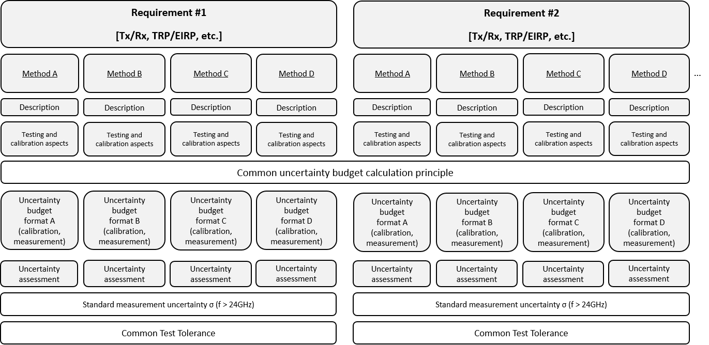
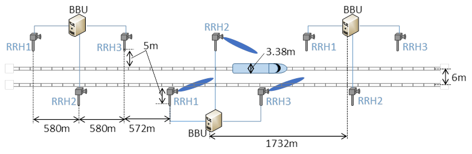

Foreword
========

This Technical Specification has been produced by the 3rd Generation
Partnership Project (3GPP).

The contents of the present document are subject to continuing work
within the TSG and may change following formal TSG approval. Should the
TSG modify the contents of the present document, it will be re-released
by the TSG with an identifying change of release date and an increase in
version number as follows:

Version x.y.z

where:

x the first digit:

1 presented to TSG for information;

2 presented to TSG for approval;

3 or greater indicates TSG approved document under change control.

y the second digit is incremented for all changes of substance, i.e.
technical enhancements, corrections, updates, etc.

z the third digit is incremented when editorial only changes have been
incorporated in the document.

 

1 Scope
=======

The present document establishes the minimum RF requirements for NR User
Equipment (UE) operating on frequency Range 1.

2 References
============

The following documents contain provisions which, through reference in
this text, constitute provisions of the present document.

References are either specific (identified by date of publication,
edition number, version number, etc.) or non‑specific.

For a specific reference, subsequent revisions do not apply.

For a non-specific reference, the latest version applies. In the case of
a reference to a 3GPP document (including a GSM document), a
non-specific reference implicitly refers to the latest version of that
document in the same Release as the present document.

\[1\] 3GPP TR 21.905: \"Vocabulary for 3GPP Specifications\".

\[2\] 3GPP TS 38.101-2: \"NR; User Equipment (UE) radio transmission and
reception; Part 2: Range 2 Standalone\".

\[3\] 3GPP TS 38.101-3: \"NR; User Equipment (UE) radio transmission and
reception; Part 3: Range 1 and Range 2 Interworking operation with other
radios\".

\[4\] 3GPP TS 38.521-1: \"NR; User Equipment (UE) conformance
specification; Radio transmission and reception; Part 1: Range 1
Standalone\".

\[5\] Recommendation ITU-R M.1545: \"Measurement uncertainty as it
applies to test limits for the terrestrial component of International
Mobile Telecommunications-2000\".

\[6\] 3GPP TS 38.211: \"NR; Physical channels and modulation\".

\[7\] 3GPP TS 38.331: \"Radio Resource Control (RRC) protocol
specification\".

\[8\] 3GPP TS 38.213: \"NR; Physical layer procedures for control\".

\[9\] ITU-R Recommendation SM.329-10, \"Unwanted emissions in the
spurious domain\".

\[10\] 3GPP TS 38.214: \"NR; Physical layer procedures for data\".

3 Definitions, symbols and abbreviations
========================================

3.1 Definitions
---------------

For the purposes of the present document, the terms and definitions
given in 3GPP TR 21.905 \[1\] and the following apply. A term defined in
the present document takes precedence over the definition of the same
term, if any, in 3GPP TR 21.905 \[1\].

**Aggregated Channel Bandwidth**: The RF bandwidth in which a UE
transmits and receives multiple contiguously aggregated carriers.

**Carrier aggregation**: Aggregation of two or more component carriers
in order to support wider transmission bandwidths.

**Carrier aggregation band**: A set of one or more operating bands
across which multiple carriers are aggregated with a specific set of
technical requirements.

**Carrier aggregation bandwidth class**: A class defined by the
aggregated transmission bandwidth configuration and maximum number of
component carriers supported by a UE.

**Carrier aggregation configuration**: A combination of CA operating
band(s) and CA bandwidth class(es) supported by a UE.

**Contiguous carriers**: A set of two or more carriers configured in a
spectrum block where there are no RF requirements based on co-existence
for un-coordinated operation within the spectrum block.

**Contiguous resource allocation**: A resource allocation of consecutive
resource blocks within one carrier or across contiguously aggregated
carriers. The gap between contiguously aggregated carriers due to the
nominal channel spacing is allowed.

**Contiguous spectrum**: Spectrum consisting of a contiguous block of
spectrum with no sub-block gaps.

**Inter-band carrier aggregation:** Carrier aggregation of component
carriers in different operating bands.

NOTE: Carriers aggregated in each band can be contiguous or
non-contiguous.

**Intra-band contiguous carrier aggregation**: Contiguous carriers
aggregated in the same operating band.

**Intra-band non-contiguous carrier aggregation**: Non-contiguous
carriers aggregated in the same operating band.

**Sub-block**: This is one contiguous allocated block of spectrum for
transmission and reception by the same UE. There may be multiple
instances of sub-blocks within an RF bandwidth.

**Sub-block bandwidth**: The bandwidth of one sub-block.

**Sub-block gap**: A frequency gap between two consecutive sub-blocks
within an RF bandwidth, where the RF requirements in the gap are based
on co-existence for un-coordinated operation.

**UE transmission bandwidth configuration**: Set of resource blocks
located within the UE channel bandwidth which may be used for
transmitting or receiving by the UE.

**Vehicular UE:** A UE embedded in a vehicle, permanently connected to
an embedded antenna system that radiates externally for NR operating
bands.

NOTE: Vehicular UE does not refer to other UE form factors placed inside
the vehicle.

3.2 Symbols
-----------

For the purposes of the present document, the following symbols apply:

ΔF~Global~ Granularity of the global frequency raster

ΔF~Raster~ Band dependent channel raster granularity

Δf~OOB~ Δ Frequency of Out Of Band emission

ΔF~TX-RX~ Δ Frequency of default TX-RX separation of the FDD *operating
band*

ΔP~PowerClass~ Adjustment to maximum output power for a given power
class

∆~RB~ The starting frequency offset between the allocated RB and the
measured non-allocated RB

ΔR~IB,c~ Allowed reference sensitivity relaxation due to support for
inter-band CA operation, for serving cell *c*

ΔR~IB,4R~ Reference sensitivity adjustment due to support for 4 antenna
ports

Δ~Shift~ Channel raster offset

∆T~C~ Allowed operating band edge transmission power relaxation

∆T~C,*c*~ Allowed operating band edge transmission power relaxation for
serving cell *c*

ΔT~IB,c~ Allowed maximum configured output power relaxation due to
support for inter-band CA operation and due to support for SUL
operations, for serving cell *c*

BW~Channel~ Channel bandwidth

BW~Channel,block~ Sub-block bandwidth, expressed in MHz.
BW~Channel,block~= F~edge,block,high~- F~edge,block,low~

BW~Channel\_CA~ Aggregated channel bandwidth, expressed in MHz

BW~Channel,max~ Maximum channel bandwidth supported among all bands in a
release

BW~GB~ max( BW~GB,Channel(*k*)~ )

BW~GB,Channel(k)~ Minimum guard band defined in clause 5.3A.1 of carrier
*k*

BW~DL~ Channel bandwidth for DL

BW~UL~ Channel bandwidth for UL

BW~interferer~ Bandwidth of the interferer

Ceil(x) Rounding upwards; ceil(x) is the smallest integer such that
ceil(x) ≥ x

Floor(x) Rounding downwards; floor(x) is the greatest integer such that
floor(x) ≤ x

F~C~ Center frequency of a carrier for a numerology defined by the *RF
reference frequency* on the channel raster mapped to the carrier
according to sub-clause 5.4.2.2

**F~C,block,\ high~** Fc of the highest transmitted/received carrier in
a *sub-block*

**F~C,block,\ low~** Fc of the lowest transmitted/received carrier in a
*sub-block*

F~C,low~ The Fc of the lowest carrier, expressed in MHz

F~C,high~ The Fc of the highest carrier, expressed in MHz

F~DL\_low~ The lowest frequency of the downlink *operating band*

F~DL\_high~ The highest frequency of the downlink *operating band*

F~UL\_low~ The lowest frequency of the uplink *operating band*

F~UL\_high~ The highest frequency of the uplink *operating band*

F~edge,block,low~ The lower *sub-block* edge, where F~edge,block,low~ =
F~C,block,low~ - F~offset,\ low.~

F~edge,block,high~ The upper *sub-block* edge, where F~edge,block,high~
= F~C,block,high~ + F~offset,\ high.~

F~edge\ ,\ low~ The *lower edge* of *aggregated channel bandwidth*,
expressed in MHz. F~edge,low~ = F~C,low~ - F~offset,low.~

F~edge,\ high~ The *higher edge* of *aggregated channel bandwidth*,
expressed in MHz. F~edge,high~ = F~C,high~ + F~offset,high.~

F~Interferer~ (offset) Frequency offset of the interferer (between the
center frequency of the interferer and the carrier frequency of the
carrier measured). For intra-band contiguous CA, the F~Interferer~
(offset) is the frequency separation of the center frequency of the
carrier closest to the interferer and the center frequency of the
interferer

F~Interferer~ Frequency of the interferer

F~Ioffset~ Frequency offset of the interferer (between the center
frequency of the interferer and the closest edge of the carrier
measured)

F~offset~ Frequency offset from F~C\_high~ to the *higher edge* or
F~C\_low~ to the *lower edge.*

F~offset,high~ Frequency offset from F~C,high~ to the upper *UE RF
Bandwidth edge*, or from **F~C,block,\ high\ ~**to the upper sub-block
edge

F~offset,low~ Frequency offset from F~C,low~ to the lower *UE RF
Bandwidth edge*, or from **F~C,block,\ low\ ~**to the lower sub-block
edge

F~OOB~ The boundary between the NR out of band emission and spurious
emission domains

F~REF~ RF reference frequency

F~REF-Offs~ Offset used for calculating F~REF~

F~REF,\ shift~ RF reference frequency for Supplementary Uplink (SUL)
bands, the uplink of all FDD bands, and TDD bands

F~uw~ (offset) The frequency separation of the center frequency of the
carrier closest to the interferer and the center frequency of the
interferer

GB~Channel~ Minimum guard band defined in clause 5.3.3, expressed in kHz

L~CRB~ Transmission bandwidth which represents the length of a
contiguous resource block allocation expressed in units of resources
blocks

Max() The largest of given numbers

Min() The smallest of given numbers

Physical resource block number

NR~ACLR~ NR ACLR

N~RB~ Transmission bandwidth configuration, expressed in units of
resource blocks

N~RB\_agg~ The number of the aggregated RBs within the fully allocated
aggregated channel bandwidth

$N_{RB_{\_\text{agg}}} = \sum_{i = 1}^{j}{N_{RB_{i}}*2^{\mu_{i}}}$ for
carrier 1 to j, where μ is defined in TS 38.211 \[6\]

N~RB,c~ The transmission bandwidth configuration of component carrier c,
expressed in units of resource blocks

$N_{RB,cj} = N_{RB_{j}}*2^{\mu_{j}}$ for carrier j, where *μ* is defined
in TS 38.211 \[6\]

N~RB,low~ The transmission bandwidth configurations according to Table
5.3.2-1 for the lowest assigned component carrier in section 5.3A.1

N~RB,high~ The transmission bandwidth configurations according to Table
5.3.2-1 for the highest assigned component carrier in section 5.3A.1

N~REF~ NR Absolute Radio Frequency Channel Number (NR-ARFCN)

N~REF-Offs~ Offset used for calculating N~REF~

P~CMAX~ The configured maximum UE output power

P~CMAX~, *~c~* The configured maximum UE output power for serving cell
*c*

P~CMAX~, *~f~*, *~c~* The configured maximum UE output power for carrier
*f* of serving cell *c* in each slot

P~EMAX~ Maximum allowed UE output power signalled by higher layers

P~EMAX,\ *c*~ Maximum allowed UE output power signalled by higher layers
for serving cell *c*

P~Interferer~ Modulated mean power of the interferer

P~largest\ BW~ Power of the largest transmission bandwidth configuration
of the component carriers in the bandwidth combination

P~PowerClass~ The nominal UE power (i.e., no tolerance)

P-MPR*~c~* Power Management Maximum Power Reduction for serving cell *c*

P~RB~ The transmitted power per allocated RB, measured in dBm

P~UMAX~ The measured configured maximum UE output power

Puw Power of an unwanted DL signal

Pw Power of a wanted DL signal

RB~start~ The lowest RB index of transmitted resource blocks

SCS~c~ SCS for the component carrier c, expressed in kHz

SCS~largest\ BW~ SCS for the largest transmission bandwidth
configuration of the component carriers in the bandwidth combination,
expressed in kHz

SCS~low~ SCS for the lowest assigned component carrier in section
5.3A.1, expressed in kHz

SCS~high~ SCS for the highest assigned component carrier in section
5.3A.1, expressed in kHz

T(P~CMAX~, *~f~*, *~c~*) Tolerance for applicable values of P~CMAX~,
*~f~*, *~c~* for configured maximum UE output power for carrier *f* of
serving cell *c*

T~L,c~ Absolute value of the lower tolerance for the applicable
*operating band* as specified in section 6.2.1

SS~REF~ SS block reference frequency position

UTRA~ACLR~ UTRA ACLR

3.3 Abbreviations
-----------------

For the purposes of the present document, the abbreviations given in
3GPP TR 21.905 \[1\] and the following apply. An abbreviation defined in
the present document takes precedence over the definition of the same
abbreviation, if any, in 3GPP TR 21.905 \[1\].

ACLR Adjacent Channel Leakage Ratio

ACS Adjacent Channel Selectivity

A-MPR Additional Maximum Power Reduction

BS Base Station

BW Bandwidth

BWP Bandwidth Part

CA Carrier Aggregation

CA\_nX-nY Inter-band CA of component carrier(s) in one sub-block within
Band nX and component carrier(s) in one sub-block within Band nY where
nX and nY are the applicable NR *operating bands*

CC Component Carriers

CP-OFDM Cyclic Prefix-OFDM

CW Continuous Wave

DC Dual Connectivity

DFT-s-OFDM Discrete Fourier Transform-spread-OFDM

DM-RS Demodulation Reference Signal

DTX Discontinuous TransmissionE-UTRA Evolved UTRA

EVM Error Vector Magnitude

FR Frequency Range

FRC Fixed Reference Channel

GSCN Global Synchronization Channel Number

IBB In-band Blocking

IDFT Inverse Discrete Fourier Transformation

ITU‑R Radiocommunication Sector of the International Telecommunication
Union

MBW Measurement bandwidth

MOP Maximum Output Power

MPR Allowed maximum power reduction

MSD Maximum Sensitivity Degradation

NR New Radio

NR-ARFCN NR Absolute Radio Frequency Channel Number

NS Network Signalling

OCNG OFDMA Channel Noise Generator

OOB Out-of-band

P-MPR Power Management Maximum Power Reduction

PRB Physical Resource Block

QAM Quadrature Amplitude Modulation

RE Resource Element

REFSENS Reference Sensitivity

RF Radio Frequency

RMS Root Mean Square (value)

RSRP Reference Signal Receiving Power

Rx Receiver

SC Single Carrier

SCS Subcarrier spacing

SDL Supplementary Downlink

SEM Spectrum Emission Mask

SNR Signal-to-Noise Ratio

SRS Sounding Reference Symbol

SUL Supplementary uplink

SS Synchronization Symbol

SUL Supplementary uplink

TAE Time Alignment Error

Tx Transmitter

UL MIMO Uplink Multiple Antenna transmission

4 General
=========

4.1 Relationship between minimum requirements and test requirements
-------------------------------------------------------------------

The present document is a Single-RAT specification for NR UE, covering
RF characteristics and minimum performance requirements. Conformance to
the present specification is demonstrated by fulfilling the test
requirements specified in the conformance specification 3GPP TS 38.521-1
\[4\].

The Minimum Requirements given in this specification make no allowance
for measurement uncertainty. The test specification TS 38.521-1 \[4\]
defines test tolerances. These test tolerances are individually
calculated for each test. The test tolerances are used to relax the
minimum requirements in this specification to create test requirements.
For some requirements, including regulatory requirements, the test
tolerance is set to zero.

The measurement results returned by the test system are compared -
without any modification - against the test requirements as defined by
the shared risk principle.

The shared risk principle is defined in Recommendation ITU‑R M.1545
\[5\].

4.2 Applicability of minimum requirements
-----------------------------------------

a\) In this specification the Minimum Requirements are specified as
general requirements and additional requirements. Where the Requirement
is specified as a general requirement, the requirement is mandated to be
met in all scenarios

b\) For specific scenarios for which an additional requirement is
specified, in addition to meeting the general requirement, the UE is
mandated to meet the additional requirements.

c\) The spurious emissions power requirements are for the long-term
average of the power. For the purpose of reducing measurement
uncertainty it is acceptable to average the measured power over a period
of time sufficient to reduce the uncertainty due to the statistical
nature of the signal

d\) All the requirements for intra-band contiguous and non-contiguous CA
apply under the assumption of the same slot format indicated by
*TDD-UL-DL-ConfigurationCommon and TDD-UL-DL-ConfigurationDedicated* in
the PCell and SCells for NR SA.

4.3 Specification suffix information
------------------------------------

Unless stated otherwise the following suffixes are used for indicating
at 2^nd^ level clause, shown in Table 4.3-1.

Table 4.3-1: Definition of suffixes

  Clause suffix   Variant
  --------------- ----------------------------
  None            Single Carrier
  A               Carrier Aggregation (CA)
  B               Dual-Connectivity (DC)
  C               Supplementary Uplink (SUL)
  D               UL MIMO

A terminal which supports the above features needs to meet both the
general requirements and the additional requirement applicable to the
additional clause (suffix A, B, C and D) in clauses 5, 6 and 7. Where
there is a difference in requirement between the general requirements
and the additional clause requirements (suffix A, B, C and D) in clauses
5, 6 and 7, the tighter requirements are applicable unless stated
otherwise in the additional clause.

A terminal which supports more than one feature in clauses 5, 6 and 7
shall meet all of the separate corresponding requirements.

For a terminal that supports SUL for the band combination specified in
Table 5.2C-1, the current version of the specification assumes the
terminal is configured with active transmission either on UL carrier or
SUL carrier at any time in one serving cell and the UE requirements for
single carrier shall apply for the active UL or SUL carrier accordingly.
For a terminal that supports SUL, the current version of the
specification assumes the terminal is not configured with UL MIMO on SUL
carrier.

5 Operating bands and channel arrangement
=========================================

5.1 General
-----------

The channel arrangements presented in this clause are based on the
operating bands and channel bandwidths defined in the present release of
specifications.

NOTE: Other operating bands and channel bandwidths may be considered in
future releases.

Requirements throughout the RF specifications are in many cases defined
separately for different frequency ranges (FR). The frequency ranges in
which NR can operate according to this version of the specification are
identified as described in Table 5.1-1.

Table 5.1-1: Definition of frequency ranges

  Frequency range designation   Corresponding frequency range
  ----------------------------- -------------------------------
  FR1                           410 MHz -- 7125 MHz
  FR2                           24250 MHz -- 52600 MHz

The present specification covers FR1 operating bands.

5.2 Operating bands
-------------------

NR is designed to operate in the FR1 operating bands defined in
Table 5.2-1.

Table 5.2-1: NR operating bands in FR1

+-----------------+-----------------+-----------------+-------------+
| NR operating    | Uplink (UL)     | Downlink (DL)   | Duplex Mode |
| band            | *operating      | *operating      |             |
|                 | band*\          | band*\          |             |
|                 | BS receive / UE | BS transmit /   |             |
|                 | transmit        | UE receive      |             |
|                 |                 |                 |             |
|                 | F~UL\_low~ --   | F~DL\_low~ --   |             |
|                 | F~UL\_high~     | F~DL\_high~     |             |
+=================+=================+=================+=============+
| n1              | 1920 MHz --     | 2110 MHz --     | FDD         |
|                 | 1980 MHz        | 2170 MHz        |             |
+-----------------+-----------------+-----------------+-------------+
| n2              | 1850 MHz --     | 1930 MHz --     | FDD         |
|                 | 1910 MHz        | 1990 MHz        |             |
+-----------------+-----------------+-----------------+-------------+
| n3              | 1710 MHz --     | 1805 MHz --     | FDD         |
|                 | 1785 MHz        | 1880 MHz        |             |
+-----------------+-----------------+-----------------+-------------+
| n5              | 824 MHz -- 849  | 869 MHz -- 894  | FDD         |
|                 | MHz             | MHz             |             |
+-----------------+-----------------+-----------------+-------------+
| n7              | 2500 MHz --     | 2620 MHz --     | FDD         |
|                 | 2570 MHz        | 2690 MHz        |             |
+-----------------+-----------------+-----------------+-------------+
| n8              | 880 MHz -- 915  | 925 MHz -- 960  | FDD         |
|                 | MHz             | MHz             |             |
+-----------------+-----------------+-----------------+-------------+
| n12             | 699 MHz -- 716  | 729 MHz -- 746  | FDD         |
|                 | MHz             | MHz             |             |
+-----------------+-----------------+-----------------+-------------+
| n20             | 832 MHz -- 862  | 791 MHz -- 821  | FDD         |
|                 | MHz             | MHz             |             |
+-----------------+-----------------+-----------------+-------------+
| n25             | 1850 MHz --     | 1930 MHz --     | FDD         |
|                 | 1915 MHz        | 1995 MHz        |             |
+-----------------+-----------------+-----------------+-------------+
| n28             | 703 MHz -- 748  | 758 MHz -- 803  | FDD         |
|                 | MHz             | MHz             |             |
+-----------------+-----------------+-----------------+-------------+
| n34             | 2010 MHz --     | 2010 MHz --     | TDD         |
|                 | 2025 MHz        | 2025 MHz        |             |
+-----------------+-----------------+-----------------+-------------+
| n38             | 2570 MHz --     | 2570 MHz --     | TDD         |
|                 | 2620 MHz        | 2620 MHz        |             |
+-----------------+-----------------+-----------------+-------------+
| n39             | 1880 MHz --     | 1880 MHz --     | TDD         |
|                 | 1920 MHz        | 1920 MHz        |             |
+-----------------+-----------------+-----------------+-------------+
| n40             | 2300 MHz --     | 2300 MHz --     | TDD         |
|                 | 2400 MHz        | 2400 MHz        |             |
+-----------------+-----------------+-----------------+-------------+
| n41             | 2496 MHz --     | 2496 MHz --     | TDD         |
|                 | 2690 MHz        | 2690 MHz        |             |
+-----------------+-----------------+-----------------+-------------+
| n50             | 1432 MHz --     | 1432 MHz --     | TDD^1^      |
|                 | 1517 MHz        | 1517 MHz        |             |
+-----------------+-----------------+-----------------+-------------+
| n51             | 1427 MHz --     | 1427 MHz --     | TDD         |
|                 | 1432 MHz        | 1432 MHz        |             |
+-----------------+-----------------+-----------------+-------------+
| n66             | 1710 MHz --     | 2110 MHz --     | FDD         |
|                 | 1780 MHz        | 2200 MHz        |             |
+-----------------+-----------------+-----------------+-------------+
| n70             | 1695 MHz --     | 1995 MHz --     | FDD         |
|                 | 1710 MHz        | 2020 MHz        |             |
+-----------------+-----------------+-----------------+-------------+
| n71             | 663 MHz -- 698  | 617 MHz -- 652  | FDD         |
|                 | MHz             | MHz             |             |
+-----------------+-----------------+-----------------+-------------+
| n74             | 1427 MHz --     | 1475 MHz --     | FDD         |
|                 | 1470 MHz        | 1518 MHz        |             |
+-----------------+-----------------+-----------------+-------------+
| n75             | N/A             | 1432 MHz --     | SDL^2,3^    |
|                 |                 | 1517 MHz        |             |
+-----------------+-----------------+-----------------+-------------+
| n76             | N/A             | 1427 MHz --     | SDL^3^      |
|                 |                 | 1432 MHz        |             |
+-----------------+-----------------+-----------------+-------------+
| n77             | 3300 MHz --     | 3300 MHz --     | TDD         |
|                 | 4200 MHz        | 4200 MHz        |             |
+-----------------+-----------------+-----------------+-------------+
| n78             | 3300 MHz --     | 3300 MHz --     | TDD         |
|                 | 3800 MHz        | 3800 MHz        |             |
+-----------------+-----------------+-----------------+-------------+
| n79             | 4400 MHz --     | 4400 MHz --     | TDD         |
|                 | 5000 MHz        | 5000 MHz        |             |
+-----------------+-----------------+-----------------+-------------+
| n80             | 1710 MHz --     | N/A             | SUL         |
|                 | 1785 MHz        |                 |             |
+-----------------+-----------------+-----------------+-------------+
| n81             | 880 MHz -- 915  | N/A             | SUL         |
|                 | MHz             |                 |             |
+-----------------+-----------------+-----------------+-------------+
| n82             | 832 MHz -- 862  | N/A             | SUL         |
|                 | MHz             |                 |             |
+-----------------+-----------------+-----------------+-------------+
| n83             | 703 MHz -- 748  | N/A             | SUL         |
|                 | MHz             |                 |             |
+-----------------+-----------------+-----------------+-------------+
| n84             | 1920 MHz --     | N/A             | SUL         |
|                 | 1980 MHz        |                 |             |
+-----------------+-----------------+-----------------+-------------+
| n86             | 1710 MHz --     | N/A             | SUL         |
|                 | 1780 MHz        |                 |             |
+-----------------+-----------------+-----------------+-------------+
| NOTE 1: UE that |                 |                 |             |
| complies with   |                 |                 |             |
| the NR Band n50 |                 |                 |             |
| minimum         |                 |                 |             |
| requirements in |                 |                 |             |
| this            |                 |                 |             |
| specification   |                 |                 |             |
| shall also      |                 |                 |             |
| comply with the |                 |                 |             |
| NR Band n51     |                 |                 |             |
| minimum         |                 |                 |             |
| requirements.   |                 |                 |             |
|                 |                 |                 |             |
| NOTE 2: UE that |                 |                 |             |
| complies with   |                 |                 |             |
| the NR Band n75 |                 |                 |             |
| minimum         |                 |                 |             |
| requirements in |                 |                 |             |
| this            |                 |                 |             |
| specification   |                 |                 |             |
| shall also      |                 |                 |             |
| comply with the |                 |                 |             |
| NR Band n76     |                 |                 |             |
| minimum         |                 |                 |             |
| requirements.   |                 |                 |             |
|                 |                 |                 |             |
| NOTE 3: For SDL |                 |                 |             |
| bands, downlink |                 |                 |             |
| configuration   |                 |                 |             |
| for RRM         |                 |                 |             |
| performance     |                 |                 |             |
| testing is same |                 |                 |             |
| as FDD.         |                 |                 |             |
+-----------------+-----------------+-----------------+-------------+

5.2A Operating bands for CA
---------------------------

### 5.2A.1 Intra-band CA

NR intra-band contiguous carrier aggregation is designed to operate in
the operating bands defined in Table 5.2A.1-1, where all operating bands
are within FR1.

Table 5.2A.1-1: Intra-band contiguous CA operating bands in FR1

+-----------------------------------------------------+---------------+
| NR CA Band                                          | NR Band       |
|                                                     |               |
|                                                     | (Table 5.2-1) |
+=====================================================+===============+
| CA\_n41^1^                                          | n41           |
+-----------------------------------------------------+---------------+
| CA\_n77^1^                                          | n77           |
+-----------------------------------------------------+---------------+
| CA\_n78^1^                                          | n78           |
+-----------------------------------------------------+---------------+
| CA\_n79^1^                                          | n79           |
+-----------------------------------------------------+---------------+
| NOTE 1: The minimum requirements only apply for     |               |
| non‑simultaneous Tx/Rx between all carriers.        |               |
+-----------------------------------------------------+---------------+

### 5.2A.2 Inter-band CA

NR inter-band carrier aggregation is designed to operate in the
operating bands defined in Table 5.2A.2.1-1, where all operating bands
are within FR1.

If the mandatory simultaneous Rx/Tx capability applies for a lower order
band combination, when the applicable lower order band combination is a
band pair in a higher order band combination, the mandatory simultaneous
Rx/Tx capability also applies for the band pair in the higher order band
combination.

Table 5.2A.2-1: Void

#### 5.2A.2.1 Inter-band CA (**two bands)**

Table 5.2A.2.1-1: Inter-band CA operating bands involving FR1 (two
bands)

+-----------------------------------------------------+---------------+
| NR CA Band                                          | NR Band       |
|                                                     |               |
|                                                     | (Table 5.2-1) |
+=====================================================+===============+
| CA\_n3-n77^1^                                       | n3, n77       |
+-----------------------------------------------------+---------------+
| CA\_n3-n78^1^                                       | n3, n78       |
+-----------------------------------------------------+---------------+
| CA\_n3-n79^1^                                       | n3, n79       |
+-----------------------------------------------------+---------------+
| CA\_n8-n75^1^                                       | n8, n75       |
+-----------------------------------------------------+---------------+
| CA n8-n78^1^                                        | n8, n78       |
+-----------------------------------------------------+---------------+
| CA\_n8-n79^1^                                       | n8, n79       |
+-----------------------------------------------------+---------------+
| CA\_n28-n75^2^                                      | n28, n75      |
+-----------------------------------------------------+---------------+
| CA\_n28-n78^1^                                      | n28, n78      |
+-----------------------------------------------------+---------------+
| CA\_n41-n78                                         | n41, n78      |
+-----------------------------------------------------+---------------+
| CA\_n75-n78^1^                                      | n75, n78      |
+-----------------------------------------------------+---------------+
| CA\_n76-n78^1^                                      | n76, n78      |
+-----------------------------------------------------+---------------+
| CA\_n77-n79^4^                                      | n77, n79      |
+-----------------------------------------------------+---------------+
| CA\_n78-n79^3^                                      | n78, n79      |
+-----------------------------------------------------+---------------+
| NOTE 1: Applicable for UE supporting inter-band     |               |
| carrier aggregation with mandatory simultaneous     |               |
| Rx/Tx capability.                                   |               |
|                                                     |               |
| NOTE 2: The frequency range in band n28 is          |               |
| restricted for this band combination to 703-733 MHz |               |
| for the UL and 758-788 MHz for the DL.              |               |
|                                                     |               |
| NOTE 3: For UEs supporting band n77, the minimum    |               |
| requirements apply only when there is               |               |
| non-simultaneous Rx/Tx operation between n78-n79 NR |               |
| carriers. This restriction applies also for these   |               |
| carriers when applicable NR CA configuration is     |               |
| part of a higher order configuration.               |               |
|                                                     |               |
| NOTE 4: The minimum requirements apply only when    |               |
| there is non-simultaneous Rx/Tx operation between   |               |
| n77-n79 NR carriers. This restriction applies also  |               |
| for these carriers when applicable NR CA            |               |
| configuration is part of a higher order             |               |
| configuration.                                      |               |
+-----------------------------------------------------+---------------+

5.2B Void
---------

5.2C Operating band combination for SUL
---------------------------------------

NR operation is designed to operate in the operating band combination
defined in Table 5.2C-1, where all operating bands are within FR1.

If the mandatory simultaneous Rx/Tx capability applies for a lower order
band combination, when the applicable lower order band combination is a
band pair in a higher order band combination, the mandatory simultaneous
Rx/Tx capability also applies for the band pair in the higher order band
combination.

Table 5.2C-1: Operating band combination for SUL in FR1

+-----------------------------------------------------+---------------+
| NR Band combination for SUL                         | NR Band       |
|                                                     |               |
|                                                     | (Table 5.2-1) |
+=====================================================+===============+
| SUL\_n78-n80^2^                                     | n78, n80      |
+-----------------------------------------------------+---------------+
| SUL\_n78-n81^2^                                     | n78, n81      |
+-----------------------------------------------------+---------------+
| SUL\_n78-n82^2^                                     | n78, n82      |
+-----------------------------------------------------+---------------+
| SUL\_n78-n83^2^                                     | n78, n83      |
+-----------------------------------------------------+---------------+
| SUL\_n78-n84^2^                                     | n78, n84      |
+-----------------------------------------------------+---------------+
| SUL\_n78-n86^2^                                     | n78, n86      |
+-----------------------------------------------------+---------------+
| SUL\_n79-n80^2^                                     | n79, n80      |
+-----------------------------------------------------+---------------+
| SUL\_n79-n81^2^                                     | n79, n81      |
+-----------------------------------------------------+---------------+
| NOTE 1: If a UE is configured with both NR UL and   |               |
| NR SUL carriers in a cell, the switching time       |               |
| between NR UL carrier and NR SUL carrier is 0 us.   |               |
|                                                     |               |
| NOTE 2: For UE supporting SUL band combination      |               |
| simultaneous Rx/Tx capability is mandatory.         |               |
|                                                     |               |
| NOTE 3: For UE supporting SUL band combination, UL  |               |
| MIMO is not configured on SUL carrier.              |               |
+-----------------------------------------------------+---------------+

5.3 UE channel bandwidth
------------------------

### 5.3.1 General

The UE channel bandwidth supports a single NR RF carrier in the uplink
or downlink at the UE. From a BS perspective, different UE channel
bandwidths may be supported within the same spectrum for transmitting to
and receiving from UEs connected to the BS. Transmission of multiple
carriers to the same UE (CA) or multiple carriers to different UEs
within the BS channel bandwidth can be supported.

From a UE perspective, the UE is configured with one or more BWP /
carriers, each with its own UE channel bandwidth. The UE does not need
to be aware of the BS channel bandwidth or how the BS allocates
bandwidth to different UEs.

The placement of the UE channel bandwidth for each UE carrier is
flexible but can only be completely within the BS channel bandwidth.

The relationship between the channel bandwidth, the guardband and the
maximum transmission bandwidth configuration is shown in Figure 5.3.1-1.

{width="6.043055555555555in" height="3.0in"}

Figure 5.3.1-1: Definition of the channel bandwidth and the maximum
transmission bandwidth configuration for one NR channel

### 5.3.2 Maximum transmission bandwidth configuration

The maximum transmission bandwidth configuration N~RB~ for each UE
channel bandwidth and subcarrier spacing is specified in Table 5.3.2-1.

Table 5.3.2-1: Maximum transmission bandwidth configuration N~RB~

  ----------- ------- -------- -------- -------- -------- -------- -------- -------- -------- -------- -------- ---------
  SCS (kHz)   5 MHz   10 MHz   15 MHz   20 MHz   25 MHz   30 MHz   40 MHz   50 MHz   60 MHz   80 MHz   90 MHz   100 MHz
              N~RB~   N~RB~    N~RB~    N~RB~    N~RB~    N~RB~    N~RB~    N~RB~    N~RB~    N~RB~    N~RB~    N~RB~
  15          25      52       79       106      133      160      216      270      N/A      N/A      N/A      N/A
  30          11      24       38       51       65       78       106      133      162      217      245      273
  60          N/A     11       18       24       31       38       51       65       79       107      121      135
  ----------- ------- -------- -------- -------- -------- -------- -------- -------- -------- -------- -------- ---------

### 5.3.3 Minimum guardband and transmission bandwidth configuration

The minimum guardband for each UE channel bandwidth and SCS is specified
in Table 5.3.3-1,

Table 5.3.3-1: Minimum guardband for each UE channel bandwidth and SCS
(kHz)

  ----------- ------- -------- -------- -------- -------- -------- -------- -------- -------- -------- -------- ---------
  SCS (kHz)   5 MHz   10 MHz   15 MHz   20 MHz   25 MHz   30 MHz   40 MHz   50 MHz   60 MHz   80 MHz   90 MHz   100 MHz
  15          242.5   312.5    382.5    452.5    522.5    592.5    552.5    692.5    N/A      N/A      N/A      N/A
  30          505     665      645      805      785      945      905      1045     825      925      885      845
  60          N/A     1010     990      1330     1310     1290     1610     1570     1530     1450     1410     1370
  ----------- ------- -------- -------- -------- -------- -------- -------- -------- -------- -------- -------- ---------

NOTE: The minimum guardbands have been calculated using the following
equation: GB~channel~ = (BW~Channel~ x 1000 (kHz) - N~RB~ x SCS x 12) /
2 - SCS/2, where N~RB~ are from Table 5.3.2-1 and GB~channel~ expressed
in kHz.

Figure 5.3.3-1: Void

The number of RBs configured in any channel bandwidth shall ensure that
the minimum guardband specified in this clause is met.

{width="4.2in" height="2.279861111111111in"}

Figure 5.3.3-2: UE PRB utilization

In the case that multiple numerologies are multiplexed in the same
symbol due to BS transmission of SSB, the minimum guardband on each side
of the carrier is the guardband applied at the configured channel
bandwidth for the numerology that is received immediately adjacent to
the guard.

If multiple numerologies are multiplexed in the same symbol and the UE
channel bandwidth is \>50 MHz, the minimum guardband applied adjacent to
15 kHz SCS shall be the same as the minimum guardband defined for 30 kHz
SCS for the same UE channel bandwidth.

{width="4.559722222222222in"
height="1.8958333333333333in"}

Figure 5.3.3-3 Guard band definition when transmitting multiple
numerologies

NOTE: Figure 5.3.3-3 is not intended to imply the size of any guard
between the two numerologies. Inter-numerology guard band within the
carrier is implementation dependent.

### 5.3.4 RB alignment

For each numerology, its common resource blocks are specified in Clause
4.4.4.3 in TS 38.211 \[6\], and the starting point of its transmission
bandwidth configuration on the common resource block grid for a given
channel bandwidth is indicated by an offset to \"Reference point A\" in
the unit of the numerology. The *UE transmission bandwidth
configuration* is indicated by the higher layer parameter
*carrierBandwidth* \[7\] and will fulfil the minimum UE guardband
requirement specified in Clause 5.3.3.

### 5.3.5 UE channel bandwidth per operating band

The requirements in this specification apply to the combination of
channel bandwidths, SCS and operating bands shown in Table 5.3.5-1. The
transmission bandwidth configuration in Table 5.3.2-1 shall be supported
for each of the specified channel bandwidths. The channel bandwidths are
specified for both the TX and RX path.

Table 5.3.5-1 Channel bandwidths for each NR band

<table>
<thead>
<tr class="header">
<th></th>
<th>NR band / SCS / UE Channel bandwidth</th>
<th></th>
<th></th>
<th></th>
<th></th>
<th></th>
<th></th>
<th></th>
<th></th>
<th></th>
<th></th>
<th></th>
<th></th>
</tr>
</thead>
<tbody>
<tr class="odd">
<td>NR Band</td>
<td>
SCS

kHz
</td>
<td>5 MHz</td>
<td>10 MHz</td>
<td>15 MHz</td>
<td>20 MHz</td>
<td>25 MHz</td>
<td>30 MHz</td>
<td>40 MHz</td>
<td>50 MHz</td>
<td>60 MHz</td>
<td>80 MHz</td>
<td>904 MHz</td>
<td>100 MHz</td>
</tr>
<tr class="even">
<td>n1</td>
<td>15</td>
<td>Yes</td>
<td>Yes</td>
<td>Yes</td>
<td>Yes</td>
<td></td>
<td></td>
<td></td>
<td></td>
<td></td>
<td></td>
<td></td>
<td></td>
</tr>
<tr class="odd">
<td></td>
<td>30</td>
<td></td>
<td>Yes</td>
<td>Yes</td>
<td>Yes</td>
<td></td>
<td></td>
<td></td>
<td></td>
<td></td>
<td></td>
<td></td>
<td></td>
</tr>
<tr class="even">
<td></td>
<td>60</td>
<td></td>
<td>Yes</td>
<td>Yes</td>
<td>Yes</td>
<td></td>
<td></td>
<td></td>
<td></td>
<td></td>
<td></td>
<td></td>
<td></td>
</tr>
<tr class="odd">
<td>n2</td>
<td>15</td>
<td>Yes</td>
<td>Yes</td>
<td>Yes</td>
<td>Yes</td>
<td></td>
<td></td>
<td></td>
<td></td>
<td></td>
<td></td>
<td></td>
<td></td>
</tr>
<tr class="even">
<td></td>
<td>30</td>
<td></td>
<td>Yes</td>
<td>Yes</td>
<td>Yes</td>
<td></td>
<td></td>
<td></td>
<td></td>
<td></td>
<td></td>
<td></td>
<td></td>
</tr>
<tr class="odd">
<td></td>
<td>60</td>
<td></td>
<td>Yes</td>
<td>Yes</td>
<td>Yes</td>
<td></td>
<td></td>
<td></td>
<td></td>
<td></td>
<td></td>
<td></td>
<td></td>
</tr>
<tr class="even">
<td>n3</td>
<td>15</td>
<td>Yes</td>
<td>Yes</td>
<td>Yes</td>
<td>Yes</td>
<td>Yes</td>
<td>Yes</td>
<td></td>
<td></td>
<td></td>
<td></td>
<td></td>
<td></td>
</tr>
<tr class="odd">
<td></td>
<td>30</td>
<td></td>
<td>Yes</td>
<td>Yes</td>
<td>Yes</td>
<td>Yes</td>
<td>Yes</td>
<td></td>
<td></td>
<td></td>
<td></td>
<td></td>
<td></td>
</tr>
<tr class="even">
<td></td>
<td>60</td>
<td></td>
<td>Yes</td>
<td>Yes</td>
<td>Yes</td>
<td>Yes</td>
<td>Yes</td>
<td></td>
<td></td>
<td></td>
<td></td>
<td></td>
<td></td>
</tr>
<tr class="odd">
<td>n5</td>
<td>15</td>
<td>Yes</td>
<td>Yes</td>
<td>Yes</td>
<td>Yes</td>
<td></td>
<td></td>
<td></td>
<td></td>
<td></td>
<td></td>
<td></td>
<td></td>
</tr>
<tr class="even">
<td></td>
<td>30</td>
<td></td>
<td>Yes</td>
<td>Yes</td>
<td>Yes</td>
<td></td>
<td></td>
<td></td>
<td></td>
<td></td>
<td></td>
<td></td>
<td></td>
</tr>
<tr class="odd">
<td></td>
<td>60</td>
<td></td>
<td></td>
<td></td>
<td></td>
<td></td>
<td></td>
<td></td>
<td></td>
<td></td>
<td></td>
<td></td>
<td></td>
</tr>
<tr class="even">
<td>n7</td>
<td>15</td>
<td>Yes</td>
<td>Yes</td>
<td>Yes</td>
<td>Yes</td>
<td></td>
<td></td>
<td></td>
<td></td>
<td></td>
<td></td>
<td></td>
<td></td>
</tr>
<tr class="odd">
<td></td>
<td>30</td>
<td></td>
<td>Yes</td>
<td>Yes</td>
<td>Yes</td>
<td></td>
<td></td>
<td></td>
<td></td>
<td></td>
<td></td>
<td></td>
<td></td>
</tr>
<tr class="even">
<td></td>
<td>60</td>
<td></td>
<td>Yes</td>
<td>Yes</td>
<td>Yes</td>
<td></td>
<td></td>
<td></td>
<td></td>
<td></td>
<td></td>
<td></td>
<td></td>
</tr>
<tr class="odd">
<td>n8</td>
<td>15</td>
<td>Yes</td>
<td>Yes</td>
<td>Yes</td>
<td>Yes</td>
<td></td>
<td></td>
<td></td>
<td></td>
<td></td>
<td></td>
<td></td>
<td></td>
</tr>
<tr class="even">
<td></td>
<td>30</td>
<td></td>
<td>Yes</td>
<td>Yes</td>
<td>Yes</td>
<td></td>
<td></td>
<td></td>
<td></td>
<td></td>
<td></td>
<td></td>
<td></td>
</tr>
<tr class="odd">
<td></td>
<td>60</td>
<td></td>
<td></td>
<td></td>
<td></td>
<td></td>
<td></td>
<td></td>
<td></td>
<td></td>
<td></td>
<td></td>
<td></td>
</tr>
<tr class="even">
<td>n12</td>
<td>15</td>
<td>Yes</td>
<td>Yes</td>
<td>Yes</td>
<td></td>
<td></td>
<td></td>
<td></td>
<td></td>
<td></td>
<td></td>
<td></td>
<td></td>
</tr>
<tr class="odd">
<td></td>
<td>30</td>
<td></td>
<td>Yes</td>
<td>Yes</td>
<td></td>
<td></td>
<td></td>
<td></td>
<td></td>
<td></td>
<td></td>
<td></td>
<td></td>
</tr>
<tr class="even">
<td></td>
<td>60</td>
<td></td>
<td></td>
<td></td>
<td></td>
<td></td>
<td></td>
<td></td>
<td></td>
<td></td>
<td></td>
<td></td>
<td></td>
</tr>
<tr class="odd">
<td>n20</td>
<td>15</td>
<td>Yes</td>
<td>Yes</td>
<td>Yes</td>
<td>Yes</td>
<td></td>
<td></td>
<td></td>
<td></td>
<td></td>
<td></td>
<td></td>
<td></td>
</tr>
<tr class="even">
<td></td>
<td>30</td>
<td></td>
<td>Yes</td>
<td>Yes</td>
<td>Yes</td>
<td></td>
<td></td>
<td></td>
<td></td>
<td></td>
<td></td>
<td></td>
<td></td>
</tr>
<tr class="odd">
<td></td>
<td>60</td>
<td></td>
<td></td>
<td></td>
<td></td>
<td></td>
<td></td>
<td></td>
<td></td>
<td></td>
<td></td>
<td></td>
<td></td>
</tr>
<tr class="even">
<td>n25</td>
<td>15</td>
<td>Yes</td>
<td>Yes</td>
<td>Yes</td>
<td>Yes</td>
<td></td>
<td></td>
<td></td>
<td></td>
<td></td>
<td></td>
<td></td>
<td></td>
</tr>
<tr class="odd">
<td></td>
<td>30</td>
<td></td>
<td>Yes</td>
<td>Yes</td>
<td>Yes</td>
<td></td>
<td></td>
<td></td>
<td></td>
<td></td>
<td></td>
<td></td>
<td></td>
</tr>
<tr class="even">
<td></td>
<td>60</td>
<td></td>
<td>Yes</td>
<td>Yes</td>
<td>Yes</td>
<td></td>
<td></td>
<td></td>
<td></td>
<td></td>
<td></td>
<td></td>
<td></td>
</tr>
<tr class="odd">
<td>n28</td>
<td>15</td>
<td>Yes</td>
<td>Yes</td>
<td>Yes</td>
<td>Yes5</td>
<td></td>
<td></td>
<td></td>
<td></td>
<td></td>
<td></td>
<td></td>
<td></td>
</tr>
<tr class="even">
<td></td>
<td>30</td>
<td></td>
<td>Yes</td>
<td>Yes</td>
<td>Yes5</td>
<td></td>
<td></td>
<td></td>
<td></td>
<td></td>
<td></td>
<td></td>
<td></td>
</tr>
<tr class="odd">
<td></td>
<td>60</td>
<td></td>
<td></td>
<td></td>
<td></td>
<td></td>
<td></td>
<td></td>
<td></td>
<td></td>
<td></td>
<td></td>
<td></td>
</tr>
<tr class="even">
<td>n34</td>
<td>15</td>
<td>Yes</td>
<td>Yes</td>
<td>Yes</td>
<td></td>
<td></td>
<td></td>
<td></td>
<td></td>
<td></td>
<td></td>
<td></td>
<td></td>
</tr>
<tr class="odd">
<td></td>
<td>30</td>
<td></td>
<td>Yes</td>
<td>Yes</td>
<td></td>
<td></td>
<td></td>
<td></td>
<td></td>
<td></td>
<td></td>
<td></td>
<td></td>
</tr>
<tr class="even">
<td></td>
<td>60</td>
<td></td>
<td>Yes</td>
<td>Yes</td>
<td></td>
<td></td>
<td></td>
<td></td>
<td></td>
<td></td>
<td></td>
<td></td>
<td></td>
</tr>
<tr class="odd">
<td>n38</td>
<td>15</td>
<td>Yes</td>
<td>Yes</td>
<td>Yes</td>
<td>Yes</td>
<td></td>
<td></td>
<td></td>
<td></td>
<td></td>
<td></td>
<td></td>
<td></td>
</tr>
<tr class="even">
<td></td>
<td>30</td>
<td></td>
<td>Yes</td>
<td>Yes</td>
<td>Yes</td>
<td></td>
<td></td>
<td></td>
<td></td>
<td></td>
<td></td>
<td></td>
<td></td>
</tr>
<tr class="odd">
<td></td>
<td>60</td>
<td></td>
<td>Yes</td>
<td>Yes</td>
<td>Yes</td>
<td></td>
<td></td>
<td></td>
<td></td>
<td></td>
<td></td>
<td></td>
<td></td>
</tr>
<tr class="even">
<td>n39</td>
<td>15</td>
<td>Yes</td>
<td>Yes</td>
<td>Yes</td>
<td>Yes</td>
<td>Yes</td>
<td>Yes</td>
<td>Yes</td>
<td></td>
<td></td>
<td></td>
<td></td>
<td></td>
</tr>
<tr class="odd">
<td></td>
<td>30</td>
<td></td>
<td>Yes</td>
<td>Yes</td>
<td>Yes</td>
<td>Yes</td>
<td>Yes</td>
<td>Yes</td>
<td></td>
<td></td>
<td></td>
<td></td>
<td></td>
</tr>
<tr class="even">
<td></td>
<td>60</td>
<td></td>
<td>Yes</td>
<td>Yes</td>
<td>Yes</td>
<td>Yes</td>
<td>Yes</td>
<td>Yes</td>
<td></td>
<td></td>
<td></td>
<td></td>
<td></td>
</tr>
<tr class="odd">
<td>n40</td>
<td>15</td>
<td>Yes9</td>
<td>Yes</td>
<td>Yes</td>
<td>Yes</td>
<td>Yes</td>
<td>Yes</td>
<td>Yes</td>
<td>Yes</td>
<td></td>
<td></td>
<td></td>
<td></td>
</tr>
<tr class="even">
<td></td>
<td>30</td>
<td></td>
<td>Yes</td>
<td>Yes</td>
<td>Yes</td>
<td>Yes</td>
<td>Yes</td>
<td>Yes</td>
<td>Yes</td>
<td>Yes</td>
<td>Yes</td>
<td></td>
<td></td>
</tr>
<tr class="odd">
<td></td>
<td>60</td>
<td></td>
<td>Yes</td>
<td>Yes</td>
<td>Yes</td>
<td>Yes</td>
<td>Yes</td>
<td>Yes</td>
<td>Yes</td>
<td>Yes</td>
<td>Yes</td>
<td></td>
<td></td>
</tr>
<tr class="even">
<td>n41</td>
<td>15</td>
<td></td>
<td>Yes</td>
<td>Yes</td>
<td>Yes</td>
<td></td>
<td></td>
<td>Yes</td>
<td>Yes</td>
<td></td>
<td></td>
<td></td>
<td></td>
</tr>
<tr class="odd">
<td></td>
<td>30</td>
<td></td>
<td>Yes</td>
<td>Yes</td>
<td>Yes</td>
<td></td>
<td></td>
<td>Yes</td>
<td>Yes</td>
<td>Yes</td>
<td>Yes</td>
<td>Yes</td>
<td>Yes</td>
</tr>
<tr class="even">
<td></td>
<td>60</td>
<td></td>
<td>Yes</td>
<td>Yes</td>
<td>Yes</td>
<td></td>
<td></td>
<td>Yes</td>
<td>Yes</td>
<td>Yes</td>
<td>Yes</td>
<td>Yes</td>
<td>Yes</td>
</tr>
<tr class="odd">
<td>n50</td>
<td>15</td>
<td>Yes9</td>
<td>Yes</td>
<td>Yes</td>
<td>Yes</td>
<td></td>
<td></td>
<td>Yes</td>
<td>Yes</td>
<td></td>
<td></td>
<td></td>
<td></td>
</tr>
<tr class="even">
<td></td>
<td>30</td>
<td></td>
<td>Yes</td>
<td>Yes</td>
<td>Yes</td>
<td></td>
<td></td>
<td>Yes</td>
<td>Yes</td>
<td>Yes</td>
<td>Yes3</td>
<td></td>
<td></td>
</tr>
<tr class="odd">
<td></td>
<td>60</td>
<td></td>
<td>Yes</td>
<td>Yes</td>
<td>Yes</td>
<td></td>
<td></td>
<td>Yes</td>
<td>Yes</td>
<td>Yes</td>
<td>Yes3</td>
<td></td>
<td></td>
</tr>
<tr class="even">
<td>n51</td>
<td>15</td>
<td>Yes</td>
<td></td>
<td></td>
<td></td>
<td></td>
<td></td>
<td></td>
<td></td>
<td></td>
<td></td>
<td></td>
<td></td>
</tr>
<tr class="odd">
<td></td>
<td>30</td>
<td></td>
<td></td>
<td></td>
<td></td>
<td></td>
<td></td>
<td></td>
<td></td>
<td></td>
<td></td>
<td></td>
<td></td>
</tr>
<tr class="even">
<td></td>
<td>60</td>
<td></td>
<td></td>
<td></td>
<td></td>
<td></td>
<td></td>
<td></td>
<td></td>
<td></td>
<td></td>
<td></td>
<td></td>
</tr>
<tr class="odd">
<td>n66</td>
<td>15</td>
<td>Yes</td>
<td>Yes</td>
<td>Yes</td>
<td>Yes</td>
<td></td>
<td></td>
<td>Yes</td>
<td></td>
<td></td>
<td></td>
<td></td>
<td></td>
</tr>
<tr class="even">
<td></td>
<td>30</td>
<td></td>
<td>Yes</td>
<td>Yes</td>
<td>Yes</td>
<td></td>
<td></td>
<td>Yes</td>
<td></td>
<td></td>
<td></td>
<td></td>
<td></td>
</tr>
<tr class="odd">
<td></td>
<td>60</td>
<td></td>
<td>Yes</td>
<td>Yes</td>
<td>Yes</td>
<td></td>
<td></td>
<td>Yes</td>
<td></td>
<td></td>
<td></td>
<td></td>
<td></td>
</tr>
<tr class="even">
<td>n70</td>
<td>15</td>
<td>Yes</td>
<td>Yes</td>
<td>Yes</td>
<td>Yes3</td>
<td>Yes3</td>
<td></td>
<td></td>
<td></td>
<td></td>
<td></td>
<td></td>
<td></td>
</tr>
<tr class="odd">
<td></td>
<td>30</td>
<td></td>
<td>Yes</td>
<td>Yes</td>
<td>Yes3</td>
<td>Yes3</td>
<td></td>
<td></td>
<td></td>
<td></td>
<td></td>
<td></td>
<td></td>
</tr>
<tr class="even">
<td></td>
<td>60</td>
<td></td>
<td>Yes</td>
<td>Yes</td>
<td>Yes3</td>
<td>Yes3</td>
<td></td>
<td></td>
<td></td>
<td></td>
<td></td>
<td></td>
<td></td>
</tr>
<tr class="odd">
<td>n71</td>
<td>15</td>
<td>Yes</td>
<td>Yes</td>
<td>Yes</td>
<td>Yes</td>
<td></td>
<td></td>
<td></td>
<td></td>
<td></td>
<td></td>
<td></td>
<td></td>
</tr>
<tr class="even">
<td></td>
<td>30</td>
<td></td>
<td>Yes</td>
<td>Yes</td>
<td>Yes</td>
<td></td>
<td></td>
<td></td>
<td></td>
<td></td>
<td></td>
<td></td>
<td></td>
</tr>
<tr class="odd">
<td></td>
<td>60</td>
<td></td>
<td></td>
<td></td>
<td></td>
<td></td>
<td></td>
<td></td>
<td></td>
<td></td>
<td></td>
<td></td>
<td></td>
</tr>
<tr class="even">
<td>n74</td>
<td>15</td>
<td>Yes</td>
<td>Yes</td>
<td>Yes</td>
<td>Yes</td>
<td></td>
<td></td>
<td></td>
<td></td>
<td></td>
<td></td>
<td></td>
<td></td>
</tr>
<tr class="odd">
<td></td>
<td>30</td>
<td></td>
<td>Yes</td>
<td>Yes</td>
<td>Yes</td>
<td></td>
<td></td>
<td></td>
<td></td>
<td></td>
<td></td>
<td></td>
<td></td>
</tr>
<tr class="even">
<td></td>
<td>60</td>
<td></td>
<td>Yes</td>
<td>Yes</td>
<td>Yes</td>
<td></td>
<td></td>
<td></td>
<td></td>
<td></td>
<td></td>
<td></td>
<td></td>
</tr>
<tr class="odd">
<td>n75</td>
<td>15</td>
<td>Yes</td>
<td>Yes</td>
<td>Yes</td>
<td>Yes</td>
<td></td>
<td></td>
<td></td>
<td></td>
<td></td>
<td></td>
<td></td>
<td></td>
</tr>
<tr class="even">
<td></td>
<td>30</td>
<td></td>
<td>Yes</td>
<td>Yes</td>
<td>Yes</td>
<td></td>
<td></td>
<td></td>
<td></td>
<td></td>
<td></td>
<td></td>
<td></td>
</tr>
<tr class="odd">
<td></td>
<td>60</td>
<td></td>
<td>Yes</td>
<td>Yes</td>
<td>Yes</td>
<td></td>
<td></td>
<td></td>
<td></td>
<td></td>
<td></td>
<td></td>
<td></td>
</tr>
<tr class="even">
<td>n76</td>
<td>15</td>
<td>Yes</td>
<td></td>
<td></td>
<td></td>
<td></td>
<td></td>
<td></td>
<td></td>
<td></td>
<td></td>
<td></td>
<td></td>
</tr>
<tr class="odd">
<td></td>
<td>30</td>
<td></td>
<td></td>
<td></td>
<td></td>
<td></td>
<td></td>
<td></td>
<td></td>
<td></td>
<td></td>
<td></td>
<td></td>
</tr>
<tr class="even">
<td></td>
<td>60</td>
<td></td>
<td></td>
<td></td>
<td></td>
<td></td>
<td></td>
<td></td>
<td></td>
<td></td>
<td></td>
<td></td>
<td></td>
</tr>
<tr class="odd">
<td>n77</td>
<td>15</td>
<td></td>
<td>Yes</td>
<td>Yes</td>
<td>Yes</td>
<td></td>
<td></td>
<td>Yes</td>
<td>Yes</td>
<td></td>
<td></td>
<td></td>
<td></td>
</tr>
<tr class="even">
<td></td>
<td>30</td>
<td></td>
<td>Yes</td>
<td>Yes</td>
<td>Yes</td>
<td></td>
<td></td>
<td>Yes</td>
<td>Yes</td>
<td>Yes</td>
<td>Yes</td>
<td>Yes</td>
<td>Yes</td>
</tr>
<tr class="odd">
<td></td>
<td>60</td>
<td></td>
<td>Yes</td>
<td>Yes</td>
<td>Yes</td>
<td></td>
<td></td>
<td>Yes</td>
<td>Yes</td>
<td>Yes</td>
<td>Yes</td>
<td>Yes</td>
<td>Yes</td>
</tr>
<tr class="even">
<td>n78</td>
<td>15</td>
<td></td>
<td>Yes</td>
<td>Yes</td>
<td>Yes</td>
<td></td>
<td></td>
<td>Yes</td>
<td>Yes</td>
<td></td>
<td></td>
<td></td>
<td></td>
</tr>
<tr class="odd">
<td></td>
<td>30</td>
<td></td>
<td>Yes</td>
<td>Yes</td>
<td>Yes</td>
<td></td>
<td></td>
<td>Yes</td>
<td>Yes</td>
<td>Yes</td>
<td>Yes</td>
<td>Yes</td>
<td>Yes</td>
</tr>
<tr class="even">
<td></td>
<td>60</td>
<td></td>
<td>Yes</td>
<td>Yes</td>
<td>Yes</td>
<td></td>
<td></td>
<td>Yes</td>
<td>Yes</td>
<td>Yes</td>
<td>Yes</td>
<td>Yes</td>
<td>Yes</td>
</tr>
<tr class="odd">
<td>n79</td>
<td>15</td>
<td></td>
<td></td>
<td></td>
<td></td>
<td></td>
<td></td>
<td>Yes</td>
<td>Yes</td>
<td></td>
<td></td>
<td></td>
<td></td>
</tr>
<tr class="even">
<td></td>
<td>30</td>
<td></td>
<td></td>
<td></td>
<td></td>
<td></td>
<td></td>
<td>Yes</td>
<td>Yes</td>
<td>Yes</td>
<td>Yes</td>
<td></td>
<td>Yes</td>
</tr>
<tr class="odd">
<td></td>
<td>60</td>
<td></td>
<td></td>
<td></td>
<td></td>
<td></td>
<td></td>
<td>Yes</td>
<td>Yes</td>
<td>Yes</td>
<td>Yes</td>
<td></td>
<td>Yes</td>
</tr>
<tr class="even">
<td>n80</td>
<td>15</td>
<td>Yes</td>
<td>Yes</td>
<td>Yes</td>
<td>Yes</td>
<td>Yes</td>
<td>Yes</td>
<td></td>
<td></td>
<td></td>
<td></td>
<td></td>
<td></td>
</tr>
<tr class="odd">
<td></td>
<td>30</td>
<td></td>
<td>Yes</td>
<td>Yes</td>
<td>Yes</td>
<td>Yes</td>
<td>Yes</td>
<td></td>
<td></td>
<td></td>
<td></td>
<td></td>
<td></td>
</tr>
<tr class="even">
<td></td>
<td>60</td>
<td></td>
<td>Yes</td>
<td>Yes</td>
<td>Yes</td>
<td>Yes</td>
<td>Yes</td>
<td></td>
<td></td>
<td></td>
<td></td>
<td></td>
<td></td>
</tr>
<tr class="odd">
<td>n81</td>
<td>15</td>
<td>Yes</td>
<td>Yes</td>
<td>Yes</td>
<td>Yes</td>
<td></td>
<td></td>
<td></td>
<td></td>
<td></td>
<td></td>
<td></td>
<td></td>
</tr>
<tr class="even">
<td></td>
<td>30</td>
<td></td>
<td>Yes</td>
<td>Yes</td>
<td>Yes</td>
<td></td>
<td></td>
<td></td>
<td></td>
<td></td>
<td></td>
<td></td>
<td></td>
</tr>
<tr class="odd">
<td></td>
<td>60</td>
<td></td>
<td></td>
<td></td>
<td></td>
<td></td>
<td></td>
<td></td>
<td></td>
<td></td>
<td></td>
<td></td>
<td></td>
</tr>
<tr class="even">
<td>n82</td>
<td>15</td>
<td>Yes</td>
<td>Yes</td>
<td>Yes</td>
<td>Yes</td>
<td></td>
<td></td>
<td></td>
<td></td>
<td></td>
<td></td>
<td></td>
<td></td>
</tr>
<tr class="odd">
<td></td>
<td>30</td>
<td></td>
<td>Yes</td>
<td>Yes</td>
<td>Yes</td>
<td></td>
<td></td>
<td></td>
<td></td>
<td></td>
<td></td>
<td></td>
<td></td>
</tr>
<tr class="even">
<td></td>
<td>60</td>
<td></td>
<td></td>
<td></td>
<td></td>
<td></td>
<td></td>
<td></td>
<td></td>
<td></td>
<td></td>
<td></td>
<td></td>
</tr>
<tr class="odd">
<td>n83</td>
<td>15</td>
<td>Yes</td>
<td>Yes</td>
<td>Yes</td>
<td>Yes5</td>
<td></td>
<td></td>
<td></td>
<td></td>
<td></td>
<td></td>
<td></td>
<td></td>
</tr>
<tr class="even">
<td></td>
<td>30</td>
<td></td>
<td>Yes</td>
<td>Yes</td>
<td>Yes5</td>
<td></td>
<td></td>
<td></td>
<td></td>
<td></td>
<td></td>
<td></td>
<td></td>
</tr>
<tr class="odd">
<td></td>
<td>60</td>
<td></td>
<td></td>
<td></td>
<td></td>
<td></td>
<td></td>
<td></td>
<td></td>
<td></td>
<td></td>
<td></td>
<td></td>
</tr>
<tr class="even">
<td>n84</td>
<td>15</td>
<td>Yes</td>
<td>Yes</td>
<td>Yes</td>
<td>Yes</td>
<td></td>
<td></td>
<td></td>
<td></td>
<td></td>
<td></td>
<td></td>
<td></td>
</tr>
<tr class="odd">
<td></td>
<td>30</td>
<td></td>
<td>Yes</td>
<td>Yes</td>
<td>Yes</td>
<td></td>
<td></td>
<td></td>
<td></td>
<td></td>
<td></td>
<td></td>
<td></td>
</tr>
<tr class="even">
<td></td>
<td>60</td>
<td></td>
<td>Yes</td>
<td>Yes</td>
<td>Yes</td>
<td></td>
<td></td>
<td></td>
<td></td>
<td></td>
<td></td>
<td></td>
<td></td>
</tr>
<tr class="odd">
<td>n86</td>
<td>15</td>
<td>Yes</td>
<td>Yes</td>
<td>Yes</td>
<td>Yes</td>
<td></td>
<td></td>
<td>Yes</td>
<td></td>
<td></td>
<td></td>
<td></td>
<td></td>
</tr>
<tr class="even">
<td></td>
<td>30</td>
<td></td>
<td>Yes</td>
<td>Yes</td>
<td>Yes</td>
<td></td>
<td></td>
<td>Yes</td>
<td></td>
<td></td>
<td></td>
<td></td>
<td></td>
</tr>
<tr class="odd">
<td></td>
<td>60</td>
<td></td>
<td>Yes</td>
<td>Yes</td>
<td>Yes</td>
<td></td>
<td></td>
<td>Yes</td>
<td></td>
<td></td>
<td></td>
<td></td>
<td></td>
</tr>
<tr class="even">
<td>
NOTE 1: void

NOTE 2: void

NOTE 3: This UE channel bandwidth is applicable only to downlink.

NOTE 4: This UE channel bandwidth is optional in this release of the specification.

NOTE 5: For the 20 MHz bandwidth, the minimum requirements are specified for NR UL carrier frequencies confined to either 713-723 MHz or 728-738 MHz.

NOTE 6: Void.

NOTE 7: Void.

NOTE 8: Void.

NOTE 9: For this bandwidth, the minimum requirements are restricted to operation when carrier is configured as an SCell part of DC or CA configuration.
</td>
<td></td>
<td></td>
<td></td>
<td></td>
<td></td>
<td></td>
<td></td>
<td></td>
<td></td>
<td></td>
<td></td>
<td></td>
<td></td>
</tr>
</tbody>
</table>

### 5.3.6 Asymmetric channel bandwidths

The UE channel bandwidth can be asymmetric in downlink and uplink. In
asymmetric channel bandwidth operation, the narrower carrier shall be
confined within the frequency range of the wider channel bandwidth.

In FDD, the confinement is defined as a deviation to the default Tx-Rx
carrier center frequency separation (defined in table 5.4.4-1) as
following:

ΔF~TX-RX~ = \| (BW~DL~ -- BW~UL~)/2 \|

The operating bands and supported asymmetric channel bandwidth
combinations are defined in table 5.3.6-1.

Table 5.3.6-1: FDD asymmetric UL and DL channel bandwidth combinations

  NR Band   Channel bandwidths for UL (MHz)   Channel bandwidths for DL (MHz)   Asymmetric channel bandwidth combination set
  --------- --------------------------------- --------------------------------- ----------------------------------------------
  n66       5, 10                             20, 40                            0
            20                                40                                
  n70       5, 10                             15                                0
            5, 10, 15                         20, 25                            
  n71       5                                 10                                0
            10                                15                                
            15                                20                                

In TDD, the operating bands and supported asymmetric channel bandwidth
combinations are defined in table 5.3.6-2.

Table 5.3.6-2: TDD asymmetric UL and DL channel bandwidth combinations

+----------------+----------------+----------------+----------------+
| NR Band        | Channel        | Channel        | Asymmetric     |
|                | bandwidths for | bandwidths for | channel        |
|                | UL (MHz)       | DL (MHz)       | bandwidth      |
|                |                |                | combination    |
|                |                |                | set            |
+================+================+================+================+
| n50            | 60             | 80             | 0              |
+----------------+----------------+----------------+----------------+
| NOTE 1: Both   |                |                |                |
| centre         |                |                |                |
| frequency and  |                |                |                |
| BWP-ID shall   |                |                |                |
| match between  |                |                |                |
| DL and UL      |                |                |                |
| carriers as    |                |                |                |
| defined in TS  |                |                |                |
| 38.331 \[7\]   |                |                |                |
| cl. 6.3.2 and  |                |                |                |
| TS 38.213      |                |                |                |
| \[8\] section  |                |                |                |
| 12.            |                |                |                |
|                |                |                |                |
| NOTE 2: In a   |                |                |                |
| case a UE is   |                |                |                |
| configured     |                |                |                |
| with a full    |                |                |                |
| width of BWP   |                |                |                |
| within both    |                |                |                |
| UL/ DL         |                |                |                |
| channels, the  |                |                |                |
| centre         |                |                |                |
| frequency of   |                |                |                |
| UL/ DL         |                |                |                |
| channels shall |                |                |                |
| be same.       |                |                |                |
|                |                |                |                |
| NOTE 3: A      |                |                |                |
| position of    |                |                |                |
| Point A is     |                |                |                |
| common between |                |                |                |
| UL and DL      |                |                |                |
| carriers as    |                |                |                |
| defined in TS  |                |                |                |
| 38.331 \[7\]   |                |                |                |
| cl. 6.3.2.     |                |                |                |
+----------------+----------------+----------------+----------------+

5.3A UE channel bandwidth for CA
--------------------------------

### 5.3A.1 General

Figure 5.3A.1-1: Void

Figure 5.3A.1-2: Void

### 5.3A.2 Maximum transmission bandwidth configuration for CA

For carrier aggregation, the maximum transmission bandwidth
configuration is defined per component carrier and the requirement is
specified in clause 5.3.2.

### 5.3A.3 Minimum guardband and transmission bandwidth configuration for CA

For intra-band contiguous carrier aggregation, *Aggregated Channel
Bandwidth* and *Guard Bands* are defined as follows, see Figure
5.3A.3-1.

Figure 5.3A.3-1: Definition of *Aggregated Channel Bandwidth* for
intra-band carrier aggregation

The *aggregated channel bandwidth,* **BW~Channel\_CA~**, is defined as

BW~Channel\_CA~ = F~edge,high~ - F~edge,low~ (MHz).

The lower bandwidth edge F~edge,\ low~ and the upper bandwidth edge
F~edge,high~ of the aggregated channel bandwidth are used as frequency
reference points for transmitter and receiver requirements and are
defined by

F~edge,low~ = F~C,low~ - F~offset,low~

F~edge,high~ = F~C,high~ + F~offset,high~

The lower and upper frequency offsets depend on the transmission
bandwidth configurations of the lowest and highest assigned edge
component carrier and are defined as

F~offset,low~ = (N~RB,low~\*12 + 1)\*SCS~low~/2 + BW~GB~ (MHz)

F~offset,high~ = (N~RB,high~\*12 - 1)\*SCS~high~/2 + BW~GB~ (MHz)

BW~GB~ = max(BW~GB,Channel(k)~)

N~RB,low~ and N~RB,high~ are the transmission bandwidth configurations
according to Table 5.3.2-1 for the lowest and highest assigned component
carrier, SCS~low~ and SCS~high~ are the sub-carrier spacing for the
lowest and highest assigned component carrier respectively. SCS~low~,
SCS~high~, N~RB,low~, N~RB,high~, and BW~GB,Channel(k)~ use the largest
μ value among the subcarrier spacing configurations supported in the
operating band for both of the channel bandwidths according to Table
5.3.5-1 and BW~GB,Channel(k)~ is the minimum guard band for carrier k
according to Table 5.3.3-1 for the said *μ* value. In case there is no
common μ value for both of the channel bandwidths, *μ*=1 is used for
SCS~low~, SCS~high~, N~RB,low~, N~RB,high~, and BW~GB,Channel(k)~.

For intra-band non-contiguous carrier aggregation *Sub-block Bandwidth*
and *Sub-block edges* are defined as follows, see Figure 5.3A.3-2.

Figure 5.3A.3-2: Definition of sub-block bandwidth for intra-band
non-contiguous spectrum

The lower sub-block edge of the Sub-block Bandwidth (BW~Channel,block~)
is defined as

Fedge,block, low = FC,block,low - Foffset, low.

The upper sub-block edge of the Sub-block Bandwidth is defined as

F~edge,block,high~ = F~C,block,high~ + F~offset,high.~

The Sub-block Bandwidth, BW~Channel,block~, is defined as follows:

BW~Channel,block~ = F~edge,block,high\ -~ F~edge,block,low~ (MHz)

The lower and upper frequency offsets F~offset,block,low~ and
F~offset,block,high~ depend on the transmission bandwidth configurations
of the lowest and highest assigned edge component carriers within a
sub-block and are defined as

F~offset,block,low~ = (N~RB,low~\*12 + 1)\*SCS~low~/2 + BW~GB~ (MHz)

F~offset,block,high~ = (N~RB,high~\*12 - 1)\*SCS~high~/2 + BW~GB~(MHz)

BW~GB~ = max(BW~GB,Channel(k)~)

where N~RB,low~ and N~RB,high~ are the transmission bandwidth
configurations according to Table 5.3.2-1 for the lowest and highest
assigned component carrier within a sub-block, respectively. SCS~low~
and SCS~high~ are the sub-carrier spacing for the lowest and highest
assigned component carrier within a sub-block, respectively. SCS~low~,
SCS~high~, N~RB,low~, N~RB,high~, and BW~GB,Channel(k)~ use the largest
μ value among the subcarrier spacing configurations supported in the
operating band for both of the channel bandwidths according to Table
5.3.5-1 and BW~GB,Channel(k)~ is the minimum guard band for carrier k
according to Table 5.3.3-1 for the said *μ* value. In case there is no
common μ value for both of the channel bandwidths, *μ*=1 is used for
SCS~low~, SCS~high~, N~RB,low~, N~RB,high~, and BW~GB,Channel(k)~.

The sub-block gap size between two consecutive sub-blocks W~gap~ is
defined as

W~gap~ = F~edge,block\ n+1,low\ -~ F~edge,block\ n,high~ (MHz)

### 5.3A.4 Void

### 5.3A.5 UE channel bandwidth per operating band for CA

The requirements for carrier aggregation in this specification are
defined for carrier aggregation configurations.

For intra-band contiguous carrier aggregation, a carrier aggregation
configuration is a single operating band supporting a carrier
aggregation bandwidth class with associated bandwidth combination sets
specified in clause 5.5A.1. For each carrier aggregation configuration,
requirements are specified for all aggregated channel bandwidths
contained in a bandwidth combination set, a UE can indicate support of
several bandwidth combination sets per carrier aggregation
configuration. For intra-band non-contiguous carrier aggregation, a
carrier aggregation configuration is a single operating band supporting
two or more sub-blocks, each supporting a carrier aggregation bandwidth
class.

For inter-band carrier aggregation, a carrier aggregation configuration
is a combination of operating bands, each supporting a carrier
aggregation bandwidth class.

Table 5.3A.5-1: NR CA bandwidth classes

+----------------+----------------+----------------+----------------+
| NR CA          | Aggregated     | Number of      | Fallback group |
| bandwidth      | channel        | contiguous CC  |                |
| class          | bandwidth      |                |                |
+================+================+================+================+
| A              | BW~Channel~ ≤  | 1              | 1, 2           |
|                | B              |                |                |
|                | W~Channel,max~ |                |                |
+----------------+----------------+----------------+----------------+
| B              | 20 MHz ≤       | 2              | 2              |
|                | B              |                |                |
|                | W~Channel\_CA~ |                |                |
|                | ≤ 100 MHz      |                |                |
+----------------+----------------+----------------+----------------+
| C              | 100 MHz \<     | 2              | 1              |
|                | B              |                |                |
|                | W~Channel\_CA~ |                |                |
|                | ≤ 2 x          |                |                |
|                | B              |                |                |
|                | W~Channel,max~ |                |                |
+----------------+----------------+----------------+----------------+
| D              | 200 MHz \<     | 3              |                |
|                | B              |                |                |
|                | W~Channel\_CA~ |                |                |
|                | ≤ 3 x          |                |                |
|                | B              |                |                |
|                | W~Channel,max~ |                |                |
+----------------+----------------+----------------+----------------+
| E              | 300 MHz \<     | 4              |                |
|                | B              |                |                |
|                | W~Channel\_CA~ |                |                |
|                | ≤ 4 x          |                |                |
|                | B              |                |                |
|                | W~Channel,max~ |                |                |
+----------------+----------------+----------------+----------------+
|                |                |                | 2              |
+----------------+----------------+----------------+----------------+
| G              | 100 MHz \<     | 3              |                |
|                | B              |                |                |
|                | W~Channel\_CA~ |                |                |
|                | ≤ 150 MHz      |                |                |
+----------------+----------------+----------------+----------------+
| H              | 150 MHz \<     | 4              |                |
|                | B              |                |                |
|                | W~Channel\_CA~ |                |                |
|                | ≤ 200 MHz      |                |                |
+----------------+----------------+----------------+----------------+
| I              | 200 MHz \<     | 5              |                |
|                | B              |                |                |
|                | W~Channel\_CA~ |                |                |
|                | ≤ 250 MHz      |                |                |
+----------------+----------------+----------------+----------------+
| J              | 250 MHz \<     | 6              |                |
|                | B              |                |                |
|                | W~Channel\_CA~ |                |                |
|                | ≤ 300 MHz      |                |                |
+----------------+----------------+----------------+----------------+
| K              | 300 MHz \<     | 7              |                |
|                | B              |                |                |
|                | W~Channel\_CA~ |                |                |
|                | ≤ 350 MHz      |                |                |
+----------------+----------------+----------------+----------------+
| L              | 350 MHz \<     | 8              |                |
|                | B              |                |                |
|                | W~Channel\_CA~ |                |                |
|                | ≤ 400 MHz      |                |                |
+----------------+----------------+----------------+----------------+
| NOTE 1:        |                |                |                |
| BW~            |                |                |                |
| Channel,\ max~ |                |                |                |
| is maximum     |                |                |                |
| channel        |                |                |                |
| bandwidth      |                |                |                |
| supported      |                |                |                |
| among all      |                |                |                |
| bands in a     |                |                |                |
| release        |                |                |                |
|                |                |                |                |
| NOTE 2: It is  |                |                |                |
| mandatory for  |                |                |                |
| a UE to be     |                |                |                |
| able to        |                |                |                |
| fallback to    |                |                |                |
| lower order NR |                |                |                |
| CA bandwidth   |                |                |                |
| class          |                |                |                |
| configuration  |                |                |                |
| within a       |                |                |                |
| fallback       |                |                |                |
| group. It is   |                |                |                |
| not mandatory  |                |                |                |
| for a UE to be |                |                |                |
| able to        |                |                |                |
| fallback to    |                |                |                |
| lower order NR |                |                |                |
| CA bandwidth   |                |                |                |
| class          |                |                |                |
| configuration  |                |                |                |
| that belong to |                |                |                |
| a different    |                |                |                |
| fallback group |                |                |                |
+----------------+----------------+----------------+----------------+

5.4 Channel arrangement
-----------------------

### 5.4.1 Channel spacing

#### 5.4.1.1 Channel spacing for adjacent NR carriers

The spacing between carriers will depend on the deployment scenario, the
size of the frequency block available and the channel bandwidths. The
nominal channel spacing between two adjacent NR carriers is defined as
following:

\- For NR operating bands with 100 kHz channel raster,

Nominal Channel spacing = (BW~Channel(1)~ + BW~Channel(2)~)/2

\- For NR operating bands with 15 kHz channel raster,

Nominal Channel spacing = (BW~Channel(1)~ + BW~Channel(2)~)/2+{-5 kHz, 0
kHz, 5 kHz} for ∆F~Raster~ equals 15 kHz

Nominal Channel spacing = (BW~Channel(1)~ + BW~Channel(2)~)/2+{-10 kHz,
0 kHz, 10 kHz} for ∆F~Raster~ equals 30 kHz

where BW~Channel(1)~ and BW~Channel(2)~ are the channel bandwidths of
the two respective NR carriers. The channel spacing can be adjusted
depending on the channel raster to optimize performance in a particular
deployment scenario.

### 5.4.2 Channel raster

#### 5.4.2.1 NR-ARFCN and channel raster

The global frequency channel raster defines a set of RF reference
frequencies F~REF.~ The RF reference frequency is used in signalling to
identify the position of RF channels, SS blocks and other elements.

The global frequency raster is defined for all frequencies from 0 to 100
GHz. The granularity of the global frequency raster is ΔF~Global~.

RF reference frequencies are designated by an NR Absolute Radio
Frequency Channel Number (NR-ARFCN) in the range (0...2016666) on the
global frequency raster. The relation between the NR-ARFCN and the RF
reference frequency F~REF~ in MHz is given by the following equation,
where F~REF-Offs~ and N~Ref-Offs~ are given in table 5.4.2.1-1 and
N~REF~ is the NR-ARFCN.

F~REF~ = F~REF-Offs~ + ΔF~Global~ (N~REF~ -- N~REF-Offs~)

Table 5.4.2.1-1: NR-ARFCN parameters for the global frequency raster

  Frequency range (MHz)   ΔF~Global~ (kHz)   F~REF-Offs~ (MHz)   N~REF-Offs~   Range of N~REF~
  ----------------------- ------------------ ------------------- ------------- -------------------
  0 -- 3000               5                  0                   0             0 -- 599999
  3000 -- 24250           15                 3000                600000        600000 -- 2016666

The channel raster defines a subset of RF reference frequencies that can
be used to identify the RF channel position in the uplink and downlink.
The RF reference frequency for an RF channel maps to a resource element
on the carrier. For each operating band, a subset of frequencies from
the global frequency raster are applicable for that band and forms a
channel raster with a granularity ΔF~Raster~, which may be equal to or
larger than ΔF~Global~.

For SUL bands, for the uplink of all FDD bands defined in Table 5.2-1,
and for TDD band n34, n38, and n39

F~REF,\ shift~ = F~REF~ + Δ~shift~, Δ~shift~ = 0 kHz or 7.5 kHz.

where Δ~shift~ is signalled by the network in higher layer parameter
*frequencyShift7p5khz* \[7\]. For band n34, n38, n39 F~REF,\ shift~ is
only applicable to uplink transmissions using a 15 kHz SCS.

> NOTE: A UE operating n34, n38, n39 should support application of
> F~REF,\ shift~ for UL transmissions. A UE that does not support it
> will be unable to communicate with a network that signals Δ~shift~ =
> 7.5 kHz.

The mapping between the channel raster and corresponding resource
element is given in Clause 5.4.2.2. The applicable entries for each
operating band are defined in Clause 5.4.2.3.

#### 5.4.2.2 Channel raster to resource element mapping

The mapping between the RF reference frequency on the channel raster and
the corresponding resource element is given in Table 5.4.2.2-1 and can
be used to identify the RF channel position. The mapping depends on the
total number of RBs that are allocated in the channel and applies to
both UL and DL. The mapping must apply to at least one numerology
supported by the UE.

Table 5.4.2.2-1: Channel raster to resource element mapping

  -------------------------------- --------------- ---------------
                                   N~RB~mod2 = 0   N~RB~mod2 = 1
  Resource element index           0               6
  Physical resource block number                   
  -------------------------------- --------------- ---------------

, *n~PRB~*, *N~RB~* are as defined in TS 38.211\[6\].

#### 5.4.2.3 Channel raster entries for each operating band

The RF channel positions on the channel raster in each NR operating band
are given through the applicable NR-ARFCN in Table 5.4.2.3‑1, using the
channel raster to resource element mapping in clause 5.4.2.2.

For NR operating bands with 100 kHz channel raster, ΔF~Raster~ = 20 ×
ΔF~Global~. In this case every 20^th^ NR-ARFCN within the operating band
are applicable for the channel raster within the operating band and the
step size for the channel raster in Table 5.4.2.3‑1 is given as \<20\>.

For NR operating bands with 15 kHz channel raster below 3GHz, ΔF~Raster~
= *I* × ΔF~Global~, where *I ϵ {3,6}*. Every *I^th^* NR‑ARFCN within the
operating band are applicable for the channel raster within the
operating band and the step size for the channel raster in
Table 5.4.2.3‑1 is given as \< *I* \>.

For NR operating bands with 15 kHz channel raster above 3GHz, ΔF~Raster~
= *I* × ΔF~Global~, where *I ϵ {1,2}.* Every *I^th^* NR‑ARFCN within the
operating band are applicable for the channel raster within the
operating band and the step size for the channel raster in
table 5.4.2.3-1 is given as \<*I*\>.

In frequency bands with two ΔF~Raster~, the higher ΔF~Raster~ applies to
channels using only the SCS that is equal to or larger than the higher
ΔF~Raster~ and SSB SCS is equal to the higher ∆F~Raster~.

Table 5.4.2.3-1: Applicable NR-ARFCN per operating band

+-----------------+------------+-----------------+-----------------+
| NR operating    | ΔF~Raster~ | Uplink          | Downlink        |
| band            |            |                 |                 |
|                 | (kHz)      | Range of N~REF~ | Range of N~REF~ |
|                 |            |                 |                 |
|                 |            | (First --       | (First --       |
|                 |            | \<Step size\>   | \<Step size\>   |
|                 |            | -- Last)        | -- Last)        |
+=================+============+=================+=================+
| n1              | 100        | 384000 --       | 422000 --       |
|                 |            | \<20\> --       | \<20\> --       |
|                 |            | 396000          | 434000          |
+-----------------+------------+-----------------+-----------------+
| n2              | 100        | 370000 --       | 386000 --       |
|                 |            | \<20\> --       | \<20\> --       |
|                 |            | 382000          | 398000          |
+-----------------+------------+-----------------+-----------------+
| n3              | 100        | 342000 --       | 361000 --       |
|                 |            | \<20\> --       | \<20\> --       |
|                 |            | 357000          | 376000          |
+-----------------+------------+-----------------+-----------------+
| n5              | 100        | 164800 --       | 173800 --       |
|                 |            | \<20\> --       | \<20\> --       |
|                 |            | 169800          | 178800          |
+-----------------+------------+-----------------+-----------------+
| n7              | 100        | 500000 --       | 524000 --       |
|                 |            | \<20\> --       | \<20\> --       |
|                 |            | 514000          | 538000          |
+-----------------+------------+-----------------+-----------------+
| n8              | 100        | 176000 --       | 185000 --       |
|                 |            | \<20\> --       | \<20\> --       |
|                 |            | 183000          | 192000          |
+-----------------+------------+-----------------+-----------------+
| n12             | 100        | 139800 --       | 145800 --       |
|                 |            | \<20\> --       | \<20\> --       |
|                 |            | 143200          | 149200          |
+-----------------+------------+-----------------+-----------------+
| n20             | 100        | 166400 --       | 158200 --       |
|                 |            | \<20\> --       | \<20\> --       |
|                 |            | 172400          | 164200          |
+-----------------+------------+-----------------+-----------------+
| n25             | 100        | 370000 --       | 386000 --       |
|                 |            | \<20\> --       | \<20\> --       |
|                 |            | 383000          | 399000          |
+-----------------+------------+-----------------+-----------------+
| n28             | 100        | 140600 --       | 151600 --       |
|                 |            | \<20\> --       | \<20\> --       |
|                 |            | 149600          | 160600          |
+-----------------+------------+-----------------+-----------------+
| n34             | 100        | 402000 --       | 402000 --       |
|                 |            | \<20\> --       | \<20\> --       |
|                 |            | 405000          | 405000          |
+-----------------+------------+-----------------+-----------------+
| n38             | 100        | 514000 --       | 514000 --       |
|                 |            | \<20\> --       | \<20\> --       |
|                 |            | 524000          | 524000          |
+-----------------+------------+-----------------+-----------------+
| n39             | 100        | 376000 --       | 376000 --       |
|                 |            | \<20\> --       | \<20\> --       |
|                 |            | 384000          | 384000          |
+-----------------+------------+-----------------+-----------------+
| n40             | 100        | 460000 --       | 460000 --       |
|                 |            | \<20\> --       | \<20\> --       |
|                 |            | 480000          | 480000          |
+-----------------+------------+-----------------+-----------------+
| n41             | 15         | 499200 -- \<3\> | 499200 -- \<3\> |
|                 |            | -- 537999       | -- 537999       |
+-----------------+------------+-----------------+-----------------+
|                 | 30         | 499200 -- \<6\> | 499200 -- \<6\> |
|                 |            | -- 537996       | -- 537996       |
+-----------------+------------+-----------------+-----------------+
| n50             | 100        | 286400 --       | 286400 --       |
|                 |            | \<20\> --       | \<20\> --       |
|                 |            | 303400          | 303400          |
+-----------------+------------+-----------------+-----------------+
| n51             | 100        | 285400 --       | 285400 --       |
|                 |            | \<20\> --       | \<20\> --       |
|                 |            | 286400          | 286400          |
+-----------------+------------+-----------------+-----------------+
| n66             | 100        | 342000 --       | 422000 --       |
|                 |            | \<20\> --       | \<20\> --       |
|                 |            | 356000          | 440000          |
+-----------------+------------+-----------------+-----------------+
| n70             | 100        | 339000 --       | 399000 --       |
|                 |            | \<20\> --       | \<20\> --       |
|                 |            | 342000          | 404000          |
+-----------------+------------+-----------------+-----------------+
| n71             | 100        | 132600 --       | 123400 --       |
|                 |            | \<20\> --       | \<20\> --       |
|                 |            | 139600          | 130400          |
+-----------------+------------+-----------------+-----------------+
| n74             | 100        | 285400 --       | 295000 --       |
|                 |            | \<20\> --       | \<20\> --       |
|                 |            | 294000          | 303600          |
+-----------------+------------+-----------------+-----------------+
| n75             | 100        | N/A             | 286400 --       |
|                 |            |                 | \<20\> --       |
|                 |            |                 | 303400          |
+-----------------+------------+-----------------+-----------------+
| n76             | 100        | N/A             | 285400 --       |
|                 |            |                 | \<20\> --       |
|                 |            |                 | 286400          |
+-----------------+------------+-----------------+-----------------+
| n77             | 15         | 620000 -- \<1\> | 620000 -- \<1\> |
|                 |            | -- 680000       | -- 680000       |
+-----------------+------------+-----------------+-----------------+
|                 | 30         | 620000 -- \<2\> | 620000 -- \<2\> |
|                 |            | -- 680000       | -- 680000       |
+-----------------+------------+-----------------+-----------------+
| n78             | 15         | 620000 -- \<1\> | 620000 -- \<1\> |
|                 |            | -- 653333       | -- 653333       |
+-----------------+------------+-----------------+-----------------+
|                 | 30         | 620000 -- \<2\> | 620000 -- \<2\> |
|                 |            | -- 653332       | -- 653332       |
+-----------------+------------+-----------------+-----------------+
| n79             | 15         | 693334 -- \<1\> | 693334 -- \<1\> |
|                 |            | -- 733333       | -- 733333       |
+-----------------+------------+-----------------+-----------------+
|                 | 30         | 693334 -- \<2\> | 693334 -- \<2\> |
|                 |            | -- 733332       | -- 733332       |
+-----------------+------------+-----------------+-----------------+
| n80             | 100        | 342000 --       | N/A             |
|                 |            | \<20\> --       |                 |
|                 |            | 357000          |                 |
+-----------------+------------+-----------------+-----------------+
| n81             | 100        | 176000 --       | N/A             |
|                 |            | \<20\> --       |                 |
|                 |            | 183000          |                 |
+-----------------+------------+-----------------+-----------------+
| n82             | 100        | 166400 --       | N/A             |
|                 |            | \<20\> --       |                 |
|                 |            | 172400          |                 |
+-----------------+------------+-----------------+-----------------+
| n83             | 100        | 140600 --       | N/A             |
|                 |            | \<20\> --149600 |                 |
+-----------------+------------+-----------------+-----------------+
| n84             | 100        | 384000 --       | N/A             |
|                 |            | \<20\> --       |                 |
|                 |            | 396000          |                 |
+-----------------+------------+-----------------+-----------------+
| n86             | 100        | 342000 --       | N/A             |
|                 |            | \<20\> --       |                 |
|                 |            | 356000          |                 |
+-----------------+------------+-----------------+-----------------+

### 5.4.3 Synchronization raster

#### 5.4.3.1 Synchronization raster and numbering

The synchronization raster indicates the frequency positions of the
synchronization block that can be used by the UE for system acquisition
when explicit signalling of the synchronization block position is not
present.

A global synchronization raster is defined for all frequencies. The
frequency position of the SS block is defined as SS~REF~ with
corresponding number GSCN. The parameters defining the SS~REF~ and GSCN
for all the frequency ranges are in Table 5.4.3.1-1.

The resource element corresponding to the SS block reference freqeuncy
SS~REF~ is given in clause 5.4.3.2. The synchronization raster and the
subcarrier spacing of the synchronization block is defined separately
for each band.

Table 5.4.3.1-1: GSCN parameters for the global frequency raster

+-----------------+-----------------+--------------+---------------+
| Frequency range | SS Block        | GSCN         | Range of GSCN |
|                 | frequency       |              |               |
|                 | position        |              |               |
|                 | SS~REF~         |              |               |
+=================+=================+==============+===============+
| 0 -- 3000 MHz   | N \* 1200kHz +  | 3N + (M-3)/2 | 2 -- 7498     |
|                 | M \* 50 kHz,    |              |               |
|                 |                 |              |               |
|                 | N=1:2499, M ϵ   |              |               |
|                 | {1,3,5} (Note   |              |               |
|                 | 1)              |              |               |
+-----------------+-----------------+--------------+---------------+
| 3000 -- 24250   | 3000 MHz + N \* | 7499 + N     | 7499 -- 22255 |
| MHz             | 1.44 MHz        |              |               |
|                 |                 |              |               |
|                 | N = 0:14756     |              |               |
+-----------------+-----------------+--------------+---------------+
| NOTE 1: The     |                 |              |               |
| default value   |                 |              |               |
| for operating   |                 |              |               |
| bands with SCS  |                 |              |               |
| spaced channel  |                 |              |               |
| raster is M=3.  |                 |              |               |
+-----------------+-----------------+--------------+---------------+

#### 5.4.3.2 Synchronization raster to synchronization block resource element mapping

The mapping between the synchronization raster and the corresponding
resource element of the SS block is given in Table 5.4.3.2-1.

Table 5.4.3.2-1: Synchronization raster to SS block resource element
mapping

  ------------------------ -----
  Resource element index   120
  ------------------------ -----

is the subcarrier number of SS/PBCH block defined in TS 38.211 clause
7.4.3.1 \[6\].

#### 5.4.3.3 Synchronization raster entries for each operating band

The synchronization raster for each band is give in Table 5.4.3.3-1. The
distance between applicable GSCN entries is given by the \<Step size\>
indicated in Table 5.4.3.3-1.

Table 5.4.3.3-1: Applicable SS raster entries per operating band

+----------------+--------------+----------------+----------------+
| NR operating   | SS Block SCS | SS Block       | Range of GSCN  |
| band           |              | pattern^1^     |                |
|                |              |                | (First --      |
|                |              |                | \<Step size\>  |
|                |              |                | -- Last)       |
+================+==============+================+================+
| n1             | 15 kHz       | Case A         | 5279 -- \<1\>  |
|                |              |                | -- 5419        |
+----------------+--------------+----------------+----------------+
| n2             | 15 kHz       | Case A         | 4829 -- \<1\>  |
|                |              |                | -- 4969        |
+----------------+--------------+----------------+----------------+
| n3             | 15 kHz       | Case A         | 4517 -- \<1\>  |
|                |              |                | -- 4693        |
+----------------+--------------+----------------+----------------+
| n5             | 15 kHz       | Case A         | 2177 -- \<1\>  |
|                |              |                | -- 2230        |
+----------------+--------------+----------------+----------------+
|                | 30 kHz       | Case B         | 2183 -- \<1\>  |
|                |              |                | -- 2224        |
+----------------+--------------+----------------+----------------+
| n7             | 15 kHz       | Case A         | 6554 -- \<1\>  |
|                |              |                | -- 6718        |
+----------------+--------------+----------------+----------------+
| n8             | 15 kHz       | Case A         | 2318 -- \<1\>  |
|                |              |                | -- 2395        |
+----------------+--------------+----------------+----------------+
| n12            | 15 kHz       | Case A         | 1828 -- \<1\>  |
|                |              |                | -- 1858        |
+----------------+--------------+----------------+----------------+
| n20            | 15 kHz       | Case A         | 1982 -- \<1\>  |
|                |              |                | -- 2047        |
+----------------+--------------+----------------+----------------+
| n25            | 15 kHz       | Case A         | 4829 -- \<1\>  |
|                |              |                | -- 4981        |
+----------------+--------------+----------------+----------------+
| n28            | 15 kHz       | Case A         | 1901 -- \<1\>  |
|                |              |                | -- 2002        |
+----------------+--------------+----------------+----------------+
| n34            | 15 kHz       | Case A         | NOTE 3         |
+----------------+--------------+----------------+----------------+
|                | 30 kHz       | Case C         | 5036 -- \<1\>  |
|                |              |                | -- 5050        |
+----------------+--------------+----------------+----------------+
| n38            | 15 kHz       | Case A         | NOTE 2         |
+----------------+--------------+----------------+----------------+
|                | 30 kHz       | Case C         | 6437 -- \<1\>  |
|                |              |                | -- 6538        |
+----------------+--------------+----------------+----------------+
| n39            | 15 kHz       | Case A         | NOTE 4         |
+----------------+--------------+----------------+----------------+
|                | 30 kHz       | Case C         | 4712 -- \<1\>  |
|                |              |                | -- 4789        |
+----------------+--------------+----------------+----------------+
| n40            | 30 kHz       | Case C         | 5762 -- \<1\>  |
|                |              |                | -- 5989        |
+----------------+--------------+----------------+----------------+
| n41            | 15 kHz       | Case A         | 6246 -- \<3\>  |
|                |              |                | -- 6717        |
+----------------+--------------+----------------+----------------+
|                | 30 kHz       | Case C         | 6252 -- \<3\>  |
|                |              |                | -- 6714        |
+----------------+--------------+----------------+----------------+
| n50            | 30 kHz       | Case C         | 3590 -- \<1\>  |
|                |              |                | -- 3781        |
+----------------+--------------+----------------+----------------+
| n51            | 15 kHz       | Case A         | 3572 -- \<1\>  |
|                |              |                | -- 3574        |
+----------------+--------------+----------------+----------------+
| n66            | 15 kHz       | Case A         | 5279 -- \<1\>  |
|                |              |                | -- 5494        |
+----------------+--------------+----------------+----------------+
|                | 30 kHz       | Case B         | 5285 -- \<1\>  |
|                |              |                | -- 5488        |
+----------------+--------------+----------------+----------------+
| n70            | 15 kHz       | Case A         | 4993 -- \<1\>  |
|                |              |                | -- 5044        |
+----------------+--------------+----------------+----------------+
| n71            | 15 kHz       | Case A         | 1547 -- \<1\>  |
|                |              |                | -- 1624        |
+----------------+--------------+----------------+----------------+
| n74            | 15 kHz       | Case A         | 3692 -- \<1\>  |
|                |              |                | -- 3790        |
+----------------+--------------+----------------+----------------+
| n75            | 15 kHz       | Case A         | 3584 -- \<1\>  |
|                |              |                | -- 3787        |
+----------------+--------------+----------------+----------------+
| n76            | 15 kHz       | Case A         | 3572 -- \<1\>  |
|                |              |                | -- 3574        |
+----------------+--------------+----------------+----------------+
| n77            | 30 kHz       | Case C         | 7711 -- \<1\>  |
|                |              |                | -- 8329        |
+----------------+--------------+----------------+----------------+
| n78            | 30 kHz       | Case C         | 7711 -- \<1\>  |
|                |              |                | -- 8051        |
+----------------+--------------+----------------+----------------+
| n79            | 30 kHz       | Case C         | 8480 -- \<16\> |
|                |              |                | -- 8880        |
+----------------+--------------+----------------+----------------+
| NOTE 1: SS     |              |                |                |
| Block pattern  |              |                |                |
| is defined in  |              |                |                |
| clause 4.1 in  |              |                |                |
| TS 38.213      |              |                |                |
| \[8\]          |              |                |                |
|                |              |                |                |
| NOTE 2: The    |              |                |                |
| applicable SS  |              |                |                |
| raster entries |              |                |                |
| are GSCN =     |              |                |                |
| {6432, 6443,   |              |                |                |
| 6457, 6468,    |              |                |                |
| 6479, 6493,    |              |                |                |
| 6507, 6518,    |              |                |                |
| 6532, 6543}    |              |                |                |
|                |              |                |                |
| NOTE 3: The    |              |                |                |
| applicable SS  |              |                |                |
| raster entries |              |                |                |
| are GSCN =     |              |                |                |
| {5032, 5043,   |              |                |                |
| 5054}          |              |                |                |
|                |              |                |                |
| NOTE 4: The    |              |                |                |
| applicable SS  |              |                |                |
| raster entries |              |                |                |
| are GSCN =     |              |                |                |
| {4707, 4715,   |              |                |                |
| 4718, 4729,    |              |                |                |
| 4732, 4743,    |              |                |                |
| 4747, 4754,    |              |                |                |
| 4761, 4768,    |              |                |                |
| 4772, 4782,    |              |                |                |
| 4786, 4793}    |              |                |                |
+----------------+--------------+----------------+----------------+

### 5.4.4 TX--RX frequency separation

The default TX channel (carrier centre frequency) to RX channel (carrier
centre frequency) separation for operating bands is specified in Table
5.4.4-1.

Table 5.4.4-1: Default UE TX-RX frequency separation

  ------------------- ---------------------------
  NR Operating Band   TX -- RX\
                      carrier centre frequency\
                      separation

  n1                  190 MHz

  n2                  80 MHz

  n3                  95 MHz

  n5                  45 MHz

  n7                  120 MHz

  n8                  45 MHz

  n12                 30 MHz

  n20                 -41 MHz

  n25                 80 MHz

  n28                 55 MHz

  n66                 400 MHz

  n70                 300 MHz

  n71                 -46 MHz

  n74                 48 MHz

  NOTE 1: Void        
  ------------------- ---------------------------

5.4A Channel arrangement for CA
-------------------------------

### 5.4A.1 Channel spacing for CA

For intra-band contiguous carrier aggregation with two or more component
carriers, the nominal channel spacing between two adjacent NR component
carriers is defined as the following unless stated otherwise:

For NR operating bands with a 100 kHz channel raster:

while for NR operating bands without a 100 kHz channel raster:

with

*n = µ~0~*

where BW~Channel(1)~ and BW~Channel(2)~ are the channel bandwidths of
the two respective NR component carriers according to Table 5.3.2-1 with
values in MHz, *μ~0~* is the largest *μ* value among the subcarrier
spacing configurations supported in the operating band for both of the
channel bandwidths according to Table 5.3.5-1 and *GB~Channel(i)~* is
the minimum guard band for channel bandwidth i according to Table
5.3.3-1 for the said *μ* value with *μ* as defined in TS 38.211. In case
there is no common μ value for both of the channel bandwidths, *μ~0~*=1
is selected and *GB~Channel(i)~* is the minimum guard band for channel
bandwidth i according to Table 5.3.3-1 for *μ=1* with *μ* as defined in
TS 38.211.

The channel spacing for intra-band contiguous carrier aggregation can be
adjusted to any multiple of least common multiple of channel raster and
sub-carrier spacing less than the nominal channel spacing to optimize
performance in a particular deployment scenario.

For intra-band non-contiguous carrier aggregation, the channel spacing
between two NR component carriers in different sub-blocks shall be
larger than the nominal channel spacing defined in this clause.

### 5.4A.2 Channel raster for CA

For inter-band carrier aggregation, the channel raster requirements in
clause 5.4.2 apply for each operating band.

### 5.4A.3 Synchronization raster for CA

For inter-band carrier aggregation, the synchronization raster
requirements in clause 5.4.3 apply for each operating band.

### 5.4A.4 Tx-Rx frequency separation for CA

For inter-band carrier aggregation, the Tx-Rx frequency separation
requirements in clause 5.4.4 apply for each operating band.

5.5 Void
--------

5.5A Configurations for CA
--------------------------

### 5.5A.1 Configurations for intra-band contiguous CA

Table 5.5A.1-1: NR CA configurations and bandwidth combination sets
defined for intra-band contiguous CA

+-------+-------+-------+-------+-------+-------+-------+-------+-------+
| NR CA |       |       |       |       |       |       |       |       |
| con   |       |       |       |       |       |       |       |       |
| figur |       |       |       |       |       |       |       |       |
| ation |       |       |       |       |       |       |       |       |
| /     |       |       |       |       |       |       |       |       |
| Band  |       |       |       |       |       |       |       |       |
| width |       |       |       |       |       |       |       |       |
| c     |       |       |       |       |       |       |       |       |
| ombin |       |       |       |       |       |       |       |       |
| ation |       |       |       |       |       |       |       |       |
| set   |       |       |       |       |       |       |       |       |
+=======+=======+=======+=======+=======+=======+=======+=======+=======+
| NR CA | U     | Ch    | Ch    | Ch    | Ch    | Ch    | Ma    | Band  |
| con   | plink | annel | annel | annel | annel | annel | ximum | width |
| figur | CA    | bandw | bandw | bandw | bandw | bandw | a     | c     |
| ation | conf  | idths | idths | idths | idths | idths | ggreg | ombin |
|       | igura | for   | for   | for   | for   | for   | ated\ | ation |
|       | tions | ca    | ca    | ca    | ca    | ca    | band  | set   |
|       |       | rrier | rrier | rrier | rrier | rrier | width |       |
|       |       | (MHz) | (MHz) | (MHz) | (MHz) | (MHz) | (MHz) |       |
+-------+-------+-------+-------+-------+-------+-------+-------+-------+
| CA\   | \-    | 40    | 80,   |       |       |       | 180   | 0     |
| _n41C |       |       | 100   |       |       |       |       |       |
+-------+-------+-------+-------+-------+-------+-------+-------+-------+
|       |       | 50,   | 60,   |       |       |       |       |       |
|       |       | 60,   | 80,   |       |       |       |       |       |
|       |       | 80    | 100   |       |       |       |       |       |
+-------+-------+-------+-------+-------+-------+-------+-------+-------+
| CA\   | \-    | 50    | 60,   |       |       |       | 200   | 0     |
| _n77C |       |       | 80,   |       |       |       |       |       |
|       |       |       | 100   |       |       |       |       |       |
| CA\   |       |       |       |       |       |       |       |       |
| _n78C |       |       |       |       |       |       |       |       |
|       |       |       |       |       |       |       |       |       |
| CA\   |       |       |       |       |       |       |       |       |
| _n79C |       |       |       |       |       |       |       |       |
+-------+-------+-------+-------+-------+-------+-------+-------+-------+
|       |       | 60    | 60,   |       |       |       |       |       |
|       |       |       | 80,   |       |       |       |       |       |
|       |       |       | 100   |       |       |       |       |       |
+-------+-------+-------+-------+-------+-------+-------+-------+-------+
|       |       | 80    | 80,   |       |       |       |       |       |
|       |       |       | 100   |       |       |       |       |       |
+-------+-------+-------+-------+-------+-------+-------+-------+-------+
|       |       | 100   | 100   |       |       |       |       |       |
+-------+-------+-------+-------+-------+-------+-------+-------+-------+
| NOTE: |       |       |       |       |       |       |       |       |
| U     |       |       |       |       |       |       |       |       |
| nless |       |       |       |       |       |       |       |       |
| othe  |       |       |       |       |       |       |       |       |
| rwise |       |       |       |       |       |       |       |       |
| st    |       |       |       |       |       |       |       |       |
| ated, |       |       |       |       |       |       |       |       |
| mi    |       |       |       |       |       |       |       |       |
| nimum |       |       |       |       |       |       |       |       |
| re    |       |       |       |       |       |       |       |       |
| quire |       |       |       |       |       |       |       |       |
| ments |       |       |       |       |       |       |       |       |
| are   |       |       |       |       |       |       |       |       |
| appli |       |       |       |       |       |       |       |       |
| cable |       |       |       |       |       |       |       |       |
| ir    |       |       |       |       |       |       |       |       |
| respe |       |       |       |       |       |       |       |       |
| ctive |       |       |       |       |       |       |       |       |
| of    |       |       |       |       |       |       |       |       |
| the   |       |       |       |       |       |       |       |       |
| order |       |       |       |       |       |       |       |       |
| of    |       |       |       |       |       |       |       |       |
| the   |       |       |       |       |       |       |       |       |
| comp  |       |       |       |       |       |       |       |       |
| onent |       |       |       |       |       |       |       |       |
| carr  |       |       |       |       |       |       |       |       |
| iers. |       |       |       |       |       |       |       |       |
+-------+-------+-------+-------+-------+-------+-------+-------+-------+

Table 5.5A.1-2: Void

### 5.5A.2 Void

### 5.5A.3 Configurations for inter-band CA

Table 5.5A.3-1: Void

#### 5.5A.3.1 Configurations for inter-band CA (**two bands)**

Table 5.5A.3.1-1: NR CA configurations and bandwith combinations sets
defined for inter-band CA (two bands)

<table>
<thead>
<tr class="header">
<th>NR CA configuration</th>
<th>Uplink CA configuration</th>
<th>NR Band</th>
<th>
SCS

(kHz)
</th>
<th>
5

MHz
</th>
<th>
10

MHz
</th>
<th>
15

MHz
</th>
<th>
20

MHz
</th>
<th>25 MHz</th>
<th>30 MHz</th>
<th>
40

MHz
</th>
<th>
50

MHz
</th>
<th>
60

MHz
</th>
<th>
80

MHz
</th>
<th>90 MHz</th>
<th>100 MHz</th>
<th>Bandwidth combination set</th>
</tr>
</thead>
<tbody>
<tr class="odd">
<td>CA_n3A-n77A</td>
<td>-</td>
<td>n3</td>
<td>15</td>
<td>Yes</td>
<td>Yes</td>
<td>Yes</td>
<td>Yes</td>
<td>Yes</td>
<td>Yes</td>
<td></td>
<td></td>
<td></td>
<td></td>
<td></td>
<td></td>
<td>0</td>
</tr>
<tr class="even">
<td></td>
<td></td>
<td></td>
<td>30</td>
<td></td>
<td>Yes</td>
<td>Yes</td>
<td>Yes</td>
<td>Yes</td>
<td>Yes</td>
<td></td>
<td></td>
<td></td>
<td></td>
<td></td>
<td></td>
<td></td>
</tr>
<tr class="odd">
<td></td>
<td></td>
<td></td>
<td>60</td>
<td></td>
<td>Yes</td>
<td>Yes</td>
<td>Yes</td>
<td>Yes</td>
<td>Yes</td>
<td></td>
<td></td>
<td></td>
<td></td>
<td></td>
<td></td>
<td></td>
</tr>
<tr class="even">
<td></td>
<td></td>
<td>n77</td>
<td>15</td>
<td></td>
<td>Yes</td>
<td>Yes</td>
<td>Yes</td>
<td></td>
<td></td>
<td>Yes</td>
<td>Yes</td>
<td></td>
<td></td>
<td></td>
<td></td>
<td></td>
</tr>
<tr class="odd">
<td></td>
<td></td>
<td></td>
<td>30</td>
<td></td>
<td>Yes</td>
<td>Yes</td>
<td>Yes</td>
<td></td>
<td></td>
<td>Yes</td>
<td>Yes</td>
<td>Yes</td>
<td>Yes</td>
<td>Yes</td>
<td>Yes</td>
<td></td>
</tr>
<tr class="even">
<td></td>
<td></td>
<td></td>
<td>60</td>
<td></td>
<td>Yes</td>
<td>Yes</td>
<td>Yes</td>
<td></td>
<td></td>
<td>Yes</td>
<td>Yes</td>
<td>Yes</td>
<td>Yes</td>
<td>Yes</td>
<td>Yes</td>
<td></td>
</tr>
<tr class="odd">
<td>CA_n3A-n78A</td>
<td>CA_n3A-n78A</td>
<td>n3</td>
<td>15</td>
<td>Yes</td>
<td>Yes</td>
<td>Yes</td>
<td>Yes</td>
<td>Yes</td>
<td>Yes</td>
<td></td>
<td></td>
<td></td>
<td></td>
<td></td>
<td></td>
<td>0</td>
</tr>
<tr class="even">
<td></td>
<td></td>
<td></td>
<td>30</td>
<td></td>
<td>Yes</td>
<td>Yes</td>
<td>Yes</td>
<td>Yes</td>
<td>Yes</td>
<td></td>
<td></td>
<td></td>
<td></td>
<td></td>
<td></td>
<td></td>
</tr>
<tr class="odd">
<td></td>
<td></td>
<td></td>
<td>60</td>
<td></td>
<td>Yes</td>
<td>Yes</td>
<td>Yes</td>
<td>Yes</td>
<td>Yes</td>
<td></td>
<td></td>
<td></td>
<td></td>
<td></td>
<td></td>
<td></td>
</tr>
<tr class="even">
<td></td>
<td></td>
<td>n78</td>
<td>15</td>
<td></td>
<td>Yes</td>
<td>Yes</td>
<td>Yes</td>
<td></td>
<td></td>
<td>Yes</td>
<td>Yes</td>
<td></td>
<td></td>
<td></td>
<td></td>
<td></td>
</tr>
<tr class="odd">
<td></td>
<td></td>
<td></td>
<td>30</td>
<td></td>
<td>Yes</td>
<td>Yes</td>
<td>Yes</td>
<td></td>
<td></td>
<td>Yes</td>
<td>Yes</td>
<td>Yes</td>
<td>Yes</td>
<td>Yes</td>
<td>Yes</td>
<td></td>
</tr>
<tr class="even">
<td></td>
<td></td>
<td></td>
<td>60</td>
<td></td>
<td>Yes</td>
<td>Yes</td>
<td>Yes</td>
<td></td>
<td></td>
<td>Yes</td>
<td>Yes</td>
<td>Yes</td>
<td>Yes</td>
<td>Yes</td>
<td>Yes</td>
<td></td>
</tr>
<tr class="odd">
<td>CA_n3A-n79A</td>
<td>-</td>
<td>n3</td>
<td>15</td>
<td>Yes</td>
<td>Yes</td>
<td>Yes</td>
<td>Yes</td>
<td>Yes</td>
<td>Yes</td>
<td></td>
<td></td>
<td></td>
<td></td>
<td></td>
<td></td>
<td>0</td>
</tr>
<tr class="even">
<td></td>
<td></td>
<td></td>
<td>30</td>
<td></td>
<td>Yes</td>
<td>Yes</td>
<td>Yes</td>
<td>Yes</td>
<td>Yes</td>
<td></td>
<td></td>
<td></td>
<td></td>
<td></td>
<td></td>
<td></td>
</tr>
<tr class="odd">
<td></td>
<td></td>
<td></td>
<td>60</td>
<td></td>
<td>Yes</td>
<td>Yes</td>
<td>Yes</td>
<td>Yes</td>
<td>Yes</td>
<td></td>
<td></td>
<td></td>
<td></td>
<td></td>
<td></td>
<td></td>
</tr>
<tr class="even">
<td></td>
<td></td>
<td>n79</td>
<td>15</td>
<td></td>
<td>Yes</td>
<td>Yes</td>
<td>Yes</td>
<td></td>
<td></td>
<td>Yes</td>
<td>Yes</td>
<td></td>
<td></td>
<td></td>
<td></td>
<td></td>
</tr>
<tr class="odd">
<td></td>
<td></td>
<td></td>
<td>30</td>
<td></td>
<td>Yes</td>
<td>Yes</td>
<td>Yes</td>
<td></td>
<td></td>
<td>Yes</td>
<td>Yes</td>
<td>Yes</td>
<td>Yes</td>
<td></td>
<td>Yes</td>
<td></td>
</tr>
<tr class="even">
<td></td>
<td></td>
<td></td>
<td>60</td>
<td></td>
<td>Yes</td>
<td>Yes</td>
<td>Yes</td>
<td></td>
<td></td>
<td>Yes</td>
<td>Yes</td>
<td>Yes</td>
<td>Yes</td>
<td></td>
<td>Yes</td>
<td></td>
</tr>
<tr class="odd">
<td>CA_n8A-n75A</td>
<td>-</td>
<td>n8</td>
<td>15</td>
<td>Yes</td>
<td>Yes</td>
<td>Yes</td>
<td>Yes</td>
<td></td>
<td></td>
<td></td>
<td></td>
<td></td>
<td></td>
<td></td>
<td></td>
<td>0</td>
</tr>
<tr class="even">
<td></td>
<td></td>
<td></td>
<td>30</td>
<td></td>
<td>Yes</td>
<td>Yes</td>
<td>Yes</td>
<td></td>
<td></td>
<td></td>
<td></td>
<td></td>
<td></td>
<td></td>
<td></td>
<td></td>
</tr>
<tr class="odd">
<td></td>
<td></td>
<td></td>
<td>60</td>
<td></td>
<td></td>
<td></td>
<td></td>
<td></td>
<td></td>
<td></td>
<td></td>
<td></td>
<td></td>
<td></td>
<td></td>
<td></td>
</tr>
<tr class="even">
<td></td>
<td></td>
<td>n75</td>
<td>15</td>
<td>Yes</td>
<td>Yes</td>
<td>Yes</td>
<td>Yes</td>
<td></td>
<td></td>
<td></td>
<td></td>
<td></td>
<td></td>
<td></td>
<td></td>
<td></td>
</tr>
<tr class="odd">
<td></td>
<td></td>
<td></td>
<td>30</td>
<td></td>
<td>Yes</td>
<td>Yes</td>
<td>Yes</td>
<td></td>
<td></td>
<td></td>
<td></td>
<td></td>
<td></td>
<td></td>
<td></td>
<td></td>
</tr>
<tr class="even">
<td></td>
<td></td>
<td></td>
<td>60</td>
<td></td>
<td>Yes</td>
<td>Yes</td>
<td>Yes</td>
<td></td>
<td></td>
<td></td>
<td></td>
<td></td>
<td></td>
<td></td>
<td></td>
<td></td>
</tr>
<tr class="odd">
<td>CA_n8A-n78A</td>
<td>CA_n8A-n78A</td>
<td>n8</td>
<td>15</td>
<td>Yes</td>
<td>Yes</td>
<td>Yes</td>
<td>Yes</td>
<td></td>
<td></td>
<td></td>
<td></td>
<td></td>
<td></td>
<td></td>
<td></td>
<td>0</td>
</tr>
<tr class="even">
<td></td>
<td></td>
<td></td>
<td>30</td>
<td></td>
<td>Yes</td>
<td>Yes</td>
<td>Yes</td>
<td></td>
<td></td>
<td></td>
<td></td>
<td></td>
<td></td>
<td></td>
<td></td>
<td></td>
</tr>
<tr class="odd">
<td></td>
<td></td>
<td></td>
<td>60</td>
<td></td>
<td></td>
<td></td>
<td></td>
<td></td>
<td></td>
<td></td>
<td></td>
<td></td>
<td></td>
<td></td>
<td></td>
<td></td>
</tr>
<tr class="even">
<td></td>
<td></td>
<td>n78</td>
<td>15</td>
<td></td>
<td>Yes</td>
<td>Yes</td>
<td>Yes</td>
<td></td>
<td></td>
<td>Yes</td>
<td>Yes</td>
<td></td>
<td></td>
<td></td>
<td></td>
<td></td>
</tr>
<tr class="odd">
<td></td>
<td></td>
<td></td>
<td>30</td>
<td></td>
<td>Yes</td>
<td>Yes</td>
<td>Yes</td>
<td></td>
<td></td>
<td>Yes</td>
<td>Yes</td>
<td>Yes</td>
<td>Yes</td>
<td>Yes</td>
<td>Yes</td>
<td></td>
</tr>
<tr class="even">
<td></td>
<td></td>
<td></td>
<td>60</td>
<td></td>
<td>Yes</td>
<td>Yes</td>
<td>Yes</td>
<td></td>
<td></td>
<td>Yes</td>
<td>Yes</td>
<td>Yes</td>
<td>Yes</td>
<td>Yes</td>
<td>Yes</td>
<td></td>
</tr>
<tr class="odd">
<td>CA_n8A-n79A</td>
<td>-</td>
<td>n8</td>
<td>15</td>
<td>Yes</td>
<td>Yes</td>
<td>Yes</td>
<td>Yes</td>
<td></td>
<td></td>
<td></td>
<td></td>
<td></td>
<td></td>
<td></td>
<td></td>
<td>0</td>
</tr>
<tr class="even">
<td></td>
<td></td>
<td></td>
<td>30</td>
<td></td>
<td>Yes</td>
<td>Yes</td>
<td>Yes</td>
<td></td>
<td></td>
<td></td>
<td></td>
<td></td>
<td></td>
<td></td>
<td></td>
<td></td>
</tr>
<tr class="odd">
<td></td>
<td></td>
<td></td>
<td>60</td>
<td></td>
<td></td>
<td></td>
<td></td>
<td></td>
<td></td>
<td></td>
<td></td>
<td></td>
<td></td>
<td></td>
<td></td>
<td></td>
</tr>
<tr class="even">
<td></td>
<td></td>
<td>n79</td>
<td>15</td>
<td></td>
<td>Yes</td>
<td>Yes</td>
<td>Yes</td>
<td></td>
<td></td>
<td>Yes</td>
<td>Yes</td>
<td></td>
<td></td>
<td></td>
<td></td>
<td></td>
</tr>
<tr class="odd">
<td></td>
<td></td>
<td></td>
<td>30</td>
<td></td>
<td>Yes</td>
<td>Yes</td>
<td>Yes</td>
<td></td>
<td></td>
<td>Yes</td>
<td>Yes</td>
<td>Yes</td>
<td>Yes</td>
<td></td>
<td>Yes</td>
<td></td>
</tr>
<tr class="even">
<td></td>
<td></td>
<td></td>
<td>60</td>
<td></td>
<td>Yes</td>
<td>Yes</td>
<td>Yes</td>
<td></td>
<td></td>
<td>Yes</td>
<td>Yes</td>
<td>Yes</td>
<td>Yes</td>
<td></td>
<td>Yes</td>
<td></td>
</tr>
<tr class="odd">
<td>CA_n28A-n75A</td>
<td>-</td>
<td>n28</td>
<td>15</td>
<td>Yes</td>
<td>Yes</td>
<td>Yes</td>
<td>Yes</td>
<td></td>
<td></td>
<td></td>
<td></td>
<td></td>
<td></td>
<td></td>
<td></td>
<td>0</td>
</tr>
<tr class="even">
<td></td>
<td></td>
<td></td>
<td>30</td>
<td></td>
<td>Yes</td>
<td>Yes</td>
<td>Yes</td>
<td></td>
<td></td>
<td></td>
<td></td>
<td></td>
<td></td>
<td></td>
<td></td>
<td></td>
</tr>
<tr class="odd">
<td></td>
<td></td>
<td></td>
<td>60</td>
<td></td>
<td></td>
<td></td>
<td></td>
<td></td>
<td></td>
<td></td>
<td></td>
<td></td>
<td></td>
<td></td>
<td></td>
<td></td>
</tr>
<tr class="even">
<td></td>
<td></td>
<td>n75</td>
<td>15</td>
<td>Yes</td>
<td>Yes</td>
<td>Yes</td>
<td>Yes</td>
<td></td>
<td></td>
<td></td>
<td></td>
<td></td>
<td></td>
<td></td>
<td></td>
<td></td>
</tr>
<tr class="odd">
<td></td>
<td></td>
<td></td>
<td>30</td>
<td></td>
<td>Yes</td>
<td>Yes</td>
<td>Yes</td>
<td></td>
<td></td>
<td></td>
<td></td>
<td></td>
<td></td>
<td></td>
<td></td>
<td></td>
</tr>
<tr class="even">
<td></td>
<td></td>
<td></td>
<td>60</td>
<td></td>
<td>Yes</td>
<td>Yes</td>
<td>Yes</td>
<td></td>
<td></td>
<td></td>
<td></td>
<td></td>
<td></td>
<td></td>
<td></td>
<td></td>
</tr>
<tr class="odd">
<td>CA_n28A-n78A</td>
<td>-</td>
<td>n28</td>
<td>15</td>
<td>Yes</td>
<td>Yes</td>
<td>Yes</td>
<td>Yes</td>
<td></td>
<td></td>
<td></td>
<td></td>
<td></td>
<td></td>
<td></td>
<td></td>
<td>0</td>
</tr>
<tr class="even">
<td></td>
<td></td>
<td></td>
<td>30</td>
<td></td>
<td>Yes</td>
<td>Yes</td>
<td>Yes</td>
<td></td>
<td></td>
<td></td>
<td></td>
<td></td>
<td></td>
<td></td>
<td></td>
<td></td>
</tr>
<tr class="odd">
<td></td>
<td></td>
<td></td>
<td>60</td>
<td></td>
<td></td>
<td></td>
<td></td>
<td></td>
<td></td>
<td></td>
<td></td>
<td></td>
<td></td>
<td></td>
<td></td>
<td></td>
</tr>
<tr class="even">
<td></td>
<td></td>
<td>n78</td>
<td>15</td>
<td></td>
<td>Yes</td>
<td>Yes</td>
<td>Yes</td>
<td></td>
<td></td>
<td>Yes</td>
<td>Yes</td>
<td></td>
<td></td>
<td></td>
<td></td>
<td></td>
</tr>
<tr class="odd">
<td></td>
<td></td>
<td></td>
<td>30</td>
<td></td>
<td>Yes</td>
<td>Yes</td>
<td>Yes</td>
<td></td>
<td></td>
<td>Yes</td>
<td>Yes</td>
<td>Yes</td>
<td>Yes</td>
<td>Yes</td>
<td>Yes</td>
<td></td>
</tr>
<tr class="even">
<td></td>
<td></td>
<td></td>
<td>60</td>
<td></td>
<td>Yes</td>
<td>Yes</td>
<td>Yes</td>
<td></td>
<td></td>
<td>Yes</td>
<td>Yes</td>
<td>Yes</td>
<td>Yes</td>
<td>Yes</td>
<td>Yes</td>
<td></td>
</tr>
<tr class="odd">
<td>CA_n41A-n78A</td>
<td>-</td>
<td>n41</td>
<td>15</td>
<td></td>
<td>Yes</td>
<td>Yes</td>
<td>Yes</td>
<td></td>
<td></td>
<td>Yes</td>
<td>Yes</td>
<td></td>
<td></td>
<td></td>
<td></td>
<td>0</td>
</tr>
<tr class="even">
<td></td>
<td></td>
<td></td>
<td>30</td>
<td></td>
<td>Yes</td>
<td>Yes</td>
<td>Yes</td>
<td></td>
<td></td>
<td>Yes</td>
<td>Yes</td>
<td>Yes</td>
<td>Yes</td>
<td></td>
<td>Yes</td>
<td></td>
</tr>
<tr class="odd">
<td></td>
<td></td>
<td></td>
<td>60</td>
<td></td>
<td>Yes</td>
<td>Yes</td>
<td>Yes</td>
<td></td>
<td></td>
<td>Yes</td>
<td>Yes</td>
<td>Yes</td>
<td>Yes</td>
<td></td>
<td>Yes</td>
<td></td>
</tr>
<tr class="even">
<td></td>
<td></td>
<td>n78</td>
<td>15</td>
<td></td>
<td>Yes</td>
<td>Yes</td>
<td>Yes</td>
<td></td>
<td></td>
<td>Yes</td>
<td>Yes</td>
<td></td>
<td></td>
<td></td>
<td></td>
<td></td>
</tr>
<tr class="odd">
<td></td>
<td></td>
<td></td>
<td>30</td>
<td></td>
<td>Yes</td>
<td>Yes</td>
<td>Yes</td>
<td></td>
<td></td>
<td>Yes</td>
<td>Yes</td>
<td>Yes</td>
<td>Yes</td>
<td>Yes</td>
<td>Yes</td>
<td></td>
</tr>
<tr class="even">
<td></td>
<td></td>
<td></td>
<td>60</td>
<td></td>
<td>Yes</td>
<td>Yes</td>
<td>Yes</td>
<td></td>
<td></td>
<td>Yes</td>
<td>Yes</td>
<td>Yes</td>
<td>Yes</td>
<td>Yes</td>
<td>Yes</td>
<td></td>
</tr>
<tr class="odd">
<td>CA_n75A-n78A</td>
<td>-</td>
<td>n75</td>
<td>15</td>
<td>Yes</td>
<td>Yes</td>
<td>Yes</td>
<td>Yes</td>
<td></td>
<td></td>
<td></td>
<td></td>
<td></td>
<td></td>
<td></td>
<td></td>
<td>0</td>
</tr>
<tr class="even">
<td></td>
<td></td>
<td></td>
<td>30</td>
<td></td>
<td>Yes</td>
<td>Yes</td>
<td>Yes</td>
<td></td>
<td></td>
<td></td>
<td></td>
<td></td>
<td></td>
<td></td>
<td></td>
<td></td>
</tr>
<tr class="odd">
<td></td>
<td></td>
<td></td>
<td>60</td>
<td></td>
<td>Yes</td>
<td>Yes</td>
<td>Yes</td>
<td></td>
<td></td>
<td></td>
<td></td>
<td></td>
<td></td>
<td></td>
<td></td>
<td></td>
</tr>
<tr class="even">
<td></td>
<td></td>
<td>n78</td>
<td>15</td>
<td></td>
<td>Yes</td>
<td>Yes</td>
<td>Yes</td>
<td></td>
<td></td>
<td>Yes</td>
<td>Yes</td>
<td></td>
<td></td>
<td></td>
<td></td>
<td></td>
</tr>
<tr class="odd">
<td></td>
<td></td>
<td></td>
<td>30</td>
<td></td>
<td>Yes</td>
<td>Yes</td>
<td>Yes</td>
<td></td>
<td></td>
<td>Yes</td>
<td>Yes</td>
<td>Yes</td>
<td>Yes</td>
<td>Yes</td>
<td>Yes</td>
<td></td>
</tr>
<tr class="even">
<td></td>
<td></td>
<td></td>
<td>60</td>
<td></td>
<td>Yes</td>
<td>Yes</td>
<td>Yes</td>
<td></td>
<td></td>
<td>Yes</td>
<td>Yes</td>
<td>Yes</td>
<td>Yes</td>
<td>Yes</td>
<td>Yes</td>
<td></td>
</tr>
<tr class="odd">
<td>CA n76A-n78A</td>
<td>-</td>
<td>n76</td>
<td>15</td>
<td>Yes</td>
<td></td>
<td></td>
<td></td>
<td></td>
<td></td>
<td></td>
<td></td>
<td></td>
<td></td>
<td></td>
<td></td>
<td>0</td>
</tr>
<tr class="even">
<td></td>
<td></td>
<td></td>
<td>30</td>
<td></td>
<td></td>
<td></td>
<td></td>
<td></td>
<td></td>
<td></td>
<td></td>
<td></td>
<td></td>
<td></td>
<td></td>
<td></td>
</tr>
<tr class="odd">
<td></td>
<td></td>
<td></td>
<td>60</td>
<td></td>
<td></td>
<td></td>
<td></td>
<td></td>
<td></td>
<td></td>
<td></td>
<td></td>
<td></td>
<td></td>
<td></td>
<td></td>
</tr>
<tr class="even">
<td></td>
<td></td>
<td>n78</td>
<td>15</td>
<td></td>
<td>Yes</td>
<td>Yes</td>
<td>Yes</td>
<td></td>
<td></td>
<td>Yes</td>
<td>Yes</td>
<td></td>
<td></td>
<td></td>
<td></td>
<td></td>
</tr>
<tr class="odd">
<td></td>
<td></td>
<td></td>
<td>30</td>
<td></td>
<td>Yes</td>
<td>Yes</td>
<td>Yes</td>
<td></td>
<td></td>
<td>Yes</td>
<td>Yes</td>
<td>Yes</td>
<td>Yes</td>
<td>Yes</td>
<td>Yes</td>
<td></td>
</tr>
<tr class="even">
<td></td>
<td></td>
<td></td>
<td>60</td>
<td></td>
<td>Yes</td>
<td>Yes</td>
<td>Yes</td>
<td></td>
<td></td>
<td>Yes</td>
<td>Yes</td>
<td>Yes</td>
<td>Yes</td>
<td>Yes</td>
<td>Yes</td>
<td></td>
</tr>
<tr class="odd">
<td>CA_n77A-n79A</td>
<td>-</td>
<td>n77</td>
<td>15</td>
<td></td>
<td>Yes</td>
<td>Yes</td>
<td>Yes</td>
<td></td>
<td></td>
<td>Yes</td>
<td>Yes</td>
<td></td>
<td></td>
<td></td>
<td></td>
<td>0</td>
</tr>
<tr class="even">
<td></td>
<td></td>
<td></td>
<td>30</td>
<td></td>
<td>Yes</td>
<td>Yes</td>
<td>Yes</td>
<td></td>
<td></td>
<td>Yes</td>
<td>Yes</td>
<td>Yes</td>
<td>Yes</td>
<td>Yes</td>
<td>Yes</td>
<td></td>
</tr>
<tr class="odd">
<td></td>
<td></td>
<td></td>
<td>60</td>
<td></td>
<td>Yes</td>
<td>Yes</td>
<td>Yes</td>
<td></td>
<td></td>
<td>Yes</td>
<td>Yes</td>
<td>Yes</td>
<td>Yes</td>
<td>Yes</td>
<td>Yes</td>
<td></td>
</tr>
<tr class="even">
<td></td>
<td></td>
<td>n79</td>
<td>15</td>
<td></td>
<td></td>
<td></td>
<td></td>
<td></td>
<td></td>
<td>Yes</td>
<td>Yes</td>
<td></td>
<td></td>
<td></td>
<td></td>
<td></td>
</tr>
<tr class="odd">
<td></td>
<td></td>
<td></td>
<td>30</td>
<td></td>
<td></td>
<td></td>
<td></td>
<td></td>
<td></td>
<td>Yes</td>
<td>Yes</td>
<td>Yes</td>
<td>Yes</td>
<td></td>
<td>Yes</td>
<td></td>
</tr>
<tr class="even">
<td></td>
<td></td>
<td></td>
<td>60</td>
<td></td>
<td></td>
<td></td>
<td></td>
<td></td>
<td></td>
<td>Yes</td>
<td>Yes</td>
<td>Yes</td>
<td>Yes</td>
<td></td>
<td>Yes</td>
<td></td>
</tr>
<tr class="odd">
<td>CA_n78A-n79A</td>
<td>-</td>
<td>n78</td>
<td>15</td>
<td></td>
<td>Yes</td>
<td>Yes</td>
<td>Yes</td>
<td></td>
<td></td>
<td>Yes</td>
<td>Yes</td>
<td></td>
<td></td>
<td></td>
<td></td>
<td>0</td>
</tr>
<tr class="even">
<td></td>
<td></td>
<td></td>
<td>30</td>
<td></td>
<td>Yes</td>
<td>Yes</td>
<td>Yes</td>
<td></td>
<td></td>
<td>Yes</td>
<td>Yes</td>
<td>Yes</td>
<td>Yes</td>
<td>Yes</td>
<td>Yes</td>
<td></td>
</tr>
<tr class="odd">
<td></td>
<td></td>
<td></td>
<td>60</td>
<td></td>
<td>Yes</td>
<td>Yes</td>
<td>Yes</td>
<td></td>
<td></td>
<td>Yes</td>
<td>Yes</td>
<td>Yes</td>
<td>Yes</td>
<td>Yes</td>
<td>Yes</td>
<td></td>
</tr>
<tr class="even">
<td></td>
<td></td>
<td>n79</td>
<td>15</td>
<td></td>
<td></td>
<td></td>
<td></td>
<td></td>
<td></td>
<td>Yes</td>
<td>Yes</td>
<td></td>
<td></td>
<td></td>
<td></td>
<td></td>
</tr>
<tr class="odd">
<td></td>
<td></td>
<td></td>
<td>30</td>
<td></td>
<td></td>
<td></td>
<td></td>
<td></td>
<td></td>
<td>Yes</td>
<td>Yes</td>
<td>Yes</td>
<td>Yes</td>
<td></td>
<td>Yes</td>
<td></td>
</tr>
<tr class="even">
<td></td>
<td></td>
<td></td>
<td>60</td>
<td></td>
<td></td>
<td></td>
<td></td>
<td></td>
<td></td>
<td>Yes</td>
<td>Yes</td>
<td>Yes</td>
<td>Yes</td>
<td></td>
<td>Yes</td>
<td></td>
</tr>
</tbody>
</table>

5.5B Void
---------

5.5C Configurations for SUL
---------------------------

Table 5.5C-1: Supported channel bandwidths per SUL band combination

  SUL configuration   NR Band   Subcarrier spacing (kHz)   5 MHz   10 MHz   15 MHz   20 MHz   25 MHz   30 MHz   40 MHz   50 MHz   60 MHz   80 MHz   90 MHz   100 MHz   Bandwidth combination set
  ------------------- --------- -------------------------- ------- -------- -------- -------- -------- -------- -------- -------- -------- -------- -------- --------- ---------------------------
  SUL\_n78A-n80A      n78       15                                 Yes      Yes      Yes                        Yes      Yes                                           0
                                30                                 Yes      Yes      Yes                        Yes      Yes      Yes      Yes      Yes      Yes       
                                60                                 Yes      Yes      Yes                        Yes      Yes      Yes      Yes      Yes      Yes       
                      n80       15                         Yes     Yes      Yes      Yes      Yes      Yes                                                             
  SUL\_n78A-n81A      n78       15                                 Yes      Yes      Yes                        Yes      Yes                                           0
                                30                                 Yes      Yes      Yes                        Yes      Yes      Yes      Yes      Yes      Yes       
                                60                                 Yes      Yes      Yes                        Yes      Yes      Yes      Yes      Yes      Yes       
                      n81       15                         Yes     Yes      Yes      Yes                                                                               
  SUL\_n78A-n82A      n78       15                                 Yes      Yes      Yes                        Yes      Yes                                           0
                                30                                 Yes      Yes      Yes                        Yes      Yes      Yes      Yes      Yes      Yes       
                                60                                 Yes      Yes      Yes                        Yes      Yes      Yes      Yes      Yes      Yes       
                      n82       15                         Yes     Yes      Yes      Yes                                                                               
  SUL\_n78A-n83A      n78       15                                 Yes      Yes      Yes                        Yes      Yes                                           0
                                30                                 Yes      Yes      Yes                        Yes      Yes      Yes      Yes      Yes      Yes       
                                60                                 Yes      Yes      Yes                        Yes      Yes      Yes      Yes      Yes      Yes       
                      n83       15                         Yes     Yes      Yes      Yes                                                                               
  SUL\_n78A-n84A      n78       15                                 Yes      Yes      Yes                        Yes      Yes                                           0
                                30                                 Yes      Yes      Yes                        Yes      Yes      Yes      Yes      Yes      Yes       
                                60                                 Yes      Yes      Yes                        Yes      Yes      Yes      Yes      Yes      Yes       
                      n84       15                         Yes     Yes      Yes      Yes                                                                               
  SUL\_n78A-n86A      n78       15                                 Yes      Yes      Yes                        Yes      Yes                                           0
                                30                                 Yes      Yes      Yes                        Yes      Yes      Yes      Yes      Yes      Yes       
                                60                                 Yes      Yes      Yes                        Yes      Yes      Yes      Yes      Yes      Yes       
                      n86       15                         Yes     Yes      Yes      Yes                                                                               
  SUL\_n79A-n80A      n79       15                                                                              Yes      Yes                                           0
                                30                                                                              Yes      Yes      Yes      Yes               Yes       
                                60                                                                              Yes      Yes      Yes      Yes               Yes       
                      n80       15                         Yes     Yes      Yes      Yes      Yes      Yes                                                             
  SUL\_n79A-n81A      n79       15                                                                              Yes      Yes                                           0
                                30                                                                              Yes      Yes      Yes      Yes               Yes       
                                60                                                                              Yes      Yes      Yes      Yes               Yes       
                      n81       15                         Yes     Yes      Yes      Yes                                                                               
