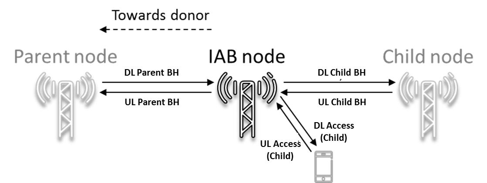

6 Transmitter characteristics
=============================

6.1 General
-----------

Unless otherwise stated, the transmitter characteristics are specified
at the antenna connector of the UE with a single or multiple transmit
antenna(s). For UE with integral antenna only, a reference antenna with
a gain of 0 dBi is assumed.

Transmitter requirements for UL MIMO operation apply when the UE
transmits on 2 ports on the same CDM group. The UE may use higher MPR
values outside this limitation.

6.2 Transmitter power
---------------------

### 6.2.1 UE maximum output power

The following UE Power Classes define the maximum output power for any
transmission bandwidth within the channel bandwidth of NR carrier unless
otherwise stated. The period of measurement shall be at least one sub
frame (1ms).

Table 6.2.1-1: UE Power Class

+---------+---------+---------+---------+---------+---------+---------+
| NR band | Class 1 | To      | Class 2 | To      | Class 3 | To      |
|         | (dBm)   | lerance | (dBm)   | lerance | (dBm)   | lerance |
|         |         | (dB)    |         | (dB)    |         | (dB)    |
+=========+=========+=========+=========+=========+=========+=========+
| n1      |         |         |         |         | 23      | ±2      |
+---------+---------+---------+---------+---------+---------+---------+
| n2      |         |         |         |         | 23      | ±2^3^   |
+---------+---------+---------+---------+---------+---------+---------+
| n3      |         |         |         |         | 23      | ±2^3^   |
+---------+---------+---------+---------+---------+---------+---------+
| n5      |         |         |         |         | 23      | ±2      |
+---------+---------+---------+---------+---------+---------+---------+
| n7      |         |         |         |         | 23      | ±2^3^   |
+---------+---------+---------+---------+---------+---------+---------+
| n8      |         |         |         |         | 23      | ±2^3^   |
+---------+---------+---------+---------+---------+---------+---------+
| n12     |         |         |         |         | 23      | ±2^3^   |
+---------+---------+---------+---------+---------+---------+---------+
| n20     |         |         |         |         | 23      | ±2^3^   |
+---------+---------+---------+---------+---------+---------+---------+
| n25     |         |         |         |         | 23      | ±2^3^   |
+---------+---------+---------+---------+---------+---------+---------+
| n28     |         |         |         |         | 23      | +2/-2.5 |
+---------+---------+---------+---------+---------+---------+---------+
| n34     |         |         |         |         | 23      | ±2      |
+---------+---------+---------+---------+---------+---------+---------+
| n38     |         |         |         |         | 23      | ±2      |
+---------+---------+---------+---------+---------+---------+---------+
| n39     |         |         |         |         | 23      | ±2      |
+---------+---------+---------+---------+---------+---------+---------+
| n40     |         |         |         |         | 23      | ±2      |
+---------+---------+---------+---------+---------+---------+---------+
| n41     |         |         | 26      | +       | 23      | ±2^3^   |
|         |         |         |         | 2/-3^3^ |         |         |
+---------+---------+---------+---------+---------+---------+---------+
| n50     |         |         |         |         | 23      | ±2      |
+---------+---------+---------+---------+---------+---------+---------+
| n51     |         |         |         |         | 23      | ±2      |
+---------+---------+---------+---------+---------+---------+---------+
| n66     |         |         |         |         | 23      | ±2      |
+---------+---------+---------+---------+---------+---------+---------+
| n70     |         |         |         |         | 23      | ±2      |
+---------+---------+---------+---------+---------+---------+---------+
| n71     |         |         |         |         | 23      | +2/-2.5 |
+---------+---------+---------+---------+---------+---------+---------+
| n74     |         |         |         |         | 23      | ±2      |
+---------+---------+---------+---------+---------+---------+---------+
| n77     |         |         | 26      | +2/-3   | 23      | +2/-3   |
+---------+---------+---------+---------+---------+---------+---------+
| n78     |         |         | 26      | +2/-3   | 23      | +2/-3   |
+---------+---------+---------+---------+---------+---------+---------+
| n79     |         |         | 26      | +2/-3   | 23      | +2/-3   |
+---------+---------+---------+---------+---------+---------+---------+
| n80     |         |         |         |         | 23      | ±2      |
+---------+---------+---------+---------+---------+---------+---------+
| n81     |         |         |         |         | 23      | ±2      |
+---------+---------+---------+---------+---------+---------+---------+
| n82     |         |         |         |         | 23      | ±2      |
+---------+---------+---------+---------+---------+---------+---------+
| n83     |         |         |         |         | 23      | +2/-2.5 |
+---------+---------+---------+---------+---------+---------+---------+
| n84     |         |         |         |         | 23      | ±2      |
+---------+---------+---------+---------+---------+---------+---------+
| n86     |         |         |         |         | 23      | ±2      |
+---------+---------+---------+---------+---------+---------+---------+
| NOTE 1: |         |         |         |         |         |         |
| P~Powe  |         |         |         |         |         |         |
| rClass~ |         |         |         |         |         |         |
| is the  |         |         |         |         |         |         |
| maximum |         |         |         |         |         |         |
| UE      |         |         |         |         |         |         |
| power   |         |         |         |         |         |         |
| sp      |         |         |         |         |         |         |
| ecified |         |         |         |         |         |         |
| without |         |         |         |         |         |         |
| taking  |         |         |         |         |         |         |
| into    |         |         |         |         |         |         |
| account |         |         |         |         |         |         |
| the     |         |         |         |         |         |         |
| to      |         |         |         |         |         |         |
| lerance |         |         |         |         |         |         |
|         |         |         |         |         |         |         |
| NOTE 2: |         |         |         |         |         |         |
| Power   |         |         |         |         |         |         |
| class 3 |         |         |         |         |         |         |
| is      |         |         |         |         |         |         |
| default |         |         |         |         |         |         |
| power   |         |         |         |         |         |         |
| class   |         |         |         |         |         |         |
| unless  |         |         |         |         |         |         |
| ot      |         |         |         |         |         |         |
| herwise |         |         |         |         |         |         |
| stated  |         |         |         |         |         |         |
|         |         |         |         |         |         |         |
| NOTE 3: |         |         |         |         |         |         |
| Refers  |         |         |         |         |         |         |
| to the  |         |         |         |         |         |         |
| trans   |         |         |         |         |         |         |
| mission |         |         |         |         |         |         |
| ban     |         |         |         |         |         |         |
| dwidths |         |         |         |         |         |         |
| c       |         |         |         |         |         |         |
| onfined |         |         |         |         |         |         |
| within  |         |         |         |         |         |         |
| F~U     |         |         |         |         |         |         |
| L\_low~ |         |         |         |         |         |         |
| and     |         |         |         |         |         |         |
| F~U     |         |         |         |         |         |         |
| L\_low~ |         |         |         |         |         |         |
| + 4 MHz |         |         |         |         |         |         |
| or      |         |         |         |         |         |         |
| F~UL    |         |         |         |         |         |         |
| \_high~ |         |         |         |         |         |         |
| -- 4    |         |         |         |         |         |         |
| MHz and |         |         |         |         |         |         |
| F~UL\   |         |         |         |         |         |         |
| _high~, |         |         |         |         |         |         |
| the     |         |         |         |         |         |         |
| maximum |         |         |         |         |         |         |
| output  |         |         |         |         |         |         |
| power   |         |         |         |         |         |         |
| requ    |         |         |         |         |         |         |
| irement |         |         |         |         |         |         |
| is      |         |         |         |         |         |         |
| relaxed |         |         |         |         |         |         |
| by      |         |         |         |         |         |         |
| r       |         |         |         |         |         |         |
| educing |         |         |         |         |         |         |
| the     |         |         |         |         |         |         |
| lower   |         |         |         |         |         |         |
| to      |         |         |         |         |         |         |
| lerance |         |         |         |         |         |         |
| limit   |         |         |         |         |         |         |
| by 1.5  |         |         |         |         |         |         |
| dB      |         |         |         |         |         |         |
+---------+---------+---------+---------+---------+---------+---------+

If a UE supports a different power class than the default UE power class
for the band and the supported power class enables the higher maximum
output power than that of the default power class:

> \- if the field of UE capability *maxUplinkDutyCycle-PC2-FR1* is
> absent and the percentage of uplink symbols transmitted in a certain
> evaluation period is larger than 50% (The exact evaluation period is
> no less than one radio frame); or
>
> \- if the field of UE capability *maxUplinkDutyCycle-PC2-FR1* is not
> absent and the percentage of uplink symbols transmitted in a certain
> evaluation period is larger than *maxUplinkDutyCycle-PC2-FR1* as
> defined in TS 38.331 (The exact evaluation period is no less than one
> radio frame); or
>
> \- if the IE P-Max as defined in TS 38.331 \[7\] is provided and set
> to the maximum output power of the default power class or lower;

\- shall apply all requirements for the default power class to the
supported power class and set the configured transmitted power as
specified in clause 6.2.4;

> \- else if the IE *P-Max* as defined in TS 38.331 \[7\] is not
> provided or set to the higher value than the maximum output power of
> the default power class and the percentage of uplink symbols
> transmitted in a certain evaluation period is less than or equal to
> *maxUplinkDutyCycle-PC2-FR1* as defined in TS 38.331; or
>
> \- if the IE *P-Max* as defined in TS 38.331 \[7\] is not provided or
> set to the higher value than the maximum output power of the default
> power class and the percentage of uplink symbols transmitted in a
> certain evaluation period is less than or equal to 50% when
> *maxUplinkDutyCycle-PC2-FR1* is absent. (The exact evaluation period
> is no less than one radio frame):
>
> \- shall apply all requirements for the supported power class and set
> the configured transmitted power as specified in clause 6.2.4.

### 6.2.2 UE maximum output power reduction

UE is allowed to reduce the maximum output power due to higher order
modulations and transmit bandwidth configurations. For UE power class 2
and 3, the allowed maximum power reduction (MPR) is defined in Table
6.2.2-2 and Table 6.2.2-1, respectively for channel bandwidths that
meets both following criteria:

Channel bandwidth ≤ 100 MHz.

Relative channel bandwidth ≤ 4 % for TDD bands and ≤ 3 % for FDD bands

Where relative channel bandwith = 2\*BW~Channel~ / (F~UL\_low~ +
F~UL\_high~)

The allowed MPR for SRS, PUCCH formats 0, 1, 3 and 4, and PRACH shall be
as specified for QPSK modulated DFT-s-OFDM of equivalent RB allocation.
The allowed MPR for PUCCH format 2 shall be as specified for QPSK
modulated CP-OFDM of equivalent RB allocation.

Table 6.2.2-1 Maximum power reduction (MPR) for power class 3

+-------------+-------------+-------------+-------------+----------+
| Modulation  | MPR (dB)    |             |             |          |
+=============+=============+=============+=============+==========+
|             | Edge RB     | Outer RB    | Inner RB    |          |
|             | allocations | allocations | allocations |          |
+-------------+-------------+-------------+-------------+----------+
| DFT-s-OFDM  | Pi/2 BPSK   | ≤ 3.5^1^    | ≤ 1.2^1^    | ≤ 0.2^1^ |
+-------------+-------------+-------------+-------------+----------+
|             |             | ≤ 0.5^2^    | ≤ 0.5^2^    | 0^2^     |
+-------------+-------------+-------------+-------------+----------+
|             | QPSK        | ≤ 1         | 0           |          |
+-------------+-------------+-------------+-------------+----------+
|             | 16 QAM      | ≤ 2         | ≤ 1         |          |
+-------------+-------------+-------------+-------------+----------+
|             | 64 QAM      | ≤ 2.5       |             |          |
+-------------+-------------+-------------+-------------+----------+
|             | 256 QAM     | ≤ 4.5       |             |          |
+-------------+-------------+-------------+-------------+----------+
| CP-OFDM     | QPSK        | ≤ 3         | ≤ 1.5       |          |
+-------------+-------------+-------------+-------------+----------+
|             | 16 QAM      | ≤ 3         | ≤ 2         |          |
+-------------+-------------+-------------+-------------+----------+
|             | 64 QAM      | ≤ 3.5       |             |          |
+-------------+-------------+-------------+-------------+----------+
|             | 256 QAM     | ≤ 6.5       |             |          |
+-------------+-------------+-------------+-------------+----------+
| NOTE 1:     |             |             |             |          |
| Applicable  |             |             |             |          |
| for UE      |             |             |             |          |
| operating   |             |             |             |          |
| in TDD mode |             |             |             |          |
| with Pi/2   |             |             |             |          |
| BPSK        |             |             |             |          |
| modulation  |             |             |             |          |
| and UE      |             |             |             |          |
| indicates   |             |             |             |          |
| support for |             |             |             |          |
| UE          |             |             |             |          |
| capability  |             |             |             |          |
| *           |             |             |             |          |
| powerBoosti |             |             |             |          |
| ng-pi2BPSK* |             |             |             |          |
| and if the  |             |             |             |          |
| IE          |             |             |             |          |
| *powerBo    |             |             |             |          |
| ostPi2BPSK* |             |             |             |          |
| is set to 1 |             |             |             |          |
| and 40 % or |             |             |             |          |
| less slots  |             |             |             |          |
| in radio    |             |             |             |          |
| frame are   |             |             |             |          |
| used for UL |             |             |             |          |
| t           |             |             |             |          |
| ransmission |             |             |             |          |
| for bands   |             |             |             |          |
| n40, n41,   |             |             |             |          |
| n77, n78    |             |             |             |          |
| and n79.    |             |             |             |          |
| The         |             |             |             |          |
| reference   |             |             |             |          |
| power of 0  |             |             |             |          |
| dB MPR is   |             |             |             |          |
| 26 dBm.     |             |             |             |          |
|             |             |             |             |          |
| NOTE 2:     |             |             |             |          |
| Applicable  |             |             |             |          |
| for         |             |             |             |          |
| conditions  |             |             |             |          |
| where note  |             |             |             |          |
| 1 does not  |             |             |             |          |
| apply.      |             |             |             |          |
+-------------+-------------+-------------+-------------+----------+

Table 6.2.2-2 Maximum power reduction (MPR) for power class 2

  Modulation   MPR (dB)                                                            
  ------------ --------------------- ---------------------- ---------------------- -------
               Edge RB allocations   Outer RB allocations   Inner RB allocations   
  DFT-s-OFDM   Pi/2 BPSK             ≤ 3.5                  ≤ 0.5                  0
               QPSK                  ≤ 3.5                  ≤ 1                    0
               16 QAM                ≤ 3.5                  ≤ 2                    ≤ 1
               64 QAM                ≤ 3.5                  ≤ 2.5                  
               256 QAM               ≤ 4.5                                         
  CP-OFDM      QPSK                  ≤ 3.5                  ≤ 3                    ≤ 1.5
               16 QAM                ≤ 3.5                  ≤ 3                    ≤ 2
               64 QAM                ≤ 3.5                                         
               256 QAM               ≤ 6.5                                         

Where the following parameters are defined to specify valid RB
allocation ranges for Outer and Inner RB allocations:

N~RB~ is the maximum number of RBs for a given Channel bandwidth and
sub-carrier spacing defined in Table 5.3.2-1. RB~Start,Low~ = max(1,
floor(L~CRB~/2))

where max() indicates the largest value of all arguments and floor(x) is
the greatest integer less than or equal to x.

RB~Start,High~ = N~RB~ -- RB~Start,Low~ -- L~CRB~

The RB allocation is an Inner RB allocation if the following conditions
are met

RB~Start,Low~ ≤ RB~Start~ ≤ RB~Start,High~, and

L~CRB~ ≤ ceil(N~RB~/2)

where ceil(x) is the smallest integer greater than or equal to x.

An Edge RB allocation is the one for which the RB(s) is (are) allocated
at the lowermost or uppermost edge of the channel with L~CRB~ ≤ 2 RBs.

The RB allocation is an Outer RB allocation for all other allocations
which are not an Inner RB allocation or Edge RB allocation.

If CP-OFDM allocation satisfies following conditions, it is considered
as almost contiguous allocation

N~RB\_gap~ / (N~RB\_alloc~ + N~RB\_gap~ ) ≤ 0.25

and N~RB\_alloc~ + N~RB\_gap~ is larger than 106, 51 or 24 RBs for 15
kHz, 30 kHz or 60 kHz respectively where N~RB\_gap~ is the total number
of unallocated RBs between allocated RBs and N~RB\_alloc~ is the total
number of allocated RBs. The size and location of allocated and
unallocated RBs are restricted by RBG parameters specified in clause
6.1.2.2 of TS 38.214 \[10\]. For UE that indicates support for
*almostContiguousCP-OFDM-UL*, the almost contiguous signals in power
class 3, the allowed maximum power reduction defined in Table 6.2.2-1 is
increased by

CEIL{ 10 log~10~(1 + N~RB\_gap\ /~ N~RB\_alloc~), 0.5 } dB,

where CEIL{x,0.5} means x rounding upwards to closest 0.5dB. The
parameter of L~CRB~ which is used to specify valid RB allocation ranges
for Outer and Inner RB allocations is replaced by (N~RB\_alloc~ +
N~RB\_gap~) for almost contiguous allocation cases

RB~Start,Low~ = max(1, floor((N~RB\_alloc~ + N~RB\_gap~)/2))

RB~Start,High~ = N~RB~ -- RB~Start,Low~ -- N~RB\_alloc~ --N~RB\_gap~

For the UE maximum output power modified by MPR, the power limits
specified in clause 6.2.4 apply.

### 6.2.3 UE additional maximum output power reduction

#### 6.2.3.1 General

Additional emission requirements can be signalled by the network. Each
additional emission requirement is associated with a unique network
signalling (NS) value indicated in RRC signalling by an NR frequency
band number of the applicable operating band and an associated value in
the field *additionalSpectrumEmission.* Throughout this specification,
the notion of indication or signalling of an NS value refers to the
corresponding indication of an NR frequency band number of the
applicable operating band, the IE field *freqBandIndicatorNR* and an
associated value of *additionalSpectrumEmission* in the relevant RRC
information elements \[7\]*.*

To meet the additional requirements, additional maximum power reduction
(A-MPR) is allowed for the maximum output power as specified in Table
6.2.1-1. Unless stated otherwise, the total reduction to UE maximum
output power is max(MPR, A-MPR) where MPR is defined in clause 6.2.2.
Outer and inner allocation notation used in clause 6.2.3 is defined in
clause 6.2.2. Unless stated otherwise, Edge RB allocations get the same
AMPR as Outer RB allocations. In absense of modulation and waveform
types the A-MPR applies to all modulation and waveform types.

Table 6.2.3.1-1 specifies the additional requirements with their
associated network signalling values and the allowed A-MPR and
applicable operating band(s) for each NS value. In case of a power class
3 UE, when IE *powerBoostPi2BPSK* is set to 1, power class 2 A-MPR
values apply. The mapping of NR frequency band numbers and values of the
*additionalSpectrumEmission* to network signalling labels is specified
in Table 6.2.3.1-1A.

For almost contiguous allocations in CP-OFDM waveforms in power class 3,
the allowed A-MPR defined in clause 6.2.3 is increased by CEIL{10
log~10~(1 + N~RB\_gap\ /~ N~RB\_alloc~), 0.5} dB, where CEIL{x, 0.5}
means x rounding upwards to closest 0.5dB, N~RB\_gap~ is the total
number of unallocated RBs between allocated RBs and N~RB\_alloc~ is the
total number of allocated RBs, and the parameter L~CRB~ is replaced by
N~RB\_alloc~ + N~RB\_gap~ in specifying the RB allocation regions.

Table 6.2.3.1-1: Additional maximum power reduction (A-MPR)

+----------+----------+----------+----------+----------+----------+
| Network  | Requ     | NR Band  | Channel  | R        | A-MPR    |
| si       | irements |          | b        | esources | (dB)     |
| gnalling | (clause) |          | andwidth | blocks   |          |
| label    |          |          | (MHz)    | (        |          |
|          |          |          |          | *N*~RB~) |          |
+----------+----------+----------+----------+----------+----------+
| NS\_01   |          | Table    | 5, 10,   | Table    | N/A      |
|          |          | 5.2-1    | 15, 20,  | 5.3.2-1  |          |
|          |          |          | 25, 30,  |          |          |
|          |          | (NOTE 4) | 40, 50,  |          |          |
|          |          |          | 60, 80,  |          |          |
|          |          |          | 90, 100  |          |          |
+----------+----------+----------+----------+----------+----------+
| NS\_03   | 6        | n2, n25, |          |          | Clause   |
|          | .5.2.3.3 | n66,     |          |          | 6.2.3.7  |
|          |          |          |          |          |          |
|          |          | n70, n86 |          |          |          |
+----------+----------+----------+----------+----------+----------+
| NS\_03U  | 6.       | n2, n25, |          |          | Clause   |
|          | 5.2.3.3, | n66, n86 |          |          | 6.2.3.7  |
|          | 6        | (NOTE 1) |          |          |          |
|          | .5.2.4.2 |          |          |          |          |
+----------+----------+----------+----------+----------+----------+
| NS\_04   | 6.       | n41      | 10, 15,  |          | Clause   |
|          | 5.2.3.2, |          | 20, 40,  |          | 6.2.3.2  |
|          | 6        |          | 50, 60   |          |          |
|          | .5.3.3.1 |          | 80, 90,  |          |          |
|          |          |          | 100      |          |          |
+----------+----------+----------+----------+----------+----------+
| NS\_05   | 6        | n1, n84  | 5, 10,   |          | Clause   |
|          | .5.3.3.4 |          | 15, 20   |          | 6.2.3.4  |
|          |          |          | (NOTE 2) |          |          |
+----------+----------+----------+----------+----------+----------+
| NS\_05U  | 6.       | n1, n84  | 5, 10,   |          | Clause   |
|          | 5.3.3.4, | (NOTE 1) | 15, 20   |          | 6.2.3.4  |
|          | 6        |          |          |          |          |
|          | .5.2.4.2 |          |          |          |          |
+----------+----------+----------+----------+----------+----------+
| NS\_06   | 6        | n12      | 5, 10,   |          | N/A      |
|          | .5.2.3.4 |          | 15       |          |          |
+----------+----------+----------+----------+----------+----------+
| NS\_10   |          | n20, n82 | 15, 20   | Table    | Table    |
|          |          |          |          | 6        |          |
|          |          |          |          | .2.3.3-1 | 6        |
|          |          |          |          |          | .2.3.3-1 |
+----------+----------+----------+----------+----------+----------+
| NS\_17   | 6        | n28, n83 | 5,10     | Table    | N/A      |
|          | .5.3.3.2 |          |          | 5.3.2-1  |          |
+----------+----------+----------+----------+----------+----------+
| NS\_18   | 6        | n28, n83 | 5        |          | Table    |
|          | .5.3.3.3 |          |          |          | 6.2      |
|          |          |          |          |          | .3.13-1, |
|          |          |          |          |          | A1       |
+----------+----------+----------+----------+----------+----------+
|          |          |          | 10, 15,  |          | Table    |
|          |          |          | 20       |          | 6.2      |
|          |          |          |          |          | .3.13-1, |
|          |          |          |          |          | A2       |
+----------+----------+----------+----------+----------+----------+
| NS\_35   | 6        | n71      | 5, 10,   | Table    | N/A      |
|          | .5.2.3.1 |          | 15, 20   | 5.3.2-1  |          |
+----------+----------+----------+----------+----------+----------+
| NS\_37   | 6        | n74      | 10, 15   | Table    | Table    |
|          | .5.3.3.6 |          |          | 6        |          |
|          |          | (NOTE 3) |          | .2.3.8-1 | 6        |
|          |          |          |          |          | .2.3.8-1 |
+----------+----------+----------+----------+----------+----------+
| NS\_38   | 6        | n74      | 5, 10,   | Table    | Table    |
|          | .5.3.3.7 |          | 15, 20   | 6        |          |
|          |          |          |          | .2.3.9-1 | 6        |
|          |          |          |          |          | .2.3.9-1 |
+----------+----------+----------+----------+----------+----------+
| NS\_39   | 6        | n74      | 10, 15,  | Table    | Table    |
|          | .5.3.3.8 |          | 20       | 6.       | 6.       |
|          |          |          |          | 2.3.10-1 | 2.3.10-1 |
+----------+----------+----------+----------+----------+----------+
| NS\_40   | 6        | n51      | 5        |          | Table    |
|          | .5.3.3.9 |          |          |          |          |
|          |          |          |          |          | 6        |
|          |          |          |          |          | .2.3.5-1 |
+----------+----------+----------+----------+----------+----------+
| NS\_41   | 6.       | n50      | 5, 10,   |          | Table    |
|          | 5.3.3.10 |          | 15, 20,  |          | 6.       |
|          |          |          | 40, 50,  |          | 2.3.11-1 |
|          |          |          | 60       |          |          |
+----------+----------+----------+----------+----------+----------+
| NS\_42   | 6.       | n50      | 5, 10,   |          | Table    |
|          | 5.3.3.11 |          | 15, 20,  |          | 6.       |
|          |          |          | 40, 50,  |          | 2.3.12-1 |
|          |          |          | 60       |          |          |
+----------+----------+----------+----------+----------+----------+
| NS\_43   | 6        | n8, n81  | 5, 10,   |          | Clause   |
|          | .5.3.3.5 |          | 15       |          | 6.2.3.6  |
+----------+----------+----------+----------+----------+----------+
| NS\_43U  | 6.       | n8, n81  | 5, 10,   |          | Clause   |
|          | 5.3.3.5, | (NOTE 1) | 15       |          | 6.2.3.6  |
|          | 6        |          |          |          |          |
|          | .5.2.4.2 |          |          |          |          |
+----------+----------+----------+----------+----------+----------+
| NS\_50   | 6.       | n39      | 25, 30,  |          | Clause   |
|          | 5.3.3.16 |          | 40       |          | 6.2.3.19 |
+----------+----------+----------+----------+----------+----------+
| NS\_100  | 6        | n1, n2,  |          |          | Table    |
|          | .5.2.4.2 | n3, n5,  |          |          |          |
|          |          | n8, n25, |          |          | 6        |
|          |          | n66,     |          |          | .2.3.1-2 |
|          |          | n80,     |          |          |          |
|          |          | n81,     |          |          |          |
|          |          | n84, n86 |          |          |          |
|          |          |          |          |          |          |
|          |          | (NOTE 1) |          |          |          |
+----------+----------+----------+----------+----------+----------+
| NOTE 1:  |          |          |          |          |          |
| This NS  |          |          |          |          |          |
| can be   |          |          |          |          |          |
| s        |          |          |          |          |          |
| ignalled |          |          |          |          |          |
| for NR   |          |          |          |          |          |
| bands    |          |          |          |          |          |
| that     |          |          |          |          |          |
| have     |          |          |          |          |          |
| UTRA     |          |          |          |          |          |
| services |          |          |          |          |          |
| d        |          |          |          |          |          |
| eployed. |          |          |          |          |          |
|          |          |          |          |          |          |
| NOTE 2:  |          |          |          |          |          |
| No A-MPR |          |          |          |          |          |
| is       |          |          |          |          |          |
| applied  |          |          |          |          |          |
| for 5    |          |          |          |          |          |
| MHz      |          |          |          |          |          |
| BW~      |          |          |          |          |          |
| Channel~ |          |          |          |          |          |
| where    |          |          |          |          |          |
| the      |          |          |          |          |          |
| upper    |          |          |          |          |          |
| channel  |          |          |          |          |          |
| edge is  |          |          |          |          |          |
| ≥ 1930   |          |          |          |          |          |
| MHz,10   |          |          |          |          |          |
| MHz      |          |          |          |          |          |
| BW~      |          |          |          |          |          |
| Channel~ |          |          |          |          |          |
| where    |          |          |          |          |          |
| the      |          |          |          |          |          |
| upper    |          |          |          |          |          |
| channel  |          |          |          |          |          |
| edge is  |          |          |          |          |          |
| ≥ 1950   |          |          |          |          |          |
| MHz and  |          |          |          |          |          |
| 15 MHz   |          |          |          |          |          |
| BW~      |          |          |          |          |          |
| Channel~ |          |          |          |          |          |
| where    |          |          |          |          |          |
| the      |          |          |          |          |          |
| upper    |          |          |          |          |          |
| channel  |          |          |          |          |          |
| edge is  |          |          |          |          |          |
| ≥ 1955   |          |          |          |          |          |
| MHz and  |          |          |          |          |          |
| 20 MHz   |          |          |          |          |          |
| B        |          |          |          |          |          |
| WChannel |          |          |          |          |          |
| where    |          |          |          |          |          |
| the      |          |          |          |          |          |
| upper    |          |          |          |          |          |
| channel  |          |          |          |          |          |
| edge is  |          |          |          |          |          |
| ≥ 1970   |          |          |          |          |          |
| MHz.     |          |          |          |          |          |
|          |          |          |          |          |          |
| NOTE 3:  |          |          |          |          |          |
| Ap       |          |          |          |          |          |
| plicable |          |          |          |          |          |
| when the |          |          |          |          |          |
| NR       |          |          |          |          |          |
| carrier  |          |          |          |          |          |
| is       |          |          |          |          |          |
| within   |          |          |          |          |          |
| 1447.9   |          |          |          |          |          |
| --       |          |          |          |          |          |
| 1462.9   |          |          |          |          |          |
| MHz.     |          |          |          |          |          |
|          |          |          |          |          |          |
| NOTE 4:  |          |          |          |          |          |
| The      |          |          |          |          |          |
| NS\_01   |          |          |          |          |          |
| label    |          |          |          |          |          |
| with the |          |          |          |          |          |
| field    |          |          |          |          |          |
| *additio |          |          |          |          |          |
| nalPmax* |          |          |          |          |          |
| \[7\]    |          |          |          |          |          |
| absent   |          |          |          |          |          |
| is       |          |          |          |          |          |
| default  |          |          |          |          |          |
| for all  |          |          |          |          |          |
| NR       |          |          |          |          |          |
| bands.   |          |          |          |          |          |
+----------+----------+----------+----------+----------+----------+

Table 6.2.3.1-1A: Mapping of network signaling label

  NR band                                                                                                                                 Value of *additionalSpectrumEmission*                                                        
  --------------------------------------------------------------------------------------------------------------------------------------- --------------------------------------- --------- -------- --------- ------- ------- ------- -------
                                                                                                                                          **0**                                   **1**     **2**    **3**     **4**   **5**   **6**   **7**
  n1                                                                                                                                      NS\_01                                  NS\_100   NS\_05   NS\_05U                           
  n2                                                                                                                                      NS\_01                                  NS\_100   NS\_03   NS\_03U                           
  n3                                                                                                                                      NS\_01                                  NS\_100                                              
  n5                                                                                                                                      NS\_01                                  NS\_100                                              
  n7                                                                                                                                      NS\_01                                                                                       
  n8                                                                                                                                      NS\_01                                  NS\_100   NS\_43   NS\_43U                           
  n12                                                                                                                                     NS\_01                                  NS\_06                                               
  n20                                                                                                                                     NS\_01                                  Void      NS\_10                                     
  n25                                                                                                                                     NS\_01                                  NS\_100   NS\_03   NS\_03U                           
  n28                                                                                                                                     NS\_01                                  NS\_17    NS\_18                                     
  n34                                                                                                                                     NS\_01                                                                                       
  n38                                                                                                                                     NS\_01                                                                                       
  n39                                                                                                                                     NS\_01                                  NS\_50                                               
  n40                                                                                                                                     NS\_01                                                                                       
  n41                                                                                                                                     NS\_01                                  NS\_04                                               
  n50                                                                                                                                     NS\_01                                  NS\_41    NS\_42                                     
  n51                                                                                                                                     NS\_01                                  NS\_40                                               
  n66                                                                                                                                     NS\_01                                  NS\_100   NS\_03   NS\_03U                           
  n70                                                                                                                                     NS\_01                                  NS\_03                                               
  n71                                                                                                                                     NS\_01                                  NS\_35                                               
  n74                                                                                                                                     NS\_01                                  NS\_37    NS\_38   NS\_39                            
  n77                                                                                                                                     NS\_01                                                                                       
  n78                                                                                                                                     NS\_01                                                                                       
  n79                                                                                                                                     NS\_01                                                                                       
  n80                                                                                                                                     NS\_01                                  NS\_100                                              
  n81                                                                                                                                     NS\_01                                  NS\_100   NS\_43   NS\_43U                           
  n82                                                                                                                                     NS\_01                                  Void      NS\_10                                     
  n83                                                                                                                                     NS\_01                                  NS\_17    NS\_18                                     
  n84                                                                                                                                     NS\_01                                  NS\_100   NS\_05   NS\_05U                           
  n86                                                                                                                                     NS\_01                                  NS\_100   NS\_03   NS\_03U                           
  NOTE: *additionalSpectrumEmission* corresponds to an information element of the same name defined in clause 6.3.2 of TS 38.331 \[7\].                                                                                                

Table 6.2.3.1-2: A-MPR for NS\_100 (UTRA protection)

+---------------------+------------+-------+
| Modulation/Waveform | Outer (dB) |       |
+=====================+============+=======+
| DFT-s-OFDM          | Pi/2 BPSK  | ≤ 2   |
+---------------------+------------+-------+
|                     | QPSK       | ≤ 2   |
+---------------------+------------+-------+
|                     | 16 QAM     | ≤ 2.5 |
+---------------------+------------+-------+
|                     | 64 QAM     | ≤ 3   |
+---------------------+------------+-------+
|                     | 256 QAM    | ≤ 4.5 |
+---------------------+------------+-------+
| CP-OFDM             | QPSK       | ≤ 4   |
+---------------------+------------+-------+
|                     | 16 QAM     | ≤ 4   |
+---------------------+------------+-------+
|                     | 64 QAM     | ≤ 4   |
+---------------------+------------+-------+
|                     | 256 QAM    | ≤ 6.5 |
+---------------------+------------+-------+
| NOTE 1: Void        |            |       |
|                     |            |       |
| NOTE 2: Void        |            |       |
+---------------------+------------+-------+

#### 6.2.3.2 A-MPR for NS\_04

For NS\_04, A-MPR is not added to MPR. Also, when NS\_04 is signalled,
MPR shall be set to zero in the P~CMAX~ equations to avoid double
counting MPR.

Allowed maximum power reduction is defined as A-MPR = max(MPR, A-MPR\'),

Note that A-MPR\' = 0 dB means only MPR is applied,

where A-MPR\' is defined as

if RB~start~ ≤ f~start,max,IMD3~ / (12⋅SCS) and L~CRB~ ≤ AW~max,IMD3~ /
(12⋅SCS) and F~C~ - BW~Channel~/2 \< F~UL\_low~ + offset~IMD3~,\
then

the A-MPR\' is defined according to Table 6.2.3.2-2 PC3\_A2 relative to
23 dBm for power class 3 and PC2\_A4 relative to 26 dBm for power class
2,

else,

if RB~start~ ≤ L~CRB~/2 + ∆~start~ / (12⋅SCS) and L~CRB~ ≤
AW~max,regrowth~ / (12⋅SCS) and F~C~ - BW~Channel~/2 \< F~UL\_low~ +
offset~regrowth~,\
then

the A-MPR\' is defined according to Table 6.2.3.2-2 PC3\_A1 relative to
23 dBm for power class 3 and PC2\_A3 relative to 26 dBm for power class
2,

else

A-MPR\' = 0 dB and apply MPR.

With the parameters defined in Table 6.2.3.2-1.

Table 6.2.3.2-1: Parameters for region edges and frequency offsets

  Parameter                                                 Symbol              Value                                  Related condition                                      
  --------------------------------------------------------- ------------------- -------------------------------------- ------------------------------------------------------ ------------------------------------------------------
                                                                                CP-OFDM                                DFT-s-OFDM                                             
  Max allocation start in IMD3 region                       f~start,max,IMD3~   0.33 BW~Channel~                       RB~start~ ≤ f~start,max,IMD3~ / (12SCS)                
  Max allocation BW in IMD3 region                          AW~max,IMD3~        4 MHz                                  L~CRB~ ≤ AW~max,IMD3~ / (12SCS)                        
  Freq. offset required to avoid A-MPR in IMD3 region       offset~IMD3~        BW~Channel~ -- 6 MHz                   F~C~ - BW~Channel~/2 ≥ F~UL\_low~ + offset~IMD3~       
  Right edge of regrowth region                             ∆~start~            0.08 BW~Channel~                       RB~start~ ≤ L~CRB~/2 + ∆~start~ / (12SCS)              
  Max allocation BW in regrowth region                      AW~max,regrowth~    100 MHz                                L~CRB~ ≤ Min(L~CRB,Max,~ AW~max,regrowth~ / (12SCS))   
  Freq. offset required to avoid A-MPR in regrowth region   offset~regrowth~    Max (10 MHz, 0.25\* BW~Channel~ MHz)   Max (10 MHz, 0.45\* BW~Channel~ MHz)                   F~C~ - BW~Channel~/2 ≥ F~UL\_low~ + offset~regrowth~

Table 6.2.3.2-2: A-MPR\' values Access

  Modulation/Waveform   A-MPR\' (dB)                                 
  --------------------- -------------- --------- --------- --------- -------
                        PC3\_A1        PC3\_A2   PC2\_A3   PC2\_A4   
  DFT-s-OFDM            Pi/2-BPSK      ≤ 3.5     ≤ 3.5     ≤ 3.5     ≤ 5.5
                        QPSK           ≤ 4       ≤ 4       ≤ 4.5     ≤ 6
                        16 QAM         ≤ 4       ≤ 4       ≤ 5       ≤ 6
                        64 QAM         ≤ 4       ≤ 4.5     ≤ 5       ≤ 6.5
                        256 QAM        ≤ 4.5     ≤ 6       ≤ 6.5     ≤ 8
  CP-OFDM               QPSK           ≤ 5.5     ≤ 5.5     ≤ 6.5     ≤ 7.5
                        16 QAM         ≤ 5.5     ≤ 5.5     ≤ 6.5     ≤ 7.5
                        64 QAM         ≤ 5.5     ≤ 5.5     ≤ 6.5     ≤ 7.5
                        256 QAM        ≤ 6.5     ≤ 8       ≤ 7.5     ≤ 10

#### 6.2.3.3 A-MPR for NS\_10

Table 6.2.3.3-1: A-MPR for NS\_10

+------------------------------------------+--------------+----------+
| Channel bandwidth (MHz)                  | Parameters   | Region A |
+------------------------------------------+--------------+----------+
| 15                                       | RB~start~    | 0 -- 10  |
+------------------------------------------+--------------+----------+
|                                          | L~CRB~ (RBs) | 1 -- 20  |
+------------------------------------------+--------------+----------+
|                                          | A (dB)       | ≤ 3      |
+------------------------------------------+--------------+----------+
| 20                                       | RB~start~    | 0 -- 15  |
+------------------------------------------+--------------+----------+
|                                          | L~CRB~ (RBs) | 1 -- 20  |
+------------------------------------------+--------------+----------+
|                                          | A (dB)       | ≤ 6      |
+------------------------------------------+--------------+----------+
| NOTE 1: RB~start~ indicates the lowest   |              |          |
| RB index of transmitted resource blocks  |              |          |
|                                          |              |          |
| NOTE 2: L~CRB~ is the length of a        |              |          |
| contiguous resource block allocation     |              |          |
|                                          |              |          |
| NOTE 3: For intra-subframe frequency     |              |          |
| hopping which intersects Region A, notes |              |          |
| 1 and 2 apply on a per slot basis. For   |              |          |
| intra-slot or intra-subslot frequency    |              |          |
| hopping which intersects Region A, notes |              |          |
| 1 and 2 apply on a T~no\_hopping~ basis. |              |          |
|                                          |              |          |
| NOTE 4: For intra-subframe frequency     |              |          |
| hopping which intersect Region A, the    |              |          |
| larger A-MPR value may be applied for    |              |          |
| both slots in the subframe. For          |              |          |
| intra-slot frequency hopping which       |              |          |
| intersects Region A, the larger A-MPR    |              |          |
| value may be applied for the slot. For   |              |          |
| intra-subslot frequency hopping which    |              |          |
| intersects Region A, the larger A-MPR    |              |          |
| value may be applied for the subslot.    |              |          |
|                                          |              |          |
| NOTE 5: The A-MPR for DFT-s-OFDM is the  |              |          |
| total backoff and is obtained by taking  |              |          |
| the maximum value of MPR + A-MPR         |              |          |
| specified in Table 6.2.3-1 and Table     |              |          |
| 6.2.4-1 in TS 36.101 and A value         |              |          |
| specified in Table 6.2.3.3-1.            |              |          |
|                                          |              |          |
| NOTE 6: The A-MPR for CP-OFDM is the     |              |          |
| total backoff and is obtained by adding  |              |          |
| the A value in Table 6.2.3.3-1 to the    |              |          |
| corresponding MPR specified in Table     |              |          |
| 6.2.2-1.                                 |              |          |
+------------------------------------------+--------------+----------+

#### 

#### 6.2.3.4 A-MPR for NS\_05 and NS\_05U

Table 6.2.3.4-1: A-MPR regions for NS\_05 and NS\_05U

<table>
<thead>
<tr class="header">
<th>Channel Bandwidth (MHz)</th>
<th>Carrier Centre Frequency, Fc (MHz)</th>
<th>Region A</th>
<th>Region B</th>
<th>Region C</th>
<th></th>
<th></th>
<th></th>
<th></th>
<th></th>
<th></th>
</tr>
</thead>
<tbody>
<tr class="odd">
<td></td>
<td></td>
<td>RBstart</td>
<td>LCRB</td>
<td>A-MPR</td>
<td>RBstart</td>
<td>LCRB</td>
<td>A-MPR</td>
<td>RBstart</td>
<td>LCRB</td>
<td>A-MPR</td>
</tr>
<tr class="even">
<td>5</td>
<td>1922.5 ≤ FC &lt; 1927.5</td>
<td>&lt; 1.62 MHz/12/SCS</td>
<td>&gt; 2.52 MHz/12/SCS</td>
<td>A3</td>
<td></td>
<td></td>
<td></td>
<td></td>
<td></td>
<td></td>
</tr>
<tr class="odd">
<td>10</td>
<td>1925 ≤ FC &lt; 1935</td>
<td>≤ 1.62 MHz/12/SCS</td>
<td>&gt; 0</td>
<td>A1</td>
<td>
&gt; 1.62 MHz/12/SCS

≤ 3.60 MHz/12/SCS
</td>
<td>&gt; 5.4 MHz/12/SCS</td>
<td>A7</td>
<td>≥ 7.2 MHz/12/SCS</td>
<td>≤ 1.08 MHz/12/SCS</td>
<td>A2</td>
</tr>
<tr class="even">
<td>10</td>
<td>1935 ≤ FC &lt; 1945</td>
<td></td>
<td>&gt; 4.5 MHz/12/SCS</td>
<td>A4</td>
<td></td>
<td></td>
<td></td>
<td></td>
<td></td>
<td></td>
</tr>
<tr class="odd">
<td>15</td>
<td>1927.5 ≤ FC &lt; 1932.5</td>
<td>≤ 3.24MHz/12/SCS</td>
<td>&gt; 0</td>
<td>A1</td>
<td>
&gt; 3.24 MHz/12/SCS

≤ 5.40 MHz/12/SCS
</td>
<td>&gt; 8.1 MHz/12/SCS</td>
<td>A7</td>
<td>≥ 10.08 MHz/12/SCS</td>
<td>≤ 1.08 MHz/12/SCS</td>
<td>A2</td>
</tr>
<tr class="even">
<td>15</td>
<td>1932.5 ≤ FC &lt; 1942.5</td>
<td>&lt; 1.62 MHz/12/SCS</td>
<td>&gt; 0</td>
<td>A1</td>
<td></td>
<td></td>
<td></td>
<td>≥ 12.24 MHz/12/SCS</td>
<td>≤ 1.08 MHz/12/SCS</td>
<td>A2</td>
</tr>
<tr class="odd">
<td>15</td>
<td>1942.5 ≤ FC &lt; 1947.5</td>
<td></td>
<td>&gt; 7.2 MHz/12/SCS</td>
<td>A5</td>
<td></td>
<td></td>
<td></td>
<td></td>
<td></td>
<td></td>
</tr>
<tr class="even">
<td>20</td>
<td>1930 ≤ FC &lt; 1950</td>
<td>≤ 4.86 MHz/12/SCS</td>
<td>&gt; 0</td>
<td>A1</td>
<td>
&gt; 4.86 MHz/12/SCS

≤ 7.20 MHz/12/SCS
</td>
<td>&gt; 9.0 MHz/12/SCS</td>
<td>A7</td>
<td>≥ 13.68 MHz/12/SCS</td>
<td>≤ 1.08 MHz/12/SCS</td>
<td>A2</td>
</tr>
<tr class="odd">
<td>20</td>
<td>1950 ≤ FC &lt; 1960</td>
<td></td>
<td>&gt; 9.0 MHz/12/SCS</td>
<td>A6</td>
<td></td>
<td></td>
<td></td>
<td></td>
<td></td>
<td></td>
</tr>
<tr class="even">
<td>
NOTE 1: The A-MPR values are specified in Table 6.2.3.4-2, 6.2.3.4-3 and 6.2.3.4-10.

NOTE 2: Void
</td>
<td></td>
<td></td>
<td></td>
<td></td>
<td></td>
<td></td>
<td></td>
<td></td>
<td></td>
<td></td>
</tr>
</tbody>
</table>

Table 6.2.3.4-2: A-MPR for NS\_05 and NS\_05U

+---------------------+-------------+-------------+---------+-----+---+
| Modulation/Waveform | A1 (dB)     | A2 (dB)     | A3 (dB) |     |   |
+=====================+=============+=============+=========+=====+===+
|                     | Outer/Inner | Outer/Inner | Outer   |     |   |
+---------------------+-------------+-------------+---------+-----+---+
| DFT-s-OFDM          | Pi/2 BPSK   | ≤ 10        | ≤ 5     |     |   |
+---------------------+-------------+-------------+---------+-----+---+
|                     | QPSK        | ≤ 10        | ≤ 5     |     |   |
+---------------------+-------------+-------------+---------+-----+---+
|                     | 16 QAM      | ≤ 10        | ≤ 5     |     |   |
+---------------------+-------------+-------------+---------+-----+---+
|                     | 64 QAM      | ≤ 11        | ≤ 5     |     |   |
+---------------------+-------------+-------------+---------+-----+---+
|                     | 256 QAM     | ≤ 13        | ≤ 5     |     |   |
+---------------------+-------------+-------------+---------+-----+---+
| CP-OFDM             | QPSK        | ≤ 10        | ≤ 5     | ≤ 2 |   |
+---------------------+-------------+-------------+---------+-----+---+
|                     | 16 QAM      | ≤ 10        | ≤ 5     |     |   |
+---------------------+-------------+-------------+---------+-----+---+
|                     | 64 QAM      | ≤ 11        | ≤ 5     |     |   |
+---------------------+-------------+-------------+---------+-----+---+
|                     | 256 QAM     | ≤ 13        |         |     |   |
+---------------------+-------------+-------------+---------+-----+---+
| NOTE 1: Void        |             |             |         |     |   |
|                     |             |             |         |     |   |
| NOTE 2: Void        |             |             |         |     |   |
+---------------------+-------------+-------------+---------+-----+---+

Table 6.2.3.4-3: A-MPR for NS\_05

+-------+-------+-------+-------+-------+-------+-------+-------+-----+
| Modu  | A4    | A5    | A6    | A7    |       |       |       |     |
| latio | (dB)  | (dB)  | (dB)  | (dB)  |       |       |       |     |
| n/Wav |       |       |       |       |       |       |       |     |
| eform |       |       |       |       |       |       |       |     |
+=======+=======+=======+=======+=======+=======+=======+=======+=====+
|       | Outer | Inner | Outer |       | Outer | Inner | O     |     |
|       |       |       |       |       |       |       | uter/ |     |
|       |       |       |       |       |       |       | Inner |     |
+-------+-------+-------+-------+-------+-------+-------+-------+-----+
| DFT-s | Pi/2  | ≤ 1   | N/A   | ≤ 1   |       | ≤ 1   | N/A   | ≤ 6 |
| -OFDM | BPSK  |       |       |       |       |       |       |     |
+-------+-------+-------+-------+-------+-------+-------+-------+-----+
|       | QPSK  |       |       | ≤ 1.5 |       | ≤ 1.5 |       | ≤ 6 |
+-------+-------+-------+-------+-------+-------+-------+-------+-----+
|       | 16    |       |       |       |       |       |       | ≤ 6 |
|       | QAM   |       |       |       |       |       |       |     |
+-------+-------+-------+-------+-------+-------+-------+-------+-----+
|       | 64    |       |       |       |       |       |       | ≤ 6 |
|       | QAM   |       |       |       |       |       |       |     |
+-------+-------+-------+-------+-------+-------+-------+-------+-----+
|       | 256   |       |       |       |       |       |       | ≤ 6 |
|       | QAM   |       |       |       |       |       |       |     |
+-------+-------+-------+-------+-------+-------+-------+-------+-----+
| CP    | QPSK  | ≤ 3.5 |       | ≤ 3.5 |       | ≤ 3.5 |       | ≤ 6 |
| -OFDM |       |       |       |       |       |       |       |     |
+-------+-------+-------+-------+-------+-------+-------+-------+-----+
|       | 16    | ≤ 3.5 |       | ≤ 3.5 |       | ≤ 3.5 |       | ≤ 6 |
|       | QAM   |       |       |       |       |       |       |     |
+-------+-------+-------+-------+-------+-------+-------+-------+-----+
|       | 64    |       |       |       |       |       |       | ≤ 6 |
|       | QAM   |       |       |       |       |       |       |     |
+-------+-------+-------+-------+-------+-------+-------+-------+-----+
|       | 256   |       |       |       |       |       |       | ≤ 6 |
|       | QAM   |       |       |       |       |       |       |     |
+-------+-------+-------+-------+-------+-------+-------+-------+-----+
| NOTE  |       |       |       |       |       |       |       |     |
| 1:    |       |       |       |       |       |       |       |     |
| Void  |       |       |       |       |       |       |       |     |
|       |       |       |       |       |       |       |       |     |
| NOTE  |       |       |       |       |       |       |       |     |
| 2:    |       |       |       |       |       |       |       |     |
| Void  |       |       |       |       |       |       |       |     |
+-------+-------+-------+-------+-------+-------+-------+-------+-----+

Table 6.2.3.4-4 - Table 6.2.3.4-9: Void

Table 6.2.3.4-10: A-MPR for modulation and waveform type for NS\_05U

+-------+-------+-------+-------+-------+-------+-------+-------+-------+
| Modu  | A4    | A5    | A6    | A7    |       |       |       |       |
| latio | (dB)  | (dB)  | (dB)  | (dB)  |       |       |       |       |
| n/Wav |       |       |       |       |       |       |       |       |
| eform |       |       |       |       |       |       |       |       |
+=======+=======+=======+=======+=======+=======+=======+=======+=======+
|       | Outer | Inner | Outer | Inner | Outer | Inner | O     |       |
|       |       |       |       |       |       |       | uter/ |       |
|       |       |       |       |       |       |       | Inner |       |
+-------+-------+-------+-------+-------+-------+-------+-------+-------+
| DFT-s | Pi/2  | ≤ 2   | N/A   | ≤ 2   |       | ≤ 2   | N/A   | ≤ 6   |
| -OFDM | BPSK  |       |       |       |       |       |       |       |
+-------+-------+-------+-------+-------+-------+-------+-------+-------+
|       | QPSK  | ≤ 2   |       | ≤ 2   |       | ≤ 2   |       | ≤ 6   |
+-------+-------+-------+-------+-------+-------+-------+-------+-------+
|       | 16    | ≤ 2.5 |       | ≤ 2.5 |       | ≤ 2.5 |       | ≤ 6   |
|       | QAM   |       |       |       |       |       |       |       |
+-------+-------+-------+-------+-------+-------+-------+-------+-------+
|       | 64    | ≤ 3   |       | ≤ 3   |       | ≤ 3   |       | ≤ 6   |
|       | QAM   |       |       |       |       |       |       |       |
+-------+-------+-------+-------+-------+-------+-------+-------+-------+
|       | 256   | ≤ 4.5 |       | ≤ 4.5 |       | ≤ 4.5 |       | ≤ 6   |
|       | QAM   |       |       |       |       |       |       |       |
+-------+-------+-------+-------+-------+-------+-------+-------+-------+
| CP    | QPSK  | ≤ 4   |       | ≤ 4   |       | ≤ 4   |       | ≤ 6   |
| -OFDM |       |       |       |       |       |       |       |       |
+-------+-------+-------+-------+-------+-------+-------+-------+-------+
|       | 16    | ≤ 4   |       | ≤ 4   |       | ≤ 4   |       | ≤ 6   |
|       | QAM   |       |       |       |       |       |       |       |
+-------+-------+-------+-------+-------+-------+-------+-------+-------+
|       | 64    | ≤ 4   |       | ≤ 4   | ≤ 4   | ≤ 4   |       | ≤ 6   |
|       | QAM   |       |       |       |       |       |       |       |
+-------+-------+-------+-------+-------+-------+-------+-------+-------+
|       | 256   | ≤ 6.5 |       | ≤ 6.5 |       | ≤ 6.5 |       | ≤ 6.5 |
|       | QAM   |       |       |       |       |       |       |       |
+-------+-------+-------+-------+-------+-------+-------+-------+-------+
| NOTE  |       |       |       |       |       |       |       |       |
| 1:    |       |       |       |       |       |       |       |       |
| Void  |       |       |       |       |       |       |       |       |
|       |       |       |       |       |       |       |       |       |
| NOTE  |       |       |       |       |       |       |       |       |
| 2:    |       |       |       |       |       |       |       |       |
| Void  |       |       |       |       |       |       |       |       |
+-------+-------+-------+-------+-------+-------+-------+-------+-------+

#### 

#### 6.2.3.5 A-MPR for NS\_40

Table 6.2.3.5-1: A-MPR for NS\_40

  Modulation/ Waveform                                                                                                                                                                                                                   A (dB)                              
  -------------------------------------------------------------------------------------------------------------------------------------------------------------------------------------------------------------------------------------- -------------------------- -------- -------
                                                                                                                                                                                                                                         Channel bandwidth: 5 MHz            
                                                                                                                                                                                                                                         Outer                      Inner    
  DFT-s-OFDM                                                                                                                                                                                                                             QPSK                       ≤ 15.5   ≤ 12
                                                                                                                                                                                                                                         16 QAM                     ≤ 14.5   ≤ 11
                                                                                                                                                                                                                                         64 QAM                     ≤ 14.5   ≤ 10
                                                                                                                                                                                                                                         256 QAM                    ≤ 12.5   ≤ 7.5
  CP-OFDM                                                                                                                                                                                                                                QPSK                       ≤ 14.5   ≤ 10
                                                                                                                                                                                                                                         16 QAM                     ≤ 14.5   ≤ 10
                                                                                                                                                                                                                                         64 QAM                     ≤ 14     ≤ 8
                                                                                                                                                                                                                                         256 QAM                    ≤ 11     ≤ 5.5
  NOTE 1: The A-MPR for NS\_40 is the total backoff and is obtained by taking the maximum value of MPR + A-MPR specified in Table 6.2.3-1 and Table 6.2.4-30a in TS 36.101 and MPR + A specified in Table 6.2.2-1 and Table 6.2.3.5-1.                                       

#### 6.2.3.6 A-MPR for NS\_43 and NS\_43U

Table 6.2.3.6-1: A-MPR regions for NS\_43

+-------+-------+-------+-------+-------+-------+-------+-------+
| Ch    | Ca    | R     | R     |       |       |       |       |
| annel | rrier | egion | egion |       |       |       |       |
| Band  | C     | A     | B     |       |       |       |       |
| width | entre |       |       |       |       |       |       |
| (MHz) | Frequ |       |       |       |       |       |       |
|       | ency, |       |       |       |       |       |       |
|       | Fc    |       |       |       |       |       |       |
|       | (MHz) |       |       |       |       |       |       |
+=======+=======+=======+=======+=======+=======+=======+=======+
|       |       | RB~s  | L     | A-MPR | RB~s  | L     | A-MPR |
|       |       | tart~ | ~CRB~ |       | tart~ | ~CRB~ |       |
+-------+-------+-------+-------+-------+-------+-------+-------+
| 5 MHz | 902.5 |       | \> 15 | A1    |       |       |       |
|       | ≤     |       |       |       |       |       |       |
|       | F~C~  |       |       |       |       |       |       |
|       | \<    |       |       |       |       |       |       |
|       | 912.5 |       |       |       |       |       |       |
+-------+-------+-------+-------+-------+-------+-------+-------+
| 10    | F~C~  |       | \> 40 | A2    |       | \>    | A4    |
| MHz   | = 910 |       |       |       |       | 5.4   |       |
|       |       |       |       |       |       | MHz/1 |       |
|       |       |       |       |       |       | 2/SCS |       |
+-------+-------+-------+-------+-------+-------+-------+-------+
|       |       |       | \> 45 | A3    |       | \>    | A5    |
|       |       |       |       |       |       | 7.2   |       |
|       |       |       |       |       |       | MHz/1 |       |
|       |       |       |       |       |       | 2/SCS |       |
+-------+-------+-------+-------+-------+-------+-------+-------+
| 15    | F~C~  | \<    | \> 0  | A6    | \>    | ≥ 7.2 | A6    |
| MHz   | =     | 1.8   |       |       | 1.8   | MHz/1 |       |
|       | 907.5 | MHz   |       |       | MHz/1 | 2/SCS |       |
|       |       | /1    |       |       | 2/SCS |       |       |
|       |       | 2/SCS |       |       |       |       |       |
|       |       |       |       |       | \<    |       |       |
|       |       |       |       |       | 6.12  |       |       |
|       |       |       |       |       | MHz/1 |       |       |
|       |       |       |       |       | 2/SCS |       |       |
+-------+-------+-------+-------+-------+-------+-------+-------+
|       |       | \>    | \> 0  | A6    |       |       |       |
|       |       | 12.24 |       |       |       |       |       |
|       |       | MHz/1 |       |       |       |       |       |
|       |       | 2/SCS |       |       |       |       |       |
+-------+-------+-------+-------+-------+-------+-------+-------+
| NOTE  |       |       |       |       |       |       |       |
| 1:    |       |       |       |       |       |       |       |
| The   |       |       |       |       |       |       |       |
| A-MPR |       |       |       |       |       |       |       |
| v     |       |       |       |       |       |       |       |
| alues |       |       |       |       |       |       |       |
| are   |       |       |       |       |       |       |       |
| spec  |       |       |       |       |       |       |       |
| ified |       |       |       |       |       |       |       |
| in    |       |       |       |       |       |       |       |
| Table |       |       |       |       |       |       |       |
| 6.2.3 |       |       |       |       |       |       |       |
| .6-2. |       |       |       |       |       |       |       |
|       |       |       |       |       |       |       |       |
| NOTE  |       |       |       |       |       |       |       |
| 2: 15 |       |       |       |       |       |       |       |
| kHz   |       |       |       |       |       |       |       |
| SCS   |       |       |       |       |       |       |       |
| u     |       |       |       |       |       |       |       |
| nless |       |       |       |       |       |       |       |
| othe  |       |       |       |       |       |       |       |
| rwise |       |       |       |       |       |       |       |
| s     |       |       |       |       |       |       |       |
| tated |       |       |       |       |       |       |       |
|       |       |       |       |       |       |       |       |
| NOTE  |       |       |       |       |       |       |       |
| 3:    |       |       |       |       |       |       |       |
| Void  |       |       |       |       |       |       |       |
+-------+-------+-------+-------+-------+-------+-------+-------+

Table 6.2.3.6-2: A-MPR for NS\_43

<table>
<thead>
<tr class="header">
<th>Modulation/Waveform</th>
<th>A1 (dB)</th>
<th>A2 (dB)</th>
<th>A3 (dB)</th>
<th>A4 (dB)</th>
<th>A5 (dB)</th>
<th>A6 (dB)</th>
<th></th>
<th></th>
<th></th>
<th></th>
<th></th>
<th></th>
</tr>
</thead>
<tbody>
<tr class="odd">
<td></td>
<td>Outer</td>
<td>Inner</td>
<td>Outer</td>
<td>Inner</td>
<td>Outer</td>
<td>Inner</td>
<td>Outer</td>
<td>Inner</td>
<td>Outer</td>
<td>Inner</td>
<td>
Outer /

Inner
</td>
<td></td>
</tr>
<tr class="even">
<td>DFT-s-OFDM</td>
<td>Pi/2 BPSK</td>
<td></td>
<td>N/A</td>
<td>≤ 1.5</td>
<td>N/A</td>
<td></td>
<td>N/A</td>
<td></td>
<td>N/A</td>
<td></td>
<td>N/A</td>
<td>≤ 9</td>
</tr>
<tr class="odd">
<td></td>
<td>QPSK</td>
<td>≤ 2</td>
<td></td>
<td></td>
<td></td>
<td></td>
<td></td>
<td>≤ 2.5</td>
<td></td>
<td></td>
<td></td>
<td>≤ 9</td>
</tr>
<tr class="even">
<td></td>
<td>16 QAM</td>
<td></td>
<td></td>
<td></td>
<td></td>
<td></td>
<td></td>
<td></td>
<td></td>
<td>≤ 2.5</td>
<td></td>
<td>≤ 9</td>
</tr>
<tr class="odd">
<td></td>
<td>64 QAM</td>
<td></td>
<td></td>
<td></td>
<td></td>
<td>≤ 2.5</td>
<td></td>
<td></td>
<td></td>
<td></td>
<td></td>
<td>≤ 9</td>
</tr>
<tr class="even">
<td></td>
<td>256 QAM</td>
<td></td>
<td></td>
<td></td>
<td></td>
<td></td>
<td></td>
<td></td>
<td></td>
<td></td>
<td></td>
<td>≤ 9</td>
</tr>
<tr class="odd">
<td>CP-OFDM</td>
<td>QPSK</td>
<td>≤ 3.5</td>
<td></td>
<td></td>
<td></td>
<td></td>
<td></td>
<td></td>
<td></td>
<td>≤ 4</td>
<td></td>
<td>≤ 9</td>
</tr>
<tr class="even">
<td></td>
<td>16 QAM</td>
<td>≤ 3.5</td>
<td></td>
<td></td>
<td></td>
<td></td>
<td></td>
<td></td>
<td></td>
<td>≤ 4</td>
<td></td>
<td>≤ 9</td>
</tr>
<tr class="odd">
<td></td>
<td>64 QAM</td>
<td></td>
<td></td>
<td></td>
<td></td>
<td>≤ 4</td>
<td></td>
<td></td>
<td></td>
<td></td>
<td></td>
<td>≤ 9</td>
</tr>
<tr class="even">
<td></td>
<td>256 QAM</td>
<td></td>
<td></td>
<td></td>
<td></td>
<td></td>
<td></td>
<td></td>
<td></td>
<td></td>
<td></td>
<td>≤ 9</td>
</tr>
</tbody>
</table>

Table 6.2.3.6-3: Void

When NS\_43U is signalled for 5 and 10 MHz channel bandwidths A-MPR is
defined in Table 6.2.3.1-2 except for DFT-s-OFDM QPSK when L~CRB~ \> 5.4
MHz/12/SCS the A-MPR is 2.5 dB. For 15 MHz channel bandwidth Table
6.2.3.6-4 applies.

Table 6.2.3.6-4: A-MPR for for NS\_43U

+---------------------+------------+-----+
| Modulation/Waveform | 15 MHz     |     |
+=====================+============+=====+
|                     | Outer/     |     |
|                     |            |     |
|                     | Inner (dB) |     |
+---------------------+------------+-----+
| DFT-s-OFDM          | Pi/2 BPSK  | ≤ 9 |
+---------------------+------------+-----+
|                     | QPSK       | ≤ 9 |
+---------------------+------------+-----+
|                     | 16 QAM     | ≤ 9 |
+---------------------+------------+-----+
|                     | 64 QAM     | ≤ 9 |
+---------------------+------------+-----+
|                     | 256 QAM    | ≤ 9 |
+---------------------+------------+-----+
| CP-OFDM             | QPSK       | ≤ 9 |
+---------------------+------------+-----+
|                     | 16 QAM     | ≤ 9 |
+---------------------+------------+-----+
|                     | 64 QAM     | ≤ 9 |
+---------------------+------------+-----+
|                     | 256 QAM    | ≤ 9 |
+---------------------+------------+-----+

#### 6.2.3.7 A-MPR for NS\_03 and NS\_03U

Table 6.2.3.7-1 A-MPR for NS\_03

+---------------------+------------+------------+-----+
| Modulation/Waveform | Outer (dB) | Inner (dB) |     |
+=====================+============+============+=====+
| DFT-s-OFDM          | PI/2 BPSK  | ≤ 1.5      | N/A |
+---------------------+------------+------------+-----+
|                     | QPSK       | ≤ 2        |     |
+---------------------+------------+------------+-----+
|                     | 16 QAM     | ≤ 3        |     |
+---------------------+------------+------------+-----+
|                     | 64 QAM     | ≤ 3.5      |     |
+---------------------+------------+------------+-----+
|                     | 256 QAM    | ≤ 5.5      |     |
+---------------------+------------+------------+-----+
| CP-OFDM             | QPSK       | ≤ 4        |     |
+---------------------+------------+------------+-----+
|                     | 16 QAM     | ≤ 4        |     |
+---------------------+------------+------------+-----+
|                     | 64 QAM     | ≤ 4.5      |     |
+---------------------+------------+------------+-----+
|                     | 256 QAM    | ≤ 7.5      |     |
+---------------------+------------+------------+-----+
| NOTE 1: Void        |            |            |     |
|                     |            |            |     |
| NOTE 2: Void        |            |            |     |
+---------------------+------------+------------+-----+

In case UE operates in a band where NS\_03U applies and it receives
*additionalSpectrumEmission* value of 3 then A-MPR values specified in
Table 6.2.3.7-1 apply with an exception that DFT-s-OFDM Pi/2 BPSK A-MPR
is 2 dB.

#### 6.2.3.8 A-MPR for NS\_37

Table 6.2.3.8-1: A-MPR regions for B11/B21 protection (NS\_37) (1447.9 -
1462.9 MHz)

<table>
<thead>
<tr class="header">
<th>Channel Bandwidth (MHz)</th>
<th>Carrier Centre Frequency, Fc (MHz)</th>
<th>
Region A

(Outer/Inner)
</th>
<th>
Region B

(Outer/Inner)
</th>
<th>
Region C

(Outer/Inner)
</th>
<th></th>
<th></th>
<th></th>
<th></th>
<th></th>
<th></th>
</tr>
</thead>
<tbody>
<tr class="odd">
<td></td>
<td></td>
<td>RBstart</td>
<td>LCRB</td>
<td>A-MPR</td>
<td>RBstart</td>
<td>LCRB</td>
<td>A-MPR</td>
<td>RBstart</td>
<td>LCRB</td>
<td>A-MPR</td>
</tr>
<tr class="even">
<td>10</td>
<td>1452.9 &lt; FC ≤ 1457.9</td>
<td>≥ 0</td>
<td>&gt; 7.2 MHz/12/SCS</td>
<td>≤ A1</td>
<td>N/A</td>
<td>N/A</td>
<td>N/A</td>
<td>N/A</td>
<td>N/A</td>
<td>N/A</td>
</tr>
<tr class="odd">
<td>15</td>
<td>FC = 1455.4</td>
<td>≥ 0</td>
<td>&gt; 9.9 MHz/12/SCS</td>
<td>≤ A1</td>
<td>&lt; 0.54 MHz/12/SCS</td>
<td>&lt; 1.08 MHz/12/SCS</td>
<td>≤ A2</td>
<td>&gt; 13.86 MHz/12/SCS</td>
<td>&lt; 1.08 MHz/12/SCS</td>
<td>≤ A2</td>
</tr>
<tr class="even">
<td>
NOTE 1: The A-MPR values are specified in Table 6.2.3.8-2

NOTE 2: Void

NOTE 3: Void

NOTE 4: No A-MPR for SCS = 60 kHz for region B and C only.
</td>
<td></td>
<td></td>
<td></td>
<td></td>
<td></td>
<td></td>
<td></td>
<td></td>
<td></td>
<td></td>
</tr>
</tbody>
</table>

Table 6.2.3.8-2: A-MPR for NS\_37

+---------------------+-----------+---------+-------------+-----+
| Modulation/Waveform | A1 (dB)   | A2 (dB) |             |     |
+=====================+===========+=========+=============+=====+
|                     | Outer     | Inner   | Outer/Inner |     |
+---------------------+-----------+---------+-------------+-----+
| DFT-s-OFDM          | Pi/2 BPSK | ≤ 1     | N/A         | ≤ 3 |
+---------------------+-----------+---------+-------------+-----+
|                     | QPSK      | ≤ 1.5   |             | ≤ 3 |
+---------------------+-----------+---------+-------------+-----+
|                     | 16 QAM    | ≤ 2.5   |             | ≤ 3 |
+---------------------+-----------+---------+-------------+-----+
|                     | 64 QAM    | ≤ 3     |             | ≤ 3 |
+---------------------+-----------+---------+-------------+-----+
|                     | 256 QAM   |         |             |     |
+---------------------+-----------+---------+-------------+-----+
| CP-OFDM             | QPSK      | ≤ 3.5   |             | ≤ 3 |
+---------------------+-----------+---------+-------------+-----+
|                     | 16 QAM    | ≤ 3.5   |             | ≤ 3 |
+---------------------+-----------+---------+-------------+-----+
|                     | 64 QAM    |         |             |     |
+---------------------+-----------+---------+-------------+-----+
|                     | 256 QAM   |         |             |     |
+---------------------+-----------+---------+-------------+-----+
| NOTE 1: Void        |           |         |             |     |
|                     |           |         |             |     |
| NOTE 2: Void        |           |         |             |     |
+---------------------+-----------+---------+-------------+-----+

#### 6.2.3.9 A-MPR for NS\_38

Table 6.2.3.9-1: A-MPR for EESS (NS\_38) Protection (1430 -- 1470 MHz)

+---------+---------+---------+---------+---------+---------+---------+
| Channel | Carrier | Region  | Region  |         |         |         |
| Ba      | Centre  | A       | B       |         |         |         |
| ndwidth | Fre     |         |         |         |         |         |
| (MHz)   | quency, | Oute    | Oute    |         |         |         |
|         | Fc      | r/Inner | r/Inner |         |         |         |
|         | (MHz)   |         |         |         |         |         |
+=========+=========+=========+=========+=========+=========+=========+
|         |         | RB      | L~CRB~  | A-MPR   | RB      | A-MPR   |
|         |         | ~start~ |         | (dB)    | ~start~ | (dB)    |
|         |         |         |         |         | +L~CRB~ |         |
+---------+---------+---------+---------+---------+---------+---------+
| 5       | 1432.5  | ≤ -1.8  | \> 3.6  | ≤ 7     | ≤ 2.16  | ≤ 5.5   |
|         | ≤ FC \< | MHz     | MHz     |         | MHz     |         |
|         | 1434.55 | /12/SCS | /12/SCS |         | /12/SCS |         |
|         |         | + LCRB  |         |         |         |         |
|         |         | /2      |         |         |         |         |
+---------+---------+---------+---------+---------+---------+---------+
| 10      | 1435 ≤  | ≤ -1.8  | \> 3.6  | ≤ 12    | ≤ 2.16  | ≤ 9     |
|         | F~C~ \< | MHz     | MHz     |         | MHz     |         |
|         | 1442    | /12/SCS | /12/SCS |         | /12/SCS |         |
|         |         | +       |         |         |         |         |
|         |         | L~CRB~  |         |         |         |         |
|         |         | /2      |         |         |         |         |
+---------+---------+---------+---------+---------+---------+---------+
| 15      | 1437.5  | ≤ -1.8  | \> 3.6  | ≤ 13    | ≤ 3.6   | ≤ 10    |
|         | ≤ F~C~  | MHz     | MHz     |         | MHz     |         |
|         | \<      | /12/SCS | /12/SCS |         | /12/SCS |         |
|         | 1447.5  | +       |         |         |         |         |
|         |         | L~CRB~  |         |         |         |         |
|         |         | /2      |         |         |         |         |
+---------+---------+---------+---------+---------+---------+---------+
| 20      | 1440 ≤  | ≤ -1.8  | \> 3.6  | ≤ 13    | ≤ 5.4   | ≤ 10    |
|         | F~C~ \< | MHz     | MHz     |         | MHz     |         |
|         | 1450    | /12/SCS | /12/SCS |         | /12/SCS |         |
|         |         | +       |         |         |         |         |
|         |         | L~CRB~  |         |         |         |         |
|         |         | /2      |         |         |         |         |
+---------+---------+---------+---------+---------+---------+---------+
| NOTE 1  |         |         |         |         |         |         |
| - 4:    |         |         |         |         |         |         |
| Void    |         |         |         |         |         |         |
+---------+---------+---------+---------+---------+---------+---------+

#### 6.2.3.10 A-MPR for NS\_39

Table 6.2.3.10-1: A-MPR for own RX (NS\_39) Protection (1440 -- 1470
MHz)

+-----------------+-----------------+-----------------+------------+
| Channel         | Carrier Centre  | Region A        |            |
| Bandwidth, MHz  | Frequency, Fc,  |                 |            |
|                 | MHz             | (Outer/Inner)   |            |
+=================+=================+=================+============+
|                 |                 | R               | A-MPR (dB) |
|                 |                 | B~start~+L~CRB~ |            |
+-----------------+-----------------+-----------------+------------+
| 10              | 1460 \< F~C~ ≤  | \> 7.9          | ≤ 6        |
|                 | 1465            | MHz/12/SCS      |            |
+-----------------+-----------------+-----------------+------------+
| 15              | 1452.5 \< F~C~  | \> 11.2         | ≤ 6        |
|                 | ≤ 1462.5        | MHz/12/SCS      |            |
+-----------------+-----------------+-----------------+------------+
| 20              | 1450 \< F~C~ ≤  | \> 14.4         | ≤ 6        |
|                 | 1460            | MHz/12/SCS      |            |
+-----------------+-----------------+-----------------+------------+
| NOTE 1 - 4:     |                 |                 |            |
| Void            |                 |                 |            |
+-----------------+-----------------+-----------------+------------+

#### 6.2.3.11 A-MPR for NS\_41

Table 6.2.3.11-1: A-MPR for NS\_41

+---------+---------+---------+---------+--------+---------+--------+
| Channel | Carrier | Region  | Region  |        |         |        |
| Ba      | Centre  | A       | B       |        |         |        |
| ndwidth | Fre     |         |         |        |         |        |
| (MHz)   | quency, | Oute    | Oute    |        |         |        |
|         | F~c~    | r/Inner | r/Inner |        |         |        |
|         | (MHz)   |         |         |        |         |        |
+=========+=========+=========+=========+========+=========+========+
|         |         | RB      | L~CRB~  | A-MPR  | RB      | A-MPR  |
|         |         | ~start~ |         |        | ~start~ |        |
|         |         |         |         | (dB)   | +L~CRB~ | (dB)   |
+---------+---------+---------+---------+--------+---------+--------+
| 5       | \-      | \-      | \-      | \-     | \-      | \-     |
+---------+---------+---------+---------+--------+---------+--------+
| 10      | 1437 ≤  | ≤ -4.5  | \> 4.5  | ≤ 9    | \< 1.8  | ≤ 9    |
|         | F~C~ \< | MHz     | MHz     |        | MHz     |        |
|         | 1442    | /12/SCS | /12/SCS |        | /12/SCS |        |
|         |         | +       |         |        |         |        |
|         |         | L~CRB~  |         |        |         |        |
+---------+---------+---------+---------+--------+---------+--------+
| 15      | 1439.5  | ≤ -5.4  | \> 5.4  | ≤ 11   | \< 3.42 | ≤ 9    |
|         | ≤ F~C~  | MHz     | MHz     |        | MHz     |        |
|         | \<      | /12/SCS | /12/SCS |        | /12/SCS |        |
|         | 1447.5  | +       |         |        |         |        |
|         |         | L~CRB~  |         |        |         |        |
+---------+---------+---------+---------+--------+---------+--------+
| 20      | 1442 ≤  | ≤ -5.4  | \> 5.4  | ≤ 12   | \< 5.04 | ≤ 9    |
|         | F~C~ \< | MHz     | MHz     |        | MHz     |        |
|         | 1450    | /12/SCS | /12/SCS |        | /12/SCS |        |
|         |         | +       |         |        |         |        |
|         |         | L~CRB~  |         |        |         |        |
+---------+---------+---------+---------+--------+---------+--------+
| 40      | 1452 ≤  | ≤ -7.2  | \> 7.2  | ≤ 13.5 | \< 11.7 | ≤ 13.5 |
|         | F~C~ \< | MHz     | MHz     |        | MHz     |        |
|         | 1497    | /12/SCS | /12/SCS |        | /12/SCS |        |
|         |         | +       |         |        |         |        |
|         |         | L~CRB~  |         |        |         |        |
+---------+---------+---------+---------+--------+---------+--------+
| 50      | 1457 ≤  | ≤ -7.2  | \> 7.2  | ≤ 13.5 | \<      | ≤ 13.5 |
|         | F~C~ \< | MHz     | MHz     |        | 15.12   |        |
|         | 1492    | /12/SCS | /12/SCS |        | MHz     |        |
|         |         | +       |         |        | /12/SCS |        |
|         |         | L~CRB~  |         |        |         |        |
+---------+---------+---------+---------+--------+---------+--------+
| 60      | 1462 ≤  | ≤ -7.2  | \> 7.2  | ≤ 13.5 | \<      | ≤ 13.5 |
|         | F~C~ \< | MHz     | MHz     |        | 18.72   |        |
|         | 1487    | /12/SCS | /12/SCS |        | MHz     |        |
|         |         | +       |         |        | /12/SCS |        |
|         |         | L~CRB~  |         |        |         |        |
+---------+---------+---------+---------+--------+---------+--------+
| NOTE 1  |         |         |         |        |         |        |
| - 4:    |         |         |         |        |         |        |
| Void    |         |         |         |        |         |        |
+---------+---------+---------+---------+--------+---------+--------+

#### 6.2.3.12 A-MPR for NS\_42

Table 6.2.3.12-1: A-MPR for NS\_42

+-------+-------+-------+-------+-------+-------+-------+-------+
| Ch    | Ca    | R     | R     |       |       |       |       |
| annel | rrier | egion | egion |       |       |       |       |
| Band  | C     | A     | B     |       |       |       |       |
| width | entre |       |       |       |       |       |       |
| (MHz) | Frequ |       |       |       |       |       |       |
|       | ency, |       |       |       |       |       |       |
|       | Fc    |       |       |       |       |       |       |
|       | (MHz) |       |       |       |       |       |       |
+=======+=======+=======+=======+=======+=======+=======+=======+
|       |       | R     | A-MPR | RB~s  | R     | A-MPR | A-MPR |
|       |       | B~sta |       | tart~ | B~sta |       |       |
|       |       | rt~+L | O     |       | rt~+L | Inner | Outer |
|       |       | ~CRB~ | uter/ |       | ~CRB~ | (dB)  | (dB)  |
|       |       |       | Inner |       |       |       |       |
|       |       |       | (dB)  |       |       |       |       |
+-------+-------+-------+-------+-------+-------+-------+-------+
| 5     | 1512  | \>    | ≤ 7   | \<    | ≤ 3.1 | ≤ 1.5 | ≤ 4   |
|       | ≤     | 3.1   |       | 0.90  | MHz / |       |       |
|       | F~C~  | MHz / |       | MHz / | 12 /  |       |       |
|       | ≤     | 12 /  |       | 12 /  | SCS   |       |       |
|       | 1     | SCS   |       | SCS   |       |       |       |
|       | 514.5 |       |       |       |       |       |       |
+-------+-------+-------+-------+-------+-------+-------+-------+
| 10    | 1497  | \>    | ≤ 8   | \<    | ≤ 6.2 | ≤ 1.5 | ≤ 5   |
|       | ≤     | 6.2   |       | 0.90  | MHz / |       |       |
|       | F~C~  | MHz / |       | MHz / | 12 /  |       |       |
|       | ≤     | 12 /  |       | 12 /  | SCS   |       |       |
|       | 1512  | SCS   |       | SCS   |       |       |       |
+-------+-------+-------+-------+-------+-------+-------+-------+
| 15    | 1502  | \>    | ≤ 8   | \<    | ≤ 9.3 | ≤ 1.5 | ≤ 5   |
|       | ≤     | 9.3   |       | 3.06  | MHz / |       |       |
|       | F~C~  | MHz / |       | MHz / | 12 /  |       |       |
|       | ≤     | 12 /  |       | 12 /  | SCS   |       |       |
|       | 1     | SCS   |       | SCS   |       |       |       |
|       | 509.5 |       |       |       |       |       |       |
+-------+-------+-------+-------+-------+-------+-------+-------+
| 20    | 1497  | \>    | ≤ 8   | \<    | ≤     | ≤ 1.5 | ≤ 5   |
|       | ≤     | 12.4  |       | 4.50  | 12.4  |       |       |
|       | F~C~  | MHz / |       | MHz / | MHz / |       |       |
|       | ≤     | 12 /  |       | 12 /  | 12 /  |       |       |
|       | 1507  | SCS   |       | SCS   | SCS   |       |       |
+-------+-------+-------+-------+-------+-------+-------+-------+
| 40    | 1477  | \>    | ≤ 8   | \<    | ≤     | ≤ 1.5 | ≤ 5   |
|       | ≤     | 24.8  |       | 5.40  | 24.8  |       |       |
|       | F~C~  | MHz / |       | MHz / | MHz / |       |       |
|       | ≤     | 12 /  |       | 12 /  | 12 /  |       |       |
|       | 1497  | SCS   |       | SCS   | SCS   |       |       |
+-------+-------+-------+-------+-------+-------+-------+-------+
| 50    | 1467  | \> 31 | ≤ 8   | \<    | ≤ 31  | ≤ 1.5 | ≤ 5   |
|       | ≤     | MHz / |       | 7.20  | MHz / |       |       |
|       | F~C~  | 12 /  |       | MHz / | 12 /  |       |       |
|       | ≤     | SCS   |       | 12 /  | SCS   |       |       |
|       | 1492  |       |       | SCS   |       |       |       |
+-------+-------+-------+-------+-------+-------+-------+-------+
| 60    | 1462  | \>    | ≤ 8   | \<    | ≤     | ≤ 1.5 | ≤ 5   |
|       | ≤     | 37.2  |       | 7.20  | 37.2  |       |       |
|       | F~C~  | MHz / |       | MHz / | MHz / |       |       |
|       | ≤     | 12 /  |       | 12 /  | 12 /  |       |       |
|       | 1487  | SCS   |       | SCS   | SCS   |       |       |
+-------+-------+-------+-------+-------+-------+-------+-------+
| NOTE  |       |       |       |       |       |       |       |
| 1 -   |       |       |       |       |       |       |       |
| 5:    |       |       |       |       |       |       |       |
| Void  |       |       |       |       |       |       |       |
+-------+-------+-------+-------+-------+-------+-------+-------+

#### 6.2.3.13 A-MPR for NS\_18

Table 6.2.3.13-1: A-MPR for NS\_18

+---------------------+-----------+---------+-------------+--------+
| Modulation/Waveform | A1 (dB)   | A2 (dB) |             |        |
+---------------------+-----------+---------+-------------+--------+
|                     | Outer     | Inner   | Inner/Outer |        |
+---------------------+-----------+---------+-------------+--------+
| DFT-s-OFDM          | Pi/2 BPSK | ≤ 2     | N/A         | ≤ 5    |
+---------------------+-----------+---------+-------------+--------+
|                     | QPSK      | ≤ 2     |             | ≤ 5    |
+---------------------+-----------+---------+-------------+--------+
|                     | 16 QAM    | ≤3      |             | ≤ 6    |
+---------------------+-----------+---------+-------------+--------+
|                     | 64 QAM    | ≤ 4     |             | ≤ 7    |
+---------------------+-----------+---------+-------------+--------+
|                     | 256 QAM   | ≤ 6     |             | ≤ 9    |
+---------------------+-----------+---------+-------------+--------+
| CP-OFDM             | QPSK      | ≤ 5     |             | ≤ 6.5  |
+---------------------+-----------+---------+-------------+--------+
|                     | 16 QAM    | ≤ 5     |             | ≤ 7    |
+---------------------+-----------+---------+-------------+--------+
|                     | 64 QAM    | ≤ 5.5   |             | ≤ 8.5  |
+---------------------+-----------+---------+-------------+--------+
|                     | 256 QAM   | ≤ 8.5   |             | ≤ 11.5 |
+---------------------+-----------+---------+-------------+--------+
| NOTE 1: Void        |           |         |             |        |
|                     |           |         |             |        |
| NOTE 2: Void        |           |         |             |        |
+---------------------+-----------+---------+-------------+--------+

6.2.3.14 Void

6.2.3.15 Void

6.2.3.16 Void

6.2.3.17 Void

6.2.3.18 Void

6.2.3.19 A-MPR for NS\_50

Table 6.2.3.19-1: A-MPR regions for NS\_50

  **Channel Bandwidth (MHz)**                                   RB~start~\*12\*SCS (MHz)   L~CRB~\*12\*SCS (MHz)                     A-MPR
  ------------------------------------------------------------- -------------------------- ----------------------------------------- -------
  25 MHz                                                        ≤ L~CRB~\*12\*SCS - 5      \> 5                                      A7
                                                                ≤ 6.48                     ≤ 1.44                                    A8
                                                                                           ≤ 3.6                                     A9
  30 MHz                                                        ≤ L~CRB~\*12\*SCS - 5      \> 5                                      A7
                                                                ≤ 8.64                     ≤ 1.44                                    A8
                                                                                           ≤ 3.6                                     A9
  40 MHz                                                        ≤ 4.32                     \> 0                                      A1
                                                                \> 4.32, ≤ 10.44           ≤ 10.8                                    A3
                                                                \> 4.32, ≤ 18              \> 10.8                                   A2
                                                                \> 18, ≤ 31.68             \> max (31.68 -- RB~start~\*12\*SCS, 0)   A6
                                                                \> 31.68                   \> 0                                      A5
  NOTE 1: The A-MPR values are specified in Table 6.2.3.19-2.                                                                        

Table 6.2.3.19-2: A-MPR for NS\_50

  Modulation/Waveform   A1 (dB)       A2 (dB)       A3 (dB)       A5 (dB)       A6 (dB)       A7 (dB)       A8 (dB)       A9 (dB)   
  --------------------- ------------- ------------- ------------- ------------- ------------- ------------- ------------- --------- -------
                        Outer/Inner   Outer/Inner   Outer/Inner   Outer/Inner   Outer/Inner   Outer/Inner   Outer/Inner   Inner     
  DFT-s-OFDM            Pi/2 BPSK     ≤ 11          ≤ 7           ≤ 3           ≤ 5           ≤ 2           ≤ 4           ≤ 2       
                        QPSK          ≤ 11          ≤ 7           ≤ 3           ≤ 5           ≤ 2           ≤ 5           ≤ 2       
                        16 QAM        ≤ 11          ≤ 7           ≤ 3           ≤ 5           ≤ 2           ≤ 5           ≤ 2.5     
                        64 QAM        ≤ 11          ≤ 7           ≤ 3           ≤ 5                         ≤ 5                     
                        256 QAM       ≤ 11          ≤ 7                         ≤ 5                         ≤ 5                     
  CP-OFDM               QPSK          ≤ 12          ≤ 8           ≤ 4.5         ≤ 5           ≤ 3.5         ≤ 6.5                   ≤ 3.0
                        16 QAM        ≤ 12          ≤ 8           ≤ 4.5         ≤ 5           ≤ 3.5         ≤ 6.5                   ≤ 3.0
                        64 QAM        ≤ 12          ≤ 8           ≤ 4.5         ≤ 5                         ≤ 6.5                   
                        256 QAM       ≤ 12          ≤ 8                                                     ≤ 6.5                   

### 6.2.4 Configured transmitted power

The UE is allowed to set its configured maximum output power P~CMAX,f,c~
for carrier f of serving cell c in each slot. The configured maximum
output power P~CMAX,f,c~ is set within the following bounds:

P~CMAX\_L,f,c~ ≤ P~CMAX,f,c~ ≤ P~CMAX\_H,f,c~ with

P~CMAX\_L,f,c~ = MIN {P~EMAX,c~-- ∆T~C,c~, (P~PowerClass~ --
ΔP~PowerClass~) -- MAX(MAX(MPR~c~, A-MPR~c~)+ ΔT~IB,c~ + ∆T~C,c~ +
∆T~RxSRS~, P-MPR~c~) }

P~CMAX\_H,f,c~ = MIN {P~EMAX,c~, P~PowerClass~ -- ΔP~PowerClass~ }

where

P~EMAX,c~ is the value given by either the *p-Max* IE or the field
*additionalPmax* of the *NR-NS-PmaxList IE*, whichever is applicable
according to TS 38.331\[7\];

P~PowerClass~ is the maximum UE power specified in Table 6.2.1-1 without
taking into account the tolerance specified in the Table 6.2.1-1;

When the IE *powerBoostPi2BPSK* is set to 1, P~EMAX,c~ is increased by
+3 dB for a power class 3 UE operating in TDD bands n40, n41, n77, n78,
and n79 with PI/2 BPSK modulation and UE indicates support for UE
capability *powerBoosting-pi2BPSK* and 40% or less symbols in certain
evaluation period are used for UL transmission when P~EMAX,c~ ≥ 20 dBm
(The exact evaluation period is no less than one radio frame).

When the IE *powerBoostPi2BPSK* is set to 1, ΔP~PowerClass~ = -3 dB for
a power class 3 UE operating in TDD bands n40, n41, n77, n78, and n79
with Pi/2 BPSK modulation and UE indicates support for UE capability
*powerBoosting-pi2BPSK* and 40% or less slots in radio frame are used
for UL transmission.

ΔP~PowerClass~ = 3 dB for a power class 2 UE when P-max of 23 dBm or
lower is indicated; or when the field of UE capability
*maxUplinkDutyCycle-PC2-FR1* is absent and the percentage of uplink
symbols transmitted in a certain evalutation period is larger than 50%;
or when the field of UE capability *maxUplinkDutyCycle-PC2-FR1* is not
absent and the percentage of uplink symbols transmitted in a certain
evaluation period is larger than *maxUplinkDutyCycle-PC2-FR1* as defined
in TS 38.331 (The exact evaluation period is no less than one radio
frame); otherwise ΔP~PowerClass~ = 0 dB;

∆T~IB,c~ is the additional tolerance for serving cell c as specified in
clause 6.2A.4.2 for NR CA, clause 6.2C.2 for SUL, or TS 38.101-3 clause
6.2B.4.2 for EN-DC; ∆T~IB,c~ = 0 dB otherwise; In case the UE supports
more than one of band combinations for CA, SUL or DC, and an operating
band belongs to more than one band combinations then

a\) When the operating band frequency range is ≤ 1 GHz, the applicable
additional ∆T~IB,c~ shall be the average value for all band combinations
defined in clause 6.2A.4.2, 6.2C.2 in this specification and 6.2B.4.2 in
TS 38.101-3 \[3\], truncated to one decimal place that apply for that
operating band among the supported band combinations. In case there is a
harmonic relation between low band UL and high band DL, then the maximum
∆T~IB,c~ among the different supported band combinations involving such
band shall be applied

b\) When the operating band frequency range is \> 1 GHz, the applicable
additional ∆T~IB,c~ shall be the maximum value for all band combinations
defined in clause 6.2A.4.2, 6.2C.2 in this specification and 6.2B.4.2 in
TS 38.101-3 \[3\] for the applicable operating bands.

∆T~C,c~ = 1.5dB when NOTE 3 in Table 6.2.1-1 in 38.101-1 applies for a
serving cell c, otherwise ∆T~C,c~ = 0 dB ;

MPR~c~ and A-MPR~c~ for serving cell c are specified in clause 6.2.2 and
clause 6.2.3, respectively;

∆T~RxSRS~ is applied during SRS transmission occasions with *usage* in
*SRS-ResourceSet* set as 'antennaSwitching' when

a\) UE transmits SRS on the second SRS resource in every configured SRS
resource set when the *SRS-TxSwitch* capability is indicated as \'t1r2\'

b\) UE transmits SRS on the second, third and fourth SRS resources of
the total 4 SRS resources from all configured SRS resource set(s)
consisting of one SRS port when the *SRS-TxSwitch* capability is
indicated as \'t1r4\' or, \'t1r4-t2r4\' but in 't1r4' mode.

c\) UE transmits SRS from the SRS port pair on the second SRS resource
in every configured SRS resource set consisting of two SRS ports when
the *SRS-TxSwitch* capability is indicated as \'t2r4\' or \'t1r4-t2r4\'
but in 't2r4' mode, or

d\) UE transmits SRS to a DL-only carrier.

The value of ∆T~RxSRS~ is 4.5dB for n79 and 3 dB for bands whose
F~UL\_high~ is lower than the F~UL\_low~ of n79 when the device is power
class 3 in the band, or when the device is power class 2 in the band and
ΔP~PowerClass~ = 3 dB. The value of ∆T~RxSRS~ is 7.5dB for n79 and 6 dB
for bands whose F~UL\_high~ is lower than the F~UL\_low~ of n79 when the
device is power class 2 in the band and ΔP~PowerClass~ = 0 dB.

For other SRS transmissions ∆T~RxSRS~ is zero;

P-MPR~c~ is the power management maximum power reduction for

a\) ensuring compliance with applicable electromagnetic energy
absorption requirements and addressing unwanted emissions / self desense
requirements in case of simultaneous transmissions on multiple RAT(s)
for scenarios not in scope of 3GPP RAN specifications;

b\) ensuring compliance with applicable electromagnetic energy
absorption requirements in case of proximity detection is used to
address such requirements that require a lower maximum output power.

The UE shall apply P-MPR~c~ for serving cell c only for the above cases.
For UE conducted conformance testing P-MPR~c~ shall be 0 dB

NOTE 1: P-MPRc was introduced in the PCMAX,f,c equation such that the UE
can report to the gNB the available maximum output transmit power. This
information can be used by the gNB for scheduling decisions.

NOTE 2: P-MPRc may impact the maximum uplink performance for the
selected UL transmission path.

T~REF~ and T~eval~ are specified in Table 6.2.4-1. For each T~REF~, the
P~CMAX,L,c~ for serving cell c are evaluated per T~eval~ and given by
the minimum value taken over the transmission(s) within the T~eval~; the
minimum P~CMAX\_L,f,c~ over one or more T~eval~ is then applied for the
entire T~REF~

Table 6.2.4-1: Evaluation and reference periods for Pcmax

  T~REF~                    T~eval~                   T~eval~ with frequency hopping
  ------------------------- ------------------------- ------------------------------------------------
  Physical channel length   Physical channel length   Min(*T~no\_hopping~*, Physical Channel Length)

The measured configured maximum output power P~UMAX,f,c~ shall be within
the following bounds:

P~CMAX\_L,f,c~ -- MAX{T~L,c~, T(P~CMAX\_L,f,c~)} ≤ P~UMAX,f,c~ ≤
P~CMAX\_H,f,c~ + T(P~CMAX\_H,f,c~).

where the tolerance T(P~CMAX,f,c~) for applicable values of P~CMAX,f,c~
is specified in Table 6.2.4-1. The tolerance T~L,c~ is the absolute
value of the lower tolerance for the applicable operating band as
specified in Table 6.2.1-1.

Table 6.2.4-1: P~CMAX~ tolerance

  P~CMAX,f,c~ (dBm)      Tolerance T(P~CMAX,f,c~) (dB)
  ---------------------- -------------------------------
  23 \< P~CMAX,c~ ≤ 33   2.0
  21 ≤ P~CMAX,c~ ≤ 23    2.0
  20 ≤ P~CMAX,c~ \< 21   2.5
  19 ≤ P~CMAX,c~ \< 20   3.5
  18 ≤ P~CMAX,c~ \< 19   4.0
  13 ≤ P~CMAX,c~ \< 18   5.0
  8 ≤ P~CMAX,c~ \< 13    6.0
  -40 ≤ P~CMAX,c~ \< 8   7.0

6.2A Transmitter power for CA
-----------------------------

### 6.2A.1 UE maximum output power for CA

#### 6.2A.1.1 Void

#### 6.2A.1.2 Void

#### 6.2A.1.3 UE maximum output power for Inter-band CA

For inter-band carrier aggregation with one uplink carrier assigned to
one NR band, the transmitter power requirements in clause 6.2 apply.

For inter-band carrier aggregation with uplink assigned to two NR bands,
UE maximum output power shall be measured over all component carriers
from different bands. If each band has separate antenna connectors,
maximum output power is measured as the sum of maximum output power at
each UE antenna connector. The period of measurement shall be at least
one sub frame (1 ms). The maximum output power is specified in Table
6.2A.1.3-1.

Table 6.2A.1.3-1 UE Power Class for uplink inter-band CA (two bands)

+-------+-------+-------+-------+-------+-------+-------+-------+-------+
| NR CA | Class | Tole  | Class | Tole  | Class | Tole  | Class | Tole  |
| Con   | 1     | rance | 2     | rance | 3     | rance | 5     | rance |
| figur | (dBm) | (dB)  | (dBm) |       | (dBm) | (dB)  | (dBm) | (dB)  |
| ation |       |       |       | (dB)  |       |       |       |       |
+=======+=======+=======+=======+=======+=======+=======+=======+=======+
| CA    |       |       |       |       | 23    | +2/-3 |       |       |
| \_n3A |       |       |       |       |       |       |       |       |
| -n78A |       |       |       |       |       |       |       |       |
+-------+-------+-------+-------+-------+-------+-------+-------+-------+
| CA    |       |       |       |       | 23    | +2/-3 |       |       |
| \_n8A |       |       |       |       |       |       |       |       |
| -n78A |       |       |       |       |       |       |       |       |
+-------+-------+-------+-------+-------+-------+-------+-------+-------+
| NOTE  |       |       |       |       |       |       |       |       |
| 1:    |       |       |       |       |       |       |       |       |
| Void  |       |       |       |       |       |       |       |       |
|       |       |       |       |       |       |       |       |       |
| NOTE  |       |       |       |       |       |       |       |       |
| 2:    |       |       |       |       |       |       |       |       |
| For   |       |       |       |       |       |       |       |       |
| an NR |       |       |       |       |       |       |       |       |
| CA    |       |       |       |       |       |       |       |       |
| con   |       |       |       |       |       |       |       |       |
| figur |       |       |       |       |       |       |       |       |
| ation |       |       |       |       |       |       |       |       |
| with  |       |       |       |       |       |       |       |       |
| one   |       |       |       |       |       |       |       |       |
| u     |       |       |       |       |       |       |       |       |
| plink |       |       |       |       |       |       |       |       |
| ca    |       |       |       |       |       |       |       |       |
| rrier |       |       |       |       |       |       |       |       |
| assi  |       |       |       |       |       |       |       |       |
| ngned |       |       |       |       |       |       |       |       |
| to    |       |       |       |       |       |       |       |       |
| one   |       |       |       |       |       |       |       |       |
| NR    |       |       |       |       |       |       |       |       |
| band, |       |       |       |       |       |       |       |       |
| if    |       |       |       |       |       |       |       |       |
| the   |       |       |       |       |       |       |       |       |
| u     |       |       |       |       |       |       |       |       |
| plink |       |       |       |       |       |       |       |       |
| NR    |       |       |       |       |       |       |       |       |
| band  |       |       |       |       |       |       |       |       |
| has   |       |       |       |       |       |       |       |       |
| NOTE  |       |       |       |       |       |       |       |       |
| 3 in  |       |       |       |       |       |       |       |       |
| Table |       |       |       |       |       |       |       |       |
| 6.2   |       |       |       |       |       |       |       |       |
| .1-1, |       |       |       |       |       |       |       |       |
| the   |       |       |       |       |       |       |       |       |
| band  |       |       |       |       |       |       |       |       |
| is    |       |       |       |       |       |       |       |       |
| al    |       |       |       |       |       |       |       |       |
| lowed |       |       |       |       |       |       |       |       |
| to    |       |       |       |       |       |       |       |       |
| r     |       |       |       |       |       |       |       |       |
| educe |       |       |       |       |       |       |       |       |
| the   |       |       |       |       |       |       |       |       |
| lower |       |       |       |       |       |       |       |       |
| tole  |       |       |       |       |       |       |       |       |
| rance |       |       |       |       |       |       |       |       |
| limit |       |       |       |       |       |       |       |       |
| by    |       |       |       |       |       |       |       |       |
| 1.5   |       |       |       |       |       |       |       |       |
| dB    |       |       |       |       |       |       |       |       |
| when  |       |       |       |       |       |       |       |       |
| the   |       |       |       |       |       |       |       |       |
| tr    |       |       |       |       |       |       |       |       |
| ansmi |       |       |       |       |       |       |       |       |
| ssion |       |       |       |       |       |       |       |       |
| bandw |       |       |       |       |       |       |       |       |
| idths |       |       |       |       |       |       |       |       |
| of    |       |       |       |       |       |       |       |       |
| the   |       |       |       |       |       |       |       |       |
| ba    |       |       |       |       |       |       |       |       |
| nd(s) |       |       |       |       |       |       |       |       |
| is    |       |       |       |       |       |       |       |       |
| con   |       |       |       |       |       |       |       |       |
| fined |       |       |       |       |       |       |       |       |
| w     |       |       |       |       |       |       |       |       |
| ithin |       |       |       |       |       |       |       |       |
| F~UL\ |       |       |       |       |       |       |       |       |
| _low~ |       |       |       |       |       |       |       |       |
| and   |       |       |       |       |       |       |       |       |
| F~UL\ |       |       |       |       |       |       |       |       |
| _low~ |       |       |       |       |       |       |       |       |
| + 4   |       |       |       |       |       |       |       |       |
| MHz   |       |       |       |       |       |       |       |       |
| or    |       |       |       |       |       |       |       |       |
| F     |       |       |       |       |       |       |       |       |
| ~UL\_ |       |       |       |       |       |       |       |       |
| high~ |       |       |       |       |       |       |       |       |
| - 4   |       |       |       |       |       |       |       |       |
| MHz   |       |       |       |       |       |       |       |       |
| and   |       |       |       |       |       |       |       |       |
| F~U   |       |       |       |       |       |       |       |       |
| L\_hi |       |       |       |       |       |       |       |       |
| gh~.\ |       |       |       |       |       |       |       |       |
| An    |       |       |       |       |       |       |       |       |
| u     |       |       |       |       |       |       |       |       |
| plink |       |       |       |       |       |       |       |       |
| NR CA |       |       |       |       |       |       |       |       |
| con   |       |       |       |       |       |       |       |       |
| figur |       |       |       |       |       |       |       |       |
| ation |       |       |       |       |       |       |       |       |
| in    |       |       |       |       |       |       |       |       |
| which |       |       |       |       |       |       |       |       |
| at    |       |       |       |       |       |       |       |       |
| least |       |       |       |       |       |       |       |       |
| one   |       |       |       |       |       |       |       |       |
| of    |       |       |       |       |       |       |       |       |
| the   |       |       |       |       |       |       |       |       |
| bands |       |       |       |       |       |       |       |       |
| has   |       |       |       |       |       |       |       |       |
| NOTE  |       |       |       |       |       |       |       |       |
| 3 in  |       |       |       |       |       |       |       |       |
| Table |       |       |       |       |       |       |       |       |
| 6.    |       |       |       |       |       |       |       |       |
| 2.1-1 |       |       |       |       |       |       |       |       |
| is    |       |       |       |       |       |       |       |       |
| al    |       |       |       |       |       |       |       |       |
| lowed |       |       |       |       |       |       |       |       |
| to    |       |       |       |       |       |       |       |       |
| r     |       |       |       |       |       |       |       |       |
| educe |       |       |       |       |       |       |       |       |
| the   |       |       |       |       |       |       |       |       |
| lower |       |       |       |       |       |       |       |       |
| tole  |       |       |       |       |       |       |       |       |
| rance |       |       |       |       |       |       |       |       |
| limit |       |       |       |       |       |       |       |       |
| by    |       |       |       |       |       |       |       |       |
| 1.5   |       |       |       |       |       |       |       |       |
| dB    |       |       |       |       |       |       |       |       |
| when  |       |       |       |       |       |       |       |       |
| the   |       |       |       |       |       |       |       |       |
| tr    |       |       |       |       |       |       |       |       |
| ansmi |       |       |       |       |       |       |       |       |
| ssion |       |       |       |       |       |       |       |       |
| bandw |       |       |       |       |       |       |       |       |
| idths |       |       |       |       |       |       |       |       |
| of at |       |       |       |       |       |       |       |       |
| least |       |       |       |       |       |       |       |       |
| one   |       |       |       |       |       |       |       |       |
| of    |       |       |       |       |       |       |       |       |
| the   |       |       |       |       |       |       |       |       |
| bands |       |       |       |       |       |       |       |       |
| is    |       |       |       |       |       |       |       |       |
| con   |       |       |       |       |       |       |       |       |
| fined |       |       |       |       |       |       |       |       |
| w     |       |       |       |       |       |       |       |       |
| ithin |       |       |       |       |       |       |       |       |
| F~UL\ |       |       |       |       |       |       |       |       |
| _low~ |       |       |       |       |       |       |       |       |
| and   |       |       |       |       |       |       |       |       |
| F~UL\ |       |       |       |       |       |       |       |       |
| _low~ |       |       |       |       |       |       |       |       |
| + 4   |       |       |       |       |       |       |       |       |
| MHz   |       |       |       |       |       |       |       |       |
| or    |       |       |       |       |       |       |       |       |
| F     |       |       |       |       |       |       |       |       |
| ~UL\_ |       |       |       |       |       |       |       |       |
| high~ |       |       |       |       |       |       |       |       |
| - 4   |       |       |       |       |       |       |       |       |
| MHz   |       |       |       |       |       |       |       |       |
| and   |       |       |       |       |       |       |       |       |
| F~    |       |       |       |       |       |       |       |       |
| UL\_h |       |       |       |       |       |       |       |       |
| igh~. |       |       |       |       |       |       |       |       |
|       |       |       |       |       |       |       |       |       |
| NOTE  |       |       |       |       |       |       |       |       |
| 3:    |       |       |       |       |       |       |       |       |
| P~P   |       |       |       |       |       |       |       |       |
| owerC |       |       |       |       |       |       |       |       |
| lass~ |       |       |       |       |       |       |       |       |
| is    |       |       |       |       |       |       |       |       |
| the   |       |       |       |       |       |       |       |       |
| ma    |       |       |       |       |       |       |       |       |
| ximum |       |       |       |       |       |       |       |       |
| UE    |       |       |       |       |       |       |       |       |
| power |       |       |       |       |       |       |       |       |
| spec  |       |       |       |       |       |       |       |       |
| ified |       |       |       |       |       |       |       |       |
| wi    |       |       |       |       |       |       |       |       |
| thout |       |       |       |       |       |       |       |       |
| t     |       |       |       |       |       |       |       |       |
| aking |       |       |       |       |       |       |       |       |
| into  |       |       |       |       |       |       |       |       |
| ac    |       |       |       |       |       |       |       |       |
| count |       |       |       |       |       |       |       |       |
| the   |       |       |       |       |       |       |       |       |
| tole  |       |       |       |       |       |       |       |       |
| rance |       |       |       |       |       |       |       |       |
|       |       |       |       |       |       |       |       |       |
| NOTE  |       |       |       |       |       |       |       |       |
| 4:    |       |       |       |       |       |       |       |       |
| For   |       |       |       |       |       |       |       |       |
| inter |       |       |       |       |       |       |       |       |
| -band |       |       |       |       |       |       |       |       |
| ca    |       |       |       |       |       |       |       |       |
| rrier |       |       |       |       |       |       |       |       |
| a     |       |       |       |       |       |       |       |       |
| ggreg |       |       |       |       |       |       |       |       |
| ation |       |       |       |       |       |       |       |       |
| the   |       |       |       |       |       |       |       |       |
| ma    |       |       |       |       |       |       |       |       |
| ximum |       |       |       |       |       |       |       |       |
| power |       |       |       |       |       |       |       |       |
| r     |       |       |       |       |       |       |       |       |
| equir |       |       |       |       |       |       |       |       |
| ement |       |       |       |       |       |       |       |       |
| s     |       |       |       |       |       |       |       |       |
| hould |       |       |       |       |       |       |       |       |
| apply |       |       |       |       |       |       |       |       |
| to    |       |       |       |       |       |       |       |       |
| the   |       |       |       |       |       |       |       |       |
| total |       |       |       |       |       |       |       |       |
| t     |       |       |       |       |       |       |       |       |
| ransm |       |       |       |       |       |       |       |       |
| itted |       |       |       |       |       |       |       |       |
| power |       |       |       |       |       |       |       |       |
| over  |       |       |       |       |       |       |       |       |
| all   |       |       |       |       |       |       |       |       |
| comp  |       |       |       |       |       |       |       |       |
| onent |       |       |       |       |       |       |       |       |
| car   |       |       |       |       |       |       |       |       |
| riers |       |       |       |       |       |       |       |       |
| (per  |       |       |       |       |       |       |       |       |
| UE).  |       |       |       |       |       |       |       |       |
|       |       |       |       |       |       |       |       |       |
| NOTE  |       |       |       |       |       |       |       |       |
| 5:    |       |       |       |       |       |       |       |       |
| Power |       |       |       |       |       |       |       |       |
| class |       |       |       |       |       |       |       |       |
| 3 is  |       |       |       |       |       |       |       |       |
| the   |       |       |       |       |       |       |       |       |
| de    |       |       |       |       |       |       |       |       |
| fault |       |       |       |       |       |       |       |       |
| power |       |       |       |       |       |       |       |       |
| class |       |       |       |       |       |       |       |       |
| u     |       |       |       |       |       |       |       |       |
| nless |       |       |       |       |       |       |       |       |
| othe  |       |       |       |       |       |       |       |       |
| rwise |       |       |       |       |       |       |       |       |
| s     |       |       |       |       |       |       |       |       |
| tated |       |       |       |       |       |       |       |       |
+-------+-------+-------+-------+-------+-------+-------+-------+-------+

### 6.2A.2 UE maximum output power reduction for CA

#### 6.2A.2.1 Void

#### 6.2A.2.2 Void

#### 6.2A.2.3 UE maximum output power reduction for Inter-band CA

For inter-band carrier aggregation with one uplink carrier assigned to
one NR band, the requirements in subclause 6.2.2 apply.

For inter-band carrier aggregation with uplink assigned to two NR bands,
the requirements in clause 6.2.2 apply for each uplink component
carrier.

### 6.2A.3 UE additional maximum output power reduction for CA

##### 6.2A.3.1.1 Void

##### 6.2A.3.1.2 Void

##### 6.2A.3.1.3 UE additional maximum output power reduction for Inter-band CA

Unless otherwise stated, for inter-band carrier aggregation with one
uplink carrier assigned to one NR band, the requirements in subclause
6.2.3 apply.

Unless specified in Table 6.2A.3.1.3-1, for inter-band carrier
aggregation with uplink assigned to two NR bands, the requirements in
clause 6.2.3 apply only to the indicated carrier. The requirements in
Table 6.2A.3.1.3-1 are specified in terms of an additional spectrum
emission requirement with their associated network signalling values and
the allowed A-MPR. Unless otherwise stated, the combined requirements
and allowed A-MPR are applicable on both bands when both component
carriers are active.. Additional spurious emission requirements are
signalled by the network to indicate that the UE shall meet the
additional requirement for a specific deployment scenario as part of the
cell handover/broadcast message.

To meet the additional requirements, additional maximum power reduction
(A-MPR) is allowed for the maximum output power as specified in Table
6.2.1-1. Unless stated otherwise, the total reduction to UE maximum
output power is max(MPR, A-MPR) where MPR is defined in clause 6.2.2. In
case of a power class 3 UE, when IE powerBoostPi2BPSK is set to 1, power
class 2 A-MPR values apply.

For almost contiguous allocations in CP-OFDM waveforms in power class 3,
the allowed A-MPR defined in clause 6.2.3 is increased by CEIL{ 10
log10(1 + NRB\_gap / NRB\_alloc), 0.5 } dB, where NRB\_gap is the total
number of unallocated RBs between allocated RBs and NRB\_alloc is the
total number of allocated RBs, and the parameter LCRB is replaced by
NRB\_alloc + NRB\_gap in specifying the RB allocation regions.

Unless otherwise specified, pi/2 BPSK in following A-MPR tables refers
to both variants of pi/2 BPSK referenced in 6.2.2 tables 6.2.2-1.

The emission requirements specified in Table 6.2A.3.1.3-1 also apply for
the frequency ranges that are less than FOOB (MHz) in Table 6.5.3.1-1
from the edge of the channel bandwidth.

Table 6.2A.3.1.3-1: Additional Requirements for uplink inter-band
carrier aggregation (two-bands)

+-------------+------+---------+-------------+-------------+------+
| NR CA       | Band | Applied | R           | A-MPR       | Note |
| combination |      |         | equirements |             |      |
|             |      | NS      |             | (ta         |      |
|             |      |         | (clause)    | ble/clause) |      |
+=============+======+=========+=============+=============+======+
| CA\_n3-n78  | n3   | 100     | 6.5.2.4.2   | Table       | 1    |
|             |      |         |             | 6.2.3.1-2   |      |
+-------------+------+---------+-------------+-------------+------+
| CA\_n8-n78  | n8   | 43      | 6.5.3.3.5   | Clause      | 1    |
|             |      |         |             | 6.2.3.6     |      |
+-------------+------+---------+-------------+-------------+------+
|             |      | 43U     | 6.5.3.3.5,  | Clause      |      |
|             |      |         | 6.5.2.4.2   | 6.2.3.6     |      |
+-------------+------+---------+-------------+-------------+------+
| NOTE 1:     |      |         |             |             |      |
| NS\_05U,    |      |         |             |             |      |
| NS\_43U and |      |         |             |             |      |
| NS\_100 can |      |         |             |             |      |
| be          |      |         |             |             |      |
| signalled   |      |         |             |             |      |
| for NR      |      |         |             |             |      |
| bands that  |      |         |             |             |      |
| have UTRA   |      |         |             |             |      |
| services    |      |         |             |             |      |
| deployed    |      |         |             |             |      |
| and the     |      |         |             |             |      |
| r           |      |         |             |             |      |
| equirements |      |         |             |             |      |
| in clause   |      |         |             |             |      |
| 6.5.2.4.2   |      |         |             |             |      |
| are only    |      |         |             |             |      |
| applicable  |      |         |             |             |      |
| to the      |      |         |             |             |      |
| signalling  |      |         |             |             |      |
| carrier.    |      |         |             |             |      |
+-------------+------+---------+-------------+-------------+------+

### 6.2A.4 Configured output power for CA

#### 6.2A.4.1 Configured transmitted power level

##### 6.2A.4.1.1 Void

##### 6.2A.4.1.2 Void

##### 6.2A.4.1.3 Configured transmitted power for Inter-band CA

For uplink carrier aggregation the UE is allowed to set its configured
maximum output power P~CMAX,*c*~ for serving cell *c* and its total
configured maximum output power P~CMAX~.

The configured maximum output power P~CMAX,*c*~ on serving cell *c*
shall be set as specified in clause 6.2.4.

For uplink inter-band carrier aggregation, MPR*~c~* and A-MPR*~c~* apply
per serving cell *c* and are specified in clause 6.2.2 and clause 6.2.3,
respectively. P-MPR *~c~* accounts for power management for serving cell
*c*. P~CMAX,*c*~ is calculated under the assumption that the transmit
power is increased independently on all component carriers.

The total configured maximum output power P~CMAX~ shall be set within
the following bounds:

P~CMAX\_L~ ≤ P~CMAX~ ≤ P~CMAX\_H~

For uplink inter-band carrier aggregation with one serving cell c per
operating band when same slot symbol pattern is used in all aggregated
serving cells,

P~CMAX\_L~ = MIN {10log~10~∑ MIN \[ p~EMAX,c~/ (∆t~C,c~),
p~PowerClass,c~/(MAX(mpr~c~,a-mpr~c~)·∆t~C,c~ ·∆t~IB,c~·∆t~RxSRS,c~) ,
p~PowerClass,c~/pmpr~c~\], P~EMAX,CA~, P~PowerClass,CA~}

P~CMAX\_H~ = MIN{10 log~10~ ∑ p~EMAX,c~ , P~EMAX,CA~, P~PowerClass,CA~}

where

\- p~EMAX,c~ is the linear value of P~EMAX,\ *c*~ which is given by IE
*P-Max* for serving cell *c* in \[7\];

\- P~PowerClass,CA~ is the maximum UE power specified in Table
6.2A.1.3-1 without taking into account the tolerance specified in the
Table 6.2A.1.3-1;

\- p~PowerClass,c~ is the linear value of the maximum UE power for
serving cell *c* specified in Table 6.2.1-1 without taking into account
the tolerance;

\- mpr *~c~* and a-mpr *~c~* are the linear values of MPR *~c~* and
A-MPR *~c~* as specified in clause 6.2.2 and clause 6.2.3, respectively;

\- pmpr~c~ is the linear value of P-MPR *~c~*;

\- ∆t~RxSRS,c~ is the linear value of ∆T~RxSRS,c~;

\- ∆t~C,c~ is the linear value of ∆T~C*,c*~. ∆t~C,c~ = 1.41 when NOTE 2
in Table 6.2A.1.3-1 applies for a serving cell *c*, otherwise ∆t~C,c~ =
1;

\- ∆t~IB,c~ is the linear value of the inter-band relaxation term
∆T~IB,c~ of the serving cell *c* as specified in clause 6.2A.4.2 for NR
CA, clause 6.2C.2 for SUL, or TS 38.101-3 clause 6.2B.4.2 for EN-DC;
otherwise ∆t~IB,c~ = 1; In case the UE supports more than one of band
combinations for CA, SUL or DC, and an operating band belongs to more
than one band combinations then

a\) When the operating band frequency range is ≤ 1 GHz, the applicable
additional ∆T~IB,c~ shall be the average value for all band combinations
defined in clause 6.2A.4.2, 6.2C.2 in this specification and 6.2B.4.2 in
TS 38.101-3 \[3\], truncated to one decimal place that apply for that
operating band among the supported band combinations. In case there is a
harmonic relation between low band UL and high band DL, then the maximum
∆T~IB,c~ among the different supported band combinations involving such
band shall be applied

b\) When the operating band frequency range is \> 1 GHz, the applicable
additional ∆T~IB,c~ shall be the maximum value for all band combinations
defined in clause 6.2A.4.2, 6.2C.2 in this specification and 6.2B.4.2 in
TS 38.101-3 \[3\] for the applicable operating bands.

\- P~EMAX,CA~ is the value indicated by *p-NR-FR1* or by *p-UE-FR1*
whichever is the smallest if both are present.For uplink inter-band
carrier aggregation with one serving cell *c* per operating band when at
least one different numerology/slot pattern is used in aggregated cells,
the UE is allowed to set its configured maximum output power
P~CMAX,c(i),i~ for serving cell c(i) of slot numerology type *i*, and
its total configured maximum output power P~CMAX~.

The configured maximum output power P~CMAX,c(i),i~ (p) in slot p of
serving cell c(i) on slot numerology type *i* shall be set within the
following bounds:

P~CMAX\_L,f,c(i),i~ (p) ≤ P~CMAX,f,c(i),\ i~ (p) ≤ P~CMAX\_H,f,c(i),i~
(p)

where P~CMAX\_L,f,c~ ~(i),i~ (p) and P~CMAX\_H,f,c(i),i~ (p) are the
limits for a serving cell c(i) of slot numerology type i as specified in
clause 6.2.4.

The total UE configured maximum output power P~CMAX~ (p,q) in a slot p
of slot numerology or symbol pattern *i*, and a slot q of slot
numerology or symbol pattern *j* that overlap in time shall be set
within the following bounds unless stated otherwise:

P~CMAX\_L~(p,q) ≤ P~CMAX~ (p,q) ≤ P~CMAX\_H~ (p,q)

When slots p and q have different transmissions lengths and belong to
different cells on different bands:

P~CMAX\_L~ (p,q) = MIN {10 log~10~ \[p~CMAX\_L,f,c(i),i~ (p) +
p~CMAX\_L,f,c(i),j~ (q)\], P~PowerClass,CA~, P~EMAX,CA~ }

P~CMAX\_H~ (p,q) = MIN {10 log~10~ \[p~CMAX\_\ H,f,c(i),i~ (p) +
p~CMAX\_\ H,f,c(i),j~ (q)\], P~PowerClass,CA~, P~EMAX,CA~ }

where p~CMAX\_L,f,c~ ~(i),i~ and p~CMAX\_\ H,f,c(i),i~ are the
respective limits P~CMAX\_L,f,c~ ~(i),i~ and P~CMAX\_H,f,c(i),i~
expressed in linear scale.

T~REF~ and T~eval~ are specified in Table 6.2A.4.1.3-0 when same and
different slot patterns are used in aggregated carriers. For each
T~REF~, the P~CMAX\_L~ is evaluated per T~eval~ and given by the minimum
value taken over the transmission(s) within the T~eval~; the minimum
P~CMAX\_L~ over the one or more T~eval~ is then applied for the entire
T~REF~. The lesser of P~PowerClass,CA~ and P~EMAX,CA~ shall not be
exceeded by the UE during any period of time.

Table 6.2A.4.1.3-0: P~CMAX~ evaluation window for different slot and
channel durations

  -------------------------------------------------- ------------------------- ----------------------------------------------
  T**~REF~**                                         T**~eval~**               T**~eval~** with frequency hopping
  T~REF~ of largest slot duration over both UL CCs   Physical channel length   Min(T~no\_hopping~, Physical Channel Length)
  -------------------------------------------------- ------------------------- ----------------------------------------------

If the UE is configured with multiple TAGs and transmissions of the UE
on slot *i* for any serving cell in one TAG overlap some portion of the
first symbol of the transmission on slot *i* +1 for a different serving
cell in another TAG, the UE minimum of P~CMAX\_L~ for slots *i* and *i*
+ 1 applies for any overlapping portion of slots *i* and *i* + 1. The
lesser of P~PowerClass,CA~ and P~EMAX,CA~ shall not be exceeded by the
UE during any period of time.

The measured maximum output power P~UMAX~ over all serving cells with
same slot pattern shall be within the following range:

P~CMAX\_L~ -- MAX{T~L~, T~LOW~(P~CMAX\_L~) } ≤ P~UMAX~ ≤ P~CMAX\_H~ +
T~HIGH~(P~CMAX\_H~)

P~UMAX~ = 10 log~10~ ∑ p~UMAX,c~

where p~UMAX,c~ denotes the measured maximum output power for serving
cell *c* expressed in linear scale. The tolerances T~LOW~(P~CMAX~) and
T~HIGH~(P~CMAX~) for applicable values of P~CMAX~ are specified in Table
6.2A.4.1.3-1. The tolerance T~L~ is the absolute value of the lower
tolerance for applicable NR CA configuration as specified in Table
6.2A.1.3-1 for inter-band carrier aggregation.

The measured maximum output power P~UMAX~ over all serving cells, when
at least one slot has a different transmission numerology or symbol
pattern, shall be within the following range:

P\'~CMAX\_L~-- MAX{T~L~, T~LOW~ (P\'~CMAX\_L~)} ≤ P\'~UMAX~ ≤
P\'~CMAX\_H~ + T~HIGH~ (P\'~CMAX\_H~)

P\'~UMAX~ = 10 log~10~ ∑ p\'~UMAX,c~

where p\'~UMAX,c~ denotes the average measured maximum output power for
serving cell *c* expressed in linear scale over T~REF~. The tolerances
T~LOW~(P\'~CMAX~) and T~HIGH~(P\'~CMAX~) for applicable values of
P\'~CMAX~ are specified in Table 6.2A.4.1.3-1 for inter-band carrier
aggregation. The tolerance T~L~ is the absolute value of the lower
tolerance for applicable NR CA configuration as specified in Table
6.2A.1.3-1 for inter-band carrier aggregation.

where:

P\'~CMAX\_L~ = MIN{ MIN {10log~10~∑( p~CMAX\_L,f,c(i),i~),
P~PowerClass,CA~} over all overlapping slots in T~REF~}

P\'~CMAX\_H~ = MAX{ MIN{10 log~10~ ∑ p~EMAX,c~ , P~PowerClass,CA~} over
all overlapping slots in T~REF~}

Table 6.2A.4.1.3-1: P~CMAX~ tolerance for uplink inter-band CA (two
bands)

  --------------------- ------------------ -------------------
  P~CMAX~\              Tolerance\         Tolerance\
  (dBm)                 T~LOW~(P~CMAX~)\   T~HIGH~(P~CMAX~)\
                        (dB)               (dB)

  P~CMAX~ = 23          3.0                2.0

  22 ≤ P~CMAX~ \< 23    5.0                2.0

  21 ≤ P~CMAX~ \< 22    5.0                3.0

  20 ≤ P~CMAX~ \< 21    5.0                4.0

  16 ≤ P~CMAX~ \< 20    5.0                

  11 ≤ P~CMAX~ \< 16    6.0                

  -40 ≤ P~CMAX~ \< 11   7.0                
  --------------------- ------------------ -------------------

#### 6.2A.4.2 ΔT~IB,c~ for CA

For the UE which supports inter-band NR CA configuration, ΔT~IB,c~ in
tables below applies. Unless otherwise stated, ΔT~IB,c~ is set to zero.

##### 6.2A.4.2.1 Void

##### 6.2A.4.2.2 Void

##### 6.2A.4.2.3 ΔTIB,c for Inter-band CA (two bands)

Table 6.2A.4.2.3-1: ΔT**~IB,c~** due to NR CA (two bands)

+------------------------------------------+---------+---------------+
| Inter-band CA combination                | NR Band | ΔT~IB,c~ (dB) |
+------------------------------------------+---------+---------------+
| CA\_n3-n77                               | n3      | 0.6           |
+------------------------------------------+---------+---------------+
|                                          | n77     | 0.8           |
+------------------------------------------+---------+---------------+
| CA\_n3-n78                               | n3      | 0.6           |
+------------------------------------------+---------+---------------+
|                                          | n78     | 0.8           |
+------------------------------------------+---------+---------------+
| CA\_n3-n79                               | n3      | 0.3           |
+------------------------------------------+---------+---------------+
|                                          | n79     | 0.8           |
+------------------------------------------+---------+---------------+
| CA n8-n75                                | n8      | 0.3           |
+------------------------------------------+---------+---------------+
| CA n8-n78                                | n8      | 0.6           |
+------------------------------------------+---------+---------------+
|                                          | n78     | 0.8           |
+------------------------------------------+---------+---------------+
| CA\_n8-n79                               | n8      | 0.3           |
+------------------------------------------+---------+---------------+
|                                          | n79     | 0.8           |
+------------------------------------------+---------+---------------+
| CA n28-n75                               | n28     | 0.3           |
+------------------------------------------+---------+---------------+
| CA\_n28-n78                              | n28     | 0.5           |
+------------------------------------------+---------+---------------+
|                                          | n78     | 0.8           |
+------------------------------------------+---------+---------------+
| CA\_n41-n78^1^                           | n41     | 0.3           |
+------------------------------------------+---------+---------------+
|                                          | n78     | 0.8           |
+------------------------------------------+---------+---------------+
| CA\_n75-n78                              | n78     | 0.8           |
+------------------------------------------+---------+---------------+
| CA\_n76-n78                              | n78     | 0.8           |
+------------------------------------------+---------+---------------+
| CA n77-n79                               | n77     | 0.5           |
+------------------------------------------+---------+---------------+
|                                          | n79     | 0.5           |
+------------------------------------------+---------+---------------+
| CA\_n78-n79                              | n78     | 0.5           |
+------------------------------------------+---------+---------------+
|                                          |         | 1.5^2^        |
+------------------------------------------+---------+---------------+
|                                          | n79     | 0.5           |
+------------------------------------------+---------+---------------+
|                                          |         | 1.5^2^        |
+------------------------------------------+---------+---------------+
| NOTE: The requirements only apply when   |         |               |
| the sub-frame and Tx-Rx timings are      |         |               |
| synchronized between the component       |         |               |
| carriers. In the absence of              |         |               |
| synchronization, the requirements are    |         |               |
| not within scope of these                |         |               |
| specifications.                          |         |               |
|                                          |         |               |
| NOTE 2: The requirements only apply for  |         |               |
| UE supporting inter-band carrier         |         |               |
| aggregation with simultaneous Rx/Tx      |         |               |
| capability, and NR UL carrier            |         |               |
| frequencies are confined to 3700         |         |               |
| MHz-3800MHz for n78 and 4400 MHz-4500MHz |         |               |
| for n79. Simultaneous Rx/Tx capability   |         |               |
| does not apply for UEs supporting band   |         |               |
| n78 with a n77 implementation.           |         |               |
+------------------------------------------+---------+---------------+

6.2B Void
---------

6.2C Transmitter power for SUL
------------------------------

### 6.2C.1 Configured transmitted power for SUL

When a UE is configured with both NR UL and NR SUL carriers in a serving
cell with active transmission either on the UL carrier or SUL carrier,
the configured transmit power requirements specified in clause 6.2.4 are
applicable for the UL carrier and the SUL carrier, respectively.

### 6.2C.2 ΔT~IB,c~

For the UE which supports SUL band combination, ΔT~IB,c~ in Tables below
applies. Unless otherwise stated, ΔT~IB,c~ is set to zero.

Table 6.2C.2-1: ΔT**~IB,c~** due to SUL

  -------------------------- --------- ---------------
  Band combination for SUL   NR Band   ΔT~IB,c~ (dB)
  SUL\_n78-n80               n78       0.8
                             n80       0.6
  SUL\_n78-n81               n78       0.8
                             n81       0.6
  SUL\_n78-n82               n78       0.8
                             n82       0.6
  SUL\_n78-n83               n78       0.8
                             n83       0.5
  SUL\_n78-n84               n78       0.8
                             n84       0.3
  SUL\_n78-n86               n78       0.8
                             n86       0.6
  -------------------------- --------- ---------------

6.2D Transmitter power for UL MIMO
----------------------------------

### 6.2D.1 UE maximum output power for UL MIMO

For power class 2 UE with two transmit antenna connectors in closed-loop
spatial multiplexing scheme, the maximum output power for any
transmission bandwidth within the channel bandwidth is specified in
Table 6.2D.1-1. The requirements shall be met with the UL MIMO
configurations specified in Table 6.2D.1-2. For UE supporting UL MIMO,
the maximum output power is defined as the sum of the maximum output
power from both UE antenna connectors. The period of measurement shall
be at least one sub frame (1 ms).

The requirements shall be met with the UL MIMO configurations of using
2-layer UL MIMO transmission with codebook
of{width="0.6638888888888889in"
height="0.42430555555555555in"}. DCI Format for UE configured in PUSCH
transmission mode for uplink single-user MIMO shall be used.

Table 6.2D.1-1: UE Power Class for UL MIMO in closed loop spatial
multiplexing scheme

+-------+-------+-------+-------+-------+-------+-------+-------+-------+
| NR    | Class | Tole  | Class | Tole  | Class | Tole  | Class | Tole  |
| band  | 1     | rance | 2     | rance | 3     | rance | 5     | rance |
|       | (dBm) | (dB)  | (dBm) | (dB)  | (dBm) | (dB)  | (dBm) | (dB)  |
+=======+=======+=======+=======+=======+=======+=======+=======+=======+
| n41   |       |       | 26    | +2/   | 23    | +2/   |       |       |
|       |       |       |       | -3^1^ |       | -3^1^ |       |       |
+-------+-------+-------+-------+-------+-------+-------+-------+-------+
| n77   |       |       | 26    | +2/-3 | 23    | +2/-3 |       |       |
+-------+-------+-------+-------+-------+-------+-------+-------+-------+
| n78   |       |       | 26    | +2/-3 | 23    | +2/-3 |       |       |
+-------+-------+-------+-------+-------+-------+-------+-------+-------+
| n79   |       |       | 26    | +2/-3 | 23    | +2/-3 |       |       |
+-------+-------+-------+-------+-------+-------+-------+-------+-------+
| NOTE  |       |       |       |       |       |       |       |       |
| 1:    |       |       |       |       |       |       |       |       |
| The   |       |       |       |       |       |       |       |       |
| tr    |       |       |       |       |       |       |       |       |
| ansmi |       |       |       |       |       |       |       |       |
| ssion |       |       |       |       |       |       |       |       |
| bandw |       |       |       |       |       |       |       |       |
| idths |       |       |       |       |       |       |       |       |
| con   |       |       |       |       |       |       |       |       |
| fined |       |       |       |       |       |       |       |       |
| w     |       |       |       |       |       |       |       |       |
| ithin |       |       |       |       |       |       |       |       |
| FUL   |       |       |       |       |       |       |       |       |
| \_low |       |       |       |       |       |       |       |       |
| and   |       |       |       |       |       |       |       |       |
| FUL   |       |       |       |       |       |       |       |       |
| \_low |       |       |       |       |       |       |       |       |
| + 4   |       |       |       |       |       |       |       |       |
| MHz   |       |       |       |       |       |       |       |       |
| or    |       |       |       |       |       |       |       |       |
| FUL\  |       |       |       |       |       |       |       |       |
| _high |       |       |       |       |       |       |       |       |
| -- 4  |       |       |       |       |       |       |       |       |
| MHz   |       |       |       |       |       |       |       |       |
| and   |       |       |       |       |       |       |       |       |
| FUL\_ |       |       |       |       |       |       |       |       |
| high, |       |       |       |       |       |       |       |       |
| the   |       |       |       |       |       |       |       |       |
| ma    |       |       |       |       |       |       |       |       |
| ximum |       |       |       |       |       |       |       |       |
| o     |       |       |       |       |       |       |       |       |
| utput |       |       |       |       |       |       |       |       |
| power |       |       |       |       |       |       |       |       |
| r     |       |       |       |       |       |       |       |       |
| equir |       |       |       |       |       |       |       |       |
| ement |       |       |       |       |       |       |       |       |
| is    |       |       |       |       |       |       |       |       |
| re    |       |       |       |       |       |       |       |       |
| laxed |       |       |       |       |       |       |       |       |
| by    |       |       |       |       |       |       |       |       |
| red   |       |       |       |       |       |       |       |       |
| ucing |       |       |       |       |       |       |       |       |
| the   |       |       |       |       |       |       |       |       |
| lower |       |       |       |       |       |       |       |       |
| tole  |       |       |       |       |       |       |       |       |
| rance |       |       |       |       |       |       |       |       |
| limit |       |       |       |       |       |       |       |       |
| by    |       |       |       |       |       |       |       |       |
| 1     |       |       |       |       |       |       |       |       |
| .5 dB |       |       |       |       |       |       |       |       |
|       |       |       |       |       |       |       |       |       |
| NOTE  |       |       |       |       |       |       |       |       |
| 2:    |       |       |       |       |       |       |       |       |
| Power |       |       |       |       |       |       |       |       |
| class |       |       |       |       |       |       |       |       |
| 3 is  |       |       |       |       |       |       |       |       |
| the   |       |       |       |       |       |       |       |       |
| de    |       |       |       |       |       |       |       |       |
| fault |       |       |       |       |       |       |       |       |
| power |       |       |       |       |       |       |       |       |
| class |       |       |       |       |       |       |       |       |
| u     |       |       |       |       |       |       |       |       |
| nless |       |       |       |       |       |       |       |       |
| othe  |       |       |       |       |       |       |       |       |
| rwise |       |       |       |       |       |       |       |       |
| s     |       |       |       |       |       |       |       |       |
| tated |       |       |       |       |       |       |       |       |
+-------+-------+-------+-------+-------+-------+-------+-------+-------+

Table 6.2D.1-2: UL MIMO configuration in closed-loop spatial
multiplexing scheme

  ----------------------- ----------------- ------------------
  Transmission scheme     DCI format        Codebook Index
  Codebook based uplink   DCI format 0\_1   Codebook index 0
  ----------------------- ----------------- ------------------

If UE is scheduled for single antenna-port PUSCH transmission by DCI
format 0\_0 or by DCI format 0\_1 for single antenna port codebook based
transmission, the requirements in clause 6.2.1 apply for the power class
as indicated by the *ue-PowerClass* field in capability signalling.

### 6.2D.2 UE maximum output power reduction for UL MIMO

For UE with two transmit antenna connectors in closed-loop spatial
multiplexing scheme, the allowed Maximum Power Reduction (MPR) for the
maximum output power in Table 6.2D.1-1 is specified in Table 6.2.2-1.
The requirements shall be met with UL MIMO configurations defined in
Table 6.2D.1-2. For UE supporting UL MIMO, the maximum output power is
defined as the sum of the maximum output power afrom both UE antenna
connector for the power class as indicated by the *ue-PowerClass* field
in capability signalling.

For the UE maximum output power modified by MPR, the power limits
specified in clause 6.2D.4 apply.

If UE is scheduled for single antenna-port PUSCH transmission by DCI
format 0\_0 or by DCI format 0\_1 for single antenna port codebook based
transmission, the requirements in clause 6.2.2 apply.

### 6.2D.3 UE additional maximum output power reduction for UL MIMO

For UE with two transmit antenna connectors in closed-loop spatial
multiplexing scheme, the A-MPR values specified in clause 6.2.3 shall
apply to the maximum output power specified in Table 6.2D.1-1. The
requirements shall be met with the UL MIMO configurations specified in
Table 6.2D.1-2. For UE supporting UL MIMO, the maximum output power is
defined as the sum of the maximum output power from both UE antenna
connector. Unless stated otherwise, an A-MPR of 0 dB shall be used.

For the UE maximum output power modified by A-MPR, the power limits
specified in clause 6.2D.4 apply.

If UE is scheduled for single antenna-port PUSCH transmission by DCI
format 0\_0 or by DCI format 0\_1 for single antenna port codebook based
transmission, the requirements in clause 6.2.3 apply for the power class
as indicated by the *ue-PowerClass* field in capability signalling.

### 6.2D.4 Configured transmitted power for UL MIMO

For UE supporting UL MIMO, the transmitted power is configured per each
UE.

The definitions of configured maximum output power P~CMAX,*c*~, the
lower bound P~CMAX\_L,*c*~, and the higher bound P~CMAX\_H,*c*~
specified in clause 6.2.4 shall apply to UE supporting UL MIMO, where

\- P~PowerClass~, ΔP~PowerClass~ and ∆T~C,c~ are specified in clause
6.2D.1;

\- MPR~c~ is specified in clause 6.2D.2;

\- A-MPR~c~ is specified in clause 6.2D.3.

The measured configured maximum output power P~UMAX,*c*~ for serving
cell *c* shall be within the following bounds:

P~CMAX\_L,*c*~ -- MAX{T~L~, T ~LOW~(P~CMAX\_L,*c*~)} ≤ P~UMAX,*c*~ ≤
P~CMAX\_H,*c*~ + T ~HIGH~(P~CMAX\_H,*c*~)

where T~LOW~(P~CMAX\_L,*c*~) and T~HIGH~(P~CMAX\_H,*c*~) are defined as
the tolerance and applies to P~CMAX\_L,*c*~ and P~CMAX\_H,*c*~
separately, while T~L~ is the absolute value of the lower tolerance in
Table 6.2D.1-1 for the applicable operating band.

For UE with two transmit antenna connectors in closed-loop spatial
multiplexing scheme, the tolerance is specified in Table 6.2D.4-1. The
requirements shall be met with UL MIMO configurations specified in Table
6.2D.1-2.

Table 6.2D.4-1: P~CMAX,*c*~ tolerance in closed-loop spatial
multiplexing scheme

  ------------------------- ----------------------------- ------------------------------
  P~CMAX,*c*\               Tolerance\                    Tolerance\
  ~(dBm)                    T~LOW~(P~CMAX\_L,*c*~) (dB)   T~HIGH~(P~CMAX\_H,*c*~) (dB)

  P~CMAX,*c*~ = 26          3.0                           2.0

  23 ≤ P~CMAX,*c*~ \< 26    3.0                           2.0

  22 ≤ P~CMAX,*c*~ \< 23    5.0                           2.0

  21 ≤ P~CMAX,*c*~ \< 22    5.0                           3.0

  20 ≤ P~CMAX,*c*~ \< 21    5.0                           4.0

  16 ≤ P~CMAX,*c*~ \< 20    5.0                           

  11 ≤ P~CMAX,*c*~ \< 16    6.0                           

  -40 ≤ P~CMAX,*c*~ \< 11   7.0                           
  ------------------------- ----------------------------- ------------------------------

If UE is scheduled for single antenna-port PUSCH transmission by DCI
format 0\_0 or by DCI format 0\_1 for single antenna port codebook based
transmission, the requirements in clause 6.2.4 apply for the power class
as indicated by the *ue-PowerClass* field in capability signalling.

6.3 Output power dynamics
-------------------------

### 6.3.1 Minimum output power

The minimum controlled output power of the UE is defined as the power in
the channel bandwidth for all transmit bandwidth configurations
(resource blocks), when the power is set to a minimum value.

The minimum output power is defined as the mean power in at least one
sub-frame 1 ms. The minimum output power shall not exceed the values
specified in Table 6.3.1-1.

Table 6.3.1-1: Minimum output power

+-------------------+----------------------+-----------------------+
| Channel bandwidth | Minimum output power | Measurement bandwidth |
|                   |                      |                       |
| (MHz)             | (dBm)                | (MHz)                 |
+===================+======================+=======================+
| 5                 | -40                  | 4.515                 |
+-------------------+----------------------+-----------------------+
| 10                | -40                  | 9.375                 |
+-------------------+----------------------+-----------------------+
| 15                | -40                  | 14.235                |
+-------------------+----------------------+-----------------------+
| 20                | -40                  | 19.095                |
+-------------------+----------------------+-----------------------+
| 25                | -39                  | 23.955                |
+-------------------+----------------------+-----------------------+
| 30                | -38.2                | 28.815                |
+-------------------+----------------------+-----------------------+
| 40                | -37                  | 38.895                |
+-------------------+----------------------+-----------------------+
| 50                | -36                  | 48.615                |
+-------------------+----------------------+-----------------------+
| 60                | -35.2                | 58.35                 |
+-------------------+----------------------+-----------------------+
| 80                | -34                  | 78.15                 |
+-------------------+----------------------+-----------------------+
| 90                | -33.5                | 88.23                 |
+-------------------+----------------------+-----------------------+
| 100               | -33                  | 98.31                 |
+-------------------+----------------------+-----------------------+

### 6.3.2 Transmit OFF power

Transmit OFF power is defined as the mean power in the channel bandwidth
when the transmitter is OFF. The transmitter is considered OFF when the
UE is not allowed to transmit on any of its ports..

The transmit OFF power is defined as the mean power in a duration of at
least one sub-frame (1 ms) excluding any transient periods. The transmit
OFF power shall not exceed the values specified in Table 6.3.2-1.

Table 6.3.2-1: Transmit OFF power

+-------------------+--------------------+-----------------------+
| Channel bandwidth | Transmit OFF power | Measurement bandwidth |
|                   |                    |                       |
| (MHz)             | (dBm)              | (MHz)                 |
+===================+====================+=======================+
| 5                 | -50                | 4.515                 |
+-------------------+--------------------+-----------------------+
| 10                | -50                | 9.375                 |
+-------------------+--------------------+-----------------------+
| 15                | -50                | 14.235                |
+-------------------+--------------------+-----------------------+
| 20                | -50                | 19.095                |
+-------------------+--------------------+-----------------------+
| 25                | -50                | 23.955                |
+-------------------+--------------------+-----------------------+
| 30                | -50                | 28.815                |
+-------------------+--------------------+-----------------------+
| 40                | -50                | 38.895                |
+-------------------+--------------------+-----------------------+
| 50                | -50                | 48.615                |
+-------------------+--------------------+-----------------------+
| 60                | -50                | 58.35                 |
+-------------------+--------------------+-----------------------+
| 80                | -50                | 78.15                 |
+-------------------+--------------------+-----------------------+
| 90                | -50                | 88.23                 |
+-------------------+--------------------+-----------------------+
| 100               | -50                | 98.31                 |
+-------------------+--------------------+-----------------------+

### 6.3.3 Transmit ON/OFF time mask

#### 6.3.3.1 General

The transmit power time mask defines the transient period(s) allowed

\- between transmit OFF power as defined in clause 6.3.2 and transmit ON
power symbols (transmit ON/OFF)

\- between continuous ON-power transmissions with powerchange or RB
hopping is applied.

In case of RB hopping, transition period is shared symmetrically.

Unless otherwise stated the requirements in clause 6.5 apply also in
transient periods.

In the following clauses, following definitions apply:

\- A slot or long subslot transmission is a transmission with more than
2 symbols.

\- A short subslot transmission is a transmission with 1 or 2 symbols.

#### 6.3.3.2 General ON/OFF time mask

The general ON/OFF time mask defines the observation period between
transmit OFF and ON power and between transmit ON and OFF power for each
SCS. ON/OFF scenarios include: contiguous, and non-contiguous
transmission, etc

The OFF power measurement period is defined in a duration of at least
one slot excluding any transient periods. The ON power is defined as the
mean power over one slot excluding any transient period.

{width="6.479166666666667in"
height="1.6666666666666667in"}

Figure 6.3.3.2-1: General ON/OFF time mask for NR UL transmission in FR1

#### 6.3.3.3 Transmit power time mask for slot and short or long subslot boundaries

The transmit power time mask for slot and a long subslot
transmissionboundaries defines the transient periods allowed between
slot and long subslot PUSCH transmissions. For PUSCH-PUCCH and PUSCH-SRS
transitions and multiplexing the time masks in clause 6.3.3.7 apply.

The transmit power time mask for slot or long subslot and short subslot
transmission boundaries defines the transient periods allowed between
slot or long subslot and short subslot transmissions. The time masks in
clause 6.3.3.8 apply.

The transmit power time mask for short subslot transmissiona boundaries
defines the transient periods allowed between short subslot
transmissions. The time masks in clause 6.3.3.9 apply.

#### 6.3.3.4 PRACH time mask

The PRACH ON power is specified as the mean power over the PRACH
measurement period excluding any transient periods as shown in Figure
6.3.3.4-1. The measurement period for different PRACH preamble format is
specified in Table 6.3.3.4-1.

Table 6.3.3.4-1: PRACH ON power measurement period

  ------------------------------------------------------------------------------------------------------------------------------------------------------------------------------------------------------------------------
  PRACH preamble format                                                                                                                                               SCS (kHz)   Measurement period (ms)
  ------------------------------------------------------------------------------------------------------------------------------------------------------------------- ----------- ----------------------------------------
  0                                                                                                                                                                   1.25        0.903125

  1                                                                                                                                                                   1.25        2.284375

  2                                                                                                                                                                   1.25        3.352604

  3                                                                                                                                                                   5           0.903125

  A1                                                                                                                                                                  15          0.142708

                                                                                                                                                                      30          0.071354

  A2                                                                                                                                                                  15          0.285417

                                                                                                                                                                      30          0.142708

  A3                                                                                                                                                                  15          0.428125

                                                                                                                                                                      30          0.2140625

  B1                                                                                                                                                                  15          0.140365

                                                                                                                                                                      30          0.070182

  B4                                                                                                                                                                  15          0.83046875

                                                                                                                                                                      30          0.415234375

  A1/B1                                                                                                                                                               15          0.142708 ms for first six occasion\
                                                                                                                                                                                  0.140365 ms for the last occasion

                                                                                                                                                                      30          0.071354 ms for first six occasion\
                                                                                                                                                                                  0.070182 ms for the last occasion

  A2/B2                                                                                                                                                               15          0.285417 ms for first two occasion\
                                                                                                                                                                                  0.278385 ms for the third occasion

                                                                                                                                                                      30          0.142708 ms for first two occasion\
                                                                                                                                                                                  0.1391925 ms for the third occasion

  A3/B3                                                                                                                                                               15          0.428125 ms for the first occasion\
                                                                                                                                                                                  0.41640625 ms for the second occasion

                                                                                                                                                                      30          0.2140625 ms for the first occasion\
                                                                                                                                                                                  0.208203125 ms for the second occasion

  C0                                                                                                                                                                  15          0.10703125

                                                                                                                                                                      30          0.053515625

  C2                                                                                                                                                                  15          0.333333

                                                                                                                                                                      30          0.166667

  NOTE: For PRACH on PRACH occasion start from the beginning of 0.5 ms or span the boundary of 0.5 ms of the subframe, the measurement period will plus 0.032552 μs               
  ------------------------------------------------------------------------------------------------------------------------------------------------------------------------------------------------------------------------

{width="6.375694444444444in"
height="1.863888888888889in"}

Figure 6.3.3.4-1: PRACH ON/OFF time mask

#### 6.3.3.5 Void

#### 6.3.3.6 SRS time mask

For SRS transmission mapped to one OFDM symbol, the ON power is defined
as the mean power over the symbol duration excluding any transient
period; See Figure 6.3.3.6-1

{width="4.504166666666666in"
height="1.863888888888889in"}

Figure 6.3.3.6-1: Single SRS time mask for NR UL transmission

For SRS transmission mapped to two or more OFDM symbols the ON power is
defined as the mean power for each symbol duration excluding any
transient period. For consecutive SRS transmissions without power
change, Figure 6.3.3.6-2 applies.

{width="6.69375in" height="1.4487631233595801in"}

Figure 6.3.3.6-2: Consecutive SRS time mask for the case when no power
change is required with SRS usage other than antenna switching.

When power change between consecutive SRS transmissions is required,
then Figure 6.3.3.6-3 and Figure 6.3.3.6-4 apply.

{width="6.69375in" height="1.4487631233595801in"}

Figure 6.3.3.6-3: Consecutive SRS time mask for the case when power
change is required and when 15 kHz and 30 kHz SCS is used in FR1 with
SRS usage other than antenna switching.

{width="6.69375in" height="1.8135487751531059in"}

Figure 6.3.3.6-4: Consecutive SRS time mask for the case when power
change is required and when 60 kHz SCS is used in FR1

{width="6.717444225721785in"
height="1.26in"}

Figure 6.3.3.6-5: FR1 Time mask for 15 kHz and 30 kHz SCS for the case
when consecutive SRS switching usage is between antenna switching &
other sets

where \"other sets\" belongs to a \"usage set\" other than the set for
antenna switching. The usage sets for SRS switching are defined in
clause 6.2.1 of TS 38.214 \[10\].

NOTE: Guard period of one symbol is defined between two SRS resources of
an SRS resource set for antenna switching for 15kHz, 30kHz and 60kHz SCS
in Table 6.2.1.2-1 of TS 38.214 \[10\].

The above transient period applies to all the transmit CCs in CA with
the CC sounding SRS. UE RF requirements do not apply during this
transient period.

#### 6.3.3.7 PUSCH-PUCCH and PUSCH-SRS time masks

The PUCCH/PUSCH/SRS time mask defines the observation period between
sounding reference symbol (SRS) and an adjacent PUSCH/PUCCH symbol and
subsequent UL transmissions. The time masks apply for all types of frame
structures and their allowed PUCCH/PUSCH/SRS transmissions unless
otherwise stated.

{width="6.69375in" height="1.7461953193350832in"}

Figure 6.3.3.7-1: PUCCH/PUSCH/SRS time mask when there is a transmission
before or after or both before and after SRS, when sounded on the same
antenna (Ant \'x\')

{width="6.623068678915136in"
height="1.7291666666666667in"}

Figure 6.3.3.7-2: PUCCH/PUSCH/SRS time mask when there is a transmission
before or after or both before and after SRS, when sounded on a
different antenna (Ant \'x\' and Ant \'y\' are different antenna ports)

This transient period of 15 usec applies before and after SRS
transmission to all the transmit CCs in CA with the CC sounding SRS. UE
RF requirements do not apply during this transient period.

When there is no transmission preceding SRS transmission or succeeding
SRS transmission, then the same time mask applies as shown in Figure
6.3.3.7-1.

#### 6.3.3.8 Transmit power time mask for consecutive slot or long subslot transmission and short subslot transmission boundaries

The transmit power time mask for consecutive slot or long subslot
transmission and short slot transmission boundaries defines the
transient periods allowed between such transmissions.

{width="6.863888888888889in"
height="2.0243055555555554in"}

Figure 6.3.3.8-1: Consecutive slot or long subslot transmission and
short subslot transmission time mask

#### 6.3.3.9 Transmit power time mask for consecutive short subslot transmissions boundaries

The transmit power time mask for consecutive short subslot transmission
boundaries defines the transient periods allowed between short subslot
transmissions.

The transient period shall be equally shared as shown on Figure
6.3.3.9-2.

Figure 6.3.3.9-1: Void

{width="4.479861111111111in"
height="2.015972222222222in"}

Figure 6.3.3.9-2: Consecutive short subslot transmissions time mask

{width="6.69375in"
height="1.8135487751531059in"}

Figure 6.3.3.9-3: Consecutive short subslot (1 symbol gap) time mask for
the case when transient period is required on both sides of the symbol
and when 60 kHz SCS is used in FR1

### 6.3.4 Power control

#### 6.3.4.1 General

The requirements on power control accuracy apply under normal
conditions.

#### 6.3.4.2 Absolute power tolerance

The absolute power tolerance is the ability of the UE transmitter to set
its initial output power to a specific value for the first sub-frame (1
ms) at the start of a contiguous transmission or non-contiguous
transmission with a transmission gap larger than 20 ms. The tolerance
includes the channel estimation error.

The minimum requirement specified in Table 6.3.4.2-1 apply in the power
range bounded by the minimum output power as specified in clause 6.3.1
and the maximum output power as specified in clause 6.2.1.

Table 6.3.4.2-1: Absolute power tolerance

  Conditions   Tolerance
  ------------ -----------
  Normal       ± 9.0 dB

#### 6.3.4.3 Relative power tolerance

The relative power tolerance is the ability of the UE transmitter to set
its output power in a target sub-frame (1 ms) relatively to the power of
the most recently transmitted reference sub-frame (1 ms) if the
transmission gap between these sub-frames is less than or equal to 20
ms.

The minimum requirements specified in Table 6.3.4.3-1 apply when the
power of the target and reference sub-frames are within the power range
bounded by the minimum output power as defined in clause 6.3.1 and the
measured P~UMAX~ as defined in clause 6.2.4.

To account for RF Power amplifier mode changes, 2 exceptions are allowed
for each of two test patterns. The test patterns are a monotonically
increasing power sweep and a monotonically decreasing power sweep over a
range bounded by the requirements of minimum power and maximum power
specified in clauses 6.3.1 and 6.2.1, respectively. For those
exceptions, the power tolerance limit is a maximum of ± 6.0 dB in Table
6.3.4.3-1.

Table 6.3.4.3-1: Relative power tolerance

+-----------------+-----------------+-----------------+------------+
| Power step ∆P   | All             | All             | PRACH (dB) |
| (Up or down)    | combinations of | combinations of |            |
|                 | PUSCH and PUCCH | PUSCH/PUCCH and |            |
| (dB)            | transitions     | SRS transitions |            |
|                 | (dB)            | between         |            |
|                 |                 | sub-frames (dB) |            |
+=================+=================+=================+============+
| ΔP \< 2         | ± 2.0 (NOTE)    | ± 2.5           | ± 2.0      |
+-----------------+-----------------+-----------------+------------+
| 2 ≤ ΔP \< 3     | ± 2.5           | ± 3.5           | ± 2.5      |
+-----------------+-----------------+-----------------+------------+
| 3 ≤ ΔP \< 4     | ± 3.0           | ± 4.5           | ± 3.0      |
+-----------------+-----------------+-----------------+------------+
| 4 ≤ ΔP \< 10    | ± 3.5           | ± 5.5           | ± 3.5      |
+-----------------+-----------------+-----------------+------------+
| 10 ≤ ΔP \< 15   | ± 4.0           | ± 7.0           | ± 4.0      |
+-----------------+-----------------+-----------------+------------+
| 15 ≤ ΔP         | ± 5.0           | ± 8.0           | ± 5.0      |
+-----------------+-----------------+-----------------+------------+
| NOTE: For PUSCH |                 |                 |            |
| to PUSCH        |                 |                 |            |
| transitions     |                 |                 |            |
| with the        |                 |                 |            |
| allocated       |                 |                 |            |
| resource blocks |                 |                 |            |
| fixed in        |                 |                 |            |
| frequency and   |                 |                 |            |
| no transmission |                 |                 |            |
| gaps other than |                 |                 |            |
| those generated |                 |                 |            |
| by downlink     |                 |                 |            |
| subframes,      |                 |                 |            |
| DwPTS fields or |                 |                 |            |
| Guard Periods:  |                 |                 |            |
| for a power     |                 |                 |            |
| step ΔP ≤ 1 dB, |                 |                 |            |
| the relative    |                 |                 |            |
| power tolerance |                 |                 |            |
| for             |                 |                 |            |
| transmission is |                 |                 |            |
| ± 0.7 dB.       |                 |                 |            |
+-----------------+-----------------+-----------------+------------+

#### 6.3.4.4 Aggregate power tolerance

The aggregate power control tolerance is the ability of the UE
transmitter to maintain its power in a sub-frame (1 ms) during
non-contiguous transmissions within 21 ms in response to 0 dB commands
with respect to the first UE transmission and all other power control
parameters as specified in TS 38.213 \[8\] kept constant.

The minimum requirement specified in Table 6.3.4.4-1 apply in the power
range bounded by the minimum output power as specified in clause 6.3.1
and the maximum output power as specified in clause 6.2.1.

Table 6.3.4.4-1: Aggregate power tolerance

  TPC command   UL channel   Aggregate power tolerance within 21 ms
  ------------- ------------ ----------------------------------------
  0 dB          PUCCH        ± 2.5 dB
  0 dB          PUSCH        ± 3.5 dB

6.3A Output power dynamics for CA
---------------------------------

### 6.3A.1 Minimum output power for CA

#### 6.3A.1.1 Void

#### 6.3A.1.2 Void

#### 6.3A.1.3 Minimum output power for inter-band CA

For inter-band carrier aggregation with one uplink carrier assigned to
one NR band, the minimum output power requirements in clause 6.3.1
apply.

For inter-band carrier aggregation with uplink assigned to two NR bands,
the minimum output power is defined per carrier and the requirement is
specified in clause 6.3.1.

### 6.3A.2 Transmit OFF power for CA

#### 6.3A.2.1 Void

#### 6.3A.2.2 Void

#### 6.3A.2.3 Transmit OFF power for inter-band CA

For inter-band carrier aggregation with one uplink carrier assigned to
one NR band, the transmit OFF power requirements in subclause 6.3.2
apply.

For inter-band carrier aggregation with uplink assigned to two NR bands,
the transmit OFF power specified in clause 6.3.2 is applicable for each
component carrier when the transmitter is OFF on all component carriers.
The transmitter is considered to be OFF when the UE is not allowed to
transmit on any of its ports.

### 6.3A.3 Transmit ON/OFF time mask for CA

#### 6.3A.3.1 Void

#### 6.3A.3.2 Void

#### 6.3A.3.3 Transmit ON/OFF time mask for inter-band CA

For inter-band carrier aggregation with one uplink carrier assigned to
one NR band, the transmit ON/OFF time mask requirements in subclause
6.3.3 apply.

For inter-band carrier aggregation with uplink assigned to two NR bands,
the general output power ON/OFF time mask specified in clause 6.3.3.1 is
applicable for each component carrier during the ON power period and the
transient periods. The OFF period as specified in clause 6.3.3.1 shall
only be applicable for each component carrier when all the component
carriers are OFF.

### 6.3A.4 Power control for CA

#### 6.3A.4.1 Void

#### 6.3A.4.2 Void

#### 6.3A.4.3 Power control for inter-band CA

No requirements unique to CA operation are defined.

6.3D Output power dynamics for UL MIMO
--------------------------------------

### 6.3D.1 Minimum output power for UL MIMO

For UE with two transmit antenna connectors in closed-loop spatial
multiplexing scheme, the minimum output power is defined as the sum of
the mean power at each transmit connector in one sub-frame (1 ms). The
minimum output power shall not exceed the values specified in Table
6.3.1-1.

If UE is scheduled for single antenna-port PUSCH transmission by DCI
format 0\_0 or by DCI format 0\_1 for single antenna port codebook based
transmission, the requirements in clause 6.3.1 apply.

### 6.3D.2 Transmit OFF power for UL MIMO

The transmit OFF power is defined as the mean power at each transmit
antenna connector in a duration of at least one sub-frame (1 ms)
excluding any transient periods.

The transmit OFF power at each transmit antenna connector shall not
exceed the values specified in Table 6.3.2-1.

### 6.3D.3 Transmit ON/OFF time mask for UL MIMO

For UE supporting UL MIMO, the ON/OFF time mask requirements in clause
6.3.3 apply at each transmit antenna connector.

For UE with two transmit antenna connectors in closed-loop spatial
multiplexing scheme, the general ON/OFF time mask requirements specified
in clause 6.3.3.1 apply to each transmit antenna connector. The
requirements shall be met with the UL MIMO configurations described in
clause 6.2D.1.

If UE is scheduled for single antenna-port PUSCH transmission by DCI
format 0\_0 or by DCI format 0\_1 for single antenna port codebook based
transmission, the requirements in clause 6.3.3 apply.

### 6.3D.4 Power control for UL MIMO

For UE supporting UL MIMO, the power control tolerance applies to the
sum of output power at each transmit antenna connector.

The power control requirements specified in clause 6.3.4 apply to UE
with two transmit antenna connectors in closed-loop spatial multiplexing
scheme. The requirements shall be met with UL MIMO configurations
described in clause 6.2D.1.

If UE is scheduled for single antenna-port PUSCH transmission by DCI
format 0\_0 or by DCI format 0\_1 for single antenna port codebook based
transmission, the requirements in clause 6.3.4 apply.

6.4 Transmit signal quality
---------------------------

### 6.4.1 Frequency error

The UE basic measurement interval of modulated carrier frequency is 1 UL
slot. The mean value of basic measurements of UE modulated carrier
frequency shall be accurate to within ± 0.1 PPM observed over a period
of 1 ms of cumulated measurement intervals compared to the carrier
frequency received from the NR Node B.

### 6.4.2 Transmit modulation quality

#### 6.4.2.0 General

Transmit modulation quality defines the modulation quality for expected
in-channel RF transmissions from the UE. The transmit modulation quality
is specified in terms of:

\- Error Vector Magnitude (EVM) for the allocated resource blocks (RBs)

\- EVM equalizer spectrum flatness derived from the equalizer
coefficients generated by the EVM measurement process

\- Carrier leakage

\- In-band emissions for the non-allocated RB

All the parameters defined in clause 6.4.2 are defined using the
measurement methodology specified in Annex F.

In case the parameter 3300 or 3301 is reported from UE via the parameter
*txDirectCurrentLocation* in *UplinkTxDirectCurrentList* IE (as defined
in TS 38.331 \[7\]), carrier leakage measurement requirement in clause
6.4.2.2 and 6.4.2.3 shall be waived, and the RF correction with regard
to the carrier leakage and IQ image shall be omitted during the
calculation of transmit modulation quality.

#### 6.4.2.1 Error Vector Magnitude

The Error Vector Magnitude is a measure of the difference between the
reference waveform and the measured waveform. This difference is called
the error vector. Before calculating the EVM the measured waveform is
corrected by the sample timing offset and RF frequency offset. Then the
carrier leakage shall be removed from the measured waveform before
calculating the EVM.

The measured waveform is further equalised using the channel estimates
subjected to the EVM equaliser spectrum flatness requirement specified
in clause 6.4.2.4. For DFT-s-OFDM waveforms, the EVM result is defined
after the front-end FFT and IDFT as the square root of the ratio of the
mean error vector power to the mean reference power expressed as a %.
For CP-OFDM waveforms, the EVM result is defined after the front-end FFT
as the square root of the ratio of the mean error vector power to the
mean reference power expressed as a %.

The basic EVM measurement interval in the time domain is one preamble
sequence for the PRACH and one slot for PUCCH and PUSCH in the time
domain. The EVM measurement interval is reduced by any symbol that
contains an allowable power transient in the measurement interval, as
defined in clause 6.3.3.

The RMS average of the basic EVM measurements over 10 subframes for the
average EVM case, and over 60 subframes for the reference signal EVM
case, for the different modulation schemes shall not exceed the values
specified in Table 6.4.2.1-1 for the parameters defined in Table
6.4.2.1-2. For EVM evaluation purposes, all 13 PRACH preamble formats
and all 5 PUCCH formats are considered to have the same EVM requirement
as QPSK modulated.

Table 6.4.2.1-1: Requirements for Error Vector Magnitude

  ----------- ------ -------------------
  Parameter   Unit   Average EVM Level
  Pi/2-BPSK   \%     30
  QPSK        \%     17.5
  16 QAM      \%     12.5
  64 QAM      \%     8
  256 QAM     \%     3.5
  ----------- ------ -------------------

Table 6.4.2.1-2: Parameters for Error Vector Magnitude

  ----------------------------- ------ -------------------------
  Parameter                     Unit   Level
  UE Output Power               dBm    ≥ Table 6.3.1-1
  UE Output Power for 256 QAM   dBm    ≥ Table 6.3.1-1 + 10 dB
  Operating conditions                 Normal conditions
  ----------------------------- ------ -------------------------

#### 6.4.2.2 Carrier leakage

Carrier leakage is an additive sinusoid waveform whose frequency is the
same as the modulated waveform carrier frequency. The measurement
interval is one slot in the time domain.

In the case that uplink sharing, the carrier leakage may have 7.5 kHz
shift with the carrier frequency.

The relative carrier leakage power is a power ratio of the additive
sinusoid waveform and the modulated waveform. The relative carrier
leakage power shall not exceed the values specified in Table 6.4.2.2-1.

Table 6.4.2.2-1: Requirements for Carrier Leakage

  Parameter                           **Relative Limit (dBc)**
  ----------------------------------- --------------------------
  Output power \> 10 dBm              -28
  0 dBm ≤ Output power ≤ 10 dBm       -25
  -30 dBm ≤ Output power \< 0 dBm     -20
  -40 dBm ≤ Output power \< -30 dBm   -10

#### 6.4.2.3 In-band emissions

The in-band emission is defined as the average emission across 12
sub-carriers and as a function of the RB offset from the edge of the
allocated UL transmission bandwidth. The in-band emission is measured as
the ratio of the UE output power in a non--allocated RB to the UE output
power in an allocated RB.

The basic in-band emissions measurement interval is defined over one
slot in the time domain; however, the minimum requirement applies when
the in-band emission measurement is averaged over 10 sub-frames. When
the PUSCH or PUCCH transmission slot is shortened due to multiplexing
with SRS, the in-band emissions measurement interval is reduced by one
or more symbols, accordingly.

The average of the basic in-band emission measurement over 10 sub-frames
shall not exceed the values specified in Table 6.4.2.3-1.

Table 6.4.2.3-1: Requirements for in-band emissions

+--------------+------+--------------+--------------+--------------+
| Parameter    | Unit | Limit (NOTE  | Applicable   |              |
| description  |      | 1)           | Frequencies  |              |
+==============+======+==============+==============+==============+
| General      | dB   |              | Any          |              |
|              |      |              | n            |              |
|              |      |              | on-allocated |              |
|              |      |              | (NOTE 2)     |              |
+--------------+------+--------------+--------------+--------------+
| IQ Image     | dB   | -28          | Image        | Image        |
|              |      |              | frequencies  | frequencies  |
|              |      |              | when output  | (NOTES 2, 3) |
|              |      |              | power \> 10  |              |
|              |      |              | dBm          |              |
+--------------+------+--------------+--------------+--------------+
|              |      | -25          | Image        |              |
|              |      |              | frequencies  |              |
|              |      |              | when output  |              |
|              |      |              | power ≤ 10   |              |
|              |      |              | dBm          |              |
+--------------+------+--------------+--------------+--------------+
| Carrier      | dBc  | -28          | Output power | Carrier      |
| leakage      |      |              | \> 10 dBm    | leakage      |
|              |      |              |              | frequency    |
|              |      |              |              | (NOTES 4, 5) |
+--------------+------+--------------+--------------+--------------+
|              |      | -25          | 0 dBm ≤      |              |
|              |      |              | Output power |              |
|              |      |              | ≤ 10 dBm     |              |
+--------------+------+--------------+--------------+--------------+
|              |      | -20          | -30 dBm ≤    |              |
|              |      |              | Output power |              |
|              |      |              | \< 0 dBm     |              |
+--------------+------+--------------+--------------+--------------+
|              |      | -10          | -40 dBm ≤    |              |
|              |      |              | Output power |              |
|              |      |              | \< -30 dBm   |              |
+--------------+------+--------------+--------------+--------------+
| NOTE 1: An   |      |              |              |              |
| in-band      |      |              |              |              |
| emissions    |      |              |              |              |
| combined     |      |              |              |              |
| limit is     |      |              |              |              |
| evaluated in |      |              |              |              |
| each         |      |              |              |              |
| n            |      |              |              |              |
| on-allocated |      |              |              |              |
| RB. For each |      |              |              |              |
| such RB, the |      |              |              |              |
| minimum      |      |              |              |              |
| requirement  |      |              |              |              |
| is           |      |              |              |              |
| calculated   |      |              |              |              |
| as the       |      |              |              |              |
| higher of    |      |              |              |              |
| $\o          |      |              |              |              |
| verline{P_{\ |      |              |              |              |
| text{RB}}}$- |      |              |              |              |
| 30 dB and    |      |              |              |              |
| the power    |      |              |              |              |
| sum of all   |      |              |              |              |
| limit values |      |              |              |              |
| (General, IQ |      |              |              |              |
| Image or     |      |              |              |              |
| Carrier      |      |              |              |              |
| leakage)     |      |              |              |              |
| that apply.  |      |              |              |              |
| $\           |      |              |              |              |
| overline{P_{ |      |              |              |              |
| \text{RB}}}$ |      |              |              |              |
| is defined   |      |              |              |              |
| in NOTE 10.  |      |              |              |              |
|              |      |              |              |              |
| NOTE 2: The  |      |              |              |              |
| measurement  |      |              |              |              |
| bandwidth is |      |              |              |              |
| 1 RB and the |      |              |              |              |
| limit is     |      |              |              |              |
| expressed as |      |              |              |              |
| a ratio of   |      |              |              |              |
| measured     |      |              |              |              |
| power in one |      |              |              |              |
| n            |      |              |              |              |
| on-allocated |      |              |              |              |
| RB to the    |      |              |              |              |
| measured     |      |              |              |              |
| average      |      |              |              |              |
| power per    |      |              |              |              |
| allocated    |      |              |              |              |
| RB, where    |      |              |              |              |
| the          |      |              |              |              |
| averaging is |      |              |              |              |
| done across  |      |              |              |              |
| all          |      |              |              |              |
| allocated    |      |              |              |              |
| RBs. For     |      |              |              |              |
| pi/2 BPSK    |      |              |              |              |
| with         |      |              |              |              |
| Spectrum     |      |              |              |              |
| Shaping, the |      |              |              |              |
| limit is     |      |              |              |              |
| expressed as |      |              |              |              |
| a ratio of   |      |              |              |              |
| measured     |      |              |              |              |
| power in one |      |              |              |              |
| n            |      |              |              |              |
| on-allocated |      |              |              |              |
| RB to the    |      |              |              |              |
| measured     |      |              |              |              |
| power in the |      |              |              |              |
| allocated RB |      |              |              |              |
| with highest |      |              |              |              |
| PSD.         |      |              |              |              |
|              |      |              |              |              |
| NOTE 3: The  |      |              |              |              |
| applicable   |      |              |              |              |
| frequencies  |      |              |              |              |
| for this     |      |              |              |              |
| limit are    |      |              |              |              |
| those that   |      |              |              |              |
| are enclosed |      |              |              |              |
| in the       |      |              |              |              |
| reflection   |      |              |              |              |
| of the       |      |              |              |              |
| allocated    |      |              |              |              |
| bandwidth,   |      |              |              |              |
| based on     |      |              |              |              |
| symmetry     |      |              |              |              |
| with respect |      |              |              |              |
| to the       |      |              |              |              |
| carrier      |      |              |              |              |
| leakage      |      |              |              |              |
| frequency,   |      |              |              |              |
| but          |      |              |              |              |
| excluding    |      |              |              |              |
| any          |      |              |              |              |
| allocated    |      |              |              |              |
| RBs.         |      |              |              |              |
|              |      |              |              |              |
| NOTE 4: The  |      |              |              |              |
| measurement  |      |              |              |              |
| bandwidth is |      |              |              |              |
| 1 RB and the |      |              |              |              |
| limit is     |      |              |              |              |
| expressed as |      |              |              |              |
| a ratio of   |      |              |              |              |
| measured     |      |              |              |              |
| power in one |      |              |              |              |
| n            |      |              |              |              |
| on-allocated |      |              |              |              |
| RB to the    |      |              |              |              |
| measured     |      |              |              |              |
| total power  |      |              |              |              |
| in all       |      |              |              |              |
| allocated    |      |              |              |              |
| RBs.         |      |              |              |              |
|              |      |              |              |              |
| NOTE 5: The  |      |              |              |              |
| applicable   |      |              |              |              |
| frequencies  |      |              |              |              |
| for this     |      |              |              |              |
| limit depend |      |              |              |              |
| on the       |      |              |              |              |
| parameter    |      |              |              |              |
| *            |      |              |              |              |
| txDirectCurr |      |              |              |              |
| entLocation* |      |              |              |              |
| in           |      |              |              |              |
| *UplinkTxDi  |      |              |              |              |
| rectCurrent* |      |              |              |              |
| IE, and are  |      |              |              |              |
| those that   |      |              |              |              |
| are enclosed |      |              |              |              |
| either in    |      |              |              |              |
| the RB       |      |              |              |              |
| containing   |      |              |              |              |
| the carrier  |      |              |              |              |
| leakage      |      |              |              |              |
| frequency,   |      |              |              |              |
| or in the    |      |              |              |              |
| two RBs      |      |              |              |              |
| immediately  |      |              |              |              |
| adjacent to  |      |              |              |              |
| the carrier  |      |              |              |              |
| leakage      |      |              |              |              |
| frequency    |      |              |              |              |
| but          |      |              |              |              |
| excluding    |      |              |              |              |
| any          |      |              |              |              |
| allocated    |      |              |              |              |
| RB.          |      |              |              |              |
|              |      |              |              |              |
| NOTE 6:      |      |              |              |              |
| *L~CRB\ ~*is |      |              |              |              |
| the          |      |              |              |              |
| Transmission |      |              |              |              |
| Bandwidth    |      |              |              |              |
| (see clause  |      |              |              |              |
| 5.3).        |      |              |              |              |
|              |      |              |              |              |
| NOTE 7:      |      |              |              |              |
| *N~RB~* is   |      |              |              |              |
| the          |      |              |              |              |
| Transmission |      |              |              |              |
| Bandwidth    |      |              |              |              |
| C            |      |              |              |              |
| onfiguration |      |              |              |              |
| (see clause  |      |              |              |              |
| 5.3).        |      |              |              |              |
|              |      |              |              |              |
| NOTE 8:      |      |              |              |              |
| *EVM* is the |      |              |              |              |
| limit        |      |              |              |              |
| specified in |      |              |              |              |
| Table        |      |              |              |              |
| 6.4.2.1-1    |      |              |              |              |
| for the      |      |              |              |              |
| modulation   |      |              |              |              |
| format used  |      |              |              |              |
| in the       |      |              |              |              |
| allocated    |      |              |              |              |
| RBs.         |      |              |              |              |
|              |      |              |              |              |
| NOTE 9: is   |      |              |              |              |
| the starting |      |              |              |              |
| frequency    |      |              |              |              |
| offset       |      |              |              |              |
| between the  |      |              |              |              |
| allocated RB |      |              |              |              |
| and the      |      |              |              |              |
| measured     |      |              |              |              |
| n            |      |              |              |              |
| on-allocated |      |              |              |              |
| RB (e.g.     |      |              |              |              |
| *∆~RB~* = 1  |      |              |              |              |
| or *∆~RB~* = |      |              |              |              |
| -1 for the   |      |              |              |              |
| first        |      |              |              |              |
| adjacent RB  |      |              |              |              |
| outside of   |      |              |              |              |
| the          |      |              |              |              |
| allocated    |      |              |              |              |
| bandwidth.   |      |              |              |              |
|              |      |              |              |              |
| NOTE 10: is  |      |              |              |              |
| an average   |      |              |              |              |
| of the       |      |              |              |              |
| transmitted  |      |              |              |              |
| power over   |      |              |              |              |
| 10           |      |              |              |              |
| sub-frames   |      |              |              |              |
| normalized   |      |              |              |              |
| by the       |      |              |              |              |
| number of    |      |              |              |              |
| allocated    |      |              |              |              |
| RBs,         |      |              |              |              |
| measured in  |      |              |              |              |
| dBm.         |      |              |              |              |
|              |      |              |              |              |
| NOTE 11: For |      |              |              |              |
| almost       |      |              |              |              |
| contiguous   |      |              |              |              |
| allocations  |      |              |              |              |
| defined in   |      |              |              |              |
| sub-clause   |      |              |              |              |
| 6.2.2,       |      |              |              |              |
| *L~CRB\ ~*=  |      |              |              |              |
| N~RB\_alloc~ |      |              |              |              |
| + N~RB\_gap~ |      |              |              |              |
| with no      |      |              |              |              |
| in-gap       |      |              |              |              |
| emission     |      |              |              |              |
| requirement. |      |              |              |              |
+--------------+------+--------------+--------------+--------------+

#### 6.4.2.4 EVM equalizer spectrum flatness

The zero-forcing equalizer correction applied in the EVM measurement
process (as described in Annex F) must meet a spectral flatness
requirement for the EVM measurement to be valid. The EVM equalizer
spectrum flatness is defined in terms of the maximum peak-to-peak ripple
of the equalizer coefficients (dB) across the allocated uplink block.
The basic measurement interval is the same as for EVM.

The peak-to-peak variation of the EVM equalizer coefficients contained
within the frequency range of the uplink allocation shall not exceed the
maximum ripple specified in Table 6.4.2.4-1 for normal conditions. For
uplink allocations contained within both Range 1 and Range 2, the
coefficients evaluated within each of these frequency ranges shall meet
the corresponding ripple requirement and the following additional
requirement: the relative difference between the maximum coefficient in
Range 1 and the minimum coefficient in Range 2 must not be larger than 5
dB, and the relative difference between the maximum coefficient in Range
2 and the minimum coefficient in Range 1 must not be larger than 7 dB
(see Figure 6.4.2.4-1).

The EVM equalizer spectral flatness shall not exceed the values
specified in Table 6.4.2.4-2 for extreme conditions. For uplink
allocations contained within both Range 1 and Range 2, the coefficients
evaluated within each of these frequency ranges shall meet the
corresponding ripple requirement and the following additional
requirement: the relative difference between the maximum coefficient in
Range 1 and the minimum coefficient in Range 2 must not be larger than 6
dB, and the relative difference between the maximum coefficient in Range
2 and the minimum coefficient in Range 1 must not be larger than 10 dB
(see Figure 6.4.2.4-1).

Table 6.4.2.4-1: Requirements for EVM equalizer spectrum flatness
(normal conditions)

+-----------------------------------------------+---------------------+
| Frequency range                               | Maximum ripple (dB) |
+-----------------------------------------------+---------------------+
| F~UL\_Meas~ -- F~UL\_Low~ ≥ 3 MHz and         | 4 (p-p)             |
| F~UL\_High~ -- F~UL\_Meas~ ≥ 3 MHz            |                     |
|                                               |                     |
| (Range 1)                                     |                     |
+-----------------------------------------------+---------------------+
| F~UL\_Meas~ -- F~UL\_Low~ \< 3 MHz or         | 8 (p-p)             |
| F~UL\_High~ -- F~UL\_Meas~ \< 3 MHz           |                     |
|                                               |                     |
| (Range 2)                                     |                     |
+-----------------------------------------------+---------------------+
| NOTE 1: F~UL\_Meas~ refers to the sub-carrier |                     |
| frequency for which the equalizer coefficient |                     |
| is evaluated                                  |                     |
|                                               |                     |
| NOTE 2: F~UL\_Low~ and F~UL\_High~ refer to   |                     |
| each NR frequency band specified in Table     |                     |
| 5.2-1                                         |                     |
+-----------------------------------------------+---------------------+

Table 6.4.2.4-2: Minimum requirements for EVM equalizer spectrum
flatness (extreme conditions)

+-----------------------------------------------+---------------------+
| Frequency range                               | Maximum Ripple (dB) |
+-----------------------------------------------+---------------------+
| F~UL\_Meas~ -- F~UL\_Low~ ≥ 5 MHz and         | 4 (p-p)             |
| F~UL\_High~ -- F~UL\_Meas~ ≥ 5 MHz            |                     |
|                                               |                     |
| (Range 1)                                     |                     |
+-----------------------------------------------+---------------------+
| F~UL\_Meas~ -- F~UL\_Low~ \< 5 MHz or         | 12 (p-p)            |
| F~UL\_High~ -- F~UL\_Meas~ \< 5 MHz           |                     |
|                                               |                     |
| (Range 2)                                     |                     |
+-----------------------------------------------+---------------------+
| NOTE 1: F~UL\_Meas~ refers to the sub-carrier |                     |
| frequency for which the equalizer coefficient |                     |
| is evaluated                                  |                     |
|                                               |                     |
| NOTE 2: F~UL\_Low~ and F~UL\_High~ refer to   |                     |
| each NR frequency band specified in Table     |                     |
| 5.2-1                                         |                     |
+-----------------------------------------------+---------------------+

Figure 6.4.2.4-1: The limits for EVM equalizer spectral flatness with
the maximum allowed variation of the coefficients indicated (the ETC
minimum requirement are within brackets).

##### 6.4.2.4.1 Requirements for Pi/2 BPSK modulation

These requirements apply if the IE *powerBoostPi2BPSK* is set to 1 for
power class 3 UE operating in TDD bands n40, n41, n77, n78 and n79 with
Pi/2 BPSK modulation and UE indicates support for UE capability
*powerBoosting-pi2BPSK* and 40 % or less slots in radio frame are used
for UL transmission. Otherwise the requirements for EVM equalizer
spectrum flatness defined in clause 6.4.2.4 apply.

The EVM equalizer coefficients across the allocated uplink block shall
be modified to fit inside the mask specified in Table 6.4.2.4.1-1 for
normal conditions, prior to the calculation of EVM. The limiting mask
shall be placed to minimize the change in equalizer coefficients in a
sum of squares sense.

Table 6.4.2.4.1-1: Mask for EVM equalizer coefficients for Pi/2 BPSK,
normal conditions

+----------------------------------+-----------+---------------------+
| Frequency range                  | Parameter | Maximum ripple (dB) |
+----------------------------------+-----------+---------------------+
| \|F~UL\_Meas~ -- F~center~\| ≤ X | X1        | 6 (p-p)             |
| MHz                              |           |                     |
|                                  |           |                     |
| (Range 1)                        |           |                     |
+----------------------------------+-----------+---------------------+
| \|F~UL\_Meas~ -- F~center~\| \>  | X2        | 14 (p-p)            |
| X MHz                            |           |                     |
|                                  |           |                     |
| (Range 2)                        |           |                     |
+----------------------------------+-----------+---------------------+
| NOTE 1: F~UL\_Meas~ refers to    |           |                     |
| the sub-carrier frequency for    |           |                     |
| which the equalizer coefficient  |           |                     |
| is evaluated                     |           |                     |
|                                  |           |                     |
| NOTE 2: F~center~ refers to the  |           |                     |
| center frequency of an allocated |           |                     |
| block of PRBs                    |           |                     |
|                                  |           |                     |
| NOTE 3: X, in MHz, is equal to   |           |                     |
| 25% of the bandwidth of the PRB  |           |                     |
| allocation                       |           |                     |
|                                  |           |                     |
| NOTE 4: See Figure 6.4.2.4.1-1   |           |                     |
| for description of X1, X2        |           |                     |
+----------------------------------+-----------+---------------------+

Figure 6.4.2.4.1-1: The limits for EVM equalizer spectral flatness with
the maximum allowed variation.

For Pi/2 BPSK modulation the UE shall be allowed to employ spectral
shaping and the shaping filter shall be restricted so that the impulse
response of the shaping filter itself shall meet

│*ã~t~*(*t*,0)│ ≥ │*ã~t~*(*t*, *τ*)│ ∀*τ* ≠ 0

20*log*~10~│*ã~t~*(*t*,*τ*)│\< -15 dB 1\< *τ* \< M - 1,

where│*ã~t~*(*t*, *τ*)│=*IDFT*{│*ã~t~*(*t*,*f*)│*e^jφ\ (t^*^,*f)*^}, *f*
is the frequency of the *M* allocated subcarriers, *ã*(*t*,*f*) and
*φ*(*t*,*f*) are the amplitude and phase response.

0 dB reference is defined as 20*log*~10~│*ã~t~*(*t*,0)│.

6.4A Transmit signal quality for CA
-----------------------------------

### 6.4A.1 Frequency error for CA

#### 6.4A.1.1 Void

#### 6.4A.1.2 Void

#### 6.4A.1.3 Frequency error for inter-band CA

For inter-band carrier aggregation with one uplink carrier assigned to
one NR band, the frequency error requirements in subclause 6.4.1 apply.

For inter-band carrier aggregation with uplink assigned to two NR bands,
the frequency error requirements defined in clause 6.4.1 shall apply on
each component carrier with all component carriers active.

### 6.4A.2 Transmit modulation quality for CA

#### 6.4A.2.1 Void

#### 6.4A.2.2 Void

#### 6.4A.2.3 Transmit modulation quality for inter-band CA

For inter-band carrier aggregation with one uplink carrier assigned to
one NR band, the transmit modulation quality requirements in subclause
6.4.2 apply.

For inter-band carrier aggregation with uplink assigned to two NR bands,
the transmit modulation quality requirements shall apply on each
component carrier as defined in clause 6.4.2 with all component carriers
active: PCC with PRB allocation and SCC without PRB allocation and
without CSI reporting and SRS configured.

6.4D Transmit signal quality for UL MIMO
----------------------------------------

### 6.4D.0 General

For a UE supporting UL MIMO, the requirements in this section are
defined per layer or as the sum of emissions from both antennas to
account for the UL MIMO scheme.

Alternatively, when applicable, requirements may be verified per antenna
connector using an UL MIMO transmission with codebook
of{width="0.6638888888888889in"
height="0.42430555555555555in"} and a configuration defined in Table
6.4D.0-1.

Table 6.4D.0-1: UL MIMO configuration for per connector measurements

  ----------------------- ----------------- ------------------
  Transmission scheme     DCI format        Codebook Index
  Codebook based uplink   DCI format 0\_1   Codebook index 0
  ----------------------- ----------------- ------------------

### 6.4D.1 Frequency error for UL MIMO

For UE(s) supporting UL MIMO, the basic measurement interval of
modulated carrier frequency is 1 UL slot. The mean value of basic
measurements of UE modulated carrier frequency per layer shall be
accurate to within ± 0.1 PPM observed over a period of 1 ms of cumulated
measurement intervals compared to the carrier frequency received from
the NR Node B.

### 6.4D.2 Transmit modulation quality for UL MIMO

#### 6.4D.2.0 General

For UE supporting UL MIMO, the transmit modulation quality requirements
are specified based on measurements made at each transmit antenna
connector.

If UE is configured for transmission on single-antenna port, the
requirements specified for single carrier apply.

The transmit modulation quality is specified in terms of:

\- Error Vector Magnitude (EVM) for the allocated resource blocks (RBs)

\- EVM equalizer spectrum flatness derived from the equalizer
coefficients generated by the EVM measurement process

\- Carrier leakage (caused by IQ offset)

\- In-band emissions for the non-allocated RB

In case the parameter 3300 or 3301 is reported from UE via the parameter
*txDirectCurrentLocation* in *UplinkTxDirectCurrentList* IE (as defined
in TS 38.331 \[7\]), carrier leakage measurement requirement in clause
6.4D.2.2 and 6.4D.2.3 shall be waived, and the RF correction with regard
to the carrier leakage and IQ image shall be omitted during the
calculation of transmit modulation quality.

#### 6.4D.2.1 Error Vector Magnitude

For UE with two transmit antenna connectors in closed-loop spatial
multiplexing scheme, the Error Vector Magnitude requirements specified
in clause 6.4.2.1 apply per layer. The requirements shall be met with
the UL MIMO configurations specified in Table 6.2D.1-2

#### 6.4D.2.2 Carrier leakage

For UE with two transmit antenna connectors in closed-loop spatial
multiplexing scheme, the Relative Carrier Leakage Power requirements
specified in Table 6.4.2.2-1 which is defined in clause 6.4.2.2 apply
per layer. The requirements shall be met with the UL MIMO configurations
specified in Table 6.2D.1-2.

#### 6.4D.2.3 In-band emissions

For UE with two transmit antenna connectors in closed-loop spatial
multiplexing scheme, the In-band Emission requirements specified in
Table 6.4.2.3-1 which is defined in clause 6.4.2.3 apply at each
transmit antenna connector. The requirements shall be met with the
uplink MIMO configurations specified in Table 6.2D.1-2

#### 6.4D.2.4 EVM equalizer spectrum flatness for UL MIMO

For UE with two transmit antenna connectors in closed-loop spatial
multiplexing scheme, the EVM Equalizer Spectrum Flatness requirements
specified in clause 6.4.2.4 apply per layer. The requirements shall be
met with the UL MIMO configurations specified in Table 6.2D.1-2

### 6.4D.3 Time alignment error for UL MIMO

For UE(s) with multiple transmit antenna connectors supporting UL MIMO,
this requirement applies to frame timing differences between
transmissions on multiple transmit antenna connectors in the closed-loop
spatial multiplexing scheme.

The time alignment error (TAE) is defined as the average frame timing
difference between any two transmissions on different transmit antenna
connectors.

For UE(s) with multiple transmit antenna connectors, the Time Alignment
Error (TAE) shall not exceed 130 ns.

### 6.4D.4 Requirements for coherent UL MIMO

For coherent UL MIMO, Table 6.4D.4-1 lists the maximum allowable
difference between the measured relative power and phase errors between
different antenna connectors in any slot within the specified time
window from the last transmitted SRS on the same antenna connectors, for
the purpose of uplink transmission (codebook or non-codebook usage) and
those measured at that last SRS. The requirements in Table 6.4D.4-1
apply when the UL transmission power at each antenna connector is larger
than 0 dBm for SRS transmission and for the duration of time window.

Table 6.4D.4-1: Maximum allowable difference of relative phase and power
errors in a given slot compared to those measured at last SRS
transmitted

  Difference of relative phase error   Difference of relative power error   Time window
  ------------------------------------ ------------------------------------ -------------
  40 degrees                           4 dB                                 20 msec

The above requirements when all the following conditions are met within
the specified time window:

\- UE is not signaled with a change in number of SRS ports in
SRS-config, or a change in PUSCH-config

\- UE remains in DRX active time (UE does not enter DRX OFF time)

\- No measurement gap occurs

\- No instance of SRS transmission with the usage antenna switching
occurs

\- Active BWP remains the same

\- EN-DC and CA configuration is not changed for the UE (UE is not
configured or de-configured with PSCell or SCell(s))

6.5 Output RF spectrum emissions
--------------------------------

### 6.5.1 Occupied bandwidth

Occupied bandwidth is defined as the bandwidth containing 99 % of the
total integrated mean power of the transmitted spectrum on the assigned
channel. The occupied bandwidth for all transmission bandwidth
configurations (Resources Blocks) shall be less than the channel
bandwidth specified in Table 6.5.1-1.

Table 6.5.1-1: Occupied channel bandwidth

                                     NR channel bandwidth                                                                                             
  ---------------------------------- ---------------------- -------- -------- -------- -------- -------- -------- -------- -------- -------- -------- ---------
                                     5 MHz                  10 MHz   15 MHz   20 MHz   25 MHz   30 MHz   40 MHz   50 MHz   60 MHz   80 MHz   90 MHz   100 MHz
  Occupied channel bandwidth (MHz)   5                      10       15       20       25       30       40       50       60       80       90       100

### 6.5.2 Out of band emission

#### 6.5.2.1 General

The Out of band emissions are unwanted emissions immediately outside the
assigned channel bandwidth resulting from the modulation process and
non-linearity in the transmitter but excluding spurious emissions. This
out of band emission limit is specified in terms of a spectrum emission
mask and an adjacent channel leakage power ratio.

To improve measurement accuracy, sensitivity and efficiency, the
resolution bandwidth may be smaller than the measurement bandwidth. When
the resolution bandwidth is smaller than the measurement bandwidth, the
result should be integrated over the measurement bandwidth in order to
obtain the equivalent noise bandwidth of the measurement bandwidth.

#### 6.5.2.2 Spectrum emission mask

The spectrum emission mask of the UE applies to frequencies (Δf~OOB~)
starting from the ± edge of the assigned NR channel bandwidth. For
frequencies offset greater than Δf~OOB~, the spurious requirements in
clause 6.5.3 are applicable.

NOTE: For measurement conditions at the edge of each frequency range,
the lowest frequency of the measurement position in each frequency range
should be set at the lowest boundary of the frequency range plus MBW/2.
The highest frequency of the measurement position in each frequency
range should be set at the highest boundary of the frequency range minus
MBW/2. MBW denotes the measurement bandwidth defined for the protected
band.

The power of any UE emission shall not exceed the levels specified in
Table 6.5.2.2-1 for the specified channel bandwidth.

Table 6.5.2.2-1: General NR spectrum emission mask

<table>
<thead>
<tr class="header">
<th>Spectrum emission limit (dBm) / Channel bandwidth</th>
<th></th>
<th></th>
<th></th>
<th></th>
<th></th>
<th></th>
<th></th>
<th></th>
<th></th>
<th></th>
<th></th>
<th></th>
<th></th>
</tr>
</thead>
<tbody>
<tr class="odd">
<td>
ΔfOOB

(MHz)
</td>
<td>
5

MHz
</td>
<td>
10

MHz
</td>
<td>
15

MHz
</td>
<td>
20

MHz
</td>
<td>
25

MHz
</td>
<td>30 MHz</td>
<td>
40

MHz
</td>
<td>
50

MHz
</td>
<td>
60

MHz
</td>
<td>
80

MHz
</td>
<td>
90

MHz
</td>
<td>
100

MHz
</td>
<td>Measurement bandwidth</td>
</tr>
<tr class="even">
<td>± 0-1</td>
<td>-13</td>
<td>-13</td>
<td>-13</td>
<td>-13</td>
<td>-13</td>
<td>-13</td>
<td>-13</td>
<td></td>
<td></td>
<td></td>
<td></td>
<td></td>
<td>1 % channel bandwidth</td>
</tr>
<tr class="odd">
<td>± 0-1</td>
<td></td>
<td></td>
<td></td>
<td></td>
<td></td>
<td></td>
<td></td>
<td>-24</td>
<td>-24</td>
<td>-24</td>
<td>-24</td>
<td>-24</td>
<td>30 kHz</td>
</tr>
<tr class="even">
<td>± 1-5</td>
<td>-10</td>
<td>-10</td>
<td>-10</td>
<td>-10</td>
<td>-10</td>
<td>-10</td>
<td>-10</td>
<td>-10</td>
<td>-10</td>
<td>-10</td>
<td>-10</td>
<td>-10</td>
<td>1 MHz</td>
</tr>
<tr class="odd">
<td>± 5-6</td>
<td>-13</td>
<td>-13</td>
<td>-13</td>
<td>-13</td>
<td>-13</td>
<td>-13</td>
<td>-13</td>
<td>-13</td>
<td>-13</td>
<td>-13</td>
<td>-13</td>
<td>-13</td>
<td></td>
</tr>
<tr class="even">
<td>± 6-10</td>
<td>-25</td>
<td></td>
<td></td>
<td></td>
<td></td>
<td></td>
<td></td>
<td></td>
<td></td>
<td></td>
<td></td>
<td></td>
<td></td>
</tr>
<tr class="odd">
<td>± 10-15</td>
<td></td>
<td>-25</td>
<td></td>
<td></td>
<td></td>
<td></td>
<td></td>
<td></td>
<td></td>
<td></td>
<td></td>
<td></td>
<td></td>
</tr>
<tr class="even">
<td>± 15-20</td>
<td></td>
<td></td>
<td>-25</td>
<td></td>
<td></td>
<td></td>
<td></td>
<td></td>
<td></td>
<td></td>
<td></td>
<td></td>
<td></td>
</tr>
<tr class="odd">
<td>± 20-25</td>
<td></td>
<td></td>
<td></td>
<td>-25</td>
<td></td>
<td></td>
<td></td>
<td></td>
<td></td>
<td></td>
<td></td>
<td></td>
<td></td>
</tr>
<tr class="even">
<td>± 25-30</td>
<td></td>
<td></td>
<td></td>
<td></td>
<td>-25</td>
<td></td>
<td></td>
<td></td>
<td></td>
<td></td>
<td></td>
<td></td>
<td></td>
</tr>
<tr class="odd">
<td>± 30-35</td>
<td></td>
<td></td>
<td></td>
<td></td>
<td></td>
<td>-25</td>
<td></td>
<td></td>
<td></td>
<td></td>
<td></td>
<td></td>
<td></td>
</tr>
<tr class="even">
<td>± 35-40</td>
<td></td>
<td></td>
<td></td>
<td></td>
<td></td>
<td></td>
<td></td>
<td></td>
<td></td>
<td></td>
<td></td>
<td></td>
<td></td>
</tr>
<tr class="odd">
<td>± 40-45</td>
<td></td>
<td></td>
<td></td>
<td></td>
<td></td>
<td></td>
<td>-25</td>
<td></td>
<td></td>
<td></td>
<td></td>
<td></td>
<td></td>
</tr>
<tr class="even">
<td>± 45-50</td>
<td></td>
<td></td>
<td></td>
<td></td>
<td></td>
<td></td>
<td></td>
<td></td>
<td></td>
<td></td>
<td></td>
<td></td>
<td></td>
</tr>
<tr class="odd">
<td>± 50-55</td>
<td></td>
<td></td>
<td></td>
<td></td>
<td></td>
<td></td>
<td></td>
<td>-25</td>
<td></td>
<td></td>
<td></td>
<td></td>
<td></td>
</tr>
<tr class="even">
<td>± 55-60</td>
<td></td>
<td></td>
<td></td>
<td></td>
<td></td>
<td></td>
<td></td>
<td></td>
<td></td>
<td></td>
<td></td>
<td></td>
<td></td>
</tr>
<tr class="odd">
<td>± 60-65</td>
<td></td>
<td></td>
<td></td>
<td></td>
<td></td>
<td></td>
<td></td>
<td></td>
<td>-25</td>
<td></td>
<td></td>
<td></td>
<td></td>
</tr>
<tr class="even">
<td>± 65-80</td>
<td></td>
<td></td>
<td></td>
<td></td>
<td></td>
<td></td>
<td></td>
<td></td>
<td></td>
<td></td>
<td></td>
<td></td>
<td></td>
</tr>
<tr class="odd">
<td>± 80-85</td>
<td></td>
<td></td>
<td></td>
<td></td>
<td></td>
<td></td>
<td></td>
<td></td>
<td></td>
<td>-25</td>
<td></td>
<td></td>
<td></td>
</tr>
<tr class="even">
<td>± 85-90</td>
<td></td>
<td></td>
<td></td>
<td></td>
<td></td>
<td></td>
<td></td>
<td></td>
<td></td>
<td></td>
<td></td>
<td></td>
<td></td>
</tr>
<tr class="odd">
<td>± 90-95</td>
<td></td>
<td></td>
<td></td>
<td></td>
<td></td>
<td></td>
<td></td>
<td></td>
<td></td>
<td></td>
<td>-25</td>
<td></td>
<td></td>
</tr>
<tr class="even">
<td>± 95-100</td>
<td></td>
<td></td>
<td></td>
<td></td>
<td></td>
<td></td>
<td></td>
<td></td>
<td></td>
<td></td>
<td></td>
<td></td>
<td></td>
</tr>
<tr class="odd">
<td>± 100-105</td>
<td></td>
<td></td>
<td></td>
<td></td>
<td></td>
<td></td>
<td></td>
<td></td>
<td></td>
<td></td>
<td></td>
<td>-25</td>
<td></td>
</tr>
</tbody>
</table>

#### 6.5.2.3 Additional spectrum emission mask

##### 6.5.2.3.1 Requirements for network signalling value \"NS\_35\"

Additional spectrum emission requirements are signalled by the network
to indicate that the UE shall meet an additional requirement for a
specific deployment scenario as part of the cell handover/broadcast
message.

When \"NS\_35\" is indicated in the cell, the power of any UE emission
shall not exceed the levels specified in Table 6.5.2.3.1-1.

Table 6.5.2.3.1-1: Additional requirements for \"NS\_35\"

  -------------------------------------------------------------------------------------------------------------------------------------------------------------
  Δf~OOB~\                                           Channel bandwidth (MHz) / Spectrum emission limit (dBm)   Measurement bandwidth                  
  (MHz)                                                                                                                                               
  -------------------------------------------------- --------------------------------------------------------- ----------------------- -------- ----- ---------
                                                     5                                                         10                      15       20    

  ± 0-0.1                                            -15                                                       -18                     -20      -21   30 kHz

  ± 0.1-6                                            -13                                                       -13                     -13      -13   100 kHz

  ± 6-10                                             -25^1^                                                    -13                     -13      -13   100 kHz

  ± 10-15                                                                                                      -25^1^                  -13      -13   100 kHz

  ± 15-20                                                                                                                              -25^1^   -13   100 kHz

  ± 20-25                                                                                                                                       -25   1 MHz

  NOTE 1: The measurement bandwidth shall be 1 MHz                                                                                                    
  -------------------------------------------------------------------------------------------------------------------------------------------------------------

NOTE: As a general rule, the resolution bandwidth of the measuring
equipment should be equal to the measurement bandwidth. However, to
improve measurement accuracy, sensitivity and efficiency, the resolution
bandwidth may be smaller than the measurement bandwidth. When the
resolution bandwidth is smaller than the measurement bandwidth, the
result should be integrated over the measurement bandwidth in order to
obtain the equivalent noise bandwidth of the measurement bandwidth.

##### 6.5.2.3.2 Requirements for network signalling value \"NS\_04\"

Additional spectrum emission requirements are signalled by the network
to indicate that the UE shall meet an additional requirement for a
specific deployment scenario as part of the cell handover/broadcast
message. The additional spectrum emission requirements in NS\_04 are
based on FCC rule 47 CFR 27.53(m)(4).

The n41 SEM transition point from -13 dBm/MHz to -25 dBm/MHz is based on
the emission bandwidth. The emission bandwidth is defined as the width
of the signal between two points, one below the carrier center frequency
and one above the carrier center frequency, outside of which all
emissions are attenuated at least 26 dB below the transmitter power
based on FCC rule 47 CFR 27.53(m)(6). Since the 26-dB emission bandwidth
is implementation dependent, the maximum transmission bandwidth of the
channel bandwidth in MHz (for CP-OFDM, this bandwidth equals N~RB~ \*
SCS \* 12 / 1,000, and for DFT-S-OFDM, this bandwidth equals the maximum
applicable L~CRB~ \* SCS \* 12 / 1,000) contained within the 26 dB
emission bandwidth is used for determining the applicable SEM indicated
by NS\_04 as specified in Table 6.5.2.3.2-1 and Table 6.5.2.3.2-2.

Table 6.5.2.3.2-1: transmission bandwidth determining the NS\_04 SEM for
CP-OFDM

  SCS (kHz)   Channel bandwidth (MHz) / Maximum transmission bandwidth (MHz)                                                           
  ----------- ---------------------------------------------------------------- ------- ------- ------- ------- ------- ------- ------- -------
              10                                                               15      20      40      50      60      80      90      100
  15          9.36                                                             14.22   19.08   38.88   48.6    N/A     N/A     N/A     N/A
  30          8.64                                                             13.68   18.36   38.16   47.88   58.32   78.12   88.02   98.28
  60          7.92                                                             12.96   17.28   36.72   46.8    56.88   77.04   87.12   97.20

Table 6.5.2.3.2-2: transmission bandwidth determining the NS\_04 SEM for
DFT-S-OFDM

  SCS (kHz)   Channel bandwidth (MHz) / Maximum transmission bandwidth (MHz)                                                           
  ----------- ---------------------------------------------------------------- ------- ------- ------- ------- ------- ------- ------- -------
              10                                                               15      20      40      50      60      80      90      100
  15          9.00                                                             13.50   18.00   38.88   48.60   N/A     N/A     N/A     N/A
  30          8.64                                                             12.96   18.00   36.00   46.08   58.32   77.76   87.48   97.20
  60          7.20                                                             12.96   17.28   36.00   46.08   54.00   72.00   86.40   97.20

When \"NS\_04\" is indicated in the cell, the power of any UE emission
shall not exceed the levels specified in Table 6.5.2.3.2-3.

Table 6.5.2.3.2-3: n41 SEM with \"NS\_04\"

  ----------------------------------------------------------------------------------------------------------------------------------------------------------------------------------------------------------------------------
  Δf~OOB~\                                                                             Channel bandwidth (MHz) / Spectrum emission limit (dBm)   Measurement\                                                               
  MHz                                                                                                                                            bandwidth                                                                  
  ------------------------------------------------------------------------------------ --------------------------------------------------------- -------------- ------- ----- ---- ----- ----------------------- ---- ----- --
                                                                                       10                                                        15             20      40    50   60    80                      90   100   

  ± 0 - 1                                                                              -10                                                       -10            -10     -10              2 % channel bandwidth              

                                                                                                                                                                                   -10   1 MHz                              

  ± 1 - 5                                                                                                                                        -10            1 MHz                                                       

  ± 5 - X                                                                                                                                        -13                                                                        

  ± X - (BW~Channel~ + 5 MHz)                                                                                                                    -25                                                                        

  NOTE: X is defined in Table 6.5.2.3.2-1 for CP-OFDM and 6.5.2.3.2-2 for DFT-S-OFDM                                                                                                                                        
  ----------------------------------------------------------------------------------------------------------------------------------------------------------------------------------------------------------------------------

##### 6.5.2.3.3 Requirements for network signalling values \"NS\_03\" and "NS\_03U"

Additional spectrum emission requirements are signalled by the network
to indicate that the UE shall meet an additional requirement for a
specific deployment scenario as part of the cell handover/broadcast
message.

When \"NS\_03\" or "NS\_03U" is indicated in the cell, the power of any
UE emission shall not exceed the levels specified in Table 6.5.2.3.3-1.

Table 6.5.2.3.3-1: Additional requirements for \"NS\_03\" and "NS\_03U"

  Δf~OOB~ (MHz)   Channel bandwidth (MHz) / Spectrum emission limit (dBm)   Measurement bandwidth                     
  --------------- --------------------------------------------------------- ----------------------- ----- ----- ----- -------------------
                  5                                                         10                      15    20    40    
  ± 0-1           -13                                                       -13                     -13   -13   -13   1 % of channel BW
  ± 1-6           -13                                                       -13                     -13   -13   -13   1 MHz
  ± 6-10          -25                                                       -13                     -13   -13   -13   1 MHz
  ± 10-15                                                                   -25                     -13   -13   -13   1 MHz
  ± 15-20                                                                                           -25   -13   -13   1 MHz
  ± 20-25                                                                                                 -25   -13   1 MHz
  ± 25-40                                                                                                       -13   1 MHz
  ± 40-45                                                                                                       -25   1 MHz

NOTE: As a general rule, the resolution bandwidth of the measuring
equipment should be equal to the measurement bandwidth. However, to
improve measurement accuracy, sensitivity and efficiency, the resolution
bandwidth may be smaller than the measurement bandwidth. When the
resolution bandwidth is smaller than the measurement bandwidth, the
result should be integrated over the measurement bandwidth in order to
obtain the equivalent noise bandwidth of the measurement bandwidth.

Table 6.5.2.3.3-2: Void

##### 6.5.2.3.4 Requirements for network signalling value \"NS\_06\"

Additional spectrum emission requirements are signalled by the network
to indicate that the UE shall meet an additional requirement for a
specific deployment scenario as part of the cell handover/broadcast
message.

When \"NS\_06\" is indicated in the cell, the power of any UE emission
shall not exceed the levels specified in Table 6.5.2.3.4-1.

Table 6.5.2.3.4-1: Additional requirements for \"NS\_06\"

  -----------------------------------------------------------------------------------------------------
  Δf~OOB\      Channel bandwidth (MHz) / Spectrum emission limit (dBm)   Measurement\         
  ~(MHz)                                                                 bandwidth            
  ------------ --------------------------------------------------------- -------------- ----- ---------
               5                                                         10             15    

  ± 0 -- 0.1   -15                                                       -18            -20   30 kHz

  ± 0.1 -- 1   -13                                                       -13            -13   100 kHz

  ± 1 -- 6     -13                                                       -13            -13   1 MHz

  ± 6 -- 10    -25                                                                            

  ± 10 -- 15                                                             -25                  

  ± 15 -- 20                                                                            -25   
  -----------------------------------------------------------------------------------------------------

NOTE: As a general rule, the resolution bandwidth of the measuring
equipment should be equal to the measurement bandwidth. However, to
improve measurement accuracy, sensitivity and efficiency, the resolution
bandwidth may be smaller than the measurement bandwidth. When the
resolution bandwidth is smaller than the measurement bandwidth, the
result should be integrated over the measurement bandwidth in order to
obtain the equivalent noise bandwidth of the measurement bandwidth.

##### 6.5.2.3.5 Void

##### 6.5.2.3.6 Void

##### 6.5.2.3.7 Void

#### 6.5.2.4 Adjacent channel leakage ratio

Adjacent Channel Leakage power Ratio (ACLR) is the ratio of the filtered
mean power centred on the assigned channel frequency to the filtered
mean power centred on an adjacent channel frequency.

To improve measurement accuracy, sensitivity and efficiency, the
resolution bandwidth may be smaller than the measurement bandwidth. When
the resolution bandwidth is smaller than the measurement bandwidth, the
result should be integrated over the measurement bandwidth in order to
obtain the equivalent noise bandwidth of the measurement bandwidth.

##### 6.5.2.4.1 NR ACLR

NR Adjacent Channel Leakage power Ratio (NR~ACLR~) is the ratio of the
filtered mean power centred on the assigned NR channel frequency to the
filtered mean power centred on an adjacent NR channel frequency at
nominal channel spacing.

The assigned NR channel power and adjacent NR channel power are measured
with rectangular filters with measurement bandwidths specified in
Table 6.5.2.4.1-1.

If the measured adjacent channel power is greater than --50 dBm then the
NR~ACLR~ shall be higher than the value specified in Table 6.5.2.4.1-2.

Table 6.5.2.4.1-1: NR ACLR measurement bandwidth

  NR channel bandwidth / NR ACLR measurement bandwidth                                                                                                     
  ------------------------------------------------------ ------- -------- -------- -------- -------- -------- -------- -------- -------- -------- -------- ---------
                                                         5 MHz   10 MHz   15 MHz   20 MHz   25 MHz   30 MHz   40 MHz   50 MHz   60 MHz   80 MHz   90 MHz   100 MHz
  NR ACLR measurement bandwidth (MHz)                    4.515   9.375    14.235   19.095   23.955   28.815   38.895   48.615   58.35    78.15    88.23    98.31

Table 6.5.2.4.1-2: NR ACLR requirement

            Power class 2   Power class 3
  --------- --------------- ---------------
  NR ACLR   31 dB           30 dB

##### 6.5.2.4.2 UTRA ACLR

UTRA adjacent channel leakage power ratio (UTRA~ACLR~) is the ratio of
the filtered mean power centred on the assigned NR channel frequency to
the filtered mean power centred on an adjacent(s) UTRA channel
frequency.

UTRA~ACLR~ is specified for the first adjacent UTRA channel
(UTRA~ACLR1~) which center frequency is ± 2.5 MHz from NR channel edge
and for the 2^nd^ adjacent UTRA channel (UTRA~ACLR2~) which center
frequency is ± 7.5 MHz from NR channel edge.

The UTRA channel power is measured with a RRC filter with roll-off
factor α = 0.22 and bandwidth of 3.84 MHz. The assigned NR channel power
is measured with a rectangular filter with measurement bandwidth
specified in Table 6.5.2.4.1-1.

If the measured adjacent channel power is greater than -- 50 dBm then
the UTRA~ACLR1~ and UTRA~ACLR2~ shall be higher than the value specified
in Table 6.5.2.4.2-1.

Table 6.5.2.4.2-1: UTRA ACLR requirement

                Power class 3
  ------------- ---------------
  UTRA~ACLR1~   33 dB
  UTRA~ACLR2~   36 dB

UTRA ACLR requirement is applicable when the network signalling value
NS\_03U, NS\_05U, NS\_43U or NS\_100 is signalled by the network in the
field *additionalSpectrumEmission*.

### 6.5.3 Spurious emissions

#### 6.5.3.0 General

Spurious emissions are emissions which are caused by unwanted
transmitter effects such as harmonics emission, parasitic emissions,
intermodulation products and frequency conversion products, but exclude
out of band emissions unless otherwise stated. The spurious emission
limits are specified in terms of general requirements in line with
SM.329 \[9\] and NR operating band requirement to address UE
co-existence.

To improve measurement accuracy, sensitivity and efficiency, the
resolution bandwidth may be smaller than the measurement bandwidth. When
the resolution bandwidth is smaller than the measurement bandwidth, the
result should be integrated over the measurement bandwidth in order to
obtain the equivalent noise bandwidth of the measurement bandwidth.

NOTE: For measurement conditions at the edge of each frequency range,
the lowest frequency of the measurement position in each frequency range
should be set at the lowest boundary of the frequency range plus MBW/2.
The highest frequency of the measurement position in each frequency
range should be set at the highest boundary of the frequency range minus
MBW/2. MBW denotes the measurement bandwidth defined for the protected
band.

#### 6.5.3.1 General spurious emissions

Unless otherwise stated, the spurious emission limits apply for the
frequency ranges that are more than F~OOB~ (MHz) in Table 6.5.3.1-1 from
the edge of the channel bandwidth. The spurious emission limits in Table
6.5.3.1-2 apply for all transmitter band configurations (N~RB~) and
channel bandwidths.

Table 6.5.3.1-1: Boundary between NR out of band and general spurious
emission domain

  Channel bandwidth   OOB boundary F~OOB~ (MHz)
  ------------------- ---------------------------
  BW~Channel~         BW**~Channel~** + 5

Table 6.5.3.1-2: Requirement for general spurious emissions limits

+---------------------+---------------+---------------------+------+
| Frequency Range     | Maximum Level | Measurement         | NOTE |
|                     |               | bandwidth           |      |
+=====================+===============+=====================+======+
| 9 kHz ≤ f \< 150    | -36 dBm       | 1 kHz               |      |
| kHz                 |               |                     |      |
+---------------------+---------------+---------------------+------+
| 150 kHz ≤ f \< 30   | -36 dBm       | 10 kHz              |      |
| MHz                 |               |                     |      |
+---------------------+---------------+---------------------+------+
| 30 MHz ≤ f \< 1000  | -36 dBm       | 100 kHz             |      |
| MHz                 |               |                     |      |
+---------------------+---------------+---------------------+------+
| 1 GHz ≤ f \< 12.75  | -30 dBm       | 1 MHz               | 4    |
| GHz                 |               |                     |      |
+---------------------+---------------+---------------------+------+
|                     | -25 dBm       | 1 MHz               | 3    |
+---------------------+---------------+---------------------+------+
| 12.75 GHz ≤ f \<    | -30 dBm       | 1 MHz               | 1    |
| 5^th^ harmonic of   |               |                     |      |
| the upper frequency |               |                     |      |
| edge of the UL      |               |                     |      |
| operating band in   |               |                     |      |
| GHz                 |               |                     |      |
+---------------------+---------------+---------------------+------+
| 12.75 GHz \< f \<   | -30 dBm       | 1 MHz               | 2    |
| 26 GHz              |               |                     |      |
+---------------------+---------------+---------------------+------+
| NOTE 1: Applies for |               |                     |      |
| Band for which the  |               |                     |      |
| upper frequency     |               |                     |      |
| edge of the UL Band |               |                     |      |
| is greater than     |               |                     |      |
| 2.55 GHz and less   |               |                     |      |
| than or equal to    |               |                     |      |
| 5.2 GHz             |               |                     |      |
|                     |               |                     |      |
| NOTE 2: Applies for |               |                     |      |
| Band that the upper |               |                     |      |
| frequency edge of   |               |                     |      |
| the UL Band more    |               |                     |      |
| than 5.2 GHz        |               |                     |      |
|                     |               |                     |      |
| NOTE 3: Applies for |               |                     |      |
| Band n41, CA        |               |                     |      |
| configurations      |               |                     |      |
| including Band n41, |               |                     |      |
| and EN-DC           |               |                     |      |
| configurations that |               |                     |      |
| include n41         |               |                     |      |
| specified in clause |               |                     |      |
| 5.2B of TS 38.101-3 |               |                     |      |
| \[3\] when NS\_04   |               |                     |      |
| is signalled.       |               |                     |      |
|                     |               |                     |      |
| NOTE 4: Does not    |               |                     |      |
| apply for Band n41, |               |                     |      |
| CA configurations   |               |                     |      |
| including Band n41, |               |                     |      |
| and EN-DC           |               |                     |      |
| configurations that |               |                     |      |
| include n41         |               |                     |      |
| specified in        |               |                     |      |
| subclause 5.2B of   |               |                     |      |
| TS 38.101-3 \[3\]   |               |                     |      |
| when NS\_04 is      |               |                     |      |
| signalled.          |               |                     |      |
+---------------------+---------------+---------------------+------+

#### 6.5.3.2 Spurious emissions for UE co-existence

This clause specifies the requirements for NR bands for coexistence with
protected bands.

Table 6.5.3.2-1: Requirements for spurious emissions for UE co-existence

+-------+-------+-------+-------+-------+-------+-----+-------+
| NR    | Spu   |       |       |       |       |     |       |
| Band  | rious |       |       |       |       |     |       |
|       | emi   |       |       |       |       |     |       |
|       | ssion |       |       |       |       |     |       |
|       | for   |       |       |       |       |     |       |
|       | UE    |       |       |       |       |     |       |
|       | co    |       |       |       |       |     |       |
|       | -exis |       |       |       |       |     |       |
|       | tence |       |       |       |       |     |       |
+=======+=======+=======+=======+=======+=======+=====+=======+
|       | Prot  | Freq  | Ma    | MBW   | NOTE  |     |       |
|       | ected | uency | ximum | (MHz) |       |     |       |
|       | band  | range | Level |       |       |     |       |
|       |       | (MHz) | (dBm) |       |       |     |       |
+-------+-------+-------+-------+-------+-------+-----+-------+
| n1,   | E     | F~DL\ | \-    | F     | -50   | 1   |       |
| n84   | -UTRA | _low~ |       | ~DL\_ |       |     |       |
|       | Band  |       |       | high~ |       |     |       |
|       | 1, 5, |       |       |       |       |     |       |
|       | 7, 8, |       |       |       |       |     |       |
|       | 11,   |       |       |       |       |     |       |
|       | 18,   |       |       |       |       |     |       |
|       | 19,   |       |       |       |       |     |       |
|       | 20,   |       |       |       |       |     |       |
|       | 21,   |       |       |       |       |     |       |
|       | 22,   |       |       |       |       |     |       |
|       | 26,   |       |       |       |       |     |       |
|       | 27,   |       |       |       |       |     |       |
|       | 28,   |       |       |       |       |     |       |
|       | 31,   |       |       |       |       |     |       |
|       | 32,   |       |       |       |       |     |       |
|       | 38,   |       |       |       |       |     |       |
|       | 40,   |       |       |       |       |     |       |
|       | 41,   |       |       |       |       |     |       |
|       | 42,   |       |       |       |       |     |       |
|       | 43,   |       |       |       |       |     |       |
|       | 44,   |       |       |       |       |     |       |
|       | 45,   |       |       |       |       |     |       |
|       | 50,   |       |       |       |       |     |       |
|       | 51,   |       |       |       |       |     |       |
|       | 52,   |       |       |       |       |     |       |
|       | 65,   |       |       |       |       |     |       |
|       | 67,   |       |       |       |       |     |       |
|       | 68,   |       |       |       |       |     |       |
|       | 69,   |       |       |       |       |     |       |
|       | 72,   |       |       |       |       |     |       |
|       | 73,   |       |       |       |       |     |       |
|       | 74,   |       |       |       |       |     |       |
|       | 75,   |       |       |       |       |     |       |
|       | 76,   |       |       |       |       |     |       |
|       |       |       |       |       |       |     |       |
|       | NR    |       |       |       |       |     |       |
|       | Band  |       |       |       |       |     |       |
|       | n78,  |       |       |       |       |     |       |
|       | n79   |       |       |       |       |     |       |
+-------+-------+-------+-------+-------+-------+-----+-------+
|       | NR    | F~DL\ | \-    | F     | -50   | 1   | 2     |
|       | Band  | _low~ |       | ~DL\_ |       |     |       |
|       | n77   |       |       | high~ |       |     |       |
+-------+-------+-------+-------+-------+-------+-----+-------+
|       | E     | F~DL\ | \-    | F     | -50   | 1   | 15    |
|       | -UTRA | _low~ |       | ~DL\_ |       |     |       |
|       | Band  |       |       | high~ |       |     |       |
|       | 3, 34 |       |       |       |       |     |       |
+-------+-------+-------+-------+-------+-------+-----+-------+
|       | Freq  | 1880  | \-    | 1895  | -40   | 1   | 15,   |
|       | uency |       |       |       |       |     | 27    |
|       | range |       |       |       |       |     |       |
+-------+-------+-------+-------+-------+-------+-----+-------+
|       | Freq  | 1895  | \-    | 1915  | -15.5 | 5   | 15,   |
|       | uency |       |       |       |       |     | 26,   |
|       | range |       |       |       |       |     | 27    |
+-------+-------+-------+-------+-------+-------+-----+-------+
|       | Freq  | 1915  | \-    | 1920  | +1.6  | 5   | 15,   |
|       | uency |       |       |       |       |     | 26,   |
|       | range |       |       |       |       |     | 27    |
+-------+-------+-------+-------+-------+-------+-----+-------+
| n2    | E     | F~DL\ | \-    | F     | -50   | 1   |       |
|       | -UTRA | _low~ |       | ~DL\_ |       |     |       |
|       | Band  |       |       | high~ |       |     |       |
|       | 4, 5, |       |       |       |       |     |       |
|       | 12,   |       |       |       |       |     |       |
|       | 13,   |       |       |       |       |     |       |
|       | 14,   |       |       |       |       |     |       |
|       | 17,   |       |       |       |       |     |       |
|       | 24,   |       |       |       |       |     |       |
|       | 26,   |       |       |       |       |     |       |
|       | 27,   |       |       |       |       |     |       |
|       | 28,   |       |       |       |       |     |       |
|       | 29,   |       |       |       |       |     |       |
|       | 30,   |       |       |       |       |     |       |
|       | 41,   |       |       |       |       |     |       |
|       | 42,   |       |       |       |       |     |       |
|       | 50,   |       |       |       |       |     |       |
|       | 51,   |       |       |       |       |     |       |
|       | 53,   |       |       |       |       |     |       |
|       | 66,   |       |       |       |       |     |       |
|       | 70,   |       |       |       |       |     |       |
|       | 71,   |       |       |       |       |     |       |
|       | 74,   |       |       |       |       |     |       |
|       | 85    |       |       |       |       |     |       |
+-------+-------+-------+-------+-------+-------+-----+-------+
|       | E     | F~DL\ | \-    | F     | -50   | 1   | 15    |
|       | -UTRA | _low~ |       | ~DL\_ |       |     |       |
|       | Band  |       |       | high~ |       |     |       |
|       | 2, 25 |       |       |       |       |     |       |
+-------+-------+-------+-------+-------+-------+-----+-------+
|       | E     | F~DL\ | \-    | F     | -50   | 1   | 2     |
|       | -UTRA | _low~ |       | ~DL\_ |       |     |       |
|       | Band  |       |       | high~ |       |     |       |
|       | 43,   |       |       |       |       |     |       |
|       | 48    |       |       |       |       |     |       |
+-------+-------+-------+-------+-------+-------+-----+-------+
| n3,   | E     | F~DL\ | \-    | F     | -50   | 1   |       |
| n80   | -UTRA | _low~ |       | ~DL\_ |       |     |       |
|       | Band  |       |       | high~ |       |     |       |
|       | 1, 5, |       |       |       |       |     |       |
|       | 7, 8, |       |       |       |       |     |       |
|       | 20,   |       |       |       |       |     |       |
|       | 26,   |       |       |       |       |     |       |
|       | 27,   |       |       |       |       |     |       |
|       | 28,   |       |       |       |       |     |       |
|       | 31,   |       |       |       |       |     |       |
|       | 32,   |       |       |       |       |     |       |
|       | 33,   |       |       |       |       |     |       |
|       | 34,   |       |       |       |       |     |       |
|       | 38,   |       |       |       |       |     |       |
|       | 39,   |       |       |       |       |     |       |
|       | 40,   |       |       |       |       |     |       |
|       | 41,   |       |       |       |       |     |       |
|       | 43,   |       |       |       |       |     |       |
|       | 44,   |       |       |       |       |     |       |
|       | 45,   |       |       |       |       |     |       |
|       | 50,   |       |       |       |       |     |       |
|       | 51,   |       |       |       |       |     |       |
|       | 65,   |       |       |       |       |     |       |
|       | 67,   |       |       |       |       |     |       |
|       | 68,   |       |       |       |       |     |       |
|       | 69,   |       |       |       |       |     |       |
|       | 72,   |       |       |       |       |     |       |
|       | 7     |       |       |       |       |     |       |
|       | 3,74, |       |       |       |       |     |       |
|       | 75,   |       |       |       |       |     |       |
|       | 76.   |       |       |       |       |     |       |
|       |       |       |       |       |       |     |       |
|       | NR    |       |       |       |       |     |       |
|       | Band  |       |       |       |       |     |       |
|       | n79   |       |       |       |       |     |       |
+-------+-------+-------+-------+-------+-------+-----+-------+
|       | E     | F~DL\ | \-    | F     | -50   | 1   | 15    |
|       | -UTRA | _low~ |       | ~DL\_ |       |     |       |
|       | Band  |       |       | high~ |       |     |       |
|       | 3     |       |       |       |       |     |       |
+-------+-------+-------+-------+-------+-------+-----+-------+
|       | E     | F~DL\ | \-    | F     | -50   | 1   |       |
|       | -UTRA | _low~ |       | ~DL\_ |       |     |       |
|       | Band  |       |       | high~ |       |     |       |
|       | 11,   |       |       |       |       |     |       |
|       | 18,   |       |       |       |       |     |       |
|       | 19,   |       |       |       |       |     |       |
|       | 21    |       |       |       |       |     |       |
+-------+-------+-------+-------+-------+-------+-----+-------+
|       | E     | F~DL\ | \-    | F     | -50   | 1   | 2     |
|       | -UTRA | _low~ |       | ~DL\_ |       |     |       |
|       | Band  |       |       | high~ |       |     |       |
|       | 22,   |       |       |       |       |     |       |
|       | 42,   |       |       |       |       |     |       |
|       | 52,   |       |       |       |       |     |       |
|       |       |       |       |       |       |     |       |
|       | NR    |       |       |       |       |     |       |
|       | Band  |       |       |       |       |     |       |
|       | n77,  |       |       |       |       |     |       |
|       | n78   |       |       |       |       |     |       |
+-------+-------+-------+-------+-------+-------+-----+-------+
|       | Freq  | 1     | \-    | 1     | -41   | 0.3 | 8     |
|       | uency | 884.5 |       | 915.7 |       |     |       |
|       | range |       |       |       |       |     |       |
+-------+-------+-------+-------+-------+-------+-----+-------+
| n5    | E     | F~DL\ | \-    | F     | -50   | 1   |       |
|       | -UTRA | _low~ |       | ~DL\_ |       |     |       |
|       | Band  |       |       | high~ |       |     |       |
|       | 1, 2, |       |       |       |       |     |       |
|       | 3, 4, |       |       |       |       |     |       |
|       | 5, 7, |       |       |       |       |     |       |
|       | 8,    |       |       |       |       |     |       |
|       | 12,   |       |       |       |       |     |       |
|       | 13,   |       |       |       |       |     |       |
|       | 14,   |       |       |       |       |     |       |
|       | 17,   |       |       |       |       |     |       |
|       | 18,   |       |       |       |       |     |       |
|       | 19,   |       |       |       |       |     |       |
|       | 24,   |       |       |       |       |     |       |
|       | 25,   |       |       |       |       |     |       |
|       | 26,   |       |       |       |       |     |       |
|       | 28,   |       |       |       |       |     |       |
|       | 29,   |       |       |       |       |     |       |
|       | 30,   |       |       |       |       |     |       |
|       | 31,   |       |       |       |       |     |       |
|       | 34,   |       |       |       |       |     |       |
|       | 38,   |       |       |       |       |     |       |
|       | 40,   |       |       |       |       |     |       |
|       | 42,   |       |       |       |       |     |       |
|       | 43,   |       |       |       |       |     |       |
|       | 45,   |       |       |       |       |     |       |
|       | 48,   |       |       |       |       |     |       |
|       | 50,   |       |       |       |       |     |       |
|       | 51,   |       |       |       |       |     |       |
|       | 65,   |       |       |       |       |     |       |
|       | 66,   |       |       |       |       |     |       |
|       | 70,   |       |       |       |       |     |       |
|       | 71,   |       |       |       |       |     |       |
|       | 73,   |       |       |       |       |     |       |
|       | 74,   |       |       |       |       |     |       |
|       | 85    |       |       |       |       |     |       |
|       |       |       |       |       |       |     |       |
|       | NR    |       |       |       |       |     |       |
|       | Band  |       |       |       |       |     |       |
|       | n79   |       |       |       |       |     |       |
+-------+-------+-------+-------+-------+-------+-----+-------+
|       | E     | F~DL\ | \-    | F     | -50   | 1   | 2     |
|       | -UTRA | _low~ |       | ~DL\_ |       |     |       |
|       | Band  |       |       | high~ |       |     |       |
|       | 41,   |       |       |       |       |     |       |
|       | 52,   |       |       |       |       |     |       |
|       | 53    |       |       |       |       |     |       |
|       |       |       |       |       |       |     |       |
|       | NR    |       |       |       |       |     |       |
|       | Band  |       |       |       |       |     |       |
|       | n77,  |       |       |       |       |     |       |
|       | n78   |       |       |       |       |     |       |
+-------+-------+-------+-------+-------+-------+-----+-------+
|       | E     | F~DL\ | \-    | F     | -50   | 1   |       |
|       | -UTRA | _low~ |       | ~DL\_ |       |     |       |
|       | Band  |       |       | high~ |       |     |       |
|       | 11,   |       |       |       |       |     |       |
|       | 21    |       |       |       |       |     |       |
+-------+-------+-------+-------+-------+-------+-----+-------+
|       | Freq  | 1     | \-    | 1     | -41   | 0.3 | 8     |
|       | uency | 884.5 |       | 915.7 |       |     |       |
|       | range |       |       |       |       |     |       |
+-------+-------+-------+-------+-------+-------+-----+-------+
| n7    | E     | F~DL\ | \-    | F     | -50   | 1   |       |
|       | -UTRA | _low~ |       | ~DL\_ |       |     |       |
|       | Band  |       |       | high~ |       |     |       |
|       | 1, 2, |       |       |       |       |     |       |
|       | 3, 4, |       |       |       |       |     |       |
|       | 5, 7, |       |       |       |       |     |       |
|       | 8,    |       |       |       |       |     |       |
|       | 12,   |       |       |       |       |     |       |
|       | 13,   |       |       |       |       |     |       |
|       | 14,   |       |       |       |       |     |       |
|       | 17,   |       |       |       |       |     |       |
|       | 20,   |       |       |       |       |     |       |
|       | 22,   |       |       |       |       |     |       |
|       | 26,   |       |       |       |       |     |       |
|       | 27,   |       |       |       |       |     |       |
|       | 28,   |       |       |       |       |     |       |
|       | 29,   |       |       |       |       |     |       |
|       | 30,   |       |       |       |       |     |       |
|       | 31,   |       |       |       |       |     |       |
|       | 32,   |       |       |       |       |     |       |
|       | 33,   |       |       |       |       |     |       |
|       | 34,   |       |       |       |       |     |       |
|       | 40,   |       |       |       |       |     |       |
|       | 42,   |       |       |       |       |     |       |
|       | 43,   |       |       |       |       |     |       |
|       | 50,   |       |       |       |       |     |       |
|       | 51,   |       |       |       |       |     |       |
|       | 52,   |       |       |       |       |     |       |
|       | 65,   |       |       |       |       |     |       |
|       | 66,   |       |       |       |       |     |       |
|       | 67,   |       |       |       |       |     |       |
|       | 68,   |       |       |       |       |     |       |
|       | 72,   |       |       |       |       |     |       |
|       | 74,   |       |       |       |       |     |       |
|       | 75,   |       |       |       |       |     |       |
|       | 76,   |       |       |       |       |     |       |
|       | 85,   |       |       |       |       |     |       |
|       |       |       |       |       |       |     |       |
|       | NR    |       |       |       |       |     |       |
|       | Band  |       |       |       |       |     |       |
|       | n77,  |       |       |       |       |     |       |
|       | n78   |       |       |       |       |     |       |
+-------+-------+-------+-------+-------+-------+-----+-------+
|       | NR    | F~DL\ | \-    | F     | -50   | 1   | 2     |
|       | Band  | _low~ |       | ~DL\_ |       |     |       |
|       | n79   |       |       | high~ |       |     |       |
+-------+-------+-------+-------+-------+-------+-----+-------+
|       | Freq  | 2570  | \-    | 2575  | +1.6  | 5   | 15,   |
|       | uency |       |       |       |       |     | 21,   |
|       | range |       |       |       |       |     | 26    |
+-------+-------+-------+-------+-------+-------+-----+-------+
|       | Freq  | 2575  | \-    | 2595  | -15.5 | 5   | 15,   |
|       | uency |       |       |       |       |     | 21,   |
|       | range |       |       |       |       |     | 26    |
+-------+-------+-------+-------+-------+-------+-----+-------+
|       | Freq  | 2595  | \-    | 2620  | -40   | 1   | 15,   |
|       | uency |       |       |       |       |     | 21    |
|       | range |       |       |       |       |     |       |
+-------+-------+-------+-------+-------+-------+-----+-------+
| n8,   | E     | F~DL\ | \-    | F     | -50   | 1   |       |
| n81   | -UTRA | _low~ |       | ~DL\_ |       |     |       |
|       | Band  |       |       | high~ |       |     |       |
|       | 1,    |       |       |       |       |     |       |
|       | 20,   |       |       |       |       |     |       |
|       | 28,   |       |       |       |       |     |       |
|       | 31,   |       |       |       |       |     |       |
|       | 32,   |       |       |       |       |     |       |
|       | 33,   |       |       |       |       |     |       |
|       | 34,   |       |       |       |       |     |       |
|       | 38,   |       |       |       |       |     |       |
|       | 39,   |       |       |       |       |     |       |
|       | 40,   |       |       |       |       |     |       |
|       | 45,   |       |       |       |       |     |       |
|       | 50,   |       |       |       |       |     |       |
|       | 51,   |       |       |       |       |     |       |
|       | 65,   |       |       |       |       |     |       |
|       | 67,   |       |       |       |       |     |       |
|       | 68,   |       |       |       |       |     |       |
|       | 69,   |       |       |       |       |     |       |
|       | 72,   |       |       |       |       |     |       |
|       | 73,   |       |       |       |       |     |       |
|       | 74,   |       |       |       |       |     |       |
|       | 75,   |       |       |       |       |     |       |
|       | 76    |       |       |       |       |     |       |
+-------+-------+-------+-------+-------+-------+-----+-------+
|       | E     | F~DL\ | \-    | F     | -50   | 1   | 2     |
|       | -UTRA | _low~ |       | ~DL\_ |       |     |       |
|       | band  |       |       | high~ |       |     |       |
|       | 3, 7, |       |       |       |       |     |       |
|       | 22,   |       |       |       |       |     |       |
|       | 41,   |       |       |       |       |     |       |
|       | 42,   |       |       |       |       |     |       |
|       | 43,   |       |       |       |       |     |       |
|       | 52,   |       |       |       |       |     |       |
|       |       |       |       |       |       |     |       |
|       | NR    |       |       |       |       |     |       |
|       | Band  |       |       |       |       |     |       |
|       | n77,  |       |       |       |       |     |       |
|       | n78,  |       |       |       |       |     |       |
|       | n79   |       |       |       |       |     |       |
+-------+-------+-------+-------+-------+-------+-----+-------+
|       | E     | F~DL\ | \-    | F     | -50   | 1   | 15    |
|       | -UTRA | _low~ |       | ~DL\_ |       |     |       |
|       | 8     |       |       | high~ |       |     |       |
+-------+-------+-------+-------+-------+-------+-----+-------+
|       | E     | F~DL\ | \-    | F     | -50   | 1   |       |
|       | -UTRA | _low~ |       | ~DL\_ |       |     |       |
|       | Band  |       |       | high~ |       |     |       |
|       | 11,   |       |       |       |       |     |       |
|       | 21    |       |       |       |       |     |       |
+-------+-------+-------+-------+-------+-------+-----+-------+
|       | Freq  | 1     | \-    | 1     | -41   | 0.3 | 8     |
|       | uency | 884.5 |       | 915.7 |       |     |       |
|       | range |       |       |       |       |     |       |
+-------+-------+-------+-------+-------+-------+-----+-------+
| n12   | E     | F~DL\ | \-    | F     | -50   | 1   |       |
|       | -UTRA | _low~ |       | ~DL\_ |       |     |       |
|       | Band  |       |       | high~ |       |     |       |
|       | 2, 5, |       |       |       |       |     |       |
|       | 13,   |       |       |       |       |     |       |
|       | 14,   |       |       |       |       |     |       |
|       | 17,   |       |       |       |       |     |       |
|       | 24,   |       |       |       |       |     |       |
|       | 25,   |       |       |       |       |     |       |
|       | 26,   |       |       |       |       |     |       |
|       | 27,   |       |       |       |       |     |       |
|       | 30,   |       |       |       |       |     |       |
|       | 41,   |       |       |       |       |     |       |
|       | 53,   |       |       |       |       |     |       |
|       | 70,   |       |       |       |       |     |       |
|       | 71,   |       |       |       |       |     |       |
|       | 74    |       |       |       |       |     |       |
+-------+-------+-------+-------+-------+-------+-----+-------+
|       | E     | F~DL\ | \-    | F     | -50   | 1   | 2     |
|       | -UTRA | _low~ |       | ~DL\_ |       |     |       |
|       | Band  |       |       | high~ |       |     |       |
|       | 4,    |       |       |       |       |     |       |
|       | 48,   |       |       |       |       |     |       |
|       | 50,   |       |       |       |       |     |       |
|       | 51,   |       |       |       |       |     |       |
|       | 66    |       |       |       |       |     |       |
+-------+-------+-------+-------+-------+-------+-----+-------+
|       | E     | F~DL\ | \-    | F     | -50   | 1   | 15    |
|       | -UTRA | _low~ |       | ~DL\_ |       |     |       |
|       | Band  |       |       | high~ |       |     |       |
|       | 12,   |       |       |       |       |     |       |
|       | 85    |       |       |       |       |     |       |
+-------+-------+-------+-------+-------+-------+-----+-------+
| n20,  | E     | F~DL\ | \-    | F     | -50   | 1   |       |
| n82   | -UTRA | _low~ |       | ~DL\_ |       |     |       |
|       | Band  |       |       | high~ |       |     |       |
|       | 1, 3, |       |       |       |       |     |       |
|       | 7, 8, |       |       |       |       |     |       |
|       | 22,   |       |       |       |       |     |       |
|       | 31,   |       |       |       |       |     |       |
|       | 32,   |       |       |       |       |     |       |
|       | 33,   |       |       |       |       |     |       |
|       | 34,   |       |       |       |       |     |       |
|       | 40,   |       |       |       |       |     |       |
|       | 43,   |       |       |       |       |     |       |
|       | 50,   |       |       |       |       |     |       |
|       | 51,   |       |       |       |       |     |       |
|       | 65,   |       |       |       |       |     |       |
|       | 67,   |       |       |       |       |     |       |
|       | 68,   |       |       |       |       |     |       |
|       | 72,   |       |       |       |       |     |       |
|       | 74,   |       |       |       |       |     |       |
|       | 75,   |       |       |       |       |     |       |
|       | 76    |       |       |       |       |     |       |
+-------+-------+-------+-------+-------+-------+-----+-------+
|       | E     | F~DL\ | \-    | F     | -50   | 1   | 15    |
|       | -UTRA | _low~ |       | ~DL\_ |       |     |       |
|       | Band  |       |       | high~ |       |     |       |
|       | 20    |       |       |       |       |     |       |
+-------+-------+-------+-------+-------+-------+-----+-------+
|       | E     | F~DL\ | \-    | F     | -50   | 1   | 2     |
|       | -UTRA | _low~ |       | ~DL\_ |       |     |       |
|       | Band  |       |       | high~ |       |     |       |
|       | 38,   |       |       |       |       |     |       |
|       | 42,   |       |       |       |       |     |       |
|       | 52,   |       |       |       |       |     |       |
|       | 69,   |       |       |       |       |     |       |
|       |       |       |       |       |       |     |       |
|       | NR    |       |       |       |       |     |       |
|       | Band  |       |       |       |       |     |       |
|       | n77,  |       |       |       |       |     |       |
|       | n78   |       |       |       |       |     |       |
+-------+-------+-------+-------+-------+-------+-----+-------+
|       | Freq  | 758   | \-    | 788   | -50   | 1   |       |
|       | uency |       |       |       |       |     |       |
|       | range |       |       |       |       |     |       |
+-------+-------+-------+-------+-------+-------+-----+-------+
| n25   | E     | F~DL\ | \-    | F     | -50   | 1   |       |
|       | -UTRA | _low~ |       | ~DL\_ |       |     |       |
|       | Band  |       |       | high~ |       |     |       |
|       | 4, 5, |       |       |       |       |     |       |
|       | 12,   |       |       |       |       |     |       |
|       | 13,   |       |       |       |       |     |       |
|       | 14,   |       |       |       |       |     |       |
|       | 17,   |       |       |       |       |     |       |
|       | 24,   |       |       |       |       |     |       |
|       | 26,   |       |       |       |       |     |       |
|       | 27,   |       |       |       |       |     |       |
|       | 28,   |       |       |       |       |     |       |
|       | 29,   |       |       |       |       |     |       |
|       | 30,   |       |       |       |       |     |       |
|       | 41,   |       |       |       |       |     |       |
|       | 42,   |       |       |       |       |     |       |
|       | 53,   |       |       |       |       |     |       |
|       | 66,   |       |       |       |       |     |       |
|       | 70,   |       |       |       |       |     |       |
|       | 71,   |       |       |       |       |     |       |
|       | 85    |       |       |       |       |     |       |
+-------+-------+-------+-------+-------+-------+-----+-------+
|       | E     | F~DL\ | \-    | F     | -50   | 1   | 15    |
|       | -UTRA | _low~ |       | ~DL\_ |       |     |       |
|       | Band  |       |       | high~ |       |     |       |
|       | 2     |       |       |       |       |     |       |
+-------+-------+-------+-------+-------+-------+-----+-------+
|       | E     | F~DL\ | \-    | F     | -50   | 1   | 15    |
|       | -UTRA | _low~ |       | ~DL\_ |       |     |       |
|       | Band  |       |       | high~ |       |     |       |
|       | 25    |       |       |       |       |     |       |
+-------+-------+-------+-------+-------+-------+-----+-------+
|       | E     | F~DL\ | \-    | F     | -50   | 1   | 2     |
|       | -UTRA | _low~ |       | ~DL\_ |       |     |       |
|       | Band  |       |       | high~ |       |     |       |
|       | 43,   |       |       |       |       |     |       |
|       | 48    |       |       |       |       |     |       |
+-------+-------+-------+-------+-------+-------+-----+-------+
| n28,  | E     | F~DL\ | \-    | F     | -50   | 1   | 2     |
| n83   | -UTRA | _low~ |       | ~DL\_ |       |     |       |
|       | Band  |       |       | high~ |       |     |       |
|       | 1, 4, |       |       |       |       |     |       |
|       | 22,   |       |       |       |       |     |       |
|       | 32,   |       |       |       |       |     |       |
|       | 42,   |       |       |       |       |     |       |
|       | 43,   |       |       |       |       |     |       |
|       | 50,   |       |       |       |       |     |       |
|       | 51,   |       |       |       |       |     |       |
|       | 65,   |       |       |       |       |     |       |
|       | 66,   |       |       |       |       |     |       |
|       | 74,   |       |       |       |       |     |       |
|       | 75,   |       |       |       |       |     |       |
|       | 76,   |       |       |       |       |     |       |
|       |       |       |       |       |       |     |       |
|       | NR    |       |       |       |       |     |       |
|       | Band  |       |       |       |       |     |       |
|       | n77,  |       |       |       |       |     |       |
|       | n78   |       |       |       |       |     |       |
+-------+-------+-------+-------+-------+-------+-----+-------+
|       | E     | F~DL\ | \-    | F     | -50   | 1   | 19,   |
|       | -UTRA | _low~ |       | ~DL\_ |       |     | 25    |
|       | Band  |       |       | high~ |       |     |       |
|       | 1     |       |       |       |       |     |       |
+-------+-------+-------+-------+-------+-------+-----+-------+
|       | E     | F~DL\ | \-    | F     | -50   | 1   |       |
|       | -UTRA | _low~ |       | ~DL\_ |       |     |       |
|       | Band  |       |       | high~ |       |     |       |
|       | 2, 3, |       |       |       |       |     |       |
|       | 5, 7, |       |       |       |       |     |       |
|       | 8,    |       |       |       |       |     |       |
|       | 18,   |       |       |       |       |     |       |
|       | 19,   |       |       |       |       |     |       |
|       | 20,   |       |       |       |       |     |       |
|       | 25,   |       |       |       |       |     |       |
|       | 26,   |       |       |       |       |     |       |
|       | 27,   |       |       |       |       |     |       |
|       | 31,   |       |       |       |       |     |       |
|       | 34,   |       |       |       |       |     |       |
|       | 38,   |       |       |       |       |     |       |
|       | 40,   |       |       |       |       |     |       |
|       | 41,   |       |       |       |       |     |       |
|       | 52,   |       |       |       |       |     |       |
|       | 72,   |       |       |       |       |     |       |
|       | 73    |       |       |       |       |     |       |
|       |       |       |       |       |       |     |       |
|       | NR    |       |       |       |       |     |       |
|       | Band  |       |       |       |       |     |       |
|       | n79   |       |       |       |       |     |       |
+-------+-------+-------+-------+-------+-------+-----+-------+
|       | E     | F~DL\ | \-    | F     | -50   | 1   | 19,   |
|       | -UTRA | _low~ |       | ~DL\_ |       |     | 24    |
|       | Band  |       |       | high~ |       |     |       |
|       | 11,   |       |       |       |       |     |       |
|       | 21    |       |       |       |       |     |       |
+-------+-------+-------+-------+-------+-------+-----+-------+
|       | Freq  | 470   | \-    | 694   | -42   | 8   | 15,   |
|       | uency |       |       |       |       |     | 35    |
|       | range |       |       |       |       |     |       |
+-------+-------+-------+-------+-------+-------+-----+-------+
|       | Freq  | 470   | \-    | 710   | -26.2 | 6   | 34    |
|       | uency |       |       |       |       |     |       |
|       | range |       |       |       |       |     |       |
+-------+-------+-------+-------+-------+-------+-----+-------+
|       | Freq  | 662   | \-    | 694   | -26.2 | 6   | 15    |
|       | uency |       |       |       |       |     |       |
|       | range |       |       |       |       |     |       |
+-------+-------+-------+-------+-------+-------+-----+-------+
|       | Freq  | 758   | \-    | 773   | -32   | 1   | 15    |
|       | uency |       |       |       |       |     |       |
|       | range |       |       |       |       |     |       |
+-------+-------+-------+-------+-------+-------+-----+-------+
|       | Freq  | 773   | \-    | 803   | -50   | 1   |       |
|       | uency |       |       |       |       |     |       |
|       | range |       |       |       |       |     |       |
+-------+-------+-------+-------+-------+-------+-----+-------+
|       | Freq  | 1     | \-    | 1     | -41   | 0.3 | 8, 19 |
|       | uency | 884.5 |       | 915.7 |       |     |       |
|       | range |       |       |       |       |     |       |
+-------+-------+-------+-------+-------+-------+-----+-------+
| n34   | E     | F~DL\ | \-    | F     | -50   | 1   | 5     |
|       | -UTRA | _low~ |       | ~DL\_ |       |     |       |
|       | Band  |       |       | high~ |       |     |       |
|       | 1, 3, |       |       |       |       |     |       |
|       | 7, 8, |       |       |       |       |     |       |
|       | 11,   |       |       |       |       |     |       |
|       | 18,   |       |       |       |       |     |       |
|       | 19,   |       |       |       |       |     |       |
|       | 20,   |       |       |       |       |     |       |
|       | 21,   |       |       |       |       |     |       |
|       | 22,   |       |       |       |       |     |       |
|       | 26,   |       |       |       |       |     |       |
|       | 28,   |       |       |       |       |     |       |
|       | 31,   |       |       |       |       |     |       |
|       | 32,   |       |       |       |       |     |       |
|       | 33,   |       |       |       |       |     |       |
|       | 3     |       |       |       |       |     |       |
|       | 8,39, |       |       |       |       |     |       |
|       | 40,   |       |       |       |       |     |       |
|       | 41,   |       |       |       |       |     |       |
|       | 42,   |       |       |       |       |     |       |
|       | 43,   |       |       |       |       |     |       |
|       | 44,   |       |       |       |       |     |       |
|       | 45,   |       |       |       |       |     |       |
|       | 50,   |       |       |       |       |     |       |
|       | 51,   |       |       |       |       |     |       |
|       | 52,   |       |       |       |       |     |       |
|       | 65,   |       |       |       |       |     |       |
|       | 67,   |       |       |       |       |     |       |
|       | 69,   |       |       |       |       |     |       |
|       | 72,   |       |       |       |       |     |       |
|       | 74,   |       |       |       |       |     |       |
|       | 75,   |       |       |       |       |     |       |
|       | 76,   |       |       |       |       |     |       |
|       |       |       |       |       |       |     |       |
|       | NR    |       |       |       |       |     |       |
|       | Band  |       |       |       |       |     |       |
|       | n78,  |       |       |       |       |     |       |
|       | n79   |       |       |       |       |     |       |
+-------+-------+-------+-------+-------+-------+-----+-------+
|       | NR    | F~DL\ | \-    | F     | -50   | 1   | 2     |
|       | Band  | _low~ |       | ~DL\_ |       |     |       |
|       | n77   |       |       | high~ |       |     |       |
+-------+-------+-------+-------+-------+-------+-----+-------+
|       | Freq  | 1     | \-    | 1     | -41   | 0.3 | 8     |
|       | uency | 884.5 |       | 915.7 |       |     |       |
|       | range |       |       |       |       |     |       |
+-------+-------+-------+-------+-------+-------+-----+-------+
| n38   | E     | F~DL\ | \-    | F     | -50   | 1   |       |
|       | -UTRA | _low~ |       | ~DL\_ |       |     |       |
|       | Band  |       |       | high~ |       |     |       |
|       | 1, 2, |       |       |       |       |     |       |
|       | 3, 4, |       |       |       |       |     |       |
|       | 5, 8, |       |       |       |       |     |       |
|       | 12,   |       |       |       |       |     |       |
|       | 13,   |       |       |       |       |     |       |
|       | 14,   |       |       |       |       |     |       |
|       | 17,   |       |       |       |       |     |       |
|       | 20,   |       |       |       |       |     |       |
|       | 22,   |       |       |       |       |     |       |
|       | 27,   |       |       |       |       |     |       |
|       | 28,   |       |       |       |       |     |       |
|       | 29,   |       |       |       |       |     |       |
|       | 30,   |       |       |       |       |     |       |
|       | 31,   |       |       |       |       |     |       |
|       | 32,   |       |       |       |       |     |       |
|       | 33,   |       |       |       |       |     |       |
|       | 34,   |       |       |       |       |     |       |
|       | 40,   |       |       |       |       |     |       |
|       | 42,   |       |       |       |       |     |       |
|       | 43,   |       |       |       |       |     |       |
|       | 50,   |       |       |       |       |     |       |
|       | 51,   |       |       |       |       |     |       |
|       | 52,   |       |       |       |       |     |       |
|       | 65,   |       |       |       |       |     |       |
|       | 66,   |       |       |       |       |     |       |
|       | 67,   |       |       |       |       |     |       |
|       | 68,   |       |       |       |       |     |       |
|       | 72,   |       |       |       |       |     |       |
|       | 74,   |       |       |       |       |     |       |
|       | 75,   |       |       |       |       |     |       |
|       | 76,   |       |       |       |       |     |       |
|       | 85    |       |       |       |       |     |       |
+-------+-------+-------+-------+-------+-------+-----+-------+
|       | Freq  | 2620  | \-    | 2645  | -15.5 | 5   | 15,   |
|       | uency |       |       |       |       |     | 22,   |
|       | range |       |       |       |       |     | 26    |
+-------+-------+-------+-------+-------+-------+-----+-------+
|       | Freq  | 2645  | \-    | 2690  | -40   | 1   | 15,   |
|       | uency |       |       |       |       |     | 22    |
|       | range |       |       |       |       |     |       |
+-------+-------+-------+-------+-------+-------+-----+-------+
| n39   | E     | F~DL\ | \-    | F     | -50   | 1   |       |
|       | -UTRA | _low~ |       | ~DL\_ |       |     |       |
|       | Band  |       |       | high~ |       |     |       |
|       | 1, 8, |       |       |       |       |     |       |
|       | 22,   |       |       |       |       |     |       |
|       | 26,   |       |       |       |       |     |       |
|       | 34,   |       |       |       |       |     |       |
|       | 40,   |       |       |       |       |     |       |
|       | 41,   |       |       |       |       |     |       |
|       | 42,   |       |       |       |       |     |       |
|       | 44,   |       |       |       |       |     |       |
|       | 45,   |       |       |       |       |     |       |
|       | 50,   |       |       |       |       |     |       |
|       | 51,   |       |       |       |       |     |       |
|       | 52,   |       |       |       |       |     |       |
|       | 74,   |       |       |       |       |     |       |
|       |       |       |       |       |       |     |       |
|       | NR    |       |       |       |       |     |       |
|       | Band  |       |       |       |       |     |       |
|       | n79   |       |       |       |       |     |       |
+-------+-------+-------+-------+-------+-------+-----+-------+
|       | NR    | F~DL\ | \-    | F     | -50   | 1   | 2     |
|       | Band  | _low~ |       | ~DL\_ |       |     |       |
|       | n77,  |       |       | high~ |       |     |       |
|       | n78   |       |       |       |       |     |       |
+-------+-------+-------+-------+-------+-------+-----+-------+
|       | Freq  | 1805  | \-    | 1855  | -40   | 1   | 33    |
|       | uency |       |       |       |       |     |       |
|       | range |       |       |       |       |     |       |
+-------+-------+-------+-------+-------+-------+-----+-------+
|       | Freq  | 1855  | \-    | 1880  | -15.5 | 5   | 15,   |
|       | uency |       |       |       |       |     | 26,   |
|       | range |       |       |       |       |     | 33    |
+-------+-------+-------+-------+-------+-------+-----+-------+
| n40   | E     | F~DL\ | \-    | F     | -50   | 1   |       |
|       | -UTRA | _low~ |       | ~DL\_ |       |     |       |
|       | Band  |       |       | high~ |       |     |       |
|       | 1, 3, |       |       |       |       |     |       |
|       | 5, 7, |       |       |       |       |     |       |
|       | 8,    |       |       |       |       |     |       |
|       | 11,   |       |       |       |       |     |       |
|       | 18,   |       |       |       |       |     |       |
|       | 19,   |       |       |       |       |     |       |
|       | 20,   |       |       |       |       |     |       |
|       | 21,   |       |       |       |       |     |       |
|       | 22,   |       |       |       |       |     |       |
|       | 26,   |       |       |       |       |     |       |
|       | 27,   |       |       |       |       |     |       |
|       | 28,   |       |       |       |       |     |       |
|       | 31,   |       |       |       |       |     |       |
|       | 32,   |       |       |       |       |     |       |
|       | 33,   |       |       |       |       |     |       |
|       | 34,   |       |       |       |       |     |       |
|       | 38,   |       |       |       |       |     |       |
|       | 39,   |       |       |       |       |     |       |
|       | 42,   |       |       |       |       |     |       |
|       | 43,   |       |       |       |       |     |       |
|       | 44,   |       |       |       |       |     |       |
|       | 45,   |       |       |       |       |     |       |
|       | 50,   |       |       |       |       |     |       |
|       | 51,   |       |       |       |       |     |       |
|       | 52,   |       |       |       |       |     |       |
|       | 65,   |       |       |       |       |     |       |
|       | 67,   |       |       |       |       |     |       |
|       | 68,   |       |       |       |       |     |       |
|       | 69,   |       |       |       |       |     |       |
|       | 72,   |       |       |       |       |     |       |
|       | 74,   |       |       |       |       |     |       |
|       | 75,   |       |       |       |       |     |       |
|       | 76,   |       |       |       |       |     |       |
|       |       |       |       |       |       |     |       |
|       | NR    |       |       |       |       |     |       |
|       | Band  |       |       |       |       |     |       |
|       | n77,  |       |       |       |       |     |       |
|       | n78   |       |       |       |       |     |       |
+-------+-------+-------+-------+-------+-------+-----+-------+
|       | NR    | F~DL\ | \-    | F     | -50   | 1   | 2     |
|       | Band  | _low~ |       | ~DL\_ |       |     |       |
|       | n79   |       |       | high~ |       |     |       |
+-------+-------+-------+-------+-------+-------+-----+-------+
|       | Freq  | 1     |       | 1     | -41   | 0.3 | 8     |
|       | uency | 884.5 |       | 915.7 |       |     |       |
|       | range |       |       |       |       |     |       |
+-------+-------+-------+-------+-------+-------+-----+-------+
| n41   | E     | F~DL\ | \-    | F     | -50   | 1   |       |
|       | -UTRA | _low~ |       | ~DL\_ |       |     |       |
|       | Band  |       |       | high~ |       |     |       |
|       | 1, 2, |       |       |       |       |     |       |
|       | 3, 4, |       |       |       |       |     |       |
|       | 5, 8, |       |       |       |       |     |       |
|       | 12,   |       |       |       |       |     |       |
|       | 13,   |       |       |       |       |     |       |
|       | 14,   |       |       |       |       |     |       |
|       | 17,   |       |       |       |       |     |       |
|       | 24,   |       |       |       |       |     |       |
|       | 25,   |       |       |       |       |     |       |
|       | 26,   |       |       |       |       |     |       |
|       | 27,   |       |       |       |       |     |       |
|       | 28,   |       |       |       |       |     |       |
|       | 29,   |       |       |       |       |     |       |
|       | 30,   |       |       |       |       |     |       |
|       | 34,   |       |       |       |       |     |       |
|       | 39,   |       |       |       |       |     |       |
|       | 42,   |       |       |       |       |     |       |
|       | 44,   |       |       |       |       |     |       |
|       | 45,   |       |       |       |       |     |       |
|       | 48,   |       |       |       |       |     |       |
|       | 50,   |       |       |       |       |     |       |
|       | 51,   |       |       |       |       |     |       |
|       | 52,   |       |       |       |       |     |       |
|       | 65,   |       |       |       |       |     |       |
|       | 66,   |       |       |       |       |     |       |
|       | 70,   |       |       |       |       |     |       |
|       | 71,   |       |       |       |       |     |       |
|       | 73,   |       |       |       |       |     |       |
|       | 74,   |       |       |       |       |     |       |
|       | 85,   |       |       |       |       |     |       |
|       |       |       |       |       |       |     |       |
|       | NR    |       |       |       |       |     |       |
|       | Band  |       |       |       |       |     |       |
|       | n77,  |       |       |       |       |     |       |
|       | n78   |       |       |       |       |     |       |
+-------+-------+-------+-------+-------+-------+-----+-------+
|       | NR    | F~DL\ | \-    | F     | -50   | 1   | 2     |
|       | Band  | _low~ |       | ~DL\_ |       |     |       |
|       | n79   |       |       | high~ |       |     |       |
+-------+-------+-------+-------+-------+-------+-----+-------+
|       | E     | F~DL\ | \-    | F     | -50   | 1   |       |
|       | -UTRA | _low~ |       | ~DL\_ |       |     |       |
|       | Band  |       |       | high~ |       |     |       |
|       | 11,   |       |       |       |       |     |       |
|       | 18,   |       |       |       |       |     |       |
|       | 19,   |       |       |       |       |     |       |
|       | 21    |       |       |       |       |     |       |
+-------+-------+-------+-------+-------+-------+-----+-------+
|       | Freq  | 1     |       | 1     | -41   | 0.3 | 8     |
|       | uency | 884.5 |       | 915.7 |       |     |       |
|       | range |       |       |       |       |     |       |
+-------+-------+-------+-------+-------+-------+-----+-------+
| n50   | E     | F~DL\ | \-    | F     | -50   | 1   |       |
|       | -UTRA | _low~ |       | ~DL\_ |       |     |       |
|       | Band  |       |       | high~ |       |     |       |
|       | 1, 2, |       |       |       |       |     |       |
|       | 3, 4, |       |       |       |       |     |       |
|       | 5, 7, |       |       |       |       |     |       |
|       | 8,    |       |       |       |       |     |       |
|       | 12,   |       |       |       |       |     |       |
|       | 13,   |       |       |       |       |     |       |
|       | 17,   |       |       |       |       |     |       |
|       | 20,   |       |       |       |       |     |       |
|       | 26,   |       |       |       |       |     |       |
|       | 28,   |       |       |       |       |     |       |
|       | 29,   |       |       |       |       |     |       |
|       | 31,   |       |       |       |       |     |       |
|       | 34,   |       |       |       |       |     |       |
|       | 38,   |       |       |       |       |     |       |
|       | 39,   |       |       |       |       |     |       |
|       | 40,   |       |       |       |       |     |       |
|       | 41,   |       |       |       |       |     |       |
|       | 42,   |       |       |       |       |     |       |
|       | 43,   |       |       |       |       |     |       |
|       | 48,   |       |       |       |       |     |       |
|       | 52,   |       |       |       |       |     |       |
|       | 65,   |       |       |       |       |     |       |
|       | 66,   |       |       |       |       |     |       |
|       | 67,   |       |       |       |       |     |       |
|       | 68,   |       |       |       |       |     |       |
|       | 85    |       |       |       |       |     |       |
+-------+-------+-------+-------+-------+-------+-----+-------+
| n51   | E     | F~DL\ | \-    | F     | -50   | 1   |       |
|       | -UTRA | _low~ |       | ~DL\_ |       |     |       |
|       | Band  |       |       | high~ |       |     |       |
|       | 1, 2, |       |       |       |       |     |       |
|       | 3, 4, |       |       |       |       |     |       |
|       | 5, 7, |       |       |       |       |     |       |
|       | 8,    |       |       |       |       |     |       |
|       | 12,   |       |       |       |       |     |       |
|       | 13,   |       |       |       |       |     |       |
|       | 17,   |       |       |       |       |     |       |
|       | 20,   |       |       |       |       |     |       |
|       | 26,   |       |       |       |       |     |       |
|       | 28,   |       |       |       |       |     |       |
|       | 29,   |       |       |       |       |     |       |
|       | 31,   |       |       |       |       |     |       |
|       | 34,   |       |       |       |       |     |       |
|       | 38,   |       |       |       |       |     |       |
|       | 39,   |       |       |       |       |     |       |
|       | 40,   |       |       |       |       |     |       |
|       | 41,   |       |       |       |       |     |       |
|       | 42,   |       |       |       |       |     |       |
|       | 43,   |       |       |       |       |     |       |
|       | 48,   |       |       |       |       |     |       |
|       | 65,   |       |       |       |       |     |       |
|       | 66,   |       |       |       |       |     |       |
|       | 67,   |       |       |       |       |     |       |
|       | 68    |       |       |       |       |     |       |
+-------+-------+-------+-------+-------+-------+-----+-------+
| n66,  | E     | F~DL\ | \-    | F     | -50   | 1   |       |
| n86   | -UTRA | _low~ |       | ~DL\_ |       |     |       |
|       | Band  |       |       | high~ |       |     |       |
|       | 2, 4, |       |       |       |       |     |       |
|       | 5, 7, |       |       |       |       |     |       |
|       | 12,   |       |       |       |       |     |       |
|       | 13,   |       |       |       |       |     |       |
|       | 14,   |       |       |       |       |     |       |
|       | 17,   |       |       |       |       |     |       |
|       | 25,   |       |       |       |       |     |       |
|       | 26,   |       |       |       |       |     |       |
|       | 27,   |       |       |       |       |     |       |
|       | 28,   |       |       |       |       |     |       |
|       | 29,   |       |       |       |       |     |       |
|       | 30,   |       |       |       |       |     |       |
|       | 38,   |       |       |       |       |     |       |
|       | 41,   |       |       |       |       |     |       |
|       | 43,   |       |       |       |       |     |       |
|       | 50,   |       |       |       |       |     |       |
|       | 51,   |       |       |       |       |     |       |
|       | 53,   |       |       |       |       |     |       |
|       | 66,   |       |       |       |       |     |       |
|       | 70,   |       |       |       |       |     |       |
|       | 71,   |       |       |       |       |     |       |
|       | 74,   |       |       |       |       |     |       |
|       | 85    |       |       |       |       |     |       |
+-------+-------+-------+-------+-------+-------+-----+-------+
|       | E     | F~DL\ | \-    | F     | -50   | 1   | 2     |
|       | -UTRA | _low~ |       | ~DL\_ |       |     |       |
|       | Band  |       |       | high~ |       |     |       |
|       | 42,   |       |       |       |       |     |       |
|       | 48    |       |       |       |       |     |       |
+-------+-------+-------+-------+-------+-------+-----+-------+
| n70   | E     | F~DL\ | \-    | F     | -50   | 1   |       |
|       | -UTRA | _low~ |       | ~DL\_ |       |     |       |
|       | Band  |       |       | high~ |       |     |       |
|       | 2, 4, |       |       |       |       |     |       |
|       | 5,    |       |       |       |       |     |       |
|       | 12,   |       |       |       |       |     |       |
|       | 13,   |       |       |       |       |     |       |
|       | 14,   |       |       |       |       |     |       |
|       | 17,   |       |       |       |       |     |       |
|       | 24,   |       |       |       |       |     |       |
|       | 25,   |       |       |       |       |     |       |
|       | 26,   |       |       |       |       |     |       |
|       | 29,   |       |       |       |       |     |       |
|       | 30,   |       |       |       |       |     |       |
|       | 41,   |       |       |       |       |     |       |
|       | 48,   |       |       |       |       |     |       |
|       | 66,   |       |       |       |       |     |       |
|       | 70,   |       |       |       |       |     |       |
|       | 71,   |       |       |       |       |     |       |
|       | 85    |       |       |       |       |     |       |
+-------+-------+-------+-------+-------+-------+-----+-------+
| n71   | E     | F~DL\ | \-    | F     | -50   | 1   |       |
|       | -UTRA | _low~ |       | ~DL\_ |       |     |       |
|       | Band  |       |       | high~ |       |     |       |
|       | 4, 5, |       |       |       |       |     |       |
|       | 12,   |       |       |       |       |     |       |
|       | 13,   |       |       |       |       |     |       |
|       | 14,   |       |       |       |       |     |       |
|       | 17,   |       |       |       |       |     |       |
|       | 24,   |       |       |       |       |     |       |
|       | 26,   |       |       |       |       |     |       |
|       | 30,   |       |       |       |       |     |       |
|       | 48,   |       |       |       |       |     |       |
|       | 53,   |       |       |       |       |     |       |
|       | 66,   |       |       |       |       |     |       |
|       | 85    |       |       |       |       |     |       |
+-------+-------+-------+-------+-------+-------+-----+-------+
|       | E     | F~DL\ | \-    | F     | -50   | 1   | 2     |
|       | -UTRA | _low~ |       | ~DL\_ |       |     |       |
|       | Band  |       |       | high~ |       |     |       |
|       | 2,    |       |       |       |       |     |       |
|       | 25,   |       |       |       |       |     |       |
|       | 41,   |       |       |       |       |     |       |
|       | 70    |       |       |       |       |     |       |
+-------+-------+-------+-------+-------+-------+-----+-------+
|       | E     | F~DL\ | \-    | F     | -38   | 1   | 15    |
|       | -UTRA | _low~ |       | ~DL\_ |       |     |       |
|       | Band  |       |       | high~ |       |     |       |
|       | 29    |       |       |       |       |     |       |
+-------+-------+-------+-------+-------+-------+-----+-------+
|       | E     | F~DL\ | \-    | F     | -50   | 1   | 15    |
|       | -UTRA | _low~ |       | ~DL\_ |       |     |       |
|       | Band  |       |       | high~ |       |     |       |
|       | 71    |       |       |       |       |     |       |
+-------+-------+-------+-------+-------+-------+-----+-------+
| n74   | E     | F~DL\ | \-    | F     | -50   | 1   |       |
|       | -UTRA | _low~ |       | ~DL\_ |       |     |       |
|       | Band  |       |       | high~ |       |     |       |
|       | 1, 2, |       |       |       |       |     |       |
|       | 3, 4, |       |       |       |       |     |       |
|       | 5, 7, |       |       |       |       |     |       |
|       | 8,    |       |       |       |       |     |       |
|       | 12,   |       |       |       |       |     |       |
|       | 13,   |       |       |       |       |     |       |
|       | 17,   |       |       |       |       |     |       |
|       | 18,   |       |       |       |       |     |       |
|       | 19,   |       |       |       |       |     |       |
|       | 20,   |       |       |       |       |     |       |
|       | 26,   |       |       |       |       |     |       |
|       | 28,   |       |       |       |       |     |       |
|       | 29,   |       |       |       |       |     |       |
|       | 31,   |       |       |       |       |     |       |
|       | 34,   |       |       |       |       |     |       |
|       | 38,   |       |       |       |       |     |       |
|       | 39,   |       |       |       |       |     |       |
|       | 40,   |       |       |       |       |     |       |
|       | 41,   |       |       |       |       |     |       |
|       | 42,   |       |       |       |       |     |       |
|       | 43,   |       |       |       |       |     |       |
|       | 48,   |       |       |       |       |     |       |
|       | 52,   |       |       |       |       |     |       |
|       | 65,   |       |       |       |       |     |       |
|       | 66,   |       |       |       |       |     |       |
|       | 67,   |       |       |       |       |     |       |
|       | 68,   |       |       |       |       |     |       |
|       | 85    |       |       |       |       |     |       |
|       |       |       |       |       |       |     |       |
|       | NR    |       |       |       |       |     |       |
|       | Band  |       |       |       |       |     |       |
|       | n77,  |       |       |       |       |     |       |
|       | n78   |       |       |       |       |     |       |
+-------+-------+-------+-------+-------+-------+-----+-------+
|       | NR    | F~DL\ | \-    | F     | -50   | 1   | 2     |
|       | Band  | _low~ |       | ~DL\_ |       |     |       |
|       | n79   |       |       | high~ |       |     |       |
+-------+-------+-------+-------+-------+-------+-----+-------+
|       | Freq  | 1     | \-    | 1     | -41   | 0.3 | 8     |
|       | uency | 884.5 |       | 915.7 |       |     |       |
|       | range |       |       |       |       |     |       |
+-------+-------+-------+-------+-------+-------+-----+-------+
|       | Freq  | 1400  | \-    | 1427  | -32   | 27  | 15,   |
|       | uency |       |       |       |       |     | 41    |
|       | range |       |       |       |       |     |       |
+-------+-------+-------+-------+-------+-------+-----+-------+
|       | Freq  | 1475  | \-    | 1488  | -50   | 1   | 42    |
|       | uency |       |       |       |       |     |       |
|       | range |       |       |       |       |     |       |
+-------+-------+-------+-------+-------+-------+-----+-------+
|       | Freq  | 1475  | \-    | 1488  | -28   | 1   | 15,   |
|       | uency |       |       |       |       |     | 42    |
|       | range |       |       |       |       |     |       |
+-------+-------+-------+-------+-------+-------+-----+-------+
|       | Freq  | 1475  | \-    | 1488  | -50   | 1   | 15,   |
|       | uency |       |       |       |       |     | 45    |
|       | range |       |       |       |       |     |       |
+-------+-------+-------+-------+-------+-------+-----+-------+
|       | Freq  | 1     | \-    | 1     | -35   | 1   | 15,   |
|       | uency | 475.9 |       | 510.9 |       |     | 46    |
|       | range |       |       |       |       |     |       |
+-------+-------+-------+-------+-------+-------+-----+-------+
| n77   | E     | F~DL\ | \-    | F     | -50   | 1   |       |
|       | -UTRA | _low~ |       | ~DL\_ |       |     |       |
|       | Band  |       |       | high~ |       |     |       |
|       | 1, 3, |       |       |       |       |     |       |
|       | 5, 7, |       |       |       |       |     |       |
|       | 8,    |       |       |       |       |     |       |
|       | 11,   |       |       |       |       |     |       |
|       | 18,   |       |       |       |       |     |       |
|       | 19,   |       |       |       |       |     |       |
|       | 20,   |       |       |       |       |     |       |
|       | 21,   |       |       |       |       |     |       |
|       | 26,   |       |       |       |       |     |       |
|       | 28,   |       |       |       |       |     |       |
|       | 34,   |       |       |       |       |     |       |
|       | 39,   |       |       |       |       |     |       |
|       | 40,   |       |       |       |       |     |       |
|       | 41,   |       |       |       |       |     |       |
|       | 65,   |       |       |       |       |     |       |
|       | 74    |       |       |       |       |     |       |
+-------+-------+-------+-------+-------+-------+-----+-------+
|       | Freq  | 1     | \-    | 1     | -41   | 0.3 | 8     |
|       | uency | 884.5 |       | 915.7 |       |     |       |
|       | range |       |       |       |       |     |       |
+-------+-------+-------+-------+-------+-------+-----+-------+
| n78   | E     | F~DL\ | \-    | F     | -50   | 1   |       |
|       | -UTRA | _low~ |       | ~DL\_ |       |     |       |
|       | Band  |       |       | high~ |       |     |       |
|       | 1, 3, |       |       |       |       |     |       |
|       | 5, 7, |       |       |       |       |     |       |
|       | 8,    |       |       |       |       |     |       |
|       | 11,   |       |       |       |       |     |       |
|       | 18,   |       |       |       |       |     |       |
|       | 19,   |       |       |       |       |     |       |
|       | 20,   |       |       |       |       |     |       |
|       | 21,   |       |       |       |       |     |       |
|       | 26,   |       |       |       |       |     |       |
|       | 28,   |       |       |       |       |     |       |
|       | 32,   |       |       |       |       |     |       |
|       | 34,   |       |       |       |       |     |       |
|       | 39,   |       |       |       |       |     |       |
|       | 40,   |       |       |       |       |     |       |
|       | 41,   |       |       |       |       |     |       |
|       | 65,   |       |       |       |       |     |       |
|       | 74,   |       |       |       |       |     |       |
|       | 75,   |       |       |       |       |     |       |
|       | 76    |       |       |       |       |     |       |
+-------+-------+-------+-------+-------+-------+-----+-------+
|       | Freq  | 1     | \-    | 1     | -41   | 0.3 | 8     |
|       | uency | 884.5 |       | 915.7 |       |     |       |
|       | range |       |       |       |       |     |       |
+-------+-------+-------+-------+-------+-------+-----+-------+
| n79   | E     | F~DL\ | \-    | F     | -50   | 1   |       |
|       | -UTRA | _low~ |       | ~DL\_ |       |     |       |
|       | Band  |       |       | high~ |       |     |       |
|       | 1, 3, |       |       |       |       |     |       |
|       | 5, 7, |       |       |       |       |     |       |
|       | 8,    |       |       |       |       |     |       |
|       | 11,   |       |       |       |       |     |       |
|       | 18,   |       |       |       |       |     |       |
|       | 19,   |       |       |       |       |     |       |
|       | 21,   |       |       |       |       |     |       |
|       | 28,   |       |       |       |       |     |       |
|       | 34,   |       |       |       |       |     |       |
|       | 39,   |       |       |       |       |     |       |
|       | 40,   |       |       |       |       |     |       |
|       | 41,   |       |       |       |       |     |       |
|       | 42,   |       |       |       |       |     |       |
|       | 65,   |       |       |       |       |     |       |
|       | 74    |       |       |       |       |     |       |
+-------+-------+-------+-------+-------+-------+-----+-------+
|       | Freq  | 1     | \-    | 1     | -41   | 0.3 | 8     |
|       | uency | 884.5 |       | 915.7 |       |     |       |
|       | range |       |       |       |       |     |       |
+-------+-------+-------+-------+-------+-------+-----+-------+
| NOTE  |       |       |       |       |       |     |       |
| 1:    |       |       |       |       |       |     |       |
| F~DL\ |       |       |       |       |       |     |       |
| _low~ |       |       |       |       |       |     |       |
| and   |       |       |       |       |       |     |       |
| F     |       |       |       |       |       |     |       |
| ~DL\_ |       |       |       |       |       |     |       |
| high~ |       |       |       |       |       |     |       |
| refer |       |       |       |       |       |     |       |
| to    |       |       |       |       |       |     |       |
| each  |       |       |       |       |       |     |       |
| freq  |       |       |       |       |       |     |       |
| uency |       |       |       |       |       |     |       |
| band  |       |       |       |       |       |     |       |
| spec  |       |       |       |       |       |     |       |
| ified |       |       |       |       |       |     |       |
| in    |       |       |       |       |       |     |       |
| Table |       |       |       |       |       |     |       |
| 5.2-1 |       |       |       |       |       |     |       |
| in TS |       |       |       |       |       |     |       |
| 38.   |       |       |       |       |       |     |       |
| 101-1 |       |       |       |       |       |     |       |
| or    |       |       |       |       |       |     |       |
| Table |       |       |       |       |       |     |       |
| 5.5-1 |       |       |       |       |       |     |       |
| in TS |       |       |       |       |       |     |       |
| 3     |       |       |       |       |       |     |       |
| 6.101 |       |       |       |       |       |     |       |
|       |       |       |       |       |       |     |       |
| NOTE  |       |       |       |       |       |     |       |
| 2: As |       |       |       |       |       |     |       |
| e     |       |       |       |       |       |     |       |
| xcept |       |       |       |       |       |     |       |
| ions, |       |       |       |       |       |     |       |
| me    |       |       |       |       |       |     |       |
| asure |       |       |       |       |       |     |       |
| ments |       |       |       |       |       |     |       |
| with  |       |       |       |       |       |     |       |
| a     |       |       |       |       |       |     |       |
| level |       |       |       |       |       |     |       |
| up to |       |       |       |       |       |     |       |
| the   |       |       |       |       |       |     |       |
| appli |       |       |       |       |       |     |       |
| cable |       |       |       |       |       |     |       |
| re    |       |       |       |       |       |     |       |
| quire |       |       |       |       |       |     |       |
| ments |       |       |       |       |       |     |       |
| de    |       |       |       |       |       |     |       |
| fined |       |       |       |       |       |     |       |
| in    |       |       |       |       |       |     |       |
| Table |       |       |       |       |       |     |       |
| 6.5.  |       |       |       |       |       |     |       |
| 3.1-2 |       |       |       |       |       |     |       |
| are   |       |       |       |       |       |     |       |
| perm  |       |       |       |       |       |     |       |
| itted |       |       |       |       |       |     |       |
| for   |       |       |       |       |       |     |       |
| each  |       |       |       |       |       |     |       |
| ass   |       |       |       |       |       |     |       |
| igned |       |       |       |       |       |     |       |
| NR    |       |       |       |       |       |     |       |
| ca    |       |       |       |       |       |     |       |
| rrier |       |       |       |       |       |     |       |
| used  |       |       |       |       |       |     |       |
| in    |       |       |       |       |       |     |       |
| the   |       |       |       |       |       |     |       |
| m     |       |       |       |       |       |     |       |
| easur |       |       |       |       |       |     |       |
| ement |       |       |       |       |       |     |       |
| due   |       |       |       |       |       |     |       |
| to    |       |       |       |       |       |     |       |
| 2nd,  |       |       |       |       |       |     |       |
| 3rd,  |       |       |       |       |       |     |       |
| 4th   |       |       |       |       |       |     |       |
| or    |       |       |       |       |       |     |       |
| 5th   |       |       |       |       |       |     |       |
| har   |       |       |       |       |       |     |       |
| monic |       |       |       |       |       |     |       |
| spu   |       |       |       |       |       |     |       |
| rious |       |       |       |       |       |     |       |
| emiss |       |       |       |       |       |     |       |
| ions. |       |       |       |       |       |     |       |
| Due   |       |       |       |       |       |     |       |
| to    |       |       |       |       |       |     |       |
| spre  |       |       |       |       |       |     |       |
| ading |       |       |       |       |       |     |       |
| of    |       |       |       |       |       |     |       |
| the   |       |       |       |       |       |     |       |
| har   |       |       |       |       |       |     |       |
| monic |       |       |       |       |       |     |       |
| emi   |       |       |       |       |       |     |       |
| ssion |       |       |       |       |       |     |       |
| the   |       |       |       |       |       |     |       |
| exce  |       |       |       |       |       |     |       |
| ption |       |       |       |       |       |     |       |
| is    |       |       |       |       |       |     |       |
| also  |       |       |       |       |       |     |       |
| al    |       |       |       |       |       |     |       |
| lowed |       |       |       |       |       |     |       |
| for   |       |       |       |       |       |     |       |
| the   |       |       |       |       |       |     |       |
| first |       |       |       |       |       |     |       |
| 1 MHz |       |       |       |       |       |     |       |
| freq  |       |       |       |       |       |     |       |
| uency |       |       |       |       |       |     |       |
| range |       |       |       |       |       |     |       |
| i     |       |       |       |       |       |     |       |
| mmedi |       |       |       |       |       |     |       |
| ately |       |       |       |       |       |     |       |
| ou    |       |       |       |       |       |     |       |
| tside |       |       |       |       |       |     |       |
| the   |       |       |       |       |       |     |       |
| har   |       |       |       |       |       |     |       |
| monic |       |       |       |       |       |     |       |
| emi   |       |       |       |       |       |     |       |
| ssion |       |       |       |       |       |     |       |
| on    |       |       |       |       |       |     |       |
| both  |       |       |       |       |       |     |       |
| sides |       |       |       |       |       |     |       |
| of    |       |       |       |       |       |     |       |
| the   |       |       |       |       |       |     |       |
| har   |       |       |       |       |       |     |       |
| monic |       |       |       |       |       |     |       |
| emis  |       |       |       |       |       |     |       |
| sion. |       |       |       |       |       |     |       |
| This  |       |       |       |       |       |     |       |
| re    |       |       |       |       |       |     |       |
| sults |       |       |       |       |       |     |       |
| in an |       |       |       |       |       |     |       |
| ov    |       |       |       |       |       |     |       |
| erall |       |       |       |       |       |     |       |
| exce  |       |       |       |       |       |     |       |
| ption |       |       |       |       |       |     |       |
| int   |       |       |       |       |       |     |       |
| erval |       |       |       |       |       |     |       |
| ce    |       |       |       |       |       |     |       |
| ntred |       |       |       |       |       |     |       |
| at    |       |       |       |       |       |     |       |
| the   |       |       |       |       |       |     |       |
| har   |       |       |       |       |       |     |       |
| monic |       |       |       |       |       |     |       |
| emi   |       |       |       |       |       |     |       |
| ssion |       |       |       |       |       |     |       |
| of (2 |       |       |       |       |       |     |       |
| MHz + |       |       |       |       |       |     |       |
| N x   |       |       |       |       |       |     |       |
| L     |       |       |       |       |       |     |       |
| ~CRB~ |       |       |       |       |       |     |       |
| x     |       |       |       |       |       |     |       |
| RB~   |       |       |       |       |       |     |       |
| size~ |       |       |       |       |       |     |       |
| kHz), |       |       |       |       |       |     |       |
| where |       |       |       |       |       |     |       |
| N is  |       |       |       |       |       |     |       |
| 2, 3, |       |       |       |       |       |     |       |
| 4, 5  |       |       |       |       |       |     |       |
| for   |       |       |       |       |       |     |       |
| the   |       |       |       |       |       |     |       |
| 2nd,  |       |       |       |       |       |     |       |
| 3rd,  |       |       |       |       |       |     |       |
| 4th   |       |       |       |       |       |     |       |
| or    |       |       |       |       |       |     |       |
| 5th   |       |       |       |       |       |     |       |
| har   |       |       |       |       |       |     |       |
| monic |       |       |       |       |       |     |       |
| res   |       |       |       |       |       |     |       |
| pecti |       |       |       |       |       |     |       |
| vely. |       |       |       |       |       |     |       |
| The   |       |       |       |       |       |     |       |
| exce  |       |       |       |       |       |     |       |
| ption |       |       |       |       |       |     |       |
| is    |       |       |       |       |       |     |       |
| al    |       |       |       |       |       |     |       |
| lowed |       |       |       |       |       |     |       |
| if    |       |       |       |       |       |     |       |
| the   |       |       |       |       |       |     |       |
| m     |       |       |       |       |       |     |       |
| easur |       |       |       |       |       |     |       |
| ement |       |       |       |       |       |     |       |
| band  |       |       |       |       |       |     |       |
| width |       |       |       |       |       |     |       |
| (MBW) |       |       |       |       |       |     |       |
| to    |       |       |       |       |       |     |       |
| tally |       |       |       |       |       |     |       |
| or    |       |       |       |       |       |     |       |
| part  |       |       |       |       |       |     |       |
| ially |       |       |       |       |       |     |       |
| ove   |       |       |       |       |       |     |       |
| rlaps |       |       |       |       |       |     |       |
| the   |       |       |       |       |       |     |       |
| ov    |       |       |       |       |       |     |       |
| erall |       |       |       |       |       |     |       |
| exce  |       |       |       |       |       |     |       |
| ption |       |       |       |       |       |     |       |
| inte  |       |       |       |       |       |     |       |
| rval. |       |       |       |       |       |     |       |
|       |       |       |       |       |       |     |       |
| NOTE  |       |       |       |       |       |     |       |
| 3: 15 |       |       |       |       |       |     |       |
| kHz   |       |       |       |       |       |     |       |
| SCS   |       |       |       |       |       |     |       |
| is    |       |       |       |       |       |     |       |
| as    |       |       |       |       |       |     |       |
| sumed |       |       |       |       |       |     |       |
| when  |       |       |       |       |       |     |       |
| RB is |       |       |       |       |       |     |       |
| ment  |       |       |       |       |       |     |       |
| ioned |       |       |       |       |       |     |       |
| in    |       |       |       |       |       |     |       |
| the   |       |       |       |       |       |     |       |
| note  |       |       |       |       |       |     |       |
| when  |       |       |       |       |       |     |       |
| ch    |       |       |       |       |       |     |       |
| annel |       |       |       |       |       |     |       |
| band  |       |       |       |       |       |     |       |
| width |       |       |       |       |       |     |       |
| is    |       |       |       |       |       |     |       |
| less  |       |       |       |       |       |     |       |
| than  |       |       |       |       |       |     |       |
| or    |       |       |       |       |       |     |       |
| equal |       |       |       |       |       |     |       |
| to    |       |       |       |       |       |     |       |
| 5     |       |       |       |       |       |     |       |
| 0MHz, |       |       |       |       |       |     |       |
| l     |       |       |       |       |       |     |       |
| owest |       |       |       |       |       |     |       |
| SCS   |       |       |       |       |       |     |       |
| is    |       |       |       |       |       |     |       |
| as    |       |       |       |       |       |     |       |
| sumed |       |       |       |       |       |     |       |
| when  |       |       |       |       |       |     |       |
| ch    |       |       |       |       |       |     |       |
| annel |       |       |       |       |       |     |       |
| band  |       |       |       |       |       |     |       |
| width |       |       |       |       |       |     |       |
| is    |       |       |       |       |       |     |       |
| l     |       |       |       |       |       |     |       |
| arger |       |       |       |       |       |     |       |
| than  |       |       |       |       |       |     |       |
| 50    |       |       |       |       |       |     |       |
| MHz.  |       |       |       |       |       |     |       |
| The   |       |       |       |       |       |     |       |
| tr    |       |       |       |       |       |     |       |
| ansmi |       |       |       |       |       |     |       |
| ssion |       |       |       |       |       |     |       |
| band  |       |       |       |       |       |     |       |
| width |       |       |       |       |       |     |       |
| in    |       |       |       |       |       |     |       |
| terms |       |       |       |       |       |     |       |
| of RB |       |       |       |       |       |     |       |
| pos   |       |       |       |       |       |     |       |
| ition |       |       |       |       |       |     |       |
| and   |       |       |       |       |       |     |       |
| range |       |       |       |       |       |     |       |
| is    |       |       |       |       |       |     |       |
| not   |       |       |       |       |       |     |       |
| li    |       |       |       |       |       |     |       |
| mited |       |       |       |       |       |     |       |
| to 15 |       |       |       |       |       |     |       |
| kHz   |       |       |       |       |       |     |       |
| SCS   |       |       |       |       |       |     |       |
| and   |       |       |       |       |       |     |       |
| shall |       |       |       |       |       |     |       |
| scale |       |       |       |       |       |     |       |
| with  |       |       |       |       |       |     |       |
| SCS   |       |       |       |       |       |     |       |
| ac    |       |       |       |       |       |     |       |
| cordi |       |       |       |       |       |     |       |
| ngly. |       |       |       |       |       |     |       |
|       |       |       |       |       |       |     |       |
| NOTE  |       |       |       |       |       |     |       |
| 4:    |       |       |       |       |       |     |       |
| Void  |       |       |       |       |       |     |       |
|       |       |       |       |       |       |     |       |
| NOTE  |       |       |       |       |       |     |       |
| 5:    |       |       |       |       |       |     |       |
| For   |       |       |       |       |       |     |       |
| n     |       |       |       |       |       |     |       |
| on-sy |       |       |       |       |       |     |       |
| nchro |       |       |       |       |       |     |       |
| nised |       |       |       |       |       |     |       |
| TDD   |       |       |       |       |       |     |       |
| oper  |       |       |       |       |       |     |       |
| ation |       |       |       |       |       |     |       |
| to    |       |       |       |       |       |     |       |
| meet  |       |       |       |       |       |     |       |
| these |       |       |       |       |       |     |       |
| re    |       |       |       |       |       |     |       |
| quire |       |       |       |       |       |     |       |
| ments |       |       |       |       |       |     |       |
| some  |       |       |       |       |       |     |       |
| r     |       |       |       |       |       |     |       |
| estri |       |       |       |       |       |     |       |
| ction |       |       |       |       |       |     |       |
| will  |       |       |       |       |       |     |       |
| be    |       |       |       |       |       |     |       |
| n     |       |       |       |       |       |     |       |
| eeded |       |       |       |       |       |     |       |
| for   |       |       |       |       |       |     |       |
| e     |       |       |       |       |       |     |       |
| ither |       |       |       |       |       |     |       |
| the   |       |       |       |       |       |     |       |
| oper  |       |       |       |       |       |     |       |
| ating |       |       |       |       |       |     |       |
| band  |       |       |       |       |       |     |       |
| or    |       |       |       |       |       |     |       |
| prot  |       |       |       |       |       |     |       |
| ected |       |       |       |       |       |     |       |
| band  |       |       |       |       |       |     |       |
|       |       |       |       |       |       |     |       |
| NOTE  |       |       |       |       |       |     |       |
| 6:    |       |       |       |       |       |     |       |
| N/A   |       |       |       |       |       |     |       |
|       |       |       |       |       |       |     |       |
| NOTE  |       |       |       |       |       |     |       |
| 7:    |       |       |       |       |       |     |       |
| Void  |       |       |       |       |       |     |       |
|       |       |       |       |       |       |     |       |
| NOTE  |       |       |       |       |       |     |       |
| 8:    |       |       |       |       |       |     |       |
| Appli |       |       |       |       |       |     |       |
| cable |       |       |       |       |       |     |       |
| when  |       |       |       |       |       |     |       |
| co    |       |       |       |       |       |     |       |
| -exis |       |       |       |       |       |     |       |
| tence |       |       |       |       |       |     |       |
| with  |       |       |       |       |       |     |       |
| PHS   |       |       |       |       |       |     |       |
| s     |       |       |       |       |       |     |       |
| ystem |       |       |       |       |       |     |       |
| oper  |       |       |       |       |       |     |       |
| ating |       |       |       |       |       |     |       |
| in    |       |       |       |       |       |     |       |
| 1     |       |       |       |       |       |     |       |
| 884.5 |       |       |       |       |       |     |       |
| -     |       |       |       |       |       |     |       |
| 1     |       |       |       |       |       |     |       |
| 915.7 |       |       |       |       |       |     |       |
| MHz.  |       |       |       |       |       |     |       |
|       |       |       |       |       |       |     |       |
| NOTE  |       |       |       |       |       |     |       |
| 9:    |       |       |       |       |       |     |       |
| Void  |       |       |       |       |       |     |       |
|       |       |       |       |       |       |     |       |
| NOTE  |       |       |       |       |       |     |       |
| 10:   |       |       |       |       |       |     |       |
| Void  |       |       |       |       |       |     |       |
|       |       |       |       |       |       |     |       |
| NOTE  |       |       |       |       |       |     |       |
| 11:   |       |       |       |       |       |     |       |
| Void  |       |       |       |       |       |     |       |
|       |       |       |       |       |       |     |       |
| NOTE  |       |       |       |       |       |     |       |
| 12:   |       |       |       |       |       |     |       |
| Void  |       |       |       |       |       |     |       |
|       |       |       |       |       |       |     |       |
| NOTE  |       |       |       |       |       |     |       |
| 13:   |       |       |       |       |       |     |       |
| Void  |       |       |       |       |       |     |       |
|       |       |       |       |       |       |     |       |
| NOTE  |       |       |       |       |       |     |       |
| 14:   |       |       |       |       |       |     |       |
| Void  |       |       |       |       |       |     |       |
|       |       |       |       |       |       |     |       |
| NOTE  |       |       |       |       |       |     |       |
| 15:   |       |       |       |       |       |     |       |
| These |       |       |       |       |       |     |       |
| re    |       |       |       |       |       |     |       |
| quire |       |       |       |       |       |     |       |
| ments |       |       |       |       |       |     |       |
| also  |       |       |       |       |       |     |       |
| apply |       |       |       |       |       |     |       |
| for   |       |       |       |       |       |     |       |
| the   |       |       |       |       |       |     |       |
| freq  |       |       |       |       |       |     |       |
| uency |       |       |       |       |       |     |       |
| r     |       |       |       |       |       |     |       |
| anges |       |       |       |       |       |     |       |
| that  |       |       |       |       |       |     |       |
| are   |       |       |       |       |       |     |       |
| less  |       |       |       |       |       |     |       |
| than  |       |       |       |       |       |     |       |
| F     |       |       |       |       |       |     |       |
| ~OOB~ |       |       |       |       |       |     |       |
| (MHz) |       |       |       |       |       |     |       |
| in    |       |       |       |       |       |     |       |
| Table |       |       |       |       |       |     |       |
| 6.5.  |       |       |       |       |       |     |       |
| 3.1-1 |       |       |       |       |       |     |       |
| from  |       |       |       |       |       |     |       |
| the   |       |       |       |       |       |     |       |
| edge  |       |       |       |       |       |     |       |
| of    |       |       |       |       |       |     |       |
| the   |       |       |       |       |       |     |       |
| ch    |       |       |       |       |       |     |       |
| annel |       |       |       |       |       |     |       |
| bandw |       |       |       |       |       |     |       |
| idth. |       |       |       |       |       |     |       |
|       |       |       |       |       |       |     |       |
| NOTE  |       |       |       |       |       |     |       |
| 16:   |       |       |       |       |       |     |       |
| Void  |       |       |       |       |       |     |       |
|       |       |       |       |       |       |     |       |
| NOTE  |       |       |       |       |       |     |       |
| 17:   |       |       |       |       |       |     |       |
| Void  |       |       |       |       |       |     |       |
|       |       |       |       |       |       |     |       |
| NOTE  |       |       |       |       |       |     |       |
| 18:   |       |       |       |       |       |     |       |
| Void  |       |       |       |       |       |     |       |
|       |       |       |       |       |       |     |       |
| NOTE  |       |       |       |       |       |     |       |
| 19:   |       |       |       |       |       |     |       |
| Appli |       |       |       |       |       |     |       |
| cable |       |       |       |       |       |     |       |
| when  |       |       |       |       |       |     |       |
| the   |       |       |       |       |       |     |       |
| ass   |       |       |       |       |       |     |       |
| igned |       |       |       |       |       |     |       |
| NR    |       |       |       |       |       |     |       |
| ca    |       |       |       |       |       |     |       |
| rrier |       |       |       |       |       |     |       |
| is    |       |       |       |       |       |     |       |
| con   |       |       |       |       |       |     |       |
| fined |       |       |       |       |       |     |       |
| w     |       |       |       |       |       |     |       |
| ithin |       |       |       |       |       |     |       |
| 718   |       |       |       |       |       |     |       |
| MHz   |       |       |       |       |       |     |       |
| and   |       |       |       |       |       |     |       |
| 748   |       |       |       |       |       |     |       |
| MHz   |       |       |       |       |       |     |       |
| and   |       |       |       |       |       |     |       |
| when  |       |       |       |       |       |     |       |
| the   |       |       |       |       |       |     |       |
| ch    |       |       |       |       |       |     |       |
| annel |       |       |       |       |       |     |       |
| band  |       |       |       |       |       |     |       |
| width |       |       |       |       |       |     |       |
| used  |       |       |       |       |       |     |       |
| is 5  |       |       |       |       |       |     |       |
| or 10 |       |       |       |       |       |     |       |
| MHz.  |       |       |       |       |       |     |       |
|       |       |       |       |       |       |     |       |
| NOTE  |       |       |       |       |       |     |       |
| 20:   |       |       |       |       |       |     |       |
| Void  |       |       |       |       |       |     |       |
|       |       |       |       |       |       |     |       |
| NOTE  |       |       |       |       |       |     |       |
| 21:   |       |       |       |       |       |     |       |
| This  |       |       |       |       |       |     |       |
| r     |       |       |       |       |       |     |       |
| equir |       |       |       |       |       |     |       |
| ement |       |       |       |       |       |     |       |
| is    |       |       |       |       |       |     |       |
| appli |       |       |       |       |       |     |       |
| cable |       |       |       |       |       |     |       |
| for   |       |       |       |       |       |     |       |
| any   |       |       |       |       |       |     |       |
| ch    |       |       |       |       |       |     |       |
| annel |       |       |       |       |       |     |       |
| bandw |       |       |       |       |       |     |       |
| idths |       |       |       |       |       |     |       |
| w     |       |       |       |       |       |     |       |
| ithin |       |       |       |       |       |     |       |
| the   |       |       |       |       |       |     |       |
| range |       |       |       |       |       |     |       |
| 2500  |       |       |       |       |       |     |       |
| -     |       |       |       |       |       |     |       |
| 2570  |       |       |       |       |       |     |       |
| MHz   |       |       |       |       |       |     |       |
| with  |       |       |       |       |       |     |       |
| the   |       |       |       |       |       |     |       |
| foll  |       |       |       |       |       |     |       |
| owing |       |       |       |       |       |     |       |
| re    |       |       |       |       |       |     |       |
| stric |       |       |       |       |       |     |       |
| tion: |       |       |       |       |       |     |       |
| for   |       |       |       |       |       |     |       |
| car   |       |       |       |       |       |     |       |
| riers |       |       |       |       |       |     |       |
| of 15 |       |       |       |       |       |     |       |
| MHz   |       |       |       |       |       |     |       |
| band  |       |       |       |       |       |     |       |
| width |       |       |       |       |       |     |       |
| when  |       |       |       |       |       |     |       |
| ca    |       |       |       |       |       |     |       |
| rrier |       |       |       |       |       |     |       |
| c     |       |       |       |       |       |     |       |
| entre |       |       |       |       |       |     |       |
| freq  |       |       |       |       |       |     |       |
| uency |       |       |       |       |       |     |       |
| is    |       |       |       |       |       |     |       |
| w     |       |       |       |       |       |     |       |
| ithin |       |       |       |       |       |     |       |
| the   |       |       |       |       |       |     |       |
| range |       |       |       |       |       |     |       |
| 2     |       |       |       |       |       |     |       |
| 560.5 |       |       |       |       |       |     |       |
| -     |       |       |       |       |       |     |       |
| 2     |       |       |       |       |       |     |       |
| 562.5 |       |       |       |       |       |     |       |
| MHz   |       |       |       |       |       |     |       |
| and   |       |       |       |       |       |     |       |
| for   |       |       |       |       |       |     |       |
| car   |       |       |       |       |       |     |       |
| riers |       |       |       |       |       |     |       |
| of 20 |       |       |       |       |       |     |       |
| MHz   |       |       |       |       |       |     |       |
| band  |       |       |       |       |       |     |       |
| width |       |       |       |       |       |     |       |
| when  |       |       |       |       |       |     |       |
| ca    |       |       |       |       |       |     |       |
| rrier |       |       |       |       |       |     |       |
| c     |       |       |       |       |       |     |       |
| entre |       |       |       |       |       |     |       |
| freq  |       |       |       |       |       |     |       |
| uency |       |       |       |       |       |     |       |
| is    |       |       |       |       |       |     |       |
| w     |       |       |       |       |       |     |       |
| ithin |       |       |       |       |       |     |       |
| the   |       |       |       |       |       |     |       |
| range |       |       |       |       |       |     |       |
| 2552  |       |       |       |       |       |     |       |
| -     |       |       |       |       |       |     |       |
| 2560  |       |       |       |       |       |     |       |
| MHz   |       |       |       |       |       |     |       |
| the   |       |       |       |       |       |     |       |
| r     |       |       |       |       |       |     |       |
| equir |       |       |       |       |       |     |       |
| ement |       |       |       |       |       |     |       |
| is    |       |       |       |       |       |     |       |
| appli |       |       |       |       |       |     |       |
| cable |       |       |       |       |       |     |       |
| only  |       |       |       |       |       |     |       |
| for   |       |       |       |       |       |     |       |
| an    |       |       |       |       |       |     |       |
| u     |       |       |       |       |       |     |       |
| plink |       |       |       |       |       |     |       |
| tr    |       |       |       |       |       |     |       |
| ansmi |       |       |       |       |       |     |       |
| ssion |       |       |       |       |       |     |       |
| band  |       |       |       |       |       |     |       |
| width |       |       |       |       |       |     |       |
| less  |       |       |       |       |       |     |       |
| than  |       |       |       |       |       |     |       |
| or    |       |       |       |       |       |     |       |
| equal |       |       |       |       |       |     |       |
| to 54 |       |       |       |       |       |     |       |
| RB.   |       |       |       |       |       |     |       |
|       |       |       |       |       |       |     |       |
| NOTE  |       |       |       |       |       |     |       |
| 22:   |       |       |       |       |       |     |       |
| This  |       |       |       |       |       |     |       |
| r     |       |       |       |       |       |     |       |
| equir |       |       |       |       |       |     |       |
| ement |       |       |       |       |       |     |       |
| is    |       |       |       |       |       |     |       |
| appli |       |       |       |       |       |     |       |
| cable |       |       |       |       |       |     |       |
| for   |       |       |       |       |       |     |       |
| power |       |       |       |       |       |     |       |
| class |       |       |       |       |       |     |       |
| 3 UE  |       |       |       |       |       |     |       |
| for   |       |       |       |       |       |     |       |
| any   |       |       |       |       |       |     |       |
| ch    |       |       |       |       |       |     |       |
| annel |       |       |       |       |       |     |       |
| bandw |       |       |       |       |       |     |       |
| idths |       |       |       |       |       |     |       |
| w     |       |       |       |       |       |     |       |
| ithin |       |       |       |       |       |     |       |
| the   |       |       |       |       |       |     |       |
| range |       |       |       |       |       |     |       |
| 2570  |       |       |       |       |       |     |       |
| -     |       |       |       |       |       |     |       |
| 2615  |       |       |       |       |       |     |       |
| MHz   |       |       |       |       |       |     |       |
| with  |       |       |       |       |       |     |       |
| the   |       |       |       |       |       |     |       |
| foll  |       |       |       |       |       |     |       |
| owing |       |       |       |       |       |     |       |
| re    |       |       |       |       |       |     |       |
| stric |       |       |       |       |       |     |       |
| tion: |       |       |       |       |       |     |       |
| for   |       |       |       |       |       |     |       |
| car   |       |       |       |       |       |     |       |
| riers |       |       |       |       |       |     |       |
| of 15 |       |       |       |       |       |     |       |
| MHz   |       |       |       |       |       |     |       |
| band  |       |       |       |       |       |     |       |
| width |       |       |       |       |       |     |       |
| when  |       |       |       |       |       |     |       |
| ca    |       |       |       |       |       |     |       |
| rrier |       |       |       |       |       |     |       |
| c     |       |       |       |       |       |     |       |
| entre |       |       |       |       |       |     |       |
| freq  |       |       |       |       |       |     |       |
| uency |       |       |       |       |       |     |       |
| is    |       |       |       |       |       |     |       |
| w     |       |       |       |       |       |     |       |
| ithin |       |       |       |       |       |     |       |
| the   |       |       |       |       |       |     |       |
| range |       |       |       |       |       |     |       |
| 2     |       |       |       |       |       |     |       |
| 605.5 |       |       |       |       |       |     |       |
| -     |       |       |       |       |       |     |       |
| 2     |       |       |       |       |       |     |       |
| 607.5 |       |       |       |       |       |     |       |
| MHz   |       |       |       |       |       |     |       |
| and   |       |       |       |       |       |     |       |
| for   |       |       |       |       |       |     |       |
| car   |       |       |       |       |       |     |       |
| riers |       |       |       |       |       |     |       |
| of 20 |       |       |       |       |       |     |       |
| MHz   |       |       |       |       |       |     |       |
| band  |       |       |       |       |       |     |       |
| width |       |       |       |       |       |     |       |
| when  |       |       |       |       |       |     |       |
| ca    |       |       |       |       |       |     |       |
| rrier |       |       |       |       |       |     |       |
| c     |       |       |       |       |       |     |       |
| entre |       |       |       |       |       |     |       |
| freq  |       |       |       |       |       |     |       |
| uency |       |       |       |       |       |     |       |
| is    |       |       |       |       |       |     |       |
| w     |       |       |       |       |       |     |       |
| ithin |       |       |       |       |       |     |       |
| the   |       |       |       |       |       |     |       |
| range |       |       |       |       |       |     |       |
| 2597  |       |       |       |       |       |     |       |
| -     |       |       |       |       |       |     |       |
| 2605  |       |       |       |       |       |     |       |
| MHz   |       |       |       |       |       |     |       |
| the   |       |       |       |       |       |     |       |
| r     |       |       |       |       |       |     |       |
| equir |       |       |       |       |       |     |       |
| ement |       |       |       |       |       |     |       |
| is    |       |       |       |       |       |     |       |
| appli |       |       |       |       |       |     |       |
| cable |       |       |       |       |       |     |       |
| only  |       |       |       |       |       |     |       |
| for   |       |       |       |       |       |     |       |
| an    |       |       |       |       |       |     |       |
| u     |       |       |       |       |       |     |       |
| plink |       |       |       |       |       |     |       |
| tr    |       |       |       |       |       |     |       |
| ansmi |       |       |       |       |       |     |       |
| ssion |       |       |       |       |       |     |       |
| band  |       |       |       |       |       |     |       |
| width |       |       |       |       |       |     |       |
| less  |       |       |       |       |       |     |       |
| than  |       |       |       |       |       |     |       |
| or    |       |       |       |       |       |     |       |
| equal |       |       |       |       |       |     |       |
| to 54 |       |       |       |       |       |     |       |
| RB.   |       |       |       |       |       |     |       |
| For   |       |       |       |       |       |     |       |
| car   |       |       |       |       |       |     |       |
| riers |       |       |       |       |       |     |       |
| o     |       |       |       |       |       |     |       |
| verla |       |       |       |       |       |     |       |
| pping |       |       |       |       |       |     |       |
| the   |       |       |       |       |       |     |       |
| freq  |       |       |       |       |       |     |       |
| uency |       |       |       |       |       |     |       |
| range |       |       |       |       |       |     |       |
| 2615  |       |       |       |       |       |     |       |
| -     |       |       |       |       |       |     |       |
| 2620  |       |       |       |       |       |     |       |
| MHz   |       |       |       |       |       |     |       |
| the   |       |       |       |       |       |     |       |
| r     |       |       |       |       |       |     |       |
| equir |       |       |       |       |       |     |       |
| ement |       |       |       |       |       |     |       |
| ap    |       |       |       |       |       |     |       |
| plies |       |       |       |       |       |     |       |
| with  |       |       |       |       |       |     |       |
| the   |       |       |       |       |       |     |       |
| ma    |       |       |       |       |       |     |       |
| ximum |       |       |       |       |       |     |       |
| o     |       |       |       |       |       |     |       |
| utput |       |       |       |       |       |     |       |
| power |       |       |       |       |       |     |       |
| confi |       |       |       |       |       |     |       |
| gured |       |       |       |       |       |     |       |
| to    |       |       |       |       |       |     |       |
| +19   |       |       |       |       |       |     |       |
| dBm   |       |       |       |       |       |     |       |
| in    |       |       |       |       |       |     |       |
| the   |       |       |       |       |       |     |       |
| IE    |       |       |       |       |       |     |       |
| P     |       |       |       |       |       |     |       |
| -Max. |       |       |       |       |       |     |       |
|       |       |       |       |       |       |     |       |
| NOTE  |       |       |       |       |       |     |       |
| 23:   |       |       |       |       |       |     |       |
| Void  |       |       |       |       |       |     |       |
|       |       |       |       |       |       |     |       |
| NOTE  |       |       |       |       |       |     |       |
| 24:   |       |       |       |       |       |     |       |
| As    |       |       |       |       |       |     |       |
| e     |       |       |       |       |       |     |       |
| xcept |       |       |       |       |       |     |       |
| ions, |       |       |       |       |       |     |       |
| me    |       |       |       |       |       |     |       |
| asure |       |       |       |       |       |     |       |
| ments |       |       |       |       |       |     |       |
| with  |       |       |       |       |       |     |       |
| a     |       |       |       |       |       |     |       |
| level |       |       |       |       |       |     |       |
| up to |       |       |       |       |       |     |       |
| the   |       |       |       |       |       |     |       |
| appli |       |       |       |       |       |     |       |
| cable |       |       |       |       |       |     |       |
| r     |       |       |       |       |       |     |       |
| equir |       |       |       |       |       |     |       |
| ement |       |       |       |       |       |     |       |
| of    |       |       |       |       |       |     |       |
| -38   |       |       |       |       |       |     |       |
| dB    |       |       |       |       |       |     |       |
| m/MHz |       |       |       |       |       |     |       |
| is    |       |       |       |       |       |     |       |
| perm  |       |       |       |       |       |     |       |
| itted |       |       |       |       |       |     |       |
| for   |       |       |       |       |       |     |       |
| each  |       |       |       |       |       |     |       |
| ass   |       |       |       |       |       |     |       |
| igned |       |       |       |       |       |     |       |
| NR    |       |       |       |       |       |     |       |
| ca    |       |       |       |       |       |     |       |
| rrier |       |       |       |       |       |     |       |
| used  |       |       |       |       |       |     |       |
| in    |       |       |       |       |       |     |       |
| the   |       |       |       |       |       |     |       |
| m     |       |       |       |       |       |     |       |
| easur |       |       |       |       |       |     |       |
| ement |       |       |       |       |       |     |       |
| due   |       |       |       |       |       |     |       |
| to    |       |       |       |       |       |     |       |
| 2nd   |       |       |       |       |       |     |       |
| har   |       |       |       |       |       |     |       |
| monic |       |       |       |       |       |     |       |
| spu   |       |       |       |       |       |     |       |
| rious |       |       |       |       |       |     |       |
| emiss |       |       |       |       |       |     |       |
| ions. |       |       |       |       |       |     |       |
| An    |       |       |       |       |       |     |       |
| exce  |       |       |       |       |       |     |       |
| ption |       |       |       |       |       |     |       |
| is    |       |       |       |       |       |     |       |
| al    |       |       |       |       |       |     |       |
| lowed |       |       |       |       |       |     |       |
| if    |       |       |       |       |       |     |       |
| there |       |       |       |       |       |     |       |
| is at |       |       |       |       |       |     |       |
| least |       |       |       |       |       |     |       |
| one   |       |       |       |       |       |     |       |
| indiv |       |       |       |       |       |     |       |
| idual |       |       |       |       |       |     |       |
| RB    |       |       |       |       |       |     |       |
| w     |       |       |       |       |       |     |       |
| ithin |       |       |       |       |       |     |       |
| the   |       |       |       |       |       |     |       |
| tr    |       |       |       |       |       |     |       |
| ansmi |       |       |       |       |       |     |       |
| ssion |       |       |       |       |       |     |       |
| band  |       |       |       |       |       |     |       |
| width |       |       |       |       |       |     |       |
| (see  |       |       |       |       |       |     |       |
| F     |       |       |       |       |       |     |       |
| igure |       |       |       |       |       |     |       |
| 5.3   |       |       |       |       |       |     |       |
| .1-1) |       |       |       |       |       |     |       |
| for   |       |       |       |       |       |     |       |
| which |       |       |       |       |       |     |       |
| the   |       |       |       |       |       |     |       |
| 2nd   |       |       |       |       |       |     |       |
| har   |       |       |       |       |       |     |       |
| monic |       |       |       |       |       |     |       |
| to    |       |       |       |       |       |     |       |
| tally |       |       |       |       |       |     |       |
| or    |       |       |       |       |       |     |       |
| part  |       |       |       |       |       |     |       |
| ially |       |       |       |       |       |     |       |
| ove   |       |       |       |       |       |     |       |
| rlaps |       |       |       |       |       |     |       |
| the   |       |       |       |       |       |     |       |
| m     |       |       |       |       |       |     |       |
| easur |       |       |       |       |       |     |       |
| ement |       |       |       |       |       |     |       |
| band  |       |       |       |       |       |     |       |
| width |       |       |       |       |       |     |       |
| (     |       |       |       |       |       |     |       |
| MBW). |       |       |       |       |       |     |       |
|       |       |       |       |       |       |     |       |
| NOTE  |       |       |       |       |       |     |       |
| 25:   |       |       |       |       |       |     |       |
| As    |       |       |       |       |       |     |       |
| e     |       |       |       |       |       |     |       |
| xcept |       |       |       |       |       |     |       |
| ions, |       |       |       |       |       |     |       |
| me    |       |       |       |       |       |     |       |
| asure |       |       |       |       |       |     |       |
| ments |       |       |       |       |       |     |       |
| with  |       |       |       |       |       |     |       |
| a     |       |       |       |       |       |     |       |
| level |       |       |       |       |       |     |       |
| up to |       |       |       |       |       |     |       |
| the   |       |       |       |       |       |     |       |
| appli |       |       |       |       |       |     |       |
| cable |       |       |       |       |       |     |       |
| r     |       |       |       |       |       |     |       |
| equir |       |       |       |       |       |     |       |
| ement |       |       |       |       |       |     |       |
| of    |       |       |       |       |       |     |       |
| -36   |       |       |       |       |       |     |       |
| dB    |       |       |       |       |       |     |       |
| m/MHz |       |       |       |       |       |     |       |
| is    |       |       |       |       |       |     |       |
| perm  |       |       |       |       |       |     |       |
| itted |       |       |       |       |       |     |       |
| for   |       |       |       |       |       |     |       |
| each  |       |       |       |       |       |     |       |
| ass   |       |       |       |       |       |     |       |
| igned |       |       |       |       |       |     |       |
| NR    |       |       |       |       |       |     |       |
| ca    |       |       |       |       |       |     |       |
| rrier |       |       |       |       |       |     |       |
| used  |       |       |       |       |       |     |       |
| in    |       |       |       |       |       |     |       |
| the   |       |       |       |       |       |     |       |
| m     |       |       |       |       |       |     |       |
| easur |       |       |       |       |       |     |       |
| ement |       |       |       |       |       |     |       |
| due   |       |       |       |       |       |     |       |
| to    |       |       |       |       |       |     |       |
| 3rd   |       |       |       |       |       |     |       |
| har   |       |       |       |       |       |     |       |
| monic |       |       |       |       |       |     |       |
| spu   |       |       |       |       |       |     |       |
| rious |       |       |       |       |       |     |       |
| emiss |       |       |       |       |       |     |       |
| ions. |       |       |       |       |       |     |       |
| An    |       |       |       |       |       |     |       |
| exce  |       |       |       |       |       |     |       |
| ption |       |       |       |       |       |     |       |
| is    |       |       |       |       |       |     |       |
| al    |       |       |       |       |       |     |       |
| lowed |       |       |       |       |       |     |       |
| if    |       |       |       |       |       |     |       |
| there |       |       |       |       |       |     |       |
| is at |       |       |       |       |       |     |       |
| least |       |       |       |       |       |     |       |
| one   |       |       |       |       |       |     |       |
| indiv |       |       |       |       |       |     |       |
| idual |       |       |       |       |       |     |       |
| RB    |       |       |       |       |       |     |       |
| w     |       |       |       |       |       |     |       |
| ithin |       |       |       |       |       |     |       |
| the   |       |       |       |       |       |     |       |
| tr    |       |       |       |       |       |     |       |
| ansmi |       |       |       |       |       |     |       |
| ssion |       |       |       |       |       |     |       |
| band  |       |       |       |       |       |     |       |
| width |       |       |       |       |       |     |       |
| (see  |       |       |       |       |       |     |       |
| F     |       |       |       |       |       |     |       |
| igure |       |       |       |       |       |     |       |
| 5.3   |       |       |       |       |       |     |       |
| .1-1) |       |       |       |       |       |     |       |
| for   |       |       |       |       |       |     |       |
| which |       |       |       |       |       |     |       |
| the   |       |       |       |       |       |     |       |
| 3rd   |       |       |       |       |       |     |       |
| har   |       |       |       |       |       |     |       |
| monic |       |       |       |       |       |     |       |
| to    |       |       |       |       |       |     |       |
| tally |       |       |       |       |       |     |       |
| or    |       |       |       |       |       |     |       |
| part  |       |       |       |       |       |     |       |
| ially |       |       |       |       |       |     |       |
| ove   |       |       |       |       |       |     |       |
| rlaps |       |       |       |       |       |     |       |
| the   |       |       |       |       |       |     |       |
| m     |       |       |       |       |       |     |       |
| easur |       |       |       |       |       |     |       |
| ement |       |       |       |       |       |     |       |
| band  |       |       |       |       |       |     |       |
| width |       |       |       |       |       |     |       |
| (     |       |       |       |       |       |     |       |
| MBW). |       |       |       |       |       |     |       |
|       |       |       |       |       |       |     |       |
| NOTE  |       |       |       |       |       |     |       |
| 26:   |       |       |       |       |       |     |       |
| For   |       |       |       |       |       |     |       |
| these |       |       |       |       |       |     |       |
| adj   |       |       |       |       |       |     |       |
| acent |       |       |       |       |       |     |       |
| b     |       |       |       |       |       |     |       |
| ands, |       |       |       |       |       |     |       |
| the   |       |       |       |       |       |     |       |
| emi   |       |       |       |       |       |     |       |
| ssion |       |       |       |       |       |     |       |
| limit |       |       |       |       |       |     |       |
| could |       |       |       |       |       |     |       |
| imply |       |       |       |       |       |     |       |
| risk  |       |       |       |       |       |     |       |
| of    |       |       |       |       |       |     |       |
| ha    |       |       |       |       |       |     |       |
| rmful |       |       |       |       |       |     |       |
| in    |       |       |       |       |       |     |       |
| terfe |       |       |       |       |       |     |       |
| rence |       |       |       |       |       |     |       |
| to    |       |       |       |       |       |     |       |
| UE(s) |       |       |       |       |       |     |       |
| oper  |       |       |       |       |       |     |       |
| ating |       |       |       |       |       |     |       |
| in    |       |       |       |       |       |     |       |
| the   |       |       |       |       |       |     |       |
| prot  |       |       |       |       |       |     |       |
| ected |       |       |       |       |       |     |       |
| oper  |       |       |       |       |       |     |       |
| ating |       |       |       |       |       |     |       |
| band. |       |       |       |       |       |     |       |
|       |       |       |       |       |       |     |       |
| NOTE  |       |       |       |       |       |     |       |
| 27:   |       |       |       |       |       |     |       |
| This  |       |       |       |       |       |     |       |
| r     |       |       |       |       |       |     |       |
| equir |       |       |       |       |       |     |       |
| ement |       |       |       |       |       |     |       |
| is    |       |       |       |       |       |     |       |
| appli |       |       |       |       |       |     |       |
| cable |       |       |       |       |       |     |       |
| for   |       |       |       |       |       |     |       |
| any   |       |       |       |       |       |     |       |
| ch    |       |       |       |       |       |     |       |
| annel |       |       |       |       |       |     |       |
| bandw |       |       |       |       |       |     |       |
| idths |       |       |       |       |       |     |       |
| w     |       |       |       |       |       |     |       |
| ithin |       |       |       |       |       |     |       |
| the   |       |       |       |       |       |     |       |
| range |       |       |       |       |       |     |       |
| 1920  |       |       |       |       |       |     |       |
| -     |       |       |       |       |       |     |       |
| 1980  |       |       |       |       |       |     |       |
| MHz   |       |       |       |       |       |     |       |
| with  |       |       |       |       |       |     |       |
| the   |       |       |       |       |       |     |       |
| foll  |       |       |       |       |       |     |       |
| owing |       |       |       |       |       |     |       |
| re    |       |       |       |       |       |     |       |
| stric |       |       |       |       |       |     |       |
| tion: |       |       |       |       |       |     |       |
| for   |       |       |       |       |       |     |       |
| car   |       |       |       |       |       |     |       |
| riers |       |       |       |       |       |     |       |
| of 15 |       |       |       |       |       |     |       |
| MHz   |       |       |       |       |       |     |       |
| band  |       |       |       |       |       |     |       |
| width |       |       |       |       |       |     |       |
| when  |       |       |       |       |       |     |       |
| ca    |       |       |       |       |       |     |       |
| rrier |       |       |       |       |       |     |       |
| c     |       |       |       |       |       |     |       |
| entre |       |       |       |       |       |     |       |
| freq  |       |       |       |       |       |     |       |
| uency |       |       |       |       |       |     |       |
| is    |       |       |       |       |       |     |       |
| w     |       |       |       |       |       |     |       |
| ithin |       |       |       |       |       |     |       |
| the   |       |       |       |       |       |     |       |
| range |       |       |       |       |       |     |       |
| 1     |       |       |       |       |       |     |       |
| 927.5 |       |       |       |       |       |     |       |
| -     |       |       |       |       |       |     |       |
| 1     |       |       |       |       |       |     |       |
| 929.5 |       |       |       |       |       |     |       |
| MHz   |       |       |       |       |       |     |       |
| and   |       |       |       |       |       |     |       |
| for   |       |       |       |       |       |     |       |
| car   |       |       |       |       |       |     |       |
| riers |       |       |       |       |       |     |       |
| of 20 |       |       |       |       |       |     |       |
| MHz   |       |       |       |       |       |     |       |
| band  |       |       |       |       |       |     |       |
| width |       |       |       |       |       |     |       |
| when  |       |       |       |       |       |     |       |
| ca    |       |       |       |       |       |     |       |
| rrier |       |       |       |       |       |     |       |
| c     |       |       |       |       |       |     |       |
| entre |       |       |       |       |       |     |       |
| freq  |       |       |       |       |       |     |       |
| uency |       |       |       |       |       |     |       |
| is    |       |       |       |       |       |     |       |
| w     |       |       |       |       |       |     |       |
| ithin |       |       |       |       |       |     |       |
| the   |       |       |       |       |       |     |       |
| range |       |       |       |       |       |     |       |
| 1930  |       |       |       |       |       |     |       |
| -     |       |       |       |       |       |     |       |
| 1938  |       |       |       |       |       |     |       |
| MHz   |       |       |       |       |       |     |       |
| the   |       |       |       |       |       |     |       |
| r     |       |       |       |       |       |     |       |
| equir |       |       |       |       |       |     |       |
| ement |       |       |       |       |       |     |       |
| is    |       |       |       |       |       |     |       |
| appli |       |       |       |       |       |     |       |
| cable |       |       |       |       |       |     |       |
| only  |       |       |       |       |       |     |       |
| for   |       |       |       |       |       |     |       |
| an    |       |       |       |       |       |     |       |
| u     |       |       |       |       |       |     |       |
| plink |       |       |       |       |       |     |       |
| tr    |       |       |       |       |       |     |       |
| ansmi |       |       |       |       |       |     |       |
| ssion |       |       |       |       |       |     |       |
| band  |       |       |       |       |       |     |       |
| width |       |       |       |       |       |     |       |
| less  |       |       |       |       |       |     |       |
| than  |       |       |       |       |       |     |       |
| or    |       |       |       |       |       |     |       |
| equal |       |       |       |       |       |     |       |
| to 54 |       |       |       |       |       |     |       |
| RB.   |       |       |       |       |       |     |       |
|       |       |       |       |       |       |     |       |
| NOTE  |       |       |       |       |       |     |       |
| 28:   |       |       |       |       |       |     |       |
| Void  |       |       |       |       |       |     |       |
|       |       |       |       |       |       |     |       |
| NOTE  |       |       |       |       |       |     |       |
| 29:   |       |       |       |       |       |     |       |
| Void  |       |       |       |       |       |     |       |
|       |       |       |       |       |       |     |       |
| NOTE  |       |       |       |       |       |     |       |
| 30:   |       |       |       |       |       |     |       |
| Void  |       |       |       |       |       |     |       |
|       |       |       |       |       |       |     |       |
| NOTE  |       |       |       |       |       |     |       |
| 31:   |       |       |       |       |       |     |       |
| Void  |       |       |       |       |       |     |       |
|       |       |       |       |       |       |     |       |
| NOTE  |       |       |       |       |       |     |       |
| 32:   |       |       |       |       |       |     |       |
| Void  |       |       |       |       |       |     |       |
|       |       |       |       |       |       |     |       |
| NOTE  |       |       |       |       |       |     |       |
| 33:   |       |       |       |       |       |     |       |
| This  |       |       |       |       |       |     |       |
| r     |       |       |       |       |       |     |       |
| equir |       |       |       |       |       |     |       |
| ement |       |       |       |       |       |     |       |
| is    |       |       |       |       |       |     |       |
| only  |       |       |       |       |       |     |       |
| appli |       |       |       |       |       |     |       |
| cable |       |       |       |       |       |     |       |
| for   |       |       |       |       |       |     |       |
| car   |       |       |       |       |       |     |       |
| riers |       |       |       |       |       |     |       |
| with  |       |       |       |       |       |     |       |
| band  |       |       |       |       |       |     |       |
| width |       |       |       |       |       |     |       |
| up to |       |       |       |       |       |     |       |
| 20MHz |       |       |       |       |       |     |       |
| and   |       |       |       |       |       |     |       |
| con   |       |       |       |       |       |     |       |
| fined |       |       |       |       |       |     |       |
| w     |       |       |       |       |       |     |       |
| ithin |       |       |       |       |       |     |       |
| 1885  |       |       |       |       |       |     |       |
| -1920 |       |       |       |       |       |     |       |
| MHz   |       |       |       |       |       |     |       |
| (r    |       |       |       |       |       |     |       |
| equir |       |       |       |       |       |     |       |
| ement |       |       |       |       |       |     |       |
| for   |       |       |       |       |       |     |       |
| car   |       |       |       |       |       |     |       |
| riers |       |       |       |       |       |     |       |
| with  |       |       |       |       |       |     |       |
| at    |       |       |       |       |       |     |       |
| least |       |       |       |       |       |     |       |
| 1RB   |       |       |       |       |       |     |       |
| con   |       |       |       |       |       |     |       |
| fined |       |       |       |       |       |     |       |
| w     |       |       |       |       |       |     |       |
| ithin |       |       |       |       |       |     |       |
| 1880  |       |       |       |       |       |     |       |
| -     |       |       |       |       |       |     |       |
| 1885  |       |       |       |       |       |     |       |
| MHz   |       |       |       |       |       |     |       |
| is    |       |       |       |       |       |     |       |
| not   |       |       |       |       |       |     |       |
| s     |       |       |       |       |       |     |       |
| pecif |       |       |       |       |       |     |       |
| ied). |       |       |       |       |       |     |       |
| This  |       |       |       |       |       |     |       |
| r     |       |       |       |       |       |     |       |
| equir |       |       |       |       |       |     |       |
| ement |       |       |       |       |       |     |       |
| ap    |       |       |       |       |       |     |       |
| plies |       |       |       |       |       |     |       |
| for   |       |       |       |       |       |     |       |
| an    |       |       |       |       |       |     |       |
| u     |       |       |       |       |       |     |       |
| plink |       |       |       |       |       |     |       |
| tr    |       |       |       |       |       |     |       |
| ansmi |       |       |       |       |       |     |       |
| ssion |       |       |       |       |       |     |       |
| band  |       |       |       |       |       |     |       |
| width |       |       |       |       |       |     |       |
| less  |       |       |       |       |       |     |       |
| than  |       |       |       |       |       |     |       |
| or    |       |       |       |       |       |     |       |
| equal |       |       |       |       |       |     |       |
| to 54 |       |       |       |       |       |     |       |
| RB    |       |       |       |       |       |     |       |
| for   |       |       |       |       |       |     |       |
| car   |       |       |       |       |       |     |       |
| riers |       |       |       |       |       |     |       |
| of 15 |       |       |       |       |       |     |       |
| MHz   |       |       |       |       |       |     |       |
| band  |       |       |       |       |       |     |       |
| width |       |       |       |       |       |     |       |
| when  |       |       |       |       |       |     |       |
| ca    |       |       |       |       |       |     |       |
| rrier |       |       |       |       |       |     |       |
| c     |       |       |       |       |       |     |       |
| enter |       |       |       |       |       |     |       |
| freq  |       |       |       |       |       |     |       |
| uency |       |       |       |       |       |     |       |
| is    |       |       |       |       |       |     |       |
| w     |       |       |       |       |       |     |       |
| ithin |       |       |       |       |       |     |       |
| the   |       |       |       |       |       |     |       |
| range |       |       |       |       |       |     |       |
| 1     |       |       |       |       |       |     |       |
| 892.5 |       |       |       |       |       |     |       |
| -     |       |       |       |       |       |     |       |
| 1     |       |       |       |       |       |     |       |
| 894.5 |       |       |       |       |       |     |       |
| MHz   |       |       |       |       |       |     |       |
| and   |       |       |       |       |       |     |       |
| for   |       |       |       |       |       |     |       |
| car   |       |       |       |       |       |     |       |
| riers |       |       |       |       |       |     |       |
| of 20 |       |       |       |       |       |     |       |
| MHz   |       |       |       |       |       |     |       |
| band  |       |       |       |       |       |     |       |
| width |       |       |       |       |       |     |       |
| when  |       |       |       |       |       |     |       |
| ca    |       |       |       |       |       |     |       |
| rrier |       |       |       |       |       |     |       |
| c     |       |       |       |       |       |     |       |
| enter |       |       |       |       |       |     |       |
| freq  |       |       |       |       |       |     |       |
| uency |       |       |       |       |       |     |       |
| is    |       |       |       |       |       |     |       |
| w     |       |       |       |       |       |     |       |
| ithin |       |       |       |       |       |     |       |
| the   |       |       |       |       |       |     |       |
| range |       |       |       |       |       |     |       |
| 1895  |       |       |       |       |       |     |       |
| -     |       |       |       |       |       |     |       |
| 1903  |       |       |       |       |       |     |       |
| MHz.  |       |       |       |       |       |     |       |
|       |       |       |       |       |       |     |       |
| NOTE  |       |       |       |       |       |     |       |
| 34:   |       |       |       |       |       |     |       |
| This  |       |       |       |       |       |     |       |
| r     |       |       |       |       |       |     |       |
| equir |       |       |       |       |       |     |       |
| ement |       |       |       |       |       |     |       |
| is    |       |       |       |       |       |     |       |
| appli |       |       |       |       |       |     |       |
| cable |       |       |       |       |       |     |       |
| for 5 |       |       |       |       |       |     |       |
| and   |       |       |       |       |       |     |       |
| 10    |       |       |       |       |       |     |       |
| MHz   |       |       |       |       |       |     |       |
| NR    |       |       |       |       |       |     |       |
| ch    |       |       |       |       |       |     |       |
| annel |       |       |       |       |       |     |       |
| band  |       |       |       |       |       |     |       |
| width |       |       |       |       |       |     |       |
| allo  |       |       |       |       |       |     |       |
| cated |       |       |       |       |       |     |       |
| w     |       |       |       |       |       |     |       |
| ithin |       |       |       |       |       |     |       |
| 71    |       |       |       |       |       |     |       |
| 8-728 |       |       |       |       |       |     |       |
| MHz.  |       |       |       |       |       |     |       |
| For   |       |       |       |       |       |     |       |
| car   |       |       |       |       |       |     |       |
| riers |       |       |       |       |       |     |       |
| of 10 |       |       |       |       |       |     |       |
| MHz   |       |       |       |       |       |     |       |
| bandw |       |       |       |       |       |     |       |
| idth, |       |       |       |       |       |     |       |
| this  |       |       |       |       |       |     |       |
| r     |       |       |       |       |       |     |       |
| equir |       |       |       |       |       |     |       |
| ement |       |       |       |       |       |     |       |
| ap    |       |       |       |       |       |     |       |
| plies |       |       |       |       |       |     |       |
| for   |       |       |       |       |       |     |       |
| an    |       |       |       |       |       |     |       |
| u     |       |       |       |       |       |     |       |
| plink |       |       |       |       |       |     |       |
| tr    |       |       |       |       |       |     |       |
| ansmi |       |       |       |       |       |     |       |
| ssion |       |       |       |       |       |     |       |
| band  |       |       |       |       |       |     |       |
| width |       |       |       |       |       |     |       |
| less  |       |       |       |       |       |     |       |
| than  |       |       |       |       |       |     |       |
| or    |       |       |       |       |       |     |       |
| equal |       |       |       |       |       |     |       |
| to 30 |       |       |       |       |       |     |       |
| RB    |       |       |       |       |       |     |       |
| with  |       |       |       |       |       |     |       |
| RB~s  |       |       |       |       |       |     |       |
| tart~ |       |       |       |       |       |     |       |
| \> 1  |       |       |       |       |       |     |       |
| and   |       |       |       |       |       |     |       |
| RB~s  |       |       |       |       |       |     |       |
| tart~ |       |       |       |       |       |     |       |
| \<    |       |       |       |       |       |     |       |
| 48.   |       |       |       |       |       |     |       |
|       |       |       |       |       |       |     |       |
| NOTE  |       |       |       |       |       |     |       |
| 35:   |       |       |       |       |       |     |       |
| This  |       |       |       |       |       |     |       |
| r     |       |       |       |       |       |     |       |
| equir |       |       |       |       |       |     |       |
| ement |       |       |       |       |       |     |       |
| is    |       |       |       |       |       |     |       |
| appli |       |       |       |       |       |     |       |
| cable |       |       |       |       |       |     |       |
| in    |       |       |       |       |       |     |       |
| the   |       |       |       |       |       |     |       |
| case  |       |       |       |       |       |     |       |
| of a  |       |       |       |       |       |     |       |
| 10    |       |       |       |       |       |     |       |
| MHz   |       |       |       |       |       |     |       |
| NR    |       |       |       |       |       |     |       |
| ca    |       |       |       |       |       |     |       |
| rrier |       |       |       |       |       |     |       |
| con   |       |       |       |       |       |     |       |
| fined |       |       |       |       |       |     |       |
| w     |       |       |       |       |       |     |       |
| ithin |       |       |       |       |       |     |       |
| 703   |       |       |       |       |       |     |       |
| MHz   |       |       |       |       |       |     |       |
| and   |       |       |       |       |       |     |       |
| 733   |       |       |       |       |       |     |       |
| MHz,  |       |       |       |       |       |     |       |
| othe  |       |       |       |       |       |     |       |
| rwise |       |       |       |       |       |     |       |
| the   |       |       |       |       |       |     |       |
| r     |       |       |       |       |       |     |       |
| equir |       |       |       |       |       |     |       |
| ement |       |       |       |       |       |     |       |
| of    |       |       |       |       |       |     |       |
| -25   |       |       |       |       |       |     |       |
| dBm   |       |       |       |       |       |     |       |
| with  |       |       |       |       |       |     |       |
| a     |       |       |       |       |       |     |       |
| m     |       |       |       |       |       |     |       |
| easur |       |       |       |       |       |     |       |
| ement |       |       |       |       |       |     |       |
| band  |       |       |       |       |       |     |       |
| width |       |       |       |       |       |     |       |
| of 8  |       |       |       |       |       |     |       |
| MHz   |       |       |       |       |       |     |       |
| app   |       |       |       |       |       |     |       |
| lies. |       |       |       |       |       |     |       |
|       |       |       |       |       |       |     |       |
| NOTE  |       |       |       |       |       |     |       |
| 36:   |       |       |       |       |       |     |       |
| Void  |       |       |       |       |       |     |       |
|       |       |       |       |       |       |     |       |
| NOTE  |       |       |       |       |       |     |       |
| 37:   |       |       |       |       |       |     |       |
| Void  |       |       |       |       |       |     |       |
|       |       |       |       |       |       |     |       |
| NOTE  |       |       |       |       |       |     |       |
| 38:   |       |       |       |       |       |     |       |
| Void  |       |       |       |       |       |     |       |
|       |       |       |       |       |       |     |       |
| NOTE  |       |       |       |       |       |     |       |
| 39:   |       |       |       |       |       |     |       |
| Void  |       |       |       |       |       |     |       |
|       |       |       |       |       |       |     |       |
| NOTE  |       |       |       |       |       |     |       |
| 40:   |       |       |       |       |       |     |       |
| Void  |       |       |       |       |       |     |       |
|       |       |       |       |       |       |     |       |
| NOTE  |       |       |       |       |       |     |       |
| 41:   |       |       |       |       |       |     |       |
| Appli |       |       |       |       |       |     |       |
| cable |       |       |       |       |       |     |       |
| for   |       |       |       |       |       |     |       |
| cases |       |       |       |       |       |     |       |
| and   |       |       |       |       |       |     |       |
| when  |       |       |       |       |       |     |       |
| the   |       |       |       |       |       |     |       |
| lower |       |       |       |       |       |     |       |
| edge  |       |       |       |       |       |     |       |
| of    |       |       |       |       |       |     |       |
| the   |       |       |       |       |       |     |       |
| ass   |       |       |       |       |       |     |       |
| igned |       |       |       |       |       |     |       |
| NR UL |       |       |       |       |       |     |       |
| ch    |       |       |       |       |       |     |       |
| annel |       |       |       |       |       |     |       |
| band  |       |       |       |       |       |     |       |
| width |       |       |       |       |       |     |       |
| freq  |       |       |       |       |       |     |       |
| uency |       |       |       |       |       |     |       |
| is    |       |       |       |       |       |     |       |
| gr    |       |       |       |       |       |     |       |
| eater |       |       |       |       |       |     |       |
| than  |       |       |       |       |       |     |       |
| or    |       |       |       |       |       |     |       |
| equal |       |       |       |       |       |     |       |
| to    |       |       |       |       |       |     |       |
| 1427  |       |       |       |       |       |     |       |
| MHz + |       |       |       |       |       |     |       |
| the   |       |       |       |       |       |     |       |
| ch    |       |       |       |       |       |     |       |
| annel |       |       |       |       |       |     |       |
| BW    |       |       |       |       |       |     |       |
| ass   |       |       |       |       |       |     |       |
| igned |       |       |       |       |       |     |       |
| for 5 |       |       |       |       |       |     |       |
| and   |       |       |       |       |       |     |       |
| 10    |       |       |       |       |       |     |       |
| MHz   |       |       |       |       |       |     |       |
| bandw |       |       |       |       |       |     |       |
| idth, |       |       |       |       |       |     |       |
| and   |       |       |       |       |       |     |       |
| when  |       |       |       |       |       |     |       |
| the   |       |       |       |       |       |     |       |
| lower |       |       |       |       |       |     |       |
| edge  |       |       |       |       |       |     |       |
| of    |       |       |       |       |       |     |       |
| the   |       |       |       |       |       |     |       |
| ass   |       |       |       |       |       |     |       |
| igned |       |       |       |       |       |     |       |
| NR UL |       |       |       |       |       |     |       |
| ch    |       |       |       |       |       |     |       |
| annel |       |       |       |       |       |     |       |
| band  |       |       |       |       |       |     |       |
| width |       |       |       |       |       |     |       |
| freq  |       |       |       |       |       |     |       |
| uency |       |       |       |       |       |     |       |
| is    |       |       |       |       |       |     |       |
| gr    |       |       |       |       |       |     |       |
| eater |       |       |       |       |       |     |       |
| than  |       |       |       |       |       |     |       |
| or    |       |       |       |       |       |     |       |
| equal |       |       |       |       |       |     |       |
| to    |       |       |       |       |       |     |       |
| 1440  |       |       |       |       |       |     |       |
| MHz   |       |       |       |       |       |     |       |
| for   |       |       |       |       |       |     |       |
| 15    |       |       |       |       |       |     |       |
| and   |       |       |       |       |       |     |       |
| 20    |       |       |       |       |       |     |       |
| MHz   |       |       |       |       |       |     |       |
| bandw |       |       |       |       |       |     |       |
| idth. |       |       |       |       |       |     |       |
| This  |       |       |       |       |       |     |       |
| r     |       |       |       |       |       |     |       |
| equir |       |       |       |       |       |     |       |
| ement |       |       |       |       |       |     |       |
| shall |       |       |       |       |       |     |       |
| be    |       |       |       |       |       |     |       |
| ver   |       |       |       |       |       |     |       |
| ified |       |       |       |       |       |     |       |
| with  |       |       |       |       |       |     |       |
| UE    |       |       |       |       |       |     |       |
| tr    |       |       |       |       |       |     |       |
| ansmi |       |       |       |       |       |     |       |
| ssion |       |       |       |       |       |     |       |
| power |       |       |       |       |       |     |       |
| confi |       |       |       |       |       |     |       |
| gured |       |       |       |       |       |     |       |
| as    |       |       |       |       |       |     |       |
| high  |       |       |       |       |       |     |       |
| as    |       |       |       |       |       |     |       |
| pos   |       |       |       |       |       |     |       |
| sible |       |       |       |       |       |     |       |
| but   |       |       |       |       |       |     |       |
| no    |       |       |       |       |       |     |       |
| h     |       |       |       |       |       |     |       |
| igher |       |       |       |       |       |     |       |
| than  |       |       |       |       |       |     |       |
| 15    |       |       |       |       |       |     |       |
| dBm.  |       |       |       |       |       |     |       |
|       |       |       |       |       |       |     |       |
| NOTE  |       |       |       |       |       |     |       |
| 42:   |       |       |       |       |       |     |       |
| Appli |       |       |       |       |       |     |       |
| cable |       |       |       |       |       |     |       |
| when  |       |       |       |       |       |     |       |
| upper |       |       |       |       |       |     |       |
| edge  |       |       |       |       |       |     |       |
| of    |       |       |       |       |       |     |       |
| the   |       |       |       |       |       |     |       |
| ass   |       |       |       |       |       |     |       |
| igned |       |       |       |       |       |     |       |
| NR UL |       |       |       |       |       |     |       |
| ch    |       |       |       |       |       |     |       |
| annel |       |       |       |       |       |     |       |
| band  |       |       |       |       |       |     |       |
| width |       |       |       |       |       |     |       |
| freq  |       |       |       |       |       |     |       |
| uency |       |       |       |       |       |     |       |
| is    |       |       |       |       |       |     |       |
| more  |       |       |       |       |       |     |       |
| than  |       |       |       |       |       |     |       |
| 1460  |       |       |       |       |       |     |       |
| MHz   |       |       |       |       |       |     |       |
| and   |       |       |       |       |       |     |       |
| less  |       |       |       |       |       |     |       |
| than  |       |       |       |       |       |     |       |
| or    |       |       |       |       |       |     |       |
| equal |       |       |       |       |       |     |       |
| to    |       |       |       |       |       |     |       |
| 1470  |       |       |       |       |       |     |       |
| MHz   |       |       |       |       |       |     |       |
| for 5 |       |       |       |       |       |     |       |
| MHz   |       |       |       |       |       |     |       |
| bandw |       |       |       |       |       |     |       |
| idth, |       |       |       |       |       |     |       |
| and   |       |       |       |       |       |     |       |
| when  |       |       |       |       |       |     |       |
| the   |       |       |       |       |       |     |       |
| upper |       |       |       |       |       |     |       |
| edge  |       |       |       |       |       |     |       |
| of    |       |       |       |       |       |     |       |
| the   |       |       |       |       |       |     |       |
| ass   |       |       |       |       |       |     |       |
| igned |       |       |       |       |       |     |       |
| NR UL |       |       |       |       |       |     |       |
| ch    |       |       |       |       |       |     |       |
| annel |       |       |       |       |       |     |       |
| band  |       |       |       |       |       |     |       |
| width |       |       |       |       |       |     |       |
| freq  |       |       |       |       |       |     |       |
| uency |       |       |       |       |       |     |       |
| is    |       |       |       |       |       |     |       |
| more  |       |       |       |       |       |     |       |
| than  |       |       |       |       |       |     |       |
| 1460  |       |       |       |       |       |     |       |
| MHz   |       |       |       |       |       |     |       |
| and   |       |       |       |       |       |     |       |
| less  |       |       |       |       |       |     |       |
| than  |       |       |       |       |       |     |       |
| or    |       |       |       |       |       |     |       |
| equal |       |       |       |       |       |     |       |
| to    |       |       |       |       |       |     |       |
| 1465  |       |       |       |       |       |     |       |
| MHz   |       |       |       |       |       |     |       |
| for   |       |       |       |       |       |     |       |
| 10    |       |       |       |       |       |     |       |
| MHz   |       |       |       |       |       |     |       |
| bandw |       |       |       |       |       |     |       |
| idth. |       |       |       |       |       |     |       |
|       |       |       |       |       |       |     |       |
| NOTE  |       |       |       |       |       |     |       |
| 43:   |       |       |       |       |       |     |       |
| Void  |       |       |       |       |       |     |       |
|       |       |       |       |       |       |     |       |
| NOTE  |       |       |       |       |       |     |       |
| 44:   |       |       |       |       |       |     |       |
| Void  |       |       |       |       |       |     |       |
|       |       |       |       |       |       |     |       |
| NOTE  |       |       |       |       |       |     |       |
| 45:   |       |       |       |       |       |     |       |
| Appli |       |       |       |       |       |     |       |
| cable |       |       |       |       |       |     |       |
| when  |       |       |       |       |       |     |       |
| upper |       |       |       |       |       |     |       |
| edge  |       |       |       |       |       |     |       |
| of    |       |       |       |       |       |     |       |
| the   |       |       |       |       |       |     |       |
| ass   |       |       |       |       |       |     |       |
| igned |       |       |       |       |       |     |       |
| NR UL |       |       |       |       |       |     |       |
| ch    |       |       |       |       |       |     |       |
| annel |       |       |       |       |       |     |       |
| band  |       |       |       |       |       |     |       |
| width |       |       |       |       |       |     |       |
| freq  |       |       |       |       |       |     |       |
| uency |       |       |       |       |       |     |       |
| is    |       |       |       |       |       |     |       |
| equal |       |       |       |       |       |     |       |
| to or |       |       |       |       |       |     |       |
| less  |       |       |       |       |       |     |       |
| than  |       |       |       |       |       |     |       |
| 1460  |       |       |       |       |       |     |       |
| MHz.  |       |       |       |       |       |     |       |
|       |       |       |       |       |       |     |       |
| NOTE  |       |       |       |       |       |     |       |
| 46:   |       |       |       |       |       |     |       |
| Appli |       |       |       |       |       |     |       |
| cable |       |       |       |       |       |     |       |
| for 5 |       |       |       |       |       |     |       |
| MHz   |       |       |       |       |       |     |       |
| band  |       |       |       |       |       |     |       |
| width |       |       |       |       |       |     |       |
| and   |       |       |       |       |       |     |       |
| when  |       |       |       |       |       |     |       |
| the   |       |       |       |       |       |     |       |
| NR    |       |       |       |       |       |     |       |
| ca    |       |       |       |       |       |     |       |
| rrier |       |       |       |       |       |     |       |
| is    |       |       |       |       |       |     |       |
| w     |       |       |       |       |       |     |       |
| ithin |       |       |       |       |       |     |       |
| 1     |       |       |       |       |       |     |       |
| 447.9 |       |       |       |       |       |     |       |
| --    |       |       |       |       |       |     |       |
| 1     |       |       |       |       |       |     |       |
| 462.9 |       |       |       |       |       |     |       |
| MHz.  |       |       |       |       |       |     |       |
+-------+-------+-------+-------+-------+-------+-----+-------+

NOTE: To simplify Table 6.5.3.2-1, E-UTRA band numbers are listed for
bands which are specified only for E-UTRA operation or both E-UTRA and
NR operation. NR band numbers are listed for bands which are specified
only for NR operation.

#### 6.5.3.3 Additional spurious emissions

These requirements are specified in terms of an additional spectrum
emission requirement. Additional spurious emission requirements are
signalled by the network to indicate that the UE shall meet an
additional requirement for a specific deployment scenario as part of the
cell handover/broadcast message.

##### 6.5.3.3.1 Requirement for network signalling value \"NS\_04\"

When \" NS\_04\" is indicated in the cell, the power of any UE emission
shall not exceed the levels specified in Table 6.5.3.3.1-1. This
requirement also applies for the frequency ranges that are less than
F~OOB~ (MHz) in Table 6.5.3.1-1 from the edge of the channel bandwidth.

Table 6.5.3.3.1-1: Additional requirements for \"NS\_04\"

+----------------------+----------------------+----------------------+
| Frequency range      | Channel bandwidth    | Measurement          |
|                      | (MHz) / Spectrum     | bandwidth            |
| (MHz)                | emission limit (dBm) |                      |
+======================+======================+======================+
|                      | 10, 15, 20, 40, 50,  |                      |
|                      | 60, 80, 90, 100      |                      |
+----------------------+----------------------+----------------------+
| 2495 ≤ f \< 2496     | -13                  | 1 % of Channel BW    |
+----------------------+----------------------+----------------------+
| 2490.5 ≤ f \< 2495   | -13                  | 1 MHz                |
+----------------------+----------------------+----------------------+
| 0.009 \< f \< 2490.5 | -25                  | 1 MHz                |
+----------------------+----------------------+----------------------+

##### 6.5.3.3.2 Requirement for network signalling value \"NS\_17\"

When \"NS\_17\" is indicated in the cell, the power of any UE emission
shall not exceed the levels specified in Table 6.5.3.3.2-1. This
requirement also applies for the frequency ranges that are less than
F~OOB~ (MHz) in Table 6.5.3.1-1 from the edge of the channel bandwidth.

Table 6.5.3.3.2-1: Additional requirements for \"NS\_17\"

+-------------------+-------------------+-------------------+------+
| Frequency range   | Channel bandwidth | Measurement       | NOTE |
|                   | (MHz) / Spectrum  | bandwidth         |      |
| **(MHz)**         | emission limit    |                   |      |
|                   | (dBm)             |                   |      |
+===================+===================+===================+======+
|                   | **5, 10**         |                   |      |
+-------------------+-------------------+-------------------+------+
| 470 ≤ f ≤ 710     | -26.2             | 6 MHz             | 1    |
+-------------------+-------------------+-------------------+------+
| NOTE 1:           |                   |                   |      |
| Applicable when   |                   |                   |      |
| the assigned NR   |                   |                   |      |
| carrier is        |                   |                   |      |
| confined within   |                   |                   |      |
| 718 MHz and 748   |                   |                   |      |
| MHz and when the  |                   |                   |      |
| channel bandwidth |                   |                   |      |
| used is 5 or 10   |                   |                   |      |
| MHz.              |                   |                   |      |
+-------------------+-------------------+-------------------+------+

##### 6.5.3.3.3 Requirement for network singalling value \"NS\_18\"

When \"NS\_18\" is indicated in the cell, the power of any UE emission
shall not exceed the levels specified in Table 6.5.3.3.3-1. This
requirement also applies for the frequency ranges that are less than
F~OOB~ (MHz) in Table 6.5.3.1-1 from the edge of the channel bandwidth.

Table 6.5.3.3.3-1: Additional requirements for \"NS\_18\"

+-----------------+--------------------+--------------------+---+
| Frequency range | Channel bandwidth  | Measurement        |   |
|                 | (MHz) / Spectrum   | bandwidth          |   |
| (MHz)           | emission limit     |                    |   |
|                 | (dBm)              |                    |   |
+=================+====================+====================+===+
|                 | 5, 10, 15, 20      |                    |   |
+-----------------+--------------------+--------------------+---+
| 692-698         | -26.2              | 6 MHz              |   |
+-----------------+--------------------+--------------------+---+

##### 6.5.3.3.4 Requirement for network signalling values \"NS\_05\" and "NS\_05U"

When \"NS\_05\" or "NS\_05U" is indicated in the cell, the power of any
UE emission shall not exceed the levels specified in Table 6.5.3.3.4-1.
This requirement also applies for the frequency ranges that are less
than F~OOB~ (MHz) in Table 6.5.3.1-1 from the edge of the channel
bandwidth.

Table 6.5.3.3.4-1: Additional requirements for \"NS\_05\" and "NS\_05U"

+--------------------+--------------------+--------------------+---+
| Frequency range    | Channel bandwidth  | Measurement        |   |
|                    | (MHz) / Spectrum   | bandwidth          |   |
| (MHz)              | emission limit     |                    |   |
|                    | (dBm)              |                    |   |
+====================+====================+====================+===+
|                    | 5, 10, 15, 20      |                    |   |
+--------------------+--------------------+--------------------+---+
| 1884.5 ≤ f ≤       | -41                | 300 kHz            |   |
| 1915.7             |                    |                    |   |
+--------------------+--------------------+--------------------+---+

##### 6.5.3.3.5 Requirement for network signalling values \"NS\_43\" and "NS\_43U"

When \"NS\_43\" or "NS\_43U" is indicated in the cell, the power of any
UE emission shall not exceed the levels specified in Table 6.5.3.3.5-1.
This requirement also applies for the frequency ranges that are less
than F~OOB~ (MHz) in Table 6.5.3.1-1 from the edge of the channel
bandwidth.

Table 6.5.3.3.5-1: Additional requirement for \"NS\_43\" and "NS\_43U"

+----------------------+----------------------+----------------------+
| Frequency range      | Channel bandwidth    | Measurement          |
|                      | (MHz) / Spectrum     | bandwidth            |
| (MHz)                | emission limit (dBm) |                      |
+======================+======================+======================+
|                      | 5, 10, 15            |                      |
+----------------------+----------------------+----------------------+
| 860 ≤ f ≤ 890        | -40                  | 1 MHz                |
+----------------------+----------------------+----------------------+
| NOTE 1: Applicable   |                      |                      |
| for 5 MHz and 15 MHz |                      |                      |
| channel BW confined  |                      |                      |
| between 900 MHz and  |                      |                      |
| 915 MHz and for 10   |                      |                      |
| MHz channel BW       |                      |                      |
| confined between 905 |                      |                      |
| MHz and 915 MHz      |                      |                      |
+----------------------+----------------------+----------------------+

##### 6.5.3.3.6 Requirement for network signalling value \"NS\_37\"

When \"NS\_37\" is indicated in the cell, the power of any UE emission
shall not exceed the levels specified in Table 6.5.3.3.6-1. This
requirement also applies for the frequency ranges that are less than
F~OOB~ (MHz) in Table 6.5.3.1-1 from the edge of the channel bandwidth.

Table 6.5.3.3.6-1: Additional requirement for \"NS\_37\"

+---------------------+----------------------+----------------------+
| Frequency range     | Channel bandwidth    | Measurement          |
|                     | (MHz) / Spectrum     | bandwidth            |
| (MHz)               | emission limit (dBm) |                      |
+=====================+======================+======================+
|                     | 5, 10, 15            |                      |
+---------------------+----------------------+----------------------+
| 1475.9 ≤ f ≤ 1510.9 | -35                  | 1 MHz                |
+---------------------+----------------------+----------------------+

##### 6.5.3.3.7 Requirement for network signalling value \"NS\_38\"

When \"NS\_38\" is indicated in the cell, the power of any UE emission
shall not exceed the levels specified in Table 6.5.3.3.7-1. This
requirement also applies for the frequency ranges that are less than
F~OOB~ (MHz) in Table 6.5.3.1-1 from the edge of the channel bandwidth.

Table 6.5.3.3.7-1: Additional requirements for NR channels assigned
within 1430-1452MHz for \"NS\_38\"

+----------------------+----------------------+----------------------+
| Frequency range      | Channel bandwidth    | Measurement          |
|                      | (MHz) /              | bandwidth            |
| (MHz)                |                      |                      |
|                      | Spectrum emission    |                      |
|                      | limit                |                      |
|                      |                      |                      |
|                      | (dBm)                |                      |
+======================+======================+======================+
|                      | 5, 10, 15, 20        |                      |
+----------------------+----------------------+----------------------+
| 1400 ≤ f ≤ 1427      | -32                  | 27 MHz               |
+----------------------+----------------------+----------------------+
| NOTE 1: This         |                      |                      |
| requirement shall be |                      |                      |
| verified with UE     |                      |                      |
| transmission power   |                      |                      |
| configured as high   |                      |                      |
| as possible but no   |                      |                      |
| higher than 15 dBm.  |                      |                      |
+----------------------+----------------------+----------------------+

##### 6.5.3.3.8 Requirement for network signalling value \"NS\_39\"

When \"NS\_39\" is indicated in the cell, the power of any UE emission
shall not exceed the levels specified in Table 6.5.3.3.8-1. This
requirement also applies for the frequency ranges that are less than
F~OOB~ (MHz) in Table 6.5.3.1-1 from the edge of the channel bandwidth.

Table 6.5.3.3.8-1: Additional requirements for \"NS\_39\"

+-----------------+---------------------------+-----------------------+
| Frequency range | Channel bandwidth (MHz) / | Measurement bandwidth |
|                 |                           |                       |
| (MHz)           | Spectrum emission limit   |                       |
|                 |                           |                       |
|                 | (dBm)                     |                       |
+=================+===========================+=======================+
|                 | 5, 10, 15, 20             |                       |
+-----------------+---------------------------+-----------------------+
| 1475 ≤ f ≤ 1488 | -28                       | 1 MHz                 |
+-----------------+---------------------------+-----------------------+

##### 6.5.3.3.9 Requirement for network signalling value \"NS\_40\"

When \"NS\_40\" is indicated in the cell, the power of any UE emission
shall not exceed the levels specified in Table 6.5.3.3.9-1. This
requirement also applies for the frequency ranges that are less than
F~OOB~ (MHz) in Table 6.5.3.1-1 from the edge of the channel bandwidth.

Table 6.5.3.3.9-1: Additional requirements for NR channels assigned
within 1427-1432MHz for \"NS\_40\"

+----------------------+----------------------+----------------------+
| Frequency range      | Channel bandwidth    | Measurement          |
|                      | (MHz) /              | bandwidth            |
| (MHz)                |                      |                      |
|                      | Spectrum emission    |                      |
|                      | limit                |                      |
|                      |                      |                      |
|                      | (dBm)                |                      |
+======================+======================+======================+
|                      | 5                    |                      |
+----------------------+----------------------+----------------------+
| 1400 ≤ f ≤ 1427      | -32                  | 27 MHz               |
+----------------------+----------------------+----------------------+
| NOTE 1: This         |                      |                      |
| requirement shall be |                      |                      |
| verified with UE     |                      |                      |
| transmission power   |                      |                      |
| configured as high   |                      |                      |
| as possible but no   |                      |                      |
| higher than 15 dBm.  |                      |                      |
+----------------------+----------------------+----------------------+

##### 6.5.3.3.10 Requirement for network signalling value \"NS\_41\"

When \"NS\_41\" is indicated in the cell, the power of any UE emission
shall not exceed the levels specified in Table 6.5.3.3.10-1. This
requirement also applies for the frequency ranges that are less than
F~OOB~ (MHz) in Table 6.5.3.1-1 from the edge of the channel bandwidth.

Table 6.5.3.3.10-1: Additional requirements for NR channels assigned
within 1432-1517 MHz for \"NS\_41\"

+----------------------+----------------------+----------------------+
| Frequency range      | Channel bandwidth    | Measurement          |
|                      | (MHz) /              | bandwidth            |
| (MHz)                |                      |                      |
|                      | Spectrum emission    |                      |
|                      | limit                |                      |
|                      |                      |                      |
|                      | (dBm)                |                      |
+======================+======================+======================+
|                      | 5, 10, 15, 20, 40,   |                      |
|                      | 50, 60               |                      |
+----------------------+----------------------+----------------------+
| 1400 ≤ f ≤ 1427      | -32                  | 27 MHz               |
+----------------------+----------------------+----------------------+
| NOTE 1: This         |                      |                      |
| requirement shall be |                      |                      |
| verified with UE     |                      |                      |
| transmission power   |                      |                      |
| configured as high   |                      |                      |
| as possible but no   |                      |                      |
| higher than 15 dBm.  |                      |                      |
+----------------------+----------------------+----------------------+

##### 6.5.3.3.11 Requirement for network signalling value \"NS\_42\"

When \"NS\_42\" is indicated in the cell, the power of any UE emission
shall not exceed the levels specified in Table 6.5.3.3.11-1. This
requirement also applies for the frequency ranges that are less than
F~OOB~ (MHz) in Table 6.5.3.1-1 from the edge of the channel bandwidth.

Table 6.5.3.3.11-1: Additional requirements for NR channels assigned
within 1432-1517 MHz for \"NS\_42\"

+------------------+---------------------------+-----------------------+
| Frequency range  | Channel bandwidth (MHz) / | Measurement bandwidth |
|                  |                           |                       |
| (MHz)            | Spectrum emission limit   |                       |
|                  |                           |                       |
|                  | (dBm)                     |                       |
+==================+===========================+=======================+
|                  | 5, 10, 15, 20, 40, 50, 60 |                       |
+------------------+---------------------------+-----------------------+
| 1518 ≤ f ≤ 1520  | -0.8                      | 1 MHz                 |
+------------------+---------------------------+-----------------------+
| 1520 \< f ≤ 1559 | -30                       | 1 MHz                 |
+------------------+---------------------------+-----------------------+

##### 6.5.3.3.12 Void

##### 6.5.3.3.13 Void

##### 6.5.3.3.14 Void

##### 6.5.3.3.15 Void

##### 6.5.3.3.16 Requirement for network signalling value \"NS\_50\"

When \"NS\_50\" is indicated in the cell, the power of any UE emission
shall not exceed the levels specified in Table 6.5.3.3.16-1. This
requirement also applies for the frequency ranges that are less than
F~OOB~ (MHz) in Table 6.5.3.1-1 from the edge of the channel bandwidth.

Table 6.5.3.3.16-1: Additional requirements for \"NS\_50\"

+----------+----------+----------+----------+-------+---+---------+
| P        | F        | Maximum  | MBW      | NOTE  |   |         |
| rotected | requency | Level    | (MHz)    |       |   |         |
| band     | range    | (dBm)    |          |       |   |         |
|          | (MHz)    |          |          |       |   |         |
+==========+==========+==========+==========+=======+===+=========+
| F        | 1805     | \-       | 1855     | -40   | 1 | 1       |
| requency |          |          |          |       |   |         |
| range    |          |          |          |       |   |         |
+----------+----------+----------+----------+-------+---+---------+
| F        | 1855     | \-       | 1880     | -15.5 | 5 | 1, 2, 3 |
| requency |          |          |          |       |   |         |
| range    |          |          |          |       |   |         |
+----------+----------+----------+----------+-------+---+---------+
| NOTE 1:  |          |          |          |       |   |         |
| This     |          |          |          |       |   |         |
| req      |          |          |          |       |   |         |
| uirement |          |          |          |       |   |         |
| is       |          |          |          |       |   |         |
| ap       |          |          |          |       |   |         |
| plicable |          |          |          |       |   |         |
| for      |          |          |          |       |   |         |
| carriers |          |          |          |       |   |         |
| with     |          |          |          |       |   |         |
| ag       |          |          |          |       |   |         |
| gregated |          |          |          |       |   |         |
| channel  |          |          |          |       |   |         |
| ba       |          |          |          |       |   |         |
| ndwidths |          |          |          |       |   |         |
| confined |          |          |          |       |   |         |
| in       |          |          |          |       |   |         |
| 1        |          |          |          |       |   |         |
| 885-1920 |          |          |          |       |   |         |
| MHz for  |          |          |          |       |   |         |
| 25MHz    |          |          |          |       |   |         |
| and      |          |          |          |       |   |         |
| 30MHz    |          |          |          |       |   |         |
| channel  |          |          |          |       |   |         |
| BWs and  |          |          |          |       |   |         |
| confined |          |          |          |       |   |         |
| in       |          |          |          |       |   |         |
| 1        |          |          |          |       |   |         |
| 880-1920 |          |          |          |       |   |         |
| MHz for  |          |          |          |       |   |         |
| 40MHz    |          |          |          |       |   |         |
| channel  |          |          |          |       |   |         |
| BW.      |          |          |          |       |   |         |
|          |          |          |          |       |   |         |
| NOTE 2:  |          |          |          |       |   |         |
| The      |          |          |          |       |   |         |
| req      |          |          |          |       |   |         |
| uirement |          |          |          |       |   |         |
| also     |          |          |          |       |   |         |
| applies  |          |          |          |       |   |         |
| for the  |          |          |          |       |   |         |
| f        |          |          |          |       |   |         |
| requency |          |          |          |       |   |         |
| ranges   |          |          |          |       |   |         |
| that are |          |          |          |       |   |         |
| less     |          |          |          |       |   |         |
| than     |          |          |          |       |   |         |
| F~OOB~   |          |          |          |       |   |         |
| (MHz) in |          |          |          |       |   |         |
| Table    |          |          |          |       |   |         |
| 6        |          |          |          |       |   |         |
| .6.3.1-1 |          |          |          |       |   |         |
| and      |          |          |          |       |   |         |
| Table    |          |          |          |       |   |         |
| 6.       |          |          |          |       |   |         |
| 6.3.1A-1 |          |          |          |       |   |         |
| from the |          |          |          |       |   |         |
| edge of  |          |          |          |       |   |         |
| the      |          |          |          |       |   |         |
| channel  |          |          |          |       |   |         |
| ba       |          |          |          |       |   |         |
| ndwidth. |          |          |          |       |   |         |
|          |          |          |          |       |   |         |
| NOTE 3:  |          |          |          |       |   |         |
| For      |          |          |          |       |   |         |
| these    |          |          |          |       |   |         |
| adjacent |          |          |          |       |   |         |
| bands,   |          |          |          |       |   |         |
| the      |          |          |          |       |   |         |
| emission |          |          |          |       |   |         |
| limit    |          |          |          |       |   |         |
| could    |          |          |          |       |   |         |
| imply    |          |          |          |       |   |         |
| risk of  |          |          |          |       |   |         |
| harmful  |          |          |          |       |   |         |
| inte     |          |          |          |       |   |         |
| rference |          |          |          |       |   |         |
| to UE(s) |          |          |          |       |   |         |
| o        |          |          |          |       |   |         |
| perating |          |          |          |       |   |         |
| in the   |          |          |          |       |   |         |
| p        |          |          |          |       |   |         |
| rotected |          |          |          |       |   |         |
| o        |          |          |          |       |   |         |
| perating |          |          |          |       |   |         |
| band.    |          |          |          |       |   |         |
+----------+----------+----------+----------+-------+---+---------+

### 6.5.4 Transmit intermodulation

The transmit intermodulation performance is a measure of the capability
of the transmitter to inhibit the generation of signals in its non
linear elements caused by presence of the wanted signal and an
interfering signal reaching the transmitter via the antenna.

UE transmit intermodulation is defined by the ratio of the mean power of
the wanted signal to the mean power of the intermodulation product when
an interfering CW signal is added at a level below the wanted signal at
each transmitter antenna port with the other antenna port(s) if any
terminated. Both the wanted signal power and the intermodulation product
power are measured through NR rectangular filter with measurement
bandwidth shown in Table 6.5.4-1.

The requirement of transmit intermodulation is specified in Table
6.5.4-1.

Table 6.5.4-1: Transmit Intermodulation

+----------------------+----------------------+----------------------+
| Wanted signal        | BW~Channel~          |                      |
|                      |                      |                      |
| channel bandwidth    |                      |                      |
+======================+======================+======================+
| Interference signal  | BW~Channel~          | 2\*BW~Channel~       |
|                      |                      |                      |
| frequency offset     |                      |                      |
| from channel center  |                      |                      |
+----------------------+----------------------+----------------------+
| Interference CW      | -40 dBc              |                      |
| signal level         |                      |                      |
+----------------------+----------------------+----------------------+
| Intermodulation      | \< -29 dBc           | \< -35 dBc           |
| product              |                      |                      |
+----------------------+----------------------+----------------------+
| Measurement          | The maximum          |                      |
| bandwidth            | transmission         |                      |
|                      | bandwidth            |                      |
|                      | configuration among  |                      |
|                      | the different SCS\'s |                      |
|                      | for the channel BW   |                      |
|                      | as defined in Table  |                      |
|                      | 6.5.2.4.1-1          |                      |
+----------------------+----------------------+----------------------+
| Measurement offset   | BW~Channel~ and      | 2\*BW~Channel~ and   |
| from channel center  | 2\*BW~Channel~       | 4\*BW~Channel~       |
+----------------------+----------------------+----------------------+

6.5A Output RF spectrum emissions for CA
----------------------------------------

### 6.5A.0 General

For inter-band carrier aggregation with one uplink carrier assigned to
one NR band, the output RF spectrum emissions requirements in clause 6.5
apply.

### 6.5A.1 Occupied bandwidth for CA

#### 6.5A.1.1 Void

#### 6.5A.1.2 Void

#### 6.5A.1.3 Occupied bandwidth for Inter-band CA

For inter-band carrier aggregation with uplink assigned to two NR bands,
the occupied bandwidth is defined per component carrier. Occupied
bandwidth is the bandwidth containing 99 % of the total integrated mean
power of the transmitted spectrum on assigned channel bandwidth on the
component carrier. The occupied bandwidth shall be less than the channel
bandwidth specified in Table 6.5.1-1.

### 6.5A.2 Out of band emission for CA

#### 6.5A.2.1 General

This clause contains requirements for out of band emissions for UE
configured of carrier aggregation.

#### 6.5A.2.2 Spectrum emission mask

##### 6.5A.2.2.1 Void

##### 6.5A.2.2.2 Void

##### 6.5A.2.2.3 Spectrum emission mask for Inter-band CA

For inter-band carrier aggregation with uplink assigned to two NR bands,
the spectrum emission mask of the UE is defined per component carrier
while both component carriers are active and the requirements are
specified in clauses 6.5.2.1 and 6.5.2.2. If for some frequency spectrum
emission masks of component carriers overlap then spectrum emission mask
allowing higher power spectral density applies for that frequency. If
for some frequency a component carrier spectrum emission mask overlaps
with the channel bandwidth of another component carrier, then the
emission mask does not apply for that frequency.

#### 6.5A.2.3 Additional spectrum emission mask

##### 6.5A.2.3.1 Void

##### 6.5A.2.3.2 Void

##### 6.5A.2.3.3 Additional spectrum emission mask for Inter-band CA

#### 6.5A.2.4 Adjacent channel leakage ratio

##### 6.5A.2.4.1 NR ACLR

###### 6.5A.2.4.1.1 Void

###### 6.5A.2.4.1.2 Void

###### 6.5A.2.4.1.3 NR ACLR for Inter-band CA

For inter-band carrier aggregation with uplink assigned to two NR bands,
the NR Adjacent Channel Leakage power Ratio (NRACLR) is defined per
component carrier while both component carriers are active and the
requirement is specified in clause 6.5.2.4.1.

##### 6.5A.2.4.2 UTRA ACLR

###### 6.5A.2.4.2.1 Void

###### 6.5A.2.4.2.2 Void

###### 6.5A.2.4.2.3 UTRA ACLR for Inter-band CA

For inter-band carrier aggregation with uplink assigned to two NR bands,
the UTRA Adjacent Channel Leakage power Ratio (UTRAACLR) is defined per
component carrier while both component carrier are active and the
requirement is specified in clause 6.5.2.4.2.

### 6.5A.3 Spurious emission for CA

#### 6.5A.3.1 General spurious emissions

For inter-band carrier aggregation with uplink assigned to two NR bands,
the spurious emission requirement Table 6.5.3.1-2 apply for the
frequency ranges that are more than F~OOB~ as defined in Table 6.5.3.1-1
away from edges of the assigned channel bandwidth on a component
carrier. If for some frequency a spurious emission requirement of
individual component carrier overlaps with the spectrum emission mask or
channel bandwidth of another component carrier then it does not apply.

NOTE: For inter-band carrier aggregation with uplink assigned to two NR
bands the requirements in Table 6.5.3.1-2 could be verified by measuring
spurious emissions at the specific frequencies where second and third
order intermodulation products generated by the two transmitted carriers
can occur; in that case, the requirements for remaining applicable
frequencies in Table 6.5.3.1-2 would be considered to be verified by the
measurements verifying the one uplink inter-band CA spurious emission
requirement.

#### 6.5A.3.2 Spurious emissions for UE co-existence

##### 6.5A.3.2.1 Void

##### 6.5A.3.2.2 Void

##### 6.5A.3.2.3 Spurious emissions for UE co-existence for Inter-band CA

This clause specifies the additional requirements for inter-band uplink
carrier aggregation configurations with the single CC uplink assigned to
two NR bands for coexistence with protected bands for the specified
uplink carrier aggregation configurations in Table 6.5A.3.2.3-1. The
intersection of the requirements for the individual bands specified in
clause 6.5.3.2 shall also apply for the specified uplink carrier
aggregation configurations. Intersection of a requirement means that
both UL constituent bands have the same protected band requirement
specified and if one or both protected bands have note(s) associated
those note(s) also apply.

For inter-band carrier aggregation with the uplink assigned to two NR
bands, the requirements in Table 6.5A.3.2.3-1 apply on each component
carrier with all component carriers are active.

NOTE: For inter-band carrier aggregation with uplink assigned to two NR
bands the requirements in Table 6.5A.3.2.3-1 could be verified by
measuring spurious emissions at the specific frequencies where second
and third order intermodulation products generated by the two
transmitted carriers can occur; in that case, the requirements for
remaining applicable frequencies in Table 6.5A.3.2.3-1 would be
considered to be verified by the measurements verifying the one uplink
inter-band CA UE to UE co-existence requirements.

Table 6.5A.3.2.3-1: Requirements for uplink inter-band carrier
aggregation (two bands)

+--------+--------+--------+--------+--------+------+-----+---+
| NR CA  | Sp     |        |        |        |      |     |   |
| combi  | urious |        |        |        |      |     |   |
| nation | em     |        |        |        |      |     |   |
|        | ission |        |        |        |      |     |   |
+========+========+========+========+========+======+=====+===+
|        | Pro    | Fre    | M      | MBW    | NOTE |     |   |
|        | tected | quency | aximum | (MHz)  |      |     |   |
|        | Band   | range  | Level  |        |      |     |   |
|        |        | (MHz)  | (dBm)  |        |      |     |   |
+--------+--------+--------+--------+--------+------+-----+---+
| CA\_   | Fre    | 1884.5 | \-     | 1915.7 | -41  | 0.3 | 3 |
| n3-n78 | quency |        |        |        |      |     |   |
|        | range  |        |        |        |      |     |   |
+--------+--------+--------+--------+--------+------+-----+---+
| CA\_   | Fre    | 1884.5 | \-     | 1915.7 | -41  | 0.3 | 3 |
| n8-n78 | quency |        |        |        |      |     |   |
|        | range  |        |        |        |      |     |   |
+--------+--------+--------+--------+--------+------+-----+---+
| NOTE   |        |        |        |        |      |     |   |
| 1:     |        |        |        |        |      |     |   |
| Void   |        |        |        |        |      |     |   |
|        |        |        |        |        |      |     |   |
| NOTE   |        |        |        |        |      |     |   |
| 2:     |        |        |        |        |      |     |   |
| -Void  |        |        |        |        |      |     |   |
|        |        |        |        |        |      |     |   |
| NOTE   |        |        |        |        |      |     |   |
| 3:     |        |        |        |        |      |     |   |
| Appl   |        |        |        |        |      |     |   |
| icable |        |        |        |        |      |     |   |
| when   |        |        |        |        |      |     |   |
| co-exi |        |        |        |        |      |     |   |
| stence |        |        |        |        |      |     |   |
| with   |        |        |        |        |      |     |   |
| PHS    |        |        |        |        |      |     |   |
| system |        |        |        |        |      |     |   |
| ope    |        |        |        |        |      |     |   |
| rating |        |        |        |        |      |     |   |
| in     |        |        |        |        |      |     |   |
| 1884.5 |        |        |        |        |      |     |   |
| -      |        |        |        |        |      |     |   |
| 1915.7 |        |        |        |        |      |     |   |
| MHz    |        |        |        |        |      |     |   |
|        |        |        |        |        |      |     |   |
| NOTE   |        |        |        |        |      |     |   |
| 4:     |        |        |        |        |      |     |   |
| These  |        |        |        |        |      |     |   |
| requir |        |        |        |        |      |     |   |
| ements |        |        |        |        |      |     |   |
| also   |        |        |        |        |      |     |   |
| apply  |        |        |        |        |      |     |   |
| for    |        |        |        |        |      |     |   |
| the    |        |        |        |        |      |     |   |
| fre    |        |        |        |        |      |     |   |
| quency |        |        |        |        |      |     |   |
| ranges |        |        |        |        |      |     |   |
| that   |        |        |        |        |      |     |   |
| are    |        |        |        |        |      |     |   |
| less   |        |        |        |        |      |     |   |
| than   |        |        |        |        |      |     |   |
| F~OOB~ |        |        |        |        |      |     |   |
| (MHz)  |        |        |        |        |      |     |   |
| in     |        |        |        |        |      |     |   |
| Table  |        |        |        |        |      |     |   |
| 6.5    |        |        |        |        |      |     |   |
| .3.1-1 |        |        |        |        |      |     |   |
| from   |        |        |        |        |      |     |   |
| the    |        |        |        |        |      |     |   |
| edge   |        |        |        |        |      |     |   |
| of the |        |        |        |        |      |     |   |
| c      |        |        |        |        |      |     |   |
| hannel |        |        |        |        |      |     |   |
| band   |        |        |        |        |      |     |   |
| width. |        |        |        |        |      |     |   |
|        |        |        |        |        |      |     |   |
| NOTE   |        |        |        |        |      |     |   |
| 5:     |        |        |        |        |      |     |   |
| Void   |        |        |        |        |      |     |   |
+--------+--------+--------+--------+--------+------+-----+---+

NOTE: To simplify Table 6.5A.3.2.3-1, E-UTRA band numbers are listed for
bands which are specified only for E-UTRA operation or both E-UTRA and
NR operation. NR band numbers are listed for bands which are specified
only for NR operation.

### 6.5A.4 Transmit intermodulation for CA

#### 6.5A.4.1 Void

#### 6.5A.4.2 Void

#### 6.5A.4.3 Transmit intermodulation for Inter-band CA

For inter-band carrier aggregation with uplink assigned to two NR bands,
the transmit intermodulation requirement is specified in Table 6.5.4-1
which shall apply on each component carrier with both component carriers
active.

6.5D Output RF spectrum emissions for UL MIMO
---------------------------------------------

### 6.5D.1 Occupied bandwidth for UL MIMO

For UE supporting UL MIMO, the requirements for occupied bandwidth apply
to the sum of the powers from both UE transmit antenna connectors The
occupied bandwidth is defined as the bandwidth containing 99 % of the
total integrated mean power of the transmitted spectrum on the assigned
channel.

For UE with two transmit antenna connectors in closed-loop spatial
multiplexing scheme, the occupied bandwidth at each transmitter antenna
shall be less than the channel bandwidth specified in table 6.5.1-1. The
requirements shall be met with UL MIMO configurations described in
clause 6.2D.1.

If UE is scheduled for single antenna-port PUSCH transmission by DCI
format 0\_0 or by DCI format 0\_1 for single antenna port codebook based
transmission, the requirements in clause 6.5.1 apply.

### 6.5D.2 Out of band emission for UL MIMO

For UE supporting UL MIMO, the requirements for Out of band emissions
resulting from the modulation process and non-linearity in the
transmitters is defined as the sum of the emissions from both UE
transmit antenna connectors.

For UEs with two transmit antenna connectors in closed-loop spatial
multiplexing scheme, the requirements in subclause 6.5.2 apply. The
requirements shall be met with UL MIMO configurations described in
clause 6.2D.1.

If UE is scheduled for single antenna-port PUSCH transmission by DCI
format 0\_0 or by DCI format 0\_1 for single antenna port codebook based
transmission, the requirements in clause 6.5.2 apply.

### 6.5D.3 Spurious emission for UL MIMO

For UE supporting UL MIMO, the requirements for Spurious emissions which
are caused by unwanted transmitter effects such as harmonics emission,
parasitic emissions, intermodulation products and frequency conversion
products are defined as the sum of the emissions from both UE transmit
transmit antenna connectors.

For UEs with two transmit antenna connectors in closed-loop spatial
multiplexing scheme, the requirements specified in subclause 6.5.3
apply. The requirements shall be met with the UL MIMO configurations
described in clause 6.2D.1.

If UE is configured for transmission on single-antenna port, the
requirements in clause 6.5.3 apply.

### 6.5D.4 Transmit intermodulation for UL MIMO

For UE supporting UL MIMO, the transmit intermodulation requirements are
specified at each transmit antenna connector and the wanted signal is
defined as the sum of output powers from both transmit antenna
connector.

For UEs with two transmit antenna connectors in closed-loop spatial
multiplexing scheme, the requirements specified in clause 6.5.4 apply to
each transmit antenna connector. The requirements shall be met with the
UL MIMO configurations described in clause 6.2D.1.

If UE is scheduled for single antenna-port PUSCH transmission by DCI
format 0\_0 or by DCI format 0\_1 for single antenna port codebook based
transmission, the requirements in clause 6.5.4 apply.

 7 Receiver characteristics
==========================

7.1 General
-----------

Unless otherwise stated the receiver characteristics are specified at
the antenna connector(s) of the UE. For UE(s) with an integral antenna
only, a reference antenna(s) with a gain of 0 dBi is assumed for each
antenna port(s). UE with an integral antenna(s) may be taken into
account by converting these power levels into field strength
requirements, assuming a 0 dBi gain antenna. For UEs with more than one
receiver antenna connector, identical interfering signals shall be
applied to each receiver antenna port if more than one of these is used
(diversity).

The levels of the test signal applied to each of the antenna connectors
shall be as defined in the respective clauses below.

With the exception of clause 7.3, the requirements shall be verified
with the network signalling value NS\_01 configured (Table 6.2.3-1).

All the parameters in clause 7 are defined using the UL reference
measurement channels specified in Annexes A.2.2, the DL reference
measurement channels specified in Annex A.3.2 and using the set-up
specified in Annex C.3.1.

7.2 Diversity characteristics
-----------------------------

The UE is required to be equipped with a minimum of two Rx antenna ports
in all operating bands except for the bands n7, n38, n41, n77, n78, n79
where the UE is required to be equipped with a minimum of four Rx
antenna ports. This requirement applies when the band is used as a
standalone band or as part of a band combination.

For the single carrier REFSENS requirements in Clause 7, the UE shall be
verified with two Rx antenna ports in all supported frequency bands,
additional requirements for four Rx ports shall be verified in operating
bands where the UE is equipped with four Rx antenna ports.

For Rx requirements other than single carrier REFSENS in Clause 7, the
UE shall be verified with four Rx antenna ports and skip two Rx antenna
ports requirements in operating bands where the UE is equipped with four
Rx antenna ports, otherwise, the UE shall be verified with two Rx
antenna ports.

The above rules apply for all clauses with the exception of clause 7.9.

7.3 Reference sensitivity
-------------------------

### 7.3.1 General

The reference sensitivity power level REFSENS is the minimum mean power
applied to each one of the UE antenna ports for all UE categories, at
which the throughput shall meet or exceed the requirements for the
specified reference measurement channel.

In later clauses of Clause 7 where the value of REFSENS is used as a
reference to set the corresponding requirement:

\- when the UE is verified with 2 Rx antenna ports, it shall be verified
against those requirements by applying the REFSENS value in Table
7.3.2-1 with 2 Rx antenna ports tested;

\- when the UE is verified with 4 Rx antenna ports, it shall be verified
against those requirements by applying the resulting REFSENS value
derived from the requirement in Table 7.3.2-2 with 4 Rx antenna ports
tested.

### 7.3.2 Reference sensitivity power level

The throughput shall be ≥ 95 % of the maximum throughput of the
reference measurement channels as specified in Annexes A.2.2.2, A.3.2
and A.3.3 (with one sided dynamic OCNG Pattern OP.1 FDD/TDD for the
DL-signal as described in Annex A.5.1.1/A.5.2.1) with parameters
specified in Table 7.3.2-1 and Table 7.3.2-2.

Table 7.3.2-1: Two antenna port reference sensitivity QPSK PREFSENS

<table>
<tbody>
<tr class="odd">
<td>Operating band / SCS / Channel bandwidth / Duplex-mode</td>
<td></td>
<td></td>
<td></td>
<td></td>
<td></td>
<td></td>
<td></td>
<td></td>
<td></td>
<td></td>
<td></td>
<td></td>
<td></td>
<td></td>
</tr>
<tr class="even">
<td>Operating Band</td>
<td>SCS kHz</td>
<td>
5

MHz 
(dBm)
</td>
<td>
10

MHz 
(dBm)
</td>
<td>
15

MHz 
(dBm)
</td>
<td>
20

MHz 
(dBm)
</td>
<td>
25

MHz 
(dBm)
</td>
<td>30 MHz (dBm)</td>
<td>
40

MHz 
(dBm)
</td>
<td>
50

MHz 
(dBm)
</td>
<td>
60

MHz 
(dBm)
</td>
<td>
80

MHz 
(dBm)
</td>
<td>
90

MHz 
(dBm)
</td>
<td>100 MHz 
(dBm)</td>
<td>Duplex Mode</td>
</tr>
<tr class="odd">
<td>n1</td>
<td>15</td>
<td>-100.0</td>
<td>-96.8</td>
<td>-95.0</td>
<td>-93.8</td>
<td></td>
<td></td>
<td></td>
<td></td>
<td></td>
<td></td>
<td></td>
<td></td>
<td>FDD</td>
</tr>
<tr class="even">
<td></td>
<td>30</td>
<td></td>
<td>-97.1</td>
<td>-95.1</td>
<td>-94.0</td>
<td></td>
<td></td>
<td></td>
<td></td>
<td></td>
<td></td>
<td></td>
<td></td>
<td></td>
</tr>
<tr class="odd">
<td></td>
<td>60</td>
<td></td>
<td>-97.5</td>
<td>-95.4</td>
<td>-94.2</td>
<td></td>
<td></td>
<td></td>
<td></td>
<td></td>
<td></td>
<td></td>
<td></td>
<td></td>
</tr>
<tr class="even">
<td>n2</td>
<td>15</td>
<td>-98.0</td>
<td>-94.8</td>
<td>-93.0</td>
<td>-91.8</td>
<td></td>
<td></td>
<td></td>
<td></td>
<td></td>
<td></td>
<td></td>
<td></td>
<td>FDD</td>
</tr>
<tr class="odd">
<td></td>
<td>30</td>
<td></td>
<td>-95.1</td>
<td>-93.1</td>
<td>-92.0</td>
<td></td>
<td></td>
<td></td>
<td></td>
<td></td>
<td></td>
<td></td>
<td></td>
<td></td>
</tr>
<tr class="even">
<td></td>
<td>60</td>
<td></td>
<td>-95.5</td>
<td>-93.4</td>
<td>-92.2</td>
<td></td>
<td></td>
<td></td>
<td></td>
<td></td>
<td></td>
<td></td>
<td></td>
<td></td>
</tr>
<tr class="odd">
<td>n3</td>
<td>15</td>
<td>-97.0</td>
<td>-93.8</td>
<td>-92.0</td>
<td>-90.8</td>
<td>-89.7</td>
<td>-88.9</td>
<td></td>
<td></td>
<td></td>
<td></td>
<td></td>
<td></td>
<td>FDD</td>
</tr>
<tr class="even">
<td></td>
<td>30</td>
<td></td>
<td>-94.1</td>
<td>-92.1</td>
<td>-91.0</td>
<td>-89.8</td>
<td>-89.0</td>
<td></td>
<td></td>
<td></td>
<td></td>
<td></td>
<td></td>
<td></td>
</tr>
<tr class="odd">
<td></td>
<td>60</td>
<td></td>
<td>-94.5</td>
<td>-92.4</td>
<td>-91.2</td>
<td>-90.0</td>
<td>-89.1</td>
<td></td>
<td></td>
<td></td>
<td></td>
<td></td>
<td></td>
<td></td>
</tr>
<tr class="even">
<td>n5</td>
<td>15</td>
<td>-98.0</td>
<td>-94.8</td>
<td>-93.0</td>
<td>-86.8</td>
<td></td>
<td></td>
<td></td>
<td></td>
<td></td>
<td></td>
<td></td>
<td></td>
<td>FDD</td>
</tr>
<tr class="odd">
<td></td>
<td>30</td>
<td></td>
<td>-95.1</td>
<td>-93.1</td>
<td>-88.6</td>
<td></td>
<td></td>
<td></td>
<td></td>
<td></td>
<td></td>
<td></td>
<td></td>
<td></td>
</tr>
<tr class="even">
<td></td>
<td>60</td>
<td></td>
<td></td>
<td></td>
<td></td>
<td></td>
<td></td>
<td></td>
<td></td>
<td></td>
<td></td>
<td></td>
<td></td>
<td></td>
</tr>
<tr class="odd">
<td>n71</td>
<td>15</td>
<td>-98.0</td>
<td>-94.8</td>
<td>-93.0</td>
<td>-91.8</td>
<td></td>
<td></td>
<td></td>
<td></td>
<td></td>
<td></td>
<td></td>
<td></td>
<td>FDD</td>
</tr>
<tr class="even">
<td></td>
<td>30</td>
<td></td>
<td>-95.1</td>
<td>-93.1</td>
<td>-92.0</td>
<td></td>
<td></td>
<td></td>
<td></td>
<td></td>
<td></td>
<td></td>
<td></td>
<td></td>
</tr>
<tr class="odd">
<td></td>
<td>60</td>
<td></td>
<td>-95.5</td>
<td>-93.4</td>
<td>-92.2</td>
<td></td>
<td></td>
<td></td>
<td></td>
<td></td>
<td></td>
<td></td>
<td></td>
<td></td>
</tr>
<tr class="even">
<td>n8</td>
<td>15</td>
<td>-97.0</td>
<td>-93.8</td>
<td>-91.4</td>
<td>-85.8</td>
<td></td>
<td></td>
<td></td>
<td></td>
<td></td>
<td></td>
<td></td>
<td></td>
<td>FDD</td>
</tr>
<tr class="odd">
<td></td>
<td>30</td>
<td></td>
<td>-94.1</td>
<td>-91.7</td>
<td>-87.2</td>
<td></td>
<td></td>
<td></td>
<td></td>
<td></td>
<td></td>
<td></td>
<td></td>
<td></td>
</tr>
<tr class="even">
<td></td>
<td>60</td>
<td></td>
<td></td>
<td></td>
<td></td>
<td></td>
<td></td>
<td></td>
<td></td>
<td></td>
<td></td>
<td></td>
<td></td>
<td></td>
</tr>
<tr class="odd">
<td>n12</td>
<td>15</td>
<td>-97.0</td>
<td>-93.8</td>
<td>-84.0</td>
<td></td>
<td></td>
<td></td>
<td></td>
<td></td>
<td></td>
<td></td>
<td></td>
<td></td>
<td>FDD</td>
</tr>
<tr class="even">
<td></td>
<td>30</td>
<td></td>
<td>-94.1</td>
<td>-84.1</td>
<td></td>
<td></td>
<td></td>
<td></td>
<td></td>
<td></td>
<td></td>
<td></td>
<td></td>
<td></td>
</tr>
<tr class="odd">
<td></td>
<td>60</td>
<td></td>
<td></td>
<td></td>
<td></td>
<td></td>
<td></td>
<td></td>
<td></td>
<td></td>
<td></td>
<td></td>
<td></td>
<td></td>
</tr>
<tr class="even">
<td>n20</td>
<td>15</td>
<td>-97.0</td>
<td>-93.8</td>
<td>-91.0</td>
<td>-89.8</td>
<td></td>
<td></td>
<td></td>
<td></td>
<td></td>
<td></td>
<td></td>
<td></td>
<td>FDD</td>
</tr>
<tr class="odd">
<td></td>
<td>30</td>
<td></td>
<td>-94.1</td>
<td>-91.1</td>
<td>-90.0</td>
<td></td>
<td></td>
<td></td>
<td></td>
<td></td>
<td></td>
<td></td>
<td></td>
<td></td>
</tr>
<tr class="even">
<td></td>
<td>60</td>
<td></td>
<td></td>
<td></td>
<td></td>
<td></td>
<td></td>
<td></td>
<td></td>
<td></td>
<td></td>
<td></td>
<td></td>
<td></td>
</tr>
<tr class="odd">
<td>n25</td>
<td>15</td>
<td>-96.5</td>
<td>-93.3</td>
<td>-91.5</td>
<td>-90.3</td>
<td></td>
<td></td>
<td></td>
<td></td>
<td></td>
<td></td>
<td></td>
<td></td>
<td>FDD</td>
</tr>
<tr class="even">
<td></td>
<td>30</td>
<td></td>
<td>-93.6</td>
<td>-91.6</td>
<td>-90.5</td>
<td></td>
<td></td>
<td></td>
<td></td>
<td></td>
<td></td>
<td></td>
<td></td>
<td></td>
</tr>
<tr class="odd">
<td></td>
<td>60</td>
<td></td>
<td>-94.0</td>
<td>-91.9</td>
<td>-90.7</td>
<td></td>
<td></td>
<td></td>
<td></td>
<td></td>
<td></td>
<td></td>
<td></td>
<td></td>
</tr>
<tr class="even">
<td>n28</td>
<td>15</td>
<td>-98.5</td>
<td>-95.5</td>
<td>-93.5</td>
<td>-90.8</td>
<td></td>
<td></td>
<td></td>
<td></td>
<td></td>
<td></td>
<td></td>
<td></td>
<td>FDD</td>
</tr>
<tr class="odd">
<td></td>
<td>30</td>
<td></td>
<td>-95.6</td>
<td>-93.6</td>
<td>-91.0</td>
<td></td>
<td></td>
<td></td>
<td></td>
<td></td>
<td></td>
<td></td>
<td></td>
<td></td>
</tr>
<tr class="even">
<td></td>
<td>60</td>
<td></td>
<td></td>
<td></td>
<td></td>
<td></td>
<td></td>
<td></td>
<td></td>
<td></td>
<td></td>
<td></td>
<td></td>
<td></td>
</tr>
<tr class="odd">
<td>n34</td>
<td>15</td>
<td>-100.0</td>
<td>-96.8</td>
<td>-95.0</td>
<td></td>
<td></td>
<td></td>
<td></td>
<td></td>
<td></td>
<td></td>
<td></td>
<td></td>
<td>TDD</td>
</tr>
<tr class="even">
<td></td>
<td>30</td>
<td></td>
<td>-97.1</td>
<td>-95.1</td>
<td></td>
<td></td>
<td></td>
<td></td>
<td></td>
<td></td>
<td></td>
<td></td>
<td></td>
<td></td>
</tr>
<tr class="odd">
<td></td>
<td>60</td>
<td></td>
<td>-97.5</td>
<td>-95.4</td>
<td></td>
<td></td>
<td></td>
<td></td>
<td></td>
<td></td>
<td></td>
<td></td>
<td></td>
<td></td>
</tr>
<tr class="even">
<td>n381</td>
<td>15</td>
<td>-100.0</td>
<td>-96.8</td>
<td>-95.0</td>
<td>-93.8</td>
<td></td>
<td></td>
<td></td>
<td></td>
<td></td>
<td></td>
<td></td>
<td></td>
<td>TDD</td>
</tr>
<tr class="odd">
<td></td>
<td>30</td>
<td></td>
<td>-97.1</td>
<td>-95.1</td>
<td>-94.0</td>
<td></td>
<td></td>
<td></td>
<td></td>
<td></td>
<td></td>
<td></td>
<td></td>
<td></td>
</tr>
<tr class="even">
<td></td>
<td>60</td>
<td></td>
<td>-97.5</td>
<td>-95.4</td>
<td>-94.2</td>
<td></td>
<td></td>
<td></td>
<td></td>
<td></td>
<td></td>
<td></td>
<td></td>
<td></td>
</tr>
<tr class="odd">
<td>n39</td>
<td>15</td>
<td>-100.0</td>
<td>-96.8</td>
<td>-95.0</td>
<td>-93.8</td>
<td>-92.7</td>
<td>-91.9</td>
<td>-90.6</td>
<td></td>
<td></td>
<td></td>
<td></td>
<td></td>
<td>TDD</td>
</tr>
<tr class="even">
<td></td>
<td>30</td>
<td></td>
<td>-97.1</td>
<td>-95.1</td>
<td>-94.0</td>
<td>-92.8</td>
<td>-92.0</td>
<td>-90.7</td>
<td></td>
<td></td>
<td></td>
<td></td>
<td></td>
<td></td>
</tr>
<tr class="odd">
<td></td>
<td>60</td>
<td></td>
<td>-97.5</td>
<td>-95.4</td>
<td>-94.2</td>
<td>-93.0</td>
<td>-92.1</td>
<td>-90.9</td>
<td></td>
<td></td>
<td></td>
<td></td>
<td></td>
<td></td>
</tr>
<tr class="even">
<td>n40</td>
<td>15</td>
<td>-100.0</td>
<td>-96.8</td>
<td>-95.0</td>
<td>-93.8</td>
<td>-92.7</td>
<td>-91.9</td>
<td>-90.6</td>
<td>-89.6</td>
<td></td>
<td></td>
<td></td>
<td></td>
<td>TDD</td>
</tr>
<tr class="odd">
<td></td>
<td>30</td>
<td></td>
<td>-97.1</td>
<td>-95.1</td>
<td>-94.0</td>
<td>-92.8</td>
<td>-92.0</td>
<td>-90.7</td>
<td>-89.7</td>
<td>-88.9</td>
<td>-87.6</td>
<td></td>
<td></td>
<td></td>
</tr>
<tr class="even">
<td></td>
<td>60</td>
<td></td>
<td>-97.5</td>
<td>-95.4</td>
<td>-94.2</td>
<td>-93.0</td>
<td>-92.1</td>
<td>-90.9</td>
<td>-89.8</td>
<td>-89.1</td>
<td>-87.6</td>
<td></td>
<td></td>
<td></td>
</tr>
<tr class="odd">
<td>n411</td>
<td>15</td>
<td></td>
<td>-94.8</td>
<td>-93.0</td>
<td>-91.8</td>
<td></td>
<td></td>
<td>-88.6</td>
<td>-87.6</td>
<td></td>
<td></td>
<td></td>
<td></td>
<td>TDD</td>
</tr>
<tr class="even">
<td></td>
<td>30</td>
<td></td>
<td>-95.1</td>
<td>-93.1</td>
<td>-92.0</td>
<td></td>
<td></td>
<td>-88.7</td>
<td>-87.7</td>
<td>-86.9</td>
<td>-85.6</td>
<td>-85.1</td>
<td>-84.7</td>
<td></td>
</tr>
<tr class="odd">
<td></td>
<td>60</td>
<td></td>
<td>-95.5</td>
<td>-93.4</td>
<td>-92.2</td>
<td></td>
<td></td>
<td>-88.9</td>
<td>-87.8</td>
<td>-87.1</td>
<td>-85.6</td>
<td>-85.1</td>
<td>-84.7</td>
<td></td>
</tr>
<tr class="even">
<td>n50</td>
<td>15</td>
<td>-100.0</td>
<td>-96.8</td>
<td>-95.0</td>
<td>-93.8</td>
<td></td>
<td></td>
<td>-90.6</td>
<td>-89.6</td>
<td></td>
<td></td>
<td></td>
<td></td>
<td>TDD</td>
</tr>
<tr class="odd">
<td></td>
<td>30</td>
<td></td>
<td>-97.1</td>
<td>-95.1</td>
<td>-94.0</td>
<td></td>
<td></td>
<td>-90.7</td>
<td>-89.7</td>
<td>-88.9</td>
<td>-87.6</td>
<td></td>
<td></td>
<td></td>
</tr>
<tr class="even">
<td></td>
<td>60</td>
<td></td>
<td>-97.5</td>
<td>-95.4</td>
<td>-94.2</td>
<td></td>
<td></td>
<td>-90.9</td>
<td>-89.8</td>
<td>-89.1</td>
<td>-87.6</td>
<td></td>
<td></td>
<td></td>
</tr>
<tr class="odd">
<td>n51</td>
<td>15</td>
<td>-100.0</td>
<td></td>
<td></td>
<td></td>
<td></td>
<td></td>
<td></td>
<td></td>
<td></td>
<td></td>
<td></td>
<td></td>
<td>TDD</td>
</tr>
<tr class="even">
<td></td>
<td>30</td>
<td></td>
<td></td>
<td></td>
<td></td>
<td></td>
<td></td>
<td></td>
<td></td>
<td></td>
<td></td>
<td></td>
<td></td>
<td></td>
</tr>
<tr class="odd">
<td></td>
<td>60</td>
<td></td>
<td></td>
<td></td>
<td></td>
<td></td>
<td></td>
<td></td>
<td></td>
<td></td>
<td></td>
<td></td>
<td></td>
<td></td>
</tr>
<tr class="even">
<td>n66</td>
<td>15</td>
<td>-99.5</td>
<td>-96.3</td>
<td>-94.5</td>
<td>-93.3</td>
<td></td>
<td></td>
<td>-90.1</td>
<td></td>
<td></td>
<td></td>
<td></td>
<td></td>
<td>FDD</td>
</tr>
<tr class="odd">
<td></td>
<td>30</td>
<td></td>
<td>-96.6</td>
<td>-94.6</td>
<td>-93.5</td>
<td></td>
<td></td>
<td>-90.2</td>
<td></td>
<td></td>
<td></td>
<td></td>
<td></td>
<td></td>
</tr>
<tr class="even">
<td></td>
<td>60</td>
<td></td>
<td>-97.0</td>
<td>-94.9</td>
<td>-93.7</td>
<td></td>
<td></td>
<td>-90.4</td>
<td></td>
<td></td>
<td></td>
<td></td>
<td></td>
<td></td>
</tr>
<tr class="odd">
<td>n70</td>
<td>15</td>
<td>-100.0</td>
<td>-96.8</td>
<td>-95.0</td>
<td>-93.8</td>
<td>-92.7</td>
<td></td>
<td></td>
<td></td>
<td></td>
<td></td>
<td></td>
<td></td>
<td>FDD</td>
</tr>
<tr class="even">
<td></td>
<td>30</td>
<td></td>
<td>-97.1</td>
<td>-95.1</td>
<td>-94.0</td>
<td>-92.8</td>
<td></td>
<td></td>
<td></td>
<td></td>
<td></td>
<td></td>
<td></td>
<td></td>
</tr>
<tr class="odd">
<td></td>
<td>60</td>
<td></td>
<td>-97.5</td>
<td>-95.4</td>
<td>-94.2</td>
<td>-93.0</td>
<td></td>
<td></td>
<td></td>
<td></td>
<td></td>
<td></td>
<td></td>
<td></td>
</tr>
<tr class="even">
<td>n71</td>
<td>15</td>
<td>-97.2</td>
<td>-94.0</td>
<td>-91.6</td>
<td>-86.0</td>
<td></td>
<td></td>
<td></td>
<td></td>
<td></td>
<td></td>
<td></td>
<td></td>
<td>FDD</td>
</tr>
<tr class="odd">
<td></td>
<td>30</td>
<td></td>
<td>-94.3</td>
<td>-91.9</td>
<td>-87.4</td>
<td></td>
<td></td>
<td></td>
<td></td>
<td></td>
<td></td>
<td></td>
<td></td>
<td></td>
</tr>
<tr class="even">
<td></td>
<td>60</td>
<td></td>
<td></td>
<td></td>
<td></td>
<td></td>
<td></td>
<td></td>
<td></td>
<td></td>
<td></td>
<td></td>
<td></td>
<td></td>
</tr>
<tr class="odd">
<td>n74</td>
<td>15</td>
<td>-99.53</td>
<td>-96.33</td>
<td>-94.53</td>
<td>-89.33</td>
<td></td>
<td></td>
<td></td>
<td></td>
<td></td>
<td></td>
<td></td>
<td></td>
<td>FDD</td>
</tr>
<tr class="even">
<td></td>
<td>30</td>
<td></td>
<td>-96.63</td>
<td>-94.63</td>
<td>-89.53</td>
<td></td>
<td></td>
<td></td>
<td></td>
<td></td>
<td></td>
<td></td>
<td></td>
<td></td>
</tr>
<tr class="odd">
<td></td>
<td>60</td>
<td></td>
<td>-97.03</td>
<td>-94.93</td>
<td>-89.63</td>
<td></td>
<td></td>
<td></td>
<td></td>
<td></td>
<td></td>
<td></td>
<td></td>
<td></td>
</tr>
<tr class="even">
<td>n757</td>
<td>15</td>
<td>-100</td>
<td>-96.8</td>
<td>-95.0</td>
<td>-93.8</td>
<td></td>
<td></td>
<td></td>
<td></td>
<td></td>
<td></td>
<td></td>
<td></td>
<td>SDL</td>
</tr>
<tr class="odd">
<td></td>
<td>30</td>
<td></td>
<td>-97.1</td>
<td>-95.1</td>
<td>-94.0</td>
<td></td>
<td></td>
<td></td>
<td></td>
<td></td>
<td></td>
<td></td>
<td></td>
<td></td>
</tr>
<tr class="even">
<td></td>
<td>60</td>
<td></td>
<td>-97.5</td>
<td>-95.4</td>
<td>-94.2</td>
<td></td>
<td></td>
<td></td>
<td></td>
<td></td>
<td></td>
<td></td>
<td></td>
<td></td>
</tr>
<tr class="odd">
<td>n767</td>
<td>15</td>
<td>-100</td>
<td></td>
<td></td>
<td></td>
<td></td>
<td></td>
<td></td>
<td></td>
<td></td>
<td></td>
<td></td>
<td></td>
<td>SDL</td>
</tr>
<tr class="even">
<td></td>
<td>30</td>
<td></td>
<td></td>
<td></td>
<td></td>
<td></td>
<td></td>
<td></td>
<td></td>
<td></td>
<td></td>
<td></td>
<td></td>
<td></td>
</tr>
<tr class="odd">
<td></td>
<td>60</td>
<td></td>
<td></td>
<td></td>
<td></td>
<td></td>
<td></td>
<td></td>
<td></td>
<td></td>
<td></td>
<td></td>
<td></td>
<td></td>
</tr>
<tr class="even">
<td>n771,4</td>
<td>15</td>
<td></td>
<td>-95.3</td>
<td>-93.5</td>
<td>-92.2</td>
<td></td>
<td></td>
<td>-89.1</td>
<td>-88.1</td>
<td></td>
<td></td>
<td></td>
<td></td>
<td>TDD</td>
</tr>
<tr class="odd">
<td></td>
<td>30</td>
<td></td>
<td>-95.6</td>
<td>-93.6</td>
<td>-92.4</td>
<td></td>
<td></td>
<td>-89.2</td>
<td>-88.2</td>
<td>-87.4</td>
<td>-86.1</td>
<td>-85.6</td>
<td>-85.1</td>
<td></td>
</tr>
<tr class="even">
<td></td>
<td>60</td>
<td></td>
<td>-96.0</td>
<td>-93.9</td>
<td>-92.6</td>
<td></td>
<td></td>
<td>-89.4</td>
<td>-88.3</td>
<td>-87.5</td>
<td>-86.2</td>
<td>-85.7</td>
<td>-85.2</td>
<td></td>
</tr>
<tr class="odd">
<td>n781</td>
<td>15</td>
<td></td>
<td>-95.8</td>
<td>-94.0</td>
<td>-92.7</td>
<td></td>
<td></td>
<td>-89.6</td>
<td>-88.6</td>
<td></td>
<td></td>
<td></td>
<td></td>
<td>TDD</td>
</tr>
<tr class="even">
<td></td>
<td>30</td>
<td></td>
<td>-96.1</td>
<td>-94.1</td>
<td>-92.9</td>
<td></td>
<td></td>
<td>-89.7</td>
<td>-88.7</td>
<td>-87.9</td>
<td>-86.6</td>
<td>-86.1</td>
<td>-85.6</td>
<td></td>
</tr>
<tr class="odd">
<td></td>
<td>60</td>
<td></td>
<td>-96.5</td>
<td>-94.4</td>
<td>-93.1</td>
<td></td>
<td></td>
<td>-89.9</td>
<td>-88.8</td>
<td>-88.0</td>
<td>-86.7</td>
<td>-86.2</td>
<td>-85.7</td>
<td></td>
</tr>
<tr class="even">
<td>n791</td>
<td>15</td>
<td></td>
<td></td>
<td></td>
<td></td>
<td></td>
<td></td>
<td>-89.6</td>
<td>-88.6</td>
<td></td>
<td></td>
<td></td>
<td></td>
<td>TDD</td>
</tr>
<tr class="odd">
<td></td>
<td>30</td>
<td></td>
<td></td>
<td></td>
<td></td>
<td></td>
<td></td>
<td>-89.7</td>
<td>-88.7</td>
<td>-87.9</td>
<td>-86.6</td>
<td></td>
<td>-85.6</td>
<td></td>
</tr>
<tr class="even">
<td></td>
<td>60</td>
<td></td>
<td></td>
<td></td>
<td></td>
<td></td>
<td></td>
<td>-89.9</td>
<td>-88.8</td>
<td>-88.0</td>
<td>-86.7</td>
<td></td>
<td>-85.7</td>
<td></td>
</tr>
<tr class="odd">
<td>
NOTE 1: Four Rx antenna ports shall be the baseline for this operating band except for two Rx vehicular UE.

NOTE 2: The transmitter shall be set to PUMAX as defined in clause 6.2.4

NOTE 3: The requirement is modified by -0.5 dB when the assigned NR channel bandwidth is confined within 1475.9 - 1510.9 MHz.

NOTE 4: The requirement is modified by -0.5 dB when the assigned UE channel bandwidth is confined within 3300 - 3800 MHz.

NOTE 6: Void.

NOTE 7: For SDL bands, the reference sensitivity requirements shall be verified by inter-band CA combinations with SDL band, which are supported by UE.
</td>
<td></td>
<td></td>
<td></td>
<td></td>
<td></td>
<td></td>
<td></td>
<td></td>
<td></td>
<td></td>
<td></td>
<td></td>
<td></td>
<td></td>
</tr>
</tbody>
</table>

For UE(s) equipped with 4 Rx antenna ports, reference sensitivity for
2Rx antenna ports in Table 7.3.2-1 shall be modified by the amount given
in ΔR~IB,4R~ in Table 7.3.2-2 for the applicable operating bands.

Table 7.3.2-2: Four antenna port reference sensitivity allowance
ΔR**~IB,4R~**

  --------------------------------------------------- ----------------
  Operating band                                      ΔR~IB,4R~ (dB)
  n1, n2, n3, n40, n7, n34, n38, n39, n41, n66, n70   -2.7
  n77, n78, n79                                       -2.2
  --------------------------------------------------- ----------------

The reference receive sensitivity (REFSENS) requirement specified in
Table 7.3.2-1 and Table 7.3.2-2 shall be met with uplink transmission
bandwidth less than or equal to that specified in Table 7.3.2-3.

Table 7.3.2-3: Uplink configuration for reference sensitivity

<table>
<tbody>
<tr class="odd">
<td>Operating band / SCS / Channel bandwidth / Duplex mode</td>
<td></td>
<td></td>
<td></td>
<td></td>
<td></td>
<td></td>
<td></td>
<td></td>
<td></td>
<td></td>
<td></td>
<td></td>
<td></td>
<td></td>
</tr>
<tr class="even">
<td>Operating Band</td>
<td>SCS kHz</td>
<td>
5

MHz
</td>
<td>
10

MHz
</td>
<td>
15

MHz
</td>
<td>
20

MHz
</td>
<td>25 MHz</td>
<td>30 MHz</td>
<td>
40

MHz
</td>
<td>
50

MHz
</td>
<td>
60

MHz
</td>
<td>
80

MHz
</td>
<td>
90

MHz
</td>
<td>100 MHz</td>
<td>Duplex Mode</td>
</tr>
<tr class="odd">
<td>n1</td>
<td>15</td>
<td>25</td>
<td>501</td>
<td>751</td>
<td>1001</td>
<td></td>
<td></td>
<td></td>
<td></td>
<td></td>
<td></td>
<td></td>
<td></td>
<td>FDD</td>
</tr>
<tr class="even">
<td></td>
<td>30</td>
<td></td>
<td>24</td>
<td>361</td>
<td>501</td>
<td></td>
<td></td>
<td></td>
<td></td>
<td></td>
<td></td>
<td></td>
<td></td>
<td></td>
</tr>
<tr class="odd">
<td></td>
<td>60</td>
<td></td>
<td>101</td>
<td>18</td>
<td>24</td>
<td></td>
<td></td>
<td></td>
<td></td>
<td></td>
<td></td>
<td></td>
<td></td>
<td></td>
</tr>
<tr class="even">
<td>n2</td>
<td>15</td>
<td>25</td>
<td>501</td>
<td>501</td>
<td>501</td>
<td></td>
<td></td>
<td></td>
<td></td>
<td></td>
<td></td>
<td></td>
<td></td>
<td>FDD</td>
</tr>
<tr class="odd">
<td></td>
<td>30</td>
<td>101</td>
<td>24</td>
<td>241</td>
<td>241</td>
<td></td>
<td></td>
<td></td>
<td></td>
<td></td>
<td></td>
<td></td>
<td></td>
<td></td>
</tr>
<tr class="even">
<td></td>
<td>60</td>
<td></td>
<td>101</td>
<td>101</td>
<td>101</td>
<td></td>
<td></td>
<td></td>
<td></td>
<td></td>
<td></td>
<td></td>
<td></td>
<td></td>
</tr>
<tr class="odd">
<td>n3</td>
<td>15</td>
<td>25</td>
<td>501</td>
<td>501</td>
<td>501</td>
<td>501</td>
<td>501</td>
<td></td>
<td></td>
<td></td>
<td></td>
<td></td>
<td></td>
<td>FDD</td>
</tr>
<tr class="even">
<td></td>
<td>30</td>
<td></td>
<td>24</td>
<td>241</td>
<td>241</td>
<td>241</td>
<td>241</td>
<td></td>
<td></td>
<td></td>
<td></td>
<td></td>
<td></td>
<td></td>
</tr>
<tr class="odd">
<td></td>
<td>60</td>
<td></td>
<td>101</td>
<td>101</td>
<td>101</td>
<td>101</td>
<td>101</td>
<td></td>
<td></td>
<td></td>
<td></td>
<td></td>
<td></td>
<td></td>
</tr>
<tr class="even">
<td>n5</td>
<td>15</td>
<td>25</td>
<td>251</td>
<td>201</td>
<td>201</td>
<td></td>
<td></td>
<td></td>
<td></td>
<td></td>
<td></td>
<td></td>
<td></td>
<td>FDD</td>
</tr>
<tr class="odd">
<td></td>
<td>30</td>
<td></td>
<td>121</td>
<td>101</td>
<td>101</td>
<td></td>
<td></td>
<td></td>
<td></td>
<td></td>
<td></td>
<td></td>
<td></td>
<td></td>
</tr>
<tr class="even">
<td></td>
<td>60</td>
<td></td>
<td></td>
<td></td>
<td></td>
<td></td>
<td></td>
<td></td>
<td></td>
<td></td>
<td></td>
<td></td>
<td></td>
<td></td>
</tr>
<tr class="odd">
<td>n7</td>
<td>15</td>
<td>25</td>
<td>501</td>
<td>751</td>
<td>751</td>
<td></td>
<td></td>
<td></td>
<td></td>
<td></td>
<td></td>
<td></td>
<td></td>
<td>FDD</td>
</tr>
<tr class="even">
<td></td>
<td>30</td>
<td></td>
<td>24</td>
<td>361</td>
<td>361</td>
<td></td>
<td></td>
<td></td>
<td></td>
<td></td>
<td></td>
<td></td>
<td></td>
<td></td>
</tr>
<tr class="odd">
<td></td>
<td>60</td>
<td></td>
<td>101</td>
<td>18</td>
<td>181</td>
<td></td>
<td></td>
<td></td>
<td></td>
<td></td>
<td></td>
<td></td>
<td></td>
<td></td>
</tr>
<tr class="even">
<td>n8</td>
<td>15</td>
<td>25</td>
<td>251</td>
<td>201</td>
<td>201</td>
<td></td>
<td></td>
<td></td>
<td></td>
<td></td>
<td></td>
<td></td>
<td></td>
<td>FDD</td>
</tr>
<tr class="odd">
<td></td>
<td>30</td>
<td></td>
<td>121</td>
<td>101</td>
<td>101</td>
<td></td>
<td></td>
<td></td>
<td></td>
<td></td>
<td></td>
<td></td>
<td></td>
<td></td>
</tr>
<tr class="even">
<td></td>
<td>60</td>
<td></td>
<td></td>
<td></td>
<td></td>
<td></td>
<td></td>
<td></td>
<td></td>
<td></td>
<td></td>
<td></td>
<td></td>
<td></td>
</tr>
<tr class="odd">
<td>n12</td>
<td>15</td>
<td>201</td>
<td>201</td>
<td>201</td>
<td></td>
<td></td>
<td></td>
<td></td>
<td></td>
<td></td>
<td></td>
<td></td>
<td></td>
<td>FDD</td>
</tr>
<tr class="even">
<td></td>
<td>30</td>
<td></td>
<td>101</td>
<td>101</td>
<td></td>
<td></td>
<td></td>
<td></td>
<td></td>
<td></td>
<td></td>
<td></td>
<td></td>
<td></td>
</tr>
<tr class="odd">
<td></td>
<td>60</td>
<td></td>
<td></td>
<td></td>
<td></td>
<td></td>
<td></td>
<td></td>
<td></td>
<td></td>
<td></td>
<td></td>
<td></td>
<td></td>
</tr>
<tr class="even">
<td>n20</td>
<td>15</td>
<td>25</td>
<td>201</td>
<td>202</td>
<td>202</td>
<td></td>
<td></td>
<td></td>
<td></td>
<td></td>
<td></td>
<td></td>
<td></td>
<td>FDD</td>
</tr>
<tr class="odd">
<td></td>
<td>30</td>
<td></td>
<td>101</td>
<td>102</td>
<td>102</td>
<td></td>
<td></td>
<td></td>
<td></td>
<td></td>
<td></td>
<td></td>
<td></td>
<td></td>
</tr>
<tr class="even">
<td></td>
<td>60</td>
<td></td>
<td></td>
<td></td>
<td></td>
<td></td>
<td></td>
<td></td>
<td></td>
<td></td>
<td></td>
<td></td>
<td></td>
<td></td>
</tr>
<tr class="odd">
<td>n25</td>
<td>15</td>
<td>25</td>
<td>501</td>
<td>501</td>
<td>501</td>
<td></td>
<td></td>
<td></td>
<td></td>
<td></td>
<td></td>
<td></td>
<td></td>
<td>FDD</td>
</tr>
<tr class="even">
<td></td>
<td>30</td>
<td></td>
<td>24</td>
<td>241</td>
<td>241</td>
<td></td>
<td></td>
<td></td>
<td></td>
<td></td>
<td></td>
<td></td>
<td></td>
<td></td>
</tr>
<tr class="odd">
<td></td>
<td>60</td>
<td></td>
<td>101</td>
<td>101</td>
<td>101</td>
<td></td>
<td></td>
<td></td>
<td></td>
<td></td>
<td></td>
<td></td>
<td></td>
<td></td>
</tr>
<tr class="even">
<td>n28</td>
<td>15</td>
<td>25</td>
<td>251</td>
<td>251</td>
<td>251</td>
<td></td>
<td></td>
<td></td>
<td></td>
<td></td>
<td></td>
<td></td>
<td></td>
<td>FDD</td>
</tr>
<tr class="odd">
<td></td>
<td>30</td>
<td></td>
<td>101</td>
<td>101</td>
<td>101</td>
<td></td>
<td></td>
<td></td>
<td></td>
<td></td>
<td></td>
<td></td>
<td></td>
<td></td>
</tr>
<tr class="even">
<td></td>
<td>60</td>
<td></td>
<td></td>
<td></td>
<td></td>
<td></td>
<td></td>
<td></td>
<td></td>
<td></td>
<td></td>
<td></td>
<td></td>
<td></td>
</tr>
<tr class="odd">
<td>n34</td>
<td>15</td>
<td>25</td>
<td>50</td>
<td>75</td>
<td></td>
<td></td>
<td></td>
<td></td>
<td></td>
<td></td>
<td></td>
<td></td>
<td></td>
<td>TDD</td>
</tr>
<tr class="even">
<td></td>
<td>30</td>
<td></td>
<td>24</td>
<td>36</td>
<td></td>
<td></td>
<td></td>
<td></td>
<td></td>
<td></td>
<td></td>
<td></td>
<td></td>
<td></td>
</tr>
<tr class="odd">
<td></td>
<td>60</td>
<td></td>
<td>10</td>
<td>18</td>
<td></td>
<td></td>
<td></td>
<td></td>
<td></td>
<td></td>
<td></td>
<td></td>
<td></td>
<td></td>
</tr>
<tr class="even">
<td>n38</td>
<td>15</td>
<td>25</td>
<td>50</td>
<td>75</td>
<td>100</td>
<td></td>
<td></td>
<td></td>
<td></td>
<td></td>
<td></td>
<td></td>
<td></td>
<td>TDD</td>
</tr>
<tr class="odd">
<td></td>
<td>30</td>
<td></td>
<td>24</td>
<td>36</td>
<td>50</td>
<td></td>
<td></td>
<td></td>
<td></td>
<td></td>
<td></td>
<td></td>
<td></td>
<td></td>
</tr>
<tr class="even">
<td></td>
<td>60</td>
<td></td>
<td>10</td>
<td>18</td>
<td>24</td>
<td></td>
<td></td>
<td></td>
<td></td>
<td></td>
<td></td>
<td></td>
<td></td>
<td></td>
</tr>
<tr class="odd">
<td>n39</td>
<td>15</td>
<td>25</td>
<td>50</td>
<td>75</td>
<td>100</td>
<td>128</td>
<td>160</td>
<td>216</td>
<td></td>
<td></td>
<td></td>
<td></td>
<td></td>
<td>TDD</td>
</tr>
<tr class="even">
<td></td>
<td>30</td>
<td></td>
<td>24</td>
<td>36</td>
<td>50</td>
<td>64</td>
<td>75</td>
<td>100</td>
<td></td>
<td></td>
<td></td>
<td></td>
<td></td>
<td></td>
</tr>
<tr class="odd">
<td></td>
<td>60</td>
<td></td>
<td>10</td>
<td>18</td>
<td>24</td>
<td>30</td>
<td>36</td>
<td>50</td>
<td></td>
<td></td>
<td></td>
<td></td>
<td></td>
<td></td>
</tr>
<tr class="even">
<td>n40</td>
<td>15</td>
<td>25</td>
<td>50</td>
<td>75</td>
<td>100</td>
<td>128</td>
<td>160</td>
<td>216</td>
<td>270</td>
<td></td>
<td></td>
<td></td>
<td></td>
<td>TDD</td>
</tr>
<tr class="odd">
<td></td>
<td>30</td>
<td></td>
<td>24</td>
<td>36</td>
<td>50</td>
<td>64</td>
<td>75</td>
<td>100</td>
<td>128</td>
<td>162</td>
<td>216</td>
<td></td>
<td></td>
<td></td>
</tr>
<tr class="even">
<td></td>
<td>60</td>
<td></td>
<td>10</td>
<td>18</td>
<td>24</td>
<td>30</td>
<td>36</td>
<td>50</td>
<td>64</td>
<td>75</td>
<td>100</td>
<td></td>
<td></td>
<td></td>
</tr>
<tr class="odd">
<td>n41</td>
<td>15</td>
<td></td>
<td>50</td>
<td>75</td>
<td>100</td>
<td></td>
<td></td>
<td>216</td>
<td>270</td>
<td></td>
<td></td>
<td></td>
<td></td>
<td>TDD</td>
</tr>
<tr class="even">
<td></td>
<td>30</td>
<td></td>
<td>24</td>
<td>36</td>
<td>50</td>
<td></td>
<td></td>
<td>100</td>
<td>128</td>
<td>162</td>
<td>216</td>
<td>243</td>
<td>270</td>
<td></td>
</tr>
<tr class="odd">
<td></td>
<td>60</td>
<td></td>
<td>10</td>
<td>18</td>
<td>24</td>
<td></td>
<td></td>
<td>50</td>
<td>64</td>
<td>75</td>
<td>100</td>
<td>120</td>
<td>135</td>
<td></td>
</tr>
<tr class="even">
<td>n50</td>
<td>15</td>
<td>25</td>
<td>50</td>
<td>75</td>
<td>100</td>
<td></td>
<td></td>
<td>216</td>
<td>270</td>
<td></td>
<td></td>
<td></td>
<td></td>
<td>TDD</td>
</tr>
<tr class="odd">
<td></td>
<td>30</td>
<td></td>
<td>24</td>
<td>36</td>
<td>50</td>
<td></td>
<td></td>
<td>100</td>
<td>128</td>
<td>162</td>
<td>NOTE 3</td>
<td></td>
<td></td>
<td></td>
</tr>
<tr class="even">
<td></td>
<td>60</td>
<td></td>
<td>10</td>
<td>18</td>
<td>24</td>
<td></td>
<td></td>
<td>50</td>
<td>64</td>
<td>75</td>
<td>NOTE 3</td>
<td></td>
<td></td>
<td></td>
</tr>
<tr class="odd">
<td>n51</td>
<td>15</td>
<td>25</td>
<td></td>
<td></td>
<td></td>
<td></td>
<td></td>
<td></td>
<td></td>
<td></td>
<td></td>
<td></td>
<td></td>
<td>TDD</td>
</tr>
<tr class="even">
<td></td>
<td>30</td>
<td></td>
<td></td>
<td></td>
<td></td>
<td></td>
<td></td>
<td></td>
<td></td>
<td></td>
<td></td>
<td></td>
<td></td>
<td></td>
</tr>
<tr class="odd">
<td></td>
<td>60</td>
<td></td>
<td></td>
<td></td>
<td></td>
<td></td>
<td></td>
<td></td>
<td></td>
<td></td>
<td></td>
<td></td>
<td></td>
<td></td>
</tr>
<tr class="even">
<td>n66</td>
<td>15</td>
<td>25</td>
<td>501</td>
<td>751</td>
<td>1001</td>
<td></td>
<td></td>
<td>216</td>
<td></td>
<td></td>
<td></td>
<td></td>
<td></td>
<td>FDD</td>
</tr>
<tr class="odd">
<td></td>
<td>30</td>
<td></td>
<td>24</td>
<td>361</td>
<td>501</td>
<td></td>
<td></td>
<td>1001</td>
<td></td>
<td></td>
<td></td>
<td></td>
<td></td>
<td></td>
</tr>
<tr class="even">
<td></td>
<td>60</td>
<td></td>
<td>101</td>
<td>18</td>
<td>24</td>
<td></td>
<td></td>
<td>501</td>
<td></td>
<td></td>
<td></td>
<td></td>
<td></td>
<td></td>
</tr>
<tr class="odd">
<td>n70</td>
<td>15</td>
<td>25</td>
<td>501</td>
<td>751</td>
<td>NOTE 3</td>
<td>NOTE 3</td>
<td></td>
<td></td>
<td></td>
<td></td>
<td></td>
<td></td>
<td></td>
<td>FDD</td>
</tr>
<tr class="even">
<td></td>
<td>30</td>
<td></td>
<td>24</td>
<td>361</td>
<td>NOTE 3</td>
<td>NOTE 3</td>
<td></td>
<td></td>
<td></td>
<td></td>
<td></td>
<td></td>
<td></td>
<td></td>
</tr>
<tr class="odd">
<td></td>
<td>60</td>
<td></td>
<td>101</td>
<td>18</td>
<td>NOTE 3</td>
<td>NOTE 3</td>
<td></td>
<td></td>
<td></td>
<td></td>
<td></td>
<td></td>
<td></td>
<td></td>
</tr>
<tr class="even">
<td>n71</td>
<td>15</td>
<td>25</td>
<td>251</td>
<td>201</td>
<td>201</td>
<td></td>
<td></td>
<td></td>
<td></td>
<td></td>
<td></td>
<td></td>
<td></td>
<td>FDD</td>
</tr>
<tr class="odd">
<td></td>
<td>30</td>
<td></td>
<td>121</td>
<td>101</td>
<td>101</td>
<td></td>
<td></td>
<td></td>
<td></td>
<td></td>
<td></td>
<td></td>
<td></td>
<td></td>
</tr>
<tr class="even">
<td></td>
<td>60</td>
<td></td>
<td></td>
<td></td>
<td></td>
<td></td>
<td></td>
<td></td>
<td></td>
<td></td>
<td></td>
<td></td>
<td></td>
<td></td>
</tr>
<tr class="odd">
<td>n74</td>
<td>15</td>
<td>25</td>
<td>251</td>
<td>251</td>
<td>251</td>
<td></td>
<td></td>
<td></td>
<td></td>
<td></td>
<td></td>
<td></td>
<td></td>
<td>FDD</td>
</tr>
<tr class="even">
<td></td>
<td>30</td>
<td></td>
<td>101</td>
<td>101</td>
<td>101</td>
<td></td>
<td></td>
<td></td>
<td></td>
<td></td>
<td></td>
<td></td>
<td></td>
<td></td>
</tr>
<tr class="odd">
<td></td>
<td>60</td>
<td></td>
<td>51</td>
<td>51</td>
<td>51</td>
<td></td>
<td></td>
<td></td>
<td></td>
<td></td>
<td></td>
<td></td>
<td></td>
<td></td>
</tr>
<tr class="even">
<td>n77</td>
<td>15</td>
<td></td>
<td>50</td>
<td>75</td>
<td>100</td>
<td></td>
<td></td>
<td>216</td>
<td>270</td>
<td></td>
<td></td>
<td></td>
<td></td>
<td>TDD</td>
</tr>
<tr class="odd">
<td></td>
<td>30</td>
<td></td>
<td>24</td>
<td>36</td>
<td>50</td>
<td></td>
<td></td>
<td>100</td>
<td>128</td>
<td>162</td>
<td>216</td>
<td>243</td>
<td>270</td>
<td></td>
</tr>
<tr class="even">
<td></td>
<td>60</td>
<td></td>
<td>10</td>
<td>18</td>
<td>24</td>
<td></td>
<td></td>
<td>50</td>
<td>64</td>
<td>75</td>
<td>100</td>
<td>120</td>
<td>135</td>
<td></td>
</tr>
<tr class="odd">
<td>n78</td>
<td>15</td>
<td></td>
<td>50</td>
<td>75</td>
<td>100</td>
<td></td>
<td></td>
<td>216</td>
<td>270</td>
<td></td>
<td></td>
<td></td>
<td></td>
<td>TDD</td>
</tr>
<tr class="even">
<td></td>
<td>30</td>
<td></td>
<td>24</td>
<td>36</td>
<td>50</td>
<td></td>
<td></td>
<td>100</td>
<td>128</td>
<td>162</td>
<td>216</td>
<td>243</td>
<td>270</td>
<td></td>
</tr>
<tr class="odd">
<td></td>
<td>60</td>
<td></td>
<td>10</td>
<td>18</td>
<td>24</td>
<td></td>
<td></td>
<td>50</td>
<td>64</td>
<td>75</td>
<td>100</td>
<td>120</td>
<td>135</td>
<td></td>
</tr>
<tr class="even">
<td>n79</td>
<td>15</td>
<td></td>
<td></td>
<td></td>
<td></td>
<td></td>
<td></td>
<td>216</td>
<td>270</td>
<td></td>
<td></td>
<td></td>
<td></td>
<td>TDD</td>
</tr>
<tr class="odd">
<td></td>
<td>30</td>
<td></td>
<td></td>
<td></td>
<td></td>
<td></td>
<td></td>
<td>100</td>
<td>128</td>
<td>162</td>
<td>216</td>
<td></td>
<td>270</td>
<td></td>
</tr>
<tr class="even">
<td></td>
<td>60</td>
<td></td>
<td></td>
<td></td>
<td></td>
<td></td>
<td></td>
<td>50</td>
<td>64</td>
<td>75</td>
<td>100</td>
<td></td>
<td>135</td>
<td></td>
</tr>
<tr class="odd">
<td>
NOTE 1: UL resource blocks shall be located as close as possible to the downlink operating band but confined within the transmission bandwidth configuration for the channel bandwidth (Table 5.3.2-1).

NOTE 2: For band n20; for 15 kHz SCS, in the case of 15 MHz channel bandwidth, the UL resource blocks shall be located at RBstart 11 and in the case of 20 MHz channel bandwidth, the UL resource blocks shall be located at RBstart 16; for 30 kHz SCS, in the case of 15 MHz channel bandwidth, the UL resource blocks shall be located at RBstart 6 and in the case of 20 MHz channel bandwidth, the UL resource blocks shall be located at RBstart 8;

NOTE 3: For DL channel bandwidths that do not have symmetric UL channel bandwidth, highest valid UL configuration with lowest duplex distance shall be used.
</td>
<td></td>
<td></td>
<td></td>
<td></td>
<td></td>
<td></td>
<td></td>
<td></td>
<td></td>
<td></td>
<td></td>
<td></td>
<td></td>
<td></td>
</tr>
</tbody>
</table>

Unless given by Table 7.3.2-4, the minimum requirements specified in
Tables 7.3.2-1 and 7.3.2-2 shall be verified with the network signalling
value NS\_01 (Table 6.2.3-1) configured.

Table 7.3.2-4: Network signaling value for reference sensitivity

  ---------------- --------------------------
  Operating band   Network Signalling value
  n2               NS\_03
  n12              NS\_06
  n25              NS\_03
  n66              NS\_03
  n70              NS\_03
  n71              NS\_35
  ---------------- --------------------------

### 7.3.3 ΔR~IB,c~

For a UE supporting CA, SUL or DC band combination, the minimum
requirement for reference sensitivity in Table 7.3.2-1 shall be
increased by the amount given by ΔR~IB,c~ defined in clause 7.3A, 7.3B,
7.3C in this specification and 7.3A, 7.3B in TS 38.101-3 \[3\] for the
applicable operating bands.

In case the UE supports more than one of band combinations for CA, SUL
or DC, and an operating band belongs to more than one band combinations
then

\- When the operating band frequency range is ≤ 1 GHz, the applicable
additional ΔR~IB,c~ shall be the average value for all band combinations
defined in clause 7.3A, 7.3B, 7.3C in this specification and 7.3A, 7.3B
in TS 38.101-3 \[3\], truncated to one decimal place that apply for that
operating band among the supported band combinations. In case there is a
harmonic relation between low band UL and high band DL, then the maximum
ΔR~IB,c~ among the different supported band combinations involving such
band shall be applied

\- When the operating band frequency range is \> 1 GHz, the applicable
additional ΔR~IB,c~ shall be the maximum value for all band combinations
defined in clause 7.3A, 7.3B, 7.3C in this specification and 7.3A, 7.3B
in TS 38.101-3 \[3\] for the applicable operating bands.

7.3A Reference sensitivity for CA
---------------------------------

### 7.3A.1 General

The reference sensitivity power level REFSENS is the minimum mean power
applied to each one of the UE antenna ports for all UE categories, at
which the throughput shall meet or exceed the requirements for the
specified reference measurement channel. For operations with 4 Rx
antenna ports, the MSD in the applicable bands shall be increased by the
absolute value of ΔR~IB,4R~ in Table 7.3.2-2 when MSD \> 0.

For reference sensitivity exception test points where the specified
carrier frequency does not correspond to a valid NR-ARFCN, the closest
NR-ARFCN as specified in clause 5.4.2 applies.

### 7.3A.2 Reference sensitivity power level for CA

#### 7.3A.2.1 Reference sensitivity power level for Intra-band contiguous CA

For intra-band contiguous carrier aggregation, the throughput of each
component carrier shall be ≥ 95 % of the maximum throughput of the
reference measurement channels as specified in Annexes A.2.2.2, A.2.3.2,
A.3.2, and A.3.3 (with one sided dynamic OCNG Pattern OP.1 FDD/TDD for
the DL-signal as described in Annex A.5.1.1/A.5.2.1) with parameters
specified in Table 7.3.2-1, Table 7.3.2-2, and Table 7.3.2-3.

#### 7.3A.2.2 Void

#### 7.3A.2.3 Reference sensitivity power level for Inter-band CA

For inter-band carrier aggregation with one component carrier per
operating band and the uplink assigned to one NR band the throughput
shall be ≥ 95 % of the maximum throughput of the reference measurement
channels as specified in Annexes A.2.2.2, A.3.2, and A.3.3 (with one
sided dynamic OCNG Pattern OP.1 FDD/TDD for the DL-signal as described
in Annex A.5.1.1/A.5.2.1 with parameters specified in Table 7.3.2-1,
Table 7.3.2-2 and Table 7.3.2-3 modified in accordance with clause
7.3A.3.2. The reference sensitivity is defined to be met with all
downlink component carriers active and one of the uplink carriers
active. Exceptions to reference sensitivity are allowed in accordance
with clause 7.3A.4.

#### 7.3A.2.4 Void

### 7.3A.3 ΔR~IB,c~ for CA

#### 7.3A.3.1 General

For a UE supporting a CA configuration, the ΔR~IB,c~ applies for both SC
and CA operation.

#### 7.3A.3.2 ΔR~IB,c~ for Inter-band CA

For the UE which supports inter-band carrier aggregation, the minimum
requirement for reference sensitivity in clause 7.3A.2 shall be
increased by the amount given by ΔR~IB,c~ defined in clause 7.3A.3.2 for
the applicable operating bands. Unless otherwise stated, ΔR~IB,c~ is set
to zero.

In case the UE supports more than one of band combinations for CA, SUL
or DC, and an operating band belongs to more than one band combinations
then

\- When the operating band frequency range is ≤ 1 GHz, the applicable
additional ΔR~IB,c~ shall be the average value for all band combinations
defined in clause 7.3A, 7.3B, 7.3C in this specification and 7.3A, 7.3B
in TS 38.101-3 \[3\], truncated to one decimal place that apply for that
operating band among the supported band combinations. In case there is a
harmonic relation between low band UL and high band DL, then the maximum
ΔR~IB,c~ among the different supported band combinations involving such
band shall be applied

\- When the operating band frequency range is \> 1 GHz, the applicable
additional ΔR~IB,c~ shall be the maximum value for all band combinations
defined in clause 7.3A, 7.3B, 7.3C in this specification and 7.3A, 7.3B
in TS 38.101-3 \[3\] for the applicable operating bands.

##### 7.3A.3.2.1 ΔR~IB,c~ for two bands

Table 7.3A.3.2.1-1: ΔR~IB,c~ due to CA (two bands)

  ----------------------------------------------------------------------------------------------------------------------------------------------------------------------------------------------------------------------------- --------- ---------------
  Inter-band CA combination                                                                                                                                                                                                     NR Band   ΔR~IB,c~ (dB)
  CA\_n3-n77                                                                                                                                                                                                                    n3        0.2
                                                                                                                                                                                                                                n77       0.5
  CA\_n3-n78                                                                                                                                                                                                                    n3        0.2
                                                                                                                                                                                                                                n78       0.5
  CA\_n3-n79                                                                                                                                                                                                                    n79       0.5
  CA n8-n78                                                                                                                                                                                                                     n8        0.2
                                                                                                                                                                                                                                n78       0.5
  CA\_n8-n79                                                                                                                                                                                                                    n79       0.5
  CA n28-n75                                                                                                                                                                                                                    n28       0.2
  CA\_n28-n78                                                                                                                                                                                                                   n28       0.2
                                                                                                                                                                                                                                n78       0.5
  CA\_n41-n78^1^                                                                                                                                                                                                                n78       0.5
  CA\_n75-n78                                                                                                                                                                                                                   n78       0.5
  CA\_n76-n78                                                                                                                                                                                                                   n78       0.5
  NOTE 1: The requirements only apply when the sub-frame and Tx-Rx timings are synchronized between the component carriers. In the absence of synchronization, the requirements are not within scope of these specifications.             
  ----------------------------------------------------------------------------------------------------------------------------------------------------------------------------------------------------------------------------- --------- ---------------

##### 7.3A.3.2.2 Void

### 7.3A.4 Reference sensitivity exceptions due to UL harmonic interference for CA

Sensitivity degradation is allowed for a band in frequency range 1 if it
is impacted by UL harmonic interference from another band in frequency
range 1 of the same CA configuration. Reference sensitivity exceptions
are specified in Table 7.3A.4-1 with uplink configuration specified in
Table 7.3A.4-2.

Table 7.3A.4-1: Reference sensitivity exceptions due to UL harmonic for
NR CA FR1

<table>
<thead>
<tr class="header">
<th>MSD due to harmonic exception for the DL band</th>
<th></th>
<th></th>
<th></th>
<th></th>
<th></th>
<th></th>
<th></th>
<th></th>
<th></th>
<th></th>
<th></th>
<th></th>
<th></th>
</tr>
</thead>
<tbody>
<tr class="odd">
<td>UL band</td>
<td>DL band</td>
<td><strong>5 MHz</strong></td>
<td><strong>10 MHz</strong></td>
<td><strong>15 MHz</strong></td>
<td><strong>20 MHz</strong></td>
<td><strong>25 MHz</strong></td>
<td><strong>30 MHz</strong></td>
<td><strong>40 MHz</strong></td>
<td><strong>50 MHz</strong></td>
<td><strong>60 MHz</strong></td>
<td><strong>80 MHz</strong></td>
<td><strong>90 MHz</strong></td>
<td><strong>100 MHz</strong></td>
</tr>
<tr class="even">
<td></td>
<td></td>
<td>dB</td>
<td>dB</td>
<td>dB</td>
<td>dB</td>
<td>dB</td>
<td>dB</td>
<td>dB</td>
<td>dB</td>
<td>dB</td>
<td>dB</td>
<td>dB</td>
<td>dB</td>
</tr>
<tr class="odd">
<td>n3</td>
<td>n771,2</td>
<td></td>
<td>23.9</td>
<td>22.1</td>
<td>20.9</td>
<td></td>
<td></td>
<td>17.9</td>
<td>16.9</td>
<td>16.1</td>
<td>14.8</td>
<td>14.3</td>
<td>13.8</td>
</tr>
<tr class="even">
<td></td>
<td>n773</td>
<td></td>
<td>1.1</td>
<td>0.8</td>
<td>0.3</td>
<td></td>
<td></td>
<td></td>
<td></td>
<td></td>
<td></td>
<td></td>
<td></td>
</tr>
<tr class="odd">
<td>n3</td>
<td>n781,2</td>
<td></td>
<td>23.9</td>
<td>22.1</td>
<td>20.9</td>
<td></td>
<td></td>
<td>17.9</td>
<td>16.9</td>
<td>16.1</td>
<td>14.8</td>
<td>14.3</td>
<td>13.8</td>
</tr>
<tr class="even">
<td></td>
<td>n783</td>
<td></td>
<td>1.1</td>
<td>0.8</td>
<td>0.3</td>
<td></td>
<td></td>
<td></td>
<td></td>
<td></td>
<td></td>
<td></td>
<td></td>
</tr>
<tr class="odd">
<td>n8</td>
<td>n784,5</td>
<td></td>
<td>10.8</td>
<td>9.1</td>
<td>8.0</td>
<td></td>
<td></td>
<td>5.1</td>
<td>4.2</td>
<td>3.5</td>
<td>2.3</td>
<td>2.1</td>
<td>1.4</td>
</tr>
<tr class="even">
<td></td>
<td></td>
<td></td>
<td></td>
<td></td>
<td></td>
<td></td>
<td></td>
<td></td>
<td></td>
<td></td>
<td></td>
<td></td>
<td></td>
</tr>
<tr class="odd">
<td>n8</td>
<td>n796,7</td>
<td></td>
<td></td>
<td></td>
<td></td>
<td></td>
<td></td>
<td>[6.8]</td>
<td>6.2</td>
<td>[5.6]</td>
<td>4.9</td>
<td></td>
<td>4.4</td>
</tr>
<tr class="even">
<td>n28</td>
<td>n751,2</td>
<td>28.1</td>
<td>25.3</td>
<td>24.0</td>
<td>22.8</td>
<td></td>
<td></td>
<td></td>
<td></td>
<td></td>
<td></td>
<td></td>
<td></td>
</tr>
<tr class="odd">
<td></td>
<td>n786,7</td>
<td></td>
<td>[10.4]</td>
<td>[8.9]</td>
<td>[7.8]</td>
<td></td>
<td></td>
<td>[4.7]</td>
<td>[3.7]</td>
<td>[3]</td>
<td>[1.7]</td>
<td>[1.2]</td>
<td>[0.7]</td>
</tr>
<tr class="even">
<td>
NOTE 1: These requirements apply when there is at least one individual RE within the uplink transmission bandwidth of the aggressor (lower) band for which the 2nd transmitter harmonic is within the downlink transmission bandwidth of a victim (higher) band and a range ∆FHD above and below the edge of this downlink transmission bandwidth. The value ∆FHD depends on the band combination: ∆FHD = 10 MHz for CA_n3-n77, CA_n3-n78.

NOTE 2: The requirements should be verified for UL NR-ARFCN of the aggressor (lower) band (superscript LB) such that in MHz and with carrier frequency in the victim (higher) band in MHz and  the channel bandwidth configured in the lower band.

NOTE 3: The requirements are only applicable to channel bandwidths no larger than 20 MHz and with a carrier frequency at MHz offset from in the victim (higher band) with , whereandare the channel bandwidths configured in the aggressor (lower) and victim (higher) bands in MHz, respectively.

NOTE 4: These requirements apply when there is at least one individual RE within the uplink transmission bandwidth of a low band for which the 4th transmitter harmonic is within the downlink transmission bandwidth of a high band.

NOTE 5: The requirements should be verified for UL NR‑ARFCN of a low band (superscript LB) such that in MHz and  with the carrier frequency of a high band in MHz and  the channel bandwidth configured in the low band.

NOTE 6: These requirements apply when there is at least one individual RE within the uplink transmission bandwidth of a low band for which the 5th transmitter harmonic is within the downlink transmission bandwidth of a high band.

NOTE 7: The requirements should be verified for UL NR‑ARFCN of a low band (superscript LB) such that in MHz and  with the carrier frequency of a high band in MHz and  the channel bandwidth configured in the low band.
</td>
<td></td>
<td></td>
<td></td>
<td></td>
<td></td>
<td></td>
<td></td>
<td></td>
<td></td>
<td></td>
<td></td>
<td></td>
<td></td>
</tr>
</tbody>
</table>

Table 7.3A.4-2: Uplink configuration for reference sensitivity
exceptions due to UL harmonic interference for NR CA, FR1

<table>
<thead>
<tr class="header">
<th>NR Band / Channel bandwidth of the high band</th>
<th></th>
<th></th>
<th></th>
<th></th>
<th></th>
<th></th>
<th></th>
<th></th>
<th></th>
<th></th>
<th></th>
<th></th>
<th></th>
</tr>
</thead>
<tbody>
<tr class="odd">
<td>UL band</td>
<td>DL band</td>
<td>5 MHz</td>
<td>10 MHz</td>
<td>15 MHz</td>
<td>20 MHz</td>
<td>25 MHz</td>
<td>30 MHz</td>
<td>40 MHz</td>
<td>50 MHz</td>
<td>60 MHz</td>
<td>80 MHz</td>
<td>90 MHz</td>
<td>100 MHz</td>
</tr>
<tr class="even">
<td>n3</td>
<td>n77</td>
<td></td>
<td>25</td>
<td>36</td>
<td>50</td>
<td></td>
<td></td>
<td>50</td>
<td>50</td>
<td>50</td>
<td>50</td>
<td>50</td>
<td>50</td>
</tr>
<tr class="odd">
<td>n3</td>
<td>n78</td>
<td></td>
<td>25</td>
<td>36</td>
<td>50</td>
<td></td>
<td></td>
<td>50</td>
<td>50</td>
<td>50</td>
<td>50</td>
<td>50</td>
<td>50</td>
</tr>
<tr class="even">
<td>n8</td>
<td>n78</td>
<td></td>
<td>16</td>
<td>25</td>
<td>25</td>
<td></td>
<td></td>
<td>25</td>
<td>25</td>
<td>25</td>
<td>25</td>
<td>25</td>
<td>25</td>
</tr>
<tr class="odd">
<td>n8</td>
<td>n79</td>
<td></td>
<td></td>
<td></td>
<td></td>
<td></td>
<td></td>
<td>25</td>
<td>25</td>
<td>25</td>
<td>25</td>
<td></td>
<td>25</td>
</tr>
<tr class="even">
<td>n28</td>
<td>n75</td>
<td>12</td>
<td>25</td>
<td>36</td>
<td>50</td>
<td></td>
<td></td>
<td></td>
<td></td>
<td></td>
<td></td>
<td></td>
<td></td>
</tr>
<tr class="odd">
<td>n28</td>
<td>n78</td>
<td></td>
<td>10</td>
<td>15</td>
<td>20</td>
<td></td>
<td></td>
<td>25</td>
<td>25</td>
<td>25</td>
<td>25</td>
<td>25</td>
<td>25</td>
</tr>
<tr class="even">
<td>
NOTE 1: 15 kHz SCS is assumed for UL band.

NOTE 2: The UL configuration applies regardless of the channel bandwidth of the low band unless the UL resource blocks exceed that specified in Table 7.3.2-3 for the uplink bandwidth in which case the allocation according to Table 7.3.2-3 applies.

NOTE 3: Unless stated otherwise, UL resource blocks shall be centred within the transmission bandwidth configuration for the channel bandwidth.
</td>
<td></td>
<td></td>
<td></td>
<td></td>
<td></td>
<td></td>
<td></td>
<td></td>
<td></td>
<td></td>
<td></td>
<td></td>
<td></td>
</tr>
</tbody>
</table>

Table 7.3A.4-3: Void

Table 7.3A.4-3a: Void

Sensitivity degradation is allowed for a band if it is impacted by
receiver harmonic mixing due to another band part of the same CA
configuration. Reference sensitivity exceptions are specified in Table
7.3A.4-4 with uplink configuration specified in Table 7.3A.4-4a.
Sensitivity degradation is not required for receiver even order harmonic
mixing with aggressor 3rd order and above harmonic interference.

Table 7.3A.4-4: Reference sensitivity exceptions due to harmonic mixing
for CA in NR FR1

<table>
<thead>
<tr class="header">
<th>NR Band / Channel bandwidth of the affected DL band</th>
<th></th>
<th></th>
<th></th>
<th></th>
<th></th>
<th></th>
<th></th>
<th></th>
<th></th>
<th></th>
<th></th>
<th></th>
</tr>
</thead>
<tbody>
<tr class="odd">
<td>UL band</td>
<td>DL band</td>
<td>
5 MHz

(dB)
</td>
<td>
10 MHz

(dB)
</td>
<td>
15 MHz

(dB)
</td>
<td>
20 MHz

(dB)
</td>
<td>
25 MHz

(dB)
</td>
<td>
40 MHz

(dB)
</td>
<td>
50 MHz

(dB)
</td>
<td>
60 MHz

(dB)
</td>
<td>
80 MHz

(dB)
</td>
<td>
90 MHz

(dB)
</td>
<td>
100 MHz

(dB)
</td>
</tr>
<tr class="even">
<td>n78</td>
<td>n283</td>
<td>31</td>
<td>28</td>
<td>26.2</td>
<td>25</td>
<td></td>
<td></td>
<td></td>
<td></td>
<td></td>
<td></td>
<td></td>
</tr>
<tr class="odd">
<td>n78</td>
<td>n412</td>
<td></td>
<td>10.4</td>
<td>10.4</td>
<td>10.4</td>
<td></td>
<td>7.2</td>
<td>6.2</td>
<td>5.5</td>
<td>4.5</td>
<td></td>
<td>4.5</td>
</tr>
<tr class="even">
<td>n79</td>
<td>n83</td>
<td>25</td>
<td>21.8</td>
<td>19.4</td>
<td>13.8</td>
<td></td>
<td></td>
<td></td>
<td></td>
<td></td>
<td></td>
<td></td>
</tr>
<tr class="odd">
<td>
NOTE 1: Void

NOTE 2: The requirements should be verified for DL NR-ARFCN of the Victim (lower) band (superscript LB) such that <em>f</em>DLLB = ⌊<em>f</em>ULHB/0.15⌋0.1 and <em>F</em>UL_<em>l</em><em>o</em><em>w</em>HB + BWChannelHB/2 ≤ <em>f</em><em>U</em><em>L</em><em>H</em><em>B</em> ≤ <em>F</em>UL_<em>h</em><em>i</em><em>g</em><em>h</em>HB − BWChannelHB/2 with <em>f</em>ULHB the UL carrier frequency and BWChannelHB the channel bandwidth configured in the higher band, both in MHz.

NOTE 3: The requirements should be verified for DL EARFCN of the victim (lower) band (superscript LB) such that and <em>F</em>UL_<em>l</em><em>o</em><em>w</em>HB + BWChannelHB/2 ≤ <em>f</em><em>U</em><em>L</em><em>H</em><em>B</em> ≤ <em>F</em>UL_<em>h</em><em>i</em><em>g</em><em>h</em>HB − BWChannelHB/2 with <em>f</em>ULHB the UL carrier frequency and BWChannelHB the channel bandwidth configured in the higher band, both in MHz.
</td>
<td></td>
<td></td>
<td></td>
<td></td>
<td></td>
<td></td>
<td></td>
<td></td>
<td></td>
<td></td>
<td></td>
<td></td>
</tr>
</tbody>
</table>

Table 7.3A.4-4a: Uplink configuration for reference sensitivity
exceptions due to receiver harmonic mixing for CA in NR FR1

<table>
<thead>
<tr class="header">
<th>NR Band / SCS / Channel bandwidth of the affected DL band</th>
<th></th>
<th></th>
<th></th>
<th></th>
<th></th>
<th></th>
<th></th>
<th></th>
<th></th>
<th></th>
<th></th>
<th></th>
<th></th>
</tr>
</thead>
<tbody>
<tr class="odd">
<td>UL band</td>
<td>DL band</td>
<td>
SCS

(kHz)
</td>
<td>5 MHz</td>
<td>10 MHz</td>
<td>15 MHz</td>
<td>20 MHz</td>
<td>25 MHz</td>
<td>40 MHz</td>
<td>50 MHz</td>
<td>60 MHz</td>
<td>80 MHz</td>
<td>90 MHz</td>
<td>100 MHz</td>
</tr>
<tr class="even">
<td>n78</td>
<td>n28</td>
<td>15</td>
<td>25</td>
<td>25</td>
<td>25</td>
<td>25</td>
<td></td>
<td></td>
<td></td>
<td></td>
<td></td>
<td></td>
<td></td>
</tr>
<tr class="odd">
<td>n78</td>
<td>n41</td>
<td>30</td>
<td></td>
<td>50</td>
<td>50</td>
<td>50</td>
<td></td>
<td>50</td>
<td>50</td>
<td>50</td>
<td>50</td>
<td></td>
<td>50</td>
</tr>
<tr class="even">
<td>n79</td>
<td>n8</td>
<td>15</td>
<td>25</td>
<td>50</td>
<td>75</td>
<td>100</td>
<td></td>
<td></td>
<td></td>
<td></td>
<td></td>
<td></td>
<td></td>
</tr>
<tr class="odd">
<td>NOTE 1: The UL configuration applies regardless of the channel bandwidth of the UL band unless the UL resource blocks exceed that specified in Table 7.3.2-3 for the uplink bandwidth in which case the allocation according to Table 7.3.2-3 applies.</td>
<td></td>
<td></td>
<td></td>
<td></td>
<td></td>
<td></td>
<td></td>
<td></td>
<td></td>
<td></td>
<td></td>
<td></td>
<td></td>
</tr>
</tbody>
</table>

### 7.3A.5 Reference sensitivity exceptions due to intermodulation interference due to 2UL CA

For inter-band carrier aggregation with uplink assigned to two NR bands
given in Table 7.3A.5-1 the reference sensitivity is defined only for
the specific uplink and downlink test points specified in Table
7.3A.5-1. For these test points the reference sensitivity requirement
specified in Table 7.3.2-1 and Table 7.3.2-2 are relaxed by the amount
of the corresponding parameter MSD given in Table 7.3A.5-1.

Table 7.3A.5-1: 2DL/2UL inter-band Reference sensitivity QPSK P~REFSENS~
and uplink/downlink configurations

+-------+-------+-------+-------+-------+-------+-------+-------+-------+
| Band  | S     |       |       |       |       |       |       |       |
| /     | ource |       |       |       |       |       |       |       |
| Ch    | of    |       |       |       |       |       |       |       |
| annel | IMD   |       |       |       |       |       |       |       |
| band  |       |       |       |       |       |       |       |       |
| width |       |       |       |       |       |       |       |       |
| /     |       |       |       |       |       |       |       |       |
| N~RB~ |       |       |       |       |       |       |       |       |
| /     |       |       |       |       |       |       |       |       |
| D     |       |       |       |       |       |       |       |       |
| uplex |       |       |       |       |       |       |       |       |
| mode  |       |       |       |       |       |       |       |       |
+=======+=======+=======+=======+=======+=======+=======+=======+=======+
| NR CA | NR    | UL    | UL/DL | UL\   | DL    | MSD\  | D     |       |
| band  | band  | F~c~\ | BW\   | L     | F~c~  | (dB)  | uplex |       |
| c     |       | (MHz) | (MHz) | ~CRB~ | (MHz) |       | mode  |       |
| ombin |       |       |       |       |       |       |       |       |
| ation |       |       |       |       |       |       |       |       |
+-------+-------+-------+-------+-------+-------+-------+-------+-------+
| CA\_n | n3    | 1740  | 5     | 25    | 1835  | \     | FDD   | IM    |
| 3-n78 |       |       |       |       |       | [26\] |       | D2^4^ |
+-------+-------+-------+-------+-------+-------+-------+-------+-------+
|       |       |       |       |       |       |       |       |       |
+-------+-------+-------+-------+-------+-------+-------+-------+-------+
|       | n78   | 3575  | 10    | 25    | 3575  | N/A   | TDD   | N/A   |
+-------+-------+-------+-------+-------+-------+-------+-------+-------+
| CA\_n | n3    | 1765  | 5     | 25    | 1860  | \[    | FDD   | IM    |
| 3-n78 |       |       |       |       |       | 8.0\] |       | D4^4^ |
+-------+-------+-------+-------+-------+-------+-------+-------+-------+
|       |       |       |       |       |       |       |       |       |
+-------+-------+-------+-------+-------+-------+-------+-------+-------+
|       | n78   | 3435  | 10    | 25    | 3435  | N/A   | TDD   | N/A   |
+-------+-------+-------+-------+-------+-------+-------+-------+-------+
| CA\_n | n8    | 897.5 | 5     | 25    | 942.5 | 8.3   | FDD   | IMD4  |
| 8-n78 |       |       |       |       |       |       |       |       |
+-------+-------+-------+-------+-------+-------+-------+-------+-------+
|       | n78   | 3635  | 10    | 50    | 3635  | N/A   | TDD   | N/A   |
+-------+-------+-------+-------+-------+-------+-------+-------+-------+
| NOTE  |       |       |       |       |       |       |       |       |
| 1:    |       |       |       |       |       |       |       |       |
| Both  |       |       |       |       |       |       |       |       |
| of    |       |       |       |       |       |       |       |       |
| the   |       |       |       |       |       |       |       |       |
| tr    |       |       |       |       |       |       |       |       |
| ansmi |       |       |       |       |       |       |       |       |
| tters |       |       |       |       |       |       |       |       |
| shall |       |       |       |       |       |       |       |       |
| be    |       |       |       |       |       |       |       |       |
| set   |       |       |       |       |       |       |       |       |
| mi    |       |       |       |       |       |       |       |       |
| n(+20 |       |       |       |       |       |       |       |       |
| dBm,  |       |       |       |       |       |       |       |       |
| P~CMA |       |       |       |       |       |       |       |       |
| X\_L, |       |       |       |       |       |       |       |       |
| f,c~) |       |       |       |       |       |       |       |       |
| as    |       |       |       |       |       |       |       |       |
| de    |       |       |       |       |       |       |       |       |
| fined |       |       |       |       |       |       |       |       |
| in    |       |       |       |       |       |       |       |       |
| c     |       |       |       |       |       |       |       |       |
| lause |       |       |       |       |       |       |       |       |
| 6     |       |       |       |       |       |       |       |       |
| .2A.4 |       |       |       |       |       |       |       |       |
|       |       |       |       |       |       |       |       |       |
| NOTE  |       |       |       |       |       |       |       |       |
| 2:    |       |       |       |       |       |       |       |       |
| RB~S  |       |       |       |       |       |       |       |       |
| TART~ |       |       |       |       |       |       |       |       |
| = 0,  |       |       |       |       |       |       |       |       |
| 15    |       |       |       |       |       |       |       |       |
| kHz   |       |       |       |       |       |       |       |       |
| SCS   |       |       |       |       |       |       |       |       |
| is    |       |       |       |       |       |       |       |       |
| ass   |       |       |       |       |       |       |       |       |
| umed. |       |       |       |       |       |       |       |       |
|       |       |       |       |       |       |       |       |       |
| NOTE  |       |       |       |       |       |       |       |       |
| 3: No |       |       |       |       |       |       |       |       |
| re    |       |       |       |       |       |       |       |       |
| quire |       |       |       |       |       |       |       |       |
| ments |       |       |       |       |       |       |       |       |
| apply |       |       |       |       |       |       |       |       |
| when  |       |       |       |       |       |       |       |       |
| there |       |       |       |       |       |       |       |       |
| is at |       |       |       |       |       |       |       |       |
| least |       |       |       |       |       |       |       |       |
| one   |       |       |       |       |       |       |       |       |
| indiv |       |       |       |       |       |       |       |       |
| idual |       |       |       |       |       |       |       |       |
| RE    |       |       |       |       |       |       |       |       |
| w     |       |       |       |       |       |       |       |       |
| ithin |       |       |       |       |       |       |       |       |
| the   |       |       |       |       |       |       |       |       |
| inter |       |       |       |       |       |       |       |       |
| modul |       |       |       |       |       |       |       |       |
| ation |       |       |       |       |       |       |       |       |
| gene  |       |       |       |       |       |       |       |       |
| rated |       |       |       |       |       |       |       |       |
| by    |       |       |       |       |       |       |       |       |
| the   |       |       |       |       |       |       |       |       |
| dual  |       |       |       |       |       |       |       |       |
| u     |       |       |       |       |       |       |       |       |
| plink |       |       |       |       |       |       |       |       |
| is    |       |       |       |       |       |       |       |       |
| w     |       |       |       |       |       |       |       |       |
| ithin |       |       |       |       |       |       |       |       |
| the   |       |       |       |       |       |       |       |       |
| dow   |       |       |       |       |       |       |       |       |
| nlink |       |       |       |       |       |       |       |       |
| tr    |       |       |       |       |       |       |       |       |
| ansmi |       |       |       |       |       |       |       |       |
| ssion |       |       |       |       |       |       |       |       |
| band  |       |       |       |       |       |       |       |       |
| width |       |       |       |       |       |       |       |       |
| of    |       |       |       |       |       |       |       |       |
| the   |       |       |       |       |       |       |       |       |
| FDD   |       |       |       |       |       |       |       |       |
| band. |       |       |       |       |       |       |       |       |
| The   |       |       |       |       |       |       |       |       |
| refe  |       |       |       |       |       |       |       |       |
| rence |       |       |       |       |       |       |       |       |
| s     |       |       |       |       |       |       |       |       |
| ensit |       |       |       |       |       |       |       |       |
| ivity |       |       |       |       |       |       |       |       |
| s     |       |       |       |       |       |       |       |       |
| hould |       |       |       |       |       |       |       |       |
| only  |       |       |       |       |       |       |       |       |
| be    |       |       |       |       |       |       |       |       |
| ver   |       |       |       |       |       |       |       |       |
| ified |       |       |       |       |       |       |       |       |
| when  |       |       |       |       |       |       |       |       |
| this  |       |       |       |       |       |       |       |       |
| is    |       |       |       |       |       |       |       |       |
| not   |       |       |       |       |       |       |       |       |
| the   |       |       |       |       |       |       |       |       |
| case  |       |       |       |       |       |       |       |       |
| (the  |       |       |       |       |       |       |       |       |
| re    |       |       |       |       |       |       |       |       |
| quire |       |       |       |       |       |       |       |       |
| ments |       |       |       |       |       |       |       |       |
| spec  |       |       |       |       |       |       |       |       |
| ified |       |       |       |       |       |       |       |       |
| in    |       |       |       |       |       |       |       |       |
| c     |       |       |       |       |       |       |       |       |
| lause |       |       |       |       |       |       |       |       |
| 7.3   |       |       |       |       |       |       |       |       |
| ap    |       |       |       |       |       |       |       |       |
| ply). |       |       |       |       |       |       |       |       |
|       |       |       |       |       |       |       |       |       |
| NOTE  |       |       |       |       |       |       |       |       |
| 4:    |       |       |       |       |       |       |       |       |
| This  |       |       |       |       |       |       |       |       |
| band  |       |       |       |       |       |       |       |       |
| is    |       |       |       |       |       |       |       |       |
| su    |       |       |       |       |       |       |       |       |
| bject |       |       |       |       |       |       |       |       |
| to    |       |       |       |       |       |       |       |       |
| IMD5  |       |       |       |       |       |       |       |       |
| also  |       |       |       |       |       |       |       |       |
| which |       |       |       |       |       |       |       |       |
| MSD   |       |       |       |       |       |       |       |       |
| is    |       |       |       |       |       |       |       |       |
| not   |       |       |       |       |       |       |       |       |
| speci |       |       |       |       |       |       |       |       |
| fied. |       |       |       |       |       |       |       |       |
|       |       |       |       |       |       |       |       |       |
| NOTE  |       |       |       |       |       |       |       |       |
| 5:    |       |       |       |       |       |       |       |       |
| Void. |       |       |       |       |       |       |       |       |
+-------+-------+-------+-------+-------+-------+-------+-------+-------+

### 7.3A.6 Reference sensitivity exceptions due to cross band isolation for CA

Sensitivity degradation is allowed for a band if it is impacted by UL of
another band part of the same NR CA configuration due to cross band
isolation issues. Reference sensitivity exceptions for the victim band
are specified in Table 7.3A.6-1 with uplink configuration of the
agressor band specified in Table 7.3A.6-2.

Table 7.3A.6-1: Reference sensitivity exceptions (MSD) due to cross band
isolation for NR CA FR1

<table>
<tbody>
<tr class="odd">
<td>NR Band / Channel bandwidth of the affected DL band</td>
<td></td>
<td></td>
<td></td>
<td></td>
<td></td>
<td></td>
<td></td>
<td></td>
<td></td>
<td></td>
<td></td>
<td></td>
<td></td>
</tr>
<tr class="even">
<td>UL band</td>
<td>DL band</td>
<td>5 
MHz (dB)</td>
<td>10 
MHz (dB)</td>
<td>15 
MHz (dB)</td>
<td>20 
MHz (dB)</td>
<td>25 
MHz (dB)</td>
<td>30 MHz (dB)</td>
<td>40 MHz (dB)</td>
<td>50 MHz (dB)</td>
<td>60 MHz (dB)</td>
<td>80 MHz (dB)</td>
<td>90 MHz (dB)</td>
<td>100 MHz (dB)</td>
</tr>
<tr class="odd">
<td>n41</td>
<td>n78</td>
<td></td>
<td>8.3</td>
<td>8.3</td>
<td>8.3</td>
<td></td>
<td></td>
<td>6.3</td>
<td>5.3</td>
<td>4.5</td>
<td>4.0</td>
<td>3.9</td>
<td>3.8</td>
</tr>
<tr class="even">
<td>n78</td>
<td>n411</td>
<td></td>
<td>4.5</td>
<td>4.5</td>
<td>4.5</td>
<td></td>
<td></td>
<td>4.5</td>
<td>4.5</td>
<td>4.5</td>
<td>4.5</td>
<td>4.5</td>
<td>4.5</td>
</tr>
<tr class="odd">
<td>n78</td>
<td>n79</td>
<td></td>
<td></td>
<td></td>
<td></td>
<td></td>
<td></td>
<td>2</td>
<td>2</td>
<td>2</td>
<td>2</td>
<td></td>
<td>2</td>
</tr>
<tr class="even">
<td>n79</td>
<td>n78</td>
<td></td>
<td>2.6</td>
<td>2.6</td>
<td>2.6</td>
<td></td>
<td></td>
<td>2.6</td>
<td>2.6</td>
<td>2.6</td>
<td>2.6</td>
<td>2.6</td>
<td>2.6</td>
</tr>
<tr class="odd">
<td>
NOTE 1: Applicable only when harmonic mixing MSD for this combination is not applied.

NOTE 2: The requirements only apply for UEs supporting inter-band carrier aggregation with simultaneous Rx/Tx capability. Simultaneous Rx/Tx capability does not apply for UEs supporting band n78 with a n77 implementation.
</td>
<td></td>
<td></td>
<td></td>
<td></td>
<td></td>
<td></td>
<td></td>
<td></td>
<td></td>
<td></td>
<td></td>
<td></td>
<td></td>
</tr>
</tbody>
</table>

Table 7.3A.6.2: Uplink configuration for reference sensitivity
exceptions due to cross band isolation for NR CA FR1

<table>
<tbody>
<tr class="odd">
<td>NR Band / SCS / Channel bandwidth of the affected DL band</td>
<td></td>
<td></td>
<td></td>
<td></td>
<td></td>
<td></td>
<td></td>
<td></td>
<td></td>
<td></td>
<td></td>
<td></td>
<td></td>
<td></td>
</tr>
<tr class="even">
<td>UL band</td>
<td>DL band</td>
<td>SCS of UL band (kHz)</td>
<td>5 MHz</td>
<td>10 MHz</td>
<td>15 MHz</td>
<td>20 MHz</td>
<td>25 MHz</td>
<td>30 MHz</td>
<td>40 MHz</td>
<td>50 MHz</td>
<td>60 MHz</td>
<td>80 MHz</td>
<td>90 MHz</td>
<td>100 MHz</td>
</tr>
<tr class="odd">
<td>n41</td>
<td>n78</td>
<td>15</td>
<td></td>
<td>100</td>
<td>100</td>
<td>100</td>
<td></td>
<td></td>
<td>100</td>
<td>100</td>
<td>100</td>
<td>100</td>
<td>100</td>
<td>100</td>
</tr>
<tr class="even">
<td>n78</td>
<td>n41</td>
<td>30</td>
<td></td>
<td>270</td>
<td>270</td>
<td>270</td>
<td></td>
<td></td>
<td>270</td>
<td>270</td>
<td>270</td>
<td>270</td>
<td>270</td>
<td>270</td>
</tr>
<tr class="odd">
<td>n78</td>
<td>n79</td>
<td>30</td>
<td></td>
<td></td>
<td></td>
<td></td>
<td></td>
<td></td>
<td>2702</td>
<td>2702</td>
<td>2702</td>
<td>2702</td>
<td></td>
<td>2702</td>
</tr>
<tr class="even">
<td>n79</td>
<td>n78</td>
<td>30</td>
<td></td>
<td>2702</td>
<td>2702</td>
<td>2702</td>
<td></td>
<td></td>
<td>2702</td>
<td>2702</td>
<td>2702</td>
<td>2702</td>
<td>2702</td>
<td>2702</td>
</tr>
<tr class="odd">
<td>
NOTE 1: The UL configuration applies regardless of the channel bandwidth of the UL band unless the UL resource blocks exceed that specified in Table 7.3.2-3 for the uplink bandwidth in which case the allocation according to Table 7.3.2-3 applies.

NOTE 2: The requirements only apply for UEs supporting inter-band carrier aggregation with simultaneous Rx/Tx capability. Simultaneous Rx/Tx capability does not apply for UEs supporting band n78 with a n77 implementation.
</td>
<td></td>
<td></td>
<td></td>
<td></td>
<td></td>
<td></td>
<td></td>
<td></td>
<td></td>
<td></td>
<td></td>
<td></td>
<td></td>
<td></td>
</tr>
</tbody>
</table>

7.3B Void
---------

7.3C Reference sensitivity for SUL
----------------------------------

### 7.3C.1 General

The reference sensitivity power level REFSENS is the minimum mean power
applied to each one of the UE antenna ports for all UE categories, at
which the throughput shall meet or exceed the requirements for the
specified reference measurement channel.

### 7.3C.2 Reference sensitivity power level for SUL

For SUL operation, the reference receive sensitivity (REFSENS)
requirement for downlink bands specified in Table 7.3.2-1 and Table
7.3.2-2 shall be met for an uplink transmission bandwidth less than or
equal to that specified in Table 7.3.2-3 or supplementary uplink
transmission bandwidth less than or equal to that specified in Table
7.3C.2-1 with reference measurement channels as specified in Annexes
A.2.2.2, A.3.2, and A.3.3 (with one sided dynamic OCNG Pattern OP.1
FDD/TDD for the DL-signal as described in Annex A.5.1.1/A.5.2.1), unless
sensitivity degradation is allowed in this clause of this specification.
These exceptions also apply to any higher order CA or DC combination
containing one of the exception combinations in this clause as subset.

Table 7.3C.2-1: Supplementary uplink configuration for reference
sensitivity

<table>
<thead>
<tr class="header">
<th>NR Band / SCS of SUL band / Channel bandwidth of the DL band / NRB</th>
<th></th>
<th></th>
<th></th>
<th></th>
<th></th>
<th></th>
<th></th>
<th></th>
<th></th>
<th></th>
<th></th>
<th></th>
<th></th>
<th></th>
</tr>
</thead>
<tbody>
<tr class="odd">
<td>DL band</td>
<td>SUL band</td>
<td>
SCS of SUL band

(kHz)
</td>
<td>
5

MHz
</td>
<td>10 MHz</td>
<td>15 MHz</td>
<td>20 MHz</td>
<td>25 MHz</td>
<td>30 MHz</td>
<td>40 MHz</td>
<td>50 MHz</td>
<td>60 MHz</td>
<td>80 MHz</td>
<td>90 MHz</td>
<td>100 MHz</td>
</tr>
<tr class="even">
<td>n78</td>
<td>n80</td>
<td>15</td>
<td></td>
<td>160</td>
<td>160</td>
<td>160</td>
<td></td>
<td></td>
<td>160</td>
<td>160</td>
<td>160</td>
<td>160</td>
<td>160</td>
<td>160</td>
</tr>
<tr class="odd">
<td>n78</td>
<td>n81</td>
<td>15</td>
<td></td>
<td>100</td>
<td>100</td>
<td>100</td>
<td></td>
<td></td>
<td>100</td>
<td>100</td>
<td>100</td>
<td>100</td>
<td>100</td>
<td>100</td>
</tr>
<tr class="even">
<td>n78</td>
<td>n82</td>
<td>15</td>
<td></td>
<td>100</td>
<td>100</td>
<td>100</td>
<td></td>
<td></td>
<td>100</td>
<td>100</td>
<td>100</td>
<td>100</td>
<td>100</td>
<td>100</td>
</tr>
<tr class="odd">
<td>n78</td>
<td>n83</td>
<td>15</td>
<td></td>
<td>100</td>
<td>100</td>
<td>100</td>
<td></td>
<td></td>
<td>100</td>
<td>100</td>
<td>100</td>
<td>100</td>
<td>100</td>
<td>100</td>
</tr>
<tr class="even">
<td>n78</td>
<td>n84</td>
<td>15</td>
<td></td>
<td>100</td>
<td>100</td>
<td>100</td>
<td></td>
<td></td>
<td>100</td>
<td>100</td>
<td>100</td>
<td>100</td>
<td>100</td>
<td>100</td>
</tr>
<tr class="odd">
<td>n78</td>
<td>n86</td>
<td>15</td>
<td></td>
<td>100</td>
<td>100</td>
<td>100</td>
<td></td>
<td></td>
<td>100</td>
<td>100</td>
<td>100</td>
<td>100</td>
<td>100</td>
<td>100</td>
</tr>
<tr class="even">
<td>n79</td>
<td>n80</td>
<td>15</td>
<td></td>
<td></td>
<td></td>
<td></td>
<td></td>
<td></td>
<td>160</td>
<td>160</td>
<td>160</td>
<td>160</td>
<td></td>
<td>160</td>
</tr>
<tr class="odd">
<td>n79</td>
<td>n81</td>
<td>15</td>
<td></td>
<td></td>
<td></td>
<td></td>
<td></td>
<td></td>
<td>100</td>
<td>100</td>
<td>100</td>
<td>100</td>
<td></td>
<td>100</td>
</tr>
</tbody>
</table>

For the UE that supports any of the SUL operation given in Table
7.3C.2-2, exceptions to the requirements specified in Table 7.3.2-1are
allowed when the uplink is active in a lower frequency band and is
within a specified frequency range such that transmitter harmonics fall
within the downlink transmission bandwidth assigned in a higher band as
noted in Table 7.3C.2-2. For these exceptions, the UE shall meet the
requirements specified in Table 7.3C.2-2 and Table 7.3C.2-3.

Table 7.3C.2-2: Reference sensitivity for SUL operation (exceptions due
to harmonic issue)

<table>
<thead>
<tr class="header">
<th>NR Band / Channel bandwidth of the high band</th>
<th></th>
<th></th>
<th></th>
<th></th>
<th></th>
<th></th>
<th></th>
<th></th>
<th></th>
<th></th>
<th></th>
<th></th>
<th></th>
</tr>
</thead>
<tbody>
<tr class="odd">
<td>UL band</td>
<td>DL band</td>
<td><strong>5 MHz</strong></td>
<td><strong>10 MHz</strong></td>
<td><strong>15 MHz</strong></td>
<td><strong>20 MHz</strong></td>
<td><strong>25 MHz</strong></td>
<td>30 MHz</td>
<td><strong>40 MHz</strong></td>
<td>50 MHz</td>
<td>60 MHz</td>
<td>80 MHz</td>
<td>90 MHz</td>
<td>100 MHz</td>
</tr>
<tr class="even">
<td></td>
<td></td>
<td>dB</td>
<td>dB</td>
<td>dB</td>
<td>dB</td>
<td>dB</td>
<td>dB</td>
<td>dB</td>
<td>dB</td>
<td>dB</td>
<td>dB</td>
<td>dB</td>
<td>dB</td>
</tr>
<tr class="odd">
<td>n80</td>
<td>n781,2</td>
<td></td>
<td>23.9</td>
<td>22.1</td>
<td>20.9</td>
<td></td>
<td></td>
<td>17.9</td>
<td>16.8</td>
<td>16.0</td>
<td>14.8</td>
<td>14.3</td>
<td>13.8</td>
</tr>
<tr class="even">
<td></td>
<td>n783</td>
<td></td>
<td>1.1</td>
<td>0.8</td>
<td>0.3</td>
<td></td>
<td></td>
<td></td>
<td></td>
<td></td>
<td></td>
<td></td>
<td></td>
</tr>
<tr class="odd">
<td>n82</td>
<td>n784,5</td>
<td></td>
<td>10.8</td>
<td>9.1</td>
<td>8</td>
<td></td>
<td></td>
<td>6</td>
<td>4.0</td>
<td>3.2</td>
<td>2.0</td>
<td>1.5</td>
<td>1.0</td>
</tr>
<tr class="even">
<td>n81</td>
<td>n784,5</td>
<td></td>
<td>10.8</td>
<td>9.1</td>
<td>8</td>
<td></td>
<td></td>
<td>5.1</td>
<td>4.2</td>
<td>3.5</td>
<td>2.3</td>
<td>1.5</td>
<td>1.4</td>
</tr>
<tr class="odd">
<td>n83</td>
<td>n786,7</td>
<td></td>
<td>10.4</td>
<td>8.9</td>
<td>7.8</td>
<td></td>
<td></td>
<td>4.7</td>
<td>3.7</td>
<td>3</td>
<td>1.7</td>
<td>1.2</td>
<td>0.7</td>
</tr>
<tr class="even">
<td>n86</td>
<td>n781,2</td>
<td></td>
<td>23.9</td>
<td>22.1</td>
<td>20.9</td>
<td></td>
<td></td>
<td>17.9</td>
<td>16.8</td>
<td>16.0</td>
<td>14.8</td>
<td>14.3</td>
<td>13.8</td>
</tr>
<tr class="odd">
<td></td>
<td>n783</td>
<td></td>
<td>1.1</td>
<td>0.8</td>
<td>0.3</td>
<td></td>
<td></td>
<td></td>
<td></td>
<td></td>
<td></td>
<td></td>
<td></td>
</tr>
<tr class="even">
<td>n81</td>
<td>n796,7</td>
<td></td>
<td></td>
<td></td>
<td></td>
<td></td>
<td></td>
<td>[6.8]</td>
<td>6.2</td>
<td>[5.6]</td>
<td>4.9</td>
<td></td>
<td>4.4</td>
</tr>
<tr class="odd">
<td>
NOTE 1: These requirements apply when there is at least one individual RE within the uplink transmission bandwidth of the aggressor (lower) band for which the 2nd transmitter harmonic is within the downlink transmission bandwidth of a victim (higher) band and a range ∆FHD above and below the edge of this downlink transmission bandwidth. The value ∆FHD depends on the band combination: ∆FHD = 10 MHz for SUL_n78-n80, SUL_n78-n86.

NOTE 2: The requirements should be verified for UL EARFCN of the aggressor (lower) band (superscript LB) such that in MHz and with carrier frequency in the victim (higher) band in MHz and  the channel bandwidth configured in the lower band.

NOTE 3: The requirements are only applicable to channel bandwidths no larger than 20 MHz and with a carrier frequency at MHz offset from in the victim (higher band) with , whereandare the channel bandwidths configured in the aggressor (lower) and victim (higher) bands in MHz, respectively.

NOTE 4: These requirements apply when there is at least one individual RE within the uplink transmission bandwidth of the aggressor (lower) band for which the 4th transmitter harmonic is within the downlink transmission bandwidth of a victim (higher) band.

NOTE 5: The requirements should be verified for UL EARFCN of the aggressor (lower) band (superscript LB) such that in MHz and with carrier frequency in the victim (higher) band in MHz and  the channel bandwidth configured in the lower band.

NOTE 6: These requirements apply when there is at least one individual RE within the uplink transmission bandwidth of the aggressor (lower) band for which the 5th transmitter harmonic is within the downlink transmission bandwidth of a victim (higher) band.

NOTE 7: The requirements should be verified for UL NR-ARFCN of the aggressor (lower) band (superscript LB) such that in MHz and with carrier frequency in the victim (higher) band in MHz and  the channel bandwidth configured in the lower band.
</td>
<td></td>
<td></td>
<td></td>
<td></td>
<td></td>
<td></td>
<td></td>
<td></td>
<td></td>
<td></td>
<td></td>
<td></td>
<td></td>
</tr>
</tbody>
</table>

Table 7.3C.2-3: Supplementary uplink configuration (exceptions due to
harmonic issue)

<table>
<tbody>
<tr class="odd">
<td>NR Band / Channel bandwidth of the high band</td>
<td></td>
<td></td>
<td></td>
<td></td>
<td></td>
<td></td>
<td></td>
<td></td>
<td></td>
<td></td>
<td></td>
<td></td>
<td></td>
</tr>
<tr class="even">
<td>UL band</td>
<td>DL band</td>
<td>5 MHz (NRB)</td>
<td>10 MHz (NRB)</td>
<td>15 MHz (NRB)</td>
<td>20 MHz (NRB)</td>
<td>25 MHz (NRB)</td>
<td>30 MHz (NRB)</td>
<td>40 MHz (NRB)</td>
<td>50 MHz (NRB)</td>
<td>60 MHz (NRB)</td>
<td>80 MHz (NRB)</td>
<td>90 MHz (NRB)</td>
<td>100 MHz (NRB)</td>
</tr>
<tr class="odd">
<td>n80</td>
<td>n78</td>
<td></td>
<td>25</td>
<td>36</td>
<td>50</td>
<td></td>
<td></td>
<td>50</td>
<td>50</td>
<td>50</td>
<td>50</td>
<td>50</td>
<td>50</td>
</tr>
<tr class="even">
<td>n81</td>
<td>n78</td>
<td></td>
<td>16</td>
<td>25</td>
<td>25</td>
<td></td>
<td></td>
<td>25</td>
<td>25</td>
<td>25</td>
<td>25</td>
<td>25</td>
<td>25</td>
</tr>
<tr class="odd">
<td>n81</td>
<td>n79</td>
<td></td>
<td></td>
<td></td>
<td></td>
<td></td>
<td></td>
<td>25</td>
<td>25</td>
<td>25</td>
<td>25</td>
<td></td>
<td>25</td>
</tr>
<tr class="even">
<td>n82</td>
<td>n78</td>
<td></td>
<td>16</td>
<td>20</td>
<td>20</td>
<td></td>
<td></td>
<td>20</td>
<td>20</td>
<td>20</td>
<td>20</td>
<td>20</td>
<td>20</td>
</tr>
<tr class="odd">
<td>n83</td>
<td>n78</td>
<td></td>
<td>10</td>
<td>15</td>
<td>20</td>
<td></td>
<td></td>
<td>25</td>
<td>25</td>
<td>25</td>
<td>25</td>
<td>25</td>
<td>25</td>
</tr>
<tr class="even">
<td>n86</td>
<td>n78</td>
<td></td>
<td>25</td>
<td>36</td>
<td>50</td>
<td></td>
<td></td>
<td>100</td>
<td>100</td>
<td>100</td>
<td>100</td>
<td>100</td>
<td>100</td>
</tr>
<tr class="odd">
<td>
NOTE 1: 15 kHz SCS is assumed for UL band.

NOTE 2: The UL configuration applies regardless of the channel bandwidth of the low band.

NOTE 3: Unless stated otherwise, UL resource blocks shall be centered within the transmission bandwidth configuration for the channel bandwidth.
</td>
<td></td>
<td></td>
<td></td>
<td></td>
<td></td>
<td></td>
<td></td>
<td></td>
<td></td>
<td></td>
<td></td>
<td></td>
<td></td>
</tr>
</tbody>
</table>

### 7.3C.3 ΔR~IB,c~ for SUL

#### 7.3C.3.1 General

For a UE supporting a SUL configuration, the ΔR~IB,c~ applies for both
SC and SUL operation.

#### 7.3C.3.2 SUL band combination

For the UE which supports SUL band combiantion, the minimum requirement
for reference sensitivity in clause 7.3C.2 shall be increased by the
amount given in ΔR~IB,c~ defined in clause 7.3C.3.2 for the applicable
operating bands. Unless otherwise stated, ΔR~IB,c~ is set to zero.

In case the UE supports more than one of band combinations for CA, SUL
or DC, and an operating band belongs to more than one band combinations
then

\- When the operating band frequency range is ≤ 1 GHz, the applicable
additional ΔR~IB,c~ shall be the average value for all band combinations
defined in clause 7.3A, 7.3B, 7.3C in this specification and 7.3A, 7.3B
in TS 38.101-3 \[3\], truncated to one decimal place that apply for that
operating band among the supported band combinations. In case there is a
harmonic relation between low band UL and high band DL, then the maximum
ΔR~IB,c~ among the different supported band combinations involving such
band shall be applied

\- When the operating band frequency range is \> 1 GHz, the applicable
additional ΔR~IB,c~ shall be the maximum value for all band combinations
defined in clause 7.3A, 7.3B, 7.3C in this specification and 7.3A, 7.3B
in TS 38.101-3 \[3\] for the applicable operating bands.

##### 7.3C.3.2.1 ΔR~IB,c~ for two bands

Table 7.3C.3.2.1-1: ΔR**~IB,c~** due to SUL (two bands)

  -------------------------- --------- ---------------
  Band combination for SUL   NR Band   ΔR~IB,c~ (dB)
  SUL\_n78-n80               n78       0.5
  SUL\_n78-n81               n78       0.5
  SUL\_n78-n82               n78       0.5
  SUL\_n78-n83               n78       0.5
  SUL\_n78-n84               n78       0.5
  SUL\_n78-n86               n78       0.5
  -------------------------- --------- ---------------

7.3D Reference sensitivity for UL MIMO
--------------------------------------

For UE with two transmitter antenna connectors in closed-loop spatial
multiplexing scheme, the minimum requirements specified in clause 7.3
shall be met with the UL MIMO configurations described in clause 6.2D.1
and the reference measurement channels as specified in Annexes A.2.2 for
CP-OFDM waveforms shall apply. For UL MIMO, the parameter P~UMAX~ is the
total transmitter power over the two transmits power over the two
transmit antenna connectors.

7.4 Maximum input level
-----------------------

Maximum input level is defined as the maximum mean power received at the
UE antenna port, at which the specified relative throughput shall meet
or exceed the minimum requirements for the specified reference
measurement channel. The throughput shall be ≥ 95 % of the maximum
throughput of the reference measurement channels as specified in Annexs
A.3.2 and A.3.3 (with one sided dynamic OCNG Pattern OP.1 FDD/TDD as
described in Annex A.5.1.1/A.5.2.1) with parameters specified in Table
7.4-1.

Table 7.4-1: Maximum input level

<table>
<thead>
<tr class="header">
<th>Rx Parameter</th>
<th>Units</th>
<th>Channel bandwidth</th>
<th></th>
<th></th>
<th></th>
<th></th>
<th></th>
<th></th>
<th></th>
<th></th>
<th></th>
<th></th>
<th></th>
</tr>
</thead>
<tbody>
<tr class="odd">
<td></td>
<td></td>
<td>5 
MHz</td>
<td>10 
MHz</td>
<td>15 
MHz</td>
<td>20 
MHz</td>
<td>25 
MHz</td>
<td>30 MHz</td>
<td>40 
MHz</td>
<td>50 
MHz</td>
<td>60 
MHz</td>
<td>80 
MHz</td>
<td>90 MHz</td>
<td>100 
MHz</td>
</tr>
<tr class="even">
<td>Power in Transmission Bandwidth Configuration</td>
<td>dBm</td>
<td>-252</td>
<td>-242</td>
<td>-232</td>
<td>-222</td>
<td>-212</td>
<td>-202</td>
<td></td>
<td></td>
<td></td>
<td></td>
<td></td>
<td></td>
</tr>
<tr class="odd">
<td></td>
<td></td>
<td>-273</td>
<td>-263</td>
<td>-253</td>
<td>-243</td>
<td>-233</td>
<td>-223</td>
<td></td>
<td></td>
<td></td>
<td></td>
<td></td>
<td></td>
</tr>
<tr class="even">
<td>
NOTE 1: The transmitter shall be set to 4 dB below PCMAX_L,f,c at the minimum uplink configuration specified in Table 7.3.2-3 with PCMAX_L,f,c as defined in clause 6.2.4.

NOTE 2: Reference measurement channel is A.3.2.3 or A.3.3.3 for 64 QAM.

NOTE 3: Reference measurement channel is A.3.2.4 or A.3.3.4 for 256 QAM.
</td>
<td></td>
<td></td>
<td></td>
<td></td>
<td></td>
<td></td>
<td></td>
<td></td>
<td></td>
<td></td>
<td></td>
<td></td>
<td></td>
</tr>
</tbody>
</table>

7.4A Maximum input level for CA
-------------------------------

### 7.4A.1 Maximum input level for Intra-band contiguous CA

For intra-band contiguous carrier aggregation maximum input level is
defined as the maximum mean power received at the UE antenna port, over
the Transmission bandwidth configuration of each CC.

The throughput shall be ≥ 95 % of the maximum throughput of the
reference measurement channels as specified in Annexs A.3.2 and A.3.3
(with one sided dynamic OCNG Pattern OP.1 FDD/TDD as described in Annex
A.5.1.1/A.5.2.1) with parameters specified in Table 7.4A.1-1 for each
component carrier.

Table 7.4A.1-1: Maximum input level for Intra-band contiguous CA

+--------------------------+-------+--------------------------+---+---+
| Rx Parameter             | Units | NR CA Bandwidth Class    |   |   |
+==========================+=======+==========================+===+===+
|                          |       | **C**                    |   |   |
+--------------------------+-------+--------------------------+---+---+
| Power in largest         | dBm   | -23^2^                   |   |   |
| transmission bandwidth   |       |                          |   |   |
| configuration CC,        |       |                          |   |   |
| P~largest\ BW~           |       |                          |   |   |
+--------------------------+-------+--------------------------+---+---+
|                          |       | -25^3^                   |   |   |
+--------------------------+-------+--------------------------+---+---+
| Power in each other CC   | dBm   | P~largest\ BW~           |   |   |
|                          |       | +10\*log{(N~RB,c~        |   |   |
|                          |       | \*SCS~c~)/(N~RB,largest\ |   |   |
|                          |       |  BW~\*SCS~largest\ BW~)} |   |   |
+--------------------------+-------+--------------------------+---+---+
| NOTE 1: The transmitter  |       |                          |   |   |
| shall be set to 4 dB     |       |                          |   |   |
| below P~CMAX\_L,f,c~ at  |       |                          |   |   |
| the minimum uplink       |       |                          |   |   |
| configuration specified  |       |                          |   |   |
| in Table 7.3.2-3 with    |       |                          |   |   |
| P~CMAX\_L,f,c~ as        |       |                          |   |   |
| defined in clause 6.2.4. |       |                          |   |   |
|                          |       |                          |   |   |
| NOTE 2: Reference        |       |                          |   |   |
| measurement channel is   |       |                          |   |   |
| A.3.2.3 or A.3.3.3 for   |       |                          |   |   |
| 64 QAM.                  |       |                          |   |   |
|                          |       |                          |   |   |
| NOTE 3: Reference        |       |                          |   |   |
| measurement channel is   |       |                          |   |   |
| A.3.2.4 or A.3.3.4 for   |       |                          |   |   |
| 256 QAM.                 |       |                          |   |   |
+--------------------------+-------+--------------------------+---+---+

### 7.4A.2 Void

### 7.4A.3 Maximum input level for Inter-band CA

For inter-band carrier aggregation with one component carrier per
operating band and the uplink assigned to one NR band, the maximum input
level is defined with the uplink active on the band(s) other than the
band whose downlink is being tested. The UE shall meet the requirements
specified in clause 7.4 for each component carrier while all downlink
carriers are active.

The throughput shall be ≥ 95 % of the maximum throughput of the
reference measurement channels as specified in Annexs A.3.2 and A.3.3
(with one sided dynamic OCNG Pattern OP.1 FDD/TDD as described in Annex
A.5.1.1/A.5.2.1) for each component carrier.

7.4D Maximum input level for UL MIMO
------------------------------------

For UE with two transmitter antenna connectors in closed-loop spatial
multiplexing, the minimum requirements specified in clause 7.4 shall be
met with the UL MIMO configurations described in clause 6.2D.1. For UL
MIMO, the parameter P~CMAX\_L~ is defined as the total transmitter power
over the two transmit antenna connectors.

7.5 Adjacent channel selectivity
--------------------------------

Adjacent channel selectivity (ACS) is a measure of a receiver\'s ability
to receive an NR signal at its assigned channel frequency in the
presence of an adjacent channel signal at a given frequency offset from
the centre frequency of the assigned channel. ACS is the ratio of the
receive filter attenuation on the assigned channel frequency to the
receive filter attenuation on the adjacent channel(s).

The UE shall fulfil the minimum requirements specified in Table 7.5-1
for NR bands with F~DL\_high~ \< 2700 MHz and F~UL\_high~ \< 2700 MHz
and the minimum requirements specified in Table 7.5-2 for NR bands with
F~DL\_low~ ≥ 3300 MHz and F~UL\_low~ ≥ 3300 MHz. These requirements
apply for all values of an adjacent channel interferer up to -25 dBm and
for any SCS specified for the channel bandwidth of the wanted signal.
However, it is not possible to directly measure the ACS; instead the
lower and upper range of test parameters are chosen as in Table 7.5-3
and Table 7.5-4 for verification of the requirements specified in Table
7.5-1, and as in Table 7.5-5 and Table 7.5-6 for verification of the
requirements specified in Table 7.5-2. For these test parameters, the
throughput shall be ≥ 95 % of the maximum throughput of the reference
measurement channels as specified in Annexes A.2.2, A.3.2, and A.3.3
(with one sided dynamic OCNG Pattern OP.1 FDD/TDD for the DL-signal as
described in Annex A.5.1.1/A.5.2.1). For operating bands with an
unpaired DL part (as noted in Table 5.2-1), the requirements only apply
for carriers assigned in the paired part.

Table 7.5-1: ACS for NR bands with F~DL\_high~ \< 2700 MHz and
F~UL\_high~ \< 2700 MHz

  RX parameter   Units   Channel bandwidth                               
  -------------- ------- ------------------- --------- -------- -------- --------
                         5 MHz               10 MHz    15 MHz   20 MHz   25 MHz
  ACS            dB      33                  33        30       27       26
  RX parameter   Units   Channel bandwidth                               
                         30 MHz              40 MHz    50 MHz   60 MHz   80 MHz
  ACS            dB      25.5                24        23       22.5     21
  RX parameter   Units   Channel bandwidth                               
                         90 MHz              100 MHz                     
  ACS            dB      20.5                20                          

Table 7.5-2: ACS for NR bands with F~DL\_low~ ≥ 3300 MHz and F~UL\_low~
≥ 3300 MHz

  RX parameter   Units   Channel bandwidth                               
  -------------- ------- ------------------- -------- -------- --------- --------
                         10 MHz              15 MHz   20 MHz   40 MHz    50 MHz
  ACS            dB      33                  33       33       33        33
  RX parameter   Units   Channel bandwidth                               
                         60 MHz              80 MHz   90 MHz   100 MHz   
  ACS            dB      33                  33       33       33        

Table 7.5-3: Test parameters for NR bands with F~DL\_high~ \< 2700 MHz
and F~UL\_high~ \< 2700 MHz, case 1

+---------+-------+---------+---------+---------+---------+---------+
| RX      | Units | Channel |         |         |         |         |
| pa      |       | ba      |         |         |         |         |
| rameter |       | ndwidth |         |         |         |         |
+=========+=======+=========+=========+=========+=========+=========+
|         |       | 5 MHz   | 10 MHz  | 15 MHz  | 20 MHz  | 25 MHz  |
+---------+-------+---------+---------+---------+---------+---------+
| Power   | dBm   | REFSENS |         |         |         |         |
| in      |       | + 14 dB |         |         |         |         |
| trans   |       |         |         |         |         |         |
| mission |       |         |         |         |         |         |
| ba      |       |         |         |         |         |         |
| ndwidth |       |         |         |         |         |         |
| config  |       |         |         |         |         |         |
| uration |       |         |         |         |         |         |
+---------+-------+---------+---------+---------+---------+---------+
| P~inte  | dBm   | REFSENS | REFSENS | REFSENS | REFSENS | REFSENS |
| rferer~ |       | + 45.5  | + 45.5  | + 42.5  | + 39.5  | + 38.5  |
|         |       | dB      | dB      | dB      | dB      | dB      |
+---------+-------+---------+---------+---------+---------+---------+
| BW~inte | MHz   | 5       | 5       | 5       | 5       | 5       |
| rferer~ |       |         |         |         |         |         |
+---------+-------+---------+---------+---------+---------+---------+
| F~inte  | MHz   | 5\      | 7.5\    | 10\     | 12.5\   | 15\     |
| rferer~ |       | /\      | /\      | /\      | /\      | /\      |
| (       |       | -5      | -7.5    | -10     | -12.5   | -15     |
| offset) |       |         |         |         |         |         |
+---------+-------+---------+---------+---------+---------+---------+
| RX      | Units | Channel |         |         |         |         |
| pa      |       | ba      |         |         |         |         |
| rameter |       | ndwidth |         |         |         |         |
+---------+-------+---------+---------+---------+---------+---------+
|         |       | 30 MHz  | 40 MHz  | 50 MHz  | 60 MHz  | 80 MHz  |
+---------+-------+---------+---------+---------+---------+---------+
| Power   | dBm   | REFSENS |         |         |         |         |
| in      |       | + 14 dB |         |         |         |         |
| trans   |       |         |         |         |         |         |
| mission |       |         |         |         |         |         |
| ba      |       |         |         |         |         |         |
| ndwidth |       |         |         |         |         |         |
| config  |       |         |         |         |         |         |
| uration |       |         |         |         |         |         |
+---------+-------+---------+---------+---------+---------+---------+
| P~inte  | dBm   | REFSENS | REFSENS | REFSENS | REFSENS | REFSENS |
| rferer~ |       | + 38 dB | + 36.5  | + 35.5  | + 35 dB | + 33.5  |
|         |       |         | dB      | dB      |         | dB      |
+---------+-------+---------+---------+---------+---------+---------+
| BW~inte | MHz   | 5       | 5       | 5       | 5       | 5       |
| rferer~ |       |         |         |         |         |         |
+---------+-------+---------+---------+---------+---------+---------+
| F~inte  | MHz   | 17.5\   | 22.5\   | 27.5\   | 32.5    | 42.5    |
| rferer~ |       | /\      | /\      | /\      |         |         |
| (       |       | -17.5   | -22.5   | -27.5   | /       | /       |
| offset) |       |         |         |         |         |         |
|         |       |         |         |         | -32.5   | -42.5   |
+---------+-------+---------+---------+---------+---------+---------+
| RX      | Units | Channel |         |         |         |         |
| pa      |       | ba      |         |         |         |         |
| rameter |       | ndwidth |         |         |         |         |
+---------+-------+---------+---------+---------+---------+---------+
|         |       | 90 MHz  | 100 MHz |         |         |         |
+---------+-------+---------+---------+---------+---------+---------+
| Power   | dBm   | REFSENS |         |         |         |         |
| in      |       | + 14 dB |         |         |         |         |
| trans   |       |         |         |         |         |         |
| mission |       |         |         |         |         |         |
| ba      |       |         |         |         |         |         |
| ndwidth |       |         |         |         |         |         |
| config  |       |         |         |         |         |         |
| uration |       |         |         |         |         |         |
+---------+-------+---------+---------+---------+---------+---------+
| P~inte  | dBm   | REFSENS | REFSENS |         |         |         |
| rferer~ |       | + 33 dB | + 32.5  |         |         |         |
|         |       |         | dB      |         |         |         |
+---------+-------+---------+---------+---------+---------+---------+
| BW~inte | MHz   | 5       | 5       |         |         |         |
| rferer~ |       |         |         |         |         |         |
+---------+-------+---------+---------+---------+---------+---------+
| F~inte  | MHz   | 47.5    | 52.5    |         |         |         |
| rferer~ |       |         |         |         |         |         |
| (       |       | /       | /       |         |         |         |
| offset) |       |         |         |         |         |         |
|         |       | -47.5   | -52.5   |         |         |         |
+---------+-------+---------+---------+---------+---------+---------+
| NOTE 1: |       |         |         |         |         |         |
| The     |       |         |         |         |         |         |
| tran    |       |         |         |         |         |         |
| smitter |       |         |         |         |         |         |
| shall   |       |         |         |         |         |         |
| be set  |       |         |         |         |         |         |
| to 4 dB |       |         |         |         |         |         |
| below   |       |         |         |         |         |         |
| P~CMAX\ |       |         |         |         |         |         |
| _L,f,c~ |       |         |         |         |         |         |
| at the  |       |         |         |         |         |         |
| minimum |       |         |         |         |         |         |
| UL      |       |         |         |         |         |         |
| config  |       |         |         |         |         |         |
| uration |       |         |         |         |         |         |
| sp      |       |         |         |         |         |         |
| ecified |       |         |         |         |         |         |
| in      |       |         |         |         |         |         |
| Table   |       |         |         |         |         |         |
| 7.3.2-3 |       |         |         |         |         |         |
| with    |       |         |         |         |         |         |
| P~CMAX\ |       |         |         |         |         |         |
| _L,f,c~ |       |         |         |         |         |         |
| defined |       |         |         |         |         |         |
| in      |       |         |         |         |         |         |
| clause  |       |         |         |         |         |         |
| 6.2.4.  |       |         |         |         |         |         |
|         |       |         |         |         |         |         |
| NOTE 2: |       |         |         |         |         |         |
| The     |       |         |         |         |         |         |
| a       |       |         |         |         |         |         |
| bsolute |       |         |         |         |         |         |
| value   |       |         |         |         |         |         |
| of the  |       |         |         |         |         |         |
| int     |       |         |         |         |         |         |
| erferer |       |         |         |         |         |         |
| offset  |       |         |         |         |         |         |
| F~inte  |       |         |         |         |         |         |
| rferer~ |       |         |         |         |         |         |
| (       |       |         |         |         |         |         |
| offset) |       |         |         |         |         |         |
| shall   |       |         |         |         |         |         |
| be      |       |         |         |         |         |         |
| further |       |         |         |         |         |         |
| a       |       |         |         |         |         |         |
| djusted |       |         |         |         |         |         |
| to MHz  |       |         |         |         |         |         |
| with    |       |         |         |         |         |         |
| SCS the |       |         |         |         |         |         |
| sub-    |       |         |         |         |         |         |
| carrier |       |         |         |         |         |         |
| spacing |       |         |         |         |         |         |
| of the  |       |         |         |         |         |         |
| wanted  |       |         |         |         |         |         |
| signal  |       |         |         |         |         |         |
| in MHz. |       |         |         |         |         |         |
| The     |       |         |         |         |         |         |
| int     |       |         |         |         |         |         |
| erferer |       |         |         |         |         |         |
| is an   |       |         |         |         |         |         |
| NR      |       |         |         |         |         |         |
| signal  |       |         |         |         |         |         |
| with 15 |       |         |         |         |         |         |
| kHz     |       |         |         |         |         |         |
| SCS.    |       |         |         |         |         |         |
|         |       |         |         |         |         |         |
| NOTE 3: |       |         |         |         |         |         |
| The     |       |         |         |         |         |         |
| int     |       |         |         |         |         |         |
| erferer |       |         |         |         |         |         |
| c       |       |         |         |         |         |         |
| onsists |       |         |         |         |         |         |
| of the  |       |         |         |         |         |         |
| NR      |       |         |         |         |         |         |
| int     |       |         |         |         |         |         |
| erferer |       |         |         |         |         |         |
| RMC     |       |         |         |         |         |         |
| sp      |       |         |         |         |         |         |
| ecified |       |         |         |         |         |         |
| in      |       |         |         |         |         |         |
| Annexes |       |         |         |         |         |         |
| A.3.2.2 |       |         |         |         |         |         |
| and     |       |         |         |         |         |         |
| A.3.3.2 |       |         |         |         |         |         |
| with    |       |         |         |         |         |         |
| one     |       |         |         |         |         |         |
| sided   |       |         |         |         |         |         |
| dynamic |       |         |         |         |         |         |
| OCNG    |       |         |         |         |         |         |
| Pattern |       |         |         |         |         |         |
| OP.1    |       |         |         |         |         |         |
| FDD/TDD |       |         |         |         |         |         |
| for the |       |         |         |         |         |         |
| DL      |       |         |         |         |         |         |
| -signal |       |         |         |         |         |         |
| as      |       |         |         |         |         |         |
| de      |       |         |         |         |         |         |
| scribed |       |         |         |         |         |         |
| in      |       |         |         |         |         |         |
| Annex   |       |         |         |         |         |         |
| A.      |       |         |         |         |         |         |
| 5.1.1/A |       |         |         |         |         |         |
| .5.2.1. |       |         |         |         |         |         |
+---------+-------+---------+---------+---------+---------+---------+

Table 7.5-4: Test parameters for NR bands with F~DL\_high~ \< 2700 MHz
and F~UL\_high~ \< 2700 MHz, case 2

+----------+-------+----------+---------+--------+--------+--------+
| RX       | Units | Channel  |         |        |        |        |
| p        |       | b        |         |        |        |        |
| arameter |       | andwidth |         |        |        |        |
+==========+=======+==========+=========+========+========+========+
|          |       | 5 MHz    | 10 MHz  | 15 MHz | 20 MHz | 25 MHz |
+----------+-------+----------+---------+--------+--------+--------+
| Power in | dBm   | -56.5    | -56.5   | -53.5  | -50.5  | -49.5  |
| tran     |       |          |         |        |        |        |
| smission |       |          |         |        |        |        |
| b        |       |          |         |        |        |        |
| andwidth |       |          |         |        |        |        |
| confi    |       |          |         |        |        |        |
| guration |       |          |         |        |        |        |
+----------+-------+----------+---------+--------+--------+--------+
| P~int    | dBm   | -25      |         |        |        |        |
| erferer~ |       |          |         |        |        |        |
+----------+-------+----------+---------+--------+--------+--------+
| BW~int   | MHz   | 5        | 5       | 5      | 5      | 5      |
| erferer~ |       |          |         |        |        |        |
+----------+-------+----------+---------+--------+--------+--------+
| F~int    | MHz   | 5\       | 7.5\    | 10\    | 12.5\  | 15\    |
| erferer~ |       | /\       | /\      | /\     | /\     | /\     |
| (offset) |       | -5       | -7.5    | -10    | -12.5  | -15    |
+----------+-------+----------+---------+--------+--------+--------+
| RX       | Units | Channel  |         |        |        |        |
| p        |       | b        |         |        |        |        |
| arameter |       | andwidth |         |        |        |        |
+----------+-------+----------+---------+--------+--------+--------+
|          |       | 30 MHz   | 40 MHz  | 50 MHz | 60 MHz | 80 MHz |
+----------+-------+----------+---------+--------+--------+--------+
| Power in | dBm   | -49      | -47     | -46.5  | -46    | -44.5  |
| tran     |       |          |         |        |        |        |
| smission |       |          |         |        |        |        |
| b        |       |          |         |        |        |        |
| andwidth |       |          |         |        |        |        |
| confi    |       |          |         |        |        |        |
| guration |       |          |         |        |        |        |
+----------+-------+----------+---------+--------+--------+--------+
| P~int    | dBm   | -25      |         |        |        |        |
| erferer~ |       |          |         |        |        |        |
+----------+-------+----------+---------+--------+--------+--------+
| BW~int   | MHz   | 5        | 5       | 5      | 5      | 5      |
| erferer~ |       |          |         |        |        |        |
+----------+-------+----------+---------+--------+--------+--------+
| F~int    | MHz   | 17.5\    | 22.5\   | 27.5\  | 32.5   | 42.5   |
| erferer~ |       | /\       | /\      | /\     |        |        |
| (offset) |       | -17.5    | -22.5   | -27.5  | /      | /      |
|          |       |          |         |        |        |        |
|          |       |          |         |        | -32.5  | -42.5  |
+----------+-------+----------+---------+--------+--------+--------+
| RX       | Units | Channel  |         |        |        |        |
| p        |       | b        |         |        |        |        |
| arameter |       | andwidth |         |        |        |        |
+----------+-------+----------+---------+--------+--------+--------+
|          |       | 90 MHz   | 100 MHz |        |        |        |
+----------+-------+----------+---------+--------+--------+--------+
| Power in | dBm   | -44      | -43.5   |        |        |        |
| tran     |       |          |         |        |        |        |
| smission |       |          |         |        |        |        |
| b        |       |          |         |        |        |        |
| andwidth |       |          |         |        |        |        |
| confi    |       |          |         |        |        |        |
| guration |       |          |         |        |        |        |
+----------+-------+----------+---------+--------+--------+--------+
| P~int    | dBm   | -25      |         |        |        |        |
| erferer~ |       |          |         |        |        |        |
+----------+-------+----------+---------+--------+--------+--------+
| BW~int   | MHz   | 5        | 5       |        |        |        |
| erferer~ |       |          |         |        |        |        |
+----------+-------+----------+---------+--------+--------+--------+
| F~int    | MHz   | 47.5     | 52.5    |        |        |        |
| erferer~ |       |          |         |        |        |        |
| (offset) |       | /        | /       |        |        |        |
|          |       |          |         |        |        |        |
|          |       | -47.5    | -52.5   |        |        |        |
+----------+-------+----------+---------+--------+--------+--------+
| NOTE 1:  |       |          |         |        |        |        |
| The      |       |          |         |        |        |        |
| tra      |       |          |         |        |        |        |
| nsmitter |       |          |         |        |        |        |
| shall be |       |          |         |        |        |        |
| set to   |       |          |         |        |        |        |
| 24 dB    |       |          |         |        |        |        |
| below    |       |          |         |        |        |        |
| P~CMAX   |       |          |         |        |        |        |
| \_L,f,c~ |       |          |         |        |        |        |
| at the   |       |          |         |        |        |        |
| minimum  |       |          |         |        |        |        |
| UL       |       |          |         |        |        |        |
| confi    |       |          |         |        |        |        |
| guration |       |          |         |        |        |        |
| s        |       |          |         |        |        |        |
| pecified |       |          |         |        |        |        |
| in Table |       |          |         |        |        |        |
| 7.3.2-3  |       |          |         |        |        |        |
| with     |       |          |         |        |        |        |
| P~CMAX   |       |          |         |        |        |        |
| \_L,f,c~ |       |          |         |        |        |        |
| defined  |       |          |         |        |        |        |
| in       |       |          |         |        |        |        |
| clause   |       |          |         |        |        |        |
| 6.2.4.   |       |          |         |        |        |        |
|          |       |          |         |        |        |        |
| NOTE 2:  |       |          |         |        |        |        |
| The      |       |          |         |        |        |        |
| absolute |       |          |         |        |        |        |
| value of |       |          |         |        |        |        |
| the      |       |          |         |        |        |        |
| in       |       |          |         |        |        |        |
| terferer |       |          |         |        |        |        |
| offset   |       |          |         |        |        |        |
| F~int    |       |          |         |        |        |        |
| erferer~ |       |          |         |        |        |        |
| (offset) |       |          |         |        |        |        |
| shall be |       |          |         |        |        |        |
| further  |       |          |         |        |        |        |
| adjusted |       |          |         |        |        |        |
| to MHz   |       |          |         |        |        |        |
| with SCS |       |          |         |        |        |        |
| the      |       |          |         |        |        |        |
| sub      |       |          |         |        |        |        |
| -carrier |       |          |         |        |        |        |
| spacing  |       |          |         |        |        |        |
| of the   |       |          |         |        |        |        |
| wanted   |       |          |         |        |        |        |
| signal   |       |          |         |        |        |        |
| in MHz.  |       |          |         |        |        |        |
| The      |       |          |         |        |        |        |
| in       |       |          |         |        |        |        |
| terferer |       |          |         |        |        |        |
| is an NR |       |          |         |        |        |        |
| signal   |       |          |         |        |        |        |
| with 15  |       |          |         |        |        |        |
| kHz SCS. |       |          |         |        |        |        |
|          |       |          |         |        |        |        |
| NOTE 3:  |       |          |         |        |        |        |
| The      |       |          |         |        |        |        |
| in       |       |          |         |        |        |        |
| terferer |       |          |         |        |        |        |
| consists |       |          |         |        |        |        |
| of the   |       |          |         |        |        |        |
| RMC      |       |          |         |        |        |        |
| s        |       |          |         |        |        |        |
| pecified |       |          |         |        |        |        |
| in       |       |          |         |        |        |        |
| Annexes  |       |          |         |        |        |        |
| A.3.2.2  |       |          |         |        |        |        |
| and      |       |          |         |        |        |        |
| A.3.3.2  |       |          |         |        |        |        |
| with one |       |          |         |        |        |        |
| sided    |       |          |         |        |        |        |
| dynamic  |       |          |         |        |        |        |
| OCNG     |       |          |         |        |        |        |
| Pattern  |       |          |         |        |        |        |
| OP.1     |       |          |         |        |        |        |
| FDD/TDD  |       |          |         |        |        |        |
| for the  |       |          |         |        |        |        |
| D        |       |          |         |        |        |        |
| L-signal |       |          |         |        |        |        |
| as       |       |          |         |        |        |        |
| d        |       |          |         |        |        |        |
| escribed |       |          |         |        |        |        |
| in Annex |       |          |         |        |        |        |
| A.5.1.1  |       |          |         |        |        |        |
| /A.5.2.1 |       |          |         |        |        |        |
+----------+-------+----------+---------+--------+--------+--------+

Table 7.5-5: Test parameters for NR bands with F~DL\_low~ ≥ 3300 MHz and
F~UL\_low~ ≥ 3300 MHz, case 1

+---------+-------+---------+---------+---------+---------+--------+
| RX      | Units | Channel |         |         |         |        |
| pa      |       | ba      |         |         |         |        |
| rameter |       | ndwidth |         |         |         |        |
+=========+=======+=========+=========+=========+=========+========+
|         |       | 10 MHz  | 15 MHz  | 20 MHz  | 40 MHz  | 50 MHz |
+---------+-------+---------+---------+---------+---------+--------+
| Power   | dBm   | REFSENS |         |         |         |        |
| in      |       | + 14 dB |         |         |         |        |
| trans   |       |         |         |         |         |        |
| mission |       |         |         |         |         |        |
| ba      |       |         |         |         |         |        |
| ndwidth |       |         |         |         |         |        |
| config  |       |         |         |         |         |        |
| uration |       |         |         |         |         |        |
+---------+-------+---------+---------+---------+---------+--------+
| P~inte  | dBm   | REFSENS |         |         |         |        |
| rferer~ |       | + 45.5  |         |         |         |        |
|         |       | dB      |         |         |         |        |
+---------+-------+---------+---------+---------+---------+--------+
| BW~inte | MHz   | 10      | 15      | 20      | 40      | 50     |
| rferer~ |       |         |         |         |         |        |
+---------+-------+---------+---------+---------+---------+--------+
| F~inte  | MHz   | 10\     | 15\     | 20\     | 40\     | 50\    |
| rferer~ |       | /\      | /\      | /\      | /\      | /\     |
| (       |       | -10     | -15     | -20     | -40     | -50    |
| offset) |       |         |         |         |         |        |
+---------+-------+---------+---------+---------+---------+--------+
| RX      | Units | Channel |         |         |         |        |
| pa      |       | ba      |         |         |         |        |
| rameter |       | ndwidth |         |         |         |        |
+---------+-------+---------+---------+---------+---------+--------+
|         |       | 60 MHz  | 80 MHz  | 90 MHz  | 100 MHz |        |
+---------+-------+---------+---------+---------+---------+--------+
| Power   | dBm   | REFSENS |         |         |         |        |
| in      |       | + 14 dB |         |         |         |        |
| trans   |       |         |         |         |         |        |
| mission |       |         |         |         |         |        |
| ba      |       |         |         |         |         |        |
| ndwidth |       |         |         |         |         |        |
| config  |       |         |         |         |         |        |
| uration |       |         |         |         |         |        |
+---------+-------+---------+---------+---------+---------+--------+
| P~inte  | dBm   | REFSENS | REFSENS | REFSENS | REFSENS |        |
| rferer~ |       | + 45.5  | + 45.5  | + 45.5  | + 45.5  |        |
|         |       | dB      | dB      | dB      | dB      |        |
+---------+-------+---------+---------+---------+---------+--------+
| BW~inte | MHz   | 60      | 80      | 90      | 100     |        |
| rferer~ |       |         |         |         |         |        |
+---------+-------+---------+---------+---------+---------+--------+
| F~inte  | MHz   | 60\     | 80\     | 90\     | 100\    |        |
| rferer~ |       | /\      | /\      | /\      | /\      |        |
| (       |       | -60     | -80     | -90     | -100    |        |
| offset) |       |         |         |         |         |        |
+---------+-------+---------+---------+---------+---------+--------+
| NOTE 1: |       |         |         |         |         |        |
| The     |       |         |         |         |         |        |
| tran    |       |         |         |         |         |        |
| smitter |       |         |         |         |         |        |
| shall   |       |         |         |         |         |        |
| be set  |       |         |         |         |         |        |
| to 4 dB |       |         |         |         |         |        |
| below   |       |         |         |         |         |        |
| P~CMAX\ |       |         |         |         |         |        |
| _L,f,c~ |       |         |         |         |         |        |
| at the  |       |         |         |         |         |        |
| minimum |       |         |         |         |         |        |
| UL      |       |         |         |         |         |        |
| config  |       |         |         |         |         |        |
| uration |       |         |         |         |         |        |
| sp      |       |         |         |         |         |        |
| ecified |       |         |         |         |         |        |
| in      |       |         |         |         |         |        |
| Table   |       |         |         |         |         |        |
| 7.3.2-3 |       |         |         |         |         |        |
| with    |       |         |         |         |         |        |
| P~CMAX\ |       |         |         |         |         |        |
| _L,f,c~ |       |         |         |         |         |        |
| defined |       |         |         |         |         |        |
| in      |       |         |         |         |         |        |
| clause  |       |         |         |         |         |        |
| 6.2.4.  |       |         |         |         |         |        |
|         |       |         |         |         |         |        |
| NOTE 2: |       |         |         |         |         |        |
| The     |       |         |         |         |         |        |
| a       |       |         |         |         |         |        |
| bsolute |       |         |         |         |         |        |
| value   |       |         |         |         |         |        |
| of the  |       |         |         |         |         |        |
| int     |       |         |         |         |         |        |
| erferer |       |         |         |         |         |        |
| offset  |       |         |         |         |         |        |
| F~inte  |       |         |         |         |         |        |
| rferer~ |       |         |         |         |         |        |
| (       |       |         |         |         |         |        |
| offset) |       |         |         |         |         |        |
| shall   |       |         |         |         |         |        |
| be      |       |         |         |         |         |        |
| further |       |         |         |         |         |        |
| a       |       |         |         |         |         |        |
| djusted |       |         |         |         |         |        |
| to MHz  |       |         |         |         |         |        |
| with    |       |         |         |         |         |        |
| SCS the |       |         |         |         |         |        |
| sub-    |       |         |         |         |         |        |
| carrier |       |         |         |         |         |        |
| spacing |       |         |         |         |         |        |
| of the  |       |         |         |         |         |        |
| wanted  |       |         |         |         |         |        |
| signal  |       |         |         |         |         |        |
| in MHz. |       |         |         |         |         |        |
| The     |       |         |         |         |         |        |
| int     |       |         |         |         |         |        |
| erferer |       |         |         |         |         |        |
| is an   |       |         |         |         |         |        |
| NR      |       |         |         |         |         |        |
| signal  |       |         |         |         |         |        |
| with an |       |         |         |         |         |        |
| SCS     |       |         |         |         |         |        |
| equal   |       |         |         |         |         |        |
| to that |       |         |         |         |         |        |
| of the  |       |         |         |         |         |        |
| wanted  |       |         |         |         |         |        |
| signal. |       |         |         |         |         |        |
|         |       |         |         |         |         |        |
| NOTE 3: |       |         |         |         |         |        |
| The     |       |         |         |         |         |        |
| int     |       |         |         |         |         |        |
| erferer |       |         |         |         |         |        |
| c       |       |         |         |         |         |        |
| onsists |       |         |         |         |         |        |
| of the  |       |         |         |         |         |        |
| RMC     |       |         |         |         |         |        |
| sp      |       |         |         |         |         |        |
| ecified |       |         |         |         |         |        |
| in      |       |         |         |         |         |        |
| Annexes |       |         |         |         |         |        |
| A.3.2.2 |       |         |         |         |         |        |
| and     |       |         |         |         |         |        |
| A.3.3.2 |       |         |         |         |         |        |
| with    |       |         |         |         |         |        |
| one     |       |         |         |         |         |        |
| sided   |       |         |         |         |         |        |
| dynamic |       |         |         |         |         |        |
| OCNG    |       |         |         |         |         |        |
| Pattern |       |         |         |         |         |        |
| OP.1    |       |         |         |         |         |        |
| FDD/TDD |       |         |         |         |         |        |
| for the |       |         |         |         |         |        |
| DL      |       |         |         |         |         |        |
| -signal |       |         |         |         |         |        |
| as      |       |         |         |         |         |        |
| de      |       |         |         |         |         |        |
| scribed |       |         |         |         |         |        |
| in      |       |         |         |         |         |        |
| Annex   |       |         |         |         |         |        |
| A.      |       |         |         |         |         |        |
| 5.1.1/A |       |         |         |         |         |        |
| .5.2.1. |       |         |         |         |         |        |
+---------+-------+---------+---------+---------+---------+--------+

Table 7.5-6: Test parameters for NR bands with F~DL\_low~ ≥ 3300 MHz and
F~UL\_low~ ≥ 3300 MHz, case 2

+----------+-------+----------+--------+--------+---------+--------+
| RX       | Units | Channel  |        |        |         |        |
| p        |       | b        |        |        |         |        |
| arameter |       | andwidth |        |        |         |        |
+==========+=======+==========+========+========+=========+========+
|          |       | 10 MHz   | 15 MHz | 20 MHz | 40 MHz  | 50 MHz |
+----------+-------+----------+--------+--------+---------+--------+
| Power in | dBm   | -56.5    |        |        |         |        |
| tran     |       |          |        |        |         |        |
| smission |       |          |        |        |         |        |
| b        |       |          |        |        |         |        |
| andwidth |       |          |        |        |         |        |
| confi    |       |          |        |        |         |        |
| guration |       |          |        |        |         |        |
+----------+-------+----------+--------+--------+---------+--------+
| P~int    | dBm   | -25      |        |        |         |        |
| erferer~ |       |          |        |        |         |        |
+----------+-------+----------+--------+--------+---------+--------+
| BW~int   | MHz   | 10       | 15     | 20     | 40      | 50     |
| erferer~ |       |          |        |        |         |        |
+----------+-------+----------+--------+--------+---------+--------+
| F~int    | MHz   | 10\      | 15\    | 20\    | 40\     | 50\    |
| erferer~ |       | /\       | /\     | /\     | /\      | /\     |
| (offset) |       | -10      | -15    | -20    | -40     | -50    |
+----------+-------+----------+--------+--------+---------+--------+
| RX       | Units | Channel  |        |        |         |        |
| p        |       | b        |        |        |         |        |
| arameter |       | andwidth |        |        |         |        |
+----------+-------+----------+--------+--------+---------+--------+
|          |       | 60 MHz   | 80 MHz | 90 MHz | 100 MHz |        |
+----------+-------+----------+--------+--------+---------+--------+
| Power in | dBm   | -56.5    |        |        |         |        |
| tran     |       |          |        |        |         |        |
| smission |       |          |        |        |         |        |
| b        |       |          |        |        |         |        |
| andwidth |       |          |        |        |         |        |
| confi    |       |          |        |        |         |        |
| guration |       |          |        |        |         |        |
+----------+-------+----------+--------+--------+---------+--------+
| P~int    | dBm   | -25      | -25    | -25    | -25     |        |
| erferer~ |       |          |        |        |         |        |
+----------+-------+----------+--------+--------+---------+--------+
| BW~int   | MHz   | 60       | 80     | 90     | 100     |        |
| erferer~ |       |          |        |        |         |        |
+----------+-------+----------+--------+--------+---------+--------+
| F~int    | MHz   | 60\      | 80\    | 90\    | 100\    |        |
| erferer~ |       | /\       | /\     | /\     | /\      |        |
| (offset) |       | -60      | -80    | -90    | -100    |        |
+----------+-------+----------+--------+--------+---------+--------+
| NOTE 1:  |       |          |        |        |         |        |
| The      |       |          |        |        |         |        |
| tra      |       |          |        |        |         |        |
| nsmitter |       |          |        |        |         |        |
| shall be |       |          |        |        |         |        |
| set to   |       |          |        |        |         |        |
| 24 dB    |       |          |        |        |         |        |
| below    |       |          |        |        |         |        |
| P~CMAX   |       |          |        |        |         |        |
| \_L,f,c~ |       |          |        |        |         |        |
| at the   |       |          |        |        |         |        |
| minimum  |       |          |        |        |         |        |
| UL       |       |          |        |        |         |        |
| confi    |       |          |        |        |         |        |
| guration |       |          |        |        |         |        |
| s        |       |          |        |        |         |        |
| pecified |       |          |        |        |         |        |
| in Table |       |          |        |        |         |        |
| 7.3.2-3  |       |          |        |        |         |        |
| with     |       |          |        |        |         |        |
| P~CMAX   |       |          |        |        |         |        |
| \_L,f,c~ |       |          |        |        |         |        |
| defined  |       |          |        |        |         |        |
| in       |       |          |        |        |         |        |
| clause   |       |          |        |        |         |        |
| 6.2.4.   |       |          |        |        |         |        |
|          |       |          |        |        |         |        |
| NOTE 2:  |       |          |        |        |         |        |
| The      |       |          |        |        |         |        |
| absolute |       |          |        |        |         |        |
| value of |       |          |        |        |         |        |
| the      |       |          |        |        |         |        |
| in       |       |          |        |        |         |        |
| terferer |       |          |        |        |         |        |
| offset   |       |          |        |        |         |        |
| F~int    |       |          |        |        |         |        |
| erferer~ |       |          |        |        |         |        |
| (offset) |       |          |        |        |         |        |
| shall be |       |          |        |        |         |        |
| further  |       |          |        |        |         |        |
| adjusted |       |          |        |        |         |        |
| to MHz   |       |          |        |        |         |        |
| with SCS |       |          |        |        |         |        |
| the      |       |          |        |        |         |        |
| sub      |       |          |        |        |         |        |
| -carrier |       |          |        |        |         |        |
| spacing  |       |          |        |        |         |        |
| of the   |       |          |        |        |         |        |
| wanted   |       |          |        |        |         |        |
| signal   |       |          |        |        |         |        |
| in MHz.  |       |          |        |        |         |        |
| The      |       |          |        |        |         |        |
| in       |       |          |        |        |         |        |
| terferer |       |          |        |        |         |        |
| is an NR |       |          |        |        |         |        |
| signal   |       |          |        |        |         |        |
| with an  |       |          |        |        |         |        |
| SCS      |       |          |        |        |         |        |
| equal to |       |          |        |        |         |        |
| that of  |       |          |        |        |         |        |
| the      |       |          |        |        |         |        |
| wanted   |       |          |        |        |         |        |
| signal.  |       |          |        |        |         |        |
|          |       |          |        |        |         |        |
| NOTE 3:  |       |          |        |        |         |        |
| The      |       |          |        |        |         |        |
| in       |       |          |        |        |         |        |
| terferer |       |          |        |        |         |        |
| consists |       |          |        |        |         |        |
| of the   |       |          |        |        |         |        |
| RMC      |       |          |        |        |         |        |
| s        |       |          |        |        |         |        |
| pecified |       |          |        |        |         |        |
| in       |       |          |        |        |         |        |
| Annexes  |       |          |        |        |         |        |
| A.3.2.2  |       |          |        |        |         |        |
| and      |       |          |        |        |         |        |
| A.3.3.2  |       |          |        |        |         |        |
| with one |       |          |        |        |         |        |
| sided    |       |          |        |        |         |        |
| dynamic  |       |          |        |        |         |        |
| OCNG     |       |          |        |        |         |        |
| Pattern  |       |          |        |        |         |        |
| OP.1     |       |          |        |        |         |        |
| FDD/TDD  |       |          |        |        |         |        |
| for the  |       |          |        |        |         |        |
| D        |       |          |        |        |         |        |
| L-signal |       |          |        |        |         |        |
| as       |       |          |        |        |         |        |
| d        |       |          |        |        |         |        |
| escribed |       |          |        |        |         |        |
| in Annex |       |          |        |        |         |        |
| A.5.1.1/ |       |          |        |        |         |        |
| A.5.2.1. |       |          |        |        |         |        |
+----------+-------+----------+--------+--------+---------+--------+

7.5A Adjacent channel selectivity for CA
----------------------------------------

### 7.5A.1 Adjacent channel selectivity for Intra-band contiguous CA

For intra-band contiguous carrier aggregation the downlink SCC(s) shall
be configured at nominal channel spacing to the PCC. The UE shall fulfil
the minimum requirement specified in Table 7.5A.1-1 and 7.5A.1-1a for an
adjacent channel interferer on either side of the aggregated downlink
signal at a specified frequency offset and for an interferer power up to
-25 dBm.

The throughput of each carrier shall be ≥ 95 % of the maximum throughput
of the reference measurement channels as specified in Annexes A.2.2,
A.3.2, and A.3.3 (with one sided dynamic OCNG Pattern OP.1 FDD/TDD for
the DL-signal as described in Annex A.5.1.1/A.5.2.1) with parameters
specified in Tables 7.5A.1-2, 7.5A.1-2a, 7.5A.1-3 and 7.5A.1-3a.

Table 7.5A.1-1: ACS for intra-band contiguous CA with F~DL\_low~ ≥ 3300
MHz and F~UL\_low~ ≥ 3300 MHz

                         NR CA bandwidth class      
  -------------- ------- ----------------------- -- --
  Rx Parameter   Units   C                          
  ACS            dB      33.0                       

Table 7.5A.1-1a: ACS for intra-band contiguous CA with F~DL\_high~ \<
2700 MHz and F~UL\_high~ \< 2700 MHz

                         NR CA bandwidth class
  -------------- ------- -----------------------
  Rx Parameter   Units   C
  ACS            dB      17.0

Table 7.5A.1-2: Test parameters for intra-band contiguous CA with
F~DL\_low~ ≥ 3300 MHz and F~UL\_low~ ≥ 3300 MHz, case 1

+-----------------------------+-------+-----------------------------+
| Rx Parameter                | Units | NR CA bandwidth class       |
+=============================+=======+=============================+
|                             |       | C                           |
+-----------------------------+-------+-----------------------------+
| Pw in Transmission          | dBm   | REFSENS + 14 dB             |
| Bandwidth Configuration,    |       |                             |
| per CC                      |       |                             |
+-----------------------------+-------+-----------------------------+
| **P~Interferer~**           | dBm   | Aggregated power + 31.5 dB  |
+-----------------------------+-------+-----------------------------+
| **BW~Interferer~**          | MHz   | BW~channel\ CA~             |
+-----------------------------+-------+-----------------------------+
| **F~Interferer~ (offset)**  | MHz   | BW~channel\ CA~/2 +         |
|                             |       | F~offset~                   |
|                             |       |                             |
|                             |       | /                           |
|                             |       |                             |
|                             |       | -BW~channel\ CA~/2 -        |
|                             |       | F~offset~                   |
+-----------------------------+-------+-----------------------------+
| NOTE 1: The transmitter     |       |                             |
| shall be set to 4 dB below  |       |                             |
| P~CMAX\_L,f,c~ at the       |       |                             |
| minimum UL configuration    |       |                             |
| specified in Table 7.3.2-3  |       |                             |
| with P~CMAX\_L,f,c~ defined |       |                             |
| in clause 6.2.4 .           |       |                             |
|                             |       |                             |
| NOTE 2: The absolute value  |       |                             |
| of the interferer offset    |       |                             |
| F~interferer~ (offset)      |       |                             |
| shall be further adjusted   |       |                             |
| to MHz with SCS the         |       |                             |
| sub-carrier spacing of the  |       |                             |
| carrier closest to the      |       |                             |
| interferer in MHz. The      |       |                             |
| interferer is an NR signal  |       |                             |
| with an SCS equal to that   |       |                             |
| of the closest carrier.     |       |                             |
|                             |       |                             |
| NOTE 3: The interferer      |       |                             |
| consists of the RMC         |       |                             |
| specified in Annexes        |       |                             |
| A.3.2.2 and A.3.3.2 with    |       |                             |
| one sided dynamic OCNG      |       |                             |
| Pattern OP.1 FDD/TDD for    |       |                             |
| the DL-signal as described  |       |                             |
| in Annex A.5.1.1/A.5.2.1.   |       |                             |
+-----------------------------+-------+-----------------------------+

Table 7.5A.1-2a: Test parameters for intra-band contiguous CA with
F~DL\_high~\<2700 MHz and F~UL\_high~\<2700 MHz, case 1

+-----------------------------+-------+----------------------------+
| Rx Parameter                | Units | NR CA bandwidth class      |
+=============================+=======+============================+
|                             |       | C                          |
+-----------------------------+-------+----------------------------+
| Pw in Transmission          | dBm   | REFSENS + 14 dB            |
| Bandwidth Configuration,    |       |                            |
| per CC                      |       |                            |
+-----------------------------+-------+----------------------------+
| **P~Interferer~**           | dBm   | Aggregated power + 15.5 dB |
+-----------------------------+-------+----------------------------+
| **BW~Interferer~**          | MHz   | 5                          |
+-----------------------------+-------+----------------------------+
| **F~Interferer~ (offset)**  | MHz   | 2.5 + F~offset~            |
|                             |       |                            |
|                             |       | /                          |
|                             |       |                            |
|                             |       | -2.5 - F~offset~           |
+-----------------------------+-------+----------------------------+
| NOTE 1: The transmitter     |       |                            |
| shall be set to 4 dB below  |       |                            |
| P~CMAX\_L,f,c~ at the       |       |                            |
| minimum UL configuration    |       |                            |
| specified in Table 7.3.2-3  |       |                            |
| with P~CMAX\_L,f,c~ defined |       |                            |
| in clause 6.2.4.            |       |                            |
|                             |       |                            |
| NOTE 2: The absolute value  |       |                            |
| of the interferer offset    |       |                            |
| F~interferer~ (offset)      |       |                            |
| shall be further adjusted   |       |                            |
| to MHz with SCS the         |       |                            |
| sub-carrier spacing of the  |       |                            |
| carrier closest to the      |       |                            |
| interferer in MHz. The      |       |                            |
| interferer is an NR signal  |       |                            |
| with 15 kHz SCS.            |       |                            |
|                             |       |                            |
| NOTE 3: The interferer      |       |                            |
| consists of the RMC         |       |                            |
| specified in Annexes        |       |                            |
| A.3.2.2 and A.3.3.2 with    |       |                            |
| one sided dynamic OCNG      |       |                            |
| Pattern OP.1 FDD/TDD for    |       |                            |
| the DL-signal as described  |       |                            |
| in Annex A.5.1.1/A.5.2.1.   |       |                            |
+-----------------------------+-------+----------------------------+

Table 7.5A.1-3: Test parameters for intra-band contiguous CA with
F~DL\_low~ ≥ 3300 MHz and F~UL\_low~ ≥ 3300 MHz, case 2

+--------------------------+-------+--------------------------+---+---+
| Rx Parameter             | Units | NR CA bandwidth class    |   |   |
+==========================+=======+==========================+===+===+
|                          |       | C                        |   |   |
+--------------------------+-------+--------------------------+---+---+
| Pw in Transmission       | dBm   | -56.5                    |   |   |
| Bandwidth Configuration, |       |                          |   |   |
| per CC                   |       |                          |   |   |
+--------------------------+-------+--------------------------+---+---+
| **P~Interferer~**        | dBm   | -25                      |   |   |
+--------------------------+-------+--------------------------+---+---+
| **BW~Interferer~**       | MHz   | BW~channel\ CA~          |   |   |
+--------------------------+-------+--------------------------+---+---+
| **F~Interferer~          | MHz   | BW~channel\ CA~/2 +      |   |   |
| (offset)**               |       | F~offset~                |   |   |
|                          |       |                          |   |   |
|                          |       | /                        |   |   |
|                          |       |                          |   |   |
|                          |       | -BW~channel\ CA~/2 -     |   |   |
|                          |       | F~offset~                |   |   |
+--------------------------+-------+--------------------------+---+---+
| NOTE 1: The transmitter  |       |                          |   |   |
| shall be set to 24 dB    |       |                          |   |   |
| below P~CMAX\_L,f,c~ at  |       |                          |   |   |
| the minimum UL           |       |                          |   |   |
| configuration specified  |       |                          |   |   |
| in Table 7.3.2-3 with    |       |                          |   |   |
| P~CMAX\_L,f,c~ defined   |       |                          |   |   |
| in clause 6.2.4.         |       |                          |   |   |
|                          |       |                          |   |   |
| NOTE 2: The absolute     |       |                          |   |   |
| value of the interferer  |       |                          |   |   |
| offset F~interferer~     |       |                          |   |   |
| (offset) shall be        |       |                          |   |   |
| further adjusted to MHz  |       |                          |   |   |
| with SCS the sub-carrier |       |                          |   |   |
| spacing of the carrier   |       |                          |   |   |
| closest to the           |       |                          |   |   |
| interferer in MHz. The   |       |                          |   |   |
| interferer is an NR      |       |                          |   |   |
| signal with an SCS equal |       |                          |   |   |
| to that of the closest   |       |                          |   |   |
| carrier.                 |       |                          |   |   |
|                          |       |                          |   |   |
| NOTE 3: The interferer   |       |                          |   |   |
| consists of the RMC      |       |                          |   |   |
| specified in Annexes     |       |                          |   |   |
| A.3.2.2 and A.3.3.2 with |       |                          |   |   |
| one sided dynamic OCNG   |       |                          |   |   |
| Pattern OP.1 FDD/TDD for |       |                          |   |   |
| the DL-signal as         |       |                          |   |   |
| described in Annex       |       |                          |   |   |
| A.5.1.1/A.5.2.1.         |       |                          |   |   |
+--------------------------+-------+--------------------------+---+---+

Table 7.5A.1-3a: Test parameters for intra-band contiguous CA with
F~DL\_high~ \<2700 MHz and F~UL\_high~\<2700 MHz, case 2

+-----------------------------+-------+-----------------------------+
| Rx Parameter                | Units | NR CA Bandwidth Class       |
+=============================+=======+=============================+
|                             |       | C                           |
+-----------------------------+-------+-----------------------------+
| Pw in Transmission          | dBm   | -40.5 +                     |
| Bandwidth Configuration,    |       | 10log(N~RB,c~/N~RB\_agg~)   |
| per CC                      |       |                             |
+-----------------------------+-------+-----------------------------+
| **P~Interferer~**           | dBm   | -25                         |
+-----------------------------+-------+-----------------------------+
| **BW~Interferer~**          | MHz   | 5                           |
+-----------------------------+-------+-----------------------------+
| **F~Interferer~ (offset)**  | MHz   | 2.5 + F~offset~             |
|                             |       |                             |
|                             |       | /                           |
|                             |       |                             |
|                             |       | -2.5 - F~offset~            |
+-----------------------------+-------+-----------------------------+
| NOTE 1: The transmitter     |       |                             |
| shall be set to 24 dB below |       |                             |
| P~CMAX\_L,f,c~ at the       |       |                             |
| minimum UL configuration    |       |                             |
| specified in Table 7.3.2-3  |       |                             |
| with P~CMAX\_L,f,c~ defined |       |                             |
| in clause 6.2.4.            |       |                             |
|                             |       |                             |
| NOTE 2: The absolute value  |       |                             |
| of the interferer offset    |       |                             |
| F~interferer~ (offset)      |       |                             |
| shall be further adjusted   |       |                             |
| to MHz with SCS the         |       |                             |
| sub-carrier spacing of the  |       |                             |
| carrier closest to the      |       |                             |
| interferer in MHz. The      |       |                             |
| interferer is an NR signal  |       |                             |
| with 15 kHz SCS.            |       |                             |
|                             |       |                             |
| NOTE 3: The interferer      |       |                             |
| consists of the RMC         |       |                             |
| specified in Annexes        |       |                             |
| A.3.2.2 and A.3.3.2 with    |       |                             |
| one sided dynamic OCNG      |       |                             |
| Pattern OP.1 FDD/TDD for    |       |                             |
| the DL-signal as described  |       |                             |
| in Annex A.5.1.1/A.5.2.1.   |       |                             |
+-----------------------------+-------+-----------------------------+

### 7.5A.2 Void

### 7.5A.3 Adjacent channel selectivity Inter-band CA

For inter-band carrier aggregation with one component carrier per
operating band and the uplink assigned to one NR band, the adjacent
channel requirements are defined with the uplink active on the band(s)
other than the band whose downlink is being tested. The UE shall meet
the requirements specified in clause 7.5 for each component carrier
while all downlink carriers are active.

The throughput of each carrier shall be ≥ 95 % of the maximum throughput
of the reference measurement channels as specified in Annexes A.2.2,
A.3.2, and A.3.3 (with one sided dynamic OCNG Pattern OP.1 FDD/TDD for
the DL-signal as described in Annex A.5.1.1/A.5.2.1).

7.5D Adjacent channel selectivity for UL MIMO
---------------------------------------------

For UE(s) with two transmitter antenna connectors in closed-loop spatial
multiplexing scheme, the minimum requirements specified in clause 7.5
shall be met with the UL MIMO configurations described in clause 6.2D.1.
For UL MIMO, the parameter P~CMAX\_L~ is defined as the total
transmitter power over the two transmit antenna connectors.

7.6 Blocking characteristics
----------------------------

### 7.6.1 General

The blocking characteristic is a measure of the receiver\'s ability to
receive a wanted signal at its assigned channel frequency in the
presence of an unwanted interferer on frequencies other than those of
the spurious response or the adjacent channels, without this unwanted
input signal causing a degradation of the performance of the receiver
beyond a specified limit. The blocking performance shall apply at all
frequencies except those at which a spurious response occurs.

### 7.6.2 In-band blocking

For NR bands with F~DL\_high~ \< 2700 MHz and F~UL\_high~ \< 2700 MHz
in-band blocking (IBB) is defined for an unwanted interfering signal
falling into the UE receive band or into the first 15 MHz below or above
the UE receive band. The throughput of the wanted signal shall be ≥ 95 %
of the maximum throughput of the reference measurement channels as
specified in Annexes A.2.2, A.3.2 and A.3.3 (with one sided dynamic OCNG
Pattern OP.1 FDD/TDD for the DL-signal as described in Annex
A.5.1.1/A.5.2.1) with parameters specified in Table 7.6.2-1 and Table
7.6.2-2. The relative throughput requirement shall be met for any SCS
specified for the channel bandwidth of the wanted signal. For operating
bands with an unpaired DL part (as noted in Table 5.2-1), the
requirements only apply for carriers assigned in the paired part.

Table 7.6.2-1: In-band blocking parameters for NR bands with F~DL\_high~
\< 2700 MHz and F~UL\_high~ \< 2700 MHz

+----------+-------+----------+---------+--------+--------+--------+
| RX       | Units | Channel  |         |        |        |        |
| p        |       | b        |         |        |        |        |
| arameter |       | andwidth |         |        |        |        |
+==========+=======+==========+=========+========+========+========+
|          |       | 5 MHz    | 10 MHz  | 15 MHz | 20 MHz | 25 MHz |
+----------+-------+----------+---------+--------+--------+--------+
| Power in | dBm   | REFSENS  |         |        |        |        |
| tran     |       | +        |         |        |        |        |
| smission |       | channel  |         |        |        |        |
| b        |       | b        |         |        |        |        |
| andwidth |       | andwidth |         |        |        |        |
| confi    |       | specific |         |        |        |        |
| guration |       | value    |         |        |        |        |
|          |       | below    |         |        |        |        |
+----------+-------+----------+---------+--------+--------+--------+
|          | dB    | 6        | 6       | 7      | 9      | 10     |
+----------+-------+----------+---------+--------+--------+--------+
| BW~int   | MHz   | 5        |         |        |        |        |
| erferer~ |       |          |         |        |        |        |
+----------+-------+----------+---------+--------+--------+--------+
| F~Io     | MHz   | 7.5      |         |        |        |        |
| ffset,\  |       |          |         |        |        |        |
| case\ 1~ |       |          |         |        |        |        |
+----------+-------+----------+---------+--------+--------+--------+
| F~Io     | MHz   | 12.5     |         |        |        |        |
| ffset,\  |       |          |         |        |        |        |
| case\ 2~ |       |          |         |        |        |        |
+----------+-------+----------+---------+--------+--------+--------+
| RX       | Units | Channel  |         |        |        |        |
| p        |       | b        |         |        |        |        |
| arameter |       | andwidth |         |        |        |        |
+----------+-------+----------+---------+--------+--------+--------+
|          |       | 30 MHz   | 40 MHz  | 50 MHz | 60 MHz | 80 MHz |
+----------+-------+----------+---------+--------+--------+--------+
| Power in | dBm   | REFSENS  |         |        |        |        |
| tran     |       | +        |         |        |        |        |
| smission |       | channel  |         |        |        |        |
| b        |       | b        |         |        |        |        |
| andwidth |       | andwidth |         |        |        |        |
| confi    |       | specific |         |        |        |        |
| guration |       | value    |         |        |        |        |
|          |       | below    |         |        |        |        |
+----------+-------+----------+---------+--------+--------+--------+
|          | dB    | 11       | 12      | 13     | 14     | 15     |
+----------+-------+----------+---------+--------+--------+--------+
| BW~int   | MHz   | 5        |         |        |        |        |
| erferer~ |       |          |         |        |        |        |
+----------+-------+----------+---------+--------+--------+--------+
| F~Io     | MHz   | 7.5      |         |        |        |        |
| ffset,\  |       |          |         |        |        |        |
| case\ 1~ |       |          |         |        |        |        |
+----------+-------+----------+---------+--------+--------+--------+
| F~Io     | MHz   | 12.5     |         |        |        |        |
| ffset,\  |       |          |         |        |        |        |
| case\ 2~ |       |          |         |        |        |        |
+----------+-------+----------+---------+--------+--------+--------+
| RX       | Units | Channel  |         |        |        |        |
| p        |       | b        |         |        |        |        |
| arameter |       | andwidth |         |        |        |        |
+----------+-------+----------+---------+--------+--------+--------+
|          |       | 90 MHz   | 100 MHz |        |        |        |
+----------+-------+----------+---------+--------+--------+--------+
| Power in | dBm   | REFSENS  |         |        |        |        |
| tran     |       | +        |         |        |        |        |
| smission |       | channel  |         |        |        |        |
| b        |       | b        |         |        |        |        |
| andwidth |       | andwidth |         |        |        |        |
| confi    |       | specific |         |        |        |        |
| guration |       | value    |         |        |        |        |
|          |       | below    |         |        |        |        |
+----------+-------+----------+---------+--------+--------+--------+
|          | dB    | 15.5     | 16      |        |        |        |
+----------+-------+----------+---------+--------+--------+--------+
| BW~int   | MHz   | 5        |         |        |        |        |
| erferer~ |       |          |         |        |        |        |
+----------+-------+----------+---------+--------+--------+--------+
| F~Io     | MHz   | 7.5      |         |        |        |        |
| ffset,\  |       |          |         |        |        |        |
| case\ 1~ |       |          |         |        |        |        |
+----------+-------+----------+---------+--------+--------+--------+
| F~Io     | MHz   | 12.5     |         |        |        |        |
| ffset,\  |       |          |         |        |        |        |
| case\ 2~ |       |          |         |        |        |        |
+----------+-------+----------+---------+--------+--------+--------+
| NOTE 1:  |       |          |         |        |        |        |
| The      |       |          |         |        |        |        |
| tra      |       |          |         |        |        |        |
| nsmitter |       |          |         |        |        |        |
| shall be |       |          |         |        |        |        |
| set to 4 |       |          |         |        |        |        |
| dB below |       |          |         |        |        |        |
| P~CMAX   |       |          |         |        |        |        |
| \_L,f,c~ |       |          |         |        |        |        |
| at the   |       |          |         |        |        |        |
| minimum  |       |          |         |        |        |        |
| UL       |       |          |         |        |        |        |
| confi    |       |          |         |        |        |        |
| guration |       |          |         |        |        |        |
| s        |       |          |         |        |        |        |
| pecified |       |          |         |        |        |        |
| in Table |       |          |         |        |        |        |
| 7.3.2-3  |       |          |         |        |        |        |
| with     |       |          |         |        |        |        |
| P~CMAX   |       |          |         |        |        |        |
| \_L,f,c~ |       |          |         |        |        |        |
| defined  |       |          |         |        |        |        |
| in       |       |          |         |        |        |        |
| clause   |       |          |         |        |        |        |
| 6.2.4.   |       |          |         |        |        |        |
|          |       |          |         |        |        |        |
| NOTE 2:  |       |          |         |        |        |        |
| The      |       |          |         |        |        |        |
| in       |       |          |         |        |        |        |
| terferer |       |          |         |        |        |        |
| consists |       |          |         |        |        |        |
| of the   |       |          |         |        |        |        |
| RMC      |       |          |         |        |        |        |
| s        |       |          |         |        |        |        |
| pecified |       |          |         |        |        |        |
| in       |       |          |         |        |        |        |
| Annexes  |       |          |         |        |        |        |
| A.3.2.2  |       |          |         |        |        |        |
| and      |       |          |         |        |        |        |
| A.3.3.2  |       |          |         |        |        |        |
| with one |       |          |         |        |        |        |
| sided    |       |          |         |        |        |        |
| dynamic  |       |          |         |        |        |        |
| OCNG     |       |          |         |        |        |        |
| Pattern  |       |          |         |        |        |        |
| OP.1     |       |          |         |        |        |        |
| FDD/TDD  |       |          |         |        |        |        |
| for the  |       |          |         |        |        |        |
| D        |       |          |         |        |        |        |
| L-signal |       |          |         |        |        |        |
| as       |       |          |         |        |        |        |
| d        |       |          |         |        |        |        |
| escribed |       |          |         |        |        |        |
| in Annex |       |          |         |        |        |        |
| A.5.1.1  |       |          |         |        |        |        |
| /A.5.2.1 |       |          |         |        |        |        |
| and 15   |       |          |         |        |        |        |
| kHz SCS. |       |          |         |        |        |        |
+----------+-------+----------+---------+--------+--------+--------+

Table 7.6.2-2: In-band blocking for NR bands with F~DL\_high~ \< 2700
MHz and F~UL\_high~ \< 2700 MHz

+----------+----------+------+----------+----------+----------+
| NR band  | P        | Unit | Case 1   | Case 2   | Case 3   |
|          | arameter |      |          |          |          |
+==========+==========+======+==========+==========+==========+
|          | P~int    | dBm  | -56      | -44      | -15      |
|          | erferer~ |      |          |          |          |
+----------+----------+------+----------+----------+----------+
| n1, n2,  | F~int    | MHz  | -BW~Ch   | ≤        |          |
| n3, n5,  | erferer~ |      | annel~/2 | -BW~Ch   |          |
| n7, n8,  | (offset) |      | --       | annel~/2 |          |
| n12,     |          |      |          | --       |          |
| n20,     |          |      | F~Io     |          |          |
| n25,     |          |      | ffset,\  | F~Io     |          |
| n28,     |          |      | case\ 1~ | ffset,\  |          |
|          |          |      |          | case\ 2~ |          |
| n34,     |          |      | and      |          |          |
| n38,     |          |      |          | and      |          |
|          |          |      | BW~Ch    |          |          |
| n39,     |          |      | annel~/2 | ≥        |          |
| n40,     |          |      | +        | BW~Ch    |          |
| n41,     |          |      |          | annel~/2 |          |
| n50,     |          |      | F~Io     | +        |          |
| n51,     |          |      | ffset,\  |          |          |
| n66,     |          |      | case\ 1~ | F~Io     |          |
| n70,     |          |      |          | ffset,\  |          |
| n74,     |          |      |          | case\ 2~ |          |
| n75, n76 |          |      |          |          |          |
+----------+----------+------+----------+----------+----------+
|          | F~int    | MHz  | NOTE 2   | F~       |          |
|          | erferer~ |      |          | DL\_low~ |          |
|          |          |      |          | -- 15    |          |
|          |          |      |          |          |          |
|          |          |      |          | to       |          |
|          |          |      |          |          |          |
|          |          |      |          | F~D      |          |
|          |          |      |          | L\_high~ |          |
|          |          |      |          | + 15     |          |
+----------+----------+------+----------+----------+----------+
| n71      | F~int    | MHz  | NOTE 2   | F~       | F~       |
|          | erferer~ |      |          | DL\_low~ | DL\_low~ |
|          |          |      |          | -- 12 to | -- 12    |
|          |          |      |          | F~D      |          |
|          |          |      |          | L\_high~ |          |
|          |          |      |          | + 15     |          |
+----------+----------+------+----------+----------+----------+
| NOTE 1:  |          |      |          |          |          |
| The      |          |      |          |          |          |
| absolute |          |      |          |          |          |
| value of |          |      |          |          |          |
| the      |          |      |          |          |          |
| in       |          |      |          |          |          |
| terferer |          |      |          |          |          |
| offset   |          |      |          |          |          |
| Fin      |          |      |          |          |          |
| terferer |          |      |          |          |          |
| (offset) |          |      |          |          |          |
| shall be |          |      |          |          |          |
| further  |          |      |          |          |          |
| adjusted |          |      |          |          |          |
| to MHz   |          |      |          |          |          |
| with SCS |          |      |          |          |          |
| the      |          |      |          |          |          |
| sub      |          |      |          |          |          |
| -carrier |          |      |          |          |          |
| spacing  |          |      |          |          |          |
| of the   |          |      |          |          |          |
| wanted   |          |      |          |          |          |
| signal   |          |      |          |          |          |
| in MHz.  |          |      |          |          |          |
| The      |          |      |          |          |          |
| in       |          |      |          |          |          |
| terferer |          |      |          |          |          |
| is an NR |          |      |          |          |          |
| signal   |          |      |          |          |          |
| with 15  |          |      |          |          |          |
| kHz SCS. |          |      |          |          |          |
|          |          |      |          |          |          |
| NOTE 2:  |          |      |          |          |          |
| For each |          |      |          |          |          |
| carrier  |          |      |          |          |          |
| fr       |          |      |          |          |          |
| equency, |          |      |          |          |          |
| the      |          |      |          |          |          |
| req      |          |      |          |          |          |
| uirement |          |      |          |          |          |
| applies  |          |      |          |          |          |
| for two  |          |      |          |          |          |
| in       |          |      |          |          |          |
| terferer |          |      |          |          |          |
| carrier  |          |      |          |          |          |
| freq     |          |      |          |          |          |
| uencies: |          |      |          |          |          |
| a:       |          |      |          |          |          |
| -BW~Ch   |          |      |          |          |          |
| annel~/2 |          |      |          |          |          |
| --       |          |      |          |          |          |
| F~Iof    |          |      |          |          |          |
| fset,\ c |          |      |          |          |          |
| ase\ 1~; |          |      |          |          |          |
| b:       |          |      |          |          |          |
| BW~Ch    |          |      |          |          |          |
| annel~/2 |          |      |          |          |          |
| +        |          |      |          |          |          |
| F~Io     |          |      |          |          |          |
| ffset,\  |          |      |          |          |          |
| case\ 1~ |          |      |          |          |          |
+----------+----------+------+----------+----------+----------+

For NR bands with F~DL\_low~ ≥ 3300 MHz and F~UL\_low~ ≥ 3300 MHz
in-band blocking (IBB) is defined for an unwanted interfering signal
falling into the UE receive band or into an immediately adjacent
frequency range up to 3\*BW~Channel~ below or above the UE receive band
where BW~Channel~ is the bandwidth of the wanted signal. The throughput
of the wanted signal shall be ≥ 95% of the maximum throughput of the
reference measurement channels as specified in Annexes A.2.2, A.3.2 and
A.3.3 (with one sided dynamic OCNG Pattern OP.1 FDD/TDD for the
DL-signal as described in Annex A.5.1.1/A.5.2.1)\] with parameters
specified in Table 7.6.2-3 and Table 7.6.2-4. The relative throughput
requirement shall be met for any SCS specified for the channel bandwidth
of the wanted signal.

Table 7.6.2-3: In-band blocking parameters for NR bands with F~DL\_low~
≥ 3300 MHz and F~UL\_low~ ≥ 3300 MHz

+----------+-------+----------+--------+--------+---------+--------+
| RX       | Units | Channel  |        |        |         |        |
| p        |       | b        |        |        |         |        |
| arameter |       | andwidth |        |        |         |        |
+==========+=======+==========+========+========+=========+========+
|          |       | 10 MHz   | 15 MHz | 20 MHz | 40 MHz  | 50 MHz |
+----------+-------+----------+--------+--------+---------+--------+
| Power in | dBm   | REFSENS  |        |        |         |        |
| tran     |       | +        |        |        |         |        |
| smission |       | channel  |        |        |         |        |
| b        |       | b        |        |        |         |        |
| andwidth |       | andwidth |        |        |         |        |
| confi    |       | specific |        |        |         |        |
| guration |       | value    |        |        |         |        |
|          |       | below    |        |        |         |        |
+----------+-------+----------+--------+--------+---------+--------+
|          | dB    | 6        |        |        |         |        |
+----------+-------+----------+--------+--------+---------+--------+
| BW~int   | MHz   | 10       | 15     | 20     | 40      | 50     |
| erferer~ |       |          |        |        |         |        |
+----------+-------+----------+--------+--------+---------+--------+
| F~Io     | MHz   | 15       | 22.5   | 30     | 60      | 75     |
| ffset,\  |       |          |        |        |         |        |
| case\ 1~ |       |          |        |        |         |        |
+----------+-------+----------+--------+--------+---------+--------+
| F~Io     | MHz   | 25       | 37.5   | 50     | 100     | 125    |
| ffset,\  |       |          |        |        |         |        |
| case\ 2~ |       |          |        |        |         |        |
+----------+-------+----------+--------+--------+---------+--------+
| RX       | Units | Channel  |        |        |         |        |
| p        |       | b        |        |        |         |        |
| arameter |       | andwidth |        |        |         |        |
+----------+-------+----------+--------+--------+---------+--------+
|          |       | 60 MHz   | 80 MHz | 90 MHz | 100 MHz |        |
+----------+-------+----------+--------+--------+---------+--------+
| Power in | dBm   | REFSENS  |        |        |         |        |
| tran     |       | +        |        |        |         |        |
| smission |       | channel  |        |        |         |        |
| b        |       | b        |        |        |         |        |
| andwidth |       | andwidth |        |        |         |        |
| confi    |       | specific |        |        |         |        |
| guration |       | value    |        |        |         |        |
|          |       | below    |        |        |         |        |
+----------+-------+----------+--------+--------+---------+--------+
|          | dB    | 6        |        |        |         |        |
+----------+-------+----------+--------+--------+---------+--------+
| BW~int   | MHz   | 60       | 80     | 90     | 100     |        |
| erferer~ |       |          |        |        |         |        |
+----------+-------+----------+--------+--------+---------+--------+
| F~Io     | MHz   | 90       | 120    | 135    | 150     |        |
| ffset,\  |       |          |        |        |         |        |
| case\ 1~ |       |          |        |        |         |        |
+----------+-------+----------+--------+--------+---------+--------+
| F~Io     | MHz   | 150      | 200    | 225    | 250     |        |
| ffset,\  |       |          |        |        |         |        |
| case\ 2~ |       |          |        |        |         |        |
+----------+-------+----------+--------+--------+---------+--------+
| NOTE 1:  |       |          |        |        |         |        |
| The      |       |          |        |        |         |        |
| tra      |       |          |        |        |         |        |
| nsmitter |       |          |        |        |         |        |
| shall be |       |          |        |        |         |        |
| set to 4 |       |          |        |        |         |        |
| dB below |       |          |        |        |         |        |
| P~CMAX   |       |          |        |        |         |        |
| \_L,f,c~ |       |          |        |        |         |        |
| at the   |       |          |        |        |         |        |
| minimum  |       |          |        |        |         |        |
| UL       |       |          |        |        |         |        |
| confi    |       |          |        |        |         |        |
| guration |       |          |        |        |         |        |
| s        |       |          |        |        |         |        |
| pecified |       |          |        |        |         |        |
| in Table |       |          |        |        |         |        |
| 7.3.2-3  |       |          |        |        |         |        |
| with     |       |          |        |        |         |        |
| P~CMAX   |       |          |        |        |         |        |
| \_L,f,c~ |       |          |        |        |         |        |
| defined  |       |          |        |        |         |        |
| in       |       |          |        |        |         |        |
| clause   |       |          |        |        |         |        |
| 6.2.4.   |       |          |        |        |         |        |
|          |       |          |        |        |         |        |
| NOTE 2:  |       |          |        |        |         |        |
| The      |       |          |        |        |         |        |
| in       |       |          |        |        |         |        |
| terferer |       |          |        |        |         |        |
| consists |       |          |        |        |         |        |
| of the   |       |          |        |        |         |        |
| RMC      |       |          |        |        |         |        |
| s        |       |          |        |        |         |        |
| pecified |       |          |        |        |         |        |
| in       |       |          |        |        |         |        |
| Annexes  |       |          |        |        |         |        |
| A.3.2.2  |       |          |        |        |         |        |
| and      |       |          |        |        |         |        |
| A.3.3.2  |       |          |        |        |         |        |
| with one |       |          |        |        |         |        |
| sided    |       |          |        |        |         |        |
| dynamic  |       |          |        |        |         |        |
| OCNG     |       |          |        |        |         |        |
| Pattern  |       |          |        |        |         |        |
| OP.1     |       |          |        |        |         |        |
| FDD/TDD  |       |          |        |        |         |        |
| for the  |       |          |        |        |         |        |
| D        |       |          |        |        |         |        |
| L-signal |       |          |        |        |         |        |
| as       |       |          |        |        |         |        |
| d        |       |          |        |        |         |        |
| escribed |       |          |        |        |         |        |
| in Annex |       |          |        |        |         |        |
| A.5.1.1  |       |          |        |        |         |        |
| /A.5.2.1 |       |          |        |        |         |        |
+----------+-------+----------+--------+--------+---------+--------+

Table 7.6.2-4: In-band blocking for NR bands with F~DL\_low~ ≥ 3300 MHz
and F~UL\_low~ ≥ 3300 MHz

+--------------+--------------+------+--------------+--------------+
| NR band      | Parameter    | Unit | Case 1       | Case 2       |
+==============+==============+======+==============+==============+
|              | P            | dBm  | -56          | -44          |
|              | ~interferer~ |      |              |              |
+--------------+--------------+------+--------------+--------------+
| n77, n78,    | F            | MHz  | -B           | ≤            |
| n79          | ~interferer~ |      | W~Channel~/2 | -B           |
|              | (offset)     |      | --           | W~Channel~/2 |
|              |              |      |              | --           |
|              |              |      | F~Ioffse     |              |
|              |              |      | t,\ case\ 1~ | F~Ioffse     |
|              |              |      |              | t,\ case\ 2~ |
|              |              |      | and          |              |
|              |              |      |              | and          |
|              |              |      | B            |              |
|              |              |      | W~Channel~/2 | ≥            |
|              |              |      | +            | B            |
|              |              |      |              | W~Channel~/2 |
|              |              |      | F~Ioffse     | +            |
|              |              |      | t,\ case\ 1~ |              |
|              |              |      |              | F~Ioffse     |
|              |              |      |              | t,\ case\ 2~ |
+--------------+--------------+------+--------------+--------------+
|              | F            |      | NOTE 2       | F~DL\_low~   |
|              | ~interferer~ |      |              | --           |
|              |              |      |              | 3\           |
|              |              |      |              | *BW~Channel~ |
|              |              |      |              |              |
|              |              |      |              | to           |
|              |              |      |              |              |
|              |              |      |              | F~DL\_high~  |
|              |              |      |              | +            |
|              |              |      |              | 3\           |
|              |              |      |              | *BW~Channel~ |
+--------------+--------------+------+--------------+--------------+
| NOTE 1: The  |              |      |              |              |
| absolute     |              |      |              |              |
| value of the |              |      |              |              |
| interferer   |              |      |              |              |
| offset       |              |      |              |              |
| Finterferer  |              |      |              |              |
| (offset)     |              |      |              |              |
| shall be     |              |      |              |              |
| further      |              |      |              |              |
| adjusted to  |              |      |              |              |
| MHz with SCS |              |      |              |              |
| the          |              |      |              |              |
| sub-carrier  |              |      |              |              |
| spacing of   |              |      |              |              |
| the wanted   |              |      |              |              |
| signal in    |              |      |              |              |
| MHz. The     |              |      |              |              |
| interferer   |              |      |              |              |
| is an NR     |              |      |              |              |
| signal with  |              |      |              |              |
| an SCS equal |              |      |              |              |
| to that of   |              |      |              |              |
| the wanted   |              |      |              |              |
| signal.      |              |      |              |              |
|              |              |      |              |              |
| NOTE 2: For  |              |      |              |              |
| each carrier |              |      |              |              |
| frequency,   |              |      |              |              |
| the          |              |      |              |              |
| requirement  |              |      |              |              |
| applies for  |              |      |              |              |
| two          |              |      |              |              |
| interferer   |              |      |              |              |
| carrier      |              |      |              |              |
| frequencies: |              |      |              |              |
| a:           |              |      |              |              |
| -B           |              |      |              |              |
| W~Channel~/2 |              |      |              |              |
| --           |              |      |              |              |
| F~Ioffset    |              |      |              |              |
| ,\ case\ 1~; |              |      |              |              |
| b:           |              |      |              |              |
| B            |              |      |              |              |
| W~Channel~/2 |              |      |              |              |
| +            |              |      |              |              |
| F~Ioffse     |              |      |              |              |
| t,\ case\ 1~ |              |      |              |              |
|              |              |      |              |              |
| NOTE 3:      |              |      |              |              |
| BW~Channel~  |              |      |              |              |
| denotes the  |              |      |              |              |
| channel      |              |      |              |              |
| bandwidth of |              |      |              |              |
| the wanted   |              |      |              |              |
| signal.      |              |      |              |              |
+--------------+--------------+------+--------------+--------------+

### 7.6.3 Out-of-band blocking

For NR bands with F~DL\_high~ \< 2700 MHz and F~UL\_high~ \< 2700 MHz
out-of-band band blocking is defined for an unwanted CW interfering
signal falling outside a frequency range 15 MHz below or above the UE
receive band. The throughput of the wanted signal shall be ≥ 95% of the
maximum throughput of the reference measurement channels as specified in
Annexes A.2.2, A.3.2 and A.3.3 (with one sided dynamic OCNG Pattern OP.1
FDD/TDD for the DL-signal as described in Annex A.5.1.1/A.5.2.1) with
parameters specified in Table 7.6.3-1 and Table 7.6.3-2. The relative
throughput requirement shall be met for any SCS specified for the
channel bandwidth of the wanted signal. For operating bands with an
unpaired DL part (as noted in Table 5.2-1), the requirements only apply
for carriers assigned in the paired part.

Table 7.6.3-1: Out-of-band blocking parameters for NR bands with
F~DL\_high~ \< 2700 MHz and F~UL\_high~ \< 2700 MHz

  Channel bandwidth                                                                                                                                                         Power in transmission bandwidth configuration \[dBm\]
  ------------------------------------------------------------------------------------------------------------------------------------------------------------------------- -------------------------------------------------------
  5 MHz                                                                                                                                                                     REFSENS + 6.0 dB
  10 MHz                                                                                                                                                                    REFSENS + 6.0 dB
  15 MHz                                                                                                                                                                    REFSENS + 7.0 dB
  20 MHz                                                                                                                                                                    REFSENS + 9.0 dB
  25 MHz                                                                                                                                                                    REFSENS + 10.0 dB
  30 MHz                                                                                                                                                                    REFSENS + 11.0 dB
  40 MHz                                                                                                                                                                    REFSENS + 12.0 dB
  50 MHz                                                                                                                                                                    REFSENS + 13.0 dB
  60 MHz                                                                                                                                                                    REFSENS + 14.0 dB
  80 MHz                                                                                                                                                                    REFSENS + 15.0 dB
  90 MHz                                                                                                                                                                    REFSENS + 15.5 dB
  100 MHz                                                                                                                                                                   REFSENS + 16.0 dB
  NOTE: The transmitter shall be set to 4 dB below P~CMAX\_L,f,c~ at the minimum UL configuration specified in Table 7.3.2-3 with P~CMAX\_L,f,c~ defined in clause 6.2.4.   

Table 7.6.3-2: Out of-band blocking for NR bands with F~DL\_high~ \<
2700 MHz and F~UL\_high~ \< 2700 MHz

+----------+----------+------+----------+----------+----------+
| NR band  | P        | Unit | Range 1  | Range 2  | Range 3  |
|          | arameter |      |          |          |          |
+==========+==========+======+==========+==========+==========+
| n1, n2,  | P~int    | dBm  | -44      | -30      | -15      |
| n3, n5,  | erferer~ |      |          |          |          |
| n7, n8,  |          |      |          |          |          |
| n12,     |          |      |          |          |          |
| n20,     |          |      |          |          |          |
| n25,     |          |      |          |          |          |
| n28,     |          |      |          |          |          |
|          |          |      |          |          |          |
| n34,     |          |      |          |          |          |
| n38,     |          |      |          |          |          |
|          |          |      |          |          |          |
| n39,     |          |      |          |          |          |
| n40,     |          |      |          |          |          |
| n41,     |          |      |          |          |          |
| n50,     |          |      |          |          |          |
| n51,     |          |      |          |          |          |
| n66,     |          |      |          |          |          |
| n70,     |          |      |          |          |          |
| n71,     |          |      |          |          |          |
| n74,     |          |      |          |          |          |
| n75, n76 |          |      |          |          |          |
+----------+----------+------+----------+----------+----------+
|          | F~int    | MHz  | -60 \< f | -85 \< f | 1 ≤ f ≤  |
|          | erferer~ |      | --       | --       | F~       |
|          | (CW)     |      | F~       | F~       | DL\_low~ |
|          |          |      | DL\_low~ | DL\_low~ | -- 85    |
|          |          |      | \< -15   | ≤ -60    |          |
|          |          |      |          |          | or       |
|          |          |      | or       | or       |          |
|          |          |      |          |          | F~D      |
|          |          |      | 15 \< f  | 60 ≤ f   | L\_high~ |
|          |          |      | --       | --       | + 85 ≤ f |
|          |          |      | F~D      | F~D      |          |
|          |          |      | L\_high~ | L\_high~ | ≤ 12750  |
|          |          |      | \< 60    | \< 85    |          |
+----------+----------+------+----------+----------+----------+
| NOTE 1:  |          |      |          |          |          |
| The      |          |      |          |          |          |
| power    |          |      |          |          |          |
| level of |          |      |          |          |          |
| the      |          |      |          |          |          |
| in       |          |      |          |          |          |
| terferer |          |      |          |          |          |
| (P~Inte  |          |      |          |          |          |
| rferer~) |          |      |          |          |          |
| for      |          |      |          |          |          |
| Range 3  |          |      |          |          |          |
| shall be |          |      |          |          |          |
| modified |          |      |          |          |          |
| to -20   |          |      |          |          |          |
| dBm for  |          |      |          |          |          |
| F~Int    |          |      |          |          |          |
| erferer~ |          |      |          |          |          |
| \> 6000  |          |      |          |          |          |
| MHz.     |          |      |          |          |          |
|          |          |      |          |          |          |
| NOTE 2:  |          |      |          |          |          |
| For band |          |      |          |          |          |
| 51 the   |          |      |          |          |          |
| F~D      |          |      |          |          |          |
| L\_high~ |          |      |          |          |          |
| of band  |          |      |          |          |          |
| 50 is    |          |      |          |          |          |
| applied  |          |      |          |          |          |
| as       |          |      |          |          |          |
| F~D      |          |      |          |          |          |
| L\_high~ |          |      |          |          |          |
| for band |          |      |          |          |          |
| 51. For  |          |      |          |          |          |
| band 50, |          |      |          |          |          |
| the      |          |      |          |          |          |
| F~       |          |      |          |          |          |
| DL\_low~ |          |      |          |          |          |
| of band  |          |      |          |          |          |
| 51 is    |          |      |          |          |          |
| applied  |          |      |          |          |          |
| as       |          |      |          |          |          |
| F~       |          |      |          |          |          |
| DL\_low~ |          |      |          |          |          |
| for band |          |      |          |          |          |
| 50.      |          |      |          |          |          |
|          |          |      |          |          |          |
| NOTE 3:  |          |      |          |          |          |
| For band |          |      |          |          |          |
| 76 the   |          |      |          |          |          |
| F~D      |          |      |          |          |          |
| L\_high~ |          |      |          |          |          |
| of band  |          |      |          |          |          |
| 75 is    |          |      |          |          |          |
| applied  |          |      |          |          |          |
| as       |          |      |          |          |          |
| F~D      |          |      |          |          |          |
| L\_high~ |          |      |          |          |          |
| for band |          |      |          |          |          |
| 76. For  |          |      |          |          |          |
| band 75, |          |      |          |          |          |
| the      |          |      |          |          |          |
| F~       |          |      |          |          |          |
| DL\_low~ |          |      |          |          |          |
| of band  |          |      |          |          |          |
| 76 is    |          |      |          |          |          |
| applied  |          |      |          |          |          |
| as       |          |      |          |          |          |
| F~       |          |      |          |          |          |
| DL\_low~ |          |      |          |          |          |
| for band |          |      |          |          |          |
| 75.      |          |      |          |          |          |
|          |          |      |          |          |          |
| NOTE 4:  |          |      |          |          |          |
| For UEs  |          |      |          |          |          |
| su       |          |      |          |          |          |
| pporting |          |      |          |          |          |
| both     |          |      |          |          |          |
| bands 38 |          |      |          |          |          |
| and 41,  |          |      |          |          |          |
| the      |          |      |          |          |          |
| F~D      |          |      |          |          |          |
| L\_high~ |          |      |          |          |          |
| and      |          |      |          |          |          |
| F~       |          |      |          |          |          |
| DL\_low~ |          |      |          |          |          |
| of band  |          |      |          |          |          |
| 41 is    |          |      |          |          |          |
| applied  |          |      |          |          |          |
| as       |          |      |          |          |          |
| F~D      |          |      |          |          |          |
| L\_high~ |          |      |          |          |          |
| and      |          |      |          |          |          |
| F~       |          |      |          |          |          |
| DL\_low~ |          |      |          |          |          |
| for band |          |      |          |          |          |
| 38.      |          |      |          |          |          |
|          |          |      |          |          |          |
| NOTE 5:  |          |      |          |          |          |
| Void.    |          |      |          |          |          |
|          |          |      |          |          |          |
| NOTE 6:  |          |      |          |          |          |
| Void.    |          |      |          |          |          |
|          |          |      |          |          |          |
| NOTE 7:  |          |      |          |          |          |
| For UE   |          |      |          |          |          |
| su       |          |      |          |          |          |
| pporting |          |      |          |          |          |
| both     |          |      |          |          |          |
| bands 25 |          |      |          |          |          |
| and 70,  |          |      |          |          |          |
| the      |          |      |          |          |          |
| F~D      |          |      |          |          |          |
| L\_high~ |          |      |          |          |          |
| of band  |          |      |          |          |          |
| 70 is    |          |      |          |          |          |
| applied  |          |      |          |          |          |
| as       |          |      |          |          |          |
| F~D      |          |      |          |          |          |
| L\_high~ |          |      |          |          |          |
| for band |          |      |          |          |          |
| 25, and  |          |      |          |          |          |
| the      |          |      |          |          |          |
| F~       |          |      |          |          |          |
| DL\_low~ |          |      |          |          |          |
| of band  |          |      |          |          |          |
| 25 is    |          |      |          |          |          |
| applied  |          |      |          |          |          |
| as       |          |      |          |          |          |
| F~       |          |      |          |          |          |
| DL\_low~ |          |      |          |          |          |
| for band |          |      |          |          |          |
| 70.      |          |      |          |          |          |
+----------+----------+------+----------+----------+----------+

For interferer frequencies across ranges 1, 2 and 3 in Table 7.6.3-2, a
maximum of

exceptions are allowed for spurious response frequencies in each
assigned frequency channel when measured using a step size of MHz
withthe number of resource blocks in the downlink transmission bandwidth
configuration, BW~Channel~ is the bandwidth of the frequency channel in
MHz and *n* = 1, 2, 3 for SCS = 15, 30, 60 kHz, respectively. For these
exceptions, the requirements in subclause 7.7 apply.

For NR bands with F~DL\_low~ ≥ 3300 MHz and F~UL\_low~ ≥ 3300 MHz
out-of-band band blocking is defined for an unwanted CW interfering
signal falling outside a frequency range up to 3\*BW~Channel~ below or
from 3\*BW~Channel~ above the UE receive band, where BW~Channel~ is the
channel bandwidth. The throughput of the wanted signal shall be ≥ 95 %
of the maximum throughput of the reference measurement channels as
specified in Annexes A.2.2, A.3.2 and A.3.3 (with one sided dynamic OCNG
Pattern OP.1 FDD/TDD for the DL-signal as described in Annex
A.5.1.1/A.5.2.1) with parameters specified in Table 7.6.3-3 and Table
7.6.3-4. The relative throughput requirement shall be met for any SCS
specified for the channel bandwidth of the wanted signal.

Table 7.6.3-3: Out-of-band blocking parameters for NR bands with
F~DL\_low~ ≥ 3300 MHz and F~UL\_low~ ≥ 3300 MHz

  RX parameter                                                                                                                                                              Units   Channel bandwidth                                                              
  ------------------------------------------------------------------------------------------------------------------------------------------------------------------------- ------- -------------------------------------------------- -------- -------- --------- --------
                                                                                                                                                                                    10 MHz                                             15 MHz   20 MHz   40 MHz    50 MHz
  Power in transmission bandwidth configuration                                                                                                                             dBm     REFSENS + channel bandwidth specific value below                               
                                                                                                                                                                            dB      6                                                  7        9        9         9
  RX parameter                                                                                                                                                              Units   Channel bandwidth                                                              
                                                                                                                                                                                    60 MHz                                             80 MHz   90 MHz   100 MHz   
  Power in transmission bandwidth configuration                                                                                                                             dBm     REFSENS + channel bandwidth specific value below                               
                                                                                                                                                                            dB      9                                                  9        9        9         
  NOTE: The transmitter shall be set to 4 dB below P~CMAX\_L,f,c~ at the minimum UL configuration specified in Table 7.3.2-3 with P~CMAX\_L,f,c~ defined in clause 6.2.4.                                                                                          

Table 7.6.3-4: Out of-band blocking for NR bands with F~DL\_low~ ≥ 3300
MHz and F~UL\_low~ ≥ 3300 MHz

+----------+----------+------+----------+----------+----------+
| NR band  | P        | Unit | Range1   | Range 2  | Range 3  |
|          | arameter |      |          |          |          |
+==========+==========+======+==========+==========+==========+
| n77, n78 | P~int    | dBm  | -44      | -30      | -15      |
|          | erferer~ |      |          |          |          |
| (NOTE 3) |          |      |          |          |          |
+----------+----------+------+----------+----------+----------+
|          | F~int    | MHz  | -60 \< f | -200 \<  | 1 ≤ f ≤  |
|          | erferer~ |      | --       | f --     | F~       |
|          | (CW)     |      | F~       | F~       | DL\_low~ |
|          |          |      | DL\_low~ | DL\_low~ | --       |
|          |          |      | ≤        | ≤        | MAX(200  |
|          |          |      | -3\*BW~  | -MAX(60  | ,3\*BW~C |
|          |          |      | Channel~ | ,3\*BW~C | hannel~) |
|          |          |      |          | hannel~) |          |
|          |          |      | or       |          | or       |
|          |          |      |          | or       |          |
|          |          |      | 3\*BW~   |          | F~D      |
|          |          |      | Channel~ | MAX(60   | L\_high~ |
|          |          |      | ≤ f --   | ,3\*BW~C | +        |
|          |          |      | F~D      | hannel~) | MAX(200  |
|          |          |      | L\_high~ | ≤ f --   | ,3\*BW~C |
|          |          |      | \< 60    | F~D      | hannel~) |
|          |          |      |          | L\_high~ |          |
|          |          |      |          | \< 200   | ≤ f ≤    |
|          |          |      |          |          | 12750    |
+----------+----------+------+----------+----------+----------+
| n79      | F~int    | MHz  | N/A      | -150 \<  | 1 ≤ f ≤  |
|          | erferer~ |      |          | f --     | F~       |
| (NOTE 4) | (CW)     |      |          | F~       | DL\_low~ |
|          |          |      |          | DL\_low~ | --       |
|          |          |      |          | ≤        | MAX(150  |
|          |          |      |          | -MAX(60  | ,3\*BW~C |
|          |          |      |          | ,3\*BW~C | hannel~) |
|          |          |      |          | hannel~) |          |
|          |          |      |          |          | or       |
|          |          |      |          | or       |          |
|          |          |      |          |          | F~D      |
|          |          |      |          | MAX(60   | L\_high~ |
|          |          |      |          | ,3\*BW~C | +        |
|          |          |      |          | hannel~) | MAX(150  |
|          |          |      |          | ≤ f --   | ,3\*BW~C |
|          |          |      |          | F~D      | hannel~) |
|          |          |      |          | L\_high~ |          |
|          |          |      |          | \< 150   | ≤ f ≤    |
|          |          |      |          |          | 12750    |
+----------+----------+------+----------+----------+----------+
| NOTE 1:  |          |      |          |          |          |
| The      |          |      |          |          |          |
| power    |          |      |          |          |          |
| level of |          |      |          |          |          |
| the      |          |      |          |          |          |
| in       |          |      |          |          |          |
| terferer |          |      |          |          |          |
| (P~Inte  |          |      |          |          |          |
| rferer~) |          |      |          |          |          |
| for      |          |      |          |          |          |
| Range 3  |          |      |          |          |          |
| shall be |          |      |          |          |          |
| modified |          |      |          |          |          |
| to -20   |          |      |          |          |          |
| dBm for  |          |      |          |          |          |
| F~Int    |          |      |          |          |          |
| erferer~ |          |      |          |          |          |
| \> 6000  |          |      |          |          |          |
| MHz.     |          |      |          |          |          |
|          |          |      |          |          |          |
| NOTE 2:  |          |      |          |          |          |
| BW~      |          |      |          |          |          |
| Channel~ |          |      |          |          |          |
| denotes  |          |      |          |          |          |
| the      |          |      |          |          |          |
| channel  |          |      |          |          |          |
| b        |          |      |          |          |          |
| andwidth |          |      |          |          |          |
| of the   |          |      |          |          |          |
| wanted   |          |      |          |          |          |
| signal   |          |      |          |          |          |
|          |          |      |          |          |          |
| NOTE 3:  |          |      |          |          |          |
| The      |          |      |          |          |          |
| power    |          |      |          |          |          |
| level of |          |      |          |          |          |
| the      |          |      |          |          |          |
| in       |          |      |          |          |          |
| terferer |          |      |          |          |          |
| (P~Inte  |          |      |          |          |          |
| rferer~) |          |      |          |          |          |
| for      |          |      |          |          |          |
| Range 3  |          |      |          |          |          |
| shall be |          |      |          |          |          |
| modified |          |      |          |          |          |
| to -20   |          |      |          |          |          |
| dBm, for |          |      |          |          |          |
| F~Int    |          |      |          |          |          |
| erferer~ |          |      |          |          |          |
| \> 2700  |          |      |          |          |          |
| MHz and  |          |      |          |          |          |
| F~Int    |          |      |          |          |          |
| erferer~ |          |      |          |          |          |
| \< 4800  |          |      |          |          |          |
| MHz. For |          |      |          |          |          |
| BW~      |          |      |          |          |          |
| Channel~ |          |      |          |          |          |
| \> 15    |          |      |          |          |          |
| MHz, the |          |      |          |          |          |
| req      |          |      |          |          |          |
| uirement |          |      |          |          |          |
| for      |          |      |          |          |          |
| Range 1  |          |      |          |          |          |
| is not   |          |      |          |          |          |
| ap       |          |      |          |          |          |
| plicable |          |      |          |          |          |
| and      |          |      |          |          |          |
| Range 2  |          |      |          |          |          |
| applies  |          |      |          |          |          |
| from the |          |      |          |          |          |
| f        |          |      |          |          |          |
| requency |          |      |          |          |          |
| offset   |          |      |          |          |          |
| of       |          |      |          |          |          |
| 3\*BW~   |          |      |          |          |          |
| Channel~ |          |      |          |          |          |
| from the |          |      |          |          |          |
| band     |          |      |          |          |          |
| edge.    |          |      |          |          |          |
| For      |          |      |          |          |          |
| BW~      |          |      |          |          |          |
| Channel~ |          |      |          |          |          |
| \> 60    |          |      |          |          |          |
| MHz, the |          |      |          |          |          |
| req      |          |      |          |          |          |
| uirement |          |      |          |          |          |
| for      |          |      |          |          |          |
| Range 2  |          |      |          |          |          |
| is not   |          |      |          |          |          |
| ap       |          |      |          |          |          |
| plicable |          |      |          |          |          |
| and      |          |      |          |          |          |
| Range 3  |          |      |          |          |          |
| applies  |          |      |          |          |          |
| from the |          |      |          |          |          |
| f        |          |      |          |          |          |
| requency |          |      |          |          |          |
| offset   |          |      |          |          |          |
| of       |          |      |          |          |          |
| 3\*BW~   |          |      |          |          |          |
| Channel~ |          |      |          |          |          |
| from the |          |      |          |          |          |
| band     |          |      |          |          |          |
| edge.    |          |      |          |          |          |
|          |          |      |          |          |          |
| NOTE 4:  |          |      |          |          |          |
| The      |          |      |          |          |          |
| power    |          |      |          |          |          |
| level of |          |      |          |          |          |
| the      |          |      |          |          |          |
| in       |          |      |          |          |          |
| terferer |          |      |          |          |          |
| (P~Inte  |          |      |          |          |          |
| rferer~) |          |      |          |          |          |
| for      |          |      |          |          |          |
| Range 3  |          |      |          |          |          |
| shall be |          |      |          |          |          |
| modified |          |      |          |          |          |
| to -20   |          |      |          |          |          |
| dBm, for |          |      |          |          |          |
| F~Int    |          |      |          |          |          |
| erferer~ |          |      |          |          |          |
| \> 3650  |          |      |          |          |          |
| MHz and  |          |      |          |          |          |
| F~Int    |          |      |          |          |          |
| erferer~ |          |      |          |          |          |
| \< 5750  |          |      |          |          |          |
| MHz. For |          |      |          |          |          |
| BW~      |          |      |          |          |          |
| Channel~ |          |      |          |          |          |
| \> 40    |          |      |          |          |          |
| MHz, the |          |      |          |          |          |
| req      |          |      |          |          |          |
| uirement |          |      |          |          |          |
| for      |          |      |          |          |          |
| Range 2  |          |      |          |          |          |
| is not   |          |      |          |          |          |
| ap       |          |      |          |          |          |
| plicable |          |      |          |          |          |
| and      |          |      |          |          |          |
| Range 3  |          |      |          |          |          |
| applies  |          |      |          |          |          |
| from the |          |      |          |          |          |
| f        |          |      |          |          |          |
| requency |          |      |          |          |          |
| offset   |          |      |          |          |          |
| of       |          |      |          |          |          |
| 3\*BW~   |          |      |          |          |          |
| Channel~ |          |      |          |          |          |
| from the |          |      |          |          |          |
| band     |          |      |          |          |          |
| edge.    |          |      |          |          |          |
+----------+----------+------+----------+----------+----------+

For interferer frequencies across ranges 1, 2 and 3 in Table 7.6.3-4, a
maximum of

exceptions are allowed for spurious response frequencies in each
assigned frequency channel when measured using a step size of MHz
withthe number of resource blocks in the downlink transmission bandwidth
configuration, BW~Channel~ the bandwidth of the frequency channel in MHz
and *n* = 1, 2, 3 for SCS = 15, 30, 60 kHz, respectively. For these
exceptions, the requirements in subclause 7.7 apply.

### 7.6.4 Narrow band blocking

This requirement is measure of a receiver\'s ability to receive a NR
signal at its assigned channel frequency in the presence of an unwanted
narrow band CW interferer at a frequency, which is less than the nominal
channel spacing.

The relative throughput shall be ≥ 95 % of the maximum throughput of the
reference measurement channels as specified in Annexes A.2.2, A.3.2 and
A.3.3 (with one sided dynamic OCNG Pattern OP.1 FDD/TDD for the
DL-signal as described in Annex A.5.1.1/A.5.2.1) with parameters
specified in Table 7.6.4-1. For operating bands with an unpaired DL part
(as noted in Table 5.2-1), the requirements only apply for carriers
assigned in the paired part.

Table 7.6.4-1: Narrow Band Blocking

<table>
<thead>
<tr class="header">
<th>NR band</th>
<th>Parameter</th>
<th>Unit</th>
<th>Channel Bandwidth</th>
<th></th>
<th></th>
<th></th>
<th></th>
<th></th>
<th></th>
<th></th>
<th></th>
<th></th>
<th></th>
<th></th>
</tr>
</thead>
<tbody>
<tr class="odd">
<td></td>
<td></td>
<td></td>
<td>5 MHz</td>
<td>10 MHz</td>
<td>15 MHz</td>
<td>20 MHz</td>
<td>25 MHz</td>
<td>30 MHz</td>
<td>40 MHz</td>
<td>50 MHz</td>
<td>60 MHz</td>
<td>80 MHz</td>
<td>90 MHz</td>
<td>100 MHz</td>
</tr>
<tr class="even">
<td>
n1, n2, n3, n5, n7, n8,

n12, n20,

n25,

n28,

n34,

n38,

n39,

n40, n41,

n50, n51, n66, n70, n71,

n74,

n75, n76
</td>
<td>Pw</td>
<td>dBm</td>
<td></td>
<td>PREFSENS + channel-bandwidth specific value below</td>
<td></td>
<td></td>
<td></td>
<td></td>
<td></td>
<td></td>
<td></td>
<td></td>
<td></td>
<td></td>
</tr>
<tr class="odd">
<td></td>
<td></td>
<td></td>
<td>16</td>
<td>13</td>
<td>14</td>
<td>16</td>
<td>16</td>
<td>16</td>
<td>16</td>
<td>16</td>
<td>16</td>
<td>16</td>
<td>16</td>
<td>16</td>
</tr>
<tr class="even">
<td></td>
<td>Puw (CW)</td>
<td>dBm</td>
<td>-55</td>
<td>-55</td>
<td>-55</td>
<td>-55</td>
<td>-55</td>
<td>-55</td>
<td>-55</td>
<td>-55</td>
<td>-55</td>
<td>-55</td>
<td>-55</td>
<td>-55</td>
</tr>
<tr class="odd">
<td></td>
<td>Fuw (offset SCS= 15 kHz)</td>
<td>MHz</td>
<td>2.7075</td>
<td>5.2125</td>
<td>7.7025</td>
<td>10.2075</td>
<td>13.0275</td>
<td>15.6075</td>
<td>20.5575</td>
<td>25.7025</td>
<td>NA</td>
<td>NA</td>
<td>NA</td>
<td>NA</td>
</tr>
<tr class="even">
<td></td>
<td>Fuw (offset SCS= 30 kHz)</td>
<td>MHz</td>
<td>NA</td>
<td>NA</td>
<td>NA</td>
<td>NA</td>
<td>NA</td>
<td>NA</td>
<td>NA</td>
<td>NA</td>
<td>30.855</td>
<td>40.935</td>
<td>45.915</td>
<td>50.865</td>
</tr>
<tr class="odd">
<td>
NOTE 1: The transmitter shall be set a 4 dB below PCMAX_L,f,c at the minimum UL configuration specified in Table 7.3.2-3 with PCMAX_L,f,c defined in clause 6.2.4

NOTE 2: Reference measurement channel is specified in Annexes A.3.2 and A.3.3 with one sided dynamic OCNG Pattern OP.1 FDD/TDD as described in Annex A.5.1.1/A.5.2.1.

NOTE 3: The PREFSENS power level is specified in Table 7.3.2-1 and Table 7.3.2-2 for two and four antenna ports, respectively.
</td>
<td></td>
<td></td>
<td></td>
<td></td>
<td></td>
<td></td>
<td></td>
<td></td>
<td></td>
<td></td>
<td></td>
<td></td>
<td></td>
<td></td>
</tr>
</tbody>
</table>

7.6A Blocking characteristics for CA
------------------------------------

### 7.6A.1 General

### 7.6A.2 In-band blocking for CA

#### 7.6A.2.1 In-band blocking for Intra-band contiguous CA

For intra-band contiguous carrier aggregation the downlink SCC(s) shall
be configured at nominal channel spacing to the PCC. The UE shall fulfil
the minimum requirement specified in Table 7.6A.2.1-1 and 7.6A.2.1-1a
for an adjacent channel interferer on either side of the aggregated
downlink signal at a specified frequency offset and for an interferer
power up to -25 dBm. The throughput of each carrier shall be ≥ 95% of
the maximum throughput of the reference measurement channels as
specified in Annexes A.2.2, A.3.2, and A.3.3 (with one sided dynamic
OCNG Pattern OP.1 FDD/TDD for the DL-signal as described in Annex
A.5.1.1/A.5.2.1).

Table 7.6A.2.1-1: In-band blocking parameters for intra-band contiguous
CA with F~DL\_low~ ≥ 3300 MHz and F~UL\_low~ ≥ 3300 MHz

+--------------------------+-------+--------------------------+---+---+
| Rx Parameter             | Units | NR CA bandwidth class    |   |   |
+==========================+=======+==========================+===+===+
|                          |       | C                        |   |   |
+--------------------------+-------+--------------------------+---+---+
| Pw in Transmission       | dB    | REFSENS + CA bandwidth   |   |   |
| Bandwidth Configuration, |       | class specific value     |   |   |
| per CC                   |       | below                    |   |   |
+--------------------------+-------+--------------------------+---+---+
|                          |       | 6                        |   |   |
+--------------------------+-------+--------------------------+---+---+
| **BW~Interferer\ ~**     | MHz   | BW~channel\ CA~          |   |   |
+--------------------------+-------+--------------------------+---+---+
| **                       | MHz   | BW~channel\ CA~+         |   |   |
| F~Ioffset,\ case\ 1\ ~** |       | BW~channel\ CA~/2        |   |   |
+--------------------------+-------+--------------------------+---+---+
| **                       | MHz   | **BW~Interferer\ ~**+    |   |   |
| F~Ioffset,\ case\ 2\ ~** |       | F~Ioffset,\ case\ 1~     |   |   |
+--------------------------+-------+--------------------------+---+---+
| NOTE 1: The transmitter  |       |                          |   |   |
| shall be set to 4dB      |       |                          |   |   |
| below P~CMAX\_L,f,c~ at  |       |                          |   |   |
| the minimum UL           |       |                          |   |   |
| configuration specified  |       |                          |   |   |
| in Table 7.3.2-3 with    |       |                          |   |   |
| P~CMAX\_L,f,c~ defined   |       |                          |   |   |
| in clause 6.2.4.         |       |                          |   |   |
|                          |       |                          |   |   |
| NOTE 2: The interferer   |       |                          |   |   |
| consists of the          |       |                          |   |   |
| Reference measurement    |       |                          |   |   |
| channel specified in     |       |                          |   |   |
| Annexes A.3.2 and A.3.3  |       |                          |   |   |
| with one sided dynamic   |       |                          |   |   |
| OCNG Pattrn OP.1 FDD/TDD |       |                          |   |   |
| as described in Annex    |       |                          |   |   |
| A.5.1.1/A.5.2.1 and      |       |                          |   |   |
| set-up according to      |       |                          |   |   |
| Annex C.3.1              |       |                          |   |   |
+--------------------------+-------+--------------------------+---+---+

Table 7.6A.2.1-1a: In-band blocking parameters for intra-band contiguous
CA with F~DL\_low~ \< 2700 MHz and F~UL\_low~ \< 2700 MHz

+-----------------------------+-------+-----------------------------+
| Rx Parameter                | Units | NR CA bandwidth class       |
+=============================+=======+=============================+
|                             |       | C                           |
+-----------------------------+-------+-----------------------------+
| Pw in Transmission          | dBm   | REFSENS + NR CA bandwidth   |
| Bandwidth Configuration,    |       | class specific value below  |
| per CC                      |       |                             |
+-----------------------------+-------+-----------------------------+
|                             |       | 19.0                        |
+-----------------------------+-------+-----------------------------+
| **BW~Interferer\ ~**        | MHz   | 5                           |
+-----------------------------+-------+-----------------------------+
| **F~Ioffset,\ case\ 1\ ~**  | MHz   | 7.5                         |
+-----------------------------+-------+-----------------------------+
| **F~Ioffset,\ case\ 2\ ~**  | MHz   | **12.5**                    |
+-----------------------------+-------+-----------------------------+
| NOTE 1: The transmitter     |       |                             |
| shall be set to 4 dB below  |       |                             |
| P~CMAX\_L,f,c~ at the       |       |                             |
| minimum UL configuration    |       |                             |
| specified in Table 7.3.2-3  |       |                             |
| with P~CMAX\_L,f,c~ defined |       |                             |
| in clause 6.2.4.            |       |                             |
|                             |       |                             |
| NOTE 2: The interferer      |       |                             |
| consists of the Reference   |       |                             |
| measurement channel         |       |                             |
| specified in Annexes A.3.2  |       |                             |
| and A.3.3 with one sided    |       |                             |
| dynamic OCNG Pattern OP.1   |       |                             |
| FDD/TDD as described in     |       |                             |
| Annex A.5.1.1/A.5.2.1 and   |       |                             |
| set-up according to Annex   |       |                             |
| C.3.1                       |       |                             |
+-----------------------------+-------+-----------------------------+

Table 7.6A.2.1-2: In-band blocking for intra-band contiguous CA with
F~DL\_low~ ≥ 3300 MHz and F~UL\_low~ ≥ 3300 MHz

+--------------+--------------+------+--------------+--------------+
| NR band      | Parameter    | Unit | Case 1       | Case 2       |
+==============+==============+======+==============+==============+
|              | P            | dBm  | -56          | -44          |
|              | ~interferer~ |      |              |              |
+--------------+--------------+------+--------------+--------------+
| n77, n78,    | F            | MHz  | \- F~offset~ | ≤ -          |
| n79          | ~interferer~ |      | --F~Ioffse   | F~offset~    |
|              | (offset)     |      | t,\ case\ 1~ | --F~Ioffse   |
|              |              |      |              | t,\ case\ 2~ |
|              |              |      | and          |              |
|              |              |      |              | and          |
|              |              |      | F~offset~    |              |
|              |              |      | +F~Ioffse    | ≥F~offset~   |
|              |              |      | t,\ case\ 1~ | +F~Ioffse    |
|              |              |      |              | t,\ case\ 2~ |
+--------------+--------------+------+--------------+--------------+
|              | F            | MHz  | NOTE 2       | F~DL\_low~   |
|              | ~interferer~ |      |              | --           |
|              |              |      |              | 3BW~         |
|              |              |      |              | channel\ CA~ |
|              |              |      |              |              |
|              |              |      |              | to           |
|              |              |      |              |              |
|              |              |      |              | F~DL\_high~  |
|              |              |      |              | +            |
|              |              |      |              | 3BW~         |
|              |              |      |              | channel\ CA~ |
+--------------+--------------+------+--------------+--------------+
| NOTE 1: The  |              |      |              |              |
| absolute     |              |      |              |              |
| value of the |              |      |              |              |
| interferer   |              |      |              |              |
| offset       |              |      |              |              |
| Finterferer  |              |      |              |              |
| (offset)     |              |      |              |              |
| shall be     |              |      |              |              |
| further      |              |      |              |              |
| adjusted to  |              |      |              |              |
| MHz with SCS |              |      |              |              |
| the          |              |      |              |              |
| sub-carrier  |              |      |              |              |
| spacing of   |              |      |              |              |
| the carrier  |              |      |              |              |
| closest to   |              |      |              |              |
| the          |              |      |              |              |
| interferer   |              |      |              |              |
| in MHz. The  |              |      |              |              |
| interferer   |              |      |              |              |
| is an NR     |              |      |              |              |
| signal with  |              |      |              |              |
| an SCS equal |              |      |              |              |
| to that of   |              |      |              |              |
| the closest  |              |      |              |              |
| carrier.     |              |      |              |              |
|              |              |      |              |              |
| NOTE 2: For  |              |      |              |              |
| each carrier |              |      |              |              |
| frequency,   |              |      |              |              |
| the          |              |      |              |              |
| requirement  |              |      |              |              |
| applies for  |              |      |              |              |
| two          |              |      |              |              |
| interferer   |              |      |              |              |
| carrier      |              |      |              |              |
| frequencies: |              |      |              |              |
| a: -         |              |      |              |              |
| F~offset~ -- |              |      |              |              |
| F~Ioffset    |              |      |              |              |
| ,\ case\ 1~; |              |      |              |              |
| b: F~offset~ |              |      |              |              |
| +            |              |      |              |              |
| F~Ioffse     |              |      |              |              |
| t,\ case\ 1~ |              |      |              |              |
|              |              |      |              |              |
| NOTE 3:      |              |      |              |              |
| BW~          |              |      |              |              |
| channel\ CA~ |              |      |              |              |
| denotes the  |              |      |              |              |
| aggregated   |              |      |              |              |
| channel      |              |      |              |              |
| bandwidth of |              |      |              |              |
| the wanted   |              |      |              |              |
| signal       |              |      |              |              |
+--------------+--------------+------+--------------+--------------+

Table 7.6A.2.1-2a: In-band blocking for intra-band contiguous CA with
F~DL\_low~ \< 2700 MHz and F~UL\_low~ \< 2700 MHz

+--------------+--------------+------+--------------+--------------+
| NR band      | Parameter    | Unit | Case 1       | Case 2       |
+==============+==============+======+==============+==============+
|              | P            | dBm  | -56          | -44          |
|              | ~interferer~ |      |              |              |
+--------------+--------------+------+--------------+--------------+
| n41          | F            | MHz  | \- F~offset~ | ≤ -          |
|              | ~interferer~ |      | --F~Ioffse   | F~offset~    |
|              | (offset)     |      | t,\ case\ 1~ | --F~Ioffse   |
|              |              |      |              | t,\ case\ 2~ |
|              |              |      | and          |              |
|              |              |      |              | and          |
|              |              |      | F~offset~    |              |
|              |              |      | +F~Ioffse    | ≥F~offset~   |
|              |              |      | t,\ case\ 1~ | +F~Ioffse    |
|              |              |      |              | t,\ case\ 2~ |
+--------------+--------------+------+--------------+--------------+
|              | F            | MHz  | NOTE 2       | F~DL\_low~   |
|              | ~interferer~ |      |              | -- 15        |
|              |              |      |              |              |
|              |              |      |              | to           |
|              |              |      |              |              |
|              |              |      |              | F~DL\_high~  |
|              |              |      |              | + 15         |
+--------------+--------------+------+--------------+--------------+
| NOTE 1: The  |              |      |              |              |
| absolute     |              |      |              |              |
| value of the |              |      |              |              |
| interferer   |              |      |              |              |
| offset       |              |      |              |              |
| F            |              |      |              |              |
| ~interferer~ |              |      |              |              |
| (offset)     |              |      |              |              |
| shall be     |              |      |              |              |
| further      |              |      |              |              |
| adjusted to  |              |      |              |              |
| MHz with SCS |              |      |              |              |
| the          |              |      |              |              |
| sub-carrier  |              |      |              |              |
| spacing of   |              |      |              |              |
| the carrier  |              |      |              |              |
| closest to   |              |      |              |              |
| the          |              |      |              |              |
| interferer   |              |      |              |              |
| in MHz. The  |              |      |              |              |
| interferer   |              |      |              |              |
| is an NR     |              |      |              |              |
| signal with  |              |      |              |              |
| 15 kHz SCS.  |              |      |              |              |
|              |              |      |              |              |
| NOTE 2: For  |              |      |              |              |
| each carrier |              |      |              |              |
| frequency,   |              |      |              |              |
| the          |              |      |              |              |
| requirement  |              |      |              |              |
| applies for  |              |      |              |              |
| two          |              |      |              |              |
| interferer   |              |      |              |              |
| carrier      |              |      |              |              |
| frequencies: |              |      |              |              |
| a: -         |              |      |              |              |
| F~offset~ -- |              |      |              |              |
| F~Ioffset    |              |      |              |              |
| ,\ case\ 1~; |              |      |              |              |
| b: F~offset~ |              |      |              |              |
| +            |              |      |              |              |
| F~Ioffse     |              |      |              |              |
| t,\ case\ 1~ |              |      |              |              |
|              |              |      |              |              |
| NOTE 3:      |              |      |              |              |
| BW~          |              |      |              |              |
| channel\ CA~ |              |      |              |              |
| denotes the  |              |      |              |              |
| aggregated   |              |      |              |              |
| channel      |              |      |              |              |
| bandwidth of |              |      |              |              |
| the wanted   |              |      |              |              |
| signal       |              |      |              |              |
+--------------+--------------+------+--------------+--------------+

#### 7.6A.2.2 Void

#### 7.6A.2.3 In-band blocking for Inter-band CA

For inter-band carrier aggregation with one component carrier per
operating band and the uplink assigned to one NR band, the in-band
blocking requirements are defined with the uplink active on the band(s)
other than the band whose downlink is being tested. The UE shall meet
the requirements specified in clause 7.6.2 for each component carrier
while all downlink carriers are active.

For the UE which supports inter-band CA configuration in Table 7.3A.3.2,
P~interferer~ power defined in Table 7.6.2-2 and 7.6.2-4 is increased by
the amount given by ΔR~IB,c~ in Table 7.3A.3.2.

The throughput of each carrier shall be ≥ 95% of the maximum throughput
of the reference measurement channels as specified in Annexes A.2.2,
A.3.2, and A.3.3 (with one sided dynamic OCNG Pattern OP.1 FDD/TDD for
the DL-signal as described in Annex A.5.1.1/A.5.2.1).

### 7.6A.3 Out-of-band blocking for CA

#### 7.6A.3.1 Out-of-band blocking for Intra-band contiguous CA

For intra-band contiguous carrier aggreagation the downlink SCC(s) shall
be configured at nominal channel spacing to the PCC. For FDD, the PCC
shall be configured closest to the uplink band. All downlink carriers
shall be active throughout the test.

The UE shall fulfil the minimum requirement in presence of an
interfering signal specified in Tables 7.6A.3-1 and Tables 7.6A.3-2
being on either side of the aggregated signal. The throughput of each
carrier shall be ≥ 95% of the maximum throughput of the reference
measurement channels as specified in Annexes A.2.2, A.3.2, and A.3.3
(with one sided dynamic OCNG Pattern OP.1 FDD/TDD for the DL-signal as
described in Annex A.5.1.1/A.5.2.1).

Table 7.6A.3-1: Out-of-band blocking parameters for intra-band
contiguous CA

  RX parameter                                                                                                                                                                Units   CA bandwidth class                                     
  --------------------------------------------------------------------------------------------------------------------------------------------------------------------------- ------- --------------------------------------------------- -- --
                                                                                                                                                                                      C                                                      
  Power in transmission bandwidth configuration                                                                                                                               dBm     REFSENS + CA bandwidth class specific value below      
                                                                                                                                                                              dB      9                                                      
  NOTE 1: The transmitter shall be set to 4 dB below P~CMAX\_L,f,c~ at the minimum UL configuration specified in Table 7.3.2-3 with P~CMAX\_L,f,c~ defined in clause 6.2.4.                                                                  

Table 7.6A.3-2: Out of-band blocking for intra-band contiguous CA

+----------+----------+------+----------+----------+----------+
| NR band  | P        | Unit | Range1   | Range 2  | Range 3  |
|          | arameter |      |          |          |          |
+==========+==========+======+==========+==========+==========+
|          | P~int    | dBm  | -45      | -30      | -15      |
|          | erferer~ |      |          |          |          |
+----------+----------+------+----------+----------+----------+
| n41      | F~int    | MHz  | -60 \< f | -85 \< f | 1 ≤ f ≤  |
|          | erferer~ |      | --       | --       | F~       |
|          | (CW)     |      | F~       | F~       | DL\_low~ |
|          |          |      | DL\_low~ | DL\_low~ | -- 85    |
|          |          |      | \< -15   | ≤ -60    |          |
|          |          |      |          |          | or       |
|          |          |      | or       | or       |          |
|          |          |      |          |          | F~D      |
|          |          |      | 15 \< f  | 60 ≤ f   | L\_high~ |
|          |          |      | --       | --       | + 85 ≤ f |
|          |          |      | F~D      | F~D      |          |
|          |          |      | L\_high~ | L\_high~ | ≤ 12750  |
|          |          |      | \< 60    | \< 85    |          |
+----------+----------+------+----------+----------+----------+
| n77, n78 | F~int    | MHz  | N/A      | N/A      | 1 ≤ f ≤  |
|          | erferer~ |      |          |          | F~       |
| (NOTE 3) | (CW)     |      |          |          | DL\_low~ |
|          |          |      |          |          | --       |
|          |          |      |          |          | MAX      |
|          |          |      |          |          | (200,3\* |
|          |          |      |          |          | BW~Chann |
|          |          |      |          |          | el\_CA~) |
|          |          |      |          |          |          |
|          |          |      |          |          | or       |
|          |          |      |          |          |          |
|          |          |      |          |          | F~DL     |
|          |          |      |          |          | \_high~+ |
|          |          |      |          |          | MAX      |
|          |          |      |          |          | (200,3\* |
|          |          |      |          |          | BW~Chann |
|          |          |      |          |          | el\_CA~) |
|          |          |      |          |          |          |
|          |          |      |          |          | ≤ f ≤    |
|          |          |      |          |          | 12750    |
+----------+----------+------+----------+----------+----------+
| n79      | F~int    | MHz  | N/A      | N/A      | 1 ≤ f ≤  |
|          | erferer~ |      |          |          | F~       |
| (NOTE 4) | (CW)     |      |          |          | DL\_low~ |
|          |          |      |          |          | --       |
|          |          |      |          |          | MAX      |
|          |          |      |          |          | (150,3\* |
|          |          |      |          |          | BW~Chann |
|          |          |      |          |          | el\_CA~) |
|          |          |      |          |          |          |
|          |          |      |          |          | or       |
|          |          |      |          |          |          |
|          |          |      |          |          | F~D      |
|          |          |      |          |          | L\_high~ |
|          |          |      |          |          | +        |
|          |          |      |          |          | MAX      |
|          |          |      |          |          | (150,3\* |
|          |          |      |          |          | BW~Chann |
|          |          |      |          |          | el\_CA~) |
|          |          |      |          |          |          |
|          |          |      |          |          | ≤ f ≤    |
|          |          |      |          |          | 12750    |
+----------+----------+------+----------+----------+----------+
| NOTE 1:  |          |      |          |          |          |
| The      |          |      |          |          |          |
| power    |          |      |          |          |          |
| level of |          |      |          |          |          |
| the      |          |      |          |          |          |
| in       |          |      |          |          |          |
| terferer |          |      |          |          |          |
| (P~Inte  |          |      |          |          |          |
| rferer~) |          |      |          |          |          |
| for      |          |      |          |          |          |
| Range 3  |          |      |          |          |          |
| shall be |          |      |          |          |          |
| modified |          |      |          |          |          |
| to -20   |          |      |          |          |          |
| dBm for  |          |      |          |          |          |
| F~Int    |          |      |          |          |          |
| erferer~ |          |      |          |          |          |
| \> 6000  |          |      |          |          |          |
| MHz.     |          |      |          |          |          |
|          |          |      |          |          |          |
| NOTE 2:  |          |      |          |          |          |
| BW~Chan  |          |      |          |          |          |
| nel\_CA~ |          |      |          |          |          |
| denotes  |          |      |          |          |          |
| the      |          |      |          |          |          |
| ag       |          |      |          |          |          |
| gregated |          |      |          |          |          |
| channel  |          |      |          |          |          |
| b        |          |      |          |          |          |
| andwidth |          |      |          |          |          |
| of the   |          |      |          |          |          |
| wanted   |          |      |          |          |          |
| signal   |          |      |          |          |          |
|          |          |      |          |          |          |
| NOTE 3:  |          |      |          |          |          |
| The      |          |      |          |          |          |
| power    |          |      |          |          |          |
| level of |          |      |          |          |          |
| the      |          |      |          |          |          |
| in       |          |      |          |          |          |
| terferer |          |      |          |          |          |
| (P~Inte  |          |      |          |          |          |
| rferer~) |          |      |          |          |          |
| for      |          |      |          |          |          |
| Range 3  |          |      |          |          |          |
| shall be |          |      |          |          |          |
| modified |          |      |          |          |          |
| to -20   |          |      |          |          |          |
| dBm, for |          |      |          |          |          |
| F~Int    |          |      |          |          |          |
| erferer~ |          |      |          |          |          |
| \> 2700  |          |      |          |          |          |
| MHz and  |          |      |          |          |          |
| F~Int    |          |      |          |          |          |
| erferer~ |          |      |          |          |          |
| \< 4800  |          |      |          |          |          |
| MHz. For |          |      |          |          |          |
| BW~Chan  |          |      |          |          |          |
| nel\_CA~ |          |      |          |          |          |
| \> 15    |          |      |          |          |          |
| MHz, the |          |      |          |          |          |
| req      |          |      |          |          |          |
| uirement |          |      |          |          |          |
| for      |          |      |          |          |          |
| Range 1  |          |      |          |          |          |
| is not   |          |      |          |          |          |
| ap       |          |      |          |          |          |
| plicable |          |      |          |          |          |
| and      |          |      |          |          |          |
| Range 2  |          |      |          |          |          |
| applies  |          |      |          |          |          |
| from the |          |      |          |          |          |
| f        |          |      |          |          |          |
| requency |          |      |          |          |          |
| offset   |          |      |          |          |          |
| of       |          |      |          |          |          |
| 3\       |          |      |          |          |          |
| *BW~Chan |          |      |          |          |          |
| nel\_CA~ |          |      |          |          |          |
| from the |          |      |          |          |          |
| band     |          |      |          |          |          |
| edge.    |          |      |          |          |          |
| For      |          |      |          |          |          |
| BW~Chan  |          |      |          |          |          |
| nel\_CA~ |          |      |          |          |          |
| \> 60    |          |      |          |          |          |
| MHz, the |          |      |          |          |          |
| req      |          |      |          |          |          |
| uirement |          |      |          |          |          |
| for      |          |      |          |          |          |
| Range 2  |          |      |          |          |          |
| is not   |          |      |          |          |          |
| ap       |          |      |          |          |          |
| plicable |          |      |          |          |          |
| and      |          |      |          |          |          |
| Range 3  |          |      |          |          |          |
| applies  |          |      |          |          |          |
| from the |          |      |          |          |          |
| f        |          |      |          |          |          |
| requency |          |      |          |          |          |
| offset   |          |      |          |          |          |
| of       |          |      |          |          |          |
| 3\       |          |      |          |          |          |
| *BW~Chan |          |      |          |          |          |
| nel\_CA~ |          |      |          |          |          |
| from the |          |      |          |          |          |
| band     |          |      |          |          |          |
| edge.    |          |      |          |          |          |
|          |          |      |          |          |          |
| NOTE 4:  |          |      |          |          |          |
| The      |          |      |          |          |          |
| power    |          |      |          |          |          |
| level of |          |      |          |          |          |
| the      |          |      |          |          |          |
| in       |          |      |          |          |          |
| terferer |          |      |          |          |          |
| (P~Inte  |          |      |          |          |          |
| rferer~) |          |      |          |          |          |
| for      |          |      |          |          |          |
| Range 3  |          |      |          |          |          |
| shall be |          |      |          |          |          |
| modified |          |      |          |          |          |
| to -20   |          |      |          |          |          |
| dBm, for |          |      |          |          |          |
| F~Int    |          |      |          |          |          |
| erferer~ |          |      |          |          |          |
| \> 3650  |          |      |          |          |          |
| MHz and  |          |      |          |          |          |
| F~Int    |          |      |          |          |          |
| erferer~ |          |      |          |          |          |
| \< 5750  |          |      |          |          |          |
| MHz. For |          |      |          |          |          |
| BW~Chan  |          |      |          |          |          |
| nel\_CA~ |          |      |          |          |          |
| \> 40    |          |      |          |          |          |
| MHz, the |          |      |          |          |          |
| req      |          |      |          |          |          |
| uirement |          |      |          |          |          |
| for      |          |      |          |          |          |
| Range 2  |          |      |          |          |          |
| is not   |          |      |          |          |          |
| ap       |          |      |          |          |          |
| plicable |          |      |          |          |          |
| and      |          |      |          |          |          |
| Range 3  |          |      |          |          |          |
| applies  |          |      |          |          |          |
| from the |          |      |          |          |          |
| f        |          |      |          |          |          |
| requency |          |      |          |          |          |
| offset   |          |      |          |          |          |
| of       |          |      |          |          |          |
| 3\       |          |      |          |          |          |
| *BW~Chan |          |      |          |          |          |
| nel\_CA~ |          |      |          |          |          |
| from the |          |      |          |          |          |
| band     |          |      |          |          |          |
| edge     |          |      |          |          |          |
+----------+----------+------+----------+----------+----------+

For interferer frequencies across ranges 1, 2 and 3 in Table 7.6A.3-2, a
maximum of

exceptions are allowed for spurious response frequencies in each
assigned frequency channel when measured using a step size of MHz with
the number of resource blocks in the downlink transmission bandwidth
configuration, BW~Channel~ is the bandwidth of the frequency channel in
MHz and *n* = 1, 2, 3 for SCS = 15, 30, 60 kHz, respectively. For these
exceptions, the requirements in subclause 7.7A.1 apply.

#### 7.6A.3.2 Void

#### 7.6A.3.3 Out-of-band blocking for Inter-band CA

For inter-band carrier aggregation with one component carrier per
operating band and the uplink assigned to one NR band, the out-of-band
blocking requirements are defined with the uplink active on the band(s)
other than the band whose downlink is being tested. The UE shall meet
the requirements specified in clause 7.6.3 for each component carrier
while all downlink carriers are active.

For inter-band carrier aggregation with component carriers in operating
bands \< 2.7GHz including n48, and for F~DL\_Low(*j*)~ -- 15 MHz ≤ f ≤
F~DL\_High(*j*)~ + 15 MHz, the appropriate adjacent channel selectivity
and in-band blocking requirements in the respective subclauses 7.5 and
7.6.2 shall be applied for carrier *j*. For inter-band carrier
aggregation with component carriers in operating bands \> 2.7GHz
excluding n48, and for F~DL\_Low(*j*)~ -- 3\*BW~channel~ ≤ f ≤
F~DL\_High(*j*)~ + 3\* BW~channel~, the appropriate adjacent channel
selectivity and in-band blocking requirements in the respective
subclauses 7.5 and 7.6.2 shall be applied for carrier *j*.
F~DL\_Low(*j*)~ and F~DL\_High(*j*)~ denote the respective lower and
upper frequency limits of the operating band containing carrier *j*, *j*
= 1,...,X, with carriers numbered in increasing order of carrier
frequency and X the number of component carriers in the band
combination. BW~channel~ denotes the channel bandwidth of the wanted
signal component carrier j. If CW interferer falls in a gap between
F~DL\_High(*j*)~ and F~DL\_Low(*j*+1)~ where the corresponding OOB
ranges 1 and 2 overlap, then the lower level interferer limit of the
overlapping OOB ranges applies.

For inter-band carrier aggregation with uplink assigned to two NR bands,
the out-of-band blocking requirements specified in clause 7.6.3 shall be
met with the transmitter power for the uplink set to 7 dB below
P~CMAX\_L,f,c~ for each serving cell c.

For the UE which supports inter-band CA configuration in Table
7.3A.3.2.1-1, P~interferer~ power defined in Table 7.6.3-2 and 7.6.3-4
is increased by the amount given by ΔR~IB,c~ in Table 7.3A.3.2.1-1.

For inter-band CA combination listed in Table 7.6A.3.3-1, exceptions to
the requirement specified in Table 7.6A.3.3-2 are allowed when the
second order intermodulation product of the lower frequency band UL
carrier and the CW interfering signal fully or partially overlaps with
the higher frequency band DL carrier.

Table 7.6A.3.3-1: CA band combination with exceptions allowed

  CA band combination
  ---------------------
  CA\_n8-n78
  CA\_n8-n79
  CA\_n28-n78

Table 7.6A.3.3-2: Requirement for out-of-band blocking exceptions

  Parameter                                                                                                                                                                                                                                                                                                                                                                                                                                                                                                                                                                                                                                                                                                                                      Unit   Level
  ---------------------------------------------------------------------------------------------------------------------------------------------------------------------------------------------------------------------------------------------------------------------------------------------------------------------------------------------------------------------------------------------------------------------------------------------------------------------------------------------------------------------------------------------------------------------------------------------------------------------------------------------------------------------------------------------------------------------------------------------- ------ --------
  P~Interferer~ (CW)                                                                                                                                                                                                                                                                                                                                                                                                                                                                                                                                                                                                                                                                                                                             dBm    -44^1^
  NOTE 1: The requirement applies when$|f_{\text{Interferer}} - \ f_{\text{SUL}} - \ f_{\text{DL}}| \leq (\text{BW}_{\text{SUL}} + \ \text{BW}_{\text{DL}})/2$ $\left| f_{\text{Interferer}} \pm \ f_{\text{UL}}^{\text{LB}} - \ f_{\text{DL}}^{\text{HB}} \right| \leq (\text{BW}_{\text{UL}}^{\text{LB}} + \ \text{BW}_{\text{DL}}^{\text{HB}})/2$, where $f_{\text{UL}}^{\text{LB}}$ and $f_{\text{DL}}^{\text{HB}}$ are the carrier frequencies for lower frequency band UL and higher frequency band DL, respectively. $\text{BW}_{\text{UL}}^{\text{LB}}\ $and $\text{BW}_{\text{DL}}^{\text{HB}}\ $are the channel bandwidths configured for lower frequency band UL carrier and higher frequency band DL carrier in MHz, respectively.          

For all interferer frequency ranges specified in clause 7.6.3 a maximum
of

exceptions are allowed for spurious response frequencies in each
assigned frequency channel when measured using a step size of MHz with
*N~RB~* the number of resource blocks in the downlink transmission
bandwidth configuration, BW~Channel~the bandwidth of the frequency
channel in MHz and n = 1, 2, 3 for SCS = 15, 30, 60 kHz, respectively.
For these exceptions, the requirements in subclause 7.7 apply.

The throughput of each carrier shall be ≥ 95% of the maximum throughput
of the reference measurement channels as specified in Annexes A.2.2,
A.3.2, and A.3.3 (with one sided dynamic OCNG Pattern OP.1 FDD/TDD for
the DL-signal as described in Annex A.5.1.1/A.5.2.1).

### 7.6A.4 Narrow band blocking for CA

#### 7.6A.4.1 Narrow band blocking for Intra-band contiguous CA

For intra-band contiguous carrier aggregation, the downlink SCC(s) shall
be configured at nominal channel spacing to the PCC. For FDD, the PCC
shall be configured closest to the uplink band. All downlink carriers
shall be active throughout the test. The uplink output power shall be
set as specified in Table 7.6A.4.1-1 with the uplink configuration. For
UE(s) supporting one uplink, the uplink configuration of the PCC shall
be in accordance with Table 7.3.2-3. The UE shall fulfil the minimum
requirement in presence of an interfering signal specified in Table
7.6A.4.1-1 being on either side of the aggregated signal. The throughput
of each carrier shall be ≥ 95 % of the maximum throughput of the
reference measurement channels as specified in Annexes A.2.2, A.3.2 and
A.3.3 (with one sided dynamic OCNG Pattern OP.1 FDD/TDD for the
DL-signal as described in Annex A.5.1.1/A.5.2.1) with parameters
specified in Table 7.6A.4.1-1.

Table 7.6A.4.1-1: Narrow-band blocking for intra-band contiguous CA

+-------------------+-------------------+------+-------------------+
| NR band           | Parameter         | Unit | NR CA bandwidth   |
|                   |                   |      | class             |
+===================+===================+======+===================+
|                   |                   |      | C                 |
+-------------------+-------------------+------+-------------------+
| n41               | P~w~ in           | dBm  | REFSENS + NA CA   |
|                   | Transmission      |      | Bandwidth Class   |
|                   | Bandwidth         |      | specific value    |
|                   | Configuration,    |      | below             |
|                   | per CC            |      |                   |
+-------------------+-------------------+------+-------------------+
|                   |                   |      | 16                |
+-------------------+-------------------+------+-------------------+
|                   | P~uw~ (CW)        | dBm  | -55               |
+-------------------+-------------------+------+-------------------+
|                   | F~uw~ (offset     | MHz  | \- F~offset~ --   |
|                   | for*∆f* = 15 kHz, |      | 0.2               |
|                   | 30 kHz)           |      |                   |
|                   |                   |      | /                 |
|                   |                   |      |                   |
|                   |                   |      | \+ F~offset~ +    |
|                   |                   |      | 0.2               |
+-------------------+-------------------+------+-------------------+
|                   |                   |      |                   |
+-------------------+-------------------+------+-------------------+
| NOTE 1: The       |                   |      |                   |
| transmitter shall |                   |      |                   |
| be set a 4 dB     |                   |      |                   |
| below             |                   |      |                   |
| P~CMAX\_L,f,c~ at |                   |      |                   |
| the minimum UL    |                   |      |                   |
| configuration     |                   |      |                   |
| specified in      |                   |      |                   |
| Table 7.3.2-3     |                   |      |                   |
| with              |                   |      |                   |
| P~CMAX\_L,f,c~    |                   |      |                   |
| defined in clause |                   |      |                   |
| 6.2.4.            |                   |      |                   |
|                   |                   |      |                   |
| NOTE 2: Reference |                   |      |                   |
| measurement       |                   |      |                   |
| channel is        |                   |      |                   |
| specified in      |                   |      |                   |
| Annexes A.3.2 and |                   |      |                   |
| A3.2 with one     |                   |      |                   |
| sided dynamic     |                   |      |                   |
| OCNG Pattern OP.1 |                   |      |                   |
| FDD/TDD as        |                   |      |                   |
| described in      |                   |      |                   |
| Annex             |                   |      |                   |
| A.5.1.1/A.5.2.1.  |                   |      |                   |
|                   |                   |      |                   |
| NOTE 3: The       |                   |      |                   |
| PREFSENS power    |                   |      |                   |
| level is          |                   |      |                   |
| specified in      |                   |      |                   |
| Table 7.3.2-1 and |                   |      |                   |
| Table 7.3.2-2 for |                   |      |                   |
| two and four      |                   |      |                   |
| antenna ports,    |                   |      |                   |
| respectively.     |                   |      |                   |
|                   |                   |      |                   |
| NOTE 4: The F~uw~ |                   |      |                   |
| (offset) is the   |                   |      |                   |
| frequency         |                   |      |                   |
| separation of the |                   |      |                   |
| center frequency  |                   |      |                   |
| of the carrier    |                   |      |                   |
| closest to the    |                   |      |                   |
| interferer and    |                   |      |                   |
| the center        |                   |      |                   |
| frequency of the  |                   |      |                   |
| interferer and    |                   |      |                   |
| shall be further  |                   |      |                   |
| adjusted to MHz   |                   |      |                   |
| to be offset from |                   |      |                   |
| the sub-carrier   |                   |      |                   |
| raster.           |                   |      |                   |
+-------------------+-------------------+------+-------------------+

#### 7.6A.4.2 Void

#### 7.6A.4.3 Narrow band blocking for Inter-band CA

For inter-band carrier aggregation with one component carrier per
operating band and the uplink assigned to one NR band, the narrow band
blocking requirements are defined with the uplink active on the band(s)
other than the band whose downlink is being tested. The UE shall meet
the requirements specified in clause 7.6.4 for each component carrier
while all downlink carriers are active.

For the UE which supports inter-band CA configuration in Table
7.3A.3.2.1-1, P~UW~ power defined in Table 7.6.4-1 is increased by the
amount given by ΔR~IB,c~ in Table 7.3A.3.2.1-1.

The throughput of each carrier shall be ≥ 95% of the maximum throughput
of the reference measurement channels as specified in Annexes A.2.2,
A.3.2, and A.3.3 (with one sided dynamic OCNG Pattern OP.1 FDD/TDD for
the DL-signal as described in Annex A.5.1.1/A.5.2.1).

7.6C Blocking characteristics for SUL
-------------------------------------

### 7.6C.1 General

### 7.6C.2 In-band blocking for SUL

For SUL operation, the in-band blocking requirement for downlink bands
specified in clause 7.6.2 shall be met.

### 7.6C.3 Out-of-band blocking for SUL

For SUL operation, the out-of-band blocking requirement for downlink
bands specified in clause 7.6.3 shall be met. For operation band
combination listed in Table 7.6C.3-1, exceptions to the requirement
specified in Table 7.6C.3-2 are allowed when the second order
intermodulation product of the SUL carrier and the CW interfering signal
fully or partially overlaps with the DL carrier.

Table 7.6C.3-1: SUL operating band combination with exceptions allowed

  NR Band combination for SUL
  -----------------------------
  SUL\_n78-n81
  SUL\_n78-n82
  SUL\_n78-n83
  SUL\_n79-n81

Table 7.6C.3-2: Requirement for out-of-band blocking exceptions

  -------------------------------------------------------------------------------------------------------------------------------------------------------------------------------------------------------------------------------------------------------------------------------------------------------------------------- ------ --------
  Parameter                                                                                                                                                                                                                                                                                                                  Unit   Level
  P~Interferer~ (CW)                                                                                                                                                                                                                                                                                                         dBm    -44^1^
  NOTE 1: The requirement applies when$\ |f_{\text{Interferer}} \pm \ f_{\text{SUL}} - \ f_{\text{DL}}| \leq (\text{BW}_{\text{SUL}} + \ \text{BW}_{\text{DL}})/2$, where $\text{BW}_{\text{SUL}}\ $and $\text{BW}_{\text{DL}}\ $are the channel bandwidths configured for SUL and DL (victim) bands in MHz, respectively.          
  -------------------------------------------------------------------------------------------------------------------------------------------------------------------------------------------------------------------------------------------------------------------------------------------------------------------------- ------ --------

For all interferer frequency ranges specified in clause 7.6.3 a maximum
of

exceptions are allowed for spurious response frequencies in each
assigned frequency channel when measured using a step size of MHz with
*N~RB~* the number of resource blocks in the downlink transmission
bandwidth configuration, BW~Channel~the bandwidth of the frequency
channel in MHz and *n* = 1, 2, 3 for SCS = 15, 30, 60 kHz, respectively.
For these exceptions, the requirements in subclause 7.7 apply.

### 7.6C.4 Narrow band blocking for SUL

Narrow band blocking is not specified for SUL band combination.

7.6D Blocking characteristics for UL MIMO
-----------------------------------------

For UE with two transmitter antenna connectors in closed-loop spatial
multiplexing scheme, the minimum requirements specified in clause 7.6
shall be met with the UL MIMO configurations described in clause 6.2D.1.
For UL MIMO, the parameter P~CMAX\_L~ is defined as the total
transmitter power over the two transmit antenna connectors.

7.7 Spurious response
---------------------

Spurious response is a measure of the ability of the receiver to receive
a wanted signal on its assigned channel frequency without exceeding a
given degradation due to the presence of an unwanted CW interfering
signal at any other frequency for which a response is obtained, i.e. for
which the out-of-band blocking limit as specified in clause 7.6.3 is not
met.

The throughput shall be ≥ 95 % of the maximum throughput of the
reference measurement channels as specified in Annexes A.2.2, A.3.2 and
A.3.3 (with one sided dynamic OCNG Pattern OP.1 FDD/TDD for the
DL-signal as described in Annex A.5.1.1/A.5.2.1) with parameters for the
wanted signal as specified in Table 7.7-1 for NR bands with F~DL\_high~
\< 2700 MHz and F~UL\_high~ \< 2700 MHz and in Table 7.7-1a for NR bands
with F~DL\_high~ ≥ 3300 MHz and F~UL\_high~ ≥ 3300 MHz and for the
interferer as specified in Table 7.7-2. The relative throughput
requirement shall be met for any SCS specified for the channel bandwidth
of the wanted signal. For operating bands with an unpaired DL part (as
noted in Table 5.2-1), the requirements only apply for carriers assigned
in the paired part.

Table 7.7-1: Spurious response parameters for NR bands with
F**~DL\_high~** \< 2700 MHz and F**~UL\_high~** \< 2700 MHz

  RX parameter                                                                                                                                                                Units   Channel bandwidth                                                              
  --------------------------------------------------------------------------------------------------------------------------------------------------------------------------- ------- -------------------------------------------------- --------- -------- -------- --------
                                                                                                                                                                                      5 MHz                                              10 MHz    15 MHz   20 MHz   25 MHz
  Power in transmission bandwidth configuration                                                                                                                               dBm     REFSENS + channel bandwidth specific value below                               
                                                                                                                                                                              dB      6                                                  6         7        9        10
  RX parameter                                                                                                                                                                Units   Channel bandwidth                                                              
                                                                                                                                                                                      30 MHz                                             40 MHz    50 MHz   60 MHz   80 MHz
  Power in transmission bandwidth configuration                                                                                                                               dBm     REFSENS + channel bandwidth specific value below                               
                                                                                                                                                                              dB      11                                                 12        13       14       15
  RX parameter                                                                                                                                                                Units   Channel bandwidth                                                              
                                                                                                                                                                                      90 MHz                                             100 MHz                     
  Power in transmission bandwidth configuration                                                                                                                               dBm     REFSENS + channel bandwidth specific value below                               
                                                                                                                                                                              dB      15.5                                               16                          
  NOTE 1: The transmitter shall be set to 4 dB below P~CMAX\_L,f,c~ at the minimum UL configuration specified in Table 7.3.2-3 with P~CMAX\_L,f,c~ defined in clause 6.2.4.                                                                                          

Table 7.7.1-1a: Spurious response parameters for NR bands with
F**~DL\_low~** ≥ 3300 MHz and F**~UL\_low~** ≥ 3300 MHz

  RX parameter                                                                                                                                                                Units   Channel bandwidth                                                              
  --------------------------------------------------------------------------------------------------------------------------------------------------------------------------- ------- -------------------------------------------------- -------- -------- --------- --------
                                                                                                                                                                                      10 MHz                                             15 MHz   20 MHz   40 MHz    50 MHz
  Power in transmission bandwidth configuration                                                                                                                               dBm     REFSENS + channel bandwidth specific value below                               
                                                                                                                                                                              dB      6                                                  7        9        9         9
  RX parameter                                                                                                                                                                Units   Channel bandwidth                                                              
                                                                                                                                                                                      60 MHz                                             80 MHz   90 MHz   100 MHz   
  Power in transmission bandwidth configuration                                                                                                                               dBm     REFSENS + channel bandwidth specific value below                               
                                                                                                                                                                              dB      9                                                  9        9        9         
  NOTE 1: The transmitter shall be set to 4 dB below P~CMAX\_L,f,c~ at the minimum UL configuration specified in Table 7.3.2-3 with P~CMAX\_L,f,c~ defined in clause 6.2.4.                                                                                          

Table 7.7-2: Spurious response

  -------------------- ------ -------------------------------
  Parameter            Unit   Level
  P~Interferer~ (CW)   dBm    -44
  F~Interferer~        MHz    Spurious response frequencies
  -------------------- ------ -------------------------------

7.7A Spurious response for CA
-----------------------------

### 7.7A.1 Spurious response for Intra-band contiguous CA

Table 7.7A-1: Spurious response parameters for intra-band contiguous CA

  RX parameter                                                                                                                                                                Units   NR CA bandwidth class                                  
  --------------------------------------------------------------------------------------------------------------------------------------------------------------------------- ------- --------------------------------------------------- -- --
                                                                                                                                                                                      C                                                      
  Power in transmission bandwidth configuration                                                                                                                               dBm     REFSENS + CA bandwidth class specific value below      
                                                                                                                                                                              dB      9                                                      
  NOTE 1: The transmitter shall be set to 4 dB below P~CMAX\_L,f,c~ at the minimum UL configuration specified in Table 7.3.2-3 with P~CMAX\_L,f,c~ defined in clause 6.2.4.                                                                  

Table 7.7A-2: Spurious response for CA

  -------------------- ------ -------------------------------
  Parameter            Unit   Level
  P~Interferer~ (CW)   dBm    -44
  F~Interferer~        MHz    Spurious response frequencies
  -------------------- ------ -------------------------------

### 7.7A.2 Void

### 7.7A.3 Spurious response for Inter-band CA

For inter-band carrier aggregation with one component carrier per
operating band and the uplink assigned to one NR band, the spurious
response are defined with the uplink active on the band(s) other than
the band whose downlink is being tested. The UE shall meet the
requirements specified in clause 7.7 for each component carrier while
all downlink carriers are active.

For the UE which supports inter-band CA configuration in Table
7.3A.3.2.1-1, P~interferer~ power defined in Table 7.7-2 is increased by
the amount given by ΔR~IB,c~ in Table 7.3A.3.2.1-1.

The throughput of each carrier shall be ≥ 95 % of the maximum throughput
of the reference measurement channels as specified in Annexes A.2.2,
A.3.2, and A.3.3 (with one sided dynamic OCNG Pattern OP.1 FDD/TDD for
the DL-signal as described in Annex A.5.1.1/A.5.2.1).

7.7D Spurious response for UL MIMO
----------------------------------

For UE with two transmitter antenna connectors in closed-loop spatial
multiplexing scheme, the minimum requirements specified in clause 7.7
shall be met with the UL MIMO configurations described in clause 6.2D.1.
For UL MIMO, the parameter P~CMAX\_L~ is defined as the total
transmitter power over the two transmit antenna connectors.

7.8 Intermodulation characteristics
-----------------------------------

### 7.8.1 General

Intermodulation response rejection is a measure of the capability of the
receiver to receive a wanted signal on its assigned channel frequency in
the presence of two or more interfering signals which have a specific
frequency relationship to the wanted signal

### 7.8.2 Wide band Intermodulation

The wide band intermodulation requirement is defined using a CW carrier
and modulated NR signal as interferer 1 and interferer 2 respectively.

The throughput shall be ≥ 95 % of the maximum throughput of the
reference measurement channels as specified in Annexes A.2.2, A.3.2 and
A.3.3 (with one sided dynamic OCNG Pattern OP.1 FDD/TDD for the
DL-signal as described in Annex A.5.1.1/A.5.2.1) with parameters
specified in Table 7.8.2-1 for NR bands with F~DL\_high~ \< 2700 MHz and
F~UL\_high~ \< 2700 MHz and Table 7.8.2-2 for NR bands with F~DL\_low~ ≥
3300 MHz and F~UL\_low~ ≥ 3300 MHz. The relative throughput requirement
shall be met for any SCS specified for the channel bandwidth of the
wanted signal. For operating bands with an unpaired DL part (as noted in
Table 5.2-1), the requirements only apply for carriers assigned in the
paired part.

Table 7.8.2-1: Wide band intermodulation parameters for NR bands with
F~DL\_high~ \< 2700 MHz and F~UL\_high~ \< 2700 MHz

<table>
<thead>
<tr class="header">
<th>Rx parameter</th>
<th>Units</th>
<th>Channel bandwidth</th>
<th></th>
<th></th>
<th></th>
<th></th>
<th></th>
<th></th>
<th></th>
<th></th>
<th></th>
<th></th>
<th></th>
</tr>
</thead>
<tbody>
<tr class="odd">
<td></td>
<td></td>
<td>5 
MHz</td>
<td>10 
MHz</td>
<td>15 
MHz</td>
<td>20 
MHz</td>
<td>25 
MHz</td>
<td>30 
MHz</td>
<td>40 
MHz</td>
<td>50 
MHz</td>
<td>60 
MHz</td>
<td>80 
MHz</td>
<td>
90

MHz
</td>
<td>100 
MHz</td>
</tr>
<tr class="even">
<td>Pw in Transmission Bandwidth Configuration, per CC</td>
<td>dBm</td>
<td>REFSENS + channel bandwidth specific value below</td>
<td></td>
<td></td>
<td></td>
<td></td>
<td></td>
<td></td>
<td></td>
<td></td>
<td></td>
<td></td>
<td></td>
</tr>
<tr class="odd">
<td></td>
<td></td>
<td>6</td>
<td>6</td>
<td>7</td>
<td>9</td>
<td>10</td>
<td>11</td>
<td>12</td>
<td>13</td>
<td>14</td>
<td>15</td>
<td>15</td>
<td>16</td>
</tr>
<tr class="even">
<td>PInterferer 1 (CW)</td>
<td>dBm</td>
<td>-46</td>
<td></td>
<td></td>
<td></td>
<td></td>
<td></td>
<td></td>
<td></td>
<td></td>
<td></td>
<td></td>
<td></td>
</tr>
<tr class="odd">
<td>
PInterferer 2

(Modulated)
</td>
<td>dBm</td>
<td>-46</td>
<td></td>
<td></td>
<td></td>
<td></td>
<td></td>
<td></td>
<td></td>
<td></td>
<td></td>
<td></td>
<td></td>
</tr>
<tr class="even">
<td>BWInterferer 2</td>
<td>MHz</td>
<td>5</td>
<td></td>
<td></td>
<td></td>
<td></td>
<td></td>
<td></td>
<td></td>
<td></td>
<td></td>
<td></td>
<td></td>
</tr>
<tr class="odd">
<td>
FInterferer 1

(Offset)
</td>
<td>MHz</td>
<td>
-BW/2 – 7.5

/

+BW/2 + 7.5
</td>
<td></td>
<td></td>
<td></td>
<td></td>
<td></td>
<td></td>
<td></td>
<td></td>
<td></td>
<td></td>
<td></td>
</tr>
<tr class="even">
<td>
FInterferer 2

(Offset)
</td>
<td>MHz</td>
<td>2*FInterferer 1</td>
<td></td>
<td></td>
<td></td>
<td></td>
<td></td>
<td></td>
<td></td>
<td></td>
<td></td>
<td></td>
<td></td>
</tr>
<tr class="odd">
<td>
NOTE 1: The transmitter shall be set to 4 dB below PCMAX_L,f,c at the minimum UL configuration specified in Table 7.3.2-3 with PCMAX_L,f,c defined in clause 6.2.4.

NOTE 2: Reference measurement channel is specified in Annexes A.2.2, A.3.2, and A.3.3 (with one sided dynamic OCNG Pattern OP.1 FDD/TDD for the DL-signal as described in Annex A.5.1.1/A.5.2.1)

NOTE 3: The modulated interferer consists of the Reference measurement channel specified in Annexes A.3.2.2 and A.3.3.2 with one sided dynamic OCNG Pattern OP.1 FDD/TDD for the DL-signal as described in Annex A.5.1.1/A.5.2.1 and 15 kHz SCS.

NOTE 4: The Finterferer 1 (offset) is the frequency separation of the center frequency of the carrier closest to the interferer and the center frequency of the CW interferer and Finterferer 2 (offset) is the frequency separation of the center frequency of the carrier closest to the interferer and the center frequency of the modulated interferer.
</td>
<td></td>
<td></td>
<td></td>
<td></td>
<td></td>
<td></td>
<td></td>
<td></td>
<td></td>
<td></td>
<td></td>
<td></td>
<td></td>
</tr>
</tbody>
</table>

Table 7.8.2-2: Wide band intermodulation parameters for NR bands with
F**~DL\_low~** ≥ 3300 MHz and F**~UL\_low~** ≥ 3300 MHz

<table>
<thead>
<tr class="header">
<th>Rx parameter</th>
<th>Units</th>
<th>Channel bandwidth</th>
<th></th>
<th></th>
<th></th>
<th></th>
<th></th>
<th></th>
<th></th>
</tr>
</thead>
<tbody>
<tr class="odd">
<td></td>
<td></td>
<td>10 
MHz</td>
<td>20 
MHz</td>
<td>40 
MHz</td>
<td>50 
MHz</td>
<td>60 
MHz</td>
<td>80 
MHz</td>
<td>
90

MHz
</td>
<td>100 
MHz</td>
</tr>
<tr class="even">
<td>Pw in Transmission Bandwidth Configuration, per CC</td>
<td>dBm</td>
<td>REFSENS + 6</td>
<td></td>
<td></td>
<td></td>
<td></td>
<td></td>
<td></td>
<td></td>
</tr>
<tr class="odd">
<td>PInterferer 1 (CW)</td>
<td>dBm</td>
<td>-46</td>
<td></td>
<td></td>
<td></td>
<td></td>
<td></td>
<td></td>
<td></td>
</tr>
<tr class="even">
<td>
PInterferer 2

(Modulated)
</td>
<td>dBm</td>
<td>-46</td>
<td></td>
<td></td>
<td></td>
<td></td>
<td></td>
<td></td>
<td></td>
</tr>
<tr class="odd">
<td>BWInterferer 2</td>
<td>MHz</td>
<td>BWChannel</td>
<td></td>
<td></td>
<td></td>
<td></td>
<td></td>
<td></td>
<td></td>
</tr>
<tr class="even">
<td>
FInterferer 1

(Offset)
</td>
<td>MHz</td>
<td>
-2BWChannel

/

+2BWChannel
</td>
<td></td>
<td></td>
<td></td>
<td></td>
<td></td>
<td></td>
<td></td>
</tr>
<tr class="odd">
<td>
FInterferer 2

(Offset)
</td>
<td>MHz</td>
<td><strong>2*FInterferer 1</strong></td>
<td></td>
<td></td>
<td></td>
<td></td>
<td></td>
<td></td>
<td></td>
</tr>
<tr class="even">
<td>
NOTE 1: The transmitter shall be set to 4dB below PCMAX_L,f,c at the minimum UL configuration specified in Table 7.3.2-3 with PCMAX_L,f,c defined in clause 6.2.4.

NOTE 2: Reference measurement channel is specified in Annexes A.2.2, A.3.2, and A.3.3 (with one sided dynamic OCNG Pattern OP.1 FDD/TDD for the DL-signal as described in Annex A.5.1.1/A.5.2.1).

NOTE 3: The modulated interferer consists of the Reference measurement channel specified in Annexes A.3.2.2 and A.3.3.2 with one sided dynamic OCNG Pattern OP.1 FDD/TDD for the DL-signal as described in Annex A.5.1.1/A.5.2.1 and the same SCS as the wanted signal.

NOTE 4: The Finterferer 1 (offset) is the frequency separation of the center frequency of the carrier closest to the interferer and the center frequency of the CW interferer and Finterferer 2 (offset) is the frequency separation of the center frequency of the carrier closest to the interferer and the center frequency of the modulated interferer.
</td>
<td></td>
<td></td>
<td></td>
<td></td>
<td></td>
<td></td>
<td></td>
<td></td>
<td></td>
</tr>
</tbody>
</table>

7.8A Intermodulation characteristics for CA
-------------------------------------------

### 7.8A.1 General

### 7.8A.2 Wide band intermodulation for CA

#### 7.8A.2.1 Wide band intermodulation for Intra-band contiguous CA

Table 7.8A.2.1-1: Wide band intermodulation parameters for intra-band
contiguous CA with F**~DL\_low~** ≥ 3300 MHz and F**~UL\_low~** ≥ 3300
MHz

+--------------------------+-------+-------------------------+---+---+
| Rx parameter             | Units | NR CA bandwidth class   |   |   |
+==========================+=======+=========================+===+===+
|                          |       | C                       |   |   |
+--------------------------+-------+-------------------------+---+---+
| P~w~ in Transmission     | dBm   | REFSENS + 6             |   |   |
| Bandwidth Configuration, |       |                         |   |   |
| per CC                   |       |                         |   |   |
+--------------------------+-------+-------------------------+---+---+
| P~Interferer\ 1~ (CW)    | dBm   | -46                     |   |   |
+--------------------------+-------+-------------------------+---+---+
| P~Interferer\ 2~         | dBm   | -46                     |   |   |
|                          |       |                         |   |   |
| (Modulated)              |       |                         |   |   |
+--------------------------+-------+-------------------------+---+---+
| BW~Interferer\ 2~        | MHz   | BW~Channel\_CA~         |   |   |
+--------------------------+-------+-------------------------+---+---+
| F~Interferer\ 1~         | MHz   | -2BW~Channel\_CA~       |   |   |
|                          |       |                         |   |   |
| (Offset)                 |       | /                       |   |   |
|                          |       |                         |   |   |
|                          |       | +2BW~Channel\_CA~       |   |   |
+--------------------------+-------+-------------------------+---+---+
| F~Interferer\ 2~         | MHz   | **2\*F~Interferer\ 1~** |   |   |
|                          |       |                         |   |   |
| (Offset)                 |       |                         |   |   |
+--------------------------+-------+-------------------------+---+---+
| NOTE 1: The transmitter  |       |                         |   |   |
| shall be set to 4 dB     |       |                         |   |   |
| below P~CMAX\_L,f,c~ at  |       |                         |   |   |
| the minimum UL           |       |                         |   |   |
| configuration specified  |       |                         |   |   |
| in Table 7.3.2-3 with    |       |                         |   |   |
| P~CMAX\_L,f,c~ defined   |       |                         |   |   |
| in clause 6.2.4.         |       |                         |   |   |
|                          |       |                         |   |   |
| NOTE 2: Reference        |       |                         |   |   |
| measurement channel is   |       |                         |   |   |
| specified in Annexes     |       |                         |   |   |
| A.2.2, A.3.2, and A.3.3  |       |                         |   |   |
| (with one sided dynamic  |       |                         |   |   |
| OCNG Pattern OP.1        |       |                         |   |   |
| FDD/TDD for the          |       |                         |   |   |
| DL-signal as described   |       |                         |   |   |
| in Annex                 |       |                         |   |   |
| A.5.1.1/A.5.2.1).        |       |                         |   |   |
|                          |       |                         |   |   |
| NOTE 3: The modulated    |       |                         |   |   |
| interferer consists of   |       |                         |   |   |
| the Reference            |       |                         |   |   |
| measurement channel      |       |                         |   |   |
| specified in Annexes     |       |                         |   |   |
| A.3.2.2 and A.3.3.2 with |       |                         |   |   |
| one sided dynamic OCNG   |       |                         |   |   |
| Pattern OP.1 FDD/TDD for |       |                         |   |   |
| the DL-signal as         |       |                         |   |   |
| described in Annex       |       |                         |   |   |
| A.5.1.1/A.5.2.1 and the  |       |                         |   |   |
| same SCS as the closest  |       |                         |   |   |
| carrier.                 |       |                         |   |   |
|                          |       |                         |   |   |
| NOTE 4: The              |       |                         |   |   |
| F~interferer\ 1~         |       |                         |   |   |
| (offset) is the          |       |                         |   |   |
| frequency separation of  |       |                         |   |   |
| the center frequency of  |       |                         |   |   |
| the carrier closest to   |       |                         |   |   |
| the interferer and the   |       |                         |   |   |
| center frequency of the  |       |                         |   |   |
| CW interferer and        |       |                         |   |   |
| F~interferer~ ~2~        |       |                         |   |   |
| (offset) is the          |       |                         |   |   |
| frequency separation of  |       |                         |   |   |
| the center frequency of  |       |                         |   |   |
| the carrier closest to   |       |                         |   |   |
| the interferer and the   |       |                         |   |   |
| center frequency of the  |       |                         |   |   |
| modulated interferer.    |       |                         |   |   |
+--------------------------+-------+-------------------------+---+---+

Table 7.8A.2.1-2: Wide band intermodulation parameters for intra-band
contiguous CA with F~DL\_low~ \< 2700 MHz and F~UL\_low~ \< 2700 MHz

+-----------------------------+-------+-------------------------+
| Rx parameter                | Units | NR CA bandwidth class   |
+=============================+=======+=========================+
|                             |       | C                       |
+-----------------------------+-------+-------------------------+
| P~w~ in Transmission        | dBm   | REFSENS + 22            |
| Bandwidth Configuration,    |       |                         |
| per CC                      |       |                         |
+-----------------------------+-------+-------------------------+
| P~Interferer\ 1~ (CW)       | dBm   | -46                     |
+-----------------------------+-------+-------------------------+
| P~Interferer\ 2~            | dBm   | -46                     |
|                             |       |                         |
| (Modulated)                 |       |                         |
+-----------------------------+-------+-------------------------+
| BW~Interferer\ 2~           | MHz   | 5                       |
+-----------------------------+-------+-------------------------+
| F~Interferer\ 1~            | MHz   | -F~offset~-7.5          |
|                             |       |                         |
| (Offset)                    |       | /                       |
|                             |       |                         |
|                             |       | F~offset~+7.5           |
+-----------------------------+-------+-------------------------+
| F~Interferer\ 2~            | MHz   | **2\*F~Interferer\ 1~** |
|                             |       |                         |
| (Offset)                    |       |                         |
+-----------------------------+-------+-------------------------+
| NOTE 1: The transmitter     |       |                         |
| shall be set to 4 dB below  |       |                         |
| P~CMAX\_L,f,c~ at the       |       |                         |
| minimum UL configuration    |       |                         |
| specified in Table 7.3.2-3  |       |                         |
| with P~CMAX\_L,f,c~ defined |       |                         |
| in clause 6.2.4.            |       |                         |
|                             |       |                         |
| NOTE 2: Reference           |       |                         |
| measurement channel is      |       |                         |
| specified in Annexes A.2.2, |       |                         |
| A.3.2, and A.3.3 (with one  |       |                         |
| sided dynamic OCNG Pattern  |       |                         |
| OP.1 FDD/TDD for the        |       |                         |
| DL-signal as described in   |       |                         |
| Annex A.5.1.1/A.5.2.1).     |       |                         |
|                             |       |                         |
| NOTE 3: The modulated       |       |                         |
| interferer consists of the  |       |                         |
| Reference measurement       |       |                         |
| channel specified in        |       |                         |
| Annexes A.3.2.2 and A.3.3.2 |       |                         |
| with one sided dynamic OCNG |       |                         |
| Pattern OP.1 FDD/TDD for    |       |                         |
| the DL-signal as described  |       |                         |
| in Annex A.5.1.1/A.5.2.1    |       |                         |
| and 15 kHz SCS.             |       |                         |
|                             |       |                         |
| NOTE 4: The                 |       |                         |
| F~interferer\ 1~ (offset)   |       |                         |
| is the frequency separation |       |                         |
| of the center frequency of  |       |                         |
| the carrier closest to the  |       |                         |
| interferer and the center   |       |                         |
| frequency of the CW         |       |                         |
| interferer and              |       |                         |
| F~interferer~ ~2~ (offset)  |       |                         |
| is the frequency separation |       |                         |
| of the center frequency of  |       |                         |
| the carrier closest to the  |       |                         |
| interferer and the center   |       |                         |
| frequency of the modulated  |       |                         |
| interferer.                 |       |                         |
+-----------------------------+-------+-------------------------+

#### 7.8A.2.2 Void

#### 7.8A.2.3 Wide band intermodulation for Inter-band CA

For inter-band carrier aggregation with one component carrier per
operating band and the uplink assigned to one NR band, the wide band
intermodulation requirements are defined with the uplink active on the
band(s) other than the band whose downlink is being tested. The UE shall
meet the requirements specified in clause 7.8 for each component carrier
while all downlink carriers are active.

For the UE which supports inter-band CA configuration in Table
7.3A.3.2.1-1, P~interferer~ power defined in Table 7.8.2-1 and 7.8.2-2
is increased by the amount given by ΔR~IB,c~ in Table 7.3A.3.2.1-1.

The throughput of each carrier shall be ≥ 95 % of the maximum throughput
of the reference measurement channels as specified in Annexes A.2.2,
A.3.2, and A.3.3 (with one sided dynamic OCNG Pattern OP.1 FDD/TDD for
the DL-signal as described in Annex A.5.1.1/A.5.2.1).

7.8D Intermodulation characteristics for UL MIMO
------------------------------------------------

For UE(s) with two transmitter antenna connectors in closed-loop spatial
multiplexing scheme, the minimum requirements in clause 7.8 shall be met
with the UL MIMO configurations described in clause 6.2D.1. For UL MIMO,
the parameter P~CMAX\_L~ is defined as the total transmitter power over
the two transmit antenna connectors.

7.9 Spurious emissions
----------------------

The spurious emissions power is the power of emissions generated or
amplified in a receiver that appear at the UE antenna connector.

The power of any narrow band CW spurious emission shall not exceed the
maximum level specified in Table 7.9-1

Table 7.9-1: General receiver spurious emission requirements

+------------------------------+-------------+---------------+------+
| Frequency range              | Measurement | Maximum level | NOTE |
|                              |             |               |      |
|                              | bandwidth   |               |      |
+------------------------------+-------------+---------------+------+
| 30 MHz ≤ f \< 1 GHz          | 100 kHz     | -57 dBm       |      |
+------------------------------+-------------+---------------+------+
| 1 GHz ≤ f ≤ 12.75 GHz        | 1 MHz       | -47 dBm       |      |
+------------------------------+-------------+---------------+------+
| 12.75 GHz ≤ f ≤ 5^th^        | 1 MHz       | -47 dBm       | 2    |
| harmonic of the upper        |             |               |      |
| frequency edge of the DL     |             |               |      |
| operating band in GHz        |             |               |      |
+------------------------------+-------------+---------------+------+
| 12.75 GHz -- 26 GHz          | 1 MHz       | -47 dBm       | 3    |
+------------------------------+-------------+---------------+------+
| NOTE 1: Unused PDCCH         |             |               |      |
| resources are padded with    |             |               |      |
| resource element groups with |             |               |      |
| power level given by PDCCH   |             |               |      |
| as defined in Annex C.3.1.   |             |               |      |
|                              |             |               |      |
| NOTE 2: Applies for Band     |             |               |      |
| that the upper frequency     |             |               |      |
| edge of the DL Band more     |             |               |      |
| than 2.69 GHz.               |             |               |      |
|                              |             |               |      |
| NOTE 3: Applies for Band     |             |               |      |
| that the upper frequency     |             |               |      |
| edge of the DL Band more     |             |               |      |
| than 5.2 GHz.                |             |               |      |
+------------------------------+-------------+---------------+------+

7.9A Spurious emissions for CA
------------------------------

### 7.9A.1 Void

### 7.9A.2 Void

### 7.9A.3 Spurious emissions for Inter-band CA

For inter-band carrier aggregation including an operating band without
uplink band, the UE shall meet the Rx spurious emissions requirements
specified in clause 7.9 for each component carrier while all downlink
carriers are active.
