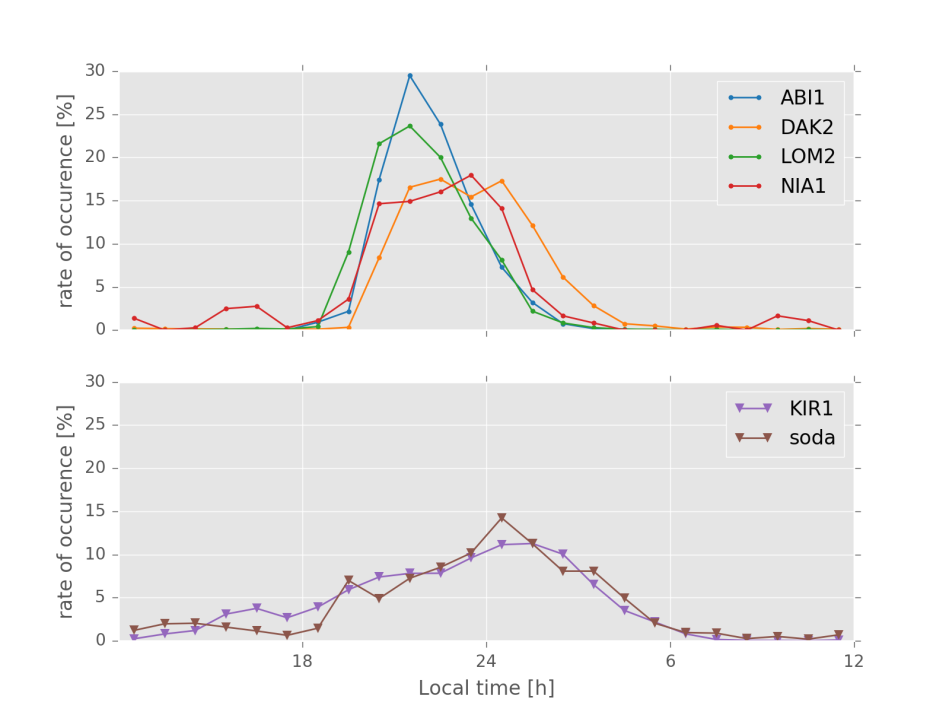

######## Annex A (normative): Measurement channels

A.1 General
===========

The throughput values defined in the measurement channels specified in
Annex A, are calculated and are valid per datastream (codeword). For
multi-stream (more than one codeword) transmissions, the throughput
referenced in the minimum requirements is the sum of throughputs of all
datastreams (codewords).

The UE category entry in the definition of the reference measurement
channel in Annex A is only informative and reveals the UE categories,
which can support the corresponding measurement channel. Whether the
measurement channel is used for testing a certain UE category or not is
specified in the individual minimum requirements.

A.2 UL reference measurement channels
=====================================

A.2.1 General
-------------

The measurement channels in the following clauses are defined to derive
the requirements in clause 6 (Transmitter Characteristics) and clause 7
(Receiver Characteristics). The measurement channels represent example
configurations of physical channels for different data rates.The
measurement channels in the following clauses are applicable to both FDD
and TDD.

The active uplink slots for TDD configurations are specified in table
A.2.1-1. TDD slot patterns defined for reference sensitivity tests will
be used for TDD UL RMCs.

Table A.2.1-1: TDD active uplink slots

  SCS      Active Uplink slots
  -------- --------------------------------
  15 kHz   4, 9
  30 kHz   8, 9, 18, 19
  60 kHz   16, 17, 18, 19, 36, 37, 38, 39

A.2.2 Reference measurement channels
------------------------------------

### A.2.2.1 DFT-s-OFDM Pi/2-BPSK

Table A.2.2.1-1: Reference Channels for DFT-s-OFDM Pi/2-BPSK

<table>
<thead>
<tr class="header">
<th>Parameter</th>
<th>Allocated resource blocks (LCRB)</th>
<th>DFT-s-OFDM Symbols per slot (Note 1)</th>
<th>Modulation</th>
<th>MCS Index (Note 2)</th>
<th>Payload size</th>
<th>Transport block CRC</th>
<th>LDPC Base Graph</th>
<th>Number of code blocks per slot (Note 3)</th>
<th>Total number of bits per slot</th>
<th>Total modulated symbols per slot</th>
</tr>
</thead>
<tbody>
<tr class="odd">
<td>Unit</td>
<td> </td>
<td> </td>
<td> </td>
<td> </td>
<td>Bits</td>
<td>Bits</td>
<td> </td>
<td> </td>
<td>Bits</td>
<td> </td>
</tr>
<tr class="even">
<td> </td>
<td>1</td>
<td>11</td>
<td>pi/2 BPSK</td>
<td>0</td>
<td>24</td>
<td>16</td>
<td>2</td>
<td>1</td>
<td>132</td>
<td>132</td>
</tr>
<tr class="odd">
<td> </td>
<td>5</td>
<td>11</td>
<td>pi/2 BPSK</td>
<td>0</td>
<td>160</td>
<td>16</td>
<td>2</td>
<td>1</td>
<td>660</td>
<td>660</td>
</tr>
<tr class="even">
<td> </td>
<td>9</td>
<td>11</td>
<td>pi/2 BPSK</td>
<td>0</td>
<td>288</td>
<td>16</td>
<td>2</td>
<td>1</td>
<td>1188</td>
<td>1188</td>
</tr>
<tr class="odd">
<td> </td>
<td>10</td>
<td>11</td>
<td>pi/2 BPSK</td>
<td>0</td>
<td>320</td>
<td>16</td>
<td>2</td>
<td>1</td>
<td>1320</td>
<td>1320</td>
</tr>
<tr class="even">
<td> </td>
<td>12</td>
<td>11</td>
<td>pi/2 BPSK</td>
<td>0</td>
<td>384</td>
<td>16</td>
<td>2</td>
<td>1</td>
<td>1584</td>
<td>1584</td>
</tr>
<tr class="odd">
<td> </td>
<td>15</td>
<td>11</td>
<td>pi/2 BPSK</td>
<td>0</td>
<td>480</td>
<td>16</td>
<td>2</td>
<td>1</td>
<td>1980</td>
<td>1980</td>
</tr>
<tr class="even">
<td> </td>
<td>18</td>
<td>11</td>
<td>pi/2 BPSK</td>
<td>0</td>
<td>576</td>
<td>16</td>
<td>2</td>
<td>1</td>
<td>2376</td>
<td>2376</td>
</tr>
<tr class="odd">
<td> </td>
<td>24</td>
<td>11</td>
<td>pi/2 BPSK</td>
<td>0</td>
<td>768</td>
<td>16</td>
<td>2</td>
<td>1</td>
<td>3168</td>
<td>3168</td>
</tr>
<tr class="even">
<td> </td>
<td>25</td>
<td>11</td>
<td>pi/2 BPSK</td>
<td>0</td>
<td>808</td>
<td>16</td>
<td>2</td>
<td>1</td>
<td>3300</td>
<td>3300</td>
</tr>
<tr class="odd">
<td> </td>
<td>30</td>
<td>11</td>
<td>pi/2 BPSK</td>
<td>0</td>
<td>984</td>
<td>16</td>
<td>2</td>
<td>1</td>
<td>3960</td>
<td>3960</td>
</tr>
<tr class="even">
<td> </td>
<td>32</td>
<td>11</td>
<td>pi/2 BPSK</td>
<td>0</td>
<td>1032</td>
<td>16</td>
<td>2</td>
<td>1</td>
<td>4224</td>
<td>4224</td>
</tr>
<tr class="odd">
<td> </td>
<td>36</td>
<td>11</td>
<td>pi/2 BPSK</td>
<td>0</td>
<td>1128</td>
<td>16</td>
<td>2</td>
<td>1</td>
<td>4752</td>
<td>4752</td>
</tr>
<tr class="even">
<td></td>
<td>45</td>
<td>11</td>
<td>pi/2 BPSK</td>
<td>0</td>
<td>1416</td>
<td>16</td>
<td>2</td>
<td>1</td>
<td>5940</td>
<td>5940</td>
</tr>
<tr class="odd">
<td> </td>
<td>50</td>
<td>11</td>
<td>pi/2 BPSK</td>
<td>0</td>
<td>1544</td>
<td>16</td>
<td>2</td>
<td>1</td>
<td>6600</td>
<td>6600</td>
</tr>
<tr class="even">
<td> </td>
<td>60</td>
<td>11</td>
<td>pi/2 BPSK</td>
<td>0</td>
<td>1864</td>
<td>16</td>
<td>2</td>
<td>1</td>
<td>7920</td>
<td>7920</td>
</tr>
<tr class="odd">
<td> </td>
<td>64</td>
<td>11</td>
<td>pi/2 BPSK</td>
<td>0</td>
<td>2024</td>
<td>16</td>
<td>2</td>
<td>1</td>
<td>8448</td>
<td>8448</td>
</tr>
<tr class="even">
<td> </td>
<td>75</td>
<td>11</td>
<td>pi/2 BPSK</td>
<td>0</td>
<td>2408</td>
<td>16</td>
<td>2</td>
<td>1</td>
<td>9900</td>
<td>9900</td>
</tr>
<tr class="odd">
<td> </td>
<td>80</td>
<td>11</td>
<td>pi/2 BPSK</td>
<td>0</td>
<td>2472</td>
<td>16</td>
<td>2</td>
<td>1</td>
<td>10560</td>
<td>10560</td>
</tr>
<tr class="even">
<td> </td>
<td>81</td>
<td>11</td>
<td>pi/2 BPSK</td>
<td>0</td>
<td>2536</td>
<td>16</td>
<td>2</td>
<td>1</td>
<td>10692</td>
<td>10692</td>
</tr>
<tr class="odd">
<td></td>
<td>90</td>
<td>11</td>
<td>pi/2 BPSK</td>
<td>0</td>
<td>2792</td>
<td>16</td>
<td>2</td>
<td>1</td>
<td>11880</td>
<td>11880</td>
</tr>
<tr class="even">
<td> </td>
<td>100</td>
<td>11</td>
<td>pi/2 BPSK</td>
<td>0</td>
<td>3104</td>
<td>16</td>
<td>2</td>
<td>1</td>
<td>13200</td>
<td>13200</td>
</tr>
<tr class="odd">
<td> </td>
<td>108</td>
<td>11</td>
<td>pi/2 BPSK</td>
<td>0</td>
<td>3368</td>
<td>16</td>
<td>2</td>
<td>1</td>
<td>14256</td>
<td>14256</td>
</tr>
<tr class="even">
<td> </td>
<td>120</td>
<td>11</td>
<td>pi/2 BPSK</td>
<td>0</td>
<td>3752</td>
<td>16</td>
<td>2</td>
<td>1</td>
<td>15840</td>
<td>15840</td>
</tr>
<tr class="odd">
<td> </td>
<td>128</td>
<td>11</td>
<td>pi/2 BPSK</td>
<td>0</td>
<td>3976</td>
<td>24</td>
<td>2</td>
<td>2</td>
<td>16896</td>
<td>16896</td>
</tr>
<tr class="even">
<td> </td>
<td>135</td>
<td>11</td>
<td>pi/2 BPSK</td>
<td>0</td>
<td>4104</td>
<td>24</td>
<td>2</td>
<td>2</td>
<td>17820</td>
<td>17820</td>
</tr>
<tr class="odd">
<td> </td>
<td>160</td>
<td>11</td>
<td>pi/2 BPSK</td>
<td>0</td>
<td>4872</td>
<td>24</td>
<td>2</td>
<td>2</td>
<td>21120</td>
<td>21120</td>
</tr>
<tr class="even">
<td> </td>
<td>162</td>
<td>11</td>
<td>pi/2 BPSK</td>
<td>0</td>
<td>5000</td>
<td>24</td>
<td>2</td>
<td>2</td>
<td>21384</td>
<td>21384</td>
</tr>
<tr class="odd">
<td></td>
<td>180</td>
<td>11</td>
<td>pi/2 BPSK</td>
<td>0</td>
<td>5512</td>
<td>24</td>
<td>2</td>
<td>2</td>
<td>23760</td>
<td>23760</td>
</tr>
<tr class="even">
<td> </td>
<td>216</td>
<td>11</td>
<td>pi/2 BPSK</td>
<td>0</td>
<td>6664</td>
<td>24</td>
<td>2</td>
<td>2</td>
<td>28512</td>
<td>28512</td>
</tr>
<tr class="odd">
<td></td>
<td>243</td>
<td>11</td>
<td>pi/2 BPSK</td>
<td>0</td>
<td>7560</td>
<td>24</td>
<td>2</td>
<td>2</td>
<td>32076</td>
<td>32076</td>
</tr>
<tr class="even">
<td></td>
<td>270</td>
<td>11</td>
<td>pi/2 BPSK</td>
<td>0</td>
<td>8448</td>
<td>24</td>
<td>2</td>
<td>3</td>
<td>35640</td>
<td>35640</td>
</tr>
<tr class="odd">
<td>
NOTE 1: PUSCH mapping Type-A and single-symbol DM-RS configuration Type-1 with 2 additional DM-RS symbols, such that the DM-RS positions are set to symbols 2, 7, 11. DMRS is [TDM'ed] with PUSCH data. DM-RS symbols are not counted.

NOTE 2: MCS Index is based on MCS table 6.1.4.1-1 defined in TS 38.214 [10].

NOTE 3: If more than one Code Block is present, an additional CRC sequence of L = 24 Bits is attached to each Code Block (otherwise L = 0 Bit)

NOTE 4: The RMCs apply to all channel bandwidth where LCRB ≤ NRB.
</td>
<td></td>
<td></td>
<td></td>
<td></td>
<td></td>
<td></td>
<td></td>
<td></td>
<td></td>
<td></td>
</tr>
</tbody>
</table>

Table A.2.2.1-2: Void

Table A.2.2.1-3: Void

### A.2.2.2 DFT-s-OFDM QPSK

Table A.2.2.2-1: Reference Channels for DFT-s-OFDM QPSK

<table>
<thead>
<tr class="header">
<th>Parameter</th>
<th>Allocated resource blocks (LCRB)</th>
<th>DFT-s-OFDM Symbols per slot (Note 1)</th>
<th>Modulation</th>
<th>MCS Index (Note 2)</th>
<th>Payload size</th>
<th>Transport block CRC</th>
<th>LDPC Base Graph</th>
<th>Number of code blocks per slot (Note 3)</th>
<th>Total number of bits per slot</th>
<th>Total modulated symbols per slot</th>
</tr>
</thead>
<tbody>
<tr class="odd">
<td>Unit</td>
<td> </td>
<td> </td>
<td> </td>
<td> </td>
<td>Bits</td>
<td>Bits</td>
<td> </td>
<td> </td>
<td>Bits</td>
<td> </td>
</tr>
<tr class="even">
<td> </td>
<td>1</td>
<td>11</td>
<td>QPSK</td>
<td>2</td>
<td>48</td>
<td>16</td>
<td>2</td>
<td>1</td>
<td>264</td>
<td>132</td>
</tr>
<tr class="odd">
<td> </td>
<td>5</td>
<td>11</td>
<td>QPSK</td>
<td>2</td>
<td>256</td>
<td>16</td>
<td>2</td>
<td>1</td>
<td>1320</td>
<td>660</td>
</tr>
<tr class="even">
<td> </td>
<td>9</td>
<td>11</td>
<td>QPSK</td>
<td>2</td>
<td>456</td>
<td>16</td>
<td>2</td>
<td>1</td>
<td>2376</td>
<td>1188</td>
</tr>
<tr class="odd">
<td> </td>
<td>10</td>
<td>11</td>
<td>QPSK</td>
<td>2</td>
<td>504</td>
<td>16</td>
<td>2</td>
<td>1</td>
<td>2640</td>
<td>1320</td>
</tr>
<tr class="even">
<td> </td>
<td>12</td>
<td>11</td>
<td>QPSK</td>
<td>2</td>
<td>608</td>
<td>16</td>
<td>2</td>
<td>1</td>
<td>3168</td>
<td>1584</td>
</tr>
<tr class="odd">
<td> </td>
<td>15</td>
<td>11</td>
<td>QPSK</td>
<td>2</td>
<td>768</td>
<td>16</td>
<td>2</td>
<td>1</td>
<td>3960</td>
<td>1980</td>
</tr>
<tr class="even">
<td> </td>
<td>18</td>
<td>11</td>
<td>QPSK</td>
<td>2</td>
<td>928</td>
<td>16</td>
<td>2</td>
<td>1</td>
<td>4752</td>
<td>2376</td>
</tr>
<tr class="odd">
<td> </td>
<td>20</td>
<td>11</td>
<td>QPSK</td>
<td>2</td>
<td>1032</td>
<td>16</td>
<td>2</td>
<td>1</td>
<td>5280</td>
<td>2640</td>
</tr>
<tr class="even">
<td> </td>
<td>24</td>
<td>11</td>
<td>QPSK</td>
<td>2</td>
<td>1192</td>
<td>16</td>
<td>2</td>
<td>1</td>
<td>6336</td>
<td>3168</td>
</tr>
<tr class="odd">
<td> </td>
<td>25</td>
<td>11</td>
<td>QPSK</td>
<td>2</td>
<td>1256</td>
<td>16</td>
<td>2</td>
<td>1</td>
<td>6600</td>
<td>3300</td>
</tr>
<tr class="even">
<td> </td>
<td>30</td>
<td>11</td>
<td>QPSK</td>
<td>2</td>
<td>1544</td>
<td>16</td>
<td>2</td>
<td>1</td>
<td>7920</td>
<td>3960</td>
</tr>
<tr class="odd">
<td> </td>
<td>32</td>
<td>11</td>
<td>QPSK</td>
<td>2</td>
<td>1608</td>
<td>16</td>
<td>2</td>
<td>1</td>
<td>8448</td>
<td>4224</td>
</tr>
<tr class="even">
<td> </td>
<td>36</td>
<td>11</td>
<td>QPSK</td>
<td>2</td>
<td>1800</td>
<td>16</td>
<td>2</td>
<td>1</td>
<td>9504</td>
<td>4752</td>
</tr>
<tr class="odd">
<td></td>
<td>45</td>
<td>11</td>
<td>QPSK</td>
<td>2</td>
<td>2208</td>
<td>16</td>
<td>2</td>
<td>1</td>
<td>11880</td>
<td>5940</td>
</tr>
<tr class="even">
<td> </td>
<td>50</td>
<td>11</td>
<td>QPSK</td>
<td>2</td>
<td>2472</td>
<td>16</td>
<td>2</td>
<td>1</td>
<td>13200</td>
<td>6600</td>
</tr>
<tr class="odd">
<td> </td>
<td>60</td>
<td>11</td>
<td>QPSK</td>
<td>2</td>
<td>3104</td>
<td>16</td>
<td>2</td>
<td>1</td>
<td>15840</td>
<td>7920</td>
</tr>
<tr class="even">
<td> </td>
<td>64</td>
<td>11</td>
<td>QPSK</td>
<td>2</td>
<td>3240</td>
<td>16</td>
<td>2</td>
<td>1</td>
<td>16896</td>
<td>8448</td>
</tr>
<tr class="odd">
<td> </td>
<td>75</td>
<td>11</td>
<td>QPSK</td>
<td>2</td>
<td>3752</td>
<td>16</td>
<td>2</td>
<td>1</td>
<td>19800</td>
<td>9900</td>
</tr>
<tr class="even">
<td> </td>
<td>80</td>
<td>11</td>
<td>QPSK</td>
<td>2</td>
<td>3976</td>
<td>24</td>
<td>2</td>
<td>2</td>
<td>21120</td>
<td>10560</td>
</tr>
<tr class="odd">
<td> </td>
<td>81</td>
<td>11</td>
<td>QPSK</td>
<td>2</td>
<td>4040</td>
<td>24</td>
<td>2</td>
<td>2</td>
<td>21384</td>
<td>10692</td>
</tr>
<tr class="even">
<td></td>
<td>90</td>
<td>11</td>
<td>QPSK</td>
<td>2</td>
<td>4488</td>
<td>24</td>
<td>2</td>
<td>2</td>
<td>23760</td>
<td>11880</td>
</tr>
<tr class="odd">
<td> </td>
<td>100</td>
<td>11</td>
<td>QPSK</td>
<td>2</td>
<td>5000</td>
<td>24</td>
<td>2</td>
<td>2</td>
<td>26400</td>
<td>13200</td>
</tr>
<tr class="even">
<td> </td>
<td>108</td>
<td>11</td>
<td>QPSK</td>
<td>2</td>
<td>5384</td>
<td>24</td>
<td>2</td>
<td>2</td>
<td>28512</td>
<td>14256</td>
</tr>
<tr class="odd">
<td> </td>
<td>120</td>
<td>11</td>
<td>QPSK</td>
<td>2</td>
<td>5896</td>
<td>24</td>
<td>2</td>
<td>2</td>
<td>31680</td>
<td>15840</td>
</tr>
<tr class="even">
<td> </td>
<td>128</td>
<td>11</td>
<td>QPSK</td>
<td>2</td>
<td>6408</td>
<td>24</td>
<td>2</td>
<td>2</td>
<td>33792</td>
<td>16896</td>
</tr>
<tr class="odd">
<td> </td>
<td>135</td>
<td>11</td>
<td>QPSK</td>
<td>2</td>
<td>6664</td>
<td>24</td>
<td>2</td>
<td>2</td>
<td>35640</td>
<td>17820</td>
</tr>
<tr class="even">
<td> </td>
<td>160</td>
<td>11</td>
<td>QPSK</td>
<td>2</td>
<td>7944</td>
<td>24</td>
<td>2</td>
<td>3</td>
<td>42240</td>
<td>21120</td>
</tr>
<tr class="odd">
<td></td>
<td>162</td>
<td>11</td>
<td>QPSK</td>
<td>2</td>
<td>8064</td>
<td>24</td>
<td>2</td>
<td>3</td>
<td>42768</td>
<td>21384</td>
</tr>
<tr class="even">
<td></td>
<td>180</td>
<td>11</td>
<td>QPSK</td>
<td>2</td>
<td>8976</td>
<td>24</td>
<td>2</td>
<td>3</td>
<td>47520</td>
<td>23760</td>
</tr>
<tr class="odd">
<td></td>
<td>216</td>
<td>11</td>
<td>QPSK</td>
<td>2</td>
<td>10752</td>
<td>24</td>
<td>2</td>
<td>3</td>
<td>57024</td>
<td>28512</td>
</tr>
<tr class="even">
<td></td>
<td>243</td>
<td>11</td>
<td>QPSK</td>
<td>2</td>
<td>12040</td>
<td>24</td>
<td>2</td>
<td>4</td>
<td>64152</td>
<td>32076</td>
</tr>
<tr class="odd">
<td></td>
<td>270</td>
<td>11</td>
<td>QPSK</td>
<td>2</td>
<td>13320</td>
<td>24</td>
<td>2</td>
<td>4</td>
<td>71280</td>
<td>35640</td>
</tr>
<tr class="even">
<td>
NOTE 1: PUSCH mapping Type-A and single-symbol DM-RS configuration Type-1 with 2 additional DM-RS symbols, such that the DM-RS positions are set to symbols 2, 7, 11. DMRS is [TDM'ed] with PUSCH data. DM-RS symbols are not counted.

NOTE 2: MCS Index is based on MCS table 6.1.4.1-1 defined in TS 38.214 [10].

NOTE 3: If more than one Code Block is present, an additional CRC sequence of L = 24 Bits is attached to each Code Block (otherwise L = 0 Bit)

NOTE 4: The RMCs apply to all channel bandwidth where LCRB ≤ NRB.
</td>
<td></td>
<td></td>
<td></td>
<td></td>
<td></td>
<td></td>
<td></td>
<td></td>
<td></td>
<td></td>
</tr>
</tbody>
</table>

Table A.2.2.2-2: Void

Table A.2.2.2-3: Void

### A.2.2.3 DFT-s-OFDM 16QAM

Table A.2.2.3-1: Reference Channels for DFT-s-OFDM 16QAM

<table>
<thead>
<tr class="header">
<th>Parameter</th>
<th>Allocated resource blocks (LCRB)</th>
<th>DFT-s-OFDM Symbols per slot (Note 1)</th>
<th>Modulation</th>
<th>MCS Index (Note 2)</th>
<th>Payload size</th>
<th>Transport block CRC</th>
<th>LDPC Base Graph</th>
<th>Number of code blocks per slot (Note 3)</th>
<th>Total number of bits per slot</th>
<th>Total modulated symbols per slot</th>
</tr>
</thead>
<tbody>
<tr class="odd">
<td>Unit</td>
<td> </td>
<td> </td>
<td> </td>
<td> </td>
<td>Bits</td>
<td>Bits</td>
<td> </td>
<td> </td>
<td>Bits</td>
<td> </td>
</tr>
<tr class="even">
<td> </td>
<td>1</td>
<td>11</td>
<td>16QAM</td>
<td>10</td>
<td>176</td>
<td>16</td>
<td>2</td>
<td>1</td>
<td>528</td>
<td>132</td>
</tr>
<tr class="odd">
<td> </td>
<td>5</td>
<td>11</td>
<td>16QAM</td>
<td>10</td>
<td>888</td>
<td>16</td>
<td>2</td>
<td>1</td>
<td>2640</td>
<td>660</td>
</tr>
<tr class="even">
<td> </td>
<td>9</td>
<td>11</td>
<td>16QAM</td>
<td>10</td>
<td>1608</td>
<td>16</td>
<td>2</td>
<td>1</td>
<td>4752</td>
<td>1188</td>
</tr>
<tr class="odd">
<td> </td>
<td>10</td>
<td>11</td>
<td>16QAM</td>
<td>10</td>
<td>1800</td>
<td>16</td>
<td>2</td>
<td>1</td>
<td>5280</td>
<td>1320</td>
</tr>
<tr class="even">
<td> </td>
<td>12</td>
<td>11</td>
<td>16QAM</td>
<td>10</td>
<td>2088</td>
<td>16</td>
<td>2</td>
<td>1</td>
<td>6336</td>
<td>1584</td>
</tr>
<tr class="odd">
<td> </td>
<td>15</td>
<td>11</td>
<td>16QAM</td>
<td>10</td>
<td>2664</td>
<td>16</td>
<td>2</td>
<td>1</td>
<td>7920</td>
<td>1980</td>
</tr>
<tr class="even">
<td> </td>
<td>18</td>
<td>11</td>
<td>16QAM</td>
<td>10</td>
<td>3240</td>
<td>16</td>
<td>2</td>
<td>1</td>
<td>9504</td>
<td>2376</td>
</tr>
<tr class="odd">
<td> </td>
<td>24</td>
<td>11</td>
<td>16QAM</td>
<td>10</td>
<td>4224</td>
<td>24</td>
<td>1</td>
<td>1</td>
<td>12672</td>
<td>3168</td>
</tr>
<tr class="even">
<td> </td>
<td>25</td>
<td>11</td>
<td>16QAM</td>
<td>10</td>
<td>4352</td>
<td>24</td>
<td>1</td>
<td>1</td>
<td>13200</td>
<td>3300</td>
</tr>
<tr class="odd">
<td> </td>
<td>30</td>
<td>11</td>
<td>16QAM</td>
<td>10</td>
<td>5248</td>
<td>24</td>
<td>1</td>
<td>1</td>
<td>15840</td>
<td>3960</td>
</tr>
<tr class="even">
<td> </td>
<td>32</td>
<td>11</td>
<td>16QAM</td>
<td>10</td>
<td>5632</td>
<td>24</td>
<td>1</td>
<td>1</td>
<td>16896</td>
<td>4224</td>
</tr>
<tr class="odd">
<td> </td>
<td>36</td>
<td>11</td>
<td>16QAM</td>
<td>10</td>
<td>6272</td>
<td>24</td>
<td>1</td>
<td>1</td>
<td>19008</td>
<td>4752</td>
</tr>
<tr class="even">
<td></td>
<td>45</td>
<td>11</td>
<td>16QAM</td>
<td>10</td>
<td>7808</td>
<td>24</td>
<td>1</td>
<td>1</td>
<td>23760</td>
<td>5940</td>
</tr>
<tr class="odd">
<td> </td>
<td>50</td>
<td>11</td>
<td>16QAM</td>
<td>10</td>
<td>8712</td>
<td>24</td>
<td>1</td>
<td>2</td>
<td>26400</td>
<td>6600</td>
</tr>
<tr class="even">
<td> </td>
<td>60</td>
<td>11</td>
<td>16QAM</td>
<td>10</td>
<td>10504</td>
<td>24</td>
<td>1</td>
<td>2</td>
<td>31680</td>
<td>7920</td>
</tr>
<tr class="odd">
<td> </td>
<td>64</td>
<td>11</td>
<td>16QAM</td>
<td>10</td>
<td>11272</td>
<td>24</td>
<td>1</td>
<td>2</td>
<td>33792</td>
<td>8448</td>
</tr>
<tr class="even">
<td> </td>
<td>75</td>
<td>11</td>
<td>16QAM</td>
<td>10</td>
<td>13064</td>
<td>24</td>
<td>1</td>
<td>2</td>
<td>39600</td>
<td>9900</td>
</tr>
<tr class="odd">
<td> </td>
<td>80</td>
<td>11</td>
<td>16QAM</td>
<td>10</td>
<td>14088</td>
<td>24</td>
<td>1</td>
<td>2</td>
<td>42240</td>
<td>10560</td>
</tr>
<tr class="even">
<td> </td>
<td>81</td>
<td>11</td>
<td>16QAM</td>
<td>10</td>
<td>14088</td>
<td>24</td>
<td>1</td>
<td>2</td>
<td>42768</td>
<td>10692</td>
</tr>
<tr class="odd">
<td></td>
<td>90</td>
<td>11</td>
<td>16QAM</td>
<td>10</td>
<td>15880</td>
<td>24</td>
<td>1</td>
<td>2</td>
<td>47520</td>
<td>11880</td>
</tr>
<tr class="even">
<td> </td>
<td>100</td>
<td>11</td>
<td>16QAM</td>
<td>10</td>
<td>17424</td>
<td>24</td>
<td>1</td>
<td>3</td>
<td>52800</td>
<td>13200</td>
</tr>
<tr class="odd">
<td> </td>
<td>108</td>
<td>11</td>
<td>16QAM</td>
<td>10</td>
<td>18960</td>
<td>24</td>
<td>1</td>
<td>3</td>
<td>57024</td>
<td>14256</td>
</tr>
<tr class="even">
<td> </td>
<td>120</td>
<td>11</td>
<td>16QAM</td>
<td>10</td>
<td>21000</td>
<td>24</td>
<td>1</td>
<td>3</td>
<td>63360</td>
<td>15840</td>
</tr>
<tr class="odd">
<td> </td>
<td>128</td>
<td>11</td>
<td>16QAM</td>
<td>10</td>
<td>22536</td>
<td>24</td>
<td>1</td>
<td>3</td>
<td>67584</td>
<td>16896</td>
</tr>
<tr class="even">
<td> </td>
<td>135</td>
<td>11</td>
<td>16QAM</td>
<td>10</td>
<td>23568</td>
<td>24</td>
<td>1</td>
<td>3</td>
<td>71280</td>
<td>17820</td>
</tr>
<tr class="odd">
<td> </td>
<td>160</td>
<td>11</td>
<td>16QAM</td>
<td>10</td>
<td>28168</td>
<td>24</td>
<td>1</td>
<td>4</td>
<td>84480</td>
<td>21120</td>
</tr>
<tr class="even">
<td> </td>
<td>162</td>
<td>11</td>
<td>16QAM</td>
<td>10</td>
<td>28168</td>
<td>24</td>
<td>1</td>
<td>4</td>
<td>85536</td>
<td>21384</td>
</tr>
<tr class="odd">
<td></td>
<td>180</td>
<td>11</td>
<td>16QAM</td>
<td>10</td>
<td>31752</td>
<td>24</td>
<td>1</td>
<td>4</td>
<td>95040</td>
<td>23760</td>
</tr>
<tr class="even">
<td></td>
<td>216</td>
<td>11</td>
<td>16QAM</td>
<td>10</td>
<td>37896</td>
<td>24</td>
<td>1</td>
<td>5</td>
<td>114048</td>
<td>28512</td>
</tr>
<tr class="odd">
<td></td>
<td>243</td>
<td>11</td>
<td>16QAM</td>
<td>10</td>
<td>43032</td>
<td>24</td>
<td>1</td>
<td>6</td>
<td>128304</td>
<td>32076</td>
</tr>
<tr class="even">
<td></td>
<td>270</td>
<td>11</td>
<td>16QAM</td>
<td>10</td>
<td>47112</td>
<td>24</td>
<td>1</td>
<td>6</td>
<td>142560</td>
<td>35640</td>
</tr>
<tr class="odd">
<td>
NOTE 1: PUSCH mapping Type-A and single-symbol DM-RS configuration Type-1 with 2 additional DM-RS symbols, such that the DM-RS positions are set to symbols 2, 7, 11. DMRS is [TDM'ed] with PUSCH data. DM-RS symbols are not counted.

NOTE 2: MCS Index is based on MCS table 6.1.4.1-1 defined in TS 38.214 [10].

NOTE 3: If more than one Code Block is present, an additional CRC sequence of L = 24 Bits is attached to each Code Block (otherwise L = 0 Bit)

NOTE 4: The RMCs apply to all channel bandwidth where LCRB ≤ NRB.
</td>
<td></td>
<td></td>
<td></td>
<td></td>
<td></td>
<td></td>
<td></td>
<td></td>
<td></td>
<td></td>
</tr>
</tbody>
</table>

Table A.2.2.3-2: Void

Table A.2.2.3-3: Void

### A.2.2.4 DFT-s-OFDM 64QAM

Table A.2.2.4-1: Reference Channels for DFT-s-OFDM 64QAM

<table>
<thead>
<tr class="header">
<th>Parameter</th>
<th>Allocated resource blocks (LCRB)</th>
<th>DFT-s-OFDM Symbols per slot (Note 1)</th>
<th>Modulation</th>
<th>MCS Index (Note 2)</th>
<th>Payload size</th>
<th>Transport block CRC</th>
<th>LDPC Base Graph</th>
<th>Number of code blocks per slot (Note 3)</th>
<th>Total number of bits per slot</th>
<th>Total modulated symbols per slot</th>
</tr>
</thead>
<tbody>
<tr class="odd">
<td>Unit</td>
<td> </td>
<td> </td>
<td> </td>
<td> </td>
<td>Bits</td>
<td>Bits</td>
<td> </td>
<td> </td>
<td>Bits</td>
<td> </td>
</tr>
<tr class="even">
<td></td>
<td>1</td>
<td>11</td>
<td>64QAM</td>
<td>18</td>
<td>408</td>
<td>16</td>
<td>2</td>
<td>1</td>
<td>792</td>
<td>132</td>
</tr>
<tr class="odd">
<td></td>
<td>5</td>
<td>11</td>
<td>64QAM</td>
<td>18</td>
<td>2024</td>
<td>16</td>
<td>2</td>
<td>1</td>
<td>3960</td>
<td>660</td>
</tr>
<tr class="even">
<td></td>
<td>9</td>
<td>11</td>
<td>64QAM</td>
<td>18</td>
<td>3624</td>
<td>16</td>
<td>2</td>
<td>1</td>
<td>7128</td>
<td>1188</td>
</tr>
<tr class="odd">
<td> </td>
<td>10</td>
<td>11</td>
<td>64QAM</td>
<td>18</td>
<td>3968</td>
<td>24</td>
<td>1</td>
<td>1</td>
<td>7920</td>
<td>1320</td>
</tr>
<tr class="even">
<td></td>
<td>12</td>
<td>11</td>
<td>64QAM</td>
<td>18</td>
<td>4736</td>
<td>24</td>
<td>1</td>
<td>1</td>
<td>9504</td>
<td>1584</td>
</tr>
<tr class="odd">
<td></td>
<td>15</td>
<td>11</td>
<td>64QAM</td>
<td>18</td>
<td>6016</td>
<td>24</td>
<td>1</td>
<td>1</td>
<td>11880</td>
<td>1980</td>
</tr>
<tr class="even">
<td> </td>
<td>18</td>
<td>11</td>
<td>64QAM</td>
<td>18</td>
<td>7168</td>
<td>24</td>
<td>1</td>
<td>1</td>
<td>14256</td>
<td>2376</td>
</tr>
<tr class="odd">
<td> </td>
<td>24</td>
<td>11</td>
<td>64QAM</td>
<td>18</td>
<td>9480</td>
<td>24</td>
<td>1</td>
<td>2</td>
<td>19008</td>
<td>3168</td>
</tr>
<tr class="even">
<td> </td>
<td>25</td>
<td>11</td>
<td>64QAM</td>
<td>18</td>
<td>9992</td>
<td>24</td>
<td>1</td>
<td>2</td>
<td>19800</td>
<td>3300</td>
</tr>
<tr class="odd">
<td> </td>
<td>30</td>
<td>11</td>
<td>64QAM</td>
<td>18</td>
<td>12040</td>
<td>24</td>
<td>1</td>
<td>2</td>
<td>23760</td>
<td>3960</td>
</tr>
<tr class="even">
<td></td>
<td>32</td>
<td>11</td>
<td>64QAM</td>
<td>18</td>
<td>12808</td>
<td>24</td>
<td>1</td>
<td>2</td>
<td>25344</td>
<td>4224</td>
</tr>
<tr class="odd">
<td> </td>
<td>36</td>
<td>11</td>
<td>64QAM</td>
<td>18</td>
<td>14344</td>
<td>24</td>
<td>1</td>
<td>2</td>
<td>28512</td>
<td>4752</td>
</tr>
<tr class="even">
<td></td>
<td>45</td>
<td>11</td>
<td>64QAM</td>
<td>18</td>
<td>17928</td>
<td>24</td>
<td>1</td>
<td>3</td>
<td>35640</td>
<td>5940</td>
</tr>
<tr class="odd">
<td> </td>
<td>50</td>
<td>11</td>
<td>64QAM</td>
<td>18</td>
<td>19968</td>
<td>24</td>
<td>1</td>
<td>3</td>
<td>39600</td>
<td>6600</td>
</tr>
<tr class="even">
<td></td>
<td>60</td>
<td>11</td>
<td>64QAM</td>
<td>18</td>
<td>24072</td>
<td>24</td>
<td>1</td>
<td>3</td>
<td>47520</td>
<td>7920</td>
</tr>
<tr class="odd">
<td> </td>
<td>64</td>
<td>11</td>
<td>64QAM</td>
<td>18</td>
<td>25608</td>
<td>24</td>
<td>1</td>
<td>4</td>
<td>50688</td>
<td>8448</td>
</tr>
<tr class="even">
<td> </td>
<td>75</td>
<td>11</td>
<td>64QAM</td>
<td>18</td>
<td>30216</td>
<td>24</td>
<td>1</td>
<td>4</td>
<td>59400</td>
<td>9900</td>
</tr>
<tr class="odd">
<td></td>
<td>80</td>
<td>11</td>
<td>64QAM</td>
<td>18</td>
<td>31752</td>
<td>24</td>
<td>1</td>
<td>4</td>
<td>63360</td>
<td>10560</td>
</tr>
<tr class="even">
<td></td>
<td>81</td>
<td>11</td>
<td>64QAM</td>
<td>18</td>
<td>32264</td>
<td>24</td>
<td>1</td>
<td>4</td>
<td>64152</td>
<td>10692</td>
</tr>
<tr class="odd">
<td></td>
<td>90</td>
<td>11</td>
<td>64QAM</td>
<td>18</td>
<td>35856</td>
<td>24</td>
<td>1</td>
<td>5</td>
<td>71280</td>
<td>11880</td>
</tr>
<tr class="even">
<td> </td>
<td>100</td>
<td>11</td>
<td>64QAM</td>
<td>18</td>
<td>39936</td>
<td>24</td>
<td>1</td>
<td>5</td>
<td>79200</td>
<td>13200</td>
</tr>
<tr class="odd">
<td></td>
<td>108</td>
<td>11</td>
<td>64QAM</td>
<td>18</td>
<td>43032</td>
<td>24</td>
<td>1</td>
<td>6</td>
<td>85536</td>
<td>14256</td>
</tr>
<tr class="even">
<td> </td>
<td>120</td>
<td>11</td>
<td>64QAM</td>
<td>18</td>
<td>48168</td>
<td>24</td>
<td>1</td>
<td>6</td>
<td>95040</td>
<td>15840</td>
</tr>
<tr class="odd">
<td> </td>
<td>128</td>
<td>11</td>
<td>64QAM</td>
<td>18</td>
<td>51216</td>
<td>24</td>
<td>1</td>
<td>7</td>
<td>101376</td>
<td>16896</td>
</tr>
<tr class="even">
<td> </td>
<td>135</td>
<td>11</td>
<td>64QAM</td>
<td>18</td>
<td>54296</td>
<td>24</td>
<td>1</td>
<td>7</td>
<td>106920</td>
<td>17820</td>
</tr>
<tr class="odd">
<td> </td>
<td>160</td>
<td>11</td>
<td>64QAM</td>
<td>18</td>
<td>63528</td>
<td>24</td>
<td>1</td>
<td>8</td>
<td>126720</td>
<td>21120</td>
</tr>
<tr class="even">
<td> </td>
<td>162</td>
<td>11</td>
<td>64QAM</td>
<td>18</td>
<td>64552</td>
<td>24</td>
<td>1</td>
<td>8</td>
<td>128304</td>
<td>21384</td>
</tr>
<tr class="odd">
<td></td>
<td>180</td>
<td>11</td>
<td>64QAM</td>
<td>18</td>
<td>71688</td>
<td>24</td>
<td>1</td>
<td>9</td>
<td>142560</td>
<td>23760</td>
</tr>
<tr class="even">
<td> </td>
<td>216</td>
<td>11</td>
<td>64QAM</td>
<td>18</td>
<td>86040</td>
<td>24</td>
<td>1</td>
<td>11</td>
<td>171072</td>
<td>28512</td>
</tr>
<tr class="odd">
<td> </td>
<td>243</td>
<td>11</td>
<td>64QAM</td>
<td>18</td>
<td>96264</td>
<td>24</td>
<td>1</td>
<td>12</td>
<td>192456</td>
<td>32076</td>
</tr>
<tr class="even">
<td> </td>
<td>270</td>
<td>11</td>
<td>64QAM</td>
<td>18</td>
<td>108552</td>
<td>24</td>
<td>1</td>
<td>13</td>
<td>213840</td>
<td>35640</td>
</tr>
<tr class="odd">
<td>
NOTE 1: PUSCH mapping Type-A and single-symbol DM-RS configuration Type-1 with 2 additional DM-RS symbols, such that the DM-RS positions are set to symbols 2, 7, 11. DMRS is [TDM'ed] with PUSCH data. DM-RS symbols are not counted.

NOTE 2: MCS Index is based on MCS table 6.1.4.1-1 defined in TS 38.214 [10].

NOTE 3: If more than one Code Block is present, an additional CRC sequence of L = 24 Bits is attached to each Code Block (otherwise L = 0 Bit)

NOTE 4: The RMCs apply to all channel bandwidth where LCRB ≤ NRB.
</td>
<td></td>
<td></td>
<td></td>
<td></td>
<td></td>
<td></td>
<td></td>
<td></td>
<td></td>
<td></td>
</tr>
</tbody>
</table>

Table A.2.2.4-2: Void

Table A.2.2.4-3: Void

### A.2.2.5 DFT-s-OFDM 256QAM

Table A.2.2.5-1: Reference Channels for DFT-s-OFDM 256QAM

<table>
<thead>
<tr class="header">
<th>Parameter</th>
<th>Allocated resource blocks (LCRB)</th>
<th>DFT-s-OFDM Symbols per slot (Note 1)</th>
<th>Modulation</th>
<th>MCS Index (Note 2)</th>
<th>Payload size</th>
<th>Transport block CRC</th>
<th>LDPC Base Graph</th>
<th>Number of code blocks per slot (Note 3)</th>
<th>Total number of bits per slot</th>
<th>Total modulated symbols per slot</th>
</tr>
</thead>
<tbody>
<tr class="odd">
<td>Unit</td>
<td> </td>
<td> </td>
<td> </td>
<td> </td>
<td>Bits</td>
<td>Bits</td>
<td> </td>
<td> </td>
<td>Bits</td>
<td> </td>
</tr>
<tr class="even">
<td></td>
<td>1</td>
<td>11</td>
<td>256QAM</td>
<td>20</td>
<td>704</td>
<td>16</td>
<td>2</td>
<td>1</td>
<td>1056</td>
<td>132</td>
</tr>
<tr class="odd">
<td></td>
<td>5</td>
<td>11</td>
<td>256QAM</td>
<td>20</td>
<td>3496</td>
<td>16</td>
<td>2</td>
<td>1</td>
<td>5280</td>
<td>660</td>
</tr>
<tr class="even">
<td></td>
<td>9</td>
<td>11</td>
<td>256QAM</td>
<td>20</td>
<td>6272</td>
<td>24</td>
<td>1</td>
<td>1</td>
<td>9504</td>
<td>1188</td>
</tr>
<tr class="odd">
<td> </td>
<td>10</td>
<td>11</td>
<td>256QAM</td>
<td>20</td>
<td>7040</td>
<td>24</td>
<td>1</td>
<td>1</td>
<td>10560</td>
<td>1320</td>
</tr>
<tr class="even">
<td></td>
<td>12</td>
<td>11</td>
<td>256QAM</td>
<td>20</td>
<td>8456</td>
<td>24</td>
<td>1</td>
<td>2</td>
<td>12672</td>
<td>1584</td>
</tr>
<tr class="odd">
<td></td>
<td>15</td>
<td>11</td>
<td>256QAM</td>
<td>20</td>
<td>10504</td>
<td>24</td>
<td>1</td>
<td>2</td>
<td>15840</td>
<td>1980</td>
</tr>
<tr class="even">
<td> </td>
<td>18</td>
<td>11</td>
<td>256QAM</td>
<td>20</td>
<td>12552</td>
<td>24</td>
<td>1</td>
<td>2</td>
<td>19008</td>
<td>2376</td>
</tr>
<tr class="odd">
<td> </td>
<td>24</td>
<td>11</td>
<td>256QAM</td>
<td>20</td>
<td>16896</td>
<td>24</td>
<td>1</td>
<td>3</td>
<td>25344</td>
<td>3168</td>
</tr>
<tr class="even">
<td> </td>
<td>25</td>
<td>11</td>
<td>256QAM</td>
<td>20</td>
<td>17424</td>
<td>24</td>
<td>1</td>
<td>3</td>
<td>26400</td>
<td>3300</td>
</tr>
<tr class="odd">
<td> </td>
<td>30</td>
<td>11</td>
<td>256QAM</td>
<td>20</td>
<td>21000</td>
<td>24</td>
<td>1</td>
<td>3</td>
<td>31680</td>
<td>3960</td>
</tr>
<tr class="even">
<td></td>
<td>32</td>
<td>11</td>
<td>256QAM</td>
<td>20</td>
<td>22536</td>
<td>24</td>
<td>1</td>
<td>3</td>
<td>33792</td>
<td>4224</td>
</tr>
<tr class="odd">
<td> </td>
<td>36</td>
<td>11</td>
<td>256QAM</td>
<td>20</td>
<td>25104</td>
<td>24</td>
<td>1</td>
<td>3</td>
<td>38016</td>
<td>4752</td>
</tr>
<tr class="even">
<td></td>
<td>45</td>
<td>11</td>
<td>256QAM</td>
<td>20</td>
<td>31752</td>
<td>24</td>
<td>1</td>
<td>4</td>
<td>47520</td>
<td>5940</td>
</tr>
<tr class="odd">
<td> </td>
<td>50</td>
<td>11</td>
<td>256QAM</td>
<td>20</td>
<td>34816</td>
<td>24</td>
<td>1</td>
<td>5</td>
<td>52800</td>
<td>6600</td>
</tr>
<tr class="even">
<td></td>
<td>60</td>
<td>11</td>
<td>256QAM</td>
<td>20</td>
<td>42016</td>
<td>24</td>
<td>1</td>
<td>5</td>
<td>63360</td>
<td>7920</td>
</tr>
<tr class="odd">
<td> </td>
<td>64</td>
<td>11</td>
<td>256QAM</td>
<td>20</td>
<td>45096</td>
<td>24</td>
<td>1</td>
<td>6</td>
<td>67584</td>
<td>8448</td>
</tr>
<tr class="even">
<td> </td>
<td>75</td>
<td>11</td>
<td>256QAM</td>
<td>20</td>
<td>53288</td>
<td>24</td>
<td>1</td>
<td>7</td>
<td>79200</td>
<td>9900</td>
</tr>
<tr class="odd">
<td></td>
<td>80</td>
<td>11</td>
<td>256QAM</td>
<td>20</td>
<td>56368</td>
<td>24</td>
<td>1</td>
<td>7</td>
<td>84480</td>
<td>10560</td>
</tr>
<tr class="even">
<td></td>
<td>81</td>
<td>11</td>
<td>256QAM</td>
<td>20</td>
<td>57376</td>
<td>24</td>
<td>1</td>
<td>7</td>
<td>85536</td>
<td>10692</td>
</tr>
<tr class="odd">
<td></td>
<td>90</td>
<td>11</td>
<td>256QAM</td>
<td>20</td>
<td>63528</td>
<td>24</td>
<td>1</td>
<td>8</td>
<td>95040</td>
<td>11880</td>
</tr>
<tr class="even">
<td> </td>
<td>100</td>
<td>11</td>
<td>256QAM</td>
<td>20</td>
<td>69672</td>
<td>24</td>
<td>1</td>
<td>9</td>
<td>105600</td>
<td>13200</td>
</tr>
<tr class="odd">
<td></td>
<td>108</td>
<td>11</td>
<td>256QAM</td>
<td>20</td>
<td>75792</td>
<td>24</td>
<td>1</td>
<td>9</td>
<td>114048</td>
<td>14256</td>
</tr>
<tr class="even">
<td> </td>
<td>120</td>
<td>11</td>
<td>256QAM</td>
<td>20</td>
<td>83976</td>
<td>24</td>
<td>1</td>
<td>10</td>
<td>126720</td>
<td>15840</td>
</tr>
<tr class="odd">
<td> </td>
<td>128</td>
<td>11</td>
<td>256QAM</td>
<td>20</td>
<td>90176</td>
<td>24</td>
<td>1</td>
<td>11</td>
<td>135168</td>
<td>16896</td>
</tr>
<tr class="even">
<td> </td>
<td>135</td>
<td>11</td>
<td>256QAM</td>
<td>20</td>
<td>94248</td>
<td>24</td>
<td>1</td>
<td>12</td>
<td>142560</td>
<td>17820</td>
</tr>
<tr class="odd">
<td> </td>
<td>160</td>
<td>11</td>
<td>256QAM</td>
<td>20</td>
<td>112648</td>
<td>24</td>
<td>1</td>
<td>14</td>
<td>168960</td>
<td>21120</td>
</tr>
<tr class="even">
<td> </td>
<td>162</td>
<td>11</td>
<td>256QAM</td>
<td>20</td>
<td>114776</td>
<td>24</td>
<td>1</td>
<td>14</td>
<td>171072</td>
<td>21384</td>
</tr>
<tr class="odd">
<td></td>
<td>180</td>
<td>11</td>
<td>256QAM</td>
<td>20</td>
<td>127080</td>
<td>24</td>
<td>1</td>
<td>16</td>
<td>190080</td>
<td>23760</td>
</tr>
<tr class="even">
<td> </td>
<td>216</td>
<td>11</td>
<td>256QAM</td>
<td>20</td>
<td>151608</td>
<td>24</td>
<td>1</td>
<td>18</td>
<td>228096</td>
<td>28512</td>
</tr>
<tr class="odd">
<td> </td>
<td>243</td>
<td>11</td>
<td>256QAM</td>
<td>20</td>
<td>172176</td>
<td>24</td>
<td>1</td>
<td>21</td>
<td>256608</td>
<td>32076</td>
</tr>
<tr class="even">
<td> </td>
<td>270</td>
<td>11</td>
<td>256QAM</td>
<td>20</td>
<td>188576</td>
<td>24</td>
<td>1</td>
<td>23</td>
<td>285120</td>
<td>35640</td>
</tr>
<tr class="odd">
<td>
NOTE 1: PUSCH mapping Type-A and single-symbol DM-RS configuration Type-1 with 2 additional DM-RS symbols, such that the DM-RS positions are set to symbols 2, 7, 11. DMRS is [TDM'ed] with PUSCH data. DM-RS symbols are not counted.

NOTE 2: MCS Index is based on MCS table 5.1.3.1-2 defined in TS 38.214 [10].

NOTE 3: If more than one Code Block is present, an additional CRC sequence of L = 24 Bits is attached to each Code Block (otherwise L = 0 Bit)

NOTE 4: The RMCs apply to all channel bandwidth where LCRB ≤ NRB.
</td>
<td></td>
<td></td>
<td></td>
<td></td>
<td></td>
<td></td>
<td></td>
<td></td>
<td></td>
<td></td>
</tr>
</tbody>
</table>

Table A.2.2.5-2: Void

Table A.2.2.5-3: Void

### A.2.2.6 CP-OFDM QPSK

Table A.2.2.6-1: Reference Channels for CP-OFDM QPSK

<table>
<thead>
<tr class="header">
<th>Parameter</th>
<th>Allocated resource blocks (LCRB)</th>
<th>DFT-s-OFDM Symbols per slot (Note 1)</th>
<th>Modulation</th>
<th>MCS Index (Note 2)</th>
<th>Payload size</th>
<th>Transport block CRC</th>
<th>LDPC Base Graph</th>
<th>Number of code blocks per slot (Note 3)</th>
<th>Total number of bits per slot</th>
<th>Total modulated symbols per slot</th>
</tr>
</thead>
<tbody>
<tr class="odd">
<td>Unit</td>
<td> </td>
<td> </td>
<td> </td>
<td> </td>
<td>Bits</td>
<td>Bits</td>
<td> </td>
<td> </td>
<td>Bits</td>
<td> </td>
</tr>
<tr class="even">
<td> </td>
<td>1</td>
<td>11</td>
<td>QPSK</td>
<td>2</td>
<td>48</td>
<td>16</td>
<td>2</td>
<td>1</td>
<td>264</td>
<td>132</td>
</tr>
<tr class="odd">
<td></td>
<td>5</td>
<td>11</td>
<td>QPSK</td>
<td>2</td>
<td>256</td>
<td>16</td>
<td>2</td>
<td>1</td>
<td>1320</td>
<td>660</td>
</tr>
<tr class="even">
<td> </td>
<td>6</td>
<td>11</td>
<td>QPSK</td>
<td>2</td>
<td>304</td>
<td>16</td>
<td>2</td>
<td>1</td>
<td>1584</td>
<td>792</td>
</tr>
<tr class="odd">
<td> </td>
<td>9</td>
<td>11</td>
<td>QPSK</td>
<td>2</td>
<td>456</td>
<td>16</td>
<td>2</td>
<td>1</td>
<td>2376</td>
<td>1188</td>
</tr>
<tr class="even">
<td></td>
<td>10</td>
<td>11</td>
<td>QPSK</td>
<td>2</td>
<td>504</td>
<td>16</td>
<td>2</td>
<td>1</td>
<td>2640</td>
<td>1320</td>
</tr>
<tr class="odd">
<td> </td>
<td>11</td>
<td>11</td>
<td>QPSK</td>
<td>2</td>
<td>552</td>
<td>16</td>
<td>2</td>
<td>1</td>
<td>2904</td>
<td>1452</td>
</tr>
<tr class="even">
<td> </td>
<td>12</td>
<td>11</td>
<td>QPSK</td>
<td>2</td>
<td>608</td>
<td>16</td>
<td>2</td>
<td>1</td>
<td>3168</td>
<td>1584</td>
</tr>
<tr class="odd">
<td> </td>
<td>13</td>
<td>11</td>
<td>QPSK</td>
<td>2</td>
<td>672</td>
<td>16</td>
<td>2</td>
<td>1</td>
<td>3432</td>
<td>1716</td>
</tr>
<tr class="even">
<td></td>
<td>15</td>
<td>11</td>
<td>QPSK</td>
<td>2</td>
<td>768</td>
<td>16</td>
<td>2</td>
<td>1</td>
<td>3960</td>
<td>1980</td>
</tr>
<tr class="odd">
<td> </td>
<td>16</td>
<td>11</td>
<td>QPSK</td>
<td>2</td>
<td>808</td>
<td>16</td>
<td>2</td>
<td>1</td>
<td>4224</td>
<td>2112</td>
</tr>
<tr class="even">
<td> </td>
<td>18</td>
<td>11</td>
<td>QPSK</td>
<td>2</td>
<td>928</td>
<td>16</td>
<td>2</td>
<td>1</td>
<td>4752</td>
<td>2376</td>
</tr>
<tr class="odd">
<td> </td>
<td>19</td>
<td>11</td>
<td>QPSK</td>
<td>2</td>
<td>984</td>
<td>16</td>
<td>2</td>
<td>1</td>
<td>5016</td>
<td>2508</td>
</tr>
<tr class="even">
<td> </td>
<td>24</td>
<td>11</td>
<td>QPSK</td>
<td>2</td>
<td>1192</td>
<td>16</td>
<td>2</td>
<td>1</td>
<td>6336</td>
<td>3168</td>
</tr>
<tr class="odd">
<td> </td>
<td>25</td>
<td>11</td>
<td>QPSK</td>
<td>2</td>
<td>1256</td>
<td>16</td>
<td>2</td>
<td>1</td>
<td>6600</td>
<td>3300</td>
</tr>
<tr class="even">
<td> </td>
<td>26</td>
<td>11</td>
<td>QPSK</td>
<td>2</td>
<td>1288</td>
<td>16</td>
<td>2</td>
<td>1</td>
<td>6864</td>
<td>3432</td>
</tr>
<tr class="odd">
<td> </td>
<td>31</td>
<td>11</td>
<td>QPSK</td>
<td>2</td>
<td>1544</td>
<td>16</td>
<td>2</td>
<td>1</td>
<td>8184</td>
<td>4092</td>
</tr>
<tr class="even">
<td> </td>
<td>33</td>
<td>11</td>
<td>QPSK</td>
<td>2</td>
<td>1672</td>
<td>16</td>
<td>2</td>
<td>1</td>
<td>8712</td>
<td>4356</td>
</tr>
<tr class="odd">
<td> </td>
<td>38</td>
<td>11</td>
<td>QPSK</td>
<td>2</td>
<td>1928</td>
<td>16</td>
<td>2</td>
<td>1</td>
<td>10032</td>
<td>5016</td>
</tr>
<tr class="even">
<td> </td>
<td>39</td>
<td>11</td>
<td>QPSK</td>
<td>2</td>
<td>2024</td>
<td>16</td>
<td>2</td>
<td>1</td>
<td>10296</td>
<td>5148</td>
</tr>
<tr class="odd">
<td> </td>
<td>40</td>
<td>11</td>
<td>QPSK</td>
<td>2</td>
<td>2024</td>
<td>16</td>
<td>2</td>
<td>1</td>
<td>10560</td>
<td>5280</td>
</tr>
<tr class="even">
<td></td>
<td>47</td>
<td>11</td>
<td>QPSK</td>
<td>2</td>
<td>2408</td>
<td>16</td>
<td>2</td>
<td>1</td>
<td>12408</td>
<td>6204</td>
</tr>
<tr class="odd">
<td> </td>
<td>51</td>
<td>11</td>
<td>QPSK</td>
<td>2</td>
<td>2536</td>
<td>16</td>
<td>2</td>
<td>1</td>
<td>13464</td>
<td>6732</td>
</tr>
<tr class="even">
<td> </td>
<td>52</td>
<td>11</td>
<td>QPSK</td>
<td>2</td>
<td>2600</td>
<td>16</td>
<td>2</td>
<td>1</td>
<td>13728</td>
<td>6864</td>
</tr>
<tr class="odd">
<td> </td>
<td>53</td>
<td>11</td>
<td>QPSK</td>
<td>2</td>
<td>2664</td>
<td>16</td>
<td>2</td>
<td>1</td>
<td>13992</td>
<td>6996</td>
</tr>
<tr class="even">
<td> </td>
<td>54</td>
<td>11</td>
<td>QPSK</td>
<td>2</td>
<td>2664</td>
<td>16</td>
<td>2</td>
<td>1</td>
<td>14256</td>
<td>7128</td>
</tr>
<tr class="odd">
<td> </td>
<td>61</td>
<td>11</td>
<td>QPSK</td>
<td>2</td>
<td>3104</td>
<td>16</td>
<td>2</td>
<td>1</td>
<td>16104</td>
<td>8052</td>
</tr>
<tr class="even">
<td> </td>
<td>65</td>
<td>11</td>
<td>QPSK</td>
<td>2</td>
<td>3240</td>
<td>16</td>
<td>2</td>
<td>1</td>
<td>17160</td>
<td>8580</td>
</tr>
<tr class="odd">
<td> </td>
<td>67</td>
<td>11</td>
<td>QPSK</td>
<td>2</td>
<td>3368</td>
<td>16</td>
<td>2</td>
<td>1</td>
<td>17688</td>
<td>8844</td>
</tr>
<tr class="even">
<td> </td>
<td>68</td>
<td>11</td>
<td>QPSK</td>
<td>2</td>
<td>3368</td>
<td>16</td>
<td>2</td>
<td>1</td>
<td>17952</td>
<td>8976</td>
</tr>
<tr class="odd">
<td> </td>
<td>78</td>
<td>11</td>
<td>QPSK</td>
<td>2</td>
<td>3848</td>
<td>24</td>
<td>2</td>
<td>2</td>
<td>20592</td>
<td>10296</td>
</tr>
<tr class="even">
<td></td>
<td>79</td>
<td>11</td>
<td>QPSK</td>
<td>2</td>
<td>3912</td>
<td>24</td>
<td>2</td>
<td>2</td>
<td>20856</td>
<td>10428</td>
</tr>
<tr class="odd">
<td></td>
<td>80</td>
<td>11</td>
<td>QPSK</td>
<td>2</td>
<td>3976</td>
<td>24</td>
<td>2</td>
<td>2</td>
<td>21120</td>
<td>10560</td>
</tr>
<tr class="even">
<td></td>
<td>81</td>
<td>11</td>
<td>QPSK</td>
<td>2</td>
<td>4040</td>
<td>24</td>
<td>2</td>
<td>2</td>
<td>21384</td>
<td>10692</td>
</tr>
<tr class="odd">
<td></td>
<td>93</td>
<td>11</td>
<td>QPSK</td>
<td>2</td>
<td>4616</td>
<td>24</td>
<td>2</td>
<td>2</td>
<td>24552</td>
<td>12276</td>
</tr>
<tr class="even">
<td></td>
<td>95</td>
<td>11</td>
<td>QPSK</td>
<td>2</td>
<td>4744</td>
<td>24</td>
<td>2</td>
<td>2</td>
<td>25080</td>
<td>12540</td>
</tr>
<tr class="odd">
<td></td>
<td>106</td>
<td>11</td>
<td>QPSK</td>
<td>2</td>
<td>5256</td>
<td>24</td>
<td>2</td>
<td>2</td>
<td>27984</td>
<td>13992</td>
</tr>
<tr class="even">
<td></td>
<td>107</td>
<td>11</td>
<td>QPSK</td>
<td>2</td>
<td>5256</td>
<td>24</td>
<td>2</td>
<td>2</td>
<td>28248</td>
<td>14124</td>
</tr>
<tr class="odd">
<td></td>
<td>108</td>
<td>11</td>
<td>QPSK</td>
<td>2</td>
<td>5384</td>
<td>24</td>
<td>2</td>
<td>2</td>
<td>28512</td>
<td>14256</td>
</tr>
<tr class="even">
<td></td>
<td>109</td>
<td>11</td>
<td>QPSK</td>
<td>2</td>
<td>5384</td>
<td>24</td>
<td>2</td>
<td>2</td>
<td>28776</td>
<td>14388</td>
</tr>
<tr class="odd">
<td></td>
<td>121</td>
<td>11</td>
<td>QPSK</td>
<td>2</td>
<td>6024</td>
<td>24</td>
<td>2</td>
<td>2</td>
<td>31944</td>
<td>15972</td>
</tr>
<tr class="even">
<td></td>
<td>123</td>
<td>11</td>
<td>QPSK</td>
<td>2</td>
<td>6152</td>
<td>24</td>
<td>2</td>
<td>2</td>
<td>32472</td>
<td>16236</td>
</tr>
<tr class="odd">
<td></td>
<td>133</td>
<td>11</td>
<td>QPSK</td>
<td>2</td>
<td>6664</td>
<td>24</td>
<td>2</td>
<td>2</td>
<td>35112</td>
<td>17556</td>
</tr>
<tr class="even">
<td></td>
<td>135</td>
<td>11</td>
<td>QPSK</td>
<td>2</td>
<td>6664</td>
<td>24</td>
<td>2</td>
<td>2</td>
<td>35640</td>
<td>17820</td>
</tr>
<tr class="odd">
<td></td>
<td>137</td>
<td>11</td>
<td>QPSK</td>
<td>2</td>
<td>6792</td>
<td>24</td>
<td>2</td>
<td>2</td>
<td>36168</td>
<td>18084</td>
</tr>
<tr class="even">
<td></td>
<td>160</td>
<td>11</td>
<td>QPSK</td>
<td>2</td>
<td>7944</td>
<td>24</td>
<td>2</td>
<td>3</td>
<td>42240</td>
<td>21120</td>
</tr>
<tr class="odd">
<td></td>
<td>162</td>
<td>11</td>
<td>QPSK</td>
<td>2</td>
<td>8064</td>
<td>24</td>
<td>2</td>
<td>3</td>
<td>42768</td>
<td>21384</td>
</tr>
<tr class="even">
<td></td>
<td>189</td>
<td>11</td>
<td>QPSK</td>
<td>2</td>
<td>9480</td>
<td>24</td>
<td>2</td>
<td>3</td>
<td>49896</td>
<td>24948</td>
</tr>
<tr class="odd">
<td></td>
<td>216</td>
<td>11</td>
<td>QPSK</td>
<td>2</td>
<td>10752</td>
<td>24</td>
<td>2</td>
<td>3</td>
<td>57024</td>
<td>28512</td>
</tr>
<tr class="even">
<td></td>
<td>217</td>
<td>11</td>
<td>QPSK</td>
<td>2</td>
<td>10752</td>
<td>24</td>
<td>2</td>
<td>3</td>
<td>57288</td>
<td>28644</td>
</tr>
<tr class="odd">
<td></td>
<td>245</td>
<td>11</td>
<td>QPSK</td>
<td>2</td>
<td>12296</td>
<td>24</td>
<td>2</td>
<td>4</td>
<td>64680</td>
<td>32340</td>
</tr>
<tr class="even">
<td></td>
<td>270</td>
<td>11</td>
<td>QPSK</td>
<td>2</td>
<td>13320</td>
<td>24</td>
<td>2</td>
<td>4</td>
<td>71280</td>
<td>35640</td>
</tr>
<tr class="odd">
<td></td>
<td>273</td>
<td>11</td>
<td>QPSK</td>
<td>2</td>
<td>13576</td>
<td>24</td>
<td>2</td>
<td>4</td>
<td>72072</td>
<td>36036</td>
</tr>
<tr class="even">
<td>
NOTE 1: PUSCH mapping Type-A and single-symbol DM-RS configuration Type-1 with 2 additional DM-RS symbols, such that the DM-RS positions are set to symbols 2, 7, 11. DMRS is [TDM'ed] with PUSCH data. DM-RS symbols are not counted.

NOTE 2: MCS Index is based on MCS table 5.1.3.1-1 defined in TS 38.214 [10].

NOTE 3: If more than one Code Block is present, an additional CRC sequence of L = 24 Bits is attached to each Code Block (otherwise L = 0 Bit)

NOTE 4: The RMCs apply to all channel bandwidth where LCRB ≤ NRB.
</td>
<td></td>
<td></td>
<td></td>
<td></td>
<td></td>
<td></td>
<td></td>
<td></td>
<td></td>
<td></td>
</tr>
</tbody>
</table>

Table A.2.2.6-2: Void

Table A.2.2.6-3: Void

### A.2.2.7 CP-OFDM 16QAM

Table A.2.2.7-1: Reference Channels for CP-OFDM 16QAM

<table>
<thead>
<tr class="header">
<th>Parameter</th>
<th>Allocated resource blocks (LCRB)</th>
<th>DFT-s-OFDM Symbols per slot (Note 1)</th>
<th>Modulation</th>
<th>MCS Index (Note 2)</th>
<th>Payload size</th>
<th>Transport block CRC</th>
<th>LDPC Base Graph</th>
<th>Number of code blocks per slot (Note 3)</th>
<th>Total number of bits per slot</th>
<th>Total modulated symbols per slot</th>
</tr>
</thead>
<tbody>
<tr class="odd">
<td>Unit</td>
<td> </td>
<td> </td>
<td> </td>
<td> </td>
<td>Bits</td>
<td>Bits</td>
<td> </td>
<td> </td>
<td>Bits</td>
<td> </td>
</tr>
<tr class="even">
<td> </td>
<td>1</td>
<td>11</td>
<td>16QAM</td>
<td>10</td>
<td>176</td>
<td>16</td>
<td>2</td>
<td>1</td>
<td>528</td>
<td>132</td>
</tr>
<tr class="odd">
<td></td>
<td>5</td>
<td>11</td>
<td>16QAM</td>
<td>10</td>
<td>888</td>
<td>16</td>
<td>2</td>
<td>1</td>
<td>2640</td>
<td>660</td>
</tr>
<tr class="even">
<td> </td>
<td>6</td>
<td>11</td>
<td>16QAM</td>
<td>10</td>
<td>1064</td>
<td>16</td>
<td>2</td>
<td>1</td>
<td>3168</td>
<td>792</td>
</tr>
<tr class="odd">
<td> </td>
<td>9</td>
<td>11</td>
<td>16QAM</td>
<td>10</td>
<td>1608</td>
<td>16</td>
<td>2</td>
<td>1</td>
<td>4752</td>
<td>1188</td>
</tr>
<tr class="even">
<td></td>
<td>10</td>
<td>11</td>
<td>16QAM</td>
<td>10</td>
<td>1800</td>
<td>16</td>
<td>2</td>
<td>1</td>
<td>5280</td>
<td>1320</td>
</tr>
<tr class="odd">
<td> </td>
<td>11</td>
<td>11</td>
<td>16QAM</td>
<td>10</td>
<td>1928</td>
<td>16</td>
<td>2</td>
<td>1</td>
<td>5808</td>
<td>1452</td>
</tr>
<tr class="even">
<td> </td>
<td>12</td>
<td>11</td>
<td>16QAM</td>
<td>10</td>
<td>2088</td>
<td>16</td>
<td>2</td>
<td>1</td>
<td>6336</td>
<td>1584</td>
</tr>
<tr class="odd">
<td> </td>
<td>13</td>
<td>11</td>
<td>16QAM</td>
<td>10</td>
<td>2280</td>
<td>16</td>
<td>2</td>
<td>1</td>
<td>6864</td>
<td>1716</td>
</tr>
<tr class="even">
<td></td>
<td>15</td>
<td>11</td>
<td>16QAM</td>
<td>10</td>
<td>2664</td>
<td>16</td>
<td>2</td>
<td>1</td>
<td>7920</td>
<td>1980</td>
</tr>
<tr class="odd">
<td> </td>
<td>16</td>
<td>11</td>
<td>16QAM</td>
<td>10</td>
<td>2792</td>
<td>16</td>
<td>2</td>
<td>1</td>
<td>8448</td>
<td>2112</td>
</tr>
<tr class="even">
<td> </td>
<td>18</td>
<td>11</td>
<td>16QAM</td>
<td>10</td>
<td>3240</td>
<td>16</td>
<td>2</td>
<td>1</td>
<td>9504</td>
<td>2376</td>
</tr>
<tr class="odd">
<td> </td>
<td>19</td>
<td>11</td>
<td>16QAM</td>
<td>10</td>
<td>3368</td>
<td>16</td>
<td>2</td>
<td>1</td>
<td>10032</td>
<td>2508</td>
</tr>
<tr class="even">
<td> </td>
<td>24</td>
<td>11</td>
<td>16QAM</td>
<td>10</td>
<td>4224</td>
<td>24</td>
<td>1</td>
<td>1</td>
<td>12672</td>
<td>3168</td>
</tr>
<tr class="odd">
<td> </td>
<td>25</td>
<td>11</td>
<td>16QAM</td>
<td>10</td>
<td>4352</td>
<td>24</td>
<td>1</td>
<td>1</td>
<td>13200</td>
<td>3300</td>
</tr>
<tr class="even">
<td> </td>
<td>26</td>
<td>11</td>
<td>16QAM</td>
<td>10</td>
<td>4480</td>
<td>24</td>
<td>1</td>
<td>1</td>
<td>13728</td>
<td>3432</td>
</tr>
<tr class="odd">
<td> </td>
<td>31</td>
<td>11</td>
<td>16QAM</td>
<td>10</td>
<td>5376</td>
<td>24</td>
<td>1</td>
<td>1</td>
<td>16368</td>
<td>4092</td>
</tr>
<tr class="even">
<td> </td>
<td>33</td>
<td>11</td>
<td>16QAM</td>
<td>10</td>
<td>5760</td>
<td>24</td>
<td>1</td>
<td>1</td>
<td>17424</td>
<td>4356</td>
</tr>
<tr class="odd">
<td> </td>
<td>38</td>
<td>11</td>
<td>16QAM</td>
<td>10</td>
<td>6656</td>
<td>24</td>
<td>1</td>
<td>1</td>
<td>20064</td>
<td>5016</td>
</tr>
<tr class="even">
<td> </td>
<td>39</td>
<td>11</td>
<td>16QAM</td>
<td>10</td>
<td>6784</td>
<td>24</td>
<td>1</td>
<td>1</td>
<td>20592</td>
<td>5148</td>
</tr>
<tr class="odd">
<td> </td>
<td>40</td>
<td>11</td>
<td>16QAM</td>
<td>10</td>
<td>7040</td>
<td>24</td>
<td>1</td>
<td>1</td>
<td>21120</td>
<td>5280</td>
</tr>
<tr class="even">
<td></td>
<td>47</td>
<td>11</td>
<td>16QAM</td>
<td>10</td>
<td>8192</td>
<td>24</td>
<td>1</td>
<td>1</td>
<td>24816</td>
<td>6204</td>
</tr>
<tr class="odd">
<td> </td>
<td>51</td>
<td>11</td>
<td>16QAM</td>
<td>10</td>
<td>8968</td>
<td>24</td>
<td>1</td>
<td>2</td>
<td>26928</td>
<td>6732</td>
</tr>
<tr class="even">
<td> </td>
<td>52</td>
<td>11</td>
<td>16QAM</td>
<td>10</td>
<td>9224</td>
<td>24</td>
<td>1</td>
<td>2</td>
<td>27456</td>
<td>6864</td>
</tr>
<tr class="odd">
<td> </td>
<td>53</td>
<td>11</td>
<td>16QAM</td>
<td>10</td>
<td>9224</td>
<td>24</td>
<td>1</td>
<td>2</td>
<td>27984</td>
<td>6996</td>
</tr>
<tr class="even">
<td> </td>
<td>54</td>
<td>11</td>
<td>16QAM</td>
<td>10</td>
<td>9480</td>
<td>24</td>
<td>1</td>
<td>2</td>
<td>28512</td>
<td>7128</td>
</tr>
<tr class="odd">
<td> </td>
<td>61</td>
<td>11</td>
<td>16QAM</td>
<td>10</td>
<td>10760</td>
<td>24</td>
<td>1</td>
<td>2</td>
<td>32208</td>
<td>8052</td>
</tr>
<tr class="even">
<td> </td>
<td>65</td>
<td>11</td>
<td>16QAM</td>
<td>10</td>
<td>11272</td>
<td>24</td>
<td>1</td>
<td>2</td>
<td>34320</td>
<td>8580</td>
</tr>
<tr class="odd">
<td> </td>
<td>67</td>
<td>11</td>
<td>16QAM</td>
<td>10</td>
<td>11784</td>
<td>24</td>
<td>1</td>
<td>2</td>
<td>35376</td>
<td>8844</td>
</tr>
<tr class="even">
<td> </td>
<td>68</td>
<td>11</td>
<td>16QAM</td>
<td>10</td>
<td>11784</td>
<td>24</td>
<td>1</td>
<td>2</td>
<td>35904</td>
<td>8976</td>
</tr>
<tr class="odd">
<td> </td>
<td>78</td>
<td>11</td>
<td>16QAM</td>
<td>10</td>
<td>13576</td>
<td>24</td>
<td>1</td>
<td>2</td>
<td>41184</td>
<td>10296</td>
</tr>
<tr class="even">
<td></td>
<td>79</td>
<td>11</td>
<td>16QAM</td>
<td>10</td>
<td>13832</td>
<td>24</td>
<td>1</td>
<td>2</td>
<td>41712</td>
<td>10428</td>
</tr>
<tr class="odd">
<td></td>
<td>80</td>
<td>11</td>
<td>16QAM</td>
<td>10</td>
<td>14088</td>
<td>24</td>
<td>1</td>
<td>2</td>
<td>42240</td>
<td>10560</td>
</tr>
<tr class="even">
<td></td>
<td>81</td>
<td>11</td>
<td>16QAM</td>
<td>10</td>
<td>14088</td>
<td>24</td>
<td>1</td>
<td>2</td>
<td>42768</td>
<td>10692</td>
</tr>
<tr class="odd">
<td></td>
<td>93</td>
<td>11</td>
<td>16QAM</td>
<td>10</td>
<td>16392</td>
<td>24</td>
<td>1</td>
<td>2</td>
<td>49104</td>
<td>12276</td>
</tr>
<tr class="even">
<td></td>
<td>95</td>
<td>11</td>
<td>16QAM</td>
<td>10</td>
<td>16392</td>
<td>24</td>
<td>1</td>
<td>2</td>
<td>50160</td>
<td>12540</td>
</tr>
<tr class="odd">
<td></td>
<td>106</td>
<td>11</td>
<td>16QAM</td>
<td>10</td>
<td>18432</td>
<td>24</td>
<td>1</td>
<td>3</td>
<td>55968</td>
<td>13992</td>
</tr>
<tr class="even">
<td></td>
<td>107</td>
<td>11</td>
<td>16QAM</td>
<td>10</td>
<td>18960</td>
<td>24</td>
<td>1</td>
<td>3</td>
<td>56496</td>
<td>14124</td>
</tr>
<tr class="odd">
<td></td>
<td>108</td>
<td>11</td>
<td>16QAM</td>
<td>10</td>
<td>18960</td>
<td>24</td>
<td>1</td>
<td>3</td>
<td>57024</td>
<td>14256</td>
</tr>
<tr class="even">
<td></td>
<td>109</td>
<td>11</td>
<td>16QAM</td>
<td>10</td>
<td>18960</td>
<td>24</td>
<td>1</td>
<td>3</td>
<td>57552</td>
<td>14388</td>
</tr>
<tr class="odd">
<td></td>
<td>121</td>
<td>11</td>
<td>16QAM</td>
<td>10</td>
<td>21000</td>
<td>24</td>
<td>1</td>
<td>3</td>
<td>63888</td>
<td>15972</td>
</tr>
<tr class="even">
<td></td>
<td>123</td>
<td>11</td>
<td>16QAM</td>
<td>10</td>
<td>21504</td>
<td>24</td>
<td>1</td>
<td>3</td>
<td>64944</td>
<td>16236</td>
</tr>
<tr class="odd">
<td></td>
<td>133</td>
<td>11</td>
<td>16QAM</td>
<td>10</td>
<td>23040</td>
<td>24</td>
<td>1</td>
<td>3</td>
<td>70224</td>
<td>17556</td>
</tr>
<tr class="even">
<td></td>
<td>135</td>
<td>11</td>
<td>16QAM</td>
<td>10</td>
<td>23568</td>
<td>24</td>
<td>1</td>
<td>3</td>
<td>71280</td>
<td>17820</td>
</tr>
<tr class="odd">
<td></td>
<td>137</td>
<td>11</td>
<td>16QAM</td>
<td>10</td>
<td>24072</td>
<td>24</td>
<td>1</td>
<td>3</td>
<td>72336</td>
<td>18084</td>
</tr>
<tr class="even">
<td></td>
<td>160</td>
<td>11</td>
<td>16QAM</td>
<td>10</td>
<td>28168</td>
<td>24</td>
<td>1</td>
<td>4</td>
<td>84480</td>
<td>21120</td>
</tr>
<tr class="odd">
<td></td>
<td>162</td>
<td>11</td>
<td>16QAM</td>
<td>10</td>
<td>28168</td>
<td>24</td>
<td>1</td>
<td>4</td>
<td>85536</td>
<td>21384</td>
</tr>
<tr class="even">
<td></td>
<td>189</td>
<td>11</td>
<td>16QAM</td>
<td>10</td>
<td>32776</td>
<td>24</td>
<td>1</td>
<td>4</td>
<td>99792</td>
<td>24948</td>
</tr>
<tr class="odd">
<td></td>
<td>216</td>
<td>11</td>
<td>16QAM</td>
<td>10</td>
<td>37896</td>
<td>24</td>
<td>1</td>
<td>5</td>
<td>114048</td>
<td>28512</td>
</tr>
<tr class="even">
<td></td>
<td>217</td>
<td>11</td>
<td>16QAM</td>
<td>10</td>
<td>37896</td>
<td>24</td>
<td>1</td>
<td>5</td>
<td>114576</td>
<td>28644</td>
</tr>
<tr class="odd">
<td></td>
<td>245</td>
<td>11</td>
<td>16QAM</td>
<td>10</td>
<td>43032</td>
<td>24</td>
<td>1</td>
<td>6</td>
<td>129360</td>
<td>32340</td>
</tr>
<tr class="even">
<td></td>
<td>270</td>
<td>11</td>
<td>16QAM</td>
<td>10</td>
<td>47112</td>
<td>24</td>
<td>1</td>
<td>6</td>
<td>142560</td>
<td>35640</td>
</tr>
<tr class="odd">
<td></td>
<td>273</td>
<td>11</td>
<td>16QAM</td>
<td>10</td>
<td>48168</td>
<td>24</td>
<td>1</td>
<td>6</td>
<td>144144</td>
<td>36036</td>
</tr>
<tr class="even">
<td>
NOTE 1: PUSCH mapping Type-A and single-symbol DM-RS configuration Type-1 with 2 additional DM-RS symbols, such that the DM-RS positions are set to symbols 2, 7, 11. DMRS is [TDM'ed] with PUSCH data. DM-RS symbols are not counted.

NOTE 2: MCS Index is based on MCS table 5.1.3.1-1 defined in TS 38.214 [10].

NOTE 3: If more than one Code Block is present, an additional CRC sequence of L = 24 Bits is attached to each Code Block (otherwise L = 0 Bit)

NOTE 4: The RMCs apply to all channel bandwidth where LCRB ≤ NRB.
</td>
<td></td>
<td></td>
<td></td>
<td></td>
<td></td>
<td></td>
<td></td>
<td></td>
<td></td>
<td></td>
</tr>
</tbody>
</table>

Table A.2.2.7-2: Void

Table A.2.2.7-3: Void

### A.2.2.8 CP-OFDM 64QAM

Table A.2.2.8-1: Reference Channels for CP-OFDM 64QAM

<table>
<thead>
<tr class="header">
<th>Parameter</th>
<th>Allocated resource blocks (LCRB)</th>
<th>DFT-s-OFDM Symbols per slot (Note 1)</th>
<th>Modulation</th>
<th>MCS Index (Note 2)</th>
<th>Payload size</th>
<th>Transport block CRC</th>
<th>LDPC Base Graph</th>
<th>Number of code blocks per slot (Note 3)</th>
<th>Total number of bits per slot</th>
<th>Total modulated symbols per slot</th>
</tr>
</thead>
<tbody>
<tr class="odd">
<td>Unit</td>
<td> </td>
<td> </td>
<td> </td>
<td> </td>
<td>Bits</td>
<td>Bits</td>
<td> </td>
<td> </td>
<td>Bits</td>
<td> </td>
</tr>
<tr class="even">
<td></td>
<td>1</td>
<td>11</td>
<td>64QAM</td>
<td>19</td>
<td>408</td>
<td>16</td>
<td>2</td>
<td>1</td>
<td>792</td>
<td>132</td>
</tr>
<tr class="odd">
<td></td>
<td>5</td>
<td>11</td>
<td>64QAM</td>
<td>19</td>
<td>2024</td>
<td>16</td>
<td>2</td>
<td>1</td>
<td>3960</td>
<td>660</td>
</tr>
<tr class="even">
<td></td>
<td>9</td>
<td>11</td>
<td>64QAM</td>
<td>19</td>
<td>3624</td>
<td>16</td>
<td>2</td>
<td>1</td>
<td>7128</td>
<td>1188</td>
</tr>
<tr class="odd">
<td></td>
<td>10</td>
<td>11</td>
<td>64QAM</td>
<td>19</td>
<td>3968</td>
<td>24</td>
<td>1</td>
<td>1</td>
<td>7920</td>
<td>1320</td>
</tr>
<tr class="even">
<td> </td>
<td>11</td>
<td>11</td>
<td>64QAM</td>
<td>19</td>
<td>4352</td>
<td>24</td>
<td>1</td>
<td>1</td>
<td>8712</td>
<td>1452</td>
</tr>
<tr class="odd">
<td></td>
<td>12</td>
<td>11</td>
<td>64QAM</td>
<td>19</td>
<td>4736</td>
<td>24</td>
<td>1</td>
<td>1</td>
<td>9504</td>
<td>1584</td>
</tr>
<tr class="even">
<td></td>
<td>13</td>
<td>11</td>
<td>64QAM</td>
<td>19</td>
<td>5120</td>
<td>24</td>
<td>1</td>
<td>1</td>
<td>10296</td>
<td>1716</td>
</tr>
<tr class="odd">
<td></td>
<td>15</td>
<td>11</td>
<td>64QAM</td>
<td>19</td>
<td>6016</td>
<td>24</td>
<td>1</td>
<td>1</td>
<td>11880</td>
<td>1980</td>
</tr>
<tr class="even">
<td> </td>
<td>18</td>
<td>11</td>
<td>64QAM</td>
<td>19</td>
<td>7168</td>
<td>24</td>
<td>1</td>
<td>1</td>
<td>14256</td>
<td>2376</td>
</tr>
<tr class="odd">
<td></td>
<td>19</td>
<td>11</td>
<td>64QAM</td>
<td>19</td>
<td>7552</td>
<td>24</td>
<td>1</td>
<td></td>
<td>15048</td>
<td>2508</td>
</tr>
<tr class="even">
<td> </td>
<td>24</td>
<td>11</td>
<td>64QAM</td>
<td>19</td>
<td>9480</td>
<td>24</td>
<td>1</td>
<td>2</td>
<td>19008</td>
<td>3168</td>
</tr>
<tr class="odd">
<td> </td>
<td>25</td>
<td>11</td>
<td>64QAM</td>
<td>19</td>
<td>9992</td>
<td>24</td>
<td>1</td>
<td>2</td>
<td>19800</td>
<td>3300</td>
</tr>
<tr class="even">
<td></td>
<td>26</td>
<td>11</td>
<td>64QAM</td>
<td>19</td>
<td>10504</td>
<td>24</td>
<td>1</td>
<td>2</td>
<td>20592</td>
<td>3432</td>
</tr>
<tr class="odd">
<td> </td>
<td>31</td>
<td>11</td>
<td>64QAM</td>
<td>19</td>
<td>12296</td>
<td>24</td>
<td>1</td>
<td>2</td>
<td>24552</td>
<td>4092</td>
</tr>
<tr class="even">
<td></td>
<td>33</td>
<td>11</td>
<td>64QAM</td>
<td>19</td>
<td>13064</td>
<td>24</td>
<td>1</td>
<td>2</td>
<td>26136</td>
<td>4356</td>
</tr>
<tr class="odd">
<td> </td>
<td>38</td>
<td>11</td>
<td>64QAM</td>
<td>19</td>
<td>15112</td>
<td>24</td>
<td>1</td>
<td>2</td>
<td>30096</td>
<td>5016</td>
</tr>
<tr class="even">
<td></td>
<td>39</td>
<td>11</td>
<td>64QAM</td>
<td>19</td>
<td>15624</td>
<td>24</td>
<td>1</td>
<td>2</td>
<td>30888</td>
<td>5148</td>
</tr>
<tr class="odd">
<td></td>
<td>47</td>
<td>11</td>
<td>64QAM</td>
<td>19</td>
<td>18960</td>
<td>24</td>
<td>1</td>
<td>3</td>
<td>37224</td>
<td>6204</td>
</tr>
<tr class="even">
<td> </td>
<td>51</td>
<td>11</td>
<td>64QAM</td>
<td>19</td>
<td>20496</td>
<td>24</td>
<td>1</td>
<td>3</td>
<td>40392</td>
<td>6732</td>
</tr>
<tr class="odd">
<td> </td>
<td>52</td>
<td>11</td>
<td>64QAM</td>
<td>19</td>
<td>21000</td>
<td>24</td>
<td>1</td>
<td>3</td>
<td>41184</td>
<td>6864</td>
</tr>
<tr class="even">
<td></td>
<td>53</td>
<td>11</td>
<td>64QAM</td>
<td>19</td>
<td>21000</td>
<td>24</td>
<td>1</td>
<td>3</td>
<td>41976</td>
<td>6996</td>
</tr>
<tr class="odd">
<td></td>
<td>61</td>
<td>11</td>
<td>64QAM</td>
<td>19</td>
<td>24567</td>
<td>24</td>
<td>1</td>
<td>3</td>
<td>48312</td>
<td>8052</td>
</tr>
<tr class="even">
<td> </td>
<td>65</td>
<td>11</td>
<td>64QAM</td>
<td>19</td>
<td>26120</td>
<td>24</td>
<td>1</td>
<td>4</td>
<td>51480</td>
<td>8580</td>
</tr>
<tr class="odd">
<td></td>
<td>67</td>
<td>11</td>
<td>64QAM</td>
<td>19</td>
<td>26632</td>
<td>24</td>
<td>1</td>
<td>4</td>
<td>53064</td>
<td>8844</td>
</tr>
<tr class="even">
<td> </td>
<td>78</td>
<td>11</td>
<td>64QAM</td>
<td>19</td>
<td>31240</td>
<td>24</td>
<td>1</td>
<td>4</td>
<td>61776</td>
<td>10296</td>
</tr>
<tr class="odd">
<td> </td>
<td>79</td>
<td>11</td>
<td>64QAM</td>
<td>19</td>
<td>31752</td>
<td>24</td>
<td>1</td>
<td>4</td>
<td>62568</td>
<td>10428</td>
</tr>
<tr class="even">
<td></td>
<td>80</td>
<td>11</td>
<td>64QAM</td>
<td>19</td>
<td>31752</td>
<td>24</td>
<td>1</td>
<td>4</td>
<td>63360</td>
<td>10560</td>
</tr>
<tr class="odd">
<td></td>
<td>81</td>
<td>11</td>
<td>64QAM</td>
<td>19</td>
<td>32264</td>
<td>24</td>
<td>1</td>
<td>4</td>
<td>64152</td>
<td>10692</td>
</tr>
<tr class="even">
<td></td>
<td>93</td>
<td>11</td>
<td>64QAM</td>
<td>19</td>
<td>36896</td>
<td>24</td>
<td>1</td>
<td>5</td>
<td>73656</td>
<td>12276</td>
</tr>
<tr class="odd">
<td></td>
<td>95</td>
<td>11</td>
<td>64QAM</td>
<td>19</td>
<td>37896</td>
<td>24</td>
<td>1</td>
<td>5</td>
<td>75240</td>
<td>12540</td>
</tr>
<tr class="even">
<td> </td>
<td>106</td>
<td>11</td>
<td>64QAM</td>
<td>19</td>
<td>42016</td>
<td>24</td>
<td>1</td>
<td>5</td>
<td>83952</td>
<td>13992</td>
</tr>
<tr class="odd">
<td> </td>
<td>107</td>
<td>11</td>
<td>64QAM</td>
<td>19</td>
<td>43032</td>
<td>24</td>
<td>1</td>
<td>6</td>
<td>84744</td>
<td>14124</td>
</tr>
<tr class="even">
<td></td>
<td>108</td>
<td>11</td>
<td>64QAM</td>
<td>19</td>
<td>43032</td>
<td>24</td>
<td>1</td>
<td>6</td>
<td>85536</td>
<td>14256</td>
</tr>
<tr class="odd">
<td></td>
<td>109</td>
<td>11</td>
<td>64QAM</td>
<td>19</td>
<td>44040</td>
<td>24</td>
<td>1</td>
<td>6</td>
<td>86328</td>
<td>14388</td>
</tr>
<tr class="even">
<td> </td>
<td>121</td>
<td>11</td>
<td>64QAM</td>
<td>19</td>
<td>48168</td>
<td>24</td>
<td>1</td>
<td>6</td>
<td>95832</td>
<td>15972</td>
</tr>
<tr class="odd">
<td></td>
<td>123</td>
<td>11</td>
<td>64QAM</td>
<td>19</td>
<td>49176</td>
<td>24</td>
<td>1</td>
<td>6</td>
<td>97416</td>
<td>16236</td>
</tr>
<tr class="even">
<td> </td>
<td>133</td>
<td>11</td>
<td>64QAM</td>
<td>19</td>
<td>53288</td>
<td>24</td>
<td>1</td>
<td>7</td>
<td>105336</td>
<td>17556</td>
</tr>
<tr class="odd">
<td> </td>
<td>135</td>
<td>11</td>
<td>64QAM</td>
<td>19</td>
<td>54296</td>
<td>24</td>
<td>1</td>
<td>7</td>
<td>106920</td>
<td>17820</td>
</tr>
<tr class="even">
<td></td>
<td>137</td>
<td>11</td>
<td>64QAM</td>
<td>19</td>
<td>54296</td>
<td>24</td>
<td>1</td>
<td>7</td>
<td>108504</td>
<td>18084</td>
</tr>
<tr class="odd">
<td> </td>
<td>160</td>
<td>11</td>
<td>64QAM</td>
<td>19</td>
<td>63528</td>
<td>24</td>
<td>1</td>
<td>8</td>
<td>126720</td>
<td>21120</td>
</tr>
<tr class="even">
<td> </td>
<td>162</td>
<td>11</td>
<td>64QAM</td>
<td>19</td>
<td>64552</td>
<td>24</td>
<td>1</td>
<td>8</td>
<td>128304</td>
<td>21384</td>
</tr>
<tr class="odd">
<td></td>
<td>189</td>
<td>11</td>
<td>64QAM</td>
<td>19</td>
<td>75792</td>
<td>24</td>
<td>1</td>
<td>9</td>
<td>149688</td>
<td>24948</td>
</tr>
<tr class="even">
<td> </td>
<td>216</td>
<td>11</td>
<td>64QAM</td>
<td>19</td>
<td>86040</td>
<td>24</td>
<td>1</td>
<td>11</td>
<td>171072</td>
<td>28512</td>
</tr>
<tr class="odd">
<td> </td>
<td>217</td>
<td>11</td>
<td>64QAM</td>
<td>19</td>
<td>86040</td>
<td>24</td>
<td>1</td>
<td>11</td>
<td>171864</td>
<td>28644</td>
</tr>
<tr class="even">
<td> </td>
<td>245</td>
<td>11</td>
<td>64QAM</td>
<td>19</td>
<td>98376</td>
<td>24</td>
<td>1</td>
<td>12</td>
<td>194040</td>
<td>32340</td>
</tr>
<tr class="odd">
<td> </td>
<td>270</td>
<td>11</td>
<td>64QAM</td>
<td>19</td>
<td>108552</td>
<td>24</td>
<td>1</td>
<td>13</td>
<td>213840</td>
<td>35640</td>
</tr>
<tr class="even">
<td> </td>
<td>273</td>
<td>11</td>
<td>64QAM</td>
<td>19</td>
<td>108552</td>
<td>24</td>
<td>1</td>
<td>13</td>
<td>216216</td>
<td>36036</td>
</tr>
<tr class="odd">
<td>
NOTE 1: PUSCH mapping Type-A and single-symbol DM-RS configuration Type-1 with 2 additional DM-RS symbols, such that the DM-RS positions are set to symbols 2, 7, 11. DMRS is [TDM'ed] with PUSCH data. DM-RS symbols are not counted.

NOTE 2: MCS Index is based on MCS table 5.1.3.1-1 defined in TS 38.214 [10].

NOTE 3: If more than one Code Block is present, an additional CRC sequence of L = 24 Bits is attached to each Code Block (otherwise L = 0 Bit)

NOTE 4: The RMCs apply to all channel bandwidth where LCRB ≤ NRB.
</td>
<td></td>
<td></td>
<td></td>
<td></td>
<td></td>
<td></td>
<td></td>
<td></td>
<td></td>
<td></td>
</tr>
</tbody>
</table>

Table A.2.2.8-2: Void

Table A.2.2.8-3: Void

### A.2.2.9 CP-OFDM 256QAM

Table A.2.2.9-1: Reference Channels for CP-OFDM 256QAM

<table>
<thead>
<tr class="header">
<th>Parameter</th>
<th>Allocated resource blocks (LCRB)</th>
<th>DFT-s-OFDM Symbols per slot (Note 1)</th>
<th>Modulation</th>
<th>MCS Index (Note 2)</th>
<th>Payload size</th>
<th>Transport block CRC</th>
<th>LDPC Base Graph</th>
<th>Number of code blocks per slot (Note 3)</th>
<th>Total number of bits per slot</th>
<th>Total modulated symbols per slot</th>
</tr>
</thead>
<tbody>
<tr class="odd">
<td>Unit</td>
<td> </td>
<td> </td>
<td> </td>
<td> </td>
<td>Bits</td>
<td>Bits</td>
<td> </td>
<td> </td>
<td>Bits</td>
<td> </td>
</tr>
<tr class="even">
<td></td>
<td>1</td>
<td>11</td>
<td>256QAM</td>
<td>20</td>
<td>704</td>
<td>16</td>
<td>2</td>
<td>1</td>
<td>1056</td>
<td>132</td>
</tr>
<tr class="odd">
<td></td>
<td>5</td>
<td>11</td>
<td>256QAM</td>
<td>20</td>
<td>3496</td>
<td>16</td>
<td>2</td>
<td>1</td>
<td>5280</td>
<td>660</td>
</tr>
<tr class="even">
<td></td>
<td>9</td>
<td>11</td>
<td>256QAM</td>
<td>20</td>
<td>6272</td>
<td>24</td>
<td>1</td>
<td>1</td>
<td>9504</td>
<td>1188</td>
</tr>
<tr class="odd">
<td></td>
<td>10</td>
<td>11</td>
<td>256QAM</td>
<td>20</td>
<td>7040</td>
<td>24</td>
<td>1</td>
<td>1</td>
<td>10560</td>
<td>1320</td>
</tr>
<tr class="even">
<td> </td>
<td>11</td>
<td>11</td>
<td>256QAM</td>
<td>20</td>
<td>7680</td>
<td>24</td>
<td>1</td>
<td>1</td>
<td>11616</td>
<td>1452</td>
</tr>
<tr class="odd">
<td></td>
<td>12</td>
<td>11</td>
<td>256QAM</td>
<td>20</td>
<td>8456</td>
<td>24</td>
<td>1</td>
<td>2</td>
<td>12672</td>
<td>1584</td>
</tr>
<tr class="even">
<td></td>
<td>13</td>
<td>11</td>
<td>256QAM</td>
<td>20</td>
<td>9224</td>
<td>24</td>
<td>1</td>
<td>2</td>
<td>13728</td>
<td>1716</td>
</tr>
<tr class="odd">
<td></td>
<td>15</td>
<td>11</td>
<td>256QAM</td>
<td>20</td>
<td>10504</td>
<td>24</td>
<td>1</td>
<td>2</td>
<td>15840</td>
<td>1980</td>
</tr>
<tr class="even">
<td> </td>
<td>18</td>
<td>11</td>
<td>256QAM</td>
<td>20</td>
<td>12552</td>
<td>24</td>
<td>1</td>
<td>2</td>
<td>19008</td>
<td>2376</td>
</tr>
<tr class="odd">
<td></td>
<td>19</td>
<td>11</td>
<td>256QAM</td>
<td>20</td>
<td>13320</td>
<td>24</td>
<td>1</td>
<td>2</td>
<td>20064</td>
<td>2508</td>
</tr>
<tr class="even">
<td> </td>
<td>24</td>
<td>11</td>
<td>256QAM</td>
<td>20</td>
<td>16896</td>
<td>24</td>
<td>1</td>
<td>3</td>
<td>25344</td>
<td>3168</td>
</tr>
<tr class="odd">
<td> </td>
<td>25</td>
<td>11</td>
<td>256QAM</td>
<td>20</td>
<td>17424</td>
<td>24</td>
<td>1</td>
<td>3</td>
<td>26400</td>
<td>3300</td>
</tr>
<tr class="even">
<td></td>
<td>26</td>
<td>11</td>
<td>256QAM</td>
<td>20</td>
<td>18432</td>
<td>24</td>
<td>1</td>
<td>3</td>
<td>27456</td>
<td>3432</td>
</tr>
<tr class="odd">
<td> </td>
<td>31</td>
<td>11</td>
<td>256QAM</td>
<td>20</td>
<td>22032</td>
<td>24</td>
<td>1</td>
<td>3</td>
<td>32736</td>
<td>4092</td>
</tr>
<tr class="even">
<td></td>
<td>33</td>
<td>11</td>
<td>256QAM</td>
<td>20</td>
<td>23040</td>
<td>24</td>
<td>1</td>
<td>3</td>
<td>34848</td>
<td>4356</td>
</tr>
<tr class="odd">
<td> </td>
<td>38</td>
<td>11</td>
<td>256QAM</td>
<td>20</td>
<td>26632</td>
<td>24</td>
<td>1</td>
<td>4</td>
<td>40128</td>
<td>5016</td>
</tr>
<tr class="even">
<td></td>
<td>39</td>
<td>11</td>
<td>256QAM</td>
<td>20</td>
<td>27656</td>
<td>24</td>
<td>1</td>
<td>4</td>
<td>41184</td>
<td>5148</td>
</tr>
<tr class="odd">
<td></td>
<td>47</td>
<td>11</td>
<td>256QAM</td>
<td>20</td>
<td>32776</td>
<td>24</td>
<td>1</td>
<td>4</td>
<td>49632</td>
<td>6204</td>
</tr>
<tr class="even">
<td> </td>
<td>51</td>
<td>11</td>
<td>256QAM</td>
<td>20</td>
<td>35856</td>
<td>24</td>
<td>1</td>
<td>5</td>
<td>53856</td>
<td>6732</td>
</tr>
<tr class="odd">
<td> </td>
<td>52</td>
<td>11</td>
<td>256QAM</td>
<td>20</td>
<td>36896</td>
<td>24</td>
<td>1</td>
<td>5</td>
<td>54912</td>
<td>6864</td>
</tr>
<tr class="even">
<td></td>
<td>53</td>
<td>11</td>
<td>256QAM</td>
<td>20</td>
<td>36896</td>
<td>24</td>
<td>1</td>
<td>5</td>
<td>55968</td>
<td>6996</td>
</tr>
<tr class="odd">
<td></td>
<td>61</td>
<td>11</td>
<td>256QAM</td>
<td>20</td>
<td>43032</td>
<td>24</td>
<td>1</td>
<td>6</td>
<td>64416</td>
<td>8052</td>
</tr>
<tr class="even">
<td> </td>
<td>65</td>
<td>11</td>
<td>256QAM</td>
<td>20</td>
<td>46104</td>
<td>24</td>
<td>1</td>
<td>6</td>
<td>68640</td>
<td>8580</td>
</tr>
<tr class="odd">
<td></td>
<td>67</td>
<td>11</td>
<td>256QAM</td>
<td>20</td>
<td>47112</td>
<td>24</td>
<td>1</td>
<td>6</td>
<td>70752</td>
<td>8844</td>
</tr>
<tr class="even">
<td> </td>
<td>78</td>
<td>11</td>
<td>256QAM</td>
<td>20</td>
<td>55304</td>
<td>24</td>
<td>1</td>
<td>7</td>
<td>82368</td>
<td>10296</td>
</tr>
<tr class="odd">
<td> </td>
<td>79</td>
<td>11</td>
<td>256QAM</td>
<td>20</td>
<td>55304</td>
<td>24</td>
<td>1</td>
<td>7</td>
<td>83424</td>
<td>10428</td>
</tr>
<tr class="even">
<td></td>
<td>80</td>
<td>11</td>
<td>256QAM</td>
<td>20</td>
<td>56368</td>
<td>24</td>
<td>1</td>
<td>7</td>
<td>84480</td>
<td>10560</td>
</tr>
<tr class="odd">
<td></td>
<td>81</td>
<td>11</td>
<td>256QAM</td>
<td>20</td>
<td>57376</td>
<td>24</td>
<td>1</td>
<td>7</td>
<td>85536</td>
<td>10692</td>
</tr>
<tr class="even">
<td></td>
<td>93</td>
<td>11</td>
<td>256QAM</td>
<td>20</td>
<td>65576</td>
<td>24</td>
<td>1</td>
<td>8</td>
<td>98208</td>
<td>12276</td>
</tr>
<tr class="odd">
<td></td>
<td>95</td>
<td>11</td>
<td>256QAM</td>
<td>20</td>
<td>67584</td>
<td>24</td>
<td>1</td>
<td>8</td>
<td>100320</td>
<td>12540</td>
</tr>
<tr class="even">
<td> </td>
<td>106</td>
<td>11</td>
<td>256QAM</td>
<td>20</td>
<td>73776</td>
<td>24</td>
<td>1</td>
<td>9</td>
<td>111936</td>
<td>13992</td>
</tr>
<tr class="odd">
<td> </td>
<td>107</td>
<td>11</td>
<td>256QAM</td>
<td>20</td>
<td>75792</td>
<td>24</td>
<td>1</td>
<td>9</td>
<td>112992</td>
<td>14124</td>
</tr>
<tr class="even">
<td></td>
<td>108</td>
<td>11</td>
<td>256QAM</td>
<td>20</td>
<td>75792</td>
<td>24</td>
<td>1</td>
<td>9</td>
<td>114048</td>
<td>14256</td>
</tr>
<tr class="odd">
<td></td>
<td>109</td>
<td>11</td>
<td>256QAM</td>
<td>20</td>
<td>75792</td>
<td>24</td>
<td>1</td>
<td>9</td>
<td>115104</td>
<td>14388</td>
</tr>
<tr class="even">
<td> </td>
<td>121</td>
<td>11</td>
<td>256QAM</td>
<td>20</td>
<td>86040</td>
<td>24</td>
<td>1</td>
<td>11</td>
<td>127776</td>
<td>15972</td>
</tr>
<tr class="odd">
<td></td>
<td>123</td>
<td>11</td>
<td>256QAM</td>
<td>20</td>
<td>86040</td>
<td>24</td>
<td>1</td>
<td>11</td>
<td>129888</td>
<td>16236</td>
</tr>
<tr class="even">
<td> </td>
<td>133</td>
<td>11</td>
<td>256QAM</td>
<td>20</td>
<td>94248</td>
<td>24</td>
<td>1</td>
<td>12</td>
<td>140448</td>
<td>17556</td>
</tr>
<tr class="odd">
<td> </td>
<td>135</td>
<td>11</td>
<td>256QAM</td>
<td>20</td>
<td>94248</td>
<td>24</td>
<td>1</td>
<td>12</td>
<td>142560</td>
<td>17820</td>
</tr>
<tr class="even">
<td></td>
<td>137</td>
<td>11</td>
<td>256QAM</td>
<td>20</td>
<td>96264</td>
<td>24</td>
<td>1</td>
<td>12</td>
<td>144672</td>
<td>18084</td>
</tr>
<tr class="odd">
<td> </td>
<td>160</td>
<td>11</td>
<td>256QAM</td>
<td>20</td>
<td>112648</td>
<td>24</td>
<td>1</td>
<td>14</td>
<td>168960</td>
<td>21120</td>
</tr>
<tr class="even">
<td> </td>
<td>162</td>
<td>11</td>
<td>256QAM</td>
<td>20</td>
<td>114776</td>
<td>24</td>
<td>1</td>
<td>14</td>
<td>171072</td>
<td>21384</td>
</tr>
<tr class="odd">
<td></td>
<td>189</td>
<td>11</td>
<td>256QAM</td>
<td>20</td>
<td>131176</td>
<td>24</td>
<td>1</td>
<td>16</td>
<td>199584</td>
<td>24948</td>
</tr>
<tr class="even">
<td> </td>
<td>216</td>
<td>11</td>
<td>256QAM</td>
<td>20</td>
<td>151608</td>
<td>24</td>
<td>1</td>
<td>18</td>
<td>228096</td>
<td>28512</td>
</tr>
<tr class="odd">
<td> </td>
<td>217</td>
<td>11</td>
<td>256QAM</td>
<td>20</td>
<td>151608</td>
<td>24</td>
<td>1</td>
<td>18</td>
<td>229152</td>
<td>28644</td>
</tr>
<tr class="even">
<td> </td>
<td>245</td>
<td>11</td>
<td>256QAM</td>
<td>20</td>
<td>172176</td>
<td>24</td>
<td>1</td>
<td>21</td>
<td>258720</td>
<td>32340</td>
</tr>
<tr class="odd">
<td> </td>
<td>270</td>
<td>11</td>
<td>256QAM</td>
<td>20</td>
<td>188576</td>
<td>24</td>
<td>1</td>
<td>23</td>
<td>285120</td>
<td>35640</td>
</tr>
<tr class="even">
<td> </td>
<td>273</td>
<td>11</td>
<td>256QAM</td>
<td>20</td>
<td>192624</td>
<td>24</td>
<td>1</td>
<td>23</td>
<td>288288</td>
<td>36036</td>
</tr>
<tr class="odd">
<td>
NOTE 1: PUSCH mapping Type-A and single-symbol DM-RS configuration Type-1 with 2 additional DM-RS symbols, such that the DM-RS positions are set to symbols 2, 7, 11. DMRS is [TDM'ed] with PUSCH data. DM-RS symbols are not counted.

NOTE 2: MCS Index is based on MCS table 5.1.3.1-2 defined in TS 38.214 [10].

NOTE 3: If more than one Code Block is present, an additional CRC sequence of L = 24 Bits is attached to each Code Block (otherwise L = 0 Bit)

NOTE 4: The RMCs apply to all channel bandwidth where LCRB ≤ NRB.
</td>
<td></td>
<td></td>
<td></td>
<td></td>
<td></td>
<td></td>
<td></td>
<td></td>
<td></td>
<td></td>
</tr>
</tbody>
</table>

Table A.2.2.9-2: Void

Table A.2.2.9-3: Void

A.2.3 Reference measurement channels for TDD
--------------------------------------------

The TDD UL RMCs are defined in clause A.2.2 with the active UL slots
specified in table A.2.1-1 and TDD slot patterns as defined for
reference sensitivity tests.

### A.2.3.1 DFT-s-OFDM Pi/2-BPSK

Table A.2.3.1-1: Void

Table A.2.3.1-2: Void

Table A.2.3.1-3: Void

### A.2.3.2 DFT-s-OFDM QPSK

Table A.2.3.2-1: Void

Table A.2.3.2-2: Void

Table A.2.3.2-3: Void

### A.2.3.3 DFT-s-OFDM 16QAM

Table A.2.3.3-1: Void

Table A.2.3.3-2: Void

Table A.2.3.3-3: Void

### A.2.3.4 DFT-s-OFDM 64QAM

Table A.2.3.4-1: Void

Table A.2.3.4-2: Void

Table A.2.3.4-3: Void

### A.2.3.5 DFT-s-OFDM 256QAM

Table A.2.3.5-1: Void

Table A.2.3.5-2: Void

Table A.2.3.5-3: Void

### A.2.3.6 CP-OFDM QPSK

Table A.2.3.6-1: Void

Table A.2.3.6-2: Void

Table A.2.3.6-3: Void

### A.2.3.7 CP-OFDM 16QAM

Table A.2.3.7-1: Void

Table A.2.3.7-2: Void

Table A.2.3.7-3: Void

### A.2.3.8 CP-OFDM 64QAM

Table A.2.3.8-1: Void

Table A.2.3.8-2: Void

Table A.2.3.8-3: Void

### A.2.3.9 CP-OFDM 256QAM

Table A.2.3.9-1: Void

Table A.2.3.9-2: Void

Table A.2.3.9-3: Void

A.3 DL reference measurement channels
=====================================

A.3.1 General
-------------

Unless otherwise stated, Tables A.3.2.2-1, A.3.2.2-2, A.3.2.2-3,
A.3.3.2-1, A.3.3.2-2 and A.3.3.2-3 are applicable for measurements of
the Receiver Characteristics (clause 7) with the exception of clauses
7.4 (Maximum input level).

Unless otherwise stated, Tables A.3.2.3-1, A.3.2.3-2, A.3.2.3-3,
A.3.3.3-1, A.3.3.3-2 and A.3.3.3-3 are applicable for clauses 7.4
(Maximum input level) and for UE not supporting PDSCH 256QAM,

Unless otherwise stated, Tables A.3.2.4-1, A.3.2.4-2, A.3.2.4-3,
A.3.3.4-1, A.3.3.4-2 and A.3.3.4-3 are applicable for clauses 7.4
(Maximum input level) and for UE supporting PDSCH 256QAM,

Unless otherwise stated, Tables A.3.2.2-1, A.3.2.2-2, A.3.2.2-3,
A.3.3.2-1, A.3.3.2-2 and A.3.3.2-3 also apply for the modulated
interferer used in Clauses 7.5, 7.6 and 7.8 with test specific
bandwidths.

In case of carrier aggregation scenarios, the k1 values and number of
HARQ processes of the Reference Measurement Channels specified in Annex
A.3 shall be adapted as specified in table A.3.1-2 and A.3.1-3.

Table A.3.1-1: Common reference channel parameters

+----------------+----------------+----------------+----------------+
| Parameter      | Unit           | Value          |                |
+================+================+================+================+
| CORESET        |                | Full BW        |                |
| frequency      |                |                |                |
| domain         |                |                |                |
| allocation     |                |                |                |
+----------------+----------------+----------------+----------------+
| CORESET time   |                | 2 OFDM symbols |                |
| domain         |                | at the begin   |                |
| allocation     |                | of each slot   |                |
+----------------+----------------+----------------+----------------+
| PDSCH mapping  |                | Type A         |                |
| type           |                |                |                |
+----------------+----------------+----------------+----------------+
| PDSCH start    |                | 2              |                |
| symbol index   |                |                |                |
| (S)            |                |                |                |
+----------------+----------------+----------------+----------------+
| Number of      |                | 12             |                |
| consecutive    |                |                |                |
| PDSCH symbols  |                |                |                |
| (L)            |                |                |                |
+----------------+----------------+----------------+----------------+
| PDSCH PRB      | PRBs           | 2              |                |
| bundling       |                |                |                |
+----------------+----------------+----------------+----------------+
| Dynamic PRB    |                | false          |                |
| bundling       |                |                |                |
+----------------+----------------+----------------+----------------+
|                |                |                |                |
+----------------+----------------+----------------+----------------+
| Overhead value |                | 0              |                |
| for TBS        |                |                |                |
| determination  |                |                |                |
+----------------+----------------+----------------+----------------+
| First DMRS     |                | 2              |                |
| position for   |                |                |                |
| Type A PDSCH   |                |                |                |
| mapping        |                |                |                |
+----------------+----------------+----------------+----------------+
| DMRS type      |                | Type 1         |                |
+----------------+----------------+----------------+----------------+
| Number of      |                | 2              |                |
| additional     |                |                |                |
| DMRS           |                |                |                |
+----------------+----------------+----------------+----------------+
| FDM between    |                | Disable        |                |
| DMRS and PDSCH |                |                |                |
+----------------+----------------+----------------+----------------+
| CSI‑RS for     | First          |                | 0 for CSI-RS   |
| tracking       | subcarrier     |                | resource       |
|                | index in the   |                | 1,2,3,4        |
|                | PRB used for   |                |                |
|                | CSI-RS (k0)    |                |                |
+----------------+----------------+----------------+----------------+
|                | OFDM symbols   |                | l~0~ = 6 for   |
|                | in the PRB     |                | CSI-RS         |
|                | used for       |                | resource 1 and |
|                | CSI‑RS         |                | 3              |
|                |                |                |                |
|                |                |                | l~0~ = 10 for  |
|                |                |                | CSI-RS         |
|                |                |                | resource 2 and |
|                |                |                | 4              |
+----------------+----------------+----------------+----------------+
|                | Number of      |                | 1 for CSI-RS   |
|                | CSI-RS ports   |                | resource       |
|                |                |                | 1,2,3,4        |
+----------------+----------------+----------------+----------------+
|                | CDM Type       |                | \'No CDM\' for |
|                |                |                | CSI-RS         |
|                |                |                | resource       |
|                |                |                | 1,2,3,4        |
+----------------+----------------+----------------+----------------+
|                | Density (ρ)    |                | 3 for CSI-RS   |
|                |                |                | resource       |
|                |                |                | 1,2,3,4        |
+----------------+----------------+----------------+----------------+
|                | CSI‑RS         | Slots          | 15 kHz SCS: 20 |
|                | periodicity    |                | for CSI-RS     |
|                |                |                | resource       |
|                |                |                | 1,2,3,4        |
|                |                |                |                |
|                |                |                | 30 kHz SCS: 40 |
|                |                |                | for CSI-RS     |
|                |                |                | resource       |
|                |                |                | 1,2,3,4        |
|                |                |                |                |
|                |                |                | 60 kHz SCS: 80 |
|                |                |                | for CSI-RS     |
|                |                |                | resource       |
|                |                |                | 1,2,3,4        |
+----------------+----------------+----------------+----------------+
|                | CSI‑RS offset  | Slots          | 15 kHz SCS:    |
|                |                |                |                |
|                |                |                | 0 for CSI-RS   |
|                |                |                | resource 1 and |
|                |                |                | 2              |
|                |                |                |                |
|                |                |                | 1 for CSI-RS   |
|                |                |                | resource 3 and |
|                |                |                | 4              |
|                |                |                |                |
|                |                |                | 30 kHz SCS:    |
|                |                |                |                |
|                |                |                | 1 for CSI-RS   |
|                |                |                | resource 1 and |
|                |                |                | 2              |
|                |                |                |                |
|                |                |                | 2 for CSI-RS   |
|                |                |                | resource 3 and |
|                |                |                | 4              |
|                |                |                |                |
|                |                |                | 60 kHz SCS:    |
|                |                |                |                |
|                |                |                | 2 for CSI-RS   |
|                |                |                | resource 1 and |
|                |                |                | 2              |
|                |                |                |                |
|                |                |                | 3 for CSI-RS   |
|                |                |                | resource 3 and |
|                |                |                | 4              |
+----------------+----------------+----------------+----------------+
|                | Frequency      |                | Start PRB 0    |
|                | Occupation     |                |                |
|                |                |                | Number of PRB  |
|                |                |                | = BWP size     |
+----------------+----------------+----------------+----------------+
|                | QCL info       |                | TCI state \#0  |
+----------------+----------------+----------------+----------------+
| PTRS           |                | PTRS is not    |                |
| configuration  |                | configured     |                |
+----------------+----------------+----------------+----------------+

Table A.3.1-2: Carrier aggregation test parameters for K1 values

  The number of slots between PDSCH and corresponding HARQ-ACK information                                                                           CCs with the same duplex mode and SCS with Pcell   CCs with different duplex mode and/or SCS with Pcell   
  -------------------------------------------------------------------------------------------------------------------------------------------------- -------------------------------------------------- ------------------------------------------------------ --------------------------------
  FDD 15 kHz +                                                                                                                                       FDD PCell                                          {2}                                                    N/A
  FDD 15 kHz CA                                                                                                                                                                                                                                                
  FDD 15 kHz +                                                                                                                                       15kHz PCell                                        {2}                                                    {3}
  FDD 30 kHz CA                                                                                                                                      30kHz PCell                                        {2}                                                    {2}
  FDD 15 kHz +                                                                                                                                       FDD PCell                                          {2}                                                    {2}
  TDD 15 kHz CA                                                                                                                                      TDD PCell                                          {4,3,2}                                                {4,3,2,6,5}
  FDD 15 kHz +                                                                                                                                       FDD PCell                                          {2}                                                    {3}
  TDD 30 kHz CA                                                                                                                                      TDD PCell                                          {8,7,6,5,4,3,2}                                        {8,6,4,2,10}
  TDD 15 kHz +                                                                                                                                       TDD PCell                                          {4,3,2}                                                N/A
  TDD 15 kHz CA                                                                                                                                                                                                                                                
  TDD 15 kHz +                                                                                                                                       15kHz PCell                                        {4,3,2}                                                {4,4,3,3,2,7,6}
  TDD 30 kHz CA                                                                                                                                      30kHz PCell                                        {8,7,6,5,4,3,2}                                        {7,5,4}
  FDD 30 kHz +                                                                                                                                       FDD PCell                                          {2}                                                    N/A
  FDD 30 kHz CA                                                                                                                                                                                                                                                
  FDD 30 kHz +                                                                                                                                       FDD PCell                                          {2}                                                    {2}
  TDD 15 kHz CA                                                                                                                                      TDD PCell                                          {4,3,2}                                                {4,4,3,3,7,7,6,6,5,5}
  FDD 30 kHz +                                                                                                                                       FDD PCell                                          {2}                                                    {2}
  TDD 30 kHz CA                                                                                                                                      TDD PCell                                          {8,7,6,5,4,3,2}                                        {8,7,6,5,4,3,2,2,10,-}(NOTE 1)
  TDD 30 kHz +                                                                                                                                       TDD PCell                                          {8,7,6,5,4,3,2}                                        N/A
  TDD 30 kHz CA                                                                                                                                                                                                                                                
  NOTE 1: No PDSCH shall be scheduled in slots 9 and 19 to avoid HARQ conflicts and maximize Throughput. Hence no K1 value is applicable for them.                                                                                                             

Table A.3.1-3: Carrier Aggregation test parameters for number of HARQ
processes

  HARQ process number   CCs with the same duplex mode and SCS with Pcell   CCs with different duplex mode and/or SCS with Pcell   
  --------------------- -------------------------------------------------- ------------------------------------------------------ -----
  FDD 15 kHz +          FDD PCell                                          4                                                      N/A
  FDD 15 kHz CA                                                                                                                   
  FDD 15 kHz +          15kHz PCell                                        8                                                      8
  FDD 30 kHz CA         30kHz PCell                                        8                                                      8
  FDD 15 kHz +          FDD PCell                                          4                                                      8
  TDD 15 kHz CA         TDD PCell                                          8                                                      8
  FDD 15 kHz +          FDD PCell                                          4                                                      8
  TDD 30 kHz CA         TDD PCell                                          10                                                     8
  TDD 15 kHz +          TDD PCell                                          8                                                      N/A
  TDD 15 kHz CA                                                                                                                   
  TDD 15 kHz +          15kHz PCell                                        8                                                      12
  TDD 30 kHz CA         30kHz PCell                                        8                                                      8
  FDD 30 kHz +          FDD PCell                                          8                                                      N/A
  FDD 30 kHz CA                                                                                                                   
  FDD 30 kHz +          FDD PCell                                          8                                                      8
  TDD 15 kHz CA         TDD PCell                                          8                                                      16
  FDD 30 kHz +          FDD PCell                                          8                                                      8
  TDD 30 kHz CA         TDD PCell                                          8                                                      16
  TDD 30 kHz +          TDD PCell                                          8                                                      N/A
  TDD 30 kHz CA                                                                                                                   

A.3.2 DL reference measurement channels for FDD
-----------------------------------------------

### A.3.2.1 General

Table A.3.2.1-1 Additional reference channels parameters for FDD

  Parameter                  Unit   Value
  -------------------------- ------ -----------------
  Number of HARQ Processes          4
  K1 value                          2 for all slots

### A.3.2.2 FRC for receiver requirements for QPSK

Table A.3.2.2-1 Fixed reference channel for receiver requirements (SCS
15 kHz, FDD, QPSK 1/3)

<table>
<thead>
<tr class="header">
<th>Parameter</th>
<th>Unit</th>
<th>Value</th>
<th></th>
<th></th>
<th></th>
<th></th>
<th></th>
<th></th>
<th></th>
</tr>
</thead>
<tbody>
<tr class="odd">
<td>Channel bandwidth</td>
<td>MHz</td>
<td>5</td>
<td>10</td>
<td>15</td>
<td>20</td>
<td>25</td>
<td>30</td>
<td>40</td>
<td>50</td>
</tr>
<tr class="even">
<td>Subcarrier spacing</td>
<td>kHz</td>
<td>15</td>
<td>15</td>
<td>15</td>
<td>15</td>
<td>15</td>
<td>15</td>
<td>15</td>
<td>15</td>
</tr>
<tr class="odd">
<td>Subcarrier spacing configuration</td>
<td></td>
<td>0</td>
<td>0</td>
<td>0</td>
<td>0</td>
<td>0</td>
<td>0</td>
<td>0</td>
<td>0</td>
</tr>
<tr class="even">
<td>Allocated resource blocks</td>
<td></td>
<td>25</td>
<td>52</td>
<td>79</td>
<td>106</td>
<td>133</td>
<td>160</td>
<td>216</td>
<td>270</td>
</tr>
<tr class="odd">
<td>Subcarriers per resource block</td>
<td></td>
<td>12</td>
<td>12</td>
<td>12</td>
<td>12</td>
<td>12</td>
<td>12</td>
<td>12</td>
<td>12</td>
</tr>
<tr class="even">
<td>Allocated slots per Frame</td>
<td></td>
<td>8</td>
<td>8</td>
<td>8</td>
<td>8</td>
<td>8</td>
<td>8</td>
<td>8</td>
<td>8</td>
</tr>
<tr class="odd">
<td>MCS Index</td>
<td></td>
<td>4</td>
<td>4</td>
<td>4</td>
<td>4</td>
<td>4</td>
<td>4</td>
<td>4</td>
<td>4</td>
</tr>
<tr class="even">
<td>MCS Table for TBS determination</td>
<td>64QAM</td>
<td></td>
<td></td>
<td></td>
<td></td>
<td></td>
<td></td>
<td></td>
<td></td>
</tr>
<tr class="odd">
<td>Modulation</td>
<td></td>
<td>QPSK</td>
<td>QPSK</td>
<td>QPSK</td>
<td>QPSK</td>
<td>QPSK</td>
<td>QPSK</td>
<td>QPSK</td>
<td>QPSK</td>
</tr>
<tr class="even">
<td>Target Coding Rate</td>
<td></td>
<td>1/3</td>
<td>1/3</td>
<td>1/3</td>
<td>1/3</td>
<td>1/3</td>
<td>1/3</td>
<td>1/3</td>
<td>1/3</td>
</tr>
<tr class="odd">
<td>Maximum number of HARQ transmissions</td>
<td></td>
<td>1</td>
<td>1</td>
<td>1</td>
<td>1</td>
<td>1</td>
<td>1</td>
<td>1</td>
<td>1</td>
</tr>
<tr class="even">
<td>Information Bit Payload per Slot</td>
<td></td>
<td></td>
<td></td>
<td></td>
<td></td>
<td></td>
<td></td>
<td></td>
<td></td>
</tr>
<tr class="odd">
<td>For Slots 0,1</td>
<td>Bits</td>
<td>N/A</td>
<td>N/A</td>
<td>N/A</td>
<td>N/A</td>
<td>N/A</td>
<td>N/A</td>
<td>N/A</td>
<td>N/A</td>
</tr>
<tr class="even">
<td>For Slots 2,3,4,5,6,7,8,9</td>
<td>Bits</td>
<td>1672</td>
<td>3368</td>
<td>5120</td>
<td>6912</td>
<td>8712</td>
<td>10504</td>
<td>14088</td>
<td>17424</td>
</tr>
<tr class="odd">
<td>Transport block CRC</td>
<td>Bits</td>
<td>16</td>
<td>16</td>
<td>24</td>
<td>24</td>
<td>24</td>
<td>24</td>
<td>24</td>
<td>24</td>
</tr>
<tr class="even">
<td>LDPC base graph</td>
<td></td>
<td>2</td>
<td>2</td>
<td>1</td>
<td>1</td>
<td>1</td>
<td>1</td>
<td>1</td>
<td>1</td>
</tr>
<tr class="odd">
<td>Number of Code Blocks per Slot</td>
<td></td>
<td></td>
<td></td>
<td></td>
<td></td>
<td></td>
<td></td>
<td></td>
<td></td>
</tr>
<tr class="even">
<td>For Slots 0,1</td>
<td>CBs</td>
<td>N/A</td>
<td>N/A</td>
<td>N/A</td>
<td>N/A</td>
<td>N/A</td>
<td>N/A</td>
<td>N/A</td>
<td>N/A</td>
</tr>
<tr class="odd">
<td>For Slots 2,3,4,5,6,7,8,9</td>
<td>CBs</td>
<td>1</td>
<td>1</td>
<td>1</td>
<td>1</td>
<td>2</td>
<td>2</td>
<td>2</td>
<td>3</td>
</tr>
<tr class="even">
<td>Binary Channel Bits per Slot</td>
<td></td>
<td></td>
<td></td>
<td></td>
<td></td>
<td></td>
<td></td>
<td></td>
<td></td>
</tr>
<tr class="odd">
<td>For Slots 0,1</td>
<td>Bits</td>
<td>N/A</td>
<td>N/A</td>
<td>N/A</td>
<td>N/A</td>
<td>N/A</td>
<td>N/A</td>
<td>N/A</td>
<td>N/A</td>
</tr>
<tr class="even">
<td>For Slots 2,3,4,5,6,7,8,9</td>
<td>Bits</td>
<td>5400</td>
<td>11232</td>
<td>17064</td>
<td>22896</td>
<td>28728</td>
<td>34560</td>
<td>46656</td>
<td>58320</td>
</tr>
<tr class="odd">
<td>Max. Throughput averaged over 1 frame</td>
<td>Mbps</td>
<td>1.338</td>
<td>2.694</td>
<td>4.096</td>
<td>5.530</td>
<td>6.970</td>
<td>8.403</td>
<td>11.270</td>
<td>13.9392</td>
</tr>
<tr class="even">
<td>
NOTE 1: Additional parameters are specified in Table A.3.1-1 and Table A.3.2.1-1.

NOTE 2: If more than one Code Block is present, an additional CRC sequence of L = 24 Bits is attached to each Code Block (otherwise L = 0 Bit).

NOTE 3: SS/PBCH block is transmitted in slot #0 of each frame

NOTE 4: Slot i is slot index per frame
</td>
<td></td>
<td></td>
<td></td>
<td></td>
<td></td>
<td></td>
<td></td>
<td></td>
<td></td>
</tr>
</tbody>
</table>

Table A.3.2.2-2 Fixed reference channel for receiver requirements (SCS
30 kHz, FDD, QPSK 1/3)

<table>
<thead>
<tr class="header">
<th>Parameter</th>
<th>Unit</th>
<th>Value</th>
<th></th>
<th></th>
<th></th>
<th></th>
<th></th>
<th></th>
<th></th>
<th></th>
<th></th>
<th></th>
</tr>
</thead>
<tbody>
<tr class="odd">
<td>Channel bandwidth</td>
<td>MHz</td>
<td>10</td>
<td>15</td>
<td>20</td>
<td>25</td>
<td>30</td>
<td>40</td>
<td>50</td>
<td>60</td>
<td>80</td>
<td>90</td>
<td>100</td>
</tr>
<tr class="even">
<td>Subcarrier spacing configuration</td>
<td></td>
<td>1</td>
<td>1</td>
<td>1</td>
<td>1</td>
<td>1</td>
<td>1</td>
<td>1</td>
<td>1</td>
<td>1</td>
<td>1</td>
<td>1</td>
</tr>
<tr class="odd">
<td>Allocated resource blocks</td>
<td></td>
<td>24</td>
<td>38</td>
<td>51</td>
<td>65</td>
<td>78</td>
<td>106</td>
<td>133</td>
<td>162</td>
<td>217</td>
<td>245</td>
<td>273</td>
</tr>
<tr class="even">
<td>Subcarriers per resource block</td>
<td></td>
<td>12</td>
<td>12</td>
<td>12</td>
<td>12</td>
<td>12</td>
<td>12</td>
<td>12</td>
<td>12</td>
<td>12</td>
<td>12</td>
<td>12</td>
</tr>
<tr class="odd">
<td>Allocated slots per Frame</td>
<td></td>
<td>17</td>
<td>17</td>
<td>17</td>
<td>17</td>
<td>17</td>
<td>17</td>
<td>17</td>
<td>17</td>
<td>17</td>
<td>17</td>
<td>17</td>
</tr>
<tr class="even">
<td>MCS Index</td>
<td></td>
<td>4</td>
<td>4</td>
<td>4</td>
<td>4</td>
<td>4</td>
<td>4</td>
<td>4</td>
<td>4</td>
<td>4</td>
<td>4</td>
<td>4</td>
</tr>
<tr class="odd">
<td>MCS Table for TBS determination</td>
<td>64QAM</td>
<td></td>
<td></td>
<td></td>
<td></td>
<td></td>
<td></td>
<td></td>
<td></td>
<td></td>
<td></td>
<td></td>
</tr>
<tr class="even">
<td>Modulation</td>
<td></td>
<td>QPSK</td>
<td>QPSK</td>
<td>QPSK</td>
<td>QPSK</td>
<td>QPSK</td>
<td>QPSK</td>
<td>QPSK</td>
<td>QPSK</td>
<td>QPSK</td>
<td>QPSK</td>
<td>QPSK</td>
</tr>
<tr class="odd">
<td>Target Coding Rate</td>
<td></td>
<td>1/3</td>
<td>1/3</td>
<td>1/3</td>
<td>1/3</td>
<td>1/3</td>
<td>1/3</td>
<td>1/3</td>
<td>1/3</td>
<td>1/3</td>
<td>1/3</td>
<td>1/3</td>
</tr>
<tr class="even">
<td>Maximum number of HARQ transmissions</td>
<td></td>
<td>1</td>
<td>1</td>
<td>1</td>
<td>1</td>
<td>1</td>
<td>1</td>
<td>1</td>
<td>1</td>
<td>1</td>
<td>1</td>
<td>1</td>
</tr>
<tr class="odd">
<td>Information Bit Payload per Slot</td>
<td></td>
<td></td>
<td></td>
<td></td>
<td></td>
<td></td>
<td></td>
<td></td>
<td></td>
<td></td>
<td></td>
<td></td>
</tr>
<tr class="even">
<td>For Slots 0,1,2</td>
<td>Bits</td>
<td>N/A</td>
<td>N/A</td>
<td>N/A</td>
<td>N/A</td>
<td>N/A</td>
<td>N/A</td>
<td>N/A</td>
<td>N/A</td>
<td>N/A</td>
<td>N/A</td>
<td>N/A</td>
</tr>
<tr class="odd">
<td>For Slots 3,…,19</td>
<td>Bits</td>
<td>1608</td>
<td>2472</td>
<td>3368</td>
<td>4224</td>
<td>4992</td>
<td>6912</td>
<td>8712</td>
<td>10504</td>
<td>14088</td>
<td>15880</td>
<td>17928</td>
</tr>
<tr class="even">
<td>Transport block CRC</td>
<td>Bits</td>
<td>16</td>
<td>16</td>
<td>16</td>
<td>24</td>
<td>24</td>
<td>24</td>
<td>24</td>
<td>24</td>
<td>24</td>
<td>24</td>
<td>24</td>
</tr>
<tr class="odd">
<td>LDPC base graph</td>
<td></td>
<td>2</td>
<td>2</td>
<td>2</td>
<td>1</td>
<td>1</td>
<td>1</td>
<td>1</td>
<td>1</td>
<td>1</td>
<td>1</td>
<td>1</td>
</tr>
<tr class="even">
<td>Number of Code Blocks per Slot</td>
<td></td>
<td></td>
<td></td>
<td></td>
<td></td>
<td></td>
<td></td>
<td></td>
<td></td>
<td></td>
<td></td>
<td></td>
</tr>
<tr class="odd">
<td>For Slots 0,1,2</td>
<td>CBs</td>
<td>N/A</td>
<td>N/A</td>
<td>N/A</td>
<td>N/A</td>
<td>N/A</td>
<td>N/A</td>
<td>N/A</td>
<td>N/A</td>
<td>N/A</td>
<td>N/A</td>
<td>N/A</td>
</tr>
<tr class="even">
<td>For Slots 3,…,19</td>
<td>CBs</td>
<td>1</td>
<td>1</td>
<td>1</td>
<td>1</td>
<td>1</td>
<td>1</td>
<td>2</td>
<td>2</td>
<td>2</td>
<td>2</td>
<td>3</td>
</tr>
<tr class="odd">
<td>Binary Channel Bits per Slot</td>
<td></td>
<td></td>
<td></td>
<td></td>
<td></td>
<td></td>
<td></td>
<td></td>
<td></td>
<td></td>
<td></td>
<td></td>
</tr>
<tr class="even">
<td>For Slot 0,1,2</td>
<td>Bits</td>
<td>N/A</td>
<td>N/A</td>
<td>N/A</td>
<td>N/A</td>
<td>N/A</td>
<td>N/A</td>
<td>N/A</td>
<td>N/A</td>
<td>N/A</td>
<td>N/A</td>
<td>N/A</td>
</tr>
<tr class="odd">
<td>For Slots 3,…,19</td>
<td>Bits</td>
<td>5184</td>
<td>8208</td>
<td>11016</td>
<td>14040</td>
<td>16848</td>
<td>22896</td>
<td>28728</td>
<td>34992</td>
<td>46872</td>
<td>52920</td>
<td>58968</td>
</tr>
<tr class="even">
<td>Max. Throughput averaged over 1 frame</td>
<td>Mbps</td>
<td>2.734</td>
<td>4.202</td>
<td>5.726</td>
<td>7.181</td>
<td>8.486</td>
<td>11.750</td>
<td>14.810</td>
<td>17.857</td>
<td>23.950</td>
<td>26.996</td>
<td>30.478</td>
</tr>
<tr class="odd">
<td>
NOTE 1: Additional parameters are specified in Table A.3.1-1 and Table A.3.2.1-1.

NOTE 2: If more than one Code Block is present, an additional CRC sequence of L = 24 Bits is attached to each Code Block (otherwise L = 0 Bit).

NOTE 3: SS/PBCH block is transmitted in slot #0 of each frame

NOTE 4: Slot i is slot index per frame
</td>
<td></td>
<td></td>
<td></td>
<td></td>
<td></td>
<td></td>
<td></td>
<td></td>
<td></td>
<td></td>
<td></td>
<td></td>
</tr>
</tbody>
</table>

Table A.3.2.2-3 Fixed reference channel for receiver requirements (SCS
60 kHz, FDD, QPSK 1/3)

<table>
<thead>
<tr class="header">
<th>Parameter</th>
<th>Unit</th>
<th>Value</th>
<th></th>
<th></th>
<th></th>
<th></th>
<th></th>
<th></th>
<th></th>
<th></th>
<th></th>
<th></th>
</tr>
</thead>
<tbody>
<tr class="odd">
<td>Channel bandwidth</td>
<td>MHz</td>
<td>10</td>
<td>15</td>
<td>20</td>
<td>25</td>
<td>30</td>
<td>40</td>
<td>50</td>
<td>60</td>
<td>80</td>
<td>90</td>
<td>100</td>
</tr>
<tr class="even">
<td>Subcarrier spacing configuration</td>
<td></td>
<td>2</td>
<td>2</td>
<td>2</td>
<td>2</td>
<td>2</td>
<td>2</td>
<td>2</td>
<td>2</td>
<td>2</td>
<td>2</td>
<td>2</td>
</tr>
<tr class="odd">
<td>Allocated resource blocks</td>
<td></td>
<td>11</td>
<td>18</td>
<td>24</td>
<td>31</td>
<td>38</td>
<td>51</td>
<td>65</td>
<td>79</td>
<td>107</td>
<td>121</td>
<td>135</td>
</tr>
<tr class="even">
<td>Subcarriers per resource block</td>
<td></td>
<td>12</td>
<td>12</td>
<td>12</td>
<td>12</td>
<td>12</td>
<td>12</td>
<td>12</td>
<td>12</td>
<td>12</td>
<td>12</td>
<td>12</td>
</tr>
<tr class="odd">
<td>Allocated slots per Frame</td>
<td></td>
<td>36</td>
<td>36</td>
<td>36</td>
<td>36</td>
<td>36</td>
<td>36</td>
<td>36</td>
<td>36</td>
<td>36</td>
<td>36</td>
<td>36</td>
</tr>
<tr class="even">
<td>MCS Index</td>
<td></td>
<td>4</td>
<td>4</td>
<td>4</td>
<td>4</td>
<td>4</td>
<td>4</td>
<td>4</td>
<td>4</td>
<td>4</td>
<td>4</td>
<td>4</td>
</tr>
<tr class="odd">
<td>MCS Table for TBS Determination</td>
<td></td>
<td>64QAM</td>
<td></td>
<td></td>
<td></td>
<td></td>
<td></td>
<td></td>
<td></td>
<td></td>
<td></td>
<td></td>
</tr>
<tr class="even">
<td>Modulation</td>
<td></td>
<td>QPSK</td>
<td>QPSK</td>
<td>QPSK</td>
<td>QPSK</td>
<td>QPSK</td>
<td>QPSK</td>
<td>QPSK</td>
<td>QPSK</td>
<td>QPSK</td>
<td>QPSK</td>
<td>QPSK</td>
</tr>
<tr class="odd">
<td>Target Coding Rate</td>
<td></td>
<td>1/3</td>
<td>1/3</td>
<td>1/3</td>
<td>1/3</td>
<td>1/3</td>
<td>1/3</td>
<td>1/3</td>
<td>1/3</td>
<td>1/3</td>
<td>1/3</td>
<td>1/3</td>
</tr>
<tr class="even">
<td>Maximum number of HARQ transmissions</td>
<td></td>
<td>1</td>
<td>1</td>
<td>1</td>
<td>1</td>
<td>1</td>
<td>1</td>
<td>1</td>
<td>1</td>
<td>1</td>
<td>1</td>
<td>1</td>
</tr>
<tr class="odd">
<td>Information Bit Payload per Slot</td>
<td></td>
<td></td>
<td></td>
<td></td>
<td></td>
<td></td>
<td></td>
<td></td>
<td></td>
<td></td>
<td></td>
<td></td>
</tr>
<tr class="even">
<td>For Slots 0,1,2,3</td>
<td>Bits</td>
<td>N/A</td>
<td>N/A</td>
<td>N/A</td>
<td>N/A</td>
<td>N/A</td>
<td>N/A</td>
<td>N/A</td>
<td>N/A</td>
<td>N/A</td>
<td>N/A</td>
<td>N/A</td>
</tr>
<tr class="odd">
<td>For Slots 4,…,39</td>
<td>Bits</td>
<td>736</td>
<td>1192</td>
<td>1608</td>
<td>2024</td>
<td>2472</td>
<td>3368</td>
<td>4224</td>
<td>5120</td>
<td>6912</td>
<td>7808</td>
<td>8712</td>
</tr>
<tr class="even">
<td>Transport block CRC</td>
<td>Bits</td>
<td>16</td>
<td>16</td>
<td>16</td>
<td>16</td>
<td>16</td>
<td>16</td>
<td>24</td>
<td>24</td>
<td>24</td>
<td>24</td>
<td>24</td>
</tr>
<tr class="odd">
<td>LDPC base graph</td>
<td></td>
<td>2</td>
<td>2</td>
<td>2</td>
<td>2</td>
<td>2</td>
<td>2</td>
<td>1</td>
<td>1</td>
<td>1</td>
<td>1</td>
<td>1</td>
</tr>
<tr class="even">
<td>Number of Code Blocks per Slot</td>
<td></td>
<td></td>
<td></td>
<td></td>
<td></td>
<td></td>
<td></td>
<td></td>
<td></td>
<td></td>
<td></td>
<td></td>
</tr>
<tr class="odd">
<td>For Slots 0,1,2,3</td>
<td>CBs</td>
<td>N/A</td>
<td>N/A</td>
<td>N/A</td>
<td>N/A</td>
<td>N/A</td>
<td>N/A</td>
<td>N/A</td>
<td>N/A</td>
<td>N/A</td>
<td>N/A</td>
<td>N/A</td>
</tr>
<tr class="even">
<td>For Slots 4,…,39</td>
<td>CBs</td>
<td>1</td>
<td>1</td>
<td>1</td>
<td>1</td>
<td>1</td>
<td>1</td>
<td>1</td>
<td>1</td>
<td>1</td>
<td>1</td>
<td>2</td>
</tr>
<tr class="odd">
<td>Binary Channel Bits per Slot</td>
<td></td>
<td></td>
<td></td>
<td></td>
<td></td>
<td></td>
<td></td>
<td></td>
<td></td>
<td></td>
<td></td>
<td></td>
</tr>
<tr class="even">
<td>For Slots 0,1,2,3</td>
<td>Bits</td>
<td>N/A</td>
<td>N/A</td>
<td>N/A</td>
<td>N/A</td>
<td>N/A</td>
<td>N/A</td>
<td>N/A</td>
<td>N/A</td>
<td>N/A</td>
<td>N/A</td>
<td>N/A</td>
</tr>
<tr class="odd">
<td>For Slots 4,…,39</td>
<td>Bits</td>
<td>2376</td>
<td>3888</td>
<td>5184</td>
<td>6696</td>
<td>8208</td>
<td>11016</td>
<td>14040</td>
<td>17064</td>
<td>23112</td>
<td>26136</td>
<td>29160</td>
</tr>
<tr class="even">
<td>Max. Throughput averaged over 1 frame</td>
<td>Mbps</td>
<td>2.650</td>
<td>4.291</td>
<td>5.789</td>
<td>7.286</td>
<td>8.899</td>
<td>12.125</td>
<td>15.206</td>
<td>18.432</td>
<td>24.883</td>
<td>28.109</td>
<td>31.363</td>
</tr>
<tr class="odd">
<td>
NOTE 1: Additional parameters are specified in Table A.3.1-1 and Table A.3.2.1-1.

NOTE 2: If more than one Code Block is present, an additional CRC sequence of L = 24 Bits is attached to each Code Block (otherwise L = 0 Bit).

NOTE 3: SS/PBCH block is transmitted in slot #0 of each frame

NOTE 4: Slot i is slot index per frame
</td>
<td></td>
<td></td>
<td></td>
<td></td>
<td></td>
<td></td>
<td></td>
<td></td>
<td></td>
<td></td>
<td></td>
<td></td>
</tr>
</tbody>
</table>

### A.3.2.3 FRC for maximum input level for 64QAM

Table A.3.2.3-1 Fixed reference channel for maximum input level receiver
requirements (SCS 15 kHz, FDD, 64QAM)

<table>
<thead>
<tr class="header">
<th>Parameter</th>
<th>Unit</th>
<th>Value</th>
<th></th>
<th></th>
<th></th>
<th></th>
<th></th>
<th></th>
<th></th>
</tr>
</thead>
<tbody>
<tr class="odd">
<td>Channel bandwidth</td>
<td>MHz</td>
<td>5</td>
<td>10</td>
<td>15</td>
<td>20</td>
<td>25</td>
<td>30</td>
<td>40</td>
<td>50</td>
</tr>
<tr class="even">
<td>Subcarrier spacing</td>
<td>kHz</td>
<td>15</td>
<td>15</td>
<td>15</td>
<td>15</td>
<td>15</td>
<td>15</td>
<td>15</td>
<td>15</td>
</tr>
<tr class="odd">
<td>Subcarrier spacing configuration</td>
<td></td>
<td>0</td>
<td>0</td>
<td>0</td>
<td>0</td>
<td>0</td>
<td>0</td>
<td>0</td>
<td>0</td>
</tr>
<tr class="even">
<td>Allocated resource blocks</td>
<td></td>
<td>25</td>
<td>52</td>
<td>79</td>
<td>106</td>
<td>133</td>
<td>[160]</td>
<td>216</td>
<td>270</td>
</tr>
<tr class="odd">
<td>Subcarriers per resource block</td>
<td></td>
<td>12</td>
<td>12</td>
<td>12</td>
<td>12</td>
<td>12</td>
<td>12</td>
<td>12</td>
<td>12</td>
</tr>
<tr class="even">
<td>Allocated slots per Frame</td>
<td></td>
<td>8</td>
<td>8</td>
<td>8</td>
<td>8</td>
<td>8</td>
<td>8</td>
<td>8</td>
<td>8</td>
</tr>
<tr class="odd">
<td>MCS Index</td>
<td></td>
<td>24</td>
<td>24</td>
<td>24</td>
<td>24</td>
<td>24</td>
<td>24</td>
<td>24</td>
<td>24</td>
</tr>
<tr class="even">
<td>MCS Table for TBS determination</td>
<td>64QAM</td>
<td></td>
<td></td>
<td></td>
<td></td>
<td></td>
<td></td>
<td></td>
<td></td>
</tr>
<tr class="odd">
<td>Modulation</td>
<td></td>
<td>64 QAM</td>
<td>64 QAM</td>
<td>64 QAM</td>
<td>64 QAM</td>
<td>64 QAM</td>
<td>64 QAM</td>
<td>64 QAM</td>
<td>64 QAM</td>
</tr>
<tr class="even">
<td>Target Coding Rate</td>
<td></td>
<td>3/4</td>
<td>3/4</td>
<td>3/4</td>
<td>3/4</td>
<td>3/4</td>
<td>3/4</td>
<td>3/4</td>
<td>3/4</td>
</tr>
<tr class="odd">
<td>Maximum number of HARQ transmissions</td>
<td></td>
<td>1</td>
<td>1</td>
<td>1</td>
<td>1</td>
<td>1</td>
<td>1</td>
<td>1</td>
<td>1</td>
</tr>
<tr class="even">
<td>Information Bit Payload per Slot</td>
<td></td>
<td></td>
<td></td>
<td></td>
<td></td>
<td></td>
<td></td>
<td></td>
<td></td>
</tr>
<tr class="odd">
<td>For Slots 0,1</td>
<td>Bits</td>
<td>N/A</td>
<td>N/A</td>
<td>N/A</td>
<td>N/A</td>
<td>N/A</td>
<td>N/A</td>
<td>N/A</td>
<td>N/A</td>
</tr>
<tr class="even">
<td>For Slots 2,3,4,5,6,7,8,9</td>
<td>Bits</td>
<td>12296</td>
<td>25608</td>
<td>38936</td>
<td>52224</td>
<td>64552</td>
<td>77896</td>
<td>106576</td>
<td>131176</td>
</tr>
<tr class="odd">
<td>Transport block CRC</td>
<td>Bits</td>
<td>24</td>
<td>24</td>
<td>24</td>
<td>24</td>
<td>24</td>
<td>24</td>
<td>24</td>
<td>24</td>
</tr>
<tr class="even">
<td>LDPC base graph</td>
<td></td>
<td>1</td>
<td>1</td>
<td>1</td>
<td>1</td>
<td>1</td>
<td>1</td>
<td>1</td>
<td>1</td>
</tr>
<tr class="odd">
<td>Number of Code Blocks per Slot</td>
<td></td>
<td></td>
<td></td>
<td></td>
<td></td>
<td></td>
<td></td>
<td></td>
<td></td>
</tr>
<tr class="even">
<td>For Slots 0,1</td>
<td>CBs</td>
<td>N/A</td>
<td>N/A</td>
<td>N/A</td>
<td>N/A</td>
<td>N/A</td>
<td>N/A</td>
<td>N/A</td>
<td>N/A</td>
</tr>
<tr class="odd">
<td>For Slots 2,3,4,5,6,7,8,9</td>
<td>CBs</td>
<td>2</td>
<td>4</td>
<td>5</td>
<td>7</td>
<td>8</td>
<td>10</td>
<td>13</td>
<td>16</td>
</tr>
<tr class="even">
<td>Binary Channel Bits per Slot</td>
<td></td>
<td></td>
<td></td>
<td></td>
<td></td>
<td></td>
<td></td>
<td></td>
<td></td>
</tr>
<tr class="odd">
<td>For Slots 0,1</td>
<td>Bits</td>
<td>N/A</td>
<td>N/A</td>
<td>N/A</td>
<td>N/A</td>
<td>N/A</td>
<td>N/A</td>
<td>N/A</td>
<td>N/A</td>
</tr>
<tr class="even">
<td>For Slots 2,3,4,5,6,7,8,9</td>
<td>Bits</td>
<td>16200</td>
<td>33696</td>
<td>51192</td>
<td>68688</td>
<td>86184</td>
<td>103680</td>
<td>139968</td>
<td>174960</td>
</tr>
<tr class="odd">
<td>Max. Throughput averaged over 1 frame</td>
<td>Mbps</td>
<td>9.837</td>
<td>20.486</td>
<td>31.149</td>
<td>41.779</td>
<td>51.642</td>
<td>62.317</td>
<td>85.261</td>
<td>104.941</td>
</tr>
<tr class="even">
<td>
NOTE 1: Additional parameters are specified in Table A.3.1-1 and Table A.3.2.1-1.

NOTE 2: If more than one Code Block is present, an additional CRC sequence of L = 24 Bits is attached to each Code Block (otherwise L = 0 Bit).

NOTE 3: SS/PBCH block is transmitted in slot 0 of each frame

NOTE 4: Slot i is slot index per frame
</td>
<td></td>
<td></td>
<td></td>
<td></td>
<td></td>
<td></td>
<td></td>
<td></td>
<td></td>
</tr>
</tbody>
</table>

Table A.3.2.3-2 Fixed reference channel for maximum input level receiver
requirements (SCS 30 kHz, FDD, 64QAM)

<table>
<thead>
<tr class="header">
<th>Parameter</th>
<th>Unit</th>
<th>Value</th>
<th></th>
<th></th>
<th></th>
<th></th>
<th></th>
<th></th>
<th></th>
<th></th>
<th></th>
</tr>
</thead>
<tbody>
<tr class="odd">
<td>Channel bandwidth</td>
<td>MHz</td>
<td>10</td>
<td>15</td>
<td>20</td>
<td>25</td>
<td>30</td>
<td>40</td>
<td>50</td>
<td>60</td>
<td>80</td>
<td>100</td>
</tr>
<tr class="even">
<td>Subcarrier spacing configuration</td>
<td></td>
<td>1</td>
<td>1</td>
<td>1</td>
<td>1</td>
<td>1</td>
<td>1</td>
<td>1</td>
<td>1</td>
<td>1</td>
<td>1</td>
</tr>
<tr class="odd">
<td>Allocated resource blocks</td>
<td></td>
<td>24</td>
<td>38</td>
<td>51</td>
<td>65</td>
<td>78</td>
<td>106</td>
<td>133</td>
<td>162</td>
<td>217</td>
<td>273</td>
</tr>
<tr class="even">
<td>Subcarriers per resource block</td>
<td></td>
<td>12</td>
<td>12</td>
<td>12</td>
<td>12</td>
<td>12</td>
<td>12</td>
<td>12</td>
<td>12</td>
<td>12</td>
<td>12</td>
</tr>
<tr class="odd">
<td>Allocated slots per Frame</td>
<td></td>
<td>17</td>
<td>17</td>
<td>17</td>
<td>17</td>
<td>17</td>
<td>17</td>
<td>17</td>
<td>17</td>
<td>17</td>
<td>17</td>
</tr>
<tr class="even">
<td>MCS Index</td>
<td></td>
<td>24</td>
<td>24</td>
<td>24</td>
<td>24</td>
<td>24</td>
<td>24</td>
<td>24</td>
<td>24</td>
<td>24</td>
<td>24</td>
</tr>
<tr class="odd">
<td>MCS Table for TBS determination</td>
<td></td>
<td>64QAM</td>
<td></td>
<td></td>
<td></td>
<td></td>
<td></td>
<td></td>
<td></td>
<td></td>
<td></td>
</tr>
<tr class="even">
<td>Modulation</td>
<td></td>
<td>64 QAM</td>
<td>64 QAM</td>
<td>64 QAM</td>
<td>64 QAM</td>
<td>64 QAM</td>
<td>64 QAM</td>
<td>64 QAM</td>
<td>64 QAM</td>
<td>64 QAM</td>
<td>64 QAM</td>
</tr>
<tr class="odd">
<td>Target Coding Rate</td>
<td></td>
<td>3/4</td>
<td>3/4</td>
<td>3/4</td>
<td>3/4</td>
<td>3/4</td>
<td>3/4</td>
<td>3/4</td>
<td>3/4</td>
<td>3/4</td>
<td>3/4</td>
</tr>
<tr class="even">
<td>Maximum number of HARQ transmissions</td>
<td></td>
<td>1</td>
<td>1</td>
<td>1</td>
<td>1</td>
<td>1</td>
<td>1</td>
<td>1</td>
<td>1</td>
<td>1</td>
<td>1</td>
</tr>
<tr class="odd">
<td>Information Bit Payload per Slot</td>
<td></td>
<td></td>
<td></td>
<td></td>
<td></td>
<td></td>
<td></td>
<td></td>
<td></td>
<td></td>
<td></td>
</tr>
<tr class="even">
<td>For Slots 0,1,2</td>
<td>Bits</td>
<td>N/A</td>
<td>N/A</td>
<td>N/A</td>
<td>N/A</td>
<td>N/A</td>
<td>N/A</td>
<td>N/A</td>
<td>N/A</td>
<td>N/A</td>
<td>N/A</td>
</tr>
<tr class="odd">
<td>For Slots 3,…,19</td>
<td>Bits</td>
<td>11784</td>
<td>18432</td>
<td>25104</td>
<td>31752</td>
<td>37896</td>
<td>52224</td>
<td>64552</td>
<td>79896</td>
<td>106576</td>
<td>135296</td>
</tr>
<tr class="even">
<td>Transport block CRC</td>
<td>Bits</td>
<td>24</td>
<td>24</td>
<td>24</td>
<td>24</td>
<td>24</td>
<td>24</td>
<td>24</td>
<td>24</td>
<td>24</td>
<td>24</td>
</tr>
<tr class="odd">
<td>LDPC base graph</td>
<td></td>
<td>1</td>
<td>1</td>
<td>1</td>
<td>1</td>
<td>1</td>
<td>1</td>
<td>1</td>
<td>1</td>
<td>1</td>
<td>1</td>
</tr>
<tr class="even">
<td>Number of Code Blocks per Slot</td>
<td></td>
<td></td>
<td></td>
<td></td>
<td></td>
<td></td>
<td></td>
<td></td>
<td></td>
<td></td>
<td></td>
</tr>
<tr class="odd">
<td>For Slots 0,1,2</td>
<td>CBs</td>
<td>N/A</td>
<td>N/A</td>
<td>N/A</td>
<td>N/A</td>
<td>N/A</td>
<td>N/A</td>
<td>N/A</td>
<td>N/A</td>
<td>N/A</td>
<td>N/A</td>
</tr>
<tr class="even">
<td>For Slots 3,…,19</td>
<td>CBs</td>
<td>2</td>
<td>3</td>
<td>3</td>
<td>4</td>
<td>5</td>
<td>7</td>
<td>8</td>
<td>10</td>
<td>13</td>
<td>17</td>
</tr>
<tr class="odd">
<td>Binary Channel Bits per Slot</td>
<td></td>
<td></td>
<td></td>
<td></td>
<td></td>
<td></td>
<td></td>
<td></td>
<td></td>
<td></td>
<td></td>
</tr>
<tr class="even">
<td>For Slots 0,1,2</td>
<td>Bits</td>
<td>N/A</td>
<td>N/A</td>
<td>N/A</td>
<td>N/A</td>
<td>N/A</td>
<td>N/A</td>
<td>N/A</td>
<td>N/A</td>
<td>N/A</td>
<td>N/A</td>
</tr>
<tr class="odd">
<td>For Slots 3,…,19</td>
<td>Bits</td>
<td>15552</td>
<td>24624</td>
<td>33048</td>
<td>42120</td>
<td>50544</td>
<td>68688</td>
<td>86184</td>
<td>104976</td>
<td>140616</td>
<td>176904</td>
</tr>
<tr class="even">
<td>Max. Throughput averaged over 1 frame</td>
<td>Mbps</td>
<td>20.033</td>
<td>31.334</td>
<td>42.677</td>
<td>53.978</td>
<td>64.423</td>
<td>88.781</td>
<td>109.738</td>
<td>135.823</td>
<td>181.179</td>
<td>230.003</td>
</tr>
<tr class="odd">
<td>
NOTE 1: Additional parameters are specified in Table A.3.1-1 and Table A.3.2.1-1.

NOTE 2: If more than one Code Block is present, an additional CRC sequence of L = 24 Bits is attached to each Code Block (otherwise L = 0 Bit).

NOTE 3: SS/PBCH block is transmitted in slot 0 of each frame

NOTE 4: Slot i is slot index per frame
</td>
<td></td>
<td></td>
<td></td>
<td></td>
<td></td>
<td></td>
<td></td>
<td></td>
<td></td>
<td></td>
<td></td>
</tr>
</tbody>
</table>

Table A.3.2.3-3 Fixed Reference Channel for Maximum input level receiver
requirements (SCS 60 kHz, FDD, 64QAM)

<table>
<thead>
<tr class="header">
<th>Parameter</th>
<th>Unit</th>
<th>Value</th>
<th></th>
<th></th>
<th></th>
<th></th>
<th></th>
<th></th>
<th></th>
<th></th>
<th></th>
</tr>
</thead>
<tbody>
<tr class="odd">
<td>Channel bandwidth</td>
<td>MHz</td>
<td>10</td>
<td>15</td>
<td>20</td>
<td>25</td>
<td>30</td>
<td>40</td>
<td>50</td>
<td>60</td>
<td>80</td>
<td>100</td>
</tr>
<tr class="even">
<td>Subcarrier spacing configuration</td>
<td></td>
<td>2</td>
<td>2</td>
<td>2</td>
<td>2</td>
<td>2</td>
<td>2</td>
<td>2</td>
<td>2</td>
<td>2</td>
<td>2</td>
</tr>
<tr class="odd">
<td>Allocated resource blocks</td>
<td></td>
<td>11</td>
<td>18</td>
<td>24</td>
<td>31</td>
<td>38</td>
<td>51</td>
<td>65</td>
<td>79</td>
<td>107</td>
<td>135</td>
</tr>
<tr class="even">
<td>Subcarriers per resource block</td>
<td></td>
<td>12</td>
<td>12</td>
<td>12</td>
<td>12</td>
<td>12</td>
<td>12</td>
<td>12</td>
<td>12</td>
<td>12</td>
<td>12</td>
</tr>
<tr class="odd">
<td>Allocated slots per Frame</td>
<td></td>
<td>36</td>
<td>36</td>
<td>36</td>
<td>36</td>
<td>36</td>
<td>36</td>
<td>36</td>
<td>36</td>
<td>36</td>
<td>36</td>
</tr>
<tr class="even">
<td>MCS Index</td>
<td></td>
<td>24</td>
<td>24</td>
<td>24</td>
<td>24</td>
<td>24</td>
<td>24</td>
<td>24</td>
<td>24</td>
<td>24</td>
<td>24</td>
</tr>
<tr class="odd">
<td>MCS Table for TBS determination</td>
<td></td>
<td>64QAM</td>
<td></td>
<td></td>
<td></td>
<td></td>
<td></td>
<td></td>
<td></td>
<td></td>
<td></td>
</tr>
<tr class="even">
<td>Modulation</td>
<td></td>
<td>64 QAM</td>
<td>64 QAM</td>
<td>64 QAM</td>
<td>64 QAM</td>
<td>64 QAM</td>
<td>64 QAM</td>
<td>64 QAM</td>
<td>64 QAM</td>
<td>64 QAM</td>
<td>64 QAM</td>
</tr>
<tr class="odd">
<td>Target Coding Rate</td>
<td></td>
<td>3/4</td>
<td>3/4</td>
<td>3/4</td>
<td>3/4</td>
<td>3/4</td>
<td>3/4</td>
<td>3/4</td>
<td>3/4</td>
<td>3/4</td>
<td>3/4</td>
</tr>
<tr class="even">
<td>Maximum number of HARQ transmissions</td>
<td></td>
<td>1</td>
<td>1</td>
<td>1</td>
<td>1</td>
<td>1</td>
<td>1</td>
<td>1</td>
<td>1</td>
<td>1</td>
<td>1</td>
</tr>
<tr class="odd">
<td>Information Bit Payload per Slot</td>
<td></td>
<td></td>
<td></td>
<td></td>
<td></td>
<td></td>
<td></td>
<td></td>
<td></td>
<td></td>
<td></td>
</tr>
<tr class="even">
<td>For Slots 0,1,2,3</td>
<td>Bits</td>
<td>N/A</td>
<td>N/A</td>
<td>N/A</td>
<td>N/A</td>
<td>N/A</td>
<td>N/A</td>
<td>N/A</td>
<td>N/A</td>
<td>N/A</td>
<td>N/A</td>
</tr>
<tr class="odd">
<td>For Slots 4,…,39</td>
<td>Bits</td>
<td>5376</td>
<td>8712</td>
<td>11784</td>
<td>15112</td>
<td>18432</td>
<td>25104</td>
<td>31752</td>
<td>38936</td>
<td>52224</td>
<td>65576</td>
</tr>
<tr class="even">
<td>Transport block CRC</td>
<td>Bits</td>
<td>24</td>
<td>24</td>
<td>24</td>
<td>24</td>
<td>24</td>
<td>24</td>
<td>24</td>
<td>24</td>
<td>24</td>
<td>24</td>
</tr>
<tr class="odd">
<td>LDPC base graph</td>
<td></td>
<td>1</td>
<td>1</td>
<td>1</td>
<td>1</td>
<td>1</td>
<td>1</td>
<td>1</td>
<td>1</td>
<td>1</td>
<td>1</td>
</tr>
<tr class="even">
<td>Number of Code Blocks per Slot</td>
<td></td>
<td></td>
<td></td>
<td></td>
<td></td>
<td></td>
<td></td>
<td></td>
<td></td>
<td></td>
<td></td>
</tr>
<tr class="odd">
<td>For Slots 0,1,2,3</td>
<td>CBs</td>
<td>N/A</td>
<td>N/A</td>
<td>N/A</td>
<td>N/A</td>
<td>N/A</td>
<td>N/A</td>
<td>N/A</td>
<td>N/A</td>
<td>N/A</td>
<td>N/A</td>
</tr>
<tr class="even">
<td>For Slots 4,…,39</td>
<td>CBs</td>
<td>1</td>
<td>2</td>
<td>2</td>
<td>2</td>
<td>3</td>
<td>3</td>
<td>4</td>
<td>5</td>
<td>7</td>
<td>8</td>
</tr>
<tr class="odd">
<td>Binary Channel Bits per Slot</td>
<td></td>
<td></td>
<td></td>
<td></td>
<td></td>
<td></td>
<td></td>
<td></td>
<td></td>
<td></td>
<td></td>
</tr>
<tr class="even">
<td>For Slots 0,1,2,3</td>
<td>Bits</td>
<td>N/A</td>
<td>N/A</td>
<td>N/A</td>
<td>N/A</td>
<td>N/A</td>
<td>N/A</td>
<td>N/A</td>
<td>N/A</td>
<td>N/A</td>
<td>N/A</td>
</tr>
<tr class="odd">
<td>For Slots 4,…,39</td>
<td>Bits</td>
<td>7128</td>
<td>11664</td>
<td>15552</td>
<td>20088</td>
<td>24624</td>
<td>33048</td>
<td>42120</td>
<td>51192</td>
<td>69336</td>
<td>87480</td>
</tr>
<tr class="even">
<td>Max. Throughput averaged over 1 frame</td>
<td>Mbps</td>
<td>19.354</td>
<td>31.363</td>
<td>42.422</td>
<td>54.403</td>
<td>66.355</td>
<td>90.374</td>
<td>114.307</td>
<td>140.170</td>
<td>188.006</td>
<td>236.074</td>
</tr>
<tr class="odd">
<td>
NOTE 1: Additional parameters are specified in Table A.3.1-1 and Table A.3.2.1-1.

NOTE 2: If more than one Code Block is present, an additional CRC sequence of L = 24 Bits is attached to each Code Block (otherwise L = 0 Bit).

NOTE 3: SS/PBCH block is transmitted in slot #0 of each frame

NOTE 4: Slot i is slot index per frame
</td>
<td></td>
<td></td>
<td></td>
<td></td>
<td></td>
<td></td>
<td></td>
<td></td>
<td></td>
<td></td>
<td></td>
</tr>
</tbody>
</table>

### A.3.2.4 FRC for maximum input level for 256 QAM

Table A.3.2.4-1 Fixed reference channel for maximum input level receiver
requirements (SCS 15 kHz, FDD, 256QAM)

<table>
<thead>
<tr class="header">
<th>Parameter</th>
<th>Unit</th>
<th>Value</th>
<th></th>
<th></th>
<th></th>
<th></th>
<th></th>
<th></th>
<th></th>
</tr>
</thead>
<tbody>
<tr class="odd">
<td>Channel bandwidth</td>
<td>MHz</td>
<td>5</td>
<td>10</td>
<td>15</td>
<td>20</td>
<td>25</td>
<td>30</td>
<td>40</td>
<td>50</td>
</tr>
<tr class="even">
<td>Subcarrier spacing</td>
<td>kHz</td>
<td>15</td>
<td>15</td>
<td>15</td>
<td>15</td>
<td>15</td>
<td>15</td>
<td>15</td>
<td>15</td>
</tr>
<tr class="odd">
<td>Subcarrier spacing configuration</td>
<td></td>
<td>0</td>
<td>0</td>
<td>0</td>
<td>0</td>
<td>0</td>
<td>0</td>
<td>0</td>
<td>0</td>
</tr>
<tr class="even">
<td>Allocated resource blocks</td>
<td></td>
<td>25</td>
<td>52</td>
<td>79</td>
<td>106</td>
<td>133</td>
<td>160</td>
<td>216</td>
<td>270</td>
</tr>
<tr class="odd">
<td>Subcarriers per resource block</td>
<td></td>
<td>12</td>
<td>12</td>
<td>12</td>
<td>12</td>
<td>12</td>
<td>12</td>
<td>12</td>
<td>12</td>
</tr>
<tr class="even">
<td>Allocated slots per Frame</td>
<td></td>
<td>8</td>
<td>8</td>
<td>8</td>
<td>8</td>
<td>8</td>
<td>8</td>
<td>8</td>
<td>8</td>
</tr>
<tr class="odd">
<td>MCS Index</td>
<td></td>
<td>23</td>
<td>23</td>
<td>23</td>
<td>23</td>
<td>23</td>
<td>23</td>
<td>23</td>
<td>23</td>
</tr>
<tr class="even">
<td>MCS Table for TBS determination</td>
<td></td>
<td>256QAM</td>
<td></td>
<td></td>
<td></td>
<td></td>
<td></td>
<td></td>
<td></td>
</tr>
<tr class="odd">
<td>Modulation</td>
<td></td>
<td>256 QAM</td>
<td>256 QAM</td>
<td>256 QAM</td>
<td>256 QAM</td>
<td>256 QAM</td>
<td>256 QAM</td>
<td>256 QAM</td>
<td>256 QAM</td>
</tr>
<tr class="even">
<td>Target Coding Rate</td>
<td></td>
<td>4/5</td>
<td>4/5</td>
<td>4/5</td>
<td>4/5</td>
<td>4/5</td>
<td>4/5</td>
<td>4/5</td>
<td>4/5</td>
</tr>
<tr class="odd">
<td>Maximum number of HARQ transmissions</td>
<td></td>
<td>1</td>
<td>1</td>
<td>1</td>
<td>1</td>
<td>1</td>
<td>1</td>
<td>1</td>
<td>1</td>
</tr>
<tr class="even">
<td>Information Bit Payload per Slot</td>
<td></td>
<td></td>
<td></td>
<td></td>
<td></td>
<td></td>
<td></td>
<td></td>
<td></td>
</tr>
<tr class="odd">
<td>For Slots 0,1</td>
<td>Bits</td>
<td>N/A</td>
<td>N/A</td>
<td>N/A</td>
<td>N/A</td>
<td>N/A</td>
<td>N/A</td>
<td>N/A</td>
<td>N/A</td>
</tr>
<tr class="even">
<td>For Slots 2,3,4,5,6,7,8,9</td>
<td>Bits</td>
<td>16896</td>
<td>34816</td>
<td>53288</td>
<td>71688</td>
<td>90176</td>
<td>108552</td>
<td>143400</td>
<td>180376</td>
</tr>
<tr class="odd">
<td>Transport block CRC</td>
<td>Bits</td>
<td>24</td>
<td>24</td>
<td>24</td>
<td>24</td>
<td>24</td>
<td>24</td>
<td>24</td>
<td>24</td>
</tr>
<tr class="even">
<td>LDPC base graph</td>
<td></td>
<td>1</td>
<td>1</td>
<td>1</td>
<td>1</td>
<td>1</td>
<td>1</td>
<td>1</td>
<td>1</td>
</tr>
<tr class="odd">
<td>Number of Code Blocks per Slot</td>
<td></td>
<td></td>
<td></td>
<td></td>
<td></td>
<td></td>
<td></td>
<td></td>
<td></td>
</tr>
<tr class="even">
<td>For Slots 0,1</td>
<td>CBs</td>
<td>N/A</td>
<td>N/A</td>
<td>N/A</td>
<td>N/A</td>
<td>N/A</td>
<td>N/A</td>
<td>N/A</td>
<td>N/A</td>
</tr>
<tr class="odd">
<td>For Slots 2,3,4,5,6,7,8,9</td>
<td>CBs</td>
<td>3</td>
<td>5</td>
<td>7</td>
<td>9</td>
<td>11</td>
<td>13</td>
<td>18</td>
<td>22</td>
</tr>
<tr class="even">
<td>Binary Channel Bits per Slot</td>
<td></td>
<td></td>
<td></td>
<td></td>
<td></td>
<td></td>
<td></td>
<td></td>
<td></td>
</tr>
<tr class="odd">
<td>For Slots 0,1</td>
<td>Bits</td>
<td>N/A</td>
<td>N/A</td>
<td>N/A</td>
<td>N/A</td>
<td>N/A</td>
<td>N/A</td>
<td>N/A</td>
<td>N/A</td>
</tr>
<tr class="even">
<td>For Slots 2,3,4,5,6,7,8,9</td>
<td>Bits</td>
<td>21600</td>
<td>44928</td>
<td>68256</td>
<td>91584</td>
<td>114912</td>
<td>138240</td>
<td>186624</td>
<td>233280</td>
</tr>
<tr class="odd">
<td>Max. Throughput averaged over 1 frame</td>
<td>Mbps</td>
<td>13.517</td>
<td>27.853</td>
<td>42.630</td>
<td>57.350</td>
<td>72.141</td>
<td>86.842</td>
<td>114.720</td>
<td>144.301</td>
</tr>
<tr class="even">
<td>
NOTE 1: Additional parameters are specified in Table A.3.1-1 and Table A.3.2.1-1.

NOTE 2: If more than one Code Block is present, an additional CRC sequence of L = 24 Bits is attached to each Code Block (otherwise L = 0 Bit).

NOTE 3: SS/PBCH block is transmitted in slot 0 of each frame

NOTE 4: Slot i is slot index per frame
</td>
<td></td>
<td></td>
<td></td>
<td></td>
<td></td>
<td></td>
<td></td>
<td></td>
<td></td>
</tr>
</tbody>
</table>

Table A.3.2.4-2 Fixed reference channel for maximum input level receiver
requirements (SCS 30 kHz, FDD, 256QAM)

<table>
<thead>
<tr class="header">
<th>Parameter</th>
<th>Unit</th>
<th>Value</th>
<th></th>
<th></th>
<th></th>
<th></th>
<th></th>
<th></th>
<th></th>
<th></th>
<th></th>
</tr>
</thead>
<tbody>
<tr class="odd">
<td>Channel bandwidth</td>
<td>MHz</td>
<td>10</td>
<td>15</td>
<td>20</td>
<td>25</td>
<td>30</td>
<td>40</td>
<td>50</td>
<td>60</td>
<td>80</td>
<td>100</td>
</tr>
<tr class="even">
<td>Subcarrier spacing configuration</td>
<td></td>
<td>1</td>
<td>1</td>
<td>1</td>
<td>1</td>
<td>1</td>
<td>1</td>
<td>1</td>
<td>1</td>
<td>1</td>
<td>1</td>
</tr>
<tr class="odd">
<td>Allocated resource blocks</td>
<td></td>
<td>24</td>
<td>38</td>
<td>51</td>
<td>65</td>
<td>78</td>
<td>106</td>
<td>133</td>
<td>162</td>
<td>217</td>
<td>273</td>
</tr>
<tr class="even">
<td>Subcarriers per resource block</td>
<td></td>
<td>12</td>
<td>12</td>
<td>12</td>
<td>12</td>
<td>12</td>
<td>12</td>
<td>12</td>
<td>12</td>
<td>12</td>
<td>12</td>
</tr>
<tr class="odd">
<td>Allocated slots per Frame</td>
<td></td>
<td>17</td>
<td>17</td>
<td>17</td>
<td>17</td>
<td>17</td>
<td>17</td>
<td>17</td>
<td>17</td>
<td>17</td>
<td>17</td>
</tr>
<tr class="even">
<td>MCS Index</td>
<td></td>
<td>23</td>
<td>23</td>
<td>23</td>
<td>23</td>
<td>23</td>
<td>23</td>
<td>23</td>
<td>23</td>
<td>23</td>
<td>23</td>
</tr>
<tr class="odd">
<td>MCS Table for TBS determination</td>
<td></td>
<td>256QAM</td>
<td></td>
<td></td>
<td></td>
<td></td>
<td></td>
<td></td>
<td></td>
<td></td>
<td></td>
</tr>
<tr class="even">
<td>Modulation</td>
<td></td>
<td>256 QAM</td>
<td>256 QAM</td>
<td>256 QAM</td>
<td>256 QAM</td>
<td>256 QAM</td>
<td>256 QAM</td>
<td>256 QAM</td>
<td>256 QAM</td>
<td>256 QAM</td>
<td>256 QAM</td>
</tr>
<tr class="odd">
<td>Target Coding Rate</td>
<td></td>
<td>4/5</td>
<td>4/5</td>
<td>4/5</td>
<td>4/5</td>
<td>4/5</td>
<td>4/5</td>
<td>4/5</td>
<td>4/5</td>
<td>4/5</td>
<td>4/5</td>
</tr>
<tr class="even">
<td>Maximum number of HARQ transmissions</td>
<td></td>
<td>1</td>
<td>1</td>
<td>1</td>
<td>1</td>
<td>1</td>
<td>1</td>
<td>1</td>
<td>1</td>
<td>1</td>
<td>1</td>
</tr>
<tr class="odd">
<td>Information Bit Payload per Slot</td>
<td></td>
<td></td>
<td></td>
<td></td>
<td></td>
<td></td>
<td></td>
<td></td>
<td></td>
<td></td>
<td></td>
</tr>
<tr class="even">
<td>For Slots 0,1,2</td>
<td>Bits</td>
<td>N/A</td>
<td>N/A</td>
<td>N/A</td>
<td>N/A</td>
<td>N/A</td>
<td>N/A</td>
<td>N/A</td>
<td>N/A</td>
<td>N/A</td>
<td>N/A</td>
</tr>
<tr class="odd">
<td>For Slots 3,…,19</td>
<td>Bits</td>
<td>16136</td>
<td>25608</td>
<td>33816</td>
<td>44040</td>
<td>52224</td>
<td>71688</td>
<td>90176</td>
<td>108552</td>
<td>147576</td>
<td>184424</td>
</tr>
<tr class="even">
<td>Transport block CRC</td>
<td>Bits</td>
<td>24</td>
<td>24</td>
<td>24</td>
<td>24</td>
<td>24</td>
<td>24</td>
<td>24</td>
<td>24</td>
<td>24</td>
<td>24</td>
</tr>
<tr class="odd">
<td>LDPC base graph</td>
<td></td>
<td>1</td>
<td>1</td>
<td>1</td>
<td>1</td>
<td>1</td>
<td>1</td>
<td>1</td>
<td>1</td>
<td>1</td>
<td>1</td>
</tr>
<tr class="even">
<td>Number of Code Blocks per Slot</td>
<td></td>
<td></td>
<td></td>
<td></td>
<td></td>
<td></td>
<td></td>
<td></td>
<td></td>
<td></td>
<td></td>
</tr>
<tr class="odd">
<td>For Slots 0,1,2</td>
<td>CBs</td>
<td>N/A</td>
<td>N/A</td>
<td>N/A</td>
<td>N/A</td>
<td>N/A</td>
<td>N/A</td>
<td>N/A</td>
<td>N/A</td>
<td>N/A</td>
<td>N/A</td>
</tr>
<tr class="even">
<td>For Slots 3,…,19</td>
<td>CBs</td>
<td>2</td>
<td>4</td>
<td>5</td>
<td>6</td>
<td>7</td>
<td>9</td>
<td>11</td>
<td>13</td>
<td>18</td>
<td>22</td>
</tr>
<tr class="odd">
<td>Binary Channel Bits per Slot</td>
<td></td>
<td></td>
<td></td>
<td></td>
<td></td>
<td></td>
<td></td>
<td></td>
<td></td>
<td></td>
<td></td>
</tr>
<tr class="even">
<td>For Slots 0,1,2</td>
<td>Bits</td>
<td>N/A</td>
<td>N/A</td>
<td>N/A</td>
<td>N/A</td>
<td>N/A</td>
<td>N/A</td>
<td>N/A</td>
<td>N/A</td>
<td>N/A</td>
<td>N/A</td>
</tr>
<tr class="odd">
<td>For Slots 3,…,19</td>
<td>Bits</td>
<td>20736</td>
<td>32832</td>
<td>44064</td>
<td>56160</td>
<td>67392</td>
<td>91584</td>
<td>114912</td>
<td>139968</td>
<td>187488</td>
<td>235872</td>
</tr>
<tr class="even">
<td>Max. Throughput averaged over 1 frame</td>
<td>Mbps</td>
<td>27.431</td>
<td>43.534</td>
<td>57.487</td>
<td>74.868</td>
<td>88.781</td>
<td>121.870</td>
<td>153.299</td>
<td>184.538</td>
<td>250.879</td>
<td>313.521</td>
</tr>
<tr class="odd">
<td>
NOTE 1: Additional parameters are specified in Table A.3.1-1 and Table A.3.2.1-1.

NOTE 2: If more than one Code Block is present, an additional CRC sequence of L = 24 Bits is attached to each Code Block (otherwise L = 0 Bit).

NOTE 3: SS/PBCH block is transmitted in slot 0 of each frame

NOTE 4: Slot i is slot index per frame
</td>
<td></td>
<td></td>
<td></td>
<td></td>
<td></td>
<td></td>
<td></td>
<td></td>
<td></td>
<td></td>
<td></td>
</tr>
</tbody>
</table>

Table A.3.2.4-3 Fixed reference channel for maximum input level receiver
requirements (SCS 60 kHz, FDD, 256QAM)

<table>
<thead>
<tr class="header">
<th>Parameter</th>
<th>Unit</th>
<th>Value</th>
<th></th>
<th></th>
<th></th>
<th></th>
<th></th>
<th></th>
<th></th>
<th></th>
<th></th>
</tr>
</thead>
<tbody>
<tr class="odd">
<td>Channel bandwidth</td>
<td>MHz</td>
<td>10</td>
<td>15</td>
<td>20</td>
<td>25</td>
<td>30</td>
<td>40</td>
<td>50</td>
<td>60</td>
<td>80</td>
<td>100</td>
</tr>
<tr class="even">
<td>Subcarrier spacing configuration</td>
<td></td>
<td>2</td>
<td>2</td>
<td>2</td>
<td>2</td>
<td>2</td>
<td>2</td>
<td>2</td>
<td>2</td>
<td>2</td>
<td>2</td>
</tr>
<tr class="odd">
<td>Allocated resource blocks</td>
<td></td>
<td>11</td>
<td>18</td>
<td>24</td>
<td>31</td>
<td>38</td>
<td>51</td>
<td>65</td>
<td>79</td>
<td>107</td>
<td>135</td>
</tr>
<tr class="even">
<td>Subcarriers per resource block</td>
<td></td>
<td>12</td>
<td>12</td>
<td>12</td>
<td>12</td>
<td>12</td>
<td>12</td>
<td>12</td>
<td>12</td>
<td>12</td>
<td>12</td>
</tr>
<tr class="odd">
<td>Allocated slots per Frame</td>
<td></td>
<td>36</td>
<td>36</td>
<td>36</td>
<td>36</td>
<td>36</td>
<td>36</td>
<td>36</td>
<td>36</td>
<td>36</td>
<td>36</td>
</tr>
<tr class="even">
<td>MCS Index</td>
<td></td>
<td>23</td>
<td>23</td>
<td>23</td>
<td>23</td>
<td>23</td>
<td>23</td>
<td>23</td>
<td>23</td>
<td>23</td>
<td>23</td>
</tr>
<tr class="odd">
<td>MCS Table for TBS determination</td>
<td></td>
<td>256QAM</td>
<td></td>
<td></td>
<td></td>
<td></td>
<td></td>
<td></td>
<td></td>
<td></td>
<td></td>
</tr>
<tr class="even">
<td>Modulation</td>
<td></td>
<td>256 QAM</td>
<td>256 QAM</td>
<td>256 QAM</td>
<td>256 QAM</td>
<td>256 QAM</td>
<td>256 QAM</td>
<td>256 QAM</td>
<td>256 QAM</td>
<td>256 QAM</td>
<td>256 QAM</td>
</tr>
<tr class="odd">
<td>Target Coding Rate</td>
<td></td>
<td>4/5</td>
<td>4/5</td>
<td>4/5</td>
<td>4/5</td>
<td>4/5</td>
<td>4/5</td>
<td>4/5</td>
<td>4/5</td>
<td>4/5</td>
<td>4/5</td>
</tr>
<tr class="even">
<td>Maximum number of HARQ transmissions</td>
<td></td>
<td>1</td>
<td>1</td>
<td>1</td>
<td>1</td>
<td>1</td>
<td>1</td>
<td>1</td>
<td>1</td>
<td>1</td>
<td>1</td>
</tr>
<tr class="odd">
<td>Information Bit Payload per Slot</td>
<td></td>
<td></td>
<td></td>
<td></td>
<td></td>
<td></td>
<td></td>
<td></td>
<td></td>
<td></td>
<td></td>
</tr>
<tr class="even">
<td>For Slots 0,1,2,3</td>
<td>Bits</td>
<td>N/A</td>
<td>N/A</td>
<td>N/A</td>
<td>N/A</td>
<td>N/A</td>
<td>N/A</td>
<td>N/A</td>
<td>N/A</td>
<td>N/A</td>
<td>N/A</td>
</tr>
<tr class="odd">
<td>For Slots 4,…,39</td>
<td>Bits</td>
<td>7424</td>
<td>12040</td>
<td>16136</td>
<td>21000</td>
<td>25608</td>
<td>33816</td>
<td>44040</td>
<td>53288</td>
<td>71688</td>
<td>90176</td>
</tr>
<tr class="even">
<td>Transport block CRC</td>
<td>Bits</td>
<td>24</td>
<td>24</td>
<td>24</td>
<td>24</td>
<td>24</td>
<td>24</td>
<td>24</td>
<td>24</td>
<td>24</td>
<td>24</td>
</tr>
<tr class="odd">
<td>LDPC base graph</td>
<td></td>
<td>1</td>
<td>1</td>
<td>1</td>
<td>1</td>
<td>1</td>
<td>1</td>
<td>1</td>
<td>1</td>
<td>1</td>
<td>1</td>
</tr>
<tr class="even">
<td>Number of Code Blocks per Slot</td>
<td></td>
<td></td>
<td></td>
<td></td>
<td></td>
<td></td>
<td></td>
<td></td>
<td></td>
<td></td>
<td></td>
</tr>
<tr class="odd">
<td>For Slots 0,1,2,3</td>
<td>CBs</td>
<td>N/A</td>
<td>N/A</td>
<td>N/A</td>
<td>N/A</td>
<td>N/A</td>
<td>N/A</td>
<td>N/A</td>
<td>N/A</td>
<td>N/A</td>
<td>N/A</td>
</tr>
<tr class="even">
<td>For Slots 4,…,39</td>
<td>CBs</td>
<td>1</td>
<td>2</td>
<td>2</td>
<td>3</td>
<td>4</td>
<td>5</td>
<td>6</td>
<td>7</td>
<td>9</td>
<td>11</td>
</tr>
<tr class="odd">
<td>Binary Channel Bits per Slot</td>
<td></td>
<td></td>
<td></td>
<td></td>
<td></td>
<td></td>
<td></td>
<td></td>
<td></td>
<td></td>
<td></td>
</tr>
<tr class="even">
<td>For Slots 0,1,2,3</td>
<td>Bits</td>
<td>N/A</td>
<td>N/A</td>
<td>N/A</td>
<td>N/A</td>
<td>N/A</td>
<td>N/A</td>
<td>N/A</td>
<td>N/A</td>
<td>N/A</td>
<td>N/A</td>
</tr>
<tr class="odd">
<td>For Slots 4,…,39</td>
<td>Bits</td>
<td>9504</td>
<td>15552</td>
<td>20736</td>
<td>26784</td>
<td>32832</td>
<td>44064</td>
<td>56160</td>
<td>68256</td>
<td>92448</td>
<td>116640</td>
</tr>
<tr class="even">
<td>Max. Throughput averaged over 1 frame</td>
<td>Mbps</td>
<td>26.726</td>
<td>43.344</td>
<td>58.090</td>
<td>75.600</td>
<td>92.189</td>
<td>121.738</td>
<td>158.544</td>
<td>191.837</td>
<td>258.077</td>
<td>324.634</td>
</tr>
<tr class="odd">
<td>
NOTE 1: Additional parameters are specified in Table A.3.1-1 and Table A.3.2.1-1.

NOTE 2: If more than one Code Block is present, an additional CRC sequence of L = 24 Bits is attached to each Code Block (otherwise L = 0 Bit).

NOTE 3: SS/PBCH block is transmitted in slot #0 of each frame

NOTE 4: Slot i is slot index per frame
</td>
<td></td>
<td></td>
<td></td>
<td></td>
<td></td>
<td></td>
<td></td>
<td></td>
<td></td>
<td></td>
<td></td>
</tr>
</tbody>
</table>

A.3.3 DL reference measurement channels for TDD
-----------------------------------------------

### A.3.3.1 General

Table A.3.3.1-1 Additional reference channels parameters for TDD

+--------------+--------------+--------------+--------------+------+
| Parameter    | Value        |              |              |      |
+==============+==============+==============+==============+======+
|              | SCS 15 kHz   | SCS 30 kHz   | SCS 60 kHz   |      |
|              | (µ=0)        | (µ=1)        | (µ=2)        |      |
+--------------+--------------+--------------+--------------+------+
| TDD Slot     | DDDSU        | 7DS2U        | 1            |      |
| C            |              |              | 4DS~1~S~2~4U |      |
| onfiguration |              |              |              |      |
| pattern      |              |              |              |      |
| (Note 1)     |              |              |              |      |
+--------------+--------------+--------------+--------------+------+
| Special Slot | 10D+2G+2U    | 6D+4G+4U     | S~1~=12D+2G, |      |
| C            |              |              | S~2~=6G+8U   |      |
| onfiguration |              |              |              |      |
| (Note 2)     |              |              |              |      |
+--------------+--------------+--------------+--------------+------+
| re           | 15 kHz       | 30 kHz       | 60 kHz       |      |
| ferenceSubca |              |              |              |      |
| rrierSpacing |              |              |              |      |
+--------------+--------------+--------------+--------------+------+
| UL-DL        | *dl-UL-      | 5 ms         | 5 ms         | 5 ms |
| c            | Transmission |              |              |      |
| onfiguration | Periodicity* |              |              |      |
+--------------+--------------+--------------+--------------+------+
|              | *nrofDo      | 3            | 7            | 14   |
|              | wnlinkSlots* |              |              |      |
+--------------+--------------+--------------+--------------+------+
|              | *nrofDown    | 10           | 6            | 12   |
|              | linkSymbols* |              |              |      |
+--------------+--------------+--------------+--------------+------+
|              | *nro         | 1            | 2            | 4    |
|              | fUplinkSlot* |              |              |      |
+--------------+--------------+--------------+--------------+------+
|              | *nrofUp      | 2            | 4            | 8    |
|              | linkSymbols* |              |              |      |
+--------------+--------------+--------------+--------------+------+
| Number of    | 8            | 8            | 16           |      |
| HARQ         |              |              |              |      |
| Processes    |              |              |              |      |
+--------------+--------------+--------------+--------------+------+
| The number   | K1 = 4 if    | K1 = 8 if    | K1 = 13 if   |      |
| of slots     | mod(i,5) =   | mod(i,10) =  | mod(i,20) =  |      |
| between      | 0\           | 0\           | 2            |      |
| PDSCH and    | K1 = 3 if    | K1 = 7 if    |              |      |
| c            | mod(i,5) =   | mod(i,10) =  | K1 = 12 if   |      |
| orresponding | 1\           | 1\           | mod(i,20) =  |      |
| HARQ-ACK     | K1 = 2 if    | K1 = 6 if    | 3            |      |
| information  | mod(i,5) =   | mod(i,10) =  |              |      |
| (Note 3)     | 2\           | 2\           | K1 = 11 if   |      |
|              | where i is   | K1 = 5 if    | mod(i,20) =  |      |
|              | slot index   | mod(i,10) =  | 4            |      |
|              | per frame; i | 3\           |              |      |
|              | = {0,...,9}  | K1 = 4 if    | K1 = 10 if   |      |
|              |              | mod(i,10) =  | mod(i,20) =  |      |
|              |              | 4\           | 5            |      |
|              |              | K1 = 3 if    |              |      |
|              |              | mod(i,10) =  | K1 = 9 if    |      |
|              |              | 5\           | mod(i,20) =  |      |
|              |              | K1 = 2 if    | 6            |      |
|              |              | mod(i,10) =  |              |      |
|              |              | 6\           | K1 = 8 if    |      |
|              |              | where i is   | mod(i,20) =  |      |
|              |              | slot index   | 7            |      |
|              |              | per frame; i |              |      |
|              |              | = {0,...,19} | K1 = 7 if    |      |
|              |              |              | mod(i,20) =  |      |
|              |              |              | 8            |      |
|              |              |              |              |      |
|              |              |              | K1 = 6 if    |      |
|              |              |              | mod(i,20) =  |      |
|              |              |              | 9\           |      |
|              |              |              | K1 = 6 if    |      |
|              |              |              | mod(i,20) =  |      |
|              |              |              | 10           |      |
|              |              |              |              |      |
|              |              |              | K1 = 6 if    |      |
|              |              |              | mod(i,20) =  |      |
|              |              |              | 11           |      |
|              |              |              |              |      |
|              |              |              | K1 = 6 if    |      |
|              |              |              | mod(i,20) =  |      |
|              |              |              | 12\          |      |
|              |              |              | K1 = 6 if    |      |
|              |              |              | mod(i,20) =  |      |
|              |              |              | 13\          |      |
|              |              |              | where i is   |      |
|              |              |              | slot index   |      |
|              |              |              | per frame; i |      |
|              |              |              | = {0,...,39} |      |
+--------------+--------------+--------------+--------------+------+
| NOTE 1: D    |              |              |              |      |
| denotes a    |              |              |              |      |
| slot with    |              |              |              |      |
| all DL       |              |              |              |      |
| symbols; S   |              |              |              |      |
| denotes a    |              |              |              |      |
| slot with a  |              |              |              |      |
| mix of DL,   |              |              |              |      |
| UL and guard |              |              |              |      |
| symbols; U   |              |              |              |      |
| denotes a    |              |              |              |      |
| slot with    |              |              |              |      |
| all UL       |              |              |              |      |
| symbols. The |              |              |              |      |
| field is for |              |              |              |      |
| information. |              |              |              |      |
|              |              |              |              |      |
| NOTE 2: D,   |              |              |              |      |
| G, U denote  |              |              |              |      |
| DL, guard    |              |              |              |      |
| and UL       |              |              |              |      |
| symbols,     |              |              |              |      |
| r            |              |              |              |      |
| espectively. |              |              |              |      |
| The field is |              |              |              |      |
| for          |              |              |              |      |
| information. |              |              |              |      |
|              |              |              |              |      |
| NOTE 3: i is |              |              |              |      |
| the slot     |              |              |              |      |
| index per    |              |              |              |      |
| frame.       |              |              |              |      |
|              |              |              |              |      |
| NOTE 4: A    |              |              |              |      |
| -2ms or +3ms |              |              |              |      |
| time offset  |              |              |              |      |
| to the NR    |              |              |              |      |
| c            |              |              |              |      |
| onfiguration |              |              |              |      |
| pattern      |              |              |              |      |
| relative to  |              |              |              |      |
| the E-UTRA   |              |              |              |      |
| UL-DL        |              |              |              |      |
| c            |              |              |              |      |
| onfiguration |              |              |              |      |
| must be      |              |              |              |      |
| apply in the |              |              |              |      |
| TDD          |              |              |              |      |
| intra-band   |              |              |              |      |
| EN-DC.       |              |              |              |      |
+--------------+--------------+--------------+--------------+------+

### A.3.3.2 FRC for receiver requirements for QPSK

Table A.3.3.2-1 Fixed reference channel for receiver requirements (SCS
15 kHz, TDD, QPSK 1/3)

<table>
<thead>
<tr class="header">
<th><strong>Parameter</strong></th>
<th><strong>Unit</strong></th>
<th><strong>Value</strong></th>
<th></th>
<th></th>
<th></th>
<th></th>
<th></th>
<th></th>
<th></th>
</tr>
</thead>
<tbody>
<tr class="odd">
<td>Channel bandwidth</td>
<td>MHz</td>
<td>5</td>
<td>10</td>
<td>15</td>
<td>20</td>
<td>25</td>
<td>30</td>
<td>40</td>
<td>50</td>
</tr>
<tr class="even">
<td>Subcarrier spacing</td>
<td>kHz</td>
<td>15</td>
<td>15</td>
<td>15</td>
<td>15</td>
<td>15</td>
<td>15</td>
<td>15</td>
<td>15</td>
</tr>
<tr class="odd">
<td>Subcarrier spacing configuration </td>
<td></td>
<td>0</td>
<td>0</td>
<td>0</td>
<td>0</td>
<td>0</td>
<td>0</td>
<td>0</td>
<td>0</td>
</tr>
<tr class="even">
<td>Allocated resource blocks</td>
<td></td>
<td>25</td>
<td>52</td>
<td>79</td>
<td>106</td>
<td>133</td>
<td>160</td>
<td>216</td>
<td>270</td>
</tr>
<tr class="odd">
<td>Subcarriers per resource block</td>
<td></td>
<td>12</td>
<td>12</td>
<td>12</td>
<td>12</td>
<td>12</td>
<td>12</td>
<td>12</td>
<td>12</td>
</tr>
<tr class="even">
<td>Allocated slots per Frame</td>
<td></td>
<td>4</td>
<td>4</td>
<td>4</td>
<td>4</td>
<td>4</td>
<td>4</td>
<td>4</td>
<td>4</td>
</tr>
<tr class="odd">
<td>MCS Index</td>
<td></td>
<td>4</td>
<td>4</td>
<td>4</td>
<td>4</td>
<td>4</td>
<td>4</td>
<td>4</td>
<td>4</td>
</tr>
<tr class="even">
<td>MCS Table for TBS determination</td>
<td></td>
<td>64QAM</td>
<td></td>
<td></td>
<td></td>
<td></td>
<td></td>
<td></td>
<td></td>
</tr>
<tr class="odd">
<td>Modulation</td>
<td></td>
<td>QPSK</td>
<td>QPSK</td>
<td>QPSK</td>
<td>QPSK</td>
<td>QPSK</td>
<td>QPSK</td>
<td>QPSK</td>
<td>QPSK</td>
</tr>
<tr class="even">
<td>Target Coding Rate</td>
<td></td>
<td>1/3</td>
<td>1/3</td>
<td>1/3</td>
<td>1/3</td>
<td>1/3</td>
<td>1/3</td>
<td>1/3</td>
<td>1/3</td>
</tr>
<tr class="odd">
<td>Maximum number of HARQ transmissions</td>
<td></td>
<td>1</td>
<td>1</td>
<td>1</td>
<td>1</td>
<td>1</td>
<td>1</td>
<td>1</td>
<td>1</td>
</tr>
<tr class="even">
<td>Information Bit Payload per Slot</td>
<td></td>
<td></td>
<td></td>
<td></td>
<td></td>
<td></td>
<td></td>
<td></td>
<td></td>
</tr>
<tr class="odd">
<td>For Slots 0,1,3,4,8,9</td>
<td>Bits</td>
<td>N/A</td>
<td>N/A</td>
<td>N/A</td>
<td>N/A</td>
<td>N/A</td>
<td>N/A</td>
<td>N/A</td>
<td>N/A</td>
</tr>
<tr class="even">
<td>For Slots 2,5,6,7</td>
<td>Bits</td>
<td>1672</td>
<td>3368</td>
<td>5120</td>
<td>6912</td>
<td>8712</td>
<td>10504</td>
<td>14088</td>
<td>17424</td>
</tr>
<tr class="odd">
<td>Transport block CRC</td>
<td>Bits</td>
<td>16</td>
<td>16</td>
<td>24</td>
<td>24</td>
<td>24</td>
<td>24</td>
<td>24</td>
<td>24</td>
</tr>
<tr class="even">
<td>LDPC base graph</td>
<td></td>
<td>2</td>
<td>2</td>
<td>1</td>
<td>1</td>
<td>1</td>
<td>1</td>
<td>1</td>
<td>1</td>
</tr>
<tr class="odd">
<td>Number of Code Blocks per Slot</td>
<td></td>
<td></td>
<td></td>
<td></td>
<td></td>
<td></td>
<td></td>
<td></td>
<td></td>
</tr>
<tr class="even">
<td>For Slots 0,1,3,4,8,9</td>
<td>CBs</td>
<td>N/A</td>
<td>N/A</td>
<td>N/A</td>
<td>N/A</td>
<td>N/A</td>
<td>N/A</td>
<td>N/A</td>
<td>N/A</td>
</tr>
<tr class="odd">
<td>For Slots 2,5,6,7</td>
<td>CBs</td>
<td>1</td>
<td>1</td>
<td>1</td>
<td>1</td>
<td>2</td>
<td>2</td>
<td>2</td>
<td>3</td>
</tr>
<tr class="even">
<td>Binary Channel Bits per Slot</td>
<td></td>
<td></td>
<td></td>
<td></td>
<td></td>
<td></td>
<td></td>
<td></td>
<td></td>
</tr>
<tr class="odd">
<td>For Slots 0,1,3,4,8,9</td>
<td>Bits</td>
<td>N/A</td>
<td>N/A</td>
<td>N/A</td>
<td>N/A</td>
<td>N/A</td>
<td>N/A</td>
<td>N/A</td>
<td>N/A</td>
</tr>
<tr class="even">
<td>For Slots 2,5,6,7</td>
<td>Bits</td>
<td>5400</td>
<td>11232</td>
<td>17064</td>
<td>22896</td>
<td>28728</td>
<td>34560</td>
<td>46656</td>
<td>58320</td>
</tr>
<tr class="odd">
<td>Max. Throughput averaged over 1 frame</td>
<td>Mbps</td>
<td>0.669</td>
<td>1.347</td>
<td>2.048</td>
<td>2.765</td>
<td>3.485</td>
<td>4.202</td>
<td>5.635</td>
<td>6.970</td>
</tr>
<tr class="even">
<td>
NOTE 1: Additional parameters are specified in Table A.3.1-1 and Table A.3.3.1-1.

NOTE 2: If more than one Code Block is present, an additional CRC sequence of L = 24 Bits is attached to each Code Block (otherwise L = 0 Bit).

NOTE 3: SS/PBCH block is transmitted in slot 0 of each frame

NOTE 4: Slot i is slot index per frame
</td>
<td></td>
<td></td>
<td></td>
<td></td>
<td></td>
<td></td>
<td></td>
<td></td>
<td></td>
</tr>
</tbody>
</table>

Table A.3.3.2-2 Fixed reference channel for receiver requirements (SCS
30 kHz, TDD, QPSK 1/3)

<table>
<thead>
<tr class="header">
<th>Parameter</th>
<th>Unit</th>
<th>Value</th>
<th></th>
<th></th>
<th></th>
<th></th>
<th></th>
<th></th>
<th></th>
<th></th>
<th></th>
</tr>
</thead>
<tbody>
<tr class="odd">
<td>Channel bandwidth</td>
<td>MHz</td>
<td>10</td>
<td>15</td>
<td>20</td>
<td>25</td>
<td>30</td>
<td>40</td>
<td>50</td>
<td>60</td>
<td>80</td>
<td>100</td>
</tr>
<tr class="even">
<td>Subcarrier spacing configuration </td>
<td></td>
<td>1</td>
<td>1</td>
<td>1</td>
<td>1</td>
<td>1</td>
<td>1</td>
<td>1</td>
<td>1</td>
<td>1</td>
<td>1</td>
</tr>
<tr class="odd">
<td>Allocated resource blocks</td>
<td></td>
<td>24</td>
<td>38</td>
<td>51</td>
<td>65</td>
<td>78</td>
<td>106</td>
<td>133</td>
<td>162</td>
<td>217</td>
<td>273</td>
</tr>
<tr class="even">
<td>Subcarriers per resource block</td>
<td></td>
<td>12</td>
<td>12</td>
<td>12</td>
<td>12</td>
<td>12</td>
<td>12</td>
<td>12</td>
<td>12</td>
<td>12</td>
<td>12</td>
</tr>
<tr class="odd">
<td>Allocated slots per Frame</td>
<td></td>
<td>11</td>
<td>11</td>
<td>11</td>
<td>11</td>
<td>11</td>
<td>11</td>
<td>11</td>
<td>11</td>
<td>11</td>
<td>11</td>
</tr>
<tr class="even">
<td>MCS Index</td>
<td></td>
<td>4</td>
<td>4</td>
<td>4</td>
<td>4</td>
<td>4</td>
<td>4</td>
<td>4</td>
<td>4</td>
<td>4</td>
<td>4</td>
</tr>
<tr class="odd">
<td>MCS Table for TBS determination</td>
<td></td>
<td>64QAM</td>
<td></td>
<td></td>
<td></td>
<td></td>
<td></td>
<td></td>
<td></td>
<td></td>
<td></td>
</tr>
<tr class="even">
<td>Modulation</td>
<td></td>
<td>QPSK</td>
<td>QPSK</td>
<td>QPSK</td>
<td>QPSK</td>
<td>QPSK</td>
<td>QPSK</td>
<td>QPSK</td>
<td>QPSK</td>
<td>QPSK</td>
<td>QPSK</td>
</tr>
<tr class="odd">
<td>Target Coding Rate</td>
<td></td>
<td>1/3</td>
<td>1/3</td>
<td>1/3</td>
<td>1/3</td>
<td>1/3</td>
<td>1/3</td>
<td>1/3</td>
<td>1/3</td>
<td>1/3</td>
<td>1/3</td>
</tr>
<tr class="even">
<td>Maximum number of HARQ transmissions</td>
<td></td>
<td>1</td>
<td>1</td>
<td>1</td>
<td>1</td>
<td>1</td>
<td>1</td>
<td>1</td>
<td>1</td>
<td>1</td>
<td>1</td>
</tr>
<tr class="odd">
<td>Information Bit Payload per Slot</td>
<td></td>
<td></td>
<td></td>
<td></td>
<td></td>
<td></td>
<td></td>
<td></td>
<td></td>
<td></td>
<td></td>
</tr>
<tr class="even">
<td>For Slots 0,1,2 and Slot i, if mod(i, 10) = {7,8,9} for i from {0,…,19}</td>
<td>Bits</td>
<td>N/A</td>
<td>N/A</td>
<td>N/A</td>
<td>N/A</td>
<td>N/A</td>
<td>N/A</td>
<td>N/A</td>
<td>N/A</td>
<td>N/A</td>
<td>N/A</td>
</tr>
<tr class="odd">
<td>For Slot i, if mod(i, 10) = {0,1,2,3,4,5,6} for i from {3,…,19}</td>
<td>Bits</td>
<td>1608</td>
<td>2472</td>
<td>3368</td>
<td>4224</td>
<td>4992</td>
<td>6912</td>
<td>8712</td>
<td>10504</td>
<td>14088</td>
<td>17928</td>
</tr>
<tr class="even">
<td>Transport block CRC</td>
<td>Bits</td>
<td>16</td>
<td>16</td>
<td>16</td>
<td>24</td>
<td>24</td>
<td>24</td>
<td>24</td>
<td>24</td>
<td>24</td>
<td>24</td>
</tr>
<tr class="odd">
<td>LDPC base graph</td>
<td></td>
<td>2</td>
<td>2</td>
<td>2</td>
<td>1</td>
<td>1</td>
<td>1</td>
<td>1</td>
<td>1</td>
<td>1</td>
<td>1</td>
</tr>
<tr class="even">
<td>Number of Code Blocks per Slot</td>
<td></td>
<td></td>
<td></td>
<td></td>
<td></td>
<td></td>
<td></td>
<td></td>
<td></td>
<td></td>
<td></td>
</tr>
<tr class="odd">
<td>For Slots 0,1,2 and Slot i, if mod(i, 10) = {7,8,9} for i from {0,…,19}</td>
<td>CBs</td>
<td>N/A</td>
<td>N/A</td>
<td>N/A</td>
<td>N/A</td>
<td>N/A</td>
<td>N/A</td>
<td>N/A</td>
<td>N/A</td>
<td>N/A</td>
<td>N/A</td>
</tr>
<tr class="even">
<td>For Slot i, if mod(i, 10) = {0,1,2,3,4,5,6} for i from {3,…,19}</td>
<td>CBs</td>
<td>1</td>
<td>1</td>
<td>1</td>
<td>1</td>
<td>1</td>
<td>1</td>
<td>2</td>
<td>2</td>
<td>2</td>
<td>3</td>
</tr>
<tr class="odd">
<td>Binary Channel Bits per Slot</td>
<td></td>
<td></td>
<td></td>
<td></td>
<td></td>
<td></td>
<td></td>
<td></td>
<td></td>
<td></td>
<td></td>
</tr>
<tr class="even">
<td>For Slots 0,1,2 and Slot i, if mod(i, 10) = {7,8,9} for i from {0,…,19}</td>
<td>Bits</td>
<td>N/A</td>
<td>N/A</td>
<td>N/A</td>
<td>N/A</td>
<td>N/A</td>
<td>N/A</td>
<td>N/A</td>
<td>N/A</td>
<td>N/A</td>
<td>N/A</td>
</tr>
<tr class="odd">
<td>For Slot i, if mod(i, 10) = {0,1,2,3,4,5,6} for i from {3,…,19}</td>
<td>Bits</td>
<td>5184</td>
<td>8208</td>
<td>11016</td>
<td>14040</td>
<td>16848</td>
<td>22896</td>
<td>28728</td>
<td>34992</td>
<td>46872</td>
<td>58968</td>
</tr>
<tr class="even">
<td>Max. Throughput averaged over 1 frame</td>
<td>Mbps</td>
<td>1.769</td>
<td>2.719</td>
<td>3.705</td>
<td>4.646</td>
<td>5.491</td>
<td>7.603</td>
<td>9.583</td>
<td>11.554</td>
<td>15.497</td>
<td>19.721</td>
</tr>
<tr class="odd">
<td>
NOTE 1: Additional parameters are specified in Table A.3.1-1 and Table A.3.3.1-1.

NOTE 2: If more than one Code Block is present, an additional CRC sequence of L = 24 Bits is attached to each Code Block (otherwise L = 0 Bit).

NOTE 3: SS/PBCH block is transmitted in slot #0 of each frame

NOTE 4: Slot i is slot index per frame
</td>
<td></td>
<td></td>
<td></td>
<td></td>
<td></td>
<td></td>
<td></td>
<td></td>
<td></td>
<td></td>
<td></td>
</tr>
</tbody>
</table>

Table A.3.3.2-3 Fixed reference channel for receiver requirements (SCS
60 kHz, TDD, QPSK 1/3)

<table>
<thead>
<tr class="header">
<th>Parameter</th>
<th>Unit</th>
<th>Value</th>
<th></th>
<th></th>
<th></th>
<th></th>
<th></th>
<th></th>
<th></th>
<th></th>
<th></th>
</tr>
</thead>
<tbody>
<tr class="odd">
<td>Channel bandwidth</td>
<td>MHz</td>
<td>10</td>
<td>15</td>
<td>20</td>
<td>25</td>
<td>30</td>
<td>40</td>
<td>50</td>
<td>60</td>
<td>80</td>
<td>100</td>
</tr>
<tr class="even">
<td>Subcarrier spacing configuration </td>
<td></td>
<td>2</td>
<td>2</td>
<td>2</td>
<td>2</td>
<td>2</td>
<td>2</td>
<td>2</td>
<td>2</td>
<td>2</td>
<td>2</td>
</tr>
<tr class="odd">
<td>Allocated resource blocks</td>
<td></td>
<td>11</td>
<td>18</td>
<td>24</td>
<td>31</td>
<td>38</td>
<td>51</td>
<td>65</td>
<td>79</td>
<td>107</td>
<td>135</td>
</tr>
<tr class="even">
<td>Subcarriers per resource block</td>
<td></td>
<td>12</td>
<td>12</td>
<td>12</td>
<td>12</td>
<td>12</td>
<td>12</td>
<td>12</td>
<td>12</td>
<td>12</td>
<td>12</td>
</tr>
<tr class="odd">
<td>Allocated slots per Frame</td>
<td></td>
<td>24</td>
<td>24</td>
<td>24</td>
<td>24</td>
<td>24</td>
<td>24</td>
<td>24</td>
<td>24</td>
<td>24</td>
<td>24</td>
</tr>
<tr class="even">
<td>MCS Index</td>
<td></td>
<td>4</td>
<td>4</td>
<td>4</td>
<td>4</td>
<td>4</td>
<td>4</td>
<td>4</td>
<td>4</td>
<td>4</td>
<td>4</td>
</tr>
<tr class="odd">
<td>MCS Table for TBS determination</td>
<td></td>
<td>64QAM</td>
<td></td>
<td></td>
<td></td>
<td></td>
<td></td>
<td></td>
<td></td>
<td></td>
<td></td>
</tr>
<tr class="even">
<td>Modulation</td>
<td></td>
<td>QPSK</td>
<td>QPSK</td>
<td>QPSK</td>
<td>QPSK</td>
<td>QPSK</td>
<td>QPSK</td>
<td>QPSK</td>
<td>QPSK</td>
<td>QPSK</td>
<td>QPSK</td>
</tr>
<tr class="odd">
<td>Target Coding Rate</td>
<td></td>
<td>1/3</td>
<td>1/3</td>
<td>1/3</td>
<td>1/3</td>
<td>1/3</td>
<td>1/3</td>
<td>1/3</td>
<td>1/3</td>
<td>1/3</td>
<td>1/3</td>
</tr>
<tr class="even">
<td>Maximum number of HARQ transmissions</td>
<td></td>
<td>1</td>
<td>1</td>
<td>1</td>
<td>1</td>
<td>1</td>
<td>1</td>
<td>1</td>
<td>1</td>
<td>1</td>
<td>1</td>
</tr>
<tr class="odd">
<td>Information Bit Payload per Slot</td>
<td></td>
<td></td>
<td></td>
<td></td>
<td></td>
<td></td>
<td></td>
<td></td>
<td></td>
<td></td>
<td></td>
</tr>
<tr class="even">
<td>For Slots 0,1,2,3 and Slot i, if mod(i, 20) = {14,15,16,17,18,19} for i from {0,…,39}</td>
<td>Bits</td>
<td>N/A</td>
<td>N/A</td>
<td>N/A</td>
<td>N/A</td>
<td>N/A</td>
<td>N/A</td>
<td>N/A</td>
<td>N/A</td>
<td>N/A</td>
<td>N/A</td>
</tr>
<tr class="odd">
<td>For Slot i, if mod(i, 20) = {0,…, 13} for i from {4,…,39}</td>
<td>Bits</td>
<td>736</td>
<td>1192</td>
<td>1608</td>
<td>2024</td>
<td>2472</td>
<td>3368</td>
<td>4224</td>
<td>5120</td>
<td>6912</td>
<td>8712</td>
</tr>
<tr class="even">
<td>Transport block CRC</td>
<td>Bits</td>
<td>16</td>
<td>16</td>
<td>16</td>
<td>16</td>
<td>16</td>
<td>16</td>
<td>24</td>
<td>24</td>
<td>24</td>
<td>24</td>
</tr>
<tr class="odd">
<td>LDPC base graph</td>
<td></td>
<td>2</td>
<td>2</td>
<td>2</td>
<td>2</td>
<td>2</td>
<td>2</td>
<td>1</td>
<td>1</td>
<td>1</td>
<td>1</td>
</tr>
<tr class="even">
<td>Number of Code Blocks per Slot</td>
<td></td>
<td></td>
<td></td>
<td></td>
<td></td>
<td></td>
<td></td>
<td></td>
<td></td>
<td></td>
<td></td>
</tr>
<tr class="odd">
<td>For Slots 0,1,2,3 and Slot i, if mod(i, 20) = {14,15,16,17,18,19} for i from {0,…,39}</td>
<td>CBs</td>
<td>N/A</td>
<td>N/A</td>
<td>N/A</td>
<td>N/A</td>
<td>N/A</td>
<td>N/A</td>
<td>N/A</td>
<td>N/A</td>
<td>N/A</td>
<td>N/A</td>
</tr>
<tr class="even">
<td>For Slot i, if mod(i, 20) = {0,…, 13} for i from {4,…,39}</td>
<td>CBs</td>
<td>1</td>
<td>1</td>
<td>1</td>
<td>1</td>
<td>1</td>
<td>1</td>
<td>1</td>
<td>1</td>
<td>1</td>
<td>2</td>
</tr>
<tr class="odd">
<td>Binary Channel Bits per Slot</td>
<td></td>
<td></td>
<td></td>
<td></td>
<td></td>
<td></td>
<td></td>
<td></td>
<td></td>
<td></td>
<td></td>
</tr>
<tr class="even">
<td>For Slots 0,1,2,3 and Slot i, if mod(i, 20) = {14,15,16,17,18,19} for i from {0,…,39}</td>
<td>Bits</td>
<td>N/A</td>
<td>N/A</td>
<td>N/A</td>
<td>N/A</td>
<td>N/A</td>
<td>N/A</td>
<td>N/A</td>
<td>N/A</td>
<td>N/A</td>
<td>N/A</td>
</tr>
<tr class="odd">
<td>For Slot i, if mod(i, 20) = {0,…,13} for i from {4,…,39}</td>
<td>Bits</td>
<td>2376</td>
<td>3888</td>
<td>5184</td>
<td>6696</td>
<td>8208</td>
<td>11016</td>
<td>14040</td>
<td>17064</td>
<td>23112</td>
<td>29160</td>
</tr>
<tr class="even">
<td>Max. Throughput averaged over 1 frame</td>
<td>Mbps</td>
<td>1.766</td>
<td>2.861</td>
<td>3.859</td>
<td>4.858</td>
<td>5.933</td>
<td>8.083</td>
<td>10.138</td>
<td>12.288</td>
<td>16.589</td>
<td>20.909</td>
</tr>
<tr class="odd">
<td>
NOTE 1: Additional parameters are specified in Table A.3.1-1 and Table A.3.3.1-1.

NOTE 2: If more than one Code Block is present, an additional CRC sequence of L = 24 Bits is attached to each Code Block (otherwise L = 0 Bit).

NOTE 3: SS/PBCH block is transmitted in slot #0 of each frame

NOTE 4: Slot i is slot index per frame
</td>
<td></td>
<td></td>
<td></td>
<td></td>
<td></td>
<td></td>
<td></td>
<td></td>
<td></td>
<td></td>
<td></td>
</tr>
</tbody>
</table>

### A.3.3.3 FRC for maximum input level for 64QAM

Table A.3.3.3-1 Fixed reference channel for maximum input level receiver
requirements (SCS 15 kHz, TDD, 64QAM)

<table>
<thead>
<tr class="header">
<th><strong>Parameter</strong></th>
<th><strong>Unit</strong></th>
<th><strong>Value</strong></th>
<th></th>
<th></th>
<th></th>
<th></th>
<th></th>
<th></th>
<th></th>
</tr>
</thead>
<tbody>
<tr class="odd">
<td><strong>Channel bandwidth</strong></td>
<td><strong>MHz</strong></td>
<td><strong>5</strong></td>
<td><strong>10</strong></td>
<td><strong>15</strong></td>
<td><strong>20</strong></td>
<td><strong>25</strong></td>
<td><strong>30</strong></td>
<td><strong>40</strong></td>
<td><strong>50</strong></td>
</tr>
<tr class="even">
<td>Subcarrier spacing</td>
<td>kHz</td>
<td>15</td>
<td>15</td>
<td>15</td>
<td>15</td>
<td>15</td>
<td>15</td>
<td>15</td>
<td>15</td>
</tr>
<tr class="odd">
<td>Subcarrier spacing configuration</td>
<td></td>
<td>0</td>
<td>0</td>
<td>0</td>
<td>0</td>
<td>0</td>
<td>0</td>
<td>0</td>
<td>0</td>
</tr>
<tr class="even">
<td>Allocated resource blocks</td>
<td></td>
<td>25</td>
<td>52</td>
<td>79</td>
<td>106</td>
<td>133</td>
<td>160</td>
<td>216</td>
<td>270</td>
</tr>
<tr class="odd">
<td>Subcarriers per resource block</td>
<td></td>
<td>12</td>
<td>12</td>
<td>12</td>
<td>12</td>
<td>12</td>
<td>12</td>
<td>12</td>
<td>12</td>
</tr>
<tr class="even">
<td>Allocated slots per Frame</td>
<td></td>
<td>4</td>
<td>4</td>
<td>4</td>
<td>4</td>
<td>4</td>
<td>4</td>
<td>4</td>
<td>4</td>
</tr>
<tr class="odd">
<td>MCS Index</td>
<td></td>
<td>24</td>
<td>24</td>
<td>24</td>
<td>24</td>
<td>24</td>
<td>24</td>
<td>24</td>
<td>24</td>
</tr>
<tr class="even">
<td>MCS Table for TBS determination</td>
<td></td>
<td>64QAM</td>
<td></td>
<td></td>
<td></td>
<td></td>
<td></td>
<td></td>
<td></td>
</tr>
<tr class="odd">
<td>Modulation</td>
<td></td>
<td>64 QAM</td>
<td>64 QAM</td>
<td>64 QAM</td>
<td>64 QAM</td>
<td>64 QAM</td>
<td>64 QAM</td>
<td>64 QAM</td>
<td>64 QAM</td>
</tr>
<tr class="even">
<td>Target Coding Rate</td>
<td></td>
<td>3/4</td>
<td>3/4</td>
<td>3/4</td>
<td>3/4</td>
<td>3/4</td>
<td>3/4</td>
<td>3/4</td>
<td>3/4</td>
</tr>
<tr class="odd">
<td>Maximum number of HARQ transmissions</td>
<td></td>
<td>1</td>
<td>1</td>
<td>1</td>
<td>1</td>
<td>1</td>
<td>1</td>
<td>1</td>
<td>1</td>
</tr>
<tr class="even">
<td>Information Bit Payload per Slot</td>
<td></td>
<td></td>
<td></td>
<td></td>
<td></td>
<td></td>
<td></td>
<td></td>
<td></td>
</tr>
<tr class="odd">
<td>For Slots 0,1,3,4,8,9</td>
<td>Bits</td>
<td>N/A</td>
<td>N/A</td>
<td>N/A</td>
<td>N/A</td>
<td>N/A</td>
<td>N/A</td>
<td>N/A</td>
<td>N/A</td>
</tr>
<tr class="even">
<td>For Slots 2,5,6,7</td>
<td>Bits</td>
<td>12296</td>
<td>25608</td>
<td>38936</td>
<td>52224</td>
<td>64552</td>
<td>77896</td>
<td>106576</td>
<td>131176</td>
</tr>
<tr class="odd">
<td>Transport block CRC</td>
<td>Bits</td>
<td>24</td>
<td>24</td>
<td>24</td>
<td>24</td>
<td>24</td>
<td>24</td>
<td>24</td>
<td>24</td>
</tr>
<tr class="even">
<td>LDPC base graph</td>
<td></td>
<td>1</td>
<td>1</td>
<td>1</td>
<td>1</td>
<td>1</td>
<td>1</td>
<td>1</td>
<td>1</td>
</tr>
<tr class="odd">
<td>Number of Code Blocks per Slot</td>
<td></td>
<td></td>
<td></td>
<td></td>
<td></td>
<td></td>
<td></td>
<td></td>
<td></td>
</tr>
<tr class="even">
<td>For Slots 0,1,3,4,8,9</td>
<td>CBs</td>
<td>N/A</td>
<td>N/A</td>
<td>N/A</td>
<td>N/A</td>
<td>N/A</td>
<td>N/A</td>
<td>N/A</td>
<td>N/A</td>
</tr>
<tr class="odd">
<td>For Slots 2,5,6,7</td>
<td>CBs</td>
<td>2</td>
<td>4</td>
<td>5</td>
<td>7</td>
<td>8</td>
<td>10</td>
<td>13</td>
<td>16</td>
</tr>
<tr class="even">
<td>Binary Channel Bits per Slot</td>
<td></td>
<td></td>
<td></td>
<td></td>
<td></td>
<td></td>
<td></td>
<td></td>
<td></td>
</tr>
<tr class="odd">
<td>For Slots 0,1,3,4,8,9</td>
<td>Bits</td>
<td>N/A</td>
<td>N/A</td>
<td>N/A</td>
<td>N/A</td>
<td>N/A</td>
<td>N/A</td>
<td>N/A</td>
<td>N/A</td>
</tr>
<tr class="even">
<td>For Slots 2,5,6,7</td>
<td>Bits</td>
<td>16200</td>
<td>33696</td>
<td>51192</td>
<td>68688</td>
<td>86184</td>
<td>103680</td>
<td>139968</td>
<td>174960</td>
</tr>
<tr class="odd">
<td>Max. Throughput averaged over 1 frame</td>
<td>Mbps</td>
<td>4.918</td>
<td>10.243</td>
<td>15.574</td>
<td>20.890</td>
<td>20.890</td>
<td>31.158</td>
<td>42.630</td>
<td>52.470</td>
</tr>
<tr class="even">
<td>
NOTE 1: Additional parameters are specified in Table A.3.1-1 and Table A.3.3.1-1.

NOTE 2: If more than one Code Block is present, an additional CRC sequence of L = 24 Bits is attached to each Code Block (otherwise L = 0 Bit).

NOTE 3: SS/PBCH block is transmitted in slot 0 of each frame

NOTE 4: Slot i is slot index per frame
</td>
<td></td>
<td></td>
<td></td>
<td></td>
<td></td>
<td></td>
<td></td>
<td></td>
<td></td>
</tr>
</tbody>
</table>

Table A.3.3.3-2 Fixed reference channel for maximum input level receiver
requirements (SCS 30 kHz, TDD, 64QAM)

<table>
<thead>
<tr class="header">
<th><strong>Parameter</strong></th>
<th><strong>Unit</strong></th>
<th><strong>Value</strong></th>
<th></th>
<th></th>
<th></th>
<th></th>
<th></th>
<th></th>
<th></th>
<th></th>
<th></th>
</tr>
</thead>
<tbody>
<tr class="odd">
<td><strong>Channel bandwidth</strong></td>
<td><strong>MHz</strong></td>
<td><strong>10</strong></td>
<td><strong>15</strong></td>
<td><strong>20</strong></td>
<td><strong>25</strong></td>
<td><strong>30</strong></td>
<td><strong>40</strong></td>
<td><strong>50</strong></td>
<td><strong>60</strong></td>
<td><strong>80</strong></td>
<td><strong>100</strong></td>
</tr>
<tr class="even">
<td>Subcarrier spacing configuration</td>
<td></td>
<td>1</td>
<td>1</td>
<td>1</td>
<td>1</td>
<td>1</td>
<td>1</td>
<td>1</td>
<td>1</td>
<td>1</td>
<td>1</td>
</tr>
<tr class="odd">
<td>Allocated resource blocks</td>
<td></td>
<td>24</td>
<td>38</td>
<td>51</td>
<td>65</td>
<td>78</td>
<td>106</td>
<td>133</td>
<td>162</td>
<td>217</td>
<td>273</td>
</tr>
<tr class="even">
<td>Subcarriers per resource block</td>
<td></td>
<td>12</td>
<td>12</td>
<td>12</td>
<td>12</td>
<td>12</td>
<td>12</td>
<td>12</td>
<td>12</td>
<td>12</td>
<td>12</td>
</tr>
<tr class="odd">
<td>Allocated slots per Frame</td>
<td></td>
<td>11</td>
<td>11</td>
<td>11</td>
<td>11</td>
<td>11</td>
<td>11</td>
<td>11</td>
<td>11</td>
<td>11</td>
<td>11</td>
</tr>
<tr class="even">
<td>MCS Index</td>
<td></td>
<td>24</td>
<td>24</td>
<td>24</td>
<td>24</td>
<td>24</td>
<td>24</td>
<td>24</td>
<td>24</td>
<td>24</td>
<td>24</td>
</tr>
<tr class="odd">
<td>MCS Table for TBS determination</td>
<td></td>
<td>64QAM</td>
<td></td>
<td></td>
<td></td>
<td></td>
<td></td>
<td></td>
<td></td>
<td></td>
<td></td>
</tr>
<tr class="even">
<td>Modulation</td>
<td></td>
<td>64 QAM</td>
<td>64 QAM</td>
<td>64 QAM</td>
<td>64 QAM</td>
<td>64 QAM</td>
<td>64 QAM</td>
<td>64 QAM</td>
<td>64 QAM</td>
<td>64 QAM</td>
<td>64 QAM</td>
</tr>
<tr class="odd">
<td>Target Coding Rate</td>
<td></td>
<td>3/4</td>
<td>3/4</td>
<td>3/4</td>
<td>3/4</td>
<td>3/4</td>
<td>3/4</td>
<td>3/4</td>
<td>3/4</td>
<td>3/4</td>
<td>3/4</td>
</tr>
<tr class="even">
<td>Maximum number of HARQ transmissions</td>
<td></td>
<td>1</td>
<td>1</td>
<td>1</td>
<td>1</td>
<td>1</td>
<td>1</td>
<td>1</td>
<td>1</td>
<td>1</td>
<td>1</td>
</tr>
<tr class="odd">
<td>Information Bit Payload per Slot</td>
<td></td>
<td></td>
<td></td>
<td></td>
<td></td>
<td></td>
<td></td>
<td></td>
<td></td>
<td></td>
<td></td>
</tr>
<tr class="even">
<td>For Slots 0,1,2 and Slot i, if mod(i, 10) = {7,8,9} for i from {0,…,19}</td>
<td>Bits</td>
<td>N/A</td>
<td>N/A</td>
<td>N/A</td>
<td>N/A</td>
<td>N/A</td>
<td>N/A</td>
<td>N/A</td>
<td>N/A</td>
<td>N/A</td>
<td>N/A</td>
</tr>
<tr class="odd">
<td>For Slot i, if mod(i, 10) = {0,1,2,3,4,5,6} for i from {13,…,19}</td>
<td>Bits</td>
<td>11784</td>
<td>18432</td>
<td>25104</td>
<td>31752</td>
<td>37896</td>
<td>52224</td>
<td>64552</td>
<td>79896</td>
<td>106576</td>
<td>135296</td>
</tr>
<tr class="even">
<td>Transport block CRC</td>
<td>Bits</td>
<td>24</td>
<td>24</td>
<td>24</td>
<td>24</td>
<td>24</td>
<td>24</td>
<td>24</td>
<td>24</td>
<td>24</td>
<td>24</td>
</tr>
<tr class="odd">
<td>LDPC base graph</td>
<td></td>
<td>1</td>
<td>1</td>
<td>1</td>
<td>1</td>
<td>1</td>
<td>1</td>
<td>1</td>
<td>1</td>
<td>1</td>
<td>1</td>
</tr>
<tr class="even">
<td>Number of Code Blocks per Slot</td>
<td></td>
<td></td>
<td></td>
<td></td>
<td></td>
<td></td>
<td></td>
<td></td>
<td></td>
<td></td>
<td></td>
</tr>
<tr class="odd">
<td>For Slots 0,1,2 and Slot i, if mod(i, 10) = {7,8,9} for i from {0,…,19}</td>
<td>CBs</td>
<td>N/A</td>
<td>N/A</td>
<td>N/A</td>
<td>N/A</td>
<td>N/A</td>
<td>N/A</td>
<td>N/A</td>
<td>N/A</td>
<td>N/A</td>
<td>N/A</td>
</tr>
<tr class="even">
<td>For Slot i, if mod(i, 10) = {0,1,2,3,4,5,6} for i from {3,…,19}</td>
<td>CBs</td>
<td>2</td>
<td>3</td>
<td>3</td>
<td>4</td>
<td>5</td>
<td>7</td>
<td>8</td>
<td>10</td>
<td>13</td>
<td>17</td>
</tr>
<tr class="odd">
<td>Binary Channel Bits per Slot</td>
<td></td>
<td></td>
<td></td>
<td></td>
<td></td>
<td></td>
<td></td>
<td></td>
<td></td>
<td></td>
<td></td>
</tr>
<tr class="even">
<td>For Slots 0,1,2 and Slot i, if mod(i, 10) = {7,8,9} for i from {0,…,19}</td>
<td>Bits</td>
<td>N/A</td>
<td>N/A</td>
<td>N/A</td>
<td>N/A</td>
<td>N/A</td>
<td>N/A</td>
<td>N/A</td>
<td>N/A</td>
<td>N/A</td>
<td>N/A</td>
</tr>
<tr class="odd">
<td>For Slot i, if mod(i, 10) = {0,1,2,3,4,5,6} for i from {3,…,19}</td>
<td>Bits</td>
<td>15552</td>
<td>24624</td>
<td>33048</td>
<td>42120</td>
<td>50544</td>
<td>68688</td>
<td>86184</td>
<td>104976</td>
<td>140616</td>
<td>176904</td>
</tr>
<tr class="even">
<td>Max. Throughput averaged over 1 frame</td>
<td>Mbps</td>
<td>12.962</td>
<td>20.275</td>
<td>27.614</td>
<td>34.927</td>
<td>41.686</td>
<td>57.446</td>
<td>71.007</td>
<td>87.886</td>
<td>117.234</td>
<td>148.826</td>
</tr>
<tr class="odd">
<td>
NOTE 1: Additional parameters are specified in Table A.3.1-1 and Table A.3.3.1-1.

NOTE 2: If more than one Code Block is present, an additional CRC sequence of L = 24 Bits is attached to each Code Block (otherwise L = 0 Bit).

NOTE 3: SS/PBCH block is transmitted in slot #0 of each frame

NOTE 4: Slot i is slot index per frame
</td>
<td></td>
<td></td>
<td></td>
<td></td>
<td></td>
<td></td>
<td></td>
<td></td>
<td></td>
<td></td>
<td></td>
</tr>
</tbody>
</table>

Table A.3.3.3-3. Fixed reference channel for maximum input level
receiver requirements (SCS 60 kHz, TDD, 64QAM)

<table>
<thead>
<tr class="header">
<th><strong>Parameter</strong></th>
<th><strong>Unit</strong></th>
<th><strong>Value</strong></th>
<th></th>
<th></th>
<th></th>
<th></th>
<th></th>
<th></th>
<th></th>
<th></th>
<th></th>
</tr>
</thead>
<tbody>
<tr class="odd">
<td><strong>Channel bandwidth</strong></td>
<td><strong>MHz</strong></td>
<td><strong>10</strong></td>
<td><strong>15</strong></td>
<td><strong>20</strong></td>
<td><strong>25</strong></td>
<td><strong>30</strong></td>
<td><strong>40</strong></td>
<td><strong>50</strong></td>
<td><strong>60</strong></td>
<td><strong>80</strong></td>
<td><strong>100</strong></td>
</tr>
<tr class="even">
<td>Subcarrier spacing configuration</td>
<td></td>
<td>2</td>
<td>2</td>
<td>2</td>
<td>2</td>
<td>2</td>
<td>2</td>
<td>2</td>
<td>2</td>
<td>2</td>
<td>2</td>
</tr>
<tr class="odd">
<td>Allocated resource blocks</td>
<td></td>
<td>11</td>
<td>18</td>
<td>24</td>
<td>31</td>
<td>38</td>
<td>51</td>
<td>65</td>
<td>79</td>
<td>107</td>
<td>135</td>
</tr>
<tr class="even">
<td>Subcarriers per resource block</td>
<td></td>
<td>12</td>
<td>12</td>
<td>12</td>
<td>12</td>
<td>12</td>
<td>12</td>
<td>12</td>
<td>12</td>
<td>12</td>
<td>12</td>
</tr>
<tr class="odd">
<td>Allocated slots per Frame</td>
<td></td>
<td>24</td>
<td>24</td>
<td>24</td>
<td>24</td>
<td>24</td>
<td>24</td>
<td>24</td>
<td>24</td>
<td>24</td>
<td>24</td>
</tr>
<tr class="even">
<td>MCS Index</td>
<td></td>
<td>24</td>
<td>24</td>
<td>24</td>
<td>24</td>
<td>24</td>
<td>24</td>
<td>24</td>
<td>24</td>
<td>24</td>
<td>24</td>
</tr>
<tr class="odd">
<td>MCS Table for TBS determination</td>
<td></td>
<td>64QAM</td>
<td></td>
<td></td>
<td></td>
<td></td>
<td></td>
<td></td>
<td></td>
<td></td>
<td></td>
</tr>
<tr class="even">
<td>Modulation</td>
<td></td>
<td>64 QAM</td>
<td>64 QAM</td>
<td>64 QAM</td>
<td>64 QAM</td>
<td>64 QAM</td>
<td>64 QAM</td>
<td>64 QAM</td>
<td>64 QAM</td>
<td>64 QAM</td>
<td>64 QAM</td>
</tr>
<tr class="odd">
<td>Target Coding Rate</td>
<td></td>
<td>3/4</td>
<td>3/4</td>
<td>3/4</td>
<td>3/4</td>
<td>3/4</td>
<td>3/4</td>
<td>3/4</td>
<td>3/4</td>
<td>3/4</td>
<td>3/4</td>
</tr>
<tr class="even">
<td>Maximum number of HARQ transmissions</td>
<td></td>
<td>1</td>
<td>1</td>
<td>1</td>
<td>1</td>
<td>1</td>
<td>1</td>
<td>1</td>
<td>1</td>
<td>1</td>
<td>1</td>
</tr>
<tr class="odd">
<td>Information Bit Payload per Slot</td>
<td></td>
<td></td>
<td></td>
<td></td>
<td></td>
<td></td>
<td></td>
<td></td>
<td></td>
<td></td>
<td></td>
</tr>
<tr class="even">
<td>For Slots 0,1,2,3 and Slot i, if mod(i, 20) = {14,15,16,17,18,19} for i from {0,…,39}</td>
<td>Bits</td>
<td>N/A</td>
<td>N/A</td>
<td>N/A</td>
<td>N/A</td>
<td>N/A</td>
<td>N/A</td>
<td>N/A</td>
<td>N/A</td>
<td>N/A</td>
<td>N/A</td>
</tr>
<tr class="odd">
<td>For Slot i, if mod(i, 20) = {0,…, 13} for i from {4,…,39}</td>
<td>Bits</td>
<td>5376</td>
<td>8712</td>
<td>11784</td>
<td>15112</td>
<td>18432</td>
<td>25104</td>
<td>31752</td>
<td>38936</td>
<td>52224</td>
<td>65576</td>
</tr>
<tr class="even">
<td>Transport block CRC</td>
<td>Bits</td>
<td>24</td>
<td>24</td>
<td>24</td>
<td>24</td>
<td>24</td>
<td>24</td>
<td>24</td>
<td>24</td>
<td>24</td>
<td>24</td>
</tr>
<tr class="odd">
<td>LDPC base graph</td>
<td></td>
<td>1</td>
<td>1</td>
<td>1</td>
<td>1</td>
<td>1</td>
<td>1</td>
<td>1</td>
<td>1</td>
<td>1</td>
<td>1</td>
</tr>
<tr class="even">
<td>Number of Code Blocks per Slot</td>
<td></td>
<td></td>
<td></td>
<td></td>
<td></td>
<td></td>
<td></td>
<td></td>
<td></td>
<td></td>
<td></td>
</tr>
<tr class="odd">
<td>For Slots 0,1,2,3 and Slot i, if mod(i, 20) = {14,15,16,17,18,19} for i from {0,…,39}</td>
<td>CBs</td>
<td>N/A</td>
<td>N/A</td>
<td>N/A</td>
<td>N/A</td>
<td>N/A</td>
<td>N/A</td>
<td>N/A</td>
<td>N/A</td>
<td>N/A</td>
<td>N/A</td>
</tr>
<tr class="even">
<td>For Slot i, if mod(i, 20) = {0,…, 13} for i from {4,…,39}</td>
<td>CBs</td>
<td>1</td>
<td>2</td>
<td>2</td>
<td>2</td>
<td>3</td>
<td>3</td>
<td>4</td>
<td>5</td>
<td>7</td>
<td>8</td>
</tr>
<tr class="odd">
<td>Binary Channel Bits per Slot</td>
<td></td>
<td></td>
<td></td>
<td></td>
<td></td>
<td></td>
<td></td>
<td></td>
<td></td>
<td></td>
<td></td>
</tr>
<tr class="even">
<td>For Slots 0,1,2,3 and Slot i, if mod(i, 20) = {14,15,16,17,18,19} for i from {0,…,39}</td>
<td>Bits</td>
<td>N/A</td>
<td>N/A</td>
<td>N/A</td>
<td>N/A</td>
<td>N/A</td>
<td>N/A</td>
<td>N/A</td>
<td>N/A</td>
<td>N/A</td>
<td>N/A</td>
</tr>
<tr class="odd">
<td>For Slot i, if mod(i, 20) = {0,…, 13} for i from {4,…,39}</td>
<td>Bits</td>
<td>7128</td>
<td>11664</td>
<td>15552</td>
<td>20088</td>
<td>24624</td>
<td>33048</td>
<td>42120</td>
<td>51192</td>
<td>69336</td>
<td>87480</td>
</tr>
<tr class="even">
<td>Max. Throughput averaged over 1 frame</td>
<td>Mbps</td>
<td>12.902</td>
<td>20.909</td>
<td>28.282</td>
<td>36.269</td>
<td>44.237</td>
<td>60.250</td>
<td>76.205</td>
<td>93.446</td>
<td>125.338</td>
<td>157.382</td>
</tr>
<tr class="odd">
<td>
NOTE 1: Additional parameters are specified in Table A.3.1-1 and Table A.3.3.1-1.

NOTE 2: If more than one Code Block is present, an additional CRC sequence of L = 24 Bits is attached to each Code Block (otherwise L = 0 Bit).

NOTE 3: SS/PBCH block is transmitted in slot #0 of each frame

NOTE 4: Slot i is slot index per frame
</td>
<td></td>
<td></td>
<td></td>
<td></td>
<td></td>
<td></td>
<td></td>
<td></td>
<td></td>
<td></td>
<td></td>
</tr>
</tbody>
</table>

### A.3.3.4 FRC for maximum input level for 256 QAM

Table A.3.3.4-1 Fixed reference channel for maximum input level receiver
requirements (SCS 15 kHz, TDD, 256QAM)

<table>
<thead>
<tr class="header">
<th><strong>Parameter</strong></th>
<th><strong>Unit</strong></th>
<th><strong>Value</strong></th>
<th></th>
<th></th>
<th></th>
<th></th>
<th></th>
<th></th>
<th></th>
</tr>
</thead>
<tbody>
<tr class="odd">
<td><strong>Channel bandwidth</strong></td>
<td><strong>MHz</strong></td>
<td><strong>5</strong></td>
<td><strong>10</strong></td>
<td><strong>15</strong></td>
<td><strong>20</strong></td>
<td><strong>25</strong></td>
<td><strong>30</strong></td>
<td><strong>40</strong></td>
<td><strong>50</strong></td>
</tr>
<tr class="even">
<td>Subcarrier spacing</td>
<td>kHz</td>
<td>15</td>
<td>15</td>
<td>15</td>
<td>15</td>
<td>15</td>
<td>15</td>
<td>15</td>
<td>15</td>
</tr>
<tr class="odd">
<td>Subcarrier spacing configuration</td>
<td></td>
<td>0</td>
<td>0</td>
<td>0</td>
<td>0</td>
<td>0</td>
<td>0</td>
<td>0</td>
<td>0</td>
</tr>
<tr class="even">
<td>Allocated resource blocks</td>
<td></td>
<td>25</td>
<td>52</td>
<td>79</td>
<td>106</td>
<td>133</td>
<td>160</td>
<td>216</td>
<td>270</td>
</tr>
<tr class="odd">
<td>Subcarriers per resource block</td>
<td></td>
<td>12</td>
<td>12</td>
<td>12</td>
<td>12</td>
<td>12</td>
<td>12</td>
<td>12</td>
<td>12</td>
</tr>
<tr class="even">
<td>Allocated slots per Frame</td>
<td></td>
<td>4</td>
<td>4</td>
<td>4</td>
<td>4</td>
<td>4</td>
<td>4</td>
<td>4</td>
<td>4</td>
</tr>
<tr class="odd">
<td>MCS Index</td>
<td></td>
<td>23</td>
<td>23</td>
<td>23</td>
<td>23</td>
<td>23</td>
<td>23</td>
<td>23</td>
<td>23</td>
</tr>
<tr class="even">
<td>MCS table for TBS determination</td>
<td></td>
<td>256QAM</td>
<td></td>
<td></td>
<td></td>
<td></td>
<td></td>
<td></td>
<td></td>
</tr>
<tr class="odd">
<td>Modulation</td>
<td></td>
<td>256 QAM</td>
<td>256 QAM</td>
<td>256 QAM</td>
<td>256 QAM</td>
<td>256 QAM</td>
<td>256 QAM</td>
<td>256 QAM</td>
<td>256 QAM</td>
</tr>
<tr class="even">
<td>Target Coding Rate</td>
<td></td>
<td>4/5</td>
<td>4/5</td>
<td>4/5</td>
<td>4/5</td>
<td>4/5</td>
<td>4/5</td>
<td>4/5</td>
<td>4/5</td>
</tr>
<tr class="odd">
<td>Maximum number of HARQ transmissions</td>
<td></td>
<td>1</td>
<td>1</td>
<td>1</td>
<td>1</td>
<td>1</td>
<td>1</td>
<td>1</td>
<td>1</td>
</tr>
<tr class="even">
<td>Information Bit Payload per Slot</td>
<td></td>
<td></td>
<td></td>
<td></td>
<td></td>
<td></td>
<td></td>
<td></td>
<td></td>
</tr>
<tr class="odd">
<td>For Slots 0,1,3,4,8,9</td>
<td>Bits</td>
<td>N/A</td>
<td>N/A</td>
<td>N/A</td>
<td>N/A</td>
<td>N/A</td>
<td>N/A</td>
<td>N/A</td>
<td>N/A</td>
</tr>
<tr class="even">
<td>For Slots 2,5,6,7</td>
<td>Bits</td>
<td>16896</td>
<td>34816</td>
<td>53288</td>
<td>71688</td>
<td>90176</td>
<td>108552</td>
<td>143400</td>
<td>180376</td>
</tr>
<tr class="odd">
<td>Transport block CRC</td>
<td>Bits</td>
<td>24</td>
<td>24</td>
<td>24</td>
<td>24</td>
<td>24</td>
<td>24</td>
<td>24</td>
<td>24</td>
</tr>
<tr class="even">
<td>LDPC base graph</td>
<td></td>
<td>1</td>
<td>1</td>
<td>1</td>
<td>1</td>
<td>1</td>
<td>1</td>
<td>1</td>
<td>1</td>
</tr>
<tr class="odd">
<td>Number of Code Blocks per Slot</td>
<td></td>
<td></td>
<td></td>
<td></td>
<td></td>
<td></td>
<td></td>
<td></td>
<td></td>
</tr>
<tr class="even">
<td>For Slots 0,1,3,4,8,9</td>
<td>CBs</td>
<td>N/A</td>
<td>N/A</td>
<td>N/A</td>
<td>N/A</td>
<td>N/A</td>
<td>N/A</td>
<td>N/A</td>
<td>N/A</td>
</tr>
<tr class="odd">
<td>For Slots 2,5,6,7</td>
<td>CBs</td>
<td>3</td>
<td>5</td>
<td>7</td>
<td>9</td>
<td>12</td>
<td>14</td>
<td>18</td>
<td>23</td>
</tr>
<tr class="even">
<td>Binary Channel Bits per Slot</td>
<td></td>
<td></td>
<td></td>
<td></td>
<td></td>
<td></td>
<td></td>
<td></td>
<td></td>
</tr>
<tr class="odd">
<td>For Slots 0,1,3,4,8,9</td>
<td>Bits</td>
<td>N/A</td>
<td>N/A</td>
<td>N/A</td>
<td>N/A</td>
<td>N/A</td>
<td>N/A</td>
<td>N/A</td>
<td>N/A</td>
</tr>
<tr class="even">
<td>For Slots 2,5,6,7</td>
<td>Bits</td>
<td>21600</td>
<td>44928</td>
<td>68256</td>
<td>91584</td>
<td>114912</td>
<td>138240</td>
<td>186624</td>
<td>233280</td>
</tr>
<tr class="odd">
<td>Max. Throughput averaged over 1 frame</td>
<td>Mbps</td>
<td>6.758</td>
<td>13.926</td>
<td>21.315</td>
<td>28.675</td>
<td>36.070</td>
<td>43.421</td>
<td>57.360</td>
<td>72.150</td>
</tr>
<tr class="even">
<td>
NOTE 1: Additional parameters are specified in Table A.3.1-1 and Table A.3.3.1-1.

NOTE 2: If more than one Code Block is present, an additional CRC sequence of L = 24 Bits is attached to each Code Block (otherwise L = 0 Bit).

NOTE 3: SS/PBCH block is transmitted in slot 0 of each frame

NOTE 4: Slot i is slot index per frame
</td>
<td></td>
<td></td>
<td></td>
<td></td>
<td></td>
<td></td>
<td></td>
<td></td>
<td></td>
</tr>
</tbody>
</table>

Table A.3.3.4-2 Fixed Reference channel for maximum input level receiver
requirements (SCS 30 kHz, TDD, 256QAM)

<table>
<thead>
<tr class="header">
<th>Parameter</th>
<th>Unit</th>
<th>Value</th>
<th></th>
<th></th>
<th></th>
<th></th>
<th></th>
<th></th>
<th></th>
<th></th>
<th></th>
</tr>
</thead>
<tbody>
<tr class="odd">
<td>Channel bandwidth</td>
<td>MHz</td>
<td>10</td>
<td>15</td>
<td>20</td>
<td>25</td>
<td>30</td>
<td>40</td>
<td>50</td>
<td>60</td>
<td>80</td>
<td>100</td>
</tr>
<tr class="even">
<td>Subcarrier spacing configuration</td>
<td></td>
<td>1</td>
<td>1</td>
<td>1</td>
<td>1</td>
<td>1</td>
<td>1</td>
<td>1</td>
<td>1</td>
<td>1</td>
<td>1</td>
</tr>
<tr class="odd">
<td>Allocated resource blocks</td>
<td></td>
<td>24</td>
<td>38</td>
<td>51</td>
<td>65</td>
<td>78</td>
<td>106</td>
<td>133</td>
<td>162</td>
<td>217</td>
<td>273</td>
</tr>
<tr class="even">
<td>Subcarriers per resource block</td>
<td></td>
<td>12</td>
<td>12</td>
<td>12</td>
<td>12</td>
<td>12</td>
<td>12</td>
<td>12</td>
<td>12</td>
<td>12</td>
<td>12</td>
</tr>
<tr class="odd">
<td>Allocated slots per Frame</td>
<td></td>
<td>11</td>
<td>11</td>
<td>11</td>
<td>11</td>
<td>11</td>
<td>11</td>
<td>11</td>
<td>11</td>
<td>11</td>
<td>11</td>
</tr>
<tr class="even">
<td>MCS Index</td>
<td></td>
<td>23</td>
<td>23</td>
<td>23</td>
<td>23</td>
<td>23</td>
<td>23</td>
<td>23</td>
<td>23</td>
<td>23</td>
<td>23</td>
</tr>
<tr class="odd">
<td>MCS Table for TBS determination</td>
<td></td>
<td>256QAM</td>
<td></td>
<td></td>
<td></td>
<td></td>
<td></td>
<td></td>
<td></td>
<td></td>
<td></td>
</tr>
<tr class="even">
<td>Modulation</td>
<td></td>
<td>256 QAM</td>
<td>256 QAM</td>
<td>256 QAM</td>
<td>256 QAM</td>
<td>256 QAM</td>
<td>256 QAM</td>
<td>256 QAM</td>
<td>256 QAM</td>
<td>256 QAM</td>
<td>256 QAM</td>
</tr>
<tr class="odd">
<td>Target Coding Rate</td>
<td></td>
<td>4/5</td>
<td>4/5</td>
<td>4/5</td>
<td>4/5</td>
<td>4/5</td>
<td>4/5</td>
<td>4/5</td>
<td>4/5</td>
<td>4/5</td>
<td>4/5</td>
</tr>
<tr class="even">
<td>Maximum number of HARQ transmissions</td>
<td></td>
<td>1</td>
<td>1</td>
<td>1</td>
<td>1</td>
<td>1</td>
<td>1</td>
<td>1</td>
<td>1</td>
<td>1</td>
<td>1</td>
</tr>
<tr class="odd">
<td>Information Bit Payload per Slot</td>
<td></td>
<td></td>
<td></td>
<td></td>
<td></td>
<td></td>
<td></td>
<td></td>
<td></td>
<td></td>
<td></td>
</tr>
<tr class="even">
<td>For Slots 0,1,2 and Slot i, if mod(i, 10) = {7,8,9} for i from {0,…,19}</td>
<td>Bits</td>
<td>N/A</td>
<td>N/A</td>
<td>N/A</td>
<td>N/A</td>
<td>N/A</td>
<td>N/A</td>
<td>N/A</td>
<td>N/A</td>
<td>N/A</td>
<td>N/A</td>
</tr>
<tr class="odd">
<td>For Slot i, if mod(i, 10) = {0,1,2,3,4,5,6} for i from {3,…,19}</td>
<td>Bits</td>
<td>16136</td>
<td>25608</td>
<td>33816</td>
<td>44040</td>
<td>52224</td>
<td>71688</td>
<td>90176</td>
<td>108552</td>
<td>147576</td>
<td>184424</td>
</tr>
<tr class="even">
<td>Transport block CRC</td>
<td>Bits</td>
<td>24</td>
<td>24</td>
<td>24</td>
<td>24</td>
<td>24</td>
<td>24</td>
<td>24</td>
<td>24</td>
<td>24</td>
<td>24</td>
</tr>
<tr class="odd">
<td>LDPC base graph</td>
<td></td>
<td>1</td>
<td>1</td>
<td>1</td>
<td>1</td>
<td>1</td>
<td>1</td>
<td>1</td>
<td>1</td>
<td>1</td>
<td>1</td>
</tr>
<tr class="even">
<td>Number of Code Blocks per Slot</td>
<td></td>
<td></td>
<td></td>
<td></td>
<td></td>
<td></td>
<td></td>
<td></td>
<td></td>
<td></td>
<td></td>
</tr>
<tr class="odd">
<td>For Slots 0,1,2 and Slot i, if mod(i, 10) = {7,8,9} for i from {0,…,19}</td>
<td>CBs</td>
<td>N/A</td>
<td>N/A</td>
<td>N/A</td>
<td>N/A</td>
<td>N/A</td>
<td>N/A</td>
<td>N/A</td>
<td>N/A</td>
<td>N/A</td>
<td>N/A</td>
</tr>
<tr class="even">
<td>For Slot i, if mod(i, 10) = {0,1,2,3,4,5,6} for i from {3,…,19}</td>
<td>CBs</td>
<td>1</td>
<td>1</td>
<td>1</td>
<td>1</td>
<td>1</td>
<td>1</td>
<td>2</td>
<td>2</td>
<td>2</td>
<td>3</td>
</tr>
<tr class="odd">
<td>Binary Channel Bits per Slot</td>
<td></td>
<td></td>
<td></td>
<td></td>
<td></td>
<td></td>
<td></td>
<td></td>
<td></td>
<td></td>
<td></td>
</tr>
<tr class="even">
<td>For Slots 0,1,2 and Slot i, if mod(i, 10) = {7,8,9} for i from {0,…,19}</td>
<td>Bits</td>
<td>N/A</td>
<td>N/A</td>
<td>N/A</td>
<td>N/A</td>
<td>N/A</td>
<td>N/A</td>
<td>N/A</td>
<td>N/A</td>
<td>N/A</td>
<td>N/A</td>
</tr>
<tr class="odd">
<td>For Slot i, if mod(i, 10) = {0,1,2,3,4,5,6} for i from {3,…,19}</td>
<td>Bits</td>
<td>20736</td>
<td>32832</td>
<td>44064</td>
<td>56160</td>
<td>67392</td>
<td>91584</td>
<td>114912</td>
<td>139968</td>
<td>187488</td>
<td>235872</td>
</tr>
<tr class="even">
<td>Max. Throughput averaged over 1 frame</td>
<td>Mbps</td>
<td>17.750</td>
<td>28.169</td>
<td>37.198</td>
<td>48.444</td>
<td>57.446</td>
<td>78.857</td>
<td>99.194</td>
<td>119.407</td>
<td>162.334</td>
<td>202.866</td>
</tr>
<tr class="odd">
<td>
NOTE 1: Additional parameters are specified in Table A.3.1-1 and Table A.3.3.1-1.

NOTE 2: If more than one Code Block is present, an additional CRC sequence of L = 24 Bits is attached to each Code Block (otherwise L = 0 Bit).

NOTE 3: SS/PBCH block is transmitted in slot #0 of each frame

NOTE 4: Slot i is slot index per frame
</td>
<td></td>
<td></td>
<td></td>
<td></td>
<td></td>
<td></td>
<td></td>
<td></td>
<td></td>
<td></td>
<td></td>
</tr>
</tbody>
</table>

Table A.3.3.4-3 Fixed reference channel for maximum input level receiver
requirements (SCS 60 kHz, TDD, 256QAM)

<table>
<thead>
<tr class="header">
<th>Parameter</th>
<th>Unit</th>
<th>Value</th>
<th></th>
<th></th>
<th></th>
<th></th>
<th></th>
<th></th>
<th></th>
<th></th>
<th></th>
</tr>
</thead>
<tbody>
<tr class="odd">
<td>Channel bandwidth</td>
<td>MHz</td>
<td>10</td>
<td>15</td>
<td>20</td>
<td>25</td>
<td>30</td>
<td>40</td>
<td>50</td>
<td>60</td>
<td>80</td>
<td>100</td>
</tr>
<tr class="even">
<td>Subcarrier spacing configuration</td>
<td></td>
<td>2</td>
<td>2</td>
<td>2</td>
<td>2</td>
<td>2</td>
<td>2</td>
<td>2</td>
<td>2</td>
<td>2</td>
<td>2</td>
</tr>
<tr class="odd">
<td>Allocated resource blocks</td>
<td></td>
<td>11</td>
<td>18</td>
<td>24</td>
<td>31</td>
<td>38</td>
<td>51</td>
<td>65</td>
<td>79</td>
<td>107</td>
<td>135</td>
</tr>
<tr class="even">
<td>Subcarriers per resource block</td>
<td></td>
<td>12</td>
<td>12</td>
<td>12</td>
<td>12</td>
<td>12</td>
<td>12</td>
<td>12</td>
<td>12</td>
<td>12</td>
<td>12</td>
</tr>
<tr class="odd">
<td>Allocated slots per Frame</td>
<td></td>
<td>24</td>
<td>24</td>
<td>24</td>
<td>24</td>
<td>24</td>
<td>24</td>
<td>24</td>
<td>24</td>
<td>24</td>
<td>24</td>
</tr>
<tr class="even">
<td>MCS Index</td>
<td></td>
<td>23</td>
<td>23</td>
<td>23</td>
<td>23</td>
<td>23</td>
<td>23</td>
<td>23</td>
<td>23</td>
<td>23</td>
<td>23</td>
</tr>
<tr class="odd">
<td>MCS Table for TBS determination</td>
<td></td>
<td>256QAM</td>
<td></td>
<td></td>
<td></td>
<td></td>
<td></td>
<td></td>
<td></td>
<td></td>
<td></td>
</tr>
<tr class="even">
<td>Modulation</td>
<td></td>
<td>256 QAM</td>
<td>256 QAM</td>
<td>256 QAM</td>
<td>256 QAM</td>
<td>256 QAM</td>
<td>256 QAM</td>
<td>256 QAM</td>
<td>256 QAM</td>
<td>256 QAM</td>
<td>256 QAM</td>
</tr>
<tr class="odd">
<td>Target Coding Rate</td>
<td></td>
<td>4/5</td>
<td>4/5</td>
<td>4/5</td>
<td>4/5</td>
<td>4/5</td>
<td>4/5</td>
<td>4/5</td>
<td>4/5</td>
<td>4/5</td>
<td>4/5</td>
</tr>
<tr class="even">
<td>Maximum number of HARQ transmissions</td>
<td></td>
<td>1</td>
<td>1</td>
<td>1</td>
<td>1</td>
<td>1</td>
<td>1</td>
<td>1</td>
<td>1</td>
<td>1</td>
<td>1</td>
</tr>
<tr class="odd">
<td>Information Bit Payload per Slot</td>
<td></td>
<td></td>
<td></td>
<td></td>
<td></td>
<td></td>
<td></td>
<td></td>
<td></td>
<td></td>
<td></td>
</tr>
<tr class="even">
<td>For Slots 0,1,2,3 and Slot i, if mod(i, 20) = {14,15,16,17,18,19} for i from {0,…,39}</td>
<td>Bits</td>
<td>N/A</td>
<td>N/A</td>
<td>N/A</td>
<td>N/A</td>
<td>N/A</td>
<td>N/A</td>
<td>N/A</td>
<td>N/A</td>
<td>N/A</td>
<td>N/A</td>
</tr>
<tr class="odd">
<td>For Slot i, if mod(i, 20) = {0,…, 13} for i from {4,…,39}</td>
<td>Bits</td>
<td>7424</td>
<td>12040</td>
<td>16136</td>
<td>21000</td>
<td>25608</td>
<td>33816</td>
<td>44040</td>
<td>53288</td>
<td>71688</td>
<td>90176</td>
</tr>
<tr class="even">
<td>Transport block CRC</td>
<td>Bits</td>
<td>24</td>
<td>24</td>
<td>24</td>
<td>24</td>
<td>24</td>
<td>24</td>
<td>24</td>
<td>24</td>
<td>24</td>
<td>24</td>
</tr>
<tr class="odd">
<td>LDPC base graph</td>
<td></td>
<td>1</td>
<td>1</td>
<td>1</td>
<td>1</td>
<td>1</td>
<td>1</td>
<td>1</td>
<td>1</td>
<td>1</td>
<td>1</td>
</tr>
<tr class="even">
<td>Number of Code Blocks per Slot</td>
<td></td>
<td></td>
<td></td>
<td></td>
<td></td>
<td></td>
<td></td>
<td></td>
<td></td>
<td></td>
<td></td>
</tr>
<tr class="odd">
<td>For Slots 0,1,2,3 and Slot i, if mod(i, 20) = {14,15,16,17,18,19} for i from {0,…,39}</td>
<td>CBs</td>
<td>N/A</td>
<td>N/A</td>
<td>N/A</td>
<td>N/A</td>
<td>N/A</td>
<td>N/A</td>
<td>N/A</td>
<td>N/A</td>
<td>N/A</td>
<td>N/A</td>
</tr>
<tr class="even">
<td>For Slot i, if mod(i, 20) = {0,…, 13} for i from {4,…,39}</td>
<td>CBs</td>
<td>1</td>
<td>2</td>
<td>3</td>
<td>3</td>
<td>4</td>
<td>5</td>
<td>6</td>
<td>7</td>
<td>9</td>
<td>12</td>
</tr>
<tr class="odd">
<td>Binary Channel Bits per Slot</td>
<td></td>
<td></td>
<td></td>
<td></td>
<td></td>
<td></td>
<td></td>
<td></td>
<td></td>
<td></td>
<td></td>
</tr>
<tr class="even">
<td>For Slots 0,1,2,3 and Slot i, if mod(i, 20) = {14,15,16,17,18,19} for i from {0,…,39}</td>
<td>Bits</td>
<td>N/A</td>
<td>N/A</td>
<td>N/A</td>
<td>N/A</td>
<td>N/A</td>
<td>N/A</td>
<td>N/A</td>
<td>N/A</td>
<td>N/A</td>
<td>N/A</td>
</tr>
<tr class="odd">
<td>For Slot i, if mod(i, 20) = {0,…, 13} for i from {4,…,39}</td>
<td>Bits</td>
<td>9504</td>
<td>15552</td>
<td>20736</td>
<td>26784</td>
<td>32832</td>
<td>44064</td>
<td>56160</td>
<td>68256</td>
<td>92448</td>
<td>116640</td>
</tr>
<tr class="even">
<td>Max. Throughput averaged over 1 frame</td>
<td>Mbps</td>
<td>17.818</td>
<td>28.896</td>
<td>38.726</td>
<td>50.400</td>
<td>61.459</td>
<td>81.158</td>
<td>105.696</td>
<td>127.891</td>
<td>172.051</td>
<td>216.422</td>
</tr>
<tr class="odd">
<td>
NOTE 1: Additional parameters are specified in Table A.3.1-1 and Table A.3.3.1-1.

NOTE 2: If more than one Code Block is present, an additional CRC sequence of L = 24 Bits is attached to each Code Block (otherwise L = 0 Bit).

NOTE 3: SS/PBCH block is transmitted in slot #0 of each frame

NOTE 4: Slot i is slot index per frame
</td>
<td></td>
<td></td>
<td></td>
<td></td>
<td></td>
<td></td>
<td></td>
<td></td>
<td></td>
<td></td>
<td></td>
</tr>
</tbody>
</table>

A.4 CSI reference measurement channels
======================================

A.5 OFDMA Channel Noise Generator (OCNG)
========================================

A.5.1 OCNG Patterns for FDD
---------------------------

### A.5.1.1 OCNG FDD pattern 1: Generic OCNG FDD Pattern for all unused REs

Table A.5.1.1-1: OP.1 FDD: Generic OCNG FDD Pattern for all unused REs

+----------------------+----------------------+----------------------+
| OCNG Appliance       | Control Region\      | Data Region          |
|                      | (Core Set)           |                      |
| OCNG Parameters      |                      |                      |
+======================+======================+======================+
| Resources allocated  | All unused REs (Note | All unused REs (Note |
|                      | 1)                   | 2)                   |
+----------------------+----------------------+----------------------+
| Structure            | PDCCH                | PDSCH                |
+----------------------+----------------------+----------------------+
| Content              | Uncorrelated pseudo  | Uncorrelated pseudo  |
|                      | random QPSK          | random QPSK          |
|                      | modulated data       | modulated data       |
+----------------------+----------------------+----------------------+
| Transmission scheme  | Single Tx port       | Spatial multiplexing |
| for multiple         | transmission         | using any precoding  |
|                      |                      | matrix with          |
| antennas ports       |                      | dimensions same as   |
| transmission         |                      | the precoding matrix |
|                      |                      | for PDSCH            |
+----------------------+----------------------+----------------------+
| Subcarrier Spacing   | Same as for RMC      | Same as for RMC      |
|                      | PDCCH in the active  | PDSCH in the active  |
|                      | BWP                  | BWP                  |
+----------------------+----------------------+----------------------+
| Power Level          | Same as for RMC      | Same as for RMC      |
|                      | PDCCH                | PDSCH                |
+----------------------+----------------------+----------------------+
| NOTE 1: All unused   |                      |                      |
| REs in the active    |                      |                      |
| CORESETS appointed   |                      |                      |
| by the search spaces |                      |                      |
| in use.              |                      |                      |
|                      |                      |                      |
| NOTE 2: Unused       |                      |                      |
| available REs refer  |                      |                      |
| to REs in PRBs not   |                      |                      |
| allocated for any    |                      |                      |
| physical channels,   |                      |                      |
| CORESETs,            |                      |                      |
| synchronization      |                      |                      |
| signals or reference |                      |                      |
| signals in channel   |                      |                      |
| bandwidth.           |                      |                      |
+----------------------+----------------------+----------------------+

A.5.2 OCNG Patterns for TDD
---------------------------

### A.5.2.1 OCNG TDD pattern 1: Generic OCNG TDD Pattern for all unused REs

Table A.5.2.1-1: OP.1 TDD: Generic OCNG TDD Pattern for all unused REs

+----------------------+----------------------+----------------------+
| OCNG Appliance       | Control Region\      | Data Region          |
|                      | (Core Set)           |                      |
| OCNG Parameters      |                      |                      |
+======================+======================+======================+
| Resources allocated  | All unused REs (Note | All unused REs (Note |
|                      | 1)                   | 2)                   |
+----------------------+----------------------+----------------------+
| Structure            | PDCCH                | PDSCH                |
+----------------------+----------------------+----------------------+
| Content              | Uncorrelated pseudo  | Uncorrelated pseudo  |
|                      | random QPSK          | random QPSK          |
|                      | modulated data       | modulated data       |
+----------------------+----------------------+----------------------+
| Transmission scheme  | Single Tx port       | Spatial multiplexing |
| for multiple         | transmission         | using any precoding  |
|                      |                      | matrix with          |
| antennas ports       |                      | dimensions same as   |
| transmission         |                      | the precoding matrix |
|                      |                      | for PDSCH            |
+----------------------+----------------------+----------------------+
| Subcarrier Spacing   | Same as for RMC      | Same as for RMC      |
|                      | PDCCH in the active  | PDSCH in the active  |
|                      | BWP                  | BWP                  |
+----------------------+----------------------+----------------------+
| Power Level          | Same as for RMC      | Same as for RMC      |
|                      | PDCCH                | PDSCH                |
+----------------------+----------------------+----------------------+
| NOTE 1: All unused   |                      |                      |
| REs in the active    |                      |                      |
| CORESETS appointed   |                      |                      |
| by the search spaces |                      |                      |
| in use.              |                      |                      |
|                      |                      |                      |
| NOTE 2: Unused       |                      |                      |
| available REs refer  |                      |                      |
| to REs in PRBs not   |                      |                      |
| allocated for any    |                      |                      |
| physical channels,   |                      |                      |
| CORESETs,            |                      |                      |
| synchronization      |                      |                      |
| signals or reference |                      |                      |
| signals in channel   |                      |                      |
| bandwidth.           |                      |                      |
+----------------------+----------------------+----------------------+

A.6 Void
========

######## Annex B (informative): Void

######## Annex C (informative): Downlink physical channels

C.1 General
===========

The following clauses, describes the downlink Physical Channels that are
transmitted during a connection i.e., when measurements are done.

C.2 Setup
=========

Table C.2-1 describes the downlink Physical Channels that are required
for connection set up.

Table C.2-1: Downlink Physical Channels required\
for connection set-up

  Physical Channel
  ------------------
  PBCH
  SSS
  PSS
  PDCCH
  PDSCH
  PBCH DMRS
  PDCCH DMRS
  PDSCH DMRS
  CSI-RS

C.3 Connection
==============

C.3.1 Measurement of Receiver Characteristics
---------------------------------------------

Unless otherwise stated, Table C.3.1-1 is applicable for measurements on
the Receiver Characteristics (clause 7).

Table C.3.1-1: Downlink Physical Channels transmitted during a
connection (FDD and TDD)

+---------------------------------------------+------+---------------+
| Parameter                                   | Unit | Value         |
+=============================================+======+===============+
| SSS transmit power                          | W    | Test specific |
+---------------------------------------------+------+---------------+
| EPRE ratio of PSS to SSS                    | dB   | 0             |
+---------------------------------------------+------+---------------+
| EPRE ratio of PBCH to SSS                   | dB   | 0             |
+---------------------------------------------+------+---------------+
| EPRE ratio of PBCH to PBCH DMRS             | dB   | 0             |
+---------------------------------------------+------+---------------+
| EPRE ratio of PDCCH to SSS                  | dB   | 0             |
+---------------------------------------------+------+---------------+
| EPRE ratio of PDCCH to PDCCH DMRS           | dB   | 0             |
+---------------------------------------------+------+---------------+
| EPRE ratio of PDSCH to SSS                  | dB   | 0             |
+---------------------------------------------+------+---------------+
| EPRE ratio of PDSCH to PDSCH DMRS (Note 1)  | dB   | -3            |
+---------------------------------------------+------+---------------+
| EPRE ratio of CSI-RS to SSS                 | dB   | 0             |
+---------------------------------------------+------+---------------+
| EPRE ratio of PTRS to PDSCH                 | dB   | Test specific |
+---------------------------------------------+------+---------------+
| EPRE ratio of OCNG DMRS to SSS              | dB   | 0             |
+---------------------------------------------+------+---------------+
| EPRE ratio of OCNG to OCNG DMRS (Note 1)    | dB   | 0             |
+---------------------------------------------+------+---------------+
| NOTE 1: No boosting is applied to any of    |      |               |
| the channels except PDSCH DMRS. For PDSCH   |      |               |
| DMRS, 3 dB power boosting is applied        |      |               |
| assuming DMRS Type 1 configuration when     |      |               |
| DMRS and PDSCH are TDM\'ed and only half of |      |               |
| the DMRS REs are occupied.                  |      |               |
|                                             |      |               |
| NOTE 2: Number of DMRS CDM groups without   |      |               |
| data for PDSCH DMRS configuration for OCNG  |      |               |
| is set to 1.                                |      |               |
+---------------------------------------------+------+---------------+

######## Annex D (normative): Characteristics of the interfering signal

D.1 General
===========

Some RF performance requirements for the NR UE receiver are defined with
interfering signals present in addition to the wanted signal.

For NR bands with F~DL\_high~ \< 2700 MHz and F~UL\_high~ \< 2700 MHz, a
modulated 5 MHz full bandwidth NR down link signal, and in some cases an
additional CW signal, are used as interfering signal. For intra-band
contiguous CA bandwidth class C, a modulated 5 MHz NR downlink signal is
used. And for some cases an additional CW signal is used.

For NR bands with F~DL\_low~ ≥ 3300 MHz and F~UL\_low~ ≥ 3300 MHz, a
modulated NR downlink signal which equals to channel bandwidth of the
wanted signal for single carrier and inter-band CA cases is used as
interfering signal. For intra-band contiguous CA bandwidth Class C, a
modulated NR downlink signal which equals to the aggregated channel
bandwidth of the wanted signal is used. For intra-band contiguous CA
bandwidth class D and E cases, a modulated 50 MHz NR downlink signal is
used. And for some cases an additional CW signal is used.

D.2 Interference signals
========================

Table D.2-1 and Table D.2-4 describes the modulated interferer for
different channel bandwidth options for NR band lower than 2700MHz.

Table D.2-1: Description of modulated NR interferer for NR bands with
F~DL\_high~ \< 2700 MHz and F~UL\_high~ \< 2700 MHz

                                                                                                                                             Channel bandwidth                                       
  ------------------------------------------------------------------------------------------------------------------------------------------ ------------------- -------- -------- -------- -------- ---------
                                                                                                                                             5 MHz               10MHz    15 MHz   20 MHz   25 MHz   30 MHz
  RB                                                                                                                                         NOTE 1                                                  
  BW~Interferer~                                                                                                                             5 MHz                                                   
                                                                                                                                             Channel bandwidth                                       
                                                                                                                                             40 MHz              50 MHz   60 MHz   80 MHz   90 MHz   100 MHz
  RB                                                                                                                                         NOTE 1                                                  
  BW~Interferer~                                                                                                                             5 MHz                                                   
  NOTE 1: The RB configured for interfering signal is the same as maximum RB number defined in Table 5.3.2-1 for each sub-carrier spacing.                                                           

Table D.2-2 and Table D.2-3 describe the modulated interferer for
different channel bandwidth options for NR band higher than 3300MHz.

Table D.2-2: Description of modulated NR interferer for NR bands with
F~DL\_low~ ≥ 3300 MHz and F~UL\_low~ ≥ 3300 MHz

                                                                                                                                             Channel bandwidth                                                                  
  ------------------------------------------------------------------------------------------------------------------------------------------ ------------------- -------- -------- -------- -------- -------- -------- -------- ---------
                                                                                                                                             10 MHz              15 MHz   20 MHz   40 MHz   50 MHz   60 MHz   80 MHz   90 MHz   100 MHz
  RB                                                                                                                                         NOTE 1                                                                             
  BW~Interferer~                                                                                                                             10 MHz              15 MHz   20 MHz   40 MHz   50 MHz   60 MHz   80 MHz   90 MHz   100 MHz
  NOTE 1: The RB configured for interfering signal is the same as maximum RB number defined in Table 5.3.2-1 for each sub-carrier spacing.                                                                                      

Table D.2-3: Description of modulated NR interferer for NR bands with
F~DL\_low~≥ 3300 MHz and F~UL\_low~≥ 3300 MHz for Intra-band contiguous
CA

                                                                                                                                                                                                                                     Aggregated Channel bandwidth of Bandwdith Class C   Bandwidth Class D/E                                                               
  ---------------------------------------------------------------------------------------------------------------------------------------------------------------------------------------------------------------------------------- --------------------------------------------------- --------------------- --------- --------- --------- --------- --------- --------- -------
                                                                                                                                                                                                                                     110 MHz                                             120 MHz               130 MHz   140 MHz   150 MHz   160 MHz   180 MHz   200 MHz   
  RB(SCS=30 kHz)                                                                                                                                                                                                                     NOTE 1                                              133                                                                               
  RB(SCS=60 kHz)                                                                                                                                                                                                                     NOTE 1                                              65                                                                                
  BW~Interferer~                                                                                                                                                                                                                     110 MHz                                             120 MHz               130 MHz   140 MHz   150 MHz   160 MHz   180 MHz   200 MHz   50MHz
  NOTE 1: The interfering signal shall be configured in the same way as the aggregated bandwidth of the wanted signal. The RB configurations for each component carrier are defined in Table 5.3.2-1 for each sub-carrier spacing.                                                                                                                                         

Table D.2-4: Description of modulated NR interferer for NR bands with
F~DL\_low~ \< 2700 MHz and F~UL\_low~ \< 2700 MHz for Intra-band
contiguous CA

                                                                                                                                             Bandwidth Class C
  ------------------------------------------------------------------------------------------------------------------------------------------ -------------------
                                                                                                                                             
  RB                                                                                                                                         NOTE 1
  BW~Interferer~                                                                                                                             5 MHz
  NOTE 1: The RB configured for interfering signal is the same as maximum RB number defined in Table 5.3.2-1 for each sub-carrier spacing.   

######## Annex E (normative): Environmental conditions

E.1 General
===========

This normative annex specifies the environmental requirements of the UE.
Within these limits the requirements of the present documents shall be
fulfilled.

E.2 Environmental
=================

The requirements in this clause apply to all types of UE(s).

E.2.1 Temperature
-----------------

The UE shall fulfill all the requirements in the full temperature range
of:

Table E.2.1-1: Temperature conditions

  ---------------- -----------------------------------------------------------------
  +15°C to +35°C   For normal conditions (with relative humidity up to 75 %)
  -10°C to +55°C   For extreme conditions (see IEC publications 68‑2‑1 and 68‑2‑2)
  ---------------- -----------------------------------------------------------------

Outside this temperature range the UE, if powered on, shall not make
ineffective use of the radio frequency spectrum. In no case shall the UE
exceed the transmitted levels as defined in clause 6.2 for extreme
operation.

E.2.2 Voltage
-------------

The UE shall fulfil all the requirements in the full voltage range, i.e.
the voltage range between the extreme voltages.

The manufacturer shall declare the lower and higher extreme voltages and
the approximate shutdown voltage. For the equipment that can be operated
from one or more of the power sources listed below, the lower extreme
voltage shall not be higher, and the higher extreme voltage shall not be
lower than that specified below.

Table E.2.2-1: Voltage conditions

+----------------+----------------+----------------+----------------+
| Power source   | Lower extreme  | Higher extreme | Normal         |
|                | voltage        | voltage        | conditions     |
|                |                |                | voltage        |
+----------------+----------------+----------------+----------------+
| AC mains       | 0,9 \* nominal | 1,1 \* nominal | nominal        |
+----------------+----------------+----------------+----------------+
| Regulated lead | 0,9 \* nominal | 1,3 \* nominal | 1,1 \* nominal |
| acid battery   |                |                |                |
+----------------+----------------+----------------+----------------+
| Non regulated  | 0,85 \*        | Nominal        | Nominal        |
| batteries:     | nominal        |                |                |
|                |                | 1,1 \* Nominal | 1,1 \* Nominal |
| Leclanché      | 0,95 \*        |                |                |
|                | nominal        |                | Nominal        |
| Lithium        |                |                |                |
|                | 0,90 \*        |                |                |
| Mercury/nickel | nominal        |                |                |
| & cadmium      |                |                |                |
+----------------+----------------+----------------+----------------+

Outside this voltage range the UE if powered on, shall not make
ineffective use of the radio frequency spectrum. In no case shall the UE
exceed the transmitted levels as defined in clause 6.2 for extreme
operation. In particular, the UE shall inhibit all RF transmissions when
the power supply voltage is below the manufacturer declared shutdown
voltage.

E.2.3 Vibration
---------------

The UE shall fulfil all the requirements when vibrated at the following
frequency/amplitudes.

Table E.2.3-1: Vibration conditions

  ----------------- ------------------------------------------------------
  Frequency         ASD (Acceleration Spectral Density) random vibration
  5 Hz to 20 Hz     0.96 m^2^/s^3^
  20 Hz to 500 Hz   0.96 m^2^/s^3^ at 20 Hz, thereafter --3 dB/Octave
  ----------------- ------------------------------------------------------

Outside the specified frequency range the UE, if powered on, shall not
make ineffective use of the radio frequency spectrum. In no case shall
the UE exceed the transmitted levels as defined in TS 38.101-1 for
extreme operation.

######## Annex F (normative): Transmit modulation

F.0 General
===========

While measuring the transmit modulation quality of carriers, an
existence of the carrier leakage needs to be taken into account
indicated by the parameter *txDirectCurrentLocation* in
*UplinkTxDirectCurrent* IE.

F.1 Measurement Point
=====================

Figure F.1-1 shows the measurement point for the unwanted emission
falling into non-allocated RB(s) and the EVM for the allocated RB(s).

{width="6.695138888888889in"
height="2.147222222222222in"}

Figure F.1-1: EVM measurement points

F.2 Basic Error Vector Magnitude measurement
============================================

The EVM is the difference between the ideal waveform and the measured
waveform for the allocated RB(s)

,

where

is a set of modulation symbols with the considered modulation scheme
being active within the measurement period,

are the samples of the signal evaluated for the EVM,

is the ideal signal reconstructed by the measurement equipment, and

is the average power of the ideal signal. For normalized modulation
symbols is equal to 1.

The basic EVM measurement interval is defined over one slot in the time
domain for PUCCH and PUSCH and over one preamble sequence for the PRACH.

F.3 Basic in-band emissions measurement
=======================================

The in-band emissions are a measure of the interference falling into the
non-allocated resources blocks. The in-band emission requirement is
evaluated for PUCCH and PUSCH transmissions. The in-band emission
requirement is not evaluated for PRACH transmissions.

The in-band emissions are measured as follows

,

where

is a set of OFDM symbols with the considered modulation scheme being
active within the measurement period,

is the starting frequency offset between the allocated RB and the
measured non-allocated RB (e.g. or for the first adjacent RB),

(resp. ) is the lower (resp. upper) edge of the UL UE channel bandwidth,

and are the lower and upper edge of the allocated BW, and

is the frequency domain signal evaluated for in-band emissions as
defined in the clause (ii)

The relative in-band emissions are, given by

where

is the number of allocated RBs

The basic in-band emissions measurement interval is defined over one
slot in the time domain. When the PUSCH or PUCCH transmission slot is
shortened due to multiplexing with SRS, the in-band emissions
measurement interval is reduced by one OFDM symbol, accordingly.

In the evaluation of in-band emissions, the timing is set according to ,
where sample time offsets and are defined in clause F.4.

F.4 Modified signal under test
==============================

Implicit in the definition of EVM is an assumption that the receiver is
able to compensate a number of transmitter impairments.

The DFT-s-OFDM modulated signals or PRACH signal under test is modified
and, in the case of DFT-s-OFDM modulated signals, decoded according to:

where

is the time domain samples of the signal under test.

The CP-OFDM modulated signals or PUSCH demodulation reference signal or
PUCCH data signal under test is equalised and, in the case of CP-OFDM
modulated signals decoded according to:

where

is the time domain samples of the signal under test.

To minimize the error, the signal under test should be modified with
respect to a set of parameters following the procedure explained below.

Notation:

is the sample timing difference between the FFT processing window in
relation to nominal timing of the ideal signal.

is the RF frequency offset.

is the phase response of the TX chain.

is the amplitude response of the TX chain.

In the following represents the middle sample of the EVM window of
length (defined in the next clauses) or the last sample of the first
window half if is even.

The EVM analyser shall

\- detect the start of each slot and estimate and ,

\- determine so that the EVM window of length is centred

\- on the time interval determined by the measured cyclic prefix minus
16κ samples of the considered OFDM symbol for symbol l for subcarrier
spacing configuration µ in a subframe, with l = 0 or l = 7\*2\^µ for
normal CP, i.e. the first 16κ samples of the CP should not be taken into
account for this step. In the determination of the number of excluded
samples, a sampling rate of 1/T~c~ is assumed. If a different sampling
rate is used, the number of excluded samples is scaled linearly.

\- on the measured cyclic prefix of the considered OFDM symbol symbol
for all other symbols for normal CP and for symbol 0 to 11 for extended
CP.

\- on the measured preamble cyclic prefix for the PRACH

To determine the other parameters a sample timing offset equal to is
corrected from the signal under test. The EVM analyser shall then

\- correct the RF frequency offset for each time slot, and

\- apply an FFT of appropriate size. The chosen FFT size shall ensure
that in the case of an ideal signal under test, there is no measured
inter-subcarrier interference.

The carrier leakage shall be removed from the evaluated signal before
calculating the EVM and the in-band emissions; however, the removed
relative carrier leakage power also has to satisfy the applicable
requirement.

At this stage the allocated RBs shall be separated from the
non-allocated RBs. In the case of PUCCH and PUSCH EVM, the signal on the
non-allocated RB(s), , is used to evaluate the in-band emissions.

Moreover, the following procedure applies only to the signal on the
allocated RB(s).

\- In the case of PUCCH and PUSCH, the UL EVM analyzer shall estimate
the TX chain equalizer coefficients and used by the ZF equalizer for all
subcarriers by time averaging at each signal subcarrier of the amplitude
and phase of the reference and data symbols. The time-averaging length
is 1 slot. This process creates an average amplitude and phase for each
signal subcarrier used by the ZF equalizer. The knowledge of data
modulation symbols may be required in this step because the
determination of symbols by demodulation is not reliable before signal
equalization.

\- In the case of PRACH, the UL EVM analyzer shall estimate the TX chain
coefficients and used for phase and amplitude correction and are seleted
so as to minimize the resulting EVM. The TX chain coefficients are not
dependent on frequency, i.e. and . The TX chain coefficient are chosen
independently for each preamble transmission and for each .

At this stage estimates of , , and are available. is one of the
extremities of the window , i.e. can be or , where if is odd and if is
even. The EVM analyser shall then

\- calculate EVM~l~ with set to ,

\- calculate EVM~h~ with set to .

F.5 Window length
=================

F.5.1 Timing offset
-------------------

As a result of using a cyclic prefix, there is a range of, which, at
least in the case of perfect Tx signal quality, would give close to
minimum error vector magnitude. As a first order approximation, that
range should be equal to the length of the cyclic prefix. Any time
domain windowing or FIR pulse shaping applied by the transmitter reduces
the range within which the error vector is close to its minimum.

F.5.2 Window length
-------------------

The window length *W* affects the measured EVM and is expressed as a
function of the configured cyclic prefix length. In the case where
equalization is present, as with frequency domain EVM computation, the
effect of FIR is reduced. This is because the equalization can correct
most of the linear distortion introduced by the FIR. However, the time
domain windowing effect can\'t be removed.

F.5.3 Window length for normal CP
---------------------------------

Table F.5.3-1, F.5.3-2, F.5.3-3 below specify the EVM window length
(*W*) for normal CP.

Table F.5.3-1: EVM window length for normal CP for NR, FR1, 15 kHz SCS

  -------------------------------------------------------------------------------------------------------------------------------------------------------------------------------------------------------------------------------------------------------------------------------------------------------------------------------------
  Channel\                                                                                                                                                          FFT size   Cyclic prefix length for symbols 1‑6 and 8-13 in FFT samples   EVM window length *W*   Ratio of *W* to total CP length for symbols 1‑6 and 8-13^1^ (%)
  Bandwidth (MHz)                                                                                                                                                                                                                                                     
  ----------------------------------------------------------------------------------------------------------------------------------------------------------------- ---------- -------------------------------------------------------------- ----------------------- -----------------------------------------------------------------
  5                                                                                                                                                                 512        36                                                             18                      50

  10                                                                                                                                                                1024       72                                                             36                      50

  15                                                                                                                                                                1536       108                                                            54                      50

  20                                                                                                                                                                2048       144                                                            72                      50

  25                                                                                                                                                                2048       144                                                            72                      50

  30                                                                                                                                                                3072       216                                                            108                     50

  40                                                                                                                                                                4096       288                                                            144                     50

  50                                                                                                                                                                4096       288                                                            144                     50

  NOTE 1: These percentages are informative and apply to a slot\'s symbols 1 to 6 and 8 to 13. Symbols 0 and 7 have a longer CP and therefore a lower percentage.                                                                                                     
  -------------------------------------------------------------------------------------------------------------------------------------------------------------------------------------------------------------------------------------------------------------------------------------------------------------------------------------

Table F.5.3-2: EVM window length for normal CP for NR, FR1, 30 kHz SCS

  -------------------------------------------------------------------------------------------------------------------------------------------------------------------------------------------------------------------------------------------------------------------------------------------------------
  Channel\                                                                                                                                            FFT size   Cyclic prefix length for symbols 1‑13 in FFT samples   EVM window length *W*   Ratio of *W* to total CP length for symbols 1‑13^1^ (%)
  Bandwidth (MHz)                                                                                                                                                                                                                               
  --------------------------------------------------------------------------------------------------------------------------------------------------- ---------- ------------------------------------------------------ ----------------------- ---------------------------------------------------------
  5                                                                                                                                                   256        18                                                     9                       50

  10                                                                                                                                                  512        36                                                     18                      50

  15                                                                                                                                                  768        54                                                     27                      50

  20                                                                                                                                                  1024       72                                                     36                      50

  25                                                                                                                                                  1024       72                                                     36                      50

  30                                                                                                                                                  1536       108                                                    54                      50

  40                                                                                                                                                  2048       144                                                    72                      50

  50                                                                                                                                                  2048       144                                                    72                      50

  60                                                                                                                                                  3072       216                                                    108                     50

  70                                                                                                                                                  3072       216                                                    108                     50

  80                                                                                                                                                  4096       288                                                    144                     50

  90                                                                                                                                                  4096       288                                                    144                     50

  100                                                                                                                                                 4096       288                                                    144                     50

  NOTE 1: These percentages are informative and apply to a slot\'s symbols 1 through 13. Symbol 0 has a longer CP and therefore a lower percentage.                                                                                             
  -------------------------------------------------------------------------------------------------------------------------------------------------------------------------------------------------------------------------------------------------------------------------------------------------------

Table F.5.3-3: EVM window length for normal CP for NR (60 kHz SCS)

  ------------------------------------------------------------------------------------------------------------------------------------------------------------------------------------------------------------------------------------------------------------------------------------------------------------------------------------------------------
  Channel\                                                                                                                                                                                                                 FFT size   Cyclic prefix length for symbols in FFT samples   EVM window length *W*   Ratio of *W* to total CP length^1^ (%)
  Bandwidth (MHz)                                                                                                                                                                                                                                                                                               
  ------------------------------------------------------------------------------------------------------------------------------------------------------------------------------------------------------------------------ ---------- ------------------------------------------------- ----------------------- ----------------------------------------
  10                                                                                                                                                                                                                       256        18                                                9                       50

  15                                                                                                                                                                                                                       384        27                                                14                      50

  20                                                                                                                                                                                                                       512        36                                                18                      50

  25                                                                                                                                                                                                                       512        36                                                18                      50

  30                                                                                                                                                                                                                       768        54                                                27                      50

  40                                                                                                                                                                                                                       1024       72                                                36                      50

  50                                                                                                                                                                                                                       1024       72                                                36                      50

  60                                                                                                                                                                                                                       1536       108                                               54                      50

  70                                                                                                                                                                                                                       1536       108                                               54                      50

  80                                                                                                                                                                                                                       2048       144                                               72                      50

  90                                                                                                                                                                                                                       2048       144                                               72                      50

  100                                                                                                                                                                                                                      2048       144                                               72                      50

  NOTE 1: These percentages are informative and apply to all OFDM symbols within subframe except for symbol 0 of slot 0 and slot 2. Symbol 0 of slot 0 and slot 2 may have a longer CP and therefore a lower percentage.                                                                                        
  ------------------------------------------------------------------------------------------------------------------------------------------------------------------------------------------------------------------------------------------------------------------------------------------------------------------------------------------------------

F.5.4 Window length for Extended CP
-----------------------------------

Table F.5.4-1 below specifies the EVM window length (*W*) for extended
CP. The number of CP samples excluded from the EVM window is the same as
for normal CP length.

Table F.5.4-1: EVM window length for extended CP for NR, FR1, 60 kHz SCS

  --------------------------------------------------------------------------------------------------------------------------------------------------------------
  Channel\                                     FFT size   Cyclic prefix length in FFT samples   EVM window length *W*   Ratio of *W* to total CP length^1^ (%)
  Bandwidth (MHz)                                                                                                       
  -------------------------------------------- ---------- ------------------------------------- ----------------------- ----------------------------------------
  10                                           256        64                                    54                      84.4

  15                                           384        96                                    80                      83.3

  20                                           512        128                                   106                     82.8

  25                                           512        128                                   110                     85.9

  30                                           768        192                                   164                     85.4

  40                                           1024       256                                   220                     85.9

  50                                           1024       256                                   220                     85.9

  60                                           1536       384                                   330                     85.9

  70                                           1536       384                                   330                     85.9

  80                                           2048       512                                   440                     85.9

  90                                           2048       512                                   440                     85.9

  100                                          2048       512                                   440                     85.9

  NOTE 1: These percentages are informative.                                                                            
  --------------------------------------------------------------------------------------------------------------------------------------------------------------

F.5.5 Window length for PRACH
-----------------------------

The table below specifies the EVM window length for PRACH preamble
formats for *L~RA~*= 839 and .

Table F.5.5-1 EVM window length for PRACH formats for *L~RA~*= 839

+-------------+-------------+-------------+-------------+-------------+
| Preamble    | Cyclic      | Nominal FFT | EVM window  | Ratio of    |
| format      | prefix      | size^1^     | length *W*  | *W* to      |
|             | length      |             | in FFT      | CP^2^       |
|             | *N~CP~*     |             | samples     |             |
+=============+=============+=============+=============+=============+
| 0           | 3168        | 24576       | 2307        | 72.8%       |
+-------------+-------------+-------------+-------------+-------------+
| 1           | 21024       | 24576       | 20163       | 95.9%       |
+-------------+-------------+-------------+-------------+-------------+
| 2           | 4688        | 24576       | 3827        | 81.6%       |
+-------------+-------------+-------------+-------------+-------------+
| 3           | 3168        | 6144        | 2952        | 93.2%       |
+-------------+-------------+-------------+-------------+-------------+
| NOTE 1: The |             |             |             |             |
| use of      |             |             |             |             |
| other FFT   |             |             |             |             |
| sizes is    |             |             |             |             |
| possible as |             |             |             |             |
| long as     |             |             |             |             |
| appropriate |             |             |             |             |
| scaling of  |             |             |             |             |
| the window  |             |             |             |             |
| length is   |             |             |             |             |
| applied     |             |             |             |             |
|             |             |             |             |             |
| NOTE 2:     |             |             |             |             |
| These       |             |             |             |             |
| percentages |             |             |             |             |
| are         |             |             |             |             |
| informative |             |             |             |             |
+-------------+-------------+-------------+-------------+-------------+

The table below specifies the EVM window length for PRACH preamble
formats for *L~RA~*= 139 and where$\ \mu \in \{ 0,\ 1,\ 2\}$.

Table F.5.5-2 EVM window length for PRACH formats for *L~RA~*= 139

+-------------+-------------+-------------+-------------+-------------+
| Preamble    | Cyclic      | Nominal FFT | EVM window  | Ratio of    |
| format      | prefix      | size^1^     | length *W*  | *W* to      |
|             | length      |             | in FFT      | CP^2^       |
|             | *N~CP~*     |             | samples     |             |
+=============+=============+=============+=============+=============+
| A1          | 2           | 20          | 1           | 50.0%       |
|             | 882*^-^*$\m | 482*^-^*$\m | 442*^-^*$\m |             |
|             | u \in \left | u \in \left | u \in \left |             |
|             | \{ 0,1,2 \r | \{ 0,1,2 \r | \{ 0,1,2 \r |             |
|             | ight\}$$\ \ | ight\}$$\ \ | ight\}$$\ \ |             |
|             | mu \in \{ 0 | mu \in \{ 0 | mu \in \{ 0 |             |
|             | ,\ 1,\ 2\}$ | ,\ 1,\ 2\}$ | ,\ 1,\ 2\}$ |             |
+-------------+-------------+-------------+-------------+-------------+
| A2          | 5762*^-^*   | 20482*^-^*  | 4322*^-^*   | 75.0%       |
+-------------+-------------+-------------+-------------+-------------+
| A3          | 8642*^-^*   | 20482*^-^*  | 7202*^-^*   | 83.3%       |
+-------------+-------------+-------------+-------------+-------------+
| B1          | 2162*^-^*   | 20482*^-^*  | 722*^-^*    | 33.3%       |
+-------------+-------------+-------------+-------------+-------------+
| B2          | 3602*^-^*   | 20482*^-^*  | 2162*^-^*   | 60.0%       |
+-------------+-------------+-------------+-------------+-------------+
| B3          | 5042*^-^*   | 20482*^-^*  | 3602*^-^*   | 71.4%       |
+-------------+-------------+-------------+-------------+-------------+
| B4          | 9362*^-^*   | 20482*^-^*  | 7922*^-^*   | 84.6%       |
+-------------+-------------+-------------+-------------+-------------+
| C0          | 12402*^-^*  | 20482*^-^*  | 10962*^-^*  | 88.4%       |
+-------------+-------------+-------------+-------------+-------------+
| C2          | 20482*^-^*  | 20482*^-^*  | 19042*^-^*  | 93.0%       |
+-------------+-------------+-------------+-------------+-------------+
| NOTE 1: The |             |             |             |             |
| use of      |             |             |             |             |
| other FFT   |             |             |             |             |
| sizes is    |             |             |             |             |
| possible as |             |             |             |             |
| long as     |             |             |             |             |
| appropriate |             |             |             |             |
| scaling of  |             |             |             |             |
| the window  |             |             |             |             |
| length is   |             |             |             |             |
| applied     |             |             |             |             |
|             |             |             |             |             |
| NOTE 2:     |             |             |             |             |
| These       |             |             |             |             |
| percentages |             |             |             |             |
| are         |             |             |             |             |
| informative |             |             |             |             |
+-------------+-------------+-------------+-------------+-------------+

F.6 Averaged EVM
================

The general EVM is averaged over basic EVM measurements for n slots in
the time domain.

,

where n is

$$n = \left\{ \begin{matrix}
10,\ for\ 15\ kHz\ SCS \\
20,\ for\ 30\ kHz\ SCS \\
40,\ for\ 60\ kHz\ SCS \\
\end{matrix} \right.\ $$

for PUCCH, PUSCH.

The EVM requirements shall be tested against the maximum of the RMS
average at the window W extremities of the EVM measurements:

Thus is calculated using in the expressions above and is calculated
using .

Thus we get:

*The calculation of the EVM for the demodulation reference signal,* ,
follows the same procedure as calculating the general EVM, with the
exception that the modulation symbol set defined in clause F.2 is
restricted to symbols containing uplink demodulation reference signals.

The basic measurements are first averaged over n slots in the time
domain to obtain an intermediate average .

$${\overline{\text{EVM}}}_{\text{DMRS}} = \sqrt{\frac{1}{n}\sum_{i = 1}^{n}\text{EVM}_{DMRS,i}^{2}}$$

In the determination of each
{width="0.7520833333333333in"
height="0.2638888888888889in"}, the timing is set to if , and it is set
to otherwise, where and are the general average EVM values calculated in
the same n slots over which the intermediate average is calculated. Note
that in some cases, the general average EVM may be calculated only for
the purpose of timing selection for the *demodulation reference signal
EVM*.

Then the results are further averaged to get the *EVM for the
demodulation reference signal,* ,

The PRACH EVM, , is averaged over 2 preamble sequence measurements for
long preamble formats as defined in table 6.3.3.1-1 in \[6\] and
averaged over 10 preamble sequence measurements for short preamble
formats as defined in table 6.3.3.1-2 in \[6\].

The EVM requirements shall be tested against the maximum of the RMS
average at the window *W* extremities of the EVM measurements:

Thus is calculated using and is calculated using .

Thus we get:

F.7 Spectrum Flatness
=====================

The data shall be taken from FFT coded data symbols and the demodulation
reference symbols of the allocated resource block.

F.8
===

F.9
===

F.10 EVM for UL MIMO
====================

F10.1 General
-------------

EVM for UL MIMO is measured per layer. A zero-forcing (ZF) MIMO receiver
architecture is used so that dual layer transmissions by the UE can be
demodulated by the test equipment receiver.

{width="6.5375in"
height="3.248611111111111in"}

Figure F.10.1-1: EVM calculation block diagram for 2-Layer UL MIMO

The TE receives signals from 2 different ports which are connected to
two antenna connectors in the test system.

For UL MIMO measurements a MIMO equalization step as described in
section F.10.2 is performed to separate the layers.

Each layer is then processed as described in section F.10.3 to receive
the measurement results for each individual layer.

F10.2 MIMO Equalization
-----------------------

The MIMO equalization is based only on reference signals (DMRS) without
using any data symbols. For the equalization process all available DMRS
symbols shall be used.

The effective 2x2 channel matrix is estimated using reference signals of
different subcarriers, e.g. in case of DMRS antenna ports 0 and 2. In
case that same subcarriers are used, e.g. DMRS antenna ports 0 and 1, a
channel decomposition is necessary taking advantage of the orthogonal
codes *w~f~* and *w~t~* and assuming identical channel coefficients for
adjacent subcarriers of same CDM group.

Effective channel including the precoding matrix *P* is:

$$\widetilde{H} = \text{HP} = \ \begin{bmatrix}
{\widetilde{h}}_{0,0} & {\widetilde{h}}_{0,1} \\
{\widetilde{h}}_{1,0} & {\widetilde{h}}_{1,1} \\
\end{bmatrix}$$

with

$${\widetilde{h}}_{n,\nu} = \frac{y_{n}r_{\nu}^{*}}{{|r_{\nu}|}^{2}}$$

where *y* denotes the received symbol on port index *n* and *r* the
reference signal for layer index *ν*.

Since reference signals of a specific layer are transmitted only on
subcarriers of one CDM group channel, interpolation is needed in order
to obtain channel coefficients for all subcarriers. Channel
interpolation is done using the channel coefficients of active CDM group
in all other CDM groups.

The channel coefficients used to calculate the equalizer coefficients
are obtained after channel smoothing in frequency domain by computing
the moving average of interpolated channel coefficients. The moving
average window size is 7. For subcarriers at or near the edge of
allocation the window size is reduced accordingly.

The ZF equalizer coefficients are calculated as the inverse of the
effective channel matrix, in general:

$$G_{\text{ZF}} = {\widetilde{H}}^{- 1}$$

F10.3 Layer processing
----------------------

After performing the MIMO equalization as described in section F.10.2
each layer is processed using the existing procedure as defined in Annex
E of TS 38.521-1 \[4\].

Since the channel estimation is calculated only on the DMRS symbols, an
averaging including all 14 symbols of one slot, i.e. data and reference
signals, is needed in order to minimize EVM. The averaging is achieved
by the least square (LS) equalization method described for single layer
in Annex E.3. of TS 38.521-1 \[4\].

*MS(f,t)* and *NS(f,t)* are processed with a LS estimator, to derive one
equalizer coefficient per time slot and per allocated subcarrier.
*EC(f)* is defined for each layer as:

$$\text{EC}_{\nu}(f) = \frac{\sum_{t = 0}^{13}{\text{NS}_{\nu}(f,t)^{*}\text{NS}_{\nu}(f,t)}}{\sum_{t = 0}^{13}{MS_{\nu}(f,t)^{*}\text{NS}_{\nu}(f,t)}}$$

With \* denoting complex conjugation. *EC(f)* are used to equalize layer
data symbols.

EVM equalizer spectral flatness is derived from equalizer coefficients
for each layer as follows:

$$c_{\nu} = \left| \text{EC}_{\nu}(f) \right|\ \sqrt{\left| g_{\nu,0} \right|^{2} + \left| g_{\nu,1} \right|^{2}}$$

######## Annex G (normative):

Difference of relative phase and power errors

G.0 General
===========

This annex gives further information needed for understanding and
implementing 6.4D.4. The following terms should be understood as
follows:

Relative phase error: refers to the phase difference between signals at
different antenna connectors, which should be ideally 0. It should be
understood as for a slot i.e. (slot) relative phase. It is calculated
based on DMRS symbols of that slot or on SRS symbols.

Difference of relative phase error: refers to the difference between the
relative phase error determined per slot and the relative phase error
determined based on the SRS transmitted.

G.1 Measurement Point
=====================

Figure G.1-1 shows the measurement point for the difference of relative
phase and power errors.

Figure G.1-1 - Measurement point for difference of relative phase/power
error for UL coherent MIMO

G.2 Relative Phase Error Measurement
====================================

Here are listed the different aspects that may lead to different
interpretations.

G.2.1 Symbols and subcarriers used
----------------------------------

Phase error is determined based on DMRS REs (DMRS mapping type A with 3
DMRS symbols per slot, the REs corresponding to the odd subcarriers and
DMRS symbols are non-allocated for data or DMRS.) and SRS REs (with 4
SRS symbols in the SRS slot, same SRS resource mapping is used for
non-codebook-based and codebook-based precoding).

For the DMRS and SRS to occupy identical SCs and maximimize their
frequency density, DMRS configuration type 1 and SRS comb2 configuration
are used.

UL RMC described in Annex A.2 is used.

G.2.2 CFO (carrier frequency offset) correction
-----------------------------------------------

The TE performs a CFO correction on a slot-by-slot basis using a common
frequency correction at the two uplink antenna connectors.

G.2.3 Steps of the measurement method
-------------------------------------

Below are detailed the steps necessary to obtain the maximum difference
of relative phase error during the 20ms time window.

1 Determination for each subcarrier and at each antenna, the SRS
relative phase error based on the last SRS transmitted on Ant1 and Ant2,
that relative phase error serves as a reference for the calculation of
the difference of relative phase error for each slot inside the 20 ms
time window.

The output is the "SRS relative phase error" vector for the last SRS
transmitted:
$\left\lbrack 1 \times number\_ of\_ subcarriers \right\rbrack$.

Calculation for the last SRS transmitted, for each RB of the SRS
relative phase errors based on the arithmetic 2mean of the subcarrier
SRS relative phase errors determined in previous step.

The output is the "SRS relative phase error" vector for the last SRS
transmitted: $\left\lbrack 1 \times number\_ of\_ RBs \right\rbrack$.

3 CFO correction on slot-by-slot basis using a common frequency
correction for both antenna outputs. 4 Determination for each subcarrier
and at each antenna, the phase over the slot being analyzed. The phase
is extracted from the channel estimate derived from the 3 DMRS symbols
of the slot using the LSE technique.

The output is one vector of dimension
$\left\lbrack 1 \times number\_ of\_ subcarriers \right\rbrack$ for each
antenna.

5 Calculation for a slot for each subcarrier of the relative phase error
(difference between the vectors determined in the previous step).

The output is subcarrier relative phase errors of a slot:
$\left\lbrack 1 \times number\_ of\_ subcarriers \right\rbrack$.

6 Calculation for a slot, for each RB of the relative phase errors based
on the arithmetic mean of the subcarrier relative phase errors
determined in previous step.

The output is a "slot relative phase error" vector for a
slot:$\ \left\lbrack 1 \times number\_ of\_ RBs \right\rbrack$.

7 Calculation for a slot of the difference of relative phase errors
based on the "SRS relative phase error" (reference) determined in step 2
and the "slot relative phase error" determined in previous step.

The output is a "difference of relative phase error" vector for a
slot:$\ \left\lbrack 1 \times number\_ of\_ RBs \right\rbrack$.

8 Calculation for a slot of the arithmetic mean value of the "difference
of relative phase error" vector determined in previous step, this value
corresponds to an RB.

The output is a "difference of relative phase error" value for a slot:
$\left\lbrack 1 \times 1 \right\rbrack.$

9 Perform for each slot of the 20ms time window, steps 3 to 8.

The output is a "difference of relative phase error" vector:
$\left\lbrack 1 \times number\_ of\_ slots \right\rbrack$.

10 Calculation of the maximum value of the "difference of relative phase
error".

The output is the "difference of relative phase error" that should be
verified as complying with the 40° maximum allowable difference of
relative phase error requirement:
$\left\lbrack 1 \times 1 \right\rbrack$.

######## Annex H (normative): ModifiedMPR-Behavior

H.1 Indication of modified MPR behavior
=======================================

This annex contains the definitions of the bits in the field
*modifiedMPR-Behavior* indicated per supported NR band in the IE
*RF-Parameters* \[7\] by a UE supporting an MPR or A-MPR modified in a
given version of this specification. A modified MPR or A-MPR behaviour
can apply to a supported NR band in stand-alone operation (including CA
and NN-DC operation) or in non-standalone operation with the said NR
band as part of an EN-DC or NE-DC band combination.

NOTE 1: In the present release, the *modifiedMPR-Behavior* is indicated
\[7\] by an 8-bit bitmap per supported NR band.

Table H.1-1: Definitions of the bits in the field *modifiedMPR-Behavior*

+---------+------------------+------------------+------------------+
| NR Band | Index of field   | Definition       | Notes            |
|         |                  |                  |                  |
|         | (bit number)     | (description of  |                  |
|         |                  | the supported    |                  |
|         |                  | functionality if |                  |
|         |                  | indicator set to |                  |
|         |                  | one)             |                  |
+=========+==================+==================+==================+
| n41     | 0 (leftmost bit) | \- EN-DC         | \- This bit may  |
|         |                  | contiguous       | be set to 1 by a |
|         |                  | intraband MPR as | UE supporting    |
|         |                  | defined in       | DC\_(n)41AA UE   |
|         |                  | clause 6.2B.2.1  | EN-DC            |
|         |                  | of 38.101-3      |                  |
|         |                  | v15.5.0          |                  |
+---------+------------------+------------------+------------------+
|         | 1                | \- EN-DC         | \- This bit may  |
|         |                  | non-contiguous   | be set to 1 by a |
|         |                  | intraband MPR as | UE supporting    |
|         |                  | defined in       | DC\_41A\_n41A    |
|         |                  | clause 6.2B.2.2  | EN-DC            |
|         |                  | of 38.101-3      |                  |
|         |                  | v15.5.0          |                  |
+---------+------------------+------------------+------------------+
| n71     | 0 (leftmost bit) | \- EN-DC         | \- This bit may  |
|         |                  | contiguous       | be set to 1 by a |
|         |                  | intraband MPR as | UE supporting    |
|         |                  | defined in       | DC\_(n)71AA UE   |
|         |                  | clause 6.2B.2.1  | EN-DC            |
|         |                  | of 38.101-3      |                  |
|         |                  | v15.5.0          |                  |
+---------+------------------+------------------+------------------+

######## Annex I (informative): Void

######## Annex J (informative): Void

######## Annex K (informative): Void

######## Annex L (informative): Change history

+--------+--------+--------+------+-----+-----+--------+--------+
| Change |        |        |      |     |     |        |        |
| h      |        |        |      |     |     |        |        |
| istory |        |        |      |     |     |        |        |
+--------+--------+--------+------+-----+-----+--------+--------+
| Date   | M      | TDoc   | CR   | Rev | Cat | Sub    | New    |
|        | eeting |        |      |     |     | ject/C | v      |
|        |        |        |      |     |     | omment | ersion |
+--------+--------+--------+------+-----+-----+--------+--------+
| 2      | RA     | R4-1   |      |     |     | I      | 0.0.1  |
| 017-08 | N4\#84 | 708909 |      |     |     | nitial |        |
|        |        |        |      |     |     | Sk     |        |
|        |        |        |      |     |     | eleton |        |
+--------+--------+--------+------+-----+-----+--------+--------+
| 2      | RAN4\  | R4-1   |      |     |     | Added  | 0.1.0  |
| 017-10 | #84Bis | 709958 |      |     |     | ap     |        |
|        |        |        |      |     |     | proved |        |
|        |        |        |      |     |     | TPs in |        |
|        |        |        |      |     |     | R      |        |
|        |        |        |      |     |     | AN4-NR |        |
|        |        |        |      |     |     | -AH\#3 |        |
|        |        |        |      |     |     |        |        |
|        |        |        |      |     |     | R4-17  |        |
|        |        |        |      |     |     | 09948, |        |
|        |        |        |      |     |     | TP for |        |
|        |        |        |      |     |     | TS     |        |
|        |        |        |      |     |     | 38.    |        |
|        |        |        |      |     |     | 101-1: |        |
|        |        |        |      |     |     | m      |        |
|        |        |        |      |     |     | inimum |        |
|        |        |        |      |     |     | output |        |
|        |        |        |      |     |     | power, |        |
|        |        |        |      |     |     | Huawei |        |
|        |        |        |      |     |     |        |        |
|        |        |        |      |     |     | R4-17  |        |
|        |        |        |      |     |     | 09454, |        |
|        |        |        |      |     |     | TP for |        |
|        |        |        |      |     |     | TS     |        |
|        |        |        |      |     |     | 38.10  |        |
|        |        |        |      |     |     | 1-1:UE |        |
|        |        |        |      |     |     | Tx     |        |
|        |        |        |      |     |     | sp     |        |
|        |        |        |      |     |     | urious |        |
|        |        |        |      |     |     | em     |        |
|        |        |        |      |     |     | ission |        |
|        |        |        |      |     |     | for    |        |
|        |        |        |      |     |     | range  |        |
|        |        |        |      |     |     | 1, ZTE |        |
|        |        |        |      |     |     | Corpo  |        |
|        |        |        |      |     |     | ration |        |
+--------+--------+--------+------+-----+-----+--------+--------+
| 2      | RAN4\  | R4-1   |      |     |     | Em     | 0.2.0  |
| 017-10 | #84Bis | 711978 |      |     |     | bedded |        |
|        |        |        |      |     |     | ap     |        |
|        |        |        |      |     |     | proved |        |
|        |        |        |      |     |     | TPs in |        |
|        |        |        |      |     |     | RAN4\  |        |
|        |        |        |      |     |     | #84Bis |        |
|        |        |        |      |     |     |        |        |
|        |        |        |      |     |     | R4-17  |        |
|        |        |        |      |     |     | 11556, |        |
|        |        |        |      |     |     | \"TP   |        |
|        |        |        |      |     |     | to TS  |        |
|        |        |        |      |     |     | 3      |        |
|        |        |        |      |     |     | 8.101: |        |
|        |        |        |      |     |     | Draft  |        |
|        |        |        |      |     |     | CR to  |        |
|        |        |        |      |     |     | Trans  |        |
|        |        |        |      |     |     | mitter |        |
|        |        |        |      |     |     | power  |        |
|        |        |        |      |     |     | cla    |        |
|        |        |        |      |     |     | use\", |        |
|        |        |        |      |     |     | Nokia  |        |
|        |        |        |      |     |     |        |        |
|        |        |        |      |     |     | R4-17  |        |
|        |        |        |      |     |     | 10962, |        |
|        |        |        |      |     |     | \"TP   |        |
|        |        |        |      |     |     | to TS  |        |
|        |        |        |      |     |     | 38.    |        |
|        |        |        |      |     |     | 101-1: |        |
|        |        |        |      |     |     | Draft  |        |
|        |        |        |      |     |     | CR to  |        |
|        |        |        |      |     |     | Output |        |
|        |        |        |      |     |     | RF     |        |
|        |        |        |      |     |     | sp     |        |
|        |        |        |      |     |     | ectrum |        |
|        |        |        |      |     |     | emiss  |        |
|        |        |        |      |     |     | ions\" |        |
|        |        |        |      |     |     | Nokia  |        |
|        |        |        |      |     |     |        |        |
|        |        |        |      |     |     | R4-17  |        |
|        |        |        |      |     |     | 11608, |        |
|        |        |        |      |     |     | \"TP   |        |
|        |        |        |      |     |     | for    |        |
|        |        |        |      |     |     | TS38   |        |
|        |        |        |      |     |     | .101-1 |        |
|        |        |        |      |     |     | on     |        |
|        |        |        |      |     |     | con    |        |
|        |        |        |      |     |     | ducted |        |
|        |        |        |      |     |     | UE     |        |
|        |        |        |      |     |     | trans  |        |
|        |        |        |      |     |     | mitter |        |
|        |        |        |      |     |     | int    |        |
|        |        |        |      |     |     | ermodu |        |
|        |        |        |      |     |     | lation |        |
|        |        |        |      |     |     | for    |        |
|        |        |        |      |     |     | FR1(s  |        |
|        |        |        |      |     |     | ection |        |
|        |        |        |      |     |     | 6.5)\" |        |
|        |        |        |      |     |     | ZTE    |        |
|        |        |        |      |     |     | Corpo  |        |
|        |        |        |      |     |     | ration |        |
|        |        |        |      |     |     |        |        |
|        |        |        |      |     |     | Number |        |
|        |        |        |      |     |     | of TPs |        |
|        |        |        |      |     |     | by     |        |
|        |        |        |      |     |     | e      |        |
|        |        |        |      |     |     | ditors |        |
+--------+--------+--------+------+-----+-----+--------+--------+
| 2      | RA     | R4-1   |      |     |     | Ap     | 0.3.0  |
| 017-12 | N4\#85 | 713805 |      |     |     | proved |        |
|        |        |        |      |     |     | TPs in |        |
|        |        |        |      |     |     | RA     |        |
|        |        |        |      |     |     | N4\#85 |        |
|        |        |        |      |     |     |        |        |
|        |        |        |      |     |     | R4-17  |        |
|        |        |        |      |     |     | 13204, |        |
|        |        |        |      |     |     | TP on  |        |
|        |        |        |      |     |     | g      |        |
|        |        |        |      |     |     | eneral |        |
|        |        |        |      |     |     | parts  |        |
|        |        |        |      |     |     | for    |        |
|        |        |        |      |     |     | 38     |        |
|        |        |        |      |     |     | .101-1 |        |
|        |        |        |      |     |     | NR     |        |
|        |        |        |      |     |     | FR1,   |        |
|        |        |        |      |     |     | Er     |        |
|        |        |        |      |     |     | icsson |        |
|        |        |        |      |     |     |        |        |
|        |        |        |      |     |     | R4-17  |        |
|        |        |        |      |     |     | 14047, |        |
|        |        |        |      |     |     | WF on  |        |
|        |        |        |      |     |     | MPR    |        |
|        |        |        |      |     |     | for    |        |
|        |        |        |      |     |     | su     |        |
|        |        |        |      |     |     | b6GHz, |        |
|        |        |        |      |     |     | NTT    |        |
|        |        |        |      |     |     | D      |        |
|        |        |        |      |     |     | OCOMO, |        |
|        |        |        |      |     |     | INC.   |        |
|        |        |        |      |     |     |        |        |
|        |        |        |      |     |     | R4-17  |        |
|        |        |        |      |     |     | 14052, |        |
|        |        |        |      |     |     | TP for |        |
|        |        |        |      |     |     | TS     |        |
|        |        |        |      |     |     | 38     |        |
|        |        |        |      |     |     | .101-1 |        |
|        |        |        |      |     |     | introd |        |
|        |        |        |      |     |     | uction |        |
|        |        |        |      |     |     | of     |        |
|        |        |        |      |     |     | band   |        |
|        |        |        |      |     |     | n71    |        |
|        |        |        |      |     |     | for    |        |
|        |        |        |      |     |     | trans  |        |
|        |        |        |      |     |     | mitter |        |
|        |        |        |      |     |     | char   |        |
|        |        |        |      |     |     | acteri |        |
|        |        |        |      |     |     | stics, |        |
|        |        |        |      |     |     | T-     |        |
|        |        |        |      |     |     | Mobile |        |
|        |        |        |      |     |     | USA    |        |
|        |        |        |      |     |     | Inc.   |        |
|        |        |        |      |     |     |        |        |
|        |        |        |      |     |     | R4-17  |        |
|        |        |        |      |     |     | 14162, |        |
|        |        |        |      |     |     | TP to  |        |
|        |        |        |      |     |     | 38.    |        |
|        |        |        |      |     |     | 101-1: |        |
|        |        |        |      |     |     | ACS,   |        |
|        |        |        |      |     |     | Er     |        |
|        |        |        |      |     |     | icsson |        |
|        |        |        |      |     |     |        |        |
|        |        |        |      |     |     | R4-17  |        |
|        |        |        |      |     |     | 14163, |        |
|        |        |        |      |     |     | TP to  |        |
|        |        |        |      |     |     | 36.    |        |
|        |        |        |      |     |     | 101-1: |        |
|        |        |        |      |     |     | I      |        |
|        |        |        |      |     |     | n-band |        |
|        |        |        |      |     |     | blo    |        |
|        |        |        |      |     |     | cking, |        |
|        |        |        |      |     |     | Er     |        |
|        |        |        |      |     |     | icsson |        |
|        |        |        |      |     |     |        |        |
|        |        |        |      |     |     | R4-17  |        |
|        |        |        |      |     |     | 14446, |        |
|        |        |        |      |     |     | TP to  |        |
|        |        |        |      |     |     | 36.    |        |
|        |        |        |      |     |     | 101-1: |        |
|        |        |        |      |     |     | Out-o  |        |
|        |        |        |      |     |     | f-band |        |
|        |        |        |      |     |     | bl     |        |
|        |        |        |      |     |     | ocking |        |
|        |        |        |      |     |     | and    |        |
|        |        |        |      |     |     | exce   |        |
|        |        |        |      |     |     | ptions |        |
|        |        |        |      |     |     | for    |        |
|        |        |        |      |     |     | sp     |        |
|        |        |        |      |     |     | urious |        |
|        |        |        |      |     |     | res    |        |
|        |        |        |      |     |     | ponse, |        |
|        |        |        |      |     |     | Er     |        |
|        |        |        |      |     |     | icsson |        |
|        |        |        |      |     |     |        |        |
|        |        |        |      |     |     | R4-17  |        |
|        |        |        |      |     |     | 14369, |        |
|        |        |        |      |     |     | TP for |        |
|        |        |        |      |     |     | NBB    |        |
|        |        |        |      |     |     | requi  |        |
|        |        |        |      |     |     | rement |        |
|        |        |        |      |     |     | for    |        |
|        |        |        |      |     |     | FR1,   |        |
|        |        |        |      |     |     | Intel  |        |
|        |        |        |      |     |     | Corpo  |        |
|        |        |        |      |     |     | ration |        |
|        |        |        |      |     |     |        |        |
|        |        |        |      |     |     | R4-17  |        |
|        |        |        |      |     |     | 14529, |        |
|        |        |        |      |     |     | TP on  |        |
|        |        |        |      |     |     | intro  |        |
|        |        |        |      |     |     | ducing |        |
|        |        |        |      |     |     | ope    |        |
|        |        |        |      |     |     | rating |        |
|        |        |        |      |     |     | bands  |        |
|        |        |        |      |     |     | for    |        |
|        |        |        |      |     |     | NR-LTE |        |
|        |        |        |      |     |     | DC     |        |
|        |        |        |      |     |     | inc    |        |
|        |        |        |      |     |     | luding |        |
|        |        |        |      |     |     | SUL    |        |
|        |        |        |      |     |     | band   |        |
|        |        |        |      |     |     | combin |        |
|        |        |        |      |     |     | ations |        |
|        |        |        |      |     |     | in     |        |
|        |        |        |      |     |     | 38.    |        |
|        |        |        |      |     |     | 101-1, |        |
|        |        |        |      |     |     | Huawei |        |
|        |        |        |      |     |     |        |        |
|        |        |        |      |     |     | R4-17  |        |
|        |        |        |      |     |     | 14097, |        |
|        |        |        |      |     |     | TP for |        |
|        |        |        |      |     |     | TS     |        |
|        |        |        |      |     |     | 38.    |        |
|        |        |        |      |     |     | 101-1: |        |
|        |        |        |      |     |     | UE RF  |        |
|        |        |        |      |     |     | requir |        |
|        |        |        |      |     |     | ements |        |
|        |        |        |      |     |     | for    |        |
|        |        |        |      |     |     | stan   |        |
|        |        |        |      |     |     | dalone |        |
|        |        |        |      |     |     | SUL,   |        |
|        |        |        |      |     |     | Huawei |        |
|        |        |        |      |     |     |        |        |
|        |        |        |      |     |     | R4-17  |        |
|        |        |        |      |     |     | 14536, |        |
|        |        |        |      |     |     | TP for |        |
|        |        |        |      |     |     | TS     |        |
|        |        |        |      |     |     | 38.    |        |
|        |        |        |      |     |     | 101-1: |        |
|        |        |        |      |     |     | C      |        |
|        |        |        |      |     |     | hannel |        |
|        |        |        |      |     |     | Ban    |        |
|        |        |        |      |     |     | dwidth |        |
|        |        |        |      |     |     | Defin  |        |
|        |        |        |      |     |     | ition, |        |
|        |        |        |      |     |     | Qu     |        |
|        |        |        |      |     |     | alcomm |        |
|        |        |        |      |     |     | Incorp |        |
|        |        |        |      |     |     | orated |        |
|        |        |        |      |     |     | (Note, |        |
|        |        |        |      |     |     | this   |        |
|        |        |        |      |     |     | TP was |        |
|        |        |        |      |     |     | f      |        |
|        |        |        |      |     |     | urther |        |
|        |        |        |      |     |     | dis    |        |
|        |        |        |      |     |     | cussed |        |
|        |        |        |      |     |     | and    |        |
|        |        |        |      |     |     | edited |        |
|        |        |        |      |     |     | in the |        |
|        |        |        |      |     |     | refl   |        |
|        |        |        |      |     |     | ector) |        |
|        |        |        |      |     |     |        |        |
|        |        |        |      |     |     | R4-17  |        |
|        |        |        |      |     |     | 14114, |        |
|        |        |        |      |     |     | TP for |        |
|        |        |        |      |     |     | TS     |        |
|        |        |        |      |     |     | 38.    |        |
|        |        |        |      |     |     | 101-1: |        |
|        |        |        |      |     |     | C      |        |
|        |        |        |      |     |     | hannel |        |
|        |        |        |      |     |     | Arrang |        |
|        |        |        |      |     |     | ement, |        |
|        |        |        |      |     |     | Qu     |        |
|        |        |        |      |     |     | alcomm |        |
|        |        |        |      |     |     | Incorp |        |
|        |        |        |      |     |     | orated |        |
|        |        |        |      |     |     | (Note, |        |
|        |        |        |      |     |     | this   |        |
|        |        |        |      |     |     | TP was |        |
|        |        |        |      |     |     | f      |        |
|        |        |        |      |     |     | urther |        |
|        |        |        |      |     |     | dis    |        |
|        |        |        |      |     |     | cussed |        |
|        |        |        |      |     |     | and    |        |
|        |        |        |      |     |     | edited |        |
|        |        |        |      |     |     | in the |        |
|        |        |        |      |     |     | refl   |        |
|        |        |        |      |     |     | ector) |        |
|        |        |        |      |     |     |        |        |
|        |        |        |      |     |     | R4-17  |        |
|        |        |        |      |     |     | 14029, |        |
|        |        |        |      |     |     | Sub6   |        |
|        |        |        |      |     |     | Ref    |        |
|        |        |        |      |     |     | erence |        |
|        |        |        |      |     |     | Sensit |        |
|        |        |        |      |     |     | ivity, |        |
|        |        |        |      |     |     | Qu     |        |
|        |        |        |      |     |     | alcomm |        |
|        |        |        |      |     |     | Incorp |        |
|        |        |        |      |     |     | orated |        |
|        |        |        |      |     |     |        |        |
|        |        |        |      |     |     | R4-17  |        |
|        |        |        |      |     |     | 14329, |        |
|        |        |        |      |     |     | TP to  |        |
|        |        |        |      |     |     | TR     |        |
|        |        |        |      |     |     | 38.    |        |
|        |        |        |      |     |     | 101-01 |        |
|        |        |        |      |     |     | v      |        |
|        |        |        |      |     |     | 0.2.0: |        |
|        |        |        |      |     |     | ON/OFF |        |
|        |        |        |      |     |     | mask   |        |
|        |        |        |      |     |     | design |        |
|        |        |        |      |     |     | for NR |        |
|        |        |        |      |     |     | UE     |        |
|        |        |        |      |     |     | t      |        |
|        |        |        |      |     |     | ransmi |        |
|        |        |        |      |     |     | ssions |        |
|        |        |        |      |     |     | for    |        |
|        |        |        |      |     |     | FR1,   |        |
|        |        |        |      |     |     | Er     |        |
|        |        |        |      |     |     | icsson |        |
|        |        |        |      |     |     |        |        |
|        |        |        |      |     |     | Band   |        |
|        |        |        |      |     |     | list   |        |
|        |        |        |      |     |     | acc    |        |
|        |        |        |      |     |     | ording |        |
|        |        |        |      |     |     | to     |        |
|        |        |        |      |     |     | R4-17  |        |
|        |        |        |      |     |     | 14542, |        |
|        |        |        |      |     |     | List   |        |
|        |        |        |      |     |     | of     |        |
|        |        |        |      |     |     | bands  |        |
|        |        |        |      |     |     | and    |        |
|        |        |        |      |     |     | band   |        |
|        |        |        |      |     |     | combin |        |
|        |        |        |      |     |     | ations |        |
|        |        |        |      |     |     | to be  |        |
|        |        |        |      |     |     | intr   |        |
|        |        |        |      |     |     | oduced |        |
|        |        |        |      |     |     | into   |        |
|        |        |        |      |     |     | RAN4   |        |
|        |        |        |      |     |     | NR     |        |
|        |        |        |      |     |     | core   |        |
|        |        |        |      |     |     | requir |        |
|        |        |        |      |     |     | ements |        |
|        |        |        |      |     |     | by     |        |
|        |        |        |      |     |     | De     |        |
|        |        |        |      |     |     | cember |        |
|        |        |        |      |     |     | 2017,  |        |
|        |        |        |      |     |     | RAN4   |        |
|        |        |        |      |     |     | Ch     |        |
|        |        |        |      |     |     | airmen |        |
|        |        |        |      |     |     |        |        |
|        |        |        |      |     |     | Input  |        |
|        |        |        |      |     |     | from:  |        |
|        |        |        |      |     |     |        |        |
|        |        |        |      |     |     | R4-17  |        |
|        |        |        |      |     |     | 14479, |        |
|        |        |        |      |     |     | TP for |        |
|        |        |        |      |     |     | TR     |        |
|        |        |        |      |     |     | 38.    |        |
|        |        |        |      |     |     | 817-01 |        |
|        |        |        |      |     |     | NR     |        |
|        |        |        |      |     |     | c      |        |
|        |        |        |      |     |     | hannel |        |
|        |        |        |      |     |     | band   |        |
|        |        |        |      |     |     | width, |        |
|        |        |        |      |     |     | H      |        |
|        |        |        |      |     |     | uawei, |        |
|        |        |        |      |     |     | HiS    |        |
|        |        |        |      |     |     | ilicon |        |
+--------+--------+--------+------+-----+-----+--------+--------+
| 2      | RA     | R4-1   |      |     |     | F      | 0.4.0  |
| 017-12 | N4\#85 | 714569 |      |     |     | urther |        |
|        |        |        |      |     |     | corre  |        |
|        |        |        |      |     |     | ctions |        |
|        |        |        |      |     |     | and    |        |
|        |        |        |      |     |     | alig   |        |
|        |        |        |      |     |     | nments |        |
|        |        |        |      |     |     | with   |        |
|        |        |        |      |     |     | 38.104 |        |
|        |        |        |      |     |     | after  |        |
|        |        |        |      |     |     | email  |        |
|        |        |        |      |     |     | review |        |
+--------+--------+--------+------+-----+-----+--------+--------+
| 2      | R      | RP-    |      |     |     | v1.0.0 | 1.0.0  |
| 017-12 | AN\#78 | 172475 |      |     |     | sub    |        |
|        |        |        |      |     |     | mitted |        |
|        |        |        |      |     |     | for    |        |
|        |        |        |      |     |     | p      |        |
|        |        |        |      |     |     | lenary |        |
|        |        |        |      |     |     | app    |        |
|        |        |        |      |     |     | roval. |        |
|        |        |        |      |     |     | Co     |        |
|        |        |        |      |     |     | ntents |        |
|        |        |        |      |     |     | same   |        |
|        |        |        |      |     |     | as     |        |
|        |        |        |      |     |     | 0.4.0  |        |
+--------+--------+--------+------+-----+-----+--------+--------+
| 2      | R      |        |      |     |     | Ap     | 15.0.0 |
| 017-12 | AN\#78 |        |      |     |     | proved |        |
|        |        |        |      |     |     | by     |        |
|        |        |        |      |     |     | p      |        |
|        |        |        |      |     |     | lenary |        |
|        |        |        |      |     |     | --     |        |
|        |        |        |      |     |     | Rel-15 |        |
|        |        |        |      |     |     | spec   |        |
|        |        |        |      |     |     | under  |        |
|        |        |        |      |     |     | change |        |
|        |        |        |      |     |     | c      |        |
|        |        |        |      |     |     | ontrol |        |
+--------+--------+--------+------+-----+-----+--------+--------+
| 2      | R      | RP-    | 0003 |     | F   | Im     | 15.1.0 |
| 018-03 | AN\#79 | 180264 |      |     |     | plemen |        |
|        |        |        |      |     |     | tation |        |
|        |        |        |      |     |     | of     |        |
|        |        |        |      |     |     | en     |        |
|        |        |        |      |     |     | dorced |        |
|        |        |        |      |     |     | CRs to |        |
|        |        |        |      |     |     | 38     |        |
|        |        |        |      |     |     | .101-1 |        |
|        |        |        |      |     |     |        |        |
|        |        |        |      |     |     | En     |        |
|        |        |        |      |     |     | dorsed |        |
|        |        |        |      |     |     | draft  |        |
|        |        |        |      |     |     | CRs    |        |
|        |        |        |      |     |     |        |        |
|        |        |        |      |     |     | F:     |        |
|        |        |        |      |     |     | R4-18  |        |
|        |        |        |      |     |     | 00400, |        |
|        |        |        |      |     |     | Edi    |        |
|        |        |        |      |     |     | torial |        |
|        |        |        |      |     |     | corre  |        |
|        |        |        |      |     |     | ctions |        |
|        |        |        |      |     |     | for    |        |
|        |        |        |      |     |     | 38.    |        |
|        |        |        |      |     |     | 101-1, |        |
|        |        |        |      |     |     | Qu     |        |
|        |        |        |      |     |     | alcomm |        |
|        |        |        |      |     |     |        |        |
|        |        |        |      |     |     | B:     |        |
|        |        |        |      |     |     | R4-18  |        |
|        |        |        |      |     |     | 01102, |        |
|        |        |        |      |     |     | Draft  |        |
|        |        |        |      |     |     | CR for |        |
|        |        |        |      |     |     | 30 MHz |        |
|        |        |        |      |     |     | CBW    |        |
|        |        |        |      |     |     | su     |        |
|        |        |        |      |     |     | pport, |        |
|        |        |        |      |     |     | Huawei |        |
|        |        |        |      |     |     |        |        |
|        |        |        |      |     |     | F:     |        |
|        |        |        |      |     |     | R4-18  |        |
|        |        |        |      |     |     | 00032, |        |
|        |        |        |      |     |     | 38     |        |
|        |        |        |      |     |     | .101-1 |        |
|        |        |        |      |     |     | n71    |        |
|        |        |        |      |     |     | draft  |        |
|        |        |        |      |     |     | CR for |        |
|        |        |        |      |     |     | s      |        |
|        |        |        |      |     |     | ection |        |
|        |        |        |      |     |     | 6.2.3  |        |
|        |        |        |      |     |     | - UE   |        |
|        |        |        |      |     |     | A-MPR  |        |
|        |        |        |      |     |     | - NS   |        |
|        |        |        |      |     |     | v      |        |
|        |        |        |      |     |     | alues, |        |
|        |        |        |      |     |     | T-     |        |
|        |        |        |      |     |     | Mobile |        |
|        |        |        |      |     |     | USA    |        |
|        |        |        |      |     |     | Inc.   |        |
|        |        |        |      |     |     |        |        |
|        |        |        |      |     |     | B:     |        |
|        |        |        |      |     |     | R4-18  |        |
|        |        |        |      |     |     | 01121, |        |
|        |        |        |      |     |     | Draft  |        |
|        |        |        |      |     |     | pCR    |        |
|        |        |        |      |     |     | for TS |        |
|        |        |        |      |     |     | 38     |        |
|        |        |        |      |     |     | .101-1 |        |
|        |        |        |      |     |     | v      |        |
|        |        |        |      |     |     | ersion |        |
|        |        |        |      |     |     | 1      |        |
|        |        |        |      |     |     | 5.0.0: |        |
|        |        |        |      |     |     | Rem    |        |
|        |        |        |      |     |     | aining |        |
|        |        |        |      |     |     | ON/OFF |        |
|        |        |        |      |     |     | masks  |        |
|        |        |        |      |     |     | for    |        |
|        |        |        |      |     |     | FR1 NR |        |
|        |        |        |      |     |     | UE     |        |
|        |        |        |      |     |     | tr     |        |
|        |        |        |      |     |     | ansmis |        |
|        |        |        |      |     |     | sions, |        |
|        |        |        |      |     |     | Er     |        |
|        |        |        |      |     |     | icsson |        |
|        |        |        |      |     |     |        |        |
|        |        |        |      |     |     | F:     |        |
|        |        |        |      |     |     | R4-18  |        |
|        |        |        |      |     |     | 00417, |        |
|        |        |        |      |     |     | Corr   |        |
|        |        |        |      |     |     | ection |        |
|        |        |        |      |     |     | of NR  |        |
|        |        |        |      |     |     | SEM    |        |
|        |        |        |      |     |     | table  |        |
|        |        |        |      |     |     | and    |        |
|        |        |        |      |     |     | addi   |        |
|        |        |        |      |     |     | tional |        |
|        |        |        |      |     |     | requir |        |
|        |        |        |      |     |     | ements |        |
|        |        |        |      |     |     | table, |        |
|        |        |        |      |     |     | vivo   |        |
|        |        |        |      |     |     |        |        |
|        |        |        |      |     |     | F:     |        |
|        |        |        |      |     |     | R4-18  |        |
|        |        |        |      |     |     | 00033, |        |
|        |        |        |      |     |     | 38     |        |
|        |        |        |      |     |     | .101-1 |        |
|        |        |        |      |     |     | n71    |        |
|        |        |        |      |     |     | draft  |        |
|        |        |        |      |     |     | CR for |        |
|        |        |        |      |     |     | s      |        |
|        |        |        |      |     |     | ection |        |
|        |        |        |      |     |     | 6      |        |
|        |        |        |      |     |     | .5.3.2 |        |
|        |        |        |      |     |     | Sp     |        |
|        |        |        |      |     |     | urious |        |
|        |        |        |      |     |     | emi    |        |
|        |        |        |      |     |     | ssions |        |
|        |        |        |      |     |     | for UE |        |
|        |        |        |      |     |     | c      |        |
|        |        |        |      |     |     | o-exis |        |
|        |        |        |      |     |     | tence, |        |
|        |        |        |      |     |     | T-     |        |
|        |        |        |      |     |     | Mobile |        |
|        |        |        |      |     |     | USA    |        |
|        |        |        |      |     |     | Inc.   |        |
|        |        |        |      |     |     |        |        |
|        |        |        |      |     |     | F:     |        |
|        |        |        |      |     |     | R4-18  |        |
|        |        |        |      |     |     | 01114, |        |
|        |        |        |      |     |     | Pr     |        |
|        |        |        |      |     |     | oposal |        |
|        |        |        |      |     |     | on     |        |
|        |        |        |      |     |     | pro    |        |
|        |        |        |      |     |     | tected |        |
|        |        |        |      |     |     | band   |        |
|        |        |        |      |     |     | num    |        |
|        |        |        |      |     |     | bering |        |
|        |        |        |      |     |     | in UE  |        |
|        |        |        |      |     |     | specs, |        |
|        |        |        |      |     |     | Sprint |        |
|        |        |        |      |     |     | Corpo  |        |
|        |        |        |      |     |     | ration |        |
|        |        |        |      |     |     |        |        |
|        |        |        |      |     |     | F:     |        |
|        |        |        |      |     |     | R4-18  |        |
|        |        |        |      |     |     | 00407, |        |
|        |        |        |      |     |     | Draft  |        |
|        |        |        |      |     |     | CR for |        |
|        |        |        |      |     |     | TS     |        |
|        |        |        |      |     |     | 38.    |        |
|        |        |        |      |     |     | 101-1: |        |
|        |        |        |      |     |     | Man    |        |
|        |        |        |      |     |     | datory |        |
|        |        |        |      |     |     | 4Rx    |        |
|        |        |        |      |     |     | a      |        |
|        |        |        |      |     |     | ntenna |        |
|        |        |        |      |     |     | perfo  |        |
|        |        |        |      |     |     | rmance |        |
|        |        |        |      |     |     | for NR |        |
|        |        |        |      |     |     | UE,    |        |
|        |        |        |      |     |     | Vo     |        |
|        |        |        |      |     |     | dafone |        |
|        |        |        |      |     |     | Group  |        |
|        |        |        |      |     |     | Plc    |        |
|        |        |        |      |     |     |        |        |
|        |        |        |      |     |     | F:     |        |
|        |        |        |      |     |     | R4-1   |        |
|        |        |        |      |     |     | 800451 |        |
|        |        |        |      |     |     | Draft  |        |
|        |        |        |      |     |     | CR for |        |
|        |        |        |      |     |     | TS     |        |
|        |        |        |      |     |     | 38.    |        |
|        |        |        |      |     |     | 101-1: |        |
|        |        |        |      |     |     | C      |        |
|        |        |        |      |     |     | larifi |        |
|        |        |        |      |     |     | cation |        |
|        |        |        |      |     |     | of 4Rx |        |
|        |        |        |      |     |     | NR     |        |
|        |        |        |      |     |     | bands, |        |
|        |        |        |      |     |     | H      |        |
|        |        |        |      |     |     | uawei, |        |
|        |        |        |      |     |     | HiS    |        |
|        |        |        |      |     |     | ilicon |        |
|        |        |        |      |     |     |        |        |
|        |        |        |      |     |     | F:     |        |
|        |        |        |      |     |     | R4-18  |        |
|        |        |        |      |     |     | 01136, |        |
|        |        |        |      |     |     | Draft  |        |
|        |        |        |      |     |     | CR for |        |
|        |        |        |      |     |     | TS     |        |
|        |        |        |      |     |     | 38.    |        |
|        |        |        |      |     |     | 101-1: |        |
|        |        |        |      |     |     | R      |        |
|        |        |        |      |     |     | EFSENS |        |
|        |        |        |      |     |     | for NR |        |
|        |        |        |      |     |     | bands, |        |
|        |        |        |      |     |     | H      |        |
|        |        |        |      |     |     | uawei, |        |
|        |        |        |      |     |     | HiS    |        |
|        |        |        |      |     |     | ilicon |        |
|        |        |        |      |     |     |        |        |
|        |        |        |      |     |     | F:     |        |
|        |        |        |      |     |     | R4-18  |        |
|        |        |        |      |     |     | 01137, |        |
|        |        |        |      |     |     | Draft  |        |
|        |        |        |      |     |     | CR:    |        |
|        |        |        |      |     |     | n71    |        |
|        |        |        |      |     |     | RE     |        |
|        |        |        |      |     |     | FSENS, |        |
|        |        |        |      |     |     | Dish   |        |
|        |        |        |      |     |     | N      |        |
|        |        |        |      |     |     | etwork |        |
|        |        |        |      |     |     |        |        |
|        |        |        |      |     |     | F:     |        |
|        |        |        |      |     |     | R4-18  |        |
|        |        |        |      |     |     | 00395, |        |
|        |        |        |      |     |     | Draft  |        |
|        |        |        |      |     |     | CR to  |        |
|        |        |        |      |     |     | 38.    |        |
|        |        |        |      |     |     | 101-1: |        |
|        |        |        |      |     |     | corre  |        |
|        |        |        |      |     |     | ctions |        |
|        |        |        |      |     |     | to ACS |        |
|        |        |        |      |     |     | and    |        |
|        |        |        |      |     |     | i      |        |
|        |        |        |      |     |     | n-band |        |
|        |        |        |      |     |     | blo    |        |
|        |        |        |      |     |     | cking, |        |
|        |        |        |      |     |     | Er     |        |
|        |        |        |      |     |     | icsson |        |
|        |        |        |      |     |     |        |        |
|        |        |        |      |     |     | F:     |        |
|        |        |        |      |     |     | R4-18  |        |
|        |        |        |      |     |     | 00396, |        |
|        |        |        |      |     |     | Draft  |        |
|        |        |        |      |     |     | CR to  |        |
|        |        |        |      |     |     | 38.    |        |
|        |        |        |      |     |     | 101-1: |        |
|        |        |        |      |     |     | corre  |        |
|        |        |        |      |     |     | ctions |        |
|        |        |        |      |     |     | to     |        |
|        |        |        |      |     |     | out-o  |        |
|        |        |        |      |     |     | f-band |        |
|        |        |        |      |     |     | blo    |        |
|        |        |        |      |     |     | cking, |        |
|        |        |        |      |     |     | Er     |        |
|        |        |        |      |     |     | icsson |        |
|        |        |        |      |     |     |        |        |
|        |        |        |      |     |     | F:     |        |
|        |        |        |      |     |     | R4-18  |        |
|        |        |        |      |     |     | 00397, |        |
|        |        |        |      |     |     | Draft  |        |
|        |        |        |      |     |     | CR to  |        |
|        |        |        |      |     |     | 38.    |        |
|        |        |        |      |     |     | 101-1: |        |
|        |        |        |      |     |     | corre  |        |
|        |        |        |      |     |     | ctions |        |
|        |        |        |      |     |     | to     |        |
|        |        |        |      |     |     | sp     |        |
|        |        |        |      |     |     | urious |        |
|        |        |        |      |     |     | res    |        |
|        |        |        |      |     |     | ponse, |        |
|        |        |        |      |     |     | Er     |        |
|        |        |        |      |     |     | icsson |        |
|        |        |        |      |     |     |        |        |
|        |        |        |      |     |     | F:     |        |
|        |        |        |      |     |     | R4-18  |        |
|        |        |        |      |     |     | 00305, |        |
|        |        |        |      |     |     | Draft  |        |
|        |        |        |      |     |     | CR for |        |
|        |        |        |      |     |     | NR FR1 |        |
|        |        |        |      |     |     | wide   |        |
|        |        |        |      |     |     | band   |        |
|        |        |        |      |     |     | int    |        |
|        |        |        |      |     |     | ermodu |        |
|        |        |        |      |     |     | lation |        |
|        |        |        |      |     |     | r      |        |
|        |        |        |      |     |     | equire |        |
|        |        |        |      |     |     | ments, |        |
|        |        |        |      |     |     | Me     |        |
|        |        |        |      |     |     | diaTek |        |
|        |        |        |      |     |     | Inc.   |        |
|        |        |        |      |     |     |        |        |
|        |        |        |      |     |     | F:     |        |
|        |        |        |      |     |     | R4-18  |        |
|        |        |        |      |     |     | 00320, |        |
|        |        |        |      |     |     | Draft  |        |
|        |        |        |      |     |     | CR to  |        |
|        |        |        |      |     |     | 38.    |        |
|        |        |        |      |     |     | 101-1: |        |
|        |        |        |      |     |     | Rx     |        |
|        |        |        |      |     |     | Sp     |        |
|        |        |        |      |     |     | urious |        |
|        |        |        |      |     |     | em     |        |
|        |        |        |      |     |     | ission |        |
|        |        |        |      |     |     | for NR |        |
|        |        |        |      |     |     | FR1    |        |
|        |        |        |      |     |     | (s     |        |
|        |        |        |      |     |     | ection |        |
|        |        |        |      |     |     | 7.9),  |        |
|        |        |        |      |     |     | ZTE    |        |
|        |        |        |      |     |     | Corpo  |        |
|        |        |        |      |     |     | ration |        |
|        |        |        |      |     |     |        |        |
|        |        |        |      |     |     | F:     |        |
|        |        |        |      |     |     | R4-18  |        |
|        |        |        |      |     |     | 00473, |        |
|        |        |        |      |     |     | Draft  |        |
|        |        |        |      |     |     | CR on  |        |
|        |        |        |      |     |     | UE RF  |        |
|        |        |        |      |     |     | requir |        |
|        |        |        |      |     |     | ements |        |
|        |        |        |      |     |     | for    |        |
|        |        |        |      |     |     | SUL in |        |
|        |        |        |      |     |     | TS     |        |
|        |        |        |      |     |     | 38.    |        |
|        |        |        |      |     |     | 101-1, |        |
|        |        |        |      |     |     | Huawei |        |
|        |        |        |      |     |     |        |        |
|        |        |        |      |     |     | F:     |        |
|        |        |        |      |     |     | R4-18  |        |
|        |        |        |      |     |     | 00965, |        |
|        |        |        |      |     |     | Draft  |        |
|        |        |        |      |     |     | CR to  |        |
|        |        |        |      |     |     | TS     |        |
|        |        |        |      |     |     | 38.    |        |
|        |        |        |      |     |     | 101-1: |        |
|        |        |        |      |     |     | Asym   |        |
|        |        |        |      |     |     | metric |        |
|        |        |        |      |     |     | CH BW  |        |
|        |        |        |      |     |     | oper   |        |
|        |        |        |      |     |     | ation, |        |
|        |        |        |      |     |     | Dish   |        |
|        |        |        |      |     |     | N      |        |
|        |        |        |      |     |     | etwork |        |
|        |        |        |      |     |     |        |        |
|        |        |        |      |     |     | F:     |        |
|        |        |        |      |     |     | R4-18  |        |
|        |        |        |      |     |     | 00882, |        |
|        |        |        |      |     |     | Draft  |        |
|        |        |        |      |     |     | CR for |        |
|        |        |        |      |     |     | corr   |        |
|        |        |        |      |     |     | ection |        |
|        |        |        |      |     |     | of UE  |        |
|        |        |        |      |     |     | c      |        |
|        |        |        |      |     |     | hannel |        |
|        |        |        |      |     |     | ban    |        |
|        |        |        |      |     |     | dwidth |        |
|        |        |        |      |     |     | for    |        |
|        |        |        |      |     |     | Bands  |        |
|        |        |        |      |     |     | n77    |        |
|        |        |        |      |     |     | and    |        |
|        |        |        |      |     |     | n78    |        |
|        |        |        |      |     |     | for TS |        |
|        |        |        |      |     |     | 38.    |        |
|        |        |        |      |     |     | 101-1, |        |
|        |        |        |      |     |     | Orange |        |
|        |        |        |      |     |     | UK     |        |
|        |        |        |      |     |     |        |        |
|        |        |        |      |     |     | F:     |        |
|        |        |        |      |     |     | R4-18  |        |
|        |        |        |      |     |     | 01012, |        |
|        |        |        |      |     |     | Draft  |        |
|        |        |        |      |     |     | CR to  |        |
|        |        |        |      |     |     | 38.    |        |
|        |        |        |      |     |     | 101-1: |        |
|        |        |        |      |     |     | Cl     |        |
|        |        |        |      |     |     | arific |        |
|        |        |        |      |     |     | ations |        |
|        |        |        |      |     |     | to UE  |        |
|        |        |        |      |     |     | sp     |        |
|        |        |        |      |     |     | ectrum |        |
|        |        |        |      |     |     | utili  |        |
|        |        |        |      |     |     | zation |        |
|        |        |        |      |     |     | s      |        |
|        |        |        |      |     |     | ection |        |
|        |        |        |      |     |     | 5.3,   |        |
|        |        |        |      |     |     | Er     |        |
|        |        |        |      |     |     | icsson |        |
|        |        |        |      |     |     |        |        |
|        |        |        |      |     |     | F:     |        |
|        |        |        |      |     |     | R4-18  |        |
|        |        |        |      |     |     | 00030, |        |
|        |        |        |      |     |     | 38     |        |
|        |        |        |      |     |     | .101-1 |        |
|        |        |        |      |     |     | n71    |        |
|        |        |        |      |     |     | draft  |        |
|        |        |        |      |     |     | CR for |        |
|        |        |        |      |     |     | s      |        |
|        |        |        |      |     |     | ection |        |
|        |        |        |      |     |     | 5.4.4  |        |
|        |        |        |      |     |     | -      |        |
|        |        |        |      |     |     | TX--RX |        |
|        |        |        |      |     |     | fre    |        |
|        |        |        |      |     |     | quency |        |
|        |        |        |      |     |     | separ  |        |
|        |        |        |      |     |     | ation, |        |
|        |        |        |      |     |     | T-     |        |
|        |        |        |      |     |     | Mobile |        |
|        |        |        |      |     |     | USA    |        |
|        |        |        |      |     |     | Inc    |        |
|        |        |        |      |     |     |        |        |
|        |        |        |      |     |     | F:     |        |
|        |        |        |      |     |     | R4-18  |        |
|        |        |        |      |     |     | 01228, |        |
|        |        |        |      |     |     | Draft  |        |
|        |        |        |      |     |     | CR to  |        |
|        |        |        |      |     |     | 38.    |        |
|        |        |        |      |     |     | 101-1: |        |
|        |        |        |      |     |     | C      |        |
|        |        |        |      |     |     | hannel |        |
|        |        |        |      |     |     | s      |        |
|        |        |        |      |     |     | pacing |        |
|        |        |        |      |     |     | for CA |        |
|        |        |        |      |     |     | for NR |        |
|        |        |        |      |     |     | FR1(s  |        |
|        |        |        |      |     |     | ection |        |
|        |        |        |      |     |     | 5.4    |        |
|        |        |        |      |     |     | .1.2), |        |
|        |        |        |      |     |     | ZTE    |        |
|        |        |        |      |     |     | Corpo  |        |
|        |        |        |      |     |     | ration |        |
|        |        |        |      |     |     |        |        |
|        |        |        |      |     |     | F:     |        |
|        |        |        |      |     |     | R4-18  |        |
|        |        |        |      |     |     | 01231, |        |
|        |        |        |      |     |     | Corr   |        |
|        |        |        |      |     |     | ection |        |
|        |        |        |      |     |     | CR for |        |
|        |        |        |      |     |     | c      |        |
|        |        |        |      |     |     | hannel |        |
|        |        |        |      |     |     | spaci  |        |
|        |        |        |      |     |     | ng:38. |        |
|        |        |        |      |     |     | 101-1, |        |
|        |        |        |      |     |     | S      |        |
|        |        |        |      |     |     | amsung |        |
|        |        |        |      |     |     |        |        |
|        |        |        |      |     |     | F:     |        |
|        |        |        |      |     |     | R4-18  |        |
|        |        |        |      |     |     | 01235, |        |
|        |        |        |      |     |     | Draft  |        |
|        |        |        |      |     |     | CR to  |        |
|        |        |        |      |     |     | TS     |        |
|        |        |        |      |     |     | 38.    |        |
|        |        |        |      |     |     | 101-1: |        |
|        |        |        |      |     |     | Corre  |        |
|        |        |        |      |     |     | ctions |        |
|        |        |        |      |     |     | on     |        |
|        |        |        |      |     |     | c      |        |
|        |        |        |      |     |     | hannel |        |
|        |        |        |      |     |     | raster |        |
|        |        |        |      |     |     | calcu  |        |
|        |        |        |      |     |     | lation |        |
|        |        |        |      |     |     | in     |        |
|        |        |        |      |     |     | s      |        |
|        |        |        |      |     |     | ection |        |
|        |        |        |      |     |     | 5.4.2, |        |
|        |        |        |      |     |     | ZTE    |        |
|        |        |        |      |     |     | Corpo  |        |
|        |        |        |      |     |     | ration |        |
|        |        |        |      |     |     |        |        |
|        |        |        |      |     |     | F:     |        |
|        |        |        |      |     |     | R4-18  |        |
|        |        |        |      |     |     | 01318, |        |
|        |        |        |      |     |     | Draft  |        |
|        |        |        |      |     |     | CR on  |        |
|        |        |        |      |     |     | syn    |        |
|        |        |        |      |     |     | chroni |        |
|        |        |        |      |     |     | zation |        |
|        |        |        |      |     |     | r      |        |
|        |        |        |      |     |     | aster, |        |
|        |        |        |      |     |     | Huawei |        |
|        |        |        |      |     |     |        |        |
|        |        |        |      |     |     | RAN    |        |
|        |        |        |      |     |     | 4\#86: |        |
|        |        |        |      |     |     |        |        |
|        |        |        |      |     |     | R4-18  |        |
|        |        |        |      |     |     | 03053, |        |
|        |        |        |      |     |     | Draft  |        |
|        |        |        |      |     |     | CR for |        |
|        |        |        |      |     |     | new    |        |
|        |        |        |      |     |     | spec   |        |
|        |        |        |      |     |     | str    |        |
|        |        |        |      |     |     | ucture |        |
|        |        |        |      |     |     | of     |        |
|        |        |        |      |     |     | 38.    |        |
|        |        |        |      |     |     | 101-1, |        |
|        |        |        |      |     |     | Er     |        |
|        |        |        |      |     |     | icsson |        |
|        |        |        |      |     |     |        |        |
|        |        |        |      |     |     | R4-18  |        |
|        |        |        |      |     |     | 01479, |        |
|        |        |        |      |     |     | Draft  |        |
|        |        |        |      |     |     | CR to  |        |
|        |        |        |      |     |     | 38.    |        |
|        |        |        |      |     |     | 101-1: |        |
|        |        |        |      |     |     | D      |        |
|        |        |        |      |     |     | efault |        |
|        |        |        |      |     |     | Tx-RX  |        |
|        |        |        |      |     |     | fre    |        |
|        |        |        |      |     |     | quency |        |
|        |        |        |      |     |     | sepa   |        |
|        |        |        |      |     |     | ration |        |
|        |        |        |      |     |     | for NR |        |
|        |        |        |      |     |     | FR1(s  |        |
|        |        |        |      |     |     | ection |        |
|        |        |        |      |     |     | 5      |        |
|        |        |        |      |     |     | .4.4), |        |
|        |        |        |      |     |     | ZTE    |        |
|        |        |        |      |     |     |        |        |
|        |        |        |      |     |     | R4-18  |        |
|        |        |        |      |     |     | 01581, |        |
|        |        |        |      |     |     | Draft  |        |
|        |        |        |      |     |     | CR for |        |
|        |        |        |      |     |     | TS     |        |
|        |        |        |      |     |     | 38     |        |
|        |        |        |      |     |     | .101-1 |        |
|        |        |        |      |     |     | update |        |
|        |        |        |      |     |     | of 4Rx |        |
|        |        |        |      |     |     | bands, |        |
|        |        |        |      |     |     | Huawei |        |
|        |        |        |      |     |     | Techno |        |
|        |        |        |      |     |     | logies |        |
|        |        |        |      |     |     | France |        |
|        |        |        |      |     |     |        |        |
|        |        |        |      |     |     | R4-18  |        |
|        |        |        |      |     |     | 02211, |        |
|        |        |        |      |     |     | draft  |        |
|        |        |        |      |     |     | CR TS  |        |
|        |        |        |      |     |     | 38     |        |
|        |        |        |      |     |     | .101-1 |        |
|        |        |        |      |     |     | Uplink |        |
|        |        |        |      |     |     | c      |        |
|        |        |        |      |     |     | onfigu |        |
|        |        |        |      |     |     | ration |        |
|        |        |        |      |     |     | for    |        |
|        |        |        |      |     |     | FR1 NR |        |
|        |        |        |      |     |     | RE     |        |
|        |        |        |      |     |     | FSENS, |        |
|        |        |        |      |     |     | Sk     |        |
|        |        |        |      |     |     | yworks |        |
|        |        |        |      |     |     | Sol    |        |
|        |        |        |      |     |     | utions |        |
|        |        |        |      |     |     | Inc.   |        |
|        |        |        |      |     |     |        |        |
|        |        |        |      |     |     | R4-18  |        |
|        |        |        |      |     |     | 02342, |        |
|        |        |        |      |     |     | Draft  |        |
|        |        |        |      |     |     | CR for |        |
|        |        |        |      |     |     | NR FR1 |        |
|        |        |        |      |     |     | ACS    |        |
|        |        |        |      |     |     | case 2 |        |
|        |        |        |      |     |     | trans  |        |
|        |        |        |      |     |     | mitter |        |
|        |        |        |      |     |     | power  |        |
|        |        |        |      |     |     | s      |        |
|        |        |        |      |     |     | etting |        |
|        |        |        |      |     |     | corr   |        |
|        |        |        |      |     |     | ection |        |
|        |        |        |      |     |     | (Note  |        |
|        |        |        |      |     |     | 1),    |        |
|        |        |        |      |     |     | Me     |        |
|        |        |        |      |     |     | diaTek |        |
|        |        |        |      |     |     | Inc.   |        |
|        |        |        |      |     |     |        |        |
|        |        |        |      |     |     | R4-18  |        |
|        |        |        |      |     |     | 02509, |        |
|        |        |        |      |     |     | Draft  |        |
|        |        |        |      |     |     | CR on  |        |
|        |        |        |      |     |     | 38     |        |
|        |        |        |      |     |     | .101-1 |        |
|        |        |        |      |     |     | v1     |        |
|        |        |        |      |     |     | 5.0.0: |        |
|        |        |        |      |     |     | Rem    |        |
|        |        |        |      |     |     | aining |        |
|        |        |        |      |     |     | ON/OFF |        |
|        |        |        |      |     |     | masks  |        |
|        |        |        |      |     |     | for    |        |
|        |        |        |      |     |     | FR1 NR |        |
|        |        |        |      |     |     | UE     |        |
|        |        |        |      |     |     | tr     |        |
|        |        |        |      |     |     | ansmis |        |
|        |        |        |      |     |     | sions, |        |
|        |        |        |      |     |     | Er     |        |
|        |        |        |      |     |     | icsson |        |
|        |        |        |      |     |     |        |        |
|        |        |        |      |     |     | R4-18  |        |
|        |        |        |      |     |     | 02566, |        |
|        |        |        |      |     |     | Draft  |        |
|        |        |        |      |     |     | CR to  |        |
|        |        |        |      |     |     | TS     |        |
|        |        |        |      |     |     | 38.    |        |
|        |        |        |      |     |     | 101-1: |        |
|        |        |        |      |     |     | C      |        |
|        |        |        |      |     |     | larifi |        |
|        |        |        |      |     |     | cation |        |
|        |        |        |      |     |     | of     |        |
|        |        |        |      |     |     | mixed  |        |
|        |        |        |      |     |     | nume   |        |
|        |        |        |      |     |     | rology |        |
|        |        |        |      |     |     | gua    |        |
|        |        |        |      |     |     | rdband |        |
|        |        |        |      |     |     | size,  |        |
|        |        |        |      |     |     | Er     |        |
|        |        |        |      |     |     | icsson |        |
|        |        |        |      |     |     |        |        |
|        |        |        |      |     |     | R4-18  |        |
|        |        |        |      |     |     | 02978, |        |
|        |        |        |      |     |     | Draft  |        |
|        |        |        |      |     |     | CR to  |        |
|        |        |        |      |     |     | TS     |        |
|        |        |        |      |     |     | 38.    |        |
|        |        |        |      |     |     | 101-1: |        |
|        |        |        |      |     |     | Corre  |        |
|        |        |        |      |     |     | ctions |        |
|        |        |        |      |     |     | on     |        |
|        |        |        |      |     |     | c      |        |
|        |        |        |      |     |     | hannel |        |
|        |        |        |      |     |     | raster |        |
|        |        |        |      |     |     | in     |        |
|        |        |        |      |     |     | S      |        |
|        |        |        |      |     |     | ection |        |
|        |        |        |      |     |     | 5.     |        |
|        |        |        |      |     |     | 4.2.3, |        |
|        |        |        |      |     |     | Intel  |        |
|        |        |        |      |     |     | Corpo  |        |
|        |        |        |      |     |     | ration |        |
|        |        |        |      |     |     |        |        |
|        |        |        |      |     |     | R4-18  |        |
|        |        |        |      |     |     | 03064, |        |
|        |        |        |      |     |     | Draft  |        |
|        |        |        |      |     |     | CR for |        |
|        |        |        |      |     |     | 38.    |        |
|        |        |        |      |     |     | 101-1: |        |
|        |        |        |      |     |     | Corr   |        |
|        |        |        |      |     |     | ection |        |
|        |        |        |      |     |     | of     |        |
|        |        |        |      |     |     | e      |        |
|        |        |        |      |     |     | rrors, |        |
|        |        |        |      |     |     | Sprint |        |
|        |        |        |      |     |     | Corpo  |        |
|        |        |        |      |     |     | ration |        |
|        |        |        |      |     |     |        |        |
|        |        |        |      |     |     | R4-18  |        |
|        |        |        |      |     |     | 03065, |        |
|        |        |        |      |     |     | Draft  |        |
|        |        |        |      |     |     | CR for |        |
|        |        |        |      |     |     | 38     |        |
|        |        |        |      |     |     | .101-1 |        |
|        |        |        |      |     |     | Introd |        |
|        |        |        |      |     |     | uction |        |
|        |        |        |      |     |     | of     |        |
|        |        |        |      |     |     | n41r   |        |
|        |        |        |      |     |     | equire |        |
|        |        |        |      |     |     | ments, |        |
|        |        |        |      |     |     | Sprint |        |
|        |        |        |      |     |     | Corpo  |        |
|        |        |        |      |     |     | ration |        |
|        |        |        |      |     |     |        |        |
|        |        |        |      |     |     | R4-18  |        |
|        |        |        |      |     |     | 03242, |        |
|        |        |        |      |     |     | Draft  |        |
|        |        |        |      |     |     | CR to  |        |
|        |        |        |      |     |     | 38.    |        |
|        |        |        |      |     |     | 101-1: |        |
|        |        |        |      |     |     | Corre  |        |
|        |        |        |      |     |     | ctions |        |
|        |        |        |      |     |     | to     |        |
|        |        |        |      |     |     | n66,   |        |
|        |        |        |      |     |     | Dish   |        |
|        |        |        |      |     |     | N      |        |
|        |        |        |      |     |     | etwork |        |
|        |        |        |      |     |     |        |        |
|        |        |        |      |     |     | R4-18  |        |
|        |        |        |      |     |     | 03285, |        |
|        |        |        |      |     |     | Draft  |        |
|        |        |        |      |     |     | CR to  |        |
|        |        |        |      |     |     | 38.    |        |
|        |        |        |      |     |     | 101-1: |        |
|        |        |        |      |     |     | Corr   |        |
|        |        |        |      |     |     | ection |        |
|        |        |        |      |     |     | to CH  |        |
|        |        |        |      |     |     | BWs    |        |
|        |        |        |      |     |     | w      |        |
|        |        |        |      |     |     | ithout |        |
|        |        |        |      |     |     | sym    |        |
|        |        |        |      |     |     | metric |        |
|        |        |        |      |     |     | uplink |        |
|        |        |        |      |     |     | Dish   |        |
|        |        |        |      |     |     | Ne     |        |
|        |        |        |      |     |     | twork, |        |
|        |        |        |      |     |     | Sk     |        |
|        |        |        |      |     |     | yworks |        |
|        |        |        |      |     |     | Sol    |        |
|        |        |        |      |     |     | utions |        |
|        |        |        |      |     |     | Inc.   |        |
|        |        |        |      |     |     |        |        |
|        |        |        |      |     |     | R4-18  |        |
|        |        |        |      |     |     | 03436, |        |
|        |        |        |      |     |     | Introd |        |
|        |        |        |      |     |     | uction |        |
|        |        |        |      |     |     | of UL  |        |
|        |        |        |      |     |     | subc   |        |
|        |        |        |      |     |     | arrier |        |
|        |        |        |      |     |     | ali    |        |
|        |        |        |      |     |     | gnment |        |
|        |        |        |      |     |     | for    |        |
|        |        |        |      |     |     | addi   |        |
|        |        |        |      |     |     | tional |        |
|        |        |        |      |     |     | bands, |        |
|        |        |        |      |     |     | AT&T   |        |
|        |        |        |      |     |     |        |        |
|        |        |        |      |     |     | R4-18  |        |
|        |        |        |      |     |     | 03456, |        |
|        |        |        |      |     |     | Draft  |        |
|        |        |        |      |     |     | CR for |        |
|        |        |        |      |     |     | 38.    |        |
|        |        |        |      |     |     | 101-1: |        |
|        |        |        |      |     |     | Sp     |        |
|        |        |        |      |     |     | urious |        |
|        |        |        |      |     |     | Emi    |        |
|        |        |        |      |     |     | ssions |        |
|        |        |        |      |     |     | for UE |        |
|        |        |        |      |     |     | Coexis |        |
|        |        |        |      |     |     | tence, |        |
|        |        |        |      |     |     | Sprint |        |
|        |        |        |      |     |     | Corpo  |        |
|        |        |        |      |     |     | ration |        |
|        |        |        |      |     |     |        |        |
|        |        |        |      |     |     | R4-18  |        |
|        |        |        |      |     |     | 03461, |        |
|        |        |        |      |     |     | CR on  |        |
|        |        |        |      |     |     | conf   |        |
|        |        |        |      |     |     | igured |        |
|        |        |        |      |     |     | trans  |        |
|        |        |        |      |     |     | mitted |        |
|        |        |        |      |     |     | power  |        |
|        |        |        |      |     |     | for TS |        |
|        |        |        |      |     |     | 38.    |        |
|        |        |        |      |     |     | 101-1, |        |
|        |        |        |      |     |     | Huawei |        |
|        |        |        |      |     |     |        |        |
|        |        |        |      |     |     | R4-18  |        |
|        |        |        |      |     |     | 03452, |        |
|        |        |        |      |     |     | draft  |        |
|        |        |        |      |     |     | CR for |        |
|        |        |        |      |     |     | introd |        |
|        |        |        |      |     |     | uction |        |
|        |        |        |      |     |     | of     |        |
|        |        |        |      |     |     | com    |        |
|        |        |        |      |     |     | pleted |        |
|        |        |        |      |     |     | band   |        |
|        |        |        |      |     |     | combin |        |
|        |        |        |      |     |     | ations |        |
|        |        |        |      |     |     | from   |        |
|        |        |        |      |     |     | 37.865 |        |
|        |        |        |      |     |     | -01-01 |        |
|        |        |        |      |     |     | into   |        |
|        |        |        |      |     |     | 38.    |        |
|        |        |        |      |     |     | 101-1, |        |
|        |        |        |      |     |     | Er     |        |
|        |        |        |      |     |     | icsson |        |
|        |        |        |      |     |     |        |        |
|        |        |        |      |     |     | R4-18  |        |
|        |        |        |      |     |     | 03567, |        |
|        |        |        |      |     |     | Draft  |        |
|        |        |        |      |     |     | CR for |        |
|        |        |        |      |     |     | TS     |        |
|        |        |        |      |     |     | 38.    |        |
|        |        |        |      |     |     | 101-1: |        |
|        |        |        |      |     |     | Sync   |        |
|        |        |        |      |     |     | raster |        |
|        |        |        |      |     |     | offset |        |
|        |        |        |      |     |     | in     |        |
|        |        |        |      |     |     | re-f   |        |
|        |        |        |      |     |     | arming |        |
|        |        |        |      |     |     | bands  |        |
|        |        |        |      |     |     | (5     |        |
|        |        |        |      |     |     | .4.3), |        |
|        |        |        |      |     |     | Er     |        |
|        |        |        |      |     |     | icsson |        |
|        |        |        |      |     |     |        |        |
|        |        |        |      |     |     | R4-18  |        |
|        |        |        |      |     |     | 03365, |        |
|        |        |        |      |     |     | CR to  |        |
|        |        |        |      |     |     | int    |        |
|        |        |        |      |     |     | roduce |        |
|        |        |        |      |     |     | MPR    |        |
|        |        |        |      |     |     | for    |        |
|        |        |        |      |     |     | PC2    |        |
|        |        |        |      |     |     | and    |        |
|        |        |        |      |     |     | PC3    |        |
|        |        |        |      |     |     | and    |        |
|        |        |        |      |     |     | A-MPR  |        |
|        |        |        |      |     |     | for    |        |
|        |        |        |      |     |     | UTRA   |        |
|        |        |        |      |     |     | prote  |        |
|        |        |        |      |     |     | ction, |        |
|        |        |        |      |     |     | Nokia  |        |
+--------+--------+--------+------+-----+-----+--------+--------+
| 2      | R      | RP-    | 0011 |     | F   | CR to  | 15.2.0 |
| 018-06 | AN\#80 | 181262 |      |     |     | TS     |        |
|        |        |        |      |     |     | 38.    |        |
|        |        |        |      |     |     | 101-1: |        |
|        |        |        |      |     |     | Im     |        |
|        |        |        |      |     |     | plemen |        |
|        |        |        |      |     |     | tation |        |
|        |        |        |      |     |     | of     |        |
|        |        |        |      |     |     | en     |        |
|        |        |        |      |     |     | dorsed |        |
|        |        |        |      |     |     | draft  |        |
|        |        |        |      |     |     | CRs    |        |
|        |        |        |      |     |     | from   |        |
|        |        |        |      |     |     | RAN4   |        |
|        |        |        |      |     |     | \      |        |
|        |        |        |      |     |     | #86bis |        |
|        |        |        |      |     |     | and    |        |
|        |        |        |      |     |     | RAN4   |        |
|        |        |        |      |     |     | \#87   |        |
|        |        |        |      |     |     |        |        |
|        |        |        |      |     |     | R4-18  |        |
|        |        |        |      |     |     | 03900, |        |
|        |        |        |      |     |     | Draft  |        |
|        |        |        |      |     |     | CR     |        |
|        |        |        |      |     |     | into   |        |
|        |        |        |      |     |     | TS     |        |
|        |        |        |      |     |     | 38     |        |
|        |        |        |      |     |     | .101-1 |        |
|        |        |        |      |     |     | Introd |        |
|        |        |        |      |     |     | uction |        |
|        |        |        |      |     |     | of     |        |
|        |        |        |      |     |     | band   |        |
|        |        |        |      |     |     | combin |        |
|        |        |        |      |     |     | ations |        |
|        |        |        |      |     |     | for    |        |
|        |        |        |      |     |     | SUL,   |        |
|        |        |        |      |     |     | Huawei |        |
|        |        |        |      |     |     |        |        |
|        |        |        |      |     |     | R4-1   |        |
|        |        |        |      |     |     | 804021 |        |
|        |        |        |      |     |     | CR for |        |
|        |        |        |      |     |     | cl     |        |
|        |        |        |      |     |     | arific |        |
|        |        |        |      |     |     | ations |        |
|        |        |        |      |     |     | for NR |        |
|        |        |        |      |     |     | FR1 CA |        |
|        |        |        |      |     |     | BW     |        |
|        |        |        |      |     |     | C      |        |
|        |        |        |      |     |     | lasses |        |
|        |        |        |      |     |     | Nokia, |        |
|        |        |        |      |     |     | Nokia  |        |
|        |        |        |      |     |     | Sh     |        |
|        |        |        |      |     |     | anghai |        |
|        |        |        |      |     |     | Bell   |        |
|        |        |        |      |     |     |        |        |
|        |        |        |      |     |     | R4-1   |        |
|        |        |        |      |     |     | 804140 |        |
|        |        |        |      |     |     | CR for |        |
|        |        |        |      |     |     | Narrow |        |
|        |        |        |      |     |     | Band   |        |
|        |        |        |      |     |     | Bl     |        |
|        |        |        |      |     |     | ocking |        |
|        |        |        |      |     |     | requi  |        |
|        |        |        |      |     |     | rement |        |
|        |        |        |      |     |     | for    |        |
|        |        |        |      |     |     | FR1    |        |
|        |        |        |      |     |     | Intel  |        |
|        |        |        |      |     |     | Corpo  |        |
|        |        |        |      |     |     | ration |        |
|        |        |        |      |     |     |        |        |
|        |        |        |      |     |     | R4-1   |        |
|        |        |        |      |     |     | 804219 |        |
|        |        |        |      |     |     | Draft  |        |
|        |        |        |      |     |     | CR for |        |
|        |        |        |      |     |     | 38.    |        |
|        |        |        |      |     |     | 101-1: |        |
|        |        |        |      |     |     | n41    |        |
|        |        |        |      |     |     | SEM    |        |
|        |        |        |      |     |     | and    |        |
|        |        |        |      |     |     | addi   |        |
|        |        |        |      |     |     | tional |        |
|        |        |        |      |     |     | sp     |        |
|        |        |        |      |     |     | urious |        |
|        |        |        |      |     |     | emi    |        |
|        |        |        |      |     |     | ssions |        |
|        |        |        |      |     |     | SPRINT |        |
|        |        |        |      |     |     | Corpo  |        |
|        |        |        |      |     |     | ration |        |
|        |        |        |      |     |     |        |        |
|        |        |        |      |     |     | R4-1   |        |
|        |        |        |      |     |     | 804266 |        |
|        |        |        |      |     |     | Draft  |        |
|        |        |        |      |     |     | CR to  |        |
|        |        |        |      |     |     | 38     |        |
|        |        |        |      |     |     | .101-1 |        |
|        |        |        |      |     |     | MPR    |        |
|        |        |        |      |     |     | c      |        |
|        |        |        |      |     |     | hannel |        |
|        |        |        |      |     |     | ban    |        |
|        |        |        |      |     |     | dwidth |        |
|        |        |        |      |     |     | cr     |        |
|        |        |        |      |     |     | iteria |        |
|        |        |        |      |     |     | Sk     |        |
|        |        |        |      |     |     | yworks |        |
|        |        |        |      |     |     | Sol    |        |
|        |        |        |      |     |     | utions |        |
|        |        |        |      |     |     | Inc.   |        |
|        |        |        |      |     |     |        |        |
|        |        |        |      |     |     | R4-1   |        |
|        |        |        |      |     |     | 804267 |        |
|        |        |        |      |     |     | Draft  |        |
|        |        |        |      |     |     | CR to  |        |
|        |        |        |      |     |     | 38     |        |
|        |        |        |      |     |     | .101-1 |        |
|        |        |        |      |     |     | n3     |        |
|        |        |        |      |     |     | ,n5,n8 |        |
|        |        |        |      |     |     | R      |        |
|        |        |        |      |     |     | EFSENS |        |
|        |        |        |      |     |     | levels |        |
|        |        |        |      |     |     | Sk     |        |
|        |        |        |      |     |     | yworks |        |
|        |        |        |      |     |     | Sol    |        |
|        |        |        |      |     |     | utions |        |
|        |        |        |      |     |     | Inc.   |        |
|        |        |        |      |     |     |        |        |
|        |        |        |      |     |     | R4-1   |        |
|        |        |        |      |     |     | 804268 |        |
|        |        |        |      |     |     | Draft  |        |
|        |        |        |      |     |     | CR to  |        |
|        |        |        |      |     |     | 38.    |        |
|        |        |        |      |     |     | 101-1: |        |
|        |        |        |      |     |     | Corrr  |        |
|        |        |        |      |     |     | ection |        |
|        |        |        |      |     |     | to n41 |        |
|        |        |        |      |     |     | uplink |        |
|        |        |        |      |     |     | c      |        |
|        |        |        |      |     |     | onfigu |        |
|        |        |        |      |     |     | ration |        |
|        |        |        |      |     |     | for    |        |
|        |        |        |      |     |     | ref    |        |
|        |        |        |      |     |     | erence |        |
|        |        |        |      |     |     | sensi  |        |
|        |        |        |      |     |     | tivity |        |
|        |        |        |      |     |     | Sk     |        |
|        |        |        |      |     |     | yworks |        |
|        |        |        |      |     |     | Sol    |        |
|        |        |        |      |     |     | utions |        |
|        |        |        |      |     |     | Inc.   |        |
|        |        |        |      |     |     |        |        |
|        |        |        |      |     |     | R4-1   |        |
|        |        |        |      |     |     | 804370 |        |
|        |        |        |      |     |     | Draft  |        |
|        |        |        |      |     |     | CR to  |        |
|        |        |        |      |     |     | add    |        |
|        |        |        |      |     |     | m      |        |
|        |        |        |      |     |     | issing |        |
|        |        |        |      |     |     | NR     |        |
|        |        |        |      |     |     | inte   |        |
|        |        |        |      |     |     | r-band |        |
|        |        |        |      |     |     | DL CA  |        |
|        |        |        |      |     |     | in FR1 |        |
|        |        |        |      |     |     | for TS |        |
|        |        |        |      |     |     | 38     |        |
|        |        |        |      |     |     | .101-1 |        |
|        |        |        |      |     |     | NTT    |        |
|        |        |        |      |     |     | D      |        |
|        |        |        |      |     |     | OCOMO, |        |
|        |        |        |      |     |     | INC.   |        |
|        |        |        |      |     |     |        |        |
|        |        |        |      |     |     | R4-1   |        |
|        |        |        |      |     |     | 804581 |        |
|        |        |        |      |     |     | Draft  |        |
|        |        |        |      |     |     | CR to  |        |
|        |        |        |      |     |     | 38.    |        |
|        |        |        |      |     |     | 101-1: |        |
|        |        |        |      |     |     | On EVM |        |
|        |        |        |      |     |     | W      |        |
|        |        |        |      |     |     | ording |        |
|        |        |        |      |     |     | Qua    |        |
|        |        |        |      |     |     | lcomm, |        |
|        |        |        |      |     |     | Inc.   |        |
|        |        |        |      |     |     |        |        |
|        |        |        |      |     |     | R4-1   |        |
|        |        |        |      |     |     | 804948 |        |
|        |        |        |      |     |     | Corre  |        |
|        |        |        |      |     |     | ctions |        |
|        |        |        |      |     |     | to     |        |
|        |        |        |      |     |     | 5.3.3  |        |
|        |        |        |      |     |     | in TS  |        |
|        |        |        |      |     |     | 38     |        |
|        |        |        |      |     |     | .101-1 |        |
|        |        |        |      |     |     | Nokia, |        |
|        |        |        |      |     |     | Nokia  |        |
|        |        |        |      |     |     | Sh     |        |
|        |        |        |      |     |     | anghai |        |
|        |        |        |      |     |     | Bell   |        |
|        |        |        |      |     |     |        |        |
|        |        |        |      |     |     | R4-1   |        |
|        |        |        |      |     |     | 804877 |        |
|        |        |        |      |     |     | draft  |        |
|        |        |        |      |     |     | CR     |        |
|        |        |        |      |     |     | introd |        |
|        |        |        |      |     |     | uction |        |
|        |        |        |      |     |     | com    |        |
|        |        |        |      |     |     | pleted |        |
|        |        |        |      |     |     | band   |        |
|        |        |        |      |     |     | combin |        |
|        |        |        |      |     |     | ations |        |
|        |        |        |      |     |     | 37.865 |        |
|        |        |        |      |     |     | -01-01 |        |
|        |        |        |      |     |     | -\>    |        |
|        |        |        |      |     |     | 38     |        |
|        |        |        |      |     |     | .101-1 |        |
|        |        |        |      |     |     | Er     |        |
|        |        |        |      |     |     | icsson |        |
|        |        |        |      |     |     |        |        |
|        |        |        |      |     |     | R4-1   |        |
|        |        |        |      |     |     | 805444 |        |
|        |        |        |      |     |     | Draft  |        |
|        |        |        |      |     |     | CR to  |        |
|        |        |        |      |     |     | TS     |        |
|        |        |        |      |     |     | 38.    |        |
|        |        |        |      |     |     | 101-1: |        |
|        |        |        |      |     |     | Asym   |        |
|        |        |        |      |     |     | metric |        |
|        |        |        |      |     |     | CH BW  |        |
|        |        |        |      |     |     | ope    |        |
|        |        |        |      |     |     | ration |        |
|        |        |        |      |     |     | Dish   |        |
|        |        |        |      |     |     | N      |        |
|        |        |        |      |     |     | etwork |        |
|        |        |        |      |     |     |        |        |
|        |        |        |      |     |     | R4-1   |        |
|        |        |        |      |     |     | 805447 |        |
|        |        |        |      |     |     | drfat  |        |
|        |        |        |      |     |     | CR for |        |
|        |        |        |      |     |     | inc    |        |
|        |        |        |      |     |     | luding |        |
|        |        |        |      |     |     | SRS    |        |
|        |        |        |      |     |     | a      |        |
|        |        |        |      |     |     | ntenna |        |
|        |        |        |      |     |     | swi    |        |
|        |        |        |      |     |     | tching |        |
|        |        |        |      |     |     | in     |        |
|        |        |        |      |     |     | conf   |        |
|        |        |        |      |     |     | igured |        |
|        |        |        |      |     |     | output |        |
|        |        |        |      |     |     | power  |        |
|        |        |        |      |     |     | Qu     |        |
|        |        |        |      |     |     | alcomm |        |
|        |        |        |      |     |     | Incorp |        |
|        |        |        |      |     |     | orated |        |
|        |        |        |      |     |     |        |        |
|        |        |        |      |     |     | R4-1   |        |
|        |        |        |      |     |     | 805462 |        |
|        |        |        |      |     |     | Edi    |        |
|        |        |        |      |     |     | torial |        |
|        |        |        |      |     |     | corre  |        |
|        |        |        |      |     |     | ctions |        |
|        |        |        |      |     |     | to UE  |        |
|        |        |        |      |     |     | RF     |        |
|        |        |        |      |     |     | requir |        |
|        |        |        |      |     |     | ements |        |
|        |        |        |      |     |     | in     |        |
|        |        |        |      |     |     | 38     |        |
|        |        |        |      |     |     | .101-1 |        |
|        |        |        |      |     |     | Qu     |        |
|        |        |        |      |     |     | alcomm |        |
|        |        |        |      |     |     | Incorp |        |
|        |        |        |      |     |     | orated |        |
|        |        |        |      |     |     |        |        |
|        |        |        |      |     |     | R4-1   |        |
|        |        |        |      |     |     | 805659 |        |
|        |        |        |      |     |     | Draft  |        |
|        |        |        |      |     |     | CR for |        |
|        |        |        |      |     |     | CBW    |        |
|        |        |        |      |     |     | for    |        |
|        |        |        |      |     |     | n50    |        |
|        |        |        |      |     |     | for    |        |
|        |        |        |      |     |     | 38     |        |
|        |        |        |      |     |     | .101-1 |        |
|        |        |        |      |     |     | Huawei |        |
|        |        |        |      |     |     |        |        |
|        |        |        |      |     |     | R4-1   |        |
|        |        |        |      |     |     | 805664 |        |
|        |        |        |      |     |     | Draft  |        |
|        |        |        |      |     |     | CR to  |        |
|        |        |        |      |     |     | 38.    |        |
|        |        |        |      |     |     | 101-1: |        |
|        |        |        |      |     |     | Ad     |        |
|        |        |        |      |     |     | dition |        |
|        |        |        |      |     |     | of     |        |
|        |        |        |      |     |     | Annex  |        |
|        |        |        |      |     |     | F      |        |
|        |        |        |      |     |     | Rohde  |        |
|        |        |        |      |     |     | &      |        |
|        |        |        |      |     |     | S      |        |
|        |        |        |      |     |     | chwarz |        |
|        |        |        |      |     |     |        |        |
|        |        |        |      |     |     | R4-1   |        |
|        |        |        |      |     |     | 805665 |        |
|        |        |        |      |     |     | Corr   |        |
|        |        |        |      |     |     | ection |        |
|        |        |        |      |     |     | to     |        |
|        |        |        |      |     |     | inner  |        |
|        |        |        |      |     |     | and    |        |
|        |        |        |      |     |     | outer  |        |
|        |        |        |      |     |     | defin  |        |
|        |        |        |      |     |     | itions |        |
|        |        |        |      |     |     | for    |        |
|        |        |        |      |     |     | MPR    |        |
|        |        |        |      |     |     | Qu     |        |
|        |        |        |      |     |     | alcomm |        |
|        |        |        |      |     |     | Incorp |        |
|        |        |        |      |     |     | orated |        |
|        |        |        |      |     |     |        |        |
|        |        |        |      |     |     | R4-1   |        |
|        |        |        |      |     |     | 805684 |        |
|        |        |        |      |     |     | Draft  |        |
|        |        |        |      |     |     | CR to  |        |
|        |        |        |      |     |     | TS38.  |        |
|        |        |        |      |     |     | 101-1: |        |
|        |        |        |      |     |     | C      |        |
|        |        |        |      |     |     | hannel |        |
|        |        |        |      |     |     | Raster |        |
|        |        |        |      |     |     | to     |        |
|        |        |        |      |     |     | Re     |        |
|        |        |        |      |     |     | source |        |
|        |        |        |      |     |     | E      |        |
|        |        |        |      |     |     | lement |        |
|        |        |        |      |     |     | M      |        |
|        |        |        |      |     |     | apping |        |
|        |        |        |      |     |     | (S     |        |
|        |        |        |      |     |     | ection |        |
|        |        |        |      |     |     | 5.     |        |
|        |        |        |      |     |     | 4.2.2) |        |
|        |        |        |      |     |     | and RB |        |
|        |        |        |      |     |     | ali    |        |
|        |        |        |      |     |     | gnment |        |
|        |        |        |      |     |     | with   |        |
|        |        |        |      |     |     | dif    |        |
|        |        |        |      |     |     | ferent |        |
|        |        |        |      |     |     | numero |        |
|        |        |        |      |     |     | logies |        |
|        |        |        |      |     |     | (S     |        |
|        |        |        |      |     |     | ection |        |
|        |        |        |      |     |     | 5.3.4) |        |
|        |        |        |      |     |     | ZTE    |        |
|        |        |        |      |     |     | Corpo  |        |
|        |        |        |      |     |     | ration |        |
|        |        |        |      |     |     |        |        |
|        |        |        |      |     |     | R4-1   |        |
|        |        |        |      |     |     | 805698 |        |
|        |        |        |      |     |     | Draft  |        |
|        |        |        |      |     |     | CR for |        |
|        |        |        |      |     |     | 38     |        |
|        |        |        |      |     |     | .101-1 |        |
|        |        |        |      |     |     | for    |        |
|        |        |        |      |     |     | R      |        |
|        |        |        |      |     |     | x(Ch7) |        |
|        |        |        |      |     |     | of     |        |
|        |        |        |      |     |     | Band   |        |
|        |        |        |      |     |     | n77,   |        |
|        |        |        |      |     |     | n78    |        |
|        |        |        |      |     |     | and    |        |
|        |        |        |      |     |     | n79 RF |        |
|        |        |        |      |     |     | requir |        |
|        |        |        |      |     |     | ements |        |
|        |        |        |      |     |     | CMCC   |        |
|        |        |        |      |     |     |        |        |
|        |        |        |      |     |     | R4-1   |        |
|        |        |        |      |     |     | 805699 |        |
|        |        |        |      |     |     | Draft  |        |
|        |        |        |      |     |     | CR to  |        |
|        |        |        |      |     |     | 38.    |        |
|        |        |        |      |     |     | 101-1: |        |
|        |        |        |      |     |     | introd |        |
|        |        |        |      |     |     | uction |        |
|        |        |        |      |     |     | of     |        |
|        |        |        |      |     |     | Tx/Rx  |        |
|        |        |        |      |     |     | requir |        |
|        |        |        |      |     |     | ements |        |
|        |        |        |      |     |     | for    |        |
|        |        |        |      |     |     | inte   |        |
|        |        |        |      |     |     | r-band |        |
|        |        |        |      |     |     | CA ZTE |        |
|        |        |        |      |     |     | Corpo  |        |
|        |        |        |      |     |     | ration |        |
|        |        |        |      |     |     |        |        |
|        |        |        |      |     |     | R4-1   |        |
|        |        |        |      |     |     | 805751 |        |
|        |        |        |      |     |     | Draft  |        |
|        |        |        |      |     |     | CR on  |        |
|        |        |        |      |     |     | UE     |        |
|        |        |        |      |     |     | -to-UE |        |
|        |        |        |      |     |     | coexi  |        |
|        |        |        |      |     |     | stence |        |
|        |        |        |      |     |     | requir |        |
|        |        |        |      |     |     | ements |        |
|        |        |        |      |     |     | to     |        |
|        |        |        |      |     |     | p      |        |
|        |        |        |      |     |     | rotect |        |
|        |        |        |      |     |     | band   |        |
|        |        |        |      |     |     | 29     |        |
|        |        |        |      |     |     | from   |        |
|        |        |        |      |     |     | NR     |        |
|        |        |        |      |     |     | band   |        |
|        |        |        |      |     |     | 71 LG  |        |
|        |        |        |      |     |     | Elect  |        |
|        |        |        |      |     |     | ronics |        |
|        |        |        |      |     |     | France |        |
|        |        |        |      |     |     |        |        |
|        |        |        |      |     |     | R4-1   |        |
|        |        |        |      |     |     | 805783 |        |
|        |        |        |      |     |     | Draft  |        |
|        |        |        |      |     |     | CR for |        |
|        |        |        |      |     |     | 38     |        |
|        |        |        |      |     |     | .101-1 |        |
|        |        |        |      |     |     | for    |        |
|        |        |        |      |     |     | T      |        |
|        |        |        |      |     |     | x(Ch6) |        |
|        |        |        |      |     |     | of     |        |
|        |        |        |      |     |     | Band   |        |
|        |        |        |      |     |     | n77,   |        |
|        |        |        |      |     |     | n78    |        |
|        |        |        |      |     |     | and    |        |
|        |        |        |      |     |     | n79 RF |        |
|        |        |        |      |     |     | requir |        |
|        |        |        |      |     |     | ements |        |
|        |        |        |      |     |     | CMCC   |        |
|        |        |        |      |     |     |        |        |
|        |        |        |      |     |     | R4-1   |        |
|        |        |        |      |     |     | 805902 |        |
|        |        |        |      |     |     | Draft  |        |
|        |        |        |      |     |     | CR     |        |
|        |        |        |      |     |     | into   |        |
|        |        |        |      |     |     | TS     |        |
|        |        |        |      |     |     | 38     |        |
|        |        |        |      |     |     | .101-1 |        |
|        |        |        |      |     |     | Corr   |        |
|        |        |        |      |     |     | ection |        |
|        |        |        |      |     |     | on     |        |
|        |        |        |      |     |     | SUL\_n |        |
|        |        |        |      |     |     | 78-n80 |        |
|        |        |        |      |     |     | H      |        |
|        |        |        |      |     |     | uawei, |        |
|        |        |        |      |     |     | HiS    |        |
|        |        |        |      |     |     | ilicon |        |
|        |        |        |      |     |     |        |        |
|        |        |        |      |     |     | R4-1   |        |
|        |        |        |      |     |     | 805904 |        |
|        |        |        |      |     |     | Draft  |        |
|        |        |        |      |     |     | CR     |        |
|        |        |        |      |     |     | into   |        |
|        |        |        |      |     |     | TS     |        |
|        |        |        |      |     |     | 38     |        |
|        |        |        |      |     |     | .101-1 |        |
|        |        |        |      |     |     | Introd |        |
|        |        |        |      |     |     | uction |        |
|        |        |        |      |     |     | of new |        |
|        |        |        |      |     |     | band   |        |
|        |        |        |      |     |     | combin |        |
|        |        |        |      |     |     | ations |        |
|        |        |        |      |     |     | for    |        |
|        |        |        |      |     |     | SUL    |        |
|        |        |        |      |     |     | H      |        |
|        |        |        |      |     |     | uawei, |        |
|        |        |        |      |     |     | HiS    |        |
|        |        |        |      |     |     | ilicon |        |
|        |        |        |      |     |     |        |        |
|        |        |        |      |     |     | R4-1   |        |
|        |        |        |      |     |     | 805921 |        |
|        |        |        |      |     |     | Draft  |        |
|        |        |        |      |     |     | CR on  |        |
|        |        |        |      |     |     | NR UE  |        |
|        |        |        |      |     |     | R      |        |
|        |        |        |      |     |     | EFSENS |        |
|        |        |        |      |     |     | SNR    |        |
|        |        |        |      |     |     | FRC    |        |
|        |        |        |      |     |     | for    |        |
|        |        |        |      |     |     | FR1    |        |
|        |        |        |      |     |     | Intel  |        |
|        |        |        |      |     |     | Corpo  |        |
|        |        |        |      |     |     | ration |        |
|        |        |        |      |     |     |        |        |
|        |        |        |      |     |     | R4-1   |        |
|        |        |        |      |     |     | 805981 |        |
|        |        |        |      |     |     | Draft  |        |
|        |        |        |      |     |     | CR for |        |
|        |        |        |      |     |     | TS3    |        |
|        |        |        |      |     |     | 8.101- |        |
|        |        |        |      |     |     | 1:Sync |        |
|        |        |        |      |     |     | raster |        |
|        |        |        |      |     |     | S      |        |
|        |        |        |      |     |     | amsung |        |
|        |        |        |      |     |     |        |        |
|        |        |        |      |     |     | R4-1   |        |
|        |        |        |      |     |     | 804548 |        |
|        |        |        |      |     |     | Draft  |        |
|        |        |        |      |     |     | CR for |        |
|        |        |        |      |     |     | CA BW  |        |
|        |        |        |      |     |     | class  |        |
|        |        |        |      |     |     | for    |        |
|        |        |        |      |     |     | FR1    |        |
|        |        |        |      |     |     | NTT    |        |
|        |        |        |      |     |     | D      |        |
|        |        |        |      |     |     | OCOMO, |        |
|        |        |        |      |     |     | INC.   |        |
|        |        |        |      |     |     |        |        |
|        |        |        |      |     |     | R4-1   |        |
|        |        |        |      |     |     | 806170 |        |
|        |        |        |      |     |     | Draft  |        |
|        |        |        |      |     |     | CR on  |        |
|        |        |        |      |     |     | fre    |        |
|        |        |        |      |     |     | quency |        |
|        |        |        |      |     |     | error  |        |
|        |        |        |      |     |     | for TS |        |
|        |        |        |      |     |     | 38     |        |
|        |        |        |      |     |     | .101-1 |        |
|        |        |        |      |     |     | ZTE    |        |
|        |        |        |      |     |     | Corpo  |        |
|        |        |        |      |     |     | ration |        |
|        |        |        |      |     |     |        |        |
|        |        |        |      |     |     | R4-1   |        |
|        |        |        |      |     |     | 806481 |        |
|        |        |        |      |     |     | Draft  |        |
|        |        |        |      |     |     | CR for |        |
|        |        |        |      |     |     | E      |        |
|        |        |        |      |     |     | nviron |        |
|        |        |        |      |     |     | mental |        |
|        |        |        |      |     |     | cond   |        |
|        |        |        |      |     |     | itions |        |
|        |        |        |      |     |     | in TS  |        |
|        |        |        |      |     |     | 38     |        |
|        |        |        |      |     |     | .101-1 |        |
|        |        |        |      |     |     | Annex  |        |
|        |        |        |      |     |     | NTT    |        |
|        |        |        |      |     |     | D      |        |
|        |        |        |      |     |     | OCOMO, |        |
|        |        |        |      |     |     | INC.   |        |
|        |        |        |      |     |     |        |        |
|        |        |        |      |     |     | R4-1   |        |
|        |        |        |      |     |     | 806657 |        |
|        |        |        |      |     |     | Draft  |        |
|        |        |        |      |     |     | CR to  |        |
|        |        |        |      |     |     | 38.    |        |
|        |        |        |      |     |     | 101-1: |        |
|        |        |        |      |     |     | Measu  |        |
|        |        |        |      |     |     | rement |        |
|        |        |        |      |     |     | BW for |        |
|        |        |        |      |     |     | min    |        |
|        |        |        |      |     |     | and    |        |
|        |        |        |      |     |     | off    |        |
|        |        |        |      |     |     | power  |        |
|        |        |        |      |     |     | Sk     |        |
|        |        |        |      |     |     | yworks |        |
|        |        |        |      |     |     | Sol    |        |
|        |        |        |      |     |     | utions |        |
|        |        |        |      |     |     | Inc.   |        |
|        |        |        |      |     |     |        |        |
|        |        |        |      |     |     | R4-1   |        |
|        |        |        |      |     |     | 806669 |        |
|        |        |        |      |     |     | Draft  |        |
|        |        |        |      |     |     | CR to  |        |
|        |        |        |      |     |     | TS38.1 |        |
|        |        |        |      |     |     | 01-1\_ |        |
|        |        |        |      |     |     | introd |        |
|        |        |        |      |     |     | uction |        |
|        |        |        |      |     |     | of     |        |
|        |        |        |      |     |     | com    |        |
|        |        |        |      |     |     | pleted |        |
|        |        |        |      |     |     | band   |        |
|        |        |        |      |     |     | combin |        |
|        |        |        |      |     |     | ations |        |
|        |        |        |      |     |     | for    |        |
|        |        |        |      |     |     | inte   |        |
|        |        |        |      |     |     | r-band |        |
|        |        |        |      |     |     | 2UL CA |        |
|        |        |        |      |     |     | ZTE    |        |
|        |        |        |      |     |     | Corpo  |        |
|        |        |        |      |     |     | ration |        |
|        |        |        |      |     |     |        |        |
|        |        |        |      |     |     | R4-1   |        |
|        |        |        |      |     |     | 806673 |        |
|        |        |        |      |     |     | Draft  |        |
|        |        |        |      |     |     | CR to  |        |
|        |        |        |      |     |     | TS38.1 |        |
|        |        |        |      |     |     | 01-1\_ |        |
|        |        |        |      |     |     | Remove |        |
|        |        |        |      |     |     | br     |        |
|        |        |        |      |     |     | ackets |        |
|        |        |        |      |     |     | from   |        |
|        |        |        |      |     |     | Tx and |        |
|        |        |        |      |     |     | Rx     |        |
|        |        |        |      |     |     | sp     |        |
|        |        |        |      |     |     | urious |        |
|        |        |        |      |     |     | em     |        |
|        |        |        |      |     |     | ission |        |
|        |        |        |      |     |     | table  |        |
|        |        |        |      |     |     | ZTE    |        |
|        |        |        |      |     |     | Corpo  |        |
|        |        |        |      |     |     | ration |        |
|        |        |        |      |     |     |        |        |
|        |        |        |      |     |     | R4-1   |        |
|        |        |        |      |     |     | 806677 |        |
|        |        |        |      |     |     | Draft  |        |
|        |        |        |      |     |     | CR on  |        |
|        |        |        |      |     |     | inc    |        |
|        |        |        |      |     |     | luding |        |
|        |        |        |      |     |     | CA     |        |
|        |        |        |      |     |     | ban    |        |
|        |        |        |      |     |     | dwidth |        |
|        |        |        |      |     |     | class  |        |
|        |        |        |      |     |     | and    |        |
|        |        |        |      |     |     | band   |        |
|        |        |        |      |     |     | combin |        |
|        |        |        |      |     |     | ations |        |
|        |        |        |      |     |     | for    |        |
|        |        |        |      |     |     | intr   |        |
|        |        |        |      |     |     | a-band |        |
|        |        |        |      |     |     | CA LG  |        |
|        |        |        |      |     |     | Elect  |        |
|        |        |        |      |     |     | ronics |        |
|        |        |        |      |     |     | France |        |
|        |        |        |      |     |     |        |        |
|        |        |        |      |     |     | R4-1   |        |
|        |        |        |      |     |     | 806719 |        |
|        |        |        |      |     |     | Introd |        |
|        |        |        |      |     |     | uction |        |
|        |        |        |      |     |     | of 7.5 |        |
|        |        |        |      |     |     | kHz    |        |
|        |        |        |      |     |     | fre    |        |
|        |        |        |      |     |     | quency |        |
|        |        |        |      |     |     | shift  |        |
|        |        |        |      |     |     | for    |        |
|        |        |        |      |     |     | Band   |        |
|        |        |        |      |     |     | n71    |        |
|        |        |        |      |     |     | Eri    |        |
|        |        |        |      |     |     | csson, |        |
|        |        |        |      |     |     | T-     |        |
|        |        |        |      |     |     | Mobile |        |
|        |        |        |      |     |     |        |        |
|        |        |        |      |     |     | R4-1   |        |
|        |        |        |      |     |     | 806844 |        |
|        |        |        |      |     |     | Draft  |        |
|        |        |        |      |     |     | CR for |        |
|        |        |        |      |     |     | 38     |        |
|        |        |        |      |     |     | .101-1 |        |
|        |        |        |      |     |     | for    |        |
|        |        |        |      |     |     | Tx     |        |
|        |        |        |      |     |     | (Ch6): |        |
|        |        |        |      |     |     | m      |        |
|        |        |        |      |     |     | issing |        |
|        |        |        |      |     |     | m      |        |
|        |        |        |      |     |     | aximum |        |
|        |        |        |      |     |     | power  |        |
|        |        |        |      |     |     | requir |        |
|        |        |        |      |     |     | ements |        |
|        |        |        |      |     |     | for n1 |        |
|        |        |        |      |     |     | and n8 |        |
|        |        |        |      |     |     | So     |        |
|        |        |        |      |     |     | ftBank |        |
|        |        |        |      |     |     | Corp.  |        |
|        |        |        |      |     |     |        |        |
|        |        |        |      |     |     | R4-1   |        |
|        |        |        |      |     |     | 806945 |        |
|        |        |        |      |     |     | Draft  |        |
|        |        |        |      |     |     | CR for |        |
|        |        |        |      |     |     | TS     |        |
|        |        |        |      |     |     | 38.    |        |
|        |        |        |      |     |     | 101-1: |        |
|        |        |        |      |     |     | C      |        |
|        |        |        |      |     |     | hannel |        |
|        |        |        |      |     |     | raster |        |
|        |        |        |      |     |     | and    |        |
|        |        |        |      |     |     | NR     |        |
|        |        |        |      |     |     | -ARFCN |        |
|        |        |        |      |     |     | c      |        |
|        |        |        |      |     |     | larifi |        |
|        |        |        |      |     |     | cation |        |
|        |        |        |      |     |     | (      |        |
|        |        |        |      |     |     | 5.4.2) |        |
|        |        |        |      |     |     | Er     |        |
|        |        |        |      |     |     | icsson |        |
|        |        |        |      |     |     |        |        |
|        |        |        |      |     |     | R4-1   |        |
|        |        |        |      |     |     | 807039 |        |
|        |        |        |      |     |     | Intr   |        |
|        |        |        |      |     |     | a-band |        |
|        |        |        |      |     |     | CA     |        |
|        |        |        |      |     |     | termi  |        |
|        |        |        |      |     |     | nology |        |
|        |        |        |      |     |     | for UE |        |
|        |        |        |      |     |     | ZTE    |        |
|        |        |        |      |     |     | Corpo  |        |
|        |        |        |      |     |     | ration |        |
|        |        |        |      |     |     |        |        |
|        |        |        |      |     |     | R4-1   |        |
|        |        |        |      |     |     | 807178 |        |
|        |        |        |      |     |     | Corre  |        |
|        |        |        |      |     |     | ctions |        |
|        |        |        |      |     |     | to n70 |        |
|        |        |        |      |     |     | TX/RX  |        |
|        |        |        |      |     |     | fre    |        |
|        |        |        |      |     |     | quency |        |
|        |        |        |      |     |     | sepa   |        |
|        |        |        |      |     |     | ration |        |
|        |        |        |      |     |     | Dish   |        |
|        |        |        |      |     |     | N      |        |
|        |        |        |      |     |     | etwork |        |
|        |        |        |      |     |     |        |        |
|        |        |        |      |     |     | R4-1   |        |
|        |        |        |      |     |     | 807181 |        |
|        |        |        |      |     |     | Corre  |        |
|        |        |        |      |     |     | ctions |        |
|        |        |        |      |     |     | to     |        |
|        |        |        |      |     |     | sp     |        |
|        |        |        |      |     |     | urious |        |
|        |        |        |      |     |     | emi    |        |
|        |        |        |      |     |     | ssions |        |
|        |        |        |      |     |     | UE     |        |
|        |        |        |      |     |     | co-exi |        |
|        |        |        |      |     |     | stence |        |
|        |        |        |      |     |     | table  |        |
|        |        |        |      |     |     | Dish   |        |
|        |        |        |      |     |     | N      |        |
|        |        |        |      |     |     | etwork |        |
|        |        |        |      |     |     |        |        |
|        |        |        |      |     |     | R4-1   |        |
|        |        |        |      |     |     | 807234 |        |
|        |        |        |      |     |     | Draft  |        |
|        |        |        |      |     |     | CR     |        |
|        |        |        |      |     |     | into   |        |
|        |        |        |      |     |     | TS     |        |
|        |        |        |      |     |     | 38     |        |
|        |        |        |      |     |     | .101-1 |        |
|        |        |        |      |     |     | Some   |        |
|        |        |        |      |     |     | Corre  |        |
|        |        |        |      |     |     | ctions |        |
|        |        |        |      |     |     | for    |        |
|        |        |        |      |     |     | SUL    |        |
|        |        |        |      |     |     | H      |        |
|        |        |        |      |     |     | uawei, |        |
|        |        |        |      |     |     | HiS    |        |
|        |        |        |      |     |     | ilicon |        |
|        |        |        |      |     |     |        |        |
|        |        |        |      |     |     | R4-1   |        |
|        |        |        |      |     |     | 807269 |        |
|        |        |        |      |     |     | Corre  |        |
|        |        |        |      |     |     | ctions |        |
|        |        |        |      |     |     | to     |        |
|        |        |        |      |     |     | Wide   |        |
|        |        |        |      |     |     | band   |        |
|        |        |        |      |     |     | int    |        |
|        |        |        |      |     |     | ermodu |        |
|        |        |        |      |     |     | lation |        |
|        |        |        |      |     |     | table  |        |
|        |        |        |      |     |     | \<2    |        |
|        |        |        |      |     |     | 700MHz |        |
|        |        |        |      |     |     | Dish   |        |
|        |        |        |      |     |     | N      |        |
|        |        |        |      |     |     | etwork |        |
|        |        |        |      |     |     |        |        |
|        |        |        |      |     |     | R4-1   |        |
|        |        |        |      |     |     | 807392 |        |
|        |        |        |      |     |     | to     |        |
|        |        |        |      |     |     | remove |        |
|        |        |        |      |     |     | the    |        |
|        |        |        |      |     |     | br     |        |
|        |        |        |      |     |     | ackets |        |
|        |        |        |      |     |     | for SU |        |
|        |        |        |      |     |     | in     |        |
|        |        |        |      |     |     | 38     |        |
|        |        |        |      |     |     | .101-1 |        |
|        |        |        |      |     |     | H      |        |
|        |        |        |      |     |     | uawei, |        |
|        |        |        |      |     |     | HiS    |        |
|        |        |        |      |     |     | ilicon |        |
|        |        |        |      |     |     |        |        |
|        |        |        |      |     |     | R4-1   |        |
|        |        |        |      |     |     | 807647 |        |
|        |        |        |      |     |     | Draft  |        |
|        |        |        |      |     |     | CR to  |        |
|        |        |        |      |     |     | TS     |        |
|        |        |        |      |     |     | 38.    |        |
|        |        |        |      |     |     | 101-1: |        |
|        |        |        |      |     |     | Corr   |        |
|        |        |        |      |     |     | ection |        |
|        |        |        |      |     |     | to     |        |
|        |        |        |      |     |     | Asym   |        |
|        |        |        |      |     |     | metric |        |
|        |        |        |      |     |     | CH BW  |        |
|        |        |        |      |     |     | ope    |        |
|        |        |        |      |     |     | ration |        |
|        |        |        |      |     |     | Dish   |        |
|        |        |        |      |     |     | N      |        |
|        |        |        |      |     |     | etwork |        |
|        |        |        |      |     |     |        |        |
|        |        |        |      |     |     | R4-1   |        |
|        |        |        |      |     |     | 807680 |        |
|        |        |        |      |     |     | Draft  |        |
|        |        |        |      |     |     | CR on  |        |
|        |        |        |      |     |     | 38     |        |
|        |        |        |      |     |     | .101-1 |        |
|        |        |        |      |     |     | on     |        |
|        |        |        |      |     |     | c      |        |
|        |        |        |      |     |     | hannel |        |
|        |        |        |      |     |     | raster |        |
|        |        |        |      |     |     | to     |        |
|        |        |        |      |     |     | a      |        |
|        |        |        |      |     |     | chieve |        |
|        |        |        |      |     |     | ali    |        |
|        |        |        |      |     |     | gnment |        |
|        |        |        |      |     |     | of     |        |
|        |        |        |      |     |     | data   |        |
|        |        |        |      |     |     | and    |        |
|        |        |        |      |     |     | SSB    |        |
|        |        |        |      |     |     | subc   |        |
|        |        |        |      |     |     | arrier |        |
|        |        |        |      |     |     | grids  |        |
|        |        |        |      |     |     | Nokia, |        |
|        |        |        |      |     |     | Nokia  |        |
|        |        |        |      |     |     | Sh     |        |
|        |        |        |      |     |     | anghai |        |
|        |        |        |      |     |     | Bell,  |        |
|        |        |        |      |     |     | Er     |        |
|        |        |        |      |     |     | icsson |        |
|        |        |        |      |     |     |        |        |
|        |        |        |      |     |     | R4-1   |        |
|        |        |        |      |     |     | 807705 |        |
|        |        |        |      |     |     | CR for |        |
|        |        |        |      |     |     | TS     |        |
|        |        |        |      |     |     | 38     |        |
|        |        |        |      |     |     | .101-1 |        |
|        |        |        |      |     |     | A-MPR  |        |
|        |        |        |      |     |     | for    |        |
|        |        |        |      |     |     | n51    |        |
|        |        |        |      |     |     | H      |        |
|        |        |        |      |     |     | uawei, |        |
|        |        |        |      |     |     | His    |        |
|        |        |        |      |     |     | ilicon |        |
|        |        |        |      |     |     |        |        |
|        |        |        |      |     |     | R4-1   |        |
|        |        |        |      |     |     | 807814 |        |
|        |        |        |      |     |     | Draft  |        |
|        |        |        |      |     |     | CR for |        |
|        |        |        |      |     |     | 38.    |        |
|        |        |        |      |     |     | 101-1: |        |
|        |        |        |      |     |     | SEM    |        |
|        |        |        |      |     |     | corr   |        |
|        |        |        |      |     |     | ection |        |
|        |        |        |      |     |     | for    |        |
|        |        |        |      |     |     | n41    |        |
|        |        |        |      |     |     | Sprint |        |
|        |        |        |      |     |     | Corpo  |        |
|        |        |        |      |     |     | ration |        |
|        |        |        |      |     |     |        |        |
|        |        |        |      |     |     | R4-1   |        |
|        |        |        |      |     |     | 807851 |        |
|        |        |        |      |     |     | Draft  |        |
|        |        |        |      |     |     | CR for |        |
|        |        |        |      |     |     | 38.    |        |
|        |        |        |      |     |     | 101-1: |        |
|        |        |        |      |     |     | UE     |        |
|        |        |        |      |     |     | sp     |        |
|        |        |        |      |     |     | urious |        |
|        |        |        |      |     |     | em     |        |
|        |        |        |      |     |     | ission |        |
|        |        |        |      |     |     | prot   |        |
|        |        |        |      |     |     | ection |        |
|        |        |        |      |     |     | requir |        |
|        |        |        |      |     |     | ements |        |
|        |        |        |      |     |     | for n5 |        |
|        |        |        |      |     |     | Sprint |        |
|        |        |        |      |     |     | Corpo  |        |
|        |        |        |      |     |     | ration |        |
|        |        |        |      |     |     |        |        |
|        |        |        |      |     |     | R4-1   |        |
|        |        |        |      |     |     | 807920 |        |
|        |        |        |      |     |     | G      |        |
|        |        |        |      |     |     | eneral |        |
|        |        |        |      |     |     | requir |        |
|        |        |        |      |     |     | ements |        |
|        |        |        |      |     |     | for    |        |
|        |        |        |      |     |     | do     |        |
|        |        |        |      |     |     | wnlink |        |
|        |        |        |      |     |     | inte   |        |
|        |        |        |      |     |     | r-band |        |
|        |        |        |      |     |     | CA     |        |
|        |        |        |      |     |     | Qu     |        |
|        |        |        |      |     |     | alcomm |        |
|        |        |        |      |     |     | Incorp |        |
|        |        |        |      |     |     | orated |        |
|        |        |        |      |     |     |        |        |
|        |        |        |      |     |     | R4-1   |        |
|        |        |        |      |     |     | 807923 |        |
|        |        |        |      |     |     | Reso   |        |
|        |        |        |      |     |     | lution |        |
|        |        |        |      |     |     | ban    |        |
|        |        |        |      |     |     | dwidth |        |
|        |        |        |      |     |     | for    |        |
|        |        |        |      |     |     | ACLR   |        |
|        |        |        |      |     |     | Qu     |        |
|        |        |        |      |     |     | alcomm |        |
|        |        |        |      |     |     | Incorp |        |
|        |        |        |      |     |     | orated |        |
|        |        |        |      |     |     |        |        |
|        |        |        |      |     |     | R4-1   |        |
|        |        |        |      |     |     | 808084 |        |
|        |        |        |      |     |     | Introd |        |
|        |        |        |      |     |     | uction |        |
|        |        |        |      |     |     | of n12 |        |
|        |        |        |      |     |     | into   |        |
|        |        |        |      |     |     | TS     |        |
|        |        |        |      |     |     | 38     |        |
|        |        |        |      |     |     | .101-1 |        |
|        |        |        |      |     |     | Nokia  |        |
|        |        |        |      |     |     |        |        |
|        |        |        |      |     |     | R4-1   |        |
|        |        |        |      |     |     | 808087 |        |
|        |        |        |      |     |     | Draft  |        |
|        |        |        |      |     |     | CR     |        |
|        |        |        |      |     |     | 38.    |        |
|        |        |        |      |     |     | 101-1: |        |
|        |        |        |      |     |     | Introd |        |
|        |        |        |      |     |     | uction |        |
|        |        |        |      |     |     | of n2, |        |
|        |        |        |      |     |     | n25,   |        |
|        |        |        |      |     |     | n66    |        |
|        |        |        |      |     |     | and    |        |
|        |        |        |      |     |     | n70    |        |
|        |        |        |      |     |     | Sprint |        |
|        |        |        |      |     |     | Corpor |        |
|        |        |        |      |     |     | ation, |        |
|        |        |        |      |     |     | Dishn  |        |
|        |        |        |      |     |     | etwork |        |
|        |        |        |      |     |     |        |        |
|        |        |        |      |     |     | R4-1   |        |
|        |        |        |      |     |     | 808090 |        |
|        |        |        |      |     |     | Draft  |        |
|        |        |        |      |     |     | CR to  |        |
|        |        |        |      |     |     | TS     |        |
|        |        |        |      |     |     | 38.    |        |
|        |        |        |      |     |     | 101-1: |        |
|        |        |        |      |     |     | Inc    |        |
|        |        |        |      |     |     | lusion |        |
|        |        |        |      |     |     | of     |        |
|        |        |        |      |     |     | Simult |        |
|        |        |        |      |     |     | aneous |        |
|        |        |        |      |     |     | RxTx   |        |
|        |        |        |      |     |     | UE     |        |
|        |        |        |      |     |     | capa   |        |
|        |        |        |      |     |     | bility |        |
|        |        |        |      |     |     | for    |        |
|        |        |        |      |     |     | some   |        |
|        |        |        |      |     |     | band   |        |
|        |        |        |      |     |     | combin |        |
|        |        |        |      |     |     | ations |        |
|        |        |        |      |     |     | Eri    |        |
|        |        |        |      |     |     | csson, |        |
|        |        |        |      |     |     | Vod    |        |
|        |        |        |      |     |     | afone, |        |
|        |        |        |      |     |     | Orange |        |
|        |        |        |      |     |     |        |        |
|        |        |        |      |     |     | R4-1   |        |
|        |        |        |      |     |     | 808107 |        |
|        |        |        |      |     |     | Draft  |        |
|        |        |        |      |     |     | CR to  |        |
|        |        |        |      |     |     | TS38.  |        |
|        |        |        |      |     |     | 101-1\ |        |
|        |        |        |      |     |     | _corre |        |
|        |        |        |      |     |     | ctions |        |
|        |        |        |      |     |     | on UE  |        |
|        |        |        |      |     |     | coexi  |        |
|        |        |        |      |     |     | stence |        |
|        |        |        |      |     |     | ZTE    |        |
|        |        |        |      |     |     | Corpo  |        |
|        |        |        |      |     |     | ration |        |
|        |        |        |      |     |     |        |        |
|        |        |        |      |     |     | R4-1   |        |
|        |        |        |      |     |     | 808111 |        |
|        |        |        |      |     |     | TP to  |        |
|        |        |        |      |     |     | TS38   |        |
|        |        |        |      |     |     | .101-1 |        |
|        |        |        |      |     |     | - UE   |        |
|        |        |        |      |     |     | ON/OFF |        |
|        |        |        |      |     |     | masks  |        |
|        |        |        |      |     |     | Er     |        |
|        |        |        |      |     |     | icsson |        |
|        |        |        |      |     |     |        |        |
|        |        |        |      |     |     | R4-1   |        |
|        |        |        |      |     |     | 808116 |        |
|        |        |        |      |     |     | Draft  |        |
|        |        |        |      |     |     | CR to  |        |
|        |        |        |      |     |     | 38.    |        |
|        |        |        |      |     |     | 101-1: |        |
|        |        |        |      |     |     | introd |        |
|        |        |        |      |     |     | uction |        |
|        |        |        |      |     |     | of     |        |
|        |        |        |      |     |     | Band   |        |
|        |        |        |      |     |     | n      |        |
|        |        |        |      |     |     | 34,n39 |        |
|        |        |        |      |     |     | and    |        |
|        |        |        |      |     |     | n40 RF |        |
|        |        |        |      |     |     | requir |        |
|        |        |        |      |     |     | ements |        |
|        |        |        |      |     |     | ZTE    |        |
|        |        |        |      |     |     | Corp   |        |
|        |        |        |      |     |     | oratio |        |
|        |        |        |      |     |     | n,CMCC |        |
|        |        |        |      |     |     |        |        |
|        |        |        |      |     |     | R4-1   |        |
|        |        |        |      |     |     | 808136 |        |
|        |        |        |      |     |     | Draft  |        |
|        |        |        |      |     |     | CR to  |        |
|        |        |        |      |     |     | 38.    |        |
|        |        |        |      |     |     | 101-1: |        |
|        |        |        |      |     |     | FR1 UE |        |
|        |        |        |      |     |     | Power  |        |
|        |        |        |      |     |     | C      |        |
|        |        |        |      |     |     | ontrol |        |
|        |        |        |      |     |     | Qu     |        |
|        |        |        |      |     |     | alcomm |        |
|        |        |        |      |     |     | Incorp |        |
|        |        |        |      |     |     | orated |        |
|        |        |        |      |     |     |        |        |
|        |        |        |      |     |     | R4-1   |        |
|        |        |        |      |     |     | 808141 |        |
|        |        |        |      |     |     | Corr   |        |
|        |        |        |      |     |     | ection |        |
|        |        |        |      |     |     | to MPR |        |
|        |        |        |      |     |     | for    |        |
|        |        |        |      |     |     | PC2    |        |
|        |        |        |      |     |     | and    |        |
|        |        |        |      |     |     | sp     |        |
|        |        |        |      |     |     | ectrum |        |
|        |        |        |      |     |     | em     |        |
|        |        |        |      |     |     | ission |        |
|        |        |        |      |     |     | mask   |        |
|        |        |        |      |     |     | measu  |        |
|        |        |        |      |     |     | rement |        |
|        |        |        |      |     |     | ban    |        |
|        |        |        |      |     |     | dwidth |        |
|        |        |        |      |     |     | Qu     |        |
|        |        |        |      |     |     | alcomm |        |
|        |        |        |      |     |     | Incorp |        |
|        |        |        |      |     |     | orated |        |
|        |        |        |      |     |     |        |        |
|        |        |        |      |     |     | R4-1   |        |
|        |        |        |      |     |     | 808142 |        |
|        |        |        |      |     |     | Draft  |        |
|        |        |        |      |     |     | CR for |        |
|        |        |        |      |     |     | 38     |        |
|        |        |        |      |     |     | .101-1 |        |
|        |        |        |      |     |     | n41    |        |
|        |        |        |      |     |     | A-MPR  |        |
|        |        |        |      |     |     | Sprint |        |
|        |        |        |      |     |     | Corpor |        |
|        |        |        |      |     |     | ation, |        |
|        |        |        |      |     |     | Nokia, |        |
|        |        |        |      |     |     | Nokia  |        |
|        |        |        |      |     |     | Sh     |        |
|        |        |        |      |     |     | anghai |        |
|        |        |        |      |     |     | Bell,  |        |
|        |        |        |      |     |     | Er     |        |
|        |        |        |      |     |     | icsson |        |
|        |        |        |      |     |     |        |        |
|        |        |        |      |     |     | R4-1   |        |
|        |        |        |      |     |     | 808143 |        |
|        |        |        |      |     |     | Draft  |        |
|        |        |        |      |     |     | CR for |        |
|        |        |        |      |     |     | TS     |        |
|        |        |        |      |     |     | 38     |        |
|        |        |        |      |     |     | .101-1 |        |
|        |        |        |      |     |     | A-MPR  |        |
|        |        |        |      |     |     | for    |        |
|        |        |        |      |     |     | n20    |        |
|        |        |        |      |     |     | H      |        |
|        |        |        |      |     |     | uawei, |        |
|        |        |        |      |     |     | HiS    |        |
|        |        |        |      |     |     | ilicon |        |
|        |        |        |      |     |     |        |        |
|        |        |        |      |     |     | R4-1   |        |
|        |        |        |      |     |     | 808155 |        |
|        |        |        |      |     |     | Draft  |        |
|        |        |        |      |     |     | CR for |        |
|        |        |        |      |     |     | TS     |        |
|        |        |        |      |     |     | 38.    |        |
|        |        |        |      |     |     | 101-1: |        |
|        |        |        |      |     |     | to     |        |
|        |        |        |      |     |     | c      |        |
|        |        |        |      |     |     | orrect |        |
|        |        |        |      |     |     | reqir  |        |
|        |        |        |      |     |     | ements |        |
|        |        |        |      |     |     | for    |        |
|        |        |        |      |     |     | n71    |        |
|        |        |        |      |     |     | S      |        |
|        |        |        |      |     |     | amsung |        |
|        |        |        |      |     |     |        |        |
|        |        |        |      |     |     | R4-1   |        |
|        |        |        |      |     |     | 808178 |        |
|        |        |        |      |     |     | Ad     |        |
|        |        |        |      |     |     | dition |        |
|        |        |        |      |     |     | para   |        |
|        |        |        |      |     |     | meters |        |
|        |        |        |      |     |     | about  |        |
|        |        |        |      |     |     | n50 &  |        |
|        |        |        |      |     |     | n51 in |        |
|        |        |        |      |     |     | TS     |        |
|        |        |        |      |     |     | 38     |        |
|        |        |        |      |     |     | .101-1 |        |
|        |        |        |      |     |     | H      |        |
|        |        |        |      |     |     | uawei, |        |
|        |        |        |      |     |     | Hisi   |        |
|        |        |        |      |     |     | licon, |        |
|        |        |        |      |     |     | Et     |        |
|        |        |        |      |     |     | isalat |        |
|        |        |        |      |     |     | (e     |        |
|        |        |        |      |     |     | ditors |        |
|        |        |        |      |     |     | note:  |        |
|        |        |        |      |     |     | n50    |        |
|        |        |        |      |     |     | not    |        |
|        |        |        |      |     |     | imple  |        |
|        |        |        |      |     |     | mented |        |
|        |        |        |      |     |     | per    |        |
|        |        |        |      |     |     | cha    |        |
|        |        |        |      |     |     | irmans |        |
|        |        |        |      |     |     | aggre  |        |
|        |        |        |      |     |     | ement) |        |
|        |        |        |      |     |     |        |        |
|        |        |        |      |     |     | R4-1   |        |
|        |        |        |      |     |     | 808182 |        |
|        |        |        |      |     |     | Draft  |        |
|        |        |        |      |     |     | CR for |        |
|        |        |        |      |     |     | TS     |        |
|        |        |        |      |     |     | 38     |        |
|        |        |        |      |     |     | .101-1 |        |
|        |        |        |      |     |     | A-MPR  |        |
|        |        |        |      |     |     | for    |        |
|        |        |        |      |     |     | n28    |        |
|        |        |        |      |     |     | H      |        |
|        |        |        |      |     |     | uawei, |        |
|        |        |        |      |     |     | HiS    |        |
|        |        |        |      |     |     | ilicon |        |
|        |        |        |      |     |     |        |        |
|        |        |        |      |     |     | R4-1   |        |
|        |        |        |      |     |     | 808187 |        |
|        |        |        |      |     |     | CR for |        |
|        |        |        |      |     |     | RF     |        |
|        |        |        |      |     |     | requir |        |
|        |        |        |      |     |     | ements |        |
|        |        |        |      |     |     | for    |        |
|        |        |        |      |     |     | Co     |        |
|        |        |        |      |     |     | herent |        |
|        |        |        |      |     |     | UL     |        |
|        |        |        |      |     |     | MIMO   |        |
|        |        |        |      |     |     | for    |        |
|        |        |        |      |     |     | FR1    |        |
|        |        |        |      |     |     | Qu     |        |
|        |        |        |      |     |     | alcomm |        |
|        |        |        |      |     |     | A      |        |
|        |        |        |      |     |     | ustria |        |
|        |        |        |      |     |     | RFFE   |        |
|        |        |        |      |     |     | GmbH   |        |
|        |        |        |      |     |     |        |        |
|        |        |        |      |     |     | R4-1   |        |
|        |        |        |      |     |     | 808207 |        |
|        |        |        |      |     |     | Draft  |        |
|        |        |        |      |     |     | CR to  |        |
|        |        |        |      |     |     | 38.    |        |
|        |        |        |      |     |     | 101-1: |        |
|        |        |        |      |     |     | On EVM |        |
|        |        |        |      |     |     | Ave    |        |
|        |        |        |      |     |     | raging |        |
|        |        |        |      |     |     | L      |        |
|        |        |        |      |     |     | ength, |        |
|        |        |        |      |     |     | W      |        |
|        |        |        |      |     |     | ording |        |
|        |        |        |      |     |     | ,      |        |
|        |        |        |      |     |     | Qu     |        |
|        |        |        |      |     |     | alcomm |        |
|        |        |        |      |     |     |        |        |
|        |        |        |      |     |     | R4-1   |        |
|        |        |        |      |     |     | 808209 |        |
|        |        |        |      |     |     | Draft  |        |
|        |        |        |      |     |     | CR for |        |
|        |        |        |      |     |     | 38     |        |
|        |        |        |      |     |     | .101-1 |        |
|        |        |        |      |     |     | for Tx |        |
|        |        |        |      |     |     | (Ch6)  |        |
|        |        |        |      |     |     | of     |        |
|        |        |        |      |     |     | HPUE   |        |
|        |        |        |      |     |     | Qu     |        |
|        |        |        |      |     |     | alcomm |        |
|        |        |        |      |     |     |        |        |
|        |        |        |      |     |     | R4-1   |        |
|        |        |        |      |     |     | 808466 |        |
|        |        |        |      |     |     | Draft  |        |
|        |        |        |      |     |     | CR on  |        |
|        |        |        |      |     |     | UL RMC |        |
|        |        |        |      |     |     | and    |        |
|        |        |        |      |     |     | OCNG   |        |
|        |        |        |      |     |     | p      |        |
|        |        |        |      |     |     | attern |        |
|        |        |        |      |     |     | for    |        |
|        |        |        |      |     |     | FDD    |        |
|        |        |        |      |     |     | R      |        |
|        |        |        |      |     |     | EFSENS |        |
|        |        |        |      |     |     | tests  |        |
|        |        |        |      |     |     | RD     |        |
|        |        |        |      |     |     | s      |        |
|        |        |        |      |     |     | ession |        |
|        |        |        |      |     |     |        |        |
|        |        |        |      |     |     | R4-1   |        |
|        |        |        |      |     |     | 808493 |        |
|        |        |        |      |     |     | Draft  |        |
|        |        |        |      |     |     | CR for |        |
|        |        |        |      |     |     | TS     |        |
|        |        |        |      |     |     | 38.    |        |
|        |        |        |      |     |     | 101-1: |        |
|        |        |        |      |     |     | C      |        |
|        |        |        |      |     |     | hannel |        |
|        |        |        |      |     |     | and    |        |
|        |        |        |      |     |     | sync   |        |
|        |        |        |      |     |     | raster |        |
|        |        |        |      |     |     | corre  |        |
|        |        |        |      |     |     | ctions |        |
|        |        |        |      |     |     | (5.4)  |        |
|        |        |        |      |     |     | Er     |        |
|        |        |        |      |     |     | icsson |        |
|        |        |        |      |     |     |        |        |
|        |        |        |      |     |     | R4-1   |        |
|        |        |        |      |     |     | 808507 |        |
|        |        |        |      |     |     | Draft  |        |
|        |        |        |      |     |     | CR for |        |
|        |        |        |      |     |     | TS38   |        |
|        |        |        |      |     |     | .101-1 |        |
|        |        |        |      |     |     | on     |        |
|        |        |        |      |     |     | ad     |        |
|        |        |        |      |     |     | dition |        |
|        |        |        |      |     |     | of new |        |
|        |        |        |      |     |     | 90MHz  |        |
|        |        |        |      |     |     | UE CBW |        |
|        |        |        |      |     |     | for    |        |
|        |        |        |      |     |     | n      |        |
|        |        |        |      |     |     | 41/n78 |        |
|        |        |        |      |     |     | LG     |        |
|        |        |        |      |     |     | Elect  |        |
|        |        |        |      |     |     | ronics |        |
|        |        |        |      |     |     | Inc.,  |        |
|        |        |        |      |     |     | LG     |        |
|        |        |        |      |     |     | Uplus, |        |
|        |        |        |      |     |     | S      |        |
|        |        |        |      |     |     | amsung |        |
|        |        |        |      |     |     |        |        |
|        |        |        |      |     |     | R4-18  |        |
|        |        |        |      |     |     | 08176, |        |
|        |        |        |      |     |     | Draft  |        |
|        |        |        |      |     |     | CR for |        |
|        |        |        |      |     |     | 38     |        |
|        |        |        |      |     |     | .101-1 |        |
|        |        |        |      |     |     | :      |        |
|        |        |        |      |     |     | Introd |        |
|        |        |        |      |     |     | uction |        |
|        |        |        |      |     |     | of     |        |
|        |        |        |      |     |     | A-MPR  |        |
|        |        |        |      |     |     | for    |        |
|        |        |        |      |     |     | n8,    |        |
|        |        |        |      |     |     | So     |        |
|        |        |        |      |     |     | ftBank |        |
|        |        |        |      |     |     |        |        |
|        |        |        |      |     |     | R4-18  |        |
|        |        |        |      |     |     | 08201, |        |
|        |        |        |      |     |     | Draft  |        |
|        |        |        |      |     |     | CR for |        |
|        |        |        |      |     |     | 38     |        |
|        |        |        |      |     |     | .101-1 |        |
|        |        |        |      |     |     | :      |        |
|        |        |        |      |     |     | Introd |        |
|        |        |        |      |     |     | uction |        |
|        |        |        |      |     |     | of     |        |
|        |        |        |      |     |     | A-MPR  |        |
|        |        |        |      |     |     | for    |        |
|        |        |        |      |     |     | n1,    |        |
|        |        |        |      |     |     | So     |        |
|        |        |        |      |     |     | ftBank |        |
|        |        |        |      |     |     |        |        |
|        |        |        |      |     |     | R4-18  |        |
|        |        |        |      |     |     | 07101, |        |
|        |        |        |      |     |     | draft  |        |
|        |        |        |      |     |     | CR     |        |
|        |        |        |      |     |     | introd |        |
|        |        |        |      |     |     | uction |        |
|        |        |        |      |     |     | com    |        |
|        |        |        |      |     |     | pleted |        |
|        |        |        |      |     |     | band   |        |
|        |        |        |      |     |     | combin |        |
|        |        |        |      |     |     | ations |        |
|        |        |        |      |     |     | 37.865 |        |
|        |        |        |      |     |     | -01-01 |        |
|        |        |        |      |     |     | -\>    |        |
|        |        |        |      |     |     | 38.    |        |
|        |        |        |      |     |     | 101-1, |        |
|        |        |        |      |     |     | Er     |        |
|        |        |        |      |     |     | icsson |        |
+--------+--------+--------+------+-----+-----+--------+--------+
| 2      | R      | RP-    | 0025 |     | F   | Big CR | 15.3.0 |
| 018-09 | AN\#81 | 181896 |      |     |     | for    |        |
|        |        |        |      |     |     | 38     |        |
|        |        |        |      |     |     | .101-1 |        |
|        |        |        |      |     |     |        |        |
|        |        |        |      |     |     | En     |        |
|        |        |        |      |     |     | dorced |        |
|        |        |        |      |     |     | draft  |        |
|        |        |        |      |     |     | CRs    |        |
|        |        |        |      |     |     | from   |        |
|        |        |        |      |     |     | RAN4   |        |
|        |        |        |      |     |     | \#NR-A |        |
|        |        |        |      |     |     | H-1807 |        |
|        |        |        |      |     |     |        |        |
|        |        |        |      |     |     | R4-18  |        |
|        |        |        |      |     |     | 09335, |        |
|        |        |        |      |     |     | Draft  |        |
|        |        |        |      |     |     | CR on  |        |
|        |        |        |      |     |     | UL RMC |        |
|        |        |        |      |     |     | for    |        |
|        |        |        |      |     |     | FR1 RF |        |
|        |        |        |      |     |     | tests  |        |
|        |        |        |      |     |     | ,      |        |
|        |        |        |      |     |     | Qu     |        |
|        |        |        |      |     |     | alcomm |        |
|        |        |        |      |     |     | Incorp |        |
|        |        |        |      |     |     | orated |        |
|        |        |        |      |     |     |        |        |
|        |        |        |      |     |     | R4-18  |        |
|        |        |        |      |     |     | 09337, |        |
|        |        |        |      |     |     | Draft  |        |
|        |        |        |      |     |     | CR on  |        |
|        |        |        |      |     |     | NR UE  |        |
|        |        |        |      |     |     | R      |        |
|        |        |        |      |     |     | EFSENS |        |
|        |        |        |      |     |     | SNR    |        |
|        |        |        |      |     |     | FRC    |        |
|        |        |        |      |     |     | for    |        |
|        |        |        |      |     |     | FR1,   |        |
|        |        |        |      |     |     | Intel  |        |
|        |        |        |      |     |     | Corpo  |        |
|        |        |        |      |     |     | ration |        |
|        |        |        |      |     |     |        |        |
|        |        |        |      |     |     | R4-18  |        |
|        |        |        |      |     |     | 09339, |        |
|        |        |        |      |     |     | Draft  |        |
|        |        |        |      |     |     | CR on  |        |
|        |        |        |      |     |     | measu  |        |
|        |        |        |      |     |     | rement |        |
|        |        |        |      |     |     | of     |        |
|        |        |        |      |     |     | re     |        |
|        |        |        |      |     |     | ceiver |        |
|        |        |        |      |     |     | cha    |        |
|        |        |        |      |     |     | racter |        |
|        |        |        |      |     |     | istics |        |
|        |        |        |      |     |     | for    |        |
|        |        |        |      |     |     | FR1 RF |        |
|        |        |        |      |     |     | Tests, |        |
|        |        |        |      |     |     | Qu     |        |
|        |        |        |      |     |     | alcomm |        |
|        |        |        |      |     |     | Incorp |        |
|        |        |        |      |     |     | orated |        |
|        |        |        |      |     |     |        |        |
|        |        |        |      |     |     | R4-18  |        |
|        |        |        |      |     |     | 09396, |        |
|        |        |        |      |     |     | Draft  |        |
|        |        |        |      |     |     | CR on  |        |
|        |        |        |      |     |     | NR UE  |        |
|        |        |        |      |     |     | m      |        |
|        |        |        |      |     |     | aximum |        |
|        |        |        |      |     |     | input  |        |
|        |        |        |      |     |     | level  |        |
|        |        |        |      |     |     | FRC    |        |
|        |        |        |      |     |     | for    |        |
|        |        |        |      |     |     | FR1,   |        |
|        |        |        |      |     |     | Intel  |        |
|        |        |        |      |     |     |        |        |
|        |        |        |      |     |     | R4-18  |        |
|        |        |        |      |     |     | 09567, |        |
|        |        |        |      |     |     | Draft  |        |
|        |        |        |      |     |     | CR on  |        |
|        |        |        |      |     |     | OCNG   |        |
|        |        |        |      |     |     | p      |        |
|        |        |        |      |     |     | attern |        |
|        |        |        |      |     |     | for    |        |
|        |        |        |      |     |     | FR1    |        |
|        |        |        |      |     |     | R      |        |
|        |        |        |      |     |     | EFSENS |        |
|        |        |        |      |     |     | tests, |        |
|        |        |        |      |     |     | Qu     |        |
|        |        |        |      |     |     | alcomm |        |
|        |        |        |      |     |     | I      |        |
|        |        |        |      |     |     | ncorpo |        |
|        |        |        |      |     |     | rated, |        |
|        |        |        |      |     |     | Rohde  |        |
|        |        |        |      |     |     | &      |        |
|        |        |        |      |     |     | S      |        |
|        |        |        |      |     |     | chwarz |        |
|        |        |        |      |     |     |        |        |
|        |        |        |      |     |     | En     |        |
|        |        |        |      |     |     | dorced |        |
|        |        |        |      |     |     | draft  |        |
|        |        |        |      |     |     | CRs    |        |
|        |        |        |      |     |     | from   |        |
|        |        |        |      |     |     | RA     |        |
|        |        |        |      |     |     | N4\#88 |        |
|        |        |        |      |     |     |        |        |
|        |        |        |      |     |     | R4-18  |        |
|        |        |        |      |     |     | 09714, |        |
|        |        |        |      |     |     | Draft  |        |
|        |        |        |      |     |     | CR to  |        |
|        |        |        |      |     |     | c      |        |
|        |        |        |      |     |     | orrect |        |
|        |        |        |      |     |     | i      |        |
|        |        |        |      |     |     | n-band |        |
|        |        |        |      |     |     | bl     |        |
|        |        |        |      |     |     | ocking |        |
|        |        |        |      |     |     | para   |        |
|        |        |        |      |     |     | meters |        |
|        |        |        |      |     |     | for    |        |
|        |        |        |      |     |     | FR1,   |        |
|        |        |        |      |     |     | A      |        |
|        |        |        |      |     |     | nritsu |        |
|        |        |        |      |     |     | Corpo  |        |
|        |        |        |      |     |     | ration |        |
|        |        |        |      |     |     |        |        |
|        |        |        |      |     |     | R4-18  |        |
|        |        |        |      |     |     | 09784, |        |
|        |        |        |      |     |     | Draft  |        |
|        |        |        |      |     |     | CR to  |        |
|        |        |        |      |     |     | 38.    |        |
|        |        |        |      |     |     | 101-1: |        |
|        |        |        |      |     |     | Corre  |        |
|        |        |        |      |     |     | ctions |        |
|        |        |        |      |     |     | on CA  |        |
|        |        |        |      |     |     | ban    |        |
|        |        |        |      |     |     | dwidth |        |
|        |        |        |      |     |     | c      |        |
|        |        |        |      |     |     | lasses |        |
|        |        |        |      |     |     | for    |        |
|        |        |        |      |     |     | FR1,   |        |
|        |        |        |      |     |     | ZTE    |        |
|        |        |        |      |     |     | Corpo  |        |
|        |        |        |      |     |     | ration |        |
|        |        |        |      |     |     |        |        |
|        |        |        |      |     |     | R4-18  |        |
|        |        |        |      |     |     | 09785, |        |
|        |        |        |      |     |     | Draft  |        |
|        |        |        |      |     |     | CR to  |        |
|        |        |        |      |     |     | TS     |        |
|        |        |        |      |     |     | 38     |        |
|        |        |        |      |     |     | .101-1 |        |
|        |        |        |      |     |     | for    |        |
|        |        |        |      |     |     | Corre  |        |
|        |        |        |      |     |     | ctions |        |
|        |        |        |      |     |     | on UE  |        |
|        |        |        |      |     |     | trans  |        |
|        |        |        |      |     |     | mitter |        |
|        |        |        |      |     |     | power, |        |
|        |        |        |      |     |     | ZTE    |        |
|        |        |        |      |     |     | Corpo  |        |
|        |        |        |      |     |     | ration |        |
|        |        |        |      |     |     |        |        |
|        |        |        |      |     |     | R4-18  |        |
|        |        |        |      |     |     | 09793, |        |
|        |        |        |      |     |     | Draft  |        |
|        |        |        |      |     |     | CR to  |        |
|        |        |        |      |     |     | 38.    |        |
|        |        |        |      |     |     | 101-1: |        |
|        |        |        |      |     |     | Corre  |        |
|        |        |        |      |     |     | ctions |        |
|        |        |        |      |     |     | on     |        |
|        |        |        |      |     |     | addi   |        |
|        |        |        |      |     |     | tional |        |
|        |        |        |      |     |     | sp     |        |
|        |        |        |      |     |     | ectrum |        |
|        |        |        |      |     |     | em     |        |
|        |        |        |      |     |     | ission |        |
|        |        |        |      |     |     | mask,  |        |
|        |        |        |      |     |     | ZTE    |        |
|        |        |        |      |     |     | Corpo  |        |
|        |        |        |      |     |     | ration |        |
|        |        |        |      |     |     |        |        |
|        |        |        |      |     |     | R4-18  |        |
|        |        |        |      |     |     | 09919, |        |
|        |        |        |      |     |     | Corr   |        |
|        |        |        |      |     |     | ection |        |
|        |        |        |      |     |     | on UE  |        |
|        |        |        |      |     |     | re     |        |
|        |        |        |      |     |     | ceiver |        |
|        |        |        |      |     |     | requi  |        |
|        |        |        |      |     |     | rement |        |
|        |        |        |      |     |     | for    |        |
|        |        |        |      |     |     | FR1,   |        |
|        |        |        |      |     |     | CATT   |        |
|        |        |        |      |     |     |        |        |
|        |        |        |      |     |     | R4-18  |        |
|        |        |        |      |     |     | 10091, |        |
|        |        |        |      |     |     | Draft  |        |
|        |        |        |      |     |     | CR TS  |        |
|        |        |        |      |     |     | 38     |        |
|        |        |        |      |     |     | .101-1 |        |
|        |        |        |      |     |     | - UE   |        |
|        |        |        |      |     |     | ON-OFF |        |
|        |        |        |      |     |     | mask   |        |
|        |        |        |      |     |     | clean  |        |
|        |        |        |      |     |     | up,    |        |
|        |        |        |      |     |     | Er     |        |
|        |        |        |      |     |     | icsson |        |
|        |        |        |      |     |     |        |        |
|        |        |        |      |     |     | R4-18  |        |
|        |        |        |      |     |     | 10210, |        |
|        |        |        |      |     |     | Draft  |        |
|        |        |        |      |     |     | CR for |        |
|        |        |        |      |     |     | TS     |        |
|        |        |        |      |     |     | 38.    |        |
|        |        |        |      |     |     | 101-1: |        |
|        |        |        |      |     |     | MPR    |        |
|        |        |        |      |     |     | inner  |        |
|        |        |        |      |     |     | and    |        |
|        |        |        |      |     |     | outer  |        |
|        |        |        |      |     |     | RB     |        |
|        |        |        |      |     |     | alloc  |        |
|        |        |        |      |     |     | ations |        |
|        |        |        |      |     |     | f      |        |
|        |        |        |      |     |     | ormula |        |
|        |        |        |      |     |     | corre  |        |
|        |        |        |      |     |     | ction, |        |
|        |        |        |      |     |     | Med    |        |
|        |        |        |      |     |     | iaTek, |        |
|        |        |        |      |     |     | Inc.   |        |
|        |        |        |      |     |     |        |        |
|        |        |        |      |     |     | R4-18  |        |
|        |        |        |      |     |     | 10229, |        |
|        |        |        |      |     |     | Draft  |        |
|        |        |        |      |     |     | CR for |        |
|        |        |        |      |     |     | TS     |        |
|        |        |        |      |     |     | 38.    |        |
|        |        |        |      |     |     | 101-1: |        |
|        |        |        |      |     |     | Sp     |        |
|        |        |        |      |     |     | urious |        |
|        |        |        |      |     |     | em     |        |
|        |        |        |      |     |     | ission |        |
|        |        |        |      |     |     | for UE |        |
|        |        |        |      |     |     | coexi  |        |
|        |        |        |      |     |     | stence |        |
|        |        |        |      |     |     | table  |        |
|        |        |        |      |     |     | correc |        |
|        |        |        |      |     |     | tions, |        |
|        |        |        |      |     |     | Med    |        |
|        |        |        |      |     |     | iaTek, |        |
|        |        |        |      |     |     | Inc.   |        |
|        |        |        |      |     |     |        |        |
|        |        |        |      |     |     | R4-18  |        |
|        |        |        |      |     |     | 10230, |        |
|        |        |        |      |     |     | Draft  |        |
|        |        |        |      |     |     | CR for |        |
|        |        |        |      |     |     | TS38   |        |
|        |        |        |      |     |     | .101-1 |        |
|        |        |        |      |     |     | to     |        |
|        |        |        |      |     |     | c      |        |
|        |        |        |      |     |     | orrect |        |
|        |        |        |      |     |     | 90MHz  |        |
|        |        |        |      |     |     | UE     |        |
|        |        |        |      |     |     | CBW,   |        |
|        |        |        |      |     |     | LG     |        |
|        |        |        |      |     |     | Electr |        |
|        |        |        |      |     |     | onics, |        |
|        |        |        |      |     |     | Inc.   |        |
|        |        |        |      |     |     |        |        |
|        |        |        |      |     |     | R4-18  |        |
|        |        |        |      |     |     | 10232, |        |
|        |        |        |      |     |     | Draft  |        |
|        |        |        |      |     |     | CR for |        |
|        |        |        |      |     |     | TS     |        |
|        |        |        |      |     |     | 38.    |        |
|        |        |        |      |     |     | 101-1: |        |
|        |        |        |      |     |     | Table  |        |
|        |        |        |      |     |     | 7      |        |
|        |        |        |      |     |     | .3.2-1 |        |
|        |        |        |      |     |     | n77    |        |
|        |        |        |      |     |     | ref    |        |
|        |        |        |      |     |     | erence |        |
|        |        |        |      |     |     | sensi  |        |
|        |        |        |      |     |     | tivity |        |
|        |        |        |      |     |     | correc |        |
|        |        |        |      |     |     | tions, |        |
|        |        |        |      |     |     | Med    |        |
|        |        |        |      |     |     | iaTek, |        |
|        |        |        |      |     |     | Inc.   |        |
|        |        |        |      |     |     |        |        |
|        |        |        |      |     |     | R4-18  |        |
|        |        |        |      |     |     | 10369, |        |
|        |        |        |      |     |     | Draft  |        |
|        |        |        |      |     |     | CR to  |        |
|        |        |        |      |     |     | 38.    |        |
|        |        |        |      |     |     | 101-1: |        |
|        |        |        |      |     |     | Corre  |        |
|        |        |        |      |     |     | ctions |        |
|        |        |        |      |     |     | on     |        |
|        |        |        |      |     |     | s      |        |
|        |        |        |      |     |     | ymbols |        |
|        |        |        |      |     |     | and    |        |
|        |        |        |      |     |     | a      |        |
|        |        |        |      |     |     | bbrevi |        |
|        |        |        |      |     |     | ations |        |
|        |        |        |      |     |     | in     |        |
|        |        |        |      |     |     | s      |        |
|        |        |        |      |     |     | ection |        |
|        |        |        |      |     |     | 3, ZTE |        |
|        |        |        |      |     |     | Corpo  |        |
|        |        |        |      |     |     | ration |        |
|        |        |        |      |     |     |        |        |
|        |        |        |      |     |     | R4-18  |        |
|        |        |        |      |     |     | 10376, |        |
|        |        |        |      |     |     | Draft  |        |
|        |        |        |      |     |     | CR:    |        |
|        |        |        |      |     |     | G      |        |
|        |        |        |      |     |     | eneral |        |
|        |        |        |      |     |     | corre  |        |
|        |        |        |      |     |     | ctions |        |
|        |        |        |      |     |     | to n71 |        |
|        |        |        |      |     |     | r      |        |
|        |        |        |      |     |     | equire |        |
|        |        |        |      |     |     | ments, |        |
|        |        |        |      |     |     | Dish   |        |
|        |        |        |      |     |     | N      |        |
|        |        |        |      |     |     | etwork |        |
|        |        |        |      |     |     |        |        |
|        |        |        |      |     |     | R4-18  |        |
|        |        |        |      |     |     | 10428, |        |
|        |        |        |      |     |     | Draft  |        |
|        |        |        |      |     |     | CR on  |        |
|        |        |        |      |     |     | TS38   |        |
|        |        |        |      |     |     | .101-1 |        |
|        |        |        |      |     |     | for UE |        |
|        |        |        |      |     |     | m      |        |
|        |        |        |      |     |     | aximum |        |
|        |        |        |      |     |     | output |        |
|        |        |        |      |     |     | power  |        |
|        |        |        |      |     |     | for UL |        |
|        |        |        |      |     |     | MIMO,  |        |
|        |        |        |      |     |     | OPPO   |        |
|        |        |        |      |     |     |        |        |
|        |        |        |      |     |     | R4-18  |        |
|        |        |        |      |     |     | 10552, |        |
|        |        |        |      |     |     | Corr   |        |
|        |        |        |      |     |     | ection |        |
|        |        |        |      |     |     | of     |        |
|        |        |        |      |     |     | ref    |        |
|        |        |        |      |     |     | erence |        |
|        |        |        |      |     |     | t      |        |
|        |        |        |      |     |     | ables, |        |
|        |        |        |      |     |     | OPPO   |        |
|        |        |        |      |     |     |        |        |
|        |        |        |      |     |     | R4-18  |        |
|        |        |        |      |     |     | 10729, |        |
|        |        |        |      |     |     | Draft  |        |
|        |        |        |      |     |     | CR for |        |
|        |        |        |      |     |     | introd |        |
|        |        |        |      |     |     | uction |        |
|        |        |        |      |     |     | of     |        |
|        |        |        |      |     |     | Band   |        |
|        |        |        |      |     |     | n74    |        |
|        |        |        |      |     |     | for TS |        |
|        |        |        |      |     |     | 38.    |        |
|        |        |        |      |     |     | 101-1, |        |
|        |        |        |      |     |     | NTT    |        |
|        |        |        |      |     |     | D      |        |
|        |        |        |      |     |     | OCOMO, |        |
|        |        |        |      |     |     | Inc.   |        |
|        |        |        |      |     |     |        |        |
|        |        |        |      |     |     | R4-18  |        |
|        |        |        |      |     |     | 10862, |        |
|        |        |        |      |     |     | Draft  |        |
|        |        |        |      |     |     | CR to  |        |
|        |        |        |      |     |     | 38.    |        |
|        |        |        |      |     |     | 101-1: |        |
|        |        |        |      |     |     | U      |        |
|        |        |        |      |     |     | pdates |        |
|        |        |        |      |     |     | to     |        |
|        |        |        |      |     |     | Tr     |        |
|        |        |        |      |     |     | ansmit |        |
|        |        |        |      |     |     | Modu   |        |
|        |        |        |      |     |     | lation |        |
|        |        |        |      |     |     | Annex, |        |
|        |        |        |      |     |     | Rohde  |        |
|        |        |        |      |     |     | &      |        |
|        |        |        |      |     |     | S      |        |
|        |        |        |      |     |     | chwarz |        |
|        |        |        |      |     |     |        |        |
|        |        |        |      |     |     | R4-18  |        |
|        |        |        |      |     |     | 10892, |        |
|        |        |        |      |     |     | CR to  |        |
|        |        |        |      |     |     | update |        |
|        |        |        |      |     |     | Table  |        |
|        |        |        |      |     |     | 6.     |        |
|        |        |        |      |     |     | 2D.1-2 |        |
|        |        |        |      |     |     | for    |        |
|        |        |        |      |     |     | FR1,   |        |
|        |        |        |      |     |     | Qu     |        |
|        |        |        |      |     |     | alcomm |        |
|        |        |        |      |     |     | Incorp |        |
|        |        |        |      |     |     | orated |        |
|        |        |        |      |     |     |        |        |
|        |        |        |      |     |     | R4-18  |        |
|        |        |        |      |     |     | 10961, |        |
|        |        |        |      |     |     | CR on  |        |
|        |        |        |      |     |     | ACS    |        |
|        |        |        |      |     |     | m      |        |
|        |        |        |      |     |     | inimum |        |
|        |        |        |      |     |     | requir |        |
|        |        |        |      |     |     | ement, |        |
|        |        |        |      |     |     | Intel  |        |
|        |        |        |      |     |     | Corpo  |        |
|        |        |        |      |     |     | ration |        |
|        |        |        |      |     |     |        |        |
|        |        |        |      |     |     | R4-18  |        |
|        |        |        |      |     |     | 10965, |        |
|        |        |        |      |     |     | CR on  |        |
|        |        |        |      |     |     | Out-o  |        |
|        |        |        |      |     |     | f-Band |        |
|        |        |        |      |     |     | Bl     |        |
|        |        |        |      |     |     | ocking |        |
|        |        |        |      |     |     | m      |        |
|        |        |        |      |     |     | inimum |        |
|        |        |        |      |     |     | requir |        |
|        |        |        |      |     |     | ement, |        |
|        |        |        |      |     |     | Intel  |        |
|        |        |        |      |     |     | Corpo  |        |
|        |        |        |      |     |     | ration |        |
|        |        |        |      |     |     |        |        |
|        |        |        |      |     |     | R4-18  |        |
|        |        |        |      |     |     | 10967, |        |
|        |        |        |      |     |     | CR on  |        |
|        |        |        |      |     |     | Rx     |        |
|        |        |        |      |     |     | Int    |        |
|        |        |        |      |     |     | ermodu |        |
|        |        |        |      |     |     | lation |        |
|        |        |        |      |     |     | cha    |        |
|        |        |        |      |     |     | racter |        |
|        |        |        |      |     |     | istics |        |
|        |        |        |      |     |     | for    |        |
|        |        |        |      |     |     | CA,    |        |
|        |        |        |      |     |     | Intel  |        |
|        |        |        |      |     |     | Corpo  |        |
|        |        |        |      |     |     | ration |        |
|        |        |        |      |     |     |        |        |
|        |        |        |      |     |     | R4-18  |        |
|        |        |        |      |     |     | 10974, |        |
|        |        |        |      |     |     | Annex  |        |
|        |        |        |      |     |     | let    |        |
|        |        |        |      |     |     | tering |        |
|        |        |        |      |     |     | change |        |
|        |        |        |      |     |     | for    |        |
|        |        |        |      |     |     | 38.    |        |
|        |        |        |      |     |     | 101-1, |        |
|        |        |        |      |     |     | Qu     |        |
|        |        |        |      |     |     | alcomm |        |
|        |        |        |      |     |     | Incorp |        |
|        |        |        |      |     |     | orated |        |
|        |        |        |      |     |     |        |        |
|        |        |        |      |     |     | R4-18  |        |
|        |        |        |      |     |     | 11189, |        |
|        |        |        |      |     |     | CR to  |        |
|        |        |        |      |     |     | add    |        |
|        |        |        |      |     |     | more   |        |
|        |        |        |      |     |     | d      |        |
|        |        |        |      |     |     | etails |        |
|        |        |        |      |     |     | to     |        |
|        |        |        |      |     |     | Co     |        |
|        |        |        |      |     |     | herent |        |
|        |        |        |      |     |     | UL     |        |
|        |        |        |      |     |     | MIMO   |        |
|        |        |        |      |     |     | spec   |        |
|        |        |        |      |     |     | for    |        |
|        |        |        |      |     |     | FR1,   |        |
|        |        |        |      |     |     | Qu     |        |
|        |        |        |      |     |     | alcomm |        |
|        |        |        |      |     |     | Incorp |        |
|        |        |        |      |     |     | orated |        |
|        |        |        |      |     |     |        |        |
|        |        |        |      |     |     | R4-18  |        |
|        |        |        |      |     |     | 11280, |        |
|        |        |        |      |     |     | Corre  |        |
|        |        |        |      |     |     | ctions |        |
|        |        |        |      |     |     | of NR  |        |
|        |        |        |      |     |     | re     |        |
|        |        |        |      |     |     | ceiver |        |
|        |        |        |      |     |     | cha    |        |
|        |        |        |      |     |     | racter |        |
|        |        |        |      |     |     | istics |        |
|        |        |        |      |     |     | t      |        |
|        |        |        |      |     |     | itles, |        |
|        |        |        |      |     |     | Vivo   |        |
|        |        |        |      |     |     |        |        |
|        |        |        |      |     |     | R4-18  |        |
|        |        |        |      |     |     | 11455, |        |
|        |        |        |      |     |     | Draft  |        |
|        |        |        |      |     |     | CR on  |        |
|        |        |        |      |     |     | DL     |        |
|        |        |        |      |     |     | Ph     |        |
|        |        |        |      |     |     | ysical |        |
|        |        |        |      |     |     | C      |        |
|        |        |        |      |     |     | hannel |        |
|        |        |        |      |     |     | for    |        |
|        |        |        |      |     |     | FR1 RF |        |
|        |        |        |      |     |     | tests, |        |
|        |        |        |      |     |     | Qu     |        |
|        |        |        |      |     |     | alcomm |        |
|        |        |        |      |     |     | Europe |        |
|        |        |        |      |     |     | Inc.   |        |
|        |        |        |      |     |     | (      |        |
|        |        |        |      |     |     | Spain) |        |
|        |        |        |      |     |     |        |        |
|        |        |        |      |     |     | R4-18  |        |
|        |        |        |      |     |     | 11457, |        |
|        |        |        |      |     |     | NS     |        |
|        |        |        |      |     |     | numb   |        |
|        |        |        |      |     |     | ering, |        |
|        |        |        |      |     |     | Qu     |        |
|        |        |        |      |     |     | alcomm |        |
|        |        |        |      |     |     | Incorp |        |
|        |        |        |      |     |     | orated |        |
|        |        |        |      |     |     |        |        |
|        |        |        |      |     |     | R4-18  |        |
|        |        |        |      |     |     | 11459, |        |
|        |        |        |      |     |     | Corr   |        |
|        |        |        |      |     |     | ection |        |
|        |        |        |      |     |     | on UE  |        |
|        |        |        |      |     |     | trans  |        |
|        |        |        |      |     |     | mitter |        |
|        |        |        |      |     |     | requi  |        |
|        |        |        |      |     |     | rement |        |
|        |        |        |      |     |     | for    |        |
|        |        |        |      |     |     | FR1,   |        |
|        |        |        |      |     |     | CATT   |        |
|        |        |        |      |     |     |        |        |
|        |        |        |      |     |     | R4-18  |        |
|        |        |        |      |     |     | 11463, |        |
|        |        |        |      |     |     | Draft  |        |
|        |        |        |      |     |     | CR for |        |
|        |        |        |      |     |     | 38.    |        |
|        |        |        |      |     |     | 101-1: |        |
|        |        |        |      |     |     | Ad     |        |
|        |        |        |      |     |     | dition |        |
|        |        |        |      |     |     | of     |        |
|        |        |        |      |     |     | m      |        |
|        |        |        |      |     |     | issing |        |
|        |        |        |      |     |     | NR CA  |        |
|        |        |        |      |     |     | co     |        |
|        |        |        |      |     |     | nfigur |        |
|        |        |        |      |     |     | ations |        |
|        |        |        |      |     |     | n8-n75 |        |
|        |        |        |      |     |     | and    |        |
|        |        |        |      |     |     | n2     |        |
|        |        |        |      |     |     | 8-n75, |        |
|        |        |        |      |     |     | Vo     |        |
|        |        |        |      |     |     | dafone |        |
|        |        |        |      |     |     | Italia |        |
|        |        |        |      |     |     | SpA    |        |
|        |        |        |      |     |     |        |        |
|        |        |        |      |     |     | R4-18  |        |
|        |        |        |      |     |     | 11472, |        |
|        |        |        |      |     |     | Ad     |        |
|        |        |        |      |     |     | dition |        |
|        |        |        |      |     |     | para   |        |
|        |        |        |      |     |     | meters |        |
|        |        |        |      |     |     | about  |        |
|        |        |        |      |     |     | n51 in |        |
|        |        |        |      |     |     | TS     |        |
|        |        |        |      |     |     | 38.    |        |
|        |        |        |      |     |     | 101-1, |        |
|        |        |        |      |     |     | H      |        |
|        |        |        |      |     |     | uawei, |        |
|        |        |        |      |     |     | Hisi   |        |
|        |        |        |      |     |     | licon, |        |
|        |        |        |      |     |     | Et     |        |
|        |        |        |      |     |     | isalat |        |
|        |        |        |      |     |     |        |        |
|        |        |        |      |     |     | R4-18  |        |
|        |        |        |      |     |     | 11474, |        |
|        |        |        |      |     |     | CR CP- |        |
|        |        |        |      |     |     | OFDM   |        |
|        |        |        |      |     |     | almost |        |
|        |        |        |      |     |     | cont   |        |
|        |        |        |      |     |     | iguous |        |
|        |        |        |      |     |     | alloc  |        |
|        |        |        |      |     |     | ation, |        |
|        |        |        |      |     |     | Nokia, |        |
|        |        |        |      |     |     | Nokia  |        |
|        |        |        |      |     |     | Sh     |        |
|        |        |        |      |     |     | anghai |        |
|        |        |        |      |     |     | Bell   |        |
|        |        |        |      |     |     |        |        |
|        |        |        |      |     |     | R4-18  |        |
|        |        |        |      |     |     | 11477, |        |
|        |        |        |      |     |     | Draft  |        |
|        |        |        |      |     |     | CR to  |        |
|        |        |        |      |     |     | 38.    |        |
|        |        |        |      |     |     | 101-1: |        |
|        |        |        |      |     |     | FR1    |        |
|        |        |        |      |     |     | Power  |        |
|        |        |        |      |     |     | Co     |        |
|        |        |        |      |     |     | ntrol, |        |
|        |        |        |      |     |     | Qu     |        |
|        |        |        |      |     |     | alcomm |        |
|        |        |        |      |     |     | Incorp |        |
|        |        |        |      |     |     | orated |        |
|        |        |        |      |     |     |        |        |
|        |        |        |      |     |     | R4-18  |        |
|        |        |        |      |     |     | 11478, |        |
|        |        |        |      |     |     | A-MPR  |        |
|        |        |        |      |     |     | corr   |        |
|        |        |        |      |     |     | ection |        |
|        |        |        |      |     |     | for    |        |
|        |        |        |      |     |     | n20    |        |
|        |        |        |      |     |     | and    |        |
|        |        |        |      |     |     | n28,   |        |
|        |        |        |      |     |     | H      |        |
|        |        |        |      |     |     | uawei, |        |
|        |        |        |      |     |     | HiS    |        |
|        |        |        |      |     |     | ilicon |        |
|        |        |        |      |     |     |        |        |
|        |        |        |      |     |     | R4-18  |        |
|        |        |        |      |     |     | 11490, |        |
|        |        |        |      |     |     | Draft  |        |
|        |        |        |      |     |     | CR to  |        |
|        |        |        |      |     |     | 38.    |        |
|        |        |        |      |     |     | 101-1: |        |
|        |        |        |      |     |     | Ad     |        |
|        |        |        |      |     |     | dition |        |
|        |        |        |      |     |     | of     |        |
|        |        |        |      |     |     | C      |        |
|        |        |        |      |     |     | arrier |        |
|        |        |        |      |     |     | L      |        |
|        |        |        |      |     |     | eakage |        |
|        |        |        |      |     |     | table, |        |
|        |        |        |      |     |     | Rohde  |        |
|        |        |        |      |     |     | &      |        |
|        |        |        |      |     |     | S      |        |
|        |        |        |      |     |     | chwarz |        |
|        |        |        |      |     |     |        |        |
|        |        |        |      |     |     | R4-18  |        |
|        |        |        |      |     |     | 11491, |        |
|        |        |        |      |     |     | Draft  |        |
|        |        |        |      |     |     | CR for |        |
|        |        |        |      |     |     | TS38   |        |
|        |        |        |      |     |     | .101-1 |        |
|        |        |        |      |     |     | on     |        |
|        |        |        |      |     |     | tr     |        |
|        |        |        |      |     |     | ansmit |        |
|        |        |        |      |     |     | signal |        |
|        |        |        |      |     |     | qu     |        |
|        |        |        |      |     |     | ality, |        |
|        |        |        |      |     |     | OPPO   |        |
|        |        |        |      |     |     |        |        |
|        |        |        |      |     |     | R4-18  |        |
|        |        |        |      |     |     | 11493, |        |
|        |        |        |      |     |     | CR to  |        |
|        |        |        |      |     |     | TS     |        |
|        |        |        |      |     |     | 38.    |        |
|        |        |        |      |     |     | 101-1: |        |
|        |        |        |      |     |     | pi/2   |        |
|        |        |        |      |     |     | BPSK   |        |
|        |        |        |      |     |     | with   |        |
|        |        |        |      |     |     | Sp     |        |
|        |        |        |      |     |     | ectrum |        |
|        |        |        |      |     |     | Sh     |        |
|        |        |        |      |     |     | aping, |        |
|        |        |        |      |     |     | Indian |        |
|        |        |        |      |     |     | Ins    |        |
|        |        |        |      |     |     | titute |        |
|        |        |        |      |     |     | of     |        |
|        |        |        |      |     |     | Tech   |        |
|        |        |        |      |     |     | (M),   |        |
|        |        |        |      |     |     | Indian |        |
|        |        |        |      |     |     | Ins    |        |
|        |        |        |      |     |     | titute |        |
|        |        |        |      |     |     | of     |        |
|        |        |        |      |     |     | Tech   |        |
|        |        |        |      |     |     | (H),   |        |
|        |        |        |      |     |     | CEWiT, |        |
|        |        |        |      |     |     | Nokia  |        |
|        |        |        |      |     |     |        |        |
|        |        |        |      |     |     | R4-18  |        |
|        |        |        |      |     |     | 11513, |        |
|        |        |        |      |     |     | A      |        |
|        |        |        |      |     |     | pr     |        |
|        |        |        |      |     |     | oposal |        |
|        |        |        |      |     |     | on 2UL |        |
|        |        |        |      |     |     | co-ex  |        |
|        |        |        |      |     |     | table  |        |
|        |        |        |      |     |     | m      |        |
|        |        |        |      |     |     | odific |        |
|        |        |        |      |     |     | ation, |        |
|        |        |        |      |     |     | So     |        |
|        |        |        |      |     |     | ftBank |        |
|        |        |        |      |     |     | Corp.  |        |
|        |        |        |      |     |     |        |        |
|        |        |        |      |     |     | R4-18  |        |
|        |        |        |      |     |     | 11514, |        |
|        |        |        |      |     |     | Draft  |        |
|        |        |        |      |     |     | CR to  |        |
|        |        |        |      |     |     | TS     |        |
|        |        |        |      |     |     | 38.    |        |
|        |        |        |      |     |     | 101-1: |        |
|        |        |        |      |     |     | C      |        |
|        |        |        |      |     |     | larifi |        |
|        |        |        |      |     |     | cation |        |
|        |        |        |      |     |     | on     |        |
|        |        |        |      |     |     | OCNG,  |        |
|        |        |        |      |     |     | Ke     |        |
|        |        |        |      |     |     | ysight |        |
|        |        |        |      |     |     | Techno |        |
|        |        |        |      |     |     | logies |        |
|        |        |        |      |     |     | UK Ltd |        |
|        |        |        |      |     |     |        |        |
|        |        |        |      |     |     | R4-18  |        |
|        |        |        |      |     |     | 11516, |        |
|        |        |        |      |     |     | Draft  |        |
|        |        |        |      |     |     | CR on  |        |
|        |        |        |      |     |     | NR DL  |        |
|        |        |        |      |     |     | FRCs   |        |
|        |        |        |      |     |     | for    |        |
|        |        |        |      |     |     | FR1 UE |        |
|        |        |        |      |     |     | RF     |        |
|        |        |        |      |     |     | r      |        |
|        |        |        |      |     |     | equire |        |
|        |        |        |      |     |     | ments, |        |
|        |        |        |      |     |     | Intel  |        |
|        |        |        |      |     |     | Corpo  |        |
|        |        |        |      |     |     | ration |        |
|        |        |        |      |     |     |        |        |
|        |        |        |      |     |     | R4-18  |        |
|        |        |        |      |     |     | 11550, |        |
|        |        |        |      |     |     | Draft  |        |
|        |        |        |      |     |     | CR to  |        |
|        |        |        |      |     |     | TS     |        |
|        |        |        |      |     |     | 38     |        |
|        |        |        |      |     |     | .101-1 |        |
|        |        |        |      |     |     | on     |        |
|        |        |        |      |     |     | c      |        |
|        |        |        |      |     |     | hannel |        |
|        |        |        |      |     |     | ban    |        |
|        |        |        |      |     |     | dwidth |        |
|        |        |        |      |     |     | and    |        |
|        |        |        |      |     |     | s      |        |
|        |        |        |      |     |     | pacing |        |
|        |        |        |      |     |     | d      |        |
|        |        |        |      |     |     | escrip |        |
|        |        |        |      |     |     | tions, |        |
|        |        |        |      |     |     | Er     |        |
|        |        |        |      |     |     | icsson |        |
|        |        |        |      |     |     |        |        |
|        |        |        |      |     |     | R4-18  |        |
|        |        |        |      |     |     | 11553, |        |
|        |        |        |      |     |     | Draft  |        |
|        |        |        |      |     |     | CR to  |        |
|        |        |        |      |     |     | 38.    |        |
|        |        |        |      |     |     | 101-1: |        |
|        |        |        |      |     |     | Corre  |        |
|        |        |        |      |     |     | ctions |        |
|        |        |        |      |     |     | on     |        |
|        |        |        |      |     |     | descr  |        |
|        |        |        |      |     |     | iption |        |
|        |        |        |      |     |     | of     |        |
|        |        |        |      |     |     | c      |        |
|        |        |        |      |     |     | hannel |        |
|        |        |        |      |     |     | raster |        |
|        |        |        |      |     |     | en     |        |
|        |        |        |      |     |     | tries, |        |
|        |        |        |      |     |     | ZTE    |        |
|        |        |        |      |     |     | Corpo  |        |
|        |        |        |      |     |     | ration |        |
|        |        |        |      |     |     |        |        |
|        |        |        |      |     |     | R4-18  |        |
|        |        |        |      |     |     | 11783, |        |
|        |        |        |      |     |     | Measu  |        |
|        |        |        |      |     |     | rement |        |
|        |        |        |      |     |     | period |        |
|        |        |        |      |     |     | of     |        |
|        |        |        |      |     |     | PRACH  |        |
|        |        |        |      |     |     | time   |        |
|        |        |        |      |     |     | mask,  |        |
|        |        |        |      |     |     | CATT   |        |
|        |        |        |      |     |     |        |        |
|        |        |        |      |     |     | R4-18  |        |
|        |        |        |      |     |     | 11792, |        |
|        |        |        |      |     |     | Draft  |        |
|        |        |        |      |     |     | CR for |        |
|        |        |        |      |     |     | A-MPR  |        |
|        |        |        |      |     |     | re     |        |
|        |        |        |      |     |     | vision |        |
|        |        |        |      |     |     | for    |        |
|        |        |        |      |     |     | n1,    |        |
|        |        |        |      |     |     | NTT    |        |
|        |        |        |      |     |     | D      |        |
|        |        |        |      |     |     | OCOMO, |        |
|        |        |        |      |     |     | INC.   |        |
|        |        |        |      |     |     |        |        |
|        |        |        |      |     |     | R4-18  |        |
|        |        |        |      |     |     | 11798, |        |
|        |        |        |      |     |     | Draft  |        |
|        |        |        |      |     |     | CR for |        |
|        |        |        |      |     |     | Pcmax  |        |
|        |        |        |      |     |     | for    |        |
|        |        |        |      |     |     | FR1,   |        |
|        |        |        |      |     |     | Qu     |        |
|        |        |        |      |     |     | alcomm |        |
|        |        |        |      |     |     | Incorp |        |
|        |        |        |      |     |     | orated |        |
|        |        |        |      |     |     |        |        |
|        |        |        |      |     |     | R4-18  |        |
|        |        |        |      |     |     | 11799, |        |
|        |        |        |      |     |     | Pcmax  |        |
|        |        |        |      |     |     | for    |        |
|        |        |        |      |     |     | inte   |        |
|        |        |        |      |     |     | r-band |        |
|        |        |        |      |     |     | NR CA  |        |
|        |        |        |      |     |     | FR1    |        |
|        |        |        |      |     |     | draft  |        |
|        |        |        |      |     |     | CR,    |        |
|        |        |        |      |     |     | I      |        |
|        |        |        |      |     |     | nterDi |        |
|        |        |        |      |     |     | gital, |        |
|        |        |        |      |     |     | Inc.   |        |
|        |        |        |      |     |     |        |        |
|        |        |        |      |     |     | R4-18  |        |
|        |        |        |      |     |     | 11812, |        |
|        |        |        |      |     |     | Draft  |        |
|        |        |        |      |     |     | CR to  |        |
|        |        |        |      |     |     | 38.    |        |
|        |        |        |      |     |     | 101-1: |        |
|        |        |        |      |     |     | On FR1 |        |
|        |        |        |      |     |     | AMPR   |        |
|        |        |        |      |     |     | Band   |        |
|        |        |        |      |     |     | n41    |        |
|        |        |        |      |     |     | N      |        |
|        |        |        |      |     |     | S\_04, |        |
|        |        |        |      |     |     | Qu     |        |
|        |        |        |      |     |     | alcomm |        |
|        |        |        |      |     |     | Incorp |        |
|        |        |        |      |     |     | orated |        |
|        |        |        |      |     |     |        |        |
|        |        |        |      |     |     | R4-18  |        |
|        |        |        |      |     |     | 11816, |        |
|        |        |        |      |     |     | CR to  |        |
|        |        |        |      |     |     | update |        |
|        |        |        |      |     |     | the    |        |
|        |        |        |      |     |     | defi   |        |
|        |        |        |      |     |     | nition |        |
|        |        |        |      |     |     | of     |        |
|        |        |        |      |     |     | Long   |        |
|        |        |        |      |     |     | and    |        |
|        |        |        |      |     |     | Short  |        |
|        |        |        |      |     |     | s      |        |
|        |        |        |      |     |     | ubslot |        |
|        |        |        |      |     |     | for    |        |
|        |        |        |      |     |     | FR1,   |        |
|        |        |        |      |     |     | Qu     |        |
|        |        |        |      |     |     | alcomm |        |
|        |        |        |      |     |     |        |        |
|        |        |        |      |     |     | R4-18  |        |
|        |        |        |      |     |     | 11894, |        |
|        |        |        |      |     |     | Ad     |        |
|        |        |        |      |     |     | dition |        |
|        |        |        |      |     |     | para   |        |
|        |        |        |      |     |     | meters |        |
|        |        |        |      |     |     | about  |        |
|        |        |        |      |     |     | n50 in |        |
|        |        |        |      |     |     | TS     |        |
|        |        |        |      |     |     | 38.    |        |
|        |        |        |      |     |     | 101-1, |        |
|        |        |        |      |     |     | Huawei |        |
|        |        |        |      |     |     |        |        |
|        |        |        |      |     |     | R4-18  |        |
|        |        |        |      |     |     | 11896, |        |
|        |        |        |      |     |     | Draft  |        |
|        |        |        |      |     |     | CR for |        |
|        |        |        |      |     |     | TS     |        |
|        |        |        |      |     |     | 38.    |        |
|        |        |        |      |     |     | 101-1: |        |
|        |        |        |      |     |     | n41    |        |
|        |        |        |      |     |     | GSCN   |        |
|        |        |        |      |     |     | range  |        |
|        |        |        |      |     |     | m      |        |
|        |        |        |      |     |     | odific |        |
|        |        |        |      |     |     | ation, |        |
|        |        |        |      |     |     | Me     |        |
|        |        |        |      |     |     | diaTek |        |
|        |        |        |      |     |     | Inc.   |        |
|        |        |        |      |     |     |        |        |
|        |        |        |      |     |     | R4-18  |        |
|        |        |        |      |     |     | 11285, |        |
|        |        |        |      |     |     | Draft  |        |
|        |        |        |      |     |     | CR TS  |        |
|        |        |        |      |     |     | 38.    |        |
|        |        |        |      |     |     | 101-1: |        |
|        |        |        |      |     |     | NS\_04 |        |
|        |        |        |      |     |     | A      |        |
|        |        |        |      |     |     | -MPR\' |        |
|        |        |        |      |     |     | and    |        |
|        |        |        |      |     |     | sp     |        |
|        |        |        |      |     |     | urious |        |
|        |        |        |      |     |     | em     |        |
|        |        |        |      |     |     | isison |        |
|        |        |        |      |     |     | correc |        |
|        |        |        |      |     |     | tions, |        |
|        |        |        |      |     |     | Sprint |        |
+--------+--------+--------+------+-----+-----+--------+--------+
| 2      | R      | RP-    | 0029 | 1   | F   | En     | 15.4.0 |
| 018-12 | AN\#82 | 182836 |      |     |     | dorced |        |
|        |        |        |      |     |     | draft  |        |
|        |        |        |      |     |     | CRs    |        |
|        |        |        |      |     |     | from   |        |
|        |        |        |      |     |     | RAN4\# |        |
|        |        |        |      |     |     | 88Bis: |        |
|        |        |        |      |     |     |        |        |
|        |        |        |      |     |     | R4-18  |        |
|        |        |        |      |     |     | 12050, |        |
|        |        |        |      |     |     | CR     |        |
|        |        |        |      |     |     | Si     |        |
|        |        |        |      |     |     | mplifi |        |
|        |        |        |      |     |     | cation |        |
|        |        |        |      |     |     | of NR  |        |
|        |        |        |      |     |     | N      |        |
|        |        |        |      |     |     | S\_08, |        |
|        |        |        |      |     |     | Nokia  |        |
|        |        |        |      |     |     |        |        |
|        |        |        |      |     |     | R4-18  |        |
|        |        |        |      |     |     | 12054, |        |
|        |        |        |      |     |     | Corr   |        |
|        |        |        |      |     |     | ection |        |
|        |        |        |      |     |     | for    |        |
|        |        |        |      |     |     | Inte   |        |
|        |        |        |      |     |     | r-band |        |
|        |        |        |      |     |     | CA     |        |
|        |        |        |      |     |     | ope    |        |
|        |        |        |      |     |     | rating |        |
|        |        |        |      |     |     | bands  |        |
|        |        |        |      |     |     | table  |        |
|        |        |        |      |     |     | in TS  |        |
|        |        |        |      |     |     | 38.    |        |
|        |        |        |      |     |     | 101-1, |        |
|        |        |        |      |     |     | Nokia. |        |
|        |        |        |      |     |     |        |        |
|        |        |        |      |     |     | R4-18  |        |
|        |        |        |      |     |     | 12079, |        |
|        |        |        |      |     |     | draft  |        |
|        |        |        |      |     |     | CR to  |        |
|        |        |        |      |     |     | int    |        |
|        |        |        |      |     |     | roduce |        |
|        |        |        |      |     |     | asym   |        |
|        |        |        |      |     |     | metric |        |
|        |        |        |      |     |     | UL DL  |        |
|        |        |        |      |     |     | c      |        |
|        |        |        |      |     |     | hannel |        |
|        |        |        |      |     |     | BW     |        |
|        |        |        |      |     |     | combin |        |
|        |        |        |      |     |     | ations |        |
|        |        |        |      |     |     | for    |        |
|        |        |        |      |     |     | n71,   |        |
|        |        |        |      |     |     | T-     |        |
|        |        |        |      |     |     | Mobile |        |
|        |        |        |      |     |     | USA    |        |
|        |        |        |      |     |     | Inc.   |        |
|        |        |        |      |     |     |        |        |
|        |        |        |      |     |     | R4-18  |        |
|        |        |        |      |     |     | 12121, |        |
|        |        |        |      |     |     | Draft  |        |
|        |        |        |      |     |     | CR on  |        |
|        |        |        |      |     |     | Note1  |        |
|        |        |        |      |     |     | Corre  |        |
|        |        |        |      |     |     | ctions |        |
|        |        |        |      |     |     | in     |        |
|        |        |        |      |     |     | 38.101 |        |
|        |        |        |      |     |     | RX     |        |
|        |        |        |      |     |     | tests, |        |
|        |        |        |      |     |     | Qu     |        |
|        |        |        |      |     |     | alcomm |        |
|        |        |        |      |     |     |        |        |
|        |        |        |      |     |     | R4-18  |        |
|        |        |        |      |     |     | 12128, |        |
|        |        |        |      |     |     | d      |        |
|        |        |        |      |     |     | raftCR |        |
|        |        |        |      |     |     | on     |        |
|        |        |        |      |     |     | 256QAM |        |
|        |        |        |      |     |     | UL     |        |
|        |        |        |      |     |     | power  |        |
|        |        |        |      |     |     | requir |        |
|        |        |        |      |     |     | ement, |        |
|        |        |        |      |     |     | Intel  |        |
|        |        |        |      |     |     | Corpo  |        |
|        |        |        |      |     |     | ration |        |
|        |        |        |      |     |     |        |        |
|        |        |        |      |     |     | R4-18  |        |
|        |        |        |      |     |     | 12200, |        |
|        |        |        |      |     |     | Draft  |        |
|        |        |        |      |     |     | CR to  |        |
|        |        |        |      |     |     | TS     |        |
|        |        |        |      |     |     | 38     |        |
|        |        |        |      |     |     | .101-1 |        |
|        |        |        |      |     |     | Add    |        |
|        |        |        |      |     |     | c      |        |
|        |        |        |      |     |     | larifi |        |
|        |        |        |      |     |     | cation |        |
|        |        |        |      |     |     | note   |        |
|        |        |        |      |     |     | to PC3 |        |
|        |        |        |      |     |     | MPR    |        |
|        |        |        |      |     |     | table, |        |
|        |        |        |      |     |     | Intel  |        |
|        |        |        |      |     |     | Corpo  |        |
|        |        |        |      |     |     | ration |        |
|        |        |        |      |     |     |        |        |
|        |        |        |      |     |     | R4-18  |        |
|        |        |        |      |     |     | 12217, |        |
|        |        |        |      |     |     | Draft  |        |
|        |        |        |      |     |     | CR to  |        |
|        |        |        |      |     |     | 38.    |        |
|        |        |        |      |     |     | 101-1: |        |
|        |        |        |      |     |     | Corre  |        |
|        |        |        |      |     |     | ctions |        |
|        |        |        |      |     |     | on the |        |
|        |        |        |      |     |     | descri |        |
|        |        |        |      |     |     | ptions |        |
|        |        |        |      |     |     | of UE  |        |
|        |        |        |      |     |     | c      |        |
|        |        |        |      |     |     | hannel |        |
|        |        |        |      |     |     | ban    |        |
|        |        |        |      |     |     | dwidth |        |
|        |        |        |      |     |     | for    |        |
|        |        |        |      |     |     | CA,    |        |
|        |        |        |      |     |     | ZTE    |        |
|        |        |        |      |     |     | Corpo  |        |
|        |        |        |      |     |     | ration |        |
|        |        |        |      |     |     |        |        |
|        |        |        |      |     |     | R4-18  |        |
|        |        |        |      |     |     | 12319, |        |
|        |        |        |      |     |     | Draft  |        |
|        |        |        |      |     |     | CR for |        |
|        |        |        |      |     |     | TS     |        |
|        |        |        |      |     |     | 38.    |        |
|        |        |        |      |     |     | 101-1: |        |
|        |        |        |      |     |     | R      |        |
|        |        |        |      |     |     | EFSENS |        |
|        |        |        |      |     |     | UL     |        |
|        |        |        |      |     |     | c      |        |
|        |        |        |      |     |     | onfigu |        |
|        |        |        |      |     |     | ration |        |
|        |        |        |      |     |     | correc |        |
|        |        |        |      |     |     | tions, |        |
|        |        |        |      |     |     | Me     |        |
|        |        |        |      |     |     | diaTek |        |
|        |        |        |      |     |     | Inc.   |        |
|        |        |        |      |     |     |        |        |
|        |        |        |      |     |     | R4-18  |        |
|        |        |        |      |     |     | 12320, |        |
|        |        |        |      |     |     | Draft  |        |
|        |        |        |      |     |     | CR for |        |
|        |        |        |      |     |     | TS     |        |
|        |        |        |      |     |     | 38.    |        |
|        |        |        |      |     |     | 101-1: |        |
|        |        |        |      |     |     | Out-o  |        |
|        |        |        |      |     |     | f-band |        |
|        |        |        |      |     |     | bl     |        |
|        |        |        |      |     |     | ocking |        |
|        |        |        |      |     |     | exce   |        |
|        |        |        |      |     |     | ptions |        |
|        |        |        |      |     |     | for    |        |
|        |        |        |      |     |     | CA,    |        |
|        |        |        |      |     |     | Me     |        |
|        |        |        |      |     |     | diaTek |        |
|        |        |        |      |     |     | Inc.   |        |
|        |        |        |      |     |     |        |        |
|        |        |        |      |     |     | R4-18  |        |
|        |        |        |      |     |     | 12322, |        |
|        |        |        |      |     |     | Draft  |        |
|        |        |        |      |     |     | CR for |        |
|        |        |        |      |     |     | TS     |        |
|        |        |        |      |     |     | 38.    |        |
|        |        |        |      |     |     | 101-1: |        |
|        |        |        |      |     |     | Bl     |        |
|        |        |        |      |     |     | ocking |        |
|        |        |        |      |     |     | cha    |        |
|        |        |        |      |     |     | racter |        |
|        |        |        |      |     |     | istics |        |
|        |        |        |      |     |     | for    |        |
|        |        |        |      |     |     | SUL,   |        |
|        |        |        |      |     |     | Me     |        |
|        |        |        |      |     |     | diaTek |        |
|        |        |        |      |     |     | Inc.   |        |
|        |        |        |      |     |     |        |        |
|        |        |        |      |     |     | R4-18  |        |
|        |        |        |      |     |     | 12397, |        |
|        |        |        |      |     |     | C      |        |
|        |        |        |      |     |     | larifi |        |
|        |        |        |      |     |     | cation |        |
|        |        |        |      |     |     | for    |        |
|        |        |        |      |     |     | almost |        |
|        |        |        |      |     |     | cont   |        |
|        |        |        |      |     |     | iguous |        |
|        |        |        |      |     |     | CP     |        |
|        |        |        |      |     |     | -OFDM, |        |
|        |        |        |      |     |     | Qu     |        |
|        |        |        |      |     |     | alcomm |        |
|        |        |        |      |     |     | Incorp |        |
|        |        |        |      |     |     | orated |        |
|        |        |        |      |     |     |        |        |
|        |        |        |      |     |     | R4-18  |        |
|        |        |        |      |     |     | 12508, |        |
|        |        |        |      |     |     | Draft  |        |
|        |        |        |      |     |     | CR to  |        |
|        |        |        |      |     |     | 38.    |        |
|        |        |        |      |     |     | 101-1: |        |
|        |        |        |      |     |     | Corre  |        |
|        |        |        |      |     |     | ctions |        |
|        |        |        |      |     |     | on     |        |
|        |        |        |      |     |     | c      |        |
|        |        |        |      |     |     | hannel |        |
|        |        |        |      |     |     | raster |        |
|        |        |        |      |     |     | & SS   |        |
|        |        |        |      |     |     | raster |        |
|        |        |        |      |     |     | for    |        |
|        |        |        |      |     |     | ope    |        |
|        |        |        |      |     |     | rating |        |
|        |        |        |      |     |     | bands, |        |
|        |        |        |      |     |     | ZTE    |        |
|        |        |        |      |     |     | Corpo  |        |
|        |        |        |      |     |     | ration |        |
|        |        |        |      |     |     |        |        |
|        |        |        |      |     |     | R4-18  |        |
|        |        |        |      |     |     | 12611, |        |
|        |        |        |      |     |     | Draft  |        |
|        |        |        |      |     |     | CR to  |        |
|        |        |        |      |     |     | 38.    |        |
|        |        |        |      |     |     | 101-1: |        |
|        |        |        |      |     |     | Some   |        |
|        |        |        |      |     |     | corre  |        |
|        |        |        |      |     |     | ctions |        |
|        |        |        |      |     |     | for    |        |
|        |        |        |      |     |     | inte   |        |
|        |        |        |      |     |     | r-band |        |
|        |        |        |      |     |     | CA     |        |
|        |        |        |      |     |     | c      |        |
|        |        |        |      |     |     | ombina |        |
|        |        |        |      |     |     | tions, |        |
|        |        |        |      |     |     | ZTE    |        |
|        |        |        |      |     |     | Corpo  |        |
|        |        |        |      |     |     | ration |        |
|        |        |        |      |     |     |        |        |
|        |        |        |      |     |     | R4-18  |        |
|        |        |        |      |     |     | 13459, |        |
|        |        |        |      |     |     | Draft  |        |
|        |        |        |      |     |     | CR for |        |
|        |        |        |      |     |     | TS     |        |
|        |        |        |      |     |     | 38.    |        |
|        |        |        |      |     |     | 101-1: |        |
|        |        |        |      |     |     | S      |        |
|        |        |        |      |     |     | upport |        |
|        |        |        |      |     |     | 4Rx    |        |
|        |        |        |      |     |     | for    |        |
|        |        |        |      |     |     | n38,   |        |
|        |        |        |      |     |     | Huawei |        |
|        |        |        |      |     |     |        |        |
|        |        |        |      |     |     | R4-18  |        |
|        |        |        |      |     |     | 13469, |        |
|        |        |        |      |     |     | d      |        |
|        |        |        |      |     |     | raftCR |        |
|        |        |        |      |     |     | on     |        |
|        |        |        |      |     |     | a      |        |
|        |        |        |      |     |     | pplica |        |
|        |        |        |      |     |     | bility |        |
|        |        |        |      |     |     | of TDD |        |
|        |        |        |      |     |     | c      |        |
|        |        |        |      |     |     | onfigu |        |
|        |        |        |      |     |     | ratiin |        |
|        |        |        |      |     |     | for CA |        |
|        |        |        |      |     |     | in TS  |        |
|        |        |        |      |     |     | 38.    |        |
|        |        |        |      |     |     | 101-1, |        |
|        |        |        |      |     |     | Huawei |        |
|        |        |        |      |     |     |        |        |
|        |        |        |      |     |     | R4-18  |        |
|        |        |        |      |     |     | 13521, |        |
|        |        |        |      |     |     | Ad     |        |
|        |        |        |      |     |     | dition |        |
|        |        |        |      |     |     | of     |        |
|        |        |        |      |     |     | ?TC,c  |        |
|        |        |        |      |     |     | for    |        |
|        |        |        |      |     |     | single |        |
|        |        |        |      |     |     | c      |        |
|        |        |        |      |     |     | arrier |        |
|        |        |        |      |     |     | Pcmax  |        |
|        |        |        |      |     |     | for    |        |
|        |        |        |      |     |     | FR1,   |        |
|        |        |        |      |     |     | vivo   |        |
|        |        |        |      |     |     |        |        |
|        |        |        |      |     |     | R4-18  |        |
|        |        |        |      |     |     | 13798, |        |
|        |        |        |      |     |     | Draft  |        |
|        |        |        |      |     |     | CR to  |        |
|        |        |        |      |     |     | 38.    |        |
|        |        |        |      |     |     | 101-1: |        |
|        |        |        |      |     |     | Corre  |        |
|        |        |        |      |     |     | ctions |        |
|        |        |        |      |     |     | on UE  |        |
|        |        |        |      |     |     | addi   |        |
|        |        |        |      |     |     | tional |        |
|        |        |        |      |     |     | m      |        |
|        |        |        |      |     |     | aximum |        |
|        |        |        |      |     |     | output |        |
|        |        |        |      |     |     | power  |        |
|        |        |        |      |     |     | redu   |        |
|        |        |        |      |     |     | ction, |        |
|        |        |        |      |     |     | ZTE    |        |
|        |        |        |      |     |     | Corpo  |        |
|        |        |        |      |     |     | ration |        |
|        |        |        |      |     |     |        |        |
|        |        |        |      |     |     | R4-18  |        |
|        |        |        |      |     |     | 13811, |        |
|        |        |        |      |     |     | Draft  |        |
|        |        |        |      |     |     | CR to  |        |
|        |        |        |      |     |     | 38.    |        |
|        |        |        |      |     |     | 101-1: |        |
|        |        |        |      |     |     | Corrr  |        |
|        |        |        |      |     |     | ection |        |
|        |        |        |      |     |     | to n12 |        |
|        |        |        |      |     |     | ref    |        |
|        |        |        |      |     |     | erence |        |
|        |        |        |      |     |     | sensi  |        |
|        |        |        |      |     |     | tivity |        |
|        |        |        |      |     |     | power  |        |
|        |        |        |      |     |     | l      |        |
|        |        |        |      |     |     | evels, |        |
|        |        |        |      |     |     | Sk     |        |
|        |        |        |      |     |     | yworks |        |
|        |        |        |      |     |     | Sol    |        |
|        |        |        |      |     |     | utions |        |
|        |        |        |      |     |     | Inc.   |        |
|        |        |        |      |     |     |        |        |
|        |        |        |      |     |     | R4-18  |        |
|        |        |        |      |     |     | 13812, |        |
|        |        |        |      |     |     | Band   |        |
|        |        |        |      |     |     | n41    |        |
|        |        |        |      |     |     | sp     |        |
|        |        |        |      |     |     | urious |        |
|        |        |        |      |     |     | em     |        |
|        |        |        |      |     |     | ission |        |
|        |        |        |      |     |     | limits |        |
|        |        |        |      |     |     | ,      |        |
|        |        |        |      |     |     | Qu     |        |
|        |        |        |      |     |     | alcomm |        |
|        |        |        |      |     |     | Incorp |        |
|        |        |        |      |     |     | orated |        |
|        |        |        |      |     |     |        |        |
|        |        |        |      |     |     | R4-18  |        |
|        |        |        |      |     |     | 13813, |        |
|        |        |        |      |     |     | Draft  |        |
|        |        |        |      |     |     | CR for |        |
|        |        |        |      |     |     | TS     |        |
|        |        |        |      |     |     | 38.    |        |
|        |        |        |      |     |     | 101-1: |        |
|        |        |        |      |     |     | P-Max  |        |
|        |        |        |      |     |     | for 5G |        |
|        |        |        |      |     |     | NR     |        |
|        |        |        |      |     |     | HPUE,  |        |
|        |        |        |      |     |     | CMCC   |        |
|        |        |        |      |     |     |        |        |
|        |        |        |      |     |     | R4-18  |        |
|        |        |        |      |     |     | 14158, |        |
|        |        |        |      |     |     | CR on  |        |
|        |        |        |      |     |     | Sp     |        |
|        |        |        |      |     |     | urious |        |
|        |        |        |      |     |     | emi    |        |
|        |        |        |      |     |     | ssions |        |
|        |        |        |      |     |     | for UE |        |
|        |        |        |      |     |     | c      |        |
|        |        |        |      |     |     | o-exis |        |
|        |        |        |      |     |     | tence, |        |
|        |        |        |      |     |     | Intel  |        |
|        |        |        |      |     |     | Corpo  |        |
|        |        |        |      |     |     | ration |        |
|        |        |        |      |     |     |        |        |
|        |        |        |      |     |     | R4-18  |        |
|        |        |        |      |     |     | 14159, |        |
|        |        |        |      |     |     | Draft  |        |
|        |        |        |      |     |     | CR for |        |
|        |        |        |      |     |     | CA     |        |
|        |        |        |      |     |     | A      |        |
|        |        |        |      |     |     | CS/IBB |        |
|        |        |        |      |     |     | for    |        |
|        |        |        |      |     |     | Ban    |        |
|        |        |        |      |     |     | dwidth |        |
|        |        |        |      |     |     | class  |        |
|        |        |        |      |     |     | C,     |        |
|        |        |        |      |     |     | Qu     |        |
|        |        |        |      |     |     | alcomm |        |
|        |        |        |      |     |     |        |        |
|        |        |        |      |     |     | R4-18  |        |
|        |        |        |      |     |     | 13843, |        |
|        |        |        |      |     |     | Draft  |        |
|        |        |        |      |     |     | CR to  |        |
|        |        |        |      |     |     | 38.    |        |
|        |        |        |      |     |     | 101-1: |        |
|        |        |        |      |     |     | Update |        |
|        |        |        |      |     |     | of     |        |
|        |        |        |      |     |     | Annex  |        |
|        |        |        |      |     |     | F,     |        |
|        |        |        |      |     |     | Rohde  |        |
|        |        |        |      |     |     | &      |        |
|        |        |        |      |     |     | S      |        |
|        |        |        |      |     |     | chwarz |        |
|        |        |        |      |     |     |        |        |
|        |        |        |      |     |     | R4-18  |        |
|        |        |        |      |     |     | 13845, |        |
|        |        |        |      |     |     | Corr   |        |
|        |        |        |      |     |     | ection |        |
|        |        |        |      |     |     | for    |        |
|        |        |        |      |     |     | PI/2   |        |
|        |        |        |      |     |     | PBSK   |        |
|        |        |        |      |     |     | r      |        |
|        |        |        |      |     |     | equrie |        |
|        |        |        |      |     |     | ments, |        |
|        |        |        |      |     |     | Nokia  |        |
|        |        |        |      |     |     |        |        |
|        |        |        |      |     |     | En     |        |
|        |        |        |      |     |     | dorsed |        |
|        |        |        |      |     |     | draft  |        |
|        |        |        |      |     |     | CR\'s  |        |
|        |        |        |      |     |     | from   |        |
|        |        |        |      |     |     | RA     |        |
|        |        |        |      |     |     | N4\#89 |        |
|        |        |        |      |     |     |        |        |
|        |        |        |      |     |     | R4-18  |        |
|        |        |        |      |     |     | 15950, |        |
|        |        |        |      |     |     | dCR on |        |
|        |        |        |      |     |     | TS38   |        |
|        |        |        |      |     |     | .101-1 |        |
|        |        |        |      |     |     | m      |        |
|        |        |        |      |     |     | erging |        |
|        |        |        |      |     |     | draft  |        |
|        |        |        |      |     |     | CRs    |        |
|        |        |        |      |     |     | from   |        |
|        |        |        |      |     |     | RAN4\# |        |
|        |        |        |      |     |     | 88Bis, |        |
|        |        |        |      |     |     | Qu     |        |
|        |        |        |      |     |     | alcomm |        |
|        |        |        |      |     |     | Incorp |        |
|        |        |        |      |     |     | orated |        |
|        |        |        |      |     |     |        |        |
|        |        |        |      |     |     | R4-18  |        |
|        |        |        |      |     |     | 14752, |        |
|        |        |        |      |     |     | D      |        |
|        |        |        |      |     |     | raftCR |        |
|        |        |        |      |     |     | to TS  |        |
|        |        |        |      |     |     | 38     |        |
|        |        |        |      |     |     | .101-1 |        |
|        |        |        |      |     |     | pi/2   |        |
|        |        |        |      |     |     | BPSK   |        |
|        |        |        |      |     |     | in     |        |
|        |        |        |      |     |     | n41,   |        |
|        |        |        |      |     |     | CMCC   |        |
|        |        |        |      |     |     |        |        |
|        |        |        |      |     |     | R4-18  |        |
|        |        |        |      |     |     | 14824, |        |
|        |        |        |      |     |     | n50    |        |
|        |        |        |      |     |     | A-MPR, |        |
|        |        |        |      |     |     | Qu     |        |
|        |        |        |      |     |     | alcomm |        |
|        |        |        |      |     |     | Incorp |        |
|        |        |        |      |     |     | orated |        |
|        |        |        |      |     |     |        |        |
|        |        |        |      |     |     | R4-18  |        |
|        |        |        |      |     |     | 14959, |        |
|        |        |        |      |     |     | C      |        |
|        |        |        |      |     |     | hanges |        |
|        |        |        |      |     |     | to Max |        |
|        |        |        |      |     |     | input  |        |
|        |        |        |      |     |     | power  |        |
|        |        |        |      |     |     | UL and |        |
|        |        |        |      |     |     | DL     |        |
|        |        |        |      |     |     | con    |        |
|        |        |        |      |     |     | figura |        |
|        |        |        |      |     |     | tgions |        |
|        |        |        |      |     |     | in     |        |
|        |        |        |      |     |     | FR1,   |        |
|        |        |        |      |     |     | OPPO   |        |
|        |        |        |      |     |     |        |        |
|        |        |        |      |     |     | R4-18  |        |
|        |        |        |      |     |     | 14970, |        |
|        |        |        |      |     |     | NR FR1 |        |
|        |        |        |      |     |     | re     |        |
|        |        |        |      |     |     | lative |        |
|        |        |        |      |     |     | power  |        |
|        |        |        |      |     |     | tol    |        |
|        |        |        |      |     |     | erance |        |
|        |        |        |      |     |     | CR,    |        |
|        |        |        |      |     |     | Nokia  |        |
|        |        |        |      |     |     |        |        |
|        |        |        |      |     |     | R4-18  |        |
|        |        |        |      |     |     | 14972, |        |
|        |        |        |      |     |     | A-MPR  |        |
|        |        |        |      |     |     | for    |        |
|        |        |        |      |     |     | NS\_03 |        |
|        |        |        |      |     |     | and    |        |
|        |        |        |      |     |     | N      |        |
|        |        |        |      |     |     | S\_03U |        |
|        |        |        |      |     |     | and    |        |
|        |        |        |      |     |     | re     |        |
|        |        |        |      |     |     | -formu |        |
|        |        |        |      |     |     | lation |        |
|        |        |        |      |     |     | of     |        |
|        |        |        |      |     |     | NS     |        |
|        |        |        |      |     |     | \_100, |        |
|        |        |        |      |     |     | Nokia  |        |
|        |        |        |      |     |     |        |        |
|        |        |        |      |     |     | R4-18  |        |
|        |        |        |      |     |     | 15060, |        |
|        |        |        |      |     |     | draft  |        |
|        |        |        |      |     |     | CR for |        |
|        |        |        |      |     |     | adding |        |
|        |        |        |      |     |     | note   |        |
|        |        |        |      |     |     | about  |        |
|        |        |        |      |     |     | the    |        |
|        |        |        |      |     |     | fa     |        |
|        |        |        |      |     |     | llback |        |
|        |        |        |      |     |     | of NR  |        |
|        |        |        |      |     |     | CA in  |        |
|        |        |        |      |     |     | FR1    |        |
|        |        |        |      |     |     | for TS |        |
|        |        |        |      |     |     | 38.    |        |
|        |        |        |      |     |     | 101-1, |        |
|        |        |        |      |     |     | NTT    |        |
|        |        |        |      |     |     | D      |        |
|        |        |        |      |     |     | OCOMO, |        |
|        |        |        |      |     |     | INC.   |        |
|        |        |        |      |     |     |        |        |
|        |        |        |      |     |     | R4-18  |        |
|        |        |        |      |     |     | 15392, |        |
|        |        |        |      |     |     | Draft  |        |
|        |        |        |      |     |     | CR to  |        |
|        |        |        |      |     |     | 38.    |        |
|        |        |        |      |     |     | 101-1: |        |
|        |        |        |      |     |     | Update |        |
|        |        |        |      |     |     | to     |        |
|        |        |        |      |     |     | NS\_04 |        |
|        |        |        |      |     |     | r      |        |
|        |        |        |      |     |     | equire |        |
|        |        |        |      |     |     | ments, |        |
|        |        |        |      |     |     | Rohde  |        |
|        |        |        |      |     |     | &      |        |
|        |        |        |      |     |     | S      |        |
|        |        |        |      |     |     | chwarz |        |
|        |        |        |      |     |     |        |        |
|        |        |        |      |     |     | R4-18  |        |
|        |        |        |      |     |     | 15563, |        |
|        |        |        |      |     |     | Draft  |        |
|        |        |        |      |     |     | CR to  |        |
|        |        |        |      |     |     | 38     |        |
|        |        |        |      |     |     | .101-1 |        |
|        |        |        |      |     |     | on     |        |
|        |        |        |      |     |     | C      |        |
|        |        |        |      |     |     | larifi |        |
|        |        |        |      |     |     | cation |        |
|        |        |        |      |     |     | on 7.5 |        |
|        |        |        |      |     |     | KHz    |        |
|        |        |        |      |     |     | raster |        |
|        |        |        |      |     |     | shift  |        |
|        |        |        |      |     |     | in NR  |        |
|        |        |        |      |     |     | re-    |        |
|        |        |        |      |     |     | farmed |        |
|        |        |        |      |     |     | bands, |        |
|        |        |        |      |     |     | Er     |        |
|        |        |        |      |     |     | icsson |        |
|        |        |        |      |     |     |        |        |
|        |        |        |      |     |     | R4-18  |        |
|        |        |        |      |     |     | 15863, |        |
|        |        |        |      |     |     | Draft  |        |
|        |        |        |      |     |     | CR for |        |
|        |        |        |      |     |     | 38.    |        |
|        |        |        |      |     |     | 101-1: |        |
|        |        |        |      |     |     | N      |        |
|        |        |        |      |     |     | ominal |        |
|        |        |        |      |     |     | c      |        |
|        |        |        |      |     |     | arrier |        |
|        |        |        |      |     |     | s      |        |
|        |        |        |      |     |     | pacing |        |
|        |        |        |      |     |     | for 30 |        |
|        |        |        |      |     |     | kHz    |        |
|        |        |        |      |     |     | r      |        |
|        |        |        |      |     |     | aster, |        |
|        |        |        |      |     |     | SPRINT |        |
|        |        |        |      |     |     | Corpo  |        |
|        |        |        |      |     |     | ration |        |
|        |        |        |      |     |     |        |        |
|        |        |        |      |     |     | R4-18  |        |
|        |        |        |      |     |     | 15898, |        |
|        |        |        |      |     |     | draft  |        |
|        |        |        |      |     |     | CR on  |        |
|        |        |        |      |     |     | CA     |        |
|        |        |        |      |     |     | c      |        |
|        |        |        |      |     |     | onfigu |        |
|        |        |        |      |     |     | ration |        |
|        |        |        |      |     |     | on     |        |
|        |        |        |      |     |     | ban    |        |
|        |        |        |      |     |     | dwidth |        |
|        |        |        |      |     |     | class  |        |
|        |        |        |      |     |     | F,     |        |
|        |        |        |      |     |     | Huawei |        |
|        |        |        |      |     |     |        |        |
|        |        |        |      |     |     | R4-18  |        |
|        |        |        |      |     |     | 15917, |        |
|        |        |        |      |     |     | d      |        |
|        |        |        |      |     |     | raftCR |        |
|        |        |        |      |     |     | on DL  |        |
|        |        |        |      |     |     | RMC    |        |
|        |        |        |      |     |     | for TS |        |
|        |        |        |      |     |     | 38.    |        |
|        |        |        |      |     |     | 101-1, |        |
|        |        |        |      |     |     | Huawei |        |
|        |        |        |      |     |     |        |        |
|        |        |        |      |     |     | R4-18  |        |
|        |        |        |      |     |     | 16162, |        |
|        |        |        |      |     |     | Draft  |        |
|        |        |        |      |     |     | CR on  |        |
|        |        |        |      |     |     | introd |        |
|        |        |        |      |     |     | uction |        |
|        |        |        |      |     |     | of SRS |        |
|        |        |        |      |     |     | switch |        |
|        |        |        |      |     |     | IL in  |        |
|        |        |        |      |     |     | FR1,   |        |
|        |        |        |      |     |     | OPPO   |        |
|        |        |        |      |     |     |        |        |
|        |        |        |      |     |     | R4-18  |        |
|        |        |        |      |     |     | 16199, |        |
|        |        |        |      |     |     | Draft  |        |
|        |        |        |      |     |     | CR on  |        |
|        |        |        |      |     |     | F      |        |
|        |        |        |      |     |     | R1-FR2 |        |
|        |        |        |      |     |     | UE     |        |
|        |        |        |      |     |     | -to-UE |        |
|        |        |        |      |     |     | coexi  |        |
|        |        |        |      |     |     | stence |        |
|        |        |        |      |     |     | for    |        |
|        |        |        |      |     |     | TS38.  |        |
|        |        |        |      |     |     | 101-1, |        |
|        |        |        |      |     |     | LG     |        |
|        |        |        |      |     |     | Elect  |        |
|        |        |        |      |     |     | ronics |        |
|        |        |        |      |     |     | France |        |
|        |        |        |      |     |     |        |        |
|        |        |        |      |     |     | R4-18  |        |
|        |        |        |      |     |     | 16200, |        |
|        |        |        |      |     |     | Draft  |        |
|        |        |        |      |     |     | CR to  |        |
|        |        |        |      |     |     | 38     |        |
|        |        |        |      |     |     | .101-1 |        |
|        |        |        |      |     |     | on     |        |
|        |        |        |      |     |     | intr   |        |
|        |        |        |      |     |     | a-band |        |
|        |        |        |      |     |     | cont   |        |
|        |        |        |      |     |     | iguous |        |
|        |        |        |      |     |     | CA     |        |
|        |        |        |      |     |     | co     |        |
|        |        |        |      |     |     | nfigur |        |
|        |        |        |      |     |     | ations |        |
|        |        |        |      |     |     | for    |        |
|        |        |        |      |     |     | FR1,   |        |
|        |        |        |      |     |     | ZTE    |        |
|        |        |        |      |     |     | Corpo  |        |
|        |        |        |      |     |     | ration |        |
|        |        |        |      |     |     |        |        |
|        |        |        |      |     |     | R4-18  |        |
|        |        |        |      |     |     | 16240, |        |
|        |        |        |      |     |     | Tra    |        |
|        |        |        |      |     |     | nsient |        |
|        |        |        |      |     |     | period |        |
|        |        |        |      |     |     | for    |        |
|        |        |        |      |     |     | SRS    |        |
|        |        |        |      |     |     | A      |        |
|        |        |        |      |     |     | ntenna |        |
|        |        |        |      |     |     | Swi    |        |
|        |        |        |      |     |     | tching |        |
|        |        |        |      |     |     | for    |        |
|        |        |        |      |     |     | FR1,   |        |
|        |        |        |      |     |     | Qu     |        |
|        |        |        |      |     |     | alcomm |        |
|        |        |        |      |     |     |        |        |
|        |        |        |      |     |     | R4-18  |        |
|        |        |        |      |     |     | 16243, |        |
|        |        |        |      |     |     | Draft  |        |
|        |        |        |      |     |     | CR to  |        |
|        |        |        |      |     |     | TS     |        |
|        |        |        |      |     |     | 38.101 |        |
|        |        |        |      |     |     | -1\_Cl |        |
|        |        |        |      |     |     | arific |        |
|        |        |        |      |     |     | ations |        |
|        |        |        |      |     |     | on MSD |        |
|        |        |        |      |     |     | and UL |        |
|        |        |        |      |     |     | c      |        |
|        |        |        |      |     |     | onfigu |        |
|        |        |        |      |     |     | ration |        |
|        |        |        |      |     |     | tables |        |
|        |        |        |      |     |     | for    |        |
|        |        |        |      |     |     | inte   |        |
|        |        |        |      |     |     | r-band |        |
|        |        |        |      |     |     | CA,    |        |
|        |        |        |      |     |     | ZTE    |        |
|        |        |        |      |     |     | Corpo  |        |
|        |        |        |      |     |     | ration |        |
|        |        |        |      |     |     |        |        |
|        |        |        |      |     |     | R4-18  |        |
|        |        |        |      |     |     | 16466, |        |
|        |        |        |      |     |     | Draft  |        |
|        |        |        |      |     |     | CR on  |        |
|        |        |        |      |     |     | some   |        |
|        |        |        |      |     |     | c      |        |
|        |        |        |      |     |     | hanges |        |
|        |        |        |      |     |     | for    |        |
|        |        |        |      |     |     | SUL    |        |
|        |        |        |      |     |     | band   |        |
|        |        |        |      |     |     | combin |        |
|        |        |        |      |     |     | ations |        |
|        |        |        |      |     |     | to TS  |        |
|        |        |        |      |     |     | 38.    |        |
|        |        |        |      |     |     | 101-1, |        |
|        |        |        |      |     |     | Huawei |        |
|        |        |        |      |     |     |        |        |
|        |        |        |      |     |     | R4-18  |        |
|        |        |        |      |     |     | 16468, |        |
|        |        |        |      |     |     | S      |        |
|        |        |        |      |     |     | upport |        |
|        |        |        |      |     |     | of 7.5 |        |
|        |        |        |      |     |     | kHz    |        |
|        |        |        |      |     |     | c      |        |
|        |        |        |      |     |     | arrier |        |
|        |        |        |      |     |     | shift  |        |
|        |        |        |      |     |     | for    |        |
|        |        |        |      |     |     | addi   |        |
|        |        |        |      |     |     | tional |        |
|        |        |        |      |     |     | ope    |        |
|        |        |        |      |     |     | rating |        |
|        |        |        |      |     |     | bands, |        |
|        |        |        |      |     |     | Er     |        |
|        |        |        |      |     |     | icsson |        |
|        |        |        |      |     |     |        |        |
|        |        |        |      |     |     | R4-18  |        |
|        |        |        |      |     |     | 16604, |        |
|        |        |        |      |     |     | TDD    |        |
|        |        |        |      |     |     | c      |        |
|        |        |        |      |     |     | onfigu |        |
|        |        |        |      |     |     | ration |        |
|        |        |        |      |     |     | for UE |        |
|        |        |        |      |     |     | Tx     |        |
|        |        |        |      |     |     | test   |        |
|        |        |        |      |     |     | in     |        |
|        |        |        |      |     |     | FR1,   |        |
|        |        |        |      |     |     | Er     |        |
|        |        |        |      |     |     | icsson |        |
|        |        |        |      |     |     |        |        |
|        |        |        |      |     |     | R4-18  |        |
|        |        |        |      |     |     | 16663, |        |
|        |        |        |      |     |     | Draft  |        |
|        |        |        |      |     |     | CR to  |        |
|        |        |        |      |     |     | 38     |        |
|        |        |        |      |     |     | .101-1 |        |
|        |        |        |      |     |     | (      |        |
|        |        |        |      |     |     | 5.3.4) |        |
|        |        |        |      |     |     | RB     |        |
|        |        |        |      |     |     | alig   |        |
|        |        |        |      |     |     | nment, |        |
|        |        |        |      |     |     | Huawei |        |
|        |        |        |      |     |     |        |        |
|        |        |        |      |     |     | R4-18  |        |
|        |        |        |      |     |     | 16755, |        |
|        |        |        |      |     |     | CR to  |        |
|        |        |        |      |     |     | 38.    |        |
|        |        |        |      |     |     | 101-1: |        |
|        |        |        |      |     |     | ACS    |        |
|        |        |        |      |     |     | and    |        |
|        |        |        |      |     |     | IBB    |        |
|        |        |        |      |     |     | intr   |        |
|        |        |        |      |     |     | a-band |        |
|        |        |        |      |     |     | cont   |        |
|        |        |        |      |     |     | iguous |        |
|        |        |        |      |     |     | CA,    |        |
|        |        |        |      |     |     | Intel  |        |
|        |        |        |      |     |     | Corpo  |        |
|        |        |        |      |     |     | ration |        |
|        |        |        |      |     |     |        |        |
|        |        |        |      |     |     | F      |        |
|        |        |        |      |     |     | urther |        |
|        |        |        |      |     |     | c      |        |
|        |        |        |      |     |     | hanges |        |
|        |        |        |      |     |     | in     |        |
|        |        |        |      |     |     | R      |        |
|        |        |        |      |     |     | AN\#82 |        |
|        |        |        |      |     |     |        |        |
|        |        |        |      |     |     | \- 7.5 |        |
|        |        |        |      |     |     | kHz    |        |
|        |        |        |      |     |     | fre    |        |
|        |        |        |      |     |     | quency |        |
|        |        |        |      |     |     | shift  |        |
|        |        |        |      |     |     | is     |        |
|        |        |        |      |     |     | spe    |        |
|        |        |        |      |     |     | cified |        |
|        |        |        |      |     |     | for    |        |
|        |        |        |      |     |     | all    |        |
|        |        |        |      |     |     | FDD    |        |
|        |        |        |      |     |     | bands  |        |
|        |        |        |      |     |     | in     |        |
|        |        |        |      |     |     | clause |        |
|        |        |        |      |     |     | 5      |        |
|        |        |        |      |     |     | .4.2.1 |        |
+--------+--------+--------+------+-----+-----+--------+--------+
| 2      | R      | RP-    | 0030 | 2   | F   | C      | 15.4.0 |
| 018-12 | AN\#82 | 182814 |      |     |     | ompany |        |
|        |        |        |      |     |     | CR on  |        |
|        |        |        |      |     |     | 2Rx    |        |
|        |        |        |      |     |     | exc    |        |
|        |        |        |      |     |     | eption |        |
|        |        |        |      |     |     | for NR |        |
|        |        |        |      |     |     | veh    |        |
|        |        |        |      |     |     | icular |        |
|        |        |        |      |     |     | UE at  |        |
|        |        |        |      |     |     | FR1    |        |
+--------+--------+--------+------+-----+-----+--------+--------+
| 2      | R      | RP-    | 0034 |     | F   | CR to  | 15.5.0 |
| 019-03 | AN\#83 | 190403 |      |     |     | TS     |        |
|        |        |        |      |     |     | 38.    |        |
|        |        |        |      |     |     | 101-1: |        |
|        |        |        |      |     |     | Im     |        |
|        |        |        |      |     |     | plemen |        |
|        |        |        |      |     |     | tation |        |
|        |        |        |      |     |     | of     |        |
|        |        |        |      |     |     | en     |        |
|        |        |        |      |     |     | dorsed |        |
|        |        |        |      |     |     | draft  |        |
|        |        |        |      |     |     | CRs    |        |
|        |        |        |      |     |     | from   |        |
|        |        |        |      |     |     | RA     |        |
|        |        |        |      |     |     | N4\#90 |        |
|        |        |        |      |     |     |        |        |
|        |        |        |      |     |     | En     |        |
|        |        |        |      |     |     | dorced |        |
|        |        |        |      |     |     | draft  |        |
|        |        |        |      |     |     | CR     |        |
|        |        |        |      |     |     | from   |        |
|        |        |        |      |     |     | Ra     |        |
|        |        |        |      |     |     | n4\#90 |        |
|        |        |        |      |     |     |        |        |
|        |        |        |      |     |     | R4-19  |        |
|        |        |        |      |     |     | 00032, |        |
|        |        |        |      |     |     | Edi    |        |
|        |        |        |      |     |     | torial |        |
|        |        |        |      |     |     | corre  |        |
|        |        |        |      |     |     | ctions |        |
|        |        |        |      |     |     | for    |        |
|        |        |        |      |     |     | 38.    |        |
|        |        |        |      |     |     | 101-1, |        |
|        |        |        |      |     |     | Qu     |        |
|        |        |        |      |     |     | alcomm |        |
|        |        |        |      |     |     | Incorp |        |
|        |        |        |      |     |     | orated |        |
|        |        |        |      |     |     |        |        |
|        |        |        |      |     |     | R4-19  |        |
|        |        |        |      |     |     | 00031, |        |
|        |        |        |      |     |     | d      |        |
|        |        |        |      |     |     | raftCR |        |
|        |        |        |      |     |     | on SRS |        |
|        |        |        |      |     |     | IL for |        |
|        |        |        |      |     |     | CA,    |        |
|        |        |        |      |     |     | Qu     |        |
|        |        |        |      |     |     | alcomm |        |
|        |        |        |      |     |     | Incorp |        |
|        |        |        |      |     |     | orated |        |
|        |        |        |      |     |     |        |        |
|        |        |        |      |     |     | R4-19  |        |
|        |        |        |      |     |     | 00161, |        |
|        |        |        |      |     |     | CR on  |        |
|        |        |        |      |     |     | Re     |        |
|        |        |        |      |     |     | lative |        |
|        |        |        |      |     |     | power  |        |
|        |        |        |      |     |     | tole   |        |
|        |        |        |      |     |     | rance, |        |
|        |        |        |      |     |     | Intel  |        |
|        |        |        |      |     |     | Corpo  |        |
|        |        |        |      |     |     | ration |        |
|        |        |        |      |     |     |        |        |
|        |        |        |      |     |     | R4-19  |        |
|        |        |        |      |     |     | 00162, |        |
|        |        |        |      |     |     | CR on  |        |
|        |        |        |      |     |     | M      |        |
|        |        |        |      |     |     | inimum |        |
|        |        |        |      |     |     | output |        |
|        |        |        |      |     |     | power, |        |
|        |        |        |      |     |     | Intel  |        |
|        |        |        |      |     |     | Corpo  |        |
|        |        |        |      |     |     | ration |        |
|        |        |        |      |     |     |        |        |
|        |        |        |      |     |     | R4-19  |        |
|        |        |        |      |     |     | 00274, |        |
|        |        |        |      |     |     | Draft  |        |
|        |        |        |      |     |     | CR to  |        |
|        |        |        |      |     |     | TS     |        |
|        |        |        |      |     |     | 38     |        |
|        |        |        |      |     |     | .101-1 |        |
|        |        |        |      |     |     | on NR  |        |
|        |        |        |      |     |     | g      |        |
|        |        |        |      |     |     | eneral |        |
|        |        |        |      |     |     | sp     |        |
|        |        |        |      |     |     | ectrum |        |
|        |        |        |      |     |     | em     |        |
|        |        |        |      |     |     | ission |        |
|        |        |        |      |     |     | mask,  |        |
|        |        |        |      |     |     | ZTE    |        |
|        |        |        |      |     |     | Corpo  |        |
|        |        |        |      |     |     | ration |        |
|        |        |        |      |     |     |        |        |
|        |        |        |      |     |     | R4-19  |        |
|        |        |        |      |     |     | 00275, |        |
|        |        |        |      |     |     | Draft  |        |
|        |        |        |      |     |     | CR to  |        |
|        |        |        |      |     |     | TS     |        |
|        |        |        |      |     |     | 38     |        |
|        |        |        |      |     |     | .101-1 |        |
|        |        |        |      |     |     | on     |        |
|        |        |        |      |     |     | sp     |        |
|        |        |        |      |     |     | urious |        |
|        |        |        |      |     |     | emi    |        |
|        |        |        |      |     |     | sssion |        |
|        |        |        |      |     |     | for    |        |
|        |        |        |      |     |     | n      |        |
|        |        |        |      |     |     | etwork |        |
|        |        |        |      |     |     | sig    |        |
|        |        |        |      |     |     | nalled |        |
|        |        |        |      |     |     | value  |        |
|        |        |        |      |     |     | N      |        |
|        |        |        |      |     |     | S\_40, |        |
|        |        |        |      |     |     | NS\_41 |        |
|        |        |        |      |     |     | and    |        |
|        |        |        |      |     |     | N      |        |
|        |        |        |      |     |     | S\_42, |        |
|        |        |        |      |     |     | ZTE    |        |
|        |        |        |      |     |     | Corpo  |        |
|        |        |        |      |     |     | ration |        |
|        |        |        |      |     |     |        |        |
|        |        |        |      |     |     | R4-19  |        |
|        |        |        |      |     |     | 00424, |        |
|        |        |        |      |     |     | Corr   |        |
|        |        |        |      |     |     | ection |        |
|        |        |        |      |     |     | of     |        |
|        |        |        |      |     |     | table  |        |
|        |        |        |      |     |     | refe   |        |
|        |        |        |      |     |     | rences |        |
|        |        |        |      |     |     | and    |        |
|        |        |        |      |     |     | other  |        |
|        |        |        |      |     |     | typos, |        |
|        |        |        |      |     |     | Er     |        |
|        |        |        |      |     |     | icsson |        |
|        |        |        |      |     |     |        |        |
|        |        |        |      |     |     | R4-19  |        |
|        |        |        |      |     |     | 00508, |        |
|        |        |        |      |     |     | Draft  |        |
|        |        |        |      |     |     | CR to  |        |
|        |        |        |      |     |     | TS     |        |
|        |        |        |      |     |     | 38     |        |
|        |        |        |      |     |     | .101-1 |        |
|        |        |        |      |     |     | on UE  |        |
|        |        |        |      |     |     | trans  |        |
|        |        |        |      |     |     | mitter |        |
|        |        |        |      |     |     | power  |        |
|        |        |        |      |     |     | and    |        |
|        |        |        |      |     |     | some   |        |
|        |        |        |      |     |     | other  |        |
|        |        |        |      |     |     | edi    |        |
|        |        |        |      |     |     | torial |        |
|        |        |        |      |     |     | correc |        |
|        |        |        |      |     |     | tions, |        |
|        |        |        |      |     |     | ZTE    |        |
|        |        |        |      |     |     | Corpo  |        |
|        |        |        |      |     |     | ration |        |
|        |        |        |      |     |     |        |        |
|        |        |        |      |     |     | R4-19  |        |
|        |        |        |      |     |     | 00723, |        |
|        |        |        |      |     |     | Draft  |        |
|        |        |        |      |     |     | CR on  |        |
|        |        |        |      |     |     | edi    |        |
|        |        |        |      |     |     | torial |        |
|        |        |        |      |     |     | error  |        |
|        |        |        |      |     |     | of     |        |
|        |        |        |      |     |     | TS38.  |        |
|        |        |        |      |     |     | 101-1, |        |
|        |        |        |      |     |     | LG     |        |
|        |        |        |      |     |     | Elect  |        |
|        |        |        |      |     |     | ronics |        |
|        |        |        |      |     |     | Inc.   |        |
|        |        |        |      |     |     |        |        |
|        |        |        |      |     |     | R4-19  |        |
|        |        |        |      |     |     | 00727, |        |
|        |        |        |      |     |     | Update |        |
|        |        |        |      |     |     | to     |        |
|        |        |        |      |     |     | PRACH  |        |
|        |        |        |      |     |     | EVM    |        |
|        |        |        |      |     |     | window |        |
|        |        |        |      |     |     | length |        |
|        |        |        |      |     |     | for    |        |
|        |        |        |      |     |     | FR1,   |        |
|        |        |        |      |     |     | Rohde  |        |
|        |        |        |      |     |     | &      |        |
|        |        |        |      |     |     | S      |        |
|        |        |        |      |     |     | chwarz |        |
|        |        |        |      |     |     |        |        |
|        |        |        |      |     |     | R4-19  |        |
|        |        |        |      |     |     | 00840, |        |
|        |        |        |      |     |     | Draft  |        |
|        |        |        |      |     |     | CR for |        |
|        |        |        |      |     |     | 38     |        |
|        |        |        |      |     |     | .101-1 |        |
|        |        |        |      |     |     | modifi |        |
|        |        |        |      |     |     | cation |        |
|        |        |        |      |     |     | of     |        |
|        |        |        |      |     |     | Tr     |        |
|        |        |        |      |     |     | ansmit |        |
|        |        |        |      |     |     | int    |        |
|        |        |        |      |     |     | ermodu |        |
|        |        |        |      |     |     | lation |        |
|        |        |        |      |     |     | requir |        |
|        |        |        |      |     |     | ement, |        |
|        |        |        |      |     |     | Huawei |        |
|        |        |        |      |     |     |        |        |
|        |        |        |      |     |     | R4-19  |        |
|        |        |        |      |     |     | 00848, |        |
|        |        |        |      |     |     | \[RAN5 |        |
|        |        |        |      |     |     | LS\    |        |
|        |        |        |      |     |     | ]Draft |        |
|        |        |        |      |     |     | CR for |        |
|        |        |        |      |     |     | 38.    |        |
|        |        |        |      |     |     | 101-1: |        |
|        |        |        |      |     |     | adding |        |
|        |        |        |      |     |     | note   |        |
|        |        |        |      |     |     | for    |        |
|        |        |        |      |     |     | inte   |        |
|        |        |        |      |     |     | r-band |        |
|        |        |        |      |     |     | CA     |        |
|        |        |        |      |     |     | sp     |        |
|        |        |        |      |     |     | urious |        |
|        |        |        |      |     |     | emis   |        |
|        |        |        |      |     |     | sions, |        |
|        |        |        |      |     |     | Huawei |        |
|        |        |        |      |     |     |        |        |
|        |        |        |      |     |     | R4-19  |        |
|        |        |        |      |     |     | 01033, |        |
|        |        |        |      |     |     | Ali    |        |
|        |        |        |      |     |     | gnment |        |
|        |        |        |      |     |     | of     |        |
|        |        |        |      |     |     | Foob   |        |
|        |        |        |      |     |     | r      |        |
|        |        |        |      |     |     | elated |        |
|        |        |        |      |     |     | descr  |        |
|        |        |        |      |     |     | iption |        |
|        |        |        |      |     |     | for    |        |
|        |        |        |      |     |     | 38.    |        |
|        |        |        |      |     |     | 101-1, |        |
|        |        |        |      |     |     | vivo   |        |
|        |        |        |      |     |     |        |        |
|        |        |        |      |     |     | R4-19  |        |
|        |        |        |      |     |     | 01273, |        |
|        |        |        |      |     |     | Corr   |        |
|        |        |        |      |     |     | ection |        |
|        |        |        |      |     |     | of     |        |
|        |        |        |      |     |     | HA     |        |
|        |        |        |      |     |     | RQ-ACK |        |
|        |        |        |      |     |     | transm |        |
|        |        |        |      |     |     | ission |        |
|        |        |        |      |     |     | timing |        |
|        |        |        |      |     |     | for DL |        |
|        |        |        |      |     |     | RMC    |        |
|        |        |        |      |     |     | for    |        |
|        |        |        |      |     |     | FR1    |        |
|        |        |        |      |     |     | TDD    |        |
|        |        |        |      |     |     | SCS=   |        |
|        |        |        |      |     |     | 60kHz, |        |
|        |        |        |      |     |     | Er     |        |
|        |        |        |      |     |     | icsson |        |
|        |        |        |      |     |     |        |        |
|        |        |        |      |     |     | R4-19  |        |
|        |        |        |      |     |     | 01766, |        |
|        |        |        |      |     |     | dra    |        |
|        |        |        |      |     |     | ft\_CR |        |
|        |        |        |      |     |     | TS     |        |
|        |        |        |      |     |     | 38     |        |
|        |        |        |      |     |     | .101-1 |        |
|        |        |        |      |     |     | Corr   |        |
|        |        |        |      |     |     | ection |        |
|        |        |        |      |     |     | to UL  |        |
|        |        |        |      |     |     | c      |        |
|        |        |        |      |     |     | onfigu |        |
|        |        |        |      |     |     | ration |        |
|        |        |        |      |     |     | for    |        |
|        |        |        |      |     |     | ref    |        |
|        |        |        |      |     |     | erence |        |
|        |        |        |      |     |     | sensit |        |
|        |        |        |      |     |     | ivity, |        |
|        |        |        |      |     |     | Sk     |        |
|        |        |        |      |     |     | yworks |        |
|        |        |        |      |     |     | Sol    |        |
|        |        |        |      |     |     | utions |        |
|        |        |        |      |     |     | Inc.   |        |
|        |        |        |      |     |     |        |        |
|        |        |        |      |     |     | R4-19  |        |
|        |        |        |      |     |     | 01823, |        |
|        |        |        |      |     |     | draft  |        |
|        |        |        |      |     |     | CR on  |        |
|        |        |        |      |     |     | sp     |        |
|        |        |        |      |     |     | urious |        |
|        |        |        |      |     |     | requ   |        |
|        |        |        |      |     |     | irment |        |
|        |        |        |      |     |     | for TS |        |
|        |        |        |      |     |     | 38.    |        |
|        |        |        |      |     |     | 101-1, |        |
|        |        |        |      |     |     | H      |        |
|        |        |        |      |     |     | uawei, |        |
|        |        |        |      |     |     | HiS    |        |
|        |        |        |      |     |     | ilicon |        |
|        |        |        |      |     |     |        |        |
|        |        |        |      |     |     | R4-19  |        |
|        |        |        |      |     |     | 01835, |        |
|        |        |        |      |     |     | d      |        |
|        |        |        |      |     |     | raftCR |        |
|        |        |        |      |     |     | on MSD |        |
|        |        |        |      |     |     | for    |        |
|        |        |        |      |     |     | CA\_n  |        |
|        |        |        |      |     |     | 41-n78 |        |
|        |        |        |      |     |     | for TS |        |
|        |        |        |      |     |     | 38.    |        |
|        |        |        |      |     |     | 101-1, |        |
|        |        |        |      |     |     | Huawei |        |
|        |        |        |      |     |     |        |        |
|        |        |        |      |     |     | R4-19  |        |
|        |        |        |      |     |     | 01847, |        |
|        |        |        |      |     |     | Draft  |        |
|        |        |        |      |     |     | CR for |        |
|        |        |        |      |     |     | 38.    |        |
|        |        |        |      |     |     | 101-1: |        |
|        |        |        |      |     |     | Ad     |        |
|        |        |        |      |     |     | dition |        |
|        |        |        |      |     |     | of     |        |
|        |        |        |      |     |     | d      |        |
|        |        |        |      |     |     | efault |        |
|        |        |        |      |     |     | power  |        |
|        |        |        |      |     |     | class, |        |
|        |        |        |      |     |     | Sprint |        |
|        |        |        |      |     |     | Corpor |        |
|        |        |        |      |     |     | ation\ |        |
|        |        |        |      |     |     | R4-19  |        |
|        |        |        |      |     |     | 01873, |        |
|        |        |        |      |     |     | Re     |        |
|        |        |        |      |     |     | ceiver |        |
|        |        |        |      |     |     | requi  |        |
|        |        |        |      |     |     | rement |        |
|        |        |        |      |     |     | RMC    |        |
|        |        |        |      |     |     | refer  |        |
|        |        |        |      |     |     | ences, |        |
|        |        |        |      |     |     | Qu     |        |
|        |        |        |      |     |     | alcomm |        |
|        |        |        |      |     |     | Incorp |        |
|        |        |        |      |     |     | orated |        |
|        |        |        |      |     |     |        |        |
|        |        |        |      |     |     | R4-19  |        |
|        |        |        |      |     |     | 01925, |        |
|        |        |        |      |     |     | Draft  |        |
|        |        |        |      |     |     | CR to  |        |
|        |        |        |      |     |     | 38     |        |
|        |        |        |      |     |     | .101-1 |        |
|        |        |        |      |     |     | to     |        |
|        |        |        |      |     |     | update |        |
|        |        |        |      |     |     | and    |        |
|        |        |        |      |     |     | c      |        |
|        |        |        |      |     |     | larify |        |
|        |        |        |      |     |     | Rx     |        |
|        |        |        |      |     |     | wide   |        |
|        |        |        |      |     |     | band   |        |
|        |        |        |      |     |     | in     |        |
|        |        |        |      |     |     | termod |        |
|        |        |        |      |     |     | and    |        |
|        |        |        |      |     |     | sp     |        |
|        |        |        |      |     |     | urious |        |
|        |        |        |      |     |     | requi  |        |
|        |        |        |      |     |     | rments |        |
|        |        |        |      |     |     | for BW |        |
|        |        |        |      |     |     | class  |        |
|        |        |        |      |     |     | C, D,  |        |
|        |        |        |      |     |     | E,     |        |
|        |        |        |      |     |     | Qu     |        |
|        |        |        |      |     |     | alcomm |        |
|        |        |        |      |     |     | Incorp |        |
|        |        |        |      |     |     | orated |        |
|        |        |        |      |     |     |        |        |
|        |        |        |      |     |     | R4-19  |        |
|        |        |        |      |     |     | 01992, |        |
|        |        |        |      |     |     | Draft  |        |
|        |        |        |      |     |     | CR to  |        |
|        |        |        |      |     |     | 38.    |        |
|        |        |        |      |     |     | 101-1. |        |
|        |        |        |      |     |     | C      |        |
|        |        |        |      |     |     | orrect |        |
|        |        |        |      |     |     | FR1    |        |
|        |        |        |      |     |     | NS\_41 |        |
|        |        |        |      |     |     | AMPR   |        |
|        |        |        |      |     |     | for    |        |
|        |        |        |      |     |     | n50 ,  |        |
|        |        |        |      |     |     | Huawei |        |
|        |        |        |      |     |     |        |        |
|        |        |        |      |     |     | R4-19  |        |
|        |        |        |      |     |     | 02001, |        |
|        |        |        |      |     |     | Draft  |        |
|        |        |        |      |     |     | CR to  |        |
|        |        |        |      |     |     | 38     |        |
|        |        |        |      |     |     | .101-1 |        |
|        |        |        |      |     |     | on n41 |        |
|        |        |        |      |     |     | -- B40 |        |
|        |        |        |      |     |     | coexis |        |
|        |        |        |      |     |     | tence, |        |
|        |        |        |      |     |     | Qu     |        |
|        |        |        |      |     |     | alcomm |        |
|        |        |        |      |     |     | Incorp |        |
|        |        |        |      |     |     | orated |        |
|        |        |        |      |     |     |        |        |
|        |        |        |      |     |     | R4-19  |        |
|        |        |        |      |     |     | 02150, |        |
|        |        |        |      |     |     | Draft  |        |
|        |        |        |      |     |     | CR to  |        |
|        |        |        |      |     |     | TS     |        |
|        |        |        |      |     |     | 38.101 |        |
|        |        |        |      |     |     | -1\_Cl |        |
|        |        |        |      |     |     | arific |        |
|        |        |        |      |     |     | ations |        |
|        |        |        |      |     |     | on MSD |        |
|        |        |        |      |     |     | and UL |        |
|        |        |        |      |     |     | c      |        |
|        |        |        |      |     |     | onfigu |        |
|        |        |        |      |     |     | ration |        |
|        |        |        |      |     |     | tables |        |
|        |        |        |      |     |     | for    |        |
|        |        |        |      |     |     | inte   |        |
|        |        |        |      |     |     | r-band |        |
|        |        |        |      |     |     | CA,    |        |
|        |        |        |      |     |     | ZTE    |        |
|        |        |        |      |     |     | Corpo  |        |
|        |        |        |      |     |     | ration |        |
|        |        |        |      |     |     |        |        |
|        |        |        |      |     |     | R4-19  |        |
|        |        |        |      |     |     | 02166, |        |
|        |        |        |      |     |     | Tx     |        |
|        |        |        |      |     |     | ON/OFF |        |
|        |        |        |      |     |     | time   |        |
|        |        |        |      |     |     | mask   |        |
|        |        |        |      |     |     | for    |        |
|        |        |        |      |     |     | FR1,   |        |
|        |        |        |      |     |     | Qu     |        |
|        |        |        |      |     |     | alcomm |        |
|        |        |        |      |     |     | Inc    |        |
|        |        |        |      |     |     |        |        |
|        |        |        |      |     |     | R4-19  |        |
|        |        |        |      |     |     | 02174, |        |
|        |        |        |      |     |     | Draft  |        |
|        |        |        |      |     |     | CR to  |        |
|        |        |        |      |     |     | 38.    |        |
|        |        |        |      |     |     | 101-1: |        |
|        |        |        |      |     |     | On FR1 |        |
|        |        |        |      |     |     | A-MPR  |        |
|        |        |        |      |     |     | NS\_08 |        |
|        |        |        |      |     |     | for    |        |
|        |        |        |      |     |     | n8,    |        |
|        |        |        |      |     |     | Qu     |        |
|        |        |        |      |     |     | alcomm |        |
|        |        |        |      |     |     | Incorp |        |
|        |        |        |      |     |     | orated |        |
|        |        |        |      |     |     |        |        |
|        |        |        |      |     |     | R4-19  |        |
|        |        |        |      |     |     | 02175, |        |
|        |        |        |      |     |     | Draft  |        |
|        |        |        |      |     |     | CR on  |        |
|        |        |        |      |     |     | AMPR   |        |
|        |        |        |      |     |     | requir |        |
|        |        |        |      |     |     | ements |        |
|        |        |        |      |     |     | for    |        |
|        |        |        |      |     |     | N      |        |
|        |        |        |      |     |     | S\_05U |        |
|        |        |        |      |     |     | and    |        |
|        |        |        |      |     |     | N      |        |
|        |        |        |      |     |     | S\_08U |        |
|        |        |        |      |     |     | to TS  |        |
|        |        |        |      |     |     | 38.    |        |
|        |        |        |      |     |     | 101-1, |        |
|        |        |        |      |     |     | Huawei |        |
|        |        |        |      |     |     |        |        |
|        |        |        |      |     |     | R4-19  |        |
|        |        |        |      |     |     | 02194, |        |
|        |        |        |      |     |     | \[41   |        |
|        |        |        |      |     |     | DL\    |        |
|        |        |        |      |     |     | ]Draft |        |
|        |        |        |      |     |     | CR for |        |
|        |        |        |      |     |     | 38     |        |
|        |        |        |      |     |     | .101-1 |        |
|        |        |        |      |     |     | adding |        |
|        |        |        |      |     |     | DL     |        |
|        |        |        |      |     |     | intr   |        |
|        |        |        |      |     |     | a-band |        |
|        |        |        |      |     |     | CA     |        |
|        |        |        |      |     |     | requir |        |
|        |        |        |      |     |     | ements |        |
|        |        |        |      |     |     | for    |        |
|        |        |        |      |     |     | fre    |        |
|        |        |        |      |     |     | quency |        |
|        |        |        |      |     |     | less   |        |
|        |        |        |      |     |     | than   |        |
|        |        |        |      |     |     | 27     |        |
|        |        |        |      |     |     | 00MHz, |        |
|        |        |        |      |     |     | Huawei |        |
|        |        |        |      |     |     |        |        |
|        |        |        |      |     |     | R4-19  |        |
|        |        |        |      |     |     | 02196, |        |
|        |        |        |      |     |     | Draft  |        |
|        |        |        |      |     |     | CR for |        |
|        |        |        |      |     |     | 7.9A   |        |
|        |        |        |      |     |     | Sp     |        |
|        |        |        |      |     |     | urious |        |
|        |        |        |      |     |     | emi    |        |
|        |        |        |      |     |     | ssions |        |
|        |        |        |      |     |     | for    |        |
|        |        |        |      |     |     | CA,    |        |
|        |        |        |      |     |     | CMCC   |        |
|        |        |        |      |     |     |        |        |
|        |        |        |      |     |     | R4-19  |        |
|        |        |        |      |     |     | 02223, |        |
|        |        |        |      |     |     | UE     |        |
|        |        |        |      |     |     | op     |        |
|        |        |        |      |     |     | tional |        |
|        |        |        |      |     |     | ban    |        |
|        |        |        |      |     |     | dwidth |        |
|        |        |        |      |     |     | for    |        |
|        |        |        |      |     |     | FR1,   |        |
|        |        |        |      |     |     | Nokia  |        |
|        |        |        |      |     |     |        |        |
|        |        |        |      |     |     | R4-19  |        |
|        |        |        |      |     |     | 02225, |        |
|        |        |        |      |     |     | CR to  |        |
|        |        |        |      |     |     | 38     |        |
|        |        |        |      |     |     | .101-1 |        |
|        |        |        |      |     |     | on CA  |        |
|        |        |        |      |     |     | BW     |        |
|        |        |        |      |     |     | C      |        |
|        |        |        |      |     |     | lasses |        |
|        |        |        |      |     |     | fa     |        |
|        |        |        |      |     |     | llback |        |
|        |        |        |      |     |     | g      |        |
|        |        |        |      |     |     | roups, |        |
|        |        |        |      |     |     | Intel  |        |
|        |        |        |      |     |     | Corpo  |        |
|        |        |        |      |     |     | ration |        |
|        |        |        |      |     |     |        |        |
|        |        |        |      |     |     | R4-19  |        |
|        |        |        |      |     |     | 02233, |        |
|        |        |        |      |     |     | Draft  |        |
|        |        |        |      |     |     | CR to  |        |
|        |        |        |      |     |     | 38.    |        |
|        |        |        |      |     |     | 101-1: |        |
|        |        |        |      |     |     | SUL    |        |
|        |        |        |      |     |     | cla    |        |
|        |        |        |      |     |     | rifica |        |
|        |        |        |      |     |     | tions, |        |
|        |        |        |      |     |     | Nokia  |        |
|        |        |        |      |     |     |        |        |
|        |        |        |      |     |     | R4-19  |        |
|        |        |        |      |     |     | 02339, |        |
|        |        |        |      |     |     | Draft  |        |
|        |        |        |      |     |     | CR to  |        |
|        |        |        |      |     |     | TS     |        |
|        |        |        |      |     |     | 38     |        |
|        |        |        |      |     |     | .101-1 |        |
|        |        |        |      |     |     | on FR1 |        |
|        |        |        |      |     |     | exte   |        |
|        |        |        |      |     |     | nsion, |        |
|        |        |        |      |     |     | Er     |        |
|        |        |        |      |     |     | icsson |        |
|        |        |        |      |     |     |        |        |
|        |        |        |      |     |     | R4-19  |        |
|        |        |        |      |     |     | 02455, |        |
|        |        |        |      |     |     | Comp   |        |
|        |        |        |      |     |     | letion |        |
|        |        |        |      |     |     | of the |        |
|        |        |        |      |     |     | Pcmax  |        |
|        |        |        |      |     |     | sp     |        |
|        |        |        |      |     |     | ecific |        |
|        |        |        |      |     |     | ation: |        |
|        |        |        |      |     |     | addi   |        |
|        |        |        |      |     |     | tional |        |
|        |        |        |      |     |     | P-max  |        |
|        |        |        |      |     |     | and    |        |
|        |        |        |      |     |     | P\_NR, |        |
|        |        |        |      |     |     | Er     |        |
|        |        |        |      |     |     | icsson |        |
|        |        |        |      |     |     |        |        |
|        |        |        |      |     |     | R4-19  |        |
|        |        |        |      |     |     | 02468, |        |
|        |        |        |      |     |     | Draft  |        |
|        |        |        |      |     |     | CR:    |        |
|        |        |        |      |     |     | Introd |        |
|        |        |        |      |     |     | uction |        |
|        |        |        |      |     |     | of     |        |
|        |        |        |      |     |     | Annex  |        |
|        |        |        |      |     |     | on     |        |
|        |        |        |      |     |     | Cha    |        |
|        |        |        |      |     |     | racter |        |
|        |        |        |      |     |     | istics |        |
|        |        |        |      |     |     | of the |        |
|        |        |        |      |     |     | Inter  |        |
|        |        |        |      |     |     | fering |        |
|        |        |        |      |     |     | S      |        |
|        |        |        |      |     |     | ignal, |        |
|        |        |        |      |     |     | S      |        |
|        |        |        |      |     |     | amsung |        |
|        |        |        |      |     |     |        |        |
|        |        |        |      |     |     | R4-19  |        |
|        |        |        |      |     |     | 02479, |        |
|        |        |        |      |     |     | Draft  |        |
|        |        |        |      |     |     | CR on  |        |
|        |        |        |      |     |     | some   |        |
|        |        |        |      |     |     | errors |        |
|        |        |        |      |     |     | to TS  |        |
|        |        |        |      |     |     | 38.    |        |
|        |        |        |      |     |     | 101-1, |        |
|        |        |        |      |     |     | Huawei |        |
|        |        |        |      |     |     |        |        |
|        |        |        |      |     |     | R4-19  |        |
|        |        |        |      |     |     | 02480, |        |
|        |        |        |      |     |     | Draft  |        |
|        |        |        |      |     |     | CR for |        |
|        |        |        |      |     |     | 38     |        |
|        |        |        |      |     |     | .101-1 |        |
|        |        |        |      |     |     | modifi |        |
|        |        |        |      |     |     | cation |        |
|        |        |        |      |     |     | of     |        |
|        |        |        |      |     |     | requir |        |
|        |        |        |      |     |     | ements |        |
|        |        |        |      |     |     | for    |        |
|        |        |        |      |     |     | n      |        |
|        |        |        |      |     |     | etwork |        |
|        |        |        |      |     |     | sig    |        |
|        |        |        |      |     |     | nalled |        |
|        |        |        |      |     |     | value  |        |
|        |        |        |      |     |     | N      |        |
|        |        |        |      |     |     | S\_04, |        |
|        |        |        |      |     |     | Huawei |        |
|        |        |        |      |     |     |        |        |
|        |        |        |      |     |     | R4-19  |        |
|        |        |        |      |     |     | 02655, |        |
|        |        |        |      |     |     | CR to  |        |
|        |        |        |      |     |     | 38     |        |
|        |        |        |      |     |     | .101-1 |        |
|        |        |        |      |     |     | on NR  |        |
|        |        |        |      |     |     | Uplink |        |
|        |        |        |      |     |     | RBs    |        |
|        |        |        |      |     |     | loc    |        |
|        |        |        |      |     |     | ation, |        |
|        |        |        |      |     |     | Intel  |        |
|        |        |        |      |     |     | Corpo  |        |
|        |        |        |      |     |     | ration |        |
|        |        |        |      |     |     |        |        |
|        |        |        |      |     |     | R4-19  |        |
|        |        |        |      |     |     | 01610, |        |
|        |        |        |      |     |     | Draft  |        |
|        |        |        |      |     |     | CR for |        |
|        |        |        |      |     |     | 38     |        |
|        |        |        |      |     |     | .101-1 |        |
|        |        |        |      |     |     | R      |        |
|        |        |        |      |     |     | EFSENS |        |
|        |        |        |      |     |     | for UL |        |
|        |        |        |      |     |     | MIMO , |        |
|        |        |        |      |     |     | Huawei |        |
|        |        |        |      |     |     |        |        |
|        |        |        |      |     |     | Edi    |        |
|        |        |        |      |     |     | torial |        |
|        |        |        |      |     |     | c      |        |
|        |        |        |      |     |     | hanges |        |
|        |        |        |      |     |     | after  |        |
|        |        |        |      |     |     | R      |        |
|        |        |        |      |     |     | AN\#83 |        |
|        |        |        |      |     |     |        |        |
|        |        |        |      |     |     | To     |        |
|        |        |        |      |     |     | align  |        |
|        |        |        |      |     |     | the    |        |
|        |        |        |      |     |     | annex  |        |
|        |        |        |      |     |     | num    |        |
|        |        |        |      |     |     | bering |        |
|        |        |        |      |     |     | with   |        |
|        |        |        |      |     |     | other  |        |
|        |        |        |      |     |     | sp     |        |
|        |        |        |      |     |     | ecific |        |
|        |        |        |      |     |     | ations |        |
|        |        |        |      |     |     | (TS    |        |
|        |        |        |      |     |     | 38     |        |
|        |        |        |      |     |     | .101-x |        |
|        |        |        |      |     |     | se     |        |
|        |        |        |      |     |     | ries), |        |
|        |        |        |      |     |     | a      |        |
|        |        |        |      |     |     | nnexes |        |
|        |        |        |      |     |     | J and  |        |
|        |        |        |      |     |     | K were |        |
|        |        |        |      |     |     | added  |        |
|        |        |        |      |     |     | and    |        |
|        |        |        |      |     |     | Change |        |
|        |        |        |      |     |     | h      |        |
|        |        |        |      |     |     | istory |        |
|        |        |        |      |     |     | was    |        |
|        |        |        |      |     |     | nu     |        |
|        |        |        |      |     |     | mbered |        |
|        |        |        |      |     |     | as     |        |
|        |        |        |      |     |     | annex  |        |
|        |        |        |      |     |     | L.     |        |
+--------+--------+--------+------+-----+-----+--------+--------+
| 2      | R      | RP-    | 0047 |     | F   | CR to  | 15.6.0 |
| 019-06 | AN\#84 | 191240 |      |     |     | TS     |        |
|        |        |        |      |     |     | 38.    |        |
|        |        |        |      |     |     | 101-1: |        |
|        |        |        |      |     |     | Im     |        |
|        |        |        |      |     |     | plemen |        |
|        |        |        |      |     |     | tation |        |
|        |        |        |      |     |     | of     |        |
|        |        |        |      |     |     | en     |        |
|        |        |        |      |     |     | dorsed |        |
|        |        |        |      |     |     | draft  |        |
|        |        |        |      |     |     | CRs    |        |
|        |        |        |      |     |     | from   |        |
|        |        |        |      |     |     | RAN4\  |        |
|        |        |        |      |     |     | #90bis |        |
|        |        |        |      |     |     | and    |        |
|        |        |        |      |     |     | RA     |        |
|        |        |        |      |     |     | N4\#91 |        |
|        |        |        |      |     |     |        |        |
|        |        |        |      |     |     | En     |        |
|        |        |        |      |     |     | dorced |        |
|        |        |        |      |     |     | draft  |        |
|        |        |        |      |     |     | CRs    |        |
|        |        |        |      |     |     | from   |        |
|        |        |        |      |     |     | RAN4\  |        |
|        |        |        |      |     |     | #90Bis |        |
|        |        |        |      |     |     |        |        |
|        |        |        |      |     |     | R4-19  |        |
|        |        |        |      |     |     | 02826, |        |
|        |        |        |      |     |     | Draft  |        |
|        |        |        |      |     |     | CR for |        |
|        |        |        |      |     |     | 38     |        |
|        |        |        |      |     |     | .101-1 |        |
|        |        |        |      |     |     | modifi |        |
|        |        |        |      |     |     | cation |        |
|        |        |        |      |     |     | of ACS |        |
|        |        |        |      |     |     | test   |        |
|        |        |        |      |     |     | para   |        |
|        |        |        |      |     |     | meters |        |
|        |        |        |      |     |     | case 2 |        |
|        |        |        |      |     |     | for    |        |
|        |        |        |      |     |     | intr   |        |
|        |        |        |      |     |     | a-band |        |
|        |        |        |      |     |     | cont   |        |
|        |        |        |      |     |     | iguous |        |
|        |        |        |      |     |     | CA ,   |        |
|        |        |        |      |     |     | Huawei |        |
|        |        |        |      |     |     |        |        |
|        |        |        |      |     |     | R4-19  |        |
|        |        |        |      |     |     | 02926, |        |
|        |        |        |      |     |     | Draft  |        |
|        |        |        |      |     |     | CR to  |        |
|        |        |        |      |     |     | TS     |        |
|        |        |        |      |     |     | 38     |        |
|        |        |        |      |     |     | .101-1 |        |
|        |        |        |      |     |     | Corr   |        |
|        |        |        |      |     |     | ection |        |
|        |        |        |      |     |     | to     |        |
|        |        |        |      |     |     | Pcmax, |        |
|        |        |        |      |     |     | Intel  |        |
|        |        |        |      |     |     | Corpo  |        |
|        |        |        |      |     |     | ration |        |
|        |        |        |      |     |     |        |        |
|        |        |        |      |     |     | R4-19  |        |
|        |        |        |      |     |     | 02975, |        |
|        |        |        |      |     |     | Draft  |        |
|        |        |        |      |     |     | CR on  |        |
|        |        |        |      |     |     | PRACH  |        |
|        |        |        |      |     |     | and    |        |
|        |        |        |      |     |     | PUCCH  |        |
|        |        |        |      |     |     | format |        |
|        |        |        |      |     |     | descr  |        |
|        |        |        |      |     |     | iption |        |
|        |        |        |      |     |     | for    |        |
|        |        |        |      |     |     | EVM in |        |
|        |        |        |      |     |     | FR1,   |        |
|        |        |        |      |     |     | A      |        |
|        |        |        |      |     |     | nritsu |        |
|        |        |        |      |     |     | corpo  |        |
|        |        |        |      |     |     | ration |        |
|        |        |        |      |     |     |        |        |
|        |        |        |      |     |     | R4-19  |        |
|        |        |        |      |     |     | 03032, |        |
|        |        |        |      |     |     | Draft  |        |
|        |        |        |      |     |     | CR on  |        |
|        |        |        |      |     |     | edi    |        |
|        |        |        |      |     |     | torial |        |
|        |        |        |      |     |     | error  |        |
|        |        |        |      |     |     | of     |        |
|        |        |        |      |     |     | TS38.  |        |
|        |        |        |      |     |     | 101-1, |        |
|        |        |        |      |     |     | LG     |        |
|        |        |        |      |     |     | Elect  |        |
|        |        |        |      |     |     | ronics |        |
|        |        |        |      |     |     | France |        |
|        |        |        |      |     |     |        |        |
|        |        |        |      |     |     | R4-19  |        |
|        |        |        |      |     |     | 03120, |        |
|        |        |        |      |     |     | Draft  |        |
|        |        |        |      |     |     | CR on  |        |
|        |        |        |      |     |     | DL     |        |
|        |        |        |      |     |     | power  |        |
|        |        |        |      |     |     | allo   |        |
|        |        |        |      |     |     | cation |        |
|        |        |        |      |     |     | for TS |        |
|        |        |        |      |     |     | 38.    |        |
|        |        |        |      |     |     | 101-1, |        |
|        |        |        |      |     |     | Intel  |        |
|        |        |        |      |     |     | Corpo  |        |
|        |        |        |      |     |     | ration |        |
|        |        |        |      |     |     |        |        |
|        |        |        |      |     |     | R4-19  |        |
|        |        |        |      |     |     | 03124, |        |
|        |        |        |      |     |     | Draft  |        |
|        |        |        |      |     |     | CR on  |        |
|        |        |        |      |     |     | b      |        |
|        |        |        |      |     |     | 41-n40 |        |
|        |        |        |      |     |     | coexis |        |
|        |        |        |      |     |     | tence, |        |
|        |        |        |      |     |     | Intel  |        |
|        |        |        |      |     |     | Corpo  |        |
|        |        |        |      |     |     | ration |        |
|        |        |        |      |     |     |        |        |
|        |        |        |      |     |     | R4-19  |        |
|        |        |        |      |     |     | 03151, |        |
|        |        |        |      |     |     | Draft  |        |
|        |        |        |      |     |     | CR to  |        |
|        |        |        |      |     |     | TS     |        |
|        |        |        |      |     |     | 38.101 |        |
|        |        |        |      |     |     | -1\_re |        |
|        |        |        |      |     |     | moving |        |
|        |        |        |      |     |     | DC     |        |
|        |        |        |      |     |     | sec    |        |
|        |        |        |      |     |     | tions, |        |
|        |        |        |      |     |     | ZTE    |        |
|        |        |        |      |     |     | Corpo  |        |
|        |        |        |      |     |     | ration |        |
|        |        |        |      |     |     |        |        |
|        |        |        |      |     |     | R4-19  |        |
|        |        |        |      |     |     | 03195, |        |
|        |        |        |      |     |     | Draft  |        |
|        |        |        |      |     |     | CR for |        |
|        |        |        |      |     |     | 38.    |        |
|        |        |        |      |     |     | 101-1: |        |
|        |        |        |      |     |     | remove |        |
|        |        |        |      |     |     | the    |        |
|        |        |        |      |     |     | b      |        |
|        |        |        |      |     |     | racket |        |
|        |        |        |      |     |     | of UE  |        |
|        |        |        |      |     |     | capa   |        |
|        |        |        |      |     |     | bility |        |
|        |        |        |      |     |     | \"     |        |
|        |        |        |      |     |     | powerB |        |
|        |        |        |      |     |     | oostin |        |
|        |        |        |      |     |     | g-pi2B |        |
|        |        |        |      |     |     | PSK\", |        |
|        |        |        |      |     |     | Huawei |        |
|        |        |        |      |     |     |        |        |
|        |        |        |      |     |     | R4-19  |        |
|        |        |        |      |     |     | 03392, |        |
|        |        |        |      |     |     | Draft  |        |
|        |        |        |      |     |     | CR for |        |
|        |        |        |      |     |     | TS     |        |
|        |        |        |      |     |     | 38.    |        |
|        |        |        |      |     |     | 101-1: |        |
|        |        |        |      |     |     | Corre  |        |
|        |        |        |      |     |     | ctions |        |
|        |        |        |      |     |     | to EVM |        |
|        |        |        |      |     |     | equ    |        |
|        |        |        |      |     |     | alizer |        |
|        |        |        |      |     |     | sp     |        |
|        |        |        |      |     |     | ectrum |        |
|        |        |        |      |     |     | fl     |        |
|        |        |        |      |     |     | atness |        |
|        |        |        |      |     |     | r      |        |
|        |        |        |      |     |     | equire |        |
|        |        |        |      |     |     | ments, |        |
|        |        |        |      |     |     | Me     |        |
|        |        |        |      |     |     | diaTek |        |
|        |        |        |      |     |     | Inc.   |        |
|        |        |        |      |     |     |        |        |
|        |        |        |      |     |     | R4-19  |        |
|        |        |        |      |     |     | 03473, |        |
|        |        |        |      |     |     | Draft  |        |
|        |        |        |      |     |     | CR on  |        |
|        |        |        |      |     |     | FREF,  |        |
|        |        |        |      |     |     | Shift, |        |
|        |        |        |      |     |     | CMCC   |        |
|        |        |        |      |     |     |        |        |
|        |        |        |      |     |     | R4-19  |        |
|        |        |        |      |     |     | 03508, |        |
|        |        |        |      |     |     | Draft  |        |
|        |        |        |      |     |     | CR to  |        |
|        |        |        |      |     |     | TS     |        |
|        |        |        |      |     |     | 38     |        |
|        |        |        |      |     |     | .101-1 |        |
|        |        |        |      |     |     | on     |        |
|        |        |        |      |     |     | sp     |        |
|        |        |        |      |     |     | urious |        |
|        |        |        |      |     |     | emi    |        |
|        |        |        |      |     |     | ssions |        |
|        |        |        |      |     |     | for UE |        |
|        |        |        |      |     |     | c      |        |
|        |        |        |      |     |     | o-exis |        |
|        |        |        |      |     |     | tence, |        |
|        |        |        |      |     |     | ZTE    |        |
|        |        |        |      |     |     | Corpo  |        |
|        |        |        |      |     |     | ration |        |
|        |        |        |      |     |     |        |        |
|        |        |        |      |     |     | R4-19  |        |
|        |        |        |      |     |     | 04335, |        |
|        |        |        |      |     |     | D      |        |
|        |        |        |      |     |     | raftCR |        |
|        |        |        |      |     |     | TS     |        |
|        |        |        |      |     |     | 38.101 |        |
|        |        |        |      |     |     | Corre  |        |
|        |        |        |      |     |     | ctions |        |
|        |        |        |      |     |     | to     |        |
|        |        |        |      |     |     | N      |        |
|        |        |        |      |     |     | S\_100 |        |
|        |        |        |      |     |     | UTRA   |        |
|        |        |        |      |     |     | ACLR   |        |
|        |        |        |      |     |     | fre    |        |
|        |        |        |      |     |     | quency |        |
|        |        |        |      |     |     | band   |        |
|        |        |        |      |     |     | list,  |        |
|        |        |        |      |     |     | Sk     |        |
|        |        |        |      |     |     | yworks |        |
|        |        |        |      |     |     | Sol    |        |
|        |        |        |      |     |     | utions |        |
|        |        |        |      |     |     | Inc.   |        |
|        |        |        |      |     |     |        |        |
|        |        |        |      |     |     | R4-19  |        |
|        |        |        |      |     |     | 04460, |        |
|        |        |        |      |     |     | Draft  |        |
|        |        |        |      |     |     | CR for |        |
|        |        |        |      |     |     | 38     |        |
|        |        |        |      |     |     | .101-1 |        |
|        |        |        |      |     |     | CA     |        |
|        |        |        |      |     |     | Pcmax, |        |
|        |        |        |      |     |     | Huawei |        |
|        |        |        |      |     |     |        |        |
|        |        |        |      |     |     | R4-19  |        |
|        |        |        |      |     |     | 04537, |        |
|        |        |        |      |     |     | Draft  |        |
|        |        |        |      |     |     | CR for |        |
|        |        |        |      |     |     | TR     |        |
|        |        |        |      |     |     | 38     |        |
|        |        |        |      |     |     | .101-1 |        |
|        |        |        |      |     |     | corr   |        |
|        |        |        |      |     |     | ection |        |
|        |        |        |      |     |     | of     |        |
|        |        |        |      |     |     | A-MPR  |        |
|        |        |        |      |     |     | for    |        |
|        |        |        |      |     |     | N      |        |
|        |        |        |      |     |     | S\_04, |        |
|        |        |        |      |     |     | Huawei |        |
|        |        |        |      |     |     |        |        |
|        |        |        |      |     |     | R4-19  |        |
|        |        |        |      |     |     | 04554, |        |
|        |        |        |      |     |     | Draft  |        |
|        |        |        |      |     |     | CR to  |        |
|        |        |        |      |     |     | 38.    |        |
|        |        |        |      |     |     | 101-1: |        |
|        |        |        |      |     |     | FR1    |        |
|        |        |        |      |     |     | power  |        |
|        |        |        |      |     |     | dy     |        |
|        |        |        |      |     |     | namics |        |
|        |        |        |      |     |     | DTX    |        |
|        |        |        |      |     |     | re     |        |
|        |        |        |      |     |     | moval, |        |
|        |        |        |      |     |     | Qu     |        |
|        |        |        |      |     |     | alcomm |        |
|        |        |        |      |     |     | Incorp |        |
|        |        |        |      |     |     | orated |        |
|        |        |        |      |     |     |        |        |
|        |        |        |      |     |     | R4-19  |        |
|        |        |        |      |     |     | 04927, |        |
|        |        |        |      |     |     | Draft  |        |
|        |        |        |      |     |     | CR to  |        |
|        |        |        |      |     |     | c      |        |
|        |        |        |      |     |     | larify |        |
|        |        |        |      |     |     | fre    |        |
|        |        |        |      |     |     | quency |        |
|        |        |        |      |     |     | of     |        |
|        |        |        |      |     |     | c      |        |
|        |        |        |      |     |     | arrier |        |
|        |        |        |      |     |     | l      |        |
|        |        |        |      |     |     | eakage |        |
|        |        |        |      |     |     | in RBs |        |
|        |        |        |      |     |     | for    |        |
|        |        |        |      |     |     | FR1,   |        |
|        |        |        |      |     |     | A      |        |
|        |        |        |      |     |     | nritsu |        |
|        |        |        |      |     |     | corpo  |        |
|        |        |        |      |     |     | ration |        |
|        |        |        |      |     |     |        |        |
|        |        |        |      |     |     | R4-19  |        |
|        |        |        |      |     |     | 04928, |        |
|        |        |        |      |     |     | Draft  |        |
|        |        |        |      |     |     | CR to  |        |
|        |        |        |      |     |     | TS     |        |
|        |        |        |      |     |     | 38     |        |
|        |        |        |      |     |     | .101-1 |        |
|        |        |        |      |     |     | on     |        |
|        |        |        |      |     |     | descr  |        |
|        |        |        |      |     |     | iption |        |
|        |        |        |      |     |     | of UE  |        |
|        |        |        |      |     |     | addi   |        |
|        |        |        |      |     |     | tional |        |
|        |        |        |      |     |     | output |        |
|        |        |        |      |     |     | power  |        |
|        |        |        |      |     |     | redu   |        |
|        |        |        |      |     |     | ction, |        |
|        |        |        |      |     |     | ZTE    |        |
|        |        |        |      |     |     | Corpo  |        |
|        |        |        |      |     |     | ration |        |
|        |        |        |      |     |     |        |        |
|        |        |        |      |     |     | R4-19  |        |
|        |        |        |      |     |     | 04929, |        |
|        |        |        |      |     |     | draft  |        |
|        |        |        |      |     |     | Rel-15 |        |
|        |        |        |      |     |     | CR for |        |
|        |        |        |      |     |     | edi    |        |
|        |        |        |      |     |     | torial |        |
|        |        |        |      |     |     | corre  |        |
|        |        |        |      |     |     | ctions |        |
|        |        |        |      |     |     | in     |        |
|        |        |        |      |     |     | 38.    |        |
|        |        |        |      |     |     | 101-1, |        |
|        |        |        |      |     |     | Er     |        |
|        |        |        |      |     |     | icsson |        |
|        |        |        |      |     |     |        |        |
|        |        |        |      |     |     | R4-19  |        |
|        |        |        |      |     |     | 04941, |        |
|        |        |        |      |     |     | draft  |        |
|        |        |        |      |     |     | CR to  |        |
|        |        |        |      |     |     | 38     |        |
|        |        |        |      |     |     | .101-1 |        |
|        |        |        |      |     |     | Corr   |        |
|        |        |        |      |     |     | ection |        |
|        |        |        |      |     |     | to     |        |
|        |        |        |      |     |     | Pi/2   |        |
|        |        |        |      |     |     | BPSK   |        |
|        |        |        |      |     |     | power  |        |
|        |        |        |      |     |     | boo    |        |
|        |        |        |      |     |     | sting, |        |
|        |        |        |      |     |     | Intel  |        |
|        |        |        |      |     |     | Corpo  |        |
|        |        |        |      |     |     | ration |        |
|        |        |        |      |     |     |        |        |
|        |        |        |      |     |     | R4-19  |        |
|        |        |        |      |     |     | 04957, |        |
|        |        |        |      |     |     | Draft  |        |
|        |        |        |      |     |     | CR for |        |
|        |        |        |      |     |     | TR38   |        |
|        |        |        |      |     |     | .101-1 |        |
|        |        |        |      |     |     | --     |        |
|        |        |        |      |     |     | Update |        |
|        |        |        |      |     |     | to EVM |        |
|        |        |        |      |     |     | aver   |        |
|        |        |        |      |     |     | aging, |        |
|        |        |        |      |     |     | Rohde  |        |
|        |        |        |      |     |     | &      |        |
|        |        |        |      |     |     | S      |        |
|        |        |        |      |     |     | chwarz |        |
|        |        |        |      |     |     |        |        |
|        |        |        |      |     |     | R4-19  |        |
|        |        |        |      |     |     | 04958, |        |
|        |        |        |      |     |     | Draft  |        |
|        |        |        |      |     |     | CR for |        |
|        |        |        |      |     |     | TR38   |        |
|        |        |        |      |     |     | .101-1 |        |
|        |        |        |      |     |     | --     |        |
|        |        |        |      |     |     | Update |        |
|        |        |        |      |     |     | to     |        |
|        |        |        |      |     |     | sp     |        |
|        |        |        |      |     |     | ectrum |        |
|        |        |        |      |     |     | fla    |        |
|        |        |        |      |     |     | tness, |        |
|        |        |        |      |     |     | Rohde  |        |
|        |        |        |      |     |     | &      |        |
|        |        |        |      |     |     | S      |        |
|        |        |        |      |     |     | chwarz |        |
|        |        |        |      |     |     |        |        |
|        |        |        |      |     |     | R4-19  |        |
|        |        |        |      |     |     | 04967, |        |
|        |        |        |      |     |     | Draft  |        |
|        |        |        |      |     |     | CR for |        |
|        |        |        |      |     |     | 38     |        |
|        |        |        |      |     |     | .101-1 |        |
|        |        |        |      |     |     | defi   |        |
|        |        |        |      |     |     | nition |        |
|        |        |        |      |     |     | of     |        |
|        |        |        |      |     |     | M      |        |
|        |        |        |      |     |     | aximum |        |
|        |        |        |      |     |     | input  |        |
|        |        |        |      |     |     | level  |        |
|        |        |        |      |     |     | for    |        |
|        |        |        |      |     |     | intr   |        |
|        |        |        |      |     |     | a-band |        |
|        |        |        |      |     |     | cont   |        |
|        |        |        |      |     |     | iguous |        |
|        |        |        |      |     |     | CA,    |        |
|        |        |        |      |     |     | Huawei |        |
|        |        |        |      |     |     |        |        |
|        |        |        |      |     |     | R4-19  |        |
|        |        |        |      |     |     | 04969, |        |
|        |        |        |      |     |     | Draft  |        |
|        |        |        |      |     |     | CR for |        |
|        |        |        |      |     |     | 38.    |        |
|        |        |        |      |     |     | 101-1: |        |
|        |        |        |      |     |     | ed     |        |
|        |        |        |      |     |     | itoral |        |
|        |        |        |      |     |     | corre  |        |
|        |        |        |      |     |     | ction, |        |
|        |        |        |      |     |     | Huawei |        |
|        |        |        |      |     |     |        |        |
|        |        |        |      |     |     | R4-19  |        |
|        |        |        |      |     |     | 04987, |        |
|        |        |        |      |     |     | Draft  |        |
|        |        |        |      |     |     | CR for |        |
|        |        |        |      |     |     | corr   |        |
|        |        |        |      |     |     | ection |        |
|        |        |        |      |     |     | on     |        |
|        |        |        |      |     |     | TS38.  |        |
|        |        |        |      |     |     | 101-1, |        |
|        |        |        |      |     |     | CATT   |        |
|        |        |        |      |     |     |        |        |
|        |        |        |      |     |     | En     |        |
|        |        |        |      |     |     | dorced |        |
|        |        |        |      |     |     | draft  |        |
|        |        |        |      |     |     | CRs    |        |
|        |        |        |      |     |     | from   |        |
|        |        |        |      |     |     | RA     |        |
|        |        |        |      |     |     | N4\#91 |        |
|        |        |        |      |     |     |        |        |
|        |        |        |      |     |     | R4-1   |        |
|        |        |        |      |     |     | 905339 |        |
|        |        |        |      |     |     | r      |        |
|        |        |        |      |     |     | emoval |        |
|        |        |        |      |     |     | of     |        |
|        |        |        |      |     |     | A-MPR  |        |
|        |        |        |      |     |     | br     |        |
|        |        |        |      |     |     | ackets |        |
|        |        |        |      |     |     | in FR1 |        |
|        |        |        |      |     |     | Nokia  |        |
|        |        |        |      |     |     |        |        |
|        |        |        |      |     |     | R4-1   |        |
|        |        |        |      |     |     | 905503 |        |
|        |        |        |      |     |     | Change |        |
|        |        |        |      |     |     | descr  |        |
|        |        |        |      |     |     | iption |        |
|        |        |        |      |     |     | 4.2(d) |        |
|        |        |        |      |     |     | in     |        |
|        |        |        |      |     |     | A      |        |
|        |        |        |      |     |     | pplica |        |
|        |        |        |      |     |     | bility |        |
|        |        |        |      |     |     | of     |        |
|        |        |        |      |     |     | m      |        |
|        |        |        |      |     |     | inimum |        |
|        |        |        |      |     |     | requir |        |
|        |        |        |      |     |     | ements |        |
|        |        |        |      |     |     | for TS |        |
|        |        |        |      |     |     | 38     |        |
|        |        |        |      |     |     | .101-1 |        |
|        |        |        |      |     |     | vivo   |        |
|        |        |        |      |     |     |        |        |
|        |        |        |      |     |     | R4-1   |        |
|        |        |        |      |     |     | 905524 |        |
|        |        |        |      |     |     | \[Rx\  |        |
|        |        |        |      |     |     | ]Draft |        |
|        |        |        |      |     |     | CR for |        |
|        |        |        |      |     |     | 38     |        |
|        |        |        |      |     |     | .101-1 |        |
|        |        |        |      |     |     | Re     |        |
|        |        |        |      |     |     | moving |        |
|        |        |        |      |     |     | the    |        |
|        |        |        |      |     |     | br     |        |
|        |        |        |      |     |     | ackets |        |
|        |        |        |      |     |     | in Rx  |        |
|        |        |        |      |     |     | requir |        |
|        |        |        |      |     |     | ements |        |
|        |        |        |      |     |     | Huawei |        |
|        |        |        |      |     |     |        |        |
|        |        |        |      |     |     | R4-1   |        |
|        |        |        |      |     |     | 905526 |        |
|        |        |        |      |     |     | \[Rx\  |        |
|        |        |        |      |     |     | ]Draft |        |
|        |        |        |      |     |     | CR for |        |
|        |        |        |      |     |     | 38     |        |
|        |        |        |      |     |     | .101-1 |        |
|        |        |        |      |     |     | de     |        |
|        |        |        |      |     |     | fining |        |
|        |        |        |      |     |     | NBB    |        |
|        |        |        |      |     |     | re     |        |
|        |        |        |      |     |     | quirem |        |
|        |        |        |      |     |     | ents\< |        |
|        |        |        |      |     |     | 2.7GHz |        |
|        |        |        |      |     |     | Huawei |        |
|        |        |        |      |     |     |        |        |
|        |        |        |      |     |     | R4-1   |        |
|        |        |        |      |     |     | 905772 |        |
|        |        |        |      |     |     | Draft  |        |
|        |        |        |      |     |     | CR to  |        |
|        |        |        |      |     |     | TS38   |        |
|        |        |        |      |     |     | .101-1 |        |
|        |        |        |      |     |     | Almost |        |
|        |        |        |      |     |     | cont   |        |
|        |        |        |      |     |     | iguous |        |
|        |        |        |      |     |     | MPR    |        |
|        |        |        |      |     |     | Intel  |        |
|        |        |        |      |     |     | Corpo  |        |
|        |        |        |      |     |     | ration |        |
|        |        |        |      |     |     |        |        |
|        |        |        |      |     |     | R4-1   |        |
|        |        |        |      |     |     | 905795 |        |
|        |        |        |      |     |     | Corr   |        |
|        |        |        |      |     |     | ection |        |
|        |        |        |      |     |     | to a   |        |
|        |        |        |      |     |     | descr  |        |
|        |        |        |      |     |     | iption |        |
|        |        |        |      |     |     | of PRB |        |
|        |        |        |      |     |     | for    |        |
|        |        |        |      |     |     | i      |        |
|        |        |        |      |     |     | n-band |        |
|        |        |        |      |     |     | em     |        |
|        |        |        |      |     |     | ission |        |
|        |        |        |      |     |     | in FR1 |        |
|        |        |        |      |     |     | A      |        |
|        |        |        |      |     |     | nritsu |        |
|        |        |        |      |     |     | Corpo  |        |
|        |        |        |      |     |     | ration |        |
|        |        |        |      |     |     |        |        |
|        |        |        |      |     |     | R4-1   |        |
|        |        |        |      |     |     | 905797 |        |
|        |        |        |      |     |     | Corr   |        |
|        |        |        |      |     |     | ection |        |
|        |        |        |      |     |     | to     |        |
|        |        |        |      |     |     | power  |        |
|        |        |        |      |     |     | c      |        |
|        |        |        |      |     |     | ontrol |        |
|        |        |        |      |     |     | in FR1 |        |
|        |        |        |      |     |     | A      |        |
|        |        |        |      |     |     | nritsu |        |
|        |        |        |      |     |     | Corpo  |        |
|        |        |        |      |     |     | ration |        |
|        |        |        |      |     |     |        |        |
|        |        |        |      |     |     | R4-1   |        |
|        |        |        |      |     |     | 906140 |        |
|        |        |        |      |     |     | draft  |        |
|        |        |        |      |     |     | CR for |        |
|        |        |        |      |     |     | TS     |        |
|        |        |        |      |     |     | 38     |        |
|        |        |        |      |     |     | .101-1 |        |
|        |        |        |      |     |     | Rx     |        |
|        |        |        |      |     |     | requi  |        |
|        |        |        |      |     |     | rement |        |
|        |        |        |      |     |     | for CA |        |
|        |        |        |      |     |     | Huawei |        |
|        |        |        |      |     |     |        |        |
|        |        |        |      |     |     | R4-1   |        |
|        |        |        |      |     |     | 906153 |        |
|        |        |        |      |     |     | Draft  |        |
|        |        |        |      |     |     | CR for |        |
|        |        |        |      |     |     | TS     |        |
|        |        |        |      |     |     | 38.    |        |
|        |        |        |      |     |     | 101-1: |        |
|        |        |        |      |     |     | Edi    |        |
|        |        |        |      |     |     | torial |        |
|        |        |        |      |     |     | corre  |        |
|        |        |        |      |     |     | ctions |        |
|        |        |        |      |     |     | to     |        |
|        |        |        |      |     |     | intr   |        |
|        |        |        |      |     |     | a-band |        |
|        |        |        |      |     |     | cont   |        |
|        |        |        |      |     |     | iguous |        |
|        |        |        |      |     |     | CA ACS |        |
|        |        |        |      |     |     | and    |        |
|        |        |        |      |     |     | i      |        |
|        |        |        |      |     |     | n-band |        |
|        |        |        |      |     |     | bl     |        |
|        |        |        |      |     |     | ocking |        |
|        |        |        |      |     |     | requir |        |
|        |        |        |      |     |     | ements |        |
|        |        |        |      |     |     | Me     |        |
|        |        |        |      |     |     | diaTek |        |
|        |        |        |      |     |     | Inc.   |        |
|        |        |        |      |     |     |        |        |
|        |        |        |      |     |     | R4-1   |        |
|        |        |        |      |     |     | 906154 |        |
|        |        |        |      |     |     | Draft  |        |
|        |        |        |      |     |     | CR for |        |
|        |        |        |      |     |     | TS     |        |
|        |        |        |      |     |     | 38.    |        |
|        |        |        |      |     |     | 101-1: |        |
|        |        |        |      |     |     | Adding |        |
|        |        |        |      |     |     | symbol |        |
|        |        |        |      |     |     | defin  |        |
|        |        |        |      |     |     | itions |        |
|        |        |        |      |     |     | for    |        |
|        |        |        |      |     |     | intr   |        |
|        |        |        |      |     |     | a-band |        |
|        |        |        |      |     |     | cont   |        |
|        |        |        |      |     |     | iguous |        |
|        |        |        |      |     |     | CA Rx  |        |
|        |        |        |      |     |     | m      |        |
|        |        |        |      |     |     | aximum |        |
|        |        |        |      |     |     | input  |        |
|        |        |        |      |     |     | level  |        |
|        |        |        |      |     |     | and    |        |
|        |        |        |      |     |     | ACS    |        |
|        |        |        |      |     |     | requir |        |
|        |        |        |      |     |     | ements |        |
|        |        |        |      |     |     | Me     |        |
|        |        |        |      |     |     | diaTek |        |
|        |        |        |      |     |     | Inc.   |        |
|        |        |        |      |     |     |        |        |
|        |        |        |      |     |     | R4-1   |        |
|        |        |        |      |     |     | 906871 |        |
|        |        |        |      |     |     | Draft  |        |
|        |        |        |      |     |     | CR for |        |
|        |        |        |      |     |     | TS     |        |
|        |        |        |      |     |     | 38     |        |
|        |        |        |      |     |     | .101-1 |        |
|        |        |        |      |     |     | UE     |        |
|        |        |        |      |     |     | op     |        |
|        |        |        |      |     |     | tional |        |
|        |        |        |      |     |     | ban    |        |
|        |        |        |      |     |     | dwidth |        |
|        |        |        |      |     |     | for    |        |
|        |        |        |      |     |     | FR1    |        |
|        |        |        |      |     |     | Huawei |        |
|        |        |        |      |     |     |        |        |
|        |        |        |      |     |     | R4-1   |        |
|        |        |        |      |     |     | 907131 |        |
|        |        |        |      |     |     | Draft  |        |
|        |        |        |      |     |     | CR to  |        |
|        |        |        |      |     |     | 38.    |        |
|        |        |        |      |     |     | 101-1. |        |
|        |        |        |      |     |     | C      |        |
|        |        |        |      |     |     | larifi |        |
|        |        |        |      |     |     | cation |        |
|        |        |        |      |     |     | to FR1 |        |
|        |        |        |      |     |     | NS\_43 |        |
|        |        |        |      |     |     | AMPR   |        |
|        |        |        |      |     |     | fre    |        |
|        |        |        |      |     |     | quency |        |
|        |        |        |      |     |     | ranges |        |
|        |        |        |      |     |     | Qu     |        |
|        |        |        |      |     |     | alcomm |        |
|        |        |        |      |     |     | Incorp |        |
|        |        |        |      |     |     | orated |        |
|        |        |        |      |     |     |        |        |
|        |        |        |      |     |     | R4-1   |        |
|        |        |        |      |     |     | 907135 |        |
|        |        |        |      |     |     | Draft  |        |
|        |        |        |      |     |     | CR to  |        |
|        |        |        |      |     |     | 38     |        |
|        |        |        |      |     |     | .101-1 |        |
|        |        |        |      |     |     | rel.   |        |
|        |        |        |      |     |     | 15 to  |        |
|        |        |        |      |     |     | fix    |        |
|        |        |        |      |     |     | m      |        |
|        |        |        |      |     |     | issing |        |
|        |        |        |      |     |     | Exce   |        |
|        |        |        |      |     |     | ptions |        |
|        |        |        |      |     |     | for    |        |
|        |        |        |      |     |     | Out-o  |        |
|        |        |        |      |     |     | f-band |        |
|        |        |        |      |     |     | Bl     |        |
|        |        |        |      |     |     | ocking |        |
|        |        |        |      |     |     | Apple  |        |
|        |        |        |      |     |     |        |        |
|        |        |        |      |     |     | R4-1   |        |
|        |        |        |      |     |     | 907419 |        |
|        |        |        |      |     |     | Draft  |        |
|        |        |        |      |     |     | CR for |        |
|        |        |        |      |     |     | TS     |        |
|        |        |        |      |     |     | 38.    |        |
|        |        |        |      |     |     | 101-1: |        |
|        |        |        |      |     |     | Edi    |        |
|        |        |        |      |     |     | torial |        |
|        |        |        |      |     |     | impro  |        |
|        |        |        |      |     |     | vement |        |
|        |        |        |      |     |     | to EVM |        |
|        |        |        |      |     |     | equ    |        |
|        |        |        |      |     |     | alizer |        |
|        |        |        |      |     |     | sp     |        |
|        |        |        |      |     |     | ectrum |        |
|        |        |        |      |     |     | fl     |        |
|        |        |        |      |     |     | atness |        |
|        |        |        |      |     |     | requir |        |
|        |        |        |      |     |     | ements |        |
|        |        |        |      |     |     | for    |        |
|        |        |        |      |     |     | Pi/2   |        |
|        |        |        |      |     |     | BPSK   |        |
|        |        |        |      |     |     | Me     |        |
|        |        |        |      |     |     | diaTek |        |
|        |        |        |      |     |     | Inc.   |        |
|        |        |        |      |     |     |        |        |
|        |        |        |      |     |     | R4-1   |        |
|        |        |        |      |     |     | 907429 |        |
|        |        |        |      |     |     | Draft  |        |
|        |        |        |      |     |     | CR to  |        |
|        |        |        |      |     |     | TS38   |        |
|        |        |        |      |     |     | .101-1 |        |
|        |        |        |      |     |     | A-MPR  |        |
|        |        |        |      |     |     | for    |        |
|        |        |        |      |     |     | Inte   |        |
|        |        |        |      |     |     | r-band |        |
|        |        |        |      |     |     | CA     |        |
|        |        |        |      |     |     | Intel  |        |
|        |        |        |      |     |     | Corpo  |        |
|        |        |        |      |     |     | ration |        |
|        |        |        |      |     |     |        |        |
|        |        |        |      |     |     | R4-1   |        |
|        |        |        |      |     |     | 907434 |        |
|        |        |        |      |     |     | \[Rx\  |        |
|        |        |        |      |     |     | ]Draft |        |
|        |        |        |      |     |     | CR for |        |
|        |        |        |      |     |     | 38     |        |
|        |        |        |      |     |     | .101-1 |        |
|        |        |        |      |     |     | mod    |        |
|        |        |        |      |     |     | ifying |        |
|        |        |        |      |     |     | cha    |        |
|        |        |        |      |     |     | racter |        |
|        |        |        |      |     |     | istics |        |
|        |        |        |      |     |     | of the |        |
|        |        |        |      |     |     | inter  |        |
|        |        |        |      |     |     | fering |        |
|        |        |        |      |     |     | signal |        |
|        |        |        |      |     |     | in     |        |
|        |        |        |      |     |     | Annex  |        |
|        |        |        |      |     |     | D      |        |
|        |        |        |      |     |     | Huawei |        |
|        |        |        |      |     |     |        |        |
|        |        |        |      |     |     | R4-1   |        |
|        |        |        |      |     |     | 907435 |        |
|        |        |        |      |     |     | Draft  |        |
|        |        |        |      |     |     | CR to  |        |
|        |        |        |      |     |     | TS38.1 |        |
|        |        |        |      |     |     | 01-1\_ |        |
|        |        |        |      |     |     | introd |        |
|        |        |        |      |     |     | uction |        |
|        |        |        |      |     |     | of     |        |
|        |        |        |      |     |     | n41C   |        |
|        |        |        |      |     |     | and    |        |
|        |        |        |      |     |     | corre  |        |
|        |        |        |      |     |     | ctions |        |
|        |        |        |      |     |     | on Rx  |        |
|        |        |        |      |     |     | requir |        |
|        |        |        |      |     |     | ements |        |
|        |        |        |      |     |     | for NR |        |
|        |        |        |      |     |     | intr   |        |
|        |        |        |      |     |     | a-band |        |
|        |        |        |      |     |     | cont   |        |
|        |        |        |      |     |     | iguous |        |
|        |        |        |      |     |     | CA ZTE |        |
|        |        |        |      |     |     | Corpo  |        |
|        |        |        |      |     |     | ration |        |
|        |        |        |      |     |     |        |        |
|        |        |        |      |     |     | R4-1   |        |
|        |        |        |      |     |     | 907439 |        |
|        |        |        |      |     |     | Draft  |        |
|        |        |        |      |     |     | CR to  |        |
|        |        |        |      |     |     | TS     |        |
|        |        |        |      |     |     | 38     |        |
|        |        |        |      |     |     | .101-1 |        |
|        |        |        |      |     |     | on CA  |        |
|        |        |        |      |     |     | ban    |        |
|        |        |        |      |     |     | dwidth |        |
|        |        |        |      |     |     | class  |        |
|        |        |        |      |     |     | descr  |        |
|        |        |        |      |     |     | iption |        |
|        |        |        |      |     |     | ZTE    |        |
|        |        |        |      |     |     | Corpo  |        |
|        |        |        |      |     |     | ration |        |
|        |        |        |      |     |     |        |        |
|        |        |        |      |     |     | R4-1   |        |
|        |        |        |      |     |     | 907471 |        |
|        |        |        |      |     |     | Draft  |        |
|        |        |        |      |     |     | CR to  |        |
|        |        |        |      |     |     | 38.    |        |
|        |        |        |      |     |     | 101-1. |        |
|        |        |        |      |     |     | C      |        |
|        |        |        |      |     |     | larify |        |
|        |        |        |      |     |     | all RB |        |
|        |        |        |      |     |     | ref    |        |
|        |        |        |      |     |     | erence |        |
|        |        |        |      |     |     | so     |        |
|        |        |        |      |     |     | transm |        |
|        |        |        |      |     |     | ission |        |
|        |        |        |      |     |     | BW     |        |
|        |        |        |      |     |     | a      |        |
|        |        |        |      |     |     | pplies |        |
|        |        |        |      |     |     | for    |        |
|        |        |        |      |     |     | all    |        |
|        |        |        |      |     |     | SCS    |        |
|        |        |        |      |     |     | Qu     |        |
|        |        |        |      |     |     | alcomm |        |
|        |        |        |      |     |     | Incorp |        |
|        |        |        |      |     |     | orated |        |
|        |        |        |      |     |     |        |        |
|        |        |        |      |     |     | R4-1   |        |
|        |        |        |      |     |     | 907474 |        |
|        |        |        |      |     |     | Draft  |        |
|        |        |        |      |     |     | CR for |        |
|        |        |        |      |     |     | TS     |        |
|        |        |        |      |     |     | 38     |        |
|        |        |        |      |     |     | .101-1 |        |
|        |        |        |      |     |     | Corr   |        |
|        |        |        |      |     |     | ection |        |
|        |        |        |      |     |     | of     |        |
|        |        |        |      |     |     | c      |        |
|        |        |        |      |     |     | hannel |        |
|        |        |        |      |     |     | ban    |        |
|        |        |        |      |     |     | dwidth |        |
|        |        |        |      |     |     | set    |        |
|        |        |        |      |     |     | for NR |        |
|        |        |        |      |     |     | CA     |        |
|        |        |        |      |     |     | Huawei |        |
|        |        |        |      |     |     |        |        |
|        |        |        |      |     |     | R4-1   |        |
|        |        |        |      |     |     | 907477 |        |
|        |        |        |      |     |     | Draft  |        |
|        |        |        |      |     |     | CR to  |        |
|        |        |        |      |     |     | TS     |        |
|        |        |        |      |     |     | 38     |        |
|        |        |        |      |     |     | .101-1 |        |
|        |        |        |      |     |     | on     |        |
|        |        |        |      |     |     | m      |        |
|        |        |        |      |     |     | aximum |        |
|        |        |        |      |     |     | aggr   |        |
|        |        |        |      |     |     | egated |        |
|        |        |        |      |     |     | ban    |        |
|        |        |        |      |     |     | dwidth |        |
|        |        |        |      |     |     | for NR |        |
|        |        |        |      |     |     | CA     |        |
|        |        |        |      |     |     | co     |        |
|        |        |        |      |     |     | nfigur |        |
|        |        |        |      |     |     | ations |        |
|        |        |        |      |     |     | ZTE    |        |
|        |        |        |      |     |     | Corpo  |        |
|        |        |        |      |     |     | ration |        |
|        |        |        |      |     |     |        |        |
|        |        |        |      |     |     | R4-1   |        |
|        |        |        |      |     |     | 907481 |        |
|        |        |        |      |     |     | Corr   |        |
|        |        |        |      |     |     | ection |        |
|        |        |        |      |     |     | of     |        |
|        |        |        |      |     |     | R      |        |
|        |        |        |      |     |     | efSens |        |
|        |        |        |      |     |     | exce   |        |
|        |        |        |      |     |     | ptions |        |
|        |        |        |      |     |     | due to |        |
|        |        |        |      |     |     | UL     |        |
|        |        |        |      |     |     | ha     |        |
|        |        |        |      |     |     | rmonic |        |
|        |        |        |      |     |     | interf |        |
|        |        |        |      |     |     | erence |        |
|        |        |        |      |     |     | for NR |        |
|        |        |        |      |     |     | CA in  |        |
|        |        |        |      |     |     | 38     |        |
|        |        |        |      |     |     | .101-1 |        |
|        |        |        |      |     |     | vivo   |        |
|        |        |        |      |     |     |        |        |
|        |        |        |      |     |     | R4-1   |        |
|        |        |        |      |     |     | 907687 |        |
|        |        |        |      |     |     | Corr   |        |
|        |        |        |      |     |     | ection |        |
|        |        |        |      |     |     | to CA  |        |
|        |        |        |      |     |     | c      |        |
|        |        |        |      |     |     | arrier |        |
|        |        |        |      |     |     | s      |        |
|        |        |        |      |     |     | pacing |        |
|        |        |        |      |     |     | Er     |        |
|        |        |        |      |     |     | icsson |        |
+--------+--------+--------+------+-----+-----+--------+--------+
| 2      | R      | RP-    | 0078 |     | F   | CR to  | 15.7.0 |
| 019-09 | AN\#85 | 192049 |      |     |     | TS     |        |
|        |        |        |      |     |     | 38.    |        |
|        |        |        |      |     |     | 101-1: |        |
|        |        |        |      |     |     | Im     |        |
|        |        |        |      |     |     | plemen |        |
|        |        |        |      |     |     | tation |        |
|        |        |        |      |     |     | of     |        |
|        |        |        |      |     |     | en     |        |
|        |        |        |      |     |     | dorsed |        |
|        |        |        |      |     |     | draft  |        |
|        |        |        |      |     |     | CRs    |        |
|        |        |        |      |     |     | from   |        |
|        |        |        |      |     |     | RA     |        |
|        |        |        |      |     |     | N4\#92 |        |
|        |        |        |      |     |     | (R     |        |
|        |        |        |      |     |     | el-15) |        |
|        |        |        |      |     |     |        |        |
|        |        |        |      |     |     | R4-1   |        |
|        |        |        |      |     |     | 907953 |        |
|        |        |        |      |     |     | Corr   |        |
|        |        |        |      |     |     | ection |        |
|        |        |        |      |     |     | to     |        |
|        |        |        |      |     |     | ref    |        |
|        |        |        |      |     |     | erence |        |
|        |        |        |      |     |     | sensi  |        |
|        |        |        |      |     |     | tivity |        |
|        |        |        |      |     |     | for    |        |
|        |        |        |      |     |     | Band   |        |
|        |        |        |      |     |     | n74    |        |
|        |        |        |      |     |     | Qu     |        |
|        |        |        |      |     |     | alcomm |        |
|        |        |        |      |     |     | Incorp |        |
|        |        |        |      |     |     | orated |        |
|        |        |        |      |     |     |        |        |
|        |        |        |      |     |     | R4-1   |        |
|        |        |        |      |     |     | 907955 |        |
|        |        |        |      |     |     | Corr   |        |
|        |        |        |      |     |     | ection |        |
|        |        |        |      |     |     | to     |        |
|        |        |        |      |     |     | ref    |        |
|        |        |        |      |     |     | erence |        |
|        |        |        |      |     |     | sensi  |        |
|        |        |        |      |     |     | tivity |        |
|        |        |        |      |     |     | for    |        |
|        |        |        |      |     |     | Band   |        |
|        |        |        |      |     |     | n5 and |        |
|        |        |        |      |     |     | n8     |        |
|        |        |        |      |     |     | Qu     |        |
|        |        |        |      |     |     | alcomm |        |
|        |        |        |      |     |     | Incorp |        |
|        |        |        |      |     |     | orated |        |
|        |        |        |      |     |     |        |        |
|        |        |        |      |     |     | R4-1   |        |
|        |        |        |      |     |     | 907985 |        |
|        |        |        |      |     |     | Update |        |
|        |        |        |      |     |     | to FR1 |        |
|        |        |        |      |     |     | EVM    |        |
|        |        |        |      |     |     | defi   |        |
|        |        |        |      |     |     | nition |        |
|        |        |        |      |     |     | Rohde  |        |
|        |        |        |      |     |     | &      |        |
|        |        |        |      |     |     | S      |        |
|        |        |        |      |     |     | chwarz |        |
|        |        |        |      |     |     |        |        |
|        |        |        |      |     |     | R4-1   |        |
|        |        |        |      |     |     | 908022 |        |
|        |        |        |      |     |     | Draft  |        |
|        |        |        |      |     |     | CR to  |        |
|        |        |        |      |     |     | 38     |        |
|        |        |        |      |     |     | .101-1 |        |
|        |        |        |      |     |     | rel.   |        |
|        |        |        |      |     |     | 15 to  |        |
|        |        |        |      |     |     | fix    |        |
|        |        |        |      |     |     | Out-o  |        |
|        |        |        |      |     |     | f-band |        |
|        |        |        |      |     |     | Bl     |        |
|        |        |        |      |     |     | ocking |        |
|        |        |        |      |     |     | issue  |        |
|        |        |        |      |     |     | for    |        |
|        |        |        |      |     |     | bands  |        |
|        |        |        |      |     |     | n51,   |        |
|        |        |        |      |     |     | n76    |        |
|        |        |        |      |     |     | Apple  |        |
|        |        |        |      |     |     |        |        |
|        |        |        |      |     |     | R4-1   |        |
|        |        |        |      |     |     | 908248 |        |
|        |        |        |      |     |     | Draft  |        |
|        |        |        |      |     |     | CR to  |        |
|        |        |        |      |     |     | 38     |        |
|        |        |        |      |     |     | .101-1 |        |
|        |        |        |      |     |     | N      |        |
|        |        |        |      |     |     | S\_40, |        |
|        |        |        |      |     |     | N      |        |
|        |        |        |      |     |     | S\_41, |        |
|        |        |        |      |     |     | NS\_42 |        |
|        |        |        |      |     |     | sp     |        |
|        |        |        |      |     |     | urious |        |
|        |        |        |      |     |     | em     |        |
|        |        |        |      |     |     | ission |        |
|        |        |        |      |     |     | requi  |        |
|        |        |        |      |     |     | rement |        |
|        |        |        |      |     |     | Intel  |        |
|        |        |        |      |     |     | Corpo  |        |
|        |        |        |      |     |     | ration |        |
|        |        |        |      |     |     |        |        |
|        |        |        |      |     |     | R4-1   |        |
|        |        |        |      |     |     | 908249 |        |
|        |        |        |      |     |     | Draft  |        |
|        |        |        |      |     |     | CR to  |        |
|        |        |        |      |     |     | 38     |        |
|        |        |        |      |     |     | .101-1 |        |
|        |        |        |      |     |     | A-MPR  |        |
|        |        |        |      |     |     | for    |        |
|        |        |        |      |     |     | NS\_05 |        |
|        |        |        |      |     |     | and    |        |
|        |        |        |      |     |     | N      |        |
|        |        |        |      |     |     | S\_05U |        |
|        |        |        |      |     |     | Intel  |        |
|        |        |        |      |     |     | Corpo  |        |
|        |        |        |      |     |     | ration |        |
|        |        |        |      |     |     |        |        |
|        |        |        |      |     |     | R4-1   |        |
|        |        |        |      |     |     | 908432 |        |
|        |        |        |      |     |     | F      |        |
|        |        |        |      |     |     | urther |        |
|        |        |        |      |     |     | corr   |        |
|        |        |        |      |     |     | ection |        |
|        |        |        |      |     |     | of     |        |
|        |        |        |      |     |     | R      |        |
|        |        |        |      |     |     | efSens |        |
|        |        |        |      |     |     | exce   |        |
|        |        |        |      |     |     | ptions |        |
|        |        |        |      |     |     | due to |        |
|        |        |        |      |     |     | UL     |        |
|        |        |        |      |     |     | ha     |        |
|        |        |        |      |     |     | rmonic |        |
|        |        |        |      |     |     | interf |        |
|        |        |        |      |     |     | erence |        |
|        |        |        |      |     |     | for NR |        |
|        |        |        |      |     |     | CA and |        |
|        |        |        |      |     |     | SUL in |        |
|        |        |        |      |     |     | 38     |        |
|        |        |        |      |     |     | .101-1 |        |
|        |        |        |      |     |     | vivo   |        |
|        |        |        |      |     |     |        |        |
|        |        |        |      |     |     | R4-1   |        |
|        |        |        |      |     |     | 908522 |        |
|        |        |        |      |     |     | Draft  |        |
|        |        |        |      |     |     | CR for |        |
|        |        |        |      |     |     | TS     |        |
|        |        |        |      |     |     | 38.    |        |
|        |        |        |      |     |     | 101-1: |        |
|        |        |        |      |     |     | Edi    |        |
|        |        |        |      |     |     | torial |        |
|        |        |        |      |     |     | corre  |        |
|        |        |        |      |     |     | ctions |        |
|        |        |        |      |     |     | for    |        |
|        |        |        |      |     |     | tr     |        |
|        |        |        |      |     |     | ansmit |        |
|        |        |        |      |     |     | ON/OFF |        |
|        |        |        |      |     |     | time   |        |
|        |        |        |      |     |     | mask   |        |
|        |        |        |      |     |     | Me     |        |
|        |        |        |      |     |     | diaTek |        |
|        |        |        |      |     |     | Inc.   |        |
|        |        |        |      |     |     |        |        |
|        |        |        |      |     |     | R4-1   |        |
|        |        |        |      |     |     | 908523 |        |
|        |        |        |      |     |     | Draft  |        |
|        |        |        |      |     |     | CR for |        |
|        |        |        |      |     |     | TS     |        |
|        |        |        |      |     |     | 38.    |        |
|        |        |        |      |     |     | 101-1: |        |
|        |        |        |      |     |     | Corre  |        |
|        |        |        |      |     |     | ctions |        |
|        |        |        |      |     |     | to     |        |
|        |        |        |      |     |     | inte   |        |
|        |        |        |      |     |     | r-band |        |
|        |        |        |      |     |     | CA and |        |
|        |        |        |      |     |     | SUL    |        |
|        |        |        |      |     |     | OBB    |        |
|        |        |        |      |     |     | addi   |        |
|        |        |        |      |     |     | tional |        |
|        |        |        |      |     |     | exc    |        |
|        |        |        |      |     |     | eption |        |
|        |        |        |      |     |     | requi  |        |
|        |        |        |      |     |     | rement |        |
|        |        |        |      |     |     | Me     |        |
|        |        |        |      |     |     | diaTek |        |
|        |        |        |      |     |     | Inc.   |        |
|        |        |        |      |     |     |        |        |
|        |        |        |      |     |     | R4-1   |        |
|        |        |        |      |     |     | 908572 |        |
|        |        |        |      |     |     | Draft  |        |
|        |        |        |      |     |     | CR to  |        |
|        |        |        |      |     |     | TS     |        |
|        |        |        |      |     |     | 38.    |        |
|        |        |        |      |     |     | 101-1: |        |
|        |        |        |      |     |     | corre  |        |
|        |        |        |      |     |     | ctions |        |
|        |        |        |      |     |     | on Rx  |        |
|        |        |        |      |     |     | requir |        |
|        |        |        |      |     |     | ements |        |
|        |        |        |      |     |     | for    |        |
|        |        |        |      |     |     | intr   |        |
|        |        |        |      |     |     | a-band |        |
|        |        |        |      |     |     | CA ZTE |        |
|        |        |        |      |     |     | Corpor |        |
|        |        |        |      |     |     | ation, |        |
|        |        |        |      |     |     |        |        |
|        |        |        |      |     |     | R4-1   |        |
|        |        |        |      |     |     | 908632 |        |
|        |        |        |      |     |     | Draft  |        |
|        |        |        |      |     |     | CR to  |        |
|        |        |        |      |     |     | TS38.  |        |
|        |        |        |      |     |     | 101-1: |        |
|        |        |        |      |     |     | Corre  |        |
|        |        |        |      |     |     | ctions |        |
|        |        |        |      |     |     | on EVM |        |
|        |        |        |      |     |     | window |        |
|        |        |        |      |     |     | length |        |
|        |        |        |      |     |     | (S     |        |
|        |        |        |      |     |     | ection |        |
|        |        |        |      |     |     | F.5)   |        |
|        |        |        |      |     |     | ZTE    |        |
|        |        |        |      |     |     | Corpo  |        |
|        |        |        |      |     |     | ration |        |
|        |        |        |      |     |     |        |        |
|        |        |        |      |     |     | R4-1   |        |
|        |        |        |      |     |     | 908707 |        |
|        |        |        |      |     |     | Draft  |        |
|        |        |        |      |     |     | CR to  |        |
|        |        |        |      |     |     | TS38.  |        |
|        |        |        |      |     |     | 101-1: |        |
|        |        |        |      |     |     | corre  |        |
|        |        |        |      |     |     | ctions |        |
|        |        |        |      |     |     | on the |        |
|        |        |        |      |     |     | re     |        |
|        |        |        |      |     |     | ceiver |        |
|        |        |        |      |     |     | sp     |        |
|        |        |        |      |     |     | urious |        |
|        |        |        |      |     |     | em     |        |
|        |        |        |      |     |     | ission |        |
|        |        |        |      |     |     | (s     |        |
|        |        |        |      |     |     | ection |        |
|        |        |        |      |     |     | 7.9)   |        |
|        |        |        |      |     |     | ZTE    |        |
|        |        |        |      |     |     | Corpo  |        |
|        |        |        |      |     |     | ration |        |
|        |        |        |      |     |     |        |        |
|        |        |        |      |     |     | R4-1   |        |
|        |        |        |      |     |     | 908782 |        |
|        |        |        |      |     |     | Draft  |        |
|        |        |        |      |     |     | CR:    |        |
|        |        |        |      |     |     | Corr   |        |
|        |        |        |      |     |     | ection |        |
|        |        |        |      |     |     | to n70 |        |
|        |        |        |      |     |     | UE     |        |
|        |        |        |      |     |     | Co-exi |        |
|        |        |        |      |     |     | stence |        |
|        |        |        |      |     |     | Dish   |        |
|        |        |        |      |     |     | N      |        |
|        |        |        |      |     |     | etwork |        |
|        |        |        |      |     |     |        |        |
|        |        |        |      |     |     | R4-1   |        |
|        |        |        |      |     |     | 908958 |        |
|        |        |        |      |     |     | draft  |        |
|        |        |        |      |     |     | CR for |        |
|        |        |        |      |     |     | 38.    |        |
|        |        |        |      |     |     | 101-1: |        |
|        |        |        |      |     |     | adding |        |
|        |        |        |      |     |     | ope    |        |
|        |        |        |      |     |     | rating |        |
|        |        |        |      |     |     | band   |        |
|        |        |        |      |     |     | for    |        |
|        |        |        |      |     |     | intr   |        |
|        |        |        |      |     |     | a-band |        |
|        |        |        |      |     |     | CA     |        |
|        |        |        |      |     |     | H      |        |
|        |        |        |      |     |     | uawei, |        |
|        |        |        |      |     |     | HiS    |        |
|        |        |        |      |     |     | ilicon |        |
|        |        |        |      |     |     |        |        |
|        |        |        |      |     |     | R4-1   |        |
|        |        |        |      |     |     | 908962 |        |
|        |        |        |      |     |     | draft  |        |
|        |        |        |      |     |     | CR for |        |
|        |        |        |      |     |     | 38.    |        |
|        |        |        |      |     |     | 101-1: |        |
|        |        |        |      |     |     | edi    |        |
|        |        |        |      |     |     | torial |        |
|        |        |        |      |     |     | corr   |        |
|        |        |        |      |     |     | ection |        |
|        |        |        |      |     |     | for    |        |
|        |        |        |      |     |     | NBB,   |        |
|        |        |        |      |     |     | ACS    |        |
|        |        |        |      |     |     | and    |        |
|        |        |        |      |     |     | I      |        |
|        |        |        |      |     |     | n-band |        |
|        |        |        |      |     |     | emi    |        |
|        |        |        |      |     |     | ssions |        |
|        |        |        |      |     |     | H      |        |
|        |        |        |      |     |     | uawei, |        |
|        |        |        |      |     |     | HiS    |        |
|        |        |        |      |     |     | ilicon |        |
|        |        |        |      |     |     |        |        |
|        |        |        |      |     |     | R4-1   |        |
|        |        |        |      |     |     | 909264 |        |
|        |        |        |      |     |     | Draft  |        |
|        |        |        |      |     |     | CR to  |        |
|        |        |        |      |     |     | TS     |        |
|        |        |        |      |     |     | 38     |        |
|        |        |        |      |     |     | .101-1 |        |
|        |        |        |      |     |     | on     |        |
|        |        |        |      |     |     | m      |        |
|        |        |        |      |     |     | aximum |        |
|        |        |        |      |     |     | output |        |
|        |        |        |      |     |     | power  |        |
|        |        |        |      |     |     | red    |        |
|        |        |        |      |     |     | uction |        |
|        |        |        |      |     |     | for    |        |
|        |        |        |      |     |     | PC3    |        |
|        |        |        |      |     |     | ZTE    |        |
|        |        |        |      |     |     | corpo  |        |
|        |        |        |      |     |     | ration |        |
|        |        |        |      |     |     |        |        |
|        |        |        |      |     |     | R4-1   |        |
|        |        |        |      |     |     | 909737 |        |
|        |        |        |      |     |     | Draft  |        |
|        |        |        |      |     |     | CR for |        |
|        |        |        |      |     |     | edi    |        |
|        |        |        |      |     |     | torial |        |
|        |        |        |      |     |     | corre  |        |
|        |        |        |      |     |     | ctions |        |
|        |        |        |      |     |     | in TS  |        |
|        |        |        |      |     |     | 38     |        |
|        |        |        |      |     |     | .101-1 |        |
|        |        |        |      |     |     | Google |        |
|        |        |        |      |     |     | Inc.   |        |
|        |        |        |      |     |     |        |        |
|        |        |        |      |     |     | R4-1   |        |
|        |        |        |      |     |     | 909920 |        |
|        |        |        |      |     |     | Draft  |        |
|        |        |        |      |     |     | CR for |        |
|        |        |        |      |     |     | TS     |        |
|        |        |        |      |     |     | 38     |        |
|        |        |        |      |     |     | .101-1 |        |
|        |        |        |      |     |     | Corr   |        |
|        |        |        |      |     |     | ection |        |
|        |        |        |      |     |     | of     |        |
|        |        |        |      |     |     | referd |        |
|        |        |        |      |     |     | table  |        |
|        |        |        |      |     |     | for    |        |
|        |        |        |      |     |     | NBB    |        |
|        |        |        |      |     |     | H      |        |
|        |        |        |      |     |     | uawei, |        |
|        |        |        |      |     |     | HiS    |        |
|        |        |        |      |     |     | ilicon |        |
|        |        |        |      |     |     |        |        |
|        |        |        |      |     |     | R4-1   |        |
|        |        |        |      |     |     | 909954 |        |
|        |        |        |      |     |     | d      |        |
|        |        |        |      |     |     | raftCR |        |
|        |        |        |      |     |     | 38     |        |
|        |        |        |      |     |     | .101-1 |        |
|        |        |        |      |     |     | Ad     |        |
|        |        |        |      |     |     | dition |        |
|        |        |        |      |     |     | of     |        |
|        |        |        |      |     |     | fo     |        |
|        |        |        |      |     |     | otnote |        |
|        |        |        |      |     |     | for    |        |
|        |        |        |      |     |     | n28    |        |
|        |        |        |      |     |     | Sk     |        |
|        |        |        |      |     |     | yworks |        |
|        |        |        |      |     |     | Sol    |        |
|        |        |        |      |     |     | utions |        |
|        |        |        |      |     |     | Inc.   |        |
|        |        |        |      |     |     |        |        |
|        |        |        |      |     |     | R4-1   |        |
|        |        |        |      |     |     | 909959 |        |
|        |        |        |      |     |     | d      |        |
|        |        |        |      |     |     | raftCR |        |
|        |        |        |      |     |     | to     |        |
|        |        |        |      |     |     | 38     |        |
|        |        |        |      |     |     | .101-1 |        |
|        |        |        |      |     |     | NS\_05 |        |
|        |        |        |      |     |     | AMPR   |        |
|        |        |        |      |     |     | R      |        |
|        |        |        |      |     |     | Bstart |        |
|        |        |        |      |     |     | corr   |        |
|        |        |        |      |     |     | ection |        |
|        |        |        |      |     |     | for    |        |
|        |        |        |      |     |     | CIM3   |        |
|        |        |        |      |     |     | Qu     |        |
|        |        |        |      |     |     | alcomm |        |
|        |        |        |      |     |     | Incorp |        |
|        |        |        |      |     |     | orated |        |
|        |        |        |      |     |     |        |        |
|        |        |        |      |     |     | R4-1   |        |
|        |        |        |      |     |     | 910247 |        |
|        |        |        |      |     |     | Draft  |        |
|        |        |        |      |     |     | CR to  |        |
|        |        |        |      |     |     | add    |        |
|        |        |        |      |     |     | simult |        |
|        |        |        |      |     |     | aneous |        |
|        |        |        |      |     |     | RX/TX  |        |
|        |        |        |      |     |     | capa   |        |
|        |        |        |      |     |     | bility |        |
|        |        |        |      |     |     | requir |        |
|        |        |        |      |     |     | ements |        |
|        |        |        |      |     |     | in R15 |        |
|        |        |        |      |     |     | TS     |        |
|        |        |        |      |     |     | 38     |        |
|        |        |        |      |     |     | .101-1 |        |
|        |        |        |      |     |     | CMCC   |        |
|        |        |        |      |     |     |        |        |
|        |        |        |      |     |     | R4-1   |        |
|        |        |        |      |     |     | 910253 |        |
|        |        |        |      |     |     | d      |        |
|        |        |        |      |     |     | raftCR |        |
|        |        |        |      |     |     | to     |        |
|        |        |        |      |     |     | 38     |        |
|        |        |        |      |     |     | .101-1 |        |
|        |        |        |      |     |     | NS\_43 |        |
|        |        |        |      |     |     | AMPR   |        |
|        |        |        |      |     |     | MPR    |        |
|        |        |        |      |     |     | thr    |        |
|        |        |        |      |     |     | eshold |        |
|        |        |        |      |     |     | change |        |
|        |        |        |      |     |     | and    |        |
|        |        |        |      |     |     | AMPR   |        |
|        |        |        |      |     |     | red    |        |
|        |        |        |      |     |     | uction |        |
|        |        |        |      |     |     | Qu     |        |
|        |        |        |      |     |     | alcomm |        |
|        |        |        |      |     |     | Incorp |        |
|        |        |        |      |     |     | orated |        |
|        |        |        |      |     |     |        |        |
|        |        |        |      |     |     | R4-1   |        |
|        |        |        |      |     |     | 910289 |        |
|        |        |        |      |     |     | Draft  |        |
|        |        |        |      |     |     | CR for |        |
|        |        |        |      |     |     | 38.    |        |
|        |        |        |      |     |     | 101-1: |        |
|        |        |        |      |     |     | Corr   |        |
|        |        |        |      |     |     | ection |        |
|        |        |        |      |     |     | to the |        |
|        |        |        |      |     |     | Sp     |        |
|        |        |        |      |     |     | urious |        |
|        |        |        |      |     |     | Em     |        |
|        |        |        |      |     |     | ission |        |
|        |        |        |      |     |     | for UE |        |
|        |        |        |      |     |     | Coexi  |        |
|        |        |        |      |     |     | stence |        |
|        |        |        |      |     |     | table  |        |
|        |        |        |      |     |     | Sprint |        |
|        |        |        |      |     |     | Corpor |        |
|        |        |        |      |     |     | ation, |        |
|        |        |        |      |     |     | Eri    |        |
|        |        |        |      |     |     | csson, |        |
|        |        |        |      |     |     | Google |        |
|        |        |        |      |     |     |        |        |
|        |        |        |      |     |     | R4-1   |        |
|        |        |        |      |     |     | 910326 |        |
|        |        |        |      |     |     | Draft  |        |
|        |        |        |      |     |     | CR:    |        |
|        |        |        |      |     |     | R      |        |
|        |        |        |      |     |     | EFSENS |        |
|        |        |        |      |     |     | for    |        |
|        |        |        |      |     |     | SDL    |        |
|        |        |        |      |     |     | bands  |        |
|        |        |        |      |     |     | Qua    |        |
|        |        |        |      |     |     | lcomm, |        |
|        |        |        |      |     |     | Dish   |        |
|        |        |        |      |     |     | n      |        |
|        |        |        |      |     |     | etwork |        |
|        |        |        |      |     |     |        |        |
|        |        |        |      |     |     | R4-1   |        |
|        |        |        |      |     |     | 910327 |        |
|        |        |        |      |     |     | Draft  |        |
|        |        |        |      |     |     | CR to  |        |
|        |        |        |      |     |     | TS     |        |
|        |        |        |      |     |     | 38.    |        |
|        |        |        |      |     |     | 101-1: |        |
|        |        |        |      |     |     | Corre  |        |
|        |        |        |      |     |     | ctions |        |
|        |        |        |      |     |     | for DL |        |
|        |        |        |      |     |     | RMC    |        |
|        |        |        |      |     |     | for    |        |
|        |        |        |      |     |     | FR1    |        |
|        |        |        |      |     |     | tests  |        |
|        |        |        |      |     |     | Intel  |        |
|        |        |        |      |     |     | Corpo  |        |
|        |        |        |      |     |     | ration |        |
|        |        |        |      |     |     |        |        |
|        |        |        |      |     |     | R4-1   |        |
|        |        |        |      |     |     | 910330 |        |
|        |        |        |      |     |     | dCR to |        |
|        |        |        |      |     |     | 38.    |        |
|        |        |        |      |     |     | 101-1: |        |
|        |        |        |      |     |     | Ref    |        |
|        |        |        |      |     |     | erence |        |
|        |        |        |      |     |     | signal |        |
|        |        |        |      |     |     | cl     |        |
|        |        |        |      |     |     | arific |        |
|        |        |        |      |     |     | ations |        |
|        |        |        |      |     |     | Qu     |        |
|        |        |        |      |     |     | alcomm |        |
|        |        |        |      |     |     | Incorp |        |
|        |        |        |      |     |     | orated |        |
|        |        |        |      |     |     |        |        |
|        |        |        |      |     |     | R4-1   |        |
|        |        |        |      |     |     | 910413 |        |
|        |        |        |      |     |     | Draft  |        |
|        |        |        |      |     |     | CR for |        |
|        |        |        |      |     |     | 38     |        |
|        |        |        |      |     |     | .101-1 |        |
|        |        |        |      |     |     | corr   |        |
|        |        |        |      |     |     | ection |        |
|        |        |        |      |     |     | for    |        |
|        |        |        |      |     |     | c      |        |
|        |        |        |      |     |     | hannel |        |
|        |        |        |      |     |     | raster |        |
|        |        |        |      |     |     | H      |        |
|        |        |        |      |     |     | uawei, |        |
|        |        |        |      |     |     | HiS    |        |
|        |        |        |      |     |     | ilicon |        |
|        |        |        |      |     |     |        |        |
|        |        |        |      |     |     | R4-1   |        |
|        |        |        |      |     |     | 910592 |        |
|        |        |        |      |     |     | Draft  |        |
|        |        |        |      |     |     | CR for |        |
|        |        |        |      |     |     | TS     |        |
|        |        |        |      |     |     | 38     |        |
|        |        |        |      |     |     | .101-1 |        |
|        |        |        |      |     |     | SUL    |        |
|        |        |        |      |     |     | conf   |        |
|        |        |        |      |     |     | igured |        |
|        |        |        |      |     |     | power  |        |
|        |        |        |      |     |     | corr   |        |
|        |        |        |      |     |     | ection |        |
|        |        |        |      |     |     | InterD |        |
|        |        |        |      |     |     | igital |        |
|        |        |        |      |     |     | Co     |        |
|        |        |        |      |     |     | mmunic |        |
|        |        |        |      |     |     | ations |        |
|        |        |        |      |     |     |        |        |
|        |        |        |      |     |     | R4-1   |        |
|        |        |        |      |     |     | 910602 |        |
|        |        |        |      |     |     | Draft  |        |
|        |        |        |      |     |     | CR for |        |
|        |        |        |      |     |     | TS     |        |
|        |        |        |      |     |     | 38.    |        |
|        |        |        |      |     |     | 101-1: |        |
|        |        |        |      |     |     | C      |        |
|        |        |        |      |     |     | hannel |        |
|        |        |        |      |     |     | s      |        |
|        |        |        |      |     |     | pacing |        |
|        |        |        |      |     |     | for    |        |
|        |        |        |      |     |     | ad     |        |
|        |        |        |      |     |     | jacent |        |
|        |        |        |      |     |     | NR     |        |
|        |        |        |      |     |     | ca     |        |
|        |        |        |      |     |     | rriers |        |
|        |        |        |      |     |     | Huawei |        |
|        |        |        |      |     |     |        |        |
|        |        |        |      |     |     | R4-1   |        |
|        |        |        |      |     |     | 910604 |        |
|        |        |        |      |     |     | draft  |        |
|        |        |        |      |     |     | CR to  |        |
|        |        |        |      |     |     | TS     |        |
|        |        |        |      |     |     | 38.101 |        |
|        |        |        |      |     |     | -1\_Ad |        |
|        |        |        |      |     |     | dition |        |
|        |        |        |      |     |     | \_of\_ |        |
|        |        |        |      |     |     | a\_new |        |
|        |        |        |      |     |     | \_note |        |
|        |        |        |      |     |     | \_on\_ |        |
|        |        |        |      |     |     | UL\_MI |        |
|        |        |        |      |     |     | MO\_fo |        |
|        |        |        |      |     |     | r\_SUL |        |
|        |        |        |      |     |     | (s     |        |
|        |        |        |      |     |     | ection |        |
|        |        |        |      |     |     | 5.2C)  |        |
|        |        |        |      |     |     | ZTE    |        |
|        |        |        |      |     |     | W      |        |
|        |        |        |      |     |     | istron |        |
|        |        |        |      |     |     | T      |        |
|        |        |        |      |     |     | elecom |        |
|        |        |        |      |     |     | AB     |        |
+--------+--------+--------+------+-----+-----+--------+--------+
| 2      | R      | RP-    | 0095 |     | F   | CR to  | 15.8.0 |
| 019-12 | AN\#86 | 193028 |      |     |     | 38.    |        |
|        |        |        |      |     |     | 101-1: |        |
|        |        |        |      |     |     | DMRS   |        |
|        |        |        |      |     |     | Exce   |        |
|        |        |        |      |     |     | ptions |        |
+--------+--------+--------+------+-----+-----+--------+--------+
| 2      | R      | RP-    | 0098 |     | F   | CR for | 15.8.0 |
| 019-12 | AN\#86 | 193028 |      |     |     | 3      |        |
|        |        |        |      |     |     | 8.101- |        |
|        |        |        |      |     |     | RX     |        |
|        |        |        |      |     |     | Out-o  |        |
|        |        |        |      |     |     | f-Band |        |
|        |        |        |      |     |     | Bl     |        |
|        |        |        |      |     |     | ocking |        |
|        |        |        |      |     |     | for    |        |
|        |        |        |      |     |     | B38    |        |
|        |        |        |      |     |     | and    |        |
|        |        |        |      |     |     | B41    |        |
+--------+--------+--------+------+-----+-----+--------+--------+
| 2      | R      | RP-    | 0102 | 1   | F   | CR for | 15.8.0 |
| 019-12 | AN\#86 | 193028 |      |     |     | 38     |        |
|        |        |        |      |     |     | .101-1 |        |
|        |        |        |      |     |     | n39    |        |
|        |        |        |      |     |     | AMPR   |        |
+--------+--------+--------+------+-----+-----+--------+--------+
| 2      | R      | RP-    | 0111 |     | F   | CR on  | 15.8.0 |
| 019-12 | AN\#86 | 193028 |      |     |     | Sync   |        |
|        |        |        |      |     |     | raster |        |
|        |        |        |      |     |     | to SSB |        |
|        |        |        |      |     |     | re     |        |
|        |        |        |      |     |     | source |        |
|        |        |        |      |     |     | e      |        |
|        |        |        |      |     |     | lement |        |
|        |        |        |      |     |     | m      |        |
|        |        |        |      |     |     | apping |        |
+--------+--------+--------+------+-----+-----+--------+--------+
| 2      | R      | RP-    | 0113 |     | F   | CR to  | 15.8.0 |
| 019-12 | AN\#86 | 193028 |      |     |     | TS     |        |
|        |        |        |      |     |     | 38     |        |
|        |        |        |      |     |     | .101-1 |        |
|        |        |        |      |     |     | Almost |        |
|        |        |        |      |     |     | cont   |        |
|        |        |        |      |     |     | iguous |        |
|        |        |        |      |     |     | A-MPR  |        |
|        |        |        |      |     |     | (R15)  |        |
+--------+--------+--------+------+-----+-----+--------+--------+
| 2      | R      | RP-    | 0117 |     | F   | CR to  | 15.8.0 |
| 019-12 | AN\#86 | 193028 |      |     |     | 38     |        |
|        |        |        |      |     |     | .101-1 |        |
|        |        |        |      |     |     | (R     |        |
|        |        |        |      |     |     | el-15) |        |
|        |        |        |      |     |     | to     |        |
|        |        |        |      |     |     | c      |        |
|        |        |        |      |     |     | larify |        |
|        |        |        |      |     |     | measu  |        |
|        |        |        |      |     |     | rement |        |
|        |        |        |      |     |     | in     |        |
|        |        |        |      |     |     | terval |        |
|        |        |        |      |     |     | and    |        |
|        |        |        |      |     |     | obser  |        |
|        |        |        |      |     |     | vation |        |
|        |        |        |      |     |     | window |        |
|        |        |        |      |     |     | on     |        |
|        |        |        |      |     |     | fre    |        |
|        |        |        |      |     |     | quency |        |
|        |        |        |      |     |     | error  |        |
+--------+--------+--------+------+-----+-----+--------+--------+
| 2      | R      | RP-    | 0120 | 1   | F   | CR to  | 15.8.0 |
| 019-12 | AN\#86 | 193028 |      |     |     | TS     |        |
|        |        |        |      |     |     | 38.    |        |
|        |        |        |      |     |     | 101-1: |        |
|        |        |        |      |     |     | R      |        |
|        |        |        |      |     |     | eplace |        |
|        |        |        |      |     |     | CBW    |        |
|        |        |        |      |     |     | with   |        |
|        |        |        |      |     |     | s      |        |
|        |        |        |      |     |     | ymbols |        |
|        |        |        |      |     |     | d      |        |
|        |        |        |      |     |     | efined |        |
|        |        |        |      |     |     | in the |        |
|        |        |        |      |     |     | s      |        |
|        |        |        |      |     |     | pecifi |        |
|        |        |        |      |     |     | cation |        |
+--------+--------+--------+------+-----+-----+--------+--------+
| 2      | R      | RP-    | 0127 | 1   | F   | CR for | 15.8.0 |
| 019-12 | AN\#86 | 193028 |      |     |     | TS38.  |        |
|        |        |        |      |     |     | 101-1, |        |
|        |        |        |      |     |     | C      |        |
|        |        |        |      |     |     | larifi |        |
|        |        |        |      |     |     | cation |        |
|        |        |        |      |     |     | and    |        |
|        |        |        |      |     |     | Edi    |        |
|        |        |        |      |     |     | torial |        |
|        |        |        |      |     |     | corre  |        |
|        |        |        |      |     |     | ctions |        |
+--------+--------+--------+------+-----+-----+--------+--------+
| 2      | R      | RP-    | 0135 |     | F   | CR to  | 15.8.0 |
| 019-12 | AN\#86 | 193028 |      |     |     | TS     |        |
|        |        |        |      |     |     | 38     |        |
|        |        |        |      |     |     | .101-1 |        |
|        |        |        |      |     |     | on     |        |
|        |        |        |      |     |     | A-MPR  |        |
|        |        |        |      |     |     | table  |        |
|        |        |        |      |     |     | c      |        |
|        |        |        |      |     |     | leanup |        |
|        |        |        |      |     |     | (R     |        |
|        |        |        |      |     |     | el-15) |        |
+--------+--------+--------+------+-----+-----+--------+--------+
| 2      | R      | RP-    | 0136 |     | F   | CR for | 15.8.0 |
| 019-12 | AN\#86 | 193028 |      |     |     | TS     |        |
|        |        |        |      |     |     | 38.    |        |
|        |        |        |      |     |     | 101-1: |        |
|        |        |        |      |     |     | Edi    |        |
|        |        |        |      |     |     | torial |        |
|        |        |        |      |     |     | corr   |        |
|        |        |        |      |     |     | ection |        |
|        |        |        |      |     |     | for n2 |        |
|        |        |        |      |     |     | uplink |        |
|        |        |        |      |     |     | c      |        |
|        |        |        |      |     |     | onfigu |        |
|        |        |        |      |     |     | ration |        |
|        |        |        |      |     |     | note   |        |
|        |        |        |      |     |     | index  |        |
|        |        |        |      |     |     | in     |        |
|        |        |        |      |     |     | Table  |        |
|        |        |        |      |     |     | 7      |        |
|        |        |        |      |     |     | .3.2-3 |        |
+--------+--------+--------+------+-----+-----+--------+--------+
| 2      | R      | RP-    | 0139 |     | F   | CR for | 15.8.0 |
| 019-12 | AN\#86 | 193029 |      |     |     | TS     |        |
|        |        |        |      |     |     | 38.    |        |
|        |        |        |      |     |     | 101-1: |        |
|        |        |        |      |     |     | Re     |        |
|        |        |        |      |     |     | moving |        |
|        |        |        |      |     |     | CA     |        |
|        |        |        |      |     |     | co     |        |
|        |        |        |      |     |     | nfigur |        |
|        |        |        |      |     |     | ations |        |
|        |        |        |      |     |     | for    |        |
|        |        |        |      |     |     | CA\_n  |        |
|        |        |        |      |     |     | 77D/E, |        |
|        |        |        |      |     |     | CA\_n  |        |
|        |        |        |      |     |     | 78D/E, |        |
|        |        |        |      |     |     | and    |        |
|        |        |        |      |     |     | CA\_   |        |
|        |        |        |      |     |     | n79D/E |        |
+--------+--------+--------+------+-----+-----+--------+--------+
| 2      | R      | RP-    | 0141 | 2   | F   | CR for | 15.8.0 |
| 019-12 | AN\#86 | 193029 |      |     |     | TS     |        |
|        |        |        |      |     |     | 38.    |        |
|        |        |        |      |     |     | 101-1: |        |
|        |        |        |      |     |     | CA     |        |
|        |        |        |      |     |     | ban    |        |
|        |        |        |      |     |     | dwidth |        |
|        |        |        |      |     |     | class  |        |
|        |        |        |      |     |     | defi   |        |
|        |        |        |      |     |     | nition |        |
|        |        |        |      |     |     | ame    |        |
|        |        |        |      |     |     | ndment |        |
+--------+--------+--------+------+-----+-----+--------+--------+
| 2      | R      | RP-    | 0143 |     | F   | CR for | 15.8.0 |
| 019-12 | AN\#86 | 193029 |      |     |     | TS     |        |
|        |        |        |      |     |     | 38.    |        |
|        |        |        |      |     |     | 101-1: |        |
|        |        |        |      |     |     | Fix    |        |
|        |        |        |      |     |     | out-o  |        |
|        |        |        |      |     |     | f-band |        |
|        |        |        |      |     |     | bl     |        |
|        |        |        |      |     |     | ocking |        |
|        |        |        |      |     |     | issue  |        |
|        |        |        |      |     |     | for    |        |
|        |        |        |      |     |     | n50    |        |
|        |        |        |      |     |     | and    |        |
|        |        |        |      |     |     | n75    |        |
+--------+--------+--------+------+-----+-----+--------+--------+
| 2      | R      | RP-    | 0145 |     | F   | CR to  | 15.8.0 |
| 019-12 | AN\#86 | 193029 |      |     |     | TS     |        |
|        |        |        |      |     |     | 38     |        |
|        |        |        |      |     |     | .101-1 |        |
|        |        |        |      |     |     | on     |        |
|        |        |        |      |     |     | corre  |        |
|        |        |        |      |     |     | ctions |        |
|        |        |        |      |     |     | to     |        |
|        |        |        |      |     |     | c      |        |
|        |        |        |      |     |     | hannel |        |
|        |        |        |      |     |     | raster |        |
|        |        |        |      |     |     | e      |        |
|        |        |        |      |     |     | ntries |        |
|        |        |        |      |     |     | for NR |        |
|        |        |        |      |     |     | band   |        |
|        |        |        |      |     |     | (R     |        |
|        |        |        |      |     |     | el-15) |        |
+--------+--------+--------+------+-----+-----+--------+--------+
| 2      | R      | RP-    | 0149 | 1   | F   | CR to  | 15.8.0 |
| 019-12 | AN\#86 | 193029 |      |     |     | tr     |        |
|        |        |        |      |     |     | ansmit |        |
|        |        |        |      |     |     | modu   |        |
|        |        |        |      |     |     | lation |        |
|        |        |        |      |     |     | q      |        |
|        |        |        |      |     |     | uality |        |
|        |        |        |      |     |     | in FR1 |        |
+--------+--------+--------+------+-----+-----+--------+--------+
| 2      | R      | RP-    | 0152 |     | F   | R      | 15.8.0 |
| 019-12 | AN\#86 | 193029 |      |     |     | emoval |        |
|        |        |        |      |     |     | of     |        |
|        |        |        |      |     |     | br     |        |
|        |        |        |      |     |     | ackets |        |
|        |        |        |      |     |     | from   |        |
|        |        |        |      |     |     | re     |        |
|        |        |        |      |     |     | ciever |        |
|        |        |        |      |     |     | requir |        |
|        |        |        |      |     |     | ements |        |
|        |        |        |      |     |     | in     |        |
|        |        |        |      |     |     | 38     |        |
|        |        |        |      |     |     | .101-1 |        |
|        |        |        |      |     |     | REL-15 |        |
+--------+--------+--------+------+-----+-----+--------+--------+
| 2      | R      | RP-    | 0156 |     | F   | CR to  | 15.8.0 |
| 019-12 | AN\#86 | 193029 |      |     |     | 38.    |        |
|        |        |        |      |     |     | 101-1: |        |
|        |        |        |      |     |     | Edi    |        |
|        |        |        |      |     |     | torial |        |
|        |        |        |      |     |     | corr   |        |
|        |        |        |      |     |     | ection |        |
|        |        |        |      |     |     | of UL  |        |
|        |        |        |      |     |     | RMCs   |        |
+--------+--------+--------+------+-----+-----+--------+--------+
| 2      | R      | RP-    | 0158 | 1   | F   | CR for | 15.8.0 |
| 019-12 | AN\#86 | 193029 |      |     |     | asynch |        |
|        |        |        |      |     |     | ronous |        |
|        |        |        |      |     |     | ope    |        |
|        |        |        |      |     |     | ration |        |
|        |        |        |      |     |     | for NR |        |
|        |        |        |      |     |     | CA     |        |
|        |        |        |      |     |     | n      |        |
|        |        |        |      |     |     | 78-n79 |        |
+--------+--------+--------+------+-----+-----+--------+--------+
| 2      | R      | RP-    | 0176 |     | F   | CR to  | 15.8.0 |
| 019-12 | AN\#86 | 193029 |      |     |     | 38.101 |        |
|        |        |        |      |     |     | -1-f70 |        |
|        |        |        |      |     |     | Corre  |        |
|        |        |        |      |     |     | ctions |        |
|        |        |        |      |     |     | to     |        |
|        |        |        |      |     |     | Tra    |        |
|        |        |        |      |     |     | nsient |        |
|        |        |        |      |     |     | Time   |        |
|        |        |        |      |     |     | Masks  |        |
+--------+--------+--------+------+-----+-----+--------+--------+
| 2      | R      |        |      |     |     | Table  | 15.8.1 |
| 019-12 | AN\#86 |        |      |     |     | of     |        |
|        |        |        |      |     |     | co     |        |
|        |        |        |      |     |     | ntents |        |
|        |        |        |      |     |     | u      |        |
|        |        |        |      |     |     | pdated |        |
+--------+--------+--------+------+-----+-----+--------+--------+
| 2      | R      |        |      |     |     | V      | 15.8.2 |
| 019-12 | AN\#86 |        |      |     |     | ersion |        |
|        |        |        |      |     |     | number |        |
|        |        |        |      |     |     | cor    |        |
|        |        |        |      |     |     | rected |        |
|        |        |        |      |     |     | on     |        |
|        |        |        |      |     |     | cover  |        |
|        |        |        |      |     |     | page   |        |
+--------+--------+--------+------+-----+-----+--------+--------+
| 2      | R      | RP-    | 0202 |     | F   | CR to  | 15.9.0 |
| 020-03 | AN\#87 | 200394 |      |     |     | TS     |        |
|        |        |        |      |     |     | 38     |        |
|        |        |        |      |     |     | .101-1 |        |
|        |        |        |      |     |     | on     |        |
|        |        |        |      |     |     | corre  |        |
|        |        |        |      |     |     | ctions |        |
|        |        |        |      |     |     | to     |        |
|        |        |        |      |     |     | n      |        |
|        |        |        |      |     |     | etwork |        |
|        |        |        |      |     |     | sign   |        |
|        |        |        |      |     |     | alling |        |
|        |        |        |      |     |     | value  |        |
|        |        |        |      |     |     | (R     |        |
|        |        |        |      |     |     | el-15) |        |
+--------+--------+--------+------+-----+-----+--------+--------+
| 2      | R      | RP-    | 0207 |     | F   | CR for | 15.9.0 |
| 020-03 | AN\#87 | 200394 |      |     |     | 3      |        |
|        |        |        |      |     |     | 8.101- |        |
|        |        |        |      |     |     | n39 NS |        |
|        |        |        |      |     |     | flag   |        |
|        |        |        |      |     |     | change |        |
|        |        |        |      |     |     | due to |        |
|        |        |        |      |     |     | co     |        |
|        |        |        |      |     |     | nflict |        |
+--------+--------+--------+------+-----+-----+--------+--------+
| 2      | R      | RP-    | 0209 |     | F   | CR for | 15.9.0 |
| 020-03 | AN\#87 | 200394 |      |     |     | 38.    |        |
|        |        |        |      |     |     | 101-1: |        |
|        |        |        |      |     |     | n41    |        |
|        |        |        |      |     |     | and    |        |
|        |        |        |      |     |     | n25    |        |
|        |        |        |      |     |     | corre  |        |
|        |        |        |      |     |     | ctions |        |
+--------+--------+--------+------+-----+-----+--------+--------+
| 2      | R      | RP-    | 0217 |     | F   | CR to  | 15.9.0 |
| 020-03 | AN\#87 | 200394 |      |     |     | TS     |        |
|        |        |        |      |     |     | 38.    |        |
|        |        |        |      |     |     | 101-1: |        |
|        |        |        |      |     |     | corre  |        |
|        |        |        |      |     |     | ctions |        |
|        |        |        |      |     |     | on ACS |        |
|        |        |        |      |     |     | for    |        |
|        |        |        |      |     |     | intr   |        |
|        |        |        |      |     |     | a-band |        |
|        |        |        |      |     |     | cont   |        |
|        |        |        |      |     |     | iguous |        |
|        |        |        |      |     |     | CA     |        |
+--------+--------+--------+------+-----+-----+--------+--------+
| 2      | R      | RP-    | 0220 |     |     | CR to  | 15.9.0 |
| 020-03 | AN\#87 | 200394 |      |     |     | TS     |        |
|        |        |        |      |     |     | 38.    |        |
|        |        |        |      |     |     | 101-1: |        |
|        |        |        |      |     |     | R      |        |
|        |        |        |      |     |     | eplace |        |
|        |        |        |      |     |     | CBW    |        |
|        |        |        |      |     |     | with   |        |
|        |        |        |      |     |     | s      |        |
|        |        |        |      |     |     | ymbols |        |
|        |        |        |      |     |     | d      |        |
|        |        |        |      |     |     | efined |        |
|        |        |        |      |     |     | in the |        |
|        |        |        |      |     |     | sp     |        |
|        |        |        |      |     |     | ecific |        |
|        |        |        |      |     |     | ation. |        |
|        |        |        |      |     |     |        |        |
|        |        |        |      |     |     | NOTE:  |        |
|        |        |        |      |     |     | C      |        |
|        |        |        |      |     |     | orresp |        |
|        |        |        |      |     |     | onding |        |
|        |        |        |      |     |     | Cat F  |        |
|        |        |        |      |     |     | CR to  |        |
|        |        |        |      |     |     | a      |        |
|        |        |        |      |     |     | non-i  |        |
|        |        |        |      |     |     | mpleme |        |
|        |        |        |      |     |     | ntable |        |
|        |        |        |      |     |     | Rel-16 |        |
|        |        |        |      |     |     | Cat A  |        |
|        |        |        |      |     |     | CR02   |        |
|        |        |        |      |     |     | 21.The |        |
|        |        |        |      |     |     | CR is  |        |
|        |        |        |      |     |     | not    |        |
|        |        |        |      |     |     | imple  |        |
|        |        |        |      |     |     | mented |        |
|        |        |        |      |     |     | in     |        |
|        |        |        |      |     |     | order  |        |
|        |        |        |      |     |     | to     |        |
|        |        |        |      |     |     | ma     |        |
|        |        |        |      |     |     | intain |        |
|        |        |        |      |     |     | consi  |        |
|        |        |        |      |     |     | stency |        |
|        |        |        |      |     |     | b      |        |
|        |        |        |      |     |     | etween |        |
|        |        |        |      |     |     | Rel    |        |
|        |        |        |      |     |     | eases. |        |
+--------+--------+--------+------+-----+-----+--------+--------+
| 2      | R      | RP-    | 0228 | 1   | F   | CR for | 15.9.0 |
| 020-03 | AN\#87 | 200394 |      |     |     | TS38.  |        |
|        |        |        |      |     |     | 101-1, |        |
|        |        |        |      |     |     | Remove |        |
|        |        |        |      |     |     | notes  |        |
|        |        |        |      |     |     | for UE |        |
|        |        |        |      |     |     | c      |        |
|        |        |        |      |     |     | hannel |        |
|        |        |        |      |     |     | ban    |        |
|        |        |        |      |     |     | dwidth |        |
+--------+--------+--------+------+-----+-----+--------+--------+
| 2      | R      | RP-    | 0230 |     | F   | CR for | 15.9.0 |
| 020-03 | AN\#87 | 200394 |      |     |     | TS38.  |        |
|        |        |        |      |     |     | 101-1, |        |
|        |        |        |      |     |     | Corr   |        |
|        |        |        |      |     |     | ection |        |
|        |        |        |      |     |     | of IE  |        |
|        |        |        |      |     |     | R      |        |
|        |        |        |      |     |     | F-Para |        |
|        |        |        |      |     |     | meters |        |
|        |        |        |      |     |     | name   |        |
|        |        |        |      |     |     | of     |        |
|        |        |        |      |     |     | maxUpl |        |
|        |        |        |      |     |     | inkDut |        |
|        |        |        |      |     |     | yCycle |        |
+--------+--------+--------+------+-----+-----+--------+--------+
| 2      | R      | RP-    | 0243 |     | F   | CR for | 15.9.0 |
| 020-03 | AN\#87 | 200394 |      |     |     | 38.    |        |
|        |        |        |      |     |     | 101-1: |        |
|        |        |        |      |     |     | to     |        |
|        |        |        |      |     |     | remove |        |
|        |        |        |      |     |     | fa     |        |
|        |        |        |      |     |     | llback |        |
|        |        |        |      |     |     | group  |        |
|        |        |        |      |     |     | 1 in   |        |
|        |        |        |      |     |     | table  |        |
|        |        |        |      |     |     | 5.     |        |
|        |        |        |      |     |     | 5A.1-1 |        |
+--------+--------+--------+------+-----+-----+--------+--------+
| 2      | R      | RP-    | 0264 |     | F   | CR for | 15.9.0 |
| 020-03 | AN\#87 | 200394 |      |     |     | \[ag   |        |
|        |        |        |      |     |     | reed\] |        |
|        |        |        |      |     |     | asynch |        |
|        |        |        |      |     |     | ronous |        |
|        |        |        |      |     |     | ope    |        |
|        |        |        |      |     |     | ration |        |
|        |        |        |      |     |     | for NR |        |
|        |        |        |      |     |     | CA     |        |
|        |        |        |      |     |     | n      |        |
|        |        |        |      |     |     | 78-n79 |        |
+--------+--------+--------+------+-----+-----+--------+--------+
| 2      | R      | RP-    |      |     |     | CR for | 15.9.0 |
| 020-03 | AN\#87 | 200394 |      |     |     | \[ag   |        |
|        |        |        |      |     |     | reed\] |        |
|        |        |        |      |     |     | asynch |        |
|        |        |        |      |     |     | ronous |        |
|        |        |        |      |     |     | ope    |        |
|        |        |        |      |     |     | ration |        |
|        |        |        |      |     |     | for NR |        |
|        |        |        |      |     |     | CA     |        |
|        |        |        |      |     |     | n      |        |
|        |        |        |      |     |     | 78-n79 |        |
|        |        |        |      |     |     |        |        |
|        |        |        |      |     |     | NOTE:  |        |
|        |        |        |      |     |     | C      |        |
|        |        |        |      |     |     | orresp |        |
|        |        |        |      |     |     | onding |        |
|        |        |        |      |     |     | Cat F  |        |
|        |        |        |      |     |     | CR to  |        |
|        |        |        |      |     |     | a      |        |
|        |        |        |      |     |     | non-i  |        |
|        |        |        |      |     |     | mpleme |        |
|        |        |        |      |     |     | ntable |        |
|        |        |        |      |     |     | Rel-16 |        |
|        |        |        |      |     |     | Cat A  |        |
|        |        |        |      |     |     | CR02   |        |
|        |        |        |      |     |     | 75.The |        |
|        |        |        |      |     |     | CR is  |        |
|        |        |        |      |     |     | not    |        |
|        |        |        |      |     |     | imple  |        |
|        |        |        |      |     |     | mented |        |
|        |        |        |      |     |     | in     |        |
|        |        |        |      |     |     | order  |        |
|        |        |        |      |     |     | to     |        |
|        |        |        |      |     |     | ma     |        |
|        |        |        |      |     |     | intain |        |
|        |        |        |      |     |     | consi  |        |
|        |        |        |      |     |     | stency |        |
|        |        |        |      |     |     | b      |        |
|        |        |        |      |     |     | etween |        |
|        |        |        |      |     |     | Rel    |        |
|        |        |        |      |     |     | eases. |        |
+--------+--------+--------+------+-----+-----+--------+--------+
| 2      | R      | RP-    | 0277 |     | D   | R      | 15.9.0 |
| 020-03 | AN\#87 | 200394 |      |     |     | emoval |        |
|        |        |        |      |     |     | of     |        |
|        |        |        |      |     |     | unnec  |        |
|        |        |        |      |     |     | essary |        |
|        |        |        |      |     |     | defi   |        |
|        |        |        |      |     |     | nition |        |
|        |        |        |      |     |     | of     |        |
|        |        |        |      |     |     | of     |        |
|        |        |        |      |     |     | fsetma |        |
|        |        |        |      |     |     | x,IMD3 |        |
|        |        |        |      |     |     | from   |        |
|        |        |        |      |     |     | Table  |        |
|        |        |        |      |     |     | 6.2    |        |
|        |        |        |      |     |     | .3.2-1 |        |
+--------+--------+--------+------+-----+-----+--------+--------+
| 2      | R      | RP-    | 0299 |     | F   | CR to  | 1      |
| 020-06 | AN\#88 | 200985 |      |     |     | asym   | 5.10.0 |
|        |        |        |      |     |     | metric |        |
|        |        |        |      |     |     | CBW    |        |
|        |        |        |      |     |     | ope    |        |
|        |        |        |      |     |     | ration |        |
|        |        |        |      |     |     | in FR1 |        |
+--------+--------+--------+------+-----+-----+--------+--------+
| 2      | R      | RP-    | 0326 |     | F   | Maint  | 1      |
| 020-06 | AN\#88 | 200985 |      |     |     | enance | 5.10.0 |
|        |        |        |      |     |     | CR to  |        |
|        |        |        |      |     |     | 3      |        |
|        |        |        |      |     |     | 8101-1 |        |
|        |        |        |      |     |     | on     |        |
|        |        |        |      |     |     | re     |        |
|        |        |        |      |     |     | lative |        |
|        |        |        |      |     |     | power  |        |
|        |        |        |      |     |     | tol    |        |
|        |        |        |      |     |     | erance |        |
|        |        |        |      |     |     | R15    |        |
+--------+--------+--------+------+-----+-----+--------+--------+
| 2      | R      | RP-    | 0330 |     | F   | Update | 1      |
| 020-06 | AN\#88 | 200985 |      |     |     | of     | 5.10.0 |
|        |        |        |      |     |     | CSI-RS |        |
|        |        |        |      |     |     | defi   |        |
|        |        |        |      |     |     | nition |        |
|        |        |        |      |     |     | for    |        |
|        |        |        |      |     |     | FR1 DL |        |
|        |        |        |      |     |     | RMCs   |        |
+--------+--------+--------+------+-----+-----+--------+--------+
| 2      | R      | RP-    | 0334 |     | F   | Corr   | 1      |
| 020-06 | AN\#88 | 200985 |      |     |     | ection | 5.10.0 |
|        |        |        |      |     |     | to FR1 |        |
|        |        |        |      |     |     | QPSK   |        |
|        |        |        |      |     |     | UL RMC |        |
+--------+--------+--------+------+-----+-----+--------+--------+
| 2      | R      | RP-    | 0339 |     | F   | CR to  | 1      |
| 020-06 | AN\#88 | 200985 |      |     |     | TS     | 5.10.0 |
|        |        |        |      |     |     | 38.    |        |
|        |        |        |      |     |     | 101-1: |        |
|        |        |        |      |     |     | R      |        |
|        |        |        |      |     |     | eplace |        |
|        |        |        |      |     |     | CBW    |        |
|        |        |        |      |     |     | with   |        |
|        |        |        |      |     |     | s      |        |
|        |        |        |      |     |     | ymbols |        |
|        |        |        |      |     |     | d      |        |
|        |        |        |      |     |     | efined |        |
|        |        |        |      |     |     | in the |        |
|        |        |        |      |     |     | sp     |        |
|        |        |        |      |     |     | ecific |        |
|        |        |        |      |     |     | ation. |        |
+--------+--------+--------+------+-----+-----+--------+--------+
| 2      | R      | RP-    | 0353 |     | F   | IBE    | 1      |
| 020-06 | AN\#88 | 200985 |      |     |     | measur | 5.10.0 |
|        |        |        |      |     |     | ements |        |
|        |        |        |      |     |     | for    |        |
|        |        |        |      |     |     | half   |        |
|        |        |        |      |     |     | Pi     |        |
|        |        |        |      |     |     | BPSK   |        |
|        |        |        |      |     |     | with   |        |
|        |        |        |      |     |     | sp     |        |
|        |        |        |      |     |     | ectrum |        |
|        |        |        |      |     |     | s      |        |
|        |        |        |      |     |     | haping |        |
+--------+--------+--------+------+-----+-----+--------+--------+
| 2      | R      | RP-    | 0375 |     | F   | CR for | 1      |
| 020-06 | AN\#88 | 200985 |      |     |     | 38     | 5.10.0 |
|        |        |        |      |     |     | .101-1 |        |
|        |        |        |      |     |     | to     |        |
|        |        |        |      |     |     | remove |        |
|        |        |        |      |     |     | the NR |        |
|        |        |        |      |     |     | CA     |        |
|        |        |        |      |     |     | c      |        |
|        |        |        |      |     |     | onfigu |        |
|        |        |        |      |     |     | ration |        |
|        |        |        |      |     |     | for    |        |
|        |        |        |      |     |     | R      |        |
|        |        |        |      |     |     | EFSENS |        |
|        |        |        |      |     |     | exc    |        |
|        |        |        |      |     |     | eption |        |
|        |        |        |      |     |     | due to |        |
|        |        |        |      |     |     | cross  |        |
|        |        |        |      |     |     | band   |        |
|        |        |        |      |     |     | iso    |        |
|        |        |        |      |     |     | lation |        |
|        |        |        |      |     |     | for CA |        |
+--------+--------+--------+------+-----+-----+--------+--------+
| 2      | R      | RP-    | 0378 |     | F   | IBE    | 1      |
| 020-06 | AN\#88 | 200985 |      |     |     | requi  | 5.10.0 |
|        |        |        |      |     |     | rement |        |
|        |        |        |      |     |     | for    |        |
|        |        |        |      |     |     | almost |        |
|        |        |        |      |     |     | cont   |        |
|        |        |        |      |     |     | iguous |        |
|        |        |        |      |     |     | alloc  |        |
|        |        |        |      |     |     | ations |        |
+--------+--------+--------+------+-----+-----+--------+--------+
| 2      | R      | RP-    | 0399 |     | F   | TS38   | 1      |
| 020-06 | AN\#88 | 200985 |      |     |     | .101-1 | 5.10.0 |
|        |        |        |      |     |     | CR on  |        |
|        |        |        |      |     |     | 30KHz  |        |
|        |        |        |      |     |     | SSB    |        |
|        |        |        |      |     |     | SCS    |        |
|        |        |        |      |     |     | for    |        |
|        |        |        |      |     |     | n40    |        |
+--------+--------+--------+------+-----+-----+--------+--------+
| 2      | R      | RP-    | 0403 |     | F   | CR for | 1      |
| 020-06 | AN\#88 | 200985 |      |     |     | 38.    | 5.10.0 |
|        |        |        |      |     |     | 101-1: |        |
|        |        |        |      |     |     | to add |        |
|        |        |        |      |     |     | some   |        |
|        |        |        |      |     |     | m      |        |
|        |        |        |      |     |     | issing |        |
|        |        |        |      |     |     | sub-   |        |
|        |        |        |      |     |     | clause |        |
|        |        |        |      |     |     | title  |        |
|        |        |        |      |     |     | for NR |        |
|        |        |        |      |     |     | inte   |        |
|        |        |        |      |     |     | r-band |        |
|        |        |        |      |     |     | CA     |        |
+--------+--------+--------+------+-----+-----+--------+--------+
| 2      | R      | RP-    | 0337 | 1   | F   | CR to  | 1      |
| 020-06 | AN\#88 | 200985 |      |     |     | TS     | 5.10.0 |
|        |        |        |      |     |     | 38.    |        |
|        |        |        |      |     |     | 101-1: |        |
|        |        |        |      |     |     | Corr   |        |
|        |        |        |      |     |     | ection |        |
|        |        |        |      |     |     | on the |        |
|        |        |        |      |     |     | CA     |        |
|        |        |        |      |     |     | n      |        |
|        |        |        |      |     |     | ominal |        |
|        |        |        |      |     |     | c      |        |
|        |        |        |      |     |     | hannel |        |
|        |        |        |      |     |     | s      |        |
|        |        |        |      |     |     | pacing |        |
+--------+--------+--------+------+-----+-----+--------+--------+
| 2      | R      | RP-    | 0342 | 1   | F   | CR for | 1      |
| 020-06 | AN\#88 | 200985 |      |     |     | \[ag   | 5.10.0 |
|        |        |        |      |     |     | reed\] |        |
|        |        |        |      |     |     | asynch |        |
|        |        |        |      |     |     | ronous |        |
|        |        |        |      |     |     | ope    |        |
|        |        |        |      |     |     | ration |        |
|        |        |        |      |     |     | for NR |        |
|        |        |        |      |     |     | CA     |        |
|        |        |        |      |     |     | n      |        |
|        |        |        |      |     |     | 78-n79 |        |
+--------+--------+--------+------+-----+-----+--------+--------+
| 2      | R      | RP-    | 0376 | 1   | F   | CR for | 1      |
| 020-06 | AN\#88 | 200985 |      |     |     | 38     | 5.10.0 |
|        |        |        |      |     |     | .101-1 |        |
|        |        |        |      |     |     | to add |        |
|        |        |        |      |     |     | the    |        |
|        |        |        |      |     |     | R      |        |
|        |        |        |      |     |     | EFSENS |        |
|        |        |        |      |     |     | exc    |        |
|        |        |        |      |     |     | eption |        |
|        |        |        |      |     |     | for    |        |
|        |        |        |      |     |     | inter  |        |
|        |        |        |      |     |     | band   |        |
|        |        |        |      |     |     | CA     |        |
|        |        |        |      |     |     | with   |        |
|        |        |        |      |     |     | SDL    |        |
+--------+--------+--------+------+-----+-----+--------+--------+
| 2      | R      | RP-    | 0384 | 1   | F   | OOB    | 1      |
| 020-06 | AN\#88 | 200985 |      |     |     | bl     | 5.10.0 |
|        |        |        |      |     |     | ocking |        |
|        |        |        |      |     |     | for    |        |
|        |        |        |      |     |     | n70    |        |
|        |        |        |      |     |     | ad     |        |
|        |        |        |      |     |     | jacent |        |
|        |        |        |      |     |     | to n25 |        |
+--------+--------+--------+------+-----+-----+--------+--------+
| 2      | R      | RP-    | 0297 | 1   | F   | Corre  | 1      |
| 020-06 | AN\#88 | 200985 |      |     |     | ctions | 5.10.0 |
|        |        |        |      |     |     | of UE  |        |
|        |        |        |      |     |     | co-ex  |        |
|        |        |        |      |     |     | tables |        |
|        |        |        |      |     |     | for    |        |
|        |        |        |      |     |     | J      |        |
|        |        |        |      |     |     | apan-r |        |
|        |        |        |      |     |     | elated |        |
|        |        |        |      |     |     | bands  |        |
|        |        |        |      |     |     | (R15)  |        |
+--------+--------+--------+------+-----+-----+--------+--------+
| 2      | R      | RP-    | 0309 | 1   | F   | CR to  | 1      |
| 020-06 | AN\#88 | 200985 |      |     |     | TS     | 5.10.0 |
|        |        |        |      |     |     | 38     |        |
|        |        |        |      |     |     | .101-1 |        |
|        |        |        |      |     |     | R15:   |        |
|        |        |        |      |     |     | corre  |        |
|        |        |        |      |     |     | ctions |        |
|        |        |        |      |     |     | on ACS |        |
|        |        |        |      |     |     | for    |        |
|        |        |        |      |     |     | intr   |        |
|        |        |        |      |     |     | a-band |        |
|        |        |        |      |     |     | cont   |        |
|        |        |        |      |     |     | iguous |        |
|        |        |        |      |     |     | CA     |        |
+--------+--------+--------+------+-----+-----+--------+--------+
| 2      | R      | RP-    | 0301 | 1   | F   | CR on  | 1      |
| 020-06 | AN\#88 | 200985 |      |     |     | ACLR   | 5.10.0 |
|        |        |        |      |     |     | MBW    |        |
|        |        |        |      |     |     | defi   |        |
|        |        |        |      |     |     | nition |        |
|        |        |        |      |     |     | in FR1 |        |
+--------+--------+--------+------+-----+-----+--------+--------+
| 2      | R      | RP-    | 0344 | 2   | F   | 30k    | 1      |
| 020-06 | AN\#88 | 200985 |      |     |     | SSB    | 5.10.0 |
|        |        |        |      |     |     | SCS    |        |
|        |        |        |      |     |     | for    |        |
|        |        |        |      |     |     | n50    |        |
+--------+--------+--------+------+-----+-----+--------+--------+
| 2      | R      | RP-    | 0346 | 2   | F   | Ad     | 1      |
| 020-06 | AN\#88 | 200985 |      |     |     | dition | 5.10.0 |
|        |        |        |      |     |     | of 30k |        |
|        |        |        |      |     |     | SSB    |        |
|        |        |        |      |     |     | SCS    |        |
|        |        |        |      |     |     | for    |        |
|        |        |        |      |     |     | Band   |        |
|        |        |        |      |     |     | n38    |        |
+--------+--------+--------+------+-----+-----+--------+--------+
| 2      | R      | RP-    | 0350 | 2   | F   | Introd | 1      |
| 020-06 | AN\#88 | 200985 |      |     |     | uction | 5.10.0 |
|        |        |        |      |     |     | of the |        |
|        |        |        |      |     |     | Annex  |        |
|        |        |        |      |     |     | mod    |        |
|        |        |        |      |     |     | ifiedM |        |
|        |        |        |      |     |     | PR-Beh |        |
|        |        |        |      |     |     | aviour |        |
|        |        |        |      |     |     | into   |        |
|        |        |        |      |     |     | the NR |        |
|        |        |        |      |     |     | SA     |        |
|        |        |        |      |     |     | s      |        |
|        |        |        |      |     |     | pecifi |        |
|        |        |        |      |     |     | cation |        |
+--------+--------+--------+------+-----+-----+--------+--------+
| 2      | R      | RP-    | 0410 |     | F   | OOB    | 1      |
| 020-09 | AN\#89 | 201512 |      |     |     | bl     | 5.11.0 |
|        |        |        |      |     |     | ocking |        |
|        |        |        |      |     |     | for    |        |
|        |        |        |      |     |     | Inte   |        |
|        |        |        |      |     |     | r-band |        |
|        |        |        |      |     |     | CA     |        |
+--------+--------+--------+------+-----+-----+--------+--------+
| 2      | R      | RP-    | 0425 | 1   | F   | CR to  | 1      |
| 020-09 | AN\#89 | 201512 |      |     |     | TS     | 5.11.0 |
|        |        |        |      |     |     | 38.    |        |
|        |        |        |      |     |     | 101-1: |        |
|        |        |        |      |     |     | corre  |        |
|        |        |        |      |     |     | ctions |        |
|        |        |        |      |     |     | on     |        |
|        |        |        |      |     |     | narrow |        |
|        |        |        |      |     |     | band   |        |
|        |        |        |      |     |     | bl     |        |
|        |        |        |      |     |     | ocking |        |
|        |        |        |      |     |     | for    |        |
|        |        |        |      |     |     | intr   |        |
|        |        |        |      |     |     | a-band |        |
|        |        |        |      |     |     | cont   |        |
|        |        |        |      |     |     | iguous |        |
|        |        |        |      |     |     | CA     |        |
+--------+--------+--------+------+-----+-----+--------+--------+
| 2      | R      | RP-    | 0434 |     | F   | Corre  | 1      |
| 020-09 | AN\#89 | 201512 |      |     |     | ctions | 5.11.0 |
|        |        |        |      |     |     | of     |        |
|        |        |        |      |     |     | J      |        |
|        |        |        |      |     |     | apan-r |        |
|        |        |        |      |     |     | elated |        |
|        |        |        |      |     |     | CA     |        |
|        |        |        |      |     |     | co-ex  |        |
|        |        |        |      |     |     | tables |        |
|        |        |        |      |     |     | for    |        |
|        |        |        |      |     |     | REL-15 |        |
|        |        |        |      |     |     | combo  |        |
+--------+--------+--------+------+-----+-----+--------+--------+
| 2      | R      | RP-    | 0441 | 1   | F   | 30k    | 1      |
| 020-09 | AN\#89 | 201512 |      |     |     | SSB    | 5.11.0 |
|        |        |        |      |     |     | for    |        |
|        |        |        |      |     |     | n34    |        |
|        |        |        |      |     |     | and    |        |
|        |        |        |      |     |     | n39    |        |
+--------+--------+--------+------+-----+-----+--------+--------+
| 2      | R      | RP-    | 0443 |     | F   | Corr   | 1      |
| 020-09 | AN\#89 | 201512 |      |     |     | ection | 5.11.0 |
|        |        |        |      |     |     | for 5  |        |
|        |        |        |      |     |     | MHz    |        |
|        |        |        |      |     |     | c      |        |
|        |        |        |      |     |     | hannel |        |
|        |        |        |      |     |     | ban    |        |
|        |        |        |      |     |     | dwidth |        |
|        |        |        |      |     |     | for    |        |
|        |        |        |      |     |     | n40    |        |
|        |        |        |      |     |     | and    |        |
|        |        |        |      |     |     | n50    |        |
|        |        |        |      |     |     | (15k   |        |
|        |        |        |      |     |     | SCS)   |        |
+--------+--------+--------+------+-----+-----+--------+--------+
| 2      | R      | RP-    | 0457 | 1   | F   | CR for | 1      |
| 020-09 | AN\#89 | 201512 |      |     |     | 38     | 5.11.0 |
|        |        |        |      |     |     | .101-1 |        |
|        |        |        |      |     |     | RFC    |        |
|        |        |        |      |     |     | corre  |        |
|        |        |        |      |     |     | ctions |        |
|        |        |        |      |     |     | (R15)  |        |
+--------+--------+--------+------+-----+-----+--------+--------+
| 2      | R      | RP-    | 0461 | 1   | F   | CR for | 1      |
| 020-09 | AN\#89 | 201512 |      |     |     | 38     | 5.11.0 |
|        |        |        |      |     |     | .101-1 |        |
|        |        |        |      |     |     | to add |        |
|        |        |        |      |     |     | the    |        |
|        |        |        |      |     |     | m      |        |
|        |        |        |      |     |     | issing |        |
|        |        |        |      |     |     | MSD    |        |
|        |        |        |      |     |     | for    |        |
|        |        |        |      |     |     | C      |        |
|        |        |        |      |     |     | A\_n41 |        |
|        |        |        |      |     |     | A-n78A |        |
+--------+--------+--------+------+-----+-----+--------+--------+
| 2      | R      | RP-    | 0464 |     | F   | Corr   | 1      |
| 020-09 | AN\#89 | 201512 |      |     |     | ection | 5.11.0 |
|        |        |        |      |     |     | to     |        |
|        |        |        |      |     |     | conf   |        |
|        |        |        |      |     |     | igured |        |
|        |        |        |      |     |     | power  |        |
|        |        |        |      |     |     | with   |        |
|        |        |        |      |     |     | all    |        |
|        |        |        |      |     |     | owance |        |
|        |        |        |      |     |     | for    |        |
|        |        |        |      |     |     | SRS    |        |
|        |        |        |      |     |     | swi    |        |
|        |        |        |      |     |     | tching |        |
+--------+--------+--------+------+-----+-----+--------+--------+
| 2      | R      | RP-    | 0482 |     | F   | Corr   | 1      |
| 020-09 | AN\#89 | 201512 |      |     |     | ection | 5.11.0 |
|        |        |        |      |     |     | of     |        |
|        |        |        |      |     |     | a      |        |
|        |        |        |      |     |     | pplica |        |
|        |        |        |      |     |     | bility |        |
|        |        |        |      |     |     | of 2Rx |        |
|        |        |        |      |     |     | requir |        |
|        |        |        |      |     |     | ements |        |
+--------+--------+--------+------+-----+-----+--------+--------+
| 2      | R      | RP-    | 0490 |     | C   | 7.5    | 1      |
| 020-09 | AN\#89 | 201512 |      |     |     | kHz UL | 5.11.0 |
|        |        |        |      |     |     | shift  |        |
|        |        |        |      |     |     | for    |        |
|        |        |        |      |     |     | LTE/NR |        |
|        |        |        |      |     |     | sp     |        |
|        |        |        |      |     |     | ectrum |        |
|        |        |        |      |     |     | s      |        |
|        |        |        |      |     |     | haring |        |
|        |        |        |      |     |     | in     |        |
|        |        |        |      |     |     | Band   |        |
|        |        |        |      |     |     | 38/n38 |        |
+--------+--------+--------+------+-----+-----+--------+--------+
| 2      | R      | RP-    | 0494 | 1   | F   | CR to  | 1      |
| 020-12 | AN\#90 | 202485 |      |     |     | 38.    | 5.12.0 |
|        |        |        |      |     |     | 101-1: |        |
|        |        |        |      |     |     | UL     |        |
|        |        |        |      |     |     | MIMO   |        |
|        |        |        |      |     |     | EVM    |        |
|        |        |        |      |     |     | and    |        |
|        |        |        |      |     |     | em     |        |
|        |        |        |      |     |     | ission |        |
|        |        |        |      |     |     | requir |        |
|        |        |        |      |     |     | ements |        |
|        |        |        |      |     |     | update |        |
+--------+--------+--------+------+-----+-----+--------+--------+
| 2      | R      | RP-    | 0511 | 1   | F   | CR to  | 1      |
| 020-12 | AN\#90 | 202485 |      |     |     | TS38   | 5.12.0 |
|        |        |        |      |     |     | .101-1 |        |
|        |        |        |      |     |     | on DC  |        |
|        |        |        |      |     |     | lo     |        |
|        |        |        |      |     |     | cation |        |
|        |        |        |      |     |     | corr   |        |
|        |        |        |      |     |     | ection |        |
+--------+--------+--------+------+-----+-----+--------+--------+
| 2      | R      | RP-    | 0517 |     | F   | Coexi  | 1      |
| 020-12 | AN\#90 | 202485 |      |     |     | stence | 5.12.0 |
|        |        |        |      |     |     | c      |        |
|        |        |        |      |     |     | leanup |        |
|        |        |        |      |     |     | for    |        |
|        |        |        |      |     |     | 38     |        |
|        |        |        |      |     |     | .101-1 |        |
|        |        |        |      |     |     | Rel15  |        |
+--------+--------+--------+------+-----+-----+--------+--------+
| 2      | R      | RP-    | 0526 | 1   | F   | CR to  | 1      |
| 020-12 | AN\#90 | 202485 |      |     |     | TS     | 5.12.0 |
|        |        |        |      |     |     | 38.1   |        |
|        |        |        |      |     |     | 01-1\[ |        |
|        |        |        |      |     |     | R15\]: |        |
|        |        |        |      |     |     | C      |        |
|        |        |        |      |     |     | larifi |        |
|        |        |        |      |     |     | cation |        |
|        |        |        |      |     |     | of     |        |
|        |        |        |      |     |     | non-   |        |
|        |        |        |      |     |     | simult |        |
|        |        |        |      |     |     | aneous |        |
|        |        |        |      |     |     | Rx/Tx  |        |
|        |        |        |      |     |     | ope    |        |
|        |        |        |      |     |     | ration |        |
|        |        |        |      |     |     | for    |        |
|        |        |        |      |     |     | CA\_n  |        |
|        |        |        |      |     |     | 77-n79 |        |
|        |        |        |      |     |     | and    |        |
|        |        |        |      |     |     | CA\_n  |        |
|        |        |        |      |     |     | 78-n79 |        |
|        |        |        |      |     |     | in TS  |        |
|        |        |        |      |     |     | 38.    |        |
|        |        |        |      |     |     | 101-1. |        |
+--------+--------+--------+------+-----+-----+--------+--------+
| 2      | R      | RP-    | 0541 |     | F   | CR for | 1      |
| 020-12 | AN\#90 | 202485 |      |     |     | 38     | 5.12.0 |
|        |        |        |      |     |     | .101-1 |        |
|        |        |        |      |     |     | to     |        |
|        |        |        |      |     |     | adjust |        |
|        |        |        |      |     |     | the    |        |
|        |        |        |      |     |     | str    |        |
|        |        |        |      |     |     | ucture |        |
|        |        |        |      |     |     | of NR  |        |
|        |        |        |      |     |     | CA     |        |
|        |        |        |      |     |     | R      |        |
|        |        |        |      |     |     | EFSENS |        |
+--------+--------+--------+------+-----+-----+--------+--------+
| 2      | R      | RP-    | 0555 |     | F   | CR     | 1      |
| 020-12 | AN\#90 | 202485 |      |     |     | R      | 5.12.0 |
|        |        |        |      |     |     | emoval |        |
|        |        |        |      |     |     | of     |        |
|        |        |        |      |     |     | Band   |        |
|        |        |        |      |     |     | 10     |        |
|        |        |        |      |     |     | prot   |        |
|        |        |        |      |     |     | ection |        |
|        |        |        |      |     |     | 3      |        |
|        |        |        |      |     |     | 8101-1 |        |
|        |        |        |      |     |     | Rel15  |        |
+--------+--------+--------+------+-----+-----+--------+--------+
| 2      | R      | RP-    | 0570 |     | F   | CR for | 1      |
| 020-12 | AN\#90 | 202485 |      |     |     | TS     | 5.12.0 |
|        |        |        |      |     |     | 38.    |        |
|        |        |        |      |     |     | 101-1: |        |
|        |        |        |      |     |     | corr   |        |
|        |        |        |      |     |     | ection |        |
|        |        |        |      |     |     | of     |        |
|        |        |        |      |     |     | delta  |        |
|        |        |        |      |     |     | Tib    |        |
|        |        |        |      |     |     | for UE |        |
|        |        |        |      |     |     | supp   |        |
|        |        |        |      |     |     | orting |        |
|        |        |        |      |     |     | mu     |        |
|        |        |        |      |     |     | ltiple |        |
|        |        |        |      |     |     | band   |        |
|        |        |        |      |     |     | combin |        |
|        |        |        |      |     |     | ations |        |
|        |        |        |      |     |     | (R15)  |        |
+--------+--------+--------+------+-----+-----+--------+--------+
| 2      | R      | RP-    | 0580 | 1   | F   | CR on  | 1      |
| 020-12 | AN\#90 | 202485 |      |     |     | corr   | 5.12.0 |
|        |        |        |      |     |     | ection |        |
|        |        |        |      |     |     | for    |        |
|        |        |        |      |     |     | AMPR   |        |
|        |        |        |      |     |     | N      |        |
|        |        |        |      |     |     | S\_38, |        |
|        |        |        |      |     |     | NS\_40 |        |
|        |        |        |      |     |     | and    |        |
|        |        |        |      |     |     | NS\_41 |        |
+--------+--------+--------+------+-----+-----+--------+--------+
| 2      | R      | RP-    | 0582 | 1   | F   | CR to  | 1      |
| 020-12 | AN\#90 | 202485 |      |     |     | DMRS   | 5.12.0 |
|        |        |        |      |     |     | po     |        |
|        |        |        |      |     |     | sition |        |
|        |        |        |      |     |     | in UL  |        |
|        |        |        |      |     |     | RMC    |        |
|        |        |        |      |     |     | for    |        |
|        |        |        |      |     |     | FR1    |        |
+--------+--------+--------+------+-----+-----+--------+--------+
| 2      | R      | RP-    | 0610 |     | F   | CR for | 1      |
| 021-03 | AN\#91 | 210117 |      |     |     | TS38   | 5.13.0 |
|        |        |        |      |     |     | 101-1  |        |
|        |        |        |      |     |     | Rel-15 |        |
|        |        |        |      |     |     | Corr   |        |
|        |        |        |      |     |     | ection |        |
|        |        |        |      |     |     | for    |        |
|        |        |        |      |     |     | defi   |        |
|        |        |        |      |     |     | nition |        |
|        |        |        |      |     |     | of     |        |
|        |        |        |      |     |     | P-MPR  |        |
+--------+--------+--------+------+-----+-----+--------+--------+
| 2      | R      | RP-    | 0661 |     | F   | Si     | 1      |
| 021-03 | AN\#91 | 210117 |      |     |     | mplifi | 5.13.0 |
|        |        |        |      |     |     | cation |        |
|        |        |        |      |     |     | of n70 |        |
+--------+--------+--------+------+-----+-----+--------+--------+
| 2      | R      | RP-    | 0672 |     | F   | CR to  | 1      |
| 021-03 | AN\#91 | 210117 |      |     |     | TS38.  | 5.13.0 |
|        |        |        |      |     |     | 101-1: |        |
|        |        |        |      |     |     | Corr   |        |
|        |        |        |      |     |     | ection |        |
|        |        |        |      |     |     | on     |        |
|        |        |        |      |     |     | a      |        |
|        |        |        |      |     |     | pplica |        |
|        |        |        |      |     |     | bility |        |
|        |        |        |      |     |     | of     |        |
|        |        |        |      |     |     | m      |        |
|        |        |        |      |     |     | inimum |        |
|        |        |        |      |     |     | requir |        |
|        |        |        |      |     |     | ements |        |
+--------+--------+--------+------+-----+-----+--------+--------+
| 2      | R      | RP-    | 0675 | 1   | F   | CR to  | 1      |
| 021-03 | AN\#91 | 210117 |      |     |     | TS38.  | 5.13.0 |
|        |        |        |      |     |     | 101-1: |        |
|        |        |        |      |     |     | Corr   |        |
|        |        |        |      |     |     | ection |        |
|        |        |        |      |     |     | on the |        |
|        |        |        |      |     |     | Aggr   |        |
|        |        |        |      |     |     | egated |        |
|        |        |        |      |     |     | C      |        |
|        |        |        |      |     |     | hannel |        |
|        |        |        |      |     |     | Ban    |        |
|        |        |        |      |     |     | dwidth |        |
+--------+--------+--------+------+-----+-----+--------+--------+
| 2      | R      | RP-    | 0096 |     | F   | CR for | 1      |
| 021-03 | AN\#91 | 210117 |      |     |     | TS     | 5.13.0 |
|        |        |        |      |     |     | 38.    |        |
|        |        |        |      |     |     | 101-1: |        |
|        |        |        |      |     |     | C      |        |
|        |        |        |      |     |     | leanup |        |
|        |        |        |      |     |     | for    |        |
|        |        |        |      |     |     | sp     |        |
|        |        |        |      |     |     | urious |        |
|        |        |        |      |     |     | emi    |        |
|        |        |        |      |     |     | ssions |        |
|        |        |        |      |     |     | for UE |        |
|        |        |        |      |     |     | co-exi |        |
|        |        |        |      |     |     | stence |        |
|        |        |        |      |     |     | table  |        |
+--------+--------+--------+------+-----+-----+--------+--------+
| 2      | R      | RP-    | 0697 | 2   | F   | CR for | 1      |
| 021-03 | AN\#91 | 210117 |      |     |     | TS     | 5.13.0 |
|        |        |        |      |     |     | 38.    |        |
|        |        |        |      |     |     | 101-1: |        |
|        |        |        |      |     |     | Corr   |        |
|        |        |        |      |     |     | ection |        |
|        |        |        |      |     |     | to FR1 |        |
|        |        |        |      |     |     | time   |        |
|        |        |        |      |     |     | mask   |        |
|        |        |        |      |     |     | for    |        |
|        |        |        |      |     |     | SRS    |        |
|        |        |        |      |     |     | a      |        |
|        |        |        |      |     |     | ntenna |        |
|        |        |        |      |     |     | swi    |        |
|        |        |        |      |     |     | tching |        |
+--------+--------+--------+------+-----+-----+--------+--------+
| 2      | R      | RP-    | 0718 |     | F   | Corre  | 1      |
| 021-03 | AN\#91 | 210117 |      |     |     | ctions | 5.13.0 |
|        |        |        |      |     |     | to     |        |
|        |        |        |      |     |     | PCMAX  |        |
|        |        |        |      |     |     | for UL |        |
|        |        |        |      |     |     | CA     |        |
+--------+--------+--------+------+-----+-----+--------+--------+
| 2      | R      | RP-    | 0734 |     | F   | Update | 1      |
| 021-06 | AN\#92 | 211084 |      |     |     | of FR1 | 5.14.0 |
|        |        |        |      |     |     | UL RMC |        |
|        |        |        |      |     |     | tables |        |
+--------+--------+--------+------+-----+-----+--------+--------+
| 2      | R      | RP-    | 0766 |     | F   | CR to  | 1      |
| 021-06 | AN\#92 | 211085 |      |     |     | TS38.1 | 5.14.0 |
|        |        |        |      |     |     | 01-1\[ |        |
|        |        |        |      |     |     | R15\]: |        |
|        |        |        |      |     |     | Ad     |        |
|        |        |        |      |     |     | dition |        |
|        |        |        |      |     |     | of UE  |        |
|        |        |        |      |     |     | co-exi |        |
|        |        |        |      |     |     | stence |        |
|        |        |        |      |     |     | requir |        |
|        |        |        |      |     |     | ements |        |
|        |        |        |      |     |     | for    |        |
|        |        |        |      |     |     | n40    |        |
+--------+--------+--------+------+-----+-----+--------+--------+
| 2      | R      | RP-    | 0777 | 1   | F   | C      | 1      |
| 021-06 | AN\#92 | 211080 |      |     |     | leanup | 5.14.0 |
|        |        |        |      |     |     | for UE |        |
|        |        |        |      |     |     | co-exi |        |
|        |        |        |      |     |     | stence |        |
|        |        |        |      |     |     | 38     |        |
|        |        |        |      |     |     | .101-1 |        |
|        |        |        |      |     |     | Rel-15 |        |
+--------+--------+--------+------+-----+-----+--------+--------+
| 2      | R      | RP-    | 0909 |     | B   | Introd | 1      |
| 021-09 | AN\#93 | 211910 |      |     |     | uction | 5.15.0 |
|        |        |        |      |     |     | of the |        |
|        |        |        |      |     |     | UL     |        |
|        |        |        |      |     |     | 7.5kHz |        |
|        |        |        |      |     |     | shift  |        |
|        |        |        |      |     |     | for NR |        |
|        |        |        |      |     |     | TDD    |        |
|        |        |        |      |     |     | band   |        |
|        |        |        |      |     |     | n34    |        |
|        |        |        |      |     |     | and    |        |
|        |        |        |      |     |     | n39    |        |
+--------+--------+--------+------+-----+-----+--------+--------+
| 2      | R      | RP-    | 0919 |     | F   | Big CR | 1      |
| 021-09 | AN\#93 | 211921 |      |     |     | for TS | 5.15.0 |
|        |        |        |      |     |     | 38     |        |
|        |        |        |      |     |     | .101-1 |        |
|        |        |        |      |     |     | Maint  |        |
|        |        |        |      |     |     | enance |        |
|        |        |        |      |     |     | part1  |        |
|        |        |        |      |     |     | (R     |        |
|        |        |        |      |     |     | el-15) |        |
+--------+--------+--------+------+-----+-----+--------+--------+
| 2      | R      | RP-    | 0981 |     | F   | Big CR | 1      |
| 021-12 | AN\#94 | 212856 |      |     |     | for TS | 5.16.0 |
|        |        |        |      |     |     | 38     |        |
|        |        |        |      |     |     | .101-1 |        |
|        |        |        |      |     |     | Maint  |        |
|        |        |        |      |     |     | enance |        |
|        |        |        |      |     |     | (R     |        |
|        |        |        |      |     |     | el-15) |        |
+--------+--------+--------+------+-----+-----+--------+--------+
| 2      | R      | RP-    | 1035 |     | F   | Big CR | 1      |
| 022-03 | AN\#95 | 220337 |      |     |     | for TS | 5.17.0 |
|        |        |        |      |     |     | 38     |        |
|        |        |        |      |     |     | .101-1 |        |
|        |        |        |      |     |     | Maint  |        |
|        |        |        |      |     |     | enance |        |
|        |        |        |      |     |     | Part-1 |        |
|        |        |        |      |     |     | (R     |        |
|        |        |        |      |     |     | el-15) |        |
+--------+--------+--------+------+-----+-----+--------+--------+
| 2      | R      | RP-    | 1119 |     | F   | Big CR | 1      |
| 022-06 | AN\#96 | 221655 |      |     |     | for TS | 5.18.0 |
|        |        |        |      |     |     | 38     |        |
|        |        |        |      |     |     | .101-1 |        |
|        |        |        |      |     |     | Maint  |        |
|        |        |        |      |     |     | enance |        |
|        |        |        |      |     |     | Part-1 |        |
|        |        |        |      |     |     | (R     |        |
|        |        |        |      |     |     | el-15) |        |
+--------+--------+--------+------+-----+-----+--------+--------+
| 2      | R      | RP-    | 1190 |     | F   | Big CR | 1      |
| 022-09 | AN\#97 | 222026 |      |     |     | for    | 5.19.0 |
|        |        |        |      |     |     | 38     |        |
|        |        |        |      |     |     | .101-1 |        |
|        |        |        |      |     |     | maint  |        |
|        |        |        |      |     |     | enance |        |
|        |        |        |      |     |     | part1  |        |
|        |        |        |      |     |     | (R     |        |
|        |        |        |      |     |     | el-15) |        |
+--------+--------+--------+------+-----+-----+--------+--------+
| 2      | RAN    | RP-    | 1208 |     | F   | Ad     | 1      |
| 022-12 | \#98-e | 223290 |      |     |     | dition | 5.20.0 |
|        |        |        |      |     |     | of FR1 |        |
|        |        |        |      |     |     | UL     |        |
|        |        |        |      |     |     | MIMO   |        |
|        |        |        |      |     |     | EVM    |        |
|        |        |        |      |     |     | measu  |        |
|        |        |        |      |     |     | rement |        |
|        |        |        |      |     |     | descr  |        |
|        |        |        |      |     |     | iption |        |
+--------+--------+--------+------+-----+-----+--------+--------+
| 2      | RAN    | RP-    | 1211 |     | F   | Ad     | 1      |
| 022-12 | \#98-e | 223290 |      |     |     | dition | 5.20.0 |
|        |        |        |      |     |     | of FR2 |        |
|        |        |        |      |     |     | UL     |        |
|        |        |        |      |     |     | MIMO   |        |
|        |        |        |      |     |     | EVM    |        |
|        |        |        |      |     |     | measu  |        |
|        |        |        |      |     |     | rement |        |
|        |        |        |      |     |     | descr  |        |
|        |        |        |      |     |     | iption |        |
|        |        |        |      |     |     |        |        |
|        |        |        |      |     |     | Note:  |        |
|        |        |        |      |     |     | The CR |        |
|        |        |        |      |     |     | was    |        |
|        |        |        |      |     |     | not    |        |
|        |        |        |      |     |     | i      |        |
|        |        |        |      |     |     | mpleme |        |
|        |        |        |      |     |     | ntable |        |
|        |        |        |      |     |     | and    |        |
|        |        |        |      |     |     | the    |        |
|        |        |        |      |     |     | refore |        |
|        |        |        |      |     |     | was    |        |
|        |        |        |      |     |     | not    |        |
|        |        |        |      |     |     | imple  |        |
|        |        |        |      |     |     | mented |        |
|        |        |        |      |     |     | in the |        |
|        |        |        |      |     |     | sp     |        |
|        |        |        |      |     |     | ecific |        |
|        |        |        |      |     |     | ation. |        |
+--------+--------+--------+------+-----+-----+--------+--------+
| 2      | RAN    | RP-    | 1265 |     | F   | CR on  | 1      |
| 022-12 | \#98-e | 223291 |      |     |     | 'Annex | 5.20.0 |
|        |        |        |      |     |     | G      |        |
|        |        |        |      |     |     | Diff   |        |
|        |        |        |      |     |     | erence |        |
|        |        |        |      |     |     | of     |        |
|        |        |        |      |     |     | re     |        |
|        |        |        |      |     |     | lative |        |
|        |        |        |      |     |     | phase  |        |
|        |        |        |      |     |     | and    |        |
|        |        |        |      |     |     | power  |        |
|        |        |        |      |     |     | e      |        |
|        |        |        |      |     |     | rrors' |        |
|        |        |        |      |     |     | for    |        |
|        |        |        |      |     |     | FR1 UL |        |
|        |        |        |      |     |     | co     |        |
|        |        |        |      |     |     | herent |        |
|        |        |        |      |     |     | MIMO   |        |
+--------+--------+--------+------+-----+-----+--------+--------+
| 2      | RAN    | RP-    | 1268 | 1   | F   | CR on  | 1      |
| 022-12 | \#98-e | 223291 |      |     |     | TDD    | 5.20.0 |
|        |        |        |      |     |     | RMC    |        |
|        |        |        |      |     |     | for    |        |
|        |        |        |      |     |     | Intr   |        |
|        |        |        |      |     |     | a-band |        |
|        |        |        |      |     |     | EN-DC  |        |
|        |        |        |      |     |     | - TS   |        |
|        |        |        |      |     |     | 38     |        |
|        |        |        |      |     |     | .101-1 |        |
+--------+--------+--------+------+-----+-----+--------+--------+
| 2      | R      | RP-    | 1321 | 1   | F   | Ad     | 1      |
| 023-03 | AN\#99 | 230504 |      |     |     | dition | 5.21.0 |
|        |        |        |      |     |     | of     |        |
|        |        |        |      |     |     | c      |        |
|        |        |        |      |     |     | onfigu |        |
|        |        |        |      |     |     | ration |        |
|        |        |        |      |     |     | for    |        |
|        |        |        |      |     |     | c      |        |
|        |        |        |      |     |     | arrier |        |
|        |        |        |      |     |     | aggre  |        |
|        |        |        |      |     |     | gation |        |
|        |        |        |      |     |     | RMCs   |        |
+--------+--------+--------+------+-----+-----+--------+--------+
| 2      | R      | RP-    | 1356 | 1   | F   | CR to  | 1      |
| 023-03 | AN\#99 | 230504 |      |     |     | c      | 5.21.0 |
|        |        |        |      |     |     | larify |        |
|        |        |        |      |     |     | duplex |        |
|        |        |        |      |     |     | mode   |        |
|        |        |        |      |     |     | of SDL |        |
|        |        |        |      |     |     | bands  |        |
+--------+--------+--------+------+-----+-----+--------+--------+
| 2      | R      | RP-    | 1363 |     | F   | CR on  | 1      |
| 023-03 | AN\#99 | 230502 |      |     |     | Ha     | 5.21.0 |
|        |        |        |      |     |     | rmonic |        |
|        |        |        |      |     |     | mixing |        |
|        |        |        |      |     |     | MSD    |        |
|        |        |        |      |     |     | for    |        |
|        |        |        |      |     |     | CA\_n8 |        |
|        |        |        |      |     |     | A-n79A |        |
|        |        |        |      |     |     | (R15)  |        |
+--------+--------+--------+------+-----+-----+--------+--------+
| 2      | R      | RP-    | 1408 | 1   | F   | CR for | 1      |
| 023-03 | AN\#99 | 230504 |      |     |     | TS     | 5.21.0 |
|        |        |        |      |     |     | 38     |        |
|        |        |        |      |     |     | .101-1 |        |
|        |        |        |      |     |     | to     |        |
|        |        |        |      |     |     | c      |        |
|        |        |        |      |     |     | larify |        |
|        |        |        |      |     |     | the    |        |
|        |        |        |      |     |     | inner  |        |
|        |        |        |      |     |     | outer  |        |
|        |        |        |      |     |     | con    |        |
|        |        |        |      |     |     | dition |        |
|        |        |        |      |     |     | for    |        |
|        |        |        |      |     |     | almost |        |
|        |        |        |      |     |     | cont   |        |
|        |        |        |      |     |     | iguous |        |
|        |        |        |      |     |     | RB     |        |
|        |        |        |      |     |     | allo   |        |
|        |        |        |      |     |     | cation |        |
+--------+--------+--------+------+-----+-----+--------+--------+
| 2      | R      | RP-    | 1433 |     | F   | CR to  | 1      |
| 023-03 | AN\#99 | 230503 |      |     |     | TS     | 5.21.0 |
|        |        |        |      |     |     | 38     |        |
|        |        |        |      |     |     | .101-1 |        |
|        |        |        |      |     |     | on     |        |
|        |        |        |      |     |     | hu     |        |
|        |        |        |      |     |     | midity |        |
|        |        |        |      |     |     | con    |        |
|        |        |        |      |     |     | dition |        |
|        |        |        |      |     |     | for    |        |
|        |        |        |      |     |     | normal |        |
|        |        |        |      |     |     | tempe  |        |
|        |        |        |      |     |     | rature |        |
+--------+--------+--------+------+-----+-----+--------+--------+
| 2      | R      | RP-    | 1456 |     | F   | Output | 1      |
| 023-03 | AN\#99 | 230504 |      |     |     | power  | 5.21.0 |
|        |        |        |      |     |     | for    |        |
|        |        |        |      |     |     | N      |        |
|        |        |        |      |     |     | S\_38, |        |
|        |        |        |      |     |     | N      |        |
|        |        |        |      |     |     | S\_40, |        |
|        |        |        |      |     |     | and    |        |
|        |        |        |      |     |     | NS\_41 |        |
+--------+--------+--------+------+-----+-----+--------+--------+
| 2      | R      | RP-    | 1468 |     | F   | CR to  | 1      |
| 023-03 | AN\#99 | 230504 |      |     |     | TS     | 5.21.0 |
|        |        |        |      |     |     | 38     |        |
|        |        |        |      |     |     | .101-1 |        |
|        |        |        |      |     |     | Rel-15 |        |
|        |        |        |      |     |     | M      |        |
|        |        |        |      |     |     | inimum |        |
|        |        |        |      |     |     | gua    |        |
|        |        |        |      |     |     | rdband |        |
+--------+--------+--------+------+-----+-----+--------+--------+
| 2      | RA     | RP-    | 1481 |     | F   | CR to  | 1      |
| 023-06 | N\#100 | 231355 |      |     |     | K1 and | 5.22.0 |
|        |        |        |      |     |     | Pds    |        |
|        |        |        |      |     |     | chNumO |        |
|        |        |        |      |     |     | fHarqP |        |
|        |        |        |      |     |     | rocess |        |
|        |        |        |      |     |     | for    |        |
|        |        |        |      |     |     | DL-CA  |        |
+--------+--------+--------+------+-----+-----+--------+--------+
| 2      | RA     | RP-    | 1485 |     | F   | FR1    | 1      |
| 023-06 | N\#100 | 231355 |      |     |     | OOB    | 5.22.0 |
|        |        |        |      |     |     | requir |        |
|        |        |        |      |     |     | ements |        |
|        |        |        |      |     |     | corr   |        |
|        |        |        |      |     |     | ection |        |
+--------+--------+--------+------+-----+-----+--------+--------+
| 2      | RA     | RP-    | 1540 |     | F   | CR for | 1      |
| 023-06 | N\#100 | 231355 |      |     |     | TS     | 5.22.0 |
|        |        |        |      |     |     | 38     |        |
|        |        |        |      |     |     | .101-1 |        |
|        |        |        |      |     |     | on     |        |
|        |        |        |      |     |     | corre  |        |
|        |        |        |      |     |     | ctions |        |
|        |        |        |      |     |     | to the |        |
|        |        |        |      |     |     | m      |        |
|        |        |        |      |     |     | inimum |        |
|        |        |        |      |     |     | gua    |        |
|        |        |        |      |     |     | rdband |        |
|        |        |        |      |     |     | calcu  |        |
|        |        |        |      |     |     | lation |        |
+--------+--------+--------+------+-----+-----+--------+--------+
| 2      | RA     | RP-    | 1602 |     | F   | CR to  | 1      |
| 023-06 | N\#100 | 231356 |      |     |     | 38     | 5.22.0 |
|        |        |        |      |     |     | .101-1 |        |
|        |        |        |      |     |     | Rel-15 |        |
|        |        |        |      |     |     | Cat F, |        |
|        |        |        |      |     |     | FRC    |        |
|        |        |        |      |     |     | corr   |        |
|        |        |        |      |     |     | ection |        |
+--------+--------+--------+------+-----+-----+--------+--------+
| 2      | RA     | RP-    | 1631 | 1   | F   | CR on  | 1      |
| 023-06 | N\#100 | 231356 |      |     |     | corr   | 5.22.0 |
|        |        |        |      |     |     | ecting |        |
|        |        |        |      |     |     | n38 UL |        |
|        |        |        |      |     |     | requi  |        |
|        |        |        |      |     |     | rement |        |
|        |        |        |      |     |     | note   |        |
|        |        |        |      |     |     | 22     |        |
+--------+--------+--------+------+-----+-----+--------+--------+
| 2      | RA     | RP-    | 1656 |     | F   | CR for | 1      |
| 023-09 | N\#101 | 232487 |      |     |     | TS     | 5.23.0 |
|        |        |        |      |     |     | 38     |        |
|        |        |        |      |     |     | .101-1 |        |
|        |        |        |      |     |     | Rel-15 |        |
|        |        |        |      |     |     | CAT-F: |        |
|        |        |        |      |     |     | Intro  |        |
|        |        |        |      |     |     | ducing |        |
|        |        |        |      |     |     | edi    |        |
|        |        |        |      |     |     | torial |        |
|        |        |        |      |     |     | modifi |        |
|        |        |        |      |     |     | cation |        |
|        |        |        |      |     |     | for    |        |
|        |        |        |      |     |     | NS\_43 |        |
|        |        |        |      |     |     | A-MPR  |        |
|        |        |        |      |     |     | region |        |
+--------+--------+--------+------+-----+-----+--------+--------+
| 2      | RA     | RP-    | 1663 | 1   | F   | CR to  | 1      |
| 023-09 | N\#101 | 232505 |      |     |     | c      | 5.23.0 |
|        |        |        |      |     |     | larify |        |
|        |        |        |      |     |     | p      |        |
|        |        |        |      |     |     | i2BPSK |        |
|        |        |        |      |     |     | note   |        |
+--------+--------+--------+------+-----+-----+--------+--------+
| 2      | RA     | RP-    | 1689 |     | F   | CR for | 1      |
| 023-09 | N\#101 | 232487 |      |     |     | 38     | 5.23.0 |
|        |        |        |      |     |     | 101-1: |        |
|        |        |        |      |     |     | Almost |        |
|        |        |        |      |     |     | con    |        |
|        |        |        |      |     |     | tiguos |        |
|        |        |        |      |     |     | NBC    |        |
|        |        |        |      |     |     | change |        |
|        |        |        |      |     |     | re     |        |
|        |        |        |      |     |     | versal |        |
+--------+--------+--------+------+-----+-----+--------+--------+
| 2      | RA     | RP-    | 1726 |     | D   | \[N    | 1      |
| 023-09 | N\#101 | 232496 |      |     |     | R\_RF\ | 5.23.0 |
|        |        |        |      |     |     | _TxD\] |        |
|        |        |        |      |     |     | Edi    |        |
|        |        |        |      |     |     | torial |        |
|        |        |        |      |     |     | modifi |        |
|        |        |        |      |     |     | cation |        |
|        |        |        |      |     |     | CR for |        |
|        |        |        |      |     |     | TS     |        |
|        |        |        |      |     |     | 38     |        |
|        |        |        |      |     |     | .101-1 |        |
|        |        |        |      |     |     |        |        |
|        |        |        |      |     |     | NOTE:  |        |
|        |        |        |      |     |     | This   |        |
|        |        |        |      |     |     | was    |        |
|        |        |        |      |     |     | not    |        |
|        |        |        |      |     |     | imple  |        |
|        |        |        |      |     |     | mented |        |
|        |        |        |      |     |     | b      |        |
|        |        |        |      |     |     | ecause |        |
|        |        |        |      |     |     | the CR |        |
|        |        |        |      |     |     | cove   |        |
|        |        |        |      |     |     | rsheet |        |
|        |        |        |      |     |     | state  |        |
|        |        |        |      |     |     | it is  |        |
|        |        |        |      |     |     | Rel-17 |        |
|        |        |        |      |     |     | and    |        |
|        |        |        |      |     |     | not    |        |
|        |        |        |      |     |     | R      |        |
|        |        |        |      |     |     | el-15, |        |
|        |        |        |      |     |     | but CR |        |
|        |        |        |      |     |     | was    |        |
|        |        |        |      |     |     | all    |        |
|        |        |        |      |     |     | ocated |        |
|        |        |        |      |     |     | for    |        |
|        |        |        |      |     |     | Rel-15 |        |
+--------+--------+--------+------+-----+-----+--------+--------+
| 2      | RA     | RP-    | 1728 |     | F   | CR for | 1      |
| 023-09 | N\#101 | 232487 |      |     |     | Rel-15 | 5.23.0 |
|        |        |        |      |     |     | 38     |        |
|        |        |        |      |     |     | .101-1 |        |
|        |        |        |      |     |     | to     |        |
|        |        |        |      |     |     | c      |        |
|        |        |        |      |     |     | orrect |        |
|        |        |        |      |     |     | the    |        |
|        |        |        |      |     |     | super  |        |
|        |        |        |      |     |     | script |        |
|        |        |        |      |     |     | of     |        |
|        |        |        |      |     |     | inte   |        |
|        |        |        |      |     |     | r-band |        |
|        |        |        |      |     |     | CA\_n  |        |
|        |        |        |      |     |     | 77-n79 |        |
+--------+--------+--------+------+-----+-----+--------+--------+
| 2      | RA     | RP-    | 1732 |     | D   | \      | 1      |
| 023-09 | N\#101 | 232502 |      |     |     | [NR\_n | 5.23.0 |
|        |        |        |      |     |     | ewRAT- |        |
|        |        |        |      |     |     | Core\] |        |
|        |        |        |      |     |     | Edi    |        |
|        |        |        |      |     |     | torial |        |
|        |        |        |      |     |     | modifi |        |
|        |        |        |      |     |     | cation |        |
|        |        |        |      |     |     | CR for |        |
|        |        |        |      |     |     | TS     |        |
|        |        |        |      |     |     | 38.101 |        |
|        |        |        |      |     |     | -1\_V2 |        |
+--------+--------+--------+------+-----+-----+--------+--------+
| 2      | RA     | RP-    | 1747 | 1   | F   | \      | 1      |
| 023-09 | N\#101 | 232503 |      |     |     | [NR\_n | 5.23.0 |
|        |        |        |      |     |     | ewRAT- |        |
|        |        |        |      |     |     | Perf\] |        |
|        |        |        |      |     |     | CR:    |        |
|        |        |        |      |     |     | Corr   |        |
|        |        |        |      |     |     | ection |        |
|        |        |        |      |     |     | of FRC |        |
|        |        |        |      |     |     | for    |        |
|        |        |        |      |     |     | m      |        |
|        |        |        |      |     |     | aximum |        |
|        |        |        |      |     |     | input  |        |
|        |        |        |      |     |     | level  |        |
|        |        |        |      |     |     | for    |        |
|        |        |        |      |     |     | 256QAM |        |
+--------+--------+--------+------+-----+-----+--------+--------+
| 2      | RA     | RP-    | 1755 | 1   | F   | \      | 1      |
| 023-09 | N\#101 | 232501 |      |     |     | [NR\_n | 5.23.0 |
|        |        |        |      |     |     | ewRAT- |        |
|        |        |        |      |     |     | Core\] |        |
|        |        |        |      |     |     | CR for |        |
|        |        |        |      |     |     | TS     |        |
|        |        |        |      |     |     | 38     |        |
|        |        |        |      |     |     | .101-1 |        |
|        |        |        |      |     |     | to     |        |
|        |        |        |      |     |     | modify |        |
|        |        |        |      |     |     | MSD    |        |
|        |        |        |      |     |     | due to |        |
|        |        |        |      |     |     | ha     |        |
|        |        |        |      |     |     | rmonic |        |
|        |        |        |      |     |     | mixing |        |
|        |        |        |      |     |     | interf |        |
|        |        |        |      |     |     | erence |        |
|        |        |        |      |     |     | (R15)  |        |
+--------+--------+--------+------+-----+-----+--------+--------+
| 2      | RA     | RP-    | 1765 | 1   | F   | \      | 1      |
| 023-09 | N\#101 | 232502 |      |     |     | [NR\_n | 5.23.0 |
|        |        |        |      |     |     | ewRAT- |        |
|        |        |        |      |     |     | Core\] |        |
|        |        |        |      |     |     | Edi    |        |
|        |        |        |      |     |     | torial |        |
|        |        |        |      |     |     | corr   |        |
|        |        |        |      |     |     | ection |        |
|        |        |        |      |     |     | to     |        |
|        |        |        |      |     |     | 6.2A.4 |        |
|        |        |        |      |     |     | (R     |        |
|        |        |        |      |     |     | el-15) |        |
+--------+--------+--------+------+-----+-----+--------+--------+
| 2      | RA     | RP-    | 1769 |     | F   | \      | 1      |
| 023-09 | N\#101 | 232502 |      |     |     | [NR\_n | 5.23.0 |
|        |        |        |      |     |     | ewRAT- |        |
|        |        |        |      |     |     | Core\] |        |
|        |        |        |      |     |     | Update |        |
|        |        |        |      |     |     | of FR1 |        |
|        |        |        |      |     |     | UL     |        |
|        |        |        |      |     |     | MIMO   |        |
|        |        |        |      |     |     | EVM    |        |
|        |        |        |      |     |     | measu  |        |
|        |        |        |      |     |     | rement |        |
|        |        |        |      |     |     | descr  |        |
|        |        |        |      |     |     | iption |        |
+--------+--------+--------+------+-----+-----+--------+--------+
| 2      | RA     | RP-    | 1783 |     | F   | CR to  | 1      |
| 023-09 | N\#101 | 232505 |      |     |     | TS     | 5.23.0 |
|        |        |        |      |     |     | 38.    |        |
|        |        |        |      |     |     | 101-1: |        |
|        |        |        |      |     |     | corr   |        |
|        |        |        |      |     |     | ection |        |
|        |        |        |      |     |     | of     |        |
|        |        |        |      |     |     | Pcmax  |        |
|        |        |        |      |     |     | tol    |        |
|        |        |        |      |     |     | erance |        |
|        |        |        |      |     |     | for    |        |
|        |        |        |      |     |     | 2Tx    |        |
|        |        |        |      |     |     | (R     |        |
|        |        |        |      |     |     | el-15) |        |
+--------+--------+--------+------+-----+-----+--------+--------+
| 2      | RA     | RP-    | 1786 |     | F   | \      | 1      |
| 023-09 | N\#101 | 232501 |      |     |     | [NR\_n | 5.23.0 |
|        |        |        |      |     |     | ewRAT- |        |
|        |        |        |      |     |     | Core\] |        |
|        |        |        |      |     |     | Corr   |        |
|        |        |        |      |     |     | ection |        |
|        |        |        |      |     |     | of     |        |
|        |        |        |      |     |     | int    |        |
|        |        |        |      |     |     | raband |        |
|        |        |        |      |     |     | cont   |        |
|        |        |        |      |     |     | iguous |        |
|        |        |        |      |     |     | CA ACS |        |
|        |        |        |      |     |     | requir |        |
|        |        |        |      |     |     | ements |        |
+--------+--------+--------+------+-----+-----+--------+--------+
| 2      | RA     | RP-    | 1794 |     | F   | \      | 1      |
| 023-09 | N\#101 | 232501 |      |     |     | [NR\_n | 5.23.0 |
|        |        |        |      |     |     | ewRAT- |        |
|        |        |        |      |     |     | Core\] |        |
|        |        |        |      |     |     | Corr   |        |
|        |        |        |      |     |     | ection |        |
|        |        |        |      |     |     | to EVM |        |
|        |        |        |      |     |     | measu  |        |
|        |        |        |      |     |     | rement |        |
|        |        |        |      |     |     | point  |        |
+--------+--------+--------+------+-----+-----+--------+--------+
| 2      | RA     | RP-    | 1812 | 1   | F   | Fc     | 1      |
| 023-12 | N\#102 | 233332 |      |     |     | termi  | 5.24.0 |
|        |        |        |      |     |     | nology |        |
|        |        |        |      |     |     | update |        |
+--------+--------+--------+------+-----+-----+--------+--------+
| 2      | RA     | RP-    | 1827 |     | F   | UL     | 1      |
| 023-12 | N\#102 | 233335 |      |     |     | MIMO   | 5.24.0 |
|        |        |        |      |     |     | Sp     |        |
|        |        |        |      |     |     | urious |        |
|        |        |        |      |     |     | emi    |        |
|        |        |        |      |     |     | ssions |        |
|        |        |        |      |     |     | per UE |        |
+--------+--------+--------+------+-----+-----+--------+--------+
| 2      | RA     | RP-    | 1852 | 3   | F   | \      | 1      |
| 023-12 | N\#102 | 233332 |      |     |     | [NR\_n | 5.24.0 |
|        |        |        |      |     |     | ewRAT- |        |
|        |        |        |      |     |     | Core\] |        |
|        |        |        |      |     |     | CR for |        |
|        |        |        |      |     |     | TS     |        |
|        |        |        |      |     |     | 38     |        |
|        |        |        |      |     |     | .101-1 |        |
|        |        |        |      |     |     | R      |        |
|        |        |        |      |     |     | el-15: |        |
|        |        |        |      |     |     | Intro  |        |
|        |        |        |      |     |     | ducing |        |
|        |        |        |      |     |     | m      |        |
|        |        |        |      |     |     | issing |        |
|        |        |        |      |     |     | MSD    |        |
|        |        |        |      |     |     | for    |        |
|        |        |        |      |     |     | ha     |        |
|        |        |        |      |     |     | rmonic |        |
|        |        |        |      |     |     | mixing |        |
+--------+--------+--------+------+-----+-----+--------+--------+
| 2      | RA     | RP-    | 1872 | 1   | F   | \[     | 1      |
| 023-12 | N\#102 | 233332 |      |     |     | NR\_ne | 5.24.0 |
|        |        |        |      |     |     | wRAT\] |        |
|        |        |        |      |     |     | CR for |        |
|        |        |        |      |     |     | c      |        |
|        |        |        |      |     |     | larifi |        |
|        |        |        |      |     |     | cation |        |
|        |        |        |      |     |     | on     |        |
|        |        |        |      |     |     | a      |        |
|        |        |        |      |     |     | pplica |        |
|        |        |        |      |     |     | bility |        |
|        |        |        |      |     |     | of Rx  |        |
|        |        |        |      |     |     | a      |        |
|        |        |        |      |     |     | ntenna |        |
|        |        |        |      |     |     | number |        |
|        |        |        |      |     |     | for Rx |        |
|        |        |        |      |     |     | requir |        |
|        |        |        |      |     |     | ements |        |
|        |        |        |      |     |     | for TS |        |
|        |        |        |      |     |     | 38     |        |
|        |        |        |      |     |     | .101-1 |        |
+--------+--------+--------+------+-----+-----+--------+--------+
| 2      | RA     | RP-    | 1900 |     | F   | \      | 1      |
| 023-12 | N\#102 | 233332 |      |     |     | [NR\_n | 5.24.0 |
|        |        |        |      |     |     | ewRAT- |        |
|        |        |        |      |     |     | Core\] |        |
|        |        |        |      |     |     | CR to  |        |
|        |        |        |      |     |     | remove |        |
|        |        |        |      |     |     | the    |        |
|        |        |        |      |     |     | word   |        |
|        |        |        |      |     |     | c      |        |
|        |        |        |      |     |     | apable |        |
|        |        |        |      |     |     | in     |        |
|        |        |        |      |     |     | power  |        |
|        |        |        |      |     |     | class  |        |
|        |        |        |      |     |     | 3      |        |
|        |        |        |      |     |     | c      |        |
|        |        |        |      |     |     | apable |        |
|        |        |        |      |     |     | UE -   |        |
|        |        |        |      |     |     | TS38.  |        |
|        |        |        |      |     |     | 101-1, |        |
|        |        |        |      |     |     | R      |        |
|        |        |        |      |     |     | el-15, |        |
|        |        |        |      |     |     | Cat-F  |        |
+--------+--------+--------+------+-----+-----+--------+--------+
| 2      | RA     | RP-    | 1926 | 1   | F   | \      | 1      |
| 023-12 | N\#102 | 233332 |      |     |     | [NR\_n | 5.24.0 |
|        |        |        |      |     |     | ewRAT- |        |
|        |        |        |      |     |     | Core\] |        |
|        |        |        |      |     |     | CR for |        |
|        |        |        |      |     |     | 38     |        |
|        |        |        |      |     |     | .101-1 |        |
|        |        |        |      |     |     | to     |        |
|        |        |        |      |     |     | c      |        |
|        |        |        |      |     |     | larify |        |
|        |        |        |      |     |     | the    |        |
|        |        |        |      |     |     | appl   |        |
|        |        |        |      |     |     | icable |        |
|        |        |        |      |     |     | bands  |        |
|        |        |        |      |     |     | for    |        |
|        |        |        |      |     |     | addi   |        |
|        |        |        |      |     |     | tional |        |
|        |        |        |      |     |     | UTRA   |        |
|        |        |        |      |     |     | ACLR   |        |
|        |        |        |      |     |     | r      |        |
|        |        |        |      |     |     | equire |        |
|        |        |        |      |     |     | ments. |        |
|        |        |        |      |     |     | (R15)  |        |
+--------+--------+--------+------+-----+-----+--------+--------+
| 2      | RA     | RP-    | 1956 |     | F   | \[     | 1      |
| 023-12 | N\#102 | 233331 |      |     |     | NR\_ne | 5.24.0 |
|        |        |        |      |     |     | wRAT\] |        |
|        |        |        |      |     |     | CR to  |        |
|        |        |        |      |     |     | 38     |        |
|        |        |        |      |     |     | .101-1 |        |
|        |        |        |      |     |     | on FRC |        |
|        |        |        |      |     |     | corr   |        |
|        |        |        |      |     |     | ection |        |
+--------+--------+--------+------+-----+-----+--------+--------+
| 2      | RA     | RP-    | 1960 |     | F   | \[     | 1      |
| 023-12 | N\#102 | 233331 |      |     |     | NR\_ne | 5.24.0 |
|        |        |        |      |     |     | wRAT\] |        |
|        |        |        |      |     |     | CR to  |        |
|        |        |        |      |     |     | 38     |        |
|        |        |        |      |     |     | .101-1 |        |
|        |        |        |      |     |     | on FRC |        |
|        |        |        |      |     |     | de     |        |
|        |        |        |      |     |     | letion |        |
|        |        |        |      |     |     | for    |        |
|        |        |        |      |     |     | 5MHz   |        |
|        |        |        |      |     |     | 30 KHz |        |
+--------+--------+--------+------+-----+-----+--------+--------+
| 2      | RA     | RP-    | 1969 |     | F   | Corr   | 1      |
| 023-12 | N\#102 | 233340 |      |     |     | ection | 5.24.0 |
|        |        |        |      |     |     | of     |        |
|        |        |        |      |     |     | ?T\    |        |
|        |        |        |      |     |     | _RxSRS |        |
|        |        |        |      |     |     | for    |        |
|        |        |        |      |     |     | SRS    |        |
|        |        |        |      |     |     | re     |        |
|        |        |        |      |     |     | source |        |
|        |        |        |      |     |     | set    |        |
|        |        |        |      |     |     | cons   |        |
|        |        |        |      |     |     | isting |        |
|        |        |        |      |     |     | of two |        |
|        |        |        |      |     |     | SRS    |        |
|        |        |        |      |     |     | ports  |        |
+--------+--------+--------+------+-----+-----+--------+--------+
| 2      | RA     | RP-    | 2079 |     | F   | (NR\_  | 1      |
| 024-03 | N\#103 | 240563 |      |     |     | newRAT | 5.25.0 |
|        |        |        |      |     |     | -Core) |        |
|        |        |        |      |     |     | C      |        |
|        |        |        |      |     |     | orrect |        |
|        |        |        |      |     |     | on the |        |
|        |        |        |      |     |     | NOTE   |        |
|        |        |        |      |     |     | for    |        |
|        |        |        |      |     |     | ha     |        |
|        |        |        |      |     |     | rmonic |        |
|        |        |        |      |     |     | mixing |        |
|        |        |        |      |     |     | MSD    |        |
|        |        |        |      |     |     | valid  |        |
|        |        |        |      |     |     | test   |        |
|        |        |        |      |     |     | point  |        |
+--------+--------+--------+------+-----+-----+--------+--------+
| 2      | RA     | RP-    | 2103 |     | F   | (NR\_  | 1      |
| 024-03 | N\#103 | 240563 |      |     |     | newRAT | 5.25.0 |
|        |        |        |      |     |     | -Core) |        |
|        |        |        |      |     |     | CR to  |        |
|        |        |        |      |     |     | c      |        |
|        |        |        |      |     |     | orrect |        |
|        |        |        |      |     |     | \"     |        |
|        |        |        |      |     |     | Supple |        |
|        |        |        |      |     |     | ment\" |        |
|        |        |        |      |     |     | to     |        |
|        |        |        |      |     |     | \"Sup  |        |
|        |        |        |      |     |     | plemen |        |
|        |        |        |      |     |     | tary\" |        |
|        |        |        |      |     |     | in the |        |
|        |        |        |      |     |     | defi   |        |
|        |        |        |      |     |     | nition |        |
|        |        |        |      |     |     | of the |        |
|        |        |        |      |     |     | suffix |        |
|        |        |        |      |     |     | used   |        |
|        |        |        |      |     |     | for    |        |
|        |        |        |      |     |     | SUL -  |        |
|        |        |        |      |     |     | TS38.  |        |
|        |        |        |      |     |     | 101-1, |        |
|        |        |        |      |     |     | R      |        |
|        |        |        |      |     |     | el-15, |        |
|        |        |        |      |     |     | Cat-F  |        |
+--------+--------+--------+------+-----+-----+--------+--------+
| 2      | RA     | RP-    | 2116 |     | F   | (NR\_  | 1      |
| 024-03 | N\#103 | 240564 |      |     |     | newRAT | 5.25.0 |
|        |        |        |      |     |     | -Core) |        |
|        |        |        |      |     |     | CR for |        |
|        |        |        |      |     |     | TS     |        |
|        |        |        |      |     |     | 38     |        |
|        |        |        |      |     |     | .101-1 |        |
|        |        |        |      |     |     | to     |        |
|        |        |        |      |     |     | c      |        |
|        |        |        |      |     |     | orrect |        |
|        |        |        |      |     |     | the    |        |
|        |        |        |      |     |     | Finte  |        |
|        |        |        |      |     |     | rferer |        |
|        |        |        |      |     |     | (o     |        |
|        |        |        |      |     |     | ffset) |        |
|        |        |        |      |     |     | for    |        |
|        |        |        |      |     |     | intr   |        |
|        |        |        |      |     |     | a-band |        |
|        |        |        |      |     |     | CA ACS |        |
|        |        |        |      |     |     | and    |        |
|        |        |        |      |     |     | IBB    |        |
|        |        |        |      |     |     | requir |        |
|        |        |        |      |     |     | ements |        |
|        |        |        |      |     |     | (R15)  |        |
+--------+--------+--------+------+-----+-----+--------+--------+
| 2      | RA     | RP-    | 2147 |     | F   | (NR\_  | 1      |
| 024-03 | N\#103 | 240564 |      |     |     | newRAT | 5.25.0 |
|        |        |        |      |     |     | -Core) |        |
|        |        |        |      |     |     | CR to  |        |
|        |        |        |      |     |     | remove |        |
|        |        |        |      |     |     | the    |        |
|        |        |        |      |     |     | word   |        |
|        |        |        |      |     |     | c      |        |
|        |        |        |      |     |     | apable |        |
|        |        |        |      |     |     | in     |        |
|        |        |        |      |     |     | power  |        |
|        |        |        |      |     |     | class  |        |
|        |        |        |      |     |     | r      |        |
|        |        |        |      |     |     | elated |        |
|        |        |        |      |     |     | requir |        |
|        |        |        |      |     |     | ements |        |
+--------+--------+--------+------+-----+-----+--------+--------+
| 2      | RA     | RP-    | 2151 |     | F   | (NR\_  | 1      |
| 024-03 | N\#103 | 240564 |      |     |     | newRAT | 5.25.0 |
|        |        |        |      |     |     | -Core) |        |
|        |        |        |      |     |     | CR to  |        |
|        |        |        |      |     |     | TS38.  |        |
|        |        |        |      |     |     | 101-1: |        |
|        |        |        |      |     |     | Corr   |        |
|        |        |        |      |     |     | ection |        |
|        |        |        |      |     |     | of     |        |
|        |        |        |      |     |     | band   |        |
|        |        |        |      |     |     | number |        |
|        |        |        |      |     |     | in     |        |
|        |        |        |      |     |     | uplink |        |
|        |        |        |      |     |     | c      |        |
|        |        |        |      |     |     | onfigu |        |
|        |        |        |      |     |     | ration |        |
|        |        |        |      |     |     | for    |        |
|        |        |        |      |     |     | ref    |        |
|        |        |        |      |     |     | erence |        |
|        |        |        |      |     |     | sensi  |        |
|        |        |        |      |     |     | tivity |        |
|        |        |        |      |     |     | table  |        |
+--------+--------+--------+------+-----+-----+--------+--------+
| 2      | RA     | RP-    | 2284 |     | F   | (NR\_  | 1      |
| 024-06 | N\#104 | 241382 |      |     |     | newRAT | 5.26.0 |
|        |        |        |      |     |     | -Core) |        |
|        |        |        |      |     |     | C      |        |
|        |        |        |      |     |     | orrect |        |
|        |        |        |      |     |     | the    |        |
|        |        |        |      |     |     | Pcmax  |        |
|        |        |        |      |     |     | tol    |        |
|        |        |        |      |     |     | erance |        |
|        |        |        |      |     |     | for    |        |
|        |        |        |      |     |     | inte   |        |
|        |        |        |      |     |     | r-band |        |
|        |        |        |      |     |     | CA     |        |
+--------+--------+--------+------+-----+-----+--------+--------+
| 2      | RA     | RP-    | 2345 |     | F   | (NR\_  | 1      |
| 024-06 | N\#104 | 241382 |      |     |     | newRAT | 5.26.0 |
|        |        |        |      |     |     | -Core) |        |
|        |        |        |      |     |     | CR for |        |
|        |        |        |      |     |     | TS     |        |
|        |        |        |      |     |     | 38     |        |
|        |        |        |      |     |     | .101-1 |        |
|        |        |        |      |     |     | on UE  |        |
|        |        |        |      |     |     | addi   |        |
|        |        |        |      |     |     | tional |        |
|        |        |        |      |     |     | sp     |        |
|        |        |        |      |     |     | urious |        |
|        |        |        |      |     |     | emi    |        |
|        |        |        |      |     |     | ssions |        |
|        |        |        |      |     |     | (R15)  |        |
+--------+--------+--------+------+-----+-----+--------+--------+
| 2      | RA     | RP-    | 2388 | 1   | F   | CR for | 1      |
| 024-09 | N\#105 | 242174 |      |     |     | TS     | 5.27.0 |
|        |        |        |      |     |     | 38     |        |
|        |        |        |      |     |     | .101-1 |        |
|        |        |        |      |     |     | Rel-15 |        |
|        |        |        |      |     |     | corr   |        |
|        |        |        |      |     |     | ection |        |
|        |        |        |      |     |     | on the |        |
|        |        |        |      |     |     | termi  |        |
|        |        |        |      |     |     | nology |        |
|        |        |        |      |     |     | of     |        |
|        |        |        |      |     |     | em     |        |
|        |        |        |      |     |     | ission |        |
|        |        |        |      |     |     | ban    |        |
|        |        |        |      |     |     | dwidth |        |
|        |        |        |      |     |     | for    |        |
|        |        |        |      |     |     | NS\_04 |        |
+--------+--------+--------+------+-----+-----+--------+--------+
| 2      | RA     | RP-    | 2433 |     | D   | (NR\_  | 1      |
| 024-09 | N\#105 | 242174 |      |     |     | newRAT | 5.27.0 |
|        |        |        |      |     |     | -core) |        |
|        |        |        |      |     |     | CR for |        |
|        |        |        |      |     |     | TS     |        |
|        |        |        |      |     |     | 38     |        |
|        |        |        |      |     |     | .101-1 |        |
|        |        |        |      |     |     | R15    |        |
|        |        |        |      |     |     | corr   |        |
|        |        |        |      |     |     | ection |        |
|        |        |        |      |     |     | on     |        |
|        |        |        |      |     |     | AMPR   |        |
|        |        |        |      |     |     | for    |        |
|        |        |        |      |     |     | NS\_10 |        |
+--------+--------+--------+------+-----+-----+--------+--------+
| 2      | RA     | RP-    | 2448 |     | F   | (NR\_  | 1      |
| 024-09 | N\#105 | 242174 |      |     |     | newRAT | 5.27.0 |
|        |        |        |      |     |     | -Core) |        |
|        |        |        |      |     |     | CR to  |        |
|        |        |        |      |     |     | c      |        |
|        |        |        |      |     |     | orrect |        |
|        |        |        |      |     |     | the    |        |
|        |        |        |      |     |     | defi   |        |
|        |        |        |      |     |     | nition |        |
|        |        |        |      |     |     | of the |        |
|        |        |        |      |     |     | symbol |        |
|        |        |        |      |     |     | Nr     |        |
|        |        |        |      |     |     | b\_agg |        |
|        |        |        |      |     |     | and    |        |
|        |        |        |      |     |     | two    |        |
|        |        |        |      |     |     | s      |        |
|        |        |        |      |     |     | ymbols |        |
|        |        |        |      |     |     | on     |        |
|        |        |        |      |     |     | same   |        |
|        |        |        |      |     |     | line - |        |
|        |        |        |      |     |     | TS38   |        |
|        |        |        |      |     |     | .101-1 |        |
+--------+--------+--------+------+-----+-----+--------+--------+
| 2      | RA     | RP-    | 2467 |     | F   | Cat F  | 1      |
| 024-09 | N\#105 | 242191 |      |     |     | CR to  | 5.27.0 |
|        |        |        |      |     |     | TS     |        |
|        |        |        |      |     |     | 38     |        |
|        |        |        |      |     |     | .101-1 |        |
|        |        |        |      |     |     | Rel-15 |        |
|        |        |        |      |     |     | R      |        |
|        |        |        |      |     |     | EFSENS |        |
|        |        |        |      |     |     | Corre  |        |
|        |        |        |      |     |     | ctions |        |
+--------+--------+--------+------+-----+-----+--------+--------+
| 2      | RA     | RP-    | 2473 |     | F   | Cat F  | 1      |
| 024-09 | N\#105 | 242191 |      |     |     | CR to  | 5.27.0 |
|        |        |        |      |     |     | TS     |        |
|        |        |        |      |     |     | 38     |        |
|        |        |        |      |     |     | .101-1 |        |
|        |        |        |      |     |     | Rel-15 |        |
|        |        |        |      |     |     | Power  |        |
|        |        |        |      |     |     | Class  |        |
|        |        |        |      |     |     | 4      |        |
|        |        |        |      |     |     | cl     |        |
|        |        |        |      |     |     | ean-up |        |
+--------+--------+--------+------+-----+-----+--------+--------+
| 2      | RA     | RP-    | 2485 |     | F   | (TEI)  | 1      |
| 024-09 | N\#105 | 242191 |      |     |     | On     | 5.27.0 |
|        |        |        |      |     |     | m      |        |
|        |        |        |      |     |     | issing |        |
|        |        |        |      |     |     | BCS    |        |
|        |        |        |      |     |     | set    |        |
|        |        |        |      |     |     | defi   |        |
|        |        |        |      |     |     | nition |        |
|        |        |        |      |     |     | for    |        |
|        |        |        |      |     |     | asym   |        |
|        |        |        |      |     |     | metric |        |
|        |        |        |      |     |     | FDD    |        |
+--------+--------+--------+------+-----+-----+--------+--------+
| 2      | RA     | RP-    | 2486 |     | F   | (TEI)  | 1      |
| 024-09 | N\#105 | 242191 |      |     |     | On     | 5.27.0 |
|        |        |        |      |     |     | m      |        |
|        |        |        |      |     |     | issing |        |
|        |        |        |      |     |     | BCS    |        |
|        |        |        |      |     |     | set    |        |
|        |        |        |      |     |     | defi   |        |
|        |        |        |      |     |     | nition |        |
|        |        |        |      |     |     | for    |        |
|        |        |        |      |     |     | asym   |        |
|        |        |        |      |     |     | metric |        |
|        |        |        |      |     |     | TDD    |        |
+--------+--------+--------+------+-----+-----+--------+--------+
| 2      | RA     | RP-    | 2491 |     | F   | Rel-15 | 1      |
| 024-09 | N\#105 | 242191 |      |     |     | SUL    | 5.27.0 |
|        |        |        |      |     |     | c      |        |
|        |        |        |      |     |     | onfigu |        |
|        |        |        |      |     |     | ration |        |
|        |        |        |      |     |     | corr   |        |
|        |        |        |      |     |     | ection |        |
|        |        |        |      |     |     | for    |        |
|        |        |        |      |     |     | R      |        |
|        |        |        |      |     |     | EFSENS |        |
|        |        |        |      |     |     | ali    |        |
|        |        |        |      |     |     | gnment |        |
|        |        |        |      |     |     | with   |        |
|        |        |        |      |     |     | subs   |        |
|        |        |        |      |     |     | equent |        |
|        |        |        |      |     |     | re     |        |
|        |        |        |      |     |     | leases |        |
+--------+--------+--------+------+-----+-----+--------+--------+
| 2      | RA     | RP-    | 2500 | 1   | F   | CR to  | 1      |
| 024-09 | N\#105 | 242173 |      |     |     | 38     | 5.27.0 |
|        |        |        |      |     |     | .101-1 |        |
|        |        |        |      |     |     | R      |        |
|        |        |        |      |     |     | el-15: |        |
|        |        |        |      |     |     | Corre  |        |
|        |        |        |      |     |     | ctions |        |
|        |        |        |      |     |     | of NR  |        |
|        |        |        |      |     |     | ope    |        |
|        |        |        |      |     |     | rating |        |
|        |        |        |      |     |     | bands  |        |
|        |        |        |      |     |     | clause |        |
|        |        |        |      |     |     | in FR1 |        |
+--------+--------+--------+------+-----+-----+--------+--------+
| 2      | RA     | RP-    | 2545 | 1   | F   | (NR\_  | 1      |
| 024-12 | N\#106 | 243054 |      |     |     | newRAT | 5.28.0 |
|        |        |        |      |     |     | -Core) |        |
|        |        |        |      |     |     | CR for |        |
|        |        |        |      |     |     | TS     |        |
|        |        |        |      |     |     | 38     |        |
|        |        |        |      |     |     | .101-1 |        |
|        |        |        |      |     |     | red    |        |
|        |        |        |      |     |     | uction |        |
|        |        |        |      |     |     | of UL  |        |
|        |        |        |      |     |     | CA     |        |
|        |        |        |      |     |     | UetoUe |        |
|        |        |        |      |     |     | co-ex  |        |
|        |        |        |      |     |     | R15    |        |
+--------+--------+--------+------+-----+-----+--------+--------+
| 2      | RA     | RP-    | 2577 |     | F   | (NR\_  | 1      |
| 024-12 | N\#106 | 243054 |      |     |     | newRAT | 5.28.0 |
|        |        |        |      |     |     | -Core) |        |
|        |        |        |      |     |     | CR to  |        |
|        |        |        |      |     |     | modify |        |
|        |        |        |      |     |     | MBW    |        |
|        |        |        |      |     |     | defi   |        |
|        |        |        |      |     |     | nition |        |
|        |        |        |      |     |     | -      |        |
|        |        |        |      |     |     | TS38   |        |
|        |        |        |      |     |     | .101-1 |        |
+--------+--------+--------+------+-----+-----+--------+--------+
