######## Annex A (normative): Test Cases

A.1 Purpose of annex
====================

A.2 Requirement classification for statistical testing
======================================================

Requirements in this specification are either expressed as absolute
requirements with a single value stating the requirement, or expressed
as a success rate. There are no provisions for the statistical
variations that will occur when the parameter is tested.

Annex A outlines the tests in more detail and lists the test parameters
needed. The test will result in an outcome of a test variable value for
the device under test (DUT) inside or outside the test limit. Overall,
the probability of a \"good\" DUT being inside the test limit(s) and the
probability of a \"bad\" DUT being outside the test limit(s) should be
as high as possible. For this reason, when selecting the test variable
and the test limit(s), the statistical nature of the test is accounted
for.

The statistical nature depends on the type of requirement. Some have
large statistical variations, while others are not statistical in nature
at all. When testing a parameter with a statistical nature, a confidence
level is set. This establishes the probability that a DUT passing the
test actually meets the requirements and determines how many times a
test has to be repeated and what the pass and fail criteria are. Those
aspects are not covered by TS 38.133. The details of the tests on how
many times to run it and how to establish confidence in the tests are
described in TS 38.533 \[5\]. This Annex establishes the variable to be
used in the test and whether it can be viewed as statistical in nature
or not.

A.2.1 Types of requirements in TS 38.133
----------------------------------------

### A.2.1.1 Time and delay requirements on UE higher layer actions

A very large part of the RRM requirements are delay requirements:

\- In RRC\_IDLE state mobility (clause A.6.1 and A.7.1) there is cell
re-selection delay.

\- In RRC\_CONNECTED state mobility (clauses A.4.3, A.4.6, A.5.3, A.5.6,
A.6.3, A.6.6, A.7.3 and A.7.6) there is handover delay, cell search
delay and measurement reporting delay.

\- In RRC Connection Control (clauses A.4.3.2, A.5.3.2, A.6.3.2 and
A.7.3.2) there is RRC re-establishment delay.

All have in common that the UE is required to perform an action
observable in higher layers (e.g. camp on the correct cell) within a
certain time after a specific event (e.g. when a new strong pilot or
reference signal appears). The delay time is statistical in nature for
several reasons, among others that several of the measurements are
performed by the UE in a fading radio environment.

The variations make a strict limit unsuitable for a test. Instead there
is a condition set for a correct action by the UE, e.g. that the UE
shall camp on the correct cell within X seconds. Then the rate of
correct events is observed during repeated tests and a limit is set on
the rate of correct events, usually 90% correct events are required. How
the limit is applied in the test depends on the confidence required,
further detailed are in TS 38.533 \[5\].

### A.2.1.2 Measurements of power levels, relative powers and time

A very large number of requirements are on measurements that the UE
performs:

\- In RRC\_CONNECTED state mobility (clauses A.4.3, A.5.3, A.6.3 and
A.7.3) there are measurement reports.

\- In Measurement Performance Requirements (clauses A.4.7, A.5.7, A.6.7
and A.7.7) there are requirements for all type of measurements.

The accuracy requirements on measurements are expressed in this
specification as a fixed limit (e.g. +/-X dB), but the measurement error
will have a distribution that is not easily confined in fixed limits.
Assuming a Gaussian distribution of the error, the limits will have to
be set at +/-3.29σ if the probability of failing a \"good DUT\" in a
single test is to be kept at 0.1%. It is more reasonable to set the
limit tighter and test the DUT by counting the rate of measurements that
are within the limits, in a way similar to the requirements on delay.

### A.2.1.3 Implementation requirements

A few requirements are strict actions the UE should take or capabilities
the UE should have, without any allowance for deviations. These
requirements are absolute and should be tested as such. Examples are:

\- \"Event triggered report rate\" in RRC\_CONNECTED state mobility
(clauses A.4.3, A.4.6, A.5.3, A.5.6, A.6.3, A.6.6, A.7.3 and A.7.6)

\- \"Correct behaviour at time-out\" in RRC connection control (clauses
A.4.3.2, A.5.3.2, A.6.3.2 and A.7.3.2)

### A.2.1.4 Physical layer timing requirements

There are requirements on Timing (clauses A.4.4, A.5.4, A.6.4 and
A.7.4). There are both absolute and relative limits on timing accuracy
depending upon the type of requirement. Examples are:

\- Initial Transmit Timing (clauses A.4.4.1, A.5.4.1, A.6.4.1 and
A.7.4.1) has an absolute limit on timing accuracy.

\- Timing Advance (clauses A.4.4.2, A.5.4.2, A.6.4.2 and A.7.4.2) has a
relative limit on timing accuracy.

A.3 RRM test configurations
===========================

A.3.1 Reference measurement channels
------------------------------------

### A.3.1.1 PDSCH

#### A.3.1.1.1 FDD

Table A.3.1.1.1-1: PDSCH Reference Measurement Channels for SCS=15kHz

+---------------+-------+---------------+---+---+---+---+---+---+
| Parameter     | Unit  | Value         |   |   |   |   |   |   |
+===============+=======+===============+===+===+===+===+===+===+
| Reference     |       | SR.1.1 FDD    |   |   |   |   |   |   |
| channel       |       |               |   |   |   |   |   |   |
+---------------+-------+---------------+---+---+---+---+---+---+
| Channel       | MHz   | Defined in    |   |   |   |   |   |   |
| bandwidth     |       | test case     |   |   |   |   |   |   |
+---------------+-------+---------------+---+---+---+---+---+---+
| Number of     |       | 1             |   |   |   |   |   |   |
| transmitter   |       |               |   |   |   |   |   |   |
| antennas      |       |               |   |   |   |   |   |   |
+---------------+-------+---------------+---+---+---+---+---+---+
| Allocated     |       | 24            |   |   |   |   |   |   |
| resource      |       |               |   |   |   |   |   |   |
| blocks for    |       |               |   |   |   |   |   |   |
| PDSCH         |       |               |   |   |   |   |   |   |
| ^Note\ 1^     |       |               |   |   |   |   |   |   |
+---------------+-------+---------------+---+---+---+---+---+---+
| Allocated     |       | 10            |   |   |   |   |   |   |
| slots per     |       |               |   |   |   |   |   |   |
| Radio Frame   |       |               |   |   |   |   |   |   |
+---------------+-------+---------------+---+---+---+---+---+---+
| Radio frame   | slots | Note 5        |   |   |   |   |   |   |
| containing    |       |               |   |   |   |   |   |   |
| SSB           |       |               |   |   |   |   |   |   |
+---------------+-------+---------------+---+---+---+---+---+---+
| Radio frame   | slots | 10            |   |   |   |   |   |   |
| not           |       |               |   |   |   |   |   |   |
| containing    |       |               |   |   |   |   |   |   |
| SSB           |       |               |   |   |   |   |   |   |
+---------------+-------+---------------+---+---+---+---+---+---+
| MCS index     |       | 4             |   |   |   |   |   |   |
+---------------+-------+---------------+---+---+---+---+---+---+
| Modulation    |       | QPSK          |   |   |   |   |   |   |
+---------------+-------+---------------+---+---+---+---+---+---+
| Target Coding |       | 1/3           |   |   |   |   |   |   |
| Rate          |       |               |   |   |   |   |   |   |
+---------------+-------+---------------+---+---+---+---+---+---+
| Number of     |       | 2             |   |   |   |   |   |   |
| control       |       |               |   |   |   |   |   |   |
| symbols       |       |               |   |   |   |   |   |   |
+---------------+-------+---------------+---+---+---+---+---+---+
| PDSCH mapping |       | Type A        |   |   |   |   |   |   |
| type          |       |               |   |   |   |   |   |   |
+---------------+-------+---------------+---+---+---+---+---+---+
| Information   |       |               |   |   |   |   |   |   |
| Bit Payload   |       |               |   |   |   |   |   |   |
+---------------+-------+---------------+---+---+---+---+---+---+
| For slots     | bits  | 1608          |   |   |   |   |   |   |
| with RMSI     |       |               |   |   |   |   |   |   |
| ^Note\ 2^     |       |               |   |   |   |   |   |   |
+---------------+-------+---------------+---+---+---+---+---+---+
| For slots     | bits  | 1864          |   |   |   |   |   |   |
| without RMSI  |       |               |   |   |   |   |   |   |
+---------------+-------+---------------+---+---+---+---+---+---+
| Number of     |       | 1             |   |   |   |   |   |   |
| Code Blocks   |       |               |   |   |   |   |   |   |
| per slot      |       |               |   |   |   |   |   |   |
+---------------+-------+---------------+---+---+---+---+---+---+
| Binary        |       |               |   |   |   |   |   |   |
| Channel Bits  |       |               |   |   |   |   |   |   |
| Per slot      |       |               |   |   |   |   |   |   |
+---------------+-------+---------------+---+---+---+---+---+---+
| For slots     | bits  | 5184          |   |   |   |   |   |   |
| with RMSI     |       |               |   |   |   |   |   |   |
| ^Note\        |       |               |   |   |   |   |   |   |
|  2,\ Note\ 4^ |       |               |   |   |   |   |   |   |
+---------------+-------+---------------+---+---+---+---+---+---+
| For slots     | bits  | 6048          |   |   |   |   |   |   |
| without RMSI  |       |               |   |   |   |   |   |   |
| ^Note\ 6^     |       |               |   |   |   |   |   |   |
+---------------+-------+---------------+---+---+---+---+---+---+
| Note 1:       |       |               |   |   |   |   |   |   |
| Allocated     |       |               |   |   |   |   |   |   |
| outside the   |       |               |   |   |   |   |   |   |
| SMTC duration |       |               |   |   |   |   |   |   |
| in time and   |       |               |   |   |   |   |   |   |
| in resource   |       |               |   |   |   |   |   |   |
| blocks which  |       |               |   |   |   |   |   |   |
| do not        |       |               |   |   |   |   |   |   |
| overlap with  |       |               |   |   |   |   |   |   |
| the resource  |       |               |   |   |   |   |   |   |
| blocks        |       |               |   |   |   |   |   |   |
| allocated for |       |               |   |   |   |   |   |   |
| SS/PBCH       |       |               |   |   |   |   |   |   |
| block.        |       |               |   |   |   |   |   |   |
|               |       |               |   |   |   |   |   |   |
| Note 2: PDSCH |       |               |   |   |   |   |   |   |
| is scheduled  |       |               |   |   |   |   |   |   |
| on the slots  |       |               |   |   |   |   |   |   |
| with RMSI.    |       |               |   |   |   |   |   |   |
|               |       |               |   |   |   |   |   |   |
| Note 3: If    |       |               |   |   |   |   |   |   |
| necessary the |       |               |   |   |   |   |   |   |
| information   |       |               |   |   |   |   |   |   |
| bit payload   |       |               |   |   |   |   |   |   |
| size can be   |       |               |   |   |   |   |   |   |
| adjusted to   |       |               |   |   |   |   |   |   |
| facilitate    |       |               |   |   |   |   |   |   |
| the test      |       |               |   |   |   |   |   |   |
| im            |       |               |   |   |   |   |   |   |
| plementation. |       |               |   |   |   |   |   |   |
| The payload   |       |               |   |   |   |   |   |   |
| sizes are     |       |               |   |   |   |   |   |   |
| defined in TS |       |               |   |   |   |   |   |   |
| 38.213 \[3\]. |       |               |   |   |   |   |   |   |
|               |       |               |   |   |   |   |   |   |
| Note 4:       |       |               |   |   |   |   |   |   |
| Derived based |       |               |   |   |   |   |   |   |
| on the PDSCH  |       |               |   |   |   |   |   |   |
| DMRS          |       |               |   |   |   |   |   |   |
| assumption:   |       |               |   |   |   |   |   |   |
| dmrs-Type     |       |               |   |   |   |   |   |   |
| A-Position=2, |       |               |   |   |   |   |   |   |
| dmrs-Type=1,  |       |               |   |   |   |   |   |   |
| dmrs-Additona |       |               |   |   |   |   |   |   |
| lPositions=2, |       |               |   |   |   |   |   |   |
| maxLength=1,  |       |               |   |   |   |   |   |   |
| Antenna port  |       |               |   |   |   |   |   |   |
| index: 1000,  |       |               |   |   |   |   |   |   |
| and Number of |       |               |   |   |   |   |   |   |
| PDSCH DMRS    |       |               |   |   |   |   |   |   |
| CDM group(s)  |       |               |   |   |   |   |   |   |
| without data: |       |               |   |   |   |   |   |   |
| 2.            |       |               |   |   |   |   |   |   |
|               |       |               |   |   |   |   |   |   |
| Note 5: PDSCH |       |               |   |   |   |   |   |   |
| is not        |       |               |   |   |   |   |   |   |
| scheduled in  |       |               |   |   |   |   |   |   |
| slots         |       |               |   |   |   |   |   |   |
| containing    |       |               |   |   |   |   |   |   |
| SSB according |       |               |   |   |   |   |   |   |
| to the SSB    |       |               |   |   |   |   |   |   |
| configuration |       |               |   |   |   |   |   |   |
| used in the   |       |               |   |   |   |   |   |   |
| test. SSB     |       |               |   |   |   |   |   |   |
| c             |       |               |   |   |   |   |   |   |
| onfigurations |       |               |   |   |   |   |   |   |
| are defined   |       |               |   |   |   |   |   |   |
| in clause     |       |               |   |   |   |   |   |   |
| A.3.10.       |       |               |   |   |   |   |   |   |
|               |       |               |   |   |   |   |   |   |
| Note 6: When  |       |               |   |   |   |   |   |   |
| DRX is        |       |               |   |   |   |   |   |   |
| configured,   |       |               |   |   |   |   |   |   |
| PDCCH can be  |       |               |   |   |   |   |   |   |
| scheduled     |       |               |   |   |   |   |   |   |
| both for      |       |               |   |   |   |   |   |   |
| downlink      |       |               |   |   |   |   |   |   |
| assignment    |       |               |   |   |   |   |   |   |
| and/or UL     |       |               |   |   |   |   |   |   |
| grant only    |       |               |   |   |   |   |   |   |
| during        |       |               |   |   |   |   |   |   |
| (\[10\]ms -   |       |               |   |   |   |   |   |   |
| drx-Ina       |       |               |   |   |   |   |   |   |
| ctivityTimer) |       |               |   |   |   |   |   |   |
| from timing   |       |               |   |   |   |   |   |   |
| when          |       |               |   |   |   |   |   |   |
| drx-on        |       |               |   |   |   |   |   |   |
| DurationTimer |       |               |   |   |   |   |   |   |
| starts,       |       |               |   |   |   |   |   |   |
| unless        |       |               |   |   |   |   |   |   |
| otherwise     |       |               |   |   |   |   |   |   |
| specified in  |       |               |   |   |   |   |   |   |
| the test case |       |               |   |   |   |   |   |   |
+---------------+-------+---------------+---+---+---+---+---+---+

#### A.3.1.1.2 TDD

Table A.3.1.1.2-1: PDSCH Reference Measurement Channels for SCS=15kHz

+------------+-------+------------+------------+---+---+---+---+---+
| Parameter  | Unit  | Value      |            |   |   |   |   |   |
+============+=======+============+============+===+===+===+===+===+
| Reference  |       | SR.1.1 TDD | SR.1.2 TDD |   |   |   |   |   |
| channel    |       |            |            |   |   |   |   |   |
+------------+-------+------------+------------+---+---+---+---+---+
| Channel    | MHz   | Defined in | Defined in |   |   |   |   |   |
| bandwidth  |       | test case  | test case  |   |   |   |   |   |
+------------+-------+------------+------------+---+---+---+---+---+
| Number of  |       | 1          | 1          |   |   |   |   |   |
| t          |       |            |            |   |   |   |   |   |
| ransmitter |       |            |            |   |   |   |   |   |
| antennas   |       |            |            |   |   |   |   |   |
+------------+-------+------------+------------+---+---+---+---+---+
| Allocated  |       | 24         | 24         |   |   |   |   |   |
| resource   |       |            |            |   |   |   |   |   |
| blocks for |       |            |            |   |   |   |   |   |
| PDSCH      |       |            |            |   |   |   |   |   |
| ^Note\ 1^  |       |            |            |   |   |   |   |   |
+------------+-------+------------+------------+---+---+---+---+---+
| Allocated  |       |            |            |   |   |   |   |   |
| slots per  |       |            |            |   |   |   |   |   |
| Radio      |       |            |            |   |   |   |   |   |
| Frame      |       |            |            |   |   |   |   |   |
+------------+-------+------------+------------+---+---+---+---+---+
| Radio      | slots | Note 5     | Note 5     |   |   |   |   |   |
| frame      |       |            |            |   |   |   |   |   |
| containing |       |            |            |   |   |   |   |   |
| SSB        |       |            |            |   |   |   |   |   |
+------------+-------+------------+------------+---+---+---+---+---+
| Radio      | slots | 4          | 6          |   |   |   |   |   |
| frame not  |       |            |            |   |   |   |   |   |
| containing |       |            |            |   |   |   |   |   |
| SSB        |       |            |            |   |   |   |   |   |
+------------+-------+------------+------------+---+---+---+---+---+
| MCS table  |       | 64QAM      | 64QAM      |   |   |   |   |   |
+------------+-------+------------+------------+---+---+---+---+---+
| MCS index  |       | 4          | 4          |   |   |   |   |   |
+------------+-------+------------+------------+---+---+---+---+---+
| Modulation |       | QPSK       | QPSK       |   |   |   |   |   |
+------------+-------+------------+------------+---+---+---+---+---+
| Target     |       | 1/3        | 1/3        |   |   |   |   |   |
| Coding     |       |            |            |   |   |   |   |   |
| Rate       |       |            |            |   |   |   |   |   |
+------------+-------+------------+------------+---+---+---+---+---+
| Number of  |       | 2          | 2          |   |   |   |   |   |
| control    |       |            |            |   |   |   |   |   |
| symbols    |       |            |            |   |   |   |   |   |
+------------+-------+------------+------------+---+---+---+---+---+
| PDSCH      |       | Type A     | Type A     |   |   |   |   |   |
| mapping    |       |            |            |   |   |   |   |   |
| type       |       |            |            |   |   |   |   |   |
+------------+-------+------------+------------+---+---+---+---+---+
| I          |       |            |            |   |   |   |   |   |
| nformation |       |            |            |   |   |   |   |   |
| Bit        |       |            |            |   |   |   |   |   |
| Payload    |       |            |            |   |   |   |   |   |
+------------+-------+------------+------------+---+---+---+---+---+
| For slots  | bits  | 1608       | 1608       |   |   |   |   |   |
| with RMSI  |       |            |            |   |   |   |   |   |
| ^Note\ 2^  |       |            |            |   |   |   |   |   |
+------------+-------+------------+------------+---+---+---+---+---+
| For slots  | bits  | 1864       | 1864       |   |   |   |   |   |
| without    |       |            |            |   |   |   |   |   |
| RMSI       |       |            |            |   |   |   |   |   |
+------------+-------+------------+------------+---+---+---+---+---+
| For        | bits  | N/A        | 1128       |   |   |   |   |   |
| special    |       |            |            |   |   |   |   |   |
| slots      |       |            |            |   |   |   |   |   |
+------------+-------+------------+------------+---+---+---+---+---+
| Number of  |       | 1          | 1          |   |   |   |   |   |
| Code       |       |            |            |   |   |   |   |   |
| Blocks per |       |            |            |   |   |   |   |   |
| slot       |       |            |            |   |   |   |   |   |
+------------+-------+------------+------------+---+---+---+---+---+
| Binary     |       |            |            |   |   |   |   |   |
| Channel    |       |            |            |   |   |   |   |   |
| Bits Per   |       |            |            |   |   |   |   |   |
| slot       |       |            |            |   |   |   |   |   |
+------------+-------+------------+------------+---+---+---+---+---+
| For slots  | bits  | 5184       | 5184       |   |   |   |   |   |
| with RMSI  |       |            |            |   |   |   |   |   |
| ^Note\ 2,  |       |            |            |   |   |   |   |   |
| \ Note\ 4^ |       |            |            |   |   |   |   |   |
+------------+-------+------------+------------+---+---+---+---+---+
| For slots  | bits  | 6048       | 6048       |   |   |   |   |   |
| without    |       |            |            |   |   |   |   |   |
| RMSI       |       |            |            |   |   |   |   |   |
| ^Note\ 6^  |       |            |            |   |   |   |   |   |
+------------+-------+------------+------------+---+---+---+---+---+
| For        | bits  | \-         | 3744       |   |   |   |   |   |
| special    |       |            |            |   |   |   |   |   |
| slots      |       |            |            |   |   |   |   |   |
| ^Note\ 6^  |       |            |            |   |   |   |   |   |
+------------+-------+------------+------------+---+---+---+---+---+
| Note 1:    |       |            |            |   |   |   |   |   |
| Allocated  |       |            |            |   |   |   |   |   |
| outside    |       |            |            |   |   |   |   |   |
| the SMTC   |       |            |            |   |   |   |   |   |
| duration   |       |            |            |   |   |   |   |   |
| in time    |       |            |            |   |   |   |   |   |
| and in     |       |            |            |   |   |   |   |   |
| resource   |       |            |            |   |   |   |   |   |
| blocks     |       |            |            |   |   |   |   |   |
| which do   |       |            |            |   |   |   |   |   |
| not        |       |            |            |   |   |   |   |   |
| overlap    |       |            |            |   |   |   |   |   |
| with the   |       |            |            |   |   |   |   |   |
| resource   |       |            |            |   |   |   |   |   |
| blocks     |       |            |            |   |   |   |   |   |
| allocated  |       |            |            |   |   |   |   |   |
| for        |       |            |            |   |   |   |   |   |
| SS/PBCH    |       |            |            |   |   |   |   |   |
| block.     |       |            |            |   |   |   |   |   |
|            |       |            |            |   |   |   |   |   |
| Note 2:    |       |            |            |   |   |   |   |   |
| PDSCH is   |       |            |            |   |   |   |   |   |
| scheduled  |       |            |            |   |   |   |   |   |
| on the     |       |            |            |   |   |   |   |   |
| slots with |       |            |            |   |   |   |   |   |
| RMSI.      |       |            |            |   |   |   |   |   |
|            |       |            |            |   |   |   |   |   |
| Note 3: If |       |            |            |   |   |   |   |   |
| necessary  |       |            |            |   |   |   |   |   |
| the        |       |            |            |   |   |   |   |   |
| i          |       |            |            |   |   |   |   |   |
| nformation |       |            |            |   |   |   |   |   |
| bit        |       |            |            |   |   |   |   |   |
| payload    |       |            |            |   |   |   |   |   |
| size can   |       |            |            |   |   |   |   |   |
| be         |       |            |            |   |   |   |   |   |
| adjusted   |       |            |            |   |   |   |   |   |
| to         |       |            |            |   |   |   |   |   |
| facilitate |       |            |            |   |   |   |   |   |
| the test   |       |            |            |   |   |   |   |   |
| imple      |       |            |            |   |   |   |   |   |
| mentation. |       |            |            |   |   |   |   |   |
| The        |       |            |            |   |   |   |   |   |
| payload    |       |            |            |   |   |   |   |   |
| sizes are  |       |            |            |   |   |   |   |   |
| defined in |       |            |            |   |   |   |   |   |
| TS 38.213  |       |            |            |   |   |   |   |   |
| \[3\].     |       |            |            |   |   |   |   |   |
|            |       |            |            |   |   |   |   |   |
| Note 4:    |       |            |            |   |   |   |   |   |
| Derived    |       |            |            |   |   |   |   |   |
| based on   |       |            |            |   |   |   |   |   |
| the PDSCH  |       |            |            |   |   |   |   |   |
| DMRS       |       |            |            |   |   |   |   |   |
| a          |       |            |            |   |   |   |   |   |
| ssumption: |       |            |            |   |   |   |   |   |
| dm         |       |            |            |   |   |   |   |   |
| rs-TypeA-P |       |            |            |   |   |   |   |   |
| osition=2, |       |            |            |   |   |   |   |   |
| dm         |       |            |            |   |   |   |   |   |
| rs-Type=1, |       |            |            |   |   |   |   |   |
| dmrs-A     |       |            |            |   |   |   |   |   |
| dditonalPo |       |            |            |   |   |   |   |   |
| sitions=2, |       |            |            |   |   |   |   |   |
| ma         |       |            |            |   |   |   |   |   |
| xLength=1, |       |            |            |   |   |   |   |   |
| Antenna    |       |            |            |   |   |   |   |   |
| port       |       |            |            |   |   |   |   |   |
| index:     |       |            |            |   |   |   |   |   |
| 1000, and  |       |            |            |   |   |   |   |   |
| Number of  |       |            |            |   |   |   |   |   |
| PDSCH DMRS |       |            |            |   |   |   |   |   |
| CDM        |       |            |            |   |   |   |   |   |
| group(s)   |       |            |            |   |   |   |   |   |
| without    |       |            |            |   |   |   |   |   |
| data: 2.   |       |            |            |   |   |   |   |   |
|            |       |            |            |   |   |   |   |   |
| Note 5:    |       |            |            |   |   |   |   |   |
| PDSCH is   |       |            |            |   |   |   |   |   |
| not        |       |            |            |   |   |   |   |   |
| scheduled  |       |            |            |   |   |   |   |   |
| in slots   |       |            |            |   |   |   |   |   |
| containing |       |            |            |   |   |   |   |   |
| SSB        |       |            |            |   |   |   |   |   |
| according  |       |            |            |   |   |   |   |   |
| to the SSB |       |            |            |   |   |   |   |   |
| con        |       |            |            |   |   |   |   |   |
| figuration |       |            |            |   |   |   |   |   |
| used in    |       |            |            |   |   |   |   |   |
| the test.  |       |            |            |   |   |   |   |   |
| SSB        |       |            |            |   |   |   |   |   |
| conf       |       |            |            |   |   |   |   |   |
| igurations |       |            |            |   |   |   |   |   |
| are        |       |            |            |   |   |   |   |   |
| defined in |       |            |            |   |   |   |   |   |
| clause     |       |            |            |   |   |   |   |   |
| A.3.10.    |       |            |            |   |   |   |   |   |
|            |       |            |            |   |   |   |   |   |
| Note 6:    |       |            |            |   |   |   |   |   |
| Derived    |       |            |            |   |   |   |   |   |
| based on   |       |            |            |   |   |   |   |   |
| the PDSCH  |       |            |            |   |   |   |   |   |
| DMRS       |       |            |            |   |   |   |   |   |
| a          |       |            |            |   |   |   |   |   |
| ssumption: |       |            |            |   |   |   |   |   |
| dm         |       |            |            |   |   |   |   |   |
| rs-TypeA-P |       |            |            |   |   |   |   |   |
| osition=2, |       |            |            |   |   |   |   |   |
| dm         |       |            |            |   |   |   |   |   |
| rs-Type=1, |       |            |            |   |   |   |   |   |
| dmrs-A     |       |            |            |   |   |   |   |   |
| dditonalPo |       |            |            |   |   |   |   |   |
| sitions=2, |       |            |            |   |   |   |   |   |
| ma         |       |            |            |   |   |   |   |   |
| xLength=1, |       |            |            |   |   |   |   |   |
| Antenna    |       |            |            |   |   |   |   |   |
| port       |       |            |            |   |   |   |   |   |
| index:     |       |            |            |   |   |   |   |   |
| 1000, and  |       |            |            |   |   |   |   |   |
| Number of  |       |            |            |   |   |   |   |   |
| PDSCH DMRS |       |            |            |   |   |   |   |   |
| CDM        |       |            |            |   |   |   |   |   |
| group(s)   |       |            |            |   |   |   |   |   |
| without    |       |            |            |   |   |   |   |   |
| data: 1.   |       |            |            |   |   |   |   |   |
|            |       |            |            |   |   |   |   |   |
| Note 7:    |       |            |            |   |   |   |   |   |
| When DRX   |       |            |            |   |   |   |   |   |
| is         |       |            |            |   |   |   |   |   |
| c          |       |            |            |   |   |   |   |   |
| onfigured, |       |            |            |   |   |   |   |   |
| PDCCH can  |       |            |            |   |   |   |   |   |
| be         |       |            |            |   |   |   |   |   |
| scheduled  |       |            |            |   |   |   |   |   |
| both for   |       |            |            |   |   |   |   |   |
| downlink   |       |            |            |   |   |   |   |   |
| assignment |       |            |            |   |   |   |   |   |
| and/or UL  |       |            |            |   |   |   |   |   |
| grant only |       |            |            |   |   |   |   |   |
| during     |       |            |            |   |   |   |   |   |
| (\[10\]ms  |       |            |            |   |   |   |   |   |
| -          |       |            |            |   |   |   |   |   |
| drx-Inacti |       |            |            |   |   |   |   |   |
| vityTimer) |       |            |            |   |   |   |   |   |
| from       |       |            |            |   |   |   |   |   |
| timing     |       |            |            |   |   |   |   |   |
| when       |       |            |            |   |   |   |   |   |
| drx-onDur  |       |            |            |   |   |   |   |   |
| ationTimer |       |            |            |   |   |   |   |   |
| starts,    |       |            |            |   |   |   |   |   |
| unless     |       |            |            |   |   |   |   |   |
| otherwise  |       |            |            |   |   |   |   |   |
| specified  |       |            |            |   |   |   |   |   |
| in the     |       |            |            |   |   |   |   |   |
| test case  |       |            |            |   |   |   |   |   |
+------------+-------+------------+------------+---+---+---+---+---+

Table A.3.1.1.2-2: PDSCH Reference Measurement Channels for SCS=30kHz

+---------------+-------+---------------+---+---+---+---+---+---+
| Parameter     | Unit  | Value         |   |   |   |   |   |   |
+===============+=======+===============+===+===+===+===+===+===+
| Reference     |       | SR.2.1 TDD    |   |   |   |   |   |   |
| channel       |       |               |   |   |   |   |   |   |
+---------------+-------+---------------+---+---+---+---+---+---+
| Channel       | MHz   | Defined in    |   |   |   |   |   |   |
| bandwidth     |       | test case     |   |   |   |   |   |   |
+---------------+-------+---------------+---+---+---+---+---+---+
| Number of     |       | 1             |   |   |   |   |   |   |
| transmitter   |       |               |   |   |   |   |   |   |
| antennas      |       |               |   |   |   |   |   |   |
+---------------+-------+---------------+---+---+---+---+---+---+
| Allocated     |       | 24            |   |   |   |   |   |   |
| resource      |       |               |   |   |   |   |   |   |
| blocks for    |       |               |   |   |   |   |   |   |
| PDSCH         |       |               |   |   |   |   |   |   |
| ^Note\ 1^     |       |               |   |   |   |   |   |   |
+---------------+-------+---------------+---+---+---+---+---+---+
| Allocated     |       |               |   |   |   |   |   |   |
| slots per     |       |               |   |   |   |   |   |   |
| Radio Frame   |       |               |   |   |   |   |   |   |
+---------------+-------+---------------+---+---+---+---+---+---+
| Radio frame   | slots | Note 5        |   |   |   |   |   |   |
| containing    |       |               |   |   |   |   |   |   |
| SSB           |       |               |   |   |   |   |   |   |
+---------------+-------+---------------+---+---+---+---+---+---+
| Radio frame   | slots | 10            |   |   |   |   |   |   |
| not           |       |               |   |   |   |   |   |   |
| containing    |       |               |   |   |   |   |   |   |
| SSB           |       |               |   |   |   |   |   |   |
+---------------+-------+---------------+---+---+---+---+---+---+
| MCS table     |       | 64QAM         |   |   |   |   |   |   |
+---------------+-------+---------------+---+---+---+---+---+---+
| MCS index     |       | 4             |   |   |   |   |   |   |
+---------------+-------+---------------+---+---+---+---+---+---+
| Modulation    |       | QPSK          |   |   |   |   |   |   |
+---------------+-------+---------------+---+---+---+---+---+---+
| Target Coding |       | 1/3           |   |   |   |   |   |   |
| Rate          |       |               |   |   |   |   |   |   |
+---------------+-------+---------------+---+---+---+---+---+---+
| Number of     |       | 2             |   |   |   |   |   |   |
| control       |       |               |   |   |   |   |   |   |
| symbols       |       |               |   |   |   |   |   |   |
+---------------+-------+---------------+---+---+---+---+---+---+
| PDSCH mapping |       | Type A        |   |   |   |   |   |   |
| type          |       |               |   |   |   |   |   |   |
+---------------+-------+---------------+---+---+---+---+---+---+
| Information   |       |               |   |   |   |   |   |   |
| Bit Payload   |       |               |   |   |   |   |   |   |
+---------------+-------+---------------+---+---+---+---+---+---+
| For slots     | bits  | 1608          |   |   |   |   |   |   |
| with RMSI     |       |               |   |   |   |   |   |   |
| ^Note\ 2^     |       |               |   |   |   |   |   |   |
+---------------+-------+---------------+---+---+---+---+---+---+
| For slots     | bits  | 1864          |   |   |   |   |   |   |
| without RMSI  |       |               |   |   |   |   |   |   |
+---------------+-------+---------------+---+---+---+---+---+---+
| Number of     |       | 1             |   |   |   |   |   |   |
| Code Blocks   |       |               |   |   |   |   |   |   |
| per slot      |       |               |   |   |   |   |   |   |
+---------------+-------+---------------+---+---+---+---+---+---+
| Binary        |       |               |   |   |   |   |   |   |
| Channel Bits  |       |               |   |   |   |   |   |   |
| Per slot      |       |               |   |   |   |   |   |   |
+---------------+-------+---------------+---+---+---+---+---+---+
| For slots     | bits  | 6048          |   |   |   |   |   |   |
| with RMSI     |       |               |   |   |   |   |   |   |
| ^Note\        |       |               |   |   |   |   |   |   |
|  2,\ Note\ 4^ |       |               |   |   |   |   |   |   |
+---------------+-------+---------------+---+---+---+---+---+---+
| Note 1:       |       |               |   |   |   |   |   |   |
| Allocated     |       |               |   |   |   |   |   |   |
| outside the   |       |               |   |   |   |   |   |   |
| SMTC duration |       |               |   |   |   |   |   |   |
| in time and   |       |               |   |   |   |   |   |   |
| in resource   |       |               |   |   |   |   |   |   |
| blocks which  |       |               |   |   |   |   |   |   |
| do not        |       |               |   |   |   |   |   |   |
| overlap with  |       |               |   |   |   |   |   |   |
| the resource  |       |               |   |   |   |   |   |   |
| blocks        |       |               |   |   |   |   |   |   |
| allocated for |       |               |   |   |   |   |   |   |
| SS/PBCH       |       |               |   |   |   |   |   |   |
| block.        |       |               |   |   |   |   |   |   |
|               |       |               |   |   |   |   |   |   |
| Note 2: PDSCH |       |               |   |   |   |   |   |   |
| is scheduled  |       |               |   |   |   |   |   |   |
| on the slots  |       |               |   |   |   |   |   |   |
| with RMSI.    |       |               |   |   |   |   |   |   |
|               |       |               |   |   |   |   |   |   |
| Note 3: If    |       |               |   |   |   |   |   |   |
| necessary the |       |               |   |   |   |   |   |   |
| information   |       |               |   |   |   |   |   |   |
| bit payload   |       |               |   |   |   |   |   |   |
| size can be   |       |               |   |   |   |   |   |   |
| adjusted to   |       |               |   |   |   |   |   |   |
| facilitate    |       |               |   |   |   |   |   |   |
| the test      |       |               |   |   |   |   |   |   |
| im            |       |               |   |   |   |   |   |   |
| plementation. |       |               |   |   |   |   |   |   |
| The payload   |       |               |   |   |   |   |   |   |
| sizes are     |       |               |   |   |   |   |   |   |
| defined in TS |       |               |   |   |   |   |   |   |
| 38.213 \[3\]. |       |               |   |   |   |   |   |   |
|               |       |               |   |   |   |   |   |   |
| Note 4:       |       |               |   |   |   |   |   |   |
| Derived based |       |               |   |   |   |   |   |   |
| on the PDSCH  |       |               |   |   |   |   |   |   |
| DMRS          |       |               |   |   |   |   |   |   |
| assumption:   |       |               |   |   |   |   |   |   |
| dmrs-Type     |       |               |   |   |   |   |   |   |
| A-Position=2, |       |               |   |   |   |   |   |   |
| dmrs-Type=1,  |       |               |   |   |   |   |   |   |
| dmrs-Additona |       |               |   |   |   |   |   |   |
| lPositions=2, |       |               |   |   |   |   |   |   |
| maxLength=1,  |       |               |   |   |   |   |   |   |
| Antenna port  |       |               |   |   |   |   |   |   |
| index: 1000,  |       |               |   |   |   |   |   |   |
| and Number of |       |               |   |   |   |   |   |   |
| PDSCH DMRS    |       |               |   |   |   |   |   |   |
| CDM group(s)  |       |               |   |   |   |   |   |   |
| without data: |       |               |   |   |   |   |   |   |
| 2.            |       |               |   |   |   |   |   |   |
|               |       |               |   |   |   |   |   |   |
| Note 5: PDSCH |       |               |   |   |   |   |   |   |
| is not        |       |               |   |   |   |   |   |   |
| scheduled in  |       |               |   |   |   |   |   |   |
| slots         |       |               |   |   |   |   |   |   |
| containing    |       |               |   |   |   |   |   |   |
| SSB according |       |               |   |   |   |   |   |   |
| to the SSB    |       |               |   |   |   |   |   |   |
| configuration |       |               |   |   |   |   |   |   |
| used in the   |       |               |   |   |   |   |   |   |
| test. SSB     |       |               |   |   |   |   |   |   |
| c             |       |               |   |   |   |   |   |   |
| onfigurations |       |               |   |   |   |   |   |   |
| are defined   |       |               |   |   |   |   |   |   |
| in clause     |       |               |   |   |   |   |   |   |
| A.3.10.       |       |               |   |   |   |   |   |   |
|               |       |               |   |   |   |   |   |   |
| Note 6:       |       |               |   |   |   |   |   |   |
| Derived based |       |               |   |   |   |   |   |   |
| on the PDSCH  |       |               |   |   |   |   |   |   |
| DMRS          |       |               |   |   |   |   |   |   |
| assumption:   |       |               |   |   |   |   |   |   |
| dmrs-Type     |       |               |   |   |   |   |   |   |
| A-Position=2, |       |               |   |   |   |   |   |   |
| dmrs-Type=1,  |       |               |   |   |   |   |   |   |
| dmrs-Additona |       |               |   |   |   |   |   |   |
| lPositions=2, |       |               |   |   |   |   |   |   |
| maxLength=1,  |       |               |   |   |   |   |   |   |
| Antenna port  |       |               |   |   |   |   |   |   |
| index: 1000,  |       |               |   |   |   |   |   |   |
| and Number of |       |               |   |   |   |   |   |   |
| PDSCH DMRS    |       |               |   |   |   |   |   |   |
| CDM group(s)  |       |               |   |   |   |   |   |   |
| without data: |       |               |   |   |   |   |   |   |
| 1.            |       |               |   |   |   |   |   |   |
|               |       |               |   |   |   |   |   |   |
| Note 7: When  |       |               |   |   |   |   |   |   |
| DRX is        |       |               |   |   |   |   |   |   |
| configured,   |       |               |   |   |   |   |   |   |
| PDCCH can be  |       |               |   |   |   |   |   |   |
| scheduled     |       |               |   |   |   |   |   |   |
| both for      |       |               |   |   |   |   |   |   |
| downlink      |       |               |   |   |   |   |   |   |
| assignment    |       |               |   |   |   |   |   |   |
| and/or UL     |       |               |   |   |   |   |   |   |
| grant only    |       |               |   |   |   |   |   |   |
| during        |       |               |   |   |   |   |   |   |
| (\[10\]ms -   |       |               |   |   |   |   |   |   |
| drx-Ina       |       |               |   |   |   |   |   |   |
| ctivityTimer) |       |               |   |   |   |   |   |   |
| from timing   |       |               |   |   |   |   |   |   |
| when          |       |               |   |   |   |   |   |   |
| drx-on        |       |               |   |   |   |   |   |   |
| DurationTimer |       |               |   |   |   |   |   |   |
| starts,       |       |               |   |   |   |   |   |   |
| unless        |       |               |   |   |   |   |   |   |
| otherwise     |       |               |   |   |   |   |   |   |
| specified in  |       |               |   |   |   |   |   |   |
| the test case |       |               |   |   |   |   |   |   |
+---------------+-------+---------------+---+---+---+---+---+---+

Table A.3.1.1.2-3: PDSCH Reference Measurement Channels for SCS=120kHz

+----------+-------+----------+----------+----------+---+---+---+---+
| P        | Unit  | Value    |          |          |   |   |   |   |
| arameter |       |          |          |          |   |   |   |   |
+==========+=======+==========+==========+==========+===+===+===+===+
| R        |       | SR.3.1   | SR.3.2   | SR.3.3   |   |   |   |   |
| eference |       | TDD      | TDD      | TDD      |   |   |   |   |
| channel  |       |          |          |          |   |   |   |   |
+----------+-------+----------+----------+----------+---+---+---+---+
| Channel  | MHz   | 100      | 100      | 100      |   |   |   |   |
| b        |       |          |          |          |   |   |   |   |
| andwidth |       |          |          |          |   |   |   |   |
+----------+-------+----------+----------+----------+---+---+---+---+
| Number   |       | 1        | 1        | 1        |   |   |   |   |
| of       |       |          |          |          |   |   |   |   |
| tra      |       |          |          |          |   |   |   |   |
| nsmitter |       |          |          |          |   |   |   |   |
| antennas |       |          |          |          |   |   |   |   |
+----------+-------+----------+----------+----------+---+---+---+---+
| A        |       | 24       | 24^      | 48^      |   |   |   |   |
| llocated |       | ^        | Note\ 7^ | Note\ 7^ |   |   |   |   |
| resource |       | Note\ 1^ |          |          |   |   |   |   |
| blocks   |       |          |          |          |   |   |   |   |
| for      |       |          |          |          |   |   |   |   |
| PDSCH    |       |          |          |          |   |   |   |   |
+----------+-------+----------+----------+----------+---+---+---+---+
| A        |       |          |          |          |   |   |   |   |
| llocated |       |          |          |          |   |   |   |   |
| slots    |       |          |          |          |   |   |   |   |
| per      |       |          |          |          |   |   |   |   |
| Radio    |       |          |          |          |   |   |   |   |
| Frame    |       |          |          |          |   |   |   |   |
+----------+-------+----------+----------+----------+---+---+---+---+
| Radio    | slots | Note 5   | Note 5   | Note 5   |   |   |   |   |
| frame    |       |          |          |          |   |   |   |   |
| co       |       |          |          |          |   |   |   |   |
| ntaining |       |          |          |          |   |   |   |   |
| SSB      |       |          |          |          |   |   |   |   |
+----------+-------+----------+----------+----------+---+---+---+---+
| Radio    | slots | 48       | 48       | 48       |   |   |   |   |
| frame    |       |          |          |          |   |   |   |   |
| not      |       |          |          |          |   |   |   |   |
| co       |       |          |          |          |   |   |   |   |
| ntaining |       |          |          |          |   |   |   |   |
| SSB      |       |          |          |          |   |   |   |   |
+----------+-------+----------+----------+----------+---+---+---+---+
| MCS      |       | 64QAM    | 64QAM    | 64QAM    |   |   |   |   |
| table    |       |          |          |          |   |   |   |   |
+----------+-------+----------+----------+----------+---+---+---+---+
| MCS      |       | 4        | 4        | 4        |   |   |   |   |
| index    |       |          |          |          |   |   |   |   |
+----------+-------+----------+----------+----------+---+---+---+---+
| Mo       |       | QPSK     | QPSK     | QPSK     |   |   |   |   |
| dulation |       |          |          |          |   |   |   |   |
+----------+-------+----------+----------+----------+---+---+---+---+
| Target   |       | 1/3      | 1/3      | 1/3      |   |   |   |   |
| Coding   |       |          |          |          |   |   |   |   |
| Rate     |       |          |          |          |   |   |   |   |
+----------+-------+----------+----------+----------+---+---+---+---+
| Number   |       | 2        | 2        | 2        |   |   |   |   |
| of       |       |          |          |          |   |   |   |   |
| control  |       |          |          |          |   |   |   |   |
| symbols  |       |          |          |          |   |   |   |   |
+----------+-------+----------+----------+----------+---+---+---+---+
| PDSCH    |       | Type A   | Type A   | Type A   |   |   |   |   |
| mapping  |       |          |          |          |   |   |   |   |
| type     |       |          |          |          |   |   |   |   |
+----------+-------+----------+----------+----------+---+---+---+---+
| Inf      |       |          |          |          |   |   |   |   |
| ormation |       |          |          |          |   |   |   |   |
| Bit      |       |          |          |          |   |   |   |   |
| Payload  |       |          |          |          |   |   |   |   |
+----------+-------+----------+----------+----------+---+---+---+---+
| For      | bits  | 1608     | 1608     | 3104     |   |   |   |   |
| slots    |       |          |          |          |   |   |   |   |
| with     |       |          |          |          |   |   |   |   |
| RMSI     |       |          |          |          |   |   |   |   |
+----------+-------+----------+----------+----------+---+---+---+---+
| For      | bits  | 1864     | 1864     | 3624     |   |   |   |   |
| slots    |       |          |          |          |   |   |   |   |
| without  |       |          |          |          |   |   |   |   |
| RMSI     |       |          |          |          |   |   |   |   |
+----------+-------+----------+----------+----------+---+---+---+---+
| Number   |       | 1        | 1        | 1        |   |   |   |   |
| of Code  |       |          |          |          |   |   |   |   |
| Blocks   |       |          |          |          |   |   |   |   |
| per slot |       |          |          |          |   |   |   |   |
+----------+-------+----------+----------+----------+---+---+---+---+
| Binary   |       |          |          |          |   |   |   |   |
| Channel  |       |          |          |          |   |   |   |   |
| Bits Per |       |          |          |          |   |   |   |   |
| slot     |       |          |          |          |   |   |   |   |
+----------+-------+----------+----------+----------+---+---+---+---+
| For      | bits  | 5184     | 5184     | 10368    |   |   |   |   |
| slots    |       |          |          |          |   |   |   |   |
| with     |       |          |          |          |   |   |   |   |
| RMSI     |       |          |          |          |   |   |   |   |
| ^        |       |          |          |          |   |   |   |   |
| Note\ 4^ |       |          |          |          |   |   |   |   |
+----------+-------+----------+----------+----------+---+---+---+---+
| For      | bits  | 6048     | 6048     | 12096    |   |   |   |   |
| slots    |       |          |          |          |   |   |   |   |
| without  |       |          |          |          |   |   |   |   |
| RMSI     |       |          |          |          |   |   |   |   |
| ^        |       |          |          |          |   |   |   |   |
| Note\ 6^ |       |          |          |          |   |   |   |   |
+----------+-------+----------+----------+----------+---+---+---+---+
| Note 1:  |       |          |          |          |   |   |   |   |
| A        |       |          |          |          |   |   |   |   |
| llocated |       |          |          |          |   |   |   |   |
| in       |       |          |          |          |   |   |   |   |
| resource |       |          |          |          |   |   |   |   |
| blocks   |       |          |          |          |   |   |   |   |
| which do |       |          |          |          |   |   |   |   |
| not      |       |          |          |          |   |   |   |   |
| overlap  |       |          |          |          |   |   |   |   |
| with the |       |          |          |          |   |   |   |   |
| resource |       |          |          |          |   |   |   |   |
| blocks   |       |          |          |          |   |   |   |   |
| a        |       |          |          |          |   |   |   |   |
| llocated |       |          |          |          |   |   |   |   |
| for      |       |          |          |          |   |   |   |   |
| SS/PBCH  |       |          |          |          |   |   |   |   |
| block    |       |          |          |          |   |   |   |   |
|          |       |          |          |          |   |   |   |   |
| Note 2:  |       |          |          |          |   |   |   |   |
| Void     |       |          |          |          |   |   |   |   |
|          |       |          |          |          |   |   |   |   |
| Note 3:  |       |          |          |          |   |   |   |   |
| If       |       |          |          |          |   |   |   |   |
| n        |       |          |          |          |   |   |   |   |
| ecessary |       |          |          |          |   |   |   |   |
| the      |       |          |          |          |   |   |   |   |
| inf      |       |          |          |          |   |   |   |   |
| ormation |       |          |          |          |   |   |   |   |
| bit      |       |          |          |          |   |   |   |   |
| payload  |       |          |          |          |   |   |   |   |
| size can |       |          |          |          |   |   |   |   |
| be       |       |          |          |          |   |   |   |   |
| adjusted |       |          |          |          |   |   |   |   |
| to       |       |          |          |          |   |   |   |   |
| fa       |       |          |          |          |   |   |   |   |
| cilitate |       |          |          |          |   |   |   |   |
| the test |       |          |          |          |   |   |   |   |
| impleme  |       |          |          |          |   |   |   |   |
| ntation. |       |          |          |          |   |   |   |   |
| The      |       |          |          |          |   |   |   |   |
| payload  |       |          |          |          |   |   |   |   |
| sizes    |       |          |          |          |   |   |   |   |
| are      |       |          |          |          |   |   |   |   |
| defined  |       |          |          |          |   |   |   |   |
| in TS    |       |          |          |          |   |   |   |   |
| 38.213   |       |          |          |          |   |   |   |   |
| \[3\].   |       |          |          |          |   |   |   |   |
|          |       |          |          |          |   |   |   |   |
| Note 4:  |       |          |          |          |   |   |   |   |
| Derived  |       |          |          |          |   |   |   |   |
| based on |       |          |          |          |   |   |   |   |
| the      |       |          |          |          |   |   |   |   |
| PDSCH    |       |          |          |          |   |   |   |   |
| DMRS     |       |          |          |          |   |   |   |   |
| ass      |       |          |          |          |   |   |   |   |
| umption: |       |          |          |          |   |   |   |   |
| dmrs-T   |       |          |          |          |   |   |   |   |
| ypeA-Pos |       |          |          |          |   |   |   |   |
| ition=2, |       |          |          |          |   |   |   |   |
| dmrs     |       |          |          |          |   |   |   |   |
| -Type=1, |       |          |          |          |   |   |   |   |
| dmr      |       |          |          |          |   |   |   |   |
| s-Additi |       |          |          |          |   |   |   |   |
| onalPosi |       |          |          |          |   |   |   |   |
| tions=2, |       |          |          |          |   |   |   |   |
| maxL     |       |          |          |          |   |   |   |   |
| ength=1, |       |          |          |          |   |   |   |   |
| Antenna  |       |          |          |          |   |   |   |   |
| port     |       |          |          |          |   |   |   |   |
| index:   |       |          |          |          |   |   |   |   |
| 1000,    |       |          |          |          |   |   |   |   |
| and      |       |          |          |          |   |   |   |   |
| Number   |       |          |          |          |   |   |   |   |
| of PDSCH |       |          |          |          |   |   |   |   |
| DMRS CDM |       |          |          |          |   |   |   |   |
| group(s) |       |          |          |          |   |   |   |   |
| without  |       |          |          |          |   |   |   |   |
| data: 2. |       |          |          |          |   |   |   |   |
|          |       |          |          |          |   |   |   |   |
| Note 5:  |       |          |          |          |   |   |   |   |
| PDSCH is |       |          |          |          |   |   |   |   |
| not      |       |          |          |          |   |   |   |   |
| s        |       |          |          |          |   |   |   |   |
| cheduled |       |          |          |          |   |   |   |   |
| in slots |       |          |          |          |   |   |   |   |
| co       |       |          |          |          |   |   |   |   |
| ntaining |       |          |          |          |   |   |   |   |
| SSB      |       |          |          |          |   |   |   |   |
| a        |       |          |          |          |   |   |   |   |
| ccording |       |          |          |          |   |   |   |   |
| to the   |       |          |          |          |   |   |   |   |
| SSB      |       |          |          |          |   |   |   |   |
| confi    |       |          |          |          |   |   |   |   |
| guration |       |          |          |          |   |   |   |   |
| used in  |       |          |          |          |   |   |   |   |
| the      |       |          |          |          |   |   |   |   |
| test.    |       |          |          |          |   |   |   |   |
| SSB      |       |          |          |          |   |   |   |   |
| config   |       |          |          |          |   |   |   |   |
| urations |       |          |          |          |   |   |   |   |
| are      |       |          |          |          |   |   |   |   |
| defined  |       |          |          |          |   |   |   |   |
| in       |       |          |          |          |   |   |   |   |
| clause   |       |          |          |          |   |   |   |   |
| A.3.10.  |       |          |          |          |   |   |   |   |
|          |       |          |          |          |   |   |   |   |
| Note 6:  |       |          |          |          |   |   |   |   |
| Derived  |       |          |          |          |   |   |   |   |
| based on |       |          |          |          |   |   |   |   |
| the      |       |          |          |          |   |   |   |   |
| PDSCH    |       |          |          |          |   |   |   |   |
| DMRS     |       |          |          |          |   |   |   |   |
| ass      |       |          |          |          |   |   |   |   |
| umption: |       |          |          |          |   |   |   |   |
| dmrs-T   |       |          |          |          |   |   |   |   |
| ypeA-Pos |       |          |          |          |   |   |   |   |
| ition=2, |       |          |          |          |   |   |   |   |
| dmrs     |       |          |          |          |   |   |   |   |
| -Type=1, |       |          |          |          |   |   |   |   |
| dmr      |       |          |          |          |   |   |   |   |
| s-Additi |       |          |          |          |   |   |   |   |
| onalPosi |       |          |          |          |   |   |   |   |
| tions=2, |       |          |          |          |   |   |   |   |
| maxL     |       |          |          |          |   |   |   |   |
| ength=1, |       |          |          |          |   |   |   |   |
| Antenna  |       |          |          |          |   |   |   |   |
| port     |       |          |          |          |   |   |   |   |
| index:   |       |          |          |          |   |   |   |   |
| 1000,    |       |          |          |          |   |   |   |   |
| and      |       |          |          |          |   |   |   |   |
| Number   |       |          |          |          |   |   |   |   |
| of PDSCH |       |          |          |          |   |   |   |   |
| DMRS CDM |       |          |          |          |   |   |   |   |
| group(s) |       |          |          |          |   |   |   |   |
| without  |       |          |          |          |   |   |   |   |
| data: 1. |       |          |          |          |   |   |   |   |
|          |       |          |          |          |   |   |   |   |
| Note 7:  |       |          |          |          |   |   |   |   |
| A        |       |          |          |          |   |   |   |   |
| llocated |       |          |          |          |   |   |   |   |
| in the   |       |          |          |          |   |   |   |   |
| same     |       |          |          |          |   |   |   |   |
| resource |       |          |          |          |   |   |   |   |
| blocks   |       |          |          |          |   |   |   |   |
| as the   |       |          |          |          |   |   |   |   |
| CORESET. |       |          |          |          |   |   |   |   |
|          |       |          |          |          |   |   |   |   |
| Note 8:  |       |          |          |          |   |   |   |   |
| When DRX |       |          |          |          |   |   |   |   |
| is       |       |          |          |          |   |   |   |   |
| con      |       |          |          |          |   |   |   |   |
| figured, |       |          |          |          |   |   |   |   |
| PDSCH is |       |          |          |          |   |   |   |   |
| s        |       |          |          |          |   |   |   |   |
| cheduled |       |          |          |          |   |   |   |   |
| only     |       |          |          |          |   |   |   |   |
| while    |       |          |          |          |   |   |   |   |
| *drx-    |       |          |          |          |   |   |   |   |
| onDurati |       |          |          |          |   |   |   |   |
| onTimer* |       |          |          |          |   |   |   |   |
| is       |       |          |          |          |   |   |   |   |
| running, |       |          |          |          |   |   |   |   |
| unless   |       |          |          |          |   |   |   |   |
| o        |       |          |          |          |   |   |   |   |
| therwise |       |          |          |          |   |   |   |   |
| s        |       |          |          |          |   |   |   |   |
| pecified |       |          |          |          |   |   |   |   |
| in the   |       |          |          |          |   |   |   |   |
| test     |       |          |          |          |   |   |   |   |
| case.    |       |          |          |          |   |   |   |   |
+----------+-------+----------+----------+----------+---+---+---+---+

### A.3.1.2 CORESET for RMSI scheduling

#### A.3.1.2.1 FDD

Table A.3.1.2.1-1: RMSI CORESET Reference Channel for FDD with SCS=15KHz

+---------------+---------+---------------+---+---+---+---+---+---+
| Parameter     | Unit    | Value         |   |   |   |   |   |   |
+===============+=========+===============+===+===+===+===+===+===+
| Reference     |         | CR.1.1 FDD    |   |   |   |   |   |   |
| channel       |         |               |   |   |   |   |   |   |
+---------------+---------+---------------+---+---+---+---+---+---+
| Channel       | MHz     | Defined in    |   |   |   |   |   |   |
| bandwidth     |         | test case     |   |   |   |   |   |   |
+---------------+---------+---------------+---+---+---+---+---+---+
| Subcarrier    | kHz     | 15            |   |   |   |   |   |   |
| spacing for   |         |               |   |   |   |   |   |   |
| RMSI CORESET  |         |               |   |   |   |   |   |   |
+---------------+---------+---------------+---+---+---+---+---+---+
| Allocated     |         | 24            |   |   |   |   |   |   |
| resource      |         |               |   |   |   |   |   |   |
| blocks for    |         |               |   |   |   |   |   |   |
| RMSI CORESET  |         |               |   |   |   |   |   |   |
| ^Note\ 7^     |         |               |   |   |   |   |   |   |
+---------------+---------+---------------+---+---+---+---+---+---+
| Subcarrier    | kHz     | 15            |   |   |   |   |   |   |
| spacing for   |         |               |   |   |   |   |   |   |
| SSB           |         |               |   |   |   |   |   |   |
+---------------+---------+---------------+---+---+---+---+---+---+
| SSB and RMSI  |         | Pattern 1     |   |   |   |   |   |   |
| CORESET       |         |               |   |   |   |   |   |   |
| multiplexing  |         |               |   |   |   |   |   |   |
| configuration |         |               |   |   |   |   |   |   |
| ^Note\ 7^     |         |               |   |   |   |   |   |   |
+---------------+---------+---------------+---+---+---+---+---+---+
| Offset        | RB      | 0 (Note8)     |   |   |   |   |   |   |
| between SSB   |         |               |   |   |   |   |   |   |
| and RMSI      |         |               |   |   |   |   |   |   |
| CORESET       |         |               |   |   |   |   |   |   |
| ^Note\ 3,\ 7^ |         |               |   |   |   |   |   |   |
+---------------+---------+---------------+---+---+---+---+---+---+
| Configuration |         | Index 4       |   |   |   |   |   |   |
| of PDCCH      |         |               |   |   |   |   |   |   |
| monitoring    |         |               |   |   |   |   |   |   |
| occasions for |         |               |   |   |   |   |   |   |
| RMSI CORESET  |         |               |   |   |   |   |   |   |
| ^Note\ 4^     |         |               |   |   |   |   |   |   |
+---------------+---------+---------------+---+---+---+---+---+---+
| Number of     |         | 1             |   |   |   |   |   |   |
| transmitter   |         |               |   |   |   |   |   |   |
| antennas      |         |               |   |   |   |   |   |   |
+---------------+---------+---------------+---+---+---+---+---+---+
| Duration of   | symbols | 2             |   |   |   |   |   |   |
| RMSI CORESET  |         |               |   |   |   |   |   |   |
| ^Note\ 7^     |         |               |   |   |   |   |   |   |
+---------------+---------+---------------+---+---+---+---+---+---+
| DCI Format    |         | Note 2        |   |   |   |   |   |   |
| ^Note\ 1^     |         |               |   |   |   |   |   |   |
+---------------+---------+---------------+---+---+---+---+---+---+
| Aggregation   | CCE     | 8             |   |   |   |   |   |   |
| level         |         |               |   |   |   |   |   |   |
+---------------+---------+---------------+---+---+---+---+---+---+
| DMRS precoder |         | 6             |   |   |   |   |   |   |
| granularity   |         |               |   |   |   |   |   |   |
+---------------+---------+---------------+---+---+---+---+---+---+
| REG bundle    |         | 6             |   |   |   |   |   |   |
| size          |         |               |   |   |   |   |   |   |
+---------------+---------+---------------+---+---+---+---+---+---+
| Mapping from  |         | Distributed   |   |   |   |   |   |   |
| REG to CCE    |         |               |   |   |   |   |   |   |
+---------------+---------+---------------+---+---+---+---+---+---+
| Cell ID       |         | Note 5        |   |   |   |   |   |   |
+---------------+---------+---------------+---+---+---+---+---+---+
| Payload       | bits    | Note 6        |   |   |   |   |   |   |
| (without CRC) |         |               |   |   |   |   |   |   |
+---------------+---------+---------------+---+---+---+---+---+---+
| Note 1: DCI   |         |               |   |   |   |   |   |   |
| formats are   |         |               |   |   |   |   |   |   |
| defined in    |         |               |   |   |   |   |   |   |
| TS 38.212.    |         |               |   |   |   |   |   |   |
|               |         |               |   |   |   |   |   |   |
| Note 2: DCI   |         |               |   |   |   |   |   |   |
| format shall  |         |               |   |   |   |   |   |   |
| depend upon   |         |               |   |   |   |   |   |   |
| the test      |         |               |   |   |   |   |   |   |
| c             |         |               |   |   |   |   |   |   |
| onfiguration. |         |               |   |   |   |   |   |   |
|               |         |               |   |   |   |   |   |   |
| Note 3: The   |         |               |   |   |   |   |   |   |
| offset is     |         |               |   |   |   |   |   |   |
| defined with  |         |               |   |   |   |   |   |   |
| respect to    |         |               |   |   |   |   |   |   |
| the           |         |               |   |   |   |   |   |   |
| subcarrier    |         |               |   |   |   |   |   |   |
| spacing of    |         |               |   |   |   |   |   |   |
| the CORESET   |         |               |   |   |   |   |   |   |
| from the      |         |               |   |   |   |   |   |   |
| smallest RB   |         |               |   |   |   |   |   |   |
| index of RMSI |         |               |   |   |   |   |   |   |
| CORESET to    |         |               |   |   |   |   |   |   |
| the smallest  |         |               |   |   |   |   |   |   |
| RB index of   |         |               |   |   |   |   |   |   |
| the common RB |         |               |   |   |   |   |   |   |
| overlapping   |         |               |   |   |   |   |   |   |
| with the      |         |               |   |   |   |   |   |   |
| first RB of   |         |               |   |   |   |   |   |   |
| the SS/PBCH   |         |               |   |   |   |   |   |   |
| block.        |         |               |   |   |   |   |   |   |
|               |         |               |   |   |   |   |   |   |
| Note 4: The   |         |               |   |   |   |   |   |   |
| configuration |         |               |   |   |   |   |   |   |
| of PDCCH      |         |               |   |   |   |   |   |   |
| monitoring    |         |               |   |   |   |   |   |   |
| occasions for |         |               |   |   |   |   |   |   |
| RMSI CORESET  |         |               |   |   |   |   |   |   |
| is defined in |         |               |   |   |   |   |   |   |
| Table 13-11   |         |               |   |   |   |   |   |   |
| in TS 38.213  |         |               |   |   |   |   |   |   |
| \[3\].        |         |               |   |   |   |   |   |   |
|               |         |               |   |   |   |   |   |   |
| Note 5: Cell  |         |               |   |   |   |   |   |   |
| ID shall      |         |               |   |   |   |   |   |   |
| depend upon   |         |               |   |   |   |   |   |   |
| the test      |         |               |   |   |   |   |   |   |
| c             |         |               |   |   |   |   |   |   |
| onfiguration. |         |               |   |   |   |   |   |   |
|               |         |               |   |   |   |   |   |   |
| Note 6:       |         |               |   |   |   |   |   |   |
| Payload size  |         |               |   |   |   |   |   |   |
| shall depend  |         |               |   |   |   |   |   |   |
| upon the test |         |               |   |   |   |   |   |   |
| c             |         |               |   |   |   |   |   |   |
| onfiguration. |         |               |   |   |   |   |   |   |
|               |         |               |   |   |   |   |   |   |
| Note 7: The   |         |               |   |   |   |   |   |   |
| configuration |         |               |   |   |   |   |   |   |
| of set of     |         |               |   |   |   |   |   |   |
| resource      |         |               |   |   |   |   |   |   |
| blocks and    |         |               |   |   |   |   |   |   |
| slot symbols  |         |               |   |   |   |   |   |   |
| of control    |         |               |   |   |   |   |   |   |
| resource set  |         |               |   |   |   |   |   |   |
| for           |         |               |   |   |   |   |   |   |
| Type0-PDCCH   |         |               |   |   |   |   |   |   |
| search space  |         |               |   |   |   |   |   |   |
| corresponds   |         |               |   |   |   |   |   |   |
| to index 0 in |         |               |   |   |   |   |   |   |
| Table 13-1 in |         |               |   |   |   |   |   |   |
| TS            |         |               |   |   |   |   |   |   |
| 38.213 \[3\]  |         |               |   |   |   |   |   |   |
|               |         |               |   |   |   |   |   |   |
| Note 8: Other |         |               |   |   |   |   |   |   |
| values can be |         |               |   |   |   |   |   |   |
| used to align |         |               |   |   |   |   |   |   |
| with GSCN     |         |               |   |   |   |   |   |   |
| \[13\] as     |         |               |   |   |   |   |   |   |
| long as SSB   |         |               |   |   |   |   |   |   |
| does not      |         |               |   |   |   |   |   |   |
| overlap the   |         |               |   |   |   |   |   |   |
| RMC.          |         |               |   |   |   |   |   |   |
+---------------+---------+---------------+---+---+---+---+---+---+

#### A.3.1.2.2 TDD

Table A.3.1.2.2-1: RMSI CORESET Reference Channel for TDD with SCS=15KHz

+---------------+---------+---------------+---+---+---+---+---+---+
| Parameter     | Unit    | Value         |   |   |   |   |   |   |
+===============+=========+===============+===+===+===+===+===+===+
| Reference     |         | CR.1.1 TDD    |   |   |   |   |   |   |
| channel       |         |               |   |   |   |   |   |   |
+---------------+---------+---------------+---+---+---+---+---+---+
| Channel       | MHz     | Defined in    |   |   |   |   |   |   |
| bandwidth     |         | test case     |   |   |   |   |   |   |
+---------------+---------+---------------+---+---+---+---+---+---+
| Subcarrier    | kHz     | 15            |   |   |   |   |   |   |
| spacing       |         |               |   |   |   |   |   |   |
+---------------+---------+---------------+---+---+---+---+---+---+
| Allocated     |         | 24            |   |   |   |   |   |   |
| resource      |         |               |   |   |   |   |   |   |
| blocks for    |         |               |   |   |   |   |   |   |
| RMSI CORESET  |         |               |   |   |   |   |   |   |
| ^Note\ 7^     |         |               |   |   |   |   |   |   |
+---------------+---------+---------------+---+---+---+---+---+---+
| SSB and RMSI  |         | Pattern 1     |   |   |   |   |   |   |
| CORESET       |         |               |   |   |   |   |   |   |
| multiplexing  |         |               |   |   |   |   |   |   |
| configuration |         |               |   |   |   |   |   |   |
| ^Note\ 7^     |         |               |   |   |   |   |   |   |
+---------------+---------+---------------+---+---+---+---+---+---+
| Offset        | RB      | 0 (Note 8)    |   |   |   |   |   |   |
| between SSB   |         |               |   |   |   |   |   |   |
| and RMSI      |         |               |   |   |   |   |   |   |
| CORESET       |         |               |   |   |   |   |   |   |
| ^Note\ 3,\ 7^ |         |               |   |   |   |   |   |   |
+---------------+---------+---------------+---+---+---+---+---+---+
| Configuration |         | Index 4       |   |   |   |   |   |   |
| of PDCCH      |         |               |   |   |   |   |   |   |
| monitoring    |         |               |   |   |   |   |   |   |
| occasions for |         |               |   |   |   |   |   |   |
| RMSI CORESET  |         |               |   |   |   |   |   |   |
| ^Note\ 4^     |         |               |   |   |   |   |   |   |
+---------------+---------+---------------+---+---+---+---+---+---+
| Number of     |         | 1             |   |   |   |   |   |   |
| transmitter   |         |               |   |   |   |   |   |   |
| antennas      |         |               |   |   |   |   |   |   |
+---------------+---------+---------------+---+---+---+---+---+---+
| Duration of   | symbols | 2             |   |   |   |   |   |   |
| RMSI CORESET  |         |               |   |   |   |   |   |   |
| ^Note\ 7^     |         |               |   |   |   |   |   |   |
+---------------+---------+---------------+---+---+---+---+---+---+
| DCI Format    |         | Note 2        |   |   |   |   |   |   |
| ^Note\ 1^     |         |               |   |   |   |   |   |   |
+---------------+---------+---------------+---+---+---+---+---+---+
| Aggregation   | CCE     | 8             |   |   |   |   |   |   |
| level         |         |               |   |   |   |   |   |   |
+---------------+---------+---------------+---+---+---+---+---+---+
| DMRS precoder |         | 6             |   |   |   |   |   |   |
| granularity   |         |               |   |   |   |   |   |   |
+---------------+---------+---------------+---+---+---+---+---+---+
| REG bundle    |         | 6             |   |   |   |   |   |   |
| size          |         |               |   |   |   |   |   |   |
+---------------+---------+---------------+---+---+---+---+---+---+
| Mapping from  |         | Distributed   |   |   |   |   |   |   |
| REG to CCE    |         |               |   |   |   |   |   |   |
+---------------+---------+---------------+---+---+---+---+---+---+
| Cell ID       |         | Note 5        |   |   |   |   |   |   |
+---------------+---------+---------------+---+---+---+---+---+---+
| Payload       | bits    | Note 6        |   |   |   |   |   |   |
| (without CRC) |         |               |   |   |   |   |   |   |
+---------------+---------+---------------+---+---+---+---+---+---+
| Note 1: DCI   |         |               |   |   |   |   |   |   |
| formats are   |         |               |   |   |   |   |   |   |
| defined in    |         |               |   |   |   |   |   |   |
| TS 38.212.    |         |               |   |   |   |   |   |   |
|               |         |               |   |   |   |   |   |   |
| Note 2: DCI   |         |               |   |   |   |   |   |   |
| format shall  |         |               |   |   |   |   |   |   |
| depend upon   |         |               |   |   |   |   |   |   |
| the test      |         |               |   |   |   |   |   |   |
| c             |         |               |   |   |   |   |   |   |
| onfiguration. |         |               |   |   |   |   |   |   |
|               |         |               |   |   |   |   |   |   |
| Note 3: The   |         |               |   |   |   |   |   |   |
| offset is     |         |               |   |   |   |   |   |   |
| defined with  |         |               |   |   |   |   |   |   |
| respect to    |         |               |   |   |   |   |   |   |
| the           |         |               |   |   |   |   |   |   |
| subcarrier    |         |               |   |   |   |   |   |   |
| spacing of    |         |               |   |   |   |   |   |   |
| the CORESET   |         |               |   |   |   |   |   |   |
| from the      |         |               |   |   |   |   |   |   |
| smallest RB   |         |               |   |   |   |   |   |   |
| index of RMSI |         |               |   |   |   |   |   |   |
| CORESET to    |         |               |   |   |   |   |   |   |
| the smallest  |         |               |   |   |   |   |   |   |
| RB index of   |         |               |   |   |   |   |   |   |
| the common RB |         |               |   |   |   |   |   |   |
| overlapping   |         |               |   |   |   |   |   |   |
| with the      |         |               |   |   |   |   |   |   |
| first RB of   |         |               |   |   |   |   |   |   |
| the SS/PBCH   |         |               |   |   |   |   |   |   |
| block.        |         |               |   |   |   |   |   |   |
|               |         |               |   |   |   |   |   |   |
| Note 4: The   |         |               |   |   |   |   |   |   |
| configuration |         |               |   |   |   |   |   |   |
| of PDCCH      |         |               |   |   |   |   |   |   |
| monitoring    |         |               |   |   |   |   |   |   |
| occasions for |         |               |   |   |   |   |   |   |
| RMSI CORESET  |         |               |   |   |   |   |   |   |
| is defined in |         |               |   |   |   |   |   |   |
| Table 13-11   |         |               |   |   |   |   |   |   |
| in TS 38.213  |         |               |   |   |   |   |   |   |
| \[3\].        |         |               |   |   |   |   |   |   |
|               |         |               |   |   |   |   |   |   |
| Note 5: Cell  |         |               |   |   |   |   |   |   |
| ID shall      |         |               |   |   |   |   |   |   |
| depend upon   |         |               |   |   |   |   |   |   |
| the test      |         |               |   |   |   |   |   |   |
| c             |         |               |   |   |   |   |   |   |
| onfiguration. |         |               |   |   |   |   |   |   |
|               |         |               |   |   |   |   |   |   |
| Note 6:       |         |               |   |   |   |   |   |   |
| Payload size  |         |               |   |   |   |   |   |   |
| shall depend  |         |               |   |   |   |   |   |   |
| upon the test |         |               |   |   |   |   |   |   |
| c             |         |               |   |   |   |   |   |   |
| onfiguration. |         |               |   |   |   |   |   |   |
|               |         |               |   |   |   |   |   |   |
| Note 7: The   |         |               |   |   |   |   |   |   |
| configuration |         |               |   |   |   |   |   |   |
| of set of     |         |               |   |   |   |   |   |   |
| resource      |         |               |   |   |   |   |   |   |
| blocks and    |         |               |   |   |   |   |   |   |
| slot symbols  |         |               |   |   |   |   |   |   |
| of control    |         |               |   |   |   |   |   |   |
| resource set  |         |               |   |   |   |   |   |   |
| for           |         |               |   |   |   |   |   |   |
| Type0-PDCCH   |         |               |   |   |   |   |   |   |
| search space  |         |               |   |   |   |   |   |   |
| corresponds   |         |               |   |   |   |   |   |   |
| to index 0 in |         |               |   |   |   |   |   |   |
| Table 13-1 in |         |               |   |   |   |   |   |   |
| TS 38.213     |         |               |   |   |   |   |   |   |
| \[3\].        |         |               |   |   |   |   |   |   |
|               |         |               |   |   |   |   |   |   |
| Note 8: Other |         |               |   |   |   |   |   |   |
| values can be |         |               |   |   |   |   |   |   |
| used to align |         |               |   |   |   |   |   |   |
| with GSCN     |         |               |   |   |   |   |   |   |
| \[13\] as     |         |               |   |   |   |   |   |   |
| long as SSB   |         |               |   |   |   |   |   |   |
| does not      |         |               |   |   |   |   |   |   |
| overlap the   |         |               |   |   |   |   |   |   |
| RMC.          |         |               |   |   |   |   |   |   |
+---------------+---------+---------------+---+---+---+---+---+---+

Table A.3.1.2.2-2: RMSI CORESET Reference Channel for TDD with SCS=30KHz

+---------------+---------+---------------+---+---+---+---+---+---+
| Parameter     | Unit    | Value         |   |   |   |   |   |   |
+===============+=========+===============+===+===+===+===+===+===+
| Reference     |         | CR.2.1 TDD    |   |   |   |   |   |   |
| channel       |         |               |   |   |   |   |   |   |
+---------------+---------+---------------+---+---+---+---+---+---+
| Channel       | MHz     | Defined in    |   |   |   |   |   |   |
| bandwidth     |         | test case     |   |   |   |   |   |   |
+---------------+---------+---------------+---+---+---+---+---+---+
| Subcarrier    | kHz     | 30            |   |   |   |   |   |   |
| spacing       |         |               |   |   |   |   |   |   |
+---------------+---------+---------------+---+---+---+---+---+---+
| Allocated     |         | 24            |   |   |   |   |   |   |
| resource      |         |               |   |   |   |   |   |   |
| blocks for    |         |               |   |   |   |   |   |   |
| RMSI CORESET  |         |               |   |   |   |   |   |   |
| ^Note\ 7^     |         |               |   |   |   |   |   |   |
+---------------+---------+---------------+---+---+---+---+---+---+
| SSB and RMSI  |         | Pattern 1     |   |   |   |   |   |   |
| CORESET       |         |               |   |   |   |   |   |   |
| multiplexing  |         |               |   |   |   |   |   |   |
| configuration |         |               |   |   |   |   |   |   |
| ^Note\ 7^     |         |               |   |   |   |   |   |   |
+---------------+---------+---------------+---+---+---+---+---+---+
| Offset        | RB      | 0 (Note 8)    |   |   |   |   |   |   |
| between SSB   |         |               |   |   |   |   |   |   |
| and RMSI      |         |               |   |   |   |   |   |   |
| CORESET       |         |               |   |   |   |   |   |   |
| ^Note\ 3,\ 7^ |         |               |   |   |   |   |   |   |
+---------------+---------+---------------+---+---+---+---+---+---+
| Configuration |         | Index 4       |   |   |   |   |   |   |
| of PDCCH      |         |               |   |   |   |   |   |   |
| monitoring    |         |               |   |   |   |   |   |   |
| occasions for |         |               |   |   |   |   |   |   |
| RMSI CORESET  |         |               |   |   |   |   |   |   |
| ^Note\ 4^     |         |               |   |   |   |   |   |   |
+---------------+---------+---------------+---+---+---+---+---+---+
| Number of     |         | 1             |   |   |   |   |   |   |
| transmitter   |         |               |   |   |   |   |   |   |
| antennas      |         |               |   |   |   |   |   |   |
+---------------+---------+---------------+---+---+---+---+---+---+
| Duration of   | symbols | 2             |   |   |   |   |   |   |
| RMSI CORESET  |         |               |   |   |   |   |   |   |
| ^Note\ 7^     |         |               |   |   |   |   |   |   |
+---------------+---------+---------------+---+---+---+---+---+---+
| DCI Format    |         | Note 2        |   |   |   |   |   |   |
| ^Note\ 1^     |         |               |   |   |   |   |   |   |
+---------------+---------+---------------+---+---+---+---+---+---+
| Aggregation   | CCE     | 8             |   |   |   |   |   |   |
| level         |         |               |   |   |   |   |   |   |
+---------------+---------+---------------+---+---+---+---+---+---+
| DMRS precoder |         | 6             |   |   |   |   |   |   |
| granularity   |         |               |   |   |   |   |   |   |
+---------------+---------+---------------+---+---+---+---+---+---+
| REG bundle    |         | 6             |   |   |   |   |   |   |
| size          |         |               |   |   |   |   |   |   |
+---------------+---------+---------------+---+---+---+---+---+---+
| Mapping from  |         | Distributed   |   |   |   |   |   |   |
| REG to CCE    |         |               |   |   |   |   |   |   |
+---------------+---------+---------------+---+---+---+---+---+---+
| Cell ID       |         | Note 5        |   |   |   |   |   |   |
+---------------+---------+---------------+---+---+---+---+---+---+
| Payload       | bits    | Note 6        |   |   |   |   |   |   |
| (without CRC) |         |               |   |   |   |   |   |   |
+---------------+---------+---------------+---+---+---+---+---+---+
| Note 1: DCI   |         |               |   |   |   |   |   |   |
| formats are   |         |               |   |   |   |   |   |   |
| defined in    |         |               |   |   |   |   |   |   |
| TS 38.212.    |         |               |   |   |   |   |   |   |
|               |         |               |   |   |   |   |   |   |
| Note 2: DCI   |         |               |   |   |   |   |   |   |
| format shall  |         |               |   |   |   |   |   |   |
| depend upon   |         |               |   |   |   |   |   |   |
| the test      |         |               |   |   |   |   |   |   |
| c             |         |               |   |   |   |   |   |   |
| onfiguration. |         |               |   |   |   |   |   |   |
|               |         |               |   |   |   |   |   |   |
| Note 3: The   |         |               |   |   |   |   |   |   |
| offset is     |         |               |   |   |   |   |   |   |
| defined with  |         |               |   |   |   |   |   |   |
| respect to    |         |               |   |   |   |   |   |   |
| the           |         |               |   |   |   |   |   |   |
| subcarrier    |         |               |   |   |   |   |   |   |
| spacing of    |         |               |   |   |   |   |   |   |
| the CORESET   |         |               |   |   |   |   |   |   |
| from the      |         |               |   |   |   |   |   |   |
| smallest RB   |         |               |   |   |   |   |   |   |
| index of RMSI |         |               |   |   |   |   |   |   |
| CORESET to    |         |               |   |   |   |   |   |   |
| the smallest  |         |               |   |   |   |   |   |   |
| RB index of   |         |               |   |   |   |   |   |   |
| the common RB |         |               |   |   |   |   |   |   |
| overlapping   |         |               |   |   |   |   |   |   |
| with the      |         |               |   |   |   |   |   |   |
| first RB of   |         |               |   |   |   |   |   |   |
| the SS/PBCH   |         |               |   |   |   |   |   |   |
| block.        |         |               |   |   |   |   |   |   |
|               |         |               |   |   |   |   |   |   |
| Note 4: The   |         |               |   |   |   |   |   |   |
| configuration |         |               |   |   |   |   |   |   |
| of PDCCH      |         |               |   |   |   |   |   |   |
| monitoring    |         |               |   |   |   |   |   |   |
| occasions for |         |               |   |   |   |   |   |   |
| RMSI CORESET  |         |               |   |   |   |   |   |   |
| is defined in |         |               |   |   |   |   |   |   |
| Table 13-11   |         |               |   |   |   |   |   |   |
| in TS 38.213  |         |               |   |   |   |   |   |   |
| \[3\].        |         |               |   |   |   |   |   |   |
|               |         |               |   |   |   |   |   |   |
| Note 5: Cell  |         |               |   |   |   |   |   |   |
| ID shall      |         |               |   |   |   |   |   |   |
| depend upon   |         |               |   |   |   |   |   |   |
| the test      |         |               |   |   |   |   |   |   |
| c             |         |               |   |   |   |   |   |   |
| onfiguration. |         |               |   |   |   |   |   |   |
|               |         |               |   |   |   |   |   |   |
| Note 6:       |         |               |   |   |   |   |   |   |
| Payload size  |         |               |   |   |   |   |   |   |
| shall depend  |         |               |   |   |   |   |   |   |
| upon the test |         |               |   |   |   |   |   |   |
| c             |         |               |   |   |   |   |   |   |
| onfiguration. |         |               |   |   |   |   |   |   |
|               |         |               |   |   |   |   |   |   |
| Note 7: The   |         |               |   |   |   |   |   |   |
| configuration |         |               |   |   |   |   |   |   |
| of set of     |         |               |   |   |   |   |   |   |
| resource      |         |               |   |   |   |   |   |   |
| blocks and    |         |               |   |   |   |   |   |   |
| slot symbols  |         |               |   |   |   |   |   |   |
| of control    |         |               |   |   |   |   |   |   |
| resource set  |         |               |   |   |   |   |   |   |
| for           |         |               |   |   |   |   |   |   |
| Type0-PDCCH   |         |               |   |   |   |   |   |   |
| search space  |         |               |   |   |   |   |   |   |
| corresponds   |         |               |   |   |   |   |   |   |
| to index 0 in |         |               |   |   |   |   |   |   |
| Table 13-6 in |         |               |   |   |   |   |   |   |
| TS            |         |               |   |   |   |   |   |   |
| 38.213 \[3\]. |         |               |   |   |   |   |   |   |
|               |         |               |   |   |   |   |   |   |
| Note 8: Other |         |               |   |   |   |   |   |   |
| values can be |         |               |   |   |   |   |   |   |
| used to align |         |               |   |   |   |   |   |   |
| with GSCN     |         |               |   |   |   |   |   |   |
| \[13\] as     |         |               |   |   |   |   |   |   |
| long as SSB   |         |               |   |   |   |   |   |   |
| does not      |         |               |   |   |   |   |   |   |
| overlap the   |         |               |   |   |   |   |   |   |
| RMC.          |         |               |   |   |   |   |   |   |
+---------------+---------+---------------+---+---+---+---+---+---+

Table A.3.1.2.2-3: RMSI CORESET Reference Channel for TDD with
SCS=120KHz

+------------+---------+------------+------------+---+---+---+---+---+
| Parameter  | Unit    | Value      |            |   |   |   |   |   |
+============+=========+============+============+===+===+===+===+===+
| Reference  |         | CR.3.1 TDD | CR.3.2 TDD |   |   |   |   |   |
| channel    |         |            |            |   |   |   |   |   |
+------------+---------+------------+------------+---+---+---+---+---+
| Channel    | MHz     | 100        | 100        |   |   |   |   |   |
| bandwidth  |         |            |            |   |   |   |   |   |
+------------+---------+------------+------------+---+---+---+---+---+
| Subcarrier | kHz     | 120        | 120        |   |   |   |   |   |
| spacing    |         |            |            |   |   |   |   |   |
+------------+---------+------------+------------+---+---+---+---+---+
| Allocated  |         | 24         | 48         |   |   |   |   |   |
| resource   |         | ^Note\ 7^  | ^Note\ 9^  |   |   |   |   |   |
| blocks for |         |            |            |   |   |   |   |   |
| RMSI       |         |            |            |   |   |   |   |   |
| CORESET    |         |            |            |   |   |   |   |   |
+------------+---------+------------+------------+---+---+---+---+---+
| SSB and    |         | Pattern 1  | Pattern 1  |   |   |   |   |   |
| RMSI       |         | ^Note\ 7^  | ^Note\ 9^  |   |   |   |   |   |
| CORESET    |         |            |            |   |   |   |   |   |
| mu         |         |            |            |   |   |   |   |   |
| ltiplexing |         |            |            |   |   |   |   |   |
| con        |         |            |            |   |   |   |   |   |
| figuration |         |            |            |   |   |   |   |   |
+------------+---------+------------+------------+---+---+---+---+---+
| Offset     | RB      | 0 (Note 8) | 0 (Note 8) |   |   |   |   |   |
| between    |         | ^Note\ 7^  | ^Note\ 9^  |   |   |   |   |   |
| SSB and    |         |            |            |   |   |   |   |   |
| RMSI       |         |            |            |   |   |   |   |   |
| CORESET    |         |            |            |   |   |   |   |   |
| ^Note\ 3^  |         |            |            |   |   |   |   |   |
+------------+---------+------------+------------+---+---+---+---+---+
| Con        |         | Index 4    | Index 4    |   |   |   |   |   |
| figuration |         |            |            |   |   |   |   |   |
| of PDCCH   |         |            |            |   |   |   |   |   |
| monitoring |         |            |            |   |   |   |   |   |
| occasions  |         |            |            |   |   |   |   |   |
| for RMSI   |         |            |            |   |   |   |   |   |
| CORESET    |         |            |            |   |   |   |   |   |
| ^Note\ 4^  |         |            |            |   |   |   |   |   |
+------------+---------+------------+------------+---+---+---+---+---+
| Number of  |         | 1          | 1          |   |   |   |   |   |
| t          |         |            |            |   |   |   |   |   |
| ransmitter |         |            |            |   |   |   |   |   |
| antennas   |         |            |            |   |   |   |   |   |
+------------+---------+------------+------------+---+---+---+---+---+
| Duration   | symbols | 2          | 2          |   |   |   |   |   |
| of RMSI    |         | ^Note\ 7^  | ^Note\ 9^  |   |   |   |   |   |
| CORESET    |         |            |            |   |   |   |   |   |
+------------+---------+------------+------------+---+---+---+---+---+
| DCI Format |         | Note 2     | Note 2     |   |   |   |   |   |
| ^Note\ 1^  |         |            |            |   |   |   |   |   |
+------------+---------+------------+------------+---+---+---+---+---+
| A          | CCE     | 8          | 8          |   |   |   |   |   |
| ggregation |         |            |            |   |   |   |   |   |
| level      |         |            |            |   |   |   |   |   |
+------------+---------+------------+------------+---+---+---+---+---+
| DMRS       |         | 6          | 6          |   |   |   |   |   |
| precoder   |         |            |            |   |   |   |   |   |
| g          |         |            |            |   |   |   |   |   |
| ranularity |         |            |            |   |   |   |   |   |
+------------+---------+------------+------------+---+---+---+---+---+
| REG bundle |         | 6          | 6          |   |   |   |   |   |
| size       |         |            |            |   |   |   |   |   |
+------------+---------+------------+------------+---+---+---+---+---+
| Mapping    |         | D          | D          |   |   |   |   |   |
| from REG   |         | istributed | istributed |   |   |   |   |   |
| to CCE     |         |            |            |   |   |   |   |   |
+------------+---------+------------+------------+---+---+---+---+---+
| Cell ID    |         | Note 5     | Note 5     |   |   |   |   |   |
+------------+---------+------------+------------+---+---+---+---+---+
| Payload    | bits    | Note 6     | Note 6     |   |   |   |   |   |
| (without   |         |            |            |   |   |   |   |   |
| CRC)       |         |            |            |   |   |   |   |   |
+------------+---------+------------+------------+---+---+---+---+---+
| Note 1:    |         |            |            |   |   |   |   |   |
| DCI        |         |            |            |   |   |   |   |   |
| formats    |         |            |            |   |   |   |   |   |
| are        |         |            |            |   |   |   |   |   |
| defined in |         |            |            |   |   |   |   |   |
| TS 38.212. |         |            |            |   |   |   |   |   |
|            |         |            |            |   |   |   |   |   |
| Note 2:    |         |            |            |   |   |   |   |   |
| DCI format |         |            |            |   |   |   |   |   |
| shall      |         |            |            |   |   |   |   |   |
| depend     |         |            |            |   |   |   |   |   |
| upon the   |         |            |            |   |   |   |   |   |
| test       |         |            |            |   |   |   |   |   |
| conf       |         |            |            |   |   |   |   |   |
| iguration. |         |            |            |   |   |   |   |   |
|            |         |            |            |   |   |   |   |   |
| Note 3:    |         |            |            |   |   |   |   |   |
| The offset |         |            |            |   |   |   |   |   |
| is defined |         |            |            |   |   |   |   |   |
| with       |         |            |            |   |   |   |   |   |
| respect to |         |            |            |   |   |   |   |   |
| the        |         |            |            |   |   |   |   |   |
| subcarrier |         |            |            |   |   |   |   |   |
| spacing of |         |            |            |   |   |   |   |   |
| the        |         |            |            |   |   |   |   |   |
| CORESET    |         |            |            |   |   |   |   |   |
| from the   |         |            |            |   |   |   |   |   |
| smallest   |         |            |            |   |   |   |   |   |
| RB index   |         |            |            |   |   |   |   |   |
| of RMSI    |         |            |            |   |   |   |   |   |
| CORESET to |         |            |            |   |   |   |   |   |
| the        |         |            |            |   |   |   |   |   |
| smallest   |         |            |            |   |   |   |   |   |
| RB index   |         |            |            |   |   |   |   |   |
| of the     |         |            |            |   |   |   |   |   |
| common RB  |         |            |            |   |   |   |   |   |
| o          |         |            |            |   |   |   |   |   |
| verlapping |         |            |            |   |   |   |   |   |
| with the   |         |            |            |   |   |   |   |   |
| first RB   |         |            |            |   |   |   |   |   |
| of the     |         |            |            |   |   |   |   |   |
| SS/PBCH    |         |            |            |   |   |   |   |   |
| block.     |         |            |            |   |   |   |   |   |
|            |         |            |            |   |   |   |   |   |
| Note 4:    |         |            |            |   |   |   |   |   |
| The        |         |            |            |   |   |   |   |   |
| con        |         |            |            |   |   |   |   |   |
| figuration |         |            |            |   |   |   |   |   |
| of PDCCH   |         |            |            |   |   |   |   |   |
| monitoring |         |            |            |   |   |   |   |   |
| occasions  |         |            |            |   |   |   |   |   |
| for RMSI   |         |            |            |   |   |   |   |   |
| CORESET is |         |            |            |   |   |   |   |   |
| defined in |         |            |            |   |   |   |   |   |
| Table      |         |            |            |   |   |   |   |   |
| 13-12 in   |         |            |            |   |   |   |   |   |
| TS 38.213  |         |            |            |   |   |   |   |   |
| \[3\].     |         |            |            |   |   |   |   |   |
|            |         |            |            |   |   |   |   |   |
| Note 5:    |         |            |            |   |   |   |   |   |
| Cell ID    |         |            |            |   |   |   |   |   |
| shall      |         |            |            |   |   |   |   |   |
| depend     |         |            |            |   |   |   |   |   |
| upon the   |         |            |            |   |   |   |   |   |
| test       |         |            |            |   |   |   |   |   |
| conf       |         |            |            |   |   |   |   |   |
| iguration. |         |            |            |   |   |   |   |   |
|            |         |            |            |   |   |   |   |   |
| Note 6:    |         |            |            |   |   |   |   |   |
| Payload    |         |            |            |   |   |   |   |   |
| size shall |         |            |            |   |   |   |   |   |
| depend     |         |            |            |   |   |   |   |   |
| upon the   |         |            |            |   |   |   |   |   |
| test       |         |            |            |   |   |   |   |   |
| conf       |         |            |            |   |   |   |   |   |
| iguration. |         |            |            |   |   |   |   |   |
|            |         |            |            |   |   |   |   |   |
| Note 7:    |         |            |            |   |   |   |   |   |
| The        |         |            |            |   |   |   |   |   |
| con        |         |            |            |   |   |   |   |   |
| figuration |         |            |            |   |   |   |   |   |
| of set of  |         |            |            |   |   |   |   |   |
| resource   |         |            |            |   |   |   |   |   |
| blocks and |         |            |            |   |   |   |   |   |
| slot       |         |            |            |   |   |   |   |   |
| symbols of |         |            |            |   |   |   |   |   |
| control    |         |            |            |   |   |   |   |   |
| resource   |         |            |            |   |   |   |   |   |
| set for    |         |            |            |   |   |   |   |   |
| T          |         |            |            |   |   |   |   |   |
| ype0-PDCCH |         |            |            |   |   |   |   |   |
| search     |         |            |            |   |   |   |   |   |
| space      |         |            |            |   |   |   |   |   |
| c          |         |            |            |   |   |   |   |   |
| orresponds |         |            |            |   |   |   |   |   |
| to index 0 |         |            |            |   |   |   |   |   |
| in Table   |         |            |            |   |   |   |   |   |
| 13-8 in TS |         |            |            |   |   |   |   |   |
| 38.        |         |            |            |   |   |   |   |   |
| 213 \[3\]. |         |            |            |   |   |   |   |   |
|            |         |            |            |   |   |   |   |   |
| Note 8:    |         |            |            |   |   |   |   |   |
| Other      |         |            |            |   |   |   |   |   |
| values can |         |            |            |   |   |   |   |   |
| be used to |         |            |            |   |   |   |   |   |
| align with |         |            |            |   |   |   |   |   |
| GSCN       |         |            |            |   |   |   |   |   |
| \[13\] as  |         |            |            |   |   |   |   |   |
| long as    |         |            |            |   |   |   |   |   |
| SSB does   |         |            |            |   |   |   |   |   |
| not        |         |            |            |   |   |   |   |   |
| overlap    |         |            |            |   |   |   |   |   |
| the RMC.   |         |            |            |   |   |   |   |   |
|            |         |            |            |   |   |   |   |   |
| Note 9:    |         |            |            |   |   |   |   |   |
| The        |         |            |            |   |   |   |   |   |
| con        |         |            |            |   |   |   |   |   |
| figuration |         |            |            |   |   |   |   |   |
| of set of  |         |            |            |   |   |   |   |   |
| resource   |         |            |            |   |   |   |   |   |
| blocks and |         |            |            |   |   |   |   |   |
| slot       |         |            |            |   |   |   |   |   |
| symbols of |         |            |            |   |   |   |   |   |
| control    |         |            |            |   |   |   |   |   |
| resource   |         |            |            |   |   |   |   |   |
| set for    |         |            |            |   |   |   |   |   |
| T          |         |            |            |   |   |   |   |   |
| ype0-PDCCH |         |            |            |   |   |   |   |   |
| search     |         |            |            |   |   |   |   |   |
| space      |         |            |            |   |   |   |   |   |
| c          |         |            |            |   |   |   |   |   |
| orresponds |         |            |            |   |   |   |   |   |
| to index 2 |         |            |            |   |   |   |   |   |
| in Table   |         |            |            |   |   |   |   |   |
| 13-10 in   |         |            |            |   |   |   |   |   |
| TS         |         |            |            |   |   |   |   |   |
| 38.        |         |            |            |   |   |   |   |   |
| 213 \[3\]. |         |            |            |   |   |   |   |   |
+------------+---------+------------+------------+---+---+---+---+---+

### A.3.1.3 CORESET for RMC scheduling

#### A.3.1.3.1 FDD

Table A.3.1.3.1-1: Control Channel RMC for FDD with SCS=15KHz

+---------+---------+---------+---------+---------+---------+---+---+---+
| Pa      | Unit    | Value   |         |         |         |   |   |   |
| rameter |         |         |         |         |         |   |   |   |
+=========+=========+=========+=========+=========+=========+===+===+===+
| Re      |         | CCR.1.1 | CCR.1.2 | CCR.1.3 | CCR.1.4 |   |   |   |
| ference |         | FDD     | FDD     | FDD     | FDD     |   |   |   |
| channel |         |         |         |         |         |   |   |   |
+---------+---------+---------+---------+---------+---------+---+---+---+
| Channel | MHz     | Defined | Defined | Defined | Defined |   |   |   |
| ba      |         | in test | in test | in test | in test |   |   |   |
| ndwidth |         | case    | case    | case    | case    |   |   |   |
+---------+---------+---------+---------+---------+---------+---+---+---+
| Sub     | kHz     | 15      | 15      | 15      | 15      |   |   |   |
| carrier |         |         |         |         |         |   |   |   |
| spacing |         |         |         |         |         |   |   |   |
+---------+---------+---------+---------+---------+---------+---+---+---+
| Al      |         | 24      | 18      | 24      | 18      |   |   |   |
| located |         |         |         |         |         |   |   |   |
| r       |         |         |         |         |         |   |   |   |
| esource |         |         |         |         |         |   |   |   |
| blocks  |         |         |         |         |         |   |   |   |
| for     |         |         |         |         |         |   |   |   |
| CORESET |         |         |         |         |         |   |   |   |
| ^N      |         |         |         |         |         |   |   |   |
| ote\ 3^ |         |         |         |         |         |   |   |   |
+---------+---------+---------+---------+---------+---------+---+---+---+
| Number  |         | 1       | 1       | 1       | 1       |   |   |   |
| of      |         |         |         |         |         |   |   |   |
| tran    |         |         |         |         |         |   |   |   |
| smitter |         |         |         |         |         |   |   |   |
| a       |         |         |         |         |         |   |   |   |
| ntennas |         |         |         |         |         |   |   |   |
+---------+---------+---------+---------+---------+---------+---+---+---+
| D       | symbols | 2       | 2       | 2       | 2       |   |   |   |
| uration |         |         |         |         |         |   |   |   |
| of      |         |         |         |         |         |   |   |   |
| CORESET |         |         |         |         |         |   |   |   |
+---------+---------+---------+---------+---------+---------+---+---+---+
| monito  |         | 1000000 | 1000000 | 1000000 | 1000000 |   |   |   |
| ringSym |         |         |         |         |         |   |   |   |
| bolsWit |         | 0000000 | 0000000 | 0000000 | 0000000 |   |   |   |
| hinSlot |         |         |         |         |         |   |   |   |
+---------+---------+---------+---------+---------+---------+---+---+---+
| REG     |         | 6       | 6       | 6       | 6       |   |   |   |
| bundle  |         |         |         |         |         |   |   |   |
| size    |         |         |         |         |         |   |   |   |
+---------+---------+---------+---------+---------+---------+---+---+---+
| DMRS    |         | Same as | Same as | Same as | Same as |   |   |   |
| p       |         | REG     | REG     | REG     | REG     |   |   |   |
| recoder |         | bundle  | bundle  | bundle  | bundle  |   |   |   |
| gran    |         | size    | size    | size    | size    |   |   |   |
| ularity |         |         |         |         |         |   |   |   |
+---------+---------+---------+---------+---------+---------+---+---+---+
| CCE to  |         | Inte    | Inte    | Inte    | Inte    |   |   |   |
| REG     |         | rleaved | rleaved | rleaved | rleaved |   |   |   |
| mapping |         |         |         |         |         |   |   |   |
+---------+---------+---------+---------+---------+---------+---+---+---+
| Int     |         | 0       | 0       | 0       | 0       |   |   |   |
| erleave |         |         |         |         |         |   |   |   |
| n       |         |         |         |         |         |   |   |   |
| \_shift |         |         |         |         |         |   |   |   |
+---------+---------+---------+---------+---------+---------+---+---+---+
| Int     |         | 2       | 2       | 2       | 2       |   |   |   |
| erleave |         |         |         |         |         |   |   |   |
| size    |         |         |         |         |         |   |   |   |
+---------+---------+---------+---------+---------+---------+---+---+---+
| Beam    |         | N/A     | N/A     | N/A     | N/A     |   |   |   |
| forming |         |         |         |         |         |   |   |   |
| Pr      |         |         |         |         |         |   |   |   |
| e-Coder |         |         |         |         |         |   |   |   |
+---------+---------+---------+---------+---------+---------+---+---+---+
| Aggr    | CCE     | 4       | 2       | 8       | 4       |   |   |   |
| egation |         |         |         |         |         |   |   |   |
| level   |         |         |         |         |         |   |   |   |
+---------+---------+---------+---------+---------+---------+---+---+---+
| DCI     |         | Note 1  | Note 1  | Note 1  | Note 1  |   |   |   |
| formats |         |         |         |         |         |   |   |   |
+---------+---------+---------+---------+---------+---------+---+---+---+
| Payload | bits    | Note 2  | Note 2  | Note 2  | Note 2  |   |   |   |
| size    |         |         |         |         |         |   |   |   |
| (       |         |         |         |         |         |   |   |   |
| without |         |         |         |         |         |   |   |   |
| CRC)    |         |         |         |         |         |   |   |   |
+---------+---------+---------+---------+---------+---------+---+---+---+
| Note 1: |         |         |         |         |         |   |   |   |
| DCI     |         |         |         |         |         |   |   |   |
| format  |         |         |         |         |         |   |   |   |
| shall   |         |         |         |         |         |   |   |   |
| depend  |         |         |         |         |         |   |   |   |
| upon    |         |         |         |         |         |   |   |   |
| the     |         |         |         |         |         |   |   |   |
| test    |         |         |         |         |         |   |   |   |
| configu |         |         |         |         |         |   |   |   |
| ration. |         |         |         |         |         |   |   |   |
|         |         |         |         |         |         |   |   |   |
| Note 2: |         |         |         |         |         |   |   |   |
| Payload |         |         |         |         |         |   |   |   |
| size    |         |         |         |         |         |   |   |   |
| shall   |         |         |         |         |         |   |   |   |
| depend  |         |         |         |         |         |   |   |   |
| upon    |         |         |         |         |         |   |   |   |
| the     |         |         |         |         |         |   |   |   |
| test    |         |         |         |         |         |   |   |   |
| config  |         |         |         |         |         |   |   |   |
| uration |         |         |         |         |         |   |   |   |
|         |         |         |         |         |         |   |   |   |
| Note 3: |         |         |         |         |         |   |   |   |
| Al      |         |         |         |         |         |   |   |   |
| located |         |         |         |         |         |   |   |   |
| in the  |         |         |         |         |         |   |   |   |
| r       |         |         |         |         |         |   |   |   |
| esource |         |         |         |         |         |   |   |   |
| blocks  |         |         |         |         |         |   |   |   |
| where   |         |         |         |         |         |   |   |   |
| the     |         |         |         |         |         |   |   |   |
| ass     |         |         |         |         |         |   |   |   |
| ociated |         |         |         |         |         |   |   |   |
| RMC is  |         |         |         |         |         |   |   |   |
| sch     |         |         |         |         |         |   |   |   |
| eduled. |         |         |         |         |         |   |   |   |
+---------+---------+---------+---------+---------+---------+---+---+---+

#### A.3.1.3.2 TDD

Table A.3.1.3.2-1: Control Channel RMC for TDD with SCS=15KHz

+---------+---------+---------+---------+---------+---------+---+---+---+
| Pa      | Unit    | Value   |         |         |         |   |   |   |
| rameter |         |         |         |         |         |   |   |   |
+=========+=========+=========+=========+=========+=========+===+===+===+
| Re      |         | CCR.1.1 | CCR.1.2 | CCR.1.3 | CCR.1.4 |   |   |   |
| ference |         | TDD     | TDD     | TDD     | TDD     |   |   |   |
| channel |         |         |         |         |         |   |   |   |
+---------+---------+---------+---------+---------+---------+---+---+---+
| Channel | MHz     | Defined | Defined | Defined | Defined |   |   |   |
| ba      |         | in test | in test | in test | in test |   |   |   |
| ndwidth |         | case    | case    | case    | case    |   |   |   |
+---------+---------+---------+---------+---------+---------+---+---+---+
| Sub     | kHz     | 15      | 15      | 15      | 15      |   |   |   |
| carrier |         |         |         |         |         |   |   |   |
| spacing |         |         |         |         |         |   |   |   |
+---------+---------+---------+---------+---------+---------+---+---+---+
| Al      |         | 24      | 18      | 24      | 18      |   |   |   |
| located |         |         |         |         |         |   |   |   |
| r       |         |         |         |         |         |   |   |   |
| esource |         |         |         |         |         |   |   |   |
| blocks  |         |         |         |         |         |   |   |   |
| for     |         |         |         |         |         |   |   |   |
| CORESET |         |         |         |         |         |   |   |   |
| ^N      |         |         |         |         |         |   |   |   |
| ote\ 3^ |         |         |         |         |         |   |   |   |
+---------+---------+---------+---------+---------+---------+---+---+---+
| Number  |         | 1       | 1       | 1       | 1       |   |   |   |
| of      |         |         |         |         |         |   |   |   |
| tran    |         |         |         |         |         |   |   |   |
| smitter |         |         |         |         |         |   |   |   |
| a       |         |         |         |         |         |   |   |   |
| ntennas |         |         |         |         |         |   |   |   |
+---------+---------+---------+---------+---------+---------+---+---+---+
| D       | symbols | 2       | 2       | 2       | 2       |   |   |   |
| uration |         |         |         |         |         |   |   |   |
| of      |         |         |         |         |         |   |   |   |
| CORESET |         |         |         |         |         |   |   |   |
+---------+---------+---------+---------+---------+---------+---+---+---+
| monito  |         | 1000000 | 1000000 | 1000000 | 1000000 |   |   |   |
| ringSym |         |         |         |         |         |   |   |   |
| bolsWit |         | 0000000 | 0000000 | 0000000 | 0000000 |   |   |   |
| hinSlot |         |         |         |         |         |   |   |   |
+---------+---------+---------+---------+---------+---------+---+---+---+
| REG     |         | 6       | 6       | 6       | 6       |   |   |   |
| bundle  |         |         |         |         |         |   |   |   |
| size    |         |         |         |         |         |   |   |   |
+---------+---------+---------+---------+---------+---------+---+---+---+
| DMRS    |         | Same as | Same as | Same as | Same as |   |   |   |
| p       |         | REG     | REG     | REG     | REG     |   |   |   |
| recoder |         | bundle  | bundle  | bundle  | bundle  |   |   |   |
| gran    |         | size    | size    | size    | size    |   |   |   |
| ularity |         |         |         |         |         |   |   |   |
+---------+---------+---------+---------+---------+---------+---+---+---+
| CCE to  |         | Inte    | Inte    | Inte    | Inte    |   |   |   |
| REG     |         | rleaved | rleaved | rleaved | rleaved |   |   |   |
| mapping |         |         |         |         |         |   |   |   |
+---------+---------+---------+---------+---------+---------+---+---+---+
| Int     |         | 0       | 0       | 0       | 0       |   |   |   |
| erleave |         |         |         |         |         |   |   |   |
| n       |         |         |         |         |         |   |   |   |
| \_shift |         |         |         |         |         |   |   |   |
+---------+---------+---------+---------+---------+---------+---+---+---+
| Int     |         | 2       | 2       | 2       | 2       |   |   |   |
| erleave |         |         |         |         |         |   |   |   |
| size    |         |         |         |         |         |   |   |   |
+---------+---------+---------+---------+---------+---------+---+---+---+
| Beam    |         | N/A     | N/A     | N/A     | N/A     |   |   |   |
| forming |         |         |         |         |         |   |   |   |
| Pr      |         |         |         |         |         |   |   |   |
| e-Coder |         |         |         |         |         |   |   |   |
+---------+---------+---------+---------+---------+---------+---+---+---+
| Aggr    | CCE     | 4       | 2       | 8       | 4       |   |   |   |
| egation |         |         |         |         |         |   |   |   |
| level   |         |         |         |         |         |   |   |   |
+---------+---------+---------+---------+---------+---------+---+---+---+
| DCI     |         | Note 1  | Note 1  | Note 1  | Note 1  |   |   |   |
| formats |         |         |         |         |         |   |   |   |
+---------+---------+---------+---------+---------+---------+---+---+---+
| Payload | bits    | Note 2  | Note 2  | Note 2  | Note 2  |   |   |   |
| size    |         |         |         |         |         |   |   |   |
| (       |         |         |         |         |         |   |   |   |
| without |         |         |         |         |         |   |   |   |
| CRC)    |         |         |         |         |         |   |   |   |
+---------+---------+---------+---------+---------+---------+---+---+---+
| Note 1: |         |         |         |         |         |   |   |   |
| DCI     |         |         |         |         |         |   |   |   |
| format  |         |         |         |         |         |   |   |   |
| shall   |         |         |         |         |         |   |   |   |
| depend  |         |         |         |         |         |   |   |   |
| upon    |         |         |         |         |         |   |   |   |
| the     |         |         |         |         |         |   |   |   |
| test    |         |         |         |         |         |   |   |   |
| configu |         |         |         |         |         |   |   |   |
| ration. |         |         |         |         |         |   |   |   |
|         |         |         |         |         |         |   |   |   |
| Note 2: |         |         |         |         |         |   |   |   |
| Payload |         |         |         |         |         |   |   |   |
| size    |         |         |         |         |         |   |   |   |
| shall   |         |         |         |         |         |   |   |   |
| depend  |         |         |         |         |         |   |   |   |
| upon    |         |         |         |         |         |   |   |   |
| the     |         |         |         |         |         |   |   |   |
| test    |         |         |         |         |         |   |   |   |
| config  |         |         |         |         |         |   |   |   |
| uration |         |         |         |         |         |   |   |   |
|         |         |         |         |         |         |   |   |   |
| Note 3: |         |         |         |         |         |   |   |   |
| Al      |         |         |         |         |         |   |   |   |
| located |         |         |         |         |         |   |   |   |
| in the  |         |         |         |         |         |   |   |   |
| r       |         |         |         |         |         |   |   |   |
| esource |         |         |         |         |         |   |   |   |
| blocks  |         |         |         |         |         |   |   |   |
| where   |         |         |         |         |         |   |   |   |
| the     |         |         |         |         |         |   |   |   |
| ass     |         |         |         |         |         |   |   |   |
| ociated |         |         |         |         |         |   |   |   |
| RMC is  |         |         |         |         |         |   |   |   |
| sch     |         |         |         |         |         |   |   |   |
| eduled. |         |         |         |         |         |   |   |   |
+---------+---------+---------+---------+---------+---------+---+---+---+

Table A.3.1.3.2-2: Control Channel RMC for TDD with SCS=30KHz

+---------+---------+---------+---------+---------+---------+---+---+---+
| Pa      | Unit    | Value   |         |         |         |   |   |   |
| rameter |         |         |         |         |         |   |   |   |
+=========+=========+=========+=========+=========+=========+===+===+===+
| Re      |         | CCR.2.1 | CCR.2.2 | CCR.2.3 | CCR.2.4 |   |   |   |
| ference |         | TDD     | TDD     | TDD     | TDD     |   |   |   |
| channel |         |         |         |         |         |   |   |   |
+---------+---------+---------+---------+---------+---------+---+---+---+
| Channel | MHz     | Defined | Defined | Defined | Defined |   |   |   |
| ba      |         | in test | in test | in test | in test |   |   |   |
| ndwidth |         | case    | case    | case    | case    |   |   |   |
+---------+---------+---------+---------+---------+---------+---+---+---+
| Sub     | kHz     | 30      | 30      | 30      | 30      |   |   |   |
| carrier |         |         |         |         |         |   |   |   |
| spacing |         |         |         |         |         |   |   |   |
+---------+---------+---------+---------+---------+---------+---+---+---+
| Al      |         | 24      | 24      | 18      | 18      |   |   |   |
| located |         |         |         |         |         |   |   |   |
| r       |         |         |         |         |         |   |   |   |
| esource |         |         |         |         |         |   |   |   |
| blocks  |         |         |         |         |         |   |   |   |
| for     |         |         |         |         |         |   |   |   |
| CORESET |         |         |         |         |         |   |   |   |
| ^N      |         |         |         |         |         |   |   |   |
| ote\ 3^ |         |         |         |         |         |   |   |   |
+---------+---------+---------+---------+---------+---------+---+---+---+
| Number  |         | 1       | 1       | 1       | 1       |   |   |   |
| of      |         |         |         |         |         |   |   |   |
| tran    |         |         |         |         |         |   |   |   |
| smitter |         |         |         |         |         |   |   |   |
| a       |         |         |         |         |         |   |   |   |
| ntennas |         |         |         |         |         |   |   |   |
+---------+---------+---------+---------+---------+---------+---+---+---+
| D       | symbols | 2       | 2       | 2       | 2       |   |   |   |
| uration |         |         |         |         |         |   |   |   |
| of      |         |         |         |         |         |   |   |   |
| CORESET |         |         |         |         |         |   |   |   |
+---------+---------+---------+---------+---------+---------+---+---+---+
| REG     |         | 6       | 6       | 6       | 6       |   |   |   |
| bundle  |         |         |         |         |         |   |   |   |
| size    |         |         |         |         |         |   |   |   |
+---------+---------+---------+---------+---------+---------+---+---+---+
| DMRS    |         | Same as | Same as | Same as | Same as |   |   |   |
| p       |         | REG     | REG     | REG     | REG     |   |   |   |
| recoder |         | bundle  | bundle  | bundle  | bundle  |   |   |   |
| gran    |         | size    | size    | size    | size    |   |   |   |
| ularity |         |         |         |         |         |   |   |   |
+---------+---------+---------+---------+---------+---------+---+---+---+
| CCE to  |         | Inte    | Inte    | Inte    | Inte    |   |   |   |
| REG     |         | rleaved | rleaved | rleaved | rleaved |   |   |   |
| mapping |         |         |         |         |         |   |   |   |
+---------+---------+---------+---------+---------+---------+---+---+---+
| Int     |         | 0       | 0       | 0       | 0       |   |   |   |
| erleave |         |         |         |         |         |   |   |   |
| n       |         |         |         |         |         |   |   |   |
| \_shift |         |         |         |         |         |   |   |   |
+---------+---------+---------+---------+---------+---------+---+---+---+
| Int     |         | 2       | 2       | 2       | 2       |   |   |   |
| erleave |         |         |         |         |         |   |   |   |
| size    |         |         |         |         |         |   |   |   |
+---------+---------+---------+---------+---------+---------+---+---+---+
| Beam    |         | N/A     | N/A     | N/A     | N/A     |   |   |   |
| forming |         |         |         |         |         |   |   |   |
| Pr      |         |         |         |         |         |   |   |   |
| e-Coder |         |         |         |         |         |   |   |   |
+---------+---------+---------+---------+---------+---------+---+---+---+
| Aggr    | CCE     | 4       | 8       | 4       | 2       |   |   |   |
| egation |         |         |         |         |         |   |   |   |
| level   |         |         |         |         |         |   |   |   |
+---------+---------+---------+---------+---------+---------+---+---+---+
| DCI     |         | Note 1  | Note 1  | Note 1  | Note 1  |   |   |   |
| formats |         |         |         |         |         |   |   |   |
+---------+---------+---------+---------+---------+---------+---+---+---+
| Payload | bits    | Note 2  | Note 2  | Note 2  | Note 2  |   |   |   |
| size    |         |         |         |         |         |   |   |   |
| (       |         |         |         |         |         |   |   |   |
| without |         |         |         |         |         |   |   |   |
| CRC)    |         |         |         |         |         |   |   |   |
+---------+---------+---------+---------+---------+---------+---+---+---+
| Note 1: |         |         |         |         |         |   |   |   |
| DCI     |         |         |         |         |         |   |   |   |
| format  |         |         |         |         |         |   |   |   |
| shall   |         |         |         |         |         |   |   |   |
| depend  |         |         |         |         |         |   |   |   |
| upon    |         |         |         |         |         |   |   |   |
| the     |         |         |         |         |         |   |   |   |
| test    |         |         |         |         |         |   |   |   |
| configu |         |         |         |         |         |   |   |   |
| ration. |         |         |         |         |         |   |   |   |
|         |         |         |         |         |         |   |   |   |
| Note 2: |         |         |         |         |         |   |   |   |
| Payload |         |         |         |         |         |   |   |   |
| size    |         |         |         |         |         |   |   |   |
| shall   |         |         |         |         |         |   |   |   |
| depend  |         |         |         |         |         |   |   |   |
| upon    |         |         |         |         |         |   |   |   |
| the     |         |         |         |         |         |   |   |   |
| test    |         |         |         |         |         |   |   |   |
| configu |         |         |         |         |         |   |   |   |
| ration. |         |         |         |         |         |   |   |   |
|         |         |         |         |         |         |   |   |   |
| Note 3: |         |         |         |         |         |   |   |   |
| Al      |         |         |         |         |         |   |   |   |
| located |         |         |         |         |         |   |   |   |
| in the  |         |         |         |         |         |   |   |   |
| same    |         |         |         |         |         |   |   |   |
| r       |         |         |         |         |         |   |   |   |
| esource |         |         |         |         |         |   |   |   |
| blocks  |         |         |         |         |         |   |   |   |
| where   |         |         |         |         |         |   |   |   |
| the     |         |         |         |         |         |   |   |   |
| ass     |         |         |         |         |         |   |   |   |
| ociated |         |         |         |         |         |   |   |   |
| RMC is  |         |         |         |         |         |   |   |   |
| sch     |         |         |         |         |         |   |   |   |
| eduled. |         |         |         |         |         |   |   |   |
+---------+---------+---------+---------+---------+---------+---+---+---+

Table A.3.1.3.2-3: Control Channel RMC for TDD with SCS=120KHz

+-------+------+-------+-------+-------+-------+-------+-------+-------+
| Para  | Unit | Value |       |       |       |       |       |       |
| meter |      |       |       |       |       |       |       |       |
+=======+======+=======+=======+=======+=======+=======+=======+=======+
| Refe  |      | CC    | CC    | CC    | CC    | CC    | CC    | CC    |
| rence |      | R.3.1 | R.3.2 | R.3.3 | R.3.4 | R.3.5 | R.3.6 | R.3.7 |
| ch    |      | TDD   | TDD   | TDD   | TDD   | TDD   | TDD   | TDD   |
| annel |      |       |       |       |       |       |       |       |
+-------+------+-------+-------+-------+-------+-------+-------+-------+
| Ch    | MHz  | 100   | 100   | 100   | 100   | 100   | 100   | 100   |
| annel |      |       |       |       |       |       |       |       |
| band  |      |       |       |       |       |       |       |       |
| width |      |       |       |       |       |       |       |       |
+-------+------+-------+-------+-------+-------+-------+-------+-------+
| Subca | kHz  | 120   | 120   | 120   | 120   | 120   | 120   | 120   |
| rrier |      |       |       |       |       |       |       |       |
| sp    |      |       |       |       |       |       |       |       |
| acing |      |       |       |       |       |       |       |       |
+-------+------+-------+-------+-------+-------+-------+-------+-------+
| Allo  |      | 24    | 24    | 24    | 24    | 24    | 24    | 48    |
| cated |      |       |       |       |       |       |       |       |
| res   |      |       |       |       |       |       |       |       |
| ource |      |       |       |       |       |       |       |       |
| b     |      |       |       |       |       |       |       |       |
| locks |      |       |       |       |       |       |       |       |
| for   |      |       |       |       |       |       |       |       |
| CO    |      |       |       |       |       |       |       |       |
| RESET |      |       |       |       |       |       |       |       |
| ^Not  |      |       |       |       |       |       |       |       |
| e\ 3^ |      |       |       |       |       |       |       |       |
+-------+------+-------+-------+-------+-------+-------+-------+-------+
| N     |      | 1     | 1     | 1     | 1     | 1     | 1     | 1     |
| umber |      |       |       |       |       |       |       |       |
| of    |      |       |       |       |       |       |       |       |
| t     |      |       |       |       |       |       |       |       |
| ransm |      |       |       |       |       |       |       |       |
| itter |      |       |       |       |       |       |       |       |
| ant   |      |       |       |       |       |       |       |       |
| ennas |      |       |       |       |       |       |       |       |
+-------+------+-------+-------+-------+-------+-------+-------+-------+
| moni  |      | sl160 | sl160 | sl160 | sl160 | sl160 | sl160 | sl160 |
| torin |      |       |       |       |       |       |       |       |
| gSlot |      | 0     | 0     | 80    | 0     | 0     | 80    | 0     |
| Perio |      |       |       |       |       |       |       |       |
| dicit |      |       |       |       |       |       |       |       |
| yAndO |      |       |       |       |       |       |       |       |
| ffset |      |       |       |       |       |       |       |       |
| ^Not  |      |       |       |       |       |       |       |       |
| e\ 4^ |      |       |       |       |       |       |       |       |
+-------+------+-------+-------+-------+-------+-------+-------+-------+
| mo    |      | 11    | 00    | 11    | 10    | 00    | 10    | 11    |
| nitor |      | 00000 | 11000 | 00000 | 00000 | 10000 | 00000 | 00000 |
| ingSy |      |       |       |       |       |       |       |       |
| mbols |      | 00    | 00    | 00    | 00    | 00    | 00    | 00    |
| Withi |      | 00000 | 00000 | 00000 | 00000 | 00000 | 00000 | 00000 |
| nSlot |      |       |       |       |       |       |       |       |
+-------+------+-------+-------+-------+-------+-------+-------+-------+
| Dur   | slot | 1     | 1     | 1     | 2     | 2     | 2     | 1     |
| ation |      |       |       |       |       |       |       |       |
| of    |      |       |       |       |       |       |       |       |
| CO    |      |       |       |       |       |       |       |       |
| RESET |      |       |       |       |       |       |       |       |
+-------+------+-------+-------+-------+-------+-------+-------+-------+
| REG   |      | 6     | 6     | 6     | 6     | 6     | 6     | 6     |
| b     |      |       |       |       |       |       |       |       |
| undle |      |       |       |       |       |       |       |       |
| size  |      |       |       |       |       |       |       |       |
+-------+------+-------+-------+-------+-------+-------+-------+-------+
| DMRS  |      | Same  | Same  | Same  | Same  | Same  | Same  | Same  |
| pre   |      | as    | as    | as    | as    | as    | as    | as    |
| coder |      | REG   | REG   | REG   | REG   | REG   | REG   | REG   |
| g     |      | b     | b     | b     | b     | b     | b     | b     |
| ranul |      | undle | undle | undle | undle | undle | undle | undle |
| arity |      | size  | size  | size  | size  | size  | size  | size  |
+-------+------+-------+-------+-------+-------+-------+-------+-------+
| CCE   |      | I     | I     | I     | I     | I     | I     | I     |
| to    |      | nterl | nterl | nterl | nterl | nterl | nterl | nterl |
| REG   |      | eaved | eaved | eaved | eaved | eaved | eaved | eaved |
| ma    |      |       |       |       |       |       |       |       |
| pping |      |       |       |       |       |       |       |       |
+-------+------+-------+-------+-------+-------+-------+-------+-------+
| Inter |      | 0     | 0     | 0     | 0     | 0     | 0     | 0     |
| leave |      |       |       |       |       |       |       |       |
| n\_   |      |       |       |       |       |       |       |       |
| shift |      |       |       |       |       |       |       |       |
+-------+------+-------+-------+-------+-------+-------+-------+-------+
| Inter |      | 2     | 2     | 2     | 2     | 2     | 2     | 2     |
| leave |      |       |       |       |       |       |       |       |
| size  |      |       |       |       |       |       |       |       |
+-------+------+-------+-------+-------+-------+-------+-------+-------+
| B     |      | N/A   | N/A   | N/A   | N/A   | N/A   | N/A   | N/A   |
| eamfo |      |       |       |       |       |       |       |       |
| rming |      |       |       |       |       |       |       |       |
| Pre-  |      |       |       |       |       |       |       |       |
| Coder |      |       |       |       |       |       |       |       |
+-------+------+-------+-------+-------+-------+-------+-------+-------+
| A     | CCE  | 4     | 4     | 4     | 8     | 8     | 8     | 4     |
| ggreg |      |       |       |       |       |       |       |       |
| ation |      |       |       |       |       |       |       |       |
| level |      |       |       |       |       |       |       |       |
+-------+------+-------+-------+-------+-------+-------+-------+-------+
| DCI   |      | Note  | Note  | Note  | Note  | Note  | Note  | Note  |
| fo    |      | 1     | 1     | 1     | 1     | 1     | 1     | 1     |
| rmats |      |       |       |       |       |       |       |       |
+-------+------+-------+-------+-------+-------+-------+-------+-------+
| Pa    | bits | Note  | Note  | Note  | Note  | Note  | Note  | Note  |
| yload |      | 2     | 2     | 2     | 2     | 2     | 2     | 2     |
| size  |      |       |       |       |       |       |       |       |
| (wi   |      |       |       |       |       |       |       |       |
| thout |      |       |       |       |       |       |       |       |
| CRC)  |      |       |       |       |       |       |       |       |
+-------+------+-------+-------+-------+-------+-------+-------+-------+
| Note  |      |       |       |       |       |       |       |       |
| 1:    |      |       |       |       |       |       |       |       |
| DCI   |      |       |       |       |       |       |       |       |
| f     |      |       |       |       |       |       |       |       |
| ormat |      |       |       |       |       |       |       |       |
| shall |      |       |       |       |       |       |       |       |
| d     |      |       |       |       |       |       |       |       |
| epend |      |       |       |       |       |       |       |       |
| upon  |      |       |       |       |       |       |       |       |
| the   |      |       |       |       |       |       |       |       |
| test  |      |       |       |       |       |       |       |       |
| conf  |      |       |       |       |       |       |       |       |
| igura |      |       |       |       |       |       |       |       |
| tion. |      |       |       |       |       |       |       |       |
|       |      |       |       |       |       |       |       |       |
| Note  |      |       |       |       |       |       |       |       |
| 2:    |      |       |       |       |       |       |       |       |
| Pa    |      |       |       |       |       |       |       |       |
| yload |      |       |       |       |       |       |       |       |
| size  |      |       |       |       |       |       |       |       |
| shall |      |       |       |       |       |       |       |       |
| d     |      |       |       |       |       |       |       |       |
| epend |      |       |       |       |       |       |       |       |
| upon  |      |       |       |       |       |       |       |       |
| the   |      |       |       |       |       |       |       |       |
| test  |      |       |       |       |       |       |       |       |
| conf  |      |       |       |       |       |       |       |       |
| igura |      |       |       |       |       |       |       |       |
| tion. |      |       |       |       |       |       |       |       |
|       |      |       |       |       |       |       |       |       |
| Note  |      |       |       |       |       |       |       |       |
| 3:    |      |       |       |       |       |       |       |       |
| Allo  |      |       |       |       |       |       |       |       |
| cated |      |       |       |       |       |       |       |       |
| in    |      |       |       |       |       |       |       |       |
| the   |      |       |       |       |       |       |       |       |
| same  |      |       |       |       |       |       |       |       |
| res   |      |       |       |       |       |       |       |       |
| ource |      |       |       |       |       |       |       |       |
| b     |      |       |       |       |       |       |       |       |
| locks |      |       |       |       |       |       |       |       |
| where |      |       |       |       |       |       |       |       |
| the   |      |       |       |       |       |       |       |       |
| assoc |      |       |       |       |       |       |       |       |
| iated |      |       |       |       |       |       |       |       |
| PDSCH |      |       |       |       |       |       |       |       |
| RMC   |      |       |       |       |       |       |       |       |
| is    |      |       |       |       |       |       |       |       |
| sched |      |       |       |       |       |       |       |       |
| uled. |      |       |       |       |       |       |       |       |
|       |      |       |       |       |       |       |       |       |
| Note  |      |       |       |       |       |       |       |       |
| 4:    |      |       |       |       |       |       |       |       |
| *moni |      |       |       |       |       |       |       |       |
| torin |      |       |       |       |       |       |       |       |
| gSlot |      |       |       |       |       |       |       |       |
| Perio |      |       |       |       |       |       |       |       |
| dicit |      |       |       |       |       |       |       |       |
| yAndO |      |       |       |       |       |       |       |       |
| ffet* |      |       |       |       |       |       |       |       |
| is    |      |       |       |       |       |       |       |       |
| set   |      |       |       |       |       |       |       |       |
| to    |      |       |       |       |       |       |       |       |
| "sl1  |      |       |       |       |       |       |       |       |
| 0" if |      |       |       |       |       |       |       |       |
| it is |      |       |       |       |       |       |       |       |
| sp    |      |       |       |       |       |       |       |       |
| ecifi |      |       |       |       |       |       |       |       |
| cally |      |       |       |       |       |       |       |       |
| s     |      |       |       |       |       |       |       |       |
| tated |      |       |       |       |       |       |       |       |
| that  |      |       |       |       |       |       |       |       |
| ce    |      |       |       |       |       |       |       |       |
| ll(s) |      |       |       |       |       |       |       |       |
| confi |      |       |       |       |       |       |       |       |
| gured |      |       |       |       |       |       |       |       |
| with  |      |       |       |       |       |       |       |       |
| one   |      |       |       |       |       |       |       |       |
| of    |      |       |       |       |       |       |       |       |
| the   |      |       |       |       |       |       |       |       |
| co    |      |       |       |       |       |       |       |       |
| ntrol |      |       |       |       |       |       |       |       |
| ch    |      |       |       |       |       |       |       |       |
| annel |      |       |       |       |       |       |       |       |
| RMCs  |      |       |       |       |       |       |       |       |
| above |      |       |       |       |       |       |       |       |
| shall |      |       |       |       |       |       |       |       |
| tra   |      |       |       |       |       |       |       |       |
| nsmit |      |       |       |       |       |       |       |       |
| P     |      |       |       |       |       |       |       |       |
| DCCHs |      |       |       |       |       |       |       |       |
| con   |      |       |       |       |       |       |       |       |
| tinuo |      |       |       |       |       |       |       |       |
| usly. |      |       |       |       |       |       |       |       |
+-------+------+-------+-------+-------+-------+-------+-------+-------+

### A.3.1.4 TDD UL/DL configuration

Table A.3.1.4-1: TDD UL/DL configuration for SCS=15kHz

+--------------------------+------+------------------+---+---+
| Parameter                | Unit | Value            |   |   |
+==========================+======+==================+===+===+
| Reference channel        |      | TDDConf.1.1      |   |   |
+--------------------------+------+------------------+---+---+
| *ref                     | kHz  | 15               |   |   |
| erenceSubcarrierSpacing* |      |                  |   |   |
+--------------------------+------+------------------+---+---+
| TDD UL/DL pattern 1      |      | 'DSUU'           |   |   |
| ^Note\ 2^                |      |                  |   |   |
|                          |      | S='10DL:2GP:2UL' |   |   |
+--------------------------+------+------------------+---+---+
| *dl-UL-                  | ms   | 4                |   |   |
| TransmissionPeriodicity* |      |                  |   |   |
+--------------------------+------+------------------+---+---+
| *nrofDownlinkSlots*      |      | 1                |   |   |
+--------------------------+------+------------------+---+---+
| *nrofDownlinkSymbols*    |      | 10               |   |   |
+--------------------------+------+------------------+---+---+
| *nrofUplinkSlot*         |      | 2                |   |   |
+--------------------------+------+------------------+---+---+
| *nrofUplinkSymbols*      |      | 2                |   |   |
+--------------------------+------+------------------+---+---+
| TDD UL/DL pattern 2      |      | 'D'              |   |   |
| ^Note\ 2^                |      |                  |   |   |
+--------------------------+------+------------------+---+---+
| *dl-UL-                  | ms   | 1                |   |   |
| TransmissionPeriodicity* |      |                  |   |   |
+--------------------------+------+------------------+---+---+
| *nrofDownlinkSlots*      |      | 1                |   |   |
+--------------------------+------+------------------+---+---+
| *nrofDownlinkSymbols*    |      | 0                |   |   |
+--------------------------+------+------------------+---+---+
| *nrofUplinkSlot*         |      | 0                |   |   |
+--------------------------+------+------------------+---+---+
| *nrofUplinkSymbols*      |      | 0                |   |   |
+--------------------------+------+------------------+---+---+
| Note 1: As specified in  |      |                  |   |   |
| TS 38.213 \[3\] and TS   |      |                  |   |   |
| 38.331 \[2\].            |      |                  |   |   |
|                          |      |                  |   |   |
| Note 2: For information  |      |                  |   |   |
+--------------------------+------+------------------+---+---+

Table A.3.1.4-2: TDD UL/DL configuration for SCS=30kHz

+--------------------------+------+-----------------+---+---+
| Parameter                | Unit | Value           |   |   |
+==========================+======+=================+===+===+
| Reference channel        |      | TDDConf.2.1     |   |   |
+--------------------------+------+-----------------+---+---+
| *ref                     | kHz  | 30              |   |   |
| erenceSubcarrierSpacing* |      |                 |   |   |
+--------------------------+------+-----------------+---+---+
| TDD UL/DL pattern 1      |      | '3D1S4U'        |   |   |
| ^Note\ 2^                |      |                 |   |   |
|                          |      | S='6DL:4GP:4UL' |   |   |
+--------------------------+------+-----------------+---+---+
| *dl-UL-                  | ms   | 4               |   |   |
| TransmissionPeriodicity* |      |                 |   |   |
+--------------------------+------+-----------------+---+---+
| *nrofDownlinkSlots*      |      | 3               |   |   |
+--------------------------+------+-----------------+---+---+
| *nrofDownlinkSymbols*    |      | 6               |   |   |
+--------------------------+------+-----------------+---+---+
| *nrofUplinkSlot*         |      | 4               |   |   |
+--------------------------+------+-----------------+---+---+
| *nrofUplinkSymbols*      |      | 4               |   |   |
+--------------------------+------+-----------------+---+---+
| TDD UL/DL pattern 2      |      | 'DD'            |   |   |
| ^Note\ 2^                |      |                 |   |   |
+--------------------------+------+-----------------+---+---+
| *dl-UL-                  | ms   | 1               |   |   |
| TransmissionPeriodicity* |      |                 |   |   |
+--------------------------+------+-----------------+---+---+
| *nrofDownlinkSlots*      |      | 2               |   |   |
+--------------------------+------+-----------------+---+---+
| *nrofDownlinkSymbols*    |      | 0               |   |   |
+--------------------------+------+-----------------+---+---+
| *nrofUplinkSlot*         |      | 0               |   |   |
+--------------------------+------+-----------------+---+---+
| *nrofUplinkSymbols*      |      | 0               |   |   |
+--------------------------+------+-----------------+---+---+
| Note 1: As specified in  |      |                 |   |   |
| TS 38.213 \[3\] and TS   |      |                 |   |   |
| 38.331 \[2\].            |      |                 |   |   |
|                          |      |                 |   |   |
| Note 2: For information  |      |                 |   |   |
+--------------------------+------+-----------------+---+---+

Table A.3.1.4-3: TDD UL/DL configuration for SCS=120kHz

+--------------------------+------+------------------+---+---+
| Parameter                | Unit | Value            |   |   |
+==========================+======+==================+===+===+
| Reference channel        |      | TDDConf.3.1      |   |   |
+--------------------------+------+------------------+---+---+
| *ref                     | kHz  | 120              |   |   |
| erenceSubcarrierSpacing* |      |                  |   |   |
+--------------------------+------+------------------+---+---+
| TDD UL/DL pattern 1      |      | 'DDDSU'          |   |   |
| ^Note\ 2^                |      |                  |   |   |
|                          |      | S='10DL:2GP:2UL' |   |   |
+--------------------------+------+------------------+---+---+
| *dl-UL-                  | ms   | 0.625            |   |   |
| TransmissionPeriodicity* |      |                  |   |   |
+--------------------------+------+------------------+---+---+
| *nrofDownlinkSlots*      |      | 3                |   |   |
+--------------------------+------+------------------+---+---+
| *nrofDownlinkSymbols*    |      | 10               |   |   |
+--------------------------+------+------------------+---+---+
| *nrofUplinkSlot*         |      | 1                |   |   |
+--------------------------+------+------------------+---+---+
| *nrofUplinkSymbols*      |      | 2                |   |   |
+--------------------------+------+------------------+---+---+
| TDD UL/DL pattern 2      |      | Not configured   |   |   |
| ^Note\ 2^                |      |                  |   |   |
+--------------------------+------+------------------+---+---+
| *dl-UL-                  | ms   | Not configured   |   |   |
| TransmissionPeriodicity* |      |                  |   |   |
+--------------------------+------+------------------+---+---+
| *nrofDownlinkSlots*      |      | Not configured   |   |   |
+--------------------------+------+------------------+---+---+
| *nrofDownlinkSymbols*    |      | Not configured   |   |   |
+--------------------------+------+------------------+---+---+
| *nrofUplinkSlot*         |      | Not configured   |   |   |
+--------------------------+------+------------------+---+---+
| *nrofUplinkSymbols*      |      | Not configured   |   |   |
+--------------------------+------+------------------+---+---+
| Note 1: As specified in  |      |                  |   |   |
| TS 38.213 \[3\] and TS   |      |                  |   |   |
| 38.331 \[2\].            |      |                  |   |   |
|                          |      |                  |   |   |
| Note 2: For information  |      |                  |   |   |
+--------------------------+------+------------------+---+---+

A.3.2 OFDMA channel noise generator (OCNG)
------------------------------------------

### A.3.2.1 Generic OFDMA Channel Noise Generator (OCNG)

The OCNG pattern is used in a test for modelling allocations of unused
resources in the channel bandwidth to virtual UEs (which are not under
test). The OCNG pattern comprises PDCCH and PDSCH transmissions to the
virtual UEs.

#### A.3.2.1.1 OCNG pattern 1: Generic OCNG pattern for all unused REs

**Table A.3.2.1.1-1: OP.1: Generic OCNG pattern for all unused REs**

+----------------------+----------------------+----------------------+
| OCNG Parameters      | Control Region       | Data Region          |
+======================+======================+======================+
| Resource allocation  | Unused REs (Note 1)  | Unused REs (Note 2)  |
+----------------------+----------------------+----------------------+
| Channel              | PDCCH                | PDSCH                |
+----------------------+----------------------+----------------------+
| Contents             | Virtual UE IDs       | Uncorrelated pseudo  |
|                      |                      | random QPSK          |
|                      |                      | modulated data       |
+----------------------+----------------------+----------------------+
| Antenna transmission | Same as used in      | Same as used in      |
| scheme               | PDCCH RMC            | PDSCH RMC            |
+----------------------+----------------------+----------------------+
| Subcarrier spacing   | Same as used in      | Same as used in      |
|                      | PDCCH RMC            | PDSCH RMC            |
+----------------------+----------------------+----------------------+
| Aggregation level    | Same as used in      | N/A                  |
|                      | PDCCH RMC            |                      |
+----------------------+----------------------+----------------------+
| Code rate            | Same as used in      | Same as used in      |
|                      | PDCCH RMC            | PDSCH RMC            |
+----------------------+----------------------+----------------------+
| Transmit Power       | Same as used in      | Same as used in      |
|                      | PDCCH RMC            | PDSCH RMC            |
+----------------------+----------------------+----------------------+
| CP length            | Same as used in      | Same as used in      |
|                      | PDCCH RMC            | PDSCH RMC            |
+----------------------+----------------------+----------------------+
| Note 1: REs not used |                      |                      |
| in the active        |                      |                      |
| CORESETs where PDCCH |                      |                      |
| is scheduled for the |                      |                      |
| UE under test.       |                      |                      |
|                      |                      |                      |
| Note 2: REs not      |                      |                      |
| allocated to any     |                      |                      |
| physical channels,   |                      |                      |
| CORESET, SSB or any  |                      |                      |
| other reference      |                      |                      |
| signal within the    |                      |                      |
| channel bandwidth of |                      |                      |
| the cell, confined   |                      |                      |
| to BW~occupied~      |                      |                      |
| where specified in   |                      |                      |
| the test case.       |                      |                      |
+----------------------+----------------------+----------------------+

#### A.3.2.1.2 OCNG pattern 2: Generic OCNG pattern for all unused REs for 2AoA setup

Table A.3.2.1.2-2: OP.2: Generic OCNG pattern for all unused REs for
2AoA setup

+----------------------+----------------------+----------------------+
| OCNG Parameters      | Control Region       | Data Region          |
+======================+======================+======================+
| Probe                | Transmitting the     |                      |
|                      | serving beam         |                      |
+----------------------+----------------------+----------------------+
| Resource allocation  | Unused REs (Note 1)  | Unused REs (Note 2)  |
|                      | in the symbols where | in the symbols where |
|                      | SSB/CSI-RS are not   | SSB/CSI-RS are not   |
|                      | transmitted from     | transmitted from     |
|                      | both the serving     | both the serving     |
|                      | beam probe and       | beam probe and       |
|                      | non-serving beam     | non-serving beam     |
|                      | probe.               | probe.               |
+----------------------+----------------------+----------------------+
| Channel              | PDCCH                | PDSCH                |
+----------------------+----------------------+----------------------+
| Contents             | Virtual UE IDs       | Uncorrelated pseudo  |
|                      |                      | random QPSK          |
|                      |                      | modulated data       |
+----------------------+----------------------+----------------------+
| Antenna transmission | Same as used in      | Same as used in      |
| scheme               | PDCCH RMC            | PDSCH RMC            |
+----------------------+----------------------+----------------------+
| Subcarrier spacing   | Same as used in      | Same as used in      |
|                      | PDCCH RMC            | PDSCH RMC            |
+----------------------+----------------------+----------------------+
| Aggregation level    | Same as used in      | N/A                  |
|                      | PDCCH RMC            |                      |
+----------------------+----------------------+----------------------+
| Code rate            | Same as used in      | Same as used in      |
|                      | PDCCH RMC            | PDSCH RMC            |
+----------------------+----------------------+----------------------+
| Transmit Power       | Same as used in      | Same as used in      |
|                      | PDCCH RMC            | PDSCH RMC            |
+----------------------+----------------------+----------------------+
| CP length            | Same as used in      | Same as used in      |
|                      | PDCCH RMC            | PDSCH RMC            |
+----------------------+----------------------+----------------------+
| Note 1: REs not used |                      |                      |
| in the active        |                      |                      |
| CORESETs where PDCCH |                      |                      |
| is scheduled for the |                      |                      |
| UE under test.       |                      |                      |
|                      |                      |                      |
| Note 2: REs not      |                      |                      |
| allocated to any     |                      |                      |
| physical channels,   |                      |                      |
| CORESET, SSB or any  |                      |                      |
| other reference      |                      |                      |
| signal within the    |                      |                      |
| channel bandwidth of |                      |                      |
| the cell, confined   |                      |                      |
| to BW~occupied~      |                      |                      |
| where specified in   |                      |                      |
| the test case        |                      |                      |
|                      |                      |                      |
| Note 3: No OCNG is   |                      |                      |
| transmitted from the |                      |                      |
| probe transmitting   |                      |                      |
| non-serving beam.    |                      |                      |
+----------------------+----------------------+----------------------+

#### A.3.2.1.3 OCNG pattern 3: Generic OCNG pattern for unused REs in the same bandwidth as CORESET

**Table A.3.2.1.3-1: OP.3: Generic OCNG pattern for unused REs in the
same BW as CORESET**

+----------------------+----------------------+----------------------+
| OCNG Parameters      | Control Region       | Data Region          |
+======================+======================+======================+
| Resource allocation  | Unused REs (Note 1)  | Unused REs (Note 2)  |
+----------------------+----------------------+----------------------+
| Channel              | PDCCH                | PDSCH                |
+----------------------+----------------------+----------------------+
| Contents             | Virtual UE IDs       | Uncorrelated pseudo  |
|                      |                      | random QPSK          |
|                      |                      | modulated data       |
+----------------------+----------------------+----------------------+
| Antenna transmission | Same as used in      | Same as used in      |
| scheme               | PDCCH RMC            | PDSCH RMC            |
+----------------------+----------------------+----------------------+
| Subcarrier spacing   | Same as used in      | Same as used in      |
|                      | PDCCH RMC            | PDSCH RMC            |
+----------------------+----------------------+----------------------+
| Aggregation level    | Same as used in      | N/A                  |
|                      | PDCCH RMC            |                      |
+----------------------+----------------------+----------------------+
| Code rate            | Same as used in      | Same as used in      |
|                      | PDCCH RMC            | PDSCH RMC            |
+----------------------+----------------------+----------------------+
| Transmit Power       | Same as used in      | Same as used in      |
|                      | PDCCH RMC            | PDSCH RMC            |
+----------------------+----------------------+----------------------+
| CP length            | Same as used in      | Same as used in      |
|                      | PDCCH RMC            | PDSCH RMC            |
+----------------------+----------------------+----------------------+
| Note 1: REs not used |                      |                      |
| in the active        |                      |                      |
| CORESETs where PDCCH |                      |                      |
| is scheduled for the |                      |                      |
| UE under test. REs   |                      |                      |
| for OCNG shall not   |                      |                      |
| be allocated outside |                      |                      |
| the allocated        |                      |                      |
| bandwidth of the     |                      |                      |
| CORESET of the       |                      |                      |
| serving cell.        |                      |                      |
|                      |                      |                      |
| Note 2: REs not      |                      |                      |
| allocated to any     |                      |                      |
| physical channels,   |                      |                      |
| CORESET, SSB or any  |                      |                      |
| other reference      |                      |                      |
| signal within the    |                      |                      |
| allocated bandwidth  |                      |                      |
| of the CORESET of    |                      |                      |
| the serving cell.    |                      |                      |
| REs for OCNG shall   |                      |                      |
| not be allocated     |                      |                      |
| outside the          |                      |                      |
| allocated bandwidth  |                      |                      |
| of the CORESET of    |                      |                      |
| the serving cell.    |                      |                      |
+----------------------+----------------------+----------------------+

#### A.3.2.1.4 OCNG pattern 4: Generic OCNG pattern for all unused REs outside SSB slot(s)

**Table A.3.2.1.4-1: OP.4: Generic OCNG pattern for all unused REs**
**outside SSB slot(s)**

+----------------------+----------------------+----------------------+
| OCNG Parameters      | Control Region       | Data Region          |
+======================+======================+======================+
| Resource allocation  | Unused REs (Note 1)  | Unused REs (Note 2)  |
+----------------------+----------------------+----------------------+
| Channel              | PDCCH                | PDSCH                |
+----------------------+----------------------+----------------------+
| Contents             | Virtual UE IDs       | Uncorrelated pseudo  |
|                      |                      | random QPSK          |
|                      |                      | modulated data       |
+----------------------+----------------------+----------------------+
| Antenna transmission | Same as used in      | Same as used in      |
| scheme               | PDCCH RMC            | PDSCH RMC            |
+----------------------+----------------------+----------------------+
| Subcarrier spacing   | Same as used in      | Same as used in      |
|                      | PDCCH RMC            | PDSCH RMC            |
+----------------------+----------------------+----------------------+
| Aggregation level    | Same as used in      | N/A                  |
|                      | PDCCH RMC            |                      |
+----------------------+----------------------+----------------------+
| Code rate            | Same as used in      | Same as used in      |
|                      | PDCCH RMC            | PDSCH RMC            |
+----------------------+----------------------+----------------------+
| Transmit Power       | Same as used in      | Same as used in      |
|                      | PDCCH RMC            | PDSCH RMC            |
+----------------------+----------------------+----------------------+
| CP length            | Same as used in      | Same as used in      |
|                      | PDCCH RMC            | PDSCH RMC            |
+----------------------+----------------------+----------------------+
| Note 1: REs not used |                      |                      |
| in the active        |                      |                      |
| CORESETs where PDCCH |                      |                      |
| is scheduled for the |                      |                      |
| UE under test. REs   |                      |                      |
| for OCNG shall not   |                      |                      |
| be allocated in the  |                      |                      |
| slot(s) containing   |                      |                      |
| SSB of the           |                      |                      |
| respective cell.     |                      |                      |
|                      |                      |                      |
| Note 2: REs not      |                      |                      |
| allocated to any     |                      |                      |
| physical channels,   |                      |                      |
| CORESET, SSB or any  |                      |                      |
| other reference      |                      |                      |
| signal within the    |                      |                      |
| channel bandwidth of |                      |                      |
| the cell. REs for    |                      |                      |
| OCNG shall not be    |                      |                      |
| allocated in the     |                      |                      |
| slot(s) containing   |                      |                      |
| SSB of the           |                      |                      |
| respective cell.     |                      |                      |
+----------------------+----------------------+----------------------+

A.3.2.1.5 OCNG pattern 5: Generic OCNG pattern for unused REs in the
same bandwidth as CORESET for 2AoA setup

**Table A.3.2.1.5-1: OP.5: Generic OCNG pattern for unused REs in the
same BW as CORESET** **for 2AoA setup**

+----------------------+----------------------+----------------------+
| **OCNG Parameters**  | **Control Region**   | **Data Region**      |
+======================+======================+======================+
| Probe                | Transmitting the     |                      |
|                      | serving beam         |                      |
+----------------------+----------------------+----------------------+
| Resource allocation  | Unused REs (Note 1)  | Unused REs (Note 2)  |
|                      | in the symbols where | in the symbols where |
|                      | SSB/CSI-RS are not   | SSB/CSI-RS are not   |
|                      | transmitted from     | transmitted from     |
|                      | both the serving     | both the serving     |
|                      | beam probe and       | beam probe and       |
|                      | non-serving beam     | non-serving beam     |
|                      | probe.               | probe.               |
+----------------------+----------------------+----------------------+
| Channel              | PDCCH                | PDSCH                |
+----------------------+----------------------+----------------------+
| Contents             | Virtual UE IDs       | Uncorrelated pseudo  |
|                      |                      | random QPSK          |
|                      |                      | modulated data       |
+----------------------+----------------------+----------------------+
| Antenna transmission | Same as used in      | Same as used in      |
| scheme               | PDCCH RMC            | PDSCH RMC            |
+----------------------+----------------------+----------------------+
| Subcarrier spacing   | Same as used in      | Same as used in      |
|                      | PDCCH RMC            | PDSCH RMC            |
+----------------------+----------------------+----------------------+
| Aggregation level    | Same as used in      | N/A                  |
|                      | PDCCH RMC            |                      |
+----------------------+----------------------+----------------------+
| Code rate            | Same as used in      | Same as used in      |
|                      | PDCCH RMC            | PDSCH RMC            |
+----------------------+----------------------+----------------------+
| Transmit Power       | Same as used in      | Same as used in      |
|                      | PDCCH RMC            | PDSCH RMC            |
+----------------------+----------------------+----------------------+
| CP length            | Same as used in      | Same as used in      |
|                      | PDCCH RMC            | PDSCH RMC            |
+----------------------+----------------------+----------------------+
| Note 1: REs not used |                      |                      |
| in the active        |                      |                      |
| CORESETs where PDCCH |                      |                      |
| is scheduled for the |                      |                      |
| UE under test. REs   |                      |                      |
| for OCNG shall not   |                      |                      |
| be allocated outside |                      |                      |
| the allocated        |                      |                      |
| bandwidth of the     |                      |                      |
| CORESET of the       |                      |                      |
| serving cell.        |                      |                      |
|                      |                      |                      |
| Note 2: REs not      |                      |                      |
| allocated to any     |                      |                      |
| physical channels,   |                      |                      |
| CORESET, SSB or any  |                      |                      |
| other reference      |                      |                      |
| signal within the    |                      |                      |
| allocated bandwidth  |                      |                      |
| of the CORESET of    |                      |                      |
| the serving cell.    |                      |                      |
| REs for OCNG shall   |                      |                      |
| not be allocated     |                      |                      |
| outside the          |                      |                      |
| allocated bandwidth  |                      |                      |
| of the CORESET of    |                      |                      |
| the serving cell.    |                      |                      |
|                      |                      |                      |
| Note 3: No OCNG is   |                      |                      |
| transmitted from the |                      |                      |
| probe transmitting   |                      |                      |
| non-serving beam.    |                      |                      |
+----------------------+----------------------+----------------------+

### A.3.2.2 Void

A.3.3 Reference DRX configurations
----------------------------------

### A.3.3.1 DRX Configuration 1: DRX cycle = 40 ms and TAT = 500 ms

Table A.3.3.1-1: DRX.1: DRX cycle = 40 ms and time alignment timer (TAT)
= 500 ms

  **Field**                                                                                                                                                            **Value**
  -------------------------------------------------------------------------------------------------------------------------------------------------------------------- -----------
  drx-onDurationTimer                                                                                                                                                  1 ms
  drx-InactivityTimer                                                                                                                                                  1 ms
  drx-RetransmissionTimerDL                                                                                                                                            1 slot
  drx-RetransmissionTimerUL                                                                                                                                            1 slot
  drx-LongCycleStartOffset                                                                                                                                             40 ms
  shortDRX                                                                                                                                                             disable
  TimeAlignmentTimer                                                                                                                                                   500 ms
  Note: This DRX configuration is applicable for NR serving cell. The DRX cycle and time alignment timer parameters are specified in clause 6.3.2 in TS 38.331 \[2\]   

### A.3.3.2 DRX Configuration 2: DRX cycle = 640 ms and TAT = 500 ms

Table A.3.3.2-1: DRX.2: DRX cycle = 640 ms and time alignment timer
(TAT) = 500 ms

  **Field**                                                                                                                                                            **Value**
  -------------------------------------------------------------------------------------------------------------------------------------------------------------------- -----------
  drx-onDurationTimer                                                                                                                                                  1 ms
  drx-InactivityTimer                                                                                                                                                  1 ms
  drx-RetransmissionTimerDL                                                                                                                                            1 slot
  drx-RetransmissionTimerUL                                                                                                                                            1 slot
  drx-LongCycleStartOffset                                                                                                                                             640 ms
  shortDRX                                                                                                                                                             disable
  TimeAlignmentTimer                                                                                                                                                   500 ms
  Note: This DRX configuration is applicable for NR serving cell. The DRX cycle and time alignment timer parameters are specified in clause 6.3.2 in TS 38.331 \[2\]   

### A.3.3.3 DRX Configuration 3: DRX cycle = 40 ms and TAT = Infinity

Table A.3.3.3-1: DRX.3: DRX cycle = 40 ms and time alignment timer (TAT)
= Infinity

  **Field**                                                                                                                                                            **Value**
  -------------------------------------------------------------------------------------------------------------------------------------------------------------------- -----------
  drx-onDurationTimer                                                                                                                                                  6 ms
  drx-InactivityTimer                                                                                                                                                  1 ms
  drx-RetransmissionTimerDL                                                                                                                                            1 slot
  drx-RetransmissionTimerUL                                                                                                                                            1 slot
  drx-LongCycleStartOffset                                                                                                                                             40 ms
  shortDRX                                                                                                                                                             disable
  TimeAlignmentTimer                                                                                                                                                   Infinity
  Note: This DRX configuration is applicable for NR serving cell. The DRX cycle and time alignment timer parameters are specified in clause 6.3.2 in TS 38.331 \[2\]   

### A.3.3.4 DRX Configuration 4: DRX cycle = 160 ms and TAT = Infinity

Table A.3.3.4-1: DRX.4: DRX cycle = 160 ms and time alignment timer
(TAT) = Infinity

  Field                                                                                                                               Value
  ----------------------------------------------------------------------------------------------------------------------------------- ----------
  drx-onDurationTimer                                                                                                                 psf2
  drx-InactivityTimer                                                                                                                 psf2
  drx-RetransmissionTimer                                                                                                             Psf16
  longDRX-CycleStartOffset                                                                                                            sf160, 0
  shortDRX                                                                                                                            disable
  TimeAlignmentTimer                                                                                                                  Infinity
  Note: This DRX configuration is applicable for E-UTRA serving cell. For further information see clause 6.3.2 in TS 36.331 \[16\].   

### A.3.3.5 DRX Configuration 5: DRX cycle = 320 ms and TAT = Infinity

**Table A.3.3.5-1: DRX.5: DRX cycle = 320 ms and time alignment timer
(TAT) = Infinity**

  **Field**                                                                                                                           **Value**
  ----------------------------------------------------------------------------------------------------------------------------------- -----------
  drx-onDurationTimer                                                                                                                 psf6
  drx-InactivityTimer                                                                                                                 psf1920
  drx-RetransmissionTimer                                                                                                             psf16
  longDRX-CycleStartOffset                                                                                                            sf320, 0
  shortDRX                                                                                                                            disable
  TimeAlignmentTimer                                                                                                                  Infinity
  Note: This DRX configuration is applicable for E-UTRA serving cell. For further information see clause 6.3.2 in TS 36.331 \[16\].   

### A.3.3.6 DRX Configuration 6: DRX cycle = 320 ms and TAT = 500 ms

**Table A.3.3.6-1: DRX.6: DRX cycle = 320 ms and time alignment timer
(TAT) = 500 ms**

  **Field**                                                                                                                                                            **Value**
  -------------------------------------------------------------------------------------------------------------------------------------------------------------------- -----------
  drx-onDurationTimer                                                                                                                                                  1 ms
  drx-InactivityTimer                                                                                                                                                  1 ms
  drx-RetransmissionTimerDL                                                                                                                                            1 slot
  drx-RetransmissionTimerUL                                                                                                                                            1 slot
  drx-LongCycleStartOffset                                                                                                                                             320 ms
  shortDRX                                                                                                                                                             disable
  TimeAlignmentTimer                                                                                                                                                   500 ms
  Note: This DRX configuration is applicable for NR serving cell. The DRX cycle and time alignment timer parameters are specified in clause 6.3.2 in TS 38.331 \[2\]   

### A.3.3.7 DRX Configuration 7: DRX cycle = 640 ms and TAT = Infinity

Table A.3.3.7-1: DRX.7: DRX cycle = 640 ms and time alignment timer
(TAT) = Infinity

  Field                                                                                                                                                                Value
  -------------------------------------------------------------------------------------------------------------------------------------------------------------------- ----------
  drx-onDurationTimer                                                                                                                                                  6 ms
  drx-InactivityTimer                                                                                                                                                  1 ms
  drx-RetransmissionTimerDL                                                                                                                                            1 slot
  drx-RetransmissionTimerUL                                                                                                                                            1 slot
  drx-LongCycleStartOffset                                                                                                                                             640 ms
  shortDRX                                                                                                                                                             disable
  TimeAlignmentTimer                                                                                                                                                   Infinity
  Note: This DRX configuration is applicable for NR serving cell. The DRX cycle and time alignment timer parameters are specified in clause 6.3.2 in TS 38.331 \[2\]   

### A.3.3.8 DRX Configuration 8: DRX cycle = 320 ms and TAT = Infinity

Table A.3.3.8-1: DRX.8: DRX cycle = 320 ms and time alignment timer
(TAT) = Infinity

  Field                                                                                                                                                                Value
  -------------------------------------------------------------------------------------------------------------------------------------------------------------------- ----------
  drx-onDurationTimer                                                                                                                                                  6 ms
  drx-InactivityTimer                                                                                                                                                  1 ms
  drx-RetransmissionTimerDL                                                                                                                                            1 slot
  drx-RetransmissionTimerUL                                                                                                                                            1 slot
  drx-LongCycleStartOffset                                                                                                                                             320 ms
  shortDRX                                                                                                                                                             disable
  TimeAlignmentTimer                                                                                                                                                   Infinity
  Note: This DRX configuration is applicable for NR serving cell. The DRX cycle and time alignment timer parameters are specified in clause 6.3.2 in TS 38.331 \[2\]   

### A.3.3.9 DRX Configuration 9: DRX cycle = 40 ms and TAT = 500 ms

Table A.3.3.9-1: DRX.9: DRX cycle = 40 ms and time alignment timer (TAT)
= 500 ms

  Field                                                                                                                               Value
  ----------------------------------------------------------------------------------------------------------------------------------- ---------
  drx-onDurationTimer                                                                                                                 psf2
  drx-InactivityTimer                                                                                                                 psf2
  drx-RetransmissionTimer                                                                                                             psf16
  longDRX-CycleStartOffset                                                                                                            sf40, 0
  shortDRX                                                                                                                            disable
  TimeAlignmentTimer                                                                                                                  500 ms
  Note: This DRX configuration is applicable for E-UTRA serving cell. For further information see clause 6.3.2 in TS 36.331 \[16\].   

### A.3.3.10 DRX Configuration 10: DRX cycle = 640 ms and TAT = 500 ms

Table A.3.3.10-1: DRX.10: DRX cycle = 640 ms and time alignment timer
(TAT) = 500 ms

  Field                                                                                                                               Value
  ----------------------------------------------------------------------------------------------------------------------------------- ----------
  drx-onDurationTimer                                                                                                                 psf6
  drx-InactivityTimer                                                                                                                 psf2
  drx-RetransmissionTimer                                                                                                             psf16
  longDRX-CycleStartOffset                                                                                                            sf640, 0
  shortDRX                                                                                                                            disable
  TimeAlignmentTimer                                                                                                                  500 ms
  Note: This DRX configuration is applicable for E-UTRA serving cell. For further information see clause 6.3.2 in TS 36.331 \[16\].   

### A.3.3.11 DRX Configuration 11: DRX cycle = 20 ms and TAT = Infinity

Table A.3.3.11-1: DRX.11: DRX cycle = 20 ms and time alignment timer
(TAT) = Infinity

  **Field**                                                                                                                                                            **Value**
  -------------------------------------------------------------------------------------------------------------------------------------------------------------------- -----------
  drx-onDurationTimer                                                                                                                                                  6 ms
  drx-InactivityTimer                                                                                                                                                  1 ms
  drx-RetransmissionTimerDL                                                                                                                                            1 slot
  drx-RetransmissionTimerUL                                                                                                                                            1 slot
  drx-LongCycleStartOffset                                                                                                                                             20 ms
  shortDRX                                                                                                                                                             disable
  TimeAlignmentTimer                                                                                                                                                   Infinity
  Note: This DRX configuration is applicable for NR serving cell. The DRX cycle and time alignment timer parameters are specified in clause 6.3.2 in TS 38.331 \[2\]   

### A.3.3.12 DRX Configuration 12: DRX cycle = 640 ms and TAT = Infinity

Table A.3.3.12-1: DRX.12: DRX cycle = 640 ms and time alignment timer
(TAT) = Infinity

  Field                                                                                                                               Value
  ----------------------------------------------------------------------------------------------------------------------------------- ----------
  drx-onDurationTimer                                                                                                                 psf6
  drx-InactivityTimer                                                                                                                 psf2
  drx-RetransmissionTimer                                                                                                             psf16
  longDRX-CycleStartOffset                                                                                                            sf640, 0
  shortDRX                                                                                                                            disable
  TimeAlignmentTimer                                                                                                                  Infinity
  Note: This DRX configuration is applicable for E-UTRA serving cell. For further information see clause 6.3.2 in TS 36.331 \[16\].   

A.3.4 Test Cases with Different Channel Bandwidths 
--------------------------------------------------

### A.3.4.1 Test Cases with Different E-UTRA Channel Bandwidths

#### A.3.4.1.1 Introduction

In Annex A test cases involving E-UTRA cell(s) may be defined with
different E-UTRA channel bandwidths to verify the same type of RRM
requirement.

#### A.3.4.1.2 Principle of testing

If multiple test cases involving E-UTRA cell(s) are defined with
different E-UTRA channel bandwidths to verify the same type of RRM
requirement that is E-UTRA channel bandwidth independent, then the UE
needs to be tested with only one channel bandwidth in each E-UTRA cell
and with the same bandwidth in all the E-UTRA cells used in the test
case.

A.3.5 Test Cases for Synchronous and Asynchronous DC Operations 
---------------------------------------------------------------

### A.3.5.1 EN-DC Test Cases for Synchronous and Asynchronous EN-DC Operations

#### A.3.5.1.1 Introduction

This clause defines a principle which is applicable to test cases
verifying RRM requirements for EN-DC operation in synchronous and
asynchronous scenarios.

In Annex A test cases may be defined in both synchronous EN-DC and
asynchronous EN-DC scenarios to verify the same type of RRM requirement.

#### A.3.5.1.2 Principle of Testing

If EN-DC test cases are defined in both synchronous and asynchronous
EN-DC scenarios to verify the same type of RRM requirement then the UE
capable of both synchronous and asynchronous EN-DC operations needs to
be tested with one of the tests in either synchronous or asynchronous
EN-DC scenarios.

A.3.6 Antenna configurations
----------------------------

### A.3.6.1 Antenna configurations for FR1

Unless otherwise specified, NR FDD or NR TDD cells in all RRM Test cases
in AWGN propagation condition are configured with **Antenna
Configuration 1x2**.

#### A.3.6.1.1 Antenna connection for 4 Rx capable UEs

##### A.3.6.1.1.1 Introduction

All tests in clause A.4 and A.6 are specified for UEs supporting 2RX. In
this clause, the antenna connection method for applying 2RX tests to UEs
supporting 4RX antenna ports is specified. No tests are currently
specified in clause A.4 or A.6 which are applicable only to 4RX antenna
ports, so 4RX capable UEs are always tested by reusing tests which were
originally specified for 2RX UEs.

##### A.3.6.1.1.2 Principle of testing

##### A.3.6.1.1.2.1 Single carrier tests {#a.3.6.1.1.2.1-single-carrier-tests .H6}

For 4RX capable UEs supporting at least one band where 2RX is supported
and 4RX is not supported, all single carrier tests specified in clause
A.4 and A.6 except those in A.4.7 and A.6.7 shall be tested on any band
where 2RX is supported and 4RX is not supported with the antenna
connection specified in A.3.6.1.1.2.4. For single carrier tests
specified in clause A.4.7 or A.6.7, all tests shall be tested with the
antenna connection specified in A.3.6.1.1.2.4 for bands where 2RX is
supported and 4RX is not supported, and the antenna connection specified
in A.3.6.1.1.2.5 for bands where 4RX is supported.

For 4RX capable UEs which do not support any band where 2RX is supported
and 4RX is not supported, all tests specified in clauses A.4 and A.6
shall be tested using the antenna connection specified in clause
A.3.6.1.1.2.5. For radio link monitoring tests, the SNR levels are
modified according to table A.3.6.1.1.2.1-1 and table A.3.6.1.1.2.1-2.
For beam failure detection and link recovery tests, the SNR levels are
modified according to table A.3.6.1.1.2.1-3.

**Table A.3.6.1.1.2.1-1: Modified parameters for RLM out of sync testing
with 4 RX antenna connection**

  **Test case**   **SNR during T3 (dB)**                             
  --------------- ------------------------ ------------ ------------ ------------
                  **Test 1**               **Test 2**   **Test 3**   **Test 4**
  A.4.5.1.1       -18                      N/A          N/A          N/A
  A.4.5.1.3       -18                      N/A          N/A          N/A
  A.4.5.1.5       -18                      N/A          N/A          N/A
  A.4.5.1.7       -18                      N/A          N/A          N/A
  A.5.5.1.1       -18                      N/A          N/A          N/A
  A.5.5.1.3       -18                      N/A          N/A          N/A
  A.5.5.1.5       -18                      N/A          N/A          N/A
  A.5.5.1.7       -18                      N/A          N/A          N/A
  A.6.5.1.1       -18                      N/A          N/A          N/A
  A.6.5.1.3       -18                      N/A          N/A          N/A
  A.6.5.1.5       -18                      N/A          N/A          N/A
  A.6.5.1.7       -18                      N/A          N/A          N/A
  A.7.5.1.1       -18                      N/A          N/A          N/A
  A.7.5.1.3       -18                      N/A          N/A          N/A
  A.7.5.1.5       -18                      N/A          N/A          N/A
  A.7.5.1.7       -18                      N/A          N/A          N/A

**Table A.3.6.1.1.2.1-2: Modified parameters for RLM in sync single
carrier testing with 4 RX antenna connection**

  **Test case**   **SNR during T3 (dB)**   **SNR during T4 (dB)**                
  --------------- ------------------------ ------------------------ ------------ ------------
                  **Test 1**               **Test 2**               **Test 1**   **Test 2**
  A.4.5.1.2       -18                      N/A                      -8           N/A
  A.4.5.1.4       -18                      N/A                      -8           N/A
  A.4.5.1.6       -18                      N/A                      -8           N/A
  A.4.5.1.8       -18                      N/A                      -8           N/A
  A.5.5.1.2       -18                      N/A                      -8           N/A
  A.5.5.1.4       -18                      N/A                      -8           N/A
  A.5.5.1.6       -18                      N/A                      -8           N/A
  A.5.5.1.8       -18                      N/A                      -8           N/A
  A.6.5.1.2       -18                      N/A                      -8           N/A
  A.6.5.1.4       -18                      N/A                      -8           N/A
  A.6.5.1.6       -18                      N/A                      -8           N/A
  A.6.5.1.8       -18                      N/A                      -8           N/A
  A.7.5.1.2       -18                      N/A                      -8           N/A
  A.7.5.1.4       -18                      N/A                      -8           N/A
  A.7.5.1.6       -18                      N/A                      -8           N/A
  A.7.5.1.8       -18                      N/A                      -8           N/A

**Table A.3.6.1.1.2.1-3: Modified parameters for Beam Failure Detection
and Link Recovery testing with 4 RX antenna connection**

  **Test case**   **SNR for RS in set q~0~ during T3, T4 and T5 (dB)**
  --------------- ------------------------------------------------------
                  **Test 1**
  A.4.5.5.1       -15
  A.4.5.5.2       -15
  A.4.5.5.3       -15
  A.4.5.5.4       -15
  A.5.5.5.1       -15
  A.5.5.5.2       -15
  A.5.5.5.3       -15
  A.5.5.5.4       -15
  A.6.5.5.1       -15
  A.6.5.5.2       -15
  A.6.5.5.3       -15
  A.6.5.5.4       -15
  A.7.5.5.1       -15
  A.7.5.5.2       -15
  A.7.5.5.3       -15
  A.7.5.5.4       -15

##### A.3.6.1.1.2.2 Carrier aggregation tests {#a.3.6.1.1.2.2-carrier-aggregation-tests .H6}

All carrier aggregation tests are performed using the antenna connection
in clause A.3.6.1.1.2.4 for the PCell antenna connection if the PCell is
on a band where 2RX is supported and 4RX is not supported, or using the
antenna connection in A.3.6.1.1.2.5 for the PCell antenna connection if
the PCell is on a band where 4RX is supported.

All carrier aggregation tests are performed using the antenna connection
in clause A.3.6.1.1.2.4 for the SCell antenna connection if an SCell is
on band where 2RX is supported and 4RX is not supported, or using the
antenna connection in A.3.6.1.1.2.5 for the SCell antenna connection if
an SCell is on a band where 4RX is supported.

##### A.3.6.1.1.2.3 EN-DC tests {#a.3.6.1.1.2.3-en-dc-tests .H6}

All EN-DC tests are performed using the antenna connection in clause
A.3.6.1.1.2.6 for the PCell antenna connection if the PCell is on a band
where 2RX is supported and 4RX is not supported, or using the antenna
connection in A.3.6.1.1.2.7 for the PCell antenna connection if the
PCell is on a band where 4RX is supported.

All EN-DC tests are performed using the antenna connection in clause
A.3.6.1.1.2.4 for the PSCell or SCell antenna connection if an SCell is
on band where 2RX is supported and 4RX is not supported, or using the
antenna connection in A.3.6.1.1.2.5 for the SCell antenna connection if
an SCell or PSCell is on a band where 4RX is supported.

##### A.3.6.1.1.2.4 Antenna connection for bands where 2RX is supported {#a.3.6.1.1.2.4-antenna-connection-for-bands-where-2rx-is-supported .H6}

For bands where 2RX is supported and 4RX is not supported, it is left to
the UE declaration and antenna port configuration to decide which 2 of
the 4 Rx ports are connected with data source from system simulator. The
remaining 2 RX ports shall be connected with zero input**.** No test
parameters or requirements are modified.

##### A.3.6.1.1.2.5 Antenna connection for bands where 4RX is supported {#a.3.6.1.1.2.5-antenna-connection-for-bands-where-4rx-is-supported .H6}

For bands where 4RX is supported, all 4 RX antennas are connected with
data source from system simulator**.** The system simulator shall
provide independent noise and fading (low correlation) for each antenna
port. Except for the modifications to radio link monitoring thresholds
and beam failure detection thresholds described in clauses
A.3.6.1.1.2.1, no test parameters or requirements are modified.

##### A.3.6.1.1.2.6 EN-DC LTE Antenna connection for bands where 2RX is supported {#a.3.6.1.1.2.6-en-dc-lte-antenna-connection-for-bands-where-2rx-is-supported .H6}

For E-UTRAN bands where 2RX is supported and 4RX is not supported, it is
left to the UE declaration and antenna port configuration to decide
which 2 of the 4 Rx ports are connected with data source from system
simulator. The remaining 2 RX ports shall be connected with zero
input**.** No test parameters or requirements are modified.

##### A.3.6.1.1.2.7 EN-DC LTE Antenna connection for bands where 4RX is supported {#a.3.6.1.1.2.7-en-dc-lte-antenna-connection-for-bands-where-4rx-is-supported .H6}

For E-UTRAN bands where 4RX is supported, all 4 RX antennas are
connected with data source from system simulator**.** The system
simulator shall provide independent noise and fading (low correlation)
for each antenna port. Except for the modifications to radio link
monitoring thresholds described in clauses A.3.8.1.2.1 and A.3.8.1.2.2
of TS 36.133 \[15\], no test parameters or requirements are modified.

### A.3.6.2 Antenna configurations for FR2

Unless otherwise specified, the default Downlink **Antenna Configuration
for NR FR2 cells is 1x2.**

In case of Downlink **Antenna Configuration 2x2 for NR FR2 cells, unless
otherwise specified,** the downlink signal is transmitted over the two
polarizations (V and H) of the dual polarized antenna of the test
equipment.

In both cases, the downlink signal is received assuming 2 UE baseband
receivers. As the UE is tested following the Blackbox Approach with
regard to the UE Rx antennas, the exact UE Rx antenna configuration is
not relevant for the test configuration and has no impact on the test
implementation.

A.3.7 EN-DC test setup
----------------------

### A.3.7.1 Introduction

### A.3.7.2 E-UTRAN Serving Cell Parameters

#### A.3.7.2.1 E-UTRAN Serving Cell Parameters for Tests with NR Cell(s) in FR1

Table A.3.7.2.1-1 defines cell specific test parameters for E-UTRAN cell
which can be used in EN-DC test cases or in any test case comprising at
least one E-UTRA serving cell with all NR cells in FR1. *Unless
otherwise stated within the test, all measurements in Annex A.4 and A.5
are performed only on the NR carrier. The E-UTRA serving cell shall
configured to not interfere with NR operation and the E-UTRA serving
cell signal power shall not be critical to the test purpose.*

Table A.3.7.2.1-1: E-UTRAN cell specific test parameters for tests with
all NR cells in FR1

+---------------------------+------------+---------------------------+
| Parameter                 | Unit       | E-UTRAN Cell              |
+===========================+============+===========================+
| Duplex mode               |            | FDD or TDD                |
+---------------------------+------------+---------------------------+
| TDD special subframe      |            | **6**                     |
| configuration^Note1^      |            |                           |
+---------------------------+------------+---------------------------+
| TDD uplink-downlink       |            | **1**                     |
| configuration^Note1^      |            |                           |
+---------------------------+------------+---------------------------+
| BW~channel~               |            | 5 MHz: N~RB,c~ = 25       |
|                           |            |                           |
|                           |            | 10 MHz: N~RB,c~ = 50      |
|                           |            |                           |
|                           |            | 20 MHz: N~RB,c~ = 100     |
+---------------------------+------------+---------------------------+
| PDSCH parameters:         |            | 5 MHz: R.7 FDD            |
|                           |            |                           |
| DL Reference Measurement  |            | 10 MHz: R.3 FDD           |
| Channel^Note2^            |            |                           |
|                           |            | 20 MHz: R.6 FDD           |
|                           |            |                           |
|                           |            | 5 MHz: R.4 TDD            |
|                           |            |                           |
|                           |            | 10 MHz: R.0 TDD           |
|                           |            |                           |
|                           |            | 20 MHz: R.3 TDD           |
+---------------------------+------------+---------------------------+
| PCFICH/PDCCH/PHICH        |            | 5 MHz: R.11 FDD           |
| parameters:               |            |                           |
|                           |            | 10 MHz: R.6 FDD           |
| DL Reference Measurement  |            |                           |
| Channel^Note2^            |            | 20 MHz: R.10 FDD          |
|                           |            |                           |
|                           |            | 5 MHz: R.11 TDD           |
|                           |            |                           |
|                           |            | 10 MHz: R.6 TDD           |
|                           |            |                           |
|                           |            | 20 MHz: R.10 TDD          |
+---------------------------+------------+---------------------------+
| OCNG Patterns^Note2^      |            | 5 MHz: OP.20 FDD          |
|                           |            |                           |
|                           |            | 10 MHz: OP.10 FDD         |
|                           |            |                           |
|                           |            | 20 MHz: OP.17 FDD         |
|                           |            |                           |
|                           |            | 5 MHz: OP.9 TDD           |
|                           |            |                           |
|                           |            | 10 MHz: OP.1 TDD          |
|                           |            |                           |
|                           |            | 20 MHz: OP.7 TDD          |
+---------------------------+------------+---------------------------+
| PBCH\_RA                  | dB         | 0                         |
+---------------------------+------------+---------------------------+
| PBCH\_RB                  | dB         |                           |
+---------------------------+------------+---------------------------+
| PSS\_RA                   | dB         |                           |
+---------------------------+------------+---------------------------+
| SSS\_RA                   | dB         |                           |
+---------------------------+------------+---------------------------+
| PCFICH\_RB                | dB         |                           |
+---------------------------+------------+---------------------------+
| PHICH\_RA                 | dB         |                           |
+---------------------------+------------+---------------------------+
| PHICH\_RB                 | dB         |                           |
+---------------------------+------------+---------------------------+
| PDCCH\_RA                 | dB         |                           |
+---------------------------+------------+---------------------------+
| PDCCH\_RB                 | dB         |                           |
+---------------------------+------------+---------------------------+
| PDSCH\_RA                 | dB         |                           |
+---------------------------+------------+---------------------------+
| PDSCH\_RB                 | dB         |                           |
+---------------------------+------------+---------------------------+
| OCNG\_RA^Note3^           | dB         |                           |
+---------------------------+------------+---------------------------+
| OCNG\_RB^Note3^           | dB         |                           |
+---------------------------+------------+---------------------------+
| N~oc~^Note4^              | dBm/15 kHz | -104                      |
+---------------------------+------------+---------------------------+
| Ê~s~/N~oc~                | dB         | 17                        |
+---------------------------+------------+---------------------------+
| Ê~s~/I~ot~                | dB         | 17                        |
+---------------------------+------------+---------------------------+
| RSRP ^Note5^              | dBm/15 kHz | -87                       |
+---------------------------+------------+---------------------------+
| SCH\_RP ^Note5^           | dBm/15 kHz | -87                       |
+---------------------------+------------+---------------------------+
| Io ^Note5^                | dBm/Ch BW  | -59.13+10log(N~RB,c~ /50) |
+---------------------------+------------+---------------------------+
| Propagation Condition     |            | AWGN                      |
+---------------------------+------------+---------------------------+
| **Antenna Configuration** |            | 1x2                       |
+---------------------------+------------+---------------------------+
| Note 1: Special subframe  |            |                           |
| and uplink-downlink       |            |                           |
| configurations are        |            |                           |
| specified in table 4.2-1  |            |                           |
| in TS 36.211.             |            |                           |
|                           |            |                           |
| Note 2: DL RMCs and OCNG  |            |                           |
| patterns are specified in |            |                           |
| clauses A 3.1 and A 3.2   |            |                           |
| of TS 36.133              |            |                           |
| respectively.             |            |                           |
|                           |            |                           |
| Note 3: OCNG shall be     |            |                           |
| used such that all cells  |            |                           |
| are fully allocated and a |            |                           |
| constant total            |            |                           |
| transmitted power         |            |                           |
| spectral density is       |            |                           |
| achieved for all OFDM     |            |                           |
| symbols.                  |            |                           |
|                           |            |                           |
| Note 4: Interference from |            |                           |
| other cells and noise     |            |                           |
| sources not specified in  |            |                           |
| the test is assumed to be |            |                           |
| constant over subcarriers |            |                           |
| and time and shall be     |            |                           |
| modelled as AWGN of       |            |                           |
| appropriate power for     |            |                           |
| N~oc~ to be fulfilled.    |            |                           |
|                           |            |                           |
| Note 5: E~s~/I~ot~, RSRP, |            |                           |
| SCH\_RP and Io levels     |            |                           |
| have been derived from    |            |                           |
| other parameters for      |            |                           |
| information purposes.     |            |                           |
| They are not settable     |            |                           |
| parameters themselves.    |            |                           |
+---------------------------+------------+---------------------------+

#### A.3.7.2.2 E-UTRAN Serving Cell Parameters for Tests with NR Cell(s) in FR2

Table A.3.7.2.2-1 defines cell specific test parameters for E-UTRAN cell
which can be used in EN-DC test cases or in any test case comprising at
least one E-UTRA serving cell with one or more NR cells in FR2.

Table A.3.7.2.2-1: E-UTRAN cell specific test parameters for tests with
one or more NR cells in FR2

+------------------------------+------+-----------------------+
| Parameter                    | Unit | E-UTRAN Cell          |
+==============================+======+=======================+
| Duplex mode                  |      | FDD or TDD            |
+------------------------------+------+-----------------------+
| TDD special subframe         |      | **6**                 |
| configuration^Note1^         |      |                       |
+------------------------------+------+-----------------------+
| TDD uplink-downlink          |      | **1**                 |
| configuration^Note1^         |      |                       |
+------------------------------+------+-----------------------+
| BW~channel~                  | MHz  | 5 MHz: N~RB,c~ = 25   |
|                              |      |                       |
|                              |      | 10 MHz: N~RB,c~ = 50  |
|                              |      |                       |
|                              |      | 20 MHz: N~RB,c~ = 100 |
+------------------------------+------+-----------------------+
| PDSCH parameters:            |      | 5 MHz: R.7 FDD        |
|                              |      |                       |
| DL Reference Measurement     |      | 10 MHz: R.3 FDD       |
| Channel^Note2^               |      |                       |
|                              |      | 20 MHz: R.6 FDD       |
|                              |      |                       |
|                              |      | 5 MHz: R.4 TDD        |
|                              |      |                       |
|                              |      | 10 MHz: R.0 TDD       |
|                              |      |                       |
|                              |      | 20 MHz: R.3 TDD       |
+------------------------------+------+-----------------------+
| PCFICH/PDCCH/PHICH           |      | 5 MHz: R.11 FDD       |
| parameters:                  |      |                       |
|                              |      | 10 MHz: R.6 FDD       |
| DL Reference Measurement     |      |                       |
| Channel^Note2^               |      | 20 MHz: R.10 FDD      |
|                              |      |                       |
|                              |      | 5 MHz: R.11 TDD       |
|                              |      |                       |
|                              |      | 10 MHz: R.6 TDD       |
|                              |      |                       |
|                              |      | 20 MHz: R.10 TDD      |
+------------------------------+------+-----------------------+
| OCNG Patterns^Note2^         |      | 5 MHz: OP.20 FDD      |
|                              |      |                       |
|                              |      | 10 MHz: OP.10 FDD     |
|                              |      |                       |
|                              |      | 20 MHz: OP.17 FDD     |
|                              |      |                       |
|                              |      | 5 MHz: OP.9 TDD       |
|                              |      |                       |
|                              |      | 10 MHz: OP.1 TDD      |
|                              |      |                       |
|                              |      | 20 MHz: OP.7 TDD      |
+------------------------------+------+-----------------------+
| PBCH\_RA                     | dB   | 0                     |
+------------------------------+------+-----------------------+
| PBCH\_RB                     | dB   |                       |
+------------------------------+------+-----------------------+
| PSS\_RA                      | dB   |                       |
+------------------------------+------+-----------------------+
| SSS\_RA                      | dB   |                       |
+------------------------------+------+-----------------------+
| PCFICH\_RB                   | dB   |                       |
+------------------------------+------+-----------------------+
| PHICH\_RA                    | dB   |                       |
+------------------------------+------+-----------------------+
| PHICH\_RB                    | dB   |                       |
+------------------------------+------+-----------------------+
| PDCCH\_RA                    | dB   |                       |
+------------------------------+------+-----------------------+
| PDCCH\_RB                    | dB   |                       |
+------------------------------+------+-----------------------+
| PDSCH\_RA                    | dB   |                       |
+------------------------------+------+-----------------------+
| PDSCH\_RB                    | dB   |                       |
+------------------------------+------+-----------------------+
| OCNG\_RA^Note3^              | dB   |                       |
+------------------------------+------+-----------------------+
| OCNG\_RB^Note3^              | dB   |                       |
+------------------------------+------+-----------------------+
| Note 1: Special subframe and |      |                       |
| uplink-downlink              |      |                       |
| configurations are specified |      |                       |
| in table 4.2-1 in TS 36.211. |      |                       |
|                              |      |                       |
| Note 2: DL RMCs and OCNG     |      |                       |
| patterns are specified in    |      |                       |
| clauses A 3.1 and A 3.2 of   |      |                       |
| TS 36.133 respectively.      |      |                       |
|                              |      |                       |
| Note 3: OCNG shall be used   |      |                       |
| such that all cells are      |      |                       |
| fully allocated and a        |      |                       |
| constant total transmitted   |      |                       |
| power spectral density is    |      |                       |
| achieved for all OFDM        |      |                       |
| symbols.                     |      |                       |
|                              |      |                       |
| Note 4: The E-UTRA signal is |      |                       |
| required only to ensure the  |      |                       |
| E-UTRA link to the DUT in    |      |                       |
| the EN-DC operation. The     |      |                       |
| Test System shall provide a  |      |                       |
| stable and noise-free E-UTRA |      |                       |
| signal without need of       |      |                       |
| precise propagation          |      |                       |
| modelling, path loss and     |      |                       |
| polarization control.        |      |                       |
| Further details of the       |      |                       |
| E-UTRA signal configuration  |      |                       |
| are not defined as part of   |      |                       |
| the cell specific test       |      |                       |
| parameters, since the E-UTRA |      |                       |
| link is not under            |      |                       |
| performance verification and |      |                       |
| *shall not affect the test   |      |                       |
| result unless otherwise      |      |                       |
| specifically stated in the   |      |                       |
| test case*.                  |      |                       |
+------------------------------+------+-----------------------+

A.3.7A NR FR1-FR2 test setup
----------------------------

Some Test cases in clause A.7 have NR cells in both FR1 and FR2. *Unless
otherwise stated within the test, the NR FR1 Cell signal is required
only to provide a link to the UE under test. The Test System shall
provide a stable and noise-free NR FR1 signal without need of precise
propagation modelling, path loss and polarization control. Further
details of the NR FR1 signal configuration are not defined as part of
the cell specific test parameters, since the NR FR1 link is not under
performance verification and shall not affect the test result unless
otherwise specifically stated in the test case.*

A.3.7B Void
-----------

A.3.7C LTE-FR1/FR2 test setup
-----------------------------

Some Test cases in clause A.5 have LTE and FR2 NR cells. Unless
otherwise stated within the test, the LTE Cell signal is required only
to provide a link to the UE under test. The Test System shall provide a
stable and noise-free LTE signal without need of precise propagation
modelling, path loss and polarization control. Further details of the
LTE signal configuration are not defined as part of the cell specific
test parameters, since the LTE link is not under performance
verification and shall not affect the test result unless otherwise
specifically stated in the test case.

A.3.7D NE-DC test setup
-----------------------

### A.3.7D.1 Introduction

### A.3.7D.2 E-UTRAN Serving Cell Parameters

#### A.3.7D.2.1 E-UTRAN Serving Cell Parameters for Tests with NR Cell(s) in FR1

The parameters are same as as specified in clause A.3.7.2.1.

#### A.3.7D.2.2 E-UTRAN Serving Cell Parameters for Tests with NR Cell(s) in FR2

The parameters are same as as specified in clause A.3.7.2.2.

A.3.8 PRACH configurations
--------------------------

### A.3.8.1 Introduction

This clause provides the typical PRACH configurations used for RRM test
cases defined in Annex A. To note that for other parameters not listed
in this clause, either it can be derived from the set up of each test or
it is subjected to RAN5 specifications.

### A.3.8.2 PRACH configurations in FR1

#### A.3.8.2.1 FR1 PRACH configuration 1

FR1 PRACH configuration 1 in this clause provides the typical PRACH
configuration for SSB-based contention based random access in FR1.

Table A.3.8.2.1-1: Parameters for FR1 PRACH configuration 1

  ---------------------------------------------------------------------------------------------------------------------------------------------------------------------------------------------------------------------------
  Field                                                                Value                    Comment
  -------------------------------------------------------------------- ------------------------ -----------------------------------------------------------------------------------------------------------------------------
  prach-ConfigurationIndex                                             102                      10ms PRACH periodicity, and other detailed configuration defined in table 6.3.3.2-2 and table 6.3.3.2-3 in TS 38.211 \[6\].

  msg1-SubcarrierSpacing                                               Same as UL carrier SCS   

  totalNumberOfRA-Preambles                                            48                       Total number of preambles used for contention based and contention free random access

  numberOfRA-PreamblesGroupA                                           48                       No group B.

  prach-RootSequenceIndex                                              0                        Logic sequence index = 0, resulting in root sequence = 1.

  ssb-perRACH-OccasionAndCB-PreamblesPerSSB                            oneFourth, n48           OneFourth: 1 SSB associated with 4 RACH occasions\
                                                                                                n48: 48 contention based preambles per SSB

  msg1-FDM                                                             One                      One PRACH transmission occasions FDMed in one time instance.

  rsrp-ThresholdSSB                                                    RSRP\_51                 The actual value of the threshold is -105dBm, as defined in TS 38.331 \[2\].

  ra-ContentionResolutionTimer                                         sf48                     48 sub-frames

  powerRampingStep                                                     dB2                      

  preambleReceivedTargetPower                                          dBm-120                  

  preambleTransMax                                                     n6                       Max number of RA preamble transmission performed before declaring a failure is 6

  ra-ResponseWindow                                                    sl10                     10 slots

  zeroCorrelationZoneConfig                                            11                       N-CS configuration, N~CS~ = 23

  Backoff Parameter Index                                              2                        20ms, as defined in table 7.2-1 in TS 38.321 \[7\].

  Note: For further information see clause 6.3.2 in TS 38.331 \[2\].                            
  ---------------------------------------------------------------------------------------------------------------------------------------------------------------------------------------------------------------------------

#### A.3.8.2.2 FR1 PRACH configuration 2

FR1 PRACH configuration 2 in this clause provides the typical PRACH
configuration for SSB based non-contention based random access in FR1.

Table A.3.8.2.2-1: Parameters for FR1 PRACH configuration 2

  Field                                                                Value                    Comment
  -------------------------------------------------------------------- ------------------------ --------------------------------------------------------------------------------------------------------------------------------------------------------------------------
  prach-ConfigurationIndex                                             102                      10ms PRACH periodicity, and other detailed configuration defined in table 6.3.3.2-2 and table 6.3.3.2-3 in TS 38.211 \[6\].
  msg1-SubcarrierSpacing                                               Same as UL carrier SCS   
  totalNumberOfRA-Preambles                                            48                       Total number of preambles used for contention based and contention free random access
  numberOfRA-PreamblesGroupA                                           48                       No group B.
  prach-RootSequenceIndex                                              0                        Logic sequence index = 0, resulting in root sequence = 1.
  ssb-perRACH-Occasion                                                 oneFourth                OneFourth: 1 SSB associated with 4 RACH occasions
  msg1-FDM                                                             One                      One PRACH transmission occasions FDMed in one time instance.
  powerRampingStep                                                     dB2                      
  preambleReceivedTargetPower                                          dBm-120                  
  preambleTransMax                                                     n6                       Max number of RA preamble transmission performed before declaring a failure is 6
  ra-ResponseWindow                                                    sl10                     10 slots
  zeroCorrelationZoneConfig                                            11                       N-CS configuration, N~CS~ = 23
  Backoff Parameter Index                                              2                        20ms, as defined in table 7.2-1 in TS 38.321 \[7\].
  *ssb-ResourceList*                                                   ra-PreambleIndex = 40    Associated with SSB index 0. UE doesn't use ssb-ResourceList and BFR-SSB-Resource IEs at the same time. UE doesn't use this field if is transmitting CFRA to convey BFR.
  *BFR-SSB-Resource*                                                   ra-PreambleIndex = 40    Associated with SSB index 0. UE doesn't use ssb-ResourceList and BFR-SSB-Resource IEs at the same time. UE uses this field only if is transmitting CFRA to convey BFR
  ra-ssb-OccasionMaskIndex                                             1                        PRACH occasion index 1 is allowed
  rsrp-ThresholdSSB                                                    RSRP\_51                 The actual value of the threshold is -105dBm, as defined in TS 38.331 \[2\].
  Note: For further information see clause 6.3.2 in TS 38.331 \[2\].                            

#### A.3.8.2.3 FR1 PRACH configuration 3

FR1 PRACH configuration 3 in this clause provides the typical PRACH
configuration for CSI-RS based non-contention based random access in
FR1.

Table A.3.8.2.3-1: Parameters for FR1 PRACH configuration 3

  Field                                                                Value                    Comment
  -------------------------------------------------------------------- ------------------------ -----------------------------------------------------------------------------------------------------------------------------
  *prach-ConfigurationIndex*                                           102                      10ms PRACH periodicity, and other detailed configuration defined in table 6.3.3.2-2 and table 6.3.3.2-3 in TS 38.211 \[6\].
  msg1-SubcarrierSpacing                                               Same as UL carrier SCS   
  totalNumberOfRA-Preambles                                            48                       Total number of preambles used for contention based and contention free random access
  numberOfRA-PreamblesGroupA                                           48                       No group B.
  prach-RootSequenceIndex                                              0                        Logic sequence index = 0, resulting in root sequence = 1.
  ssb-perRACH-Occasion                                                 oneFourth                OneFourth: 1 SSB associated with 4 RACH occasions
  msg1-FDM                                                             One                      One PRACH transmission occasions FDMed in one time instance.
  powerRampingStep                                                     dB2                      
  preambleReceivedTargetPower                                          dBm-120                  
  preambleTransMax                                                     n6                       Max number of RA preamble transmission performed before declaring a failure is 6
  ra-ResponseWindow                                                    sl10                     10 slots
  zeroCorrelationZoneConfig                                            11                       N-CS configuration, N~CS~ = 23
  Backoff Parameter Index                                              2                        20ms, as defined in table 7.2-1 in TS 38.321 \[7\].
  csirs-ResourceList                                                   ra-PreambleIndex = 40    Associated with CSI-RS configured
  ra-OccasionList                                                      1                        RA occasions allowed corresponding to CSI-RS
  rsrp-ThresholdCSI-RS                                                 RSRP\_51                 The actual value of the threshold is -105dBm, as defined in TS 38.331 \[2\].
  Note: For further information see clause 6.3.2 in TS 38.331 \[2\].                            

#### A.3.8.2.4 FR1 PRACH configuration 4

FR1 PRACH configuration 4 in this clause provides the PRACH
configuration for CSI-RS based non-contention based random access in FR1
to convey BFR.

Table A.3.8.2.4-1: Parameters for FR1 PRACH configuration 4

  Field                                                                Value                   Comment
  -------------------------------------------------------------------- ----------------------- -----------------------------------------------------------------------------------------------------------------------------
  prach-ConfigurationIndex                                             102                     10ms PRACH periodicity, and other detailed configuration defined in table 6.3.3.2-2 and table 6.3.3.2-3 in TS 38.211 \[6\].
  totalNumberOfRA-Preambles                                            48                      Total number of preambles used for contention based and contention free random access
  numberOfRA-PreamblesGroupA                                           48                      No group B.
  prach-RootSequenceIndex                                              0                       Logic sequence index = 0, resulting in root sequence = 1.
  ssb-perRACH-Occasion                                                 oneFourth               OneFourth: 1 SSB associated with 4 RACH occasions
  msg1-FDM                                                             One                     One PRACH transmission occasions FDMed in one time instance.
  powerRampingStep                                                     dB2                     
  preambleReceivedTargetPower                                          dBm-120                 
  preambleTransMax                                                     n200                    Max number of RA preamble transmission performed before declaring a failure is 200
  ra-ResponseWindow                                                    sl1                     1 slot
  zeroCorrelationZoneConfig                                            11                      N-CS configuration, N~CS~ = 93
  Backoff Parameter Index                                              2                       20ms, as defined in table 7.2-1 in TS 38.321 \[7\].
  BFR-CSIRS-Resource                                                   ra-PreambleIndex = 40   Associated with CSI-RS configured
  ra-OccasionList                                                      1                       RA occasions allowed corresponding to CSI-RS
  rsrp-ThresholdSSB                                                    RSRP\_51                The actual value of the threshold is -105dBm, as defined in TS 38.331 \[2\].
  Note: For further information see clause 6.3.2 in TS 38.331 \[2\].                           

### A.3.8.3 PRACH configurations in FR2

#### A.3.8.3.1 FR2 PRACH configuration 1

FR2 PRACH configuration 1 in this clause provides the typical PRACH
configuration for SSB-based contention based random access in FR2.

Table A.3.8.3.1-1: Parameters for FR2 PRACH configuration 1

  --------------------------------------------------------------------------------------------------------------------------------------------------------------------------------------------------------------------------------
  Field                                                                Value                    Comment
  -------------------------------------------------------------------- ------------------------ ----------------------------------------------------------------------------------------------------------------------------------
  prach-ConfigurationIndex                                             190                      Preamble Format C2, with 10ms PRACH periodicity, and other detailed configuration defined in table 6.3.3.2-4 in TS 38.211 \[6\].

  msg1-SubcarrierSpacing                                               Same as UL carrier SCS   

  totalNumberOfRA-Preambles                                            48                       Total number of preambles used for contention based and contention free random access

  numberOfRA-PreamblesGroupA                                           48                       No group B.

  prach-RootSequenceIndex                                              0                        Logic sequence index = 0, resulting in root sequence = 1.

  ssb-perRACH-OccasionAndCB-PreamblesPerSSB                            oneFourth, n48           OneFourth: 1 SSB associated with 4 RACH occasions\
                                                                                                n48: 48 contention based preambles per SSB

  msg1-FDM                                                             One                      One PRACH transmission occasions FDMed in one time instance.

  rsrp-ThresholdSSB                                                    RSRP\_51                 The actual value of the threshold is -105dBm, as defined in TS 38.331 \[2\].

  ra-ContentionResolutionTimer                                         sf48                     48 sub-frames

  powerRampingStep                                                     dB2                      

  preambleReceivedTargetPower                                          dBm-120                  

  preambleTransMax                                                     n6                       Max number of RA preamble transmission performed before declaring a failure is 6

  ra-ResponseWindow                                                    sl10                     10 slots

  zeroCorrelationZoneConfig                                            11                       N-CS configuration, N~CS~ = 23

  Backoff Parameter Index                                              2                        20 ms, as defined in table 7.2-1 in TS 38.321 \[7\].

  Note: For further information see clause 6.3.2 in TS 38.331 \[2\].                            
  --------------------------------------------------------------------------------------------------------------------------------------------------------------------------------------------------------------------------------

#### A.3.8.3.2 FR2 PRACH configuration 2

FR2 PRACH configuration 2 in this clause provides the typical PRACH
configuration for SSB based non-contention based random access in FR2.

Table A.3.8.3.2-1: Parameters for FR2 PRACH configuration 2

  Field                                                                Value                    Comment
  -------------------------------------------------------------------- ------------------------ --------------------------------------------------------------------------------------------------------------------------------------------------------------------------
  prach-ConfigurationIndex                                             190                      Preamble Format C2, with 10ms PRACH periodicity, and other detailed configuration defined in table 6.3.3.2-4 in TS 38.211 \[6\].
  msg1-SubcarrierSpacing                                               Same as UL carrier SCS   
  totalNumberOfRA-Preambles                                            48                       Total number of preambles used for contention based and contention free random access
  numberOfRA-PreamblesGroupA                                           48                       No group B.
  prach-RootSequenceIndex                                              0                        Logic sequence index = 0, resulting in root sequence = 1.
  ssb-perRACH-Occasion                                                 oneFourth                OneFourth: 1 SSB associated with 4 RACH occasions
  msg1-FDM                                                             One                      One PRACH transmission occasions FDMed in one time instance.
  powerRampingStep                                                     dB2                      
  preambleReceivedTargetPower                                          dBm-120                  
  preambleTransMax                                                     n6                       Max number of RA preamble transmission performed before declaring a failure is 6
  ra-ResponseWindow                                                    sl10                     10 slots
  zeroCorrelationZoneConfig                                            11                       N-CS configuration, N~CS~ = 23
  Backoff Parameter Index                                              2                        20 ms, as defined in table 7.2-1 in TS 38.321 \[7\].
  *ssb-ResourceList*                                                   ra-PreambleIndex = 40    Associated with SSB index 0. UE doesn't use ssb-ResourceList and BFR-SSB-Resource IEs at the same time. UE doesn't use this field if is transmitting CFRA to convey BFR.
  *BFR-SSB-Resource*                                                   ra-PreambleIndex = 40    Associated with SSB index 0. UE doesn't use ssb-ResourceList and BFR-SSB-Resource IEs at the same time. UE uses this field only if is transmitting CFRA to convey BFR
  ra-ssb-OccasionMaskIndex                                             1                        PRACH occasion index 1 is allowed
  rsrp-ThresholdSSB                                                    RSRP\_51                 The actual value of the threshold is -105dBm, as defined in TS 38.331 \[2\].
  Note: For further information see clause 6.3.2 in TS 38.331 \[2\].                            

#### A.3.8.3.3 FR2 PRACH configuration 3

FR2 PRACH configuration 3 in this clause provides the typical PRACH
configuration for CSI-RS based non-contention based random access in
FR2.

Table A.3.8.3.3-1: Parameters for FR2 PRACH configuration 3

  Field                                                                Value                    Comment
  -------------------------------------------------------------------- ------------------------ ----------------------------------------------------------------------------------------------------------------------------------
  prach-ConfigurationIndex                                             190                      Preamble Format C2, with 10ms PRACH periodicity, and other detailed configuration defined in table 6.3.3.2-4 in TS 38.211 \[6\].
  msg1-SubcarrierSpacing                                               Same as UL carrier SCS   
  totalNumberOfRA-Preambles                                            48                       Total number of preambles used for contention based and contention free random acces
  numberOfRA-PreamblesGroupA                                           48                       No group B.
  prach-RootSequenceIndex                                              0                        Logic sequence index = 0, resulting in root sequence = 1.
  ssb-perRACH-Occasion                                                 oneFourth                OneFourth: 1 SSB associated with 4 RACH occasions
  msg1-FDM                                                             One                      One PRACH transmission occasions FDMed in one time instance.
  powerRampingStep                                                     dB2                      
  preambleReceivedTargetPower                                          dBm-120                  
  preambleTransMax                                                     n6                       Max number of RA preamble transmission performed before declaring a failure is 6
  ra-ResponseWindow                                                    sl10                     10 slots
  zeroCorrelationZoneConfig                                            11                       N-CS configuration, N~CS~ = 23
  Backoff Parameter Index                                              2                        20 ms, as defined in table 7.2-1 in TS 38.321 \[7\].
  csirs-ResourceList                                                   ra-PreambleIndex = 40    Associated with CSI-RS configured
  ra-OccasionList                                                      1                        RA occasions allowed corresponding to CSI-RS
  rsrp-ThresholdCSI-RS                                                 RSRP\_51                 The actual value of the threshold is -105dBm, as defined in TS 38.331 \[2\].
  Note: For further information see clause 6.3.2 in TS 38.331 \[2\].                            

#### A.3.8.3.4 FR2 PRACH configuration 4

FR2 PRACH configuration 4 in this clause provides the PRACH
configuration for CSI-RS based non-contention based random access in FR2
to convey BFR.

Table A.3.8.3.4-1: Parameters for FR2 PRACH configuration 4

  Field                                                                Value                    Comment
  -------------------------------------------------------------------- ------------------------ ----------------------------------------------------------------------------------------------------------------------------------
  prach-ConfigurationIndex                                             190                      Preamble Format C2, with 10ms PRACH periodicity, and other detailed configuration defined in table 6.3.3.2-4 in TS 38.211 \[6\].
  msg1-SubcarrierSpacing                                               Same as UL carrier SCS   
  totalNumberOfRA-Preambles                                            48                       Total number of preambles used for contention based and contention free random access
  numberOfRA-PreamblesGroupA                                           48                       No group B.
  prach-RootSequenceIndex                                              0                        Logic sequence index = 0, resulting in root sequence = 1.
  ssb-perRACH-Occasion                                                 oneFourth                OneFourth: 1 SSB associated with 4 RACH occasions
  msg1-FDM                                                             One                      One PRACH transmission occasions FDMed in one time instance.
  powerRampingStep                                                     dB2                      
  preambleReceivedTargetPower                                          dBm-120                  
  preambleTransMax                                                     n200                     Max number of RA preamble transmission performed before declaring a failure is 200.
  ra-ResponseWindow                                                    sl40                     40 slots
  zeroCorrelationZoneConfig                                            11                       N-CS configuration, N~CS~ = 23
  Backoff Parameter Index                                              2                        20 ms, as defined in table 7.2-1 in TS 38.321 \[7\].
  BFR-CSIRS-Resource                                                   ra-PreambleIndex = 40    Associated with CSI-RS configured
  ra-OccasionList                                                      1                        RA occasions allowed corresponding to CSI-RS
  rsrp-ThresholdSSB                                                    RSRP\_51                 The actual value of the threshold is -105dBm, as defined in TS 38.331 \[2\].
  Note: For further information see clause 6.3.2 in TS 38.331 \[2\].                            

A.3.9 BWP configurations
------------------------

### A.3.9.1 Introduction

This clause provides the typical BWP configurations used for RRM test
cases defined in Annex A. For downlink BWP, both initial BWP and
dedicated BWP configurations are specified in clause A.3.9.2 and for
uplink BWP, both initial BWP and dedicated BWP configurations are
specified in clause A.3.9.3. To note that for other parameters not
listed in this clause, either it can be derived from the set up of each
test or it is subjected to RAN5 specifications.

### A.3.9.2 Downlink BWP configurations

#### A.3.9.2.1 Initial BWP

**Table A.3.9.2.1-1: Downlink BWP patterns for initial BWP
configuration**

+------------------+------+------------------+------------------+---+
| > BWP Parameters | Unit | Values           |                  |   |
+==================+======+==================+==================+===+
| Reference BWP    |      | DLBWP.0.1        | DLBWP.0.2        |   |
+------------------+------+------------------+------------------+---+
| Starting PRB     |      | 0                | RB~c~ ^Note\ 1^  |   |
| index            |      |                  |                  |   |
+------------------+------+------------------+------------------+---+
| Bandwidth        | RB   | Same as RF       | same as RMSI     |   |
|                  |      | channel defined  | CORESET (CORESET |   |
|                  |      | in each test     | \#0) defined in  |   |
|                  |      |                  | each test        |   |
+------------------+------+------------------+------------------+---+
| Note 1: RB~c~ is |      |                  |                  |   |
| the lowest PRB   |      |                  |                  |   |
| index to         |      |                  |                  |   |
| guarantee the    |      |                  |                  |   |
| BWP including    |      |                  |                  |   |
| CORESET \#0      |      |                  |                  |   |
| which is defined |      |                  |                  |   |
| in Clause        |      |                  |                  |   |
| A.3.1.2.         |      |                  |                  |   |
+------------------+------+------------------+------------------+---+

#### A.3.9.2.2 Dedicated BWP

**Table A.3.9.2.2-1: Downlink BWP patterns for dedicated BWP
configuration**

+---------+------+---------+---------+---------+---------+---------+
| BWP     | Unit | Values  |         |         |         |         |
| Par     |      |         |         |         |         |         |
| ameters |      |         |         |         |         |         |
+=========+======+=========+=========+=========+=========+=========+
| Re      |      | DL      | DL      | DL      | DL      | DL      |
| ference |      | BWP.1.1 | BWP.1.2 | BWP.1.3 | BWP.1.4 | BWP.1.7 |
| BWP     |      |         |         |         |         |         |
+---------+------+---------+---------+---------+---------+---------+
| S       |      | 0       | RB~b~   | RB~a~   | 0       | RB~c~   |
| tarting |      |         | ^N      | ^N      |         | ^N      |
| PRB     |      |         | ote\ 1^ | ote\ 2^ |         | ote\ 3^ |
| index   |      |         |         |         |         |         |
+---------+------+---------+---------+---------+---------+---------+
| Ba      | RB   | Same as | 25 for  | 25 for  | 24 for  | 25 for  |
| ndwidth |      | RF      | SSB SCS | SSB SCS | SSB SCS | SSB SCS |
|         |      | channel | =       | =       | =       | =       |
|         |      | defined | 15KHz,  | 15KHz,  | 120KHz  | 15KHz,  |
|         |      | in each |         |         |         |         |
|         |      | test    | 51 for  | 51 for  | 24 for  | 51 for  |
|         |      |         | SSB SCS | SSB SCS | SSB SCS | SSB SCS |
|         |      |         | =       | =       | =       | =       |
|         |      |         | 30KHz,  | 30KHz,  | 240KHz  | 30KHz,  |
|         |      |         |         |         |         |         |
|         |      |         | 32 for  | 32 for  |         | 32 for  |
|         |      |         | SSB SCS | SSB SCS |         | SSB SCS |
|         |      |         | =       | =       |         | =       |
|         |      |         | 120KHz  | 120KHz  |         | 120KHz  |
|         |      |         |         |         |         |         |
|         |      |         | 48 for  | 48 for  |         | 48 for  |
|         |      |         | SSB SCS | SSB SCS |         | SSB SCS |
|         |      |         | =       | =       |         | =       |
|         |      |         | 240KHz  | 240KHz  |         | 240KHz  |
+---------+------+---------+---------+---------+---------+---------+
| Note 1: |      |         |         |         |         |         |
| RB~b~   |      |         |         |         |         |         |
| is the  |      |         |         |         |         |         |
| lowest  |      |         |         |         |         |         |
| PRB     |      |         |         |         |         |         |
| index   |      |         |         |         |         |         |
| to      |      |         |         |         |         |         |
| gu      |      |         |         |         |         |         |
| arantee |      |         |         |         |         |         |
| the BWP |      |         |         |         |         |         |
| not     |      |         |         |         |         |         |
| fully   |      |         |         |         |         |         |
| ove     |      |         |         |         |         |         |
| rlapped |      |         |         |         |         |         |
| with    |      |         |         |         |         |         |
| SSB PRB |      |         |         |         |         |         |
| index   |      |         |         |         |         |         |
| (RB~J~, |      |         |         |         |         |         |
| RB~J+1  |      |         |         |         |         |         |
| ~,...., |      |         |         |         |         |         |
| RB      |      |         |         |         |         |         |
| ~J+19~) |      |         |         |         |         |         |
| which   |      |         |         |         |         |         |
| is      |      |         |         |         |         |         |
| defined |      |         |         |         |         |         |
| in      |      |         |         |         |         |         |
| Clause  |      |         |         |         |         |         |
| A.3.10. |      |         |         |         |         |         |
|         |      |         |         |         |         |         |
| Note 2: |      |         |         |         |         |         |
| RB~a~   |      |         |         |         |         |         |
| is the  |      |         |         |         |         |         |
| lowest  |      |         |         |         |         |         |
| PRB     |      |         |         |         |         |         |
| index   |      |         |         |         |         |         |
| to      |      |         |         |         |         |         |
| gu      |      |         |         |         |         |         |
| arantee |      |         |         |         |         |         |
| the BWP |      |         |         |         |         |         |
| in      |      |         |         |         |         |         |
| cluding |      |         |         |         |         |         |
| SSB PRB |      |         |         |         |         |         |
| index   |      |         |         |         |         |         |
| (RB~J~, |      |         |         |         |         |         |
| RB~J+1  |      |         |         |         |         |         |
| ~,...., |      |         |         |         |         |         |
| RB      |      |         |         |         |         |         |
| ~J+19~) |      |         |         |         |         |         |
| which   |      |         |         |         |         |         |
| is      |      |         |         |         |         |         |
| defined |      |         |         |         |         |         |
| in      |      |         |         |         |         |         |
| Clause  |      |         |         |         |         |         |
| A.3.10. |      |         |         |         |         |         |
|         |      |         |         |         |         |         |
| Note 3: |      |         |         |         |         |         |
| RB~c~   |      |         |         |         |         |         |
| is the  |      |         |         |         |         |         |
| PRB     |      |         |         |         |         |         |
| index   |      |         |         |         |         |         |
| having  |      |         |         |         |         |         |
| an      |      |         |         |         |         |         |
| offset  |      |         |         |         |         |         |
| of 6    |      |         |         |         |         |         |
| PRBs    |      |         |         |         |         |         |
| with    |      |         |         |         |         |         |
| respect |      |         |         |         |         |         |
| to the  |      |         |         |         |         |         |
| start   |      |         |         |         |         |         |
| of SSB  |      |         |         |         |         |         |
| PRB     |      |         |         |         |         |         |
| index   |      |         |         |         |         |         |
| (RB~J~, |      |         |         |         |         |         |
| RB~J+1  |      |         |         |         |         |         |
| ~,...., |      |         |         |         |         |         |
| RB      |      |         |         |         |         |         |
| ~J+19~) |      |         |         |         |         |         |
| which   |      |         |         |         |         |         |
| is      |      |         |         |         |         |         |
| defined |      |         |         |         |         |         |
| in      |      |         |         |         |         |         |
| Clause  |      |         |         |         |         |         |
| A.3.10. |      |         |         |         |         |         |
+---------+------+---------+---------+---------+---------+---------+

### A.3.9.3 Uplink BWP configurations

#### A.3.9.3.1 Initial BWP

**Table A.3.9.3.1-1: Uplink BWP patterns for initial BWP configuration**

  BWP Parameters                                                                  Unit   Values                                                                                              
  ------------------------------------------------------------------------------- ------ ----------------------------------------- --------------------------------------------------------- --
  Reference BWP                                                                          ULBWP.0.1                                 ULBWP.0.2                                                 
  Starting PRB index                                                                     0                                         RB~c~ ^Note\ 1^                                           
  Bandwidth                                                                       RB     Same as RF channel defined in each test   same as RMSI CORESET (CORESET \#0) defined in each test   
  Note 1: RB~c~ is same as RB~c~ for DLBWP.0.2 as defined in Table A.3.9.2.1-1.                                                                                                              

#### A.3.9.3.2 Dedicated BWP

**Table A.3.9.3.2-1: Uplink BWP patterns for dedicated BWP
configuration**

+---------+------+---------+---------+---------+---------+---------+
| BWP     | Unit | Values  |         |         |         |         |
| Par     |      |         |         |         |         |         |
| ameters |      |         |         |         |         |         |
+=========+======+=========+=========+=========+=========+=========+
| Re      |      | UL      | UL      | UL      | UL      | UL      |
| ference |      | BWP.1.1 | BWP.1.2 | BWP.1.3 | BWP.1.4 | BWP.1.7 |
| BWP     |      |         |         |         |         |         |
+---------+------+---------+---------+---------+---------+---------+
| S       |      | 0       | RB~b~   | RB~a~   | 0       | RB~c~   |
| tarting |      |         | ^N      | ^N      |         | ^N      |
| PRB     |      |         | ote\ 1^ | ote\ 2^ |         | ote\ 3^ |
| index   |      |         |         |         |         |         |
+---------+------+---------+---------+---------+---------+---------+
| Ba      | RB   | Same as | 25 for  | 25 for  | 24 for  | 25 for  |
| ndwidth |      | RF      | SSB SCS | SSB SCS | SSB SCS | SSB SCS |
|         |      | channel | =       | =       | =       | =       |
|         |      | defined | 15KHz,  | 15KHz,  | 120KHz  | 15KHz,  |
|         |      | in each |         |         |         |         |
|         |      | test    | 51 for  | 51 for  | 24 for  | 51 for  |
|         |      |         | SSB SCS | SSB SCS | SSB SCS | SSB SCS |
|         |      |         | =       | =       | =       | =       |
|         |      |         | 30KHz,  | 30KHz,  | 240KHz  | 30KHz,  |
|         |      |         |         |         |         |         |
|         |      |         | 32 for  | 32 for  |         | 32 for  |
|         |      |         | SSB SCS | SSB SCS |         | SSB SCS |
|         |      |         | =       | =       |         | =       |
|         |      |         | 120KHz  | 120KHz  |         | 120KHz  |
|         |      |         |         |         |         |         |
|         |      |         | 48 for  | 48 for  |         | 48 for  |
|         |      |         | SSB SCS | SSB SCS |         | SSB SCS |
|         |      |         | =       | =       |         | =       |
|         |      |         | 240KHz  | 240KHz  |         | 240KHz  |
+---------+------+---------+---------+---------+---------+---------+
| Note 1: |      |         |         |         |         |         |
| RB~b~   |      |         |         |         |         |         |
| is same |      |         |         |         |         |         |
| as      |      |         |         |         |         |         |
| RB~b~   |      |         |         |         |         |         |
| for     |      |         |         |         |         |         |
| DL      |      |         |         |         |         |         |
| BWP.1.2 |      |         |         |         |         |         |
| as      |      |         |         |         |         |         |
| defined |      |         |         |         |         |         |
| in      |      |         |         |         |         |         |
| Table   |      |         |         |         |         |         |
| A.3.9   |      |         |         |         |         |         |
| .2.2-1. |      |         |         |         |         |         |
|         |      |         |         |         |         |         |
| Note 2: |      |         |         |         |         |         |
| RB~a~   |      |         |         |         |         |         |
| is same |      |         |         |         |         |         |
| as      |      |         |         |         |         |         |
| RB~a~   |      |         |         |         |         |         |
| for     |      |         |         |         |         |         |
| DL      |      |         |         |         |         |         |
| BWP.1.3 |      |         |         |         |         |         |
| as      |      |         |         |         |         |         |
| defined |      |         |         |         |         |         |
| in      |      |         |         |         |         |         |
| Table   |      |         |         |         |         |         |
| A.3.9   |      |         |         |         |         |         |
| .2.2-1. |      |         |         |         |         |         |
|         |      |         |         |         |         |         |
| Note 3: |      |         |         |         |         |         |
| RB~c~   |      |         |         |         |         |         |
| is same |      |         |         |         |         |         |
| as      |      |         |         |         |         |         |
| RB~c~   |      |         |         |         |         |         |
| for     |      |         |         |         |         |         |
| DL      |      |         |         |         |         |         |
| BWP.1.7 |      |         |         |         |         |         |
| as      |      |         |         |         |         |         |
| defined |      |         |         |         |         |         |
| in      |      |         |         |         |         |         |
| Table   |      |         |         |         |         |         |
| A.3.9   |      |         |         |         |         |         |
| .2.2-1. |      |         |         |         |         |         |
+---------+------+---------+---------+---------+---------+---------+

A.3.10 SSB Configurations
-------------------------

### A.3.10.1 SSB Configurations for FR1

#### A.3.10.1.1 SSB pattern 1 in FR1: SSB allocation for SSB SCS=15 kHz in 10 MHz

**Table A.3.10.1.1-1: SSB.1 FR1: SSB Pattern 1 for SSB SCS=15 kHz in 10
MHz channel**

+----------------------------------+----------------------------------+
| SSB Parameters                   | Values                           |
+==================================+==================================+
| Channel bandwidth                | 10 MHz                           |
+----------------------------------+----------------------------------+
| SSB SCS                          | 15 kHz                           |
+----------------------------------+----------------------------------+
| SSB periodicity (T~SSB~)         | 20 ms                            |
+----------------------------------+----------------------------------+
| Number of SSBs per SS-burst      | 1                                |
+----------------------------------+----------------------------------+
| SS/PBCH block index              | 0                                |
+----------------------------------+----------------------------------+
| Symbol numbers containing SSB    | 2-5                              |
| ^Note\ 2^                        |                                  |
+----------------------------------+----------------------------------+
| Slot numbers containing SSB      | 0                                |
| ^Note\ 2^                        |                                  |
+----------------------------------+----------------------------------+
| SFN containing SSB               | SFN mod (max(T~SSB~,10ms)/10ms)  |
|                                  | = 0                              |
+----------------------------------+----------------------------------+
| RB numbers containing SSB within | (RB~J~, RB~J+1~,....,            |
| channel BW                       | RB~J+19~)^Note\ 1^               |
+----------------------------------+----------------------------------+
| Note 1: RBs containing SSB can   |                                  |
| be configured in any frequency   |                                  |
| location within the cell         |                                  |
| bandwidth according to the       |                                  |
| allowed synchronization raster   |                                  |
| defined in TS 38.104 \[13\].     |                                  |
|                                  |                                  |
| Note 2: These values have been   |                                  |
| derived from other parameters    |                                  |
| for information purposes (as per |                                  |
| TS 38.213 \[3\]). They are not   |                                  |
| settable parameters themselves.  |                                  |
+----------------------------------+----------------------------------+

#### A.3.10.1.2 SSB pattern 2 in FR1: SSB allocation for SSB SCS=30 kHz in 40 MHz

**Table A.3.10.1.2-1: SSB.2 FR1: SSB Pattern 2 for SSB SCS=30 kHz in 40
MHz channel**

+----------------------------------+----------------------------------+
| SSB Parameters                   | Values                           |
+==================================+==================================+
| Channel bandwidth                | 40 MHz                           |
+----------------------------------+----------------------------------+
| SSB SCS                          | 30 kHz                           |
+----------------------------------+----------------------------------+
| SSB periodicity (T~SSB~)         | 20 ms                            |
+----------------------------------+----------------------------------+
| Number of SSBs per SS-burst      | 1                                |
+----------------------------------+----------------------------------+
| SS/PBCH block index              | 0                                |
+----------------------------------+----------------------------------+
| Symbol numbers containing SSB    | 4-7 or 2-5 ^Note\ 2^             |
| ^Note\ 3^                        |                                  |
+----------------------------------+----------------------------------+
| Slot numbers containing SSB      | 0                                |
| ^Note\ 3^                        |                                  |
+----------------------------------+----------------------------------+
| SFN containing SSB               | SFN mod (max(T~SSB~,10ms)/10ms)  |
|                                  | = 0                              |
+----------------------------------+----------------------------------+
| RB numbers containing SSB within | (RB~J~, RB~J+1~,....,            |
| channel BW                       | RB~J+19~)^Note\ 1^               |
+----------------------------------+----------------------------------+
| Note 1: RBs containing SSB can   |                                  |
| be configured in any frequency   |                                  |
| location within the cell         |                                  |
| bandwidth according to the       |                                  |
| allowed synchronization raster   |                                  |
| defined in TS 38.104 \[13\].     |                                  |
|                                  |                                  |
| Note 2: Symbols 4-7 is chosen,   |                                  |
| if the SSB pattern Case B should |                                  |
| be used for the current band as  |                                  |
| indicated by Table 5.4.3.3-1 of  |                                  |
| TS 38.104 \[13\]; Otherwise,     |                                  |
| symbol 2-5 is chosen.            |                                  |
|                                  |                                  |
| Note 3: These values have been   |                                  |
| derived from other parameters    |                                  |
| for information purposes (as per |                                  |
| TS 38.213 \[3\]). They are not   |                                  |
| settable parameters themselves.  |                                  |
+----------------------------------+----------------------------------+

#### A.3.10.1.3 SSB pattern 3 in FR1: SSB allocation for SSB SCS=15 kHz in 10 MHz

**Table A.3.10.1.3-1: SSB.3 FR1: SSB Pattern 3 for SSB SCS=15 kHz in 10
MHz channel**

+------------------------------+------------------------------+------+
| SSB Parameters               | Values                       |      |
+==============================+==============================+======+
| Channel bandwidth            | 10 MHz                       |      |
+------------------------------+------------------------------+------+
| SSB SCS                      | 15 kHz                       |      |
+------------------------------+------------------------------+------+
| SSB periodicity (T~SSB~)     | 20 ms                        |      |
+------------------------------+------------------------------+------+
| Number of SSBs per SS-burst  | 2                            |      |
+------------------------------+------------------------------+------+
| SS/PBCH block index          | 0                            | 1    |
+------------------------------+------------------------------+------+
| Symbol numbers containing    | 2-5                          | 8-11 |
| SSB ^Note\ 2^                |                              |      |
+------------------------------+------------------------------+------+
| Slot numbers containing SSB  | 0                            | 0    |
| ^Note\ 2^                    |                              |      |
+------------------------------+------------------------------+------+
| SFN containing SSB           | SFN mod                      |      |
|                              | (max(T~SSB~,10ms)/10ms) = 0  |      |
+------------------------------+------------------------------+------+
| RB numbers containing SSB    | (RB~J~, RB~J+1~,....,        |      |
| within channel BW            | RB~J+19~)^Note\ 1^           |      |
+------------------------------+------------------------------+------+
| Note 1: RBs containing SSB   |                              |      |
| can be configured in any     |                              |      |
| frequency location within    |                              |      |
| the cell bandwidth according |                              |      |
| to the allowed               |                              |      |
| synchronization raster       |                              |      |
| defined in TS 38.104         |                              |      |
| \[13\].                      |                              |      |
|                              |                              |      |
| Note 2: These values have    |                              |      |
| been derived from other      |                              |      |
| parameters for information   |                              |      |
| purposes (as per TS 38.213   |                              |      |
| \[3\]). They are not         |                              |      |
| settable parameters          |                              |      |
| themselves.                  |                              |      |
+------------------------------+------------------------------+------+

#### A.3.10.1.4 SSB pattern 4 in FR1: SSB allocation for SSB SCS=30 kHz in 40 MHz

**Table A.3.10.1.4-1: SSB.4 FR1: SSB Pattern 4 for SSB SCS=30 kHz in 40
MHz channel**

+------------------------------+------------------------------+------+
| SSB Parameters               | Values                       |      |
+==============================+==============================+======+
| Channel bandwidth            | 40 MHz                       |      |
+------------------------------+------------------------------+------+
| SSB SCS                      | 30 kHz                       |      |
+------------------------------+------------------------------+------+
| SSB periodicity (T~SSB~)     | 20 ms                        |      |
+------------------------------+------------------------------+------+
| Number of SSBs per SS-burst  | 2                            |      |
+------------------------------+------------------------------+------+
| SS/PBCH block index          | 0                            | 1    |
+------------------------------+------------------------------+------+
| Symbol numbers containing    | 4-7 or 2-5 ^Note\ 2^         | 8-11 |
| SSB ^Note\ 3^                |                              |      |
+------------------------------+------------------------------+------+
| Slot numbers containing SSB  | 0                            | 0    |
| ^Note\ 3^                    |                              |      |
+------------------------------+------------------------------+------+
| SFN containing SSB           | SFN mod                      |      |
|                              | (max(T~SSB~,10ms)/10ms) = 0  |      |
+------------------------------+------------------------------+------+
| RB numbers containing SSB    | (RB~J~, RB~J+1~,....,        |      |
| within channel BW            | RB~J+19~)^Note\ 1^           |      |
+------------------------------+------------------------------+------+
| Note 1: RBs containing SSB   |                              |      |
| can be configured in any     |                              |      |
| frequency location within    |                              |      |
| the cell bandwidth according |                              |      |
| to the allowed               |                              |      |
| synchronization raster       |                              |      |
| defined in TS 38.104 \[13\]. |                              |      |
|                              |                              |      |
| Note 2: Symbols 4-7 is       |                              |      |
| chosen, if the SSB pattern   |                              |      |
| Case B should be used for    |                              |      |
| the current band as          |                              |      |
| indicated by Table 5.4.3.3-1 |                              |      |
| of TS 38.104 \[13\];         |                              |      |
| Otherwise, symbol 2-5 is     |                              |      |
| chosen.                      |                              |      |
|                              |                              |      |
| Note 3: These values have    |                              |      |
| been derived from other      |                              |      |
| parameters for information   |                              |      |
| purposes (as per TS 38.213   |                              |      |
| \[3\]). They are not         |                              |      |
| settable parameters          |                              |      |
| themselves.                  |                              |      |
+------------------------------+------------------------------+------+

#### A.3.10.1.5 SSB pattern 5 in FR1: SSB allocation for SSB SCS=15 kHz starting from odd SFN in 10 MHz

**Table A.3.10.1.5-1: SSB.5 FR1: SSB Pattern 5 for SSB SCS=15 kHz in 10
MHz channel**

+----------------------------------+----------------------------------+
| SSB Parameters                   | Values                           |
+==================================+==================================+
| Channel bandwidth                | 10 MHz                           |
+----------------------------------+----------------------------------+
| SSB SCS                          | 15 kHz                           |
+----------------------------------+----------------------------------+
| SSB periodicity (T~SSB~)         | 20 ms                            |
+----------------------------------+----------------------------------+
| Number of SSBs per SS-burst      | 1                                |
+----------------------------------+----------------------------------+
| SS/PBCH block index              | 0                                |
+----------------------------------+----------------------------------+
| Symbol numbers containing SSB    | 2-5                              |
| ^Note\ 2^                        |                                  |
+----------------------------------+----------------------------------+
| Slot numbers containing SSB      | 0                                |
| ^Note\ 2^                        |                                  |
+----------------------------------+----------------------------------+
| SFN containing SSB               | SFN mod (max(T~SSB~,10ms)/10ms)  |
|                                  | = 1                              |
+----------------------------------+----------------------------------+
| RB numbers containing SSB within | (RB~J~, RB~J+1~,....,            |
| channel BW                       | RB~J+19~)^Note\ 1^               |
+----------------------------------+----------------------------------+
| Note 1: RBs containing SSB can   |                                  |
| be configured in any frequency   |                                  |
| location within the cell         |                                  |
| bandwidth according to the       |                                  |
| allowed synchronization raster   |                                  |
| defined in TS 38.104 \[13\].     |                                  |
|                                  |                                  |
| Note 2: These values have been   |                                  |
| derived from other parameters    |                                  |
| for information purposes (as per |                                  |
| TS 38.213 \[3\]). They are not   |                                  |
| settable parameters themselves.  |                                  |
+----------------------------------+----------------------------------+

#### A.3.10.1.6 SSB pattern 6 in FR1: SSB allocation for SSB SCS=30 kHz starting from odd SFN in 40 MHz

**Table A.3.10.1.6-1: SSB.6 FR1: SSB Pattern 6 for SSB SCS=30 kHz in 40
MHz channel**

+----------------------------------+----------------------------------+
| SSB Parameters                   | Values                           |
+==================================+==================================+
| Channel bandwidth                | 40 MHz                           |
+----------------------------------+----------------------------------+
| SSB SCS                          | 30 kHz                           |
+----------------------------------+----------------------------------+
| SSB periodicity (T~SSB~)         | 20 ms                            |
+----------------------------------+----------------------------------+
| Number of SSBs per SS-burst      | 1                                |
+----------------------------------+----------------------------------+
| SS/PBCH block index              | 0                                |
+----------------------------------+----------------------------------+
| Symbol numbers containing SSB    | 4-7 or 2-5 ^Note\ 2^             |
| ^Note\ 3^                        |                                  |
+----------------------------------+----------------------------------+
| Slot numbers containing SSB      | 0                                |
| ^Note\ 3^                        |                                  |
+----------------------------------+----------------------------------+
| SFN containing SSB               | SFN mod (max(T~SSB~,10ms)/10ms)  |
|                                  | = 1                              |
+----------------------------------+----------------------------------+
| RB numbers containing SSB within | (RB~J~, RB~J+1~,....,            |
| channel BW                       | RB~J+19~)^Note\ 1^               |
+----------------------------------+----------------------------------+
| Note 1: RBs containing SSB can   |                                  |
| be configured in any frequency   |                                  |
| location within the cell         |                                  |
| bandwidth according to the       |                                  |
| allowed synchronization raster   |                                  |
| defined in TS 38.104 \[13\].     |                                  |
|                                  |                                  |
| Note 2: Symbols 4-7 is chosen,   |                                  |
| if the SSB pattern Case B should |                                  |
| be used for the current band as  |                                  |
| indicated by Table 5.4.3.3-1 of  |                                  |
| TS 38.104 \[13\]; Otherwise,     |                                  |
| symbol 2-5 is chosen.            |                                  |
|                                  |                                  |
| Note 3: These values have been   |                                  |
| derived from other parameters    |                                  |
| for information purposes (as per |                                  |
| TS 38.213 \[3\]). They are not   |                                  |
| settable parameters themselves.  |                                  |
+----------------------------------+----------------------------------+

### A.3.10.2 SSB Configurations for FR2

#### A.3.10.2.1 SSB pattern 1 in FR2: SSB allocation for SSB SCS=120 kHz in 100 MHz

**Table A.3.10.2.1-1: SSB.1 FR2: SSB Pattern 1 for SSB SCS = 120 kHz in
100 MHz channel with 2 SSBs per SS-burst**

+------------------------------+------------------------------+------+
| **SSB Parameters**           | **Values**                   |      |
+==============================+==============================+======+
| Channel bandwidth            | 100 MHz                      |      |
+------------------------------+------------------------------+------+
| SSB SCS                      | 120 kHz                      |      |
+------------------------------+------------------------------+------+
| SSB periodicity (T~SSB~)     | 20 ms                        |      |
+------------------------------+------------------------------+------+
| Number of SSBs per SS-burst  | 2                            |      |
+------------------------------+------------------------------+------+
| SS/PBCH block index          | 0                            | 1    |
+------------------------------+------------------------------+------+
| Symbol numbers containing    | 4-7                          | 8-11 |
| SSBs ^Note\ 2^               |                              |      |
+------------------------------+------------------------------+------+
| Slot numbers containing SSB  | 0                            | 0    |
| ^Note\ 2^                    |                              |      |
+------------------------------+------------------------------+------+
| SFN containing SSB           | SFN mod                      |      |
|                              | (max(T~SSB~,10ms)/10ms) = 0  |      |
+------------------------------+------------------------------+------+
| RB numbers containing SSBs   | (RB~J~, RB~J+1~,....,        |      |
| within channel BW            | RB~J+19~)^Note\ 1^           |      |
+------------------------------+------------------------------+------+
| Note 1: RBs containing SSB   |                              |      |
| can be configured in any     |                              |      |
| frequency location within    |                              |      |
| the cell bandwidth according |                              |      |
| to the allowed               |                              |      |
| synchronization raster       |                              |      |
| defined in TS 38.104 \[13\]. |                              |      |
|                              |                              |      |
| Note 2: These values have    |                              |      |
| been derived from other      |                              |      |
| parameters for information   |                              |      |
| purposes (as per TS 38.213   |                              |      |
| \[3\]). They are not         |                              |      |
| settable parameters          |                              |      |
| themselves.                  |                              |      |
+------------------------------+------------------------------+------+

#### A.3.10.2.2 SSB pattern 2 in FR2: SSB allocation for SSB SCS=240 kHz in 100 MHz

**Table A.3.10.2.2-1: SSB.2 FR2: SSB Pattern 2 for SSB SCS = 240 kHz in
100 MHz channel with 2 SSBs per SS-burst**

+--------------------------+--------------------------+-------+-----+
| SSB Parameters           | Values                   |       |     |
+==========================+==========================+=======+=====+
| Channel bandwidth        | 100 MHz                  |       |     |
+--------------------------+--------------------------+-------+-----+
| SSB SCS                  | 240 kHz                  |       |     |
+--------------------------+--------------------------+-------+-----+
| SSB periodicity (T~SSB~) | 20 ms                    |       |     |
+--------------------------+--------------------------+-------+-----+
| Number of SSBs per       | 2                        |       |     |
| SS-burst                 |                          |       |     |
+--------------------------+--------------------------+-------+-----+
| SS/PBCH block index      | 0                        | 1     |     |
+--------------------------+--------------------------+-------+-----+
| Symbol numbers           | 8-11                     | 12-13 | 0-1 |
| containing SSBs          |                          |       |     |
| ^Note\ 2^                |                          |       |     |
+--------------------------+--------------------------+-------+-----+
| Slot numbers containing  | 0                        | 0     | 1   |
| SSB ^Note\ 2^            |                          |       |     |
+--------------------------+--------------------------+-------+-----+
| SFN containing SSB       | SFN mod                  |       |     |
|                          | (max(T~SSB~,10ms)/10ms)  |       |     |
|                          | = 0                      |       |     |
+--------------------------+--------------------------+-------+-----+
| RB numbers containing    | (RB~J~, RB~J+1~,....,    |       |     |
| SSBs within channel BW   | RB~J+39~)^Note\ 1^       |       |     |
+--------------------------+--------------------------+-------+-----+
| Note 1: RBs containing   |                          |       |     |
| SSB can be configured in |                          |       |     |
| any frequency location   |                          |       |     |
| within the cell          |                          |       |     |
| bandwidth according to   |                          |       |     |
| the allowed              |                          |       |     |
| synchronization raster   |                          |       |     |
| defined in TS 38.104     |                          |       |     |
| \[13\].                  |                          |       |     |
|                          |                          |       |     |
| Note 2: These values     |                          |       |     |
| have been derived from   |                          |       |     |
| other parameters for     |                          |       |     |
| information purposes (as |                          |       |     |
| per TS 38.213 \[3\]).    |                          |       |     |
| They are not settable    |                          |       |     |
| parameters themselves.   |                          |       |     |
+--------------------------+--------------------------+-------+-----+

#### A.3.10.2.3 SSB pattern 3 in FR2: SSB allocation for SSB SCS=120 kHz in 100 MHz

**Table A.3.10.2.3-1: SSB.3 FR2: SSB Pattern 3 for SSB SCS = 120 kHz in
100 MHz channel with 1 SSB per SS-burst**

+----------------------------------+----------------------------------+
| SSB Parameters                   | Values                           |
+==================================+==================================+
| Channel bandwidth                | 100 MHz                          |
+----------------------------------+----------------------------------+
| SSB SCS                          | 120 kHz                          |
+----------------------------------+----------------------------------+
| SSB periodicity (T~SSB~)         | 20 ms                            |
+----------------------------------+----------------------------------+
| Number of SSBs per SS-burst      | 1                                |
+----------------------------------+----------------------------------+
| SS/PBCH block index              | 0                                |
+----------------------------------+----------------------------------+
| Symbol numbers containing SSBs   | 4-7                              |
| ^Note\ 2^                        |                                  |
+----------------------------------+----------------------------------+
| Slot numbers containing SSB      | 0                                |
| ^Note\ 2^                        |                                  |
+----------------------------------+----------------------------------+
| SFN containing SSB               | SFN mod (max(T~SSB~,10ms)/10ms)  |
|                                  | = 0                              |
+----------------------------------+----------------------------------+
| RB numbers containing SSBs       | (RB~J~, RB~J+1~,....,            |
| within channel BW                | RB~J+19~)^Note\ 1^               |
+----------------------------------+----------------------------------+
| Note 1: RBs containing SSB can   |                                  |
| be configured in any frequency   |                                  |
| location within the cell         |                                  |
| bandwidth according to the       |                                  |
| allowed synchronization raster   |                                  |
| defined in TS 38.104 \[13\].     |                                  |
|                                  |                                  |
| Note 2: These values have been   |                                  |
| derived from other parameters    |                                  |
| for information purposes (as per |                                  |
| TS 38.213 \[3\]). They are not   |                                  |
| settable parameters themselves.  |                                  |
+----------------------------------+----------------------------------+

#### A.3.10.2.4 SSB pattern 4 in FR2: SSB allocation for SSB SCS=240 kHz in 100 MHz

**Table A.3.10.2.4-1: SSB.4 FR2: SSB Pattern 4 for SSB SCS = 240 kHz in
100 MHz channel with 1 SSB per SS-burst**

+----------------------------------+----------------------------------+
| SSB Parameters                   | Values                           |
+==================================+==================================+
| Channel bandwidth                | 100 MHz                          |
+----------------------------------+----------------------------------+
| SSB SCS                          | 240 kHz                          |
+----------------------------------+----------------------------------+
| SSB periodicity (T~SSB~)         | 20 ms                            |
+----------------------------------+----------------------------------+
| Number of SSBs per SS-burst      | 1                                |
+----------------------------------+----------------------------------+
| SS/PBCH block index              | 0                                |
+----------------------------------+----------------------------------+
| Symbol numbers containing SSBs   | 8-11                             |
| ^Note\ 2^                        |                                  |
+----------------------------------+----------------------------------+
| Slot numbers containing SSB      | 0                                |
| ^Note\ 2^                        |                                  |
+----------------------------------+----------------------------------+
| SFN containing SSB               | SFN mod (max(T~SSB~,10ms)/10ms)  |
|                                  | = 0                              |
+----------------------------------+----------------------------------+
| RB numbers containing SSBs       | (RB~J~, RB~J+1~,....,            |
| within channel BW                | RB~J+39~)^Note\ 1^               |
+----------------------------------+----------------------------------+
| Note 1: RBs containing SSB can   |                                  |
| be configured in any frequency   |                                  |
| location within the cell         |                                  |
| bandwidth according to the       |                                  |
| allowed synchronization raster   |                                  |
| defined in TS 38.104 \[13\].     |                                  |
|                                  |                                  |
| Note 2: These values have been   |                                  |
| derived from other parameters    |                                  |
| for information purposes (as per |                                  |
| TS 38.213 \[3\]). They are not   |                                  |
| settable parameters themselves.  |                                  |
+----------------------------------+----------------------------------+

#### A.3.10.2.5 SSB pattern 5 in FR2: SSB allocation for SSB SCS=120 kHz in 100 MHz

Table A.3.10.2.5-1: SSB.5 FR2: SSB Pattern 5 for SSB SCS = 120 kHz in
100 MHz channel with 2 SSBs per SS-burst

+------------------------------+------------------------------+-----+
| SSB Parameters               | Values                       |     |
+==============================+==============================+=====+
| Channel bandwidth            | 100 MHz                      |     |
+------------------------------+------------------------------+-----+
| SSB SCS                      | 120 kHz                      |     |
+------------------------------+------------------------------+-----+
| SSB periodicity (T~SSB~)     | 20 ms                        |     |
+------------------------------+------------------------------+-----+
| Number of SSBs per SS-burst  | 2                            |     |
+------------------------------+------------------------------+-----+
| SS/PBCH block index          | 2                            | 3   |
+------------------------------+------------------------------+-----+
| Symbol numbers containing    | 2-5                          | 6-9 |
| SSBs ^Note\ 2^               |                              |     |
+------------------------------+------------------------------+-----+
| Slot numbers containing SSB  | 1                            | 1   |
| ^Note\ 2^                    |                              |     |
+------------------------------+------------------------------+-----+
| SFN containing SSB           | SFN mod                      |     |
|                              | (max(T~SSB~,10ms)/10ms) = 0  |     |
+------------------------------+------------------------------+-----+
| RB numbers containing SSBs   | (RB~J~, RB~J+1~,....,        |     |
| within channel BW            | RB~J+19~)^Note\ 1^           |     |
+------------------------------+------------------------------+-----+
| Note 1: RBs containing SSB   |                              |     |
| can be configured in any     |                              |     |
| frequency location within    |                              |     |
| the cell bandwidth according |                              |     |
| to the allowed               |                              |     |
| synchronization raster       |                              |     |
| defined in TS 38.104 \[13\]. |                              |     |
|                              |                              |     |
| Note 2: These values have    |                              |     |
| been derived from other      |                              |     |
| parameters for information   |                              |     |
| purposes (as per TS 38.213   |                              |     |
| \[3\]). They are not         |                              |     |
| settable parameters          |                              |     |
| themselves.                  |                              |     |
+------------------------------+------------------------------+-----+

#### A.3.10.2.6 SSB pattern 6 in FR2: SSB allocation for SSB SCS=240 kHz in 100 MHz

**Table A.3.10.2.6-1: SSB.6 FR2: SSB Pattern 6 for SSB SCS = 240 kHz in
100 MHz channel with 2 SSBs per SS-burst**

+------------------------------+------------------------------+-----+
| SSB Parameters               | Values                       |     |
+==============================+==============================+=====+
| Channel bandwidth            | 100 MHz                      |     |
+------------------------------+------------------------------+-----+
| SSB SCS                      | 240 kHz                      |     |
+------------------------------+------------------------------+-----+
| SSB periodicity (T~SSB~)     | 20 ms                        |     |
+------------------------------+------------------------------+-----+
| Number of SSBs per SS-burst  | 2                            |     |
+------------------------------+------------------------------+-----+
| SS/PBCH block index          | 2                            | 3   |
+------------------------------+------------------------------+-----+
| Symbol numbers containing    | 2-5                          | 6-9 |
| SSBs ^Note\ 2^               |                              |     |
+------------------------------+------------------------------+-----+
| Slot numbers containing SSB  | 1                            | 1   |
| ^Note\ 2^                    |                              |     |
+------------------------------+------------------------------+-----+
| SFN containing SSB           | SFN mod                      |     |
|                              | (max(T~SSB~,10ms)/10ms) = 0  |     |
+------------------------------+------------------------------+-----+
| RB numbers containing SSBs   | (RB~J~, RB~J+1~,....,        |     |
| within channel BW            | RB~J+39~)^Note\ 1^           |     |
+------------------------------+------------------------------+-----+
| Note 1: RBs containing SSB   |                              |     |
| can be configured in any     |                              |     |
| frequency location within    |                              |     |
| the cell bandwidth according |                              |     |
| to the allowed               |                              |     |
| synchronization raster       |                              |     |
| defined in TS 38.104 \[13\]. |                              |     |
|                              |                              |     |
| Note 2: These values have    |                              |     |
| been derived from other      |                              |     |
| parameters for information   |                              |     |
| purposes (as per TS 38.213   |                              |     |
| \[3\]). They are not         |                              |     |
| settable parameters          |                              |     |
| themselves.                  |                              |     |
+------------------------------+------------------------------+-----+

#### A.3.10.2.7 SSB pattern 7 in FR2: SSB allocation for SSB SCS=120 kHz in 100 MHz

**Table A.3.10.2.7-1: SSB.7 FR2: SSB Pattern 7 for SSB SCS = 120 kHz in
100 MHz channel with 1 SSB per SS-burst**

+----------------------------------+----------------------------------+
| SSB Parameters                   | Values                           |
+==================================+==================================+
| Channel bandwidth                | 100 MHz                          |
+----------------------------------+----------------------------------+
| SSB SCS                          | 120 kHz                          |
+----------------------------------+----------------------------------+
| SSB periodicity (T~SSB~)         | 20 ms                            |
+----------------------------------+----------------------------------+
| Number of SSBs per SS-burst      | 1                                |
+----------------------------------+----------------------------------+
| SS/PBCH block index              | 1                                |
+----------------------------------+----------------------------------+
| Symbol numbers containing SSBs   | 8-11                             |
| ^Note\ 2^                        |                                  |
+----------------------------------+----------------------------------+
| Slot numbers containing SSB      | 0                                |
| ^Note\ 2^                        |                                  |
+----------------------------------+----------------------------------+
| SFN containing SSB               | SFN mod (max(T~SSB~,10ms)/10ms)  |
|                                  | = 0                              |
+----------------------------------+----------------------------------+
| RB numbers containing SSBs       | (RB~J~, RB~J+1~,....,            |
| within channel BW                | RB~J+19~)^Note\ 1^               |
+----------------------------------+----------------------------------+
| Note 1: RBs containing SSB can   |                                  |
| be configured in any frequency   |                                  |
| location within the cell         |                                  |
| bandwidth according to the       |                                  |
| allowed synchronization raster   |                                  |
| defined in TS 38.104 \[13\].     |                                  |
|                                  |                                  |
| Note 2: These values have been   |                                  |
| derived from other parameters    |                                  |
| for information purposes (as per |                                  |
| TS 38.213 \[3\]). They are not   |                                  |
| settable parameters themselves.  |                                  |
+----------------------------------+----------------------------------+

#### A.3.10.2.8 SSB pattern 8 in FR2: SSB allocation for SSB SCS=240 kHz in 100 MHz

**Table A.3.10.2.8-1: SSB.8 FR2: SSB Pattern 8 for SSB SCS = 240 kHz in
100 MHz channel with 1 SSB per SS-burst**

+------------------------------+------------------------------+-----+
| SSB Parameters               | Values                       |     |
+==============================+==============================+=====+
| Channel bandwidth            | 100 MHz                      |     |
+------------------------------+------------------------------+-----+
| SSB SCS                      | 240 kHz                      |     |
+------------------------------+------------------------------+-----+
| SSB periodicity (T~SSB~)     | 20 ms                        |     |
+------------------------------+------------------------------+-----+
| Number of SSBs per SS-burst  | 1                            |     |
+------------------------------+------------------------------+-----+
| SS/PBCH block index          | 1                            |     |
+------------------------------+------------------------------+-----+
| Symbol numbers containing    | 12-13                        | 0-1 |
| SSBs ^Note\ 2^               |                              |     |
+------------------------------+------------------------------+-----+
| Slot numbers containing SSB  | 0                            | 1   |
| ^Note\ 2^                    |                              |     |
+------------------------------+------------------------------+-----+
| SFN containing SSB           | SFN mod                      |     |
|                              | (max(T~SSB~,10ms)/10ms) = 0  |     |
+------------------------------+------------------------------+-----+
| RB numbers containing SSBs   | (RB~J~, RB~J+1~,....,        |     |
| within channel BW            | RB~J+39~)^Note\ 1^           |     |
+------------------------------+------------------------------+-----+
| Note 1: RBs containing SSB   |                              |     |
| can be configured in any     |                              |     |
| frequency location within    |                              |     |
| the cell bandwidth according |                              |     |
| to the allowed               |                              |     |
| synchronization raster       |                              |     |
| defined in TS 38.104 \[13\]. |                              |     |
|                              |                              |     |
| Note 2: These values have    |                              |     |
| been derived from other      |                              |     |
| parameters for information   |                              |     |
| purposes (as per TS 38.213   |                              |     |
| \[3\]). They are not         |                              |     |
| settable parameters          |                              |     |
| themselves.                  |                              |     |
+------------------------------+------------------------------+-----+

A.3.11 SMTC Configurations
--------------------------

### A.3.11.1 SMTC pattern 1: SMTC period = 20 ms with SMTC duration = 1 ms

**Table A.3.11.1-1: SMTC.1: SMTC Pattern 1 for SMTC period = 20 ms and
duration = 1 ms**

  **SMTC Parameters**   **Values**
  --------------------- ------------
  SMTC periodicity      20 ms
  SMTC offset           0 ms
  SMTC duration         1 ms

### A.3.11.2 SMTC pattern 2: SMTC period = 20 ms with SMTC duration = 5 ms

**Table A.3.11.2-1: SMTC.2: SMTC Pattern 2 for SMTC period = 20 ms and
duration = 5 ms**

  **SMTC Parameters**   **Values**
  --------------------- ------------
  SMTC periodicity      20 ms
  SMTC offset           0 ms
  SMTC duration         5 ms

### A.3.11.3 SMTC pattern 3: SMTC period = 160 ms with SMTC duration = 1 ms

Table A.3.11.3-1: SMTC.3: SMTC Pattern 3 for SMTC period = 160 ms and
duration = 1 ms

  SMTC Parameters    Values
  ------------------ --------
  SMTC periodicity   160 ms
  SMTC offset        0 ms
  SMTC duration      1 ms

### A.3.11.4 SMTC pattern 4: SMTC period = 20 ms with SMTC duration = 1 ms

**Table A.3.11.4-1: SMTC.4: SMTC Pattern 4 for SMTC period = 20 ms and
duration = 1 ms**

  **SMTC Parameters**   **Values**
  --------------------- ------------
  SMTC periodicity      20 ms
  SMTC offset           10 ms
  SMTC duration         1 ms

### A.3.11.5 SMTC pattern 5: SMTC period = 20 ms with SMTC duration = 5 ms

Table A.3.11.5-1: SMTC.5: SMTC Pattern 5 for SMTC period = 20 ms and
duration = 5 ms

  **SMTC Parameters**   **Values**
  --------------------- ------------
  SMTC periodicity      20 ms
  SMTC offset           10 ms
  SMTC duration         5 ms

### A.3.11.6 SMTC pattern 6: SMTC period = 20 ms with SMTC duration = 5 ms

Table A.3.11.6-1: SMTC.6: SMTC Pattern 6 for SMTC period = 20 ms and
duration = 5 ms

  SMTC Parameters    Values
  ------------------ --------
  SMTC periodicity   20 ms
  SMTC offset        17 ms
  SMTC duration      5 ms

A.3.12 Test Cases with Different CC Configurations
--------------------------------------------------

### A.3.12.1 EN-DC Test Cases with Different EN-DC Configurations

#### A.3.12.1.1 Introduction

In Annex A EN-DC test cases may be defined for two component carriers
(CCs) as well as for more than two CCs to verify the same RRM
requirement.

#### A.3.12.1.2 Principle of testing

If multiple EN-DC test cases are defined for two CCs as well as for more
than two CCs to verify the same type of RRM requirement, which depends
on the number of CCs, then from the UE performance point of view the
test coverage can be considered fulfilled by executing only the EN-DC
test cases with the maximum number of CCs in EN-DC supported by the UE.
Otherwise if the same type of RRM requirement is independent of the
number of CCs then from the UE performance point of view the test
coverage can be considered fulfilled by executing only the EN-DC test
cases with two CCs in EN-DC supported by the UE.

*Editor's: The maximum number of CCs that can be used in FR2 tests in
EN-DC would depend on the test equipment capability.*

### A.3.12.2 Carrier Aggregation Test Cases with Different CA Configurations

#### A.3.12.2.1 Introduction

In Annex A carrier aggregation test cases may be defined for two CCs as
well as for more than two CCs to verify the same RRM requirement.

#### A.3.12.2.2 Principle of testing

If multiple carrier aggregation test cases are defined for two CCs as
well as for more than two CCs to verify the same RRM requirement, which
depends on the number of CCs, then from the UE performance point of view
the test coverage can be considered fulfilled by executing only the CA
test cases with the maximum number of CCs in CA supported by the UE.
Otherwise if the same type of RRM requirement is independent of the
number of CCs then from the UE performance point of view the test
coverage can be considered fulfilled by executing only the CA test cases
with at least two CCs in CA supported by the UE.

*Editor's: The maximum number of CCs that can be used in FR2 tests in CA
would depend on the test equipment capability.*

A.3.13 Test Cases in SA and EN-DC Operations
--------------------------------------------

### A.3.13.1 Introduction

This clause defines a principle which is applicable to test cases
verifying RRM requirements in standalone (SA) or EN-DC operations.

In Annex A test cases may be defined in SA and EN-DC operations to
verify the same RRM requirement.

*Editor's note: this clause may need to define further for NE-DC and
NR-DC test cases, which subjects to the test cases defined in the
future.*

### A.3.13.2 Principle of Testing

If test cases are defined in both SA and EN-DC operations to verify the
same RRM requirement then the UE capable of both SA and EN-DC operations
needs to verify that RRM requirement by performing test case(s) in
either SA operation or in EN-DC operation.

If test cases are defined in both SA and EN-DC operations to verify at
least one common RRM requirement then the UE capable of both SA and
EN-DC operations needs to verify RRM requirements by performing test
case(s) in either SA operation or in EN-DC operation provided that the
performed test case(s):

\- verifies the largest number of RRM requirements and

\- verifies at least all RRM requirements covered in the test case(s),
which is not performed.

A.3.13A Test Cases involving E-UTRA/FR1 and FR2 carriers
--------------------------------------------------------

### A.3.13A.1 Introduction

The following applies to UE compliant to this version of the
specification when undergoing tests with a mix of E-UTRA/NR FR1 and NR
FR2 carriers in clauses A.5, A.7 and A.8.

### A.3.13A.2 Principle of Testing in EN-DC

For test cases in clause A.5 listed in Table A.3.13A.2-1, the following
applies:

\- UE does not have to pass the test case

Table A.3.13A.2-1: Test cases UE does not have to pass in current
version of specification (EN-DC)

  Clause        Test case slogan
  ------------- ----------------------------------------------------------------------------------------------------------
  A.5.5.3.2     SCell Activation and deactivation of known SCell in FR1 for 160ms SCell measurement cycle
  A.5.5.3.5     SCell Activation and deactivation of SCell in FR2
  A.5.5.6.1.2   E-UTRAN -- NR PSCell FR2 with FR2 SCell DL active BWP switch in non-DRX in synchronous EN-DC
  A.5.6.2.5     EN-DC event triggered reporting tests for FR2 cell without SSB time index detection when DRX is not used
  A.5.6.2.6     EN-DC event triggered reporting tests for FR2 cell without SSB time index detection when DRX is used
  A.5.6.2.7     EN-DC event triggered reporting tests for FR2 cell with SSB time index detection when DRX is not used
  A.5.6.2.8     EN-DC event triggered reporting tests for FR2 cell with SSB time index detection when DRX is used
  A.5.7.1.3     EN-DC inter-frequency measurement accuracy with FR1 serving cell and FR2 target cell

### A.3.13A.3 Principle of Testing in SA

For test cases in clause A.7 listed in Table A.3.13A.3-1, the following
applies:

\- UE does not have to pass the test case

Table A.3.13A.3-1: Test cases UE does not have to pass in current
version of specification (SA)

  Clause          Test case slogan
  --------------- -----------------------------------------------------------------------------------------------------------------
  **A.7.3.1.1**   **Inter-frequency handover from FR1 to FR2; unknown target cell**
  A.7.5.3.2       SCell Activation and deactivation for FR1+FR2 inter-band with target SCell in FR2
  A.7.5.6.1.2     NR FR1- NR FR2 DL active BWP switch of PCell with non-DRX in SA
  A.7.5.7.1       Addition and Release Delay of known NR PSCell
  A.7.5.7.2       Addition and Release Delay of unknown NR PSCell
  A.7.6.2.5       SA event triggered reporting tests for FR2 without SSB time index detection when DRX is not used (PCell in FR1)
  A.7.6.2.6       SA event triggered reporting tests for FR2 without SSB time index detection when DRX is used (PCell in FR1)
  A.7.6.2.7       SA event triggered reporting tests for FR2 with SSB time index detection when DRX is not used (PCell in FR1)
  A.7.6.2.8       SA event triggered reporting tests for FR2 with SSB time index detection when DRX is used (PCell in FR1)
  A.7.7.1.3       SA inter-frequency measurement accuracy with FR1 serving cell and FR2 target cell

### A.3.13A.4 Principle of Testing in E-UTRA

For test cases in clause A.8 listed in Table A.3.13A.4-1, the following
applies:

\- UE does not have to pass the test case.

Table A.3.13A.4-1: Test cases UE does not have to pass in current
version of specification (E-UTRA)

  ***Clause***   ***Test case slogan***
  -------------- --------------------------------------------------------------------------------------------------------------
  *A.8.4.2.5*    *NR Inter-RAT event triggered reporting tests for FR2 without SSB time index detection when DRX is not used*
  *A.8.4.2.6*    *NR Inter-RAT event triggered reporting tests for FR2 without SSB time index detection when DRX is used*
  *A.8.4.2.7*    *NR Inter-RAT event triggered reporting tests for FR2 with SSB time index detection when DRX is not used*
  *A.8.4.2.8*    *NR Inter-RAT event triggered reporting tests for FR2 with SSB time index detection when DRX is used*

A.3.13B Test Cases for EN-DC and NE-DC Operations 
-------------------------------------------------

### A.3.13B.1 Active BWP switch Test Cases for EN-DC and NE-DC Operations

#### A.3.13B.1.1 Introduction

This clause defines a principle which is applicable to test cases
verifying active BWP switch requirements for EN-DC and NE-DC operations.

In Annex A test cases are defined for both EN-DC and NE-DC operations to
verify the same type of RRM requirement.

#### A.3.13B.1.2 Principle of Testing

UE capable of both EN-DC and NE-DC operations needs to be tested with
one of the tests in either EN-DC or NE-DC operations.

### A.3.13B.2 SFTD accuracy Test Cases for EN-DC and NE-DC Operations

#### A.3.13B.2.1 Introduction

This clause defines a principle which is applicable to test cases
verifying SFTD accuracy requirements for EN-DC and NE-DC operations.

In Annex A test cases are defined for both EN-DC and NE-DC operations to
verify the same type of RRM requirement.

#### A.3.13B.2.2 Principle of Testing

UE capable of both EN-DC and NE-DC operations needs to be tested with
one of the tests in either EN-DC or NE-DC operations.

A.3.14 CSI-RS configurations
----------------------------

### A.3.14.1 FDD

Table A.3.14.1-1: CSI-RS Reference Measurement Channels for SCS=15kHz

                                                                                                                                                                                                   CSI-RS.1.1 FDD       CSI-RS.1.2 FDD        CSI-RS.1.3 FDD        CSI-RS.1.4 FDD
  ------------------------------------------------------------------------------------------------------------------------------------------------------------------------------------------------ -------------------- --------------------- --------------------- --------------------
  Resource Type                                                                                                                                                                                    periodic             periodic              aperiodic             aperiodic
  Resource Set Config                                                                                                                                                                                                                                               
  nzp-CSI-ResourceSetId                                                                                                                                                                            0                    0                     0                     0
  repetition                                                                                                                                                                                       n.a.                 off                   off                   on
  aperiodicTriggeringOffset                                                                                                                                                                        n.a.                 n.a.                  0                     0
  trs-Info                                                                                                                                                                                         n.a.                 n.a.                  n.a.                  n.a.
  **Resource Config**                                                                                                                                                                                                                                               
  nzp-CSI-RS-ResourceId                                                                                                                                                                            0 for resource \#0   0 for resource \#0    0 for resource \#0    0 for resource \#0
                                                                                                                                                                                                                                                                    1 for resource \#1
                                                                                                                                                                                                                                                                    2 for resource \#2
                                                                                                                                                                                                                                                                    3 for resource \#3
                                                                                                                                                                                                                        1 for resource \#1    1 for resource \#1    4 for resource \#4
                                                                                                                                                                                                                                                                    5 for resource \#5
                                                                                                                                                                                                                                                                    6 for resource \#6
                                                                                                                                                                                                                                                                    7 for resource \#7
  powerControlOffset                                                                                                                                                                               0                    0                     0                     0
  powerControlOffsetSS                                                                                                                                                                             db0                  db0                   db0                   db0
  scramblingID                                                                                                                                                                                     0                    0                     0                     0
  Period (slots)                                                                                                                                                                                   slot5                slot10                n.a.                  n.a.
  Offset                                                                                                                                                                                           1                    1                     n.a.                  n.a.
  qcl-InfoPeriodicCSI-RS                                                                                                                                                                           TCI.State.0          TCI.State.0           n.a.                  n.a.
                                                                                                                                                                                                                        TCI.State.1                                 
  frequencyDomainAllocation                                                                                                                                                                        000001               0001                  0001                  0001
  nrofPorts                                                                                                                                                                                        2                    1                     1                     1
  firstOFDMSymbolInTimeDomain                                                                                                                                                                      4 for resource \#0   6 for resource \#0    6 for resource \#0    0 for resource \#0
                                                                                                                                                                                                                                                                    1 for resource \#1
                                                                                                                                                                                                                                                                    2 for resource \#2
                                                                                                                                                                                                                                                                    3 for resource \#3
                                                                                                                                                                                                                        10 for resource \#1   10 for resource \#1   4 for resource \#4
                                                                                                                                                                                                                                                                    5 for resource \#5
                                                                                                                                                                                                                                                                    6 for resource \#6
                                                                                                                                                                                                                                                                    7 for resource \#7
  cdm-Type                                                                                                                                                                                         FD-CDM2              noCDM                 noCDM                 noCDM
  density                                                                                                                                                                                          1                    3                     3                     3
  startingRB                                                                                                                                                                                       0                    0                     0                     0
  nrofRBs                                                                                                                                                                                          276 (Note 1)         276 (Note 1)          276 (Note 1)          276 (Note 1)
  Note 1: If the configured value of PRBs is larger than the width of the corresponding BWP relevant for the test case, the Test Equipment shall implement CSI-RS only in the width of that BWP.                                                                    

### A.3.14.2 TDD

Table A.3.14.2-1: CSI-RS Reference Measurement Channels for SCS=15kHz

                                                                                                                                                                                                   CSI-RS.1.1 TDD       CSI-RS.1.2 TDD        CSI-RS.1.3 TDD        CSI-RS.1.4 TDD
  ------------------------------------------------------------------------------------------------------------------------------------------------------------------------------------------------ -------------------- --------------------- --------------------- --------------------
  Resource Type                                                                                                                                                                                    periodic             periodic              aperiodic             aperiodic
  Resource Set Config                                                                                                                                                                                                                                               
  nzp-CSI-ResourceSetId                                                                                                                                                                            0                    0                     0                     0
  repetition                                                                                                                                                                                       n.a.                 off                   off                   on
  aperiodicTriggeringOffset                                                                                                                                                                        n.a.                 n.a.                  0                     0
  trs-Info                                                                                                                                                                                         n.a.                 n.a.                  n.a.                  n.a.
  **Resource Config**                                                                                                                                                                                                                                               
  nzp-CSI-RS-ResourceId                                                                                                                                                                            0 for resource \#0   0 for resource \#0    0 for resource \#0    0 for resource \#0
                                                                                                                                                                                                                                                                    1 for resource \#1
                                                                                                                                                                                                                                                                    2 for resource \#2
                                                                                                                                                                                                                                                                    3 for resource \#3
                                                                                                                                                                                                                        1 for resource \#1    1 for resource \#1    4 for resource \#4
                                                                                                                                                                                                                                                                    5 for resource \#5
                                                                                                                                                                                                                                                                    6 for resource \#6
                                                                                                                                                                                                                                                                    7 for resource \#7
  powerControlOffset                                                                                                                                                                               0                    0                     0                     0
  powerControlOffsetSS                                                                                                                                                                             db0                  db0                   db0                   db0
  scramblingID                                                                                                                                                                                     0                    0                     0                     0
  Period (slots)                                                                                                                                                                                   slot5                slot10                n.a.                  n.a.
  Offset                                                                                                                                                                                           1                    1                     n.a.                  n.a.
  qcl-InfoPeriodicCSI-RS                                                                                                                                                                           TCI.State.0          TCI.State.0           n.a.                  n.a.
                                                                                                                                                                                                                        TCI.State.1                                 
  frequencyDomainAllocation                                                                                                                                                                        000001               0001                  0001                  0001
  nrofPorts                                                                                                                                                                                        2                    1                     1                     1
  firstOFDMSymbolInTimeDomain                                                                                                                                                                      4 for resource \#0   6 for resource \#0    6 for resource \#0    0 for resource \#0
                                                                                                                                                                                                                                                                    1 for resource \#1
                                                                                                                                                                                                                                                                    2 for resource \#2
                                                                                                                                                                                                                                                                    3 for resource \#3
                                                                                                                                                                                                                        10 for resource \#1   10 for resource \#1   4 for resource \#4
                                                                                                                                                                                                                                                                    5 for resource \#5
                                                                                                                                                                                                                                                                    6 for resource \#6
                                                                                                                                                                                                                                                                    7 for resource \#7
  cdm-Type                                                                                                                                                                                         FD-CDM2              noCDM                 noCDM                 noCDM
  density                                                                                                                                                                                          1                    3                     3                     3
  startingRB                                                                                                                                                                                       0                    0                     0                     0
  nrofRBs                                                                                                                                                                                          276 (Note 1)         276 (Note 1)          276 (Note 1)          276 (Note 1)
  Note 1: If the configured value of PRBs is larger than the width of the corresponding BWP relevant for the test case, the Test Equipment shall implement CSI-RS only in the width of that BWP.                                                                    

Table A.3.14.2-2: CSI-RS Reference Measurement Channels for SCS=30kHz

                                                                                                                                                                                                   CSI-RS.2.1 TDD       CSI-RS.2.2 TDD        CSI-RS.2.3 TDD        CSI-RS.2.4 TDD
  ------------------------------------------------------------------------------------------------------------------------------------------------------------------------------------------------ -------------------- --------------------- --------------------- --------------------
  Resource Type                                                                                                                                                                                    periodic             periodic              aperiodic             aperiodic
  Resource Set Config                                                                                                                                                                                                                                               
  nzp-CSI-ResourceSetId                                                                                                                                                                            0                    0                     0                     0
  repetition                                                                                                                                                                                       n.a.                 off                   off                   on
  aperiodicTriggeringOffset                                                                                                                                                                        n.a.                 n.a.                  0                     0
  trs-Info                                                                                                                                                                                         n.a.                 n.a.                  n.a.                  n.a.
  **Resource Config**                                                                                                                                                                                                                                               
  nzp-CSI-RS-ResourceId                                                                                                                                                                            0 for resource \#0   0 for resource \#0    0 for resource \#0    0 for resource \#0
                                                                                                                                                                                                                                                                    1 for resource \#1
                                                                                                                                                                                                                                                                    2 for resource \#2
                                                                                                                                                                                                                                                                    3 for resource \#3
                                                                                                                                                                                                                        1 for resource \#1    1 for resource \#1    4 for resource \#4
                                                                                                                                                                                                                                                                    5 for resource \#5
                                                                                                                                                                                                                                                                    6 for resource \#6
                                                                                                                                                                                                                                                                    7 for resource \#7
  powerControlOffset                                                                                                                                                                               0                    0                     0                     0
  powerControlOffsetSS                                                                                                                                                                             db0                  db0                   db0                   db0
  scramblingID                                                                                                                                                                                     0                    0                     0                     0
  Period (slots)                                                                                                                                                                                   slot10               slot20                n.a.                  n.a.
  Offset                                                                                                                                                                                           2                    2                     n.a.                  n.a.
  qcl-InfoPeriodicCSI-RS                                                                                                                                                                           TCI.State.0          TCI.State.0           n.a.                  n.a.
                                                                                                                                                                                                                        TCI.State.1                                 
  frequencyDomainAllocation                                                                                                                                                                        000001               0001                  0001                  0001
  nrofPorts                                                                                                                                                                                        2                    1                     1                     1
  firstOFDMSymbolInTimeDomain                                                                                                                                                                      5 for resource \#0   6 for resource \#0    6 for resource \#0    0 for resource \#0
                                                                                                                                                                                                                                                                    1 for resource \#1
                                                                                                                                                                                                                                                                    2 for resource \#2
                                                                                                                                                                                                                                                                    3 for resource \#3
                                                                                                                                                                                                                        10 for resource \#1   10 for resource \#1   4 for resource \#4
                                                                                                                                                                                                                                                                    5 for resource \#5
                                                                                                                                                                                                                                                                    6 for resource \#6
                                                                                                                                                                                                                                                                    7 for resource \#7
  cdm-Type                                                                                                                                                                                         FD-CDM2              noCDM                 noCDM                 noCDM
  density                                                                                                                                                                                          1                    3                     3                     3
  startingRB                                                                                                                                                                                       0                    0                     0                     0
  nrofRBs                                                                                                                                                                                          276 (Note 1)         276 (Note 1)          276 (Note 1)          276 (Note 1)
  Note 1: If the configured value of PRBs is larger than the width of the corresponding BWP relevant for the test case, the Test Equipment shall implement CSI-RS only in the width of that BWP.                                                                    

Table A.3.14.2-3: CSI-RS Reference Measurement Channels for SCS=120kHz

                                                                                                                                                                                                   CSI-RS.3.1 TDD       CSI-RS.3.2 TDD        CSI-RS.3.3 TDD        CSI-RS.3.4 TDD
  ------------------------------------------------------------------------------------------------------------------------------------------------------------------------------------------------ -------------------- --------------------- --------------------- --------------------
  Resource Type                                                                                                                                                                                    periodic             periodic              aperiodic             aperiodic
  Resource Set Config                                                                                                                                                                                                                                               
  nzp-CSI-ResourceSetId                                                                                                                                                                            0                    0                     0                     0
  repetition                                                                                                                                                                                       n.a.                 off                   off                   on
  aperiodicTriggeringOffset                                                                                                                                                                        n.a.                 n.a.                  4                     4
  trs-Info                                                                                                                                                                                         n.a.                 n.a.                  n.a.                  n.a.
  **Resource Config**                                                                                                                                                                                                                                               
  nzp-CSI-RS-ResourceId                                                                                                                                                                            0 for resource \#0   0 for resource \#0    0 for resource \#0    0 for resource \#0
                                                                                                                                                                                                                                                                    1 for resource \#1
                                                                                                                                                                                                                                                                    2 for resource \#2
                                                                                                                                                                                                                                                                    3 for resource \#3
                                                                                                                                                                                                                        1 for resource \#1    1 for resource \#1    4 for resource \#4
                                                                                                                                                                                                                                                                    5 for resource \#5
                                                                                                                                                                                                                                                                    6 for resource \#6
                                                                                                                                                                                                                                                                    7 for resource \#7
  powerControlOffset                                                                                                                                                                               0                    0                     0                     0
  powerControlOffsetSS                                                                                                                                                                             db0                  db0                   db0                   db0
  scramblingID                                                                                                                                                                                     0                    0                     0                     0
  Period (slots)                                                                                                                                                                                   slot40               slot80                n.a.                  n.a.
  Offset                                                                                                                                                                                           8                    16                    n.a.                  n.a.
  qcl-InfoPeriodicCSI-RS                                                                                                                                                                           TCI.State.0          TCI.State.0           n.a.                  n.a.
                                                                                                                                                                                                                        TCI.State.1                                 
  frequencyDomainAllocation                                                                                                                                                                        000001               0001                  0001                  0001
  nrofPorts                                                                                                                                                                                        2                    1                     1                     1
  firstOFDMSymbolInTimeDomain                                                                                                                                                                      5 for resource \#0   6 for resource \#0    6 for resource \#0    0 for resource \#0
                                                                                                                                                                                                                                                                    1 for resource \#1
                                                                                                                                                                                                                                                                    2 for resource \#2
                                                                                                                                                                                                                                                                    3 for resource \#3
                                                                                                                                                                                                                        10 for resource \#1   10 for resource \#1   4 for resource \#4
                                                                                                                                                                                                                                                                    5 for resource \#5
                                                                                                                                                                                                                                                                    6 for resource \#6
                                                                                                                                                                                                                                                                    7 for resource \#7
  cdm-Type                                                                                                                                                                                         FD-CDM2              noCDM                 noCDM                 noCDM
  density                                                                                                                                                                                          1                    3                     3                     3
  startingRB                                                                                                                                                                                       0                    0                     0                     0
  nrofRBs                                                                                                                                                                                          276 (Note 1)         276 (Note 1)          276 (Note 1)          276 (Note 1)
  Note 1: If the configured value of PRBs is larger than the width of the corresponding BWP relevant for the test case, the Test Equipment shall implement CSI-RS only in the width of that BWP.                                                                    

A.3.15 Angle of Arrival (AoA) for FR2 RRM test cases
----------------------------------------------------

This clause specifies the AoA setups for FR2 RRM test cases in clause
A.5 and A.7. The applicable AoA setup is defined in each test case in
clause A.5 and A.7.

### A.3.15.1 Setup 1: Single AoA in Rx beam peak direction

There is only one active probe in the test. The DL signals, and noise if
applicable, transmitted from the probe, are aligned to the UE Rx beam
peak direction (as defined in TS 38.101-2 \[19\]).

### A.3.15.2 Setup 2: Single AoA in non Rx beam peak direction

#### A.3.15.2.1 Setup 2a: Single AoA in non Rx beam peak direction without change in direction

There is only one active probe in the test. The DL signals, and noise if
applicable, transmitted from the probe, align to a direction (AoA) which
is from the set of directions corresponding to the EIS spherical
coverage percentile of the DUT as defined in clause 7.3.4 of
TS 38.101-2 \[19\] for each UE power class. The direction (AoA) of the
signals shall not be changed between test iterations.

#### A.3.15.2.2 Setup 2b: Single AoA in non Rx beam peak direction with change in direction

There is only one active probe in the test. The DL signals, and noise if
applicable, transmitted from the probe, align to a direction (AoA) which
is from the set of directions corresponding to the EIS spherical
coverage percentile of the DUT as defined in clause 7.3.4 of
TS 38.101-2 \[19\] for each UE power class. For UE power class 3, the
direction (AoA) of the signals shall be changed for each test iteration
(for UE power classes other than 3, this is FFS).

### A.3.15.3 Setup 3: 2 AoAs

There are 2 active probes in the test. The DL signals, and noise if
applicable, transmitted from the two active probes, align to directions
(AoAs) which are from the set of directions corresponding to the EIS
spherical coverage percentile of the DUT as defined in clause 7.3.4 of
TS 38.101-2 \[19\] for each UE power class. The relative angular offset
between the directions (AoAs) of the 2 active probes, shall be changed
for each test iteration. The applicable set of relative angular offsets
between the 2 active probes is given in Table 3.15.3-1 for each UE power
class.

Editor Note: If RAN5 finds the changing of angular offset between the
directions (AoAs) of the 2 active probes per test iteration to be
infeasible from the perspectives of EIS spherical coverage and other
impacts, e.g.: testing time, then the test setup will be revised.

Table A.3.15.3-1: Set of relative angular offsets between active probes
for each power class

  UE Power class   Relative angular offset between active probes
  ---------------- -----------------------------------------------
  1                30°, 60°, 90° and 120°
  2                FFS
  3                30°, 60°, 90°, 120° and 150°
  4                FFS

### A.3.15.4 Setup 4: 2 AoAs, 1 AoA in Rx beam peak direction, 1 in non Rx beam peak

#### A.3.15.4.1 Setup 4a: 2 AoAs, 1 AoA in Rx beam peak direction, 1 in non Rx beam peak without change in direction

There are 2 active probes in the test. The DL signals, and noise if
applicable, are transmitted from the two active probes. One probe is
aligned to the UE Rx beam peak direction as defined in TS 38.101-2
\[19\]. The second is aligned to a direction (AoA) which is from the set
of directions corresponding to the EIS spherical coverage percentile of
the DUT as defined in clause 7.3.4 of TS 38.101-2 \[19\] for each UE
power class. The direction (AoA) of the non Rx beam peak signal shall
not be changed between test iterations.

#### A.3.15.4.2 Setup 4b: 2 AoAs, 1 AoA in Rx beam peak direction, 1 in non Rx beam peak with change in direction

There are 2 active probes in the test. The DL signals, and noise if
applicable, are transmitted from the two active probes. One probe is
aligned to the UE Rx beam peak direction as defined in TS 38.101-2
\[19\]. The second is aligned to a direction (AoA) which is from the set
of directions corresponding to the EIS spherical coverage percentile of
the DUT as defined in clause 7.3.4 of TS 38.101-2 \[19\] for each UE
power class.

For UE power class 3, the relative angular offset between the directions
(AoAs) of the 2 active probes shall be changed for each test iteration,
within the probe alignment described above. The applicable set of
relative angular offsets between the 2 active probes is given in Table
3.15.3-1 for each UE power class.

A.3.16 TCI State Configuration
------------------------------

### A.3.16.1 Introduction

This clause provides the configurations for TCI states towards either
SSB or CSI-RS. The TCI states defined in this clause are configured in
each test when applicable to indicate that certain DL signals are QCL'ed
with the referenceSignal configured in the TCI states.

### A.3.16.2 TCI states

**Table A.3.16.2-1: TCI States**

+-------------+-------------+-------------+-------------+-------------+
| **          | **TC        | **TC        | **TC        | **TC        |
| Parameter** | I.State.0** | I.State.1** | I.State.2** | I.State.3** |
+=============+=============+=============+=============+=============+
| tci-StateId | Id0         | Id1         | Id2         | Id3         |
+-------------+-------------+-------------+-------------+-------------+
| qcl-Type1   | typeC       | typeC       | typeA       | typeA       |
+-------------+-------------+-------------+-------------+-------------+
| qcl-T       | typeD       | typeD       | typeD       | typeD       |
| ype2^Note1^ |             |             |             |             |
+-------------+-------------+-------------+-------------+-------------+
| refe        | SSB0        | SSB1        | Resource    | Resource    |
| renceSignal |             |             | \#4 in TRS  | \#4 in TRS  |
|             |             |             | resource    | resource    |
|             |             |             | set 1       | set 2       |
|             |             |             | ^Note3^     | ^Note3^     |
+-------------+-------------+-------------+-------------+-------------+
| Note 1:     |             |             |             |             |
| qcl-Type2   |             |             |             |             |
| of typeD    |             |             |             |             |
| only where  |             |             |             |             |
| applicable. |             |             |             |             |
| For RRM     |             |             |             |             |
| test cases, |             |             |             |             |
| this will   |             |             |             |             |
| be only in  |             |             |             |             |
| FR2         |             |             |             |             |
|             |             |             |             |             |
| Note 2:     |             |             |             |             |
| refe        |             |             |             |             |
| renceSignal |             |             |             |             |
| con         |             |             |             |             |
| figurations |             |             |             |             |
| towards     |             |             |             |             |
| which the   |             |             |             |             |
| TCI states  |             |             |             |             |
| are         |             |             |             |             |
| configured  |             |             |             |             |
| are defined |             |             |             |             |
| in a        |             |             |             |             |
| te          |             |             |             |             |
| st-specific |             |             |             |             |
| manner.     |             |             |             |             |
|             |             |             |             |             |
| Note 3:     |             |             |             |             |
| Reference   |             |             |             |             |
| TRS         |             |             |             |             |
| resource    |             |             |             |             |
| sets are    |             |             |             |             |
| defined in  |             |             |             |             |
| A.3.17, and |             |             |             |             |
| the         |             |             |             |             |
| applicable  |             |             |             |             |
| TRS         |             |             |             |             |
| resource    |             |             |             |             |
| set(s) are  |             |             |             |             |
| specified   |             |             |             |             |
| in each     |             |             |             |             |
| test case.  |             |             |             |             |
| When a      |             |             |             |             |
| single TRS  |             |             |             |             |
| resource    |             |             |             |             |
| set is      |             |             |             |             |
| configured  |             |             |             |             |
| in a test   |             |             |             |             |
| case, it is |             |             |             |             |
| considered  |             |             |             |             |
| as resource |             |             |             |             |
| set 1.      |             |             |             |             |
+-------------+-------------+-------------+-------------+-------------+

Table A.3.16.2-2: Void

A.3.17 Configurations of CSI-RS for tracking 
--------------------------------------------

### A.3.17.1 Configuration of CSI-RS for tracking for FR1

#### A.3.17.1.1 FDD

Table A.3.17.1.1-1: CSI-RS for tracking for SCS=15kHz

+----------------------------+----------+----------------------------+
| **Parameter**              | **Unit** | **Value**                  |
+============================+==========+============================+
| **Reference channel**      |          | TRS.1.1 FDD                |
+----------------------------+----------+----------------------------+
| Bandwidth                  |          | BW of Active BWP^Note\ 1^  |
+----------------------------+----------+----------------------------+
| SCS                        | kHz      | 15                         |
+----------------------------+----------+----------------------------+
| First subcarrier index in  |          | k~0~=0 for CSI-RS resource |
| the PRB used for CSI-RS    |          | 1,2,3,4                    |
+----------------------------+----------+----------------------------+
| First OFDM symbol in the   |          | l~0~ = 5 for CSI-RS        |
| slot used for CSI-RS       |          | resource 1 and 3           |
|                            |          |                            |
|                            |          | l~0~ = 9 for CSI-RS        |
|                            |          | resource 2 and 4           |
+----------------------------+----------+----------------------------+
| Number of CSI-RS ports (X) |          | 1 for CSI-RS resource      |
|                            |          | 1,2,3,4                    |
+----------------------------+----------+----------------------------+
| CDM Type                   |          | 'No CDM' for CSI-RS        |
|                            |          | resource 1,2,3,4           |
+----------------------------+----------+----------------------------+
| Density (ρ)                |          | 3 for CSI-RS resource      |
|                            |          | 1,2,3,4                    |
+----------------------------+----------+----------------------------+
| CSI-RS periodicity         | slots    | 20 for CSI-RS resource     |
|                            |          | 1,2,3,4                    |
+----------------------------+----------+----------------------------+
| CSI-RS offset              | slots    | 10 for CSI-RS resource 1   |
|                            |          | and 2                      |
|                            |          |                            |
|                            |          | 11 for CSI-RS resource 3   |
|                            |          | and 4                      |
+----------------------------+----------+----------------------------+
| EPRE ratio to SSS          | dB       | 0^Note\ 2^                 |
+----------------------------+----------+----------------------------+
| TCI state                  |          | TCI.State.0                |
+----------------------------+----------+----------------------------+
| Note 1: BW of TRS is       |          |                            |
| configured same as the BW  |          |                            |
| size of UE active BWP in   |          |                            |
| the RRM test cases         |          |                            |
|                            |          |                            |
| Note 2: Unless otherwise   |          |                            |
| specified in the test case |          |                            |
+----------------------------+----------+----------------------------+

**Table A.3.17.1.1-2: CSI-RS for tracking for SCS=30kHz**

+----------------------------+----------+----------------------------+
| **Parameter**              | **Unit** | **Value**                  |
+============================+==========+============================+
| **Reference channel**      |          | TRS.1.2 FDD                |
+----------------------------+----------+----------------------------+
| Bandwidth                  |          | BW of Active BWP^Note\ 1^  |
+----------------------------+----------+----------------------------+
| SCS                        | kHz      | 30                         |
+----------------------------+----------+----------------------------+
| First subcarrier index in  |          | k~0~=0 for CSI-RS resource |
| the PRB used for CSI-RS    |          | 1,2,3,4                    |
+----------------------------+----------+----------------------------+
| First OFDM symbol in the   |          | l~0~ = 5 for CSI-RS        |
| slot used for CSI-RS       |          | resource 1 and 3           |
|                            |          |                            |
|                            |          | l~0~ = 9 for CSI-RS        |
|                            |          | resource 2 and 4           |
+----------------------------+----------+----------------------------+
| Number of CSI-RS ports (X) |          | 1 for CSI-RS resource      |
|                            |          | 1,2,3,4                    |
+----------------------------+----------+----------------------------+
| CDM Type                   |          | 'No CDM' for CSI-RS        |
|                            |          | resource 1,2,3,4           |
+----------------------------+----------+----------------------------+
| Density (ρ)                |          | 3 for CSI-RS resource      |
|                            |          | 1,2,3,4                    |
+----------------------------+----------+----------------------------+
| CSI-RS periodicity         | slots    | 40 for CSI-RS resource     |
|                            |          | 1,2,3,4                    |
+----------------------------+----------+----------------------------+
| CSI-RS offset              | slots    | 20 for CSI-RS resource 1   |
|                            |          | and 2                      |
|                            |          |                            |
|                            |          | 21 for CSI-RS resource 3   |
|                            |          | and 4                      |
+----------------------------+----------+----------------------------+
| EPRE ratio to SSS          | dB       | 0^Note\ 2^                 |
+----------------------------+----------+----------------------------+
| TCI state                  |          | TCI.State.0                |
+----------------------------+----------+----------------------------+
| Note 1: BW of TRS is       |          |                            |
| configured same as the BW  |          |                            |
| size of UE active BWP in   |          |                            |
| the RRM test cases         |          |                            |
|                            |          |                            |
| Note 2: Unless otherwise   |          |                            |
| specified in the test case |          |                            |
+----------------------------+----------+----------------------------+

#### A.3.17.1.2 TDD

**Table A.3.17.1.2-1: CSI-RS for tracking for SCS=15kHz**

+----------------------------+----------+----------------------------+
| **Parameter**              | **Unit** | **Value**                  |
+============================+==========+============================+
| **Reference channel**      |          | TRS.1.1 TDD                |
+----------------------------+----------+----------------------------+
| Bandwidth                  |          | BW of Active BWP^Note\ 1^  |
+----------------------------+----------+----------------------------+
| SCS                        | kHz      | 15                         |
+----------------------------+----------+----------------------------+
| First subcarrier index in  |          | k~0~=0 for CSI-RS resource |
| the PRB used for CSI-RS    |          | 1,2,3,4                    |
+----------------------------+----------+----------------------------+
| First OFDM symbol in the   |          | l~0~ = 5 for CSI-RS        |
| slot used for CSI-RS       |          | resource 1 and 3           |
|                            |          |                            |
|                            |          | l~0~ = 9 for CSI-RS        |
|                            |          | resource 2 and 4           |
+----------------------------+----------+----------------------------+
| Number of CSI-RS ports (X) |          | 1 for CSI-RS resource      |
|                            |          | 1,2,3,4                    |
+----------------------------+----------+----------------------------+
| CDM Type                   |          | 'No CDM' for CSI-RS        |
|                            |          | resource 1,2,3,4           |
+----------------------------+----------+----------------------------+
| Density (ρ)                |          | 3 for CSI-RS resource      |
|                            |          | 1,2,3,4                    |
+----------------------------+----------+----------------------------+
| CSI-RS periodicity         | slots    | 20 for CSI-RS resource     |
|                            |          | 1,2,3,4                    |
+----------------------------+----------+----------------------------+
| CSI-RS offset              | slots    | 10 for CSI-RS resource 1   |
|                            |          | and 2                      |
|                            |          |                            |
|                            |          | 11 for CSI-RS resource 3   |
|                            |          | and 4                      |
+----------------------------+----------+----------------------------+
| EPRE ratio to SSS          | dB       | 0^Note\ 2^                 |
+----------------------------+----------+----------------------------+
| TCI state                  |          | TCI.State.0                |
+----------------------------+----------+----------------------------+
| Note 1 BW of TRS is        |          |                            |
| configured same as the BW  |          |                            |
| size of UE active BWP in   |          |                            |
| the RRM test cases         |          |                            |
|                            |          |                            |
| Note 2: Unless otherwise   |          |                            |
| specified in the test case |          |                            |
+----------------------------+----------+----------------------------+

**Table A.3.17.1.2-2: CSI-RS for tracking for SCS=30kHz**

+----------------------------+----------+----------------------------+
| **Parameter**              | **Unit** | **Value**                  |
+============================+==========+============================+
| **Reference channel**      |          | TRS.1.2 TDD                |
+----------------------------+----------+----------------------------+
| Bandwidth                  |          | BW of Active BWP^Note\ 1^  |
+----------------------------+----------+----------------------------+
| SCS                        | kHz      | 30                         |
+----------------------------+----------+----------------------------+
| First subcarrier index in  |          | k~0~=0 for CSI-RS resource |
| the PRB used for CSI-RS    |          | 1,2,3,4                    |
+----------------------------+----------+----------------------------+
| First OFDM symbol in the   |          | l~0~ = 5 for CSI-RS        |
| slot used for CSI-RS       |          | resource 1 and 3           |
|                            |          |                            |
|                            |          | l~0~ = 9 for CSI-RS        |
|                            |          | resource 2 and 4           |
+----------------------------+----------+----------------------------+
| Number of CSI-RS ports (X) |          | 1 for CSI-RS resource      |
|                            |          | 1,2,3,4                    |
+----------------------------+----------+----------------------------+
| CDM Type                   |          | 'No CDM' for CSI-RS        |
|                            |          | resource 1,2,3,4           |
+----------------------------+----------+----------------------------+
| Density (ρ)                |          | 3 for CSI-RS resource      |
|                            |          | 1,2,3,4                    |
+----------------------------+----------+----------------------------+
| CSI-RS periodicity         | slots    | 40 for CSI-RS resource     |
|                            |          | 1,2,3,4                    |
+----------------------------+----------+----------------------------+
| CSI-RS offset              | slots    | 20 for CSI-RS resource 1   |
|                            |          | and 2                      |
|                            |          |                            |
|                            |          | 21 for CSI-RS resource 3   |
|                            |          | and 4                      |
+----------------------------+----------+----------------------------+
| EPRE ratio to SSS          | dB       | 0^Note\ 2^                 |
+----------------------------+----------+----------------------------+
| TCI state                  |          | TCI.State.0                |
+----------------------------+----------+----------------------------+
| Note 1: BW of TRS is       |          |                            |
| configured same as the BW  |          |                            |
| size of UE active BWP in   |          |                            |
| the RRM test cases         |          |                            |
|                            |          |                            |
| Note 2: Unless otherwise   |          |                            |
| specified in the test case |          |                            |
+----------------------------+----------+----------------------------+

### A.3.17.2 Configuration of CSI-RS for tracking for FR2

#### A.3.17.2.1 TDD

**Table A.3.17.2.1-1: CSI-RS for tracking for SCS=120kHz Set 1**

+----------------------------+----------+----------------------------+
| **Parameter**              | **Unit** | **Value**                  |
+============================+==========+============================+
| **Reference channel**      |          | TRS.2.1 TDD                |
+----------------------------+----------+----------------------------+
| Bandwidth                  |          | BW of Active               |
|                            |          | BWP^Note\ 1,\ 3^           |
+----------------------------+----------+----------------------------+
| SCS                        | kHz      | 120                        |
+----------------------------+----------+----------------------------+
| First subcarrier index in  |          | k~0~=0 for CSI-RS resource |
| the PRB used for CSI-RS    |          | 1,2,3,4                    |
+----------------------------+----------+----------------------------+
| First OFDM symbol in the   |          | l~0~ = 1 for CSI-RS        |
| slot used for CSI-RS       |          | resource 1 and 3           |
|                            |          |                            |
|                            |          | l~0~ = 5 for CSI-RS        |
|                            |          | resource 2 and 4           |
+----------------------------+----------+----------------------------+
| Number of CSI-RS ports (X) |          | 1 for CSI-RS resource      |
|                            |          | 1,2,3,4                    |
+----------------------------+----------+----------------------------+
| CDM Type                   |          | 'No CDM' for CSI-RS        |
|                            |          | resource 1,2,3,4           |
+----------------------------+----------+----------------------------+
| Density (ρ)                |          | 3 for CSI-RS resource      |
|                            |          | 1,2,3,4                    |
+----------------------------+----------+----------------------------+
| CSI-RS periodicity         | slots    | 80 for CSI-RS resource     |
|                            |          | 1,2,3,4                    |
+----------------------------+----------+----------------------------+
| CSI-RS offset              | slots    | 40 for CSI-RS resource 1   |
|                            |          | and 2                      |
|                            |          |                            |
|                            |          | 41 for CSI-RS resource 3   |
|                            |          | and 4                      |
+----------------------------+----------+----------------------------+
| EPRE ratio to SSS          | dB       | 0^Note\ 2^                 |
+----------------------------+----------+----------------------------+
| TCI state                  |          | TCI.State.0                |
+----------------------------+----------+----------------------------+
| Note 1: BW of TRS is       |          |                            |
| configured same as the BW  |          |                            |
| size of UE active BWP in   |          |                            |
| the RRM test cases         |          |                            |
|                            |          |                            |
| Note 2: Unless otherwise   |          |                            |
| specified in the test case |          |                            |
|                            |          |                            |
| Note 3: If active BWP is   |          |                            |
| larger than 52RBs, BW of   |          |                            |
| TRS is configured as       |          |                            |
| 52RBs. Otherwise, same as  |          |                            |
| active BWP size.           |          |                            |
+----------------------------+----------+----------------------------+

**Table A.3.17.2.1-2: CSI-RS for tracking for SCS=120kHz Set 2**

+----------------------------+----------+----------------------------+
| **Parameter**              | **Unit** | **Value**                  |
+============================+==========+============================+
| **Reference channel**      |          | TRS.2.2 TDD                |
+----------------------------+----------+----------------------------+
| Bandwidth                  |          | BW of Active               |
|                            |          | BWP^Note\ 1,\ 3^           |
+----------------------------+----------+----------------------------+
| SCS                        | kHz      | 120                        |
+----------------------------+----------+----------------------------+
| First subcarrier index in  |          | k~0~=0 for CSI-RS resource |
| the PRB used for CSI-RS    |          | 1,2,3,4                    |
+----------------------------+----------+----------------------------+
| First OFDM symbol in the   |          | l~0~ = 2 for CSI-RS        |
| slot used for CSI-RS       |          | resource 1 and 3           |
|                            |          |                            |
|                            |          | l~0~ = 6 for CSI-RS        |
|                            |          | resource 2 and 4           |
+----------------------------+----------+----------------------------+
| Number of CSI-RS ports (X) |          | 1 for CSI-RS resource      |
|                            |          | 1,2,3,4                    |
+----------------------------+----------+----------------------------+
| CDM Type                   |          | 'No CDM' for CSI-RS        |
|                            |          | resource 1,2,3,4           |
+----------------------------+----------+----------------------------+
| Density (ρ)                |          | 3 for CSI-RS resource      |
|                            |          | 1,2,3,4                    |
+----------------------------+----------+----------------------------+
| CSI-RS periodicity         | slots    | 80 for CSI-RS resource     |
|                            |          | 1,2,3,4                    |
+----------------------------+----------+----------------------------+
| CSI-RS offset              | slots    | 40 for CSI-RS resource 1   |
|                            |          | and 2                      |
|                            |          |                            |
|                            |          | 41 for CSI-RS resource 3   |
|                            |          | and 4                      |
+----------------------------+----------+----------------------------+
| EPRE ratio to SSS          | dB       | 0^Note\ 2^                 |
+----------------------------+----------+----------------------------+
| TCI state                  |          | TCI.State.1                |
+----------------------------+----------+----------------------------+
| Note 1: BW of TRS is       |          |                            |
| configured same as the BW  |          |                            |
| size of UE active BWP in   |          |                            |
| the RRM test cases         |          |                            |
|                            |          |                            |
| Note 2: Unless otherwise   |          |                            |
| specified in the test case |          |                            |
|                            |          |                            |
| Note 3: If active BWP is   |          |                            |
| larger than 52RBs, BW of   |          |                            |
| TRS is configured as       |          |                            |
| 52RBs. Otherwise, same as  |          |                            |
| active BWP size.           |          |                            |
+----------------------------+----------+----------------------------+

A.3.18 Additional definitions related to OTA testing for FR2 RRM test cases
---------------------------------------------------------------------------

### A.3.18.1 Introduction

FR2 RRM test cases are performed over the air (OTA). This clause
provides additional definitions and clarifications on the OTA
measurements and metrics defined or refered in the test cases.

### A.3.18.2 PRACH Power Measurement

PRACH power is measured as EIRP(Link=Link angle, Meas=Link angle) as
defined in clause 3.1 of TS 38.101-2 \[19\].

A.4 EN-DC tests with all NR cells in FR1
========================================

A.4.1 Void
----------

A.4.2 Void
----------

A.4.3 RRC\_CONNECTED state mobility
-----------------------------------

### A.4.3.1 Void

### A.4.3.2 RRC Connection Mobility Control

#### A.4.3.2.1 Void

#### A.4.3.2.2 Random Access

##### A.4.3.2.2.1 Contention based random access test in FR1 for PSCell in EN-DC

##### A.4.3.2.2.1.1 Test Purpose and Environment

The purpose of this test is to verify that the behavior of the random
access procedure is according to the requirements and that the PRACH
power settings and timing are within specified limits. This test will
verify the requirements in clause 6.2.2.2 and clause 7.1.2 in an AWGN
model.

For this test two cells are used, with the configuration of Cell 1
(E-UTRA PCell) specified in clause A.3.7.2.1 and Cell 2 configured as
PSCell in FR1. Supported test parameters are shown in Table
A.4.3.2.2.1.1-1. UE capable of EN-DC with PSCell in FR1 needs to be
tested by using the parameters in Table A.4.3.2.2.1.1-2.

**Table A.4.3.2.2.1.1-1: Supported test configurations for contention
based random access test in FR1 for PSCell in EN-DC**

  **Config**                                                                                                          **Description**
  ------------------------------------------------------------------------------------------------------------------- ---------------------------------------------------------------
  1                                                                                                                   LTE FDD, NR 15 kHz SSB SCS, 10 MHz bandwidth, FDD duplex mode
  2                                                                                                                   LTE TDD, NR 15 kHz SSB SCS, 10 MHz bandwidth, FDD duplex mode
  3                                                                                                                   LTE FDD, NR 30 kHz SSB SCS, 40 MHz bandwidth, TDD duplex mode
  4                                                                                                                   LTE TDD, NR 30 kHz SSB SCS, 40 MHz bandwidth, TDD duplex mode
  Note: The UE is only required to be tested in one of the supported test configurations depending on UE capability   

Table A.4.3.2.2.1.1-2: General test parameters for contention based
random access test in FR1 for PSCell in EN-DC

+-----------+-----------+-----------+-----------+-----------+---+
| **Pa      | **Unit**  | *         | **C       |           |   |
| rameter** |           | *Test-1** | omments** |           |   |
+===========+===========+===========+===========+===========+===+
| SSB       | **Config  |           | **SSB     | As        |   |
| Conf      | 1,2**     |           | pattern 3 | defined   |   |
| iguration |           |           | in FR1**  | in A.3.10 |   |
+-----------+-----------+-----------+-----------+-----------+---+
|           | **Config  |           | **SSB     |           |   |
|           | 3,4**     |           | pattern 4 |           |   |
|           |           |           | in FR1**  |           |   |
+-----------+-----------+-----------+-----------+-----------+---+
| Duplex    | **Config  |           | **FDD**   |           |   |
| Mode for  | 1,2**     |           |           |           |   |
| Cell 2    |           |           |           |           |   |
+-----------+-----------+-----------+-----------+-----------+---+
|           | **Config  |           | **TDD**   |           |   |
|           | 3,4**     |           |           |           |   |
+-----------+-----------+-----------+-----------+-----------+---+
| TDD       | **Config  |           | TD        |           |   |
| Conf      | 3,4**     |           | DConf.2.1 |           |   |
| iguration |           |           |           |           |   |
+-----------+-----------+-----------+-----------+-----------+---+
| OCNG      |           | OCNG      | As        |           |   |
| Pattern   |           | pattern 1 | defined   |           |   |
| ^Note\ 1^ |           |           | in        |           |   |
|           |           |           | A.3.2.1.  |           |   |
+-----------+-----------+-----------+-----------+-----------+---+
| PDSCH     | Config    |           | SR.1.1    | As        |   |
| p         | 1,2       |           | FDD       | defined   |   |
| arameters |           |           |           | in        |   |
| ^Note\ 4^ |           |           |           | A.3.1.1.  |   |
+-----------+-----------+-----------+-----------+-----------+---+
|           | Config    |           | SR.2.1    |           |   |
|           | 3,4       |           | TDD       |           |   |
+-----------+-----------+-----------+-----------+-----------+---+
| RMSI      | **Config  |           |           | CR.1.1    |   |
| CORESET   | 1,2**     |           |           | FDD       |   |
| Reference |           |           |           |           |   |
| Channel   |           |           |           |           |   |
+-----------+-----------+-----------+-----------+-----------+---+
|           | **Config  |           |           | CR.2.1    |   |
|           | 3,4**     |           |           | TDD       |   |
+-----------+-----------+-----------+-----------+-----------+---+
| Dedicated | **Config  |           |           | CCR.1.1   |   |
| CORESET   | 1,2**     |           |           | FDD       |   |
| Reference |           |           |           |           |   |
| Channel   |           |           |           |           |   |
+-----------+-----------+-----------+-----------+-----------+---+
|           | **Config  |           |           | CCR.2.1   |   |
|           | 3,4**     |           |           | TDD       |   |
+-----------+-----------+-----------+-----------+-----------+---+
| NR RF     |           | **1**     |           |           |   |
| Channel   |           |           |           |           |   |
| Number    |           |           |           |           |   |
+-----------+-----------+-----------+-----------+-----------+---+
| EPRE      | **dB**    | 0         |           |           |   |
| ratio of  |           |           |           |           |   |
| PSS to    |           |           |           |           |   |
| SSS       |           |           |           |           |   |
+-----------+-----------+-----------+-----------+-----------+---+
| EPRE      | **dB**    |           |           |           |   |
| ratio of  |           |           |           |           |   |
| P         |           |           |           |           |   |
| BCH\_DMRS |           |           |           |           |   |
| to SSS    |           |           |           |           |   |
+-----------+-----------+-----------+-----------+-----------+---+
| EPRE      | **dB**    |           |           |           |   |
| ratio of  |           |           |           |           |   |
| PBCH to   |           |           |           |           |   |
| P         |           |           |           |           |   |
| BCH\_DMRS |           |           |           |           |   |
+-----------+-----------+-----------+-----------+-----------+---+
| EPRE      | **dB**    |           |           |           |   |
| ratio of  |           |           |           |           |   |
| PD        |           |           |           |           |   |
| CCH\_DMRS |           |           |           |           |   |
| to SSS    |           |           |           |           |   |
+-----------+-----------+-----------+-----------+-----------+---+
| EPRE      | **dB**    |           |           |           |   |
| ratio of  |           |           |           |           |   |
| PDCCH to  |           |           |           |           |   |
| PD        |           |           |           |           |   |
| CCH\_DMRS |           |           |           |           |   |
+-----------+-----------+-----------+-----------+-----------+---+
| EPRE      | **dB**    |           |           |           |   |
| ratio of  |           |           |           |           |   |
| PD        |           |           |           |           |   |
| SCH\_DMRS |           |           |           |           |   |
| to SSS    |           |           |           |           |   |
+-----------+-----------+-----------+-----------+-----------+---+
| EPRE      | **dB**    |           |           |           |   |
| ratio of  |           |           |           |           |   |
| PDSCH to  |           |           |           |           |   |
| PD        |           |           |           |           |   |
| SCH\_DMRS |           |           |           |           |   |
+-----------+-----------+-----------+-----------+-----------+---+
| SSB with  |           | dB        | **3**     | Power of  |   |
| index 0   |           |           |           | SSB with  |   |
|           |           |           |           | index 0   |   |
|           |           |           |           | is setto  |   |
|           |           |           |           | be above  |   |
|           |           |           |           | c         |   |
|           |           |           |           | onfigured |   |
|           |           |           |           | *         |   |
|           |           |           |           | rsrp-Thre |   |
|           |           |           |           | sholdSSB* |   |
+-----------+-----------+-----------+-----------+-----------+---+
|           |           | Config    | dBm/15kHz | -98       |   |
|           |           | 1,2       |           |           |   |
+-----------+-----------+-----------+-----------+-----------+---+
|           |           | Config    |           | -101      |   |
|           |           | 3,4       |           |           |   |
+-----------+-----------+-----------+-----------+-----------+---+
|           |           | dB        | 3         |           |   |
+-----------+-----------+-----------+-----------+-----------+---+
|           | SS-RSRP   | dBm/ SCS  | -95       |           |   |
|           | ^Note\ 3^ |           |           |           |   |
+-----------+-----------+-----------+-----------+-----------+---+
| SSB with  |           | dB        | **-17**   | Power of  |   |
| index 1   |           |           |           | SSB with  |   |
|           |           |           |           | index 1   |   |
|           |           |           |           | is set to |   |
|           |           |           |           | be below  |   |
|           |           |           |           | c         |   |
|           |           |           |           | onfigured |   |
|           |           |           |           | *         |   |
|           |           |           |           | rsrp-Thre |   |
|           |           |           |           | sholdSSB* |   |
+-----------+-----------+-----------+-----------+-----------+---+
|           |           | Config    | dBm/15kHz | -98       |   |
|           |           | 1,2       |           |           |   |
+-----------+-----------+-----------+-----------+-----------+---+
|           |           | Config    |           | -101      |   |
|           |           | 3,4       |           |           |   |
+-----------+-----------+-----------+-----------+-----------+---+
|           |           | dB        | -17       |           |   |
+-----------+-----------+-----------+-----------+-----------+---+
|           | SS-RSRP   | dBm/ SCS  | -115      |           |   |
|           | ^Note\ 3^ |           |           |           |   |
+-----------+-----------+-----------+-----------+-----------+---+
| Io        | Config    | dBm       | **-65.3/  | For       |   |
| ^Note\ 2^ | 1,2       |           | 9.36MHz** | symbols   |   |
|           |           |           |           | without   |   |
|           |           |           |           | SSB index |   |
|           |           |           |           | 1         |   |
+-----------+-----------+-----------+-----------+-----------+---+
|           | Config    |           | -62.2     |           |   |
|           | 3,4       |           | /38.16MHz |           |   |
+-----------+-----------+-----------+-----------+-----------+---+
| ss-PBCH-B | dBm/ SCS  | **-5**    | As        |           |   |
| lockPower |           |           | defined   |           |   |
|           |           |           | in clause |           |   |
|           |           |           | 6.3.2 in  |           |   |
|           |           |           | TS 38.331 |           |   |
|           |           |           | \[2\].    |           |   |
+-----------+-----------+-----------+-----------+-----------+---+
| C         | dBm       | **23**    | As        |           |   |
| onfigured |           |           | defined   |           |   |
| UE        |           |           | in clause |           |   |
| tr        |           |           | 6.2.4 in  |           |   |
| ansmitted |           |           | TS        |           |   |
| power ()  |           |           | 38.101-1. |           |   |
+-----------+-----------+-----------+-----------+-----------+---+
| PRACH     |           | **FR1     | As        |           |   |
| Conf      |           | PRACH     | defined   |           |   |
| iguration |           | conf      | in        |           |   |
|           |           | iguration | A.3.8.2.  |           |   |
|           |           | 1**       |           |           |   |
+-----------+-----------+-----------+-----------+-----------+---+
| Pr        | \-        | **AWGN**  |           |           |   |
| opagation |           |           |           |           |   |
| Condition |           |           |           |           |   |
+-----------+-----------+-----------+-----------+-----------+---+
| Note 1:   |           |           |           |           |   |
| OCNG      |           |           |           |           |   |
| shall be  |           |           |           |           |   |
| used such |           |           |           |           |   |
| that the  |           |           |           |           |   |
| cell is   |           |           |           |           |   |
| fully     |           |           |           |           |   |
| allocated |           |           |           |           |   |
| and a     |           |           |           |           |   |
| constant  |           |           |           |           |   |
| total     |           |           |           |           |   |
| tr        |           |           |           |           |   |
| ansmitted |           |           |           |           |   |
| power     |           |           |           |           |   |
| spectral  |           |           |           |           |   |
| density   |           |           |           |           |   |
| is        |           |           |           |           |   |
| achieved  |           |           |           |           |   |
| for all   |           |           |           |           |   |
| OFDM      |           |           |           |           |   |
| symbols.  |           |           |           |           |   |
| The OCNG  |           |           |           |           |   |
| pattern   |           |           |           |           |   |
| is chosen |           |           |           |           |   |
| during    |           |           |           |           |   |
| the test  |           |           |           |           |   |
| according |           |           |           |           |   |
| to the    |           |           |           |           |   |
| presence  |           |           |           |           |   |
| of a DL   |           |           |           |           |   |
| reference |           |           |           |           |   |
| me        |           |           |           |           |   |
| asurement |           |           |           |           |   |
| channel.  |           |           |           |           |   |
|           |           |           |           |           |   |
| Note 2:   |           |           |           |           |   |
| SS-RSRP,  |           |           |           |           |   |
| Es/Iot    |           |           |           |           |   |
| and Io    |           |           |           |           |   |
| levels    |           |           |           |           |   |
| have been |           |           |           |           |   |
| derived   |           |           |           |           |   |
| from      |           |           |           |           |   |
| other     |           |           |           |           |   |
| p         |           |           |           |           |   |
| arameters |           |           |           |           |   |
| for       |           |           |           |           |   |
| in        |           |           |           |           |   |
| formation |           |           |           |           |   |
| purpose.  |           |           |           |           |   |
| They are  |           |           |           |           |   |
| not       |           |           |           |           |   |
| settable  |           |           |           |           |   |
| pa        |           |           |           |           |   |
| rameters. |           |           |           |           |   |
|           |           |           |           |           |   |
| Note 3:   |           |           |           |           |   |
| Void      |           |           |           |           |   |
|           |           |           |           |           |   |
| Note 4:   |           |           |           |           |   |
| The DL    |           |           |           |           |   |
| PDSCH     |           |           |           |           |   |
| reference |           |           |           |           |   |
| me        |           |           |           |           |   |
| asurement |           |           |           |           |   |
| channel   |           |           |           |           |   |
| is used   |           |           |           |           |   |
| in the    |           |           |           |           |   |
| test only |           |           |           |           |   |
| when a    |           |           |           |           |   |
| downlink  |           |           |           |           |   |
| tra       |           |           |           |           |   |
| nsmission |           |           |           |           |   |
| dedicated |           |           |           |           |   |
| to the UE |           |           |           |           |   |
| under     |           |           |           |           |   |
| test is   |           |           |           |           |   |
| required. |           |           |           |           |   |
+-----------+-----------+-----------+-----------+-----------+---+

##### A.4.3.2.2.1.2 Test Requirements {#a.4.3.2.2.1.2-test-requirements .H6}

Contention based random access is triggered by *not* explicitly
assigning a random access preamble via dedicated signalling in the
downlink.

##### A.4.3.2.2.1.2.1 Random Access Preamble Transmission {#a.4.3.2.2.1.2.1-random-access-preamble-transmission .H6}

To test the UE behavior specified in Clause 6.2.2.2.1.1 the System
Simulator shall receive the Random Access Preamble which belongs to one
of the Random Access Preambles associated with the SSB with index 0,
which has SS-RSRP above the configured *rsrp-ThresholdSSB*.

In addition, the power applied to all preambles shall be in accordance
with what is specified in Clause 6.2.2.2. The power of the first
preamble shall be -22 dBm with an accuracy specified in clause 6.3.4.2
of TS 38.101-1 \[18\]. The relative power applied to additional
preambles shall have an accuracy specified in clause 6.3.4.3 of TS
38.101-1 \[18\].

The transmit timing of all PRACH transmissions shall be within the
accuracy specified in Clause 7.1.2.

##### A.4.3.2.2.1.2.2 Random Access Response Reception {#a.4.3.2.2.1.2.2-random-access-response-reception .H6}

To test the UE behavior specified in Clause 6.2.2.2.1.2 the System
Simulator shall transmit a Random Access Response containing a Random
Access Preamble identifier corresponding to the transmitted Random
Access Preamble after 5 preambles have been received by the System
Simulator. In response to the first 4 preambles, the System Simulator
shall transmit a Random Access Response *not* corresponding to the
transmitted Random Access Preamble.

The UE may stop monitoring for Random Access Response(s) and shall
transmit the msg3 if the Random Access Response contains a Random Access
Preamble identifier corresponding to the transmitted Random Access
Preamble.

The UE shall again perform the Random Access Resource selection
procedure specified in clause 5.1.2 in TS38.321 \[7\], and transmit with
the calculated PRACH transmission power when the backoff time expires if
all received Random Access Responses contain Random Access Preamble
identifiers that do not match the transmitted Random Access Preamble.

In addition, the power applied to all preambles shall be in accordance
with what is specified in Clause 6.2.2.2. The power of the first
preamble shall be -22 dBm with an accuracy specified in clause 6.3.4.2
of TS 38.101-1 \[18\]. The relative power applied to additional
preambles shall have an accuracy specified in clause 6.3.4.3 of TS
38.101-1 \[18\].

The transmit timing of all PRACH transmissions shall be within the
accuracy specified in Clause 7.1.2.

##### A.4.3.2.2.1.2.3 No Random Access Response Reception {#a.4.3.2.2.1.2.3-no-random-access-response-reception .H6}

To test the UE behavior specified in clause 6.2.2.2.1.3 the System
Simulator shall transmit a Random Access Response containing a Random
Access Preamble identifier corresponding to the transmitted Random
Access Preamble after 5 preambles have been received by the System
Simulator. The System Simulator shall *not* respond to the first 4
preambles.

The UE shall again perform the Random Access Resource selection
procedure specified in clause 5.1.2 in TS38.321 \[7\], and transmit with
the calculated PRACH transmission power when the backoff time expires if
no Random Access Response is received within the RA Response window.

In addition, the power applied to all preambles shall be in accordance
with what is specified in Clause 6.2.2.2. The power of the first
preamble shall be -22 dBm with an accuracy specified in clause 6.3.4.2
of TS 38.101-1 \[18\]. The relative power applied to additional
preambles shall have an accuracy specified in clause 6.3.4.3 of TS
38.101-1 \[18\].

The transmit timing of all PRACH transmissions shall be within the
accuracy specified in Clause 7.1.2.

##### A.4.3.2.2.1.2.4 Receiving an UL grant for msg3 retransmission {#a.4.3.2.2.1.2.4-receiving-an-ul-grant-for-msg3-retransmission .H6}

To test the UE behavior specified in clause 6.2.2.2.1.4, the System
Simulator shall provide an UL grant for msg3 retransmission following a
successful Random Access Response.

The UE shall re-transmit the msg3 upon the reception of an UL grant for
msg3 retransmission..

##### A.4.3.2.2.1.2.5 void {#a.4.3.2.2.1.2.5-void .H6}

##### A.4.3.2.2.1.2.6 void {#a.4.3.2.2.1.2.6-void .H6}

##### A.4.3.2.2.1.2.7 Contention Resolution Timer expiry {#a.4.3.2.2.1.2.7-contention-resolution-timer-expiry .H6}

To test the UE behavior specified in Clause 6.2.2.2.1.6 the System
Simulator shall *not* send a response to a msg3.

The UE shall again perform the Random Access Resource selection
procedure specified in clause 5.1.2 in TS38.321 \[7\], and transmit with
the calculated PRACH transmission power when the backoff time expires if
the Contention Resolution Timer expires.

##### A.4.3.2.2.2 Non-contention based random access test in FR1 for PSCell in EN-DC

##### A.4.3.2.2.2.1 Test Purpose and Environment {#a.4.3.2.2.2.1-test-purpose-and-environment .H6}

The purpose of this test is to verify that the behavior of the random
access procedure is according to the requirements and that the PRACH
power settings and timing are within specified limits. This test will
verify the requirements in clause 6.2.2.2 and clause 7.1.2 in an AWGN
model.

For this test two cells are used, with the configuration of Cell 1
(E-UTRA PCell) specified in clause A.3.7.2.1 and Cell 2 configured as
PSCell in FR1. Supported test parameters are shown in Table
A.4.3.2.2.2.1-1. UE capable of EN-DC with PSCell in FR1 needs to be
tested by using the parameters in Table A.4.3.2.2.2.1-2 for SSB-based
non-contention based random access test (Test 1) and CSI-RS-based
non-contention based random access test (Test 2). Test 2 is only
applicable to UE which supports csi-RSRP-AndRSRQ-MeasWithSSB or
csi-RSRP-AndRSRQ-MeasWithoutSSB.

**Table A.4.3.2.2.2.1-1: Supported test configurations for
non-contention based random access test in FR1 for PSCell in EN-DC**

  **Config**                                                                                                          **Description**
  ------------------------------------------------------------------------------------------------------------------- ---------------------------------------------------------------
  1                                                                                                                   LTE FDD, NR 15 kHz SSB SCS, 10 MHz bandwidth, FDD duplex mode
  2                                                                                                                   LTE TDD, NR 15 kHz SSB SCS, 10 MHz bandwidth, FDD duplex mode
  3                                                                                                                   LTE FDD, NR 30 kHz SSB SCS, 40 MHz bandwidth, TDD duplex mode
  4                                                                                                                   LTE TDD, NR 30 kHz SSB SCS, 40 MHz bandwidth, TDD duplex mode
  Note: The UE is only required to be tested in one of the supported test configurations depending on UE capability   

**Table A.4.3.2.2.2.1-2: General test parameters for non-contention
based random access test in FR1 for PSCell in EN-DC**

+----------+----------+----------+----------+----------+----------+---+
| **Par    | **Unit** | **       | **       | **Co     |          |   |
| ameter** |          | Test-1** | Test-2** | mments** |          |   |
+==========+==========+==========+==========+==========+==========+===+
| SSB      | **Config |          | **SSB    | **SSB    | As       |   |
| Confi    | 1,2**    |          | pattern  | pattern  | defined  |   |
| guration |          |          | 3 in     | 3 in     | in       |   |
|          |          |          | FR1**    | FR1**    | A.3.10   |   |
+----------+----------+----------+----------+----------+----------+---+
|          | **Config |          | **SSB    | **SSB    |          |   |
|          | 3,4**    |          | pattern  | pattern  |          |   |
|          |          |          | 4 in     | 4 in     |          |   |
|          |          |          | FR1**    | FR1**    |          |   |
+----------+----------+----------+----------+----------+----------+---+
| CSI-RS   | **Config |          | **N/A**  | **CS     | As       |   |
| Confi    | 1,2**    |          |          | I-RS.1.1 | defined  |   |
| guration |          |          |          | FDD**    | in       |   |
|          |          |          |          |          | A.3.1.4  |   |
+----------+----------+----------+----------+----------+----------+---+
|          | **Config |          |          | CS       |          |   |
|          | 3,4**    |          |          | I-RS.2.1 |          |   |
|          |          |          |          | TDD      |          |   |
+----------+----------+----------+----------+----------+----------+---+
| Duplex   | **Config |          | **FDD**  | FDD      |          |   |
| Mode for | 1,2**    |          |          |          |          |   |
| Cell 2   |          |          |          |          |          |   |
+----------+----------+----------+----------+----------+----------+---+
|          | **Config |          | **TDD**  | TDD      |          |   |
|          | 3,4**    |          |          |          |          |   |
+----------+----------+----------+----------+----------+----------+---+
| TDD      | **Config |          | TDD      | TDD      |          |   |
| Confi    | 3,4**    |          | Conf.2.1 | Conf.2.1 |          |   |
| guration |          |          |          |          |          |   |
+----------+----------+----------+----------+----------+----------+---+
| OCNG     |          | OCNG     | OCNG     | As       |          |   |
| Pattern  |          | pattern  | pattern  | defined  |          |   |
| ^        |          | 1        | 1        | in       |          |   |
| Note\ 1^ |          |          |          | A.3.2.1. |          |   |
+----------+----------+----------+----------+----------+----------+---+
| PDSCH    | Config   |          | SR.1.1   | SR.1.1   | As       |   |
| pa       | 1,2      |          | FDD      | FDD      | defined  |   |
| rameters |          |          |          |          | in       |   |
| ^        |          |          |          |          | A.3.1.1. |   |
| Note\ 4^ |          |          |          |          |          |   |
+----------+----------+----------+----------+----------+----------+---+
|          | Config   |          | SR.2.1   | SR.2.1   |          |   |
|          | 3,4      |          | TDD      | TDD      |          |   |
+----------+----------+----------+----------+----------+----------+---+
| RMSI     | **Config |          | CR.1.1   | CR.1.1   |          |   |
| CORESET  | 1,2**    |          | TDD      | TDD      |          |   |
| R        |          |          |          |          |          |   |
| eference |          |          |          |          |          |   |
| Channel  |          |          |          |          |          |   |
+----------+----------+----------+----------+----------+----------+---+
|          | **Config |          | CR.2.1   | CR.2.1   |          |   |
|          | 3,4**    |          | TDD      | TDD      |          |   |
+----------+----------+----------+----------+----------+----------+---+
| D        | **Config |          | CCR.1.1  | CCR.1.1  |          |   |
| edicated | 1,2**    |          | TDD      | TDD      |          |   |
| CORESET  |          |          |          |          |          |   |
| R        |          |          |          |          |          |   |
| eference |          |          |          |          |          |   |
| Channel  |          |          |          |          |          |   |
+----------+----------+----------+----------+----------+----------+---+
|          | **Config |          | CCR.2.1  | CCR.2.1  |          |   |
|          | 3,4**    |          | TDD      | TDD      |          |   |
+----------+----------+----------+----------+----------+----------+---+
| NR RF    |          | **1**    | 1        |          |          |   |
| Channel  |          |          |          |          |          |   |
| Number   |          |          |          |          |          |   |
+----------+----------+----------+----------+----------+----------+---+
| EPRE     | **dB**   | 0        | 0        |          |          |   |
| ratio of |          |          |          |          |          |   |
| PSS to   |          |          |          |          |          |   |
| SSS      |          |          |          |          |          |   |
+----------+----------+----------+----------+----------+----------+---+
| EPRE     | **dB**   |          |          |          |          |   |
| ratio of |          |          |          |          |          |   |
| PB       |          |          |          |          |          |   |
| CH\_DMRS |          |          |          |          |          |   |
| to SSS   |          |          |          |          |          |   |
+----------+----------+----------+----------+----------+----------+---+
| EPRE     | **dB**   |          |          |          |          |   |
| ratio of |          |          |          |          |          |   |
| PBCH to  |          |          |          |          |          |   |
| PB       |          |          |          |          |          |   |
| CH\_DMRS |          |          |          |          |          |   |
+----------+----------+----------+----------+----------+----------+---+
| EPRE     | **dB**   |          |          |          |          |   |
| ratio of |          |          |          |          |          |   |
| PDC      |          |          |          |          |          |   |
| CH\_DMRS |          |          |          |          |          |   |
| to SSS   |          |          |          |          |          |   |
+----------+----------+----------+----------+----------+----------+---+
| EPRE     | **dB**   |          |          |          |          |   |
| ratio of |          |          |          |          |          |   |
| PDCCH to |          |          |          |          |          |   |
| PDC      |          |          |          |          |          |   |
| CH\_DMRS |          |          |          |          |          |   |
+----------+----------+----------+----------+----------+----------+---+
| EPRE     | **dB**   |          |          |          |          |   |
| ratio of |          |          |          |          |          |   |
| PDS      |          |          |          |          |          |   |
| CH\_DMRS |          |          |          |          |          |   |
| to SSS   |          |          |          |          |          |   |
+----------+----------+----------+----------+----------+----------+---+
| EPRE     | **dB**   |          |          |          |          |   |
| ratio of |          |          |          |          |          |   |
| PDSCH to |          |          |          |          |          |   |
| PDS      |          |          |          |          |          |   |
| CH\_DMRS |          |          |          |          |          |   |
+----------+----------+----------+----------+----------+----------+---+
| SSB with |          | dB       | **3**    | **3**    | Power of |   |
| index 0  |          |          |          |          | SSB with |   |
|          |          |          |          |          | index 0  |   |
|          |          |          |          |          | is set   |   |
|          |          |          |          |          | to be    |   |
|          |          |          |          |          | above    |   |
|          |          |          |          |          | co       |   |
|          |          |          |          |          | nfigured |   |
|          |          |          |          |          | *rs      |   |
|          |          |          |          |          | rp-Thres |   |
|          |          |          |          |          | holdSSB* |   |
+----------+----------+----------+----------+----------+----------+---+
|          |          | Config   | d        | -98      | -98      |   |
|          |          | 1,2      | Bm/15kHz |          |          |   |
+----------+----------+----------+----------+----------+----------+---+
|          |          | Config   |          | -101     | -101     |   |
|          |          | 3,4      |          |          |          |   |
+----------+----------+----------+----------+----------+----------+---+
|          |          | dB       | 3        | 3        |          |   |
+----------+----------+----------+----------+----------+----------+---+
|          | SS-RSRP  | dBm/ SCS | -95      | -95      |          |   |
|          | ^        |          |          |          |          |   |
|          | Note\ 3^ |          |          |          |          |   |
+----------+----------+----------+----------+----------+----------+---+
| SSB with |          | dB       | **-17**  | **-17**  | Power of |   |
| index 1  |          |          |          |          | SSB with |   |
|          |          |          |          |          | index 1  |   |
|          |          |          |          |          | is set   |   |
|          |          |          |          |          | to be    |   |
|          |          |          |          |          | below    |   |
|          |          |          |          |          | co       |   |
|          |          |          |          |          | nfigured |   |
|          |          |          |          |          | *rs      |   |
|          |          |          |          |          | rp-Thres |   |
|          |          |          |          |          | holdSSB* |   |
+----------+----------+----------+----------+----------+----------+---+
|          |          | Config   | d        | -98      | -98      |   |
|          |          | 1,2      | Bm/15kHz |          |          |   |
+----------+----------+----------+----------+----------+----------+---+
|          |          | Config   |          | -101     | -101     |   |
|          |          | 3,4      |          |          |          |   |
+----------+----------+----------+----------+----------+----------+---+
|          |          | dB       | -17      | -17      |          |   |
+----------+----------+----------+----------+----------+----------+---+
|          | SS-RSRP  | dBm/ SCS | -115     | -115     |          |   |
|          | ^        |          |          |          |          |   |
|          | Note\ 3^ |          |          |          |          |   |
+----------+----------+----------+----------+----------+----------+---+
| Io       | Config   | dBm      | *        | *        | For      |   |
| ^        | 1,2      |          | *-65.3/9 | *-65.3/9 | symbols  |   |
| Note\ 2^ |          |          | .36MHz** | .36MHz** | without  |   |
|          |          |          |          |          | SSB      |   |
|          |          |          |          |          | index 1  |   |
+----------+----------+----------+----------+----------+----------+---+
|          | Config   |          | -62.2/   | -62.2/   |          |   |
|          | 3,4      |          | 38.16MHz | 38.16MHz |          |   |
+----------+----------+----------+----------+----------+----------+---+
| ss       | dBm/ SCS | **-5**   | **-5**   | As       |          |   |
| -PBCH-Bl |          |          |          | defined  |          |   |
| ockPower |          |          |          | in       |          |   |
|          |          |          |          | clause   |          |   |
|          |          |          |          | 6.3.2 in |          |   |
|          |          |          |          | TS       |          |   |
|          |          |          |          | 38.331   |          |   |
|          |          |          |          | \[2\].   |          |   |
+----------+----------+----------+----------+----------+----------+---+
| Co       | dBm      | **23**   | **23**   | As       |          |   |
| nfigured |          |          |          | defined  |          |   |
| UE       |          |          |          | in       |          |   |
| tra      |          |          |          | clause   |          |   |
| nsmitted |          |          |          | 6.2.4 in |          |   |
| power () |          |          |          | TS       |          |   |
|          |          |          |          | 3        |          |   |
|          |          |          |          | 8.101-1. |          |   |
+----------+----------+----------+----------+----------+----------+---+
| PRACH    |          | **FR1    | **FR1    | As       |          |   |
| Confi    |          | PRACH    | PRACH    | defined  |          |   |
| guration |          | confi    | confi    | in       |          |   |
|          |          | guration | guration | A.3.8.2. |          |   |
|          |          | 2**      | 3**      |          |          |   |
+----------+----------+----------+----------+----------+----------+---+
| Pro      | \-       | **AWGN** | **AWGN** |          |          |   |
| pagation |          |          |          |          |          |   |
| C        |          |          |          |          |          |   |
| ondition |          |          |          |          |          |   |
+----------+----------+----------+----------+----------+----------+---+
| Note 1:  |          |          |          |          |          |   |
| OCNG     |          |          |          |          |          |   |
| shall be |          |          |          |          |          |   |
| used     |          |          |          |          |          |   |
| such     |          |          |          |          |          |   |
| that the |          |          |          |          |          |   |
| cell is  |          |          |          |          |          |   |
| fully    |          |          |          |          |          |   |
| a        |          |          |          |          |          |   |
| llocated |          |          |          |          |          |   |
| and a    |          |          |          |          |          |   |
| constant |          |          |          |          |          |   |
| total    |          |          |          |          |          |   |
| tra      |          |          |          |          |          |   |
| nsmitted |          |          |          |          |          |   |
| power    |          |          |          |          |          |   |
| spectral |          |          |          |          |          |   |
| density  |          |          |          |          |          |   |
| is       |          |          |          |          |          |   |
| achieved |          |          |          |          |          |   |
| for all  |          |          |          |          |          |   |
| OFDM     |          |          |          |          |          |   |
| symbols. |          |          |          |          |          |   |
| The OCNG |          |          |          |          |          |   |
| pattern  |          |          |          |          |          |   |
| is       |          |          |          |          |          |   |
| chosen   |          |          |          |          |          |   |
| during   |          |          |          |          |          |   |
| the test |          |          |          |          |          |   |
| a        |          |          |          |          |          |   |
| ccording |          |          |          |          |          |   |
| to the   |          |          |          |          |          |   |
| presence |          |          |          |          |          |   |
| of a DL  |          |          |          |          |          |   |
| r        |          |          |          |          |          |   |
| eference |          |          |          |          |          |   |
| mea      |          |          |          |          |          |   |
| surement |          |          |          |          |          |   |
| channel. |          |          |          |          |          |   |
|          |          |          |          |          |          |   |
| Note 2:  |          |          |          |          |          |   |
| SS-RSRP, |          |          |          |          |          |   |
| Es/Iot   |          |          |          |          |          |   |
| and Io   |          |          |          |          |          |   |
| levels   |          |          |          |          |          |   |
| have     |          |          |          |          |          |   |
| been     |          |          |          |          |          |   |
| derived  |          |          |          |          |          |   |
| from     |          |          |          |          |          |   |
| other    |          |          |          |          |          |   |
| pa       |          |          |          |          |          |   |
| rameters |          |          |          |          |          |   |
| for      |          |          |          |          |          |   |
| inf      |          |          |          |          |          |   |
| ormation |          |          |          |          |          |   |
| purpose. |          |          |          |          |          |   |
| They are |          |          |          |          |          |   |
| not      |          |          |          |          |          |   |
| settable |          |          |          |          |          |   |
| par      |          |          |          |          |          |   |
| ameters. |          |          |          |          |          |   |
|          |          |          |          |          |          |   |
| Note 3:  |          |          |          |          |          |   |
| Void     |          |          |          |          |          |   |
|          |          |          |          |          |          |   |
| Note 4:  |          |          |          |          |          |   |
| The DL   |          |          |          |          |          |   |
| PDSCH    |          |          |          |          |          |   |
| r        |          |          |          |          |          |   |
| eference |          |          |          |          |          |   |
| mea      |          |          |          |          |          |   |
| surement |          |          |          |          |          |   |
| channel  |          |          |          |          |          |   |
| is used  |          |          |          |          |          |   |
| in the   |          |          |          |          |          |   |
| test     |          |          |          |          |          |   |
| only     |          |          |          |          |          |   |
| when a   |          |          |          |          |          |   |
| downlink |          |          |          |          |          |   |
| tran     |          |          |          |          |          |   |
| smission |          |          |          |          |          |   |
| d        |          |          |          |          |          |   |
| edicated |          |          |          |          |          |   |
| to the   |          |          |          |          |          |   |
| UE under |          |          |          |          |          |   |
| test is  |          |          |          |          |          |   |
| r        |          |          |          |          |          |   |
| equired. |          |          |          |          |          |   |
+----------+----------+----------+----------+----------+----------+---+

##### A.4.3.2.2.2.2 Test Requirements {#a.4.3.2.2.2.2-test-requirements .H6}

Non-Contention based random access is triggered by explicitly assigning
a random access preamble via dedicated signalling in the downlink. In
the test, the non-contention based random access procedure is not
initialized for Other SI requested from UE or beam failure recovery.

##### A.4.3.2.2.2.2.1 SSB-based Random Access Preamble Transmission {#a.4.3.2.2.2.2.1-ssb-based-random-access-preamble-transmission .H6}

In Test-1, to test the UE behavior specified in Clause 6.2.2.2.2.1 for
SSB-based Random Access Preamble tranmsision, with the contention-free
Random Access Resources and the contention-free PRACH occasions
associated with SSBs configured, the System Simulator shall receive the
Random Access Preamble which has the Preamble Index associated with the
SSB with index 0.

In addition, the System Simulator shall receive the Random Access
Preamble on the PRACH occasion which belongs to the PRACH occasions
corresponding to the SSB with index 0, and the selected PRACH occasion
shall belongs to the PRACH occassions permitted by the restrictions
given by the *ra-ssb-OccasionMaskIndex*.

In addition, the power applied to all preambles shall be in accordance
with what is specified in Clause 6.2.2.2.. The power of the first
preamble shall be -22 dBm with an accuracy specified in clause 6.3.4.2
of TS 38.101-1 \[18\]. The relative power applied to additional
preambles shall have an accuracy specified in clause 6.3.4.3 of
TS 38.101-1 \[18\].

The transmit timing of all PRACH transmissions shall be within the
accuracy specified in Clause 7.1.2.

##### A.4.3.2.2.2.2.2 CSI-RS-based Random Access Preamble Transmission {#a.4.3.2.2.2.2.2-csi-rs-based-random-access-preamble-transmission .H6}

In Test-2, to test the UE behavior specified in Clause 6.2.2.2.2.1 for
CSI-RS-based Random Access Preamble tranmsision, with the
contention-free Random Access Resources and the contention-free PRACH
occasions associated with CSI-RSs configured, the System Simulator shall
receive the Random Access Preamble which has the Preamble Index
associated with the CSI-RS configured.

In addition, the System Simulator shall receive the Random Access
Preamble on the PRACH occasion which belongs to the PRACH occasions
corresponding to the CSI-RS configured, and the selected PRACH occasion
shall belongs to the PRACH occassions permitted by the restrictions
given by the *ra-OccasionList*.

In addition, the power applied to all preambles shall be in accordance
with what is specified in Clause 6.2.2.2. The power of the first
preamble shall be -22 dBm with an accuracy specified in clause 6.3.4.2
of TS 38.101-1 \[18\]. The relative power applied to additional
preambles shall have an accuracy specified in clause 6.3.4.3 of TS
38.101-1 \[18\].

The transmit timing of all PRACH transmissions shall be within the
accuracy specified in Clause 7.1.2.

##### A.4.3.2.2.2.2.3 Random Access Response Reception {#a.4.3.2.2.2.2.3-random-access-response-reception .H6}

To test the UE behavior specified in Clause 6.2.2.2.2.2 the System
Simulator shall transmit a Random Access Response containing a Random
Access Preamble identifier corresponding to the transmitted Random
Access Preamble after 5 preambles have been received by the System
Simulator. In response to the first 4 preambles, the System Simulator
shall transmit a Random Access Response *not* corresponding to the
transmitted Random Access Preamble.

The UE may stop monitoring for Random Access Response(s) if the Random
Access Response contains a Random Access Preamble identifier
corresponding to the transmitted Random Access Preamble.

The UE shall again perform the Random Access Resource selection
procedure specified in clause 5.1.2 in TS38.321 \[7\], and transmit with
the calculated PRACH transmission power if all received Random Access
Responses contain Random Access Preamble identifiers that do not match
the transmitted Random Access Preamble.

In addition, the power applied to all preambles shall be in accordance
with what is specified in Clause 6.2.2.2. The power of the first
preamble shall be -22 dBm with an accuracy specified in clause 6.3.4.2
of TS 38.101-1 \[18\]. The relative power applied to additional
preambles shall have an accuracy specified in clause 6.3.4.3 of TS
38.101-1 \[18\].

The transmit timing of all PRACH transmissions shall be within the
accuracy specified in Clause 7.1.2.

##### A.4.3.2.2.2.2.4 No Random Access Response Reception {#a.4.3.2.2.2.2.4-no-random-access-response-reception .H6}

To test the UE behavior specified in clause 6.2.2.2.2.3 the System
Simulator shall transmit a Random Access Response containing a Random
Access Preamble identifier corresponding to the transmitted Random
Access Preamble after 5 preambles have been received by the System
Simulator. The System Simulator shall *not* respond to the first 4
preambles.

The UE shall again perform the Random Access Resource selection
procedure specified in clause 5.1.2 in TS38.321 \[7\], and transmit with
the calculated PRACH transmission power when the backoff time expires if
no Random Access Response is received within the RA Response window
configured in *RACH-ConfigCommon*.

In addition, the power applied to all preambles shall be in accordance
with what is specified in Clause 6.2.2.2. The power of the first
preamble shall be -22 dBm with an accuracy specified in clause 6.3.4.2
of TS 38.101-1 \[18\]. The relative power applied to additional
preambles shall have an accuracy specified in clause 6.3.4.3 of TS
38.101-1 \[18\].

The transmit timing of all PRACH transmissions shall be within the
accuracy specified in Clause 7.1.2.

#### A.4.3.2.3 Void

A.4.4 Timing
------------

### A.4.4.1 UE transmit timing

#### A.4.4.1.1 NR UE Transmit Timing Test for FR1

##### A.4.4.1.1.1 Test Purpose and environment

The purpose of this test is to verify that the UE can follow frame
timing change of the connected gNodeb and that the UE initial transmit
timing accuracy, maximum amount of timing change in one adjustment,
minimum and maximum adjustment rate are within the specified limits.
This test will verify the requirements in clause 7.1.2. Supported test
configurations are shown in Table 4.4.1.1.1-1.

Table A.4.4.1.1.1-1: Supported test configurations for FR1 PSCell

  Configuration                                                                            Description
  ---------------------------------------------------------------------------------------- -------------------------------------------------------------
  1                                                                                        LTE FDD, NR FDD, SSB SCS 15 kHz, data SCS 15 kHz, BW 10 MHz
  2                                                                                        LTE FDD, NR TDD, SSB SCS 15 kHz, data SCS 15 kHz, BW 10 MHz
  3                                                                                        LTE FDD, NR TDD, SSB SCS 30 kHz, data SCS 30 kHz, BW 40 MHz
  4                                                                                        LTE TDD, NR FDD, SSB SCS 15 kHz, data SCS 15 kHz, BW 10 MHz
  5                                                                                        LTE TDD, NR TDD, SSB SCS 15 kHz, data SCS 15 kHz, BW 10 MHz
  6                                                                                        LTE TDD, NR TDD, SSB SCS 30 kHz, data SCS 30 kHz, BW 40 MHz
  Note: The UE is only required to be tested in one of the supported test configurations   

The test consists of E-UTRA PCell and NR PSCell. The configuration for
E-UTRA is given in A.3.7.2.1. Table A.4.4.1.1.1-2 defines the parameters
to be configured and strength of the transmitted signals. The transmit
timing is verified by the UE transmitting SRS using the configuration
defined in Table A.4.4.1.1.1-3.

Table A.4.4.1.1.1-2: Cell Specific Test Parameters for UL Transmit
Timing test

+----------+----------+----------+----------+----------+----------+
| P        | Unit     | Config   | Test1    | Test2    | Band     |
| arameter |          |          |          |          | Group    |
+==========+==========+==========+==========+==========+==========+
| SSB      |          | 1,2      | Freq1    | Freq1    |          |
| ARFCN    |          | ,3,4,5,6 |          |          |          |
+----------+----------+----------+----------+----------+----------+
| Duplex   |          | 1,4      | FDD      |          |          |
| Mode     |          |          |          |          |          |
+----------+----------+----------+----------+----------+----------+
|          |          | 2,3,5,6  | TDD      |          |          |
+----------+----------+----------+----------+----------+----------+
| TDD      |          | 1,4      | Not      |          |          |
| confi    |          |          | Ap       |          |          |
| guration |          |          | plicable |          |          |
+----------+----------+----------+----------+----------+----------+
|          |          | 2,5      | TDD      |          |          |
|          |          |          | Conf.1.1 |          |          |
+----------+----------+----------+----------+----------+----------+
|          |          | 3,6      | TDD      |          |          |
|          |          |          | Conf.2.1 |          |          |
+----------+----------+----------+----------+----------+----------+
| BW~      | MHz      | 1,4      | 10:      |          |          |
| channel~ |          |          | N~RB,c~  |          |          |
|          |          |          | = 52     |          |          |
+----------+----------+----------+----------+----------+----------+
|          |          | 2,5      | 10:      |          |          |
|          |          |          | N~RB,c~  |          |          |
|          |          |          | = 52     |          |          |
+----------+----------+----------+----------+----------+----------+
|          |          | 3,6      | 40:      |          |          |
|          |          |          | N~RB,c~  |          |          |
|          |          |          | = 106    |          |          |
+----------+----------+----------+----------+----------+----------+
| Initial  |          | 1,2      | D        |          |          |
| BWP      |          | ,3,4,5,6 | LBWP.0.1 |          |          |
| Confi    |          |          |          |          |          |
| guration |          |          | U        |          |          |
|          |          |          | LBWP.0.1 |          |          |
+----------+----------+----------+----------+----------+----------+
| D        |          | 1,2      | D        |          |          |
| edicated |          | ,3,4,5,6 | LBWP.1.1 |          |          |
| BWP      |          |          |          |          |          |
| Confi    |          |          | U        |          |          |
| guration |          |          | LBWP.1.1 |          |          |
+----------+----------+----------+----------+----------+----------+
| DRx      | ms       | 1,2      | N/A      | DRX.     |          |
| Cycle    |          | ,3,4,5,6 |          | 8^Note5^ |          |
+----------+----------+----------+----------+----------+----------+
| PDSCH    |          | 1,4      | SR.1.1   |          |          |
| R        |          |          | FDD      |          |          |
| eference |          |          |          |          |          |
| mea      |          |          |          |          |          |
| surement |          |          |          |          |          |
| channel  |          |          |          |          |          |
+----------+----------+----------+----------+----------+----------+
|          |          | 2,5      | SR.1.1   |          |          |
|          |          |          | TDD      |          |          |
+----------+----------+----------+----------+----------+----------+
|          |          | 3,6      | SR.2.1   |          |          |
|          |          |          | TDD      |          |          |
+----------+----------+----------+----------+----------+----------+
| RMSI     |          | 1,4      | CR.1.1   |          |          |
| CORESET  |          |          | FDD      |          |          |
| R        |          |          |          |          |          |
| eference |          |          |          |          |          |
| Channel  |          |          |          |          |          |
+----------+----------+----------+----------+----------+----------+
|          |          | 2,5      | CR.1.1   |          |          |
|          |          |          | TDD      |          |          |
+----------+----------+----------+----------+----------+----------+
|          |          | 3,6      | CR.2.1   |          |          |
|          |          |          | TDD      |          |          |
+----------+----------+----------+----------+----------+----------+
|          |          | 1,4      | CCR.1.1  |          |          |
|          |          |          | FDD      |          |          |
+----------+----------+----------+----------+----------+----------+
| D        |          | 2,5      | CCR.1.1  |          |          |
| edicated |          |          | TDD      |          |          |
| CORESET  |          |          |          |          |          |
| R        |          |          |          |          |          |
| eference |          |          |          |          |          |
| Channel  |          |          |          |          |          |
+----------+----------+----------+----------+----------+----------+
|          |          | 3,6      | CCR.2.1  |          |          |
|          |          |          | TDD      |          |          |
+----------+----------+----------+----------+----------+----------+
| OCNG     |          | 1,2      | OP.1     |          |          |
| Patterns |          | ,3,4,5,6 |          |          |          |
+----------+----------+----------+----------+----------+----------+
| SSB      |          | 1,4      | SSB.1    |          |          |
| confi    |          |          | FR1      |          |          |
| guration |          |          |          |          |          |
+----------+----------+----------+----------+----------+----------+
|          |          | 2,5      | SSB.1    |          |          |
|          |          |          | FR1      |          |          |
+----------+----------+----------+----------+----------+----------+
|          |          | 3,6      | SSB.2    |          |          |
|          |          |          | FR1      |          |          |
+----------+----------+----------+----------+----------+----------+
| SMTC     |          | 1,2      | SMTC.2   |          |          |
| confi    |          | ,3,4,5,6 |          |          |          |
| guration |          |          |          |          |          |
+----------+----------+----------+----------+----------+----------+
| TRS      |          | 1,4      | TRS.1.1  |          |          |
| confi    |          |          | FDD      |          |          |
| guration |          |          |          |          |          |
+----------+----------+----------+----------+----------+----------+
|          |          | 2,5      | TRS.1.1  |          |          |
|          |          |          | TDD      |          |          |
+----------+----------+----------+----------+----------+----------+
|          |          | 3,6      | TRS.1.2  |          |          |
|          |          |          | TDD      |          |          |
+----------+----------+----------+----------+----------+----------+
| PDS      | kHz      | 1,2,4,5  | 15       |          |          |
| CH/PDCCH |          |          |          |          |          |
| su       |          |          |          |          |          |
| bcarrier |          |          |          |          |          |
| spacing  |          |          |          |          |          |
+----------+----------+----------+----------+----------+----------+
|          |          | 3,6      | 30       |          |          |
+----------+----------+----------+----------+----------+----------+
| EPRE     | dB       | 1,2      | 0        | 0        |          |
| ratio of |          | ,3,4,5,6 |          |          |          |
| PSS to   |          |          |          |          |          |
| SSS      |          |          |          |          |          |
+----------+----------+----------+----------+----------+----------+
| EPRE     |          |          |          |          |          |
| ratio of |          |          |          |          |          |
| PBCH     |          |          |          |          |          |
| DMRS to  |          |          |          |          |          |
| SSS      |          |          |          |          |          |
+----------+----------+----------+----------+----------+----------+
| EPRE     |          |          |          |          |          |
| ratio of |          |          |          |          |          |
| PBCH to  |          |          |          |          |          |
| PBCH     |          |          |          |          |          |
| DMRS     |          |          |          |          |          |
+----------+----------+----------+----------+----------+----------+
| EPRE     |          |          |          |          |          |
| ratio of |          |          |          |          |          |
| PDCCH    |          |          |          |          |          |
| DMRS to  |          |          |          |          |          |
| SSS      |          |          |          |          |          |
+----------+----------+----------+----------+----------+----------+
| EPRE     |          |          |          |          |          |
| ratio of |          |          |          |          |          |
| PDCCH to |          |          |          |          |          |
| PDCCH    |          |          |          |          |          |
| DMRS     |          |          |          |          |          |
+----------+----------+----------+----------+----------+----------+
| EPRE     |          |          |          |          |          |
| ratio of |          |          |          |          |          |
| PDSCH    |          |          |          |          |          |
| DMRS to  |          |          |          |          |          |
| SSS      |          |          |          |          |          |
+----------+----------+----------+----------+----------+----------+
| EPRE     |          |          |          |          |          |
| ratio of |          |          |          |          |          |
| PDSCH to |          |          |          |          |          |
| PDSCH    |          |          |          |          |          |
+----------+----------+----------+----------+----------+----------+
| EPRE     |          |          |          |          |          |
| ratio of |          |          |          |          |          |
| OCNG     |          |          |          |          |          |
| DMRS to  |          |          |          |          |          |
| SSS(Note |          |          |          |          |          |
| 1)       |          |          |          |          |          |
+----------+----------+----------+----------+----------+----------+
| EPRE     |          |          |          |          |          |
| ratio of |          |          |          |          |          |
| OCNG to  |          |          |          |          |          |
| OCNG     |          |          |          |          |          |
| DMRS     |          |          |          |          |          |
| (Note 1) |          |          |          |          |          |
+----------+----------+----------+----------+----------+----------+
| ^Note2^  | dBm/15   | 1,2      | -98      | -98      |          |
|          | kHz      | ,3,4,5,6 |          |          |          |
+----------+----------+----------+----------+----------+----------+
| ^Note2^  | dBm/SCS  | 1,2,4,5  | -98      | -98      |          |
+----------+----------+----------+----------+----------+----------+
|          |          | 3,6      | -95      | -95      |          |
+----------+----------+----------+----------+----------+----------+
|          |          | 1,2      | 3        | 3        |          |
|          |          | ,3,4,5,6 |          |          |          |
+----------+----------+----------+----------+----------+----------+
|          |          | 1,2      | 3        | 3        |          |
|          |          | ,3,4,5,6 |          |          |          |
+----------+----------+----------+----------+----------+----------+
| SS-RSR   | dBm/SCS  | 1,2,4,5  | -95      | -95      |          |
| P^Note3^ |          |          |          |          |          |
+----------+----------+----------+----------+----------+----------+
|          |          | 3,6      | -92      | -92      |          |
+----------+----------+----------+----------+----------+----------+
| I        | dBm      | 1,2,4,5  | -65.2    | -65.2    |          |
| o^Note3^ | /9.36MHz |          |          |          |          |
+----------+----------+----------+----------+----------+----------+
|          | dBm      | 3,6      | -59.2    | -59.2    |          |
|          | /38.1MHz |          |          |          |          |
+----------+----------+----------+----------+----------+----------+
| Pro      |          | 1,2      | AWGN     |          |          |
| pagation |          | ,3,4,5,6 |          |          |          |
| c        |          |          |          |          |          |
| ondition |          |          |          |          |          |
+----------+----------+----------+----------+----------+----------+
| SRS      |          | 1,2,4,5  | SRSConf. | SRSConf. |          |
| Config   |          |          | 1^Note6^ | 3^Note6^ |          |
+----------+----------+----------+----------+----------+----------+
|          |          | 3, 6     | SRSConf. | SRSConf. |          |
|          |          |          | 1^Note6^ | 2^Note6^ |          |
+----------+----------+----------+----------+----------+----------+
| Note 1:  |          |          |          |          |          |
| OCNG     |          |          |          |          |          |
| shall be |          |          |          |          |          |
| used     |          |          |          |          |          |
| such     |          |          |          |          |          |
| that     |          |          |          |          |          |
| both     |          |          |          |          |          |
| cells    |          |          |          |          |          |
| are      |          |          |          |          |          |
| fully    |          |          |          |          |          |
| a        |          |          |          |          |          |
| llocated |          |          |          |          |          |
| and a    |          |          |          |          |          |
| constant |          |          |          |          |          |
| total    |          |          |          |          |          |
| tra      |          |          |          |          |          |
| nsmitted |          |          |          |          |          |
| power    |          |          |          |          |          |
| spectral |          |          |          |          |          |
| density  |          |          |          |          |          |
| is       |          |          |          |          |          |
| achieved |          |          |          |          |          |
| for all  |          |          |          |          |          |
| OFDM     |          |          |          |          |          |
| symbols. |          |          |          |          |          |
|          |          |          |          |          |          |
| Note 2:  |          |          |          |          |          |
| Inte     |          |          |          |          |          |
| rference |          |          |          |          |          |
| from     |          |          |          |          |          |
| other    |          |          |          |          |          |
| cells    |          |          |          |          |          |
| and      |          |          |          |          |          |
| noise    |          |          |          |          |          |
| sources  |          |          |          |          |          |
| not      |          |          |          |          |          |
| s        |          |          |          |          |          |
| pecified |          |          |          |          |          |
| in the   |          |          |          |          |          |
| test is  |          |          |          |          |          |
| assumed  |          |          |          |          |          |
| to be    |          |          |          |          |          |
| constant |          |          |          |          |          |
| over     |          |          |          |          |          |
| sub      |          |          |          |          |          |
| carriers |          |          |          |          |          |
| and time |          |          |          |          |          |
| and      |          |          |          |          |          |
| shall be |          |          |          |          |          |
| modelled |          |          |          |          |          |
| as AWGN  |          |          |          |          |          |
| of       |          |          |          |          |          |
| app      |          |          |          |          |          |
| ropriate |          |          |          |          |          |
| power    |          |          |          |          |          |
| for to   |          |          |          |          |          |
| be       |          |          |          |          |          |
| fu       |          |          |          |          |          |
| lfilled. |          |          |          |          |          |
|          |          |          |          |          |          |
| Note 3:  |          |          |          |          |          |
| SS-RSRP  |          |          |          |          |          |
| and Io   |          |          |          |          |          |
| levels   |          |          |          |          |          |
| have     |          |          |          |          |          |
| been     |          |          |          |          |          |
| derived  |          |          |          |          |          |
| from     |          |          |          |          |          |
| other    |          |          |          |          |          |
| pa       |          |          |          |          |          |
| rameters |          |          |          |          |          |
| for      |          |          |          |          |          |
| inf      |          |          |          |          |          |
| ormation |          |          |          |          |          |
| p        |          |          |          |          |          |
| urposes. |          |          |          |          |          |
| They are |          |          |          |          |          |
| not      |          |          |          |          |          |
| settable |          |          |          |          |          |
| pa       |          |          |          |          |          |
| rameters |          |          |          |          |          |
| the      |          |          |          |          |          |
| mselves. |          |          |          |          |          |
|          |          |          |          |          |          |
| Note 4:  |          |          |          |          |          |
| SS-RSRP  |          |          |          |          |          |
| minimum  |          |          |          |          |          |
| requ     |          |          |          |          |          |
| irements |          |          |          |          |          |
| are      |          |          |          |          |          |
| s        |          |          |          |          |          |
| pecified |          |          |          |          |          |
| assuming |          |          |          |          |          |
| ind      |          |          |          |          |          |
| ependent |          |          |          |          |          |
| inte     |          |          |          |          |          |
| rference |          |          |          |          |          |
| and      |          |          |          |          |          |
| noise at |          |          |          |          |          |
| each     |          |          |          |          |          |
| receiver |          |          |          |          |          |
| antenna  |          |          |          |          |          |
| port.    |          |          |          |          |          |
|          |          |          |          |          |          |
| Note 5:  |          |          |          |          |          |
| DRx      |          |          |          |          |          |
| related  |          |          |          |          |          |
| pa       |          |          |          |          |          |
| rameters |          |          |          |          |          |
| are      |          |          |          |          |          |
| given in |          |          |          |          |          |
| Table    |          |          |          |          |          |
| A        |          |          |          |          |          |
| .3.3.8-1 |          |          |          |          |          |
|          |          |          |          |          |          |
| Note 6:  |          |          |          |          |          |
| SRS      |          |          |          |          |          |
| configs  |          |          |          |          |          |
| are      |          |          |          |          |          |
| given in |          |          |          |          |          |
| Table    |          |          |          |          |          |
| A.4.4    |          |          |          |          |          |
| .1.1.1-3 |          |          |          |          |          |
+----------+----------+----------+----------+----------+----------+

**Table A.4.4.1.1.1-3: SRS Configuration for Timing Accuracy Test**

+----------+----------+----------+----------+----------+----------+
|          | Field    | S        | S        | S        | Comments |
|          |          | RSConf.1 | RSConf.2 | RSConf.3 |          |
+==========+==========+==========+==========+==========+==========+
| SRS-Res  | s        | 0        | 0        | 0        |          |
| ourceSet | rs-Resou |          |          |          |          |
|          | rceSetId |          |          |          |          |
+----------+----------+----------+----------+----------+----------+
|          | sr       | 0        | 0        | 0        |          |
|          | s-Resour |          |          |          |          |
|          | ceIdList |          |          |          |          |
+----------+----------+----------+----------+----------+----------+
|          | reso     | Periodic | Periodic | Periodic |          |
|          | urceType |          |          |          |          |
+----------+----------+----------+----------+----------+----------+
|          | Usage    | Codebook | Codebook | Codebook |          |
+----------+----------+----------+----------+----------+----------+
| SRS-     | SRS-Re   | 0        | 0        | 0        |          |
| Resource | sourceId |          |          |          |          |
+----------+----------+----------+----------+----------+----------+
|          | nrofS    | Port1    | Port1    | Port1    |          |
|          | RS-Ports |          |          |          |          |
+----------+----------+----------+----------+----------+----------+
|          | transmis | n2       | n2       | n2       |          |
|          | sionComb |          |          |          |          |
+----------+----------+----------+----------+----------+----------+
|          | combO    | 0        | 0        | 0        |          |
|          | ffset-n2 |          |          |          |          |
+----------+----------+----------+----------+----------+----------+
|          | cyclic   | 0        | 0        | 0        |          |
|          | Shift-n2 |          |          |          |          |
+----------+----------+----------+----------+----------+----------+
|          | resourc  | 0        | 0        | 0        |          |
|          | eMapping |          |          |          |          |
|          |          |          |          |          |          |
|          | start    |          |          |          |          |
|          | Position |          |          |          |          |
+----------+----------+----------+----------+----------+----------+
|          | resourc  | n1       | n1       | n1       |          |
|          | eMapping |          |          |          |          |
|          |          |          |          |          |          |
|          | nro      |          |          |          |          |
|          | fSymbols |          |          |          |          |
+----------+----------+----------+----------+----------+----------+
|          | resourc  | n1       | n1       | n1       |          |
|          | eMapping |          |          |          |          |
|          |          |          |          |          |          |
|          | repetiti |          |          |          |          |
|          | onFactor |          |          |          |          |
+----------+----------+----------+----------+----------+----------+
|          | fr       | 0        | 0        | 0        |          |
|          | eqDomain |          |          |          |          |
|          | Position |          |          |          |          |
+----------+----------+----------+----------+----------+----------+
|          | freqDom  | 0        | 0        | 0        |          |
|          | ainShift |          |          |          |          |
+----------+----------+----------+----------+----------+----------+
|          | fre      | 14 for   | 25       | 14       | Matches  |
|          | qHopping | test     |          |          | N~RB,c~  |
|          |          | confi    |          |          |          |
|          | c-SRS    | guration |          |          |          |
|          |          | 1,2,4,5  |          |          |          |
|          |          |          |          |          |          |
|          |          | 25 for   |          |          |          |
|          |          | test     |          |          |          |
|          |          | confi    |          |          |          |
|          |          | guration |          |          |          |
|          |          | 3,6      |          |          |          |
+----------+----------+----------+----------+----------+----------+
|          | fre      | 0        | 0        | 0        |          |
|          | qHopping |          |          |          |          |
|          |          |          |          |          |          |
|          | b-SRS    |          |          |          |          |
+----------+----------+----------+----------+----------+----------+
|          | fre      | 0        | 0        | 0        |          |
|          | qHopping |          |          |          |          |
|          |          |          |          |          |          |
|          | b-hop    |          |          |          |          |
+----------+----------+----------+----------+----------+----------+
|          | groupO   | Neither  | Neither  | Neither  |          |
|          | rSequenc |          |          |          |          |
|          | eHopping |          |          |          |          |
+----------+----------+----------+----------+----------+----------+
|          | reso     | Periodic | Periodic | Periodic |          |
|          | urceType |          |          |          |          |
+----------+----------+----------+----------+----------+----------+
|          | period   | sl1, 0   | sl640, 5 | sl320, 3 | Offset   |
|          | icityAnd |          |          |          | to align |
|          | Offset-p |          |          |          | with DRx |
|          |          |          |          |          | per      |
|          |          |          |          |          | iodicity |
+----------+----------+----------+----------+----------+----------+
|          | se       | 0        | 0        | 0        | Any 10   |
|          | quenceId |          |          |          | bit      |
|          |          |          |          |          | number   |
+----------+----------+----------+----------+----------+----------+

##### A.4.4.1.1.2 Test requirements

The test sequence shall be carried out in RRC\_CONNECTED for every test
case.

Following will be the test sequence for this test

1\) Set up E-UTRA PCell according to parameters given in Table
A.3.7.2.1-1 and setup NR PSCell according to parameters given in Table
A.4.4.1.1.1-1.

2\) After connection set up with the cell, the test equipment will
verify that the timing of the NR cell is within (N~TA~ +
N~TA\_offset~)×T~c~ ± T~e~ of the first detected path of DL SSB.

a\. The N~TA~ offset value (in T~c~ units) is 25600

b\. The T~e~ values depend on the DL and UL SCS for which the test is
being run and are given in Table 7.1.2-1

3\) The test system shall adjust the timing of the DL path by values
given in Table A.4.4.1.1.2-1

Table A.4.4.1.1.2-1: Adjustment Value for DL Timing

  SCS of SSB signals (kHz)   Adjustment Value   
  -------------------------- ------------------ -------------
                             Test1              Test2
  15                         +64\*64T~c~        +32\*64T~c~
  30                         +32\*64T~c~        +16\*64T~c~

4\) The test system shall verify that the adjustment step size and the
adjustment rate shall be according to requirements specified in Clause
7.1.2 Table 7.1.2.1-1 until the UE transmit timing offset is within
(N~TA~ + N~TA\_offset~) ×T~c~ ± T~e~ respective to the first detected
path (in time) of DL SSB. Skip this step for test 2 with DRX configured.

5\) The test system shall verify that the UE transmit timing offset
stays within (N~TA~ + N~TA\_offset~) ×T~c~ ± T~e~ of the first detected
path of DL SSB. For Test 2 the UE transmit timing offset shall be
verified for the first transmission in the DRX cycle immediately after
DL timing adjustment.

### A.4.4.2 UE timer accuracy

### A.4.4.3 Timing advance

#### A.4.4.3.1 EN-DC FR1 timing advance adjustment accuracy

##### A.4.4.3.1.1 Test Purpose and Environment

The purpose of the test is to verify UE Timing Advance adjustment delay
and accuracy requirement defined in clause 7.3.

##### A.4.4.3.1.2 Test Parameters

Supported test configurations are shown in table A.4.4.3.1.2-1. Both
timing advance adjustment delay and accuracy are tested by using the
parameters in table A.4.4.3.1.2-2, A.4.4.3.1.2-3 and A.4.4.3.1.2-4. The
configuration of Cell 1 (LTE PCell) is specified in clause A.3.7.2.1.

In all test cases, two cells are used. Cell 1 is the PCell in the
primary Timing Advance Group (pTAG) and cell 2 is the PSCell is in the
secondary Timing Advance Group (sTAG). Each test consists of two
successive time periods, with time duration of T1 and T2 respectively.
In each time period, timing advance commands for sTAG are sent to the UE
and Sounding Reference Signals (SRS), as specified in table
A.4.4.3.1.2-3, are sent from the UE and received by the test equipment.
By measuring the reception of the SRS, the transmit timing, and hence
the timing advance adjustment accuracy, can be measured for PSCell in
sTAG.

During time period T1, the test equipment shall send one message with a
Timing Advance Command MAC Control Element for sTAG, as specified in
clause 6.1.3.4 in TS 38.321 \[7\]. The Timing Advance Command value
shall be set to 31, which according to clause 4.2 in TS 38.213 \[3\]
results in zero adjustment of the Timing Advance. In this way, a
reference value for the timing advance for sTAG used by the UE is
established.

During time period T2, the test equipment shall send a sequence of
messages with Timing Advance Command MAC Control Elements for sTAG, with
Timing Advance Command value specified in table A.4.4.3.1.2-2. This
value shall result in changes of the timing advance for sTAG used by the
UE, and the accuracy of the change shall then be measured, using the SRS
sent from the UE.

As specified in clause 7.3.2.1, the UE adjusts its uplink timing at slot
n+k for a timing advance command received in slot n. This delay must be
taken into account when measuring the timing advance adjustment
accuracy, via the SRS sent from the UE.

The UE Time Alignment Timer, described in clause 5.2 in TS 38.321, shall
be configured so that it does not expire in the duration of the test.

Table A.4.4.3.1.2-1: Timing advance supported test configurations

  Config                                                                                   Description
  ---------------------------------------------------------------------------------------- ---------------------------------------------------------------
  1                                                                                        LTE FDD, NR 15 kHz SSB SCS, 10 MHz bandwidth, FDD duplex mode
  2                                                                                        LTE FDD, NR 15 kHz SSB SCS, 10 MHz bandwidth, TDD duplex mode
  3                                                                                        LTE FDD, NR 30 kHz SSB SCS, 40 MHz bandwidth, TDD duplex mode
  4                                                                                        LTE TDD, NR 15 kHz SSB SCS, 10 MHz bandwidth, FDD duplex mode
  5                                                                                        LTE TDD, NR 15 kHz SSB SCS, 10 MHz bandwidth, TDD duplex mode
  6                                                                                        LTE TDD, NR 30 kHz SSB SCS, 40 MHz bandwidth, TDD duplex mode
  Note: The UE is only required to be tested in one of the supported test configurations   

Table A.4.4.3.1.2-2: General test parameters for timing advance

+-----------------------+------+-----------+-----------------------+
| Parameter             | Unit | Value     | Comment               |
+=======================+======+===========+=======================+
| RF channel number     |      | Cell 1: 1 | 1 for E-UTRAN PCell   |
|                       |      |           |                       |
|                       |      | Cell 2: 2 | 2 for NR PSCell       |
+-----------------------+------+-----------+-----------------------+
| Initial DL BWP        |      | DLBWP.0.1 | As specified in Table |
|                       |      |           | A.3.9.2.1-1           |
+-----------------------+------+-----------+-----------------------+
| Dedicated DL BWP      |      | DLBWP.1.1 | As specified in Table |
|                       |      |           | A.3.9.2.2-1           |
+-----------------------+------+-----------+-----------------------+
| Initial UL BWP        |      | ULBWP.0.1 | As specified in Table |
|                       |      |           | A.3.9.3.1-1           |
+-----------------------+------+-----------+-----------------------+
| Dedicated UL BWP      |      | ULBWP.1.1 | As specified in Table |
|                       |      |           | A.3.9.3.2-1           |
+-----------------------+------+-----------+-----------------------+
| Timing Advance        |      | 31        | *N~TA\_new\ =~        |
| Command (*T~A~*)      |      |           | N~TA\_old\ ~*for the  |
| value during T1       |      |           | purpose of            |
|                       |      |           | establishing a        |
|                       |      |           | reference value from  |
|                       |      |           | which the timing      |
|                       |      |           | advance adjustment    |
|                       |      |           | accuracy can be       |
|                       |      |           | measured during T2    |
+-----------------------+------+-----------+-----------------------+
| Timing Advance        |      | 39        | *For 15 kHz SCS       |
| Command (*T~A~*)      |      |           | N~TA\_new\ =~         |
| value during T2       |      |           | N~TA\_old~ +          |
|                       |      |           | 8192\*T~c\ ~*         |
|                       |      |           |                       |
|                       |      |           | *For 30 kHz SCS       |
|                       |      |           | N~TA\_new\ =~         |
|                       |      |           | N~TA\_old~ +          |
|                       |      |           | 4096\*T~c\ ~*         |
|                       |      |           |                       |
|                       |      |           | (based on equation in |
|                       |      |           | clause 4.2 of         |
|                       |      |           | TS 38.213 \[3\])      |
+-----------------------+------+-----------+-----------------------+
| T1                    | s    | 5         |                       |
+-----------------------+------+-----------+-----------------------+
| T2                    | s    | 5         |                       |
+-----------------------+------+-----------+-----------------------+

Table A.4.4.3.1.2-3: Cell specific test parameters for timing advance

+----------------+----------------+----------------+----------------+
| Parameter      | Unit           | Test1          |                |
+================+================+================+================+
|                |                | T1             | T2             |
+----------------+----------------+----------------+----------------+
| Duplex mode    | Config 1,4     |                | FDD            |
+----------------+----------------+----------------+----------------+
|                | Config 2,3,5,6 |                | TDD            |
+----------------+----------------+----------------+----------------+
| TDD            | Config 1,4     |                | Not Applicable |
| configuration  |                |                |                |
+----------------+----------------+----------------+----------------+
|                | Config 2,5     |                | TDDConf.1.1    |
+----------------+----------------+----------------+----------------+
|                | Config 3,6     |                | TDDConf.2.1    |
+----------------+----------------+----------------+----------------+
| BW~channel~    | Config 1,4     | MHz            | 10: N~RB,c~ =  |
|                |                |                | 52             |
+----------------+----------------+----------------+----------------+
|                | Config 2,5     |                | 10: N~RB,c~ =  |
|                |                |                | 52             |
+----------------+----------------+----------------+----------------+
|                | Config 3,6     |                | 40: N~RB,c~ =  |
|                |                |                | 106            |
+----------------+----------------+----------------+----------------+
| BWP BW         | Config 1,4     | MHz            | 10: N~RB,c~ =  |
|                |                |                | 52             |
+----------------+----------------+----------------+----------------+
|                | Config 2,5     |                | 10: N~RB,c~ =  |
|                |                |                | 52             |
+----------------+----------------+----------------+----------------+
|                | Config 3,6     |                | 40: N~RB,c~ =  |
|                |                |                | 106            |
+----------------+----------------+----------------+----------------+
| DRx Cycle      | ms             | Not Applicable |                |
+----------------+----------------+----------------+----------------+
| PDSCH          | Config 1,4     |                | SR.1.1 FDD     |
| Reference      |                |                |                |
| measurement    |                |                |                |
| channel        |                |                |                |
+----------------+----------------+----------------+----------------+
|                | Config 2,5     |                | SR.1.1 TDD     |
+----------------+----------------+----------------+----------------+
|                | Config 3,6     |                | SR2.1 TDD      |
+----------------+----------------+----------------+----------------+
| RMSI CORESET   | Config 1,4     |                | CR.1.1 FDD     |
| Reference      |                |                |                |
| Channel        |                |                |                |
+----------------+----------------+----------------+----------------+
|                | Config 2,5     |                | CR.1.1 TDD     |
+----------------+----------------+----------------+----------------+
|                | Config 3,6     |                | CR2.1 TDD      |
+----------------+----------------+----------------+----------------+
|                | Config 1,4     |                | CCR.1.1 FDD    |
+----------------+----------------+----------------+----------------+
| Dedicated      | Config 2,5     |                | CCR.1.1 TDD    |
| CORESET        |                |                |                |
| Reference      |                |                |                |
| Channel        |                |                |                |
+----------------+----------------+----------------+----------------+
|                | Config 3,6     |                | CCR.2.1 TDD    |
+----------------+----------------+----------------+----------------+
| **TRS          | Config 1,4     |                | **TRS.1.1      |
| c              |                |                | FDD**          |
| onfiguration** |                |                |                |
+----------------+----------------+----------------+----------------+
|                | Config 2,5     |                | **TRS.1.1      |
|                |                |                | TDD**          |
+----------------+----------------+----------------+----------------+
|                | Config 3,6     |                | **TRS.1.2      |
|                |                |                | TDD**          |
+----------------+----------------+----------------+----------------+
| OCNG Patterns  |                | OCNG pattern 1 |                |
+----------------+----------------+----------------+----------------+
| SSB            | Config 1,2,4,5 |                | SSB.1 FR1      |
| Configuration  |                |                |                |
+----------------+----------------+----------------+----------------+
|                | Config 3,6     |                | SSB.2 FR1      |
+----------------+----------------+----------------+----------------+
| SMTC           | Config 1,2,4,5 |                | SMTC.1 FR1     |
| configuration  |                |                |                |
+----------------+----------------+----------------+----------------+
|                | Config 3,6     |                | SMTC.2 FR1     |
+----------------+----------------+----------------+----------------+
| PDSCH/PDCCH    | Config 1,2,4,5 | kHz            | 15 kHz         |
| subcarrier     |                |                |                |
| spacing        |                |                |                |
+----------------+----------------+----------------+----------------+
|                | Config 3,6     |                | 30 kHz         |
+----------------+----------------+----------------+----------------+
| PUCCH/PUSCH    | Config 1,2,4,5 | kHz            | 15 kHz         |
| subcarrier     |                |                |                |
| spacing        |                |                |                |
+----------------+----------------+----------------+----------------+
|                | Config 3,6     |                | 30 kHz         |
+----------------+----------------+----------------+----------------+
| EPRE ratio of  | dB             | 0              |                |
| PSS to SSS     |                |                |                |
+----------------+----------------+----------------+----------------+
| EPRE ratio of  |                |                |                |
| PBCH DMRS to   |                |                |                |
| SSS            |                |                |                |
+----------------+----------------+----------------+----------------+
| EPRE ratio of  |                |                |                |
| PBCH to PBCH   |                |                |                |
| DMRS           |                |                |                |
+----------------+----------------+----------------+----------------+
| EPRE ratio of  |                |                |                |
| PDCCH DMRS to  |                |                |                |
| SSS            |                |                |                |
+----------------+----------------+----------------+----------------+
| EPRE ratio of  |                |                |                |
| PDCCH to PDCCH |                |                |                |
| DMRS           |                |                |                |
+----------------+----------------+----------------+----------------+
| EPRE ratio of  |                |                |                |
| PDSCH DMRS to  |                |                |                |
| SSS            |                |                |                |
+----------------+----------------+----------------+----------------+
| EPRE ratio of  |                |                |                |
| PDSCH to PDSCH |                |                |                |
+----------------+----------------+----------------+----------------+
| EPRE ratio of  |                |                |                |
| OCNG DMRS to   |                |                |                |
| SSS(Note 1)    |                |                |                |
+----------------+----------------+----------------+----------------+
| EPRE ratio of  |                |                |                |
| OCNG to OCNG   |                |                |                |
| DMRS (Note 1)  |                |                |                |
+----------------+----------------+----------------+----------------+
| ^Note2^        | dBm/15kHz      | -98            |                |
+----------------+----------------+----------------+----------------+
| ^Note2^        | Config 1,2,4,5 | dBm/SCS        | -98            |
+----------------+----------------+----------------+----------------+
|                | Config 3,6     |                | -95            |
+----------------+----------------+----------------+----------------+
|                | dB             | 3              |                |
+----------------+----------------+----------------+----------------+
|                | dB             | 3              |                |
+----------------+----------------+----------------+----------------+
| Io^Note3^      | Config 1,2,4,5 | dBm/           | -67.57         |
|                |                |                |                |
|                |                | 9.36MHz        |                |
+----------------+----------------+----------------+----------------+
|                | Config 3,6     | dBm/           | -62.58         |
|                |                |                |                |
|                |                | 38.16MHz       |                |
+----------------+----------------+----------------+----------------+
| Propagation    | \-             | AWGN           |                |
| condition      |                |                |                |
+----------------+----------------+----------------+----------------+
| Note 1: OCNG   |                |                |                |
| shall be used  |                |                |                |
| such that both |                |                |                |
| cells are      |                |                |                |
| fully          |                |                |                |
| allocated and  |                |                |                |
| a constant     |                |                |                |
| total          |                |                |                |
| transmitted    |                |                |                |
| power spectral |                |                |                |
| density is     |                |                |                |
| achieved for   |                |                |                |
| all OFDM       |                |                |                |
| symbols.       |                |                |                |
|                |                |                |                |
| Note 2:        |                |                |                |
| Interference   |                |                |                |
| from other     |                |                |                |
| cells and      |                |                |                |
| noise sources  |                |                |                |
| not specified  |                |                |                |
| in the test is |                |                |                |
| assumed to be  |                |                |                |
| constant over  |                |                |                |
| subcarriers    |                |                |                |
| and time and   |                |                |                |
| shall be       |                |                |                |
| modelled as    |                |                |                |
| AWGN of        |                |                |                |
| appropriate    |                |                |                |
| power for to   |                |                |                |
| be fulfilled.  |                |                |                |
|                |                |                |                |
| Note 3: Io     |                |                |                |
| levels have    |                |                |                |
| been derived   |                |                |                |
| from other     |                |                |                |
| parameters for |                |                |                |
| information    |                |                |                |
| purposes. They |                |                |                |
| are not        |                |                |                |
| settable       |                |                |                |
| parameters     |                |                |                |
| themselves.    |                |                |                |
+----------------+----------------+----------------+----------------+

Table A.4.4.3.1.2-4: Sounding Reference Symbol Configuration for timing
advance

  ---------------------------------------------------------------------------------------------------------------------------------------------------------------------------------------------------------------------------
  Field                                                                Value                  Comment                                                                                         
  -------------------------------------------------------------------- ---------------------- ----------------------------------------------------------------------------------------------- -------------------------------
  c-SRS                                                                Config 1,2,4,5         12                                                                                              Frequency hopping is disabled

                                                                       Config 3,6             24                                                                                              

  b-SRS                                                                0                                                                                                                      

  b-hop                                                                0                                                                                                                      

  freqDomainPosition                                                   0                      Frequency domain position of SRS                                                                

  freqDomainShift                                                      0                                                                                                                      

  groupOrSequenceHopping                                               neither                No group or sequence hopping                                                                    

  SRS-PeriodicityAndOffset                                             sl5=2 for SCS 15kHz\   Once every 5 slots                                                                              
                                                                       sl5=4 for SCS 30kHz                                                                                                    

  pathlossReferenceRS                                                  ssb-Index=0            SSB \#0 is used for SRS path loss estimation                                                    

  usage                                                                Codebook               Codebook based UL transmission                                                                  

  startPosition                                                        0                      resourceMapping setting. SRS on last symbol of slot, and 1symbols for SRS without repetition.   

  nrofSymbols                                                          n1                                                                                                                     

  repetitionFactor                                                     n1                                                                                                                     

  combOffset-n2                                                        0                      transmissionComb setting                                                                        

  cyclicShift-n2                                                       0                                                                                                                      

  nrofSRS-Ports                                                        port1                  Number of antenna ports used for SRS transmission                                               

  Note: For further information see clause 6.3.2 in TS 38.331 \[2\].                                                                                                                          
  ---------------------------------------------------------------------------------------------------------------------------------------------------------------------------------------------------------------------------

##### A.4.4.3.1.3 Test Requirements

The UE shall apply the signalled Timing Advance value for PSCell in sTAG
to the transmission timing at the designated activation time i.e. *k+1*
slots after the reception of the timing advance command, where k=5.

The Timing Advance adjustment accuracy for PSCell in sTAG shall be
within the limits specified in clause 7.3.2.2.

The rate of correct Timing Advance adjustments observed during repeated
tests shall be at least 90%.

A.4.5 Signaling characteristics
-------------------------------

### A.4.5.1 Radio link Monitoring

In the following clause, any uplink signal transmitted by the UE is used
for detecting the In-/Out-of-Sync state of the UE. In terms of
measurement, the uplink signal is verified on the basis of the UE output
power:

For intra-band contiguous carrier aggregation, transmit OFF power is
measured as the mean power per component carrier.

For UE with multiple transmit antennas, transmit OFF power is measured
as the mean power at each transmit connector.

\- UE output power higher than Transmit OFF power -50 dBm (as defined in
TS 38.101-3 \[20\]) means uplink signal

\- UE output power equal to or less than Transmit OFF power -50 dBm (as
defined in TS 38.101-3 \[20\]) means no uplink signal.

#### A.4.5.1.1 Radio Link Monitoring Out-of-sync Test for FR1 PSCell configured with SSB-based RLM RS in non-DRX mode

##### A.4.5.1.1.1 Test Purpose and Environment

The purpose of this test is to verify that the UE properly detects the
out of sync and in sync for the purpose of monitoring downlink radio
link quality of the PSCell. This test will partly verify the FR1 PSCell
radio link monitoring requirements in clause 8.1.

In the test, UE is configured to perform RLM on SSB, with
*detectionResource* included in *RadioLinkMonitoringRS* set to SSB\#0,
and *purpose* set to '*rlf*'. Supported test configurations are shown in
table A.4.5.1.1.1-1. The test parameters are given in Tables
A.4.5.1.1.1-2, A.4.5.1.1.1-3, and A.4.5.1.1.1-4 below. There are two
cells, Cell 1 is the E-UTRAN PCell, and Cell 2 is the PSCell, in the
test. The E-UTRAN PCell setting refers to Table A.3.7.2.1-1. The test
consists of three successive time periods, with time duration of T1, T2
and T3 respectively. Figure A.4.5.1.1.1-1 shows the variation of the
downlink SNR in the active Cell 2 to emulate out-of-sync and in-sync
states. Prior to the start of the time duration T1, the UE shall be
fully synchronized to Cell 1 and Cell 2. The UE shall be configured for
periodic CSI reporting with a reporting periodicity of 5 ms. The UE is
configured to perform inter-frequency measurements using Gap Pattern ID
\#0 (40ms) in test 1.

**Table A.4.5.1.1.1-1: Supported test configurations for FR1 PSCell**

  **Configuration**                                                                          **Description**
  ------------------------------------------------------------------------------------------ ---------------------------------------------------------------
  1                                                                                          LTE FDD, NR 15 kHz SSB SCS, 10 MHz bandwidth, FDD duplex mode
  2                                                                                          LTE FDD, NR 15 kHz SSB SCS, 10 MHz bandwidth, TDD duplex mode
  3                                                                                          LTE FDD, NR 30 kHz SSB SCS, 40 MHz bandwidth, TDD duplex mode
  4                                                                                          LTE TDD, NR 15 kHz SSB SCS, 10 MHz bandwidth, FDD duplex mode
  5                                                                                          LTE TDD, NR 15 kHz SSB SCS, 10 MHz bandwidth, TDD duplex mode
  6                                                                                          LTE TDD, NR 30 kHz SSB SCS, 40 MHz bandwidth, TDD duplex mode
  Note: The UE is only required to pass in one of the supported test configurations in FR1   

**Table A.4.5.1.1.1-2: General test parameters for FR1 out-of-sync
testing in non-DRX mode**

+-----------------+-----------------+------------+-----------------+
| **Parameter**   | **Unit**        | **Value**  |                 |
+=================+=================+============+=================+
|                 |                 | **Test 1** |                 |
+-----------------+-----------------+------------+-----------------+
| Active E-UTRA   |                 | Cell 1     |                 |
| PCell           |                 |            |                 |
+-----------------+-----------------+------------+-----------------+
| E-UTRA RF       |                 | 1          |                 |
| Channel Number  |                 |            |                 |
+-----------------+-----------------+------------+-----------------+
| Active PSCell   |                 | Cell 2     |                 |
+-----------------+-----------------+------------+-----------------+
| RF Channel      |                 | 2          |                 |
| Number          |                 |            |                 |
+-----------------+-----------------+------------+-----------------+
| Duplex mode     | Config 1, 4     |            | FDD             |
+-----------------+-----------------+------------+-----------------+
|                 | Config 2, 3, 5, |            | TDD             |
|                 | 6               |            |                 |
+-----------------+-----------------+------------+-----------------+
| BW~channel~     | Config 1, 4     | MHz        | 10: N~RB,c~ =   |
|                 |                 |            | 52              |
+-----------------+-----------------+------------+-----------------+
|                 | Config 2, 5     |            | 10: N~RB,c~ =   |
|                 |                 |            | 52              |
+-----------------+-----------------+------------+-----------------+
|                 | Config 3, 6     |            | 40: N~RB,c~ =   |
|                 |                 |            | 106             |
+-----------------+-----------------+------------+-----------------+
| **DL initial    | Config 1, 2, 3, |            | DLBWP.0.1       |
| BWP             | 4, 5, 6         |            |                 |
| configuration** |                 |            |                 |
+-----------------+-----------------+------------+-----------------+
| **DL dedicated  | Config 1, 2, 3, |            | DLBWP.1.1       |
| BWP             | 4, 5, 6         |            |                 |
| configuration** |                 |            |                 |
+-----------------+-----------------+------------+-----------------+
| **UL initial    | Config 1, 2, 3, |            | ULBWP.0.1       |
| BWP             | 4, 5, 6         |            |                 |
| configuration** |                 |            |                 |
+-----------------+-----------------+------------+-----------------+
| **UL dedicated  | Config 1, 2, 3, |            | ULBWP.1.1       |
| BWP             | 4, 5, 6         |            |                 |
| configuration** |                 |            |                 |
+-----------------+-----------------+------------+-----------------+
| TDD             | Config 1, 4     |            | Not Applicable  |
| Configuration   |                 |            |                 |
+-----------------+-----------------+------------+-----------------+
|                 | Config 2, 5     |            | TDDConf.1.1     |
+-----------------+-----------------+------------+-----------------+
|                 | Config 3, 6     |            | TDDConf.2.1     |
+-----------------+-----------------+------------+-----------------+
| RMSI CORESET    | Config 1, 4     |            | CR.1.1 FDD      |
| Reference       |                 |            |                 |
| Channel         |                 |            |                 |
+-----------------+-----------------+------------+-----------------+
|                 | Config 2, 5     |            | CR.1.1 TDD      |
+-----------------+-----------------+------------+-----------------+
|                 | Config 3, 6     |            | CR.2.1 TDD      |
+-----------------+-----------------+------------+-----------------+
| Dedicated       | Config 1, 4     |            | CCR.1.3 FDD     |
| CORESET         |                 |            |                 |
| Reference       |                 |            |                 |
| Channel         |                 |            |                 |
+-----------------+-----------------+------------+-----------------+
|                 | Config 2, 5     |            | CCR.1.3 TDD     |
+-----------------+-----------------+------------+-----------------+
|                 | Config 3, 6     |            | CCR.2.2 TDD     |
+-----------------+-----------------+------------+-----------------+
| SSB             | Config 1, 4     |            | SSB.1 FR1       |
| Configuration   |                 |            |                 |
+-----------------+-----------------+------------+-----------------+
|                 | Config 2, 5     |            | SSB.1 FR1       |
+-----------------+-----------------+------------+-----------------+
|                 | Config 3, 6     |            | SSB.2 FR1       |
+-----------------+-----------------+------------+-----------------+
| SMTC            | Config 1, 2, 4, |            | SMTC.1          |
| Configuration   | 5               |            |                 |
+-----------------+-----------------+------------+-----------------+
|                 | Config 3, 6     |            | SMTC.1          |
+-----------------+-----------------+------------+-----------------+
| PDSCH/PDCCH     | Config 1, 2, 4, |            | 15 kHz          |
| subcarrier      | 5               |            |                 |
| spacing         |                 |            |                 |
+-----------------+-----------------+------------+-----------------+
|                 | Config 3, 6     |            | 30 kHz          |
+-----------------+-----------------+------------+-----------------+
| PRACH           | Config 1, 2, 4, |            | Table           |
| Configuration   | 5               |            | A.3.8.2.1-1     |
+-----------------+-----------------+------------+-----------------+
|                 | Config 3, 6     |            | Table           |
|                 |                 |            | A.3.8.2.1-1     |
+-----------------+-----------------+------------+-----------------+
| SSB index       |                 | 0          |                 |
| assigned as RLM |                 |            |                 |
| RS              |                 |            |                 |
+-----------------+-----------------+------------+-----------------+
| OCNG parameters |                 | OP.1       |                 |
+-----------------+-----------------+------------+-----------------+
| CP length       |                 | Normal     |                 |
+-----------------+-----------------+------------+-----------------+
| Correlation     |                 | 2x2 Low    |                 |
| Matrix and      |                 |            |                 |
| Antenna         |                 |            |                 |
| Configuration   |                 |            |                 |
+-----------------+-----------------+------------+-----------------+
| Out of sync     | DCI format      |            | 1-0             |
| transmission    |                 |            |                 |
| parameters      |                 |            |                 |
+-----------------+-----------------+------------+-----------------+
|                 | Number of       |            | 2               |
|                 | Control OFDM    |            |                 |
|                 | symbols         |            |                 |
+-----------------+-----------------+------------+-----------------+
|                 | Aggregation     | CCE        | 8               |
|                 | level           |            |                 |
+-----------------+-----------------+------------+-----------------+
|                 | Ratio of        | dB         | 4               |
|                 | hypothetical    |            |                 |
|                 | PDCCH RE energy |            |                 |
|                 | to average SSS  |            |                 |
|                 | RE energy       |            |                 |
+-----------------+-----------------+------------+-----------------+
|                 | Ratio of        | dB         | 4               |
|                 | hypothetical    |            |                 |
|                 | PDCCH DMRS      |            |                 |
|                 | energy to       |            |                 |
|                 | average SSS RE  |            |                 |
|                 | energy          |            |                 |
+-----------------+-----------------+------------+-----------------+
|                 | DMRS precoder   |            | REG bundle size |
|                 | granularity     |            |                 |
+-----------------+-----------------+------------+-----------------+
|                 | REG bundle size |            | 6               |
+-----------------+-----------------+------------+-----------------+
| DRX             |                 | *OFF*      |                 |
+-----------------+-----------------+------------+-----------------+
| Gap pattern ID  |                 | *gp0*      |                 |
+-----------------+-----------------+------------+-----------------+
| Layer 3         |                 | *Enabled*  |                 |
| filtering       |                 |            |                 |
+-----------------+-----------------+------------+-----------------+
| T310 timer      | *ms*            | *0*        |                 |
+-----------------+-----------------+------------+-----------------+
| T311 timer      | ms              | 1000       |                 |
+-----------------+-----------------+------------+-----------------+
| N310            |                 | 1          |                 |
+-----------------+-----------------+------------+-----------------+
| N311            |                 | 1          |                 |
+-----------------+-----------------+------------+-----------------+
| CSI-RS for CSI  | Config 1, 4     |            | CSI-RS.1.1 FDD  |
| reporting       |                 |            |                 |
+-----------------+-----------------+------------+-----------------+
|                 | Config 2, 5     |            | CSI-RS.1.1 TDD  |
+-----------------+-----------------+------------+-----------------+
|                 | Config 3, 6     |            | CSI-RS.2.1 TDD  |
+-----------------+-----------------+------------+-----------------+
| CSI-RS for      | Config 1, 4     |            | TRS.1.1 FDD     |
| tracking        |                 |            |                 |
+-----------------+-----------------+------------+-----------------+
|                 | Config 2, 5     |            | TRS.1.1 TDD     |
+-----------------+-----------------+------------+-----------------+
|                 | Config 3, 6     |            | TRS.1.2 TDD     |
+-----------------+-----------------+------------+-----------------+
| T1              | s               | 0.2        |                 |
+-----------------+-----------------+------------+-----------------+
| T2              | s               | 0.48       |                 |
+-----------------+-----------------+------------+-----------------+
| T3              | s               | 0.48       |                 |
+-----------------+-----------------+------------+-----------------+
| D1              | s               | 0.44       |                 |
+-----------------+-----------------+------------+-----------------+
| Note 1: All     |                 |            |                 |
| configurations  |                 |            |                 |
| are assigned to |                 |            |                 |
| the UE prior to |                 |            |                 |
| the start of    |                 |            |                 |
| time period T1. |                 |            |                 |
|                 |                 |            |                 |
| Note 2:         |                 |            |                 |
| UE-specific     |                 |            |                 |
| PDCCH is not    |                 |            |                 |
| transmitted     |                 |            |                 |
| after T1        |                 |            |                 |
| starts.         |                 |            |                 |
|                 |                 |            |                 |
| Note 3:         |                 |            |                 |
| **E-UTRAN is in |                 |            |                 |
| non-DRX mode    |                 |            |                 |
| under test.**   |                 |            |                 |
+-----------------+-----------------+------------+-----------------+

**Table A.4.5.1.1.1-3: Cell specific test parameters for FR1 (Cell 2)
for out-of-sync radio link monitoring tests in non-DRX mode**

+---------------+-------------+---------------+-----+----+-----+
| Parameter     | Unit        | Test 1        |     |    |     |
+===============+=============+===============+=====+====+=====+
|               |             | T1            | T2  | T3 |     |
+---------------+-------------+---------------+-----+----+-----+
| EPRE ratio of | dB          | 4             |     |    |     |
| PDCCH DMRS to |             |               |     |    |     |
| SSS           |             |               |     |    |     |
+---------------+-------------+---------------+-----+----+-----+
| EPRE ratio of | dB          | 0             |     |    |     |
| PDCCH to      |             |               |     |    |     |
| PDCCH DMRS    |             |               |     |    |     |
+---------------+-------------+---------------+-----+----+-----+
| EPRE ratio of | dB          | 0             |     |    |     |
| PBCH DMRS to  |             |               |     |    |     |
| SSS           |             |               |     |    |     |
+---------------+-------------+---------------+-----+----+-----+
| EPRE ratio of | dB          |               |     |    |     |
| PBCH to PBCH  |             |               |     |    |     |
| DMRS          |             |               |     |    |     |
+---------------+-------------+---------------+-----+----+-----+
| EPRE ratio of | dB          |               |     |    |     |
| PSS to SSS    |             |               |     |    |     |
+---------------+-------------+---------------+-----+----+-----+
| EPRE ratio of | dB          |               |     |    |     |
| PDSCH DMRS to |             |               |     |    |     |
| SSS           |             |               |     |    |     |
+---------------+-------------+---------------+-----+----+-----+
| EPRE ratio of | dB          |               |     |    |     |
| PDSCH to      |             |               |     |    |     |
| PDSCH DMRS    |             |               |     |    |     |
+---------------+-------------+---------------+-----+----+-----+
| EPRE ratio of | dB          |               |     |    |     |
| OCNG DMRS to  |             |               |     |    |     |
| SSS           |             |               |     |    |     |
+---------------+-------------+---------------+-----+----+-----+
| EPRE ratio of | dB          |               |     |    |     |
| OCNG to OCNG  |             |               |     |    |     |
| DMRS          |             |               |     |    |     |
+---------------+-------------+---------------+-----+----+-----+
| SNR on RLM-RS | Config 1, 4 | dB            | 1   | -7 | -15 |
+---------------+-------------+---------------+-----+----+-----+
|               | Config 2, 5 |               | 1   | -7 | -15 |
+---------------+-------------+---------------+-----+----+-----+
|               | Config 3, 6 |               | 1   | -7 | -15 |
+---------------+-------------+---------------+-----+----+-----+
|               | Config 1, 4 | dBm/15 kHz    | -98 |    |     |
+---------------+-------------+---------------+-----+----+-----+
|               | Config 2, 5 |               | -98 |    |     |
+---------------+-------------+---------------+-----+----+-----+
|               | Config 3, 6 |               | -98 |    |     |
+---------------+-------------+---------------+-----+----+-----+
|               | Config 1, 4 | dBm/SCS       | -98 |    |     |
+---------------+-------------+---------------+-----+----+-----+
|               | Config 2, 5 |               | -98 |    |     |
+---------------+-------------+---------------+-----+----+-----+
|               | Config 3, 6 |               | -95 |    |     |
+---------------+-------------+---------------+-----+----+-----+
| Propagation   |             | TDL-C 300ns   |     |    |     |
| condition     |             | 100Hz         |     |    |     |
+---------------+-------------+---------------+-----+----+-----+
| Note 1: OCNG  |             |               |     |    |     |
| shall be used |             |               |     |    |     |
| such that the |             |               |     |    |     |
| resources in  |             |               |     |    |     |
| Cell 2 are    |             |               |     |    |     |
| fully         |             |               |     |    |     |
| allocated and |             |               |     |    |     |
| a constant    |             |               |     |    |     |
| total         |             |               |     |    |     |
| transmitted   |             |               |     |    |     |
| power         |             |               |     |    |     |
| spectral      |             |               |     |    |     |
| density is    |             |               |     |    |     |
| achieved for  |             |               |     |    |     |
| all OFDM      |             |               |     |    |     |
| symbols.      |             |               |     |    |     |
|               |             |               |     |    |     |
| Note 2: The   |             |               |     |    |     |
| signal        |             |               |     |    |     |
| contains      |             |               |     |    |     |
| PDCCH for UEs |             |               |     |    |     |
| other than    |             |               |     |    |     |
| the device    |             |               |     |    |     |
| under test as |             |               |     |    |     |
| part of OCNG. |             |               |     |    |     |
|               |             |               |     |    |     |
| Note 3: SNR   |             |               |     |    |     |
| levels        |             |               |     |    |     |
| correspond to |             |               |     |    |     |
| the signal to |             |               |     |    |     |
| noise ratio   |             |               |     |    |     |
| over the SSS  |             |               |     |    |     |
| REs.          |             |               |     |    |     |
+---------------+-------------+---------------+-----+----+-----+

**Table A.4.5.1.1.1-4: Measurement gap configuration for out-of-sync
tests in non-DRX mode**

  **Field**                                                                                                                                             **Test 1**
  ----------------------------------------------------------------------------------------------------------------------------------------------------- ------------
                                                                                                                                                        **Value**
  gapOffset                                                                                                                                             0
  Note 1: E-UTRAN PCell and PSCell are SFN-synchronous and frame boundary aligned. (Ensure that RLM RS is partially overlapped with measurement gap).   

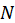{width="4.716666666666667in"
height="2.7583333333333333in"}

**Figure A.4.5.1.1.1-1: SNR variation for out-of-sync testing**

##### A.4.5.1.1.2 Test Requirements

The UE behaviour in each test during time durations T1, T2 and T3 shall
be as follows:

During the period from time point A to time point B the UE shall
transmit uplink signal at least in all uplink slots configured for CSI
transmission according to the configured periodic CSI reporting.

The UE shall stop transmitting uplink signal in Cell 2 no later than
time point C (D1 second after the start of the time duration T3).

The rate of correct events observed during repeated tests shall be at
least 90%.

#### A.4.5.1.2 Radio Link Monitoring In-sync Test for FR1 PSCell configured with SSB-based RLM RS in non-DRX mode

##### A.4.5.1.2.1 Test Purpose and Environment {#a.4.5.1.2.1-test-purpose-and-environment .H6}

The purpose of this test is to verify that the UE properly detects the
out of sync and in sync for the purpose of monitoring downlink radio
link quality of the PSCell. This test will partly verify the FR1 PSCell
radio link monitoring requirements in clause 8.1.

In the test, UE is configured to perform RLM on SSB, with
*detectionResource* included in *RadioLinkMonitoringRS* set to SSB\#0,
and *purpose* set to '*rlf*'. Supported test configurations are shown in
table A.4.5.1.2.1-1. The test parameters are given in Tables
A.4.5.1.2.1-2, and A.4.5.1.2.1-3 below. There are two cells, Cell 1 is
the E-UTRAN PCell, and Cell 2 is the PSCell, in the test. The E-UTRAN
PCell setting refers to Table A.3.7.2.1-1. The test consists of five
successive time periods, with time duration of T1, T2, T3, T4 and T5
respectively. Figure A.4.5.1.2.1-1 shows the variation of the downlink
SNR in the active Cell 2 to emulate out-of-sync and in-sync states.
Prior to the start of the time duration T1, the UE shall be fully
synchronized to Cell 1 and Cell 2. The UE shall be configured for
periodic CSI reporting with a reporting periodicity of 5 ms.

**Table A.4.5.1.2.1-1: Supported test configurations for FR1 PSCell**

  **Configuration**                                                                          **Description**
  ------------------------------------------------------------------------------------------ ---------------------------------------------------------------
  1                                                                                          LTE FDD, NR 15 kHz SSB SCS, 10 MHz bandwidth, FDD duplex mode
  2                                                                                          LTE FDD, NR 15 kHz SSB SCS, 10 MHz bandwidth, TDD duplex mode
  3                                                                                          LTE FDD, NR 30 kHz SSB SCS, 40 MHz bandwidth, TDD duplex mode
  4                                                                                          LTE TDD, NR 15 kHz SSB SCS, 10 MHz bandwidth, FDD duplex mode
  5                                                                                          LTE TDD, NR 15 kHz SSB SCS, 10 MHz bandwidth, TDD duplex mode
  6                                                                                          LTE TDD, NR 30 kHz SSB SCS, 40 MHz bandwidth, TDD duplex mode
  Note: The UE is only required to pass in one of the supported test configurations in FR1   

**Table A.4.5.1.2.1-2: General test parameters for FR1 in-sync testing
in non-DRX mode**

+-----------------+-----------------+------------+-----------------+
| **Parameter**   | **Unit**        | **Value**  |                 |
+=================+=================+============+=================+
|                 |                 | **Test 1** |                 |
+-----------------+-----------------+------------+-----------------+
| Active E-UTRA   |                 | Cell 1     |                 |
| PCell           |                 |            |                 |
+-----------------+-----------------+------------+-----------------+
| E-UTRA RF       |                 | 1          |                 |
| Channel Number  |                 |            |                 |
+-----------------+-----------------+------------+-----------------+
| Active PSCell   |                 | Cell 2     |                 |
+-----------------+-----------------+------------+-----------------+
| RF Channel      |                 | 2          |                 |
| Number          |                 |            |                 |
+-----------------+-----------------+------------+-----------------+
| Duplex mode     | Config 1, 4     |            | FDD             |
+-----------------+-----------------+------------+-----------------+
|                 | Config 2, 3, 5, |            | TDD             |
|                 | 6               |            |                 |
+-----------------+-----------------+------------+-----------------+
| BW~channel~     | Config 1, 4     | MHz        | 10: N~RB,c~ =   |
|                 |                 |            | 52              |
+-----------------+-----------------+------------+-----------------+
|                 | Config 2, 5     |            | 10: N~RB,c~ =   |
|                 |                 |            | 52              |
+-----------------+-----------------+------------+-----------------+
|                 | Config 3, 6     |            | 40: N~RB,c~ =   |
|                 |                 |            | 106             |
+-----------------+-----------------+------------+-----------------+
| **DL initial    | Config 1, 2, 3, |            | DLBWP.0.1       |
| BWP             | 4, 5, 6         |            |                 |
| configuration** |                 |            |                 |
+-----------------+-----------------+------------+-----------------+
| **DL dedicated  | Config 1, 2, 3, |            | DLBWP.1.1       |
| BWP             | 4, 5, 6         |            |                 |
| configuration** |                 |            |                 |
+-----------------+-----------------+------------+-----------------+
| **UL initial    | Config 1, 2, 3, |            | ULBWP.0.1       |
| BWP             | 4, 5, 6         |            |                 |
| configuration** |                 |            |                 |
+-----------------+-----------------+------------+-----------------+
| **UL dedicated  | Config 1, 2, 3, |            | ULBWP.1.1       |
| BWP             | 4, 5, 6         |            |                 |
| configuration** |                 |            |                 |
+-----------------+-----------------+------------+-----------------+
| TDD             | Config 1, 4     |            | Not Applicable  |
| Configuration   |                 |            |                 |
+-----------------+-----------------+------------+-----------------+
|                 | Config 2, 5     |            | TDDConf.1.1     |
+-----------------+-----------------+------------+-----------------+
|                 | Config 3, 6     |            | TDDConf.2.1     |
+-----------------+-----------------+------------+-----------------+
| RMSI CORESET    | Config 1, 4     |            | CR.1.1 FDD      |
| Reference       |                 |            |                 |
| Channel         |                 |            |                 |
+-----------------+-----------------+------------+-----------------+
|                 | Config 2, 5     |            | CR.1.1 TDD      |
+-----------------+-----------------+------------+-----------------+
|                 | Config 3, 6     |            | CR.2.1 TDD      |
+-----------------+-----------------+------------+-----------------+
| Dedicated       | Config 1, 4     |            | CCR.1.1 FDD     |
| CORESET         |                 |            |                 |
| Reference       |                 |            |                 |
| Channel         |                 |            |                 |
+-----------------+-----------------+------------+-----------------+
|                 | Config 2, 5     |            | CCR.1.1 TDD     |
+-----------------+-----------------+------------+-----------------+
|                 | Config 3, 6     |            | CCR.2.1 TDD     |
+-----------------+-----------------+------------+-----------------+
| SSB             | Config 1, 4     |            | SSB.1 FR1       |
| Configuration   |                 |            |                 |
+-----------------+-----------------+------------+-----------------+
|                 | Config 2, 5     |            | SSB.1 FR1       |
+-----------------+-----------------+------------+-----------------+
|                 | Config 3, 6     |            | SSB.2 FR1       |
+-----------------+-----------------+------------+-----------------+
| SMTC            | Config 1, 2, 4, |            | SMTC.1          |
| Configuration   | 5               |            |                 |
+-----------------+-----------------+------------+-----------------+
|                 | Config 3, 6     |            | SMTC.1          |
+-----------------+-----------------+------------+-----------------+
| PDSCH/PDCCH     | Config 1, 2, 4, |            | 15 kHz          |
| subcarrier      | 5               |            |                 |
| spacing         |                 |            |                 |
+-----------------+-----------------+------------+-----------------+
|                 | Config 3, 6     |            | 30 kHz          |
+-----------------+-----------------+------------+-----------------+
| PRACH           | Config 1, 2, 4, |            | Table           |
| Configuration   | 5               |            | A.3.8.2.1-1     |
+-----------------+-----------------+------------+-----------------+
|                 | Config 3, 6     |            | Table           |
|                 |                 |            | A.3.8.2.1-1     |
+-----------------+-----------------+------------+-----------------+
| SSB index       |                 | 0          |                 |
| assigned as RLM |                 |            |                 |
| RS              |                 |            |                 |
+-----------------+-----------------+------------+-----------------+
| OCNG parameters |                 | OP.1       |                 |
+-----------------+-----------------+------------+-----------------+
| CP length       |                 | Normal     |                 |
+-----------------+-----------------+------------+-----------------+
| Correlation     |                 | 2x2 Low    |                 |
| Matrix and      |                 |            |                 |
| Antenna         |                 |            |                 |
| Configuration   |                 |            |                 |
+-----------------+-----------------+------------+-----------------+
| In sync         | DCI format      |            | 1-0             |
| transmission    |                 |            |                 |
| parameters      |                 |            |                 |
+-----------------+-----------------+------------+-----------------+
|                 | Number of       |            | 2               |
|                 | Control OFDM    |            |                 |
|                 | symbols         |            |                 |
+-----------------+-----------------+------------+-----------------+
|                 | Aggregation     | CCE        | 4               |
|                 | level           |            |                 |
+-----------------+-----------------+------------+-----------------+
|                 | Ratio of        | dB         | 0               |
|                 | hypothetical    |            |                 |
|                 | PDCCH RE energy |            |                 |
|                 | to average SSS  |            |                 |
|                 | RE energy       |            |                 |
+-----------------+-----------------+------------+-----------------+
|                 | Ratio of        | dB         | 0               |
|                 | hypothetical    |            |                 |
|                 | PDCCH DMRS      |            |                 |
|                 | energy to       |            |                 |
|                 | average SSS RE  |            |                 |
|                 | energy          |            |                 |
+-----------------+-----------------+------------+-----------------+
|                 | DMRS precoder   |            | REG bundle size |
|                 | granularity     |            |                 |
+-----------------+-----------------+------------+-----------------+
|                 | REG bundle size |            | 6               |
+-----------------+-----------------+------------+-----------------+
| Out of sync     | DCI format      |            | 1-0             |
| transmission    |                 |            |                 |
| parameters      |                 |            |                 |
+-----------------+-----------------+------------+-----------------+
|                 | Number of       |            | 2               |
|                 | Control OFDM    |            |                 |
|                 | symbols         |            |                 |
+-----------------+-----------------+------------+-----------------+
|                 | Aggregation     | CCE        | 8               |
|                 | level           |            |                 |
+-----------------+-----------------+------------+-----------------+
|                 | Ratio of        | dB         | 4               |
|                 | hypothetical    |            |                 |
|                 | PDCCH RE energy |            |                 |
|                 | to average SSS  |            |                 |
|                 | RE energy       |            |                 |
+-----------------+-----------------+------------+-----------------+
|                 | Ratio of        | dB         | 4               |
|                 | hypothetical    |            |                 |
|                 | PDCCH DMRS      |            |                 |
|                 | energy to       |            |                 |
|                 | average SSS RE  |            |                 |
|                 | energy          |            |                 |
+-----------------+-----------------+------------+-----------------+
|                 | DMRS precoder   |            | REG bundle size |
|                 | granularity     |            |                 |
+-----------------+-----------------+------------+-----------------+
|                 | REG bundle size |            | 6               |
+-----------------+-----------------+------------+-----------------+
| DRX             |                 | *OFF*      |                 |
+-----------------+-----------------+------------+-----------------+
| Gap pattern ID  |                 | *N.A.*     |                 |
+-----------------+-----------------+------------+-----------------+
| Layer 3         |                 | *Enabled*  |                 |
| filtering       |                 |            |                 |
+-----------------+-----------------+------------+-----------------+
| T310 timer      | *ms*            | *1000*     |                 |
+-----------------+-----------------+------------+-----------------+
| T311 timer      | ms              | 1000       |                 |
+-----------------+-----------------+------------+-----------------+
| N310            |                 | 1          |                 |
+-----------------+-----------------+------------+-----------------+
| N311            |                 | 1          |                 |
+-----------------+-----------------+------------+-----------------+
| CSI-RS for CSI  | Config 1, 4     |            | CSI-RS.1.1 FDD  |
| reporting       |                 |            |                 |
+-----------------+-----------------+------------+-----------------+
|                 | Config 2, 5     |            | CSI-RS.1.1 TDD  |
+-----------------+-----------------+------------+-----------------+
|                 | Config 3, 6     |            | CSI-RS.2.1 TDD  |
+-----------------+-----------------+------------+-----------------+
| CSI-RS for      | Config 1, 4     |            | TRS.1.1 FDD     |
| tracking        |                 |            |                 |
+-----------------+-----------------+------------+-----------------+
|                 | Config 2, 5     |            | TRS.1.1 TDD     |
+-----------------+-----------------+------------+-----------------+
|                 | Config 3, 6     |            | TRS.1.2 TDD     |
+-----------------+-----------------+------------+-----------------+
| T1              | s               | 0.2        |                 |
+-----------------+-----------------+------------+-----------------+
| T2              | s               | 0.2        |                 |
+-----------------+-----------------+------------+-----------------+
| T3              | s               | 0.24       |                 |
+-----------------+-----------------+------------+-----------------+
| T4              | s               | 0.2        |                 |
+-----------------+-----------------+------------+-----------------+
| T5              | s               | 0.88       |                 |
+-----------------+-----------------+------------+-----------------+
| D1              | s               | 0.84       |                 |
+-----------------+-----------------+------------+-----------------+
| Note 1: All     |                 |            |                 |
| configurations  |                 |            |                 |
| are assigned to |                 |            |                 |
| the UE prior to |                 |            |                 |
| the start of    |                 |            |                 |
| time period T1. |                 |            |                 |
|                 |                 |            |                 |
| Note 2:         |                 |            |                 |
| UE-specific     |                 |            |                 |
| PDCCH is not    |                 |            |                 |
| transmitted     |                 |            |                 |
| after T1        |                 |            |                 |
| starts.         |                 |            |                 |
|                 |                 |            |                 |
| Note 3:         |                 |            |                 |
| **E-UTRAN is in |                 |            |                 |
| non-DRX mode    |                 |            |                 |
| under test.**   |                 |            |                 |
+-----------------+-----------------+------------+-----------------+

**Table A.4.5.1.2.1-3: Cell specific test parameters for FR1 (Cell 2)
for in-sync radio link monitoring tests in non-DRX mode**

+-------+-------+-------+-------+-------+-------+-------+---+
| **P   | **U   | *     |       |       |       |       |   |
| arame | nit** | *Test |       |       |       |       |   |
| ter** |       | 1**   |       |       |       |       |   |
+=======+=======+=======+=======+=======+=======+=======+===+
|       |       | *     | *     | *     | *     | *     |   |
|       |       | *T1** | *T2** | *T3** | *T4** | *T5** |   |
+-------+-------+-------+-------+-------+-------+-------+---+
| EPRE  | dB    | 0     |       |       |       |       |   |
| ratio |       |       |       |       |       |       |   |
| of    |       |       |       |       |       |       |   |
| PDCCH |       |       |       |       |       |       |   |
| DMRS  |       |       |       |       |       |       |   |
| to    |       |       |       |       |       |       |   |
| SSS   |       |       |       |       |       |       |   |
+-------+-------+-------+-------+-------+-------+-------+---+
| EPRE  | dB    | 0     |       |       |       |       |   |
| ratio |       |       |       |       |       |       |   |
| of    |       |       |       |       |       |       |   |
| PDCCH |       |       |       |       |       |       |   |
| to    |       |       |       |       |       |       |   |
| PDCCH |       |       |       |       |       |       |   |
| DMRS  |       |       |       |       |       |       |   |
+-------+-------+-------+-------+-------+-------+-------+---+
| EPRE  | dB    | 0     |       |       |       |       |   |
| ratio |       |       |       |       |       |       |   |
| of    |       |       |       |       |       |       |   |
| PBCH  |       |       |       |       |       |       |   |
| DMRS  |       |       |       |       |       |       |   |
| to    |       |       |       |       |       |       |   |
| SSS   |       |       |       |       |       |       |   |
+-------+-------+-------+-------+-------+-------+-------+---+
| EPRE  | dB    |       |       |       |       |       |   |
| ratio |       |       |       |       |       |       |   |
| of    |       |       |       |       |       |       |   |
| PBCH  |       |       |       |       |       |       |   |
| to    |       |       |       |       |       |       |   |
| PBCH  |       |       |       |       |       |       |   |
| DMRS  |       |       |       |       |       |       |   |
+-------+-------+-------+-------+-------+-------+-------+---+
| EPRE  | dB    |       |       |       |       |       |   |
| ratio |       |       |       |       |       |       |   |
| of    |       |       |       |       |       |       |   |
| PSS   |       |       |       |       |       |       |   |
| to    |       |       |       |       |       |       |   |
| SSS   |       |       |       |       |       |       |   |
+-------+-------+-------+-------+-------+-------+-------+---+
| EPRE  | dB    |       |       |       |       |       |   |
| ratio |       |       |       |       |       |       |   |
| of    |       |       |       |       |       |       |   |
| PDSCH |       |       |       |       |       |       |   |
| DMRS  |       |       |       |       |       |       |   |
| to    |       |       |       |       |       |       |   |
| SSS   |       |       |       |       |       |       |   |
+-------+-------+-------+-------+-------+-------+-------+---+
| EPRE  | dB    |       |       |       |       |       |   |
| ratio |       |       |       |       |       |       |   |
| of    |       |       |       |       |       |       |   |
| PDSCH |       |       |       |       |       |       |   |
| to    |       |       |       |       |       |       |   |
| PDSCH |       |       |       |       |       |       |   |
| DMRS  |       |       |       |       |       |       |   |
+-------+-------+-------+-------+-------+-------+-------+---+
| EPRE  | dB    |       |       |       |       |       |   |
| ratio |       |       |       |       |       |       |   |
| of    |       |       |       |       |       |       |   |
| OCNG  |       |       |       |       |       |       |   |
| DMRS  |       |       |       |       |       |       |   |
| to    |       |       |       |       |       |       |   |
| SSS   |       |       |       |       |       |       |   |
+-------+-------+-------+-------+-------+-------+-------+---+
| EPRE  | dB    |       |       |       |       |       |   |
| ratio |       |       |       |       |       |       |   |
| of    |       |       |       |       |       |       |   |
| OCNG  |       |       |       |       |       |       |   |
| to    |       |       |       |       |       |       |   |
| OCNG  |       |       |       |       |       |       |   |
| DMRS  |       |       |       |       |       |       |   |
+-------+-------+-------+-------+-------+-------+-------+---+
| SNR   | C     | dB    | 1     | -7    | -15   | -4.5  | 1 |
| on    | onfig |       |       |       |       |       |   |
| R     | 1, 4  |       |       |       |       |       |   |
| LM-RS |       |       |       |       |       |       |   |
+-------+-------+-------+-------+-------+-------+-------+---+
|       | C     |       | 1     | -7    | -15   | -4.5  | 1 |
|       | onfig |       |       |       |       |       |   |
|       | 2, 5  |       |       |       |       |       |   |
+-------+-------+-------+-------+-------+-------+-------+---+
|       | C     |       | 1     | -7    | -15   | -4.5  | 1 |
|       | onfig |       |       |       |       |       |   |
|       | 3, 6  |       |       |       |       |       |   |
+-------+-------+-------+-------+-------+-------+-------+---+
|       | C     | d     | -98   |       |       |       |   |
|       | onfig | Bm/15 |       |       |       |       |   |
|       | 1, 4  | kHz   |       |       |       |       |   |
+-------+-------+-------+-------+-------+-------+-------+---+
|       | C     |       | -98   |       |       |       |   |
|       | onfig |       |       |       |       |       |   |
|       | 2, 5  |       |       |       |       |       |   |
+-------+-------+-------+-------+-------+-------+-------+---+
|       | C     |       | -98   |       |       |       |   |
|       | onfig |       |       |       |       |       |   |
|       | 3, 6  |       |       |       |       |       |   |
+-------+-------+-------+-------+-------+-------+-------+---+
|       | C     | dB    | -98   |       |       |       |   |
|       | onfig | m/SCS |       |       |       |       |   |
|       | 1, 4  |       |       |       |       |       |   |
+-------+-------+-------+-------+-------+-------+-------+---+
|       | C     |       | -98   |       |       |       |   |
|       | onfig |       |       |       |       |       |   |
|       | 2, 5  |       |       |       |       |       |   |
+-------+-------+-------+-------+-------+-------+-------+---+
|       | C     |       | -95   |       |       |       |   |
|       | onfig |       |       |       |       |       |   |
|       | 3, 6  |       |       |       |       |       |   |
+-------+-------+-------+-------+-------+-------+-------+---+
| P     |       | TDL-C |       |       |       |       |   |
| ropag |       | 300ns |       |       |       |       |   |
| ation |       | 100Hz |       |       |       |       |   |
| cond  |       |       |       |       |       |       |   |
| ition |       |       |       |       |       |       |   |
+-------+-------+-------+-------+-------+-------+-------+---+
| Note  |       |       |       |       |       |       |   |
| 1:    |       |       |       |       |       |       |   |
| OCNG  |       |       |       |       |       |       |   |
| shall |       |       |       |       |       |       |   |
| be    |       |       |       |       |       |       |   |
| used  |       |       |       |       |       |       |   |
| such  |       |       |       |       |       |       |   |
| that  |       |       |       |       |       |       |   |
| the   |       |       |       |       |       |       |   |
| reso  |       |       |       |       |       |       |   |
| urces |       |       |       |       |       |       |   |
| in    |       |       |       |       |       |       |   |
| Cell  |       |       |       |       |       |       |   |
| 2 are |       |       |       |       |       |       |   |
| fully |       |       |       |       |       |       |   |
| allo  |       |       |       |       |       |       |   |
| cated |       |       |       |       |       |       |   |
| and a |       |       |       |       |       |       |   |
| con   |       |       |       |       |       |       |   |
| stant |       |       |       |       |       |       |   |
| total |       |       |       |       |       |       |   |
| t     |       |       |       |       |       |       |   |
| ransm |       |       |       |       |       |       |   |
| itted |       |       |       |       |       |       |   |
| power |       |       |       |       |       |       |   |
| spe   |       |       |       |       |       |       |   |
| ctral |       |       |       |       |       |       |   |
| de    |       |       |       |       |       |       |   |
| nsity |       |       |       |       |       |       |   |
| is    |       |       |       |       |       |       |   |
| ach   |       |       |       |       |       |       |   |
| ieved |       |       |       |       |       |       |   |
| for   |       |       |       |       |       |       |   |
| all   |       |       |       |       |       |       |   |
| OFDM  |       |       |       |       |       |       |   |
| sym   |       |       |       |       |       |       |   |
| bols. |       |       |       |       |       |       |   |
|       |       |       |       |       |       |       |   |
| Note  |       |       |       |       |       |       |   |
| 2:    |       |       |       |       |       |       |   |
| The   |       |       |       |       |       |       |   |
| s     |       |       |       |       |       |       |   |
| ignal |       |       |       |       |       |       |   |
| con   |       |       |       |       |       |       |   |
| tains |       |       |       |       |       |       |   |
| PDCCH |       |       |       |       |       |       |   |
| for   |       |       |       |       |       |       |   |
| UEs   |       |       |       |       |       |       |   |
| other |       |       |       |       |       |       |   |
| than  |       |       |       |       |       |       |   |
| the   |       |       |       |       |       |       |   |
| d     |       |       |       |       |       |       |   |
| evice |       |       |       |       |       |       |   |
| under |       |       |       |       |       |       |   |
| test  |       |       |       |       |       |       |   |
| as    |       |       |       |       |       |       |   |
| part  |       |       |       |       |       |       |   |
| of    |       |       |       |       |       |       |   |
| OCNG. |       |       |       |       |       |       |   |
|       |       |       |       |       |       |       |   |
| Note  |       |       |       |       |       |       |   |
| 3:    |       |       |       |       |       |       |   |
| SNR   |       |       |       |       |       |       |   |
| l     |       |       |       |       |       |       |   |
| evels |       |       |       |       |       |       |   |
| corre |       |       |       |       |       |       |   |
| spond |       |       |       |       |       |       |   |
| to    |       |       |       |       |       |       |   |
| the   |       |       |       |       |       |       |   |
| s     |       |       |       |       |       |       |   |
| ignal |       |       |       |       |       |       |   |
| to    |       |       |       |       |       |       |   |
| noise |       |       |       |       |       |       |   |
| ratio |       |       |       |       |       |       |   |
| over  |       |       |       |       |       |       |   |
| the   |       |       |       |       |       |       |   |
| SSS   |       |       |       |       |       |       |   |
| REs.  |       |       |       |       |       |       |   |
|       |       |       |       |       |       |       |   |
| Note  |       |       |       |       |       |       |   |
| 4:    |       |       |       |       |       |       |   |
| The   |       |       |       |       |       |       |   |
| SNR   |       |       |       |       |       |       |   |
| in    |       |       |       |       |       |       |   |
| time  |       |       |       |       |       |       |   |
| pe    |       |       |       |       |       |       |   |
| riods |       |       |       |       |       |       |   |
| T1,   |       |       |       |       |       |       |   |
| T2,   |       |       |       |       |       |       |   |
| T3,   |       |       |       |       |       |       |   |
| T4    |       |       |       |       |       |       |   |
| and   |       |       |       |       |       |       |   |
| T5 is |       |       |       |       |       |       |   |
| de    |       |       |       |       |       |       |   |
| noted |       |       |       |       |       |       |   |
| as    |       |       |       |       |       |       |   |
| SNR1, |       |       |       |       |       |       |   |
| SNR2, |       |       |       |       |       |       |   |
| SNR3, |       |       |       |       |       |       |   |
| SNR4  |       |       |       |       |       |       |   |
| and   |       |       |       |       |       |       |   |
| SNR5  |       |       |       |       |       |       |   |
| re    |       |       |       |       |       |       |   |
| spect |       |       |       |       |       |       |   |
| ively |       |       |       |       |       |       |   |
| in    |       |       |       |       |       |       |   |
| F     |       |       |       |       |       |       |   |
| igure |       |       |       |       |       |       |   |
| A.4.  |       |       |       |       |       |       |   |
| 5.1.2 |       |       |       |       |       |       |   |
| .1-1. |       |       |       |       |       |       |   |
|       |       |       |       |       |       |       |   |
| Note  |       |       |       |       |       |       |   |
| 5:    |       |       |       |       |       |       |   |
| The   |       |       |       |       |       |       |   |
| SNR   |       |       |       |       |       |       |   |
| v     |       |       |       |       |       |       |   |
| alues |       |       |       |       |       |       |   |
| are   |       |       |       |       |       |       |   |
| spec  |       |       |       |       |       |       |   |
| ified |       |       |       |       |       |       |   |
| for   |       |       |       |       |       |       |   |
| te    |       |       |       |       |       |       |   |
| sting |       |       |       |       |       |       |   |
| a UE  |       |       |       |       |       |       |   |
| which |       |       |       |       |       |       |   |
| sup   |       |       |       |       |       |       |   |
| ports |       |       |       |       |       |       |   |
| 2RX   |       |       |       |       |       |       |   |
| on at |       |       |       |       |       |       |   |
| least |       |       |       |       |       |       |   |
| one   |       |       |       |       |       |       |   |
| band. |       |       |       |       |       |       |   |
| For   |       |       |       |       |       |       |   |
| te    |       |       |       |       |       |       |   |
| sting |       |       |       |       |       |       |   |
| of a  |       |       |       |       |       |       |   |
| UE    |       |       |       |       |       |       |   |
| which |       |       |       |       |       |       |   |
| sup   |       |       |       |       |       |       |   |
| ports |       |       |       |       |       |       |   |
| 4RX   |       |       |       |       |       |       |   |
| on    |       |       |       |       |       |       |   |
| all   |       |       |       |       |       |       |   |
| b     |       |       |       |       |       |       |   |
| ands, |       |       |       |       |       |       |   |
| the   |       |       |       |       |       |       |   |
| SNR   |       |       |       |       |       |       |   |
| d     |       |       |       |       |       |       |   |
| uring |       |       |       |       |       |       |   |
| T3    |       |       |       |       |       |       |   |
| and   |       |       |       |       |       |       |   |
| T4 is |       |       |       |       |       |       |   |
| mod   |       |       |       |       |       |       |   |
| ified |       |       |       |       |       |       |   |
| as    |       |       |       |       |       |       |   |
| spec  |       |       |       |       |       |       |   |
| ified |       |       |       |       |       |       |   |
| in    |       |       |       |       |       |       |   |
| c     |       |       |       |       |       |       |   |
| lause |       |       |       |       |       |       |   |
| A     |       |       |       |       |       |       |   |
| .3.6. |       |       |       |       |       |       |   |
+-------+-------+-------+-------+-------+-------+-------+---+

**Table A.4.5.1.2.1-4: Void**

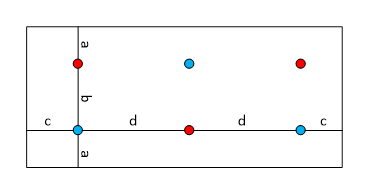{width="5.675in" height="3.15in"}

**Figure A.4.5.1.2.1-1: SNR variation for in-sync testing**

##### A.4.5.1.2.2 Test Requirements

The UE behaviour in each test during time durations T1, T2, T3, T4 and
T5 shall be as follows:

During the period from time point A to time point F (D1 second after the
start of time duration T5) the UE shall transmit uplink signal at least
in all uplink slots configured for CSI transmission according to the
configured periodic CSI reporting.

The rate of correct events observed during repeated tests shall be at
least 90%.

#### A.4.5.1.3 Radio Link Monitoring Out-of-sync Test for FR1 PSCell configured with SSB-based RLM RS in DRX mode

##### A.4.5.1.3.1 Test Purpose and Environment

The purpose of this test is to verify that the UE properly detects the
out of sync and in sync for the purpose of monitoring downlink radio
link quality of the PSCell when DRX is used. This test will partly
verify the FR1 radio link monitoring requirements in clause 8.1.

In the test, UE is configured to perform RLM on SSB, with
*detectionResource* included in *RadioLinkMonitoringRS* set to SSB\#0,
and *purpose* set to '*rlf*'. Supported test configurations are shown in
table A.4.5.1.3.1-1. The test parameters are given in Tables
A.4.5.1.3.1-2 and A.4.5.1.3.1-3. There are two cells, Cell 1 is the
E-UTRAN PCell, and Cell 2 is the PSCell, in the test. The E-UTRAN PCell
setting refers to Table A.3.7.2.1-1. The test consists of three
successive time periods, with time duration of T1, T2 and T3
respectively. Figure A.4.5.1.3.1-1 shows the variation of the downlink
SNR in the active Cell 2 to emulate out-of-sync and in-sync states.
Prior to the start of the time duration T1, the UE shall be fully
synchronized to Cell 1 and Cell 2. The UE shall be configured for
periodic CSI reporting with a reporting periodicity of 5 ms. In the
test, DRX configuration is enabled and DRX inactivity timer has already
been expired, i.e. UE tries to decode PDCCH and to send periodic CSI
during the period when On-duration timer is running. Time alignment
timers shall be set to "infinity" so that UL timing alignment is
maintained during the test.

**Table A.4.5.1.3.1-1: Supported test configurations for FR1 PSCell**

  **Configuration**                                                                          **Description**
  ------------------------------------------------------------------------------------------ ---------------------------------------------------------------
  1                                                                                          LTE FDD, NR 15 kHz SSB SCS, 10 MHz bandwidth, FDD duplex mode
  2                                                                                          LTE FDD, NR 15 kHz SSB SCS, 10 MHz bandwidth, TDD duplex mode
  3                                                                                          LTE FDD, NR 30 kHz SSB SCS, 40 MHz bandwidth, TDD duplex mode
  4                                                                                          LTE TDD, NR 15 kHz SSB SCS, 10 MHz bandwidth, FDD duplex mode
  5                                                                                          LTE TDD, NR 15 kHz SSB SCS, 10 MHz bandwidth, TDD duplex mode
  6                                                                                          LTE TDD, NR 30 kHz SSB SCS, 40 MHz bandwidth, TDD duplex mode
  Note: The UE is only required to pass in one of the supported test configurations in FR1   

**Table A.4.5.1.3.1-2: General test parameters for FR1 out-of-sync
testing in DRX mode**

+-----------------+-----------------+------------+-----------------+
| **Parameter**   | **Unit**        | **Value**  |                 |
+=================+=================+============+=================+
|                 |                 | **Test 1** |                 |
+-----------------+-----------------+------------+-----------------+
| Active E-UTRA   |                 | Cell 1     |                 |
| PCell           |                 |            |                 |
+-----------------+-----------------+------------+-----------------+
| E-UTRA RF       |                 | 1          |                 |
| Channel Number  |                 |            |                 |
+-----------------+-----------------+------------+-----------------+
| Active PSCell   |                 | Cell 2     |                 |
+-----------------+-----------------+------------+-----------------+
| RF Channel      |                 | 2          |                 |
| Number          |                 |            |                 |
+-----------------+-----------------+------------+-----------------+
| Duplex mode     | Config 1, 4     |            | FDD             |
+-----------------+-----------------+------------+-----------------+
|                 | Config 2, 3, 5, |            | TDD             |
|                 | 6               |            |                 |
+-----------------+-----------------+------------+-----------------+
| BW~channel~     | Config 1, 4     | MHz        | 10: N~RB,c~ =   |
|                 |                 |            | 52              |
+-----------------+-----------------+------------+-----------------+
|                 | Config 2, 5     |            | 10: N~RB,c~ =   |
|                 |                 |            | 52              |
+-----------------+-----------------+------------+-----------------+
|                 | Config 3, 6     |            | 40: N~RB,c~ =   |
|                 |                 |            | 106             |
+-----------------+-----------------+------------+-----------------+
| **DL initial    | Config 1, 2, 3, |            | DLBWP.0.1       |
| BWP             | 4, 5, 6         |            |                 |
| configuration** |                 |            |                 |
+-----------------+-----------------+------------+-----------------+
| **DL dedicated  | Config 1, 2, 3, |            | DLBWP.1.1       |
| BWP             | 4, 5, 6         |            |                 |
| configuration** |                 |            |                 |
+-----------------+-----------------+------------+-----------------+
| **UL initial    | Config 1, 2, 3, |            | ULBWP.0.1       |
| BWP             | 4, 5, 6         |            |                 |
| configuration** |                 |            |                 |
+-----------------+-----------------+------------+-----------------+
| **UL dedicated  | Config 1, 2, 3, |            | ULBWP.1.1       |
| BWP             | 4, 5, 6         |            |                 |
| configuration** |                 |            |                 |
+-----------------+-----------------+------------+-----------------+
| TDD             | Config 1, 4     |            | Not Applicable  |
| Configuration   |                 |            |                 |
+-----------------+-----------------+------------+-----------------+
|                 | Config 2, 5     |            | TDDConf.1.1     |
+-----------------+-----------------+------------+-----------------+
|                 | Config 3, 6     |            | TDDConf.2.1     |
+-----------------+-----------------+------------+-----------------+
| RMSI CORESET    | Config 1, 4     |            | CR.1.1 FDD      |
| Reference       |                 |            |                 |
| Channel         |                 |            |                 |
+-----------------+-----------------+------------+-----------------+
|                 | Config 2, 5     |            | CR.1.1 TDD      |
+-----------------+-----------------+------------+-----------------+
|                 | Config 3, 6     |            | CR.2.1 TDD      |
+-----------------+-----------------+------------+-----------------+
| Dedicated       | Config 1, 4     |            | CCR.1.3 FDD     |
| CORESET         |                 |            |                 |
| Reference       |                 |            |                 |
| Channel         |                 |            |                 |
+-----------------+-----------------+------------+-----------------+
|                 | Config 2, 5     |            | CCR.1.3 TDD     |
+-----------------+-----------------+------------+-----------------+
|                 | Config 3, 6     |            | CCR.2.2 TDD     |
+-----------------+-----------------+------------+-----------------+
| SSB             | Config 1, 4     |            | SSB.1 FR1       |
| Configuration   |                 |            |                 |
+-----------------+-----------------+------------+-----------------+
|                 | Config 2, 5     |            | SSB.1 FR1       |
+-----------------+-----------------+------------+-----------------+
|                 | Config 3, 6     |            | SSB.2 FR1       |
+-----------------+-----------------+------------+-----------------+
| SMTC            | Config 1, 2, 4, |            | SMTC.1          |
| Configuration   | 5               |            |                 |
+-----------------+-----------------+------------+-----------------+
|                 | Config 3, 6     |            | SMTC.1          |
+-----------------+-----------------+------------+-----------------+
| PDSCH/PDCCH     | Config 1, 2, 4, |            | 15 kHz          |
| subcarrier      | 5               |            |                 |
| spacing         |                 |            |                 |
+-----------------+-----------------+------------+-----------------+
|                 | Config 3, 6     |            | 30 kHz          |
+-----------------+-----------------+------------+-----------------+
| PRACH           | Config 1, 2, 4, |            | Table           |
| Configuration   | 5               |            | A.3.8.2.1-1     |
+-----------------+-----------------+------------+-----------------+
|                 | Config 3, 6     |            | Table           |
|                 |                 |            | A.3.8.2.1-1     |
+-----------------+-----------------+------------+-----------------+
| SSB index       |                 | 0          |                 |
| assigned as RLM |                 |            |                 |
| RS              |                 |            |                 |
+-----------------+-----------------+------------+-----------------+
| OCNG parameters |                 | OP.1       |                 |
+-----------------+-----------------+------------+-----------------+
| CP length       |                 | Normal     |                 |
+-----------------+-----------------+------------+-----------------+
| Correlation     |                 | 2x2 Low    |                 |
| Matrix and      |                 |            |                 |
| Antenna         |                 |            |                 |
| Configuration   |                 |            |                 |
+-----------------+-----------------+------------+-----------------+
| Out of sync     | DCI format      |            | 1-0             |
| transmission    |                 |            |                 |
| parameters      |                 |            |                 |
+-----------------+-----------------+------------+-----------------+
|                 | Number of       |            | 2               |
|                 | Control OFDM    |            |                 |
|                 | symbols         |            |                 |
+-----------------+-----------------+------------+-----------------+
|                 | Aggregation     | CCE        | 8               |
|                 | level           |            |                 |
+-----------------+-----------------+------------+-----------------+
|                 | Ratio of        | dB         | 4               |
|                 | hypothetical    |            |                 |
|                 | PDCCH RE energy |            |                 |
|                 | to average SSS  |            |                 |
|                 | RE energy       |            |                 |
+-----------------+-----------------+------------+-----------------+
|                 | Ratio of        | dB         | 4               |
|                 | hypothetical    |            |                 |
|                 | PDCCH DMRS      |            |                 |
|                 | energy to       |            |                 |
|                 | average SSS RE  |            |                 |
|                 | energy          |            |                 |
+-----------------+-----------------+------------+-----------------+
|                 | DMRS precoder   |            | REG bundle size |
|                 | granularity     |            |                 |
+-----------------+-----------------+------------+-----------------+
|                 | REG bundle size |            | 6               |
+-----------------+-----------------+------------+-----------------+
| **DRX**         |                 | *DRX.3*    |                 |
| Configuration   |                 |            |                 |
+-----------------+-----------------+------------+-----------------+
| Gap pattern ID  |                 | *N.A.*     |                 |
+-----------------+-----------------+------------+-----------------+
| Layer 3         |                 | *Enabled*  |                 |
| filtering       |                 |            |                 |
+-----------------+-----------------+------------+-----------------+
| T310 timer      | *ms*            | *0*        |                 |
+-----------------+-----------------+------------+-----------------+
| T311 timer      | ms              | 1000       |                 |
+-----------------+-----------------+------------+-----------------+
| N310            |                 | 1          |                 |
+-----------------+-----------------+------------+-----------------+
| N311            |                 | 1          |                 |
+-----------------+-----------------+------------+-----------------+
| CSI-RS for CSI  | Config 1, 4     |            | CSI-RS.1.1 FDD  |
| reporting       |                 |            |                 |
+-----------------+-----------------+------------+-----------------+
|                 | Config 2, 5     |            | CSI-RS.1.1 TDD  |
+-----------------+-----------------+------------+-----------------+
|                 | Config 3, 6     |            | CSI-RS.2.1 TDD  |
+-----------------+-----------------+------------+-----------------+
| CSI-RS for      | Config 1, 4     |            | TRS.1.1 FDD     |
| tracking        |                 |            |                 |
+-----------------+-----------------+------------+-----------------+
|                 | Config 2, 5     |            | TRS.1.1 TDD     |
+-----------------+-----------------+------------+-----------------+
|                 | Config 3, 6     |            | TRS.1.2 TDD     |
+-----------------+-----------------+------------+-----------------+
| T1              | s               | 0.2        |                 |
+-----------------+-----------------+------------+-----------------+
| T2              | s               | 0.68       |                 |
+-----------------+-----------------+------------+-----------------+
| T3              | s               | 0.68       |                 |
+-----------------+-----------------+------------+-----------------+
| D1              | s               | 0.64       |                 |
+-----------------+-----------------+------------+-----------------+
| Note 1: All     |                 |            |                 |
| configurations  |                 |            |                 |
| are assigned to |                 |            |                 |
| the UE prior to |                 |            |                 |
| the start of    |                 |            |                 |
| time period T1. |                 |            |                 |
|                 |                 |            |                 |
| Note 2:         |                 |            |                 |
| UE-specific     |                 |            |                 |
| PDCCH is not    |                 |            |                 |
| transmitted     |                 |            |                 |
| after T1        |                 |            |                 |
| starts.         |                 |            |                 |
|                 |                 |            |                 |
| Note 3:         |                 |            |                 |
| **E-UTRAN is in |                 |            |                 |
| non-DRX mode    |                 |            |                 |
| under test.**   |                 |            |                 |
+-----------------+-----------------+------------+-----------------+

**Table A.4.5.1.3.1-3: Cell specific test parameters for FR1 (Cell 2)
for out-of-sync radio link monitoring tests in DRX mode**

+-------------+-------------+-------------+--------+--------+-----+
| **          | **Unit**    | **Test 1**  |        |        |     |
| Parameter** |             |             |        |        |     |
+=============+=============+=============+========+========+=====+
|             |             | **T1**      | **T2** | **T3** |     |
+-------------+-------------+-------------+--------+--------+-----+
| EPRE ratio  | dB          | 4           |        |        |     |
| of PDCCH    |             |             |        |        |     |
| DMRS to SSS |             |             |        |        |     |
+-------------+-------------+-------------+--------+--------+-----+
| EPRE ratio  | dB          | 0           |        |        |     |
| of PDCCH to |             |             |        |        |     |
| PDCCH DMRS  |             |             |        |        |     |
+-------------+-------------+-------------+--------+--------+-----+
| EPRE ratio  | dB          | 0           |        |        |     |
| of PBCH     |             |             |        |        |     |
| DMRS to SSS |             |             |        |        |     |
+-------------+-------------+-------------+--------+--------+-----+
| EPRE ratio  | dB          |             |        |        |     |
| of PBCH to  |             |             |        |        |     |
| PBCH DMRS   |             |             |        |        |     |
+-------------+-------------+-------------+--------+--------+-----+
| EPRE ratio  | dB          |             |        |        |     |
| of PSS to   |             |             |        |        |     |
| SSS         |             |             |        |        |     |
+-------------+-------------+-------------+--------+--------+-----+
| EPRE ratio  | dB          |             |        |        |     |
| of PDSCH    |             |             |        |        |     |
| DMRS to SSS |             |             |        |        |     |
+-------------+-------------+-------------+--------+--------+-----+
| EPRE ratio  | dB          |             |        |        |     |
| of PDSCH to |             |             |        |        |     |
| PDSCH DMRS  |             |             |        |        |     |
+-------------+-------------+-------------+--------+--------+-----+
| EPRE ratio  | dB          |             |        |        |     |
| of OCNG     |             |             |        |        |     |
| DMRS to SSS |             |             |        |        |     |
+-------------+-------------+-------------+--------+--------+-----+
| EPRE ratio  | dB          |             |        |        |     |
| of OCNG to  |             |             |        |        |     |
| OCNG DMRS   |             |             |        |        |     |
+-------------+-------------+-------------+--------+--------+-----+
| SNR on      | Config 1, 4 | dB          | 1      | -7     | -15 |
| RLM-RS      |             |             |        |        |     |
+-------------+-------------+-------------+--------+--------+-----+
|             | Config 2, 5 |             | 1      | -7     | -15 |
+-------------+-------------+-------------+--------+--------+-----+
|             | Config 3, 6 |             | 1      | -7     | -15 |
+-------------+-------------+-------------+--------+--------+-----+
|             | Config 1, 4 | dBm/15kHz   | -98    |        |     |
+-------------+-------------+-------------+--------+--------+-----+
|             | Config 2, 5 |             | -98    |        |     |
+-------------+-------------+-------------+--------+--------+-----+
|             | Config 3, 6 |             | -98    |        |     |
+-------------+-------------+-------------+--------+--------+-----+
|             | Config 1, 4 | dBm/SCS     | -98    |        |     |
+-------------+-------------+-------------+--------+--------+-----+
|             | Config 2, 5 |             | -98    |        |     |
+-------------+-------------+-------------+--------+--------+-----+
|             | Config 3, 6 |             | -95    |        |     |
+-------------+-------------+-------------+--------+--------+-----+
| Propagation |             | TDL-C 300ns |        |        |     |
| condition   |             | 100Hz       |        |        |     |
+-------------+-------------+-------------+--------+--------+-----+
| Note 1:     |             |             |        |        |     |
| OCNG shall  |             |             |        |        |     |
| be used     |             |             |        |        |     |
| such that   |             |             |        |        |     |
| the         |             |             |        |        |     |
| resources   |             |             |        |        |     |
| in Cell 2   |             |             |        |        |     |
| are fully   |             |             |        |        |     |
| allocated   |             |             |        |        |     |
| and a       |             |             |        |        |     |
| constant    |             |             |        |        |     |
| total       |             |             |        |        |     |
| transmitted |             |             |        |        |     |
| power       |             |             |        |        |     |
| spectral    |             |             |        |        |     |
| density is  |             |             |        |        |     |
| achieved    |             |             |        |        |     |
| for all     |             |             |        |        |     |
| OFDM        |             |             |        |        |     |
| symbols.    |             |             |        |        |     |
|             |             |             |        |        |     |
| Note 2: The |             |             |        |        |     |
| signal      |             |             |        |        |     |
| contains    |             |             |        |        |     |
| PDCCH for   |             |             |        |        |     |
| UEs other   |             |             |        |        |     |
| than the    |             |             |        |        |     |
| device      |             |             |        |        |     |
| under test  |             |             |        |        |     |
| as part of  |             |             |        |        |     |
| OCNG.       |             |             |        |        |     |
|             |             |             |        |        |     |
| Note 3: SNR |             |             |        |        |     |
| levels      |             |             |        |        |     |
| correspond  |             |             |        |        |     |
| to the      |             |             |        |        |     |
| signal to   |             |             |        |        |     |
| noise ratio |             |             |        |        |     |
| over the    |             |             |        |        |     |
| SSS REs.    |             |             |        |        |     |
|             |             |             |        |        |     |
| Note 4: The |             |             |        |        |     |
| SNR in time |             |             |        |        |     |
| periods T1, |             |             |        |        |     |
| T2 and T3   |             |             |        |        |     |
| is denoted  |             |             |        |        |     |
| as SNR1,    |             |             |        |        |     |
| SNR2 and    |             |             |        |        |     |
| SNR3        |             |             |        |        |     |
| r           |             |             |        |        |     |
| espectively |             |             |        |        |     |
| in Figure   |             |             |        |        |     |
| A.4         |             |             |        |        |     |
| .5.1.3.1-1. |             |             |        |        |     |
|             |             |             |        |        |     |
| Note 5: The |             |             |        |        |     |
| SNR values  |             |             |        |        |     |
| are         |             |             |        |        |     |
| specified   |             |             |        |        |     |
| for testing |             |             |        |        |     |
| a UE which  |             |             |        |        |     |
| supports    |             |             |        |        |     |
| 2RX on at   |             |             |        |        |     |
| least one   |             |             |        |        |     |
| band. For   |             |             |        |        |     |
| testing of  |             |             |        |        |     |
| a UE which  |             |             |        |        |     |
| supports    |             |             |        |        |     |
| 4RX on all  |             |             |        |        |     |
| bands, the  |             |             |        |        |     |
| SNR during  |             |             |        |        |     |
| T3 is       |             |             |        |        |     |
| A.3.6.      |             |             |        |        |     |
+-------------+-------------+-------------+--------+--------+-----+

**Table A.4.5.1.3.1-4: Void**

**Table A.4.5.1.3.1-5: Void**

{width="4.716666666666667in"
height="2.7583333333333333in"}

**Figure A.4.5.1.3.1-1: SNR variation for out-of-sync testing**

##### A.4.5.1.3.2 Test Requirements

The UE behaviour in each test during time durations T1, T2 and T3 shall
be as follows:

During the period from time point A to time point B the UE shall
transmit uplink signal at least in all uplink slots configured for CSI
transmission according to the configured periodic CSI reporting.

The UE shall stop transmitting uplink signal in Cell 2 no later than
time point C (D1 second after the start of the time duration T3).

The rate of correct events observed during repeated tests shall be at
least 90%.

#### A.4.5.1.4 Radio Link Monitoring In-sync Test for FR1 PSCell configured with SSB-based RLM RS in DRX mode

##### A.4.5.1.4.1 Test Purpose and Environment

The purpose of this test is to verify that the UE properly detects the
out of sync and in sync for the purpose of monitoring downlink radio
link quality of the PSCell when DRX is used. This test will partly
verify the FR1 radio link monitoring requirements in clause 8.1.

In the test, UE is configured to perform RLM on SSB, with
*detectionResource* included in *RadioLinkMonitoringRS* set to SSB\#0,
and *purpose* set to '*rlf*'. Supported test configurations are shown in
table A.4.5.1.4.1-1. The test parameters are given in Tables
A.4.5.1.4.1-2, and A.4.5.1.4.1-3. There are two cells, Cell 1 is the
E-UTRAN PCell, and Cell 2 is the PSCell, in the test. The E-UTRAN PCell
setting refers to Table A.3.7.2.1-1. The test consists of five
successive time periods, with time duration of T1, T2, T3, T4 and T5
respectively. Figure A.4.5.1.4.1-1 shows the variation of the downlink
SNR in the active Cell 2 to emulate out-of-sync and in-sync states.
Prior to the start of the time duration T1, the UE shall be fully
synchronized to Cell 1 and Cell 2. The UE shall be configured for
periodic CSI reporting with a reporting periodicity of 5 ms. In the
test, DRX configuration is enabled and DRX inactivity timer has already
been expired, i.e. UE tries to decode PDCCH and to send periodic CSI
during the period when On-duration timer is running. Time alignment
timers shall be set to "infinity" so that UL timing alignment is
maintained during the test.

**Table A.4.5.1.4.1-1: Supported test configurations for FR1 PSCell**

  **Configuration**                                                                          **Description**
  ------------------------------------------------------------------------------------------ ---------------------------------------------------------------
  1                                                                                          LTE FDD, NR 15 kHz SSB SCS, 10 MHz bandwidth, FDD duplex mode
  2                                                                                          LTE FDD, NR 15 kHz SSB SCS, 10 MHz bandwidth, TDD duplex mode
  3                                                                                          LTE FDD, NR 30 kHz SSB SCS, 40 MHz bandwidth, TDD duplex mode
  4                                                                                          LTE TDD, NR 15 kHz SSB SCS, 10 MHz bandwidth, FDD duplex mode
  5                                                                                          LTE TDD, NR 15 kHz SSB SCS, 10 MHz bandwidth, TDD duplex mode
  6                                                                                          LTE TDD, NR 30 kHz SSB SCS, 40 MHz bandwidth, TDD duplex mode
  Note: The UE is only required to pass in one of the supported test configurations in FR1   

**Table A.4.5.1.4.1-2: General test parameters for FR1 in-sync testing
in DRX mode**

+-----------------+-----------------+------------+-----------------+
| **Parameter**   | **Unit**        | **Value**  |                 |
+=================+=================+============+=================+
|                 |                 | **Test 1** |                 |
+-----------------+-----------------+------------+-----------------+
| Active E-UTRA   |                 | Cell 1     |                 |
| PCell           |                 |            |                 |
+-----------------+-----------------+------------+-----------------+
| E-UTRA RF       |                 | 1          |                 |
| Channel Number  |                 |            |                 |
+-----------------+-----------------+------------+-----------------+
| Active PSCell   |                 | Cell 2     |                 |
+-----------------+-----------------+------------+-----------------+
| RF Channel      |                 | 2          |                 |
| Number          |                 |            |                 |
+-----------------+-----------------+------------+-----------------+
| Duplex mode     | Config 1, 4     |            | FDD             |
+-----------------+-----------------+------------+-----------------+
|                 | Config 2, 3, 5, |            | TDD             |
|                 | 6               |            |                 |
+-----------------+-----------------+------------+-----------------+
| BW~channel~     | Config 1, 4     | MHz        | 10: N~RB,c~ =   |
|                 |                 |            | 52              |
+-----------------+-----------------+------------+-----------------+
|                 | Config 2, 5     |            | 10: N~RB,c~ =   |
|                 |                 |            | 52              |
+-----------------+-----------------+------------+-----------------+
|                 | Config 3, 6     |            | 40: N~RB,c~ =   |
|                 |                 |            | 106             |
+-----------------+-----------------+------------+-----------------+
| **DL initial    | Config 1, 2, 3, |            | DLBWP.0.1       |
| BWP             | 4, 5, 6         |            |                 |
| configuration** |                 |            |                 |
+-----------------+-----------------+------------+-----------------+
| **DL dedicated  | Config 1, 2, 3, |            | DLBWP.1.1       |
| BWP             | 4, 5, 6         |            |                 |
| configuration** |                 |            |                 |
+-----------------+-----------------+------------+-----------------+
| **UL initial    | Config 1, 2, 3, |            | ULBWP.0.1       |
| BWP             | 4, 5, 6         |            |                 |
| configuration** |                 |            |                 |
+-----------------+-----------------+------------+-----------------+
| **UL dedicated  | Config 1, 2, 3, |            | ULBWP.1.1       |
| BWP             | 4, 5, 6         |            |                 |
| configuration** |                 |            |                 |
+-----------------+-----------------+------------+-----------------+
| TDD             | Config 1, 4     |            | Not Applicable  |
| Configuration   |                 |            |                 |
+-----------------+-----------------+------------+-----------------+
|                 | Config 2, 5     |            | TDDConf.1.1     |
+-----------------+-----------------+------------+-----------------+
|                 | Config 3, 6     |            | TDDConf.2.1     |
+-----------------+-----------------+------------+-----------------+
| RMSI CORESET    | Config 1, 4     |            | CR.1.1 FDD      |
| Reference       |                 |            |                 |
| Channel         |                 |            |                 |
+-----------------+-----------------+------------+-----------------+
|                 | Config 2, 5     |            | CR.1.1 TDD      |
+-----------------+-----------------+------------+-----------------+
|                 | Config 3, 6     |            | CR.2.1 TDD      |
+-----------------+-----------------+------------+-----------------+
| Dedicated       | Config 1, 4     |            | CCR.1.1 FDD     |
| CORESET         |                 |            |                 |
| Reference       |                 |            |                 |
| Channel         |                 |            |                 |
+-----------------+-----------------+------------+-----------------+
|                 | Config 2, 5     |            | CCR.1.1 TDD     |
+-----------------+-----------------+------------+-----------------+
|                 | Config 3, 6     |            | CCR.2.1 TDD     |
+-----------------+-----------------+------------+-----------------+
| SSB             | Config 1, 4     |            | SSB.1 FR1       |
| Configuration   |                 |            |                 |
+-----------------+-----------------+------------+-----------------+
|                 | Config 2, 5     |            | SSB.1 FR1       |
+-----------------+-----------------+------------+-----------------+
|                 | Config 3, 6     |            | SSB.2 FR1       |
+-----------------+-----------------+------------+-----------------+
| SMTC            | Config 1, 2, 4, |            | SMTC.1          |
| Configuration   | 5               |            |                 |
+-----------------+-----------------+------------+-----------------+
|                 | Config 3, 6     |            | SMTC.1          |
+-----------------+-----------------+------------+-----------------+
| PDSCH/PDCCH     | Config 1, 2, 4, |            | 15 kHz          |
| subcarrier      | 5               |            |                 |
| spacing         |                 |            |                 |
+-----------------+-----------------+------------+-----------------+
|                 | Config 3, 6     |            | 30 kHz          |
+-----------------+-----------------+------------+-----------------+
| PRACH           | Config 1, 2, 4, |            | Table           |
| Configuration   | 5               |            | A.3.8.2.1-1     |
+-----------------+-----------------+------------+-----------------+
|                 | Config 3, 6     |            | Table           |
|                 |                 |            | A.3.8.2.1-1     |
+-----------------+-----------------+------------+-----------------+
| SSB index       |                 | 0          |                 |
| assigned as RLM |                 |            |                 |
| RS              |                 |            |                 |
+-----------------+-----------------+------------+-----------------+
| OCNG parameters |                 | OP.1       |                 |
+-----------------+-----------------+------------+-----------------+
| CP length       |                 | Normal     |                 |
+-----------------+-----------------+------------+-----------------+
| Correlation     |                 | 2x2 Low    |                 |
| Matrix and      |                 |            |                 |
| Antenna         |                 |            |                 |
| Configuration   |                 |            |                 |
+-----------------+-----------------+------------+-----------------+
| In sync         | DCI format      |            | 1-0             |
| transmission    |                 |            |                 |
| parameters      |                 |            |                 |
+-----------------+-----------------+------------+-----------------+
|                 | Number of       |            | 2               |
|                 | Control OFDM    |            |                 |
|                 | symbols         |            |                 |
+-----------------+-----------------+------------+-----------------+
|                 | Aggregation     | CCE        | 4               |
|                 | level           |            |                 |
+-----------------+-----------------+------------+-----------------+
|                 | Ratio of        | dB         | 0               |
|                 | hypothetical    |            |                 |
|                 | PDCCH RE energy |            |                 |
|                 | to average SSS  |            |                 |
|                 | RE energy       |            |                 |
+-----------------+-----------------+------------+-----------------+
|                 | Ratio of        | dB         | 0               |
|                 | hypothetical    |            |                 |
|                 | PDCCH DMRS      |            |                 |
|                 | energy to       |            |                 |
|                 | average SSS RE  |            |                 |
|                 | energy          |            |                 |
+-----------------+-----------------+------------+-----------------+
|                 | DMRS precoder   |            | REG bundle size |
|                 | granularity     |            |                 |
+-----------------+-----------------+------------+-----------------+
|                 | REG bundle size |            | 6               |
+-----------------+-----------------+------------+-----------------+
| Out of sync     | DCI format      |            | 1-0             |
| transmission    |                 |            |                 |
| parameters      |                 |            |                 |
+-----------------+-----------------+------------+-----------------+
|                 | Number of       |            | 2               |
|                 | Control OFDM    |            |                 |
|                 | symbols         |            |                 |
+-----------------+-----------------+------------+-----------------+
|                 | Aggregation     | CCE        | 8               |
|                 | level           |            |                 |
+-----------------+-----------------+------------+-----------------+
|                 | Ratio of        | dB         | 4               |
|                 | hypothetical    |            |                 |
|                 | PDCCH RE energy |            |                 |
|                 | to average SSS  |            |                 |
|                 | RE energy       |            |                 |
+-----------------+-----------------+------------+-----------------+
|                 | Ratio of        | dB         | 4               |
|                 | hypothetical    |            |                 |
|                 | PDCCH DMRS      |            |                 |
|                 | energy to       |            |                 |
|                 | average SSS RE  |            |                 |
|                 | energy          |            |                 |
+-----------------+-----------------+------------+-----------------+
|                 | DMRS precoder   |            | REG bundle size |
|                 | granularity     |            |                 |
+-----------------+-----------------+------------+-----------------+
|                 | REG bundle size |            | 6               |
+-----------------+-----------------+------------+-----------------+
| **DRX**         |                 | *DRX.3*    |                 |
| Configuration   |                 |            |                 |
+-----------------+-----------------+------------+-----------------+
| Gap pattern ID  |                 | *N.A.*     |                 |
+-----------------+-----------------+------------+-----------------+
| Layer 3         |                 | *Enabled*  |                 |
| filtering       |                 |            |                 |
+-----------------+-----------------+------------+-----------------+
| T310 timer      | *ms*            | *1000*     |                 |
+-----------------+-----------------+------------+-----------------+
| T311 timer      | ms              | 1000       |                 |
+-----------------+-----------------+------------+-----------------+
| N310            |                 | 1          |                 |
+-----------------+-----------------+------------+-----------------+
| N311            |                 | 1          |                 |
+-----------------+-----------------+------------+-----------------+
| CSI-RS for CSI  | Config 1, 4     |            | CSI-RS.1.1 FDD  |
| reporting       |                 |            |                 |
+-----------------+-----------------+------------+-----------------+
|                 | Config 2, 5     |            | CSI-RS.1.1 TDD  |
+-----------------+-----------------+------------+-----------------+
|                 | Config 3, 6     |            | CSI-RS.2.1 TDD  |
+-----------------+-----------------+------------+-----------------+
| CSI-RS for      | Config 1, 4     |            | TRS.1.1 FDD     |
| tracking        |                 |            |                 |
+-----------------+-----------------+------------+-----------------+
|                 | Config 2, 5     |            | TRS.1.1 TDD     |
+-----------------+-----------------+------------+-----------------+
|                 | Config 3, 6     |            | TRS.1.2 TDD     |
+-----------------+-----------------+------------+-----------------+
| T1              | s               | 0.2        |                 |
+-----------------+-----------------+------------+-----------------+
| T2              | s               | 0.2        |                 |
+-----------------+-----------------+------------+-----------------+
| T3              | s               | 0.64       |                 |
+-----------------+-----------------+------------+-----------------+
| T4              | s               | 0.2        |                 |
+-----------------+-----------------+------------+-----------------+
| T5              | s               | 0.88       |                 |
+-----------------+-----------------+------------+-----------------+
| D1              | s               | 0.84       |                 |
+-----------------+-----------------+------------+-----------------+
| Note 1: All     |                 |            |                 |
| configurations  |                 |            |                 |
| are assigned to |                 |            |                 |
| the UE prior to |                 |            |                 |
| the start of    |                 |            |                 |
| time period T1. |                 |            |                 |
|                 |                 |            |                 |
| Note 2:         |                 |            |                 |
| UE-specific     |                 |            |                 |
| PDCCH is not    |                 |            |                 |
| transmitted     |                 |            |                 |
| after T1        |                 |            |                 |
| starts.         |                 |            |                 |
|                 |                 |            |                 |
| Note 3:         |                 |            |                 |
| **E-UTRAN is in |                 |            |                 |
| non-DRX mode    |                 |            |                 |
| under test.**   |                 |            |                 |
+-----------------+-----------------+------------+-----------------+

**Table A.4.5.1.4.1-3: Cell specific test parameters for FR1 (Cell 2)
for in-sync radio link monitoring tests in DRX mode**

+-------+-------+-------+-------+-------+-------+-------+---+
| **P   | **U   | *     |       |       |       |       |   |
| arame | nit** | *Test |       |       |       |       |   |
| ter** |       | 1**   |       |       |       |       |   |
+=======+=======+=======+=======+=======+=======+=======+===+
|       |       | *     | *     | *     | *     | *     |   |
|       |       | *T1** | *T2** | *T3** | *T4** | *T5** |   |
+-------+-------+-------+-------+-------+-------+-------+---+
| EPRE  | dB    | 0     |       |       |       |       |   |
| ratio |       |       |       |       |       |       |   |
| of    |       |       |       |       |       |       |   |
| PDCCH |       |       |       |       |       |       |   |
| DMRS  |       |       |       |       |       |       |   |
| to    |       |       |       |       |       |       |   |
| SSS   |       |       |       |       |       |       |   |
+-------+-------+-------+-------+-------+-------+-------+---+
| EPRE  | dB    | 0     |       |       |       |       |   |
| ratio |       |       |       |       |       |       |   |
| of    |       |       |       |       |       |       |   |
| PDCCH |       |       |       |       |       |       |   |
| to    |       |       |       |       |       |       |   |
| PDCCH |       |       |       |       |       |       |   |
| DMRS  |       |       |       |       |       |       |   |
+-------+-------+-------+-------+-------+-------+-------+---+
| EPRE  | dB    | 0     |       |       |       |       |   |
| ratio |       |       |       |       |       |       |   |
| of    |       |       |       |       |       |       |   |
| PBCH  |       |       |       |       |       |       |   |
| DMRS  |       |       |       |       |       |       |   |
| to    |       |       |       |       |       |       |   |
| SSS   |       |       |       |       |       |       |   |
+-------+-------+-------+-------+-------+-------+-------+---+
| EPRE  | dB    |       |       |       |       |       |   |
| ratio |       |       |       |       |       |       |   |
| of    |       |       |       |       |       |       |   |
| PBCH  |       |       |       |       |       |       |   |
| to    |       |       |       |       |       |       |   |
| PBCH  |       |       |       |       |       |       |   |
| DMRS  |       |       |       |       |       |       |   |
+-------+-------+-------+-------+-------+-------+-------+---+
| EPRE  | dB    |       |       |       |       |       |   |
| ratio |       |       |       |       |       |       |   |
| of    |       |       |       |       |       |       |   |
| PSS   |       |       |       |       |       |       |   |
| to    |       |       |       |       |       |       |   |
| SSS   |       |       |       |       |       |       |   |
+-------+-------+-------+-------+-------+-------+-------+---+
| EPRE  | dB    |       |       |       |       |       |   |
| ratio |       |       |       |       |       |       |   |
| of    |       |       |       |       |       |       |   |
| PDSCH |       |       |       |       |       |       |   |
| DMRS  |       |       |       |       |       |       |   |
| to    |       |       |       |       |       |       |   |
| SSS   |       |       |       |       |       |       |   |
+-------+-------+-------+-------+-------+-------+-------+---+
| EPRE  | dB    |       |       |       |       |       |   |
| ratio |       |       |       |       |       |       |   |
| of    |       |       |       |       |       |       |   |
| PDSCH |       |       |       |       |       |       |   |
| to    |       |       |       |       |       |       |   |
| PDSCH |       |       |       |       |       |       |   |
| DMRS  |       |       |       |       |       |       |   |
+-------+-------+-------+-------+-------+-------+-------+---+
| EPRE  | dB    |       |       |       |       |       |   |
| ratio |       |       |       |       |       |       |   |
| of    |       |       |       |       |       |       |   |
| OCNG  |       |       |       |       |       |       |   |
| DMRS  |       |       |       |       |       |       |   |
| to    |       |       |       |       |       |       |   |
| SSS   |       |       |       |       |       |       |   |
+-------+-------+-------+-------+-------+-------+-------+---+
| EPRE  | dB    |       |       |       |       |       |   |
| ratio |       |       |       |       |       |       |   |
| of    |       |       |       |       |       |       |   |
| OCNG  |       |       |       |       |       |       |   |
| to    |       |       |       |       |       |       |   |
| OCNG  |       |       |       |       |       |       |   |
| DMRS  |       |       |       |       |       |       |   |
+-------+-------+-------+-------+-------+-------+-------+---+
| SNR   | C     | dB    | 1     | -7    | -15   | -4.5  | 1 |
| on    | onfig |       |       |       |       |       |   |
| R     | 1, 4  |       |       |       |       |       |   |
| LM-RS |       |       |       |       |       |       |   |
+-------+-------+-------+-------+-------+-------+-------+---+
|       | C     |       | 1     | -7    | -15   | -4.5  | 1 |
|       | onfig |       |       |       |       |       |   |
|       | 2, 5  |       |       |       |       |       |   |
+-------+-------+-------+-------+-------+-------+-------+---+
|       | C     |       | 1     | -7    | -15   | -4.5  | 1 |
|       | onfig |       |       |       |       |       |   |
|       | 3, 6  |       |       |       |       |       |   |
+-------+-------+-------+-------+-------+-------+-------+---+
|       | C     | d     | -98   |       |       |       |   |
|       | onfig | Bm/15 |       |       |       |       |   |
|       | 1, 4  | kHz   |       |       |       |       |   |
+-------+-------+-------+-------+-------+-------+-------+---+
|       | C     |       | -98   |       |       |       |   |
|       | onfig |       |       |       |       |       |   |
|       | 2, 5  |       |       |       |       |       |   |
+-------+-------+-------+-------+-------+-------+-------+---+
|       | C     |       | -98   |       |       |       |   |
|       | onfig |       |       |       |       |       |   |
|       | 3, 6  |       |       |       |       |       |   |
+-------+-------+-------+-------+-------+-------+-------+---+
|       | C     | dB    | -98   |       |       |       |   |
|       | onfig | m/SCS |       |       |       |       |   |
|       | 1, 4  |       |       |       |       |       |   |
+-------+-------+-------+-------+-------+-------+-------+---+
|       | C     |       | -98   |       |       |       |   |
|       | onfig |       |       |       |       |       |   |
|       | 2, 5  |       |       |       |       |       |   |
+-------+-------+-------+-------+-------+-------+-------+---+
|       | C     |       | -95   |       |       |       |   |
|       | onfig |       |       |       |       |       |   |
|       | 3, 6  |       |       |       |       |       |   |
+-------+-------+-------+-------+-------+-------+-------+---+
| P     |       | TDL-C |       |       |       |       |   |
| ropag |       | 300ns |       |       |       |       |   |
| ation |       | 100Hz |       |       |       |       |   |
| cond  |       |       |       |       |       |       |   |
| ition |       |       |       |       |       |       |   |
+-------+-------+-------+-------+-------+-------+-------+---+
| Note  |       |       |       |       |       |       |   |
| 1:    |       |       |       |       |       |       |   |
| OCNG  |       |       |       |       |       |       |   |
| shall |       |       |       |       |       |       |   |
| be    |       |       |       |       |       |       |   |
| used  |       |       |       |       |       |       |   |
| such  |       |       |       |       |       |       |   |
| that  |       |       |       |       |       |       |   |
| the   |       |       |       |       |       |       |   |
| reso  |       |       |       |       |       |       |   |
| urces |       |       |       |       |       |       |   |
| in    |       |       |       |       |       |       |   |
| Cell  |       |       |       |       |       |       |   |
| 2 are |       |       |       |       |       |       |   |
| fully |       |       |       |       |       |       |   |
| allo  |       |       |       |       |       |       |   |
| cated |       |       |       |       |       |       |   |
| and a |       |       |       |       |       |       |   |
| con   |       |       |       |       |       |       |   |
| stant |       |       |       |       |       |       |   |
| total |       |       |       |       |       |       |   |
| t     |       |       |       |       |       |       |   |
| ransm |       |       |       |       |       |       |   |
| itted |       |       |       |       |       |       |   |
| power |       |       |       |       |       |       |   |
| spe   |       |       |       |       |       |       |   |
| ctral |       |       |       |       |       |       |   |
| de    |       |       |       |       |       |       |   |
| nsity |       |       |       |       |       |       |   |
| is    |       |       |       |       |       |       |   |
| ach   |       |       |       |       |       |       |   |
| ieved |       |       |       |       |       |       |   |
| for   |       |       |       |       |       |       |   |
| all   |       |       |       |       |       |       |   |
| OFDM  |       |       |       |       |       |       |   |
| sym   |       |       |       |       |       |       |   |
| bols. |       |       |       |       |       |       |   |
|       |       |       |       |       |       |       |   |
| Note  |       |       |       |       |       |       |   |
| 2:    |       |       |       |       |       |       |   |
| The   |       |       |       |       |       |       |   |
| s     |       |       |       |       |       |       |   |
| ignal |       |       |       |       |       |       |   |
| con   |       |       |       |       |       |       |   |
| tains |       |       |       |       |       |       |   |
| PDCCH |       |       |       |       |       |       |   |
| for   |       |       |       |       |       |       |   |
| UEs   |       |       |       |       |       |       |   |
| other |       |       |       |       |       |       |   |
| than  |       |       |       |       |       |       |   |
| the   |       |       |       |       |       |       |   |
| d     |       |       |       |       |       |       |   |
| evice |       |       |       |       |       |       |   |
| under |       |       |       |       |       |       |   |
| test  |       |       |       |       |       |       |   |
| as    |       |       |       |       |       |       |   |
| part  |       |       |       |       |       |       |   |
| of    |       |       |       |       |       |       |   |
| OCNG. |       |       |       |       |       |       |   |
|       |       |       |       |       |       |       |   |
| Note  |       |       |       |       |       |       |   |
| 3:    |       |       |       |       |       |       |   |
| SNR   |       |       |       |       |       |       |   |
| l     |       |       |       |       |       |       |   |
| evels |       |       |       |       |       |       |   |
| corre |       |       |       |       |       |       |   |
| spond |       |       |       |       |       |       |   |
| to    |       |       |       |       |       |       |   |
| the   |       |       |       |       |       |       |   |
| s     |       |       |       |       |       |       |   |
| ignal |       |       |       |       |       |       |   |
| to    |       |       |       |       |       |       |   |
| noise |       |       |       |       |       |       |   |
| ratio |       |       |       |       |       |       |   |
| over  |       |       |       |       |       |       |   |
| the   |       |       |       |       |       |       |   |
| SSS   |       |       |       |       |       |       |   |
| REs.  |       |       |       |       |       |       |   |
|       |       |       |       |       |       |       |   |
| Note  |       |       |       |       |       |       |   |
| 4:    |       |       |       |       |       |       |   |
| The   |       |       |       |       |       |       |   |
| SNR   |       |       |       |       |       |       |   |
| in    |       |       |       |       |       |       |   |
| time  |       |       |       |       |       |       |   |
| pe    |       |       |       |       |       |       |   |
| riods |       |       |       |       |       |       |   |
| T1,   |       |       |       |       |       |       |   |
| T2,   |       |       |       |       |       |       |   |
| T3,   |       |       |       |       |       |       |   |
| T4    |       |       |       |       |       |       |   |
| and   |       |       |       |       |       |       |   |
| T5 is |       |       |       |       |       |       |   |
| de    |       |       |       |       |       |       |   |
| noted |       |       |       |       |       |       |   |
| as    |       |       |       |       |       |       |   |
| SNR1, |       |       |       |       |       |       |   |
| SNR2, |       |       |       |       |       |       |   |
| SNR3, |       |       |       |       |       |       |   |
| SNR4  |       |       |       |       |       |       |   |
| and   |       |       |       |       |       |       |   |
| SNR5  |       |       |       |       |       |       |   |
| re    |       |       |       |       |       |       |   |
| spect |       |       |       |       |       |       |   |
| ively |       |       |       |       |       |       |   |
| in    |       |       |       |       |       |       |   |
| F     |       |       |       |       |       |       |   |
| igure |       |       |       |       |       |       |   |
| A.4.  |       |       |       |       |       |       |   |
| 5.1.4 |       |       |       |       |       |       |   |
| .1-1. |       |       |       |       |       |       |   |
|       |       |       |       |       |       |       |   |
| Note  |       |       |       |       |       |       |   |
| 5:    |       |       |       |       |       |       |   |
| The   |       |       |       |       |       |       |   |
| SNR   |       |       |       |       |       |       |   |
| v     |       |       |       |       |       |       |   |
| alues |       |       |       |       |       |       |   |
| are   |       |       |       |       |       |       |   |
| spec  |       |       |       |       |       |       |   |
| ified |       |       |       |       |       |       |   |
| for   |       |       |       |       |       |       |   |
| te    |       |       |       |       |       |       |   |
| sting |       |       |       |       |       |       |   |
| a UE  |       |       |       |       |       |       |   |
| which |       |       |       |       |       |       |   |
| sup   |       |       |       |       |       |       |   |
| ports |       |       |       |       |       |       |   |
| 2RX   |       |       |       |       |       |       |   |
| on at |       |       |       |       |       |       |   |
| least |       |       |       |       |       |       |   |
| one   |       |       |       |       |       |       |   |
| band. |       |       |       |       |       |       |   |
| For   |       |       |       |       |       |       |   |
| te    |       |       |       |       |       |       |   |
| sting |       |       |       |       |       |       |   |
| of a  |       |       |       |       |       |       |   |
| UE    |       |       |       |       |       |       |   |
| which |       |       |       |       |       |       |   |
| sup   |       |       |       |       |       |       |   |
| ports |       |       |       |       |       |       |   |
| 4RX   |       |       |       |       |       |       |   |
| on    |       |       |       |       |       |       |   |
| all   |       |       |       |       |       |       |   |
| b     |       |       |       |       |       |       |   |
| ands, |       |       |       |       |       |       |   |
| the   |       |       |       |       |       |       |   |
| SNR   |       |       |       |       |       |       |   |
| d     |       |       |       |       |       |       |   |
| uring |       |       |       |       |       |       |   |
| T3    |       |       |       |       |       |       |   |
| and   |       |       |       |       |       |       |   |
| T4 is |       |       |       |       |       |       |   |
| mod   |       |       |       |       |       |       |   |
| ified |       |       |       |       |       |       |   |
| as    |       |       |       |       |       |       |   |
| spec  |       |       |       |       |       |       |   |
| ified |       |       |       |       |       |       |   |
| in    |       |       |       |       |       |       |   |
| c     |       |       |       |       |       |       |   |
| lause |       |       |       |       |       |       |   |
| A     |       |       |       |       |       |       |   |
| .3.6. |       |       |       |       |       |       |   |
+-------+-------+-------+-------+-------+-------+-------+---+

**Table A.4.5.1.4.1-4: Void**

**Table A.4.5.1.4.1-5: Void**

{width="5.675in" height="3.15in"}

**Figure A.4.5.1.4.1-1: SNR variation for in-sync testing**

##### A.4.5.1.4.2 Test Requirements

The UE behaviour in each test during time durations T1, T2, T3, T4 and
T5 shall be as follows:

During the period from time point A to time point F (D1 second after the
start of time duration T5) the UE shall transmit uplink signal at least
in all uplink slots configured for CSI transmission according to the
configured periodic CSI reporting.

The rate of correct events observed during repeated tests shall be at
least 90%.

#### A.4.5.1.5 EN-DC Radio Link Monitoring Out-of-sync Test for FR1 PSCell configured with CSI-RS-based RLM in non-DRX mode

##### A.4.5.1.5.1 Test Purpose and Environment

The purpose of this test is to verify that the UE properly detects the
out of sync for the purpose of monitoring downlink CSI-RS based radio
link quality of the PSCell when no DRX is used. This test will partly
verify the FR1 PSCell CSI-RS Out-of-sync radio link monitoring
requirements in clause 8.1.

The test parameters are given in Tables A.4.5.1.5.1-1, A.4.5.1.5.1-2,
A.4.5.1.5.1-3, and A.4.5.1.5.1-3A below. There are two cells, cell 1 is
the E-UTRAN PCell, and cell 2 is the PSCell, in the test. The test
consists of three successive time periods, with time duration of T1, T2
and T3 respectively. Figure A.4.5.1.5.1-1 shows the variation of the
downlink SNR in the E-UTRAN PCell and the PSCell to emulate out-of-sync
and in-sync states. Prior to the start of the time duration T1, the UE
shall be fully synchronized to cell 1 and cell 2. The UE shall be
configured for periodic CSI reporting with a reporting periodicity of
5ms. In the test, DRX configuration is not enabled. The UE is configured
to perform inter-frequency measurements using GP ID \#0 (40ms). In the
test, SSB0 is configured as the BFD-RS.

**Table A.4.5.1.5.1-1: Supported test configurations for FR1 PSCell**

  **Configuration**                                                                          **Description**
  ------------------------------------------------------------------------------------------ ---------------------------------------------------------------
  1                                                                                          LTE FDD, NR 15 kHz SSB SCS, 10 MHz bandwidth, FDD duplex mode
  2                                                                                          LTE FDD, NR 15 kHz SSB SCS, 10 MHz bandwidth, TDD duplex mode
  3                                                                                          LTE FDD, NR 30 kHz SSB SCS, 40 MHz bandwidth, TDD duplex mode
  4                                                                                          LTE TDD, NR 15 kHz SSB SCS, 10 MHz bandwidth, FDD duplex mode
  5                                                                                          LTE TDD, NR 15 kHz SSB SCS, 10 MHz bandwidth, TDD duplex mode
  6                                                                                          LTE TDD, NR 30 kHz SSB SCS, 40 MHz bandwidth, TDD duplex mode
  Note: The UE is only required to pass in one of the supported test configurations in FR1   

**Table A.4.5.1.5.1-2: General test parameters for FR1 PSCell for CSI-RS
out-of-sync testing in non-DRX mode**

+-----------------+-----------------+-------------+-----------------+
| **Parameter**   | **Unit**        | **Value**   |                 |
+=================+=================+=============+=================+
|                 |                 | **Test 1**  |                 |
+-----------------+-----------------+-------------+-----------------+
| Active E-UTRA   |                 | Cell 1      |                 |
| PCell           |                 |             |                 |
+-----------------+-----------------+-------------+-----------------+
| E-UTRA RF       |                 | 1           |                 |
| Channel Number  |                 |             |                 |
+-----------------+-----------------+-------------+-----------------+
| Active PSCell   |                 | Cell 2      |                 |
+-----------------+-----------------+-------------+-----------------+
| RF Channel      |                 | 2           |                 |
| Number          |                 |             |                 |
+-----------------+-----------------+-------------+-----------------+
| Duplex mode     | Config 1, 4     |             | FDD             |
+-----------------+-----------------+-------------+-----------------+
|                 | Config 2, 3, 5, |             | TDD             |
|                 | 6               |             |                 |
+-----------------+-----------------+-------------+-----------------+
| TDD             | Config 1, 4     |             | Not Applicable  |
| Configuration   |                 |             |                 |
+-----------------+-----------------+-------------+-----------------+
|                 | Config 2, 5     |             | TDDConf.1.1     |
+-----------------+-----------------+-------------+-----------------+
|                 | Config 3, 6     |             | TDDConf.2.1     |
+-----------------+-----------------+-------------+-----------------+
| DL initial BWP  | Config 1, 2, 3, |             | DLBWP.0.1       |
| configuration   | 4, 5, 6         |             |                 |
+-----------------+-----------------+-------------+-----------------+
| DL dedicated    | Config 1, 2, 3, |             | DLBWP.1.1       |
| BWP             | 4, 5, 6         |             |                 |
| configuration   |                 |             |                 |
+-----------------+-----------------+-------------+-----------------+
| UL initial BWP  | Config 1, 2, 3, |             | ULBWP.0.1       |
| configuration   | 4, 5, 6         |             |                 |
+-----------------+-----------------+-------------+-----------------+
| UL dedicated    | Config 1, 2, 3, |             | ULBWP.1.1       |
| BWP             | 4, 5, 6         |             |                 |
| configuration   |                 |             |                 |
+-----------------+-----------------+-------------+-----------------+
| RMSI CORESET    | Config 1, 4     |             | CR.1.1 FDD      |
| Reference       |                 |             |                 |
| Channel         |                 |             |                 |
+-----------------+-----------------+-------------+-----------------+
|                 | Config 2, 5     |             | CR.1.1 TDD      |
+-----------------+-----------------+-------------+-----------------+
|                 | Config 3, 6     |             | CR.2.1 TDD      |
+-----------------+-----------------+-------------+-----------------+
| Dedicated       | Config 1, 4     |             | CCR.1.3 FDD     |
| CORESET         |                 |             |                 |
| Reference       |                 |             |                 |
| Channel         |                 |             |                 |
+-----------------+-----------------+-------------+-----------------+
|                 | Config 2, 5     |             | CCR.1.3 TDD     |
+-----------------+-----------------+-------------+-----------------+
|                 | Config 3, 6     |             | CCR.2.2 TDD     |
+-----------------+-----------------+-------------+-----------------+
| SSB             | Config 1, 4     |             | SSB.1 FR1       |
| Configuration   |                 |             |                 |
+-----------------+-----------------+-------------+-----------------+
|                 | Config 2, 5     |             | SSB.1 FR1       |
+-----------------+-----------------+-------------+-----------------+
|                 | Config 3, 6     |             | SSB.2 FR1       |
+-----------------+-----------------+-------------+-----------------+
| SMTC            | Config 1, 2, 4, |             | SMTC.1          |
| Configuration   | 5               |             |                 |
+-----------------+-----------------+-------------+-----------------+
|                 | Config 3, 6     |             | SMTC.1          |
+-----------------+-----------------+-------------+-----------------+
| PDSCH/PDCCH     | Config 1, 2, 4, |             | 15 KHz          |
| subcarrier      | 5               |             |                 |
| spacing         |                 |             |                 |
+-----------------+-----------------+-------------+-----------------+
|                 | Config 3, 6     |             | 30 KHz          |
+-----------------+-----------------+-------------+-----------------+
| TRS             | Config 1, 4     |             | TRS.1.1 FDD     |
| configuration   |                 |             |                 |
+-----------------+-----------------+-------------+-----------------+
|                 | Config 2, 5     |             | TRS.1.1 TDD     |
+-----------------+-----------------+-------------+-----------------+
|                 | Config 3, 6     |             | TRS.1.2 TDD     |
+-----------------+-----------------+-------------+-----------------+
| CSI-RS for RLM  | Config 1, 4     |             | Resource \#4 in |
|                 |                 |             | TRS.1.1 FDD     |
+-----------------+-----------------+-------------+-----------------+
|                 | Config 2, 5     |             | Resource \#4 in |
|                 |                 |             | TRS.1.1 TDD     |
+-----------------+-----------------+-------------+-----------------+
|                 | Config 3, 6     |             | Resource \#4 in |
|                 |                 |             | TRS.1.2 TDD     |
+-----------------+-----------------+-------------+-----------------+
| TCI             |                 | TCI.State.2 |                 |
| configuration   |                 |             |                 |
| for PDCCH/PDSCH |                 |             |                 |
+-----------------+-----------------+-------------+-----------------+
| OCNG parameters |                 | OP.1        |                 |
+-----------------+-----------------+-------------+-----------------+
| CP length       |                 | Normal      |                 |
+-----------------+-----------------+-------------+-----------------+
| Correlation     |                 | 2x2 Low     |                 |
| Matrix and      |                 |             |                 |
| Antenna         |                 |             |                 |
| Configuration   |                 |             |                 |
+-----------------+-----------------+-------------+-----------------+
| Out of sync     | DCI format      |             | 1-0             |
| transmission    |                 |             |                 |
| parameters      |                 |             |                 |
+-----------------+-----------------+-------------+-----------------+
|                 | Number of       |             | 2               |
|                 | Control OFDM    |             |                 |
|                 | symbols         |             |                 |
+-----------------+-----------------+-------------+-----------------+
|                 | Aggregation     | CCE         | 8               |
|                 | level           |             |                 |
+-----------------+-----------------+-------------+-----------------+
|                 | Ratio of        | dB          | 4               |
|                 | hypothetical    |             |                 |
|                 | PDCCH RE energy |             |                 |
|                 | to average      |             |                 |
|                 | CSI-RS RE       |             |                 |
|                 | energy          |             |                 |
+-----------------+-----------------+-------------+-----------------+
|                 | Ratio of        | dB          | 4               |
|                 | hypothetical    |             |                 |
|                 | PDCCH DMRS      |             |                 |
|                 | energy to       |             |                 |
|                 | average CSI-RS  |             |                 |
|                 | RE energy       |             |                 |
+-----------------+-----------------+-------------+-----------------+
|                 | DMRS precoder   |             | REG bundle size |
|                 | granularity     |             |                 |
+-----------------+-----------------+-------------+-----------------+
|                 | REG bundle size |             | 6               |
+-----------------+-----------------+-------------+-----------------+
| DRX             |                 | *OFF*       |                 |
+-----------------+-----------------+-------------+-----------------+
| Gap pattern ID  |                 | *gp0*       |                 |
+-----------------+-----------------+-------------+-----------------+
| Layer 3         |                 | *Enabled*   |                 |
| filtering       |                 |             |                 |
+-----------------+-----------------+-------------+-----------------+
| T310 timer      | *ms*            | *0*         |                 |
+-----------------+-----------------+-------------+-----------------+
| T311 timer      | ms              | 1000        |                 |
+-----------------+-----------------+-------------+-----------------+
| N310            |                 | 1           |                 |
+-----------------+-----------------+-------------+-----------------+
| N311            |                 | 1           |                 |
+-----------------+-----------------+-------------+-----------------+
| CSI-RS for      | Config 1, 4     |             | CSI-RS1.1 FDD   |
| reporting       |                 |             |                 |
+-----------------+-----------------+-------------+-----------------+
|                 | Config 2, 5     |             | CSI-RS.1.1 TDD  |
+-----------------+-----------------+-------------+-----------------+
|                 | Config 3, 6     |             | CSI-RS.2.1 TDD  |
+-----------------+-----------------+-------------+-----------------+
| T1              | s               | 0.2         |                 |
+-----------------+-----------------+-------------+-----------------+
| T2              | s               | 0.48        |                 |
+-----------------+-----------------+-------------+-----------------+
| T3              | s               | 0.48        |                 |
+-----------------+-----------------+-------------+-----------------+
| D1              | s               | 0.44        |                 |
+-----------------+-----------------+-------------+-----------------+
| Note 1:         |                 |             |                 |
| UE-specific     |                 |             |                 |
| PDCCH is not    |                 |             |                 |
| transmitted     |                 |             |                 |
| after T1        |                 |             |                 |
| starts.         |                 |             |                 |
|                 |                 |             |                 |
| Note 2:         |                 |             |                 |
| **E-UTRAN is in |                 |             |                 |
| non-DRX mode    |                 |             |                 |
| under test.**   |                 |             |                 |
+-----------------+-----------------+-------------+-----------------+

**Table A.4.5.1.5.1-3: Cell specific test parameters for FR1 for CSI-RS
out-of-sync radio link monitoring in non-DRX mode**

+-------------+-------------+-------------+--------+--------+-----+
| **          | **Unit**    | **Test 1**  |        |        |     |
| Parameter** |             |             |        |        |     |
+=============+=============+=============+========+========+=====+
|             |             | **T1**      | **T2** | **T3** |     |
+-------------+-------------+-------------+--------+--------+-----+
| EPRE ratio  | dB          | 4           |        |        |     |
| of PDCCH    |             |             |        |        |     |
| DMRS to SSS |             |             |        |        |     |
+-------------+-------------+-------------+--------+--------+-----+
| EPRE ratio  | dB          |             |        |        |     |
| of PDCCH to |             |             |        |        |     |
| PDCCH DMRS  |             |             |        |        |     |
+-------------+-------------+-------------+--------+--------+-----+
| EPRE ratio  | dB          | 0           |        |        |     |
| of PBCH to  |             |             |        |        |     |
| PBCH DMRS   |             |             |        |        |     |
+-------------+-------------+-------------+--------+--------+-----+
| EPRE ratio  | dB          |             |        |        |     |
| of PSS to   |             |             |        |        |     |
| SSS         |             |             |        |        |     |
+-------------+-------------+-------------+--------+--------+-----+
| EPRE ratio  | dB          |             |        |        |     |
| of PBCH     |             |             |        |        |     |
| DMRS to SSS |             |             |        |        |     |
+-------------+-------------+-------------+--------+--------+-----+
| EPRE ratio  | dB          |             |        |        |     |
| of PDSCH to |             |             |        |        |     |
| PDSCH DMRS  |             |             |        |        |     |
+-------------+-------------+-------------+--------+--------+-----+
| EPRE ratio  | dB          |             |        |        |     |
| of PDSCH    |             |             |        |        |     |
| DMRS to SSS |             |             |        |        |     |
+-------------+-------------+-------------+--------+--------+-----+
| EPRE ratio  | dB          |             |        |        |     |
| of OCNG     |             |             |        |        |     |
| DMRS to SSS |             |             |        |        |     |
+-------------+-------------+-------------+--------+--------+-----+
| EPRE ratio  | dB          |             |        |        |     |
| of OCNG to  |             |             |        |        |     |
| OCNG DMRS   |             |             |        |        |     |
+-------------+-------------+-------------+--------+--------+-----+
| SNR on      | Config 1, 4 | dB          | 1      | -7     | -15 |
| RLM-RS      |             |             |        |        |     |
+-------------+-------------+-------------+--------+--------+-----+
|             | Config 2, 5 |             | 1      | -7     | -15 |
+-------------+-------------+-------------+--------+--------+-----+
|             | Config 3, 6 |             | 1      | -7     | -15 |
+-------------+-------------+-------------+--------+--------+-----+
|             | Config 1, 4 | dBm/15KHz   | -98    |        |     |
+-------------+-------------+-------------+--------+--------+-----+
|             | Config 2, 5 |             | -98    |        |     |
+-------------+-------------+-------------+--------+--------+-----+
|             | Config 3, 6 |             | -98    |        |     |
+-------------+-------------+-------------+--------+--------+-----+
| Propagation |             | TDL-C 300ns |        |        |     |
| condition   |             | 100Hz       |        |        |     |
+-------------+-------------+-------------+--------+--------+-----+
| Note 1:     |             |             |        |        |     |
| OCNG shall  |             |             |        |        |     |
| be used     |             |             |        |        |     |
| such that   |             |             |        |        |     |
| the         |             |             |        |        |     |
| resources   |             |             |        |        |     |
| in Cell 2   |             |             |        |        |     |
| are fully   |             |             |        |        |     |
| allocated   |             |             |        |        |     |
| and a       |             |             |        |        |     |
| constant    |             |             |        |        |     |
| total       |             |             |        |        |     |
| transmitted |             |             |        |        |     |
| power       |             |             |        |        |     |
| spectral    |             |             |        |        |     |
| density is  |             |             |        |        |     |
| achieved    |             |             |        |        |     |
| for all     |             |             |        |        |     |
| OFDM        |             |             |        |        |     |
| symbols.    |             |             |        |        |     |
|             |             |             |        |        |     |
| Note 2: The |             |             |        |        |     |
| uplink      |             |             |        |        |     |
| resources   |             |             |        |        |     |
| for CSI     |             |             |        |        |     |
| reporting   |             |             |        |        |     |
| are         |             |             |        |        |     |
| assigned to |             |             |        |        |     |
| the UE      |             |             |        |        |     |
| prior to    |             |             |        |        |     |
| the start   |             |             |        |        |     |
| of time     |             |             |        |        |     |
| period T1.  |             |             |        |        |     |
|             |             |             |        |        |     |
| Note 3: NZP |             |             |        |        |     |
| CSI-RS      |             |             |        |        |     |
| resource    |             |             |        |        |     |
| set         |             |             |        |        |     |
| co          |             |             |        |        |     |
| nfiguration |             |             |        |        |     |
| for CSI     |             |             |        |        |     |
| reporting   |             |             |        |        |     |
| are         |             |             |        |        |     |
| assigned to |             |             |        |        |     |
| the UE      |             |             |        |        |     |
| prior to    |             |             |        |        |     |
| the start   |             |             |        |        |     |
| of time     |             |             |        |        |     |
| period T1.  |             |             |        |        |     |
|             |             |             |        |        |     |
| Note 4:     |             |             |        |        |     |
| Measurement |             |             |        |        |     |
| gap         |             |             |        |        |     |
| co          |             |             |        |        |     |
| nfiguration |             |             |        |        |     |
| is assigned |             |             |        |        |     |
| to the UE   |             |             |        |        |     |
| prior to    |             |             |        |        |     |
| the start   |             |             |        |        |     |
| of time     |             |             |        |        |     |
| period T1.  |             |             |        |        |     |
|             |             |             |        |        |     |
| Note 5: The |             |             |        |        |     |
| timers and  |             |             |        |        |     |
| layer 3     |             |             |        |        |     |
| filtering   |             |             |        |        |     |
| related     |             |             |        |        |     |
| parameters  |             |             |        |        |     |
| are         |             |             |        |        |     |
| configured  |             |             |        |        |     |
| prior to    |             |             |        |        |     |
| the start   |             |             |        |        |     |
| of time     |             |             |        |        |     |
| period T1.  |             |             |        |        |     |
|             |             |             |        |        |     |
| Note 6: The |             |             |        |        |     |
| signal      |             |             |        |        |     |
| contains    |             |             |        |        |     |
| PDCCH for   |             |             |        |        |     |
| UEs other   |             |             |        |        |     |
| than the    |             |             |        |        |     |
| device      |             |             |        |        |     |
| under test  |             |             |        |        |     |
| as part of  |             |             |        |        |     |
| OCNG.       |             |             |        |        |     |
|             |             |             |        |        |     |
| Note 7: SNR |             |             |        |        |     |
| levels      |             |             |        |        |     |
| correspond  |             |             |        |        |     |
| to the      |             |             |        |        |     |
| signal to   |             |             |        |        |     |
| noise ratio |             |             |        |        |     |
| over the    |             |             |        |        |     |
| SSS REs.    |             |             |        |        |     |
|             |             |             |        |        |     |
| Note 8: The |             |             |        |        |     |
| SNR in time |             |             |        |        |     |
| periods T1, |             |             |        |        |     |
| T2 and T3   |             |             |        |        |     |
| is denoted  |             |             |        |        |     |
| as SNR1,    |             |             |        |        |     |
| SNR2 and    |             |             |        |        |     |
| SNR3        |             |             |        |        |     |
| r           |             |             |        |        |     |
| espectively |             |             |        |        |     |
| in figure   |             |             |        |        |     |
| A.4         |             |             |        |        |     |
| .5.1.5.1-1. |             |             |        |        |     |
|             |             |             |        |        |     |
| Note 9: The |             |             |        |        |     |
| SNR values  |             |             |        |        |     |
| are         |             |             |        |        |     |
| specified   |             |             |        |        |     |
| for testing |             |             |        |        |     |
| a UE which  |             |             |        |        |     |
| supports    |             |             |        |        |     |
| 2RX on at   |             |             |        |        |     |
| least one   |             |             |        |        |     |
| band. For   |             |             |        |        |     |
| testing of  |             |             |        |        |     |
| a UE which  |             |             |        |        |     |
| supports    |             |             |        |        |     |
| 4RX on all  |             |             |        |        |     |
| bands, the  |             |             |        |        |     |
| SNR during  |             |             |        |        |     |
| T3 is       |             |             |        |        |     |
| specified   |             |             |        |        |     |
| in section  |             |             |        |        |     |
| A.3.6.1.1.  |             |             |        |        |     |
+-------------+-------------+-------------+--------+--------+-----+

**Table A.4.5.1.5.1-3A: Measurement gap configuration for FR1 CSI-RS
out-of-sync radio link monitoring in non-DRX mode**

  **Field**                                                                          **Test 1**
  ---------------------------------------------------------------------------------- ------------
                                                                                     **Value**
  gapOffset                                                                          0
  Note 1: E-UTRAN PCell and PSCell are SFN-synchronous and frame boundary aligned.   

**Table A.4.5.1.5.1-4: Void**

**Figure A.4.5.1.5.1-1: SNR variation for CSI-RS out-of-sync testing**

##### A.4.5.1.5.2 Test Requirements

The UE behaviour during time durations T1, T2, and T3 shall be as
follows:

During the period from time point A to time point B the UE shall
transmit uplink signal in Cell 2 (PSCell) at least in all uplink slots
configured for CSI transmission according to the configured periodic CSI
reporting for Cell 2.

The UE shall stop transmitting uplink signal in Cell 2 (PSCell) no later
than time point C (D~1~ after the start of the time duration T3) on the
PSCell.

The rate of correct events observed during repeated tests shall be at
least 90%.

#### A.4.5.1.6 EN-DC Radio Link Monitoring In-sync Test for FR1 PSCell configured with CSI-RS-based RLM in non-DRX mode

##### A.4.5.1.6.1 Test Purpose and Environment

The purpose of this test is to verify that the UE properly detects the
in sync for the purpose of monitoring downlink CSI-RS based radio link
quality of the PSCell when no DRX is used. This test will partly verify
the FR1 PSCell CSI-RS In-sync radio link monitoring requirements in
clause 8.1.

The test parameters are given in Tables A.4.5.1.6.1-1, A.4.5.1.6.1-2,
and A.4.5.1.6.1-3 below. There are two cells, cell 1which is the E-UTRAN
PCell, and cell 2 is the PSCell, in the test. The test consists of five
successive time periods, with time duration of T1, T2, T3, T4 and T5
respectively. Figure A.4.5.1.6.1-1 shows the variation of the downlink
SNR in the PSCell to emulate out-of-sync and in-sync states. Prior to
the start of the time duration T1, the UE shall be fully synchronized to
cell 1 and cell 2. The UE shall be configured for periodic CSI reporting
with a reporting periodicity of 5ms. In the test, DRX configuration is
not enabled. In the test, SSB0 is configured as the BFD-RS.

**Table A.4.5.1.6.1-1: Supported test configurations for FR1 PSCell**

  **Configuration**                                                                          **Description**
  ------------------------------------------------------------------------------------------ ---------------------------------------------------------------
  1                                                                                          LTE FDD, NR 15 kHz SSB SCS, 10 MHz bandwidth, FDD duplex mode
  2                                                                                          LTE FDD, NR 15 kHz SSB SCS, 10 MHz bandwidth, TDD duplex mode
  3                                                                                          LTE FDD, NR 30 kHz SSB SCS, 40 MHz bandwidth, TDD duplex mode
  4                                                                                          LTE TDD, NR 15 kHz SSB SCS, 10 MHz bandwidth, FDD duplex mode
  5                                                                                          LTE TDD, NR 15 kHz SSB SCS, 10 MHz bandwidth, TDD duplex mode
  6                                                                                          LTE TDD, NR 30 kHz SSB SCS, 40 MHz bandwidth, TDD duplex mode
  Note: The UE is only required to pass in one of the supported test configurations in FR1   

**Table A.4.5.1.6.1-2: General test parameters for FR1 PSCell for CSI-RS
in-sync testing in non-DRX mode**

+-----------------+-----------------+-------------+-----------------+
| **Parameter**   | **Unit**        | **Value**   |                 |
+=================+=================+=============+=================+
|                 |                 | **Test 1**  |                 |
+-----------------+-----------------+-------------+-----------------+
| Active E-UTRA   |                 | Cell 1      |                 |
| PCell           |                 |             |                 |
+-----------------+-----------------+-------------+-----------------+
| E-UTRA RF       |                 | 1           |                 |
| Channel Number  |                 |             |                 |
+-----------------+-----------------+-------------+-----------------+
| Active PSCell   |                 | Cell 2      |                 |
+-----------------+-----------------+-------------+-----------------+
| RF Channel      |                 | 2           |                 |
| Number          |                 |             |                 |
+-----------------+-----------------+-------------+-----------------+
| Duplex mode     | Config 1, 4     |             | FDD             |
+-----------------+-----------------+-------------+-----------------+
|                 | Config 2, 3, 5, |             | TDD             |
|                 | 6               |             |                 |
+-----------------+-----------------+-------------+-----------------+
| TDD             | Config 1, 4     |             | Not Applicable  |
| Configuration   |                 |             |                 |
+-----------------+-----------------+-------------+-----------------+
|                 | Config 2, 5     |             | TDDConf.1.1     |
+-----------------+-----------------+-------------+-----------------+
|                 | Config 3, 6     |             | TDDConf.2.1     |
+-----------------+-----------------+-------------+-----------------+
| DL initial BWP  | Config 1, 2, 3, |             | DLBWP.0.1       |
| configuration   | 4, 5, 6         |             |                 |
+-----------------+-----------------+-------------+-----------------+
| DL dedicated    | Config 1, 2, 3, |             | DLBWP.1.1       |
| BWP             | 4, 5, 6         |             |                 |
| configuration   |                 |             |                 |
+-----------------+-----------------+-------------+-----------------+
| UL initial BWP  | Config 1, 2, 3, |             | ULBWP.0.1       |
| configuration   | 4, 5, 6         |             |                 |
+-----------------+-----------------+-------------+-----------------+
| UL dedicated    | Config 1, 2, 3, |             | ULBWP.1.1       |
| BWP             | 4, 5, 6         |             |                 |
| configuration   |                 |             |                 |
+-----------------+-----------------+-------------+-----------------+
| RMSI CORESET    | Config 1, 4     |             | CR.1.1 FDD      |
| Reference       |                 |             |                 |
| Channel         |                 |             |                 |
+-----------------+-----------------+-------------+-----------------+
|                 | Config 2, 5     |             | CR.1.1 TDD      |
+-----------------+-----------------+-------------+-----------------+
|                 | Config 3, 6     |             | CR.2.1 TDD      |
+-----------------+-----------------+-------------+-----------------+
| Dedicated       | Config 1, 4     |             | CCR.1.1 FDD     |
| CORESET         |                 |             |                 |
| Reference       |                 |             |                 |
| Channel         |                 |             |                 |
+-----------------+-----------------+-------------+-----------------+
|                 | Config 2, 5     |             | CCR.1.1 TDD     |
+-----------------+-----------------+-------------+-----------------+
|                 | Config 3, 6     |             | CCR.2.1 TDD     |
+-----------------+-----------------+-------------+-----------------+
| SSB             | Config 1, 4     |             | SSB.1 FR1       |
| Configuration   |                 |             |                 |
+-----------------+-----------------+-------------+-----------------+
|                 | Config 2, 5     |             | SSB.1 FR1       |
+-----------------+-----------------+-------------+-----------------+
|                 | Config 3, 6     |             | SSB.2 FR1       |
+-----------------+-----------------+-------------+-----------------+
| SMTC            | Config 1, 2, 4, |             | SMTC.1          |
| Configuration   | 5               |             |                 |
+-----------------+-----------------+-------------+-----------------+
|                 | Config 3, 6     |             | SMTC.1          |
+-----------------+-----------------+-------------+-----------------+
| PDSCH/PDCCH     | Config 1, 2, 4, |             | 15 KHz          |
| subcarrier      | 5               |             |                 |
| spacing         |                 |             |                 |
+-----------------+-----------------+-------------+-----------------+
|                 | Config 3, 6     |             | 30 KHz          |
+-----------------+-----------------+-------------+-----------------+
| TRS             | Config 1, 4     |             | TRS.1.1 FDD     |
| configuration   |                 |             |                 |
+-----------------+-----------------+-------------+-----------------+
|                 | Config 2, 5     |             | TRS.1.1 TDD     |
+-----------------+-----------------+-------------+-----------------+
|                 | Config 3, 6     |             | TRS.1.2 TDD     |
+-----------------+-----------------+-------------+-----------------+
| CSI-RS for RLM  | Config 1, 4     |             | Resource \#4 in |
|                 |                 |             | TRS.1.1 FDD     |
+-----------------+-----------------+-------------+-----------------+
|                 | Config 2, 5     |             | Resource \#4 in |
|                 |                 |             | TRS.1.1 TDD     |
+-----------------+-----------------+-------------+-----------------+
|                 | Config 3, 6     |             | Resource \#4 in |
|                 |                 |             | TRS.1.2 TDD     |
+-----------------+-----------------+-------------+-----------------+
| TCI             |                 | TCI.State.2 |                 |
| configuration   |                 |             |                 |
| for PDCCH/PDSCH |                 |             |                 |
+-----------------+-----------------+-------------+-----------------+
| OCNG parameters |                 | OP.1        |                 |
+-----------------+-----------------+-------------+-----------------+
| CP length       |                 | Normal      |                 |
+-----------------+-----------------+-------------+-----------------+
| Correlation     |                 | 2x2 Low     |                 |
| Matrix and      |                 |             |                 |
| Antenna         |                 |             |                 |
| Configuration   |                 |             |                 |
+-----------------+-----------------+-------------+-----------------+
| Out of sync     | DCI format      |             | 1-0             |
| transmission    |                 |             |                 |
| parameters      |                 |             |                 |
+-----------------+-----------------+-------------+-----------------+
|                 | Number of       |             | 2               |
|                 | Control OFDM    |             |                 |
|                 | symbols         |             |                 |
+-----------------+-----------------+-------------+-----------------+
|                 | Aggregation     | CCE         | 8               |
|                 | level           |             |                 |
+-----------------+-----------------+-------------+-----------------+
|                 | Ratio of        | dB          | 4               |
|                 | hypothetical    |             |                 |
|                 | PDCCH RE energy |             |                 |
|                 | to average      |             |                 |
|                 | CSI-RS RE       |             |                 |
|                 | energy          |             |                 |
+-----------------+-----------------+-------------+-----------------+
|                 | Ratio of        | dB          | 4               |
|                 | hypothetical    |             |                 |
|                 | PDCCH DMRS      |             |                 |
|                 | energy to       |             |                 |
|                 | average CSI-RS  |             |                 |
|                 | RE energy       |             |                 |
+-----------------+-----------------+-------------+-----------------+
|                 | DMRS precoder   |             | REG bundle size |
|                 | granularity     |             |                 |
+-----------------+-----------------+-------------+-----------------+
|                 | REG bundle size |             | 6               |
+-----------------+-----------------+-------------+-----------------+
| In sync         | DCI format      |             | 1-0             |
| transmission    |                 |             |                 |
| parameters      |                 |             |                 |
+-----------------+-----------------+-------------+-----------------+
|                 | Number of       |             | 2               |
|                 | Control OFDM    |             |                 |
|                 | symbols         |             |                 |
+-----------------+-----------------+-------------+-----------------+
|                 | Aggregation     | CCE         | 4               |
|                 | level           |             |                 |
+-----------------+-----------------+-------------+-----------------+
|                 | Ratio of        | dB          | 0               |
|                 | hypothetical    |             |                 |
|                 | PDCCH RE energy |             |                 |
|                 | to average      |             |                 |
|                 | CSI-RS RE       |             |                 |
|                 | energy          |             |                 |
+-----------------+-----------------+-------------+-----------------+
|                 | Ratio of        | dB          | 0               |
|                 | hypothetical    |             |                 |
|                 | PDCCH DMRS      |             |                 |
|                 | energy to       |             |                 |
|                 | average CSI-RS  |             |                 |
|                 | RE energy       |             |                 |
+-----------------+-----------------+-------------+-----------------+
|                 | DMRS precoder   |             | REG bundle size |
|                 | granularity     |             |                 |
+-----------------+-----------------+-------------+-----------------+
|                 | REG bundle size |             | 6               |
+-----------------+-----------------+-------------+-----------------+
| DRX             |                 | *OFF*       |                 |
+-----------------+-----------------+-------------+-----------------+
| Gap pattern ID  |                 | *N.A.*      |                 |
+-----------------+-----------------+-------------+-----------------+
| Layer 3         |                 | *Enabled*   |                 |
| filtering       |                 |             |                 |
+-----------------+-----------------+-------------+-----------------+
| T310 timer      | *ms*            | *1000*      |                 |
+-----------------+-----------------+-------------+-----------------+
| T311 timer      | ms              | 1000        |                 |
+-----------------+-----------------+-------------+-----------------+
| N310            |                 | 1           |                 |
+-----------------+-----------------+-------------+-----------------+
| N311            |                 | 1           |                 |
+-----------------+-----------------+-------------+-----------------+
| CSI-RS for      | Config 1, 4     |             | CSI-RS.1.1 FDD  |
| reporting       |                 |             |                 |
+-----------------+-----------------+-------------+-----------------+
|                 | Config 2, 5     |             | CSI-RS.1.1 TDD  |
+-----------------+-----------------+-------------+-----------------+
|                 | Config 3, 6     |             | CSI-RS.2.1 TDD  |
+-----------------+-----------------+-------------+-----------------+
| T1              | s               | 0.2         |                 |
+-----------------+-----------------+-------------+-----------------+
| T2              | s               | 0.2         |                 |
+-----------------+-----------------+-------------+-----------------+
| T3              | s               | 0.44        |                 |
+-----------------+-----------------+-------------+-----------------+
| T4              | s               | 0.2         |                 |
+-----------------+-----------------+-------------+-----------------+
| T5              | s               | 0.88        |                 |
+-----------------+-----------------+-------------+-----------------+
| T6              | s               | 0.84        |                 |
+-----------------+-----------------+-------------+-----------------+
| Note 1:         |                 |             |                 |
| UE-specific     |                 |             |                 |
| PDCCH is not    |                 |             |                 |
| transmitted     |                 |             |                 |
| after T1        |                 |             |                 |
| starts.         |                 |             |                 |
|                 |                 |             |                 |
| Note 2: E-UTRAN |                 |             |                 |
| is in non-DRX   |                 |             |                 |
| mode under      |                 |             |                 |
| test.           |                 |             |                 |
+-----------------+-----------------+-------------+-----------------+

**Table A.4.5.1.6.1-3: Cell specific test parameters for FR1 for CSI-RS
in-sync radio link monitoring in non-DRX mode**

+-----------+-----------+-----------+-----+----+-----+------+---+
| Parameter | Unit      | Test 1    |     |    |     |      |   |
+===========+===========+===========+=====+====+=====+======+===+
|           |           | T1        | T2  | T3 | T4  | T5   |   |
+-----------+-----------+-----------+-----+----+-----+------+---+
| EPRE      | dB        | 0         |     |    |     |      |   |
| ratio of  |           |           |     |    |     |      |   |
| PDCCH     |           |           |     |    |     |      |   |
| DMRS to   |           |           |     |    |     |      |   |
| SSS       |           |           |     |    |     |      |   |
+-----------+-----------+-----------+-----+----+-----+------+---+
| EPRE      | dB        |           |     |    |     |      |   |
| ratio of  |           |           |     |    |     |      |   |
| PDCCH to  |           |           |     |    |     |      |   |
| PDCCH     |           |           |     |    |     |      |   |
| DMRS      |           |           |     |    |     |      |   |
+-----------+-----------+-----------+-----+----+-----+------+---+
| EPRE      | dB        | 0         |     |    |     |      |   |
| ratio of  |           |           |     |    |     |      |   |
| PBCH DMRS |           |           |     |    |     |      |   |
| to SSS    |           |           |     |    |     |      |   |
+-----------+-----------+-----------+-----+----+-----+------+---+
| EPRE      | dB        |           |     |    |     |      |   |
| ratio of  |           |           |     |    |     |      |   |
| PSS to    |           |           |     |    |     |      |   |
| SSS       |           |           |     |    |     |      |   |
+-----------+-----------+-----------+-----+----+-----+------+---+
| EPRE      | dB        |           |     |    |     |      |   |
| ratio of  |           |           |     |    |     |      |   |
| PBCH to   |           |           |     |    |     |      |   |
| PBCH DMRS |           |           |     |    |     |      |   |
+-----------+-----------+-----------+-----+----+-----+------+---+
| EPRE      | dB        |           |     |    |     |      |   |
| ratio of  |           |           |     |    |     |      |   |
| PDSCH to  |           |           |     |    |     |      |   |
| PDSCH     |           |           |     |    |     |      |   |
| DMRS      |           |           |     |    |     |      |   |
+-----------+-----------+-----------+-----+----+-----+------+---+
| EPRE      | dB        |           |     |    |     |      |   |
| ratio of  |           |           |     |    |     |      |   |
| PDSCH     |           |           |     |    |     |      |   |
| DMRS to   |           |           |     |    |     |      |   |
| SSS       |           |           |     |    |     |      |   |
+-----------+-----------+-----------+-----+----+-----+------+---+
| EPRE      | dB        |           |     |    |     |      |   |
| ratio of  |           |           |     |    |     |      |   |
| OCNG DMRS |           |           |     |    |     |      |   |
| to SSS    |           |           |     |    |     |      |   |
+-----------+-----------+-----------+-----+----+-----+------+---+
| EPRE      | dB        |           |     |    |     |      |   |
| ratio of  |           |           |     |    |     |      |   |
| OCNG to   |           |           |     |    |     |      |   |
| OCNG DMRS |           |           |     |    |     |      |   |
+-----------+-----------+-----------+-----+----+-----+------+---+
| SNR on    | Config 1, | dB        | 1   | -7 | -15 | -4.5 | 1 |
| RLM-RS    | 4         |           |     |    |     |      |   |
+-----------+-----------+-----------+-----+----+-----+------+---+
|           | Config 2, |           | 1   | -7 | -15 | -4.5 | 1 |
|           | 5         |           |     |    |     |      |   |
+-----------+-----------+-----------+-----+----+-----+------+---+
|           | Config 3, |           | 1   | -7 | -15 | -4.5 | 1 |
|           | 6         |           |     |    |     |      |   |
+-----------+-----------+-----------+-----+----+-----+------+---+
|           | Config 1, | dBm/15KHz | -98 |    |     |      |   |
|           | 4         |           |     |    |     |      |   |
+-----------+-----------+-----------+-----+----+-----+------+---+
|           | Config 2, |           | -98 |    |     |      |   |
|           | 5         |           |     |    |     |      |   |
+-----------+-----------+-----------+-----+----+-----+------+---+
|           | Config 3, |           | -98 |    |     |      |   |
|           | 6         |           |     |    |     |      |   |
+-----------+-----------+-----------+-----+----+-----+------+---+
| Pr        |           | TDL-C     |     |    |     |      |   |
| opagation |           | 300ns     |     |    |     |      |   |
| condition |           | 100Hz     |     |    |     |      |   |
+-----------+-----------+-----------+-----+----+-----+------+---+
| Note 1:   |           |           |     |    |     |      |   |
| OCNG      |           |           |     |    |     |      |   |
| shall be  |           |           |     |    |     |      |   |
| used such |           |           |     |    |     |      |   |
| that the  |           |           |     |    |     |      |   |
| resources |           |           |     |    |     |      |   |
| in Cell 2 |           |           |     |    |     |      |   |
| are fully |           |           |     |    |     |      |   |
| allocated |           |           |     |    |     |      |   |
| and a     |           |           |     |    |     |      |   |
| constant  |           |           |     |    |     |      |   |
| total     |           |           |     |    |     |      |   |
| tr        |           |           |     |    |     |      |   |
| ansmitted |           |           |     |    |     |      |   |
| power     |           |           |     |    |     |      |   |
| spectral  |           |           |     |    |     |      |   |
| density   |           |           |     |    |     |      |   |
| is        |           |           |     |    |     |      |   |
| achieved  |           |           |     |    |     |      |   |
| for all   |           |           |     |    |     |      |   |
| OFDM      |           |           |     |    |     |      |   |
| symbols.  |           |           |     |    |     |      |   |
|           |           |           |     |    |     |      |   |
| Note 2:   |           |           |     |    |     |      |   |
| The       |           |           |     |    |     |      |   |
| uplink    |           |           |     |    |     |      |   |
| resources |           |           |     |    |     |      |   |
| for CSI   |           |           |     |    |     |      |   |
| reporting |           |           |     |    |     |      |   |
| are       |           |           |     |    |     |      |   |
| assigned  |           |           |     |    |     |      |   |
| to the UE |           |           |     |    |     |      |   |
| prior to  |           |           |     |    |     |      |   |
| the start |           |           |     |    |     |      |   |
| of time   |           |           |     |    |     |      |   |
| period    |           |           |     |    |     |      |   |
| T1.       |           |           |     |    |     |      |   |
|           |           |           |     |    |     |      |   |
| Note 3:   |           |           |     |    |     |      |   |
| NZP       |           |           |     |    |     |      |   |
| CSI-RS    |           |           |     |    |     |      |   |
| resource  |           |           |     |    |     |      |   |
| set       |           |           |     |    |     |      |   |
| conf      |           |           |     |    |     |      |   |
| iguration |           |           |     |    |     |      |   |
| for CSI   |           |           |     |    |     |      |   |
| reporting |           |           |     |    |     |      |   |
| are       |           |           |     |    |     |      |   |
| assigned  |           |           |     |    |     |      |   |
| to the UE |           |           |     |    |     |      |   |
| prior to  |           |           |     |    |     |      |   |
| the start |           |           |     |    |     |      |   |
| of time   |           |           |     |    |     |      |   |
| period    |           |           |     |    |     |      |   |
| T1.       |           |           |     |    |     |      |   |
|           |           |           |     |    |     |      |   |
| Note 4:   |           |           |     |    |     |      |   |
| Me        |           |           |     |    |     |      |   |
| asurement |           |           |     |    |     |      |   |
| gap       |           |           |     |    |     |      |   |
| conf      |           |           |     |    |     |      |   |
| iguration |           |           |     |    |     |      |   |
| is        |           |           |     |    |     |      |   |
| assigned  |           |           |     |    |     |      |   |
| to the UE |           |           |     |    |     |      |   |
| prior to  |           |           |     |    |     |      |   |
| the start |           |           |     |    |     |      |   |
| of time   |           |           |     |    |     |      |   |
| period    |           |           |     |    |     |      |   |
| T1.       |           |           |     |    |     |      |   |
|           |           |           |     |    |     |      |   |
| Note 5:   |           |           |     |    |     |      |   |
| The       |           |           |     |    |     |      |   |
| timers    |           |           |     |    |     |      |   |
| and layer |           |           |     |    |     |      |   |
| 3         |           |           |     |    |     |      |   |
| filtering |           |           |     |    |     |      |   |
| related   |           |           |     |    |     |      |   |
| p         |           |           |     |    |     |      |   |
| arameters |           |           |     |    |     |      |   |
| are       |           |           |     |    |     |      |   |
| c         |           |           |     |    |     |      |   |
| onfigured |           |           |     |    |     |      |   |
| prior to  |           |           |     |    |     |      |   |
| the start |           |           |     |    |     |      |   |
| of time   |           |           |     |    |     |      |   |
| period    |           |           |     |    |     |      |   |
| T1.       |           |           |     |    |     |      |   |
|           |           |           |     |    |     |      |   |
| Note 6:   |           |           |     |    |     |      |   |
| The       |           |           |     |    |     |      |   |
| signal    |           |           |     |    |     |      |   |
| contains  |           |           |     |    |     |      |   |
| PDCCH for |           |           |     |    |     |      |   |
| UEs other |           |           |     |    |     |      |   |
| than the  |           |           |     |    |     |      |   |
| device    |           |           |     |    |     |      |   |
| under     |           |           |     |    |     |      |   |
| test as   |           |           |     |    |     |      |   |
| part of   |           |           |     |    |     |      |   |
| OCNG.     |           |           |     |    |     |      |   |
|           |           |           |     |    |     |      |   |
| Note 7:   |           |           |     |    |     |      |   |
| SNR       |           |           |     |    |     |      |   |
| levels    |           |           |     |    |     |      |   |
| c         |           |           |     |    |     |      |   |
| orrespond |           |           |     |    |     |      |   |
| to the    |           |           |     |    |     |      |   |
| signal to |           |           |     |    |     |      |   |
| noise     |           |           |     |    |     |      |   |
| ratio     |           |           |     |    |     |      |   |
| over the  |           |           |     |    |     |      |   |
| SSS REs.  |           |           |     |    |     |      |   |
|           |           |           |     |    |     |      |   |
| Note 8:   |           |           |     |    |     |      |   |
| The SNR   |           |           |     |    |     |      |   |
| in time   |           |           |     |    |     |      |   |
| periods   |           |           |     |    |     |      |   |
| T1, T2,   |           |           |     |    |     |      |   |
| T3, T4    |           |           |     |    |     |      |   |
| and T5 is |           |           |     |    |     |      |   |
| denoted   |           |           |     |    |     |      |   |
| as SNR1,  |           |           |     |    |     |      |   |
| SNR2,     |           |           |     |    |     |      |   |
| SNR3,     |           |           |     |    |     |      |   |
| SNR4 and  |           |           |     |    |     |      |   |
| SNR5      |           |           |     |    |     |      |   |
| res       |           |           |     |    |     |      |   |
| pectively |           |           |     |    |     |      |   |
| in figure |           |           |     |    |     |      |   |
| A.4.5     |           |           |     |    |     |      |   |
| .1.6.1-1. |           |           |     |    |     |      |   |
|           |           |           |     |    |     |      |   |
| Note 9:   |           |           |     |    |     |      |   |
| The SNR   |           |           |     |    |     |      |   |
| values    |           |           |     |    |     |      |   |
| are       |           |           |     |    |     |      |   |
| specified |           |           |     |    |     |      |   |
| for       |           |           |     |    |     |      |   |
| testing a |           |           |     |    |     |      |   |
| UE which  |           |           |     |    |     |      |   |
| supports  |           |           |     |    |     |      |   |
| 2RX on at |           |           |     |    |     |      |   |
| least one |           |           |     |    |     |      |   |
| band. For |           |           |     |    |     |      |   |
| testing   |           |           |     |    |     |      |   |
| of a UE   |           |           |     |    |     |      |   |
| which     |           |           |     |    |     |      |   |
| supports  |           |           |     |    |     |      |   |
| 4RX on    |           |           |     |    |     |      |   |
| all       |           |           |     |    |     |      |   |
| bands,    |           |           |     |    |     |      |   |
| the SNR   |           |           |     |    |     |      |   |
| during T3 |           |           |     |    |     |      |   |
| is        |           |           |     |    |     |      |   |
| specified |           |           |     |    |     |      |   |
| in        |           |           |     |    |     |      |   |
| section   |           |           |     |    |     |      |   |
| A         |           |           |     |    |     |      |   |
| .3.6.1.1. |           |           |     |    |     |      |   |
+-----------+-----------+-----------+-----+----+-----+------+---+

**Table A.4.5.1.6.1-3A: Void**

**Table A.4.5.1.6.1-4: Void**

{width="6.0in" height="2.8583333333333334in"}

**Figure A.4.5.1.6.1-1: SNR variation for CSI-RS in-sync testing**

##### A.4.5.1.6.2 Test Requirements

The UE behaviour in each test during time durations T1, T2, T3, T4 and
T5 shall be as follows:

During the period from time point A to time point F (T6 second after the
start of time duration T5) the UE shall transmit uplink signal at least
in all uplink slots configured for CSI transmission according to the
configured periodic CSI reporting on the PSCell.

The rate of correct events observed during repeated tests shall be at
least 90%.

#### A.4.5.1.7 EN-DC Radio Link Monitoring Out-of-sync Test for FR1 PSCell configured with CSI-RS-based RLM in DRX mode

##### A.4.5.1.7.1 Test Purpose and Environment

The purpose of this test is to verify that the UE properly detects the
out of sync for the purpose of monitoring downlink CSI-RS based radio
link quality of the PSCell when no DRX is used. This test will partly
verify the FR1 PSCell CSI-RS Out-of-sync radio link monitoring
requirements in clause 8.1.

The test parameters are given in Tables A.4.5.1.7.1-1, A.4.5.1.7.1-2,
and A.4.5.1.7.1-3 below. There are two cells, cell 1 is the E-UTRAN
PCell, and cell 2 is the PSCell, in the test. The test consists of three
successive time periods, with time duration of T1, T2 and T3
respectively. Figure A.4.5.1.7.1-1 shows the variation of the downlink
SNR in the E-UTRAN PCell and the PSCell to emulate out-of-sync and
in-sync states. Prior to the start of the time duration T1, the UE shall
be fully synchronized to cell 1 and cell 2. The UE shall be configured
for periodic CSI reporting with a reporting periodicity of 5ms. In the
test, DRX configuration is enabled in PSCell and DRX inactivity timer
has already been expired, i.e. UE tries to decode PDCCH and to send
periodic CQI during the period when On-duration timer is running. Time
alignment timers shall be set to "infinity" so that UL timing alignment
is maintained during the test. In the test, SSB0 is configured as the
BFD-RS.

**Table A.4.5.1.7.1-1: Supported test configurations for FR1 PSCell**

  **Configuration**                                                                          **Description**
  ------------------------------------------------------------------------------------------ ---------------------------------------------------------------
  1                                                                                          LTE FDD, NR 15 kHz SSB SCS, 10 MHz bandwidth, FDD duplex mode
  2                                                                                          LTE FDD, NR 15 kHz SSB SCS, 10 MHz bandwidth, TDD duplex mode
  3                                                                                          LTE FDD, NR 30 kHz SSB SCS, 40 MHz bandwidth, TDD duplex mode
  4                                                                                          LTE TDD, NR 15 kHz SSB SCS, 10 MHz bandwidth, FDD duplex mode
  5                                                                                          LTE TDD, NR 15 kHz SSB SCS, 10 MHz bandwidth, TDD duplex mode
  6                                                                                          LTE TDD, NR 30 kHz SSB SCS, 40 MHz bandwidth, TDD duplex mode
  Note: The UE is only required to pass in one of the supported test configurations in FR1   

**Table A.4.5.1.7.1-2: General test parameters for FR1 PSCell for CSI-RS
out-of-sync testing in DRX mode**

+-----------------+-----------------+-------------+-----------------+
| **Parameter**   | **Unit**        | **Value**   |                 |
+=================+=================+=============+=================+
|                 |                 | **Test 1**  |                 |
+-----------------+-----------------+-------------+-----------------+
| Active E-UTRA   |                 | Cell 1      |                 |
| PCell           |                 |             |                 |
+-----------------+-----------------+-------------+-----------------+
| E-UTRA RF       |                 | 1           |                 |
| Channel Number  |                 |             |                 |
+-----------------+-----------------+-------------+-----------------+
| Active PSCell   |                 | Cell 2      |                 |
+-----------------+-----------------+-------------+-----------------+
| RF Channel      |                 | 2           |                 |
| Number          |                 |             |                 |
+-----------------+-----------------+-------------+-----------------+
| Duplex mode     | Config 1, 4     |             | FDD             |
+-----------------+-----------------+-------------+-----------------+
|                 | Config 2, 3, 5, |             | TDD             |
|                 | 6               |             |                 |
+-----------------+-----------------+-------------+-----------------+
| TDD             | Config 1, 4     |             | Not Applicable  |
| Configuration   |                 |             |                 |
+-----------------+-----------------+-------------+-----------------+
|                 | Config 2, 5     |             | TDDConf.1.1     |
+-----------------+-----------------+-------------+-----------------+
|                 | Config 3, 6     |             | TDDConf.2.1     |
+-----------------+-----------------+-------------+-----------------+
| DL initial BWP  | Config 1, 2, 3, |             | DLBWP.0.1       |
| configuration   | 4, 5, 6         |             |                 |
+-----------------+-----------------+-------------+-----------------+
| DL dedicated    | Config 1, 2, 3, |             | DLBWP.1.1       |
| BWP             | 4, 5, 6         |             |                 |
| configuration   |                 |             |                 |
+-----------------+-----------------+-------------+-----------------+
| UL initial BWP  | Config 1, 2, 3, |             | ULBWP.0.1       |
| configuration   | 4, 5, 6         |             |                 |
+-----------------+-----------------+-------------+-----------------+
| UL dedicated    | Config 1, 2, 3, |             | ULBWP.1.1       |
| BWP             | 4, 5, 6         |             |                 |
| configuration   |                 |             |                 |
+-----------------+-----------------+-------------+-----------------+
| RMSI CORESET    | Config 1, 4     |             | CR.1.1 FDD      |
| Reference       |                 |             |                 |
| Channel         |                 |             |                 |
+-----------------+-----------------+-------------+-----------------+
|                 | Config 2, 5     |             | CR.1.1 TDD      |
+-----------------+-----------------+-------------+-----------------+
|                 | Config 3, 6     |             | CR.2.1 TDD      |
+-----------------+-----------------+-------------+-----------------+
| Dedicated       | Config 1, 4     |             | CCR.1.3 FDD     |
| CORESET         |                 |             |                 |
| Reference       |                 |             |                 |
| Channel         |                 |             |                 |
+-----------------+-----------------+-------------+-----------------+
|                 | Config 2, 5     |             | CCR.1.3 TDD     |
+-----------------+-----------------+-------------+-----------------+
|                 | Config 3, 6     |             | CCR.2.2 TDD     |
+-----------------+-----------------+-------------+-----------------+
| SSB             | Config 1, 4     |             | SSB.1 FR1       |
| Configuration   |                 |             |                 |
+-----------------+-----------------+-------------+-----------------+
|                 | Config 2, 5     |             | SSB.1 FR1       |
+-----------------+-----------------+-------------+-----------------+
|                 | Config 3, 6     |             | SSB.2 FR1       |
+-----------------+-----------------+-------------+-----------------+
| SMTC            | Config 1, 2, 4, |             | SMTC.1          |
| Configuration   | 5               |             |                 |
+-----------------+-----------------+-------------+-----------------+
|                 | Config 3, 6     |             | SMTC.1          |
+-----------------+-----------------+-------------+-----------------+
| PDSCH/PDCCH     | Config 1, 2, 4, |             | 15 KHz          |
| subcarrier      | 5               |             |                 |
| spacing         |                 |             |                 |
+-----------------+-----------------+-------------+-----------------+
|                 | Config 3, 6     |             | 30 KHz          |
+-----------------+-----------------+-------------+-----------------+
| TRS             | Config 1, 4     |             | TRS.1.1 FDD     |
| configuration   |                 |             |                 |
+-----------------+-----------------+-------------+-----------------+
|                 | Config 2, 5     |             | TRS.1.1 TDD     |
+-----------------+-----------------+-------------+-----------------+
|                 | Config 3, 6     |             | TRS.1.2 TDD     |
+-----------------+-----------------+-------------+-----------------+
| CSI-RS for RLM  | Config 1, 4     |             | Resource \#4 in |
|                 |                 |             | TRS.1.1 FDD     |
+-----------------+-----------------+-------------+-----------------+
|                 | Config 2, 5     |             | Resource \#4 in |
|                 |                 |             | TRS.1.1 TDD     |
+-----------------+-----------------+-------------+-----------------+
|                 | Config 3, 6     |             | Resource \#4 in |
|                 |                 |             | TRS.1.2 TDD     |
+-----------------+-----------------+-------------+-----------------+
| TCI             |                 | TCI.State.2 |                 |
| configuration   |                 |             |                 |
| for PDCCH/PDSCH |                 |             |                 |
+-----------------+-----------------+-------------+-----------------+
| OCNG parameters |                 | OP.1        |                 |
+-----------------+-----------------+-------------+-----------------+
| CP length       |                 | Normal      |                 |
+-----------------+-----------------+-------------+-----------------+
| Correlation     |                 | 2x2 Low     |                 |
| Matrix and      |                 |             |                 |
| Antenna         |                 |             |                 |
| Configuration   |                 |             |                 |
+-----------------+-----------------+-------------+-----------------+
| Out of sync     | DCI format      |             | 1-0             |
| transmission    |                 |             |                 |
| parameters      |                 |             |                 |
+-----------------+-----------------+-------------+-----------------+
|                 | Number of       |             | 2               |
|                 | Control OFDM    |             |                 |
|                 | symbols         |             |                 |
+-----------------+-----------------+-------------+-----------------+
|                 | Aggregation     | CCE         | 8               |
|                 | level           |             |                 |
+-----------------+-----------------+-------------+-----------------+
|                 | Ratio of        | dB          | 4               |
|                 | hypothetical    |             |                 |
|                 | PDCCH RE energy |             |                 |
|                 | to average      |             |                 |
|                 | CSI-RS RE       |             |                 |
|                 | energy          |             |                 |
+-----------------+-----------------+-------------+-----------------+
|                 | Ratio of        | dB          | 4               |
|                 | hypothetical    |             |                 |
|                 | PDCCH DMRS      |             |                 |
|                 | energy to       |             |                 |
|                 | average CSI-RS  |             |                 |
|                 | RE energy       |             |                 |
+-----------------+-----------------+-------------+-----------------+
|                 | DMRS precoder   |             | REG bundle size |
|                 | granularity     |             |                 |
+-----------------+-----------------+-------------+-----------------+
|                 | REG bundle size |             | 6               |
+-----------------+-----------------+-------------+-----------------+
| DRX             |                 | *DRX.3*     |                 |
+-----------------+-----------------+-------------+-----------------+
| Gap pattern ID  |                 | *N.A.*      |                 |
+-----------------+-----------------+-------------+-----------------+
| Layer 3         |                 | *Enabled*   |                 |
| filtering       |                 |             |                 |
+-----------------+-----------------+-------------+-----------------+
| T310 timer      | *ms*            | *0*         |                 |
+-----------------+-----------------+-------------+-----------------+
| T311 timer      | ms              | 1000        |                 |
+-----------------+-----------------+-------------+-----------------+
| N310            |                 | 1           |                 |
+-----------------+-----------------+-------------+-----------------+
| N311            |                 | 1           |                 |
+-----------------+-----------------+-------------+-----------------+
| CSI-RS for      | Config 1, 4     |             | CSI-RS.1.1 FDD  |
| reporting       |                 |             |                 |
+-----------------+-----------------+-------------+-----------------+
|                 | Config 2, 5     |             | CSI-RS.1.1 TDD  |
+-----------------+-----------------+-------------+-----------------+
|                 | Config 3, 6     |             | CSI-RS.2.1 TDD  |
+-----------------+-----------------+-------------+-----------------+
| T1              | s               | 0.2         |                 |
+-----------------+-----------------+-------------+-----------------+
| T2              | s               | 1.28        |                 |
+-----------------+-----------------+-------------+-----------------+
| T3              | s               | 1.28        |                 |
+-----------------+-----------------+-------------+-----------------+
| D1              | s               | 1.24        |                 |
+-----------------+-----------------+-------------+-----------------+
| Note 1:         |                 |             |                 |
| UE-specific     |                 |             |                 |
| PDCCH is not    |                 |             |                 |
| transmitted     |                 |             |                 |
| after T1        |                 |             |                 |
| starts.         |                 |             |                 |
|                 |                 |             |                 |
| Note 2:         |                 |             |                 |
| **E-UTRAN is in |                 |             |                 |
| non-DRX mode    |                 |             |                 |
| under test.**   |                 |             |                 |
+-----------------+-----------------+-------------+-----------------+

**Table A.4.5.1.7.1-3: Cell specific test parameters for FR1 for CSI-RS
out-of-sync radio link monitoring in DRX mode**

+---------------+-------------+---------------+-----+----+-----+
| Parameter     | Unit        | Test 1        |     |    |     |
+===============+=============+===============+=====+====+=====+
|               |             | T1            | T2  | T3 |     |
+---------------+-------------+---------------+-----+----+-----+
| EPRE ratio of | dB          | 4             |     |    |     |
| PDCCH DMRS to |             |               |     |    |     |
| SSS           |             |               |     |    |     |
+---------------+-------------+---------------+-----+----+-----+
| EPRE ratio of | dB          |               |     |    |     |
| PDCCH to      |             |               |     |    |     |
| PDCCH DMRS    |             |               |     |    |     |
+---------------+-------------+---------------+-----+----+-----+
| EPRE ratio of | dB          | 0             |     |    |     |
| PBCH DMRS to  |             |               |     |    |     |
| SSS           |             |               |     |    |     |
+---------------+-------------+---------------+-----+----+-----+
| EPRE ratio of | dB          |               |     |    |     |
| PBCH to PBCH  |             |               |     |    |     |
| DMRS          |             |               |     |    |     |
+---------------+-------------+---------------+-----+----+-----+
| EPRE ratio of | dB          |               |     |    |     |
| PBCH to PBCH  |             |               |     |    |     |
| DMRS          |             |               |     |    |     |
+---------------+-------------+---------------+-----+----+-----+
| EPRE ratio of | dB          |               |     |    |     |
| PDSCH DMRS to |             |               |     |    |     |
| SSS           |             |               |     |    |     |
+---------------+-------------+---------------+-----+----+-----+
| EPRE ratio of | dB          |               |     |    |     |
| PDSCH to      |             |               |     |    |     |
| PDSCH DMRS    |             |               |     |    |     |
+---------------+-------------+---------------+-----+----+-----+
| EPRE ratio of | dB          |               |     |    |     |
| OCNG DMRS to  |             |               |     |    |     |
| SSS           |             |               |     |    |     |
+---------------+-------------+---------------+-----+----+-----+
| EPRE ratio of | dB          |               |     |    |     |
| OCNG to OCNG  |             |               |     |    |     |
| DMRS          |             |               |     |    |     |
+---------------+-------------+---------------+-----+----+-----+
| SNR           | Config 1, 4 | dB            | 1   | -7 | -15 |
+---------------+-------------+---------------+-----+----+-----+
|               | Config 2, 5 |               | 1   | -7 | -15 |
+---------------+-------------+---------------+-----+----+-----+
|               | Config 3, 6 |               | 1   | -7 | -15 |
+---------------+-------------+---------------+-----+----+-----+
|               | Config 1, 4 | dBm/15KHz     | -98 |    |     |
+---------------+-------------+---------------+-----+----+-----+
|               | Config 2, 5 |               | -98 |    |     |
+---------------+-------------+---------------+-----+----+-----+
|               | Config 3, 6 |               | -98 |    |     |
+---------------+-------------+---------------+-----+----+-----+
| Propagation   |             | TDL-C 300ns   |     |    |     |
| condition     |             | 100Hz         |     |    |     |
+---------------+-------------+---------------+-----+----+-----+
| Note 1: OCNG  |             |               |     |    |     |
| shall be used |             |               |     |    |     |
| such that the |             |               |     |    |     |
| resources in  |             |               |     |    |     |
| Cell 2 are    |             |               |     |    |     |
| fully         |             |               |     |    |     |
| allocated and |             |               |     |    |     |
| a constant    |             |               |     |    |     |
| total         |             |               |     |    |     |
| transmitted   |             |               |     |    |     |
| power         |             |               |     |    |     |
| spectral      |             |               |     |    |     |
| density is    |             |               |     |    |     |
| achieved for  |             |               |     |    |     |
| all OFDM      |             |               |     |    |     |
| symbols.      |             |               |     |    |     |
|               |             |               |     |    |     |
| Note 2: The   |             |               |     |    |     |
| uplink        |             |               |     |    |     |
| resources for |             |               |     |    |     |
| CSI reporting |             |               |     |    |     |
| are assigned  |             |               |     |    |     |
| to the UE     |             |               |     |    |     |
| prior to the  |             |               |     |    |     |
| start of time |             |               |     |    |     |
| period T1.    |             |               |     |    |     |
|               |             |               |     |    |     |
| Note 3: NZP   |             |               |     |    |     |
| CSI-RS        |             |               |     |    |     |
| resource set  |             |               |     |    |     |
| configuration |             |               |     |    |     |
| for CSI       |             |               |     |    |     |
| reporting are |             |               |     |    |     |
| assigned to   |             |               |     |    |     |
| the UE prior  |             |               |     |    |     |
| to the start  |             |               |     |    |     |
| of time       |             |               |     |    |     |
| period T1.    |             |               |     |    |     |
|               |             |               |     |    |     |
| Note 4:       |             |               |     |    |     |
| Measurement   |             |               |     |    |     |
| gap           |             |               |     |    |     |
| configuration |             |               |     |    |     |
| is assigned   |             |               |     |    |     |
| to the UE     |             |               |     |    |     |
| prior to the  |             |               |     |    |     |
| start of time |             |               |     |    |     |
| period T1.    |             |               |     |    |     |
|               |             |               |     |    |     |
| Note 5: The   |             |               |     |    |     |
| timers and    |             |               |     |    |     |
| layer 3       |             |               |     |    |     |
| filtering     |             |               |     |    |     |
| related       |             |               |     |    |     |
| parameters    |             |               |     |    |     |
| are           |             |               |     |    |     |
| configured    |             |               |     |    |     |
| prior to the  |             |               |     |    |     |
| start of time |             |               |     |    |     |
| period T1.    |             |               |     |    |     |
|               |             |               |     |    |     |
| Note 6: The   |             |               |     |    |     |
| signal        |             |               |     |    |     |
| contains      |             |               |     |    |     |
| PDCCH for UEs |             |               |     |    |     |
| other than    |             |               |     |    |     |
| the device    |             |               |     |    |     |
| under test as |             |               |     |    |     |
| part of OCNG. |             |               |     |    |     |
|               |             |               |     |    |     |
| Note 7: SNR   |             |               |     |    |     |
| levels        |             |               |     |    |     |
| correspond to |             |               |     |    |     |
| the signal to |             |               |     |    |     |
| noise ratio   |             |               |     |    |     |
| over the SSS  |             |               |     |    |     |
| REs.          |             |               |     |    |     |
|               |             |               |     |    |     |
| Note 8: The   |             |               |     |    |     |
| SNR in time   |             |               |     |    |     |
| periods T1,   |             |               |     |    |     |
| T2 and T3 is  |             |               |     |    |     |
| denoted as    |             |               |     |    |     |
| SNR1, SNR2    |             |               |     |    |     |
| and SNR3      |             |               |     |    |     |
| respectively  |             |               |     |    |     |
| in figure     |             |               |     |    |     |
| A             |             |               |     |    |     |
| .4.5.1.7.1-1. |             |               |     |    |     |
|               |             |               |     |    |     |
| Note 9: The   |             |               |     |    |     |
| SNR values    |             |               |     |    |     |
| are specified |             |               |     |    |     |
| for testing a |             |               |     |    |     |
| UE which      |             |               |     |    |     |
| supports 2RX  |             |               |     |    |     |
| on at least   |             |               |     |    |     |
| one band. For |             |               |     |    |     |
| testing of a  |             |               |     |    |     |
| UE which      |             |               |     |    |     |
| supports 4RX  |             |               |     |    |     |
| on all bands, |             |               |     |    |     |
| the SNR       |             |               |     |    |     |
| during T3 is  |             |               |     |    |     |
| specified in  |             |               |     |    |     |
| section       |             |               |     |    |     |
| A.3.6.1.1.    |             |               |     |    |     |
+---------------+-------------+---------------+-----+----+-----+

**Table A.4.5.1.7.1-3A: Void**

**Table A.4.5.1.7.1-4: Void**

**Table A.4.5.1.7.1-5: Void**

**Table A.4.5.1.7.1-6: Void**

**Figure A.4.5.1.7.1-1: SNR variation for CSI-RS out-of-sync testing**

##### A.4.5.1.7.2 Test Requirements

The UE behaviour during time durations T1, T2, and T3 shall be as
follows:

During the period from time point A to time point B the UE shall
transmit uplink signal in Cell 2 (PSCell) at least in all uplink slots
configured for CSI transmission according to the configured periodic CSI
reporting for Cell 2.

The UE shall stop transmitting uplink signal in Cell 2 (PSCell) no later
than time point C (D~1~ after the start of the time duration T3) on the
PSCell.

The rate of correct events observed during repeated tests shall be at
least 90%.

#### A.4.5.1.8 EN-DC Radio Link Monitoring In-sync Test for FR1 PSCell configured with CSI-RS-based RLM in DRX mode

##### A.4.5.1.8.1 Test Purpose and Environment

The purpose of this test is to verify that the UE properly detects the
in sync for the purpose of monitoring downlink CSI-RS based radio link
quality of the PSCell when no DRX is used. This test will partly verify
the FR1 PSCell CSI-RS In-sync radio link monitoring requirements in
clause 8.1.

The test parameters are given in Tables A.4.5.1.8.1-1, A.4.5.1.8.1-2,
A.4.5.1.8.1-3 and A.4.5.1.8.1-3A below. There are two cells, cell 1which
is the E-UTRAN PCell, and cell 2 is the NR PSCell, in the test. The test
consists of five successive time periods, with time duration of T1, T2,
T3, T4 and T5 respectively. Figure A.4.5.1.8.1-1 shows the variation of
the downlink SNR in the PSCell to emulate out-of-sync and in-sync
states. Prior to the start of the time duration T1, the UE shall be
fully synchronized to cell 1 and cell 2. The UE shall be configured for
periodic CSI reporting with a reporting periodicity defined in CSI-RS
configuration. In the test, DRX configuration is not enabled. The UE is
configured to perform inter-frequency measurements using GP ID \#0
(40ms). In the test, SSB0 is configured as the BFD-RS.

**Table A.4.5.1.8.1-1: Supported test configurations for FR1 PSCell**

  **Configuration**                                                                          **Description**
  ------------------------------------------------------------------------------------------ ---------------------------------------------------------------
  1                                                                                          LTE FDD, NR 15 kHz SSB SCS, 10 MHz bandwidth, FDD duplex mode
  2                                                                                          LTE FDD, NR 15 kHz SSB SCS, 10 MHz bandwidth, TDD duplex mode
  3                                                                                          LTE FDD, NR 30 kHz SSB SCS, 40 MHz bandwidth, TDD duplex mode
  4                                                                                          LTE TDD, NR 15 kHz SSB SCS, 10 MHz bandwidth, FDD duplex mode
  5                                                                                          LTE TDD, NR 15 kHz SSB SCS, 10 MHz bandwidth, TDD duplex mode
  6                                                                                          LTE TDD, NR 30 kHz SSB SCS, 40 MHz bandwidth, TDD duplex mode
  Note: The UE is only required to pass in one of the supported test configurations in FR1   

**Table A.4.5.1.8.1-2: General test parameters for FR1 PSCell for CSI-RS
in-sync testing in DRX mode**

+-----------------+-----------------+-------------+-----------------+
| **Parameter**   | **Unit**        | **Value**   |                 |
+=================+=================+=============+=================+
|                 |                 | **Test 1**  |                 |
+-----------------+-----------------+-------------+-----------------+
| Active E-UTRA   |                 | Cell 1      |                 |
| PCell           |                 |             |                 |
+-----------------+-----------------+-------------+-----------------+
| E-UTRA RF       |                 | 1           |                 |
| Channel Number  |                 |             |                 |
+-----------------+-----------------+-------------+-----------------+
| Active PSCell   |                 | Cell 2      |                 |
+-----------------+-----------------+-------------+-----------------+
| RF Channel      |                 | 2           |                 |
| Number          |                 |             |                 |
+-----------------+-----------------+-------------+-----------------+
| Duplex mode     | Config 1, 4     |             | FDD             |
+-----------------+-----------------+-------------+-----------------+
|                 | Config 2, 3, 5, |             | TDD             |
|                 | 6               |             |                 |
+-----------------+-----------------+-------------+-----------------+
| TDD             | Config 1, 4     |             | Not Applicable  |
| Configuration   |                 |             |                 |
+-----------------+-----------------+-------------+-----------------+
|                 | Config 2, 5     |             | TDDConf.1.1     |
+-----------------+-----------------+-------------+-----------------+
|                 | Config 3, 6     |             | TDDConf.2.1     |
+-----------------+-----------------+-------------+-----------------+
| DL initial BWP  | Config 1, 2, 3, |             | DLBWP.0.1       |
| configuration   | 4, 5, 6         |             |                 |
+-----------------+-----------------+-------------+-----------------+
| DL dedicated    | Config 1, 2, 3, |             | DLBWP.1.1       |
| BWP             | 4, 5, 6         |             |                 |
| configuration   |                 |             |                 |
+-----------------+-----------------+-------------+-----------------+
| UL initial BWP  | Config 1, 2, 3, |             | ULBWP.0.1       |
| configuration   | 4, 5, 6         |             |                 |
+-----------------+-----------------+-------------+-----------------+
| UL dedicated    | Config 1, 2, 3, |             | ULBWP.1.1       |
| BWP             | 4, 5, 6         |             |                 |
| configuration   |                 |             |                 |
+-----------------+-----------------+-------------+-----------------+
| RMSI CORESET    | Config 1, 4     |             | CR.1.1 FDD      |
| Reference       |                 |             |                 |
| Channel         |                 |             |                 |
+-----------------+-----------------+-------------+-----------------+
|                 | Config 2, 5     |             | CR.1.1 TDD      |
+-----------------+-----------------+-------------+-----------------+
|                 | Config 3, 6     |             | CR.2.1 TDD      |
+-----------------+-----------------+-------------+-----------------+
| Dedicated       | Config 1, 4     |             | CCR.1.1 FDD     |
| CORESET         |                 |             |                 |
| Reference       |                 |             |                 |
| Channel         |                 |             |                 |
+-----------------+-----------------+-------------+-----------------+
|                 | Config 2, 5     |             | CCR.1.1 TDD     |
+-----------------+-----------------+-------------+-----------------+
|                 | Config 3, 6     |             | CCR.2.1 TDD     |
+-----------------+-----------------+-------------+-----------------+
| SSB             | Config 1, 4     |             | SSB.1 FR1       |
| Configuration   |                 |             |                 |
+-----------------+-----------------+-------------+-----------------+
|                 | Config 2, 5     |             | SSB.1 FR1       |
+-----------------+-----------------+-------------+-----------------+
|                 | Config 3, 6     |             | SSB.2 FR1       |
+-----------------+-----------------+-------------+-----------------+
| SMTC            | Config 1, 2, 4, |             | SMTC.1          |
| Configuration   | 5               |             |                 |
+-----------------+-----------------+-------------+-----------------+
|                 | Config 3, 6     |             | SMTC.1          |
+-----------------+-----------------+-------------+-----------------+
| PDSCH/PDCCH     | Config 1, 2, 4, |             | 15 KHz          |
| subcarrier      | 5               |             |                 |
| spacing         |                 |             |                 |
+-----------------+-----------------+-------------+-----------------+
|                 | Config 3, 6     |             | 30 KHz          |
+-----------------+-----------------+-------------+-----------------+
| TRS             | Config 1, 4     |             | TRS.1.1 FDD     |
| configuration   |                 |             |                 |
+-----------------+-----------------+-------------+-----------------+
|                 | Config 2, 5     |             | TRS.1.1 TDD     |
+-----------------+-----------------+-------------+-----------------+
|                 | Config 3, 6     |             | TRS.1.2 TDD     |
+-----------------+-----------------+-------------+-----------------+
| CSI-RS for RLM  | Config 1, 4     |             | Resource \#4 in |
|                 |                 |             | TRS.1.1 FDD     |
+-----------------+-----------------+-------------+-----------------+
|                 | Config 2, 5     |             | Resource \#4 in |
|                 |                 |             | TRS.1.1 TDD     |
+-----------------+-----------------+-------------+-----------------+
|                 | Config 3, 6     |             | Resource \#4 in |
|                 |                 |             | TRS.1.2 TDD     |
+-----------------+-----------------+-------------+-----------------+
| TCI             |                 | TCI.State.2 |                 |
| configuration   |                 |             |                 |
| for PDCCH/PDSCH |                 |             |                 |
+-----------------+-----------------+-------------+-----------------+
| OCNG parameters |                 | OP.1        |                 |
+-----------------+-----------------+-------------+-----------------+
| CP length       |                 | Normal      |                 |
+-----------------+-----------------+-------------+-----------------+
| Correlation     |                 | 2x2 Low     |                 |
| Matrix and      |                 |             |                 |
| Antenna         |                 |             |                 |
| Configuration   |                 |             |                 |
+-----------------+-----------------+-------------+-----------------+
| Out of sync     | DCI format      |             | 1-0             |
| transmission    |                 |             |                 |
| parameters      |                 |             |                 |
+-----------------+-----------------+-------------+-----------------+
|                 | Number of       |             | 2               |
|                 | Control OFDM    |             |                 |
|                 | symbols         |             |                 |
+-----------------+-----------------+-------------+-----------------+
|                 | Aggregation     | CCE         | 8               |
|                 | level           |             |                 |
+-----------------+-----------------+-------------+-----------------+
|                 | Ratio of        | dB          | 4               |
|                 | hypothetical    |             |                 |
|                 | PDCCH RE energy |             |                 |
|                 | to average      |             |                 |
|                 | CSI-RS RE       |             |                 |
|                 | energy          |             |                 |
+-----------------+-----------------+-------------+-----------------+
|                 | Ratio of        | dB          | 4               |
|                 | hypothetical    |             |                 |
|                 | PDCCH DMRS      |             |                 |
|                 | energy to       |             |                 |
|                 | average CSI-RS  |             |                 |
|                 | RE energy       |             |                 |
+-----------------+-----------------+-------------+-----------------+
|                 | DMRS precoder   |             | REG bundle size |
|                 | granularity     |             |                 |
+-----------------+-----------------+-------------+-----------------+
|                 | REG bundle size |             | 6               |
+-----------------+-----------------+-------------+-----------------+
| In sync         | DCI format      |             | 1-0             |
| transmission    |                 |             |                 |
| parameters      |                 |             |                 |
+-----------------+-----------------+-------------+-----------------+
|                 | Number of       |             | 2               |
|                 | Control OFDM    |             |                 |
|                 | symbols         |             |                 |
+-----------------+-----------------+-------------+-----------------+
|                 | Aggregation     | CCE         | 4               |
|                 | level           |             |                 |
+-----------------+-----------------+-------------+-----------------+
|                 | Ratio of        | dB          | 0               |
|                 | hypothetical    |             |                 |
|                 | PDCCH RE energy |             |                 |
|                 | to average      |             |                 |
|                 | CSI-RS RE       |             |                 |
|                 | energy          |             |                 |
+-----------------+-----------------+-------------+-----------------+
|                 | Ratio of        | dB          | 0               |
|                 | hypothetical    |             |                 |
|                 | PDCCH DMRS      |             |                 |
|                 | energy to       |             |                 |
|                 | average CSI-RS  |             |                 |
|                 | RE energy       |             |                 |
+-----------------+-----------------+-------------+-----------------+
|                 | DMRS precoder   |             | REG bundle size |
|                 | granularity     |             |                 |
+-----------------+-----------------+-------------+-----------------+
|                 | REG bundle size |             | 6               |
+-----------------+-----------------+-------------+-----------------+
| DRX             |                 | *DRX.3*     |                 |
+-----------------+-----------------+-------------+-----------------+
| Gap pattern ID  |                 | *gp0*       |                 |
+-----------------+-----------------+-------------+-----------------+
| Layer 3         |                 | *Enabled*   |                 |
| filtering       |                 |             |                 |
+-----------------+-----------------+-------------+-----------------+
| T310 timer      | *ms*            | *2000*      |                 |
+-----------------+-----------------+-------------+-----------------+
| T311 timer      | ms              | 1000        |                 |
+-----------------+-----------------+-------------+-----------------+
| N310            |                 | 1           |                 |
+-----------------+-----------------+-------------+-----------------+
| N311            |                 | 1           |                 |
+-----------------+-----------------+-------------+-----------------+
| CSI-RS for      | Config 1, 4     |             | CSI-RS.1.1 FDD  |
| reporting       |                 |             |                 |
+-----------------+-----------------+-------------+-----------------+
|                 | Config 2, 5     |             | CSI-RS.1.1 TDD  |
+-----------------+-----------------+-------------+-----------------+
|                 | Config 3, 6     |             | CSI-RS.2.1 TDD  |
+-----------------+-----------------+-------------+-----------------+
| T1              | s               | 0.2         |                 |
+-----------------+-----------------+-------------+-----------------+
| T2              | s               | 0.2         |                 |
+-----------------+-----------------+-------------+-----------------+
| T3              | s               | 1.24        |                 |
+-----------------+-----------------+-------------+-----------------+
| T4              | s               | 0.2         |                 |
+-----------------+-----------------+-------------+-----------------+
| T5              | s               | 1.88        |                 |
+-----------------+-----------------+-------------+-----------------+
| T6              | s               | 1.84        |                 |
+-----------------+-----------------+-------------+-----------------+
| Note 1:         |                 |             |                 |
| UE-specific     |                 |             |                 |
| PDCCH is not    |                 |             |                 |
| transmitted     |                 |             |                 |
| after T1        |                 |             |                 |
| starts.         |                 |             |                 |
|                 |                 |             |                 |
| Note 2:         |                 |             |                 |
| **E-UTRAN is in |                 |             |                 |
| non-DRX mode    |                 |             |                 |
| under test.**   |                 |             |                 |
+-----------------+-----------------+-------------+-----------------+

**Table A.4.5.1.8.1-3: Cell specific test parameters for FR1 for CSI-RS
in-sync radio link monitoring in DRX mode**

+-------+-------+-------+-------+-------+-------+-------+---+
| **P   | **U   | *     |       |       |       |       |   |
| arame | nit** | *Test |       |       |       |       |   |
| ter** |       | 1**   |       |       |       |       |   |
+=======+=======+=======+=======+=======+=======+=======+===+
|       |       | *     | *     | *     | *     | *     |   |
|       |       | *T1** | *T2** | *T3** | *T4** | *T5** |   |
+-------+-------+-------+-------+-------+-------+-------+---+
| EPRE  | dB    | 0     |       |       |       |       |   |
| ratio |       |       |       |       |       |       |   |
| of    |       |       |       |       |       |       |   |
| PDCCH |       |       |       |       |       |       |   |
| DMRS  |       |       |       |       |       |       |   |
| to    |       |       |       |       |       |       |   |
| SSS   |       |       |       |       |       |       |   |
+-------+-------+-------+-------+-------+-------+-------+---+
| EPRE  | dB    |       |       |       |       |       |   |
| ratio |       |       |       |       |       |       |   |
| of    |       |       |       |       |       |       |   |
| PDCCH |       |       |       |       |       |       |   |
| to    |       |       |       |       |       |       |   |
| PDCCH |       |       |       |       |       |       |   |
| DMRS  |       |       |       |       |       |       |   |
+-------+-------+-------+-------+-------+-------+-------+---+
| EPRE  | dB    | 0     |       |       |       |       |   |
| ratio |       |       |       |       |       |       |   |
| of    |       |       |       |       |       |       |   |
| PBCH  |       |       |       |       |       |       |   |
| DMRS  |       |       |       |       |       |       |   |
| to    |       |       |       |       |       |       |   |
| SSS   |       |       |       |       |       |       |   |
+-------+-------+-------+-------+-------+-------+-------+---+
| EPRE  | dB    |       |       |       |       |       |   |
| ratio |       |       |       |       |       |       |   |
| of    |       |       |       |       |       |       |   |
| PBCH  |       |       |       |       |       |       |   |
| to    |       |       |       |       |       |       |   |
| PBCH  |       |       |       |       |       |       |   |
| DMRS  |       |       |       |       |       |       |   |
+-------+-------+-------+-------+-------+-------+-------+---+
| EPRE  | dB    |       |       |       |       |       |   |
| ratio |       |       |       |       |       |       |   |
| of    |       |       |       |       |       |       |   |
| PSS   |       |       |       |       |       |       |   |
| to    |       |       |       |       |       |       |   |
| SSS   |       |       |       |       |       |       |   |
+-------+-------+-------+-------+-------+-------+-------+---+
| EPRE  | dB    |       |       |       |       |       |   |
| ratio |       |       |       |       |       |       |   |
| of    |       |       |       |       |       |       |   |
| PDSCH |       |       |       |       |       |       |   |
| DMRS  |       |       |       |       |       |       |   |
| to    |       |       |       |       |       |       |   |
| SSS   |       |       |       |       |       |       |   |
+-------+-------+-------+-------+-------+-------+-------+---+
| EPRE  | dB    |       |       |       |       |       |   |
| ratio |       |       |       |       |       |       |   |
| of    |       |       |       |       |       |       |   |
| PDSCH |       |       |       |       |       |       |   |
| to    |       |       |       |       |       |       |   |
| PDSCH |       |       |       |       |       |       |   |
| DMRS  |       |       |       |       |       |       |   |
+-------+-------+-------+-------+-------+-------+-------+---+
| EPRE  | dB    |       |       |       |       |       |   |
| ratio |       |       |       |       |       |       |   |
| of    |       |       |       |       |       |       |   |
| OCNG  |       |       |       |       |       |       |   |
| DMRS  |       |       |       |       |       |       |   |
| to    |       |       |       |       |       |       |   |
| SSS   |       |       |       |       |       |       |   |
+-------+-------+-------+-------+-------+-------+-------+---+
| EPRE  | dB    |       |       |       |       |       |   |
| ratio |       |       |       |       |       |       |   |
| of    |       |       |       |       |       |       |   |
| OCNG  |       |       |       |       |       |       |   |
| to    |       |       |       |       |       |       |   |
| OCNG  |       |       |       |       |       |       |   |
| DMRS  |       |       |       |       |       |       |   |
+-------+-------+-------+-------+-------+-------+-------+---+
| SNR   | C     | dB    | 1     | -7    | -15   | -4.5  | 1 |
| on    | onfig |       |       |       |       |       |   |
| R     | 1, 4  |       |       |       |       |       |   |
| LM-RS |       |       |       |       |       |       |   |
+-------+-------+-------+-------+-------+-------+-------+---+
|       | C     |       | 1     | -7    | -15   | -4.5  | 1 |
|       | onfig |       |       |       |       |       |   |
|       | 2, 5  |       |       |       |       |       |   |
+-------+-------+-------+-------+-------+-------+-------+---+
|       | C     |       | 1     | -7    | -15   | -4.5  | 1 |
|       | onfig |       |       |       |       |       |   |
|       | 3, 6  |       |       |       |       |       |   |
+-------+-------+-------+-------+-------+-------+-------+---+
|       | C     | dBm/  | -98   |       |       |       |   |
|       | onfig | 15KHz |       |       |       |       |   |
|       | 1, 4  |       |       |       |       |       |   |
+-------+-------+-------+-------+-------+-------+-------+---+
|       | C     |       | -98   |       |       |       |   |
|       | onfig |       |       |       |       |       |   |
|       | 2, 5  |       |       |       |       |       |   |
+-------+-------+-------+-------+-------+-------+-------+---+
|       | C     |       | -98   |       |       |       |   |
|       | onfig |       |       |       |       |       |   |
|       | 3, 6  |       |       |       |       |       |   |
+-------+-------+-------+-------+-------+-------+-------+---+
| P     |       | TDL-C |       |       |       |       |   |
| ropag |       | 300ns |       |       |       |       |   |
| ation |       | 100Hz |       |       |       |       |   |
| cond  |       |       |       |       |       |       |   |
| ition |       |       |       |       |       |       |   |
+-------+-------+-------+-------+-------+-------+-------+---+
| Note  |       |       |       |       |       |       |   |
| 1:    |       |       |       |       |       |       |   |
| OCNG  |       |       |       |       |       |       |   |
| shall |       |       |       |       |       |       |   |
| be    |       |       |       |       |       |       |   |
| used  |       |       |       |       |       |       |   |
| such  |       |       |       |       |       |       |   |
| that  |       |       |       |       |       |       |   |
| the   |       |       |       |       |       |       |   |
| reso  |       |       |       |       |       |       |   |
| urces |       |       |       |       |       |       |   |
| in    |       |       |       |       |       |       |   |
| Cell  |       |       |       |       |       |       |   |
| 2 are |       |       |       |       |       |       |   |
| fully |       |       |       |       |       |       |   |
| allo  |       |       |       |       |       |       |   |
| cated |       |       |       |       |       |       |   |
| and a |       |       |       |       |       |       |   |
| con   |       |       |       |       |       |       |   |
| stant |       |       |       |       |       |       |   |
| total |       |       |       |       |       |       |   |
| t     |       |       |       |       |       |       |   |
| ransm |       |       |       |       |       |       |   |
| itted |       |       |       |       |       |       |   |
| power |       |       |       |       |       |       |   |
| spe   |       |       |       |       |       |       |   |
| ctral |       |       |       |       |       |       |   |
| de    |       |       |       |       |       |       |   |
| nsity |       |       |       |       |       |       |   |
| is    |       |       |       |       |       |       |   |
| ach   |       |       |       |       |       |       |   |
| ieved |       |       |       |       |       |       |   |
| for   |       |       |       |       |       |       |   |
| all   |       |       |       |       |       |       |   |
| OFDM  |       |       |       |       |       |       |   |
| sym   |       |       |       |       |       |       |   |
| bols. |       |       |       |       |       |       |   |
|       |       |       |       |       |       |       |   |
| Note  |       |       |       |       |       |       |   |
| 2:    |       |       |       |       |       |       |   |
| The   |       |       |       |       |       |       |   |
| u     |       |       |       |       |       |       |   |
| plink |       |       |       |       |       |       |   |
| reso  |       |       |       |       |       |       |   |
| urces |       |       |       |       |       |       |   |
| for   |       |       |       |       |       |       |   |
| CSI   |       |       |       |       |       |       |   |
| repo  |       |       |       |       |       |       |   |
| rting |       |       |       |       |       |       |   |
| are   |       |       |       |       |       |       |   |
| ass   |       |       |       |       |       |       |   |
| igned |       |       |       |       |       |       |   |
| to    |       |       |       |       |       |       |   |
| the   |       |       |       |       |       |       |   |
| UE    |       |       |       |       |       |       |   |
| prior |       |       |       |       |       |       |   |
| to    |       |       |       |       |       |       |   |
| the   |       |       |       |       |       |       |   |
| start |       |       |       |       |       |       |   |
| of    |       |       |       |       |       |       |   |
| time  |       |       |       |       |       |       |   |
| p     |       |       |       |       |       |       |   |
| eriod |       |       |       |       |       |       |   |
| T1.   |       |       |       |       |       |       |   |
|       |       |       |       |       |       |       |   |
| Note  |       |       |       |       |       |       |   |
| 3:    |       |       |       |       |       |       |   |
| NZP   |       |       |       |       |       |       |   |
| C     |       |       |       |       |       |       |   |
| SI-RS |       |       |       |       |       |       |   |
| res   |       |       |       |       |       |       |   |
| ource |       |       |       |       |       |       |   |
| set   |       |       |       |       |       |       |   |
| con   |       |       |       |       |       |       |   |
| figur |       |       |       |       |       |       |   |
| ation |       |       |       |       |       |       |   |
| for   |       |       |       |       |       |       |   |
| CSI   |       |       |       |       |       |       |   |
| repo  |       |       |       |       |       |       |   |
| rting |       |       |       |       |       |       |   |
| are   |       |       |       |       |       |       |   |
| ass   |       |       |       |       |       |       |   |
| igned |       |       |       |       |       |       |   |
| to    |       |       |       |       |       |       |   |
| the   |       |       |       |       |       |       |   |
| UE    |       |       |       |       |       |       |   |
| prior |       |       |       |       |       |       |   |
| to    |       |       |       |       |       |       |   |
| the   |       |       |       |       |       |       |   |
| start |       |       |       |       |       |       |   |
| of    |       |       |       |       |       |       |   |
| time  |       |       |       |       |       |       |   |
| p     |       |       |       |       |       |       |   |
| eriod |       |       |       |       |       |       |   |
| T1.   |       |       |       |       |       |       |   |
|       |       |       |       |       |       |       |   |
| Note  |       |       |       |       |       |       |   |
| 4:    |       |       |       |       |       |       |   |
| M     |       |       |       |       |       |       |   |
| easur |       |       |       |       |       |       |   |
| ement |       |       |       |       |       |       |   |
| gap   |       |       |       |       |       |       |   |
| con   |       |       |       |       |       |       |   |
| figur |       |       |       |       |       |       |   |
| ation |       |       |       |       |       |       |   |
| is    |       |       |       |       |       |       |   |
| ass   |       |       |       |       |       |       |   |
| igned |       |       |       |       |       |       |   |
| to    |       |       |       |       |       |       |   |
| the   |       |       |       |       |       |       |   |
| UE    |       |       |       |       |       |       |   |
| prior |       |       |       |       |       |       |   |
| to    |       |       |       |       |       |       |   |
| the   |       |       |       |       |       |       |   |
| start |       |       |       |       |       |       |   |
| of    |       |       |       |       |       |       |   |
| time  |       |       |       |       |       |       |   |
| p     |       |       |       |       |       |       |   |
| eriod |       |       |       |       |       |       |   |
| T1.   |       |       |       |       |       |       |   |
|       |       |       |       |       |       |       |   |
| Note  |       |       |       |       |       |       |   |
| 5:    |       |       |       |       |       |       |   |
| The   |       |       |       |       |       |       |   |
| t     |       |       |       |       |       |       |   |
| imers |       |       |       |       |       |       |   |
| and   |       |       |       |       |       |       |   |
| layer |       |       |       |       |       |       |   |
| 3     |       |       |       |       |       |       |   |
| filt  |       |       |       |       |       |       |   |
| ering |       |       |       |       |       |       |   |
| re    |       |       |       |       |       |       |   |
| lated |       |       |       |       |       |       |   |
| param |       |       |       |       |       |       |   |
| eters |       |       |       |       |       |       |   |
| are   |       |       |       |       |       |       |   |
| confi |       |       |       |       |       |       |   |
| gured |       |       |       |       |       |       |   |
| prior |       |       |       |       |       |       |   |
| to    |       |       |       |       |       |       |   |
| the   |       |       |       |       |       |       |   |
| start |       |       |       |       |       |       |   |
| of    |       |       |       |       |       |       |   |
| time  |       |       |       |       |       |       |   |
| p     |       |       |       |       |       |       |   |
| eriod |       |       |       |       |       |       |   |
| T1.   |       |       |       |       |       |       |   |
|       |       |       |       |       |       |       |   |
| Note  |       |       |       |       |       |       |   |
| 6:    |       |       |       |       |       |       |   |
| The   |       |       |       |       |       |       |   |
| s     |       |       |       |       |       |       |   |
| ignal |       |       |       |       |       |       |   |
| con   |       |       |       |       |       |       |   |
| tains |       |       |       |       |       |       |   |
| PDCCH |       |       |       |       |       |       |   |
| for   |       |       |       |       |       |       |   |
| UEs   |       |       |       |       |       |       |   |
| other |       |       |       |       |       |       |   |
| than  |       |       |       |       |       |       |   |
| the   |       |       |       |       |       |       |   |
| d     |       |       |       |       |       |       |   |
| evice |       |       |       |       |       |       |   |
| under |       |       |       |       |       |       |   |
| test  |       |       |       |       |       |       |   |
| as    |       |       |       |       |       |       |   |
| part  |       |       |       |       |       |       |   |
| of    |       |       |       |       |       |       |   |
| OCNG. |       |       |       |       |       |       |   |
|       |       |       |       |       |       |       |   |
| Note  |       |       |       |       |       |       |   |
| 7:    |       |       |       |       |       |       |   |
| SNR   |       |       |       |       |       |       |   |
| l     |       |       |       |       |       |       |   |
| evels |       |       |       |       |       |       |   |
| corre |       |       |       |       |       |       |   |
| spond |       |       |       |       |       |       |   |
| to    |       |       |       |       |       |       |   |
| the   |       |       |       |       |       |       |   |
| s     |       |       |       |       |       |       |   |
| ignal |       |       |       |       |       |       |   |
| to    |       |       |       |       |       |       |   |
| noise |       |       |       |       |       |       |   |
| ratio |       |       |       |       |       |       |   |
| over  |       |       |       |       |       |       |   |
| the   |       |       |       |       |       |       |   |
| SSS   |       |       |       |       |       |       |   |
| REs.  |       |       |       |       |       |       |   |
|       |       |       |       |       |       |       |   |
| Note  |       |       |       |       |       |       |   |
| 8:    |       |       |       |       |       |       |   |
| The   |       |       |       |       |       |       |   |
| SNR   |       |       |       |       |       |       |   |
| in    |       |       |       |       |       |       |   |
| time  |       |       |       |       |       |       |   |
| pe    |       |       |       |       |       |       |   |
| riods |       |       |       |       |       |       |   |
| T1,   |       |       |       |       |       |       |   |
| T2,   |       |       |       |       |       |       |   |
| T3,   |       |       |       |       |       |       |   |
| T4    |       |       |       |       |       |       |   |
| and   |       |       |       |       |       |       |   |
| T5 is |       |       |       |       |       |       |   |
| de    |       |       |       |       |       |       |   |
| noted |       |       |       |       |       |       |   |
| as    |       |       |       |       |       |       |   |
| SNR1, |       |       |       |       |       |       |   |
| SNR2, |       |       |       |       |       |       |   |
| SNR3, |       |       |       |       |       |       |   |
| SNR4  |       |       |       |       |       |       |   |
| and   |       |       |       |       |       |       |   |
| SNR5  |       |       |       |       |       |       |   |
| re    |       |       |       |       |       |       |   |
| spect |       |       |       |       |       |       |   |
| ively |       |       |       |       |       |       |   |
| in    |       |       |       |       |       |       |   |
| f     |       |       |       |       |       |       |   |
| igure |       |       |       |       |       |       |   |
| A.4.  |       |       |       |       |       |       |   |
| 5.1.8 |       |       |       |       |       |       |   |
| .1-1. |       |       |       |       |       |       |   |
|       |       |       |       |       |       |       |   |
| Note  |       |       |       |       |       |       |   |
| 9:    |       |       |       |       |       |       |   |
| The   |       |       |       |       |       |       |   |
| SNR   |       |       |       |       |       |       |   |
| v     |       |       |       |       |       |       |   |
| alues |       |       |       |       |       |       |   |
| are   |       |       |       |       |       |       |   |
| spec  |       |       |       |       |       |       |   |
| ified |       |       |       |       |       |       |   |
| for   |       |       |       |       |       |       |   |
| te    |       |       |       |       |       |       |   |
| sting |       |       |       |       |       |       |   |
| a UE  |       |       |       |       |       |       |   |
| which |       |       |       |       |       |       |   |
| sup   |       |       |       |       |       |       |   |
| ports |       |       |       |       |       |       |   |
| 2RX   |       |       |       |       |       |       |   |
| on at |       |       |       |       |       |       |   |
| least |       |       |       |       |       |       |   |
| one   |       |       |       |       |       |       |   |
| band. |       |       |       |       |       |       |   |
| For   |       |       |       |       |       |       |   |
| te    |       |       |       |       |       |       |   |
| sting |       |       |       |       |       |       |   |
| of a  |       |       |       |       |       |       |   |
| UE    |       |       |       |       |       |       |   |
| which |       |       |       |       |       |       |   |
| sup   |       |       |       |       |       |       |   |
| ports |       |       |       |       |       |       |   |
| 4RX   |       |       |       |       |       |       |   |
| on    |       |       |       |       |       |       |   |
| all   |       |       |       |       |       |       |   |
| b     |       |       |       |       |       |       |   |
| ands, |       |       |       |       |       |       |   |
| the   |       |       |       |       |       |       |   |
| SNR   |       |       |       |       |       |       |   |
| d     |       |       |       |       |       |       |   |
| uring |       |       |       |       |       |       |   |
| T3 is |       |       |       |       |       |       |   |
| spec  |       |       |       |       |       |       |   |
| ified |       |       |       |       |       |       |   |
| in    |       |       |       |       |       |       |   |
| se    |       |       |       |       |       |       |   |
| ction |       |       |       |       |       |       |   |
| A.3.6 |       |       |       |       |       |       |   |
| .1.1. |       |       |       |       |       |       |   |
+-------+-------+-------+-------+-------+-------+-------+---+

**Table A.4.5.1.8.1-3A: Measurement gap configuration for FR1 CSI-RS
in-sync radio link monitoring in DRX mode**

  **Field**                                                                          **Test 1**
  ---------------------------------------------------------------------------------- ------------
                                                                                     **Value**
  gapOffset                                                                          0
  Note 1: E-UTRAN PCell and PSCell are SFN-synchronous and frame boundary aligned.   

**Table A.4.5.1.8.1-4: Void**

**Table A.4.5.1.8.1-5: Void**

**Table A.4.5.1.8.1-6: Void**

{width="6.0in" height="2.8583333333333334in"}

**Figure A.4.5.1.8.1-1: SNR variation for CSI-RS in-sync testing**

##### A.4.5.1.8.2 Test Requirements

The UE behaviour in each test during time durations T1, T2, T3, T4 and
T5 shall be as follows:

During the period from time point A to time point F (T6 second after the
start of time duration T5) the UE shall transmit uplink signal at least
in all uplink slots configured for CSI transmission according to the
configured periodic CSI reporting on the PSCell.

The rate of correct events observed during repeated tests shall be at
least 90%.

### A.4.5.2 Interruption

#### **A.4.5.2.1** E-UTRAN -- NR FR1 interruptions at transitions between active and non-active during DRX in synchronous EN-DC 

##### A.4.5.2.1.1 Test Purpose and Environment

The purpose of this test is to verify that when LTE PCell is in DRX and
NR PSCell is in non-DRX, NR PSCell interruptions due to transitions from
active to non-active and from non-active to active during LTE PCell DRX
the UE missed ACK/NACK does not exceed the limits. This test will verify
the missed ACK/NACK rate for NR PSCell in EN-DC specified in TS38.133
clause 8. 2.1.2. Supported test configurations are shown in table
A.4.5.2.**1.1**-1.

The general test parameters and NR cell specific test parameters are
given in Table A.4.5.2.**1.1**-2 and A.4.5.2.**1.1**-3. The E-UTRAN
PCell DRX configuration parameters are given in Table A.4.5.2.**1.1**-4
below. And the E-UTRAN cell specific test parameters can refer to Table
A.3.7.2.1-1. In the test there are two cells: Cell1 and Cell2. Cell1 is
LTE PCell and Cell2 is NR FR1 PSCell. The test consists of one time
period, with duration of T1. During T1, NR PSCell is continuously
scheduled in DL while LTE PCell is not scheduled and has DRX configured.
Prior to the start of the time duration T1, the UE shall be fully
synchronized to Cell1 and Cell2. Cell1 shall be configured as LTE PCell
and Cell2 shall be configured as NR PSCell. Prior to start of T1 the DRX
inactivity timer for the LTE PCell has already expired. During T1 the UE
shall be continuously scheduled on NR PSCell while not scheduled on LTE
PCell. CORESET indicating a new transmission on PSCell shall be sent
continuously during the entire time duration to ensure UE would not
enter DRX state on PSCell.

Table A.4.5.2.**1.1**-1: Interruption at transitions between active and
non-active during DRX supported test configurations

  **Config**                                                                               **Description**
  ---------------------------------------------------------------------------------------- ---------------------------------------------------------------
  1                                                                                        LTE FDD, NR 15 kHz SSB SCS, 10 MHz bandwidth, FDD duplex mode
  2                                                                                        LTE FDD, NR 15 kHz SSB SCS, 10 MHz bandwidth, TDD duplex mode
  3                                                                                        LTE FDD, NR 30 kHz SSB SCS, 40 MHz bandwidth, TDD duplex mode
  4                                                                                        LTE TDD, NR 15 kHz SSB SCS, 10 MHz bandwidth, FDD duplex mode
  5                                                                                        LTE TDD, NR 15 kHz SSB SCS, 10 MHz bandwidth, TDD duplex mode
  6                                                                                        LTE TDD, NR 30 kHz SSB SCS, 40 MHz bandwidth, TDD duplex mode
  Note: The UE is only required to be tested in one of the supported test configurations   

Table A.4.5.2.**1.1**-2: General test parameters for E-UTRAN -- NR FR1
interruptions at transitions between active and non-active during DRX in
synchronous EN-DC

  **Parameter**                **Unit**   **Value**   **Comment**
  ---------------------------- ---------- ----------- ----------------------------------------------------------
  RF Channel Number                       1, 2        One is E-UTRAN RF channel and the other is NR RF channel
  Active PCell                            Cell1       PCell on E-UTRAN RF channel number 1.
  Configured PSCell                       Cell2       PSCell on NR RF channel number 2.
  CP length                               Normal      Applicable to Cell1 and Cell2
  DRX                                     DRX.4       DRX related parameters are defined in Table A.3.3.4-1
  Measurement gap pattern Id              OFF         
  T1                           s          10          

Table A.4.5.2.**1.1**-3: NR cell specific test parameters for E-UTRAN --
NR FR1 interruptions at transitions between active and non-active during
DRX in synchronous EN-DC

+----------------+----------------+----------------+----------------+
| **Parameter**  | **Unit**       | **Cell2**      |                |
+================+================+================+================+
| Frequency      |                | FR1            |                |
| Range          |                |                |                |
+----------------+----------------+----------------+----------------+
| Duplex mode    | Config 1,4     |                | FDD            |
+----------------+----------------+----------------+----------------+
|                | Config 2,3,5,6 |                | TDD            |
+----------------+----------------+----------------+----------------+
| TDD            | Config 1,4     |                | Not Applicable |
| configuration  |                |                |                |
+----------------+----------------+----------------+----------------+
|                | Config 2,5     |                | TDDConf.1.1    |
+----------------+----------------+----------------+----------------+
|                | Config 3,6     |                | TDDConf.2.1    |
+----------------+----------------+----------------+----------------+
| BW~channel~    | Config 1,4     |                | 10: N~RB,c~ =  |
|                |                |                | 52             |
+----------------+----------------+----------------+----------------+
|                | Config 2,5     |                | 10: N~RB,c~ =  |
|                |                |                | 52             |
+----------------+----------------+----------------+----------------+
|                | Config 3,6     |                | 40: N~RB,c~ =  |
|                |                |                | 106            |
+----------------+----------------+----------------+----------------+
| Initial DL BWP | Config 1,4     |                | DLBWP.0.1      |
| Configuration  |                |                |                |
+----------------+----------------+----------------+----------------+
|                | Config 2,5     |                | DLBWP.0.1      |
+----------------+----------------+----------------+----------------+
|                | Config 3,6     |                | DLBWP.0.1      |
+----------------+----------------+----------------+----------------+
| Dedicated DL   | Config 1,4     |                | DLBWP.1.1      |
| BWP            |                |                |                |
| Configuration  |                |                |                |
+----------------+----------------+----------------+----------------+
|                | Config 2,5     |                | DLBWP.1.1      |
+----------------+----------------+----------------+----------------+
|                | Config 3,6     |                | DLBWP.1.1      |
+----------------+----------------+----------------+----------------+
| Initial UL BWP | Config 1,4     |                | ULBWP.0.1      |
| Configuration  |                |                |                |
+----------------+----------------+----------------+----------------+
|                | Config 2,5     |                | ULBWP.0.1      |
+----------------+----------------+----------------+----------------+
|                | Config 3,6     |                | ULBWP.0.1      |
+----------------+----------------+----------------+----------------+
| Dedicated UL   | Config 1,4     |                | ULBWP.1.1      |
| BWP            |                |                |                |
| Configuration  |                |                |                |
+----------------+----------------+----------------+----------------+
|                | Config 2,5     |                | ULBWP.1.1      |
+----------------+----------------+----------------+----------------+
|                | Config 3,6     |                | ULBWP.1.1      |
+----------------+----------------+----------------+----------------+
| PDSCH          | Config 1,4     |                | SR.1.1 FDD     |
| Reference      |                |                |                |
| measurement    |                |                |                |
| channel        |                |                |                |
+----------------+----------------+----------------+----------------+
|                | Config 2,5     |                | SR.1.1 TDD     |
+----------------+----------------+----------------+----------------+
|                | Config 3,6     |                | SR.2.1 TDD     |
+----------------+----------------+----------------+----------------+
| RMSI CORESET   | Config 1,4     |                | CR.1.1 FDD     |
| parameters     |                |                |                |
+----------------+----------------+----------------+----------------+
|                | Config 2,5     |                | CR.1.1 TDD     |
+----------------+----------------+----------------+----------------+
|                | Config 3,6     |                | CR.2.1 TDD     |
+----------------+----------------+----------------+----------------+
| PDCCH CORESET  | Config 1,4     |                | CCR.1.1 FDD    |
| parameters     |                |                |                |
+----------------+----------------+----------------+----------------+
|                | Config 2,5     |                | CCR.1.1 TDD    |
+----------------+----------------+----------------+----------------+
|                | Config 3,6     |                | CCR.2.1 TDD    |
+----------------+----------------+----------------+----------------+
| **OCNG         |                | OP.1           |                |
| Patterns**     |                |                |                |
+----------------+----------------+----------------+----------------+
| **SMTC         |                | SMTC.1         |                |
| C              |                |                |                |
| onfiguration** |                |                |                |
+----------------+----------------+----------------+----------------+
| **TRS          | Config 1,4     |                | TRS.1.1 FDD    |
| c              |                |                |                |
| onfiguration** |                |                |                |
+----------------+----------------+----------------+----------------+
|                | Config 2,5     |                | TRS.1.1 TDD    |
+----------------+----------------+----------------+----------------+
|                | Config 3,6     |                | TRS.1.2 TDD    |
+----------------+----------------+----------------+----------------+
| **SSB          | Config 1,2,4,5 |                | SSB.1 FR1      |
| C              |                |                |                |
| onfiguration** |                |                |                |
+----------------+----------------+----------------+----------------+
|                | Config 3,6     |                | SSB.2 FR1      |
+----------------+----------------+----------------+----------------+
| **Correlation  |                | 1x2 Low        |                |
| Matrix and     |                |                |                |
| Antenna        |                |                |                |
| C              |                |                |                |
| onfiguration** |                |                |                |
+----------------+----------------+----------------+----------------+
| EPRE ratio of  | dB             | 0              |                |
| PSS to SSS     |                |                |                |
+----------------+----------------+----------------+----------------+
| EPRE ratio of  |                |                |                |
| PBCH DMRS to   |                |                |                |
| SSS            |                |                |                |
+----------------+----------------+----------------+----------------+
| EPRE ratio of  |                |                |                |
| PBCH to PBCH   |                |                |                |
| DMRS           |                |                |                |
+----------------+----------------+----------------+----------------+
| EPRE ratio of  |                |                |                |
| PDCCH DMRS to  |                |                |                |
| SSS            |                |                |                |
+----------------+----------------+----------------+----------------+
| EPRE ratio of  |                |                |                |
| PDCCH to PDCCH |                |                |                |
| DMRS           |                |                |                |
+----------------+----------------+----------------+----------------+
| EPRE ratio of  |                |                |                |
| PDSCH DMRS to  |                |                |                |
| SSS            |                |                |                |
+----------------+----------------+----------------+----------------+
| EPRE ratio of  |                |                |                |
| PDSCH to PDSCH |                |                |                |
+----------------+----------------+----------------+----------------+
| EPRE ratio of  |                |                |                |
| OCNG DMRS to   |                |                |                |
| SSS(Note 1)    |                |                |                |
+----------------+----------------+----------------+----------------+
| EPRE ratio of  |                |                |                |
| OCNG to OCNG   |                |                |                |
| DMRS (Note 1)  |                |                |                |
+----------------+----------------+----------------+----------------+
| N~oc~^Note\ 2^ | dBm/15 kHz     | -104           |                |
+----------------+----------------+----------------+----------------+
| SS-RSRP        | dBm/15 kHz     | -87            |                |
| ^Note\ 3^      |                |                |                |
+----------------+----------------+----------------+----------------+
| Ê~s~/I~ot~     | dB             | 17             |                |
+----------------+----------------+----------------+----------------+
| Ê~s~/N~oc~     | dB             | 17             |                |
+----------------+----------------+----------------+----------------+
| Io^Note3^      | Config 1,2,4,5 | dBm/           | -58.96         |
|                |                |                |                |
|                |                | 9.36MHz        |                |
+----------------+----------------+----------------+----------------+
|                | Config 3,6     | dBm/           | -52.86         |
|                |                |                |                |
|                |                | 38.16MHz       |                |
+----------------+----------------+----------------+----------------+
| Time offset to | **μs**         | 3 for          |                |
| Cell1          |                | intra-band     |                |
| ^Note\ 4^      |                | EN-DC,         |                |
|                |                |                |                |
|                |                | 33 for         |                |
|                |                | inter-band     |                |
|                |                | EN-DC          |                |
+----------------+----------------+----------------+----------------+
| Propagation    |                | AWGN           |                |
| Condition      |                |                |                |
+----------------+----------------+----------------+----------------+
| Note 1: OCNG   |                |                |                |
| shall be used  |                |                |                |
| such that both |                |                |                |
| cells are      |                |                |                |
| fully          |                |                |                |
| allocated and  |                |                |                |
| a constant     |                |                |                |
| total          |                |                |                |
| transmitted    |                |                |                |
| power spectral |                |                |                |
| density is     |                |                |                |
| achieved for   |                |                |                |
| all OFDM       |                |                |                |
| symbols.       |                |                |                |
|                |                |                |                |
| Note 2:        |                |                |                |
| Interference   |                |                |                |
| from other     |                |                |                |
| cells and      |                |                |                |
| noise sources  |                |                |                |
| not specified  |                |                |                |
| in the test is |                |                |                |
| assumed to be  |                |                |                |
| constant over  |                |                |                |
| subcarriers    |                |                |                |
| and time and   |                |                |                |
| shall be       |                |                |                |
| modeled as     |                |                |                |
| AWGN of        |                |                |                |
| appropriate    |                |                |                |
| power for      |                |                |                |
| N~oc~ to be    |                |                |                |
| fulfilled.     |                |                |                |
|                |                |                |                |
| Note 3:        |                |                |                |
| SS-RSRP and Io |                |                |                |
| levels have    |                |                |                |
| been derived   |                |                |                |
| from other     |                |                |                |
| parameters for |                |                |                |
| information    |                |                |                |
| purposes. They |                |                |                |
| are not        |                |                |                |
| settable       |                |                |                |
| parameters     |                |                |                |
| themselvess.   |                |                |                |
|                |                |                |                |
| Note 4:        |                |                |                |
| Receive time   |                |                |                |
| difference of  |                |                |                |
| signals        |                |                |                |
| received       |                |                |                |
| between        |                |                |                |
| subframe       |                |                |                |
| timing         |                |                |                |
| boundary of    |                |                |                |
| E-UTRA PCell   |                |                |                |
| and slot       |                |                |                |
| timing         |                |                |                |
| boundary of    |                |                |                |
| PSCell at the  |                |                |                |
| UE antenna     |                |                |                |
| connector      |                |                |                |
| including time |                |                |                |
| alignment      |                |                |                |
| error between  |                |                |                |
| the two cells  |                |                |                |
+----------------+----------------+----------------+----------------+

Table A.4.5.2.**1.1**-4: Void

##### A.4.5.2.1.2 Test Requirements

The UE shall be continuously scheduled in NR PSCell during the entire
length of T1. UE shall not be scheduled in LTE PCell during T1. During
the time duration T1 the UE shall transmit at least 99% of ACK/NACK on
NR PSCell.

Interruption on NR PSCell shall not exceed X as defined in Table
A.4.5.2.**1.2-**1.

Table A.4.5.2.**1.2**-1: Interruption length X at transition between
active and non-active during DRX

  {width="0.16666666666666666in" height="0.16666666666666666in"}   **NR Slot length (ms)**   **Interruption length X**
  ---------------------------------------------------------------------------------------- ------------------------- ---------------------------
                                                                                                                     **Sync**
  0                                                                                        1                         1
  1                                                                                        0.5                       1

The rate of correct events observed during repeated tests shall be at
least 90%.

#### **A.4.5.2.2** E-UTRAN -- NR FR1 interruptions at transitions between active and non-active during DRX in asynchronous EN-DC

##### A.4.5.2.2.1 Test Purpose and Environment

The purpose of this test is to verify that when LTE PCell is in DRX and
NR PSCell is in non-DRX, NR PSCell interruptions due to transitions from
active to non-active and from non-active to active during LTE PCell DRX
the UE missed ACK/NACK does not exceed the limits. This test will verify
the missed ACK/NACK rate for NR PSCell in EN-DC specified in TS 38.133
clause 8.2.1.2. Supported test configurations are shown in table
A.4.5.2.**2.1**-1.

The general test parameters and NR cell specific test parameters are
given in Table A.4.5.2.**2.1**-2 and A.4.5.2.**2.1**-3. The E-UTRAN
PCell DRX configuration parameters are given in Table A.4.5.2.**2.1**-4
below. And the E-UTRAN cell specific test parameters can refer to Table
A.3.7.2.1-1. In the test there are two cells: Cell1 and Cell2. Cell1 is
LTE PCell and Cell2 is NR FR1 PSCell. The test consists of one time
period, with duration of T1. During T1, NR PSCell is continuously
scheduled in DL while LTE PCell is not scheduled and has DRX configured.
Prior to the start of the time duration T1, Cell1 shall be configured as
LTE PCell and Cell2 shall be configured as NR PSCell. Prior to start of
T1 the DRX inactivity timer for the LTE PCell has already expired.
During T1 the UE shall be continuously scheduled on NR PSCell while not
scheduled on LTE PCell. PDCCH indicating a new transmission on PSCell
shall be sent continuously during the entire time duration to ensure UE
would not enter DRX state on PSCell.

Table A.4.5.2.2**.1**-1: Interruption at transitions between active and
non-active during DRX supported test configurations

  Config                                                                                   Description
  ---------------------------------------------------------------------------------------- ---------------------------------------------------------------
  1                                                                                        LTE FDD, NR 15 kHz SSB SCS, 10 MHz bandwidth, FDD duplex mode
  2                                                                                        LTE FDD, NR 15 kHz SSB SCS, 10 MHz bandwidth, TDD duplex mode
  3                                                                                        LTE FDD, NR 30 kHz SSB SCS, 40 MHz bandwidth, TDD duplex mode
  4                                                                                        LTE TDD, NR 15 kHz SSB SCS, 10 MHz bandwidth, FDD duplex mode
  5                                                                                        LTE TDD, NR 15 kHz SSB SCS, 10 MHz bandwidth, TDD duplex mode
  6                                                                                        LTE TDD, NR 30 kHz SSB SCS, 40 MHz bandwidth, TDD duplex mode
  Note: The UE is only required to be tested in one of the supported test configurations   

Table A.4.5.2.**2.1**-2: General test parameters for E-UTRAN -- NR FR1
interruptions at transitions between active and non-active during DRX in
asynchronous EN-DC

  Parameter                    Unit   Value    Comment
  ---------------------------- ------ -------- ----------------------------------------------------------
  RF Channel Number                   1, 2     One is E-UTRAN RF channel and the other is NR RF channel
  Active PCell                        Cell1    PCell on E-UTRAN RF channel number 1.
  Configured PSCell                   Cell2    PSCell on NR RF channel number 2.
  CP length                           Normal   Applicable to Cell1 and Cell2
  DRX                                 DRX.4    DRX related parameters are defined in Table A.3.3.4-1
  Measurement gap pattern Id          OFF      
  T1                           s      10       

Table A.4.5.2.**2.1**-3: NR cell specific test parameters for E-UTRAN --
NR FR1 interruptions at transitions between active and non-active during
DRX in asynchronous EN-DC

+-----------------+----------------+-----------+-----------------+
| **Parameter**   | **Unit**       | **Cell2** |                 |
+=================+================+===========+=================+
| Frequency Range |                | FR1       |                 |
+-----------------+----------------+-----------+-----------------+
| Duplex mode     | Config 1,4     |           | FDD             |
+-----------------+----------------+-----------+-----------------+
|                 | Config 2,3,5,6 |           | TDD             |
+-----------------+----------------+-----------+-----------------+
| TDD             | Config 1,4     |           | Not Applicable  |
| configuration   |                |           |                 |
+-----------------+----------------+-----------+-----------------+
|                 | Config 2,5     |           | TDDConf.1.1     |
+-----------------+----------------+-----------+-----------------+
|                 | Config 3,6     |           | TDDConf.2.1     |
+-----------------+----------------+-----------+-----------------+
| BW~channel~     | Config 1,4     |           | 10: N~RB,c~ =   |
|                 |                |           | 52              |
+-----------------+----------------+-----------+-----------------+
|                 | Config 2,5     |           | 10: N~RB,c~ =   |
|                 |                |           | 52              |
+-----------------+----------------+-----------+-----------------+
|                 | Config 3,6     |           | 40: N~RB,c~ =   |
|                 |                |           | 106             |
+-----------------+----------------+-----------+-----------------+
| Initial DL BWP  | Config 1,4     |           | DLBWP.0.1       |
| Configuration   |                |           |                 |
+-----------------+----------------+-----------+-----------------+
|                 | Config 2,5     |           | DLBWP.0.1       |
+-----------------+----------------+-----------+-----------------+
|                 | Config 3,6     |           | DLBWP.0.1       |
+-----------------+----------------+-----------+-----------------+
| Dedicated DL    | Config 1,4     |           | DLBWP.1.1       |
| BWP             |                |           |                 |
| Configuration   |                |           |                 |
+-----------------+----------------+-----------+-----------------+
|                 | Config 2,5     |           | DLBWP.1.1       |
+-----------------+----------------+-----------+-----------------+
|                 | Config 3,6     |           | DLBWP.1.1       |
+-----------------+----------------+-----------+-----------------+
| Initial UL BWP  | Config 1,4     |           | ULBWP.0.1       |
| Configuration   |                |           |                 |
+-----------------+----------------+-----------+-----------------+
|                 | Config 2,5     |           | ULBWP.0.1       |
+-----------------+----------------+-----------+-----------------+
|                 | Config 3,6     |           | ULBWP.0.1       |
+-----------------+----------------+-----------+-----------------+
| Dedicated UL    | Config 1,4     |           | ULBWP.1.1       |
| BWP             |                |           |                 |
| Configuration   |                |           |                 |
+-----------------+----------------+-----------+-----------------+
|                 | Config 2,5     |           | ULBWP.1.1       |
+-----------------+----------------+-----------+-----------------+
|                 | Config 3,6     |           | ULBWP.1.1       |
+-----------------+----------------+-----------+-----------------+
| PDSCH Reference | Config 1,4     |           | SR.1.1 FDD      |
| measurement     |                |           |                 |
| channel         |                |           |                 |
+-----------------+----------------+-----------+-----------------+
|                 | Config 2,5     |           | SR.1.1 TDD      |
+-----------------+----------------+-----------+-----------------+
|                 | Config 3,6     |           | SR.2.1 TDD      |
+-----------------+----------------+-----------+-----------------+
| RMSI CORESET    | Config 1,4     |           | CR.1.1 FDD      |
| parameters      |                |           |                 |
+-----------------+----------------+-----------+-----------------+
|                 | Config 2,5     |           | CR.1.1 TDD      |
+-----------------+----------------+-----------+-----------------+
|                 | Config 3,6     |           | CR.2.1 TDD      |
+-----------------+----------------+-----------+-----------------+
| PDCCH CORESET   | Config 1,4     |           | CCR.1.1 FDD     |
| parameters      |                |           |                 |
+-----------------+----------------+-----------+-----------------+
|                 | Config 2,5     |           | CCR.1.1 TDD     |
+-----------------+----------------+-----------+-----------------+
|                 | Config 3,6     |           | CCR.2.1 TDD     |
+-----------------+----------------+-----------+-----------------+
| **OCNG          |                | OP.1      |                 |
| Patterns**      |                |           |                 |
+-----------------+----------------+-----------+-----------------+
| **SMTC          |                | SMTC.1    |                 |
| Configuration** |                |           |                 |
+-----------------+----------------+-----------+-----------------+
| **TRS           | Config 1,4     |           | TRS.1.1 FDD     |
| configuration** |                |           |                 |
+-----------------+----------------+-----------+-----------------+
|                 | Config 2,5     |           | TRS.1.1 TDD     |
+-----------------+----------------+-----------+-----------------+
|                 | Config 3,6     |           | TRS.1.2 TDD     |
+-----------------+----------------+-----------+-----------------+
| **SSB           | Config 1,2,4,5 |           | SSB.1 FR1       |
| Configuration** |                |           |                 |
+-----------------+----------------+-----------+-----------------+
|                 | Config 3,6     |           | SSB.2 FR1       |
+-----------------+----------------+-----------+-----------------+
| **Correlation   |                | 1x2 Low   |                 |
| Matrix and      |                |           |                 |
| Antenna         |                |           |                 |
| Configuration** |                |           |                 |
+-----------------+----------------+-----------+-----------------+
| EPRE ratio of   | dB             | 0         |                 |
| PSS to SSS      |                |           |                 |
+-----------------+----------------+-----------+-----------------+
| EPRE ratio of   |                |           |                 |
| PBCH DMRS to    |                |           |                 |
| SSS             |                |           |                 |
+-----------------+----------------+-----------+-----------------+
| EPRE ratio of   |                |           |                 |
| PBCH to PBCH    |                |           |                 |
| DMRS            |                |           |                 |
+-----------------+----------------+-----------+-----------------+
| EPRE ratio of   |                |           |                 |
| PDCCH DMRS to   |                |           |                 |
| SSS             |                |           |                 |
+-----------------+----------------+-----------+-----------------+
| EPRE ratio of   |                |           |                 |
| PDCCH to PDCCH  |                |           |                 |
| DMRS            |                |           |                 |
+-----------------+----------------+-----------+-----------------+
| EPRE ratio of   |                |           |                 |
| PDSCH DMRS to   |                |           |                 |
| SSS             |                |           |                 |
+-----------------+----------------+-----------+-----------------+
| EPRE ratio of   |                |           |                 |
| PDSCH to PDSCH  |                |           |                 |
+-----------------+----------------+-----------+-----------------+
| EPRE ratio of   |                |           |                 |
| OCNG DMRS to    |                |           |                 |
| SSS(Note 1)     |                |           |                 |
+-----------------+----------------+-----------+-----------------+
| EPRE ratio of   |                |           |                 |
| OCNG to OCNG    |                |           |                 |
| DMRS (Note 1)   |                |           |                 |
+-----------------+----------------+-----------+-----------------+
| N~oc~^Note\ 2^  | dBm/15 kHz     | -104      |                 |
+-----------------+----------------+-----------+-----------------+
| SS-RSRP         | dBm/15 kHz     | -87       |                 |
| ^Note\ 3^       |                |           |                 |
+-----------------+----------------+-----------+-----------------+
| Ê~s~/I~ot~      | dB             | 17        |                 |
+-----------------+----------------+-----------+-----------------+
| Ê~s~/N~oc~      | dB             | 17        |                 |
+-----------------+----------------+-----------+-----------------+
| Io^Note3^       | Config 1,2,4,5 | dBm/      | -58.96          |
|                 |                |           |                 |
|                 |                | 9.36MHz   |                 |
+-----------------+----------------+-----------+-----------------+
|                 | Config 3,6     | dBm/      | -52.86          |
|                 |                |           |                 |
|                 |                | 38.16MHz  |                 |
+-----------------+----------------+-----------+-----------------+
| Time offset to  | Config 1,2,4,5 | **μs**    | 500             |
| Cell1 ^Note\ 4^ |                |           |                 |
+-----------------+----------------+-----------+-----------------+
|                 | Config 3,6     |           | 250             |
+-----------------+----------------+-----------+-----------------+
| Propagation     |                | AWGN      |                 |
| Condition       |                |           |                 |
+-----------------+----------------+-----------+-----------------+
| Note 1: OCNG    |                |           |                 |
| shall be used   |                |           |                 |
| such that both  |                |           |                 |
| cells are fully |                |           |                 |
| allocated and a |                |           |                 |
| constant total  |                |           |                 |
| transmitted     |                |           |                 |
| power spectral  |                |           |                 |
| density is      |                |           |                 |
| achieved for    |                |           |                 |
| all OFDM        |                |           |                 |
| symbols.        |                |           |                 |
|                 |                |           |                 |
| Note 2:         |                |           |                 |
| Interference    |                |           |                 |
| from other      |                |           |                 |
| cells and noise |                |           |                 |
| sources not     |                |           |                 |
| specified in    |                |           |                 |
| the test is     |                |           |                 |
| assumed to be   |                |           |                 |
| constant over   |                |           |                 |
| subcarriers and |                |           |                 |
| time and shall  |                |           |                 |
| be modeled as   |                |           |                 |
| AWGN of         |                |           |                 |
| appropriate     |                |           |                 |
| power for N~oc~ |                |           |                 |
| to be           |                |           |                 |
| fulfilled.      |                |           |                 |
|                 |                |           |                 |
| Note 3: SS-RSRP |                |           |                 |
| and Io levels   |                |           |                 |
| have been       |                |           |                 |
| derived from    |                |           |                 |
| other           |                |           |                 |
| parameters for  |                |           |                 |
| information     |                |           |                 |
| purposes. They  |                |           |                 |
| are not         |                |           |                 |
| settable        |                |           |                 |
| parameters      |                |           |                 |
| themselvess.    |                |           |                 |
|                 |                |           |                 |
| Note 4: Receive |                |           |                 |
| time difference |                |           |                 |
| of signals      |                |           |                 |
| received        |                |           |                 |
| between         |                |           |                 |
| subframe timing |                |           |                 |
| boundary of     |                |           |                 |
| E-UTRA PCell    |                |           |                 |
| and slot timing |                |           |                 |
| boundary of     |                |           |                 |
| PSCell at the   |                |           |                 |
| UE antenna      |                |           |                 |
| connector       |                |           |                 |
| including time  |                |           |                 |
| alignment error |                |           |                 |
| between the two |                |           |                 |
| cells           |                |           |                 |
+-----------------+----------------+-----------+-----------------+

Table A.4.5.2.**2.1**-4: Void

##### A.4.5.2.2.2 Test Requirements

The UE shall be continuously scheduled in NR PSCell during the entire
length of T1. UE shall not be scheduled in LTE PCell during T1. During
the time duration T1 the UE shall transmit at least 99% of ACK/NACK on
NR PSCell.

Interruption on NR PSCell shall not exceed X as defined in Table
A.4.5.2.**2.2-**1.

Table A.4.5.2.**2.2**-1: Interruption length X at transition between
active and non-active during DRX

  {width="0.16666666666666666in" height="0.16666666666666666in"}   **NR Slot length (ms)**   **Interruption length X**
  ---------------------------------------------------------------------------------------- ------------------------- ---------------------------
                                                                                                                     **Async**
  0                                                                                        1                         2
  1                                                                                        0.5                       2

The rate of correct events observed during repeated tests shall be at
least 90%.

#### **A.4.5.2.3** E-UTRAN -- NR FR1 interruptions during measurements on deactivated NR SCC in synchronous EN-DC

##### A.4.5.2.3.1 Test Purpose and Environment

T The purpose of this test is to verify E-UTRAN PCell and NR PSCell
interruptions during the measurement on the deactivated NR SCC, the UE
missed ACK/NACK does not exceed the limits. This test will verify the
missed ACK/NACK rate for E-UTRAN PCell and NR PSCell in EN-DC specified
in TS 38.133 clause 8.2.1.2. Supported test configurations for LTE PCell
and NR PSCell are shown in table A.4.5.2.**3.1**-1. Supported test
configurations for NR SCell are shown in table A.4.5.2.**3.1**-1A. Test
configuration for LTE PCell and NR PSCell and test configuration for NR
SCell are chosen independently.

The general test parameters and NR cell specific test parameters are
given in Table A.4.5.2.**3.1**-2, A.4.5.2.**3.1**-3 and
A.4.5.2.**3.1**-4 below. And the E-UTRAN cell specific test parameters
can refer to Table A.3.7.2.1-1. In the test there are three cells:
Cell1, Cell2 and Cell3. Cell1 is LTE PCell, Cell2 and Cell3 is NR PSCell
and NR deactivated SCell. Cell1 shall be configured as LTE PCell and
Cell2 shall be configured as NR PSCell. The test consists of one time
period, with duration of T1. Prior to the start of the time duration T1,
the UE is connected to Cell1 and Cell2 and the RRC message including
*measCycleSCell* or *allowInterruptions* for the deactivated NR SCells
is received at the UE antenna connector. During T1, LTE PCell and NR
PSCell are continuously scheduled in DL

Table A.4.5.2.**3.1**-1: Interruptions during measurements on
deactivated NR SCC supported test configurations for LTE PCell and NR
PSCell

+----------------------------------+----------------------------------+
| Config                           | Description                      |
+==================================+==================================+
| 1                                | LTE FDD, NR 15 kHz SSB SCS, ≥10  |
|                                  | MHz bandwidth, FDD duplex mode   |
+----------------------------------+----------------------------------+
| 2                                | LTE FDD, NR 15 kHz SSB SCS, ≥10  |
|                                  | MHz bandwidth, TDD duplex mode   |
+----------------------------------+----------------------------------+
| 3                                | LTE FDD, NR 30 kHz SSB SCS, ≥40  |
|                                  | MHz bandwidth, TDD duplex mode   |
+----------------------------------+----------------------------------+
| 4                                | LTE TDD, NR 15 kHz SSB SCS, ≥10  |
|                                  | MHz bandwidth, FDD duplex mode   |
+----------------------------------+----------------------------------+
| 5                                | LTE TDD, NR 15 kHz SSB SCS, ≥10  |
|                                  | MHz bandwidth, TDD duplex mode   |
+----------------------------------+----------------------------------+
| 6                                | LTE TDD, NR 30 kHz SSB SCS, ≥40  |
|                                  | MHz bandwidth, TDD duplex mode   |
+----------------------------------+----------------------------------+
| Note 1: The UE is only required  |                                  |
| to be tested in one of the       |                                  |
| supported test configurations    |                                  |
|                                  |                                  |
| Note 2: The UE is only required  |                                  |
| to be tested in one with         |                                  |
| smallest aggregated channel      |                                  |
| bandwidth from supported band    |                                  |
| combinations which is composed   |                                  |
| of CCs ≥ the bandwidth           |                                  |
| (BW~channel~) defined in each    |                                  |
| test configuration,              |                                  |
+----------------------------------+----------------------------------+

Table A.4.5.2.**3.1**-1A: Interruptions during measurements on
deactivated NR SCC supported test configurations for NR SCell

+----------------------------------+----------------------------------+
| Config~SCell~                    | Description                      |
+==================================+==================================+
| 1                                | NR 15 kHz SSB SCS, ≥10 MHz       |
|                                  | bandwidth, FDD duplex mode       |
+----------------------------------+----------------------------------+
| 2                                | NR 15 kHz SSB SCS, ≥10 MHz       |
|                                  | bandwidth, TDD duplex mode       |
+----------------------------------+----------------------------------+
| 3                                | NR 30 kHz SSB SCS, ≥40 MHz       |
|                                  | bandwidth, TDD duplex mode       |
+----------------------------------+----------------------------------+
| Note 1: The UE is only required  |                                  |
| to be tested in one of the       |                                  |
| supported test configurations    |                                  |
|                                  |                                  |
| Note 2: The UE is only required  |                                  |
| to be tested in one with         |                                  |
| smallest aggregated channel      |                                  |
| bandwidth from supported band    |                                  |
| combinations which is composed   |                                  |
| of CCs ≥ the bandwidth           |                                  |
| (BW~channel~) defined in each    |                                  |
| test configuration               |                                  |
+----------------------------------+----------------------------------+

Table **A.4.5.2.3.1**-2: General test parameters for E-UTRAN -- NR
interruptions during measurements on deactivated NR SCC in synchronous
EN-DC

  Parameter                                  Unit   Value     Comment
  ------------------------------------------ ------ --------- ----------------------------------------------------------------
  RF Channel Number                                 1, 2, 3   One is E-UTRAN RF channel and the other two are NR RF channels
  Active PCell                                      Cell1     PCell on E-UTRAN RF channel number 1.
  Active PSCell                                     Cell2     PSCell on NR RF channel number 2.
  Configured deactivated SCell                      Cell3     Deactivated SCell on NR RF channel number 3.
  CP length                                         Normal    Applicable to Cell1, Cell2 and Cell3
  DRX                                               OFF       
  Measurement gap pattern Id                        OFF       
  SCell measurement cycle (measCycleSCell)   ms     640       
  T1                                         s      10        

Table **A.4.5.2.3.1**-3: NR cell specific test parameters for NR PSCell
for E-UTRAN -- NR interruptions during measurements on deactivated NR
SCC in synchronous EN-DC

+----------------+----------------+----------------+----------------+
| **Parameter**  | **Unit**       | **Cell2**      |                |
+================+================+================+================+
| Frequency      |                | FR1            |                |
| Range          |                |                |                |
+----------------+----------------+----------------+----------------+
| Duplex mode    | Config 1,4     |                | FDD            |
+----------------+----------------+----------------+----------------+
|                | Config 2,3,5,6 |                | TDD            |
+----------------+----------------+----------------+----------------+
| TDD            | Config 1,4     |                | Not Applicable |
| configuration  |                |                |                |
+----------------+----------------+----------------+----------------+
|                | Config 2,5     |                | TDDConf.1.1    |
+----------------+----------------+----------------+----------------+
|                | Config 3,6     |                | TDDConf.2.1    |
+----------------+----------------+----------------+----------------+
| BW~channel~    | Config 1,4     |                | Note 8         |
+----------------+----------------+----------------+----------------+
|                | Config 2,5     |                | Note 8         |
+----------------+----------------+----------------+----------------+
|                | Config 3,6     |                | Note 8         |
+----------------+----------------+----------------+----------------+
| BW~occupied~   | Config 1,4     | RB             | 52 ^Note\ 6^   |
+----------------+----------------+----------------+----------------+
|                | Config 2,5     |                | 52 ^Note\ 6^   |
+----------------+----------------+----------------+----------------+
|                | Config 3,6     |                | 106 ^Note\ 7^  |
+----------------+----------------+----------------+----------------+
| Initial DL BWP | Config 1,4     |                | DLBWP.0.1      |
| Configuration  |                |                |                |
+----------------+----------------+----------------+----------------+
|                | Config 2,5     |                | DLBWP.0.1      |
+----------------+----------------+----------------+----------------+
|                | Config 3,6     |                | DLBWP.0.1      |
+----------------+----------------+----------------+----------------+
| Dedicated DL   | Config 1,4     |                | DLBWP.1.1      |
| BWP            |                |                |                |
| Configuration  |                |                |                |
+----------------+----------------+----------------+----------------+
|                | Config 2,5     |                | DLBWP.1.1      |
+----------------+----------------+----------------+----------------+
|                | Config 3,6     |                | DLBWP.1.1      |
+----------------+----------------+----------------+----------------+
| Initial UL BWP | Config 1,4     |                | ULBWP.0.1      |
| Configuration  |                |                |                |
+----------------+----------------+----------------+----------------+
|                | Config 2,5     |                | ULBWP.0.1      |
+----------------+----------------+----------------+----------------+
|                | Config 3,6     |                | ULBWP.0.1      |
+----------------+----------------+----------------+----------------+
| Dedicated UL   | Config 1,4     |                | ULBWP.1.1      |
| BWP            |                |                |                |
| Configuration  |                |                |                |
+----------------+----------------+----------------+----------------+
|                | Config 2,5     |                | ULBWP.1.1      |
+----------------+----------------+----------------+----------------+
|                | Config 3,6     |                | ULBWP.1.1      |
+----------------+----------------+----------------+----------------+
| PDSCH          | Config 1,4     |                | SR.1.1 FDD     |
| Reference      |                |                |                |
| measurement    |                |                |                |
| channel        |                |                |                |
+----------------+----------------+----------------+----------------+
|                | Config 2,5     |                | SR.1.1 TDD     |
+----------------+----------------+----------------+----------------+
|                | Config 3,6     |                | SR.2.1 TDD     |
+----------------+----------------+----------------+----------------+
| RMSI CORESET   | Config 1,4     |                | CR.1.1 FDD     |
| parameters     |                |                |                |
+----------------+----------------+----------------+----------------+
|                | Config 2,5     |                | CR.1.1 TDD     |
+----------------+----------------+----------------+----------------+
|                | Config 3,6     |                | CR.2.1 TDD     |
+----------------+----------------+----------------+----------------+
| PDCCH CORESET  | Config 1,4     |                | CCR.1.1 FDD    |
| parameters     |                |                |                |
+----------------+----------------+----------------+----------------+
|                | Config 2,5     |                | CCR.1.1 TDD    |
+----------------+----------------+----------------+----------------+
|                | Config 3,6     |                | CCR.2.1 TDD    |
+----------------+----------------+----------------+----------------+
| **TRS          | Config 1,4     |                | TRS.1.1 FDD    |
| c              |                |                |                |
| onfiguration** |                |                |                |
+----------------+----------------+----------------+----------------+
|                | Config 2,5     |                | TRS.1.1 TDD    |
+----------------+----------------+----------------+----------------+
|                | Config 3,6     |                | TRS.1.2 TDD    |
+----------------+----------------+----------------+----------------+
| **OCNG         | Config 1,2,4,5 |                | OP.1 ^Note\ 6^ |
| Patterns**     |                |                |                |
+----------------+----------------+----------------+----------------+
|                | **Config 3,6** |                | OP.1 ^Note\ 7^ |
+----------------+----------------+----------------+----------------+
| **SMTC         |                | SMTC.1         |                |
| C              |                |                |                |
| onfiguration** |                |                |                |
+----------------+----------------+----------------+----------------+
| TCI state      |                | TCI.State.0    |                |
+----------------+----------------+----------------+----------------+
| **SSB          | Config 1,2,4,5 |                | SSB.1 FR1      |
| C              |                |                |                |
| onfiguration** |                |                |                |
+----------------+----------------+----------------+----------------+
|                | Config 3,6     |                | SSB.2 FR1      |
+----------------+----------------+----------------+----------------+
| **Correlation  |                | 1x2 Low        |                |
| Matrix and     |                |                |                |
| Antenna        |                |                |                |
| C              |                |                |                |
| onfiguration** |                |                |                |
+----------------+----------------+----------------+----------------+
| EPRE ratio of  | dB             | 0              |                |
| PSS to SSS     |                |                |                |
+----------------+----------------+----------------+----------------+
| EPRE ratio of  |                |                |                |
| PBCH DMRS to   |                |                |                |
| SSS            |                |                |                |
+----------------+----------------+----------------+----------------+
| EPRE ratio of  |                |                |                |
| PBCH to PBCH   |                |                |                |
| DMRS           |                |                |                |
+----------------+----------------+----------------+----------------+
| EPRE ratio of  |                |                |                |
| PDCCH DMRS to  |                |                |                |
| SSS            |                |                |                |
+----------------+----------------+----------------+----------------+
| EPRE ratio of  |                |                |                |
| PDCCH to PDCCH |                |                |                |
| DMRS           |                |                |                |
+----------------+----------------+----------------+----------------+
| EPRE ratio of  |                |                |                |
| PDSCH DMRS to  |                |                |                |
| SSS            |                |                |                |
+----------------+----------------+----------------+----------------+
| EPRE ratio of  |                |                |                |
| PDSCH to PDSCH |                |                |                |
+----------------+----------------+----------------+----------------+
| EPRE ratio of  |                |                |                |
| OCNG DMRS to   |                |                |                |
| SSS ^Note\ 1^  |                |                |                |
+----------------+----------------+----------------+----------------+
| EPRE ratio of  |                |                |                |
| OCNG to OCNG   |                |                |                |
| DMRS ^Note\ 1^ |                |                |                |
+----------------+----------------+----------------+----------------+
| N~oc~^Note\ 2^ | dBm/15 kHz     | -104           |                |
+----------------+----------------+----------------+----------------+
| SS-RSRP        | dBm/15 kHz     | -87            |                |
| ^Note\ 3^      |                |                |                |
+----------------+----------------+----------------+----------------+
| Ê~s~/I~ot~     | dB             | 17             |                |
+----------------+----------------+----------------+----------------+
| Ê~s~/N~oc~     | dB             | 17             |                |
+----------------+----------------+----------------+----------------+
| Io^Note3^      | Config 1,2,4,5 | dBm/           | -58.96         |
|                |                |                |                |
|                |                | 9.36MHz        |                |
+----------------+----------------+----------------+----------------+
|                | Config 3,6     | dBm/           | -52.86         |
|                |                |                |                |
|                |                | 38.16MHz       |                |
+----------------+----------------+----------------+----------------+
| Time offset to | **μs**         | 3 for          |                |
| Cell1          |                | intra-band     |                |
| ^Note\ 4^      |                | EN-DC,         |                |
|                |                |                |                |
|                |                | 33 for         |                |
|                |                | inter-band     |                |
|                |                | EN-DC          |                |
+----------------+----------------+----------------+----------------+
| Time offset to | **μs**         | \-             |                |
| Cell2          |                |                |                |
| ^Note\ 5^      |                |                |                |
+----------------+----------------+----------------+----------------+
| Propagation    |                | AWGN           |                |
| Condition      |                |                |                |
+----------------+----------------+----------------+----------------+
| Note 1: OCNG   |                |                |                |
| shall be used  |                |                |                |
| such that both |                |                |                |
| cells are      |                |                |                |
| fully          |                |                |                |
| allocated and  |                |                |                |
| a constant     |                |                |                |
| total          |                |                |                |
| transmitted    |                |                |                |
| power spectral |                |                |                |
| density is     |                |                |                |
| achieved for   |                |                |                |
| all OFDM       |                |                |                |
| symbols.       |                |                |                |
|                |                |                |                |
| Note 2:        |                |                |                |
| Interference   |                |                |                |
| from other     |                |                |                |
| cells and      |                |                |                |
| noise sources  |                |                |                |
| not specified  |                |                |                |
| in the test is |                |                |                |
| assumed to be  |                |                |                |
| constant over  |                |                |                |
| subcarriers    |                |                |                |
| and time and   |                |                |                |
| shall be       |                |                |                |
| modeled as     |                |                |                |
| AWGN of        |                |                |                |
| appropriate    |                |                |                |
| power for      |                |                |                |
| N~oc~ to be    |                |                |                |
| fulfilled      |                |                |                |
| within         |                |                |                |
| BW~occupied~.  |                |                |                |
|                |                |                |                |
| Note 3:        |                |                |                |
| SS-RSRP and Io |                |                |                |
| levels have    |                |                |                |
| been derived   |                |                |                |
| from other     |                |                |                |
| parameters for |                |                |                |
| information    |                |                |                |
| purposes. They |                |                |                |
| are not        |                |                |                |
| settable       |                |                |                |
| parameters     |                |                |                |
| themselvess.   |                |                |                |
|                |                |                |                |
| Note 4:        |                |                |                |
| Receive time   |                |                |                |
| difference of  |                |                |                |
| signals        |                |                |                |
| received       |                |                |                |
| between        |                |                |                |
| subframe       |                |                |                |
| timing         |                |                |                |
| boundary of    |                |                |                |
| E-UTRA PCell   |                |                |                |
| and slot       |                |                |                |
| timing         |                |                |                |
| boundary of    |                |                |                |
| PSCell at the  |                |                |                |
| UE antenna     |                |                |                |
| connector      |                |                |                |
| including time |                |                |                |
| alignment      |                |                |                |
| error between  |                |                |                |
| the two cells  |                |                |                |
|                |                |                |                |
| Note 5:        |                |                |                |
| Receive time   |                |                |                |
| difference     |                |                |                |
| between slot   |                |                |                |
| boundaries of  |                |                |                |
| signals        |                |                |                |
| received from  |                |                |                |
| the two cells  |                |                |                |
| at the UE      |                |                |                |
| antenna        |                |                |                |
| connector      |                |                |                |
| including time |                |                |                |
| alignment      |                |                |                |
| error between  |                |                |                |
| the two cells. |                |                |                |
|                |                |                |                |
| Note 6: All    |                |                |                |
| UL/DL          |                |                |                |
| transmission   |                |                |                |
| shall be       |                |                |                |
| confined       |                |                |                |
| within         |                |                |                |
| BW~occupied~   |                |                |                |
| (i.e. 10 MHz,  |                |                |                |
| 52 RBs) from   |                |                |                |
| F~C,low~, and  |                |                |                |
| Io is          |                |                |                |
| independent of |                |                |                |
| the            |                |                |                |
| BW~channel~    |                |                |                |
| configured.    |                |                |                |
|                |                |                |                |
| Note 7: All    |                |                |                |
| UL/DL          |                |                |                |
| transmission   |                |                |                |
| shall be       |                |                |                |
| confined       |                |                |                |
| within         |                |                |                |
| BW~occupied~   |                |                |                |
| (i.e. 40 MHz,  |                |                |                |
| 106 RBs) from  |                |                |                |
| F~C,low~, and  |                |                |                |
| Io is          |                |                |                |
| independent of |                |                |                |
| the            |                |                |                |
| BW~channel~    |                |                |                |
| configured.    |                |                |                |
|                |                |                |                |
| Note 8:        |                |                |                |
| N~RB,c~. is    |                |                |                |
| derived from   |                |                |                |
| Table 5.3.2-1  |                |                |                |
| in             |                |                |                |
| T              |                |                |                |
| S38.101-1\[2\] |                |                |                |
| with           |                |                |                |
| configured     |                |                |                |
| BW~channel~.   |                |                |                |
+----------------+----------------+----------------+----------------+

Table **A.4.5.2.3.1**-4: NR cell specific test parameters for NR SCell
for E-UTRAN -- NR interruptions during measurements on deactivated NR
SCC in synchronous EN-DC

+----------------+----------------+----------------+----------------+
| **Parameter**  | **Unit**       | **Cell3**      |                |
+================+================+================+================+
| Frequency      |                | FR1            |                |
| Range          |                |                |                |
+----------------+----------------+----------------+----------------+
| Duplex mode    | Config~SCell~  |                | FDD            |
|                | 1              |                |                |
+----------------+----------------+----------------+----------------+
|                | Config~SCell~  |                | TDD            |
|                | 2,3            |                |                |
+----------------+----------------+----------------+----------------+
| TDD            | Config~SCell~  |                | Not Applicable |
| configuration  | 1              |                |                |
+----------------+----------------+----------------+----------------+
|                | Config~SCell~  |                | TDDConf.1.1    |
|                | 2              |                |                |
+----------------+----------------+----------------+----------------+
|                | Config~SCell~  |                | TDDConf.2.1    |
|                | 3              |                |                |
+----------------+----------------+----------------+----------------+
| BW~channel~    | Config~SCell~  |                | Note 8         |
|                | 1              |                |                |
+----------------+----------------+----------------+----------------+
|                | Config~SCell~  |                | Note 8         |
|                | 2              |                |                |
+----------------+----------------+----------------+----------------+
|                | Config~SCell~  |                | Note 8         |
|                | 3              |                |                |
+----------------+----------------+----------------+----------------+
| BW~occupied~   | Config~SCell~  | RB             | 52 ^Note\ 6^   |
|                | 1              |                |                |
+----------------+----------------+----------------+----------------+
|                | Config~SCell~  |                | 52 ^Note\ 6^   |
|                | 2              |                |                |
+----------------+----------------+----------------+----------------+
|                | Config~SCell~  |                | 106 ^Note\ 7^  |
|                | 3              |                |                |
+----------------+----------------+----------------+----------------+
| Initial DL BWP | Config~SCell~  |                | DLBWP.0.1      |
| Configuration  | 1              |                |                |
+----------------+----------------+----------------+----------------+
|                | Config~SCell~  |                | DLBWP.0.1      |
|                | 2              |                |                |
+----------------+----------------+----------------+----------------+
|                | Config~SCell~  |                | DLBWP.0.1      |
|                | 3              |                |                |
+----------------+----------------+----------------+----------------+
| Dedicated DL   | Config~SCell~  |                | DLBWP.1.1      |
| BWP            | 1              |                |                |
| Configuration  |                |                |                |
+----------------+----------------+----------------+----------------+
|                | Config~SCell~  |                | DLBWP.1.1      |
|                | 2              |                |                |
+----------------+----------------+----------------+----------------+
|                | Config~SCell~  |                | DLBWP.1.1      |
|                | 3              |                |                |
+----------------+----------------+----------------+----------------+
| Initial UL BWP | Config~SCell~  |                | ULBWP.0.1      |
| Configuration  | 1              |                |                |
+----------------+----------------+----------------+----------------+
|                | Config~SCell~  |                | ULBWP.0.1      |
|                | 2              |                |                |
+----------------+----------------+----------------+----------------+
|                | Config~SCell~  |                | ULBWP.0.1      |
|                | 3              |                |                |
+----------------+----------------+----------------+----------------+
| Dedicated UL   | Config~SCell~  |                | ULBWP.1.1      |
| BWP            | 1              |                |                |
| Configuration  |                |                |                |
+----------------+----------------+----------------+----------------+
|                | Config~SCell~  |                | ULBWP.1.1      |
|                | 2              |                |                |
+----------------+----------------+----------------+----------------+
|                | Config~SCell~  |                | ULBWP.1.1      |
|                | 3              |                |                |
+----------------+----------------+----------------+----------------+
| PDSCH          | Config~SCell~  |                | \-             |
| Reference      | 1              |                |                |
| measurement    |                |                |                |
| channel        |                |                |                |
+----------------+----------------+----------------+----------------+
|                | Config~SCell~  |                | \-             |
|                | 2              |                |                |
+----------------+----------------+----------------+----------------+
|                | Config~SCell~  |                | \-             |
|                | 3              |                |                |
+----------------+----------------+----------------+----------------+
| RMSI CORESET   | Config~SCell~  |                | CR.1.1 FDD     |
| parameters     | 1              |                |                |
+----------------+----------------+----------------+----------------+
|                | Config~SCell~  |                | CR.1.1 TDD     |
|                | 2              |                |                |
+----------------+----------------+----------------+----------------+
|                | Config~SCell~  |                | CR.2.1 TDD     |
|                | 3              |                |                |
+----------------+----------------+----------------+----------------+
| PDCCH CORESET  | Config~SCell~  |                | CCR.1.1 FDD    |
| parameters     | 1              |                |                |
+----------------+----------------+----------------+----------------+
|                | Config~SCell~  |                | CCR.1.1 TDD    |
|                | 2              |                |                |
+----------------+----------------+----------------+----------------+
|                | Config~SCell~  |                | CCR.2.1 TDD    |
|                | 3              |                |                |
+----------------+----------------+----------------+----------------+
| **TRS          | Config~SCell~  |                | TRS.1.1 FDD    |
| c              | 1              |                |                |
| onfiguration** |                |                |                |
+----------------+----------------+----------------+----------------+
|                | Config~SCell~  |                | TRS.1.1 TDD    |
|                | 2              |                |                |
+----------------+----------------+----------------+----------------+
|                | Config~SCell~  |                | TRS.1.2 TDD    |
|                | 3              |                |                |
+----------------+----------------+----------------+----------------+
| **OCNG         | Config~SCell~  |                | OP.1 ^Note\ 6^ |
| Patterns**     | 1,2            |                |                |
+----------------+----------------+----------------+----------------+
|                | Config~SCell~  |                | OP.1 ^Note\ 7^ |
|                | **3**          |                |                |
+----------------+----------------+----------------+----------------+
| **SMTC         |                | SMTC.1         |                |
| C              |                |                |                |
| onfiguration** |                |                |                |
+----------------+----------------+----------------+----------------+
| TCI state      |                | TCI.State.0    |                |
+----------------+----------------+----------------+----------------+
| **SSB          | Config~SCell~  |                | SSB.1 FR1      |
| C              | 1,2            |                |                |
| onfiguration** |                |                |                |
+----------------+----------------+----------------+----------------+
|                | Config~SCell~  |                | SSB.2 FR1      |
|                | **3**          |                |                |
+----------------+----------------+----------------+----------------+
| **Correlation  |                | 1x2 Low        |                |
| Matrix and     |                |                |                |
| Antenna        |                |                |                |
| C              |                |                |                |
| onfiguration** |                |                |                |
+----------------+----------------+----------------+----------------+
| EPRE ratio of  | dB             | 0              |                |
| PSS to SSS     |                |                |                |
+----------------+----------------+----------------+----------------+
| EPRE ratio of  |                |                |                |
| PBCH DMRS to   |                |                |                |
| SSS            |                |                |                |
+----------------+----------------+----------------+----------------+
| EPRE ratio of  |                |                |                |
| PBCH to PBCH   |                |                |                |
| DMRS           |                |                |                |
+----------------+----------------+----------------+----------------+
| EPRE ratio of  |                |                |                |
| PDCCH DMRS to  |                |                |                |
| SSS            |                |                |                |
+----------------+----------------+----------------+----------------+
| EPRE ratio of  |                |                |                |
| PDCCH to PDCCH |                |                |                |
| DMRS           |                |                |                |
+----------------+----------------+----------------+----------------+
| EPRE ratio of  |                |                |                |
| PDSCH DMRS to  |                |                |                |
| SSS            |                |                |                |
+----------------+----------------+----------------+----------------+
| EPRE ratio of  |                |                |                |
| PDSCH to PDSCH |                |                |                |
+----------------+----------------+----------------+----------------+
| EPRE ratio of  |                |                |                |
| OCNG DMRS to   |                |                |                |
| SSS ^Note\ 1^  |                |                |                |
+----------------+----------------+----------------+----------------+
| EPRE ratio of  |                |                |                |
| OCNG to OCNG   |                |                |                |
| DMRS ^Note\ 1^ |                |                |                |
+----------------+----------------+----------------+----------------+
| N~oc~^Note\ 2^ | dBm/15 kHz     | -104           |                |
+----------------+----------------+----------------+----------------+
| SS-RSRP        | dBm/15 kHz     | -87            |                |
| ^Note\ 3^      |                |                |                |
+----------------+----------------+----------------+----------------+
| Ê~s~/I~ot~     | dB             | 17             |                |
+----------------+----------------+----------------+----------------+
| Ê~s~/N~oc~     | dB             | 17             |                |
+----------------+----------------+----------------+----------------+
| Io^Note3^      | Config~SCell~  | dBm/9.36MHz    | -58.96         |
|                | 1,2            |                |                |
+----------------+----------------+----------------+----------------+
|                | Config~SCell~  | dBm/38.16MHz   | -52.86         |
|                | **3**          |                |                |
+----------------+----------------+----------------+----------------+
| Time offset to | **μs**         | 3 + Time       |                |
| Cell1          |                | offset to      |                |
| ^Note\ 4^      |                | Cell2 for      |                |
|                |                | intra-band     |                |
|                |                | EN-DC,         |                |
|                |                |                |                |
|                |                | 33 + Time      |                |
|                |                | offset to      |                |
|                |                | Cell2 for      |                |
|                |                | inter-band     |                |
|                |                | EN-DC          |                |
+----------------+----------------+----------------+----------------+
| Time offset to | **μs**         | 3              |                |
| Cell2          |                |                |                |
| ^Note\ 5^      |                |                |                |
+----------------+----------------+----------------+----------------+
| Propagation    |                | AWGN           |                |
| Condition      |                |                |                |
+----------------+----------------+----------------+----------------+
| Note 1: OCNG   |                |                |                |
| shall be used  |                |                |                |
| such that both |                |                |                |
| cells are      |                |                |                |
| fully          |                |                |                |
| allocated and  |                |                |                |
| a constant     |                |                |                |
| total          |                |                |                |
| transmitted    |                |                |                |
| power spectral |                |                |                |
| density is     |                |                |                |
| achieved for   |                |                |                |
| all OFDM       |                |                |                |
| symbols.       |                |                |                |
|                |                |                |                |
| Note 2:        |                |                |                |
| Interference   |                |                |                |
| from other     |                |                |                |
| cells and      |                |                |                |
| noise sources  |                |                |                |
| not specified  |                |                |                |
| in the test is |                |                |                |
| assumed to be  |                |                |                |
| constant over  |                |                |                |
| subcarriers    |                |                |                |
| and time and   |                |                |                |
| shall be       |                |                |                |
| modeled as     |                |                |                |
| AWGN of        |                |                |                |
| appropriate    |                |                |                |
| power for      |                |                |                |
| N~oc~ to be    |                |                |                |
| fulfilled      |                |                |                |
| within         |                |                |                |
| BW~occupied~.  |                |                |                |
|                |                |                |                |
| Note 3:        |                |                |                |
| SS-RSRP and Io |                |                |                |
| levels have    |                |                |                |
| been derived   |                |                |                |
| from other     |                |                |                |
| parameters for |                |                |                |
| information    |                |                |                |
| purposes. They |                |                |                |
| are not        |                |                |                |
| settable       |                |                |                |
| parameters     |                |                |                |
| themselvess.   |                |                |                |
|                |                |                |                |
| Note 4:        |                |                |                |
| Receive time   |                |                |                |
| difference of  |                |                |                |
| signals        |                |                |                |
| received       |                |                |                |
| between        |                |                |                |
| subframe       |                |                |                |
| timing         |                |                |                |
| boundary of    |                |                |                |
| E-UTRA PCell   |                |                |                |
| and slot       |                |                |                |
| timing         |                |                |                |
| boundary of    |                |                |                |
| PSCell at the  |                |                |                |
| UE antenna     |                |                |                |
| connector      |                |                |                |
| including time |                |                |                |
| alignment      |                |                |                |
| error between  |                |                |                |
| the two cells  |                |                |                |
|                |                |                |                |
| Note 5:        |                |                |                |
| Receive time   |                |                |                |
| difference     |                |                |                |
| between slot   |                |                |                |
| boundaries of  |                |                |                |
| signals        |                |                |                |
| received from  |                |                |                |
| the two cells  |                |                |                |
| at the UE      |                |                |                |
| antenna        |                |                |                |
| connector      |                |                |                |
| including time |                |                |                |
| alignment      |                |                |                |
| error between  |                |                |                |
| the two cells. |                |                |                |
|                |                |                |                |
| Note 6: All    |                |                |                |
| UL/DL          |                |                |                |
| transmission   |                |                |                |
| shall be       |                |                |                |
| confined       |                |                |                |
| within         |                |                |                |
| BW~occupied~   |                |                |                |
| (i.e. 10 MHz,  |                |                |                |
| 52 RBs) from   |                |                |                |
| F~C,low~, and  |                |                |                |
| Io is          |                |                |                |
| independent of |                |                |                |
| the            |                |                |                |
| BW~channel~    |                |                |                |
| configured.    |                |                |                |
|                |                |                |                |
| Note 7: All    |                |                |                |
| UL/DL          |                |                |                |
| transmission   |                |                |                |
| shall be       |                |                |                |
| confined       |                |                |                |
| within         |                |                |                |
| BW~occupied~   |                |                |                |
| (i.e. 40 MHz,  |                |                |                |
| 106 RBs) from  |                |                |                |
| F~C,low~, and  |                |                |                |
| Io is          |                |                |                |
| independent of |                |                |                |
| the            |                |                |                |
| BW~channel~    |                |                |                |
| configured.    |                |                |                |
|                |                |                |                |
| Note 8:        |                |                |                |
| N~RB,c~. is    |                |                |                |
| derived from   |                |                |                |
| Table 5.3.2-1  |                |                |                |
| in             |                |                |                |
| T              |                |                |                |
| S38.101-1\[2\] |                |                |                |
| with           |                |                |                |
| configured     |                |                |                |
| BW~channel~.   |                |                |                |
+----------------+----------------+----------------+----------------+

##### A.4.5.2.3.2 Test Requirements

The UE shall be continuously scheduled in LTE PCell and NR PSCell during
the entire length of T1. During the time duration T1 the UE shall
transmit at least 99.5% of ACK/NACK on NR PSCell.

If the NR PSCell is not in the same band as the deactivated SCell, the
UE is only allowed to cause interruptions on NR PSCell immediately
before and immediately after an SMTC. Each interruption on NR PSCell
shall not exceed the value defined in Table **A.4.5.2.3**.2-1.

If the NR PSCell is in the same band as the deactivated SCell, the UE is
only allowed to cause an interruption on PSCell no earlier than 1 slot
before an SMTC and no later than 1 slot after the SMTC. the interruption
on NR PSCell shall not exceed the value defined in Table
**A.4.5.2.3**.2-2.

Table A.4.5.2.3.2-1: Interruption duration if the NR PSCell is not in
the same band as the deactivated SCell

  {width="0.15833333333333333in" height="0.19166666666666668in"}   NR Slot length (ms)   Interruption length
  ---------------------------------------------------------------------------------------- --------------------- ---------------------
  0                                                                                        1                     1
  1                                                                                        0.5                   1

Table A.4.5.2.3.2-2: Interruption duration if the NR PSCell is in the
same band as the deactivated SCell

  {width="0.15833333333333333in" height="0.175in"}   NR Slot length (ms)   Interruption length
  -------------------------------------------------------------------------- --------------------- ---------------------
  0                                                                          1                     2 + SMTC duration
  1                                                                          0.5                   2 + SMTC duration

For synchronous inter-band EN-DC, the UE is only allowed to cause
interruptions on E-UTRA PCell immediately before and immediately after
an SMTC. Each interruption on E-UTRA PCell shall not exceed 1 subframe.

For synchronous intra-band EN-DC, the UE is only allowed to cause an
interruption on E-UTRA PCell no earlier than 1 subframe before an SMTC
and no later than 1 subframe after the SMTC. The interruption on E-UTRA
PCell shall not exceed SMTC duration + 2 subframes.

The rate of correct events observed during repeated tests shall be at
least 90%.

#### A.4.5.2.4 E-UTRAN -- NR FR1 interruptions during measurements on deactivated NR SCC in asynchronous EN-DC

##### A.4.5.2.4.1 Test Purpose and Environment

The purpose of this test is to verify E-UTRAN PCell and NR PSCell
interruptions during the measurement on the deactivated NR SCC, the UE
missed ACK/NACK does not exceed the limits. This test will verify the
missed ACK/NACK rate for E-UTRAN PCell and NR PSCell in EN-DC specified
in TS 38.133 clause 8.2.1. Supported test configurations for LTE PCell
and NR PSCell are shown in table A.4.5.2.**4.1**-1. Supported test
configurations for NR SCell are shown in table A.4.5.2.**4.1**-1. Test
configuration for LTE PCell and NR PSCell and test configuration for NR
SCell are chosen independently.

The general test parameters and NR cell specific test parameters are
given in Table A.4.5.2.**4.1**-2, A.4.5.2.**4.1**-3 and
A.4.5.2.**4.1**-4 below. And the E-UTRAN cell specific test parameters
can refer to Table A.3.7.2.1-1. In the test there are three cells:
Cell1, Cell2 and Cell3. Cell1 is LTE PCell, Cell2 and Cell3 is NR PSCell
and NR deactivated SCell. Cell1 shall be configured as LTE PCell and
Cell2 shall be configured as NR PSCell. The test consists of one time
period, with duration of T1. Prior to the start of the time duration T1,
the UE is connected to Cell1 and Cell2and the RRC message including
*measCycleSCell* or *allowInterruptions* for the deactivated NR SCells
is received at the UE antenna connector. During T1, LTE PCell and NR
PSCell are continuously scheduled in DL.

Table A.4.5.2.**4.1**-1: Interruptions during measurements on
deactivated NR SCC supported test configurations for LTE PCell and NR
PSCell

+----------------------------------+----------------------------------+
| Config                           | Description                      |
+==================================+==================================+
| 1                                | LTE FDD, NR 15 kHz SSB SCS, ≥10  |
|                                  | MHz bandwidth, FDD duplex mode   |
+----------------------------------+----------------------------------+
| 2                                | LTE FDD, NR 15 kHz SSB SCS, ≥10  |
|                                  | MHz bandwidth, TDD duplex mode   |
+----------------------------------+----------------------------------+
| 3                                | LTE FDD, NR 30 kHz SSB SCS, ≥40  |
|                                  | MHz bandwidth, TDD duplex mode   |
+----------------------------------+----------------------------------+
| 4                                | LTE TDD, NR 15 kHz SSB SCS, ≥10  |
|                                  | MHz bandwidth, FDD duplex mode   |
+----------------------------------+----------------------------------+
| 5                                | LTE TDD, NR 15 kHz SSB SCS, ≥10  |
|                                  | MHz bandwidth, TDD duplex mode   |
+----------------------------------+----------------------------------+
| 6                                | LTE TDD, NR 30 kHz SSB SCS, ≥40  |
|                                  | MHz bandwidth, TDD duplex mode   |
+----------------------------------+----------------------------------+
| Note 1: The UE is only required  |                                  |
| to be tested in one of the       |                                  |
| supported test configurations    |                                  |
|                                  |                                  |
| Note 2: The UE is only required  |                                  |
| to be tested in one with         |                                  |
| smallest aggregated channel      |                                  |
| bandwidth from supported band    |                                  |
| combinations which is composed   |                                  |
| of CCs ≥ the bandwidth           |                                  |
| (BW~channel~) defined in each    |                                  |
| test configuration,              |                                  |
+----------------------------------+----------------------------------+

Table A.4.5.2.**4.1**-1A: Interruptions during measurements on
deactivated NR SCC supported test configurations for NR SCell

+----------------------------------+----------------------------------+
| Config~SCell~                    | Description                      |
+==================================+==================================+
| 1                                | NR 15 kHz SSB SCS, ≥10 MHz       |
|                                  | bandwidth, FDD duplex mode       |
+----------------------------------+----------------------------------+
| 2                                | NR 15 kHz SSB SCS, ≥10 MHz       |
|                                  | bandwidth, TDD duplex mode       |
+----------------------------------+----------------------------------+
| 3                                | NR 30 kHz SSB SCS, ≥40 MHz       |
|                                  | bandwidth, TDD duplex mode       |
+----------------------------------+----------------------------------+
| Note 1: The UE is only required  |                                  |
| to be tested in one of the       |                                  |
| supported test configurations    |                                  |
|                                  |                                  |
| Note 2: The UE is only required  |                                  |
| to be tested in one with         |                                  |
| smallest aggregated channel      |                                  |
| bandwidth from supported band    |                                  |
| combinations which is composed   |                                  |
| of CCs ≥ the bandwidth           |                                  |
| (BW~channel~) defined in each    |                                  |
| test configuration               |                                  |
+----------------------------------+----------------------------------+

Table **A.4.5.2.4.1**-2: General test parameters for E-UTRAN -- NR
interruptions during measurements on deactivated NR SCC in asynchronous
EN-DC

  Parameter                                  Unit   Value     Comment
  ------------------------------------------ ------ --------- ----------------------------------------------------------------
  RF Channel Number                                 1, 2, 3   One is E-UTRAN RF channel and the other two are NR RF channels
  Active PCell                                      Cell1     PCell on E-UTRAN RF channel number 1.
  Configured PSCell                                 Cell2     PSCell on NR RF channel number 2.
  Configured deactivated SCell                      Cell3     Deactivated SCell on NR RF channel number 3.
  CP length                                         Normal    Applicable to Cell1, Cell2 and Cell3
  DRX                                               OFF       
  Measurement gap pattern Id                        OFF       
  SCell measurement cycle (measCycleSCell)   ms     640       
  T1                                         s      10        

Table **A.4.5.2.4.1**-3: NR cell specific test parameters for NR PSCell
for E-UTRAN -- NR interruptions during measurements on deactivated NR
SCC in asynchronous EN-DC

+----------------+----------------+--------------+----------------+
| Parameter      | Unit           | Cell2        |                |
+================+================+==============+================+
| Frequency      |                | FR1          |                |
| Range          |                |              |                |
+----------------+----------------+--------------+----------------+
| Duplex mode    | Config 1,4     |              | FDD            |
+----------------+----------------+--------------+----------------+
|                | Config 2,3,5,6 |              | TDD            |
+----------------+----------------+--------------+----------------+
| TDD            | Config 1,4     |              | Not Applicable |
| configuration  |                |              |                |
+----------------+----------------+--------------+----------------+
|                | Config 2,5     |              | TDDConf.1.1    |
+----------------+----------------+--------------+----------------+
|                | Config 3,6     |              | TDDConf.2.1    |
+----------------+----------------+--------------+----------------+
| BW~channel~    | Config 1,4     |              | Note 8         |
+----------------+----------------+--------------+----------------+
|                | Config 2,5     |              | Note 8         |
+----------------+----------------+--------------+----------------+
|                | Config 3,6     |              | Note 8         |
+----------------+----------------+--------------+----------------+
| BW~occupied~   | Config 1,4     | RB           | 52 ^Note\ 6^   |
+----------------+----------------+--------------+----------------+
|                | Config 2,5     |              | 52 ^Note\ 6^   |
+----------------+----------------+--------------+----------------+
|                | Config 3,6     |              | 106 ^Note\ 7^  |
+----------------+----------------+--------------+----------------+
| Initial BWP    | Config 1,4     |              | DLBWP.0.1      |
| Configuration  |                |              |                |
+----------------+----------------+--------------+----------------+
|                | Config 2,5     |              | DLBWP.0.1      |
+----------------+----------------+--------------+----------------+
|                | Config 3,6     |              | DLBWP.0.1      |
+----------------+----------------+--------------+----------------+
| Dedicated DL   | Config 1,4     |              | DLBWP.1.1      |
| BWP            |                |              |                |
| Configuration  |                |              |                |
+----------------+----------------+--------------+----------------+
|                | Config 2,5     |              | DLBWP.1.1      |
+----------------+----------------+--------------+----------------+
|                | Config 3,6     |              | DLBWP.1.1      |
+----------------+----------------+--------------+----------------+
| Initial UL BWP | Config 1,4     |              | ULBWP.0.1      |
| Configuration  |                |              |                |
+----------------+----------------+--------------+----------------+
|                | Config 2,5     |              | ULBWP.0.1      |
+----------------+----------------+--------------+----------------+
|                | Config 3,6     |              | ULBWP.0.1      |
+----------------+----------------+--------------+----------------+
| Dedicated UL   | Config 1,4     |              | ULBWP.1.1      |
| BWP            |                |              |                |
| Configuration  |                |              |                |
+----------------+----------------+--------------+----------------+
|                | Config 2,5     |              | ULBWP.1.1      |
+----------------+----------------+--------------+----------------+
|                | Config 3,6     |              | ULBWP.1.1      |
+----------------+----------------+--------------+----------------+
| PDSCH          | Config 1,4     |              | SR.1.1 FDD     |
| Reference      |                |              |                |
| measurement    |                |              |                |
| channel        |                |              |                |
+----------------+----------------+--------------+----------------+
|                | Config 2,5     |              | SR.1.1 TDD     |
+----------------+----------------+--------------+----------------+
|                | Config 3,6     |              | SR.2.1 TDD     |
+----------------+----------------+--------------+----------------+
| RMSI CORESET   | Config 1,4     |              | CR.1.1 FDD     |
| parameters     |                |              |                |
+----------------+----------------+--------------+----------------+
|                | Config 2,5     |              | CR.1.1 TDD     |
+----------------+----------------+--------------+----------------+
|                | Config 3,6     |              | CR.2.1 TDD     |
+----------------+----------------+--------------+----------------+
| PDCCH CORESET  | Config 1,4     |              | CCR.1.1 FDD    |
| parameters     |                |              |                |
+----------------+----------------+--------------+----------------+
|                | Config 2,5     |              | CCR.1.1 TDD    |
+----------------+----------------+--------------+----------------+
|                | Config 3,6     |              | CCR.2.1 TDD    |
+----------------+----------------+--------------+----------------+
| **TRS          | Config 1,4     |              | TRS.1.1 FDD    |
| c              |                |              |                |
| onfiguration** |                |              |                |
+----------------+----------------+--------------+----------------+
|                | Config 2,5     |              | TRS.1.1 TDD    |
+----------------+----------------+--------------+----------------+
|                | Config 3,6     |              | TRS.1.2 TDD    |
+----------------+----------------+--------------+----------------+
| **OCNG         | Config 1,2,4,5 |              | OP.1 ^Note\ 6^ |
| Patterns**     |                |              |                |
+----------------+----------------+--------------+----------------+
|                | **Config 3,6** |              | OP.1 ^Note\ 7^ |
+----------------+----------------+--------------+----------------+
| **SSB          | Config 1,2,4,5 |              | SSB.1 FR1      |
| C              |                |              |                |
| onfiguration** |                |              |                |
+----------------+----------------+--------------+----------------+
|                | Config 3,6     |              | SSB.2 FR1      |
+----------------+----------------+--------------+----------------+
| **SMTC         |                |              | SMTC.1         |
| C              |                |              |                |
| onfiguration** |                |              |                |
+----------------+----------------+--------------+----------------+
| TCI state      |                | TCI.State.0  |                |
+----------------+----------------+--------------+----------------+
| **Correlation  |                | 1x2 Low      |                |
| Matrix and     |                |              |                |
| Antenna        |                |              |                |
| C              |                |              |                |
| onfiguration** |                |              |                |
+----------------+----------------+--------------+----------------+
| EPRE ratio of  | dB             | 0            |                |
| PSS to SSS     |                |              |                |
+----------------+----------------+--------------+----------------+
| EPRE ratio of  |                |              |                |
| PBCH DMRS to   |                |              |                |
| SSS            |                |              |                |
+----------------+----------------+--------------+----------------+
| EPRE ratio of  |                |              |                |
| PBCH to PBCH   |                |              |                |
| DMRS           |                |              |                |
+----------------+----------------+--------------+----------------+
| EPRE ratio of  |                |              |                |
| PDCCH DMRS to  |                |              |                |
| SSS            |                |              |                |
+----------------+----------------+--------------+----------------+
| EPRE ratio of  |                |              |                |
| PDCCH to PDCCH |                |              |                |
| DMRS           |                |              |                |
+----------------+----------------+--------------+----------------+
| EPRE ratio of  |                |              |                |
| PDSCH DMRS to  |                |              |                |
| SSS            |                |              |                |
+----------------+----------------+--------------+----------------+
| EPRE ratio of  |                |              |                |
| PDSCH to PDSCH |                |              |                |
+----------------+----------------+--------------+----------------+
| EPRE ratio of  |                |              |                |
| OCNG DMRS to   |                |              |                |
| SSS ^Note\ 1^  |                |              |                |
+----------------+----------------+--------------+----------------+
| EPRE ratio of  |                |              |                |
| OCNG to OCNG   |                |              |                |
| DMRS ^Note\ 1^ |                |              |                |
+----------------+----------------+--------------+----------------+
| N~oc~^Note\ 2^ | dBm/15 Hz      | -104         |                |
+----------------+----------------+--------------+----------------+
| SS-RSRP        | dBm/15 kHz     | -87          |                |
| ^Note\ 3^      |                |              |                |
+----------------+----------------+--------------+----------------+
| Ê~s~/I~ot~     | dB             | 17           |                |
+----------------+----------------+--------------+----------------+
| Ê~s~/N~oc~     | dB             | 17           |                |
+----------------+----------------+--------------+----------------+
| Io^Note3^      | Config 1,2,4,5 | dBm/9.36MHz  | -58.96         |
+----------------+----------------+--------------+----------------+
|                | Config 3,6     | dBm/38.16MHz | -52.86         |
+----------------+----------------+--------------+----------------+
| Time offset to | Config 1,2,4,5 | **μs**       | 500            |
| Cell1          |                |              |                |
| ^Note\ 4^      |                |              |                |
+----------------+----------------+--------------+----------------+
|                | Config 3,6     |              | 250            |
+----------------+----------------+--------------+----------------+
| Time offset to | **μs**         | \-           |                |
| Cell2          |                |              |                |
| ^Note\ 5^      |                |              |                |
+----------------+----------------+--------------+----------------+
| Propagation    |                | AWGN         |                |
| Condition      |                |              |                |
+----------------+----------------+--------------+----------------+
| Note 1: OCNG   |                |              |                |
| shall be used  |                |              |                |
| such that both |                |              |                |
| cells are      |                |              |                |
| fully          |                |              |                |
| allocated and  |                |              |                |
| a constant     |                |              |                |
| total          |                |              |                |
| transmitted    |                |              |                |
| power spectral |                |              |                |
| density is     |                |              |                |
| achieved for   |                |              |                |
| all OFDM       |                |              |                |
| symbols.       |                |              |                |
|                |                |              |                |
| Note 2:        |                |              |                |
| Interference   |                |              |                |
| from other     |                |              |                |
| cells and      |                |              |                |
| noise sources  |                |              |                |
| not specified  |                |              |                |
| in the test is |                |              |                |
| assumed to be  |                |              |                |
| constant over  |                |              |                |
| subcarriers    |                |              |                |
| and time and   |                |              |                |
| shall be       |                |              |                |
| modeled as     |                |              |                |
| AWGN of        |                |              |                |
| appropriate    |                |              |                |
| power for      |                |              |                |
| N~oc~ to be    |                |              |                |
| fulfilled      |                |              |                |
| within         |                |              |                |
| BW~occupied~.  |                |              |                |
|                |                |              |                |
| Note 3:        |                |              |                |
| SS-RSRP and Io |                |              |                |
| levels have    |                |              |                |
| been derived   |                |              |                |
| from other     |                |              |                |
| parameters for |                |              |                |
| information    |                |              |                |
| purposes. They |                |              |                |
| are not        |                |              |                |
| settable       |                |              |                |
| parameters     |                |              |                |
| themselvess.   |                |              |                |
|                |                |              |                |
| Note 4:        |                |              |                |
| Receive time   |                |              |                |
| difference of  |                |              |                |
| signals        |                |              |                |
| received       |                |              |                |
| between        |                |              |                |
| subframe       |                |              |                |
| timing         |                |              |                |
| boundary of    |                |              |                |
| E-UTRA PCell   |                |              |                |
| and slot       |                |              |                |
| timing         |                |              |                |
| boundary of    |                |              |                |
| PSCell at the  |                |              |                |
| UE antenna     |                |              |                |
| connector      |                |              |                |
| including time |                |              |                |
| alignment      |                |              |                |
| error between  |                |              |                |
| the two cells  |                |              |                |
|                |                |              |                |
| Note 5:        |                |              |                |
| Receive time   |                |              |                |
| difference     |                |              |                |
| between slot   |                |              |                |
| boundaries of  |                |              |                |
| signals        |                |              |                |
| received from  |                |              |                |
| the two cells  |                |              |                |
| at the UE      |                |              |                |
| antenna        |                |              |                |
| connector      |                |              |                |
| including time |                |              |                |
| alignment      |                |              |                |
| error between  |                |              |                |
| the two cells. |                |              |                |
|                |                |              |                |
| Note 6: All    |                |              |                |
| UL/DL          |                |              |                |
| transmission   |                |              |                |
| shall be       |                |              |                |
| confined       |                |              |                |
| within         |                |              |                |
| BW~occupied~   |                |              |                |
| (i.e. 10 MHz,  |                |              |                |
| 52 RBs) from   |                |              |                |
| F~C,low~, and  |                |              |                |
| Io is          |                |              |                |
| independent of |                |              |                |
| the            |                |              |                |
| BW~channel~    |                |              |                |
| configured.    |                |              |                |
|                |                |              |                |
| Note 7: All    |                |              |                |
| UL/DL          |                |              |                |
| transmission   |                |              |                |
| shall be       |                |              |                |
| confined       |                |              |                |
| within         |                |              |                |
| BW~occupied~   |                |              |                |
| (i.e. 40 MHz,  |                |              |                |
| 106 RBs) from  |                |              |                |
| F~C,low~, and  |                |              |                |
| Io is          |                |              |                |
| independent of |                |              |                |
| the            |                |              |                |
| BW~channel~    |                |              |                |
| configured.    |                |              |                |
|                |                |              |                |
| Note 8:        |                |              |                |
| N~RB,c~. is    |                |              |                |
| derived from   |                |              |                |
| Table 5.3.2-1  |                |              |                |
| in             |                |              |                |
| T              |                |              |                |
| S38.101-1\[2\] |                |              |                |
| with           |                |              |                |
| configured     |                |              |                |
| BW~channel~.   |                |              |                |
+----------------+----------------+--------------+----------------+

Table **A.4.5.2.4.1**-4: NR cell specific test parameters for NR SCell
for E-UTRAN -- NR interruptions during measurements on deactivated NR
SCC in asynchronous EN-DC

+----------------+----------------+---------------+----------------+
| Parameter      | Unit           | Cell3         |                |
+================+================+===============+================+
| Frequency      |                | FR1           |                |
| Range          |                |               |                |
+----------------+----------------+---------------+----------------+
| Duplex mode    | Config~SCell~  |               | FDD            |
|                | 1              |               |                |
+----------------+----------------+---------------+----------------+
|                | Config~SCell~  |               | TDD            |
|                | 2,3            |               |                |
+----------------+----------------+---------------+----------------+
| TDD            | Config~SCell~  |               | Not Applicable |
| configuration  | 1              |               |                |
+----------------+----------------+---------------+----------------+
|                | Config~SCell~  |               | TDDConf.1.1    |
|                | 2              |               |                |
+----------------+----------------+---------------+----------------+
|                | Config~SCell~  |               | TDDConf.2.1    |
|                | 3              |               |                |
+----------------+----------------+---------------+----------------+
| BW~channel~    | Config~SCell~  |               | Note 8         |
|                | 1              |               |                |
+----------------+----------------+---------------+----------------+
|                | Config~SCell~  |               | Note 8         |
|                | 2              |               |                |
+----------------+----------------+---------------+----------------+
|                | Config~SCell~  |               | Note 8         |
|                | 3              |               |                |
+----------------+----------------+---------------+----------------+
| BW~occupied~   | Config~SCell~  | RB            | 52 ^Note\ 6^   |
|                | 1              |               |                |
+----------------+----------------+---------------+----------------+
|                | Config~SCell~  |               | 52 ^Note\ 6^   |
|                | 2              |               |                |
+----------------+----------------+---------------+----------------+
|                | Config~SCell~  |               | 106 ^Note\ 7^  |
|                | 3              |               |                |
+----------------+----------------+---------------+----------------+
| Initial BWP    | Config~SCell~  |               | DLBWP.0.1      |
| Configuration  | 1              |               |                |
+----------------+----------------+---------------+----------------+
|                | Config~SCell~  |               | DLBWP.0.1      |
|                | 2              |               |                |
+----------------+----------------+---------------+----------------+
|                | Config~SCell~  |               | DLBWP.0.1      |
|                | 3              |               |                |
+----------------+----------------+---------------+----------------+
| Dedicated DL   | Config~SCell~  |               | DLBWP.1.1      |
| BWP            | 1              |               |                |
| Configuration  |                |               |                |
+----------------+----------------+---------------+----------------+
|                | Config~SCell~  |               | DLBWP.1.1      |
|                | 2              |               |                |
+----------------+----------------+---------------+----------------+
|                | Config~SCell~  |               | DLBWP.1.1      |
|                | 3              |               |                |
+----------------+----------------+---------------+----------------+
| Initial UL BWP | Config~SCell~  |               | ULBWP.0.1      |
| Configuration  | 1              |               |                |
+----------------+----------------+---------------+----------------+
|                | Config~SCell~  |               | ULBWP.0.1      |
|                | 2              |               |                |
+----------------+----------------+---------------+----------------+
|                | Config~SCell~  |               | ULBWP.0.1      |
|                | 3              |               |                |
+----------------+----------------+---------------+----------------+
| Dedicated UL   | Config~SCell~  |               | ULBWP.1.1      |
| BWP            | 1              |               |                |
| Configuration  |                |               |                |
+----------------+----------------+---------------+----------------+
|                | Config~SCell~  |               | ULBWP.1.1      |
|                | 2              |               |                |
+----------------+----------------+---------------+----------------+
|                | Config~SCell~  |               | ULBWP.1.1      |
|                | 3              |               |                |
+----------------+----------------+---------------+----------------+
| PDSCH          | Config~SCell~  |               | \-             |
| Reference      | 1              |               |                |
| measurement    |                |               |                |
| channel        |                |               |                |
+----------------+----------------+---------------+----------------+
|                | Config~SCell~  |               | \-             |
|                | 2              |               |                |
+----------------+----------------+---------------+----------------+
|                | Config~SCell~  |               | \-             |
|                | 3              |               |                |
+----------------+----------------+---------------+----------------+
| RMSI CORESET   | Config~SCell~  |               | CR.1.1 FDD     |
| parameters     | 1              |               |                |
+----------------+----------------+---------------+----------------+
|                | Config~SCell~  |               | CR.1.1 TDD     |
|                | 2              |               |                |
+----------------+----------------+---------------+----------------+
|                | Config~SCell~  |               | CR.2.1 TDD     |
|                | 3              |               |                |
+----------------+----------------+---------------+----------------+
| PDCCH CORESET  | Config~SCell~  |               | CCR.1.1 FDD    |
| parameters     | 1              |               |                |
+----------------+----------------+---------------+----------------+
|                | Config~SCell~  |               | CCR.1.1 TDD    |
|                | 2              |               |                |
+----------------+----------------+---------------+----------------+
|                | Config~SCell~  |               | CCR.2.1 TDD    |
|                | 3              |               |                |
+----------------+----------------+---------------+----------------+
| **TRS          | Config~SCell~  |               | TRS.1.1 FDD    |
| c              | 1              |               |                |
| onfiguration** |                |               |                |
+----------------+----------------+---------------+----------------+
|                | Config~SCell~  |               | TRS.1.1 TDD    |
|                | 2              |               |                |
+----------------+----------------+---------------+----------------+
|                | Config~SCell~  |               | TRS.1.2 TDD    |
|                | 3              |               |                |
+----------------+----------------+---------------+----------------+
| **OCNG         | Config~SCell~  |               | OP.1 ^Note\ 6^ |
| Patterns**     | 1,2            |               |                |
+----------------+----------------+---------------+----------------+
|                | Config~SCell~  |               | OP.1 ^Note\ 7^ |
|                | 3              |               |                |
+----------------+----------------+---------------+----------------+
| **SSB          | Config~SCell~  |               | SSB.1 FR1      |
| C              | 1,2            |               |                |
| onfiguration** |                |               |                |
+----------------+----------------+---------------+----------------+
|                | Config~SCell~  |               | SSB.2 FR1      |
|                | 3              |               |                |
+----------------+----------------+---------------+----------------+
| **SMTC         |                |               | SMTC.1         |
| C              |                |               |                |
| onfiguration** |                |               |                |
+----------------+----------------+---------------+----------------+
| TCI state      |                | TCI.State.0   |                |
+----------------+----------------+---------------+----------------+
| **Correlation  |                | 1x2 Low       |                |
| Matrix and     |                |               |                |
| Antenna        |                |               |                |
| C              |                |               |                |
| onfiguration** |                |               |                |
+----------------+----------------+---------------+----------------+
| EPRE ratio of  | dB             | 0             |                |
| PSS to SSS     |                |               |                |
+----------------+----------------+---------------+----------------+
| EPRE ratio of  |                |               |                |
| PBCH DMRS to   |                |               |                |
| SSS            |                |               |                |
+----------------+----------------+---------------+----------------+
| EPRE ratio of  |                |               |                |
| PBCH to PBCH   |                |               |                |
| DMRS           |                |               |                |
+----------------+----------------+---------------+----------------+
| EPRE ratio of  |                |               |                |
| PDCCH DMRS to  |                |               |                |
| SSS            |                |               |                |
+----------------+----------------+---------------+----------------+
| EPRE ratio of  |                |               |                |
| PDCCH to PDCCH |                |               |                |
| DMRS           |                |               |                |
+----------------+----------------+---------------+----------------+
| EPRE ratio of  |                |               |                |
| PDSCH DMRS to  |                |               |                |
| SSS            |                |               |                |
+----------------+----------------+---------------+----------------+
| EPRE ratio of  |                |               |                |
| PDSCH to PDSCH |                |               |                |
+----------------+----------------+---------------+----------------+
| EPRE ratio of  |                |               |                |
| OCNG DMRS to   |                |               |                |
| SSS ^Note\ 1^  |                |               |                |
+----------------+----------------+---------------+----------------+
| EPRE ratio of  |                |               |                |
| OCNG to OCNG   |                |               |                |
| DMRS ^Note\ 1^ |                |               |                |
+----------------+----------------+---------------+----------------+
| N~oc~^Note\ 2^ | dBm/15 kHz     | -104          |                |
+----------------+----------------+---------------+----------------+
| SS-RSRP        | dBm/15 kHz     | -87           |                |
| ^Note\ 3^      |                |               |                |
+----------------+----------------+---------------+----------------+
| Ê~s~/I~ot~     | dB             | 17            |                |
+----------------+----------------+---------------+----------------+
| Ê~s~/N~oc~     | dB             | 17            |                |
+----------------+----------------+---------------+----------------+
| Io^Note3^      | Config~SCell~  | dBm/ 9.36MHz  | -58.96         |
|                | 1,2            |               |                |
+----------------+----------------+---------------+----------------+
|                | Config~SCell~  | dBm/ 38.16MHz | -52.86         |
|                | 3              |               |                |
+----------------+----------------+---------------+----------------+
| Time offset to | Config~SCell~  | **μs**        | 500 + Time     |
| Cell1          | 1,2            |               | offset to      |
| ^Note\ 4^      |                |               | Cell2          |
+----------------+----------------+---------------+----------------+
|                | Config~SCell~  |               | 250 + Time     |
|                | 3              |               | offset to      |
|                |                |               | Cell2          |
+----------------+----------------+---------------+----------------+
| Time offset to | **μs**         | 3             |                |
| Cell2          |                |               |                |
| ^Note\ 5^      |                |               |                |
+----------------+----------------+---------------+----------------+
| Propagation    |                | AWGN          |                |
| Condition      |                |               |                |
+----------------+----------------+---------------+----------------+
| Note 1: OCNG   |                |               |                |
| shall be used  |                |               |                |
| such that both |                |               |                |
| cells are      |                |               |                |
| fully          |                |               |                |
| allocated and  |                |               |                |
| a constant     |                |               |                |
| total          |                |               |                |
| transmitted    |                |               |                |
| power spectral |                |               |                |
| density is     |                |               |                |
| achieved for   |                |               |                |
| all OFDM       |                |               |                |
| symbols.       |                |               |                |
|                |                |               |                |
| Note 2:        |                |               |                |
| Interference   |                |               |                |
| from other     |                |               |                |
| cells and      |                |               |                |
| noise sources  |                |               |                |
| not specified  |                |               |                |
| in the test is |                |               |                |
| assumed to be  |                |               |                |
| constant over  |                |               |                |
| subcarriers    |                |               |                |
| and time and   |                |               |                |
| shall be       |                |               |                |
| modeled as     |                |               |                |
| AWGN of        |                |               |                |
| appropriate    |                |               |                |
| power for      |                |               |                |
| N~oc~ to be    |                |               |                |
| fulfilled      |                |               |                |
| within         |                |               |                |
| BW~occupied~.  |                |               |                |
|                |                |               |                |
| Note 3:        |                |               |                |
| SS-RSRP and Io |                |               |                |
| levels have    |                |               |                |
| been derived   |                |               |                |
| from other     |                |               |                |
| parameters for |                |               |                |
| information    |                |               |                |
| purposes. They |                |               |                |
| are not        |                |               |                |
| settable       |                |               |                |
| parameters     |                |               |                |
| themselvess.   |                |               |                |
|                |                |               |                |
| Note 4:        |                |               |                |
| Receive time   |                |               |                |
| difference of  |                |               |                |
| signals        |                |               |                |
| received       |                |               |                |
| between        |                |               |                |
| subframe       |                |               |                |
| timing         |                |               |                |
| boundary of    |                |               |                |
| E-UTRA PCell   |                |               |                |
| and slot       |                |               |                |
| timing         |                |               |                |
| boundary of    |                |               |                |
| PSCell at the  |                |               |                |
| UE antenna     |                |               |                |
| connector      |                |               |                |
| including time |                |               |                |
| alignment      |                |               |                |
| error between  |                |               |                |
| the two cells  |                |               |                |
|                |                |               |                |
| Note 5:        |                |               |                |
| Receive time   |                |               |                |
| difference     |                |               |                |
| between slot   |                |               |                |
| boundaries of  |                |               |                |
| signals        |                |               |                |
| received from  |                |               |                |
| the two cells  |                |               |                |
| at the UE      |                |               |                |
| antenna        |                |               |                |
| connector      |                |               |                |
| including time |                |               |                |
| alignment      |                |               |                |
| error between  |                |               |                |
| the two cells. |                |               |                |
|                |                |               |                |
| Note 6: All    |                |               |                |
| UL/DL          |                |               |                |
| transmission   |                |               |                |
| shall be       |                |               |                |
| confined       |                |               |                |
| within         |                |               |                |
| BW~occupied~   |                |               |                |
| (i.e. 10 MHz,  |                |               |                |
| 52 RBs) from   |                |               |                |
| F~C,low~, and  |                |               |                |
| Io is          |                |               |                |
| independent of |                |               |                |
| the            |                |               |                |
| BW~channel~    |                |               |                |
| configured.    |                |               |                |
|                |                |               |                |
| Note 7: All    |                |               |                |
| UL/DL          |                |               |                |
| transmission   |                |               |                |
| shall be       |                |               |                |
| confined       |                |               |                |
| within         |                |               |                |
| BW~occupied~   |                |               |                |
| (i.e. 40 MHz,  |                |               |                |
| 106 RBs) from  |                |               |                |
| F~C,low~, and  |                |               |                |
| Io is          |                |               |                |
| independent of |                |               |                |
| the            |                |               |                |
| BW~channel~    |                |               |                |
| configured.    |                |               |                |
|                |                |               |                |
| Note 8:        |                |               |                |
| N~RB,c~. is    |                |               |                |
| derived from   |                |               |                |
| Table 5.3.2-1  |                |               |                |
| in             |                |               |                |
| T              |                |               |                |
| S38.101-1\[2\] |                |               |                |
| with           |                |               |                |
| configured     |                |               |                |
| BW~channel~.   |                |               |                |
+----------------+----------------+---------------+----------------+

##### A.4.5.2.4.2 Test Requirements

The UE shall be continuously scheduled in LTE PCell and NR PSCell during
the entire length of T1. During the time duration T1 the UE shall
transmit at least 99.5% of ACK/NACK on NR PSCell.

If the NR PSCell is not in the same band as the deactivated SCell, the
UE is only allowed to cause interruptions on NR PSCell immediately
before and immediately after an SMTC. Each interruption on NR PSCell
shall not exceed the value defined in Table **A.4.5.2.4**.2-1.

If the NR PSCell is in the same band as the deactivated SCell, the UE is
only allowed to cause an interruption on PSCell no earlier than 1 slot
before an SMTC and no later than 1 slot after the SMTC. the interruption
on NR PSCell shall not exceed the value defined in Table
**A.4.5.2.4**.2-2.

Table A.4.5.2.4.2-1: Interruption duration if the NR PSCell is not in
the same band as the deactivated SCell

  {width="0.15833333333333333in" height="0.19166666666666668in"}   NR Slot length (ms)   Interruption length
  ---------------------------------------------------------------------------------------- --------------------- ---------------------
  0                                                                                        1                     1
  1                                                                                        0.5                   1

**Table A.4.5.2.4.2-2: Interruption duration if the NR PSCell is in the
same band as the deactivated SCell**

  {width="0.15833333333333333in" height="0.175in"}   NR Slot length (ms)   Interruption length
  -------------------------------------------------------------------------- --------------------- ---------------------
  0                                                                          1                     2 + SMTC duration
  1                                                                          0.5                   2 + SMTC duration

For asynchronous inter-band EN-DC, the UE is only allowed to cause
interruptions on E-UTRA PCell immediately before and immediately after
an SMTC. Each interruption on E-UTRA PCell shall not exceed 2 subframe.

The rate of correct events observed during repeated tests shall be at
least 90%.

#### **A.4.5.2.5** E-UTRAN -- NR FR1 interruptions during measurements on deactivated E-UTRAN SCC in synchronous EN-DC

##### A.4.5.2.5.1 Test Purpose and Environment

The purpose of this test is to verify E-UTRAN PCell and NR PSCell
interruptions during the measurement on the deactivated E-UTRAN SCC, the
UE missed ACK/NACK does not exceed the limits. This test will verify the
missed ACK/NACK rate for E-UTRAN PCell and NR PSCell in EN-DC specified
in TS38.133 clause 8. 2.1.2. Supported test configurations are shown in
table A.4.5.2.**5.1**-1.

The general test parameters and NR cell specific test parameters are
given in Table A.4.5.2.**5.1**-2 and A.4.5.2.**5.1**-3 below. And the
E-UTRAN cell specific test parameters can refer to Table A.3.7.2.1-1. In
the test there are three cells: Cell1, Cell2 and Cell3. Cell1 and Cell3
is E-UTRAN PCell and E-UTRAN deactivated SCell, Cell2 is NR FR1 PSCell.
Cell1 shall be configured as LTE PCell and Cell2 shall be configured as
NR PSCell. The test consists of one time period, with duration of T1.
Prior to the start of the time duration T1, the UE is connected to Cell1
and Cell2 and the RRC message including *measCycleSCell* or
*allowInterruptions* for the deactivated E-UTRAN SCells is received at
the UE antenna connector. During T1, LTE PCell and NR PSCell are
continuously scheduled in DL.

Table A.4.5.2.**5.1**-1: Interruptions during measurements on
deactivated E-UTRAN SCC supported test configurations

+----------------------------------+----------------------------------+
| Config                           | Description                      |
+==================================+==================================+
|                                  | LTE PCell + NR PSCell ^Note\ 2^  |
+----------------------------------+----------------------------------+
| 1                                | LTE FDD, NR 15 kHz SSB SCS, 10   |
|                                  | MHz bandwidth, FDD duplex mode   |
+----------------------------------+----------------------------------+
| 2                                | LTE FDD, NR 15 kHz SSB SCS, 10   |
|                                  | MHz bandwidth, TDD duplex mode   |
+----------------------------------+----------------------------------+
| 3                                | LTE FDD, NR 30 kHz SSB SCS, 40   |
|                                  | MHz bandwidth, TDD duplex mode   |
+----------------------------------+----------------------------------+
| 4                                | LTE TDD, NR 15 kHz SSB SCS, 10   |
|                                  | MHz bandwidth, FDD duplex mode   |
+----------------------------------+----------------------------------+
| 5                                | LTE TDD, NR 15 kHz SSB SCS, 10   |
|                                  | MHz bandwidth, TDD duplex mode   |
+----------------------------------+----------------------------------+
| 6                                | LTE TDD, NR 30 kHz SSB SCS, 40   |
|                                  | MHz bandwidth, TDD duplex mode   |
+----------------------------------+----------------------------------+
| Note 1: The UE is only required  |                                  |
| to be tested in one of the       |                                  |
| supported test configurations    |                                  |
|                                  |                                  |
| Note 2: The duplex mode of the   |                                  |
| LTE SCell is determined based on |                                  |
| the band combination to be       |                                  |
| tested.                          |                                  |
+----------------------------------+----------------------------------+

Table **A.4.5.2.5.1**-2: General test parameters for E-UTRAN -- NR
interruptions during measurements on deactivated E-UTRAN SCC in
synchronous EN-DC

  Parameter                                  Unit   Value    Comment
  ------------------------------------------ ------ -------- ----------------------------------------------------------
  RF Channel Number                                 1, 2     One is E-UTRAN RF channel and the other is NR RF channel
  Active PCell                                      Cell1    PCell on E-UTRAN RF channel number 1.
  Active PSCell                                     Cell2    PSCell on NR RF channel number 2.
  Configured deactivated SCell                      Cell3    Deactivated SCell on E-UTRAN RF channel number 1.
  CP length                                         Normal   Applicable to Cell1, Cell2 and Cell3
  DRX                                               OFF      
  Measurement gap pattern Id                        OFF      
  SCell measurement cycle (measCycleSCell)   ms     640      
  T1                                         s      10       

Table **A.4.5.2.5.1**-3: NR cell specific test parameters for E-UTRAN --
NR interruptions during measurements on deactivated E-UTRAN SCC in
synchronous EN-DC

+----------------+----------------+----------------+----------------+
| Parameter      | Unit           | Cell2          |                |
+================+================+================+================+
| Frequency      |                | FR1            |                |
| Range          |                |                |                |
+----------------+----------------+----------------+----------------+
| Duplex mode    | Config 1,4     |                | FDD            |
+----------------+----------------+----------------+----------------+
|                | Config 2,3,5,6 |                | TDD            |
+----------------+----------------+----------------+----------------+
| TDD            | Config 1,4     |                | Not Applicable |
| configuration  |                |                |                |
+----------------+----------------+----------------+----------------+
|                | Config 2,5     |                | TDDConf.1.1    |
+----------------+----------------+----------------+----------------+
|                | Config 3,6     |                | TDDConf.2.1    |
+----------------+----------------+----------------+----------------+
| BW~channel~    | Config 1,4     | MHz            | 10: N~RB,c~ =  |
|                |                |                | 52             |
+----------------+----------------+----------------+----------------+
|                | Config 2,5     |                | 10: N~RB,c~ =  |
|                |                |                | 52             |
+----------------+----------------+----------------+----------------+
|                | Config 3,6     |                | 40: N~RB,c~ =  |
|                |                |                | 106            |
+----------------+----------------+----------------+----------------+
| Initial DL BWP | Config 1,4     |                | DLBWP.0.1      |
| Configuration  |                |                |                |
+----------------+----------------+----------------+----------------+
|                | Config 2,5     |                | DLBWP.0.1      |
+----------------+----------------+----------------+----------------+
|                | Config 3,6     |                | DLBWP.0.1      |
+----------------+----------------+----------------+----------------+
| Dedicated DL   | Config 1,4     |                | DLBWP.1.1      |
| BWP            |                |                |                |
| Configuration  |                |                |                |
+----------------+----------------+----------------+----------------+
|                | Config 2,5     |                | DLBWP.1.1      |
+----------------+----------------+----------------+----------------+
|                | Config 3,6     |                | DLBWP.1.1      |
+----------------+----------------+----------------+----------------+
| Initial UL BWP | Config 1,4     |                | ULBWP.0.1      |
| Configuration  |                |                |                |
+----------------+----------------+----------------+----------------+
|                | Config 2,5     |                | ULBWP.0.1      |
+----------------+----------------+----------------+----------------+
|                | Config 3,6     |                | ULBWP.0.1      |
+----------------+----------------+----------------+----------------+
| Dedicated UL   | Config 1,4     |                | ULBWP.1.1      |
| BWP            |                |                |                |
| Configuration  |                |                |                |
+----------------+----------------+----------------+----------------+
|                | Config 2,5     |                | ULBWP.1.1      |
+----------------+----------------+----------------+----------------+
|                | Config 3,6     |                | ULBWP.1.1      |
+----------------+----------------+----------------+----------------+
| PDSCH          | Config 1,4     |                | SR.1.1 FDD     |
| Reference      |                |                |                |
| measurement    |                |                |                |
| channel        |                |                |                |
+----------------+----------------+----------------+----------------+
|                | Config 2,5     |                | SR.1.1 TDD     |
+----------------+----------------+----------------+----------------+
|                | Config 3,6     |                | SR.2.1 TDD     |
+----------------+----------------+----------------+----------------+
| RMSI CORESET   | Config 1,4     |                | CR.1.1 FDD     |
| parameters     |                |                |                |
+----------------+----------------+----------------+----------------+
|                | Config 2,5     |                | CR.1.1 TDD     |
+----------------+----------------+----------------+----------------+
|                | Config 3,6     |                | CR.2.1 TDD     |
+----------------+----------------+----------------+----------------+
| PDCCH CORESET  | Config 1,4     |                | CCR.1.1 FDD    |
| parameters     |                |                |                |
+----------------+----------------+----------------+----------------+
|                | Config 2,5     |                | CCR.1.1 TDD    |
+----------------+----------------+----------------+----------------+
|                | Config 3,6     |                | CCR.2.1 TDD    |
+----------------+----------------+----------------+----------------+
| **TRS          | Config 1,4     |                | TRS.1.1 FDD    |
| c              |                |                |                |
| onfiguration** |                |                |                |
+----------------+----------------+----------------+----------------+
|                | Config 2,5     |                | TRS.1.1 TDD    |
+----------------+----------------+----------------+----------------+
|                | Config 3,6     |                | TRS.1.2 TDD    |
+----------------+----------------+----------------+----------------+
| **OCNG         |                | OP.1           |                |
| Patterns**     |                |                |                |
+----------------+----------------+----------------+----------------+
| **SMTC         |                | SMTC.1         |                |
| C              |                |                |                |
| onfiguration** |                |                |                |
+----------------+----------------+----------------+----------------+
| TCI state      |                | TCI.State.0    |                |
+----------------+----------------+----------------+----------------+
| **SSB          | Config 1,2,4,5 |                | SSB.1 FR1      |
| C              |                |                |                |
| onfiguration** |                |                |                |
+----------------+----------------+----------------+----------------+
|                | Config 3,6     |                | SSB.2 FR1      |
+----------------+----------------+----------------+----------------+
| **Correlation  |                | 1x2 Low        |                |
| Matrix and     |                |                |                |
| Antenna        |                |                |                |
| C              |                |                |                |
| onfiguration** |                |                |                |
+----------------+----------------+----------------+----------------+
| EPRE ratio of  | dB             | 0              |                |
| PSS to SSS     |                |                |                |
+----------------+----------------+----------------+----------------+
| EPRE ratio of  |                |                |                |
| PBCH DMRS to   |                |                |                |
| SSS            |                |                |                |
+----------------+----------------+----------------+----------------+
| EPRE ratio of  |                |                |                |
| PBCH to PBCH   |                |                |                |
| DMRS           |                |                |                |
+----------------+----------------+----------------+----------------+
| EPRE ratio of  |                |                |                |
| PDCCH DMRS to  |                |                |                |
| SSS            |                |                |                |
+----------------+----------------+----------------+----------------+
| EPRE ratio of  |                |                |                |
| PDCCH to PDCCH |                |                |                |
| DMRS           |                |                |                |
+----------------+----------------+----------------+----------------+
| EPRE ratio of  |                |                |                |
| PDSCH DMRS to  |                |                |                |
| SSS            |                |                |                |
+----------------+----------------+----------------+----------------+
| EPRE ratio of  |                |                |                |
| PDSCH to PDSCH |                |                |                |
+----------------+----------------+----------------+----------------+
| EPRE ratio of  |                |                |                |
| OCNG DMRS to   |                |                |                |
| SSS(Note 1)    |                |                |                |
+----------------+----------------+----------------+----------------+
| EPRE ratio of  |                |                |                |
| OCNG to OCNG   |                |                |                |
| DMRS (Note 1)  |                |                |                |
+----------------+----------------+----------------+----------------+
| N~oc~^Note\ 2^ | dBm/15 kHz     | -104           |                |
+----------------+----------------+----------------+----------------+
| SS-RSRP        | dBm/15 kHz     | -87            |                |
| ^Note\ 3^      |                |                |                |
+----------------+----------------+----------------+----------------+
| Ê~s~/I~ot~     | dB             | 17             |                |
+----------------+----------------+----------------+----------------+
| Ê~s~/N~oc~     | dB             | 17             |                |
+----------------+----------------+----------------+----------------+
| Io^Note3^      | Config 1,2,4,5 | dBm/           | -58.96         |
|                |                |                |                |
|                |                | 9.36MHz        |                |
+----------------+----------------+----------------+----------------+
|                | Config 3,6     | dBm/           | -52.86         |
|                |                |                |                |
|                |                | 38.16MHz       |                |
+----------------+----------------+----------------+----------------+
| Time offset to | **μs**         | 3 for          |                |
| Cell1          |                | intra-band     |                |
| ^Note\ 4^      |                | EN-DC,         |                |
|                |                |                |                |
|                |                | 33 for         |                |
|                |                | inter-band     |                |
|                |                | EN-DC          |                |
+----------------+----------------+----------------+----------------+
| Propagation    |                | AWGN           |                |
| Condition      |                |                |                |
+----------------+----------------+----------------+----------------+
| Note 1: OCNG   |                |                |                |
| shall be used  |                |                |                |
| such that both |                |                |                |
| cells are      |                |                |                |
| fully          |                |                |                |
| allocated and  |                |                |                |
| a constant     |                |                |                |
| total          |                |                |                |
| transmitted    |                |                |                |
| power spectral |                |                |                |
| density is     |                |                |                |
| achieved for   |                |                |                |
| all OFDM       |                |                |                |
| symbols.       |                |                |                |
|                |                |                |                |
| Note 2:        |                |                |                |
| Interference   |                |                |                |
| from other     |                |                |                |
| cells and      |                |                |                |
| noise sources  |                |                |                |
| not specified  |                |                |                |
| in the test is |                |                |                |
| assumed to be  |                |                |                |
| constant over  |                |                |                |
| subcarriers    |                |                |                |
| and time and   |                |                |                |
| shall be       |                |                |                |
| modeled as     |                |                |                |
| AWGN of        |                |                |                |
| appropriate    |                |                |                |
| power for      |                |                |                |
| N~oc~ to be    |                |                |                |
| fulfilled.     |                |                |                |
|                |                |                |                |
| Note 3:        |                |                |                |
| SS-RSRP and Io |                |                |                |
| levels have    |                |                |                |
| been derived   |                |                |                |
| from other     |                |                |                |
| parameters for |                |                |                |
| information    |                |                |                |
| purposes. They |                |                |                |
| are not        |                |                |                |
| settable       |                |                |                |
| parameters     |                |                |                |
| themselvess.   |                |                |                |
|                |                |                |                |
| Note 4:        |                |                |                |
| Receive time   |                |                |                |
| difference of  |                |                |                |
| signals        |                |                |                |
| received       |                |                |                |
| between        |                |                |                |
| subframe       |                |                |                |
| timing         |                |                |                |
| boundary of    |                |                |                |
| E-UTRA PCell   |                |                |                |
| and slot       |                |                |                |
| timing         |                |                |                |
| boundary of    |                |                |                |
| PSCell at the  |                |                |                |
| UE antenna     |                |                |                |
| connector      |                |                |                |
| including time |                |                |                |
| alignment      |                |                |                |
| error between  |                |                |                |
| the two cells  |                |                |                |
+----------------+----------------+----------------+----------------+

##### A.4.5.2.5.2 Test Requirements

The UE shall be continuously scheduled in LTE PCell and NR PSCell during
the entire length of T1. During the time duration T1 the UE shall
transmit at least 99.5% of ACK/NACK on NR PSCell. The UE is only allowed
to cause one interruption on PCell and one interruption on PSCell. Each
interruption on NR PSCell shall not exceed X defined in Table
**A.4.5.2.5**.2-1 if the NR PSCell is not in the same band as the
E-UTRAN deactivated SCell or Y in Table **A.4.5.2.3**.2-1 if the NR
PSCell is in the same band as the E-UTRAN deactivated SCell.

**Table A.4.5.2.5.2-1: Interruption length X and Y at measurements on
deactivated E-UTRA SCC**

  {width="0.16666666666666666in" height="0.16666666666666666in"}   **NR Slot length (ms)**   **Interruption length X slot**   **Interruption length Y slot**
  ---------------------------------------------------------------------------------------- ------------------------- -------------------------------- --------------------------------
                                                                                                                     **Sync**                         
  0                                                                                        1                         1                                1+SMTC duration
  1                                                                                        0.5                       1                                1+SMTC duration

Each interruption on E-UTRAN PCell shall not exceed 1 subframe if the
PCell is not in the same band as the deactivated SCell, or 5 subframes
if the PCell is in the same band as the deactivated SCell.

The rate of correct events observed during repeated tests shall be at
least 90%.

#### **A.4.5.2.6** E-UTRAN -- NR FR1 interruptions during measurements on deactivated E-UTRAN SCC in asynchronous EN-DC

##### A.4.5.2.6.1 Test Purpose and Environment

The purpose of this test is to verify E-UTRAN PCell and NR PSCell
interruptions during the measurement on the deactivated NR SCC, the UE
missed ACK/NACK does not exceed the limits. This test will verify the
missed ACK/NACK rate for E-UTRAN PCell and NR PSCell in EN-DC specified
in TS 38.133 clause 8.2.1. Supported test configurations are shown in
table A.4.5.2.**6.1**-1.

The general test parameters and NR cell specific test parameters are
given in Table A.4.5.2.**6.1**-1 and A.4.5.2.**6.1**-2 below. And the
E-UTRAN cell specific test parameters can refer to Table A.3.7.2.1-1. In
the test there are three cells: Cell1, Cell2 and Cell3. Cell1 and Cell3
is E-UTRAN PCell and E-UTRAN deactivated SCell, Cell2 is NR FR1 PSCell.
Cell1 shall be configured as LTE PCell and Cell2 shall be configured as
NR PSCell. The test consists of one time period, with duration of T1.
Prior to the start of the time duration T1, the UE is connected to Cell1
and Cell2 and the RRC message including *measCycleSCell* or
*allowInterruptions* for the deactivated NR SCells is received at the UE
antenna connector. During T1, LTE PCell and NR PSCell are continuously
scheduled in DL.

Table A.4.5.2.**6.1**-1: Interruptions during measurements on
deactivated E-UTRAN SCC supported test configurations

+----------------------------------+----------------------------------+
| Config                           | Description                      |
+==================================+==================================+
|                                  | LTE PCell + NR PSCell ^Note\ 2^  |
+----------------------------------+----------------------------------+
| 1                                | LTE FDD, NR 15 kHz SSB SCS, 10   |
|                                  | MHz bandwidth, FDD duplex mode   |
+----------------------------------+----------------------------------+
| 2                                | LTE FDD, NR 15 kHz SSB SCS, 10   |
|                                  | MHz bandwidth, TDD duplex mode   |
+----------------------------------+----------------------------------+
| 3                                | LTE FDD, NR 30 kHz SSB SCS, 40   |
|                                  | MHz bandwidth, TDD duplex mode   |
+----------------------------------+----------------------------------+
| 4                                | LTE TDD, NR 15 kHz SSB SCS, 10   |
|                                  | MHz bandwidth, FDD duplex mode   |
+----------------------------------+----------------------------------+
| 5                                | LTE TDD, NR 15 kHz SSB SCS, 10   |
|                                  | MHz bandwidth, TDD duplex mode   |
+----------------------------------+----------------------------------+
| 6                                | LTE TDD, NR 30 kHz SSB SCS, 40   |
|                                  | MHz bandwidth, TDD duplex mode   |
+----------------------------------+----------------------------------+
| Note 1: The UE is only required  |                                  |
| to be tested in one of the       |                                  |
| supported test configurations    |                                  |
|                                  |                                  |
| Note 2: The duplex mode of the   |                                  |
| LTE SCell is determined based on |                                  |
| the band combination to be       |                                  |
| tested.                          |                                  |
+----------------------------------+----------------------------------+

Table **A.4.5.2.6.1**-2: General test parameters for E-UTRAN -- NR
interruptions during measurements on deactivated E-UTRAN SCC in
asynchronous EN-DC

  Parameter                                  Unit   Value     Comment
  ------------------------------------------ ------ --------- ----------------------------------------------------------------
  RF Channel Number                                 1, 2, 3   One is NR RF channel and the other two are E-UTRAN RF channels
  Active PCell                                      Cell1     PCell on E-UTRAN RF channel number 1.
  Configured PSCell                                 Cell2     PSCell on NR RF channel number 2.
  Configured deactivated SCell                      Cell3     Deactivated SCell on E-UTRAN RF channel number 3.
  CP length                                         Normal    Applicable to Cell1, Cell2 and Cell3
  DRX                                               OFF       
  Measurement gap pattern Id                        OFF       
  SCell measurement cycle (measCycleSCell)   ms     640       
  T1                                         s      10        

Table **A.4.5.2.6.1**-3: NR cell specific test parameters for E-UTRAN --
NR interruptions during measurements on deactivated E-UTRAN SCC in
asynchronous EN-DC

+-----------------+----------------+-------------+-----------------+
| Parameter       | Unit           | Cell2       |                 |
+=================+================+=============+=================+
| Frequency Range |                | FR1         |                 |
+-----------------+----------------+-------------+-----------------+
| Duplex mode     | Config 1,4     |             | FDD             |
+-----------------+----------------+-------------+-----------------+
|                 | Config 2,3,5,6 |             | TDD             |
+-----------------+----------------+-------------+-----------------+
| TDD             | Config 1,4     |             | Not Applicable  |
| configuration   |                |             |                 |
+-----------------+----------------+-------------+-----------------+
|                 | Config 2,5     |             | TDDConf.1.1     |
+-----------------+----------------+-------------+-----------------+
|                 | Config 3,6     |             | TDDConf.2.1     |
+-----------------+----------------+-------------+-----------------+
| BW~channel~     | Config 1,4     |             | 10: N~RB,c~ =   |
|                 |                |             | 52              |
+-----------------+----------------+-------------+-----------------+
|                 | Config 2,5     |             | 10: N~RB,c~ =   |
|                 |                |             | 52              |
+-----------------+----------------+-------------+-----------------+
|                 | Config 3,6     |             | 40: N~RB,c~ =   |
|                 |                |             | 106             |
+-----------------+----------------+-------------+-----------------+
| Initial DL BWP  | Config 1,4     |             | DLBWP.0.1       |
| Configuration   |                |             |                 |
+-----------------+----------------+-------------+-----------------+
|                 | Config 2,5     |             | DLBWP.0.1       |
+-----------------+----------------+-------------+-----------------+
|                 | Config 3,6     |             | DLBWP.0.1       |
+-----------------+----------------+-------------+-----------------+
| Dedicated DL    | Config 1,4     |             | DLBWP.1.1       |
| BWP             |                |             |                 |
| Configuration   |                |             |                 |
+-----------------+----------------+-------------+-----------------+
|                 | Config 2,5     |             | DLBWP.1.1       |
+-----------------+----------------+-------------+-----------------+
|                 | Config 3,6     |             | DLBWP.1.1       |
+-----------------+----------------+-------------+-----------------+
| Initial UL BWP  | Config 1,4     |             | ULBWP.0.1       |
| Configuration   |                |             |                 |
+-----------------+----------------+-------------+-----------------+
|                 | Config 2,5     |             | ULBWP.0.1       |
+-----------------+----------------+-------------+-----------------+
|                 | Config 3,6     |             | ULBWP.0.1       |
+-----------------+----------------+-------------+-----------------+
| Dedicated UL    | Config 1,4     |             | ULBWP.1.1       |
| BWP             |                |             |                 |
| Configuration   |                |             |                 |
+-----------------+----------------+-------------+-----------------+
|                 | Config 2,5     |             | ULBWP.1.1       |
+-----------------+----------------+-------------+-----------------+
|                 | Config 3,6     |             | ULBWP.1.1       |
+-----------------+----------------+-------------+-----------------+
| PDSCH Reference | Config 1,4     |             | SR.1.1 FDD      |
| measurement     |                |             |                 |
| channel         |                |             |                 |
+-----------------+----------------+-------------+-----------------+
|                 | Config 2,5     |             | SR.1.1 TDD      |
+-----------------+----------------+-------------+-----------------+
|                 | Config 3,6     |             | SR.2.1 TDD      |
+-----------------+----------------+-------------+-----------------+
| RMSI CORESET    | Config 1,4     |             | CR.1.1 FDD      |
| parameters      |                |             |                 |
+-----------------+----------------+-------------+-----------------+
|                 | Config 2,5     |             | CR.1.1 TDD      |
+-----------------+----------------+-------------+-----------------+
|                 | Config 3,6     |             | CR.2.1 TDD      |
+-----------------+----------------+-------------+-----------------+
| PDCCH CORESET   | Config 1,4     |             | CCR.1.1 FDD     |
| parameters      |                |             |                 |
+-----------------+----------------+-------------+-----------------+
|                 | Config 2,5     |             | CCR.1.1 TDD     |
+-----------------+----------------+-------------+-----------------+
|                 | Config 3,6     |             | CCR.2.1 TDD     |
+-----------------+----------------+-------------+-----------------+
| **TRS           | Config 1,4     |             | TRS.1.1 FDD     |
| configuration** |                |             |                 |
+-----------------+----------------+-------------+-----------------+
|                 | Config 2,5     |             | TRS.1.1 TDD     |
+-----------------+----------------+-------------+-----------------+
|                 | Config 3,6     |             | TRS.1.2 TDD     |
+-----------------+----------------+-------------+-----------------+
| **OCNG          |                | OP.1        |                 |
| Patterns**      |                |             |                 |
+-----------------+----------------+-------------+-----------------+
| **SMTC          |                | SMTC.1      |                 |
| Configuration** |                |             |                 |
+-----------------+----------------+-------------+-----------------+
| TCI state       |                | TCI.State.0 |                 |
+-----------------+----------------+-------------+-----------------+
| **SSB           | Config 1,2,4,5 |             | SSB.1 FR1       |
| Configuration** |                |             |                 |
+-----------------+----------------+-------------+-----------------+
|                 | Config 3,6     |             | SSB.2 FR1       |
+-----------------+----------------+-------------+-----------------+
| **Correlation   |                | 1x2 Low     |                 |
| Matrix and      |                |             |                 |
| Antenna         |                |             |                 |
| Configuration** |                |             |                 |
+-----------------+----------------+-------------+-----------------+
| EPRE ratio of   | dB             | 0           |                 |
| PSS to SSS      |                |             |                 |
+-----------------+----------------+-------------+-----------------+
| EPRE ratio of   |                |             |                 |
| PBCH DMRS to    |                |             |                 |
| SSS             |                |             |                 |
+-----------------+----------------+-------------+-----------------+
| EPRE ratio of   |                |             |                 |
| PBCH to PBCH    |                |             |                 |
| DMRS            |                |             |                 |
+-----------------+----------------+-------------+-----------------+
| EPRE ratio of   |                |             |                 |
| PDCCH DMRS to   |                |             |                 |
| SSS             |                |             |                 |
+-----------------+----------------+-------------+-----------------+
| EPRE ratio of   |                |             |                 |
| PDCCH to PDCCH  |                |             |                 |
| DMRS            |                |             |                 |
+-----------------+----------------+-------------+-----------------+
| EPRE ratio of   |                |             |                 |
| PDSCH DMRS to   |                |             |                 |
| SSS             |                |             |                 |
+-----------------+----------------+-------------+-----------------+
| EPRE ratio of   |                |             |                 |
| PDSCH to PDSCH  |                |             |                 |
+-----------------+----------------+-------------+-----------------+
| EPRE ratio of   |                |             |                 |
| OCNG DMRS to    |                |             |                 |
| SSS(Note 1)     |                |             |                 |
+-----------------+----------------+-------------+-----------------+
| EPRE ratio of   |                |             |                 |
| OCNG to OCNG    |                |             |                 |
| DMRS (Note 1)   |                |             |                 |
+-----------------+----------------+-------------+-----------------+
| N~oc~^Note\ 2^  | dBm/15 kHz     | -104        |                 |
+-----------------+----------------+-------------+-----------------+
| SS-RSRP         | dBm/15 kHz     | -87         |                 |
| ^Note\ 3^       |                |             |                 |
+-----------------+----------------+-------------+-----------------+
| Ê~s~/I~ot~      | dB             | 17          |                 |
+-----------------+----------------+-------------+-----------------+
| Ê~s~/N~oc~      | dB             | 17          |                 |
+-----------------+----------------+-------------+-----------------+
| Io^Note3^       | Config 1,2,4,5 | dBm/        | -58.96          |
|                 |                |             |                 |
|                 |                | 9.36MHz     |                 |
+-----------------+----------------+-------------+-----------------+
|                 | Config 3,6     | dBm/        | -52.86          |
|                 |                |             |                 |
|                 |                | 38.16MHz    |                 |
+-----------------+----------------+-------------+-----------------+
| Time offset to  | Config 1,2,4,5 | **μs**      | 500             |
| Cell1 ^Note\ 4^ |                |             |                 |
+-----------------+----------------+-------------+-----------------+
|                 | Config 3,6     |             | 250             |
+-----------------+----------------+-------------+-----------------+
| Propagation     |                | AWGN        |                 |
| Condition       |                |             |                 |
+-----------------+----------------+-------------+-----------------+
| Note 1: OCNG    |                |             |                 |
| shall be used   |                |             |                 |
| such that both  |                |             |                 |
| cells are fully |                |             |                 |
| allocated and a |                |             |                 |
| constant total  |                |             |                 |
| transmitted     |                |             |                 |
| power spectral  |                |             |                 |
| density is      |                |             |                 |
| achieved for    |                |             |                 |
| all OFDM        |                |             |                 |
| symbols.        |                |             |                 |
|                 |                |             |                 |
| Note 2:         |                |             |                 |
| Interference    |                |             |                 |
| from other      |                |             |                 |
| cells and noise |                |             |                 |
| sources not     |                |             |                 |
| specified in    |                |             |                 |
| the test is     |                |             |                 |
| assumed to be   |                |             |                 |
| constant over   |                |             |                 |
| subcarriers and |                |             |                 |
| time and shall  |                |             |                 |
| be modeled as   |                |             |                 |
| AWGN of         |                |             |                 |
| appropriate     |                |             |                 |
| power for N~oc~ |                |             |                 |
| to be           |                |             |                 |
| fulfilled.      |                |             |                 |
|                 |                |             |                 |
| Note 3: SS-RSRP |                |             |                 |
| and Io levels   |                |             |                 |
| have been       |                |             |                 |
| derived from    |                |             |                 |
| other           |                |             |                 |
| parameters for  |                |             |                 |
| information     |                |             |                 |
| purposes. They  |                |             |                 |
| are not         |                |             |                 |
| settable        |                |             |                 |
| parameters      |                |             |                 |
| themselvess.    |                |             |                 |
|                 |                |             |                 |
| Note 4: Receive |                |             |                 |
| time difference |                |             |                 |
| of signals      |                |             |                 |
| received        |                |             |                 |
| between         |                |             |                 |
| subframe timing |                |             |                 |
| boundary of     |                |             |                 |
| E-UTRA PCell    |                |             |                 |
| and slot timing |                |             |                 |
| boundary of     |                |             |                 |
| PSCell at the   |                |             |                 |
| UE antenna      |                |             |                 |
| connector       |                |             |                 |
| including time  |                |             |                 |
| alignment error |                |             |                 |
| between the two |                |             |                 |
| cells           |                |             |                 |
+-----------------+----------------+-------------+-----------------+

##### A.4.5.2.6.2 Test Requirements

The UE shall be continuously scheduled in LTE PCell and NR PSCell during
the entire length of T1. During the time duration T1 the UE shall
transmit at least 99.5% of ACK/NACK on E-UTRAN PCell and NR PSCell. The
UE is only allowed to cause one interruption on PCell and one
interruption on PSCell. Each interruption on NR PSCell shall not exceed
the value defined in Table **A.4.5.2.4**.2-1 and Table
**A.4.5.2.4**.2-2.

Table A.4.5.2.6.2-1: Interruption duration if the NR PSCell is not in
the same band as the E-UTRAN deactivated SCell

  {width="0.15833333333333333in" height="0.19166666666666668in"}   NR Slot length (ms)   Interruption length
  ---------------------------------------------------------------------------------------- --------------------- ---------------------
  0                                                                                        1                     2
  1                                                                                        0.5                   2

Table A.4.5.2.6.2-2: Interruption duration if the NR PSCell is in the
same band as the E-UTRAN deactivated SCell

  {width="0.15833333333333333in" height="0.175in"}   NR Slot length (ms)   Interruption length
  -------------------------------------------------------------------------- --------------------- ---------------------
  0                                                                          1                     2 + SMTC duration
  1                                                                          0.5                   2 + SMTC duration

Each interruption on E-UTRAN PCell shall not exceed 1 subframe if the
PCell is not in the same band as the deactivated SCell, or 5 subframes
if the PCell is in the same band as the deactivated SCell.

The rate of correct events observed during repeated tests shall be at
least 90%.

#### A.4.5.2.7 Void

A.4.5.3 SCell Activation and Deactivation Delay

#### A.4.5.3.1 SCell Activation and deactivation of known SCell in FR1 for 160ms SCell measurement cycle

##### A.4.5.3.1.1 Test Purpose and Environment

The purpose of this test is to verify that the SCell activation and
deactivation times are within the requirements stated in clause 8.3,
when the SCell in FR1 is known by the UE at the time of activation.

The supported test configurations for LTE PCell and NR PSCell are shown
in table A.4.5.3.1.1-1 below. Supported test configurations for NR SCell
are shown in table A.4.5.3.1.1-1A below. Test configuration for LTE
PCell and NR PSCell and test configuration for NR SCell are chosen
independently. The test parameters are given in Tables A.4.5.3.1.1-2 and
cell-specific parameters in A.4.5.3.1.1-3 and A.4.5.3.1.1-4 below. The
test consists of three successive time periods, with duration of T1, T2
and T3, respectively. There are three carriers, E-UTRA has one cell, NR
has two cells. All cells have constant signal levels throughout the
test. Before the test starts the UE is connected to Cell 1 (PCell) on
E-UTRA and Cell 2 (PSCell) on NR, but is not aware of Cell 3 (SCell) on
NR. The UE is monitoring the PCell and PSCell. The UE shall be
continuously scheduled in the PCell and PSCell throughout the whole
test.

At the beginning of T1 the UE receives an RRC message by which the SCell
(Cell 3) becomes configured on NR. The UE now starts monitoring the
SCell. The test equipment sends a MAC message for activation of the
SCell.

The point in time at which the MAC message is received at the UE antenna
connector, in a slot \# denoted m, defines the start of time period T2.
The UE shall be able to report valid CSI in PSCell for the activated
SCell at latest in slot
$m + \frac{T_{\text{HARQ}} + T_{\text{activation}\_ time} + T_{CSI\_ Reporting}}{\text{NR\ slot\ length}}$,
as defined in clause 8.3. The UE shall start reporting CSI in PSCell
after at least one CSI-RS transmission occasion for channel measurement
plus *n~CSI\_ref~* slots, as defined in 5.2.2.5 in \[26\], and reporting
after slot (m+k) and shall report CQI index 0 (out-of-range) until the
SCell activation has been completed. Any PSCell interruption due to
activation of SCell shall occur in the slot
$m + 1 + \frac{T_{\text{HARQ}}}{\text{NR\ slot\ length}}$ to slot
$m + 1 + \frac{T_{\text{HARQ}} + 3\text{ms} + T_{X}}{\text{NR\ slot\ length}} + N_{\text{interruption}}$,
as defined in clause 8.3, where $N_{\text{interruption}}$ *is the
interruption length given in section 8.2*. Any E-UTRA PCell interruption
due to activation of SCell shall occur in the subframe
$m_{1} + 1 + \frac{T_{\text{HARQ}}}{\text{EUTRA\ slot\ length}}$ to
subframe
$m_{2} + 1 + \frac{T_{\text{HARQ}} + 3\text{ms} + T_{X}}{\text{EUTRA\ slot\ length}} + N_{\text{interruption}}$*,
where* $m_{1}$ *and* $m_{2}$ *are the index of the first and last
subframe of E-UTRA PCell which overlaps with slot m, and*
$N_{\text{interruption}}$ *is the interruption length given in TS 36.133
\[14\] section 7.32.*

Time period T3 starts when a MAC message for deactivation of SCell, sent
from the test equipment to the UE in a slot \# denoted n, is received at
the UE antenna connector. The UE shall carry out deactivation of the
SCell in a slot
$n + \frac{T_{\text{HARQ}} + 3ms}{\text{NR\ slot\ length}}$, as defined
in clause 8.3. The starting point of any PSCell interruption due to the
deactivation shall occur in the slot
$n + 1 + \frac{T_{\text{HARQ}}}{\text{NR\ slot\ length}}$ to
$n + 1 + \frac{T_{\text{HARQ}} + 3\text{ms}}{\text{NR\ slot\ length}}$,
as defined in clause 8.3. The starting point of any E-UTRA PCell
interruption due to the deactivation shall occur in the subframe
$n_{1} + 1 + \frac{T_{\text{HARQ}}}{\text{EUTRA\ subframe\ length}}$ to
subframe
$n_{2} + 1 + \frac{T_{\text{HARQ}} + 3\text{ms}}{\text{EUTRA\ subframe\ length}}$,
where $n_{1}$ *and* $n_{2}$ *are the index of the first and last
subframe of E-UTRA PCell which overlaps with slot n.*

The test equipment verifies that potential interruption is carried out
in the correct time span by monitoring ACK/NACK sent in PSCell during
activation and deactivation of SCell, respectively.

The test equipment verifies the activation time by counting the slots
from the time when the SCell activation command is sent until a CSI
report with other than CQI index 0 is received.

The test equipment verifies the deactivation time by counting the slots
from the time when the SCell deactivation command is sent until CSI
reporting for SCell is discontinued.

Table A.4.5.3.1.1-1: known FR1 SCell activation in non-DRX for 160ms
SCell measurement cycle supported test configurations for LTE PCell and
NR PSCell

+----------------------------------+----------------------------------+
| **Config**                       | **Description**                  |
+==================================+==================================+
| 1                                | LTE FDD, NR 15 kHz SSB SCS, ≥10  |
|                                  | MHz bandwidth, FDD duplex mode   |
+----------------------------------+----------------------------------+
| 2                                | LTE FDD, NR 15 kHz SSB SCS, ≥10  |
|                                  | MHz bandwidth, TDD duplex mode   |
+----------------------------------+----------------------------------+
| 3                                | LTE FDD, NR 30 kHz SSB SCS, ≥40  |
|                                  | MHz bandwidth, TDD duplex mode   |
+----------------------------------+----------------------------------+
| 4                                | LTE TDD, NR 15 kHz SSB SCS, ≥10  |
|                                  | MHz bandwidth, FDD duplex mode   |
+----------------------------------+----------------------------------+
| 5                                | LTE TDD, NR 15 kHz SSB SCS, ≥10  |
|                                  | MHz bandwidth, TDD duplex mode   |
+----------------------------------+----------------------------------+
| 6                                | LTE TDD, NR 30 kHz SSB SCS, ≥40  |
|                                  | MHz bandwidth, TDD duplex mode   |
+----------------------------------+----------------------------------+
| Note 1: The UE is only required  |                                  |
| to be tested in one of the       |                                  |
| supported test configurations    |                                  |
|                                  |                                  |
| Note 2: The UE is only required  |                                  |
| to be tested in one with         |                                  |
| smallest aggregated channel      |                                  |
| bandwidth from supported band    |                                  |
| combinations which is composed   |                                  |
| of CCs ≥ the bandwidth           |                                  |
| (BW~channel~) defined in each    |                                  |
| test configuration,              |                                  |
+----------------------------------+----------------------------------+

Table A.4.5.3.1.1-1A: known FR1 SCell activation in non-DRX for 160ms
SCell measurement cycle supported test configurations for NR SCell

+----------------------------------+----------------------------------+
| Config~SCell~                    | Description                      |
+==================================+==================================+
| 1                                | NR 15 kHz SSB SCS, ≥10 MHz       |
|                                  | bandwidth, FDD duplex mode       |
+----------------------------------+----------------------------------+
| 2                                | NR 15 kHz SSB SCS, ≥10 MHz       |
|                                  | bandwidth, TDD duplex mode       |
+----------------------------------+----------------------------------+
| 3                                | NR 30 kHz SSB SCS, ≥40 MHz       |
|                                  | bandwidth, TDD duplex mode       |
+----------------------------------+----------------------------------+
| Note 1: The UE is only required  |                                  |
| to be tested in one of the       |                                  |
| supported test configurations    |                                  |
|                                  |                                  |
| Note 2: The UE is only required  |                                  |
| to be tested in one with         |                                  |
| smallest aggregated channel      |                                  |
| bandwidth from supported band    |                                  |
| combinations which is composed   |                                  |
| of CCs ≥ the bandwidth           |                                  |
| (BW~channel~) defined in each    |                                  |
| test configuration,              |                                  |
+----------------------------------+----------------------------------+

Table A.4.5.3.1.1-2: General test parameters for known FR1 SCell
activation case, 160ms SCell measurement cycle

+------------------+----------+------------------+------------------+
| **Parameter**    | **Unit** | **Value**        | **Comment**      |
+==================+==========+==================+==================+
| RF Channel       |          | 1,2,3            | One E-UTRAN      |
| Number           |          |                  | radio channel    |
|                  |          |                  | (1) and two NR   |
|                  |          |                  | radio channel    |
|                  |          |                  | (2,3) are used   |
|                  |          |                  | for this test    |
+------------------+----------+------------------+------------------+
| Active PCell     |          | Cell 1           | Primary cell on  |
|                  |          |                  | E-UTRAN RF       |
|                  |          |                  | channel number   |
|                  |          |                  | 1.               |
|                  |          |                  |                  |
|                  |          |                  | As specified in  |
|                  |          |                  | clause A.3.7.2.1 |
+------------------+----------+------------------+------------------+
| Active PSCell    |          | Cell 2           | Primary          |
|                  |          |                  | secondary cell   |
|                  |          |                  | on NR RF channel |
|                  |          |                  | number 2.        |
+------------------+----------+------------------+------------------+
| Configured       |          | Cell 3           | Configured       |
| deactivated      |          |                  | deactivated      |
| SCell            |          |                  | secondary cell   |
|                  |          |                  | on NR RF channel |
|                  |          |                  | number 3         |
+------------------+----------+------------------+------------------+
| CP length        |          | Normal           |                  |
+------------------+----------+------------------+------------------+
| DRX              |          | OFF              | Continuous       |
|                  |          |                  | monitoring of    |
|                  |          |                  | primary cell     |
+------------------+----------+------------------+------------------+
| Cell-individual  | dB       | 0                | Individual       |
| offset for cells |          |                  | offset for cells |
| on E-UTRA RF     |          |                  | on primary       |
| channel number   |          |                  | component        |
|                  |          |                  | carrier.         |
+------------------+----------+------------------+------------------+
| Cell-individual  | dB       | 0                | Individual       |
| offset for cells |          |                  | offset for cells |
| on NR channel    |          |                  | on secondary     |
| number           |          |                  | component        |
|                  |          |                  | carrier.         |
+------------------+----------+------------------+------------------+
| SCell            | ms       | 160              |                  |
| measurement      |          |                  |                  |
| cycle            |          |                  |                  |
| (measCycleSCell) |          |                  |                  |
+------------------+----------+------------------+------------------+
| Cell3 timing     | **μs**   | 0                |                  |
| offset to cell2  |          |                  |                  |
+------------------+----------+------------------+------------------+
| Time alignment   | **μs**   | ≤ Time alignment | The value of     |
| error between    |          | error as         | time alignment   |
| cell3 and cell2  |          | specified in TS  | error depends    |
|                  |          | 38.104 \[13\]    | upon the type of |
|                  |          | clause 6.5.3.1.  | carrier          |
|                  |          |                  | aggregation.     |
+------------------+----------+------------------+------------------+
| T1               | s        | 7                | During this time |
|                  |          |                  | the PSCell shall |
|                  |          |                  | be known and the |
|                  |          |                  | SCell configured |
|                  |          |                  | and detected.    |
+------------------+----------+------------------+------------------+
| T2               | s        | 1                | During this time |
|                  |          |                  | the UE shall     |
|                  |          |                  | activate the     |
|                  |          |                  | SCell.           |
+------------------+----------+------------------+------------------+
| T3               | s        | 1                | During this time |
|                  |          |                  | the UE shall     |
|                  |          |                  | deactivate the   |
|                  |          |                  | SCell.           |
+------------------+----------+------------------+------------------+
| T~HARQ~          | ms       | k~1~$\times$NR   | k~1~ is a number |
|                  |          | slot length      | of slots         |
|                  |          |                  | indicated by the |
|                  |          |                  | PDSCH-t          |
|                  |          |                  | o-HARQ\_feedback |
|                  |          |                  | timing indicator |
|                  |          |                  | field in a       |
|                  |          |                  | corresponding    |
|                  |          |                  | DCI format or    |
|                  |          |                  | provided by      |
|                  |          |                  | *                |
|                  |          |                  | dl-DataToUL-ACK* |
|                  |          |                  | if the           |
|                  |          |                  | PDSCH-to-HARQ    |
|                  |          |                  | feedback timing  |
|                  |          |                  | field is not     |
|                  |          |                  | present in the   |
|                  |          |                  | DCI format, the  |
|                  |          |                  | value is defined |
|                  |          |                  | in 38.213 \[3\]  |
+------------------+----------+------------------+------------------+
| T                | ms       | $$15$$           | The delay (in    |
| ~CSI\_Reporting~ |          |                  | ms) including    |
|                  |          |                  | uncertainty in   |
|                  |          |                  | acquiring the    |
|                  |          |                  | first available  |
|                  |          |                  | downlink CSI     |
|                  |          |                  | reference        |
|                  |          |                  | resource, UE     |
|                  |          |                  | processing       |
|                  |          |                  | timefor CSI      |
|                  |          |                  | reporting        |
|                  |          |                  | (clause 5.2.2.5  |
|                  |          |                  | in TS 38.214)    |
|                  |          |                  | and uncertainty  |
|                  |          |                  | in acquiring the |
|                  |          |                  | first available  |
|                  |          |                  | CSI reporting    |
|                  |          |                  | resources as     |
|                  |          |                  | specified in TS  |
|                  |          |                  | 38.331 \[2\]     |
+------------------+----------+------------------+------------------+
| k                | slot     |                  | As specified in  |
|                  |          |                  | clause 4.3 of    |
|                  |          |                  | TS 38.213 \[3\]  |
+------------------+----------+------------------+------------------+

Table A.4.5.3.1.1-3: Cell specific test parameters for NR PSCell for
known FR1 SCell activation case, 160ms SCell measurement cycle

+---------------+---------------+---------------+---------------+----+
| Parameter     | Unit          | Cell 2        |               |    |
+===============+===============+===============+===============+====+
|               |               | T1            | T2            | T3 |
+---------------+---------------+---------------+---------------+----+
| SSB ARFCN     |               | freq1         |               |    |
+---------------+---------------+---------------+---------------+----+
| Duplex mode   | Config 1,4    |               | FDD           |    |
+---------------+---------------+---------------+---------------+----+
|               | Config        |               | TDD           |    |
|               | 2,3,5,6       |               |               |    |
+---------------+---------------+---------------+---------------+----+
| TDD           | Config 1,4    |               | Not           |    |
| configuration |               |               | Applicable    |    |
+---------------+---------------+---------------+---------------+----+
|               | Config 2,5    |               | TDDConf.1.1   |    |
+---------------+---------------+---------------+---------------+----+
|               | Config 3,6    |               | TDDConf.2.1   |    |
+---------------+---------------+---------------+---------------+----+
| BW~channel~   | Config 1,4    | MHz           | Note 7        |    |
+---------------+---------------+---------------+---------------+----+
|               | Config 2,5    |               | Note 7        |    |
+---------------+---------------+---------------+---------------+----+
|               | Config 3,6    |               | Note 7        |    |
+---------------+---------------+---------------+---------------+----+
| BW~occupied~  | Config 1,4    | RB            | 52 ^Note\ 5^  |    |
+---------------+---------------+---------------+---------------+----+
|               | Config 2,5    |               | 52 ^Note\ 5^  |    |
+---------------+---------------+---------------+---------------+----+
|               | Config 3,6    |               | 106 ^Note\ 6^ |    |
+---------------+---------------+---------------+---------------+----+
| DL initial    | Config 1, 2,  |               | DLBWP.0.1     |    |
| BWP           | 3, 4, 5, 6    |               |               |    |
| configuration |               |               |               |    |
+---------------+---------------+---------------+---------------+----+
| DL dedicated  | Config 1, 2,  |               | DLBWP.1.1     |    |
| BWP           | 3, 4, 5, 6    |               |               |    |
| configuration |               |               |               |    |
+---------------+---------------+---------------+---------------+----+
| UL initial    | Config 1, 2,  |               | ULBWP.0.1     |    |
| BWP           | 3, 4, 5, 6    |               |               |    |
| configuration |               |               |               |    |
+---------------+---------------+---------------+---------------+----+
| UL dedicated  | Config 1, 2,  |               | ULBWP.1.1     |    |
| BWP           | 3, 4, 5, 6    |               |               |    |
| configuration |               |               |               |    |
+---------------+---------------+---------------+---------------+----+
| DRX Cycle     | ms            | Not           |               |    |
|               |               | Applicable    |               |    |
+---------------+---------------+---------------+---------------+----+
| PDSCH         | Config 1,4    |               | SR.1.1 FDD    |    |
| Reference     |               |               |               |    |
| measurement   |               |               |               |    |
| channel       |               |               |               |    |
+---------------+---------------+---------------+---------------+----+
|               | Config 2,5    |               | SR.1.1 TDD    |    |
+---------------+---------------+---------------+---------------+----+
|               | Config 3,6    |               | SR.2.1 TDD    |    |
+---------------+---------------+---------------+---------------+----+
| RMSI CORESET  | Config 1,4    |               | CR.1.1 FDD    |    |
| Reference     |               |               |               |    |
| Channel       |               |               |               |    |
+---------------+---------------+---------------+---------------+----+
|               | Config 2,5    |               | CR.1.1 TDD    |    |
+---------------+---------------+---------------+---------------+----+
|               | Config 3,6    |               | CR.2.1 TDD    |    |
+---------------+---------------+---------------+---------------+----+
| RMC CORESET   | Config 1,4    |               | CCR.1.1 FDD   |    |
| Reference     |               |               |               |    |
| Channel       |               |               |               |    |
+---------------+---------------+---------------+---------------+----+
|               | Config 2,5    |               | CCR.1.1 TDD   |    |
+---------------+---------------+---------------+---------------+----+
|               | Config 3,6    |               | CCR.2.1 TDD   |    |
+---------------+---------------+---------------+---------------+----+
| TRS           | Config 1,4    |               | TRS.1.1 FDD   |    |
| configuration |               |               |               |    |
+---------------+---------------+---------------+---------------+----+
|               | Config 2,5    |               | TRS.1.1 TDD   |    |
+---------------+---------------+---------------+---------------+----+
|               | Config 3,6    |               | TRS.1.2 TDD   |    |
+---------------+---------------+---------------+---------------+----+
| OCNG Patterns | Config        |               | OP.1          |    |
|               | 1,2,4,5       |               | ^Note\ 5^     |    |
+---------------+---------------+---------------+---------------+----+
|               | Config 3,6    |               | OP.1          |    |
|               |               |               | ^Note\ 6^     |    |
+---------------+---------------+---------------+---------------+----+
| SMTC          |               | SMTC.1        |               |    |
| configuration |               |               |               |    |
+---------------+---------------+---------------+---------------+----+
| SSB           | Config        |               | SSB.1 FR1     |    |
| configuration | 1,2,4,5       |               |               |    |
+---------------+---------------+---------------+---------------+----+
|               | Config 3,6    |               | SSB.2 FR1     |    |
+---------------+---------------+---------------+---------------+----+
| CSI-RS        | Config 1,4    |               | CSI-RS.1.1    |    |
| configuration |               |               | FDD           |    |
| for CSI       |               |               |               |    |
| reporting     |               |               |               |    |
+---------------+---------------+---------------+---------------+----+
|               | Config 2,5    |               | CSI-RS.1.1    |    |
|               |               |               | TDD           |    |
+---------------+---------------+---------------+---------------+----+
|               | Config 3,6    |               | CSI-RS.2.1    |    |
|               |               |               | TDD           |    |
+---------------+---------------+---------------+---------------+----+
| PDSCH/PDCCH   | Config        | kHz           | 15            |    |
| subcarrier    | 1,2,4,5       |               |               |    |
| spacing       |               |               |               |    |
+---------------+---------------+---------------+---------------+----+
|               | Config 3,6    |               | 30            |    |
+---------------+---------------+---------------+---------------+----+
| rep           | Config 1-6    |               | periodic      |    |
| ortConfigType |               |               |               |    |
+---------------+---------------+---------------+---------------+----+
| r             | Config 1-6    |               | c             |    |
| eportQuantity |               |               | ri-RI-PMI-CQI |    |
+---------------+---------------+---------------+---------------+----+
| CSI reporting | Config        | slot          | 5             |    |
| periodicity   | 1,2,4,5       |               |               |    |
+---------------+---------------+---------------+---------------+----+
|               | Config 3,6    |               | 10            |    |
+---------------+---------------+---------------+---------------+----+
| CSI reporting | Config        | slot          | 2             |    |
| offset        | 1,2,4,5       |               |               |    |
+---------------+---------------+---------------+---------------+----+
|               | Config 3,6    |               | 4             |    |
+---------------+---------------+---------------+---------------+----+
| EPRE ratio of | dB            | 0             |               |    |
| PSS to SSS    |               |               |               |    |
+---------------+---------------+---------------+---------------+----+
| EPRE ratio of |               |               |               |    |
| PBCH DMRS to  |               |               |               |    |
| SSS           |               |               |               |    |
+---------------+---------------+---------------+---------------+----+
| EPRE ratio of |               |               |               |    |
| PBCH to PBCH  |               |               |               |    |
| DMRS          |               |               |               |    |
+---------------+---------------+---------------+---------------+----+
| EPRE ratio of |               |               |               |    |
| PDCCH DMRS to |               |               |               |    |
| SSS           |               |               |               |    |
+---------------+---------------+---------------+---------------+----+
| EPRE ratio of |               |               |               |    |
| PDCCH to      |               |               |               |    |
| PDCCH DMRS    |               |               |               |    |
+---------------+---------------+---------------+---------------+----+
| EPRE ratio of |               |               |               |    |
| PDSCH DMRS to |               |               |               |    |
| SSS           |               |               |               |    |
+---------------+---------------+---------------+---------------+----+
| EPRE ratio of |               |               |               |    |
| PDSCH to      |               |               |               |    |
| PDSCH         |               |               |               |    |
+---------------+---------------+---------------+---------------+----+
| EPRE ratio of |               |               |               |    |
| OCNG DMRS to  |               |               |               |    |
| SSS ^Note\ 1^ |               |               |               |    |
+---------------+---------------+---------------+---------------+----+
| EPRE ratio of |               |               |               |    |
| OCNG to OCNG  |               |               |               |    |
| DMRS          |               |               |               |    |
| ^Note\ 1^     |               |               |               |    |
+---------------+---------------+---------------+---------------+----+
| ^Note2^       | dBm/15kHz     | -104          |               |    |
+---------------+---------------+---------------+---------------+----+
| ^Note2^       | Config        | dBm/SCS       | -104          |    |
|               | 1,2,4,5       |               |               |    |
+---------------+---------------+---------------+---------------+----+
|               | Config 3,6    |               | -101          |    |
+---------------+---------------+---------------+---------------+----+
|               | dB            | 17            |               |    |
+---------------+---------------+---------------+---------------+----+
|               | dB            | 17            |               |    |
+---------------+---------------+---------------+---------------+----+
| SS-RSRP       | Config        | dBm/SCS       | -87           |    |
| ^Note3^       | 1,2,4,5       |               |               |    |
+---------------+---------------+---------------+---------------+----+
|               | Config 3,6    |               | -84           |    |
+---------------+---------------+---------------+---------------+----+
| SCH\_RP       | dBm/15 kHz    | -87           |               |    |
| ^Note\ 3^     |               |               |               |    |
+---------------+---------------+---------------+---------------+----+
| Io^Note3^     | Config        | dBm/9.36MHz   | -58.96        |    |
|               | 1,2,4,5       |               |               |    |
+---------------+---------------+---------------+---------------+----+
|               | Config 3,6    | dBm/38.16MHz  | -52.87        |    |
+---------------+---------------+---------------+---------------+----+
| Propagation   | \-            | AWGN          |               |    |
| condition     |               |               |               |    |
+---------------+---------------+---------------+---------------+----+
| Correlation   | \-            | 2x2 Low       |               |    |
| Matrix and    |               |               |               |    |
| Antenna       |               |               |               |    |
| Configuration |               |               |               |    |
+---------------+---------------+---------------+---------------+----+
| Note 1: OCNG  |               |               |               |    |
| shall be used |               |               |               |    |
| such that     |               |               |               |    |
| both cells    |               |               |               |    |
| are fully     |               |               |               |    |
| allocated and |               |               |               |    |
| a constant    |               |               |               |    |
| total         |               |               |               |    |
| transmitted   |               |               |               |    |
| power         |               |               |               |    |
| spectral      |               |               |               |    |
| density is    |               |               |               |    |
| achieved for  |               |               |               |    |
| all OFDM      |               |               |               |    |
| symbols.      |               |               |               |    |
|               |               |               |               |    |
| Note 2:       |               |               |               |    |
| Interference  |               |               |               |    |
| from other    |               |               |               |    |
| cells and     |               |               |               |    |
| noise sources |               |               |               |    |
| not specified |               |               |               |    |
| in the test   |               |               |               |    |
| is assumed to |               |               |               |    |
| be constant   |               |               |               |    |
| over          |               |               |               |    |
| subcarriers   |               |               |               |    |
| and time and  |               |               |               |    |
| shall be      |               |               |               |    |
| modelled as   |               |               |               |    |
| AWGN of       |               |               |               |    |
| appropriate   |               |               |               |    |
| power for to  |               |               |               |    |
| be fulfilled  |               |               |               |    |
| within        |               |               |               |    |
| BW~occupied~. |               |               |               |    |
|               |               |               |               |    |
| Note 3:       |               |               |               |    |
| SS-RSRP, Io   |               |               |               |    |
| and SCH\_RP   |               |               |               |    |
| levels have   |               |               |               |    |
| been derived  |               |               |               |    |
| from other    |               |               |               |    |
| parameters    |               |               |               |    |
| for           |               |               |               |    |
| information   |               |               |               |    |
| purposes.     |               |               |               |    |
| They are not  |               |               |               |    |
| settable      |               |               |               |    |
| parameters    |               |               |               |    |
| themselves.   |               |               |               |    |
|               |               |               |               |    |
| Note 4: The   |               |               |               |    |
| uplink        |               |               |               |    |
| resources for |               |               |               |    |
| CSI reporting |               |               |               |    |
| are assigned  |               |               |               |    |
| to the UE     |               |               |               |    |
| prior to the  |               |               |               |    |
| start of time |               |               |               |    |
| period T2.\]  |               |               |               |    |
|               |               |               |               |    |
| Note 5: All   |               |               |               |    |
| UL/DL         |               |               |               |    |
| transmission  |               |               |               |    |
| shall be      |               |               |               |    |
| confined      |               |               |               |    |
| within        |               |               |               |    |
| BW            |               |               |               |    |
| ~channel\_act |               |               |               |    |
| ual-occupied~ |               |               |               |    |
| (i.e. 10 MHz, |               |               |               |    |
| 52 RBs) from  |               |               |               |    |
| F~C,low~, and |               |               |               |    |
| Io is         |               |               |               |    |
| independent   |               |               |               |    |
| of the        |               |               |               |    |
| BW~channel~   |               |               |               |    |
| configured.   |               |               |               |    |
|               |               |               |               |    |
| Note 6: All   |               |               |               |    |
| UL/DL         |               |               |               |    |
| transmission  |               |               |               |    |
| shall be      |               |               |               |    |
| confined      |               |               |               |    |
| within        |               |               |               |    |
| BW            |               |               |               |    |
| ~channel\_act |               |               |               |    |
| ual-occupied~ |               |               |               |    |
| (i.e. 40 MHz, |               |               |               |    |
| 106 RBs) from |               |               |               |    |
| F~C,low~, and |               |               |               |    |
| Io is         |               |               |               |    |
| independent   |               |               |               |    |
| of the        |               |               |               |    |
| BW~channel~   |               |               |               |    |
| configured.   |               |               |               |    |
|               |               |               |               |    |
| Note 7:       |               |               |               |    |
| N~RB,c~. is   |               |               |               |    |
| derived from  |               |               |               |    |
| Table 5.3.2-1 |               |               |               |    |
| in            |               |               |               |    |
| TS            |               |               |               |    |
| 38.101-1\[2\] |               |               |               |    |
| with          |               |               |               |    |
| configured    |               |               |               |    |
| BW~channel~.  |               |               |               |    |
+---------------+---------------+---------------+---------------+----+

Table A.4.5.3.1.1-4: Cell specific test parameters for NR SCell for
known FR1 SCell activation case, 160ms SCell measurement cycle

+---------------+---------------+---------------+---------------+----+
| Parameter     | Unit          | Cell 3        |               |    |
+===============+===============+===============+===============+====+
|               |               | T1            | T2            | T3 |
+---------------+---------------+---------------+---------------+----+
| SSB ARFCN     |               | freq2         |               |    |
+---------------+---------------+---------------+---------------+----+
| Duplex mode   | Config~SCell~ |               | FDD           |    |
|               | 1             |               |               |    |
+---------------+---------------+---------------+---------------+----+
|               | Config~SCell~ |               | TDD           |    |
|               | 2,3           |               |               |    |
+---------------+---------------+---------------+---------------+----+
| TDD           | Config~SCell~ |               | Not           |    |
| configuration | 1             |               | Applicable    |    |
+---------------+---------------+---------------+---------------+----+
|               | Config~SCell~ |               | TDDConf.1.1   |    |
|               | 2             |               |               |    |
+---------------+---------------+---------------+---------------+----+
|               | Config~SCell~ |               | TDDConf.2.1   |    |
|               | 3             |               |               |    |
+---------------+---------------+---------------+---------------+----+
| BW~channel~   | Config~SCell~ | MHz           | Note 7        |    |
|               | 1             |               |               |    |
+---------------+---------------+---------------+---------------+----+
|               | Config~SCell~ |               | Note 7        |    |
|               | 2             |               |               |    |
+---------------+---------------+---------------+---------------+----+
|               | Config~SCell~ |               | Note 7        |    |
|               | 3             |               |               |    |
+---------------+---------------+---------------+---------------+----+
| BW~occupied~  | Config~SCell~ | RB            | 52 ^Note\ 5^  |    |
|               | 1             |               |               |    |
+---------------+---------------+---------------+---------------+----+
|               | Config~SCell~ |               | 52 ^Note\ 5^  |    |
|               | 2             |               |               |    |
+---------------+---------------+---------------+---------------+----+
|               | Config~SCell~ |               | 106 ^Note\ 6^ |    |
|               | 3             |               |               |    |
+---------------+---------------+---------------+---------------+----+
| DL initial    | Config~SCell~ |               | DLBWP.0.1     |    |
| BWP           | 1-3           |               |               |    |
| configuration |               |               |               |    |
+---------------+---------------+---------------+---------------+----+
| DL dedicated  | Config~SCell~ |               | DLBWP.1.1     |    |
| BWP           | 1-3           |               |               |    |
| configuration |               |               |               |    |
+---------------+---------------+---------------+---------------+----+
| UL initial    | Config~SCell~ |               | ULBWP.0.1     |    |
| BWP           | 1-3           |               |               |    |
| configuration |               |               |               |    |
+---------------+---------------+---------------+---------------+----+
| UL dedicated  | Config~SCell~ |               | ULBWP.1.1     |    |
| BWP           | 1-3           |               |               |    |
| configuration |               |               |               |    |
+---------------+---------------+---------------+---------------+----+
| DRX Cycle     | ms            | Not           |               |    |
|               |               | Applicable    |               |    |
+---------------+---------------+---------------+---------------+----+
| PDSCH         | Config~SCell~ |               | SR.1.1 FDD    |    |
| Reference     | 1             |               |               |    |
| measurement   |               |               |               |    |
| channel       |               |               |               |    |
+---------------+---------------+---------------+---------------+----+
|               | Config~SCell~ |               | SR.1.1 TDD    |    |
|               | 2             |               |               |    |
+---------------+---------------+---------------+---------------+----+
|               | Config~SCell~ |               | SR.2.1 TDD    |    |
|               | 3             |               |               |    |
+---------------+---------------+---------------+---------------+----+
| RMSI CORESET  | Config~SCell~ |               | CR.1.1 FDD    |    |
| Reference     | 1             |               |               |    |
| Channel       |               |               |               |    |
+---------------+---------------+---------------+---------------+----+
|               | Config~SCell~ |               | CR.1.1 TDD    |    |
|               | 2             |               |               |    |
+---------------+---------------+---------------+---------------+----+
|               | Config~SCell~ |               | CR.2.1 TDD    |    |
|               | 3             |               |               |    |
+---------------+---------------+---------------+---------------+----+
| RMC CORESET   | Config~SCell~ |               | CCR.1.1 FDD   |    |
| Reference     | 1             |               |               |    |
| Channel       |               |               |               |    |
+---------------+---------------+---------------+---------------+----+
|               | Config~SCell~ |               | CCR.1.1 TDD   |    |
|               | 2             |               |               |    |
+---------------+---------------+---------------+---------------+----+
|               | Config~SCell~ |               | CCR.2.1 TDD   |    |
|               | 3             |               |               |    |
+---------------+---------------+---------------+---------------+----+
| TRS           | Config~SCell~ |               | TRS.1.1 FDD   |    |
| configuration | 1             |               |               |    |
+---------------+---------------+---------------+---------------+----+
|               | Config~SCell~ |               | TRS.1.1 TDD   |    |
|               | 2             |               |               |    |
+---------------+---------------+---------------+---------------+----+
|               | Config~SCell~ |               | TRS.1.2 TDD   |    |
|               | 3             |               |               |    |
+---------------+---------------+---------------+---------------+----+
| OCNG Patterns | Config~SCell~ |               | OP.1          |    |
|               | 1,2           |               | ^Note\ 5^     |    |
+---------------+---------------+---------------+---------------+----+
|               | Config~SCell~ |               | OP.1          |    |
|               | 3             |               | ^Note\ 6^     |    |
+---------------+---------------+---------------+---------------+----+
| SMTC          |               | SMTC.1        |               |    |
| configuration |               |               |               |    |
+---------------+---------------+---------------+---------------+----+
| SSB           | Config~SCell~ |               | SSB.1 FR1     |    |
| configuration | 1,2           |               |               |    |
+---------------+---------------+---------------+---------------+----+
|               | Config~SCell~ |               | SSB.2 FR1     |    |
|               | 3             |               |               |    |
+---------------+---------------+---------------+---------------+----+
| CSI-RS        | Config~SCell~ |               | CSI-RS.1.1    |    |
| configuration | 1             |               | FDD           |    |
| for CSI       |               |               |               |    |
| reporting     |               |               |               |    |
+---------------+---------------+---------------+---------------+----+
|               | Config~SCell~ |               | CSI-RS.1.1    |    |
|               | 2             |               | TDD           |    |
+---------------+---------------+---------------+---------------+----+
|               | Config~SCell~ |               | CSI-RS.2.1    |    |
|               | 3             |               | TDD           |    |
+---------------+---------------+---------------+---------------+----+
| PDSCH/PDCCH   | Config~SCell~ | kHz           | 15            |    |
| subcarrier    | 1,2           |               |               |    |
| spacing       |               |               |               |    |
+---------------+---------------+---------------+---------------+----+
|               | Config~SCell~ |               | 30            |    |
|               | 3             |               |               |    |
+---------------+---------------+---------------+---------------+----+
| rep           | Config~SCell~ |               | periodic      |    |
| ortConfigType | 1-3           |               |               |    |
+---------------+---------------+---------------+---------------+----+
| r             | Config~SCell~ |               | c             |    |
| eportQuantity | 1-3           |               | ri-RI-PMI-CQI |    |
+---------------+---------------+---------------+---------------+----+
| CSI reporting | Config~SCell~ | slot          | 5             |    |
| periodicity   | 1,2           |               |               |    |
+---------------+---------------+---------------+---------------+----+
|               | Config~SCell~ |               | 10            |    |
|               | 3             |               |               |    |
+---------------+---------------+---------------+---------------+----+
| CSI reporting | Config~SCell~ | slot          | 2             |    |
| offset        | 1,2           |               |               |    |
+---------------+---------------+---------------+---------------+----+
|               | Config~SCell~ |               | 4             |    |
|               | 3             |               |               |    |
+---------------+---------------+---------------+---------------+----+
| EPRE ratio of | dB            | 0             |               |    |
| PSS to SSS    |               |               |               |    |
+---------------+---------------+---------------+---------------+----+
| EPRE ratio of |               |               |               |    |
| PBCH DMRS to  |               |               |               |    |
| SSS           |               |               |               |    |
+---------------+---------------+---------------+---------------+----+
| EPRE ratio of |               |               |               |    |
| PBCH to PBCH  |               |               |               |    |
| DMRS          |               |               |               |    |
+---------------+---------------+---------------+---------------+----+
| EPRE ratio of |               |               |               |    |
| PDCCH DMRS to |               |               |               |    |
| SSS           |               |               |               |    |
+---------------+---------------+---------------+---------------+----+
| EPRE ratio of |               |               |               |    |
| PDCCH to      |               |               |               |    |
| PDCCH DMRS    |               |               |               |    |
+---------------+---------------+---------------+---------------+----+
| EPRE ratio of |               |               |               |    |
| PDSCH DMRS to |               |               |               |    |
| SSS           |               |               |               |    |
+---------------+---------------+---------------+---------------+----+
| EPRE ratio of |               |               |               |    |
| PDSCH to      |               |               |               |    |
| PDSCH         |               |               |               |    |
+---------------+---------------+---------------+---------------+----+
| EPRE ratio of |               |               |               |    |
| OCNG DMRS to  |               |               |               |    |
| SSS ^Note1^   |               |               |               |    |
+---------------+---------------+---------------+---------------+----+
| EPRE ratio of |               |               |               |    |
| OCNG to OCNG  |               |               |               |    |
| DMRS          |               |               |               |    |
| ^Note\ 1^     |               |               |               |    |
+---------------+---------------+---------------+---------------+----+
| ^Note2^       | dBm/15kHz     | -104          |               |    |
+---------------+---------------+---------------+---------------+----+
| ^Note2^       | Config~SCell~ | dBm/SCS       | -104          |    |
|               | 1,2           |               |               |    |
+---------------+---------------+---------------+---------------+----+
|               | Config~SCell~ |               | -101          |    |
|               | 3             |               |               |    |
+---------------+---------------+---------------+---------------+----+
|               | dB            | 17            |               |    |
+---------------+---------------+---------------+---------------+----+
|               | dB            | 17            |               |    |
+---------------+---------------+---------------+---------------+----+
| S             | Config~SCell~ | dBm/SCS       | -87           |    |
| S-RSRP^Note3^ | 1,2           |               |               |    |
+---------------+---------------+---------------+---------------+----+
|               | Config~SCell~ |               | -84           |    |
|               | 3             |               |               |    |
+---------------+---------------+---------------+---------------+----+
| SCH\_RP       | dBm/15 kHz    | -87           |               |    |
| ^Note\ 3^     |               |               |               |    |
+---------------+---------------+---------------+---------------+----+
| Io^Note3^     | Config~SCell~ | dBm/9.36MHz   | -58.96        |    |
|               | 1,2           |               |               |    |
+---------------+---------------+---------------+---------------+----+
|               | Config~SCell~ | dBm/38.16MHz  | -52.87        |    |
|               | 3             |               |               |    |
+---------------+---------------+---------------+---------------+----+
| Propagation   | \-            | AWGN          |               |    |
| condition     |               |               |               |    |
+---------------+---------------+---------------+---------------+----+
| Correlation   | \-            | 2x2 Low       |               |    |
| Matrix and    |               |               |               |    |
| Antenna       |               |               |               |    |
| Configuration |               |               |               |    |
+---------------+---------------+---------------+---------------+----+
| Note 1: OCNG  |               |               |               |    |
| shall be used |               |               |               |    |
| such that     |               |               |               |    |
| both cells    |               |               |               |    |
| are fully     |               |               |               |    |
| allocated and |               |               |               |    |
| a constant    |               |               |               |    |
| total         |               |               |               |    |
| transmitted   |               |               |               |    |
| power         |               |               |               |    |
| spectral      |               |               |               |    |
| density is    |               |               |               |    |
| achieved for  |               |               |               |    |
| all OFDM      |               |               |               |    |
| symbols.      |               |               |               |    |
|               |               |               |               |    |
| Note 2:       |               |               |               |    |
| Interference  |               |               |               |    |
| from other    |               |               |               |    |
| cells and     |               |               |               |    |
| noise sources |               |               |               |    |
| not specified |               |               |               |    |
| in the test   |               |               |               |    |
| is assumed to |               |               |               |    |
| be constant   |               |               |               |    |
| over          |               |               |               |    |
| subcarriers   |               |               |               |    |
| and time and  |               |               |               |    |
| shall be      |               |               |               |    |
| modelled as   |               |               |               |    |
| AWGN of       |               |               |               |    |
| appropriate   |               |               |               |    |
| power for to  |               |               |               |    |
| be fulfilled  |               |               |               |    |
| within        |               |               |               |    |
| BW~occupied~. |               |               |               |    |
|               |               |               |               |    |
| Note 3:       |               |               |               |    |
| SS-RSRP, Io   |               |               |               |    |
| and SCH\_RP   |               |               |               |    |
| levels have   |               |               |               |    |
| been derived  |               |               |               |    |
| from other    |               |               |               |    |
| parameters    |               |               |               |    |
| for           |               |               |               |    |
| information   |               |               |               |    |
| purposes.     |               |               |               |    |
| They are not  |               |               |               |    |
| settable      |               |               |               |    |
| parameters    |               |               |               |    |
| themselves.   |               |               |               |    |
|               |               |               |               |    |
| Note 4: The   |               |               |               |    |
| uplink        |               |               |               |    |
| resources for |               |               |               |    |
| CSI reporting |               |               |               |    |
| are assigned  |               |               |               |    |
| to the UE     |               |               |               |    |
| prior to the  |               |               |               |    |
| start of time |               |               |               |    |
| period T2.\]  |               |               |               |    |
|               |               |               |               |    |
| Note 5: All   |               |               |               |    |
| UL/DL         |               |               |               |    |
| transmission  |               |               |               |    |
| shall be      |               |               |               |    |
| confined      |               |               |               |    |
| within        |               |               |               |    |
| BW            |               |               |               |    |
| ~channel\_act |               |               |               |    |
| ual-occupied~ |               |               |               |    |
| (i.e. 10 MHz, |               |               |               |    |
| 52 RBs) from  |               |               |               |    |
| F~C,low~, and |               |               |               |    |
| Io is         |               |               |               |    |
| independent   |               |               |               |    |
| of the        |               |               |               |    |
| BW~channel~   |               |               |               |    |
| configured.   |               |               |               |    |
|               |               |               |               |    |
| Note 6: All   |               |               |               |    |
| UL/DL         |               |               |               |    |
| transmission  |               |               |               |    |
| shall be      |               |               |               |    |
| confined      |               |               |               |    |
| within        |               |               |               |    |
| BW            |               |               |               |    |
| ~channel\_act |               |               |               |    |
| ual-occupied~ |               |               |               |    |
| (i.e. 40 MHz, |               |               |               |    |
| 106 RBs) from |               |               |               |    |
| F~C,low~, and |               |               |               |    |
| Io is         |               |               |               |    |
| independent   |               |               |               |    |
| of the        |               |               |               |    |
| BW~channel~   |               |               |               |    |
| configured.   |               |               |               |    |
|               |               |               |               |    |
| Note 7:       |               |               |               |    |
| N~RB,c~. is   |               |               |               |    |
| derived from  |               |               |               |    |
| Table 5.3.2-1 |               |               |               |    |
| in            |               |               |               |    |
| TS            |               |               |               |    |
| 38.101-1\[2\] |               |               |               |    |
| with          |               |               |               |    |
| configured    |               |               |               |    |
| BW~channel~.  |               |               |               |    |
+---------------+---------------+---------------+---------------+----+

##### A.4.5.3.1.2 Test Requirements

During T2 the UE shall start sending CSI reports for SCell with non-zero
CQI index at latest in a slot
$m + \frac{T_{\text{HARQ}} + T_{activtion\_ time} + T_{CSI\_ Reporting}}{\text{NR\ slot\ length}}$,
T~activation\_time~ = T~FirstSSB~+ 5ms, as defined in clause 8.3.

During T3 the UE shall stop sending CSI reports for SCell at latest in a
slot $n + \frac{T_{\text{HARQ}} + 3\text{ms}}{\text{NR\ slot\ length}}$,
as defined in clause 8.3.

During T2 interruption of PSCell during SCell activation shall not
happen outside the slot
$m + 1 + \frac{T_{\text{HARQ}}}{\text{NR\ slot\ length}}$ to
$m + 1 + \frac{T_{\text{HARQ}} + 3\text{ms} + T_{X}}{\text{NR\ slot\ length}} + N_{\text{interruption}}$,
and interruption of E-UTRA PCell during SCell activation shall not
happen outside the subframe
$m_{1} + 1 + \frac{T_{\text{HARQ}}}{\text{EUTRA\ slot\ length}}$ to
subframe$\ m_{2} + 1 + \frac{T_{\text{HARQ}} + 3\text{ms} + T_{X}}{\text{EUTRA\ slot\ length}} + N_{\text{interruption}}$*,*
as defined in clause 8.3.

During T3 the starting point of interruption of PSCell during SCell
deactivation shall not happen outside the slot
$n + 1 + \frac{T_{\text{HARQ}}}{\text{NR\ slot\ length}}$ to
$n + 1 + \frac{T_{\text{HARQ}} + 3\text{ms}}{\text{NR\ slot\ length}}$,
as defined in clause 8.3 and the starting point of interruption of
E-UTRA PCell during SCell deactivation shall not happen outside the
subframe
$n_{1} + 1 + \frac{T_{\text{HARQ}}}{\text{EUTRA\ subframe\ length}}$ to
subframe
$n_{2} + 1 + \frac{T_{\text{HARQ}} + 3\text{ms}}{\text{EUTRA\ subframe\ length}}$.

The interruption of PSCell shall not be more than the values specified
for EN-DC in Clause 8.2.1.2.4.

All of the above test requirements shall be fulfilled in order for the
observed SCell activation delay and SCell deactivation delay to be
counted as correct. The rate of correct observed SCell activation delay
and SCell deactivation delay during repeated tests shall be at least
90%.

NOTE: During T2 if there are no uplink resources for reporting the valid
CSI in a slot
$m + \frac{T_{\text{HARQ}} + T_{activtion\_ time} + T_{CSI\_ Reporting}}{\text{NR\ slot\ length}}$
as defined in clause 8.3 then the UE shall use the next available uplink
resource for reporting the corresponding valid CSI.

#### A.4.5.3.2 SCell Activation and deactivation of known SCell in FR1 for 640ms SCell measurement cycle

##### A.4.5.3.2.1 Test Purpose and Environment

The purpose of this test case is the same as for the test defined in
clause A.4.5.3.1.1. The supported test configurations are the same as
defined in clause A.4.5.3.1.1. The test parameters are the same except
those described in the following clause. The listed parameter values in
Tables A.4.5.3.2.1-1 will replace the values of corresponding parameters
in Tables A.4.5.3.1.1-2.

Table A.4.5.3.2.1-1: General test parameters for known FR1 SCell
activation case, 640ms SCell measurement cycle

  **Parameter**                              **Unit**   **Value**   **Comment**
  ------------------------------------------ ---------- ----------- -------------
  SCell measurement cycle (measCycleSCell)   ms         640         

##### A.4.5.3.2.2 Test Requirements

The test requirements defined in clause A.4.5.3.1.2 shall apply to this
test case, except T~activation\_time~ will be replaced with the value
T~FirstSSB\_MAX~ + T~rs~ + 5ms.

#### A.4.5.3.3 SCell Activation and deactivation of unknown SCell in FR1 

##### A.4.5.3.3.1 Test Purpose and Environment

The purpose of this test is to verify that the SCell activation and
deactivation times are within the requirements stated in clause 8.3,
when the SCell in FR1 is unknown by the UE at the time of activation.

The supported test configurations are defined in clause A.4.5.3.1.1. The
test parameters are the same except those described in the following
clause. The listed parameter values in Tables A.4.5.3.3.1-1 will replace
the values of corresponding parameters in Tables A.4.5.3.1.1-2. The test
consists of three successive time periods, with duration of T1, T2 and
T3, respectively. There are three carriers, E-UTRA has one cell, NR has
two cells. Cell 1 and Cell 2 have constant signal levels throughout the
test. Before the test starts the UE is connected to Cell 1 (PCell) on
E-UTRAN and Cell 2 (PSCell) on NR, but is not aware of Cell 3 (SCell) on
NR. The UE is monitoring the PCell and PSCell. The UE shall be
continuously scheduled in the PCell and PSCell throughout the whole
test.

At the beginning of T1 the UE receives an RRC message by which the SCell
(Cell 3) becomes configured on NR. During T1 the SCell is powered off
and UE is not aware of SCell.

A MAC message for activation of SCell is sent by the test equipment
100ms after the RRC message, in a slot \# denoted m. The point in time
at which the MAC message for activation of SCell is received at the UE
antenna connector defines the start of time period T2. The UE shall be
able to report valid CSI for the activated SCell at latest in slot
$m + \frac{T_{\text{HARQ}} + T_{activtion\_ time} + T_{CSI\_ Reporting}}{\text{NR\ slot\ length}}$
as defined in clause 8.3 provided the SCell can be successfully detected
on the first attempt. The UE shall start reporting CSI after at least
one CSI-RS transmission occasion for channel measurement plus
*n~CSI\_ref~* slots, as defined in 5.2.2.5 in \[26\], and reporting
after slot (m+k) and shall report CQI index 0 (out-of-range) until the
SCell activation has been completed. Any PSCell interruption due to
activation of SCell shall occur in the slot
$m + 1 + \frac{T_{\text{HARQ}}}{\text{NR\ slot\ length}}$ to
slot$\ m + 1 + \frac{T_{\text{HARQ}} + 3\text{ms} + T_{X}}{\text{NR\ slot\ length}} + N_{\text{interruption}}$,
as defined in clause 8.3, where $N_{\text{interruption}}$ *is the
interruption length given in section 8.2*. Any E-UTRA PCell interruption
due to activation of SCell shall occur in the subframe
$m_{1} + 1 + \frac{T_{\text{HARQ}}}{\text{EUTRA\ slot\ length}}$ to
subframe$\ m_{2} + 1 + \frac{T_{\text{HARQ}} + 3\text{ms} + T_{X}}{\text{EUTRA\ slot\ length}} + N_{\text{interruption}}$*,
where* $m_{1}$ *and* $m_{2}$ *are the index of the first and last
subframe of E-UTRA PCell which overlaps with slot m, and*
$N_{\text{interruption}}$ *is the interruption length given in TS 36.133
\[14\] section 7.32.*

Time period T3 starts when a MAC message for deactivation of the SCell,
sent from the test equipment to the UE in a slot \# denoted n, is
received at the UE antenna connector. The UE shall carry out
deactivation of the SCell at latest in slot
$n + \frac{T_{\text{HARQ}} + 3ms}{\text{NR\ slot\ length}}$ as defined
in clause 8.3. The starting point of any PSCell interruption due to the
deactivation shall occur in the slot
$n + 1 + \frac{T_{\text{HARQ}}}{\text{NR\ slot\ length}}$ to
$n + 1 + \frac{T_{\text{HARQ}} + 3\text{ms}}{\text{NR\ slot\ length}}$,
as defined in clause 8.3. The starting point of any E-UTRA PCell
interruption due to the deactivation shall occur in the subframe
$n_{1} + 1 + \frac{T_{\text{HARQ}}}{\text{EUTRA\ subframe\ length}}$ to
subframe
$n_{2} + 1 + \frac{T_{\text{HARQ}} + 3\text{ms}}{\text{EUTRA\ subframe\ length}}$,
where $n_{1}$ *and* $n_{2}$ *are the index of the first and last
subframe of E-UTRA PCell which overlaps with slot n.*

The test equipment verifies that potential interruption is carried out
in the correct time span by monitoring ACK/NACK sent in PSCell during
activation of SCell, respectively.

The test equipment verifies the activation time by counting the slots
from the time when the SCell activation command is sent until a CSI
report with other than CQI index 0 is received.

The test equipment verifies the deactivation time by counting the slots
from the time when the SCell1 deactivation command is sent until CSI
reporting for SCell1 is discontinued.

Table A.4.5.3.3.1-1: General test parameters for unknown FR1 SCell
activation case, 160ms SCell measurement cycle

  Parameter   Unit   Value   Comment
  ----------- ------ ------- ----------------------------------------------------------------------------------------
  T1          ms     100     During this time the PSCell shall be known and the SCell configured, but not detected.

##### A.4.5.3.3.2 Test Requirements

The test requirements defined in clause A.4.5.3.1.2 shall apply to this
test case, except T~activation\_time~ will be replaced with the value
T~FirstSSB\_MAX~ + T~SMTC\_MAX~ + 2\*T~rs~ + 5ms as defined in clause
8.3.

### A.4.5.4 UE UL carrier RRC reconfiguration Delay

#### A.4.5.4.1 UE UL carrier RRC reconfiguration Delay

Table A.4.5.4.1-1 - Table A.4.5.4.1-4 : Void

##### A.4.5.4.1.1 Test Purpose and Environment

The purpose of this test is to verify that when the UE receives a RRC
message implying NR UL or Supplementary UL carrier configuration, the UE
shall be ready to start transmission on the newly configured carrier
within the time limits specified in clause 8.4.2 and 8.4.3 for
configuring and deconfiguring, respectively.

There are three cells: E-UTRAN PCell (Cell 1), FR1 PSCell (Cell 2) and
FR1 SCell (Cell 3). For SCell, both NR uplink and supplementary uplink
are broadcast by *ServingCellConfigCommonSIB.* The test parameters for
PSCell and SCell are given in Table A. 4.5.4.1.1-1, Table A.
4.5.4.1.1-2, Table A. 4.5.4.1.1-3 and Table A. 4.5.4.1.1-4 below. The
test parameters and applicability for E-UTRAN PCell are defined in
A.3.7.2. The test consists two tests. The test consists of three time
periods, with duration of T1, T2 and T3 respectively. During time
duration T1, NR uplink of cell 3 is configured to UE*.* At the start of
T2, a supplementary uplink of cell3 is configured to UE through
*RRCReconfiguration*, then UE shall start transmission on the
supplementary uplink. At the start of T3, the supplementary uplink is
released through *RRCReconfiguration*.

Table A.4.5.4.1.1-1: Supported test configurations

+----------------------+----------------------+----------------------+
| Configuration        | PSCell (Cell2)       | SCell (Cell3)        |
+======================+======================+======================+
| 1                    | 15 kHz SSB SCS, ≥10  | DL and UL: 15kHz SSB |
|                      | MHz bandwidth, FDD   | SCS, ≥10 MHz         |
|                      | duplex mode          | bandwidth, FDD       |
|                      |                      | duplex mode;         |
|                      |                      |                      |
|                      |                      | SUL: 15kHz SCS, ≥10  |
|                      |                      | MHz bandwidth, SUL   |
|                      |                      | duplex mode          |
+----------------------+----------------------+----------------------+
| 2                    | 15 kHz SSB SCS, ≥10  | DL and UL: 15kHz SSB |
|                      | MHz bandwidth, FDD   | SCS, ≥10 MHz         |
|                      | duplex mode          | bandwidth, TDD       |
|                      |                      | duplex mode;         |
|                      |                      |                      |
|                      |                      | SUL: 15kHz SCS, ≥10  |
|                      |                      | MHz bandwidth, SUL   |
|                      |                      | duplex mode          |
+----------------------+----------------------+----------------------+
| 3                    | 15 kHz SSB SCS, ≥10  | DL and UL: 30kHz SSB |
|                      | MHz bandwidth, FDD   | SCS, ≥40 MHz         |
|                      | duplex mode          | bandwidth, TDD       |
|                      |                      | duplex mode;         |
|                      |                      |                      |
|                      |                      | SUL: 30kHz SCS, ≥40  |
|                      |                      | MHz bandwidth, SUL   |
|                      |                      | duplex mode          |
+----------------------+----------------------+----------------------+
| 4                    | 15 kHz SSB SCS, ≥10  | DL and UL: 15kHz SSB |
|                      | MHz bandwidth, TDD   | SCS, ≥10 MHz         |
|                      | duplex mode          | bandwidth, FDD       |
|                      |                      | duplex mode;         |
|                      |                      |                      |
|                      |                      | SUL: 15kHz SCS, ≥10  |
|                      |                      | MHz bandwidth, SUL   |
|                      |                      | duplex mode          |
+----------------------+----------------------+----------------------+
| 5                    | 15 kHz SSB SCS, ≥10  | DL and UL: 15kHz SSB |
|                      | MHz bandwidth, TDD   | SCS, ≥10 MHz         |
|                      | duplex mode          | bandwidth, TDD       |
|                      |                      | duplex mode;         |
|                      |                      |                      |
|                      |                      | SUL: 15kHz SCS, ≥10  |
|                      |                      | MHz bandwidth, SUL   |
|                      |                      | duplex mode          |
+----------------------+----------------------+----------------------+
| 6                    | 15 kHz SSB SCS, ≥10  | DL and UL: 30kHz SSB |
|                      | MHz bandwidth, TDD   | SCS, ≥40 MHz         |
|                      | duplex mode          | bandwidth, TDD       |
|                      |                      | duplex mode;         |
|                      |                      |                      |
|                      |                      | SUL: 30kHz SCS, ≥40  |
|                      |                      | MHz bandwidth, SUL   |
|                      |                      | duplex mode          |
+----------------------+----------------------+----------------------+
| 7                    | 30 kHz SSB SCS, ≥40  | DL and UL: 15kHz SSB |
|                      | MHz bandwidth, TDD   | SCS, 10 MHz          |
|                      | duplex mode          | bandwidth, FDD       |
|                      |                      | duplex mode;         |
|                      |                      |                      |
|                      |                      | SUL: 15kHz SCS, 10   |
|                      |                      | MHz bandwidth, SUL   |
|                      |                      | duplex mode          |
+----------------------+----------------------+----------------------+
| 8                    | 30 kHz SSB SCS, ≥40  | DL and UL: 15kHz SSB |
|                      | MHz bandwidth, TDD   | SCS, ≥10 MHz         |
|                      | duplex mode          | bandwidth, TDD       |
|                      |                      | duplex mode;         |
|                      |                      |                      |
|                      |                      | SUL: 15kHz SCS, ≥10  |
|                      |                      | MHz bandwidth, SUL   |
|                      |                      | duplex mode          |
+----------------------+----------------------+----------------------+
| 9                    | 30 kHz SSB SCS, ≥40  | DL and UL: 30kHz SSB |
|                      | MHz bandwidth, TDD   | SCS, ≥40 MHz         |
|                      | duplex mode          | bandwidth, TDD       |
|                      |                      | duplex mode;         |
|                      |                      |                      |
|                      |                      | SUL: 30kHz SCS, ≥40  |
|                      |                      | MHz bandwidth, SUL   |
|                      |                      | duplex mode          |
+----------------------+----------------------+----------------------+
| Note 1: The UE is    |                      |                      |
| only required to be  |                      |                      |
| tested in one of the |                      |                      |
| supported test       |                      |                      |
| configurations       |                      |                      |
|                      |                      |                      |
| Note 2 The UE is     |                      |                      |
| only required to be  |                      |                      |
| tested in one with   |                      |                      |
| smallest aggregated  |                      |                      |
| channel bandwidth    |                      |                      |
| from supported band  |                      |                      |
| combinations which   |                      |                      |
| is composed of CCs ≥ |                      |                      |
| the bandwidth        |                      |                      |
| (BW~channel~)        |                      |                      |
| defined in each test |                      |                      |
| configuration,       |                      |                      |
+----------------------+----------------------+----------------------+

Table A.4.5.4.1.1-2: General test parameters for EN-DC UE UL carrier RRC
reconfiguration Delay

+--------------+------+--------------+--------------+--------------+
| Parameter    | Unit | Test         | Value        | Comment      |
|              |      | c            |              |              |
|              |      | onfiguration |              |              |
+==============+======+==============+==============+==============+
| RF Channel   |      | Config       | 1, 2, 3      | Three radio  |
| Number       |      | 1,2,3, 4, 5, |              | channels are |
|              |      | 6, 7, 8, 9   |              | used for     |
|              |      |              |              | this test.   |
+--------------+------+--------------+--------------+--------------+
| Active cell  |      | Config       | Cell 1:      | E-UTRAN      |
|              |      | 1,2,3, 4, 5, | E-UTRAN      | PCell on RF  |
|              |      | 6, 7, 8, 9   | PCell        | channel      |
|              |      |              |              | number 1     |
|              |      |              | Cell 2: FR1  |              |
|              |      |              | PSCell       | FR1 PSCell   |
|              |      |              |              | on RF        |
|              |      |              | Cell 3: FR1  | channel      |
|              |      |              | SCell        | number 2     |
|              |      |              |              |              |
|              |      |              |              | FR1 SCell on |
|              |      |              |              | RF channel   |
|              |      |              |              | number 3     |
+--------------+------+--------------+--------------+--------------+
| CP length    |      | Config       | Normal       |              |
|              |      | 1,2,3, 4, 5, |              |              |
|              |      | 6, 7, 8, 9   |              |              |
+--------------+------+--------------+--------------+--------------+
| DRX          |      | Config       | OFF          |              |
|              |      | 1,2,3, 4, 5, |              |              |
|              |      | 6, 7, 8, 9   |              |              |
+--------------+------+--------------+--------------+--------------+
| Measurement  |      | Config       | OFF          |              |
| gap pattern  |      | 1,2,3, 4, 5, |              |              |
| Id           |      | 6, 7, 8, 9   |              |              |
+--------------+------+--------------+--------------+--------------+
| Filter       |      | Config       | 0            | L3 filtering |
| coefficient  |      | 1,2,3, 4, 5, |              | is not used  |
|              |      | 6, 7, 8, 9   |              |              |
+--------------+------+--------------+--------------+--------------+
| T1           | s    | Config       | 5            |              |
|              |      | 1,2,3, 4, 5, |              |              |
|              |      | 6, 7, 8, 9   |              |              |
+--------------+------+--------------+--------------+--------------+
| T2           | s    | Config       | 5            |              |
|              |      | 1,2,3, 4, 5, |              |              |
|              |      | 6, 7, 8, 9   |              |              |
+--------------+------+--------------+--------------+--------------+
| T3           | s    | Config       | 5            |              |
|              |      | 1,2,3, 4, 5, |              |              |
|              |      | 6, 7, 8, 9   |              |              |
+--------------+------+--------------+--------------+--------------+

Table A.4.5.4.1.1-3: NR Cell specific test parameters for EN-DC UE UL
carrier RRC reconfiguration Delay on PSCell (Cell 2)

+-----------+-----------+-----------+-----------+-------+-------+
| Parameter | Unit      | Test      | Test 1    |       |       |
|           |           | Conf      |           |       |       |
|           |           | iguration |           |       |       |
+===========+===========+===========+===========+=======+=======+
|           |           |           | T1        | T2    | T3    |
+-----------+-----------+-----------+-----------+-------+-------+
| Channel   |           | Conf 1,   | 2         |       |       |
| number    |           | 2, 3, 4,  |           |       |       |
|           |           | 5, 6, 7,  |           |       |       |
|           |           | 8, 9      |           |       |       |
+-----------+-----------+-----------+-----------+-------+-------+
| TDD       |           | Conf 1,   | N/A       |       |       |
| conf      |           | 2, 3      |           |       |       |
| iguration |           |           |           |       |       |
+-----------+-----------+-----------+-----------+-------+-------+
|           |           | Conf 4,   | TDD       |       |       |
|           |           | 5, 6      | Conf.1.1  |       |       |
+-----------+-----------+-----------+-----------+-------+-------+
|           |           | Conf 7,   | TDD       |       |       |
|           |           | 8, 9      | Conf.2.1  |       |       |
+-----------+-----------+-----------+-----------+-------+-------+
| BW        | MHz       | Conf 1,   | Note 6    |       |       |
| ~channel~ |           | 2, 3      |           |       |       |
+-----------+-----------+-----------+-----------+-------+-------+
|           |           | Conf 4,   | Note 6    |       |       |
|           |           | 5, 6      |           |       |       |
+-----------+-----------+-----------+-----------+-------+-------+
|           |           | Conf 7,   | Note 6    |       |       |
|           |           | 8, 9      |           |       |       |
+-----------+-----------+-----------+-----------+-------+-------+
| BW~       | RB        | Conf 1,   | 52        |       |       |
| occupied~ |           | 2, 3      | ^Note\ 4^ |       |       |
+-----------+-----------+-----------+-----------+-------+-------+
|           |           | Conf 4,   | 52        |       |       |
|           |           | 5, 6      | ^Note\ 4^ |       |       |
+-----------+-----------+-----------+-----------+-------+-------+
|           |           | Conf 7,   | 106       |       |       |
|           |           | 8, 9      | ^Note\ 5^ |       |       |
+-----------+-----------+-----------+-----------+-------+-------+
| PDSCH     |           | Conf 1,   | SR.1.1    |       |       |
| reference |           | 2, 3      | FDD       |       |       |
| me        |           |           |           |       |       |
| asurement |           |           |           |       |       |
| channel   |           |           |           |       |       |
| as        |           |           |           |       |       |
| defined   |           |           |           |       |       |
| in        |           |           |           |       |       |
| A.3.1.1   |           |           |           |       |       |
+-----------+-----------+-----------+-----------+-------+-------+
|           |           | Conf 4,   | SR.1.1    |       |       |
|           |           | 5, 6      | TDD       |       |       |
+-----------+-----------+-----------+-----------+-------+-------+
|           |           | Conf 7,   | SR 2.1    |       |       |
|           |           | 8, 9      | TDD       |       |       |
+-----------+-----------+-----------+-----------+-------+-------+
| RMSI      |           | Conf 1,   | CR.1.1    |       |       |
| CORESET   |           | 2, 3      | FDD       |       |       |
| reference |           |           |           |       |       |
| me        |           |           |           |       |       |
| asurement |           |           |           |       |       |
| channel   |           |           |           |       |       |
| as        |           |           |           |       |       |
| defined   |           |           |           |       |       |
| in        |           |           |           |       |       |
| A.3.1.2   |           |           |           |       |       |
+-----------+-----------+-----------+-----------+-------+-------+
|           |           | Conf 4,   | CR.1.1    |       |       |
|           |           | 5, 6      | TDD       |       |       |
+-----------+-----------+-----------+-----------+-------+-------+
|           |           | Conf 7,   | CR.2.1    |       |       |
|           |           | 8, 9      | TDD       |       |       |
+-----------+-----------+-----------+-----------+-------+-------+
| RMC       |           | Conf 1,   | CCR.1.1   |       |       |
| CORESET   |           | 2, 3      | FDD       |       |       |
| reference |           |           |           |       |       |
| me        |           |           |           |       |       |
| asurement |           |           |           |       |       |
| channel   |           |           |           |       |       |
| as        |           |           |           |       |       |
| defined   |           |           |           |       |       |
| in        |           |           |           |       |       |
| A.3.1.3   |           |           |           |       |       |
+-----------+-----------+-----------+-----------+-------+-------+
|           |           | Conf 4,   | CCR.1.1   |       |       |
|           |           | 5, 6      | TDD       |       |       |
+-----------+-----------+-----------+-----------+-------+-------+
|           |           | Conf 7,   | CCR.2.1   |       |       |
|           |           | 8, 9      | TDD       |       |       |
+-----------+-----------+-----------+-----------+-------+-------+
| **OCNG    |           | Conf 1,   | OP.1      |       |       |
| Pattern** |           | 2, 3, 4,  | ^Note\ 4^ |       |       |
| ^Note\ 1^ |           | 5, 6      |           |       |       |
+-----------+-----------+-----------+-----------+-------+-------+
|           |           | Config 7, | OP.1      |       |       |
|           |           | 8, 9      | ^Note\ 5^ |       |       |
+-----------+-----------+-----------+-----------+-------+-------+
| **SSB     |           | Conf 1,   | SSB.1 FR1 |       |       |
| config    |           | 2, 3, 4,  |           |       |       |
| uration** |           | 5, 6      |           |       |       |
+-----------+-----------+-----------+-----------+-------+-------+
|           |           | Conf 7,   | SSB.2 FR1 |       |       |
|           |           | 8, 9      |           |       |       |
+-----------+-----------+-----------+-----------+-------+-------+
| **SMTC    |           | Conf 1,   | SMTC.1    |       |       |
| config    |           | 2, 3, 4,  |           |       |       |
| uration** |           | 5, 6, 7,  |           |       |       |
|           |           | 8, 9      |           |       |       |
+-----------+-----------+-----------+-----------+-------+-------+
| **CSI-RS  |           | Conf 1    | TRS.1.1   |       |       |
| for       |           |           | FDD       |       |       |
| t         |           |           |           |       |       |
| racking** |           |           |           |       |       |
+-----------+-----------+-----------+-----------+-------+-------+
|           |           | Conf 2    | TRS.1.1   |       |       |
|           |           |           | FDD       |       |       |
+-----------+-----------+-----------+-----------+-------+-------+
|           |           | Conf 3    | TRS.1.1   |       |       |
|           |           |           | FDD       |       |       |
+-----------+-----------+-----------+-----------+-------+-------+
|           |           | Conf 4    | TRS.1.1   |       |       |
|           |           |           | TDD       |       |       |
+-----------+-----------+-----------+-----------+-------+-------+
|           |           | Conf 5    | TRS.1.1   |       |       |
|           |           |           | TDD       |       |       |
+-----------+-----------+-----------+-----------+-------+-------+
|           |           | Conf 6    | TRS.1.1   |       |       |
|           |           |           | TDD       |       |       |
+-----------+-----------+-----------+-----------+-------+-------+
|           |           | Conf 7    | TRS.1.2   |       |       |
|           |           |           | TDD       |       |       |
+-----------+-----------+-----------+-----------+-------+-------+
|           |           | Conf 8    | TRS.1.2   |       |       |
|           |           |           | TDD       |       |       |
+-----------+-----------+-----------+-----------+-------+-------+
|           |           | Conf 9    | TRS.1.2   |       |       |
|           |           |           | TDD       |       |       |
+-----------+-----------+-----------+-----------+-------+-------+
| **DL      |           | Conf 1,   | DLBWP.0.1 |       |       |
| initial   |           | 2, 3, 4,  |           |       |       |
| BWP       |           | 5, 6, 7,  |           |       |       |
| config    |           | 8, 9      |           |       |       |
| uration** |           |           |           |       |       |
+-----------+-----------+-----------+-----------+-------+-------+
| **DL      |           | Conf 1,   | DLBWP.1.1 |       |       |
| dedicated |           | 2, 3, 4,  |           |       |       |
| BWP       |           | 5, 6, 7,  |           |       |       |
| config    |           | 8, 9      |           |       |       |
| uration** |           |           |           |       |       |
+-----------+-----------+-----------+-----------+-------+-------+
| **UL      |           | Conf 1,   | ULBWP.1.1 |       |       |
| dedicated |           | 2, 3, 4,  |           |       |       |
| BWP       |           | 5, 6, 7,  |           |       |       |
| config    |           | 8, 9      |           |       |       |
| uration** |           |           |           |       |       |
+-----------+-----------+-----------+-----------+-------+-------+
| EPRE      | dB        | Conf 1,   | 0         |       |       |
| ratio of  |           | 2, 3, 4,  |           |       |       |
| PSS to    |           | 5, 6, 7,  |           |       |       |
| SSS       |           | 8, 9      |           |       |       |
+-----------+-----------+-----------+-----------+-------+-------+
| EPRE      |           |           |           |       |       |
| ratio of  |           |           |           |       |       |
| P         |           |           |           |       |       |
| BCH\_DMRS |           |           |           |       |       |
| to SSS    |           |           |           |       |       |
+-----------+-----------+-----------+-----------+-------+-------+
| EPRE      |           |           |           |       |       |
| ratio of  |           |           |           |       |       |
| PBCH to   |           |           |           |       |       |
| P         |           |           |           |       |       |
| BCH\_DMRS |           |           |           |       |       |
+-----------+-----------+-----------+-----------+-------+-------+
| EPRE      |           |           |           |       |       |
| ratio of  |           |           |           |       |       |
| PD        |           |           |           |       |       |
| CCH\_DMRS |           |           |           |       |       |
| to SSS    |           |           |           |       |       |
+-----------+-----------+-----------+-----------+-------+-------+
| EPRE      |           |           |           |       |       |
| ratio of  |           |           |           |       |       |
| PDCCH to  |           |           |           |       |       |
| PD        |           |           |           |       |       |
| CCH\_DMRS |           |           |           |       |       |
+-----------+-----------+-----------+-----------+-------+-------+
| EPRE      |           |           |           |       |       |
| ratio of  |           |           |           |       |       |
| PD        |           |           |           |       |       |
| SCH\_DMRS |           |           |           |       |       |
| to SSS    |           |           |           |       |       |
+-----------+-----------+-----------+-----------+-------+-------+
| EPRE      |           |           |           |       |       |
| ratio of  |           |           |           |       |       |
| PDSCH to  |           |           |           |       |       |
| PD        |           |           |           |       |       |
| SCH\_DMRS |           |           |           |       |       |
+-----------+-----------+-----------+-----------+-------+-------+
| EPRE      |           |           |           |       |       |
| ratio of  |           |           |           |       |       |
| OCNG DMRS |           |           |           |       |       |
| to SSS    |           |           |           |       |       |
+-----------+-----------+-----------+-----------+-------+-------+
| EPRE      |           |           |           |       |       |
| ratio of  |           |           |           |       |       |
| OCNG to   |           |           |           |       |       |
| OCNG DMRS |           |           |           |       |       |
+-----------+-----------+-----------+-----------+-------+-------+
| ![]       | dBm /     | Conf 1,   | -102      |       |       |
| (./media/ | 15kHz     | 2, 3, 4,  |           |       |       |
| image14.w |           | 5, 6, 7,  |           |       |       |
| mf){width |           | 8, 9      |           |       |       |
| ="0.25in" |           |           |           |       |       |
| height=   |           |           |           |       |       |
| "0.25in"} |           |           |           |       |       |
| ^Note\ 2^ |           |           |           |       |       |
+-----------+-----------+-----------+-----------+-------+-------+
|           | dBm/ SCS  | Conf      | -102      |       |       |
|           |           | 1,        |           |       |       |
|           |           | 2,3,4,5,6 |           |       |       |
+-----------+-----------+-----------+-----------+-------+-------+
|           |           | Conf      | -99       |       |       |
|           |           | 7,8,9     |           |       |       |
+-----------+-----------+-----------+-----------+-------+-------+
| {w |           | 5, 6, 7,  |           |       |       |
| idth="0.5 |           | 8, 9      |           |       |       |
| 833333333 |           |           |           |       |       |
| 333334in" |           |           |           |       |       |
| height=   |           |           |           |       |       |
| "0.25in"} |           |           |           |       |       |
+-----------+-----------+-----------+-----------+-------+-------+
| {w |           | 5, 6, 7,  |           |       |       |
| idth="0.4 |           | 8, 9      |           |       |       |
| 166666666 |           |           |           |       |       |
| 666667in" |           |           |           |       |       |
| height=   |           |           |           |       |       |
| "0.25in"} |           |           |           |       |       |
| ^Note\ 3^ |           |           |           |       |       |
+-----------+-----------+-----------+-----------+-------+-------+
| SS-RSRP   | dBm/ SCS  | Conf      | -86       | -86   | -86   |
| ^Note\ 3^ |           | 1,        |           |       |       |
|           |           | 2,3,4,5,6 |           |       |       |
+-----------+-----------+-----------+-----------+-------+-------+
|           |           | Conf      | -83       | -83   | -83   |
|           |           | 7,8,9     |           |       |       |
+-----------+-----------+-----------+-----------+-------+-------+
| Io        | dBm/ 9.36 | Conf      | -57.9     | -57.9 | -57.9 |
| ^Note\ 3^ | MHz       | 1,        |           |       |       |
|           |           | 2,3,4,5,6 |           |       |       |
+-----------+-----------+-----------+-----------+-------+-------+
|           | dBm/      | Conf      | -51.8     | -51.8 | -51.8 |
|           | 38.16MHz  | 7,8,9     |           |       |       |
+-----------+-----------+-----------+-----------+-------+-------+
| Pr        |           | Conf 1,   | AWGN      |       |       |
| opagation |           | 2, 3, 4,  |           |       |       |
| Condition |           | 5, 6, 7,  |           |       |       |
|           |           | 8, 9      |           |       |       |
+-----------+-----------+-----------+-----------+-------+-------+
| Antenna   |           | Conf 1,   | 1 x 2     |       |       |
| conf      |           | 2, 3, 4,  |           |       |       |
| iguration |           | 5, 6, 7,  |           |       |       |
|           |           | 8, 9      |           |       |       |
+-----------+-----------+-----------+-----------+-------+-------+
| NOTE 1:   |           |           |           |       |       |
| OCNG      |           |           |           |       |       |
| shall be  |           |           |           |       |       |
| used such |           |           |           |       |       |
| that both |           |           |           |       |       |
| cells are |           |           |           |       |       |
| fully     |           |           |           |       |       |
| a         |           |           |           |       |       |
| llocated, |           |           |           |       |       |
| and a     |           |           |           |       |       |
| constant  |           |           |           |       |       |
| total     |           |           |           |       |       |
| tr        |           |           |           |       |       |
| ansmitted |           |           |           |       |       |
| power     |           |           |           |       |       |
| spectral  |           |           |           |       |       |
| density   |           |           |           |       |       |
| is        |           |           |           |       |       |
| achieved  |           |           |           |       |       |
| for all   |           |           |           |       |       |
| OFDM      |           |           |           |       |       |
| symbols.  |           |           |           |       |       |
|           |           |           |           |       |       |
| NOTE 2:   |           |           |           |       |       |
| Int       |           |           |           |       |       |
| erference |           |           |           |       |       |
| from      |           |           |           |       |       |
| other     |           |           |           |       |       |
| cells and |           |           |           |       |       |
| noise     |           |           |           |       |       |
| sources   |           |           |           |       |       |
| not       |           |           |           |       |       |
| specified |           |           |           |       |       |
| in the    |           |           |           |       |       |
| test is   |           |           |           |       |       |
| assumed   |           |           |           |       |       |
| to be     |           |           |           |       |       |
| constant  |           |           |           |       |       |
| over      |           |           |           |       |       |
| su        |           |           |           |       |       |
| bcarriers |           |           |           |       |       |
| and time  |           |           |           |       |       |
| and shall |           |           |           |       |       |
| be        |           |           |           |       |       |
| modelled  |           |           |           |       |       |
| as AWGN   |           |           |           |       |       |
| of        |           |           |           |       |       |
| ap        |           |           |           |       |       |
| propriate |           |           |           |       |       |
| power for |           |           |           |       |       |
| ![]       |           |           |           |       |       |
| (./media/ |           |           |           |       |       |
| image14.w |           |           |           |       |       |
| mf){width |           |           |           |       |       |
| ="0.25in" |           |           |           |       |       |
| height=   |           |           |           |       |       |
| "0.25in"} |           |           |           |       |       |
| to be     |           |           |           |       |       |
| fulfilled |           |           |           |       |       |
| within    |           |           |           |       |       |
| BW~o      |           |           |           |       |       |
| ccupied~. |           |           |           |       |       |
|           |           |           |           |       |       |
| NOTE 3:   |           |           |           |       |       |
| {w |           |           |           |       |       |
| idth="0.4 |           |           |           |       |       |
| 166666666 |           |           |           |       |       |
| 666667in" |           |           |           |       |       |
| height="  |           |           |           |       |       |
| 0.25in"}, |           |           |           |       |       |
| Io, and   |           |           |           |       |       |
| SS-RSRP   |           |           |           |       |       |
| levels    |           |           |           |       |       |
| have been |           |           |           |       |       |
| derived   |           |           |           |       |       |
| from      |           |           |           |       |       |
| other     |           |           |           |       |       |
| p         |           |           |           |       |       |
| arameters |           |           |           |       |       |
| for       |           |           |           |       |       |
| in        |           |           |           |       |       |
| formation |           |           |           |       |       |
| purposes. |           |           |           |       |       |
| They are  |           |           |           |       |       |
| not       |           |           |           |       |       |
| settable  |           |           |           |       |       |
| p         |           |           |           |       |       |
| arameters |           |           |           |       |       |
| th        |           |           |           |       |       |
| emselves. |           |           |           |       |       |
|           |           |           |           |       |       |
| NOTE 4:   |           |           |           |       |       |
| All UL/DL |           |           |           |       |       |
| tra       |           |           |           |       |       |
| nsmission |           |           |           |       |       |
| shall be  |           |           |           |       |       |
| confined  |           |           |           |       |       |
| within    |           |           |           |       |       |
| BW~       |           |           |           |       |       |
| occupied~ |           |           |           |       |       |
| (i.e. 10  |           |           |           |       |       |
| MHz, 52   |           |           |           |       |       |
| RBs) from |           |           |           |       |       |
| F~C,low~, |           |           |           |       |       |
| and Io is |           |           |           |       |       |
| in        |           |           |           |       |       |
| dependent |           |           |           |       |       |
| of the    |           |           |           |       |       |
| BW        |           |           |           |       |       |
| ~channel~ |           |           |           |       |       |
| co        |           |           |           |       |       |
| nfigured. |           |           |           |       |       |
|           |           |           |           |       |       |
| NOTE 5:   |           |           |           |       |       |
| All UL/DL |           |           |           |       |       |
| tra       |           |           |           |       |       |
| nsmission |           |           |           |       |       |
| shall be  |           |           |           |       |       |
| confined  |           |           |           |       |       |
| within    |           |           |           |       |       |
| BW~       |           |           |           |       |       |
| occupied~ |           |           |           |       |       |
| (i.e. 40  |           |           |           |       |       |
| MHz, 106  |           |           |           |       |       |
| RBs) from |           |           |           |       |       |
| F~C,low~, |           |           |           |       |       |
| and Io is |           |           |           |       |       |
| in        |           |           |           |       |       |
| dependent |           |           |           |       |       |
| of the    |           |           |           |       |       |
| BW        |           |           |           |       |       |
| ~channel~ |           |           |           |       |       |
| co        |           |           |           |       |       |
| nfigured. |           |           |           |       |       |
|           |           |           |           |       |       |
| NOTE 6:   |           |           |           |       |       |
| N~RB,c~.  |           |           |           |       |       |
| is        |           |           |           |       |       |
| derived   |           |           |           |       |       |
| from      |           |           |           |       |       |
| Table     |           |           |           |       |       |
| 5.3.2-1   |           |           |           |       |       |
| in        |           |           |           |       |       |
| TS38.1    |           |           |           |       |       |
| 01-1\[2\] |           |           |           |       |       |
| with      |           |           |           |       |       |
| c         |           |           |           |       |       |
| onfigured |           |           |           |       |       |
| BW~       |           |           |           |       |       |
| channel~. |           |           |           |       |       |
+-----------+-----------+-----------+-----------+-------+-------+

Table A.4.5.4.1.1-4: NR Cell specific test parameters for EN-DC UE UL
carrier RRC reconfiguration Delay on SCell (Cell 3)

+----------+----------+----------+----------+----------+----------+
| P        | Unit     | Test     | Test 1   |          |          |
| arameter |          | Confi    |          |          |          |
|          |          | guration |          |          |          |
+==========+==========+==========+==========+==========+==========+
|          |          |          | T1       | T2       | T3       |
+----------+----------+----------+----------+----------+----------+
| Channel  |          | Conf 1,  | 3        |          |          |
| number   |          | 2, 3, 4, |          |          |          |
|          |          | 5, 6, 7, |          |          |          |
|          |          | 8, 9     |          |          |          |
+----------+----------+----------+----------+----------+----------+
| TDD      |          | Conf 1,  | N/A      |          |          |
| confi    |          | 4, 7     |          |          |          |
| guration |          |          |          |          |          |
+----------+----------+----------+----------+----------+----------+
|          |          | Conf 2,  | TDD      |          |          |
|          |          | 5, 8     | Conf.1.1 |          |          |
+----------+----------+----------+----------+----------+----------+
|          |          | Conf 3,  | TDD      |          |          |
|          |          | 6, 9     | Conf.2.1 |          |          |
+----------+----------+----------+----------+----------+----------+
| BW~      | MHz      | Conf 1,  | Note 6   |          |          |
| channel~ |          | 4, 7     |          |          |          |
+----------+----------+----------+----------+----------+----------+
|          |          | Conf 2,  | Note 6   |          |          |
|          |          | 5, 8     |          |          |          |
+----------+----------+----------+----------+----------+----------+
|          |          | Conf 3,  | Note 6   |          |          |
|          |          | 6, 9     |          |          |          |
+----------+----------+----------+----------+----------+----------+
| BW~o     | RB       | Conf 1,  | 52       |          |          |
| ccupied~ |          | 4, 7     | ^        |          |          |
|          |          |          | Note\ 4^ |          |          |
+----------+----------+----------+----------+----------+----------+
|          |          | Conf 2,  | 52       |          |          |
|          |          | 5, 8     | ^        |          |          |
|          |          |          | Note\ 4^ |          |          |
+----------+----------+----------+----------+----------+----------+
|          |          | Conf 3,  | 106      |          |          |
|          |          | 6, 9     | ^        |          |          |
|          |          |          | Note\ 5^ |          |          |
+----------+----------+----------+----------+----------+----------+
| PUSCH    |          | Conf 1,  | G-F      | G-F      | G-F      |
| pa       |          | 4, 7     | R1-A3-10 | R1-A3-10 | R1-A3-10 |
| rameters |          |          | in       | in       | in       |
| for NR   |          |          | \[13\]   | \[13\]   | \[13\]   |
| UL       |          |          |          |          |          |
| carrier  |          |          |          |          |          |
+----------+----------+----------+----------+----------+----------+
|          |          | Conf 2,  | G-F      | G-F      | G-F      |
|          |          | 5, 8     | R1-A3-10 | R1-A3-10 | R1-A3-10 |
|          |          |          | in       | in       | in       |
|          |          |          | \[13\]   | \[13\]   | \[13\]   |
+----------+----------+----------+----------+----------+----------+
|          |          | Conf 3,  | G-F      | G-F      | G-F      |
|          |          | 6, 9     | R1-A3-14 | R1-A3-14 | R1-A3-14 |
|          |          |          | in       | in       | in       |
|          |          |          | \[13\]   | \[13\]   | \[13\]   |
+----------+----------+----------+----------+----------+----------+
| PUCCH    |          | Conf 1,  | Table    | Table    | Table    |
| pa       |          | 4, 7     | 8.3      | 8.3      | 8.3      |
| rameters |          |          | .3.1.2-1 | .3.1.2-1 | .3.1.2-1 |
|          |          |          | in       | in       | in       |
| For NR   |          |          | \[13\]   | \[13\]   | \[13\]   |
| UL       |          |          |          |          |          |
| carrier  |          |          |          |          |          |
+----------+----------+----------+----------+----------+----------+
|          |          | Conf 2,  | Table    | Table    | Table    |
|          |          | 5, 8     | 8.3      | 8.3      | 8.3      |
|          |          |          | .3.1.2-1 | .3.1.2-1 | .3.1.2-1 |
|          |          |          | in       | in       | in       |
|          |          |          | \[13\]   | \[13\]   | \[13\]   |
+----------+----------+----------+----------+----------+----------+
|          |          | Conf 3,  | Table    | Table    | Table    |
|          |          | 6, 9     | 8.3      | 8.3      | 8.3      |
|          |          |          | .3.1.2-2 | .3.1.2-2 | .3.1.2-2 |
|          |          |          | in       | in       | in       |
|          |          |          | \[13\]   | \[13\]   | \[13\]   |
+----------+----------+----------+----------+----------+----------+
| PUSCH    |          | Conf 1,  | N/A      | G-F      | N/A      |
| pa       |          | 4, 7     |          | R1-A3-10 |          |
| rameters |          |          |          | in       |          |
| for      |          |          |          | \[13\]   |          |
| suppl    |          |          |          |          |          |
| ementary |          |          |          |          |          |
| UL       |          |          |          |          |          |
+----------+----------+----------+----------+----------+----------+
|          |          | Conf 2,  | N/A      | G-F      | N/A      |
|          |          | 5, 8     |          | R1-A3-10 |          |
|          |          |          |          | in       |          |
|          |          |          |          | \[13\]   |          |
+----------+----------+----------+----------+----------+----------+
|          |          | Conf 3,  | N/A      | G-F      | N/A      |
|          |          | 6, 9     |          | R1-A3-14 |          |
|          |          |          |          | in       |          |
|          |          |          |          | \[13\]   |          |
+----------+----------+----------+----------+----------+----------+
| PUCCH    |          | Conf 1,  | N/A      | N/A      | N/A      |
| pa       |          | 4, 7     |          |          |          |
| rameters |          |          |          |          |          |
| for      |          |          |          |          |          |
| suppl    |          |          |          |          |          |
| ementary |          |          |          |          |          |
| UL       |          |          |          |          |          |
+----------+----------+----------+----------+----------+----------+
|          |          | Conf 2,  | N/A      | N/A      | N/A      |
|          |          | 5, 8     |          |          |          |
+----------+----------+----------+----------+----------+----------+
|          |          | Conf 3,  | N/A      | N/A      | N/A      |
|          |          | 6, 9     |          |          |          |
+----------+----------+----------+----------+----------+----------+
| PDSCH    |          | Conf 1,  | SR.1.1   |          |          |
| r        |          | 4, 7     | FDD      |          |          |
| eference |          |          |          |          |          |
| mea      |          |          |          |          |          |
| surement |          |          |          |          |          |
| channel  |          |          |          |          |          |
| as       |          |          |          |          |          |
| defined  |          |          |          |          |          |
| in       |          |          |          |          |          |
| A.3.1.1  |          |          |          |          |          |
+----------+----------+----------+----------+----------+----------+
|          |          | Conf 2,  | SR.1.1   |          |          |
|          |          | 5, 8     | TDD      |          |          |
+----------+----------+----------+----------+----------+----------+
|          |          | Conf 3,  | SR 2.1   |          |          |
|          |          | 6, 9     | TDD      |          |          |
+----------+----------+----------+----------+----------+----------+
| RMSI     |          | Conf 1,  | CR.1.1   |          |          |
| CORESET  |          | 4, 7     | FDD      |          |          |
| r        |          |          |          |          |          |
| eference |          |          |          |          |          |
| mea      |          |          |          |          |          |
| surement |          |          |          |          |          |
| channel  |          |          |          |          |          |
| as       |          |          |          |          |          |
| defined  |          |          |          |          |          |
| in       |          |          |          |          |          |
| A.3.1.2  |          |          |          |          |          |
+----------+----------+----------+----------+----------+----------+
|          |          | Conf 2,  | CR.1.1   |          |          |
|          |          | 5, 8     | TDD      |          |          |
+----------+----------+----------+----------+----------+----------+
|          |          | Conf 3,  | CR.2.1   |          |          |
|          |          | 6, 9     | TDD      |          |          |
+----------+----------+----------+----------+----------+----------+
| RMC      |          | Conf 1,  | CCR.1.1  |          |          |
| CORESET  |          | 4, 7     | FDD      |          |          |
| r        |          |          |          |          |          |
| eference |          |          |          |          |          |
| mea      |          |          |          |          |          |
| surement |          |          |          |          |          |
| channel  |          |          |          |          |          |
| as       |          |          |          |          |          |
| defined  |          |          |          |          |          |
| in       |          |          |          |          |          |
| A.3.1.3  |          |          |          |          |          |
+----------+----------+----------+----------+----------+----------+
|          |          | Conf 2,  | CCR.1.1  |          |          |
|          |          | 5, 8     | TDD      |          |          |
+----------+----------+----------+----------+----------+----------+
|          |          | Conf 3,  | CCR.2.1  |          |          |
|          |          | 6, 9     | TDD      |          |          |
+----------+----------+----------+----------+----------+----------+
| **OCNG   |          | Conf 1,  | OP.1     |          |          |
| P        |          | 2, 4, 5, | ^        |          |          |
| attern** |          | 7, 8     | Note\ 4^ |          |          |
| ^        |          |          |          |          |          |
| Note\ 1^ |          |          |          |          |          |
+----------+----------+----------+----------+----------+----------+
|          |          | Conf 3,  | OP.1     |          |          |
|          |          | 6, 9     | ^        |          |          |
|          |          |          | Note\ 5^ |          |          |
+----------+----------+----------+----------+----------+----------+
| **SSB    |          | Conf 1,  | SSB.1    |          |          |
| configu  |          | 2, 4, 5, | FR1      |          |          |
| ration** |          | 7,8      |          |          |          |
+----------+----------+----------+----------+----------+----------+
|          |          | Conf 3,  | SSB.2    |          |          |
|          |          | 6, 9     | FR1      |          |          |
+----------+----------+----------+----------+----------+----------+
| **SMTC   |          | Conf 1,  | SMTC.1   |          |          |
| configu  |          | 2, 3, 4, |          |          |          |
| ration** |          | 5, 6, 7, |          |          |          |
|          |          | 8, 9     |          |          |          |
+----------+----------+----------+----------+----------+----------+
| **CSI-RS |          | Conf 1   | TRS.1.1  |          |          |
| for      |          |          | FDD      |          |          |
| tr       |          |          |          |          |          |
| acking** |          |          |          |          |          |
+----------+----------+----------+----------+----------+----------+
|          |          | Conf 2   | TRS.1.1  |          |          |
|          |          |          | TDD      |          |          |
+----------+----------+----------+----------+----------+----------+
|          |          | Conf 3   | TRS.1.2  |          |          |
|          |          |          | TDD      |          |          |
+----------+----------+----------+----------+----------+----------+
|          |          | Conf 4   | TRS.1.1  |          |          |
|          |          |          | FDD      |          |          |
+----------+----------+----------+----------+----------+----------+
|          |          | Conf 5   | TRS.1.1  |          |          |
|          |          |          | TDD      |          |          |
+----------+----------+----------+----------+----------+----------+
|          |          | Conf 6   | TRS.1.2  |          |          |
|          |          |          | TDD      |          |          |
+----------+----------+----------+----------+----------+----------+
|          |          | Conf 7   | TRS.1.1  |          |          |
|          |          |          | FDD      |          |          |
+----------+----------+----------+----------+----------+----------+
|          |          | Conf 8   | TRS.1.1  |          |          |
|          |          |          | TDD      |          |          |
+----------+----------+----------+----------+----------+----------+
|          |          | Conf 9   | TRS.1.2  |          |          |
|          |          |          | TDD      |          |          |
+----------+----------+----------+----------+----------+----------+
| **DL     |          | Conf 1,  | D        |          |          |
| initial  |          | 2, 3, 4, | LBWP.0.1 |          |          |
| BWP      |          | 5, 6, 7, |          |          |          |
| configu  |          | 8, 9     |          |          |          |
| ration** |          |          |          |          |          |
+----------+----------+----------+----------+----------+----------+
| **DL     |          | Conf 1,  | D        |          |          |
| d        |          | 2, 3, 4, | LBWP.1.1 |          |          |
| edicated |          | 5, 6, 7, |          |          |          |
| BWP      |          | 8, 9     |          |          |          |
| configu  |          |          |          |          |          |
| ration** |          |          |          |          |          |
+----------+----------+----------+----------+----------+----------+
| **UL     |          | Conf 1,  | U        |          |          |
| d        |          | 2, 3, 4, | LBWP.1.1 |          |          |
| edicated |          | 5, 6, 7, |          |          |          |
| BWP      |          | 8, 9     |          |          |          |
| configu  |          |          |          |          |          |
| ration** |          |          |          |          |          |
+----------+----------+----------+----------+----------+----------+
| EPRE     | dB       | Conf 1,  | 0        |          |          |
| ratio of |          | 2, 3, 4, |          |          |          |
| PSS to   |          | 5, 6, 7, |          |          |          |
| SSS      |          | 8, 9     |          |          |          |
+----------+----------+----------+----------+----------+----------+
| EPRE     |          |          |          |          |          |
| ratio of |          |          |          |          |          |
| PB       |          |          |          |          |          |
| CH\_DMRS |          |          |          |          |          |
| to SSS   |          |          |          |          |          |
+----------+----------+----------+----------+----------+----------+
| EPRE     |          |          |          |          |          |
| ratio of |          |          |          |          |          |
| PBCH to  |          |          |          |          |          |
| PB       |          |          |          |          |          |
| CH\_DMRS |          |          |          |          |          |
+----------+----------+----------+----------+----------+----------+
| EPRE     |          |          |          |          |          |
| ratio of |          |          |          |          |          |
| PDC      |          |          |          |          |          |
| CH\_DMRS |          |          |          |          |          |
| to SSS   |          |          |          |          |          |
+----------+----------+----------+----------+----------+----------+
| EPRE     |          |          |          |          |          |
| ratio of |          |          |          |          |          |
| PDCCH to |          |          |          |          |          |
| PDC      |          |          |          |          |          |
| CH\_DMRS |          |          |          |          |          |
+----------+----------+----------+----------+----------+----------+
| EPRE     |          |          |          |          |          |
| ratio of |          |          |          |          |          |
| PDS      |          |          |          |          |          |
| CH\_DMRS |          |          |          |          |          |
| to SSS   |          |          |          |          |          |
+----------+----------+----------+----------+----------+----------+
| EPRE     |          |          |          |          |          |
| ratio of |          |          |          |          |          |
| PDSCH to |          |          |          |          |          |
| PDS      |          |          |          |          |          |
| CH\_DMRS |          |          |          |          |          |
+----------+----------+----------+----------+----------+----------+
| EPRE     |          |          |          |          |          |
| ratio of |          |          |          |          |          |
| OCNG     |          |          |          |          |          |
| DMRS to  |          |          |          |          |          |
| SSS      |          |          |          |          |          |
+----------+----------+----------+----------+----------+----------+
| EPRE     |          |          |          |          |          |
| ratio of |          |          |          |          |          |
| OCNG to  |          |          |          |          |          |
| OCNG     |          |          |          |          |          |
| DMRS     |          |          |          |          |          |
+----------+----------+----------+----------+----------+----------+
| {width= |          | 8, 9     |          |          |          |
| "0.25in" |          |          |          |          |          |
| height=" |          |          |          |          |          |
| 0.25in"} |          |          |          |          |          |
| ^        |          |          |          |          |          |
| Note\ 2^ |          |          |          |          |          |
+----------+----------+----------+----------+----------+----------+
|          | dBm/ SCS | Conf 1,  | -102     |          |          |
|          |          | 2, 4, 5, |          |          |          |
|          |          | 7,8      |          |          |          |
+----------+----------+----------+----------+----------+----------+
|          |          | Conf 3,  | -99      |          |          |
|          |          | 6, 9     |          |          |          |
+----------+----------+----------+----------+----------+----------+
| {widt |          | 8, 9     |          |          |          |
| h="0.583 |          |          |          |          |          |
| 33333333 |          |          |          |          |          |
| 33334in" |          |          |          |          |          |
| height=" |          |          |          |          |          |
| 0.25in"} |          |          |          |          |          |
+----------+----------+----------+----------+----------+----------+
| {widt |          | 8, 9     |          |          |          |
| h="0.416 |          |          |          |          |          |
| 66666666 |          |          |          |          |          |
| 66667in" |          |          |          |          |          |
| height=" |          |          |          |          |          |
| 0.25in"} |          |          |          |          |          |
| ^        |          |          |          |          |          |
| Note\ 3^ |          |          |          |          |          |
+----------+----------+----------+----------+----------+----------+
| SS-RSRP  | dBm/ SCS | Conf 1,  | -86      | -86      | -86      |
| ^        |          | 2, 4, 5, |          |          |          |
| Note\ 3^ |          | 7,8      |          |          |          |
+----------+----------+----------+----------+----------+----------+
|          |          | Conf 3,  | -83      | -83      | -83      |
|          |          | 6, 9     |          |          |          |
+----------+----------+----------+----------+----------+----------+
| Io       | dBm/     | Conf 1,  | -57.9    | -57.9    | -57.9    |
| ^        | 9.36 MHz | 2, 4, 5, |          |          |          |
| Note\ 3^ |          | 7,8      |          |          |          |
+----------+----------+----------+----------+----------+----------+
|          | dBm/     | Conf 3,  | -51.8    | -51.8    | -51.8    |
|          | 38.16MHz | 6, 9     |          |          |          |
+----------+----------+----------+----------+----------+----------+
| Pro      |          | Conf 1,  | AWGN     |          |          |
| pagation |          | 2, 3, 4, |          |          |          |
| C        |          | 5, 6, 7, |          |          |          |
| ondition |          | 8, 9     |          |          |          |
+----------+----------+----------+----------+----------+----------+
| Antenna  |          | Conf 1,  | 1 x 2    |          |          |
| confi    |          | 2, 3, 4, |          |          |          |
| guration |          | 5, 6, 7, |          |          |          |
|          |          | 8, 9     |          |          |          |
+----------+----------+----------+----------+----------+----------+
| SUL RSRP | dBm      | Conf     | -75      |          |          |
| t        |          | 1,2      |          |          |          |
| hreshold |          | ,3,4,5,6 |          |          |          |
| (        |          |          |          |          |          |
| *rsrp-Th |          |          |          |          |          |
| resholdS |          |          |          |          |          |
| SB-SUL*) |          |          |          |          |          |
+----------+----------+----------+----------+----------+----------+
|          |          | Conf     | -72      |          |          |
|          |          | 7,8,9    |          |          |          |
+----------+----------+----------+----------+----------+----------+
| NOTE 1:  |          |          |          |          |          |
| OCNG     |          |          |          |          |          |
| shall be |          |          |          |          |          |
| used     |          |          |          |          |          |
| such     |          |          |          |          |          |
| that     |          |          |          |          |          |
| both     |          |          |          |          |          |
| cells    |          |          |          |          |          |
| are      |          |          |          |          |          |
| fully    |          |          |          |          |          |
| al       |          |          |          |          |          |
| located, |          |          |          |          |          |
| and a    |          |          |          |          |          |
| constant |          |          |          |          |          |
| total    |          |          |          |          |          |
| tra      |          |          |          |          |          |
| nsmitted |          |          |          |          |          |
| power    |          |          |          |          |          |
| spectral |          |          |          |          |          |
| density  |          |          |          |          |          |
| is       |          |          |          |          |          |
| achieved |          |          |          |          |          |
| for all  |          |          |          |          |          |
| OFDM     |          |          |          |          |          |
| symbols. |          |          |          |          |          |
|          |          |          |          |          |          |
| NOTE 2:  |          |          |          |          |          |
| Inte     |          |          |          |          |          |
| rference |          |          |          |          |          |
| from     |          |          |          |          |          |
| other    |          |          |          |          |          |
| cells    |          |          |          |          |          |
| and      |          |          |          |          |          |
| noise    |          |          |          |          |          |
| sources  |          |          |          |          |          |
| not      |          |          |          |          |          |
| s        |          |          |          |          |          |
| pecified |          |          |          |          |          |
| in the   |          |          |          |          |          |
| test is  |          |          |          |          |          |
| assumed  |          |          |          |          |          |
| to be    |          |          |          |          |          |
| constant |          |          |          |          |          |
| over     |          |          |          |          |          |
| sub      |          |          |          |          |          |
| carriers |          |          |          |          |          |
| and time |          |          |          |          |          |
| and      |          |          |          |          |          |
| shall be |          |          |          |          |          |
| modelled |          |          |          |          |          |
| as AWGN  |          |          |          |          |          |
| of       |          |          |          |          |          |
| app      |          |          |          |          |          |
| ropriate |          |          |          |          |          |
| power    |          |          |          |          |          |
| for      |          |          |          |          |          |
| {width= |          |          |          |          |          |
| "0.25in" |          |          |          |          |          |
| height=" |          |          |          |          |          |
| 0.25in"} |          |          |          |          |          |
| to be    |          |          |          |          |          |
| f        |          |          |          |          |          |
| ulfilled |          |          |          |          |          |
| within   |          |          |          |          |          |
| BW~oc    |          |          |          |          |          |
| cupied~. |          |          |          |          |          |
|          |          |          |          |          |          |
| NOTE 3:  |          |          |          |          |          |
| {widt |          |          |          |          |          |
| h="0.416 |          |          |          |          |          |
| 66666666 |          |          |          |          |          |
| 66667in" |          |          |          |          |          |
| h        |          |          |          |          |          |
| eight="0 |          |          |          |          |          |
| .25in"}, |          |          |          |          |          |
| Io, and  |          |          |          |          |          |
| SS-RSRP  |          |          |          |          |          |
| levels   |          |          |          |          |          |
| have     |          |          |          |          |          |
| been     |          |          |          |          |          |
| derived  |          |          |          |          |          |
| from     |          |          |          |          |          |
| other    |          |          |          |          |          |
| pa       |          |          |          |          |          |
| rameters |          |          |          |          |          |
| for      |          |          |          |          |          |
| inf      |          |          |          |          |          |
| ormation |          |          |          |          |          |
| p        |          |          |          |          |          |
| urposes. |          |          |          |          |          |
| They are |          |          |          |          |          |
| not      |          |          |          |          |          |
| settable |          |          |          |          |          |
| pa       |          |          |          |          |          |
| rameters |          |          |          |          |          |
| the      |          |          |          |          |          |
| mselves. |          |          |          |          |          |
|          |          |          |          |          |          |
| NOTE 4:  |          |          |          |          |          |
| All      |          |          |          |          |          |
| UL/DL    |          |          |          |          |          |
| tran     |          |          |          |          |          |
| smission |          |          |          |          |          |
| shall be |          |          |          |          |          |
| confined |          |          |          |          |          |
| within   |          |          |          |          |          |
| BW~o     |          |          |          |          |          |
| ccupied~ |          |          |          |          |          |
| (i.e. 10 |          |          |          |          |          |
| MHz, 52  |          |          |          |          |          |
| RBs)     |          |          |          |          |          |
| from     |          |          |          |          |          |
| F        |          |          |          |          |          |
| ~C,low~, |          |          |          |          |          |
| and Io   |          |          |          |          |          |
| is       |          |          |          |          |          |
| ind      |          |          |          |          |          |
| ependent |          |          |          |          |          |
| of the   |          |          |          |          |          |
| BW~      |          |          |          |          |          |
| channel~ |          |          |          |          |          |
| con      |          |          |          |          |          |
| figured. |          |          |          |          |          |
|          |          |          |          |          |          |
| NOTE 5:  |          |          |          |          |          |
| All      |          |          |          |          |          |
| UL/DL    |          |          |          |          |          |
| tran     |          |          |          |          |          |
| smission |          |          |          |          |          |
| shall be |          |          |          |          |          |
| confined |          |          |          |          |          |
| within   |          |          |          |          |          |
| BW~o     |          |          |          |          |          |
| ccupied~ |          |          |          |          |          |
| (i.e. 40 |          |          |          |          |          |
| MHz, 106 |          |          |          |          |          |
| RBs)     |          |          |          |          |          |
| from     |          |          |          |          |          |
| F        |          |          |          |          |          |
| ~C,low~, |          |          |          |          |          |
| and Io   |          |          |          |          |          |
| is       |          |          |          |          |          |
| ind      |          |          |          |          |          |
| ependent |          |          |          |          |          |
| of the   |          |          |          |          |          |
| BW~      |          |          |          |          |          |
| channel~ |          |          |          |          |          |
| con      |          |          |          |          |          |
| figured. |          |          |          |          |          |
|          |          |          |          |          |          |
| NOTE 6:  |          |          |          |          |          |
| N~RB,c~. |          |          |          |          |          |
| is       |          |          |          |          |          |
| derived  |          |          |          |          |          |
| from     |          |          |          |          |          |
| Table    |          |          |          |          |          |
| 5.3.2-1  |          |          |          |          |          |
| in       |          |          |          |          |          |
| TS38.10  |          |          |          |          |          |
| 1-1\[2\] |          |          |          |          |          |
| with     |          |          |          |          |          |
| co       |          |          |          |          |          |
| nfigured |          |          |          |          |          |
| BW~c     |          |          |          |          |          |
| hannel~. |          |          |          |          |          |
+----------+----------+----------+----------+----------+----------+

##### A.4.5.4.1.2 Test Requirements

The UE shall be ready to start transmission on the supplementary uplink
carrier on SCell within 20ms from the start of T2.

The UE shall stop the transmission on the supplementary uplink carrier
on SCell within 20ms from the start of T3.

All of the above test requirements shall be fulfilled in order for the
observed UE UL carrier configuration delay and UE UL carrier release
delay to be counted as correct. The rate of correct observed UE UL
carrier configuration delay and UE UL carrier release delay during
repeated tests shall be at least 90%.

### A.4.5.5 Beam Failure Detection and Link recovery procedures

#### A.4.5.5.1 EN-DC Beam Failure Detection and Link Recovery Test for FR1 PSCell configured with SSB-based BFD and LR in non-DRX mode

##### A.4.5.5.1.1 Test Purpose and Environment

The purpose of this test is to verify that the UE properly detects
SSB-based beam failure in the set q~0~ configured for a serving PSCell
and that the UE performs correct SSB-based link recovery based on beam
candidate set q~1~. The purpose is to test the downlink monitoring for
beam failure detection within the UEs active DL BWP of the PSCell,
during the evaluation period, and link recovery, when no DRX is used.
This test will partly verify the SSB based beam failure detection and
link recovery for an FR1 serving cell requirements in clause 8.5.

The test parameters are given in Tables A.4.5.5.1.1-1, A.4.5.5.1.1-2,
A.4.5.5.1.1-3 and A.4.5.5.1.1-4 below. There are two cells, cell 1 is
the E-UTRAN PCell, and cell 2 is the PSCell, in the test. The test
consists of five successive time periods, with time duration of T1, T2,
T3, T4 and T5 respectively. Figure A.4.5.5.1.1-1 shows the variation of
the downlink SNR of the PCell and the SNR of the SSB in set q~0~ in the
active PSCell to emulate SSB based beam failure. Figure A.4.5.5.1.1-2
shows the variation of the downlink L1-RSRP of the SSB in set q~1~ of
the candidate beam used for link recovery. Prior to the start of the
time duration T1, the UE shall be fully synchronized to cell 1 and cell
2. The UE shall be configured for periodic CSI reporting with a
reporting periodicity of 5 ms. In the test, DRX configuration is not
enabled. The UE is configured to perform inter-frequency measurements
using GP ID \#0 (40ms) in test 1.

Table A.4.5.5.1.1-1: Supported test configurations for FR1 PCell

  **Configuration**                                                                          **Description**
  ------------------------------------------------------------------------------------------ ---------------------------------------------------------------
  1                                                                                          LTE FDD, NR 15 kHz SSB SCS, 10 MHz bandwidth, FDD duplex mode
  2                                                                                          LTE FDD, NR 15 kHz SSB SCS, 10 MHz bandwidth, TDD duplex mode
  3                                                                                          LTE FDD, NR 30 kHz SSB SCS, 40 MHz bandwidth, TDD duplex mode
  4                                                                                          LTE TDD, NR 15 kHz SSB SCS, 10 MHz bandwidth, FDD duplex mode
  5                                                                                          LTE TDD, NR 15 kHz SSB SCS, 10 MHz bandwidth, TDD duplex mode
  6                                                                                          LTE TDD, NR 30 kHz SSB SCS, 40 MHz bandwidth, TDD duplex mode
  Note: The UE is only required to pass in one of the supported test configurations in FR1   

Table A.4.5.5.1.1-2: General test parameters for FR1 PSCell for
SSB-based beam failure detection and link recovery testing in non-DRX
mode

+-------------+-------------+-------------+-------------+-------------+
| Parameter   | Unit        | Value       | Comment     |             |
+=============+=============+=============+=============+=============+
|             |             | Test 1      |             |             |
+-------------+-------------+-------------+-------------+-------------+
| Active      |             | Cell 1      |             |             |
| E-UTRA      |             |             |             |             |
| PCell       |             |             |             |             |
+-------------+-------------+-------------+-------------+-------------+
| E-UTRA RF   |             | 1           |             |             |
| Channel     |             |             |             |             |
| Number      |             |             |             |             |
+-------------+-------------+-------------+-------------+-------------+
| Active      |             | Cell 2      |             |             |
| PSCell      |             |             |             |             |
+-------------+-------------+-------------+-------------+-------------+
| RF Channel  |             | 2           |             |             |
| Number      |             |             |             |             |
+-------------+-------------+-------------+-------------+-------------+
| Duplex mode | Config 1, 4 |             | FDD         |             |
+-------------+-------------+-------------+-------------+-------------+
|             | Config 2,   |             | TDD         |             |
|             | 3, 5, 6     |             |             |             |
+-------------+-------------+-------------+-------------+-------------+
| BWchannel   | Config 1, 4 | MHz         | 10: NRB,c = |             |
|             |             |             | 52          |             |
+-------------+-------------+-------------+-------------+-------------+
|             | Config 2, 5 |             | 10: NRB,c = |             |
|             |             |             | 52          |             |
+-------------+-------------+-------------+-------------+-------------+
|             | Config 3, 6 |             | 40: NRB,c = |             |
|             |             |             | 106         |             |
+-------------+-------------+-------------+-------------+-------------+
| DL initial  | Config 1,   |             | DLBWP.0.1   |             |
| BWP         | 2, 3, 4, 5, |             |             |             |
| co          | 6           |             |             |             |
| nfiguration |             |             |             |             |
+-------------+-------------+-------------+-------------+-------------+
| DL          | Config 1,   |             | DLBWP.1.1   |             |
| dedicated   | 2, 3, 4, 5, |             |             |             |
| BWP         | 6           |             |             |             |
| co          |             |             |             |             |
| nfiguration |             |             |             |             |
+-------------+-------------+-------------+-------------+-------------+
| UL initial  | Config 1,   |             | ULBWP.0.1   |             |
| BWP         | 2, 3, 4, 5, |             |             |             |
| co          | 6           |             |             |             |
| nfiguration |             |             |             |             |
+-------------+-------------+-------------+-------------+-------------+
| UL          | Config 1,   |             | ULBWP.1.1   |             |
| dedicated   | 2, 3, 4, 5, |             |             |             |
| BWP         | 6           |             |             |             |
| co          |             |             |             |             |
| nfiguration |             |             |             |             |
+-------------+-------------+-------------+-------------+-------------+
| TDD         | Config 1, 4 |             | Not         |             |
| Co          |             |             | Applicable  |             |
| nfiguration |             |             |             |             |
+-------------+-------------+-------------+-------------+-------------+
|             | Config 2, 5 |             | TDDConf.1.1 |             |
+-------------+-------------+-------------+-------------+-------------+
|             | Config 3, 6 |             | TDDConf.2.1 |             |
+-------------+-------------+-------------+-------------+-------------+
| RMSI        | Config 1, 4 |             | CR.1.1 FDD  |             |
| CORESET     |             |             |             |             |
| Reference   |             |             |             |             |
| Channel     |             |             |             |             |
+-------------+-------------+-------------+-------------+-------------+
|             | Config 2, 5 |             | CR.1.1 TDD  |             |
+-------------+-------------+-------------+-------------+-------------+
|             | Config 3, 6 |             | CR.2.1 TDD  |             |
+-------------+-------------+-------------+-------------+-------------+
| Dedicated   | Config 1, 4 |             | CCR.1.1 FDD |             |
| CORESET     |             |             |             |             |
| Reference   |             |             |             |             |
| Channel     |             |             |             |             |
+-------------+-------------+-------------+-------------+-------------+
|             | Config 2, 5 |             | CCR.1.1 TDD |             |
+-------------+-------------+-------------+-------------+-------------+
|             | Config 3, 6 |             | CCR.2.1 TDD |             |
+-------------+-------------+-------------+-------------+-------------+
| SSB         | Config 1, 4 |             | SSB.3 FR1   |             |
| Co          |             |             |             |             |
| nfiguration |             |             |             |             |
+-------------+-------------+-------------+-------------+-------------+
|             | Config 2, 5 |             | SSB.3 FR1   |             |
+-------------+-------------+-------------+-------------+-------------+
|             | Config 3, 6 |             | SSB.4 FR1   |             |
+-------------+-------------+-------------+-------------+-------------+
| SMTC        | Config 1,   |             | SMTC.1      |             |
| Co          | 2, 4, 5     |             |             |             |
| nfiguration |             |             |             |             |
+-------------+-------------+-------------+-------------+-------------+
|             | Config 3, 6 |             | SMTC.1      |             |
+-------------+-------------+-------------+-------------+-------------+
| PDSCH/PDCCH | Config 1,   |             | 15 KHz      |             |
| subcarrier  | 2, 4, 5     |             |             |             |
| spacing     |             |             |             |             |
+-------------+-------------+-------------+-------------+-------------+
|             | Config 3, 6 |             | 30 KHz      |             |
+-------------+-------------+-------------+-------------+-------------+
| PRACH       | Config 1,   |             | Table       |             |
| Co          | 2, 4, 5     |             | A.3.8.2.2-1 |             |
| nfiguration |             |             |             |             |
+-------------+-------------+-------------+-------------+-------------+
|             | Config 3, 6 |             | Table       |             |
|             |             |             | A.3.8.2.2-1 |             |
+-------------+-------------+-------------+-------------+-------------+
| SSB Index   |             | 0           |             |             |
| assigned as |             |             |             |             |
| BFD RS      |             |             |             |             |
| (q~0~)      |             |             |             |             |
+-------------+-------------+-------------+-------------+-------------+
| SSB Index   |             | 1           |             |             |
| assigned as |             |             |             |             |
| CBD RS      |             |             |             |             |
| (q~1~)      |             |             |             |             |
+-------------+-------------+-------------+-------------+-------------+
| OCNG        |             | OP.1        |             |             |
| parameters  |             |             |             |             |
+-------------+-------------+-------------+-------------+-------------+
| CP length   |             | Normal      |             |             |
+-------------+-------------+-------------+-------------+-------------+
| Correlation |             | 2x2 Low     |             |             |
| Matrix and  |             |             |             |             |
| Antenna     |             |             |             |             |
| Co          |             |             |             |             |
| nfiguration |             |             |             |             |
+-------------+-------------+-------------+-------------+-------------+
| Beam        | DCI format  |             | 1-0         |             |
| failure     |             |             |             |             |
+-------------+-------------+-------------+-------------+-------------+
| detection   | Number of   |             | 2           |             |
| t           | Control     |             |             |             |
| ransmission | OFDM        |             |             |             |
| parameters  | symbols     |             |             |             |
+-------------+-------------+-------------+-------------+-------------+
|             | Aggregation | CCE         | 8           |             |
|             | level       |             |             |             |
+-------------+-------------+-------------+-------------+-------------+
|             | Ratio of    | dB          | 0           |             |
|             | h           |             |             |             |
|             | ypothetical |             |             |             |
|             | PDCCH RE    |             |             |             |
|             | energy to   |             |             |             |
|             | average SSS |             |             |             |
|             | RE energy   |             |             |             |
+-------------+-------------+-------------+-------------+-------------+
|             | Ratio of    | dB          | 0           |             |
|             | h           |             |             |             |
|             | ypothetical |             |             |             |
|             | PDCCH DMRS  |             |             |             |
|             | energy to   |             |             |             |
|             | average SSS |             |             |             |
|             | RE energy   |             |             |             |
+-------------+-------------+-------------+-------------+-------------+
|             | DMRS        |             | REG bundle  |             |
|             | precoder    |             | size        |             |
|             | granularity |             |             |             |
+-------------+-------------+-------------+-------------+-------------+
|             | REG bundle  |             | 6           |             |
|             | size        |             |             |             |
+-------------+-------------+-------------+-------------+-------------+
| DRX         |             | *OFF*       |             |             |
+-------------+-------------+-------------+-------------+-------------+
| Gap pattern |             | *gp0*       |             |             |
| ID          |             |             |             |             |
+-------------+-------------+-------------+-------------+-------------+
| gapOffset   |             | *0*         |             |             |
+-------------+-------------+-------------+-------------+-------------+
| rlmIn       |             | *absent*    | *When the   |             |
| SyncOutOfSy |             |             | field is    |             |
| ncThreshold |             |             | absent, the |             |
|             |             |             | UE applies  |             |
|             |             |             | the value   |             |
|             |             |             | 0. (Table   |             |
|             |             |             | 8.1.1-1).*  |             |
+-------------+-------------+-------------+-------------+-------------+
| rsrp-T      | Config 1,   | dBm/SCS kHz | *-98*       | Threshold   |
| hresholdSSB | 2, 4, 5     |             |             | used for    |
|             |             |             |             | Q~i         |
|             |             |             |             | n\_LR\_SSB~ |
+-------------+-------------+-------------+-------------+-------------+
|             | Config 3, 6 |             | *-95*       |             |
+-------------+-------------+-------------+-------------+-------------+
| powerCont   |             | *db0*       | Used for    |             |
| rolOffsetSS |             |             | deriving    |             |
|             |             |             | rsrp-Thre   |             |
|             |             |             | sholdCSI-RS |             |
+-------------+-------------+-------------+-------------+-------------+
| beamF       |             | *n1*        | *see TS     |             |
| ailureInsta |             |             | 38.321      |             |
| nceMaxCount |             |             | \[7\],      |             |
|             |             |             | clause      |             |
|             |             |             | 5.17*       |             |
+-------------+-------------+-------------+-------------+-------------+
| bea         |             | pbfd4       | *see TS     |             |
| mFailureDet |             |             | 38.321      |             |
| ectionTimer |             |             | \[7\],      |             |
|             |             |             | clause      |             |
|             |             |             | 5.17*       |             |
+-------------+-------------+-------------+-------------+-------------+
| CSI-RS      | Config 1, 4 |             | CSI-RS.1.1  |             |
| co          |             |             | FDD         |             |
| nfiguration |             |             |             |             |
| for CSI     |             |             |             |             |
| reporting   |             |             |             |             |
+-------------+-------------+-------------+-------------+-------------+
|             | Config 2, 5 |             | CSI-RS.1.1  |             |
|             |             |             | TDD         |             |
+-------------+-------------+-------------+-------------+-------------+
|             | Config 3, 6 |             | CSI-RS.2.1  |             |
|             |             |             | TDD         |             |
+-------------+-------------+-------------+-------------+-------------+
| CSI-RS for  | Config 1, 4 |             | TRS.1.1 FDD |             |
| tracking    |             |             |             |             |
+-------------+-------------+-------------+-------------+-------------+
|             | Config 2, 5 |             | TRS.1.1 TDD |             |
+-------------+-------------+-------------+-------------+-------------+
|             | Config 3, 6 |             | TRS.1.2 TDD |             |
+-------------+-------------+-------------+-------------+-------------+
| SSB Index   |             | 0,1         |             |             |
| assigned as |             |             |             |             |
| RLM RS      |             |             |             |             |
+-------------+-------------+-------------+-------------+-------------+
| T310 timer  | ms          | 1000        |             |             |
+-------------+-------------+-------------+-------------+-------------+
| N310        |             | 2           |             |             |
+-------------+-------------+-------------+-------------+-------------+
| T1          | s           | 0.2         | During this |             |
|             |             |             | time the    |             |
|             |             |             | the UE      |             |
|             |             |             | shall be    |             |
|             |             |             | fully       |             |
|             |             |             | s           |             |
|             |             |             | ynchronized |             |
|             |             |             | to cell 1   |             |
+-------------+-------------+-------------+-------------+-------------+
| T2          | s           | 0.37        |             |             |
+-------------+-------------+-------------+-------------+-------------+
| T3          | s           | 0.24        |             |             |
+-------------+-------------+-------------+-------------+-------------+
| T4          | s           | 0           |             |             |
+-------------+-------------+-------------+-------------+-------------+
| T5          | s           | 0.17        |             |             |
+-------------+-------------+-------------+-------------+-------------+
| D1          | s           | 0.14        |             |             |
+-------------+-------------+-------------+-------------+-------------+
| Note 1: All |             |             |             |             |
| con         |             |             |             |             |
| figurations |             |             |             |             |
| are         |             |             |             |             |
| assigned to |             |             |             |             |
| the UE      |             |             |             |             |
| prior to    |             |             |             |             |
| the start   |             |             |             |             |
| of time     |             |             |             |             |
| period T1.  |             |             |             |             |
|             |             |             |             |             |
| Note 2:     |             |             |             |             |
| UE-specific |             |             |             |             |
| PDCCH is    |             |             |             |             |
| not         |             |             |             |             |
| transmitted |             |             |             |             |
| after T1    |             |             |             |             |
| starts.     |             |             |             |             |
|             |             |             |             |             |
| Note 3:     |             |             |             |             |
| **E-UTRAN   |             |             |             |             |
| is in       |             |             |             |             |
| non-DRX     |             |             |             |             |
| mode under  |             |             |             |             |
| test.**     |             |             |             |             |
+-------------+-------------+-------------+-------------+-------------+

Table A.4.5.5.1.1-3: Cell specific test parameters for FR1 PSCell for
SSB-based beam failure detection and link recovery testing in non-DRX
mode

+---------+---------+---------+------+------+-----+-----+-----+
| Pa      | Unit    | Test 1  |      |      |     |     |     |
| rameter |         |         |      |      |     |     |     |
+=========+=========+=========+======+======+=====+=====+=====+
|         |         | T1      | T2   | T3   | T4  | T5  |     |
+---------+---------+---------+------+------+-----+-----+-----+
| EPRE    | dB      | 0       |      |      |     |     |     |
| ratio   |         |         |      |      |     |     |     |
| of      |         |         |      |      |     |     |     |
| PDCCH   |         |         |      |      |     |     |     |
| DMRS to |         |         |      |      |     |     |     |
| SSS     |         |         |      |      |     |     |     |
+---------+---------+---------+------+------+-----+-----+-----+
| EPRE    | dB      |         |      |      |     |     |     |
| ratio   |         |         |      |      |     |     |     |
| of      |         |         |      |      |     |     |     |
| PDCCH   |         |         |      |      |     |     |     |
| to      |         |         |      |      |     |     |     |
| PDCCH   |         |         |      |      |     |     |     |
| DMRS    |         |         |      |      |     |     |     |
+---------+---------+---------+------+------+-----+-----+-----+
| EPRE    | dB      |         |      |      |     |     |     |
| ratio   |         |         |      |      |     |     |     |
| of PBCH |         |         |      |      |     |     |     |
| DMRS to |         |         |      |      |     |     |     |
| SSS     |         |         |      |      |     |     |     |
+---------+---------+---------+------+------+-----+-----+-----+
| EPRE    | dB      |         |      |      |     |     |     |
| ratio   |         |         |      |      |     |     |     |
| of PBCH |         |         |      |      |     |     |     |
| to PBCH |         |         |      |      |     |     |     |
| DMRS    |         |         |      |      |     |     |     |
+---------+---------+---------+------+------+-----+-----+-----+
| EPRE    | dB      |         |      |      |     |     |     |
| ratio   |         |         |      |      |     |     |     |
| of PSS  |         |         |      |      |     |     |     |
| to SSS  |         |         |      |      |     |     |     |
+---------+---------+---------+------+------+-----+-----+-----+
| EPRE    | dB      |         |      |      |     |     |     |
| ratio   |         |         |      |      |     |     |     |
| of      |         |         |      |      |     |     |     |
| PDSCH   |         |         |      |      |     |     |     |
| DMRS to |         |         |      |      |     |     |     |
| SSS     |         |         |      |      |     |     |     |
+---------+---------+---------+------+------+-----+-----+-----+
| EPRE    | dB      |         |      |      |     |     |     |
| ratio   |         |         |      |      |     |     |     |
| of      |         |         |      |      |     |     |     |
| PDSCH   |         |         |      |      |     |     |     |
| to      |         |         |      |      |     |     |     |
| PDSCH   |         |         |      |      |     |     |     |
| DMRS    |         |         |      |      |     |     |     |
+---------+---------+---------+------+------+-----+-----+-----+
| EPRE    | dB      |         |      |      |     |     |     |
| ratio   |         |         |      |      |     |     |     |
| of OCNG |         |         |      |      |     |     |     |
| DMRS to |         |         |      |      |     |     |     |
| SSS     |         |         |      |      |     |     |     |
+---------+---------+---------+------+------+-----+-----+-----+
| EPRE    | dB      |         |      |      |     |     |     |
| ratio   |         |         |      |      |     |     |     |
| of OCNG |         |         |      |      |     |     |     |
| to OCNG |         |         |      |      |     |     |     |
| DMRS    |         |         |      |      |     |     |     |
+---------+---------+---------+------+------+-----+-----+-----+
| S       | Config  | dB      | 5    | -3   | -12 | -12 | -12 |
| NR\_SSB | 1, 4    |         |      |      |     |     |     |
| of set  |         |         |      |      |     |     |     |
| q~0~    |         |         |      |      |     |     |     |
+---------+---------+---------+------+------+-----+-----+-----+
|         | Config  |         | 5    | -3   | -12 | -12 | -12 |
|         | 2, 5    |         |      |      |     |     |     |
+---------+---------+---------+------+------+-----+-----+-----+
|         | Config  |         | 5    | -3   | -12 | -12 | -12 |
|         | 3, 6    |         |      |      |     |     |     |
+---------+---------+---------+------+------+-----+-----+-----+
| S       | Config  | dB      | -10  | -10  | 10  | 10  | 10  |
| NR\_SSB | 1, 4    |         |      |      |     |     |     |
| of set  |         |         |      |      |     |     |     |
| q~1~    |         |         |      |      |     |     |     |
+---------+---------+---------+------+------+-----+-----+-----+
|         | Config  |         | -10  | -10  | 10  | 10  | 10  |
|         | 2, 5    |         |      |      |     |     |     |
+---------+---------+---------+------+------+-----+-----+-----+
|         | Config  |         | -10  | -10  | 10  | 10  | 10  |
|         | 3, 6    |         |      |      |     |     |     |
+---------+---------+---------+------+------+-----+-----+-----+
| SSB\_RP | Config  | dBm/    | -108 | -108 | -88 | -88 | -88 |
| of set  | 1, 4    |         |      |      |     |     |     |
| q~1~    |         |         |      |      |     |     |     |
+---------+---------+---------+------+------+-----+-----+-----+
|         | Config  | SCS kHz | -108 | -108 | -88 | -88 | -88 |
|         | 2, 5    |         |      |      |     |     |     |
+---------+---------+---------+------+------+-----+-----+-----+
|         | Config  |         | -105 | -105 | -85 | -85 | -85 |
|         | 3, 6    |         |      |      |     |     |     |
+---------+---------+---------+------+------+-----+-----+-----+
|         | Config  | dBm/15  | -98  |      |     |     |     |
|         | 1, 4    | KHz     |      |      |     |     |     |
+---------+---------+---------+------+------+-----+-----+-----+
|         | Config  |         | -98  |      |     |     |     |
|         | 2, 5    |         |      |      |     |     |     |
+---------+---------+---------+------+------+-----+-----+-----+
|         | Config  |         | -98  |      |     |     |     |
|         | 3, 6    |         |      |      |     |     |     |
+---------+---------+---------+------+------+-----+-----+-----+
| Prop    |         | TDL-C   |      |      |     |     |     |
| agation |         | 300ns   |      |      |     |     |     |
| co      |         | 100Hz   |      |      |     |     |     |
| ndition |         |         |      |      |     |     |     |
+---------+---------+---------+------+------+-----+-----+-----+
| Note 1: |         |         |      |      |     |     |     |
| OCNG    |         |         |      |      |     |     |     |
| shall   |         |         |      |      |     |     |     |
| be used |         |         |      |      |     |     |     |
| such    |         |         |      |      |     |     |     |
| that    |         |         |      |      |     |     |     |
| the     |         |         |      |      |     |     |     |
| re      |         |         |      |      |     |     |     |
| sources |         |         |      |      |     |     |     |
| in Cell |         |         |      |      |     |     |     |
| 1 are   |         |         |      |      |     |     |     |
| fully   |         |         |      |      |     |     |     |
| al      |         |         |      |      |     |     |     |
| located |         |         |      |      |     |     |     |
| and a   |         |         |      |      |     |     |     |
| c       |         |         |      |      |     |     |     |
| onstant |         |         |      |      |     |     |     |
| total   |         |         |      |      |     |     |     |
| tran    |         |         |      |      |     |     |     |
| smitted |         |         |      |      |     |     |     |
| power   |         |         |      |      |     |     |     |
| s       |         |         |      |      |     |     |     |
| pectral |         |         |      |      |     |     |     |
| density |         |         |      |      |     |     |     |
| is      |         |         |      |      |     |     |     |
| a       |         |         |      |      |     |     |     |
| chieved |         |         |      |      |     |     |     |
| for all |         |         |      |      |     |     |     |
| OFDM    |         |         |      |      |     |     |     |
| s       |         |         |      |      |     |     |     |
| ymbols. |         |         |      |      |     |     |     |
|         |         |         |      |      |     |     |     |
| Note 2: |         |         |      |      |     |     |     |
| The     |         |         |      |      |     |     |     |
| uplink  |         |         |      |      |     |     |     |
| re      |         |         |      |      |     |     |     |
| sources |         |         |      |      |     |     |     |
| for CSI |         |         |      |      |     |     |     |
| re      |         |         |      |      |     |     |     |
| porting |         |         |      |      |     |     |     |
| are     |         |         |      |      |     |     |     |
| a       |         |         |      |      |     |     |     |
| ssigned |         |         |      |      |     |     |     |
| to the  |         |         |      |      |     |     |     |
| UE      |         |         |      |      |     |     |     |
| prior   |         |         |      |      |     |     |     |
| to the  |         |         |      |      |     |     |     |
| start   |         |         |      |      |     |     |     |
| of time |         |         |      |      |     |     |     |
| period  |         |         |      |      |     |     |     |
| T1.     |         |         |      |      |     |     |     |
|         |         |         |      |      |     |     |     |
| Note 3: |         |         |      |      |     |     |     |
| NZP     |         |         |      |      |     |     |     |
| CSI-RS  |         |         |      |      |     |     |     |
| r       |         |         |      |      |     |     |     |
| esource |         |         |      |      |     |     |     |
| set     |         |         |      |      |     |     |     |
| config  |         |         |      |      |     |     |     |
| uration |         |         |      |      |     |     |     |
| for CSI |         |         |      |      |     |     |     |
| re      |         |         |      |      |     |     |     |
| porting |         |         |      |      |     |     |     |
| are     |         |         |      |      |     |     |     |
| a       |         |         |      |      |     |     |     |
| ssigned |         |         |      |      |     |     |     |
| to the  |         |         |      |      |     |     |     |
| UE      |         |         |      |      |     |     |     |
| prior   |         |         |      |      |     |     |     |
| to the  |         |         |      |      |     |     |     |
| start   |         |         |      |      |     |     |     |
| of time |         |         |      |      |     |     |     |
| period  |         |         |      |      |     |     |     |
| T1.     |         |         |      |      |     |     |     |
|         |         |         |      |      |     |     |     |
| Note 4: |         |         |      |      |     |     |     |
| Meas    |         |         |      |      |     |     |     |
| urement |         |         |      |      |     |     |     |
| gap     |         |         |      |      |     |     |     |
| config  |         |         |      |      |     |     |     |
| uration |         |         |      |      |     |     |     |
| is      |         |         |      |      |     |     |     |
| a       |         |         |      |      |     |     |     |
| ssigned |         |         |      |      |     |     |     |
| to the  |         |         |      |      |     |     |     |
| UE      |         |         |      |      |     |     |     |
| prior   |         |         |      |      |     |     |     |
| to the  |         |         |      |      |     |     |     |
| start   |         |         |      |      |     |     |     |
| of time |         |         |      |      |     |     |     |
| period  |         |         |      |      |     |     |     |
| T1.     |         |         |      |      |     |     |     |
|         |         |         |      |      |     |     |     |
| Note 5: |         |         |      |      |     |     |     |
| The     |         |         |      |      |     |     |     |
| timers  |         |         |      |      |     |     |     |
| and     |         |         |      |      |     |     |     |
| layer 3 |         |         |      |      |     |     |     |
| fi      |         |         |      |      |     |     |     |
| ltering |         |         |      |      |     |     |     |
| related |         |         |      |      |     |     |     |
| par     |         |         |      |      |     |     |     |
| ameters |         |         |      |      |     |     |     |
| are     |         |         |      |      |     |     |     |
| con     |         |         |      |      |     |     |     |
| figured |         |         |      |      |     |     |     |
| prior   |         |         |      |      |     |     |     |
| to the  |         |         |      |      |     |     |     |
| start   |         |         |      |      |     |     |     |
| of time |         |         |      |      |     |     |     |
| period  |         |         |      |      |     |     |     |
| T1.     |         |         |      |      |     |     |     |
|         |         |         |      |      |     |     |     |
| Note 6: |         |         |      |      |     |     |     |
| The     |         |         |      |      |     |     |     |
| signal  |         |         |      |      |     |     |     |
| c       |         |         |      |      |     |     |     |
| ontains |         |         |      |      |     |     |     |
| PDCCH   |         |         |      |      |     |     |     |
| for UEs |         |         |      |      |     |     |     |
| other   |         |         |      |      |     |     |     |
| than    |         |         |      |      |     |     |     |
| the     |         |         |      |      |     |     |     |
| device  |         |         |      |      |     |     |     |
| under   |         |         |      |      |     |     |     |
| test as |         |         |      |      |     |     |     |
| part of |         |         |      |      |     |     |     |
| OCNG.   |         |         |      |      |     |     |     |
|         |         |         |      |      |     |     |     |
| Note 7: |         |         |      |      |     |     |     |
| SNR     |         |         |      |      |     |     |     |
| levels  |         |         |      |      |     |     |     |
| cor     |         |         |      |      |     |     |     |
| respond |         |         |      |      |     |     |     |
| to the  |         |         |      |      |     |     |     |
| signal  |         |         |      |      |     |     |     |
| to      |         |         |      |      |     |     |     |
| noise   |         |         |      |      |     |     |     |
| ratio   |         |         |      |      |     |     |     |
| over    |         |         |      |      |     |     |     |
| the SSS |         |         |      |      |     |     |     |
| REs.    |         |         |      |      |     |     |     |
|         |         |         |      |      |     |     |     |
| Note 8: |         |         |      |      |     |     |     |
| The SNR |         |         |      |      |     |     |     |
| in time |         |         |      |      |     |     |     |
| periods |         |         |      |      |     |     |     |
| T1, T2, |         |         |      |      |     |     |     |
| T3, T4  |         |         |      |      |     |     |     |
| and T5  |         |         |      |      |     |     |     |
| is      |         |         |      |      |     |     |     |
| denoted |         |         |      |      |     |     |     |
| as      |         |         |      |      |     |     |     |
| SNR1,   |         |         |      |      |     |     |     |
| SNR2    |         |         |      |      |     |     |     |
| and     |         |         |      |      |     |     |     |
| SNR3    |         |         |      |      |     |     |     |
| respe   |         |         |      |      |     |     |     |
| ctively |         |         |      |      |     |     |     |
| in      |         |         |      |      |     |     |     |
| figure  |         |         |      |      |     |     |     |
| A.4.5.5 |         |         |      |      |     |     |     |
| .1.1-1. |         |         |      |      |     |     |     |
|         |         |         |      |      |     |     |     |
| Note 9: |         |         |      |      |     |     |     |
| The SNR |         |         |      |      |     |     |     |
| values  |         |         |      |      |     |     |     |
| are     |         |         |      |      |     |     |     |
| sp      |         |         |      |      |     |     |     |
| ecified |         |         |      |      |     |     |     |
| for     |         |         |      |      |     |     |     |
| testing |         |         |      |      |     |     |     |
| a UE    |         |         |      |      |     |     |     |
| which   |         |         |      |      |     |     |     |
| s       |         |         |      |      |     |     |     |
| upports |         |         |      |      |     |     |     |
| 2RX on  |         |         |      |      |     |     |     |
| at      |         |         |      |      |     |     |     |
| least   |         |         |      |      |     |     |     |
| one     |         |         |      |      |     |     |     |
| band.   |         |         |      |      |     |     |     |
| For     |         |         |      |      |     |     |     |
| testing |         |         |      |      |     |     |     |
| of a UE |         |         |      |      |     |     |     |
| which   |         |         |      |      |     |     |     |
| s       |         |         |      |      |     |     |     |
| upports |         |         |      |      |     |     |     |
| 4RX on  |         |         |      |      |     |     |     |
| all     |         |         |      |      |     |     |     |
| bands,  |         |         |      |      |     |     |     |
| the SNR |         |         |      |      |     |     |     |
| during  |         |         |      |      |     |     |     |
| T3 is   |         |         |      |      |     |     |     |
| m       |         |         |      |      |     |     |     |
| odified |         |         |      |      |     |     |     |
| as      |         |         |      |      |     |     |     |
| sp      |         |         |      |      |     |     |     |
| ecified |         |         |      |      |     |     |     |
| in      |         |         |      |      |     |     |     |
| clause  |         |         |      |      |     |     |     |
| A.3.6.  |         |         |      |      |     |     |     |
+---------+---------+---------+------+------+-----+-----+-----+

**Table A.4.5.5.1.1-4: Void**

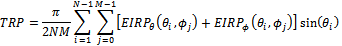{width="5.291666666666667in"
height="2.0416666666666665in"}

Figure A.4.5.5.1.1-1: SNR variation for SSB-based beam failure detection
and link recovery testing in non-DRX mode

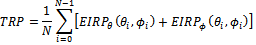{width="5.604166666666667in" height="2.125in"}

Figure A.4.5.5.1.1-2: L1-RSRP level variation for SSB-based beam failure
detection and link recovery testing in non-DRX mode

##### A.4.5.5.1.2 Test Requirements

The UE behaviour during time durations T1, T2, T3, T4 and T5 shall be as
follows:

During the time duration T1 and T2, the UE shall transmit uplink signal
at least in all subframes configured for CSI transmission on Cell 1.

During the period from time point A to time point B the UE shall
transmit uplink signal in Cell 1 in all uplink slots configured for CSI
transmission according to the configured periodic CSI reporting for Cell
1.

During T3 the UE shall detect beam failure and initiate link recovery.
During T4 and T5 the UE measures and evaluate beam candidate from beam
candidate set q~1~.

No later than time point F occurring no later than D1 = 120+20 ms after
the start of T5, the UE shall transmit preamble on a beam associated
with the candidate beam set q~1~. The UE shall not transmit preamble on
a beam associated with the candidate beam set q~1~ earlier than time
point B.

Test is concluded once the test equipment has received the initial
preamble transmission from the UE. The rate of correct events observed
during repeated tests shall be at least 90%.

#### A.4.5.5.2 EN-DC Beam Failure Detection and Link Recovery Test for FR1 PSCell configured with SSB-based BFD and LR in DRX mode

##### A.4.5.5.2.1 Test Purpose and Environment

The purpose of this test is to verify that the UE properly detects
SSB-based beam failure in the set q~0~ configured for a serving PSCell
and that the UE performs correct SSB-based link recovery based on beam
candidate set q~1~. The purpose is to test the downlink monitoring for
beam failure detection within the UEs active DL BWP of the PSCell,
during the evaluation period, and link recovery, when DRX is used. This
test will partly verify the SSB based beam failure detection and link
recovery for an FR1 serving cell requirements in clause 8.5.

The test parameters are given in Tables A.4.5.5.2.1-1, A.4.5.5.2.1-2,
A.4.5.5.2.1-3, A.4.5.5.2.1-4 and A.4.5.5.2.1-5 below. There are two
cells, cell 1 is the E-UTRAN PCell, and cell 2 is the PSCell, in the
test. The test consists of five successive time periods, with time
duration of T1, T2, T3, T4 and T5 respectively. Figure A.4.5.5.2.1-1
shows the variation of the downlink SNR of the PCell and the SNR of the
SSB in set q~0~ in the active PSCell to emulate SSB based beam failure.
Figure A.4.5.5.2.1-2 shows the variation of the downlink L1-RSRP of the
SSB in set q~1~ of the candidate beam used for link recovery. Prior to
the start of the time duration T1, the UE shall be fully synchronized to
cell 1 and cell 2. The UE shall be configured for periodic CSI reporting
with a reporting periodicity of 5 ms. In the test, DRX configuration is
enabled in PSCell and DRX inactivity timer has already been expired,
i.e. UE tries to decode PDCCH and to send periodic CQI during the period
when On-duration timer is running. Time alignment timers shall be set to
"infinity" so that UL timing alignment is maintained during the test.

Table A.4.5.5.2.1-1: Supported test configurations for FR1 PCell

  **Configuration**                                                                          **Description**
  ------------------------------------------------------------------------------------------ ---------------------------------------------------------------
  1                                                                                          LTE FDD, NR 15 kHz SSB SCS, 10 MHz bandwidth, FDD duplex mode
  2                                                                                          LTE FDD, NR 15 kHz SSB SCS, 10 MHz bandwidth, TDD duplex mode
  3                                                                                          LTE FDD, NR 30 kHz SSB SCS, 40 MHz bandwidth, TDD duplex mode
  4                                                                                          LTE TDD, NR 15 kHz SSB SCS, 10 MHz bandwidth, FDD duplex mode
  5                                                                                          LTE TDD, NR 15 kHz SSB SCS, 10 MHz bandwidth, TDD duplex mode
  6                                                                                          LTE TDD, NR 30 kHz SSB SCS, 40 MHz bandwidth, TDD duplex mode
  Note: The UE is only required to pass in one of the supported test configurations in FR1   

Table A.4.5.5.2.1-2: General test parameters for FR1 PCell for SSB-based
beam failure detection and link recovery testing in DRX mode

+-------------+-------------+-------------+-------------+-------------+
| Parameter   | Unit        | Value       | Comment     |             |
+=============+=============+=============+=============+=============+
|             |             | Test 1      |             |             |
+-------------+-------------+-------------+-------------+-------------+
| Active      |             | Cell 1      |             |             |
| E-UTRA      |             |             |             |             |
| PCell       |             |             |             |             |
+-------------+-------------+-------------+-------------+-------------+
| E-UTRA RF   |             | 1           |             |             |
| Channel     |             |             |             |             |
| Number      |             |             |             |             |
+-------------+-------------+-------------+-------------+-------------+
| Active      |             | Cell 2      |             |             |
| PSCell      |             |             |             |             |
+-------------+-------------+-------------+-------------+-------------+
| RF Channel  |             | 2           |             |             |
| Number      |             |             |             |             |
+-------------+-------------+-------------+-------------+-------------+
| Duplex mode | Config 1, 4 |             | FDD         |             |
+-------------+-------------+-------------+-------------+-------------+
|             | Config 2,   |             | TDD         |             |
|             | 3, 5, 6     |             |             |             |
+-------------+-------------+-------------+-------------+-------------+
| BWchannel   | Config 1, 4 | MHz         | 10: NRB,c = |             |
|             |             |             | 52          |             |
+-------------+-------------+-------------+-------------+-------------+
|             | Config 2, 5 |             | 10: NRB,c = |             |
|             |             |             | 52          |             |
+-------------+-------------+-------------+-------------+-------------+
|             | Config 3, 6 |             | 40: NRB,c = |             |
|             |             |             | 106         |             |
+-------------+-------------+-------------+-------------+-------------+
| DL initial  | Config 1,   |             | DLBWP.0.1   |             |
| BWP         | 2, 3, 4, 5, |             |             |             |
| co          | 6           |             |             |             |
| nfiguration |             |             |             |             |
+-------------+-------------+-------------+-------------+-------------+
| DL          | Config 1,   |             | DLBWP.1.1   |             |
| dedicated   | 2, 3, 4, 5, |             |             |             |
| BWP         | 6           |             |             |             |
| co          |             |             |             |             |
| nfiguration |             |             |             |             |
+-------------+-------------+-------------+-------------+-------------+
| UL initial  | Config 1,   |             | ULBWP.0.1   |             |
| BWP         | 2, 3, 4, 5, |             |             |             |
| co          | 6           |             |             |             |
| nfiguration |             |             |             |             |
+-------------+-------------+-------------+-------------+-------------+
| UL          | Config 1,   |             | ULBWP.1.1   |             |
| dedicated   | 2, 3, 4, 5, |             |             |             |
| BWP         | 6           |             |             |             |
| co          |             |             |             |             |
| nfiguration |             |             |             |             |
+-------------+-------------+-------------+-------------+-------------+
| TDD         | Config 1, 4 |             | Not         |             |
| Co          |             |             | Applicable  |             |
| nfiguration |             |             |             |             |
+-------------+-------------+-------------+-------------+-------------+
|             | Config 2, 5 |             | TDDConf.1.1 |             |
+-------------+-------------+-------------+-------------+-------------+
|             | Config 3, 6 |             | TDDConf.2.1 |             |
+-------------+-------------+-------------+-------------+-------------+
| RMSI        | Config 1, 4 |             | CR.1.1 FDD  |             |
| CORESET     |             |             |             |             |
| Reference   |             |             |             |             |
| Channel     |             |             |             |             |
+-------------+-------------+-------------+-------------+-------------+
|             | Config 2, 5 |             | CR.1.1 TDD  |             |
+-------------+-------------+-------------+-------------+-------------+
|             | Config 3, 6 |             | CR.2.1 TDD  |             |
+-------------+-------------+-------------+-------------+-------------+
| Dedicated   | Config 1, 4 |             | CCR.1.1 FDD |             |
| CORESET     |             |             |             |             |
| Reference   |             |             |             |             |
| Channel     |             |             |             |             |
+-------------+-------------+-------------+-------------+-------------+
|             | Config 2, 5 |             | CCR.1.1 TDD |             |
+-------------+-------------+-------------+-------------+-------------+
|             | Config 3, 6 |             | CCR.2.1 TDD |             |
+-------------+-------------+-------------+-------------+-------------+
| SSB         | Config 1, 4 |             | SSB.3 FR1   |             |
| Co          |             |             |             |             |
| nfiguration |             |             |             |             |
+-------------+-------------+-------------+-------------+-------------+
|             | Config 2, 5 |             | SSB.3 FR1   |             |
+-------------+-------------+-------------+-------------+-------------+
|             | Config 3, 6 |             | SSB.4 FR1   |             |
+-------------+-------------+-------------+-------------+-------------+
| SMTC        | Config 1,   |             | SMTC.1      |             |
| Co          | 2, 4, 5     |             |             |             |
| nfiguration |             |             |             |             |
+-------------+-------------+-------------+-------------+-------------+
|             | Config 3, 6 |             | SMTC.1      |             |
+-------------+-------------+-------------+-------------+-------------+
| PDSCH/PDCCH | Config 1,   |             | 15 KHz      |             |
| subcarrier  | 2, 4, 5     |             |             |             |
| spacing     |             |             |             |             |
+-------------+-------------+-------------+-------------+-------------+
|             | Config 3, 6 |             | 30 KHz      |             |
+-------------+-------------+-------------+-------------+-------------+
| PRACH       | Config 1,   |             | Table       |             |
| Co          | 2, 4, 5     |             | A.3.8.2.2-1 |             |
| nfiguration |             |             |             |             |
+-------------+-------------+-------------+-------------+-------------+
|             | Config 3, 6 |             | Table       |             |
|             |             |             | A.3.8.2.2-1 |             |
+-------------+-------------+-------------+-------------+-------------+
| SSB Index   |             | 0           |             |             |
| assigned as |             |             |             |             |
| BFD RS      |             |             |             |             |
| (q~0~)      |             |             |             |             |
+-------------+-------------+-------------+-------------+-------------+
| SSB Index   |             | 1           |             |             |
| assigned as |             |             |             |             |
| CBD RS      |             |             |             |             |
| (q~1~)      |             |             |             |             |
+-------------+-------------+-------------+-------------+-------------+
| OCNG        |             | OP.1        |             |             |
| parameters  |             |             |             |             |
+-------------+-------------+-------------+-------------+-------------+
| CP length   |             | Normal      |             |             |
+-------------+-------------+-------------+-------------+-------------+
| Correlation |             | 2x2 Low     |             |             |
| Matrix and  |             |             |             |             |
| Antenna     |             |             |             |             |
| Co          |             |             |             |             |
| nfiguration |             |             |             |             |
+-------------+-------------+-------------+-------------+-------------+
| Beam        | DCI format  |             | 1-0         |             |
| failure     |             |             |             |             |
+-------------+-------------+-------------+-------------+-------------+
| detection   | Number of   |             | 2           |             |
| t           | Control     |             |             |             |
| ransmission | OFDM        |             |             |             |
| parameters  | symbols     |             |             |             |
+-------------+-------------+-------------+-------------+-------------+
|             | Aggregation | CCE         | 8           |             |
|             | level       |             |             |             |
+-------------+-------------+-------------+-------------+-------------+
|             | Ratio of    | dB          | 0           |             |
|             | h           |             |             |             |
|             | ypothetical |             |             |             |
|             | PDCCH RE    |             |             |             |
|             | energy to   |             |             |             |
|             | average SSS |             |             |             |
|             | RE energy   |             |             |             |
+-------------+-------------+-------------+-------------+-------------+
|             | Ratio of    | dB          | 0           |             |
|             | h           |             |             |             |
|             | ypothetical |             |             |             |
|             | PDCCH DMRS  |             |             |             |
|             | energy to   |             |             |             |
|             | average SSS |             |             |             |
|             | RE energy   |             |             |             |
+-------------+-------------+-------------+-------------+-------------+
|             | DMRS        |             | REG bundle  |             |
|             | precoder    |             | size        |             |
|             | granularity |             |             |             |
+-------------+-------------+-------------+-------------+-------------+
|             | REG bundle  |             | 6           |             |
|             | size        |             |             |             |
+-------------+-------------+-------------+-------------+-------------+
| DRX         |             | *DRX.7*     | *A.3.3.7*   |             |
+-------------+-------------+-------------+-------------+-------------+
| Gap pattern |             | *N.A.*      |             |             |
| ID          |             |             |             |             |
+-------------+-------------+-------------+-------------+-------------+
| rlmIn       |             | *absent*    | *When the   |             |
| SyncOutOfSy |             |             | field is    |             |
| ncThreshold |             |             | absent, the |             |
|             |             |             | UE applies  |             |
|             |             |             | the value   |             |
|             |             |             | 0. (Table   |             |
|             |             |             | 8.1.1-1).*  |             |
+-------------+-------------+-------------+-------------+-------------+
| rsrp-T      | Config 1,   | dBm/SCS kHz | *-98*       | Threshold   |
| hresholdSSB | 2, 4, 5     |             |             | used for    |
|             |             |             |             | Q~i         |
|             |             |             |             | n\_LR\_SSB~ |
+-------------+-------------+-------------+-------------+-------------+
|             | Config 3, 6 |             | *-95*       |             |
+-------------+-------------+-------------+-------------+-------------+
| powerCont   |             | *db0*       | Used for    |             |
| rolOffsetSS |             |             | deriving    |             |
|             |             |             | rsrp-Thre   |             |
|             |             |             | sholdCSI-RS |             |
+-------------+-------------+-------------+-------------+-------------+
| beamF       |             | *n1*        | *see TS     |             |
| ailureInsta |             |             | 38.321      |             |
| nceMaxCount |             |             | \[7\],      |             |
|             |             |             | clause      |             |
|             |             |             | 5.17*       |             |
+-------------+-------------+-------------+-------------+-------------+
| bea         |             | pbfd4       | *see TS     |             |
| mFailureDet |             |             | 38.321      |             |
| ectionTimer |             |             | \[7\],      |             |
|             |             |             | clause      |             |
|             |             |             | 5.17*       |             |
+-------------+-------------+-------------+-------------+-------------+
| CSI-RS      | Config 1, 4 |             | CSI-RS.1.1  |             |
| co          |             |             | FDD         |             |
| nfiguration |             |             |             |             |
| for CSI     |             |             |             |             |
| reporting   |             |             |             |             |
+-------------+-------------+-------------+-------------+-------------+
|             | Config 2, 5 |             | CSI-RS.1.1  |             |
|             |             |             | TDD         |             |
+-------------+-------------+-------------+-------------+-------------+
|             | Config 3, 6 |             | CSI-RS.2.1  |             |
|             |             |             | TDD         |             |
+-------------+-------------+-------------+-------------+-------------+
| CSI-RS for  | Config 1, 4 |             | TRS.1.1 FDD |             |
| tracking    |             |             |             |             |
+-------------+-------------+-------------+-------------+-------------+
|             | Config 2, 5 |             | TRS.1.1 TDD |             |
+-------------+-------------+-------------+-------------+-------------+
|             | Config 3, 6 |             | TRS.1.2 TDD |             |
+-------------+-------------+-------------+-------------+-------------+
| SSB Index   |             | 0,1         |             |             |
| assigned as |             |             |             |             |
| RLM RS      |             |             |             |             |
+-------------+-------------+-------------+-------------+-------------+
| T310 Timer  | ms          | 1000        |             |             |
+-------------+-------------+-------------+-------------+-------------+
| N310        |             | 2           |             |             |
+-------------+-------------+-------------+-------------+-------------+
| T1          | s           | 1           | During this |             |
|             |             |             | time the    |             |
|             |             |             | the UE      |             |
|             |             |             | shall be    |             |
|             |             |             | fully       |             |
|             |             |             | s           |             |
|             |             |             | ynchronized |             |
|             |             |             | to cell 1   |             |
+-------------+-------------+-------------+-------------+-------------+
| T2          | s           | 5.17        |             |             |
+-------------+-------------+-------------+-------------+-------------+
| T3          | s           | 3.24        |             |             |
+-------------+-------------+-------------+-------------+-------------+
| T4          | s           | 0           |             |             |
+-------------+-------------+-------------+-------------+-------------+
| T5          | s           | 1.97        |             |             |
+-------------+-------------+-------------+-------------+-------------+
| D1          | s           | 1.94        |             |             |
+-------------+-------------+-------------+-------------+-------------+
| Note 1: All |             |             |             |             |
| con         |             |             |             |             |
| figurations |             |             |             |             |
| are         |             |             |             |             |
| assigned to |             |             |             |             |
| the UE      |             |             |             |             |
| prior to    |             |             |             |             |
| the start   |             |             |             |             |
| of time     |             |             |             |             |
| period T1.  |             |             |             |             |
|             |             |             |             |             |
| Note 2:     |             |             |             |             |
| UE-specific |             |             |             |             |
| PDCCH is    |             |             |             |             |
| not         |             |             |             |             |
| transmitted |             |             |             |             |
| after T1    |             |             |             |             |
| starts.     |             |             |             |             |
|             |             |             |             |             |
| Note 3:     |             |             |             |             |
| **E-UTRAN   |             |             |             |             |
| is in       |             |             |             |             |
| non-DRX     |             |             |             |             |
| mode under  |             |             |             |             |
| test.**     |             |             |             |             |
+-------------+-------------+-------------+-------------+-------------+

Table A.4.5.5.2.1-3: Cell specific test parameters for FR1 PSCell for
SSB-based beam failure detection and link recovery testing in DRX mode

+---------+---------+---------+------+------+-----+-----+-----+
| Pa      | Unit    | Test 1  |      |      |     |     |     |
| rameter |         |         |      |      |     |     |     |
+=========+=========+=========+======+======+=====+=====+=====+
|         |         | T1      | T2   | T3   | T4  | T5  |     |
+---------+---------+---------+------+------+-----+-----+-----+
| EPRE    | dB      | 0       |      |      |     |     |     |
| ratio   |         |         |      |      |     |     |     |
| of      |         |         |      |      |     |     |     |
| PDCCH   |         |         |      |      |     |     |     |
| DMRS to |         |         |      |      |     |     |     |
| SSS     |         |         |      |      |     |     |     |
+---------+---------+---------+------+------+-----+-----+-----+
| EPRE    | dB      |         |      |      |     |     |     |
| ratio   |         |         |      |      |     |     |     |
| of      |         |         |      |      |     |     |     |
| PDCCH   |         |         |      |      |     |     |     |
| to      |         |         |      |      |     |     |     |
| PDCCH   |         |         |      |      |     |     |     |
| DMRS    |         |         |      |      |     |     |     |
+---------+---------+---------+------+------+-----+-----+-----+
| EPRE    | dB      |         |      |      |     |     |     |
| ratio   |         |         |      |      |     |     |     |
| of PBCH |         |         |      |      |     |     |     |
| DMRS to |         |         |      |      |     |     |     |
| SSS     |         |         |      |      |     |     |     |
+---------+---------+---------+------+------+-----+-----+-----+
| EPRE    | dB      |         |      |      |     |     |     |
| ratio   |         |         |      |      |     |     |     |
| of PBCH |         |         |      |      |     |     |     |
| to PBCH |         |         |      |      |     |     |     |
| DMRS    |         |         |      |      |     |     |     |
+---------+---------+---------+------+------+-----+-----+-----+
| EPRE    | dB      |         |      |      |     |     |     |
| ratio   |         |         |      |      |     |     |     |
| of PSS  |         |         |      |      |     |     |     |
| to SSS  |         |         |      |      |     |     |     |
+---------+---------+---------+------+------+-----+-----+-----+
| EPRE    | dB      |         |      |      |     |     |     |
| ratio   |         |         |      |      |     |     |     |
| of      |         |         |      |      |     |     |     |
| PDSCH   |         |         |      |      |     |     |     |
| DMRS to |         |         |      |      |     |     |     |
| SSS     |         |         |      |      |     |     |     |
+---------+---------+---------+------+------+-----+-----+-----+
| EPRE    | dB      |         |      |      |     |     |     |
| ratio   |         |         |      |      |     |     |     |
| of      |         |         |      |      |     |     |     |
| PDSCH   |         |         |      |      |     |     |     |
| to      |         |         |      |      |     |     |     |
| PDSCH   |         |         |      |      |     |     |     |
| DMRS    |         |         |      |      |     |     |     |
+---------+---------+---------+------+------+-----+-----+-----+
| EPRE    | dB      |         |      |      |     |     |     |
| ratio   |         |         |      |      |     |     |     |
| of OCNG |         |         |      |      |     |     |     |
| DMRS to |         |         |      |      |     |     |     |
| SSS     |         |         |      |      |     |     |     |
+---------+---------+---------+------+------+-----+-----+-----+
| EPRE    | dB      |         |      |      |     |     |     |
| ratio   |         |         |      |      |     |     |     |
| of OCNG |         |         |      |      |     |     |     |
| to OCNG |         |         |      |      |     |     |     |
| DMRS    |         |         |      |      |     |     |     |
+---------+---------+---------+------+------+-----+-----+-----+
| S       | Config  | dB      | 5    | -3   | -12 | -12 | -12 |
| NR\_SSB | 1, 4    |         |      |      |     |     |     |
| of set  |         |         |      |      |     |     |     |
| q~0~    |         |         |      |      |     |     |     |
+---------+---------+---------+------+------+-----+-----+-----+
|         | Config  |         | 5    | -3   | -12 | -12 | -12 |
|         | 2, 5    |         |      |      |     |     |     |
+---------+---------+---------+------+------+-----+-----+-----+
|         | Config  |         | 5    | -3   | -12 | -12 | -12 |
|         | 3, 6    |         |      |      |     |     |     |
+---------+---------+---------+------+------+-----+-----+-----+
| S       | Config  | dB      | -10  | -10  | 10  | 10  | 10  |
| NR\_SSB | 1, 4    |         |      |      |     |     |     |
| of set  |         |         |      |      |     |     |     |
| q~1~    |         |         |      |      |     |     |     |
+---------+---------+---------+------+------+-----+-----+-----+
|         | Config  |         | -10  | -10  | 10  | 10  | 10  |
|         | 2, 5    |         |      |      |     |     |     |
+---------+---------+---------+------+------+-----+-----+-----+
|         | Config  |         | -10  | -10  | 10  | 10  | 10  |
|         | 3, 6    |         |      |      |     |     |     |
+---------+---------+---------+------+------+-----+-----+-----+
| SSB\_RP | Config  | dBm/    | -108 | -108 | -88 | -88 | -88 |
| of set  | 1, 4    |         |      |      |     |     |     |
| q~1~    |         |         |      |      |     |     |     |
+---------+---------+---------+------+------+-----+-----+-----+
|         | Config  | SCS kHz | -108 | -108 | -88 | -88 | -88 |
|         | 2, 5    |         |      |      |     |     |     |
+---------+---------+---------+------+------+-----+-----+-----+
|         | Config  |         | -105 | -105 | -85 | -85 | -85 |
|         | 3, 6    |         |      |      |     |     |     |
+---------+---------+---------+------+------+-----+-----+-----+
|         | Config  | dBm/15  | -98  |      |     |     |     |
|         | 1, 4    | KHz     |      |      |     |     |     |
+---------+---------+---------+------+------+-----+-----+-----+
|         | Config  |         | -98  |      |     |     |     |
|         | 2, 5    |         |      |      |     |     |     |
+---------+---------+---------+------+------+-----+-----+-----+
|         | Config  |         | -98  |      |     |     |     |
|         | 3, 6    |         |      |      |     |     |     |
+---------+---------+---------+------+------+-----+-----+-----+
| Prop    |         | TDL-C   |      |      |     |     |     |
| agation |         | 300ns   |      |      |     |     |     |
| co      |         | 100Hz   |      |      |     |     |     |
| ndition |         |         |      |      |     |     |     |
+---------+---------+---------+------+------+-----+-----+-----+
| Note 1: |         |         |      |      |     |     |     |
| OCNG    |         |         |      |      |     |     |     |
| shall   |         |         |      |      |     |     |     |
| be used |         |         |      |      |     |     |     |
| such    |         |         |      |      |     |     |     |
| that    |         |         |      |      |     |     |     |
| the     |         |         |      |      |     |     |     |
| re      |         |         |      |      |     |     |     |
| sources |         |         |      |      |     |     |     |
| in Cell |         |         |      |      |     |     |     |
| 1 are   |         |         |      |      |     |     |     |
| fully   |         |         |      |      |     |     |     |
| al      |         |         |      |      |     |     |     |
| located |         |         |      |      |     |     |     |
| and a   |         |         |      |      |     |     |     |
| c       |         |         |      |      |     |     |     |
| onstant |         |         |      |      |     |     |     |
| total   |         |         |      |      |     |     |     |
| tran    |         |         |      |      |     |     |     |
| smitted |         |         |      |      |     |     |     |
| power   |         |         |      |      |     |     |     |
| s       |         |         |      |      |     |     |     |
| pectral |         |         |      |      |     |     |     |
| density |         |         |      |      |     |     |     |
| is      |         |         |      |      |     |     |     |
| a       |         |         |      |      |     |     |     |
| chieved |         |         |      |      |     |     |     |
| for all |         |         |      |      |     |     |     |
| OFDM    |         |         |      |      |     |     |     |
| s       |         |         |      |      |     |     |     |
| ymbols. |         |         |      |      |     |     |     |
|         |         |         |      |      |     |     |     |
| Note 2: |         |         |      |      |     |     |     |
| The     |         |         |      |      |     |     |     |
| uplink  |         |         |      |      |     |     |     |
| re      |         |         |      |      |     |     |     |
| sources |         |         |      |      |     |     |     |
| for CSI |         |         |      |      |     |     |     |
| re      |         |         |      |      |     |     |     |
| porting |         |         |      |      |     |     |     |
| are     |         |         |      |      |     |     |     |
| a       |         |         |      |      |     |     |     |
| ssigned |         |         |      |      |     |     |     |
| to the  |         |         |      |      |     |     |     |
| UE      |         |         |      |      |     |     |     |
| prior   |         |         |      |      |     |     |     |
| to the  |         |         |      |      |     |     |     |
| start   |         |         |      |      |     |     |     |
| of time |         |         |      |      |     |     |     |
| period  |         |         |      |      |     |     |     |
| T1.     |         |         |      |      |     |     |     |
|         |         |         |      |      |     |     |     |
| Note 3: |         |         |      |      |     |     |     |
| NZP     |         |         |      |      |     |     |     |
| CSI-RS  |         |         |      |      |     |     |     |
| r       |         |         |      |      |     |     |     |
| esource |         |         |      |      |     |     |     |
| set     |         |         |      |      |     |     |     |
| config  |         |         |      |      |     |     |     |
| uration |         |         |      |      |     |     |     |
| for CSI |         |         |      |      |     |     |     |
| re      |         |         |      |      |     |     |     |
| porting |         |         |      |      |     |     |     |
| are     |         |         |      |      |     |     |     |
| a       |         |         |      |      |     |     |     |
| ssigned |         |         |      |      |     |     |     |
| to the  |         |         |      |      |     |     |     |
| UE      |         |         |      |      |     |     |     |
| prior   |         |         |      |      |     |     |     |
| to the  |         |         |      |      |     |     |     |
| start   |         |         |      |      |     |     |     |
| of time |         |         |      |      |     |     |     |
| period  |         |         |      |      |     |     |     |
| T1.     |         |         |      |      |     |     |     |
|         |         |         |      |      |     |     |     |
| Note 4: |         |         |      |      |     |     |     |
| Void    |         |         |      |      |     |     |     |
|         |         |         |      |      |     |     |     |
| Note 5: |         |         |      |      |     |     |     |
| The     |         |         |      |      |     |     |     |
| timers  |         |         |      |      |     |     |     |
| and     |         |         |      |      |     |     |     |
| layer 3 |         |         |      |      |     |     |     |
| fi      |         |         |      |      |     |     |     |
| ltering |         |         |      |      |     |     |     |
| related |         |         |      |      |     |     |     |
| par     |         |         |      |      |     |     |     |
| ameters |         |         |      |      |     |     |     |
| are     |         |         |      |      |     |     |     |
| con     |         |         |      |      |     |     |     |
| figured |         |         |      |      |     |     |     |
| prior   |         |         |      |      |     |     |     |
| to the  |         |         |      |      |     |     |     |
| start   |         |         |      |      |     |     |     |
| of time |         |         |      |      |     |     |     |
| period  |         |         |      |      |     |     |     |
| T1.     |         |         |      |      |     |     |     |
|         |         |         |      |      |     |     |     |
| Note 6: |         |         |      |      |     |     |     |
| The     |         |         |      |      |     |     |     |
| signal  |         |         |      |      |     |     |     |
| c       |         |         |      |      |     |     |     |
| ontains |         |         |      |      |     |     |     |
| PDCCH   |         |         |      |      |     |     |     |
| for UEs |         |         |      |      |     |     |     |
| other   |         |         |      |      |     |     |     |
| than    |         |         |      |      |     |     |     |
| the     |         |         |      |      |     |     |     |
| device  |         |         |      |      |     |     |     |
| under   |         |         |      |      |     |     |     |
| test as |         |         |      |      |     |     |     |
| part of |         |         |      |      |     |     |     |
| OCNG.   |         |         |      |      |     |     |     |
|         |         |         |      |      |     |     |     |
| Note 7: |         |         |      |      |     |     |     |
| SNR     |         |         |      |      |     |     |     |
| levels  |         |         |      |      |     |     |     |
| cor     |         |         |      |      |     |     |     |
| respond |         |         |      |      |     |     |     |
| to the  |         |         |      |      |     |     |     |
| signal  |         |         |      |      |     |     |     |
| to      |         |         |      |      |     |     |     |
| noise   |         |         |      |      |     |     |     |
| ratio   |         |         |      |      |     |     |     |
| over    |         |         |      |      |     |     |     |
| the SSS |         |         |      |      |     |     |     |
| REs.    |         |         |      |      |     |     |     |
|         |         |         |      |      |     |     |     |
| Note 8: |         |         |      |      |     |     |     |
| The SNR |         |         |      |      |     |     |     |
| in time |         |         |      |      |     |     |     |
| periods |         |         |      |      |     |     |     |
| T1, T2, |         |         |      |      |     |     |     |
| T3, T4  |         |         |      |      |     |     |     |
| and T5  |         |         |      |      |     |     |     |
| is      |         |         |      |      |     |     |     |
| denoted |         |         |      |      |     |     |     |
| as      |         |         |      |      |     |     |     |
| SNR1,   |         |         |      |      |     |     |     |
| SNR2    |         |         |      |      |     |     |     |
| and     |         |         |      |      |     |     |     |
| SNR3    |         |         |      |      |     |     |     |
| respe   |         |         |      |      |     |     |     |
| ctively |         |         |      |      |     |     |     |
| in      |         |         |      |      |     |     |     |
| figure  |         |         |      |      |     |     |     |
| A.4.5.5 |         |         |      |      |     |     |     |
| .1.1-1. |         |         |      |      |     |     |     |
|         |         |         |      |      |     |     |     |
| Note 9: |         |         |      |      |     |     |     |
| The SNR |         |         |      |      |     |     |     |
| values  |         |         |      |      |     |     |     |
| are     |         |         |      |      |     |     |     |
| sp      |         |         |      |      |     |     |     |
| ecified |         |         |      |      |     |     |     |
| for     |         |         |      |      |     |     |     |
| testing |         |         |      |      |     |     |     |
| a UE    |         |         |      |      |     |     |     |
| which   |         |         |      |      |     |     |     |
| s       |         |         |      |      |     |     |     |
| upports |         |         |      |      |     |     |     |
| 2RX on  |         |         |      |      |     |     |     |
| at      |         |         |      |      |     |     |     |
| least   |         |         |      |      |     |     |     |
| one     |         |         |      |      |     |     |     |
| band.   |         |         |      |      |     |     |     |
| For     |         |         |      |      |     |     |     |
| testing |         |         |      |      |     |     |     |
| of a UE |         |         |      |      |     |     |     |
| which   |         |         |      |      |     |     |     |
| s       |         |         |      |      |     |     |     |
| upports |         |         |      |      |     |     |     |
| 4RX on  |         |         |      |      |     |     |     |
| all     |         |         |      |      |     |     |     |
| bands,  |         |         |      |      |     |     |     |
| the SNR |         |         |      |      |     |     |     |
| during  |         |         |      |      |     |     |     |
| T3 is   |         |         |      |      |     |     |     |
| m       |         |         |      |      |     |     |     |
| odified |         |         |      |      |     |     |     |
| as      |         |         |      |      |     |     |     |
| sp      |         |         |      |      |     |     |     |
| ecified |         |         |      |      |     |     |     |
| in      |         |         |      |      |     |     |     |
| clause  |         |         |      |      |     |     |     |
| A.3.6.  |         |         |      |      |     |     |     |
+---------+---------+---------+------+------+-----+-----+-----+

Table A.4.5.5.2.1-4: Void

Table A.4.5.5.2.1-5: Void

{width="5.291666666666667in"
height="2.0416666666666665in"}

Figure A.4.5.5.2.1-1: SNR variation for SSB-based beam failure detection
and link recovery testing in DRX mode

{width="5.604166666666667in" height="2.125in"}

Figure A.4.5.5.2.1-2: L1-RSRP level variation for SSB-based beam failure
detection and link recovery testing in DRX mode

##### A.4.5.5.2.2 Test Requirements

The UE behaviour during time durations T1, T2, T3, T4 and T5 shall be as
follows:

During the time duration T1 and T2, the UE shall transmit uplink signal
at least in all subframes configured for CSI transmission on Cell 1.

During the period from time point A to time point B the UE shall
transmit uplink signal in Cell 1 in all uplink slots configured for CSI
transmission according to the configured periodic CSI reporting for Cell
1.

During T3 the UE shall detect beam failure and initiat link recovery.
During T4 and T5 the UE measures and evaluate beam candidate from beam
candidate set q~1~.

No later than time point F occurring no later than D1 = 1920+20 ms after
the start of T5, the UE shall transmit preamble on a beam associated
with the candidate beam set q~1~. The UE shall not transmit preamble on
a beam associated with the candidate beam set q~1~ earlier than time
point B.

Test is concluded once the test equipment has received the initial
preamble transmission from the UE. The rate of correct events observed
during repeated tests shall be at least 90%.

#### A.4.5.5.3 EN-DC Beam Failure Detection and Link Recovery Test for FR1 PSCell configured with CSI-RS-based BFD and LR in non-DRX mode

##### A.4.5.5.3.1 Test Purpose and Environment

The purpose of this test is to verify that the UE properly detects
CSI-RS-based beam failure in the set q~0~ configured for a serving
PSCell and that the UE performs correct CSI-RS-based link recovery based
on beam candicate set q~1~. The purpose is to test the downlink
monitoring for beam failure detection within the UEs active DL BWP of
the PSCell, during the evaluation period, and link recovery, when no DRX
is used. This test will partly verify the CSI-RS based beam failure
detection and link recovery for an FR1 serving cell requirements in
clause 8.5.

The test parameters are given in Tables A.4.5.5.3.1-1, A.4.5.5.3.1-2,
and A.4.5.5.3.1-3 below. There are two cells, cell 1 is the E-UTRAN
PCell, and cell 2 is the PSCell, in the test. The test consists of five
successive time periods, with time duration of T1, T2, T3, T4 and T5
respectively. Figure A.4.5.5.3.1-1 shows the variation of the downlink
SNR of the PSCell and the SNR of the CSI-RS in set q~0~ in the active
PSCell to emulate CSI-RS based beam failure. Figure A.4.5.5.3.1-2 shows
the variation of the downlink L1-RSRP of the CSI-RS in set q~1~ of the
candidate beam used for link recovery. Prior to the start of the time
duration T1, the UE shall be fully synchronized to cell 1 and cell 2.
The UE shall be configured for periodic CSI reporting with a reporting
periodicity of 5 ms. In the test, DRX configuration is not enabled.

Table A.4.5.5.3.1-1: Supported test configurations for FR1 PSCell

  **Configuration**                                                                          **Description**
  ------------------------------------------------------------------------------------------ ---------------------------------------------------------------
  1                                                                                          LTE FDD, NR 15 kHz SSB SCS, 10 MHz bandwidth, FDD duplex mode
  2                                                                                          LTE FDD, NR 15 kHz SSB SCS, 10 MHz bandwidth, TDD duplex mode
  3                                                                                          LTE FDD, NR 30 kHz SSB SCS, 40 MHz bandwidth, TDD duplex mode
  4                                                                                          LTE TDD, NR 15 kHz SSB SCS, 10 MHz bandwidth, FDD duplex mode
  5                                                                                          LTE TDD, NR 15 kHz SSB SCS, 10 MHz bandwidth, TDD duplex mode
  6                                                                                          LTE TDD, NR 30 kHz SSB SCS, 40 MHz bandwidth, TDD duplex mode
  Note: The UE is only required to pass in one of the supported test configurations in FR1   

Table A.4.5.5.3.1-2: General test parameters for FR1 PSCell for
CSI-RS-based beam failure detection and link recovery testing in non-DRX
mode

  Parameter                                                          Unit                                                                  Value           Comment                                                                    
  ------------------------------------------------------------------ --------------------------------------------------------------------- --------------- -------------------------------------------------------------------------- --------------------------------------
                                                                                                                                           Test 1                                                                                     
  Active PCell                                                                                                                             Cell 1                                                                                     
  RF Channel Number                                                                                                                        1                                                                                          
  Active PSCell                                                                                                                            Cell 2                                                                                     
  RF Channel Number                                                                                                                        2                                                                                          
  Duplex mode                                                        Config 1, 4                                                                           FDD                                                                        
                                                                     Config 2, 3, 5, 6                                                                     TDD                                                                        
  BWchannel                                                          Config 1, 4                                                           MHz             10: NRB,c = 52                                                             
                                                                     Config 2, 5                                                                           10: NRB,c = 52                                                             
                                                                     Config 3, 6                                                                           40: NRB,c = 106                                                            
  DL initial BWP configuration                                       Config 1, 2, 3, 4, 5, 6                                                               DLBWP.0.1                                                                  
  DL dedicated BWP configuration                                     Config 1, 2, 3, 4, 5, 6                                                               DLBWP.1.1                                                                  
  UL initial BWP configuration                                       Config 1, 2, 3, 4, 5, 6                                                               ULBWP.0.1                                                                  
  UL dedicated BWP configuration                                     Config 1, 2, 3, 4, 5, 6                                                               ULBWP.1.1                                                                  
  TDD Configuration                                                  Config 1, 4                                                                           Not Applicable                                                             
                                                                     Config 2, 5                                                                           TDDConf.1.1                                                                
                                                                     Config 3, 6                                                                           TDDConf.2.1                                                                
  RMSI CORESET Reference Channel                                     Config 1, 4                                                                           CR.1.1 FDD                                                                 A.3.1.2
                                                                     Config 2, 5                                                                           CR.1.1 TDD                                                                 
                                                                     Config 3, 6                                                                           CR.2.1 TDD                                                                 
  Dedicated CORESET Reference Channel                                Config 1, 4                                                                           CCR.1.1 FDD                                                                A.3.1.3
                                                                     Config 2, 5                                                                           CCR.1.1 TDD                                                                
                                                                     Config 3, 6                                                                           CCR.2.1 TDD                                                                
  SSB Configuration                                                  Config 1, 4                                                                           **SSB.3 FR1**                                                              A.3.10
                                                                     Config 2, 5                                                                           **SSB.3 FR1**                                                              
                                                                     Config 3, 6                                                                           **SSB.4 FR1**                                                              
  SMTC Configuration                                                 Config 1, 2, 4, 5                                                                     SMTC.1                                                                     A.3.11
                                                                     Config 3, 6                                                                           SMTC.1                                                                     
  PDSCH/PDCCH subcarrier spacing                                     Config 1, 2, 4, 5                                                                     15 KHz                                                                     
                                                                     Config 3, 6                                                                           30 KHz                                                                     
  PRACH Configuration                                                Config 1, 2, 4, 5                                                                     FR1 PRACH configuration 4                                                  A.3.8.2
                                                                     Config 3, 6                                                                           FR1 PRACH configuration 4                                                  A.3.8.2
  csi-RS-Index assigned as beam failure detection RS in set q~0~                                                                           0                                                                                          
  OCNG parameters                                                                                                                          OP.1            A.3.2.1                                                                    
  CP length                                                                                                                                Normal                                                                                     
  Correlation Matrix and Antenna Configuration                                                                                             2x2 Low                                                                                    
  Beam failure                                                       DCI format                                                                            1-0                                                                        
  detection transmission parameters                                  Number of Control OFDM symbols                                                        2                                                                          
                                                                     Aggregation level                                                     CCE             8                                                                          
                                                                     Ratio of hypothetical PDCCH RE energy to average CSI-RS RE energy     dB              0                                                                          
                                                                     Ratio of hypothetical PDCCH DMRS energy to average CSI-RS RE energy   dB              0                                                                          
                                                                     DMRS precoder granularity                                                             REG bundle size                                                            
                                                                     REG bundle size                                                                       6                                                                          
  DRX                                                                                                                                      *OFF*                                                                                      
  Gap pattern ID                                                                                                                           *N.A.*                                                                                     
  csi-RS-Index assigned as candidate beam detection RS in set q~1~                                                                         *1*                                                                                        
  rlmInSyncOutOfSyncThreshold                                                                                                              *absent*        *When the field is absent, the UE applies the value 0. (Table 8.1.1-1).*   
  rsrp-ThresholdCSI-RS                                               Config 1, 2, 4, 5                                                     *dBm/SCS kHz*   *-98*                                                                      Threshold used for Q~in\_LR\_CSI-RS~
                                                                     Config 3, 6                                                                           *-95*                                                                      
  powerControlOffsetSS                                                                                                                     db0             Used for deriving rsrp-ThresholdCSI-RS                                     
  beamFailureInstanceMaxCount                                                                                                              *n1*            *see TS 38.321 \[7\], clause 5.17*                                         
  beamFailureDetectionTimer                                                                                                                pbfd4           *see TS 38.321 \[7\], clause 5.17*                                         
  CSI-RS                                                             Config 1, 4                                                                           CSI-RS.1.2 FDD                                                             A.3.14
  configuration for q~0~                                             Config 2, 5                                                                           CSI-RS.1.2 TDD                                                             
  and q~1~                                                           Config 3, 6                                                                           CSI-RS.2.2 TDD                                                             
  CSI-RS                                                             Config 1, 4                                                                           CSI-RS.1.1 FDD                                                             A.3.14
  configuration for                                                  Config 2, 5                                                                           CSI-RS.1.1 TDD                                                             
  CSI reporting                                                      Config 3, 6                                                                           CSI-RS.2.1 TDD                                                             
  TRS configuration                                                  Config 1, 4                                                                           TRS.1.1 FDD                                                                
                                                                     Config 2, 5                                                                           TRS.1.1 TDD                                                                
                                                                     Config 3, 6                                                                           TRS.1.2 TDD                                                                
  csi-RS-Index                                                       Config 1, 4                                                                           CSI-RS.1.2 FDD                                                             A.3.14
  assigned as RLM                                                    Config 2, 5                                                                           CSI-RS.1.2 TDD                                                             
  RS                                                                 Config 3, 6                                                                           CSI-RS.2.2 TDD                                                             
  T310 Timer                                                         ms                                                                    1000                                                                                       
  N310                                                                                                                                     2                                                                                          
  T1                                                                 s                                                                     1               During this time the the UE shall be fully synchronized to cell 1          
  T2                                                                 s                                                                     0.18                                                                                       
  T3                                                                 s                                                                     0.14                                                                                       
  T4                                                                 s                                                                     0                                                                                          
  T5                                                                 s                                                                     0.08                                                                                       
  D1                                                                 s                                                                     0.05                                                                                       
  Note 1: UE-specific PDCCH is not transmitted after T1 starts.                                                                                                                                                                       

Table A.4.5.5.3.1-3: Cell specific test parameters for FR1 PSCell for
CSI-RS-based beam failure detection and link recovery testing in non-DRX
mode

+---------+---------+---------+------+------+-----+-----+-----+
| Pa      | Unit    | Test 1  |      |      |     |     |     |
| rameter |         |         |      |      |     |     |     |
+=========+=========+=========+======+======+=====+=====+=====+
|         |         | T1      | T2   | T3   | T4  | T5  |     |
+---------+---------+---------+------+------+-----+-----+-----+
| EPRE    | dB      | 0       |      |      |     |     |     |
| ratio   |         |         |      |      |     |     |     |
| of      |         |         |      |      |     |     |     |
| PDCCH   |         |         |      |      |     |     |     |
| DMRS to |         |         |      |      |     |     |     |
| SSS     |         |         |      |      |     |     |     |
+---------+---------+---------+------+------+-----+-----+-----+
| EPRE    | dB      |         |      |      |     |     |     |
| ratio   |         |         |      |      |     |     |     |
| of      |         |         |      |      |     |     |     |
| PDCCH   |         |         |      |      |     |     |     |
| to      |         |         |      |      |     |     |     |
| PDCCH   |         |         |      |      |     |     |     |
| DMRS    |         |         |      |      |     |     |     |
+---------+---------+---------+------+------+-----+-----+-----+
| EPRE    | dB      |         |      |      |     |     |     |
| ratio   |         |         |      |      |     |     |     |
| of PBCH |         |         |      |      |     |     |     |
| DMRS to |         |         |      |      |     |     |     |
| SSS     |         |         |      |      |     |     |     |
+---------+---------+---------+------+------+-----+-----+-----+
| EPRE    | dB      |         |      |      |     |     |     |
| ratio   |         |         |      |      |     |     |     |
| of PBCH |         |         |      |      |     |     |     |
| to PBCH |         |         |      |      |     |     |     |
| DMRS    |         |         |      |      |     |     |     |
+---------+---------+---------+------+------+-----+-----+-----+
| EPRE    | dB      |         |      |      |     |     |     |
| ratio   |         |         |      |      |     |     |     |
| of PSS  |         |         |      |      |     |     |     |
| to SSS  |         |         |      |      |     |     |     |
+---------+---------+---------+------+------+-----+-----+-----+
| EPRE    | dB      |         |      |      |     |     |     |
| ratio   |         |         |      |      |     |     |     |
| of      |         |         |      |      |     |     |     |
| PDSCH   |         |         |      |      |     |     |     |
| DMRS to |         |         |      |      |     |     |     |
| SSS     |         |         |      |      |     |     |     |
+---------+---------+---------+------+------+-----+-----+-----+
| EPRE    | dB      |         |      |      |     |     |     |
| ratio   |         |         |      |      |     |     |     |
| of      |         |         |      |      |     |     |     |
| PDSCH   |         |         |      |      |     |     |     |
| to      |         |         |      |      |     |     |     |
| PDSCH   |         |         |      |      |     |     |     |
| DMRS    |         |         |      |      |     |     |     |
+---------+---------+---------+------+------+-----+-----+-----+
| EPRE    | dB      |         |      |      |     |     |     |
| ratio   |         |         |      |      |     |     |     |
| of OCNG |         |         |      |      |     |     |     |
| DMRS to |         |         |      |      |     |     |     |
| SSS     |         |         |      |      |     |     |     |
+---------+---------+---------+------+------+-----+-----+-----+
| EPRE    | dB      |         |      |      |     |     |     |
| ratio   |         |         |      |      |     |     |     |
| of OCNG |         |         |      |      |     |     |     |
| to OCNG |         |         |      |      |     |     |     |
| DMRS    |         |         |      |      |     |     |     |
+---------+---------+---------+------+------+-----+-----+-----+
| SNR\    | Config  | dB      | 5    | -3   | -12 | -12 | -12 |
| _CSI-RS | 1, 4    |         |      |      |     |     |     |
| of set  |         |         |      |      |     |     |     |
| q~0~    |         |         |      |      |     |     |     |
+---------+---------+---------+------+------+-----+-----+-----+
|         | Config  |         | 5    | -3   | -12 | -12 | -12 |
|         | 2, 5    |         |      |      |     |     |     |
+---------+---------+---------+------+------+-----+-----+-----+
|         | Config  |         | 5    | -3   | -12 | -12 | -12 |
|         | 3, 6    |         |      |      |     |     |     |
+---------+---------+---------+------+------+-----+-----+-----+
| SNR\    | Config  | dB      | -10  | -10  | 10  | 10  | 10  |
| _CSI-RS | 1, 4    |         |      |      |     |     |     |
| of set  |         |         |      |      |     |     |     |
| q~1~    |         |         |      |      |     |     |     |
+---------+---------+---------+------+------+-----+-----+-----+
|         | Config  |         | -10  | -10  | 10  | 10  | 10  |
|         | 2, 5    |         |      |      |     |     |     |
+---------+---------+---------+------+------+-----+-----+-----+
|         | Config  |         | -10  | -10  | 10  | 10  | 10  |
|         | 3, 6    |         |      |      |     |     |     |
+---------+---------+---------+------+------+-----+-----+-----+
| CSI     | Config  | dBm/    | -108 | -108 | -88 | -88 | -88 |
| -RS\_RP | 1, 4    |         |      |      |     |     |     |
| of set  |         |         |      |      |     |     |     |
| q~1~    |         |         |      |      |     |     |     |
+---------+---------+---------+------+------+-----+-----+-----+
|         | Config  | SCS kHz | -108 | -108 | -88 | -88 | -88 |
|         | 2, 5    |         |      |      |     |     |     |
+---------+---------+---------+------+------+-----+-----+-----+
|         | Config  |         | -105 | -105 | -85 | -85 | -85 |
|         | 3, 6    |         |      |      |     |     |     |
+---------+---------+---------+------+------+-----+-----+-----+
|         | Config  | dBm/15  | -98  |      |     |     |     |
|         | 1, 4    | KHz     |      |      |     |     |     |
+---------+---------+---------+------+------+-----+-----+-----+
|         | Config  |         | -98  |      |     |     |     |
|         | 2, 5    |         |      |      |     |     |     |
+---------+---------+---------+------+------+-----+-----+-----+
|         | Config  |         | -98  |      |     |     |     |
|         | 3, 6    |         |      |      |     |     |     |
+---------+---------+---------+------+------+-----+-----+-----+
| Prop    |         | TDL-C   |      |      |     |     |     |
| agation |         | 300ns   |      |      |     |     |     |
| co      |         | 100Hz   |      |      |     |     |     |
| ndition |         |         |      |      |     |     |     |
+---------+---------+---------+------+------+-----+-----+-----+
| Note 1: |         |         |      |      |     |     |     |
| OCNG    |         |         |      |      |     |     |     |
| shall   |         |         |      |      |     |     |     |
| be used |         |         |      |      |     |     |     |
| such    |         |         |      |      |     |     |     |
| that    |         |         |      |      |     |     |     |
| the     |         |         |      |      |     |     |     |
| re      |         |         |      |      |     |     |     |
| sources |         |         |      |      |     |     |     |
| in Cell |         |         |      |      |     |     |     |
| 1 are   |         |         |      |      |     |     |     |
| fully   |         |         |      |      |     |     |     |
| al      |         |         |      |      |     |     |     |
| located |         |         |      |      |     |     |     |
| and a   |         |         |      |      |     |     |     |
| c       |         |         |      |      |     |     |     |
| onstant |         |         |      |      |     |     |     |
| total   |         |         |      |      |     |     |     |
| tran    |         |         |      |      |     |     |     |
| smitted |         |         |      |      |     |     |     |
| power   |         |         |      |      |     |     |     |
| s       |         |         |      |      |     |     |     |
| pectral |         |         |      |      |     |     |     |
| density |         |         |      |      |     |     |     |
| is      |         |         |      |      |     |     |     |
| a       |         |         |      |      |     |     |     |
| chieved |         |         |      |      |     |     |     |
| for all |         |         |      |      |     |     |     |
| OFDM    |         |         |      |      |     |     |     |
| s       |         |         |      |      |     |     |     |
| ymbols. |         |         |      |      |     |     |     |
|         |         |         |      |      |     |     |     |
| Note 2: |         |         |      |      |     |     |     |
| The     |         |         |      |      |     |     |     |
| uplink  |         |         |      |      |     |     |     |
| re      |         |         |      |      |     |     |     |
| sources |         |         |      |      |     |     |     |
| for CSI |         |         |      |      |     |     |     |
| re      |         |         |      |      |     |     |     |
| porting |         |         |      |      |     |     |     |
| are     |         |         |      |      |     |     |     |
| a       |         |         |      |      |     |     |     |
| ssigned |         |         |      |      |     |     |     |
| to the  |         |         |      |      |     |     |     |
| UE      |         |         |      |      |     |     |     |
| prior   |         |         |      |      |     |     |     |
| to the  |         |         |      |      |     |     |     |
| start   |         |         |      |      |     |     |     |
| of time |         |         |      |      |     |     |     |
| period  |         |         |      |      |     |     |     |
| T1.     |         |         |      |      |     |     |     |
|         |         |         |      |      |     |     |     |
| Note 3: |         |         |      |      |     |     |     |
| NZP     |         |         |      |      |     |     |     |
| CSI-RS  |         |         |      |      |     |     |     |
| r       |         |         |      |      |     |     |     |
| esource |         |         |      |      |     |     |     |
| set     |         |         |      |      |     |     |     |
| config  |         |         |      |      |     |     |     |
| uration |         |         |      |      |     |     |     |
| for CSI |         |         |      |      |     |     |     |
| re      |         |         |      |      |     |     |     |
| porting |         |         |      |      |     |     |     |
| are     |         |         |      |      |     |     |     |
| a       |         |         |      |      |     |     |     |
| ssigned |         |         |      |      |     |     |     |
| to the  |         |         |      |      |     |     |     |
| UE      |         |         |      |      |     |     |     |
| prior   |         |         |      |      |     |     |     |
| to the  |         |         |      |      |     |     |     |
| start   |         |         |      |      |     |     |     |
| of time |         |         |      |      |     |     |     |
| period  |         |         |      |      |     |     |     |
| T1.     |         |         |      |      |     |     |     |
|         |         |         |      |      |     |     |     |
| Note 4: |         |         |      |      |     |     |     |
| Void    |         |         |      |      |     |     |     |
|         |         |         |      |      |     |     |     |
| Note 5: |         |         |      |      |     |     |     |
| The     |         |         |      |      |     |     |     |
| timers  |         |         |      |      |     |     |     |
| and     |         |         |      |      |     |     |     |
| layer 3 |         |         |      |      |     |     |     |
| fi      |         |         |      |      |     |     |     |
| ltering |         |         |      |      |     |     |     |
| related |         |         |      |      |     |     |     |
| par     |         |         |      |      |     |     |     |
| ameters |         |         |      |      |     |     |     |
| are     |         |         |      |      |     |     |     |
| con     |         |         |      |      |     |     |     |
| figured |         |         |      |      |     |     |     |
| prior   |         |         |      |      |     |     |     |
| to the  |         |         |      |      |     |     |     |
| start   |         |         |      |      |     |     |     |
| of time |         |         |      |      |     |     |     |
| period  |         |         |      |      |     |     |     |
| T1.     |         |         |      |      |     |     |     |
|         |         |         |      |      |     |     |     |
| Note 6: |         |         |      |      |     |     |     |
| The     |         |         |      |      |     |     |     |
| signal  |         |         |      |      |     |     |     |
| c       |         |         |      |      |     |     |     |
| ontains |         |         |      |      |     |     |     |
| PDCCH   |         |         |      |      |     |     |     |
| for UEs |         |         |      |      |     |     |     |
| other   |         |         |      |      |     |     |     |
| than    |         |         |      |      |     |     |     |
| the     |         |         |      |      |     |     |     |
| device  |         |         |      |      |     |     |     |
| under   |         |         |      |      |     |     |     |
| test as |         |         |      |      |     |     |     |
| part of |         |         |      |      |     |     |     |
| OCNG.   |         |         |      |      |     |     |     |
|         |         |         |      |      |     |     |     |
| Note 7: |         |         |      |      |     |     |     |
| SNR     |         |         |      |      |     |     |     |
| levels  |         |         |      |      |     |     |     |
| cor     |         |         |      |      |     |     |     |
| respond |         |         |      |      |     |     |     |
| to the  |         |         |      |      |     |     |     |
| signal  |         |         |      |      |     |     |     |
| to      |         |         |      |      |     |     |     |
| noise   |         |         |      |      |     |     |     |
| ratio   |         |         |      |      |     |     |     |
| over    |         |         |      |      |     |     |     |
| the REs |         |         |      |      |     |     |     |
| c       |         |         |      |      |     |     |     |
| arrying |         |         |      |      |     |     |     |
| CSI-    |         |         |      |      |     |     |     |
| RS.Note |         |         |      |      |     |     |     |
| 8: The  |         |         |      |      |     |     |     |
| SNR in  |         |         |      |      |     |     |     |
| time    |         |         |      |      |     |     |     |
| periods |         |         |      |      |     |     |     |
| T1, T2, |         |         |      |      |     |     |     |
| T3, T4  |         |         |      |      |     |     |     |
| and T5  |         |         |      |      |     |     |     |
| is      |         |         |      |      |     |     |     |
| denoted |         |         |      |      |     |     |     |
| as      |         |         |      |      |     |     |     |
| SNR1,   |         |         |      |      |     |     |     |
| SNR2    |         |         |      |      |     |     |     |
| and     |         |         |      |      |     |     |     |
| SNR3    |         |         |      |      |     |     |     |
| respe   |         |         |      |      |     |     |     |
| ctively |         |         |      |      |     |     |     |
| in      |         |         |      |      |     |     |     |
| figure  |         |         |      |      |     |     |     |
| A.4.5.5 |         |         |      |      |     |     |     |
| .1.1-1. |         |         |      |      |     |     |     |
|         |         |         |      |      |     |     |     |
| Note 9: |         |         |      |      |     |     |     |
| The SNR |         |         |      |      |     |     |     |
| values  |         |         |      |      |     |     |     |
| are     |         |         |      |      |     |     |     |
| sp      |         |         |      |      |     |     |     |
| ecified |         |         |      |      |     |     |     |
| for     |         |         |      |      |     |     |     |
| testing |         |         |      |      |     |     |     |
| a UE    |         |         |      |      |     |     |     |
| which   |         |         |      |      |     |     |     |
| s       |         |         |      |      |     |     |     |
| upports |         |         |      |      |     |     |     |
| 2RX on  |         |         |      |      |     |     |     |
| at      |         |         |      |      |     |     |     |
| least   |         |         |      |      |     |     |     |
| one     |         |         |      |      |     |     |     |
| band.   |         |         |      |      |     |     |     |
| For     |         |         |      |      |     |     |     |
| testing |         |         |      |      |     |     |     |
| of a UE |         |         |      |      |     |     |     |
| which   |         |         |      |      |     |     |     |
| s       |         |         |      |      |     |     |     |
| upports |         |         |      |      |     |     |     |
| 4RX on  |         |         |      |      |     |     |     |
| all     |         |         |      |      |     |     |     |
| bands,  |         |         |      |      |     |     |     |
| the SNR |         |         |      |      |     |     |     |
| during  |         |         |      |      |     |     |     |
| T3 is   |         |         |      |      |     |     |     |
| m       |         |         |      |      |     |     |     |
| odified |         |         |      |      |     |     |     |
| as      |         |         |      |      |     |     |     |
| sp      |         |         |      |      |     |     |     |
| ecified |         |         |      |      |     |     |     |
| in      |         |         |      |      |     |     |     |
| clause  |         |         |      |      |     |     |     |
| A.3.6.  |         |         |      |      |     |     |     |
+---------+---------+---------+------+------+-----+-----+-----+

{width="5.291666666666667in" height="2.0in"}

Figure A.4.5.5.3.1-1: SNR variation for CSI-RS-based beam failure
detection and link recovery testing in non-DRX mode

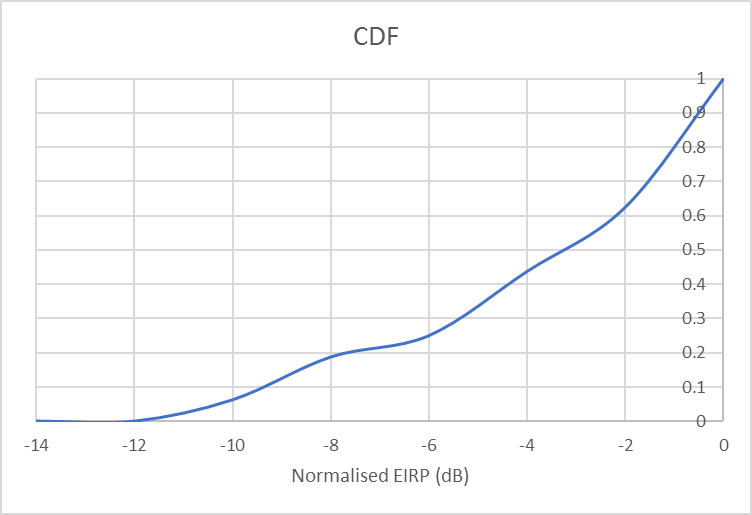{width="5.875in" height="2.0520833333333335in"}

Figure A.4.5.5.3.1-2: L1-RSRP level variation for CSI-RS based beam
failure detection and link recovery testing in non-DRX mode

##### A.4.5.5.3.2 Test Requirements

The UE behaviour during time durations T1, T2, T3, T4 and T5 shall be as
follows:

During the time duration T1 and T2, the UE shall transmit uplink signal
at least in all subframes configured for CSI transmission on Cell 1.

During the period from time point A to time point B the UE shall
transmit uplink signal in Cell 1 in all uplink slots configured for CSI
transmission according to the configured periodic CSI reporting for Cell
1.

During T3 the UE shall detect beam failure and initiat link recovery.
During T4 and T5 the UE measures and evaluate beam candidate from beam
candidate set q~1~.

No later than time point F occurring no later than D1 = 30+20 ms after
the start of T5, the UE shall transmit preamble on a beam associated
with the candidate beam set q~1~. The UE shall not transmit preamble on
a beam associated with the candidate beam set q~1~ earlier than time
point B.

Test is concluded once the test equipment has received the initial
preamble transmission from the UE. The rate of correct events observed
during repeated tests shall be at least 90%.

#### A.4.5.5.4 EN-DC Beam Failure Detection and Link Recovery Test for FR1 PSCell configured with CSI-RS-based BFD and LR in DRX mode

##### A.4.5.5.4.1 Test Purpose and Environment

The purpose of this test is to verify that the UE properly detects
CSI-RS-based beam failure in the set q~0~ configured for a serving
PSCell and that the UE performs correct CSI-RS-based link recovery based
on beam candicate set q~1~. The purpose is to test the downlink
monitoring for beam failure detection within the UEs active DL BWP of
the PSCell, during the evaluation period, and link recovery, when DRX is
used. This test will partly verify the CSI-RS based beam failure
detection and link recovery for an FR1 serving cell requirements in
clause 8.5.

The test parameters are given in Tables A.4.5.5.4.1-1, A.4.5.5.4.1-2,
A.4.5.5.4.1-3, and A.4.5.5.4.1-4 below. There are two cells, cell 1 is
the E-UTRAN PCell, and cell 2 is the PSCell, in the test. The test
consists of five successive time periods, with time duration of T1, T2,
T3, T4 and T5 respectively. Figure A.4.5.5.4.1-1 shows the variation of
the downlink SNR of the PSCell and the SNR of the CSI-RS in set q~0~ in
the active PSCell to emulate CSI-RS based beam failure. Figure
A.4.5.5.4.1-2 shows the variation of the downlink L1-RSRP of the CSI-RS
in set q~1~ of the candidate beam used for link recovery. Prior to the
start of the time duration T1, the UE shall be fully synchronized to
cell 1 and cell 2. The UE shall be configured for periodic CSI reporting
with a reporting periodicity of 5 ms. In the test, DRX configuration is
enabled in PSCell and DRX inactivity timer has already been expired,
i.e. UE tries to decode PDCCH and to send periodic CQI during the period
when On-duration timer is running. Time alignment timers shall be set to
"infinity" so that UL timing alignment is maintained during the test.

Table A.4.5.5.4.1-1: Supported test configurations for FR1 PSCell

  **Configuration**                                                                          **Description**
  ------------------------------------------------------------------------------------------ ---------------------------------------------------------------
  1                                                                                          LTE FDD, NR 15 kHz SSB SCS, 10 MHz bandwidth, FDD duplex mode
  2                                                                                          LTE FDD, NR 15 kHz SSB SCS, 10 MHz bandwidth, TDD duplex mode
  3                                                                                          LTE FDD, NR 30 kHz SSB SCS, 40 MHz bandwidth, TDD duplex mode
  4                                                                                          LTE TDD, NR 15 kHz SSB SCS, 10 MHz bandwidth, FDD duplex mode
  5                                                                                          LTE TDD, NR 15 kHz SSB SCS, 10 MHz bandwidth, TDD duplex mode
  6                                                                                          LTE TDD, NR 30 kHz SSB SCS, 40 MHz bandwidth, TDD duplex mode
  Note: The UE is only required to pass in one of the supported test configurations in FR1   

Table A.4.5.5.4.1-2: General test parameters for FR1 PSCell for
CSI-RS-based beam failure detection and link recovery testing in DRX
mode

  **Parameter**                                                      **Unit**                                                              **Value**    **Comment**                                                                
  ------------------------------------------------------------------ --------------------------------------------------------------------- ------------ -------------------------------------------------------------------------- ---------
                                                                                                                                           **Test 1**                                                                              
  Active PCell                                                                                                                             Cell 1                                                                                  
  RF Channel Number                                                                                                                        1                                                                                       
  Active PSCell                                                                                                                            Cell 2                                                                                  
  RF Channel Number                                                                                                                        2                                                                                       
  Duplex mode                                                        Config 1, 4                                                                        FDD                                                                        
                                                                     Config 2, 3, 5, 6                                                                  TDD                                                                        
  BWchannel                                                          Config 1, 4                                                           MHz          10: NRB,c = 52                                                             
                                                                     Config 2, 5                                                                        10: NRB,c = 52                                                             
                                                                     Config 3, 6                                                                        40: NRB,c = 106                                                            
  DL initial BWP configuration                                       Config 1, 2, 3, 4, 5, 6                                                            DLBWP.0.1                                                                  
  DL dedicated BWP configuration                                     Config 1, 2, 3, 4, 5, 6                                                            DLBWP.1.1                                                                  
  UL initial BWP configuration                                       Config 1, 2, 3, 4, 5, 6                                                            ULBWP.0.1                                                                  
  UL dedicated BWP configuration                                     Config 1, 2, 3, 4, 5, 6                                                            ULBWP.1.1                                                                  
  TDD Configuration                                                  Config 1, 4                                                                        Not Applicable                                                             
                                                                     Config 2, 5                                                                        TDDConf.1.1                                                                
                                                                     Config 3, 6                                                                        TDDConf.2.1                                                                
  RMSI CORESET Reference                                             Config 1, 4                                                                        CR.1.1 FDD                                                                 A.3.1.2
  Channel                                                            Config 2, 5                                                                        CR.1.1 TDD                                                                 
                                                                     Config 3, 6                                                                        CR.2.1 TDD                                                                 
  Dedicated CORESET Reference                                        Config 1, 4                                                                        CCR.1.1 FDD                                                                A.3.1.3
  Channel                                                            Config 2, 5                                                                        CCR.1.1 TDD                                                                
                                                                     Config 3, 6                                                                        CCR.2.1 TDD                                                                
  SSB Configuration                                                  Config 1, 4                                                                        **SSB.3 FR1**                                                              A.3.10
                                                                     Config 2, 5                                                                        **SSB.3 FR1**                                                              
                                                                     Config 3, 6                                                                        **SSB.4 FR1**                                                              
  SMTC Configuration                                                 Config 1, 2, 4, 5                                                                  SMTC.1                                                                     A.3.11
                                                                     Config 3, 6                                                                        SMTC.1                                                                     
  PDSCH/PDCCH                                                        Config 1, 2, 4, 5                                                                  15 KHz                                                                     
  subcarrier spacing                                                 Config 3, 6                                                                        30 KHz                                                                     
  PRACH Configuration                                                Config 1, 2, 4, 5                                                                  FR1 PRACH configuration 4                                                  A.3.8.2
                                                                     Config 3, 6                                                                        FR1 PRACH configuration 4                                                  A.3.8.2
  csi-RS-Index assigned as beam failure detection RS in set q~0~                                                                           0                                                                                       
  OCNG parameters                                                                                                                          OP.1         A.3.2.1                                                                    
  CP length                                                                                                                                Normal                                                                                  
  Correlation Matrix and Antenna Configuration                                                                                             2x2 Low                                                                                 
  Beam failure detection                                             DCI format                                                                         1-0                                                                        
  transmission parameters                                            Number of Control OFDM symbols                                                     2                                                                          
                                                                     Aggregation level                                                     CCE          8                                                                          
                                                                     Ratio of hypothetical PDCCH RE energy to average CSI-RS RE energy     dB           0                                                                          
                                                                     Ratio of hypothetical PDCCH DMRS energy to average CSI-RS RE energy   dB           0                                                                          
                                                                     DMRS precoder granularity                                                          REG bundle size                                                            
                                                                     REG bundle size                                                                    6                                                                          
  DRX                                                                                                                                      *DRX.7*      *A.3.3.7*                                                                  
  Gap pattern ID                                                                                                                           *N.A.*                                                                                  
  csi-RS-Index assigned as candidate beam detection RS in set q~1~                                                                         *1*                                                                                     
  rlmInSyncOutOfSyncThreshold                                                                                                              *absent*     *When the field is absent, the UE applies the value 0. (Table 8.1.1-1).*   
  rsrp-ThresholdCSI-RS                                               *dBm*                                                                 *-98*        Threshold used for Q~in\_LR\_CSI-RS~                                       
  powerControlOffsetSS                                                                                                                     db0          Used for deriving rsrp-ThresholdCSI-RS                                     
  beamFailureInstanceMaxCount                                                                                                              *n1*         *see TS 38.321 \[7\], clause 5.17*                                         
  beamFailureDetectionTimer                                                                                                                pbfd4        *see TS 38.321 \[7\], clause 5.17*                                         
  CSI-RS configuration                                               Config 1, 4                                                                        CSI-RS.1.2 FDD                                                             A.3.14
  for q~0~ and q~1~                                                  Config 2, 5                                                                        CSI-RS.1.2 TDD                                                             
                                                                     Config 3, 6                                                                        CSI-RS.2.2 TDD                                                             
  CSI-RS configuration                                               Config 1, 4                                                                        CSI-RS.1.1 FDD                                                             A.3.14
  for CSI reporting                                                  Config 2, 5                                                                        CSI-RS.1.1 TDD                                                             
                                                                     Config 3, 6                                                                        CSI-RS.2.1 TDD                                                             
  TRS configuration                                                  Config 1, 4                                                                        TRS.1.1 FDD                                                                
                                                                     Config 2, 5                                                                        TRS.1.1 TDD                                                                
                                                                     Config 3, 6                                                                        TRS.1.2 TDD                                                                
  csi-RS-Index                                                       Config 1, 4                                                                        CSI-RS.1.2 FDD                                                             A.3.14
  assigned as RLM RS                                                 Config 2, 5                                                                        CSI-RS.1.2 TDD                                                             
                                                                     Config 3, 6                                                                        CSI-RS.2.2 TDD                                                             
  T310 Timer                                                         ms                                                                    1000                                                                                    
  N310                                                                                                                                     2                                                                                       
  T1                                                                 s                                                                     1            During this time the the UE shall be fully synchronized to cell 1          
  T2                                                                 s                                                                     8.37                                                                                    
  T3                                                                 s                                                                     6.44                                                                                    
  T4                                                                 s                                                                     0                                                                                       
  T5                                                                 s                                                                     1.97                                                                                    
  D1                                                                 s                                                                     1.94                                                                                    
  Note 1: UE-specific PDCCH is not transmitted after T1 starts.                                                                                                                                                                    

Table A.4.5.5.4.1-3: Cell specific test parameters for FR1 PSCell for
CSI-RS-based beam failure detection and link recovery testing in DRX
mode

+---------+---------+---------+------+------+-----+-----+-----+
| Pa      | Unit    | Test 1  |      |      |     |     |     |
| rameter |         |         |      |      |     |     |     |
+=========+=========+=========+======+======+=====+=====+=====+
|         |         | T1      | T2   | T3   | T4  | T5  |     |
+---------+---------+---------+------+------+-----+-----+-----+
| EPRE    | dB      | 0       |      |      |     |     |     |
| ratio   |         |         |      |      |     |     |     |
| of      |         |         |      |      |     |     |     |
| PDCCH   |         |         |      |      |     |     |     |
| DMRS to |         |         |      |      |     |     |     |
| SSS     |         |         |      |      |     |     |     |
+---------+---------+---------+------+------+-----+-----+-----+
| EPRE    | dB      |         |      |      |     |     |     |
| ratio   |         |         |      |      |     |     |     |
| of      |         |         |      |      |     |     |     |
| PDCCH   |         |         |      |      |     |     |     |
| to      |         |         |      |      |     |     |     |
| PDCCH   |         |         |      |      |     |     |     |
| DMRS    |         |         |      |      |     |     |     |
+---------+---------+---------+------+------+-----+-----+-----+
| EPRE    | dB      |         |      |      |     |     |     |
| ratio   |         |         |      |      |     |     |     |
| of PBCH |         |         |      |      |     |     |     |
| DMRS to |         |         |      |      |     |     |     |
| SSS     |         |         |      |      |     |     |     |
+---------+---------+---------+------+------+-----+-----+-----+
| EPRE    | dB      |         |      |      |     |     |     |
| ratio   |         |         |      |      |     |     |     |
| of PBCH |         |         |      |      |     |     |     |
| to PBCH |         |         |      |      |     |     |     |
| DMRS    |         |         |      |      |     |     |     |
+---------+---------+---------+------+------+-----+-----+-----+
| EPRE    | dB      |         |      |      |     |     |     |
| ratio   |         |         |      |      |     |     |     |
| of PSS  |         |         |      |      |     |     |     |
| to SSS  |         |         |      |      |     |     |     |
+---------+---------+---------+------+------+-----+-----+-----+
| EPRE    | dB      |         |      |      |     |     |     |
| ratio   |         |         |      |      |     |     |     |
| of      |         |         |      |      |     |     |     |
| PDSCH   |         |         |      |      |     |     |     |
| DMRS to |         |         |      |      |     |     |     |
| SSS     |         |         |      |      |     |     |     |
+---------+---------+---------+------+------+-----+-----+-----+
| EPRE    | dB      |         |      |      |     |     |     |
| ratio   |         |         |      |      |     |     |     |
| of      |         |         |      |      |     |     |     |
| PDSCH   |         |         |      |      |     |     |     |
| to      |         |         |      |      |     |     |     |
| PDSCH   |         |         |      |      |     |     |     |
| DMRS    |         |         |      |      |     |     |     |
+---------+---------+---------+------+------+-----+-----+-----+
| EPRE    | dB      |         |      |      |     |     |     |
| ratio   |         |         |      |      |     |     |     |
| of OCNG |         |         |      |      |     |     |     |
| DMRS to |         |         |      |      |     |     |     |
| SSS     |         |         |      |      |     |     |     |
+---------+---------+---------+------+------+-----+-----+-----+
| EPRE    | dB      |         |      |      |     |     |     |
| ratio   |         |         |      |      |     |     |     |
| of OCNG |         |         |      |      |     |     |     |
| to OCNG |         |         |      |      |     |     |     |
| DMRS    |         |         |      |      |     |     |     |
+---------+---------+---------+------+------+-----+-----+-----+
| SNR\    | Config  | dB      | 5    | -3   | -12 | -12 | -12 |
| _CSI-RS | 1, 4    |         |      |      |     |     |     |
| of set  |         |         |      |      |     |     |     |
| q~0~    |         |         |      |      |     |     |     |
+---------+---------+---------+------+------+-----+-----+-----+
|         | Config  |         | 5    | -3   | -12 | -12 | -12 |
|         | 2, 5    |         |      |      |     |     |     |
+---------+---------+---------+------+------+-----+-----+-----+
|         | Config  |         | 5    | -3   | -12 | -12 | -12 |
|         | 3, 6    |         |      |      |     |     |     |
+---------+---------+---------+------+------+-----+-----+-----+
| SNR\    | Config  | dB      | -10  | -10  | 10  | 10  | 10  |
| _CSI-RS | 1, 4    |         |      |      |     |     |     |
| of set  |         |         |      |      |     |     |     |
| q~1~    |         |         |      |      |     |     |     |
+---------+---------+---------+------+------+-----+-----+-----+
|         | Config  |         | -10  | -10  | 10  | 10  | 10  |
|         | 2, 5    |         |      |      |     |     |     |
+---------+---------+---------+------+------+-----+-----+-----+
|         | Config  |         | -10  | -10  | 10  | 10  | 10  |
|         | 3, 6    |         |      |      |     |     |     |
+---------+---------+---------+------+------+-----+-----+-----+
| CSI     | Config  | dBm/    | -108 | -108 | -88 | -88 | -88 |
| -RS\_RP | 1, 4    |         |      |      |     |     |     |
| of set  |         |         |      |      |     |     |     |
| q~1~    |         |         |      |      |     |     |     |
+---------+---------+---------+------+------+-----+-----+-----+
|         | Config  | SCS kHz | -108 | -108 | -88 | -88 | -88 |
|         | 2, 5    |         |      |      |     |     |     |
+---------+---------+---------+------+------+-----+-----+-----+
|         | Config  |         | -105 | -105 | -85 | -85 | -85 |
|         | 3, 6    |         |      |      |     |     |     |
+---------+---------+---------+------+------+-----+-----+-----+
|         | Config  | dBm/15  | -98  |      |     |     |     |
|         | 1, 4    | KHz     |      |      |     |     |     |
+---------+---------+---------+------+------+-----+-----+-----+
|         | Config  |         | -98  |      |     |     |     |
|         | 2, 5    |         |      |      |     |     |     |
+---------+---------+---------+------+------+-----+-----+-----+
|         | Config  |         | -98  |      |     |     |     |
|         | 3, 6    |         |      |      |     |     |     |
+---------+---------+---------+------+------+-----+-----+-----+
| Prop    |         | TDL-C   |      |      |     |     |     |
| agation |         | 300ns   |      |      |     |     |     |
| co      |         | 100Hz   |      |      |     |     |     |
| ndition |         |         |      |      |     |     |     |
+---------+---------+---------+------+------+-----+-----+-----+
| Note 1: |         |         |      |      |     |     |     |
| OCNG    |         |         |      |      |     |     |     |
| shall   |         |         |      |      |     |     |     |
| be used |         |         |      |      |     |     |     |
| such    |         |         |      |      |     |     |     |
| that    |         |         |      |      |     |     |     |
| the     |         |         |      |      |     |     |     |
| re      |         |         |      |      |     |     |     |
| sources |         |         |      |      |     |     |     |
| in Cell |         |         |      |      |     |     |     |
| 1 are   |         |         |      |      |     |     |     |
| fully   |         |         |      |      |     |     |     |
| al      |         |         |      |      |     |     |     |
| located |         |         |      |      |     |     |     |
| and a   |         |         |      |      |     |     |     |
| c       |         |         |      |      |     |     |     |
| onstant |         |         |      |      |     |     |     |
| total   |         |         |      |      |     |     |     |
| tran    |         |         |      |      |     |     |     |
| smitted |         |         |      |      |     |     |     |
| power   |         |         |      |      |     |     |     |
| s       |         |         |      |      |     |     |     |
| pectral |         |         |      |      |     |     |     |
| density |         |         |      |      |     |     |     |
| is      |         |         |      |      |     |     |     |
| a       |         |         |      |      |     |     |     |
| chieved |         |         |      |      |     |     |     |
| for all |         |         |      |      |     |     |     |
| OFDM    |         |         |      |      |     |     |     |
| s       |         |         |      |      |     |     |     |
| ymbols. |         |         |      |      |     |     |     |
|         |         |         |      |      |     |     |     |
| Note 2: |         |         |      |      |     |     |     |
| The     |         |         |      |      |     |     |     |
| uplink  |         |         |      |      |     |     |     |
| re      |         |         |      |      |     |     |     |
| sources |         |         |      |      |     |     |     |
| for CSI |         |         |      |      |     |     |     |
| re      |         |         |      |      |     |     |     |
| porting |         |         |      |      |     |     |     |
| are     |         |         |      |      |     |     |     |
| a       |         |         |      |      |     |     |     |
| ssigned |         |         |      |      |     |     |     |
| to the  |         |         |      |      |     |     |     |
| UE      |         |         |      |      |     |     |     |
| prior   |         |         |      |      |     |     |     |
| to the  |         |         |      |      |     |     |     |
| start   |         |         |      |      |     |     |     |
| of time |         |         |      |      |     |     |     |
| period  |         |         |      |      |     |     |     |
| T1.     |         |         |      |      |     |     |     |
|         |         |         |      |      |     |     |     |
| Note 3: |         |         |      |      |     |     |     |
| NZP     |         |         |      |      |     |     |     |
| CSI-RS  |         |         |      |      |     |     |     |
| r       |         |         |      |      |     |     |     |
| esource |         |         |      |      |     |     |     |
| set     |         |         |      |      |     |     |     |
| config  |         |         |      |      |     |     |     |
| uration |         |         |      |      |     |     |     |
| for CSI |         |         |      |      |     |     |     |
| re      |         |         |      |      |     |     |     |
| porting |         |         |      |      |     |     |     |
| are     |         |         |      |      |     |     |     |
| a       |         |         |      |      |     |     |     |
| ssigned |         |         |      |      |     |     |     |
| to the  |         |         |      |      |     |     |     |
| UE      |         |         |      |      |     |     |     |
| prior   |         |         |      |      |     |     |     |
| to the  |         |         |      |      |     |     |     |
| start   |         |         |      |      |     |     |     |
| of time |         |         |      |      |     |     |     |
| period  |         |         |      |      |     |     |     |
| T1.     |         |         |      |      |     |     |     |
|         |         |         |      |      |     |     |     |
| Note 4: |         |         |      |      |     |     |     |
| Void    |         |         |      |      |     |     |     |
|         |         |         |      |      |     |     |     |
| Note 5: |         |         |      |      |     |     |     |
| The     |         |         |      |      |     |     |     |
| timers  |         |         |      |      |     |     |     |
| and     |         |         |      |      |     |     |     |
| layer 3 |         |         |      |      |     |     |     |
| fi      |         |         |      |      |     |     |     |
| ltering |         |         |      |      |     |     |     |
| related |         |         |      |      |     |     |     |
| par     |         |         |      |      |     |     |     |
| ameters |         |         |      |      |     |     |     |
| are     |         |         |      |      |     |     |     |
| con     |         |         |      |      |     |     |     |
| figured |         |         |      |      |     |     |     |
| prior   |         |         |      |      |     |     |     |
| to the  |         |         |      |      |     |     |     |
| start   |         |         |      |      |     |     |     |
| of time |         |         |      |      |     |     |     |
| period  |         |         |      |      |     |     |     |
| T1.     |         |         |      |      |     |     |     |
|         |         |         |      |      |     |     |     |
| Note 6: |         |         |      |      |     |     |     |
| The     |         |         |      |      |     |     |     |
| signal  |         |         |      |      |     |     |     |
| c       |         |         |      |      |     |     |     |
| ontains |         |         |      |      |     |     |     |
| PDCCH   |         |         |      |      |     |     |     |
| for UEs |         |         |      |      |     |     |     |
| other   |         |         |      |      |     |     |     |
| than    |         |         |      |      |     |     |     |
| the     |         |         |      |      |     |     |     |
| device  |         |         |      |      |     |     |     |
| under   |         |         |      |      |     |     |     |
| test as |         |         |      |      |     |     |     |
| part of |         |         |      |      |     |     |     |
| OCNG.   |         |         |      |      |     |     |     |
|         |         |         |      |      |     |     |     |
| Note 7: |         |         |      |      |     |     |     |
| SNR     |         |         |      |      |     |     |     |
| levels  |         |         |      |      |     |     |     |
| cor     |         |         |      |      |     |     |     |
| respond |         |         |      |      |     |     |     |
| to the  |         |         |      |      |     |     |     |
| signal  |         |         |      |      |     |     |     |
| to      |         |         |      |      |     |     |     |
| noise   |         |         |      |      |     |     |     |
| ratio   |         |         |      |      |     |     |     |
| over    |         |         |      |      |     |     |     |
| the REs |         |         |      |      |     |     |     |
| c       |         |         |      |      |     |     |     |
| arrying |         |         |      |      |     |     |     |
| CSI-RS. |         |         |      |      |     |     |     |
|         |         |         |      |      |     |     |     |
| Note 8: |         |         |      |      |     |     |     |
| The SNR |         |         |      |      |     |     |     |
| in time |         |         |      |      |     |     |     |
| periods |         |         |      |      |     |     |     |
| T1, T2, |         |         |      |      |     |     |     |
| T3, T4  |         |         |      |      |     |     |     |
| and T5  |         |         |      |      |     |     |     |
| is      |         |         |      |      |     |     |     |
| denoted |         |         |      |      |     |     |     |
| as      |         |         |      |      |     |     |     |
| SNR1,   |         |         |      |      |     |     |     |
| SNR2    |         |         |      |      |     |     |     |
| and     |         |         |      |      |     |     |     |
| SNR3    |         |         |      |      |     |     |     |
| respe   |         |         |      |      |     |     |     |
| ctively |         |         |      |      |     |     |     |
| in      |         |         |      |      |     |     |     |
| figure  |         |         |      |      |     |     |     |
| A.4.5.5 |         |         |      |      |     |     |     |
| .1.1-1. |         |         |      |      |     |     |     |
|         |         |         |      |      |     |     |     |
| Note 9: |         |         |      |      |     |     |     |
| The SNR |         |         |      |      |     |     |     |
| values  |         |         |      |      |     |     |     |
| are     |         |         |      |      |     |     |     |
| sp      |         |         |      |      |     |     |     |
| ecified |         |         |      |      |     |     |     |
| for     |         |         |      |      |     |     |     |
| testing |         |         |      |      |     |     |     |
| a UE    |         |         |      |      |     |     |     |
| which   |         |         |      |      |     |     |     |
| s       |         |         |      |      |     |     |     |
| upports |         |         |      |      |     |     |     |
| 2RX on  |         |         |      |      |     |     |     |
| at      |         |         |      |      |     |     |     |
| least   |         |         |      |      |     |     |     |
| one     |         |         |      |      |     |     |     |
| band.   |         |         |      |      |     |     |     |
| For     |         |         |      |      |     |     |     |
| testing |         |         |      |      |     |     |     |
| of a UE |         |         |      |      |     |     |     |
| which   |         |         |      |      |     |     |     |
| s       |         |         |      |      |     |     |     |
| upports |         |         |      |      |     |     |     |
| 4RX on  |         |         |      |      |     |     |     |
| all     |         |         |      |      |     |     |     |
| bands,  |         |         |      |      |     |     |     |
| the SNR |         |         |      |      |     |     |     |
| during  |         |         |      |      |     |     |     |
| T3 is   |         |         |      |      |     |     |     |
| m       |         |         |      |      |     |     |     |
| odified |         |         |      |      |     |     |     |
| as      |         |         |      |      |     |     |     |
| sp      |         |         |      |      |     |     |     |
| ecified |         |         |      |      |     |     |     |
| in      |         |         |      |      |     |     |     |
| clause  |         |         |      |      |     |     |     |
| A.3.6.  |         |         |      |      |     |     |     |
+---------+---------+---------+------+------+-----+-----+-----+

Table A.4.5.5.4.1-4: Void

Table A.4.5.5.4.1-5: Void

Table A.4.5.5.4.1-6: Void

{width="5.291666666666667in" height="2.0in"}

Figure A.4.5.5.4.1-1: SNR variation for CSI-RS-based beam failure
detection and link recovery testing in DRX mode

{width="5.875in" height="2.0520833333333335in"}

Figure A.4.5.5.4.1-2: L1-RSRP level variation for CSI-RS based beam
failure detection and link recovery testing in DRX mode

##### A.4.5.5.4.2 Test Requirements

The UE behaviour during time durations T1, T2, T3, T4 and T5 shall be as
follows:

During the time duration T1 and T2, the UE shall transmit uplink signal
at least in all subframes configured for CSI transmission on Cell 1.

During the period from time point A to time point B the UE shall
transmit uplink signal in Cell 1 in all uplink slots configured for CSI
transmission according to the configured periodic CSI reporting for Cell
1.

During T3 the UE shall detect beam failure and initiat link recovery.
During T4 and T5 the UE measures and evaluate beam candidate from beam
candidate set q~1~.

No later than time point F occurring no later than D1 = 1920+20 ms after
the start of T5, the UE shall transmit preamble on a beam associated
with the candidate beam set q~1~. The UE shall not transmit preamble on
a beam associated with the candidate beam set q~1~ earlier than time
point B.

Test is concluded once the test equipment has received the initial
preamble transmission from the UE. The rate of correct events observed
during repeated tests shall be at least 90%.

A.4.5.6 Active BWP switch

#### A.4.5.6.1 DCI-based and Timer-based Active BWP Switch 

##### A.4.5.6.1.1 E-UTRAN -- NR PSCell FR1 DL active BWP switch in non-DRX in synchronous EN-DC

###### A.4.5.6.1.1.1 Test Purpose and Environment

The purpose of this test is to verify the DL BWP switch delay
requirement defined in TS38.133 clause 8.6, and interruption requirement
for E-UTRA victim cell defined in TS36.133 clause 7.32.2.7. Supported
test configurations are shown in Table A.**4.5.6.1.1**.1-1.

The test scenario comprises of one E-UTRA PCell (Cell 1), and one PSCell
(Cell 2) as given in Table A.**4.5.6.1.1**.1-2. Cell-specific parameters
of E-UTRA PCell are specified in Table A.3.7.2.1-1 and Cell-specific
parameters of PSCell is specified in Table A.**4.5.6.1.1**.1-3 below.

PDCCHs indicating new transmissions shall be sent continuously on E-UTRA
PCell (Cell 1) to ensure that the UE will have ACK/NACK sending.

PDCCHs indicating new transmissions shall be sent continuously on PSCell
(Cell 2) to ensure that the UE would have ACK/NACK sending except for
the time duration when BWP is switching on Cell 2 and the time duration
of T2.

Before the test starts,

> \- UE is connected to Cell 1 (E-UTRA PCell) on radio channel 1 (PCC),
> and Cell 2 (PSCell) on radio channel 2 (PSCC).
>
> \- UE is configured with 2 different UE-specific downlink bandwidth
> parts for PSCell, BWP-1 and BWP-2, in Cell 2 before starting the test.
> BWP-1 and BWP-2 always include bandwidth of the initial DL BWP and
> SSB.
>
> \- UE is indicated in *firstActiveDownlinkBWP-Id* that the active DL
> BWP is BWP-1 in PSCell.
>
> \- UE is configured with a *bwp-InactivityTimer* timer value for
> PSCell.

All cells have constant signal levels throughout the test.

The test consists of 3 successive time periods, with durations of T1,
T2, and T3, respectively.

During T1,

Time period T1 starts when a DCI format 1\_1 command for PSCell DL BWP
switch, sent from the test equipment to the UE, is received at the UE
side in PSCell's slot \# denoted *i*. The UE shall switch its bandwidth
part from BWP-1 to BWP-2.

The UE shall be able to receive PDSCH on the first DL slot that occurs
after the beginning of PSCell's DL slot (*i+T~BWPswitchDelay~*) as
defined in clause 8.6 and starts to report valid ACK/NACK for the PSCell
no later than the first UL slot that occurs after the beginning of DL
slot (*i+T~BWPswitchDelay~+k1*). The UE shall be continuously scheduled
on PSCell's BWP-2 starting from the first DL slot that occurs after the
beginning of DL slot (*i+T~BWPswitchDelay~*).

The starting time of E-UTRA PCell (Cell 1) interruption due to BWP
switch on PSCell shall occur within the BWP switch delay.

During T2, the test equipment won't transmit DCI format for PDSCH
reception on PSCell(Cell 2).

During T3,

The time period T3 starts from the slot \#*j*, where j is the first slot
of the subframe immediately after the *bwp-InactivityTimer* timer
expires. The UE shall switch its bandwidth part from BWP-2 back to the
default bandwidth part -- BWP-1.

The UE shall be able to receive PDSCH on the first DL slot that occurs
after the beginning of PSCell's DL slot (*j+T~BWPswitchDelay~*) as
defined in clause 8.6 and starts to report valid ACK/NACK for the PSCell
at latest on the first UL slot that occurs after the beginning of DL
slot (*j+T~BWPswitchDelay~+k1*). The UE shall be continuously scheduled
on PSCell's BWP-1 starting from the first DL slot that occurs after the
beginning of DL slot (*j+T~BWPswitchDelay~*).

The starting time of E-UTRA PCell (Cell 1) interruption due to BWP
switch of PSCell shall occur within the BWP switch delay.

The test equipment verifies the DL BWP switch time in PSCell by counting
the slots from the time when the BWP switch command is received or
*bwp-InactivityTimer* timer expires till an ACK/NACK is received.

The test equipment verifies that potential interruption to E-UTRA PCell
is carried out in the correct time span by monitoring ACK/NACK sent in
E-UTRA PCell during BWP switch of PSCell, respectively.

Table A.4.5.6.1.1.1-1: DL BWP switch supported test configurations

+----------------------------------+----------------------------------+
| **Config**                       | **Description**                  |
+==================================+==================================+
| 1                                | LTE FDD, NR 15 kHz SSB SCS, 10   |
|                                  | MHz bandwidth, FDD duplex mode   |
+----------------------------------+----------------------------------+
| 2                                | LTE FDD, NR 15 kHz SSB SCS, 10   |
|                                  | MHz bandwidth, TDD duplex mode   |
+----------------------------------+----------------------------------+
| 3                                | LTE FDD, NR 30 kHz SSB SCS, 40   |
|                                  | MHz bandwidth, TDD duplex mode   |
+----------------------------------+----------------------------------+
| 4                                | LTE TDD, NR 15 kHz SSB SCS, 10   |
|                                  | MHz bandwidth, FDD duplex mode   |
+----------------------------------+----------------------------------+
| 5                                | LTE TDD, NR 15 kHz SSB SCS, 10   |
|                                  | MHz bandwidth, TDD duplex mode   |
+----------------------------------+----------------------------------+
| 6                                | LTE TDD, NR 30 kHz SSB SCS, 40   |
|                                  | MHz bandwidth, TDD duplex mode   |
+----------------------------------+----------------------------------+
| Note 1: The UE is only required  |                                  |
| to be tested in one of the       |                                  |
| supported test configurations.   |                                  |
|                                  |                                  |
| Note 2: A UE which fulfils the   |                                  |
| requirements in test case        |                                  |
| A.4.5.6.1.2 can skip the test    |                                  |
| cases in A.4.5.6.1.1.            |                                  |
+----------------------------------+----------------------------------+

Table A.**4.5.6.1.1.1**-2: General test parameters for DL BWP switch in
synchronous EN-DC

  **Parameter**                                             **Unit**   **Value**   **Comment**
  --------------------------------------------------------- ---------- ----------- ------------------------------------------------
  E-UTRA RF Channel Number                                             1           One E-UTRA radio channel is used for this test
  NR RF Channel Number                                                 2           One NR radio channel is used for this test
  Active PCell                                                         Cell 1      PCell on RF channel number 1.
  Active PSCell                                                        Cell 2      PSCell on RF channel number 2.
  CP length                                                            Normal      
  DRX                                                                  OFF         For both PCell and PSCell
  *bwp-InactivityTimer*                                     ms         200         
  PDCCH and PDSCH maximum number of HARQ transmission                  1           For both PCell and PSCell
  Cell-individual offset for cells on RF channel number 1   dB         0           Individual offset for cells on PCC.
  Cell-individual offset for cells on RF channel number 2   dB         0           Individual offset for cells on PSCC.
  Cell2 timing offset to cell1                              **μs**     3           Synchronous EN-DC
  T1                                                        s          0.2         
  T2                                                        s          0.2         
  T3                                                        s          0.2         

Table A.4.5.6.1.1.1-3: NR Cell specific test parameters for DL BWP
switch in synchronous EN-DC

+-----------------+----------------+------------+-----------------+
| **Parameter**   | **Unit**       | **Cell 2** |                 |
+=================+================+============+=================+
| Frequency Range |                | FR1        |                 |
+-----------------+----------------+------------+-----------------+
| Duplex mode     | Config 1,4     |            | FDD             |
+-----------------+----------------+------------+-----------------+
|                 | Config 2,3,5,6 |            | TDD             |
+-----------------+----------------+------------+-----------------+
| TDD             | Config 1,4     |            | Not Applicable  |
| configuration   |                |            |                 |
+-----------------+----------------+------------+-----------------+
|                 | Config 2,5     |            | TDDConf.1.1     |
+-----------------+----------------+------------+-----------------+
|                 | Config 3,6     |            | TDDConf.2.1     |
+-----------------+----------------+------------+-----------------+
| BW~channel~     | Config 1,4     |            | 10 MHz: N~RB,c~ |
|                 |                |            | = 52            |
+-----------------+----------------+------------+-----------------+
|                 | Config 2,5     |            | 10 MHz: N~RB,c~ |
|                 |                |            | = 52            |
+-----------------+----------------+------------+-----------------+
|                 | Config 3,6     |            | 40 MHz: N~RB,c~ |
|                 |                |            | = 106           |
+-----------------+----------------+------------+-----------------+
| Active BWP ID   |                | 1, 2       |                 |
+-----------------+----------------+------------+-----------------+
| Initial DL BWP  | Config 1,4     |            | DLBWP.0.2       |
| Configuration   |                |            | ^Note\ 4^       |
+-----------------+----------------+------------+-----------------+
|                 | Config 2,5     |            |                 |
+-----------------+----------------+------------+-----------------+
|                 | Config 3,6     |            |                 |
+-----------------+----------------+------------+-----------------+
| Active DL BWP-1 | Config 1,4     |            | DLBWP.1.1       |
| Configuration   |                |            | ^Note\ 4^       |
+-----------------+----------------+------------+-----------------+
|                 | Config 2,5     |            |                 |
+-----------------+----------------+------------+-----------------+
|                 | Config 3,6     |            |                 |
+-----------------+----------------+------------+-----------------+
| Active DL BWP-2 | Config 1,4     |            | DLBWP.1.3       |
| Configuration   |                |            | ^Note\ 4^       |
+-----------------+----------------+------------+-----------------+
|                 | Config 2,5     |            |                 |
+-----------------+----------------+------------+-----------------+
|                 | Config 3,6     |            |                 |
+-----------------+----------------+------------+-----------------+
| Initial UL BWP  | Config 1,4     |            | ULBWP.0.2       |
| Configuration   |                |            | ^Note\ 4^       |
+-----------------+----------------+------------+-----------------+
|                 | Config 2,5     |            |                 |
+-----------------+----------------+------------+-----------------+
|                 | Config 3,6     |            |                 |
+-----------------+----------------+------------+-----------------+
| Active UL BWP-1 | Config 1,4     |            | ULBWP.1.1       |
| Configuration   |                |            | ^Note\ 4^       |
+-----------------+----------------+------------+-----------------+
|                 | Config 2,5     |            |                 |
+-----------------+----------------+------------+-----------------+
|                 | Config 3,6     |            |                 |
+-----------------+----------------+------------+-----------------+
| Active UL BWP-2 | Config 1,4     |            | N/A             |
+-----------------+----------------+------------+-----------------+
| Configuration   | Config 2,5     |            | ULBWP.1.3       |
|                 |                |            | ^Note\ 4^       |
+-----------------+----------------+------------+-----------------+
|                 | Config 3,6     |            | ULBWP.1.3       |
|                 |                |            | ^Note\ 4^       |
+-----------------+----------------+------------+-----------------+
| PDSCH Reference | Config 1,4     |            | SR.1.1 FDD      |
| measurement     |                |            |                 |
| channel         |                |            |                 |
+-----------------+----------------+------------+-----------------+
|                 | Config 2,5     |            | SR.1.1 TDD      |
+-----------------+----------------+------------+-----------------+
|                 | Config 3,6     |            | SR.2.1 TDD      |
+-----------------+----------------+------------+-----------------+
| RMSI CORESET    | Config 1,4     |            | CR.1.1 FDD      |
| parameters      |                |            |                 |
+-----------------+----------------+------------+-----------------+
|                 | Config 2,5     |            | CR.1.1 TDD      |
+-----------------+----------------+------------+-----------------+
|                 | Config 3,6     |            | CR.2.1 TDD      |
+-----------------+----------------+------------+-----------------+
| Dedicated       | Config 1,4     |            | CCR.1.2 FDD     |
| CORESET         |                |            |                 |
| parameters      |                |            |                 |
+-----------------+----------------+------------+-----------------+
|                 | Config 2,5     |            | CCR.1.2 TDD     |
+-----------------+----------------+------------+-----------------+
|                 | Config 3,6     |            | CCR.2.4 TDD     |
+-----------------+----------------+------------+-----------------+
| **OCNG          |                | OP.1       |                 |
| Patterns**      |                |            |                 |
+-----------------+----------------+------------+-----------------+
| **SSB           | Config 1,2,4,5 |            | SSB.1 FR1       |
| Configuration** |                |            |                 |
+-----------------+----------------+------------+-----------------+
|                 | Config 3,6     |            | SSB.2 FR1       |
+-----------------+----------------+------------+-----------------+
| **SMTC          |                |            | SMTC.1          |
| Configuration** |                |            |                 |
+-----------------+----------------+------------+-----------------+
| **Correlation   |                | 1x2 Low    |                 |
| Matrix and      |                |            |                 |
| Antenna         |                |            |                 |
| Configuration** |                |            |                 |
+-----------------+----------------+------------+-----------------+
| **TRS           | Config 1,4     |            | TRS.1.1 FDD     |
| Configuration** |                |            |                 |
+-----------------+----------------+------------+-----------------+
|                 | Config 2,5     |            | TRS.1.1 TDD     |
+-----------------+----------------+------------+-----------------+
|                 | Config 3,6     |            | TRS.1.2 TDD     |
+-----------------+----------------+------------+-----------------+
| EPRE ratio of   | dB             | 0          |                 |
| PSS to SSS      |                |            |                 |
+-----------------+----------------+------------+-----------------+
| EPRE ratio of   |                |            |                 |
| PBCH DMRS to    |                |            |                 |
| SSS             |                |            |                 |
+-----------------+----------------+------------+-----------------+
| EPRE ratio of   |                |            |                 |
| PBCH to PBCH    |                |            |                 |
| DMRS            |                |            |                 |
+-----------------+----------------+------------+-----------------+
| EPRE ratio of   |                |            |                 |
| PDCCH DMRS to   |                |            |                 |
| SSS             |                |            |                 |
+-----------------+----------------+------------+-----------------+
| EPRE ratio of   |                |            |                 |
| PDCCH to PDCCH  |                |            |                 |
| DMRS            |                |            |                 |
+-----------------+----------------+------------+-----------------+
| EPRE ratio of   |                |            |                 |
| PDSCH DMRS to   |                |            |                 |
| SSS             |                |            |                 |
+-----------------+----------------+------------+-----------------+
| EPRE ratio of   |                |            |                 |
| PDSCH to PDSCH  |                |            |                 |
+-----------------+----------------+------------+-----------------+
| EPRE ratio of   |                |            |                 |
| OCNG DMRS to    |                |            |                 |
| SSS(Note 1)     |                |            |                 |
+-----------------+----------------+------------+-----------------+
| EPRE ratio of   |                |            |                 |
| OCNG to OCNG    |                |            |                 |
| DMRS (Note 1)   |                |            |                 |
+-----------------+----------------+------------+-----------------+
| N~oc~^Note\ 2^  | Config 1,2,4,5 | dBm/SCS    | -104            |
+-----------------+----------------+------------+-----------------+
|                 | Config 3,6     |            | -101            |
+-----------------+----------------+------------+-----------------+
| N~oc~^Note\ 2^  | dBm/15kHz      | -104       |                 |
+-----------------+----------------+------------+-----------------+
| SS-RSRP         | Config 1,2,4,5 | dBm/SCS    | -87             |
| ^Note\ 3^       |                |            |                 |
+-----------------+----------------+------------+-----------------+
|                 | Config 3,6     |            | -84             |
+-----------------+----------------+------------+-----------------+
| Ê~s~/I~ot~      | dB             | 17         |                 |
+-----------------+----------------+------------+-----------------+
| Ê~s~/N~oc~      | dB             | 17         |                 |
+-----------------+----------------+------------+-----------------+
| Io^Note3^       | Config 1,2,4,5 | dBm/       | -58.96          |
|                 |                |            |                 |
|                 |                | 9.36MHz    |                 |
+-----------------+----------------+------------+-----------------+
|                 | Config 3,6     | dBm/       | -52.86          |
|                 |                |            |                 |
|                 |                | 38.16MHz   |                 |
+-----------------+----------------+------------+-----------------+
| Propagation     |                | AWGN       |                 |
| Condition       |                |            |                 |
+-----------------+----------------+------------+-----------------+
| Note 1: OCNG    |                |            |                 |
| shall be used   |                |            |                 |
| such that both  |                |            |                 |
| cells are fully |                |            |                 |
| allocated and a |                |            |                 |
| constant total  |                |            |                 |
| transmitted     |                |            |                 |
| power spectral  |                |            |                 |
| density is      |                |            |                 |
| achieved for    |                |            |                 |
| all OFDM        |                |            |                 |
| symbols.        |                |            |                 |
|                 |                |            |                 |
| Note 2:         |                |            |                 |
| Interference    |                |            |                 |
| from other      |                |            |                 |
| cells and noise |                |            |                 |
| sources not     |                |            |                 |
| specified in    |                |            |                 |
| the test is     |                |            |                 |
| assumed to be   |                |            |                 |
| constant over   |                |            |                 |
| subcarriers and |                |            |                 |
| time and shall  |                |            |                 |
| be modelled as  |                |            |                 |
| AWGN of         |                |            |                 |
| appropriate     |                |            |                 |
| power for Noc   |                |            |                 |
| to be           |                |            |                 |
| fulfilled.      |                |            |                 |
|                 |                |            |                 |
| Note 3: SS-RSRP |                |            |                 |
| and Io levels   |                |            |                 |
| have been       |                |            |                 |
| derived from    |                |            |                 |
| other           |                |            |                 |
| parameters for  |                |            |                 |
| information     |                |            |                 |
| purposes. They  |                |            |                 |
| are not         |                |            |                 |
| settable        |                |            |                 |
| parameters      |                |            |                 |
| themselves.     |                |            |                 |
|                 |                |            |                 |
| Note 4: For     |                |            |                 |
| unpaired        |                |            |                 |
| spectrum, a DL  |                |            |                 |
| BWP is linked   |                |            |                 |
| with an UL BWP. |                |            |                 |
| DLBWP.0.2 is    |                |            |                 |
| linked with     |                |            |                 |
| ULBWP.0.2;      |                |            |                 |
| DLBWP.1.1 is    |                |            |                 |
| linked with     |                |            |                 |
| ULBWP.1.1;      |                |            |                 |
| DLBWP.1.3 is    |                |            |                 |
| linked with     |                |            |                 |
| ULBWP.1.3       |                |            |                 |
| defined in      |                |            |                 |
| clause 12 of TS |                |            |                 |
| 38.213 \[3\].   |                |            |                 |
+-----------------+----------------+------------+-----------------+

###### A.**4**.**5**.**6**.**1**.**1**.2 Test Requirements

During T1, the UE shall start to send the ACK/NACK for PSCell from the
first UL slot that occurs after the beginning of DL slot
(*i+T~BWPswitchDelay~*+*k1*).

During T3, the UE shall start to send the ACK/NACK for PSCell from the
first UL slot that occurs after the beginning of DL slot
(*j+T~BWPswitchDelay~*+*k1*).

Where, *k1* is the timing between DL data receiving and acknowledgement
as specified in \[7\].

Depending on UE capability *bwp-SwitchingDelay* \[2\], UE shall finish
BWP switch within the time duration *T~BWPswitchDelay~* defined in Table
8.6.2-1.

All of the above test requirements shall be fulfilled in order for the
observed PSCell active BWP switch delay to be counted as correct.

The rate of correct events observed during repeated tests shall be at
least 90%.

During T1, the start time of E-UTRA PCell interruption during PSCell
active BWP switch shall not happen outside the BWP switch delay.

During T3, the start time of E-UTRA PCell interruption of during PSCell
active BWP switch shall not happen outside the BWP switch delay.

The interruption of E-UTRA PCell shall not be longer than the
interruption duration specified for active BWP switch in TS36.133 Clause
7.32.2.7.

All of the above test requirements shall be fulfilled in order for the
observed E-UTRA PCell active BWP switch interruption to be counted as
correct.

The rate of correct events observed during repeated tests shall be at
least 90%.

NOTE: During T1, T3 if there are no uplink resources for reporting the
ACK/NACK in the first UL slot that occurs after the beginning of DL slot
(*i+T~BWPswitchDelay~*+*k1*), (*j+T~BWPswitchDelay~*+*k1*), then the UE
shall use the next available uplink resource for reporting the
corresponding ACK/NACK.

##### A.4.5.6.1.2 E-UTRAN -- NR PSCell FR1 DL active BWP switch with FR1 SCell in non-DRX in synchronous EN-DC

###### A.4.5.6.1.2.1 Test Purpose and Environment

The purpose of this test is to verify the DL BWP switch delay
requirement defined in clause 8.6, and interruption requirements for NR
victim cell defined in clause 8.2.1.2.7 and interruption requirement for
E-UTRA victim cell defined in clause 7.32.2.7 of TS 36.133 \[15\].
Supported test configurations for LTE PCell and NR PSCell are shown in
Table A.4.5.6.1.2.1-1. Supported test configurations for NR SCell are
shown in table A.4.5.6.1.2.1-1A. Test configuration for LTE PCell and NR
PSCell and test configuration for NR SCell are chosen independently.

The test scenario comprises of one E-UTRA PCell (Cell 1), one PSCell
(Cell 2) and one SCell (Cell 3) as given in Table A.4.5.6.1.2.1-2.
Cell-specific parameters of E-UTRA PCell are specified in Table
A.3.7.2.1-1 and Cell-specific parameters of PSCell and SCell are
specified in Table A.4.5.6.1.2.1-3 and Table A.4.5.6.1.2.1-4 below.

PDCCHs indicating new transmissions shall be sent continuously on E-UTRA
PCell (Cell 1) and PSCell (Cell 2) to ensure that the UE will have
ACK/NACK sending.

PDCCHs indicating new transmissions shall be sent continuously on SCell
(Cell 3) to ensure that the UE would have ACK/NACK sending except for
the time duration when BWP is switching on Cell 3 and the time duration
of T2.

Before the test starts,

\- UE is connected to Cell 1 (E-UTRA PCell) on radio channel 1 (PCC),
Cell 2 (PSCell) on radio channel 2 (PSCC) and Cell 3 (SCell) on radio
channel 3 (SCC).

\- UE is configured with 2 different UE-specific downlink bandwidth
parts for SCell, BWP-1 and BWP-2, in Cell 3 before starting the test.
BWP-1 and BWP-2 always include bandwidth of the initial DL BWP and SSB.

\- UE is configured with 1 UE-specific downlink bandwidth parts the same
as initial BWP for PSCell, BWP-0 in Cell 2 before starting the test.

\- UE is indicated in *firstActiveDownlinkBWP-Id* that the active DL BWP
is BWP-1 in SCell.

\- UE is indicated in *firstActiveDownlinkBWP-Id* that the active DL BWP
is BWP-0 in PSCell.

\- UE is configured with a *bwp-InactivityTimer* timer value for SCell.

All cells have constant signal levels throughout the test.

The test consists of 3 successive time periods, with durations of T1,
T2, and T3, respectively.

During T1,

Time period T1 starts when a DCI format 1\_1 command for SCell DL BWP
switch, sent from the test equipment to the UE, is received at the UE
side in SCell's slot \# denoted *i*. The UE shall switch its bandwidth
part from BWP-1 to BWP-2.

The UE shall be able to receive PDSCH on the first DL slot that occurs
after the beginning of SCell's DL slot (*i+*T~BWPswitchDela*y*~) as
defined in clause 8.6 and starts to report valid ACK/NACK for the SCell
on PSCell no later than on the first UL slot that occurs after the
beginning of slot (*i+*T~BWPswitchDelay~*+*k~1~). The UE shall be
continuously scheduled on SCell's BWP-2 starting from the first DL slot
that occurs after the beginning of slot (*i+*T~BWPswitchDelay~).

E-UTRA PCell(Cell 1) interruption due to BWP switch on PSCell shall
occur within the BWP switch delay.

PSCell(Cell 2) interruption due to BWP switch on SCell shall occur
within the BWP switch delay.

During T2, the test equipment won't transmit DCI format for PDSCH
reception on SCell(Cell 3).

During T3,

The time period T3 starts from the slot \#*j*, where j is the first slot
of the subframe immediately after *bwp-InactivityTimer* timer expires.
The UE shall switch its bandwidth part from BWP-2 back to the default
bandwidth part -- BWP-1.

The UE shall be able to receive PDSCH on the first DL slot that occurs
after the beginning of SCell's DL slot (*j+*T~BWPswitchDelay~) as
defined in clause 8.6 and starts to report valid ACK/NACK for the SCell
on PSCell no later than on the first UL slot that occurs after the
beginning of slot (*j+*T~BWPswitchDelay~+k~1~). The UE shall be
continuously scheduled on SCell's BWP-1 starting from the first DL slot
that occurs after the beginning of slot (*j+*T~BWPswitchDelay~).

E-UTRA PCell(Cell 1) interruption due to BWP switch of SCell shall occur
within the BWP switch delay.

PSCell(Cell 2) interruption due to BWP switch of SCell shall occur
within the BWP switch delay.

The test equipment verifies the DL BWP switch time in SCell by counting
the slots from the time when the BWP switch command is received or
*bwp-InactivityTimer* timer expires till an ACK/NACK is received.

The test equipment verifies that potential interruption to E-UTRA PCell
and NR PSCell is carried out in the correct time span by monitoring
ACK/NACK sent in E-UTRA PCell and PSCell during BWP switch of SCell,
respectively.

Table A.4.5.6.1.2.1-1: DL BWP switch supported test configurations for
LTE PCell and NR PSCell

+----------------------------------+----------------------------------+
| **Config**                       | **Description**                  |
+==================================+==================================+
| 1                                | LTE FDD, NR 15 kHz SSB SCS, ≥10  |
|                                  | MHz bandwidth, FDD duplex mode   |
+----------------------------------+----------------------------------+
| 2                                | LTE FDD, NR 15 kHz SSB SCS, ≥10  |
|                                  | MHz bandwidth, TDD duplex mode   |
+----------------------------------+----------------------------------+
| 3                                | LTE FDD, NR 30 kHz SSB SCS, ≥40  |
|                                  | MHz bandwidth, TDD duplex mode   |
+----------------------------------+----------------------------------+
| 4                                | LTE TDD, NR 15 kHz SSB SCS, ≥10  |
|                                  | MHz bandwidth, FDD duplex mode   |
+----------------------------------+----------------------------------+
| 5                                | LTE TDD, NR 15 kHz SSB SCS, ≥10  |
|                                  | MHz bandwidth, TDD duplex mode   |
+----------------------------------+----------------------------------+
| 6                                | LTE TDD, NR 30 kHz SSB SCS, ≥40  |
|                                  | MHz bandwidth, TDD duplex mode   |
+----------------------------------+----------------------------------+
| Note 1: The UE is only required  |                                  |
| to be tested in one of the       |                                  |
| supported test configurations    |                                  |
|                                  |                                  |
| Note 2: A UE which fulfils the   |                                  |
| requirements in test case        |                                  |
| A.4.5.6.1.2 can skip the test    |                                  |
| cases in A.4.5.6.1.1.            |                                  |
|                                  |                                  |
| Note 3: Void                     |                                  |
|                                  |                                  |
| Note 4: The UE is only required  |                                  |
| to be tested in one with         |                                  |
| smallest aggregated channel      |                                  |
| bandwidth from supported band    |                                  |
| combinations which is composed   |                                  |
| of CCs ≥ the bandwidth           |                                  |
| (BW~channel~) defined in each    |                                  |
| test configuration               |                                  |
+----------------------------------+----------------------------------+

Table A.4.5.6.1.2.1-1A: DL BWP switch supported test configurations for
NR SCell

+----------------------------------+----------------------------------+
| Config~SCell~                    | Description                      |
+==================================+==================================+
| 1                                | NR 15 kHz SSB SCS, ≥10 MHz       |
|                                  | bandwidth, FDD duplex mode       |
+----------------------------------+----------------------------------+
| 2                                | NR 15 kHz SSB SCS, ≥10 MHz       |
|                                  | bandwidth, TDD duplex mode       |
+----------------------------------+----------------------------------+
| 3                                | NR 30 kHz SSB SCS, ≥40 MHz       |
|                                  | bandwidth, TDD duplex mode       |
+----------------------------------+----------------------------------+
| Note 1: The UE is only required  |                                  |
| to be tested in one of the       |                                  |
| supported test configurations    |                                  |
|                                  |                                  |
| Note 2: A UE which fulfils the   |                                  |
| requirements in test case        |                                  |
| A.4.5.6.1.2 can skip the test    |                                  |
| cases in A.4.5.6.1.1.            |                                  |
|                                  |                                  |
| Note 3: The UE is only required  |                                  |
| to be tested in one with         |                                  |
| smallest aggregated channel      |                                  |
| bandwidth from supported band    |                                  |
| combinations which is composed   |                                  |
| of CCs ≥ the bandwidth           |                                  |
| (BW~channel~) defined in each    |                                  |
| test configuration               |                                  |
+----------------------------------+----------------------------------+

Table A.4.5.6.1.2.1-2: General test parameters for DL BWP switch in
synchronous EN-DC

  **Parameter**                                             **Unit**   **Value**   **Comment**
  --------------------------------------------------------- ---------- ----------- ------------------------------------------------
  E-UTRA RF Channel Number                                             1           One E-UTRA radio channel is used for this test
  NR RF Channel Number                                                 2, 3        Two NR radio channels are used for this test
  Active PCell                                                         Cell 1      PCell on RF channel number 1.
  Active PSCell                                                        Cell 2      PSCell on RF channel number 2.
  Active SCell                                                         Cell 3      SCell on RF channel number 3.
  CP length                                                            Normal      
  DRX                                                                  OFF         
  *bwp-InactivityTimer*                                     ms         200         
  PDCCH and PDSCH maximum number of HARQ transmission                  1           For PCell, PSCell and SCell
  Cell-individual offset for cells on RF channel number 1   dB         0           Individual offset for cells on PCC.
  Cell-individual offset for cells on RF channel number 2   dB         0           Individual offset for cells on PSCC.
  Cell-individual offset for cells on RF channel number 3   dB         0           Individual offset for cells on SCC.
  Cell2 timing offset to cell1                              **μs**     3           Synchronous EN-DC
  Cell3 timing offset to cell2                              **μs**     3           Synchronous cells
  T1                                                        s          0.2         
  T2                                                        s          0.2         
  T3                                                        s          0.2         

Table A.4.5.6.1.2.1-3: NR Cell specific test parameters for NR PSCell
for DL BWP switch in synchronous EN-DC

+----------------+----------------+--------------+----------------+
| **Parameter**  | **Unit**       | **Cell 2**   |                |
+================+================+==============+================+
| Frequency      |                | FR1          |                |
| Range          |                |              |                |
+----------------+----------------+--------------+----------------+
| Duplex mode    | Config 1,4     |              | FDD            |
+----------------+----------------+--------------+----------------+
|                | Config 2,3,5,6 |              | TDD            |
+----------------+----------------+--------------+----------------+
| TDD            | Config 1,4     |              | Not Applicable |
| configuration  |                |              |                |
+----------------+----------------+--------------+----------------+
|                | Config 2,5     |              | TDDConf.1.1    |
+----------------+----------------+--------------+----------------+
|                | Config 3,6     |              | TDDConf.2.1    |
+----------------+----------------+--------------+----------------+
| BW~channel~    | Config         |              | Note 7         |
|                | 1,2,3,4,5,6    |              |                |
+----------------+----------------+--------------+----------------+
| BW~occupied~   | Config 1,2,4,5 | RB           | 52 ^Note\ 5^   |
+----------------+----------------+--------------+----------------+
|                | Config 3,6     |              | 106 ^Note\ 6^  |
+----------------+----------------+--------------+----------------+
| Active BWP ID  |                | 0            |                |
+----------------+----------------+--------------+----------------+
| Initial DL BWP | Config         |              | DLBWP.0.2      |
| Configuration  | 1,2,3,4,5,6    |              |                |
+----------------+----------------+--------------+----------------+
| Active DL      | Config         |              | DLBWP.0.2      |
| BWP-0          | 1,2,3,4,5,6    |              |                |
| Configuration  |                |              |                |
+----------------+----------------+--------------+----------------+
| Active DL      | Config         |              | N.A.           |
| BWP-1          | 1,2,3,4,5,6    |              |                |
| Configuration  |                |              |                |
+----------------+----------------+--------------+----------------+
| Active DL      | Config         |              | N.A.           |
| BWP-2          | 1,2,3,4,5,6    |              |                |
| Configuration  |                |              |                |
+----------------+----------------+--------------+----------------+
| Initial UL BWP | Config         |              | ULBWP.0.2      |
| Configuration  | 1,2,3,4,5,6    |              |                |
+----------------+----------------+--------------+----------------+
| Active UL      | Config         |              | ULBWP.0.2      |
| BWP-0          | 1,2,3,4,5,6    |              |                |
| Configuration  |                |              |                |
+----------------+----------------+--------------+----------------+
| Active UL      | Config         |              | N.A.           |
| BWP-1          | 1,2,3,4,5,6    |              |                |
| Configuration  |                |              |                |
+----------------+----------------+--------------+----------------+
| Active UL      | Config         |              | N.A.           |
| BWP-2          | 1,2,3,4,5,6    |              |                |
| Configuration  |                |              |                |
+----------------+----------------+--------------+----------------+
| PDSCH          | Config 1,4     |              | SR.1.1 FDD     |
| Reference      |                |              |                |
| measurement    |                |              |                |
| channel        |                |              |                |
+----------------+----------------+--------------+----------------+
|                | Config 2,5     |              | SR.1.1 TDD     |
+----------------+----------------+--------------+----------------+
|                | Config 3,6     |              | SR.2.1 TDD     |
+----------------+----------------+--------------+----------------+
| RMSI CORESET   | Config 1,4     |              | CR.1.1 FDD     |
| parameters     |                |              |                |
+----------------+----------------+--------------+----------------+
|                | Config 2,5     |              | CR.1.1 TDD     |
+----------------+----------------+--------------+----------------+
|                | Config 3,6     |              | CR.2.1 TDD     |
+----------------+----------------+--------------+----------------+
| Dedicated      | Config 1,4     |              | CCR.1.2 FDD    |
| CORESET        |                |              |                |
| parameters     |                |              |                |
+----------------+----------------+--------------+----------------+
|                | Config 2,5     |              | CCR.1.2 TDD    |
+----------------+----------------+--------------+----------------+
|                | Config 3,6     |              | CCR.2.4 TDD    |
+----------------+----------------+--------------+----------------+
| **OCNG         | Config 1,2,4,5 |              | OP.1 ^Note\ 5^ |
| Patterns**     |                |              |                |
+----------------+----------------+--------------+----------------+
|                | Config 3,6     |              | OP.1 ^Note\ 6^ |
+----------------+----------------+--------------+----------------+
| **SSB          | Config 1,2,4,5 |              | SSB.1 FR1      |
| C              |                |              |                |
| onfiguration** |                |              |                |
+----------------+----------------+--------------+----------------+
|                | Config 3,6     |              | SSB.2 FR1      |
+----------------+----------------+--------------+----------------+
| **SMTC         |                | SMTC.1       |                |
| C              |                |              |                |
| onfiguration** |                |              |                |
+----------------+----------------+--------------+----------------+
| TRS            | Config 1,4     |              | TRS.1.1 FDD    |
| Configuration  |                |              |                |
+----------------+----------------+--------------+----------------+
|                | Config 2,5     |              | TRS.1.1 TDD    |
+----------------+----------------+--------------+----------------+
|                | Config 3,6     |              | TRS.1.2 TDD    |
+----------------+----------------+--------------+----------------+
| **Antenna      |                | 1x2          |                |
| C              |                |              |                |
| onfiguration** |                |              |                |
+----------------+----------------+--------------+----------------+
| **Propagation  |                | AWGN         |                |
| Condition**    |                |              |                |
+----------------+----------------+--------------+----------------+
| EPRE ratio of  | dB             | 0            |                |
| PSS to SSS     |                |              |                |
+----------------+----------------+--------------+----------------+
| EPRE ratio of  |                |              |                |
| PBCH DMRS to   |                |              |                |
| SSS            |                |              |                |
+----------------+----------------+--------------+----------------+
| EPRE ratio of  |                |              |                |
| PBCH to PBCH   |                |              |                |
| DMRS           |                |              |                |
+----------------+----------------+--------------+----------------+
| EPRE ratio of  |                |              |                |
| PDCCH DMRS to  |                |              |                |
| SSS            |                |              |                |
+----------------+----------------+--------------+----------------+
| EPRE ratio of  |                |              |                |
| PDCCH to PDCCH |                |              |                |
| DMRS           |                |              |                |
+----------------+----------------+--------------+----------------+
| EPRE ratio of  |                |              |                |
| PDSCH DMRS to  |                |              |                |
| SSS            |                |              |                |
+----------------+----------------+--------------+----------------+
| EPRE ratio of  |                |              |                |
| PDSCH to PDSCH |                |              |                |
+----------------+----------------+--------------+----------------+
| EPRE ratio of  |                |              |                |
| OCNG DMRS to   |                |              |                |
| SSS ^Note\ 1^  |                |              |                |
+----------------+----------------+--------------+----------------+
| EPRE ratio of  |                |              |                |
| OCNG to OCNG   |                |              |                |
| DMRS ^Note\ 1^ |                |              |                |
+----------------+----------------+--------------+----------------+
| N~oc~^Note\ 2^ | dBm/15 kHz     | -104         |                |
+----------------+----------------+--------------+----------------+
| SS-RSRP        | dBm/15 kHz     | -87          |                |
| ^Note\ 3^      |                |              |                |
+----------------+----------------+--------------+----------------+
| Ê~s~/I~ot~     | dB             | 17           |                |
+----------------+----------------+--------------+----------------+
| Ê~s~/N~oc~     | dB             | 17           |                |
+----------------+----------------+--------------+----------------+
| Io^Note3^      | Config 1,2,4,5 | dBm/9.36MHz  | -58.96         |
+----------------+----------------+--------------+----------------+
|                | Config 3,6     | dBm/38.16MHz | -52.86         |
+----------------+----------------+--------------+----------------+
| Note 1: OCNG   |                |              |                |
| shall be used  |                |              |                |
| such that both |                |              |                |
| cells are      |                |              |                |
| fully          |                |              |                |
| allocated and  |                |              |                |
| a constant     |                |              |                |
| total          |                |              |                |
| transmitted    |                |              |                |
| power spectral |                |              |                |
| density is     |                |              |                |
| achieved for   |                |              |                |
| all OFDM       |                |              |                |
| symbols.       |                |              |                |
|                |                |              |                |
| Note 2:        |                |              |                |
| Interference   |                |              |                |
| from other     |                |              |                |
| cells and      |                |              |                |
| noise sources  |                |              |                |
| not specified  |                |              |                |
| in the test is |                |              |                |
| assumed to be  |                |              |                |
| constant over  |                |              |                |
| subcarriers    |                |              |                |
| and time and   |                |              |                |
| shall be       |                |              |                |
| modelled as    |                |              |                |
| AWGN of        |                |              |                |
| appropriate    |                |              |                |
| power for      |                |              |                |
| N~oc~ to be    |                |              |                |
| fulfilled      |                |              |                |
| within         |                |              |                |
| BW~occupied~.  |                |              |                |
|                |                |              |                |
| Note 3:        |                |              |                |
| SS-RSRP and Io |                |              |                |
| levels have    |                |              |                |
| been derived   |                |              |                |
| from other     |                |              |                |
| parameters for |                |              |                |
| information    |                |              |                |
| purposes. They |                |              |                |
| are not        |                |              |                |
| settable       |                |              |                |
| parameters     |                |              |                |
| themselves.    |                |              |                |
|                |                |              |                |
| Note 4: For    |                |              |                |
| unpaired       |                |              |                |
| spectrum, a DL |                |              |                |
| BWP is linked  |                |              |                |
| with an UL     |                |              |                |
| BWP. DLBWP.0.2 |                |              |                |
| is linked with |                |              |                |
| ULBWP.0.2;     |                |              |                |
| DLBWP.1.1 is   |                |              |                |
| linked with    |                |              |                |
| ULBWP.1.1;     |                |              |                |
| DLBWP.1.3 is   |                |              |                |
| linked with    |                |              |                |
| ULBWP.1.3      |                |              |                |
| defined in     |                |              |                |
| clause 12 of   |                |              |                |
| TS             |                |              |                |
|  38.213 \[3\]. |                |              |                |
|                |                |              |                |
| Note 5: All    |                |              |                |
| UL/DL          |                |              |                |
| transmission   |                |              |                |
| shall be       |                |              |                |
| confined       |                |              |                |
| within         |                |              |                |
| BW~occupied~   |                |              |                |
| (i.e. 10 MHz,  |                |              |                |
| 52 RBs) from   |                |              |                |
| F~C,low~, and  |                |              |                |
| Io is          |                |              |                |
| independent of |                |              |                |
| the            |                |              |                |
| BW~channel~    |                |              |                |
| configured.    |                |              |                |
|                |                |              |                |
| Note 6: All    |                |              |                |
| UL/DL          |                |              |                |
| transmission   |                |              |                |
| shall be       |                |              |                |
| confined       |                |              |                |
| within         |                |              |                |
| BW~occupied~   |                |              |                |
| (i.e. 40 MHz,  |                |              |                |
| 106 RBs) from  |                |              |                |
| F~C,low~, and  |                |              |                |
| Io is          |                |              |                |
| independent of |                |              |                |
| the            |                |              |                |
| BW~channel~    |                |              |                |
| configured.    |                |              |                |
|                |                |              |                |
| Note 7: NRB,c. |                |              |                |
| is derived     |                |              |                |
| from Table     |                |              |                |
| 5.3.2-1 in     |                |              |                |
| T              |                |              |                |
| S38.101-1\[2\] |                |              |                |
| with           |                |              |                |
| configured     |                |              |                |
| BWchannel.     |                |              |                |
+----------------+----------------+--------------+----------------+

Table A.4.5.6.1.2.1-4: NR Cell specific test parameters for NR SCell for
DL BWP switch in synchronous EN-DC

+----------------+----------------+--------------+----------------+
| **Parameter**  | **Unit**       | **Cell 3**   |                |
+================+================+==============+================+
| Frequency      |                | FR1          |                |
| Range          |                |              |                |
+----------------+----------------+--------------+----------------+
| Duplex mode    | Config~SCell~  |              | FDD            |
|                | 1              |              |                |
+----------------+----------------+--------------+----------------+
|                | Config~SCell~  |              | TDD            |
|                | 2,3            |              |                |
+----------------+----------------+--------------+----------------+
| TDD            | Config~SCell~  |              | Not Applicable |
| configuration  | 1              |              |                |
+----------------+----------------+--------------+----------------+
|                | Config~SCell~  |              | TDDConf.1.1    |
|                | 2              |              |                |
+----------------+----------------+--------------+----------------+
|                | Config~SCell~  |              | TDDConf.2.1    |
|                | 3              |              |                |
+----------------+----------------+--------------+----------------+
| BW~channel~    | Config~SCell~  |              | Note 7         |
|                | 1,2,3          |              |                |
+----------------+----------------+--------------+----------------+
| BW~occupied~   | Config~SCell~  | RB           | 52 ^Note\ 5^   |
|                | 1,2            |              |                |
+----------------+----------------+--------------+----------------+
|                | Config~SCell~  |              | 106 ^Note\ 6^  |
|                | 3              |              |                |
+----------------+----------------+--------------+----------------+
| Active BWP ID  |                | 1,2          |                |
+----------------+----------------+--------------+----------------+
| Initial DL BWP | Config~SCell~  |              | DLBWP.0.2      |
| Configuration  | 1,2,3          |              |                |
+----------------+----------------+--------------+----------------+
| Active DL      | Config~SCell~  |              | N.A.           |
| BWP-0          | 1,2,3          |              |                |
| Configuration  |                |              |                |
+----------------+----------------+--------------+----------------+
| Active DL      | Config~SCell~  |              | DLBWP.1.3      |
| BWP-1          | 1,2,3          |              |                |
| Configuration  |                |              |                |
+----------------+----------------+--------------+----------------+
| Active DL      | Config~SCell~  |              | DLBWP.1.1      |
| BWP-2          | 1,2,3          |              |                |
| Configuration  |                |              |                |
+----------------+----------------+--------------+----------------+
| Initial UL BWP | Config~SCell~  |              | N.A.           |
| Configuration  | 1,2,3          |              |                |
+----------------+----------------+--------------+----------------+
| Active UL      | Config~SCell~  |              | N.A.           |
| BWP-0          | 1,2,3          |              |                |
| Configuration  |                |              |                |
+----------------+----------------+--------------+----------------+
| Active UL      | Config~SCell~  |              | N.A.           |
| BWP-1          | 1,2,3          |              |                |
| Configuration  |                |              |                |
+----------------+----------------+--------------+----------------+
| Active UL      | Config~SCell~  |              | N.A.           |
| BWP-2          | 1,2,3          |              |                |
| Configuration  |                |              |                |
+----------------+----------------+--------------+----------------+
| PDSCH          | Config~SCell~  |              | SR.1.1 FDD     |
| Reference      | 1              |              |                |
| measurement    |                |              |                |
| channel        |                |              |                |
+----------------+----------------+--------------+----------------+
|                | Config~SCell~  |              | SR.1.1 TDD     |
|                | 2              |              |                |
+----------------+----------------+--------------+----------------+
|                | Config~SCell~  |              | SR.2.1 TDD     |
|                | 3              |              |                |
+----------------+----------------+--------------+----------------+
| RMSI CORESET   | Config~SCell~  |              | CR.1.1 FDD     |
| parameters     | 1              |              |                |
+----------------+----------------+--------------+----------------+
|                | Config~SCell~  |              | CR.1.1 TDD     |
|                | 2              |              |                |
+----------------+----------------+--------------+----------------+
|                | Config~SCell~  |              | CR.2.1 TDD     |
|                | 3              |              |                |
+----------------+----------------+--------------+----------------+
| Dedicated      | Config~SCell~  |              | CCR.1.2 FDD    |
| CORESET        | 1              |              |                |
| parameters     |                |              |                |
+----------------+----------------+--------------+----------------+
|                | Config~SCell~  |              | CCR.1.2 TDD    |
|                | 2              |              |                |
+----------------+----------------+--------------+----------------+
|                | Config~SCell~  |              | CCR.2.4 TDD    |
|                | 3              |              |                |
+----------------+----------------+--------------+----------------+
| **OCNG         | Config~SCell~  |              | OP.1 ^Note\ 5^ |
| Patterns**     | 1,2            |              |                |
+----------------+----------------+--------------+----------------+
|                | Config~SCell~  |              | OP.1 ^Note\ 6^ |
|                | 3              |              |                |
+----------------+----------------+--------------+----------------+
| **SSB          | Config~SCell~  |              | SSB.1 FR1      |
| C              | 1,2            |              |                |
| onfiguration** |                |              |                |
+----------------+----------------+--------------+----------------+
|                | Config~SCell~  |              | SSB.2 FR1      |
|                | 3              |              |                |
+----------------+----------------+--------------+----------------+
| **SMTC         |                | SMTC.1       |                |
| C              |                |              |                |
| onfiguration** |                |              |                |
+----------------+----------------+--------------+----------------+
| TRS            | Config~SCell~  |              | TRS.1.1 FDD    |
| Configuration  | 1              |              |                |
+----------------+----------------+--------------+----------------+
|                | Config~SCell~  |              | TRS.1.1 TDD    |
|                | 2              |              |                |
+----------------+----------------+--------------+----------------+
|                | Config~SCell~  |              | TRS.1.2 TDD    |
|                | 3              |              |                |
+----------------+----------------+--------------+----------------+
| **Antenna      |                | 1x2          |                |
| C              |                |              |                |
| onfiguration** |                |              |                |
+----------------+----------------+--------------+----------------+
| **Propagation  |                | AWGN         |                |
| Condition**    |                |              |                |
+----------------+----------------+--------------+----------------+
| EPRE ratio of  | dB             | 0            |                |
| PSS to SSS     |                |              |                |
+----------------+----------------+--------------+----------------+
| EPRE ratio of  |                |              |                |
| PBCH DMRS to   |                |              |                |
| SSS            |                |              |                |
+----------------+----------------+--------------+----------------+
| EPRE ratio of  |                |              |                |
| PBCH to PBCH   |                |              |                |
| DMRS           |                |              |                |
+----------------+----------------+--------------+----------------+
| EPRE ratio of  |                |              |                |
| PDCCH DMRS to  |                |              |                |
| SSS            |                |              |                |
+----------------+----------------+--------------+----------------+
| EPRE ratio of  |                |              |                |
| PDCCH to PDCCH |                |              |                |
| DMRS           |                |              |                |
+----------------+----------------+--------------+----------------+
| EPRE ratio of  |                |              |                |
| PDSCH DMRS to  |                |              |                |
| SSS            |                |              |                |
+----------------+----------------+--------------+----------------+
| EPRE ratio of  |                |              |                |
| PDSCH to PDSCH |                |              |                |
+----------------+----------------+--------------+----------------+
| EPRE ratio of  |                |              |                |
| OCNG DMRS to   |                |              |                |
| SSS ^Note\ 1^  |                |              |                |
+----------------+----------------+--------------+----------------+
| EPRE ratio of  |                |              |                |
| OCNG to OCNG   |                |              |                |
| DMRS ^Note\ 1^ |                |              |                |
+----------------+----------------+--------------+----------------+
| N~oc~^Note\ 2^ | dBm/15 kHz     | -104         |                |
+----------------+----------------+--------------+----------------+
| SS-RSRP        | dBm/15 kHz     | -87          |                |
| ^Note\ 3^      |                |              |                |
+----------------+----------------+--------------+----------------+
| Ê~s~/I~ot~     | dB             | 17           |                |
+----------------+----------------+--------------+----------------+
| Ê~s~/N~oc~     | dB             | 17           |                |
+----------------+----------------+--------------+----------------+
| Io^Note3^      | Config~SCell~  | dBm/9.36MHz  | -58.96         |
|                | 1,2            |              |                |
+----------------+----------------+--------------+----------------+
|                | Config~SCell~  | dBm/38.16MHz | -52.86         |
|                | 3              |              |                |
+----------------+----------------+--------------+----------------+
| Note 1: OCNG   |                |              |                |
| shall be used  |                |              |                |
| such that both |                |              |                |
| cells are      |                |              |                |
| fully          |                |              |                |
| allocated and  |                |              |                |
| a constant     |                |              |                |
| total          |                |              |                |
| transmitted    |                |              |                |
| power spectral |                |              |                |
| density is     |                |              |                |
| achieved for   |                |              |                |
| all OFDM       |                |              |                |
| symbols.       |                |              |                |
|                |                |              |                |
| Note 2:        |                |              |                |
| Interference   |                |              |                |
| from other     |                |              |                |
| cells and      |                |              |                |
| noise sources  |                |              |                |
| not specified  |                |              |                |
| in the test is |                |              |                |
| assumed to be  |                |              |                |
| constant over  |                |              |                |
| subcarriers    |                |              |                |
| and time and   |                |              |                |
| shall be       |                |              |                |
| modelled as    |                |              |                |
| AWGN of        |                |              |                |
| appropriate    |                |              |                |
| power for      |                |              |                |
| N~oc~ to be    |                |              |                |
| fulfilled      |                |              |                |
| within         |                |              |                |
| BW~occupied~.  |                |              |                |
|                |                |              |                |
| Note 3:        |                |              |                |
| SS-RSRP and Io |                |              |                |
| levels have    |                |              |                |
| been derived   |                |              |                |
| from other     |                |              |                |
| parameters for |                |              |                |
| information    |                |              |                |
| purposes. They |                |              |                |
| are not        |                |              |                |
| settable       |                |              |                |
| parameters     |                |              |                |
| themselves.    |                |              |                |
|                |                |              |                |
| Note 4: For    |                |              |                |
| unpaired       |                |              |                |
| spectrum, a DL |                |              |                |
| BWP is linked  |                |              |                |
| with an UL     |                |              |                |
| BWP. DLBWP.0.2 |                |              |                |
| is linked with |                |              |                |
| ULBWP.0.2;     |                |              |                |
| DLBWP.1.1 is   |                |              |                |
| linked with    |                |              |                |
| ULBWP.1.1;     |                |              |                |
| DLBWP.1.3 is   |                |              |                |
| linked with    |                |              |                |
| ULBWP.1.3      |                |              |                |
| defined in     |                |              |                |
| clause 12 of   |                |              |                |
| TS             |                |              |                |
|  38.213 \[3\]. |                |              |                |
|                |                |              |                |
| Note 5: All    |                |              |                |
| UL/DL          |                |              |                |
| transmission   |                |              |                |
| shall be       |                |              |                |
| confined       |                |              |                |
| within         |                |              |                |
| BW~occupied~   |                |              |                |
| (i.e. 10 MHz,  |                |              |                |
| 52 RBs) from   |                |              |                |
| F~C,low~, and  |                |              |                |
| Io is          |                |              |                |
| independent of |                |              |                |
| the            |                |              |                |
| BW~channel~    |                |              |                |
| configured.    |                |              |                |
|                |                |              |                |
| Note 6: All    |                |              |                |
| UL/DL          |                |              |                |
| transmission   |                |              |                |
| shall be       |                |              |                |
| confined       |                |              |                |
| within         |                |              |                |
| BW~occupied~   |                |              |                |
| (i.e. 40 MHz,  |                |              |                |
| 106 RBs) from  |                |              |                |
| F~C,low~, and  |                |              |                |
| Io is          |                |              |                |
| independent of |                |              |                |
| the            |                |              |                |
| BW~channel~    |                |              |                |
| configured.    |                |              |                |
|                |                |              |                |
| Note 7: NRB,c. |                |              |                |
| is derived     |                |              |                |
| from Table     |                |              |                |
| 5.3.2-1 in     |                |              |                |
| T              |                |              |                |
| S38.101-1\[2\] |                |              |                |
| with           |                |              |                |
| configured     |                |              |                |
| BWchannel.     |                |              |                |
+----------------+----------------+--------------+----------------+

###### A.4.5.6.1.2.2 Test Requirements

During T1, the UE shall start to send the ACK/NACK for SCell on PSCell
from the first UL slot that occurs after the beginning of DL slot
(*i+*T~BWPswitchDelay~*+*k~1~).

During T3, the UE shall start to send the ACK/NACK for SCell on PSCell
from the first UL slot that occurs after the beginning of DL slot
(*j+*T~BWPswitchDelay~*+*k~1~).

Where, k~1~ is the timing between DL data receiving and acknowledgement
as specified in \[7\].

Depending on UE capability *bwp-SwitchingDelay* \[2\], UE shall finish
BWP switch within the time duration T~BWPswitchDelay~ defined in Table
8.6.2-1.

All of the above test requirements shall be fulfilled in order for the
observed SCell active BWP switch delay to be counted as correct.

The rate of correct events observed during repeated tests shall be at
least 90%.

During T1, the start of the interruption of E-UTRA PCell during SCell
active BWP switch shall not happen outside the BWP switch delay.

During T3, the start of the interruption of E-UTRA PCell during SCell
active BWP switch shall not happen outside the BWP switch delay.

The interruption of E-UTRA PCell shall not be longer than the
interruption duration specified for active BWP switch in clause 7.32.2.7
of TS 36.133 \[15\].

During T1, the start of the interruption of PSCell during SCell active
BWP switch shall not happen outside the BWP switch delay.

During T3, the start of the interruption of PSCell during SCell active
BWP switch shall not happen outside the BWP switch delay.

The interruption of PSCell shall not be longer than the interruption
duration specified for active BWP switch in clause 8.6.2.

All of the above test requirements shall be fulfilled in order for the
observed E-UTRA PCell and PSCell active BWP switch interruption to be
counted as correct.

The rate of correct events observed during repeated tests shall be at
least 90%.

> NOTE: During T1, T3 if there are no uplink resources for reporting the
> ACK/NACK in the first UL slot that occurs after the beginning of DL
> slot (*i+*T~BWPswitchDelay~+k~1~), (*j+*T~BWPswitchDelay~+k~1~), then
> the UE shall use the next available uplink resource for reporting the
> corresponding ACK/NACK.

#### A.4.5.6.2 RRC-based Active BWP Switch

A.4.5.6.2.1 E-UTRAN -- NR PSCell FR1 DL active BWP switch in non-DRX in
synchronous EN-DC

###### A.4.5.6.2.1.1 Test Purpose and Environment

The purpose of this test is to verify the DL BWP switch delay
requirement for RRC-based BWP switch defined in clause 8.6.3. Supported
test configurations are shown in Table A.4.5.6.2.1.1-1.

The test scenario comprises of one E-UTRA PCell (Cell 1) and one PSCell
(Cell 2) as given in Table A.4.5.6.2.1.1-2. Cell-specific parameters of
E-UTRA PCell are specified in Table A.3.7.2.1-1 and Cell-specific
parameters of PSCell are specified in Table A.4.5.6.2.1.1-3 below.

PDCCHs indicating new transmissions shall be sent continuously on E-UTRA
PCell (Cell 1) to ensure that the UE will have ACK/NACK sending.

PDCCHs indicating new transmissions shall be sent continuously on PSCell
(Cell 2) to ensure that the UE would have ACK/NACK sending except for
the time duration when BWP is switching on Cell 2.

Before the test starts,

> \- UE is connected to Cell 1 (E-UTRA PCell) on radio channel 1 (PCC)
> and to Cell 2 (PSCell) on radio channel 2 (PSCC).
>
> \- UE has bandwidth part BWP-1 in its RRC-configuration for Cell 1
> (PSCell).
>
> \- UE is indicated in *firstActiveDownlinkBWP-Id* that the active DL
> BWP is BWP-1 of initial condition in PSCell.

All cells have constant signal levels throughout the test.

The test consists of 1 time period, with duration of T1.

During T1,

Time period T1 starts when a *RRCReconfiguration* with updated bandwidth
part configuration, sent from the test equipment to the UE, is
completely received at the UE side in PSCell's slot \# denoted *i*. The
UE shall reconfigure its bandwidth part with the updated bandwidth part
BWP-1 of final condition.

The UE shall be able to receive PDSCH on PSCell from on the first DL
slot that occurs after PSCell's DL slot
$i + \frac{{T_{\text{RRCprocessingDelay}} + T}_{\text{BWPswitchDelayRRC}}}{\text{NR\ Slot\ length}}$
as defined in clause 8.6.3 and starts to report valid ACK/NACK for the
PSCell from the first UL slot that occurs after the beginning of DL
slot$\ i + \frac{{T_{\text{RRCprocessingDelay}} + T}_{\text{BWPswitchDelayRRC}}}{\text{NR\ Slot\ length}} + k1$.
The UE shall be continuously scheduled on PSCell's BWP-1 starting from
the first DL slot occurs after the begining of DL slot
$i + \frac{{T_{\text{RRCprocessingDelay}} + T}_{\text{BWPswitchDelayRRC}}}{\text{NR\ Slot\ length}}$.

*T~RRCprocessingDelay\ ~*and *T~BWPswitchDelayRRC~* are defined in
clause 8.6.3.

The test equipment verifies the DL BWP switch time in PSCell by counting
the time from the time when the RRCReconfiguration message including
updated BWP configurationis is sent till the time when a vaild ACK/NACK
is received.

Table A.4.5.6.2.1.1-1: DL BWP switch supported test configurations

  **Config**                                                                                 **Description**
  ------------------------------------------------------------------------------------------ ---------------------------------------------------------------
  1                                                                                          LTE FDD, NR 15 kHz SSB SCS, 10 MHz bandwidth, FDD duplex mode
  2                                                                                          LTE FDD, NR 15 kHz SSB SCS, 10 MHz bandwidth, TDD duplex mode
  3                                                                                          LTE FDD, NR 30 kHz SSB SCS, 40 MHz bandwidth, TDD duplex mode
  4                                                                                          LTE TDD, NR 15 kHz SSB SCS, 10 MHz bandwidth, FDD duplex mode
  5                                                                                          LTE TDD, NR 15 kHz SSB SCS, 10 MHz bandwidth, TDD duplex mode
  6                                                                                          LTE TDD, NR 30 kHz SSB SCS, 40 MHz bandwidth, TDD duplex mode
  Note 1: The UE is only required to be tested in one of the supported test configurations   

Table A.4.5.6.2.1.1-2: General test parameters for DL BWP switch in
synchronous EN-DC

  **Parameter**                                             **Unit**   **Value**   **Comment**
  --------------------------------------------------------- ---------- ----------- ------------------------------------------------
  E-UTRA RF Channel Number                                             1           One E-UTRA radio channel is used for this test
  NR RF Channel Number                                                 2           One NR radio channel is used for this test
  Active PCell                                                         Cell 1      PCell on RF channel number 1.
  Active PSCell                                                        Cell 2      PSCell on RF channel number 2.
  CP length                                                            Normal      
  DRX                                                                  OFF         
  PDCCH and PDSCH maximum number of HARQ transmission                  1           For both PCell and PSCell
  Cell-individual offset for cells on RF channel number 1   dB         0           Individual offset for cells on PCC.
  Cell-individual offset for cells on RF channel number 2   dB         0           Individual offset for cells on PSCC.
  Cell2 timing offset to cell1                              **μs**     3           Synchronous EN-DC
  T1                                                        s          0.2         

Table A.4.5.6.2.1.1-3: NR Cell specific test parameters for DL BWP
switch in synchronous EN-DC

+--------------+--------------+------------+--------------+-----------+
| *            | **Unit**     | **Cell 2** |              |           |
| *Parameter** |              |            |              |           |
+==============+==============+============+==============+===========+
| Frequency    |              | FR1        |              |           |
| Range        |              |            |              |           |
+--------------+--------------+------------+--------------+-----------+
| Duplex mode  | Config 1,4   |            | FDD          |           |
+--------------+--------------+------------+--------------+-----------+
|              | Config       |            | TDD          |           |
|              | 2,3,5,6      |            |              |           |
+--------------+--------------+------------+--------------+-----------+
| TDD          | Config 1,4   |            | Not          |           |
| c            |              |            | Applicable   |           |
| onfiguration |              |            |              |           |
+--------------+--------------+------------+--------------+-----------+
|              | Config 2,5   |            | TDDConf.1.1  |           |
+--------------+--------------+------------+--------------+-----------+
|              | Config 3,6   |            | TDDConf.2.1  |           |
+--------------+--------------+------------+--------------+-----------+
| BW~channel~  | Config 1,4   |            | 10 MHz:      |           |
|              |              |            | N~RB,c~ = 52 |           |
+--------------+--------------+------------+--------------+-----------+
|              | Config 2,5   |            | 10 MHz:      |           |
|              |              |            | N~RB,c~ = 52 |           |
+--------------+--------------+------------+--------------+-----------+
|              | Config 3,6   |            | 40 MHz:      |           |
|              |              |            | N~RB,c~ =    |           |
|              |              |            | 106          |           |
+--------------+--------------+------------+--------------+-----------+
| Active DL    |              | 1          |              |           |
| BWP ID       |              |            |              |           |
+--------------+--------------+------------+--------------+-----------+
| Initial DL   | Config 1,4   |            | DLBWP.0.2    |           |
| BWP          |              |            |              |           |
+--------------+--------------+------------+--------------+-----------+
| C            | Config 2,5   |            |              |           |
| onfiguration |              |            |              |           |
+--------------+--------------+------------+--------------+-----------+
|              | Config 3,6   |            |              |           |
+--------------+--------------+------------+--------------+-----------+
| Initial UL   | Config 1,4   |            | ULBWP.0.2    |           |
| BWP          |              |            |              |           |
+--------------+--------------+------------+--------------+-----------+
| C            | Config 2,5   |            |              |           |
| onfiguration |              |            |              |           |
+--------------+--------------+------------+--------------+-----------+
|              | Config 3,6   |            |              |           |
+--------------+--------------+------------+--------------+-----------+
| Initial      | Active DL    | Config 1,4 |              | DLBWP.1.3 |
| Condition    | BWP-1        |            |              |           |
|              | C            |            |              |           |
|              | onfiguration |            |              |           |
+--------------+--------------+------------+--------------+-----------+
|              |              | Config 2,5 |              |           |
+--------------+--------------+------------+--------------+-----------+
|              |              | Config 3,6 |              |           |
+--------------+--------------+------------+--------------+-----------+
|              | Active UL    | Config 1,4 |              | ULBWP.1.3 |
|              | BWP-1        |            |              |           |
|              | C            |            |              |           |
|              | onfiguration |            |              |           |
+--------------+--------------+------------+--------------+-----------+
|              |              | Config 2,5 |              |           |
+--------------+--------------+------------+--------------+-----------+
|              |              | Config 3,6 |              |           |
+--------------+--------------+------------+--------------+-----------+
| Final        | Active DL    | Config 1,4 |              | DLBWP.1.1 |
|              | BWP-1        |            |              |           |
| Condition    | C            |            |              |           |
|              | onfiguration |            |              |           |
+--------------+--------------+------------+--------------+-----------+
|              |              | Config 2,5 |              |           |
+--------------+--------------+------------+--------------+-----------+
|              |              | Config 3,6 |              |           |
+--------------+--------------+------------+--------------+-----------+
|              | Active UL    | Config 1,4 |              | ULBWP.1.1 |
|              | BWP-1        |            |              |           |
|              | C            |            |              |           |
|              | onfiguration |            |              |           |
+--------------+--------------+------------+--------------+-----------+
|              |              | Config 2,5 |              |           |
+--------------+--------------+------------+--------------+-----------+
|              |              | Config 3,6 |              |           |
+--------------+--------------+------------+--------------+-----------+
| PDSCH        | Config 1,4   |            | SR.1.1 FDD   |           |
| Reference    |              |            |              |           |
| measurement  |              |            |              |           |
| channel      |              |            |              |           |
+--------------+--------------+------------+--------------+-----------+
|              | Config 2,5   |            | SR.1.1 TDD   |           |
+--------------+--------------+------------+--------------+-----------+
|              | Config 3,6   |            | SR.2.1 TDD   |           |
+--------------+--------------+------------+--------------+-----------+
| RMSI CORESET | Config 1,4   |            | CR.1.1 FDD   |           |
| parameters   |              |            |              |           |
+--------------+--------------+------------+--------------+-----------+
|              | Config 2,5   |            | CR.1.1 TDD   |           |
+--------------+--------------+------------+--------------+-----------+
|              | Config 3,6   |            | CR.2.1 TDD   |           |
+--------------+--------------+------------+--------------+-----------+
| Dedicated    | Config 1,4   |            | CCR.1.2 FDD  |           |
| CORESET      |              |            |              |           |
| parameters   |              |            |              |           |
+--------------+--------------+------------+--------------+-----------+
|              | Config 2,5   |            | CCR.1.2 TDD  |           |
+--------------+--------------+------------+--------------+-----------+
|              | Config 3,6   |            | CCR.2.4 TDD  |           |
+--------------+--------------+------------+--------------+-----------+
| **OCNG       |              | OP.1       |              |           |
| Patterns**   |              |            |              |           |
+--------------+--------------+------------+--------------+-----------+
| **SSB        | Config       |            | SSB.1 FR1    |           |
| Con          | 1,2,4,5      |            |              |           |
| figuration** |              |            |              |           |
+--------------+--------------+------------+--------------+-----------+
|              | Config 3,6   |            | SSB.2 FR1    |           |
+--------------+--------------+------------+--------------+-----------+
| **SMTC       |              | SMTC.1     |              |           |
| Con          |              |            |              |           |
| figuration** |              |            |              |           |
+--------------+--------------+------------+--------------+-----------+
| **TRS        | Config 1,4   |            | TRS.1.1 FDD  |           |
| Con          |              |            |              |           |
| figuration** |              |            |              |           |
+--------------+--------------+------------+--------------+-----------+
|              | Config 2,5   |            | TRS.1.1 TDD  |           |
+--------------+--------------+------------+--------------+-----------+
|              | Config 3,6   |            | TRS.1.2 TDD  |           |
+--------------+--------------+------------+--------------+-----------+
| **Antenna    |              | 1x2        |              |           |
| Con          |              |            |              |           |
| figuration** |              |            |              |           |
+--------------+--------------+------------+--------------+-----------+
| *            |              | AWGN       |              |           |
| *Propagation |              |            |              |           |
| Condition**  |              |            |              |           |
+--------------+--------------+------------+--------------+-----------+
| EPRE ratio   | dB           | 0          |              |           |
| of PSS to    |              |            |              |           |
| SSS          |              |            |              |           |
+--------------+--------------+------------+--------------+-----------+
| EPRE ratio   |              |            |              |           |
| of PBCH DMRS |              |            |              |           |
| to SSS       |              |            |              |           |
+--------------+--------------+------------+--------------+-----------+
| EPRE ratio   |              |            |              |           |
| of PBCH to   |              |            |              |           |
| PBCH DMRS    |              |            |              |           |
+--------------+--------------+------------+--------------+-----------+
| EPRE ratio   |              |            |              |           |
| of PDCCH     |              |            |              |           |
| DMRS to SSS  |              |            |              |           |
+--------------+--------------+------------+--------------+-----------+
| EPRE ratio   |              |            |              |           |
| of PDCCH to  |              |            |              |           |
| PDCCH DMRS   |              |            |              |           |
+--------------+--------------+------------+--------------+-----------+
| EPRE ratio   |              |            |              |           |
| of PDSCH     |              |            |              |           |
| DMRS to SSS  |              |            |              |           |
+--------------+--------------+------------+--------------+-----------+
| EPRE ratio   |              |            |              |           |
| of PDSCH to  |              |            |              |           |
| PDSCH        |              |            |              |           |
+--------------+--------------+------------+--------------+-----------+
| EPRE ratio   |              |            |              |           |
| of OCNG DMRS |              |            |              |           |
| to SSS(Note  |              |            |              |           |
| 1)           |              |            |              |           |
+--------------+--------------+------------+--------------+-----------+
| EPRE ratio   |              |            |              |           |
| of OCNG to   |              |            |              |           |
| OCNG DMRS    |              |            |              |           |
| (Note 1)     |              |            |              |           |
+--------------+--------------+------------+--------------+-----------+
| N~           | dBm/15 kHz   | -104       |              |           |
| oc~^Note\ 2^ |              |            |              |           |
+--------------+--------------+------------+--------------+-----------+
| SS-RSRP      | dBm/15 kHz   | -87        |              |           |
| ^Note\ 3^    |              |            |              |           |
+--------------+--------------+------------+--------------+-----------+
| Ê~s~/I~ot~   | dB           | 17         |              |           |
+--------------+--------------+------------+--------------+-----------+
| Ê~s~/N~oc~   | dB           | 17         |              |           |
+--------------+--------------+------------+--------------+-----------+
| Io^Note3^    | Config       | dBm/       | -58.96       |           |
|              | 1,2,4,5      |            |              |           |
|              |              | 9.36MHz    |              |           |
+--------------+--------------+------------+--------------+-----------+
|              | Config 3,6   | dBm/       | -52.86       |           |
|              |              |            |              |           |
|              |              | 38.16MHz   |              |           |
+--------------+--------------+------------+--------------+-----------+
| Note 1: OCNG |              |            |              |           |
| shall be     |              |            |              |           |
| used such    |              |            |              |           |
| that both    |              |            |              |           |
| cells are    |              |            |              |           |
| fully        |              |            |              |           |
| allocated    |              |            |              |           |
| and a        |              |            |              |           |
| constant     |              |            |              |           |
| total        |              |            |              |           |
| transmitted  |              |            |              |           |
| power        |              |            |              |           |
| spectral     |              |            |              |           |
| density is   |              |            |              |           |
| achieved for |              |            |              |           |
| all OFDM     |              |            |              |           |
| symbols.     |              |            |              |           |
|              |              |            |              |           |
| Note 2:      |              |            |              |           |
| Interference |              |            |              |           |
| from other   |              |            |              |           |
| cells and    |              |            |              |           |
| noise        |              |            |              |           |
| sources not  |              |            |              |           |
| specified in |              |            |              |           |
| the test is  |              |            |              |           |
| assumed to   |              |            |              |           |
| be constant  |              |            |              |           |
| over         |              |            |              |           |
| subcarriers  |              |            |              |           |
| and time and |              |            |              |           |
| shall be     |              |            |              |           |
| modelled as  |              |            |              |           |
| AWGN of      |              |            |              |           |
| appropriate  |              |            |              |           |
| power for    |              |            |              |           |
| N~oc~ to be  |              |            |              |           |
| fulfilled.   |              |            |              |           |
|              |              |            |              |           |
| Note 3:      |              |            |              |           |
| SS-RSRP and  |              |            |              |           |
| Io levels    |              |            |              |           |
| have been    |              |            |              |           |
| derived from |              |            |              |           |
| other        |              |            |              |           |
| parameters   |              |            |              |           |
| for          |              |            |              |           |
| information  |              |            |              |           |
| purposes.    |              |            |              |           |
| They are not |              |            |              |           |
| settable     |              |            |              |           |
| parameters   |              |            |              |           |
| themselves.  |              |            |              |           |
|              |              |            |              |           |
| Note 4: For  |              |            |              |           |
| unpaired     |              |            |              |           |
| spectrum, a  |              |            |              |           |
| DL BWP is    |              |            |              |           |
| linked with  |              |            |              |           |
| an UL BWP.   |              |            |              |           |
| DLBWP.0.2 is |              |            |              |           |
| linked with  |              |            |              |           |
| ULBWP.0.2;   |              |            |              |           |
| DLBWP.1.1 is |              |            |              |           |
| linked with  |              |            |              |           |
| ULBWP.1.1;   |              |            |              |           |
| DLBWP.1.3 is |              |            |              |           |
| linked with  |              |            |              |           |
| ULBWP.1.3    |              |            |              |           |
| defined in   |              |            |              |           |
| clause 12 of |              |            |              |           |
| TS 3         |              |            |              |           |
| 8.213 \[3\]. |              |            |              |           |
+--------------+--------------+------------+--------------+-----------+

###### A.4.5.6.2.1.2 Test Requirements

During T1, the UE shall be ready for the reception of uplink grant on
PSCell from the first DL slot occurs after the beginning of DL slot
$i + \frac{{T_{\text{RRCprocessingDelay}} + T}_{\text{BWPswitchDelayRRC}}}{\text{NR\ Slot\ length}}$,
and starts to report valid ACK/NACK for the PSCell from the first UL
slot that occurs after the beginning of DL
slot$\ i + \frac{{T_{\text{RRCprocessingDelay}} + T}_{\text{BWPswitchDelayRRC}}}{\text{NR\ Slot\ length}} + k1$

Where, *k1* is the timing between DL data receiving and acknowledgement
as specified in \[7\].

All of the above test requirements shall be fulfilled in order for the
observed PSCell active BWP switch delay to be counted as correct.

The rate of correct events observed during repeated tests shall be at
least 90%.

### A.4.5.7 PSCell addition and release delay

#### A.4.5.7.1 Addition and Release Delay of known NR PSCell

##### A.4.5.7.1.1 Test purpose and environment

The purpose of this test is to verify that the NR PSCell addition and
release delays under EN-DC are within the requirements stated in clause
7.31.2 \[15\] for the case when the PSCell is known by the UE at the
time of addition.

Supported test configurations are shown in A.4.5.7.1.1-1. The test
parameters for the E-UTRA cell are given in Table A.3.7.2.1-1. The
E-UTRA cell once set up is not changed across time.

The test parameters for NR cell are given in Tables A.4.5.7.1.1-2 and
cell-specific parameters in A.4.5.7.1.1-3 below. The test consists of
six successive time periods with duration of T1, T2, T3, T4, T5 and T6
respectively. There are two carriers each with one cell. Before the test
starts the UE is connected to Cell 1 (E-UTRA PCell) on radio channel 1
(PCC) but is not aware of Cell 2 (NR PSCell) on radio channel 2. The UE
is only monitoring the PCC. During T1 only Cell1 is known to the UE.

Before the start of T2, the UE in the measurement control information
that event-triggered reporting with Event B1 is configured for neighbour
cell (Cell2). Before the start of T2 the UE is configured with the
measurement gaps (gap pattern Id \# 0). The Cell2 becomes known to the
UE during T2. Therefore, during T2 the UE shall report Event B1. The
point in time at which the RRC message to release measurement gap is
transmitted from the test system defines the start of period T3. During
T3, after measurement gap is released, the test system transmits the RRC
message to the UE to add PSCell on radio channel 2.

The RRC message (to add PSCell) also includes a request for the UE to
start periodic CSI reporting for the PSCell after the PSCell has been
successfully added. The point in time at which the RRC message to add
PSCell (Cell2) is received at the UE antenna connector defines the start
of period T4.

The test system shall observe the periodic reporting of CSI for PSCell
during T5. The point in time at which the UE has sent PRACH to the
PSCell (Cell 2) defines the start of period T5.

The test system shall send a RRC message to the UE to release PSCell
(Cell 2) on radio channel 2. The RRC message to release PSCell (Cell2)
shall be sent to the UE during period T5, after the UE has sent at least
one CQI report with non-zero CQI index for PSCell (Cell 2). The point in
time at which the RRC message to release PSCell (Cell2) is received at
the UE antenna connector defines the start of period T6.

Table A.4.5.7.1.1-1: Supported test configurations for FR1 PSCell

  Configuration                                                                              Description
  ------------------------------------------------------------------------------------------ ----------------------------------------
  1                                                                                          LTE FDD, NR SCS 15 kHz, BW 10 MHz, FDD
  2                                                                                          LTE FDD, NR SCS 15 kHz, BW 10 MHz, TDD
  3                                                                                          LTE FDD, NR SCS 30 kHz, BW 40 MHz, TDD
  4                                                                                          LTE TDD, NR SCS 15 kHz, BW 10 MHz, FDD
  5                                                                                          LTE TDD, NR SCS 15 kHz, BW 10 MHz, TDD
  6                                                                                          LTE TDD, NR SCS 30 kHz, BW 40 MHz, TDD
  Note: The UE is only required to pass in one of the supported test configurations in FR1   

Table A.4.5.7.1.1-2: General Test Parameters for PSCell Addition and
Release

  ----------------------------------------------------------------------------------------------------------------------------------------------------------------------------------------------------------------------------------------------------------------------------------------------------------------------------------------------------------------
  Parameter                                                 Unit               Value                       Comment                                                                                                  
  --------------------------------------------------------- ------------------ --------------------------- -------------------------------------------------------------------------------------------------------- ----------------------------------------------------------------------------------------------------------------------------------------------
  RF Channel Number                                                            1, 2                        Two radio channels are used for this test. One for E-UTRA cell and second for NR Cell                    

  Initial Condition                                         Active PCell                                   Cell1                                                                                                    PCell on RF channel number 1.

                                                            Neighbour cell                                 Cell2                                                                                                    Neighbour cell on RF channel number 2.

  Final Condition                                           Active PCell                                   Cell1                                                                                                    PCell on RF channel number 1.

                                                            Neighbour Cell                                 Cell2                                                                                                    PSCell released on RF channel number 2.

  B1                                                        Hysteresis         dB                          0                                                                                                        **Hysteresis for evaluation of event B1.**

                                                            Threshold RSRP\    dBm                         -96                                                                                                      Actual RSRP threshold for event B1. Needs to take absolute accuracy tolerance in clause 9.11.1 of TS 36.133 \[15\] into account plus margin.
                                                            (Config 1,2,4,5)                                                                                                                                        

                                                            Threshold RSRP\    dBm                         -93                                                                                                      Actual RSRP threshold for event B1. Needs to take absolute accuracy tolerance in clause 9.11.1 of TS 36.133 \[15\] into account plus margin.
                                                            (Config 3,6)                                                                                                                                            

                                                            Time to Trigger    S                           0                                                                                                        

  DRX                                                                          OFF                         Continuous monitoring of primary cell                                                                    

  Measurement gap pattern Id                                                   0                           Gaps are configured before T2 and released before T3.                                                    

  PRACH configuration on cell2                                                 FR1 PRACH configuration 1   Captured in A.3.8.2.1                                                                                    

  Cell-individual offset for cells on RF channel number 1   dB                 0                           Individual offset for cells on primary component carrier.                                                

  Cell-individual offset for cells on RF channel number 2   dB                 0                           Individual offset for cells on carrier frequency of cell2.                                               

  T1                                                        s                  1                           During this time the PCell shall be known and cell2 shall be unknown.                                    

  T2                                                        s                  1.5                         During this time the UE shall identify neighbour cell (cell2) and report event B1.                       

  T3                                                        s                  3                           During this time the test system transmits the RRC messages to release measurement gap and add PSCell.   

  T4                                                        s                  0.5                         During this time the UE adds the PSCell.                                                                 

  T5                                                        s                  0.5                         During this time the UE sends CSI reports for PSCell.                                                    

  T6                                                        s                  0.5                         During this time the UE releases the PSCell.                                                             
  ----------------------------------------------------------------------------------------------------------------------------------------------------------------------------------------------------------------------------------------------------------------------------------------------------------------------------------------------------------------

Table A.4.5.7.1.1-3: Cell Specific Parameters for PSCell Addition and
Release

+----------+----------+----------+----------+-----+----+----+----+----+
| P        | Unit     | Config   | Test     |     |    |    |    |    |
| arameter |          |          |          |     |    |    |    |    |
+==========+==========+==========+==========+=====+====+====+====+====+
|          |          |          | T1       | T2  | T3 | T4 | T5 | T6 |
+----------+----------+----------+----------+-----+----+----+----+----+
| E-UTRA   |          | 1,2      | 1        |     |    |    |    |    |
| RF       |          | ,3,4,5,6 |          |     |    |    |    |    |
| Channel  |          |          |          |     |    |    |    |    |
| Number   |          |          |          |     |    |    |    |    |
+----------+----------+----------+----------+-----+----+----+----+----+
| NR RF    |          | 1,2      | 2        |     |    |    |    |    |
| Channel  |          | ,3,4,5,6 |          |     |    |    |    |    |
| Number   |          |          |          |     |    |    |    |    |
+----------+----------+----------+----------+-----+----+----+----+----+
| TDD      |          | 1,4      | Not      |     |    |    |    |    |
| confi    |          |          | Ap       |     |    |    |    |    |
| guration |          |          | plicable |     |    |    |    |    |
+----------+----------+----------+----------+-----+----+----+----+----+
|          |          | 2,5      | TDD      |     |    |    |    |    |
|          |          |          | Conf.1.1 |     |    |    |    |    |
+----------+----------+----------+----------+-----+----+----+----+----+
|          |          | 3,6      | TDD      |     |    |    |    |    |
|          |          |          | Conf.2.1 |     |    |    |    |    |
+----------+----------+----------+----------+-----+----+----+----+----+
| BW~      | MHz      | 1,4      | 10:      |     |    |    |    |    |
| channel~ |          |          | N~RB,c~  |     |    |    |    |    |
|          |          |          | = 52     |     |    |    |    |    |
+----------+----------+----------+----------+-----+----+----+----+----+
|          |          | 2,5      | 10:      |     |    |    |    |    |
|          |          |          | N~RB,c~  |     |    |    |    |    |
|          |          |          | = 52     |     |    |    |    |    |
+----------+----------+----------+----------+-----+----+----+----+----+
|          |          | 3,6      | 40:      |     |    |    |    |    |
|          |          |          | N~RB,c~  |     |    |    |    |    |
|          |          |          | = 106    |     |    |    |    |    |
+----------+----------+----------+----------+-----+----+----+----+----+
| Initial  |          | 1,2,3    | D        |     |    |    |    |    |
| BWP      |          |          | LBWP.0.1 |     |    |    |    |    |
| Confi    |          |          |          |     |    |    |    |    |
| guration |          |          | U        |     |    |    |    |    |
|          |          |          | LBWP.0.1 |     |    |    |    |    |
+----------+----------+----------+----------+-----+----+----+----+----+
| D        |          | 1,2,3    | D        |     |    |    |    |    |
| edicated |          |          | LBWP.1.1 |     |    |    |    |    |
| BWP      |          |          |          |     |    |    |    |    |
| Confi    |          |          | U        |     |    |    |    |    |
| guration |          |          | LBWP.1.1 |     |    |    |    |    |
+----------+----------+----------+----------+-----+----+----+----+----+
| PDSCH    |          | 1,4      | SR.1.1   |     |    |    |    |    |
| R        |          |          | FDD      |     |    |    |    |    |
| eference |          |          |          |     |    |    |    |    |
| mea      |          |          |          |     |    |    |    |    |
| surement |          |          |          |     |    |    |    |    |
| channel  |          |          |          |     |    |    |    |    |
+----------+----------+----------+----------+-----+----+----+----+----+
|          |          | 2,5      | SR.1.1   |     |    |    |    |    |
|          |          |          | TDD      |     |    |    |    |    |
+----------+----------+----------+----------+-----+----+----+----+----+
|          |          | 3,6      | SR.2.1   |     |    |    |    |    |
|          |          |          | TDD      |     |    |    |    |    |
+----------+----------+----------+----------+-----+----+----+----+----+
| RMSI     |          | 1,4      | CR.1.1   |     |    |    |    |    |
| CORESET  |          |          | FDD      |     |    |    |    |    |
| R        |          |          |          |     |    |    |    |    |
| eference |          |          |          |     |    |    |    |    |
| Channel  |          |          |          |     |    |    |    |    |
+----------+----------+----------+----------+-----+----+----+----+----+
|          |          | 2,5      | CR.1.1   |     |    |    |    |    |
|          |          |          | TDD      |     |    |    |    |    |
+----------+----------+----------+----------+-----+----+----+----+----+
|          |          | 3,6      | CR.2.1   |     |    |    |    |    |
|          |          |          | TDD      |     |    |    |    |    |
+----------+----------+----------+----------+-----+----+----+----+----+
| D        |          | 1,4      | CCR.1.1  |     |    |    |    |    |
| edicated |          |          | FDD      |     |    |    |    |    |
| CORESET  |          |          |          |     |    |    |    |    |
| R        |          |          |          |     |    |    |    |    |
| eference |          |          |          |     |    |    |    |    |
| Channel  |          |          |          |     |    |    |    |    |
+----------+----------+----------+----------+-----+----+----+----+----+
|          |          | 2,5      | CCR.1.1  |     |    |    |    |    |
|          |          |          | TDD      |     |    |    |    |    |
+----------+----------+----------+----------+-----+----+----+----+----+
|          |          | 3,6      | CCR.2.1  |     |    |    |    |    |
|          |          |          | TDD      |     |    |    |    |    |
+----------+----------+----------+----------+-----+----+----+----+----+
| OCNG     |          | 1,2      | OP.1     |     |    |    |    |    |
| Patterns |          | ,3,4,5,6 |          |     |    |    |    |    |
+----------+----------+----------+----------+-----+----+----+----+----+
| SSB      |          | 1,2,4,5  | SSB.1    |     |    |    |    |    |
| confi    |          |          | FR1      |     |    |    |    |    |
| guration |          |          |          |     |    |    |    |    |
+----------+----------+----------+----------+-----+----+----+----+----+
|          |          | 3,6      | SSB.2    |     |    |    |    |    |
|          |          |          | FR1      |     |    |    |    |    |
+----------+----------+----------+----------+-----+----+----+----+----+
| SMTC     |          | 1,2,4,5  | SMTC.1   |     |    |    |    |    |
| confi    |          |          |          |     |    |    |    |    |
| guration |          |          |          |     |    |    |    |    |
+----------+----------+----------+----------+-----+----+----+----+----+
|          |          | 3,6      | SMTC.1   |     |    |    |    |    |
+----------+----------+----------+----------+-----+----+----+----+----+
| TRS      |          | 1,4      | TRS.1.1  |     |    |    |    |    |
| Confi    |          |          | FDD      |     |    |    |    |    |
| guration |          |          |          |     |    |    |    |    |
+----------+----------+----------+----------+-----+----+----+----+----+
|          |          | 2,5      | TRS.1.1  |     |    |    |    |    |
|          |          |          | TDD      |     |    |    |    |    |
+----------+----------+----------+----------+-----+----+----+----+----+
|          |          | 3,6      | TRS.1.2  |     |    |    |    |    |
|          |          |          | TDD      |     |    |    |    |    |
+----------+----------+----------+----------+-----+----+----+----+----+
| CSI-RS   |          | 1,4      | CS       |     |    |    |    |    |
| confi    |          |          | I-RS.1.1 |     |    |    |    |    |
| guration |          |          | FDD      |     |    |    |    |    |
| for CSI  |          |          |          |     |    |    |    |    |
| r        |          |          |          |     |    |    |    |    |
| eporting |          |          |          |     |    |    |    |    |
+----------+----------+----------+----------+-----+----+----+----+----+
|          |          | 2,5      | CS       |     |    |    |    |    |
|          |          |          | I-RS.1.1 |     |    |    |    |    |
|          |          |          | TDD      |     |    |    |    |    |
+----------+----------+----------+----------+-----+----+----+----+----+
|          |          | 3,6      | CS       |     |    |    |    |    |
|          |          |          | I-RS.2.1 |     |    |    |    |    |
|          |          |          | TDD      |     |    |    |    |    |
+----------+----------+----------+----------+-----+----+----+----+----+
| reportCo |          | 1,2      | periodic |     |    |    |    |    |
| nfigType |          | ,3,4,5,6 |          |     |    |    |    |    |
+----------+----------+----------+----------+-----+----+----+----+----+
| report   |          | 1,2      | cri-RI   |     |    |    |    |    |
| Quantity |          | ,3,4,5,6 | -PMI-CQI |     |    |    |    |    |
+----------+----------+----------+----------+-----+----+----+----+----+
| CSI      | slot     | 1,2,4,5  | 5        |     |    |    |    |    |
| r        |          |          |          |     |    |    |    |    |
| eporting |          |          |          |     |    |    |    |    |
| per      |          |          |          |     |    |    |    |    |
| iodicity |          |          |          |     |    |    |    |    |
+----------+----------+----------+----------+-----+----+----+----+----+
|          |          | 3,6      | 10       |     |    |    |    |    |
+----------+----------+----------+----------+-----+----+----+----+----+
| CSI      | slot     | 1,2,4,5  | 2        |     |    |    |    |    |
| r        |          |          |          |     |    |    |    |    |
| eporting |          |          |          |     |    |    |    |    |
| offset   |          |          |          |     |    |    |    |    |
+----------+----------+----------+----------+-----+----+----+----+----+
|          |          | 3,6      | 4        |     |    |    |    |    |
+----------+----------+----------+----------+-----+----+----+----+----+
| EPRE     | dB       | 1,2      | 0        |     |    |    |    |    |
| ratio of |          | ,3,4,5,6 |          |     |    |    |    |    |
| PSS to   |          |          |          |     |    |    |    |    |
| SSS      |          |          |          |     |    |    |    |    |
+----------+----------+----------+----------+-----+----+----+----+----+
| EPRE     |          |          |          |     |    |    |    |    |
| ratio of |          |          |          |     |    |    |    |    |
| PBCH     |          |          |          |     |    |    |    |    |
| DMRS to  |          |          |          |     |    |    |    |    |
| SSS      |          |          |          |     |    |    |    |    |
+----------+----------+----------+----------+-----+----+----+----+----+
| EPRE     |          |          |          |     |    |    |    |    |
| ratio of |          |          |          |     |    |    |    |    |
| PBCH to  |          |          |          |     |    |    |    |    |
| PBCH     |          |          |          |     |    |    |    |    |
| DMRS     |          |          |          |     |    |    |    |    |
+----------+----------+----------+----------+-----+----+----+----+----+
| EPRE     |          |          |          |     |    |    |    |    |
| ratio of |          |          |          |     |    |    |    |    |
| PDCCH    |          |          |          |     |    |    |    |    |
| DMRS to  |          |          |          |     |    |    |    |    |
| SSS      |          |          |          |     |    |    |    |    |
+----------+----------+----------+----------+-----+----+----+----+----+
| EPRE     |          |          |          |     |    |    |    |    |
| ratio of |          |          |          |     |    |    |    |    |
| PDCCH to |          |          |          |     |    |    |    |    |
| PDCCH    |          |          |          |     |    |    |    |    |
| DMRS     |          |          |          |     |    |    |    |    |
+----------+----------+----------+----------+-----+----+----+----+----+
| EPRE     |          |          |          |     |    |    |    |    |
| ratio of |          |          |          |     |    |    |    |    |
| PDSCH    |          |          |          |     |    |    |    |    |
| DMRS to  |          |          |          |     |    |    |    |    |
| SSS      |          |          |          |     |    |    |    |    |
+----------+----------+----------+----------+-----+----+----+----+----+
| EPRE     |          |          |          |     |    |    |    |    |
| ratio of |          |          |          |     |    |    |    |    |
| PDSCH to |          |          |          |     |    |    |    |    |
| PDSCH    |          |          |          |     |    |    |    |    |
+----------+----------+----------+----------+-----+----+----+----+----+
| EPRE     |          |          |          |     |    |    |    |    |
| ratio of |          |          |          |     |    |    |    |    |
| OCNG     |          |          |          |     |    |    |    |    |
| DMRS to  |          |          |          |     |    |    |    |    |
| SSS(Note |          |          |          |     |    |    |    |    |
| 1)       |          |          |          |     |    |    |    |    |
+----------+----------+----------+----------+-----+----+----+----+----+
| EPRE     |          |          |          |     |    |    |    |    |
| ratio of |          |          |          |     |    |    |    |    |
| OCNG to  |          |          |          |     |    |    |    |    |
| OCNG     |          |          |          |     |    |    |    |    |
| DMRS     |          |          |          |     |    |    |    |    |
| (Note 1) |          |          |          |     |    |    |    |    |
+----------+----------+----------+----------+-----+----+----+----+----+
| ^Note2^  | dBm/15   | 1,2      | N/A      | -88 |    |    |    |    |
|          | kHz      | ,3,4,5,6 |          |     |    |    |    |    |
+----------+----------+----------+----------+-----+----+----+----+----+
| ^Note2^  | dBm/SCS  | 1,2,4,5  | N/A      | -88 |    |    |    |    |
+----------+----------+----------+----------+-----+----+----+----+----+
|          |          | 3,6      | N/A      | -85 |    |    |    |    |
+----------+----------+----------+----------+-----+----+----+----+----+
|          |          | 1,2      | -        | 0   |    |    |    |    |
|          |          | ,3,4,5,6 | infinity |     |    |    |    |    |
+----------+----------+----------+----------+-----+----+----+----+----+
|          |          | 1,2      | -        | 0   |    |    |    |    |
|          |          | ,3,4,5,6 | infinity |     |    |    |    |    |
+----------+----------+----------+----------+-----+----+----+----+----+
| SS-RSR   | dBm/SCS  | 1,2,4,5  | -        | -88 |    |    |    |    |
| P^Note3^ |          |          | infinity |     |    |    |    |    |
+----------+----------+----------+----------+-----+----+----+----+----+
|          |          | 3,6      | -        | -85 |    |    |    |    |
|          |          |          | infinity |     |    |    |    |    |
+----------+----------+----------+----------+-----+----+----+----+----+
| I        | dBm      | 1,2,4,5  | N/A      | -57 |    |    |    |    |
| o^Note3^ | /9.36MHz |          |          |     |    |    |    |    |
+----------+----------+----------+----------+-----+----+----+----+----+
|          | dBm      | 3,6      | N/A      | -51 |    |    |    |    |
|          | /38.1MHz |          |          |     |    |    |    |    |
+----------+----------+----------+----------+-----+----+----+----+----+
| Pro      |          | 1,2      | AWGN     |     |    |    |    |    |
| pagation |          | ,3,4,5,6 |          |     |    |    |    |    |
| c        |          |          |          |     |    |    |    |    |
| ondition |          |          |          |     |    |    |    |    |
+----------+----------+----------+----------+-----+----+----+----+----+
| Note 1:  |          |          |          |     |    |    |    |    |
| OCNG     |          |          |          |     |    |    |    |    |
| shall be |          |          |          |     |    |    |    |    |
| used     |          |          |          |     |    |    |    |    |
| such     |          |          |          |     |    |    |    |    |
| that     |          |          |          |     |    |    |    |    |
| both     |          |          |          |     |    |    |    |    |
| cells    |          |          |          |     |    |    |    |    |
| are      |          |          |          |     |    |    |    |    |
| fully    |          |          |          |     |    |    |    |    |
| a        |          |          |          |     |    |    |    |    |
| llocated |          |          |          |     |    |    |    |    |
| and a    |          |          |          |     |    |    |    |    |
| constant |          |          |          |     |    |    |    |    |
| total    |          |          |          |     |    |    |    |    |
| tra      |          |          |          |     |    |    |    |    |
| nsmitted |          |          |          |     |    |    |    |    |
| power    |          |          |          |     |    |    |    |    |
| spectral |          |          |          |     |    |    |    |    |
| density  |          |          |          |     |    |    |    |    |
| is       |          |          |          |     |    |    |    |    |
| achieved |          |          |          |     |    |    |    |    |
| for all  |          |          |          |     |    |    |    |    |
| OFDM     |          |          |          |     |    |    |    |    |
| symbols. |          |          |          |     |    |    |    |    |
|          |          |          |          |     |    |    |    |    |
| Note 2:  |          |          |          |     |    |    |    |    |
| Inte     |          |          |          |     |    |    |    |    |
| rference |          |          |          |     |    |    |    |    |
| from     |          |          |          |     |    |    |    |    |
| other    |          |          |          |     |    |    |    |    |
| cells    |          |          |          |     |    |    |    |    |
| and      |          |          |          |     |    |    |    |    |
| noise    |          |          |          |     |    |    |    |    |
| sources  |          |          |          |     |    |    |    |    |
| not      |          |          |          |     |    |    |    |    |
| s        |          |          |          |     |    |    |    |    |
| pecified |          |          |          |     |    |    |    |    |
| in the   |          |          |          |     |    |    |    |    |
| test is  |          |          |          |     |    |    |    |    |
| assumed  |          |          |          |     |    |    |    |    |
| to be    |          |          |          |     |    |    |    |    |
| constant |          |          |          |     |    |    |    |    |
| over     |          |          |          |     |    |    |    |    |
| sub      |          |          |          |     |    |    |    |    |
| carriers |          |          |          |     |    |    |    |    |
| and time |          |          |          |     |    |    |    |    |
| and      |          |          |          |     |    |    |    |    |
| shall be |          |          |          |     |    |    |    |    |
| modelled |          |          |          |     |    |    |    |    |
| as AWGN  |          |          |          |     |    |    |    |    |
| of       |          |          |          |     |    |    |    |    |
| app      |          |          |          |     |    |    |    |    |
| ropriate |          |          |          |     |    |    |    |    |
| power    |          |          |          |     |    |    |    |    |
| for to   |          |          |          |     |    |    |    |    |
| be       |          |          |          |     |    |    |    |    |
| fu       |          |          |          |     |    |    |    |    |
| lfilled. |          |          |          |     |    |    |    |    |
|          |          |          |          |     |    |    |    |    |
| Note 3:  |          |          |          |     |    |    |    |    |
| SS-RSRP  |          |          |          |     |    |    |    |    |
| and Io   |          |          |          |     |    |    |    |    |
| levels   |          |          |          |     |    |    |    |    |
| have     |          |          |          |     |    |    |    |    |
| been     |          |          |          |     |    |    |    |    |
| derived  |          |          |          |     |    |    |    |    |
| from     |          |          |          |     |    |    |    |    |
| other    |          |          |          |     |    |    |    |    |
| pa       |          |          |          |     |    |    |    |    |
| rameters |          |          |          |     |    |    |    |    |
| for      |          |          |          |     |    |    |    |    |
| inf      |          |          |          |     |    |    |    |    |
| ormation |          |          |          |     |    |    |    |    |
| p        |          |          |          |     |    |    |    |    |
| urposes. |          |          |          |     |    |    |    |    |
| They are |          |          |          |     |    |    |    |    |
| not      |          |          |          |     |    |    |    |    |
| settable |          |          |          |     |    |    |    |    |
| pa       |          |          |          |     |    |    |    |    |
| rameters |          |          |          |     |    |    |    |    |
| the      |          |          |          |     |    |    |    |    |
| mselves. |          |          |          |     |    |    |    |    |
|          |          |          |          |     |    |    |    |    |
| Note 4:  |          |          |          |     |    |    |    |    |
| SS-RSRP  |          |          |          |     |    |    |    |    |
| minimum  |          |          |          |     |    |    |    |    |
| requ     |          |          |          |     |    |    |    |    |
| irements |          |          |          |     |    |    |    |    |
| are      |          |          |          |     |    |    |    |    |
| s        |          |          |          |     |    |    |    |    |
| pecified |          |          |          |     |    |    |    |    |
| assuming |          |          |          |     |    |    |    |    |
| ind      |          |          |          |     |    |    |    |    |
| ependent |          |          |          |     |    |    |    |    |
| inte     |          |          |          |     |    |    |    |    |
| rference |          |          |          |     |    |    |    |    |
| and      |          |          |          |     |    |    |    |    |
| noise at |          |          |          |     |    |    |    |    |
| each     |          |          |          |     |    |    |    |    |
| receiver |          |          |          |     |    |    |    |    |
| antenna  |          |          |          |     |    |    |    |    |
| port.    |          |          |          |     |    |    |    |    |
+----------+----------+----------+----------+-----+----+----+----+----+

##### A.4.5.7.1.2 Test Requirements

The UE shall transmit the PRACH to PSCell no later than 82 ms^Note1^
from the start of T4.

The UE shall send at least one CSI report for PSCell with non-zero CQI
index during T5.

The UE shall periodically send CSI reports for PSCell after the UE has
sent first CQI report with non-zero CQI index during T5

The UE shall stop sending CSI reports for PSCell no later than 20ms from
the start of T6.

All the above test requirements shall be fulfilled in order for the
observed PSCell addition delay and PSCell release delay to be counted as
correct. The rate of correct observed PSCell addition delay and PSCell
release delay during repeated tests shall be at least 90%.

Note1: The PSCell addition delay can be expressed as **follows as
specified in clause 7.31.2 \[15\]**:

T~config\_PSCell~ = T~RRC\_delay~ + T~processing~ + T~search~ + T~∆~ +
T~PSCell\_\ DU~ + 2msWhere:

T~RRC\_delay~ = 20ms

T~processing~ = 20ms

T~search~ = 0

T~∆~ = 20ms

T~PSCell\_\ DU~ = 1\*10+10 = 20ms

A.4.6 Measurement procedure
---------------------------

### A.4.6.1 Intra-frequency Measurements

#### A.4.6.1.1 EN-DC event triggered reporting tests without gap under non-DRX

##### A.4.6.1.1.1 Test purpose and Environment

The purpose of this test is to verify that the UE makes correct
reporting of an event. This test will partly verify the intra-frequency
cell search requirements in clause 9.2.5.1 and 9.2.5.2.

##### A.4.6.1.1.2 Test parameters

Three cells are deployed in the test, which are E-UTRAN PCell (Cell 1),
FR1 PSCell (Cell 2) and a FR1 neighbour cell (Cell 3) on the same
frequency as the PSCell. The test parameters for PSCell are given in
Table A.4.6.1.1.2-1, A.4.6.1.1.2-2, A.4.6.1.1.2-3 below and the test
parameters and applicability for the E-UTRAN cell are defined in
A.3.7.2. In the measurement control information, a measurement object is
configured for the frequency of the PSCell, and it is indicated to the
UE that event-triggered reporting with Event A3 is used. The test
consists of two successive time periods, with time duration of T1, and
T2 respectively. During time duration T1, the UE shall not have any
timing information of cell 3.

Table A.4.6.1.1.2-1: Supported test configurations

+----------------------------------+----------------------------------+
| Config                           | Description                      |
+==================================+==================================+
| 1                                | LTE FDD, NR 15 kHz SSB SCS, 10   |
|                                  | MHz bandwidth, FDD duplex mode   |
+----------------------------------+----------------------------------+
| 2                                | LTE FDD, NR 15 kHz SSB SCS, 10   |
|                                  | MHz bandwidth, TDD duplex mode   |
+----------------------------------+----------------------------------+
| 3                                | LTE FDD, NR 30 kHz SSB SCS, 40   |
|                                  | MHz bandwidth, TDD duplex mode   |
+----------------------------------+----------------------------------+
| 4                                | LTE TDD, NR 15 kHz SSB SCS, 10   |
|                                  | MHz bandwidth, FDD duplex mode   |
+----------------------------------+----------------------------------+
| 5                                | LTE TDD, NR 15 kHz SSB SCS, 10   |
|                                  | MHz bandwidth, TDD duplex mode   |
+----------------------------------+----------------------------------+
| 6                                | LTE TDD, NR 30 kHz SSB SCS, 40   |
|                                  | MHz bandwidth, TDD duplex mode   |
+----------------------------------+----------------------------------+
| Note 1: The UE is only required  |                                  |
| to be tested in one of the       |                                  |
| supported test configurations    |                                  |
|                                  |                                  |
| Note 2: Target NR Cell 3 has the |                                  |
| same SCS, BW and duplex mode as  |                                  |
| NR serving Cell 2                |                                  |
+----------------------------------+----------------------------------+

Table A.4.6.1.1.2-2: General test parameters for EN-DC intra-frequency
event triggered reporting without gap for PSCell in FR1

+--------------+------+--------------+--------------+--------------+
| Parameter    | Unit | Test         | Value        | Comment      |
|              |      | c            |              |              |
|              |      | onfiguration |              |              |
+==============+======+==============+==============+==============+
| Active cell  |      | 1, 2, 3, 4,  | E-UTRAN Cell |              |
|              |      | 5, 6         | 1 and NR     |              |
|              |      |              | Cell 2       |              |
+--------------+------+--------------+--------------+--------------+
| Neighbour    |      | 1, 2, 3, 4,  | NR Cell 3    | Cell to be   |
| cell         |      | 5, 6         |              | identified.  |
+--------------+------+--------------+--------------+--------------+
| RF Channel   |      | 1, 2, 3, 4,  | 1: Cell 1    |              |
| Number       |      | 5, 6         |              |              |
|              |      |              | 2: Cell 2    |              |
|              |      |              | and Cell 3   |              |
+--------------+------+--------------+--------------+--------------+
| SSB          |      | 1, 4         | SSB.1 FR1    |              |
| c            |      |              |              |              |
| onfiguration |      |              |              |              |
+--------------+------+--------------+--------------+--------------+
|              |      | 2, 5         | SSB.1 FR1    |              |
+--------------+------+--------------+--------------+--------------+
|              |      | 3, 6         | SSB.2 FR1    |              |
+--------------+------+--------------+--------------+--------------+
| SMTC         |      | 1, 4         | SMTC.2       |              |
| c            |      |              |              |              |
| onfiguration |      |              |              |              |
+--------------+------+--------------+--------------+--------------+
|              |      | 2, 5         | SMTC.1       |              |
+--------------+------+--------------+--------------+--------------+
|              |      | 3, 6         | SMTC.1       |              |
+--------------+------+--------------+--------------+--------------+
| A3-Offset    | dB   | 1, 2, 3, 4,  | -4.5         |              |
|              |      | 5, 6         |              |              |
+--------------+------+--------------+--------------+--------------+
| CP length    |      | 1, 2, 3, 4,  | Normal       |              |
|              |      | 5, 6         |              |              |
+--------------+------+--------------+--------------+--------------+
| Hysteresis   | dB   | 1, 2, 3, 4,  | 0            |              |
|              |      | 5, 6         |              |              |
+--------------+------+--------------+--------------+--------------+
| Time To      | s    | 1, 2, 3, 4,  | 0            |              |
| Trigger      |      | 5, 6         |              |              |
+--------------+------+--------------+--------------+--------------+
| Filter       |      | 1, 2, 3, 4,  | 0            | L3 filtering |
| coefficient  |      | 5, 6         |              | is not used  |
+--------------+------+--------------+--------------+--------------+
| DRX          |      | 1, 2, 3, 4,  | N/A          | OFF          |
|              |      | 5, 6         |              |              |
+--------------+------+--------------+--------------+--------------+
| Time offset  |      | 1, 2, 3, 4,  | 3 μs         | Synchronous  |
| between      |      | 5, 6         |              | EN-DC        |
| PCell and    |      |              |              |              |
| PSCell       |      |              |              |              |
+--------------+------+--------------+--------------+--------------+
| Time offset  |      | 1, 4         | 3 ms         | Asynchronous |
| between      |      |              |              | cells.       |
| serving and  |      |              |              |              |
| neighbour    |      |              |              | The timing   |
| cells        |      |              |              | of Cell 3 is |
|              |      |              |              | 3ms later    |
|              |      |              |              | than the     |
|              |      |              |              | timing of    |
|              |      |              |              | Cell 2.      |
+--------------+------+--------------+--------------+--------------+
|              |      | 2, 5         | 3 μs         | Synchronous  |
|              |      |              |              | cells        |
+--------------+------+--------------+--------------+--------------+
|              |      | 3, 6         | 3 μs         | Synchronous  |
|              |      |              |              | cells        |
+--------------+------+--------------+--------------+--------------+
| T1           | s    | 1, 2, 3, 4,  | 5            |              |
|              |      | 5, 6         |              |              |
+--------------+------+--------------+--------------+--------------+
| T2           | s    | 1, 2, 3, 4,  | 5            |              |
|              |      | 5, 6         |              |              |
+--------------+------+--------------+--------------+--------------+

Table A.4.6.1.1.2-3: NR Cell specific test parameters for EN-DC
intra-frequency event triggered reporting without gap for PSCell in FR1

+---------+---------+---------+---------+---------+---------+--------+
| Pa      | Unit    | Test    | Cell 2  | Cell 3  |         |        |
| rameter |         | config  |         |         |         |        |
|         |         | uration |         |         |         |        |
+=========+=========+=========+=========+=========+=========+========+
|         |         |         | T1      | T2      | T1      | T2     |
+---------+---------+---------+---------+---------+---------+--------+
| TDD     |         | 1, 4    | N/A     | N/A     |         |        |
+---------+---------+---------+---------+---------+---------+--------+
| config  |         | 2, 5    | TDDC    | TDDC    |         |        |
| uration |         |         | onf.1.1 | onf.1.1 |         |        |
+---------+---------+---------+---------+---------+---------+--------+
|         |         | 3, 6    | TDDC    | TDDC    |         |        |
|         |         |         | onf.2.1 | onf.2.1 |         |        |
+---------+---------+---------+---------+---------+---------+--------+
| PDSCH   |         | 1, 4    | SR.1.1  | N/A     |         |        |
| RMC     |         |         | FDD     |         |         |        |
+---------+---------+---------+---------+---------+---------+--------+
| config  |         | 2, 5    | SR.1.1  |         |         |        |
| uration |         |         | TDD     |         |         |        |
+---------+---------+---------+---------+---------+---------+--------+
|         |         | 3, 6    | SR.2.1  |         |         |        |
|         |         |         | TDD     |         |         |        |
+---------+---------+---------+---------+---------+---------+--------+
| RMSI    |         | 1, 4    | CR.1.1  | N/A     |         |        |
| CORESET |         |         | FDD     |         |         |        |
+---------+---------+---------+---------+---------+---------+--------+
| RMC     |         | 2, 5    | CR.1.1  | N/A     |         |        |
|         |         |         | TDD     |         |         |        |
+---------+---------+---------+---------+---------+---------+--------+
| config  |         | 3, 6    | CR.2.1  | N/A     |         |        |
| uration |         |         | TDD     |         |         |        |
+---------+---------+---------+---------+---------+---------+--------+
| De      |         | 1, 4    | CCR.1.1 | N/A     |         |        |
| dicated |         |         | FDD     |         |         |        |
+---------+---------+---------+---------+---------+---------+--------+
| CORESET |         | 2, 5    | CCR.1.1 | N/A     |         |        |
| RMC     |         |         | TDD     |         |         |        |
+---------+---------+---------+---------+---------+---------+--------+
| config  |         | 3, 6    | CCR.2.1 | N/A     |         |        |
| uration |         |         | TDD     |         |         |        |
+---------+---------+---------+---------+---------+---------+--------+
| **OCNG  |         | 1, 2,   | OP.1    | OP.1    |         |        |
| Pat     |         | 3, 4,   |         |         |         |        |
| terns** |         | 5, 6    |         |         |         |        |
+---------+---------+---------+---------+---------+---------+--------+
| **TRS** |         | 1, 4    | TRS.1.1 | N/A     |         |        |
|         |         |         | FDD     |         |         |        |
+---------+---------+---------+---------+---------+---------+--------+
| **c     |         | 2, 5    | TRS.1.1 | N/A     |         |        |
| onfigur |         |         | TDD     |         |         |        |
| ation** |         |         |         |         |         |        |
+---------+---------+---------+---------+---------+---------+--------+
|         |         | 3, 6    | TRS.1.2 | N/A     |         |        |
|         |         |         | TDD     |         |         |        |
+---------+---------+---------+---------+---------+---------+--------+
| **      |         | 1, 2,   | DL      | DL      |         |        |
| Initial |         | 3, 4,   | BWP.0.1 | BWP.0.1 |         |        |
| BWP     |         | 5, 6    |         |         |         |        |
| c       |         |         | UL      | UL      |         |        |
| onfigur |         |         | BWP.0.1 | BWP.0.1 |         |        |
| ation** |         |         |         |         |         |        |
+---------+---------+---------+---------+---------+---------+--------+
| *       |         | 1, 2,   | DL      | DL      |         |        |
| *Active |         | 3, 4,   | BWP.1.1 | BWP.1.1 |         |        |
| DL BWP  |         | 5, 6    |         |         |         |        |
| c       |         |         |         |         |         |        |
| onfigur |         |         |         |         |         |        |
| ation** |         |         |         |         |         |        |
+---------+---------+---------+---------+---------+---------+--------+
| *       |         | 1, 2,   | UL      | UL      |         |        |
| *Active |         | 3, 4,   | BWP.1.1 | BWP.1.1 |         |        |
| UL BWP  |         | 5, 6    |         |         |         |        |
| c       |         |         |         |         |         |        |
| onfigur |         |         |         |         |         |        |
| ation** |         |         |         |         |         |        |
+---------+---------+---------+---------+---------+---------+--------+
| **R     |         | 1, 2,   | SSB     | SSB     |         |        |
| LM-RS** |         | 3, 4,   |         |         |         |        |
|         |         | 5, 6    |         |         |         |        |
+---------+---------+---------+---------+---------+---------+--------+
| ^N      | dBm/SCS | 1, 4    | -98     |         |         |        |
| ote\ 2^ |         |         |         |         |         |        |
+---------+---------+---------+---------+---------+---------+--------+
|         |         | 2, 5    | -98     |         |         |        |
+---------+---------+---------+---------+---------+---------+--------+
|         |         | 3, 6    | -95     |         |         |        |
+---------+---------+---------+---------+---------+---------+--------+
| { |         |         |         |         |         |        |
| width=" |         |         |         |         |         |        |
| 0.28333 |         |         |         |         |         |        |
| 3333333 |         |         |         |         |         |        |
| 3333in" |         |         |         |         |         |        |
| hei     |         |         |         |         |         |        |
| ght="0. |         |         |         |         |         |        |
| 2583333 |         |         |         |         |         |        |
| 3333333 |         |         |         |         |         |        |
| 336in"} |         |         |         |         |         |        |
| ^N      |         |         |         |         |         |        |
| ote\ 2^ |         |         |         |         |         |        |
+---------+---------+---------+---------+---------+---------+--------+
|         |         | 2, 5    |         |         |         |        |
+---------+---------+---------+---------+---------+---------+--------+
|         |         | 3, 6    |         |         |         |        |
+---------+---------+---------+---------+---------+---------+--------+
|         | dB      | 1, 4    | 4       | -1.46   | -I      | -1.46  |
|         |         |         |         |         | nfinity |        |
+---------+---------+---------+---------+---------+---------+--------+
|         |         | 2, 5    |         |         |         |        |
+---------+---------+---------+---------+---------+---------+--------+
|         |         | 3, 6    |         |         |         |        |
+---------+---------+---------+---------+---------+---------+--------+
|         | dB      | 1, 4    | 4       | 4       | -I      | 4      |
|         |         |         |         |         | nfinity |        |
+---------+---------+---------+---------+---------+---------+--------+
|         |         | 2, 5    |         |         |         |        |
+---------+---------+---------+---------+---------+---------+--------+
|         |         | 3, 6    |         |         |         |        |
+---------+---------+---------+---------+---------+---------+--------+
| SS-RSRP | dBm/SCS | 1, 4    | -94     | -94     | -I      | -94    |
| ^N      | kHz     |         |         |         | nfinity |        |
| ote\ 3^ |         |         |         |         |         |        |
+---------+---------+---------+---------+---------+---------+--------+
|         |         | 2, 5    | -94     | -94     | -I      | -94    |
|         |         |         |         |         | nfinity |        |
+---------+---------+---------+---------+---------+---------+--------+
|         |         | 3, 6    | -91     | -91     | -I      | -91    |
|         |         |         |         |         | nfinity |        |
+---------+---------+---------+---------+---------+---------+--------+
| Io      | d       | 1, 4    | -64.60  | -62.25  | -64.60  | -62.25 |
|         | Bm/9.36 |         |         |         |         |        |
|         | MHz     |         |         |         |         |        |
+---------+---------+---------+---------+---------+---------+--------+
|         | d       | 2, 5    | -64.60  | -62.25  | -64.60  | -62.25 |
|         | Bm/9.36 |         |         |         |         |        |
|         | MHz     |         |         |         |         |        |
+---------+---------+---------+---------+---------+---------+--------+
|         | dB      | 3, 6    | -58.50  | -56.16  | -58.50  | -56.16 |
|         | m/38.16 |         |         |         |         |        |
|         | MHz     |         |         |         |         |        |
+---------+---------+---------+---------+---------+---------+--------+
| Prop    |         | 1, 2,   | AWGN    |         |         |        |
| agation |         | 3, 4,   |         |         |         |        |
| Co      |         | 5, 6    |         |         |         |        |
| ndition |         |         |         |         |         |        |
+---------+---------+---------+---------+---------+---------+--------+
| Note 1: |         |         |         |         |         |        |
| The     |         |         |         |         |         |        |
| re      |         |         |         |         |         |        |
| sources |         |         |         |         |         |        |
| for     |         |         |         |         |         |        |
| uplink  |         |         |         |         |         |        |
| trans   |         |         |         |         |         |        |
| mission |         |         |         |         |         |        |
| are     |         |         |         |         |         |        |
| a       |         |         |         |         |         |        |
| ssigned |         |         |         |         |         |        |
| to the  |         |         |         |         |         |        |
| UE      |         |         |         |         |         |        |
| prior   |         |         |         |         |         |        |
| to the  |         |         |         |         |         |        |
| start   |         |         |         |         |         |        |
| of time |         |         |         |         |         |        |
| period  |         |         |         |         |         |        |
| T2.     |         |         |         |         |         |        |
|         |         |         |         |         |         |        |
| Note 2: |         |         |         |         |         |        |
| Inter   |         |         |         |         |         |        |
| ference |         |         |         |         |         |        |
| from    |         |         |         |         |         |        |
| other   |         |         |         |         |         |        |
| cells   |         |         |         |         |         |        |
| and     |         |         |         |         |         |        |
| noise   |         |         |         |         |         |        |
| sources |         |         |         |         |         |        |
| not     |         |         |         |         |         |        |
| sp      |         |         |         |         |         |        |
| ecified |         |         |         |         |         |        |
| in the  |         |         |         |         |         |        |
| test is |         |         |         |         |         |        |
| assumed |         |         |         |         |         |        |
| to be   |         |         |         |         |         |        |
| c       |         |         |         |         |         |        |
| onstant |         |         |         |         |         |        |
| over    |         |         |         |         |         |        |
| subc    |         |         |         |         |         |        |
| arriers |         |         |         |         |         |        |
| and     |         |         |         |         |         |        |
| time    |         |         |         |         |         |        |
| and     |         |         |         |         |         |        |
| shall   |         |         |         |         |         |        |
| be      |         |         |         |         |         |        |
| m       |         |         |         |         |         |        |
| odelled |         |         |         |         |         |        |
| as AWGN |         |         |         |         |         |        |
| of      |         |         |         |         |         |        |
| appr    |         |         |         |         |         |        |
| opriate |         |         |         |         |         |        |
| power   |         |         |         |         |         |        |
| for to  |         |         |         |         |         |        |
| be      |         |         |         |         |         |        |
| ful     |         |         |         |         |         |        |
| filled. |         |         |         |         |         |        |
|         |         |         |         |         |         |        |
| Note 3: |         |         |         |         |         |        |
| SS-RSRP |         |         |         |         |         |        |
| levels  |         |         |         |         |         |        |
| have    |         |         |         |         |         |        |
| been    |         |         |         |         |         |        |
| derived |         |         |         |         |         |        |
| from    |         |         |         |         |         |        |
| other   |         |         |         |         |         |        |
| par     |         |         |         |         |         |        |
| ameters |         |         |         |         |         |        |
| for     |         |         |         |         |         |        |
| info    |         |         |         |         |         |        |
| rmation |         |         |         |         |         |        |
| pu      |         |         |         |         |         |        |
| rposes. |         |         |         |         |         |        |
| They    |         |         |         |         |         |        |
| are not |         |         |         |         |         |        |
| s       |         |         |         |         |         |        |
| ettable |         |         |         |         |         |        |
| par     |         |         |         |         |         |        |
| ameters |         |         |         |         |         |        |
| them    |         |         |         |         |         |        |
| selves. |         |         |         |         |         |        |
+---------+---------+---------+---------+---------+---------+--------+

##### A.4.6.1.1.3 Test Requirements

The UE shall send one Event A3 triggered measurement report, with a
measurement reporting delay less than 800 ms from the beginning of time
period T2. The UE is not required to read the neighbour cell SSB index
in this test.

The UE shall not send event triggered measurement reports, as long as
the reporting criteria are not fulfilled.

The rate of correct events observed during repeated tests shall be at
least 90%.

NOTE: The actual overall delays measured in the test may be up to
2xTTI~DCCH~ higher than the measurement reporting delays above because
of TTI insertion uncertainty of the measurement report in DCCH.

#### A.4.6.1.2 EN-DC event triggered reporting tests without gap under DRX

##### A.4.6.1.2.1 Test purpose and Environment

The purpose of this test is to verify that the UE makes correct
reporting of an event. This test will partly verify the TDD
intra-frequency cell search requirements in clause 9.2.5.1 and 9.2.5.2.

##### A.4.6.1.2.2 Test parameters

Three cells are deployed in the test, which are E-UTRAN PCell (Cell 1),
FR1 PSCell (Cell 2) and a FR1 neighbour cell (Cell 3) on the same
frequency as the PSCell. The test parameters for PSCell are given in
Table A.4.6.1.2.1-1, A.4.6.1.2.1-2, A.4.6.1.2.1-3 and A.4.6.1.2.1-4
below and the test parameters and applicability for the E-UTRAN cell are
defined in A.3.7.2. In the measurement control information, a
measurement object is configured for the frequency of the PSCell, and it
is indicated to the UE that event-triggered reporting with Event A3 is
used. The test consists of two successive time periods, with time
duration of T1, and T2 respectively. During time duration T1, the UE
shall not have any timing information of cell 3.

UE needs to be provided with new Timing Advance Command MAC control
element at least once during each time alignment timer period to
maintain uplink time alignment. Furhtermore UE is allocated with PUSCH
resource at every DRX cycle.

Table A.4.6.1.2.2-1: Supported test configurations

+----------------------------------+----------------------------------+
| Config                           | Description                      |
+==================================+==================================+
| 1                                | LTE FDD, NR 15 kHz SSB SCS, 10   |
|                                  | MHz bandwidth, FDD duplex mode   |
+----------------------------------+----------------------------------+
| 2                                | LTE FDD, NR 15 kHz SSB SCS, 10   |
|                                  | MHz bandwidth, TDD duplex mode   |
+----------------------------------+----------------------------------+
| 3                                | LTE FDD, NR 30 kHz SSB SCS, 40   |
|                                  | MHz bandwidth, TDD duplex mode   |
+----------------------------------+----------------------------------+
| 4                                | LTE TDD, NR 15 kHz SSB SCS, 10   |
|                                  | MHz bandwidth, FDD duplex mode   |
+----------------------------------+----------------------------------+
| 5                                | LTE TDD, NR 15 kHz SSB SCS, 10   |
|                                  | MHz bandwidth, TDD duplex mode   |
+----------------------------------+----------------------------------+
| 6                                | LTE TDD, NR 30 kHz SSB SCS, 40   |
|                                  | MHz bandwidth, TDD duplex mode   |
+----------------------------------+----------------------------------+
| Note 1: The UE is only required  |                                  |
| to be tested in one of the       |                                  |
| supported test configurations    |                                  |
|                                  |                                  |
| Note 2: Target NR Cell 3 has the |                                  |
| same SCS, BW and duplex mode as  |                                  |
| NR serving Cell 2                |                                  |
+----------------------------------+----------------------------------+

Table A.4.6.1.2.2-2: General test parameters for EN-DC intra-frequency
event triggered reporting without gap for PSCell in FR1 with DRX

+------------+------+------------+------------+------------+---+
| Parameter  | Unit | Test       | Value      | Comment    |   |
|            |      | con        |            |            |   |
|            |      | figuration |            |            |   |
+============+======+============+============+============+===+
|            |      |            | Test 1     | Test 2     |   |
+------------+------+------------+------------+------------+---+
| Active     |      | 1, 2, 3,   | E-UTRAN    |            |   |
| cell       |      | 4, 5, 6    | Cell 1 and |            |   |
|            |      |            | NR Cell 2  |            |   |
+------------+------+------------+------------+------------+---+
| *          |      | 1, 2, 3,   | **NR Cell  | **Cell to  |   |
| *Neighbour |      | 4, 5, 6    | 3**        | be         |   |
| cell**     |      |            |            | ide        |   |
|            |      |            |            | ntified.** |   |
+------------+------+------------+------------+------------+---+
| RF Channel |      | 1, 2, 3,   | **1: Cell  |            |   |
| Number     |      | 4, 5, 6    | 1**        |            |   |
|            |      |            |            |            |   |
|            |      |            | **2: Cell  |            |   |
|            |      |            | 2 and Cell |            |   |
|            |      |            | 3**        |            |   |
+------------+------+------------+------------+------------+---+
| SSB        |      | **1, 4**   | **SSB.1    |            |   |
| con        |      |            | FR1**      |            |   |
| figuration |      |            |            |            |   |
+------------+------+------------+------------+------------+---+
|            |      | **2, 5**   | **SSB.1    |            |   |
|            |      |            | FR1**      |            |   |
+------------+------+------------+------------+------------+---+
|            |      | **3, 6**   | **SSB.2    |            |   |
|            |      |            | FR1**      |            |   |
+------------+------+------------+------------+------------+---+
| SMTC       |      | **1, 4**   | **SMTC.2** |            |   |
| con        |      |            |            |            |   |
| figuration |      |            |            |            |   |
+------------+------+------------+------------+------------+---+
|            |      | **2, 5**   | **SMTC.1** |            |   |
+------------+------+------------+------------+------------+---+
|            |      | **3, 6**   | **SMTC.1** |            |   |
+------------+------+------------+------------+------------+---+
| A3-Offset  | dB   | 1, 2, 3,   | -4.5       |            |   |
|            |      | 4, 5, 6    |            |            |   |
+------------+------+------------+------------+------------+---+
| CP length  |      | 1, 2, 3,   | Normal     |            |   |
|            |      | 4, 5, 6    |            |            |   |
+------------+------+------------+------------+------------+---+
| Hysteresis | dB   | 1, 2, 3,   | 0          |            |   |
|            |      | 4, 5, 6    |            |            |   |
+------------+------+------------+------------+------------+---+
| Time To    | s    | 1, 2, 3,   | 0          |            |   |
| Trigger    |      | 4, 5, 6    |            |            |   |
+------------+------+------------+------------+------------+---+
| Filter     |      | 1, 2, 3,   | 0          | L3         |   |
| c          |      | 4, 5, 6    |            | filtering  |   |
| oefficient |      |            |            | is not     |   |
|            |      |            |            | used       |   |
+------------+------+------------+------------+------------+---+
| DRX        |      | 1, 2, 3,   | DRX.1      | DRX.7      |   |
|            |      | 4, 5, 6    |            |            |   |
+------------+------+------------+------------+------------+---+
| Time       |      | 1, 2, 3,   | 3 μs       | S          |   |
| offset     |      | 4, 5, 6    |            | ynchronous |   |
| between    |      |            |            | EN-DC      |   |
| PCell and  |      |            |            |            |   |
| PSCell     |      |            |            |            |   |
+------------+------+------------+------------+------------+---+
| Time       |      | 1, 4       | 3 ms       | As         |   |
| offset     |      |            |            | ynchronous |   |
| between    |      |            |            | cells.     |   |
| serving    |      |            |            |            |   |
| and        |      |            |            | The timing |   |
| neighbour  |      |            |            | of Cell 3  |   |
| cells      |      |            |            | is 3ms     |   |
|            |      |            |            | later than |   |
|            |      |            |            | the timing |   |
|            |      |            |            | of Cell 2. |   |
+------------+------+------------+------------+------------+---+
|            |      | 2, 5       | 3 μs       | S          |   |
|            |      |            |            | ynchronous |   |
|            |      |            |            | cells      |   |
+------------+------+------------+------------+------------+---+
|            |      | 3, 6       | 3 μs       | S          |   |
|            |      |            |            | ynchronous |   |
|            |      |            |            | cells      |   |
+------------+------+------------+------------+------------+---+
| T1         | s    | 1, 2, 3,   | 5          |            |   |
|            |      | 4, 5, 6    |            |            |   |
+------------+------+------------+------------+------------+---+
| T2         | s    | 1, 2, 3,   | 5          | 10         |   |
|            |      | 4, 5, 6    |            |            |   |
+------------+------+------------+------------+------------+---+

Table A.4.6.1.2.2-3: NR Cell specific test parameters for EN-DC
intra-frequency event triggered reporting without gap for PSCell in FR1
with DRX

+---------+---------+---------+---------+---------+---------+--------+
| Pa      | Unit    | Test    | Cell 2  | Cell 3  |         |        |
| rameter |         | config  |         |         |         |        |
|         |         | uration |         |         |         |        |
+=========+=========+=========+=========+=========+=========+========+
|         |         |         | T1      | T2      | T1      | T2     |
+---------+---------+---------+---------+---------+---------+--------+
| TDD     |         | 1, 4    | N/A     | N/A     |         |        |
| config  |         |         |         |         |         |        |
| uration |         |         |         |         |         |        |
+---------+---------+---------+---------+---------+---------+--------+
|         |         | 2, 5    | TDDC    | TDDC    |         |        |
|         |         |         | onf.1.1 | onf.1.1 |         |        |
+---------+---------+---------+---------+---------+---------+--------+
|         |         | 3, 6    | TDDC    | TDDC    |         |        |
|         |         |         | onf.2.1 | onf.2.1 |         |        |
+---------+---------+---------+---------+---------+---------+--------+
| PDSCH   |         | 1, 4    | SR.1.1  | N/A     |         |        |
| RMC     |         |         | FDD     |         |         |        |
| config  |         |         |         |         |         |        |
| uration |         |         |         |         |         |        |
+---------+---------+---------+---------+---------+---------+--------+
|         |         | 2, 5    | SR.1.1  |         |         |        |
|         |         |         | TDD     |         |         |        |
+---------+---------+---------+---------+---------+---------+--------+
|         |         | 3, 6    | SR.2.1  |         |         |        |
|         |         |         | TDD     |         |         |        |
+---------+---------+---------+---------+---------+---------+--------+
| RMSI    |         | 1, 4    | CR.1.1  | N/A     |         |        |
| CORESET |         |         | FDD     |         |         |        |
+---------+---------+---------+---------+---------+---------+--------+
| RMC     |         | 2, 5    | CR.1.1  | N/A     |         |        |
|         |         |         | TDD     |         |         |        |
+---------+---------+---------+---------+---------+---------+--------+
| config  |         | 3, 6    | CR.2.1  | N/A     |         |        |
| uration |         |         | TDD     |         |         |        |
+---------+---------+---------+---------+---------+---------+--------+
| De      |         | 1, 4    | CCR.1.1 | N/A     |         |        |
| dicated |         |         | FDD     |         |         |        |
+---------+---------+---------+---------+---------+---------+--------+
| CORESET |         | 2, 5    | CCR.1.1 | N/A     |         |        |
| RMC     |         |         | TDD     |         |         |        |
+---------+---------+---------+---------+---------+---------+--------+
| config  |         | 3, 6    | CCR.2.1 | N/A     |         |        |
| uration |         |         | TDD     |         |         |        |
+---------+---------+---------+---------+---------+---------+--------+
| **OCNG  |         | 1, 2,   | OP.1    | OP.1    |         |        |
| Pat     |         | 3, 4,   |         |         |         |        |
| terns** |         | 5, 6    |         |         |         |        |
+---------+---------+---------+---------+---------+---------+--------+
| **TRS** |         | 1, 4    | TRS.1.1 | N/A     |         |        |
|         |         |         | FDD     |         |         |        |
+---------+---------+---------+---------+---------+---------+--------+
| **c     |         | 2, 5    | TRS.1.1 | N/A     |         |        |
| onfigur |         |         | TDD     |         |         |        |
| ation** |         |         |         |         |         |        |
+---------+---------+---------+---------+---------+---------+--------+
|         |         | 3, 6    | TRS.1.2 | N/A     |         |        |
|         |         |         | TDD     |         |         |        |
+---------+---------+---------+---------+---------+---------+--------+
| **      |         | 1, 2,   | DL      | DL      |         |        |
| Initial |         | 3, 4,   | BWP.0.1 | BWP.0.1 |         |        |
| BWP     |         | 5, 6    |         |         |         |        |
| c       |         |         | UL      | UL      |         |        |
| onfigur |         |         | BWP.0.1 | BWP.0.1 |         |        |
| ation** |         |         |         |         |         |        |
+---------+---------+---------+---------+---------+---------+--------+
| *       |         | 1, 2,   | DL      | DL      |         |        |
| *Active |         | 3, 4,   | BWP.1.1 | BWP.1.1 |         |        |
| DL BWP  |         | 5, 6    |         |         |         |        |
| c       |         |         |         |         |         |        |
| onfigur |         |         |         |         |         |        |
| ation** |         |         |         |         |         |        |
+---------+---------+---------+---------+---------+---------+--------+
| *       |         | 1, 2,   | UL      | UL      |         |        |
| *Active |         | 3, 4,   | BWP.1.1 | BWP.1.1 |         |        |
| UL BWP  |         | 5, 6    |         |         |         |        |
| c       |         |         |         |         |         |        |
| onfigur |         |         |         |         |         |        |
| ation** |         |         |         |         |         |        |
+---------+---------+---------+---------+---------+---------+--------+
| **R     |         | 1, 2,   | SSB     | SSB     |         |        |
| LM-RS** |         | 3, 4,   |         |         |         |        |
|         |         | 5, 6    |         |         |         |        |
+---------+---------+---------+---------+---------+---------+--------+
| { |         |         |         |         |         |        |
| width=" |         |         |         |         |         |        |
| 0.28333 |         |         |         |         |         |        |
| 3333333 |         |         |         |         |         |        |
| 3333in" |         |         |         |         |         |        |
| hei     |         |         |         |         |         |        |
| ght="0. |         |         |         |         |         |        |
| 2583333 |         |         |         |         |         |        |
| 3333333 |         |         |         |         |         |        |
| 336in"} |         |         |         |         |         |        |
| ^N      |         |         |         |         |         |        |
| ote\ 2^ |         |         |         |         |         |        |
+---------+---------+---------+---------+---------+---------+--------+
|         |         | 2, 5    | -98     |         |         |        |
+---------+---------+---------+---------+---------+---------+--------+
|         |         | 3, 6    | -95     |         |         |        |
+---------+---------+---------+---------+---------+---------+--------+
| { |         |         |         |         |         |        |
| width=" |         |         |         |         |         |        |
| 0.28333 |         |         |         |         |         |        |
| 3333333 |         |         |         |         |         |        |
| 3333in" |         |         |         |         |         |        |
| hei     |         |         |         |         |         |        |
| ght="0. |         |         |         |         |         |        |
| 2583333 |         |         |         |         |         |        |
| 3333333 |         |         |         |         |         |        |
| 336in"} |         |         |         |         |         |        |
| ^N      |         |         |         |         |         |        |
| ote\ 2^ |         |         |         |         |         |        |
+---------+---------+---------+---------+---------+---------+--------+
|         |         | 2, 5    |         |         |         |        |
+---------+---------+---------+---------+---------+---------+--------+
|         |         | 3, 6    |         |         |         |        |
+---------+---------+---------+---------+---------+---------+--------+
| {w |         |         |         |         |         |        |
| idth="0 |         |         |         |         |         |        |
| .441666 |         |         |         |         |         |        |
| 6666666 |         |         |         |         |         |        |
| 6665in" |         |         |         |         |         |        |
| hei     |         |         |         |         |         |        |
| ght="0. |         |         |         |         |         |        |
| 275in"} |         |         |         |         |         |        |
+---------+---------+---------+---------+---------+---------+--------+
|         |         | 2, 5    |         |         |         |        |
+---------+---------+---------+---------+---------+---------+--------+
|         |         | 3, 6    |         |         |         |        |
+---------+---------+---------+---------+---------+---------+--------+
| { |         |         |         |         |         |        |
| width=" |         |         |         |         |         |        |
| 0.56666 |         |         |         |         |         |        |
| 6666666 |         |         |         |         |         |        |
| 6667in" |         |         |         |         |         |        |
| hei     |         |         |         |         |         |        |
| ght="0. |         |         |         |         |         |        |
| 275in"} |         |         |         |         |         |        |
+---------+---------+---------+---------+---------+---------+--------+
|         |         | 2, 5    |         |         |         |        |
+---------+---------+---------+---------+---------+---------+--------+
|         |         | 3, 6    |         |         |         |        |
+---------+---------+---------+---------+---------+---------+--------+
| SS-RSRP | dBm/SCS | 1, 4    | -94     | -94     | -I      | -94    |
| ^N      | kHz     |         |         |         | nfinity |        |
| ote\ 3^ |         |         |         |         |         |        |
+---------+---------+---------+---------+---------+---------+--------+
|         |         | 2, 5    | -94     | -94     | -I      | -94    |
|         |         |         |         |         | nfinity |        |
+---------+---------+---------+---------+---------+---------+--------+
|         |         | 3, 6    | -91     | -91     | -I      | -91    |
|         |         |         |         |         | nfinity |        |
+---------+---------+---------+---------+---------+---------+--------+
| Io      | d       | 1, 4    | -64.60  | -62.25  | -64.60  | -62.25 |
|         | Bm/9.36 |         |         |         |         |        |
|         | MHz     |         |         |         |         |        |
+---------+---------+---------+---------+---------+---------+--------+
|         | d       | 2, 5    | -64.60  | -62.25  | -64.60  | -62.25 |
|         | Bm/9.36 |         |         |         |         |        |
|         | MHz     |         |         |         |         |        |
+---------+---------+---------+---------+---------+---------+--------+
|         | dB      | 3, 6    | -58.50  | -56.16  | -58.50  | -56.16 |
|         | m/38.16 |         |         |         |         |        |
|         | MHz     |         |         |         |         |        |
+---------+---------+---------+---------+---------+---------+--------+
| Prop    |         | 1, 2,   | AWGN    |         |         |        |
| agation |         | 3, 4,   |         |         |         |        |
| Co      |         | 5, 6    |         |         |         |        |
| ndition |         |         |         |         |         |        |
+---------+---------+---------+---------+---------+---------+--------+
| Note 1: |         |         |         |         |         |        |
| The     |         |         |         |         |         |        |
| re      |         |         |         |         |         |        |
| sources |         |         |         |         |         |        |
| for     |         |         |         |         |         |        |
| uplink  |         |         |         |         |         |        |
| trans   |         |         |         |         |         |        |
| mission |         |         |         |         |         |        |
| are     |         |         |         |         |         |        |
| a       |         |         |         |         |         |        |
| ssigned |         |         |         |         |         |        |
| to the  |         |         |         |         |         |        |
| UE      |         |         |         |         |         |        |
| prior   |         |         |         |         |         |        |
| to the  |         |         |         |         |         |        |
| start   |         |         |         |         |         |        |
| of time |         |         |         |         |         |        |
| period  |         |         |         |         |         |        |
| T2.     |         |         |         |         |         |        |
|         |         |         |         |         |         |        |
| Note 2: |         |         |         |         |         |        |
| Inter   |         |         |         |         |         |        |
| ference |         |         |         |         |         |        |
| from    |         |         |         |         |         |        |
| other   |         |         |         |         |         |        |
| cells   |         |         |         |         |         |        |
| and     |         |         |         |         |         |        |
| noise   |         |         |         |         |         |        |
| sources |         |         |         |         |         |        |
| not     |         |         |         |         |         |        |
| sp      |         |         |         |         |         |        |
| ecified |         |         |         |         |         |        |
| in the  |         |         |         |         |         |        |
| test is |         |         |         |         |         |        |
| assumed |         |         |         |         |         |        |
| to be   |         |         |         |         |         |        |
| c       |         |         |         |         |         |        |
| onstant |         |         |         |         |         |        |
| over    |         |         |         |         |         |        |
| subc    |         |         |         |         |         |        |
| arriers |         |         |         |         |         |        |
| and     |         |         |         |         |         |        |
| time    |         |         |         |         |         |        |
| and     |         |         |         |         |         |        |
| shall   |         |         |         |         |         |        |
| be      |         |         |         |         |         |        |
| m       |         |         |         |         |         |        |
| odelled |         |         |         |         |         |        |
| as AWGN |         |         |         |         |         |        |
| of      |         |         |         |         |         |        |
| appr    |         |         |         |         |         |        |
| opriate |         |         |         |         |         |        |
| power   |         |         |         |         |         |        |
| for     |         |         |         |         |         |        |
| { |         |         |         |         |         |        |
| width=" |         |         |         |         |         |        |
| 0.28333 |         |         |         |         |         |        |
| 3333333 |         |         |         |         |         |        |
| 3333in" |         |         |         |         |         |        |
| hei     |         |         |         |         |         |        |
| ght="0. |         |         |         |         |         |        |
| 2583333 |         |         |         |         |         |        |
| 3333333 |         |         |         |         |         |        |
| 336in"} |         |         |         |         |         |        |
| to be   |         |         |         |         |         |        |
| ful     |         |         |         |         |         |        |
| filled. |         |         |         |         |         |        |
|         |         |         |         |         |         |        |
| Note 3: |         |         |         |         |         |        |
| SS-RSRP |         |         |         |         |         |        |
| levels  |         |         |         |         |         |        |
| have    |         |         |         |         |         |        |
| been    |         |         |         |         |         |        |
| derived |         |         |         |         |         |        |
| from    |         |         |         |         |         |        |
| other   |         |         |         |         |         |        |
| par     |         |         |         |         |         |        |
| ameters |         |         |         |         |         |        |
| for     |         |         |         |         |         |        |
| info    |         |         |         |         |         |        |
| rmation |         |         |         |         |         |        |
| pu      |         |         |         |         |         |        |
| rposes. |         |         |         |         |         |        |
| They    |         |         |         |         |         |        |
| are not |         |         |         |         |         |        |
| s       |         |         |         |         |         |        |
| ettable |         |         |         |         |         |        |
| par     |         |         |         |         |         |        |
| ameters |         |         |         |         |         |        |
| them    |         |         |         |         |         |        |
| selves. |         |         |         |         |         |        |
+---------+---------+---------+---------+---------+---------+--------+

##### A.4.6.1.2.2 Test Requirements

In test 1, the UE shall send one Event A3 triggered measurement report,
with a measurement reporting delay less than 920 ms from the beginning
of time period T2. The UE is not required to read the neighbour cell SSB
index in this test.

In test 2, the UE shall send one Event A3 triggered measurement report,
with a measurement reporting delay less than 6400 ms from the beginning
of time period T2. The UE is not required to read the neighbour cell SSB
index in this test.

The UE shall not send event triggered measurement reports, as long as
the reporting criteria are not fulfilled.

The rate of correct events observed during repeated tests shall be at
least 90%.

NOTE: The actual overall delays measured in the test may be up to
2xTTI~DCCH~ higher than the measurement reporting delays above because
of TTI insertion uncertainty of the measurement report in DCCH.

#### A.4.6.1.3 EN-DC event triggered reporting tests with per-UE gaps under non-DRX

##### A.4.6.1.3.1 Test purpose and Environment

The purpose of this test is to verify that the UE makes correct
reporting of an event. This test will partly verify the TDD
intra-frequency cell search requirements in clause 9.2.6.2 and 9.2.6.3.

##### A.4.6.1.3.2 Test parameters

Three cells are deployed in the test, which are E-UTRAN PCell (Cell 1),
FR1 PSCell (Cell 2) and a FR1 neighbour cell (Cell 3) on the same
frequency as the PSCell.The test parameters for PSCell are given in
Table A.4.6.1.3.1-1 and A.4.6.1.3.1-2 below and the test parameters and
applicability for the E-UTRAN cell are defined in A.3.7.2. In the
measurement control information, a measurement object is configured for
the frequency of the PSCell, and it is indicated to the UE that
event-triggered reporting with Event A3 is used. The test consists of
two successive time periods, with time duration of T1, and T2
respectively. During time duration T1, the UE shall not have any timing
information of cell 3.

There are two BWPs configured in Cell 2, BWP1 which contains the cell
defining SSB, and BWP2 which does not contain any SSB of Cell 2. During
the whole test, BWP2 is always scheduled as the active BWP for the UE.

Table A.4.6.1.3.2-1: Supported test configurations

+----------------------------------+----------------------------------+
| Config                           | Description                      |
+==================================+==================================+
| 1                                | LTE FDD, NR 15 kHz SSB SCS, 10   |
|                                  | MHz bandwidth, FDD duplex mode   |
+----------------------------------+----------------------------------+
| 2                                | LTE FDD, NR 15 kHz SSB SCS, 10   |
|                                  | MHz bandwidth, TDD duplex mode   |
+----------------------------------+----------------------------------+
| 3                                | LTE FDD, NR 30 kHz SSB SCS, 40   |
|                                  | MHz bandwidth, TDD duplex mode   |
+----------------------------------+----------------------------------+
| 4                                | LTE TDD, NR 15 kHz SSB SCS, 10   |
|                                  | MHz bandwidth, FDD duplex mode   |
+----------------------------------+----------------------------------+
| 5                                | LTE TDD, NR 15 kHz SSB SCS, 10   |
|                                  | MHz bandwidth, TDD duplex mode   |
+----------------------------------+----------------------------------+
| 6                                | LTE TDD, NR 30 kHz SSB SCS, 40   |
|                                  | MHz bandwidth, TDD duplex mode   |
+----------------------------------+----------------------------------+
| Note 1: The UE is only required  |                                  |
| to be tested in one of the       |                                  |
| supported test configurations    |                                  |
|                                  |                                  |
| Note 2: Target NR Cell 3 has the |                                  |
| same SCS, BW and duplex mode as  |                                  |
| NR serving Cell 2                |                                  |
+----------------------------------+----------------------------------+

Table A.4.6.1.3.2-2: General test parameters for EN-DC intra-frequency
event triggered reporting with per-UE gaps for PSCell in FR1

+--------------+------+--------------+--------------+--------------+
| Parameter    | Unit | Test         | Value        | Comment      |
|              |      | c            |              |              |
|              |      | onfiguration |              |              |
+==============+======+==============+==============+==============+
| Active cell  |      | 1, 2, 3, 4,  | E-UTRAN Cell |              |
|              |      | 5, 6         | 1 and NR     |              |
|              |      |              | Cell 2       |              |
+--------------+------+--------------+--------------+--------------+
| Neighbour    |      | 1, 2, 3, 4,  | NR Cell 3    | Cell to be   |
| cell         |      | 5, 6         |              | identified.  |
+--------------+------+--------------+--------------+--------------+
| RF Channel   |      | 1, 2, 3, 4,  | 1: Cell 1    |              |
| Number       |      | 5, 6         |              |              |
|              |      |              | 2: Cell 2    |              |
|              |      |              | and Cell 3   |              |
+--------------+------+--------------+--------------+--------------+
| Measurement  |      | 1, 2, 3, 4,  | Per-UE gaps  |              |
| gap type     |      | 5, 6         |              |              |
+--------------+------+--------------+--------------+--------------+
| Measurement  | ms   | 1, 2, 3, 4,  | 40           |              |
| gap          |      | 5, 6         |              |              |
| repitition   |      |              |              |              |
| periodicity  |      |              |              |              |
+--------------+------+--------------+--------------+--------------+
| Measurement  | ms   | 1, 2, 3, 4,  | 6            |              |
| gap length   |      | 5, 6         |              |              |
+--------------+------+--------------+--------------+--------------+
| Measurement  | ms   | 1, 2, 3, 4,  | 39           |              |
| gap offset   |      | 5, 6         |              |              |
+--------------+------+--------------+--------------+--------------+
| SSB          |      | 1, 4         | SSB.1 FR1    |              |
| c            |      |              |              |              |
| onfiguration |      |              |              |              |
+--------------+------+--------------+--------------+--------------+
|              |      | 2, 5         | SSB.1 FR1    |              |
+--------------+------+--------------+--------------+--------------+
|              |      | 3, 6         | SSB.2 FR1    |              |
+--------------+------+--------------+--------------+--------------+
| SMTC         |      | 1, 4         | SMTC.2       |              |
| c            |      |              |              |              |
| onfiguration |      |              |              |              |
+--------------+------+--------------+--------------+--------------+
|              |      | 2, 5         | SMTC.1       |              |
+--------------+------+--------------+--------------+--------------+
|              |      | 3, 6         | SMTC.1       |              |
+--------------+------+--------------+--------------+--------------+
| CSI-RS       |      | 1, 4         | CSI-RS.1.2   |              |
| parameters   |      |              | FDD resource |              |
|              |      |              | \#0          |              |
+--------------+------+--------------+--------------+--------------+
|              |      | 2, 5         | CSI-RS.1.2   |              |
|              |      |              | TDD resource |              |
|              |      |              | \#0          |              |
+--------------+------+--------------+--------------+--------------+
|              |      | 3, 6         | CSI-RS.2.2   |              |
|              |      |              | TDD resource |              |
|              |      |              | \#0          |              |
+--------------+------+--------------+--------------+--------------+
| A3-Offset    | dB   | 1, 2, 3, 4,  | -4.5         |              |
|              |      | 5, 6         |              |              |
+--------------+------+--------------+--------------+--------------+
| CP length    |      | 1, 2, 3, 4,  | Normal       |              |
|              |      | 5, 6         |              |              |
+--------------+------+--------------+--------------+--------------+
| Hysteresis   | dB   | 1, 2, 3, 4,  | 0            |              |
|              |      | 5, 6         |              |              |
+--------------+------+--------------+--------------+--------------+
| Time To      | s    | 1, 2, 3, 4,  | 0            |              |
| Trigger      |      | 5, 6         |              |              |
+--------------+------+--------------+--------------+--------------+
| Filter       |      | 1, 2, 3, 4,  | 0            | L3 filtering |
| coefficient  |      | 5, 6         |              | is not used  |
+--------------+------+--------------+--------------+--------------+
| DRX          |      | 1, 2, 3, 4,  | N/A          | OFF          |
|              |      | 5, 6         |              |              |
+--------------+------+--------------+--------------+--------------+
| Time offset  |      | 1, 2, 3, 4,  | 3 μs         | Synchronous  |
| between      |      | 5, 6         |              | EN-DC        |
| PCell and    |      |              |              |              |
| PSCell       |      |              |              |              |
+--------------+------+--------------+--------------+--------------+
| Time offset  |      | 1, 4         | 3 ms         | Asynchronous |
| between      |      |              |              | cells.       |
| serving and  |      |              |              |              |
| neighbour    |      |              |              | The timing   |
| cells        |      |              |              | of Cell 3 is |
|              |      |              |              | 3ms later    |
|              |      |              |              | than the     |
|              |      |              |              | timing of    |
|              |      |              |              | Cell 2.      |
+--------------+------+--------------+--------------+--------------+
|              |      | 2, 5         | 3 μs         | Synchronous  |
|              |      |              |              | cells        |
+--------------+------+--------------+--------------+--------------+
|              |      | 3, 6         | 3 μs         | Synchronous  |
|              |      |              |              | cells        |
+--------------+------+--------------+--------------+--------------+
| T1           | s    | 1, 2, 3, 4,  | 5            |              |
|              |      | 5, 6         |              |              |
+--------------+------+--------------+--------------+--------------+
| T2           | s    | 1, 2, 3, 4,  | 5            |              |
|              |      | 5, 6         |              |              |
+--------------+------+--------------+--------------+--------------+

Table A.4.6.1.3.2-3: NR Cell specific test parameters for EN-DC
intra-frequency event triggered reporting with per-UE gaps for PSCell in
FR1

+---------+---------+---------+---------+---------+---------+--------+
| Pa      | Unit    | Test    | Cell 2  | Cell 3  |         |        |
| rameter |         |         |         |         |         |        |
+=========+=========+=========+=========+=========+=========+========+
|         |         | config  | T1      | T2      | T1      | T2     |
|         |         | uration |         |         |         |        |
+---------+---------+---------+---------+---------+---------+--------+
| TDD     |         | 1, 4    | N/A     | N/A     |         |        |
+---------+---------+---------+---------+---------+---------+--------+
| config  |         | 2, 5    | TDDC    | TDDC    |         |        |
| uration |         |         | onf.1.1 | onf.1.1 |         |        |
+---------+---------+---------+---------+---------+---------+--------+
|         |         | 3, 6    | TDDC    | TDDC    |         |        |
|         |         |         | onf.2.1 | onf.2.1 |         |        |
+---------+---------+---------+---------+---------+---------+--------+
| PDSCH   |         | 1, 4    | SR.1.1  | N/A     |         |        |
| RMC     |         |         | FDD     |         |         |        |
+---------+---------+---------+---------+---------+---------+--------+
| config  |         | 2, 5    | SR.1.1  |         |         |        |
| uration |         |         | TDD     |         |         |        |
+---------+---------+---------+---------+---------+---------+--------+
|         |         | 3, 6    | SR.2.1  |         |         |        |
|         |         |         | TDD     |         |         |        |
+---------+---------+---------+---------+---------+---------+--------+
| RMSI    |         | 1, 4    | CR.1.1  | N/A     |         |        |
| CORESET |         |         | FDD     |         |         |        |
+---------+---------+---------+---------+---------+---------+--------+
| RMC     |         | 2, 5    | CR.1.1  | N/A     |         |        |
|         |         |         | TDD     |         |         |        |
+---------+---------+---------+---------+---------+---------+--------+
| config  |         | 3, 6    | CR.2.1  | N/A     |         |        |
| uration |         |         | TDD     |         |         |        |
+---------+---------+---------+---------+---------+---------+--------+
| De      |         | 1, 4    | CCR.1.2 | N/A     |         |        |
| dicated |         |         | FDD     |         |         |        |
+---------+---------+---------+---------+---------+---------+--------+
| CORESET |         | 2, 5    | CCR.1.2 | N/A     |         |        |
| RMC     |         |         | TDD     |         |         |        |
+---------+---------+---------+---------+---------+---------+--------+
| config  |         | 3, 6    | CCR.2.1 | N/A     |         |        |
| uration |         |         | TDD     |         |         |        |
+---------+---------+---------+---------+---------+---------+--------+
| **OCNG  |         | 1, 2,   | OP.1    | OP.1    |         |        |
| Pat     |         | 3, 4,   |         |         |         |        |
| terns** |         | 5, 6    |         |         |         |        |
+---------+---------+---------+---------+---------+---------+--------+
| **TRS** |         | 1, 4    | TRS.1.1 | N/A     |         |        |
|         |         |         | FDD     |         |         |        |
+---------+---------+---------+---------+---------+---------+--------+
| **c     |         | 2, 5    | TRS.1.1 | N/A     |         |        |
| onfigur |         |         | TDD     |         |         |        |
| ation** |         |         |         |         |         |        |
+---------+---------+---------+---------+---------+---------+--------+
|         |         | 3, 6    | TRS.1.2 | N/A     |         |        |
|         |         |         | TDD     |         |         |        |
+---------+---------+---------+---------+---------+---------+--------+
| **      |         | 1, 2,   | DL      | DL      |         |        |
| Initial |         | 3, 4,   | BWP.0.1 | BWP.0.1 |         |        |
| BWP     |         | 5, 6    |         |         |         |        |
| c       |         |         | UL      | UL      |         |        |
| onfigur |         |         | BWP.0.1 | BWP.0.1 |         |        |
| ation** |         |         |         |         |         |        |
+---------+---------+---------+---------+---------+---------+--------+
| *       |         | 1, 2,   | DL      | DL      |         |        |
| *Active |         | 3, 4,   | BWP.1.2 | BWP.1.1 |         |        |
| DL BWP  |         | 5, 6    |         |         |         |        |
| c       |         |         |         |         |         |        |
| onfigur |         |         |         |         |         |        |
| ation** |         |         |         |         |         |        |
+---------+---------+---------+---------+---------+---------+--------+
| *       |         | 1, 2,   | UL      | UL      |         |        |
| *Active |         | 3, 4,   | BWP.1.2 | BWP.1.1 |         |        |
| UL BWP  |         | 5, 6    |         |         |         |        |
| c       |         |         |         |         |         |        |
| onfigur |         |         |         |         |         |        |
| ation** |         |         |         |         |         |        |
+---------+---------+---------+---------+---------+---------+--------+
| **R     |         | 1, 2,   | CSI-RS  | SSB     |         |        |
| LM-RS** |         | 3, 4,   |         |         |         |        |
|         |         | 5, 6    |         |         |         |        |
+---------+---------+---------+---------+---------+---------+--------+
| { |         |         |         |         |         |        |
| width=" |         |         |         |         |         |        |
| 0.28333 |         |         |         |         |         |        |
| 3333333 |         |         |         |         |         |        |
| 3333in" |         |         |         |         |         |        |
| hei     |         |         |         |         |         |        |
| ght="0. |         |         |         |         |         |        |
| 2583333 |         |         |         |         |         |        |
| 3333333 |         |         |         |         |         |        |
| 336in"} |         |         |         |         |         |        |
| ^N      |         |         |         |         |         |        |
| ote\ 2^ |         |         |         |         |         |        |
+---------+---------+---------+---------+---------+---------+--------+
|         |         | 2, 5    | -98     |         |         |        |
+---------+---------+---------+---------+---------+---------+--------+
|         |         | 3, 6    | -95     |         |         |        |
+---------+---------+---------+---------+---------+---------+--------+
| { |         |         |         |         |         |        |
| width=" |         |         |         |         |         |        |
| 0.28333 |         |         |         |         |         |        |
| 3333333 |         |         |         |         |         |        |
| 3333in" |         |         |         |         |         |        |
| hei     |         |         |         |         |         |        |
| ght="0. |         |         |         |         |         |        |
| 2583333 |         |         |         |         |         |        |
| 3333333 |         |         |         |         |         |        |
| 336in"} |         |         |         |         |         |        |
| ^N      |         |         |         |         |         |        |
| ote\ 2^ |         |         |         |         |         |        |
+---------+---------+---------+---------+---------+---------+--------+
|         |         | 2, 5    |         |         |         |        |
+---------+---------+---------+---------+---------+---------+--------+
|         |         | 3, 6    |         |         |         |        |
+---------+---------+---------+---------+---------+---------+--------+
| {w |         |         |         |         |         |        |
| idth="0 |         |         |         |         |         |        |
| .441666 |         |         |         |         |         |        |
| 6666666 |         |         |         |         |         |        |
| 6665in" |         |         |         |         |         |        |
| hei     |         |         |         |         |         |        |
| ght="0. |         |         |         |         |         |        |
| 275in"} |         |         |         |         |         |        |
+---------+---------+---------+---------+---------+---------+--------+
|         |         | 2, 5    |         |         |         |        |
+---------+---------+---------+---------+---------+---------+--------+
|         |         | 3, 6    |         |         |         |        |
+---------+---------+---------+---------+---------+---------+--------+
| { |         |         |         |         |         |        |
| width=" |         |         |         |         |         |        |
| 0.56666 |         |         |         |         |         |        |
| 6666666 |         |         |         |         |         |        |
| 6667in" |         |         |         |         |         |        |
| hei     |         |         |         |         |         |        |
| ght="0. |         |         |         |         |         |        |
| 275in"} |         |         |         |         |         |        |
+---------+---------+---------+---------+---------+---------+--------+
|         |         | 2, 5    |         |         |         |        |
+---------+---------+---------+---------+---------+---------+--------+
|         |         | 3, 6    |         |         |         |        |
+---------+---------+---------+---------+---------+---------+--------+
| SS-RSRP | dBm/SCS | 1, 4    | -94     | -94     | -I      | -94    |
| ^N      | kHz     |         |         |         | nfinity |        |
| ote\ 3^ |         |         |         |         |         |        |
+---------+---------+---------+---------+---------+---------+--------+
|         |         | 2, 5    | -94     | -94     | -I      | -94    |
|         |         |         |         |         | nfinity |        |
+---------+---------+---------+---------+---------+---------+--------+
|         |         | 3, 6    | -91     | -91     | -I      | -91    |
|         |         |         |         |         | nfinity |        |
+---------+---------+---------+---------+---------+---------+--------+
| Io      | d       | 1, 4    | -64.60  | -62.25  | -64.60  | -62.25 |
|         | Bm/9.36 |         |         |         |         |        |
|         | MHz     |         |         |         |         |        |
+---------+---------+---------+---------+---------+---------+--------+
|         | d       | 2, 5    | -64.60  | -62.25  | -64.60  | -62.25 |
|         | Bm/9.36 |         |         |         |         |        |
|         | MHz     |         |         |         |         |        |
+---------+---------+---------+---------+---------+---------+--------+
|         | dB      | 3, 6    | -58.50  | -56.16  | -58.50  | -56.16 |
|         | m/38.16 |         |         |         |         |        |
|         | MHz     |         |         |         |         |        |
+---------+---------+---------+---------+---------+---------+--------+
| Prop    |         | 1, 2,   | AWGN    |         |         |        |
| agation |         | 3, 4,   |         |         |         |        |
| Co      |         | 5, 6    |         |         |         |        |
| ndition |         |         |         |         |         |        |
+---------+---------+---------+---------+---------+---------+--------+
| Note 1: |         |         |         |         |         |        |
| The     |         |         |         |         |         |        |
| re      |         |         |         |         |         |        |
| sources |         |         |         |         |         |        |
| for     |         |         |         |         |         |        |
| uplink  |         |         |         |         |         |        |
| trans   |         |         |         |         |         |        |
| mission |         |         |         |         |         |        |
| are     |         |         |         |         |         |        |
| a       |         |         |         |         |         |        |
| ssigned |         |         |         |         |         |        |
| to the  |         |         |         |         |         |        |
| UE      |         |         |         |         |         |        |
| prior   |         |         |         |         |         |        |
| to the  |         |         |         |         |         |        |
| start   |         |         |         |         |         |        |
| of time |         |         |         |         |         |        |
| period  |         |         |         |         |         |        |
| T2.     |         |         |         |         |         |        |
|         |         |         |         |         |         |        |
| Note 2: |         |         |         |         |         |        |
| Inter   |         |         |         |         |         |        |
| ference |         |         |         |         |         |        |
| from    |         |         |         |         |         |        |
| other   |         |         |         |         |         |        |
| cells   |         |         |         |         |         |        |
| and     |         |         |         |         |         |        |
| noise   |         |         |         |         |         |        |
| sources |         |         |         |         |         |        |
| not     |         |         |         |         |         |        |
| sp      |         |         |         |         |         |        |
| ecified |         |         |         |         |         |        |
| in the  |         |         |         |         |         |        |
| test is |         |         |         |         |         |        |
| assumed |         |         |         |         |         |        |
| to be   |         |         |         |         |         |        |
| c       |         |         |         |         |         |        |
| onstant |         |         |         |         |         |        |
| over    |         |         |         |         |         |        |
| subc    |         |         |         |         |         |        |
| arriers |         |         |         |         |         |        |
| and     |         |         |         |         |         |        |
| time    |         |         |         |         |         |        |
| and     |         |         |         |         |         |        |
| shall   |         |         |         |         |         |        |
| be      |         |         |         |         |         |        |
| m       |         |         |         |         |         |        |
| odelled |         |         |         |         |         |        |
| as AWGN |         |         |         |         |         |        |
| of      |         |         |         |         |         |        |
| appr    |         |         |         |         |         |        |
| opriate |         |         |         |         |         |        |
| power   |         |         |         |         |         |        |
| for     |         |         |         |         |         |        |
| { |         |         |         |         |         |        |
| width=" |         |         |         |         |         |        |
| 0.28333 |         |         |         |         |         |        |
| 3333333 |         |         |         |         |         |        |
| 3333in" |         |         |         |         |         |        |
| hei     |         |         |         |         |         |        |
| ght="0. |         |         |         |         |         |        |
| 2583333 |         |         |         |         |         |        |
| 3333333 |         |         |         |         |         |        |
| 336in"} |         |         |         |         |         |        |
| to be   |         |         |         |         |         |        |
| ful     |         |         |         |         |         |        |
| filled. |         |         |         |         |         |        |
|         |         |         |         |         |         |        |
| Note 3: |         |         |         |         |         |        |
| SS-RSRP |         |         |         |         |         |        |
| levels  |         |         |         |         |         |        |
| have    |         |         |         |         |         |        |
| been    |         |         |         |         |         |        |
| derived |         |         |         |         |         |        |
| from    |         |         |         |         |         |        |
| other   |         |         |         |         |         |        |
| par     |         |         |         |         |         |        |
| ameters |         |         |         |         |         |        |
| for     |         |         |         |         |         |        |
| info    |         |         |         |         |         |        |
| rmation |         |         |         |         |         |        |
| pu      |         |         |         |         |         |        |
| rposes. |         |         |         |         |         |        |
| They    |         |         |         |         |         |        |
| are not |         |         |         |         |         |        |
| s       |         |         |         |         |         |        |
| ettable |         |         |         |         |         |        |
| par     |         |         |         |         |         |        |
| ameters |         |         |         |         |         |        |
| them    |         |         |         |         |         |        |
| selves. |         |         |         |         |         |        |
+---------+---------+---------+---------+---------+---------+--------+

##### A.4.6.1.3.3 Test Requirements

The UE shall send one Event A3 triggered measurement report, with a
measurement reporting delay less than 800 ms from the beginning of time
period T2. The UE is not required to read the neighbour cell SSB index
in this test.

The UE shall not send event triggered measurement reports, as long as
the reporting criteria are not fulfilled.

The rate of correct events observed during repeated tests shall be at
least 90%.

NOTE: The actual overall delays measured in the test may be up to
2xTTI~DCCH~ higher than the measurement reporting delays above because
of TTI insertion uncertainty of the measurement report in DCCH.

#### A.4.6.1.4 EN-DC event triggered reporting tests with per-UE gaps under DRX

##### A.4.6.1.4.1 Test purpose and Environment

The purpose of this test is to verify that the UE makes correct
reporting of an event. This test will partly verify the intra-frequency
cell search requirements in clause 9.2.6.2 and 9.2.6.3.

##### A.4.6.1.4.2 Test parameters

Three cells are deployed in the test, which are E-UTRAN PCell (Cell 1),
FR1 PSCell (Cell 2) and a FR1 neighbour cell (Cell 3) on the same
frequency as the PSCell. The test parameters for PSCell are given in
Table A.4.6.1.4.2-1, A.4.6.1.4.2-2, A.4.6.1.4.2-3 A.4.6.1.4.2-4 and
A.4.6.1.4.2-5 below and the test parameters and applicability for the
E-UTRAN cell are defined in A.3.7.2. In the measurement control
information, a measurement object is configured for the frequency of the
PSCell, and it is indicated to the UE that event-triggered reporting
with Event A3 is used. The test consists of two successive time periods,
with time duration of T1, and T2 respectively. During time duration T1,
the UE shall not have any timing information of cell 3.

There are two BWPs configured in Cell 2, BWP1 which contains the cell
defining SSB, and BWP2 which does not contain any SSB of Cell 2. During
the whole test, BWP2 is always scheduled as the active BWP for the UE.

UE needs to be provided with new Timing Advance Command MAC control
element at least once during each time alignment timer period to
maintain uplink time alignment. Furhtermore UE is allocated with PUSCH
resource at every DRX cycle.

Table A.4.6.1.4.2-1: Supported test configurations

+----------------------------------+----------------------------------+
| Config                           | Description                      |
+==================================+==================================+
| 1                                | LTE FDD, NR 15 kHz SSB SCS, 10   |
|                                  | MHz bandwidth, FDD duplex mode   |
+----------------------------------+----------------------------------+
| 2                                | LTE FDD, NR 15 kHz SSB SCS, 10   |
|                                  | MHz bandwidth, TDD duplex mode   |
+----------------------------------+----------------------------------+
| 3                                | LTE FDD, NR 30 kHz SSB SCS, 40   |
|                                  | MHz bandwidth, TDD duplex mode   |
+----------------------------------+----------------------------------+
| 4                                | LTE TDD, NR 15 kHz SSB SCS, 10   |
|                                  | MHz bandwidth, FDD duplex mode   |
+----------------------------------+----------------------------------+
| 5                                | LTE TDD, NR 15 kHz SSB SCS, 10   |
|                                  | MHz bandwidth, TDD duplex mode   |
+----------------------------------+----------------------------------+
| 6                                | LTE TDD, NR 30 kHz SSB SCS, 40   |
|                                  | MHz bandwidth, TDD duplex mode   |
+----------------------------------+----------------------------------+
| Note 1: The UE is only required  |                                  |
| to be tested in one of the       |                                  |
| supported test configurations    |                                  |
|                                  |                                  |
| Note 2: Target NR Cell 3 has the |                                  |
| same SCS, BW and duplex mode as  |                                  |
| NR serving Cell 2                |                                  |
+----------------------------------+----------------------------------+

Table A.4.6.1.4.2-2: General test parameters for EN-DC intra-frequency
event triggered reporting with per-UE gaps for PSCell in FR1 with DRX

+------------+------+------------+------------+------------+---+
| Parameter  | Unit | Test       | Value      | Comment    |   |
|            |      | con        |            |            |   |
|            |      | figuration |            |            |   |
+============+======+============+============+============+===+
|            |      |            | Test 1     | Test 2     |   |
+------------+------+------------+------------+------------+---+
| Active     |      | 1, 2, 3,   | E-UTRAN    |            |   |
| cell       |      | 4, 5, 6    | Cell 1 and |            |   |
|            |      |            | NR Cell 2  |            |   |
+------------+------+------------+------------+------------+---+
| Neighbour  |      | 1, 2, 3,   | NR Cell 3  | Cell to be |   |
| cell       |      | 4, 5, 6    |            | i          |   |
|            |      |            |            | dentified. |   |
+------------+------+------------+------------+------------+---+
| RF Channel |      | 1, 2, 3,   | 1: Cell 1  |            |   |
| Number     |      | 4, 5, 6    |            |            |   |
|            |      |            | 2: Cell 2  |            |   |
|            |      |            | and Cell 3 |            |   |
+------------+------+------------+------------+------------+---+
| M          |      | 1, 2, 3,   | Per-UE     |            |   |
| easurement |      | 4, 5, 6    | gaps       |            |   |
| gap type   |      |            |            |            |   |
+------------+------+------------+------------+------------+---+
| M          | ms   | 1, 2, 3,   | 40         |            |   |
| easurement |      | 4, 5, 6    |            |            |   |
| gap        |      |            |            |            |   |
| repitition |      |            |            |            |   |
| p          |      |            |            |            |   |
| eriodicity |      |            |            |            |   |
+------------+------+------------+------------+------------+---+
| M          | ms   | 1, 2, 3,   | 6          |            |   |
| easurement |      | 4, 5, 6    |            |            |   |
| gap length |      |            |            |            |   |
+------------+------+------------+------------+------------+---+
| M          | ms   | 1, 2, 3,   | 39         |            |   |
| easurement |      | 4, 5, 6    |            |            |   |
| gap offset |      |            |            |            |   |
+------------+------+------------+------------+------------+---+
| SSB        |      | **1, 4**   | SSB.1 FR1  |            |   |
| con        |      |            |            |            |   |
| figuration |      |            |            |            |   |
+------------+------+------------+------------+------------+---+
|            |      | **2, 5**   | SSB.1 FR1  |            |   |
+------------+------+------------+------------+------------+---+
|            |      | **3, 6**   | SSB.2 FR1  |            |   |
+------------+------+------------+------------+------------+---+
| SMTC       |      | **1, 4**   | SMTC.2     |            |   |
| con        |      |            |            |            |   |
| figuration |      |            |            |            |   |
+------------+------+------------+------------+------------+---+
|            |      | **2, 5**   | SMTC.1     |            |   |
+------------+------+------------+------------+------------+---+
|            |      | **3, 6**   | SMTC.1     |            |   |
+------------+------+------------+------------+------------+---+
| CSI-RS     |      | **1, 4**   | **         |            |   |
| parameters |      |            | CSI-RS.1.2 |            |   |
|            |      |            | FDD        |            |   |
|            |      |            | resource   |            |   |
|            |      |            | \#0**      |            |   |
+------------+------+------------+------------+------------+---+
|            |      | **2, 5**   | **         |            |   |
|            |      |            | CSI-RS.1.2 |            |   |
|            |      |            | TDD        |            |   |
|            |      |            | resource   |            |   |
|            |      |            | \#0**      |            |   |
+------------+------+------------+------------+------------+---+
|            |      | **3, 6**   | **         |            |   |
|            |      |            | CSI-RS.2.2 |            |   |
|            |      |            | TDD        |            |   |
|            |      |            | resource   |            |   |
|            |      |            | \#0**      |            |   |
+------------+------+------------+------------+------------+---+
| A3-Offset  | dB   | 1, 2, 3,   | -4.5       |            |   |
|            |      | 4, 5, 6    |            |            |   |
+------------+------+------------+------------+------------+---+
| CP length  |      | 1, 2, 3,   | Normal     |            |   |
|            |      | 4, 5, 6    |            |            |   |
+------------+------+------------+------------+------------+---+
| Hysteresis | dB   | 1, 2, 3,   | 0          |            |   |
|            |      | 4, 5, 6    |            |            |   |
+------------+------+------------+------------+------------+---+
| Time To    | s    | 1, 2, 3,   | 0          |            |   |
| Trigger    |      | 4, 5, 6    |            |            |   |
+------------+------+------------+------------+------------+---+
| Filter     |      | 1, 2, 3,   | 0          | L3         |   |
| c          |      | 4, 5, 6    |            | filtering  |   |
| oefficient |      |            |            | is not     |   |
|            |      |            |            | used       |   |
+------------+------+------------+------------+------------+---+
| DRX        |      | 1, 2, 3,   | DRX.1      | DRX.7      |   |
|            |      | 4, 5, 6    |            |            |   |
+------------+------+------------+------------+------------+---+
| Time       |      | 1, 2, 3,   | 3 μs       | S          |   |
| offset     |      | 4, 5, 6    |            | ynchronous |   |
| between    |      |            |            | EN-DC      |   |
| PCell and  |      |            |            |            |   |
| PSCell     |      |            |            |            |   |
+------------+------+------------+------------+------------+---+
| Time       |      | 1, 4       | 3 ms       | As         |   |
| offset     |      |            |            | ynchronous |   |
| between    |      |            |            | cells.     |   |
| serving    |      |            |            |            |   |
| and        |      |            |            | The timing |   |
| neighbour  |      |            |            | of Cell 3  |   |
| cells      |      |            |            | is 3ms     |   |
|            |      |            |            | later than |   |
|            |      |            |            | the timing |   |
|            |      |            |            | of Cell 2. |   |
+------------+------+------------+------------+------------+---+
|            |      | 2, 5       | 3 μs       | S          |   |
|            |      |            |            | ynchronous |   |
|            |      |            |            | cells      |   |
+------------+------+------------+------------+------------+---+
|            |      | 3, 6       | 3 μs       | S          |   |
|            |      |            |            | ynchronous |   |
|            |      |            |            | cells      |   |
+------------+------+------------+------------+------------+---+
| T1         | s    | 1, 2, 3,   | 5          |            |   |
|            |      | 4, 5, 6    |            |            |   |
+------------+------+------------+------------+------------+---+
| T2         | s    | 1, 2, 3,   | 5          | 10         |   |
|            |      | 4, 5, 6    |            |            |   |
+------------+------+------------+------------+------------+---+

Table A.4.6.1.4.2-3: NR Cell specific test parameters for EN-DC
intra-frequency event triggered reporting with per-UE gaps for PSCell in
FR1 with DRX

+---------+---------+---------+---------+---------+---------+--------+
| Pa      | Unit    | Test    | Cell 2  | Cell 3  |         |        |
| rameter |         | config  |         |         |         |        |
|         |         | uration |         |         |         |        |
+=========+=========+=========+=========+=========+=========+========+
|         |         |         | T1      | T2      | T1      | T2     |
+---------+---------+---------+---------+---------+---------+--------+
| TDD     |         | 1, 4    | N/A     | N/A     |         |        |
+---------+---------+---------+---------+---------+---------+--------+
| config  |         | 2, 5    | TDDC    | TDDC    |         |        |
| uration |         |         | onf.1.1 | onf.1.1 |         |        |
+---------+---------+---------+---------+---------+---------+--------+
|         |         | 3, 6    | TDDC    | TDDC    |         |        |
|         |         |         | onf.2.1 | onf.2.1 |         |        |
+---------+---------+---------+---------+---------+---------+--------+
| PDSCH   |         | 1, 4    | SR.1.1  | N/A     |         |        |
| RMC     |         |         | FDD     |         |         |        |
+---------+---------+---------+---------+---------+---------+--------+
| config  |         | 2, 5    | SR.1.1  |         |         |        |
| uration |         |         | TDD     |         |         |        |
+---------+---------+---------+---------+---------+---------+--------+
|         |         | 3, 6    | SR.2.1  |         |         |        |
|         |         |         | TDD     |         |         |        |
+---------+---------+---------+---------+---------+---------+--------+
| RMSI    |         | 1, 4    | CR.1.1  | N/A     |         |        |
| CORESET |         |         | FDD     |         |         |        |
+---------+---------+---------+---------+---------+---------+--------+
| RMC     |         | 2, 5    | CR.1.1  | N/A     |         |        |
|         |         |         | TDD     |         |         |        |
+---------+---------+---------+---------+---------+---------+--------+
| config  |         | 3, 6    | CR.2.1  | N/A     |         |        |
| uration |         |         | TDD     |         |         |        |
+---------+---------+---------+---------+---------+---------+--------+
| De      |         | 1, 4    | CCR.1.2 | N/A     |         |        |
| dicated |         |         | FDD     |         |         |        |
+---------+---------+---------+---------+---------+---------+--------+
| CORESET |         | 2, 5    | CCR.1.2 | N/A     |         |        |
| RMC     |         |         | TDD     |         |         |        |
+---------+---------+---------+---------+---------+---------+--------+
| config  |         | 3, 6    | CCR.2.1 | N/A     |         |        |
| uration |         |         | TDD     |         |         |        |
+---------+---------+---------+---------+---------+---------+--------+
| **OCNG  |         | 1, 2,   | OP.1    | OP.1    |         |        |
| Pat     |         | 3, 4,   |         |         |         |        |
| terns** |         | 5, 6    |         |         |         |        |
+---------+---------+---------+---------+---------+---------+--------+
| **TRS** |         | 1, 4    | TRS.1.1 | N/A     |         |        |
|         |         |         | FDD     |         |         |        |
+---------+---------+---------+---------+---------+---------+--------+
| **c     |         | 2, 5    | TRS.1.1 | N/A     |         |        |
| onfigur |         |         | TDD     |         |         |        |
| ation** |         |         |         |         |         |        |
+---------+---------+---------+---------+---------+---------+--------+
|         |         | 3, 6    | TRS.1.2 | N/A     |         |        |
|         |         |         | TDD     |         |         |        |
+---------+---------+---------+---------+---------+---------+--------+
| **      |         | 1, 2,   | DL      | DL      |         |        |
| Initial |         | 3, 4,   | BWP.0.1 | BWP.0.1 |         |        |
| BWP     |         | 5, 6    |         |         |         |        |
| c       |         |         | UL      | UL      |         |        |
| onfigur |         |         | BWP.0.1 | BWP.0.1 |         |        |
| ation** |         |         |         |         |         |        |
+---------+---------+---------+---------+---------+---------+--------+
| *       |         | 1, 2,   | DL      | DL      |         |        |
| *Active |         | 3, 4,   | BWP.1.2 | BWP.1.1 |         |        |
| DL BWP  |         | 5, 6    |         |         |         |        |
| c       |         |         |         |         |         |        |
| onfigur |         |         |         |         |         |        |
| ation** |         |         |         |         |         |        |
+---------+---------+---------+---------+---------+---------+--------+
| *       |         | 1, 2,   | UL      | UL      |         |        |
| *Active |         | 3, 4,   | BWP.1.2 | BWP.1.1 |         |        |
| UL BWP  |         | 5, 6    |         |         |         |        |
| c       |         |         |         |         |         |        |
| onfigur |         |         |         |         |         |        |
| ation** |         |         |         |         |         |        |
+---------+---------+---------+---------+---------+---------+--------+
| **R     |         | 1, 2,   | CSI-RS  | SSB     |         |        |
| LM-RS** |         | 3, 4,   |         |         |         |        |
|         |         | 5, 6    |         |         |         |        |
+---------+---------+---------+---------+---------+---------+--------+
| { |         |         |         |         |         |        |
| width=" |         |         |         |         |         |        |
| 0.28333 |         |         |         |         |         |        |
| 3333333 |         |         |         |         |         |        |
| 3333in" |         |         |         |         |         |        |
| hei     |         |         |         |         |         |        |
| ght="0. |         |         |         |         |         |        |
| 2583333 |         |         |         |         |         |        |
| 3333333 |         |         |         |         |         |        |
| 336in"} |         |         |         |         |         |        |
| ^N      |         |         |         |         |         |        |
| ote\ 2^ |         |         |         |         |         |        |
+---------+---------+---------+---------+---------+---------+--------+
|         |         | 2, 5    | -98     |         |         |        |
+---------+---------+---------+---------+---------+---------+--------+
|         |         | 3, 6    | -95     |         |         |        |
+---------+---------+---------+---------+---------+---------+--------+
| { |         |         |         |         |         |        |
| width=" |         |         |         |         |         |        |
| 0.28333 |         |         |         |         |         |        |
| 3333333 |         |         |         |         |         |        |
| 3333in" |         |         |         |         |         |        |
| hei     |         |         |         |         |         |        |
| ght="0. |         |         |         |         |         |        |
| 2583333 |         |         |         |         |         |        |
| 3333333 |         |         |         |         |         |        |
| 336in"} |         |         |         |         |         |        |
| ^N      |         |         |         |         |         |        |
| ote\ 2^ |         |         |         |         |         |        |
+---------+---------+---------+---------+---------+---------+--------+
|         |         | 2, 5    |         |         |         |        |
+---------+---------+---------+---------+---------+---------+--------+
|         |         | 3, 6    |         |         |         |        |
+---------+---------+---------+---------+---------+---------+--------+
| {w |         |         |         |         |         |        |
| idth="0 |         |         |         |         |         |        |
| .441666 |         |         |         |         |         |        |
| 6666666 |         |         |         |         |         |        |
| 6665in" |         |         |         |         |         |        |
| hei     |         |         |         |         |         |        |
| ght="0. |         |         |         |         |         |        |
| 275in"} |         |         |         |         |         |        |
+---------+---------+---------+---------+---------+---------+--------+
|         |         | 2, 5    |         |         |         |        |
+---------+---------+---------+---------+---------+---------+--------+
|         |         | 3, 6    |         |         |         |        |
+---------+---------+---------+---------+---------+---------+--------+
| { |         |         |         |         |         |        |
| width=" |         |         |         |         |         |        |
| 0.56666 |         |         |         |         |         |        |
| 6666666 |         |         |         |         |         |        |
| 6667in" |         |         |         |         |         |        |
| hei     |         |         |         |         |         |        |
| ght="0. |         |         |         |         |         |        |
| 275in"} |         |         |         |         |         |        |
+---------+---------+---------+---------+---------+---------+--------+
|         |         | 2, 5    |         |         |         |        |
+---------+---------+---------+---------+---------+---------+--------+
|         |         | 3, 6    |         |         |         |        |
+---------+---------+---------+---------+---------+---------+--------+
| SS-RSRP | dBm/SCS | 1, 4    | -94     | -94     | -I      | -94    |
| ^N      | KHz     |         |         |         | nfinity |        |
| ote\ 3^ |         |         |         |         |         |        |
+---------+---------+---------+---------+---------+---------+--------+
|         |         | 2, 5    | -94     | -94     | -I      | -94    |
|         |         |         |         |         | nfinity |        |
+---------+---------+---------+---------+---------+---------+--------+
|         |         | 3, 6    | -91     | -91     | -I      | -91    |
|         |         |         |         |         | nfinity |        |
+---------+---------+---------+---------+---------+---------+--------+
| Io      | d       | 1, 4    | -64.60  | -62.25  | -64.60  | -62.25 |
|         | Bm/9.36 |         |         |         |         |        |
|         | MHz     |         |         |         |         |        |
+---------+---------+---------+---------+---------+---------+--------+
|         | d       | 2, 5    | -64.60  | -62.25  | -64.60  | -62.25 |
|         | Bm/9.36 |         |         |         |         |        |
|         | MHz     |         |         |         |         |        |
+---------+---------+---------+---------+---------+---------+--------+
|         | dB      | 3, 6    | -58.50  | -56.16  | -58.50  | -56.16 |
|         | m/38.16 |         |         |         |         |        |
|         | MHz     |         |         |         |         |        |
+---------+---------+---------+---------+---------+---------+--------+
| Prop    |         | 1, 2,   | AWGN    |         |         |        |
| agation |         | 3, 4,   |         |         |         |        |
| Co      |         | 5, 6    |         |         |         |        |
| ndition |         |         |         |         |         |        |
+---------+---------+---------+---------+---------+---------+--------+
| Note 1: |         |         |         |         |         |        |
| The     |         |         |         |         |         |        |
| re      |         |         |         |         |         |        |
| sources |         |         |         |         |         |        |
| for     |         |         |         |         |         |        |
| uplink  |         |         |         |         |         |        |
| trans   |         |         |         |         |         |        |
| mission |         |         |         |         |         |        |
| are     |         |         |         |         |         |        |
| a       |         |         |         |         |         |        |
| ssigned |         |         |         |         |         |        |
| to the  |         |         |         |         |         |        |
| UE      |         |         |         |         |         |        |
| prior   |         |         |         |         |         |        |
| to the  |         |         |         |         |         |        |
| start   |         |         |         |         |         |        |
| of time |         |         |         |         |         |        |
| period  |         |         |         |         |         |        |
| T2.     |         |         |         |         |         |        |
|         |         |         |         |         |         |        |
| Note 2: |         |         |         |         |         |        |
| Inter   |         |         |         |         |         |        |
| ference |         |         |         |         |         |        |
| from    |         |         |         |         |         |        |
| other   |         |         |         |         |         |        |
| cells   |         |         |         |         |         |        |
| and     |         |         |         |         |         |        |
| noise   |         |         |         |         |         |        |
| sources |         |         |         |         |         |        |
| not     |         |         |         |         |         |        |
| sp      |         |         |         |         |         |        |
| ecified |         |         |         |         |         |        |
| in the  |         |         |         |         |         |        |
| test is |         |         |         |         |         |        |
| assumed |         |         |         |         |         |        |
| to be   |         |         |         |         |         |        |
| c       |         |         |         |         |         |        |
| onstant |         |         |         |         |         |        |
| over    |         |         |         |         |         |        |
| subc    |         |         |         |         |         |        |
| arriers |         |         |         |         |         |        |
| and     |         |         |         |         |         |        |
| time    |         |         |         |         |         |        |
| and     |         |         |         |         |         |        |
| shall   |         |         |         |         |         |        |
| be      |         |         |         |         |         |        |
| m       |         |         |         |         |         |        |
| odelled |         |         |         |         |         |        |
| as AWGN |         |         |         |         |         |        |
| of      |         |         |         |         |         |        |
| appr    |         |         |         |         |         |        |
| opriate |         |         |         |         |         |        |
| power   |         |         |         |         |         |        |
| for     |         |         |         |         |         |        |
| { |         |         |         |         |         |        |
| width=" |         |         |         |         |         |        |
| 0.28333 |         |         |         |         |         |        |
| 3333333 |         |         |         |         |         |        |
| 3333in" |         |         |         |         |         |        |
| hei     |         |         |         |         |         |        |
| ght="0. |         |         |         |         |         |        |
| 2583333 |         |         |         |         |         |        |
| 3333333 |         |         |         |         |         |        |
| 336in"} |         |         |         |         |         |        |
| to be   |         |         |         |         |         |        |
| ful     |         |         |         |         |         |        |
| filled. |         |         |         |         |         |        |
|         |         |         |         |         |         |        |
| Note 3: |         |         |         |         |         |        |
| SS-RSRP |         |         |         |         |         |        |
| levels  |         |         |         |         |         |        |
| have    |         |         |         |         |         |        |
| been    |         |         |         |         |         |        |
| derived |         |         |         |         |         |        |
| from    |         |         |         |         |         |        |
| other   |         |         |         |         |         |        |
| par     |         |         |         |         |         |        |
| ameters |         |         |         |         |         |        |
| for     |         |         |         |         |         |        |
| info    |         |         |         |         |         |        |
| rmation |         |         |         |         |         |        |
| pu      |         |         |         |         |         |        |
| rposes. |         |         |         |         |         |        |
| They    |         |         |         |         |         |        |
| are not |         |         |         |         |         |        |
| s       |         |         |         |         |         |        |
| ettable |         |         |         |         |         |        |
| par     |         |         |         |         |         |        |
| ameters |         |         |         |         |         |        |
| them    |         |         |         |         |         |        |
| selves. |         |         |         |         |         |        |
+---------+---------+---------+---------+---------+---------+--------+

##### A.4.6.1.4.3 Test Requirements

In test 1, the UE shall send one Event A3 triggered measurement report,
with a measurement reporting delay less than 920 ms from the beginning
of time period T2. The UE is not required to read the neighbour cell SSB
index in this test.

In test 2, the UE shall send one Event A3 triggered measurement report,
with a measurement reporting delay less than 6400 ms from the beginning
of time period T2. The UE is not required to read the neighbour cell SSB
index in this test.

The UE shall not send event triggered measurement reports, as long as
the reporting criteria are not fulfilled.

The rate of correct events observed during repeated tests shall be at
least 90%.

NOTE: The actual overall delays measured in the test may be up to
2xTTI~DCCH~ higher than the measurement reporting delays above because
of TTI insertion uncertainty of the measurement report in DCCH.

#### A.4.6.1.5 EN-DC event triggered reporting tests without gap under non-DRX with SSB index reading

##### A.4.6.1.5.1 Test purpose and Environment

The purpose of this test is to verify that the UE makes correct
reporting of an event. This test will partly verify the FDD
intra-frequency cell search requirements in clause 9.2.5.1 and 9.2.5.2.

##### A.4.6.1.5.2 Test parameters

Three cells are deployed in the test, which are E-UTRAN PCell (Cell 1),
FR1 PSCell (Cell 2) and a FR1 neighbour cell (Cell 3) on the same
frequency as the PSCell.The test parameters for FDD PSCell are given in
Table A.4.6.1.5.1-1 and A.4.6.1.5.1-2 below and the test parameters and
applicability for the E-UTRAN cell are defined in A.3.7.2. In the
measurement control information, a measurement object is configured for
the frequency of the PSCell, and it is indicated to the UE that
event-triggered reporting with Event A3 is used. The test consists of
two successive time periods, with time duration of T1, and T2
respectively. During time duration T1, the UE shall not have any timing
information of cell 3.

Table A.4.6.1.5.2-1: Supported test configurations

+----------------------------------+----------------------------------+
| Config                           | Description                      |
+==================================+==================================+
| 1                                | LTE FDD, NR 15 kHz SSB SCS, 10   |
|                                  | MHz bandwidth, FDD duplex mode   |
+----------------------------------+----------------------------------+
| 2                                | LTE TDD, NR 15 kHz SSB SCS, 10   |
|                                  | MHz bandwidth, FDD duplex mode   |
+----------------------------------+----------------------------------+
| Note 1: The UE is only required  |                                  |
| to be tested in one of the       |                                  |
| supported test configurations    |                                  |
|                                  |                                  |
| Note 2: Target NR Cell 3 has the |                                  |
| same SCS, BW and duplex mode as  |                                  |
| NR serving Cell 2                |                                  |
+----------------------------------+----------------------------------+

Table A.4.6.1.5.2-2: General test parameters for EN-DC intra-frequency
event triggered reporting without gap for FDD PSCell in FR1 with SSB
index reading

+--------------+------+--------------+--------------+--------------+
| Parameter    | Unit | Test         | Value        | Comment      |
|              |      | c            |              |              |
|              |      | onfiguration |              |              |
+==============+======+==============+==============+==============+
| Active cell  |      | 1, 2         | E-UTRAN Cell |              |
|              |      |              | 1 and NR     |              |
|              |      |              | Cell 2       |              |
+--------------+------+--------------+--------------+--------------+
| **Neighbour  |      | 1, 2         | **NR Cell    | **Cell to be |
| cell**       |      |              | 3**          | i            |
|              |      |              |              | dentified.** |
+--------------+------+--------------+--------------+--------------+
| **RF Channel |      | 1, 2         | **1: Cell    |              |
| Number**     |      |              | 1**          |              |
|              |      |              |              |              |
|              |      |              | **2: Cell 2  |              |
|              |      |              | and Cell 3** |              |
+--------------+------+--------------+--------------+--------------+
| **SSB        |      | 1, 2         | **SSB.1      |              |
| con          |      |              | FR1**        |              |
| figuration** |      |              |              |              |
+--------------+------+--------------+--------------+--------------+
| **SMTC       |      | 1, 2         | **SMTC.2**   |              |
| con          |      |              |              |              |
| figuration** |      |              |              |              |
+--------------+------+--------------+--------------+--------------+
| A3-Offset    | dB   | 1, 2         | -4.5         |              |
+--------------+------+--------------+--------------+--------------+
| CP length    |      | 1, 2         | Normal       |              |
+--------------+------+--------------+--------------+--------------+
| Hysteresis   | dB   | 1, 2         | 0            |              |
+--------------+------+--------------+--------------+--------------+
| Time To      | s    | 1, 2         | 0            |              |
| Trigger      |      |              |              |              |
+--------------+------+--------------+--------------+--------------+
| Filter       |      | 1, 2         | 0            | L3 filtering |
| coefficient  |      |              |              | is not used  |
+--------------+------+--------------+--------------+--------------+
| DRX          |      | 1, 2         | N/A          | OFF          |
+--------------+------+--------------+--------------+--------------+
| Time offset  |      | 1, 2         | 3 μs         | Synchronous  |
| between      |      |              |              | EN-DC        |
| PCell and    |      |              |              |              |
| PSCell       |      |              |              |              |
+--------------+------+--------------+--------------+--------------+
| Time offset  |      | 1, 2         | 3 ms         | Asynchronous |
| between      |      |              |              | cells.       |
| serving and  |      |              |              |              |
| neighbour    |      |              |              | The timing   |
| cells        |      |              |              | of Cell 3 is |
|              |      |              |              | 3ms later    |
|              |      |              |              | than the     |
|              |      |              |              | timing of    |
|              |      |              |              | Cell 2.      |
+--------------+------+--------------+--------------+--------------+
| T1           | s    | 1, 2         | 5            |              |
+--------------+------+--------------+--------------+--------------+
| T2           | s    | 1, 2         | 5            |              |
+--------------+------+--------------+--------------+--------------+

Table A.4.6.1.5.1-3: NR Cell specific test parameters for EN-DC
intra-frequency event triggered reporting without gap for FDD PSCell in
FR1 with SSB index reading

+---------+---------+---------+---------+---------+---------+--------+
| Pa      | Unit    | Test    | Cell 2  | Cell 3  |         |        |
| rameter |         | config  |         |         |         |        |
|         |         | uration |         |         |         |        |
+=========+=========+=========+=========+=========+=========+========+
|         |         |         | T1      | T2      | T1      | T2     |
+---------+---------+---------+---------+---------+---------+--------+
| TDD     |         | 1, 2    | N/A     | N/A     |         |        |
| config  |         |         |         |         |         |        |
| uration |         |         |         |         |         |        |
+---------+---------+---------+---------+---------+---------+--------+
| PDSCH   |         | 1, 2    | SR.1.1  | N/A     |         |        |
| RMC     |         |         | FDD     |         |         |        |
| config  |         |         |         |         |         |        |
| uration |         |         |         |         |         |        |
+---------+---------+---------+---------+---------+---------+--------+
| RMSI    |         | 1, 2    | CR.1.1  | N/A     |         |        |
| CORESET |         |         | FDD     |         |         |        |
| RMC     |         |         |         |         |         |        |
| config  |         |         |         |         |         |        |
| uration |         |         |         |         |         |        |
+---------+---------+---------+---------+---------+---------+--------+
| De      |         | 1, 2    | CCR.1.1 | N/A     |         |        |
| dicated |         |         | FDD     |         |         |        |
| CORESET |         |         |         |         |         |        |
| RMC     |         |         |         |         |         |        |
| config  |         |         |         |         |         |        |
| uration |         |         |         |         |         |        |
+---------+---------+---------+---------+---------+---------+--------+
| **OCNG  |         | 1, 2    | OP.1    | OP.1    |         |        |
| Pat     |         |         |         |         |         |        |
| terns** |         |         |         |         |         |        |
+---------+---------+---------+---------+---------+---------+--------+
| TRS     |         | 1, 2    | TRS.1.1 | N/A     |         |        |
| config  |         |         | FDD     |         |         |        |
| uration |         |         |         |         |         |        |
+---------+---------+---------+---------+---------+---------+--------+
| **      |         | 1, 2    | DL      | DL      |         |        |
| Initial |         |         | BWP.0.1 | BWP.0.1 |         |        |
| BWP     |         |         |         |         |         |        |
| c       |         |         | UL      | UL      |         |        |
| onfigur |         |         | BWP.0.1 | BWP.0.1 |         |        |
| ation** |         |         |         |         |         |        |
+---------+---------+---------+---------+---------+---------+--------+
| *       |         | 1, 2    | DL      | DL      |         |        |
| *Active |         |         | BWP.1.1 | BWP.1.1 |         |        |
| DL BWP  |         |         |         |         |         |        |
| c       |         |         |         |         |         |        |
| onfigur |         |         |         |         |         |        |
| ation** |         |         |         |         |         |        |
+---------+---------+---------+---------+---------+---------+--------+
| *       |         | 1, 2    | UL      | UL      |         |        |
| *Active |         |         | BWP.1.1 | BWP.1.1 |         |        |
| UL BWP  |         |         |         |         |         |        |
| c       |         |         |         |         |         |        |
| onfigur |         |         |         |         |         |        |
| ation** |         |         |         |         |         |        |
+---------+---------+---------+---------+---------+---------+--------+
| **R     |         | 1, 2    | SSB     | SSB     |         |        |
| LM-RS** |         |         |         |         |         |        |
+---------+---------+---------+---------+---------+---------+--------+
| { |         |         |         |         |         |        |
| width=" |         |         |         |         |         |        |
| 0.28333 |         |         |         |         |         |        |
| 3333333 |         |         |         |         |         |        |
| 3333in" |         |         |         |         |         |        |
| hei     |         |         |         |         |         |        |
| ght="0. |         |         |         |         |         |        |
| 2583333 |         |         |         |         |         |        |
| 3333333 |         |         |         |         |         |        |
| 336in"} |         |         |         |         |         |        |
| ^N      |         |         |         |         |         |        |
| ote\ 2^ |         |         |         |         |         |        |
+---------+---------+---------+---------+---------+---------+--------+
| { |         |         |         |         |         |        |
| width=" |         |         |         |         |         |        |
| 0.28333 |         |         |         |         |         |        |
| 3333333 |         |         |         |         |         |        |
| 3333in" |         |         |         |         |         |        |
| hei     |         |         |         |         |         |        |
| ght="0. |         |         |         |         |         |        |
| 2583333 |         |         |         |         |         |        |
| 3333333 |         |         |         |         |         |        |
| 336in"} |         |         |         |         |         |        |
| ^N      |         |         |         |         |         |        |
| ote\ 2^ |         |         |         |         |         |        |
+---------+---------+---------+---------+---------+---------+--------+
| {w |         |         |         |         |         |        |
| idth="0 |         |         |         |         |         |        |
| .441666 |         |         |         |         |         |        |
| 6666666 |         |         |         |         |         |        |
| 6665in" |         |         |         |         |         |        |
| hei     |         |         |         |         |         |        |
| ght="0. |         |         |         |         |         |        |
| 275in"} |         |         |         |         |         |        |
+---------+---------+---------+---------+---------+---------+--------+
| { |         |         |         |         |         |        |
| width=" |         |         |         |         |         |        |
| 0.56666 |         |         |         |         |         |        |
| 6666666 |         |         |         |         |         |        |
| 6667in" |         |         |         |         |         |        |
| hei     |         |         |         |         |         |        |
| ght="0. |         |         |         |         |         |        |
| 275in"} |         |         |         |         |         |        |
+---------+---------+---------+---------+---------+---------+--------+
| SS-RSRP | dBm/SCS | 1, 2    | -94     | -94     | -I      | -94    |
| ^N      | kHz     |         |         |         | nfinity |        |
| ote\ 3^ |         |         |         |         |         |        |
+---------+---------+---------+---------+---------+---------+--------+
| Io      | d       | 1, 2    | -64.60  | -62.25  | -64.60  | -62.25 |
|         | Bm/9.36 |         |         |         |         |        |
|         | MHz     |         |         |         |         |        |
+---------+---------+---------+---------+---------+---------+--------+
| Prop    |         | 1, 2    | AWGN    |         |         |        |
| agation |         |         |         |         |         |        |
| Co      |         |         |         |         |         |        |
| ndition |         |         |         |         |         |        |
+---------+---------+---------+---------+---------+---------+--------+
| Note 1: |         |         |         |         |         |        |
| The     |         |         |         |         |         |        |
| re      |         |         |         |         |         |        |
| sources |         |         |         |         |         |        |
| for     |         |         |         |         |         |        |
| uplink  |         |         |         |         |         |        |
| trans   |         |         |         |         |         |        |
| mission |         |         |         |         |         |        |
| are     |         |         |         |         |         |        |
| a       |         |         |         |         |         |        |
| ssigned |         |         |         |         |         |        |
| to the  |         |         |         |         |         |        |
| UE      |         |         |         |         |         |        |
| prior   |         |         |         |         |         |        |
| to the  |         |         |         |         |         |        |
| start   |         |         |         |         |         |        |
| of time |         |         |         |         |         |        |
| period  |         |         |         |         |         |        |
| T2.     |         |         |         |         |         |        |
|         |         |         |         |         |         |        |
| Note 2: |         |         |         |         |         |        |
| Inter   |         |         |         |         |         |        |
| ference |         |         |         |         |         |        |
| from    |         |         |         |         |         |        |
| other   |         |         |         |         |         |        |
| cells   |         |         |         |         |         |        |
| and     |         |         |         |         |         |        |
| noise   |         |         |         |         |         |        |
| sources |         |         |         |         |         |        |
| not     |         |         |         |         |         |        |
| sp      |         |         |         |         |         |        |
| ecified |         |         |         |         |         |        |
| in the  |         |         |         |         |         |        |
| test is |         |         |         |         |         |        |
| assumed |         |         |         |         |         |        |
| to be   |         |         |         |         |         |        |
| c       |         |         |         |         |         |        |
| onstant |         |         |         |         |         |        |
| over    |         |         |         |         |         |        |
| subc    |         |         |         |         |         |        |
| arriers |         |         |         |         |         |        |
| and     |         |         |         |         |         |        |
| time    |         |         |         |         |         |        |
| and     |         |         |         |         |         |        |
| shall   |         |         |         |         |         |        |
| be      |         |         |         |         |         |        |
| m       |         |         |         |         |         |        |
| odelled |         |         |         |         |         |        |
| as AWGN |         |         |         |         |         |        |
| of      |         |         |         |         |         |        |
| appr    |         |         |         |         |         |        |
| opriate |         |         |         |         |         |        |
| power   |         |         |         |         |         |        |
| for     |         |         |         |         |         |        |
| { |         |         |         |         |         |        |
| width=" |         |         |         |         |         |        |
| 0.28333 |         |         |         |         |         |        |
| 3333333 |         |         |         |         |         |        |
| 3333in" |         |         |         |         |         |        |
| hei     |         |         |         |         |         |        |
| ght="0. |         |         |         |         |         |        |
| 2583333 |         |         |         |         |         |        |
| 3333333 |         |         |         |         |         |        |
| 336in"} |         |         |         |         |         |        |
| to be   |         |         |         |         |         |        |
| ful     |         |         |         |         |         |        |
| filled. |         |         |         |         |         |        |
|         |         |         |         |         |         |        |
| Note 3: |         |         |         |         |         |        |
| SS-RSRP |         |         |         |         |         |        |
| levels  |         |         |         |         |         |        |
| have    |         |         |         |         |         |        |
| been    |         |         |         |         |         |        |
| derived |         |         |         |         |         |        |
| from    |         |         |         |         |         |        |
| other   |         |         |         |         |         |        |
| par     |         |         |         |         |         |        |
| ameters |         |         |         |         |         |        |
| for     |         |         |         |         |         |        |
| info    |         |         |         |         |         |        |
| rmation |         |         |         |         |         |        |
| pu      |         |         |         |         |         |        |
| rposes. |         |         |         |         |         |        |
| They    |         |         |         |         |         |        |
| are not |         |         |         |         |         |        |
| s       |         |         |         |         |         |        |
| ettable |         |         |         |         |         |        |
| par     |         |         |         |         |         |        |
| ameters |         |         |         |         |         |        |
| them    |         |         |         |         |         |        |
| selves. |         |         |         |         |         |        |
+---------+---------+---------+---------+---------+---------+--------+

##### A.4.6.1.5.3 Test Requirements

The UE shall send one Event A3 triggered measurement report, with a
measurement reporting delay less than 920 ms from the beginning of time
period T2. The UE is required to read the neighbour cell SSB index and
report the acquired SSB index in this test.

The UE shall not send event triggered measurement reports, as long as
the reporting criteria are not fulfilled.

The rate of correct events observed during repeated tests shall be at
least 90%.

NOTE: The actual overall delays measured in the test may be up to
2xTTI~DCCH~ higher than the measurement reporting delays above because
of TTI insertion uncertainty of the measurement report in DCCH.

#### A.4.6.1.6 EN-DC event triggered reporting tests with SSB index reading with per-UE gaps

##### A.4.6.1.6.1 Test purpose and Environment

The purpose of this test is to verify that the UE makes correct
reporting of an event. This test will partly verify the intra-frequency
cell search requirements in clause 9.2.6.2 and 9.2.6.3.

##### A.4.6.1.6.2 Test parameters

Three cells are deployed in the test, which are E-UTRAN PCell (Cell 1),
FR1 PSCell (Cell 2) and a FR1 neighbour cell (Cell 3) on the same
frequency as the PSCell. The test parameters for PSCell are given in
Table A.4.6.1.6.2-1 A.4.6.1.6.2-2 and A.4.6.1.6.2-3 below and the test
parameters and applicability for the E-UTRAN cell are defined in
A.3.7.2. In the measurement control information, a measurement object is
configured for the frequency of the PSCell, and it is indicated to the
UE that event-triggered reporting with Event A3 is used. The test
consists of two successive time periods, with time duration of T1, and
T2 respectively. During time duration T1, the UE shall not have any
timing information of cell 3.

There are two BWPs configured in Cell 2, BWP1 which contains the cell
defining SSB, and BWP2 which does not contain any SSB of Cell 2. During
the whole test, BWP2 is always scheduled as the active BWP for the UE.

Table A.4.6.1.6.2-1: Supported test configurations

+----------------------------------+----------------------------------+
| Config                           | Description                      |
+==================================+==================================+
| 1                                | LTE FDD, NR 15 kHz SSB SCS, 10   |
|                                  | MHz bandwidth, FDD duplex mode   |
+----------------------------------+----------------------------------+
| 2                                | LTE TDD, NR 15 kHz SSB SCS, 10   |
|                                  | MHz bandwidth, FDD duplex mode   |
+----------------------------------+----------------------------------+
| Note 1: The UE is only required  |                                  |
| to be tested in one of the       |                                  |
| supported test configurations    |                                  |
|                                  |                                  |
| Note 2: Target NR Cell 3 has the |                                  |
| same SCS, BW and duplex mode as  |                                  |
| NR serving Cell 2                |                                  |
+----------------------------------+----------------------------------+

Table A.4.6.1.6.2-2: General test parameters for EN-DC intra-frequency
event triggered reporting with gap for PSCell in FR1 with SSB index
reading

+--------------+------+--------------+--------------+--------------+
| Parameter    | Unit | Test         | Value        | Comment      |
|              |      | c            |              |              |
|              |      | onfiguration |              |              |
+==============+======+==============+==============+==============+
| Active cell  |      | 1, 2         | E-UTRAN Cell |              |
|              |      |              | 1 and NR     |              |
|              |      |              | Cell 2       |              |
+--------------+------+--------------+--------------+--------------+
| Neighbour    |      | 1, 2         | NR Cell 3    | Cell to be   |
| cell         |      |              |              | identified.  |
+--------------+------+--------------+--------------+--------------+
| RF Channel   |      | 1, 2         | 1: Cell 1    |              |
| Number       |      |              |              |              |
|              |      |              | 2: Cell 2    |              |
|              |      |              | and Cell 3   |              |
+--------------+------+--------------+--------------+--------------+
| Measurement  |      | 1, 2         | Per-UE gaps  |              |
| gap type     |      |              |              |              |
+--------------+------+--------------+--------------+--------------+
| Measurement  | ms   | 1, 2         | 40           |              |
| gap          |      |              |              |              |
| repitition   |      |              |              |              |
| periodicity  |      |              |              |              |
+--------------+------+--------------+--------------+--------------+
| Measurement  | ms   | 1, 2         | 6            |              |
| gap length   |      |              |              |              |
+--------------+------+--------------+--------------+--------------+
| Measurement  | ms   | 1, 2         | 39           |              |
| gap offset   |      |              |              |              |
+--------------+------+--------------+--------------+--------------+
| SSB          |      | 1, 2         | SSB.1 FR1    |              |
| c            |      |              |              |              |
| onfiguration |      |              |              |              |
+--------------+------+--------------+--------------+--------------+
| SMTC         |      | 1, 2         | SMTC.2       |              |
| c            |      |              |              |              |
| onfiguration |      |              |              |              |
+--------------+------+--------------+--------------+--------------+
| CSI-RS       |      | 1, 2         | **CSI-RS.1.2 |              |
| parameters   |      |              | FDD resource |              |
|              |      |              | \#0**        |              |
+--------------+------+--------------+--------------+--------------+
| A3-Offset    | dB   | 1, 2         | -4.5         |              |
+--------------+------+--------------+--------------+--------------+
| CP length    |      | 1, 2         | Normal       |              |
+--------------+------+--------------+--------------+--------------+
| Hysteresis   | dB   | 1, 2         | 0            |              |
+--------------+------+--------------+--------------+--------------+
| Time To      | s    | 1, 2         | 0            |              |
| Trigger      |      |              |              |              |
+--------------+------+--------------+--------------+--------------+
| Filter       |      | 1, 2         | 0            | L3 filtering |
| coefficient  |      |              |              | is not used  |
+--------------+------+--------------+--------------+--------------+
| DRX          |      | 1, 2         | N/A          | OFF          |
+--------------+------+--------------+--------------+--------------+
| Time offset  |      | 1, 2         | 3 μs         | Synchronous  |
| between      |      |              |              | EN-DC        |
| PCell and    |      |              |              |              |
| PSCell       |      |              |              |              |
+--------------+------+--------------+--------------+--------------+
| Time offset  |      | 1, 2         | 3 ms         | Asynchronous |
| between      |      |              |              | cells.       |
| serving and  |      |              |              |              |
| neighbour    |      |              |              | The timing   |
| cells        |      |              |              | of Cell 3 is |
|              |      |              |              | 3ms later    |
|              |      |              |              | than the     |
|              |      |              |              | timing of    |
|              |      |              |              | Cell 2.      |
+--------------+------+--------------+--------------+--------------+
| T1           | s    | 1, 2         | 5            |              |
+--------------+------+--------------+--------------+--------------+
| T2           | s    | 1, 2         | 5            |              |
+--------------+------+--------------+--------------+--------------+

Table A.4.6.1.6.2-3: NR Cell specific test parameters for EN-DC
intra-frequency event triggered reporting with gap for PSCell in FR1
with SSB index reading

+---------+---------+---------+---------+---------+---------+--------+
| Pa      | Unit    | Test    | Cell 2  | Cell 3  |         |        |
| rameter |         |         |         |         |         |        |
+=========+=========+=========+=========+=========+=========+========+
|         |         | config  | T1      | T2      | T1      | T2     |
|         |         | uration |         |         |         |        |
+---------+---------+---------+---------+---------+---------+--------+
| TDD     |         | 1, 2    | N/A     | N/A     |         |        |
| config  |         |         |         |         |         |        |
| uration |         |         |         |         |         |        |
+---------+---------+---------+---------+---------+---------+--------+
| PDSCH   |         | 1, 2    | SR.1.1  | N/A     |         |        |
| RMC     |         |         | FDD     |         |         |        |
| config  |         |         |         |         |         |        |
| uration |         |         |         |         |         |        |
+---------+---------+---------+---------+---------+---------+--------+
| RMSI    |         | 1, 2    | CR.1.1  | N/A     |         |        |
| CORESET |         |         | FDD     |         |         |        |
| RMC     |         |         |         |         |         |        |
| config  |         |         |         |         |         |        |
| uration |         |         |         |         |         |        |
+---------+---------+---------+---------+---------+---------+--------+
| De      |         | 1, 2    | CCR.1.2 | N/A     |         |        |
| dicated |         |         | FDD     |         |         |        |
| CORESET |         |         |         |         |         |        |
| RMC     |         |         |         |         |         |        |
| config  |         |         |         |         |         |        |
| uration |         |         |         |         |         |        |
+---------+---------+---------+---------+---------+---------+--------+
| **OCNG  |         | 1, 2    | OP.1    | OP.1    |         |        |
| Pat     |         |         |         |         |         |        |
| terns** |         |         |         |         |         |        |
+---------+---------+---------+---------+---------+---------+--------+
| TRS     |         | 1, 2    | TRS.1.1 | N/A     |         |        |
| config  |         |         | FDD     |         |         |        |
| uration |         |         |         |         |         |        |
+---------+---------+---------+---------+---------+---------+--------+
| **      |         | 1, 2    | DL      | DL      |         |        |
| Initial |         |         | BWP.0.1 | BWP.0.1 |         |        |
| BWP     |         |         |         |         |         |        |
| c       |         |         | UL      | UL      |         |        |
| onfigur |         |         | BWP.0.1 | BWP.0.1 |         |        |
| ation** |         |         |         |         |         |        |
+---------+---------+---------+---------+---------+---------+--------+
| *       |         | 1, 2    | DL      | DL      |         |        |
| *Active |         |         | BWP.1.2 | BWP.1.1 |         |        |
| DL BWP  |         |         |         |         |         |        |
| c       |         |         |         |         |         |        |
| onfigur |         |         |         |         |         |        |
| ation** |         |         |         |         |         |        |
+---------+---------+---------+---------+---------+---------+--------+
| *       |         | 1, 2    | UL      | UL      |         |        |
| *Active |         |         | BWP.1.2 | BWP.1.1 |         |        |
| UL BWP  |         |         |         |         |         |        |
| c       |         |         |         |         |         |        |
| onfigur |         |         |         |         |         |        |
| ation** |         |         |         |         |         |        |
+---------+---------+---------+---------+---------+---------+--------+
| **R     |         | 1, 2    | CSI-RS  | SSB     |         |        |
| LM-RS** |         |         |         |         |         |        |
+---------+---------+---------+---------+---------+---------+--------+
| { |         |         |         |         |         |        |
| width=" |         |         |         |         |         |        |
| 0.28333 |         |         |         |         |         |        |
| 3333333 |         |         |         |         |         |        |
| 3333in" |         |         |         |         |         |        |
| hei     |         |         |         |         |         |        |
| ght="0. |         |         |         |         |         |        |
| 2583333 |         |         |         |         |         |        |
| 3333333 |         |         |         |         |         |        |
| 336in"} |         |         |         |         |         |        |
| ^N      |         |         |         |         |         |        |
| ote\ 2^ |         |         |         |         |         |        |
+---------+---------+---------+---------+---------+---------+--------+
| { |         |         |         |         |         |        |
| width=" |         |         |         |         |         |        |
| 0.28333 |         |         |         |         |         |        |
| 3333333 |         |         |         |         |         |        |
| 3333in" |         |         |         |         |         |        |
| hei     |         |         |         |         |         |        |
| ght="0. |         |         |         |         |         |        |
| 2583333 |         |         |         |         |         |        |
| 3333333 |         |         |         |         |         |        |
| 336in"} |         |         |         |         |         |        |
| ^N      |         |         |         |         |         |        |
| ote\ 2^ |         |         |         |         |         |        |
+---------+---------+---------+---------+---------+---------+--------+
| {w |         |         |         |         |         |        |
| idth="0 |         |         |         |         |         |        |
| .441666 |         |         |         |         |         |        |
| 6666666 |         |         |         |         |         |        |
| 6665in" |         |         |         |         |         |        |
| hei     |         |         |         |         |         |        |
| ght="0. |         |         |         |         |         |        |
| 275in"} |         |         |         |         |         |        |
+---------+---------+---------+---------+---------+---------+--------+
| { |         |         |         |         |         |        |
| width=" |         |         |         |         |         |        |
| 0.56666 |         |         |         |         |         |        |
| 6666666 |         |         |         |         |         |        |
| 6667in" |         |         |         |         |         |        |
| hei     |         |         |         |         |         |        |
| ght="0. |         |         |         |         |         |        |
| 275in"} |         |         |         |         |         |        |
+---------+---------+---------+---------+---------+---------+--------+
| SS-RSRP | dBm/SCS | 1, 2    | -94     | -94     | -I      | -94    |
| ^N      | kHz     |         |         |         | nfinity |        |
| ote\ 3^ |         |         |         |         |         |        |
+---------+---------+---------+---------+---------+---------+--------+
| Io      | d       | 1, 2    | -64.60  | -62.25  | -64.60  | -62.25 |
|         | Bm/9.36 |         |         |         |         |        |
|         | MHz     |         |         |         |         |        |
+---------+---------+---------+---------+---------+---------+--------+
| Prop    |         | 1, 2    | AWGN    |         |         |        |
| agation |         |         |         |         |         |        |
| Co      |         |         |         |         |         |        |
| ndition |         |         |         |         |         |        |
+---------+---------+---------+---------+---------+---------+--------+
| Note 1: |         |         |         |         |         |        |
| The     |         |         |         |         |         |        |
| re      |         |         |         |         |         |        |
| sources |         |         |         |         |         |        |
| for     |         |         |         |         |         |        |
| uplink  |         |         |         |         |         |        |
| trans   |         |         |         |         |         |        |
| mission |         |         |         |         |         |        |
| are     |         |         |         |         |         |        |
| a       |         |         |         |         |         |        |
| ssigned |         |         |         |         |         |        |
| to the  |         |         |         |         |         |        |
| UE      |         |         |         |         |         |        |
| prior   |         |         |         |         |         |        |
| to the  |         |         |         |         |         |        |
| start   |         |         |         |         |         |        |
| of time |         |         |         |         |         |        |
| period  |         |         |         |         |         |        |
| T2.     |         |         |         |         |         |        |
|         |         |         |         |         |         |        |
| Note 2: |         |         |         |         |         |        |
| Inter   |         |         |         |         |         |        |
| ference |         |         |         |         |         |        |
| from    |         |         |         |         |         |        |
| other   |         |         |         |         |         |        |
| cells   |         |         |         |         |         |        |
| and     |         |         |         |         |         |        |
| noise   |         |         |         |         |         |        |
| sources |         |         |         |         |         |        |
| not     |         |         |         |         |         |        |
| sp      |         |         |         |         |         |        |
| ecified |         |         |         |         |         |        |
| in the  |         |         |         |         |         |        |
| test is |         |         |         |         |         |        |
| assumed |         |         |         |         |         |        |
| to be   |         |         |         |         |         |        |
| c       |         |         |         |         |         |        |
| onstant |         |         |         |         |         |        |
| over    |         |         |         |         |         |        |
| subc    |         |         |         |         |         |        |
| arriers |         |         |         |         |         |        |
| and     |         |         |         |         |         |        |
| time    |         |         |         |         |         |        |
| and     |         |         |         |         |         |        |
| shall   |         |         |         |         |         |        |
| be      |         |         |         |         |         |        |
| m       |         |         |         |         |         |        |
| odelled |         |         |         |         |         |        |
| as AWGN |         |         |         |         |         |        |
| of      |         |         |         |         |         |        |
| appr    |         |         |         |         |         |        |
| opriate |         |         |         |         |         |        |
| power   |         |         |         |         |         |        |
| for     |         |         |         |         |         |        |
| { |         |         |         |         |         |        |
| width=" |         |         |         |         |         |        |
| 0.28333 |         |         |         |         |         |        |
| 3333333 |         |         |         |         |         |        |
| 3333in" |         |         |         |         |         |        |
| hei     |         |         |         |         |         |        |
| ght="0. |         |         |         |         |         |        |
| 2583333 |         |         |         |         |         |        |
| 3333333 |         |         |         |         |         |        |
| 336in"} |         |         |         |         |         |        |
| to be   |         |         |         |         |         |        |
| ful     |         |         |         |         |         |        |
| filled. |         |         |         |         |         |        |
|         |         |         |         |         |         |        |
| Note 3: |         |         |         |         |         |        |
| SS-RSRP |         |         |         |         |         |        |
| levels  |         |         |         |         |         |        |
| have    |         |         |         |         |         |        |
| been    |         |         |         |         |         |        |
| derived |         |         |         |         |         |        |
| from    |         |         |         |         |         |        |
| other   |         |         |         |         |         |        |
| par     |         |         |         |         |         |        |
| ameters |         |         |         |         |         |        |
| for     |         |         |         |         |         |        |
| info    |         |         |         |         |         |        |
| rmation |         |         |         |         |         |        |
| pu      |         |         |         |         |         |        |
| rposes. |         |         |         |         |         |        |
| They    |         |         |         |         |         |        |
| are not |         |         |         |         |         |        |
| s       |         |         |         |         |         |        |
| ettable |         |         |         |         |         |        |
| par     |         |         |         |         |         |        |
| ameters |         |         |         |         |         |        |
| them    |         |         |         |         |         |        |
| selves. |         |         |         |         |         |        |
+---------+---------+---------+---------+---------+---------+--------+

##### A.4.6.1.6.3 Test Requirements

The UE shall send one Event A3 triggered measurement report, with a
measurement reporting delay less than 920 ms from the beginning of time
period T2. The UE is required to read the neighbour cell SSB index and
report the acquired SSB index in this test.

The UE shall not send event triggered measurement reports, as long as
the reporting criteria are not fulfilled.

The rate of correct events observed during repeated tests shall be at
least 90%.

NOTE: The actual overall delays measured in the test may be up to
2xTTI~DCCH~ higher than the measurement reporting delays above because
of TTI insertion uncertainty of the measurement report in DCCH.

### A.4.6.2 Inter-frequency Measurements

#### A.4.6.2.1 EN-DC event triggered reporting tests for FR1 cell without SSB time index detection when DRX is not used

##### A.4.6.2.1.1 Test Purpose and Environment

The purpose of this test is to verify that the UE makes correct
reporting of an event. This test will partly verify the EN-DC
inter-frequency NR cell search requirements in clause 9.3.4.

In this test, there are three cells: LTE cell 1 as PCell on E-UTRA RF
channel 1, NR cell 2 as PSCell in FR1 on NR RF channel 1 and NR cell 3
as neighbour cell in FR1 on NR RF channel 2. The test parameters and
configurations are given in Tables A.4.6.2.1.1-1, A.4.6.2.1.1-2, and
A.4.6.2.1.1-3.

Measurement gap pattern configuration is defined in Table A.4.6.2.1.1-2.

In the measurement control information, it is indicated to the UE that
event-triggered reporting with Event A3 is used. The test consists of
two successive time periods, with time duration of T1, and T2
respectively. During time duration T1, the UE shall not have any timing
information of NR cell 3.

The configuration of LTE cell 1 is defined in table A.3.7.2.1-1.
Supported test configurations are shown in table A.4.6.2.1.1-1.

Table A.4.6.2.1.1-1: EN-DC event triggered reporting tests without SSB
index reading for FR1-FR1

+----------------------------------+----------------------------------+
| Config                           | Description                      |
+==================================+==================================+
| 1                                | LTE FDD, NR 15 kHz SSB SCS, 10   |
|                                  | MHz bandwidth, FDD duplex mode   |
+----------------------------------+----------------------------------+
| 2                                | LTE FDD, NR 15 kHz SSB SCS, 10   |
|                                  | MHz bandwidth, TDD duplex mode   |
+----------------------------------+----------------------------------+
| 3                                | LTE FDD, NR 30 kHz SSB SCS, 40   |
|                                  | MHz bandwidth, TDD duplex mode   |
+----------------------------------+----------------------------------+
| 4                                | LTE TDD, NR 15 kHz SSB SCS, 10   |
|                                  | MHz bandwidth, FDD duplex mode   |
+----------------------------------+----------------------------------+
| 5                                | LTE TDD, NR 15 kHz SSB SCS, 10   |
|                                  | MHz bandwidth, TDD duplex mode   |
+----------------------------------+----------------------------------+
| 6                                | LTE TDD, NR 30 kHz SSB SCS, 40   |
|                                  | MHz bandwidth, TDD duplex mode   |
+----------------------------------+----------------------------------+
| Note 1: The UE is only required  |                                  |
| to be tested in one of the       |                                  |
| supported test configurations    |                                  |
|                                  |                                  |
| Note 2: target NR cell3 has the  |                                  |
| same SCS, BW and duplex mode as  |                                  |
| NR serving cell2                 |                                  |
+----------------------------------+----------------------------------+

Table A.4.6.2.1.1-2: General test parameters for EN-DC inter-frequency
event triggered reporting without SSB time index detection

+--------------+------+--------------+--------------+--------------+
| Parameter    | Unit | Test         | Value        | Comment      |
|              |      | c            |              |              |
|              |      | onfiguration |              |              |
+==============+======+==============+==============+==============+
| E-UTRA RF    |      | Config       | 1            | One E-UTRAN  |
| Channel      |      | 1,2,3,4,5,6  |              | carrier      |
| Number       |      |              |              | frequencies  |
|              |      |              |              | is used.     |
+--------------+------+--------------+--------------+--------------+
| NR RF        |      | Config       | 1, 2         | Two FR1 NR   |
| Channel      |      | 1,2,3,4,5,6  |              | carrier      |
| Number       |      |              |              | frequencies  |
|              |      |              |              | is used.     |
+--------------+------+--------------+--------------+--------------+
| Active cell  |      | Config       | LTE Cell 1   | LTE Cell 1   |
|              |      | 1,2,3,4,5,6  | (PCell) and  | is on E-UTRA |
|              |      |              | NR cell 2    | RF channel   |
|              |      |              | (PScell)     | number 1.    |
|              |      |              |              |              |
|              |      |              |              | NR Cell 2 is |
|              |      |              |              | on NR RF     |
|              |      |              |              | channel      |
|              |      |              |              | number 1.    |
+--------------+------+--------------+--------------+--------------+
| Neighbour    |      | Config       | NR cell 3    | NR cell 3 is |
| cell         |      | 1,2,3,4,5,6  |              | on NR RF     |
|              |      |              |              | channel      |
|              |      |              |              | number 2.    |
+--------------+------+--------------+--------------+--------------+
| Gap Pattern  |      | Config       | 0            | As specified |
| Id           |      | 1,2,3,4,5,6  |              | in           |
|              |      |              |              | cla          |
|              |      |              |              | use 9.1.2-1. |
+--------------+------+--------------+--------------+--------------+
| Measurement  |      | Config       | 9            |              |
| gap offset   |      | 1,2,3,4,5,6  |              |              |
+--------------+------+--------------+--------------+--------------+
| A3-Offset    | dB   | Config       | -6           |              |
|              |      | 1,2,3,4,5,6  |              |              |
+--------------+------+--------------+--------------+--------------+
| Hysteresis   | dB   | Config       | 0            |              |
|              |      | 1,2,3,4,5,6  |              |              |
+--------------+------+--------------+--------------+--------------+
| CP length    |      | Config       | Normal       |              |
|              |      | 1,2,3,4,5,6  |              |              |
+--------------+------+--------------+--------------+--------------+
| T            | s    | Config       | 0            |              |
| imeToTrigger |      | 1,2,3,4,5,6  |              |              |
+--------------+------+--------------+--------------+--------------+
| Filter       |      | Config       | 0            | L3 filtering |
| coefficient  |      | 1,2,3,4,5,6  |              | is not used  |
+--------------+------+--------------+--------------+--------------+
| DRX          |      | Config       | OFF          | DRX is not   |
|              |      | 1,2,3,4,5,6  |              | used         |
+--------------+------+--------------+--------------+--------------+
| Time offset  |      | Config       | 3 μs         | Synchronous  |
| between      |      | 1,2,3,4,5,6  |              | EN-DC        |
| PCell and    |      |              |              |              |
| PSCell       |      |              |              |              |
+--------------+------+--------------+--------------+--------------+
| Time offset  |      | Config 1,4   | 3 ms         | Asynchronous |
| between      |      |              |              | cells.       |
| serving and  |      |              |              |              |
| neighbour    |      |              |              | The timing   |
| cells        |      |              |              | of Cell 3 is |
|              |      |              |              | 3ms later    |
|              |      |              |              | than the     |
|              |      |              |              | timing of    |
|              |      |              |              | Cell 2.      |
+--------------+------+--------------+--------------+--------------+
|              |      | Config       | 3 μs         | Synchronous  |
|              |      | 2,3,5,6      |              | cells.       |
+--------------+------+--------------+--------------+--------------+
| T1           | s    | Config       | 5            |              |
|              |      | 1,2,3,4,5,6  |              |              |
+--------------+------+--------------+--------------+--------------+
| T2           | s    | Config       | 1            |              |
|              |      | 1,2,3,4,5,6  |              |              |
+--------------+------+--------------+--------------+--------------+

Table A.4.6.2.1.1-3: Cell specific test parameters for EN-DC
inter-frequency event triggered reporting without SSB time index
detection

+---------+---------+---------+---------+---------+---------+--------+
| Pa      | Unit    | Test    | Cell 2  | Cell 3  |         |        |
| rameter |         | config  |         |         |         |        |
|         |         | uration |         |         |         |        |
+=========+=========+=========+=========+=========+=========+========+
|         |         |         | T1      | T2      | T1      | T2     |
+---------+---------+---------+---------+---------+---------+--------+
| NR RF   |         | Config  | 1       | 2       |         |        |
| Channel |         | 1,2,    |         |         |         |        |
| Number  |         | 3,4,5,6 |         |         |         |        |
+---------+---------+---------+---------+---------+---------+--------+
| Duplex  |         | Config  | FDD     |         |         |        |
| mode    |         | 1,4     |         |         |         |        |
+---------+---------+---------+---------+---------+---------+--------+
|         |         | Config  | TDD     |         |         |        |
|         |         | 2,3,5,6 |         |         |         |        |
+---------+---------+---------+---------+---------+---------+--------+
| *       | MHz     | Config  | 10:     |         |         |        |
| *BW**~c |         | 1,4     | N~RB,c~ |         |         |        |
| hannel~ |         |         | = 52    |         |         |        |
+---------+---------+---------+---------+---------+---------+--------+
|         |         | Config  | 10:     |         |         |        |
|         |         | 2,5     | N~RB,c~ |         |         |        |
|         |         |         | = 52    |         |         |        |
+---------+---------+---------+---------+---------+---------+--------+
|         |         | Config  | 40:     |         |         |        |
|         |         | 3,6     | N~RB,c~ |         |         |        |
|         |         |         | = 106   |         |         |        |
+---------+---------+---------+---------+---------+---------+--------+
| BWP BW  | MHz     | Config  | 10:     |         |         |        |
|         |         | 1,4     | N~RB,c~ |         |         |        |
|         |         |         | = 52    |         |         |        |
+---------+---------+---------+---------+---------+---------+--------+
|         |         | Config  | 10:     |         |         |        |
|         |         | 2,5     | N~RB,c~ |         |         |        |
|         |         |         | = 52    |         |         |        |
+---------+---------+---------+---------+---------+---------+--------+
|         |         | Config  | 40:     |         |         |        |
|         |         | 3,6     | N~RB,c~ |         |         |        |
|         |         |         | = 106   |         |         |        |
+---------+---------+---------+---------+---------+---------+--------+
| **TDD   |         | Config  | *       | *       |         |        |
| c       |         | 2,5     | *TDDCon | *TDDCon |         |        |
| onfigur |         |         | f.1.1** | f.1.1** |         |        |
| ation** |         |         |         |         |         |        |
+---------+---------+---------+---------+---------+---------+--------+
|         |         | Config  | *       | *       |         |        |
|         |         | 3,6     | *TDDCon | *TDDCon |         |        |
|         |         |         | f.2.1** | f.2.1** |         |        |
+---------+---------+---------+---------+---------+---------+--------+
| **      |         | Config  | **DLBW  | **NA**  |         |        |
| Initial |         | 1,2,    | P.0.1** |         |         |        |
| DL      |         | 3,4,5,6 |         |         |         |        |
| BWP**   |         |         |         |         |         |        |
+---------+---------+---------+---------+---------+---------+--------+
| **      |         | Config  | **ULBW  | **NA**  |         |        |
| Initial |         | 1,2,    | P.0.1** |         |         |        |
| UL      |         | 3,4,5,6 |         |         |         |        |
| BWP**   |         |         |         |         |         |        |
+---------+---------+---------+---------+---------+---------+--------+
| **De    |         | Config  | **DLBW  | **NA**  |         |        |
| dicated |         | 1,2,    | P.1.1** |         |         |        |
| DL      |         | 3,4,5,6 |         |         |         |        |
| BWP**   |         |         |         |         |         |        |
+---------+---------+---------+---------+---------+---------+--------+
| **De    |         | Config  | **ULBW  | **NA**  |         |        |
| dicated |         | 1,2,    | P.1.1** |         |         |        |
| UL      |         | 3,4,5,6 |         |         |         |        |
| BWP**   |         |         |         |         |         |        |
+---------+---------+---------+---------+---------+---------+--------+
| **TRS   |         | Config  | **      | **NA**  |         |        |
| c       |         | 1,4     | TRS.1.1 |         |         |        |
| onfigur |         |         | FDD**   |         |         |        |
| ation** |         |         |         |         |         |        |
+---------+---------+---------+---------+---------+---------+--------+
|         |         | Config  | **      | **NA**  |         |        |
|         |         | 2,5     | TRS.1.1 |         |         |        |
|         |         |         | TDD**   |         |         |        |
+---------+---------+---------+---------+---------+---------+--------+
|         |         | Config  | **      | **NA**  |         |        |
|         |         | 3,6     | TRS.1.2 |         |         |        |
|         |         |         | TDD**   |         |         |        |
+---------+---------+---------+---------+---------+---------+--------+
| **OCNG  |         | Config  | OP.1    | OP.1    |         |        |
| P       |         | 1,2,    |         |         |         |        |
| atterns |         | 3,4,5,6 |         |         |         |        |
| defined |         |         |         |         |         |        |
| in      |         |         |         |         |         |        |
| A.      |         |         |         |         |         |        |
| 3.2.1.1 |         |         |         |         |         |        |
| (       |         |         |         |         |         |        |
| OP.1)** |         |         |         |         |         |        |
+---------+---------+---------+---------+---------+---------+--------+
| PDSCH   |         | Config  | SR.1.1  |         |         |        |
| Re      |         | 1,4     | FDD     |         |         |        |
| ference |         |         |         |         |         |        |
| meas    |         |         |         |         |         |        |
| urement |         |         |         |         |         |        |
| channel |         |         |         |         |         |        |
+---------+---------+---------+---------+---------+---------+--------+
|         |         | Config  | SR.1.1  |         |         |        |
|         |         | 2,5     | TDD     |         |         |        |
+---------+---------+---------+---------+---------+---------+--------+
|         |         | Config  | SR2.1   |         |         |        |
|         |         | 3,6     | TDD     |         |         |        |
+---------+---------+---------+---------+---------+---------+--------+
| RMSI    |         | Config  | CR.1.1  | \-      |         |        |
| CORESET |         | 1,4     | FDD     |         |         |        |
| Re      |         |         |         |         |         |        |
| ference |         |         |         |         |         |        |
| Channel |         |         |         |         |         |        |
+---------+---------+---------+---------+---------+---------+--------+
|         |         | Config  | CR.1.1  |         |         |        |
|         |         | 2,5     | TDD     |         |         |        |
+---------+---------+---------+---------+---------+---------+--------+
|         |         | Config  | CR2.1   |         |         |        |
|         |         | 3,6     | TDD     |         |         |        |
+---------+---------+---------+---------+---------+---------+--------+
| De      |         | Config  | CCR.1.1 |         |         |        |
| dicated |         | 1,4     | FDD     |         |         |        |
| CORESET |         |         |         |         |         |        |
| Re      |         |         |         |         |         |        |
| ference |         |         |         |         |         |        |
| Channel |         |         |         |         |         |        |
+---------+---------+---------+---------+---------+---------+--------+
|         |         | Config  | CCR.1.1 |         |         |        |
|         |         | 2,5     | TDD     |         |         |        |
+---------+---------+---------+---------+---------+---------+--------+
|         |         | Config  | CCR.2.1 |         |         |        |
|         |         | 3,6     | TDD     |         |         |        |
+---------+---------+---------+---------+---------+---------+--------+
| SSB     |         | Config  | SSB.1   | SSB.5   |         |        |
| par     |         | 1,4     | FR1     | FR1     |         |        |
| ameters |         |         |         |         |         |        |
+---------+---------+---------+---------+---------+---------+--------+
|         |         | Config  | SSB.1   | SSB.5   |         |        |
|         |         | 2,5     | FR1     | FR1     |         |        |
+---------+---------+---------+---------+---------+---------+--------+
|         |         | Config  | SSB.2   | SSB.6   |         |        |
|         |         | 3,6     | FR1     | FR1     |         |        |
+---------+---------+---------+---------+---------+---------+--------+
| SMTC    |         | Config  | SMTC.2  | SMTC.5  |         |        |
| config  |         | 1,4     |         |         |         |        |
| uration |         |         |         |         |         |        |
| defined |         |         |         |         |         |        |
| in      |         |         |         |         |         |        |
| A.3.11  |         |         |         |         |         |        |
+---------+---------+---------+---------+---------+---------+--------+
|         |         | Config  | SMTC.1  | SMTC.4  |         |        |
|         |         | 2,3,5,6 |         |         |         |        |
+---------+---------+---------+---------+---------+---------+--------+
| PDSC    | kHz     | Config  | 15      |         |         |        |
| H/PDCCH |         | 1,2,4,5 |         |         |         |        |
| sub     |         |         |         |         |         |        |
| carrier |         |         |         |         |         |        |
| spacing |         |         |         |         |         |        |
+---------+---------+---------+---------+---------+---------+--------+
|         |         | Config  | 30      |         |         |        |
|         |         | 3,6     |         |         |         |        |
+---------+---------+---------+---------+---------+---------+--------+
| EPRE    |         | Config  | 0       | 0       |         |        |
| ratio   |         | 1,2,    |         |         |         |        |
| of PSS  |         | 3,4,5,6 |         |         |         |        |
| to SSS  |         |         |         |         |         |        |
+---------+---------+---------+---------+---------+---------+--------+
| EPRE    |         |         |         |         |         |        |
| ratio   |         |         |         |         |         |        |
| of PBCH |         |         |         |         |         |        |
| DMRS to |         |         |         |         |         |        |
| SSS     |         |         |         |         |         |        |
+---------+---------+---------+---------+---------+---------+--------+
| EPRE    |         |         |         |         |         |        |
| ratio   |         |         |         |         |         |        |
| of PBCH |         |         |         |         |         |        |
| to PBCH |         |         |         |         |         |        |
| DMRS    |         |         |         |         |         |        |
+---------+---------+---------+---------+---------+---------+--------+
| EPRE    |         |         |         |         |         |        |
| ratio   |         |         |         |         |         |        |
| of      |         |         |         |         |         |        |
| PDCCH   |         |         |         |         |         |        |
| DMRS to |         |         |         |         |         |        |
| SSS     |         |         |         |         |         |        |
+---------+---------+---------+---------+---------+---------+--------+
| EPRE    |         |         |         |         |         |        |
| ratio   |         |         |         |         |         |        |
| of      |         |         |         |         |         |        |
| PDCCH   |         |         |         |         |         |        |
| to      |         |         |         |         |         |        |
| PDCCH   |         |         |         |         |         |        |
| DMRS    |         |         |         |         |         |        |
+---------+---------+---------+---------+---------+---------+--------+
| EPRE    |         |         |         |         |         |        |
| ratio   |         |         |         |         |         |        |
| of      |         |         |         |         |         |        |
| PDSCH   |         |         |         |         |         |        |
| DMRS to |         |         |         |         |         |        |
| SSS     |         |         |         |         |         |        |
+---------+---------+---------+---------+---------+---------+--------+
| EPRE    |         |         |         |         |         |        |
| ratio   |         |         |         |         |         |        |
| of      |         |         |         |         |         |        |
| PDSCH   |         |         |         |         |         |        |
| to      |         |         |         |         |         |        |
| PDSCH   |         |         |         |         |         |        |
+---------+---------+---------+---------+---------+---------+--------+
| EPRE    |         |         |         |         |         |        |
| ratio   |         |         |         |         |         |        |
| of OCNG |         |         |         |         |         |        |
| DMRS to |         |         |         |         |         |        |
| S       |         |         |         |         |         |        |
| SS(Note |         |         |         |         |         |        |
| 1)      |         |         |         |         |         |        |
+---------+---------+---------+---------+---------+---------+--------+
| **EPRE  |         |         |         |         |         |        |
| ratio   |         |         |         |         |         |        |
| of OCNG |         |         |         |         |         |        |
| to OCNG |         |         |         |         |         |        |
| DMRS    |         |         |         |         |         |        |
| (Note   |         |         |         |         |         |        |
| 1)**    |         |         |         |         |         |        |
+---------+---------+---------+---------+---------+---------+--------+
| ^Note2^ | dB      |         | -98     | -98     |         |        |
|         | m/15kHz |         |         |         |         |        |
+---------+---------+---------+---------+---------+---------+--------+
| ^Note2^ | dBm/SCS | Config  | -98     | -98     |         |        |
|         |         | 1,2,4,5 |         |         |         |        |
+---------+---------+---------+---------+---------+---------+--------+
|         |         | Config  | -95     | -95     |         |        |
|         |         | 3,6     |         |         |         |        |
+---------+---------+---------+---------+---------+---------+--------+
| SS-RSRP | dBm/SCS | Config  | -94     | -94     | -I      | -91    |
| ^N      |         | 1,2,4,5 |         |         | nfinity |        |
| ote\ 3^ |         |         |         |         |         |        |
+---------+---------+---------+---------+---------+---------+--------+
|         |         | Config  | -91     | -91     | -I      | -88    |
|         |         | 3,6     |         |         | nfinity |        |
+---------+---------+---------+---------+---------+---------+--------+
|         | dB      | Config  | 4       | 4       | -I      | 7      |
|         |         | 1,2,    |         |         | nfinity |        |
|         |         | 3,4,5,6 |         |         |         |        |
+---------+---------+---------+---------+---------+---------+--------+
|         | dB      | Config  | 4       | 4       | -I      | 7      |
|         |         | 1,2,    |         |         | nfinity |        |
|         |         | 3,4,5,6 |         |         |         |        |
+---------+---------+---------+---------+---------+---------+--------+
| Io      | dBm/    | Config  | -64.59  | -64.59  | -70.05  | -62.26 |
| ^Note3^ | 9.36MHz | 1,2,4,5 |         |         |         |        |
+---------+---------+---------+---------+---------+---------+--------+
|         | dBm/3   | Config  | -58.49  | -58.49  | -63.94  | -56.15 |
|         | 8.16MHz | 3,6     |         |         |         |        |
+---------+---------+---------+---------+---------+---------+--------+
| Prop    |         | Config  | AWGN    |         |         |        |
| agation |         | 1,2,    |         |         |         |        |
| Co      |         | 3,4,5,6 |         |         |         |        |
| ndition |         |         |         |         |         |        |
+---------+---------+---------+---------+---------+---------+--------+
| Note 1: |         |         |         |         |         |        |
| OCNG    |         |         |         |         |         |        |
| shall   |         |         |         |         |         |        |
| be used |         |         |         |         |         |        |
| such    |         |         |         |         |         |        |
| that    |         |         |         |         |         |        |
| both    |         |         |         |         |         |        |
| cells   |         |         |         |         |         |        |
| are     |         |         |         |         |         |        |
| fully   |         |         |         |         |         |        |
| al      |         |         |         |         |         |        |
| located |         |         |         |         |         |        |
| and a   |         |         |         |         |         |        |
| c       |         |         |         |         |         |        |
| onstant |         |         |         |         |         |        |
| total   |         |         |         |         |         |        |
| tran    |         |         |         |         |         |        |
| smitted |         |         |         |         |         |        |
| power   |         |         |         |         |         |        |
| s       |         |         |         |         |         |        |
| pectral |         |         |         |         |         |        |
| density |         |         |         |         |         |        |
| is      |         |         |         |         |         |        |
| a       |         |         |         |         |         |        |
| chieved |         |         |         |         |         |        |
| for all |         |         |         |         |         |        |
| OFDM    |         |         |         |         |         |        |
| s       |         |         |         |         |         |        |
| ymbols. |         |         |         |         |         |        |
|         |         |         |         |         |         |        |
| Note 2: |         |         |         |         |         |        |
| Inter   |         |         |         |         |         |        |
| ference |         |         |         |         |         |        |
| from    |         |         |         |         |         |        |
| other   |         |         |         |         |         |        |
| cells   |         |         |         |         |         |        |
| and     |         |         |         |         |         |        |
| noise   |         |         |         |         |         |        |
| sources |         |         |         |         |         |        |
| not     |         |         |         |         |         |        |
| sp      |         |         |         |         |         |        |
| ecified |         |         |         |         |         |        |
| in the  |         |         |         |         |         |        |
| test is |         |         |         |         |         |        |
| assumed |         |         |         |         |         |        |
| to be   |         |         |         |         |         |        |
| c       |         |         |         |         |         |        |
| onstant |         |         |         |         |         |        |
| over    |         |         |         |         |         |        |
| subc    |         |         |         |         |         |        |
| arriers |         |         |         |         |         |        |
| and     |         |         |         |         |         |        |
| time    |         |         |         |         |         |        |
| and     |         |         |         |         |         |        |
| shall   |         |         |         |         |         |        |
| be      |         |         |         |         |         |        |
| m       |         |         |         |         |         |        |
| odelled |         |         |         |         |         |        |
| as AWGN |         |         |         |         |         |        |
| of      |         |         |         |         |         |        |
| appr    |         |         |         |         |         |        |
| opriate |         |         |         |         |         |        |
| power   |         |         |         |         |         |        |
| for to  |         |         |         |         |         |        |
| be      |         |         |         |         |         |        |
| ful     |         |         |         |         |         |        |
| filled. |         |         |         |         |         |        |
|         |         |         |         |         |         |        |
| Note 3: |         |         |         |         |         |        |
| SS-RSRP |         |         |         |         |         |        |
| and Io  |         |         |         |         |         |        |
| levels  |         |         |         |         |         |        |
| have    |         |         |         |         |         |        |
| been    |         |         |         |         |         |        |
| derived |         |         |         |         |         |        |
| from    |         |         |         |         |         |        |
| other   |         |         |         |         |         |        |
| par     |         |         |         |         |         |        |
| ameters |         |         |         |         |         |        |
| for     |         |         |         |         |         |        |
| info    |         |         |         |         |         |        |
| rmation |         |         |         |         |         |        |
| pu      |         |         |         |         |         |        |
| rposes. |         |         |         |         |         |        |
| They    |         |         |         |         |         |        |
| are not |         |         |         |         |         |        |
| s       |         |         |         |         |         |        |
| ettable |         |         |         |         |         |        |
| par     |         |         |         |         |         |        |
| ameters |         |         |         |         |         |        |
| them    |         |         |         |         |         |        |
| selves. |         |         |         |         |         |        |
|         |         |         |         |         |         |        |
| Note 4: |         |         |         |         |         |        |
| SS-RSRP |         |         |         |         |         |        |
| minimum |         |         |         |         |         |        |
| requi   |         |         |         |         |         |        |
| rements |         |         |         |         |         |        |
| are     |         |         |         |         |         |        |
| sp      |         |         |         |         |         |        |
| ecified |         |         |         |         |         |        |
| a       |         |         |         |         |         |        |
| ssuming |         |         |         |         |         |        |
| inde    |         |         |         |         |         |        |
| pendent |         |         |         |         |         |        |
| inter   |         |         |         |         |         |        |
| ference |         |         |         |         |         |        |
| and     |         |         |         |         |         |        |
| noise   |         |         |         |         |         |        |
| at each |         |         |         |         |         |        |
| r       |         |         |         |         |         |        |
| eceiver |         |         |         |         |         |        |
| antenna |         |         |         |         |         |        |
| port.   |         |         |         |         |         |        |
+---------+---------+---------+---------+---------+---------+--------+

##### A.4.6.2.1.2 Test Requirements

The UE shall send one Event A3 triggered measurement report, with a
measurement reporting delay less than 920 ms from the beginning of time
period T2. The UE shall not send event triggered measurement reports, as
long as the reporting criteria are not fulfilled. The rate of correct
events observed during repeated tests shall be at least 90%.

UE is not required to report SSB time index.

NOTE: The actual overall delays measured in the test may be up to
2xTTI~DCCH~ higher than the measurement reporting delays above because
of TTI insertion uncertainty of the measurement report in DCCH.

#### A.4.6.2.2 EN-DC event triggered reporting tests for FR1 cell without SSB time index detection when DRX is used

##### A.4.6.2.2.1 Test Purpose and Environment

The purpose of this test is to verify that the UE makes correct
reporting of an event. This test will partly verify the EN-DC
inter-frequency NR cell search requirements in clause 9.3.4.

In this test, there are three cells: LTE cell 1 as PCell on E-UTRA RF
channel 1, NR cell 2 as PSCell in FR1 on NR RF channel 1 and NR cell 3
as neighbour cell in FR1 on NR RF channel 2. The test parameters and
configurations are given in Tables A.4.6.2.2.1-1, A.4.6.2.2.1-2, and
A.4.6.2.2.1-3.

Measurement gap pattern configuration is defined in Table A.4.6.2.2.1-2.

In the measurement control information, it is indicated to the UE that
event-triggered reporting with Event A3 is used. The test consists of
two successive time periods, with time duration of T1, and T2
respectively. During time duration T1, the UE shall not have any timing
information of NR cell 3.

The configuration of LTE cell 1 is defined in table A.3.7.2.1-1.
Supported test configurations are shown in table A.4.6.2.2.1-1.

UE needs to be provided with new Timing Advance Command MAC control
element at least once during each time alignment timer period to
maintain uplink time alignment. Furthermore, UE is allocated with PUSCH
resource at every DRX cycle.

Table A.4.6.2.2.1-1: EN-DC event triggered reporting tests without SSB
index reading for FR1-FR1

+----------------------------------+----------------------------------+
| Config                           | Description                      |
+==================================+==================================+
| 1                                | LTE FDD, NR 15 kHz SSB SCS, 10   |
|                                  | MHz bandwidth, FDD duplex mode   |
+----------------------------------+----------------------------------+
| 2                                | LTE FDD, NR 15 kHz SSB SCS, 10   |
|                                  | MHz bandwidth, TDD duplex mode   |
+----------------------------------+----------------------------------+
| 3                                | LTE FDD, NR 30 kHz SSB SCS, 40   |
|                                  | MHz bandwidth, TDD duplex mode   |
+----------------------------------+----------------------------------+
| 4                                | LTE TDD, NR 15 kHz SSB SCS, 10   |
|                                  | MHz bandwidth, FDD duplex mode   |
+----------------------------------+----------------------------------+
| 5                                | LTE TDD, NR 15 kHz SSB SCS, 10   |
|                                  | MHz bandwidth, TDD duplex mode   |
+----------------------------------+----------------------------------+
| 6                                | LTE TDD, NR 30 kHz SSB SCS, 40   |
|                                  | MHz bandwidth, TDD duplex mode   |
+----------------------------------+----------------------------------+
| Note 1: The UE is only required  |                                  |
| to be tested in one of the       |                                  |
| supported test configurations    |                                  |
|                                  |                                  |
| Note 2: target NR cell3 has the  |                                  |
| same SCS, BW and duplex mode as  |                                  |
| NR serving cell2                 |                                  |
+----------------------------------+----------------------------------+

Table A.4.6.2.2.1-2: General test parameters for EN-DC inter-frequency
event triggered reporting without SSB time index detection

+----------+------+----------+----------+----------+----------+
| P        | Unit | Test     | Value    | Comment  |          |
| arameter |      | confi    |          |          |          |
|          |      | guration |          |          |          |
+==========+======+==========+==========+==========+==========+
|          |      |          | Test 1   | Test 2   |          |
+----------+------+----------+----------+----------+----------+
| E-UTRA   |      | Config   | 1        | One      |          |
| RF       |      | 1,2      |          | E-UTRAN  |          |
| Channel  |      | ,3,4,5,6 |          | carrier  |          |
| Number   |      |          |          | fre      |          |
|          |      |          |          | quencies |          |
|          |      |          |          | is used. |          |
+----------+------+----------+----------+----------+----------+
| NR RF    |      | Config   | 1, 2     | Two FR1  |          |
| Channel  |      | 1,2      |          | NR       |          |
| Number   |      | ,3,4,5,6 |          | carrier  |          |
|          |      |          |          | fre      |          |
|          |      |          |          | quencies |          |
|          |      |          |          | is used. |          |
+----------+------+----------+----------+----------+----------+
| Active   |      | Config   | LTE Cell | LTE Cell |          |
| cell     |      | 1,2      | 1        | 1 is on  |          |
|          |      | ,3,4,5,6 | (PCell)  | E-UTRA   |          |
|          |      |          | and NR   | RF       |          |
|          |      |          | cell 2   | channel  |          |
|          |      |          | (PScell) | number   |          |
|          |      |          |          | 1.       |          |
|          |      |          |          |          |          |
|          |      |          |          | NR Cell  |          |
|          |      |          |          | 2 is on  |          |
|          |      |          |          | NR RF    |          |
|          |      |          |          | channel  |          |
|          |      |          |          | number   |          |
|          |      |          |          | 1.       |          |
+----------+------+----------+----------+----------+----------+
| N        |      | Config   | NR cell  | NR cell  |          |
| eighbour |      | 1,2      | 3        | 3 is on  |          |
| cell     |      | ,3,4,5,6 |          | NR RF    |          |
|          |      |          |          | channel  |          |
|          |      |          |          | number   |          |
|          |      |          |          | 2.       |          |
+----------+------+----------+----------+----------+----------+
| Gap      |      | Config   | 0        | As       |          |
| Pattern  |      | 1,2      |          | s        |          |
| Id       |      | ,3,4,5,6 |          | pecified |          |
|          |      |          |          | in       |          |
|          |      |          |          | clause   |          |
|          |      |          |          | 9.1.2-1. |          |
+----------+------+----------+----------+----------+----------+
| Mea      |      | Config   | 39       |          |          |
| surement |      | 1,2      |          |          |          |
| gap      |      | ,3,4,5,6 |          |          |          |
| offset   |      |          |          |          |          |
+----------+------+----------+----------+----------+----------+
| A        | dB   | Config   | -6       |          |          |
| 3-Offset |      | 1,2      |          |          |          |
|          |      | ,3,4,5,6 |          |          |          |
+----------+------+----------+----------+----------+----------+
| Hy       | dB   | Config   | 0        |          |          |
| steresis |      | 1,2      |          |          |          |
|          |      | ,3,4,5,6 |          |          |          |
+----------+------+----------+----------+----------+----------+
| CP       |      | Config   | Normal   |          |          |
| length   |      | 1,2      |          |          |          |
|          |      | ,3,4,5,6 |          |          |          |
+----------+------+----------+----------+----------+----------+
| TimeT    | s    | Config   | 0        |          |          |
| oTrigger |      | 1,2      |          |          |          |
|          |      | ,3,4,5,6 |          |          |          |
+----------+------+----------+----------+----------+----------+
| Filter   |      | Config   | 0        | L3       |          |
| coe      |      | 1,2      |          | f        |          |
| fficient |      | ,3,4,5,6 |          | iltering |          |
|          |      |          |          | is not   |          |
|          |      |          |          | used     |          |
+----------+------+----------+----------+----------+----------+
| DRX      | ms   | Config   | DRX.1    | DRX.7    | As       |
|          |      | 1,2      |          |          | s        |
|          |      | ,3,4,5,6 |          |          | pecified |
|          |      |          |          |          | in       |
|          |      |          |          |          | clause   |
|          |      |          |          |          | A.3.3    |
+----------+------+----------+----------+----------+----------+
| Time     |      | Config   | 3 μs     | Syn      |          |
| offset   |      | 1,2      |          | chronous |          |
| between  |      | ,3,4,5,6 |          | EN-DC    |          |
| PCell    |      |          |          |          |          |
| and      |      |          |          |          |          |
| PSCell   |      |          |          |          |          |
+----------+------+----------+----------+----------+----------+
| Time     |      | Config   | 3ms      | Asyn     |          |
| offset   |      | 1,4      |          | chronous |          |
| between  |      |          |          | cells.   |          |
| serving  |      |          |          |          |          |
| and      |      |          |          | The      |          |
| n        |      |          |          | timing   |          |
| eighbour |      |          |          | of Cell  |          |
| cells    |      |          |          | 3 is 3ms |          |
|          |      |          |          | later    |          |
|          |      |          |          | than the |          |
|          |      |          |          | timing   |          |
|          |      |          |          | of Cell  |          |
|          |      |          |          | 2.       |          |
+----------+------+----------+----------+----------+----------+
|          |      | Config   | 3μs      | Syn      |          |
|          |      | 2,3,5,6  |          | chronous |          |
|          |      |          |          | cells.   |          |
+----------+------+----------+----------+----------+----------+
| T1       | s    | Config   | 5        |          |          |
|          |      | 1,2      |          |          |          |
|          |      | ,3,4,5,6 |          |          |          |
+----------+------+----------+----------+----------+----------+
| T2       | s    | Config   | 1.1      | 11       |          |
|          |      | 1,2      |          |          |          |
|          |      | ,3,4,5,6 |          |          |          |
+----------+------+----------+----------+----------+----------+

Table A.4.6.2.2.1-3: Cell specific test parameters for EN-DC
inter-frequency event triggered reporting without SSB time index
detection

+---------+---------+---------+---------+---------+---------+--------+
| Pa      | Unit    | Test    | Cell 2  | Cell 3  |         |        |
| rameter |         | config  |         |         |         |        |
|         |         | uration |         |         |         |        |
+=========+=========+=========+=========+=========+=========+========+
|         |         |         | T1      | T2      | T1      | T2     |
+---------+---------+---------+---------+---------+---------+--------+
| NR RF   |         | Config  | 1       | 2       |         |        |
| Channel |         | 1,2,    |         |         |         |        |
| Number  |         | 3,4,5,6 |         |         |         |        |
+---------+---------+---------+---------+---------+---------+--------+
| Duplex  |         | Config  | FDD     |         |         |        |
| mode    |         | 1,4     |         |         |         |        |
+---------+---------+---------+---------+---------+---------+--------+
|         |         | Config  | TDD     |         |         |        |
|         |         | 2,3,5,6 |         |         |         |        |
+---------+---------+---------+---------+---------+---------+--------+
| *       | MHz     | Config  | 10:     |         |         |        |
| *BW**~c |         | 1,4     | N~RB,c~ |         |         |        |
| hannel~ |         |         | = 52    |         |         |        |
+---------+---------+---------+---------+---------+---------+--------+
|         |         | Config  | 10:     |         |         |        |
|         |         | 2,5     | N~RB,c~ |         |         |        |
|         |         |         | = 52    |         |         |        |
+---------+---------+---------+---------+---------+---------+--------+
|         |         | Config  | 40:     |         |         |        |
|         |         | 3,6     | N~RB,c~ |         |         |        |
|         |         |         | = 106   |         |         |        |
+---------+---------+---------+---------+---------+---------+--------+
| BWP BW  | MHz     | Config  | 10:     |         |         |        |
|         |         | 1,4     | N~RB,c~ |         |         |        |
|         |         |         | = 52    |         |         |        |
+---------+---------+---------+---------+---------+---------+--------+
|         |         | Config  | 10:     |         |         |        |
|         |         | 2,5     | N~RB,c~ |         |         |        |
|         |         |         | = 52    |         |         |        |
+---------+---------+---------+---------+---------+---------+--------+
|         |         | Config  | 40:     |         |         |        |
|         |         | 3,6     | N~RB,c~ |         |         |        |
|         |         |         | = 106   |         |         |        |
+---------+---------+---------+---------+---------+---------+--------+
| **TDD   |         | Config  | *       | *       |         |        |
| c       |         | 2,5     | *TDDCon | *TDDCon |         |        |
| onfigur |         |         | f.1.1** | f.1.1** |         |        |
| ation** |         |         |         |         |         |        |
+---------+---------+---------+---------+---------+---------+--------+
|         |         | Config  | *       | *       |         |        |
|         |         | 3,6     | *TDDCon | *TDDCon |         |        |
|         |         |         | f.2.1** | f.2.1** |         |        |
+---------+---------+---------+---------+---------+---------+--------+
| **      |         | Config  | **DLBW  | **NA**  |         |        |
| Initial |         | 1,2,    | P.0.1** |         |         |        |
| DL      |         | 3,4,5,6 |         |         |         |        |
| BWP**   |         |         |         |         |         |        |
+---------+---------+---------+---------+---------+---------+--------+
| **      |         | Config  | **ULBW  | **NA**  |         |        |
| Initial |         | 1,2,    | P.0.1** |         |         |        |
| UL      |         | 3,4,5,6 |         |         |         |        |
| BWP**   |         |         |         |         |         |        |
+---------+---------+---------+---------+---------+---------+--------+
| **De    |         | Config  | **DLBW  | **NA**  |         |        |
| dicated |         | 1,2,    | P.1.1** |         |         |        |
| DL      |         | 3,4,5,6 |         |         |         |        |
| BWP**   |         |         |         |         |         |        |
+---------+---------+---------+---------+---------+---------+--------+
| **De    |         | Config  | **ULBW  | **NA**  |         |        |
| dicated |         | 1,2,    | P.1.1** |         |         |        |
| UL      |         | 3,4,5,6 |         |         |         |        |
| BWP**   |         |         |         |         |         |        |
+---------+---------+---------+---------+---------+---------+--------+
| **TRS   |         | Config  | **      | **NA**  |         |        |
| c       |         | 1,4     | TRS.1.1 |         |         |        |
| onfigur |         |         | FDD**   |         |         |        |
| ation** |         |         |         |         |         |        |
+---------+---------+---------+---------+---------+---------+--------+
|         |         | Config  | **      | **NA**  |         |        |
|         |         | 2,5     | TRS.1.1 |         |         |        |
|         |         |         | TDD**   |         |         |        |
+---------+---------+---------+---------+---------+---------+--------+
|         |         | Config  | **      | **NA**  |         |        |
|         |         | 3,6     | TRS.1.2 |         |         |        |
|         |         |         | TDD**   |         |         |        |
+---------+---------+---------+---------+---------+---------+--------+
| **OCNG  |         | Config  | OP.1    | OP.1    |         |        |
| P       |         | 1,2,    |         |         |         |        |
| atterns |         | 3,4,5,6 |         |         |         |        |
| defined |         |         |         |         |         |        |
| in      |         |         |         |         |         |        |
| A.      |         |         |         |         |         |        |
| 3.2.1.1 |         |         |         |         |         |        |
| (       |         |         |         |         |         |        |
| OP.1)** |         |         |         |         |         |        |
+---------+---------+---------+---------+---------+---------+--------+
| PDSCH   |         | Config  | SR.1.1  |         |         |        |
| Re      |         | 1,4     | FDD     |         |         |        |
| ference |         |         |         |         |         |        |
| meas    |         |         |         |         |         |        |
| urement |         |         |         |         |         |        |
| channel |         |         |         |         |         |        |
+---------+---------+---------+---------+---------+---------+--------+
|         |         | Config  | SR.1.1  |         |         |        |
|         |         | 2,5     | TDD     |         |         |        |
+---------+---------+---------+---------+---------+---------+--------+
|         |         | Config  | SR2.1   |         |         |        |
|         |         | 3,6     | TDD     |         |         |        |
+---------+---------+---------+---------+---------+---------+--------+
| RMSI    |         | Config  | CR.1.1  | \-      |         |        |
| CORESET |         | 1,4     | FDD     |         |         |        |
| Re      |         |         |         |         |         |        |
| ference |         |         |         |         |         |        |
| Channel |         |         |         |         |         |        |
+---------+---------+---------+---------+---------+---------+--------+
|         |         | Config  | CR.1.1  |         |         |        |
|         |         | 2,5     | TDD     |         |         |        |
+---------+---------+---------+---------+---------+---------+--------+
|         |         | Config  | CR2.1   |         |         |        |
|         |         | 3,6     | TDD     |         |         |        |
+---------+---------+---------+---------+---------+---------+--------+
|         |         | Config  | CCR.1.1 |         |         |        |
|         |         | 1,4     | FDD     |         |         |        |
+---------+---------+---------+---------+---------+---------+--------+
| De      |         | Config  | CCR.1.1 |         |         |        |
| dicated |         | 2,5     | TDD     |         |         |        |
| CORESET |         |         |         |         |         |        |
| Re      |         |         |         |         |         |        |
| ference |         |         |         |         |         |        |
| Channel |         |         |         |         |         |        |
+---------+---------+---------+---------+---------+---------+--------+
|         |         | Config  | CCR.2.1 |         |         |        |
|         |         | 3,6     | TDD     |         |         |        |
+---------+---------+---------+---------+---------+---------+--------+
| SSB     |         | Config  | SSB.1   | SSB.5   |         |        |
| par     |         | 1,4     | FR1     | FR1     |         |        |
| ameters |         |         |         |         |         |        |
+---------+---------+---------+---------+---------+---------+--------+
|         |         | Config  | SSB.1   | SSB.5   |         |        |
|         |         | 2,5     | FR1     | FR1     |         |        |
+---------+---------+---------+---------+---------+---------+--------+
|         |         | Config  | SSB.2   | SSB.6   |         |        |
|         |         | 3,6     | FR1     | FR1     |         |        |
+---------+---------+---------+---------+---------+---------+--------+
| SMTC    |         | Config  | SMTC.2  | SMTC.5  |         |        |
| config  |         | 1,4     |         |         |         |        |
| uration |         |         |         |         |         |        |
| defined |         |         |         |         |         |        |
| in      |         |         |         |         |         |        |
| A.3.11  |         |         |         |         |         |        |
+---------+---------+---------+---------+---------+---------+--------+
|         |         | Config  | SMTC.1  | SMTC.4  |         |        |
|         |         | 2,3,5,6 |         |         |         |        |
+---------+---------+---------+---------+---------+---------+--------+
| PDSC    | kHz     | Config  | 15      |         |         |        |
| H/PDCCH |         | 1,2,4,5 |         |         |         |        |
| sub     |         |         |         |         |         |        |
| carrier |         |         |         |         |         |        |
| spacing |         |         |         |         |         |        |
+---------+---------+---------+---------+---------+---------+--------+
|         |         | Config  | 30      |         |         |        |
|         |         | 3,6     |         |         |         |        |
+---------+---------+---------+---------+---------+---------+--------+
| EPRE    |         | Config  | 0       | 0       |         |        |
| ratio   |         | 1,2,    |         |         |         |        |
| of PSS  |         | 3,4,5,6 |         |         |         |        |
| to SSS  |         |         |         |         |         |        |
+---------+---------+---------+---------+---------+---------+--------+
| EPRE    |         |         |         |         |         |        |
| ratio   |         |         |         |         |         |        |
| of PBCH |         |         |         |         |         |        |
| DMRS to |         |         |         |         |         |        |
| SSS     |         |         |         |         |         |        |
+---------+---------+---------+---------+---------+---------+--------+
| EPRE    |         |         |         |         |         |        |
| ratio   |         |         |         |         |         |        |
| of PBCH |         |         |         |         |         |        |
| to PBCH |         |         |         |         |         |        |
| DMRS    |         |         |         |         |         |        |
+---------+---------+---------+---------+---------+---------+--------+
| EPRE    |         |         |         |         |         |        |
| ratio   |         |         |         |         |         |        |
| of      |         |         |         |         |         |        |
| PDCCH   |         |         |         |         |         |        |
| DMRS to |         |         |         |         |         |        |
| SSS     |         |         |         |         |         |        |
+---------+---------+---------+---------+---------+---------+--------+
| EPRE    |         |         |         |         |         |        |
| ratio   |         |         |         |         |         |        |
| of      |         |         |         |         |         |        |
| PDCCH   |         |         |         |         |         |        |
| to      |         |         |         |         |         |        |
| PDCCH   |         |         |         |         |         |        |
| DMRS    |         |         |         |         |         |        |
+---------+---------+---------+---------+---------+---------+--------+
| EPRE    |         |         |         |         |         |        |
| ratio   |         |         |         |         |         |        |
| of      |         |         |         |         |         |        |
| PDSCH   |         |         |         |         |         |        |
| DMRS to |         |         |         |         |         |        |
| SSS     |         |         |         |         |         |        |
+---------+---------+---------+---------+---------+---------+--------+
| EPRE    |         |         |         |         |         |        |
| ratio   |         |         |         |         |         |        |
| of      |         |         |         |         |         |        |
| PDSCH   |         |         |         |         |         |        |
| to      |         |         |         |         |         |        |
| PDSCH   |         |         |         |         |         |        |
+---------+---------+---------+---------+---------+---------+--------+
| EPRE    |         |         |         |         |         |        |
| ratio   |         |         |         |         |         |        |
| of OCNG |         |         |         |         |         |        |
| DMRS to |         |         |         |         |         |        |
| S       |         |         |         |         |         |        |
| SS(Note |         |         |         |         |         |        |
| 1)      |         |         |         |         |         |        |
+---------+---------+---------+---------+---------+---------+--------+
| **EPRE  |         |         |         |         |         |        |
| ratio   |         |         |         |         |         |        |
| of OCNG |         |         |         |         |         |        |
| to OCNG |         |         |         |         |         |        |
| DMRS    |         |         |         |         |         |        |
| (Note   |         |         |         |         |         |        |
| 1)**    |         |         |         |         |         |        |
+---------+---------+---------+---------+---------+---------+--------+
| ^Note2^ | dB      |         | -98     | -98     |         |        |
|         | m/15kHz |         |         |         |         |        |
+---------+---------+---------+---------+---------+---------+--------+
| ^Note2^ | dBm/SCS | Config  | -98     | -98     |         |        |
|         |         | 1,2,4,5 |         |         |         |        |
+---------+---------+---------+---------+---------+---------+--------+
|         |         | Config  | -95     | -95     |         |        |
|         |         | 3,6     |         |         |         |        |
+---------+---------+---------+---------+---------+---------+--------+
| SS-RSRP | dBm/SCS | Config  | -94     | -94     | -I      | -91    |
| ^N      |         | 1,2,4,5 |         |         | nfinity |        |
| ote\ 3^ |         |         |         |         |         |        |
+---------+---------+---------+---------+---------+---------+--------+
|         |         | Config  | -91     | -91     | -I      | -88    |
|         |         | 3,6     |         |         | nfinity |        |
+---------+---------+---------+---------+---------+---------+--------+
|         | dB      | Config  | 4       | 4       | -I      | 7      |
|         |         | 1,2,    |         |         | nfinity |        |
|         |         | 3,4,5,6 |         |         |         |        |
+---------+---------+---------+---------+---------+---------+--------+
|         | dB      | Config  | 4       | 4       | -I      | 7      |
|         |         | 1,2,    |         |         | nfinity |        |
|         |         | 3,4,5,6 |         |         |         |        |
+---------+---------+---------+---------+---------+---------+--------+
| Io      | dBm/    | Config  | -64.59  | -64.59  | -70.05  | -62.26 |
| ^Note3^ | 9.36MHz | 1,2,4,5 |         |         |         |        |
+---------+---------+---------+---------+---------+---------+--------+
|         | dBm/3   | Config  | -58.49  | -58.49  | -63.94  | -56.15 |
|         | 8.16MHz | 3,6     |         |         |         |        |
+---------+---------+---------+---------+---------+---------+--------+
| Prop    |         | Config  | AWGN    |         |         |        |
| agation |         | 1,2,    |         |         |         |        |
| Co      |         | 3,4,5,6 |         |         |         |        |
| ndition |         |         |         |         |         |        |
+---------+---------+---------+---------+---------+---------+--------+
| Note 1: |         |         |         |         |         |        |
| OCNG    |         |         |         |         |         |        |
| shall   |         |         |         |         |         |        |
| be used |         |         |         |         |         |        |
| such    |         |         |         |         |         |        |
| that    |         |         |         |         |         |        |
| both    |         |         |         |         |         |        |
| cells   |         |         |         |         |         |        |
| are     |         |         |         |         |         |        |
| fully   |         |         |         |         |         |        |
| al      |         |         |         |         |         |        |
| located |         |         |         |         |         |        |
| and a   |         |         |         |         |         |        |
| c       |         |         |         |         |         |        |
| onstant |         |         |         |         |         |        |
| total   |         |         |         |         |         |        |
| tran    |         |         |         |         |         |        |
| smitted |         |         |         |         |         |        |
| power   |         |         |         |         |         |        |
| s       |         |         |         |         |         |        |
| pectral |         |         |         |         |         |        |
| density |         |         |         |         |         |        |
| is      |         |         |         |         |         |        |
| a       |         |         |         |         |         |        |
| chieved |         |         |         |         |         |        |
| for all |         |         |         |         |         |        |
| OFDM    |         |         |         |         |         |        |
| s       |         |         |         |         |         |        |
| ymbols. |         |         |         |         |         |        |
|         |         |         |         |         |         |        |
| Note 2: |         |         |         |         |         |        |
| Inter   |         |         |         |         |         |        |
| ference |         |         |         |         |         |        |
| from    |         |         |         |         |         |        |
| other   |         |         |         |         |         |        |
| cells   |         |         |         |         |         |        |
| and     |         |         |         |         |         |        |
| noise   |         |         |         |         |         |        |
| sources |         |         |         |         |         |        |
| not     |         |         |         |         |         |        |
| sp      |         |         |         |         |         |        |
| ecified |         |         |         |         |         |        |
| in the  |         |         |         |         |         |        |
| test is |         |         |         |         |         |        |
| assumed |         |         |         |         |         |        |
| to be   |         |         |         |         |         |        |
| c       |         |         |         |         |         |        |
| onstant |         |         |         |         |         |        |
| over    |         |         |         |         |         |        |
| subc    |         |         |         |         |         |        |
| arriers |         |         |         |         |         |        |
| and     |         |         |         |         |         |        |
| time    |         |         |         |         |         |        |
| and     |         |         |         |         |         |        |
| shall   |         |         |         |         |         |        |
| be      |         |         |         |         |         |        |
| m       |         |         |         |         |         |        |
| odelled |         |         |         |         |         |        |
| as AWGN |         |         |         |         |         |        |
| of      |         |         |         |         |         |        |
| appr    |         |         |         |         |         |        |
| opriate |         |         |         |         |         |        |
| power   |         |         |         |         |         |        |
| for to  |         |         |         |         |         |        |
| be      |         |         |         |         |         |        |
| ful     |         |         |         |         |         |        |
| filled. |         |         |         |         |         |        |
|         |         |         |         |         |         |        |
| Note 3: |         |         |         |         |         |        |
| SS-RSRP |         |         |         |         |         |        |
| and Io  |         |         |         |         |         |        |
| levels  |         |         |         |         |         |        |
| have    |         |         |         |         |         |        |
| been    |         |         |         |         |         |        |
| derived |         |         |         |         |         |        |
| from    |         |         |         |         |         |        |
| other   |         |         |         |         |         |        |
| par     |         |         |         |         |         |        |
| ameters |         |         |         |         |         |        |
| for     |         |         |         |         |         |        |
| info    |         |         |         |         |         |        |
| rmation |         |         |         |         |         |        |
| pu      |         |         |         |         |         |        |
| rposes. |         |         |         |         |         |        |
| They    |         |         |         |         |         |        |
| are not |         |         |         |         |         |        |
| s       |         |         |         |         |         |        |
| ettable |         |         |         |         |         |        |
| par     |         |         |         |         |         |        |
| ameters |         |         |         |         |         |        |
| them    |         |         |         |         |         |        |
| selves. |         |         |         |         |         |        |
|         |         |         |         |         |         |        |
| Note 4: |         |         |         |         |         |        |
| SS-RSRP |         |         |         |         |         |        |
| minimum |         |         |         |         |         |        |
| requi   |         |         |         |         |         |        |
| rements |         |         |         |         |         |        |
| are     |         |         |         |         |         |        |
| sp      |         |         |         |         |         |        |
| ecified |         |         |         |         |         |        |
| a       |         |         |         |         |         |        |
| ssuming |         |         |         |         |         |        |
| inde    |         |         |         |         |         |        |
| pendent |         |         |         |         |         |        |
| inter   |         |         |         |         |         |        |
| ference |         |         |         |         |         |        |
| and     |         |         |         |         |         |        |
| noise   |         |         |         |         |         |        |
| at each |         |         |         |         |         |        |
| r       |         |         |         |         |         |        |
| eceiver |         |         |         |         |         |        |
| antenna |         |         |         |         |         |        |
| port.   |         |         |         |         |         |        |
+---------+---------+---------+---------+---------+---------+--------+

##### A.4.6.2.2.2 Test Requirements

In test 1 with per-UE gap, the UE shall send one Event A3 triggered
measurement report, with a measurement reporting delay less than 1080 ms
from the beginning of time period T2. The UE shall not send event
triggered measurement reports, as long as the reporting criteria are not
fulfilled. The rate of correct events observed during repeated tests
shall be at least 90%.

In test 2 with per-UE gap, the UE shall send one Event A3 triggered
measurement report, with a measurement reporting delay less than 10240
ms from the beginning of time period T2. The UE shall not send event
triggered measurement reports, as long as the reporting criteria are not
fulfilled. The rate of correct events observed during repeated tests
shall be at least 90%.

In test 1 and 2, UE is not required to report SSB time index.

NOTE: The actual overall delays measured in the test may be up to
2xTTI~DCCH~ higher than the measurement reporting delays above because
of TTI insertion uncertainty of the measurement report in DCCH.

#### A.4.6.2.3 Void

#### A.4.6.2.4 Void

#### A.4.6.2.5 EN-DC event triggered reporting tests for FR1 cell with SSB time index detection when DRX is not used

##### A.4.6.2.5.1 Test Purpose and Environment

The purpose of this test is to verify that the UE makes correct
reporting of an event. This test will partly verify the EN-DC
inter-frequency NR cell search requirements in clause 9.3.4.

In this test, there are three cells: LTE cell 1 as PCell on E-UTRA RF
channel 1, NR cell 2 as PSCell in FR1 on NR RF channel 1 and NR cell 3
as neighbour cell in FR1 on NR RF channel 2. The test parameters and
configurations are given in Tables A.4.6.2.5.1-1, A.4.6.2.5.1-2, and
A.4.6.2.5.1-3.

Measurement gap pattern configuration is defined in Table A.4.6.2.5.1-2.

In the measurement control information, it is indicated to the UE that
event-triggered reporting with Event A3 is used. The test consists of
two successive time periods, with time duration of T1, and T2
respectively. During time duration T1, the UE shall not have any timing
information of NR cell 3.

The configuration of LTE cell 1 is defined in table A.3.7.2.1-1.
Supported test configurations are shown in table A.4.6.2.5.1-1.

Table A.4.6.2.5.1-1: EN-DC event triggered reporting tests without SSB
index reading for FR1-FR1

+----------------------------------+----------------------------------+
| Config                           | Description                      |
+==================================+==================================+
| 1                                | LTE FDD, NR 15 kHz SSB SCS, 10   |
|                                  | MHz bandwidth, FDD duplex mode   |
+----------------------------------+----------------------------------+
| 2                                | LTE FDD, NR 15 kHz SSB SCS, 10   |
|                                  | MHz bandwidth, TDD duplex mode   |
+----------------------------------+----------------------------------+
| 3                                | LTE FDD, NR 30 kHz SSB SCS, 40   |
|                                  | MHz bandwidth, TDD duplex mode   |
+----------------------------------+----------------------------------+
| 4                                | LTE TDD, NR 15 kHz SSB SCS, 10   |
|                                  | MHz bandwidth, FDD duplex mode   |
+----------------------------------+----------------------------------+
| 5                                | LTE TDD, NR 15 kHz SSB SCS, 10   |
|                                  | MHz bandwidth, TDD duplex mode   |
+----------------------------------+----------------------------------+
| 6                                | LTE TDD, NR 30 kHz SSB SCS, 40   |
|                                  | MHz bandwidth, TDD duplex mode   |
+----------------------------------+----------------------------------+
| Note 1: The UE is only required  |                                  |
| to be tested in one of the       |                                  |
| supported test configurations    |                                  |
|                                  |                                  |
| Note 2: target NR cell3 has the  |                                  |
| same SCS, BW and duplex mode as  |                                  |
| NR serving cell2                 |                                  |
+----------------------------------+----------------------------------+

Table A.4.6.2.5.1-2: General test parameters for EN-DC inter-frequency
event triggered reporting with SSB time index detection

+--------------+------+--------------+--------------+--------------+
| Parameter    | Unit | Test         | Value        | Comment      |
|              |      | c            |              |              |
|              |      | onfiguration |              |              |
+==============+======+==============+==============+==============+
| E-UTRA RF    |      | Config       | 1            | **One        |
| Channel      |      | 1,2,3,4,5,6  |              | E-UTRAN      |
| Number       |      |              |              | carrier      |
|              |      |              |              | frequencies  |
|              |      |              |              | is used.**   |
+--------------+------+--------------+--------------+--------------+
| NR RF        |      | Config       | 1, 2         | Two FR1 NR   |
| Channel      |      | 1,2,3,4,5,6  |              | carrier      |
| Number       |      |              |              | frequencies  |
|              |      |              |              | is used.     |
+--------------+------+--------------+--------------+--------------+
| Active cell  |      | Config       | LTE Cell 1   | LTE Cell 1   |
|              |      | 1,2,3,4,5,6  | (PCell) and  | is on E-UTRA |
|              |      |              | NR cell 2    | RF channel   |
|              |      |              | (PScell)     | number 1.    |
|              |      |              |              |              |
|              |      |              |              | NR Cell 2 is |
|              |      |              |              | on NR RF     |
|              |      |              |              | channel      |
|              |      |              |              | number 1.    |
+--------------+------+--------------+--------------+--------------+
| Neighbour    |      | Config       | NR cell 3    | NR cell 3 is |
| cell         |      | 1,2,3,4,5,6  |              | on NR RF     |
|              |      |              |              | channel      |
|              |      |              |              | number 2.    |
+--------------+------+--------------+--------------+--------------+
| Gap Pattern  |      | Config       | 0            | As specified |
| Id           |      | 1,2,3,4,5,6  |              | in           |
|              |      |              |              | cla          |
|              |      |              |              | use 9.1.2-1. |
+--------------+------+--------------+--------------+--------------+
| Measurement  |      | Config       | 9            |              |
| gap offset   |      | 1,2,3,4,5,6  |              |              |
+--------------+------+--------------+--------------+--------------+
| A3-Offset    | dB   | Config       | -6           |              |
|              |      | 1,2,3,4,5,6  |              |              |
+--------------+------+--------------+--------------+--------------+
| Hysteresis   | dB   | Config       | 0            |              |
|              |      | 1,2,3,4,5,6  |              |              |
+--------------+------+--------------+--------------+--------------+
| CP length    |      | Config       | Normal       |              |
|              |      | 1,2,3,4,5,6  |              |              |
+--------------+------+--------------+--------------+--------------+
| T            | s    | Config       | 0            |              |
| imeToTrigger |      | 1,2,3,4,5,6  |              |              |
+--------------+------+--------------+--------------+--------------+
| Filter       |      | Config       | 0            | L3 filtering |
| coefficient  |      | 1,2,3,4,5,6  |              | is not used  |
+--------------+------+--------------+--------------+--------------+
| DRX          |      | Config       | OFF          | DRX is not   |
|              |      | 1,2,3,4,5,6  |              | used         |
+--------------+------+--------------+--------------+--------------+
| Time offset  |      | Config       | 3 μs         | Synchronous  |
| between      |      | 1,2,3,4,5,6  |              | EN-DC        |
| PCell and    |      |              |              |              |
| PSCell       |      |              |              |              |
+--------------+------+--------------+--------------+--------------+
| Time offset  |      | Config 1,4   | 3ms          | Asynchronous |
| between      |      |              |              | cells.       |
| serving and  |      |              |              |              |
| neighbour    |      |              |              | The timing   |
| cells        |      |              |              | of Cell 3 is |
|              |      |              |              | 3ms later    |
|              |      |              |              | than the     |
|              |      |              |              | timing of    |
|              |      |              |              | Cell 2.      |
+--------------+------+--------------+--------------+--------------+
|              |      | Config       | 3μs          | Synchronous  |
|              |      | 2,3,5,6      |              | cells.       |
+--------------+------+--------------+--------------+--------------+
| T1           | s    | Config       | 5            |              |
|              |      | 1,2,3,4,5,6  |              |              |
+--------------+------+--------------+--------------+--------------+
| T2           | s    | Config       | 1.1          |              |
|              |      | 1,2,3,4,5,6  |              |              |
+--------------+------+--------------+--------------+--------------+

Table A.4.6.2.5.1-3: Cell specific test parameters for EN-DC
inter-frequency event triggered reporting with SSB time index detection

+---------+---------+---------+---------+---------+---------+--------+
| Pa      | Unit    | Test    | Cell 2  | Cell 3  |         |        |
| rameter |         | config  |         |         |         |        |
|         |         | uration |         |         |         |        |
+=========+=========+=========+=========+=========+=========+========+
|         |         |         | T1      | T2      | T1      | T2     |
+---------+---------+---------+---------+---------+---------+--------+
| NR RF   |         | Config  | 1       | 2       |         |        |
| Channel |         | 1,2,    |         |         |         |        |
| Number  |         | 3,4,5,6 |         |         |         |        |
+---------+---------+---------+---------+---------+---------+--------+
| Duplex  |         | Config  | FDD     |         |         |        |
| mode    |         | 1,4     |         |         |         |        |
+---------+---------+---------+---------+---------+---------+--------+
|         |         | Config  | TDD     |         |         |        |
|         |         | 2,3,5,6 |         |         |         |        |
+---------+---------+---------+---------+---------+---------+--------+
| *       | MHz     | Config  | 10:     |         |         |        |
| *BW**~c |         | 1,4     | N~RB,c~ |         |         |        |
| hannel~ |         |         | = 52    |         |         |        |
+---------+---------+---------+---------+---------+---------+--------+
|         |         | Config  | 10:     |         |         |        |
|         |         | 2,5     | N~RB,c~ |         |         |        |
|         |         |         | = 52    |         |         |        |
+---------+---------+---------+---------+---------+---------+--------+
|         |         | Config  | 40:     |         |         |        |
|         |         | 3,6     | N~RB,c~ |         |         |        |
|         |         |         | = 106   |         |         |        |
+---------+---------+---------+---------+---------+---------+--------+
| BWP BW  | MHz     | Config  | 10:     |         |         |        |
|         |         | 1,4     | N~RB,c~ |         |         |        |
|         |         |         | = 52    |         |         |        |
+---------+---------+---------+---------+---------+---------+--------+
|         |         | Config  | 10:     |         |         |        |
|         |         | 2,5     | N~RB,c~ |         |         |        |
|         |         |         | = 52    |         |         |        |
+---------+---------+---------+---------+---------+---------+--------+
|         |         | Config  | 40:     |         |         |        |
|         |         | 3,6     | N~RB,c~ |         |         |        |
|         |         |         | = 106   |         |         |        |
+---------+---------+---------+---------+---------+---------+--------+
| **TDD   |         | Config  | *       | *       |         |        |
| c       |         | 2,5     | *TDDCon | *TDDCon |         |        |
| onfigur |         |         | f.1.1** | f.1.1** |         |        |
| ation** |         |         |         |         |         |        |
+---------+---------+---------+---------+---------+---------+--------+
|         |         | Config  | *       | *       |         |        |
|         |         | 3,6     | *TDDCon | *TDDCon |         |        |
|         |         |         | f.2.1** | f.2.1** |         |        |
+---------+---------+---------+---------+---------+---------+--------+
| **      |         | Config  | **DLBW  | **NA**  |         |        |
| Initial |         | 1,2,    | P.0.1** |         |         |        |
| DL      |         | 3,4,5,6 |         |         |         |        |
| BWP**   |         |         |         |         |         |        |
+---------+---------+---------+---------+---------+---------+--------+
| **      |         | Config  | **ULBW  | **NA**  |         |        |
| Initial |         | 1,2,    | P.0.1** |         |         |        |
| UL      |         | 3,4,5,6 |         |         |         |        |
| BWP**   |         |         |         |         |         |        |
+---------+---------+---------+---------+---------+---------+--------+
| **De    |         | Config  | **DLBW  | **NA**  |         |        |
| dicated |         | 1,2,    | P.1.1** |         |         |        |
| DL      |         | 3,4,5,6 |         |         |         |        |
| BWP**   |         |         |         |         |         |        |
+---------+---------+---------+---------+---------+---------+--------+
| **De    |         | Config  | **ULBW  | **NA**  |         |        |
| dicated |         | 1,2,    | P.1.1** |         |         |        |
| UL      |         | 3,4,5,6 |         |         |         |        |
| BWP**   |         |         |         |         |         |        |
+---------+---------+---------+---------+---------+---------+--------+
| **TRS   |         | Config  | **      | **NA**  |         |        |
| c       |         | 1,4     | TRS.1.1 |         |         |        |
| onfigur |         |         | FDD**   |         |         |        |
| ation** |         |         |         |         |         |        |
+---------+---------+---------+---------+---------+---------+--------+
|         |         | Config  | **      | **NA**  |         |        |
|         |         | 2,5     | TRS.1.1 |         |         |        |
|         |         |         | TDD**   |         |         |        |
+---------+---------+---------+---------+---------+---------+--------+
|         |         | Config  | **      | **NA**  |         |        |
|         |         | 3,6     | TRS.1.2 |         |         |        |
|         |         |         | TDD**   |         |         |        |
+---------+---------+---------+---------+---------+---------+--------+
| **OCNG  |         | Config  | OP.1    | OP.1    |         |        |
| P       |         | 1,2,    |         |         |         |        |
| atterns |         | 3,4,5,6 |         |         |         |        |
| defined |         |         |         |         |         |        |
| in      |         |         |         |         |         |        |
| A.      |         |         |         |         |         |        |
| 3.2.1.1 |         |         |         |         |         |        |
| (       |         |         |         |         |         |        |
| OP.1)** |         |         |         |         |         |        |
+---------+---------+---------+---------+---------+---------+--------+
| PDSCH   |         | Config  | SR.1.1  |         |         |        |
| Re      |         | 1,4     | FDD     |         |         |        |
| ference |         |         |         |         |         |        |
| meas    |         |         |         |         |         |        |
| urement |         |         |         |         |         |        |
| channel |         |         |         |         |         |        |
+---------+---------+---------+---------+---------+---------+--------+
|         |         | Config  | SR.1.1  |         |         |        |
|         |         | 2,5     | TDD     |         |         |        |
+---------+---------+---------+---------+---------+---------+--------+
|         |         | Config  | SR2.1   |         |         |        |
|         |         | 3,6     | TDD     |         |         |        |
+---------+---------+---------+---------+---------+---------+--------+
| RMSI    |         | Config  | CR.1.1  | \-      |         |        |
| CORESET |         | 1,4     | FDD     |         |         |        |
| Re      |         |         |         |         |         |        |
| ference |         |         |         |         |         |        |
| Channel |         |         |         |         |         |        |
+---------+---------+---------+---------+---------+---------+--------+
|         |         | Config  | CR.1.1  |         |         |        |
|         |         | 2,5     | TDD     |         |         |        |
+---------+---------+---------+---------+---------+---------+--------+
|         |         | Config  | CR2.1   |         |         |        |
|         |         | 3,6     | TDD     |         |         |        |
+---------+---------+---------+---------+---------+---------+--------+
|         |         | Config  | CCR.1.1 |         |         |        |
|         |         | 1,4     | FDD     |         |         |        |
+---------+---------+---------+---------+---------+---------+--------+
| De      |         | Config  | CCR.1.1 |         |         |        |
| dicated |         | 2,5     | TDD     |         |         |        |
| CORESET |         |         |         |         |         |        |
| Re      |         |         |         |         |         |        |
| ference |         |         |         |         |         |        |
| Channel |         |         |         |         |         |        |
+---------+---------+---------+---------+---------+---------+--------+
|         |         | Config  | CCR.2.1 |         |         |        |
|         |         | 3,6     | TDD     |         |         |        |
+---------+---------+---------+---------+---------+---------+--------+
| SSB     |         | Config  | SSB.1   | SSB.5   |         |        |
| par     |         | 1,4     | FR1     | FR1     |         |        |
| ameters |         |         |         |         |         |        |
+---------+---------+---------+---------+---------+---------+--------+
|         |         | Config  | SSB.1   | SSB.5   |         |        |
|         |         | 2,5     | FR1     | FR1     |         |        |
+---------+---------+---------+---------+---------+---------+--------+
|         |         | Config  | SSB.2   | SSB.6   |         |        |
|         |         | 3,6     | FR1     | FR1     |         |        |
+---------+---------+---------+---------+---------+---------+--------+
| SMTC    |         | Config  | SMTC.2  | SMTC.5  |         |        |
| config  |         | 1,4     |         |         |         |        |
| uration |         |         |         |         |         |        |
| defined |         |         |         |         |         |        |
| in      |         |         |         |         |         |        |
| A.3.11  |         |         |         |         |         |        |
+---------+---------+---------+---------+---------+---------+--------+
|         |         | Config  | SMTC.1  | SMTC.4  |         |        |
|         |         | 2,3,5,6 |         |         |         |        |
+---------+---------+---------+---------+---------+---------+--------+
| PDSC    | kHz     | Config  | 15      |         |         |        |
| H/PDCCH |         | 1,2,4,5 |         |         |         |        |
| sub     |         |         |         |         |         |        |
| carrier |         |         |         |         |         |        |
| spacing |         |         |         |         |         |        |
+---------+---------+---------+---------+---------+---------+--------+
|         |         | Config  | 30      |         |         |        |
|         |         | 3,6     |         |         |         |        |
+---------+---------+---------+---------+---------+---------+--------+
| EPRE    |         | Config  | 0       | 0       |         |        |
| ratio   |         | 1,2,    |         |         |         |        |
| of PSS  |         | 3,4,5,6 |         |         |         |        |
| to SSS  |         |         |         |         |         |        |
+---------+---------+---------+---------+---------+---------+--------+
| EPRE    |         |         |         |         |         |        |
| ratio   |         |         |         |         |         |        |
| of PBCH |         |         |         |         |         |        |
| DMRS to |         |         |         |         |         |        |
| SSS     |         |         |         |         |         |        |
+---------+---------+---------+---------+---------+---------+--------+
| EPRE    |         |         |         |         |         |        |
| ratio   |         |         |         |         |         |        |
| of PBCH |         |         |         |         |         |        |
| to PBCH |         |         |         |         |         |        |
| DMRS    |         |         |         |         |         |        |
+---------+---------+---------+---------+---------+---------+--------+
| EPRE    |         |         |         |         |         |        |
| ratio   |         |         |         |         |         |        |
| of      |         |         |         |         |         |        |
| PDCCH   |         |         |         |         |         |        |
| DMRS to |         |         |         |         |         |        |
| SSS     |         |         |         |         |         |        |
+---------+---------+---------+---------+---------+---------+--------+
| EPRE    |         |         |         |         |         |        |
| ratio   |         |         |         |         |         |        |
| of      |         |         |         |         |         |        |
| PDCCH   |         |         |         |         |         |        |
| to      |         |         |         |         |         |        |
| PDCCH   |         |         |         |         |         |        |
| DMRS    |         |         |         |         |         |        |
+---------+---------+---------+---------+---------+---------+--------+
| EPRE    |         |         |         |         |         |        |
| ratio   |         |         |         |         |         |        |
| of      |         |         |         |         |         |        |
| PDSCH   |         |         |         |         |         |        |
| DMRS to |         |         |         |         |         |        |
| SSS     |         |         |         |         |         |        |
+---------+---------+---------+---------+---------+---------+--------+
| EPRE    |         |         |         |         |         |        |
| ratio   |         |         |         |         |         |        |
| of      |         |         |         |         |         |        |
| PDSCH   |         |         |         |         |         |        |
| to      |         |         |         |         |         |        |
| PDSCH   |         |         |         |         |         |        |
+---------+---------+---------+---------+---------+---------+--------+
| EPRE    |         |         |         |         |         |        |
| ratio   |         |         |         |         |         |        |
| of OCNG |         |         |         |         |         |        |
| DMRS to |         |         |         |         |         |        |
| S       |         |         |         |         |         |        |
| SS(Note |         |         |         |         |         |        |
| 1)      |         |         |         |         |         |        |
+---------+---------+---------+---------+---------+---------+--------+
| **EPRE  |         |         |         |         |         |        |
| ratio   |         |         |         |         |         |        |
| of OCNG |         |         |         |         |         |        |
| to OCNG |         |         |         |         |         |        |
| DMRS    |         |         |         |         |         |        |
| (Note   |         |         |         |         |         |        |
| 1)**    |         |         |         |         |         |        |
+---------+---------+---------+---------+---------+---------+--------+
| ^Note2^ | dB      |         | -98     | -98     |         |        |
|         | m/15kHz |         |         |         |         |        |
+---------+---------+---------+---------+---------+---------+--------+
| ^Note2^ | dBm/SCS | Config  | -98     | -98     |         |        |
|         |         | 1,2,4,5 |         |         |         |        |
+---------+---------+---------+---------+---------+---------+--------+
|         |         | Config  | -95     | -95     |         |        |
|         |         | 3,6     |         |         |         |        |
+---------+---------+---------+---------+---------+---------+--------+
| SS-RSRP | dBm/SCS | Config  | -94     | -94     | -I      | -91    |
| ^N      |         | 1,2,4,5 |         |         | nfinity |        |
| ote\ 3^ |         |         |         |         |         |        |
+---------+---------+---------+---------+---------+---------+--------+
|         |         | Config  | -91     | -91     | -I      | -88    |
|         |         | 3,6     |         |         | nfinity |        |
+---------+---------+---------+---------+---------+---------+--------+
|         | dB      | Config  | 4       | 4       | -I      | 7      |
|         |         | 1,2,    |         |         | nfinity |        |
|         |         | 3,4,5,6 |         |         |         |        |
+---------+---------+---------+---------+---------+---------+--------+
|         | dB      | Config  | 4       | 4       | -I      | 7      |
|         |         | 1,2,    |         |         | nfinity |        |
|         |         | 3,4,5,6 |         |         |         |        |
+---------+---------+---------+---------+---------+---------+--------+
| Io      | dBm/    | Config  | -64.59  | -64.59  | -70.05  | -62.26 |
| ^Note3^ | 9.36MHz | 1,2,4,5 |         |         |         |        |
+---------+---------+---------+---------+---------+---------+--------+
|         | dBm/3   | Config  | -58.49  | -58.49  | -63.94  | -56.15 |
|         | 8.16MHz | 3,6     |         |         |         |        |
+---------+---------+---------+---------+---------+---------+--------+
| Prop    |         | Config  | AWGN    |         |         |        |
| agation |         | 1,2,    |         |         |         |        |
| Co      |         | 3,4,5,6 |         |         |         |        |
| ndition |         |         |         |         |         |        |
+---------+---------+---------+---------+---------+---------+--------+
| Note 1: |         |         |         |         |         |        |
| OCNG    |         |         |         |         |         |        |
| shall   |         |         |         |         |         |        |
| be used |         |         |         |         |         |        |
| such    |         |         |         |         |         |        |
| that    |         |         |         |         |         |        |
| both    |         |         |         |         |         |        |
| cells   |         |         |         |         |         |        |
| are     |         |         |         |         |         |        |
| fully   |         |         |         |         |         |        |
| al      |         |         |         |         |         |        |
| located |         |         |         |         |         |        |
| and a   |         |         |         |         |         |        |
| c       |         |         |         |         |         |        |
| onstant |         |         |         |         |         |        |
| total   |         |         |         |         |         |        |
| tran    |         |         |         |         |         |        |
| smitted |         |         |         |         |         |        |
| power   |         |         |         |         |         |        |
| s       |         |         |         |         |         |        |
| pectral |         |         |         |         |         |        |
| density |         |         |         |         |         |        |
| is      |         |         |         |         |         |        |
| a       |         |         |         |         |         |        |
| chieved |         |         |         |         |         |        |
| for all |         |         |         |         |         |        |
| OFDM    |         |         |         |         |         |        |
| s       |         |         |         |         |         |        |
| ymbols. |         |         |         |         |         |        |
|         |         |         |         |         |         |        |
| Note 2: |         |         |         |         |         |        |
| Inter   |         |         |         |         |         |        |
| ference |         |         |         |         |         |        |
| from    |         |         |         |         |         |        |
| other   |         |         |         |         |         |        |
| cells   |         |         |         |         |         |        |
| and     |         |         |         |         |         |        |
| noise   |         |         |         |         |         |        |
| sources |         |         |         |         |         |        |
| not     |         |         |         |         |         |        |
| sp      |         |         |         |         |         |        |
| ecified |         |         |         |         |         |        |
| in the  |         |         |         |         |         |        |
| test is |         |         |         |         |         |        |
| assumed |         |         |         |         |         |        |
| to be   |         |         |         |         |         |        |
| c       |         |         |         |         |         |        |
| onstant |         |         |         |         |         |        |
| over    |         |         |         |         |         |        |
| subc    |         |         |         |         |         |        |
| arriers |         |         |         |         |         |        |
| and     |         |         |         |         |         |        |
| time    |         |         |         |         |         |        |
| and     |         |         |         |         |         |        |
| shall   |         |         |         |         |         |        |
| be      |         |         |         |         |         |        |
| m       |         |         |         |         |         |        |
| odelled |         |         |         |         |         |        |
| as AWGN |         |         |         |         |         |        |
| of      |         |         |         |         |         |        |
| appr    |         |         |         |         |         |        |
| opriate |         |         |         |         |         |        |
| power   |         |         |         |         |         |        |
| for to  |         |         |         |         |         |        |
| be      |         |         |         |         |         |        |
| ful     |         |         |         |         |         |        |
| filled. |         |         |         |         |         |        |
|         |         |         |         |         |         |        |
| Note 3: |         |         |         |         |         |        |
| SS-RSRP |         |         |         |         |         |        |
| and Io  |         |         |         |         |         |        |
| levels  |         |         |         |         |         |        |
| have    |         |         |         |         |         |        |
| been    |         |         |         |         |         |        |
| derived |         |         |         |         |         |        |
| from    |         |         |         |         |         |        |
| other   |         |         |         |         |         |        |
| par     |         |         |         |         |         |        |
| ameters |         |         |         |         |         |        |
| for     |         |         |         |         |         |        |
| info    |         |         |         |         |         |        |
| rmation |         |         |         |         |         |        |
| pu      |         |         |         |         |         |        |
| rposes. |         |         |         |         |         |        |
| They    |         |         |         |         |         |        |
| are not |         |         |         |         |         |        |
| s       |         |         |         |         |         |        |
| ettable |         |         |         |         |         |        |
| par     |         |         |         |         |         |        |
| ameters |         |         |         |         |         |        |
| them    |         |         |         |         |         |        |
| selves. |         |         |         |         |         |        |
|         |         |         |         |         |         |        |
| Note 4: |         |         |         |         |         |        |
| SS-RSRP |         |         |         |         |         |        |
| minimum |         |         |         |         |         |        |
| requi   |         |         |         |         |         |        |
| rements |         |         |         |         |         |        |
| are     |         |         |         |         |         |        |
| sp      |         |         |         |         |         |        |
| ecified |         |         |         |         |         |        |
| a       |         |         |         |         |         |        |
| ssuming |         |         |         |         |         |        |
| inde    |         |         |         |         |         |        |
| pendent |         |         |         |         |         |        |
| inter   |         |         |         |         |         |        |
| ference |         |         |         |         |         |        |
| and     |         |         |         |         |         |        |
| noise   |         |         |         |         |         |        |
| at each |         |         |         |         |         |        |
| r       |         |         |         |         |         |        |
| eceiver |         |         |         |         |         |        |
| antenna |         |         |         |         |         |        |
| port.   |         |         |         |         |         |        |
+---------+---------+---------+---------+---------+---------+--------+

##### A.4.6.2.5.2 Test Requirements

The UE shall send one Event A3 triggered measurement report, with a
measurement reporting delay less than 1040 ms from the beginning of time
period T2. The UE shall not send event triggered measurement reports, as
long as the reporting criteria are not fulfilled. The rate of correct
events observed during repeated tests shall be at least 90%.

UE is required to report SSB time index.

NOTE: The actual overall delays measured in the test may be up to
2xTTI~DCCH~ higher than the measurement reporting delays above because
of TTI insertion uncertainty of the measurement report in DCCH.

#### A.4.6.2.6 EN-DC event triggered reporting tests for FR1 cell with SSB time index detection when DRX is used

##### A.4.6.2.6.1 Test Purpose and Environment

The purpose of this test is to verify that the UE makes correct
reporting of an event. This test will partly verify the EN-DC
inter-frequency NR cell search requirements in clause 9.3.4.

In this test, there are three cells: LTE cell 1 as PCell on E-UTRA RF
channel 1, NR cell 2 as PSCell in FR1 on NR RF channel 1 and NR cell 3
as neighbour cell in FR1 on NR RF channel 2. The test parameters and
configurations are given in Tables A.4.6.2.6.1-1, A.4.6.2.6.1-2, and
A.4.6.2.6.1-3.

Measurement gap pattern configuration is defined in Table A.4.6.2.6.1-2.

In the measurement control information, it is indicated to the UE that
event-triggered reporting with Event A3 is used. The test consists of
two successive time periods, with time duration of T1, and T2
respectively. During time duration T1, the UE shall not have any timing
information of NR cell 3.

The configuration of LTE cell 1 is defined in table A.3.7.2.1-1.
Supported test configurations are shown in table A.4.6.2.6.1-1.

UE needs to be provided with new Timing Advance Command MAC control
element at least once during each time alignment timer period to
maintain uplink time alignment. Furthermore, UE is allocated with PUSCH
resource at every DRX cycle.

Table A.4.6.2.6.1-1: EN-DC event triggered reporting tests without SSB
index reading for FR1-FR1

+----------------------------------+----------------------------------+
| Config                           | Description                      |
+==================================+==================================+
| 1                                | LTE FDD, NR 15 kHz SSB SCS, 10   |
|                                  | MHz bandwidth, FDD duplex mode   |
+----------------------------------+----------------------------------+
| 2                                | LTE FDD, NR 15 kHz SSB SCS, 10   |
|                                  | MHz bandwidth, TDD duplex mode   |
+----------------------------------+----------------------------------+
| 3                                | LTE FDD, NR 30 kHz SSB SCS, 40   |
|                                  | MHz bandwidth, TDD duplex mode   |
+----------------------------------+----------------------------------+
| 4                                | LTE TDD, NR 15 kHz SSB SCS, 10   |
|                                  | MHz bandwidth, FDD duplex mode   |
+----------------------------------+----------------------------------+
| 5                                | LTE TDD, NR 15 kHz SSB SCS, 10   |
|                                  | MHz bandwidth, TDD duplex mode   |
+----------------------------------+----------------------------------+
| 6                                | LTE TDD, NR 30 kHz SSB SCS, 40   |
|                                  | MHz bandwidth, TDD duplex mode   |
+----------------------------------+----------------------------------+
| Note 1: The UE is only required  |                                  |
| to be tested in one of the       |                                  |
| supported test configurations    |                                  |
|                                  |                                  |
| Note 2: target NR cell3 has the  |                                  |
| same SCS, BW and duplex mode as  |                                  |
| NR serving cell2                 |                                  |
+----------------------------------+----------------------------------+

Table A.4.6.2.6.1-2: General test parameters for EN-DC inter-frequency
event triggered reporting with SSB time index detection

+----------+------+----------+----------+----------+----------+
| P        | Unit | Test     | Value    | Comment  |          |
| arameter |      | confi    |          |          |          |
|          |      | guration |          |          |          |
+==========+======+==========+==========+==========+==========+
|          |      |          | Test 1   | Test 2   |          |
+----------+------+----------+----------+----------+----------+
| E-UTRA   |      | Config   | **1**    | One      |          |
| RF       |      | 1,2      |          | E-UTRAN  |          |
| Channel  |      | ,3,4,5,6 |          | carrier  |          |
| Number   |      |          |          | fre      |          |
|          |      |          |          | quencies |          |
|          |      |          |          | is used. |          |
+----------+------+----------+----------+----------+----------+
| NR RF    |      | Config   | **1, 2** | Two FR1  |          |
| Channel  |      | 1,2      |          | NR       |          |
| Number   |      | ,3,4,5,6 |          | carrier  |          |
|          |      |          |          | fre      |          |
|          |      |          |          | quencies |          |
|          |      |          |          | is used. |          |
+----------+------+----------+----------+----------+----------+
| Active   |      | Config   | LTE Cell | LTE Cell |          |
| cell     |      | 1,2      | 1        | 1 is on  |          |
|          |      | ,3,4,5,6 | (PCell)  | E-UTRA   |          |
|          |      |          | and NR   | RF       |          |
|          |      |          | cell 2   | channel  |          |
|          |      |          | (PScell) | number   |          |
|          |      |          |          | 1.       |          |
|          |      |          |          |          |          |
|          |      |          |          | NR Cell  |          |
|          |      |          |          | 2 is on  |          |
|          |      |          |          | NR RF    |          |
|          |      |          |          | channel  |          |
|          |      |          |          | number   |          |
|          |      |          |          | 1.       |          |
+----------+------+----------+----------+----------+----------+
| N        |      | Config   | NR cell  | NR cell  |          |
| eighbour |      | 1,2      | 3        | 3 is on  |          |
| cell     |      | ,3,4,5,6 |          | NR RF    |          |
|          |      |          |          | channel  |          |
|          |      |          |          | number   |          |
|          |      |          |          | 2.       |          |
+----------+------+----------+----------+----------+----------+
| Gap      |      | Config   | 0        | As       |          |
| Pattern  |      | 1,2      |          | s        |          |
| Id       |      | ,3,4,5,6 |          | pecified |          |
|          |      |          |          | in       |          |
|          |      |          |          | clause   |          |
|          |      |          |          | 9.1.2-1. |          |
+----------+------+----------+----------+----------+----------+
| Mea      |      | Config   | 9        |          |          |
| surement |      | 1,2      |          |          |          |
| gap      |      | ,3,4,5,6 |          |          |          |
| offset   |      |          |          |          |          |
+----------+------+----------+----------+----------+----------+
| A        | dB   | Config   | -6       |          |          |
| 3-Offset |      | 1,2      |          |          |          |
|          |      | ,3,4,5,6 |          |          |          |
+----------+------+----------+----------+----------+----------+
| Hy       | dB   | Config   | 0        |          |          |
| steresis |      | 1,2      |          |          |          |
|          |      | ,3,4,5,6 |          |          |          |
+----------+------+----------+----------+----------+----------+
| CP       |      | Config   | Normal   |          |          |
| length   |      | 1,2      |          |          |          |
|          |      | ,3,4,5,6 |          |          |          |
+----------+------+----------+----------+----------+----------+
| TimeT    | s    | Config   | 0        |          |          |
| oTrigger |      | 1,2      |          |          |          |
|          |      | ,3,4,5,6 |          |          |          |
+----------+------+----------+----------+----------+----------+
| Filter   |      | Config   | 0        | L3       |          |
| coe      |      | 1,2      |          | f        |          |
| fficient |      | ,3,4,5,6 |          | iltering |          |
|          |      |          |          | is not   |          |
|          |      |          |          | used     |          |
+----------+------+----------+----------+----------+----------+
| DRX      | ms   | Config   | DRX.1    | DRX.7    | As       |
|          |      | 1,2      |          |          | s        |
|          |      | ,3,4,5,6 |          |          | pecified |
|          |      |          |          |          | in       |
|          |      |          |          |          | clause   |
|          |      |          |          |          | A.3.3    |
+----------+------+----------+----------+----------+----------+
| Time     |      | Config   | 3 μs     | Syn      |          |
| offset   |      | 1,2      |          | chronous |          |
| between  |      | ,3,4,5,6 |          | EN-DC    |          |
| PCell    |      |          |          |          |          |
| and      |      |          |          |          |          |
| PSCell   |      |          |          |          |          |
+----------+------+----------+----------+----------+----------+
| Time     |      | Config   | 3ms      | Asyn     |          |
| offset   |      | 1,4      |          | chronous |          |
| between  |      |          |          | cells.   |          |
| serving  |      |          |          |          |          |
| and      |      |          |          | The      |          |
| n        |      |          |          | timing   |          |
| eighbour |      |          |          | of Cell  |          |
| cells    |      |          |          | 3 is 3ms |          |
|          |      |          |          | later    |          |
|          |      |          |          | than the |          |
|          |      |          |          | timing   |          |
|          |      |          |          | of Cell  |          |
|          |      |          |          | 2.       |          |
+----------+------+----------+----------+----------+----------+
|          |      | Config   | 3μs      | Syn      |          |
|          |      | 2,3,5,6  |          | chronous |          |
|          |      |          |          | cells.   |          |
+----------+------+----------+----------+----------+----------+
| T1       | s    | Config   | 5        |          |          |
|          |      | 1,2      |          |          |          |
|          |      | ,3,4,5,6 |          |          |          |
+----------+------+----------+----------+----------+----------+
| T2       | s    | Config   | 1.3      | 13.5     |          |
|          |      | 1,2      |          |          |          |
|          |      | ,3,4,5,6 |          |          |          |
+----------+------+----------+----------+----------+----------+

Table A.4.6.2.6.1-3: Cell specific test parameters for EN-DC
inter-frequency event triggered reporting with SSB time index detection

+---------+---------+---------+---------+---------+---------+--------+
| Pa      | Unit    | Test    | Cell 2  | Cell 3  |         |        |
| rameter |         | config  |         |         |         |        |
|         |         | uration |         |         |         |        |
+=========+=========+=========+=========+=========+=========+========+
|         |         |         | T1      | T2      | T1      | T2     |
+---------+---------+---------+---------+---------+---------+--------+
| NR RF   |         | Config  | 1       | 2       |         |        |
| Channel |         | 1,2,    |         |         |         |        |
| Number  |         | 3,4,5,6 |         |         |         |        |
+---------+---------+---------+---------+---------+---------+--------+
| Duplex  |         | Config  | FDD     |         |         |        |
| mode    |         | 1,4     |         |         |         |        |
+---------+---------+---------+---------+---------+---------+--------+
|         |         | Config  | TDD     |         |         |        |
|         |         | 2,3,5,6 |         |         |         |        |
+---------+---------+---------+---------+---------+---------+--------+
| *       | MHz     | Config  | 10:     |         |         |        |
| *BW**~c |         | 1,4     | N~RB,c~ |         |         |        |
| hannel~ |         |         | = 52    |         |         |        |
+---------+---------+---------+---------+---------+---------+--------+
|         |         | Config  | 10:     |         |         |        |
|         |         | 2,5     | N~RB,c~ |         |         |        |
|         |         |         | = 52    |         |         |        |
+---------+---------+---------+---------+---------+---------+--------+
|         |         | Config  | 40:     |         |         |        |
|         |         | 3,6     | N~RB,c~ |         |         |        |
|         |         |         | = 106   |         |         |        |
+---------+---------+---------+---------+---------+---------+--------+
| BWP BW  | MHz     | Config  | 10:     |         |         |        |
|         |         | 1,4     | N~RB,c~ |         |         |        |
|         |         |         | = 52    |         |         |        |
+---------+---------+---------+---------+---------+---------+--------+
|         |         | Config  | 10:     |         |         |        |
|         |         | 2,5     | N~RB,c~ |         |         |        |
|         |         |         | = 52    |         |         |        |
+---------+---------+---------+---------+---------+---------+--------+
|         |         | Config  | 40:     |         |         |        |
|         |         | 3,6     | N~RB,c~ |         |         |        |
|         |         |         | = 106   |         |         |        |
+---------+---------+---------+---------+---------+---------+--------+
| **OCNG  |         | Config  | OP.1    | OP.1    |         |        |
| P       |         | 1,2,    |         |         |         |        |
| atterns |         | 3,4,5,6 |         |         |         |        |
| defined |         |         |         |         |         |        |
| in      |         |         |         |         |         |        |
| A.      |         |         |         |         |         |        |
| 3.2.1.1 |         |         |         |         |         |        |
| (       |         |         |         |         |         |        |
| OP.1)** |         |         |         |         |         |        |
+---------+---------+---------+---------+---------+---------+--------+
| PDSCH   |         | Config  | SR.1.1  | \-      |         |        |
| Re      |         | 1,4     | FDD     |         |         |        |
| ference |         |         |         |         |         |        |
| meas    |         |         |         |         |         |        |
| urement |         |         |         |         |         |        |
| channel |         |         |         |         |         |        |
+---------+---------+---------+---------+---------+---------+--------+
|         |         | Config  | SR.1.1  |         |         |        |
|         |         | 2,5     | TDD     |         |         |        |
+---------+---------+---------+---------+---------+---------+--------+
|         |         | Config  | SR.2.1  |         |         |        |
|         |         | 3,6     | TDD     |         |         |        |
+---------+---------+---------+---------+---------+---------+--------+
| RMSI    |         | Config  | CR.1.1  | \-      |         |        |
| CORESET |         | 1,4     | FDD     |         |         |        |
| Re      |         |         |         |         |         |        |
| ference |         |         |         |         |         |        |
| Channel |         |         |         |         |         |        |
+---------+---------+---------+---------+---------+---------+--------+
|         |         | Config  | CR.1.1  |         |         |        |
|         |         | 2,5     | TDD     |         |         |        |
+---------+---------+---------+---------+---------+---------+--------+
|         |         | Config  | CR.2.1  |         |         |        |
|         |         | 3,6     | TDD     |         |         |        |
+---------+---------+---------+---------+---------+---------+--------+
|         |         | Config  | CCR.1.1 |         |         |        |
|         |         | 1,4     | FDD     |         |         |        |
+---------+---------+---------+---------+---------+---------+--------+
| De      |         | Config  | CCR.1.1 |         |         |        |
| dicated |         | 2,5     | TDD     |         |         |        |
| CORESET |         |         |         |         |         |        |
| Re      |         |         |         |         |         |        |
| ference |         |         |         |         |         |        |
| Channel |         |         |         |         |         |        |
+---------+---------+---------+---------+---------+---------+--------+
|         |         | Config  | CCR.2.1 |         |         |        |
|         |         | 3,6     | TDD     |         |         |        |
+---------+---------+---------+---------+---------+---------+--------+
| **TDD   |         | Config  | *       |         |         |        |
| c       |         | 2,5     | *TDDCon |         |         |        |
| onfigur |         |         | f.1.1** |         |         |        |
| ation** |         |         |         |         |         |        |
+---------+---------+---------+---------+---------+---------+--------+
|         |         | Config  | *       |         |         |        |
|         |         | 3,6     | *TDDCon |         |         |        |
|         |         |         | f.2.1** |         |         |        |
+---------+---------+---------+---------+---------+---------+--------+
| **      |         | Config  | **DLBW  |         |         |        |
| Initial |         | 1,2,    | P.0.1** |         |         |        |
| DL      |         | 3,4,5,6 |         |         |         |        |
| BWP**   |         |         |         |         |         |        |
+---------+---------+---------+---------+---------+---------+--------+
| **TRS   |         | Config  | TRS.1.1 | **N/A** |         |        |
| c       |         | 1,4     | FDD     |         |         |        |
| onfigur |         |         |         |         |         |        |
| ation** |         |         |         |         |         |        |
+---------+---------+---------+---------+---------+---------+--------+
|         |         | Config  | TRS.1.1 | **N/A** |         |        |
|         |         | 2,5     | TDD     |         |         |        |
+---------+---------+---------+---------+---------+---------+--------+
|         |         | Config  | TRS.1.2 | **N/A** |         |        |
|         |         | 3,6     | TDD     |         |         |        |
+---------+---------+---------+---------+---------+---------+--------+
| **      |         | Config  | **ULBW  |         |         |        |
| Initial |         | 1,2,    | P.0.1** |         |         |        |
| UL      |         | 3,4,5,6 |         |         |         |        |
| BWP**   |         |         |         |         |         |        |
+---------+---------+---------+---------+---------+---------+--------+
| **De    |         | Config  | **DLBW  |         |         |        |
| dicated |         | 1,2,    | P.1.1** |         |         |        |
| DL      |         | 3,4,5,6 |         |         |         |        |
| BWP**   |         |         |         |         |         |        |
+---------+---------+---------+---------+---------+---------+--------+
| **De    |         | Config  | **ULBW  |         |         |        |
| dicated |         | 1,2,    | P.1.1** |         |         |        |
| UL      |         | 3,4,5,6 |         |         |         |        |
| BWP**   |         |         |         |         |         |        |
+---------+---------+---------+---------+---------+---------+--------+
| SSB     |         | Config  | SSB.1   | SSB.5   |         |        |
| par     |         | 1,4     | FR1     | FR1     |         |        |
| ameters |         |         |         |         |         |        |
+---------+---------+---------+---------+---------+---------+--------+
|         |         | Config  | SSB.1   | SSB.5   |         |        |
|         |         | 2,5     | FR1     | FR1     |         |        |
+---------+---------+---------+---------+---------+---------+--------+
|         |         | Config  | SSB.2   | SSB.6   |         |        |
|         |         | 3,6     | FR1     | FR1     |         |        |
+---------+---------+---------+---------+---------+---------+--------+
| SMTC    |         | Config  | SMTC.2  | SMTC.5  |         |        |
| config  |         | 1,4     |         |         |         |        |
| uration |         |         |         |         |         |        |
| defined |         |         |         |         |         |        |
| in      |         |         |         |         |         |        |
| A.3.11  |         |         |         |         |         |        |
+---------+---------+---------+---------+---------+---------+--------+
|         |         | Config  | SMTC.1  | SMTC.4  |         |        |
|         |         | 2,3,5,6 |         |         |         |        |
+---------+---------+---------+---------+---------+---------+--------+
| PDSC    | kHz     | Config  | 15      |         |         |        |
| H/PDCCH |         | 1,2,4,5 |         |         |         |        |
| sub     |         |         |         |         |         |        |
| carrier |         |         |         |         |         |        |
| spacing |         |         |         |         |         |        |
+---------+---------+---------+---------+---------+---------+--------+
|         |         | Config  | 30      |         |         |        |
|         |         | 3,6     |         |         |         |        |
+---------+---------+---------+---------+---------+---------+--------+
| EPRE    |         | Config  | 0       | 0       |         |        |
| ratio   |         | 1,2,    |         |         |         |        |
| of PSS  |         | 3,4,5,6 |         |         |         |        |
| to SSS  |         |         |         |         |         |        |
+---------+---------+---------+---------+---------+---------+--------+
| EPRE    |         |         |         |         |         |        |
| ratio   |         |         |         |         |         |        |
| of PBCH |         |         |         |         |         |        |
| DMRS to |         |         |         |         |         |        |
| SSS     |         |         |         |         |         |        |
+---------+---------+---------+---------+---------+---------+--------+
| EPRE    |         |         |         |         |         |        |
| ratio   |         |         |         |         |         |        |
| of PBCH |         |         |         |         |         |        |
| to PBCH |         |         |         |         |         |        |
| DMRS    |         |         |         |         |         |        |
+---------+---------+---------+---------+---------+---------+--------+
| EPRE    |         |         |         |         |         |        |
| ratio   |         |         |         |         |         |        |
| of      |         |         |         |         |         |        |
| PDCCH   |         |         |         |         |         |        |
| DMRS to |         |         |         |         |         |        |
| SSS     |         |         |         |         |         |        |
+---------+---------+---------+---------+---------+---------+--------+
| EPRE    |         |         |         |         |         |        |
| ratio   |         |         |         |         |         |        |
| of      |         |         |         |         |         |        |
| PDCCH   |         |         |         |         |         |        |
| to      |         |         |         |         |         |        |
| PDCCH   |         |         |         |         |         |        |
| DMRS    |         |         |         |         |         |        |
+---------+---------+---------+---------+---------+---------+--------+
| EPRE    |         |         |         |         |         |        |
| ratio   |         |         |         |         |         |        |
| of      |         |         |         |         |         |        |
| PDSCH   |         |         |         |         |         |        |
| DMRS to |         |         |         |         |         |        |
| SSS     |         |         |         |         |         |        |
+---------+---------+---------+---------+---------+---------+--------+
| EPRE    |         |         |         |         |         |        |
| ratio   |         |         |         |         |         |        |
| of      |         |         |         |         |         |        |
| PDSCH   |         |         |         |         |         |        |
| to      |         |         |         |         |         |        |
| PDSCH   |         |         |         |         |         |        |
+---------+---------+---------+---------+---------+---------+--------+
| EPRE    |         |         |         |         |         |        |
| ratio   |         |         |         |         |         |        |
| of OCNG |         |         |         |         |         |        |
| DMRS to |         |         |         |         |         |        |
| S       |         |         |         |         |         |        |
| SS(Note |         |         |         |         |         |        |
| 1)      |         |         |         |         |         |        |
+---------+---------+---------+---------+---------+---------+--------+
| **EPRE  |         |         |         |         |         |        |
| ratio   |         |         |         |         |         |        |
| of OCNG |         |         |         |         |         |        |
| to OCNG |         |         |         |         |         |        |
| DMRS    |         |         |         |         |         |        |
| (Note   |         |         |         |         |         |        |
| 1)**    |         |         |         |         |         |        |
+---------+---------+---------+---------+---------+---------+--------+
| ^Note2^ | dB      |         | -98     | -98     |         |        |
|         | m/15kHz |         |         |         |         |        |
+---------+---------+---------+---------+---------+---------+--------+
| ^Note2^ | dBm/SCS | Config  | -98     | -98     |         |        |
|         |         | 1,2,4,5 |         |         |         |        |
+---------+---------+---------+---------+---------+---------+--------+
|         |         | Config  | -95     | -95     |         |        |
|         |         | 3,6     |         |         |         |        |
+---------+---------+---------+---------+---------+---------+--------+
| SS-RSRP | dBm/SCS | Config  | -94     | -94     | -I      | -91    |
| ^N      |         | 1,2,4,5 |         |         | nfinity |        |
| ote\ 3^ |         |         |         |         |         |        |
+---------+---------+---------+---------+---------+---------+--------+
|         |         | Config  | -91     | -91     | -I      | -88    |
|         |         | 3,6     |         |         | nfinity |        |
+---------+---------+---------+---------+---------+---------+--------+
|         | dB      | Config  | 4       | 4       | -I      | 7      |
|         |         | 1,2,    |         |         | nfinity |        |
|         |         | 3,4,5,6 |         |         |         |        |
+---------+---------+---------+---------+---------+---------+--------+
|         | dB      | Config  | 4       | 4       | -I      | 7      |
|         |         | 1,2,    |         |         | nfinity |        |
|         |         | 3,4,5,6 |         |         |         |        |
+---------+---------+---------+---------+---------+---------+--------+
| Io      | dBm/    | Config  | -64.59  | -64.59  | -70.05  | -62.26 |
| ^Note3^ | 9.36MHz | 1,2,4,5 |         |         |         |        |
+---------+---------+---------+---------+---------+---------+--------+
|         | dBm/3   | Config  | -58.49  | -58.49  | -63.94  | -56.15 |
|         | 8.16MHz | 3,6     |         |         |         |        |
+---------+---------+---------+---------+---------+---------+--------+
| Prop    |         | Config  | AWGN    |         |         |        |
| agation |         | 1,2,    |         |         |         |        |
| Co      |         | 3,4,5,6 |         |         |         |        |
| ndition |         |         |         |         |         |        |
+---------+---------+---------+---------+---------+---------+--------+
| Note 1: |         |         |         |         |         |        |
| OCNG    |         |         |         |         |         |        |
| shall   |         |         |         |         |         |        |
| be used |         |         |         |         |         |        |
| such    |         |         |         |         |         |        |
| that    |         |         |         |         |         |        |
| both    |         |         |         |         |         |        |
| cells   |         |         |         |         |         |        |
| are     |         |         |         |         |         |        |
| fully   |         |         |         |         |         |        |
| al      |         |         |         |         |         |        |
| located |         |         |         |         |         |        |
| and a   |         |         |         |         |         |        |
| c       |         |         |         |         |         |        |
| onstant |         |         |         |         |         |        |
| total   |         |         |         |         |         |        |
| tran    |         |         |         |         |         |        |
| smitted |         |         |         |         |         |        |
| power   |         |         |         |         |         |        |
| s       |         |         |         |         |         |        |
| pectral |         |         |         |         |         |        |
| density |         |         |         |         |         |        |
| is      |         |         |         |         |         |        |
| a       |         |         |         |         |         |        |
| chieved |         |         |         |         |         |        |
| for all |         |         |         |         |         |        |
| OFDM    |         |         |         |         |         |        |
| s       |         |         |         |         |         |        |
| ymbols. |         |         |         |         |         |        |
|         |         |         |         |         |         |        |
| Note 2: |         |         |         |         |         |        |
| Inter   |         |         |         |         |         |        |
| ference |         |         |         |         |         |        |
| from    |         |         |         |         |         |        |
| other   |         |         |         |         |         |        |
| cells   |         |         |         |         |         |        |
| and     |         |         |         |         |         |        |
| noise   |         |         |         |         |         |        |
| sources |         |         |         |         |         |        |
| not     |         |         |         |         |         |        |
| sp      |         |         |         |         |         |        |
| ecified |         |         |         |         |         |        |
| in the  |         |         |         |         |         |        |
| test is |         |         |         |         |         |        |
| assumed |         |         |         |         |         |        |
| to be   |         |         |         |         |         |        |
| c       |         |         |         |         |         |        |
| onstant |         |         |         |         |         |        |
| over    |         |         |         |         |         |        |
| subc    |         |         |         |         |         |        |
| arriers |         |         |         |         |         |        |
| and     |         |         |         |         |         |        |
| time    |         |         |         |         |         |        |
| and     |         |         |         |         |         |        |
| shall   |         |         |         |         |         |        |
| be      |         |         |         |         |         |        |
| m       |         |         |         |         |         |        |
| odelled |         |         |         |         |         |        |
| as AWGN |         |         |         |         |         |        |
| of      |         |         |         |         |         |        |
| appr    |         |         |         |         |         |        |
| opriate |         |         |         |         |         |        |
| power   |         |         |         |         |         |        |
| for to  |         |         |         |         |         |        |
| be      |         |         |         |         |         |        |
| ful     |         |         |         |         |         |        |
| filled. |         |         |         |         |         |        |
|         |         |         |         |         |         |        |
| Note 3: |         |         |         |         |         |        |
| SS-RSRP |         |         |         |         |         |        |
| and Io  |         |         |         |         |         |        |
| levels  |         |         |         |         |         |        |
| have    |         |         |         |         |         |        |
| been    |         |         |         |         |         |        |
| derived |         |         |         |         |         |        |
| from    |         |         |         |         |         |        |
| other   |         |         |         |         |         |        |
| par     |         |         |         |         |         |        |
| ameters |         |         |         |         |         |        |
| for     |         |         |         |         |         |        |
| info    |         |         |         |         |         |        |
| rmation |         |         |         |         |         |        |
| pu      |         |         |         |         |         |        |
| rposes. |         |         |         |         |         |        |
| They    |         |         |         |         |         |        |
| are not |         |         |         |         |         |        |
| s       |         |         |         |         |         |        |
| ettable |         |         |         |         |         |        |
| par     |         |         |         |         |         |        |
| ameters |         |         |         |         |         |        |
| them    |         |         |         |         |         |        |
| selves. |         |         |         |         |         |        |
|         |         |         |         |         |         |        |
| Note 4: |         |         |         |         |         |        |
| SS-RSRP |         |         |         |         |         |        |
| minimum |         |         |         |         |         |        |
| requi   |         |         |         |         |         |        |
| rements |         |         |         |         |         |        |
| are     |         |         |         |         |         |        |
| sp      |         |         |         |         |         |        |
| ecified |         |         |         |         |         |        |
| a       |         |         |         |         |         |        |
| ssuming |         |         |         |         |         |        |
| inde    |         |         |         |         |         |        |
| pendent |         |         |         |         |         |        |
| inter   |         |         |         |         |         |        |
| ference |         |         |         |         |         |        |
| and     |         |         |         |         |         |        |
| noise   |         |         |         |         |         |        |
| at each |         |         |         |         |         |        |
| r       |         |         |         |         |         |        |
| eceiver |         |         |         |         |         |        |
| antenna |         |         |         |         |         |        |
| port.   |         |         |         |         |         |        |
+---------+---------+---------+---------+---------+---------+--------+

##### A.4.6.2.6.2 Test Requirements

In test 1 with per-UE gap, the UE shall send one Event A3 triggered
measurement report, with a measurement reporting delay less than 1280 ms
from the beginning of time period T2. The UE shall not send event
triggered measurement reports, as long as the reporting criteria are not
fulfilled. The rate of correct events observed during repeated tests
shall be at least 90%.

In test 2 with per-UE gap, the UE shall send one Event A3 triggered
measurement report, with a measurement reporting delay less than 12160
ms from the beginning of time period T2. The UE shall not send event
triggered measurement reports, as long as the reporting criteria are not
fulfilled. The rate of correct events observed during repeated tests
shall be at least 90%.

In test 1 and 2, UE is required to report SSB time index.

NOTE: The actual overall delays measured in the test may be up to
2xTTI~DCCH~ higher than the measurement reporting delays above because
of TTI insertion uncertainty of the measurement report in DCCH.

#### A.4.6.2.7 Void

#### A.4.6.2.8 Void

### A.4.6.3 Void

### A.4.6.4 L1-RSRP measurement for beam reporting

#### A.4.6.4.1 SSB based L1-RSRP measurement when DRX is not used

##### A.4.6.4.1.1 Test Purpose and Environment

The purpose of this test is to verify that the UE makes correct
reporting of L1-RSRP measurement. This test will partly verify the
L1-RSRP measurement requirements in clause 9.5.4.1, with the testing
configurations for NR cells in Table A.4.6.4.1.1-1.

Table A.4.6.4.1.1-1: Applicable NR configurations for FR1 SSB based
L1-RSRP test

  Config                                                                                   Description
  ---------------------------------------------------------------------------------------- ---------------------------------------------------------------
  1                                                                                        LTE FDD, NR 15 kHz SSB SCS, 10 MHz bandwidth, FDD duplex mode
  2                                                                                        LTE FDD, NR 15 kHz SSB SCS, 10 MHz bandwidth, TDD duplex mode
  3                                                                                        LTE FDD, NR 30 kHz SSB SCS, 40 MHz bandwidth, TDD duplex mode
  4                                                                                        LTE TDD, NR 15 kHz SSB SCS, 10 MHz bandwidth, FDD duplex mode
  5                                                                                        LTE TDD, NR 15 kHz SSB SCS, 10 MHz bandwidth, TDD duplex mode
  6                                                                                        LTE TDD, NR 30 kHz SSB SCS, 40 MHz bandwidth, TDD duplex mode
  Note: The UE is only required to be tested in one of the supported test configurations   

##### A.4.6.4.1.2 Test parameters

There are two cells in the test, E-UTRAN PCell (Cell 1) and FR1 PSCell
(Cell 2). The test parameters and applicability for Cell 1 are defined
in A.3.7.2. The test parameters for the Cell 2 are given in Table
A.4.6.4.1.2-1 and Table A.4.6.4.1.2-2 below.

In CSI measurement configuration, UE is indicated to perform L1-RSRP
measurement on the SSBs and report periodically. The test consists of
two successive time periods, with time duration of T1 and T2
respectively. The test has higher layer parameter
*timeRestrictionForChannelMeasurements* configured*.*

There is no measurement gap configured in the test. Before the test, UE
is configured to perform RLM, BFD and L1-RSRP measurement based on the
SSBs.

Table A.4.6.4.1.2-1: General test parameters

+-------------------------+--------+------+-------------------+
| Parameter               | Config | Unit | Value             |
+=========================+========+======+===================+
| SSB GSCN                | 1\~6   |      | freq1             |
+-------------------------+--------+------+-------------------+
| Duplex mode             | 1,4    |      | FDD               |
+-------------------------+--------+------+-------------------+
|                         | 2,5    |      | TDD               |
+-------------------------+--------+------+-------------------+
|                         | 3,6    |      | TDD               |
+-------------------------+--------+------+-------------------+
| TDD Configuration       | 1,4    |      | N/A               |
+-------------------------+--------+------+-------------------+
|                         | 2,5    |      | TDDConf.1.1       |
+-------------------------+--------+------+-------------------+
|                         | 3,6    |      | TDDConf.2.1       |
+-------------------------+--------+------+-------------------+
| BW~channel~             | 1,4    | MHz  | 10: N~RB,c~ = 52  |
+-------------------------+--------+------+-------------------+
|                         | 2,5    |      | 10: N~RB,c~ = 52  |
+-------------------------+--------+------+-------------------+
|                         | 3,6    |      | 40: N~RB,c~ = 106 |
+-------------------------+--------+------+-------------------+
| PDSCH Reference         | 1,4    |      | SR.1.1 FDD        |
| measurement channel     |        |      |                   |
+-------------------------+--------+------+-------------------+
|                         | 2,5    |      | SR.1.1 TDD        |
+-------------------------+--------+------+-------------------+
|                         | 3,6    |      | SR.2.1 TDD        |
+-------------------------+--------+------+-------------------+
| RMSI CORESET Reference  | 1,4    |      | CR.1.1 FDD        |
| Channel                 |        |      |                   |
+-------------------------+--------+------+-------------------+
|                         | 2,5    |      | CR.1.1 TDD        |
+-------------------------+--------+------+-------------------+
|                         | 3,6    |      | CR.2.1 TDD        |
+-------------------------+--------+------+-------------------+
| Dedicated CORESET       | 1,4    |      | CCR.1.1 FDD       |
| Reference Channel       |        |      |                   |
+-------------------------+--------+------+-------------------+
|                         | 2,5    |      | CCR.1.1 TDD       |
+-------------------------+--------+------+-------------------+
|                         | 3,6    |      | CCR.2.1 TDD       |
+-------------------------+--------+------+-------------------+
| SSB configuration       | 1,4    |      | SSB.3 FR1         |
+-------------------------+--------+------+-------------------+
|                         | 2,5    |      | SSB.3 FR1         |
+-------------------------+--------+------+-------------------+
|                         | 3,6    |      | SSB.4 FR1         |
+-------------------------+--------+------+-------------------+
| OCNG Patterns           | 1\~6   |      | OP.1              |
+-------------------------+--------+------+-------------------+
| Initial BWP             | 1\~6   |      | DLBWP.0.1         |
| Configuration           |        |      |                   |
|                         |        |      | ULBWP.0.1         |
+-------------------------+--------+------+-------------------+
| Dedicated BWP           | 1\~6   |      | DLBWP.1.1         |
| configuration           |        |      |                   |
|                         |        |      | ULBWP.1.1         |
+-------------------------+--------+------+-------------------+
| SMTC configuration      | 1\~6   |      | SMTC.1            |
+-------------------------+--------+------+-------------------+
| TRS Configuration       | 1,4    |      | TRS.1.1 FDD       |
+-------------------------+--------+------+-------------------+
|                         | 2,5    |      | TRS.1.1 TDD       |
+-------------------------+--------+------+-------------------+
|                         | 3,6    |      | TRS.1.2 TDD       |
+-------------------------+--------+------+-------------------+
| DRX configuration       | 1\~6   |      | Off               |
+-------------------------+--------+------+-------------------+
| reportConfigType        | 1\~6   |      | periodic          |
+-------------------------+--------+------+-------------------+
| reportQuantity          | 1\~6   |      | ssb-Index-RSRP    |
+-------------------------+--------+------+-------------------+
| Number of reported RS   | 1\~6   |      | 2                 |
+-------------------------+--------+------+-------------------+
| L1-RSRP reporting       | 1\~6   | slot | 80                |
| period                  |        |      |                   |
+-------------------------+--------+------+-------------------+
| T1                      | 1\~6   | s    | 5                 |
+-------------------------+--------+------+-------------------+
| T2                      | 1\~6   | s    | 1                 |
+-------------------------+--------+------+-------------------+
| EPRE ratio of PSS to    | 1\~6   | dB   | 0                 |
| SSS                     |        |      |                   |
+-------------------------+--------+------+-------------------+
| EPRE ratio of PBCH DMRS |        |      |                   |
| to SSS                  |        |      |                   |
+-------------------------+--------+------+-------------------+
| EPRE ratio of PBCH to   |        |      |                   |
| PBCH DMRS               |        |      |                   |
+-------------------------+--------+------+-------------------+
| EPRE ratio of PDCCH     |        |      |                   |
| DMRS to SSS             |        |      |                   |
+-------------------------+--------+------+-------------------+
| EPRE ratio of PDCCH to  |        |      |                   |
| PDCCH DMRS              |        |      |                   |
+-------------------------+--------+------+-------------------+
| EPRE ratio of PDSCH     |        |      |                   |
| DMRS to SSS             |        |      |                   |
+-------------------------+--------+------+-------------------+
| EPRE ratio of PDSCH to  |        |      |                   |
| PDSCH DMRS              |        |      |                   |
+-------------------------+--------+------+-------------------+
| EPRE ratio of OCNG DMRS |        |      |                   |
| to SSS^Note\ 1^         |        |      |                   |
+-------------------------+--------+------+-------------------+
| EPRE ratio of OCNG to   |        |      |                   |
| OCNG DMRS ^Note\ 1^     |        |      |                   |
+-------------------------+--------+------+-------------------+
| Propagation condition   | 1\~6   |      | AWGN              |
+-------------------------+--------+------+-------------------+
| Note 1: OCNG shall be   |        |      |                   |
| used such that both     |        |      |                   |
| cells are fully         |        |      |                   |
| allocated and a         |        |      |                   |
| constant total          |        |      |                   |
| transmitted power       |        |      |                   |
| spectral density is     |        |      |                   |
| achieved for all OFDM   |        |      |                   |
| symbols.                |        |      |                   |
+-------------------------+--------+------+-------------------+

Table A.4.6.4.1.2-2: SSB specific test parameters

+---------+---------+---------+--------+--------+---------+--------+
| Pa      | Config  | Unit    | SSB\#0 | SSB\#1 |         |        |
| rameter |         |         |        |        |         |        |
+=========+=========+=========+========+========+=========+========+
|         |         |         | T1     | T2     | T1      | T2     |
+---------+---------+---------+--------+--------+---------+--------+
| { |         |         |        |        |         |        |
| width=" |         |         |        |        |         |        |
| 0.25in" |         |         |        |        |         |        |
| he      |         |         |        |        |         |        |
| ight="0 |         |         |        |        |         |        |
| .25in"} |         |         |        |        |         |        |
| ^Note2^ |         |         |        |        |         |        |
+---------+---------+---------+--------+--------+---------+--------+
| { |         |         |        |        |         |        |
| width=" |         |         |        |        |         |        |
| 0.25in" |         |         |        |        |         |        |
| he      |         |         |        |        |         |        |
| ight="0 |         |         |        |        |         |        |
| .25in"} |         |         |        |        |         |        |
| ^Note2^ |         |         |        |        |         |        |
+---------+---------+---------+--------+--------+---------+--------+
|         | 3,6     |         | -91.65 |        |         |        |
+---------+---------+---------+--------+--------+---------+--------+
| { |         |         |        |        |         |        |
| width=" |         |         |        |        |         |        |
| 0.41666 |         |         |        |        |         |        |
| 6666666 |         |         |        |        |         |        |
| 6667in" |         |         |        |        |         |        |
| he      |         |         |        |        |         |        |
| ight="0 |         |         |        |        |         |        |
| .25in"} |         |         |        |        |         |        |
+---------+---------+---------+--------+--------+---------+--------+
| SSB     | 1,2,4,5 | dBm/SSB | -94.65 | -94.65 | -I      | -91.65 |
| RSRP    |         | SCS     |        |        | nfinity |        |
| ^Note3^ |         |         |        |        |         |        |
+---------+---------+---------+--------+--------+---------+--------+
|         | 3,6     |         | -91.65 | -91.65 | -I      | -88.65 |
|         |         |         |        |        | nfinity |        |
+---------+---------+---------+--------+--------+---------+--------+
| Io      | 1,2,4,5 | d       | -63.69 | -63.69 | -66.70  | -61.93 |
| ^Note3^ |         | Bm/9.36 |        |        |         |        |
|         |         | MHz     |        |        |         |        |
+---------+---------+---------+--------+--------+---------+--------+
|         | 3,6     | dB      | -57.59 | -57.59 | -60.61  | -55.84 |
|         |         | m/38.16 |        |        |         |        |
|         |         | MHz     |        |        |         |        |
+---------+---------+---------+--------+--------+---------+--------+
| { |         |         |        |        |         |        |
| width=" |         |         |        |        |         |        |
| 0.58333 |         |         |        |        |         |        |
| 3333333 |         |         |        |        |         |        |
| 3334in" |         |         |        |        |         |        |
| he      |         |         |        |        |         |        |
| ight="0 |         |         |        |        |         |        |
| .25in"} |         |         |        |        |         |        |
+---------+---------+---------+--------+--------+---------+--------+
| Note 1: |         |         |        |        |         |        |
| The     |         |         |        |        |         |        |
| re      |         |         |        |        |         |        |
| sources |         |         |        |        |         |        |
| for     |         |         |        |        |         |        |
| uplink  |         |         |        |        |         |        |
| trans   |         |         |        |        |         |        |
| mission |         |         |        |        |         |        |
| are     |         |         |        |        |         |        |
| a       |         |         |        |        |         |        |
| ssigned |         |         |        |        |         |        |
| to the  |         |         |        |        |         |        |
| UE      |         |         |        |        |         |        |
| prior   |         |         |        |        |         |        |
| to the  |         |         |        |        |         |        |
| start   |         |         |        |        |         |        |
| of time |         |         |        |        |         |        |
| period  |         |         |        |        |         |        |
| T2.     |         |         |        |        |         |        |
|         |         |         |        |        |         |        |
| Note 2: |         |         |        |        |         |        |
| Inter   |         |         |        |        |         |        |
| ference |         |         |        |        |         |        |
| from    |         |         |        |        |         |        |
| other   |         |         |        |        |         |        |
| cells   |         |         |        |        |         |        |
| and     |         |         |        |        |         |        |
| noise   |         |         |        |        |         |        |
| sources |         |         |        |        |         |        |
| not     |         |         |        |        |         |        |
| sp      |         |         |        |        |         |        |
| ecified |         |         |        |        |         |        |
| in the  |         |         |        |        |         |        |
| test is |         |         |        |        |         |        |
| assumed |         |         |        |        |         |        |
| to be   |         |         |        |        |         |        |
| c       |         |         |        |        |         |        |
| onstant |         |         |        |        |         |        |
| over    |         |         |        |        |         |        |
| subc    |         |         |        |        |         |        |
| arriers |         |         |        |        |         |        |
| and     |         |         |        |        |         |        |
| time    |         |         |        |        |         |        |
| and     |         |         |        |        |         |        |
| shall   |         |         |        |        |         |        |
| be      |         |         |        |        |         |        |
| m       |         |         |        |        |         |        |
| odelled |         |         |        |        |         |        |
| as AWGN |         |         |        |        |         |        |
| of      |         |         |        |        |         |        |
| appr    |         |         |        |        |         |        |
| opriate |         |         |        |        |         |        |
| power   |         |         |        |        |         |        |
| for to  |         |         |        |        |         |        |
| be      |         |         |        |        |         |        |
| ful     |         |         |        |        |         |        |
| filled. |         |         |        |        |         |        |
|         |         |         |        |        |         |        |
| Note 3: |         |         |        |        |         |        |
| SS-RSRP |         |         |        |        |         |        |
| and Io  |         |         |        |        |         |        |
| levels  |         |         |        |        |         |        |
| have    |         |         |        |        |         |        |
| been    |         |         |        |        |         |        |
| derived |         |         |        |        |         |        |
| from    |         |         |        |        |         |        |
| other   |         |         |        |        |         |        |
| par     |         |         |        |        |         |        |
| ameters |         |         |        |        |         |        |
| for     |         |         |        |        |         |        |
| info    |         |         |        |        |         |        |
| rmation |         |         |        |        |         |        |
| pu      |         |         |        |        |         |        |
| rposes. |         |         |        |        |         |        |
| They    |         |         |        |        |         |        |
| are not |         |         |        |        |         |        |
| s       |         |         |        |        |         |        |
| ettable |         |         |        |        |         |        |
| par     |         |         |        |        |         |        |
| ameters |         |         |        |        |         |        |
| them    |         |         |        |        |         |        |
| selves. |         |         |        |        |         |        |
+---------+---------+---------+--------+--------+---------+--------+

##### A.4.6.4.1.3 Test Requirements

The UE shall send L1-RSRP report every 80 slots. No later than 640ms
plus 80 slots from the beginning of time period T2, UE shall send
L1-RSRP report including results of both SSB0 and SSB1 while meeting the
absolute accuracy requirement in clause 10.1.19.1.1 and relative
accuracy requirement in clause 10.1.19.1.2. The rate of correct events
observed during repeated tests shall be at least 90%.

> NOTE: The actual overall delays measured in the test may be up to
> 2xTTI~DCCH~ higher than the measurement reporting delays above because
> of TTI insertion uncertainty of the measurement report in DCCH.

#### A.4.6.4.2 SSB based L1-RSRP measurement when DRX is used

##### A.4.6.4.2.1 Test Purpose and Environment

The purpose of this test is to verify that the UE makes correct
reporting of L1-RSRP measurement. This test will partly verify the
L1-RSRP measurement requirements in clause 9.5.4.1, with the testing
configurations for NR cells in Table A.4.6.4.2.1-1.

Table A.4.6.4.2.1-1: Applicable NR configurations for FR1 SSB based
L1-RSRP test

  Config                                                                                   Description
  ---------------------------------------------------------------------------------------- ---------------------------------------------------------------
  1                                                                                        LTE FDD, NR 15 kHz SSB SCS, 10 MHz bandwidth, FDD duplex mode
  2                                                                                        LTE FDD, NR 15 kHz SSB SCS, 10 MHz bandwidth, TDD duplex mode
  3                                                                                        LTE FDD, NR 30 kHz SSB SCS, 40 MHz bandwidth, TDD duplex mode
  4                                                                                        LTE TDD, NR 15 kHz SSB SCS, 10 MHz bandwidth, FDD duplex mode
  5                                                                                        LTE TDD, NR 15 kHz SSB SCS, 10 MHz bandwidth, TDD duplex mode
  6                                                                                        LTE TDD, NR 30 kHz SSB SCS, 40 MHz bandwidth, TDD duplex mode
  Note: The UE is only required to be tested in one of the supported test configurations   

##### A.4.6.4.2.2 Test parameters

There are two cells in the test, E-UTRAN PCell (Cell 1) and FR1 PSCell
(Cell 2). The test parameters and applicability for Cell 1 are defined
in A.3.7.2. The test parameters for the Cell 2 are given in Table
A.4.6.4.2.2-1 and Table A.4.6.4.2.2-2 below.

In CSI measurement configuration, UE is indicated to perform L1-RSRP
measurement on the SSBs and report periodically. The test consists of
two successive time periods, with time duration of T1 and T2
respectively. The test has higher layer parameter
*timeRestrictionForChannelMeasurements* configured*.*

There is no measurement gap configured in the test. Before the test, UE
is configured to perform RLM, BFD and L1-RSRP measurement based on the
SSBs.

Table A.4.6.4.2.2-1: General test parameters

+-------------------------+--------+------+-------------------+
| Parameter               | Config | Unit | Value             |
+=========================+========+======+===================+
| SSB GSCN                | 1\~6   |      | freq1             |
+-------------------------+--------+------+-------------------+
| Duplex mode             | 1,4    |      | FDD               |
+-------------------------+--------+------+-------------------+
|                         | 2,5    |      | TDD               |
+-------------------------+--------+------+-------------------+
|                         | 3,6    |      | TDD               |
+-------------------------+--------+------+-------------------+
| TDD Configuration       | 1,4    |      | N/A               |
+-------------------------+--------+------+-------------------+
|                         | 2,5    |      | TDDConf.1.1       |
+-------------------------+--------+------+-------------------+
|                         | 3,6    |      | TDDConf.2.1       |
+-------------------------+--------+------+-------------------+
| BW~channel~             | 1,4    | MHz  | 10: N~RB,c~ = 52  |
+-------------------------+--------+------+-------------------+
|                         | 2,5    |      | 10: N~RB,c~ = 52  |
+-------------------------+--------+------+-------------------+
|                         | 3,6    |      | 40: N~RB,c~ = 106 |
+-------------------------+--------+------+-------------------+
| PDSCH Reference         | 1,4    |      | SR.1.1 FDD        |
| measurement channel     |        |      |                   |
+-------------------------+--------+------+-------------------+
|                         | 2,5    |      | SR.1.1 TDD        |
+-------------------------+--------+------+-------------------+
|                         | 3,6    |      | SR.2.1 TDD        |
+-------------------------+--------+------+-------------------+
| RMSI CORESET Reference  | 1,4    |      | CR.1.1 FDD        |
| Channel                 |        |      |                   |
+-------------------------+--------+------+-------------------+
|                         | 2,5    |      | CR.1.1 TDD        |
+-------------------------+--------+------+-------------------+
|                         | 3,6    |      | CR.2.1 TDD        |
+-------------------------+--------+------+-------------------+
| Dedicated CORESET       | 1,4    |      | CCR.1.1 FDD       |
| Reference Channel       |        |      |                   |
+-------------------------+--------+------+-------------------+
|                         | 2,5    |      | CCR.1.1 TDD       |
+-------------------------+--------+------+-------------------+
|                         | 3,6    |      | CCR.2.1 TDD       |
+-------------------------+--------+------+-------------------+
| SSB configuration       | 1,4    |      | SSB.3 FR1         |
+-------------------------+--------+------+-------------------+
|                         | 2,5    |      | SSB.3 FR1         |
+-------------------------+--------+------+-------------------+
|                         | 3,6    |      | SSB.4 FR1         |
+-------------------------+--------+------+-------------------+
| OCNG Patterns           | 1\~6   |      | OP.1              |
+-------------------------+--------+------+-------------------+
| Initial BWP             | 1\~6   |      | DLBWP.0.1         |
| Configuration           |        |      |                   |
|                         |        |      | ULBWP.0.1         |
+-------------------------+--------+------+-------------------+
| Dedicated BWP           | 1\~6   |      | DLBWP.1.1         |
| configuration           |        |      |                   |
|                         |        |      | ULBWP.1.1         |
+-------------------------+--------+------+-------------------+
| SMTC configuration      | 1\~6   |      | SMTC.1            |
+-------------------------+--------+------+-------------------+
| TRS Configuration       | 1,4    |      | TRS.1.1 FDD       |
+-------------------------+--------+------+-------------------+
|                         | 2,5    |      | TRS.1.1 TDD       |
+-------------------------+--------+------+-------------------+
|                         | 3,6    |      | TRS.1.2 TDD       |
+-------------------------+--------+------+-------------------+
| DRX configuration       | 1\~6   |      | DRX.3             |
+-------------------------+--------+------+-------------------+
| reportConfigType        | 1\~6   |      | periodic          |
+-------------------------+--------+------+-------------------+
| reportQuantity          | 1\~6   |      | ssb-Index-RSRP    |
+-------------------------+--------+------+-------------------+
| Number of reported RS   | 1\~6   |      | 2                 |
+-------------------------+--------+------+-------------------+
| L1-RSRP reporting       | 1\~6   | slot | 80                |
| period                  |        |      |                   |
+-------------------------+--------+------+-------------------+
| T1                      | 1\~6   | s    | 5                 |
+-------------------------+--------+------+-------------------+
| T2                      | 1\~6   | s    | 1                 |
+-------------------------+--------+------+-------------------+
| EPRE ratio of PSS to    | 1\~6   | dB   | 0                 |
| SSS                     |        |      |                   |
+-------------------------+--------+------+-------------------+
| EPRE ratio of PBCH DMRS |        |      |                   |
| to SSS                  |        |      |                   |
+-------------------------+--------+------+-------------------+
| EPRE ratio of PBCH to   |        |      |                   |
| PBCH DMRS               |        |      |                   |
+-------------------------+--------+------+-------------------+
| EPRE ratio of PDCCH     |        |      |                   |
| DMRS to SSS             |        |      |                   |
+-------------------------+--------+------+-------------------+
| EPRE ratio of PDCCH to  |        |      |                   |
| PDCCH DMRS              |        |      |                   |
+-------------------------+--------+------+-------------------+
| EPRE ratio of PDSCH     |        |      |                   |
| DMRS to SSS             |        |      |                   |
+-------------------------+--------+------+-------------------+
| EPRE ratio of PDSCH to  |        |      |                   |
| PDSCH DMRS              |        |      |                   |
+-------------------------+--------+------+-------------------+
| EPRE ratio of OCNG DMRS |        |      |                   |
| to SSS^Note\ 1^         |        |      |                   |
+-------------------------+--------+------+-------------------+
| EPRE ratio of OCNG to   |        |      |                   |
| OCNG DMRS ^Note\ 1^     |        |      |                   |
+-------------------------+--------+------+-------------------+
| Propagation condition   | 1\~6   |      | AWGN              |
+-------------------------+--------+------+-------------------+
| Note 1: OCNG shall be   |        |      |                   |
| used such that both     |        |      |                   |
| cells are fully         |        |      |                   |
| allocated and a         |        |      |                   |
| constant total          |        |      |                   |
| transmitted power       |        |      |                   |
| spectral density is     |        |      |                   |
| achieved for all OFDM   |        |      |                   |
| symbols.                |        |      |                   |
+-------------------------+--------+------+-------------------+

Table A.4.6.4.2.2-2: SSB specific test parameters

+---------+---------+---------+--------+--------+---------+--------+
| Pa      | Config  | Unit    | SSB\#0 | SSB\#1 |         |        |
| rameter |         |         |        |        |         |        |
+=========+=========+=========+========+========+=========+========+
|         |         |         | T1     | T2     | T1      | T2     |
+---------+---------+---------+--------+--------+---------+--------+
| { |         |         |        |        |         |        |
| width=" |         |         |        |        |         |        |
| 0.25in" |         |         |        |        |         |        |
| he      |         |         |        |        |         |        |
| ight="0 |         |         |        |        |         |        |
| .25in"} |         |         |        |        |         |        |
| ^Note2^ |         |         |        |        |         |        |
+---------+---------+---------+--------+--------+---------+--------+
| { |         |         |        |        |         |        |
| width=" |         |         |        |        |         |        |
| 0.25in" |         |         |        |        |         |        |
| he      |         |         |        |        |         |        |
| ight="0 |         |         |        |        |         |        |
| .25in"} |         |         |        |        |         |        |
| ^Note2^ |         |         |        |        |         |        |
+---------+---------+---------+--------+--------+---------+--------+
|         | 3,6     |         | -91.65 |        |         |        |
+---------+---------+---------+--------+--------+---------+--------+
| { |         |         |        |        |         |        |
| width=" |         |         |        |        |         |        |
| 0.41666 |         |         |        |        |         |        |
| 6666666 |         |         |        |        |         |        |
| 6667in" |         |         |        |        |         |        |
| he      |         |         |        |        |         |        |
| ight="0 |         |         |        |        |         |        |
| .25in"} |         |         |        |        |         |        |
+---------+---------+---------+--------+--------+---------+--------+
| SSB     | 1,2,4,5 | dBm/SSB | -94.65 | -94.65 | -I      | -91.65 |
| RSRP    |         | SCS     |        |        | nfinity |        |
| ^Note3^ |         |         |        |        |         |        |
+---------+---------+---------+--------+--------+---------+--------+
|         | 3,6     |         | -91.65 | -91.65 | -I      | -88.65 |
|         |         |         |        |        | nfinity |        |
+---------+---------+---------+--------+--------+---------+--------+
| Io      | 1,2,4,5 | d       | -63.69 | -63.69 | -66.70  | -61.93 |
| ^Note3^ |         | Bm/9.36 |        |        |         |        |
|         |         | MHz     |        |        |         |        |
+---------+---------+---------+--------+--------+---------+--------+
|         | 3,6     | dB      | -57.59 | -57.59 | -60.61  | -55.84 |
|         |         | m/38.16 |        |        |         |        |
|         |         | MHz     |        |        |         |        |
+---------+---------+---------+--------+--------+---------+--------+
| { |         |         |        |        |         |        |
| width=" |         |         |        |        |         |        |
| 0.58333 |         |         |        |        |         |        |
| 3333333 |         |         |        |        |         |        |
| 3334in" |         |         |        |        |         |        |
| he      |         |         |        |        |         |        |
| ight="0 |         |         |        |        |         |        |
| .25in"} |         |         |        |        |         |        |
+---------+---------+---------+--------+--------+---------+--------+
| Note 1: |         |         |        |        |         |        |
| The     |         |         |        |        |         |        |
| re      |         |         |        |        |         |        |
| sources |         |         |        |        |         |        |
| for     |         |         |        |        |         |        |
| uplink  |         |         |        |        |         |        |
| trans   |         |         |        |        |         |        |
| mission |         |         |        |        |         |        |
| are     |         |         |        |        |         |        |
| a       |         |         |        |        |         |        |
| ssigned |         |         |        |        |         |        |
| to the  |         |         |        |        |         |        |
| UE      |         |         |        |        |         |        |
| prior   |         |         |        |        |         |        |
| to the  |         |         |        |        |         |        |
| start   |         |         |        |        |         |        |
| of time |         |         |        |        |         |        |
| period  |         |         |        |        |         |        |
| T2.     |         |         |        |        |         |        |
|         |         |         |        |        |         |        |
| Note 2: |         |         |        |        |         |        |
| Inter   |         |         |        |        |         |        |
| ference |         |         |        |        |         |        |
| from    |         |         |        |        |         |        |
| other   |         |         |        |        |         |        |
| cells   |         |         |        |        |         |        |
| and     |         |         |        |        |         |        |
| noise   |         |         |        |        |         |        |
| sources |         |         |        |        |         |        |
| not     |         |         |        |        |         |        |
| sp      |         |         |        |        |         |        |
| ecified |         |         |        |        |         |        |
| in the  |         |         |        |        |         |        |
| test is |         |         |        |        |         |        |
| assumed |         |         |        |        |         |        |
| to be   |         |         |        |        |         |        |
| c       |         |         |        |        |         |        |
| onstant |         |         |        |        |         |        |
| over    |         |         |        |        |         |        |
| subc    |         |         |        |        |         |        |
| arriers |         |         |        |        |         |        |
| and     |         |         |        |        |         |        |
| time    |         |         |        |        |         |        |
| and     |         |         |        |        |         |        |
| shall   |         |         |        |        |         |        |
| be      |         |         |        |        |         |        |
| m       |         |         |        |        |         |        |
| odelled |         |         |        |        |         |        |
| as AWGN |         |         |        |        |         |        |
| of      |         |         |        |        |         |        |
| appr    |         |         |        |        |         |        |
| opriate |         |         |        |        |         |        |
| power   |         |         |        |        |         |        |
| for to  |         |         |        |        |         |        |
| be      |         |         |        |        |         |        |
| ful     |         |         |        |        |         |        |
| filled. |         |         |        |        |         |        |
|         |         |         |        |        |         |        |
| Note 3: |         |         |        |        |         |        |
| SS-RSRP |         |         |        |        |         |        |
| and Io  |         |         |        |        |         |        |
| levels  |         |         |        |        |         |        |
| have    |         |         |        |        |         |        |
| been    |         |         |        |        |         |        |
| derived |         |         |        |        |         |        |
| from    |         |         |        |        |         |        |
| other   |         |         |        |        |         |        |
| par     |         |         |        |        |         |        |
| ameters |         |         |        |        |         |        |
| for     |         |         |        |        |         |        |
| info    |         |         |        |        |         |        |
| rmation |         |         |        |        |         |        |
| pu      |         |         |        |        |         |        |
| rposes. |         |         |        |        |         |        |
| They    |         |         |        |        |         |        |
| are not |         |         |        |        |         |        |
| s       |         |         |        |        |         |        |
| ettable |         |         |        |        |         |        |
| par     |         |         |        |        |         |        |
| ameters |         |         |        |        |         |        |
| them    |         |         |        |        |         |        |
| selves. |         |         |        |        |         |        |
+---------+---------+---------+--------+--------+---------+--------+

##### A.4.6.4.2.3 Test Requirements

The UE shall send L1-RSRP report every 80 slots. No later than 640ms
plus 80 slots from the beginning of time period T2, UE shall send
L1-RSRP report including results of both SSB0 and SSB1 while meeting
absolute accuracy requirement in clause 10.1.19.1.1 and relative
accuracy requirement in clause 10.1.19.1.2. The rate of correct events
observed during repeated tests shall be at least 90%.

> NOTE: The actual overall delays measured in the test may be up to
> 2xTTI~DCCH~ higher than the measurement reporting delays above because
> of TTI insertion uncertainty of the measurement report in DCCH.

#### A.4.6.4.3 CSI-RS based L1-RSRP measurement when DRX is not used

##### A.4.6.4.3.1 Test Purpose and Environment

The purpose of this test is to verify that the UE makes correct
reporting of L1-RSRP measurement. This test will partly verify the
L1-RSRP measurement requirements in clause 9.5.4.2, with the testing
configurations for NR cells in Table A.4.6.4.3.1-1.

Table A.4.6.4.3.1-1: Applicable NR configurations for FR1 CSI-RS based
L1-RSRP test

  Config                                                                                   Description
  ---------------------------------------------------------------------------------------- ---------------------------------------------------------------
  1                                                                                        LTE FDD, NR 15 kHz SSB SCS, 10 MHz bandwidth, FDD duplex mode
  2                                                                                        LTE FDD, NR 15 kHz SSB SCS, 10 MHz bandwidth, TDD duplex mode
  3                                                                                        LTE FDD, NR 30 kHz SSB SCS, 40 MHz bandwidth, TDD duplex mode
  4                                                                                        LTE TDD, NR 15 kHz SSB SCS, 10 MHz bandwidth, FDD duplex mode
  5                                                                                        LTE TDD, NR 15 kHz SSB SCS, 10 MHz bandwidth, TDD duplex mode
  6                                                                                        LTE TDD, NR 30 kHz SSB SCS, 40 MHz bandwidth, TDD duplex mode
  Note: The UE is only required to be tested in one of the supported test configurations   

##### A.4.6.4.3.2 Test parameters

There are two cells in the test, E-UTRAN PCell (Cell 1) and FR1 PSCell
(Cell 2). The test parameters and applicability for Cell 1 are defined
in A.3.7.2. The test parameters for the Cell 2 are given in Table
A.4.6.4.3.2-1 and Table A.4.6.4.3.2-2 below.

In CSI measurement configuration, UE is indicated to perform L1-RSRP
measurement on the CSI-RS and report aperiodically. The test consists of
a single time period T1, during which the UE is triggered via DCI to
report L1-RSRP on aperiodic CSI-RS resources. UE is also configured to
measure L1-RSRP based on SSB. After 80ms from the beginning of the test,
the DCI trigger comes in slot n (0 for Config 1,2,4,5 and 8 for Config
3,6) of a frame and UE provides the report back based on the reporting
configuration as defined in Table A.4.6.4.3.2-1.

There is no measurement gap configured in the test. Before the test, UE
is configured to perform RLM and BFD based on the SSBs.

Table A.4.6.4.3.2-1: General test parameters

+---------------------+------------+----------+---------------------+
| **Parameter**       | **Config** | **Unit** | **Value**           |
+=====================+============+==========+=====================+
| SSB GSCN            | 1\~6       |          | freq1               |
+---------------------+------------+----------+---------------------+
| Duplex mode         | 1,4        |          | FDD                 |
+---------------------+------------+----------+---------------------+
|                     | 2,5        |          | TDD                 |
+---------------------+------------+----------+---------------------+
|                     | 3,6        |          | TDD                 |
+---------------------+------------+----------+---------------------+
| TDD Configuration   | 1,4        |          | N/A                 |
+---------------------+------------+----------+---------------------+
|                     | 2,5        |          | TDDConf.1.1         |
+---------------------+------------+----------+---------------------+
|                     | 3,6        |          | TDDConf.2.1         |
+---------------------+------------+----------+---------------------+
| BW~channel~         | 1,4        | MHz      | 10: N~RB,c~ = 52    |
+---------------------+------------+----------+---------------------+
|                     | 2,5        |          | 10: N~RB,c~ = 52    |
+---------------------+------------+----------+---------------------+
|                     | 3,6        |          | 40: N~RB,c~ = 106   |
+---------------------+------------+----------+---------------------+
| PDSCH Reference     | 1,4        |          | SR.1.1 FDD          |
| measurement channel |            |          |                     |
+---------------------+------------+----------+---------------------+
|                     | 2,5        |          | SR.1.1 TDD          |
+---------------------+------------+----------+---------------------+
|                     | 3,6        |          | SR.2.1 TDD          |
+---------------------+------------+----------+---------------------+
| RMSI CORESET        | 1,4        |          | CR.1.1 FDD          |
| Reference Channel   |            |          |                     |
+---------------------+------------+----------+---------------------+
|                     | 2,5        |          | CR.1.1 TDD          |
+---------------------+------------+----------+---------------------+
|                     | 3,6        |          | CR.2.1 TDD          |
+---------------------+------------+----------+---------------------+
| Dedicated CORESET   | 1,4        |          | CCR.1.1 FDD         |
| Reference Channel   |            |          |                     |
+---------------------+------------+----------+---------------------+
|                     | 2,5        |          | CCR.1.1 TDD         |
+---------------------+------------+----------+---------------------+
|                     | 3,6        |          | CCR.2.1 TDD         |
+---------------------+------------+----------+---------------------+
| SSB configuration   | 1,4        |          | SSB.3 FR1           |
+---------------------+------------+----------+---------------------+
|                     | 2,5        |          | SSB.3 FR1           |
+---------------------+------------+----------+---------------------+
|                     | 3,6        |          | SSB.4 FR1           |
+---------------------+------------+----------+---------------------+
| CSI-RS              | 1,4        |          | CSI-RS 1.3 FDD      |
| configuration       |            |          |                     |
+---------------------+------------+----------+---------------------+
|                     | 2,5        |          | CSI-RS 1.3 TDD      |
+---------------------+------------+----------+---------------------+
|                     | 3,6        |          | CSI-RS 2.3 TDD      |
+---------------------+------------+----------+---------------------+
| OCNG Patterns       | 1\~6       |          | OP.1                |
+---------------------+------------+----------+---------------------+
| TRS Configuration   | 1,4        |          | TRS.1.1 FDD         |
+---------------------+------------+----------+---------------------+
|                     | 2,5        |          | TRS.1.1 TDD         |
+---------------------+------------+----------+---------------------+
|                     | 3,6        |          | TRS.1.2 TDD         |
+---------------------+------------+----------+---------------------+
| Initial BWP         | 1\~6       |          | DLBWP.0.1           |
| Configuration       |            |          |                     |
|                     |            |          | ULBWP.0.1           |
+---------------------+------------+----------+---------------------+
| Dedicated BWP       | 1\~6       |          | DLBWP.1.1           |
| configuration       |            |          |                     |
|                     |            |          | ULBWP.1.1           |
+---------------------+------------+----------+---------------------+
| SMTC configuration  | 1\~6       |          | SMTC.1              |
+---------------------+------------+----------+---------------------+
| DRX configuration   | 1\~6       |          | Off                 |
+---------------------+------------+----------+---------------------+
| reportConfigType    | 1\~6       |          | aperiodic           |
+---------------------+------------+----------+---------------------+
| reportQuantity      | 1\~6       |          | cri-RSRP            |
+---------------------+------------+----------+---------------------+
| Number of reported  | 1\~6       |          | 2                   |
| RS                  |            |          |                     |
+---------------------+------------+----------+---------------------+
| qcl-Info            | 1\~6       |          | SSB\#0 for          |
|                     |            |          | resource\#0         |
+---------------------+------------+----------+---------------------+
|                     |            |          | SSB\#1 for          |
|                     |            |          | resource\#1         |
+---------------------+------------+----------+---------------------+
| r                   | 1\~6       | slots    | 8                   |
| eportSlotOffsetList |            |          |                     |
+---------------------+------------+----------+---------------------+
| T1                  | 1\~6       | s        | 5                   |
+---------------------+------------+----------+---------------------+
| EPRE ratio of PSS   | 1\~6       | dB       | 0                   |
| to SSS              |            |          |                     |
+---------------------+------------+----------+---------------------+
| EPRE ratio of PBCH  |            |          |                     |
| DMRS to SSS         |            |          |                     |
+---------------------+------------+----------+---------------------+
| EPRE ratio of PBCH  |            |          |                     |
| to PBCH DMRS        |            |          |                     |
+---------------------+------------+----------+---------------------+
| EPRE ratio of PDCCH |            |          |                     |
| DMRS to SSS         |            |          |                     |
+---------------------+------------+----------+---------------------+
| EPRE ratio of PDCCH |            |          |                     |
| to PDCCH DMRS       |            |          |                     |
+---------------------+------------+----------+---------------------+
| EPRE ratio of PDSCH |            |          |                     |
| DMRS to SSS         |            |          |                     |
+---------------------+------------+----------+---------------------+
| EPRE ratio of PDSCH |            |          |                     |
| to PDSCH DMRS       |            |          |                     |
+---------------------+------------+----------+---------------------+
| EPRE ratio of OCNG  |            |          |                     |
| DMRS to             |            |          |                     |
| SSS^Note\ 1^        |            |          |                     |
+---------------------+------------+----------+---------------------+
| EPRE ratio of OCNG  |            |          |                     |
| to OCNG DMRS        |            |          |                     |
| ^Note\ 1^           |            |          |                     |
+---------------------+------------+----------+---------------------+
| Propagation         | 1\~6       |          | AWGN                |
| condition           |            |          |                     |
+---------------------+------------+----------+---------------------+
| Note 1: OCNG shall  |            |          |                     |
| be used such that   |            |          |                     |
| both cells are      |            |          |                     |
| fully allocated and |            |          |                     |
| a constant total    |            |          |                     |
| transmitted power   |            |          |                     |
| spectral density is |            |          |                     |
| achieved for all    |            |          |                     |
| OFDM symbols.       |            |          |                     |
+---------------------+------------+----------+---------------------+

Table A.4.6.4.3.2-2: CSI-RS specific test parameters

+-------------+------------+-------------+-------------+-------------+
| **          | **Config** | **Unit**    | **          | **          |
| Parameter** |            |             | CSI-RS\#0** | CSI-RS\#1** |
+=============+============+=============+=============+=============+
| {wid |            |             |             |             |
| th="0.25in" |            |             |             |             |
| h           |            |             |             |             |
| eight="0.25 |            |             |             |             |
| in"}^Note1^ |            |             |             |             |
+-------------+------------+-------------+-------------+-------------+
| {wid |            |             |             |             |
| th="0.25in" |            |             |             |             |
| h           |            |             |             |             |
| eight="0.25 |            |             |             |             |
| in"}^Note1^ |            |             |             |             |
+-------------+------------+-------------+-------------+-------------+
|             | 3,6        |             | -91.65      |             |
+-------------+------------+-------------+-------------+-------------+
| {width= |            |             |             |             |
| "0.41666666 |            |             |             |             |
| 66666667in" |            |             |             |             |
| heigh       |            |             |             |             |
| t="0.25in"} |            |             |             |             |
+-------------+------------+-------------+-------------+-------------+
| CSI-RS RSRP | 1,2,4,5    | dBm/SSB SCS | -94.65      | -91.65      |
| ^Note2^     |            |             |             |             |
+-------------+------------+-------------+-------------+-------------+
|             | 3,6        |             | -91.65      | -88.65      |
+-------------+------------+-------------+-------------+-------------+
| Io ^Note2^  | 1,2,4,5    | dBm/9.36    | -63.69      | -61.93      |
|             |            | MHz         |             |             |
+-------------+------------+-------------+-------------+-------------+
|             | 3,6        | dBm/38.16   | -57.59      | -55.84      |
|             |            | MHz         |             |             |
+-------------+------------+-------------+-------------+-------------+
| {width= |            |             |             |             |
| "0.58333333 |            |             |             |             |
| 33333334in" |            |             |             |             |
| heigh       |            |             |             |             |
| t="0.25in"} |            |             |             |             |
+-------------+------------+-------------+-------------+-------------+
| Note 2:     |            |             |             |             |
| I           |            |             |             |             |
| nterference |            |             |             |             |
| from other  |            |             |             |             |
| cells and   |            |             |             |             |
| noise       |            |             |             |             |
| sources not |            |             |             |             |
| specified   |            |             |             |             |
| in the test |            |             |             |             |
| is assumed  |            |             |             |             |
| to be       |            |             |             |             |
| constant    |            |             |             |             |
| over        |            |             |             |             |
| subcarriers |            |             |             |             |
| and time    |            |             |             |             |
| and shall   |            |             |             |             |
| be modelled |            |             |             |             |
| as AWGN of  |            |             |             |             |
| appropriate |            |             |             |             |
| power for   |            |             |             |             |
| to be       |            |             |             |             |
| fulfilled.  |            |             |             |             |
|             |            |             |             |             |
| Note 3:     |            |             |             |             |
| CSI-RS RSRP |            |             |             |             |
| and Io      |            |             |             |             |
| levels have |            |             |             |             |
| been        |            |             |             |             |
| derived     |            |             |             |             |
| from other  |            |             |             |             |
| parameters  |            |             |             |             |
| for         |            |             |             |             |
| information |            |             |             |             |
| purposes.   |            |             |             |             |
| They are    |            |             |             |             |
| not         |            |             |             |             |
| settable    |            |             |             |             |
| parameters  |            |             |             |             |
| themselves. |            |             |             |             |
+-------------+------------+-------------+-------------+-------------+

##### A.4.6.4.3.3 Test Requirements

After 80ms from the beginning of the test, the UE shall send L1-RSRP
report at slot 8 from the reception of DCI triggering the L1-RSRP
measurement. The L1-RSRP report shall include the results for both
CSI-RS\#0 and CSI-RS\#1 while meeting the absolute accuracy requirement
in clause 10.1.20.1.1 and relative accuracy requirement in clause
10.1.20.1.2.

The rate of correct events observed during repeated tests shall be at
least 90%.

NOTE: The actual overall delays measured in the test may be up to
2xTTI~DCCH~ higher than the measurement reporting delays above because
of TTI insertion uncertainty of the measurement report in DCCH.

#### A.4.6.4.4 CSI-RS based L1-RSRP measurement when DRX is used

##### A.4.6.4.4.1 Test Purpose and Environment

The purpose of this test is to verify that the UE makes correct
reporting of L1-RSRP measurement. This test will partly verify the
L1-RSRP measurement requirements in clause 9.5.4.2, with the testing
configurations for NR cells in Table A.4.6.4.4.1-1.

Table A.4.6.4.4.1-1: Applicable NR configurations for FR1 CSI-RS based
L1-RSRP test

  Config                                                                                   Description
  ---------------------------------------------------------------------------------------- ---------------------------------------------------------------
  1                                                                                        LTE FDD, NR 15 kHz SSB SCS, 10 MHz bandwidth, FDD duplex mode
  2                                                                                        LTE FDD, NR 15 kHz SSB SCS, 10 MHz bandwidth, TDD duplex mode
  3                                                                                        LTE FDD, NR 30 kHz SSB SCS, 40 MHz bandwidth, TDD duplex mode
  4                                                                                        LTE TDD, NR 15 kHz SSB SCS, 10 MHz bandwidth, FDD duplex mode
  5                                                                                        LTE TDD, NR 15 kHz SSB SCS, 10 MHz bandwidth, TDD duplex mode
  6                                                                                        LTE TDD, NR 30 kHz SSB SCS, 40 MHz bandwidth, TDD duplex mode
  Note: The UE is only required to be tested in one of the supported test configurations   

##### A.4.6.4.4.2 Test parameters

There are two cells in the test, E-UTRAN PCell (Cell 1) and FR1 PSCell
(Cell 2). The test parameters and applicability for Cell 1 are defined
in A.3.7.2. The test parameters for the Cell 2 are given in Table
A.4.6.4.4.2-1 and Table A.4.6.4.4.2-2 below.

In CSI measurement configuration, UE is indicated to perform L1-RSRP
measurement on the CSI-RS and report aperiodically. The test consists of
a single time period T1, during which the UE is triggered via DCI to
report L1-RSRP on aperiodic CSI-RS resources. UE is also configured to
measure L1-RSRP based on SSB. After 80ms from the beginning of the test,
the DCI trigger comes in slot n (0 for Config 1,2,4,5 and 8 for Config
3,6) of a frame and UE provides the report back based on the reporting
configuration as defined in Table A.4.6.4.4.2-1.

There is no measurement gap configured in the test. Before the test, UE
is configured to perform RLM and BFD based on the SSBs.

Table A.4.6.4.4.2-1: General test parameters

+------------------------+--------+-------+------------------------+
| Parameter              | Config | Unit  | Value                  |
+========================+========+=======+========================+
| SSB GSCN               | 1\~6   |       | freq1                  |
+------------------------+--------+-------+------------------------+
| Duplex mode            | 1,4    |       | FDD                    |
+------------------------+--------+-------+------------------------+
|                        | 2,5    |       | TDD                    |
+------------------------+--------+-------+------------------------+
|                        | 3,6    |       | TDD                    |
+------------------------+--------+-------+------------------------+
| TDD Configuration      | 1,4    |       | N/A                    |
+------------------------+--------+-------+------------------------+
|                        | 2,5    |       | TDDConf.1.1            |
+------------------------+--------+-------+------------------------+
|                        | 3,6    |       | TDDConf.2.1            |
+------------------------+--------+-------+------------------------+
| BW~channel~            | 1,4    | MHz   | 10: N~RB,c~ = 52       |
+------------------------+--------+-------+------------------------+
|                        | 2,5    |       | 10: N~RB,c~ = 52       |
+------------------------+--------+-------+------------------------+
|                        | 3,6    |       | 40: N~RB,c~ = 106      |
+------------------------+--------+-------+------------------------+
| PDSCH Reference        | 1,4    |       | SR.1.1 FDD             |
| measurement channel    |        |       |                        |
+------------------------+--------+-------+------------------------+
|                        | 2,5    |       | SR.1.1 TDD             |
+------------------------+--------+-------+------------------------+
|                        | 3,6    |       | SR.2.1 TDD             |
+------------------------+--------+-------+------------------------+
| RMSI CORESET Reference | 1,4    |       | CR.1.1 FDD             |
| Channel                |        |       |                        |
+------------------------+--------+-------+------------------------+
|                        | 2,5    |       | CR.1.1 TDD             |
+------------------------+--------+-------+------------------------+
|                        | 3,6    |       | CR.2.1 TDD             |
+------------------------+--------+-------+------------------------+
| Dedicated CORESET      | 1,4    |       | CCR.1.1 FDD            |
| Reference Channel      |        |       |                        |
+------------------------+--------+-------+------------------------+
|                        | 2,5    |       | CCR.1.1 TDD            |
+------------------------+--------+-------+------------------------+
|                        | 3,6    |       | CCR.2.1 TDD            |
+------------------------+--------+-------+------------------------+
| SSB configuration      | 1,4    |       | SSB.3 FR1              |
+------------------------+--------+-------+------------------------+
|                        | 2,5    |       | SSB.3 FR1              |
+------------------------+--------+-------+------------------------+
|                        | 3,6    |       | SSB.4 FR1              |
+------------------------+--------+-------+------------------------+
| CSI-RS configuration   | 1,4    |       | CSI-RS 1.3 FDD         |
+------------------------+--------+-------+------------------------+
|                        | 2,5    |       | CSI-RS 1.3 TDD         |
+------------------------+--------+-------+------------------------+
|                        | 3,6    |       | CSI-RS 2.3 TDD         |
+------------------------+--------+-------+------------------------+
| OCNG Patterns          | 1\~6   |       | OP.1                   |
+------------------------+--------+-------+------------------------+
| TRS Configuration      | 1,4    |       | TRS.1.1 FDD            |
+------------------------+--------+-------+------------------------+
|                        | 2,5    |       | TRS.1.1 TDD            |
+------------------------+--------+-------+------------------------+
|                        | 3,6    |       | TRS.1.2 TDD            |
+------------------------+--------+-------+------------------------+
| Initial BWP            | 1\~6   |       | DLBWP.0.1              |
| Configuration          |        |       |                        |
|                        |        |       | ULBWP.0.1              |
+------------------------+--------+-------+------------------------+
| Dedicated BWP          | 1\~6   |       | DLBWP.1.1              |
| configuration          |        |       |                        |
|                        |        |       | ULBWP.1.1              |
+------------------------+--------+-------+------------------------+
| SMTC configuration     | 1\~6   |       | SMTC.1                 |
+------------------------+--------+-------+------------------------+
| DRX configuration      | 1\~6   |       | DRX.3                  |
+------------------------+--------+-------+------------------------+
| reportConfigType       | 1\~6   |       | aperiodic              |
+------------------------+--------+-------+------------------------+
| reportQuantity         | 1\~6   |       | cri-RSRP               |
+------------------------+--------+-------+------------------------+
| Number of reported RS  | 1\~6   |       | 2                      |
+------------------------+--------+-------+------------------------+
| qcl-Info               | 1\~6   |       | SSB\#0 for resource\#0 |
+------------------------+--------+-------+------------------------+
|                        |        |       | SSB\#1 for resource\#1 |
+------------------------+--------+-------+------------------------+
| reportSlotOffsetList   | 1\~6   | slots | 8                      |
+------------------------+--------+-------+------------------------+
| T1                     | 1\~6   | s     | 5                      |
+------------------------+--------+-------+------------------------+
| EPRE ratio of PSS to   | 1\~6   | dB    | 0                      |
| SSS                    |        |       |                        |
+------------------------+--------+-------+------------------------+
| EPRE ratio of PBCH     |        |       |                        |
| DMRS to SSS            |        |       |                        |
+------------------------+--------+-------+------------------------+
| EPRE ratio of PBCH to  |        |       |                        |
| PBCH DMRS              |        |       |                        |
+------------------------+--------+-------+------------------------+
| EPRE ratio of PDCCH    |        |       |                        |
| DMRS to SSS            |        |       |                        |
+------------------------+--------+-------+------------------------+
| EPRE ratio of PDCCH to |        |       |                        |
| PDCCH DMRS             |        |       |                        |
+------------------------+--------+-------+------------------------+
| EPRE ratio of PDSCH    |        |       |                        |
| DMRS to SSS            |        |       |                        |
+------------------------+--------+-------+------------------------+
| EPRE ratio of PDSCH to |        |       |                        |
| PDSCH DMRS             |        |       |                        |
+------------------------+--------+-------+------------------------+
| EPRE ratio of OCNG     |        |       |                        |
| DMRS to SSS^Note\ 1^   |        |       |                        |
+------------------------+--------+-------+------------------------+
| EPRE ratio of OCNG to  |        |       |                        |
| OCNG DMRS ^Note\ 1^    |        |       |                        |
+------------------------+--------+-------+------------------------+
| Propagation condition  | 1\~6   |       | AWGN                   |
+------------------------+--------+-------+------------------------+
| Note 1: OCNG shall be  |        |       |                        |
| used such that both    |        |       |                        |
| cells are fully        |        |       |                        |
| allocated and a        |        |       |                        |
| constant total         |        |       |                        |
| transmitted power      |        |       |                        |
| spectral density is    |        |       |                        |
| achieved for all OFDM  |        |       |                        |
| symbols.               |        |       |                        |
+------------------------+--------+-------+------------------------+

Table A.4.6.4.4.2-2: CSI-RS specific test parameters

+-----------------+---------+---------------+-----------+-----------+
| Parameter       | Config  | Unit          | CSI-RS\#0 | CSI-RS\#1 |
+=================+=========+===============+===========+===========+
|  |         |               |           |           |
| {width="0.25in" |         |               |           |           |
| height="        |         |               |           |           |
| 0.25in"}^Note1^ |         |               |           |           |
+-----------------+---------+---------------+-----------+-----------+
|  |         |               |           |           |
| {width="0.25in" |         |               |           |           |
| height="        |         |               |           |           |
| 0.25in"}^Note1^ |         |               |           |           |
+-----------------+---------+---------------+-----------+-----------+
|                 | 3,6     |               | -91.65    |           |
+-----------------+---------+---------------+-----------+-----------+
| {width="0.4166 |         |               |           |           |
| 666666666667in" |         |               |           |           |
| h               |         |               |           |           |
| eight="0.25in"} |         |               |           |           |
+-----------------+---------+---------------+-----------+-----------+
| CSI-RS RSRP     | 1,2,4,5 | dBm/SSB SCS   | -94.65    | -91.65    |
| ^Note2^         |         |               |           |           |
+-----------------+---------+---------------+-----------+-----------+
|                 | 3,6     |               | -91.65    | -88.65    |
+-----------------+---------+---------------+-----------+-----------+
| Io ^Note2^      | 1,2,4,5 | dBm/9.36 MHz  | -63.69    | -61.93    |
+-----------------+---------+---------------+-----------+-----------+
|                 | 3,6     | dBm/38.16 MHz | -57.59    | -55.84    |
+-----------------+---------+---------------+-----------+-----------+
| {width="0.5833 |         |               |           |           |
| 333333333334in" |         |               |           |           |
| h               |         |               |           |           |
| eight="0.25in"} |         |               |           |           |
+-----------------+---------+---------------+-----------+-----------+
| Note 2:         |         |               |           |           |
| Interference    |         |               |           |           |
| from other      |         |               |           |           |
| cells and noise |         |               |           |           |
| sources not     |         |               |           |           |
| specified in    |         |               |           |           |
| the test is     |         |               |           |           |
| assumed to be   |         |               |           |           |
| constant over   |         |               |           |           |
| subcarriers and |         |               |           |           |
| time and shall  |         |               |           |           |
| be modelled as  |         |               |           |           |
| AWGN of         |         |               |           |           |
| appropriate     |         |               |           |           |
| power for to be |         |               |           |           |
| fulfilled.      |         |               |           |           |
|                 |         |               |           |           |
| Note 3: CSI-RS  |         |               |           |           |
| RSRP and Io     |         |               |           |           |
| levels have     |         |               |           |           |
| been derived    |         |               |           |           |
| from other      |         |               |           |           |
| parameters for  |         |               |           |           |
| information     |         |               |           |           |
| purposes. They  |         |               |           |           |
| are not         |         |               |           |           |
| settable        |         |               |           |           |
| parameters      |         |               |           |           |
| themselves.     |         |               |           |           |
+-----------------+---------+---------------+-----------+-----------+

##### A.4.6.4.4.3 Test Requirements

After 80ms from the beginning of the test, the UE shall send L1-RSRP
report at slot 8 from the reception of DCI triggering the L1-RSRP
measurement. The L1-RSRP report shall include the results for both
CSI-RS\#0 and CSI-RS\#1 while meeting absolute accuracy requirement in
clause 10.1.20.1.1 and relative accuracy requirement in clause
10.1.20.1.2.

The rate of correct events observed during repeated tests shall be at
least 90%.

NOTE: The actual overall delays measured in the test may be up to
2xTTI~DCCH~ higher than the measurement reporting delays above because
of TTI insertion uncertainty of the measurement report in DCCH.

A.4.7 Measurement Performance requirements
------------------------------------------

Unless explicitly stated otherwise:

\- Reported measurements shall be within defined range of accuracy
limits defined in Clause 10 for at least 90 % of the reported cases. If
multiple measurement performance requirements are verified in the same
test, the reported measurements for each requirement shall be within
defined range of accuracy limits of the corresponding requirement
defined in Clause 10 for at least 90% of the reported cases.

\- Measurements are performed in RRC\_CONNECTED state.

\- The reference channels assume transmission of PDSCH with a maximum
number of 5 HARQ transmissions unless otherwise specified.

### A.4.7.1 SS-RSRP

#### A.4.7.1.1 EN-DC Intra-frequency measurement accuracy with FR1 serving cell and FR1 target cell

##### A.4.7.1.1.1 Test Purpose and Environment

The purpose of this test is to verify that the SS-RSRP measurement
accuracy is within the specified limits. This test will verify the
requirements in Clauses 10.1.2.1.1 and 10.1.2.1.2 for intra-frequency
measurements.

##### A.4.7.1.1.2 Test parameters

In this set of test cases all NR cells are on the same carrier
frequency. Supported test configurations are shown in table
A.4.7.1.1.2-1. Both absolute and relative accuracy of SS-RSRP
intra-frequency measurements are tested by using the parameters in
A.4.7.1.1.2-2. The configuration of cell 1 (E-UTRA PCell) is specified
in clause A.3.7.2.1 In all test cases, Cell 2 is the PSCell, and Cell 3
is the target cell.

Table A.4.7.1.1.2-1: SS-RSRP Intra frequency SS-RSRP supported test
configurations

  Config                                                                                                           Description
  ---------------------------------------------------------------------------------------------------------------- ---------------------------------------------------------------
  1                                                                                                                LTE FDD, NR 15 kHz SSB SCS, 10 MHz bandwidth, FDD duplex mode
  2                                                                                                                LTE FDD, NR 15 kHz SSB SCS, 10 MHz bandwidth, TDD duplex mode
  3                                                                                                                LTE FDD, NR 30kHz SSB SCS, 40 MHz bandwidth, TDD duplex mode
  4                                                                                                                LTE TDD, NR 15 kHz SSB SCS, 10 MHz bandwidth, FDD duplex mode
  5                                                                                                                LTE TDD, NR 15 kHz SSB SCS, 10 MHz bandwidth, TDD duplex mode
  6                                                                                                                LTE TDD, NR 30kHz SSB SCS, 40 MHz bandwidth, TDD duplex mode
  Note: The UE is only required to be tested in one of the supported test configurations for each supported band   

Table A.4.7.1.1.2-2: SS-RSRP Intra frequency test parameters

<table>
<thead>
<tr class="header">
<th>Parameter</th>
<th>Unit</th>
<th>Test 1</th>
<th>Test 2</th>
<th>Test 3</th>
<th></th>
<th></th>
<th></th>
<th></th>
<th></th>
</tr>
</thead>
<tbody>
<tr class="odd">
<td></td>
<td></td>
<td>Cell 2</td>
<td>Cell 3</td>
<td>Cell 2</td>
<td>Cell 3</td>
<td>Cell 2</td>
<td>Cell 3</td>
<td></td>
<td></td>
</tr>
<tr class="even">
<td>Physical cell ID</td>
<td></td>
<td>489</td>
<td>0</td>
<td>489</td>
<td>0</td>
<td>489</td>
<td>0</td>
<td></td>
<td></td>
</tr>
<tr class="odd">
<td>SSB ARFCN</td>
<td></td>
<td>freq1</td>
<td>freq1</td>
<td>freq1</td>
<td></td>
<td></td>
<td></td>
<td></td>
<td></td>
</tr>
<tr class="even">
<td>Duplex mode</td>
<td>Config 1,4</td>
<td></td>
<td>FDD</td>
<td></td>
<td></td>
<td></td>
<td></td>
<td></td>
<td></td>
</tr>
<tr class="odd">
<td></td>
<td>Config 2,3,5,6</td>
<td></td>
<td>TDD</td>
<td></td>
<td></td>
<td></td>
<td></td>
<td></td>
<td></td>
</tr>
<tr class="even">
<td>TDD configuration</td>
<td>Config 1,4</td>
<td></td>
<td>Not Applicable</td>
<td></td>
<td></td>
<td></td>
<td></td>
<td></td>
<td></td>
</tr>
<tr class="odd">
<td></td>
<td>Config 2,5</td>
<td></td>
<td>TDDConf.1.1</td>
<td></td>
<td></td>
<td></td>
<td></td>
<td></td>
<td></td>
</tr>
<tr class="even">
<td></td>
<td>Config 3,6</td>
<td></td>
<td>TDDConf.2.1</td>
<td></td>
<td></td>
<td></td>
<td></td>
<td></td>
<td></td>
</tr>
<tr class="odd">
<td>BWchannel</td>
<td>Config 1,4</td>
<td>MHz</td>
<td>10: NRB,c = 52</td>
<td></td>
<td></td>
<td></td>
<td></td>
<td></td>
<td></td>
</tr>
<tr class="even">
<td></td>
<td>Config 2,5</td>
<td></td>
<td>10: NRB,c = 52</td>
<td></td>
<td></td>
<td></td>
<td></td>
<td></td>
<td></td>
</tr>
<tr class="odd">
<td></td>
<td>Config 3,6</td>
<td></td>
<td>40: NRB,c = 106</td>
<td></td>
<td></td>
<td></td>
<td></td>
<td></td>
<td></td>
</tr>
<tr class="even">
<td>Downlink initial BWP configuration</td>
<td></td>
<td>DLBWP.0.1</td>
<td></td>
<td></td>
<td></td>
<td></td>
<td></td>
<td></td>
<td></td>
</tr>
<tr class="odd">
<td>Downlink dedicated BWP configuration</td>
<td></td>
<td>DLBWP.1.1</td>
<td></td>
<td></td>
<td></td>
<td></td>
<td></td>
<td></td>
<td></td>
</tr>
<tr class="even">
<td>Uplink initial BWP configuration</td>
<td></td>
<td>ULBWP.0.1</td>
<td></td>
<td></td>
<td></td>
<td></td>
<td></td>
<td></td>
<td></td>
</tr>
<tr class="odd">
<td>Uplink dedicated BWP configuration</td>
<td></td>
<td>ULBWP.1.1</td>
<td></td>
<td></td>
<td></td>
<td></td>
<td></td>
<td></td>
<td></td>
</tr>
<tr class="even">
<td>TRS configuration</td>
<td>Config 1,4</td>
<td></td>
<td><strong>TRS.1.1 FDD</strong></td>
<td>NA</td>
<td><strong>TRS.1.1 FDD</strong></td>
<td>NA</td>
<td><strong>TRS.1.1 FDD</strong></td>
<td>NA</td>
<td></td>
</tr>
<tr class="odd">
<td></td>
<td>Config 2,5</td>
<td></td>
<td><strong>TRS.1.1 TDD</strong></td>
<td>NA</td>
<td><strong>TRS.1.1 TDD</strong></td>
<td>NA</td>
<td><strong>TRS.1.1 TDD</strong></td>
<td>NA</td>
<td></td>
</tr>
<tr class="even">
<td></td>
<td>Config 3,6</td>
<td></td>
<td><strong>TRS.1.2 TDD</strong></td>
<td>NA</td>
<td><strong>TRS.1.2 TDD</strong></td>
<td>NA</td>
<td><strong>TRS.1.2 TDD</strong></td>
<td>NA</td>
<td></td>
</tr>
<tr class="odd">
<td>DRX Cycle</td>
<td>ms</td>
<td>Not Applicable</td>
<td></td>
<td></td>
<td></td>
<td></td>
<td></td>
<td></td>
<td></td>
</tr>
<tr class="even">
<td>PDSCH Reference measurement channel</td>
<td>Config 1,4</td>
<td></td>
<td>SR.1.1 FDD</td>
<td>-</td>
<td>SR.1.1 FDD</td>
<td>-</td>
<td>SR.1.1 FDD</td>
<td>-</td>
<td></td>
</tr>
<tr class="odd">
<td></td>
<td>Config 2,5</td>
<td></td>
<td>SR.1.1 TDD</td>
<td></td>
<td>SR.1.1 TDD</td>
<td></td>
<td>SR.1.1 TDD</td>
<td></td>
<td></td>
</tr>
<tr class="even">
<td></td>
<td>Config 3,6</td>
<td></td>
<td>SR2.1 TDD</td>
<td></td>
<td>SR2.1 TDD</td>
<td></td>
<td>SR2.1 TDD</td>
<td></td>
<td></td>
</tr>
<tr class="odd">
<td>RMSI CORESET Reference Channel</td>
<td>Config 1,4</td>
<td></td>
<td>CR.1.1 FDD</td>
<td>-</td>
<td>CR.1.1 FDD</td>
<td>-</td>
<td>CR.1.1 FDD</td>
<td>-</td>
<td></td>
</tr>
<tr class="even">
<td></td>
<td>Config 2,5</td>
<td></td>
<td>CR.1.1 TDD</td>
<td></td>
<td>CR.1.1 TDD</td>
<td></td>
<td>CR.1.1 TDD</td>
<td></td>
<td></td>
</tr>
<tr class="odd">
<td></td>
<td>Config 3,6</td>
<td></td>
<td>CR2.1 TDD</td>
<td></td>
<td>CR2.1 TDD</td>
<td></td>
<td>CR2.1 TDD</td>
<td></td>
<td></td>
</tr>
<tr class="even">
<td>Control Channel RMC</td>
<td>Config 1,4</td>
<td></td>
<td>CCR.1.1 FDD</td>
<td>-</td>
<td>CCR.1.1 FDD</td>
<td>-</td>
<td>CCR.1.1 FDD</td>
<td>-</td>
<td></td>
</tr>
<tr class="odd">
<td></td>
<td>Config 2,5</td>
<td></td>
<td>CCR.1.1 TDD</td>
<td></td>
<td>CCR.1.1 TDD</td>
<td></td>
<td>CCR.1.1 TDD</td>
<td></td>
<td></td>
</tr>
<tr class="even">
<td></td>
<td>Config 3,6</td>
<td></td>
<td>CCR2.1 TDD</td>
<td></td>
<td>CCR2.1 TDD</td>
<td></td>
<td>CCR2.1 TDD</td>
<td></td>
<td></td>
</tr>
<tr class="odd">
<td>SSB configuration</td>
<td>Config 1,4</td>
<td></td>
<td>SSB.1 FR1</td>
<td>SSB.1 FR1</td>
<td>SSB.1 FR1</td>
<td>SSB.1 FR1</td>
<td>SSB.1 FR1</td>
<td>SSB.1 FR1</td>
<td></td>
</tr>
<tr class="even">
<td></td>
<td>Config 2,5</td>
<td></td>
<td>SSB.1 FR1</td>
<td>SSB.1 FR1</td>
<td>SSB.1 FR1</td>
<td>SSB.1 FR1</td>
<td>SSB.1 FR1</td>
<td>SSB.1 FR1</td>
<td></td>
</tr>
<tr class="odd">
<td></td>
<td>Config 3,6</td>
<td></td>
<td>SSB.2 FR1</td>
<td>SSB.2 FR1</td>
<td>SSB.2 FR1</td>
<td>SSB.2 FR1</td>
<td>SSB.2 FR1</td>
<td>SSB.2 FR1</td>
<td></td>
</tr>
<tr class="even">
<td>Time offset with Cell 2</td>
<td>Config 1,4</td>
<td>ms</td>
<td>-</td>
<td>3</td>
<td>-</td>
<td>3</td>
<td>-</td>
<td>3</td>
<td></td>
</tr>
<tr class="odd">
<td></td>
<td>Config 2,3,5,6</td>
<td>μs</td>
<td>-</td>
<td>3</td>
<td>-</td>
<td>3</td>
<td>-</td>
<td>3</td>
<td></td>
</tr>
<tr class="even">
<td>SMTC configuration</td>
<td>Config 1,4</td>
<td></td>
<td>SMTC.2</td>
<td></td>
<td></td>
<td></td>
<td></td>
<td></td>
<td></td>
</tr>
<tr class="odd">
<td></td>
<td>Config 2,3,5,6</td>
<td></td>
<td>SMTC.1</td>
<td></td>
<td></td>
<td></td>
<td></td>
<td></td>
<td></td>
</tr>
<tr class="even">
<td>OCNG Patterns</td>
<td></td>
<td>OP.1</td>
<td></td>
<td></td>
<td></td>
<td></td>
<td></td>
<td></td>
<td></td>
</tr>
<tr class="odd">
<td>PDSCH/PDCCH subcarrier spacing</td>
<td>Config 1,2,4,5</td>
<td>kHz</td>
<td>15 kHz</td>
<td></td>
<td></td>
<td></td>
<td></td>
<td></td>
<td></td>
</tr>
<tr class="even">
<td></td>
<td>Config 3,6</td>
<td></td>
<td>30kHz</td>
<td></td>
<td></td>
<td></td>
<td></td>
<td></td>
<td></td>
</tr>
<tr class="odd">
<td>EPRE ratio of PSS to SSS</td>
<td>dB</td>
<td>0</td>
<td>0</td>
<td>0</td>
<td>0</td>
<td>0</td>
<td>0</td>
<td></td>
<td></td>
</tr>
<tr class="even">
<td>EPRE ratio of PBCH DMRS to SSS</td>
<td></td>
<td></td>
<td></td>
<td></td>
<td></td>
<td></td>
<td></td>
<td></td>
<td></td>
</tr>
<tr class="odd">
<td>EPRE ratio of PBCH to PBCH DMRS</td>
<td></td>
<td></td>
<td></td>
<td></td>
<td></td>
<td></td>
<td></td>
<td></td>
<td></td>
</tr>
<tr class="even">
<td>EPRE ratio of PDCCH DMRS to SSS</td>
<td></td>
<td></td>
<td></td>
<td></td>
<td></td>
<td></td>
<td></td>
<td></td>
<td></td>
</tr>
<tr class="odd">
<td>EPRE ratio of PDCCH to PDCCH DMRS</td>
<td></td>
<td></td>
<td></td>
<td></td>
<td></td>
<td></td>
<td></td>
<td></td>
<td></td>
</tr>
<tr class="even">
<td>EPRE ratio of PDSCH DMRS to SSS</td>
<td></td>
<td></td>
<td></td>
<td></td>
<td></td>
<td></td>
<td></td>
<td></td>
<td></td>
</tr>
<tr class="odd">
<td>EPRE ratio of PDSCH to PDSCH</td>
<td></td>
<td></td>
<td></td>
<td></td>
<td></td>
<td></td>
<td></td>
<td></td>
<td></td>
</tr>
<tr class="even">
<td>EPRE ratio of OCNG DMRS to SSS(Note 1)</td>
<td></td>
<td></td>
<td></td>
<td></td>
<td></td>
<td></td>
<td></td>
<td></td>
<td></td>
</tr>
<tr class="odd">
<td>EPRE ratio of OCNG to OCNG DMRS (Note 1)</td>
<td></td>
<td></td>
<td></td>
<td></td>
<td></td>
<td></td>
<td></td>
<td></td>
<td></td>
</tr>
<tr class="even">
<td>Note2</td>
<td>Config 1,2,4,5</td>
<td>NR_FDD_FR1_A, NR_TDD_FR1_A NOTE 6</td>
<td>dBm/15KhZ</td>
<td>-106</td>
<td>-88</td>
<td>-114</td>
<td></td>
<td></td>
<td></td>
</tr>
<tr class="odd">
<td></td>
<td></td>
<td>NR_FDD_FR1_B</td>
<td></td>
<td></td>
<td></td>
<td>-113.5</td>
<td></td>
<td></td>
<td></td>
</tr>
<tr class="even">
<td></td>
<td></td>
<td>NR_TDD_FR1_C</td>
<td></td>
<td></td>
<td></td>
<td>-113</td>
<td></td>
<td></td>
<td></td>
</tr>
<tr class="odd">
<td></td>
<td></td>
<td>NR_FDD_FR1_D, NR_TDD_FR1_D</td>
<td></td>
<td></td>
<td></td>
<td>-112.5</td>
<td></td>
<td></td>
<td></td>
</tr>
<tr class="even">
<td></td>
<td></td>
<td>NR_FDD_FR1_E, NR_TDD_FR1_E</td>
<td></td>
<td></td>
<td></td>
<td>-112</td>
<td></td>
<td></td>
<td></td>
</tr>
<tr class="odd">
<td></td>
<td></td>
<td>NR_FDD_FR1_G</td>
<td></td>
<td></td>
<td></td>
<td>-111</td>
<td></td>
<td></td>
<td></td>
</tr>
<tr class="even">
<td></td>
<td></td>
<td>NR_FDD_FR1_H</td>
<td></td>
<td></td>
<td></td>
<td>-110.5</td>
<td></td>
<td></td>
<td></td>
</tr>
<tr class="odd">
<td></td>
<td>Config 3,6</td>
<td>NR_FDD_FR1_A, NR_TDD_FR1_A NOTE 6</td>
<td></td>
<td>Not applicableNote 5</td>
<td>-94</td>
<td>-114</td>
<td></td>
<td></td>
<td></td>
</tr>
<tr class="even">
<td></td>
<td></td>
<td>NR_FDD_FR1_B</td>
<td></td>
<td></td>
<td></td>
<td>-113.5</td>
<td></td>
<td></td>
<td></td>
</tr>
<tr class="odd">
<td></td>
<td></td>
<td>NR_TDD_FR1_C</td>
<td></td>
<td></td>
<td></td>
<td>-113</td>
<td></td>
<td></td>
<td></td>
</tr>
<tr class="even">
<td></td>
<td></td>
<td>NR_FDD_FR1_D, NR_TDD_FR1_D</td>
<td></td>
<td></td>
<td></td>
<td>-112.5</td>
<td></td>
<td></td>
<td></td>
</tr>
<tr class="odd">
<td></td>
<td></td>
<td>NR_FDD_FR1_E, NR_TDD_FR1_E</td>
<td></td>
<td></td>
<td></td>
<td>-112</td>
<td></td>
<td></td>
<td></td>
</tr>
<tr class="even">
<td></td>
<td></td>
<td>NR_FDD_FR1_G</td>
<td></td>
<td></td>
<td></td>
<td>-111</td>
<td></td>
<td></td>
<td></td>
</tr>
<tr class="odd">
<td></td>
<td></td>
<td>NR_FDD_FR1_H</td>
<td></td>
<td></td>
<td></td>
<td>-110.5</td>
<td></td>
<td></td>
<td></td>
</tr>
<tr class="even">
<td>Note2</td>
<td>Config 1,2,4,5</td>
<td>dBm/SCS</td>
<td>-106</td>
<td>-88</td>
<td>Same as Noc/15kHz</td>
<td></td>
<td></td>
<td></td>
<td></td>
</tr>
<tr class="odd">
<td></td>
<td>Config 3,6</td>
<td>NR_FDD_FR1_A, NR_TDD_FR1_A NOTE 6</td>
<td></td>
<td>Not applicableNote 5</td>
<td>-91</td>
<td>-111</td>
<td></td>
<td></td>
<td></td>
</tr>
<tr class="even">
<td></td>
<td></td>
<td>NR_FDD_FR1_B</td>
<td></td>
<td></td>
<td></td>
<td>-110.5</td>
<td></td>
<td></td>
<td></td>
</tr>
<tr class="odd">
<td></td>
<td></td>
<td>NR_TDD_FR1_C</td>
<td></td>
<td></td>
<td></td>
<td>-110</td>
<td></td>
<td></td>
<td></td>
</tr>
<tr class="even">
<td></td>
<td></td>
<td>NR_FDD_FR1_D, NR_TDD_FR1_D</td>
<td></td>
<td></td>
<td></td>
<td>-109.5</td>
<td></td>
<td></td>
<td></td>
</tr>
<tr class="odd">
<td></td>
<td></td>
<td>NR_FDD_FR1_E, NR_TDD_FR1_E</td>
<td></td>
<td></td>
<td></td>
<td>-109</td>
<td></td>
<td></td>
<td></td>
</tr>
<tr class="even">
<td></td>
<td></td>
<td>NR_FDD_FR1_G</td>
<td></td>
<td></td>
<td></td>
<td>-108</td>
<td></td>
<td></td>
<td></td>
</tr>
<tr class="odd">
<td></td>
<td></td>
<td>NR_FDD_FR1_H</td>
<td></td>
<td></td>
<td></td>
<td>-107.5</td>
<td></td>
<td></td>
<td></td>
</tr>
<tr class="even">
<td></td>
<td>dB</td>
<td>2.46</td>
<td>-5.97</td>
<td>2.46</td>
<td>-5.97</td>
<td>-0.01</td>
<td>-4.76</td>
<td></td>
<td></td>
</tr>
<tr class="odd">
<td></td>
<td>dB</td>
<td>6</td>
<td>1</td>
<td>6</td>
<td>1</td>
<td>3</td>
<td>0</td>
<td></td>
<td></td>
</tr>
<tr class="even">
<td>SS-RSRPNote3</td>
<td>Config 1,2,4,5</td>
<td>NR_FDD_FR1_A, NR_TDD_FR1_A NOTE 6</td>
<td>dBm/SCS</td>
<td>-100</td>
<td>-105</td>
<td>-82</td>
<td>-87</td>
<td>-111.00</td>
<td>-114.00</td>
</tr>
<tr class="odd">
<td></td>
<td></td>
<td>NR_FDD_FR1_B</td>
<td></td>
<td></td>
<td></td>
<td></td>
<td></td>
<td>-110.50</td>
<td>-113.50</td>
</tr>
<tr class="even">
<td></td>
<td></td>
<td>NR_TDD_FR1_C</td>
<td></td>
<td></td>
<td></td>
<td></td>
<td></td>
<td>-110.00</td>
<td>-113.00</td>
</tr>
<tr class="odd">
<td></td>
<td></td>
<td>NR_FDD_FR1_D, NR_TDD_FR1_D</td>
<td></td>
<td></td>
<td></td>
<td></td>
<td></td>
<td>-109.50</td>
<td>-112.50</td>
</tr>
<tr class="even">
<td></td>
<td></td>
<td>NR_FDD_FR1_E, NR_TDD_FR1_E</td>
<td></td>
<td></td>
<td></td>
<td></td>
<td></td>
<td>-109.00</td>
<td>-112.00</td>
</tr>
<tr class="odd">
<td></td>
<td></td>
<td>NR_FDD_FR1_G</td>
<td></td>
<td></td>
<td></td>
<td></td>
<td></td>
<td>-108.00</td>
<td>-111.00</td>
</tr>
<tr class="even">
<td></td>
<td></td>
<td>NR_FDD_FR1_H</td>
<td></td>
<td></td>
<td></td>
<td></td>
<td></td>
<td>-107.50</td>
<td>-110.50</td>
</tr>
<tr class="odd">
<td></td>
<td>Config 3,6</td>
<td>NR_FDD_FR1_A, NR_TDD_FR1_A NOTE 6</td>
<td></td>
<td>- Not applicableNote 5</td>
<td>Not applicableNote 5</td>
<td>-85</td>
<td>-90</td>
<td>-108.00</td>
<td>-111.00</td>
</tr>
<tr class="even">
<td></td>
<td></td>
<td>NR_FDD_FR1_B</td>
<td></td>
<td></td>
<td></td>
<td></td>
<td></td>
<td>-107.50</td>
<td>-110.50</td>
</tr>
<tr class="odd">
<td></td>
<td></td>
<td>NR_TDD_FR1_C</td>
<td></td>
<td></td>
<td></td>
<td></td>
<td></td>
<td>-107.00</td>
<td>-110.00</td>
</tr>
<tr class="even">
<td></td>
<td></td>
<td>NR_FDD_FR1_D, NR_TDD_FR1_D</td>
<td></td>
<td></td>
<td></td>
<td></td>
<td></td>
<td>-106.50</td>
<td>-109.50</td>
</tr>
<tr class="odd">
<td></td>
<td></td>
<td>NR_FDD_FR1_E, NR_TDD_FR1_E</td>
<td></td>
<td></td>
<td></td>
<td></td>
<td></td>
<td>-106.00</td>
<td>-109.00</td>
</tr>
<tr class="even">
<td></td>
<td></td>
<td>NR_FDD_FR1_G</td>
<td></td>
<td></td>
<td></td>
<td></td>
<td></td>
<td>-105.00</td>
<td>-108.00</td>
</tr>
<tr class="odd">
<td></td>
<td></td>
<td>NR_FDD_FR1_H</td>
<td></td>
<td></td>
<td></td>
<td></td>
<td></td>
<td>-104.50</td>
<td>-107.50</td>
</tr>
<tr class="even">
<td>IoNote3</td>
<td>Config 1,2,4,5</td>
<td>NR_FDD_FR1_A, NR_TDD_FR1_A NOTE 6</td>
<td>
dBm/

9.36MHz
</td>
<td>-70.09</td>
<td>-52.09</td>
<td>-80.03</td>
<td></td>
<td></td>
<td></td>
</tr>
<tr class="odd">
<td></td>
<td></td>
<td>NR_FDD_FR1_B</td>
<td></td>
<td></td>
<td></td>
<td>-79.53</td>
<td></td>
<td></td>
<td></td>
</tr>
<tr class="even">
<td></td>
<td></td>
<td>NR_TDD_FR1_C</td>
<td></td>
<td></td>
<td></td>
<td>-79.03</td>
<td></td>
<td></td>
<td></td>
</tr>
<tr class="odd">
<td></td>
<td></td>
<td>NR_FDD_FR1_D, NR_TDD_FR1_D</td>
<td></td>
<td></td>
<td></td>
<td>-78.53</td>
<td></td>
<td></td>
<td></td>
</tr>
<tr class="even">
<td></td>
<td></td>
<td>NR_FDD_FR1_E, NR_TDD_FR1_E</td>
<td></td>
<td></td>
<td></td>
<td>-78.03</td>
<td></td>
<td></td>
<td></td>
</tr>
<tr class="odd">
<td></td>
<td></td>
<td>NR_FDD_FR1_G</td>
<td></td>
<td></td>
<td></td>
<td>-77.03</td>
<td></td>
<td></td>
<td></td>
</tr>
<tr class="even">
<td></td>
<td></td>
<td>NR_FDD_FR1_H</td>
<td></td>
<td></td>
<td></td>
<td>-76.53</td>
<td></td>
<td></td>
<td></td>
</tr>
<tr class="odd">
<td></td>
<td>Config 3,6</td>
<td>NR_FDD_FR1_A, NR_TDD_FR1_A NOTE 6</td>
<td>
dBm/

38.16MHz
</td>
<td>Not applicableNote 5</td>
<td>-51.99</td>
<td>-73.94</td>
<td></td>
<td></td>
<td></td>
</tr>
<tr class="even">
<td></td>
<td></td>
<td>NR_FDD_FR1_B</td>
<td></td>
<td></td>
<td></td>
<td>-73.44</td>
<td></td>
<td></td>
<td></td>
</tr>
<tr class="odd">
<td></td>
<td></td>
<td>NR_TDD_FR1_C</td>
<td></td>
<td></td>
<td></td>
<td>-72.94</td>
<td></td>
<td></td>
<td></td>
</tr>
<tr class="even">
<td></td>
<td></td>
<td>NR_FDD_FR1_D, NR_TDD_FR1_D</td>
<td></td>
<td></td>
<td></td>
<td>-72.44</td>
<td></td>
<td></td>
<td></td>
</tr>
<tr class="odd">
<td></td>
<td></td>
<td>NR_FDD_FR1_E, NR_TDD_FR1_E</td>
<td></td>
<td></td>
<td></td>
<td>-71.94</td>
<td></td>
<td></td>
<td></td>
</tr>
<tr class="even">
<td></td>
<td></td>
<td>NR_FDD_FR1_G</td>
<td></td>
<td></td>
<td></td>
<td>-70.94</td>
<td></td>
<td></td>
<td></td>
</tr>
<tr class="odd">
<td></td>
<td></td>
<td>NR_FDD_FR1_H</td>
<td></td>
<td></td>
<td></td>
<td>-70.44</td>
<td></td>
<td></td>
<td></td>
</tr>
<tr class="even">
<td>Propagation condition</td>
<td>-</td>
<td>AWGN</td>
<td></td>
<td></td>
<td></td>
<td></td>
<td></td>
<td></td>
<td></td>
</tr>
<tr class="odd">
<td>Antenna configuration</td>
<td></td>
<td>1x2</td>
<td></td>
<td></td>
<td></td>
<td></td>
<td></td>
<td></td>
<td></td>
</tr>
<tr class="even">
<td>
Note 1: OCNG shall be used such that both cells are fully allocated and a constant total transmitted power spectral density is achieved for all OFDM symbols.

Note 2: Interference from other cells and noise sources not specified in the test is assumed to be constant over subcarriers and time and shall be modelled as AWGN of appropriate power for to be fulfilled.

Note 3: SS-RSRP and Io levels have been derived from other parameters for information purposes. They are not settable parameters themselves.

Note 4: SS-RSRP minimum requirements are specified assuming independent interference and noise at each receiver antenna port.

Note 5: Subtest 1 is not used when testing with 30kHz SSB SCS

Note 6: The test configuration excludes support for band n51 and it is not required to run this test on band n51 in this release of the specification
</td>
<td></td>
<td></td>
<td></td>
<td></td>
<td></td>
<td></td>
<td></td>
<td></td>
<td></td>
</tr>
</tbody>
</table>

##### A.4.7.1.1.3 Test Requirements

The SS-RSRP measurement accuracy for cell 2 and cell 3 shall fulfil
absolute requirement in clause 10.1.2.1.1 and relative requirement in
clause 10.1.2.1.2.

#### A.4.7.1.2 EN-DC inter-frequency measurement accuracy with FR1 serving cell and FR1 target cell

##### A.4.7.1.2.1 Test Purpose and Environment

The purpose of this test is to verify that the SS-RSRP measurement
accuracy is within the specified limits. This test will verify the
requirements in Clauses 10.1.4.1.1 and 10.1.4.1.2 for inter-frequency
measurements with the testing configurations in Table A.4.7.1.2.1-1.

**Table A.4.7.1.2.1-1: Applicable NR configurations for FR1
inter-frequency SS-RSRP accuracy test**

  **Config**                                                                                                      **Description**
  --------------------------------------------------------------------------------------------------------------- ---------------------------------------------------------------
  1                                                                                                               LTE FDD, NR 15 kHz SSB SCS, 10 MHz bandwidth, FDD duplex mode
  2                                                                                                               LTE FDD, NR 15 kHz SSB SCS, 10 MHz bandwidth, TDD duplex mode
  3                                                                                                               LTE FDD, NR 30 kHz SSB SCS, 40 MHz bandwidth, TDD duplex mode
  4                                                                                                               LTE TDD, NR 15 kHz SSB SCS, 10 MHz bandwidth, FDD duplex mode
  5                                                                                                               LTE TDD, NR 15 kHz SSB SCS, 10 MHz bandwidth, TDD duplex mode
  6                                                                                                               LTE TDD, NR 30 kHz SSB SCS, 40 MHz bandwidth, TDD duplex mode
  Note: The UE is only required to be tested in one of the supported test configurations on each supported band   

##### A.4.7.1.2.2 Test parameters

In this set of test cases there are three cells in the test, E-UTRAN
PCell (Cell 1), FR1 PSCell (Cell 2) and a FR1 neighbour cell (Cell 3) on
a different frequency than the PSCell. The test parameters and
applicability for Cell 1 are defined in A.3.7.2. The test parameters for
the Cell 2 and Cell 3 are given in Table A.4.7.1.2.2-1 below. Both
absolute and relative accuracy of RSRP inter-frequency measurements are
tested by using the parameters in Table A.4.7.1.2.2-1. The
inter-frequency measurements are supported by a measurement gap.

**Table A.4.7.1.2.2-1: SS-RSRP inter-frequency test parameters**

+---------+---------+---------+---------+---------+---------+---------+
| **Para  | **C     | *       | **Test  | **Test  |         |         |
| meter** | onfig** | *Unit** | 1**     | 2**     |         |         |
+=========+=========+=========+=========+=========+=========+=========+
|         |         |         | **Cell  | **Cell  | **Cell  | **Cell  |
|         |         |         | 2**     | 3**     | 2**     | 3**     |
+---------+---------+---------+---------+---------+---------+---------+
| SSB     | 1\~6    |         | freq1   | freq2   | freq1   | freq2   |
| ARFCN   |         |         |         |         |         |         |
+---------+---------+---------+---------+---------+---------+---------+
| BW~c    | 1,4     | MHz     | 10:     | 10:     |         |         |
| hannel~ |         |         | N~RB,c~ | N~RB,c~ |         |         |
|         |         |         | = 52    | = 52    |         |         |
+---------+---------+---------+---------+---------+---------+---------+
|         | 2,5     |         | 10:     | 10:     |         |         |
|         |         |         | N~RB,c~ | N~RB,c~ |         |         |
|         |         |         | = 52    | = 52    |         |         |
+---------+---------+---------+---------+---------+---------+---------+
|         | 3,6     |         | 40:     | 40:     |         |         |
|         |         |         | N~RB,c~ | N~RB,c~ |         |         |
|         |         |         | = 106   | = 106   |         |         |
+---------+---------+---------+---------+---------+---------+---------+
| Gap     |         |         | 0       | 0       |         |         |
| pattern |         |         |         |         |         |         |
| ID      |         |         |         |         |         |         |
+---------+---------+---------+---------+---------+---------+---------+
| Duplex  | 1,4     |         | FDD     | FDD     |         |         |
| mode    |         |         |         |         |         |         |
+---------+---------+---------+---------+---------+---------+---------+
|         | 2,5     |         | TDD     | TDD     |         |         |
+---------+---------+---------+---------+---------+---------+---------+
|         | 3,6     |         | TDD     | TDD     |         |         |
+---------+---------+---------+---------+---------+---------+---------+
| TDD     | 1,4     |         | N/A     | N/A     |         |         |
| config  |         |         |         |         |         |         |
| uration |         |         |         |         |         |         |
+---------+---------+---------+---------+---------+---------+---------+
|         | 2,5     |         | TDDC    | TDDC    |         |         |
|         |         |         | onf.1.1 | onf.1.1 |         |         |
+---------+---------+---------+---------+---------+---------+---------+
|         | 3,6     |         | TDDC    | TDDC    |         |         |
|         |         |         | onf.2.1 | onf.2.1 |         |         |
+---------+---------+---------+---------+---------+---------+---------+
| PDSCH   | 1,4     |         | SR.1.1  | \-      | SR.1.1  | \-      |
| Re      |         |         | FDD     |         | FDD     |         |
| ference |         |         |         |         |         |         |
| meas    |         |         |         |         |         |         |
| urement |         |         |         |         |         |         |
| channel |         |         |         |         |         |         |
+---------+---------+---------+---------+---------+---------+---------+
|         | 2,5     |         | SR.1.1  |         | SR.1.1  |         |
|         |         |         | TDD     |         | TDD     |         |
+---------+---------+---------+---------+---------+---------+---------+
|         | 3,6     |         | SR.2.1  |         | SR.2.1  |         |
|         |         |         | FDD     |         | FDD     |         |
+---------+---------+---------+---------+---------+---------+---------+
| RMSI    | 1,4     |         | CR.1.1  | \-      | CR.1.1  | \-      |
| CORESET |         |         | FDD     |         | FDD     |         |
| Re      |         |         |         |         |         |         |
| ference |         |         |         |         |         |         |
| Channel |         |         |         |         |         |         |
+---------+---------+---------+---------+---------+---------+---------+
|         | 2,5     |         | CR.1.1  | \-      | CR.1.1  | \-      |
|         |         |         | TDD     |         | TDD     |         |
+---------+---------+---------+---------+---------+---------+---------+
|         | 3,6     |         | CR.2.1  | \-      | CR.2.1  | \-      |
|         |         |         | FDD     |         | FDD     |         |
+---------+---------+---------+---------+---------+---------+---------+
| De      | 1,4     |         | CCR.1.1 | \-      | CCR.1.1 | \-      |
| dicated |         |         | FDD     |         | FDD     |         |
| CORESET |         |         |         |         |         |         |
| Re      |         |         |         |         |         |         |
| ference |         |         |         |         |         |         |
| Channel |         |         |         |         |         |         |
+---------+---------+---------+---------+---------+---------+---------+
|         | 2,5     |         | CCR.1.1 | \-      | CCR.1.1 | \-      |
|         |         |         | TDD     |         | TDD     |         |
+---------+---------+---------+---------+---------+---------+---------+
|         | 3,6     |         | CCR.2.1 | \-      | CCR.2.1 | \-      |
|         |         |         | TDD     |         | TDD     |         |
+---------+---------+---------+---------+---------+---------+---------+
| SSB     | 1,4     |         | SSB.1   | SSB.1   |         |         |
| config  |         |         | FR1     | FR1     |         |         |
| uration |         |         |         |         |         |         |
+---------+---------+---------+---------+---------+---------+---------+
|         | 2,5     |         | SSB.1   | SSB.1   |         |         |
|         |         |         | FR1     | FR1     |         |         |
+---------+---------+---------+---------+---------+---------+---------+
|         | 3,6     |         | SSB.2   | SSB.2   |         |         |
|         |         |         | FR1     | FR1     |         |         |
+---------+---------+---------+---------+---------+---------+---------+
| OCNG    | 1\~6    |         | OP.1    | OP.1    |         |         |
| P       |         |         |         |         |         |         |
| atterns |         |         |         |         |         |         |
+---------+---------+---------+---------+---------+---------+---------+
| TRS     | 1,4     |         | TRS.1.1 | \-      | TRS.1.1 | \-      |
| config  |         |         | FDD     |         | FDD     |         |
| uration |         |         |         |         |         |         |
+---------+---------+---------+---------+---------+---------+---------+
|         | 2,5     |         | TRS.1.1 |         | TRS.1.1 |         |
|         |         |         | TDD     |         | TDD     |         |
+---------+---------+---------+---------+---------+---------+---------+
|         | 3,6     |         | TRS.1.2 |         | TRS.1.2 |         |
|         |         |         | TDD     |         | TDD     |         |
+---------+---------+---------+---------+---------+---------+---------+
| Initial | 1\~6    |         | DL      | DL      |         |         |
| BWP     |         |         | BWP.0.1 | BWP.0.1 |         |         |
| Config  |         |         |         |         |         |         |
| uration |         |         | UL      | UL      |         |         |
|         |         |         | BWP.0.1 | BWP.0.1 |         |         |
+---------+---------+---------+---------+---------+---------+---------+
| De      | 1\~6    |         | DL      | DL      |         |         |
| dicated |         |         | BWP.1.1 | BWP.1.1 |         |         |
| BWP     |         |         |         |         |         |         |
| config  |         |         | UL      | UL      |         |         |
| uration |         |         | BWP.1.1 | BWP.1.1 |         |         |
+---------+---------+---------+---------+---------+---------+---------+
| Time    | 1,4     | ms      | \-      | 3       | \-      | 3       |
| offset  |         |         |         |         |         |         |
| with    |         |         |         |         |         |         |
| Cell 2  |         |         |         |         |         |         |
+---------+---------+---------+---------+---------+---------+---------+
|         | 2,3,5,6 | μs      | \-      | 3       | \-      | 3       |
+---------+---------+---------+---------+---------+---------+---------+
| SMTC    | 1,4     |         | SMTC.2  | SMTC.2  |         |         |
| config  |         |         |         |         |         |         |
| uration |         |         |         |         |         |         |
+---------+---------+---------+---------+---------+---------+---------+
|         | 2,3,5,6 |         | SMTC.1  | SMTC.1  |         |         |
+---------+---------+---------+---------+---------+---------+---------+
| EPRE    | 1\~6    | dB      | 0       | 0       | 0       | 0       |
| ratio   |         |         |         |         |         |         |
| of PSS  |         |         |         |         |         |         |
| to SSS  |         |         |         |         |         |         |
+---------+---------+---------+---------+---------+---------+---------+
| EPRE    |         |         |         |         |         |         |
| ratio   |         |         |         |         |         |         |
| of PBCH |         |         |         |         |         |         |
| DMRS to |         |         |         |         |         |         |
| SSS     |         |         |         |         |         |         |
+---------+---------+---------+---------+---------+---------+---------+
| EPRE    |         |         |         |         |         |         |
| ratio   |         |         |         |         |         |         |
| of PBCH |         |         |         |         |         |         |
| to PBCH |         |         |         |         |         |         |
| DMRS    |         |         |         |         |         |         |
+---------+---------+---------+---------+---------+---------+---------+
| EPRE    |         |         |         |         |         |         |
| ratio   |         |         |         |         |         |         |
| of      |         |         |         |         |         |         |
| PDCCH   |         |         |         |         |         |         |
| DMRS to |         |         |         |         |         |         |
| SSS     |         |         |         |         |         |         |
+---------+---------+---------+---------+---------+---------+---------+
| EPRE    |         |         |         |         |         |         |
| ratio   |         |         |         |         |         |         |
| of      |         |         |         |         |         |         |
| PDCCH   |         |         |         |         |         |         |
| to      |         |         |         |         |         |         |
| PDCCH   |         |         |         |         |         |         |
| DMRS    |         |         |         |         |         |         |
+---------+---------+---------+---------+---------+---------+---------+
| EPRE    |         |         |         |         |         |         |
| ratio   |         |         |         |         |         |         |
| of      |         |         |         |         |         |         |
| PDSCH   |         |         |         |         |         |         |
| DMRS to |         |         |         |         |         |         |
| SSS     |         |         |         |         |         |         |
+---------+---------+---------+---------+---------+---------+---------+
| EPRE    |         |         |         |         |         |         |
| ratio   |         |         |         |         |         |         |
| of      |         |         |         |         |         |         |
| PDSCH   |         |         |         |         |         |         |
| to      |         |         |         |         |         |         |
| PDSCH   |         |         |         |         |         |         |
| DMRS    |         |         |         |         |         |         |
+---------+---------+---------+---------+---------+---------+---------+
| EPRE    |         |         |         |         |         |         |
| ratio   |         |         |         |         |         |         |
| of OCNG |         |         |         |         |         |         |
| DMRS to |         |         |         |         |         |         |
| SSS^N   |         |         |         |         |         |         |
| ote\ 1^ |         |         |         |         |         |         |
+---------+---------+---------+---------+---------+---------+---------+
| EPRE    |         |         |         |         |         |         |
| ratio   |         |         |         |         |         |         |
| of OCNG |         |         |         |         |         |         |
| to OCNG |         |         |         |         |         |         |
| DMRS    |         |         |         |         |         |         |
| ^N      |         |         |         |         |         |         |
| ote\ 1^ |         |         |         |         |         |         |
+---------+---------+---------+---------+---------+---------+---------+
|    |         |
| .wmf){w | N       |         |         |         |         |         |
| idth="0 | R\_TDD\ |         |         |         |         |         |
| .191666 | _FR1\_A |         |         |         |         |         |
| 6666666 | ^NO     |         |         |         |         |         |
| 6668in" | TE\ 5^, |         |         |         |         |         |
| hei     |         |         |         |         |         |         |
| ght="0. |         |         |         |         |         |         |
| 1583333 |         |         |         |         |         |         |
| 3333333 |         |         |         |         |         |         |
| 333in"} |         |         |         |         |         |         |
| ^Note2^ |         |         |         |         |         |         |
+---------+---------+---------+---------+---------+---------+---------+
|         | N       |         |         |         |         | -114.5  |
|         | R\_FDD\ |         |         |         |         |         |
|         | _FR1\_B |         |         |         |         |         |
+---------+---------+---------+---------+---------+---------+---------+
|         | N       |         |         |         |         | -114    |
|         | R\_TDD\ |         |         |         |         |         |
|         | _FR1\_C |         |         |         |         |         |
+---------+---------+---------+---------+---------+---------+---------+
|         | NR      |         |         |         |         | -113.5  |
|         | \_FDD\_ |         |         |         |         |         |
|         | FR1\_D, |         |         |         |         |         |
|         | N       |         |         |         |         |         |
|         | R\_TDD\ |         |         |         |         |         |
|         | _FR1\_D |         |         |         |         |         |
+---------+---------+---------+---------+---------+---------+---------+
|         | NR      |         |         |         |         | -113    |
|         | \_FDD\_ |         |         |         |         |         |
|         | FR1\_E, |         |         |         |         |         |
|         | N       |         |         |         |         |         |
|         | R\_TDD\ |         |         |         |         |         |
|         | _FR1\_E |         |         |         |         |         |
+---------+---------+---------+---------+---------+---------+---------+
|         | N       |         |         |         |         | -112    |
|         | R\_FDD\ |         |         |         |         |         |
|         | _FR1\_G |         |         |         |         |         |
+---------+---------+---------+---------+---------+---------+---------+
|         | N       |         |         |         |         | -111.5  |
|         | R\_FDD\ |         |         |         |         |         |
|         | _FR1\_H |         |         |         |         |         |
+---------+---------+---------+---------+---------+---------+---------+
|    |         |
| .wmf){w | N       |         |         |         |         |         |
| idth="0 | R\_TDD\ |         |         |         |         |         |
| .191666 | _FR1\_A |         |         |         |         |         |
| 6666666 | ^NO     |         |         |         |         |         |
| 6668in" | TE\ 5^, |         |         |         |         |         |
| hei     |         |         |         |         |         |         |
| ght="0. |         |         |         |         |         |         |
| 1583333 |         |         |         |         |         |         |
| 3333333 |         |         |         |         |         |         |
| 333in"} |         |         |         |         |         |         |
| ^Note2^ |         |         |         |         |         |         |
+---------+---------+---------+---------+---------+---------+---------+
|         | N       |         |         |         |         | -114.5  |
|         | R\_FDD\ |         |         |         |         |         |
|         | _FR1\_B |         |         |         |         |         |
+---------+---------+---------+---------+---------+---------+---------+
|         | N       |         |         |         |         | -114    |
|         | R\_TDD\ |         |         |         |         |         |
|         | _FR1\_C |         |         |         |         |         |
+---------+---------+---------+---------+---------+---------+---------+
|         | NR      |         |         |         |         | -113.5  |
|         | \_FDD\_ |         |         |         |         |         |
|         | FR1\_D, |         |         |         |         |         |
|         | N       |         |         |         |         |         |
|         | R\_TDD\ |         |         |         |         |         |
|         | _FR1\_D |         |         |         |         |         |
+---------+---------+---------+---------+---------+---------+---------+
|         | NR      |         |         |         |         | -113    |
|         | \_FDD\_ |         |         |         |         |         |
|         | FR1\_E, |         |         |         |         |         |
|         | N       |         |         |         |         |         |
|         | R\_TDD\ |         |         |         |         |         |
|         | _FR1\_E |         |         |         |         |         |
+---------+---------+---------+---------+---------+---------+---------+
|         | N       |         |         |         |         | -112    |
|         | R\_FDD\ |         |         |         |         |         |
|         | _FR1\_G |         |         |         |         |         |
+---------+---------+---------+---------+---------+---------+---------+
|         | N       |         |         |         |         | -111.5  |
|         | R\_FDD\ |         |         |         |         |         |
|         | _FR1\_H |         |         |         |         |         |
+---------+---------+---------+---------+---------+---------+---------+
|         | NR      | 3,6     |         | -91.65  | ( for C | -112.00 |
|         | \_FDD\_ |         |         |         | 3 +8dB) |         |
|         | FR1\_A, |         |         |         |         |         |
|         | N       |         |         |         |         |         |
|         | R\_TDD\ |         |         |         |         |         |
|         | _FR1\_A |         |         |         |         |         |
|         | ^NO     |         |         |         |         |         |
|         | TE\ 5^, |         |         |         |         |         |
+---------+---------+---------+---------+---------+---------+---------+
|         | N       |         |         |         |         | -111.50 |
|         | R\_FDD\ |         |         |         |         |         |
|         | _FR1\_B |         |         |         |         |         |
+---------+---------+---------+---------+---------+---------+---------+
|         | N       |         |         |         |         | -111.00 |
|         | R\_TDD\ |         |         |         |         |         |
|         | _FR1\_C |         |         |         |         |         |
+---------+---------+---------+---------+---------+---------+---------+
|         | NR      |         |         |         |         | -110.50 |
|         | \_FDD\_ |         |         |         |         |         |
|         | FR1\_D, |         |         |         |         |         |
|         | N       |         |         |         |         |         |
|         | R\_TDD\ |         |         |         |         |         |
|         | _FR1\_D |         |         |         |         |         |
+---------+---------+---------+---------+---------+---------+---------+
|         | NR      |         |         |         |         | -110.00 |
|         | \_FDD\_ |         |         |         |         |         |
|         | FR1\_E, |         |         |         |         |         |
|         | N       |         |         |         |         |         |
|         | R\_TDD\ |         |         |         |         |         |
|         | _FR1\_E |         |         |         |         |         |
+---------+---------+---------+---------+---------+---------+---------+
|         | N       |         |         |         |         | -109.00 |
|         | R\_FDD\ |         |         |         |         |         |
|         | _FR1\_G |         |         |         |         |         |
+---------+---------+---------+---------+---------+---------+---------+
|         | N       |         |         |         |         | -108.50 |
|         | R\_FDD\ |         |         |         |         |         |
|         | _FR1\_H |         |         |         |         |         |
+---------+---------+---------+---------+---------+---------+---------+
| {w |         |         |         |         |         |         |
| idth="0 |         |         |         |         |         |         |
| .425in" |         |         |         |         |         |         |
| hei     |         |         |         |         |         |         |
| ght="0. |         |         |         |         |         |         |
| 275in"} |         |         |         |         |         |         |
+---------+---------+---------+---------+---------+---------+---------+
| SS-RSRP | NR      | 1,2,4,5 | dBm/SCS | -84.65  | (RSRP   | -118.00 |
| ^Note3^ | \_FDD\_ |         |         |         | for     |         |
|         | FR1\_A, |         |         |         | Cell 3  |         |
|         | N       |         |         |         | +24dB)  |         |
|         | R\_TDD\ |         |         |         |         |         |
|         | _FR1\_A |         |         |         |         |         |
|         | ^NOTE\  |         |         |         |         |         |
|         | 5^~~,~~ |         |         |         |         |         |
+---------+---------+---------+---------+---------+---------+---------+
|         | N       |         |         |         |         | -117.50 |
|         | R\_FDD\ |         |         |         |         |         |
|         | _FR1\_B |         |         |         |         |         |
+---------+---------+---------+---------+---------+---------+---------+
|         | N       |         |         |         |         | -117.00 |
|         | R\_TDD\ |         |         |         |         |         |
|         | _FR1\_C |         |         |         |         |         |
+---------+---------+---------+---------+---------+---------+---------+
|         | NR      |         |         |         |         | -116.50 |
|         | \_FDD\_ |         |         |         |         |         |
|         | FR1\_D, |         |         |         |         |         |
|         | N       |         |         |         |         |         |
|         | R\_TDD\ |         |         |         |         |         |
|         | _FR1\_D |         |         |         |         |         |
+---------+---------+---------+---------+---------+---------+---------+
|         | NR      |         |         |         |         | -116.00 |
|         | \_FDD\_ |         |         |         |         |         |
|         | FR1\_E, |         |         |         |         |         |
|         | N       |         |         |         |         |         |
|         | R\_TDD\ |         |         |         |         |         |
|         | _FR1\_E |         |         |         |         |         |
+---------+---------+---------+---------+---------+---------+---------+
|         | N       |         |         |         |         | -115.00 |
|         | R\_FDD\ |         |         |         |         |         |
|         | _FR1\_G |         |         |         |         |         |
+---------+---------+---------+---------+---------+---------+---------+
|         | N       |         |         |         |         | -114.50 |
|         | R\_FDD\ |         |         |         |         |         |
|         | _FR1\_H |         |         |         |         |         |
+---------+---------+---------+---------+---------+---------+---------+
|         | NR      | 3,6     |         | -81.65  | (RSRP   | -115.00 |
|         | \_FDD\_ |         |         |         | for     |         |
|         | FR1\_A, |         |         |         | Cell 3  |         |
|         | N       |         |         |         | +24dB)  |         |
|         | R\_TDD\ |         |         |         |         |         |
|         | _FR1\_A |         |         |         |         |         |
|         | ^NO     |         |         |         |         |         |
|         | TE\ 5^, |         |         |         |         |         |
+---------+---------+---------+---------+---------+---------+---------+
|         | N       |         |         |         |         | -114.50 |
|         | R\_FDD\ |         |         |         |         |         |
|         | _FR1\_B |         |         |         |         |         |
+---------+---------+---------+---------+---------+---------+---------+
|         | N       |         |         |         |         | -114.00 |
|         | R\_TDD\ |         |         |         |         |         |
|         | _FR1\_C |         |         |         |         |         |
+---------+---------+---------+---------+---------+---------+---------+
|         | NR      |         |         |         |         | -113.50 |
|         | \_FDD\_ |         |         |         |         |         |
|         | FR1\_D, |         |         |         |         |         |
|         | N       |         |         |         |         |         |
|         | R\_TDD\ |         |         |         |         |         |
|         | _FR1\_D |         |         |         |         |         |
+---------+---------+---------+---------+---------+---------+---------+
|         | NR      |         |         |         |         | -113.00 |
|         | \_FDD\_ |         |         |         |         |         |
|         | FR1\_E, |         |         |         |         |         |
|         | N       |         |         |         |         |         |
|         | R\_TDD\ |         |         |         |         |         |
|         | _FR1\_E |         |         |         |         |         |
+---------+---------+---------+---------+---------+---------+---------+
|         | N       |         |         |         |         | -112.00 |
|         | R\_FDD\ |         |         |         |         |         |
|         | _FR1\_G |         |         |         |         |         |
+---------+---------+---------+---------+---------+---------+---------+
|         | N       |         |         |         |         | -111.50 |
|         | R\_FDD\ |         |         |         |         |         |
|         | _FR1\_H |         |         |         |         |         |
+---------+---------+---------+---------+---------+---------+---------+
| Io      | NR      | 1,2,4,5 | dBm/    | -56.28  | (Io for | -85.28  |
| ^Note3^ | \_FDD\_ |         |         |         | Channel |         |
|         | FR1\_A, |         | 9.36MHz |         | 3       |         |
|         | N       |         |         |         | +1      |         |
|         | R\_TDD\ |         |         |         | 9.45dB) |         |
|         | _FR1\_A |         |         |         |         |         |
|         | ^NO     |         |         |         |         |         |
|         | TE\ 6^, |         |         |         |         |         |
+---------+---------+---------+---------+---------+---------+---------+
|         | N       |         |         |         |         | -84.78  |
|         | R\_FDD\ |         |         |         |         |         |
|         | _FR1\_B |         |         |         |         |         |
+---------+---------+---------+---------+---------+---------+---------+
|         | N       |         |         |         |         | -84.28  |
|         | R\_TDD\ |         |         |         |         |         |
|         | _FR1\_C |         |         |         |         |         |
+---------+---------+---------+---------+---------+---------+---------+
|         | NR      |         |         |         |         | -83.78  |
|         | \_FDD\_ |         |         |         |         |         |
|         | FR1\_D, |         |         |         |         |         |
|         | N       |         |         |         |         |         |
|         | R\_TDD\ |         |         |         |         |         |
|         | _FR1\_D |         |         |         |         |         |
+---------+---------+---------+---------+---------+---------+---------+
|         | NR      |         |         |         |         | -83.28  |
|         | \_FDD\_ |         |         |         |         |         |
|         | FR1\_E, |         |         |         |         |         |
|         | N       |         |         |         |         |         |
|         | R\_TDD\ |         |         |         |         |         |
|         | _FR1\_E |         |         |         |         |         |
+---------+---------+---------+---------+---------+---------+---------+
|         | N       |         |         |         |         | -82.28  |
|         | R\_FDD\ |         |         |         |         |         |
|         | _FR1\_G |         |         |         |         |         |
+---------+---------+---------+---------+---------+---------+---------+
|         | N       |         |         |         |         | -81.78  |
|         | R\_FDD\ |         |         |         |         |         |
|         | _FR1\_H |         |         |         |         |         |
+---------+---------+---------+---------+---------+---------+---------+
|         | NR      | 3,6     | dBm/    | -50.19  | (Io for | -79.19  |
|         | \_FDD\_ |         |         |         | Channel |         |
|         | FR1\_A, |         | 3       |         | 3       |         |
|         | N       |         | 8.16MHz |         | +1      |         |
|         | R\_TDD\ |         |         |         | 9.45dB) |         |
|         | _FR1\_A |         |         |         |         |         |
|         | ^NO     |         |         |         |         |         |
|         | TE\ 6^, |         |         |         |         |         |
+---------+---------+---------+---------+---------+---------+---------+
|         | N       |         |         |         |         | -78.69  |
|         | R\_FDD\ |         |         |         |         |         |
|         | _FR1\_B |         |         |         |         |         |
+---------+---------+---------+---------+---------+---------+---------+
|         | N       |         |         |         |         | -78.19  |
|         | R\_TDD\ |         |         |         |         |         |
|         | _FR1\_C |         |         |         |         |         |
+---------+---------+---------+---------+---------+---------+---------+
|         | NR      |         |         |         |         | -77.69  |
|         | \_FDD\_ |         |         |         |         |         |
|         | FR1\_D, |         |         |         |         |         |
|         | N       |         |         |         |         |         |
|         | R\_TDD\ |         |         |         |         |         |
|         | _FR1\_D |         |         |         |         |         |
+---------+---------+---------+---------+---------+---------+---------+
|         | NR      |         |         |         |         | -77.19  |
|         | \_FDD\_ |         |         |         |         |         |
|         | FR1\_E, |         |         |         |         |         |
|         | N       |         |         |         |         |         |
|         | R\_TDD\ |         |         |         |         |         |
|         | _FR1\_E |         |         |         |         |         |
+---------+---------+---------+---------+---------+---------+---------+
|         | N       |         |         |         |         | -76.19  |
|         | R\_FDD\ |         |         |         |         |         |
|         | _FR1\_G |         |         |         |         |         |
+---------+---------+---------+---------+---------+---------+---------+
|         | N       |         |         |         |         | -75.69  |
|         | R\_FDD\ |         |         |         |         |         |
|         | _FR1\_H |         |         |         |         |         |
+---------+---------+---------+---------+---------+---------+---------+
| { |         |         |         |         |         |         |
| width=" |         |         |         |         |         |         |
| 0.56666 |         |         |         |         |         |         |
| 6666666 |         |         |         |         |         |         |
| 6667in" |         |         |         |         |         |         |
| hei     |         |         |         |         |         |         |
| ght="0. |         |         |         |         |         |         |
| 275in"} |         |         |         |         |         |         |
+---------+---------+---------+---------+---------+---------+---------+
| Prop    | 1\~6    | \-      | AWGN    | AWGN    |         |         |
| agation |         |         |         |         |         |         |
| co      |         |         |         |         |         |         |
| ndition |         |         |         |         |         |         |
+---------+---------+---------+---------+---------+---------+---------+
| Antenna |         |         | 1x2     | 1x2     |         |         |
| config  |         |         |         |         |         |         |
| uration |         |         |         |         |         |         |
+---------+---------+---------+---------+---------+---------+---------+
| Note 1: |         |         |         |         |         |         |
| OCNG    |         |         |         |         |         |         |
| shall   |         |         |         |         |         |         |
| be used |         |         |         |         |         |         |
| such    |         |         |         |         |         |         |
| that    |         |         |         |         |         |         |
| both    |         |         |         |         |         |         |
| cells   |         |         |         |         |         |         |
| are     |         |         |         |         |         |         |
| fully   |         |         |         |         |         |         |
| al      |         |         |         |         |         |         |
| located |         |         |         |         |         |         |
| and a   |         |         |         |         |         |         |
| c       |         |         |         |         |         |         |
| onstant |         |         |         |         |         |         |
| total   |         |         |         |         |         |         |
| tran    |         |         |         |         |         |         |
| smitted |         |         |         |         |         |         |
| power   |         |         |         |         |         |         |
| s       |         |         |         |         |         |         |
| pectral |         |         |         |         |         |         |
| density |         |         |         |         |         |         |
| is      |         |         |         |         |         |         |
| a       |         |         |         |         |         |         |
| chieved |         |         |         |         |         |         |
| for all |         |         |         |         |         |         |
| OFDM    |         |         |         |         |         |         |
| s       |         |         |         |         |         |         |
| ymbols. |         |         |         |         |         |         |
|         |         |         |         |         |         |         |
| Note 2: |         |         |         |         |         |         |
| Inter   |         |         |         |         |         |         |
| ference |         |         |         |         |         |         |
| from    |         |         |         |         |         |         |
| other   |         |         |         |         |         |         |
| cells   |         |         |         |         |         |         |
| and     |         |         |         |         |         |         |
| noise   |         |         |         |         |         |         |
| sources |         |         |         |         |         |         |
| not     |         |         |         |         |         |         |
| sp      |         |         |         |         |         |         |
| ecified |         |         |         |         |         |         |
| in the  |         |         |         |         |         |         |
| test is |         |         |         |         |         |         |
| assumed |         |         |         |         |         |         |
| to be   |         |         |         |         |         |         |
| c       |         |         |         |         |         |         |
| onstant |         |         |         |         |         |         |
| over    |         |         |         |         |         |         |
| subc    |         |         |         |         |         |         |
| arriers |         |         |         |         |         |         |
| and     |         |         |         |         |         |         |
| time    |         |         |         |         |         |         |
| and     |         |         |         |         |         |         |
| shall   |         |         |         |         |         |         |
| be      |         |         |         |         |         |         |
| m       |         |         |         |         |         |         |
| odelled |         |         |         |         |         |         |
| as AWGN |         |         |         |         |         |         |
| of      |         |         |         |         |         |         |
| appr    |         |         |         |         |         |         |
| opriate |         |         |         |         |         |         |
| power   |         |         |         |         |         |         |
| for     |         |         |         |         |         |         |
| { |         |         |         |         |         |         |
| width=" |         |         |         |         |         |         |
| 0.28333 |         |         |         |         |         |         |
| 3333333 |         |         |         |         |         |         |
| 3333in" |         |         |         |         |         |         |
| hei     |         |         |         |         |         |         |
| ght="0. |         |         |         |         |         |         |
| 2416666 |         |         |         |         |         |         |
| 6666666 |         |         |         |         |         |         |
| 667in"} |         |         |         |         |         |         |
| to be   |         |         |         |         |         |         |
| ful     |         |         |         |         |         |         |
| filled. |         |         |         |         |         |         |
|         |         |         |         |         |         |         |
| Note 3: |         |         |         |         |         |         |
| RSRP    |         |         |         |         |         |         |
| and Io  |         |         |         |         |         |         |
| levels  |         |         |         |         |         |         |
| have    |         |         |         |         |         |         |
| been    |         |         |         |         |         |         |
| derived |         |         |         |         |         |         |
| from    |         |         |         |         |         |         |
| other   |         |         |         |         |         |         |
| par     |         |         |         |         |         |         |
| ameters |         |         |         |         |         |         |
| for     |         |         |         |         |         |         |
| info    |         |         |         |         |         |         |
| rmation |         |         |         |         |         |         |
| pu      |         |         |         |         |         |         |
| rposes. |         |         |         |         |         |         |
| They    |         |         |         |         |         |         |
| are not |         |         |         |         |         |         |
| s       |         |         |         |         |         |         |
| ettable |         |         |         |         |         |         |
| par     |         |         |         |         |         |         |
| ameters |         |         |         |         |         |         |
| them    |         |         |         |         |         |         |
| selves. |         |         |         |         |         |         |
|         |         |         |         |         |         |         |
| Note 4: |         |         |         |         |         |         |
| RSRP    |         |         |         |         |         |         |
| minimum |         |         |         |         |         |         |
| requi   |         |         |         |         |         |         |
| rements |         |         |         |         |         |         |
| are     |         |         |         |         |         |         |
| sp      |         |         |         |         |         |         |
| ecified |         |         |         |         |         |         |
| a       |         |         |         |         |         |         |
| ssuming |         |         |         |         |         |         |
| inde    |         |         |         |         |         |         |
| pendent |         |         |         |         |         |         |
| inter   |         |         |         |         |         |         |
| ference |         |         |         |         |         |         |
| and     |         |         |         |         |         |         |
| noise   |         |         |         |         |         |         |
| at each |         |         |         |         |         |         |
| r       |         |         |         |         |         |         |
| eceiver |         |         |         |         |         |         |
| antenna |         |         |         |         |         |         |
| port.   |         |         |         |         |         |         |
|         |         |         |         |         |         |         |
| Note 5  |         |         |         |         |         |         |
| The     |         |         |         |         |         |         |
| test    |         |         |         |         |         |         |
| config  |         |         |         |         |         |         |
| uration |         |         |         |         |         |         |
| e       |         |         |         |         |         |         |
| xcludes |         |         |         |         |         |         |
| support |         |         |         |         |         |         |
| for     |         |         |         |         |         |         |
| band    |         |         |         |         |         |         |
| n51 and |         |         |         |         |         |         |
| it is   |         |         |         |         |         |         |
| not     |         |         |         |         |         |         |
| r       |         |         |         |         |         |         |
| equired |         |         |         |         |         |         |
| to run  |         |         |         |         |         |         |
| this    |         |         |         |         |         |         |
| test on |         |         |         |         |         |         |
| band    |         |         |         |         |         |         |
| n51 in  |         |         |         |         |         |         |
| this    |         |         |         |         |         |         |
| release |         |         |         |         |         |         |
| of the  |         |         |         |         |         |         |
| specif  |         |         |         |         |         |         |
| ication |         |         |         |         |         |         |
+---------+---------+---------+---------+---------+---------+---------+

##### A.4.7.1.2.3 Test Requirements

The SS-RSRP measurement accuracy for Cell 2 and Cell 3 shall fulfil the
Absolute requirement in clause 10.1.4.1.1 and Relative requirement in
clause 10.1.4.1.2.

#### A.4.7.1.3 Void

### A.4.7.2 SS-RSRQ

#### **A.4.7.2.1 EN-DC Intra-frequency measurement accuracy with FR1 serving cell and FR1 target cell**

##### A.4.7.2.1.1 Test Purpose and Environment

The purpose of this test is to verify that the SS-RSRQ measurement
accuracy is within the specified limits. This test will verify the
requirements in Clause 10.1.7.1.1.

##### A.4.7.2.1.2 Test Parameters

In this test case all cells are on the same carrier frequency. Supported
test configuration are shown in Table A.4.7.2.1.2-1. The absolute
accuracy of SS-RSRQ intra-frequency measurement is test by using the
parameters in Table A.4.7.2.1.2-2. The configuration of cell 1 (E-UTRA
PCell) is specified in clause A.3.7.2.1. In all test cases, Cell 2 is
the PSCell and Cell 3 is the target cell.

Table A.4.7.2.1.2-1: SS-RSRQ Intra frequency SS-RSRQ supported test
configurations

  Config                                                                                                          Description
  --------------------------------------------------------------------------------------------------------------- --------------------------------------------------------------
  1                                                                                                               LTE FDD, NR 15 kHz SSB SCS, 10MHz bandwidth, FDD duplex mode
  2                                                                                                               LTE FDD, NR 15 kHz SSB SCS, 10MHz bandwidth, TDD duplex mode
  3                                                                                                               LTE FDD, NR 30kHz SSB SCS, 40MHz bandwidth, TDD duplex mode
  4                                                                                                               LTE TDD, NR 15 kHz SSB SCS, 10MHz bandwidth, FDD duplex mode
  5                                                                                                               LTE TDD, NR 15 kHz SSB SCS, 10MHz bandwidth, TDD duplex mode
  6                                                                                                               LTE TDD, NR 30kHz SSB SCS, 40MHz bandwidth, TDD duplex mode
  Note: The UE is only required to be tested in one of the supported test configurations in each supported band   

Table A.4.7.2.1.2-2: SS-RSRQ Intra frequency test parameters

<table>
<thead>
<tr class="header">
<th>Parameter</th>
<th>Unit</th>
<th>Test 1</th>
<th>Test 2</th>
<th>Test 3</th>
<th></th>
<th></th>
<th></th>
<th></th>
<th></th>
</tr>
</thead>
<tbody>
<tr class="odd">
<td></td>
<td></td>
<td>Cell 2</td>
<td>Cell 3</td>
<td>Cell 2</td>
<td>Cell 3</td>
<td>Cell 2</td>
<td>Cell 3</td>
<td></td>
<td></td>
</tr>
<tr class="even">
<td>Cell ID</td>
<td></td>
<td>489</td>
<td>0</td>
<td>489</td>
<td>0</td>
<td>489</td>
<td>0</td>
<td></td>
<td></td>
</tr>
<tr class="odd">
<td>SSB ARFCN</td>
<td></td>
<td>freq1</td>
<td>freq1</td>
<td>freq1</td>
<td></td>
<td></td>
<td></td>
<td></td>
<td></td>
</tr>
<tr class="even">
<td>Duplex mode</td>
<td>Config 1,4</td>
<td></td>
<td>FDD</td>
<td></td>
<td></td>
<td></td>
<td></td>
<td></td>
<td></td>
</tr>
<tr class="odd">
<td></td>
<td>Config 2,3,5,6</td>
<td></td>
<td>TDD</td>
<td></td>
<td></td>
<td></td>
<td></td>
<td></td>
<td></td>
</tr>
<tr class="even">
<td>TDD configuration</td>
<td>Config 1,4</td>
<td></td>
<td>Not Applicable</td>
<td></td>
<td></td>
<td></td>
<td></td>
<td></td>
<td></td>
</tr>
<tr class="odd">
<td></td>
<td>Config 2,5</td>
<td></td>
<td>TDDConf.1.1</td>
<td></td>
<td></td>
<td></td>
<td></td>
<td></td>
<td></td>
</tr>
<tr class="even">
<td></td>
<td>Config 3,6</td>
<td></td>
<td>TDDConf.2.1</td>
<td></td>
<td></td>
<td></td>
<td></td>
<td></td>
<td></td>
</tr>
<tr class="odd">
<td>BWchannel</td>
<td>Config 1,4</td>
<td>MHz</td>
<td>10: NRB,c = 52</td>
<td></td>
<td></td>
<td></td>
<td></td>
<td></td>
<td></td>
</tr>
<tr class="even">
<td></td>
<td>Config 2,5</td>
<td></td>
<td>10: NRB,c = 52</td>
<td></td>
<td></td>
<td></td>
<td></td>
<td></td>
<td></td>
</tr>
<tr class="odd">
<td></td>
<td>Config 3,6</td>
<td></td>
<td>40: NRB,c = 106</td>
<td></td>
<td></td>
<td></td>
<td></td>
<td></td>
<td></td>
</tr>
<tr class="even">
<td>BWP configuration</td>
<td>Initial DL BWP</td>
<td></td>
<td>DLBWP.0.1</td>
<td></td>
<td></td>
<td></td>
<td></td>
<td></td>
<td></td>
</tr>
<tr class="odd">
<td></td>
<td>Dedicated DL BWP</td>
<td></td>
<td>DLBWP.1.1</td>
<td></td>
<td></td>
<td></td>
<td></td>
<td></td>
<td></td>
</tr>
<tr class="even">
<td></td>
<td>Initial UL BWP</td>
<td></td>
<td>ULBWP.0.1</td>
<td></td>
<td></td>
<td></td>
<td></td>
<td></td>
<td></td>
</tr>
<tr class="odd">
<td></td>
<td>Dedicated UL BWP</td>
<td></td>
<td>ULBWP.1.1</td>
<td></td>
<td></td>
<td></td>
<td></td>
<td></td>
<td></td>
</tr>
<tr class="even">
<td>DRX Cycle</td>
<td>ms</td>
<td>Not Applicable</td>
<td></td>
<td></td>
<td></td>
<td></td>
<td></td>
<td></td>
<td></td>
</tr>
<tr class="odd">
<td>PDSCH Reference measurement channel</td>
<td>Config 1,4</td>
<td></td>
<td>SR.1.1 FDD</td>
<td>-</td>
<td>SR.1.1 FDD</td>
<td>-</td>
<td>SR.1.1 FDD</td>
<td>-</td>
<td></td>
</tr>
<tr class="even">
<td></td>
<td>Config 2,5</td>
<td></td>
<td>SR.1.1 TDD</td>
<td></td>
<td>SR.1.1 TDD</td>
<td></td>
<td>SR.1.1 TDD</td>
<td></td>
<td></td>
</tr>
<tr class="odd">
<td></td>
<td>Config 3,6</td>
<td></td>
<td>SR2.1 TDD</td>
<td></td>
<td>SR2.1 TDD</td>
<td></td>
<td>SR2.1 TDD</td>
<td></td>
<td></td>
</tr>
<tr class="even">
<td>RMSI CORESET Reference Channel</td>
<td>Config 1,4</td>
<td></td>
<td>CR.1.1 FDD</td>
<td>-</td>
<td>CR.1.1 FDD</td>
<td>-</td>
<td>CR.1.1 FDD</td>
<td></td>
<td></td>
</tr>
<tr class="odd">
<td></td>
<td>Config 2,5</td>
<td></td>
<td>CR.1.1 TDD</td>
<td></td>
<td>CR.1.1 TDD</td>
<td></td>
<td>CR.1.1 TDD</td>
<td></td>
<td></td>
</tr>
<tr class="even">
<td></td>
<td>Config 3,6</td>
<td></td>
<td>CR.2.1 TDD</td>
<td></td>
<td>CR.2.1 TDD</td>
<td></td>
<td>CR.2.1 TDD</td>
<td></td>
<td></td>
</tr>
<tr class="odd">
<td>Control Channel RMC</td>
<td>Config 1,4</td>
<td></td>
<td>CCR.1.1 FDD</td>
<td>-</td>
<td>CCR.1.1 FDD</td>
<td>-</td>
<td>CCR.1.1 FDD</td>
<td>-</td>
<td></td>
</tr>
<tr class="even">
<td></td>
<td>Config 2,5</td>
<td></td>
<td>CCR.1.1 TDD</td>
<td></td>
<td>CCR.1.1 TDD</td>
<td></td>
<td>CCR.1.1 TDD</td>
<td></td>
<td></td>
</tr>
<tr class="odd">
<td></td>
<td>Config 3,6</td>
<td></td>
<td>CCR.2.1 TDD</td>
<td></td>
<td>CCR.2.1 TDD</td>
<td></td>
<td>CCR.2.1 TDD</td>
<td></td>
<td></td>
</tr>
<tr class="even">
<td>TRS configuration</td>
<td>Config 1,4</td>
<td></td>
<td>TRS.1.1 FDD</td>
<td>-</td>
<td>TRS.1.1 FDD</td>
<td>-</td>
<td>TRS.1.1 FDD</td>
<td>-</td>
<td></td>
</tr>
<tr class="odd">
<td></td>
<td>Config 2,5</td>
<td></td>
<td>TRS.1.1 TDD</td>
<td></td>
<td>TRS.1.1 TDD</td>
<td></td>
<td>TRS.1.1 TDD</td>
<td></td>
<td></td>
</tr>
<tr class="even">
<td></td>
<td>Config 3,6</td>
<td></td>
<td>TRS.1.2 TDD</td>
<td></td>
<td>TRS.1.2 TDD</td>
<td></td>
<td>TRS.1.2 TDD</td>
<td></td>
<td></td>
</tr>
<tr class="odd">
<td>OCNG Patterns</td>
<td></td>
<td>OP. 1</td>
<td></td>
<td></td>
<td></td>
<td></td>
<td></td>
<td></td>
<td></td>
</tr>
<tr class="even">
<td>SS-RSSI-Measurement</td>
<td></td>
<td>Not Applicable</td>
<td></td>
<td></td>
<td></td>
<td></td>
<td></td>
<td></td>
<td></td>
</tr>
<tr class="odd">
<td>Time offset with Cell 2</td>
<td>Config 1,4</td>
<td>ms</td>
<td>-</td>
<td>3</td>
<td>-</td>
<td>3</td>
<td>-</td>
<td>3</td>
<td></td>
</tr>
<tr class="even">
<td></td>
<td>Config 2,3,5,6</td>
<td>μs</td>
<td>-</td>
<td>3</td>
<td>-</td>
<td>3</td>
<td>-</td>
<td>3</td>
<td></td>
</tr>
<tr class="odd">
<td>SMTC configuration</td>
<td>Config 1,4</td>
<td></td>
<td>SMTC.2</td>
<td></td>
<td></td>
<td></td>
<td></td>
<td></td>
<td></td>
</tr>
<tr class="even">
<td></td>
<td>Config 2,3,5,6</td>
<td></td>
<td>SMTC.1</td>
<td></td>
<td></td>
<td></td>
<td></td>
<td></td>
<td></td>
</tr>
<tr class="odd">
<td>SSB configuration</td>
<td>Config 1,2,4,5</td>
<td></td>
<td>SSB.1 FR1</td>
<td></td>
<td></td>
<td></td>
<td></td>
<td></td>
<td></td>
</tr>
<tr class="even">
<td></td>
<td>Config 3,6</td>
<td></td>
<td>SSB.2 FR1</td>
<td></td>
<td></td>
<td></td>
<td></td>
<td></td>
<td></td>
</tr>
<tr class="odd">
<td>PDSCH/PDCCH subcarrier spacing</td>
<td>Config 1,2,4,5</td>
<td>kHz</td>
<td>15 kHz</td>
<td></td>
<td></td>
<td></td>
<td></td>
<td></td>
<td></td>
</tr>
<tr class="even">
<td></td>
<td>Config 3,6</td>
<td></td>
<td>30kHz</td>
<td></td>
<td></td>
<td></td>
<td></td>
<td></td>
<td></td>
</tr>
<tr class="odd">
<td>EPRE ratio of PSS to SSS</td>
<td>dB</td>
<td>0</td>
<td>0</td>
<td>0</td>
<td>0</td>
<td>0</td>
<td>0</td>
<td></td>
<td></td>
</tr>
<tr class="even">
<td>EPRE ratio of PBCH DMRS to SSS</td>
<td></td>
<td></td>
<td></td>
<td></td>
<td></td>
<td></td>
<td></td>
<td></td>
<td></td>
</tr>
<tr class="odd">
<td>EPRE ratio of PBCH to PBCH DMRS</td>
<td></td>
<td></td>
<td></td>
<td></td>
<td></td>
<td></td>
<td></td>
<td></td>
<td></td>
</tr>
<tr class="even">
<td>EPRE ratio of PDCCH DMRS to SSS</td>
<td></td>
<td></td>
<td></td>
<td></td>
<td></td>
<td></td>
<td></td>
<td></td>
<td></td>
</tr>
<tr class="odd">
<td>EPRE ratio of PDCCH to PDCCH DMRS</td>
<td></td>
<td></td>
<td></td>
<td></td>
<td></td>
<td></td>
<td></td>
<td></td>
<td></td>
</tr>
<tr class="even">
<td>EPRE ratio of PDSCH DMRS to SSS</td>
<td></td>
<td></td>
<td></td>
<td></td>
<td></td>
<td></td>
<td></td>
<td></td>
<td></td>
</tr>
<tr class="odd">
<td>EPRE ratio of PDSCH to PDSCH</td>
<td></td>
<td></td>
<td></td>
<td></td>
<td></td>
<td></td>
<td></td>
<td></td>
<td></td>
</tr>
<tr class="even">
<td>EPRE ratio of OCNG DMRS to SSS(Note 1)</td>
<td></td>
<td></td>
<td></td>
<td></td>
<td></td>
<td></td>
<td></td>
<td></td>
<td></td>
</tr>
<tr class="odd">
<td>EPRE ratio of OCNG to OCNG DMRS (Note 1)</td>
<td></td>
<td></td>
<td></td>
<td></td>
<td></td>
<td></td>
<td></td>
<td></td>
<td></td>
</tr>
<tr class="even">
<td>Note2</td>
<td>Config 1,2,4,5</td>
<td>NR_FDD_FR1_A, NR_TDD_FR1_A NOTE 7</td>
<td>dBm/15kHz</td>
<td>-85</td>
<td>-101</td>
<td>-114</td>
<td></td>
<td></td>
<td></td>
</tr>
<tr class="odd">
<td></td>
<td></td>
<td>NR_FDD_FR1_B</td>
<td></td>
<td></td>
<td></td>
<td>-113.5</td>
<td></td>
<td></td>
<td></td>
</tr>
<tr class="even">
<td></td>
<td></td>
<td>NR_TDD_FR1_C</td>
<td></td>
<td></td>
<td></td>
<td>-113</td>
<td></td>
<td></td>
<td></td>
</tr>
<tr class="odd">
<td></td>
<td></td>
<td>NR_FDD_FR1_D, NR_TDD_FR1_D</td>
<td></td>
<td></td>
<td></td>
<td>-112.5</td>
<td></td>
<td></td>
<td></td>
</tr>
<tr class="even">
<td></td>
<td></td>
<td>NR_FDD_FR1_E, NR_TDD_FR1_E</td>
<td></td>
<td></td>
<td></td>
<td>-112</td>
<td></td>
<td></td>
<td></td>
</tr>
<tr class="odd">
<td></td>
<td></td>
<td>NR_FDD_FR1_G</td>
<td></td>
<td></td>
<td></td>
<td>-111</td>
<td></td>
<td></td>
<td></td>
</tr>
<tr class="even">
<td></td>
<td></td>
<td>NR_FDD_FR1_H</td>
<td></td>
<td></td>
<td></td>
<td>-110.5</td>
<td></td>
<td></td>
<td></td>
</tr>
<tr class="odd">
<td></td>
<td>Config 3,6</td>
<td>NR_FDD_FR1_A, NR_TDD_FR1_A NOTE 7</td>
<td></td>
<td>-91</td>
<td>-</td>
<td>-114</td>
<td></td>
<td></td>
<td></td>
</tr>
<tr class="even">
<td></td>
<td></td>
<td>NR_FDD_FR1_B</td>
<td></td>
<td></td>
<td></td>
<td>-113.5</td>
<td></td>
<td></td>
<td></td>
</tr>
<tr class="odd">
<td></td>
<td></td>
<td>NR_TDD_FR1_C</td>
<td></td>
<td></td>
<td></td>
<td>-113</td>
<td></td>
<td></td>
<td></td>
</tr>
<tr class="even">
<td></td>
<td></td>
<td>NR_FDD_FR1_D, NR_TDD_FR1_D</td>
<td></td>
<td></td>
<td></td>
<td>-112.5</td>
<td></td>
<td></td>
<td></td>
</tr>
<tr class="odd">
<td></td>
<td></td>
<td>NR_FDD_FR1_E, NR_TDD_FR1_E</td>
<td></td>
<td></td>
<td></td>
<td>-112</td>
<td></td>
<td></td>
<td></td>
</tr>
<tr class="even">
<td></td>
<td></td>
<td>NR_FDD_FR1_G</td>
<td></td>
<td></td>
<td></td>
<td>-111</td>
<td></td>
<td></td>
<td></td>
</tr>
<tr class="odd">
<td></td>
<td></td>
<td>NR_FDD_FR1_H</td>
<td></td>
<td></td>
<td></td>
<td>-110.5</td>
<td></td>
<td></td>
<td></td>
</tr>
<tr class="even">
<td>Note2</td>
<td>Config 1,2,4,5</td>
<td>NR_FDD_FR1_A, NR_TDD_FR1_A NOTE 7</td>
<td>dBm/SC S</td>
<td>-85</td>
<td>-101</td>
<td>-114</td>
<td></td>
<td></td>
<td></td>
</tr>
<tr class="odd">
<td></td>
<td></td>
<td>NR_FDD_FR1_B</td>
<td></td>
<td></td>
<td></td>
<td>-113.5</td>
<td></td>
<td></td>
<td></td>
</tr>
<tr class="even">
<td></td>
<td></td>
<td>NR_TDD_FR1_C</td>
<td></td>
<td></td>
<td></td>
<td>-113</td>
<td></td>
<td></td>
<td></td>
</tr>
<tr class="odd">
<td></td>
<td></td>
<td>NR_FDD_FR1_D, NR_TDD_FR1_D</td>
<td></td>
<td></td>
<td></td>
<td>-112.5</td>
<td></td>
<td></td>
<td></td>
</tr>
<tr class="even">
<td></td>
<td></td>
<td>NR_FDD_FR1_E, NR_TDD_FR1_E</td>
<td></td>
<td></td>
<td></td>
<td>-112</td>
<td></td>
<td></td>
<td></td>
</tr>
<tr class="odd">
<td></td>
<td></td>
<td>NR_FDD_FR1_G</td>
<td></td>
<td></td>
<td></td>
<td>-111</td>
<td></td>
<td></td>
<td></td>
</tr>
<tr class="even">
<td></td>
<td></td>
<td>NR_FDD_FR1_H</td>
<td></td>
<td></td>
<td></td>
<td>-110.5</td>
<td></td>
<td></td>
<td></td>
</tr>
<tr class="odd">
<td></td>
<td>Config 3,6</td>
<td>NR_FDD_FR1_A, NR_TDD_FR1_A NOTE 7</td>
<td></td>
<td>-88</td>
<td>-</td>
<td>-111</td>
<td></td>
<td></td>
<td></td>
</tr>
<tr class="even">
<td></td>
<td></td>
<td>NR_FDD_FR1_B</td>
<td></td>
<td></td>
<td></td>
<td>-110.5</td>
<td></td>
<td></td>
<td></td>
</tr>
<tr class="odd">
<td></td>
<td></td>
<td>NR_TDD_FR1_C</td>
<td></td>
<td></td>
<td></td>
<td>-110</td>
<td></td>
<td></td>
<td></td>
</tr>
<tr class="even">
<td></td>
<td></td>
<td>NR_FDD_FR1_D, NR_TDD_FR1_D</td>
<td></td>
<td></td>
<td></td>
<td>-109.5</td>
<td></td>
<td></td>
<td></td>
</tr>
<tr class="odd">
<td></td>
<td></td>
<td>NR_FDD_FR1_E, NR_TDD_FR1_E</td>
<td></td>
<td></td>
<td></td>
<td>-109</td>
<td></td>
<td></td>
<td></td>
</tr>
<tr class="even">
<td></td>
<td></td>
<td>NR_FDD_FR1_G</td>
<td></td>
<td></td>
<td></td>
<td>-108</td>
<td></td>
<td></td>
<td></td>
</tr>
<tr class="odd">
<td></td>
<td></td>
<td>NR_FDD_FR1_H</td>
<td></td>
<td></td>
<td></td>
<td>-107.5</td>
<td></td>
<td></td>
<td></td>
</tr>
<tr class="even">
<td></td>
<td>dB</td>
<td>-1.76</td>
<td>-4.7</td>
<td>-5.46</td>
<td>-5.46</td>
<td></td>
<td></td>
<td></td>
<td></td>
</tr>
<tr class="odd">
<td></td>
<td>dB</td>
<td>3</td>
<td>3</td>
<td>-2.9</td>
<td>-2.9</td>
<td>-4</td>
<td>-4</td>
<td></td>
<td></td>
</tr>
<tr class="even">
<td>SS-RSRPNote3</td>
<td>Config 1,2,4,5</td>
<td>NR_FDD_FR1_A, NR_TDD_FR1_A NOTE 7</td>
<td>dBm/SCS</td>
<td>-82</td>
<td>-82</td>
<td>-103.9</td>
<td>-103.9</td>
<td>-118</td>
<td>-118</td>
</tr>
<tr class="odd">
<td></td>
<td></td>
<td>NR_FDD_FR1_B</td>
<td></td>
<td></td>
<td></td>
<td></td>
<td></td>
<td>-117.5</td>
<td>-117.5</td>
</tr>
<tr class="even">
<td></td>
<td></td>
<td>NR_TDD_FR1_C</td>
<td></td>
<td></td>
<td></td>
<td></td>
<td></td>
<td>-117</td>
<td>-117</td>
</tr>
<tr class="odd">
<td></td>
<td></td>
<td>NR_FDD_FR1_D, NR_TDD_FR1_D</td>
<td></td>
<td></td>
<td></td>
<td></td>
<td></td>
<td>-116.5</td>
<td>-116.5</td>
</tr>
<tr class="even">
<td></td>
<td></td>
<td>NR_FDD_FR1_E, NR_TDD_FR1_E</td>
<td></td>
<td></td>
<td></td>
<td></td>
<td></td>
<td>-116</td>
<td>-116</td>
</tr>
<tr class="odd">
<td></td>
<td></td>
<td>NR_FDD_FR1_G</td>
<td></td>
<td></td>
<td></td>
<td></td>
<td></td>
<td>-115</td>
<td>-115</td>
</tr>
<tr class="even">
<td></td>
<td></td>
<td>NR_FDD_FR1_H</td>
<td></td>
<td></td>
<td></td>
<td></td>
<td></td>
<td>-114.5</td>
<td>-114.5</td>
</tr>
<tr class="odd">
<td></td>
<td>Config 3,6</td>
<td>NR_FDD_FR1_A, NR_TDD_FR1_A NOTE 7</td>
<td></td>
<td>-85</td>
<td>-85</td>
<td>-</td>
<td>-</td>
<td>-115</td>
<td>-115</td>
</tr>
<tr class="even">
<td></td>
<td></td>
<td>NR_FDD_FR1_B</td>
<td></td>
<td></td>
<td></td>
<td></td>
<td></td>
<td>-114.5</td>
<td>-114.5</td>
</tr>
<tr class="odd">
<td></td>
<td></td>
<td>NR_TDD_FR1_C</td>
<td></td>
<td></td>
<td></td>
<td></td>
<td></td>
<td>-114</td>
<td>-114</td>
</tr>
<tr class="even">
<td></td>
<td></td>
<td>NR_FDD_FR1_D, NR_TDD_FR1_D</td>
<td></td>
<td></td>
<td></td>
<td></td>
<td></td>
<td>-113.5</td>
<td>-113.5</td>
</tr>
<tr class="odd">
<td></td>
<td></td>
<td>NR_FDD_FR1_E, NR_TDD_FR1_E</td>
<td></td>
<td></td>
<td></td>
<td></td>
<td></td>
<td>-113</td>
<td>-113</td>
</tr>
<tr class="even">
<td></td>
<td></td>
<td>NR_FDD_FR1_G</td>
<td></td>
<td></td>
<td></td>
<td></td>
<td></td>
<td>-112</td>
<td>-112</td>
</tr>
<tr class="odd">
<td></td>
<td></td>
<td>NR_FDD_FR1_H</td>
<td></td>
<td></td>
<td></td>
<td></td>
<td></td>
<td>-111.5</td>
<td>-111.5</td>
</tr>
<tr class="even">
<td>SS-RSRQ Note3</td>
<td>NR_FDD_FR1_A, NR_TDD_FR1_A NOTE 7</td>
<td>dB</td>
<td>-14.77</td>
<td>-14.77</td>
<td>-16.76</td>
<td>-16.76</td>
<td>-17.34</td>
<td>-17.34</td>
<td></td>
</tr>
<tr class="odd">
<td></td>
<td>NR_FDD_FR1_B</td>
<td></td>
<td></td>
<td></td>
<td></td>
<td></td>
<td></td>
<td></td>
<td></td>
</tr>
<tr class="even">
<td></td>
<td>NR_TDD_FR1_C</td>
<td></td>
<td></td>
<td></td>
<td></td>
<td></td>
<td></td>
<td></td>
<td></td>
</tr>
<tr class="odd">
<td></td>
<td>NR_FDD_FR1_D, NR_TDD_FR1_D</td>
<td></td>
<td></td>
<td></td>
<td></td>
<td></td>
<td></td>
<td></td>
<td></td>
</tr>
<tr class="even">
<td></td>
<td>NR_FDD_FR1_E, NR_TDD_FR1_E</td>
<td></td>
<td></td>
<td></td>
<td></td>
<td></td>
<td></td>
<td></td>
<td></td>
</tr>
<tr class="odd">
<td></td>
<td>NR_FDD_FR1_G</td>
<td></td>
<td></td>
<td></td>
<td></td>
<td></td>
<td></td>
<td></td>
<td></td>
</tr>
<tr class="even">
<td></td>
<td>NR_FDD_FR1_H</td>
<td></td>
<td></td>
<td></td>
<td></td>
<td></td>
<td></td>
<td></td>
<td></td>
</tr>
<tr class="odd">
<td>IoNote3</td>
<td>Config 1,2,4,5</td>
<td>NR_FDD_FR1_A, NR_TDD_FR1_A NOTE 7</td>
<td>
dBm/

9.36MHz
</td>
<td>-50</td>
<td>-70</td>
<td>-83.5</td>
<td></td>
<td></td>
<td></td>
</tr>
<tr class="even">
<td></td>
<td></td>
<td>NR_FDD_FR1_B</td>
<td></td>
<td></td>
<td></td>
<td>-83</td>
<td></td>
<td></td>
<td></td>
</tr>
<tr class="odd">
<td></td>
<td></td>
<td>NR_TDD_FR1_C</td>
<td></td>
<td></td>
<td></td>
<td>-82.5</td>
<td></td>
<td></td>
<td></td>
</tr>
<tr class="even">
<td></td>
<td></td>
<td>NR_FDD_FR1_D, NR_TDD_FR1_D</td>
<td></td>
<td></td>
<td></td>
<td>-82</td>
<td></td>
<td></td>
<td></td>
</tr>
<tr class="odd">
<td></td>
<td></td>
<td>NR_FDD_FR1_E, NR_TDD_FR1_E</td>
<td></td>
<td></td>
<td></td>
<td>-81.5</td>
<td></td>
<td></td>
<td></td>
</tr>
<tr class="even">
<td></td>
<td></td>
<td>NR_FDD_FR1_G</td>
<td></td>
<td></td>
<td></td>
<td>-80.5</td>
<td></td>
<td></td>
<td></td>
</tr>
<tr class="odd">
<td></td>
<td></td>
<td>NR_FDD_FR1_H</td>
<td></td>
<td></td>
<td></td>
<td>-80</td>
<td></td>
<td></td>
<td></td>
</tr>
<tr class="even">
<td></td>
<td>Config 3,6</td>
<td>NR_FDD_FR1_A, NR_TDD_FR1_A NOTE 7</td>
<td>
dBm/

38.16MHz
</td>
<td>-50</td>
<td>-</td>
<td>-77.4</td>
<td></td>
<td></td>
<td></td>
</tr>
<tr class="odd">
<td></td>
<td></td>
<td>NR_FDD_FR1_B</td>
<td></td>
<td></td>
<td></td>
<td>-76.9</td>
<td></td>
<td></td>
<td></td>
</tr>
<tr class="even">
<td></td>
<td></td>
<td>NR_TDD_FR1_C</td>
<td></td>
<td></td>
<td></td>
<td>-76.4</td>
<td></td>
<td></td>
<td></td>
</tr>
<tr class="odd">
<td></td>
<td></td>
<td>NR_FDD_FR1_D, NR_TDD_FR1_D</td>
<td></td>
<td></td>
<td></td>
<td>-75.9</td>
<td></td>
<td></td>
<td></td>
</tr>
<tr class="even">
<td></td>
<td></td>
<td>NR_FDD_FR1_E, NR_TDD_FR1_E</td>
<td></td>
<td></td>
<td></td>
<td>-75.4</td>
<td></td>
<td></td>
<td></td>
</tr>
<tr class="odd">
<td></td>
<td></td>
<td>NR_FDD_FR1_G</td>
<td></td>
<td></td>
<td></td>
<td>-74.4</td>
<td></td>
<td></td>
<td></td>
</tr>
<tr class="even">
<td></td>
<td></td>
<td>NR_FDD_FR1_H</td>
<td></td>
<td></td>
<td></td>
<td>-73.9</td>
<td></td>
<td></td>
<td></td>
</tr>
<tr class="odd">
<td>Propagation condition</td>
<td>-</td>
<td>AWGN</td>
<td>AWGN</td>
<td>AWGN</td>
<td>AWGN</td>
<td>AWGN</td>
<td>AWGN</td>
<td></td>
<td></td>
</tr>
<tr class="even">
<td>Antenna configuration</td>
<td></td>
<td>1x2</td>
<td>1x2</td>
<td>1x2</td>
<td>1x2</td>
<td>1x2</td>
<td>1x2</td>
<td></td>
<td></td>
</tr>
<tr class="odd">
<td>
Note 1: OCNG shall be used such that both cells are fully allocated and a constant total transmitted power spectral density is achieved for all OFDM symbols.

Note 2: Interference from other cells and noise sources not specified in the test is assumed to be constant over subcarriers and time and shall be modelled as AWGN of appropriate power for to be fulfilled.

Note 3: SS-RSRQ, SS-RSRP, and Io levels have been derived from other parameters for information purposes. They are not settable parameters themselves.

Note 4: SS-RSRQ, SS-RSRP minimum requirements are specified assuming independent interference and noise at each receiver antenna port.

Note 5: NR operating band groups are as defined in Clause 3.5.2.

Note 6: Subtest 2 is not used when testing with 30kHz SSB SCS.

Note 7: The test configuration excludes support for band n51 and it is not required to run this test on band n51 in this release of the specification.
</td>
<td></td>
<td></td>
<td></td>
<td></td>
<td></td>
<td></td>
<td></td>
<td></td>
<td></td>
</tr>
</tbody>
</table>

##### A.4.7.2.1.3 Test Requirements

The SS-RSRQ measurement accuracy shall fulfil the requirements in clause
10.1.7.1.1.

#### A.4.7.2.2 EN-DC Inter-frequency measurement accuracy with FR1 serving cell and FR1 target cell

##### A.4.7.2.2.1 Test Purpose and Environment

The purpose of this test is to verify that the SS-RSRQ measurement
accuracy is within the specified limits. This test will verify the
requirements in clause 10.1.9.1.1 and 10.1.9.1.2 for inter frequency
measurement.

##### A.4.7.2.2.2 Test Parameters

In this test case the two NR cells (i.e., Cell 2 and Cell 3) are on
different carrier frequencies and measurement gaps are provided.
Supported test configurations are shown in Table A.4.7.2.2.2-1. Both
absolute accuracy and relative accuracy requirements of SS-RSRQ
inter-frequency measurement are tested by using test parameters in Table
A.4.7.2.2.2-2. In all test cases, Cell 2 is the PSCell and Cell 3 is
target cell. Cell 1 is the E-UTRA cell which specific test parameters
for this test case are specified in Table A.3.7.2.1-1.

Table A.4.7.2.2.2-1: SS-RSRQ Inter frequency SS-RSRQ supported test
configurations

  Config                                                                                   Description
  ---------------------------------------------------------------------------------------- ---------------------------------------------------------------
  1                                                                                        LTE FDD, NR 15 kHz SSB SCS, 10 MHz bandwidth, FDD duplex mode
  2                                                                                        LTE FDD, NR 15 kHz SSB SCS, 10 MHz bandwidth, TDD duplex mode
  3                                                                                        LTE FDD, NR 30 kHz SSB SCS, 40 MHz bandwidth, TDD duplex mode
  4                                                                                        LTE TDD, NR 15 kHz SSB SCS, 10 MHz bandwidth, FDD duplex mode
  5                                                                                        LTE TDD, NR 15 kHz SSB SCS, 10 MHz bandwidth, TDD duplex mode
  6                                                                                        LTE TDD, NR 30 kHz SSB SCS, 40 MHz bandwidth, TDD duplex mode
  Note: The UE is only required to be tested in one of the supported test configurations   

Table A.4.7.2.2.2-2: SS-RSRQ Inter frequency test parameters

<table>
<thead>
<tr class="header">
<th>Parameter</th>
<th>Unit</th>
<th>Test 1</th>
<th>Test 2</th>
<th>Test 3</th>
<th></th>
<th></th>
<th></th>
<th></th>
<th></th>
</tr>
</thead>
<tbody>
<tr class="odd">
<td></td>
<td></td>
<td>Cell 2</td>
<td>Cell 3</td>
<td>Cell 2</td>
<td>Cell 3</td>
<td>Cell 2</td>
<td>Cell 3</td>
<td></td>
<td></td>
</tr>
<tr class="even">
<td>SSB ARFCN</td>
<td></td>
<td>freq1</td>
<td>freq2</td>
<td>freq1</td>
<td>freq2</td>
<td>freq1</td>
<td>freq2</td>
<td></td>
<td></td>
</tr>
<tr class="odd">
<td>Duplex mode</td>
<td>Config 1,4</td>
<td></td>
<td>FDD</td>
<td></td>
<td></td>
<td></td>
<td></td>
<td></td>
<td></td>
</tr>
<tr class="even">
<td></td>
<td>Config 2,3,5,6</td>
<td></td>
<td>TDD</td>
<td></td>
<td></td>
<td></td>
<td></td>
<td></td>
<td></td>
</tr>
<tr class="odd">
<td>TDD configuration</td>
<td>Config 1,4</td>
<td></td>
<td>Not Applicable</td>
<td></td>
<td></td>
<td></td>
<td></td>
<td></td>
<td></td>
</tr>
<tr class="even">
<td></td>
<td>Config 2,5</td>
<td></td>
<td>TDDConf.1.1</td>
<td></td>
<td></td>
<td></td>
<td></td>
<td></td>
<td></td>
</tr>
<tr class="odd">
<td></td>
<td>Config 3,6</td>
<td></td>
<td>TDDConf.2.1</td>
<td></td>
<td></td>
<td></td>
<td></td>
<td></td>
<td></td>
</tr>
<tr class="even">
<td>BWchannel</td>
<td>Config 1,4</td>
<td>MHz</td>
<td>10: NRB,c = 52</td>
<td></td>
<td></td>
<td></td>
<td></td>
<td></td>
<td></td>
</tr>
<tr class="odd">
<td></td>
<td>Config 2,5</td>
<td></td>
<td>10: NRB,c = 52</td>
<td></td>
<td></td>
<td></td>
<td></td>
<td></td>
<td></td>
</tr>
<tr class="even">
<td></td>
<td>Config 3,6</td>
<td></td>
<td>40: NRB,c = 106</td>
<td></td>
<td></td>
<td></td>
<td></td>
<td></td>
<td></td>
</tr>
<tr class="odd">
<td>BWP BW</td>
<td>Config 1,4</td>
<td>MHz</td>
<td>10: NRB,c = 52</td>
<td></td>
<td></td>
<td></td>
<td></td>
<td></td>
<td></td>
</tr>
<tr class="even">
<td></td>
<td>Config 2,5</td>
<td></td>
<td>10: NRB,c = 52</td>
<td></td>
<td></td>
<td></td>
<td></td>
<td></td>
<td></td>
</tr>
<tr class="odd">
<td></td>
<td>Config 3,6</td>
<td></td>
<td>40: NRB,c = 106</td>
<td></td>
<td></td>
<td></td>
<td></td>
<td></td>
<td></td>
</tr>
<tr class="even">
<td>DRX Cycle</td>
<td>ms</td>
<td>Not Applicable</td>
<td></td>
<td></td>
<td></td>
<td></td>
<td></td>
<td></td>
<td></td>
</tr>
<tr class="odd">
<td>PDSCH Reference measurement channel</td>
<td>Config 1,4</td>
<td></td>
<td>SR.1.1 FDD</td>
<td>-</td>
<td>SR.1.1 FDD</td>
<td>-</td>
<td>SR.1.1 FDD</td>
<td>-</td>
<td></td>
</tr>
<tr class="even">
<td></td>
<td>Config 2,5</td>
<td></td>
<td>SR.1.1 TDD</td>
<td></td>
<td>SR.1.1 TDD</td>
<td></td>
<td>SR.1.1 TDD</td>
<td></td>
<td></td>
</tr>
<tr class="odd">
<td></td>
<td>Config 3,6</td>
<td></td>
<td>SR.2.1 TDD</td>
<td></td>
<td>SR.2.1 TDD</td>
<td></td>
<td>SR.2.1 TDD</td>
<td></td>
<td></td>
</tr>
<tr class="even">
<td>RMSI CORESET Reference Channel</td>
<td>Config 1,4</td>
<td></td>
<td>CR.1.1 FDD</td>
<td>-</td>
<td>CR.1.1 FDD</td>
<td>-</td>
<td>CR.1.1 FDD</td>
<td>-</td>
<td></td>
</tr>
<tr class="odd">
<td></td>
<td>Config 2,5</td>
<td></td>
<td>CR.1.1 TDD</td>
<td></td>
<td>CR.1.1 TDD</td>
<td></td>
<td>CR.1.1 TDD</td>
<td></td>
<td></td>
</tr>
<tr class="even">
<td></td>
<td>Config 3,6</td>
<td></td>
<td>CR.2.1 TDD</td>
<td></td>
<td>CR.2.1 TDD</td>
<td></td>
<td>CR.2.1 TDD</td>
<td></td>
<td></td>
</tr>
<tr class="odd">
<td>Dedicated CORESET Reference Channel</td>
<td>Config 1,4</td>
<td></td>
<td>CCR.1.1 FDD</td>
<td>-</td>
<td>CCR.1.1 FDD</td>
<td>-</td>
<td>CCR.1.1 FDD</td>
<td>-</td>
<td></td>
</tr>
<tr class="even">
<td></td>
<td>Config 2,5</td>
<td></td>
<td>CCR.1.1 TDD</td>
<td></td>
<td>CCR.1.1 TDD</td>
<td></td>
<td>CCR.1.1 TDD</td>
<td></td>
<td></td>
</tr>
<tr class="odd">
<td></td>
<td>Config 3,6</td>
<td></td>
<td>CCR.2.1 TDD</td>
<td></td>
<td>CCR.2.1 TDD</td>
<td></td>
<td>CCR.2.1 TDD</td>
<td></td>
<td></td>
</tr>
<tr class="even">
<td>TRS configuration</td>
<td>Config 1,4</td>
<td></td>
<td>TRS.1.1 FDD</td>
<td>-</td>
<td>TRS.1.1 FDD</td>
<td>-</td>
<td>TRS.1.1 FDD</td>
<td>-</td>
<td></td>
</tr>
<tr class="odd">
<td></td>
<td>Config 2,5</td>
<td></td>
<td>TRS.1.1 TDD</td>
<td></td>
<td>TRS.1.1 TDD</td>
<td></td>
<td>TRS.1.1 TDD</td>
<td></td>
<td></td>
</tr>
<tr class="even">
<td></td>
<td>Config 3,6</td>
<td></td>
<td>TRS.1.2 TDD</td>
<td></td>
<td>TRS.1.2 TDD</td>
<td></td>
<td>TRS.1.2 TDD</td>
<td></td>
<td></td>
</tr>
<tr class="odd">
<td>OCNG Patterns</td>
<td></td>
<td>OCNG pattern 1</td>
<td></td>
<td></td>
<td></td>
<td></td>
<td></td>
<td></td>
<td></td>
</tr>
<tr class="even">
<td>Time offset with Cell 2</td>
<td>Config 1,4</td>
<td>ms</td>
<td>-</td>
<td>3</td>
<td>-</td>
<td>3</td>
<td>-</td>
<td>3</td>
<td></td>
</tr>
<tr class="odd">
<td></td>
<td>Config 2,3,5,6</td>
<td>μs</td>
<td>-</td>
<td>3</td>
<td>-</td>
<td>3</td>
<td>-</td>
<td>3</td>
<td></td>
</tr>
<tr class="even">
<td>SMTC configuration</td>
<td>Config 1,4</td>
<td></td>
<td>SMTC pattern 2</td>
<td></td>
<td></td>
<td></td>
<td></td>
<td></td>
<td></td>
</tr>
<tr class="odd">
<td></td>
<td>Config 2,3,5,6</td>
<td></td>
<td>SMTC pattern 1</td>
<td></td>
<td></td>
<td></td>
<td></td>
<td></td>
<td></td>
</tr>
<tr class="even">
<td>SSB configuration</td>
<td>Config 1,2,4,5</td>
<td></td>
<td>SSB pattern 1 in FR1</td>
<td></td>
<td></td>
<td></td>
<td></td>
<td></td>
<td></td>
</tr>
<tr class="odd">
<td></td>
<td>Config 3,6</td>
<td></td>
<td>SSB pattern 2 in FR1</td>
<td></td>
<td></td>
<td></td>
<td></td>
<td></td>
<td></td>
</tr>
<tr class="even">
<td>PDSCH/PDCCH subcarrier spacing</td>
<td>Config 1,2,4,5</td>
<td>kHz</td>
<td>15 kHz</td>
<td></td>
<td></td>
<td></td>
<td></td>
<td></td>
<td></td>
</tr>
<tr class="odd">
<td></td>
<td>Config 3,6</td>
<td></td>
<td>30 kHz</td>
<td></td>
<td></td>
<td></td>
<td></td>
<td></td>
<td></td>
</tr>
<tr class="even">
<td>EPRE ratio of PSS to SSS</td>
<td>dB</td>
<td>0</td>
<td>0</td>
<td>0</td>
<td>0</td>
<td>0</td>
<td>0</td>
<td></td>
<td></td>
</tr>
<tr class="odd">
<td>EPRE ratio of PBCH DMRS to SSS</td>
<td></td>
<td></td>
<td></td>
<td></td>
<td></td>
<td></td>
<td></td>
<td></td>
<td></td>
</tr>
<tr class="even">
<td>EPRE ratio of PBCH to PBCH DMRS</td>
<td></td>
<td></td>
<td></td>
<td></td>
<td></td>
<td></td>
<td></td>
<td></td>
<td></td>
</tr>
<tr class="odd">
<td>EPRE ratio of PDCCH DMRS to SSS</td>
<td></td>
<td></td>
<td></td>
<td></td>
<td></td>
<td></td>
<td></td>
<td></td>
<td></td>
</tr>
<tr class="even">
<td>EPRE ratio of PDCCH to PDCCH DMRS</td>
<td></td>
<td></td>
<td></td>
<td></td>
<td></td>
<td></td>
<td></td>
<td></td>
<td></td>
</tr>
<tr class="odd">
<td>EPRE ratio of PDSCH DMRS to SSS</td>
<td></td>
<td></td>
<td></td>
<td></td>
<td></td>
<td></td>
<td></td>
<td></td>
<td></td>
</tr>
<tr class="even">
<td>EPRE ratio of PDSCH to PDSCH</td>
<td></td>
<td></td>
<td></td>
<td></td>
<td></td>
<td></td>
<td></td>
<td></td>
<td></td>
</tr>
<tr class="odd">
<td>EPRE ratio of OCNG DMRS to SSS(Note 1)</td>
<td></td>
<td></td>
<td></td>
<td></td>
<td></td>
<td></td>
<td></td>
<td></td>
<td></td>
</tr>
<tr class="even">
<td>EPRE ratio of OCNG to OCNG DMRS (Note 1)</td>
<td></td>
<td></td>
<td></td>
<td></td>
<td></td>
<td></td>
<td></td>
<td></td>
<td></td>
</tr>
<tr class="odd">
<td>Note2</td>
<td>Config 1,2,4,5</td>
<td>
NR_FDD_FR1_A

NR_TDD_FR1_A

NR_SDL_FR1_A
</td>
<td>
dBm/

15kHz
</td>
<td>-80.18</td>
<td>-80.18</td>
<td>-106</td>
<td>-106</td>
<td>-116</td>
<td>-116</td>
</tr>
<tr class="even">
<td></td>
<td></td>
<td>NR_FDD_FR1_B</td>
<td></td>
<td></td>
<td></td>
<td></td>
<td></td>
<td>-115.5</td>
<td>-115.5</td>
</tr>
<tr class="odd">
<td></td>
<td></td>
<td>NR_TDD_FR1_C</td>
<td></td>
<td></td>
<td></td>
<td></td>
<td></td>
<td>-115</td>
<td>-115</td>
</tr>
<tr class="even">
<td></td>
<td></td>
<td>
NR_FDD_FR1_D

NR_TDD_FR1_D
</td>
<td></td>
<td></td>
<td></td>
<td></td>
<td></td>
<td>-114.5</td>
<td>-114.5</td>
</tr>
<tr class="odd">
<td></td>
<td></td>
<td>
NR_FDD_FR1_E

NR_TDD_FR1_E
</td>
<td></td>
<td></td>
<td></td>
<td></td>
<td></td>
<td>-114</td>
<td>-114</td>
</tr>
<tr class="even">
<td></td>
<td></td>
<td>NR_FDD_FR1_G</td>
<td></td>
<td></td>
<td></td>
<td></td>
<td></td>
<td>-113</td>
<td>-113</td>
</tr>
<tr class="odd">
<td></td>
<td></td>
<td>NR_FDD_FR1_H</td>
<td></td>
<td></td>
<td></td>
<td></td>
<td></td>
<td>-112.5</td>
<td>-112.5</td>
</tr>
<tr class="even">
<td></td>
<td>Config 3,6</td>
<td>
NR_FDD_FR1_A

NR_TDD_FR1_A

NR_SDL_FR1_A
</td>
<td>
dBm/

15kHz
</td>
<td>-86.27</td>
<td>-86.27</td>
<td>-113</td>
<td>-113</td>
<td>-116</td>
<td>-116</td>
</tr>
<tr class="odd">
<td></td>
<td></td>
<td>NR_FDD_FR1_B</td>
<td></td>
<td></td>
<td></td>
<td></td>
<td></td>
<td>-115.5</td>
<td>-115.5</td>
</tr>
<tr class="even">
<td></td>
<td></td>
<td>NR_TDD_FR1_C</td>
<td></td>
<td></td>
<td></td>
<td></td>
<td></td>
<td>-115</td>
<td>-115</td>
</tr>
<tr class="odd">
<td></td>
<td></td>
<td>
NR_FDD_FR1_D

NR_TDD_FR1_D
</td>
<td></td>
<td></td>
<td></td>
<td></td>
<td></td>
<td>-114.5</td>
<td>-114.5</td>
</tr>
<tr class="even">
<td></td>
<td></td>
<td>
NR_FDD_FR1_E

NR_TDD_FR1_E
</td>
<td></td>
<td></td>
<td></td>
<td></td>
<td></td>
<td>-114</td>
<td>-114</td>
</tr>
<tr class="odd">
<td></td>
<td></td>
<td>NR_FDD_FR1_G</td>
<td></td>
<td></td>
<td></td>
<td></td>
<td></td>
<td>-113</td>
<td>-113</td>
</tr>
<tr class="even">
<td></td>
<td></td>
<td>NR_FDD_FR1_H</td>
<td></td>
<td></td>
<td></td>
<td></td>
<td></td>
<td>-112.5</td>
<td>-112.5</td>
</tr>
<tr class="odd">
<td>Note2</td>
<td>Config 1,2,4,5</td>
<td>
NR_FDD_FR1_A

NR_TDD_FR1_A

NR_SDL_FR1_A
</td>
<td>
dBm/

SCS
</td>
<td>-80.18</td>
<td>-80.18</td>
<td>-106</td>
<td>-106</td>
<td>-116</td>
<td>-116</td>
</tr>
<tr class="even">
<td></td>
<td></td>
<td>NR_FDD_FR1_B</td>
<td></td>
<td></td>
<td></td>
<td></td>
<td></td>
<td>-115.5</td>
<td>-115.5</td>
</tr>
<tr class="odd">
<td></td>
<td></td>
<td>NR_TDD_FR1_C</td>
<td></td>
<td></td>
<td></td>
<td></td>
<td></td>
<td>-115</td>
<td>-115</td>
</tr>
<tr class="even">
<td></td>
<td></td>
<td>
NR_FDD_FR1_D

NR_TDD_FR1_D
</td>
<td></td>
<td></td>
<td></td>
<td></td>
<td></td>
<td>-114.5</td>
<td>-114.5</td>
</tr>
<tr class="odd">
<td></td>
<td></td>
<td>
NR_FDD_FR1_E

NR_TDD_FR1_E
</td>
<td></td>
<td></td>
<td></td>
<td></td>
<td></td>
<td>-114</td>
<td>-114</td>
</tr>
<tr class="even">
<td></td>
<td></td>
<td>NR_FDD_FR1_G</td>
<td></td>
<td></td>
<td></td>
<td></td>
<td></td>
<td>-113</td>
<td>-113</td>
</tr>
<tr class="odd">
<td></td>
<td></td>
<td>NR_FDD_FR1_H</td>
<td></td>
<td></td>
<td></td>
<td></td>
<td></td>
<td>-112.5</td>
<td>-112.5</td>
</tr>
<tr class="even">
<td></td>
<td>Config 3,6</td>
<td>
NR_FDD_FR1_A

NR_TDD_FR1_A

NR_SDL_FR1_A
</td>
<td></td>
<td>-83.27</td>
<td>-83.27</td>
<td>-110</td>
<td>-110</td>
<td>-113</td>
<td>-113</td>
</tr>
<tr class="odd">
<td></td>
<td></td>
<td>NR_FDD_FR1_B</td>
<td></td>
<td></td>
<td></td>
<td></td>
<td></td>
<td>-112.5</td>
<td>-112.5</td>
</tr>
<tr class="even">
<td></td>
<td></td>
<td>NR_TDD_FR1_C</td>
<td></td>
<td></td>
<td></td>
<td></td>
<td></td>
<td>-112</td>
<td>-112</td>
</tr>
<tr class="odd">
<td></td>
<td></td>
<td>
NR_FDD_FR1_D

NR_TDD_FR1_D
</td>
<td></td>
<td></td>
<td></td>
<td></td>
<td></td>
<td>-111.5</td>
<td>-111.5</td>
</tr>
<tr class="even">
<td></td>
<td></td>
<td>
NR_FDD_FR1_E

NR_TDD_FR1_E
</td>
<td></td>
<td></td>
<td></td>
<td></td>
<td></td>
<td>-111</td>
<td>-111</td>
</tr>
<tr class="odd">
<td></td>
<td></td>
<td>NR_FDD_FR1_G</td>
<td></td>
<td></td>
<td></td>
<td></td>
<td></td>
<td>-110</td>
<td>-110</td>
</tr>
<tr class="even">
<td></td>
<td></td>
<td>NR_FDD_FR1_H</td>
<td></td>
<td></td>
<td></td>
<td></td>
<td></td>
<td>-109.5</td>
<td>-109.5</td>
</tr>
<tr class="odd">
<td></td>
<td>dB</td>
<td>-1.75</td>
<td>-1.75</td>
<td>-1.75</td>
<td>-1.75</td>
<td>3</td>
<td>-1.75</td>
<td></td>
<td></td>
</tr>
<tr class="even">
<td></td>
<td>dB</td>
<td>-1.75</td>
<td>-1.75</td>
<td>-1.75</td>
<td>-1.75</td>
<td>3</td>
<td>-1.75</td>
<td></td>
<td></td>
</tr>
<tr class="odd">
<td>SS-RSRPNote3</td>
<td>Config 1,2,4,5</td>
<td>
NR_FDD_FR1_A

NR_TDD_FR1_A

NR_SDL_FR1_A
</td>
<td>
dBm/

SCS
</td>
<td>-81.93</td>
<td>-81.93</td>
<td>-107.75</td>
<td>-107.75</td>
<td>-113</td>
<td>-117.75</td>
</tr>
<tr class="even">
<td></td>
<td></td>
<td>NR_FDD_FR1_B</td>
<td></td>
<td></td>
<td></td>
<td></td>
<td></td>
<td>-112.5</td>
<td>-117.25</td>
</tr>
<tr class="odd">
<td></td>
<td></td>
<td>NR_TDD_FR1_C</td>
<td></td>
<td></td>
<td></td>
<td></td>
<td></td>
<td>-112</td>
<td>-116.75</td>
</tr>
<tr class="even">
<td></td>
<td></td>
<td>
NR_FDD_FR1_D

NR_TDD_FR1_D
</td>
<td></td>
<td></td>
<td></td>
<td></td>
<td></td>
<td>-111.5</td>
<td>-116.25</td>
</tr>
<tr class="odd">
<td></td>
<td></td>
<td>
NR_FDD_FR1_E

NR_TDD_FR1_E
</td>
<td></td>
<td></td>
<td></td>
<td></td>
<td></td>
<td>-111</td>
<td>-115.75</td>
</tr>
<tr class="even">
<td></td>
<td></td>
<td>NR_FDD_FR1_G</td>
<td></td>
<td></td>
<td></td>
<td></td>
<td></td>
<td>-110</td>
<td>-114.75</td>
</tr>
<tr class="odd">
<td></td>
<td></td>
<td>NR_FDD_FR1_H</td>
<td></td>
<td></td>
<td></td>
<td></td>
<td></td>
<td>-109.5</td>
<td>-114.25</td>
</tr>
<tr class="even">
<td></td>
<td>Config 3,6</td>
<td>
NR_FDD_FR1_A

NR_TDD_FR1_A

NR_SDL_FR1_A
</td>
<td></td>
<td>-85.02</td>
<td>-85.02</td>
<td>-111.75</td>
<td>-111.75</td>
<td>-110</td>
<td>-114.75</td>
</tr>
<tr class="odd">
<td></td>
<td></td>
<td>NR_FDD_FR1_B</td>
<td></td>
<td></td>
<td></td>
<td></td>
<td></td>
<td>-109.5</td>
<td>-114.25</td>
</tr>
<tr class="even">
<td></td>
<td></td>
<td>NR_TDD_FR1_C</td>
<td></td>
<td></td>
<td></td>
<td></td>
<td></td>
<td>-109</td>
<td>-113.75</td>
</tr>
<tr class="odd">
<td></td>
<td></td>
<td>
NR_FDD_FR1_D

NR_TDD_FR1_D
</td>
<td></td>
<td></td>
<td></td>
<td></td>
<td></td>
<td>-108.5</td>
<td>-113.25</td>
</tr>
<tr class="even">
<td></td>
<td></td>
<td>
NR_FDD_FR1_E

NR_TDD_FR1_E
</td>
<td></td>
<td></td>
<td></td>
<td></td>
<td></td>
<td>-108</td>
<td>-112.75</td>
</tr>
<tr class="odd">
<td></td>
<td></td>
<td>NR_FDD_FR1_G</td>
<td></td>
<td></td>
<td></td>
<td></td>
<td></td>
<td>-107</td>
<td>-111.75</td>
</tr>
<tr class="even">
<td></td>
<td></td>
<td>NR_FDD_FR1_H</td>
<td></td>
<td></td>
<td></td>
<td></td>
<td></td>
<td>-106.5</td>
<td>-111.25</td>
</tr>
<tr class="odd">
<td>SS-RSRQ Note3</td>
<td>
NR_FDD_FR1_A

NR_TDD_FR1_A
</td>
<td>dB</td>
<td>-14.77</td>
<td>-14.77</td>
<td>-14.77</td>
<td>-14.77</td>
<td>-12.56</td>
<td>-14.76</td>
<td></td>
</tr>
<tr class="even">
<td></td>
<td>NR_FDD_FR1_B</td>
<td></td>
<td></td>
<td></td>
<td></td>
<td></td>
<td></td>
<td></td>
<td></td>
</tr>
<tr class="odd">
<td></td>
<td>NR_TDD_FR1_C</td>
<td></td>
<td></td>
<td></td>
<td></td>
<td></td>
<td></td>
<td></td>
<td></td>
</tr>
<tr class="even">
<td></td>
<td>
NR_FDD_FR1_D

NR_TDD_FR1_D
</td>
<td></td>
<td></td>
<td></td>
<td></td>
<td></td>
<td></td>
<td></td>
<td></td>
</tr>
<tr class="odd">
<td></td>
<td>
NR_FDD_FR1_E

NR_TDD_FR1_E
</td>
<td></td>
<td></td>
<td></td>
<td></td>
<td></td>
<td></td>
<td></td>
<td></td>
</tr>
<tr class="even">
<td></td>
<td>NR_FDD_FR1_G</td>
<td></td>
<td></td>
<td></td>
<td></td>
<td></td>
<td></td>
<td></td>
<td></td>
</tr>
<tr class="odd">
<td></td>
<td>NR_FDD_FR1_H</td>
<td></td>
<td></td>
<td></td>
<td></td>
<td></td>
<td></td>
<td></td>
<td></td>
</tr>
<tr class="even">
<td>IoNote3</td>
<td>Config 1,2,4,5</td>
<td>
NR_FDD_FR1_A

NR_TDD_FR1_A

NR_SDL_FR1_A
</td>
<td>
dBm/

9.36MHz
</td>
<td>-50</td>
<td>-50</td>
<td>-75.83</td>
<td>-75.83</td>
<td>-83.28</td>
<td>-85.83</td>
</tr>
<tr class="odd">
<td></td>
<td></td>
<td>NR_FDD_FR1_B</td>
<td></td>
<td></td>
<td></td>
<td></td>
<td></td>
<td>-82.78</td>
<td>-85.33</td>
</tr>
<tr class="even">
<td></td>
<td></td>
<td>NR_TDD_FR1_C</td>
<td></td>
<td></td>
<td></td>
<td></td>
<td></td>
<td>-82.28</td>
<td>-84.83</td>
</tr>
<tr class="odd">
<td></td>
<td></td>
<td>
NR_FDD_FR1_D

NR_TDD_FR1_D
</td>
<td></td>
<td></td>
<td></td>
<td></td>
<td></td>
<td>-81.78</td>
<td>-84.33</td>
</tr>
<tr class="even">
<td></td>
<td></td>
<td>
NR_FDD_FR1_E

NR_TDD_FR1_E
</td>
<td></td>
<td></td>
<td></td>
<td></td>
<td></td>
<td>-81.28</td>
<td>-83.83</td>
</tr>
<tr class="odd">
<td></td>
<td></td>
<td>NR_FDD_FR1_G</td>
<td></td>
<td></td>
<td></td>
<td></td>
<td></td>
<td>-80.28</td>
<td>-82.83</td>
</tr>
<tr class="even">
<td></td>
<td></td>
<td>NR_FDD_FR1_H</td>
<td></td>
<td></td>
<td></td>
<td></td>
<td></td>
<td>-79.78</td>
<td>-82.33</td>
</tr>
<tr class="odd">
<td></td>
<td>Config 3,6</td>
<td>
NR_FDD_FR1_A

NR_TDD_FR1_A

NR_SDL_FR1_A
</td>
<td>
dBm/

38.16MHz
</td>
<td>-50</td>
<td>-50</td>
<td>-76.73</td>
<td>-76.73</td>
<td>-77.19</td>
<td>-79.73</td>
</tr>
<tr class="even">
<td></td>
<td></td>
<td>NR_FDD_FR1_B</td>
<td></td>
<td></td>
<td></td>
<td></td>
<td></td>
<td>-76.69</td>
<td>-79.23</td>
</tr>
<tr class="odd">
<td></td>
<td></td>
<td>NR_TDD_FR1_C</td>
<td></td>
<td></td>
<td></td>
<td></td>
<td></td>
<td>-76.19</td>
<td>-78.73</td>
</tr>
<tr class="even">
<td></td>
<td></td>
<td>
NR_FDD_FR1_D

NR_TDD_FR1_D
</td>
<td></td>
<td></td>
<td></td>
<td></td>
<td></td>
<td>-75.69</td>
<td>-78.23</td>
</tr>
<tr class="odd">
<td></td>
<td></td>
<td>
NR_FDD_FR1_E

NR_TDD_FR1_E
</td>
<td></td>
<td></td>
<td></td>
<td></td>
<td></td>
<td>-75.19</td>
<td>-77.73</td>
</tr>
<tr class="even">
<td></td>
<td></td>
<td>NR_FDD_FR1_G</td>
<td></td>
<td></td>
<td></td>
<td></td>
<td></td>
<td>-74.19</td>
<td>-76.73</td>
</tr>
<tr class="odd">
<td></td>
<td></td>
<td>NR_FDD_FR1_H</td>
<td></td>
<td></td>
<td></td>
<td></td>
<td></td>
<td>-73.69</td>
<td>-76.53</td>
</tr>
<tr class="even">
<td>Propagation condition</td>
<td></td>
<td>AWGN</td>
<td>AWGN</td>
<td>AWGN</td>
<td>AWGN</td>
<td>AWGN</td>
<td>AWGN</td>
<td></td>
<td></td>
</tr>
<tr class="odd">
<td>
Note 1: OCNG shall be used such that both cells are fully allocated and a constant total transmitted power spectral density is achieved for all OFDM symbols.

Note 2: Interference from other cells and noise sources not specified in the test is assumed to be constant over subcarriers and time and shall be modelled as AWGN of appropriate power for to be fulfilled.

Note 3: SS-RSRQ, SS-RSRP, and Io levels have been derived from other parameters for information purposes. They are not settable parameters themselves.

Note 4: SS-RSRQ, SS-RSRP minimum requirements are specified assuming independent interference and noise at each receiver antenna port.

Note 5: NR operating band groups are as defined in Section 3.5.2.
</td>
<td></td>
<td></td>
<td></td>
<td></td>
<td></td>
<td></td>
<td></td>
<td></td>
<td></td>
</tr>
</tbody>
</table>

##### A.4.7.2.2.3 Test Requirements

The SS-RSRQ measurement accuracy shall fulfil the requirements in
section 10.1.9.1.1 and 10.1.9.1.2.

### A.4.7.3 SS-SINR

#### A.4.7.3.1 EN-DC Intra-frequency measurement accuracy with FR1 serving cell and FR1 target cell

##### A.4.7.3.1.1 Test Purpose and Environment

The purpose of this test is to verify that the SS-SINR measurement
accuracy is within the specified limits. This test will verify the
requirements in clause 10.1.12.1.1.

##### A.4.7.3.1.2 Test Parameters

In this test case all cells are on the same carrier frequency. Supported
test configuration are shown in Table A.4.7.3.1.2-1. The absolute
accuracy of SS-SINR intra-frequency measurement is tested by using the
parameters in Table A.4.7.3.1.2-2. The configuration of cell 1 (E-UTRA
PCell) is specified in clause A.3.7.2.1. In all test cases, Cell 2 is
the PSCell and Cell 3 is the target cell.

Table A.4.7.3.1.2-1: SS-SINR Intra frequency SS-SINR supported test
configurations

  Config                                                                                   Description
  ---------------------------------------------------------------------------------------- ---------------------------------------------------------------
  1                                                                                        LTE FDD, NR 15 kHz SSB SCS, 10 MHz bandwidth, FDD duplex mode
  2                                                                                        LTE FDD, NR 15 kHz SSB SCS, 10 MHz bandwidth, TDD duplex mode
  3                                                                                        LTE FDD, NR 30 kHz SSB SCS, 40 MHz bandwidth, TDD duplex mode
  4                                                                                        LTE TDD, NR 15 kHz SSB SCS, 10 MHz bandwidth, FDD duplex mode
  5                                                                                        LTE TDD, NR 15 kHz SSB SCS, 10 MHz bandwidth, TDD duplex mode
  6                                                                                        LTE TDD, NR 30 kHz SSB SCS, 40 MHz bandwidth, TDD duplex mode
  Note: The UE is only required to be tested in one of the supported test configurations   

Table A.4.7.3.1.2-2: SS-SINR Intra frequency test parameters

+-------+-------+-------+-------+-------+-------+-------+-------+
| Para  | Unit  | Test  | Test  |       |       |       |       |
| meter |       | 1     | 2     |       |       |       |       |
+=======+=======+=======+=======+=======+=======+=======+=======+
|       |       | Cell  | Cell  | Cell  | Cell  |       |       |
|       |       | 2     | 3     | 2     | 3     |       |       |
+-------+-------+-------+-------+-------+-------+-------+-------+
| Cell  |       | 489   | 0     | 489   | 0     |       |       |
| ID    |       |       |       |       |       |       |       |
+-------+-------+-------+-------+-------+-------+-------+-------+
| SSB   |       | freq1 | freq1 |       |       |       |       |
| ARFCN |       |       |       |       |       |       |       |
+-------+-------+-------+-------+-------+-------+-------+-------+
| D     | C     |       | FDD   |       |       |       |       |
| uplex | onfig |       |       |       |       |       |       |
| mode  | 1,4   |       |       |       |       |       |       |
+-------+-------+-------+-------+-------+-------+-------+-------+
|       | C     |       | TDD   |       |       |       |       |
|       | onfig |       |       |       |       |       |       |
|       | 2,    |       |       |       |       |       |       |
|       | 3,5,6 |       |       |       |       |       |       |
+-------+-------+-------+-------+-------+-------+-------+-------+
| TDD   | C     |       | Not   |       |       |       |       |
| con   | onfig |       | Appli |       |       |       |       |
| figur | 1,4   |       | cable |       |       |       |       |
| ation |       |       |       |       |       |       |       |
+-------+-------+-------+-------+-------+-------+-------+-------+
|       | C     |       | T     |       |       |       |       |
|       | onfig |       | DDCon |       |       |       |       |
|       | 2,5   |       | f.1.1 |       |       |       |       |
+-------+-------+-------+-------+-------+-------+-------+-------+
|       | C     |       | T     |       |       |       |       |
|       | onfig |       | DDCon |       |       |       |       |
|       | 3,6   |       | f.2.1 |       |       |       |       |
+-------+-------+-------+-------+-------+-------+-------+-------+
| Dow   |       | DLBW  |       |       |       |       |       |
| nlink |       | P.0.1 |       |       |       |       |       |
| in    |       |       |       |       |       |       |       |
| itial |       |       |       |       |       |       |       |
| BWP   |       |       |       |       |       |       |       |
| con   |       |       |       |       |       |       |       |
| figur |       |       |       |       |       |       |       |
| ation |       |       |       |       |       |       |       |
+-------+-------+-------+-------+-------+-------+-------+-------+
| Dow   |       | DLBW  |       |       |       |       |       |
| nlink |       | P.1.1 |       |       |       |       |       |
| dedi  |       |       |       |       |       |       |       |
| cated |       |       |       |       |       |       |       |
| BWP   |       |       |       |       |       |       |       |
| con   |       |       |       |       |       |       |       |
| figur |       |       |       |       |       |       |       |
| ation |       |       |       |       |       |       |       |
+-------+-------+-------+-------+-------+-------+-------+-------+
| U     |       | ULBW  |       |       |       |       |       |
| plink |       | P.0.1 |       |       |       |       |       |
| in    |       |       |       |       |       |       |       |
| itial |       |       |       |       |       |       |       |
| BWP   |       |       |       |       |       |       |       |
| con   |       |       |       |       |       |       |       |
| figur |       |       |       |       |       |       |       |
| ation |       |       |       |       |       |       |       |
+-------+-------+-------+-------+-------+-------+-------+-------+
| U     |       | ULBW  |       |       |       |       |       |
| plink |       | P.1.1 |       |       |       |       |       |
| dedi  |       |       |       |       |       |       |       |
| cated |       |       |       |       |       |       |       |
| BWP   |       |       |       |       |       |       |       |
| con   |       |       |       |       |       |       |       |
| figur |       |       |       |       |       |       |       |
| ation |       |       |       |       |       |       |       |
+-------+-------+-------+-------+-------+-------+-------+-------+
| DRX   | ms    | Not   |       |       |       |       |       |
| Cycle |       | Appli |       |       |       |       |       |
| con   |       | cable |       |       |       |       |       |
| figur |       |       |       |       |       |       |       |
| ation |       |       |       |       |       |       |       |
+-------+-------+-------+-------+-------+-------+-------+-------+
| TRS   | C     |       | TR    | \-    | TR    | \-    |       |
| Con   | onfig |       | S.1.1 |       | S.1.1 |       |       |
| figur | 1,4   |       | FDD   |       | FDD   |       |       |
| ation |       |       |       |       |       |       |       |
+-------+-------+-------+-------+-------+-------+-------+-------+
|       | C     |       | TR    |       | TR    |       |       |
|       | onfig |       | S.1.1 |       | S.1.1 |       |       |
|       | 2,5   |       | TDD   |       | TDD   |       |       |
+-------+-------+-------+-------+-------+-------+-------+-------+
|       | C     |       | TR    |       | TR    |       |       |
|       | onfig |       | S.1.2 |       | S.1.2 |       |       |
|       | 3,6   |       | TDD   |       | TDD   |       |       |
+-------+-------+-------+-------+-------+-------+-------+-------+
| PDSCH | C     |       | S     | \-    | S     | \-    |       |
| Refe  | onfig |       | R.1.1 |       | R.1.1 |       |       |
| rence | 1,4   |       | FDD   |       | FDD   |       |       |
| m     |       |       |       |       |       |       |       |
| easur |       |       |       |       |       |       |       |
| ement |       |       |       |       |       |       |       |
| ch    |       |       |       |       |       |       |       |
| annel |       |       |       |       |       |       |       |
+-------+-------+-------+-------+-------+-------+-------+-------+
|       | C     |       | S     |       | S     |       |       |
|       | onfig |       | R.1.1 |       | R.1.1 |       |       |
|       | 2,5   |       | TDD   |       | TDD   |       |       |
+-------+-------+-------+-------+-------+-------+-------+-------+
|       | C     |       | S     |       | SR2.1 |       |       |
|       | onfig |       | R.2.1 |       | TDD   |       |       |
|       | 3,6   |       | TDD   |       |       |       |       |
+-------+-------+-------+-------+-------+-------+-------+-------+
| RMSI  | C     |       | C     | \-    | C     |       |       |
| CO    | onfig |       | R.1.1 |       | R.1.1 |       |       |
| RESET | 1,4   |       | FDD   |       | FDD   |       |       |
| Refe  |       |       |       |       |       |       |       |
| rence |       |       |       |       |       |       |       |
| Ch    |       |       |       |       |       |       |       |
| annel |       |       |       |       |       |       |       |
+-------+-------+-------+-------+-------+-------+-------+-------+
|       | C     |       | C     |       | C     |       |       |
|       | onfig |       | R.1.1 |       | R.1.1 |       |       |
|       | 2,5   |       | TDD   |       | TDD   |       |       |
+-------+-------+-------+-------+-------+-------+-------+-------+
|       | C     |       | C     |       | C     |       |       |
|       | onfig |       | R.2.1 |       | R.2.1 |       |       |
|       | 3,6   |       | TDD   |       | TDD   |       |       |
+-------+-------+-------+-------+-------+-------+-------+-------+
| Dedi  | C     |       | CC    | \-    | CC    | \-    |       |
| cated | onfig |       | R.1.1 |       | R.1.1 |       |       |
| CO    | 1,4   |       | FDD   |       | FDD   |       |       |
| RESET |       |       |       |       |       |       |       |
| Refe  |       |       |       |       |       |       |       |
| rence |       |       |       |       |       |       |       |
| Ch    |       |       |       |       |       |       |       |
| annel |       |       |       |       |       |       |       |
+-------+-------+-------+-------+-------+-------+-------+-------+
|       | C     |       | CC    |       | CC    |       |       |
|       | onfig |       | R.1.1 |       | R.1.1 |       |       |
|       | 2,5   |       | TDD   |       | TDD   |       |       |
+-------+-------+-------+-------+-------+-------+-------+-------+
|       | C     |       | CC    |       | CC    |       |       |
|       | onfig |       | R.2.1 |       | R.2.1 |       |       |
|       | 3,6   |       | TDD   |       | TDD   |       |       |
+-------+-------+-------+-------+-------+-------+-------+-------+
| OCNG  |       | OP.1  |       |       |       |       |       |
| Pat   |       |       |       |       |       |       |       |
| terns |       |       |       |       |       |       |       |
+-------+-------+-------+-------+-------+-------+-------+-------+
| SS-R  |       | Not   |       |       |       |       |       |
| SSI-M |       | Appli |       |       |       |       |       |
| easur |       | cable |       |       |       |       |       |
| ement |       |       |       |       |       |       |       |
+-------+-------+-------+-------+-------+-------+-------+-------+
| Time  | C     | ms    | \-    | 3     | \-    | 3     |       |
| o     | onfig |       |       |       |       |       |       |
| ffset | 1,4   |       |       |       |       |       |       |
| with  |       |       |       |       |       |       |       |
| Cell  |       |       |       |       |       |       |       |
| 2     |       |       |       |       |       |       |       |
+-------+-------+-------+-------+-------+-------+-------+-------+
|       | C     | μs    | \-    | 3     | \-    | 3     |       |
|       | onfig |       |       |       |       |       |       |
|       | 2,    |       |       |       |       |       |       |
|       | 3,5,6 |       |       |       |       |       |       |
+-------+-------+-------+-------+-------+-------+-------+-------+
| SMTC  | C     |       | S     |       |       |       |       |
| con   | onfig |       | MTC.2 |       |       |       |       |
| figur | 1,4   |       |       |       |       |       |       |
| ation |       |       |       |       |       |       |       |
+-------+-------+-------+-------+-------+-------+-------+-------+
|       | C     |       | S     |       |       |       |       |
|       | onfig |       | MTC.1 |       |       |       |       |
|       | 2,    |       |       |       |       |       |       |
|       | 3,5,6 |       |       |       |       |       |       |
+-------+-------+-------+-------+-------+-------+-------+-------+
| SSB   | C     |       | SSB.1 |       |       |       |       |
| con   | onfig |       | FR1   |       |       |       |       |
| figur | 1,    |       |       |       |       |       |       |
| ation | 2,4,5 |       |       |       |       |       |       |
+-------+-------+-------+-------+-------+-------+-------+-------+
|       | C     |       | SSB.2 |       |       |       |       |
|       | onfig |       | FR1   |       |       |       |       |
|       | 3,6   |       |       |       |       |       |       |
+-------+-------+-------+-------+-------+-------+-------+-------+
| P     | C     | kHz   | 15    |       |       |       |       |
| DSCH/ | onfig |       |       |       |       |       |       |
| PDCCH | 1,    |       |       |       |       |       |       |
| subca | 2,4,5 |       |       |       |       |       |       |
| rrier |       |       |       |       |       |       |       |
| sp    |       |       |       |       |       |       |       |
| acing |       |       |       |       |       |       |       |
+-------+-------+-------+-------+-------+-------+-------+-------+
|       | C     |       | 30    |       |       |       |       |
|       | onfig |       |       |       |       |       |       |
|       | 3,6   |       |       |       |       |       |       |
+-------+-------+-------+-------+-------+-------+-------+-------+
| EPRE  | dB    | 0     | 0     | 0     | 0     |       |       |
| ratio |       |       |       |       |       |       |       |
| of    |       |       |       |       |       |       |       |
| PSS   |       |       |       |       |       |       |       |
| to    |       |       |       |       |       |       |       |
| SSS   |       |       |       |       |       |       |       |
+-------+-------+-------+-------+-------+-------+-------+-------+
| EPRE  |       |       |       |       |       |       |       |
| ratio |       |       |       |       |       |       |       |
| of    |       |       |       |       |       |       |       |
| PBCH  |       |       |       |       |       |       |       |
| DMRS  |       |       |       |       |       |       |       |
| to    |       |       |       |       |       |       |       |
| SSS   |       |       |       |       |       |       |       |
+-------+-------+-------+-------+-------+-------+-------+-------+
| EPRE  |       |       |       |       |       |       |       |
| ratio |       |       |       |       |       |       |       |
| of    |       |       |       |       |       |       |       |
| PBCH  |       |       |       |       |       |       |       |
| to    |       |       |       |       |       |       |       |
| PBCH  |       |       |       |       |       |       |       |
| DMRS  |       |       |       |       |       |       |       |
+-------+-------+-------+-------+-------+-------+-------+-------+
| EPRE  |       |       |       |       |       |       |       |
| ratio |       |       |       |       |       |       |       |
| of    |       |       |       |       |       |       |       |
| PDCCH |       |       |       |       |       |       |       |
| DMRS  |       |       |       |       |       |       |       |
| to    |       |       |       |       |       |       |       |
| SSS   |       |       |       |       |       |       |       |
+-------+-------+-------+-------+-------+-------+-------+-------+
| EPRE  |       |       |       |       |       |       |       |
| ratio |       |       |       |       |       |       |       |
| of    |       |       |       |       |       |       |       |
| PDCCH |       |       |       |       |       |       |       |
| to    |       |       |       |       |       |       |       |
| PDCCH |       |       |       |       |       |       |       |
| DMRS  |       |       |       |       |       |       |       |
+-------+-------+-------+-------+-------+-------+-------+-------+
| EPRE  |       |       |       |       |       |       |       |
| ratio |       |       |       |       |       |       |       |
| of    |       |       |       |       |       |       |       |
| PDSCH |       |       |       |       |       |       |       |
| DMRS  |       |       |       |       |       |       |       |
| to    |       |       |       |       |       |       |       |
| SSS   |       |       |       |       |       |       |       |
+-------+-------+-------+-------+-------+-------+-------+-------+
| EPRE  |       |       |       |       |       |       |       |
| ratio |       |       |       |       |       |       |       |
| of    |       |       |       |       |       |       |       |
| PDSCH |       |       |       |       |       |       |       |
| to    |       |       |       |       |       |       |       |
| PDSCH |       |       |       |       |       |       |       |
+-------+-------+-------+-------+-------+-------+-------+-------+
| EPRE  |       |       |       |       |       |       |       |
| ratio |       |       |       |       |       |       |       |
| of    |       |       |       |       |       |       |       |
| OCNG  |       |       |       |       |       |       |       |
| DMRS  |       |       |       |       |       |       |       |
| to    |       |       |       |       |       |       |       |
| SSS   |       |       |       |       |       |       |       |
| (Note |       |       |       |       |       |       |       |
| 1)    |       |       |       |       |       |       |       |
+-------+-------+-------+-------+-------+-------+-------+-------+
| EPRE  |       |       |       |       |       |       |       |
| ratio |       |       |       |       |       |       |       |
| of    |       |       |       |       |       |       |       |
| OCNG  |       |       |       |       |       |       |       |
| to    |       |       |       |       |       |       |       |
| OCNG  |       |       |       |       |       |       |       |
| DMRS  |       |       |       |       |       |       |       |
| (Note |       |       |       |       |       |       |       |
| 1)    |       |       |       |       |       |       |       |
+-------+-------+-------+-------+-------+-------+-------+-------+
| ^N    | N     | dBm/  | -93   | -116  |       |       |       |
| ote2^ | R\_FD | 15kHz |       |       |       |       |       |
|       | D\_FR |       |       |       |       |       |       |
|       | 1\_A, |       |       |       |       |       |       |
|       | NR\_T |       |       |       |       |       |       |
|       | DD\_F |       |       |       |       |       |       |
|       | R1\_A |       |       |       |       |       |       |
|       | ^NOT  |       |       |       |       |       |       |
|       | E\ 6^ |       |       |       |       |       |       |
+-------+-------+-------+-------+-------+-------+-------+-------+
|       | NR\_F |       |       | -     |       |       |       |
|       | DD\_F |       |       | 115.5 |       |       |       |
|       | R1\_B |       |       |       |       |       |       |
+-------+-------+-------+-------+-------+-------+-------+-------+
|       | NR\_T |       |       | -115  |       |       |       |
|       | DD\_F |       |       |       |       |       |       |
|       | R1\_C |       |       |       |       |       |       |
+-------+-------+-------+-------+-------+-------+-------+-------+
|       | N     |       |       | -     |       |       |       |
|       | R\_FD |       |       | 114.5 |       |       |       |
|       | D\_FR |       |       |       |       |       |       |
|       | 1\_D, |       |       |       |       |       |       |
|       | NR\_T |       |       |       |       |       |       |
|       | DD\_F |       |       |       |       |       |       |
|       | R1\_D |       |       |       |       |       |       |
+-------+-------+-------+-------+-------+-------+-------+-------+
|       | N     |       |       | -114  |       |       |       |
|       | R\_FD |       |       |       |       |       |       |
|       | D\_FR |       |       |       |       |       |       |
|       | 1\_E, |       |       |       |       |       |       |
|       | NR\_T |       |       |       |       |       |       |
|       | DD\_F |       |       |       |       |       |       |
|       | R1\_E |       |       |       |       |       |       |
+-------+-------+-------+-------+-------+-------+-------+-------+
|       | NR\_F |       |       | -113  |       |       |       |
|       | DD\_F |       |       |       |       |       |       |
|       | R1\_G |       |       |       |       |       |       |
+-------+-------+-------+-------+-------+-------+-------+-------+
|       | NR\_F |       |       | -     |       |       |       |
|       | DD\_F |       |       | 112.5 |       |       |       |
|       | R1\_H |       |       |       |       |       |       |
+-------+-------+-------+-------+-------+-------+-------+-------+
| ^N    | C     | dB    | -93   | Same  |       |       |       |
| ote2^ | onfig | m/SCS |       | as    |       |       |       |
|       | 1,    |       |       | Noc   |       |       |       |
|       | 2,4,5 |       |       | for   |       |       |       |
|       |       |       |       | 15kHz |       |       |       |
+-------+-------+-------+-------+-------+-------+-------+-------+
|       | C     | N     |       | -90   | -113  |       |       |
|       | onfig | R\_FD |       |       |       |       |       |
|       | 3,6   | D\_FR |       |       |       |       |       |
|       |       | 1\_A, |       |       |       |       |       |
|       |       | NR\_T |       |       |       |       |       |
|       |       | DD\_F |       |       |       |       |       |
|       |       | R1\_A |       |       |       |       |       |
|       |       | ^NOT  |       |       |       |       |       |
|       |       | E\ 6^ |       |       |       |       |       |
+-------+-------+-------+-------+-------+-------+-------+-------+
|       |       | NR\_F |       |       | -     |       |       |
|       |       | DD\_F |       |       | 112.5 |       |       |
|       |       | R1\_B |       |       |       |       |       |
+-------+-------+-------+-------+-------+-------+-------+-------+
|       |       | NR\_T |       |       | -112  |       |       |
|       |       | DD\_F |       |       |       |       |       |
|       |       | R1\_C |       |       |       |       |       |
+-------+-------+-------+-------+-------+-------+-------+-------+
|       |       | N     |       |       | -     |       |       |
|       |       | R\_FD |       |       | 111.5 |       |       |
|       |       | D\_FR |       |       |       |       |       |
|       |       | 1\_D, |       |       |       |       |       |
|       |       | NR\_T |       |       |       |       |       |
|       |       | DD\_F |       |       |       |       |       |
|       |       | R1\_D |       |       |       |       |       |
+-------+-------+-------+-------+-------+-------+-------+-------+
|       |       | N     |       |       | -111  |       |       |
|       |       | R\_FD |       |       |       |       |       |
|       |       | D\_FR |       |       |       |       |       |
|       |       | 1\_E, |       |       |       |       |       |
|       |       | NR\_T |       |       |       |       |       |
|       |       | DD\_F |       |       |       |       |       |
|       |       | R1\_E |       |       |       |       |       |
+-------+-------+-------+-------+-------+-------+-------+-------+
|       |       | NR\_F |       |       | -110  |       |       |
|       |       | DD\_F |       |       |       |       |       |
|       |       | R1\_G |       |       |       |       |       |
+-------+-------+-------+-------+-------+-------+-------+-------+
|       |       | NR\_F |       |       | -     |       |       |
|       |       | DD\_F |       |       | 109.5 |       |       |
|       |       | R1\_H |       |       |       |       |       |
+-------+-------+-------+-------+-------+-------+-------+-------+
|       | dB    | 0     | -3.19 | -5.46 | -5.46 |       |       |
+-------+-------+-------+-------+-------+-------+-------+-------+
|       | dB    | 4.54  | 2.66  | -4    | -4    |       |       |
+-------+-------+-------+-------+-------+-------+-------+-------+
| SS-R  | C     | N     | dB    | -     | -     | -120  | -120  |
| SRP^N | onfig | R\_FD | m/SCS | 88.46 | 90.34 |       |       |
| ote3^ | 1,    | D\_FR |       |       |       |       |       |
|       | 2,4,5 | 1\_A, |       |       |       |       |       |
|       |       | NR\_T |       |       |       |       |       |
|       |       | DD\_F |       |       |       |       |       |
|       |       | R1\_A |       |       |       |       |       |
|       |       | ^NOT  |       |       |       |       |       |
|       |       | E\ 6^ |       |       |       |       |       |
+-------+-------+-------+-------+-------+-------+-------+-------+
|       |       | NR\_F |       |       |       | -     | -     |
|       |       | DD\_F |       |       |       | 119.5 | 119.5 |
|       |       | R1\_B |       |       |       |       |       |
+-------+-------+-------+-------+-------+-------+-------+-------+
|       |       | NR\_T |       |       |       | -119  | -119  |
|       |       | DD\_F |       |       |       |       |       |
|       |       | R1\_C |       |       |       |       |       |
+-------+-------+-------+-------+-------+-------+-------+-------+
|       |       | N     |       |       |       | -     | -     |
|       |       | R\_FD |       |       |       | 118.5 | 118.5 |
|       |       | D\_FR |       |       |       |       |       |
|       |       | 1\_D, |       |       |       |       |       |
|       |       | NR\_T |       |       |       |       |       |
|       |       | DD\_F |       |       |       |       |       |
|       |       | R1\_D |       |       |       |       |       |
+-------+-------+-------+-------+-------+-------+-------+-------+
|       |       | N     |       |       |       | -118  | -118  |
|       |       | R\_FD |       |       |       |       |       |
|       |       | D\_FR |       |       |       |       |       |
|       |       | 1\_E, |       |       |       |       |       |
|       |       | NR\_T |       |       |       |       |       |
|       |       | DD\_F |       |       |       |       |       |
|       |       | R1\_E |       |       |       |       |       |
+-------+-------+-------+-------+-------+-------+-------+-------+
|       |       | NR\_F |       |       |       | -117  | -117  |
|       |       | DD\_F |       |       |       |       |       |
|       |       | R1\_G |       |       |       |       |       |
+-------+-------+-------+-------+-------+-------+-------+-------+
|       |       | NR\_F |       |       |       | -     | -     |
|       |       | DD\_F |       |       |       | 116.5 | 116.5 |
|       |       | R1\_H |       |       |       |       |       |
+-------+-------+-------+-------+-------+-------+-------+-------+
|       | C     | N     |       | -     | -     | -117  | -117  |
|       | onfig | R\_FD |       | 85.46 | 87.34 |       |       |
|       | 3,6   | D\_FR |       |       |       |       |       |
|       |       | 1\_A, |       |       |       |       |       |
|       |       | NR\_T |       |       |       |       |       |
|       |       | DD\_F |       |       |       |       |       |
|       |       | R1\_A |       |       |       |       |       |
|       |       | ^NOT  |       |       |       |       |       |
|       |       | E\ 6^ |       |       |       |       |       |
+-------+-------+-------+-------+-------+-------+-------+-------+
|       |       | NR\_F |       |       |       | -     | -     |
|       |       | DD\_F |       |       |       | 116.5 | 116.5 |
|       |       | R1\_B |       |       |       |       |       |
+-------+-------+-------+-------+-------+-------+-------+-------+
|       |       | NR\_T |       |       |       | -116  | -116  |
|       |       | DD\_F |       |       |       |       |       |
|       |       | R1\_C |       |       |       |       |       |
+-------+-------+-------+-------+-------+-------+-------+-------+
|       |       | N     |       |       |       | -     | -     |
|       |       | R\_FD |       |       |       | 115.5 | 115.5 |
|       |       | D\_FR |       |       |       |       |       |
|       |       | 1\_D, |       |       |       |       |       |
|       |       | NR\_T |       |       |       |       |       |
|       |       | DD\_F |       |       |       |       |       |
|       |       | R1\_D |       |       |       |       |       |
+-------+-------+-------+-------+-------+-------+-------+-------+
|       |       | N     |       |       |       | -115  | -115  |
|       |       | R\_FD |       |       |       |       |       |
|       |       | D\_FR |       |       |       |       |       |
|       |       | 1\_E, |       |       |       |       |       |
|       |       | NR\_T |       |       |       |       |       |
|       |       | DD\_F |       |       |       |       |       |
|       |       | R1\_E |       |       |       |       |       |
+-------+-------+-------+-------+-------+-------+-------+-------+
|       |       | NR\_F |       |       |       | -114  | -114  |
|       |       | DD\_F |       |       |       |       |       |
|       |       | R1\_G |       |       |       |       |       |
+-------+-------+-------+-------+-------+-------+-------+-------+
|       |       | NR\_F |       |       |       | -     | -     |
|       |       | DD\_F |       |       |       | 113.5 | 113.5 |
|       |       | R1\_H |       |       |       |       |       |
+-------+-------+-------+-------+-------+-------+-------+-------+
| SS    | N     | dB    | 0     | -3.19 | -5.46 | -5.46 |       |
| -SINR | R\_FD |       |       |       |       |       |       |
| ^N    | D\_FR |       |       |       |       |       |       |
| ote3^ | 1\_A, |       |       |       |       |       |       |
|       | NR\_T |       |       |       |       |       |       |
|       | DD\_F |       |       |       |       |       |       |
|       | R1\_A |       |       |       |       |       |       |
|       | ^NOT  |       |       |       |       |       |       |
|       | E\ 6^ |       |       |       |       |       |       |
+-------+-------+-------+-------+-------+-------+-------+-------+
|       | NR\_F |       |       |       |       |       |       |
|       | DD\_F |       |       |       |       |       |       |
|       | R1\_B |       |       |       |       |       |       |
+-------+-------+-------+-------+-------+-------+-------+-------+
|       | NR\_T |       |       |       |       |       |       |
|       | DD\_F |       |       |       |       |       |       |
|       | R1\_C |       |       |       |       |       |       |
+-------+-------+-------+-------+-------+-------+-------+-------+
|       | N     |       |       |       |       |       |       |
|       | R\_FD |       |       |       |       |       |       |
|       | D\_FR |       |       |       |       |       |       |
|       | 1\_D, |       |       |       |       |       |       |
|       | NR\_T |       |       |       |       |       |       |
|       | DD\_F |       |       |       |       |       |       |
|       | R1\_D |       |       |       |       |       |       |
+-------+-------+-------+-------+-------+-------+-------+-------+
|       | N     |       |       |       |       |       |       |
|       | R\_FD |       |       |       |       |       |       |
|       | D\_FR |       |       |       |       |       |       |
|       | 1\_E, |       |       |       |       |       |       |
|       | NR\_T |       |       |       |       |       |       |
|       | DD\_F |       |       |       |       |       |       |
|       | R1\_E |       |       |       |       |       |       |
+-------+-------+-------+-------+-------+-------+-------+-------+
|       | NR\_F |       |       |       |       |       |       |
|       | DD\_F |       |       |       |       |       |       |
|       | R1\_G |       |       |       |       |       |       |
+-------+-------+-------+-------+-------+-------+-------+-------+
|       | NR\_F |       |       |       |       |       |       |
|       | DD\_F |       |       |       |       |       |       |
|       | R1\_H |       |       |       |       |       |       |
+-------+-------+-------+-------+-------+-------+-------+-------+
| Io^N  | C     | N     | dBm/  | -57.5 | -     |       |       |
| ote3^ | onfig | R\_FD |       |       | 85.51 |       |       |
|       | 1,    | D\_FR | 9.    |       |       |       |       |
|       | 2,4,5 | 1\_A, | 36MHz |       |       |       |       |
|       |       | NR\_T |       |       |       |       |       |
|       |       | DD\_F |       |       |       |       |       |
|       |       | R1\_A |       |       |       |       |       |
|       |       | ^NOT  |       |       |       |       |       |
|       |       | E\ 6^ |       |       |       |       |       |
+-------+-------+-------+-------+-------+-------+-------+-------+
|       |       | NR\_F |       |       | -     |       |       |
|       |       | DD\_F |       |       | 85.01 |       |       |
|       |       | R1\_B |       |       |       |       |       |
+-------+-------+-------+-------+-------+-------+-------+-------+
|       |       | NR\_T |       |       | -     |       |       |
|       |       | DD\_F |       |       | 84.51 |       |       |
|       |       | R1\_C |       |       |       |       |       |
+-------+-------+-------+-------+-------+-------+-------+-------+
|       |       | N     |       |       | -     |       |       |
|       |       | R\_FD |       |       | 84.01 |       |       |
|       |       | D\_FR |       |       |       |       |       |
|       |       | 1\_D, |       |       |       |       |       |
|       |       | NR\_T |       |       |       |       |       |
|       |       | DD\_F |       |       |       |       |       |
|       |       | R1\_D |       |       |       |       |       |
+-------+-------+-------+-------+-------+-------+-------+-------+
|       |       | N     |       |       | -     |       |       |
|       |       | R\_FD |       |       | 83.51 |       |       |
|       |       | D\_FR |       |       |       |       |       |
|       |       | 1\_E, |       |       |       |       |       |
|       |       | NR\_T |       |       |       |       |       |
|       |       | DD\_F |       |       |       |       |       |
|       |       | R1\_E |       |       |       |       |       |
+-------+-------+-------+-------+-------+-------+-------+-------+
|       |       | NR\_F |       |       | -     |       |       |
|       |       | DD\_F |       |       | 82.51 |       |       |
|       |       | R1\_G |       |       |       |       |       |
+-------+-------+-------+-------+-------+-------+-------+-------+
|       |       | NR\_F |       |       | -     |       |       |
|       |       | DD\_F |       |       | 82.01 |       |       |
|       |       | R1\_H |       |       |       |       |       |
+-------+-------+-------+-------+-------+-------+-------+-------+
|       | C     | N     | dBm/  | -     | -     |       |       |
|       | onfig | R\_FD |       | 51.41 | 79.41 |       |       |
|       | 3,6   | D\_FR | 38.   |       |       |       |       |
|       |       | 1\_A, | 16MHz |       |       |       |       |
|       |       | NR\_T |       |       |       |       |       |
|       |       | DD\_F |       |       |       |       |       |
|       |       | R1\_A |       |       |       |       |       |
|       |       | ^NOT  |       |       |       |       |       |
|       |       | E\ 6^ |       |       |       |       |       |
+-------+-------+-------+-------+-------+-------+-------+-------+
|       |       | NR\_F |       |       | -     |       |       |
|       |       | DD\_F |       |       | 78.91 |       |       |
|       |       | R1\_B |       |       |       |       |       |
+-------+-------+-------+-------+-------+-------+-------+-------+
|       |       | NR\_T |       |       | -     |       |       |
|       |       | DD\_F |       |       | 78.41 |       |       |
|       |       | R1\_C |       |       |       |       |       |
+-------+-------+-------+-------+-------+-------+-------+-------+
|       |       | N     |       |       | -     |       |       |
|       |       | R\_FD |       |       | 77.91 |       |       |
|       |       | D\_FR |       |       |       |       |       |
|       |       | 1\_D, |       |       |       |       |       |
|       |       | NR\_T |       |       |       |       |       |
|       |       | DD\_F |       |       |       |       |       |
|       |       | R1\_D |       |       |       |       |       |
+-------+-------+-------+-------+-------+-------+-------+-------+
|       |       | N     |       |       | -     |       |       |
|       |       | R\_FD |       |       | 77.41 |       |       |
|       |       | D\_FR |       |       |       |       |       |
|       |       | 1\_E, |       |       |       |       |       |
|       |       | NR\_T |       |       |       |       |       |
|       |       | DD\_F |       |       |       |       |       |
|       |       | R1\_E |       |       |       |       |       |
+-------+-------+-------+-------+-------+-------+-------+-------+
|       |       | NR\_F |       |       | -     |       |       |
|       |       | DD\_F |       |       | 76.41 |       |       |
|       |       | R1\_G |       |       |       |       |       |
+-------+-------+-------+-------+-------+-------+-------+-------+
|       |       | NR\_F |       |       | -     |       |       |
|       |       | DD\_F |       |       | 75.91 |       |       |
|       |       | R1\_H |       |       |       |       |       |
+-------+-------+-------+-------+-------+-------+-------+-------+
| P     | \-    | AWGN  |       |       |       |       |       |
| ropag |       |       |       |       |       |       |       |
| ation |       |       |       |       |       |       |       |
| cond  |       |       |       |       |       |       |       |
| ition |       |       |       |       |       |       |       |
+-------+-------+-------+-------+-------+-------+-------+-------+
| An    | \-    | 1x2   |       |       |       |       |       |
| tenna |       |       |       |       |       |       |       |
| con   |       |       |       |       |       |       |       |
| figur |       |       |       |       |       |       |       |
| ation |       |       |       |       |       |       |       |
+-------+-------+-------+-------+-------+-------+-------+-------+
| Note  |       |       |       |       |       |       |       |
| 1:    |       |       |       |       |       |       |       |
| OCNG  |       |       |       |       |       |       |       |
| shall |       |       |       |       |       |       |       |
| be    |       |       |       |       |       |       |       |
| used  |       |       |       |       |       |       |       |
| such  |       |       |       |       |       |       |       |
| that  |       |       |       |       |       |       |       |
| both  |       |       |       |       |       |       |       |
| cells |       |       |       |       |       |       |       |
| are   |       |       |       |       |       |       |       |
| fully |       |       |       |       |       |       |       |
| allo  |       |       |       |       |       |       |       |
| cated |       |       |       |       |       |       |       |
| and a |       |       |       |       |       |       |       |
| con   |       |       |       |       |       |       |       |
| stant |       |       |       |       |       |       |       |
| total |       |       |       |       |       |       |       |
| t     |       |       |       |       |       |       |       |
| ransm |       |       |       |       |       |       |       |
| itted |       |       |       |       |       |       |       |
| power |       |       |       |       |       |       |       |
| spe   |       |       |       |       |       |       |       |
| ctral |       |       |       |       |       |       |       |
| de    |       |       |       |       |       |       |       |
| nsity |       |       |       |       |       |       |       |
| is    |       |       |       |       |       |       |       |
| ach   |       |       |       |       |       |       |       |
| ieved |       |       |       |       |       |       |       |
| for   |       |       |       |       |       |       |       |
| all   |       |       |       |       |       |       |       |
| OFDM  |       |       |       |       |       |       |       |
| sym   |       |       |       |       |       |       |       |
| bols. |       |       |       |       |       |       |       |
|       |       |       |       |       |       |       |       |
| Note  |       |       |       |       |       |       |       |
| 2:    |       |       |       |       |       |       |       |
| In    |       |       |       |       |       |       |       |
| terfe |       |       |       |       |       |       |       |
| rence |       |       |       |       |       |       |       |
| from  |       |       |       |       |       |       |       |
| other |       |       |       |       |       |       |       |
| cells |       |       |       |       |       |       |       |
| and   |       |       |       |       |       |       |       |
| noise |       |       |       |       |       |       |       |
| so    |       |       |       |       |       |       |       |
| urces |       |       |       |       |       |       |       |
| not   |       |       |       |       |       |       |       |
| spec  |       |       |       |       |       |       |       |
| ified |       |       |       |       |       |       |       |
| in    |       |       |       |       |       |       |       |
| the   |       |       |       |       |       |       |       |
| test  |       |       |       |       |       |       |       |
| is    |       |       |       |       |       |       |       |
| as    |       |       |       |       |       |       |       |
| sumed |       |       |       |       |       |       |       |
| to be |       |       |       |       |       |       |       |
| con   |       |       |       |       |       |       |       |
| stant |       |       |       |       |       |       |       |
| over  |       |       |       |       |       |       |       |
| s     |       |       |       |       |       |       |       |
| ubcar |       |       |       |       |       |       |       |
| riers |       |       |       |       |       |       |       |
| and   |       |       |       |       |       |       |       |
| time  |       |       |       |       |       |       |       |
| and   |       |       |       |       |       |       |       |
| shall |       |       |       |       |       |       |       |
| be    |       |       |       |       |       |       |       |
| mod   |       |       |       |       |       |       |       |
| elled |       |       |       |       |       |       |       |
| as    |       |       |       |       |       |       |       |
| AWGN  |       |       |       |       |       |       |       |
| of    |       |       |       |       |       |       |       |
| a     |       |       |       |       |       |       |       |
| pprop |       |       |       |       |       |       |       |
| riate |       |       |       |       |       |       |       |
| power |       |       |       |       |       |       |       |
| for   |       |       |       |       |       |       |       |
| to be |       |       |       |       |       |       |       |
| fulfi |       |       |       |       |       |       |       |
| lled. |       |       |       |       |       |       |       |
|       |       |       |       |       |       |       |       |
| Note  |       |       |       |       |       |       |       |
| 3:    |       |       |       |       |       |       |       |
| SS-   |       |       |       |       |       |       |       |
| SINR, |       |       |       |       |       |       |       |
| SS-   |       |       |       |       |       |       |       |
| RSRP, |       |       |       |       |       |       |       |
| and   |       |       |       |       |       |       |       |
| Io    |       |       |       |       |       |       |       |
| l     |       |       |       |       |       |       |       |
| evels |       |       |       |       |       |       |       |
| have  |       |       |       |       |       |       |       |
| been  |       |       |       |       |       |       |       |
| de    |       |       |       |       |       |       |       |
| rived |       |       |       |       |       |       |       |
| from  |       |       |       |       |       |       |       |
| other |       |       |       |       |       |       |       |
| param |       |       |       |       |       |       |       |
| eters |       |       |       |       |       |       |       |
| for   |       |       |       |       |       |       |       |
| i     |       |       |       |       |       |       |       |
| nform |       |       |       |       |       |       |       |
| ation |       |       |       |       |       |       |       |
| purp  |       |       |       |       |       |       |       |
| oses. |       |       |       |       |       |       |       |
| They  |       |       |       |       |       |       |       |
| are   |       |       |       |       |       |       |       |
| not   |       |       |       |       |       |       |       |
| set   |       |       |       |       |       |       |       |
| table |       |       |       |       |       |       |       |
| param |       |       |       |       |       |       |       |
| eters |       |       |       |       |       |       |       |
| t     |       |       |       |       |       |       |       |
| hemse |       |       |       |       |       |       |       |
| lves. |       |       |       |       |       |       |       |
|       |       |       |       |       |       |       |       |
| Note  |       |       |       |       |       |       |       |
| 4:    |       |       |       |       |       |       |       |
| SS-   |       |       |       |       |       |       |       |
| SINR, |       |       |       |       |       |       |       |
| SS    |       |       |       |       |       |       |       |
| -RSRP |       |       |       |       |       |       |       |
| mi    |       |       |       |       |       |       |       |
| nimum |       |       |       |       |       |       |       |
| re    |       |       |       |       |       |       |       |
| quire |       |       |       |       |       |       |       |
| ments |       |       |       |       |       |       |       |
| are   |       |       |       |       |       |       |       |
| spec  |       |       |       |       |       |       |       |
| ified |       |       |       |       |       |       |       |
| ass   |       |       |       |       |       |       |       |
| uming |       |       |       |       |       |       |       |
| i     |       |       |       |       |       |       |       |
| ndepe |       |       |       |       |       |       |       |
| ndent |       |       |       |       |       |       |       |
| in    |       |       |       |       |       |       |       |
| terfe |       |       |       |       |       |       |       |
| rence |       |       |       |       |       |       |       |
| and   |       |       |       |       |       |       |       |
| noise |       |       |       |       |       |       |       |
| at    |       |       |       |       |       |       |       |
| each  |       |       |       |       |       |       |       |
| rec   |       |       |       |       |       |       |       |
| eiver |       |       |       |       |       |       |       |
| an    |       |       |       |       |       |       |       |
| tenna |       |       |       |       |       |       |       |
| port. |       |       |       |       |       |       |       |
|       |       |       |       |       |       |       |       |
| Note  |       |       |       |       |       |       |       |
| 5: NR |       |       |       |       |       |       |       |
| oper  |       |       |       |       |       |       |       |
| ating |       |       |       |       |       |       |       |
| band  |       |       |       |       |       |       |       |
| g     |       |       |       |       |       |       |       |
| roups |       |       |       |       |       |       |       |
| are   |       |       |       |       |       |       |       |
| as    |       |       |       |       |       |       |       |
| de    |       |       |       |       |       |       |       |
| fined |       |       |       |       |       |       |       |
| in    |       |       |       |       |       |       |       |
| C     |       |       |       |       |       |       |       |
| lause |       |       |       |       |       |       |       |
| 3     |       |       |       |       |       |       |       |
| .5.2. |       |       |       |       |       |       |       |
|       |       |       |       |       |       |       |       |
| Note  |       |       |       |       |       |       |       |
| 6:    |       |       |       |       |       |       |       |
| The   |       |       |       |       |       |       |       |
| test  |       |       |       |       |       |       |       |
| con   |       |       |       |       |       |       |       |
| figur |       |       |       |       |       |       |       |
| ation |       |       |       |       |       |       |       |
| exc   |       |       |       |       |       |       |       |
| ludes |       |       |       |       |       |       |       |
| su    |       |       |       |       |       |       |       |
| pport |       |       |       |       |       |       |       |
| for   |       |       |       |       |       |       |       |
| band  |       |       |       |       |       |       |       |
| n51   |       |       |       |       |       |       |       |
| and   |       |       |       |       |       |       |       |
| it is |       |       |       |       |       |       |       |
| not   |       |       |       |       |       |       |       |
| req   |       |       |       |       |       |       |       |
| uired |       |       |       |       |       |       |       |
| to    |       |       |       |       |       |       |       |
| run   |       |       |       |       |       |       |       |
| this  |       |       |       |       |       |       |       |
| test  |       |       |       |       |       |       |       |
| on    |       |       |       |       |       |       |       |
| band  |       |       |       |       |       |       |       |
| n51   |       |       |       |       |       |       |       |
| in    |       |       |       |       |       |       |       |
| this  |       |       |       |       |       |       |       |
| re    |       |       |       |       |       |       |       |
| lease |       |       |       |       |       |       |       |
| of    |       |       |       |       |       |       |       |
| the   |       |       |       |       |       |       |       |
| spec  |       |       |       |       |       |       |       |
| ifica |       |       |       |       |       |       |       |
| tion. |       |       |       |       |       |       |       |
+-------+-------+-------+-------+-------+-------+-------+-------+

##### A.4.7.3.1.3 Test Requirements

The SS-SINR measurement accuracy shall fulfil the requirements in clause
10.1.12.1.1.

#### A.4.7.3.2 EN-DC Inter-frequency measurement accuracy with FR1 serving cell and FR1 target cell

##### A.4.7.3.2.1 Test Purpose and Environment

The purpose of this test is to verify that the SS-SINR measurement
accuracy is within the specified limits. This test will verify the
requirements in clause 10.1.14.1.1 and 10.1.14.1.2 for interfrequency
measurement.

##### A.4.7.3.2.2 Test Parameters

In this test case the two NR cells (i.e., Cell 2 and Cell 3) are on
different carrier frequencies and measurement gaps are provided.
Supported test configurations are shown in Table A.4.7.3.2.2-1. Both
absolute accuracy and relative accuracy requirements of SS-SINR
inter-frequency measurement are tested by using test parameters in Table
A.4.7.3.2.2-2. In all test cases, Cell 2 is the PSCell and Cell 3 is
target cell. Cell 1 is the E-UTRA cell of which specific test parameters
for this test case are specified in Table A.3.7.2.1-1.

Table A.4.7.3.2.2-1: SS-SINR Inter frequency SS-SINR supported test
configurations

  Config                                                                                   Description
  ---------------------------------------------------------------------------------------- ---------------------------------------------------------------
  1                                                                                        LTE FDD, NR 15 kHz SSB SCS, 10 MHz bandwidth, FDD duplex mode
  2                                                                                        LTE FDD, NR 15 kHz SSB SCS, 10 MHz bandwidth, TDD duplex mode
  3                                                                                        LTE FDD, NR 30 kHz SSB SCS, 40 MHz bandwidth, TDD duplex mode
  4                                                                                        LTE TDD, NR 15 kHz SSB SCS, 10 MHz bandwidth, FDD duplex mode
  5                                                                                        LTE TDD, NR 15 kHz SSB SCS, 10 MHz bandwidth, TDD duplex mode
  6                                                                                        LTE TDD, NR 30 kHz SSB SCS, 40 MHz bandwidth, TDD duplex mode
  Note: The UE is only required to be tested in one of the supported test configurations   

Table A.4.7.3.2.2-2: SS-SINR Inter frequency test parameters

+-------+-------+-------+-------+-------+-------+-------+-------+----+
| Para  | Unit  | Test  | Test  | Test  |       |       |       |    |
| meter |       | 1     | 2     | 3     |       |       |       |    |
+=======+=======+=======+=======+=======+=======+=======+=======+====+
|       |       | Cell  | Cell  | Cell  | Cell  | Cell  | Cell  |    |
|       |       | 2     | 3     | 2     | 3     | 2     | 3     |    |
+-------+-------+-------+-------+-------+-------+-------+-------+----+
| SSB   |       | freq1 | freq2 | freq1 | freq2 | freq1 | freq2 |    |
| ARFCN |       |       |       |       |       |       |       |    |
+-------+-------+-------+-------+-------+-------+-------+-------+----+
| D     | C     |       | FDD   |       |       |       |       |    |
| uplex | onfig |       |       |       |       |       |       |    |
| mode  | 1,4   |       |       |       |       |       |       |    |
+-------+-------+-------+-------+-------+-------+-------+-------+----+
|       | C     |       | TDD   |       |       |       |       |    |
|       | onfig |       |       |       |       |       |       |    |
|       | 2,    |       |       |       |       |       |       |    |
|       | 3,5,6 |       |       |       |       |       |       |    |
+-------+-------+-------+-------+-------+-------+-------+-------+----+
| TDD   | C     |       | Not   |       |       |       |       |    |
| con   | onfig |       | Appli |       |       |       |       |    |
| figur | 1,4   |       | cable |       |       |       |       |    |
| ation |       |       |       |       |       |       |       |    |
+-------+-------+-------+-------+-------+-------+-------+-------+----+
|       | C     |       | T     |       |       |       |       |    |
|       | onfig |       | DDCon |       |       |       |       |    |
|       | 2,5   |       | f.1.1 |       |       |       |       |    |
+-------+-------+-------+-------+-------+-------+-------+-------+----+
|       | C     |       | T     |       |       |       |       |    |
|       | onfig |       | DDCon |       |       |       |       |    |
|       | 3,6   |       | f.2.1 |       |       |       |       |    |
+-------+-------+-------+-------+-------+-------+-------+-------+----+
| Dow   |       | DLBW  |       |       |       |       |       |    |
| nlink |       | P.0.1 |       |       |       |       |       |    |
| in    |       |       |       |       |       |       |       |    |
| itial |       |       |       |       |       |       |       |    |
| BWP   |       |       |       |       |       |       |       |    |
| con   |       |       |       |       |       |       |       |    |
| figur |       |       |       |       |       |       |       |    |
| ation |       |       |       |       |       |       |       |    |
+-------+-------+-------+-------+-------+-------+-------+-------+----+
| Dow   |       | DLBW  |       |       |       |       |       |    |
| nlink |       | P.1.1 |       |       |       |       |       |    |
| dedi  |       |       |       |       |       |       |       |    |
| cated |       |       |       |       |       |       |       |    |
| BWP   |       |       |       |       |       |       |       |    |
| con   |       |       |       |       |       |       |       |    |
| figur |       |       |       |       |       |       |       |    |
| ation |       |       |       |       |       |       |       |    |
+-------+-------+-------+-------+-------+-------+-------+-------+----+
| U     |       | ULBW  |       |       |       |       |       |    |
| plink |       | P.0.1 |       |       |       |       |       |    |
| in    |       |       |       |       |       |       |       |    |
| itial |       |       |       |       |       |       |       |    |
| BWP   |       |       |       |       |       |       |       |    |
| con   |       |       |       |       |       |       |       |    |
| figur |       |       |       |       |       |       |       |    |
| ation |       |       |       |       |       |       |       |    |
+-------+-------+-------+-------+-------+-------+-------+-------+----+
| U     |       | ULBW  |       |       |       |       |       |    |
| plink |       | P.1.1 |       |       |       |       |       |    |
| dedi  |       |       |       |       |       |       |       |    |
| cated |       |       |       |       |       |       |       |    |
| BWP   |       |       |       |       |       |       |       |    |
| con   |       |       |       |       |       |       |       |    |
| figur |       |       |       |       |       |       |       |    |
| ation |       |       |       |       |       |       |       |    |
+-------+-------+-------+-------+-------+-------+-------+-------+----+
| DRX   | ms    | Not   |       |       |       |       |       |    |
| Cycle |       | Appli |       |       |       |       |       |    |
| con   |       | cable |       |       |       |       |       |    |
| figur |       |       |       |       |       |       |       |    |
| ation |       |       |       |       |       |       |       |    |
+-------+-------+-------+-------+-------+-------+-------+-------+----+
| Gap   |       |       | 0     | \-    | 0     | \-    | 0     | \- |
| pa    |       |       |       |       |       |       |       |    |
| ttern |       |       |       |       |       |       |       |    |
| ID    |       |       |       |       |       |       |       |    |
+-------+-------+-------+-------+-------+-------+-------+-------+----+
| TRS   | C     |       | TR    | \-    | TR    | \-    | TR    | \- |
| Con   | onfig |       | S.1.1 |       | S.1.1 |       | S.1.1 |    |
| figur | 1,4   |       | FDD   |       | FDD   |       | FDD   |    |
| ation |       |       |       |       |       |       |       |    |
+-------+-------+-------+-------+-------+-------+-------+-------+----+
|       | C     |       | TR    |       | TR    |       | TR    |    |
|       | onfig |       | S.1.1 |       | S.1.1 |       | S.1.1 |    |
|       | 2,5   |       | TDD   |       | TDD   |       | TDD   |    |
+-------+-------+-------+-------+-------+-------+-------+-------+----+
|       | C     |       | TR    |       | TR    |       | TR    |    |
|       | onfig |       | S.1.2 |       | S.1.2 |       | S.1.2 |    |
|       | 3,6   |       | TDD   |       | TDD   |       | TDD   |    |
+-------+-------+-------+-------+-------+-------+-------+-------+----+
| PDSCH | C     |       | S     | \-    | S     | \-    | S     | \- |
| Refe  | onfig |       | R.1.1 |       | R.1.1 |       | R.1.1 |    |
| rence | 1,4   |       | FDD   |       | FDD   |       | FDD   |    |
| m     |       |       |       |       |       |       |       |    |
| easur |       |       |       |       |       |       |       |    |
| ement |       |       |       |       |       |       |       |    |
| ch    |       |       |       |       |       |       |       |    |
| annel |       |       |       |       |       |       |       |    |
+-------+-------+-------+-------+-------+-------+-------+-------+----+
|       | C     |       | S     |       | S     |       | S     |    |
|       | onfig |       | R.1.1 |       | R.1.1 |       | R.1.1 |    |
|       | 2,5   |       | TDD   |       | TDD   |       | TDD   |    |
+-------+-------+-------+-------+-------+-------+-------+-------+----+
|       | C     |       | S     |       | S     |       | S     |    |
|       | onfig |       | R.2.1 |       | R.2.1 |       | R.2.1 |    |
|       | 3,6   |       | TDD   |       | TDD   |       | TDD   |    |
+-------+-------+-------+-------+-------+-------+-------+-------+----+
| RMSI  | C     |       | C     | \-    | C     | \-    | C     | \- |
| CO    | onfig |       | R.1.1 |       | R.1.1 |       | R.1.1 |    |
| RESET | 1,4   |       | FDD   |       | FDD   |       | FDD   |    |
| Refe  |       |       |       |       |       |       |       |    |
| rence |       |       |       |       |       |       |       |    |
| Ch    |       |       |       |       |       |       |       |    |
| annel |       |       |       |       |       |       |       |    |
+-------+-------+-------+-------+-------+-------+-------+-------+----+
|       | C     |       | C     |       | C     |       | C     |    |
|       | onfig |       | R.1.1 |       | R.1.1 |       | R.1.1 |    |
|       | 2,5   |       | TDD   |       | TDD   |       | TDD   |    |
+-------+-------+-------+-------+-------+-------+-------+-------+----+
|       | C     |       | C     |       | C     |       | C     |    |
|       | onfig |       | R.2.1 |       | R.2.1 |       | R.2.1 |    |
|       | 3,6   |       | TDD   |       | TDD   |       | TDD   |    |
+-------+-------+-------+-------+-------+-------+-------+-------+----+
| Dedi  | C     |       | CC    | \-    | CC    | \-    | CC    | \- |
| cated | onfig |       | R.1.1 |       | R.1.1 |       | R.1.1 |    |
| CO    | 1,4   |       | FDD   |       | FDD   |       | FDD   |    |
| RESET |       |       |       |       |       |       |       |    |
| Refe  |       |       |       |       |       |       |       |    |
| rence |       |       |       |       |       |       |       |    |
| Ch    |       |       |       |       |       |       |       |    |
| annel |       |       |       |       |       |       |       |    |
+-------+-------+-------+-------+-------+-------+-------+-------+----+
|       | C     |       | CC    |       | CC    |       | CC    |    |
|       | onfig |       | R.1.1 |       | R.1.1 |       | R.1.1 |    |
|       | 2,5   |       | TDD   |       | TDD   |       | TDD   |    |
+-------+-------+-------+-------+-------+-------+-------+-------+----+
|       | C     |       | CC    |       | CC    |       | CC    |    |
|       | onfig |       | R.2.1 |       | R.2.1 |       | R.2.1 |    |
|       | 3,6   |       | TDD   |       | TDD   |       | TDD   |    |
+-------+-------+-------+-------+-------+-------+-------+-------+----+
| OCNG  |       | OP.1  |       |       |       |       |       |    |
| Pat   |       |       |       |       |       |       |       |    |
| terns |       |       |       |       |       |       |       |    |
+-------+-------+-------+-------+-------+-------+-------+-------+----+
| SS-R  |       | Not   |       |       |       |       |       |    |
| SSI-M |       | Appli |       |       |       |       |       |    |
| easur |       | cable |       |       |       |       |       |    |
| ement |       |       |       |       |       |       |       |    |
+-------+-------+-------+-------+-------+-------+-------+-------+----+
| SMTC  |       | S     |       |       |       |       |       |    |
| con   |       | MTC.1 |       |       |       |       |       |    |
| figru |       |       |       |       |       |       |       |    |
| ation |       |       |       |       |       |       |       |    |
+-------+-------+-------+-------+-------+-------+-------+-------+----+
| Time  | C     | ms    | \-    | 3     | \-    | 3     | \-    | 3  |
| o     | onfig |       |       |       |       |       |       |    |
| ffset | 1,4   |       |       |       |       |       |       |    |
| with  |       |       |       |       |       |       |       |    |
| Cell  |       |       |       |       |       |       |       |    |
| 2     |       |       |       |       |       |       |       |    |
+-------+-------+-------+-------+-------+-------+-------+-------+----+
|       | C     | μs    | \-    | 3     | \-    | 3     | \-    | 3  |
|       | onfig |       |       |       |       |       |       |    |
|       | 2,    |       |       |       |       |       |       |    |
|       | 3,5,6 |       |       |       |       |       |       |    |
+-------+-------+-------+-------+-------+-------+-------+-------+----+
| SMTC  | C     |       | S     |       |       |       |       |    |
| con   | onfig |       | MTC.2 |       |       |       |       |    |
| figru | 1,4   |       |       |       |       |       |       |    |
| ation |       |       |       |       |       |       |       |    |
+-------+-------+-------+-------+-------+-------+-------+-------+----+
|       | C     |       | S     |       |       |       |       |    |
|       | onfig |       | MTC.1 |       |       |       |       |    |
|       | 2,    |       |       |       |       |       |       |    |
|       | 3,5,6 |       |       |       |       |       |       |    |
+-------+-------+-------+-------+-------+-------+-------+-------+----+
| SSB   | C     |       | SSB.1 |       |       |       |       |    |
| con   | onfig |       | FR1   |       |       |       |       |    |
| figur | 1,    |       |       |       |       |       |       |    |
| ation | 2,4,5 |       |       |       |       |       |       |    |
+-------+-------+-------+-------+-------+-------+-------+-------+----+
|       | C     |       | SSB.2 |       |       |       |       |    |
|       | onfig |       | FR1   |       |       |       |       |    |
|       | 3,6   |       |       |       |       |       |       |    |
+-------+-------+-------+-------+-------+-------+-------+-------+----+
| P     | C     | kHz   | 15    |       |       |       |       |    |
| DSCH/ | onfig |       |       |       |       |       |       |    |
| PDCCH | 1,    |       |       |       |       |       |       |    |
| subca | 2,4,5 |       |       |       |       |       |       |    |
| rrier |       |       |       |       |       |       |       |    |
| sp    |       |       |       |       |       |       |       |    |
| acing |       |       |       |       |       |       |       |    |
+-------+-------+-------+-------+-------+-------+-------+-------+----+
|       | C     |       | 30    |       |       |       |       |    |
|       | onfig |       |       |       |       |       |       |    |
|       | 3,6   |       |       |       |       |       |       |    |
+-------+-------+-------+-------+-------+-------+-------+-------+----+
| EPRE  | dB    | 0     | 0     | 0     | 0     | 0     | 0     |    |
| ratio |       |       |       |       |       |       |       |    |
| of    |       |       |       |       |       |       |       |    |
| PSS   |       |       |       |       |       |       |       |    |
| to    |       |       |       |       |       |       |       |    |
| SSS   |       |       |       |       |       |       |       |    |
+-------+-------+-------+-------+-------+-------+-------+-------+----+
| EPRE  |       |       |       |       |       |       |       |    |
| ratio |       |       |       |       |       |       |       |    |
| of    |       |       |       |       |       |       |       |    |
| PBCH  |       |       |       |       |       |       |       |    |
| DMRS  |       |       |       |       |       |       |       |    |
| to    |       |       |       |       |       |       |       |    |
| SSS   |       |       |       |       |       |       |       |    |
+-------+-------+-------+-------+-------+-------+-------+-------+----+
| EPRE  |       |       |       |       |       |       |       |    |
| ratio |       |       |       |       |       |       |       |    |
| of    |       |       |       |       |       |       |       |    |
| PBCH  |       |       |       |       |       |       |       |    |
| to    |       |       |       |       |       |       |       |    |
| PBCH  |       |       |       |       |       |       |       |    |
| DMRS  |       |       |       |       |       |       |       |    |
+-------+-------+-------+-------+-------+-------+-------+-------+----+
| EPRE  |       |       |       |       |       |       |       |    |
| ratio |       |       |       |       |       |       |       |    |
| of    |       |       |       |       |       |       |       |    |
| PDCCH |       |       |       |       |       |       |       |    |
| DMRS  |       |       |       |       |       |       |       |    |
| to    |       |       |       |       |       |       |       |    |
| SSS   |       |       |       |       |       |       |       |    |
+-------+-------+-------+-------+-------+-------+-------+-------+----+
| EPRE  |       |       |       |       |       |       |       |    |
| ratio |       |       |       |       |       |       |       |    |
| of    |       |       |       |       |       |       |       |    |
| PDCCH |       |       |       |       |       |       |       |    |
| to    |       |       |       |       |       |       |       |    |
| PDCCH |       |       |       |       |       |       |       |    |
| DMRS  |       |       |       |       |       |       |       |    |
+-------+-------+-------+-------+-------+-------+-------+-------+----+
| EPRE  |       |       |       |       |       |       |       |    |
| ratio |       |       |       |       |       |       |       |    |
| of    |       |       |       |       |       |       |       |    |
| PDSCH |       |       |       |       |       |       |       |    |
| DMRS  |       |       |       |       |       |       |       |    |
| to    |       |       |       |       |       |       |       |    |
| SSS   |       |       |       |       |       |       |       |    |
+-------+-------+-------+-------+-------+-------+-------+-------+----+
| EPRE  |       |       |       |       |       |       |       |    |
| ratio |       |       |       |       |       |       |       |    |
| of    |       |       |       |       |       |       |       |    |
| PDSCH |       |       |       |       |       |       |       |    |
| to    |       |       |       |       |       |       |       |    |
| PDSCH |       |       |       |       |       |       |       |    |
+-------+-------+-------+-------+-------+-------+-------+-------+----+
| EPRE  |       |       |       |       |       |       |       |    |
| ratio |       |       |       |       |       |       |       |    |
| of    |       |       |       |       |       |       |       |    |
| OCNG  |       |       |       |       |       |       |       |    |
| DMRS  |       |       |       |       |       |       |       |    |
| to    |       |       |       |       |       |       |       |    |
| SSS   |       |       |       |       |       |       |       |    |
| (Note |       |       |       |       |       |       |       |    |
| 1)    |       |       |       |       |       |       |       |    |
+-------+-------+-------+-------+-------+-------+-------+-------+----+
| EPRE  |       |       |       |       |       |       |       |    |
| ratio |       |       |       |       |       |       |       |    |
| of    |       |       |       |       |       |       |       |    |
| OCNG  |       |       |       |       |       |       |       |    |
| to    |       |       |       |       |       |       |       |    |
| OCNG  |       |       |       |       |       |       |       |    |
| DMRS  |       |       |       |       |       |       |       |    |
| (Note |       |       |       |       |       |       |       |    |
| 1)    |       |       |       |       |       |       |       |    |
+-------+-------+-------+-------+-------+-------+-------+-------+----+
| ^N    | C     | NR\_F | dBm/  | -88   | -     | -     |       |    |
| ote2^ | onfig | DD\_F | 15kHz |       | 108.5 | 119.5 |       |    |
|       | 1,    | R1\_A |       |       |       |       |       |    |
|       | 2,4,5 |       |       |       |       |       |       |    |
|       |       | NR\_T |       |       |       |       |       |    |
|       |       | DD\_F |       |       |       |       |       |    |
|       |       | R1\_A |       |       |       |       |       |    |
|       |       | ^NOT  |       |       |       |       |       |    |
|       |       | E\ 6^ |       |       |       |       |       |    |
+-------+-------+-------+-------+-------+-------+-------+-------+----+
|       |       | NR\_F |       |       |       | -119  |       |    |
|       |       | DD\_F |       |       |       |       |       |    |
|       |       | R1\_B |       |       |       |       |       |    |
+-------+-------+-------+-------+-------+-------+-------+-------+----+
|       |       | NR\_T |       |       |       | -     |       |    |
|       |       | DD\_F |       |       |       | 118.5 |       |    |
|       |       | R1\_C |       |       |       |       |       |    |
+-------+-------+-------+-------+-------+-------+-------+-------+----+
|       |       | NR\_F |       |       |       | -118  |       |    |
|       |       | DD\_F |       |       |       |       |       |    |
|       |       | R1\_D |       |       |       |       |       |    |
|       |       |       |       |       |       |       |       |    |
|       |       | NR\_T |       |       |       |       |       |    |
|       |       | DD\_F |       |       |       |       |       |    |
|       |       | R1\_D |       |       |       |       |       |    |
+-------+-------+-------+-------+-------+-------+-------+-------+----+
|       |       | NR\_F |       |       |       | -     |       |    |
|       |       | DD\_F |       |       |       | 117.5 |       |    |
|       |       | R1\_E |       |       |       |       |       |    |
|       |       |       |       |       |       |       |       |    |
|       |       | NR\_T |       |       |       |       |       |    |
|       |       | DD\_F |       |       |       |       |       |    |
|       |       | R1\_E |       |       |       |       |       |    |
+-------+-------+-------+-------+-------+-------+-------+-------+----+
|       |       | NR\_F |       |       |       | -     |       |    |
|       |       | DD\_F |       |       |       | 116.5 |       |    |
|       |       | R1\_G |       |       |       |       |       |    |
+-------+-------+-------+-------+-------+-------+-------+-------+----+
|       |       | NR\_F |       |       |       | -116  |       |    |
|       |       | DD\_F |       |       |       |       |       |    |
|       |       | R1\_H |       |       |       |       |       |    |
+-------+-------+-------+-------+-------+-------+-------+-------+----+
| ^N    | C     | dB    | -88   | -     | Same  |       |       |    |
| ote2^ | onfig | m/SCS |       | 108.5 | as    |       |       |    |
|       | 1,    |       |       |       | Noc   |       |       |    |
|       | 2,4,5 |       |       |       | for   |       |       |    |
|       |       |       |       |       | 15kHz |       |       |    |
+-------+-------+-------+-------+-------+-------+-------+-------+----+
|       | C     | NR\_F |       | -85   | -     | -     |       |    |
|       | onfig | DD\_F |       |       | 105.5 | 116.5 |       |    |
|       | 3,6   | R1\_A |       |       |       |       |       |    |
|       |       |       |       |       |       |       |       |    |
|       |       | NR\_T |       |       |       |       |       |    |
|       |       | DD\_F |       |       |       |       |       |    |
|       |       | R1\_A |       |       |       |       |       |    |
|       |       | ^NOT  |       |       |       |       |       |    |
|       |       | E\ 6^ |       |       |       |       |       |    |
+-------+-------+-------+-------+-------+-------+-------+-------+----+
|       |       | NR\_F |       |       |       | -116  |       |    |
|       |       | DD\_F |       |       |       |       |       |    |
|       |       | R1\_B |       |       |       |       |       |    |
+-------+-------+-------+-------+-------+-------+-------+-------+----+
|       |       | NR\_T |       |       |       | -     |       |    |
|       |       | DD\_F |       |       |       | 115.5 |       |    |
|       |       | R1\_C |       |       |       |       |       |    |
+-------+-------+-------+-------+-------+-------+-------+-------+----+
|       |       | NR\_F |       |       |       | -115  |       |    |
|       |       | DD\_F |       |       |       |       |       |    |
|       |       | R1\_D |       |       |       |       |       |    |
|       |       |       |       |       |       |       |       |    |
|       |       | NR\_T |       |       |       |       |       |    |
|       |       | DD\_F |       |       |       |       |       |    |
|       |       | R1\_D |       |       |       |       |       |    |
+-------+-------+-------+-------+-------+-------+-------+-------+----+
|       |       | NR\_F |       |       |       | -     |       |    |
|       |       | DD\_F |       |       |       | 114.5 |       |    |
|       |       | R1\_E |       |       |       |       |       |    |
|       |       |       |       |       |       |       |       |    |
|       |       | NR\_T |       |       |       |       |       |    |
|       |       | DD\_F |       |       |       |       |       |    |
|       |       | R1\_E |       |       |       |       |       |    |
+-------+-------+-------+-------+-------+-------+-------+-------+----+
|       |       | NR\_F |       |       |       | -     |       |    |
|       |       | DD\_F |       |       |       | 114.5 |       |    |
|       |       | R1\_G |       |       |       |       |       |    |
+-------+-------+-------+-------+-------+-------+-------+-------+----+
|       |       | NR\_F |       |       |       | -113  |       |    |
|       |       | DD\_F |       |       |       |       |       |    |
|       |       | R1\_H |       |       |       |       |       |    |
+-------+-------+-------+-------+-------+-------+-------+-------+----+
|       | dB    | -1.75 | 20    | -4.0  |       |       |       |    |
+-------+-------+-------+-------+-------+-------+-------+-------+----+
|       | dB    | -1.75 | 20    | -4.0  |       |       |       |    |
+-------+-------+-------+-------+-------+-------+-------+-------+----+
| SS-R  | C     | NR\_F | dB    | -     | -88.5 | -     |       |    |
| SRP^N | onfig | DD\_F | m/SCS | 89.75 |       | 123.5 |       |    |
| ote3^ | 1,    | R1\_A |       |       |       |       |       |    |
|       | 2,4,5 |       |       |       |       |       |       |    |
|       |       | NR\_T |       |       |       |       |       |    |
|       |       | DD\_F |       |       |       |       |       |    |
|       |       | R1\_A |       |       |       |       |       |    |
|       |       | ^NOT  |       |       |       |       |       |    |
|       |       | E\ 6^ |       |       |       |       |       |    |
+-------+-------+-------+-------+-------+-------+-------+-------+----+
|       |       | NR\_F |       |       |       | -123  |       |    |
|       |       | DD\_F |       |       |       |       |       |    |
|       |       | R1\_B |       |       |       |       |       |    |
+-------+-------+-------+-------+-------+-------+-------+-------+----+
|       |       | NR\_T |       |       |       | -     |       |    |
|       |       | DD\_F |       |       |       | 122.5 |       |    |
|       |       | R1\_C |       |       |       |       |       |    |
+-------+-------+-------+-------+-------+-------+-------+-------+----+
|       |       | NR\_F |       |       |       | -122  |       |    |
|       |       | DD\_F |       |       |       |       |       |    |
|       |       | R1\_D |       |       |       |       |       |    |
|       |       |       |       |       |       |       |       |    |
|       |       | NR\_T |       |       |       |       |       |    |
|       |       | DD\_F |       |       |       |       |       |    |
|       |       | R1\_D |       |       |       |       |       |    |
+-------+-------+-------+-------+-------+-------+-------+-------+----+
|       |       | NR\_F |       |       |       | -     |       |    |
|       |       | DD\_F |       |       |       | 121.5 |       |    |
|       |       | R1\_E |       |       |       |       |       |    |
|       |       |       |       |       |       |       |       |    |
|       |       | NR\_T |       |       |       |       |       |    |
|       |       | DD\_F |       |       |       |       |       |    |
|       |       | R1\_E |       |       |       |       |       |    |
+-------+-------+-------+-------+-------+-------+-------+-------+----+
|       |       | NR\_F |       |       |       | -     |       |    |
|       |       | DD\_F |       |       |       | 120.5 |       |    |
|       |       | R1\_G |       |       |       |       |       |    |
+-------+-------+-------+-------+-------+-------+-------+-------+----+
|       |       | NR\_F |       |       |       | -120  |       |    |
|       |       | DD\_F |       |       |       |       |       |    |
|       |       | R1\_H |       |       |       |       |       |    |
+-------+-------+-------+-------+-------+-------+-------+-------+----+
|       | C     | NR\_F |       | -     | -85.5 | -     |       |    |
|       | onfig | DD\_F |       | 86.75 |       | 120.5 |       |    |
|       | 3,6   | R1\_A |       |       |       |       |       |    |
|       |       |       |       |       |       |       |       |    |
|       |       | NR\_T |       |       |       |       |       |    |
|       |       | DD\_F |       |       |       |       |       |    |
|       |       | R1\_A |       |       |       |       |       |    |
|       |       | ^NOT  |       |       |       |       |       |    |
|       |       | E\ 6^ |       |       |       |       |       |    |
+-------+-------+-------+-------+-------+-------+-------+-------+----+
|       |       | NR\_F |       |       |       | -120  |       |    |
|       |       | DD\_F |       |       |       |       |       |    |
|       |       | R1\_B |       |       |       |       |       |    |
+-------+-------+-------+-------+-------+-------+-------+-------+----+
|       |       | NR\_T |       |       |       | -     |       |    |
|       |       | DD\_F |       |       |       | 119.5 |       |    |
|       |       | R1\_C |       |       |       |       |       |    |
+-------+-------+-------+-------+-------+-------+-------+-------+----+
|       |       | NR\_F |       |       |       | -119  |       |    |
|       |       | DD\_F |       |       |       |       |       |    |
|       |       | R1\_D |       |       |       |       |       |    |
|       |       |       |       |       |       |       |       |    |
|       |       | NR\_T |       |       |       |       |       |    |
|       |       | DD\_F |       |       |       |       |       |    |
|       |       | R1\_D |       |       |       |       |       |    |
+-------+-------+-------+-------+-------+-------+-------+-------+----+
|       |       | NR\_F |       |       |       | -     |       |    |
|       |       | DD\_F |       |       |       | 118.5 |       |    |
|       |       | R1\_E |       |       |       |       |       |    |
|       |       |       |       |       |       |       |       |    |
|       |       | NR\_T |       |       |       |       |       |    |
|       |       | DD\_F |       |       |       |       |       |    |
|       |       | R1\_E |       |       |       |       |       |    |
+-------+-------+-------+-------+-------+-------+-------+-------+----+
|       |       | NR\_F |       |       |       | -     |       |    |
|       |       | DD\_F |       |       |       | 117.5 |       |    |
|       |       | R1\_G |       |       |       |       |       |    |
+-------+-------+-------+-------+-------+-------+-------+-------+----+
|       |       | NR\_F |       |       |       | -117  |       |    |
|       |       | DD\_F |       |       |       |       |       |    |
|       |       | R1\_H |       |       |       |       |       |    |
+-------+-------+-------+-------+-------+-------+-------+-------+----+
| SS    | NR\_F | dB    | -1.75 | 20    | -4.0  |       |       |    |
| -SINR | DD\_F |       |       |       |       |       |       |    |
| ^N    | R1\_A |       |       |       |       |       |       |    |
| ote3^ |       |       |       |       |       |       |       |    |
|       | NR\_T |       |       |       |       |       |       |    |
|       | DD\_F |       |       |       |       |       |       |    |
|       | R1\_A |       |       |       |       |       |       |    |
|       | ^NOT  |       |       |       |       |       |       |    |
|       | E\ 6^ |       |       |       |       |       |       |    |
+-------+-------+-------+-------+-------+-------+-------+-------+----+
|       | NR\_F |       |       |       |       |       |       |    |
|       | DD\_F |       |       |       |       |       |       |    |
|       | R1\_B |       |       |       |       |       |       |    |
+-------+-------+-------+-------+-------+-------+-------+-------+----+
|       | NR\_T |       |       |       |       |       |       |    |
|       | DD\_F |       |       |       |       |       |       |    |
|       | R1\_C |       |       |       |       |       |       |    |
+-------+-------+-------+-------+-------+-------+-------+-------+----+
|       | NR\_F |       |       |       |       |       |       |    |
|       | DD\_F |       |       |       |       |       |       |    |
|       | R1\_D |       |       |       |       |       |       |    |
|       |       |       |       |       |       |       |       |    |
|       | NR\_T |       |       |       |       |       |       |    |
|       | DD\_F |       |       |       |       |       |       |    |
|       | R1\_D |       |       |       |       |       |       |    |
+-------+-------+-------+-------+-------+-------+-------+-------+----+
|       | NR\_F |       |       |       |       |       |       |    |
|       | DD\_F |       |       |       |       |       |       |    |
|       | R1\_E |       |       |       |       |       |       |    |
|       |       |       |       |       |       |       |       |    |
|       | NR\_T |       |       |       |       |       |       |    |
|       | DD\_F |       |       |       |       |       |       |    |
|       | R1\_E |       |       |       |       |       |       |    |
+-------+-------+-------+-------+-------+-------+-------+-------+----+
|       | NR\_F |       |       |       |       |       |       |    |
|       | DD\_F |       |       |       |       |       |       |    |
|       | R1\_G |       |       |       |       |       |       |    |
+-------+-------+-------+-------+-------+-------+-------+-------+----+
|       | NR\_F |       |       |       |       |       |       |    |
|       | DD\_F |       |       |       |       |       |       |    |
|       | R1\_H |       |       |       |       |       |       |    |
+-------+-------+-------+-------+-------+-------+-------+-------+----+
| Io^N  | C     | NR\_F | dBm/  | -     | -60.5 | -     |       |    |
| ote3^ | onfig | DD\_F |       | 57.83 |       | 90.09 |       |    |
|       | 1,    | R1\_A | 9.    |       |       |       |       |    |
|       | 2,4,5 |       | 36MHz |       |       |       |       |    |
|       |       | NR\_T |       |       |       |       |       |    |
|       |       | DD\_F |       |       |       |       |       |    |
|       |       | R1\_A |       |       |       |       |       |    |
|       |       | ^NOT  |       |       |       |       |       |    |
|       |       | E\ 6^ |       |       |       |       |       |    |
+-------+-------+-------+-------+-------+-------+-------+-------+----+
|       |       | NR\_F |       |       |       | -     |       |    |
|       |       | DD\_F |       |       |       | 89.59 |       |    |
|       |       | R1\_B |       |       |       |       |       |    |
+-------+-------+-------+-------+-------+-------+-------+-------+----+
|       |       | NR\_T |       |       |       | -     |       |    |
|       |       | DD\_F |       |       |       | 89.09 |       |    |
|       |       | R1\_C |       |       |       |       |       |    |
+-------+-------+-------+-------+-------+-------+-------+-------+----+
|       |       | NR\_F |       |       |       | -     |       |    |
|       |       | DD\_F |       |       |       | 88.59 |       |    |
|       |       | R1\_D |       |       |       |       |       |    |
|       |       |       |       |       |       |       |       |    |
|       |       | NR\_T |       |       |       |       |       |    |
|       |       | DD\_F |       |       |       |       |       |    |
|       |       | R1\_D |       |       |       |       |       |    |
+-------+-------+-------+-------+-------+-------+-------+-------+----+
|       |       | NR\_F |       |       |       | -     |       |    |
|       |       | DD\_F |       |       |       | 88.09 |       |    |
|       |       | R1\_E |       |       |       |       |       |    |
|       |       |       |       |       |       |       |       |    |
|       |       | NR\_T |       |       |       |       |       |    |
|       |       | DD\_F |       |       |       |       |       |    |
|       |       | R1\_E |       |       |       |       |       |    |
+-------+-------+-------+-------+-------+-------+-------+-------+----+
|       |       | NR\_F |       |       |       | -     |       |    |
|       |       | DD\_F |       |       |       | 87.09 |       |    |
|       |       | R1\_G |       |       |       |       |       |    |
+-------+-------+-------+-------+-------+-------+-------+-------+----+
|       |       | NR\_F |       |       |       | -     |       |    |
|       |       | DD\_F |       |       |       | 86.59 |       |    |
|       |       | R1\_H |       |       |       |       |       |    |
+-------+-------+-------+-------+-------+-------+-------+-------+----+
|       | C     | NR\_F | dBm/  | -     | -     | -84   |       |    |
|       | onfig | DD\_F |       | 51.73 | 54.41 |       |       |    |
|       | 3,6   | R1\_A | 38.   |       |       |       |       |    |
|       |       |       | 16MHz |       |       |       |       |    |
|       |       | NR\_T |       |       |       |       |       |    |
|       |       | DD\_F |       |       |       |       |       |    |
|       |       | R1\_A |       |       |       |       |       |    |
|       |       | ^NOT  |       |       |       |       |       |    |
|       |       | E\ 6^ |       |       |       |       |       |    |
+-------+-------+-------+-------+-------+-------+-------+-------+----+
|       |       | NR\_F |       |       |       | -83.5 |       |    |
|       |       | DD\_F |       |       |       |       |       |    |
|       |       | R1\_B |       |       |       |       |       |    |
+-------+-------+-------+-------+-------+-------+-------+-------+----+
|       |       | NR\_T |       |       |       | -83   |       |    |
|       |       | DD\_F |       |       |       |       |       |    |
|       |       | R1\_C |       |       |       |       |       |    |
+-------+-------+-------+-------+-------+-------+-------+-------+----+
|       |       | NR\_F |       |       |       | -82.5 |       |    |
|       |       | DD\_F |       |       |       |       |       |    |
|       |       | R1\_D |       |       |       |       |       |    |
|       |       |       |       |       |       |       |       |    |
|       |       | NR\_T |       |       |       |       |       |    |
|       |       | DD\_F |       |       |       |       |       |    |
|       |       | R1\_D |       |       |       |       |       |    |
+-------+-------+-------+-------+-------+-------+-------+-------+----+
|       |       | NR\_F |       |       |       | -82   |       |    |
|       |       | DD\_F |       |       |       |       |       |    |
|       |       | R1\_E |       |       |       |       |       |    |
|       |       |       |       |       |       |       |       |    |
|       |       | NR\_T |       |       |       |       |       |    |
|       |       | DD\_F |       |       |       |       |       |    |
|       |       | R1\_E |       |       |       |       |       |    |
+-------+-------+-------+-------+-------+-------+-------+-------+----+
|       |       | NR\_F |       |       |       | -81   |       |    |
|       |       | DD\_F |       |       |       |       |       |    |
|       |       | R1\_G |       |       |       |       |       |    |
+-------+-------+-------+-------+-------+-------+-------+-------+----+
|       |       | NR\_F |       |       |       | -80.5 |       |    |
|       |       | DD\_F |       |       |       |       |       |    |
|       |       | R1\_H |       |       |       |       |       |    |
+-------+-------+-------+-------+-------+-------+-------+-------+----+
| P     | \-    | AWGN  |       |       |       |       |       |    |
| ropag |       |       |       |       |       |       |       |    |
| ation |       |       |       |       |       |       |       |    |
| cond  |       |       |       |       |       |       |       |    |
| ition |       |       |       |       |       |       |       |    |
+-------+-------+-------+-------+-------+-------+-------+-------+----+
| An    | \-    | 1x2   |       |       |       |       |       |    |
| tenna |       |       |       |       |       |       |       |    |
| con   |       |       |       |       |       |       |       |    |
| figur |       |       |       |       |       |       |       |    |
| ation |       |       |       |       |       |       |       |    |
+-------+-------+-------+-------+-------+-------+-------+-------+----+
| Note  |       |       |       |       |       |       |       |    |
| 1:    |       |       |       |       |       |       |       |    |
| OCNG  |       |       |       |       |       |       |       |    |
| shall |       |       |       |       |       |       |       |    |
| be    |       |       |       |       |       |       |       |    |
| used  |       |       |       |       |       |       |       |    |
| such  |       |       |       |       |       |       |       |    |
| that  |       |       |       |       |       |       |       |    |
| both  |       |       |       |       |       |       |       |    |
| cells |       |       |       |       |       |       |       |    |
| are   |       |       |       |       |       |       |       |    |
| fully |       |       |       |       |       |       |       |    |
| allo  |       |       |       |       |       |       |       |    |
| cated |       |       |       |       |       |       |       |    |
| and a |       |       |       |       |       |       |       |    |
| con   |       |       |       |       |       |       |       |    |
| stant |       |       |       |       |       |       |       |    |
| total |       |       |       |       |       |       |       |    |
| t     |       |       |       |       |       |       |       |    |
| ransm |       |       |       |       |       |       |       |    |
| itted |       |       |       |       |       |       |       |    |
| power |       |       |       |       |       |       |       |    |
| spe   |       |       |       |       |       |       |       |    |
| ctral |       |       |       |       |       |       |       |    |
| de    |       |       |       |       |       |       |       |    |
| nsity |       |       |       |       |       |       |       |    |
| is    |       |       |       |       |       |       |       |    |
| ach   |       |       |       |       |       |       |       |    |
| ieved |       |       |       |       |       |       |       |    |
| for   |       |       |       |       |       |       |       |    |
| all   |       |       |       |       |       |       |       |    |
| OFDM  |       |       |       |       |       |       |       |    |
| sym   |       |       |       |       |       |       |       |    |
| bols. |       |       |       |       |       |       |       |    |
|       |       |       |       |       |       |       |       |    |
| Note  |       |       |       |       |       |       |       |    |
| 2:    |       |       |       |       |       |       |       |    |
| In    |       |       |       |       |       |       |       |    |
| terfe |       |       |       |       |       |       |       |    |
| rence |       |       |       |       |       |       |       |    |
| from  |       |       |       |       |       |       |       |    |
| other |       |       |       |       |       |       |       |    |
| cells |       |       |       |       |       |       |       |    |
| and   |       |       |       |       |       |       |       |    |
| noise |       |       |       |       |       |       |       |    |
| so    |       |       |       |       |       |       |       |    |
| urces |       |       |       |       |       |       |       |    |
| not   |       |       |       |       |       |       |       |    |
| spec  |       |       |       |       |       |       |       |    |
| ified |       |       |       |       |       |       |       |    |
| in    |       |       |       |       |       |       |       |    |
| the   |       |       |       |       |       |       |       |    |
| test  |       |       |       |       |       |       |       |    |
| is    |       |       |       |       |       |       |       |    |
| as    |       |       |       |       |       |       |       |    |
| sumed |       |       |       |       |       |       |       |    |
| to be |       |       |       |       |       |       |       |    |
| con   |       |       |       |       |       |       |       |    |
| stant |       |       |       |       |       |       |       |    |
| over  |       |       |       |       |       |       |       |    |
| s     |       |       |       |       |       |       |       |    |
| ubcar |       |       |       |       |       |       |       |    |
| riers |       |       |       |       |       |       |       |    |
| and   |       |       |       |       |       |       |       |    |
| time  |       |       |       |       |       |       |       |    |
| and   |       |       |       |       |       |       |       |    |
| shall |       |       |       |       |       |       |       |    |
| be    |       |       |       |       |       |       |       |    |
| mod   |       |       |       |       |       |       |       |    |
| elled |       |       |       |       |       |       |       |    |
| as    |       |       |       |       |       |       |       |    |
| AWGN  |       |       |       |       |       |       |       |    |
| of    |       |       |       |       |       |       |       |    |
| a     |       |       |       |       |       |       |       |    |
| pprop |       |       |       |       |       |       |       |    |
| riate |       |       |       |       |       |       |       |    |
| power |       |       |       |       |       |       |       |    |
| for   |       |       |       |       |       |       |       |    |
| to be |       |       |       |       |       |       |       |    |
| fulfi |       |       |       |       |       |       |       |    |
| lled. |       |       |       |       |       |       |       |    |
|       |       |       |       |       |       |       |       |    |
| Note  |       |       |       |       |       |       |       |    |
| 3:    |       |       |       |       |       |       |       |    |
| SS-   |       |       |       |       |       |       |       |    |
| SINR, |       |       |       |       |       |       |       |    |
| SS-   |       |       |       |       |       |       |       |    |
| RSRP, |       |       |       |       |       |       |       |    |
| and   |       |       |       |       |       |       |       |    |
| Io    |       |       |       |       |       |       |       |    |
| l     |       |       |       |       |       |       |       |    |
| evels |       |       |       |       |       |       |       |    |
| have  |       |       |       |       |       |       |       |    |
| been  |       |       |       |       |       |       |       |    |
| de    |       |       |       |       |       |       |       |    |
| rived |       |       |       |       |       |       |       |    |
| from  |       |       |       |       |       |       |       |    |
| other |       |       |       |       |       |       |       |    |
| param |       |       |       |       |       |       |       |    |
| eters |       |       |       |       |       |       |       |    |
| for   |       |       |       |       |       |       |       |    |
| i     |       |       |       |       |       |       |       |    |
| nform |       |       |       |       |       |       |       |    |
| ation |       |       |       |       |       |       |       |    |
| purp  |       |       |       |       |       |       |       |    |
| oses. |       |       |       |       |       |       |       |    |
| They  |       |       |       |       |       |       |       |    |
| are   |       |       |       |       |       |       |       |    |
| not   |       |       |       |       |       |       |       |    |
| set   |       |       |       |       |       |       |       |    |
| table |       |       |       |       |       |       |       |    |
| param |       |       |       |       |       |       |       |    |
| eters |       |       |       |       |       |       |       |    |
| t     |       |       |       |       |       |       |       |    |
| hemse |       |       |       |       |       |       |       |    |
| lves. |       |       |       |       |       |       |       |    |
|       |       |       |       |       |       |       |       |    |
| Note  |       |       |       |       |       |       |       |    |
| 4:    |       |       |       |       |       |       |       |    |
| SS-   |       |       |       |       |       |       |       |    |
| SINR, |       |       |       |       |       |       |       |    |
| SS    |       |       |       |       |       |       |       |    |
| -RSRP |       |       |       |       |       |       |       |    |
| mi    |       |       |       |       |       |       |       |    |
| nimum |       |       |       |       |       |       |       |    |
| re    |       |       |       |       |       |       |       |    |
| quire |       |       |       |       |       |       |       |    |
| ments |       |       |       |       |       |       |       |    |
| are   |       |       |       |       |       |       |       |    |
| spec  |       |       |       |       |       |       |       |    |
| ified |       |       |       |       |       |       |       |    |
| ass   |       |       |       |       |       |       |       |    |
| uming |       |       |       |       |       |       |       |    |
| i     |       |       |       |       |       |       |       |    |
| ndepe |       |       |       |       |       |       |       |    |
| ndent |       |       |       |       |       |       |       |    |
| in    |       |       |       |       |       |       |       |    |
| terfe |       |       |       |       |       |       |       |    |
| rence |       |       |       |       |       |       |       |    |
| and   |       |       |       |       |       |       |       |    |
| noise |       |       |       |       |       |       |       |    |
| at    |       |       |       |       |       |       |       |    |
| each  |       |       |       |       |       |       |       |    |
| rec   |       |       |       |       |       |       |       |    |
| eiver |       |       |       |       |       |       |       |    |
| an    |       |       |       |       |       |       |       |    |
| tenna |       |       |       |       |       |       |       |    |
| port. |       |       |       |       |       |       |       |    |
|       |       |       |       |       |       |       |       |    |
| Note  |       |       |       |       |       |       |       |    |
| 5: NR |       |       |       |       |       |       |       |    |
| oper  |       |       |       |       |       |       |       |    |
| ating |       |       |       |       |       |       |       |    |
| band  |       |       |       |       |       |       |       |    |
| g     |       |       |       |       |       |       |       |    |
| roups |       |       |       |       |       |       |       |    |
| are   |       |       |       |       |       |       |       |    |
| as    |       |       |       |       |       |       |       |    |
| de    |       |       |       |       |       |       |       |    |
| fined |       |       |       |       |       |       |       |    |
| in    |       |       |       |       |       |       |       |    |
| C     |       |       |       |       |       |       |       |    |
| lause |       |       |       |       |       |       |       |    |
| 3     |       |       |       |       |       |       |       |    |
| .5.2. |       |       |       |       |       |       |       |    |
|       |       |       |       |       |       |       |       |    |
| Note  |       |       |       |       |       |       |       |    |
| 6:    |       |       |       |       |       |       |       |    |
| The   |       |       |       |       |       |       |       |    |
| test  |       |       |       |       |       |       |       |    |
| con   |       |       |       |       |       |       |       |    |
| figur |       |       |       |       |       |       |       |    |
| ation |       |       |       |       |       |       |       |    |
| exc   |       |       |       |       |       |       |       |    |
| ludes |       |       |       |       |       |       |       |    |
| su    |       |       |       |       |       |       |       |    |
| pport |       |       |       |       |       |       |       |    |
| for   |       |       |       |       |       |       |       |    |
| band  |       |       |       |       |       |       |       |    |
| n51   |       |       |       |       |       |       |       |    |
| and   |       |       |       |       |       |       |       |    |
| it is |       |       |       |       |       |       |       |    |
| not   |       |       |       |       |       |       |       |    |
| req   |       |       |       |       |       |       |       |    |
| uired |       |       |       |       |       |       |       |    |
| to    |       |       |       |       |       |       |       |    |
| run   |       |       |       |       |       |       |       |    |
| this  |       |       |       |       |       |       |       |    |
| test  |       |       |       |       |       |       |       |    |
| on    |       |       |       |       |       |       |       |    |
| band  |       |       |       |       |       |       |       |    |
| n51   |       |       |       |       |       |       |       |    |
| in    |       |       |       |       |       |       |       |    |
| this  |       |       |       |       |       |       |       |    |
| re    |       |       |       |       |       |       |       |    |
| lease |       |       |       |       |       |       |       |    |
| of    |       |       |       |       |       |       |       |    |
| the   |       |       |       |       |       |       |       |    |
| spec  |       |       |       |       |       |       |       |    |
| ifica |       |       |       |       |       |       |       |    |
| tion. |       |       |       |       |       |       |       |    |
+-------+-------+-------+-------+-------+-------+-------+-------+----+

##### A.4.7.3.2.3 Test Requirements

The SS-SINR measurement accuracy shall fulfil the requirements in clause
10.1.14.1.1 and 10.1.14.1.2.

### A.4.7.4 L1-RSRP measurement for beam reporting

#### A.4.7.4.1 SSB based L1-RSRP measurement

##### A.4.7.4.1.1 Test Purpose and Environment

The purpose of this test is to verify that the L1-RSRP measurement
accuracy is within the specified limits. This test will verify the
requirements in Clauses 9.5.2 and clause 10.1.19.1 for L1-RSRP
measurements based on SSB with the testing configurations for NR cells
in Table A.4.7.4.1.1-1.

Table A.4.7.4.1.1-1: Applicable NR configurations for FR1 SSB based
L1-RSRP test

  Config                                                                                                          Description
  --------------------------------------------------------------------------------------------------------------- ---------------------------------------------------------------
  1                                                                                                               LTE FDD, NR 15 kHz SSB SCS, 10 MHz bandwidth, FDD duplex mode
  2                                                                                                               LTE FDD, NR 15 kHz SSB SCS, 10 MHz bandwidth, TDD duplex mode
  3                                                                                                               LTE FDD, NR 30kHz SSB SCS, 40 MHz bandwidth, TDD duplex mode
  4                                                                                                               LTE TDD, NR 15 kHz SSB SCS, 10 MHz bandwidth, FDD duplex mode
  5                                                                                                               LTE TDD, NR 15 kHz SSB SCS, 10 MHz bandwidth, TDD duplex mode
  6                                                                                                               LTE TDD, NR 30kHz SSB SCS, 40 MHz bandwidth, TDD duplex mode
  Note: The UE is only required to be tested in one of the supported test configurations in each supported band   

##### A.4.7.4.1.2 Test parameters

In this set of test cases there are two cells in the test, E-UTRAN PCell
(Cell 1), FR1 PSCell (Cell 2). The test parameters and applicability for
Cell 1 are defined in A.3.7.2. The test parameters for the Cell 2 are
given in Table A.4.7.4.1.2-1 below. The absolute and relative accuracy
of L1-RSRP measurements are tested by using the parameters in Table
A.4.7.4.1.2-1.

There is no measurement gap configured in the test. Before the test, UE
is configured one SSB resource set with two SSB resources. UE is
configured to perform RLM, BFD and L1-RSRP measurement based on the SSB
resources 0 and 1.

Table A.4.7.4.1.2-1: FR1 SSB based L1-RSRP test parameters

+----------+----------+----------+----------+----------+--------+
| **Par    | **       | **Unit** | **Test   | **Test   |        |
| ameter** | Config** |          | 1**      | 2**      |        |
+==========+==========+==========+==========+==========+========+
| SSB GSCN | 1\~6     |          | freq1    | freq1    |        |
+----------+----------+----------+----------+----------+--------+
| Duplex   | 1,4      |          | FDD      | FDD      |        |
| mode     |          |          |          |          |        |
+----------+----------+----------+----------+----------+--------+
|          | 2,5      |          | TDD      | TDD      |        |
+----------+----------+----------+----------+----------+--------+
|          | 3,6      |          | TDD      | TDD      |        |
+----------+----------+----------+----------+----------+--------+
| TDD      | 1,4      |          | N/A      | N/A      |        |
| Confi    |          |          |          |          |        |
| guration |          |          |          |          |        |
+----------+----------+----------+----------+----------+--------+
|          | 2,5      |          | TDD      | TDD      |        |
|          |          |          | Conf.1.1 | Conf.1.1 |        |
+----------+----------+----------+----------+----------+--------+
|          | 3,6      |          | TDD      | TDD      |        |
|          |          |          | Conf.2.1 | Conf.2.1 |        |
+----------+----------+----------+----------+----------+--------+
| BW~      | 1,4      | MHz      | 10:      | 10:      |        |
| channel~ |          |          | N~RB,c~  | N~RB,c~  |        |
|          |          |          | = 52     | = 52     |        |
+----------+----------+----------+----------+----------+--------+
|          | 2,5      |          | 10:      | 10:      |        |
|          |          |          | N~RB,c~  | N~RB,c~  |        |
|          |          |          | = 52     | = 52     |        |
+----------+----------+----------+----------+----------+--------+
|          | 3,6      |          | 40:      | 40:      |        |
|          |          |          | N~RB,c~  | N~RB,c~  |        |
|          |          |          | = 106    | = 106    |        |
+----------+----------+----------+----------+----------+--------+
| PDSCH    | 1,4      |          | SR.1.1   | SR.1.1   |        |
| R        |          |          | FDD      | FDD      |        |
| eference |          |          |          |          |        |
| mea      |          |          |          |          |        |
| surement |          |          |          |          |        |
| channel  |          |          |          |          |        |
+----------+----------+----------+----------+----------+--------+
|          | 2,5      |          | SR.1.1   | SR.1.1   |        |
|          |          |          | TDD      | TDD      |        |
+----------+----------+----------+----------+----------+--------+
|          | 3,6      |          | SR.2.1   | SR.2.1   |        |
|          |          |          | TDD      | TDD      |        |
+----------+----------+----------+----------+----------+--------+
| RMSI     | 1,4      |          | CR.1.1   | CR.1.1   |        |
| CORESET  |          |          | FDD      | FDD      |        |
| R        |          |          |          |          |        |
| eference |          |          |          |          |        |
| Channel  |          |          |          |          |        |
+----------+----------+----------+----------+----------+--------+
|          | 2,5      |          | CR.1.1   | CR.1.1   |        |
|          |          |          | TDD      | TDD      |        |
+----------+----------+----------+----------+----------+--------+
|          | 3,6      |          | CR.2.1   | CR.2.1   |        |
|          |          |          | TDD      | TDD      |        |
+----------+----------+----------+----------+----------+--------+
| D        | 1,4      |          | CCR.1.1  | CCR.1.1  |        |
| edicated |          |          | FDD      | FDD      |        |
| CORESET  |          |          |          |          |        |
| R        |          |          |          |          |        |
| eference |          |          |          |          |        |
| Channel  |          |          |          |          |        |
+----------+----------+----------+----------+----------+--------+
|          | 2,5      |          | CCR.1.1  | CCR.1.1  |        |
|          |          |          | TDD      | TDD      |        |
+----------+----------+----------+----------+----------+--------+
|          | 3,6      |          | CCR.2.1  | CCR.2.1  |        |
|          |          |          | TDD      | TDD      |        |
+----------+----------+----------+----------+----------+--------+
| SSB      | 1,4      |          | SSB.3    | SSB.3    |        |
| confi    |          |          | FR1      | FR1      |        |
| guration |          |          |          |          |        |
+----------+----------+----------+----------+----------+--------+
|          | 2,5      |          | SSB.3    | SSB.3    |        |
|          |          |          | FR1      | FR1      |        |
+----------+----------+----------+----------+----------+--------+
|          | 3,6      |          | SSB.4    | SSB.4    |        |
|          |          |          | FR1      | FR1      |        |
+----------+----------+----------+----------+----------+--------+
| OCNG     | 1\~6     |          | OP.1     | OP.1     |        |
| Patterns |          |          |          |          |        |
+----------+----------+----------+----------+----------+--------+
| TRS      | 1,4      |          | TRS.1.1  | TRS.1.1  |        |
| confi    |          |          | FDD      | FDD      |        |
| guration |          |          |          |          |        |
+----------+----------+----------+----------+----------+--------+
|          | 2,5      |          | TRS.1.1  | TRS.1.1  |        |
|          |          |          | TDD      | TDD      |        |
+----------+----------+----------+----------+----------+--------+
|          | 3,6      |          | TRS.1.2  | TRS.1.2  |        |
|          |          |          | TDD      | TDD      |        |
+----------+----------+----------+----------+----------+--------+
| Initial  | 1\~6     |          | D        | D        |        |
| BWP      |          |          | LBWP.0.1 | LBWP.0.1 |        |
| Confi    |          |          |          |          |        |
| guration |          |          | U        | U        |        |
|          |          |          | LBWP.0.1 | LBWP.0.1 |        |
+----------+----------+----------+----------+----------+--------+
| D        | 1\~6     |          | D        | D        |        |
| edicated |          |          | LBWP.1.1 | LBWP.1.1 |        |
| BWP      |          |          |          |          |        |
| confi    |          |          | U        | U        |        |
| guration |          |          | LBWP.1.1 | LBWP.1.1 |        |
+----------+----------+----------+----------+----------+--------+
| SMTC     | 1\~6     |          | SMTC.1   | SMTC.1   |        |
| confi    |          |          |          |          |        |
| guration |          |          |          |          |        |
+----------+----------+----------+----------+----------+--------+
| reportCo | 1\~6     |          | periodic | periodic |        |
| nfigType |          |          |          |          |        |
+----------+----------+----------+----------+----------+--------+
| report   | 1\~6     |          | ssb-In   | ssb-In   |        |
| Quantity |          |          | dex-RSRP | dex-RSRP |        |
+----------+----------+----------+----------+----------+--------+
| Number   | 1\~6     |          | 2        | 2        |        |
| of       |          |          |          |          |        |
| reported |          |          |          |          |        |
| RS       |          |          |          |          |        |
+----------+----------+----------+----------+----------+--------+
| L1-RSRP  | 1\~6     |          | slot80   | slot80   |        |
| r        |          |          |          |          |        |
| eporting |          |          |          |          |        |
| period   |          |          |          |          |        |
+----------+----------+----------+----------+----------+--------+
| EPRE     | 1\~6     | dB       | 0        | 0        |        |
| ratio of |          |          |          |          |        |
| PSS to   |          |          |          |          |        |
| SSS      |          |          |          |          |        |
+----------+----------+----------+----------+----------+--------+
| EPRE     |          |          |          |          |        |
| ratio of |          |          |          |          |        |
| PBCH     |          |          |          |          |        |
| DMRS to  |          |          |          |          |        |
| SSS      |          |          |          |          |        |
+----------+----------+----------+----------+----------+--------+
| EPRE     |          |          |          |          |        |
| ratio of |          |          |          |          |        |
| PBCH to  |          |          |          |          |        |
| PBCH     |          |          |          |          |        |
| DMRS     |          |          |          |          |        |
+----------+----------+----------+----------+----------+--------+
| EPRE     |          |          |          |          |        |
| ratio of |          |          |          |          |        |
| PDCCH    |          |          |          |          |        |
| DMRS to  |          |          |          |          |        |
| SSS      |          |          |          |          |        |
+----------+----------+----------+----------+----------+--------+
| EPRE     |          |          |          |          |        |
| ratio of |          |          |          |          |        |
| PDCCH to |          |          |          |          |        |
| PDCCH    |          |          |          |          |        |
| DMRS     |          |          |          |          |        |
+----------+----------+----------+----------+----------+--------+
| EPRE     |          |          |          |          |        |
| ratio of |          |          |          |          |        |
| PDSCH    |          |          |          |          |        |
| DMRS to  |          |          |          |          |        |
| SSS      |          |          |          |          |        |
+----------+----------+----------+----------+----------+--------+
| EPRE     |          |          |          |          |        |
| ratio of |          |          |          |          |        |
| PDSCH to |          |          |          |          |        |
| PDSCH    |          |          |          |          |        |
| DMRS     |          |          |          |          |        |
+----------+----------+----------+----------+----------+--------+
| EPRE     |          |          |          |          |        |
| ratio of |          |          |          |          |        |
| OCNG     |          |          |          |          |        |
| DMRS to  |          |          |          |          |        |
| SSS^     |          |          |          |          |        |
| Note\ 1^ |          |          |          |          |        |
+----------+----------+----------+----------+----------+--------+
| EPRE     |          |          |          |          |        |
| ratio of |          |          |          |          |        |
| OCNG to  |          |          |          |          |        |
| OCNG     |          |          |          |          |        |
| DMRS     |          |          |          |          |        |
| ^        |          |          |          |          |        |
| Note\ 1^ |          |          |          |          |        |
+----------+----------+----------+----------+----------+--------+
| {width= | \_FR1\_A |          |          |          |        |
| "0.25in" | ^        |          |          |          |        |
| height=  | NOTE\ 5^ |          |          |          |        |
| "0.25in" |          |          |          |          |        |
| }^Note2^ |          |          |          |          |        |
+----------+----------+----------+----------+----------+--------+
|          | NR\_FDD  |          |          |          | -116.5 |
|          | \_FR1\_B |          |          |          |        |
+----------+----------+----------+----------+----------+--------+
|          | NR\_TDD  |          |          |          | -116   |
|          | \_FR1\_C |          |          |          |        |
+----------+----------+----------+----------+----------+--------+
|          | NR\_FDD\ |          |          |          | -115.5 |
|          | _FR1\_D, |          |          |          |        |
|          | NR\_TDD  |          |          |          |        |
|          | \_FR1\_D |          |          |          |        |
+----------+----------+----------+----------+----------+--------+
|          | NR\_FDD\ |          |          |          | -115   |
|          | _FR1\_E, |          |          |          |        |
|          | NR\_TDD  |          |          |          |        |
|          | \_FR1\_E |          |          |          |        |
+----------+----------+----------+----------+----------+--------+
|          | NR\_FDD  |          |          |          | -114   |
|          | \_FR1\_G |          |          |          |        |
+----------+----------+----------+----------+----------+--------+
|          | NR\_FDD  |          |          |          | -113.5 |
|          | \_FR1\_H |          |          |          |        |
+----------+----------+----------+----------+----------+--------+
| {width= | \_FR1\_A |          |          |          |        |
| "0.25in" | ^        |          |          |          |        |
| height=  | NOTE\ 5^ |          |          |          |        |
| "0.25in" |          |          |          |          |        |
| }^Note2^ |          |          |          |          |        |
+----------+----------+----------+----------+----------+--------+
|          | NR\_FDD  |          |          |          | -116.5 |
|          | \_FR1\_B |          |          |          |        |
+----------+----------+----------+----------+----------+--------+
|          | NR\_TDD  |          |          |          | -116   |
|          | \_FR1\_C |          |          |          |        |
+----------+----------+----------+----------+----------+--------+
|          | NR\_FDD\ |          |          |          | -115.5 |
|          | _FR1\_D, |          |          |          |        |
|          | NR\_TDD  |          |          |          |        |
|          | \_FR1\_D |          |          |          |        |
+----------+----------+----------+----------+----------+--------+
|          | NR\_FDD\ |          |          |          | -115   |
|          | _FR1\_E, |          |          |          |        |
|          | NR\_TDD  |          |          |          |        |
|          | \_FR1\_E |          |          |          |        |
+----------+----------+----------+----------+----------+--------+
|          | NR\_FDD  |          |          |          | -114   |
|          | \_FR1\_G |          |          |          |        |
+----------+----------+----------+----------+----------+--------+
|          | NR\_FDD  |          |          |          | -113.5 |
|          | \_FR1\_H |          |          |          |        |
+----------+----------+----------+----------+----------+--------+
|          | NR\_FDD\ | 3,6      |          | -91.65   | -114   |
|          | _FR1\_A, |          |          |          |        |
|          | NR\_TDD  |          |          |          |        |
|          | \_FR1\_A |          |          |          |        |
|          | ^        |          |          |          |        |
|          | NOTE\ 5^ |          |          |          |        |
+----------+----------+----------+----------+----------+--------+
|          | NR\_FDD  |          |          |          | -113.5 |
|          | \_FR1\_B |          |          |          |        |
+----------+----------+----------+----------+----------+--------+
|          | NR\_TDD  |          |          |          | -114   |
|          | \_FR1\_C |          |          |          |        |
+----------+----------+----------+----------+----------+--------+
|          | NR\_FDD\ |          |          |          | -112.5 |
|          | _FR1\_D, |          |          |          |        |
|          | NR\_TDD  |          |          |          |        |
|          | \_FR1\_D |          |          |          |        |
+----------+----------+----------+----------+----------+--------+
|          | NR\_FDD\ |          |          |          | -112   |
|          | _FR1\_E, |          |          |          |        |
|          | NR\_TDD  |          |          |          |        |
|          | \_FR1\_E |          |          |          |        |
+----------+----------+----------+----------+----------+--------+
|          | NR\_FDD  |          |          |          | -111   |
|          | \_FR1\_G |          |          |          |        |
+----------+----------+----------+----------+----------+--------+
|          | NR\_FDD  |          |          |          | -110.5 |
|          | \_FR1\_H |          |          |          |        |
+----------+----------+----------+----------+----------+--------+
| {widt |          |          |          |          |        |
| h="0.416 |          |          |          |          |        |
| 66666666 |          |          |          |          |        |
| 66667in" |          |          |          |          |        |
| height=" |          |          |          |          |        |
| 0.25in"} |          |          |          |          |        |
+----------+----------+----------+----------+----------+--------+
| SSB RSRP | NR\_FDD\ | 1,2,4,5  | dBm/SSB  | -84.65   | -120   |
| ^Note3^  | _FR1\_A, |          | SCS      |          |        |
|          | NR\_TDD  |          |          |          |        |
|          | \_FR1\_A |          |          |          |        |
|          | ^        |          |          |          |        |
|          | NOTE\ 5^ |          |          |          |        |
+----------+----------+----------+----------+----------+--------+
|          | NR\_FDD  |          |          |          | -119.5 |
|          | \_FR1\_B |          |          |          |        |
+----------+----------+----------+----------+----------+--------+
|          | NR\_TDD  |          |          |          | -119   |
|          | \_FR1\_C |          |          |          |        |
+----------+----------+----------+----------+----------+--------+
|          | NR\_FDD\ |          |          |          | -118.5 |
|          | _FR1\_D, |          |          |          |        |
|          | NR\_TDD  |          |          |          |        |
|          | \_FR1\_D |          |          |          |        |
+----------+----------+----------+----------+----------+--------+
|          | NR\_FDD\ |          |          |          | -118   |
|          | _FR1\_E, |          |          |          |        |
|          | NR\_TDD  |          |          |          |        |
|          | \_FR1\_E |          |          |          |        |
+----------+----------+----------+----------+----------+--------+
|          | NR\_FDD  |          |          |          | -117   |
|          | \_FR1\_G |          |          |          |        |
+----------+----------+----------+----------+----------+--------+
|          | NR\_FDD  |          |          |          | -116.5 |
|          | \_FR1\_H |          |          |          |        |
+----------+----------+----------+----------+----------+--------+
|          | NR\_FDD\ | 3,6      |          | -81.65   | -117   |
|          | _FR1\_A, |          |          |          |        |
|          | NR\_TDD  |          |          |          |        |
|          | \_FR1\_A |          |          |          |        |
|          | ^        |          |          |          |        |
|          | NOTE\ 5^ |          |          |          |        |
+----------+----------+----------+----------+----------+--------+
|          | NR\_FDD  |          |          |          | -116.5 |
|          | \_FR1\_B |          |          |          |        |
+----------+----------+----------+----------+----------+--------+
|          | NR\_TDD  |          |          |          | -116   |
|          | \_FR1\_C |          |          |          |        |
+----------+----------+----------+----------+----------+--------+
|          | NR\_FDD\ |          |          |          | -115.5 |
|          | _FR1\_D, |          |          |          |        |
|          | NR\_TDD  |          |          |          |        |
|          | \_FR1\_D |          |          |          |        |
+----------+----------+----------+----------+----------+--------+
|          | NR\_FDD\ |          |          |          | -115   |
|          | _FR1\_E, |          |          |          |        |
|          | NR\_TDD  |          |          |          |        |
|          | \_FR1\_E |          |          |          |        |
+----------+----------+----------+----------+----------+--------+
|          | NR\_FDD  |          |          |          | -114   |
|          | \_FR1\_G |          |          |          |        |
+----------+----------+----------+----------+----------+--------+
|          | NR\_FDD  |          |          |          | -113.5 |
|          | \_FR1\_H |          |          |          |        |
+----------+----------+----------+----------+----------+--------+
| Io       | NR\_FDD\ | 1,2,4,5  | dBm/9.36 | -56.28   | -87.28 |
| ^Note3^  | _FR1\_A, |          | MHz      |          |        |
|          | NR\_TDD  |          |          |          |        |
|          | \_FR1\_A |          |          |          |        |
|          | ^        |          |          |          |        |
|          | NOTE\ 5^ |          |          |          |        |
+----------+----------+----------+----------+----------+--------+
|          | NR\_FDD  |          |          |          | -86.78 |
|          | \_FR1\_B |          |          |          |        |
+----------+----------+----------+----------+----------+--------+
|          | NR\_TDD  |          |          |          | -86.28 |
|          | \_FR1\_C |          |          |          |        |
+----------+----------+----------+----------+----------+--------+
|          | NR\_FDD\ |          |          |          | -85.78 |
|          | _FR1\_D, |          |          |          |        |
|          | NR\_TDD  |          |          |          |        |
|          | \_FR1\_D |          |          |          |        |
+----------+----------+----------+----------+----------+--------+
|          | NR\_FDD\ |          |          |          | -85.28 |
|          | _FR1\_E, |          |          |          |        |
|          | NR\_TDD  |          |          |          |        |
|          | \_FR1\_E |          |          |          |        |
+----------+----------+----------+----------+----------+--------+
|          | NR\_FDD  |          |          |          | -84.28 |
|          | \_FR1\_G |          |          |          |        |
+----------+----------+----------+----------+----------+--------+
|          | NR\_FDD  |          |          |          | -83.78 |
|          | \_FR1\_H |          |          |          |        |
+----------+----------+----------+----------+----------+--------+
|          | NR\_FDD\ | 3,6      | d        | -50.19   | -81.19 |
|          | _FR1\_A, |          | Bm/38.16 |          |        |
|          | NR\_TDD  |          | MHz      |          |        |
|          | \_FR1\_A |          |          |          |        |
|          | ^        |          |          |          |        |
|          | NOTE\ 5^ |          |          |          |        |
+----------+----------+----------+----------+----------+--------+
|          | NR\_FDD  |          |          |          | -80.69 |
|          | \_FR1\_B |          |          |          |        |
+----------+----------+----------+----------+----------+--------+
|          | NR\_TDD  |          |          |          | -80.19 |
|          | \_FR1\_C |          |          |          |        |
+----------+----------+----------+----------+----------+--------+
|          | NR\_FDD\ |          |          |          | -79.69 |
|          | _FR1\_D, |          |          |          |        |
|          | NR\_TDD  |          |          |          |        |
|          | \_FR1\_D |          |          |          |        |
+----------+----------+----------+----------+----------+--------+
|          | NR\_FDD\ |          |          |          | -79.19 |
|          | _FR1\_E, |          |          |          |        |
|          | NR\_TDD  |          |          |          |        |
|          | \_FR1\_E |          |          |          |        |
+----------+----------+----------+----------+----------+--------+
|          | NR\_FDD  |          |          |          | -78.19 |
|          | \_FR1\_G |          |          |          |        |
+----------+----------+----------+----------+----------+--------+
|          | NR\_FDD  |          |          |          | -77.69 |
|          | \_FR1\_H |          |          |          |        |
+----------+----------+----------+----------+----------+--------+
| {widt |          |          |          |          |        |
| h="0.583 |          |          |          |          |        |
| 33333333 |          |          |          |          |        |
| 33334in" |          |          |          |          |        |
| height=" |          |          |          |          |        |
| 0.25in"} |          |          |          |          |        |
+----------+----------+----------+----------+----------+--------+
| Pro      | 1\~6     |          | AWGN     | AWGN     |        |
| pagation |          |          |          |          |        |
| c        |          |          |          |          |        |
| ondition |          |          |          |          |        |
+----------+----------+----------+----------+----------+--------+
| Antenna  | 1\~6     |          | 1x2      | 1x2      |        |
| confi    |          |          |          |          |        |
| guration |          |          |          |          |        |
+----------+----------+----------+----------+----------+--------+
| Note 1:  |          |          |          |          |        |
| OCNG     |          |          |          |          |        |
| shall be |          |          |          |          |        |
| used     |          |          |          |          |        |
| such     |          |          |          |          |        |
| that     |          |          |          |          |        |
| both     |          |          |          |          |        |
| cells    |          |          |          |          |        |
| are      |          |          |          |          |        |
| fully    |          |          |          |          |        |
| a        |          |          |          |          |        |
| llocated |          |          |          |          |        |
| and a    |          |          |          |          |        |
| constant |          |          |          |          |        |
| total    |          |          |          |          |        |
| tra      |          |          |          |          |        |
| nsmitted |          |          |          |          |        |
| power    |          |          |          |          |        |
| spectral |          |          |          |          |        |
| density  |          |          |          |          |        |
| is       |          |          |          |          |        |
| achieved |          |          |          |          |        |
| for all  |          |          |          |          |        |
| OFDM     |          |          |          |          |        |
| symbols. |          |          |          |          |        |
|          |          |          |          |          |        |
| Note 2:  |          |          |          |          |        |
| Inte     |          |          |          |          |        |
| rference |          |          |          |          |        |
| from     |          |          |          |          |        |
| other    |          |          |          |          |        |
| cells    |          |          |          |          |        |
| and      |          |          |          |          |        |
| noise    |          |          |          |          |        |
| sources  |          |          |          |          |        |
| not      |          |          |          |          |        |
| s        |          |          |          |          |        |
| pecified |          |          |          |          |        |
| in the   |          |          |          |          |        |
| test is  |          |          |          |          |        |
| assumed  |          |          |          |          |        |
| to be    |          |          |          |          |        |
| constant |          |          |          |          |        |
| over     |          |          |          |          |        |
| sub      |          |          |          |          |        |
| carriers |          |          |          |          |        |
| and time |          |          |          |          |        |
| and      |          |          |          |          |        |
| shall be |          |          |          |          |        |
| modelled |          |          |          |          |        |
| as AWGN  |          |          |          |          |        |
| of       |          |          |          |          |        |
| app      |          |          |          |          |        |
| ropriate |          |          |          |          |        |
| power    |          |          |          |          |        |
| for      |          |          |          |          |        |
| {width= |          |          |          |          |        |
| "0.25in" |          |          |          |          |        |
| height=" |          |          |          |          |        |
| 0.25in"} |          |          |          |          |        |
| to be    |          |          |          |          |        |
| fu       |          |          |          |          |        |
| lfilled. |          |          |          |          |        |
|          |          |          |          |          |        |
| Note 3:  |          |          |          |          |        |
| RSRP and |          |          |          |          |        |
| Io       |          |          |          |          |        |
| levels   |          |          |          |          |        |
| have     |          |          |          |          |        |
| been     |          |          |          |          |        |
| derived  |          |          |          |          |        |
| from     |          |          |          |          |        |
| other    |          |          |          |          |        |
| pa       |          |          |          |          |        |
| rameters |          |          |          |          |        |
| for      |          |          |          |          |        |
| inf      |          |          |          |          |        |
| ormation |          |          |          |          |        |
| p        |          |          |          |          |        |
| urposes. |          |          |          |          |        |
| They are |          |          |          |          |        |
| not      |          |          |          |          |        |
| settable |          |          |          |          |        |
| pa       |          |          |          |          |        |
| rameters |          |          |          |          |        |
| the      |          |          |          |          |        |
| mselves. |          |          |          |          |        |
|          |          |          |          |          |        |
| Note 4:  |          |          |          |          |        |
| RSRP     |          |          |          |          |        |
| minimum  |          |          |          |          |        |
| requ     |          |          |          |          |        |
| irements |          |          |          |          |        |
| are      |          |          |          |          |        |
| s        |          |          |          |          |        |
| pecified |          |          |          |          |        |
| assuming |          |          |          |          |        |
| ind      |          |          |          |          |        |
| ependent |          |          |          |          |        |
| inte     |          |          |          |          |        |
| rference |          |          |          |          |        |
| and      |          |          |          |          |        |
| noise at |          |          |          |          |        |
| each     |          |          |          |          |        |
| receiver |          |          |          |          |        |
| antenna  |          |          |          |          |        |
| port.    |          |          |          |          |        |
|          |          |          |          |          |        |
| Note 5:  |          |          |          |          |        |
| The test |          |          |          |          |        |
| confi    |          |          |          |          |        |
| guration |          |          |          |          |        |
| excludes |          |          |          |          |        |
| support  |          |          |          |          |        |
| for band |          |          |          |          |        |
| n51 and  |          |          |          |          |        |
| it is    |          |          |          |          |        |
| not      |          |          |          |          |        |
| required |          |          |          |          |        |
| to run   |          |          |          |          |        |
| this     |          |          |          |          |        |
| test on  |          |          |          |          |        |
| band n51 |          |          |          |          |        |
| in this  |          |          |          |          |        |
| release  |          |          |          |          |        |
| of the   |          |          |          |          |        |
| specif   |          |          |          |          |        |
| ication. |          |          |          |          |        |
+----------+----------+----------+----------+----------+--------+

##### A.4.7.4.1.3 Test Requirements

The L1-RSRP measurement accuracy for SSB resource reported by UE in
L1-RSRP report (SSB\#0 or SSB\#1) of Cell 2 shall fulfil the
requirements in clauses 10.1.19.1.

#### A.4.7.4.2 CSI-RS based L1-RSRP measurement on resource set with repetition off

##### A.4.7.4.2.1 Test Purpose and Environment

The purpose of this test is to verify that the L1-RSRP measurement
accuracy is within the specified limits. This test will verify the
requirements in Clauses 9.5.3 and clause 10.1.19.2 for L1-RSRP
measurements based on CSI-RS with the testing configurations for NR
cells in Table A.4.7.4.2.1-1.

Table A.4.7.4.2.1-1: Applicable NR configurations for FR1 CSI-RS based
L1-RSRP test

  Config                                                                                                          Description
  --------------------------------------------------------------------------------------------------------------- ------------------------------------------------------------------
  1                                                                                                               LTE FDD, NR 15 kHz CSI-RS SCS, 10 MHz bandwidth, FDD duplex mode
  2                                                                                                               LTE FDD, NR 15 kHz CSI-RS SCS, 10 MHz bandwidth, TDD duplex mode
  3                                                                                                               LTE FDD, NR 30kHz CSI-RS SCS, 40 MHz bandwidth, TDD duplex mode
  4                                                                                                               LTE TDD, NR 15 kHz CSI-RS SCS, 10 MHz bandwidth, FDD duplex mode
  5                                                                                                               LTE TDD, NR 15 kHz CSI-RS SCS, 10 MHz bandwidth, TDD duplex mode
  6                                                                                                               LTE TDD, NR 30kHz CSI-RS SCS, 40 MHz bandwidth, TDD duplex mode
  Note: The UE is only required to be tested in one of the supported test configurations in each supported band   

##### A.4.7.4.2.2 Test parameters

In this set of test cases there are two cells in the test, E-UTRAN PCell
(Cell 1), FR1 PSCell (Cell 2). The test parameters and applicability for
Cell 1 are defined in A.3.7.2. The test parameters for the Cell 2 are
given in Table A.4.7.4.2.2-1 below. The absolute and relative accuracy
of L1-RSRP measurements are tested by using the parameters in Table
A.4.7.4.2.2-1.

There is no measurement gap configured in the test. Before the test, UE
is configured one CSI-RS resource set with two CSI-RS resources. UE is
configured to perform RLM and BFD based on SSB 0 and 1. CSI-RS is not
transmitted in the same OFDM symbols as SSB.

Table A.4.7.4.2.2-1: FR1 CSI-RS based L1-RSRP test parameters

+----------+----------+----------+----------+----------+--------+
| **Par    | **       | **Unit** | **Test   | **Test   |        |
| ameter** | Config** |          | 1**      | 2**      |        |
+==========+==========+==========+==========+==========+========+
| SSB GSCN | 1\~6     |          | freq1    | freq1    |        |
+----------+----------+----------+----------+----------+--------+
| Duplex   | 1,4      |          | FDD      | FDD      |        |
| mode     |          |          |          |          |        |
+----------+----------+----------+----------+----------+--------+
|          | 2,5      |          | TDD      | TDD      |        |
+----------+----------+----------+----------+----------+--------+
|          | 3,6      |          | TDD      | TDD      |        |
+----------+----------+----------+----------+----------+--------+
| TDD      | 1,4      |          | N/A      | N/A      |        |
| Confi    |          |          |          |          |        |
| guration |          |          |          |          |        |
+----------+----------+----------+----------+----------+--------+
|          | 2,5      |          | TDD      | TDD      |        |
|          |          |          | Conf.1.1 | Conf.1.1 |        |
+----------+----------+----------+----------+----------+--------+
|          | 3,6      |          | TDD      | TDD      |        |
|          |          |          | Conf.2.1 | Conf.2.1 |        |
+----------+----------+----------+----------+----------+--------+
| BW~      | 1,4      | MHz      | 10:      | 10:      |        |
| channel~ |          |          | N~RB,c~  | N~RB,c~  |        |
|          |          |          | = 52     | = 52     |        |
+----------+----------+----------+----------+----------+--------+
|          | 2,5      |          | 10:      | 10:      |        |
|          |          |          | N~RB,c~  | N~RB,c~  |        |
|          |          |          | = 52     | = 52     |        |
+----------+----------+----------+----------+----------+--------+
|          | 3,6      |          | 40:      | 40:      |        |
|          |          |          | N~RB,c~  | N~RB,c~  |        |
|          |          |          | = 106    | = 106    |        |
+----------+----------+----------+----------+----------+--------+
| PDSCH    | 1,4      |          | SR.1.1   | SR.1.1   |        |
| R        |          |          | FDD      | FDD      |        |
| eference |          |          |          |          |        |
| mea      |          |          |          |          |        |
| surement |          |          |          |          |        |
| channel  |          |          |          |          |        |
+----------+----------+----------+----------+----------+--------+
|          | 2,5      |          | SR.1.1   | SR.1.1   |        |
|          |          |          | TDD      | TDD      |        |
+----------+----------+----------+----------+----------+--------+
|          | 3,6      |          | SR.2.1   | SR.2.1   |        |
|          |          |          | TDD      | TDD      |        |
+----------+----------+----------+----------+----------+--------+
| RMSI     | 1,4      |          | CR.1.1   | CR.1.1   |        |
| CORESET  |          |          | FDD      | FDD      |        |
| R        |          |          |          |          |        |
| eference |          |          |          |          |        |
| Channel  |          |          |          |          |        |
+----------+----------+----------+----------+----------+--------+
|          | 2,5      |          | CR.1.1   | CR.1.1   |        |
|          |          |          | TDD      | TDD      |        |
+----------+----------+----------+----------+----------+--------+
|          | 3,6      |          | CR.2.1   | CR.2.1   |        |
|          |          |          | TDD      | TDD      |        |
+----------+----------+----------+----------+----------+--------+
| D        | 1,4      |          | CCR.1.1  | CCR.1.1  |        |
| edicated |          |          | FDD      | FDD      |        |
| CORESET  |          |          |          |          |        |
| R        |          |          |          |          |        |
| eference |          |          |          |          |        |
| Channel  |          |          |          |          |        |
+----------+----------+----------+----------+----------+--------+
|          | 2,5      |          | CCR.1.1  | CCR.1.1  |        |
|          |          |          | TDD      | TDD      |        |
+----------+----------+----------+----------+----------+--------+
|          | 3,6      |          | CCR.2.1  | CCR.2.1  |        |
|          |          |          | TDD      | TDD      |        |
+----------+----------+----------+----------+----------+--------+
| SSB      | 1,4      |          | SSB.3    | SSB.3    |        |
| confi    |          |          | FR1      | FR1      |        |
| guration |          |          |          |          |        |
+----------+----------+----------+----------+----------+--------+
|          | 2,5      |          | SSB.3    | SSB.3    |        |
|          |          |          | FR1      | FR1      |        |
+----------+----------+----------+----------+----------+--------+
|          | 3,6      |          | SSB.4    | SSB.4    |        |
|          |          |          | FR1      | FR1      |        |
+----------+----------+----------+----------+----------+--------+
| OCNG     | 1\~6     |          | OP.1     | OP.1     |        |
| Patterns |          |          |          |          |        |
+----------+----------+----------+----------+----------+--------+
| TRS      | 1,4      |          | TRS.1.1  | TRS.1.1  |        |
| confi    |          |          | FDD      | FDD      |        |
| guration |          |          |          |          |        |
+----------+----------+----------+----------+----------+--------+
|          | 2,5      |          | TRS.1.1  | TRS.1.1  |        |
|          |          |          | TDD      | TDD      |        |
+----------+----------+----------+----------+----------+--------+
|          | 3,6      |          | TRS.1.2  | TRS.1.2  |        |
|          |          |          | TDD      | TDD      |        |
+----------+----------+----------+----------+----------+--------+
| Initial  | 1\~6     |          | D        | D        |        |
| BWP      |          |          | LBWP.0.1 | LBWP.0.1 |        |
| Confi    |          |          |          |          |        |
| guration |          |          | U        | U        |        |
|          |          |          | LBWP.0.1 | LBWP.0.1 |        |
+----------+----------+----------+----------+----------+--------+
| D        | 1\~6     |          | D        | D        |        |
| edicated |          |          | LBWP.1.1 | LBWP.1.1 |        |
| BWP      |          |          |          |          |        |
| confi    |          |          | U        | U        |        |
| guration |          |          | LBWP.1.1 | LBWP.1.1 |        |
+----------+----------+----------+----------+----------+--------+
| SMTC     | 1\~6     |          | SMTC.1   | SMTC.1   |        |
| confi    |          |          |          |          |        |
| guration |          |          |          |          |        |
+----------+----------+----------+----------+----------+--------+
| CSI-RS   | 1,4      |          | CSI-RS   | CSI-RS   |        |
|          |          |          | 1.2 FDD  | 1.2 FDD  |        |
+----------+----------+----------+----------+----------+--------+
|          | 2,5      |          | CSI-RS   | CSI-RS   |        |
|          |          |          | 1.2 TDD  | 1.2 TDD  |        |
+----------+----------+----------+----------+----------+--------+
|          | 3,6      |          | CSI-RS   | CSI-RS   |        |
|          |          |          | 2.2 TDD  | 2.2 FDD  |        |
+----------+----------+----------+----------+----------+--------+
| reportCo | 1\~6     |          | periodic | periodic |        |
| nfigType |          |          |          |          |        |
+----------+----------+----------+----------+----------+--------+
| report   | 1\~6     |          | cri-RSRP | cri-RSRP |        |
| Quantity |          |          |          |          |        |
+----------+----------+----------+----------+----------+--------+
| Number   | 1\~6     |          | 2        | 2        |        |
| of       |          |          |          |          |        |
| reported |          |          |          |          |        |
| RS       |          |          |          |          |        |
+----------+----------+----------+----------+----------+--------+
| L1-RSRP  | 1\~6     |          | slot80   | slot80   |        |
| r        |          |          |          |          |        |
| eporting |          |          |          |          |        |
| period   |          |          |          |          |        |
+----------+----------+----------+----------+----------+--------+
| EPRE     | 1\~6     | dB       | 0        | 0        |        |
| ratio of |          |          |          |          |        |
| PSS to   |          |          |          |          |        |
| SSS      |          |          |          |          |        |
+----------+----------+----------+----------+----------+--------+
| EPRE     |          |          |          |          |        |
| ratio of |          |          |          |          |        |
| PBCH     |          |          |          |          |        |
| DMRS to  |          |          |          |          |        |
| SSS      |          |          |          |          |        |
+----------+----------+----------+----------+----------+--------+
| EPRE     |          |          |          |          |        |
| ratio of |          |          |          |          |        |
| PBCH to  |          |          |          |          |        |
| PBCH     |          |          |          |          |        |
| DMRS     |          |          |          |          |        |
+----------+----------+----------+----------+----------+--------+
| EPRE     |          |          |          |          |        |
| ratio of |          |          |          |          |        |
| PDCCH    |          |          |          |          |        |
| DMRS to  |          |          |          |          |        |
| SSS      |          |          |          |          |        |
+----------+----------+----------+----------+----------+--------+
| EPRE     |          |          |          |          |        |
| ratio of |          |          |          |          |        |
| PDCCH to |          |          |          |          |        |
| PDCCH    |          |          |          |          |        |
| DMRS     |          |          |          |          |        |
+----------+----------+----------+----------+----------+--------+
| EPRE     |          |          |          |          |        |
| ratio of |          |          |          |          |        |
| PDSCH    |          |          |          |          |        |
| DMRS to  |          |          |          |          |        |
| SSS      |          |          |          |          |        |
+----------+----------+----------+----------+----------+--------+
| EPRE     |          |          |          |          |        |
| ratio of |          |          |          |          |        |
| PDSCH to |          |          |          |          |        |
| PDSCH    |          |          |          |          |        |
| DMRS     |          |          |          |          |        |
+----------+----------+----------+----------+----------+--------+
| EPRE     |          |          |          |          |        |
| ratio of |          |          |          |          |        |
| OCNG     |          |          |          |          |        |
| DMRS to  |          |          |          |          |        |
| SSS^     |          |          |          |          |        |
| Note\ 1^ |          |          |          |          |        |
+----------+----------+----------+----------+----------+--------+
| EPRE     |          |          |          |          |        |
| ratio of |          |          |          |          |        |
| OCNG to  |          |          |          |          |        |
| OCNG     |          |          |          |          |        |
| DMRS     |          |          |          |          |        |
| ^        |          |          |          |          |        |
| Note\ 1^ |          |          |          |          |        |
+----------+----------+----------+----------+----------+--------+
| {width= | \_FR1\_A |          |          |          |        |
| "0.25in" | ^        |          |          |          |        |
| height=  | NOTE\ 5^ |          |          |          |        |
| "0.25in" |          |          |          |          |        |
| }^Note2^ |          |          |          |          |        |
+----------+----------+----------+----------+----------+--------+
|          | NR\_FDD  |          |          |          | -116.5 |
|          | \_FR1\_B |          |          |          |        |
+----------+----------+----------+----------+----------+--------+
|          | NR\_TDD  |          |          |          | -116   |
|          | \_FR1\_C |          |          |          |        |
+----------+----------+----------+----------+----------+--------+
|          | NR\_FDD\ |          |          |          | -115.5 |
|          | _FR1\_D, |          |          |          |        |
|          | NR\_TDD  |          |          |          |        |
|          | \_FR1\_D |          |          |          |        |
+----------+----------+----------+----------+----------+--------+
|          | NR\_FDD\ |          |          |          | -115   |
|          | _FR1\_E, |          |          |          |        |
|          | NR\_TDD  |          |          |          |        |
|          | \_FR1\_E |          |          |          |        |
+----------+----------+----------+----------+----------+--------+
|          | NR\_FDD  |          |          |          | -114   |
|          | \_FR1\_G |          |          |          |        |
+----------+----------+----------+----------+----------+--------+
|          | NR\_FDD  |          |          |          | -113.5 |
|          | \_FR1\_H |          |          |          |        |
+----------+----------+----------+----------+----------+--------+
| {width= | \_FR1\_A |          |          |          |        |
| "0.25in" | ^        |          |          |          |        |
| height=  | NOTE\ 5^ |          |          |          |        |
| "0.25in" |          |          |          |          |        |
| }^Note2^ |          |          |          |          |        |
+----------+----------+----------+----------+----------+--------+
|          | NR\_FDD  |          |          |          | -116.5 |
|          | \_FR1\_B |          |          |          |        |
+----------+----------+----------+----------+----------+--------+
|          | NR\_TDD  |          |          |          | -116   |
|          | \_FR1\_C |          |          |          |        |
+----------+----------+----------+----------+----------+--------+
|          | NR\_FDD\ |          |          |          | -115.5 |
|          | _FR1\_D, |          |          |          |        |
|          | NR\_TDD  |          |          |          |        |
|          | \_FR1\_D |          |          |          |        |
+----------+----------+----------+----------+----------+--------+
|          | NR\_FDD\ |          |          |          | -115   |
|          | _FR1\_E, |          |          |          |        |
|          | NR\_TDD  |          |          |          |        |
|          | \_FR1\_E |          |          |          |        |
+----------+----------+----------+----------+----------+--------+
|          | NR\_FDD  |          |          |          | -114   |
|          | \_FR1\_G |          |          |          |        |
+----------+----------+----------+----------+----------+--------+
|          | NR\_FDD  |          |          |          | -113.5 |
|          | \_FR1\_H |          |          |          |        |
+----------+----------+----------+----------+----------+--------+
|          | NR\_FDD\ | 3,6      |          | -91.65   | -114   |
|          | _FR1\_A, |          |          |          |        |
|          | NR\_TDD  |          |          |          |        |
|          | \_FR1\_A |          |          |          |        |
|          | ^        |          |          |          |        |
|          | NOTE\ 5^ |          |          |          |        |
+----------+----------+----------+----------+----------+--------+
|          | NR\_FDD  |          |          |          | -113.5 |
|          | \_FR1\_B |          |          |          |        |
+----------+----------+----------+----------+----------+--------+
|          | NR\_TDD  |          |          |          | -114   |
|          | \_FR1\_C |          |          |          |        |
+----------+----------+----------+----------+----------+--------+
|          | NR\_FDD\ |          |          |          | -112.5 |
|          | _FR1\_D, |          |          |          |        |
|          | NR\_TDD  |          |          |          |        |
|          | \_FR1\_D |          |          |          |        |
+----------+----------+----------+----------+----------+--------+
|          | NR\_FDD\ |          |          |          | -112   |
|          | _FR1\_E, |          |          |          |        |
|          | NR\_TDD  |          |          |          |        |
|          | \_FR1\_E |          |          |          |        |
+----------+----------+----------+----------+----------+--------+
|          | NR\_FDD  |          |          |          | -111   |
|          | \_FR1\_G |          |          |          |        |
+----------+----------+----------+----------+----------+--------+
|          | NR\_FDD  |          |          |          | -110.5 |
|          | \_FR1\_H |          |          |          |        |
+----------+----------+----------+----------+----------+--------+
| {widt |          |          |          |          |        |
| h="0.416 |          |          |          |          |        |
| 66666666 |          |          |          |          |        |
| 66667in" |          |          |          |          |        |
| height=" |          |          |          |          |        |
| 0.25in"} |          |          |          |          |        |
+----------+----------+----------+----------+----------+--------+
| CSI-RS   | NR\_FDD\ | 1,2,4,5  | dB       | -84.65   | -120   |
| RSRP     | _FR1\_A, |          | m/CSI-RS |          |        |
| ^Note3^  | NR\_TDD  |          | SCS      |          |        |
|          | \_FR1\_A |          |          |          |        |
|          | ^        |          |          |          |        |
|          | NOTE\ 5^ |          |          |          |        |
+----------+----------+----------+----------+----------+--------+
|          | NR\_FDD  |          |          |          | -119.5 |
|          | \_FR1\_B |          |          |          |        |
+----------+----------+----------+----------+----------+--------+
|          | NR\_TDD  |          |          |          | -119   |
|          | \_FR1\_C |          |          |          |        |
+----------+----------+----------+----------+----------+--------+
|          | NR\_FDD\ |          |          |          | -118.5 |
|          | _FR1\_D, |          |          |          |        |
|          | NR\_TDD  |          |          |          |        |
|          | \_FR1\_D |          |          |          |        |
+----------+----------+----------+----------+----------+--------+
|          | NR\_FDD\ |          |          |          | -118   |
|          | _FR1\_E, |          |          |          |        |
|          | NR\_TDD  |          |          |          |        |
|          | \_FR1\_E |          |          |          |        |
+----------+----------+----------+----------+----------+--------+
|          | NR\_FDD  |          |          |          | -117   |
|          | \_FR1\_G |          |          |          |        |
+----------+----------+----------+----------+----------+--------+
|          | NR\_FDD  |          |          |          | -116.5 |
|          | \_FR1\_H |          |          |          |        |
+----------+----------+----------+----------+----------+--------+
|          | NR\_FDD\ | 3,6      |          | -81.65   | -117   |
|          | _FR1\_A, |          |          |          |        |
|          | NR\_TDD  |          |          |          |        |
|          | \_FR1\_A |          |          |          |        |
|          | ^        |          |          |          |        |
|          | NOTE\ 5^ |          |          |          |        |
+----------+----------+----------+----------+----------+--------+
|          | NR\_FDD  |          |          |          | -116.5 |
|          | \_FR1\_B |          |          |          |        |
+----------+----------+----------+----------+----------+--------+
|          | NR\_TDD  |          |          |          | -116   |
|          | \_FR1\_C |          |          |          |        |
+----------+----------+----------+----------+----------+--------+
|          | NR\_FDD\ |          |          |          | -115.5 |
|          | _FR1\_D, |          |          |          |        |
|          | NR\_TDD  |          |          |          |        |
|          | \_FR1\_D |          |          |          |        |
+----------+----------+----------+----------+----------+--------+
|          | NR\_FDD\ |          |          |          | -115   |
|          | _FR1\_E, |          |          |          |        |
|          | NR\_TDD  |          |          |          |        |
|          | \_FR1\_E |          |          |          |        |
+----------+----------+----------+----------+----------+--------+
|          | NR\_FDD  |          |          |          | -114   |
|          | \_FR1\_G |          |          |          |        |
+----------+----------+----------+----------+----------+--------+
|          | NR\_FDD  |          |          |          | -113.5 |
|          | \_FR1\_H |          |          |          |        |
+----------+----------+----------+----------+----------+--------+
| Io       | NR\_FDD\ | 1,2,4,5  | dBm/9.36 | -56.28   | -87.28 |
| ^Note3^  | _FR1\_A, |          | MHz      |          |        |
|          | NR\_TDD  |          |          |          |        |
|          | \_FR1\_A |          |          |          |        |
|          | ^        |          |          |          |        |
|          | NOTE\ 5^ |          |          |          |        |
+----------+----------+----------+----------+----------+--------+
|          | NR\_FDD  |          |          |          | -86.78 |
|          | \_FR1\_B |          |          |          |        |
+----------+----------+----------+----------+----------+--------+
|          | NR\_TDD  |          |          |          | -86.28 |
|          | \_FR1\_C |          |          |          |        |
+----------+----------+----------+----------+----------+--------+
|          | NR\_FDD\ |          |          |          | -85.78 |
|          | _FR1\_D, |          |          |          |        |
|          | NR\_TDD  |          |          |          |        |
|          | \_FR1\_D |          |          |          |        |
+----------+----------+----------+----------+----------+--------+
|          | NR\_FDD\ |          |          |          | -85.28 |
|          | _FR1\_E, |          |          |          |        |
|          | NR\_TDD  |          |          |          |        |
|          | \_FR1\_E |          |          |          |        |
+----------+----------+----------+----------+----------+--------+
|          | NR\_FDD  |          |          |          | -84.28 |
|          | \_FR1\_G |          |          |          |        |
+----------+----------+----------+----------+----------+--------+
|          | NR\_FDD  |          |          |          | -83.78 |
|          | \_FR1\_H |          |          |          |        |
+----------+----------+----------+----------+----------+--------+
|          | NR\_FDD\ | 3,6      | d        | -50.19   | -81.19 |
|          | _FR1\_A, |          | Bm/38.16 |          |        |
|          | NR\_TDD  |          | MHz      |          |        |
|          | \_FR1\_A |          |          |          |        |
|          | ^        |          |          |          |        |
|          | NOTE\ 5^ |          |          |          |        |
+----------+----------+----------+----------+----------+--------+
|          | NR\_FDD  |          |          |          | -80.69 |
|          | \_FR1\_B |          |          |          |        |
+----------+----------+----------+----------+----------+--------+
|          | NR\_TDD  |          |          |          | -80.19 |
|          | \_FR1\_C |          |          |          |        |
+----------+----------+----------+----------+----------+--------+
|          | NR\_FDD\ |          |          |          | -79.69 |
|          | _FR1\_D, |          |          |          |        |
|          | NR\_TDD  |          |          |          |        |
|          | \_FR1\_D |          |          |          |        |
+----------+----------+----------+----------+----------+--------+
|          | NR\_FDD\ |          |          |          | -79.19 |
|          | _FR1\_E, |          |          |          |        |
|          | NR\_TDD  |          |          |          |        |
|          | \_FR1\_E |          |          |          |        |
+----------+----------+----------+----------+----------+--------+
|          | NR\_FDD  |          |          |          | -78.19 |
|          | \_FR1\_G |          |          |          |        |
+----------+----------+----------+----------+----------+--------+
|          | NR\_FDD  |          |          |          | -77.69 |
|          | \_FR1\_H |          |          |          |        |
+----------+----------+----------+----------+----------+--------+
| {widt |          |          |          |          |        |
| h="0.583 |          |          |          |          |        |
| 33333333 |          |          |          |          |        |
| 33334in" |          |          |          |          |        |
| height=" |          |          |          |          |        |
| 0.25in"} |          |          |          |          |        |
+----------+----------+----------+----------+----------+--------+
| Pro      | 1\~6     |          | AWGN     | AWGN     |        |
| pagation |          |          |          |          |        |
| c        |          |          |          |          |        |
| ondition |          |          |          |          |        |
+----------+----------+----------+----------+----------+--------+
| Antenna  | 1\~6     |          | 1x2      | 1x2      |        |
| confi    |          |          |          |          |        |
| guration |          |          |          |          |        |
+----------+----------+----------+----------+----------+--------+
| Note 1:  |          |          |          |          |        |
| OCNG     |          |          |          |          |        |
| shall be |          |          |          |          |        |
| used     |          |          |          |          |        |
| such     |          |          |          |          |        |
| that     |          |          |          |          |        |
| both     |          |          |          |          |        |
| cells    |          |          |          |          |        |
| are      |          |          |          |          |        |
| fully    |          |          |          |          |        |
| a        |          |          |          |          |        |
| llocated |          |          |          |          |        |
| and a    |          |          |          |          |        |
| constant |          |          |          |          |        |
| total    |          |          |          |          |        |
| tra      |          |          |          |          |        |
| nsmitted |          |          |          |          |        |
| power    |          |          |          |          |        |
| spectral |          |          |          |          |        |
| density  |          |          |          |          |        |
| is       |          |          |          |          |        |
| achieved |          |          |          |          |        |
| for all  |          |          |          |          |        |
| OFDM     |          |          |          |          |        |
| symbols. |          |          |          |          |        |
|          |          |          |          |          |        |
| Note 2:  |          |          |          |          |        |
| Inte     |          |          |          |          |        |
| rference |          |          |          |          |        |
| from     |          |          |          |          |        |
| other    |          |          |          |          |        |
| cells    |          |          |          |          |        |
| and      |          |          |          |          |        |
| noise    |          |          |          |          |        |
| sources  |          |          |          |          |        |
| not      |          |          |          |          |        |
| s        |          |          |          |          |        |
| pecified |          |          |          |          |        |
| in the   |          |          |          |          |        |
| test is  |          |          |          |          |        |
| assumed  |          |          |          |          |        |
| to be    |          |          |          |          |        |
| constant |          |          |          |          |        |
| over     |          |          |          |          |        |
| sub      |          |          |          |          |        |
| carriers |          |          |          |          |        |
| and time |          |          |          |          |        |
| and      |          |          |          |          |        |
| shall be |          |          |          |          |        |
| modelled |          |          |          |          |        |
| as AWGN  |          |          |          |          |        |
| of       |          |          |          |          |        |
| app      |          |          |          |          |        |
| ropriate |          |          |          |          |        |
| power    |          |          |          |          |        |
| for      |          |          |          |          |        |
| {width= |          |          |          |          |        |
| "0.25in" |          |          |          |          |        |
| height=" |          |          |          |          |        |
| 0.25in"} |          |          |          |          |        |
| to be    |          |          |          |          |        |
| fu       |          |          |          |          |        |
| lfilled. |          |          |          |          |        |
|          |          |          |          |          |        |
| Note 3:  |          |          |          |          |        |
| RSRP and |          |          |          |          |        |
| Io       |          |          |          |          |        |
| levels   |          |          |          |          |        |
| have     |          |          |          |          |        |
| been     |          |          |          |          |        |
| derived  |          |          |          |          |        |
| from     |          |          |          |          |        |
| other    |          |          |          |          |        |
| pa       |          |          |          |          |        |
| rameters |          |          |          |          |        |
| for      |          |          |          |          |        |
| inf      |          |          |          |          |        |
| ormation |          |          |          |          |        |
| p        |          |          |          |          |        |
| urposes. |          |          |          |          |        |
| They are |          |          |          |          |        |
| not      |          |          |          |          |        |
| settable |          |          |          |          |        |
| pa       |          |          |          |          |        |
| rameters |          |          |          |          |        |
| the      |          |          |          |          |        |
| mselves. |          |          |          |          |        |
|          |          |          |          |          |        |
| Note 4:  |          |          |          |          |        |
| RSRP     |          |          |          |          |        |
| minimum  |          |          |          |          |        |
| requ     |          |          |          |          |        |
| irements |          |          |          |          |        |
| are      |          |          |          |          |        |
| s        |          |          |          |          |        |
| pecified |          |          |          |          |        |
| assuming |          |          |          |          |        |
| ind      |          |          |          |          |        |
| ependent |          |          |          |          |        |
| inte     |          |          |          |          |        |
| rference |          |          |          |          |        |
| and      |          |          |          |          |        |
| noise at |          |          |          |          |        |
| each     |          |          |          |          |        |
| receiver |          |          |          |          |        |
| antenna  |          |          |          |          |        |
| port.    |          |          |          |          |        |
|          |          |          |          |          |        |
| Note 5:  |          |          |          |          |        |
| The test |          |          |          |          |        |
| confi    |          |          |          |          |        |
| guration |          |          |          |          |        |
| excludes |          |          |          |          |        |
| support  |          |          |          |          |        |
| for band |          |          |          |          |        |
| n51 and  |          |          |          |          |        |
| it is    |          |          |          |          |        |
| not      |          |          |          |          |        |
| required |          |          |          |          |        |
| to run   |          |          |          |          |        |
| this     |          |          |          |          |        |
| test on  |          |          |          |          |        |
| band n51 |          |          |          |          |        |
| in this  |          |          |          |          |        |
| release  |          |          |          |          |        |
| of the   |          |          |          |          |        |
| specif   |          |          |          |          |        |
| ication. |          |          |          |          |        |
+----------+----------+----------+----------+----------+--------+

##### A.4.7.4.2.3 Test Requirements

The L1-RSRP measurement accuracy for CSI-RS resource reported by UE in
L1-RSRP report (CSI-RS\#0 or CSI-RS\#1) of Cell 2 shall fulfil the
requirements in clauses 10.1.19.2.

### A.4.7.5 SFTD accuracy

#### A.4.7.5.1 SFTD accuracy

##### A.4.7.5.1.1 Test Purpose and Environment

The purpose of this set of tests is to verify that the SFTD measurement
accuracy is within the specified limits. This test will verify the
requirements as specified in clause 9.1.27 in TS 36.133 \[15\] for EN-DC
SFTD measurements.

##### A.4.7.5.1.2 Test Parameters

Supported test configurations are shown in Table A.4.7.5.1.2-1. In this
set of test cases there are two cells on different carriers. Cell 1 is
E-UTRAN PCell and Cell 2 is NR FR1 PSCell. The test parameters of cell 1
are given in clause A.3.7.2.1. The test parameters of cell 2 are given
in Table A.4.7.5.1.2-2. The SFTD between PCell and PSCell shall be set
by the test equipment to one of the time differences in Table
A.4.7.5.1.2-3.

Table A.4.7.5.1.2-1: Supported test configurations for SFTD accuracy

  Configuration                                                                            Description
  ---------------------------------------------------------------------------------------- ---------------------------------------------------------------
  1                                                                                        NR 15 kHz SSB SCS, 10 MHz bandwidth, FDD duplex mode, LTE FDD
  2                                                                                        NR 15 kHz SSB SCS, 10 MHz bandwidth, TDD duplex mode, LTE FDD
  3                                                                                        NR 30 kHz SSB SCS, 40 MHz bandwidth, TDD duplex mode, LTE FDD
  4                                                                                        NR 15 kHz SSB SCS, 10 MHz bandwidth, FDD duplex mode, LTE TDD
  5                                                                                        NR 15 kHz SSB SCS, 10 MHz bandwidth, TDD duplex mode, LTE TDD
  6                                                                                        NR 30kHz SSB SCS, 40 MHz bandwidth, TDD duplex mode, LTE TDD
  Note: The UE is only required to be tested in one of the supported test configurations   

Table A.4.7.5.1.2-2: Test parameters for SFTD accuracy

+---------------+---------------+----------+---------------+--------+
| **Parameter** | **Config**    | **Unit** | **Test 1**    |        |
+===============+===============+==========+===============+========+
| SSB GSCN      | 1\~6          |          | freq1         |        |
+---------------+---------------+----------+---------------+--------+
| Duplex mode   | 1,4           |          | FDD           |        |
+---------------+---------------+----------+---------------+--------+
|               | 2,5           |          | TDD           |        |
+---------------+---------------+----------+---------------+--------+
|               | 3,6           |          | TDD           |        |
+---------------+---------------+----------+---------------+--------+
| TDD           | 1,4           |          | N/A           |        |
| Configuration |               |          |               |        |
+---------------+---------------+----------+---------------+--------+
|               | 2,5           |          | TDDConf.1.1   |        |
+---------------+---------------+----------+---------------+--------+
|               | 3,6           |          | TDDConf.2.1   |        |
+---------------+---------------+----------+---------------+--------+
| BW~channel~   | 1,4           | MHz      | 10: N~RB,c~ = |        |
|               |               |          | 52            |        |
+---------------+---------------+----------+---------------+--------+
|               | 2,5           |          | 10: N~RB,c~ = |        |
|               |               |          | 52            |        |
+---------------+---------------+----------+---------------+--------+
|               | 3,6           |          | 40: N~RB,c~ = |        |
|               |               |          | 106           |        |
+---------------+---------------+----------+---------------+--------+
| PDSCH         | 1,4           |          | SR.1.1 FDD    |        |
| Reference     |               |          |               |        |
| measurement   |               |          |               |        |
| channel       |               |          |               |        |
+---------------+---------------+----------+---------------+--------+
|               | 2,5           |          | SR.1.1 TDD    |        |
+---------------+---------------+----------+---------------+--------+
|               | 3,6           |          | SR.2.1 TDD    |        |
+---------------+---------------+----------+---------------+--------+
| RMSI CORESET  | 1,4           |          | CR.1.1 FDD    |        |
| Reference     |               |          |               |        |
| Channel       |               |          |               |        |
+---------------+---------------+----------+---------------+--------+
|               | 2,5           |          | CR.1.1 TDD    |        |
+---------------+---------------+----------+---------------+--------+
|               | 3,6           |          | CR.2.1 TDD    |        |
+---------------+---------------+----------+---------------+--------+
| RMC CORESET   | 1,4           |          | CCR.1.1 FDD   |        |
| Reference     |               |          |               |        |
| Channel       |               |          |               |        |
+---------------+---------------+----------+---------------+--------+
|               | 2,5           |          | CCR.1.1 TDD   |        |
+---------------+---------------+----------+---------------+--------+
|               | 3,6           |          | CCR.2.1 TDD   |        |
+---------------+---------------+----------+---------------+--------+
| SSB           | 1,4           |          | SSB.1 FR1     |        |
| configuration |               |          |               |        |
+---------------+---------------+----------+---------------+--------+
|               | 2,5           |          | SSB.1 FR1     |        |
+---------------+---------------+----------+---------------+--------+
|               | 3,6           |          | SSB.2 FR1     |        |
+---------------+---------------+----------+---------------+--------+
| SMTC          | 1\~6          |          | SMTC.1        |        |
| configuration |               |          |               |        |
+---------------+---------------+----------+---------------+--------+
| DL BWP        | 1\~6          |          | DLBWP.1.1     |        |
| configuration |               |          |               |        |
+---------------+---------------+----------+---------------+--------+
| UL BWP        | 1\~6          |          | ULBWP.1.1     |        |
| configuration |               |          |               |        |
+---------------+---------------+----------+---------------+--------+
| CSI-RS for    | 1,4           |          | TRS.1.1 FDD   |        |
| tracking      |               |          |               |        |
+---------------+---------------+----------+---------------+--------+
|               | 2,5           |          | TRS.1.1 TDD   |        |
+---------------+---------------+----------+---------------+--------+
|               | 3,6           |          | TRS.1.2 TDD   |        |
+---------------+---------------+----------+---------------+--------+
| OCNG Patterns | 1\~6          |          | OP.1          |        |
+---------------+---------------+----------+---------------+--------+
| EPRE ratio of | 1\~6          | dB       | 0             |        |
| PSS to SSS    |               |          |               |        |
+---------------+---------------+----------+---------------+--------+
| EPRE ratio of |               |          |               |        |
| PBCH DMRS to  |               |          |               |        |
| SSS           |               |          |               |        |
+---------------+---------------+----------+---------------+--------+
| EPRE ratio of |               |          |               |        |
| PBCH to PBCH  |               |          |               |        |
| DMRS          |               |          |               |        |
+---------------+---------------+----------+---------------+--------+
| EPRE ratio of |               |          |               |        |
| PDCCH DMRS to |               |          |               |        |
| SSS           |               |          |               |        |
+---------------+---------------+----------+---------------+--------+
| EPRE ratio of |               |          |               |        |
| PDCCH to      |               |          |               |        |
| PDCCH DMRS    |               |          |               |        |
+---------------+---------------+----------+---------------+--------+
| EPRE ratio of |               |          |               |        |
| PDSCH DMRS to |               |          |               |        |
| SSS           |               |          |               |        |
+---------------+---------------+----------+---------------+--------+
| EPRE ratio of |               |          |               |        |
| PDSCH to      |               |          |               |        |
| PDSCH DMRS    |               |          |               |        |
+---------------+---------------+----------+---------------+--------+
| EPRE ratio of |               |          |               |        |
| OCNG DMRS to  |               |          |               |        |
| SSS^Note\ 1^  |               |          |               |        |
+---------------+---------------+----------+---------------+--------+
| EPRE ratio of |               |          |               |        |
| OCNG to OCNG  |               |          |               |        |
| DMRS          |               |          |               |        |
| ^Note\ 1^     |               |          |               |        |
+---------------+---------------+----------+---------------+--------+
| ^Note2^       | NR\           | 1\~6     | dBm/15kHz     | -104   |
|               | _FDD\_FR1\_A, |          |               |        |
|               | NR            |          |               |        |
|               | \_TDD\_FR1\_A |          |               |        |
|               | ^NOTE\ 5^     |          |               |        |
+---------------+---------------+----------+---------------+--------+
|               | NR            |          |               |        |
|               | \_FDD\_FR1\_B |          |               |        |
+---------------+---------------+----------+---------------+--------+
|               | NR            |          |               |        |
|               | \_TDD\_FR1\_C |          |               |        |
+---------------+---------------+----------+---------------+--------+
|               | NR\           |          |               |        |
|               | _FDD\_FR1\_D, |          |               |        |
|               | NR            |          |               |        |
|               | \_TDD\_FR1\_D |          |               |        |
+---------------+---------------+----------+---------------+--------+
|               | NR\           |          |               |        |
|               | _FDD\_FR1\_E, |          |               |        |
|               | NR            |          |               |        |
|               | \_TDD\_FR1\_E |          |               |        |
+---------------+---------------+----------+---------------+--------+
|               | NR            |          |               |        |
|               | \_FDD\_FR1\_G |          |               |        |
+---------------+---------------+----------+---------------+--------+
|               | NR            |          |               |        |
|               | \_FDD\_FR1\_H |          |               |        |
+---------------+---------------+----------+---------------+--------+
| {w | _FDD\_FR1\_A, |          |               |        |
| idth="0.25in" | NR            |          |               |        |
| height="0.    | \_TDD\_FR1\_A |          |               |        |
| 25in"}^Note2^ | ^NOTE\ 5^     |          |               |        |
+---------------+---------------+----------+---------------+--------+
|               | NR            |          |               |        |
|               | \_FDD\_FR1\_B |          |               |        |
+---------------+---------------+----------+---------------+--------+
|               | NR            |          |               |        |
|               | \_TDD\_FR1\_C |          |               |        |
+---------------+---------------+----------+---------------+--------+
|               | NR\           |          |               |        |
|               | _FDD\_FR1\_D, |          |               |        |
|               | NR            |          |               |        |
|               | \_TDD\_FR1\_D |          |               |        |
+---------------+---------------+----------+---------------+--------+
|               | NR\           |          |               |        |
|               | _FDD\_FR1\_E, |          |               |        |
|               | NR            |          |               |        |
|               | \_TDD\_FR1\_E |          |               |        |
+---------------+---------------+----------+---------------+--------+
|               | NR            |          |               |        |
|               | \_FDD\_FR1\_G |          |               |        |
+---------------+---------------+----------+---------------+--------+
|               | NR            |          |               |        |
|               | \_FDD\_FR1\_H |          |               |        |
+---------------+---------------+----------+---------------+--------+
|               | NR\           | 3,6      |               | -101   |
|               | _FDD\_FR1\_A, |          |               |        |
|               | NR            |          |               |        |
|               | \_TDD\_FR1\_A |          |               |        |
|               | ^NOTE\ 5^     |          |               |        |
+---------------+---------------+----------+---------------+--------+
|               | NR            |          |               |        |
|               | \_FDD\_FR1\_B |          |               |        |
+---------------+---------------+----------+---------------+--------+
|               | NR            |          |               |        |
|               | \_TDD\_FR1\_C |          |               |        |
+---------------+---------------+----------+---------------+--------+
|               | NR\           |          |               |        |
|               | _FDD\_FR1\_D, |          |               |        |
|               | NR            |          |               |        |
|               | \_TDD\_FR1\_D |          |               |        |
+---------------+---------------+----------+---------------+--------+
|               | NR\           |          |               |        |
|               | _FDD\_FR1\_E, |          |               |        |
|               | NR            |          |               |        |
|               | \_TDD\_FR1\_E |          |               |        |
+---------------+---------------+----------+---------------+--------+
|               | NR            |          |               |        |
|               | \_FDD\_FR1\_G |          |               |        |
+---------------+---------------+----------+---------------+--------+
|               | NR            |          |               |        |
|               | \_FDD\_FR1\_H |          |               |        |
+---------------+---------------+----------+---------------+--------+
|               | 1\~6          | dB       | -3            |        |
+---------------+---------------+----------+---------------+--------+
|               | 1\~6          | dB       | -3            |        |
+---------------+---------------+----------+---------------+--------+
| SS-RSRP       | NR\           | 1,2,4,5  | dBm/SCS       | -107   |
| ^Note3^       | _FDD\_FR1\_A, |          |               |        |
|               | NR            |          |               |        |
|               | \_TDD\_FR1\_A |          |               |        |
|               | ^NOTE\ 5^     |          |               |        |
+---------------+---------------+----------+---------------+--------+
|               | NR            |          |               |        |
|               | \_FDD\_FR1\_B |          |               |        |
+---------------+---------------+----------+---------------+--------+
|               | NR            |          |               |        |
|               | \_TDD\_FR1\_C |          |               |        |
+---------------+---------------+----------+---------------+--------+
|               | NR\           |          |               |        |
|               | _FDD\_FR1\_D, |          |               |        |
|               | NR            |          |               |        |
|               | \_TDD\_FR1\_D |          |               |        |
+---------------+---------------+----------+---------------+--------+
|               | NR\           |          |               |        |
|               | _FDD\_FR1\_E, |          |               |        |
|               | NR            |          |               |        |
|               | \_TDD\_FR1\_E |          |               |        |
+---------------+---------------+----------+---------------+--------+
|               | NR            |          |               |        |
|               | \_FDD\_FR1\_G |          |               |        |
+---------------+---------------+----------+---------------+--------+
|               | NR            |          |               |        |
|               | \_FDD\_FR1\_H |          |               |        |
+---------------+---------------+----------+---------------+--------+
|               | NR\           | 3,6      |               | -104   |
|               | _FDD\_FR1\_A, |          |               |        |
|               | NR            |          |               |        |
|               | \_TDD\_FR1\_A |          |               |        |
|               | ^NOTE\ 5^     |          |               |        |
+---------------+---------------+----------+---------------+--------+
|               | NR            |          |               |        |
|               | \_FDD\_FR1\_B |          |               |        |
+---------------+---------------+----------+---------------+--------+
|               | NR            |          |               |        |
|               | \_TDD\_FR1\_C |          |               |        |
+---------------+---------------+----------+---------------+--------+
|               | NR\           |          |               |        |
|               | _FDD\_FR1\_D, |          |               |        |
|               | NR            |          |               |        |
|               | \_TDD\_FR1\_D |          |               |        |
+---------------+---------------+----------+---------------+--------+
|               | NR\           |          |               |        |
|               | _FDD\_FR1\_E, |          |               |        |
|               | NR            |          |               |        |
|               | \_TDD\_FR1\_E |          |               |        |
+---------------+---------------+----------+---------------+--------+
|               | NR            |          |               |        |
|               | \_FDD\_FR1\_G |          |               |        |
+---------------+---------------+----------+---------------+--------+
|               | NR            |          |               |        |
|               | \_FDD\_FR1\_H |          |               |        |
+---------------+---------------+----------+---------------+--------+
| Io ^Note3^    | NR\           | 1,2,4,5  | dBm/9.36 MHz  | -74.28 |
|               | _FDD\_FR1\_A, |          |               |        |
|               | NR            |          |               |        |
|               | \_TDD\_FR1\_A |          |               |        |
|               | ^NOTE\ 5^     |          |               |        |
+---------------+---------------+----------+---------------+--------+
|               | NR            |          |               |        |
|               | \_FDD\_FR1\_B |          |               |        |
+---------------+---------------+----------+---------------+--------+
|               | NR            |          |               |        |
|               | \_TDD\_FR1\_C |          |               |        |
+---------------+---------------+----------+---------------+--------+
|               | NR\           |          |               |        |
|               | _FDD\_FR1\_D, |          |               |        |
|               | NR            |          |               |        |
|               | \_TDD\_FR1\_D |          |               |        |
+---------------+---------------+----------+---------------+--------+
|               | NR\           |          |               |        |
|               | _FDD\_FR1\_E, |          |               |        |
|               | NR            |          |               |        |
|               | \_TDD\_FR1\_E |          |               |        |
+---------------+---------------+----------+---------------+--------+
|               | NR            |          |               |        |
|               | \_FDD\_FR1\_G |          |               |        |
+---------------+---------------+----------+---------------+--------+
|               | NR            |          |               |        |
|               | \_FDD\_FR1\_H |          |               |        |
+---------------+---------------+----------+---------------+--------+
|               | NR\           | 3,6      | dBm/38.16 MHz | -68.18 |
|               | _FDD\_FR1\_A, |          |               |        |
|               | NR            |          |               |        |
|               | \_TDD\_FR1\_A |          |               |        |
|               | ^NOTE\ 5^     |          |               |        |
+---------------+---------------+----------+---------------+--------+
|               | NR            |          |               |        |
|               | \_FDD\_FR1\_B |          |               |        |
+---------------+---------------+----------+---------------+--------+
|               | NR            |          |               |        |
|               | \_TDD\_FR1\_C |          |               |        |
+---------------+---------------+----------+---------------+--------+
|               | NR\           |          |               |        |
|               | _FDD\_FR1\_D, |          |               |        |
|               | NR            |          |               |        |
|               | \_TDD\_FR1\_D |          |               |        |
+---------------+---------------+----------+---------------+--------+
|               | NR\           |          |               |        |
|               | _FDD\_FR1\_E, |          |               |        |
|               | NR            |          |               |        |
|               | \_TDD\_FR1\_E |          |               |        |
+---------------+---------------+----------+---------------+--------+
|               | NR            |          |               |        |
|               | \_FDD\_FR1\_G |          |               |        |
+---------------+---------------+----------+---------------+--------+
|               | NR            |          |               |        |
|               | \_FDD\_FR1\_H |          |               |        |
+---------------+---------------+----------+---------------+--------+
| Propagation   | 1\~6          |          | AWGN          |        |
| condition     |               |          |               |        |
+---------------+---------------+----------+---------------+--------+
| Antenna       | 1\~6          |          | 1x2           |        |
| configuration |               |          |               |        |
+---------------+---------------+----------+---------------+--------+
| Note 1: OCNG  |               |          |               |        |
| shall be used |               |          |               |        |
| such that     |               |          |               |        |
| both cells    |               |          |               |        |
| are fully     |               |          |               |        |
| allocated and |               |          |               |        |
| a constant    |               |          |               |        |
| total         |               |          |               |        |
| transmitted   |               |          |               |        |
| power         |               |          |               |        |
| spectral      |               |          |               |        |
| density is    |               |          |               |        |
| achieved for  |               |          |               |        |
| all OFDM      |               |          |               |        |
| symbols.      |               |          |               |        |
|               |               |          |               |        |
| Note 2:       |               |          |               |        |
| Interference  |               |          |               |        |
| from other    |               |          |               |        |
| cells and     |               |          |               |        |
| noise sources |               |          |               |        |
| not specified |               |          |               |        |
| in the test   |               |          |               |        |
| is assumed to |               |          |               |        |
| be constant   |               |          |               |        |
| over          |               |          |               |        |
| subcarriers   |               |          |               |        |
| and time and  |               |          |               |        |
| shall be      |               |          |               |        |
| modelled as   |               |          |               |        |
| AWGN of       |               |          |               |        |
| appropriate   |               |          |               |        |
| power for to  |               |          |               |        |
| be fulfilled. |               |          |               |        |
|               |               |          |               |        |
| Note 3:       |               |          |               |        |
| SS-RSRP and   |               |          |               |        |
| Io levels     |               |          |               |        |
| have been     |               |          |               |        |
| derived from  |               |          |               |        |
| other         |               |          |               |        |
| parameters    |               |          |               |        |
| for           |               |          |               |        |
| information   |               |          |               |        |
| purposes.     |               |          |               |        |
| They are not  |               |          |               |        |
| settable      |               |          |               |        |
| parameters    |               |          |               |        |
| themselves.   |               |          |               |        |
|               |               |          |               |        |
| Note 4:       |               |          |               |        |
| SS-RSRP       |               |          |               |        |
| minimum       |               |          |               |        |
| requirements  |               |          |               |        |
| are specified |               |          |               |        |
| assuming      |               |          |               |        |
| independent   |               |          |               |        |
| interference  |               |          |               |        |
| and noise at  |               |          |               |        |
| each receiver |               |          |               |        |
| antenna port. |               |          |               |        |
|               |               |          |               |        |
| Note 5: The   |               |          |               |        |
| test          |               |          |               |        |
| configuration |               |          |               |        |
| excludes      |               |          |               |        |
| support for   |               |          |               |        |
| band n51 and  |               |          |               |        |
| it is not     |               |          |               |        |
| required to   |               |          |               |        |
| run this test |               |          |               |        |
| on band n51   |               |          |               |        |
| in this       |               |          |               |        |
| release of    |               |          |               |        |
| the           |               |          |               |        |
| s             |               |          |               |        |
| pecification. |               |          |               |        |
+---------------+---------------+----------+---------------+--------+

Table A.4.7.5.1.2-3: Timing offsets for SFTD accuracy test

  Condition   SFN offset between PCell and PSCell   Frame boundary offset between PCell and PSCell (Ts)
  ----------- ------------------------------------- -----------------------------------------------------
  1           100                                   -122000
  2           300                                   -60540
  3           500                                   1000
  4           700                                   62540
  5           900                                   124000

##### A.4.7.5.1.3 Test Requirements

The SFTD reported by the UE consists of 2 elements, SFN offset and frame
boundary offset between PCell and PSCell. The reported SFTD accuracy
shall fulfil the requirement in clause 9.1.27 in TS 36.133 \[15\].

#### A.4.7.5.2 Void

#### A.4.7.5.3 Void

A.4.8 Void
----------

A.4A NE-DC test with all NR cells in FR1
========================================

A.4A.1 Signaling characteristics
--------------------------------

### A.4A.1.1 E-UTRAN PSCell addition 

#### A.4A.1.1.1 Test purpose and environment

The purpose of this test is to verify that the LTE PSCell
addition/release delay and interruption under NE-DC are within the
requirements stated in clause 8.8 and clause 8.2.3.2.3 for the case when
the PSCell is known by the UE at the time of addition.

Supported test configurations are shown in A.4A.1.1.1-1. The test
parameters for the E-UTRA cell are given in Table A.3.7.2.1-1.

The test parameters for NR cell are given in Tables A.4A.1.1.1-2 and
cell-specific parameters in A.4A.1.1.1-3 below. The test consists of six
successive time periods with duration of T1, T2, T3, T4, T5 and T6
respectively. There are two carriers each with one cell. Before the test
starts the UE is connected to Cell 1 (NR PCell) on radio channel 1 (PCC)
but is not aware of Cell 2 (E-UTRAN PSCell) on radio channel 2. The UE
is only monitoring the PCC. During T1 only Cell1 is known to the UE.

Before the start of T2, the UE in the measurement control information
that event-triggered reporting with Event B1 is configured for neighbour
cell (Cell2). Before the start of T2 the UE is configured with the
measurement gaps (gap pattern Id \# 0). The Cell2 becomes known to the
UE during T2. Therefore, during T2 the UE shall report Event B1. The
point in time at which the RRC message to release measurement gap is
transmitted from the test system defines the start of period T3. During
T3, after measurement gap is released, the test system transmits the RRC
message to the UE to add PSCell on radio channel 2.

The RRC message (to add PSCell) also includes a request for the UE to
start periodic CSI reporting for the PSCell after the PSCell has been
successfully added. The point in time at which the RRC message to add
PSCell (Cell2) is received at the UE antenna connector defines the start
of period T4.

The test system shall observe the periodic reporting of CSI for PSCell
during T5. The point in time at which the UE has sent PRACH to the
PSCell (Cell 2) defines the start of period T5.

The test system shall send a RRC message to the UE to release PSCell
(Cell 2) on radio channel 2. The RRC message to release PSCell (Cell2)
shall be sent to the UE during period T5, after the UE has sent at least
one CQI report with non-zero CQI index for PSCell (Cell 2). The point in
time at which the RRC message to release PSCell (Cell2) is received at
the UE antenna connector defines the start of period T6.

Table A.4A.1.1.1-1: Applicable E-UTRA and NR configurations for NE-DC
PSCell addition and Release test

  Config                                                                                   Description
  ---------------------------------------------------------------------------------------- ---------------------------------------------------------------
  1                                                                                        LTE FDD, NR 15 kHz SSB SCS, 10 MHz bandwidth, FDD duplex mode
  2                                                                                        LTE FDD, NR 15 kHz SSB SCS, 10 MHz bandwidth, TDD duplex mode
  3                                                                                        LTE FDD, NR 30 kHz SSB SCS, 40 MHz bandwidth, TDD duplex mode
  4                                                                                        LTE TDD, NR 15 kHz SSB SCS, 10 MHz bandwidth, FDD duplex mode
  5                                                                                        LTE TDD, NR 15 kHz SSB SCS, 10 MHz bandwidth, TDD duplex mode
  6                                                                                        LTE TDD, NR 30 kHz SSB SCS, 40 MHz bandwidth, TDD duplex mode
  Note: The UE is only required to be tested in one of the supported test configurations   

Table A.4A.1.1.1-2: General Test Parameters for PSCell Addition and
Release

+--------------+--------------+-------+--------------+--------------+
| Parameter    | Unit         | Value | Comment      |              |
+==============+==============+=======+==============+==============+
| RF Channel   |              | 1, 2  | Two radio    |              |
| Number       |              |       | channels are |              |
|              |              |       | used for     |              |
|              |              |       | this test.   |              |
|              |              |       | One for NR   |              |
|              |              |       | cell and     |              |
|              |              |       | second for   |              |
|              |              |       | E-UTRAN Cell |              |
+--------------+--------------+-------+--------------+--------------+
| Initial      | Active PCell |       | Cell1        | PCell on RF  |
|              |              |       |              | channel      |
|              |              |       |              | number 1.    |
+--------------+--------------+-------+--------------+--------------+
|              | Neighbour    |       | Cell2        | Neighbour    |
|              | cell         |       |              | cell on RF   |
|              |              |       |              | channel      |
|              |              |       |              | number 2.    |
+--------------+--------------+-------+--------------+--------------+
| Final        | Active PCell |       | Cell1        | PCell on RF  |
|              |              |       |              | channel      |
|              |              |       |              | number 1.    |
+--------------+--------------+-------+--------------+--------------+
| Condition    | Neighbour    |       | Cell2        | PSCell       |
|              | Cell         |       |              | released on  |
|              |              |       |              | RF channel   |
|              |              |       |              | number 2.    |
+--------------+--------------+-------+--------------+--------------+
| B1           | Hysteresis   | dB    | 0            | **Hysteresis |
|              |              |       |              | for          |
|              |              |       |              | evaluation   |
|              |              |       |              | of event     |
|              |              |       |              | B1.**        |
+--------------+--------------+-------+--------------+--------------+
|              | Threshold    | dBm   | -96          | Actual RSRP  |
|              | RSRP         |       |              | threshold    |
|              |              |       |              | for event    |
|              | (Config      |       |              | B1.          |
|              | 1,2,4,5)     |       |              |              |
+--------------+--------------+-------+--------------+--------------+
|              | Threshold    | dBm   | -93          | Actual RSRP  |
|              | RSRP\        |       |              | threshold    |
|              | (Config 3,6) |       |              | for event    |
|              |              |       |              | B1.          |
+--------------+--------------+-------+--------------+--------------+
|              | Time to      | s     | 0            |              |
|              | Trigger      |       |              |              |
+--------------+--------------+-------+--------------+--------------+
| DRX          |              | OFF   | Continuous   |              |
|              |              |       | monitoring   |              |
|              |              |       | of primary   |              |
|              |              |       | cell         |              |
+--------------+--------------+-------+--------------+--------------+
| Measurement  |              | 0     | Gaps are     |              |
| gap pattern  |              |       | configured   |              |
| Id           |              |       | before T2    |              |
|              |              |       | and released |              |
|              |              |       | before T3.   |              |
+--------------+--------------+-------+--------------+--------------+
| Cel          | dB           | 0     | Individual   |              |
| l-individual |              |       | offset for   |              |
| offset for   |              |       | cells on     |              |
| cells on RF  |              |       | primary      |              |
| channel      |              |       | component    |              |
| number 1     |              |       | carrier.     |              |
+--------------+--------------+-------+--------------+--------------+
| Cel          | dB           | 0     | Individual   |              |
| l-individual |              |       | offset for   |              |
| offset for   |              |       | cells on     |              |
| cells on RF  |              |       | carrier      |              |
| channel      |              |       | frequency of |              |
| number 2     |              |       | cell2.       |              |
+--------------+--------------+-------+--------------+--------------+
| T1           | s            | 1     | During this  |              |
|              |              |       | time the     |              |
|              |              |       | PCell shall  |              |
|              |              |       | be known and |              |
|              |              |       | cell2 shall  |              |
|              |              |       | be unknown.  |              |
+--------------+--------------+-------+--------------+--------------+
| T2           | s            | 1     | During this  |              |
|              |              |       | time the UE  |              |
|              |              |       | shall        |              |
|              |              |       | identify     |              |
|              |              |       | neighbour    |              |
|              |              |       | cell (cell2) |              |
|              |              |       | and report   |              |
|              |              |       | event B1.    |              |
+--------------+--------------+-------+--------------+--------------+
| T3           | s            | 3.5   | During this  |              |
|              |              |       | time the     |              |
|              |              |       | test system  |              |
|              |              |       | transmits    |              |
|              |              |       | the RRC      |              |
|              |              |       | messages to  |              |
|              |              |       | release      |              |
|              |              |       | measurement  |              |
|              |              |       | gap and add  |              |
|              |              |       | PSCell.      |              |
+--------------+--------------+-------+--------------+--------------+
| T4           | s            | 0.5   | During this  |              |
|              |              |       | time the UE  |              |
|              |              |       | adds the     |              |
|              |              |       | PSCell.      |              |
+--------------+--------------+-------+--------------+--------------+
| T5           | s            | 0.5   | During this  |              |
|              |              |       | time the UE  |              |
|              |              |       | sends CSI    |              |
|              |              |       | reports for  |              |
|              |              |       | PSCell.      |              |
+--------------+--------------+-------+--------------+--------------+
| T6           | s            | 0.5   | During this  |              |
|              |              |       | time the UE  |              |
|              |              |       | releases the |              |
|              |              |       | PSCell.      |              |
+--------------+--------------+-------+--------------+--------------+

Table A.4A.1.1.1-3: NR Cell Specific Parameters for PSCell Addition and
Release

+-------------------+-------------+-------------+-------------------+
| Parameter         | Unit        | Config      | Test              |
+===================+=============+=============+===================+
|                   |             |             |                   |
+-------------------+-------------+-------------+-------------------+
| NR RF Channel     |             | 1,2,3,4,5,6 | 1                 |
| Number            |             |             |                   |
+-------------------+-------------+-------------+-------------------+
| E-UTRA RF Channel |             | 1,2,3,4,5,6 | 2                 |
| Number            |             |             |                   |
+-------------------+-------------+-------------+-------------------+
| TDD               |             | 1,4         | Not Applicable    |
+-------------------+-------------+-------------+-------------------+
| configuration     |             | 2,5         | TDDConf.1.1       |
+-------------------+-------------+-------------+-------------------+
|                   |             | 3,6         | TDDConf.2.1       |
+-------------------+-------------+-------------+-------------------+
| BW~channel~       | MHz         | 1,4         | 10: N~RB,c~ = 52  |
+-------------------+-------------+-------------+-------------------+
|                   |             | 2,5         | 10: N~RB,c~ = 52  |
+-------------------+-------------+-------------+-------------------+
|                   |             | 3,6         | 40: N~RB,c~ = 106 |
+-------------------+-------------+-------------+-------------------+
| Initial BWP       |             | 1,2,3       | DLBWP.0.1         |
| Configuration     |             |             |                   |
|                   |             |             | ULBWP.0.1         |
+-------------------+-------------+-------------+-------------------+
| Dedicated BWP     |             | 1,2,3       | DLBWP.1.1         |
| Configuration     |             |             |                   |
|                   |             |             | ULBWP.1.1         |
+-------------------+-------------+-------------+-------------------+
| PDSCH Reference   |             | 1,4         | SR.1.1 FDD        |
+-------------------+-------------+-------------+-------------------+
| measurement       |             | 2,5         | SR.1.1 TDD        |
+-------------------+-------------+-------------+-------------------+
| channel           |             | 3,6         | SR.2.1 TDD        |
+-------------------+-------------+-------------+-------------------+
| RMSI CORESET      |             | 1,4         | CR.1.1 FDD        |
| Reference         |             |             |                   |
+-------------------+-------------+-------------+-------------------+
| Channel           |             | 2,5         | CR.1.1 TDD        |
+-------------------+-------------+-------------+-------------------+
|                   |             | 3,6         | CR.2.1 TDD        |
+-------------------+-------------+-------------+-------------------+
| Dedicated CORESET |             | 1,4         | CCR.1.1 FDD       |
| Reference         |             |             |                   |
+-------------------+-------------+-------------+-------------------+
| Channel           |             | 2,5         | CCR.1.1 TDD       |
+-------------------+-------------+-------------+-------------------+
|                   |             | 3,6         | CCR.2.1 TDD       |
+-------------------+-------------+-------------+-------------------+
| OCNG Patterns     |             | 1,2,3,4,5,6 | OP.1              |
+-------------------+-------------+-------------+-------------------+
| SSB configuration |             | 1,2,4,5     | SSB.1 FR1         |
+-------------------+-------------+-------------+-------------------+
|                   |             | 3,6         | SSB.2 FR1         |
+-------------------+-------------+-------------+-------------------+
| SMTC              |             | 1,2,4,5     | SMTC.1            |
| configuration     |             |             |                   |
+-------------------+-------------+-------------+-------------------+
|                   |             | 3,6         | SMTC.1            |
+-------------------+-------------+-------------+-------------------+
| TRS Configuration |             | 1,4         | TRS.1.1 FDD       |
+-------------------+-------------+-------------+-------------------+
|                   |             | 2,5         | TRS.1.1 TDD       |
+-------------------+-------------+-------------+-------------------+
|                   |             | 3,6         | TRS.1.2 TDD       |
+-------------------+-------------+-------------+-------------------+
| CSI-RS            |             | 1,4         | CSI-RS.1.1 FDD    |
| configuration for |             |             |                   |
| CSI reporting     |             |             |                   |
+-------------------+-------------+-------------+-------------------+
|                   |             | 2,5         | CSI-RS.1.1 TDD    |
+-------------------+-------------+-------------+-------------------+
|                   |             | 3,6         | CSI-RS.2.1 TDD    |
+-------------------+-------------+-------------+-------------------+
| reportConfigType  |             | 1,2,3,4,5,6 | periodic          |
+-------------------+-------------+-------------+-------------------+
| reportQuantity    |             | 1,2,3,4,5,6 | cri-RI-PMI-CQI    |
+-------------------+-------------+-------------+-------------------+
| CSI reporting     | slot        | 1,2,4,5     | 5                 |
| periodicity       |             |             |                   |
+-------------------+-------------+-------------+-------------------+
|                   |             | 3,6         | 10                |
+-------------------+-------------+-------------+-------------------+
| CSI reporting     | slot        | 1,2,4,5     | 2                 |
| offset            |             |             |                   |
+-------------------+-------------+-------------+-------------------+
|                   |             | 3,6         | 4                 |
+-------------------+-------------+-------------+-------------------+
| EPRE ratio of PSS |             |             |                   |
| to SSS            |             |             |                   |
+-------------------+-------------+-------------+-------------------+
| EPRE ratio of     |             |             |                   |
| PBCH DMRS to SSS  |             |             |                   |
+-------------------+-------------+-------------+-------------------+
| EPRE ratio of     |             |             |                   |
| PBCH to PBCH DMRS |             |             |                   |
+-------------------+-------------+-------------+-------------------+
| EPRE ratio of     |             |             |                   |
| PDCCH DMRS to SSS |             |             |                   |
+-------------------+-------------+-------------+-------------------+
| EPRE ratio of     | dB          | 1,2,3,4,5,6 | 0                 |
| PDCCH to PDCCH    |             |             |                   |
| DMRS              |             |             |                   |
+-------------------+-------------+-------------+-------------------+
| EPRE ratio of     |             |             |                   |
| PDSCH DMRS to SSS |             |             |                   |
+-------------------+-------------+-------------+-------------------+
| EPRE ratio of     |             |             |                   |
| PDSCH to PDSCH    |             |             |                   |
+-------------------+-------------+-------------+-------------------+
| EPRE ratio of     |             |             |                   |
| OCNG DMRS to      |             |             |                   |
| SSS(Note 1)       |             |             |                   |
+-------------------+-------------+-------------+-------------------+
| EPRE ratio of     |             |             |                   |
| OCNG to OCNG DMRS |             |             |                   |
| (Note 1)          |             |             |                   |
+-------------------+-------------+-------------+-------------------+
| ^Note2^           | dBm/15 kHz  | 1,2,3,4,5,6 | -88               |
+-------------------+-------------+-------------+-------------------+
| ^Note2^           | dBm/SCS     | 1,2,4,5     | -88               |
+-------------------+-------------+-------------+-------------------+
|                   |             | 3,6         | -85               |
+-------------------+-------------+-------------+-------------------+
|                   |             | 1,2,3,4,5,6 | 0                 |
+-------------------+-------------+-------------+-------------------+
|                   |             | 1,2,3,4,5,6 | 0                 |
+-------------------+-------------+-------------+-------------------+
| SS-RSRP^Note3^    | dBm/SCS     | 1,2,4,5     | -88               |
+-------------------+-------------+-------------+-------------------+
|                   |             | 3,6         | -85               |
+-------------------+-------------+-------------+-------------------+
| Io^Note3^         | dBm/9.36MHz | 1,2,4,5     | -57               |
+-------------------+-------------+-------------+-------------------+
|                   | dBm/38.1MHz | 3,6         | -51               |
+-------------------+-------------+-------------+-------------------+
| Propagation       |             | 1,2,3,4,5,6 | AWGN              |
| condition         |             |             |                   |
+-------------------+-------------+-------------+-------------------+
| Note 1: OCNG      |             |             |                   |
| shall be used     |             |             |                   |
| such that both    |             |             |                   |
| cells are fully   |             |             |                   |
| allocated and a   |             |             |                   |
| constant total    |             |             |                   |
| transmitted power |             |             |                   |
| spectral density  |             |             |                   |
| is achieved for   |             |             |                   |
| all OFDM symbols. |             |             |                   |
|                   |             |             |                   |
| Note 2:           |             |             |                   |
| Interference from |             |             |                   |
| other cells and   |             |             |                   |
| noise sources not |             |             |                   |
| specified in the  |             |             |                   |
| test is assumed   |             |             |                   |
| to be constant    |             |             |                   |
| over subcarriers  |             |             |                   |
| and time and      |             |             |                   |
| shall be modelled |             |             |                   |
| as AWGN of        |             |             |                   |
| appropriate power |             |             |                   |
| for to be         |             |             |                   |
| fulfilled.        |             |             |                   |
|                   |             |             |                   |
| Note 3: SS-RSRP   |             |             |                   |
| and Io levels     |             |             |                   |
| have been derived |             |             |                   |
| from other        |             |             |                   |
| parameters for    |             |             |                   |
| information       |             |             |                   |
| purposes. They    |             |             |                   |
| are not settable  |             |             |                   |
| parameters        |             |             |                   |
| themselves.       |             |             |                   |
|                   |             |             |                   |
| Note 4: SS-RSRP   |             |             |                   |
| minimum           |             |             |                   |
| requirements are  |             |             |                   |
| specified         |             |             |                   |
| assuming          |             |             |                   |
| independent       |             |             |                   |
| interference and  |             |             |                   |
| noise at each     |             |             |                   |
| receiver antenna  |             |             |                   |
| port.             |             |             |                   |
+-------------------+-------------+-------------+-------------------+

Table A.4A.1.1.1-4: E-UTRAN cell specific test parameters for PSCell
Addition and Release tests

+----------+----------+----------+----------+----+----+----+----+
| P        | Unit     | E-UTRAN  |          |    |    |    |    |
| arameter |          | Cell     |          |    |    |    |    |
+==========+==========+==========+==========+====+====+====+====+
|          |          | T1       | T2       | T3 | T4 | T5 | T6 |
+----------+----------+----------+----------+----+----+----+----+
| Duplex   |          | FDD or   |          |    |    |    |    |
| mode     |          | TDD      |          |    |    |    |    |
+----------+----------+----------+----------+----+----+----+----+
| TDD      |          | **6**    |          |    |    |    |    |
| special  |          |          |          |    |    |    |    |
| subframe |          |          |          |    |    |    |    |
| conf     |          |          |          |    |    |    |    |
| iguratio |          |          |          |    |    |    |    |
| n^Note1^ |          |          |          |    |    |    |    |
+----------+----------+----------+----------+----+----+----+----+
| TDD      |          | **1**    |          |    |    |    |    |
| uplink-  |          |          |          |    |    |    |    |
| downlink |          |          |          |    |    |    |    |
| conf     |          |          |          |    |    |    |    |
| iguratio |          |          |          |    |    |    |    |
| n^Note1^ |          |          |          |    |    |    |    |
+----------+----------+----------+----------+----+----+----+----+
| BW~      |          | 5 MHz:   |          |    |    |    |    |
| channel~ |          | N~RB,c~  |          |    |    |    |    |
|          |          | = 25     |          |    |    |    |    |
|          |          |          |          |    |    |    |    |
|          |          | 10 MHz:  |          |    |    |    |    |
|          |          | N~RB,c~  |          |    |    |    |    |
|          |          | = 50     |          |    |    |    |    |
|          |          |          |          |    |    |    |    |
|          |          | 20 MHz:  |          |    |    |    |    |
|          |          | N~RB,c~  |          |    |    |    |    |
|          |          | = 100    |          |    |    |    |    |
+----------+----------+----------+----------+----+----+----+----+
| PDSCH    |          | 5 MHz:   |          |    |    |    |    |
| par      |          | R.7 FDD  |          |    |    |    |    |
| ameters: |          |          |          |    |    |    |    |
|          |          | 10 MHz:  |          |    |    |    |    |
| DL       |          | R.3 FDD  |          |    |    |    |    |
| R        |          |          |          |    |    |    |    |
| eference |          | 20 MHz:  |          |    |    |    |    |
| Mea      |          | R.6 FDD  |          |    |    |    |    |
| surement |          |          |          |    |    |    |    |
| Channe   |          | 5 MHz:   |          |    |    |    |    |
| l^Note2^ |          | R.4 TDD  |          |    |    |    |    |
|          |          |          |          |    |    |    |    |
|          |          | 10 MHz:  |          |    |    |    |    |
|          |          | R.0 TDD  |          |    |    |    |    |
|          |          |          |          |    |    |    |    |
|          |          | 20 MHz:  |          |    |    |    |    |
|          |          | R.3 TDD  |          |    |    |    |    |
+----------+----------+----------+----------+----+----+----+----+
| PC       |          | 5 MHz:   |          |    |    |    |    |
| FICH/PDC |          | R.11 FDD |          |    |    |    |    |
| CH/PHICH |          |          |          |    |    |    |    |
| par      |          | 10 MHz:  |          |    |    |    |    |
| ameters: |          | R.6 FDD  |          |    |    |    |    |
|          |          |          |          |    |    |    |    |
| DL       |          | 20 MHz:  |          |    |    |    |    |
| R        |          | R.10 FDD |          |    |    |    |    |
| eference |          |          |          |    |    |    |    |
| Mea      |          | 5 MHz:   |          |    |    |    |    |
| surement |          | R.11 TDD |          |    |    |    |    |
| Channe   |          |          |          |    |    |    |    |
| l^Note2^ |          | 10 MHz:  |          |    |    |    |    |
|          |          | R.6 TDD  |          |    |    |    |    |
|          |          |          |          |    |    |    |    |
|          |          | 20 MHz:  |          |    |    |    |    |
|          |          | R.10 TDD |          |    |    |    |    |
+----------+----------+----------+----------+----+----+----+----+
| OCNG     |          | 5 MHz:   |          |    |    |    |    |
| Pattern  |          | OP.20    |          |    |    |    |    |
| s^Note2^ |          | FDD      |          |    |    |    |    |
|          |          |          |          |    |    |    |    |
|          |          | 10 MHz:  |          |    |    |    |    |
|          |          | OP.10    |          |    |    |    |    |
|          |          | FDD      |          |    |    |    |    |
|          |          |          |          |    |    |    |    |
|          |          | 20 MHz:  |          |    |    |    |    |
|          |          | OP.17    |          |    |    |    |    |
|          |          | FDD      |          |    |    |    |    |
|          |          |          |          |    |    |    |    |
|          |          | 5 MHz:   |          |    |    |    |    |
|          |          | OP.9 TDD |          |    |    |    |    |
|          |          |          |          |    |    |    |    |
|          |          | 10 MHz:  |          |    |    |    |    |
|          |          | OP.1 TDD |          |    |    |    |    |
|          |          |          |          |    |    |    |    |
|          |          | 20 MHz:  |          |    |    |    |    |
|          |          | OP.7 TDD |          |    |    |    |    |
+----------+----------+----------+----------+----+----+----+----+
| PBCH\_RA | dB       |          |          |    |    |    |    |
+----------+----------+----------+----------+----+----+----+----+
| PBCH\_RB | dB       |          |          |    |    |    |    |
+----------+----------+----------+----------+----+----+----+----+
| PSS\_RA  | dB       |          |          |    |    |    |    |
+----------+----------+----------+----------+----+----+----+----+
| SSS\_RA  | dB       |          |          |    |    |    |    |
+----------+----------+----------+----------+----+----+----+----+
| PC       | dB       |          |          |    |    |    |    |
| FICH\_RB |          |          |          |    |    |    |    |
+----------+----------+----------+----------+----+----+----+----+
| P        | dB       |          |          |    |    |    |    |
| HICH\_RA |          |          |          |    |    |    |    |
+----------+----------+----------+----------+----+----+----+----+
| P        | dB       | 0        |          |    |    |    |    |
| HICH\_RB |          |          |          |    |    |    |    |
+----------+----------+----------+----------+----+----+----+----+
| P        | dB       |          |          |    |    |    |    |
| DCCH\_RA |          |          |          |    |    |    |    |
+----------+----------+----------+----------+----+----+----+----+
| P        | dB       |          |          |    |    |    |    |
| DCCH\_RB |          |          |          |    |    |    |    |
+----------+----------+----------+----------+----+----+----+----+
| P        | dB       |          |          |    |    |    |    |
| DSCH\_RA |          |          |          |    |    |    |    |
+----------+----------+----------+----------+----+----+----+----+
| P        | dB       |          |          |    |    |    |    |
| DSCH\_RB |          |          |          |    |    |    |    |
+----------+----------+----------+----------+----+----+----+----+
| OCNG\_R  | dB       |          |          |    |    |    |    |
| A^Note3^ |          |          |          |    |    |    |    |
+----------+----------+----------+----------+----+----+----+----+
| OCNG\_R  | dB       |          |          |    |    |    |    |
| B^Note3^ |          |          |          |    |    |    |    |
+----------+----------+----------+----------+----+----+----+----+
| N~oc     | dBm/15   | N/A      | -104     |    |    |    |    |
| ~^Note4^ | kHz      |          |          |    |    |    |    |
+----------+----------+----------+----------+----+----+----+----+
| Ê~       | dB       | -        | 17       |    |    |    |    |
| s~/N~oc~ |          | infinite |          |    |    |    |    |
+----------+----------+----------+----------+----+----+----+----+
| Ê~       | dB       | -        | 17       |    |    |    |    |
| s~/I~ot~ |          | infinite |          |    |    |    |    |
+----------+----------+----------+----------+----+----+----+----+
| RSRP     | dBm/15   | -        | -87      |    |    |    |    |
| ^Note5^  | kHz      | infinite |          |    |    |    |    |
+----------+----------+----------+----------+----+----+----+----+
| SCH\_RP  | dBm/15   | -        | -87      |    |    |    |    |
| ^Note5^  | kHz      | infinite |          |    |    |    |    |
+----------+----------+----------+----------+----+----+----+----+
| Io       | dBm/Ch   | N/A      | -59.     |    |    |    |    |
| ^Note5^  | BW       |          | 13+10log |    |    |    |    |
|          |          |          | (N~RB,c~ |    |    |    |    |
|          |          |          | /50)     |    |    |    |    |
+----------+----------+----------+----------+----+----+----+----+
| Pro      |          | AWGN     |          |    |    |    |    |
| pagation |          |          |          |    |    |    |    |
| C        |          |          |          |    |    |    |    |
| ondition |          |          |          |    |    |    |    |
+----------+----------+----------+----------+----+----+----+----+
| *        |          | 1x2      |          |    |    |    |    |
| *Antenna |          |          |          |    |    |    |    |
| Configu  |          |          |          |    |    |    |    |
| ration** |          |          |          |    |    |    |    |
+----------+----------+----------+----------+----+----+----+----+
| Note 1:  |          |          |          |    |    |    |    |
| Special  |          |          |          |    |    |    |    |
| subframe |          |          |          |    |    |    |    |
| and      |          |          |          |    |    |    |    |
| uplink-  |          |          |          |    |    |    |    |
| downlink |          |          |          |    |    |    |    |
| config   |          |          |          |    |    |    |    |
| urations |          |          |          |    |    |    |    |
| are      |          |          |          |    |    |    |    |
| s        |          |          |          |    |    |    |    |
| pecified |          |          |          |    |    |    |    |
| in table |          |          |          |    |    |    |    |
| 4.2-1 in |          |          |          |    |    |    |    |
| TS       |          |          |          |    |    |    |    |
| 36.211.  |          |          |          |    |    |    |    |
|          |          |          |          |    |    |    |    |
| Note 2:  |          |          |          |    |    |    |    |
| DL RMCs  |          |          |          |    |    |    |    |
| and OCNG |          |          |          |    |    |    |    |
| patterns |          |          |          |    |    |    |    |
| are      |          |          |          |    |    |    |    |
| s        |          |          |          |    |    |    |    |
| pecified |          |          |          |    |    |    |    |
| in       |          |          |          |    |    |    |    |
| clauses  |          |          |          |    |    |    |    |
| A 3.1    |          |          |          |    |    |    |    |
| and A    |          |          |          |    |    |    |    |
| 3.2 of   |          |          |          |    |    |    |    |
| TS       |          |          |          |    |    |    |    |
| 36.133   |          |          |          |    |    |    |    |
| respe    |          |          |          |    |    |    |    |
| ctively. |          |          |          |    |    |    |    |
|          |          |          |          |    |    |    |    |
| Note 3:  |          |          |          |    |    |    |    |
| OCNG     |          |          |          |    |    |    |    |
| shall be |          |          |          |    |    |    |    |
| used     |          |          |          |    |    |    |    |
| such     |          |          |          |    |    |    |    |
| that all |          |          |          |    |    |    |    |
| cells    |          |          |          |    |    |    |    |
| are      |          |          |          |    |    |    |    |
| fully    |          |          |          |    |    |    |    |
| a        |          |          |          |    |    |    |    |
| llocated |          |          |          |    |    |    |    |
| and a    |          |          |          |    |    |    |    |
| constant |          |          |          |    |    |    |    |
| total    |          |          |          |    |    |    |    |
| tra      |          |          |          |    |    |    |    |
| nsmitted |          |          |          |    |    |    |    |
| power    |          |          |          |    |    |    |    |
| spectral |          |          |          |    |    |    |    |
| density  |          |          |          |    |    |    |    |
| is       |          |          |          |    |    |    |    |
| achieved |          |          |          |    |    |    |    |
| for all  |          |          |          |    |    |    |    |
| OFDM     |          |          |          |    |    |    |    |
| symbols. |          |          |          |    |    |    |    |
|          |          |          |          |    |    |    |    |
| Note 4:  |          |          |          |    |    |    |    |
| Inte     |          |          |          |    |    |    |    |
| rference |          |          |          |    |    |    |    |
| from     |          |          |          |    |    |    |    |
| other    |          |          |          |    |    |    |    |
| cells    |          |          |          |    |    |    |    |
| and      |          |          |          |    |    |    |    |
| noise    |          |          |          |    |    |    |    |
| sources  |          |          |          |    |    |    |    |
| not      |          |          |          |    |    |    |    |
| s        |          |          |          |    |    |    |    |
| pecified |          |          |          |    |    |    |    |
| in the   |          |          |          |    |    |    |    |
| test is  |          |          |          |    |    |    |    |
| assumed  |          |          |          |    |    |    |    |
| to be    |          |          |          |    |    |    |    |
| constant |          |          |          |    |    |    |    |
| over     |          |          |          |    |    |    |    |
| sub      |          |          |          |    |    |    |    |
| carriers |          |          |          |    |    |    |    |
| and time |          |          |          |    |    |    |    |
| and      |          |          |          |    |    |    |    |
| shall be |          |          |          |    |    |    |    |
| modelled |          |          |          |    |    |    |    |
| as AWGN  |          |          |          |    |    |    |    |
| of       |          |          |          |    |    |    |    |
| app      |          |          |          |    |    |    |    |
| ropriate |          |          |          |    |    |    |    |
| power    |          |          |          |    |    |    |    |
| for      |          |          |          |    |    |    |    |
| N~oc~ to |          |          |          |    |    |    |    |
| be       |          |          |          |    |    |    |    |
| fu       |          |          |          |    |    |    |    |
| lfilled. |          |          |          |    |    |    |    |
|          |          |          |          |    |    |    |    |
| Note 5:  |          |          |          |    |    |    |    |
| E~s      |          |          |          |    |    |    |    |
| ~/I~ot~, |          |          |          |    |    |    |    |
| RSRP,    |          |          |          |    |    |    |    |
| SCH\_RP  |          |          |          |    |    |    |    |
| and Io   |          |          |          |    |    |    |    |
| levels   |          |          |          |    |    |    |    |
| have     |          |          |          |    |    |    |    |
| been     |          |          |          |    |    |    |    |
| derived  |          |          |          |    |    |    |    |
| from     |          |          |          |    |    |    |    |
| other    |          |          |          |    |    |    |    |
| pa       |          |          |          |    |    |    |    |
| rameters |          |          |          |    |    |    |    |
| for      |          |          |          |    |    |    |    |
| inf      |          |          |          |    |    |    |    |
| ormation |          |          |          |    |    |    |    |
| p        |          |          |          |    |    |    |    |
| urposes. |          |          |          |    |    |    |    |
| They are |          |          |          |    |    |    |    |
| not      |          |          |          |    |    |    |    |
| settable |          |          |          |    |    |    |    |
| pa       |          |          |          |    |    |    |    |
| rameters |          |          |          |    |    |    |    |
| the      |          |          |          |    |    |    |    |
| mselves. |          |          |          |    |    |    |    |
+----------+----------+----------+----------+----+----+----+----+

#### A.4A.1.1.2 Test Requirements

The UE shall transmit the PRACH to PSCell at latest 120 ms^Note1^ into
T4.

The UE shall send at least one CSI report for PSCell with non-zero CQI
index during T5.

The UE shall periodically send CSI reports for PSCell after the UE has
sent first CQI report with non-zero CQI index during T5

The UE shall stop sending CSI reports for PSCell in at latest 20ms into
T6.

Interruption on PCell during PSCell addition and release shall not
exceed the values specified for NE-DC in Clause 8.2.3.2.3.

All the above test requirements shall be fulfilled in order for the
observed PSCell addition delay and PSCell release delay to be counted as
correct. The rate of correct observed PSCell addition delay and PSCell
release delay during repeated tests shall be at least 90%.

Note1: The PSCell addition delay can be expressed as **follows as
specified in clause 8.8 \[15\]**:

T~config\_EUTRAN-PSCell~ = 20ms + T~activation\_time~ + 50ms +
T~PCell\_\ DU~ + T~E-UTRAN-PSCell\_\ DU~

Where:

T~activation\_time~ = 20ms

T~PSCell\_\ DU~ = 0ms

T~E-UTRAN-PSCell\_\ DU~ = 30ms

### A.4A.1.2 Active BWP switch

#### A.4A.1.2.1 E-UTRAN PSCell -- NR PCell FR1 DCI-based and Timer-based DL active BWP switch in non-DRX in synchronous NE-DC

##### A.4A.1.2.1.1 Test Purpose and Environment

The purpose of this test is to verify the DL BWP switch delay
requirement defined in TS38.133 clause 8.6, and interruption requirement
for E-UTRA victim cell defined in TS36.133 clause 7.36.2.6. Supported
test configurations are shown in Table A.4A.1.2.1.1-1.

The test scenario comprises of one NR PCell (Cell 1), and one E-UTRA
PSCell (Cell 2) as given in Table A.4A.1.2.1.1-2. Cell-specific
parameters of NR PCell is specified in Table A.4A.1.2.1.1-3. below, and
cell-specific parameters of E-UTRA PSCell are specified in Table
A.3.7.2.1-1.

PDCCHs indicating new transmissions shall be sent continuously on PCell
(Cell 1) to ensure that the UE would have ACK/NACK sending except for
the time duration when BWP is switching on Cell 1 and the time duration
of T2.

PDCCHs indicating new transmissions shall be sent continuously on PSCell
(Cell 2) to ensure that the UE will have ACK/NACK sending.

Before the test starts,

\- UE is connected to Cell 1 (PCell) on radio channel 1 (PCC), and Cell
2 (PSCell) on radio channel 2 (PSCC).

\- UE is configured with 2 different UE-specific downlink bandwidth
parts for PCell, BWP-1 and BWP-2, in Cell 1 before starting the test.
BWP-1 and BWP-2 always include bandwidth of the initial DL BWP and SSB.

\- UE is indicated in *firstActiveDownlinkBWP-Id* that the active DL BWP
is BWP-1 in PCell.

\- UE is configured with a *bwp-InactivityTimer* timer value for PCell.

All cells have constant signal levels throughout the test.

The test consists of 3 successive time periods, with durations of T1,
T2, and T3, respectively.

During T1,

Time period T1 starts when a DCI format 1\_1 command for PCell DL BWP
switch, sent from the test equipment to the UE, is received at the UE
side in PCell's slot \# denoted *i*. The UE shall switch its bandwidth
part from BWP-1 to BWP-2.

The UE shall be able to receive PDSCH at the beginning of the DL slot
right after PCell's DL slot (*i+T~BWPswitchDelay~*) as defined in clause
8.6 and starts to report valid ACK/NACK for the PCell no later than at
the beginning of the DL slot right after DL slot
(*i+T~BWPswitchDelay~+k1*). The UE shall be continuously scheduled on
PCell's BWP-2 starting from the beginning of the DL slot right after DL
slot (*i+T~BWPswitchDelay~*).

The starting time of PSCell(Cell 2) interruption due to BWP switch on
PCell shall occur within the BWP switch delay.

During T2, the test equipment won't transmit DCI format for PDSCH
reception on PCell(Cell 1).

During T3,

The time period T3 starts from the slot \#*j*, where j is the beginning
slot of the DL subframe immediately after the *bwp-InactivityTimer*
timer expires. The UE shall switch its bandwidth part from BWP-2 back to
the default bandwidth part -- BWP-1.

The UE shall be able to receive PDSCH at the beginning of the DL slot
right after PCell's DL slot (*j+T~BWPswitchDelay~*) as defined in clause
8.6 and starts to report valid ACK/NACK for the PCell at latest at the
beginning of the DL slot right after DL slot (*j+T~BWPswitchDelay~+k1*).
The UE shall be continuously scheduled on PCell's BWP-1 starting from
the beginning of the DL slot right after DL slot
(*j+T~BWPswitchDelay~*).

The starting time of PSCell(Cell 2) interruption due to BWP switch of
PCell shall occur within the BWP switch delay.

The test equipment verifies the DL BWP switch time in PCell by counting
the slots from the time when the BWP switch command is received or
*bwp-InactivityTimer* timer expires till an ACK is received.

The test equipment verifies that potential interruption to E-UTRA PSCell
is carried out in the correct time span by monitoring ACK/NACK sent in
PSCell during BWP switch of PCell, respectively.

**Table A.4A.1.2.1.1-1: DL BWP switch supported test configurations**

  **Config**                                                                                  **Description**
  ------------------------------------------------------------------------------------------- ---------------------------------------------------------------
  1                                                                                           LTE FDD, NR 15 kHz SSB SCS, 10 MHz bandwidth, FDD duplex mode
  2                                                                                           LTE FDD, NR 15 kHz SSB SCS, 10 MHz bandwidth, TDD duplex mode
  3                                                                                           LTE FDD, NR 30kHz SSB SCS, 40 MHz bandwidth, TDD duplex mode
  4                                                                                           LTE TDD, NR 15 kHz SSB SCS, 10 MHz bandwidth, FDD duplex mode
  5                                                                                           LTE TDD, NR 15 kHz SSB SCS, 10 MHz bandwidth, TDD duplex mode
  6                                                                                           LTE TDD, NR 30kHz SSB SCS, 40 MHz bandwidth, TDD duplex mode
  Note 1: The UE is only required to be tested in one of the supported test configurations.   

Table A.4A.1.2.1.1-2: General test parameters for DL BWP switch in
synchronous NE-DC

  Parameter                                                 Unit     Value     Comment
  --------------------------------------------------------- -------- --------- ------------------------------------------------
  NR RF Channel Number                                               1         One NR radio channel is used for this test
  E-UTRA RF Channel Number                                           2         One E-UTRA radio channel is used for this test
  Active PCell                                                       Cell 1    PCell on RF channel number 1.
  Active PSCell                                                      Cell 2    PSCell on RF channel number 2.
  CP length                                                          Normal    
  DRX                                                                OFF       For both PCell and PSCell
  *bwp-InactivityTimer*                                     ms       \[200\]   
  Cell-individual offset for cells on RF channel number 1   dB       0         Individual offset for cells on PCC.
  Cell-individual offset for cells on RF channel number 2   dB       0         Individual offset for cells on PSCC.
  Cell2 timing offset to cell1                              **μs**   3         Synchronous NE-DC
  T1                                                        s        \[0.2\]   
  T2                                                        s        \[0.2\]   
  T3                                                        s        \[0.2\]   

**Table A.4A.1.2.1.1-3: NR Cell specific test parameters for DL BWP
switch in synchronous NE-DC**

+----------------+----------------+--------------+----------------+
| Parameter      | Unit           | Cell 1       |                |
+================+================+==============+================+
| Frequency      |                | FR1          |                |
| Range          |                |              |                |
+----------------+----------------+--------------+----------------+
| Duplex mode    | Config 1,4     |              | FDD            |
+----------------+----------------+--------------+----------------+
|                | Config 2,3,5,6 |              | TDD            |
+----------------+----------------+--------------+----------------+
| TDD            | Config 1,4     |              | Not Applicable |
| configuration  |                |              |                |
+----------------+----------------+--------------+----------------+
|                | Config 2,5     |              | TDDConf.1.1    |
+----------------+----------------+--------------+----------------+
|                | Config 3,6     |              | TDDConf.2.1    |
+----------------+----------------+--------------+----------------+
| BW~channel~    | Config 1,4     |              | 10 MHz:        |
|                |                |              | N~RB,c~ = 52   |
+----------------+----------------+--------------+----------------+
|                | Config 2,5     |              | 10 MHz:        |
|                |                |              | N~RB,c~ = 52   |
+----------------+----------------+--------------+----------------+
|                | Config 3,6     |              | 40 MHz:        |
|                |                |              | N~RB,c~ = 106  |
+----------------+----------------+--------------+----------------+
| Active BWP ID  |                | 1, 2         |                |
+----------------+----------------+--------------+----------------+
| Initial DL BWP | Config 1,4     |              | DLBWP.0.2      |
|                |                |              | ^Note\ 4^      |
+----------------+----------------+--------------+----------------+
| Configuration  | Config 2,5     |              |                |
+----------------+----------------+--------------+----------------+
|                | Config 3,6     |              |                |
+----------------+----------------+--------------+----------------+
| Active DL      | Config 1,4     |              | DLBWP.1.1      |
| BWP-1          |                |              | ^Note\ 4^      |
+----------------+----------------+--------------+----------------+
| Configuration  | Config 2,5     |              |                |
+----------------+----------------+--------------+----------------+
|                | Config 3,6     |              |                |
+----------------+----------------+--------------+----------------+
| Active DL      | Config 1,4     |              | DLBWP.1.3      |
| BWP-2          |                |              | ^Note\ 4^      |
+----------------+----------------+--------------+----------------+
| Configuration  | Config 2,5     |              |                |
+----------------+----------------+--------------+----------------+
|                | Config 3,6     |              |                |
+----------------+----------------+--------------+----------------+
| Initial UL BWP | Config 1,4     |              | ULBWP.0.2      |
|                |                |              | ^Note\ 4^      |
+----------------+----------------+--------------+----------------+
| Configuration  | Config 2,5     |              |                |
+----------------+----------------+--------------+----------------+
|                | Config 3,6     |              |                |
+----------------+----------------+--------------+----------------+
| Active UL      | Config 1,4     |              | ULBWP.1.1      |
| BWP-1          |                |              | ^Note\ 4^      |
+----------------+----------------+--------------+----------------+
| Configuration  | Config 2,5     |              |                |
+----------------+----------------+--------------+----------------+
|                | Config 3,6     |              |                |
+----------------+----------------+--------------+----------------+
| Active UL      | Config 1,4     |              | ULBWP.1.3      |
| BWP-2          |                |              | ^Note\ 4^      |
+----------------+----------------+--------------+----------------+
| Configuration  | Config 2,5     |              |                |
+----------------+----------------+--------------+----------------+
|                | Config 3,6     |              |                |
+----------------+----------------+--------------+----------------+
| PDSCH          | Config 1,4     |              | SR.1.1 FDD     |
| Reference      |                |              |                |
+----------------+----------------+--------------+----------------+
| measurement    | Config 2,5     |              | SR.1.1 TDD     |
| channel        |                |              |                |
+----------------+----------------+--------------+----------------+
|                | Config 3,6     |              | SR.2.1 TDD     |
+----------------+----------------+--------------+----------------+
| RMSI CORESET   | Config 1,4     |              | CR.1.1 FDD     |
+----------------+----------------+--------------+----------------+
| parameters     | Config 2,5     |              | CR.1.1 TDD     |
+----------------+----------------+--------------+----------------+
|                | Config 3,6     |              | CR.2.1 TDD     |
+----------------+----------------+--------------+----------------+
| Dedicated      | Config 1,4     |              | CCR.1.1 FDD    |
| CORESET        |                |              |                |
+----------------+----------------+--------------+----------------+
| parameters     | Config 2,5     |              | CCR.1.1 TDD    |
+----------------+----------------+--------------+----------------+
|                | Config 3,6     |              | CCR.2.3 TDD    |
+----------------+----------------+--------------+----------------+
| **OCNG         |                | OP.1         |                |
| Patterns**     |                |              |                |
+----------------+----------------+--------------+----------------+
| **SSB          | Config 1,2,4,5 |              | SSB.1 FR1      |
| C              |                |              |                |
| onfiguration** |                |              |                |
+----------------+----------------+--------------+----------------+
|                | Config 3,6     |              | SSB.2 FR1      |
+----------------+----------------+--------------+----------------+
| **SMTC         |                |              | SMTC.1         |
| C              |                |              |                |
| onfiguration** |                |              |                |
+----------------+----------------+--------------+----------------+
| **Correlation  |                | 1x2 Low      |                |
| Matrix and     |                |              |                |
| Antenna        |                |              |                |
| C              |                |              |                |
| onfiguration** |                |              |                |
+----------------+----------------+--------------+----------------+
| **TRS          | Config 1,4     |              | TRS.1.1 FDD    |
| C              |                |              |                |
| onfiguration** |                |              |                |
+----------------+----------------+--------------+----------------+
|                | Config 2,5     |              | TRS.1.1 TDD    |
+----------------+----------------+--------------+----------------+
|                | Config 3,6     |              | TRS.1.2 TDD    |
+----------------+----------------+--------------+----------------+
| EPRE ratio of  |                |              |                |
| PSS to SSS     |                |              |                |
+----------------+----------------+--------------+----------------+
| EPRE ratio of  |                |              |                |
| PBCH DMRS to   |                |              |                |
| SSS            |                |              |                |
+----------------+----------------+--------------+----------------+
| EPRE ratio of  |                |              |                |
| PBCH to PBCH   |                |              |                |
| DMRS           |                |              |                |
+----------------+----------------+--------------+----------------+
| EPRE ratio of  |                |              |                |
| PDCCH DMRS to  |                |              |                |
| SSS            |                |              |                |
+----------------+----------------+--------------+----------------+
| EPRE ratio of  | dB             | 0            |                |
| PDCCH to PDCCH |                |              |                |
| DMRS           |                |              |                |
+----------------+----------------+--------------+----------------+
| EPRE ratio of  |                |              |                |
| PDSCH DMRS to  |                |              |                |
| SSS            |                |              |                |
+----------------+----------------+--------------+----------------+
| EPRE ratio of  |                |              |                |
| PDSCH to PDSCH |                |              |                |
+----------------+----------------+--------------+----------------+
| EPRE ratio of  |                |              |                |
| OCNG DMRS to   |                |              |                |
| SSS(Note 1)    |                |              |                |
+----------------+----------------+--------------+----------------+
| EPRE ratio of  |                |              |                |
| OCNG to OCNG   |                |              |                |
| DMRS (Note 1)  |                |              |                |
+----------------+----------------+--------------+----------------+
| N~oc~^Note\ 2^ | Config 1,2,4,5 | dBm/SCS      | \[-104\]       |
+----------------+----------------+--------------+----------------+
|                | Config 3,6     |              | \[-101\]       |
+----------------+----------------+--------------+----------------+
| N~oc~^Note\ 2^ | dBm/15kHz      | -104         |                |
+----------------+----------------+--------------+----------------+
| SS-RSRP        | Config 1,2,4,5 | dBm/SCS      | \[-87\]        |
| ^Note\ 3^      |                |              |                |
+----------------+----------------+--------------+----------------+
|                | Config 3,6     |              | \[-90\]        |
+----------------+----------------+--------------+----------------+
| Ê~s~/I~ot~     | dB             | 17           |                |
+----------------+----------------+--------------+----------------+
| Ê~s~/N~oc~     | dB             | 17           |                |
+----------------+----------------+--------------+----------------+
| Io^Note3^      | Config 1,2,4,5 | dBm/9.36MHz  | \[-59\]        |
+----------------+----------------+--------------+----------------+
|                | Config 3,6     | dBm/38.16MHz | \[-61.9\]      |
+----------------+----------------+--------------+----------------+
| Propagation    |                | AWGN         |                |
| Condition      |                |              |                |
+----------------+----------------+--------------+----------------+
| Note 1: OCNG   |                |              |                |
| shall be used  |                |              |                |
| such that both |                |              |                |
| cells are      |                |              |                |
| fully          |                |              |                |
| allocated and  |                |              |                |
| a constant     |                |              |                |
| total          |                |              |                |
| transmitted    |                |              |                |
| power spectral |                |              |                |
| density is     |                |              |                |
| achieved for   |                |              |                |
| all OFDM       |                |              |                |
| symbols.       |                |              |                |
|                |                |              |                |
| Note 2:        |                |              |                |
| Interference   |                |              |                |
| from other     |                |              |                |
| cells and      |                |              |                |
| noise sources  |                |              |                |
| not specified  |                |              |                |
| in the test is |                |              |                |
| assumed to be  |                |              |                |
| constant over  |                |              |                |
| subcarriers    |                |              |                |
| and time and   |                |              |                |
| shall be       |                |              |                |
| modelled as    |                |              |                |
| AWGN of        |                |              |                |
| appropriate    |                |              |                |
| power for Noc  |                |              |                |
| to be          |                |              |                |
| fulfilled.     |                |              |                |
|                |                |              |                |
| Note 3:        |                |              |                |
| SS-RSRP and Io |                |              |                |
| levels have    |                |              |                |
| been derived   |                |              |                |
| from other     |                |              |                |
| parameters for |                |              |                |
| information    |                |              |                |
| purposes. They |                |              |                |
| are not        |                |              |                |
| settable       |                |              |                |
| parameters     |                |              |                |
| themselves.    |                |              |                |
|                |                |              |                |
| Note 4: For    |                |              |                |
| unpaired       |                |              |                |
| spectrum, a DL |                |              |                |
| BWP is linked  |                |              |                |
| with an UL     |                |              |                |
| BWP. DLBWP.0.2 |                |              |                |
| is linked with |                |              |                |
| ULBWP.0.2;     |                |              |                |
| DLBWP.1.1 is   |                |              |                |
| linked with    |                |              |                |
| ULBWP.1.1;     |                |              |                |
| DLBWP.1.3 is   |                |              |                |
| linked with    |                |              |                |
| ULBWP.1.3      |                |              |                |
| defined in     |                |              |                |
| clause 12 of   |                |              |                |
| TS 38.213      |                |              |                |
| \[3\].         |                |              |                |
+----------------+----------------+--------------+----------------+

A.4A.1.2.1.2 Test Requirements

During T1, the UE shall start to send the ACK for PCell in the DL slot
right after DL slot (*i+T~BWPswitchDelay~*+*k1*).

During T3, the UE shall start to send the ACK for PCell in the DL slot
right after DL slot (*j+T~BWPswitchDelay~*+*k1*).

Where, *k1* is the timing between DL data receiving and acknowledgement
as specified in \[7\].

Depending on UE capability *bwp-SwitchingDelay* \[2\], UE shall finish
BWP switch within the time duration *T~BWPswitchDelay~* defined in Table
8.6.2-1.

All of the above test requirements shall be fulfilled in order for the
observed PCell active BWP switch delay to be counted as correct.

The rate of correct events observed during repeated tests shall be at
least 90%.

During T1, the start time of PSCell interruption during PCell active BWP
switch shall not happen outside the BWP switch delay.

During T3, the start time of PSCell interruption of during PCell active
BWP switch shall not happen outside the BWP switch delay.

The interruption of PSCell shall not be longer than the interruption
duration specified for active BWP switch in TS36.133 Clause 7.36.2.6.

All of the above test requirements shall be fulfilled in order for the
observed PSCell active BWP switch interruption to be counted as correct.

The rate of correct events observed during repeated tests shall be at
least 90%.

NOTE: During T1, T3 if there are no uplink resources for reporting the
ACK in the DL slot right after DL slot (*i+T~BWPswitchDelay~*+*k1*),
(*j+T~BWPswitchDelay~*+*k1*), then the UE shall use the next available
uplink resource for reporting the corresponding ACK.

A.4A.2 Measurement performance
------------------------------

### A.4A.2.1 SFTD accuracy

#### A.4A.2.1.1 SFTD accuracy

##### A.4A.2.1.1.1 Test Purpose

The purpose of this set of tests is to verify that the SFTD measurement
accuracy is within the specified limits. This test will verify the
requirements as specified in clause 10.21.1.1 for NE-DC SFTD
measurements.

##### A.4A.2.1.1.2 Test Environment

Supported test configurations are shown in Table A.4A.2.1.1.2-1. In this
set of test cases there are two cells on different carriers. Cell 1 is
NR FR1 PCell and Cell 2 is E-UTRAN target cell. The test parameters of
cell 1 are given in clause A.4A.2.1.1.2-2. The test parameters of cell 2
are given in Table A.3.7.2.1. The SFTD between PCell and target cell
shall be set by the test equipment to one of the time differences in
Table A.4A.2.1.1.2-3.

Table A.4A.2.1.1.2-1: Supported test configurations for SFTD accuracy

+----------------------------------+----------------------------------+
| Configuration                    | Description                      |
+==================================+==================================+
| 1                                | NR 15 kHz SSB SCS, 10 MHz        |
|                                  | bandwidth, FDD duplex mode, LTE  |
|                                  | FDD                              |
+----------------------------------+----------------------------------+
| 2                                | NR 15 kHz SSB SCS, 10 MHz        |
|                                  | bandwidth, TDD duplex mode, LTE  |
|                                  | FDD                              |
+----------------------------------+----------------------------------+
| 3                                | NR 30 kHz SSB SCS, 40 MHz        |
|                                  | bandwidth, TDD duplex mode, LTE  |
|                                  | FDD                              |
+----------------------------------+----------------------------------+
| 4                                | NR 15 kHz SSB SCS, 10 MHz        |
|                                  | bandwidth, FDD duplex mode, LTE  |
|                                  | TDD                              |
+----------------------------------+----------------------------------+
| 5                                | NR 15 kHz SSB SCS, 10 MHz        |
|                                  | bandwidth, TDD duplex mode, LTE  |
|                                  | TDD                              |
+----------------------------------+----------------------------------+
| 6                                | NR 30kHz SSB SCS, 40 MHz         |
|                                  | bandwidth, TDD duplex mode, LTE  |
|                                  | TDD                              |
+----------------------------------+----------------------------------+
| Note 1: The UE is only required  |                                  |
| to be tested in one of the       |                                  |
| supported test configurations    |                                  |
|                                  |                                  |
| Note 2: A UE which fulfils the   |                                  |
| requirements in test case        |                                  |
| A.4A.1.1 can skip the test cases |                                  |
| in A.4.7.5.1                     |                                  |
+----------------------------------+----------------------------------+

Table A.4A.2.1.1.2-2: Test parameters for SFTD accuracy (Cell 1)

+----------------+----------------+---------+----------------+--------+
| Parameter      | Config         | Unit    | Test 1         |        |
+================+================+=========+================+========+
| SSB GSCN       | 1\~6           |         | freq1          |        |
+----------------+----------------+---------+----------------+--------+
| Duplex mode    | 1,4            |         | FDD            |        |
+----------------+----------------+---------+----------------+--------+
|                | 2,5            |         | TDD            |        |
+----------------+----------------+---------+----------------+--------+
|                | 3,6            |         | TDD            |        |
+----------------+----------------+---------+----------------+--------+
| TDD            | 1,4            |         | N/A            |        |
| Configuration  |                |         |                |        |
+----------------+----------------+---------+----------------+--------+
|                | 2,5            |         | TDDConf.1.1    |        |
+----------------+----------------+---------+----------------+--------+
|                | 3,6            |         | TDDConf.2.1    |        |
+----------------+----------------+---------+----------------+--------+
| BW~channel~    | 1,4            | MHz     | 10: N~RB,c~ =  |        |
|                |                |         | 52             |        |
+----------------+----------------+---------+----------------+--------+
|                | 2,5            |         | 10: N~RB,c~ =  |        |
|                |                |         | 52             |        |
+----------------+----------------+---------+----------------+--------+
|                | 3,6            |         | 40: N~RB,c~ =  |        |
|                |                |         | 106            |        |
+----------------+----------------+---------+----------------+--------+
| PDSCH          | 1,4            |         | SR.1.1 FDD     |        |
| Reference      |                |         |                |        |
| measurement    |                |         |                |        |
| channel        |                |         |                |        |
+----------------+----------------+---------+----------------+--------+
|                | 2,5            |         | SR.1.1 TDD     |        |
+----------------+----------------+---------+----------------+--------+
|                | 3,6            |         | SR.2.1 TDD     |        |
+----------------+----------------+---------+----------------+--------+
| RMSI CORESET   | 1,4            |         | CR.1.1 FDD     |        |
| Reference      |                |         |                |        |
| Channel        |                |         |                |        |
+----------------+----------------+---------+----------------+--------+
|                | 2,5            |         | CR.1.1 TDD     |        |
+----------------+----------------+---------+----------------+--------+
|                | 3,6            |         | CR.2.1 TDD     |        |
+----------------+----------------+---------+----------------+--------+
| RMC CORESET    | 1,4            |         | CCR.1.1 FDD    |        |
| Reference      |                |         |                |        |
| Channel        |                |         |                |        |
+----------------+----------------+---------+----------------+--------+
|                | 2,5            |         | CCR.1.1 TDD    |        |
+----------------+----------------+---------+----------------+--------+
|                | 3,6            |         | CCR.2.1 TDD    |        |
+----------------+----------------+---------+----------------+--------+
| SSB            | 1,4            |         | SSB.1 FR1      |        |
| configuration  |                |         |                |        |
+----------------+----------------+---------+----------------+--------+
|                | 2,5            |         | SSB.1 FR1      |        |
+----------------+----------------+---------+----------------+--------+
|                | 3,6            |         | SSB.2 FR1      |        |
+----------------+----------------+---------+----------------+--------+
| SMTC           | 1\~6           |         | SMTC.1         |        |
| configuration  |                |         |                |        |
+----------------+----------------+---------+----------------+--------+
| DL BWP         | 1\~6           |         | DLBWP.1.1      |        |
| configuration  |                |         |                |        |
+----------------+----------------+---------+----------------+--------+
| UL BWP         | 1\~6           |         | ULBWP.1.1      |        |
| configuration  |                |         |                |        |
+----------------+----------------+---------+----------------+--------+
| OCNG Patterns  | 1\~6           |         | OP.1           |        |
+----------------+----------------+---------+----------------+--------+
| EPRE ratio of  | 1\~6           | dB      | 0              |        |
| PSS to SSS     |                |         |                |        |
+----------------+----------------+---------+----------------+--------+
| EPRE ratio of  |                |         |                |        |
| PBCH DMRS to   |                |         |                |        |
| SSS            |                |         |                |        |
+----------------+----------------+---------+----------------+--------+
| EPRE ratio of  |                |         |                |        |
| PBCH to PBCH   |                |         |                |        |
| DMRS           |                |         |                |        |
+----------------+----------------+---------+----------------+--------+
| EPRE ratio of  |                |         |                |        |
| PDCCH DMRS to  |                |         |                |        |
| SSS            |                |         |                |        |
+----------------+----------------+---------+----------------+--------+
| EPRE ratio of  |                |         |                |        |
| PDCCH to PDCCH |                |         |                |        |
| DMRS           |                |         |                |        |
+----------------+----------------+---------+----------------+--------+
| EPRE ratio of  |                |         |                |        |
| PDSCH DMRS to  |                |         |                |        |
| SSS            |                |         |                |        |
+----------------+----------------+---------+----------------+--------+
| EPRE ratio of  |                |         |                |        |
| PDSCH to PDSCH |                |         |                |        |
| DMRS           |                |         |                |        |
+----------------+----------------+---------+----------------+--------+
| EPRE ratio of  |                |         |                |        |
| OCNG DMRS to   |                |         |                |        |
| SSS^Note\ 1^   |                |         |                |        |
+----------------+----------------+---------+----------------+--------+
| EPRE ratio of  |                |         |                |        |
| OCNG to OCNG   |                |         |                |        |
| DMRS ^Note\ 1^ |                |         |                |        |
+----------------+----------------+---------+----------------+--------+
| ^Note2^        | NR             | 1\~6    | dBm/15kHz      | -104   |
|                | \_FDD\_FR1\_A, |         |                |        |
|                | N              |         |                |        |
|                | R\_TDD\_FR1\_A |         |                |        |
|                | ^NOTE\ 5^      |         |                |        |
+----------------+----------------+---------+----------------+--------+
|                | N              |         |                |        |
|                | R\_FDD\_FR1\_B |         |                |        |
+----------------+----------------+---------+----------------+--------+
|                | N              |         |                |        |
|                | R\_TDD\_FR1\_C |         |                |        |
+----------------+----------------+---------+----------------+--------+
|                | NR             |         |                |        |
|                | \_FDD\_FR1\_D, |         |                |        |
|                | N              |         |                |        |
|                | R\_TDD\_FR1\_D |         |                |        |
+----------------+----------------+---------+----------------+--------+
|                | NR             |         |                |        |
|                | \_FDD\_FR1\_E, |         |                |        |
|                | N              |         |                |        |
|                | R\_TDD\_FR1\_E |         |                |        |
+----------------+----------------+---------+----------------+--------+
|                | N              |         |                |        |
|                | R\_FDD\_FR1\_F |         |                |        |
+----------------+----------------+---------+----------------+--------+
|                | N              |         |                |        |
|                | R\_FDD\_FR1\_G |         |                |        |
+----------------+----------------+---------+----------------+--------+
|                | N              |         |                |        |
|                | R\_FDD\_FR1\_H |         |                |        |
+----------------+----------------+---------+----------------+--------+
| { | \_FDD\_FR1\_A, |         |                |        |
| width="0.25in" | N              |         |                |        |
| height="0      | R\_TDD\_FR1\_A |         |                |        |
| .25in"}^Note2^ | ^NOTE\ 5^      |         |                |        |
+----------------+----------------+---------+----------------+--------+
|                | N              |         |                |        |
|                | R\_FDD\_FR1\_B |         |                |        |
+----------------+----------------+---------+----------------+--------+
|                | N              |         |                |        |
|                | R\_TDD\_FR1\_C |         |                |        |
+----------------+----------------+---------+----------------+--------+
|                | NR             |         |                |        |
|                | \_FDD\_FR1\_D, |         |                |        |
|                | N              |         |                |        |
|                | R\_TDD\_FR1\_D |         |                |        |
+----------------+----------------+---------+----------------+--------+
|                | NR             |         |                |        |
|                | \_FDD\_FR1\_E, |         |                |        |
|                | N              |         |                |        |
|                | R\_TDD\_FR1\_E |         |                |        |
+----------------+----------------+---------+----------------+--------+
|                | N              |         |                |        |
|                | R\_FDD\_FR1\_F |         |                |        |
+----------------+----------------+---------+----------------+--------+
|                | N              |         |                |        |
|                | R\_FDD\_FR1\_G |         |                |        |
+----------------+----------------+---------+----------------+--------+
|                | N              |         |                |        |
|                | R\_FDD\_FR1\_H |         |                |        |
+----------------+----------------+---------+----------------+--------+
|                | NR             | 3,6     |                | -101   |
|                | \_FDD\_FR1\_A, |         |                |        |
|                | N              |         |                |        |
|                | R\_TDD\_FR1\_A |         |                |        |
|                | ^NOTE\ 5^      |         |                |        |
+----------------+----------------+---------+----------------+--------+
|                | N              |         |                |        |
|                | R\_FDD\_FR1\_B |         |                |        |
+----------------+----------------+---------+----------------+--------+
|                | N              |         |                |        |
|                | R\_TDD\_FR1\_C |         |                |        |
+----------------+----------------+---------+----------------+--------+
|                | NR             |         |                |        |
|                | \_FDD\_FR1\_D, |         |                |        |
|                | N              |         |                |        |
|                | R\_TDD\_FR1\_D |         |                |        |
+----------------+----------------+---------+----------------+--------+
|                | NR             |         |                |        |
|                | \_FDD\_FR1\_E, |         |                |        |
|                | N              |         |                |        |
|                | R\_TDD\_FR1\_E |         |                |        |
+----------------+----------------+---------+----------------+--------+
|                | N              |         |                |        |
|                | R\_FDD\_FR1\_F |         |                |        |
+----------------+----------------+---------+----------------+--------+
|                | N              |         |                |        |
|                | R\_FDD\_FR1\_G |         |                |        |
+----------------+----------------+---------+----------------+--------+
|                | N              |         |                |        |
|                | R\_FDD\_FR1\_H |         |                |        |
+----------------+----------------+---------+----------------+--------+
|                | 1\~6           | dB      | -3             |        |
+----------------+----------------+---------+----------------+--------+
|                | 1\~6           | dB      | -3             |        |
+----------------+----------------+---------+----------------+--------+
| SS-RSRP        | NR             | 1,2,4,5 | dBm/SCS        | -107   |
| ^Note3^        | \_FDD\_FR1\_A, |         |                |        |
|                | N              |         |                |        |
|                | R\_TDD\_FR1\_A |         |                |        |
|                | ^NOTE\ 5^      |         |                |        |
+----------------+----------------+---------+----------------+--------+
|                | N              |         |                |        |
|                | R\_FDD\_FR1\_B |         |                |        |
+----------------+----------------+---------+----------------+--------+
|                | N              |         |                |        |
|                | R\_TDD\_FR1\_C |         |                |        |
+----------------+----------------+---------+----------------+--------+
|                | NR             |         |                |        |
|                | \_FDD\_FR1\_D, |         |                |        |
|                | N              |         |                |        |
|                | R\_TDD\_FR1\_D |         |                |        |
+----------------+----------------+---------+----------------+--------+
|                | NR             |         |                |        |
|                | \_FDD\_FR1\_E, |         |                |        |
|                | N              |         |                |        |
|                | R\_TDD\_FR1\_E |         |                |        |
+----------------+----------------+---------+----------------+--------+
|                | N              |         |                |        |
|                | R\_FDD\_FR1\_F |         |                |        |
+----------------+----------------+---------+----------------+--------+
|                | N              |         |                |        |
|                | R\_FDD\_FR1\_G |         |                |        |
+----------------+----------------+---------+----------------+--------+
|                | N              |         |                |        |
|                | R\_FDD\_FR1\_H |         |                |        |
+----------------+----------------+---------+----------------+--------+
|                | NR             | 3,6     |                | -104   |
|                | \_FDD\_FR1\_A, |         |                |        |
|                | N              |         |                |        |
|                | R\_TDD\_FR1\_A |         |                |        |
|                | ^NOTE\ 5^      |         |                |        |
+----------------+----------------+---------+----------------+--------+
|                | N              |         |                |        |
|                | R\_FDD\_FR1\_B |         |                |        |
+----------------+----------------+---------+----------------+--------+
|                | N              |         |                |        |
|                | R\_TDD\_FR1\_C |         |                |        |
+----------------+----------------+---------+----------------+--------+
|                | NR             |         |                |        |
|                | \_FDD\_FR1\_D, |         |                |        |
|                | N              |         |                |        |
|                | R\_TDD\_FR1\_D |         |                |        |
+----------------+----------------+---------+----------------+--------+
|                | NR             |         |                |        |
|                | \_FDD\_FR1\_E, |         |                |        |
|                | N              |         |                |        |
|                | R\_TDD\_FR1\_E |         |                |        |
+----------------+----------------+---------+----------------+--------+
|                | N              |         |                |        |
|                | R\_FDD\_FR1\_F |         |                |        |
+----------------+----------------+---------+----------------+--------+
|                | N              |         |                |        |
|                | R\_FDD\_FR1\_G |         |                |        |
+----------------+----------------+---------+----------------+--------+
|                | N              |         |                |        |
|                | R\_FDD\_FR1\_H |         |                |        |
+----------------+----------------+---------+----------------+--------+
| Io ^Note3^     | NR             | 1,2,4,5 | dBm/9.36 MHz   | -74.28 |
|                | \_FDD\_FR1\_A, |         |                |        |
|                | N              |         |                |        |
|                | R\_TDD\_FR1\_A |         |                |        |
|                | ^NOTE\ 5^      |         |                |        |
+----------------+----------------+---------+----------------+--------+
|                | N              |         |                |        |
|                | R\_FDD\_FR1\_B |         |                |        |
+----------------+----------------+---------+----------------+--------+
|                | N              |         |                |        |
|                | R\_TDD\_FR1\_C |         |                |        |
+----------------+----------------+---------+----------------+--------+
|                | NR             |         |                |        |
|                | \_FDD\_FR1\_D, |         |                |        |
|                | N              |         |                |        |
|                | R\_TDD\_FR1\_D |         |                |        |
+----------------+----------------+---------+----------------+--------+
|                | NR             |         |                |        |
|                | \_FDD\_FR1\_E, |         |                |        |
|                | N              |         |                |        |
|                | R\_TDD\_FR1\_E |         |                |        |
+----------------+----------------+---------+----------------+--------+
|                | N              |         |                |        |
|                | R\_FDD\_FR1\_F |         |                |        |
+----------------+----------------+---------+----------------+--------+
|                | N              |         |                |        |
|                | R\_FDD\_FR1\_G |         |                |        |
+----------------+----------------+---------+----------------+--------+
|                | N              |         |                |        |
|                | R\_FDD\_FR1\_H |         |                |        |
+----------------+----------------+---------+----------------+--------+
|                | NR             | 3,6     | dBm/38.16 MHz  | -68.18 |
|                | \_FDD\_FR1\_A, |         |                |        |
|                | N              |         |                |        |
|                | R\_TDD\_FR1\_A |         |                |        |
|                | ^NOTE\ 5^      |         |                |        |
+----------------+----------------+---------+----------------+--------+
|                | N              |         |                |        |
|                | R\_FDD\_FR1\_B |         |                |        |
+----------------+----------------+---------+----------------+--------+
|                | N              |         |                |        |
|                | R\_TDD\_FR1\_C |         |                |        |
+----------------+----------------+---------+----------------+--------+
|                | NR             |         |                |        |
|                | \_FDD\_FR1\_D, |         |                |        |
|                | N              |         |                |        |
|                | R\_TDD\_FR1\_D |         |                |        |
+----------------+----------------+---------+----------------+--------+
|                | NR             |         |                |        |
|                | \_FDD\_FR1\_E, |         |                |        |
|                | N              |         |                |        |
|                | R\_TDD\_FR1\_E |         |                |        |
+----------------+----------------+---------+----------------+--------+
|                | N              |         |                |        |
|                | R\_FDD\_FR1\_F |         |                |        |
+----------------+----------------+---------+----------------+--------+
|                | N              |         |                |        |
|                | R\_FDD\_FR1\_G |         |                |        |
+----------------+----------------+---------+----------------+--------+
|                | N              |         |                |        |
|                | R\_FDD\_FR1\_H |         |                |        |
+----------------+----------------+---------+----------------+--------+
| Propagation    | 1\~6           |         | AWGN           |        |
| condition      |                |         |                |        |
+----------------+----------------+---------+----------------+--------+
| Antenna        | 1\~6           |         | 1x2            |        |
| configuration  |                |         |                |        |
+----------------+----------------+---------+----------------+--------+
| Note 1: OCNG   |                |         |                |        |
| shall be used  |                |         |                |        |
| such that both |                |         |                |        |
| cells are      |                |         |                |        |
| fully          |                |         |                |        |
| allocated and  |                |         |                |        |
| a constant     |                |         |                |        |
| total          |                |         |                |        |
| transmitted    |                |         |                |        |
| power spectral |                |         |                |        |
| density is     |                |         |                |        |
| achieved for   |                |         |                |        |
| all OFDM       |                |         |                |        |
| symbols.       |                |         |                |        |
|                |                |         |                |        |
| Note 2:        |                |         |                |        |
| Interference   |                |         |                |        |
| from other     |                |         |                |        |
| cells and      |                |         |                |        |
| noise sources  |                |         |                |        |
| not specified  |                |         |                |        |
| in the test is |                |         |                |        |
| assumed to be  |                |         |                |        |
| constant over  |                |         |                |        |
| subcarriers    |                |         |                |        |
| and time and   |                |         |                |        |
| shall be       |                |         |                |        |
| modelled as    |                |         |                |        |
| AWGN of        |                |         |                |        |
| appropriate    |                |         |                |        |
| power for to   |                |         |                |        |
| be fulfilled.  |                |         |                |        |
|                |                |         |                |        |
| Note 3:        |                |         |                |        |
| SS-RSRP and Io |                |         |                |        |
| levels have    |                |         |                |        |
| been derived   |                |         |                |        |
| from other     |                |         |                |        |
| parameters for |                |         |                |        |
| information    |                |         |                |        |
| purposes. They |                |         |                |        |
| are not        |                |         |                |        |
| settable       |                |         |                |        |
| parameters     |                |         |                |        |
| themselves.    |                |         |                |        |
|                |                |         |                |        |
| Note 4:        |                |         |                |        |
| SS-RSRP        |                |         |                |        |
| minimum        |                |         |                |        |
| requirements   |                |         |                |        |
| are specified  |                |         |                |        |
| assuming       |                |         |                |        |
| independent    |                |         |                |        |
| interference   |                |         |                |        |
| and noise at   |                |         |                |        |
| each receiver  |                |         |                |        |
| antenna port.  |                |         |                |        |
|                |                |         |                |        |
| Note 5: The    |                |         |                |        |
| test           |                |         |                |        |
| configuration  |                |         |                |        |
| excludes       |                |         |                |        |
| support for    |                |         |                |        |
| band n51 and   |                |         |                |        |
| it is not      |                |         |                |        |
| required to    |                |         |                |        |
| run this test  |                |         |                |        |
| on band n51 in |                |         |                |        |
| this release   |                |         |                |        |
| of the         |                |         |                |        |
| specification  |                |         |                |        |
+----------------+----------------+---------+----------------+--------+

Table A.4A.2.1.1.2-3: Timing offsets for SFTD accuracy test

  Configuration   SFN offset between PCell and PSCell   Frame boundary offset between PCell and PSCell (Ts)
  --------------- ------------------------------------- -----------------------------------------------------
  1               100                                   -122000
  2               300                                   -60540
  3               500                                   1000
  4               700                                   62540
  5               900                                   124000

##### A.4A.2.1.1.3 Test Requirements

The SFTD reported by the UE consists of 2 elements, SFN offset and frame
boundary offset between PCell and E-UTRAN target cell. The reported SFTD
accuracy shall fulfil the requirement in clause 10.1.21.1.

A.5 EN-DC tests with one or more NR cells in FR2
================================================

A.5.1 Void
----------

A.5.2 Void
----------

A.5.3 RRC\_CONNECTED state mobility
-----------------------------------

### A.5.3.1 Void

### A.5.3.2 RRC Connection Mobility Control

#### A.5.3.2.1 Void

#### A.5.3.2.2 Random Access

##### A.5.3.2.2.1 Contention based random access test in FR2 for PSCell/SCell in EN-DC

##### A.5.3.2.2.1.1 Test Purpose and Environment {#a.5.3.2.2.1.1-test-purpose-and-environment .H6}

The purpose of this test is to verify that the behavior of the random
access procedure is according to the requirements and that the PRACH
power settings and timing are within specified limits. This test will
verify the requirements in clause 6.2.2.2 and clause 7.1.2 in an AWGN
model.

For this test two cells are used, with the configuration of Cell 1
(E-UTRA PCell) specified in clause A.3.7.2.1 and Cell 2 configured as
PSCell or SCell in FR2. Supported test parameters are shown in Table
A.5.3.2.2.1.1-1. UE capable of EN-DC with PSCell or SCell in FR2 needs
to be tested by using the parameters in Table A.5.3.2.2.1.1-2 and Table
A.5.3.2.2.1.1-3.

Table A.5.3.2.2.1.1-1: Supported test configurations for non-contention
based random access test in FR2 for PSCell/SCell in EN-DC

  Config                                                                                                              Description
  ------------------------------------------------------------------------------------------------------------------- ------------------------------------------------------------------------------
  1                                                                                                                   LTE FDD, NR PSCell/SCell 120 kHz SSB SCS, 100 MHz bandwidth, TDD duplex mode
  2                                                                                                                   LTE TDD, NR PSCell/SCell 120 kHz SSB SCS, 100 MHz bandwidth, TDD duplex mode
  Note: The UE is only required to be tested in one of the supported test configurations depending on UE capability   

Table A.5.3.2.2.1.1-2: General test parameters for contention based
random access test in FR2 for PSCell/SCell in EN-DC

+-------------+-------------+-------------+-------------+-------------+
| Parameter   | Unit        | Test-1      | *           |             |
|             |             |             | *Comments** |             |
+=============+=============+=============+=============+=============+
| SSB         | **Config    |             | **SSB.1     | As defined  |
| Co          | 1,2**       |             | FR2**       | in A.3.10   |
| nfiguration |             |             |             |             |
+-------------+-------------+-------------+-------------+-------------+
| **CSI-RS    | **Config    |             | TRS.2.1 TDD |             |
| for         | 1,2**       |             |             |             |
| tracking**  |             |             |             |             |
+-------------+-------------+-------------+-------------+-------------+
| Duplex Mode | **Config    |             | **TDD**     |             |
| for Cell 2  | 1,2**       |             |             |             |
+-------------+-------------+-------------+-------------+-------------+
| TDD         | **Config    |             | TDDConf.3.1 |             |
| Co          | 1,2**       |             |             |             |
| nfiguration |             |             |             |             |
+-------------+-------------+-------------+-------------+-------------+
| BW~channel~ | **Config    | MHz         | 100:        |             |
|             | 1**         |             | N~RB,c~ =   |             |
|             |             |             | 24          |             |
+-------------+-------------+-------------+-------------+-------------+
| OCNG        |             | OP.3        | As defined  |             |
| Pattern     |             |             | in A.3.2.1. |             |
| ^Note\ 1^   |             |             |             |             |
+-------------+-------------+-------------+-------------+-------------+
| PDSCH       | Config 1,2  |             | SR.3.1 TDD  | As defined  |
| Reference   |             |             |             | in A.3.1.1. |
| Channel     |             |             |             |             |
| ^Note\ 2^   |             |             |             |             |
+-------------+-------------+-------------+-------------+-------------+
| RMSI        | **Config    |             | CR.3.1 TDD  | As defined  |
| CORESET     | 1,2**       |             |             | in A.3.1.2  |
| Reference   |             |             |             |             |
| Channel     |             |             |             |             |
+-------------+-------------+-------------+-------------+-------------+
| Dedicated   | **Config    |             | CCR.3.1 TDD |             |
| CORESET     | 1,2**       |             |             |             |
| Reference   |             |             |             |             |
| Channel     |             |             |             |             |
+-------------+-------------+-------------+-------------+-------------+
| NR RF       |             | **1**       |             |             |
| Channel     |             |             |             |             |
| Number      |             |             |             |             |
+-------------+-------------+-------------+-------------+-------------+
| EPRE ratio  | **dB**      | 0           |             |             |
| of PSS to   |             |             |             |             |
| SSS         |             |             |             |             |
+-------------+-------------+-------------+-------------+-------------+
| EPRE ratio  | **dB**      |             |             |             |
| of          |             |             |             |             |
| PBCH\_DMRS  |             |             |             |             |
| to SSS      |             |             |             |             |
+-------------+-------------+-------------+-------------+-------------+
| EPRE ratio  | **dB**      |             |             |             |
| of PBCH to  |             |             |             |             |
| PBCH\_DMRS  |             |             |             |             |
+-------------+-------------+-------------+-------------+-------------+
| EPRE ratio  | **dB**      |             |             |             |
| of          |             |             |             |             |
| PDCCH\_DMRS |             |             |             |             |
| to SSS      |             |             |             |             |
+-------------+-------------+-------------+-------------+-------------+
| EPRE ratio  | **dB**      |             |             |             |
| of PDCCH to |             |             |             |             |
| PDCCH\_DMRS |             |             |             |             |
+-------------+-------------+-------------+-------------+-------------+
| EPRE ratio  | **dB**      |             |             |             |
| of          |             |             |             |             |
| PDSCH\_DMRS |             |             |             |             |
| to SSS      |             |             |             |             |
+-------------+-------------+-------------+-------------+-------------+
| EPRE ratio  | **dB**      |             |             |             |
| of PDSCH to |             |             |             |             |
| PDSCH\_DMRS |             |             |             |             |
+-------------+-------------+-------------+-------------+-------------+
| *ss-PBCH-   | dBm/ SCS    | **+20       | As defined  |             |
| BlockPower* |             | +Δ~UL~**    | in TS       |             |
|             |             |             | 38.331      |             |
|             |             |             | \[2\].      |             |
|             |             |             |             |             |
|             |             |             | **Δ~UL~ is  |             |
|             |             |             | derived     |             |
|             |             |             | from the    |             |
|             |             |             | uplink      |             |
|             |             |             | calibration |             |
|             |             |             | process     |             |
|             |             |             | ^Note\ 3^** |             |
+-------------+-------------+-------------+-------------+-------------+
| Configured  | dBm         | **maximum   | As defined  |             |
| UE          |             | value       | in clause   |             |
| transmitted |             | c           | 6.2.4 in TS |             |
| power ()    |             | onfigurable | 38.101-2    |             |
|             |             | for certain | \[19\]      |             |
|             |             | power       |             |             |
|             |             | class**     |             |             |
+-------------+-------------+-------------+-------------+-------------+
| PRACH       |             | **FR2 PRACH | As defined  |             |
| Co          |             | co          | in A.3.8.3, |             |
| nfiguration |             | nfiguration | with        |             |
|             |             | 1**         | exceptions  |             |
|             |             |             | as defined  |             |
|             |             |             | below.      |             |
+-------------+-------------+-------------+-------------+-------------+
| *rsrp-Th    | dBm         | **RSRP\_69  | **RSRP\_69  |             |
| resholdSSB* |             | +Δ~DL~**    | corresponds |             |
|             |             |             | to -88dBm.  |             |
|             |             |             | Δ~DL~ is    |             |
|             |             |             | derived     |             |
|             |             |             | from the    |             |
|             |             |             | downlink    |             |
|             |             |             | calibration |             |
|             |             |             | process     |             |
|             |             |             | ^Note\ 4^** |             |
+-------------+-------------+-------------+-------------+-------------+
| *preamb     | dBm         | **-100**    | As defined  |             |
| leReceivedT |             |             | in TS       |             |
| argetPower* |             |             | 38.331      |             |
|             |             |             | \[2\].      |             |
+-------------+-------------+-------------+-------------+-------------+
| Note 1:     |             |             |             |             |
| OCNG shall  |             |             |             |             |
| be used     |             |             |             |             |
| such that a |             |             |             |             |
| constant    |             |             |             |             |
| total       |             |             |             |             |
| transmitted |             |             |             |             |
| power       |             |             |             |             |
| spectral    |             |             |             |             |
| density is  |             |             |             |             |
| achieved    |             |             |             |             |
| for all     |             |             |             |             |
| OFDM        |             |             |             |             |
| symbols.    |             |             |             |             |
| The OCNG    |             |             |             |             |
| pattern is  |             |             |             |             |
| chosen      |             |             |             |             |
| during the  |             |             |             |             |
| test        |             |             |             |             |
| according   |             |             |             |             |
| to the      |             |             |             |             |
| presence of |             |             |             |             |
| a DL        |             |             |             |             |
| reference   |             |             |             |             |
| measurement |             |             |             |             |
| channel.    |             |             |             |             |
|             |             |             |             |             |
| Note 2: The |             |             |             |             |
| DL PDSCH    |             |             |             |             |
| reference   |             |             |             |             |
| measurement |             |             |             |             |
| channel is  |             |             |             |             |
| used in the |             |             |             |             |
| test only   |             |             |             |             |
| when a      |             |             |             |             |
| downlink    |             |             |             |             |
| t           |             |             |             |             |
| ransmission |             |             |             |             |
| dedicated   |             |             |             |             |
| to the UE   |             |             |             |             |
| under test  |             |             |             |             |
| is          |             |             |             |             |
| required.   |             |             |             |             |
|             |             |             |             |             |
| Note 3: The |             |             |             |             |
| **Δ~UL~**   |             |             |             |             |
| value is    |             |             |             |             |
| calculated  |             |             |             |             |
| as          |             |             |             |             |
| -RO         |             |             |             |             |
| UND(PPRACH0 |             |             |             |             |
| -1), where  |             |             |             |             |
| PPRACH0 is  |             |             |             |             |
| the         |             |             |             |             |
| measured    |             |             |             |             |
| first PRACH |             |             |             |             |
| power with  |             |             |             |             |
| -           |             |             |             |             |
| 80.6dBm/SCS |             |             |             |             |
| applied,    |             |             |             |             |
| *preamb     |             |             |             |             |
| leReceivedT |             |             |             |             |
| argetPower* |             |             |             |             |
| = -100dBm   |             |             |             |             |
| and         |             |             |             |             |
| *ss-PBCH-   |             |             |             |             |
| BlockPower* |             |             |             |             |
| = 20dBm.    |             |             |             |             |
| These       |             |             |             |             |
| values are  |             |             |             |             |
| used during |             |             |             |             |
| the uplink  |             |             |             |             |
| calibration |             |             |             |             |
| process     |             |             |             |             |
| carried out |             |             |             |             |
| before the  |             |             |             |             |
| test case   |             |             |             |             |
| is run,     |             |             |             |             |
| with the UE |             |             |             |             |
| configured  |             |             |             |             |
| to send     |             |             |             |             |
| PRACH.      |             |             |             |             |
|             |             |             |             |             |
| Note 4: The |             |             |             |             |
| **Δ~DL~**   |             |             |             |             |
| value is    |             |             |             |             |
| calculated  |             |             |             |             |
| as          |             |             |             |             |
| (           |             |             |             |             |
| RSRP\_~REP~ |             |             |             |             |
| --          |             |             |             |             |
| RSRP\_76),  |             |             |             |             |
| where       |             |             |             |             |
| RSRP\_~REP~ |             |             |             |             |
| is the      |             |             |             |             |
| SS-RSRP     |             |             |             |             |
| Reported    |             |             |             |             |
| value in    |             |             |             |             |
| Table       |             |             |             |             |
| 10.1.6.1-1  |             |             |             |             |
| with        |             |             |             |             |
| -           |             |             |             |             |
| 80.6dBm/SCS |             |             |             |             |
| applied.    |             |             |             |             |
| These       |             |             |             |             |
| values are  |             |             |             |             |
| used during |             |             |             |             |
| the         |             |             |             |             |
| downlink    |             |             |             |             |
| calibration |             |             |             |             |
| process     |             |             |             |             |
| carried out |             |             |             |             |
| before the  |             |             |             |             |
| test case   |             |             |             |             |
| is run,     |             |             |             |             |
| with the UE |             |             |             |             |
| configured  |             |             |             |             |
| to report   |             |             |             |             |
| SS-RSRP.    |             |             |             |             |
| For a       |             |             |             |             |
| Reported    |             |             |             |             |
| value       |             |             |             |             |
| RSRP\_x, x  |             |             |             |             |
| is treated  |             |             |             |             |
| as a        |             |             |             |             |
| positive    |             |             |             |             |
| integer     |             |             |             |             |
| value.      |             |             |             |             |
+-------------+-------------+-------------+-------------+-------------+

**Table A.5.3.2.2.1.1-3: OTA-related test parameters for contention
based random access test in FR2 for PSCell/SCell in EN-DC**

+-------------+------------+-------------+-------------+-------------+
| **          | **Unit**   | **Test-1**  | *           |             |
| Parameter** |            |             | *Comments** |             |
+=============+============+=============+=============+=============+
| AoA setup   |            | **Setup 1** | As defined  |             |
|             |            |             | in A.3.15.1 |             |
+-------------+------------+-------------+-------------+-------------+
| Assumption  |            | Rough       |             |             |
| for UE      |            |             |             |             |
| bea         |            |             |             |             |
| ms^Note\ 3^ |            |             |             |             |
+-------------+------------+-------------+-------------+-------------+
| SSB with    | Es ^Note1^ | dBm/SCS     | -80.6       | Power of    |
| index 0     |            |             |             | SSB with    |
|             |            |             |             | index 0 is  |
|             |            |             |             | set to be   |
|             |            |             |             | above       |
|             |            |             |             | configured  |
|             |            |             |             | *rsrp-Th    |
|             |            |             |             | resholdSSB* |
+-------------+------------+-------------+-------------+-------------+
|             | SSB\_RP    | dBm/SCS     | -80.6       |             |
+-------------+------------+-------------+-------------+-------------+
|             | Es/Iot~BB~ | dB          | 21.09       |             |
+-------------+------------+-------------+-------------+-------------+
|             | Io         | dBm/95.04   | -56.01      | Io in       |
|             |            | MHz         |             | symbols     |
|             |            |             |             | containing  |
|             |            |             |             | SSB index 0 |
+-------------+------------+-------------+-------------+-------------+
| SSB with    | Es ^Note1^ | dBm/SCS     | -95.0       | Power of    |
| index 1     |            |             |             | SSB with    |
|             |            |             |             | index 1 is  |
|             |            |             |             | set to be   |
|             |            |             |             | below       |
|             |            |             |             | configured  |
|             |            |             |             | *rsrp-Th    |
|             |            |             |             | resholdSSB* |
+-------------+------------+-------------+-------------+-------------+
|             | SSB\_RP    | dBm/SCS     | -95.0       |             |
+-------------+------------+-------------+-------------+-------------+
|             | Es/Iot~BB~ | dB          | 6.69        |             |
+-------------+------------+-------------+-------------+-------------+
|             | Io         | dBm/95.04   | -70.41      | Io in       |
|             |            | MHz         |             | symbols     |
|             |            |             |             | containing  |
|             |            |             |             | SSB index 1 |
+-------------+------------+-------------+-------------+-------------+
| Propagation | \-         | No external |             |             |
| Condition   |            | noise (Note |             |             |
|             |            | 4)          |             |             |
+-------------+------------+-------------+-------------+-------------+
| Note 1: No  |            |             |             |             |
| articial    |            |             |             |             |
| noise is    |            |             |             |             |
| applied in  |            |             |             |             |
| this test.  |            |             |             |             |
|             |            |             |             |             |
| Note 2:     |            |             |             |             |
| Void.       |            |             |             |             |
|             |            |             |             |             |
| Note 3:     |            |             |             |             |
| Information |            |             |             |             |
| about types |            |             |             |             |
| of UE beam  |            |             |             |             |
| is given in |            |             |             |             |
| B.2.1.3,    |            |             |             |             |
| and does    |            |             |             |             |
| not limit   |            |             |             |             |
| UE          |            |             |             |             |
| imp         |            |             |             |             |
| lementation |            |             |             |             |
| or test     |            |             |             |             |
| system      |            |             |             |             |
| imp         |            |             |             |             |
| lementation |            |             |             |             |
|             |            |             |             |             |
| Note 4: The |            |             |             |             |
| downlink    |            |             |             |             |
| connection  |            |             |             |             |
| between the |            |             |             |             |
| System      |            |             |             |             |
| Simulator   |            |             |             |             |
| and the UE  |            |             |             |             |
| is without  |            |             |             |             |
| Additive    |            |             |             |             |
| White       |            |             |             |             |
| Gaussian    |            |             |             |             |
| Noise, and  |            |             |             |             |
| has no      |            |             |             |             |
| fading or   |            |             |             |             |
| multipath   |            |             |             |             |
| effects as  |            |             |             |             |
| specified   |            |             |             |             |
| in TS       |            |             |             |             |
| 38.521-2    |            |             |             |             |
| B.0 \[29\]. |            |             |             |             |
+-------------+------------+-------------+-------------+-------------+

##### A.5.3.2.2.1.2 Test Requirements {#a.5.3.2.2.1.2-test-requirements .H6}

Contention based random access is triggered by *not* explicitly
assigning a random access preamble via dedicated signalling in the
downlink.

##### A.5.3.2.2.1.2.1 Random Access Preamble Transmission {#a.5.3.2.2.1.2.1-random-access-preamble-transmission .H6}

To test the UE behavior specified in Clause 6.2.2.2.1.1 the System
Simulator shall receive the Random Access Preamble which belongs to one
of the Random Access Preambles associated with the SSB with index 0,
which has SS-RSRP above the configured *rsrp-ThresholdSSB*.

In addition, the power applied to all preambles shall be in accordance
with what is specified in Clause 6.2.2.2. The power of the first
preamble shall be 0.6 dBm to be received at TE with an accuracy
specified in clause 6.3.4.2 of TS 38.101-2 \[19\]. The relative power
applied to additional preambles shall have an accuracy specified in
clause 6.3.4.3 of TS 38.101-2 \[19\].

The transmit timing of all PRACH transmissions shall be within the
accuracy specified in Clause 7.1.2.

##### A.5.3.2.2.1.2.2 Random Access Response Reception {#a.5.3.2.2.1.2.2-random-access-response-reception .H6}

To test the UE behavior specified in Clause 6.2.2.2.1.2 the System
Simulator shall transmit a Random Access Response containing a Random
Access Preamble identifier corresponding to the transmitted Random
Access Preamble after 3 preambles have been received by the System
Simulator. In response to the first 2 preambles, the System Simulator
shall transmit a Random Access Response *not* corresponding to the
transmitted Random Access Preamble.

The UE may stop monitoring for Random Access Response(s) and shall
transmit the msg3 if the Random Access Response contains a Random Access
Preamble identifier corresponding to the transmitted Random Access
Preamble.

The UE shall again perform the Random Access Resource selection
procedure specified in clause 5.1.2 in TS38.321 \[7\], and transmit with
the calculated PRACH transmission power when the backoff time expires if
all received Random Access Responses contain Random Access Preamble
identifiers that do not match the transmitted Random Access Preamble.

In addition, the power applied to all preambles shall be in accordance
with what is specified in Clause 6.2.2.2. The power of the first
preamble shall be 0.6 dBm to be received at TE with an accuracy
specified in clause 6.3.4.2 of TS 38.101-2 \[19\]. The relative power
applied to additional preambles shall have an accuracy specified in
clause 6.3.4.3 of TS 38.101-2 \[19\].

The transmit timing of all PRACH transmissions shall be within the
accuracy specified in Clause 7.1.2.

##### A.5.3.2.2.1.2.3 No Random Access Response Reception {#a.5.3.2.2.1.2.3-no-random-access-response-reception .H6}

To test the UE behavior specified in clause 6.2.2.2.1.3 the System
Simulator shall transmit a Random Access Response containing a Random
Access Preamble identifier corresponding to the transmitted Random
Access Preamble after 3 preambles have been received by the System
Simulator. The System Simulator shall *not* respond to the first 2
preambles.

The UE shall again perform the Random Access Resource selection
procedure specified in clause 5.1.2 in TS38.321 \[7\], and transmit with
the calculated PRACH transmission power when the backoff time expires if
no Random Access Response is received within the RA Response window.

In addition, the power applied to all preambles shall be in accordance
with what is specified in Clause 6.2.2.2. The power of the first
preamble shall be 0.6 dBm to be received at TE with an accuracy
specified in clause 6.3.4.2 of TS 38.101-2 \[19\]. The relative power
applied to additional preambles shall have an accuracy specified in
clause 6.3.4.3 of TS 38.101-2 \[19\].

The transmit timing of all PRACH transmissions shall be within the
accuracy specified in Clause 7.1.2.

##### A.5.3.2.2.1.2.4 Receiving an UL grant for msg3 retransmission {#a.5.3.2.2.1.2.4-receiving-an-ul-grant-for-msg3-retransmission .H6}

To test the UE behavior specified in clause 6.2.2.2.1.4 the System
Simulator shall provide an UL grant for msg3 retransmission following a
successful Random Access Response.

The UE shall re-transmit the msg3 upon the reception of an UL grant for
msg3 retransmission.

##### A.5.3.2.2.1.2.5 Void {#a.5.3.2.2.1.2.5-void .H6}

##### A.5.3.2.2.1.2.6 Void {#a.5.3.2.2.1.2.6-void .H6}

##### A.5.3.2.2.1.2.7 Contention Resolution Timer expiry {#a.5.3.2.2.1.2.7-contention-resolution-timer-expiry .H6}

To test the UE behavior specified in Clause 6.2.2.2.1.6 the System
Simulator shall *not* send a response to a msg3.

The UE shall again perform the Random Access Resource selection
procedure specified in clause 5.1.2 in TS38.321 \[7\], and transmit with
the calculated PRACH transmission power when the backoff time expires if
the Contention Resolution Timer expires.

##### A.5.3.2.2.2 Non-contention based random access test in FR2 for PSCell/SCell in EN-DC

##### A.5.3.2.2.2.1 Test Purpose and Environment {#a.5.3.2.2.2.1-test-purpose-and-environment .H6}

The purpose of this test is to verify that the behavior of the random
access procedure is according to the requirements and that the PRACH
power settings and timing are within specified limits. This test will
verify the requirements in clause 6.2.2.2 and clause 7.1.2 in an AWGN
model.

For this test two cells are used, with the configuration of Cell 1
(E-UTRA PCell) specified in clause A.3.7.2.1 and Cell 2 configured as
PSCell or SCell in FR2. Supported test parameters are shown in Table
A.5.3.2.2.2.1-1. UE capable of EN-DC withPSCell or SCell in FR2 needs to
be tested by using the parameters in Table A.5.3.2.2.2.1-2 and Table
A.5.3.2.2.2.1-3 for SSB-based non-contention based random access test
(Test 1) and CSI-RS-based non-contention based random access test (Test
2). Test 2 is only applicable to UE which supports
csi-RSRP-AndRSRQ-MeasWithSSB or csi-RSRP-AndRSRQ-MeasWithoutSSB.

Table A.5.3.2.2.2.1-1: Supported test configurations for non-contention
based random access test in FR2 for PSCell/SCell in EN-DC

  Config                                                                                                              Description
  ------------------------------------------------------------------------------------------------------------------- ------------------------------------------------------------------------------
  1                                                                                                                   LTE FDD, NR PSCell/SCell 120 kHz SSB SCS, 100 MHz bandwidth, TDD duplex mode
  2                                                                                                                   LTE TDD, NR PSCell/SCell 120 kHz SSB SCS, 100 MHz bandwidth, TDD duplex mode
  Note: The UE is only required to be tested in one of the supported test configurations depending on UE capability   

Table A.5.3.2.2.2.1-2: General test parameters for non-contention based
random access test in FR2 for PSCell/SCell in EN-DC

+----------+----------+----------+----------+----------+----------+
| P        | Unit     | Test-1   | Test-2   | **Co     |          |
| arameter |          |          |          | mments** |          |
+==========+==========+==========+==========+==========+==========+
| SSB      | **Config |          | **SSB.1  | **SSB.1  | As       |
| Confi    | 1,2**    |          | FR2**    | FR2**    | defined  |
| guration |          |          |          |          | in       |
|          |          |          |          |          | A.3.10   |
+----------+----------+----------+----------+----------+----------+
| CSI-RS   | **Config |          | **N/A**  | **CS     | As       |
| Confi    | 1,2**    |          |          | I-RS.3.1 | defined  |
| guration |          |          |          | TDD**    | in       |
|          |          |          |          |          | A.3.1.4  |
+----------+----------+----------+----------+----------+----------+
| **CSI-RS | **Config |          | TRS.2.1  | *        |          |
| for      | 1,2**    |          | TDD      | *TRS.2.1 |          |
| tr       |          |          |          | TDD**    |          |
| acking** |          |          |          |          |          |
+----------+----------+----------+----------+----------+----------+
| Duplex   | **Config |          | **TDD**  | **TDD**  |          |
| Mode for | 1,2**    |          |          |          |          |
| Cell 2   |          |          |          |          |          |
+----------+----------+----------+----------+----------+----------+
| TDD      | **Config |          | TDD      | TDD      |          |
| Confi    | 1,2**    |          | Conf.3.1 | Conf.3.1 |          |
| guration |          |          |          |          |          |
+----------+----------+----------+----------+----------+----------+
| BW~      | **Config | MHz      | 100:     | 100:     |          |
| channel~ | 1,2**    |          | N~RB,c~  | N~RB,c~  |          |
|          |          |          | = 24     | = 24     |          |
+----------+----------+----------+----------+----------+----------+
| OCNG     |          | OP.3     | OP.3     | As       |          |
| Pattern  |          |          |          | defined  |          |
| ^        |          |          |          | in       |          |
| Note\ 1^ |          |          |          | A.3.2.1. |          |
+----------+----------+----------+----------+----------+----------+
| PDSCH    | Config   |          | SR3.1    | SR3.1    | As       |
| R        | 1,2      |          | TDD      | TDD      | defined  |
| eference |          |          |          |          | in       |
| Channel  |          |          |          |          | A.3.1.1. |
| ^        |          |          |          |          |          |
| Note\ 2^ |          |          |          |          |          |
+----------+----------+----------+----------+----------+----------+
| RMSI     | **Config |          | CR.3.1   | CR.3.1   | As       |
| CORESET  | 1,2**    |          | TDD      | TDD      | defined  |
| R        |          |          |          |          | in       |
| eference |          |          |          |          | A.3.1.2  |
| Channel  |          |          |          |          |          |
+----------+----------+----------+----------+----------+----------+
| D        | **Config |          | CCR.3.1  | CCR.3.1  |          |
| edicated | 1,2**    |          | TDD      | TDD      |          |
| CORESET  |          |          |          |          |          |
| R        |          |          |          |          |          |
| eference |          |          |          |          |          |
| Channel  |          |          |          |          |          |
+----------+----------+----------+----------+----------+----------+
| NR RF    |          | **1**    | **1**    |          |          |
| Channel  |          |          |          |          |          |
| Number   |          |          |          |          |          |
+----------+----------+----------+----------+----------+----------+
| EPRE     | **dB**   | 0        | 0        |          |          |
| ratio of |          |          |          |          |          |
| PSS to   |          |          |          |          |          |
| SSS      |          |          |          |          |          |
+----------+----------+----------+----------+----------+----------+
| EPRE     | **dB**   |          |          |          |          |
| ratio of |          |          |          |          |          |
| PB       |          |          |          |          |          |
| CH\_DMRS |          |          |          |          |          |
| to SSS   |          |          |          |          |          |
+----------+----------+----------+----------+----------+----------+
| EPRE     | **dB**   |          |          |          |          |
| ratio of |          |          |          |          |          |
| PBCH to  |          |          |          |          |          |
| PB       |          |          |          |          |          |
| CH\_DMRS |          |          |          |          |          |
+----------+----------+----------+----------+----------+----------+
| EPRE     | **dB**   |          |          |          |          |
| ratio of |          |          |          |          |          |
| PDC      |          |          |          |          |          |
| CH\_DMRS |          |          |          |          |          |
| to SSS   |          |          |          |          |          |
+----------+----------+----------+----------+----------+----------+
| EPRE     | **dB**   |          |          |          |          |
| ratio of |          |          |          |          |          |
| PDCCH to |          |          |          |          |          |
| PDC      |          |          |          |          |          |
| CH\_DMRS |          |          |          |          |          |
+----------+----------+----------+----------+----------+----------+
| EPRE     | **dB**   |          |          |          |          |
| ratio of |          |          |          |          |          |
| PDS      |          |          |          |          |          |
| CH\_DMRS |          |          |          |          |          |
| to SSS   |          |          |          |          |          |
+----------+----------+----------+----------+----------+----------+
| EPRE     | **dB**   |          |          |          |          |
| ratio of |          |          |          |          |          |
| PDSCH to |          |          |          |          |          |
| PDS      |          |          |          |          |          |
| CH\_DMRS |          |          |          |          |          |
+----------+----------+----------+----------+----------+----------+
| *ss-     | dBm/ SCS | **+20    | **+20    | As       |          |
| PBCH-Blo |          | +Δ~UL~** | +Δ~UL~** | defined  |          |
| ckPower* |          |          |          | in TS    |          |
|          |          |          |          | 38.331   |          |
|          |          |          |          | \[2\].   |          |
|          |          |          |          |          |          |
|          |          |          |          | **Δ~UL~  |          |
|          |          |          |          | is       |          |
|          |          |          |          | derived  |          |
|          |          |          |          | from the |          |
|          |          |          |          | uplink   |          |
|          |          |          |          | cal      |          |
|          |          |          |          | ibration |          |
|          |          |          |          | process  |          |
|          |          |          |          | ^No      |          |
|          |          |          |          | te\ 3^** |          |
+----------+----------+----------+----------+----------+----------+
| Co       | dBm      | *        | *        | As       |          |
| nfigured |          | *maximum | *maximum | defined  |          |
| UE       |          | value    | value    | in       |          |
| tra      |          | conf     | conf     | clause   |          |
| nsmitted |          | igurable | igurable | 6.2.4 in |          |
| power () |          | for      | for      | TS       |          |
|          |          | certain  | certain  | 38.101-2 |          |
|          |          | power    | power    | \[19\]   |          |
|          |          | class**  | class**  |          |          |
+----------+----------+----------+----------+----------+----------+
| PRACH    |          | **FR2    | **FR2    | As       |          |
| Confi    |          | PRACH    | PRACH    | defined  |          |
| guration |          | confi    | confi    | in       |          |
|          |          | guration | guration | A.3.8.3, |          |
|          |          | 2**      | 3**      | with     |          |
|          |          |          |          | ex       |          |
|          |          |          |          | ceptions |          |
|          |          |          |          | as       |          |
|          |          |          |          | defined  |          |
|          |          |          |          | below    |          |
+----------+----------+----------+----------+----------+----------+
| *rs      | dBm      | **       | **       | **       |          |
| rp-Thres |          | RSRP\_69 | RSRP\_69 | RSRP\_69 |          |
| holdSSB* |          | +Δ~DL~** | +Δ~DL~** | cor      |          |
|          |          |          |          | responds |          |
|          |          |          |          | to       |          |
|          |          |          |          | -88dBm.  |          |
|          |          |          |          | Δ~DL~ is |          |
|          |          |          |          | derived  |          |
|          |          |          |          | from the |          |
|          |          |          |          | downlink |          |
|          |          |          |          | cal      |          |
|          |          |          |          | ibration |          |
|          |          |          |          | process  |          |
|          |          |          |          | ^No      |          |
|          |          |          |          | te\ 4^** |          |
+----------+----------+----------+----------+----------+----------+
| *prea    | dBm      | **-100** | **-100** | As       |          |
| mbleRece |          |          |          | defined  |          |
| ivedTarg |          |          |          | in TS    |          |
| etPower* |          |          |          | 38.331   |          |
|          |          |          |          | \[2\]    |          |
+----------+----------+----------+----------+----------+----------+
| Note 1:  |          |          |          |          |          |
| OCNG     |          |          |          |          |          |
| shall be |          |          |          |          |          |
| used     |          |          |          |          |          |
| such     |          |          |          |          |          |
| that a   |          |          |          |          |          |
| constant |          |          |          |          |          |
| total    |          |          |          |          |          |
| tra      |          |          |          |          |          |
| nsmitted |          |          |          |          |          |
| power    |          |          |          |          |          |
| spectral |          |          |          |          |          |
| density  |          |          |          |          |          |
| is       |          |          |          |          |          |
| achieved |          |          |          |          |          |
| for all  |          |          |          |          |          |
| OFDM     |          |          |          |          |          |
| symbols. |          |          |          |          |          |
| The OCNG |          |          |          |          |          |
| pattern  |          |          |          |          |          |
| is       |          |          |          |          |          |
| chosen   |          |          |          |          |          |
| during   |          |          |          |          |          |
| the test |          |          |          |          |          |
| a        |          |          |          |          |          |
| ccording |          |          |          |          |          |
| to the   |          |          |          |          |          |
| presence |          |          |          |          |          |
| of a DL  |          |          |          |          |          |
| r        |          |          |          |          |          |
| eference |          |          |          |          |          |
| mea      |          |          |          |          |          |
| surement |          |          |          |          |          |
| channel. |          |          |          |          |          |
|          |          |          |          |          |          |
| Note 2:  |          |          |          |          |          |
| The DL   |          |          |          |          |          |
| PDSCH    |          |          |          |          |          |
| r        |          |          |          |          |          |
| eference |          |          |          |          |          |
| mea      |          |          |          |          |          |
| surement |          |          |          |          |          |
| channel  |          |          |          |          |          |
| is used  |          |          |          |          |          |
| in the   |          |          |          |          |          |
| test     |          |          |          |          |          |
| only     |          |          |          |          |          |
| when a   |          |          |          |          |          |
| downlink |          |          |          |          |          |
| tran     |          |          |          |          |          |
| smission |          |          |          |          |          |
| d        |          |          |          |          |          |
| edicated |          |          |          |          |          |
| to the   |          |          |          |          |          |
| UE under |          |          |          |          |          |
| test is  |          |          |          |          |          |
| r        |          |          |          |          |          |
| equired. |          |          |          |          |          |
|          |          |          |          |          |          |
| Note 3:  |          |          |          |          |          |
| The      |          |          |          |          |          |
| *        |          |          |          |          |          |
| *Δ~UL~** |          |          |          |          |          |
| value is |          |          |          |          |          |
| ca       |          |          |          |          |          |
| lculated |          |          |          |          |          |
| as       |          |          |          |          |          |
| -ROUND   |          |          |          |          |          |
| (PPRACH0 |          |          |          |          |          |
| -1),     |          |          |          |          |          |
| where    |          |          |          |          |          |
| PPRACH0  |          |          |          |          |          |
| is the   |          |          |          |          |          |
| measured |          |          |          |          |          |
| first    |          |          |          |          |          |
| PRACH    |          |          |          |          |          |
| power    |          |          |          |          |          |
| with     |          |          |          |          |          |
| -80.     |          |          |          |          |          |
| 6dBm/SCS |          |          |          |          |          |
| applied, |          |          |          |          |          |
| *prea    |          |          |          |          |          |
| mbleRece |          |          |          |          |          |
| ivedTarg |          |          |          |          |          |
| etPower* |          |          |          |          |          |
| =        |          |          |          |          |          |
| -100dBm  |          |          |          |          |          |
| and      |          |          |          |          |          |
| *ss-     |          |          |          |          |          |
| PBCH-Blo |          |          |          |          |          |
| ckPower* |          |          |          |          |          |
| = 20dBm. |          |          |          |          |          |
| These    |          |          |          |          |          |
| values   |          |          |          |          |          |
| are used |          |          |          |          |          |
| during   |          |          |          |          |          |
| the      |          |          |          |          |          |
| uplink   |          |          |          |          |          |
| cal      |          |          |          |          |          |
| ibration |          |          |          |          |          |
| process  |          |          |          |          |          |
| carried  |          |          |          |          |          |
| out      |          |          |          |          |          |
| before   |          |          |          |          |          |
| the test |          |          |          |          |          |
| case is  |          |          |          |          |          |
| run,     |          |          |          |          |          |
| with the |          |          |          |          |          |
| UE       |          |          |          |          |          |
| co       |          |          |          |          |          |
| nfigured |          |          |          |          |          |
| to send  |          |          |          |          |          |
| PRACH.   |          |          |          |          |          |
|          |          |          |          |          |          |
| Note 4:  |          |          |          |          |          |
| The      |          |          |          |          |          |
| *        |          |          |          |          |          |
| *Δ~DL~** |          |          |          |          |          |
| value is |          |          |          |          |          |
| ca       |          |          |          |          |          |
| lculated |          |          |          |          |          |
| as       |          |          |          |          |          |
| (RSR     |          |          |          |          |          |
| P\_~REP~ |          |          |          |          |          |
| --       |          |          |          |          |          |
| RS       |          |          |          |          |          |
| RP\_76), |          |          |          |          |          |
| where    |          |          |          |          |          |
| RSR      |          |          |          |          |          |
| P\_~REP~ |          |          |          |          |          |
| is the   |          |          |          |          |          |
| SS-RSRP  |          |          |          |          |          |
| Reported |          |          |          |          |          |
| value in |          |          |          |          |          |
| Table    |          |          |          |          |          |
| 10       |          |          |          |          |          |
| .1.6.1-1 |          |          |          |          |          |
| with     |          |          |          |          |          |
| -80.     |          |          |          |          |          |
| 6dBm/SCS |          |          |          |          |          |
| applied. |          |          |          |          |          |
| These    |          |          |          |          |          |
| values   |          |          |          |          |          |
| are used |          |          |          |          |          |
| during   |          |          |          |          |          |
| the      |          |          |          |          |          |
| downlink |          |          |          |          |          |
| cal      |          |          |          |          |          |
| ibration |          |          |          |          |          |
| process  |          |          |          |          |          |
| carried  |          |          |          |          |          |
| out      |          |          |          |          |          |
| before   |          |          |          |          |          |
| the test |          |          |          |          |          |
| case is  |          |          |          |          |          |
| run,     |          |          |          |          |          |
| with the |          |          |          |          |          |
| UE       |          |          |          |          |          |
| co       |          |          |          |          |          |
| nfigured |          |          |          |          |          |
| to       |          |          |          |          |          |
| report   |          |          |          |          |          |
| SS-RSRP. |          |          |          |          |          |
| For a    |          |          |          |          |          |
| Reported |          |          |          |          |          |
| value    |          |          |          |          |          |
| RSRP\_x, |          |          |          |          |          |
| x is     |          |          |          |          |          |
| treated  |          |          |          |          |          |
| as a     |          |          |          |          |          |
| positive |          |          |          |          |          |
| integer  |          |          |          |          |          |
| value.   |          |          |          |          |          |
+----------+----------+----------+----------+----------+----------+

**Table A.5.3.2.2.2.1-3: OTA-related test parameters for non-contention
based random access test in FR2 for PSCell/SCell in EN-DC**

+----------+----------+----------+----------+----------+----------+
| **Par    | **Unit** | **       | **       | **Co     |          |
| ameter** |          | Test-1** | Test-2** | mments** |          |
+==========+==========+==========+==========+==========+==========+
| AoA      |          | **Setup  | **Setup  | As       |          |
| setup    |          | 1**      | 1**      | defined  |          |
|          |          |          |          | in       |          |
|          |          |          |          | A.3.15.1 |          |
+----------+----------+----------+----------+----------+----------+
| As       |          | Rough    | Rough    |          |          |
| sumption |          |          |          |          |          |
| for UE   |          |          |          |          |          |
| beams^   |          |          |          |          |          |
| Note\ 3^ |          |          |          |          |          |
+----------+----------+----------+----------+----------+----------+
| SSB with | Es       | dBm/SCS  | -80.6    | -80.6    | Power of |
| index 0  | ^Note1^  |          |          |          | SSB with |
|          |          |          |          |          | index 0  |
|          |          |          |          |          | is set   |
|          |          |          |          |          | to be    |
|          |          |          |          |          | above    |
|          |          |          |          |          | co       |
|          |          |          |          |          | nfigured |
|          |          |          |          |          | *rs      |
|          |          |          |          |          | rp-Thres |
|          |          |          |          |          | holdSSB* |
+----------+----------+----------+----------+----------+----------+
|          | SSB\_RP  | dBm/SCS  | -80.6    | -80.6    |          |
+----------+----------+----------+----------+----------+----------+
|          | Es       | dB       | 21.09    | 21.09    |          |
|          | /Iot~BB~ |          |          |          |          |
+----------+----------+----------+----------+----------+----------+
|          | Io       | d        | -56.01   | -56.01   | Io in    |
|          |          | Bm/95.04 |          |          | symbols  |
|          |          | MHz      |          |          | co       |
|          |          |          |          |          | ntaining |
|          |          |          |          |          | SSB      |
|          |          |          |          |          | index 0  |
+----------+----------+----------+----------+----------+----------+
| SSB with | Es       | dBm/SCS  | -95.0    | -95.0    | Power of |
| index 1  | ^Note1^  |          |          |          | SSB with |
|          |          |          |          |          | index 1  |
|          |          |          |          |          | is set   |
|          |          |          |          |          | to be    |
|          |          |          |          |          | below    |
|          |          |          |          |          | co       |
|          |          |          |          |          | nfigured |
|          |          |          |          |          | *rs      |
|          |          |          |          |          | rp-Thres |
|          |          |          |          |          | holdSSB* |
+----------+----------+----------+----------+----------+----------+
|          | SSB\_RP  | dBm/SCS  | -95.0    | -95.0    |          |
+----------+----------+----------+----------+----------+----------+
|          | Es       | dB       | 6.69     | 6.69     |          |
|          | /Iot~BB~ |          |          |          |          |
+----------+----------+----------+----------+----------+----------+
|          | Io       | d        | -70.41   | -70.41   | Io in    |
|          |          | Bm/95.04 |          |          | symbols  |
|          |          | MHz      |          |          | co       |
|          |          |          |          |          | ntaining |
|          |          |          |          |          | SSB      |
|          |          |          |          |          | index 1  |
+----------+----------+----------+----------+----------+----------+
| Pro      | \-       | No       | No       |          |          |
| pagation |          | external | external |          |          |
| C        |          | noise    | noise    |          |          |
| ondition |          | (Note 4) | (Note 4) |          |          |
+----------+----------+----------+----------+----------+----------+
| Note 1:  |          |          |          |          |          |
| No       |          |          |          |          |          |
| articial |          |          |          |          |          |
| noise is |          |          |          |          |          |
| applied  |          |          |          |          |          |
| in this  |          |          |          |          |          |
| test.    |          |          |          |          |          |
|          |          |          |          |          |          |
| Note 2:  |          |          |          |          |          |
| void.    |          |          |          |          |          |
|          |          |          |          |          |          |
| Note 3:  |          |          |          |          |          |
| Inf      |          |          |          |          |          |
| ormation |          |          |          |          |          |
| about    |          |          |          |          |          |
| types of |          |          |          |          |          |
| UE beam  |          |          |          |          |          |
| is given |          |          |          |          |          |
| in       |          |          |          |          |          |
| B.2.1.3, |          |          |          |          |          |
| and does |          |          |          |          |          |
| not      |          |          |          |          |          |
| limit UE |          |          |          |          |          |
| implem   |          |          |          |          |          |
| entation |          |          |          |          |          |
| or test  |          |          |          |          |          |
| system   |          |          |          |          |          |
| implem   |          |          |          |          |          |
| entation |          |          |          |          |          |
|          |          |          |          |          |          |
| Note 4:  |          |          |          |          |          |
| The      |          |          |          |          |          |
| downlink |          |          |          |          |          |
| co       |          |          |          |          |          |
| nnection |          |          |          |          |          |
| between  |          |          |          |          |          |
| the      |          |          |          |          |          |
| System   |          |          |          |          |          |
| S        |          |          |          |          |          |
| imulator |          |          |          |          |          |
| and the  |          |          |          |          |          |
| UE is    |          |          |          |          |          |
| without  |          |          |          |          |          |
| Additive |          |          |          |          |          |
| White    |          |          |          |          |          |
| Gaussian |          |          |          |          |          |
| Noise,   |          |          |          |          |          |
| and has  |          |          |          |          |          |
| no       |          |          |          |          |          |
| fading   |          |          |          |          |          |
| or       |          |          |          |          |          |
| m        |          |          |          |          |          |
| ultipath |          |          |          |          |          |
| effects  |          |          |          |          |          |
| as       |          |          |          |          |          |
| s        |          |          |          |          |          |
| pecified |          |          |          |          |          |
| in TS    |          |          |          |          |          |
| 38.521-2 |          |          |          |          |          |
| B.0      |          |          |          |          |          |
| \[29\].  |          |          |          |          |          |
+----------+----------+----------+----------+----------+----------+

##### A.5.3.2.2.2.2 Test Requirements {#a.5.3.2.2.2.2-test-requirements .H6}

Non-Contention based random access is triggered by explicitly assigning
a random access preamble via dedicated signalling in the downlink. In
the test, the non-contention based random access procedure is not
initialized for Other SI requested from UE or beam failure recovery.

##### A.5.3.2.2.2.2.1 SSB-based Random Access Preamble Transmission {#a.5.3.2.2.2.2.1-ssb-based-random-access-preamble-transmission .H6}

In Test-1, to test the UE behavior specified in Clause 6.2.2.2.2.1 for
SSB-based Random Access Preamble tranmsision, with the contention-free
Random Access Resources and the contention-free PRACH occasions
associated with SSBs configured, the System Simulator shall receive the
Random Access Preamble which has the Preamble Index associated with the
SSB with index 0.

In addition, the System Simulator shall receive the Random Access
Preamble on the PRACH occasion which belongs to the PRACH occasions
corresponding to the SSB with index 0, and the selected PRACH occasion
shall belongs to the PRACH occassions permitted by the restrictions
given by the *ra-ssb-OccasionMaskIndex*.

In addition, the power applied to all preambles shall be in accordance
with what is specified in Clause 6.2.2.2. The power of the first
preamble shall be -60 dBm to be received at TE with an accuracy
specified in clause 6.3.4.2 of TS 38.101-2 \[19\]. The relative power
applied to additional preambles shall have an accuracy specified in
clause 6.3.4.3 of TS 38.101-2 \[19\].

The transmit timing of all PRACH transmissions shall be within the
accuracy specified in Clause 7.1.2.

##### A.5.3.2.2.2.2.2 CSI-RS-based Random Access Preamble Transmission {#a.5.3.2.2.2.2.2-csi-rs-based-random-access-preamble-transmission .H6}

In Test-2, to test the UE behavior specified in Clause 6.2.2.2.2.1 for
CSI-RS-based Random Access Preamble tranmsision, with the
contention-free Random Access Resources and the contention-free PRACH
occasions associated with CSI-RSs configured, the System Simulator shall
receive the Random Access Preamble which has the Preamble Index
associated with the CSI-RS configured.

In addition, the System Simulator shall receive the Random Access
Preamble on the PRACH occasion which belongs to the PRACH occasions
corresponding to the CSI-RS configured, and the selected PRACH occasion
shall belongs to the PRACH occassions permitted by the restrictions
given by the *ra-OccasionList*.

In addition, the power applied to all preambles shall be in accordance
with what is specified in Clause 6.2.2.2. The power of the first
preamble shall be -60 dBm to be received at TE with an accuracy
specified in clause 6.3.4.2 of TS 38.101-2 \[19\]. The relative power
applied to additional preambles shall have an accuracy specified in
clause 6.3.4.3 of TS 38.101-2 \[19\].

The transmit timing of all PRACH transmissions shall be within the
accuracy specified in Clause 7.1.2.

##### A.5.3.2.2.2.2.3 Random Access Response Reception {#a.5.3.2.2.2.2.3-random-access-response-reception .H6}

To test the UE behavior specified in Clause 6.2.2.2.2.2 the System
Simulator shall transmit a Random Access Response containing a Random
Access Preamble identifier corresponding to the transmitted Random
Access Preamble after 5 preambles have been received by the System
Simulator. In response to the first 4 preambles, the System Simulator
shall transmit a Random Access Response *not* corresponding to the
transmitted Random Access Preamble.

The UE may stop monitoring for Random Access Response(s) if the Random
Access Response contains a Random Access Preamble identifier
corresponding to the transmitted Random Access Preamble.

The UE shall again perform the Random Access Resource selection
procedure specified in clause 5.1.2 in TS38.321 \[7\], and transmit with
the calculated PRACH transmission power if all received Random Access
Responses contain Random Access Preamble identifiers that do not match
the transmitted Random Access Preamble.

In addition, the power applied to all preambles shall be in accordance
with what is specified in Clause 6.2.2.2. The power of the first
preamble shall be -60 dBm to be received at TE with an accuracy
specified in clause 6.3.4.2 of TS 38.101-2 \[19\]. The relative power
applied to additional preambles shall have an accuracy specified in
clause 6.3.4.3 of TS 38.101-2 \[19\].

The transmit timing of all PRACH transmissions shall be within the
accuracy specified in Clause 7.1.2.

##### A.5.3.2.2.2.2.4 No Random Access Response Reception {#a.5.3.2.2.2.2.4-no-random-access-response-reception .H6}

To test the UE behavior specified in clause 6.2.2.2.2.3 the System
Simulator shall transmit a Random Access Response containing a Random
Access Preamble identifier corresponding to the transmitted Random
Access Preamble after 5 preambles have been received by the System
Simulator. The System Simulator shall *not* respond to the first 4
preambles.

The UE shall again perform the Random Access Resource selection
procedure specified in clause 5.1.2 in TS38.321 \[7\], and transmit with
the calculated PRACH transmission power when the backoff time expires if
no Random Access Response is received within the RA Response window
configured in *RACH-ConfigCommon*.

In addition, the power applied to all preambles shall be in accordance
with what is specified in Clause 6.2.2.2. The power of the first
preamble shall be -60 dBm to be received at TE with an accuracy
specified in clause 6.3.4.2 of TS 38.101-2 \[19\]. The relative power
applied to additional preambles shall have an accuracy specified in
clause 6.3.4.3 of TS 38.101-2 \[19\].

The transmit timing of all PRACH transmissions shall be within the
accuracy specified in Clause 7.1.2.

#### A.5.3.2.3 Void

A.5.4 Timing
------------

### A.5.4.1 UE transmit timing

#### A.5.4.1.1 NR UE Transmit Timing Test for FR2

##### A.5.4.1.1.1 Test Purpose and environment

The purpose of this test is to verify that the UE can follow frame
timing change of the connected gNodeb and that the UE initial transmit
timing accuracy, maximum amount of timing change in one adjustment,
minimum and maximum adjustment rate are within the specified limits.
This test will verify the requirements in clause 7.1.2.

Supported test configurations are shown in Table 5.4.1.1.1-1.

Table A.5.4.1.1.1-1: Supported test configurations for FR2 PSCell

  Configuration   Description
  --------------- ----------------------------------------------------------------
  1               LTE FDD, NR TDD, SSB SCS 240 kHz, data SCS 120 kHz, BW 100 MHz
  2               LTE TDD, NR TDD, SSB SCS 240 kHz, data SCS 120 kHz, BW 100 MHz

The test consists of E-UTRA PCell and NR PSCell. The configuration for
E-UTRA is given in A.3.7.2.1. Tables A.5.4.1.1.1-2 and A.5.4.1.1.1-2A
define the parameters to be configured and strength of the transmitted
signals. The transmit timing is verified by the UE transmitting SRS
using the configuration defined in Table A.5.4.1.1.1-3.

Table A.5.4.1.1.1-2: Cell Specific Test Parameters for UL Transmit
Timing test

+-----------+------+--------+-----------+-----------+-----------+
| Parameter | Unit | Config | Test1     | Test2     | Band      |
|           |      |        |           |           | Group     |
+===========+======+========+===========+===========+===========+
| SSB ARFCN |      | 1,2    | Freq1     | Freq1     |           |
+-----------+------+--------+-----------+-----------+-----------+
| Duplex    |      | 1,2    | TDD       |           |           |
| Mode      |      |        |           |           |           |
+-----------+------+--------+-----------+-----------+-----------+
| TDD       |      | 1,2    | TD        |           |           |
| conf      |      |        | DConf.3.1 |           |           |
| iguration |      |        |           |           |           |
+-----------+------+--------+-----------+-----------+-----------+
| BW        | MHz  | 1,2    | 100:      |           |           |
| ~channel~ |      |        | N~RB,c~ = |           |           |
|           |      |        | 66        |           |           |
+-----------+------+--------+-----------+-----------+-----------+
| Data RBs  |      | 1,2    | 66        |           |           |
| allocated |      |        |           |           |           |
+-----------+------+--------+-----------+-----------+-----------+
| Initial   |      | 1,2    | DLBWP.0.1 |           |           |
| BWP       |      |        |           |           |           |
| Conf      |      |        | ULBWP.0.1 |           |           |
| iguration |      |        |           |           |           |
+-----------+------+--------+-----------+-----------+-----------+
| Dedicated |      | 1,2    | DLBWP.1.1 |           |           |
| BWP       |      |        |           |           |           |
| Conf      |      |        | ULBWP.1.1 |           |           |
| iguration |      |        |           |           |           |
+-----------+------+--------+-----------+-----------+-----------+
| TRS       |      | 1,2    | TRS.2.1   |           |           |
| Conf      |      |        | TDD       |           |           |
| iguration |      |        |           |           |           |
+-----------+------+--------+-----------+-----------+-----------+
| **PD      |      | 1,2    | TC        |           |           |
| SCH/PDCCH |      |        | I.State.2 |           |           |
| TCI       |      |        |           |           |           |
| state**   |      |        |           |           |           |
+-----------+------+--------+-----------+-----------+-----------+
| DRx Cycle | ms   | 1,2    | N/A       | DRX       |           |
|           |      |        |           | .8^Note5^ |           |
+-----------+------+--------+-----------+-----------+-----------+
| PDSCH     |      | 1,2    | SR.3.3    |           |           |
| Reference |      |        | TDD       |           |           |
| me        |      |        |           |           |           |
| asurement |      |        |           |           |           |
| channel   |      |        |           |           |           |
+-----------+------+--------+-----------+-----------+-----------+
| RMSI      |      | 1,2    | CR.3.2    |           |           |
| CORESET   |      |        | TDD       |           |           |
| Reference |      |        |           |           |           |
| Channel   |      |        |           |           |           |
+-----------+------+--------+-----------+-----------+-----------+
| Dedicated |      | 1,2    | CCR.3.7   |           |           |
| CORESET   |      |        | TDD       |           |           |
| Reference |      |        |           |           |           |
| Channel   |      |        |           |           |           |
+-----------+------+--------+-----------+-----------+-----------+
| OCNG      |      | 1,2    | OP.1      |           |           |
| Patterns  |      |        |           |           |           |
+-----------+------+--------+-----------+-----------+-----------+
| SSB       |      | 1,2    | SSB.4 FR2 |           |           |
| Conf      |      |        |           |           |           |
| iguration |      |        |           |           |           |
+-----------+------+--------+-----------+-----------+-----------+
| SMTC      |      | 1,2    | SMTC.1    |           |           |
| Conf      |      |        |           |           |           |
| iguration |      |        |           |           |           |
+-----------+------+--------+-----------+-----------+-----------+
| PD        | kHz  | 1,2    | 120       |           |           |
| SCH/PDCCH |      |        |           |           |           |
| s         |      |        |           |           |           |
| ubcarrier |      |        |           |           |           |
| spacing   |      |        |           |           |           |
+-----------+------+--------+-----------+-----------+-----------+
| EPRE      | dB   | 1,2    | 0         | 0         |           |
| ratio of  |      |        |           |           |           |
| PSS to    |      |        |           |           |           |
| SSS       |      |        |           |           |           |
+-----------+------+--------+-----------+-----------+-----------+
| EPRE      |      |        |           |           |           |
| ratio of  |      |        |           |           |           |
| PBCH DMRS |      |        |           |           |           |
| to SSS    |      |        |           |           |           |
+-----------+------+--------+-----------+-----------+-----------+
| EPRE      |      |        |           |           |           |
| ratio of  |      |        |           |           |           |
| PBCH to   |      |        |           |           |           |
| PBCH DMRS |      |        |           |           |           |
+-----------+------+--------+-----------+-----------+-----------+
| EPRE      |      |        |           |           |           |
| ratio of  |      |        |           |           |           |
| PDCCH     |      |        |           |           |           |
| DMRS to   |      |        |           |           |           |
| SSS       |      |        |           |           |           |
+-----------+------+--------+-----------+-----------+-----------+
| EPRE      |      |        |           |           |           |
| ratio of  |      |        |           |           |           |
| PDCCH to  |      |        |           |           |           |
| PDCCH     |      |        |           |           |           |
| DMRS      |      |        |           |           |           |
+-----------+------+--------+-----------+-----------+-----------+
| EPRE      |      |        |           |           |           |
| ratio of  |      |        |           |           |           |
| PDSCH     |      |        |           |           |           |
| DMRS to   |      |        |           |           |           |
| SSS       |      |        |           |           |           |
+-----------+------+--------+-----------+-----------+-----------+
| EPRE      |      |        |           |           |           |
| ratio of  |      |        |           |           |           |
| PDSCH to  |      |        |           |           |           |
| PDSCH     |      |        |           |           |           |
+-----------+------+--------+-----------+-----------+-----------+
| EPRE      |      |        |           |           |           |
| ratio of  |      |        |           |           |           |
| OCNG DMRS |      |        |           |           |           |
| to        |      |        |           |           |           |
| SSS(Note  |      |        |           |           |           |
| 1)        |      |        |           |           |           |
+-----------+------+--------+-----------+-----------+-----------+
| EPRE      |      |        |           |           |           |
| ratio of  |      |        |           |           |           |
| OCNG to   |      |        |           |           |           |
| OCNG DMRS |      |        |           |           |           |
| (Note 1)  |      |        |           |           |           |
+-----------+------+--------+-----------+-----------+-----------+
| Pr        |      | 1,2    | AWGN      |           |           |
| opagation |      |        |           |           |           |
| condition |      |        |           |           |           |
+-----------+------+--------+-----------+-----------+-----------+
| SRS       |      | 1,2    | SRSConf   | SRSConf   |           |
| Config    |      |        | .1^Note6^ | .2^Note6^ |           |
+-----------+------+--------+-----------+-----------+-----------+
| Note 1:   |      |        |           |           |           |
| OCNG      |      |        |           |           |           |
| shall be  |      |        |           |           |           |
| used such |      |        |           |           |           |
| that both |      |        |           |           |           |
| cells are |      |        |           |           |           |
| fully     |      |        |           |           |           |
| allocated |      |        |           |           |           |
| and a     |      |        |           |           |           |
| constant  |      |        |           |           |           |
| total     |      |        |           |           |           |
| tr        |      |        |           |           |           |
| ansmitted |      |        |           |           |           |
| power     |      |        |           |           |           |
| spectral  |      |        |           |           |           |
| density   |      |        |           |           |           |
| is        |      |        |           |           |           |
| achieved  |      |        |           |           |           |
| for all   |      |        |           |           |           |
| OFDM      |      |        |           |           |           |
| symbols.  |      |        |           |           |           |
|           |      |        |           |           |           |
| Note 2:   |      |        |           |           |           |
| Void      |      |        |           |           |           |
|           |      |        |           |           |           |
| Note 3:   |      |        |           |           |           |
| Void      |      |        |           |           |           |
|           |      |        |           |           |           |
| Note 4:   |      |        |           |           |           |
| Void      |      |        |           |           |           |
|           |      |        |           |           |           |
| Note 5:   |      |        |           |           |           |
| DRx       |      |        |           |           |           |
| related   |      |        |           |           |           |
| p         |      |        |           |           |           |
| arameters |      |        |           |           |           |
| are given |      |        |           |           |           |
| in Table  |      |        |           |           |           |
| A.3.3.8-1 |      |        |           |           |           |
|           |      |        |           |           |           |
| Note 6:   |      |        |           |           |           |
| SRS       |      |        |           |           |           |
| configs   |      |        |           |           |           |
| are given |      |        |           |           |           |
| in Table  |      |        |           |           |           |
| A.5.      |      |        |           |           |           |
| 4.1.1.1-3 |      |        |           |           |           |
+-----------+------+--------+-----------+-----------+-----------+

Table A.5.4.1.1.1-2A: OTA related test parameters

+------------------+------------------+------------------+--------+
| Parameter        | Unit             | Test 1           | Test 2 |
+==================+==================+==================+========+
| Angle of arrival |                  | Setup 1          |        |
| configuration    |                  | according to     |        |
|                  |                  | clause A.3.15.1  |        |
+------------------+------------------+------------------+--------+
| Assumption for   |                  | Fine             |        |
| UE               |                  |                  |        |
| beams^Note\ 6^   |                  |                  |        |
+------------------+------------------+------------------+--------+
| ^Note1^          | dBm/15kHz^Note4^ | -112             |        |
+------------------+------------------+------------------+--------+
| ^Note1^          | dBm/SCS^Note3^   | -100             |        |
+------------------+------------------+------------------+--------+
|                  | dB               | 4                |        |
+------------------+------------------+------------------+--------+
| SSB\_RP^Note2^   | dBm/SCS ^Note4^  | -96              |        |
+------------------+------------------+------------------+--------+
|                  | dB               | 4                |        |
+------------------+------------------+------------------+--------+
| Io^Note2^        | dBm/95.04 MHz    | -68.5            |        |
|                  | ^Note4^          |                  |        |
+------------------+------------------+------------------+--------+
| Note 1:          |                  |                  |        |
| Interference     |                  |                  |        |
| from other cells |                  |                  |        |
| and noise        |                  |                  |        |
| sources not      |                  |                  |        |
| specified in the |                  |                  |        |
| test is assumed  |                  |                  |        |
| to be constant   |                  |                  |        |
| over subcarriers |                  |                  |        |
| and time and     |                  |                  |        |
| shall be         |                  |                  |        |
| modelled as AWGN |                  |                  |        |
| of appropriate   |                  |                  |        |
| power for to be  |                  |                  |        |
| fulfilled.       |                  |                  |        |
|                  |                  |                  |        |
| Note 2: SSB\_RP  |                  |                  |        |
| and Io levels    |                  |                  |        |
| have been        |                  |                  |        |
| derived from     |                  |                  |        |
| other parameters |                  |                  |        |
| for information  |                  |                  |        |
| purposes. They   |                  |                  |        |
| are not settable |                  |                  |        |
| parameters       |                  |                  |        |
| themselves.      |                  |                  |        |
|                  |                  |                  |        |
| Note 3: Void     |                  |                  |        |
|                  |                  |                  |        |
| Note 4:          |                  |                  |        |
| Equivalent power |                  |                  |        |
| received by an   |                  |                  |        |
| antenna with     |                  |                  |        |
| 0dBi gain at the |                  |                  |        |
| centre of the    |                  |                  |        |
| quiet zone       |                  |                  |        |
|                  |                  |                  |        |
| Note 5: As       |                  |                  |        |
| observed with    |                  |                  |        |
| 0dBi gain        |                  |                  |        |
| antenna at the   |                  |                  |        |
| centre of the    |                  |                  |        |
| quiet zone       |                  |                  |        |
|                  |                  |                  |        |
| Note 6:          |                  |                  |        |
| Information      |                  |                  |        |
| about types of   |                  |                  |        |
| UE beam is given |                  |                  |        |
| in B.2.1.3, and  |                  |                  |        |
| does not limit   |                  |                  |        |
| UE               |                  |                  |        |
| implementation   |                  |                  |        |
| or test system   |                  |                  |        |
| implementation   |                  |                  |        |
+------------------+------------------+------------------+--------+

Table A.5.4.1.1.1-3: SRS Configuration for Timing Accuracy Test

+--------------+--------------+-----------+-----------+--------------+
|              | Field        | SRSConf.1 | SRSConf.2 | Comments     |
+==============+==============+===========+===========+==============+
| SRS          | srs-R        | 0         | 0         |              |
| -ResourceSet | esourceSetId |           |           |              |
+--------------+--------------+-----------+-----------+--------------+
|              | srs-Re       | 0         | 0         |              |
|              | sourceIdList |           |           |              |
+--------------+--------------+-----------+-----------+--------------+
|              | resourceType | Periodic  | Periodic  |              |
+--------------+--------------+-----------+-----------+--------------+
|              | Usage        | Codebook  | Codebook  |              |
+--------------+--------------+-----------+-----------+--------------+
| SRS-Resource | SR           | 0         | 0         |              |
|              | S-ResourceId |           |           |              |
+--------------+--------------+-----------+-----------+--------------+
|              | n            | Port1     | Port1     |              |
|              | rofSRS-Ports |           |           |              |
+--------------+--------------+-----------+-----------+--------------+
|              | tran         | n2        | n2        |              |
|              | smissionComb |           |           |              |
+--------------+--------------+-----------+-----------+--------------+
|              | c            | 0         | 0         |              |
|              | ombOffset-n2 |           |           |              |
+--------------+--------------+-----------+-----------+--------------+
|              | cy           | 0         | 0         |              |
|              | clicShift-n2 |           |           |              |
+--------------+--------------+-----------+-----------+--------------+
|              | res          | 0         | 0         |              |
|              | ourceMapping |           |           |              |
|              |              |           |           |              |
|              | s            |           |           |              |
|              | tartPosition |           |           |              |
+--------------+--------------+-----------+-----------+--------------+
|              | res          | n1        | n1        |              |
|              | ourceMapping |           |           |              |
|              |              |           |           |              |
|              | nrofSymbols  |           |           |              |
+--------------+--------------+-----------+-----------+--------------+
|              | res          | n1        | n1        |              |
|              | ourceMapping |           |           |              |
|              |              |           |           |              |
|              | repe         |           |           |              |
|              | titionFactor |           |           |              |
+--------------+--------------+-----------+-----------+--------------+
|              | freqDo       | 0         | 0         |              |
|              | mainPosition |           |           |              |
+--------------+--------------+-----------+-----------+--------------+
|              | fre          | 0         | 0         |              |
|              | qDomainShift |           |           |              |
+--------------+--------------+-----------+-----------+--------------+
|              | freqHopping  | 17        | 17        | Matches      |
|              |              |           |           | N~RB,c~      |
|              | c-SRS        |           |           |              |
+--------------+--------------+-----------+-----------+--------------+
|              | freqHopping  | 0         | 0         |              |
|              |              |           |           |              |
|              | b-SRS        |           |           |              |
+--------------+--------------+-----------+-----------+--------------+
|              | freqHopping  | 0         | 0         |              |
|              |              |           |           |              |
|              | b-hop        |           |           |              |
+--------------+--------------+-----------+-----------+--------------+
|              | groupOrSeq   | Neither   | Neither   |              |
|              | uenceHopping |           |           |              |
+--------------+--------------+-----------+-----------+--------------+
|              | resourceType | Periodic  | Periodic  |              |
+--------------+--------------+-----------+-----------+--------------+
|              | periodicit   | sl1,0     | sl2560,4  | Offset to    |
|              | yAndOffset-p |           |           | align with   |
|              |              |           |           | DRx          |
|              |              |           |           | periodicity  |
+--------------+--------------+-----------+-----------+--------------+
|              | sequenceId   | 0         | 0         | Any 10 bit   |
|              |              |           |           | number       |
+--------------+--------------+-----------+-----------+--------------+

Table A.5.4.1.1.1-4: Void

##### A.5.4.1.1.2 Test requirements

The test sequence shall be carried out in RRC\_CONNECTED for every test
case.

Following will be the test sequence for this test

1\) Set up E-UTRA PCell according to parameters given in Table
A.3.7.2.2-1 and setup NR PSCell according to parameters given in Table
A.5.4.1.1.1-1.

2\) After connection set up with the cell, the test equipment will
verify that the timing of the NR cell is within (N~TA~ + N~TA\_offset~)
×T~c~ ± T~e~ of the first detected path of DL SSB.

a\. The N~TA~ offset value (in T~c~ units) is 13792

b\. The T~e~ values depend on the DL and UL SCS for which the test is
being run and are given in Table 7.1.2-1

3\) The test system shall adjust the timing of the DL path by values
given in Table A.5.4.1.1.2-1

Table A.5.4.1.1.2-1 Adjustment Value for DL Timing

  **SCS of SSB signals (kHz)**   **Adjustment Value**   
  ------------------------------ ---------------------- ------------
                                 Test1                  Test2
  240                            +8\*64T~c~             +4\*64T~c~

4\) The test system shall verify that the adjustment step size and the
adjustment rate shall be according to requirements specified in Clause
7.1.2 Table 7.1.2.1-1 until the UE transmit timing offset is within
(N~TA~ + N~TA\_offset~) ×T~c~ ± T~e~ respective to the first detected
path (in time) of DL SSB. Skip this step for test 2 with DRX configured.

5\) The test system shall verify that the UE transmit timing offset
stays within (N~TA~ + N~TA\_offset~) ×T~c~ ± T~e~ of the first detected
path of DL SSB. For Test 2 the UE transmit timing offset shall be
verified for the first transmission in the DRX cycle immediately after
DL timing adjustment

### A.5.4.2 UE timer accuracy

### A.5.4.3 Timing advance

#### A.5.4.3.1 EN-DC FR2 timing advance adjustment accuracy

##### A.5.4.3.1.1 Test Purpose and Environment

The purpose of the test is to verify UE Timing Advance adjustment delay
and accuracy requirement defined in clause 7.3.

##### A.5.4.3.1.2 Test Parameters

Supported test configurations are shown in table A.5.4.3.1.2-1. Both
timing advance adjustment delay and accuracy are tested by using the
parameters in table A.5.4.3.1.2-2, A.5.4.3.1.2-3, A.5.4.3.1.2-3A and
A.5.4.3.1.2-4. The configuration of Cell 1 (LTE PCell) is specified in
clause A.3.7.2.1.

In all test cases, two cells are used. Cell 1 is the PCell in the
primary Timing Advance Group (pTAG) and cell 2 is the PSCell is in the
secondary Timing Advance Group (sTAG). Each test consists of two
successive time periods, with time duration of T1 and T2 respectively.
In each time period, timing advance commands for sTAG are sent to the UE
and Sounding Reference Signals (SRS), as specified in table
A.5.4.3.1.2-3, are sent from the UE and received by the test equipment.
By measuring the reception of the SRS, the transmit timing, and hence
the timing advance adjustment accuracy, can be measured for PSCell in
sTAG.

During time period T1, the test equipment shall send one message with a
Timing Advance Command MAC Control Element for sTAG, as specified in
clause 6.1.3.4 in TS 38.321 \[7\]. The Timing Advance Command value
shall be set to 31, which according to clause 4.2 in TS 38.213 \[3\]
results in zero adjustment of the Timing Advance. In this way, a
reference value for the timing advance for sTAG used by the UE is
established.

During time period T2, the test equipment shall send a sequence of
messages with Timing Advance Command MAC Control Elements for sTAG, with
Timing Advance Command value specified in table A.5.4.3.1.2-2. This
value shall result in changes of the timing advance for sTAG used by the
UE, and the accuracy of the change shall then be measured, using the SRS
sent from the UE.

As specified in clause 7.3.2.1, the UE adjusts its uplink timing at slot
n+k for a timing advance command received in slot n. This delay must be
taken into account when measuring the timing advance adjustment
accuracy, via the SRS sent from the UE.

The UE Time Alignment Timer, described in clause 5.2 in TS 38.321, shall
be configured so that it does not expire in the duration of the test.

Table A.5.4.3.1.2-1: Timing advance supported test configurations

  Config                                                                                   Description
  ---------------------------------------------------------------------------------------- -----------------------------------------------------------------
  1                                                                                        LTE FDD, NR 120 kHz SSB SCS, 100 MHz bandwidth, TDD duplex mode
  2                                                                                        LTE TDD, NR 120 kHz SSB SCS, 100 MHz bandwidth, TDD duplex mode
  Note: The UE is only required to be tested in one of the supported test configurations   

Table A.5.4.3.1.2-2: General test parameters for timing advance

+-----------------------+------+-----------+-----------------------+
| Parameter             | Unit | Value     | Comment               |
+-----------------------+------+-----------+-----------------------+
| RF channel number     |      | Cell 1: 1 | 1 for E-UTRAN PCell   |
|                       |      |           |                       |
|                       |      | Cell 2: 2 | 2 for NR PSCell       |
+-----------------------+------+-----------+-----------------------+
| Initial DL BWP        |      | DLBWP.0.1 | As specified in Table |
|                       |      |           | A.3.9.2.1-1           |
+-----------------------+------+-----------+-----------------------+
| Dedicated DL BWP      |      | DLBWP.1.1 | As specified in Table |
|                       |      |           | A.3.9.2.2-1           |
+-----------------------+------+-----------+-----------------------+
| Initial UL BWP        |      | ULBWP.0.1 | As specified in Table |
|                       |      |           | A.3.9.3.1-1           |
+-----------------------+------+-----------+-----------------------+
| Dedicated UL BWP      |      | ULBWP.1.1 | As specified in Table |
|                       |      |           | A.3.9.3.2-1           |
+-----------------------+------+-----------+-----------------------+
| Timing Advance        |      | 31        | *N~TA\_new\ =~        |
| Command (*T~A~*)      |      |           | N~TA\_old\ ~*for the  |
| value during T1       |      |           | purpose of            |
|                       |      |           | establishing a        |
|                       |      |           | reference value from  |
|                       |      |           | which the timing      |
|                       |      |           | advance adjustment    |
|                       |      |           | accuracy can be       |
|                       |      |           | measured during T2    |
+-----------------------+------+-----------+-----------------------+
| Timing Advance        |      | 39        | *For 120 kHz SCS      |
| Command (*T~A~*)      |      |           | N~TA\_new\ =~         |
| value during T2       |      |           | N~TA\_old~ +          |
|                       |      |           | 1024\*T~c\ ~*(based   |
|                       |      |           | on equation in clause |
|                       |      |           | 4.2 of TS 38.213      |
|                       |      |           | \[3\])                |
+-----------------------+------+-----------+-----------------------+
| T1                    | s    | 5         |                       |
+-----------------------+------+-----------+-----------------------+
| T2                    | s    | 5         |                       |
+-----------------------+------+-----------+-----------------------+

Table A.5.4.3.1.2-3: Cell specific test parameters for timing advance

  Parameter                                                                                                                                                       Unit   Test1               
  --------------------------------------------------------------------------------------------------------------------------------------------------------------- ------ ------------------- ----
                                                                                                                                                                         T1                  T2
  Duplex mode                                                                                                                                                            TDD                 
  TDD configuration                                                                                                                                                      TDDConf.3.1         
  BW~channel~                                                                                                                                                     MHz    100: N~RB,c~ = 66   
  BWP BW                                                                                                                                                          MHz    100: N~RB,c~ = 66   
  DRx Cycle                                                                                                                                                       ms     Not Applicable      
  PDSCH Reference measurement channel                                                                                                                                    SR.3.1 TDD          
  RMSI CORESET Reference Channel                                                                                                                                         CR.3.1 TDD          
  Dedicated CORESET Reference Channel                                                                                                                                    CCR.3.1 TDD         
  TRS configuration                                                                                                                                                      TRS.2.1 TDD         
  **PDSCH/PDCCH TCI state**                                                                                                                                              TCI.State.2         
  OCNG Patterns                                                                                                                                                          OCNG pattern 1      
  SMTC configuration                                                                                                                                                     SMTC.1              
  SSB configuration                                                                                                                                                      SSB.3 FR2           
  PDSCH/PDCCH subcarrier spacing                                                                                                                                  kHz    120 kHz             
  PUCCH/PUSCH subcarrier spacing                                                                                                                                  kHz    120 kHz             
  EPRE ratio of PSS to SSS                                                                                                                                        dB     0                   
  EPRE ratio of PBCH DMRS to SSS                                                                                                                                                             
  EPRE ratio of PBCH to PBCH DMRS                                                                                                                                                            
  EPRE ratio of PDCCH DMRS to SSS                                                                                                                                                            
  EPRE ratio of PDCCH to PDCCH DMRS                                                                                                                                                          
  EPRE ratio of PDSCH DMRS to SSS                                                                                                                                                            
  EPRE ratio of PDSCH to PDSCH                                                                                                                                                               
  EPRE ratio of OCNG DMRS to SSS(Note 1)                                                                                                                                                     
  EPRE ratio of OCNG to OCNG DMRS (Note 1)                                                                                                                                                   
  Propagation condition                                                                                                                                           \-     AWGN                
  Note 1: OCNG shall be used such that both cells are fully allocated and a constant total transmitted power spectral density is achieved for all OFDM symbols.                              

Table A.5.4.3.1.2-3A: OTA related test parameters

+--------------------+--------------------+--------------------+----+
| Parameter          | Unit               | Test 1             |    |
+====================+====================+====================+====+
|                    |                    | T1                 | T2 |
+--------------------+--------------------+--------------------+----+
| Angle of arrival   |                    | Setup 1 according  |    |
| configuration      |                    | to clause A.3.15.1 |    |
+--------------------+--------------------+--------------------+----+
| Assumption for UE  |                    | Fine               |    |
| beams^Note\ 6^     |                    |                    |    |
+--------------------+--------------------+--------------------+----+
| ^Note1^            | dBm/15kHz^Note4^   | -112               |    |
+--------------------+--------------------+--------------------+----+
| ^Note1^            | dBm/SCS^Note3^     | -103               |    |
+--------------------+--------------------+--------------------+----+
|                    | dB                 | 4                  |    |
+--------------------+--------------------+--------------------+----+
| SS-RSRP^Note2^     | dBm/SCS ^Note4^    | -99                |    |
+--------------------+--------------------+--------------------+----+
|                    | dB                 | 4                  |    |
+--------------------+--------------------+--------------------+----+
| Io^Note2^          | dBm/95.04 MHz      | -68.5              |    |
|                    | ^Note4^            |                    |    |
+--------------------+--------------------+--------------------+----+
| Note 1:            |                    |                    |    |
| Interference from  |                    |                    |    |
| other cells and    |                    |                    |    |
| noise sources not  |                    |                    |    |
| specified in the   |                    |                    |    |
| test is assumed to |                    |                    |    |
| be constant over   |                    |                    |    |
| subcarriers and    |                    |                    |    |
| time and shall be  |                    |                    |    |
| modelled as AWGN   |                    |                    |    |
| of appropriate     |                    |                    |    |
| power for to be    |                    |                    |    |
| fulfilled.         |                    |                    |    |
|                    |                    |                    |    |
| Note 2: SS-RSRP    |                    |                    |    |
| and Io levels have |                    |                    |    |
| been derived from  |                    |                    |    |
| other parameters   |                    |                    |    |
| for information    |                    |                    |    |
| purposes. They are |                    |                    |    |
| not settable       |                    |                    |    |
| parameters         |                    |                    |    |
| themselves.        |                    |                    |    |
|                    |                    |                    |    |
| Note 3: SS-RSRP    |                    |                    |    |
| minimum            |                    |                    |    |
| requirements are   |                    |                    |    |
| specified assuming |                    |                    |    |
| independent        |                    |                    |    |
| interference and   |                    |                    |    |
| noise at each      |                    |                    |    |
| receiver antenna   |                    |                    |    |
| port.              |                    |                    |    |
|                    |                    |                    |    |
| Note 4: Equivalent |                    |                    |    |
| power received by  |                    |                    |    |
| an antenna with    |                    |                    |    |
| 0dBi gain at the   |                    |                    |    |
| centre of the      |                    |                    |    |
| quiet zone         |                    |                    |    |
|                    |                    |                    |    |
| Note 5: As         |                    |                    |    |
| observed with 0dBi |                    |                    |    |
| gain antenna at    |                    |                    |    |
| the centre of the  |                    |                    |    |
| quiet zone         |                    |                    |    |
|                    |                    |                    |    |
| Note 6:            |                    |                    |    |
| Information about  |                    |                    |    |
| types of UE beam   |                    |                    |    |
| is given in        |                    |                    |    |
| B.2.1.3, and does  |                    |                    |    |
| not limit UE       |                    |                    |    |
| implementation or  |                    |                    |    |
| test system        |                    |                    |    |
| implementation     |                    |                    |    |
+--------------------+--------------------+--------------------+----+

Table A.5.4.3.1.2-4: Sounding Reference Symbol Configuration for timing
advance

  -------------------------------------------------------------------- ------------- -----------------------------------------------------------------------------------------------
  Field                                                                Value         Comment
  c-SRS                                                                16            Frequency hopping is disabled
  b-SRS                                                                0             
  b-hop                                                                0             
  freqDomainPosition                                                   0             Frequency domain position of SRS
  freqDomainShift                                                      0             
  groupOrSequenceHopping                                               neither       No group or sequence hopping
  SRS-PeriodicityAndOffset                                             sl5=4         Once every 5 slots
  pathlossReferenceRS                                                  ssb-Index=0   SSB \#0 is used for SRS path loss estimation
  usage                                                                Codebook      Codebook based UL transmission
  startPosition                                                        0             resourceMapping setting. SRS on last symbol of slot, and 1symbols for SRS without repetition.
  nrofSymbols                                                          n1            
  repetitionFactor                                                     n1            
  combOffset-n2                                                        0             transmissionComb setting
  cyclicShift-n2                                                       0             
  nrofSRS-Ports                                                        port1         Number of antenna ports used for SRS transmission
  Note: For further information see clause 6.3.2 in TS 38.331 \[2\].                 
  -------------------------------------------------------------------- ------------- -----------------------------------------------------------------------------------------------

##### A.5.4.3.1.3 Test Requirements

The UE shall apply the signalled Timing Advance value for PSCell in sTAG
to the transmission timing at the designated activation time i.e. *k+1*
slots after the reception of the timing advance command, where *k* = 11.

The Timing Advance adjustment accuracy for PSCell in sTAG shall be
within the limits specified in clause 7.3.2.2.

The rate of correct Timing Advance adjustments observed during repeated
tests shall be at least 90%.

A.5.5 Signaling characteristics
-------------------------------

### A.5.5.1 Radio link Monitoring

In the following clause, any uplink signal transmitted by the UE is used
for detecting the In-/Out-of-Sync state of the UE. In terms of
measurement, the uplink signal is verified on the basis of the UE output
power:

*Editor note: The metric for the detection of the UE UL transmitted
signal by the TE is FFS.*

#### A.5.5.1.1 Radio Link Monitoring Out-of-sync Test for FR2 PSCell configured with SSB-based RLM RS in non-DRX mode

##### A.5.5.1.1.1 Test Purpose and Environment

The purpose of this test is to verify that the UE properly detects the
out of sync and in sync for the purpose of monitoring downlink radio
link quality of the PSCell. This test will partly verify the FR2 radio
link monitoring requirements in clause 8.1.

In the test, UE is configured to perform RLM on SSB, with
*detectionResource* included in *RadioLinkMonitoringRS* set to SSB\#0
and SSB\#1, and *purpose* set to '*rlf*'. Supported test configurations
are shown in table A.5.5.1.1.1-1. The test parameters are given in
Tables A.5.5.1.1.1-2, A.5.5.1.1.1-3, and A. 5.5.1.1.1-4 below. There are
two cells, Cell 1 is the E-UTRAN PCell, and Cell 2 is the PSCell, in the
test. The E-UTRAN PCell setting refers to Table A.3.7.2.1-2. The test
consists of three successive time periods, with time duration of T1, T2
and T3 respectively. Figure A.5.5.1.1.1-1 shows the variation of the
downlink SNR in the active cell to emulate out-of-sync and in-sync
states, and Figure A.5.5.1.1.1-2 shows the Time multiplexed downlink
transmissions from each Angle of Arrival. Prior to the start of the time
duration T1, the UE shall be fully synchronized to Cell 1 and Cell 2.
The UE shall be configured for periodic CSI reporting with a reporting
periodicity of 5 ms. In addition to RLM-RS radio link monitoring using
SSB index 0 and SSB index 1, the UE is configured to perform
inter-frequency measurements using Gap Pattern ID \#0 (40ms) in test 1.

Table A.5.5.1.1.1-1: Supported test configurations for FR2 PSCell

  Configuration                                                                              Description
  ------------------------------------------------------------------------------------------ -----------------------------------------------------------------------
  1                                                                                          FDD LTE PCell, NR 120 KHz SSB SCS, 100 MHz bandwidth, TDD duplex mode
  2                                                                                          TDD LTE PCell, NR 120 KHz SSB SCS, 100 MHz bandwidth, TDD duplex mode
  Note: The UE is only required to pass in one of the supported test configurations in FR2   

Table A.5.5.1.1.1-2: General test parameters for FR2 out-of-sync testing
in non-DRX mode

+----------------+----------------+----------------+----------------+
| Parameter      | Unit           | Value          |                |
+================+================+================+================+
|                |                | Test 1         |                |
+----------------+----------------+----------------+----------------+
| Active E-UTRA  |                | Cell 1         |                |
| PCell          |                |                |                |
+----------------+----------------+----------------+----------------+
| E-UTRA RF      |                | 1              |                |
| Channel Number |                |                |                |
+----------------+----------------+----------------+----------------+
| Active PSCell  |                | Cell 2         |                |
+----------------+----------------+----------------+----------------+
| RF Channel     |                | 2              |                |
| Number         |                |                |                |
+----------------+----------------+----------------+----------------+
| Duplex mode    | Config 1, 2    |                | TDD            |
+----------------+----------------+----------------+----------------+
| BW~channel~    | Config 1, 2    |                | 100: N~RB,c~ = |
|                |                |                | 66             |
+----------------+----------------+----------------+----------------+
| Data RBs       | Config 1, 2    |                | 24             |
| allocated      |                |                |                |
+----------------+----------------+----------------+----------------+
| **DL initial   | Config 1, 2    |                | DLBWP.0.1      |
| BWP            |                |                |                |
| c              |                |                |                |
| onfiguration** |                |                |                |
+----------------+----------------+----------------+----------------+
| **DL dedicated | Config 1, 2    |                | DLBWP.1.1      |
| BWP            |                |                |                |
| c              |                |                |                |
| onfiguration** |                |                |                |
+----------------+----------------+----------------+----------------+
| **UL initial   | Config 1, 2    |                | ULBWP.0.1      |
| BWP            |                |                |                |
| c              |                |                |                |
| onfiguration** |                |                |                |
+----------------+----------------+----------------+----------------+
| **UL dedicated | Config 1, 2    |                | ULBWP.1.1      |
| BWP            |                |                |                |
| c              |                |                |                |
| onfiguration** |                |                |                |
+----------------+----------------+----------------+----------------+
| TDD            | Config 1, 2    |                | TDDConf.3.1    |
| Configuration  |                |                |                |
+----------------+----------------+----------------+----------------+
| RMSI CORESET   | Config 1, 2    |                | CR.3.1 TDD     |
| Reference      |                |                |                |
| Channel        |                |                |                |
+----------------+----------------+----------------+----------------+
| Dedicated      | Config 1, 2    |                | CCR.3.4 TDD    |
| CORESET        |                |                |                |
| Reference      |                |                |                |
| Channel        |                |                |                |
+----------------+----------------+----------------+----------------+
| SSB            | Config 1, 2    |                | SSB.1 FR2      |
| Configuration  |                |                |                |
+----------------+----------------+----------------+----------------+
| SMTC           | Config 1, 2    |                | SMTC.1         |
| Configuration  |                |                |                |
+----------------+----------------+----------------+----------------+
| PDSCH/PDCCH    | Config 1, 2    |                | 120 KHz        |
| subcarrier     |                |                |                |
| spacing        |                |                |                |
+----------------+----------------+----------------+----------------+
| PRACH          | Config 1, 2    |                | Table          |
| Configuration  |                |                | A.3.8.3.1      |
+----------------+----------------+----------------+----------------+
| SSB index      | Config 1, 2    |                | 0,1            |
| assigned as    |                |                |                |
| RLM RS         |                |                |                |
+----------------+----------------+----------------+----------------+
| OCNG           |                | OP.5           |                |
| parameters     |                |                |                |
+----------------+----------------+----------------+----------------+
| CP length      |                | Normal         |                |
+----------------+----------------+----------------+----------------+
| Out of sync    | DCI format     |                | 1-0            |
| transmission   |                |                |                |
| parameters     |                |                |                |
+----------------+----------------+----------------+----------------+
|                | Number of      |                | 2              |
|                | Control OFDM   |                |                |
|                | symbols        |                |                |
+----------------+----------------+----------------+----------------+
|                | Aggregation    | CCE            | 8              |
|                | level          |                |                |
+----------------+----------------+----------------+----------------+
|                | Ratio of       | dB             | 4              |
|                | hypothetical   |                |                |
|                | PDCCH RE       |                |                |
|                | energy to      |                |                |
|                | average SSS RE |                |                |
|                | energy         |                |                |
+----------------+----------------+----------------+----------------+
|                | Ratio of       | dB             | 4              |
|                | hypothetical   |                |                |
|                | PDCCH DMRS     |                |                |
|                | energy to      |                |                |
|                | average SSS RE |                |                |
|                | energy         |                |                |
+----------------+----------------+----------------+----------------+
|                | DMRS precoder  |                | REG bundle     |
|                | granularity    |                | size           |
+----------------+----------------+----------------+----------------+
|                | REG bundle     |                | 6              |
|                | size           |                |                |
+----------------+----------------+----------------+----------------+
| DRX            |                | *OFF*          |                |
+----------------+----------------+----------------+----------------+
| Gap pattern ID |                | *gp0*          |                |
+----------------+----------------+----------------+----------------+
| Layer 3        |                | *Enabled*      |                |
| filtering      |                |                |                |
+----------------+----------------+----------------+----------------+
| T310 timer     | *ms*           | *0*            |                |
+----------------+----------------+----------------+----------------+
| T311 timer     | ms             | 1000           |                |
+----------------+----------------+----------------+----------------+
| N310           |                | 1              |                |
+----------------+----------------+----------------+----------------+
| N311           |                | 1              |                |
+----------------+----------------+----------------+----------------+
| CSI-RS for CSI | Config 1, 2    |                | CSI-RS.3.1 TDD |
| reporting      |                |                |                |
+----------------+----------------+----------------+----------------+
| re             |                | periodic       |                |
| portConfigType |                |                |                |
+----------------+----------------+----------------+----------------+
| reportQuantity |                | cri-RI-PMI-CQI |                |
+----------------+----------------+----------------+----------------+
| CSI reporting  | slot           | 40             |                |
| periodicity    |                |                |                |
+----------------+----------------+----------------+----------------+
| CSI reporting  | slot           | 4              |                |
| offset         |                |                |                |
+----------------+----------------+----------------+----------------+
| TCI states for |                | TCI.State.2    |                |
| PDCCH/PDSCH    |                |                |                |
+----------------+----------------+----------------+----------------+
| CSI-RS for     | Config 1, 2    |                | TRS.2.1 TDD    |
| tracking       |                |                |                |
+----------------+----------------+----------------+----------------+
| T1             | s              | 0.2            |                |
+----------------+----------------+----------------+----------------+
| T2             | s              | 9.68           |                |
+----------------+----------------+----------------+----------------+
| T3             | s              | 9.68           |                |
+----------------+----------------+----------------+----------------+
| D1             | s              | 9.64           |                |
+----------------+----------------+----------------+----------------+
| Note 1: All    |                |                |                |
| configurations |                |                |                |
| are assigned   |                |                |                |
| to the UE      |                |                |                |
| prior to the   |                |                |                |
| start of time  |                |                |                |
| period T1.     |                |                |                |
|                |                |                |                |
| Note 2:        |                |                |                |
| UE-specific    |                |                |                |
| PDCCH is not   |                |                |                |
| transmitted    |                |                |                |
| after T1       |                |                |                |
| starts.        |                |                |                |
|                |                |                |                |
| Note 3:        |                |                |                |
| **E-UTRAN is   |                |                |                |
| in non-DRX     |                |                |                |
| mode under     |                |                |                |
| test.**        |                |                |                |
+----------------+----------------+----------------+----------------+

Table A.5.5.1.1.1-3: OTA related cell specific test parameters for FR2
(Cell 2) for out-of-sync radio link monitoring tests in non-DRX mode

+--------+--------+--------+--------+--------+-----+-----+----+
| Par    | Unit   | Test 1 |        |        |     |     |    |
| ameter |        |        |        |        |     |     |    |
+--------+--------+--------+--------+--------+-----+-----+----+
|        |        | T1     | T2     | T3     | T1  | T2  | T3 |
+--------+--------+--------+--------+--------+-----+-----+----+
| AoA    |        | Setup  |        |        |     |     |    |
| setup  |        | 3      |        |        |     |     |    |
|        |        | d      |        |        |     |     |    |
|        |        | efined |        |        |     |     |    |
|        |        | in     |        |        |     |     |    |
|        |        | A.3.15 |        |        |     |     |    |
+--------+--------+--------+--------+--------+-----+-----+----+
|        |        | **     | **     |        |     |     |    |
|        |        | AoA1** | AoA2** |        |     |     |    |
+--------+--------+--------+--------+--------+-----+-----+----+
| Assu   |        | Rough  | Rough  |        |     |     |    |
| mption |        |        |        |        |     |     |    |
| for UE |        |        |        |        |     |     |    |
| be     |        |        |        |        |     |     |    |
| ams^No |        |        |        |        |     |     |    |
| te\ 5^ |        |        |        |        |     |     |    |
+--------+--------+--------+--------+--------+-----+-----+----+
| EPRE   | dB     | 4      | Not    |        |     |     |    |
| ratio  |        |        | sent   |        |     |     |    |
| of     |        |        |        |        |     |     |    |
| PDCCH  |        |        |        |        |     |     |    |
| DMRS   |        |        |        |        |     |     |    |
| to SSS |        |        |        |        |     |     |    |
+--------+--------+--------+--------+--------+-----+-----+----+
| EPRE   | dB     | 0      |        |        |     |     |    |
| ratio  |        |        |        |        |     |     |    |
| of     |        |        |        |        |     |     |    |
| PDCCH  |        |        |        |        |     |     |    |
| to     |        |        |        |        |     |     |    |
| PDCCH  |        |        |        |        |     |     |    |
| DMRS   |        |        |        |        |     |     |    |
+--------+--------+--------+--------+--------+-----+-----+----+
| EPRE   | dB     |        |        |        |     |     |    |
| ratio  |        |        |        |        |     |     |    |
| of     |        |        |        |        |     |     |    |
| PBCH   |        |        |        |        |     |     |    |
| DMRS   |        |        |        |        |     |     |    |
| to SSS |        |        |        |        |     |     |    |
+--------+--------+--------+--------+--------+-----+-----+----+
| EPRE   | dB     |        |        |        |     |     |    |
| ratio  |        |        |        |        |     |     |    |
| of     |        |        |        |        |     |     |    |
| PBCH   |        |        |        |        |     |     |    |
| to     |        |        |        |        |     |     |    |
| PBCH   |        |        |        |        |     |     |    |
| DMRS   |        |        |        |        |     |     |    |
+--------+--------+--------+--------+--------+-----+-----+----+
| EPRE   | dB     |        |        |        |     |     |    |
| ratio  |        |        |        |        |     |     |    |
| of PSS |        |        |        |        |     |     |    |
| to SSS |        |        |        |        |     |     |    |
+--------+--------+--------+--------+--------+-----+-----+----+
| EPRE   | dB     |        |        |        |     |     |    |
| ratio  |        |        |        |        |     |     |    |
| of     |        |        |        |        |     |     |    |
| PDSCH  |        |        |        |        |     |     |    |
| DMRS   |        |        |        |        |     |     |    |
| to SSS |        |        |        |        |     |     |    |
+--------+--------+--------+--------+--------+-----+-----+----+
| EPRE   | dB     |        |        |        |     |     |    |
| ratio  |        |        |        |        |     |     |    |
| of     |        |        |        |        |     |     |    |
| PDSCH  |        |        |        |        |     |     |    |
| to     |        |        |        |        |     |     |    |
| PDSCH  |        |        |        |        |     |     |    |
| DMRS   |        |        |        |        |     |     |    |
+--------+--------+--------+--------+--------+-----+-----+----+
| EPRE   | dB     |        |        |        |     |     |    |
| ratio  |        |        |        |        |     |     |    |
| of     |        |        |        |        |     |     |    |
| OCNG   |        |        |        |        |     |     |    |
| DMRS   |        |        |        |        |     |     |    |
| to SSS |        |        |        |        |     |     |    |
+--------+--------+--------+--------+--------+-----+-----+----+
| EPRE   | dB     |        |        |        |     |     |    |
| ratio  |        |        |        |        |     |     |    |
| of     |        |        |        |        |     |     |    |
| OCNG   |        |        |        |        |     |     |    |
| to     |        |        |        |        |     |     |    |
| OCNG   |        |        |        |        |     |     |    |
| DMRS   |        |        |        |        |     |     |    |
+--------+--------+--------+--------+--------+-----+-----+----+
| ssb    | Config | dB     | 2^No   | -6^No  | -15 |     |    |
| -Index | 1, 2   |        | te\ 6^ | te\ 6^ |     |     |    |
| 0 SNR  |        |        |        |        |     |     |    |
+--------+--------+--------+--------+--------+-----+-----+----+
| ssb    | Config |        | Not    | 2^No   | -15 | -15 |    |
| -Index | 1, 2   |        | sent   | te\ 6^ |     |     |    |
| 1 SNR  |        |        |        |        |     |     |    |
+--------+--------+--------+--------+--------+-----+-----+----+
|        | Config | dBm/\  | -92.1  | -92.1  |     |     |    |
|        | 1, 2   | 15kHz  |        |        |     |     |    |
+--------+--------+--------+--------+--------+-----+-----+----+
| Time   |        | D      |        |        |     |     |    |
| multip |        | efined |        |        |     |     |    |
| lexing |        | in     |        |        |     |     |    |
| of the |        | Figure |        |        |     |     |    |
| do     |        | A      |        |        |     |     |    |
| wnlink |        | .5.5.1 |        |        |     |     |    |
| t      |        | .1.1-2 |        |        |     |     |    |
| ransmi |        |        |        |        |     |     |    |
| ssions |        |        |        |        |     |     |    |
| from   |        |        |        |        |     |     |    |
| each   |        |        |        |        |     |     |    |
| AoA    |        |        |        |        |     |     |    |
+--------+--------+--------+--------+--------+-----+-----+----+
| Propa  |        | TDL-A  | TDL-A  |        |     |     |    |
| gation |        | 30ns   | 30ns   |        |     |     |    |
| con    |        | 75Hz   | 75Hz   |        |     |     |    |
| dition |        |        |        |        |     |     |    |
+--------+--------+--------+--------+--------+-----+-----+----+
| Note   |        |        |        |        |     |     |    |
| 1:     |        |        |        |        |     |     |    |
| OCNG   |        |        |        |        |     |     |    |
| shall  |        |        |        |        |     |     |    |
| be     |        |        |        |        |     |     |    |
| used   |        |        |        |        |     |     |    |
| such   |        |        |        |        |     |     |    |
| that a |        |        |        |        |     |     |    |
| co     |        |        |        |        |     |     |    |
| nstant |        |        |        |        |     |     |    |
| total  |        |        |        |        |     |     |    |
| trans  |        |        |        |        |     |     |    |
| mitted |        |        |        |        |     |     |    |
| power  |        |        |        |        |     |     |    |
| sp     |        |        |        |        |     |     |    |
| ectral |        |        |        |        |     |     |    |
| d      |        |        |        |        |     |     |    |
| ensity |        |        |        |        |     |     |    |
| is     |        |        |        |        |     |     |    |
| ac     |        |        |        |        |     |     |    |
| hieved |        |        |        |        |     |     |    |
| for    |        |        |        |        |     |     |    |
| all    |        |        |        |        |     |     |    |
| OFDM   |        |        |        |        |     |     |    |
| sy     |        |        |        |        |     |     |    |
| mbols. |        |        |        |        |     |     |    |
|        |        |        |        |        |     |     |    |
| Note   |        |        |        |        |     |     |    |
| 2: The |        |        |        |        |     |     |    |
| signal |        |        |        |        |     |     |    |
| co     |        |        |        |        |     |     |    |
| ntains |        |        |        |        |     |     |    |
| PDCCH  |        |        |        |        |     |     |    |
| for    |        |        |        |        |     |     |    |
| UEs    |        |        |        |        |     |     |    |
| other  |        |        |        |        |     |     |    |
| than   |        |        |        |        |     |     |    |
| the    |        |        |        |        |     |     |    |
| device |        |        |        |        |     |     |    |
| under  |        |        |        |        |     |     |    |
| test   |        |        |        |        |     |     |    |
| as     |        |        |        |        |     |     |    |
| part   |        |        |        |        |     |     |    |
| of     |        |        |        |        |     |     |    |
| OCNG.  |        |        |        |        |     |     |    |
|        |        |        |        |        |     |     |    |
| Note   |        |        |        |        |     |     |    |
| 3: SNR |        |        |        |        |     |     |    |
| levels |        |        |        |        |     |     |    |
| corr   |        |        |        |        |     |     |    |
| espond |        |        |        |        |     |     |    |
| to the |        |        |        |        |     |     |    |
| signal |        |        |        |        |     |     |    |
| to     |        |        |        |        |     |     |    |
| noise  |        |        |        |        |     |     |    |
| ratio  |        |        |        |        |     |     |    |
| over   |        |        |        |        |     |     |    |
| the    |        |        |        |        |     |     |    |
| SSS    |        |        |        |        |     |     |    |
| REs.   |        |        |        |        |     |     |    |
|        |        |        |        |        |     |     |    |
| Note   |        |        |        |        |     |     |    |
| 4: The |        |        |        |        |     |     |    |
| SNR    |        |        |        |        |     |     |    |
| values |        |        |        |        |     |     |    |
| are    |        |        |        |        |     |     |    |
| spe    |        |        |        |        |     |     |    |
| cified |        |        |        |        |     |     |    |
| for    |        |        |        |        |     |     |    |
| t      |        |        |        |        |     |     |    |
| esting |        |        |        |        |     |     |    |
| a UE   |        |        |        |        |     |     |    |
| which  |        |        |        |        |     |     |    |
| su     |        |        |        |        |     |     |    |
| pports |        |        |        |        |     |     |    |
| 2RX on |        |        |        |        |     |     |    |
| at     |        |        |        |        |     |     |    |
| least  |        |        |        |        |     |     |    |
| one    |        |        |        |        |     |     |    |
| band.  |        |        |        |        |     |     |    |
| For    |        |        |        |        |     |     |    |
| t      |        |        |        |        |     |     |    |
| esting |        |        |        |        |     |     |    |
| of a   |        |        |        |        |     |     |    |
| UE     |        |        |        |        |     |     |    |
| which  |        |        |        |        |     |     |    |
| su     |        |        |        |        |     |     |    |
| pports |        |        |        |        |     |     |    |
| 4RX on |        |        |        |        |     |     |    |
| all    |        |        |        |        |     |     |    |
| bands, |        |        |        |        |     |     |    |
| the    |        |        |        |        |     |     |    |
| SNR    |        |        |        |        |     |     |    |
| during |        |        |        |        |     |     |    |
| T3 is  |        |        |        |        |     |     |    |
| A.3.6. |        |        |        |        |     |     |    |
|        |        |        |        |        |     |     |    |
| Note   |        |        |        |        |     |     |    |
| 5:     |        |        |        |        |     |     |    |
| Infor  |        |        |        |        |     |     |    |
| mation |        |        |        |        |     |     |    |
| about  |        |        |        |        |     |     |    |
| types  |        |        |        |        |     |     |    |
| of UE  |        |        |        |        |     |     |    |
| beam   |        |        |        |        |     |     |    |
| is     |        |        |        |        |     |     |    |
| given  |        |        |        |        |     |     |    |
| in     |        |        |        |        |     |     |    |
| B.     |        |        |        |        |     |     |    |
| 2.1.3, |        |        |        |        |     |     |    |
| and    |        |        |        |        |     |     |    |
| does   |        |        |        |        |     |     |    |
| not    |        |        |        |        |     |     |    |
| limit  |        |        |        |        |     |     |    |
| UE     |        |        |        |        |     |     |    |
| im     |        |        |        |        |     |     |    |
| plemen |        |        |        |        |     |     |    |
| tation |        |        |        |        |     |     |    |
| or     |        |        |        |        |     |     |    |
| test   |        |        |        |        |     |     |    |
| system |        |        |        |        |     |     |    |
| im     |        |        |        |        |     |     |    |
| plemen |        |        |        |        |     |     |    |
| tation |        |        |        |        |     |     |    |
|        |        |        |        |        |     |     |    |
| Note   |        |        |        |        |     |     |    |
| 6:     |        |        |        |        |     |     |    |
| This   |        |        |        |        |     |     |    |
| value  |        |        |        |        |     |     |    |
| allows |        |        |        |        |     |     |    |
| up to  |        |        |        |        |     |     |    |
| 1dB    |        |        |        |        |     |     |    |
| degra  |        |        |        |        |     |     |    |
| dation |        |        |        |        |     |     |    |
| from   |        |        |        |        |     |     |    |
| a      |        |        |        |        |     |     |    |
| pplied |        |        |        |        |     |     |    |
| SNR to |        |        |        |        |     |     |    |
| UE     |        |        |        |        |     |     |    |
| ba     |        |        |        |        |     |     |    |
| seband |        |        |        |        |     |     |    |
+--------+--------+--------+--------+--------+-----+-----+----+

Table A.5.5.1.1.1-4: Measurement gap configuration for out-of-sync tests
in non-DRX mode

  ----------------------------------------------------------------------------------------------------------------------------------------------------- --------
  Field                                                                                                                                                 Test 1
                                                                                                                                                        Value
  gapOffset                                                                                                                                             0
  Note 1: E-UTRAN PCell and PSCell are SFN-synchronous and frame boundary aligned. (Ensure that RLM RS is partially overlapped with measurement gap).   
  ----------------------------------------------------------------------------------------------------------------------------------------------------- --------

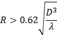{width="5.008333333333334in" height="2.95in"}

Figure A.5.5.1.1.1-1: SNR variation for out-of-sync testing

Figure A.5.5.1.1.1-2: Time multiplexed downlink transmissions

##### A.5.5.1.1.2 Test Requirements

The UE behavior in each test during time durations T1, T2 and T3 shall
be as follows:

During the period from time point A to time point B the UE shall
transmit uplink signal at least in all uplink slots configured for CSI
transmission according to the configured periodic CSI reporting.

The UE shall stop transmitting uplink signal in Cell 2 no later than
time point C (D1 second after the start of the time duration T3).

The rate of correct events observed during repeated tests shall be at
least 90%.

#### A.5.5.1.2 Radio Link Monitoring In-sync Test for FR2 PSCell configured with SSB-based RLM RS in non-DRX mode

##### A.5.5.1.2.1 Test Purpose and Environment

The purpose of this test is to verify that the UE properly detects the
out of sync and in sync for the purpose of monitoring downlink radio
link quality of the PSCell. This test will partly verify the FR2 radio
link monitoring requirements in clause 8.1.

In the test, UE is configured to perform RLM on SSB, with
*detectionResource* included in *RadioLinkMonitoringRS* set to SSB\#0
and SSB\#1, and *purpose* set to '*rlf*'. Supported test configurations
are shown in table A.5.5.1.2.1-1. The test parameters are given in
Tables A.5.5.1.2.1-2, and A.5.5.1.2.1-3 below. There are two cells, Cell
1 is the E-UTRAN PCell, and Cell 2 is the PSCell, in the test. The
E-UTRAN PCell setting refers to Table A.3.7.2.1-2. The test consists of
five successive time periods, with time duration of T1, T2, T3, T4 and
T5 respectively. Figure A.5.5.1.2.1-1 shows the variation of the
downlink SNR in the active cell to emulate out-of-sync and in-sync
states, and Figure A.5.5.1.2.1-2 shows the Time multiplexed downlink
transmissions from each Angle of Arrival. Prior to the start of the time
duration T1, the UE shall be fully synchronized to Cell 1 and Cell 2.
The UE shall be configured for periodic CSI reporting with a reporting
periodicity of 5ms.

Table A.5.5.1.2.1-1: Supported test configurations for FR2 PSCell

  Configuration                                                                              Description
  ------------------------------------------------------------------------------------------ -----------------------------------------------------------------------
  1                                                                                          FDD LTE PCell, NR 120 KHz SSB SCS, 100 MHz bandwidth, TDD duplex mode
  2                                                                                          TDD LTE PCell, NR 120 KHz SSB SCS, 100 MHz bandwidth, TDD duplex mode
  Note: The UE is only required to pass in one of the supported test configurations in FR2   

Table A.5.5.1.2.1-2: General test parameters for FR2 in-sync testing in
non-DRX mode

+----------------+----------------+----------------+----------------+
| Parameter      | Unit           | Value          |                |
+================+================+================+================+
|                |                | Test 1         |                |
+----------------+----------------+----------------+----------------+
| Active E-UTRA  |                | Cell 1         |                |
| PCell          |                |                |                |
+----------------+----------------+----------------+----------------+
| E-UTRA RF      |                | 1              |                |
| Channel Number |                |                |                |
+----------------+----------------+----------------+----------------+
| Active PSCell  |                | Cell 2         |                |
+----------------+----------------+----------------+----------------+
| RF Channel     |                | 2              |                |
| Number         |                |                |                |
+----------------+----------------+----------------+----------------+
| Duplex mode    | Config 1, 2    |                | TDD            |
+----------------+----------------+----------------+----------------+
| BW~channel~    | Config 1, 2    |                | 100: N~RB,c~ = |
|                |                |                | 66             |
+----------------+----------------+----------------+----------------+
| Data RBs       | Config 1, 2    |                | 24             |
| allocated      |                |                |                |
+----------------+----------------+----------------+----------------+
| **DL initial   | Config 1, 2    |                | DLBWP.0.1      |
| BWP            |                |                |                |
| c              |                |                |                |
| onfiguration** |                |                |                |
+----------------+----------------+----------------+----------------+
| **DL dedicated | Config 1, 2    |                | DLBWP.1.1      |
| BWP            |                |                |                |
| c              |                |                |                |
| onfiguration** |                |                |                |
+----------------+----------------+----------------+----------------+
| **UL initial   | Config 1, 2    |                | ULBWP.0.1      |
| BWP            |                |                |                |
| c              |                |                |                |
| onfiguration** |                |                |                |
+----------------+----------------+----------------+----------------+
| **UL dedicated | Config 1, 2    |                | ULBWP.1.1      |
| BWP            |                |                |                |
| c              |                |                |                |
| onfiguration** |                |                |                |
+----------------+----------------+----------------+----------------+
| TDD            | Config 1, 2    |                | TDDConf.3.1    |
| Configuration  |                |                |                |
+----------------+----------------+----------------+----------------+
| RMSI CORESET   | Config 1, 2    |                | CR.3.1 TDD     |
| Reference      |                |                |                |
| Channel        |                |                |                |
+----------------+----------------+----------------+----------------+
| Dedicated      | Config 1, 2    |                | CCR.3.1 TDD    |
| CORESET        |                |                |                |
| Reference      |                |                |                |
| Channel        |                |                |                |
+----------------+----------------+----------------+----------------+
| SSB            | Config 1, 2    |                | SSB.1 FR2      |
| Configuration  |                |                |                |
+----------------+----------------+----------------+----------------+
| SMTC           | Config 1, 2    |                | SMTC.3         |
| Configuration  |                |                |                |
+----------------+----------------+----------------+----------------+
| PDSCH/PDCCH    | Config 1, 2    |                | 120 KHz        |
| subcarrier     |                |                |                |
| spacing        |                |                |                |
+----------------+----------------+----------------+----------------+
| PRACH          | Config 1, 2    |                | Table          |
| Configuration  |                |                | A.3.8.3.1      |
+----------------+----------------+----------------+----------------+
| SSB index      | Config 1, 2    |                | 0,1            |
| assigned as    |                |                |                |
| RLM RS         |                |                |                |
+----------------+----------------+----------------+----------------+
| OCNG           |                | OP.5           |                |
| parameters     |                |                |                |
+----------------+----------------+----------------+----------------+
| CP length      |                | Normal         |                |
+----------------+----------------+----------------+----------------+
| In sync        | DCI format     |                | 1-0            |
| transmission   |                |                |                |
| parameters     |                |                |                |
+----------------+----------------+----------------+----------------+
|                | Number of      |                | 2              |
|                | Control OFDM   |                |                |
|                | symbols        |                |                |
+----------------+----------------+----------------+----------------+
|                | Aggregation    | CCE            | 4              |
|                | level          |                |                |
+----------------+----------------+----------------+----------------+
|                | Ratio of       | dB             | 0              |
|                | hypothetical   |                |                |
|                | PDCCH RE       |                |                |
|                | energy to      |                |                |
|                | average SSS RE |                |                |
|                | energy         |                |                |
+----------------+----------------+----------------+----------------+
|                | Ratio of       | dB             | 0              |
|                | hypothetical   |                |                |
|                | PDCCH DMRS     |                |                |
|                | energy to      |                |                |
|                | average SSS RE |                |                |
|                | energy         |                |                |
+----------------+----------------+----------------+----------------+
|                | DMRS precoder  |                | REG bundle     |
|                | granularity    |                | size           |
+----------------+----------------+----------------+----------------+
|                | REG bundle     |                | 6              |
|                | size           |                |                |
+----------------+----------------+----------------+----------------+
| Out of sync    | DCI format     |                | 1-0            |
| transmission   |                |                |                |
| parameters     |                |                |                |
+----------------+----------------+----------------+----------------+
|                | Number of      |                | 2              |
|                | Control OFDM   |                |                |
|                | symbols        |                |                |
+----------------+----------------+----------------+----------------+
|                | Aggregation    | CCE            | 8              |
|                | level          |                |                |
+----------------+----------------+----------------+----------------+
|                | Ratio of       | dB             | 4              |
|                | hypothetical   |                |                |
|                | PDCCH RE       |                |                |
|                | energy to      |                |                |
|                | average SSS RE |                |                |
|                | energy         |                |                |
+----------------+----------------+----------------+----------------+
|                | Ratio of       | dB             | 4              |
|                | hypothetical   |                |                |
|                | PDCCH DMRS     |                |                |
|                | energy to      |                |                |
|                | average SSS RE |                |                |
|                | energy         |                |                |
+----------------+----------------+----------------+----------------+
|                | DMRS precoder  |                | REG bundle     |
|                | granularity    |                | size           |
+----------------+----------------+----------------+----------------+
|                | REG bundle     |                | 6              |
|                | size           |                |                |
+----------------+----------------+----------------+----------------+
| DRX            |                | *OFF*          |                |
+----------------+----------------+----------------+----------------+
| Gap pattern ID |                | *N.A.*         |                |
+----------------+----------------+----------------+----------------+
| Layer 3        |                | *Enabled*      |                |
| filtering      |                |                |                |
+----------------+----------------+----------------+----------------+
| T310 timer     | *ms*           | *4000*         |                |
+----------------+----------------+----------------+----------------+
| T311 timer     | ms             | 1000           |                |
+----------------+----------------+----------------+----------------+
| N310           |                | 1              |                |
+----------------+----------------+----------------+----------------+
| N311           |                | 1              |                |
+----------------+----------------+----------------+----------------+
| CSI-RS for CSI | Config 1, 2    |                | CSI-RS.3.1 TDD |
| reporting      |                |                |                |
+----------------+----------------+----------------+----------------+
| re             |                | periodic       |                |
| portConfigType |                |                |                |
+----------------+----------------+----------------+----------------+
| reportQuantity |                | cri-RI-PMI-CQI |                |
+----------------+----------------+----------------+----------------+
| CSI reporting  | slot           | 40             |                |
| periodicity    |                |                |                |
+----------------+----------------+----------------+----------------+
| CSI reporting  | slot           | 4              |                |
| offset         |                |                |                |
+----------------+----------------+----------------+----------------+
| TCI states for |                | TCI.State.2    |                |
| PDCCH/PDSCH    |                |                |                |
+----------------+----------------+----------------+----------------+
| CSI-RS for     | Config 1, 2    |                | TRS.2.1 TDD    |
| tracking       |                |                |                |
+----------------+----------------+----------------+----------------+
| T1             | s              | 0.2            |                |
+----------------+----------------+----------------+----------------+
| T2             | s              | 0.2            |                |
+----------------+----------------+----------------+----------------+
| T3             | s              | 1.88           |                |
+----------------+----------------+----------------+----------------+
| T4             | s              | 0.2            |                |
+----------------+----------------+----------------+----------------+
| T5             | s              | 3.84           |                |
+----------------+----------------+----------------+----------------+
| D1             | s              | 3.8            |                |
+----------------+----------------+----------------+----------------+
| Note 1: All    |                |                |                |
| configurations |                |                |                |
| are assigned   |                |                |                |
| to the UE      |                |                |                |
| prior to the   |                |                |                |
| start of time  |                |                |                |
| period T1.     |                |                |                |
|                |                |                |                |
| Note 2:        |                |                |                |
| UE-specific    |                |                |                |
| PDCCH is not   |                |                |                |
| transmitted    |                |                |                |
| after T1       |                |                |                |
| starts.        |                |                |                |
|                |                |                |                |
| Note 3:        |                |                |                |
| E-UTRAN is in  |                |                |                |
| non-DRX mode   |                |                |                |
| under test.    |                |                |                |
+----------------+----------------+----------------+----------------+

Table A.5.5.1.2.1-3: OTA related cell specific test parameters for FR2
(Cell 2) for in-sync radio link monitoring tests in non-DRX mode

<table>
<tbody>
<tr class="odd">
<td>Parameter</td>
<td>Unit</td>
<td>Test 1</td>
<td></td>
<td></td>
<td></td>
<td></td>
<td></td>
<td></td>
<td></td>
<td></td>
<td></td>
</tr>
<tr class="even">
<td></td>
<td></td>
<td>T1</td>
<td>T2</td>
<td>T3</td>
<td>T4</td>
<td>T5</td>
<td>T1</td>
<td>T2</td>
<td>T3</td>
<td>T4</td>
<td>T5</td>
</tr>
<tr class="odd">
<td>AoA setup</td>
<td></td>
<td>Setup 3 defined in A.3.15</td>
<td></td>
<td></td>
<td></td>
<td></td>
<td></td>
<td></td>
<td></td>
<td></td>
<td></td>
</tr>
<tr class="even">
<td></td>
<td></td>
<td><strong>AoA1</strong></td>
<td><strong>AoA2</strong></td>
<td></td>
<td></td>
<td></td>
<td></td>
<td></td>
<td></td>
<td></td>
<td></td>
</tr>
<tr class="odd">
<td>Assumption for UE beamsNote 5</td>
<td></td>
<td>Rough</td>
<td>Rough</td>
<td></td>
<td></td>
<td></td>
<td></td>
<td></td>
<td></td>
<td></td>
<td></td>
</tr>
<tr class="even">
<td>EPRE ratio of PDCCH DMRS to SSS</td>
<td>dB</td>
<td>0</td>
<td>Not sent</td>
<td></td>
<td></td>
<td></td>
<td></td>
<td></td>
<td></td>
<td></td>
<td></td>
</tr>
<tr class="odd">
<td>EPRE ratio of PDCCH to PDCCH DMRS</td>
<td>dB</td>
<td>0</td>
<td></td>
<td></td>
<td></td>
<td></td>
<td></td>
<td></td>
<td></td>
<td></td>
<td></td>
</tr>
<tr class="even">
<td>EPRE ratio of PBCH DMRS to SSS</td>
<td>dB</td>
<td></td>
<td></td>
<td></td>
<td></td>
<td></td>
<td></td>
<td></td>
<td></td>
<td></td>
<td></td>
</tr>
<tr class="odd">
<td>EPRE ratio of PBCH to PBCH DMRS</td>
<td>dB</td>
<td></td>
<td></td>
<td></td>
<td></td>
<td></td>
<td></td>
<td></td>
<td></td>
<td></td>
<td></td>
</tr>
<tr class="even">
<td>EPRE ratio of PSS to SSS</td>
<td>dB</td>
<td></td>
<td></td>
<td></td>
<td></td>
<td></td>
<td></td>
<td></td>
<td></td>
<td></td>
<td></td>
</tr>
<tr class="odd">
<td>EPRE ratio of PDSCH DMRS to SSS</td>
<td>dB</td>
<td></td>
<td></td>
<td></td>
<td></td>
<td></td>
<td></td>
<td></td>
<td></td>
<td></td>
<td></td>
</tr>
<tr class="even">
<td>EPRE ratio of PDSCH to PDSCH DMRS</td>
<td>dB</td>
<td></td>
<td></td>
<td></td>
<td></td>
<td></td>
<td></td>
<td></td>
<td></td>
<td></td>
<td></td>
</tr>
<tr class="odd">
<td>EPRE ratio of OCNG DMRS to SSS</td>
<td>dB</td>
<td></td>
<td></td>
<td></td>
<td></td>
<td></td>
<td></td>
<td></td>
<td></td>
<td></td>
<td></td>
</tr>
<tr class="even">
<td>EPRE ratio of OCNG to OCNG DMRS</td>
<td>dB</td>
<td></td>
<td></td>
<td></td>
<td></td>
<td></td>
<td></td>
<td></td>
<td></td>
<td></td>
<td></td>
</tr>
<tr class="odd">
<td>ssb-Index 0 SNR</td>
<td>Config 1, 2</td>
<td>dB</td>
<td>2Note 6</td>
<td>-6Note 6</td>
<td>-15</td>
<td>-15</td>
<td>-15</td>
<td></td>
<td></td>
<td></td>
<td></td>
</tr>
<tr class="even">
<td>ssb-Index 1 SNR</td>
<td>Config 1, 2</td>
<td></td>
<td>Not sent</td>
<td>2Note 6</td>
<td>-15</td>
<td>-15</td>
<td>-4.5</td>
<td>2Note 6</td>
<td></td>
<td></td>
<td></td>
</tr>
<tr class="odd">
<td></td>
<td>Config 1, 2</td>
<td>dBm/ 
15kHz</td>
<td>-92.1</td>
<td>-92.1</td>
<td></td>
<td></td>
<td></td>
<td></td>
<td></td>
<td></td>
<td></td>
</tr>
<tr class="even">
<td>Time multiplexing of the downlink transmissions from each AoA</td>
<td></td>
<td>Defined in Figure A.5.5.1.2.1-2</td>
<td></td>
<td></td>
<td></td>
<td></td>
<td></td>
<td></td>
<td></td>
<td></td>
<td></td>
</tr>
<tr class="odd">
<td>Propagation condition</td>
<td></td>
<td>TDL-A 30ns 75Hz</td>
<td>TDL-A 30ns 75Hz</td>
<td></td>
<td></td>
<td></td>
<td></td>
<td></td>
<td></td>
<td></td>
<td></td>
</tr>
<tr class="even">
<td>
Note 1: OCNG shall be used such that a constant total transmitted power spectral density is achieved for all OFDM symbols.

Note 2: The signal contains PDCCH for UEs other than the device under test as part of OCNG.

Note 3: SNR levels correspond to the signal to noise ratio over the SSS REs.

Note 4: The SNR values are specified for testing a UE which supports 2RX on at least one band. For testing of a UE which supports 4RX on all bands, the SNR during T3 is A.3.6.

Note 5: Information about types of UE beam is given in B.2.1.3, and does not limit UE implementation or test system implementation

Note 6: This value allows up to 1dB degradation from applied SNR to UE baseband
</td>
<td></td>
<td></td>
<td></td>
<td></td>
<td></td>
<td></td>
<td></td>
<td></td>
<td></td>
<td></td>
<td></td>
</tr>
</tbody>
</table>

Table A.5.5.1.2.1-4: Void

{width="4.904166666666667in"
height="2.6881944444444446in"}

Figure A.5.5.1.2.1-1: SNR variation for in-sync testing

Figure A.5.5.1.2.1-2: Time multiplexed downlink transmissions

##### A.5.5.1.2.2 Test Requirements

The UE behaviour in each test during time durations T1, T2, T3, T4 and
T5 shall be as follows:

During the period from time point A to time point F (D1 second after the
start of time duration T5) the UE shall transmit uplink signal at least
in all uplink slots configured for CSI transmission according to the
configured periodic CSI reporting.

The rate of correct events observed during repeated tests shall be at
least 90%.

#### A.5.5.1.3 Radio Link Monitoring Out-of-sync Test for FR2 PSCell configured with SSB-based RLM RS in DRX mode

##### A.5.5.1.3.1 Test Purpose and Environment

The purpose of this test is to verify that the UE properly detects the
out of sync and in sync for the purpose of monitoring downlink radio
link quality of the PSCell when DRX is used. This test will partly
verify the FR2 radio link monitoring requirements in clause 8.1.

In the test, UE is configured to perform RLM on SSB, with
*detectionResource* included in *RadioLinkMonitoringRS* set to SSB\#0
and SSB\#1, and *purpose* set to '*rlf*'. Supported test configurations
are shown in table A.5.5.1.3.1-1. The test parameters are given in
Tables A.5.5.1.3.1-2, and A.5.5.1.3.1-3. There are two cells, Cell 1 is
the E-UTRAN PCell, and Cell 2 is the PSCell, in the test. The E-UTRAN
PCell setting refers to Table A.3.7.2.1-2. The test consists of three
successive time periods, with time duration of T1, T2 and T3
respectively. Figure A.5.5.1.3.1-1 shows the variation of the downlink
SNR in the active cell to emulate out-of-sync and in-sync states. Prior
to the start of the time duration T1, the UE shall be fully synchronized
to Cell 1 and Cell 2. The UE shall be configured for periodic CSI
reporting with a reporting periodicity of 5 ms. In the test, DRX
configuration is enabled and DRX inactivity timer has already been
expired, i.e. UE tries to decode PDCCH and to send periodic CSI during
the period when On-duration timer is running. Time alignment timers
shall be set to "infinity" so that UL timing alignment is maintained
during the test.

Table A.5.5.1.3.1-1: Supported test configurations for FR2 PSCell

  Configuration                                                                              Description
  ------------------------------------------------------------------------------------------ -----------------------------------------------------------------------
  1                                                                                          FDD LTE PCell, NR 120 KHz SSB SCS, 100 MHz bandwidth, TDD duplex mode
  2                                                                                          TDD LTE PCell, NR 120 KHz SSB SCS, 100 MHz bandwidth, TDD duplex mode
  Note: The UE is only required to pass in one of the supported test configurations in FR2   

Table A.5.5.1.3.1-2: General test parameters for FR2 out-of-sync testing
in DRX mode

+----------------+----------------+----------------+----------------+
| Parameter      | Unit           | Value          |                |
+================+================+================+================+
|                |                | Test 1         |                |
+----------------+----------------+----------------+----------------+
| Active E-UTRA  |                | Cell 1         |                |
| PCell          |                |                |                |
+----------------+----------------+----------------+----------------+
| E-UTRA RF      |                | 1              |                |
| Channel Number |                |                |                |
+----------------+----------------+----------------+----------------+
| Active PSCell  |                | Cell 2         |                |
+----------------+----------------+----------------+----------------+
| RF Channel     |                | 2              |                |
| Number         |                |                |                |
+----------------+----------------+----------------+----------------+
| Duplex mode    | Config 1, 2    |                | TDD            |
+----------------+----------------+----------------+----------------+
| BW~channel~    | Config 1, 2    |                | 100: N~RB,c~ = |
|                |                |                | 66             |
+----------------+----------------+----------------+----------------+
| Data RBs       | Config 1, 2    |                | 66             |
| allocated      |                |                |                |
+----------------+----------------+----------------+----------------+
| **DL initial   | Config 1, 2    |                | DLBWP.0.1      |
| BWP            |                |                |                |
| c              |                |                |                |
| onfiguration** |                |                |                |
+----------------+----------------+----------------+----------------+
| **DL dedicated | Config 1, 2    |                | DLBWP.1.1      |
| BWP            |                |                |                |
| c              |                |                |                |
| onfiguration** |                |                |                |
+----------------+----------------+----------------+----------------+
| **UL initial   | Config 1, 2    |                | ULBWP.0.1      |
| BWP            |                |                |                |
| c              |                |                |                |
| onfiguration** |                |                |                |
+----------------+----------------+----------------+----------------+
| **UL dedicated | Config 1, 2    |                | ULBWP.1.1      |
| BWP            |                |                |                |
| c              |                |                |                |
| onfiguration** |                |                |                |
+----------------+----------------+----------------+----------------+
| TDD            | Config 1, 2    |                | TDDConf.3.1    |
| Configuration  |                |                |                |
+----------------+----------------+----------------+----------------+
| RMSI CORESET   | Config 1, 2    |                | CR.3.1 TDD     |
| Reference      |                |                |                |
| Channel        |                |                |                |
+----------------+----------------+----------------+----------------+
| Dedicated      | Config 1, 2    |                | CCR.3.4 TDD    |
| CORESET        |                |                |                |
| Reference      |                |                |                |
| Channel        |                |                |                |
+----------------+----------------+----------------+----------------+
| SSB            | Config 1, 2    |                | SSB.1 FR2      |
| Configuration  |                |                |                |
+----------------+----------------+----------------+----------------+
| SMTC           | Config 1, 2    |                | SMTC.1         |
| Configuration  |                |                |                |
+----------------+----------------+----------------+----------------+
| PDSCH/PDCCH    | Config 1, 2    |                | 120 KHz        |
| subcarrier     |                |                |                |
| spacing        |                |                |                |
+----------------+----------------+----------------+----------------+
| PRACH          | Config 1, 2    |                | Table          |
| Configuration  |                |                | A.3.8.3.1      |
+----------------+----------------+----------------+----------------+
| SSB index      | Config 1, 2    |                | 0,1            |
| assigned as    |                |                |                |
| RLM RS         |                |                |                |
+----------------+----------------+----------------+----------------+
| OCNG           |                | OP.1           |                |
| parameters     |                |                |                |
+----------------+----------------+----------------+----------------+
| CP length      |                | Normal         |                |
+----------------+----------------+----------------+----------------+
| Out of sync    | DCI format     |                | 1-0            |
| transmission   |                |                |                |
| parameters     |                |                |                |
+----------------+----------------+----------------+----------------+
|                | Number of      |                | 2              |
|                | Control OFDM   |                |                |
|                | symbols        |                |                |
+----------------+----------------+----------------+----------------+
|                | Aggregation    | CCE            | 8              |
|                | level          |                |                |
+----------------+----------------+----------------+----------------+
|                | Ratio of       | dB             | 4              |
|                | hypothetical   |                |                |
|                | PDCCH RE       |                |                |
|                | energy to      |                |                |
|                | average SSS RE |                |                |
|                | energy         |                |                |
+----------------+----------------+----------------+----------------+
|                | Ratio of       | dB             | 4              |
|                | hypothetical   |                |                |
|                | PDCCH DMRS     |                |                |
|                | energy to      |                |                |
|                | average SSS RE |                |                |
|                | energy         |                |                |
+----------------+----------------+----------------+----------------+
|                | DMRS precoder  |                | REG bundle     |
|                | granularity    |                | size           |
+----------------+----------------+----------------+----------------+
|                | REG bundle     |                | 6              |
|                | size           |                |                |
+----------------+----------------+----------------+----------------+
| DRX            |                | DRX.3          |                |
| Configuration  |                |                |                |
+----------------+----------------+----------------+----------------+
| Gap pattern ID |                | *N.A.*         |                |
+----------------+----------------+----------------+----------------+
| Layer 3        |                | *Enabled*      |                |
| filtering      |                |                |                |
+----------------+----------------+----------------+----------------+
| T310 timer     | *ms*           | *0*            |                |
+----------------+----------------+----------------+----------------+
| T311 timer     | ms             | 1000           |                |
+----------------+----------------+----------------+----------------+
| N310           |                | 1              |                |
+----------------+----------------+----------------+----------------+
| N311           |                | 1              |                |
+----------------+----------------+----------------+----------------+
| CSI-RS for CSI | Config 1, 2    |                | CSI-RS.3.1 TDD |
| reporting      |                |                |                |
+----------------+----------------+----------------+----------------+
| re             |                | periodic       |                |
| portConfigType |                |                |                |
+----------------+----------------+----------------+----------------+
| reportQuantity |                | cri-RI-PMI-CQI |                |
+----------------+----------------+----------------+----------------+
| CSI reporting  | slot           | 40             |                |
| periodicity    |                |                |                |
+----------------+----------------+----------------+----------------+
| CSI reporting  | slot           | 4              |                |
| offset         |                |                |                |
+----------------+----------------+----------------+----------------+
| TCI states for |                | TCI.State.2    |                |
| PDCCH/PDSCH    |                |                |                |
+----------------+----------------+----------------+----------------+
| CSI-RS for     | Config 1, 2    |                | TRS.2.1 TDD    |
| tracking       |                |                |                |
+----------------+----------------+----------------+----------------+
| T1             | s              | 0.2            |                |
+----------------+----------------+----------------+----------------+
| T2             | s              | 14.48          |                |
+----------------+----------------+----------------+----------------+
| T3             | s              | 14.48          |                |
+----------------+----------------+----------------+----------------+
| D1             | s              | 14.44          |                |
+----------------+----------------+----------------+----------------+
| Note 1: All    |                |                |                |
| configurations |                |                |                |
| are assigned   |                |                |                |
| to the UE      |                |                |                |
| prior to the   |                |                |                |
| start of time  |                |                |                |
| period T1.     |                |                |                |
|                |                |                |                |
| Note 2:        |                |                |                |
| UE-specific    |                |                |                |
| PDCCH is not   |                |                |                |
| transmitted    |                |                |                |
| after T1       |                |                |                |
| starts.        |                |                |                |
|                |                |                |                |
| Note 3:        |                |                |                |
| **E-UTRAN is   |                |                |                |
| in non-DRX     |                |                |                |
| mode under     |                |                |                |
| test.**        |                |                |                |
+----------------+----------------+----------------+----------------+

Table A.5.5.1.3.1-3: OTA related cell specific test parameters for FR2
(Cell 2) for out-of-sync radio link monitoring tests in DRX mode

+-----------+-----------+-----------+-----------+-----------+-----+
| Parameter | Unit      | Test 1    |           |           |     |
+-----------+-----------+-----------+-----------+-----------+-----+
|           |           | T1        | T2        | T3        |     |
+-----------+-----------+-----------+-----------+-----------+-----+
| AoA setup |           | Setup 1   |           |           |     |
|           |           | defined   |           |           |     |
|           |           | in A.3.15 |           |           |     |
+-----------+-----------+-----------+-----------+-----------+-----+
| A         |           | Rough     |           |           |     |
| ssumption |           |           |           |           |     |
| for UE    |           |           |           |           |     |
| beams     |           |           |           |           |     |
| ^Note\ 5^ |           |           |           |           |     |
+-----------+-----------+-----------+-----------+-----------+-----+
| EPRE      | dB        | 4         |           |           |     |
| ratio of  |           |           |           |           |     |
| PDCCH     |           |           |           |           |     |
| DMRS to   |           |           |           |           |     |
| SSS       |           |           |           |           |     |
+-----------+-----------+-----------+-----------+-----------+-----+
| EPRE      | dB        | 0         |           |           |     |
| ratio of  |           |           |           |           |     |
| PDCCH to  |           |           |           |           |     |
| PDCCH     |           |           |           |           |     |
| DMRS      |           |           |           |           |     |
+-----------+-----------+-----------+-----------+-----------+-----+
| EPRE      | dB        | 0         |           |           |     |
| ratio of  |           |           |           |           |     |
| PBCH DMRS |           |           |           |           |     |
| to SSS    |           |           |           |           |     |
+-----------+-----------+-----------+-----------+-----------+-----+
| EPRE      | dB        |           |           |           |     |
| ratio of  |           |           |           |           |     |
| PBCH to   |           |           |           |           |     |
| PBCH DMRS |           |           |           |           |     |
+-----------+-----------+-----------+-----------+-----------+-----+
| EPRE      | dB        |           |           |           |     |
| ratio of  |           |           |           |           |     |
| PSS to    |           |           |           |           |     |
| SSS       |           |           |           |           |     |
+-----------+-----------+-----------+-----------+-----------+-----+
| EPRE      | dB        |           |           |           |     |
| ratio of  |           |           |           |           |     |
| PDSCH     |           |           |           |           |     |
| DMRS to   |           |           |           |           |     |
| SSS       |           |           |           |           |     |
+-----------+-----------+-----------+-----------+-----------+-----+
| EPRE      | dB        |           |           |           |     |
| ratio of  |           |           |           |           |     |
| PDSCH to  |           |           |           |           |     |
| PDSCH     |           |           |           |           |     |
| DMRS      |           |           |           |           |     |
+-----------+-----------+-----------+-----------+-----------+-----+
| EPRE      | dB        |           |           |           |     |
| ratio of  |           |           |           |           |     |
| OCNG DMRS |           |           |           |           |     |
| to SSS    |           |           |           |           |     |
+-----------+-----------+-----------+-----------+-----------+-----+
| EPRE      | dB        |           |           |           |     |
| ratio of  |           |           |           |           |     |
| OCNG to   |           |           |           |           |     |
| OCNG DMRS |           |           |           |           |     |
+-----------+-----------+-----------+-----------+-----------+-----+
| ssb-Index | Config 1, | dB        | 2         | -6        | -15 |
| 0 SNR     | 2         |           | ^Note\ 6^ | ^Note\ 6^ |     |
+-----------+-----------+-----------+-----------+-----------+-----+
| ssb-Index | Config 1, |           | 2         | -15       | -15 |
| 1 SNR     | 2         |           | ^Note\ 6^ |           |     |
+-----------+-----------+-----------+-----------+-----------+-----+
|           | Config 1, | dBm/15KHz | -104.7dBm |           |     |
|           | 2         |           |           |           |     |
+-----------+-----------+-----------+-----------+-----------+-----+
| Pr        |           | TDL-A     |           |           |     |
| opagation |           | 30ns 75Hz |           |           |     |
| condition |           |           |           |           |     |
+-----------+-----------+-----------+-----------+-----------+-----+
| Note 1:   |           |           |           |           |     |
| OCNG      |           |           |           |           |     |
| shall be  |           |           |           |           |     |
| used such |           |           |           |           |     |
| that the  |           |           |           |           |     |
| resources |           |           |           |           |     |
| in Cell 2 |           |           |           |           |     |
| are fully |           |           |           |           |     |
| allocated |           |           |           |           |     |
| and a     |           |           |           |           |     |
| constant  |           |           |           |           |     |
| total     |           |           |           |           |     |
| tr        |           |           |           |           |     |
| ansmitted |           |           |           |           |     |
| power     |           |           |           |           |     |
| spectral  |           |           |           |           |     |
| density   |           |           |           |           |     |
| is        |           |           |           |           |     |
| achieved  |           |           |           |           |     |
| for all   |           |           |           |           |     |
| OFDM      |           |           |           |           |     |
| symbols.  |           |           |           |           |     |
|           |           |           |           |           |     |
| Note 2:   |           |           |           |           |     |
| The       |           |           |           |           |     |
| signal    |           |           |           |           |     |
| contains  |           |           |           |           |     |
| PDCCH for |           |           |           |           |     |
| UEs other |           |           |           |           |     |
| than the  |           |           |           |           |     |
| device    |           |           |           |           |     |
| under     |           |           |           |           |     |
| test as   |           |           |           |           |     |
| part of   |           |           |           |           |     |
| OCNG.     |           |           |           |           |     |
|           |           |           |           |           |     |
| Note 3:   |           |           |           |           |     |
| SNR       |           |           |           |           |     |
| levels    |           |           |           |           |     |
| c         |           |           |           |           |     |
| orrespond |           |           |           |           |     |
| to the    |           |           |           |           |     |
| signal to |           |           |           |           |     |
| noise     |           |           |           |           |     |
| ratio     |           |           |           |           |     |
| over the  |           |           |           |           |     |
| SSS REs.  |           |           |           |           |     |
|           |           |           |           |           |     |
| Note 4:   |           |           |           |           |     |
| The SNR   |           |           |           |           |     |
| values    |           |           |           |           |     |
| are       |           |           |           |           |     |
| specified |           |           |           |           |     |
| for       |           |           |           |           |     |
| testing a |           |           |           |           |     |
| UE which  |           |           |           |           |     |
| supports  |           |           |           |           |     |
| 2RX on at |           |           |           |           |     |
| least one |           |           |           |           |     |
| band. For |           |           |           |           |     |
| testing   |           |           |           |           |     |
| of a UE   |           |           |           |           |     |
| which     |           |           |           |           |     |
| supports  |           |           |           |           |     |
| 4RX on    |           |           |           |           |     |
| all       |           |           |           |           |     |
| bands,    |           |           |           |           |     |
| the SNR   |           |           |           |           |     |
| during T3 |           |           |           |           |     |
| is A.3.6. |           |           |           |           |     |
|           |           |           |           |           |     |
| Note 5:   |           |           |           |           |     |
| In        |           |           |           |           |     |
| formation |           |           |           |           |     |
| about     |           |           |           |           |     |
| types of  |           |           |           |           |     |
| UE beam   |           |           |           |           |     |
| is given  |           |           |           |           |     |
| in        |           |           |           |           |     |
| B.2.1.3,  |           |           |           |           |     |
| and does  |           |           |           |           |     |
| not limit |           |           |           |           |     |
| UE        |           |           |           |           |     |
| imple     |           |           |           |           |     |
| mentation |           |           |           |           |     |
| or test   |           |           |           |           |     |
| system    |           |           |           |           |     |
| imple     |           |           |           |           |     |
| mentation |           |           |           |           |     |
|           |           |           |           |           |     |
| Note 6:   |           |           |           |           |     |
| This      |           |           |           |           |     |
| value     |           |           |           |           |     |
| allows up |           |           |           |           |     |
| to 1dB    |           |           |           |           |     |
| de        |           |           |           |           |     |
| gradation |           |           |           |           |     |
| from      |           |           |           |           |     |
| applied   |           |           |           |           |     |
| SNR to UE |           |           |           |           |     |
| baseband  |           |           |           |           |     |
+-----------+-----------+-----------+-----------+-----------+-----+

Table A.5.5.1.3.1-4: Void

Table A.5.5.1.3.1-5: Void

{width="4.875in" height="2.875in"}

Figure A.5.5.1.3.1-1: SNR variation for out-of-sync testing

##### A.5.5.1.3.2 Test Requirements

The UE behavior in each test during time durations T1, T2 and T3 shall
be as follows:

During the period from time point A to time point B the UE shall
transmit uplink signal at least in all uplink slots configured for CSI
transmission according to the configured periodic CSI reporting.

The UE shall stop transmitting uplink signal in Cell 2 no later than
time point C (D1 second after the start of the time duration T3).

The rate of correct events observed during repeated tests shall be at
least 90%.

#### A.5.5.1.4 Radio Link Monitoring In-sync Test for FR2 PSCell configured with SSB-based RLM RS in DRX mode

##### A.5.5.1.4.1 Test Purpose and Environment

The purpose of this test is to verify that the UE properly detects the
out of sync and in sync for the purpose of monitoring downlink radio
link quality of the PSCell when DRX is used. This test will partly
verify the FR2 radio link monitoring requirements in clause 8.1.

In the test, UE is configured to perform RLM on SSB, with
*detectionResource* included in *RadioLinkMonitoringRS* set to SSB\#0
and SSB\#1, and *purpose* set to '*rlf*'. Supported test configurations
are shown in table A.5.5.1.4.1-1. The test parameters are given in
Tables A.5.5.1.4.1-2, and A.5.5.1.4.1-3. There are two cells, Cell 1 is
the E-UTRAN PCell, and Cell 2 is the PSCell, in the test. The E-UTRAN
PCell setting refers to Table A.3.7.2.1-2. The test consists of five
successive time periods, with time duration of T1, T2, T3, T4 and T5
respectively. Figure A.5.5.1.4.1-1 shows the variation of the downlink
SNR in the active cell to emulate out-of-sync and in-sync states. Prior
to the start of the time duration T1, the UE shall be fully synchronized
to Cell 1 and Cell 2. The UE shall be configured for periodic CSI
reporting with a reporting periodicity of 5 ms. In the test, DRX
configuration is enabled and DRX inactivity timer has already been
expired, i.e. UE tries to decode PDCCH and to send periodic CSI during
the period when On-duration timer is running. Time alignment timers
shall be set to "infinity" so that UL timing alignment is maintained
during the test.

Table A.5.5.1.4.1-1: Supported test configurations for FR2 PSCell

  Configuration                                                                              Description
  ------------------------------------------------------------------------------------------ -----------------------------------------------------------------------
  1                                                                                          FDD LTE PCell, NR 120 KHz SSB SCS, 100 MHz bandwidth, TDD duplex mode
  2                                                                                          TDD LTE PCell, NR 120 KHz SSB SCS, 100 MHz bandwidth, TDD duplex mode
  Note: The UE is only required to pass in one of the supported test configurations in FR2   

Table A.5.5.1.4.1-2: General test parameters for FR2 in-sync testing in
DRX mode

+----------------+----------------+----------------+----------------+
| Parameter      | Unit           | Value          |                |
+================+================+================+================+
|                |                | Test 1         |                |
+----------------+----------------+----------------+----------------+
| Active E-UTRA  |                | Cell 1         |                |
| PCell          |                |                |                |
+----------------+----------------+----------------+----------------+
| E-UTRA RF      |                | 1              |                |
| Channel Number |                |                |                |
+----------------+----------------+----------------+----------------+
| Active PSCell  |                | Cell 2         |                |
+----------------+----------------+----------------+----------------+
| RF Channel     |                | 2              |                |
| Number         |                |                |                |
+----------------+----------------+----------------+----------------+
| Duplex mode    | Config 1, 2    |                | TDD            |
+----------------+----------------+----------------+----------------+
| BW~channel~    | Config 1, 2    |                | 100: N~RB,c~ = |
|                |                |                | 66             |
+----------------+----------------+----------------+----------------+
| Data RBs       | Config 1, 2    |                | 66             |
| allocated      |                |                |                |
+----------------+----------------+----------------+----------------+
| **DL initial   | Config 1, 2    |                | DLBWP.0.1      |
| BWP            |                |                |                |
| c              |                |                |                |
| onfiguration** |                |                |                |
+----------------+----------------+----------------+----------------+
| **DL dedicated | Config 1, 2    |                | DLBWP.1.1      |
| BWP            |                |                |                |
| c              |                |                |                |
| onfiguration** |                |                |                |
+----------------+----------------+----------------+----------------+
| **UL initial   | Config 1, 2    |                | ULBWP.0.1      |
| BWP            |                |                |                |
| c              |                |                |                |
| onfiguration** |                |                |                |
+----------------+----------------+----------------+----------------+
| **UL dedicated | Config 1, 2    |                | ULBWP.1.1      |
| BWP            |                |                |                |
| c              |                |                |                |
| onfiguration** |                |                |                |
+----------------+----------------+----------------+----------------+
| TDD            | Config 1, 2    |                | TDDConf.3.1    |
| Configuration  |                |                |                |
+----------------+----------------+----------------+----------------+
| RMSI CORESET   | Config 1, 2    |                | CR.3.1 TDD     |
| Reference      |                |                |                |
| Channel        |                |                |                |
+----------------+----------------+----------------+----------------+
| Dedicated      | Config 1, 2    |                | CCR.3.1 TDD    |
| CORESET        |                |                |                |
| Reference      |                |                |                |
| Channel        |                |                |                |
+----------------+----------------+----------------+----------------+
| SSB            | Config 1, 2    |                | SSB.1 FR2      |
| Configuration  |                |                |                |
+----------------+----------------+----------------+----------------+
| SMTC           | Config 1, 2    |                | SMTC.3         |
| Configuration  |                |                |                |
+----------------+----------------+----------------+----------------+
| PDSCH/PDCCH    | Config 1, 2    |                | 120 KHz        |
| subcarrier     |                |                |                |
| spacing        |                |                |                |
+----------------+----------------+----------------+----------------+
| PRACH          | Config 1, 2    |                | Table          |
| Configuration  |                |                | A.3.8.3.1      |
+----------------+----------------+----------------+----------------+
| SSB index      | Config 1, 2    |                | 0,1            |
| assigned as    |                |                |                |
| RLM RS         |                |                |                |
+----------------+----------------+----------------+----------------+
| OCNG           |                | OP.1           |                |
| parameters     |                |                |                |
+----------------+----------------+----------------+----------------+
| CP length      |                | Normal         |                |
+----------------+----------------+----------------+----------------+
| In sync        | DCI format     |                | 1-0            |
| transmission   |                |                |                |
| parameters     |                |                |                |
+----------------+----------------+----------------+----------------+
|                | Number of      |                | 2              |
|                | Control OFDM   |                |                |
|                | symbols        |                |                |
+----------------+----------------+----------------+----------------+
|                | Aggregation    | CCE            | 4              |
|                | level          |                |                |
+----------------+----------------+----------------+----------------+
|                | Ratio of       | dB             | 0              |
|                | hypothetical   |                |                |
|                | PDCCH RE       |                |                |
|                | energy to      |                |                |
|                | average SSS RE |                |                |
|                | energy         |                |                |
+----------------+----------------+----------------+----------------+
|                | Ratio of       | dB             | 0              |
|                | hypothetical   |                |                |
|                | PDCCH DMRS     |                |                |
|                | energy to      |                |                |
|                | average SSS RE |                |                |
|                | energy         |                |                |
+----------------+----------------+----------------+----------------+
|                | DMRS precoder  |                | REG bundle     |
|                | granularity    |                | size           |
+----------------+----------------+----------------+----------------+
|                | REG bundle     |                | 6              |
|                | size           |                |                |
+----------------+----------------+----------------+----------------+
| Out of sync    | DCI format     |                | 1-0            |
| transmission   |                |                |                |
| parameters     |                |                |                |
+----------------+----------------+----------------+----------------+
|                | Number of      |                | 2              |
|                | Control OFDM   |                |                |
|                | symbols        |                |                |
+----------------+----------------+----------------+----------------+
|                | Aggregation    | CCE            | 8              |
|                | level          |                |                |
+----------------+----------------+----------------+----------------+
|                | Ratio of       | dB             | 4              |
|                | hypothetical   |                |                |
|                | PDCCH RE       |                |                |
|                | energy to      |                |                |
|                | average SSS RE |                |                |
|                | energy         |                |                |
+----------------+----------------+----------------+----------------+
|                | Ratio of       | dB             | 4              |
|                | hypothetical   |                |                |
|                | PDCCH DMRS     |                |                |
|                | energy to      |                |                |
|                | average SSS RE |                |                |
|                | energy         |                |                |
+----------------+----------------+----------------+----------------+
|                | DMRS precoder  |                | REG bundle     |
|                | granularity    |                | size           |
+----------------+----------------+----------------+----------------+
|                | REG bundle     |                | 6              |
|                | size           |                |                |
+----------------+----------------+----------------+----------------+
| DRX            |                | DRX.11         |                |
| Configuration  |                |                |                |
+----------------+----------------+----------------+----------------+
| Gap pattern ID |                | *N.A.*         |                |
+----------------+----------------+----------------+----------------+
| Layer 3        |                | *Enabled*      |                |
| filtering      |                |                |                |
+----------------+----------------+----------------+----------------+
| T310 timer     | *ms*           | *4000*         |                |
+----------------+----------------+----------------+----------------+
| T311 timer     | ms             | 1000           |                |
+----------------+----------------+----------------+----------------+
| N310           |                | 1              |                |
+----------------+----------------+----------------+----------------+
| N311           |                | 1              |                |
+----------------+----------------+----------------+----------------+
| CSI-RS for CSI | Config 1, 2    |                | CSI-RS.3.1 TDD |
| reporting      |                |                |                |
+----------------+----------------+----------------+----------------+
| re             |                | periodic       |                |
| portConfigType |                |                |                |
+----------------+----------------+----------------+----------------+
| reportQuantity |                | cri-RI-PMI-CQI |                |
+----------------+----------------+----------------+----------------+
| CSI reporting  | slot           | 40             |                |
| periodicity    |                |                |                |
+----------------+----------------+----------------+----------------+
| CSI reporting  | slot           | 4              |                |
| offset         |                |                |                |
+----------------+----------------+----------------+----------------+
| TCI states for |                | TCI.State.2    |                |
| PDCCH/PDSCH    |                |                |                |
+----------------+----------------+----------------+----------------+
| CSI-RS for     | Config 1, 2    |                | TRS.2.1 TDD    |
| tracking       |                |                |                |
+----------------+----------------+----------------+----------------+
| T1             | s              | 0.2            |                |
+----------------+----------------+----------------+----------------+
| T2             | s              | 0.2            |                |
+----------------+----------------+----------------+----------------+
| T3             | s              | 2.8            |                |
+----------------+----------------+----------------+----------------+
| T4             | s              | 0.2            |                |
+----------------+----------------+----------------+----------------+
| T5             | s              | 3.88           |                |
+----------------+----------------+----------------+----------------+
| D1             | s              | 3.84           |                |
+----------------+----------------+----------------+----------------+
| Note 1: All    |                |                |                |
| configurations |                |                |                |
| are assigned   |                |                |                |
| to the UE      |                |                |                |
| prior to the   |                |                |                |
| start of time  |                |                |                |
| period T1.     |                |                |                |
|                |                |                |                |
| Note 2:        |                |                |                |
| UE-specific    |                |                |                |
| PDCCH is not   |                |                |                |
| transmitted    |                |                |                |
| after T1       |                |                |                |
| starts.        |                |                |                |
|                |                |                |                |
| Note 3:        |                |                |                |
| **E-UTRAN is   |                |                |                |
| in non-DRX     |                |                |                |
| mode under     |                |                |                |
| test.**        |                |                |                |
+----------------+----------------+----------------+----------------+

Table A.5.5.1.4.1-3: OTA related cell specific test parameters for FR2
(Cell 2) for in-sync radio link monitoring test in DRX mode

+-------+-------+-------+-------+-------+-----+------+-------+
| Para  | Unit  | Test  |       |       |     |      |       |
| meter |       | 1     |       |       |     |      |       |
+-------+-------+-------+-------+-------+-----+------+-------+
|       |       | T1    | T2    | T3    | T4  | T5   |       |
+-------+-------+-------+-------+-------+-----+------+-------+
| AoA   |       | Setup |       |       |     |      |       |
| setup |       | 1     |       |       |     |      |       |
|       |       | de    |       |       |     |      |       |
|       |       | fined |       |       |     |      |       |
|       |       | in    |       |       |     |      |       |
|       |       | A     |       |       |     |      |       |
|       |       | .3.15 |       |       |     |      |       |
+-------+-------+-------+-------+-------+-----+------+-------+
| Assum |       | Rough |       |       |     |      |       |
| ption |       |       |       |       |     |      |       |
| for   |       |       |       |       |     |      |       |
| UE    |       |       |       |       |     |      |       |
| beam  |       |       |       |       |     |      |       |
| s^Not |       |       |       |       |     |      |       |
| e\ 5^ |       |       |       |       |     |      |       |
+-------+-------+-------+-------+-------+-----+------+-------+
| EPRE  | dB    | 0     |       |       |     |      |       |
| ratio |       |       |       |       |     |      |       |
| of    |       |       |       |       |     |      |       |
| PDCCH |       |       |       |       |     |      |       |
| DMRS  |       |       |       |       |     |      |       |
| to    |       |       |       |       |     |      |       |
| SSS   |       |       |       |       |     |      |       |
+-------+-------+-------+-------+-------+-----+------+-------+
| EPRE  | dB    | 0     |       |       |     |      |       |
| ratio |       |       |       |       |     |      |       |
| of    |       |       |       |       |     |      |       |
| PDCCH |       |       |       |       |     |      |       |
| to    |       |       |       |       |     |      |       |
| PDCCH |       |       |       |       |     |      |       |
| DMRS  |       |       |       |       |     |      |       |
+-------+-------+-------+-------+-------+-----+------+-------+
| EPRE  | dB    | 0     |       |       |     |      |       |
| ratio |       |       |       |       |     |      |       |
| of    |       |       |       |       |     |      |       |
| PBCH  |       |       |       |       |     |      |       |
| DMRS  |       |       |       |       |     |      |       |
| to    |       |       |       |       |     |      |       |
| SSS   |       |       |       |       |     |      |       |
+-------+-------+-------+-------+-------+-----+------+-------+
| EPRE  | dB    |       |       |       |     |      |       |
| ratio |       |       |       |       |     |      |       |
| of    |       |       |       |       |     |      |       |
| PBCH  |       |       |       |       |     |      |       |
| to    |       |       |       |       |     |      |       |
| PBCH  |       |       |       |       |     |      |       |
| DMRS  |       |       |       |       |     |      |       |
+-------+-------+-------+-------+-------+-----+------+-------+
| EPRE  | dB    |       |       |       |     |      |       |
| ratio |       |       |       |       |     |      |       |
| of    |       |       |       |       |     |      |       |
| PSS   |       |       |       |       |     |      |       |
| to    |       |       |       |       |     |      |       |
| SSS   |       |       |       |       |     |      |       |
+-------+-------+-------+-------+-------+-----+------+-------+
| EPRE  | dB    |       |       |       |     |      |       |
| ratio |       |       |       |       |     |      |       |
| of    |       |       |       |       |     |      |       |
| PDSCH |       |       |       |       |     |      |       |
| DMRS  |       |       |       |       |     |      |       |
| to    |       |       |       |       |     |      |       |
| SSS   |       |       |       |       |     |      |       |
+-------+-------+-------+-------+-------+-----+------+-------+
| EPRE  | dB    |       |       |       |     |      |       |
| ratio |       |       |       |       |     |      |       |
| of    |       |       |       |       |     |      |       |
| PDSCH |       |       |       |       |     |      |       |
| to    |       |       |       |       |     |      |       |
| PDSCH |       |       |       |       |     |      |       |
| DMRS  |       |       |       |       |     |      |       |
+-------+-------+-------+-------+-------+-----+------+-------+
| EPRE  | dB    |       |       |       |     |      |       |
| ratio |       |       |       |       |     |      |       |
| of    |       |       |       |       |     |      |       |
| OCNG  |       |       |       |       |     |      |       |
| DMRS  |       |       |       |       |     |      |       |
| to    |       |       |       |       |     |      |       |
| SSS   |       |       |       |       |     |      |       |
+-------+-------+-------+-------+-------+-----+------+-------+
| EPRE  | dB    |       |       |       |     |      |       |
| ratio |       |       |       |       |     |      |       |
| of    |       |       |       |       |     |      |       |
| OCNG  |       |       |       |       |     |      |       |
| to    |       |       |       |       |     |      |       |
| OCNG  |       |       |       |       |     |      |       |
| DMRS  |       |       |       |       |     |      |       |
+-------+-------+-------+-------+-------+-----+------+-------+
| ssb-  | C     | dB    | 2^Not | -     | -15 | -4.5 | 2^Not |
| Index | onfig |       | e\ 6^ | 6^Not |     |      | e\ 6^ |
| 0 SNR | 1, 2  |       |       | e\ 6^ |     |      |       |
+-------+-------+-------+-------+-------+-----+------+-------+
| ssb-  | C     |       | 2^Not | -15   | -15 | -15  | -15   |
| Index | onfig |       | e\ 6^ |       |     |      |       |
| 1 SNR | 1, 2  |       |       |       |     |      |       |
+-------+-------+-------+-------+-------+-----+------+-------+
|       | C     | dBm/  | -104  |       |     |      |       |
|       | onfig | 15KHz | .7dBm |       |     |      |       |
|       | 1, 2  |       |       |       |     |      |       |
+-------+-------+-------+-------+-------+-----+------+-------+
| P     |       | TDL-A |       |       |     |      |       |
| ropag |       | 30ns  |       |       |     |      |       |
| ation |       | 75Hz  |       |       |     |      |       |
| cond  |       |       |       |       |     |      |       |
| ition |       |       |       |       |     |      |       |
+-------+-------+-------+-------+-------+-----+------+-------+
| Note  |       |       |       |       |     |      |       |
| 1:    |       |       |       |       |     |      |       |
| OCNG  |       |       |       |       |     |      |       |
| shall |       |       |       |       |     |      |       |
| be    |       |       |       |       |     |      |       |
| used  |       |       |       |       |     |      |       |
| such  |       |       |       |       |     |      |       |
| that  |       |       |       |       |     |      |       |
| the   |       |       |       |       |     |      |       |
| reso  |       |       |       |       |     |      |       |
| urces |       |       |       |       |     |      |       |
| in    |       |       |       |       |     |      |       |
| Cell  |       |       |       |       |     |      |       |
| 2 are |       |       |       |       |     |      |       |
| fully |       |       |       |       |     |      |       |
| allo  |       |       |       |       |     |      |       |
| cated |       |       |       |       |     |      |       |
| and a |       |       |       |       |     |      |       |
| con   |       |       |       |       |     |      |       |
| stant |       |       |       |       |     |      |       |
| total |       |       |       |       |     |      |       |
| t     |       |       |       |       |     |      |       |
| ransm |       |       |       |       |     |      |       |
| itted |       |       |       |       |     |      |       |
| power |       |       |       |       |     |      |       |
| spe   |       |       |       |       |     |      |       |
| ctral |       |       |       |       |     |      |       |
| de    |       |       |       |       |     |      |       |
| nsity |       |       |       |       |     |      |       |
| is    |       |       |       |       |     |      |       |
| ach   |       |       |       |       |     |      |       |
| ieved |       |       |       |       |     |      |       |
| for   |       |       |       |       |     |      |       |
| all   |       |       |       |       |     |      |       |
| OFDM  |       |       |       |       |     |      |       |
| sym   |       |       |       |       |     |      |       |
| bols. |       |       |       |       |     |      |       |
|       |       |       |       |       |     |      |       |
| Note  |       |       |       |       |     |      |       |
| 2:    |       |       |       |       |     |      |       |
| The   |       |       |       |       |     |      |       |
| s     |       |       |       |       |     |      |       |
| ignal |       |       |       |       |     |      |       |
| con   |       |       |       |       |     |      |       |
| tains |       |       |       |       |     |      |       |
| PDCCH |       |       |       |       |     |      |       |
| for   |       |       |       |       |     |      |       |
| UEs   |       |       |       |       |     |      |       |
| other |       |       |       |       |     |      |       |
| than  |       |       |       |       |     |      |       |
| the   |       |       |       |       |     |      |       |
| d     |       |       |       |       |     |      |       |
| evice |       |       |       |       |     |      |       |
| under |       |       |       |       |     |      |       |
| test  |       |       |       |       |     |      |       |
| as    |       |       |       |       |     |      |       |
| part  |       |       |       |       |     |      |       |
| of    |       |       |       |       |     |      |       |
| O     |       |       |       |       |     |      |       |
| CNG.3 |       |       |       |       |     |      |       |
|       |       |       |       |       |     |      |       |
| Note  |       |       |       |       |     |      |       |
| 3:    |       |       |       |       |     |      |       |
| SNR   |       |       |       |       |     |      |       |
| l     |       |       |       |       |     |      |       |
| evels |       |       |       |       |     |      |       |
| corre |       |       |       |       |     |      |       |
| spond |       |       |       |       |     |      |       |
| to    |       |       |       |       |     |      |       |
| the   |       |       |       |       |     |      |       |
| s     |       |       |       |       |     |      |       |
| ignal |       |       |       |       |     |      |       |
| to    |       |       |       |       |     |      |       |
| noise |       |       |       |       |     |      |       |
| ratio |       |       |       |       |     |      |       |
| over  |       |       |       |       |     |      |       |
| the   |       |       |       |       |     |      |       |
| SSS   |       |       |       |       |     |      |       |
| REs.  |       |       |       |       |     |      |       |
|       |       |       |       |       |     |      |       |
| Note  |       |       |       |       |     |      |       |
| 4:    |       |       |       |       |     |      |       |
| The   |       |       |       |       |     |      |       |
| SNR   |       |       |       |       |     |      |       |
| v     |       |       |       |       |     |      |       |
| alues |       |       |       |       |     |      |       |
| are   |       |       |       |       |     |      |       |
| spec  |       |       |       |       |     |      |       |
| ified |       |       |       |       |     |      |       |
| for   |       |       |       |       |     |      |       |
| te    |       |       |       |       |     |      |       |
| sting |       |       |       |       |     |      |       |
| a UE  |       |       |       |       |     |      |       |
| which |       |       |       |       |     |      |       |
| sup   |       |       |       |       |     |      |       |
| ports |       |       |       |       |     |      |       |
| 2RX   |       |       |       |       |     |      |       |
| on at |       |       |       |       |     |      |       |
| least |       |       |       |       |     |      |       |
| one   |       |       |       |       |     |      |       |
| band. |       |       |       |       |     |      |       |
| For   |       |       |       |       |     |      |       |
| te    |       |       |       |       |     |      |       |
| sting |       |       |       |       |     |      |       |
| of a  |       |       |       |       |     |      |       |
| UE    |       |       |       |       |     |      |       |
| which |       |       |       |       |     |      |       |
| sup   |       |       |       |       |     |      |       |
| ports |       |       |       |       |     |      |       |
| 4RX   |       |       |       |       |     |      |       |
| on    |       |       |       |       |     |      |       |
| all   |       |       |       |       |     |      |       |
| b     |       |       |       |       |     |      |       |
| ands, |       |       |       |       |     |      |       |
| the   |       |       |       |       |     |      |       |
| SNR   |       |       |       |       |     |      |       |
| d     |       |       |       |       |     |      |       |
| uring |       |       |       |       |     |      |       |
| T3 is |       |       |       |       |     |      |       |
| A     |       |       |       |       |     |      |       |
| .3.6. |       |       |       |       |     |      |       |
|       |       |       |       |       |     |      |       |
| Note  |       |       |       |       |     |      |       |
| 5:    |       |       |       |       |     |      |       |
| I     |       |       |       |       |     |      |       |
| nform |       |       |       |       |     |      |       |
| ation |       |       |       |       |     |      |       |
| about |       |       |       |       |     |      |       |
| types |       |       |       |       |     |      |       |
| of UE |       |       |       |       |     |      |       |
| beam  |       |       |       |       |     |      |       |
| is    |       |       |       |       |     |      |       |
| given |       |       |       |       |     |      |       |
| in    |       |       |       |       |     |      |       |
| B.2   |       |       |       |       |     |      |       |
| .1.3, |       |       |       |       |     |      |       |
| and   |       |       |       |       |     |      |       |
| does  |       |       |       |       |     |      |       |
| not   |       |       |       |       |     |      |       |
| limit |       |       |       |       |     |      |       |
| UE    |       |       |       |       |     |      |       |
| impl  |       |       |       |       |     |      |       |
| ement |       |       |       |       |     |      |       |
| ation |       |       |       |       |     |      |       |
| or    |       |       |       |       |     |      |       |
| test  |       |       |       |       |     |      |       |
| s     |       |       |       |       |     |      |       |
| ystem |       |       |       |       |     |      |       |
| impl  |       |       |       |       |     |      |       |
| ement |       |       |       |       |     |      |       |
| ation |       |       |       |       |     |      |       |
|       |       |       |       |       |     |      |       |
| Note  |       |       |       |       |     |      |       |
| 6:    |       |       |       |       |     |      |       |
| This  |       |       |       |       |     |      |       |
| value |       |       |       |       |     |      |       |
| a     |       |       |       |       |     |      |       |
| llows |       |       |       |       |     |      |       |
| up to |       |       |       |       |     |      |       |
| 1dB   |       |       |       |       |     |      |       |
| d     |       |       |       |       |     |      |       |
| egrad |       |       |       |       |     |      |       |
| ation |       |       |       |       |     |      |       |
| from  |       |       |       |       |     |      |       |
| ap    |       |       |       |       |     |      |       |
| plied |       |       |       |       |     |      |       |
| SNR   |       |       |       |       |     |      |       |
| to UE |       |       |       |       |     |      |       |
| bas   |       |       |       |       |     |      |       |
| eband |       |       |       |       |     |      |       |
+-------+-------+-------+-------+-------+-----+------+-------+

Table A.5.5.1.4.1-4: Void

Table A.5.5.1.4.1-5: Void

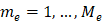{width="5.1in" height="2.8583333333333334in"}

Figure A.5.5.1.4.1-1: SNR variation for in-sync testing.

##### A.5.5.1.4.2 Test Requirements

The UE behaviour in each test during time durations T1, T2, T3, T4 and
T5 shall be as follows:

During the period from time point A to time point F (D1 second after the
start of time duration T5) the UE shall transmit uplink signal at least
in all uplink slots configured for CSI transmission according to the
configured periodic CSI reporting.

The rate of correct events observed during repeated tests shall be at
least 90%.

#### A.5.5.1.5 EN-DC Radio Link Monitoring Out-of-sync Test for FR2 PSCell configured with CSI-RS-based RLM in non-DRX mode

A.5.5.1.5.1 Test Purpose and Environment

The purpose of this test is to verify that the UE properly detects the
out of sync for the purpose of monitoring downlink CSI-RS based radio
link quality of the PSCell when no DRX is used. This test will partly
verify the FR2 TDD PSCell CSI-RS Out-of-sync radio link monitoring
requirements in clause 8.1.

The test parameters are given in Tables A.5.5.1.5.1-1, A.5.5.1.5.1-2,
A.5.5.1.5.1-3 and A.5.5.1.5.1-3A below. There are two cells, cell 1 is
the E-UTRAN PCell, and cell 2 is the PSCell, in the test. The test
consists of three successive time periods, with time duration of T1, T2
and T3 respectively. Figure A.5.5.1.5.1-1 shows the variation of the
downlink SNR in the E-UTRAN PCell and the PSCell to emulate out-of-sync
and in-sync states. Prior to the start of the time duration T1, the UE
shall be fully synchronized to cell 1 and cell 2. The UE shall be
configured for periodic CSI reporting with a reporting periodicity of
5ms. In the test, DRX configuration is not enabled. The UE is configured
to perform inter-frequency measurements using GP ID \#0 (40ms). In the
test, SSB0 and SSB1 are configured as BFD-RS.

**Table A.5.5.1.5.1-1: Supported test configurations for FR2 PSCell**

  **Configuration**                                                                          **Description**
  ------------------------------------------------------------------------------------------ -----------------------------------------------------------------
  1                                                                                          LTE FDD, NR 120 kHz SSB SCS, 100 MHz bandwidth, TDD duplex mode
  2                                                                                          LTE TDD, NR 120 kHz SSB SCS, 100 MHz bandwidth, TDD duplex mode
  Note: The UE is only required to pass in one of the supported test configurations in FR2   

**Table A.5.5.1.5.1-2: General test parameters for FR2 PSCell for CSI-RS
out-of-sync testing in non-DRX mode**

+----------------+----------------+----------------+----------------+
| **Parameter**  | **Unit**       | **Value**      |                |
+================+================+================+================+
|                |                | **Test 1**     |                |
+----------------+----------------+----------------+----------------+
| Active E-UTRA  |                | Cell 1         |                |
| PCell          |                |                |                |
+----------------+----------------+----------------+----------------+
| E-UTRA RF      |                | 1              |                |
| Channel Number |                |                |                |
+----------------+----------------+----------------+----------------+
| Active PSCell  |                | Cell 2         |                |
+----------------+----------------+----------------+----------------+
| RF Channel     |                | 2              |                |
| Number         |                |                |                |
+----------------+----------------+----------------+----------------+
| Duplex Mode    |                | TDD            |                |
+----------------+----------------+----------------+----------------+
| BW~channel~    | Config 1, 2    |                | 100: N~RB,c~ = |
|                |                |                | 66             |
+----------------+----------------+----------------+----------------+
| Data RBs       | Config 1, 2    |                | 24             |
| allocated      |                |                |                |
+----------------+----------------+----------------+----------------+
| BW~occupied~   | Config 1, 2    |                | 24             |
+----------------+----------------+----------------+----------------+
| TDD            | Config 1       |                | TDDConf.3.1    |
| Configuration  |                |                |                |
+----------------+----------------+----------------+----------------+
|                | Config 2       |                | TDDConf.3.1    |
+----------------+----------------+----------------+----------------+
| DL initial BWP | Config 1, 2    |                | DLBWP.0.1      |
| configuration  |                |                |                |
+----------------+----------------+----------------+----------------+
| DL dedicated   | Config 1, 2    |                | DLBWP.1.4      |
| BWP            |                |                |                |
| configuration  |                |                |                |
+----------------+----------------+----------------+----------------+
| UL initial BWP | Config 1, 2    |                | ULBWP.0.1      |
| configuration  |                |                |                |
+----------------+----------------+----------------+----------------+
| UL dedicated   | Config 1, 2    |                | ULBWP.1.4      |
| BWP            |                |                |                |
| configuration  |                |                |                |
+----------------+----------------+----------------+----------------+
| RMSI CORESET   | Config 1       |                | CR.3.1 TDD     |
| Reference      |                |                |                |
| Channel        |                |                |                |
+----------------+----------------+----------------+----------------+
|                | Config 2       |                | CR.3.1 TDD     |
+----------------+----------------+----------------+----------------+
| Dedicated      | Config 1       |                | CCR.3.4 TDD    |
| CORESET        |                |                |                |
| Reference      |                |                | CCR.3.6 TDD    |
| Channel        |                |                |                |
+----------------+----------------+----------------+----------------+
|                | Config 2       |                | CCR.3.4 TDD    |
|                |                |                |                |
|                |                |                | CCR.3.6 TDD    |
+----------------+----------------+----------------+----------------+
| SSB            | Config 1       |                | SSB.1 FR2      |
| Configuration  |                |                |                |
+----------------+----------------+----------------+----------------+
|                | Config 2       |                | SSB.1 FR2      |
+----------------+----------------+----------------+----------------+
| SMTC           | Config 1       |                | SMTC.1         |
| Configuration  |                |                |                |
+----------------+----------------+----------------+----------------+
|                | Config 2       |                | SMTC.1         |
+----------------+----------------+----------------+----------------+
| PDSCH/PDCCH    | Config 1       |                | 120 KHz        |
| subcarrier     |                |                |                |
| spacing        |                |                |                |
+----------------+----------------+----------------+----------------+
|                | Config 2       |                | 120 KHz        |
+----------------+----------------+----------------+----------------+
| CSI-RS for RLM | Config 1, 2    |                | Resource \#4   |
|                |                |                | in TRS.2.1 TDD |
|                |                |                |                |
|                |                |                | Resource \#4   |
|                |                |                | in TRS.2.2 TDD |
+----------------+----------------+----------------+----------------+
| TRS            |                | TRS.2.1 TDD    |                |
| configuration  |                |                |                |
|                |                | TRS.2.2 TDD    |                |
+----------------+----------------+----------------+----------------+
| TCI            |                | TCI.State.2    |                |
| configuration  |                |                |                |
| for            |                |                |                |
| PDCCH\#1/PDSCH |                |                |                |
+----------------+----------------+----------------+----------------+
| TCI            |                | TCI.State.3    |                |
| configuration  |                |                |                |
| for PDCCH\#2   |                |                |                |
+----------------+----------------+----------------+----------------+
| OCNG           |                | OP.5           |                |
| parameters     |                |                |                |
+----------------+----------------+----------------+----------------+
| CP length      |                | Normal         |                |
+----------------+----------------+----------------+----------------+
| Out of sync    | DCI format     |                | 1-0            |
| transmission   |                |                |                |
| parameters     |                |                |                |
+----------------+----------------+----------------+----------------+
|                | Number of      |                | 2              |
|                | Control OFDM   |                |                |
|                | symbols        |                |                |
+----------------+----------------+----------------+----------------+
|                | Aggregation    | CCE            | 8              |
|                | level          |                |                |
+----------------+----------------+----------------+----------------+
|                | Ratio of       | dB             | 4              |
|                | hypothetical   |                |                |
|                | PDCCH RE       |                |                |
|                | energy to      |                |                |
|                | average CSI-RS |                |                |
|                | RE energy      |                |                |
+----------------+----------------+----------------+----------------+
|                | Ratio of       | dB             | 4              |
|                | hypothetical   |                |                |
|                | PDCCH DMRS     |                |                |
|                | energy to      |                |                |
|                | average CSI-RS |                |                |
|                | RE energy      |                |                |
+----------------+----------------+----------------+----------------+
|                | DMRS precoder  |                | REG bundle     |
|                | granularity    |                | size           |
+----------------+----------------+----------------+----------------+
|                | REG bundle     |                | 6              |
|                | size           |                |                |
+----------------+----------------+----------------+----------------+
| DRX            |                | *OFF*          |                |
+----------------+----------------+----------------+----------------+
| Gap pattern ID |                | *gp0*          |                |
+----------------+----------------+----------------+----------------+
| Layer 3        |                | *Enabled*      |                |
| filtering      |                |                |                |
+----------------+----------------+----------------+----------------+
| T310 timer     | *ms*           | *0*            |                |
+----------------+----------------+----------------+----------------+
| T311 timer     | ms             | 1000           |                |
+----------------+----------------+----------------+----------------+
| N310           |                | 1              |                |
+----------------+----------------+----------------+----------------+
| N311           |                | 1              |                |
+----------------+----------------+----------------+----------------+
| CSI-RS for CSI | Config 1       |                | CSI-RS.3.1 TDD |
| reporting      |                |                |                |
+----------------+----------------+----------------+----------------+
|                | Config 2       |                | CSI-RS.3.1 TDD |
+----------------+----------------+----------------+----------------+
| re             |                | periodic       |                |
| portConfigType |                |                |                |
+----------------+----------------+----------------+----------------+
| reportQuantity |                | cri-RI-PMI-CQI |                |
+----------------+----------------+----------------+----------------+
| CSI reporting  | slot           | 40             |                |
| periodicity    |                |                |                |
+----------------+----------------+----------------+----------------+
| CSI reporting  | slot           | 4              |                |
| offset         |                |                |                |
+----------------+----------------+----------------+----------------+
| T1             | s              | 0.2            |                |
+----------------+----------------+----------------+----------------+
| T2             | s              | 0.35           |                |
+----------------+----------------+----------------+----------------+
| T3             | s              | 0.35           |                |
+----------------+----------------+----------------+----------------+
| D1             | s              | 0.31           |                |
+----------------+----------------+----------------+----------------+
| Note 1:        |                |                |                |
| UE-specific    |                |                |                |
| PDCCH is not   |                |                |                |
| transmitted    |                |                |                |
| after T1       |                |                |                |
| starts.        |                |                |                |
|                |                |                |                |
| Note 2:        |                |                |                |
| **E-UTRAN is   |                |                |                |
| in non-DRX     |                |                |                |
| mode under     |                |                |                |
| test.**        |                |                |                |
+----------------+----------------+----------------+----------------+

Table A.5.5.1.5.1-3: Cell specific test parameters for FR2 for CSI-RS
out-of-sync radio link monitoring in non-DRX mode

+--------+--------+--------+--------+--------+-----+-----+----+
| Par    | Unit   | Test 1 |        |        |     |     |    |
| ameter |        |        |        |        |     |     |    |
+--------+--------+--------+--------+--------+-----+-----+----+
|        |        | T1     | T2     | T3     | T1  | T2  | T3 |
+--------+--------+--------+--------+--------+-----+-----+----+
| AoA    |        | Setup  |        |        |     |     |    |
| setup  |        | 3      |        |        |     |     |    |
|        |        | d      |        |        |     |     |    |
|        |        | efined |        |        |     |     |    |
|        |        | in     |        |        |     |     |    |
|        |        | A.3.15 |        |        |     |     |    |
+--------+--------+--------+--------+--------+-----+-----+----+
|        |        | **     | **     |        |     |     |    |
|        |        | AoA1** | AoA2** |        |     |     |    |
+--------+--------+--------+--------+--------+-----+-----+----+
| Assu   |        | Rough  | Rough  |        |     |     |    |
| mption |        |        |        |        |     |     |    |
| for UE |        |        |        |        |     |     |    |
| bea    |        |        |        |        |     |     |    |
| ms^Not |        |        |        |        |     |     |    |
| e\ 10^ |        |        |        |        |     |     |    |
+--------+--------+--------+--------+--------+-----+-----+----+
| EPRE   | dB     | 4      | Not    |        |     |     |    |
| ratio  |        |        | sent   |        |     |     |    |
| of     |        |        |        |        |     |     |    |
| PDCCH  |        |        |        |        |     |     |    |
| DMRS   |        |        |        |        |     |     |    |
| to SSS |        |        |        |        |     |     |    |
+--------+--------+--------+--------+--------+-----+-----+----+
| EPRE   | dB     |        |        |        |     |     |    |
| ratio  |        |        |        |        |     |     |    |
| of     |        |        |        |        |     |     |    |
| PDCCH  |        |        |        |        |     |     |    |
| to     |        |        |        |        |     |     |    |
| PDCCH  |        |        |        |        |     |     |    |
| DMRS   |        |        |        |        |     |     |    |
+--------+--------+--------+--------+--------+-----+-----+----+
| EPRE   | dB     | 0      |        |        |     |     |    |
| ratio  |        |        |        |        |     |     |    |
| of     |        |        |        |        |     |     |    |
| PBCH   |        |        |        |        |     |     |    |
| DMRS   |        |        |        |        |     |     |    |
| to SSS |        |        |        |        |     |     |    |
+--------+--------+--------+--------+--------+-----+-----+----+
| EPRE   | dB     |        |        |        |     |     |    |
| ratio  |        |        |        |        |     |     |    |
| of     |        |        |        |        |     |     |    |
| PBCH   |        |        |        |        |     |     |    |
| to     |        |        |        |        |     |     |    |
| PBCH   |        |        |        |        |     |     |    |
| DMRS   |        |        |        |        |     |     |    |
+--------+--------+--------+--------+--------+-----+-----+----+
| EPRE   | dB     |        |        |        |     |     |    |
| ratio  |        |        |        |        |     |     |    |
| of PSS |        |        |        |        |     |     |    |
| to SSS |        |        |        |        |     |     |    |
+--------+--------+--------+--------+--------+-----+-----+----+
| EPRE   | dB     |        |        |        |     |     |    |
| ratio  |        |        |        |        |     |     |    |
| of     |        |        |        |        |     |     |    |
| PDSCH  |        |        |        |        |     |     |    |
| DMRS   |        |        |        |        |     |     |    |
| to SSS |        |        |        |        |     |     |    |
+--------+--------+--------+--------+--------+-----+-----+----+
| EPRE   | dB     |        |        |        |     |     |    |
| ratio  |        |        |        |        |     |     |    |
| of     |        |        |        |        |     |     |    |
| PDSCH  |        |        |        |        |     |     |    |
| to     |        |        |        |        |     |     |    |
| PDSCH  |        |        |        |        |     |     |    |
| DMRS   |        |        |        |        |     |     |    |
+--------+--------+--------+--------+--------+-----+-----+----+
| EPRE   | dB     |        |        |        |     |     |    |
| ratio  |        |        |        |        |     |     |    |
| of     |        |        |        |        |     |     |    |
| OCNG   |        |        |        |        |     |     |    |
| DMRS   |        |        |        |        |     |     |    |
| to SSS |        |        |        |        |     |     |    |
+--------+--------+--------+--------+--------+-----+-----+----+
| EPRE   | dB     |        |        |        |     |     |    |
| ratio  |        |        |        |        |     |     |    |
| of     |        |        |        |        |     |     |    |
| OCNG   |        |        |        |        |     |     |    |
| to     |        |        |        |        |     |     |    |
| OCNG   |        |        |        |        |     |     |    |
| DMRS   |        |        |        |        |     |     |    |
+--------+--------+--------+--------+--------+-----+-----+----+
| SNR on | Config | dB     | 2^Not  | -6^Not | -15 |     |    |
| R      | 1, 2   |        | e\ 11^ | e\ 11^ |     |     |    |
| LM-RS1 |        |        |        |        |     |     |    |
+--------+--------+--------+--------+--------+-----+-----+----+
| SNR on | Config | dB     | Not    | 2^Not  | -15 | -15 |    |
| R      | 1, 2   |        | sent   | e\ 11^ |     |     |    |
| LM-RS2 |        |        |        |        |     |     |    |
+--------+--------+--------+--------+--------+-----+-----+----+
|        | Config | dBm/\  | -92.1  | -92.1  |     |     |    |
|        | 1, 2   | 15kHz  |        |        |     |     |    |
+--------+--------+--------+--------+--------+-----+-----+----+
| Propa  |        | TDL-A  | TDL-A  |        |     |     |    |
| gation |        | 30ns   | 30ns   |        |     |     |    |
| con    |        | 75Hz   | 75Hz   |        |     |     |    |
| dition |        |        |        |        |     |     |    |
+--------+--------+--------+--------+--------+-----+-----+----+
| Note   |        |        |        |        |     |     |    |
| 1:     |        |        |        |        |     |     |    |
| OCNG   |        |        |        |        |     |     |    |
| shall  |        |        |        |        |     |     |    |
| be     |        |        |        |        |     |     |    |
| used   |        |        |        |        |     |     |    |
| such   |        |        |        |        |     |     |    |
| that   |        |        |        |        |     |     |    |
| the    |        |        |        |        |     |     |    |
| res    |        |        |        |        |     |     |    |
| ources |        |        |        |        |     |     |    |
| in     |        |        |        |        |     |     |    |
| Cell 2 |        |        |        |        |     |     |    |
| are    |        |        |        |        |     |     |    |
| fully  |        |        |        |        |     |     |    |
| all    |        |        |        |        |     |     |    |
| ocated |        |        |        |        |     |     |    |
| and a  |        |        |        |        |     |     |    |
| co     |        |        |        |        |     |     |    |
| nstant |        |        |        |        |     |     |    |
| total  |        |        |        |        |     |     |    |
| trans  |        |        |        |        |     |     |    |
| mitted |        |        |        |        |     |     |    |
| power  |        |        |        |        |     |     |    |
| sp     |        |        |        |        |     |     |    |
| ectral |        |        |        |        |     |     |    |
| d      |        |        |        |        |     |     |    |
| ensity |        |        |        |        |     |     |    |
| is     |        |        |        |        |     |     |    |
| ac     |        |        |        |        |     |     |    |
| hieved |        |        |        |        |     |     |    |
| for    |        |        |        |        |     |     |    |
| all    |        |        |        |        |     |     |    |
| OFDM   |        |        |        |        |     |     |    |
| sy     |        |        |        |        |     |     |    |
| mbols. |        |        |        |        |     |     |    |
|        |        |        |        |        |     |     |    |
| Note   |        |        |        |        |     |     |    |
| 2: The |        |        |        |        |     |     |    |
| uplink |        |        |        |        |     |     |    |
| res    |        |        |        |        |     |     |    |
| ources |        |        |        |        |     |     |    |
| for    |        |        |        |        |     |     |    |
| CSI    |        |        |        |        |     |     |    |
| rep    |        |        |        |        |     |     |    |
| orting |        |        |        |        |     |     |    |
| are    |        |        |        |        |     |     |    |
| as     |        |        |        |        |     |     |    |
| signed |        |        |        |        |     |     |    |
| to the |        |        |        |        |     |     |    |
| UE     |        |        |        |        |     |     |    |
| prior  |        |        |        |        |     |     |    |
| to the |        |        |        |        |     |     |    |
| start  |        |        |        |        |     |     |    |
| of     |        |        |        |        |     |     |    |
| time   |        |        |        |        |     |     |    |
| period |        |        |        |        |     |     |    |
| T1.    |        |        |        |        |     |     |    |
|        |        |        |        |        |     |     |    |
| Note   |        |        |        |        |     |     |    |
| 3: NZP |        |        |        |        |     |     |    |
| CSI-RS |        |        |        |        |     |     |    |
| re     |        |        |        |        |     |     |    |
| source |        |        |        |        |     |     |    |
| set    |        |        |        |        |     |     |    |
| c      |        |        |        |        |     |     |    |
| onfigu |        |        |        |        |     |     |    |
| ration |        |        |        |        |     |     |    |
| for    |        |        |        |        |     |     |    |
| CSI    |        |        |        |        |     |     |    |
| rep    |        |        |        |        |     |     |    |
| orting |        |        |        |        |     |     |    |
| are    |        |        |        |        |     |     |    |
| as     |        |        |        |        |     |     |    |
| signed |        |        |        |        |     |     |    |
| to the |        |        |        |        |     |     |    |
| UE     |        |        |        |        |     |     |    |
| prior  |        |        |        |        |     |     |    |
| to the |        |        |        |        |     |     |    |
| start  |        |        |        |        |     |     |    |
| of     |        |        |        |        |     |     |    |
| time   |        |        |        |        |     |     |    |
| period |        |        |        |        |     |     |    |
| T1.    |        |        |        |        |     |     |    |
|        |        |        |        |        |     |     |    |
| Note   |        |        |        |        |     |     |    |
| 4:     |        |        |        |        |     |     |    |
| Measu  |        |        |        |        |     |     |    |
| rement |        |        |        |        |     |     |    |
| gap    |        |        |        |        |     |     |    |
| c      |        |        |        |        |     |     |    |
| onfigu |        |        |        |        |     |     |    |
| ration |        |        |        |        |     |     |    |
| is     |        |        |        |        |     |     |    |
| as     |        |        |        |        |     |     |    |
| signed |        |        |        |        |     |     |    |
| to the |        |        |        |        |     |     |    |
| UE     |        |        |        |        |     |     |    |
| prior  |        |        |        |        |     |     |    |
| to the |        |        |        |        |     |     |    |
| start  |        |        |        |        |     |     |    |
| of     |        |        |        |        |     |     |    |
| time   |        |        |        |        |     |     |    |
| period |        |        |        |        |     |     |    |
| T1.    |        |        |        |        |     |     |    |
|        |        |        |        |        |     |     |    |
| Note   |        |        |        |        |     |     |    |
| 5: The |        |        |        |        |     |     |    |
| timers |        |        |        |        |     |     |    |
| and    |        |        |        |        |     |     |    |
| layer  |        |        |        |        |     |     |    |
| 3      |        |        |        |        |     |     |    |
| fil    |        |        |        |        |     |     |    |
| tering |        |        |        |        |     |     |    |
| r      |        |        |        |        |     |     |    |
| elated |        |        |        |        |     |     |    |
| para   |        |        |        |        |     |     |    |
| meters |        |        |        |        |     |     |    |
| are    |        |        |        |        |     |     |    |
| conf   |        |        |        |        |     |     |    |
| igured |        |        |        |        |     |     |    |
| prior  |        |        |        |        |     |     |    |
| to the |        |        |        |        |     |     |    |
| start  |        |        |        |        |     |     |    |
| of     |        |        |        |        |     |     |    |
| time   |        |        |        |        |     |     |    |
| period |        |        |        |        |     |     |    |
| T1.    |        |        |        |        |     |     |    |
|        |        |        |        |        |     |     |    |
| Note   |        |        |        |        |     |     |    |
| 6: The |        |        |        |        |     |     |    |
| signal |        |        |        |        |     |     |    |
| co     |        |        |        |        |     |     |    |
| ntains |        |        |        |        |     |     |    |
| PDCCH  |        |        |        |        |     |     |    |
| for    |        |        |        |        |     |     |    |
| UEs    |        |        |        |        |     |     |    |
| other  |        |        |        |        |     |     |    |
| than   |        |        |        |        |     |     |    |
| the    |        |        |        |        |     |     |    |
| device |        |        |        |        |     |     |    |
| under  |        |        |        |        |     |     |    |
| test   |        |        |        |        |     |     |    |
| as     |        |        |        |        |     |     |    |
| part   |        |        |        |        |     |     |    |
| of     |        |        |        |        |     |     |    |
| OCNG.  |        |        |        |        |     |     |    |
|        |        |        |        |        |     |     |    |
| Note   |        |        |        |        |     |     |    |
| 7: SNR |        |        |        |        |     |     |    |
| levels |        |        |        |        |     |     |    |
| corr   |        |        |        |        |     |     |    |
| espond |        |        |        |        |     |     |    |
| to the |        |        |        |        |     |     |    |
| signal |        |        |        |        |     |     |    |
| to     |        |        |        |        |     |     |    |
| noise  |        |        |        |        |     |     |    |
| ratio  |        |        |        |        |     |     |    |
| over   |        |        |        |        |     |     |    |
| the    |        |        |        |        |     |     |    |
| SSS    |        |        |        |        |     |     |    |
| REs.   |        |        |        |        |     |     |    |
|        |        |        |        |        |     |     |    |
| Note   |        |        |        |        |     |     |    |
| 8: The |        |        |        |        |     |     |    |
| SNR in |        |        |        |        |     |     |    |
| time   |        |        |        |        |     |     |    |
| p      |        |        |        |        |     |     |    |
| eriods |        |        |        |        |     |     |    |
| T1, T2 |        |        |        |        |     |     |    |
| and T3 |        |        |        |        |     |     |    |
| is     |        |        |        |        |     |     |    |
| d      |        |        |        |        |     |     |    |
| enoted |        |        |        |        |     |     |    |
| as     |        |        |        |        |     |     |    |
| SNR1,  |        |        |        |        |     |     |    |
| SNR2   |        |        |        |        |     |     |    |
| and    |        |        |        |        |     |     |    |
| SNR3   |        |        |        |        |     |     |    |
| respec |        |        |        |        |     |     |    |
| tively |        |        |        |        |     |     |    |
| in     |        |        |        |        |     |     |    |
| figure |        |        |        |        |     |     |    |
| A.     |        |        |        |        |     |     |    |
| 5.5.1. |        |        |        |        |     |     |    |
| 5.1-1. |        |        |        |        |     |     |    |
|        |        |        |        |        |     |     |    |
| Note   |        |        |        |        |     |     |    |
| 9: The |        |        |        |        |     |     |    |
| SNR    |        |        |        |        |     |     |    |
| values |        |        |        |        |     |     |    |
| are    |        |        |        |        |     |     |    |
| spe    |        |        |        |        |     |     |    |
| cified |        |        |        |        |     |     |    |
| for    |        |        |        |        |     |     |    |
| t      |        |        |        |        |     |     |    |
| esting |        |        |        |        |     |     |    |
| a UE   |        |        |        |        |     |     |    |
| which  |        |        |        |        |     |     |    |
| su     |        |        |        |        |     |     |    |
| pports |        |        |        |        |     |     |    |
| 2RX on |        |        |        |        |     |     |    |
| at     |        |        |        |        |     |     |    |
| least  |        |        |        |        |     |     |    |
| one    |        |        |        |        |     |     |    |
| band.  |        |        |        |        |     |     |    |
| For    |        |        |        |        |     |     |    |
| t      |        |        |        |        |     |     |    |
| esting |        |        |        |        |     |     |    |
| of a   |        |        |        |        |     |     |    |
| UE     |        |        |        |        |     |     |    |
| which  |        |        |        |        |     |     |    |
| su     |        |        |        |        |     |     |    |
| pports |        |        |        |        |     |     |    |
| 4RX on |        |        |        |        |     |     |    |
| all    |        |        |        |        |     |     |    |
| bands, |        |        |        |        |     |     |    |
| the    |        |        |        |        |     |     |    |
| SNR    |        |        |        |        |     |     |    |
| during |        |        |        |        |     |     |    |
| T3 is  |        |        |        |        |     |     |    |
| A.3.6. |        |        |        |        |     |     |    |
|        |        |        |        |        |     |     |    |
| Note   |        |        |        |        |     |     |    |
| 10:    |        |        |        |        |     |     |    |
| Infor  |        |        |        |        |     |     |    |
| mation |        |        |        |        |     |     |    |
| about  |        |        |        |        |     |     |    |
| types  |        |        |        |        |     |     |    |
| of UE  |        |        |        |        |     |     |    |
| beam   |        |        |        |        |     |     |    |
| is     |        |        |        |        |     |     |    |
| given  |        |        |        |        |     |     |    |
| in     |        |        |        |        |     |     |    |
| B.     |        |        |        |        |     |     |    |
| 2.1.3, |        |        |        |        |     |     |    |
| and    |        |        |        |        |     |     |    |
| does   |        |        |        |        |     |     |    |
| not    |        |        |        |        |     |     |    |
| limit  |        |        |        |        |     |     |    |
| UE     |        |        |        |        |     |     |    |
| im     |        |        |        |        |     |     |    |
| plemen |        |        |        |        |     |     |    |
| tation |        |        |        |        |     |     |    |
| or     |        |        |        |        |     |     |    |
| test   |        |        |        |        |     |     |    |
| system |        |        |        |        |     |     |    |
| im     |        |        |        |        |     |     |    |
| plemen |        |        |        |        |     |     |    |
| tation |        |        |        |        |     |     |    |
|        |        |        |        |        |     |     |    |
| Note   |        |        |        |        |     |     |    |
| 11:    |        |        |        |        |     |     |    |
| This   |        |        |        |        |     |     |    |
| value  |        |        |        |        |     |     |    |
| allows |        |        |        |        |     |     |    |
| up to  |        |        |        |        |     |     |    |
| 1dB    |        |        |        |        |     |     |    |
| degra  |        |        |        |        |     |     |    |
| dation |        |        |        |        |     |     |    |
| from   |        |        |        |        |     |     |    |
| a      |        |        |        |        |     |     |    |
| pplied |        |        |        |        |     |     |    |
| SNR to |        |        |        |        |     |     |    |
| UE     |        |        |        |        |     |     |    |
| ba     |        |        |        |        |     |     |    |
| seband |        |        |        |        |     |     |    |
+--------+--------+--------+--------+--------+-----+-----+----+

**Table A.5.5.1.5.1-3A: Measurement gap configuration for FR2 CSI-RS
out-of-sync radio link monitoring in non-DRX mode**

  ---------------------------------------------------------------------------------------------------------------------------------------------------- ------------
  **Field**                                                                                                                                            **Test 1**
                                                                                                                                                       **Value**
  gapOffset                                                                                                                                            0
  Note 1: E-UTRAN PCell and PSCell are SFN-synchronous and frame boundary aligned. (Ensure that RLM RS is partially overlapped with measurement gap)   
  ---------------------------------------------------------------------------------------------------------------------------------------------------- ------------

**Table A.5.5.1.5.1-4: Void**

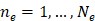{width="4.547619203849519in"
height="2.7966721347331585in"}

Figure A.5.5.1.5.1-1: SNR variation for CSI-RS out-of-sync testing

A.5.5.1.5.2 Test Requirements

The UE behaviour during time durations T1, T2, and T3 shall be as
follows:

During the period from time point A to time point B the UE shall
transmit uplink signal in Cell 2 (PSCell) at least in all uplink slots
configured for CSI transmission according to the configured periodic CSI
reporting for Cell 2.

The UE shall stop transmitting uplink signal in Cell 2 (PSCell) no later
than time point C (D~1~ after the start of the time duration T3) on the
PSCell.

The rate of correct events observed during repeated tests shall be at
least 90%.

#### A.5.5.1.6 EN-DC Radio Link Monitoring In-sync Test for FR2 PSCell configured with CSI-RS-based RLM in non-DRX mode

##### A.5.5.1.6.1 Test Purpose and Environment

The purpose of this test is to verify that the UE properly detects the
in sync for the purpose of monitoring downlink CSI-RS based radio link
quality of the PSCell when no DRX is used. This test will partly verify
the FR2 TDD PSCell CSI-RS In-sync radio link monitoring requirements in
clause 8.1.

The test parameters are given in Tables A.5.5.1.6.1-1, A.5.5.1.6.1-2,
and A.5.5.1.6.1-3 below. There are two cells, cell 1which is the E-UTRAN
PCell, and cell 2 is the PSCell, in the test. The test consists of five
successive time periods, with time duration of T1, T2, T3, T4 and T5
respectively. Figure A.5.5.1.6.1-1 shows the variation of the downlink
SNR in the PSCell to emulate out-of-sync and in-sync states. Prior to
the start of the time duration T1, the UE shall be fully synchronized to
cell 1 and cell 2. The UE shall be configured for periodic CSI reporting
with a reporting periodicity of 5ms. In the test, DRX configuration is
not enabled. In the test, SSB0 and SSB1 are configured as BFD-RS.

Table A.5.5.1.6.1-1: Supported test configurations for FR2 PSCell

  **Configuration**                                                                          **Description**
  ------------------------------------------------------------------------------------------ -----------------------------------------------------------------
  1                                                                                          LTE FDD, NR 120 kHz SSB SCS, 100 MHz bandwidth, TDD duplex mode
  2                                                                                          LTE TDD, NR 120 kHz SSB SCS, 100 MHz bandwidth, TDD duplex mode
  Note: The UE is only required to pass in one of the supported test configurations in FR2   

Table A.5.5.1.6.1-2: General test parameters for FR2 PSCell for CSI-RS
in-sync testing in non-DRX mode

+----------------+----------------+----------------+----------------+
| **Parameter**  | **Unit**       | **Value**      |                |
+================+================+================+================+
|                |                | **Test 1**     |                |
+----------------+----------------+----------------+----------------+
| Active E-UTRA  |                | Cell 1         |                |
| PCell          |                |                |                |
+----------------+----------------+----------------+----------------+
| E-UTRA RF      |                | 1              |                |
| Channel Number |                |                |                |
+----------------+----------------+----------------+----------------+
| Active PSCell  |                | Cell 2         |                |
+----------------+----------------+----------------+----------------+
| RF Channel     |                | 2              |                |
| Number         |                |                |                |
+----------------+----------------+----------------+----------------+
| Duplex Mode    |                | TDD            |                |
+----------------+----------------+----------------+----------------+
| BW~channel~    | Config 1, 2    |                | 100: N~RB,c~ = |
|                |                |                | 66             |
+----------------+----------------+----------------+----------------+
| Data RBs       | Config 1, 2    |                | 24             |
| allocated      |                |                |                |
+----------------+----------------+----------------+----------------+
| BW~occupied~   | Config 1, 2    |                | 24             |
+----------------+----------------+----------------+----------------+
| TDD            | Config 1       |                | TDDConf.3.1    |
| Configuration  |                |                |                |
+----------------+----------------+----------------+----------------+
|                | Config 2       |                | TDDConf.3.1    |
+----------------+----------------+----------------+----------------+
| DL initial BWP | Config 1, 2    |                | DLBWP.0.1      |
| configuration  |                |                |                |
+----------------+----------------+----------------+----------------+
| DL dedicated   | Config 1, 2    |                | DLBWP.1.4      |
| BWP            |                |                |                |
| configuration  |                |                |                |
+----------------+----------------+----------------+----------------+
| UL initial BWP | Config 1, 2    |                | ULBWP.0.1      |
| configuration  |                |                |                |
+----------------+----------------+----------------+----------------+
| UL dedicated   | Config 1, 2    |                | ULBWP.1.4      |
| BWP            |                |                |                |
| configuration  |                |                |                |
+----------------+----------------+----------------+----------------+
| RMSI CORESET   | Config 1       |                | CR.3.1 TDD     |
| Reference      |                |                |                |
| Channel        |                |                |                |
+----------------+----------------+----------------+----------------+
|                | Config 2       |                | CR.3.1 TDD     |
+----------------+----------------+----------------+----------------+
| Dedicated      | Config 1       |                | CCR.3.1 TDD    |
| CORESET        |                |                |                |
| Reference      |                |                | CCR.3.3 TDD    |
| Channel        |                |                |                |
+----------------+----------------+----------------+----------------+
|                | Config 2       |                | CCR.3.1 TDD    |
|                |                |                |                |
|                |                |                | CCR.3.3 TDD    |
+----------------+----------------+----------------+----------------+
| SSB            | Config 1       |                | SSB.1 FR2      |
| Configuration  |                |                |                |
+----------------+----------------+----------------+----------------+
|                | Config 2       |                | SSB.1 FR2      |
+----------------+----------------+----------------+----------------+
| SMTC           | Config 1       |                | SMTC.1         |
| Configuration  |                |                |                |
+----------------+----------------+----------------+----------------+
|                | Config 2       |                | SMTC.1         |
+----------------+----------------+----------------+----------------+
| PDSCH/PDCCH    | Config 1       |                | 120 KHz        |
| subcarrier     |                |                |                |
| spacing        |                |                |                |
+----------------+----------------+----------------+----------------+
|                | Config 2       |                | 120 KHz        |
+----------------+----------------+----------------+----------------+
| CSI-RS for RLM | Config 1, 2    |                | Resource \#4   |
|                |                |                | in TRS.2.1 TDD |
|                |                |                |                |
|                |                |                | Resource \#4   |
|                |                |                | in TRS.2.2 TDD |
+----------------+----------------+----------------+----------------+
| OCNG           |                | OP.5           |                |
| parameters     |                |                |                |
+----------------+----------------+----------------+----------------+
| TRS            |                | TRS.2.1 TDD    |                |
| configuration  |                |                |                |
|                |                | TRS.2.2 TDD    |                |
+----------------+----------------+----------------+----------------+
| TCI            |                | TCI.State.2    |                |
| configuration  |                |                |                |
| for            |                |                |                |
| PDCCH\#1/PDSCH |                |                |                |
+----------------+----------------+----------------+----------------+
| TCI            |                | TCI.State.3    |                |
| configuration  |                |                |                |
| for PDCCH\#2   |                |                |                |
+----------------+----------------+----------------+----------------+
| CP length      |                | Normal         |                |
+----------------+----------------+----------------+----------------+
| Out of sync    | DCI format     |                | 1-0            |
| transmission   |                |                |                |
| parameters     |                |                |                |
+----------------+----------------+----------------+----------------+
|                | Number of      |                | 2              |
|                | Control OFDM   |                |                |
|                | symbols        |                |                |
+----------------+----------------+----------------+----------------+
|                | Aggregation    | CCE            | 8              |
|                | level          |                |                |
+----------------+----------------+----------------+----------------+
|                | Ratio of       | dB             | 4              |
|                | hypothetical   |                |                |
|                | PDCCH RE       |                |                |
|                | energy to      |                |                |
|                | average CSI-RS |                |                |
|                | RE energy      |                |                |
+----------------+----------------+----------------+----------------+
|                | Ratio of       | dB             | 4              |
|                | hypothetical   |                |                |
|                | PDCCH DMRS     |                |                |
|                | energy to      |                |                |
|                | average CSI-RS |                |                |
|                | RE energy      |                |                |
+----------------+----------------+----------------+----------------+
|                | DMRS precoder  |                | REG bundle     |
|                | granularity    |                | size           |
+----------------+----------------+----------------+----------------+
|                | REG bundle     |                | 6              |
|                | size           |                |                |
+----------------+----------------+----------------+----------------+
| In sync        | DCI format     |                | 1-0            |
| transmission   |                |                |                |
| parameters     |                |                |                |
+----------------+----------------+----------------+----------------+
|                | Number of      |                | 2              |
|                | Control OFDM   |                |                |
|                | symbols        |                |                |
+----------------+----------------+----------------+----------------+
|                | Aggregation    | CCE            | 4              |
|                | level          |                |                |
+----------------+----------------+----------------+----------------+
|                | Ratio of       | dB             | 0              |
|                | hypothetical   |                |                |
|                | PDCCH RE       |                |                |
|                | energy to      |                |                |
|                | average CSI-RS |                |                |
|                | RE energy      |                |                |
+----------------+----------------+----------------+----------------+
|                | Ratio of       | dB             | 0              |
|                | hypothetical   |                |                |
|                | PDCCH DMRS     |                |                |
|                | energy to      |                |                |
|                | average CSI-RS |                |                |
|                | RE energy      |                |                |
+----------------+----------------+----------------+----------------+
|                | DMRS precoder  |                | REG bundle     |
|                | granularity    |                | size           |
+----------------+----------------+----------------+----------------+
|                | REG bundle     |                | 6              |
|                | size           |                |                |
+----------------+----------------+----------------+----------------+
| DRX            |                | *OFF*          |                |
+----------------+----------------+----------------+----------------+
| Gap pattern ID |                | *N.A.*         |                |
+----------------+----------------+----------------+----------------+
| Layer 3        |                | *Enabled*      |                |
| filtering      |                |                |                |
+----------------+----------------+----------------+----------------+
| T310 timer     | *ms*           | *1000*         |                |
+----------------+----------------+----------------+----------------+
| T311 timer     | ms             | 1000           |                |
+----------------+----------------+----------------+----------------+
| N310           |                | 1              |                |
+----------------+----------------+----------------+----------------+
| N311           |                | 1              |                |
+----------------+----------------+----------------+----------------+
| CSI-RS for CSI | Config 1       |                | CSI-RS.3.1 TDD |
| reporting      |                |                |                |
+----------------+----------------+----------------+----------------+
|                | Config 2       |                | CSI-RS.3.1 TDD |
+----------------+----------------+----------------+----------------+
| re             |                | periodic       |                |
| portConfigType |                |                |                |
+----------------+----------------+----------------+----------------+
| reportQuantity |                | cri-RI-PMI-CQI |                |
+----------------+----------------+----------------+----------------+
| CSI reporting  | slot           | 40             |                |
| periodicity    |                |                |                |
+----------------+----------------+----------------+----------------+
| CSI reporting  | slot           | 4              |                |
| offset         |                |                |                |
+----------------+----------------+----------------+----------------+
| T1             | s              | 0.2            |                |
+----------------+----------------+----------------+----------------+
| T2             | s              | 0.2            |                |
+----------------+----------------+----------------+----------------+
| T3             | s              | 0.24           |                |
+----------------+----------------+----------------+----------------+
| T4             | s              | 0.2            |                |
+----------------+----------------+----------------+----------------+
| T5             | s              | 0.88           |                |
+----------------+----------------+----------------+----------------+
| D1             | s              | 0.84           |                |
+----------------+----------------+----------------+----------------+
| Note 1:        |                |                |                |
| UE-specific    |                |                |                |
| PDCCH is not   |                |                |                |
| transmitted    |                |                |                |
| after T1       |                |                |                |
| starts.        |                |                |                |
|                |                |                |                |
| Note 2:        |                |                |                |
| **E-UTRAN is   |                |                |                |
| in non-DRX     |                |                |                |
| mode under     |                |                |                |
| test.**        |                |                |                |
+----------------+----------------+----------------+----------------+

Table A.5.5.1.6.1-3: Cell specific test parameters for FR2 for CSI-RS
in-sync radio link monitoring in non-DRX mode

<table>
<tbody>
<tr class="odd">
<td>Parameter</td>
<td>Unit</td>
<td>Test 1</td>
<td></td>
<td></td>
<td></td>
<td></td>
<td></td>
<td></td>
<td></td>
<td></td>
<td></td>
</tr>
<tr class="even">
<td></td>
<td></td>
<td>T1</td>
<td>T2</td>
<td>T3</td>
<td>T4</td>
<td>T5</td>
<td>T1</td>
<td>T2</td>
<td>T3</td>
<td>T4</td>
<td>T5</td>
</tr>
<tr class="odd">
<td>AoA setup</td>
<td></td>
<td>Setup 3 defined in A.3.15</td>
<td></td>
<td></td>
<td></td>
<td></td>
<td></td>
<td></td>
<td></td>
<td></td>
<td></td>
</tr>
<tr class="even">
<td></td>
<td></td>
<td>AoA1</td>
<td>AoA2</td>
<td></td>
<td></td>
<td></td>
<td></td>
<td></td>
<td></td>
<td></td>
<td></td>
</tr>
<tr class="odd">
<td>Assumption for UE beamsNote 10</td>
<td></td>
<td>Rough</td>
<td>Rough</td>
<td></td>
<td></td>
<td></td>
<td></td>
<td></td>
<td></td>
<td></td>
<td></td>
</tr>
<tr class="even">
<td>EPRE ratio of PDCCH DMRS to SSS</td>
<td>dB</td>
<td>0</td>
<td>Not sent</td>
<td></td>
<td></td>
<td></td>
<td></td>
<td></td>
<td></td>
<td></td>
<td></td>
</tr>
<tr class="odd">
<td>EPRE ratio of PDCCH to PDCCH DMRS</td>
<td>dB</td>
<td></td>
<td></td>
<td></td>
<td></td>
<td></td>
<td></td>
<td></td>
<td></td>
<td></td>
<td></td>
</tr>
<tr class="even">
<td>EPRE ratio of PBCH DMRS to SSS</td>
<td>dB</td>
<td>0</td>
<td></td>
<td></td>
<td></td>
<td></td>
<td></td>
<td></td>
<td></td>
<td></td>
<td></td>
</tr>
<tr class="odd">
<td>EPRE ratio of PBCH to PBCH DMRS</td>
<td>dB</td>
<td></td>
<td></td>
<td></td>
<td></td>
<td></td>
<td></td>
<td></td>
<td></td>
<td></td>
<td></td>
</tr>
<tr class="even">
<td>EPRE ratio of PSS to SSS</td>
<td>dB</td>
<td></td>
<td></td>
<td></td>
<td></td>
<td></td>
<td></td>
<td></td>
<td></td>
<td></td>
<td></td>
</tr>
<tr class="odd">
<td>EPRE ratio of PDSCH DMRS to SSS</td>
<td>dB</td>
<td></td>
<td></td>
<td></td>
<td></td>
<td></td>
<td></td>
<td></td>
<td></td>
<td></td>
<td></td>
</tr>
<tr class="even">
<td>EPRE ratio of PDSCH to PDSCH DMRS</td>
<td>dB</td>
<td></td>
<td></td>
<td></td>
<td></td>
<td></td>
<td></td>
<td></td>
<td></td>
<td></td>
<td></td>
</tr>
<tr class="odd">
<td>EPRE ratio of OCNG DMRS to SSS</td>
<td>dB</td>
<td></td>
<td></td>
<td></td>
<td></td>
<td></td>
<td></td>
<td></td>
<td></td>
<td></td>
<td></td>
</tr>
<tr class="even">
<td>EPRE ratio of OCNG to OCNG DMRS</td>
<td>dB</td>
<td></td>
<td></td>
<td></td>
<td></td>
<td></td>
<td></td>
<td></td>
<td></td>
<td></td>
<td></td>
</tr>
<tr class="odd">
<td>SNR on RLM-RS1</td>
<td>Config 1, 2</td>
<td>dB</td>
<td>2Note 11</td>
<td>-6Note 11</td>
<td>-15</td>
<td>-15</td>
<td>-15</td>
<td></td>
<td></td>
<td></td>
<td></td>
</tr>
<tr class="even">
<td>SNR on RLM-RS2</td>
<td>Config 1, 2</td>
<td>dB</td>
<td>Not sent</td>
<td>2Note 11</td>
<td>-15</td>
<td>-15</td>
<td>-4.5</td>
<td>2Note 6</td>
<td></td>
<td></td>
<td></td>
</tr>
<tr class="odd">
<td></td>
<td>Config 1, 2</td>
<td>dBm/ 
15KHz</td>
<td>-92.1</td>
<td>-92.1</td>
<td></td>
<td></td>
<td></td>
<td></td>
<td></td>
<td></td>
<td></td>
</tr>
<tr class="even">
<td>Propagation condition</td>
<td></td>
<td>TDL-A 30ns 75Hz</td>
<td>TDL-A 30ns 75Hz</td>
<td></td>
<td></td>
<td></td>
<td></td>
<td></td>
<td></td>
<td></td>
<td></td>
</tr>
<tr class="odd">
<td>
Note 1: OCNG shall be used such that the resources in Cell 2 are fully allocated and a constant total transmitted power spectral density is achieved for all OFDM symbols.

Note 2: The uplink resources for CSI reporting are assigned to the UE prior to the start of time period T1.

Note 3: NZP CSI-RS resource set configuration for CSI reporting are assigned to the UE prior to the start of time period T1.

Note 4: Measurement gap configuration is assigned to the UE prior to the start of time period T1.

Note 5: The timers and layer 3 filtering related parameters are configured prior to the start of time period T1.

Note 6: The signal contains PDCCH for UEs other than the device under test as part of OCNG.

Note 7: SNR levels correspond to the signal to noise ratio over the SSS REs.

Note 8: The SNR in time periods T1, T2, T3, T4 and T5 is denoted as SNR1, SNR2, SNR3, SNR4 and SNR5 respectively in figure A.5.5.1.6.1-1.

Note 9: The SNR values are specified for testing a UE which supports 2RX on at least one band. For testing of a UE which supports 4RX on all bands, the SNR during T3 is A.3.6.

Note 10: Information about types of UE beam is given in B.2.1.3, and does not limit UE implementation or test system implementation

Note 11: This value allows up to 1dB degradation from applied SNR to UE baseband
</td>
<td></td>
<td></td>
<td></td>
<td></td>
<td></td>
<td></td>
<td></td>
<td></td>
<td></td>
<td></td>
<td></td>
</tr>
</tbody>
</table>

**Table A.5.5.1.6.1-3A: Void**

**Table A.5.5.1.6.1-4: Void**

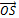{width="5.727777777777778in"
height="2.8722222222222222in"}

Figure A.5.5.1.6.1-1: SNR variation for CSI-RS in-sync testing

##### A.5.5.1.6.2 Test Requirements

The UE behaviour in each test during time durations T1, T2, T3, T4 and
T5 shall be as follows:

During the period from time point A to time point F (D1 second after the
start of time duration T5) the UE shall transmit uplink signal at least
in all uplink slots configured for CSI transmission according to the
configured periodic CSI reporting on the PSCell.

The rate of correct events observed during repeated tests shall be at
least 90%.

#### A.5.5.1.7 EN-DC Radio Link Monitoring Out-of-sync Test for FR2 PSCell configured with CSI-RS-based RLM in DRX mode

##### A.5.5.1.7.1 Test Purpose and Environment

The purpose of this test is to verify that the UE properly detects the
out of sync for the purpose of monitoring downlink CSI-RS based radio
link quality of the PSCell when DRX is used. This test will partly
verify the FR2 TDD PSCell CSI-RS Out-of-sync radio link monitoring
requirements in clause 8.1.

The test parameters are given in Tables A.5.5.1.7.1-1, A.5.5.1.7.1-2,
and A.5.5.1.7.1-3 below. There are two cells, cell 1 is the E-UTRAN
PCell, and cell 2 is the PSCell, in the test. The test consists of three
successive time periods, with time duration of T1, T2 and T3
respectively. Figure A.5.5.1.7.1-1 shows the variation of the downlink
SNR in the E-UTRAN PCell and the PSCell to emulate out-of-sync and
in-sync states. Prior to the start of the time duration T1, the UE shall
be fully synchronized to cell 1 and cell 2. The UE shall be configured
for periodic CSI reporting with a reporting periodicity of 5ms. In the
test, DRX configuration is enabled in PSCell and DRX inactivity timer
has already been expired, i.e. UE tries to decode PDCCH and to send
periodic CQI during the period when On-duration timer is running. Time
alignment timers shall be set to "infinity" so that UL timing alignment
is maintained during the test. In the test, SSB0 and SSB1 are configured
as BFD-RS and are not same as RLM-RS to avoid triggering the beam
failure during the RLM test.

Table A.5.5.1.7.1-1: Supported test configurations for FR2 PSCell

  **Configuration**                                                                          **Description**
  ------------------------------------------------------------------------------------------ -----------------------------------------------------------------
  1                                                                                          LTE FDD, NR 120 kHz SSB SCS, 100 MHz bandwidth, TDD duplex mode
  2                                                                                          LTE TDD, NR 120 kHz SSB SCS, 100 MHz bandwidth, TDD duplex mode
  Note: The UE is only required to pass in one of the supported test configurations in FR2   

Table A.5.5.1.7.1-2: General test parameters for FR2 PSCell for CSI-RS
out-of-sync testing in DRX mode

+----------------+----------------+----------------+----------------+
| **Parameter**  | **Unit**       | **Value**      |                |
+================+================+================+================+
|                |                | **Test 1**     |                |
+----------------+----------------+----------------+----------------+
| Active E-UTRA  |                | Cell 1         |                |
| PCell          |                |                |                |
+----------------+----------------+----------------+----------------+
| E-UTRA RF      |                | 1              |                |
| Channel Number |                |                |                |
+----------------+----------------+----------------+----------------+
| Active PSCell  |                | Cell 2         |                |
+----------------+----------------+----------------+----------------+
| RF Channel     |                | 2              |                |
| Number         |                |                |                |
+----------------+----------------+----------------+----------------+
| Duplex Mode    |                | TDD            |                |
+----------------+----------------+----------------+----------------+
| TDD            | Config 1       |                | TDDConf.3.1    |
| Configuration  |                |                |                |
+----------------+----------------+----------------+----------------+
|                | Config 2       |                | TDDConf.3.1    |
+----------------+----------------+----------------+----------------+
| DL initial BWP | Config 1, 2    |                | DLBWP.0.1      |
| configuration  |                |                |                |
+----------------+----------------+----------------+----------------+
| DL dedicated   | Config 1, 2    |                | DLBWP.1.1      |
| BWP            |                |                |                |
| configuration  |                |                |                |
+----------------+----------------+----------------+----------------+
| UL initial BWP | Config 1, 2    |                | ULBWP.0.1      |
| configuration  |                |                |                |
+----------------+----------------+----------------+----------------+
| UL dedicated   | Config 1, 2    |                | ULBWP.1.1      |
| BWP            |                |                |                |
| configuration  |                |                |                |
+----------------+----------------+----------------+----------------+
| RMSI CORESET   | Config 1       |                | CR. 3.1 TDD    |
| Reference      |                |                |                |
| Channel        |                |                |                |
+----------------+----------------+----------------+----------------+
|                | Config 2       |                | CR. 3.1 TDD    |
+----------------+----------------+----------------+----------------+
| Dedicated      | Config 1       |                | CCR. 3.4 TDD   |
| CORESET        |                |                |                |
| Reference      |                |                | CCR.3.6 TDD    |
| Channel        |                |                |                |
+----------------+----------------+----------------+----------------+
|                | Config 2       |                | CCR. 3.4 TDD   |
|                |                |                |                |
|                |                |                | CCR.3.6 TDD    |
+----------------+----------------+----------------+----------------+
| SSB            | Config 1       |                | SSB.1 FR2      |
| Configuration  |                |                |                |
+----------------+----------------+----------------+----------------+
|                | Config 2       |                | SSB.1 FR2      |
+----------------+----------------+----------------+----------------+
| SMTC           | Config 1       |                | SMTC.1         |
| Configuration  |                |                |                |
+----------------+----------------+----------------+----------------+
|                | Config 2       |                | SMTC.1         |
+----------------+----------------+----------------+----------------+
| PDSCH/PDCCH    | Config 1       |                | 120 KHz        |
| subcarrier     |                |                |                |
| spacing        |                |                |                |
+----------------+----------------+----------------+----------------+
|                | Config 2       |                | 120 KHz        |
+----------------+----------------+----------------+----------------+
| CSI-RS for RLM | Config 1, 2    |                | Resource \#4   |
|                |                |                | in TRS.2.1 TDD |
|                |                |                |                |
|                |                |                | Resource \#4   |
|                |                |                | in TRS.2.2 TDD |
+----------------+----------------+----------------+----------------+
| SSB index for  | Config 1, 2    |                | 0, 1           |
| BFD-RS         |                |                |                |
+----------------+----------------+----------------+----------------+
| TRS            |                | TRS.2.1 TDD    |                |
| configuration  |                |                |                |
|                |                | TRS.2.2 TDD    |                |
+----------------+----------------+----------------+----------------+
| TCI            |                | TCI.State.2    |                |
| configuration  |                |                |                |
| for            |                |                |                |
| PDCCH\#1/PDSCH |                |                |                |
+----------------+----------------+----------------+----------------+
| TCI            |                | TCI.State.3    |                |
| configuration  |                |                |                |
| for PDCCH\#2   |                |                |                |
+----------------+----------------+----------------+----------------+
| OCNG           |                | OP.1           |                |
| parameters     |                |                |                |
+----------------+----------------+----------------+----------------+
| CP length      |                | Normal         |                |
+----------------+----------------+----------------+----------------+
| Out of sync    | DCI format     |                | 1-0            |
| transmission   |                |                |                |
| parameters     |                |                |                |
+----------------+----------------+----------------+----------------+
|                | Number of      |                | 2              |
|                | Control OFDM   |                |                |
|                | symbols        |                |                |
+----------------+----------------+----------------+----------------+
|                | Aggregation    | CCE            | 8              |
|                | level          |                |                |
+----------------+----------------+----------------+----------------+
|                | Ratio of       | dB             | 4              |
|                | hypothetical   |                |                |
|                | PDCCH RE       |                |                |
|                | energy to      |                |                |
|                | average CSI-RS |                |                |
|                | RE energy      |                |                |
+----------------+----------------+----------------+----------------+
|                | Ratio of       | dB             | 4              |
|                | hypothetical   |                |                |
|                | PDCCH DMRS     |                |                |
|                | energy to      |                |                |
|                | average CSI-RS |                |                |
|                | RE energy      |                |                |
+----------------+----------------+----------------+----------------+
|                | DMRS precoder  |                | REG bundle     |
|                | granularity    |                | size           |
+----------------+----------------+----------------+----------------+
|                | REG bundle     |                | 6              |
|                | size           |                |                |
+----------------+----------------+----------------+----------------+
| DRX            |                | *DRX.3*        |                |
+----------------+----------------+----------------+----------------+
| Gap pattern ID |                | *N.A.*         |                |
+----------------+----------------+----------------+----------------+
| Layer 3        |                | *Enabled*      |                |
| filtering      |                |                |                |
+----------------+----------------+----------------+----------------+
| T310 timer     | *ms*           | *0*            |                |
+----------------+----------------+----------------+----------------+
| T311 timer     | ms             | 1000           |                |
+----------------+----------------+----------------+----------------+
| N310           |                | 1              |                |
+----------------+----------------+----------------+----------------+
| N311           |                | 1              |                |
+----------------+----------------+----------------+----------------+
| CSI-RS for CSI | Config 1       |                | CSI-RS.3.1 TDD |
| reporting      |                |                |                |
+----------------+----------------+----------------+----------------+
|                | Config 2       |                | CSI-RS.3.1 TDD |
+----------------+----------------+----------------+----------------+
| re             |                | periodic       |                |
| portConfigType |                |                |                |
+----------------+----------------+----------------+----------------+
| reportQuantity |                | cri-RI-PMI-CQI |                |
+----------------+----------------+----------------+----------------+
| CSI reporting  | slot           | 40             |                |
| periodicity    |                |                |                |
+----------------+----------------+----------------+----------------+
| CSI reporting  | slot           | 4              |                |
| offset         |                |                |                |
+----------------+----------------+----------------+----------------+
| T1             | s              | 0.2            |                |
+----------------+----------------+----------------+----------------+
| T2             | s              | 1.28           |                |
+----------------+----------------+----------------+----------------+
| T3             | s              | 1.28           |                |
+----------------+----------------+----------------+----------------+
| D1             | s              | 1.24           |                |
+----------------+----------------+----------------+----------------+
| Note 1:        |                |                |                |
| UE-specific    |                |                |                |
| PDCCH is not   |                |                |                |
| transmitted    |                |                |                |
| after T1       |                |                |                |
| starts.        |                |                |                |
|                |                |                |                |
| Note 2:        |                |                |                |
| **E-UTRAN is   |                |                |                |
| in non-DRX     |                |                |                |
| mode under     |                |                |                |
| test.**        |                |                |                |
+----------------+----------------+----------------+----------------+

Table A.5.5.1.7.1-3: Cell specific test parameters for FR2 for CSI-RS
out-of-sync radio link monitoring in DRX mode

+-----------+-----------+-----------+-----------+-----------+-----+
| **Pa      | **Unit**  | **Test    |           |           |     |
| rameter** |           | 1**       |           |           |     |
+-----------+-----------+-----------+-----------+-----------+-----+
|           |           | **T1**    | **T2**    | **T3**    |     |
+-----------+-----------+-----------+-----------+-----------+-----+
| AoA setup |           | Setup 1   |           |           |     |
|           |           | defined   |           |           |     |
|           |           | in A.3.15 |           |           |     |
+-----------+-----------+-----------+-----------+-----------+-----+
| A         |           | Rough     |           |           |     |
| ssumption |           |           |           |           |     |
| for UE    |           |           |           |           |     |
| beams^    |           |           |           |           |     |
| Note\ 10^ |           |           |           |           |     |
+-----------+-----------+-----------+-----------+-----------+-----+
| EPRE      | dB        | 4         |           |           |     |
| ratio of  |           |           |           |           |     |
| PDCCH     |           |           |           |           |     |
| DMRS to   |           |           |           |           |     |
| SSS       |           |           |           |           |     |
+-----------+-----------+-----------+-----------+-----------+-----+
| EPRE      | dB        |           |           |           |     |
| ratio of  |           |           |           |           |     |
| PDCCH to  |           |           |           |           |     |
| PDCCH     |           |           |           |           |     |
| DMRS      |           |           |           |           |     |
+-----------+-----------+-----------+-----------+-----------+-----+
| EPRE      | dB        | 0         |           |           |     |
| ratio of  |           |           |           |           |     |
| PBCH DMRS |           |           |           |           |     |
| to SSS    |           |           |           |           |     |
+-----------+-----------+-----------+-----------+-----------+-----+
| EPRE      | dB        |           |           |           |     |
| ratio of  |           |           |           |           |     |
| PBCH to   |           |           |           |           |     |
| PBCH DMRS |           |           |           |           |     |
+-----------+-----------+-----------+-----------+-----------+-----+
| EPRE      | dB        |           |           |           |     |
| ratio of  |           |           |           |           |     |
| PSS to    |           |           |           |           |     |
| SSS       |           |           |           |           |     |
+-----------+-----------+-----------+-----------+-----------+-----+
| EPRE      | dB        |           |           |           |     |
| ratio of  |           |           |           |           |     |
| PDSCH     |           |           |           |           |     |
| DMRS to   |           |           |           |           |     |
| SSS       |           |           |           |           |     |
+-----------+-----------+-----------+-----------+-----------+-----+
| EPRE      | dB        |           |           |           |     |
| ratio of  |           |           |           |           |     |
| PDSCH to  |           |           |           |           |     |
| PDSCH     |           |           |           |           |     |
| DMRS      |           |           |           |           |     |
+-----------+-----------+-----------+-----------+-----------+-----+
| EPRE      | dB        |           |           |           |     |
| ratio of  |           |           |           |           |     |
| OCNG DMRS |           |           |           |           |     |
| to SSS    |           |           |           |           |     |
+-----------+-----------+-----------+-----------+-----------+-----+
| EPRE      | dB        |           |           |           |     |
| ratio of  |           |           |           |           |     |
| OCNG to   |           |           |           |           |     |
| OCNG DMRS |           |           |           |           |     |
+-----------+-----------+-----------+-----------+-----------+-----+
| SNR on    | Config 1, | dB        | 2^        | -6^       | -15 |
| RLM-RS1   | 2         |           | Note\ 11^ | Note\ 11^ |     |
+-----------+-----------+-----------+-----------+-----------+-----+
| SNR on    | Config 1, |           | 2^        | -15       | -15 |
| RLM-RS2   | 2         |           | Note\ 11^ |           |     |
+-----------+-----------+-----------+-----------+-----------+-----+
|           | Config 1  | dBm/15KHz | -104.7    |           |     |
+-----------+-----------+-----------+-----------+-----------+-----+
|           | Config 2  |           | -104.7    |           |     |
+-----------+-----------+-----------+-----------+-----------+-----+
| Pr        |           | TDL-A     |           |           |     |
| opagation |           | 30ns 75Hz |           |           |     |
| condition |           |           |           |           |     |
+-----------+-----------+-----------+-----------+-----------+-----+
| Note 1:   |           |           |           |           |     |
| OCNG      |           |           |           |           |     |
| shall be  |           |           |           |           |     |
| used such |           |           |           |           |     |
| that the  |           |           |           |           |     |
| resources |           |           |           |           |     |
| in Cell 2 |           |           |           |           |     |
| are fully |           |           |           |           |     |
| allocated |           |           |           |           |     |
| and a     |           |           |           |           |     |
| constant  |           |           |           |           |     |
| total     |           |           |           |           |     |
| tr        |           |           |           |           |     |
| ansmitted |           |           |           |           |     |
| power     |           |           |           |           |     |
| spectral  |           |           |           |           |     |
| density   |           |           |           |           |     |
| is        |           |           |           |           |     |
| achieved  |           |           |           |           |     |
| for all   |           |           |           |           |     |
| OFDM      |           |           |           |           |     |
| symbols.  |           |           |           |           |     |
|           |           |           |           |           |     |
| Note 2:   |           |           |           |           |     |
| The       |           |           |           |           |     |
| uplink    |           |           |           |           |     |
| resources |           |           |           |           |     |
| for CSI   |           |           |           |           |     |
| reporting |           |           |           |           |     |
| are       |           |           |           |           |     |
| assigned  |           |           |           |           |     |
| to the UE |           |           |           |           |     |
| prior to  |           |           |           |           |     |
| the start |           |           |           |           |     |
| of time   |           |           |           |           |     |
| period    |           |           |           |           |     |
| T1.       |           |           |           |           |     |
|           |           |           |           |           |     |
| Note 3:   |           |           |           |           |     |
| NZP       |           |           |           |           |     |
| CSI-RS    |           |           |           |           |     |
| resource  |           |           |           |           |     |
| set       |           |           |           |           |     |
| conf      |           |           |           |           |     |
| iguration |           |           |           |           |     |
| for CSI   |           |           |           |           |     |
| reporting |           |           |           |           |     |
| are       |           |           |           |           |     |
| assigned  |           |           |           |           |     |
| to the UE |           |           |           |           |     |
| prior to  |           |           |           |           |     |
| the start |           |           |           |           |     |
| of time   |           |           |           |           |     |
| period    |           |           |           |           |     |
| T1.       |           |           |           |           |     |
|           |           |           |           |           |     |
| Note 4:   |           |           |           |           |     |
| Void      |           |           |           |           |     |
|           |           |           |           |           |     |
| Note 5:   |           |           |           |           |     |
| The       |           |           |           |           |     |
| timers    |           |           |           |           |     |
| and layer |           |           |           |           |     |
| 3         |           |           |           |           |     |
| filtering |           |           |           |           |     |
| related   |           |           |           |           |     |
| p         |           |           |           |           |     |
| arameters |           |           |           |           |     |
| are       |           |           |           |           |     |
| c         |           |           |           |           |     |
| onfigured |           |           |           |           |     |
| prior to  |           |           |           |           |     |
| the start |           |           |           |           |     |
| of time   |           |           |           |           |     |
| period    |           |           |           |           |     |
| T1.       |           |           |           |           |     |
|           |           |           |           |           |     |
| Note 6:   |           |           |           |           |     |
| The       |           |           |           |           |     |
| signal    |           |           |           |           |     |
| contains  |           |           |           |           |     |
| PDCCH for |           |           |           |           |     |
| UEs other |           |           |           |           |     |
| than the  |           |           |           |           |     |
| device    |           |           |           |           |     |
| under     |           |           |           |           |     |
| test as   |           |           |           |           |     |
| part of   |           |           |           |           |     |
| OCNG.     |           |           |           |           |     |
|           |           |           |           |           |     |
| Note 7:   |           |           |           |           |     |
| SNR       |           |           |           |           |     |
| levels    |           |           |           |           |     |
| c         |           |           |           |           |     |
| orrespond |           |           |           |           |     |
| to the    |           |           |           |           |     |
| signal to |           |           |           |           |     |
| noise     |           |           |           |           |     |
| ratio     |           |           |           |           |     |
| over the  |           |           |           |           |     |
| SSS REs.  |           |           |           |           |     |
|           |           |           |           |           |     |
| Note 8:   |           |           |           |           |     |
| The SNR   |           |           |           |           |     |
| in time   |           |           |           |           |     |
| periods   |           |           |           |           |     |
| T1, T2    |           |           |           |           |     |
| and T3 is |           |           |           |           |     |
| denoted   |           |           |           |           |     |
| as SNR1,  |           |           |           |           |     |
| SNR2 and  |           |           |           |           |     |
| SNR3      |           |           |           |           |     |
| res       |           |           |           |           |     |
| pectively |           |           |           |           |     |
| in figure |           |           |           |           |     |
| A.5.5     |           |           |           |           |     |
| .1.7.1-1. |           |           |           |           |     |
|           |           |           |           |           |     |
| Note 9:   |           |           |           |           |     |
| The SNR   |           |           |           |           |     |
| values    |           |           |           |           |     |
| are       |           |           |           |           |     |
| specified |           |           |           |           |     |
| for       |           |           |           |           |     |
| testing a |           |           |           |           |     |
| UE which  |           |           |           |           |     |
| supports  |           |           |           |           |     |
| 2RX on at |           |           |           |           |     |
| least one |           |           |           |           |     |
| band. For |           |           |           |           |     |
| testing   |           |           |           |           |     |
| of a UE   |           |           |           |           |     |
| which     |           |           |           |           |     |
| supports  |           |           |           |           |     |
| 4RX on    |           |           |           |           |     |
| all       |           |           |           |           |     |
| bands,    |           |           |           |           |     |
| the SNR   |           |           |           |           |     |
| during T3 |           |           |           |           |     |
| is A.3.6. |           |           |           |           |     |
|           |           |           |           |           |     |
| Note 10:  |           |           |           |           |     |
| In        |           |           |           |           |     |
| formation |           |           |           |           |     |
| about     |           |           |           |           |     |
| types of  |           |           |           |           |     |
| UE beam   |           |           |           |           |     |
| is given  |           |           |           |           |     |
| in        |           |           |           |           |     |
| B.2.1.3,  |           |           |           |           |     |
| and does  |           |           |           |           |     |
| not limit |           |           |           |           |     |
| UE        |           |           |           |           |     |
| imple     |           |           |           |           |     |
| mentation |           |           |           |           |     |
| or test   |           |           |           |           |     |
| system    |           |           |           |           |     |
| imple     |           |           |           |           |     |
| mentation |           |           |           |           |     |
|           |           |           |           |           |     |
| Note 11:  |           |           |           |           |     |
| This      |           |           |           |           |     |
| value     |           |           |           |           |     |
| allows up |           |           |           |           |     |
| to 1dB    |           |           |           |           |     |
| de        |           |           |           |           |     |
| gradation |           |           |           |           |     |
| from      |           |           |           |           |     |
| applied   |           |           |           |           |     |
| SNR to UE |           |           |           |           |     |
| baseband  |           |           |           |           |     |
+-----------+-----------+-----------+-----------+-----------+-----+

**Table A.5.5.1.7.1-3A: Void**

**Table A.5.5.1.7.1-4: Void**

**Table A.5.5.1.7.1-5: Void**

**Table A.5.5.1.7.1-6: Void**

{width="4.547619203849519in"
height="2.7966721347331585in"}

Figure A.5.5.1.7.1-1: SNR variation for CSI-RS out-of-sync testing

##### A.5.5.1.7.2 Test Requirements

The UE behaviour during time durations T1, T2, and T3 shall be as
follows:

During the period from time point A to time point B the UE shall
transmit uplink signal in Cell 2 (PSCell) at least in all uplink slots
configured for CSI transmission according to the configured periodic CSI
reporting for Cell 2.

The UE shall stop transmitting uplink signal in Cell 2 (PSCell) no later
than time point C (D~1~ after the start of the time duration T3) on the
PSCell.

The rate of correct events observed during repeated tests shall be at
least 90%.

#### A.5.5.1.8 EN-DC Radio Link Monitoring In-sync Test for FR2 PSCell configured with CSI-RS-based RLM in DRX mode

##### A.5.5.1.8.1 Test Purpose and Environment

The purpose of this test is to verify that the UE properly detects the
in sync for the purpose of monitoring downlink CSI-RS based radio link
quality of the PSCell when DRX is used. This test will partly verify the
FR2 TDD PSCell CSI-RS In-sync radio link monitoring requirements in
clause 8.1.

The test parameters are given in Tables A.5.5.1.8.1-1, A.5.5.1.8.1-2,
A.5.5.1.8.1-3 and A.5.5.1.8.1-3A below. There are two cells, cell 1which
is the E-UTRAN PCell, and cell 2 is the NR PSCell, in the test. The test
consists of five successive time periods, with time duration of T1, T2,
T3, T4 and T5 respectively. Figure A.5.5.1.8.1-1 shows the variation of
the downlink SNR in the PSCell to emulate out-of-sync and in-sync
states. Prior to the start of the time duration T1, the UE shall be
fully synchronized to cell 1 and cell 2. The UE shall be configured for
periodic CSI reporting with a reporting periodicity of 5ms. In the test,
DRX configuration is enabled. The UE is configured to perform
inter-frequency measurements using GP ID \#0 (40ms). In the test, SSB0
and SSB1 are configured as BFD-RS and are not same with RLM-RS to avoid
triggering the beam failure during the RLM test.

Table A.5.5.1.8.1-1: Supported test configurations for FR2 PSCell

  **Configuration**                                                                          **Description**
  ------------------------------------------------------------------------------------------ -----------------------------------------------------------------
  1                                                                                          LTE FDD, NR 120 kHz SSB SCS, 100 MHz bandwidth, TDD duplex mode
  2                                                                                          LTE TDD, NR 120 kHz SSB SCS, 100 MHz bandwidth, TDD duplex mode
  Note: The UE is only required to pass in one of the supported test configurations in FR2   

Table A.5.5.1.8.1-2: General test parameters for FR2 PSCell for CSI-RS
in-sync testing in non-DRX mode

+----------------+----------------+----------------+----------------+
| **Parameter**  | **Unit**       | **Value**      |                |
+================+================+================+================+
|                |                | **Test 1**     |                |
+----------------+----------------+----------------+----------------+
| Active E-UTRA  |                | Cell 1         |                |
| PCell          |                |                |                |
+----------------+----------------+----------------+----------------+
| E-UTRA RF      |                | 1              |                |
| Channel Number |                |                |                |
+----------------+----------------+----------------+----------------+
| Active PSCell  |                | Cell 2         |                |
+----------------+----------------+----------------+----------------+
| RF Channel     |                | 2              |                |
| Number         |                |                |                |
+----------------+----------------+----------------+----------------+
| Duplex Mode    |                | TDD            |                |
+----------------+----------------+----------------+----------------+
| TDD            | Config 1       |                | TDDConf.3.1    |
| Configuration  |                |                |                |
+----------------+----------------+----------------+----------------+
|                | Config 2       |                | TDDConf.3.1    |
+----------------+----------------+----------------+----------------+
| DL initial BWP | Config 1, 2    |                | DLBWP.0.1      |
| configuration  |                |                |                |
+----------------+----------------+----------------+----------------+
| DL dedicated   | Config 1, 2    |                | DLBWP.1.1      |
| BWP            |                |                |                |
| configuration  |                |                |                |
+----------------+----------------+----------------+----------------+
| UL initial BWP | Config 1, 2    |                | ULBWP.0.1      |
| configuration  |                |                |                |
+----------------+----------------+----------------+----------------+
| UL dedicated   | Config 1, 2    |                | ULBWP.1.1      |
| BWP            |                |                |                |
| configuration  |                |                |                |
+----------------+----------------+----------------+----------------+
| RMSI CORESET   | Config 1       |                | CR.3.1 TDD     |
| Reference      |                |                |                |
| Channel        |                |                |                |
+----------------+----------------+----------------+----------------+
|                | Config 2       |                | CR.3.1 TDD     |
+----------------+----------------+----------------+----------------+
| Dedicated      | Config 1       |                | CCR.3.1 TDD    |
| CORESET        |                |                |                |
| Reference      |                |                | CCR.3.3 TDD    |
| Channel        |                |                |                |
+----------------+----------------+----------------+----------------+
|                | Config 2       |                | CCR.3.1 TDD    |
|                |                |                |                |
|                |                |                | CCR.3.3 TDD    |
+----------------+----------------+----------------+----------------+
| SSB            | Config 1       |                | SSB.1 FR2      |
| Configuration  |                |                |                |
+----------------+----------------+----------------+----------------+
|                | Config 2       |                | SSB.1 FR2      |
+----------------+----------------+----------------+----------------+
| SMTC           | Config 1       |                | SMTC.1         |
| Configuration  |                |                |                |
+----------------+----------------+----------------+----------------+
|                | Config 2       |                | SMTC.1         |
+----------------+----------------+----------------+----------------+
| PDSCH/PDCCH    | Config 1       |                | 120 KHz        |
| subcarrier     |                |                |                |
| spacing        |                |                |                |
+----------------+----------------+----------------+----------------+
|                | Config 2       |                | 120 KHz        |
+----------------+----------------+----------------+----------------+
| CSI-RS for RLM | Config 1, 2    |                | Resource \#4   |
|                |                |                | in TRS.2.1 TDD |
|                |                |                |                |
|                |                |                | Resource \#4   |
|                |                |                | in TRS.2.2 TDD |
+----------------+----------------+----------------+----------------+
| SSB index for  | Config 1, 2    |                | 0, 1           |
| BFD-RS         |                |                |                |
+----------------+----------------+----------------+----------------+
| TRS            |                | TRS.2.1 TDD    |                |
| configuration  |                |                |                |
|                |                | TRS.2.2 TDD    |                |
+----------------+----------------+----------------+----------------+
| TCI            |                | TCI.State.2    |                |
| configuration  |                |                |                |
| for            |                |                |                |
| PDCCH\#1/PDSCH |                |                |                |
+----------------+----------------+----------------+----------------+
| TCI            |                | TCI.State.3    |                |
| configuration  |                |                |                |
| for PDCCH\#2   |                |                |                |
+----------------+----------------+----------------+----------------+
| OCNG           |                | OP.1           |                |
| parameters     |                |                |                |
+----------------+----------------+----------------+----------------+
| CP length      |                | Normal         |                |
+----------------+----------------+----------------+----------------+
| Out of sync    | DCI format     |                | 1-0            |
| transmission   |                |                |                |
| parameters     |                |                |                |
+----------------+----------------+----------------+----------------+
|                | Number of      |                | 2              |
|                | Control OFDM   |                |                |
|                | symbols        |                |                |
+----------------+----------------+----------------+----------------+
|                | Aggregation    | CCE            | 8              |
|                | level          |                |                |
+----------------+----------------+----------------+----------------+
|                | Ratio of       | dB             | 4              |
|                | hypothetical   |                |                |
|                | PDCCH RE       |                |                |
|                | energy to      |                |                |
|                | average CSI-RS |                |                |
|                | RE energy      |                |                |
+----------------+----------------+----------------+----------------+
|                | Ratio of       | dB             | 4              |
|                | hypothetical   |                |                |
|                | PDCCH DMRS     |                |                |
|                | energy to      |                |                |
|                | average CSI-RS |                |                |
|                | RE energy      |                |                |
+----------------+----------------+----------------+----------------+
|                | DMRS precoder  |                | REG bundle     |
|                | granularity    |                | size           |
+----------------+----------------+----------------+----------------+
|                | REG bundle     |                | 6              |
|                | size           |                |                |
+----------------+----------------+----------------+----------------+
| In sync        | DCI format     |                | 1-0            |
| transmission   |                |                |                |
| parameters     |                |                |                |
+----------------+----------------+----------------+----------------+
|                | Number of      |                | 2              |
|                | Control OFDM   |                |                |
|                | symbols        |                |                |
+----------------+----------------+----------------+----------------+
|                | Aggregation    | CCE            | 4              |
|                | level          |                |                |
+----------------+----------------+----------------+----------------+
|                | Ratio of       | dB             | 0              |
|                | hypothetical   |                |                |
|                | PDCCH RE       |                |                |
|                | energy to      |                |                |
|                | average CSI-RS |                |                |
|                | RE energy      |                |                |
+----------------+----------------+----------------+----------------+
|                | Ratio of       | dB             | 0              |
|                | hypothetical   |                |                |
|                | PDCCH DMRS     |                |                |
|                | energy to      |                |                |
|                | average CSI-RS |                |                |
|                | RE energy      |                |                |
+----------------+----------------+----------------+----------------+
|                | DMRS precoder  |                | REG bundle     |
|                | granularity    |                | size           |
+----------------+----------------+----------------+----------------+
|                | REG bundle     |                | 6              |
|                | size           |                |                |
+----------------+----------------+----------------+----------------+
| DRX            |                | *DRX.3*        |                |
+----------------+----------------+----------------+----------------+
| Gap pattern ID |                | *gp0*          |                |
+----------------+----------------+----------------+----------------+
| Layer 3        |                | *Enabled*      |                |
| filtering      |                |                |                |
+----------------+----------------+----------------+----------------+
| T310 timer     | *ms*           | *2000*         |                |
+----------------+----------------+----------------+----------------+
| T311 timer     | ms             | 1000           |                |
+----------------+----------------+----------------+----------------+
| N310           |                | 1              |                |
+----------------+----------------+----------------+----------------+
| N311           |                | 1              |                |
+----------------+----------------+----------------+----------------+
| CSI-RS for CSI | Config 1       |                | CSI-RS.3.1 TDD |
| reporting      |                |                |                |
+----------------+----------------+----------------+----------------+
|                | Config 2       |                | CSI-RS.3.1 TDD |
+----------------+----------------+----------------+----------------+
| re             |                | periodic       |                |
| portConfigType |                |                |                |
+----------------+----------------+----------------+----------------+
| reportQuantity |                | cri-RI-PMI-CQI |                |
+----------------+----------------+----------------+----------------+
| CSI reporting  | slot           | 40             |                |
| periodicity    |                |                |                |
+----------------+----------------+----------------+----------------+
| CSI reporting  | slot           | 4              |                |
| offset         |                |                |                |
+----------------+----------------+----------------+----------------+
| T1             | s              | 0.2            |                |
+----------------+----------------+----------------+----------------+
| T2             | s              | 0.2            |                |
+----------------+----------------+----------------+----------------+
| T3             | s              | 1.64           |                |
+----------------+----------------+----------------+----------------+
| T4             | s              | 0.2            |                |
+----------------+----------------+----------------+----------------+
| T5             | s              | 1.88           |                |
+----------------+----------------+----------------+----------------+
| D1             | s              | 1.84           |                |
+----------------+----------------+----------------+----------------+
| Note 1:        |                |                |                |
| UE-specific    |                |                |                |
| PDCCH is not   |                |                |                |
| transmitted    |                |                |                |
| after T1       |                |                |                |
| starts.        |                |                |                |
|                |                |                |                |
| Note 2:        |                |                |                |
| **E-UTRAN is   |                |                |                |
| in non-DRX     |                |                |                |
| mode under     |                |                |                |
| test.**        |                |                |                |
+----------------+----------------+----------------+----------------+

Table A.5.5.1.8.1-3: Cell specific test parameters for FR2 for CSI-RS
in-sync radio link monitoring in DRX mode

+-------+-------+-------+-------+-------+-----+------+-------+
| Para  | Unit  | Test  |       |       |     |      |       |
| meter |       | 1     |       |       |     |      |       |
+-------+-------+-------+-------+-------+-----+------+-------+
|       |       | T1    | T2    | T3    | T4  | T5   |       |
+-------+-------+-------+-------+-------+-----+------+-------+
| AoA   |       | Setup |       |       |     |      |       |
| setup |       | 1     |       |       |     |      |       |
|       |       | de    |       |       |     |      |       |
|       |       | fined |       |       |     |      |       |
|       |       | in    |       |       |     |      |       |
|       |       | A     |       |       |     |      |       |
|       |       | .3.15 |       |       |     |      |       |
+-------+-------+-------+-------+-------+-----+------+-------+
| Assum |       | Rough |       |       |     |      |       |
| ption |       |       |       |       |     |      |       |
| for   |       |       |       |       |     |      |       |
| UE    |       |       |       |       |     |      |       |
| beams |       |       |       |       |     |      |       |
| ^Note |       |       |       |       |     |      |       |
| \ 10^ |       |       |       |       |     |      |       |
+-------+-------+-------+-------+-------+-----+------+-------+
| EPRE  | dB    | 0     |       |       |     |      |       |
| ratio |       |       |       |       |     |      |       |
| of    |       |       |       |       |     |      |       |
| PDCCH |       |       |       |       |     |      |       |
| DMRS  |       |       |       |       |     |      |       |
| to    |       |       |       |       |     |      |       |
| SSS   |       |       |       |       |     |      |       |
+-------+-------+-------+-------+-------+-----+------+-------+
| EPRE  | dB    |       |       |       |     |      |       |
| ratio |       |       |       |       |     |      |       |
| of    |       |       |       |       |     |      |       |
| PDCCH |       |       |       |       |     |      |       |
| to    |       |       |       |       |     |      |       |
| PDCCH |       |       |       |       |     |      |       |
| DMRS  |       |       |       |       |     |      |       |
+-------+-------+-------+-------+-------+-----+------+-------+
| EPRE  | dB    | 0     |       |       |     |      |       |
| ratio |       |       |       |       |     |      |       |
| of    |       |       |       |       |     |      |       |
| PBCH  |       |       |       |       |     |      |       |
| DMRS  |       |       |       |       |     |      |       |
| to    |       |       |       |       |     |      |       |
| SSS   |       |       |       |       |     |      |       |
+-------+-------+-------+-------+-------+-----+------+-------+
| EPRE  | dB    |       |       |       |     |      |       |
| ratio |       |       |       |       |     |      |       |
| of    |       |       |       |       |     |      |       |
| PBCH  |       |       |       |       |     |      |       |
| to    |       |       |       |       |     |      |       |
| PBCH  |       |       |       |       |     |      |       |
| DMRS  |       |       |       |       |     |      |       |
+-------+-------+-------+-------+-------+-----+------+-------+
| EPRE  | dB    |       |       |       |     |      |       |
| ratio |       |       |       |       |     |      |       |
| of    |       |       |       |       |     |      |       |
| PSS   |       |       |       |       |     |      |       |
| to    |       |       |       |       |     |      |       |
| SSS   |       |       |       |       |     |      |       |
+-------+-------+-------+-------+-------+-----+------+-------+
| EPRE  | dB    |       |       |       |     |      |       |
| ratio |       |       |       |       |     |      |       |
| of    |       |       |       |       |     |      |       |
| PDSCH |       |       |       |       |     |      |       |
| DMRS  |       |       |       |       |     |      |       |
| to    |       |       |       |       |     |      |       |
| SSS   |       |       |       |       |     |      |       |
+-------+-------+-------+-------+-------+-----+------+-------+
| EPRE  | dB    |       |       |       |     |      |       |
| ratio |       |       |       |       |     |      |       |
| of    |       |       |       |       |     |      |       |
| PDSCH |       |       |       |       |     |      |       |
| to    |       |       |       |       |     |      |       |
| PDSCH |       |       |       |       |     |      |       |
| DMRS  |       |       |       |       |     |      |       |
+-------+-------+-------+-------+-------+-----+------+-------+
| EPRE  | dB    |       |       |       |     |      |       |
| ratio |       |       |       |       |     |      |       |
| of    |       |       |       |       |     |      |       |
| OCNG  |       |       |       |       |     |      |       |
| DMRS  |       |       |       |       |     |      |       |
| to    |       |       |       |       |     |      |       |
| SSS   |       |       |       |       |     |      |       |
+-------+-------+-------+-------+-------+-----+------+-------+
| EPRE  | dB    |       |       |       |     |      |       |
| ratio |       |       |       |       |     |      |       |
| of    |       |       |       |       |     |      |       |
| OCNG  |       |       |       |       |     |      |       |
| to    |       |       |       |       |     |      |       |
| OCNG  |       |       |       |       |     |      |       |
| DMRS  |       |       |       |       |     |      |       |
+-------+-------+-------+-------+-------+-----+------+-------+
| SNR   | C     | dB    | 2     | -6    | -15 | -4.5 | 2     |
| on    | onfig |       | ^Note | ^Note |     |      | ^Note |
| RL    | 1, 2  |       | \ 11^ | \ 11^ |     |      | \ 11^ |
| M-RS1 |       |       |       |       |     |      |       |
+-------+-------+-------+-------+-------+-----+------+-------+
| SNR   | C     | dB    | 2     | -15   | -15 | -15  | -15   |
| on    | onfig |       | ^Note |       |     |      |       |
| RL    | 1, 2  |       | \ 11^ |       |     |      |       |
| M-RS2 |       |       |       |       |     |      |       |
+-------+-------+-------+-------+-------+-----+------+-------+
|       | C     | dBm/  | -     |       |     |      |       |
|       | onfig | 15KHz | 104.7 |       |     |      |       |
|       | 1, 2  |       |       |       |     |      |       |
+-------+-------+-------+-------+-------+-----+------+-------+
| P     |       | TDL-A |       |       |     |      |       |
| ropag |       | 30ns  |       |       |     |      |       |
| ation |       | 75Hz  |       |       |     |      |       |
| cond  |       |       |       |       |     |      |       |
| ition |       |       |       |       |     |      |       |
+-------+-------+-------+-------+-------+-----+------+-------+
| Note  |       |       |       |       |     |      |       |
| 1:    |       |       |       |       |     |      |       |
| OCNG  |       |       |       |       |     |      |       |
| shall |       |       |       |       |     |      |       |
| be    |       |       |       |       |     |      |       |
| used  |       |       |       |       |     |      |       |
| such  |       |       |       |       |     |      |       |
| that  |       |       |       |       |     |      |       |
| the   |       |       |       |       |     |      |       |
| reso  |       |       |       |       |     |      |       |
| urces |       |       |       |       |     |      |       |
| in    |       |       |       |       |     |      |       |
| Cell  |       |       |       |       |     |      |       |
| 2 are |       |       |       |       |     |      |       |
| fully |       |       |       |       |     |      |       |
| allo  |       |       |       |       |     |      |       |
| cated |       |       |       |       |     |      |       |
| and a |       |       |       |       |     |      |       |
| con   |       |       |       |       |     |      |       |
| stant |       |       |       |       |     |      |       |
| total |       |       |       |       |     |      |       |
| t     |       |       |       |       |     |      |       |
| ransm |       |       |       |       |     |      |       |
| itted |       |       |       |       |     |      |       |
| power |       |       |       |       |     |      |       |
| spe   |       |       |       |       |     |      |       |
| ctral |       |       |       |       |     |      |       |
| de    |       |       |       |       |     |      |       |
| nsity |       |       |       |       |     |      |       |
| is    |       |       |       |       |     |      |       |
| ach   |       |       |       |       |     |      |       |
| ieved |       |       |       |       |     |      |       |
| for   |       |       |       |       |     |      |       |
| all   |       |       |       |       |     |      |       |
| OFDM  |       |       |       |       |     |      |       |
| sym   |       |       |       |       |     |      |       |
| bols. |       |       |       |       |     |      |       |
|       |       |       |       |       |     |      |       |
| Note  |       |       |       |       |     |      |       |
| 2:    |       |       |       |       |     |      |       |
| The   |       |       |       |       |     |      |       |
| u     |       |       |       |       |     |      |       |
| plink |       |       |       |       |     |      |       |
| reso  |       |       |       |       |     |      |       |
| urces |       |       |       |       |     |      |       |
| for   |       |       |       |       |     |      |       |
| CSI   |       |       |       |       |     |      |       |
| repo  |       |       |       |       |     |      |       |
| rting |       |       |       |       |     |      |       |
| are   |       |       |       |       |     |      |       |
| ass   |       |       |       |       |     |      |       |
| igned |       |       |       |       |     |      |       |
| to    |       |       |       |       |     |      |       |
| the   |       |       |       |       |     |      |       |
| UE    |       |       |       |       |     |      |       |
| prior |       |       |       |       |     |      |       |
| to    |       |       |       |       |     |      |       |
| the   |       |       |       |       |     |      |       |
| start |       |       |       |       |     |      |       |
| of    |       |       |       |       |     |      |       |
| time  |       |       |       |       |     |      |       |
| p     |       |       |       |       |     |      |       |
| eriod |       |       |       |       |     |      |       |
| T1.   |       |       |       |       |     |      |       |
|       |       |       |       |       |     |      |       |
| Note  |       |       |       |       |     |      |       |
| 3:    |       |       |       |       |     |      |       |
| NZP   |       |       |       |       |     |      |       |
| C     |       |       |       |       |     |      |       |
| SI-RS |       |       |       |       |     |      |       |
| res   |       |       |       |       |     |      |       |
| ource |       |       |       |       |     |      |       |
| set   |       |       |       |       |     |      |       |
| con   |       |       |       |       |     |      |       |
| figur |       |       |       |       |     |      |       |
| ation |       |       |       |       |     |      |       |
| for   |       |       |       |       |     |      |       |
| CSI   |       |       |       |       |     |      |       |
| repo  |       |       |       |       |     |      |       |
| rting |       |       |       |       |     |      |       |
| are   |       |       |       |       |     |      |       |
| ass   |       |       |       |       |     |      |       |
| igned |       |       |       |       |     |      |       |
| to    |       |       |       |       |     |      |       |
| the   |       |       |       |       |     |      |       |
| UE    |       |       |       |       |     |      |       |
| prior |       |       |       |       |     |      |       |
| to    |       |       |       |       |     |      |       |
| the   |       |       |       |       |     |      |       |
| start |       |       |       |       |     |      |       |
| of    |       |       |       |       |     |      |       |
| time  |       |       |       |       |     |      |       |
| p     |       |       |       |       |     |      |       |
| eriod |       |       |       |       |     |      |       |
| T1.   |       |       |       |       |     |      |       |
|       |       |       |       |       |     |      |       |
| Note  |       |       |       |       |     |      |       |
| 4:    |       |       |       |       |     |      |       |
| M     |       |       |       |       |     |      |       |
| easur |       |       |       |       |     |      |       |
| ement |       |       |       |       |     |      |       |
| gap   |       |       |       |       |     |      |       |
| con   |       |       |       |       |     |      |       |
| figur |       |       |       |       |     |      |       |
| ation |       |       |       |       |     |      |       |
| is    |       |       |       |       |     |      |       |
| ass   |       |       |       |       |     |      |       |
| igned |       |       |       |       |     |      |       |
| to    |       |       |       |       |     |      |       |
| the   |       |       |       |       |     |      |       |
| UE    |       |       |       |       |     |      |       |
| prior |       |       |       |       |     |      |       |
| to    |       |       |       |       |     |      |       |
| the   |       |       |       |       |     |      |       |
| start |       |       |       |       |     |      |       |
| of    |       |       |       |       |     |      |       |
| time  |       |       |       |       |     |      |       |
| p     |       |       |       |       |     |      |       |
| eriod |       |       |       |       |     |      |       |
| T1.   |       |       |       |       |     |      |       |
|       |       |       |       |       |     |      |       |
| Note  |       |       |       |       |     |      |       |
| 5:    |       |       |       |       |     |      |       |
| The   |       |       |       |       |     |      |       |
| t     |       |       |       |       |     |      |       |
| imers |       |       |       |       |     |      |       |
| and   |       |       |       |       |     |      |       |
| layer |       |       |       |       |     |      |       |
| 3     |       |       |       |       |     |      |       |
| filt  |       |       |       |       |     |      |       |
| ering |       |       |       |       |     |      |       |
| re    |       |       |       |       |     |      |       |
| lated |       |       |       |       |     |      |       |
| param |       |       |       |       |     |      |       |
| eters |       |       |       |       |     |      |       |
| are   |       |       |       |       |     |      |       |
| confi |       |       |       |       |     |      |       |
| gured |       |       |       |       |     |      |       |
| prior |       |       |       |       |     |      |       |
| to    |       |       |       |       |     |      |       |
| the   |       |       |       |       |     |      |       |
| start |       |       |       |       |     |      |       |
| of    |       |       |       |       |     |      |       |
| time  |       |       |       |       |     |      |       |
| p     |       |       |       |       |     |      |       |
| eriod |       |       |       |       |     |      |       |
| T1.   |       |       |       |       |     |      |       |
|       |       |       |       |       |     |      |       |
| Note  |       |       |       |       |     |      |       |
| 6:    |       |       |       |       |     |      |       |
| The   |       |       |       |       |     |      |       |
| s     |       |       |       |       |     |      |       |
| ignal |       |       |       |       |     |      |       |
| con   |       |       |       |       |     |      |       |
| tains |       |       |       |       |     |      |       |
| PDCCH |       |       |       |       |     |      |       |
| for   |       |       |       |       |     |      |       |
| UEs   |       |       |       |       |     |      |       |
| other |       |       |       |       |     |      |       |
| than  |       |       |       |       |     |      |       |
| the   |       |       |       |       |     |      |       |
| d     |       |       |       |       |     |      |       |
| evice |       |       |       |       |     |      |       |
| under |       |       |       |       |     |      |       |
| test  |       |       |       |       |     |      |       |
| as    |       |       |       |       |     |      |       |
| part  |       |       |       |       |     |      |       |
| of    |       |       |       |       |     |      |       |
| OCNG. |       |       |       |       |     |      |       |
|       |       |       |       |       |     |      |       |
| Note  |       |       |       |       |     |      |       |
| 7:    |       |       |       |       |     |      |       |
| SNR   |       |       |       |       |     |      |       |
| l     |       |       |       |       |     |      |       |
| evels |       |       |       |       |     |      |       |
| corre |       |       |       |       |     |      |       |
| spond |       |       |       |       |     |      |       |
| to    |       |       |       |       |     |      |       |
| the   |       |       |       |       |     |      |       |
| s     |       |       |       |       |     |      |       |
| ignal |       |       |       |       |     |      |       |
| to    |       |       |       |       |     |      |       |
| noise |       |       |       |       |     |      |       |
| ratio |       |       |       |       |     |      |       |
| over  |       |       |       |       |     |      |       |
| the   |       |       |       |       |     |      |       |
| SSS   |       |       |       |       |     |      |       |
| REs.  |       |       |       |       |     |      |       |
|       |       |       |       |       |     |      |       |
| Note  |       |       |       |       |     |      |       |
| 8:    |       |       |       |       |     |      |       |
| The   |       |       |       |       |     |      |       |
| SNR   |       |       |       |       |     |      |       |
| in    |       |       |       |       |     |      |       |
| time  |       |       |       |       |     |      |       |
| pe    |       |       |       |       |     |      |       |
| riods |       |       |       |       |     |      |       |
| T1,   |       |       |       |       |     |      |       |
| T2,   |       |       |       |       |     |      |       |
| T3,   |       |       |       |       |     |      |       |
| T4    |       |       |       |       |     |      |       |
| and   |       |       |       |       |     |      |       |
| T5 is |       |       |       |       |     |      |       |
| de    |       |       |       |       |     |      |       |
| noted |       |       |       |       |     |      |       |
| as    |       |       |       |       |     |      |       |
| SNR1, |       |       |       |       |     |      |       |
| SNR2, |       |       |       |       |     |      |       |
| SNR3, |       |       |       |       |     |      |       |
| SNR4  |       |       |       |       |     |      |       |
| and   |       |       |       |       |     |      |       |
| SNR5  |       |       |       |       |     |      |       |
| re    |       |       |       |       |     |      |       |
| spect |       |       |       |       |     |      |       |
| ively |       |       |       |       |     |      |       |
| in    |       |       |       |       |     |      |       |
| f     |       |       |       |       |     |      |       |
| igure |       |       |       |       |     |      |       |
| A.5.  |       |       |       |       |     |      |       |
| 5.1.8 |       |       |       |       |     |      |       |
| .1-1. |       |       |       |       |     |      |       |
|       |       |       |       |       |     |      |       |
| Note  |       |       |       |       |     |      |       |
| 9:    |       |       |       |       |     |      |       |
| The   |       |       |       |       |     |      |       |
| SNR   |       |       |       |       |     |      |       |
| v     |       |       |       |       |     |      |       |
| alues |       |       |       |       |     |      |       |
| are   |       |       |       |       |     |      |       |
| spec  |       |       |       |       |     |      |       |
| ified |       |       |       |       |     |      |       |
| for   |       |       |       |       |     |      |       |
| te    |       |       |       |       |     |      |       |
| sting |       |       |       |       |     |      |       |
| a UE  |       |       |       |       |     |      |       |
| which |       |       |       |       |     |      |       |
| sup   |       |       |       |       |     |      |       |
| ports |       |       |       |       |     |      |       |
| 2RX   |       |       |       |       |     |      |       |
| on at |       |       |       |       |     |      |       |
| least |       |       |       |       |     |      |       |
| one   |       |       |       |       |     |      |       |
| band. |       |       |       |       |     |      |       |
| For   |       |       |       |       |     |      |       |
| te    |       |       |       |       |     |      |       |
| sting |       |       |       |       |     |      |       |
| of a  |       |       |       |       |     |      |       |
| UE    |       |       |       |       |     |      |       |
| which |       |       |       |       |     |      |       |
| sup   |       |       |       |       |     |      |       |
| ports |       |       |       |       |     |      |       |
| 4RX   |       |       |       |       |     |      |       |
| on    |       |       |       |       |     |      |       |
| all   |       |       |       |       |     |      |       |
| b     |       |       |       |       |     |      |       |
| ands, |       |       |       |       |     |      |       |
| the   |       |       |       |       |     |      |       |
| SNR   |       |       |       |       |     |      |       |
| d     |       |       |       |       |     |      |       |
| uring |       |       |       |       |     |      |       |
| T3 is |       |       |       |       |     |      |       |
| A     |       |       |       |       |     |      |       |
| .3.6. |       |       |       |       |     |      |       |
|       |       |       |       |       |     |      |       |
| Note  |       |       |       |       |     |      |       |
| 10:   |       |       |       |       |     |      |       |
| I     |       |       |       |       |     |      |       |
| nform |       |       |       |       |     |      |       |
| ation |       |       |       |       |     |      |       |
| about |       |       |       |       |     |      |       |
| types |       |       |       |       |     |      |       |
| of UE |       |       |       |       |     |      |       |
| beam  |       |       |       |       |     |      |       |
| is    |       |       |       |       |     |      |       |
| given |       |       |       |       |     |      |       |
| in    |       |       |       |       |     |      |       |
| B.2   |       |       |       |       |     |      |       |
| .1.3, |       |       |       |       |     |      |       |
| and   |       |       |       |       |     |      |       |
| does  |       |       |       |       |     |      |       |
| not   |       |       |       |       |     |      |       |
| limit |       |       |       |       |     |      |       |
| UE    |       |       |       |       |     |      |       |
| impl  |       |       |       |       |     |      |       |
| ement |       |       |       |       |     |      |       |
| ation |       |       |       |       |     |      |       |
| or    |       |       |       |       |     |      |       |
| test  |       |       |       |       |     |      |       |
| s     |       |       |       |       |     |      |       |
| ystem |       |       |       |       |     |      |       |
| impl  |       |       |       |       |     |      |       |
| ement |       |       |       |       |     |      |       |
| ation |       |       |       |       |     |      |       |
|       |       |       |       |       |     |      |       |
| Note  |       |       |       |       |     |      |       |
| 11:   |       |       |       |       |     |      |       |
| This  |       |       |       |       |     |      |       |
| value |       |       |       |       |     |      |       |
| a     |       |       |       |       |     |      |       |
| llows |       |       |       |       |     |      |       |
| up to |       |       |       |       |     |      |       |
| 1dB   |       |       |       |       |     |      |       |
| d     |       |       |       |       |     |      |       |
| egrad |       |       |       |       |     |      |       |
| ation |       |       |       |       |     |      |       |
| from  |       |       |       |       |     |      |       |
| ap    |       |       |       |       |     |      |       |
| plied |       |       |       |       |     |      |       |
| SNR   |       |       |       |       |     |      |       |
| to UE |       |       |       |       |     |      |       |
| bas   |       |       |       |       |     |      |       |
| eband |       |       |       |       |     |      |       |
+-------+-------+-------+-------+-------+-----+------+-------+

Table A.5.5.1.8.1-3A: Measurement gap configuration for FR2 CSI-RS
in-sync radio link monitoring in DRX mode

  ---------------------------------------------------------------------------------------------------------------------------------------------------- ------------
  **Field**                                                                                                                                            **Test 1**
                                                                                                                                                       **Value**
  gapOffset                                                                                                                                            0
  Note 1: E-UTRAN PCell and PSCell are SFN-synchronous and frame boundary aligned. (Ensure that RLM RS is partially overlapped with measurement gap)   
  ---------------------------------------------------------------------------------------------------------------------------------------------------- ------------

**Table A.5.5.1.8.1-4: Void**

**Table A.5.5.1.8.1-5: Void**

**Table A.5.5.1.8.1-6: Void**

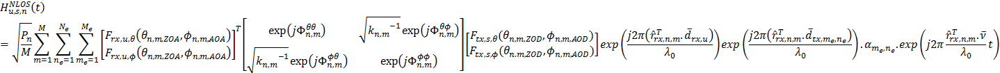{width="5.632209098862642in"
height="2.9015879265091864in"}

**Figure A.5.5.1.8.1-1: SNR variation for CSI-RS in-sync testing**

##### A.5.5.1.8.2 Test Requirements

The UE behaviour in each test during time durations T1, T2, T3, T4 and
T5 shall be as follows:

During the period from time point A to time point F (D1 second after the
start of time duration T5) the UE shall transmit uplink signal at least
in all uplink slots configured for CSI transmission according to the
configured periodic CSI reporting on the PSCell.

The rate of correct events observed during repeated tests shall be at
least 90%.

#### A.5.5.1.9 EN-DC Radio Link Monitoring UE Scheduling Restrictions on FR2

##### A.5.5.1.9.1 Test Purpose and Environment

The purpose is to verify that the NR UE correctly follows the RLM
scheduling restrictions requirements defined in clause 8.1.7. This test
verifies that the UE correctly receive the PDCCH scheduled on the
symbols right before the RLM SSB symbols without overlap so that it
sends ACK/NACK correctly. The test case is only applicable to UE which
supports pdcch-MonitoringAnyOccasions or
pdcch-MonitoringAnyOccasionsWithSpanGap.

Two cells are deployed in the test, which are E-UTRAN PCell (Cell 1) and
NR FR2 PSCell (Cell 2). The test parameters for NR PSCell are given in
table A.5.5.1.9.1-1, table A.5.5.1.9.1-2 and table A.5.5.1.9.1-3 below
and the parameters and applicability for the E-UTRAN cell are defined in
A.3.7.2. The UE is required during time period T1 to transmit ACK/NACK
correctly upon scheduling of PDSCH.

Table A.5.5.1.9.1-1: Supported test configurations

  Configuration                                                                             Description
  ----------------------------------------------------------------------------------------- -------------------------------------------------------------------------------
  1                                                                                         FDD LTE, 120 kHz SSB SCS, 120 kHz RMC SCS, 100 MHz bandwidth, TDD duplex mode
  2                                                                                         TDD LTE, 120 kHz SSB SCS, 120 kHz RMC SCS, 100 MHz bandwidth, TDD duplex mode
  Note: The UE is only required to be tested in one of the supported test configurations.   

Table A.5.5.1.9.1-2: General test parameters for RLM scheduling
restriction test case in FR2

  **Parameter**           **Unit**   **Test configuration**   **Value**       **Comment**
  ----------------------- ---------- ------------------------ --------------- -------------------------------------------------------------
  **RF Channel Number**              1, 2                     **1 and 2**     1 for NR PSCell and 2 for LTE PCell
  SSB configuration                  1, 2                     **SSB.1 FR2**   
  SMTC configuration                 1, 2                     **SMTC.3**      
  DRX cycle length        s          1, 2                     OFF             
  T1                      s          1, 2                     5               During T1 the UE is required to correctly transmit ACK/NACK

Table A.5.5.1.9.1-3: Cell specific test parameters for RLM scheduling
restriction test case in FR2

+-------------+-------------+-------------+-------------+-------------+
| **          | **Unit**    | **Test      | **Cell 2**  |             |
| Parameter** |             | conf        |             |             |
|             |             | iguration** |             |             |
+=============+=============+=============+=============+=============+
| AoA setup   |             | 1, 2        | Setup 3     |             |
|             |             |             | defined in  |             |
|             |             |             | A.3.15.3    |             |
+-------------+-------------+-------------+-------------+-------------+
|             |             |             | **AoA1**    | **AoA2**    |
+-------------+-------------+-------------+-------------+-------------+
| Assumption  |             |             | Rough       | Rough       |
| for UE      |             |             |             |             |
| bea         |             |             |             |             |
| ms^Note\ 1^ |             |             |             |             |
+-------------+-------------+-------------+-------------+-------------+
| TDD         |             | 1, 2        | TDDConf.3.1 |             |
| co          |             |             |             |             |
| nfiguration |             |             |             |             |
+-------------+-------------+-------------+-------------+-------------+
| BW~channel~ | MHz         | 1, 2        | 100:        |             |
|             |             |             | N~RB,c~ =   |             |
|             |             |             | 66          |             |
+-------------+-------------+-------------+-------------+-------------+
| Data RBs    |             | 1, 2        | 24          |             |
| allocated   |             |             |             |             |
+-------------+-------------+-------------+-------------+-------------+
| PDSCH       |             | 1, 2        | SR.3.2 TDD  | Not sent    |
| Reference   |             |             |             |             |
| measurement |             |             |             |             |
| channel     |             |             |             |             |
+-------------+-------------+-------------+-------------+-------------+
| RMSI        |             | 1, 2        | CR.3.1 TDD  | Not sent    |
| CORESET RMC |             |             |             |             |
| co          |             |             |             |             |
| nfiguration |             |             |             |             |
+-------------+-------------+-------------+-------------+-------------+
| Dedicated   |             | 1, 2        | CCR.3.2 TDD | Not sent    |
| CORESET RMC |             |             |             |             |
| co          |             |             |             |             |
| nfiguration |             |             |             |             |
+-------------+-------------+-------------+-------------+-------------+
| TRS         |             | 1, 2        | TRS.2.1 TDD | TRS.2.2 TDD |
| co          |             |             |             |             |
| nfiguration |             |             |             |             |
+-------------+-------------+-------------+-------------+-------------+
| PDCCH/PDSCH |             | 1, 2        | TCI.State.2 | Not sent    |
| TCI state   |             |             |             |             |
+-------------+-------------+-------------+-------------+-------------+
| OCNG        |             | 1, 2        | OP.5        | Not sent    |
| Pattern     |             |             | defined in  |             |
|             |             |             | A.3.2.1     |             |
+-------------+-------------+-------------+-------------+-------------+
| Initial DL  |             | 1, 2        | DLBWP.0.1   |             |
| BWP         |             |             |             |             |
| co          |             |             |             |             |
| nfiguration |             |             |             |             |
+-------------+-------------+-------------+-------------+-------------+
| Initial UL  |             | 1, 2        | ULBWP.0.1   |             |
| BWP         |             |             |             |             |
| co          |             |             |             |             |
| nfiguration |             |             |             |             |
+-------------+-------------+-------------+-------------+-------------+
| RLM-RS      |             | 1, 2        | SSB with    | SSB with    |
|             |             |             | index 0     | index 1     |
+-------------+-------------+-------------+-------------+-------------+
|             | dBm/15kHz   | 1, 2        | -92.1       | -92.1       |
+-------------+-------------+-------------+-------------+-------------+
| ^Note2^     | dBm/SCS     | 1, 2        | -83.1       | -83.1       |
+-------------+-------------+-------------+-------------+-------------+
|             | dB          | 1, 2        | 2           | 2           |
+-------------+-------------+-------------+-------------+-------------+
| ~BB~        | dB          | 1, 2        | 1           | 1           |
| ^Note\ 4^   |             |             |             |             |
+-------------+-------------+-------------+-------------+-------------+
| SSB\_RP     | dBm/SCS     | 1, 2        | -81.1       | -81.1       |
| ^Note3^     |             |             |             |             |
+-------------+-------------+-------------+-------------+-------------+
| Io          | dBm/95.04   | 1, 2        | -54.35      | -54.35      |
|             | MHz         |             |             |             |
+-------------+-------------+-------------+-------------+-------------+
| Time        | 1, 2        | Defined in  |             |             |
| m           |             | Figure      |             |             |
| ultiplexing |             | A.          |             |             |
| of the      |             | 5.5.1.9.1-1 |             |             |
| downlink    |             |             |             |             |
| tr          |             |             |             |             |
| ansmissions |             |             |             |             |
| from each   |             |             |             |             |
| AoA         |             |             |             |             |
+-------------+-------------+-------------+-------------+-------------+
| Propagation |             | 1, 2        | AWGN        | AWGN        |
| Condition   |             |             |             |             |
+-------------+-------------+-------------+-------------+-------------+
| Note 1:     |             |             |             |             |
| Information |             |             |             |             |
| about types |             |             |             |             |
| of UE beam  |             |             |             |             |
| is given in |             |             |             |             |
| B.2.1.3,    |             |             |             |             |
| and does    |             |             |             |             |
| not limit   |             |             |             |             |
| UE          |             |             |             |             |
| imp         |             |             |             |             |
| lementation |             |             |             |             |
| or test     |             |             |             |             |
| system      |             |             |             |             |
| imp         |             |             |             |             |
| lementation |             |             |             |             |
|             |             |             |             |             |
| Note 2:     |             |             |             |             |
| I           |             |             |             |             |
| nterference |             |             |             |             |
| from other  |             |             |             |             |
| cells and   |             |             |             |             |
| noise       |             |             |             |             |
| sources not |             |             |             |             |
| specified   |             |             |             |             |
| in the test |             |             |             |             |
| is assumed  |             |             |             |             |
| to be       |             |             |             |             |
| constant    |             |             |             |             |
| over        |             |             |             |             |
| subcarriers |             |             |             |             |
| and time    |             |             |             |             |
| and shall   |             |             |             |             |
| be modelled |             |             |             |             |
| as AWGN of  |             |             |             |             |
| appropriate |             |             |             |             |
| power for   |             |             |             |             |
| to be       |             |             |             |             |
| fulfilled.  |             |             |             |             |
|             |             |             |             |             |
| Note 3:     |             |             |             |             |
| Es/Iot,     |             |             |             |             |
| SSB\_RP and |             |             |             |             |
| Io levels   |             |             |             |             |
| have been   |             |             |             |             |
| derived     |             |             |             |             |
| from other  |             |             |             |             |
| parameters  |             |             |             |             |
| for         |             |             |             |             |
| information |             |             |             |             |
| purposes.   |             |             |             |             |
| They are    |             |             |             |             |
| not         |             |             |             |             |
| settable    |             |             |             |             |
| parameters  |             |             |             |             |
| themselves. |             |             |             |             |
|             |             |             |             |             |
| Note 4:     |             |             |             |             |
| Calculation |             |             |             |             |
| of          |             |             |             |             |
| Es/Iot~BB~  |             |             |             |             |
| includes    |             |             |             |             |
| the effect  |             |             |             |             |
| of UE       |             |             |             |             |
| internal    |             |             |             |             |
| noise up to |             |             |             |             |
| the value   |             |             |             |             |
| assumed for |             |             |             |             |
| the         |             |             |             |             |
| associated  |             |             |             |             |
| Refsens     |             |             |             |             |
| requirement |             |             |             |             |
| in clause   |             |             |             |             |
| 7.3.2 of TS |             |             |             |             |
| 38.101-2    |             |             |             |             |
| \[19\], and |             |             |             |             |
| an          |             |             |             |             |
| allowance   |             |             |             |             |
| of 1dB for  |             |             |             |             |
| UE          |             |             |             |             |
| multi-band  |             |             |             |             |
| relaxation  |             |             |             |             |
| factor      |             |             |             |             |
| ΔMB~S~ from |             |             |             |             |
| TS 38.101-2 |             |             |             |             |
| \[19\]      |             |             |             |             |
| Table       |             |             |             |             |
| 6.2.1.3-4.  |             |             |             |             |
+-------------+-------------+-------------+-------------+-------------+

Figure A.5.5.1.9.1-1: Time multiplexed downlink transmissions

##### A.5.5.1.9.2 Test Requirements

The UE behaviour follows the requirements defined in clause 8.1.7.3.

The UE shall be continuously scheduled by PDCCH on the symbols right
before each SSB which is not covered by SMTC during the entire length of
T1. The UE shall transmit ACK/NACK for every scheduled PDCCH during the
time duration T1.

### A.5.5.2 Interruption

#### A.5.5.2.1 E-UTRAN -- NR FR2 interruptions at transitions between active and non-active during DRX in synchronous EN-DC

##### A.5.5.2.1.1 Test Purpose and Environment

The purpose of this test is to verify that when E-UTRA PCell is in DRX
and NR PSCell is in non-DRX, NR PSCell interruptions due to transitions
from active to non-active and from non-active to active during LTE PCell
DRX the UE missed ACK/NACK does not exceed the limits. This test will
verify the missed ACK/NACK rate for NR PSCell in EN-DC specified in
clause 8. 2.1.2. Supported test configurations are shown in table
A.5.5.2.**1.1**-1.

The general test parameters are given in Table A.5.5.2.**1.1**-2, and NR
cell specific test parameters are given in Table A.5.5.2.**1.1**-3 and
A.5.5.2.**1.1**-4. The E-UTRAN PCell DRX configuration parameters are
given in Table A.5.5.2.**1.1**-5 below. And the E-UTRAN cell specific
test parameters can refer to Table A.3.7.2.2-1. In the test there are
two cells: Cell1 and Cell2. Cell1 is LTE PCell on and Cell2 is NR FR2
PSCell. The test consists of one time period, with duration of T1.
During T1, NR PSCell is continuously scheduled in DL while LTE PCell is
not scheduled and has DRX configured. Prior to the start of the time
duration T1, Cell1 shall be configured as LTE PCell and Cell2 shall be
configured as NR PSCell. Prior to start of T1 the DRX inactivity timer
for the LTE PCell has already expired. During T1 the UE shall be
continuously scheduled on NR PSCell while not scheduled on LTE PCell.
PDCCH indicating a new transmission on PSCell shall be sent continuously
during the entire time duration to ensure UE would not enter DRX state
on PSCell.

Table A.5.5.2.**1.1**-1: Interruption at transitions between active and
non-active during DRX supported test configurations

  Config                                                                                   Description
  ---------------------------------------------------------------------------------------- -----------------------------------------------------------------
  1                                                                                        LTE FDD, NR 120 kHz SSB SCS, 100 MHz bandwidth, TDD duplex mode
  2                                                                                        LTE TDD, NR 120 kHz SSB SCS, 100 MHz bandwidth, TDD duplex mode
  Note: The UE is only required to be tested in one of the supported test configurations   

Table A.5.5.2.**1.1**-2: General test parameters for E-UTRAN -- NR FR2
interruptions at transitions between active and non-active during DRX in
synchronous EN-DC

  ---------------------------- ------ -------- ----------------------------------------------------------
  Parameter                    Unit   Value    Comment
  RF Channel Number                   1, 2     One is E-UTRAN RF channel and the other is NR RF channel
  Active PCell                        Cell1    PCell on E-UTRAN RF channel number 1.
  Configured PSCell                   Cell2    PSCell on NR RF channel number 2.
  CP length                           Normal   Applicable to cell1 and cell 2
  DRX                                 DRX.4    DRX related parameters are defined in Table A.3.3.4-1
  Measurement gap pattern Id          OFF      
  T1                           s      6.25     
  ---------------------------- ------ -------- ----------------------------------------------------------

Table A.5.5.2.**1.1**-3: NR cell specific test parameters for E-UTRAN --
NR FR2 interruptions at transitions between active and non-active during
DRX in synchronous EN-DC

+--------------------+------------+-----------+-------------------+
| Parameter          | Unit       | Cell 2    |                   |
+====================+============+===========+===================+
| Frequency Range    |            | FR2       |                   |
+--------------------+------------+-----------+-------------------+
| Duplex mode        | Config 1,2 |           | TDD               |
+--------------------+------------+-----------+-------------------+
| TDD configuration  | Config 1,2 |           | TDDConf.3.1       |
+--------------------+------------+-----------+-------------------+
| BW~channel~        | Config 1,2 | MHz       | 100: N~RB,c~ = 66 |
+--------------------+------------+-----------+-------------------+
| Data RBs allocated | Config 1,2 |           | 66                |
+--------------------+------------+-----------+-------------------+
| Downlink initial   | Config 1,2 |           | DLBWP.0.1         |
| BWP Configuration  |            |           |                   |
+--------------------+------------+-----------+-------------------+
| Downlink dedicated | Config 1,2 |           | DLBWP.1.1         |
| BWP Configuration  |            |           |                   |
+--------------------+------------+-----------+-------------------+
| Uplink initial BWP | Config 1,2 |           | ULBWP.0.1         |
| configuration      |            |           |                   |
+--------------------+------------+-----------+-------------------+
| Uplink dedicated   | Config 1,2 |           | ULBWP.1.1         |
| BWP configuration  |            |           |                   |
+--------------------+------------+-----------+-------------------+
| TRS configuration  | Config 1,2 |           | TRS.2.1 TDD       |
+--------------------+------------+-----------+-------------------+
| TCI state          | Config 1,2 |           | TCI.State.0       |
+--------------------+------------+-----------+-------------------+
| PDSCH Reference    | Config 1,2 |           | SR.3.1 TDD        |
| measurement        |            |           |                   |
| channel            |            |           |                   |
+--------------------+------------+-----------+-------------------+
| RMSI CORESET       | Config 1,2 |           | CR.3.1 TDD        |
| Reference Channel  |            |           |                   |
+--------------------+------------+-----------+-------------------+
| RMC CORESET        | Config 1,2 |           | CCR.3.1 TDD       |
| Reference Channel  |            |           |                   |
+--------------------+------------+-----------+-------------------+
| **OCNG Patterns**  |            | OP.1      |                   |
+--------------------+------------+-----------+-------------------+
| > **SSB            |            | SSB.3 FR2 |                   |
| > Configuration**  |            |           |                   |
+--------------------+------------+-----------+-------------------+
| **SMTC             | Config 1,2 |           | SMTC.1            |
| Configuration**    |            |           |                   |
+--------------------+------------+-----------+-------------------+
| EPRE ratio of PSS  | dB         | 0         |                   |
| to SSS             |            |           |                   |
+--------------------+------------+-----------+-------------------+
| EPRE ratio of PBCH |            |           |                   |
| DMRS to SSS        |            |           |                   |
+--------------------+------------+-----------+-------------------+
| EPRE ratio of PBCH |            |           |                   |
| to PBCH DMRS       |            |           |                   |
+--------------------+------------+-----------+-------------------+
| EPRE ratio of      |            |           |                   |
| PDCCH DMRS to SSS  |            |           |                   |
+--------------------+------------+-----------+-------------------+
| EPRE ratio of      |            |           |                   |
| PDCCH to PDCCH     |            |           |                   |
| DMRS               |            |           |                   |
+--------------------+------------+-----------+-------------------+
| EPRE ratio of      |            |           |                   |
| PDSCH DMRS to SSS  |            |           |                   |
+--------------------+------------+-----------+-------------------+
| EPRE ratio of      |            |           |                   |
| PDSCH to PDSCH     |            |           |                   |
+--------------------+------------+-----------+-------------------+
| EPRE ratio of OCNG |            |           |                   |
| DMRS to SSS(Note   |            |           |                   |
| 1)                 |            |           |                   |
+--------------------+------------+-----------+-------------------+
| EPRE ratio of OCNG |            |           |                   |
| to OCNG DMRS (Note |            |           |                   |
| 1)                 |            |           |                   |
+--------------------+------------+-----------+-------------------+
| Ê~s~/N~oc~         | dB         | > 17      |                   |
+--------------------+------------+-----------+-------------------+
| Propagation        |            | AWGN      |                   |
| Condition          |            |           |                   |
+--------------------+------------+-----------+-------------------+
| Time offset to     | **μs**     | 3         |                   |
| cell1 ^Note\ 2^    |            |           |                   |
+--------------------+------------+-----------+-------------------+
| Note 1: OCNG shall |            |           |                   |
| be used such that  |            |           |                   |
| both cells are     |            |           |                   |
| fully allocated    |            |           |                   |
| and a constant     |            |           |                   |
| total transmitted  |            |           |                   |
| power spectral     |            |           |                   |
| density is         |            |           |                   |
| achieved for all   |            |           |                   |
| OFDM symbols.      |            |           |                   |
|                    |            |           |                   |
| Note 2: Receive    |            |           |                   |
| time difference of |            |           |                   |
| signals received   |            |           |                   |
| between subframe   |            |           |                   |
| timing boundary of |            |           |                   |
| E-UTRA PCell and   |            |           |                   |
| slot timing        |            |           |                   |
| boundary of PSCell |            |           |                   |
| including time     |            |           |                   |
| alignment error    |            |           |                   |
| between the two    |            |           |                   |
| cells              |            |           |                   |
+--------------------+------------+-----------+-------------------+

Table A.5.5.2.**1.1**-4: NR cell specific OTA related test parameters
for E-UTRAN -- NR FR2 interruptions at transitions between active and
non-active during DRX in synchronous EN-DC

+----------------------+----------------------+----------------------+
| Parameter            | Unit                 | Cell2                |
+======================+======================+======================+
| Angle of arrival     |                      | Setup 1 according to |
| configuration        |                      | clause A.3.15.1      |
+----------------------+----------------------+----------------------+
| Assumption for UE    |                      | Fine                 |
| beams^Note\ 6^       |                      |                      |
+----------------------+----------------------+----------------------+
| ^Note1^              | dBm/15kHz^Note4^     | -112                 |
+----------------------+----------------------+----------------------+
| ^Note1^              | dBm/SCS^Note3^       | -102.97              |
+----------------------+----------------------+----------------------+
|                      | dB                   | 17                   |
+----------------------+----------------------+----------------------+
| SSB\_RP^Note2^       | dBm/SCS ^Note4^      | -85.97               |
+----------------------+----------------------+----------------------+
|                      | dB                   | 17                   |
+----------------------+----------------------+----------------------+
| Io^Note2^            | dBm/95.04 MHz        | -56.90               |
|                      | ^Note4^              |                      |
+----------------------+----------------------+----------------------+
| Note 1: Interference |                      |                      |
| from other cells and |                      |                      |
| noise sources not    |                      |                      |
| specified in the     |                      |                      |
| test is assumed to   |                      |                      |
| be constant over     |                      |                      |
| subcarriers and time |                      |                      |
| and shall be         |                      |                      |
| modelled as AWGN of  |                      |                      |
| appropriate power    |                      |                      |
| for to be fulfilled. |                      |                      |
|                      |                      |                      |
| Note 2: SSB\_RP and  |                      |                      |
| Io levels have been  |                      |                      |
| derived from other   |                      |                      |
| parameters for       |                      |                      |
| information          |                      |                      |
| purposes. They are   |                      |                      |
| not settable         |                      |                      |
| parameters           |                      |                      |
| themselves.          |                      |                      |
|                      |                      |                      |
| Note 3: SS-RSRP      |                      |                      |
| minimum requirements |                      |                      |
| are specified        |                      |                      |
| assuming independent |                      |                      |
| interference and     |                      |                      |
| noise at each        |                      |                      |
| receiver antenna     |                      |                      |
| port.                |                      |                      |
|                      |                      |                      |
| Note 4: Equivalent   |                      |                      |
| power received by an |                      |                      |
| antenna with 0dBi    |                      |                      |
| gain at the centre   |                      |                      |
| of the quiet zone    |                      |                      |
|                      |                      |                      |
| Note 5: As observed  |                      |                      |
| with 0dBi gain       |                      |                      |
| antenna at the       |                      |                      |
| centre of the quiet  |                      |                      |
| zone                 |                      |                      |
|                      |                      |                      |
| Note 6: Information  |                      |                      |
| about types of UE    |                      |                      |
| beam is given in     |                      |                      |
| B.2.1.3, and does    |                      |                      |
| not limit UE         |                      |                      |
| implementation or    |                      |                      |
| test system          |                      |                      |
| implementation       |                      |                      |
+----------------------+----------------------+----------------------+

Table A.5.5.2.**1.1**-5: Void

##### A.5.5.2.1.2 Test Requirements

The UE shall be continuously scheduled in NR PSCell during the entire
length of T1. UE shall not be scheduled in LTE PCell during T1. During
the time duration T1 the UE shall transmit at least 99% of ACK/NACK on
NR PSCell.

Interruption on NR PSCell shall not exceed 0.625ms (5 slots) as defined
in clause 8. 2.1.

The rate of correct events observed during repeated tests shall be at
least 90%.

#### A.5.5.2.2 E-UTRAN -- NR FR2 interruptions at transitions between active and non-active during DRX in asynchronous EN-DC

##### A.5.5.2.2.1 Test Purpose and Environment

The purpose of this test is to verify that when LTE PCell is in DRX and
NR PSCell is in non-DRX, NR PSCell interruptions due to transitions from
active to non-active and from non-active to active during LTE PCell DRX
the UE missed ACK/NACK does not exceed the limits. This test will verify
the missed ACK/NACK rate for NR PSCell in EN-DC specified in clause 8.
2.1.2. Supported test configurations are shown in table
A.5.5.2.**2.1**-1.

The general test parameters are given in Table A.5.5.2.**2.1**-2, and NR
cell specific test parameters are given in Table A.5.5.2.**2.1**-3 and
A.5.5.2.**2.1**-4. The E-UTRAN PCell DRX configuration parameters are
given in Table A.5.5.2.**2.1**-5 below. And the E-UTRAN cell specific
test parameters can refer to Table A.3.7.2.2-1. In the test there are
two cells: Cell1 and Cell2. Cell1 is LTE PCell and Cell2 is NR PSCell.
The test consists of one time period, with duration of T1. During T1, NR
PSCell is continuously scheduled in DL while LTE PCell is not scheduled
and has DRX configured. Prior to the start of the time duration T1,
Cell1 shall be configured as LTE PCell and Cell2 shall be configured as
NR PSCell. Prior to start of T1 the DRX inactivity timer for the LTE
PCell has already expired. During T1 the UE shall be continuously
scheduled on NR PSCell while not scheduled on LTE PCell. PDCCH
indicating a new transmission on PSCell shall be sent continuously
during the entire time duration to ensure UE would not enter DRX state
on PSCell.

Table A.5.5.2.**2.1**-1: Interruption at transitions between active and
non-active during DRX supported test configurations

  Config                                                                                   Description
  ---------------------------------------------------------------------------------------- -----------------------------------------------------------------
  1                                                                                        LTE FDD, NR 120 kHz SSB SCS, 100 MHz bandwidth, TDD duplex mode
  2                                                                                        LTE TDD, NR 120 kHz SSB SCS, 100 MHz bandwidth, TDD duplex mode
  Note: The UE is only required to be tested in one of the supported test configurations   

Table A.5.5.2.**2.1**-2: General test parameters for E-UTRAN -- NR FR2
interruptions at transitions between active and non-active during DRX in
asynchronous EN-DC

  ---------------------------- ------ -------- ----------------------------------------------------------
  Parameter                    Unit   Value    Comment
  RF Channel Number                   1, 2     One is E-UTRAN RF channel and the other is NR RF channel
  Active PCell                        Cell1    PCell on E-UTRAN RF channel number 1.
  Configured PSCell                   Cell2    PSCell on NR RF channel number 2.
  CP length                           Normal   Applicable to cell1 and cell 2
  DRX                                 DRX.6    DRX related parameters are defined in Table A.3.3.6-1
  Measurement gap pattern Id          OFF      
  T1                           s      6.25     
  ---------------------------- ------ -------- ----------------------------------------------------------

Table A.5.5.2.**2.1**-3: NR cell specific test parameters for E-UTRAN --
NR FR2 interruptions at transitions between active and non-active during
DRX in asynchronous EN-DC

+--------------------+------------+-----------+-------------------+
| Parameter          | Unit       | Cell 2    |                   |
+====================+============+===========+===================+
| Frequency Range    |            | FR2       |                   |
+--------------------+------------+-----------+-------------------+
| Duplex mode        | Config 1,2 |           | TDD               |
+--------------------+------------+-----------+-------------------+
| TDD configuration  | Config 1,2 |           | > TDDConf.3.1     |
+--------------------+------------+-----------+-------------------+
| BW~channel~        | Config 1,2 | MHz       | 100: N~RB,c~ = 66 |
+--------------------+------------+-----------+-------------------+
| Data RBs allocated | Config 1,2 |           | 66                |
+--------------------+------------+-----------+-------------------+
| Downlink initial   | Config 1,2 |           | DLBWP.0.1         |
| BWP Configuration  |            |           |                   |
+--------------------+------------+-----------+-------------------+
| Downlink dedicated | Config 1,2 |           | DLBWP.1.1         |
| BWP Configuration  |            |           |                   |
+--------------------+------------+-----------+-------------------+
| Uplink initial BWP | Config 1,2 |           | ULBWP.0.1         |
| configuration      |            |           |                   |
+--------------------+------------+-----------+-------------------+
| Uplink dedicated   | Config 1,2 |           | ULBWP.1.1         |
| BWP configuration  |            |           |                   |
+--------------------+------------+-----------+-------------------+
| TRS configuration  | Config 1,2 |           | TRS.2.1 TDD       |
+--------------------+------------+-----------+-------------------+
| TCI state          | Config 1,2 |           | TCI.State.0       |
+--------------------+------------+-----------+-------------------+
| PDSCH Reference    | Config 1,2 |           | SR.3.1 TDD        |
| measurement        |            |           |                   |
| channel            |            |           |                   |
+--------------------+------------+-----------+-------------------+
| RMSI CORESET       | Config 1,2 |           | CR.3.1 TDD        |
| Reference Channel  |            |           |                   |
+--------------------+------------+-----------+-------------------+
| RMC CORESET        | Config 1,2 |           | CCR.3.1 TDD       |
| Reference Channel  |            |           |                   |
+--------------------+------------+-----------+-------------------+
| **OCNG Patterns**  |            | OP.1      |                   |
+--------------------+------------+-----------+-------------------+
| **SSB              |            | SSB.3 FR2 |                   |
| Configuration**    |            |           |                   |
+--------------------+------------+-----------+-------------------+
| **SMTC             | Config 1,2 |           | SMTC.1            |
| Configuration**    |            |           |                   |
+--------------------+------------+-----------+-------------------+
| EPRE ratio of PSS  | dB         | 0         |                   |
| to SSS             |            |           |                   |
+--------------------+------------+-----------+-------------------+
| EPRE ratio of PBCH |            |           |                   |
| DMRS to SSS        |            |           |                   |
+--------------------+------------+-----------+-------------------+
| EPRE ratio of PBCH |            |           |                   |
| to PBCH DMRS       |            |           |                   |
+--------------------+------------+-----------+-------------------+
| EPRE ratio of      |            |           |                   |
| PDCCH DMRS to SSS  |            |           |                   |
+--------------------+------------+-----------+-------------------+
| EPRE ratio of      |            |           |                   |
| PDCCH to PDCCH     |            |           |                   |
| DMRS               |            |           |                   |
+--------------------+------------+-----------+-------------------+
| EPRE ratio of      |            |           |                   |
| PDSCH DMRS to SSS  |            |           |                   |
+--------------------+------------+-----------+-------------------+
| EPRE ratio of      |            |           |                   |
| PDSCH to PDSCH     |            |           |                   |
+--------------------+------------+-----------+-------------------+
| EPRE ratio of OCNG |            |           |                   |
| DMRS to SSS(Note   |            |           |                   |
| 1)                 |            |           |                   |
+--------------------+------------+-----------+-------------------+
| EPRE ratio of OCNG |            |           |                   |
| to OCNG DMRS (Note |            |           |                   |
| 1)                 |            |           |                   |
+--------------------+------------+-----------+-------------------+
| Ê~s~/N~oc~         | dB         | > 17      |                   |
+--------------------+------------+-----------+-------------------+
| Propagation        |            | AWGN      |                   |
| Condition          |            |           |                   |
+--------------------+------------+-----------+-------------------+
| Time offset to     | **μs**     | 62.5      |                   |
| cell1 ^Note\ 2^    |            |           |                   |
+--------------------+------------+-----------+-------------------+
| Note 1: OCNG shall |            |           |                   |
| be used such that  |            |           |                   |
| both cells are     |            |           |                   |
| fully allocated    |            |           |                   |
| and a constant     |            |           |                   |
| total transmitted  |            |           |                   |
| power spectral     |            |           |                   |
| density is         |            |           |                   |
| achieved for all   |            |           |                   |
| OFDM symbols.      |            |           |                   |
|                    |            |           |                   |
| Note 2: Receive    |            |           |                   |
| time difference of |            |           |                   |
| signals received   |            |           |                   |
| between subframe   |            |           |                   |
| timing boundary of |            |           |                   |
| E-UTRA PCell and   |            |           |                   |
| slot timing        |            |           |                   |
| boundary of PSCell |            |           |                   |
| including time     |            |           |                   |
| alignment error    |            |           |                   |
| between the two    |            |           |                   |
| cells              |            |           |                   |
+--------------------+------------+-----------+-------------------+

Table A.5.5.2.**2.1**-4: NR cell specific OTA related test parameters
for E-UTRAN -- NR FR2 interruptions at transitions between active and
non-active during DRX in asynchronous EN-DC

+----------------------+----------------------+----------------------+
| Parameter            | Unit                 | Cell2                |
+======================+======================+======================+
| Angle of arrival     |                      | Setup 1 according to |
| configuration        |                      | clause A.3.15.1      |
+----------------------+----------------------+----------------------+
| Assumption for UE    |                      | Fine                 |
| beams^Note\ 6^       |                      |                      |
+----------------------+----------------------+----------------------+
| ^Note1^              | dBm/15kHz^Note4^     | -112                 |
+----------------------+----------------------+----------------------+
| ^Note1^              | dBm/SCS^Note3^       | -102.97              |
+----------------------+----------------------+----------------------+
|                      | dB                   | 17                   |
+----------------------+----------------------+----------------------+
| SSB\_RP^Note2^       | dBm/SCS ^Note4^      | -85.97               |
+----------------------+----------------------+----------------------+
|                      | dB                   | 17                   |
+----------------------+----------------------+----------------------+
| Io^Note2^            | dBm/95.04 MHz        | -56.90               |
|                      | ^Note4^              |                      |
+----------------------+----------------------+----------------------+
| Note 1: Interference |                      |                      |
| from other cells and |                      |                      |
| noise sources not    |                      |                      |
| specified in the     |                      |                      |
| test is assumed to   |                      |                      |
| be constant over     |                      |                      |
| subcarriers and time |                      |                      |
| and shall be         |                      |                      |
| modelled as AWGN of  |                      |                      |
| appropriate power    |                      |                      |
| for to be fulfilled. |                      |                      |
|                      |                      |                      |
| Note 2: SSB\_RP and  |                      |                      |
| Io levels have been  |                      |                      |
| derived from other   |                      |                      |
| parameters for       |                      |                      |
| information          |                      |                      |
| purposes. They are   |                      |                      |
| not settable         |                      |                      |
| parameters           |                      |                      |
| themselves.          |                      |                      |
|                      |                      |                      |
| Note 3: SS-RSRP      |                      |                      |
| minimum requirements |                      |                      |
| are specified        |                      |                      |
| assuming independent |                      |                      |
| interference and     |                      |                      |
| noise at each        |                      |                      |
| receiver antenna     |                      |                      |
| port.                |                      |                      |
|                      |                      |                      |
| Note 4: Equivalent   |                      |                      |
| power received by an |                      |                      |
| antenna with 0dBi    |                      |                      |
| gain at the centre   |                      |                      |
| of the quiet zone    |                      |                      |
|                      |                      |                      |
| Note 5: As observed  |                      |                      |
| with 0dBi gain       |                      |                      |
| antenna at the       |                      |                      |
| centre of the quiet  |                      |                      |
| zone                 |                      |                      |
|                      |                      |                      |
| Note 6: Information  |                      |                      |
| about types of UE    |                      |                      |
| beam is given in     |                      |                      |
| B.2.1.3, and does    |                      |                      |
| not limit UE         |                      |                      |
| implementation or    |                      |                      |
| test system          |                      |                      |
| implementation       |                      |                      |
+----------------------+----------------------+----------------------+

Table A.5.5.2.**2.1**-5: Void

##### A.5.5.2.2.2 Test Requirements

The UE shall be continuously scheduled in NR PSCell during the entire
length of T1. UE shall not be scheduled in LTE PCell during T1. During
the time duration T1 the UE shall transmit at least 99% of ACK/NACK on
NR PSCell.

Interruption on NR PSCell shall not exceed 0.625ms (5 slots) as defined
in clause 8. 2.1.

The rate of correct events observed during repeated tests shall be at
least 90%.

#### **A.5.5.2.3** E-UTRAN -- NR FR2 interruptions during measurements on deactivated NR SCC in synchronous EN-DC

##### A.5.5.2.3.1 Test Purpose and Environment

The purpose of this test is to verify that for NR PSCell interruptions
during the measurement on the deactivated NR SCC, the UE missed ACK/NACK
does not exceed the limits. This test will verify the missed ACK/NACK
rate for NR PSCell in EN-DC specified in clause 8. 2.1.2. Supported test
configurations are shown in table **A.5.5.2.3.1-1**.

The general test parameters are given in Table **A.5.5.2.3.1-2,** and NR
cell specific test parameters are given in Table **A.5.5.2.3.1-3** and
**A.5.5.2.3.1-4** below. The E-UTRAN cell specific test parameters can
be found in Table A.3.7.2.1-2. In the test there are three cells: Cell1,
Cell2 and Cell3. Cell1 is LTE PCell, Cell2 and Cell 3 are NR FR2 PSCell
and NR FR2 deactivated SCell, respectively. Cell1 shall be configured as
LTE PCell and Cell2 shall be configured as NR PSCell. The test consists
of one time period, with duration of T1. Prior to the start of the time
duration T1, the UE is connected to Cell1 and Cell2. The point in time
at which the RRC message including *measCycleSCell* for the deactivated
NR SCells is received by the UE, defines the start of time period T1.
During T1, LTE PCell and NR PSCell are continuously scheduled in DL.

Table A.5.5.2.**3.1**-1: Interruption during measurements on deactivated
NR SCC supported test configurations

  Config                                                                                   Description
  ---------------------------------------------------------------------------------------- -----------------------------------------------------------------
  1                                                                                        LTE FDD, NR 120 kHz SSB SCS, 100 MHz bandwidth, TDD duplex mode
  2                                                                                        LTE TDD, NR 120 kHz SSB SCS, 100 MHz bandwidth, TDD duplex mode
  Note: The UE is only required to be tested in one of the supported test configurations   

Table A.5.5.2.**3.1**-2: General test parameters for E-UTRAN -- NR FR2
interruptions during measurements on deactivated NR SCC in synchronous
EN-DC

  ------------------------------------------ ------ --------- ----------------------------------------------------------------
  Parameter                                  Unit   Value     Comment
  RF Channel Number                                 1, 2, 3   One is E-UTRAN RF channel and the other two are NR RF channels
  Active PCell                                      Cell1     PCell on E-UTRAN RF channel number 1.
  Configured PSCell                                 Cell2     PSCell on NR RF channel number 2.
  Configured deactivated SCell                      Cell3     Deactivated SCell on NR RF channel number 3.
  CP length                                         Normal    Applicable to cell1, cell 2 and cell3
  AoA number                                        1         Applicable to cell2 and cell3
  DRX                                               OFF       
  Measurement gap pattern Id                        OFF       
  SCell measurement cycle (measCycleSCell)   ms     640       
  ------------------------------------------ ------ --------- ----------------------------------------------------------------

Table A.5.5.2.**3.1**-3: NR cell specific test parameters for E-UTRAN --
NR FR2 interruptions during measurements on deactivated NR SCC in
synchronous EN-DC

+---------------+------------+--------+---------------+---------------+
| Parameter     | Unit       | Cell 2 | Cell 3        |               |
+===============+============+========+===============+===============+
| Frequency     |            | FR2    | FR2           |               |
| Range         |            |        |               |               |
+---------------+------------+--------+---------------+---------------+
| Duplex mode   | Config 1,2 |        | TDD           | TDD           |
+---------------+------------+--------+---------------+---------------+
| TDD           | Config 1,2 |        | TDDConf.3.1   | TDDConf.3.1   |
| configuration |            |        |               |               |
+---------------+------------+--------+---------------+---------------+
| BW~channel~   | Config 1,2 | MHz    | 100: N~RB,c~  | 100: N~RB,c~  |
|               |            |        | = 66          | = 66          |
+---------------+------------+--------+---------------+---------------+
| Data RBs      | Config 1,2 |        | 66            | 66            |
| allocated     |            |        |               |               |
+---------------+------------+--------+---------------+---------------+
| Downlink      | Config 1,2 |        | DLBWP.0.1     | DLBWP.0.1     |
| initial BWP   |            |        |               |               |
| Configuration |            |        |               |               |
+---------------+------------+--------+---------------+---------------+
| Downlink      | Config 1,2 |        | DLBWP.1.1     | DLBWP.1.1     |
| dedicated BWP |            |        |               |               |
| Configuration |            |        |               |               |
+---------------+------------+--------+---------------+---------------+
| Uplink        | Config 1,2 |        | ULBWP.0.1     | ULBWP.0.1     |
| initial BWP   |            |        |               |               |
| configuration |            |        |               |               |
+---------------+------------+--------+---------------+---------------+
| Uplink        | Config 1,2 |        | ULBWP.1.1     | ULBWP.1.1     |
| dedicated BWP |            |        |               |               |
| configuration |            |        |               |               |
+---------------+------------+--------+---------------+---------------+
| PDSCH         | Config 1,2 |        | SR.3.1 TDD    | \-            |
| Reference     |            |        |               |               |
| measurement   |            |        |               |               |
| channel       |            |        |               |               |
+---------------+------------+--------+---------------+---------------+
| RMSI CORESET  | Config 1,2 |        | CR.3.1 TDD    | CR.3.1 TDD    |
| Reference     |            |        |               |               |
| Channel       |            |        |               |               |
+---------------+------------+--------+---------------+---------------+
| PDCCH CORESET | Config 1,2 |        | CCR 3.1 TDD   | CCR 3.1 TDD   |
| parameters    |            |        |               |               |
+---------------+------------+--------+---------------+---------------+
| **OCNG        |            | OP.1   | OP.1          |               |
| Patterns**    |            |        |               |               |
+---------------+------------+--------+---------------+---------------+
| **SSB         | Config 1,2 |        | SSB.1 FR2     | SSB.1 FR2     |
| Co            |            |        |               |               |
| nfiguration** |            |        |               |               |
+---------------+------------+--------+---------------+---------------+
| **SMTC        | Config 1,2 |        | SMTC.1        | SMTC.1        |
| Co            |            |        |               |               |
| nfiguration** |            |        |               |               |
+---------------+------------+--------+---------------+---------------+
| TRS           | Config 1,2 |        | TRS.2.1 TDD   | TRS.2.1 TDD   |
| configuration |            |        |               |               |
+---------------+------------+--------+---------------+---------------+
| TCI state     | Config 1,2 |        | TCI.State.0   | TCI.State.0   |
+---------------+------------+--------+---------------+---------------+
| EPRE ratio of | dB         | 0      | 0             |               |
| PSS to SSS    |            |        |               |               |
+---------------+------------+--------+---------------+---------------+
| EPRE ratio of |            |        |               |               |
| PBCH DMRS to  |            |        |               |               |
| SSS           |            |        |               |               |
+---------------+------------+--------+---------------+---------------+
| EPRE ratio of |            |        |               |               |
| PBCH to PBCH  |            |        |               |               |
| DMRS          |            |        |               |               |
+---------------+------------+--------+---------------+---------------+
| EPRE ratio of |            |        |               |               |
| PDCCH DMRS to |            |        |               |               |
| SSS           |            |        |               |               |
+---------------+------------+--------+---------------+---------------+
| EPRE ratio of |            |        |               |               |
| PDCCH to      |            |        |               |               |
| PDCCH DMRS    |            |        |               |               |
+---------------+------------+--------+---------------+---------------+
| EPRE ratio of |            |        |               |               |
| PDSCH DMRS to |            |        |               |               |
| SSS           |            |        |               |               |
+---------------+------------+--------+---------------+---------------+
| EPRE ratio of |            |        |               |               |
| PDSCH to      |            |        |               |               |
| PDSCH         |            |        |               |               |
+---------------+------------+--------+---------------+---------------+
| EPRE ratio of |            |        |               |               |
| OCNG DMRS to  |            |        |               |               |
| SSS(Note 1)   |            |        |               |               |
+---------------+------------+--------+---------------+---------------+
| EPRE ratio of |            |        |               |               |
| OCNG to OCNG  |            |        |               |               |
| DMRS (Note 1) |            |        |               |               |
+---------------+------------+--------+---------------+---------------+
| Propagation   |            | AWGN   | AWGN          |               |
| Condition     |            |        |               |               |
+---------------+------------+--------+---------------+---------------+
| Time offset   | **μs**     | 3      | 3+ Time       |               |
| to cell1      |            |        | offset to     |               |
| ^Note\ 2^     |            |        | cell2         |               |
+---------------+------------+--------+---------------+---------------+
| Time offset   | **μs**     | \-     | 3             |               |
| to cell2      |            |        |               |               |
| ^Note\ 3^     |            |        |               |               |
+---------------+------------+--------+---------------+---------------+
| Note 1: OCNG  |            |        |               |               |
| shall be used |            |        |               |               |
| such that     |            |        |               |               |
| both cells    |            |        |               |               |
| are fully     |            |        |               |               |
| allocated and |            |        |               |               |
| a constant    |            |        |               |               |
| total         |            |        |               |               |
| transmitted   |            |        |               |               |
| power         |            |        |               |               |
| spectral      |            |        |               |               |
| density is    |            |        |               |               |
| achieved for  |            |        |               |               |
| all OFDM      |            |        |               |               |
| symbols.      |            |        |               |               |
|               |            |        |               |               |
| Note 2:       |            |        |               |               |
| Receive time  |            |        |               |               |
| difference of |            |        |               |               |
| signals       |            |        |               |               |
| received      |            |        |               |               |
| between       |            |        |               |               |
| subframe      |            |        |               |               |
| timing        |            |        |               |               |
| boundary of   |            |        |               |               |
| E-UTRA PCell  |            |        |               |               |
| and slot      |            |        |               |               |
| timing        |            |        |               |               |
| boundary of   |            |        |               |               |
| PSCell        |            |        |               |               |
| including     |            |        |               |               |
| time          |            |        |               |               |
| alignment     |            |        |               |               |
| error between |            |        |               |               |
| the two cells |            |        |               |               |
|               |            |        |               |               |
| Note 3:       |            |        |               |               |
| Receive time  |            |        |               |               |
| difference of |            |        |               |               |
| signals       |            |        |               |               |
| received      |            |        |               |               |
| between slot  |            |        |               |               |
| timing        |            |        |               |               |
| boundary from |            |        |               |               |
| two NR Cells  |            |        |               |               |
| including     |            |        |               |               |
| time          |            |        |               |               |
| alignment     |            |        |               |               |
| error between |            |        |               |               |
| the two cells |            |        |               |               |
+---------------+------------+--------+---------------+---------------+

Table A.5.5.2.**3.1**-4: NR cell specific OTA related test parameters
for E-UTRAN -- NR FR2 interruptions during measurements on deactivated
NR SCC in synchronous EN-DC

+---------------+---------------+---------------+------------+--------+
| **Parameter** | **Unit**      | **Cell 2**    | **Cell 3** |        |
+===============+===============+===============+============+========+
| Angle of      |               | Setup 1       |            |        |
| arrival       |               | defined in    |            |        |
| configuration |               | clause        |            |        |
|               |               | A.3.15.1      |            |        |
+---------------+---------------+---------------+------------+--------+
| Assumption    |               | Fine          | Rough      |        |
| for UE        |               |               |            |        |
| b             |               |               |            |        |
| eams^Note\ 6^ |               |               |            |        |
+---------------+---------------+---------------+------------+--------+
| ^Note1^       | NR            | dBm/15kHz     | -111.7     | -104.7 |
|               | \_TDD\_FR2\_A |               |            |        |
+---------------+---------------+---------------+------------+--------+
|               | NR            |               |            |        |
|               | \_TDD\_FR2\_B |               |            |        |
+---------------+---------------+---------------+------------+--------+
|               | NR            |               |            |        |
|               | \_TDD\_FR2\_F |               |            |        |
+---------------+---------------+---------------+------------+--------+
|               | NR            |               |            |        |
|               | \_TDD\_FR2\_G |               |            |        |
+---------------+---------------+---------------+------------+--------+
|               | NR            |               |            |        |
|               | \_TDD\_FR2\_T |               |            |        |
+---------------+---------------+---------------+------------+--------+
|               | NR            |               |            |        |
|               | \_TDD\_FR2\_Y |               |            |        |
+---------------+---------------+---------------+------------+--------+
| ^Note1^       | NR            | d             | -102.7     | -95.7  |
|               | \_TDD\_FR2\_A | Bm/SCS^Note3^ |            |        |
+---------------+---------------+---------------+------------+--------+
|               | NR            |               |            |        |
|               | \_TDD\_FR2\_B |               |            |        |
+---------------+---------------+---------------+------------+--------+
|               | NR            |               |            |        |
|               | \_TDD\_FR2\_F |               |            |        |
+---------------+---------------+---------------+------------+--------+
|               | NR            |               |            |        |
|               | \_TDD\_FR2\_G |               |            |        |
+---------------+---------------+---------------+------------+--------+
|               | NR            |               |            |        |
|               | \_TDD\_FR2\_T |               |            |        |
+---------------+---------------+---------------+------------+--------+
|               | NR            |               |            |        |
|               | \_TDD\_FR2\_Y |               |            |        |
+---------------+---------------+---------------+------------+--------+
| S             | NR            | dBm/SCS       | -90.7      | -90.7  |
| SB\_RP^Note2^ | \_TDD\_FR2\_A | ^Note4^       |            |        |
+---------------+---------------+---------------+------------+--------+
|               | NR            |               |            |        |
|               | \_TDD\_FR2\_B |               |            |        |
+---------------+---------------+---------------+------------+--------+
|               | NR            |               |            |        |
|               | \_TDD\_FR2\_F |               |            |        |
+---------------+---------------+---------------+------------+--------+
|               | NR            |               |            |        |
|               | \_TDD\_FR2\_G |               |            |        |
+---------------+---------------+---------------+------------+--------+
|               | NR            |               |            |        |
|               | \_TDD\_FR2\_T |               |            |        |
+---------------+---------------+---------------+------------+--------+
|               | NR            |               |            |        |
|               | \_TDD\_FR2\_Y |               |            |        |
+---------------+---------------+---------------+------------+--------+
|               | NR            | dB            | 12         | 5      |
|               | \_TDD\_FR2\_A |               |            |        |
+---------------+---------------+---------------+------------+--------+
|               | NR            |               |            |        |
|               | \_TDD\_FR2\_B |               |            |        |
+---------------+---------------+---------------+------------+--------+
|               | NR            |               |            |        |
|               | \_TDD\_FR2\_F |               |            |        |
+---------------+---------------+---------------+------------+--------+
|               | NR            |               |            |        |
|               | \_TDD\_FR2\_G |               |            |        |
+---------------+---------------+---------------+------------+--------+
|               | NR            |               |            |        |
|               | \_TDD\_FR2\_T |               |            |        |
+---------------+---------------+---------------+------------+--------+
|               | NR            |               |            |        |
|               | \_TDD\_FR2\_Y |               |            |        |
+---------------+---------------+---------------+------------+--------+
| Ê~s~/N~oc~    | NR            | dB            | 12         | 5      |
|               | \_TDD\_FR2\_A |               |            |        |
+---------------+---------------+---------------+------------+--------+
|               | NR            |               |            |        |
|               | \_TDD\_FR2\_B |               |            |        |
+---------------+---------------+---------------+------------+--------+
|               | NR            |               |            |        |
|               | \_TDD\_FR2\_F |               |            |        |
+---------------+---------------+---------------+------------+--------+
|               | NR            |               |            |        |
|               | \_TDD\_FR2\_G |               |            |        |
+---------------+---------------+---------------+------------+--------+
|               | NR            |               |            |        |
|               | \_TDD\_FR2\_T |               |            |        |
+---------------+---------------+---------------+------------+--------+
|               | NR            |               |            |        |
|               | \_TDD\_FR2\_Y |               |            |        |
+---------------+---------------+---------------+------------+--------+
| Io^Note2^     | NR            | dBm/95.04 MHz | -61.45     | -60.52 |
|               | \_TDD\_FR2\_A | ^Note4^       |            |        |
+---------------+---------------+---------------+------------+--------+
|               | NR            |               |            |        |
|               | \_TDD\_FR2\_B |               |            |        |
+---------------+---------------+---------------+------------+--------+
|               | NR            |               |            |        |
|               | \_TDD\_FR2\_F |               |            |        |
+---------------+---------------+---------------+------------+--------+
|               | NR            |               |            |        |
|               | \_TDD\_FR2\_G |               |            |        |
+---------------+---------------+---------------+------------+--------+
|               | NR            |               |            |        |
|               | \_TDD\_FR2\_T |               |            |        |
+---------------+---------------+---------------+------------+--------+
|               | NR            |               |            |        |
|               | \_TDD\_FR2\_Y |               |            |        |
+---------------+---------------+---------------+------------+--------+
| Note 1:       |               |               |            |        |
| Interference  |               |               |            |        |
| from other    |               |               |            |        |
| cells and     |               |               |            |        |
| noise sources |               |               |            |        |
| not specified |               |               |            |        |
| in the test   |               |               |            |        |
| is assumed to |               |               |            |        |
| be constant   |               |               |            |        |
| over          |               |               |            |        |
| subcarriers   |               |               |            |        |
| and time and  |               |               |            |        |
| shall be      |               |               |            |        |
| modelled as   |               |               |            |        |
| AWGN of       |               |               |            |        |
| appropriate   |               |               |            |        |
| power for to  |               |               |            |        |
| be fulfilled. |               |               |            |        |
|               |               |               |            |        |
| Note 2:       |               |               |            |        |
| SSB\_RP and   |               |               |            |        |
| Io levels     |               |               |            |        |
| have been     |               |               |            |        |
| derived from  |               |               |            |        |
| other         |               |               |            |        |
| parameters    |               |               |            |        |
| for           |               |               |            |        |
| information   |               |               |            |        |
| purposes.     |               |               |            |        |
| They are not  |               |               |            |        |
| settable      |               |               |            |        |
| parameters    |               |               |            |        |
| themselves.   |               |               |            |        |
|               |               |               |            |        |
| Note 3:       |               |               |            |        |
| SS-RSRP       |               |               |            |        |
| minimum       |               |               |            |        |
| requirements  |               |               |            |        |
| are specified |               |               |            |        |
| assuming      |               |               |            |        |
| independent   |               |               |            |        |
| interference  |               |               |            |        |
| and noise at  |               |               |            |        |
| each receiver |               |               |            |        |
| antenna port. |               |               |            |        |
|               |               |               |            |        |
| Note 4:       |               |               |            |        |
| Equivalent    |               |               |            |        |
| power         |               |               |            |        |
| received by   |               |               |            |        |
| an antenna    |               |               |            |        |
| with 0dBi     |               |               |            |        |
| gain at the   |               |               |            |        |
| centre of the |               |               |            |        |
| quiet zone    |               |               |            |        |
|               |               |               |            |        |
| Note 5: As    |               |               |            |        |
| observed with |               |               |            |        |
| 0dBi gain     |               |               |            |        |
| antenna at    |               |               |            |        |
| the centre of |               |               |            |        |
| the quiet     |               |               |            |        |
| zone          |               |               |            |        |
|               |               |               |            |        |
| Note 6:       |               |               |            |        |
| Information   |               |               |            |        |
| about types   |               |               |            |        |
| of UE beam is |               |               |            |        |
| given in      |               |               |            |        |
| B.2.1.3, and  |               |               |            |        |
| does not      |               |               |            |        |
| limit UE      |               |               |            |        |
| i             |               |               |            |        |
| mplementation |               |               |            |        |
| or test       |               |               |            |        |
| system        |               |               |            |        |
| i             |               |               |            |        |
| mplementation |               |               |            |        |
+---------------+---------------+---------------+------------+--------+

##### A.5.5.2.**3.2** Test Requirements

The UE shall be continuously scheduled in LTE PCell and NR PSCell during
the entire length of T1. During the time duration T1 the UE shall
transmit at least 99.5% of ACK/NACK on NR PSCell.

If the NR PSCell is not in the same band as the deactivated SCell, the
UE is only allowed to cause interruptions on NR PSCell immediately
before and immediately after an SMTC. Each interruption on NR PSCell
shall not exceed the value defined in Table **A.5.5.2.3**.2-1.

If the NR PSCell is in the same band as the deactivated SCell, the UE is
only allowed to cause an interruption on PSCell no earlier than 4 slot
before an SMTC and no later than 4 slot after the SMTC. the interruption
on NR PSCell shall not exceed the value defined in Table
**A.5.5.2.3**.2-2.

Table A.5.5.2.3.2-1: Interruption duration if the NR PSCell is not in
the same band as the deactivated SCell

+------------------------+---------------------+---------------------+
|  | Interruption length |
| a/image12.wmf){width=" |                     |                     |
| 0.15555555555555556in" |                     | (slot)              |
| height="0.175in"}      |                     |                     |
+========================+=====================+=====================+
| 3                      | 0.125               | 4                   |
+------------------------+---------------------+---------------------+

Table A.5.5.2.3.2-2: Interruption duration if the NR PSCell is in the
same band as the deactivated SCell

+------------------------+---------------------+---------------------+
|  | Interruption length |
| a/image12.wmf){width=" |                     |                     |
| 0.15555555555555556in" |                     | (slot)              |
| height="0.175in"}      |                     |                     |
+========================+=====================+=====================+
| 3                      | 0.125               | 8 + SMTC duration   |
+------------------------+---------------------+---------------------+

The rate of correct events observed during repeated tests shall be at
least 90%.

#### **A.5.5.2.4** E-UTRAN -- NR FR2 interruptions during measurements on deactivated NR SCC in asynchronous EN-DC

##### A.5.5.2.4.1 Test Purpose and Environment

The purpose of this test is to verify that for NR PSCell interruptions
during the measurement on the deactivated NR SCC, the UE missed ACK/NACK
does not exceed the limits. This test will verify the missed ACK/NACK
rate for NR PSCell in EN-DC specified in clause 8. 2.1.2. Supported test
configurations are shown in table **A.5.5.2.4.1-1**.

The general test parameters are given in Table **A.5.5.2.4.1-2,** and NR
cell specific test parameters are given in Table **A.5.5.2.4.1-3** and
**A.5.5.2.4.1-4** below. The E-UTRAN cell specific test parameters can
be found inTable A.3.7.2.1-2. In the test there are three cells: Cell1,
Cell2 and Cell3. Cell1 is LTE PCell, Cell2 and Cell 3 are NR FR2 PSCell
and NR FR2 deactivated SCell, respectively. Cell1 shall be configured as
LTE PCell and Cell2 shall be configured as NR PSCell. The test consists
of one time period, with duration of T1. Prior to the start of the time
duration T1, the UE is connected to Cell1 and Cell2. The point in time
at which the RRC message including *measCycleSCell* for the deactivated
NR SCells is received by the UE, defines the start of time period T1.
During T1, LTE PCell and NR PSCell are continuously scheduled in DL.

Table A.5.5.2.**4.1**-1: Interruption during measurements on deactivated
NR SCC supported test configurations

  Config                                                                                   Description
  ---------------------------------------------------------------------------------------- -----------------------------------------------------------------
  1                                                                                        LTE FDD, NR 120 kHz SSB SCS, 100 MHz bandwidth, TDD duplex mode
  2                                                                                        LTE TDD, NR 120 kHz SSB SCS, 100 MHz bandwidth, TDD duplex mode
  Note: The UE is only required to be tested in one of the supported test configurations   

Table A.5.5.2.**4.1**-2: General test parameters for E-UTRAN -- NR
interruptions during measurements on deactivated NR SCC in asynchronous
EN-DC

  ------------------------------------------ ------ -------- ---------------------------------------------------------------
  Parameter                                  Unit   Value    Comment
  RF Channel Number                                 1, 2     One is E-UTRAN RF channel and the other two are NR RF channel
  Active PCell                                      Cell1    PCell on E-UTRAN RF channel number 1.
  Configured PSCell                                 Cell2    PSCell on NR RF channel number 2.
  Configured deactivated SCell                      Cell3    Deactivated SCell on NR RF channel number 2.
  CP length                                         Normal   Applicable to cell1, cell 2 and cell3
  AoA number                                        1        Applicable to cell2 and cell3
  DRX                                               OFF      
  Measurement gap pattern Id                        OFF      
  SCell measurement cycle (measCycleSCell)   ms     640      
  T1                                         s      10       
  ------------------------------------------ ------ -------- ---------------------------------------------------------------

Table A.5.5.2.**4.1**-3: NR cell specific test parameters for E-UTRAN --
NR interruptions during measurements on deactivated NR SCC in
asynchronous EN-DC

+---------------+------------+--------+---------------+---------------+
| Parameter     | Unit       | Cell 2 | Cell 3        |               |
+===============+============+========+===============+===============+
| Frequency     |            | FR2    | FR2           |               |
| Range         |            |        |               |               |
+---------------+------------+--------+---------------+---------------+
| Duplex mode   | Config 1,2 |        | TDD           | TDD           |
+---------------+------------+--------+---------------+---------------+
| TDD           | Config 1,2 |        | TDDConf.3.1   | TDDConf.3.1   |
| configuration |            |        |               |               |
+---------------+------------+--------+---------------+---------------+
| BW~channel~   | Config 1,2 | MHz    | 100: N~RB,c~  | 100: N~RB,c~  |
|               |            |        | = 66          | = 66          |
+---------------+------------+--------+---------------+---------------+
| Data RBs      | Config 1,2 |        | 66            | 66            |
| allocated     |            |        |               |               |
+---------------+------------+--------+---------------+---------------+
| Downlink      | Config 1,2 |        | DLBWP.0.1     |               |
| initial BWP   |            |        |               |               |
| Configuration |            |        |               |               |
+---------------+------------+--------+---------------+---------------+
| Downlink      | Config 1,2 |        | DLBWP.1.1     |               |
| dedicated BWP |            |        |               |               |
| Configuration |            |        |               |               |
+---------------+------------+--------+---------------+---------------+
| Uplink        | Config 1,2 |        | ULBWP.0.1     |               |
| initial BWP   |            |        |               |               |
| configuration |            |        |               |               |
+---------------+------------+--------+---------------+---------------+
| Uplink        | Config 1,2 |        | ULBWP.1.1     |               |
| dedicated BWP |            |        |               |               |
| configuration |            |        |               |               |
+---------------+------------+--------+---------------+---------------+
| PDSCH         | Config 1,2 |        | SR.3.1 TDD    | \-            |
| Reference     |            |        |               |               |
| measurement   |            |        |               |               |
| channel       |            |        |               |               |
+---------------+------------+--------+---------------+---------------+
| RMSI CORESET  | Config 1,2 |        | CR.3.1 TDD    | CR.3.1 TDD    |
| Reference     |            |        |               |               |
| Channel       |            |        |               |               |
+---------------+------------+--------+---------------+---------------+
| PDCCH CORESET | Config 1,2 |        | CCR.3.1 TDD   | CCR.3.1 TDD   |
| parameters    |            |        |               |               |
+---------------+------------+--------+---------------+---------------+
| **OCNG        |            | OP.1   | OP.1          |               |
| Patterns**    |            |        |               |               |
+---------------+------------+--------+---------------+---------------+
| **SSB         |            |        | SSB.1 FR2     | SSB.1 FR2     |
| Co            |            |        |               |               |
| nfiguration** |            |        |               |               |
+---------------+------------+--------+---------------+---------------+
| **SMTC        | Config 1,2 |        | SMTC.1        | SMTC.1        |
| Co            |            |        |               |               |
| nfiguration** |            |        |               |               |
+---------------+------------+--------+---------------+---------------+
| TRS           | Config 1,2 |        | TRS.2.1 TDD   | TRS.2.1 TDD   |
| configuration |            |        |               |               |
+---------------+------------+--------+---------------+---------------+
| TCI state     | Config 1,2 |        | TCI.State.0   | TCI.State.0   |
+---------------+------------+--------+---------------+---------------+
| EPRE ratio of | dB         | 0      | 0             |               |
| PSS to SSS    |            |        |               |               |
+---------------+------------+--------+---------------+---------------+
| EPRE ratio of |            |        |               |               |
| PBCH DMRS to  |            |        |               |               |
| SSS           |            |        |               |               |
+---------------+------------+--------+---------------+---------------+
| EPRE ratio of |            |        |               |               |
| PBCH to PBCH  |            |        |               |               |
| DMRS          |            |        |               |               |
+---------------+------------+--------+---------------+---------------+
| EPRE ratio of |            |        |               |               |
| PDCCH DMRS to |            |        |               |               |
| SSS           |            |        |               |               |
+---------------+------------+--------+---------------+---------------+
| EPRE ratio of |            |        |               |               |
| PDCCH to      |            |        |               |               |
| PDCCH DMRS    |            |        |               |               |
+---------------+------------+--------+---------------+---------------+
| EPRE ratio of |            |        |               |               |
| PDSCH DMRS to |            |        |               |               |
| SSS           |            |        |               |               |
+---------------+------------+--------+---------------+---------------+
| EPRE ratio of |            |        |               |               |
| PDSCH to      |            |        |               |               |
| PDSCH         |            |        |               |               |
+---------------+------------+--------+---------------+---------------+
| EPRE ratio of |            |        |               |               |
| OCNG DMRS to  |            |        |               |               |
| SSS(Note 1)   |            |        |               |               |
+---------------+------------+--------+---------------+---------------+
| EPRE ratio of |            |        |               |               |
| OCNG to OCNG  |            |        |               |               |
| DMRS (Note 1) |            |        |               |               |
+---------------+------------+--------+---------------+---------------+
| Propagation   |            | AWGN   | AWGN          |               |
| Condition     |            |        |               |               |
+---------------+------------+--------+---------------+---------------+
| Time offset   | **μs**     | 62.5   | 62.5+ Time    |               |
| to cell1      |            |        | offset to     |               |
| ^Note\ 2^     |            |        | cell2         |               |
+---------------+------------+--------+---------------+---------------+
| Time offset   | **μs**     | \-     | 3             |               |
| to cell2      |            |        |               |               |
| ^Note\ 3^     |            |        |               |               |
+---------------+------------+--------+---------------+---------------+
| Note 1: OCNG  |            |        |               |               |
| shall be used |            |        |               |               |
| such that     |            |        |               |               |
| both cells    |            |        |               |               |
| are fully     |            |        |               |               |
| allocated and |            |        |               |               |
| a constant    |            |        |               |               |
| total         |            |        |               |               |
| transmitted   |            |        |               |               |
| power         |            |        |               |               |
| spectral      |            |        |               |               |
| density is    |            |        |               |               |
| achieved for  |            |        |               |               |
| all OFDM      |            |        |               |               |
| symbols.      |            |        |               |               |
|               |            |        |               |               |
| Note 2:       |            |        |               |               |
| Receive time  |            |        |               |               |
| difference of |            |        |               |               |
| signals       |            |        |               |               |
| received      |            |        |               |               |
| between       |            |        |               |               |
| subframe      |            |        |               |               |
| timing        |            |        |               |               |
| boundary of   |            |        |               |               |
| E-UTRA PCell  |            |        |               |               |
| and slot      |            |        |               |               |
| timing        |            |        |               |               |
| boundary of   |            |        |               |               |
| PSCell        |            |        |               |               |
| including     |            |        |               |               |
| time          |            |        |               |               |
| alignment     |            |        |               |               |
| error between |            |        |               |               |
| the two cells |            |        |               |               |
|               |            |        |               |               |
| Note 3:       |            |        |               |               |
| Receive time  |            |        |               |               |
| difference of |            |        |               |               |
| signals       |            |        |               |               |
| received      |            |        |               |               |
| between slot  |            |        |               |               |
| timing        |            |        |               |               |
| boundary from |            |        |               |               |
| two NR Cells  |            |        |               |               |
| including     |            |        |               |               |
| time          |            |        |               |               |
| alignment     |            |        |               |               |
| error between |            |        |               |               |
| the two cells |            |        |               |               |
+---------------+------------+--------+---------------+---------------+

Table A.5.5.2.**4.1**-4: NR cell specific OTA related test parameters
for E-UTRAN -- NR FR2 interruptions during measurements on deactivated
NR SCC in asynchronous EN-DC

+---------------+---------------+---------------+------------+--------+
| **Parameter** | **Unit**      | **Cell 2**    | **Cell 3** |        |
+===============+===============+===============+============+========+
| Angle of      |               | Setup 1       |            |        |
| arrival       |               | defined in    |            |        |
| configuration |               | clause        |            |        |
|               |               | A.3.15.1      |            |        |
+---------------+---------------+---------------+------------+--------+
| Assumption    |               | Fine          | Rough      |        |
| for UE        |               |               |            |        |
| b             |               |               |            |        |
| eams^Note\ 6^ |               |               |            |        |
+---------------+---------------+---------------+------------+--------+
| !             | NR            | dBm/15kHz     | -111.7     | -104.7 |
| {wi |               |               |            |        |
| dth="0.291666 |               |               |            |        |
| 6666666667in" |               |               |            |        |
| height="0.    |               |               |            |        |
| 25in"}^Note1^ |               |               |            |        |
+---------------+---------------+---------------+------------+--------+
|               | NR            |               |            |        |
|               | \_TDD\_FR2\_B |               |            |        |
+---------------+---------------+---------------+------------+--------+
|               | NR            |               |            |        |
|               | \_TDD\_FR2\_F |               |            |        |
+---------------+---------------+---------------+------------+--------+
|               | NR            |               |            |        |
|               | \_TDD\_FR2\_G |               |            |        |
+---------------+---------------+---------------+------------+--------+
|               | NR            |               |            |        |
|               | \_TDD\_FR2\_T |               |            |        |
+---------------+---------------+---------------+------------+--------+
|               | NR            |               |            |        |
|               | \_TDD\_FR2\_Y |               |            |        |
+---------------+---------------+---------------+------------+--------+
| !             | NR            | d             | -102.7     | -95.7  |
| {wi |               |               |            |        |
| dth="0.291666 |               |               |            |        |
| 6666666667in" |               |               |            |        |
| height="0.    |               |               |            |        |
| 25in"}^Note1^ |               |               |            |        |
+---------------+---------------+---------------+------------+--------+
|               | NR            |               |            |        |
|               | \_TDD\_FR2\_B |               |            |        |
+---------------+---------------+---------------+------------+--------+
|               | NR            |               |            |        |
|               | \_TDD\_FR2\_F |               |            |        |
+---------------+---------------+---------------+------------+--------+
|               | NR            |               |            |        |
|               | \_TDD\_FR2\_G |               |            |        |
+---------------+---------------+---------------+------------+--------+
|               | NR            |               |            |        |
|               | \_TDD\_FR2\_T |               |            |        |
+---------------+---------------+---------------+------------+--------+
|               | NR            |               |            |        |
|               | \_TDD\_FR2\_Y |               |            |        |
+---------------+---------------+---------------+------------+--------+
| S             | NR            | dBm/SCS       | -90.7      | -90.7  |
| SB\_RP^Note2^ | \_TDD\_FR2\_A | ^Note4^       |            |        |
+---------------+---------------+---------------+------------+--------+
|               | NR            |               |            |        |
|               | \_TDD\_FR2\_B |               |            |        |
+---------------+---------------+---------------+------------+--------+
|               | NR            |               |            |        |
|               | \_TDD\_FR2\_F |               |            |        |
+---------------+---------------+---------------+------------+--------+
|               | NR            |               |            |        |
|               | \_TDD\_FR2\_G |               |            |        |
+---------------+---------------+---------------+------------+--------+
|               | NR            |               |            |        |
|               | \_TDD\_FR2\_T |               |            |        |
+---------------+---------------+---------------+------------+--------+
|               | NR            |               |            |        |
|               | \_TDD\_FR2\_Y |               |            |        |
+---------------+---------------+---------------+------------+--------+
| !             | dB            | 12            | 5          |        |
| {wi |               |               |            |        |
| dth="0.427083 |               |               |            |        |
| 3333333333in" |               |               |            |        |
| heig          |               |               |            |        |
| ht="0.2916666 |               |               |            |        |
| 666666667in"} |               |               |            |        |
+---------------+---------------+---------------+------------+--------+
| Ê~s~/N~oc~    | dB            | 12            | 5          |        |
+---------------+---------------+---------------+------------+--------+
| Io^Note2^     | NR            | dBm/95.04 MHz | -61.45     | -60.52 |
|               | \_TDD\_FR2\_A | ^Note4^       |            |        |
+---------------+---------------+---------------+------------+--------+
|               | NR            |               |            |        |
|               | \_TDD\_FR2\_B |               |            |        |
+---------------+---------------+---------------+------------+--------+
|               | NR            |               |            |        |
|               | \_TDD\_FR2\_F |               |            |        |
+---------------+---------------+---------------+------------+--------+
|               | NR            |               |            |        |
|               | \_TDD\_FR2\_G |               |            |        |
+---------------+---------------+---------------+------------+--------+
|               | NR            |               |            |        |
|               | \_TDD\_FR2\_T |               |            |        |
+---------------+---------------+---------------+------------+--------+
|               | NR            |               |            |        |
|               | \_TDD\_FR2\_Y |               |            |        |
+---------------+---------------+---------------+------------+--------+
| Note 1:       |               |               |            |        |
| Interference  |               |               |            |        |
| from other    |               |               |            |        |
| cells and     |               |               |            |        |
| noise sources |               |               |            |        |
| not specified |               |               |            |        |
| in the test   |               |               |            |        |
| is assumed to |               |               |            |        |
| be constant   |               |               |            |        |
| over          |               |               |            |        |
| subcarriers   |               |               |            |        |
| and time and  |               |               |            |        |
| shall be      |               |               |            |        |
| modelled as   |               |               |            |        |
| AWGN of       |               |               |            |        |
| appropriate   |               |               |            |        |
| power for to  |               |               |            |        |
| be fulfilled. |               |               |            |        |
|               |               |               |            |        |
| Note 2:       |               |               |            |        |
| SSB\_RP and   |               |               |            |        |
| Io levels     |               |               |            |        |
| have been     |               |               |            |        |
| derived from  |               |               |            |        |
| other         |               |               |            |        |
| parameters    |               |               |            |        |
| for           |               |               |            |        |
| information   |               |               |            |        |
| purposes.     |               |               |            |        |
| They are not  |               |               |            |        |
| settable      |               |               |            |        |
| parameters    |               |               |            |        |
| themselves.   |               |               |            |        |
|               |               |               |            |        |
| Note 3:       |               |               |            |        |
| SS-RSRP       |               |               |            |        |
| minimum       |               |               |            |        |
| requirements  |               |               |            |        |
| are specified |               |               |            |        |
| assuming      |               |               |            |        |
| independent   |               |               |            |        |
| interference  |               |               |            |        |
| and noise at  |               |               |            |        |
| each receiver |               |               |            |        |
| antenna port. |               |               |            |        |
|               |               |               |            |        |
| Note 4:       |               |               |            |        |
| Equivalent    |               |               |            |        |
| power         |               |               |            |        |
| received by   |               |               |            |        |
| an antenna    |               |               |            |        |
| with 0dBi     |               |               |            |        |
| gain at the   |               |               |            |        |
| centre of the |               |               |            |        |
| quiet zone    |               |               |            |        |
|               |               |               |            |        |
| Note 5: As    |               |               |            |        |
| observed with |               |               |            |        |
| 0dBi gain     |               |               |            |        |
| antenna at    |               |               |            |        |
| the centre of |               |               |            |        |
| the quiet     |               |               |            |        |
| zone          |               |               |            |        |
|               |               |               |            |        |
| Note 6:       |               |               |            |        |
| Information   |               |               |            |        |
| about types   |               |               |            |        |
| of UE beam is |               |               |            |        |
| given in      |               |               |            |        |
| B.2.1.3, and  |               |               |            |        |
| does not      |               |               |            |        |
| limit UE      |               |               |            |        |
| i             |               |               |            |        |
| mplementation |               |               |            |        |
| or test       |               |               |            |        |
| system        |               |               |            |        |
| i             |               |               |            |        |
| mplementation |               |               |            |        |
+---------------+---------------+---------------+------------+--------+

##### A.5.5.2.**4.2** Test Requirements

The UE shall be continuously scheduled in LTE PCell and NR PSCell during
the entire length of T1. During the time duration T1 the UE shall
transmit at least 99.5% of ACK/NACK on NR PSCell.

If the NR PSCell is not in the same band as the deactivated SCell, the
UE is only allowed to cause interruptions on NR PSCell immediately
before and immediately after an SMTC. Each interruption on NR PSCell
shall not exceed the value defined in Table **A.5.5.2.4**.2-1.

If the NR PSCell is in the same band as the deactivated SCell, the UE is
only allowed to cause an interruption on PSCell no earlier than 4 slot
before an SMTC and no later than 4 slot after the SMTC. the interruption
on NR PSCell shall not exceed the value defined in Table
**A.5.5.2.4**.2-2.

Table A.5.5.2.4.2-1: Interruption duration if the NR PSCell is not in
the same band as the deactivated SCell

+------------------------+---------------------+---------------------+
|  | Interruption length |
| a/image12.wmf){width=" |                     |                     |
| 0.15555555555555556in" |                     | (slot)              |
| height="0.175in"}      |                     |                     |
+========================+=====================+=====================+
| 3                      | 0.125               | 4                   |
+------------------------+---------------------+---------------------+

Table A.5.5.2.4.2-2: Interruption duration if the NR PSCell is in the
same band as the deactivated SCell

+------------------------+---------------------+---------------------+
|  | Interruption length |
| a/image12.wmf){width=" |                     |                     |
| 0.15555555555555556in" |                     | (slot)              |
| height="0.175in"}      |                     |                     |
+========================+=====================+=====================+
| 3                      | 0.125               | 8 + SMTC duration   |
+------------------------+---------------------+---------------------+

The rate of correct events observed during repeated tests shall be at
least 90%.

#### **A.5.5.2.5** E-UTRAN -- NR FR2 interruptions during measurements on deactivated E-UTRAN SCC in synchronous EN-DC

##### A.5.5.2.5.1 Test Purpose and Environment

The purpose of this test is to verify that for NR PSCell interruptions
during the measurement on the deactivated E-UTRAN SCC, the UE missed
ACK/NACK does not exceed the limits. This test will verify the missed
ACK/NACK rate for NR PSCell in EN-DC specified in clause 8.2.1.2.
Supported test configurations are shown in table **A.5.5.2.5.1-1**.

The general test parameters are given in Table **A.5.5.2.5.1-2,** and NR
cell specific test parameters are given in Table **A.5.5.2.5.1-3** and
**A.5.5.2.5.1-4** below. The E-UTRAN cell specific test parameters can
be found in Table A.3.7.2.1-2. In the test there are three cells: Cell1,
Cell2 and Cell3. Cell1 and Cell3 are LTE PCell and LTE deactivated
SCell, respectively, and Cell2 is NR FR2 PSCell. Cell1 shall be
configured as LTE PCell and Cell2 shall be configured as NR PSCell. The
test consists of one time period, with duration of T1. Prior to the
start of the time duration T1, the UE is connected to Cell1 and Cell2.
The point in time at which the RRC message including *measCycleSCell* or
*allowInterruptions* for the deactivated E-UTRA SCell is received by the
UE, defines the start of time period T1. During T1, LTE PCell and NR
PSCell are continuously scheduled in DL.

Table A.5.5.2.**5.1**-1: Interruption during measurements on deactivated
E-UTRAN SCC supported test configurations

  Config                                                                                   Description
  ---------------------------------------------------------------------------------------- -----------------------------------------------------------------
  1                                                                                        LTE FDD, NR 120 kHz SSB SCS, 100 MHz bandwidth, TDD duplex mode
  2                                                                                        LTE TDD, NR 120 kHz SSB SCS, 100 MHz bandwidth, TDD duplex mode
  Note: The UE is only required to be tested in one of the supported test configurations   

Table A.5.5.2.**5.1**-2: General test parameters for E-UTRAN -- NR FR2
interruptions during measurements on deactivated E-UTRAN SCC in
synchronous EN-DC

  ------------------------------------------ ------ --------- ------------------------------------------------------
  Parameter                                  Unit   Value     Comment
  RF Channel Number                                 1, 2, 3   One is NR RF channel and two are E-UTRAN RF channels
  Active PCell                                      Cell1     PCell on E-UTRAN RF channel number 1.
  Configured PSCell                                 Cell2     PSCell on NR RF channel number 2.
  Configured deactivated SCell                      Cell3     Deactivated SCell on E-UTRAN RF channel number 3.
  CP length                                         Normal    Applicable to cell1, cell 2 and cell3
  DRX                                               OFF       
  Measurement gap pattern Id                        OFF       
  SCell measurement cycle (measCycleSCell)   ms     640       
  T1                                         s      10        
  ------------------------------------------ ------ --------- ------------------------------------------------------

Table A.5.5.2.**5.1**-3: NR cell specific test parameters for E-UTRAN --
NR FR2 interruptions during measurements on deactivated E\_UTRAN SCC in
synchronous EN-DC

+----------------------+------------+--------+-------------------+
| Parameter            | Unit       | Cell 2 |                   |
+======================+============+========+===================+
| Frequency Range      |            | FR2    |                   |
+----------------------+------------+--------+-------------------+
| Duplex mode          | Config 1,2 |        | TDD               |
+----------------------+------------+--------+-------------------+
| TDD configuration    | Config 1,2 |        | TDDConf.3.1       |
+----------------------+------------+--------+-------------------+
| BW~channel~          | Config 1,2 | MHz    | 100: N~RB,c~ = 66 |
+----------------------+------------+--------+-------------------+
| Data RBs allocated   | Config 1,2 |        | 66                |
+----------------------+------------+--------+-------------------+
| Downlink initial BWP | Config 1,2 |        | DLBWP.0.1         |
| Configuration        |            |        |                   |
+----------------------+------------+--------+-------------------+
| Downlink dedicated   | Config 1,2 |        | DLBWP.1.1         |
| BWP Configuration    |            |        |                   |
+----------------------+------------+--------+-------------------+
| Uplink initial BWP   | Config 1,2 |        | ULBWP.0.1         |
| configuration        |            |        |                   |
+----------------------+------------+--------+-------------------+
| Uplink dedicated BWP | Config 1,2 |        | ULBWP.1.1         |
| configuration        |            |        |                   |
+----------------------+------------+--------+-------------------+
| PDSCH Reference      | Config 1,2 |        | SR.3.1 TDD        |
| measurement channel  |            |        |                   |
+----------------------+------------+--------+-------------------+
| RMSI CORESET         | Config 1,2 |        | CR.3.1 TDD        |
| Reference Channel    |            |        |                   |
+----------------------+------------+--------+-------------------+
| PDCCH CORESET        | Config 1,2 |        | CCR.3.1 TDD       |
| parameters           |            |        |                   |
+----------------------+------------+--------+-------------------+
| **OCNG Patterns**    |            | OP.1   |                   |
+----------------------+------------+--------+-------------------+
| **SMTC               | Config 1,2 |        | SMTC.1            |
| Configuration**      |            |        |                   |
+----------------------+------------+--------+-------------------+
| **SSB                | Config 1,2 |        | SSB.1 FR2         |
| Configuration**      |            |        |                   |
+----------------------+------------+--------+-------------------+
| TRS configuration    | Config 1,2 |        | TRS.2.1 TDD       |
+----------------------+------------+--------+-------------------+
| TCI state            | Config 1,2 |        | TCI.State.0       |
+----------------------+------------+--------+-------------------+
| EPRE ratio of PSS to | dB         | 0      |                   |
| SSS                  |            |        |                   |
+----------------------+------------+--------+-------------------+
| EPRE ratio of PBCH   |            |        |                   |
| DMRS to SSS          |            |        |                   |
+----------------------+------------+--------+-------------------+
| EPRE ratio of PBCH   |            |        |                   |
| to PBCH DMRS         |            |        |                   |
+----------------------+------------+--------+-------------------+
| EPRE ratio of PDCCH  |            |        |                   |
| DMRS to SSS          |            |        |                   |
+----------------------+------------+--------+-------------------+
| EPRE ratio of PDCCH  |            |        |                   |
| to PDCCH DMRS        |            |        |                   |
+----------------------+------------+--------+-------------------+
| EPRE ratio of PDSCH  |            |        |                   |
| DMRS to SSS          |            |        |                   |
+----------------------+------------+--------+-------------------+
| EPRE ratio of PDSCH  |            |        |                   |
| to PDSCH             |            |        |                   |
+----------------------+------------+--------+-------------------+
| EPRE ratio of OCNG   |            |        |                   |
| DMRS to SSS(Note 1)  |            |        |                   |
+----------------------+------------+--------+-------------------+
| EPRE ratio of OCNG   |            |        |                   |
| to OCNG DMRS (Note   |            |        |                   |
| 1)                   |            |        |                   |
+----------------------+------------+--------+-------------------+
| Propagation          |            | AWGN   |                   |
| Condition            |            |        |                   |
+----------------------+------------+--------+-------------------+
| Time offset to cell1 | **μs**     | 3      |                   |
| ^Note\ 2^            |            |        |                   |
+----------------------+------------+--------+-------------------+
| Note 1: OCNG shall   |            |        |                   |
| be used such that    |            |        |                   |
| both cells are fully |            |        |                   |
| allocated and a      |            |        |                   |
| constant total       |            |        |                   |
| transmitted power    |            |        |                   |
| spectral density is  |            |        |                   |
| achieved for all     |            |        |                   |
| OFDM symbols.        |            |        |                   |
|                      |            |        |                   |
| Note 2: Receive time |            |        |                   |
| difference of        |            |        |                   |
| signals received     |            |        |                   |
| between subframe     |            |        |                   |
| timing boundary of   |            |        |                   |
| E-UTRA PCell and     |            |        |                   |
| slot timing boundary |            |        |                   |
| of PSCell including  |            |        |                   |
| time alignment error |            |        |                   |
| between the two      |            |        |                   |
| cells                |            |        |                   |
+----------------------+------------+--------+-------------------+

Table A.5.5.2.**5.1**-4: NR cell specific OTA related test parameters
for E-UTRAN -- NR FR2 interruptions during measurements on deactivated
E\_UTRAN SCC in synchronous EN-DC

+----------------------+----------------------+----------------------+
| Parameter            | Unit                 | Cell2                |
+======================+======================+======================+
| Angle of arrival     |                      | Setup 1 according to |
| configuration        |                      | clause A.3.15.1      |
+----------------------+----------------------+----------------------+
| Assumption for UE    |                      | Fine                 |
| beams^Note\ 6^       |                      |                      |
+----------------------+----------------------+----------------------+
| ^Note1^              | dBm/15kHz^Note4^     | -112                 |
+----------------------+----------------------+----------------------+
| ^Note1^              | dBm/SCS^Note3^       | -102.97              |
+----------------------+----------------------+----------------------+
|                      | dB                   | 17                   |
+----------------------+----------------------+----------------------+
| SSB\_RP^Note2^       | dBm/SCS ^Note4^      | -85.97               |
+----------------------+----------------------+----------------------+
|                      | dB                   | 17                   |
+----------------------+----------------------+----------------------+
| Io^Note2^            | dBm/95.04 MHz        | -56.90               |
|                      | ^Note4^              |                      |
+----------------------+----------------------+----------------------+
| Note 1: Interference |                      |                      |
| from other cells and |                      |                      |
| noise sources not    |                      |                      |
| specified in the     |                      |                      |
| test is assumed to   |                      |                      |
| be constant over     |                      |                      |
| subcarriers and time |                      |                      |
| and shall be         |                      |                      |
| modelled as AWGN of  |                      |                      |
| appropriate power    |                      |                      |
| for to be fulfilled. |                      |                      |
|                      |                      |                      |
| Note 2: SSB\_RP and  |                      |                      |
| Io levels have been  |                      |                      |
| derived from other   |                      |                      |
| parameters for       |                      |                      |
| information          |                      |                      |
| purposes. They are   |                      |                      |
| not settable         |                      |                      |
| parameters           |                      |                      |
| themselves.          |                      |                      |
|                      |                      |                      |
| Note 3: SS-RSRP      |                      |                      |
| minimum requirements |                      |                      |
| are specified        |                      |                      |
| assuming independent |                      |                      |
| interference and     |                      |                      |
| noise at each        |                      |                      |
| receiver antenna     |                      |                      |
| port.                |                      |                      |
|                      |                      |                      |
| Note 4: Equivalent   |                      |                      |
| power received by an |                      |                      |
| antenna with 0dBi    |                      |                      |
| gain at the centre   |                      |                      |
| of the quiet zone    |                      |                      |
|                      |                      |                      |
| Note 5: As observed  |                      |                      |
| with 0dBi gain       |                      |                      |
| antenna at the       |                      |                      |
| centre of the quiet  |                      |                      |
| zone                 |                      |                      |
|                      |                      |                      |
| Note 6: Information  |                      |                      |
| about types of UE    |                      |                      |
| beam is given in     |                      |                      |
| B.2.1.3, and does    |                      |                      |
| not limit UE         |                      |                      |
| implementation or    |                      |                      |
| test system          |                      |                      |
| implementation       |                      |                      |
+----------------------+----------------------+----------------------+

##### A.5.5.2.**5.2** Test Requirements

The UE shall be continuously scheduled in LTE PCell and NR PSCell during
the entire length of T1. During the time duration T1 the UE shall
transmit at least 99.5% of ACK/NACK on NR PSCell. The UE is only allowed
to cause interruptions immediately before and immediately after an SMTC.
Each interruption on NR PSCell shall not exceed the value defined in
Table A.5.5.2.**5.2-1.**

Table A.5.5.2.5.2-1: Interruption duration if the NR PSCell is not in
the same band as the deactivated SCell

+------------------------+---------------------+---------------------+
|  | Interruption length |
| a/image12.wmf){width=" |                     |                     |
| 0.15555555555555556in" |                     | (slot)              |
| height="0.175in"}      |                     |                     |
+========================+=====================+=====================+
| 3                      | 0.125               | 5                   |
+------------------------+---------------------+---------------------+

Table A.5.5.2.5.2-2: Void

The rate of correct events observed during repeated tests shall be at
least 90%.

#### **A.5.5.2.6** E-UTRAN -- NR FR2 interruptions during measurements on deactivated E-UTRAN SCC in asynchronous EN-DC

##### A.5.5.2.6.1 Test Purpose and Environment

The purpose of this test is to verify that for NR PSCell interruptions
during the measurement on the deactivated E-UTRAN SCC, the UE missed
ACK/NACK does not exceed the limits. This test will verify the missed
ACK/NACK rate for NR PSCell in EN-DC specified in clause 8. 2.1.2.
Supported test configurations are shown in table **A.5.5.2.6.1-1**.

The general test parameters are given in Table **A.5.5.2.6.1-2,** and NR
cell specific test parameters are given in Table **A.5.5.2.6.1-3** and
**A.5.5.2.6.1-4** below. The E-UTRAN cell specific test parameters can
be found in Table A.3.7.2.1-2. In the test there are three cells: Cell1,
Cell2 and Cell3. Cell1 and Cell3 are LTE PCell and LTE deactivated
SCell, respectively, and Cell2 is NR FR2 PSCell. Cell1 shall be
configured as LTE PCell and Cell2 shall be configured as NR PSCell. The
test consists of one time period, with duration of T1. Prior to the
start of the time duration T1, the UE is connected to Cell1 and Cell2.
The point in time at which the RRC message including *measCycleSCell* or
*allowInterruptions* for the deactivated E-UTRA SCell is received by the
UE, defines the start of time period T1. During T1, LTE PCell and NR
PSCell are continuously scheduled in DL.

Table A.5.5.2.**6.1**-1: Interruption during measurements on deactivated
E-UTRAN SCC supported test configurations

  Config                                                                                   Description
  ---------------------------------------------------------------------------------------- -----------------------------------------------------------------
  1                                                                                        LTE FDD, NR 120 kHz SSB SCS, 100 MHz bandwidth, TDD duplex mode
  2                                                                                        LTE TDD, NR 120 kHz SSB SCS, 100 MHz bandwidth, TDD duplex mode
  Note: The UE is only required to be tested in one of the supported test configurations   

Table A.5.5.2.**6.1**-2: General test parameters for E-UTRAN -- NR FR2
interruptions during measurements on deactivated E\_UTRAN SCC in
asynchronous EN-DC

  ------------------------------------------ ------ --------- ------------------------------------------------------
  Parameter                                  Unit   Value     Comment
  RF Channel Number                                 1, 2, 3   One is NR RF channel and two are E-UTRAN RF channels
  Active PCell                                      Cell1     PCell on E-UTRAN RF channel number 1.
  Configured PSCell                                 Cell2     PSCell on NR RF channel number 2.
  Configured deactivated SCell                      Cell3     Deactivated SCell on E-UTRAN RF channel number 3.
  CP length                                         Normal    Applicable to cell1, cell 2 and cell3
  DRX                                               OFF       
  Measurement gap pattern Id                        OFF       
  SCell measurement cycle (measCycleSCell)   ms     640       
  T1                                         s      10        
  ------------------------------------------ ------ --------- ------------------------------------------------------

Table A.5.5.2.**6.1**-3: NR cell specific test parameters for E-UTRAN --
NR FR2 interruptions during measurements on deactivated E\_UTRAN SCC in
asynchronous EN-DC

+----------------------+------------+--------+-------------------+
| Parameter            | Unit       | Cell 2 |                   |
+======================+============+========+===================+
| Frequency Range      |            | FR2    |                   |
+----------------------+------------+--------+-------------------+
| Duplex mode          | Config 1,2 |        | TDD               |
+----------------------+------------+--------+-------------------+
| TDD configuration    | Config 1,2 |        | TDDConf.3.1       |
+----------------------+------------+--------+-------------------+
| BW~channel~          | Config 1,2 | MHz    | 100: N~RB,c~ = 66 |
+----------------------+------------+--------+-------------------+
| Data RBs allocated   | Config 1,2 |        | 66                |
+----------------------+------------+--------+-------------------+
| Downlink initial BWP | Config 1,2 |        | DLBWP.0.1         |
| Configuration        |            |        |                   |
+----------------------+------------+--------+-------------------+
| Downlink dedicated   | Config 1,2 |        | DLBWP.1.1         |
| BWP Configuration    |            |        |                   |
+----------------------+------------+--------+-------------------+
| Uplink initial BWP   | Config 1,2 |        | ULBWP.0.1         |
| configuration        |            |        |                   |
+----------------------+------------+--------+-------------------+
| Uplink dedicated BWP | Config 1,2 |        | ULBWP.1.1         |
| configuration        |            |        |                   |
+----------------------+------------+--------+-------------------+
| PDSCH Reference      | Config 1,2 |        | SR.3.1 TDD        |
| measurement channel  |            |        |                   |
+----------------------+------------+--------+-------------------+
| RMSI CORESET         | Config 1,2 |        | CR.3.1 TDD        |
| Reference Channel    |            |        |                   |
+----------------------+------------+--------+-------------------+
| PDCCH CORESET        | Config 1,2 |        | CCR.3.1 TDD       |
| parameters           |            |        |                   |
+----------------------+------------+--------+-------------------+
| **OCNG Patterns**    |            | OP.1   |                   |
+----------------------+------------+--------+-------------------+
| **SMTC               | Config 1,2 |        | SMTC.1            |
| Configuration**      |            |        |                   |
+----------------------+------------+--------+-------------------+
| **SSB                | Config 1,2 |        | SSB.1 FR2         |
| Configuration**      |            |        |                   |
+----------------------+------------+--------+-------------------+
| TRS configuration    | Config 1,2 |        | TRS.2.1 TDD       |
+----------------------+------------+--------+-------------------+
| TCI state            | Config 1,2 |        | TCI.State.0       |
+----------------------+------------+--------+-------------------+
| EPRE ratio of PSS to | dB         | 0      |                   |
| SSS                  |            |        |                   |
+----------------------+------------+--------+-------------------+
| EPRE ratio of PBCH   |            |        |                   |
| DMRS to SSS          |            |        |                   |
+----------------------+------------+--------+-------------------+
| EPRE ratio of PBCH   |            |        |                   |
| to PBCH DMRS         |            |        |                   |
+----------------------+------------+--------+-------------------+
| EPRE ratio of PDCCH  |            |        |                   |
| DMRS to SSS          |            |        |                   |
+----------------------+------------+--------+-------------------+
| EPRE ratio of PDCCH  |            |        |                   |
| to PDCCH DMRS        |            |        |                   |
+----------------------+------------+--------+-------------------+
| EPRE ratio of PDSCH  |            |        |                   |
| DMRS to SSS          |            |        |                   |
+----------------------+------------+--------+-------------------+
| EPRE ratio of PDSCH  |            |        |                   |
| to PDSCH             |            |        |                   |
+----------------------+------------+--------+-------------------+
| EPRE ratio of OCNG   |            |        |                   |
| DMRS to SSS(Note 1)  |            |        |                   |
+----------------------+------------+--------+-------------------+
| EPRE ratio of OCNG   |            |        |                   |
| to OCNG DMRS (Note   |            |        |                   |
| 1)                   |            |        |                   |
+----------------------+------------+--------+-------------------+
| Propagation          |            | AWGN   |                   |
| Condition            |            |        |                   |
+----------------------+------------+--------+-------------------+
| Time offset to cell1 | **μs**     | 62.5   |                   |
| ^Note\ 2^            |            |        |                   |
+----------------------+------------+--------+-------------------+
| Note 1: OCNG shall   |            |        |                   |
| be used such that    |            |        |                   |
| both cells are fully |            |        |                   |
| allocated and a      |            |        |                   |
| constant total       |            |        |                   |
| transmitted power    |            |        |                   |
| spectral density is  |            |        |                   |
| achieved for all     |            |        |                   |
| OFDM symbols.        |            |        |                   |
|                      |            |        |                   |
| Note 2: Receive time |            |        |                   |
| difference of        |            |        |                   |
| signals received     |            |        |                   |
| between subframe     |            |        |                   |
| timing boundary of   |            |        |                   |
| E-UTRA PCell and     |            |        |                   |
| slot timing boundary |            |        |                   |
| of PSCell including  |            |        |                   |
| time alignment error |            |        |                   |
| between the two      |            |        |                   |
| cells                |            |        |                   |
+----------------------+------------+--------+-------------------+

Table A.5.5.2.**6.1**-4: NR cell specific OTA related test parameters
for E-UTRAN -- NR FR2 interruptions during measurements on deactivated
E\_UTRAN SCC in asynchronous EN-DC

+----------------------+----------------------+----------------------+
| Parameter            | Unit                 | Cell2                |
+======================+======================+======================+
| Angle of arrival     |                      | Setup 1 according to |
| configuration        |                      | clause A.3.15.1      |
+----------------------+----------------------+----------------------+
| Assumption for UE    |                      | Fine                 |
| beams^Note\ 6^       |                      |                      |
+----------------------+----------------------+----------------------+
| ^Note1^              | dBm/15kHz^Note4^     | -112                 |
+----------------------+----------------------+----------------------+
| ^Note1^              | dBm/SCS^Note3^       | -102.97              |
+----------------------+----------------------+----------------------+
|                      | dB                   | 17                   |
+----------------------+----------------------+----------------------+
| SSB\_RP^Note2^       | dBm/SCS ^Note4^      | -85.97               |
+----------------------+----------------------+----------------------+
|                      | dB                   | 17                   |
+----------------------+----------------------+----------------------+
| Io^Note2^            | dBm/95.04 MHz        | -56.90               |
|                      | ^Note4^              |                      |
+----------------------+----------------------+----------------------+
| Note 1: Interference |                      |                      |
| from other cells and |                      |                      |
| noise sources not    |                      |                      |
| specified in the     |                      |                      |
| test is assumed to   |                      |                      |
| be constant over     |                      |                      |
| subcarriers and time |                      |                      |
| and shall be         |                      |                      |
| modelled as AWGN of  |                      |                      |
| appropriate power    |                      |                      |
| for to be fulfilled. |                      |                      |
|                      |                      |                      |
| Note 2: SSB\_RP and  |                      |                      |
| Io levels have been  |                      |                      |
| derived from other   |                      |                      |
| parameters for       |                      |                      |
| information          |                      |                      |
| purposes. They are   |                      |                      |
| not settable         |                      |                      |
| parameters           |                      |                      |
| themselves.          |                      |                      |
|                      |                      |                      |
| Note 3: SS-RSRP      |                      |                      |
| minimum requirements |                      |                      |
| are specified        |                      |                      |
| assuming independent |                      |                      |
| interference and     |                      |                      |
| noise at each        |                      |                      |
| receiver antenna     |                      |                      |
| port.                |                      |                      |
|                      |                      |                      |
| Note 4: Equivalent   |                      |                      |
| power received by an |                      |                      |
| antenna with 0dBi    |                      |                      |
| gain at the centre   |                      |                      |
| of the quiet zone    |                      |                      |
|                      |                      |                      |
| Note 5: As observed  |                      |                      |
| with 0dBi gain       |                      |                      |
| antenna at the       |                      |                      |
| centre of the quiet  |                      |                      |
| zone                 |                      |                      |
|                      |                      |                      |
| Note 6: Information  |                      |                      |
| about types of UE    |                      |                      |
| beam is given in     |                      |                      |
| B.2.1.3, and does    |                      |                      |
| not limit UE         |                      |                      |
| implementation or    |                      |                      |
| test system          |                      |                      |
| i                    |                      |                      |
| mplementation.2.1.3, |                      |                      |
| and does not limit   |                      |                      |
| UE implementation or |                      |                      |
| test system          |                      |                      |
| implementation       |                      |                      |
+----------------------+----------------------+----------------------+

##### A.5.5.2.**6.2** Test Requirements

The UE shall be continuously scheduled in LTE PCell and NR PSCell during
the entire length of T1. During the time duration T1 the UE shall
transmit at least 99.5% of ACK/NACK on NR PSCell. The UE is only allowed
to cause interruptions immediately before and immediately after an SMTC.
Each interruption on NR PSCell shall not exceed the value defined in
Table A.5.5.2.**6.2-1.**

Table A.5.5.2.6.2-1: Interruption duration if the NR PSCell is not in
the same band as the deactivated SCell

+------------------------+---------------------+---------------------+
|  | Interruption length |
| a/image12.wmf){width=" |                     |                     |
| 0.15555555555555556in" |                     | (slot)              |
| height="0.175in"}      |                     |                     |
+========================+=====================+=====================+
| 3                      | 0.125               | 5                   |
+------------------------+---------------------+---------------------+

Table A.5.5.2.6.2-2: Void

The rate of correct events observed during repeated tests shall be at
least 90%.

A.5.5.3 SCell Activation and Deactivation Delay

#### A.5.5.3.1 SCell Activation and deactivation of SCell in FR2 intra-band 

##### A.5.5.3.1.1 Test Purpose and Environment

The purpose of this test case is the same as for the test defined in
clause A.4.5.3.1.1 except the SCell is in FR2 intra-band.

The supported test configurations are shown in table A.5.5.3.1.1-1
below. The general and cell specific test parameters are the same except
those described in the following clause. The listed parameter values in
Tables A.5.5.3.1.1-2 and A.5.5.3.1.1-3 will replace the values of
corresponding parameters in Tables A.4.5.3.1.1-2 and A.4.5.3.1.1-3. In
this case, OTA related test parameters are shown in table A.5.5.3.1.1-4
below.

In this test it is assumed that the UE is receiving RRC messages
pertaining to the SCell in SCG via signaling on SRB3.

**Table A.5.5.3.1.1-1: Supported test configurations for FR2 SCell
activation case with FR2 PSCell**

  **Configuration**                                                                   **Description**
  ----------------------------------------------------------------------------------- -----------------------------------------------------------------------------
  1                                                                                   FDD LTE PCell, Cell 2&3 120 kHz SSB SCS, 100 MHz bandwidth, TDD duplex mode
  2                                                                                   TDD LTE PCell, Cell 2&3 120 kHz SSB SCS, 100 MHz bandwidth, TDD duplex mode
  Note: The UE is only required to pass in one of the supported test configurations   

**Table A.5.5.3.1.1-2: General test parameters for FR2 SCell activation
case with FR2 PSCell**

+---------------+----------+-----------+----------------------------+
| **Parameter** | **Unit** | **Value** | **Comment**                |
+===============+==========+===========+============================+
| Active PCell  |          | Cell 1    | Primary cell on E-UTRAN RF |
|               |          |           | channel number 1.          |
|               |          |           |                            |
|               |          |           | As specified in clause     |
|               |          |           | A.3.7.2.2                  |
+---------------+----------+-----------+----------------------------+

**Table A.5.5.3.1.1-3: Cell specific test parameters for FR2 SCell
activation case with FR2 PSCell**

+-------+-------+-------+-------+-------+-------+-------+-------+
| **    | **U   | *     | *     |       |       |       |       |
| Param | nit** | *Cell | *Cell |       |       |       |       |
| eter^ |       | 2**   | 3**   |       |       |       |       |
| Note\ |       |       |       |       |       |       |       |
|  5^** |       |       |       |       |       |       |       |
+=======+=======+=======+=======+=======+=======+=======+=======+
|       |       | *     | *     | *     | *     | *     | *     |
|       |       | *T1** | *T2** | *T3** | *T1** | *T2** | *T3** |
+-------+-------+-------+-------+-------+-------+-------+-------+
| SSB   |       | freq1 | freq2 |       |       |       |       |
| ARFCN |       |       |       |       |       |       |       |
+-------+-------+-------+-------+-------+-------+-------+-------+
| D     |       | TDD   | TDD   |       |       |       |       |
| uplex |       |       |       |       |       |       |       |
| mode  |       |       |       |       |       |       |       |
+-------+-------+-------+-------+-------+-------+-------+-------+
| TDD   |       | T     | T     |       |       |       |       |
| con   |       | DDCon | DDCon |       |       |       |       |
| figur |       | f.3.1 | f.3.1 |       |       |       |       |
| ation |       |       |       |       |       |       |       |
+-------+-------+-------+-------+-------+-------+-------+-------+
| B     | MHz   | 100:  | 100:  |       |       |       |       |
| W~cha |       | N~    | N~    |       |       |       |       |
| nnel~ |       | RB,c~ | RB,c~ |       |       |       |       |
|       |       | = 66  | = 66  |       |       |       |       |
+-------+-------+-------+-------+-------+-------+-------+-------+
| Data  |       | 66    | 66    |       |       |       |       |
| RBs   |       |       |       |       |       |       |       |
| allo  |       |       |       |       |       |       |       |
| cated |       |       |       |       |       |       |       |
+-------+-------+-------+-------+-------+-------+-------+-------+
| PDSCH |       | S     | S     |       |       |       |       |
| Refe  |       | R.3.1 | R.3.1 |       |       |       |       |
| rence |       | TDD   | TDD   |       |       |       |       |
| m     |       |       |       |       |       |       |       |
| easur |       |       |       |       |       |       |       |
| ement |       |       |       |       |       |       |       |
| ch    |       |       |       |       |       |       |       |
| annel |       |       |       |       |       |       |       |
+-------+-------+-------+-------+-------+-------+-------+-------+
| RMSI  |       | C     | C     |       |       |       |       |
| CO    |       | R.3.1 | R.3.1 |       |       |       |       |
| RESET |       | TDD   | TDD   |       |       |       |       |
| Refe  |       |       |       |       |       |       |       |
| rence |       |       |       |       |       |       |       |
| Ch    |       |       |       |       |       |       |       |
| annel |       |       |       |       |       |       |       |
+-------+-------+-------+-------+-------+-------+-------+-------+
| RMC   |       | CC    | CC    |       |       |       |       |
| CO    |       | R.3.1 | R.3.1 |       |       |       |       |
| RESET |       | TDD   | TDD   |       |       |       |       |
| Refe  |       |       |       |       |       |       |       |
| rence |       |       |       |       |       |       |       |
| Ch    |       |       |       |       |       |       |       |
| annel |       |       |       |       |       |       |       |
+-------+-------+-------+-------+-------+-------+-------+-------+
| DL    |       | DLBW  |       |       |       |       |       |
| in    |       | P.0.1 |       |       |       |       |       |
| itial |       |       |       |       |       |       |       |
| BWP   |       |       |       |       |       |       |       |
| con   |       |       |       |       |       |       |       |
| figur |       |       |       |       |       |       |       |
| ation |       |       |       |       |       |       |       |
+-------+-------+-------+-------+-------+-------+-------+-------+
| DL    |       | DLBW  |       |       |       |       |       |
| dedi  |       | P.1.1 |       |       |       |       |       |
| cated |       |       |       |       |       |       |       |
| BWP   |       |       |       |       |       |       |       |
| con   |       |       |       |       |       |       |       |
| figur |       |       |       |       |       |       |       |
| ation |       |       |       |       |       |       |       |
+-------+-------+-------+-------+-------+-------+-------+-------+
| UL    |       | ULBW  |       |       |       |       |       |
| in    |       | P.0.1 |       |       |       |       |       |
| itial |       |       |       |       |       |       |       |
| BWP   |       |       |       |       |       |       |       |
| con   |       |       |       |       |       |       |       |
| figur |       |       |       |       |       |       |       |
| ation |       |       |       |       |       |       |       |
+-------+-------+-------+-------+-------+-------+-------+-------+
| UL    |       | ULBW  |       |       |       |       |       |
| dedi  |       | P.1.1 |       |       |       |       |       |
| cated |       |       |       |       |       |       |       |
| BWP   |       |       |       |       |       |       |       |
| con   |       |       |       |       |       |       |       |
| figur |       |       |       |       |       |       |       |
| ation |       |       |       |       |       |       |       |
+-------+-------+-------+-------+-------+-------+-------+-------+
| OCNG  |       | OP.1  |       |       |       |       |       |
| Pat   |       |       |       |       |       |       |       |
| terns |       |       |       |       |       |       |       |
+-------+-------+-------+-------+-------+-------+-------+-------+
| SMTC  |       | S     |       |       |       |       |       |
| con   |       | MTC.1 |       |       |       |       |       |
| figur |       |       |       |       |       |       |       |
| ation |       |       |       |       |       |       |       |
+-------+-------+-------+-------+-------+-------+-------+-------+
| SSB   |       | SSB.1 |       |       |       |       |       |
| con   |       | FR2   |       |       |       |       |       |
| figur |       |       |       |       |       |       |       |
| ation |       |       |       |       |       |       |       |
+-------+-------+-------+-------+-------+-------+-------+-------+
| TCI   |       | T     |       |       |       |       |       |
| state |       | CI.St |       |       |       |       |       |
|       |       | ate.0 |       |       |       |       |       |
+-------+-------+-------+-------+-------+-------+-------+-------+
| TRS   |       | TR    |       |       |       |       |       |
| con   |       | S.2.1 |       |       |       |       |       |
| figur |       | TDD   |       |       |       |       |       |
| ation |       |       |       |       |       |       |       |
+-------+-------+-------+-------+-------+-------+-------+-------+
| C     |       | CSI-R |       |       |       |       |       |
| SI-RS |       | S.3.1 |       |       |       |       |       |
| con   |       | TDD   |       |       |       |       |       |
| figur |       |       |       |       |       |       |       |
| ation |       |       |       |       |       |       |       |
| for   |       |       |       |       |       |       |       |
| CSI   |       |       |       |       |       |       |       |
| repo  |       |       |       |       |       |       |       |
| rting |       |       |       |       |       |       |       |
+-------+-------+-------+-------+-------+-------+-------+-------+
| r     |       | per   | N/A   |       |       |       |       |
| eport |       | iodic |       |       |       |       |       |
| Confi |       |       |       |       |       |       |       |
| gType |       |       |       |       |       |       |       |
+-------+-------+-------+-------+-------+-------+-------+-------+
| repo  |       | cri-  | N/A   |       |       |       |       |
| rtQua |       | RI-PM |       |       |       |       |       |
| ntity |       | I-CQI |       |       |       |       |       |
+-------+-------+-------+-------+-------+-------+-------+-------+
| CSI   | slot  | 40    | N/A   |       |       |       |       |
| repo  |       |       |       |       |       |       |       |
| rting |       |       |       |       |       |       |       |
| p     |       |       |       |       |       |       |       |
| eriod |       |       |       |       |       |       |       |
| icity |       |       |       |       |       |       |       |
+-------+-------+-------+-------+-------+-------+-------+-------+
| CSI   | slot  | 4     | N/A   |       |       |       |       |
| repo  |       |       |       |       |       |       |       |
| rting |       |       |       |       |       |       |       |
| o     |       |       |       |       |       |       |       |
| ffset |       |       |       |       |       |       |       |
+-------+-------+-------+-------+-------+-------+-------+-------+
| P     | kHz   | 120   |       |       |       |       |       |
| DSCH/ |       |       |       |       |       |       |       |
| PDCCH |       |       |       |       |       |       |       |
| subca |       |       |       |       |       |       |       |
| rrier |       |       |       |       |       |       |       |
| sp    |       |       |       |       |       |       |       |
| acing |       |       |       |       |       |       |       |
+-------+-------+-------+-------+-------+-------+-------+-------+
| EPRE  | dB    | 0     |       |       |       |       |       |
| ratio |       |       |       |       |       |       |       |
| of    |       |       |       |       |       |       |       |
| PSS   |       |       |       |       |       |       |       |
| to    |       |       |       |       |       |       |       |
| SSS   |       |       |       |       |       |       |       |
+-------+-------+-------+-------+-------+-------+-------+-------+
| EPRE  |       |       |       |       |       |       |       |
| ratio |       |       |       |       |       |       |       |
| of    |       |       |       |       |       |       |       |
| PBCH\ |       |       |       |       |       |       |       |
| _DMRS |       |       |       |       |       |       |       |
| to    |       |       |       |       |       |       |       |
| SSS   |       |       |       |       |       |       |       |
+-------+-------+-------+-------+-------+-------+-------+-------+
| EPRE  |       |       |       |       |       |       |       |
| ratio |       |       |       |       |       |       |       |
| of    |       |       |       |       |       |       |       |
| PBCH  |       |       |       |       |       |       |       |
| to    |       |       |       |       |       |       |       |
| PBCH\ |       |       |       |       |       |       |       |
| _DMRS |       |       |       |       |       |       |       |
+-------+-------+-------+-------+-------+-------+-------+-------+
| EPRE  |       |       |       |       |       |       |       |
| ratio |       |       |       |       |       |       |       |
| of    |       |       |       |       |       |       |       |
| P     |       |       |       |       |       |       |       |
| DCCH\ |       |       |       |       |       |       |       |
| _DMRS |       |       |       |       |       |       |       |
| to    |       |       |       |       |       |       |       |
| SSS   |       |       |       |       |       |       |       |
+-------+-------+-------+-------+-------+-------+-------+-------+
| EPRE  |       |       |       |       |       |       |       |
| ratio |       |       |       |       |       |       |       |
| of    |       |       |       |       |       |       |       |
| PDCCH |       |       |       |       |       |       |       |
| to    |       |       |       |       |       |       |       |
| P     |       |       |       |       |       |       |       |
| DCCH\ |       |       |       |       |       |       |       |
| _DMRS |       |       |       |       |       |       |       |
+-------+-------+-------+-------+-------+-------+-------+-------+
| EPRE  |       |       |       |       |       |       |       |
| ratio |       |       |       |       |       |       |       |
| of    |       |       |       |       |       |       |       |
| P     |       |       |       |       |       |       |       |
| DSCH\ |       |       |       |       |       |       |       |
| _DMRS |       |       |       |       |       |       |       |
| to    |       |       |       |       |       |       |       |
| SSS   |       |       |       |       |       |       |       |
+-------+-------+-------+-------+-------+-------+-------+-------+
| EPRE  |       |       |       |       |       |       |       |
| ratio |       |       |       |       |       |       |       |
| of    |       |       |       |       |       |       |       |
| PDSCH |       |       |       |       |       |       |       |
| to    |       |       |       |       |       |       |       |
| P     |       |       |       |       |       |       |       |
| DSCH\ |       |       |       |       |       |       |       |
| _DMRS |       |       |       |       |       |       |       |
+-------+-------+-------+-------+-------+-------+-------+-------+
| EPRE  |       |       |       |       |       |       |       |
| ratio |       |       |       |       |       |       |       |
| of    |       |       |       |       |       |       |       |
| OCNG  |       |       |       |       |       |       |       |
| DMRS  |       |       |       |       |       |       |       |
| to    |       |       |       |       |       |       |       |
| SS    |       |       |       |       |       |       |       |
| S^Not |       |       |       |       |       |       |       |
| e\ 1^ |       |       |       |       |       |       |       |
+-------+-------+-------+-------+-------+-------+-------+-------+
| EPRE  |       |       |       |       |       |       |       |
| ratio |       |       |       |       |       |       |       |
| of    |       |       |       |       |       |       |       |
| OCNG  |       |       |       |       |       |       |       |
| to    |       |       |       |       |       |       |       |
| OCNG  |       |       |       |       |       |       |       |
| DMRS  |       |       |       |       |       |       |       |
| ^Not  |       |       |       |       |       |       |       |
| e\ 1^ |       |       |       |       |       |       |       |
+-------+-------+-------+-------+-------+-------+-------+-------+
| P     |       | AWGN  |       |       |       |       |       |
| ropag |       |       |       |       |       |       |       |
| ation |       |       |       |       |       |       |       |
| condi |       |       |       |       |       |       |       |
| tions |       |       |       |       |       |       |       |
+-------+-------+-------+-------+-------+-------+-------+-------+
| Note  |       |       |       |       |       |       |       |
| 1:    |       |       |       |       |       |       |       |
| OCNG  |       |       |       |       |       |       |       |
| shall |       |       |       |       |       |       |       |
| be    |       |       |       |       |       |       |       |
| used  |       |       |       |       |       |       |       |
| such  |       |       |       |       |       |       |       |
| that  |       |       |       |       |       |       |       |
| both  |       |       |       |       |       |       |       |
| cells |       |       |       |       |       |       |       |
| are   |       |       |       |       |       |       |       |
| fully |       |       |       |       |       |       |       |
| allo  |       |       |       |       |       |       |       |
| cated |       |       |       |       |       |       |       |
| and a |       |       |       |       |       |       |       |
| con   |       |       |       |       |       |       |       |
| stant |       |       |       |       |       |       |       |
| total |       |       |       |       |       |       |       |
| t     |       |       |       |       |       |       |       |
| ransm |       |       |       |       |       |       |       |
| itted |       |       |       |       |       |       |       |
| power |       |       |       |       |       |       |       |
| spe   |       |       |       |       |       |       |       |
| ctral |       |       |       |       |       |       |       |
| de    |       |       |       |       |       |       |       |
| nsity |       |       |       |       |       |       |       |
| is    |       |       |       |       |       |       |       |
| ach   |       |       |       |       |       |       |       |
| ieved |       |       |       |       |       |       |       |
| for   |       |       |       |       |       |       |       |
| all   |       |       |       |       |       |       |       |
| OFDM  |       |       |       |       |       |       |       |
| sym   |       |       |       |       |       |       |       |
| bols. |       |       |       |       |       |       |       |
|       |       |       |       |       |       |       |       |
| Note  |       |       |       |       |       |       |       |
| 2:    |       |       |       |       |       |       |       |
| Void  |       |       |       |       |       |       |       |
|       |       |       |       |       |       |       |       |
| Note  |       |       |       |       |       |       |       |
| 3:    |       |       |       |       |       |       |       |
| Void  |       |       |       |       |       |       |       |
|       |       |       |       |       |       |       |       |
| Note  |       |       |       |       |       |       |       |
| 4:    |       |       |       |       |       |       |       |
| Void  |       |       |       |       |       |       |       |
|       |       |       |       |       |       |       |       |
| Note  |       |       |       |       |       |       |       |
| 5:    |       |       |       |       |       |       |       |
| All   |       |       |       |       |       |       |       |
| param |       |       |       |       |       |       |       |
| eters |       |       |       |       |       |       |       |
| apply |       |       |       |       |       |       |       |
| for   |       |       |       |       |       |       |       |
| con   |       |       |       |       |       |       |       |
| figur |       |       |       |       |       |       |       |
| ation |       |       |       |       |       |       |       |
| 1 and |       |       |       |       |       |       |       |
| 2     |       |       |       |       |       |       |       |
+-------+-------+-------+-------+-------+-------+-------+-------+

**Table A.5.5.3.1.1-4: OTA related test parameters for FR2 SCell
activation case with FR2 PSCell**

+-------+-------+-------+-------+-------+-------+-------+-------+
| **    | **U   | *     | *     |       |       |       |       |
| Param | nit** | *Cell | *Cell |       |       |       |       |
| eter^ |       | 2**   | 3**   |       |       |       |       |
| Note\ |       |       |       |       |       |       |       |
|  6^** |       |       |       |       |       |       |       |
+=======+=======+=======+=======+=======+=======+=======+=======+
|       |       | *     | *     | *     | *     | *     | *     |
|       |       | *T1** | *T2** | *T3** | *T1** | *T2** | *T3** |
+-------+-------+-------+-------+-------+-------+-------+-------+
| Angle |       | Setup |       |       |       |       |       |
| of    |       | 1     |       |       |       |       |       |
| ar    |       | acco  |       |       |       |       |       |
| rival |       | rding |       |       |       |       |       |
| con   |       | to    |       |       |       |       |       |
| figur |       | A.3   |       |       |       |       |       |
| ation |       | .15.1 |       |       |       |       |       |
+-------+-------+-------+-------+-------+-------+-------+-------+
| Assum |       | Rough | Rough |       |       |       |       |
| ption |       |       |       |       |       |       |       |
| for   |       |       |       |       |       |       |       |
| UE    |       |       |       |       |       |       |       |
| beam  |       |       |       |       |       |       |       |
| s^Not |       |       |       |       |       |       |       |
| e\ 7^ |       |       |       |       |       |       |       |
+-------+-------+-------+-------+-------+-------+-------+-------+
| ^N    | d     | -     | -     |       |       |       |       |
| ote1^ | Bm/15 | 104.7 | 104.7 |       |       |       |       |
|       | kHz^N |       |       |       |       |       |       |
|       | ote4^ |       |       |       |       |       |       |
+-------+-------+-------+-------+-------+-------+-------+-------+
| ^N    | dBm/  | -95.7 | -95.7 |       |       |       |       |
| ote1^ | SCS^N |       |       |       |       |       |       |
|       | ote3^ |       |       |       |       |       |       |
+-------+-------+-------+-------+-------+-------+-------+-------+
|       | dB    | 7     | 7     |       |       |       |       |
+-------+-------+-------+-------+-------+-------+-------+-------+
| SSB\  | dB    | -88.7 | -88.7 |       |       |       |       |
| _RP^N | m/SCS |       |       |       |       |       |       |
| ote2^ | ^N    |       |       |       |       |       |       |
|       | ote4^ |       |       |       |       |       |       |
+-------+-------+-------+-------+-------+-------+-------+-------+
|       | dB    | 7     | 7     |       |       |       |       |
+-------+-------+-------+-------+-------+-------+-------+-------+
| Io^N  | dBm/  | -     | -     |       |       |       |       |
| ote2^ | 95.04 | 58.92 | 58.92 |       |       |       |       |
|       | MHz   |       |       |       |       |       |       |
|       | ^N    |       |       |       |       |       |       |
|       | ote4^ |       |       |       |       |       |       |
+-------+-------+-------+-------+-------+-------+-------+-------+
| Note  |       |       |       |       |       |       |       |
| 1:    |       |       |       |       |       |       |       |
| In    |       |       |       |       |       |       |       |
| terfe |       |       |       |       |       |       |       |
| rence |       |       |       |       |       |       |       |
| from  |       |       |       |       |       |       |       |
| other |       |       |       |       |       |       |       |
| cells |       |       |       |       |       |       |       |
| and   |       |       |       |       |       |       |       |
| noise |       |       |       |       |       |       |       |
| so    |       |       |       |       |       |       |       |
| urces |       |       |       |       |       |       |       |
| not   |       |       |       |       |       |       |       |
| spec  |       |       |       |       |       |       |       |
| ified |       |       |       |       |       |       |       |
| in    |       |       |       |       |       |       |       |
| the   |       |       |       |       |       |       |       |
| test  |       |       |       |       |       |       |       |
| is    |       |       |       |       |       |       |       |
| as    |       |       |       |       |       |       |       |
| sumed |       |       |       |       |       |       |       |
| to be |       |       |       |       |       |       |       |
| con   |       |       |       |       |       |       |       |
| stant |       |       |       |       |       |       |       |
| over  |       |       |       |       |       |       |       |
| s     |       |       |       |       |       |       |       |
| ubcar |       |       |       |       |       |       |       |
| riers |       |       |       |       |       |       |       |
| and   |       |       |       |       |       |       |       |
| time  |       |       |       |       |       |       |       |
| and   |       |       |       |       |       |       |       |
| shall |       |       |       |       |       |       |       |
| be    |       |       |       |       |       |       |       |
| mod   |       |       |       |       |       |       |       |
| elled |       |       |       |       |       |       |       |
| as    |       |       |       |       |       |       |       |
| AWGN  |       |       |       |       |       |       |       |
| of    |       |       |       |       |       |       |       |
| a     |       |       |       |       |       |       |       |
| pprop |       |       |       |       |       |       |       |
| riate |       |       |       |       |       |       |       |
| power |       |       |       |       |       |       |       |
| for   |       |       |       |       |       |       |       |
| to be |       |       |       |       |       |       |       |
| fulfi |       |       |       |       |       |       |       |
| lled. |       |       |       |       |       |       |       |
|       |       |       |       |       |       |       |       |
| Note  |       |       |       |       |       |       |       |
| 2:    |       |       |       |       |       |       |       |
| Es    |       |       |       |       |       |       |       |
| /Iot, |       |       |       |       |       |       |       |
| SS    |       |       |       |       |       |       |       |
| B\_RP |       |       |       |       |       |       |       |
| and   |       |       |       |       |       |       |       |
| Io    |       |       |       |       |       |       |       |
| l     |       |       |       |       |       |       |       |
| evels |       |       |       |       |       |       |       |
| have  |       |       |       |       |       |       |       |
| been  |       |       |       |       |       |       |       |
| de    |       |       |       |       |       |       |       |
| rived |       |       |       |       |       |       |       |
| from  |       |       |       |       |       |       |       |
| other |       |       |       |       |       |       |       |
| param |       |       |       |       |       |       |       |
| eters |       |       |       |       |       |       |       |
| for   |       |       |       |       |       |       |       |
| i     |       |       |       |       |       |       |       |
| nform |       |       |       |       |       |       |       |
| ation |       |       |       |       |       |       |       |
| purp  |       |       |       |       |       |       |       |
| oses. |       |       |       |       |       |       |       |
| They  |       |       |       |       |       |       |       |
| are   |       |       |       |       |       |       |       |
| not   |       |       |       |       |       |       |       |
| set   |       |       |       |       |       |       |       |
| table |       |       |       |       |       |       |       |
| param |       |       |       |       |       |       |       |
| eters |       |       |       |       |       |       |       |
| t     |       |       |       |       |       |       |       |
| hemse |       |       |       |       |       |       |       |
| lves. |       |       |       |       |       |       |       |
|       |       |       |       |       |       |       |       |
| Note  |       |       |       |       |       |       |       |
| 3:    |       |       |       |       |       |       |       |
| Void  |       |       |       |       |       |       |       |
|       |       |       |       |       |       |       |       |
| Note  |       |       |       |       |       |       |       |
| 4:    |       |       |       |       |       |       |       |
| Equiv |       |       |       |       |       |       |       |
| alent |       |       |       |       |       |       |       |
| power |       |       |       |       |       |       |       |
| rec   |       |       |       |       |       |       |       |
| eived |       |       |       |       |       |       |       |
| by an |       |       |       |       |       |       |       |
| an    |       |       |       |       |       |       |       |
| tenna |       |       |       |       |       |       |       |
| with  |       |       |       |       |       |       |       |
| 0dBi  |       |       |       |       |       |       |       |
| gain  |       |       |       |       |       |       |       |
| at    |       |       |       |       |       |       |       |
| the   |       |       |       |       |       |       |       |
| c     |       |       |       |       |       |       |       |
| entre |       |       |       |       |       |       |       |
| of    |       |       |       |       |       |       |       |
| the   |       |       |       |       |       |       |       |
| quiet |       |       |       |       |       |       |       |
| zone  |       |       |       |       |       |       |       |
|       |       |       |       |       |       |       |       |
| Note  |       |       |       |       |       |       |       |
| 5:    |       |       |       |       |       |       |       |
| Void  |       |       |       |       |       |       |       |
|       |       |       |       |       |       |       |       |
| Note  |       |       |       |       |       |       |       |
| 6:    |       |       |       |       |       |       |       |
| All   |       |       |       |       |       |       |       |
| param |       |       |       |       |       |       |       |
| eters |       |       |       |       |       |       |       |
| apply |       |       |       |       |       |       |       |
| for   |       |       |       |       |       |       |       |
| con   |       |       |       |       |       |       |       |
| figur |       |       |       |       |       |       |       |
| ation |       |       |       |       |       |       |       |
| 1 and |       |       |       |       |       |       |       |
| 2     |       |       |       |       |       |       |       |
|       |       |       |       |       |       |       |       |
| Note  |       |       |       |       |       |       |       |
| 7:    |       |       |       |       |       |       |       |
| I     |       |       |       |       |       |       |       |
| nform |       |       |       |       |       |       |       |
| ation |       |       |       |       |       |       |       |
| about |       |       |       |       |       |       |       |
| types |       |       |       |       |       |       |       |
| of UE |       |       |       |       |       |       |       |
| beam  |       |       |       |       |       |       |       |
| is    |       |       |       |       |       |       |       |
| given |       |       |       |       |       |       |       |
| in    |       |       |       |       |       |       |       |
| B.2   |       |       |       |       |       |       |       |
| .1.3, |       |       |       |       |       |       |       |
| and   |       |       |       |       |       |       |       |
| does  |       |       |       |       |       |       |       |
| not   |       |       |       |       |       |       |       |
| limit |       |       |       |       |       |       |       |
| UE    |       |       |       |       |       |       |       |
| impl  |       |       |       |       |       |       |       |
| ement |       |       |       |       |       |       |       |
| ation |       |       |       |       |       |       |       |
| or    |       |       |       |       |       |       |       |
| test  |       |       |       |       |       |       |       |
| s     |       |       |       |       |       |       |       |
| ystem |       |       |       |       |       |       |       |
| impl  |       |       |       |       |       |       |       |
| ement |       |       |       |       |       |       |       |
| ation |       |       |       |       |       |       |       |
+-------+-------+-------+-------+-------+-------+-------+-------+

##### A.5.5.3.1.2 Test Requirements

The test requirements defined in clause A.4.5.3.1.2 shall apply to this
test case.

#### A.5.5.3.2 SCell Activation and deactivation of known SCell in FR1 for 160ms SCell measurement cycle

##### A.5.5.3.2.1 Test Purpose and Environment

The purpose of this test case is the same as for the test defined in
clause A.4.5.3.1.1, except PSCell is in FR2.

The supported test configurations are shown in table A.5.5.3.2.1-1
below. The general test parameters are the same in Tables A.4.5.3.1.1-2.
The cell specific test parameters are given in Tables A.5.5.3.2.1-2. In
this case, OTA related test parameters are the same as in table
A.5.5.3.2.1-3.

**Table A.5.5.3.2.1-1: Supported test configurations for FR1 SCell
activation case with PSCell is FR2**

+----------------------------------+----------------------------------+
| **Configuration**                | **Description**                  |
+==================================+==================================+
| 1                                | FDD LTE PCell, Cell 2 NR 120 kHz |
|                                  | SSB SCS, 100 MHz bandwidth, TDD  |
|                                  | duplex mode                      |
|                                  |                                  |
|                                  | Cell 3 NR 15 kHz SSB SCS, 10 MHz |
|                                  | bandwidth, FDD duplex mode       |
+----------------------------------+----------------------------------+
| 2                                | FDD LTE PCell, Cell 2 NR 120 kHz |
|                                  | SSB SCS, 100 MHz bandwidth, TDD  |
|                                  | duplex mode                      |
|                                  |                                  |
|                                  | Cell 3 NR 15 kHz SSB SCS, 10 MHz |
|                                  | bandwidth, TDD duplex mode       |
+----------------------------------+----------------------------------+
| 3                                | FDD LTE PCell, Cell 2 NR 120 kHz |
|                                  | SSB SCS, 100 MHz bandwidth, TDD  |
|                                  | duplex mode                      |
|                                  |                                  |
|                                  | Cell 3 NR 30 kHz SSB SCS, 40 MHz |
|                                  | bandwidth, TDD duplex mode       |
+----------------------------------+----------------------------------+
| 4                                | TDD LTE PCell, Cell 2 NR 120 kHz |
|                                  | SSB SCS, 100 MHz bandwidth, TDD  |
|                                  | duplex mode                      |
|                                  |                                  |
|                                  | Cell 3 NR 15 kHz SSB SCS, 10 MHz |
|                                  | bandwidth, FDD duplex mode       |
+----------------------------------+----------------------------------+
| 5                                | TDD LTE PCell, Cell 2 NR 120 kHz |
|                                  | SSB SCS, 100 MHz bandwidth, TDD  |
|                                  | duplex mode                      |
|                                  |                                  |
|                                  | Cell 3 NR 15 kHz SSB SCS, 10 MHz |
|                                  | bandwidth, TDD duplex mode       |
+----------------------------------+----------------------------------+
| 6                                | TDD LTE PCell, Cell 2 NR 120 kHz |
|                                  | SSB SCS, 100 MHz bandwidth, TDD  |
|                                  | duplex mode                      |
|                                  |                                  |
|                                  | Cell 3 NR 30 kHz SSB SCS, 40 MHz |
|                                  | bandwidth, TDD duplex mode       |
+----------------------------------+----------------------------------+
| Note: The UE is only required to |                                  |
| pass in one of the supported     |                                  |
| test configurations              |                                  |
+----------------------------------+----------------------------------+

**Table A.5.5.3.2.1-2: Cell specific test parameters for FR1 SCell
activation case with FR2 PSCell**

+--------+--------+--------+--------+--------+----+----+----+
| *      | **     | Cell 2 | Cell 3 |        |    |    |    |
| *Param | Unit** |        |        |        |    |    |    |
| eter** |        |        |        |        |    |    |    |
+========+========+========+========+========+====+====+====+
|        |        | T1     | T2     | T3     | T1 | T2 | T3 |
+--------+--------+--------+--------+--------+----+----+----+
| SSB    |        | freq2  | freq1  |        |    |    |    |
| ARFCN  |        |        |        |        |    |    |    |
+--------+--------+--------+--------+--------+----+----+----+
| Duplex | Config |        | TDD    | FDD    |    |    |    |
| mode   | 1,4    |        |        |        |    |    |    |
+--------+--------+--------+--------+--------+----+----+----+
|        | Config |        | TDD    | TDD    |    |    |    |
|        | 2      |        |        |        |    |    |    |
|        | ,3,5,6 |        |        |        |    |    |    |
+--------+--------+--------+--------+--------+----+----+----+
| TDD    | Config |        | TDDCo  | Not    |    |    |    |
| c      | 1,4    |        | nf.3.1 | Appl   |    |    |    |
| onfigu |        |        |        | icable |    |    |    |
| ration |        |        |        |        |    |    |    |
+--------+--------+--------+--------+--------+----+----+----+
|        | Config |        |        | TDDCo  |    |    |    |
|        | 2,5    |        |        | nf.1.1 |    |    |    |
+--------+--------+--------+--------+--------+----+----+----+
|        | Config |        |        | TDDCo  |    |    |    |
|        | 3,6    |        |        | nf.2.1 |    |    |    |
+--------+--------+--------+--------+--------+----+----+----+
| BW~ch  | Config | MHz    | 100:   | 10:    |    |    |    |
| annel~ | 1,4    |        | N      | N      |    |    |    |
|        |        |        | ~RB,c~ | ~RB,c~ |    |    |    |
|        |        |        | = 66   | = 52   |    |    |    |
+--------+--------+--------+--------+--------+----+----+----+
|        | Config |        |        | 10:    |    |    |    |
|        | 2,5    |        |        | N      |    |    |    |
|        |        |        |        | ~RB,c~ |    |    |    |
|        |        |        |        | = 52   |    |    |    |
+--------+--------+--------+--------+--------+----+----+----+
|        | Config |        |        | 40:    |    |    |    |
|        | 3,6    |        |        | N      |    |    |    |
|        |        |        |        | ~RB,c~ |    |    |    |
|        |        |        |        | = 106  |    |    |    |
+--------+--------+--------+--------+--------+----+----+----+
| Data   | Config |        | 66     | 52     |    |    |    |
| RBs    | 1,4    |        |        |        |    |    |    |
| all    |        |        |        |        |    |    |    |
| ocated |        |        |        |        |    |    |    |
+--------+--------+--------+--------+--------+----+----+----+
|        | Config |        |        | 52     |    |    |    |
|        | 2,5    |        |        |        |    |    |    |
+--------+--------+--------+--------+--------+----+----+----+
|        | Config |        |        | 106    |    |    |    |
|        | 3,6    |        |        |        |    |    |    |
+--------+--------+--------+--------+--------+----+----+----+
| DL     | Config |        | DLB    |        |    |    |    |
| i      | 1,2,3  |        | WP.0.1 |        |    |    |    |
| nitial | ,4,5,6 |        |        |        |    |    |    |
| BWP    |        |        |        |        |    |    |    |
| c      |        |        |        |        |    |    |    |
| onfigu |        |        |        |        |    |    |    |
| ration |        |        |        |        |    |    |    |
+--------+--------+--------+--------+--------+----+----+----+
| DL     | Config |        | DLB    |        |    |    |    |
| ded    | 1,2,3  |        | WP.1.1 |        |    |    |    |
| icated | ,4,5,6 |        |        |        |    |    |    |
| BWP    |        |        |        |        |    |    |    |
| c      |        |        |        |        |    |    |    |
| onfigu |        |        |        |        |    |    |    |
| ration |        |        |        |        |    |    |    |
+--------+--------+--------+--------+--------+----+----+----+
| UL     | Config |        | ULB    |        |    |    |    |
| i      | 1,2,3  |        | WP.0.1 |        |    |    |    |
| nitial | ,4,5,6 |        |        |        |    |    |    |
| BWP    |        |        |        |        |    |    |    |
| c      |        |        |        |        |    |    |    |
| onfigu |        |        |        |        |    |    |    |
| ration |        |        |        |        |    |    |    |
+--------+--------+--------+--------+--------+----+----+----+
| UL     | Config |        | ULB    |        |    |    |    |
| ded    | 1,2,3  |        | WP.1.1 |        |    |    |    |
| icated | ,4,5,6 |        |        |        |    |    |    |
| BWP    |        |        |        |        |    |    |    |
| c      |        |        |        |        |    |    |    |
| onfigu |        |        |        |        |    |    |    |
| ration |        |        |        |        |    |    |    |
+--------+--------+--------+--------+--------+----+----+----+
| DRX    | ms     | Not    |        |        |    |    |    |
| Cycle  |        | Appl   |        |        |    |    |    |
|        |        | icable |        |        |    |    |    |
+--------+--------+--------+--------+--------+----+----+----+
| PDSCH  | Config |        | SR.3.1 | SR.1.1 |    |    |    |
| Ref    | 1,4    |        | TDD    | FDD    |    |    |    |
| erence |        |        |        |        |    |    |    |
| measu  |        |        |        |        |    |    |    |
| rement |        |        |        |        |    |    |    |
| c      |        |        |        |        |    |    |    |
| hannel |        |        |        |        |    |    |    |
+--------+--------+--------+--------+--------+----+----+----+
|        | Config |        |        | SR.1.1 |    |    |    |
|        | 2,5    |        |        | TDD    |    |    |    |
+--------+--------+--------+--------+--------+----+----+----+
|        | Config |        |        | SR.2.1 |    |    |    |
|        | 3,6    |        |        | TDD    |    |    |    |
+--------+--------+--------+--------+--------+----+----+----+
| RMSI   | Config |        | CR.3.1 | CR.1.1 |    |    |    |
| C      | 1,4    |        | TDD    | FDD    |    |    |    |
| ORESET |        |        |        |        |    |    |    |
| Ref    |        |        |        |        |    |    |    |
| erence |        |        |        |        |    |    |    |
| C      |        |        |        |        |    |    |    |
| hannel |        |        |        |        |    |    |    |
+--------+--------+--------+--------+--------+----+----+----+
|        | Config |        |        | CR.1.1 |    |    |    |
|        | 2,5    |        |        | TDD    |    |    |    |
+--------+--------+--------+--------+--------+----+----+----+
|        | Config |        |        | CR.2.1 |    |    |    |
|        | 3,6    |        |        | TDD    |    |    |    |
+--------+--------+--------+--------+--------+----+----+----+
| RMC    | Config |        | C      | C      |    |    |    |
| C      | 1,4    |        | CR.3.1 | CR.1.1 |    |    |    |
| ORESET |        |        | TDD    | FDD    |    |    |    |
| Ref    |        |        |        |        |    |    |    |
| erence |        |        |        |        |    |    |    |
| C      |        |        |        |        |    |    |    |
| hannel |        |        |        |        |    |    |    |
+--------+--------+--------+--------+--------+----+----+----+
|        | Config |        |        | C      |    |    |    |
|        | 2,5    |        |        | CR.1.1 |    |    |    |
|        |        |        |        | TDD    |    |    |    |
+--------+--------+--------+--------+--------+----+----+----+
|        | Config |        |        | C      |    |    |    |
|        | 3,6    |        |        | CR.2.1 |    |    |    |
|        |        |        |        | TDD    |    |    |    |
+--------+--------+--------+--------+--------+----+----+----+
| OCNG   |        | OP.1   |        |        |    |    |    |
| Pa     |        |        |        |        |    |    |    |
| tterns |        |        |        |        |    |    |    |
+--------+--------+--------+--------+--------+----+----+----+
| SMTC   |        | SMTC.1 |        |        |    |    |    |
| c      |        |        |        |        |    |    |    |
| onfigu |        |        |        |        |    |    |    |
| ration |        |        |        |        |    |    |    |
+--------+--------+--------+--------+--------+----+----+----+
| TCI    |        | TCI.S  | NA     |        |    |    |    |
| state  |        | tate.0 |        |        |    |    |    |
+--------+--------+--------+--------+--------+----+----+----+
| TRS    | Config |        | T      | T      |    |    |    |
| c      | 1,4    |        | RS.2.1 | RS.1.1 |    |    |    |
| onfigu |        |        | TDD    | FDD    |    |    |    |
| ration |        |        |        |        |    |    |    |
+--------+--------+--------+--------+--------+----+----+----+
|        | Config |        |        | T      |    |    |    |
|        | 2,5    |        |        | RS.1.1 |    |    |    |
|        |        |        |        | TDD    |    |    |    |
+--------+--------+--------+--------+--------+----+----+----+
|        | Config |        |        | T      |    |    |    |
|        | 3,6    |        |        | RS.1.2 |    |    |    |
|        |        |        |        | TDD    |    |    |    |
+--------+--------+--------+--------+--------+----+----+----+
| SSB    | Config |        | SSB.1  | SSB.1  |    |    |    |
| c      | 1      |        | FR2    | FR1    |    |    |    |
| onfigu | ,2,4,5 |        |        |        |    |    |    |
| ration |        |        |        |        |    |    |    |
+--------+--------+--------+--------+--------+----+----+----+
|        | Config |        |        | SSB.2  |    |    |    |
|        | 3,6    |        |        | FR1    |    |    |    |
+--------+--------+--------+--------+--------+----+----+----+
|        | Config |        |        | CSI-   |    |    |    |
|        | 1,4    |        |        | RS.1.1 |    |    |    |
|        |        |        |        | FDD    |    |    |    |
+--------+--------+--------+--------+--------+----+----+----+
| CSI-RS | Config |        | CSI-   | CSI-   |    |    |    |
| c      | 2,5    |        | RS.3.1 | RS.1.1 |    |    |    |
| onfigu |        |        | TDD    | TDD    |    |    |    |
| ration |        |        |        |        |    |    |    |
| for    |        |        |        |        |    |    |    |
| CSI    |        |        |        |        |    |    |    |
| rep    |        |        |        |        |    |    |    |
| orting |        |        |        |        |    |    |    |
+--------+--------+--------+--------+--------+----+----+----+
|        | Config |        |        | CSI-   |    |    |    |
|        | 3,6    |        |        | RS.2.1 |    |    |    |
|        |        |        |        | TDD    |    |    |    |
+--------+--------+--------+--------+--------+----+----+----+
| PDSCH  | Config | kHz    | 120kHz | 15kHz  |    |    |    |
| /PDCCH | 1      |        |        |        |    |    |    |
| subc   | ,2,4,5 |        |        |        |    |    |    |
| arrier |        |        |        |        |    |    |    |
| s      |        |        |        |        |    |    |    |
| pacing |        |        |        |        |    |    |    |
+--------+--------+--------+--------+--------+----+----+----+
|        | Config |        |        | 30kHz  |    |    |    |
|        | 3,6    |        |        |        |    |    |    |
+--------+--------+--------+--------+--------+----+----+----+
| repo   | Config |        | pe     | N/A    |    |    |    |
| rtConf | 1-6    |        | riodic |        |    |    |    |
| igType |        |        |        |        |    |    |    |
+--------+--------+--------+--------+--------+----+----+----+
| re     | Config |        | cr     | N/A    |    |    |    |
| portQu | 1-6    |        | i-RI-P |        |    |    |    |
| antity |        |        | MI-CQI |        |    |    |    |
+--------+--------+--------+--------+--------+----+----+----+
| CSI    | Config | slot   | 40     | N/A    |    |    |    |
| rep    | 1,2,3  |        |        |        |    |    |    |
| orting | ,4,5,6 |        |        |        |    |    |    |
| perio  |        |        |        |        |    |    |    |
| dicity |        |        |        |        |    |    |    |
+--------+--------+--------+--------+--------+----+----+----+
| CSI    | Config | slot   | 4      | N/A    |    |    |    |
| rep    | 1,2,3  |        |        |        |    |    |    |
| orting | ,4,5,6 |        |        |        |    |    |    |
| offset |        |        |        |        |    |    |    |
+--------+--------+--------+--------+--------+----+----+----+
| EPRE   | dB     | 0      |        |        |    |    |    |
| ratio  |        |        |        |        |    |    |    |
| of PSS |        |        |        |        |    |    |    |
| to SSS |        |        |        |        |    |    |    |
+--------+--------+--------+--------+--------+----+----+----+
| EPRE   |        |        |        |        |    |    |    |
| ratio  |        |        |        |        |    |    |    |
| of     |        |        |        |        |    |    |    |
| PBCH   |        |        |        |        |    |    |    |
| DMRS   |        |        |        |        |    |    |    |
| to SSS |        |        |        |        |    |    |    |
+--------+--------+--------+--------+--------+----+----+----+
| EPRE   |        |        |        |        |    |    |    |
| ratio  |        |        |        |        |    |    |    |
| of     |        |        |        |        |    |    |    |
| PBCH   |        |        |        |        |    |    |    |
| to     |        |        |        |        |    |    |    |
| PBCH   |        |        |        |        |    |    |    |
| DMRS   |        |        |        |        |    |    |    |
+--------+--------+--------+--------+--------+----+----+----+
| EPRE   |        |        |        |        |    |    |    |
| ratio  |        |        |        |        |    |    |    |
| of     |        |        |        |        |    |    |    |
| PDCCH  |        |        |        |        |    |    |    |
| DMRS   |        |        |        |        |    |    |    |
| to SSS |        |        |        |        |    |    |    |
+--------+--------+--------+--------+--------+----+----+----+
| EPRE   |        |        |        |        |    |    |    |
| ratio  |        |        |        |        |    |    |    |
| of     |        |        |        |        |    |    |    |
| PDCCH  |        |        |        |        |    |    |    |
| to     |        |        |        |        |    |    |    |
| PDCCH  |        |        |        |        |    |    |    |
| DMRS   |        |        |        |        |    |    |    |
+--------+--------+--------+--------+--------+----+----+----+
| EPRE   |        |        |        |        |    |    |    |
| ratio  |        |        |        |        |    |    |    |
| of     |        |        |        |        |    |    |    |
| PDSCH  |        |        |        |        |    |    |    |
| DMRS   |        |        |        |        |    |    |    |
| to SSS |        |        |        |        |    |    |    |
+--------+--------+--------+--------+--------+----+----+----+
| EPRE   |        |        |        |        |    |    |    |
| ratio  |        |        |        |        |    |    |    |
| of     |        |        |        |        |    |    |    |
| PDSCH  |        |        |        |        |    |    |    |
| to     |        |        |        |        |    |    |    |
| PDSCH  |        |        |        |        |    |    |    |
+--------+--------+--------+--------+--------+----+----+----+
| EPRE   |        |        |        |        |    |    |    |
| ratio  |        |        |        |        |    |    |    |
| of     |        |        |        |        |    |    |    |
| OCNG   |        |        |        |        |    |    |    |
| DMRS   |        |        |        |        |    |    |    |
| to     |        |        |        |        |    |    |    |
| SS     |        |        |        |        |    |    |    |
| S(Note |        |        |        |        |    |    |    |
| 1)     |        |        |        |        |    |    |    |
+--------+--------+--------+--------+--------+----+----+----+
| EPRE   |        |        |        |        |    |    |    |
| ratio  |        |        |        |        |    |    |    |
| of     |        |        |        |        |    |    |    |
| OCNG   |        |        |        |        |    |    |    |
| to     |        |        |        |        |    |    |    |
| OCNG   |        |        |        |        |    |    |    |
| DMRS   |        |        |        |        |    |    |    |
| (Note  |        |        |        |        |    |    |    |
| 1)     |        |        |        |        |    |    |    |
+--------+--------+--------+--------+--------+----+----+----+
| Propa  | \-     | AWGN   | NA     |        |    |    |    |
| gation |        |        |        |        |    |    |    |
| con    |        |        | Link   |        |    |    |    |
| dition |        |        | only,  |        |    |    |    |
|        |        |        | see    |        |    |    |    |
|        |        |        | clause |        |    |    |    |
|        |        |        | A.3.7A |        |    |    |    |
+--------+--------+--------+--------+--------+----+----+----+
| Note   |        |        |        |        |    |    |    |
| 1:     |        |        |        |        |    |    |    |
| OCNG   |        |        |        |        |    |    |    |
| shall  |        |        |        |        |    |    |    |
| be     |        |        |        |        |    |    |    |
| used   |        |        |        |        |    |    |    |
| such   |        |        |        |        |    |    |    |
| that   |        |        |        |        |    |    |    |
| both   |        |        |        |        |    |    |    |
| cells  |        |        |        |        |    |    |    |
| are    |        |        |        |        |    |    |    |
| fully  |        |        |        |        |    |    |    |
| all    |        |        |        |        |    |    |    |
| ocated |        |        |        |        |    |    |    |
| and a  |        |        |        |        |    |    |    |
| co     |        |        |        |        |    |    |    |
| nstant |        |        |        |        |    |    |    |
| total  |        |        |        |        |    |    |    |
| trans  |        |        |        |        |    |    |    |
| mitted |        |        |        |        |    |    |    |
| power  |        |        |        |        |    |    |    |
| sp     |        |        |        |        |    |    |    |
| ectral |        |        |        |        |    |    |    |
| d      |        |        |        |        |    |    |    |
| ensity |        |        |        |        |    |    |    |
| is     |        |        |        |        |    |    |    |
| ac     |        |        |        |        |    |    |    |
| hieved |        |        |        |        |    |    |    |
| for    |        |        |        |        |    |    |    |
| all    |        |        |        |        |    |    |    |
| OFDM   |        |        |        |        |    |    |    |
| sy     |        |        |        |        |    |    |    |
| mbols. |        |        |        |        |    |    |    |
|        |        |        |        |        |    |    |    |
| Note   |        |        |        |        |    |    |    |
| 2:     |        |        |        |        |    |    |    |
| Void   |        |        |        |        |    |    |    |
|        |        |        |        |        |    |    |    |
| Note   |        |        |        |        |    |    |    |
| 3:     |        |        |        |        |    |    |    |
| Void   |        |        |        |        |    |    |    |
|        |        |        |        |        |    |    |    |
| Note   |        |        |        |        |    |    |    |
| 4: The |        |        |        |        |    |    |    |
| uplink |        |        |        |        |    |    |    |
| res    |        |        |        |        |    |    |    |
| ources |        |        |        |        |    |    |    |
| for    |        |        |        |        |    |    |    |
| CSI    |        |        |        |        |    |    |    |
| rep    |        |        |        |        |    |    |    |
| orting |        |        |        |        |    |    |    |
| are    |        |        |        |        |    |    |    |
| as     |        |        |        |        |    |    |    |
| signed |        |        |        |        |    |    |    |
| to the |        |        |        |        |    |    |    |
| UE     |        |        |        |        |    |    |    |
| prior  |        |        |        |        |    |    |    |
| to the |        |        |        |        |    |    |    |
| start  |        |        |        |        |    |    |    |
| of     |        |        |        |        |    |    |    |
| time   |        |        |        |        |    |    |    |
| period |        |        |        |        |    |    |    |
| T2.\]  |        |        |        |        |    |    |    |
+--------+--------+--------+--------+--------+----+----+----+

**Table A.5.5.3.2.1-3: OTA related test parameters for FR1 SCell
activation case with FR2 PSCell**

+-------+-------+-------+-------+-------+-------+-------+-------+
| **P   | **U   | *     | *     |       |       |       |       |
| arame | nit** | *Cell | *Cell |       |       |       |       |
| ter** |       | 2**   | 3**   |       |       |       |       |
+=======+=======+=======+=======+=======+=======+=======+=======+
|       |       | *     | *     | *     | *     | *     | *     |
|       |       | *T1** | *T2** | *T3** | *T1** | *T2** | *T3** |
+-------+-------+-------+-------+-------+-------+-------+-------+
| Angle |       | Setup | NA    |       |       |       |       |
| of    |       | 1     |       |       |       |       |       |
| ar    |       | acco  | Link  |       |       |       |       |
| rival |       | rding | only, |       |       |       |       |
| con   |       | to    | see   |       |       |       |       |
| figur |       | c     | c     |       |       |       |       |
| ation |       | lause | lause |       |       |       |       |
|       |       | A.3   | A     |       |       |       |       |
|       |       | .15.1 | .3.7A |       |       |       |       |
+-------+-------+-------+-------+-------+-------+-------+-------+
| Assum |       | Rough |       |       |       |       |       |
| ption |       |       |       |       |       |       |       |
| for   |       |       |       |       |       |       |       |
| UE    |       |       |       |       |       |       |       |
| beam  |       |       |       |       |       |       |       |
| s^Not |       |       |       |       |       |       |       |
| e\ 7^ |       |       |       |       |       |       |       |
+-------+-------+-------+-------+-------+-------+-------+-------+
| ^N    | dBm/  | -     |       |       |       |       |       |
| ote1^ | 15kHz | 104.7 |       |       |       |       |       |
+-------+-------+-------+-------+-------+-------+-------+-------+
| ^N    | C     | dB    | -95.7 |       |       |       |       |
| ote1^ | onfig | m/SCS |       |       |       |       |       |
|       | 1,    |       |       |       |       |       |       |
|       | 2,4,5 |       |       |       |       |       |       |
+-------+-------+-------+-------+-------+-------+-------+-------+
|       | C     |       |       |       |       |       |       |
|       | onfig |       |       |       |       |       |       |
|       | 3,6   |       |       |       |       |       |       |
+-------+-------+-------+-------+-------+-------+-------+-------+
| SSB\  | C     | dB    | -88.7 |       |       |       |       |
| _RP^N | onfig | m/SCS |       |       |       |       |       |
| ote2^ | 1,    | ^N    |       |       |       |       |       |
|       | 2,4,5 | ote3^ |       |       |       |       |       |
+-------+-------+-------+-------+-------+-------+-------+-------+
|       | C     |       |       |       |       |       |       |
|       | onfig |       |       |       |       |       |       |
|       | 3,6   |       |       |       |       |       |       |
+-------+-------+-------+-------+-------+-------+-------+-------+
|       | C     | dB    | 7     |       |       |       |       |
|       | onfig |       |       |       |       |       |       |
|       | 1     |       |       |       |       |       |       |
|       | ,2,3, |       |       |       |       |       |       |
|       | 4,5,6 |       |       |       |       |       |       |
+-------+-------+-------+-------+-------+-------+-------+-------+
|       | dB    | 7     |       |       |       |       |       |
+-------+-------+-------+-------+-------+-------+-------+-------+
| Io^N  | C     | d     | -     |       |       |       |       |
| ote2^ | onfig | Bm/Ch | 58.92 |       |       |       |       |
|       | 1,    | Bw^No |       |       |       |       |       |
|       | 2,4,5 | te4,N |       |       |       |       |       |
|       |       | ote6^ |       |       |       |       |       |
+-------+-------+-------+-------+-------+-------+-------+-------+
|       | C     |       |       |       |       |       |       |
|       | onfig |       |       |       |       |       |       |
|       | 3,6   |       |       |       |       |       |       |
+-------+-------+-------+-------+-------+-------+-------+-------+
| Note  |       |       |       |       |       |       |       |
| 1:    |       |       |       |       |       |       |       |
| In    |       |       |       |       |       |       |       |
| terfe |       |       |       |       |       |       |       |
| rence |       |       |       |       |       |       |       |
| from  |       |       |       |       |       |       |       |
| other |       |       |       |       |       |       |       |
| cells |       |       |       |       |       |       |       |
| and   |       |       |       |       |       |       |       |
| noise |       |       |       |       |       |       |       |
| so    |       |       |       |       |       |       |       |
| urces |       |       |       |       |       |       |       |
| not   |       |       |       |       |       |       |       |
| spec  |       |       |       |       |       |       |       |
| ified |       |       |       |       |       |       |       |
| in    |       |       |       |       |       |       |       |
| the   |       |       |       |       |       |       |       |
| test  |       |       |       |       |       |       |       |
| is    |       |       |       |       |       |       |       |
| as    |       |       |       |       |       |       |       |
| sumed |       |       |       |       |       |       |       |
| to be |       |       |       |       |       |       |       |
| con   |       |       |       |       |       |       |       |
| stant |       |       |       |       |       |       |       |
| over  |       |       |       |       |       |       |       |
| s     |       |       |       |       |       |       |       |
| ubcar |       |       |       |       |       |       |       |
| riers |       |       |       |       |       |       |       |
| and   |       |       |       |       |       |       |       |
| time  |       |       |       |       |       |       |       |
| and   |       |       |       |       |       |       |       |
| shall |       |       |       |       |       |       |       |
| be    |       |       |       |       |       |       |       |
| mod   |       |       |       |       |       |       |       |
| elled |       |       |       |       |       |       |       |
| as    |       |       |       |       |       |       |       |
| AWGN  |       |       |       |       |       |       |       |
| of    |       |       |       |       |       |       |       |
| a     |       |       |       |       |       |       |       |
| pprop |       |       |       |       |       |       |       |
| riate |       |       |       |       |       |       |       |
| power |       |       |       |       |       |       |       |
| for   |       |       |       |       |       |       |       |
| to be |       |       |       |       |       |       |       |
| fulfi |       |       |       |       |       |       |       |
| lled. |       |       |       |       |       |       |       |
|       |       |       |       |       |       |       |       |
| Note  |       |       |       |       |       |       |       |
| 2:    |       |       |       |       |       |       |       |
| Es    |       |       |       |       |       |       |       |
| /Iot, |       |       |       |       |       |       |       |
| SS    |       |       |       |       |       |       |       |
| B\_RP |       |       |       |       |       |       |       |
| and   |       |       |       |       |       |       |       |
| Io    |       |       |       |       |       |       |       |
| l     |       |       |       |       |       |       |       |
| evels |       |       |       |       |       |       |       |
| have  |       |       |       |       |       |       |       |
| been  |       |       |       |       |       |       |       |
| de    |       |       |       |       |       |       |       |
| rived |       |       |       |       |       |       |       |
| from  |       |       |       |       |       |       |       |
| other |       |       |       |       |       |       |       |
| param |       |       |       |       |       |       |       |
| eters |       |       |       |       |       |       |       |
| for   |       |       |       |       |       |       |       |
| i     |       |       |       |       |       |       |       |
| nform |       |       |       |       |       |       |       |
| ation |       |       |       |       |       |       |       |
| purp  |       |       |       |       |       |       |       |
| oses. |       |       |       |       |       |       |       |
| They  |       |       |       |       |       |       |       |
| are   |       |       |       |       |       |       |       |
| not   |       |       |       |       |       |       |       |
| set   |       |       |       |       |       |       |       |
| table |       |       |       |       |       |       |       |
| param |       |       |       |       |       |       |       |
| eters |       |       |       |       |       |       |       |
| t     |       |       |       |       |       |       |       |
| hemse |       |       |       |       |       |       |       |
| lves. |       |       |       |       |       |       |       |
|       |       |       |       |       |       |       |       |
| Note  |       |       |       |       |       |       |       |
| 3:    |       |       |       |       |       |       |       |
| Void  |       |       |       |       |       |       |       |
|       |       |       |       |       |       |       |       |
| Note  |       |       |       |       |       |       |       |
| 4:    |       |       |       |       |       |       |       |
| Equiv |       |       |       |       |       |       |       |
| alent |       |       |       |       |       |       |       |
| power |       |       |       |       |       |       |       |
| rec   |       |       |       |       |       |       |       |
| eived |       |       |       |       |       |       |       |
| by an |       |       |       |       |       |       |       |
| an    |       |       |       |       |       |       |       |
| tenna |       |       |       |       |       |       |       |
| with  |       |       |       |       |       |       |       |
| 0dBi  |       |       |       |       |       |       |       |
| gain  |       |       |       |       |       |       |       |
| at    |       |       |       |       |       |       |       |
| the   |       |       |       |       |       |       |       |
| c     |       |       |       |       |       |       |       |
| entre |       |       |       |       |       |       |       |
| of    |       |       |       |       |       |       |       |
| the   |       |       |       |       |       |       |       |
| quiet |       |       |       |       |       |       |       |
| zone  |       |       |       |       |       |       |       |
|       |       |       |       |       |       |       |       |
| Note  |       |       |       |       |       |       |       |
| 5:    |       |       |       |       |       |       |       |
| Void  |       |       |       |       |       |       |       |
|       |       |       |       |       |       |       |       |
| Note  |       |       |       |       |       |       |       |
| 6:    |       |       |       |       |       |       |       |
| ChBW  |       |       |       |       |       |       |       |
| is    |       |       |       |       |       |       |       |
| 95.04 |       |       |       |       |       |       |       |
| MHz   |       |       |       |       |       |       |       |
| for   |       |       |       |       |       |       |       |
| C     |       |       |       |       |       |       |       |
| ell2, |       |       |       |       |       |       |       |
| 9.36  |       |       |       |       |       |       |       |
| MHz   |       |       |       |       |       |       |       |
| for   |       |       |       |       |       |       |       |
| Cell  |       |       |       |       |       |       |       |
| 3 in  |       |       |       |       |       |       |       |
| conf  |       |       |       |       |       |       |       |
| igura |       |       |       |       |       |       |       |
| tions |       |       |       |       |       |       |       |
| 1,2   |       |       |       |       |       |       |       |
| ,4,5, |       |       |       |       |       |       |       |
| 38.1  |       |       |       |       |       |       |       |
| MHz   |       |       |       |       |       |       |       |
| in    |       |       |       |       |       |       |       |
| conf  |       |       |       |       |       |       |       |
| igura |       |       |       |       |       |       |       |
| tions |       |       |       |       |       |       |       |
| 3,6   |       |       |       |       |       |       |       |
|       |       |       |       |       |       |       |       |
| Note  |       |       |       |       |       |       |       |
| 7:    |       |       |       |       |       |       |       |
| I     |       |       |       |       |       |       |       |
| nform |       |       |       |       |       |       |       |
| ation |       |       |       |       |       |       |       |
| about |       |       |       |       |       |       |       |
| types |       |       |       |       |       |       |       |
| of UE |       |       |       |       |       |       |       |
| beam  |       |       |       |       |       |       |       |
| is    |       |       |       |       |       |       |       |
| given |       |       |       |       |       |       |       |
| in    |       |       |       |       |       |       |       |
| B.2   |       |       |       |       |       |       |       |
| .1.3, |       |       |       |       |       |       |       |
| and   |       |       |       |       |       |       |       |
| does  |       |       |       |       |       |       |       |
| not   |       |       |       |       |       |       |       |
| limit |       |       |       |       |       |       |       |
| UE    |       |       |       |       |       |       |       |
| impl  |       |       |       |       |       |       |       |
| ement |       |       |       |       |       |       |       |
| ation |       |       |       |       |       |       |       |
| or    |       |       |       |       |       |       |       |
| test  |       |       |       |       |       |       |       |
| s     |       |       |       |       |       |       |       |
| ystem |       |       |       |       |       |       |       |
| impl  |       |       |       |       |       |       |       |
| ement |       |       |       |       |       |       |       |
| ation |       |       |       |       |       |       |       |
+-------+-------+-------+-------+-------+-------+-------+-------+

##### A.5.5.3.2.2 Test Requirements

The test requirements defined in clause A.4.5.3.1.2 shall apply to this
test case, with the following exceptions:

\- Placement of interruptions is only verified in NR PSCell.

#### A.5.5.3.3 Void

#### A.5.5.3.4 Void

#### A.5.5.3.5 SCell Activation and deactivation of SCell in FR2 

##### A.5.5.3.5.1 Test Purpose and Environment

The purpose of this test is to verify that the SCell activation and
deactivation times are within the requirements stated in clause 8.3,
when the SCell is in FR2.

The supported test configurations are shown in table A.5.5.3.5.1-1
below. The test parameters are the same as in clause A.4.5.3.3.1 except
those described in the following clause. The listed parameter values in
Tables A.5.5.3.5.1-2 will replace the values of corresponding parameters
in Tables A.4.5.3.3.1-2. The listed parameter values in Tables
A.5.5.3.5.1-3 will replace the values of corresponding parameters in
Tables A.4.5.3.3.1-3. In this case, OTA related test parameters are
shown in table A.5.5.3.5.1-4 below.

The test consists of three successive time periods, with duration of T1,
T2 and T3, respectively. There are three carriers, E-UTRA has one cell
(Cell 1), NR has two cells, PSCell (Cell 2) in FR1 and SCell (Cell 3) in
FR2. Cell 1 and Cell 2 have constant signal levels throughout the test.
Before the test starts the UE is connected to Cell 1 (PCell) on E-UTRAN
and Cell 2 (PSCell) on NR, but is not aware of Cell 3 (SCell) on NR. The
UE is monitoring the PCell and PSCell. The UE shall be continuously
scheduled in the PCell and PSCell throughout the whole test.

At the beginning of T1 the UE receives an RRC message by which the SCell
(Cell 3) becomes configured on NR. During T1 the SCell is powered off
and UE is not aware of SCell.

A MAC message for activation of SCell is sent by the test equipment
100ms after the RRC message, in a slot \# denoted m. The point in time
at which the MAC message for activation of SCell is received at the UE
antenna connector defines the start of time period T2.

During T2, the test equipment monitors the L1-RSRP measurement reporting
for the SCell. The time when test equipment receives a valid L1-RSRP
report is denoted as slot m+T~L1-RSRP~. In the next DL slot after slot
m+T~L1-RSRP~, the test equipment sends a MAC message for the activation
of the TCI state of the RMC CORESET of the SCell. In the same slot, the
test equipment also sends an RRC message to configure the CSI-RS
resources for SCell.

Time period T3 starts when a MAC message for deactivation of the SCell,
sent from the test equipment to the UE in a slot \# denoted n, is
received at the UE antenna connector.

The test equipment verifies that potential interruption is carried out
in the correct time span by monitoring ACK/NACK sent in PCell and PSCell
during activation of SCell, respectively.

The test equipment verifies the activation time by counting the slots
from the time when the SCell activation command is sent until a CSI
report with other than CQI index 0 is received.

The test equipment verifies the deactivation time by counting the slots
from the time when the SCell1 deactivation command is sent until CSI
reporting for SCell1 is discontinued.

Table A.5.5.3.5.1-1: FR2 SCell activation in non-DRX test configurations
with FR1 PSCell

+----------------------------------+----------------------------------+
| Configuration                    | Description                      |
+==================================+==================================+
| 1                                | LTE FDD PCell, Cell 2 NR 15 kHz  |
|                                  | SSB SCS, 10 MHz bandwidth, FDD   |
|                                  | duplex mode                      |
|                                  |                                  |
|                                  | Cell 3 NR 120 kHz SSB SCS,       |
|                                  | 100 MHz bandwidth, TDD duplex    |
|                                  | mode                             |
+----------------------------------+----------------------------------+
| 2                                | LTE FDD PCell, Cell 2 NR 15 kHz  |
|                                  | SSB SCS, 10 MHz bandwidth, TDD   |
|                                  | duplex mode                      |
|                                  |                                  |
|                                  | Cell 3 NR 120 kHz SSB SCS,       |
|                                  | 100 MHz bandwidth, TDD duplex    |
|                                  | mode                             |
+----------------------------------+----------------------------------+
| 3                                | LTE FDD PCell, Cell 2 NR 30 kHz  |
|                                  | SSB SCS, 40 MHz bandwidth, TDD   |
|                                  | duplex mode                      |
|                                  |                                  |
|                                  | Cell 3 NR 120 kHz SSB SCS,       |
|                                  | 100 MHz bandwidth, TDD duplex    |
|                                  | mode                             |
+----------------------------------+----------------------------------+
| 4                                | LTE TDD PCell, Cell 2 NR 15 kHz  |
|                                  | SSB SCS, 10 MHz bandwidth, FDD   |
|                                  | duplex mode                      |
|                                  |                                  |
|                                  | Cell 3 NR 120 kHz SSB SCS,       |
|                                  | 100 MHz bandwidth, TDD duplex    |
|                                  | mode                             |
+----------------------------------+----------------------------------+
| 5                                | LTE TDD PCell, Cell 2 NR 15 kHz  |
|                                  | SSB SCS, 10 MHz bandwidth, TDD   |
|                                  | duplex mode                      |
|                                  |                                  |
|                                  | Cell 3 NR 120 kHz SSB SCS,       |
|                                  | 100 MHz bandwidth, TDD duplex    |
|                                  | mode                             |
+----------------------------------+----------------------------------+
| 6                                | LTE TDD PCell, Cell 2 NR 30 kHz  |
|                                  | SSB SCS, 40 MHz bandwidth, TDD   |
|                                  | duplex mode                      |
|                                  |                                  |
|                                  | Cell 3 NR 120 kHz SSB SCS,       |
|                                  | 100 MHz bandwidth, TDD duplex    |
|                                  | mode                             |
+----------------------------------+----------------------------------+
| Note: The UE is only required to |                                  |
| be tested in one of the          |                                  |
| supported test configurations    |                                  |
+----------------------------------+----------------------------------+

Table A.5.5.3.5.1-2: General test parameters for FR2 SCell activation
case with FR1 PSCell

+---------------+----------+-----------+----------------------------+
| **Parameter** | **Unit** | **Value** | **Comment**                |
+===============+==========+===========+============================+
| Active PCell  |          | Cell 1    | Primary cell on E-UTRAN RF |
|               |          |           | channel number 1.          |
|               |          |           |                            |
|               |          |           | As specified in clause     |
|               |          |           | A.3.7.2.2                  |
+---------------+----------+-----------+----------------------------+
| T2            | s        | 2         | During this time the UE    |
|               |          |           | shall activate the SCell.  |
+---------------+----------+-----------+----------------------------+

Table A.5.5.3.5.1-3: Cell specific test parameters for FR2 SCell
activation case with FR1 PSCell

+--------+--------+--------+--------+--------+--------+----+----+
| Par    | Unit   | Cell 2 | Cell 3 |        |        |    |    |
| ameter |        |        |        |        |        |    |    |
+========+========+========+========+========+========+====+====+
|        |        | T1     | T2     | T3     | T1     | T2 | T3 |
+--------+--------+--------+--------+--------+--------+----+----+
| SSB    |        | freq1  | freq2  |        |        |    |    |
| ARFCN  |        |        |        |        |        |    |    |
+--------+--------+--------+--------+--------+--------+----+----+
| Duplex | Config |        | FDD    | TDD    |        |    |    |
| mode   | 1,4    |        |        |        |        |    |    |
+--------+--------+--------+--------+--------+--------+----+----+
|        | Config |        | TDD    | TDD    |        |    |    |
|        | 2      |        |        |        |        |    |    |
|        | ,3,5,6 |        |        |        |        |    |    |
+--------+--------+--------+--------+--------+--------+----+----+
| TDD    | Config |        | Not    | TDDCo  |        |    |    |
| c      | 1,4    |        | Appl   | nf.3.1 |        |    |    |
| onfigu |        |        | icable |        |        |    |    |
| ration |        |        |        |        |        |    |    |
+--------+--------+--------+--------+--------+--------+----+----+
|        | Config |        | TDDCo  |        |        |    |    |
|        | 2,5    |        | nf.1.1 |        |        |    |    |
+--------+--------+--------+--------+--------+--------+----+----+
|        | Config |        | TDDCo  |        |        |    |    |
|        | 3,6    |        | nf.2.1 |        |        |    |    |
+--------+--------+--------+--------+--------+--------+----+----+
| BW~ch  | Config | MHz    | 10:    | 100:   |        |    |    |
| annel~ | 1,4    |        | N      | N      |        |    |    |
|        |        |        | ~RB,c~ | ~RB,c~ |        |    |    |
|        |        |        | = 52   | = 66   |        |    |    |
+--------+--------+--------+--------+--------+--------+----+----+
|        | Config |        | 10:    |        |        |    |    |
|        | 2,5    |        | N      |        |        |    |    |
|        |        |        | ~RB,c~ |        |        |    |    |
|        |        |        | = 52   |        |        |    |    |
+--------+--------+--------+--------+--------+--------+----+----+
|        | Config |        | 40:    |        |        |    |    |
|        | 3,6    |        | N      |        |        |    |    |
|        |        |        | ~RB,c~ |        |        |    |    |
|        |        |        | = 106  |        |        |    |    |
+--------+--------+--------+--------+--------+--------+----+----+
| Data   | Config |        | 52     | 66     |        |    |    |
| RBs    | 1,4    |        |        |        |        |    |    |
| all    |        |        |        |        |        |    |    |
| ocated |        |        |        |        |        |    |    |
+--------+--------+--------+--------+--------+--------+----+----+
|        | Config |        | 52     |        |        |    |    |
|        | 2,5    |        |        |        |        |    |    |
+--------+--------+--------+--------+--------+--------+----+----+
|        | Config |        | 106    |        |        |    |    |
|        | 3,6    |        |        |        |        |    |    |
+--------+--------+--------+--------+--------+--------+----+----+
| BWP BW | Config |        | 10:    | 100:   |        |    |    |
|        | 1,4    |        | N      | N      |        |    |    |
|        |        |        | ~RB,c~ | ~RB,c~ |        |    |    |
|        |        |        | = 52   | = 66   |        |    |    |
+--------+--------+--------+--------+--------+--------+----+----+
|        | Config |        | 10:    |        |        |    |    |
|        | 2,5    |        | N      |        |        |    |    |
|        |        |        | ~RB,c~ |        |        |    |    |
|        |        |        | = 52   |        |        |    |    |
+--------+--------+--------+--------+--------+--------+----+----+
|        | Config |        | 40:    |        |        |    |    |
|        | 3,6    |        | N      |        |        |    |    |
|        |        |        | ~RB,c~ |        |        |    |    |
|        |        |        | = 106  |        |        |    |    |
+--------+--------+--------+--------+--------+--------+----+----+
| DRx    | ms     | Not    |        |        |        |    |    |
| Cycle  |        | Appl   |        |        |        |    |    |
|        |        | icable |        |        |        |    |    |
+--------+--------+--------+--------+--------+--------+----+----+
| PDSCH  | Config |        | SR.1.1 | SR.3.1 |        |    |    |
| Ref    | 1,4    |        | FDD    | TDD    |        |    |    |
| erence |        |        |        |        |        |    |    |
| measu  |        |        |        |        |        |    |    |
| rement |        |        |        |        |        |    |    |
| c      |        |        |        |        |        |    |    |
| hannel |        |        |        |        |        |    |    |
+--------+--------+--------+--------+--------+--------+----+----+
|        | Config |        | SR.1.1 |        |        |    |    |
|        | 2,5    |        | TDD    |        |        |    |    |
+--------+--------+--------+--------+--------+--------+----+----+
|        | Config |        | SR.2.1 |        |        |    |    |
|        | 3,6    |        | TDD    |        |        |    |    |
+--------+--------+--------+--------+--------+--------+----+----+
| RMSI   | Config |        | CR.1.1 | CR.3.1 |        |    |    |
| C      | 1,4    |        | FDD    | TDD    |        |    |    |
| ORESET |        |        |        |        |        |    |    |
| Ref    |        |        |        |        |        |    |    |
| erence |        |        |        |        |        |    |    |
| C      |        |        |        |        |        |    |    |
| hannel |        |        |        |        |        |    |    |
+--------+--------+--------+--------+--------+--------+----+----+
|        | Config |        | CR.1.1 |        |        |    |    |
|        | 2,5    |        | TDD    |        |        |    |    |
+--------+--------+--------+--------+--------+--------+----+----+
|        | Config |        | CR.2.1 |        |        |    |    |
|        | 3,6    |        | TDD    |        |        |    |    |
+--------+--------+--------+--------+--------+--------+----+----+
| RMC    | Config |        | C      | C      |        |    |    |
| C      | 1,4    |        | CR.1.1 | CR.3.1 |        |    |    |
| ORESET |        |        | FDD    | TDD    |        |    |    |
| Ref    |        |        |        |        |        |    |    |
| erence |        |        |        |        |        |    |    |
| C      |        |        |        |        |        |    |    |
| hannel |        |        |        |        |        |    |    |
+--------+--------+--------+--------+--------+--------+----+----+
|        | Config |        | C      |        |        |    |    |
|        | 2,5    |        | CR.1.1 |        |        |    |    |
|        |        |        | TDD    |        |        |    |    |
+--------+--------+--------+--------+--------+--------+----+----+
|        | Config |        | C      |        |        |    |    |
|        | 3,6    |        | CR.2.1 |        |        |    |    |
|        |        |        | TDD    |        |        |    |    |
+--------+--------+--------+--------+--------+--------+----+----+
| OCNG   |        | OP.1   |        |        |        |    |    |
| Pa     |        |        |        |        |        |    |    |
| tterns |        |        |        |        |        |    |    |
+--------+--------+--------+--------+--------+--------+----+----+
| SMTC   |        | SMTC.1 |        |        |        |    |    |
| c      |        |        |        |        |        |    |    |
| onfigu |        |        |        |        |        |    |    |
| ration |        |        |        |        |        |    |    |
+--------+--------+--------+--------+--------+--------+----+----+
| TCI    |        | NA     | TCI.S  |        |        |    |    |
| state  |        |        | tate.0 |        |        |    |    |
+--------+--------+--------+--------+--------+--------+----+----+
| TRS    | Config |        | T      | T      |        |    |    |
| c      | 1,4    |        | RS.2.1 | RS.2.1 |        |    |    |
| onfigu |        |        | TDD    | TDD    |        |    |    |
| ration |        |        |        |        |        |    |    |
+--------+--------+--------+--------+--------+--------+----+----+
|        | Config |        | T      |        |        |    |    |
|        | 2,5    |        | RS.1.1 |        |        |    |    |
|        |        |        | TDD    |        |        |    |    |
+--------+--------+--------+--------+--------+--------+----+----+
|        | Config |        | T      |        |        |    |    |
|        | 3,6    |        | RS.1.2 |        |        |    |    |
|        |        |        | TDD    |        |        |    |    |
+--------+--------+--------+--------+--------+--------+----+----+
| SSB    | Config |        | SSB.1  | SSB.1  |        |    |    |
| c      | 1      |        | FR1    | FR2    |        |    |    |
| onfigu | ,2,4,5 |        |        |        |        |    |    |
| ration |        |        |        |        |        |    |    |
+--------+--------+--------+--------+--------+--------+----+----+
|        | Config |        | SSB.2  |        |        |    |    |
|        | 3,6    |        | FR1    |        |        |    |    |
+--------+--------+--------+--------+--------+--------+----+----+
| PDSCH  | Config | kHz    | 15 kHz | 1      |        |    |    |
| /PDCCH | 1      |        |        | 20 kHz |        |    |    |
| subc   | ,2,4,5 |        |        |        |        |    |    |
| arrier |        |        |        |        |        |    |    |
| s      |        |        |        |        |        |    |    |
| pacing |        |        |        |        |        |    |    |
+--------+--------+--------+--------+--------+--------+----+----+
|        | Config |        | 30 kHz |        |        |    |    |
|        | 3,6    |        |        |        |        |    |    |
+--------+--------+--------+--------+--------+--------+----+----+
| CSI-RS | Config |        | NA     | NA     | CSI-   |    |    |
| c      | 1\~6   |        |        |        | RS.3.1 |    |    |
| onfigu |        |        |        |        | TDD    |    |    |
| ration |        |        |        |        | ^No    |    |    |
|        |        |        |        |        | te\ 5^ |    |    |
+--------+--------+--------+--------+--------+--------+----+----+
| repo   | Config |        | pe     | NA     |        |    |    |
| rtConf | 1\~6   |        | riodic |        |        |    |    |
| igType |        |        |        |        |        |    |    |
+--------+--------+--------+--------+--------+--------+----+----+
| re     | Config |        | cr     | NA     |        |    |    |
| portQu | 1\~6   |        | i-RI-P |        |        |    |    |
| antity |        |        | MI-CQI |        |        |    |    |
+--------+--------+--------+--------+--------+--------+----+----+
| CSI    | Config | slot   | 40     | NA     |        |    |    |
| rep    | 1\~6   |        |        |        |        |    |    |
| orting |        |        |        |        |        |    |    |
| perio  |        |        |        |        |        |    |    |
| dicity |        |        |        |        |        |    |    |
| ^No    |        |        |        |        |        |    |    |
| te\ 6^ |        |        |        |        |        |    |    |
+--------+--------+--------+--------+--------+--------+----+----+
| CSI    | Config | slot   | 4      | NA     |        |    |    |
| rep    | 1\~6   |        |        |        |        |    |    |
| orting |        |        |        |        |        |    |    |
| offset |        |        |        |        |        |    |    |
+--------+--------+--------+--------+--------+--------+----+----+
| EPRE   | dB     | 0      |        |        |        |    |    |
| ratio  |        |        |        |        |        |    |    |
| of PSS |        |        |        |        |        |    |    |
| to SSS |        |        |        |        |        |    |    |
+--------+--------+--------+--------+--------+--------+----+----+
| EPRE   |        |        |        |        |        |    |    |
| ratio  |        |        |        |        |        |    |    |
| of     |        |        |        |        |        |    |    |
| PBCH   |        |        |        |        |        |    |    |
| DMRS   |        |        |        |        |        |    |    |
| to SSS |        |        |        |        |        |    |    |
+--------+--------+--------+--------+--------+--------+----+----+
| EPRE   |        |        |        |        |        |    |    |
| ratio  |        |        |        |        |        |    |    |
| of     |        |        |        |        |        |    |    |
| PBCH   |        |        |        |        |        |    |    |
| to     |        |        |        |        |        |    |    |
| PBCH   |        |        |        |        |        |    |    |
| DMRS   |        |        |        |        |        |    |    |
+--------+--------+--------+--------+--------+--------+----+----+
| EPRE   |        |        |        |        |        |    |    |
| ratio  |        |        |        |        |        |    |    |
| of     |        |        |        |        |        |    |    |
| PDCCH  |        |        |        |        |        |    |    |
| DMRS   |        |        |        |        |        |    |    |
| to SSS |        |        |        |        |        |    |    |
+--------+--------+--------+--------+--------+--------+----+----+
| EPRE   |        |        |        |        |        |    |    |
| ratio  |        |        |        |        |        |    |    |
| of     |        |        |        |        |        |    |    |
| PDCCH  |        |        |        |        |        |    |    |
| to     |        |        |        |        |        |    |    |
| PDCCH  |        |        |        |        |        |    |    |
| DMRS   |        |        |        |        |        |    |    |
+--------+--------+--------+--------+--------+--------+----+----+
| EPRE   |        |        |        |        |        |    |    |
| ratio  |        |        |        |        |        |    |    |
| of     |        |        |        |        |        |    |    |
| PDSCH  |        |        |        |        |        |    |    |
| DMRS   |        |        |        |        |        |    |    |
| to SSS |        |        |        |        |        |    |    |
+--------+--------+--------+--------+--------+--------+----+----+
| EPRE   |        |        |        |        |        |    |    |
| ratio  |        |        |        |        |        |    |    |
| of     |        |        |        |        |        |    |    |
| PDSCH  |        |        |        |        |        |    |    |
| to     |        |        |        |        |        |    |    |
| PDSCH  |        |        |        |        |        |    |    |
+--------+--------+--------+--------+--------+--------+----+----+
| EPRE   |        |        |        |        |        |    |    |
| ratio  |        |        |        |        |        |    |    |
| of     |        |        |        |        |        |    |    |
| OCNG   |        |        |        |        |        |    |    |
| DMRS   |        |        |        |        |        |    |    |
| to     |        |        |        |        |        |    |    |
| SS     |        |        |        |        |        |    |    |
| S(Note |        |        |        |        |        |    |    |
| 1)     |        |        |        |        |        |    |    |
+--------+--------+--------+--------+--------+--------+----+----+
| EPRE   |        |        |        |        |        |    |    |
| ratio  |        |        |        |        |        |    |    |
| of     |        |        |        |        |        |    |    |
| OCNG   |        |        |        |        |        |    |    |
| to     |        |        |        |        |        |    |    |
| OCNG   |        |        |        |        |        |    |    |
| DMRS   |        |        |        |        |        |    |    |
| (Note  |        |        |        |        |        |    |    |
| 1)     |        |        |        |        |        |    |    |
+--------+--------+--------+--------+--------+--------+----+----+
| Propa  | \-     | N/A    | AWGN   |        |        |    |    |
| gation |        |        |        |        |        |    |    |
| con    |        | Link   |        |        |        |    |    |
| dition |        | only,  |        |        |        |    |    |
|        |        | see    |        |        |        |    |    |
|        |        | clause |        |        |        |    |    |
|        |        | A.3.7A |        |        |        |    |    |
+--------+--------+--------+--------+--------+--------+----+----+
| Note   |        |        |        |        |        |    |    |
| 1:     |        |        |        |        |        |    |    |
| OCNG   |        |        |        |        |        |    |    |
| shall  |        |        |        |        |        |    |    |
| be     |        |        |        |        |        |    |    |
| used   |        |        |        |        |        |    |    |
| such   |        |        |        |        |        |    |    |
| that   |        |        |        |        |        |    |    |
| both   |        |        |        |        |        |    |    |
| cells  |        |        |        |        |        |    |    |
| are    |        |        |        |        |        |    |    |
| fully  |        |        |        |        |        |    |    |
| all    |        |        |        |        |        |    |    |
| ocated |        |        |        |        |        |    |    |
| and a  |        |        |        |        |        |    |    |
| co     |        |        |        |        |        |    |    |
| nstant |        |        |        |        |        |    |    |
| total  |        |        |        |        |        |    |    |
| trans  |        |        |        |        |        |    |    |
| mitted |        |        |        |        |        |    |    |
| power  |        |        |        |        |        |    |    |
| sp     |        |        |        |        |        |    |    |
| ectral |        |        |        |        |        |    |    |
| d      |        |        |        |        |        |    |    |
| ensity |        |        |        |        |        |    |    |
| is     |        |        |        |        |        |    |    |
| ac     |        |        |        |        |        |    |    |
| hieved |        |        |        |        |        |    |    |
| for    |        |        |        |        |        |    |    |
| all    |        |        |        |        |        |    |    |
| OFDM   |        |        |        |        |        |    |    |
| sy     |        |        |        |        |        |    |    |
| mbols. |        |        |        |        |        |    |    |
|        |        |        |        |        |        |    |    |
| Note   |        |        |        |        |        |    |    |
| 2:     |        |        |        |        |        |    |    |
| Void   |        |        |        |        |        |    |    |
|        |        |        |        |        |        |    |    |
| Note   |        |        |        |        |        |    |    |
| 3:     |        |        |        |        |        |    |    |
| Void   |        |        |        |        |        |    |    |
|        |        |        |        |        |        |    |    |
| Note   |        |        |        |        |        |    |    |
| 4: The |        |        |        |        |        |    |    |
| uplink |        |        |        |        |        |    |    |
| res    |        |        |        |        |        |    |    |
| ources |        |        |        |        |        |    |    |
| for    |        |        |        |        |        |    |    |
| CSI    |        |        |        |        |        |    |    |
| rep    |        |        |        |        |        |    |    |
| orting |        |        |        |        |        |    |    |
| are    |        |        |        |        |        |    |    |
| as     |        |        |        |        |        |    |    |
| signed |        |        |        |        |        |    |    |
| to the |        |        |        |        |        |    |    |
| UE     |        |        |        |        |        |    |    |
| prior  |        |        |        |        |        |    |    |
| to the |        |        |        |        |        |    |    |
| start  |        |        |        |        |        |    |    |
| of     |        |        |        |        |        |    |    |
| time   |        |        |        |        |        |    |    |
| period |        |        |        |        |        |    |    |
| T2.    |        |        |        |        |        |    |    |
|        |        |        |        |        |        |    |    |
| Note   |        |        |        |        |        |    |    |
| 5:     |        |        |        |        |        |    |    |
| CSI-RS |        |        |        |        |        |    |    |
| for    |        |        |        |        |        |    |    |
| CSI    |        |        |        |        |        |    |    |
| measu  |        |        |        |        |        |    |    |
| rement |        |        |        |        |        |    |    |
| is     |        |        |        |        |        |    |    |
| (r     |        |        |        |        |        |    |    |
| e)conf |        |        |        |        |        |    |    |
| igured |        |        |        |        |        |    |    |
| in the |        |        |        |        |        |    |    |
| next   |        |        |        |        |        |    |    |
| DL     |        |        |        |        |        |    |    |
| slot   |        |        |        |        |        |    |    |
| after  |        |        |        |        |        |    |    |
| slot   |        |        |        |        |        |    |    |
| m+T~L1 |        |        |        |        |        |    |    |
| -RSRP~ |        |        |        |        |        |    |    |
| during |        |        |        |        |        |    |    |
| T2.    |        |        |        |        |        |    |    |
|        |        |        |        |        |        |    |    |
| Note   |        |        |        |        |        |    |    |
| 6:     |        |        |        |        |        |    |    |
| L      |        |        |        |        |        |    |    |
| 1-RSRP |        |        |        |        |        |    |    |
| measu  |        |        |        |        |        |    |    |
| rement |        |        |        |        |        |    |    |
| and    |        |        |        |        |        |    |    |
| rep    |        |        |        |        |        |    |    |
| orting |        |        |        |        |        |    |    |
| are    |        |        |        |        |        |    |    |
| conf   |        |        |        |        |        |    |    |
| igured |        |        |        |        |        |    |    |
| to the |        |        |        |        |        |    |    |
| the UE |        |        |        |        |        |    |    |
| prior  |        |        |        |        |        |    |    |
| to the |        |        |        |        |        |    |    |
| start  |        |        |        |        |        |    |    |
| of     |        |        |        |        |        |    |    |
| time   |        |        |        |        |        |    |    |
| period |        |        |        |        |        |    |    |
| T1.    |        |        |        |        |        |    |    |
+--------+--------+--------+--------+--------+--------+----+----+

Table A.5.5.3.5.1-4: OTA related test parameters for FR2 SCell
activation case with FR1 PSCell

+-------+-------+-------+-------+-------+-------+-------+-------+
| **P   | **U   | *     | *     |       |       |       |       |
| arame | nit** | *Cell | *Cell |       |       |       |       |
| ter** |       | 2**   | 3**   |       |       |       |       |
+=======+=======+=======+=======+=======+=======+=======+=======+
|       |       | *     | *     | *     | *     | *     | *     |
|       |       | *T1** | *T2** | *T3** | *T1** | *T2** | *T3** |
+-------+-------+-------+-------+-------+-------+-------+-------+
| Angle |       | NA    | Setup |       |       |       |       |
| of    |       |       | 1     |       |       |       |       |
| ar    |       |       | acco  |       |       |       |       |
| rival |       |       | rding |       |       |       |       |
| con   |       |       | to    |       |       |       |       |
| figur |       |       | c     |       |       |       |       |
| ation |       |       | lause |       |       |       |       |
|       |       |       | A.3   |       |       |       |       |
|       |       |       | .15.1 |       |       |       |       |
+-------+-------+-------+-------+-------+-------+-------+-------+
| Assum |       | NA    | Rough |       |       |       |       |
| ption |       |       |       |       |       |       |       |
| for   |       |       |       |       |       |       |       |
| UE    |       |       |       |       |       |       |       |
| beam  |       |       |       |       |       |       |       |
| s^Not |       |       |       |       |       |       |       |
| e\ 7^ |       |       |       |       |       |       |       |
+-------+-------+-------+-------+-------+-------+-------+-------+
| ^N    | dBm/  | Link  | -     |       |       |       |       |
| ote1^ | 15kHz | only, | 104.7 |       |       |       |       |
|       |       | see   |       |       |       |       |       |
|       |       | c     |       |       |       |       |       |
|       |       | lause |       |       |       |       |       |
|       |       | A     |       |       |       |       |       |
|       |       | .3.7A |       |       |       |       |       |
+-------+-------+-------+-------+-------+-------+-------+-------+
| ^N    | C     | dB    |       | -95.7 |       |       |       |
| ote1^ | onfig | m/SCS |       |       |       |       |       |
|       | 1,    |       |       |       |       |       |       |
|       | 2,4,5 |       |       |       |       |       |       |
+-------+-------+-------+-------+-------+-------+-------+-------+
|       | C     |       |       |       |       |       |       |
|       | onfig |       |       |       |       |       |       |
|       | 3,6   |       |       |       |       |       |       |
+-------+-------+-------+-------+-------+-------+-------+-------+
| SSB\  | C     | dB    |       | -∞    | -88.7 | -88.7 |       |
| _RP^N | onfig | m/SCS |       |       |       |       |       |
| ote2^ | 1,    | ^N    |       |       |       |       |       |
|       | 2,4,5 | ote3^ |       |       |       |       |       |
+-------+-------+-------+-------+-------+-------+-------+-------+
|       | C     |       |       |       |       |       |       |
|       | onfig |       |       |       |       |       |       |
|       | 3,6   |       |       |       |       |       |       |
+-------+-------+-------+-------+-------+-------+-------+-------+
|       | C     | dB    |       | -∞    | 7     | 7     |       |
|       | onfig |       |       |       |       |       |       |
|       | 1     |       |       |       |       |       |       |
|       | ,2,3, |       |       |       |       |       |       |
|       | 4,5,6 |       |       |       |       |       |       |
+-------+-------+-------+-------+-------+-------+-------+-------+
|       | dB    |       | -∞    | 7     | 7     |       |       |
+-------+-------+-------+-------+-------+-------+-------+-------+
| Io^N  | C     | dBm/  |       | -     | -     | -     |       |
| ote2, | onfig | 95.04 |       | 66.68 | 58.92 | 58.92 |       |
| \ Not | 1,    | MHz   |       |       |       |       |       |
| e\ 4^ | 2,4,5 |       |       |       |       |       |       |
+-------+-------+-------+-------+-------+-------+-------+-------+
|       | C     |       |       |       |       |       |       |
|       | onfig |       |       |       |       |       |       |
|       | 3,6   |       |       |       |       |       |       |
+-------+-------+-------+-------+-------+-------+-------+-------+
| Note  |       |       |       |       |       |       |       |
| 1:    |       |       |       |       |       |       |       |
| In    |       |       |       |       |       |       |       |
| terfe |       |       |       |       |       |       |       |
| rence |       |       |       |       |       |       |       |
| from  |       |       |       |       |       |       |       |
| other |       |       |       |       |       |       |       |
| cells |       |       |       |       |       |       |       |
| and   |       |       |       |       |       |       |       |
| noise |       |       |       |       |       |       |       |
| so    |       |       |       |       |       |       |       |
| urces |       |       |       |       |       |       |       |
| not   |       |       |       |       |       |       |       |
| spec  |       |       |       |       |       |       |       |
| ified |       |       |       |       |       |       |       |
| in    |       |       |       |       |       |       |       |
| the   |       |       |       |       |       |       |       |
| test  |       |       |       |       |       |       |       |
| is    |       |       |       |       |       |       |       |
| as    |       |       |       |       |       |       |       |
| sumed |       |       |       |       |       |       |       |
| to be |       |       |       |       |       |       |       |
| con   |       |       |       |       |       |       |       |
| stant |       |       |       |       |       |       |       |
| over  |       |       |       |       |       |       |       |
| s     |       |       |       |       |       |       |       |
| ubcar |       |       |       |       |       |       |       |
| riers |       |       |       |       |       |       |       |
| and   |       |       |       |       |       |       |       |
| time  |       |       |       |       |       |       |       |
| and   |       |       |       |       |       |       |       |
| shall |       |       |       |       |       |       |       |
| be    |       |       |       |       |       |       |       |
| mod   |       |       |       |       |       |       |       |
| elled |       |       |       |       |       |       |       |
| as    |       |       |       |       |       |       |       |
| AWGN  |       |       |       |       |       |       |       |
| of    |       |       |       |       |       |       |       |
| a     |       |       |       |       |       |       |       |
| pprop |       |       |       |       |       |       |       |
| riate |       |       |       |       |       |       |       |
| power |       |       |       |       |       |       |       |
| for   |       |       |       |       |       |       |       |
| to be |       |       |       |       |       |       |       |
| fulfi |       |       |       |       |       |       |       |
| lled. |       |       |       |       |       |       |       |
|       |       |       |       |       |       |       |       |
| Note  |       |       |       |       |       |       |       |
| 2:    |       |       |       |       |       |       |       |
| Es    |       |       |       |       |       |       |       |
| /Iot, |       |       |       |       |       |       |       |
| SS    |       |       |       |       |       |       |       |
| B\_RP |       |       |       |       |       |       |       |
| and   |       |       |       |       |       |       |       |
| Io    |       |       |       |       |       |       |       |
| l     |       |       |       |       |       |       |       |
| evels |       |       |       |       |       |       |       |
| have  |       |       |       |       |       |       |       |
| been  |       |       |       |       |       |       |       |
| de    |       |       |       |       |       |       |       |
| rived |       |       |       |       |       |       |       |
| from  |       |       |       |       |       |       |       |
| other |       |       |       |       |       |       |       |
| param |       |       |       |       |       |       |       |
| eters |       |       |       |       |       |       |       |
| for   |       |       |       |       |       |       |       |
| i     |       |       |       |       |       |       |       |
| nform |       |       |       |       |       |       |       |
| ation |       |       |       |       |       |       |       |
| purp  |       |       |       |       |       |       |       |
| oses. |       |       |       |       |       |       |       |
| They  |       |       |       |       |       |       |       |
| are   |       |       |       |       |       |       |       |
| not   |       |       |       |       |       |       |       |
| set   |       |       |       |       |       |       |       |
| table |       |       |       |       |       |       |       |
| param |       |       |       |       |       |       |       |
| eters |       |       |       |       |       |       |       |
| t     |       |       |       |       |       |       |       |
| hemse |       |       |       |       |       |       |       |
| lves. |       |       |       |       |       |       |       |
|       |       |       |       |       |       |       |       |
| Note  |       |       |       |       |       |       |       |
| 3:    |       |       |       |       |       |       |       |
| Void  |       |       |       |       |       |       |       |
|       |       |       |       |       |       |       |       |
| Note  |       |       |       |       |       |       |       |
| 4:    |       |       |       |       |       |       |       |
| Equiv |       |       |       |       |       |       |       |
| alent |       |       |       |       |       |       |       |
| power |       |       |       |       |       |       |       |
| rec   |       |       |       |       |       |       |       |
| eived |       |       |       |       |       |       |       |
| by an |       |       |       |       |       |       |       |
| an    |       |       |       |       |       |       |       |
| tenna |       |       |       |       |       |       |       |
| with  |       |       |       |       |       |       |       |
| 0dBi  |       |       |       |       |       |       |       |
| gain  |       |       |       |       |       |       |       |
| at    |       |       |       |       |       |       |       |
| the   |       |       |       |       |       |       |       |
| c     |       |       |       |       |       |       |       |
| entre |       |       |       |       |       |       |       |
| of    |       |       |       |       |       |       |       |
| the   |       |       |       |       |       |       |       |
| quiet |       |       |       |       |       |       |       |
| zone  |       |       |       |       |       |       |       |
|       |       |       |       |       |       |       |       |
| Note  |       |       |       |       |       |       |       |
| 5:    |       |       |       |       |       |       |       |
| Void  |       |       |       |       |       |       |       |
|       |       |       |       |       |       |       |       |
| Note  |       |       |       |       |       |       |       |
| 6:    |       |       |       |       |       |       |       |
| Void  |       |       |       |       |       |       |       |
|       |       |       |       |       |       |       |       |
| Note  |       |       |       |       |       |       |       |
| 7:    |       |       |       |       |       |       |       |
| I     |       |       |       |       |       |       |       |
| nform |       |       |       |       |       |       |       |
| ation |       |       |       |       |       |       |       |
| about |       |       |       |       |       |       |       |
| types |       |       |       |       |       |       |       |
| of UE |       |       |       |       |       |       |       |
| beam  |       |       |       |       |       |       |       |
| is    |       |       |       |       |       |       |       |
| given |       |       |       |       |       |       |       |
| in    |       |       |       |       |       |       |       |
| B.2   |       |       |       |       |       |       |       |
| .1.3, |       |       |       |       |       |       |       |
| and   |       |       |       |       |       |       |       |
| does  |       |       |       |       |       |       |       |
| not   |       |       |       |       |       |       |       |
| limit |       |       |       |       |       |       |       |
| UE    |       |       |       |       |       |       |       |
| impl  |       |       |       |       |       |       |       |
| ement |       |       |       |       |       |       |       |
| ation |       |       |       |       |       |       |       |
| or    |       |       |       |       |       |       |       |
| test  |       |       |       |       |       |       |       |
| s     |       |       |       |       |       |       |       |
| ystem |       |       |       |       |       |       |       |
| imple |       |       |       |       |       |       |       |
| menta |       |       |       |       |       |       |       |
| tion. |       |       |       |       |       |       |       |
+-------+-------+-------+-------+-------+-------+-------+-------+

##### A.5.5.3.5.2 Test Requirements

During T2 the UE shall send the first CSI report for SCell in the first
available uplink resource after slot (m+k). UE is allowed to postpone
CSI report to next available UL resource if an available uplink resource
is subject to interruption. Whether CSI report in a slot was interrupted
is checked by monitoring ACK/NACK sent in PSCell in the slot.

During T2 the UE shall start sending valid L1-RSRP report for the SCell
in the configured slots for CSI reporting after slot (m+T~L1-RSRP~),
where T~L1-RSRP~ is no larger than

3ms + T~FirstSSB\_MAX~ + 15\*T~SMTC\_MAX~ + 8\*T~rs~ +
T~L1-RSRP,\ measure~ + T~L1-RSRP,\ report~

as defined in clause 8.3.2. For this test case,
T~FirstSSB\_MAX~=T~SMTC\_MAX~=T~rs~=20ms; T~L1-RSRP,\ measure~=480ms and
T~L1-RSRP,\ report~=5ms, which allows T~L1-RSRP~ 1000ms.

During T2 the UE shall start sending CSI reports for the SCell with
non-zero CQI index in the configured slots for CSI reporting no later
than slot
$m + \frac{T_{\text{HARQ}} + T_{activtion\_ time} + T_{CSI\_ Reporting}}{\text{NR\ slot\ length}}$,
where

\- T~HARQ~ is defined in Table A.5.5.3.1.1-2

\- T~activation\_time~ = 3ms + T~FirstSSB\_MAX~ + 15\*T~SMTC\_MAX~ +
8\*T~rs~ + T~L1-RSRP,\ measure~ + T~L1-RSRP,\ report~ + max {(T~HARQ~ +
T~uncertainty\_MAC~ + 5ms + T~FineTiming~), (T~uncertainty\_RRC~ +
T~RRC\_delay~)}, which allows 1030ms

\- T~CSI\_Reporting~ = 10ms

\- NR slot length is 0.125ms for this test case.

During T3 the UE shall stop sending CSI reports for both SCells no later
than slot
$n + \frac{T_{\text{HARQ}} + 3\text{ms}}{\text{NR\ slot\ length}}$, as
defined in clause 8.3.

During T2 interruption of PSCell during SCell activation shall not
happen outside the slot
$m + 1 + \frac{T_{\text{HARQ}}}{\text{NR\ slot\ length}}$ to
$m + 1 + \frac{T_{\text{HARQ}} + 3\text{ms} + T_{X}}{\text{NR\ slot\ length}}$,
and interruption of E-UTRA PCell during SCell activation shall not
happen outside the subframe
$m_{1} + 1 + \frac{T_{\text{HARQ}}}{\text{EUTRA\ slot\ length}}$ to
subframe$\ m_{2} + 1 + \frac{T_{\text{HARQ}} + 3\text{ms} + T_{X}}{\text{EUTRA\ slot\ length}}$*,*
as defined in clause 8.3, *where* T~X~ =20ms, and $m_{1}$ *and* $m_{2}$
*are the index of the first and last subframe of E-UTRA PCell which
overlaps with slot m*.

During T3 the starting point of interruption of PSCell during SCell
deactivation shall not happen outside the slot
$n + 1 + \frac{T_{\text{HARQ}}}{\text{NR\ slot\ length}}$ to
$n + 1 + \frac{T_{\text{HARQ}} + 3\text{ms}}{\text{NR\ slot\ length}}$,
as defined in clause 8.3 and the starting point of interruption of
E-UTRA PCell during SCell deactivation shall not happen outside the
subframe
$n_{1} + 1 + \frac{T_{\text{HARQ}}}{\text{EUTRA\ subframe\ length}}$ to
subframe
$n_{2} + 1 + \frac{T_{\text{HARQ}} + 3\text{ms}}{\text{EUTRA\ subframe\ length}}$,
where $n_{1}$ *and* $n_{2}$ *are the index of the first and last
subframe of E-UTRA PCell which overlaps with slot n*.

The interruption of PSCell due to activation of SCell1 and SCell2 shall
not be more than the values specified for EN-DC in Clause 8.2.1.2.10.

The interruption of PCell due to activation of SCell1 and SCell2 shall
not be more than the values specified for EN-DC in Clause 7.32.2.5 of TS
36.133 \[50\].

### A.5.5.4 Void

### A.5.5.5 Beam Failure Detection and Link recovery procedures

#### A.5.5.5.1 EN-DC Beam Failure Detection and Link Recovery Test for FR2 PSCell configured with SSB-based BFD and LR in non-DRX mode

##### A.5.5.5.1.1 Test Purpose and Environment

The purpose of this test is to verify that the UE properly detects
SSB-based beam failure in the set q~0~ configured for a serving PSCell
and that the UE performs correct SSB-based link recovery based on beam
candicate set q~1~. The purpose is to test the downlink monitoring for
beam failure detection within the UEs active DL BWP of the PSCell,
during the evaluation period, and link recovery, when no DRX is used.
This test will partly verify the SSB based beam failure detection and
link recovery for an FR2 serving cell requirements in clause 8.5.

The test parameters are given in Tables A.5.5.5.1.1-1, A.5.5.5.1.1-2,
A.5.5.5.1.1-3 and A.5.5.5.1.1-4 below. There are two cells, cell 1 is
the E-UTRAN PCell, and cell 2 is the PSCell, in the test. The test
consists of five successive time periods, with time duration of T1, T2,
T3, T4 and T5 respectively. Figure A.5.5.5.1.1-1 shows the variation of
the downlink SNR of the PCell and the SNR of the SSB in set q~0~ in the
active PSCell to emulate SSB based beam failure. Figure A.5.5.5.1.1-2
shows the variation of the downlink L1-RSRP of the SSB in set q~1~ of
the candidate beam used for link recovery. Prior to the start of the
time duration T1, the UE shall be fully synchronized to cell 1 and cell
2. The UE shall be configured for periodic CSI reporting with a
reporting periodicity of 5 ms. In the test, DRX configuration is not
enabled. The UE is configured to perform inter-frequency measurements
using GP ID \#0 (40ms) in test 1.

**Table A.5.5.5.1.1-1: Supported test configurations for FR2 PSCell**

  **Configuration**                                                                          **Description**
  ------------------------------------------------------------------------------------------ --------------------------------------------------------------
  1                                                                                          LTE FDD, TDD duplex mode, 120 kHz SSB SCS, 100 MHz bandwidth
  2                                                                                          LTE TDD, TDD duplex mode, 120 kHz SSB SCS, 100 MHz bandwidth
  3                                                                                          LTE FDD, TDD duplex mode, 240 kHz SSB SCS, 100 MHz bandwidth
  4                                                                                          LTE TDD, TDD duplex mode, 240 kHz SSB SCS, 100 MHz bandwidth
  Note: The UE is only required to pass in one of the supported test configurations in FR2   

**Table A.5.5.5.1.1-2: General test parameters for FR2 PCell for
SSB-based beam failure detection and link recovery testing in non-DRX
mode**

+-----------+-----------+----------+-----------+-----------+---+
| **Pa      | **Test**  | **Unit** | **Value** | **        |   |
| rameter** |           |          |           | Comment** |   |
|           | **        |          |           |           |   |
|           | Config.** |          |           |           |   |
+===========+===========+==========+===========+===========+===+
|           |           |          | **Test    |           |   |
|           |           |          | 1**       |           |   |
+-----------+-----------+----------+-----------+-----------+---+
| Active    | 1-4       |          | Cell 1    |           |   |
| E-UTRA    |           |          |           |           |   |
| PCell     |           |          |           |           |   |
+-----------+-----------+----------+-----------+-----------+---+
| E-UTRA RF | 1-4       |          | 1         |           |   |
| Channel   |           |          |           |           |   |
| Number    |           |          |           |           |   |
+-----------+-----------+----------+-----------+-----------+---+
| Active    | 1-4       |          | Cell 2    |           |   |
| PCell     |           |          |           |           |   |
+-----------+-----------+----------+-----------+-----------+---+
| RF        | 1-4       |          | 2         |           |   |
| Channel   |           |          |           |           |   |
| Number    |           |          |           |           |   |
+-----------+-----------+----------+-----------+-----------+---+
| Duplex    | 1-4       |          | TDD       |           |   |
| mode      |           |          |           |           |   |
+-----------+-----------+----------+-----------+-----------+---+
| TDD       | 1-4       |          | TD        |           |   |
| Conf      |           |          | DConf.3.1 |           |   |
| iguration |           |          |           |           |   |
+-----------+-----------+----------+-----------+-----------+---+
| BW        | 1-4       | MHz      | 100:      |           |   |
| ~channel~ |           |          | N~RB,c~ = |           |   |
|           |           |          | 66        |           |   |
+-----------+-----------+----------+-----------+-----------+---+
| Data RBs  | 1-4       |          | 66        |           |   |
| allocated |           |          |           |           |   |
+-----------+-----------+----------+-----------+-----------+---+
| PD        | 1-4       | kHz      | 120       |           |   |
| SCH/PDCCH |           |          |           |           |   |
| s         |           |          |           |           |   |
| ubcarrier |           |          |           |           |   |
| spacing   |           |          |           |           |   |
+-----------+-----------+----------+-----------+-----------+---+
| **DL      | 1-4       |          | DLBWP.0.1 |           |   |
| initial   |           |          |           |           |   |
| BWP       |           |          |           |           |   |
| config    |           |          |           |           |   |
| uration** |           |          |           |           |   |
+-----------+-----------+----------+-----------+-----------+---+
| **DL      | 1-4       |          | DLBWP.1.1 |           |   |
| dedicated |           |          |           |           |   |
| BWP       |           |          |           |           |   |
| config    |           |          |           |           |   |
| uration** |           |          |           |           |   |
+-----------+-----------+----------+-----------+-----------+---+
| **UL      | 1-4       |          | ULBWP.0.1 |           |   |
| initial   |           |          |           |           |   |
| BWP       |           |          |           |           |   |
| config    |           |          |           |           |   |
| uration** |           |          |           |           |   |
+-----------+-----------+----------+-----------+-----------+---+
| **UL      | 1-4       |          | ULBWP.1.1 |           |   |
| dedicated |           |          |           |           |   |
| BWP       |           |          |           |           |   |
| config    |           |          |           |           |   |
| uration** |           |          |           |           |   |
+-----------+-----------+----------+-----------+-----------+---+
| PDSCH     | 1-2       |          | SR.3.2    |           |   |
| Reference |           |          | TDD       |           |   |
| Channel   |           |          |           |           |   |
+-----------+-----------+----------+-----------+-----------+---+
|           | 3-4       |          | SR.3.3    |           |   |
|           |           |          | TDD       |           |   |
+-----------+-----------+----------+-----------+-----------+---+
| RMSI      | 1-2       |          | CR.3.1    |           |   |
| CORESET   |           |          | TDD       |           |   |
| Reference |           |          |           |           |   |
| Channel   |           |          |           |           |   |
+-----------+-----------+----------+-----------+-----------+---+
|           | 3-4       |          | CR.3.2    |           |   |
|           |           |          | TDD       |           |   |
+-----------+-----------+----------+-----------+-----------+---+
| Dedicated | 1-2       |          | CCR.3.1   |           |   |
| CORESET   |           |          | TDD       |           |   |
| Reference |           |          |           |           |   |
| Channel   |           |          |           |           |   |
+-----------+-----------+----------+-----------+-----------+---+
|           | 3-4       |          | CCR.3.7   |           |   |
|           |           |          | TDD       |           |   |
+-----------+-----------+----------+-----------+-----------+---+
| OCNG      | 1-4       |          | OP.1      |           |   |
| p         |           |          |           |           |   |
| arameters |           |          |           |           |   |
+-----------+-----------+----------+-----------+-----------+---+
| CP length | 1-4       |          | Normal    |           |   |
+-----------+-----------+----------+-----------+-----------+---+
| PD        | 1-4       |          | TC        |           |   |
| SCH/PDCCH |           |          | I.State.0 |           |   |
| TCI state |           |          |           |           |   |
+-----------+-----------+----------+-----------+-----------+---+
| CSI-RS    | 1-4       |          | TRS.2.1   |           |   |
| for       |           |          | TDD       |           |   |
| tracking  |           |          |           |           |   |
+-----------+-----------+----------+-----------+-----------+---+
| SSB       | 1-2       |          | SSB.1 FR2 |           |   |
| Conf      |           |          |           |           |   |
| iguration |           |          |           |           |   |
+-----------+-----------+----------+-----------+-----------+---+
|           | 3-4       |          | SSB.2 FR2 |           |   |
+-----------+-----------+----------+-----------+-----------+---+
| SMTC      | 1-4       |          | SMTC.3    |           |   |
| Conf      |           |          |           |           |   |
| iguration |           |          |           |           |   |
+-----------+-----------+----------+-----------+-----------+---+
| PRACH     | 1-4       |          | FR2 PRACH | A.3.8.3.2 |   |
| Conf      |           |          | conf      |           |   |
| iguration |           |          | iguration |           |   |
|           |           |          | 2         |           |   |
+-----------+-----------+----------+-----------+-----------+---+
| DRX       | 1-4       |          | *OFF*     |           |   |
| **config  |           |          |           |           |   |
| uration** |           |          |           |           |   |
+-----------+-----------+----------+-----------+-----------+---+
| SSB index | 1-4       |          | 0         |           |   |
| assigned  |           |          |           |           |   |
| as BFD RS |           |          |           |           |   |
| (q~0~)    |           |          |           |           |   |
+-----------+-----------+----------+-----------+-----------+---+
| SSB index | 1-4       |          | 1         |           |   |
| assigned  |           |          |           |           |   |
| as CBD RS |           |          |           |           |   |
| (q~1~)    |           |          |           |           |   |
+-----------+-----------+----------+-----------+-----------+---+
| SSB index | 1-4       |          | 0,1       |           |   |
| assigned  |           |          |           |           |   |
| as RLM RS |           |          |           |           |   |
+-----------+-----------+----------+-----------+-----------+---+
| Beam      | DCI       | 1-4      |           | 1-0       |   |
| failure   | format    |          |           |           |   |
| detection |           |          |           |           |   |
| tra       |           |          |           |           |   |
| nsmission |           |          |           |           |   |
| p         |           |          |           |           |   |
| arameters |           |          |           |           |   |
+-----------+-----------+----------+-----------+-----------+---+
|           | Number of | 1-4      |           | 2         |   |
|           | Control   |          |           |           |   |
|           | OFDM      |          |           |           |   |
|           | symbols   |          |           |           |   |
+-----------+-----------+----------+-----------+-----------+---+
|           | Ag        | 1-4      | CCE       | 8         |   |
|           | gregation |          |           |           |   |
|           | level     |          |           |           |   |
+-----------+-----------+----------+-----------+-----------+---+
|           | Ratio of  | 1-4      | dB        | 0         |   |
|           | hyp       |          |           |           |   |
|           | othetical |          |           |           |   |
|           | PDCCH RE  |          |           |           |   |
|           | energy to |          |           |           |   |
|           | average   |          |           |           |   |
|           | SSS RE    |          |           |           |   |
|           | energy    |          |           |           |   |
+-----------+-----------+----------+-----------+-----------+---+
|           | Ratio of  | 1-4      | dB        | 0         |   |
|           | hyp       |          |           |           |   |
|           | othetical |          |           |           |   |
|           | PDCCH     |          |           |           |   |
|           | DMRS      |          |           |           |   |
|           | energy to |          |           |           |   |
|           | average   |          |           |           |   |
|           | SSS RE    |          |           |           |   |
|           | energy    |          |           |           |   |
+-----------+-----------+----------+-----------+-----------+---+
|           | DMRS      | 1-4      |           | REG       |   |
|           | precoder  |          |           | bundle    |   |
|           | gr        |          |           | size      |   |
|           | anularity |          |           |           |   |
+-----------+-----------+----------+-----------+-----------+---+
|           | REG       | 1-4      |           | 6         |   |
|           | bundle    |          |           |           |   |
|           | size      |          |           |           |   |
+-----------+-----------+----------+-----------+-----------+---+
| Gap       | 1-4       |          | *gp0*     |           |   |
| pattern   |           |          |           |           |   |
| ID        |           |          |           |           |   |
+-----------+-----------+----------+-----------+-----------+---+
| gapOffset | 1-4       | ms       | 0         |           |   |
+-----------+-----------+----------+-----------+-----------+---+
| rlmInSync | 1-4       |          | *absent*  | *Value 0  |   |
| OutOfSync |           |          |           | is        |   |
| Threshold |           |          |           | applied.  |   |
|           |           |          |           | (Table    |   |
|           |           |          |           | 8         |   |
|           |           |          |           | .1.1-1).* |   |
+-----------+-----------+----------+-----------+-----------+---+
| rsrp-Thr  | 1-2       | dBm/SCS  | *-95*     | Threshold |   |
| esholdSSB |           |          |           | used for  |   |
|           |           |          |           | Q~in\     |   |
|           |           |          |           | _LR\_SSB~ |   |
+-----------+-----------+----------+-----------+-----------+---+
|           | 3-4       |          | *-92*     |           |   |
+-----------+-----------+----------+-----------+-----------+---+
| po        | 1-4       |          | *db0*     | Used for  |   |
| werContro |           |          |           | deriving  |   |
| lOffsetSS |           |          |           | rs        |   |
|           |           |          |           | rp-Thresh |   |
|           |           |          |           | oldCSI-RS |   |
+-----------+-----------+----------+-----------+-----------+---+
| beamFailu | 1-4       |          | *n1*      | *see TS   |   |
| reInstanc |           |          |           | 38.321    |   |
| eMaxCount |           |          |           | \[7\],    |   |
|           |           |          |           | clause    |   |
|           |           |          |           | 5.17*     |   |
+-----------+-----------+----------+-----------+-----------+---+
| beamFai   | 1-4       |          | pbfd4     | *see TS   |   |
| lureDetec |           |          |           | 38.321    |   |
| tionTimer |           |          |           | \[7\],    |   |
|           |           |          |           | clause    |   |
|           |           |          |           | 5.17*     |   |
+-----------+-----------+----------+-----------+-----------+---+
| CSI-RS    | 1-4       |          | C         |           |   |
| conf      |           |          | SI-RS.3.1 |           |   |
| iguration |           |          | TDD       |           |   |
| for CSI   |           |          |           |           |   |
| reporting |           |          |           |           |   |
+-----------+-----------+----------+-----------+-----------+---+
| reportC   | 1-4       |          | periodic  |           |   |
| onfigType |           |          |           |           |   |
+-----------+-----------+----------+-----------+-----------+---+
| repor     | 1-4       |          | cri-R     |           |   |
| tQuantity |           |          | I-PMI-CQI |           |   |
+-----------+-----------+----------+-----------+-----------+---+
| CSI       | 1-4       | slot     | 40        |           |   |
| reporting |           |          |           |           |   |
| pe        |           |          |           |           |   |
| riodicity |           |          |           |           |   |
+-----------+-----------+----------+-----------+-----------+---+
| CSI       | 1-4       | slot     | 4         |           |   |
| reporting |           |          |           |           |   |
| offset    |           |          |           |           |   |
+-----------+-----------+----------+-----------+-----------+---+
| T310      | 1-4       | ms       | 1000      |           |   |
+-----------+-----------+----------+-----------+-----------+---+
| N310      | 1-4       |          | 2         |           |   |
+-----------+-----------+----------+-----------+-----------+---+
| T1        | 1-4       | s        | 1         | The UE    |   |
|           |           |          |           | shall be  |   |
|           |           |          |           | fully     |   |
|           |           |          |           | syn       |   |
|           |           |          |           | chronized |   |
|           |           |          |           | to cell 1 |   |
|           |           |          |           | during T1 |   |
+-----------+-----------+----------+-----------+-----------+---+
| T2        | 1-4       | s        | 2.61      |           |   |
+-----------+-----------+----------+-----------+-----------+---+
| T3        | 1-4       | s        | 1.64      |           |   |
+-----------+-----------+----------+-----------+-----------+---+
| T4        | 1-4       | s        | 0         |           |   |
+-----------+-----------+----------+-----------+-----------+---+
| T5        | 1-4       | s        | 1.01      |           |   |
+-----------+-----------+----------+-----------+-----------+---+
| D1        | 1-4       | s        | 0.97      |           |   |
+-----------+-----------+----------+-----------+-----------+---+
| Note 1:   |           |          |           |           |   |
| All       |           |          |           |           |   |
| confi     |           |          |           |           |   |
| gurations |           |          |           |           |   |
| are       |           |          |           |           |   |
| assigned  |           |          |           |           |   |
| to the UE |           |          |           |           |   |
| prior to  |           |          |           |           |   |
| the start |           |          |           |           |   |
| of time   |           |          |           |           |   |
| period    |           |          |           |           |   |
| T1.       |           |          |           |           |   |
|           |           |          |           |           |   |
| Note 2:   |           |          |           |           |   |
| UE        |           |          |           |           |   |
| -specific |           |          |           |           |   |
| PDCCH is  |           |          |           |           |   |
| not       |           |          |           |           |   |
| tr        |           |          |           |           |   |
| ansmitted |           |          |           |           |   |
| after T1  |           |          |           |           |   |
| starts.   |           |          |           |           |   |
+-----------+-----------+----------+-----------+-----------+---+

**Table A.5.5.5.1.1-3: Cell specific test parameters for FR2 PSCell for
SSB-based beam failure detection and link recovery testing in non-DRX
mode**

+-------+-------+-------+-------+-------+-------+-------+-------+
| Para  | Unit  | Test  |       |       |       |       |       |
| meter |       | 1     |       |       |       |       |       |
+=======+=======+=======+=======+=======+=======+=======+=======+
|       |       | T1    | T2    | T3    | T4    | T5    |       |
+-------+-------+-------+-------+-------+-------+-------+-------+
| AoA   |       | Setup |       |       |       |       |       |
| setup |       | 1     |       |       |       |       |       |
|       |       | de    |       |       |       |       |       |
|       |       | fined |       |       |       |       |       |
|       |       | in    |       |       |       |       |       |
|       |       | A     |       |       |       |       |       |
|       |       | .3.15 |       |       |       |       |       |
+-------+-------+-------+-------+-------+-------+-------+-------+
| Assum |       | Rough |       |       |       |       |       |
| ption |       |       |       |       |       |       |       |
| for   |       |       |       |       |       |       |       |
| UE    |       |       |       |       |       |       |       |
| beams |       |       |       |       |       |       |       |
| ^Note |       |       |       |       |       |       |       |
| \ 10^ |       |       |       |       |       |       |       |
+-------+-------+-------+-------+-------+-------+-------+-------+
| EPRE  | dB    | 0     |       |       |       |       |       |
| ratio |       |       |       |       |       |       |       |
| of    |       |       |       |       |       |       |       |
| PDCCH |       |       |       |       |       |       |       |
| DMRS  |       |       |       |       |       |       |       |
| to    |       |       |       |       |       |       |       |
| SSS   |       |       |       |       |       |       |       |
+-------+-------+-------+-------+-------+-------+-------+-------+
| EPRE  | dB    |       |       |       |       |       |       |
| ratio |       |       |       |       |       |       |       |
| of    |       |       |       |       |       |       |       |
| PDCCH |       |       |       |       |       |       |       |
| to    |       |       |       |       |       |       |       |
| PDCCH |       |       |       |       |       |       |       |
| DMRS  |       |       |       |       |       |       |       |
+-------+-------+-------+-------+-------+-------+-------+-------+
| EPRE  | dB    |       |       |       |       |       |       |
| ratio |       |       |       |       |       |       |       |
| of    |       |       |       |       |       |       |       |
| PBCH  |       |       |       |       |       |       |       |
| DMRS  |       |       |       |       |       |       |       |
| to    |       |       |       |       |       |       |       |
| SSS   |       |       |       |       |       |       |       |
+-------+-------+-------+-------+-------+-------+-------+-------+
| EPRE  | dB    |       |       |       |       |       |       |
| ratio |       |       |       |       |       |       |       |
| of    |       |       |       |       |       |       |       |
| PBCH  |       |       |       |       |       |       |       |
| to    |       |       |       |       |       |       |       |
| PBCH  |       |       |       |       |       |       |       |
| DMRS  |       |       |       |       |       |       |       |
+-------+-------+-------+-------+-------+-------+-------+-------+
| EPRE  | dB    |       |       |       |       |       |       |
| ratio |       |       |       |       |       |       |       |
| of    |       |       |       |       |       |       |       |
| PSS   |       |       |       |       |       |       |       |
| to    |       |       |       |       |       |       |       |
| SSS   |       |       |       |       |       |       |       |
+-------+-------+-------+-------+-------+-------+-------+-------+
| EPRE  | dB    |       |       |       |       |       |       |
| ratio |       |       |       |       |       |       |       |
| of    |       |       |       |       |       |       |       |
| PDSCH |       |       |       |       |       |       |       |
| DMRS  |       |       |       |       |       |       |       |
| to    |       |       |       |       |       |       |       |
| SSS   |       |       |       |       |       |       |       |
+-------+-------+-------+-------+-------+-------+-------+-------+
| EPRE  | dB    |       |       |       |       |       |       |
| ratio |       |       |       |       |       |       |       |
| of    |       |       |       |       |       |       |       |
| PDSCH |       |       |       |       |       |       |       |
| to    |       |       |       |       |       |       |       |
| PDSCH |       |       |       |       |       |       |       |
| DMRS  |       |       |       |       |       |       |       |
+-------+-------+-------+-------+-------+-------+-------+-------+
| EPRE  | dB    |       |       |       |       |       |       |
| ratio |       |       |       |       |       |       |       |
| of    |       |       |       |       |       |       |       |
| OCNG  |       |       |       |       |       |       |       |
| DMRS  |       |       |       |       |       |       |       |
| to    |       |       |       |       |       |       |       |
| SSS   |       |       |       |       |       |       |       |
+-------+-------+-------+-------+-------+-------+-------+-------+
| EPRE  | dB    |       |       |       |       |       |       |
| ratio |       |       |       |       |       |       |       |
| of    |       |       |       |       |       |       |       |
| OCNG  |       |       |       |       |       |       |       |
| to    |       |       |       |       |       |       |       |
| OCNG  |       |       |       |       |       |       |       |
| DMRS  |       |       |       |       |       |       |       |
+-------+-------+-------+-------+-------+-------+-------+-------+
| SNR   | C     | dB    | 5     | -3    | -12   | -12   | -12   |
| \_SSB | onfig |       | ^Note | ^Note |       |       |       |
| of    | 1-4   |       | \ 11^ | \ 11^ |       |       |       |
| set   |       |       |       |       |       |       |       |
| q~0~  |       |       |       |       |       |       |       |
+-------+-------+-------+-------+-------+-------+-------+-------+
| SNR   | C     | dB    | 0.2   | 0.2   | 20.2  | 20.2  | 20.2  |
| \_SSB | onfig |       |       |       |       |       |       |
| of    | 1-4   |       |       |       |       |       |       |
| set   |       |       |       |       |       |       |       |
| q~1~  |       |       |       |       |       |       |       |
+-------+-------+-------+-------+-------+-------+-------+-------+
| SS    | C     | dB    | -     | -     | -84.5 | -84.5 | -84.5 |
| B\_RP | onfig | m/SCS | 104.5 | 104.5 |       |       |       |
| of    | 1-2   |       |       |       |       |       |       |
| set   |       |       |       |       |       |       |       |
| q~1~  |       |       |       |       |       |       |       |
+-------+-------+-------+-------+-------+-------+-------+-------+
|       | C     |       | -     | -     | -81.5 | -81.5 | -81.5 |
|       | onfig |       | 101.5 | 101.5 |       |       |       |
|       | 3-4   |       |       |       |       |       |       |
+-------+-------+-------+-------+-------+-------+-------+-------+
|       | C     | dB    | -     |       |       |       |       |
|       | onfig | m/120 | 104.7 |       |       |       |       |
|       | 1-4   | KHz   |       |       |       |       |       |
+-------+-------+-------+-------+-------+-------+-------+-------+
| P     |       | TDL-A |       |       |       |       |       |
| ropag |       | 30ns  |       |       |       |       |       |
| ation |       | 75Hz  |       |       |       |       |       |
| cond  |       |       |       |       |       |       |       |
| ition |       |       |       |       |       |       |       |
+-------+-------+-------+-------+-------+-------+-------+-------+
| Note  |       |       |       |       |       |       |       |
| 1:    |       |       |       |       |       |       |       |
| OCNG  |       |       |       |       |       |       |       |
| shall |       |       |       |       |       |       |       |
| be    |       |       |       |       |       |       |       |
| used  |       |       |       |       |       |       |       |
| such  |       |       |       |       |       |       |       |
| that  |       |       |       |       |       |       |       |
| the   |       |       |       |       |       |       |       |
| reso  |       |       |       |       |       |       |       |
| urces |       |       |       |       |       |       |       |
| in    |       |       |       |       |       |       |       |
| Cell  |       |       |       |       |       |       |       |
| 1 are |       |       |       |       |       |       |       |
| fully |       |       |       |       |       |       |       |
| allo  |       |       |       |       |       |       |       |
| cated |       |       |       |       |       |       |       |
| and a |       |       |       |       |       |       |       |
| con   |       |       |       |       |       |       |       |
| stant |       |       |       |       |       |       |       |
| total |       |       |       |       |       |       |       |
| t     |       |       |       |       |       |       |       |
| ransm |       |       |       |       |       |       |       |
| itted |       |       |       |       |       |       |       |
| power |       |       |       |       |       |       |       |
| spe   |       |       |       |       |       |       |       |
| ctral |       |       |       |       |       |       |       |
| de    |       |       |       |       |       |       |       |
| nsity |       |       |       |       |       |       |       |
| is    |       |       |       |       |       |       |       |
| ach   |       |       |       |       |       |       |       |
| ieved |       |       |       |       |       |       |       |
| for   |       |       |       |       |       |       |       |
| all   |       |       |       |       |       |       |       |
| OFDM  |       |       |       |       |       |       |       |
| sym   |       |       |       |       |       |       |       |
| bols. |       |       |       |       |       |       |       |
|       |       |       |       |       |       |       |       |
| Note  |       |       |       |       |       |       |       |
| 2:    |       |       |       |       |       |       |       |
| The   |       |       |       |       |       |       |       |
| u     |       |       |       |       |       |       |       |
| plink |       |       |       |       |       |       |       |
| reso  |       |       |       |       |       |       |       |
| urces |       |       |       |       |       |       |       |
| for   |       |       |       |       |       |       |       |
| CSI   |       |       |       |       |       |       |       |
| repo  |       |       |       |       |       |       |       |
| rting |       |       |       |       |       |       |       |
| are   |       |       |       |       |       |       |       |
| ass   |       |       |       |       |       |       |       |
| igned |       |       |       |       |       |       |       |
| to    |       |       |       |       |       |       |       |
| the   |       |       |       |       |       |       |       |
| UE    |       |       |       |       |       |       |       |
| prior |       |       |       |       |       |       |       |
| to    |       |       |       |       |       |       |       |
| the   |       |       |       |       |       |       |       |
| start |       |       |       |       |       |       |       |
| of    |       |       |       |       |       |       |       |
| time  |       |       |       |       |       |       |       |
| p     |       |       |       |       |       |       |       |
| eriod |       |       |       |       |       |       |       |
| T1.   |       |       |       |       |       |       |       |
|       |       |       |       |       |       |       |       |
| Note  |       |       |       |       |       |       |       |
| 3:    |       |       |       |       |       |       |       |
| NZP   |       |       |       |       |       |       |       |
| C     |       |       |       |       |       |       |       |
| SI-RS |       |       |       |       |       |       |       |
| res   |       |       |       |       |       |       |       |
| ource |       |       |       |       |       |       |       |
| set   |       |       |       |       |       |       |       |
| con   |       |       |       |       |       |       |       |
| figur |       |       |       |       |       |       |       |
| ation |       |       |       |       |       |       |       |
| for   |       |       |       |       |       |       |       |
| CSI   |       |       |       |       |       |       |       |
| repo  |       |       |       |       |       |       |       |
| rting |       |       |       |       |       |       |       |
| are   |       |       |       |       |       |       |       |
| ass   |       |       |       |       |       |       |       |
| igned |       |       |       |       |       |       |       |
| to    |       |       |       |       |       |       |       |
| the   |       |       |       |       |       |       |       |
| UE    |       |       |       |       |       |       |       |
| prior |       |       |       |       |       |       |       |
| to    |       |       |       |       |       |       |       |
| the   |       |       |       |       |       |       |       |
| start |       |       |       |       |       |       |       |
| of    |       |       |       |       |       |       |       |
| time  |       |       |       |       |       |       |       |
| p     |       |       |       |       |       |       |       |
| eriod |       |       |       |       |       |       |       |
| T1.   |       |       |       |       |       |       |       |
|       |       |       |       |       |       |       |       |
| Note  |       |       |       |       |       |       |       |
| 4:    |       |       |       |       |       |       |       |
| M     |       |       |       |       |       |       |       |
| easur |       |       |       |       |       |       |       |
| ement |       |       |       |       |       |       |       |
| gap   |       |       |       |       |       |       |       |
| con   |       |       |       |       |       |       |       |
| figur |       |       |       |       |       |       |       |
| ation |       |       |       |       |       |       |       |
| is    |       |       |       |       |       |       |       |
| ass   |       |       |       |       |       |       |       |
| igned |       |       |       |       |       |       |       |
| to    |       |       |       |       |       |       |       |
| the   |       |       |       |       |       |       |       |
| UE    |       |       |       |       |       |       |       |
| prior |       |       |       |       |       |       |       |
| to    |       |       |       |       |       |       |       |
| the   |       |       |       |       |       |       |       |
| start |       |       |       |       |       |       |       |
| of    |       |       |       |       |       |       |       |
| time  |       |       |       |       |       |       |       |
| p     |       |       |       |       |       |       |       |
| eriod |       |       |       |       |       |       |       |
| T1.   |       |       |       |       |       |       |       |
|       |       |       |       |       |       |       |       |
| Note  |       |       |       |       |       |       |       |
| 5:    |       |       |       |       |       |       |       |
| The   |       |       |       |       |       |       |       |
| t     |       |       |       |       |       |       |       |
| imers |       |       |       |       |       |       |       |
| and   |       |       |       |       |       |       |       |
| layer |       |       |       |       |       |       |       |
| 3     |       |       |       |       |       |       |       |
| filt  |       |       |       |       |       |       |       |
| ering |       |       |       |       |       |       |       |
| re    |       |       |       |       |       |       |       |
| lated |       |       |       |       |       |       |       |
| param |       |       |       |       |       |       |       |
| eters |       |       |       |       |       |       |       |
| are   |       |       |       |       |       |       |       |
| confi |       |       |       |       |       |       |       |
| gured |       |       |       |       |       |       |       |
| prior |       |       |       |       |       |       |       |
| to    |       |       |       |       |       |       |       |
| the   |       |       |       |       |       |       |       |
| start |       |       |       |       |       |       |       |
| of    |       |       |       |       |       |       |       |
| time  |       |       |       |       |       |       |       |
| p     |       |       |       |       |       |       |       |
| eriod |       |       |       |       |       |       |       |
| T1.   |       |       |       |       |       |       |       |
|       |       |       |       |       |       |       |       |
| Note  |       |       |       |       |       |       |       |
| 6:    |       |       |       |       |       |       |       |
| The   |       |       |       |       |       |       |       |
| s     |       |       |       |       |       |       |       |
| ignal |       |       |       |       |       |       |       |
| con   |       |       |       |       |       |       |       |
| tains |       |       |       |       |       |       |       |
| PDCCH |       |       |       |       |       |       |       |
| for   |       |       |       |       |       |       |       |
| UEs   |       |       |       |       |       |       |       |
| other |       |       |       |       |       |       |       |
| than  |       |       |       |       |       |       |       |
| the   |       |       |       |       |       |       |       |
| d     |       |       |       |       |       |       |       |
| evice |       |       |       |       |       |       |       |
| under |       |       |       |       |       |       |       |
| test  |       |       |       |       |       |       |       |
| as    |       |       |       |       |       |       |       |
| part  |       |       |       |       |       |       |       |
| of    |       |       |       |       |       |       |       |
| OCNG. |       |       |       |       |       |       |       |
|       |       |       |       |       |       |       |       |
| Note  |       |       |       |       |       |       |       |
| 7:    |       |       |       |       |       |       |       |
| SNR   |       |       |       |       |       |       |       |
| l     |       |       |       |       |       |       |       |
| evels |       |       |       |       |       |       |       |
| corre |       |       |       |       |       |       |       |
| spond |       |       |       |       |       |       |       |
| to    |       |       |       |       |       |       |       |
| the   |       |       |       |       |       |       |       |
| s     |       |       |       |       |       |       |       |
| ignal |       |       |       |       |       |       |       |
| to    |       |       |       |       |       |       |       |
| noise |       |       |       |       |       |       |       |
| ratio |       |       |       |       |       |       |       |
| over  |       |       |       |       |       |       |       |
| the   |       |       |       |       |       |       |       |
| SSS   |       |       |       |       |       |       |       |
| REs.  |       |       |       |       |       |       |       |
|       |       |       |       |       |       |       |       |
| Note  |       |       |       |       |       |       |       |
| 8:    |       |       |       |       |       |       |       |
| The   |       |       |       |       |       |       |       |
| SNR   |       |       |       |       |       |       |       |
| in    |       |       |       |       |       |       |       |
| time  |       |       |       |       |       |       |       |
| pe    |       |       |       |       |       |       |       |
| riods |       |       |       |       |       |       |       |
| T1,   |       |       |       |       |       |       |       |
| T2,   |       |       |       |       |       |       |       |
| T3,   |       |       |       |       |       |       |       |
| T4    |       |       |       |       |       |       |       |
| and   |       |       |       |       |       |       |       |
| T5 is |       |       |       |       |       |       |       |
| de    |       |       |       |       |       |       |       |
| noted |       |       |       |       |       |       |       |
| as    |       |       |       |       |       |       |       |
| SNR1, |       |       |       |       |       |       |       |
| SNR2  |       |       |       |       |       |       |       |
| and   |       |       |       |       |       |       |       |
| SNR3  |       |       |       |       |       |       |       |
| re    |       |       |       |       |       |       |       |
| spect |       |       |       |       |       |       |       |
| ively |       |       |       |       |       |       |       |
| in    |       |       |       |       |       |       |       |
| f     |       |       |       |       |       |       |       |
| igure |       |       |       |       |       |       |       |
| A.5.  |       |       |       |       |       |       |       |
| 5.5.1 |       |       |       |       |       |       |       |
| .1-1. |       |       |       |       |       |       |       |
|       |       |       |       |       |       |       |       |
| Note  |       |       |       |       |       |       |       |
| 9:    |       |       |       |       |       |       |       |
| The   |       |       |       |       |       |       |       |
| SNR   |       |       |       |       |       |       |       |
| v     |       |       |       |       |       |       |       |
| alues |       |       |       |       |       |       |       |
| are   |       |       |       |       |       |       |       |
| spec  |       |       |       |       |       |       |       |
| ified |       |       |       |       |       |       |       |
| for   |       |       |       |       |       |       |       |
| te    |       |       |       |       |       |       |       |
| sting |       |       |       |       |       |       |       |
| a UE  |       |       |       |       |       |       |       |
| which |       |       |       |       |       |       |       |
| sup   |       |       |       |       |       |       |       |
| ports |       |       |       |       |       |       |       |
| 2RX   |       |       |       |       |       |       |       |
| on at |       |       |       |       |       |       |       |
| least |       |       |       |       |       |       |       |
| one   |       |       |       |       |       |       |       |
| band. |       |       |       |       |       |       |       |
| For   |       |       |       |       |       |       |       |
| te    |       |       |       |       |       |       |       |
| sting |       |       |       |       |       |       |       |
| of a  |       |       |       |       |       |       |       |
| UE    |       |       |       |       |       |       |       |
| which |       |       |       |       |       |       |       |
| sup   |       |       |       |       |       |       |       |
| ports |       |       |       |       |       |       |       |
| 4RX   |       |       |       |       |       |       |       |
| on    |       |       |       |       |       |       |       |
| all   |       |       |       |       |       |       |       |
| b     |       |       |       |       |       |       |       |
| ands, |       |       |       |       |       |       |       |
| the   |       |       |       |       |       |       |       |
| SNR   |       |       |       |       |       |       |       |
| d     |       |       |       |       |       |       |       |
| uring |       |       |       |       |       |       |       |
| T3 is |       |       |       |       |       |       |       |
| mod   |       |       |       |       |       |       |       |
| ified |       |       |       |       |       |       |       |
| as    |       |       |       |       |       |       |       |
| spec  |       |       |       |       |       |       |       |
| ified |       |       |       |       |       |       |       |
| in    |       |       |       |       |       |       |       |
| c     |       |       |       |       |       |       |       |
| lause |       |       |       |       |       |       |       |
| A     |       |       |       |       |       |       |       |
| .3.6. |       |       |       |       |       |       |       |
|       |       |       |       |       |       |       |       |
| Note  |       |       |       |       |       |       |       |
| 10:   |       |       |       |       |       |       |       |
| I     |       |       |       |       |       |       |       |
| nform |       |       |       |       |       |       |       |
| ation |       |       |       |       |       |       |       |
| about |       |       |       |       |       |       |       |
| types |       |       |       |       |       |       |       |
| of UE |       |       |       |       |       |       |       |
| beam  |       |       |       |       |       |       |       |
| is    |       |       |       |       |       |       |       |
| given |       |       |       |       |       |       |       |
| in    |       |       |       |       |       |       |       |
| B.2   |       |       |       |       |       |       |       |
| .1.3, |       |       |       |       |       |       |       |
| and   |       |       |       |       |       |       |       |
| does  |       |       |       |       |       |       |       |
| not   |       |       |       |       |       |       |       |
| limit |       |       |       |       |       |       |       |
| UE    |       |       |       |       |       |       |       |
| impl  |       |       |       |       |       |       |       |
| ement |       |       |       |       |       |       |       |
| ation |       |       |       |       |       |       |       |
| or    |       |       |       |       |       |       |       |
| test  |       |       |       |       |       |       |       |
| s     |       |       |       |       |       |       |       |
| ystem |       |       |       |       |       |       |       |
| impl  |       |       |       |       |       |       |       |
| ement |       |       |       |       |       |       |       |
| ation |       |       |       |       |       |       |       |
|       |       |       |       |       |       |       |       |
| Note  |       |       |       |       |       |       |       |
| 11:   |       |       |       |       |       |       |       |
| This  |       |       |       |       |       |       |       |
| value |       |       |       |       |       |       |       |
| a     |       |       |       |       |       |       |       |
| llows |       |       |       |       |       |       |       |
| up to |       |       |       |       |       |       |       |
| 1dB   |       |       |       |       |       |       |       |
| d     |       |       |       |       |       |       |       |
| egrad |       |       |       |       |       |       |       |
| ation |       |       |       |       |       |       |       |
| from  |       |       |       |       |       |       |       |
| ap    |       |       |       |       |       |       |       |
| plied |       |       |       |       |       |       |       |
| SNR   |       |       |       |       |       |       |       |
| to UE |       |       |       |       |       |       |       |
| bas   |       |       |       |       |       |       |       |
| eband |       |       |       |       |       |       |       |
+-------+-------+-------+-------+-------+-------+-------+-------+

**Table A.5.5.5.1.1-4: Void**

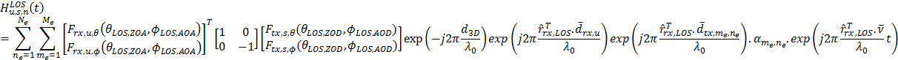{width="5.418732502187226in"
height="2.043478783902012in"}

Figure A.5.5.5.1.1-1: SNR variation for SSB-based beam failure detection
and link recovery testing in non-DRX mode

{width="5.616628390201225in"
height="2.034782370953631in"}

Figure A.5.5.5.1.1-2: SSB\_RP level variation for SSB-based beam failure
detection and link recovery testing in non-DRX mode

##### A.5.5.5.1.2 Test Requirements

The UE behaviour during time durations T1, T2, T3, T4 and T5 shall be as
follows:

During the time duration T1 and T2, the UE shall transmit uplink signal
at least in all subframes configured for CSI transmission on Cell 1.

During the period from time point A to time point B the UE shall
transmit uplink signal in Cell 1 in all uplink slots configured for CSI
transmission according to the configured periodic CSI reporting for Cell
1.

During T3 the UE shall detect beam failure and initiate link recovery.
During T4 and T5 the UE measures and evaluate beam candidate from beam
candidate set q~1~.

No later than time point F occurring no later than D1 = 960+10 ms after
the start of T5, the UE shall transmit preamble on a beam associated
with the candidate beam set q~1~. The UE shall not transmit preamble on
a beam associated with the candidate beam set q~1~ earlier than time
point B.

Test is concluded once the test equipment has received the initial
preamble transmission from the UE. The rate of correct events observed
during repeated tests shall be at least 90%.

#### A.5.5.5.2 EN-DC Beam Failure Detection and Link Recovery Test for FR2 PSCell configured with SSB-based BFD and LR in DRX mode

##### A.5.5.5.2.1 Test Purpose and Environment

The purpose of this test is to verify that the UE properly detects
SSB-based beam failure in the set q~0~ configured for a serving PSCell
and that the UE performs correct SSB-based link recovery based on beam
candidate set q~1~. The purpose is to test the downlink monitoring for
beam failure detection within the UEs active DL BWP of the PSCell,
during the evaluation period, and link recovery, when DRX is used. This
test will partly verify the SSB based beam failure detection and link
recovery for an FR2 serving cell requirements in clause 8.5.

The test parameters are given in Tables A.5.5.5.2.1-1, A.5.5.5.2.1-2,
A.5.5.5.2.1-3, A.5.5.5.2.1-4 and A.5.5.5.2.1-5 below. There are two
cells, cell 1 is the E-UTRAN PCell, and cell 2 is the PSCell, in the
test. The test consists of five successive time periods, with time
duration of T1, T2, T3, T4 and T5 respectively. Figure A.5.5.5.2.1-1
shows the variation of the downlink SNR of the PCell and the SNR of the
SSB in set q~0~ in the active PSCell to emulate SSB based beam failure.
Figure A.5.5.5.2.1-2 shows the variation of the downlink L1-RSRP of the
SSB in set q~1~ of the candidate beam used for link recovery. Prior to
the start of the time duration T1, the UE shall be fully synchronized to
cell 1 and cell 2. The UE shall be configured for periodic CSI reporting
with a reporting periodicity of 5 ms. In the test, DRX configuration is
enabled in PCSell and DRX inactivity timer has already been expired,
i.e. UE tries to decode PDCCH and to send periodic CQI during the period
when On-duration timer is running. Time alignment timers shall be set to
"infinity" so that UL timing alignment is maintained during the test.

**Table A.5.5.5.2.1-1: Supported test configurations for FR2 PSCell**

  **Configuration**                                                                          **Description**
  ------------------------------------------------------------------------------------------ --------------------------------------------------------------
  1                                                                                          LTE FDD, TDD duplex mode, 120 kHz SSB SCS, 100 MHz bandwidth
  2                                                                                          LTE TDD, TDD duplex mode, 240 kHz SSB SCS, 100 MHz bandwidth
  3                                                                                          LTE FDD, TDD duplex mode, 240 kHz SSB SCS, 100 MHz bandwidth
  4                                                                                          LTE TDD, TDD duplex mode, 240 kHz SSB SCS, 100 MHz bandwidth
  Note: The UE is only required to pass in one of the supported test configurations in FR2   

**Table A.5.5.5.2.1-2: General test parameters for FR2 PSCell for
SSB-based beam failure detection and link recovery testing in DRX mode**

+-----------+-----------+----------+-----------+-----------+---+
| **Pa      | **Test**  | **Unit** | **Value** | **        |   |
| rameter** |           |          |           | Comment** |   |
|           | **        |          |           |           |   |
|           | Config.** |          |           |           |   |
+===========+===========+==========+===========+===========+===+
|           |           |          | **Test    |           |   |
|           |           |          | 1**       |           |   |
+-----------+-----------+----------+-----------+-----------+---+
| Active    | 1-4       |          | Cell 1    |           |   |
| E-UTRA    |           |          |           |           |   |
| PCell     |           |          |           |           |   |
+-----------+-----------+----------+-----------+-----------+---+
| E-UTRA RF | 1-4       |          | 1         |           |   |
| Channel   |           |          |           |           |   |
| Number    |           |          |           |           |   |
+-----------+-----------+----------+-----------+-----------+---+
| Active    | 1-4       |          | Cell 2    |           |   |
| PCell     |           |          |           |           |   |
+-----------+-----------+----------+-----------+-----------+---+
| RF        | 1-4       |          | 2         |           |   |
| Channel   |           |          |           |           |   |
| Number    |           |          |           |           |   |
+-----------+-----------+----------+-----------+-----------+---+
| Duplex    | 1-4       |          | TDD       |           |   |
| mode      |           |          |           |           |   |
+-----------+-----------+----------+-----------+-----------+---+
| TDD       | 1-4       |          | TD        |           |   |
| Conf      |           |          | DConf.3.1 |           |   |
| iguration |           |          |           |           |   |
+-----------+-----------+----------+-----------+-----------+---+
| BW        | 1-4       | MHz      | 100:      |           |   |
| ~channel~ |           |          | N~RB,c~ = |           |   |
|           |           |          | 66        |           |   |
+-----------+-----------+----------+-----------+-----------+---+
| Data RBs  | 1-4       |          | 66        |           |   |
| allocated |           |          |           |           |   |
+-----------+-----------+----------+-----------+-----------+---+
| PD        | 1-4       | kHz      | 120       |           |   |
| SCH/PDCCH |           |          |           |           |   |
| s         |           |          |           |           |   |
| ubcarrier |           |          |           |           |   |
| spacing   |           |          |           |           |   |
+-----------+-----------+----------+-----------+-----------+---+
| **DL      | 1-4       |          | DLBWP.0.1 |           |   |
| initial   |           |          |           |           |   |
| BWP       |           |          |           |           |   |
| config    |           |          |           |           |   |
| uration** |           |          |           |           |   |
+-----------+-----------+----------+-----------+-----------+---+
| **DL      | 1-4       |          | DLBWP.1.1 |           |   |
| dedicated |           |          |           |           |   |
| BWP       |           |          |           |           |   |
| config    |           |          |           |           |   |
| uration** |           |          |           |           |   |
+-----------+-----------+----------+-----------+-----------+---+
| **UL      | 1-4       |          | ULBWP.0.1 |           |   |
| initial   |           |          |           |           |   |
| BWP       |           |          |           |           |   |
| config    |           |          |           |           |   |
| uration** |           |          |           |           |   |
+-----------+-----------+----------+-----------+-----------+---+
| **UL      | 1-4       |          | ULBWP.1.1 |           |   |
| dedicated |           |          |           |           |   |
| BWP       |           |          |           |           |   |
| config    |           |          |           |           |   |
| uration** |           |          |           |           |   |
+-----------+-----------+----------+-----------+-----------+---+
| PDSCH     | 1-2       |          | SR.3.2    |           |   |
| Reference |           |          | TDD       |           |   |
| Channel   |           |          |           |           |   |
+-----------+-----------+----------+-----------+-----------+---+
|           | 3-4       |          | SR.3.3    |           |   |
|           |           |          | TDD       |           |   |
+-----------+-----------+----------+-----------+-----------+---+
| RMSI      | 1-2       |          | CR.3.1    |           |   |
| CORESET   |           |          | TDD       |           |   |
| Reference |           |          |           |           |   |
| Channel   |           |          |           |           |   |
+-----------+-----------+----------+-----------+-----------+---+
|           | 3-4       |          | CR.3.2    |           |   |
|           |           |          | TDD       |           |   |
+-----------+-----------+----------+-----------+-----------+---+
| Dedicated | 1-2       |          | CCR.3.1   |           |   |
| CORESET   |           |          | TDD       |           |   |
| Reference |           |          |           |           |   |
| Channel   |           |          |           |           |   |
+-----------+-----------+----------+-----------+-----------+---+
|           | 3-4       |          | CCR.3.7   |           |   |
|           |           |          | TDD       |           |   |
+-----------+-----------+----------+-----------+-----------+---+
| OCNG      | 1-4       |          | OP.1      |           |   |
| p         |           |          |           |           |   |
| arameters |           |          |           |           |   |
+-----------+-----------+----------+-----------+-----------+---+
| CP length | 1-4       |          | Normal    |           |   |
+-----------+-----------+----------+-----------+-----------+---+
| PD        | 1-4       |          | TC        |           |   |
| SCH/PDCCH |           |          | I.State.0 |           |   |
| TCI state |           |          |           |           |   |
+-----------+-----------+----------+-----------+-----------+---+
| CSI-RS    | 1-4       |          | TRS.2.1   |           |   |
| for       |           |          | TDD       |           |   |
| tracking  |           |          |           |           |   |
+-----------+-----------+----------+-----------+-----------+---+
| SSB       | 1-2       |          | SSB.1 FR2 |           |   |
| Conf      |           |          |           |           |   |
| iguration |           |          |           |           |   |
+-----------+-----------+----------+-----------+-----------+---+
|           | 3-4       |          | SSB.2 FR2 |           |   |
+-----------+-----------+----------+-----------+-----------+---+
| SMTC      | 1-4       |          | SMTC.3    |           |   |
| Conf      |           |          |           |           |   |
| iguration |           |          |           |           |   |
+-----------+-----------+----------+-----------+-----------+---+
| PRACH     | 1-4       |          | FR2 PRACH | A.3.8.3.2 |   |
| Conf      |           |          | conf      |           |   |
| iguration |           |          | iguration |           |   |
|           |           |          | 2         |           |   |
+-----------+-----------+----------+-----------+-----------+---+
| DRX       | 1-4       |          | *DRX.3*   | *A.3.3.3* |   |
| **config  |           |          |           |           |   |
| uration** |           |          |           |           |   |
+-----------+-----------+----------+-----------+-----------+---+
| SSB index | 1-4       |          | 0         |           |   |
| assigned  |           |          |           |           |   |
| as BFD RS |           |          |           |           |   |
| (q~0~)    |           |          |           |           |   |
+-----------+-----------+----------+-----------+-----------+---+
| SSB index | 1-4       |          | 1         |           |   |
| assigned  |           |          |           |           |   |
| as CBD RS |           |          |           |           |   |
| (q~1~)    |           |          |           |           |   |
+-----------+-----------+----------+-----------+-----------+---+
| SSB index | 1-4       |          | 0,1       |           |   |
| assigned  |           |          |           |           |   |
| as RLM RS |           |          |           |           |   |
+-----------+-----------+----------+-----------+-----------+---+
| Beam      | DCI       | 1-4      |           | 1-0       |   |
| failure   | format    |          |           |           |   |
| detection |           |          |           |           |   |
| tra       |           |          |           |           |   |
| nsmission |           |          |           |           |   |
| p         |           |          |           |           |   |
| arameters |           |          |           |           |   |
+-----------+-----------+----------+-----------+-----------+---+
|           | Number of | 1-4      |           | 2         |   |
|           | Control   |          |           |           |   |
|           | OFDM      |          |           |           |   |
|           | symbols   |          |           |           |   |
+-----------+-----------+----------+-----------+-----------+---+
|           | Ag        | 1-4      | CCE       | 8         |   |
|           | gregation |          |           |           |   |
|           | level     |          |           |           |   |
+-----------+-----------+----------+-----------+-----------+---+
|           | Ratio of  | 1-4      | dB        | 0         |   |
|           | hyp       |          |           |           |   |
|           | othetical |          |           |           |   |
|           | PDCCH RE  |          |           |           |   |
|           | energy to |          |           |           |   |
|           | average   |          |           |           |   |
|           | SSS RE    |          |           |           |   |
|           | energy    |          |           |           |   |
+-----------+-----------+----------+-----------+-----------+---+
|           | Ratio of  | 1-4      | dB        | 0         |   |
|           | hyp       |          |           |           |   |
|           | othetical |          |           |           |   |
|           | PDCCH     |          |           |           |   |
|           | DMRS      |          |           |           |   |
|           | energy to |          |           |           |   |
|           | average   |          |           |           |   |
|           | SSS RE    |          |           |           |   |
|           | energy    |          |           |           |   |
+-----------+-----------+----------+-----------+-----------+---+
|           | DMRS      | 1-4      |           | REG       |   |
|           | precoder  |          |           | bundle    |   |
|           | gr        |          |           | size      |   |
|           | anularity |          |           |           |   |
+-----------+-----------+----------+-----------+-----------+---+
|           | REG       | 1-4      |           | 6         |   |
|           | bundle    |          |           |           |   |
|           | size      |          |           |           |   |
+-----------+-----------+----------+-----------+-----------+---+
| Gap       | 1-4       |          | *N/A*     |           |   |
| pattern   |           |          |           |           |   |
| ID        |           |          |           |           |   |
+-----------+-----------+----------+-----------+-----------+---+
| rlmInSync | 1-4       |          | *absent*  | *Value 0  |   |
| OutOfSync |           |          |           | is        |   |
| Threshold |           |          |           | applied.  |   |
|           |           |          |           | (Table    |   |
|           |           |          |           | 8         |   |
|           |           |          |           | .1.1-1).* |   |
+-----------+-----------+----------+-----------+-----------+---+
| rsrp-Thr  | 1-2       | dBm/SCS  | *-95*     | Threshold |   |
| esholdSSB |           |          |           | used for  |   |
|           |           |          |           | Q~in\     |   |
|           |           |          |           | _LR\_SSB~ |   |
+-----------+-----------+----------+-----------+-----------+---+
|           | 3-4       |          | *-92*     |           |   |
+-----------+-----------+----------+-----------+-----------+---+
| po        | 1-4       |          | *db0*     | Used for  |   |
| werContro |           |          |           | deriving  |   |
| lOffsetSS |           |          |           | rs        |   |
|           |           |          |           | rp-Thresh |   |
|           |           |          |           | oldCSI-RS |   |
+-----------+-----------+----------+-----------+-----------+---+
| beamFailu | 1-4       |          | *n1*      | *see TS   |   |
| reInstanc |           |          |           | 38.321    |   |
| eMaxCount |           |          |           | \[7\],    |   |
|           |           |          |           | clause    |   |
|           |           |          |           | 5.17*     |   |
+-----------+-----------+----------+-----------+-----------+---+
| beamFai   | 1-4       |          | pbfd4     | *see TS   |   |
| lureDetec |           |          |           | 38.321    |   |
| tionTimer |           |          |           | \[7\],    |   |
|           |           |          |           | clause    |   |
|           |           |          |           | 5.17*     |   |
+-----------+-----------+----------+-----------+-----------+---+
| CSI-RS    | 1-4       |          | C         |           |   |
| conf      |           |          | SI-RS.3.1 |           |   |
| iguration |           |          | TDD       |           |   |
| for CSI   |           |          |           |           |   |
| reporting |           |          |           |           |   |
+-----------+-----------+----------+-----------+-----------+---+
| reportC   | 1-4       |          | periodic  |           |   |
| onfigType |           |          |           |           |   |
+-----------+-----------+----------+-----------+-----------+---+
| repor     | 1-4       |          | cri-R     |           |   |
| tQuantity |           |          | I-PMI-CQI |           |   |
+-----------+-----------+----------+-----------+-----------+---+
| CSI       | 1-4       | slot     | 40        |           |   |
| reporting |           |          |           |           |   |
| pe        |           |          |           |           |   |
| riodicity |           |          |           |           |   |
+-----------+-----------+----------+-----------+-----------+---+
| CSI       | 1-4       | slot     | 4         |           |   |
| reporting |           |          |           |           |   |
| offset    |           |          |           |           |   |
+-----------+-----------+----------+-----------+-----------+---+
| T310      | 1-4       | ms       | 1000      |           |   |
+-----------+-----------+----------+-----------+-----------+---+
| N310      | 1-4       |          | 2         |           |   |
+-----------+-----------+----------+-----------+-----------+---+
| T1        | 1-4       | s        | 1         | The UE    |   |
|           |           |          |           | shall be  |   |
|           |           |          |           | fully     |   |
|           |           |          |           | syn       |   |
|           |           |          |           | chronized |   |
|           |           |          |           | to cell 1 |   |
|           |           |          |           | during T1 |   |
+-----------+-----------+----------+-----------+-----------+---+
| T2        | 1-4       | s        | 3.37      |           |   |
+-----------+-----------+----------+-----------+-----------+---+
| T3        | 1-4       | s        | 2.8       |           |   |
+-----------+-----------+----------+-----------+-----------+---+
| T4        | 1-4       | s        | 0         |           |   |
+-----------+-----------+----------+-----------+-----------+---+
| T5        | 1-4       | s        | 0.61      |           |   |
+-----------+-----------+----------+-----------+-----------+---+
| D1        | 1-4       | s        | 0.57      |           |   |
+-----------+-----------+----------+-----------+-----------+---+
| Note 1:   |           |          |           |           |   |
| UE        |           |          |           |           |   |
| -specific |           |          |           |           |   |
| PDCCH is  |           |          |           |           |   |
| not       |           |          |           |           |   |
| tr        |           |          |           |           |   |
| ansmitted |           |          |           |           |   |
| after T1  |           |          |           |           |   |
| starts.   |           |          |           |           |   |
+-----------+-----------+----------+-----------+-----------+---+

**Table A.5.5.5.2.1-3: Cell specific test parameters for FR2 PSCell for
SSB-based beam failure detection and link recovery testing in DRX mode**

+-------+-------+-------+-------+-------+-------+-------+-------+
| Para  | Unit  | Test  |       |       |       |       |       |
| meter |       | 1     |       |       |       |       |       |
+=======+=======+=======+=======+=======+=======+=======+=======+
|       |       | T1    | T2    | T3    | T4    | T5    |       |
+-------+-------+-------+-------+-------+-------+-------+-------+
| AoA   |       | Setup |       |       |       |       |       |
| setup |       | 1     |       |       |       |       |       |
|       |       | de    |       |       |       |       |       |
|       |       | fined |       |       |       |       |       |
|       |       | in    |       |       |       |       |       |
|       |       | A     |       |       |       |       |       |
|       |       | .3.15 |       |       |       |       |       |
+-------+-------+-------+-------+-------+-------+-------+-------+
| Assum |       | Rough |       |       |       |       |       |
| ption |       |       |       |       |       |       |       |
| for   |       |       |       |       |       |       |       |
| UE    |       |       |       |       |       |       |       |
| beams |       |       |       |       |       |       |       |
| ^Note |       |       |       |       |       |       |       |
| \ 10^ |       |       |       |       |       |       |       |
+-------+-------+-------+-------+-------+-------+-------+-------+
| EPRE  | dB    | 0     |       |       |       |       |       |
| ratio |       |       |       |       |       |       |       |
| of    |       |       |       |       |       |       |       |
| PDCCH |       |       |       |       |       |       |       |
| DMRS  |       |       |       |       |       |       |       |
| to    |       |       |       |       |       |       |       |
| SSS   |       |       |       |       |       |       |       |
+-------+-------+-------+-------+-------+-------+-------+-------+
| EPRE  | dB    |       |       |       |       |       |       |
| ratio |       |       |       |       |       |       |       |
| of    |       |       |       |       |       |       |       |
| PDCCH |       |       |       |       |       |       |       |
| to    |       |       |       |       |       |       |       |
| PDCCH |       |       |       |       |       |       |       |
| DMRS  |       |       |       |       |       |       |       |
+-------+-------+-------+-------+-------+-------+-------+-------+
| EPRE  | dB    |       |       |       |       |       |       |
| ratio |       |       |       |       |       |       |       |
| of    |       |       |       |       |       |       |       |
| PBCH  |       |       |       |       |       |       |       |
| DMRS  |       |       |       |       |       |       |       |
| to    |       |       |       |       |       |       |       |
| SSS   |       |       |       |       |       |       |       |
+-------+-------+-------+-------+-------+-------+-------+-------+
| EPRE  | dB    |       |       |       |       |       |       |
| ratio |       |       |       |       |       |       |       |
| of    |       |       |       |       |       |       |       |
| PBCH  |       |       |       |       |       |       |       |
| to    |       |       |       |       |       |       |       |
| PBCH  |       |       |       |       |       |       |       |
| DMRS  |       |       |       |       |       |       |       |
+-------+-------+-------+-------+-------+-------+-------+-------+
| EPRE  | dB    |       |       |       |       |       |       |
| ratio |       |       |       |       |       |       |       |
| of    |       |       |       |       |       |       |       |
| PSS   |       |       |       |       |       |       |       |
| to    |       |       |       |       |       |       |       |
| SSS   |       |       |       |       |       |       |       |
+-------+-------+-------+-------+-------+-------+-------+-------+
| EPRE  | dB    |       |       |       |       |       |       |
| ratio |       |       |       |       |       |       |       |
| of    |       |       |       |       |       |       |       |
| PDSCH |       |       |       |       |       |       |       |
| DMRS  |       |       |       |       |       |       |       |
| to    |       |       |       |       |       |       |       |
| SSS   |       |       |       |       |       |       |       |
+-------+-------+-------+-------+-------+-------+-------+-------+
| EPRE  | dB    |       |       |       |       |       |       |
| ratio |       |       |       |       |       |       |       |
| of    |       |       |       |       |       |       |       |
| PDSCH |       |       |       |       |       |       |       |
| to    |       |       |       |       |       |       |       |
| PDSCH |       |       |       |       |       |       |       |
| DMRS  |       |       |       |       |       |       |       |
+-------+-------+-------+-------+-------+-------+-------+-------+
| EPRE  | dB    |       |       |       |       |       |       |
| ratio |       |       |       |       |       |       |       |
| of    |       |       |       |       |       |       |       |
| OCNG  |       |       |       |       |       |       |       |
| DMRS  |       |       |       |       |       |       |       |
| to    |       |       |       |       |       |       |       |
| SSS   |       |       |       |       |       |       |       |
+-------+-------+-------+-------+-------+-------+-------+-------+
| EPRE  | dB    |       |       |       |       |       |       |
| ratio |       |       |       |       |       |       |       |
| of    |       |       |       |       |       |       |       |
| OCNG  |       |       |       |       |       |       |       |
| to    |       |       |       |       |       |       |       |
| OCNG  |       |       |       |       |       |       |       |
| DMRS  |       |       |       |       |       |       |       |
+-------+-------+-------+-------+-------+-------+-------+-------+
| SNR   | C     | dB    | 5     | -3    | -12   | -12   | -12   |
| \_SSB | onfig |       | ^Note | ^Note |       |       |       |
| of    | 1-4   |       | \ 11^ | \ 11^ |       |       |       |
| set   |       |       |       |       |       |       |       |
| q~0~  |       |       |       |       |       |       |       |
+-------+-------+-------+-------+-------+-------+-------+-------+
| SNR   | C     | dB    | 0.2   | 0.2   | 20.2  | 20.2  | 20.2  |
| \_SSB | onfig |       |       |       |       |       |       |
| of    | 1-4   |       |       |       |       |       |       |
| set   |       |       |       |       |       |       |       |
| q~1~  |       |       |       |       |       |       |       |
+-------+-------+-------+-------+-------+-------+-------+-------+
| SS    | C     | dBm/  | -     | -     | -84.5 | -84.5 | -84.5 |
| B\_RP | onfig |       | 104.5 | 104.5 |       |       |       |
| of    | 1-2   |       |       |       |       |       |       |
| set   |       |       |       |       |       |       |       |
| q~1~  |       |       |       |       |       |       |       |
+-------+-------+-------+-------+-------+-------+-------+-------+
|       | C     | SCS   | -     | -     | -81.5 | -81.5 | -81.5 |
|       | onfig |       | 101.5 | 101.5 |       |       |       |
|       | 3-4   |       |       |       |       |       |       |
+-------+-------+-------+-------+-------+-------+-------+-------+
|       | C     | dB    | -     |       |       |       |       |
|       | onfig | m/120 | 104.7 |       |       |       |       |
|       | 1-4   | KHz   |       |       |       |       |       |
+-------+-------+-------+-------+-------+-------+-------+-------+
| P     |       | TDL-A |       |       |       |       |       |
| ropag |       | 30ns  |       |       |       |       |       |
| ation |       | 75Hz  |       |       |       |       |       |
| cond  |       |       |       |       |       |       |       |
| ition |       |       |       |       |       |       |       |
+-------+-------+-------+-------+-------+-------+-------+-------+
| Note  |       |       |       |       |       |       |       |
| 1:    |       |       |       |       |       |       |       |
| OCNG  |       |       |       |       |       |       |       |
| shall |       |       |       |       |       |       |       |
| be    |       |       |       |       |       |       |       |
| used  |       |       |       |       |       |       |       |
| such  |       |       |       |       |       |       |       |
| that  |       |       |       |       |       |       |       |
| the   |       |       |       |       |       |       |       |
| reso  |       |       |       |       |       |       |       |
| urces |       |       |       |       |       |       |       |
| in    |       |       |       |       |       |       |       |
| Cell  |       |       |       |       |       |       |       |
| 1 are |       |       |       |       |       |       |       |
| fully |       |       |       |       |       |       |       |
| allo  |       |       |       |       |       |       |       |
| cated |       |       |       |       |       |       |       |
| and a |       |       |       |       |       |       |       |
| con   |       |       |       |       |       |       |       |
| stant |       |       |       |       |       |       |       |
| total |       |       |       |       |       |       |       |
| t     |       |       |       |       |       |       |       |
| ransm |       |       |       |       |       |       |       |
| itted |       |       |       |       |       |       |       |
| power |       |       |       |       |       |       |       |
| spe   |       |       |       |       |       |       |       |
| ctral |       |       |       |       |       |       |       |
| de    |       |       |       |       |       |       |       |
| nsity |       |       |       |       |       |       |       |
| is    |       |       |       |       |       |       |       |
| ach   |       |       |       |       |       |       |       |
| ieved |       |       |       |       |       |       |       |
| for   |       |       |       |       |       |       |       |
| all   |       |       |       |       |       |       |       |
| OFDM  |       |       |       |       |       |       |       |
| sym   |       |       |       |       |       |       |       |
| bols. |       |       |       |       |       |       |       |
|       |       |       |       |       |       |       |       |
| Note  |       |       |       |       |       |       |       |
| 2:    |       |       |       |       |       |       |       |
| The   |       |       |       |       |       |       |       |
| u     |       |       |       |       |       |       |       |
| plink |       |       |       |       |       |       |       |
| reso  |       |       |       |       |       |       |       |
| urces |       |       |       |       |       |       |       |
| for   |       |       |       |       |       |       |       |
| CSI   |       |       |       |       |       |       |       |
| repo  |       |       |       |       |       |       |       |
| rting |       |       |       |       |       |       |       |
| are   |       |       |       |       |       |       |       |
| ass   |       |       |       |       |       |       |       |
| igned |       |       |       |       |       |       |       |
| to    |       |       |       |       |       |       |       |
| the   |       |       |       |       |       |       |       |
| UE    |       |       |       |       |       |       |       |
| prior |       |       |       |       |       |       |       |
| to    |       |       |       |       |       |       |       |
| the   |       |       |       |       |       |       |       |
| start |       |       |       |       |       |       |       |
| of    |       |       |       |       |       |       |       |
| time  |       |       |       |       |       |       |       |
| p     |       |       |       |       |       |       |       |
| eriod |       |       |       |       |       |       |       |
| T1.   |       |       |       |       |       |       |       |
|       |       |       |       |       |       |       |       |
| Note  |       |       |       |       |       |       |       |
| 3:    |       |       |       |       |       |       |       |
| NZP   |       |       |       |       |       |       |       |
| C     |       |       |       |       |       |       |       |
| SI-RS |       |       |       |       |       |       |       |
| res   |       |       |       |       |       |       |       |
| ource |       |       |       |       |       |       |       |
| set   |       |       |       |       |       |       |       |
| con   |       |       |       |       |       |       |       |
| figur |       |       |       |       |       |       |       |
| ation |       |       |       |       |       |       |       |
| for   |       |       |       |       |       |       |       |
| CSI   |       |       |       |       |       |       |       |
| repo  |       |       |       |       |       |       |       |
| rting |       |       |       |       |       |       |       |
| are   |       |       |       |       |       |       |       |
| ass   |       |       |       |       |       |       |       |
| igned |       |       |       |       |       |       |       |
| to    |       |       |       |       |       |       |       |
| the   |       |       |       |       |       |       |       |
| UE    |       |       |       |       |       |       |       |
| prior |       |       |       |       |       |       |       |
| to    |       |       |       |       |       |       |       |
| the   |       |       |       |       |       |       |       |
| start |       |       |       |       |       |       |       |
| of    |       |       |       |       |       |       |       |
| time  |       |       |       |       |       |       |       |
| p     |       |       |       |       |       |       |       |
| eriod |       |       |       |       |       |       |       |
| T1.   |       |       |       |       |       |       |       |
|       |       |       |       |       |       |       |       |
| Note  |       |       |       |       |       |       |       |
| 4:    |       |       |       |       |       |       |       |
| Void  |       |       |       |       |       |       |       |
|       |       |       |       |       |       |       |       |
| Note  |       |       |       |       |       |       |       |
| 5:    |       |       |       |       |       |       |       |
| The   |       |       |       |       |       |       |       |
| t     |       |       |       |       |       |       |       |
| imers |       |       |       |       |       |       |       |
| and   |       |       |       |       |       |       |       |
| layer |       |       |       |       |       |       |       |
| 3     |       |       |       |       |       |       |       |
| filt  |       |       |       |       |       |       |       |
| ering |       |       |       |       |       |       |       |
| re    |       |       |       |       |       |       |       |
| lated |       |       |       |       |       |       |       |
| param |       |       |       |       |       |       |       |
| eters |       |       |       |       |       |       |       |
| are   |       |       |       |       |       |       |       |
| confi |       |       |       |       |       |       |       |
| gured |       |       |       |       |       |       |       |
| prior |       |       |       |       |       |       |       |
| to    |       |       |       |       |       |       |       |
| the   |       |       |       |       |       |       |       |
| start |       |       |       |       |       |       |       |
| of    |       |       |       |       |       |       |       |
| time  |       |       |       |       |       |       |       |
| p     |       |       |       |       |       |       |       |
| eriod |       |       |       |       |       |       |       |
| T1.   |       |       |       |       |       |       |       |
|       |       |       |       |       |       |       |       |
| Note  |       |       |       |       |       |       |       |
| 6:    |       |       |       |       |       |       |       |
| The   |       |       |       |       |       |       |       |
| s     |       |       |       |       |       |       |       |
| ignal |       |       |       |       |       |       |       |
| con   |       |       |       |       |       |       |       |
| tains |       |       |       |       |       |       |       |
| PDCCH |       |       |       |       |       |       |       |
| for   |       |       |       |       |       |       |       |
| UEs   |       |       |       |       |       |       |       |
| other |       |       |       |       |       |       |       |
| than  |       |       |       |       |       |       |       |
| the   |       |       |       |       |       |       |       |
| d     |       |       |       |       |       |       |       |
| evice |       |       |       |       |       |       |       |
| under |       |       |       |       |       |       |       |
| test  |       |       |       |       |       |       |       |
| as    |       |       |       |       |       |       |       |
| part  |       |       |       |       |       |       |       |
| of    |       |       |       |       |       |       |       |
| OCNG. |       |       |       |       |       |       |       |
|       |       |       |       |       |       |       |       |
| Note  |       |       |       |       |       |       |       |
| 7:    |       |       |       |       |       |       |       |
| SNR   |       |       |       |       |       |       |       |
| l     |       |       |       |       |       |       |       |
| evels |       |       |       |       |       |       |       |
| corre |       |       |       |       |       |       |       |
| spond |       |       |       |       |       |       |       |
| to    |       |       |       |       |       |       |       |
| the   |       |       |       |       |       |       |       |
| s     |       |       |       |       |       |       |       |
| ignal |       |       |       |       |       |       |       |
| to    |       |       |       |       |       |       |       |
| noise |       |       |       |       |       |       |       |
| ratio |       |       |       |       |       |       |       |
| over  |       |       |       |       |       |       |       |
| the   |       |       |       |       |       |       |       |
| SSS   |       |       |       |       |       |       |       |
| REs.  |       |       |       |       |       |       |       |
|       |       |       |       |       |       |       |       |
| Note  |       |       |       |       |       |       |       |
| 8:    |       |       |       |       |       |       |       |
| The   |       |       |       |       |       |       |       |
| SNR   |       |       |       |       |       |       |       |
| in    |       |       |       |       |       |       |       |
| time  |       |       |       |       |       |       |       |
| pe    |       |       |       |       |       |       |       |
| riods |       |       |       |       |       |       |       |
| T1,   |       |       |       |       |       |       |       |
| T2,   |       |       |       |       |       |       |       |
| T3,   |       |       |       |       |       |       |       |
| T4    |       |       |       |       |       |       |       |
| and   |       |       |       |       |       |       |       |
| T5 is |       |       |       |       |       |       |       |
| de    |       |       |       |       |       |       |       |
| noted |       |       |       |       |       |       |       |
| as    |       |       |       |       |       |       |       |
| SNR1, |       |       |       |       |       |       |       |
| SNR2  |       |       |       |       |       |       |       |
| and   |       |       |       |       |       |       |       |
| SNR3  |       |       |       |       |       |       |       |
| re    |       |       |       |       |       |       |       |
| spect |       |       |       |       |       |       |       |
| ively |       |       |       |       |       |       |       |
| in    |       |       |       |       |       |       |       |
| f     |       |       |       |       |       |       |       |
| igure |       |       |       |       |       |       |       |
| A.5.  |       |       |       |       |       |       |       |
| 5.5.2 |       |       |       |       |       |       |       |
| .1-1. |       |       |       |       |       |       |       |
|       |       |       |       |       |       |       |       |
| Note  |       |       |       |       |       |       |       |
| 9:    |       |       |       |       |       |       |       |
| The   |       |       |       |       |       |       |       |
| SNR   |       |       |       |       |       |       |       |
| v     |       |       |       |       |       |       |       |
| alues |       |       |       |       |       |       |       |
| are   |       |       |       |       |       |       |       |
| spec  |       |       |       |       |       |       |       |
| ified |       |       |       |       |       |       |       |
| for   |       |       |       |       |       |       |       |
| te    |       |       |       |       |       |       |       |
| sting |       |       |       |       |       |       |       |
| a UE  |       |       |       |       |       |       |       |
| which |       |       |       |       |       |       |       |
| sup   |       |       |       |       |       |       |       |
| ports |       |       |       |       |       |       |       |
| 2RX   |       |       |       |       |       |       |       |
| on at |       |       |       |       |       |       |       |
| least |       |       |       |       |       |       |       |
| one   |       |       |       |       |       |       |       |
| band. |       |       |       |       |       |       |       |
| For   |       |       |       |       |       |       |       |
| te    |       |       |       |       |       |       |       |
| sting |       |       |       |       |       |       |       |
| of a  |       |       |       |       |       |       |       |
| UE    |       |       |       |       |       |       |       |
| which |       |       |       |       |       |       |       |
| sup   |       |       |       |       |       |       |       |
| ports |       |       |       |       |       |       |       |
| 4RX   |       |       |       |       |       |       |       |
| on    |       |       |       |       |       |       |       |
| all   |       |       |       |       |       |       |       |
| b     |       |       |       |       |       |       |       |
| ands, |       |       |       |       |       |       |       |
| the   |       |       |       |       |       |       |       |
| SNR   |       |       |       |       |       |       |       |
| d     |       |       |       |       |       |       |       |
| uring |       |       |       |       |       |       |       |
| T3 is |       |       |       |       |       |       |       |
| mod   |       |       |       |       |       |       |       |
| ified |       |       |       |       |       |       |       |
| as    |       |       |       |       |       |       |       |
| spec  |       |       |       |       |       |       |       |
| ified |       |       |       |       |       |       |       |
| in    |       |       |       |       |       |       |       |
| c     |       |       |       |       |       |       |       |
| lause |       |       |       |       |       |       |       |
| A     |       |       |       |       |       |       |       |
| .3.6. |       |       |       |       |       |       |       |
|       |       |       |       |       |       |       |       |
| Note  |       |       |       |       |       |       |       |
| 10:   |       |       |       |       |       |       |       |
| I     |       |       |       |       |       |       |       |
| nform |       |       |       |       |       |       |       |
| ation |       |       |       |       |       |       |       |
| about |       |       |       |       |       |       |       |
| types |       |       |       |       |       |       |       |
| of UE |       |       |       |       |       |       |       |
| beam  |       |       |       |       |       |       |       |
| is    |       |       |       |       |       |       |       |
| given |       |       |       |       |       |       |       |
| in    |       |       |       |       |       |       |       |
| B.2   |       |       |       |       |       |       |       |
| .1.3, |       |       |       |       |       |       |       |
| and   |       |       |       |       |       |       |       |
| does  |       |       |       |       |       |       |       |
| not   |       |       |       |       |       |       |       |
| limit |       |       |       |       |       |       |       |
| UE    |       |       |       |       |       |       |       |
| impl  |       |       |       |       |       |       |       |
| ement |       |       |       |       |       |       |       |
| ation |       |       |       |       |       |       |       |
| or    |       |       |       |       |       |       |       |
| test  |       |       |       |       |       |       |       |
| s     |       |       |       |       |       |       |       |
| ystem |       |       |       |       |       |       |       |
| impl  |       |       |       |       |       |       |       |
| ement |       |       |       |       |       |       |       |
| ation |       |       |       |       |       |       |       |
|       |       |       |       |       |       |       |       |
| Note  |       |       |       |       |       |       |       |
| 11:   |       |       |       |       |       |       |       |
| This  |       |       |       |       |       |       |       |
| value |       |       |       |       |       |       |       |
| a     |       |       |       |       |       |       |       |
| llows |       |       |       |       |       |       |       |
| up to |       |       |       |       |       |       |       |
| 1dB   |       |       |       |       |       |       |       |
| d     |       |       |       |       |       |       |       |
| egrad |       |       |       |       |       |       |       |
| ation |       |       |       |       |       |       |       |
| from  |       |       |       |       |       |       |       |
| ap    |       |       |       |       |       |       |       |
| plied |       |       |       |       |       |       |       |
| SNR   |       |       |       |       |       |       |       |
| to UE |       |       |       |       |       |       |       |
| bas   |       |       |       |       |       |       |       |
| eband |       |       |       |       |       |       |       |
+-------+-------+-------+-------+-------+-------+-------+-------+

**Table A.5.5.5.2.1-4: Void**

**Table A.5.5.5.2.1-5: Void**

{width="5.418732502187226in"
height="2.043478783902012in"}

**Figure A.5.5.5.2.1-1: SNR variation for SSB-based beam failure
detection and link recovery testing in DRX mode**

{width="5.616628390201225in"
height="2.034782370953631in"}

Figure A.5.5.5.2.1-2: SSB\_RP level variation for SSB-based beam failure
detection and link recovery testing in DRX mode

##### A.5.5.5.2.2 Test Requirements

The UE behaviour during time durations T1, T2, T3, T4 and T5 shall be as
follows:

During the time duration T1 and T2, the UE shall transmit uplink signal
at least in all subframes configured for CSI transmission on Cell 1.

During the period from time point A to time point B the UE shall
transmit uplink signal in Cell 1 in all uplink slots configured for CSI
transmission according to the configured periodic CSI reporting for Cell
1.

During T3 the UE shall detect beam failure and initiate link recovery.
During T4 and T5 the UE measures and evaluate beam candidate from beam
candidate set q~1~.

No later than time point F occurring no later than D1 = 560+10 ms after
the start of T5, the UE shall transmit preamble on a beam associated
with the candidate beam set q~1~. The UE shall not transmit preamble on
a beam associated with the candidate beam set q~1~ earlier than time
point B.

Test is concluded once the test equipment has received the initial
preamble transmission from the UE. The rate of correct events observed
during repeated tests shall be at least 90%.

#### A.5.5.5.3 EN-DC Beam Failure Detection and Link Recovery Test for FR2 PSCell configured with CSI-RS-based BFD and LR in non-DRX mode

##### A.5.5.5.3.1 Test Purpose and Environment

The purpose of this test is to verify that the UE properly detects
CSI-RS-based beam failure in the set q~0~ configured for a serving
PSCell and that the UE performs correct CSI-RS-based link recovery based
on beam candicate set q~1~. The purpose is to test the downlink
monitoring for beam failure detection within the UEs active DL BWP of
the PSCell, during the evaluation period, and link recovery, when no DRX
is used. This test will partly verify the CSI-RS based beam failure
detection and link recovery for an FR2 serving cell requirements in
clause 8.5.

The test parameters are given in Tables A.5.5.5.3.1-1, A.5.5.5.3.1-2,
and A.5.5.5.3.1-3 below. There are two cells, cell 1 is the E-UTRAN
PCell, and cell 2 is the PSCell, in the test. The test consists of five
successive time periods, with time duration of T1, T2, T3, T4 and T5
respectively. Figure A.5.5.5.3.1-1 shows the variation of the downlink
SNR of the PCell and the SNR of the CSI-RS in set q~0~ in the active
PSCell to emulate CSI-RS based beam failure. Figure A.5.5.5.3.1-2 shows
the variation of the downlink L1-RSRP of the CSI-RS in set q~1~ of the
candidate beam used for link recovery. Prior to the start of the time
duration T1, the UE shall be fully synchronized to cell 1 and cell 2.
The UE shall be configured for periodic CSI reporting with a reporting
periodicity of 5 ms. In the test, DRX configuration is not enabled.

Table A.5.5.5.3.1-1: Supported test configurations for FR2 PSCell

  **Configuration**   **Description**
  ------------------- --------------------------------------------------------------
  1                   LTE FDD, TDD duplex mode, 120 kHz SSB SCS, 100 MHz bandwidth
  2                   LTE TDD, TDD duplex mode, 120 kHz SSB SCS, 100 MHz bandwidth

Table A.5.5.5.3.1-2: General test parameters for FR2 PSCell for
CSI-RS-based beam failure detection and link recovery testing in non-DRX
mode

+-----------+-----------+----------+-----------+-----------+---+
| **Pa      | **Test**  | **Unit** | **Value** | **        |   |
| rameter** |           |          |           | Comment** |   |
|           | **        |          |           |           |   |
|           | Config.** |          |           |           |   |
+===========+===========+==========+===========+===========+===+
|           |           |          | **Test    |           |   |
|           |           |          | 1**       |           |   |
+-----------+-----------+----------+-----------+-----------+---+
| Active    | 1-2       |          | Cell 1    |           |   |
| E-UTRA    |           |          |           |           |   |
| PCell     |           |          |           |           |   |
+-----------+-----------+----------+-----------+-----------+---+
| E-UTRA RF | 1-2       |          | 1         |           |   |
| Channel   |           |          |           |           |   |
| Number    |           |          |           |           |   |
+-----------+-----------+----------+-----------+-----------+---+
| Active    | 1-2       |          | Cell 2    |           |   |
| PCell     |           |          |           |           |   |
+-----------+-----------+----------+-----------+-----------+---+
| RF        | 1-2       |          | 2         |           |   |
| Channel   |           |          |           |           |   |
| Number    |           |          |           |           |   |
+-----------+-----------+----------+-----------+-----------+---+
| Duplex    | 1-2       |          | TDD       |           |   |
| mode      |           |          |           |           |   |
+-----------+-----------+----------+-----------+-----------+---+
| TDD       | 1-2       |          | TD        |           |   |
| Conf      |           |          | DConf.3.1 |           |   |
| iguration |           |          |           |           |   |
+-----------+-----------+----------+-----------+-----------+---+
| BW        | 1-2       |          | 100:      |           |   |
| ~channel~ |           |          | N~RB,c~ = |           |   |
|           |           |          | 66        |           |   |
+-----------+-----------+----------+-----------+-----------+---+
| Data RBs  | 1-2       |          | 66        |           |   |
| allocated |           |          |           |           |   |
+-----------+-----------+----------+-----------+-----------+---+
| PD        | 1-2       | kHz      | 120       |           |   |
| SCH/PDCCH |           |          |           |           |   |
| s         |           |          |           |           |   |
| ubcarrier |           |          |           |           |   |
| spacing   |           |          |           |           |   |
+-----------+-----------+----------+-----------+-----------+---+
| **DL      | 1-2       |          | DLBWP.0.1 |           |   |
| initial   |           |          |           |           |   |
| BWP       |           |          |           |           |   |
| config    |           |          |           |           |   |
| uration** |           |          |           |           |   |
+-----------+-----------+----------+-----------+-----------+---+
| **DL      | 1-2       |          | DLBWP.1.1 |           |   |
| dedicated |           |          |           |           |   |
| BWP       |           |          |           |           |   |
| config    |           |          |           |           |   |
| uration** |           |          |           |           |   |
+-----------+-----------+----------+-----------+-----------+---+
| **UL      | 1-2       |          | ULBWP.0.1 |           |   |
| initial   |           |          |           |           |   |
| BWP       |           |          |           |           |   |
| config    |           |          |           |           |   |
| uration** |           |          |           |           |   |
+-----------+-----------+----------+-----------+-----------+---+
| **UL      | 1-2       |          | ULBWP.1.1 |           |   |
| dedicated |           |          |           |           |   |
| BWP       |           |          |           |           |   |
| config    |           |          |           |           |   |
| uration** |           |          |           |           |   |
+-----------+-----------+----------+-----------+-----------+---+
| PDSCH     | 1-2       |          | SR.3.2    |           |   |
| Reference |           |          | TDD       |           |   |
| Channel   |           |          |           |           |   |
+-----------+-----------+----------+-----------+-----------+---+
| RMSI      | 1-2       |          | CR.3.1    |           |   |
| CORESET   |           |          | TDD       |           |   |
| Reference |           |          |           |           |   |
| Channel   |           |          |           |           |   |
+-----------+-----------+----------+-----------+-----------+---+
| Dedicated | 1-2       |          | CCR.3.1   |           |   |
| CORESET   |           |          | TDD       |           |   |
| Reference |           |          |           |           |   |
| Channel   |           |          |           |           |   |
+-----------+-----------+----------+-----------+-----------+---+
| OCNG      | 1-2       |          | OP.1      |           |   |
| p         |           |          |           |           |   |
| arameters |           |          |           |           |   |
+-----------+-----------+----------+-----------+-----------+---+
| CP length | 1-2       |          | Normal    |           |   |
+-----------+-----------+----------+-----------+-----------+---+
| PD        | 1-2       |          | TC        |           |   |
| SCH/PDCCH |           |          | I.State.0 |           |   |
| TCI state |           |          |           |           |   |
+-----------+-----------+----------+-----------+-----------+---+
| CSI-RS    | 1-2       |          | TRS.2.1   |           |   |
| for       |           |          | TDD       |           |   |
| tracking  |           |          |           |           |   |
+-----------+-----------+----------+-----------+-----------+---+
| SSB       | 1-2       |          | SSB.1 FR2 |           |   |
| Conf      |           |          |           |           |   |
| iguration |           |          |           |           |   |
+-----------+-----------+----------+-----------+-----------+---+
| SMTC      | 1-2       |          | SMTC.3    |           |   |
| Conf      |           |          |           |           |   |
| iguration |           |          |           |           |   |
+-----------+-----------+----------+-----------+-----------+---+
| PRACH     | 1-2       |          | FR2 PRACH | A.3.8.3.4 |   |
| Conf      |           |          | conf      |           |   |
| iguration |           |          | iguration |           |   |
|           |           |          | 4         |           |   |
+-----------+-----------+----------+-----------+-----------+---+
| DRX       | 1-2       |          | *OFF*     |           |   |
| **config  |           |          |           |           |   |
| uration** |           |          |           |           |   |
+-----------+-----------+----------+-----------+-----------+---+
| CSI-RS    | 1-2       |          | C         | A.3.14.2  |   |
| conf      |           |          | SI-RS.3.2 |           |   |
| iguration |           |          | TDD       |           |   |
| for       |           |          |           |           |   |
| BF        |           |          |           |           |   |
| D/CBD/RLM |           |          |           |           |   |
+-----------+-----------+----------+-----------+-----------+---+
| CSI-RS    | 1-2       |          | 0         |           |   |
| index     |           |          |           |           |   |
| assigned  |           |          |           |           |   |
| as BFD RS |           |          |           |           |   |
| (q~0~)    |           |          |           |           |   |
+-----------+-----------+----------+-----------+-----------+---+
| CSI-RS    | 1-2       |          | 1         |           |   |
| index     |           |          |           |           |   |
| assigned  |           |          |           |           |   |
| as CBD RS |           |          |           |           |   |
| (q~1~)    |           |          |           |           |   |
+-----------+-----------+----------+-----------+-----------+---+
| CSI-RS    | 1-2       |          | 0,1       |           |   |
| index     |           |          |           |           |   |
| assigned  |           |          |           |           |   |
| as RLM RS |           |          |           |           |   |
+-----------+-----------+----------+-----------+-----------+---+
| Beam      | DCI       | 1-2      |           | 1-0       |   |
| failure   | format    |          |           |           |   |
| detection |           |          |           |           |   |
| tra       |           |          |           |           |   |
| nsmission |           |          |           |           |   |
| p         |           |          |           |           |   |
| arameters |           |          |           |           |   |
+-----------+-----------+----------+-----------+-----------+---+
|           | Number of | 1-2      |           | 2         |   |
|           | Control   |          |           |           |   |
|           | OFDM      |          |           |           |   |
|           | symbols   |          |           |           |   |
+-----------+-----------+----------+-----------+-----------+---+
|           | Ag        | 1-2      | CCE       | 8         |   |
|           | gregation |          |           |           |   |
|           | level     |          |           |           |   |
+-----------+-----------+----------+-----------+-----------+---+
|           | Ratio of  | 1-2      | dB        | 0         |   |
|           | hyp       |          |           |           |   |
|           | othetical |          |           |           |   |
|           | PDCCH RE  |          |           |           |   |
|           | energy to |          |           |           |   |
|           | average   |          |           |           |   |
|           | SSS RE    |          |           |           |   |
|           | energy    |          |           |           |   |
+-----------+-----------+----------+-----------+-----------+---+
|           | Ratio of  | 1-2      | dB        | 0         |   |
|           | hyp       |          |           |           |   |
|           | othetical |          |           |           |   |
|           | PDCCH     |          |           |           |   |
|           | DMRS      |          |           |           |   |
|           | energy to |          |           |           |   |
|           | average   |          |           |           |   |
|           | SSS RE    |          |           |           |   |
|           | energy    |          |           |           |   |
+-----------+-----------+----------+-----------+-----------+---+
|           | DMRS      | 1-2      |           | REG       |   |
|           | precoder  |          |           | bundle    |   |
|           | gr        |          |           | size      |   |
|           | anularity |          |           |           |   |
+-----------+-----------+----------+-----------+-----------+---+
|           | REG       | 1-2      |           | 6         |   |
|           | bundle    |          |           |           |   |
|           | size      |          |           |           |   |
+-----------+-----------+----------+-----------+-----------+---+
| Gap       | 1-2       |          | *N/A*     |           |   |
| pattern   |           |          |           |           |   |
| ID        |           |          |           |           |   |
+-----------+-----------+----------+-----------+-----------+---+
| rlmInSync | 1-2       |          | *absent*  | *Value 0  |   |
| OutOfSync |           |          |           | is        |   |
| Threshold |           |          |           | applied.  |   |
|           |           |          |           | (Table    |   |
|           |           |          |           | 8         |   |
|           |           |          |           | .1.1-1).* |   |
+-----------+-----------+----------+-----------+-----------+---+
| rsrp-Thr  | 1-2       | dBm/SCS  | *-95*     | Threshold |   |
| esholdSSB |           |          |           | used for  |   |
|           |           |          |           | Q~in\     |   |
|           |           |          |           | _LR\_SSB~ |   |
+-----------+-----------+----------+-----------+-----------+---+
| po        | 1-2       |          | *db0*     | Used for  |   |
| werContro |           |          |           | deriving  |   |
| lOffsetSS |           |          |           | rs        |   |
|           |           |          |           | rp-Thresh |   |
|           |           |          |           | oldCSI-RS |   |
+-----------+-----------+----------+-----------+-----------+---+
| beamFailu | 1-2       |          | *n1*      | *see TS   |   |
| reInstanc |           |          |           | 38.321    |   |
| eMaxCount |           |          |           | \[7\],    |   |
|           |           |          |           | clause    |   |
|           |           |          |           | 5.17*     |   |
+-----------+-----------+----------+-----------+-----------+---+
| beamFai   | 1-2       |          | pbfd4     | *see TS   |   |
| lureDetec |           |          |           | 38.321    |   |
| tionTimer |           |          |           | \[7\],    |   |
|           |           |          |           | clause    |   |
|           |           |          |           | 5.17*     |   |
+-----------+-----------+----------+-----------+-----------+---+
| CSI-RS    | 1-2       |          | C         | A.3.14.2  |   |
| conf      |           |          | SI-RS.3.1 |           |   |
| iguration |           |          | TDD       |           |   |
| for CSI   |           |          |           |           |   |
| reporting |           |          |           |           |   |
+-----------+-----------+----------+-----------+-----------+---+
| reportC   | 1-2       |          | periodic  |           |   |
| onfigType |           |          |           |           |   |
+-----------+-----------+----------+-----------+-----------+---+
| repor     | 1-2       |          | cri-R     |           |   |
| tQuantity |           |          | I-PMI-CQI |           |   |
+-----------+-----------+----------+-----------+-----------+---+
| CSI       | 1-2       | slot     | 40        |           |   |
| reporting |           |          |           |           |   |
| pe        |           |          |           |           |   |
| riodicity |           |          |           |           |   |
+-----------+-----------+----------+-----------+-----------+---+
| CSI       | 1-2       | slot     | 4         |           |   |
| reporting |           |          |           |           |   |
| offset    |           |          |           |           |   |
+-----------+-----------+----------+-----------+-----------+---+
| T310      | 1-2       | ms       | 1000      |           |   |
+-----------+-----------+----------+-----------+-----------+---+
| N310      | 1-2       |          | 2         |           |   |
+-----------+-----------+----------+-----------+-----------+---+
| T1        | 1-2       | s        | 1         | The UE    |   |
|           |           |          |           | shall be  |   |
|           |           |          |           | fully     |   |
|           |           |          |           | syn       |   |
|           |           |          |           | chronized |   |
|           |           |          |           | to cell 1 |   |
|           |           |          |           | during T1 |   |
+-----------+-----------+----------+-----------+-----------+---+
| T2        | 1-2       | s        | 1.17      |           |   |
+-----------+-----------+----------+-----------+-----------+---+
| T3        | 1-2       | s        | 0.9       |           |   |
+-----------+-----------+----------+-----------+-----------+---+
| T4        | 1-2       | s        | 0         |           |   |
+-----------+-----------+----------+-----------+-----------+---+
| T5        | 1-2       | s        | 0.31      |           |   |
+-----------+-----------+----------+-----------+-----------+---+
| D1        | 1-2       | s        | 0.27      |           |   |
+-----------+-----------+----------+-----------+-----------+---+
| Note 1:   |           |          |           |           |   |
| UE        |           |          |           |           |   |
| -specific |           |          |           |           |   |
| PDCCH is  |           |          |           |           |   |
| not       |           |          |           |           |   |
| tr        |           |          |           |           |   |
| ansmitted |           |          |           |           |   |
| after T1  |           |          |           |           |   |
| starts.   |           |          |           |           |   |
+-----------+-----------+----------+-----------+-----------+---+

**Table A.5.5.5.3.1-3: Cell specific test parameters for FR2 PSCell for
CSI-RS-based beam failure detection and link recovery testing in non-DRX
mode**

+-------+-------+-------+-------+-------+-------+-------+-------+
| Para  | Unit  | Test  |       |       |       |       |       |
| meter |       | 1     |       |       |       |       |       |
+=======+=======+=======+=======+=======+=======+=======+=======+
|       |       | T1    | T2    | T3    | T4    | T5    |       |
+-------+-------+-------+-------+-------+-------+-------+-------+
| AoA   |       | Setup |       |       |       |       |       |
| setup |       | 1     |       |       |       |       |       |
|       |       | de    |       |       |       |       |       |
|       |       | fined |       |       |       |       |       |
|       |       | in    |       |       |       |       |       |
|       |       | A     |       |       |       |       |       |
|       |       | .3.15 |       |       |       |       |       |
+-------+-------+-------+-------+-------+-------+-------+-------+
| Assum |       | Rough |       |       |       |       |       |
| ption |       |       |       |       |       |       |       |
| for   |       |       |       |       |       |       |       |
| UE    |       |       |       |       |       |       |       |
| beams |       |       |       |       |       |       |       |
| ^Note |       |       |       |       |       |       |       |
| \ 10^ |       |       |       |       |       |       |       |
+-------+-------+-------+-------+-------+-------+-------+-------+
| EPRE  | dB    | 0     |       |       |       |       |       |
| ratio |       |       |       |       |       |       |       |
| of    |       |       |       |       |       |       |       |
| PDCCH |       |       |       |       |       |       |       |
| DMRS  |       |       |       |       |       |       |       |
| to    |       |       |       |       |       |       |       |
| SSS   |       |       |       |       |       |       |       |
+-------+-------+-------+-------+-------+-------+-------+-------+
| EPRE  | dB    |       |       |       |       |       |       |
| ratio |       |       |       |       |       |       |       |
| of    |       |       |       |       |       |       |       |
| PDCCH |       |       |       |       |       |       |       |
| to    |       |       |       |       |       |       |       |
| PDCCH |       |       |       |       |       |       |       |
| DMRS  |       |       |       |       |       |       |       |
+-------+-------+-------+-------+-------+-------+-------+-------+
| EPRE  | dB    |       |       |       |       |       |       |
| ratio |       |       |       |       |       |       |       |
| of    |       |       |       |       |       |       |       |
| PBCH  |       |       |       |       |       |       |       |
| DMRS  |       |       |       |       |       |       |       |
| to    |       |       |       |       |       |       |       |
| SSS   |       |       |       |       |       |       |       |
+-------+-------+-------+-------+-------+-------+-------+-------+
| EPRE  | dB    |       |       |       |       |       |       |
| ratio |       |       |       |       |       |       |       |
| of    |       |       |       |       |       |       |       |
| PBCH  |       |       |       |       |       |       |       |
| to    |       |       |       |       |       |       |       |
| PBCH  |       |       |       |       |       |       |       |
| DMRS  |       |       |       |       |       |       |       |
+-------+-------+-------+-------+-------+-------+-------+-------+
| EPRE  | dB    |       |       |       |       |       |       |
| ratio |       |       |       |       |       |       |       |
| of    |       |       |       |       |       |       |       |
| PSS   |       |       |       |       |       |       |       |
| to    |       |       |       |       |       |       |       |
| SSS   |       |       |       |       |       |       |       |
+-------+-------+-------+-------+-------+-------+-------+-------+
| EPRE  | dB    |       |       |       |       |       |       |
| ratio |       |       |       |       |       |       |       |
| of    |       |       |       |       |       |       |       |
| PDSCH |       |       |       |       |       |       |       |
| DMRS  |       |       |       |       |       |       |       |
| to    |       |       |       |       |       |       |       |
| SSS   |       |       |       |       |       |       |       |
+-------+-------+-------+-------+-------+-------+-------+-------+
| EPRE  | dB    |       |       |       |       |       |       |
| ratio |       |       |       |       |       |       |       |
| of    |       |       |       |       |       |       |       |
| PDSCH |       |       |       |       |       |       |       |
| to    |       |       |       |       |       |       |       |
| PDSCH |       |       |       |       |       |       |       |
| DMRS  |       |       |       |       |       |       |       |
+-------+-------+-------+-------+-------+-------+-------+-------+
| EPRE  | dB    |       |       |       |       |       |       |
| ratio |       |       |       |       |       |       |       |
| of    |       |       |       |       |       |       |       |
| OCNG  |       |       |       |       |       |       |       |
| DMRS  |       |       |       |       |       |       |       |
| to    |       |       |       |       |       |       |       |
| SSS   |       |       |       |       |       |       |       |
+-------+-------+-------+-------+-------+-------+-------+-------+
| EPRE  | dB    |       |       |       |       |       |       |
| ratio |       |       |       |       |       |       |       |
| of    |       |       |       |       |       |       |       |
| OCNG  |       |       |       |       |       |       |       |
| to    |       |       |       |       |       |       |       |
| OCNG  |       |       |       |       |       |       |       |
| DMRS  |       |       |       |       |       |       |       |
+-------+-------+-------+-------+-------+-------+-------+-------+
| S     | C     | dB    | 5     | -3    | -12   | -12   | -12   |
| NR\_C | onfig |       | ^Note | ^Note |       |       |       |
| SI-RS | 1-2   |       | \ 11^ | \ 11^ |       |       |       |
| of    |       |       |       |       |       |       |       |
| set   |       |       |       |       |       |       |       |
| q~0~  |       |       |       |       |       |       |       |
+-------+-------+-------+-------+-------+-------+-------+-------+
| S     | C     | dB    | 0.2   | 0.2   | 20.2  | 20.2  | 20.2  |
| NR\_C | onfig |       |       |       |       |       |       |
| SI-RS | 1-2   |       |       |       |       |       |       |
| of    |       |       |       |       |       |       |       |
| set   |       |       |       |       |       |       |       |
| q~1~  |       |       |       |       |       |       |       |
+-------+-------+-------+-------+-------+-------+-------+-------+
| CSI-R | C     | dB    | -     | -     | -84.5 | -84.5 | -84.5 |
| S\_RP | onfig | m/SCS | 104.5 | 104.5 |       |       |       |
| of    | 1-2   |       |       |       |       |       |       |
| set   |       |       |       |       |       |       |       |
| q~1~  |       |       |       |       |       |       |       |
+-------+-------+-------+-------+-------+-------+-------+-------+
|       | C     | dB    | -     |       |       |       |       |
|       | onfig | m/120 | 104.7 |       |       |       |       |
|       | 1-2   | KHz   |       |       |       |       |       |
+-------+-------+-------+-------+-------+-------+-------+-------+
| P     |       | TDL-A |       |       |       |       |       |
| ropag |       | 30ns  |       |       |       |       |       |
| ation |       | 75Hz  |       |       |       |       |       |
| cond  |       |       |       |       |       |       |       |
| ition |       |       |       |       |       |       |       |
+-------+-------+-------+-------+-------+-------+-------+-------+
| Note  |       |       |       |       |       |       |       |
| 1:    |       |       |       |       |       |       |       |
| OCNG  |       |       |       |       |       |       |       |
| shall |       |       |       |       |       |       |       |
| be    |       |       |       |       |       |       |       |
| used  |       |       |       |       |       |       |       |
| such  |       |       |       |       |       |       |       |
| that  |       |       |       |       |       |       |       |
| the   |       |       |       |       |       |       |       |
| reso  |       |       |       |       |       |       |       |
| urces |       |       |       |       |       |       |       |
| in    |       |       |       |       |       |       |       |
| Cell  |       |       |       |       |       |       |       |
| 1 are |       |       |       |       |       |       |       |
| fully |       |       |       |       |       |       |       |
| allo  |       |       |       |       |       |       |       |
| cated |       |       |       |       |       |       |       |
| and a |       |       |       |       |       |       |       |
| con   |       |       |       |       |       |       |       |
| stant |       |       |       |       |       |       |       |
| total |       |       |       |       |       |       |       |
| t     |       |       |       |       |       |       |       |
| ransm |       |       |       |       |       |       |       |
| itted |       |       |       |       |       |       |       |
| power |       |       |       |       |       |       |       |
| spe   |       |       |       |       |       |       |       |
| ctral |       |       |       |       |       |       |       |
| de    |       |       |       |       |       |       |       |
| nsity |       |       |       |       |       |       |       |
| is    |       |       |       |       |       |       |       |
| ach   |       |       |       |       |       |       |       |
| ieved |       |       |       |       |       |       |       |
| for   |       |       |       |       |       |       |       |
| all   |       |       |       |       |       |       |       |
| OFDM  |       |       |       |       |       |       |       |
| sym   |       |       |       |       |       |       |       |
| bols. |       |       |       |       |       |       |       |
|       |       |       |       |       |       |       |       |
| Note  |       |       |       |       |       |       |       |
| 2:    |       |       |       |       |       |       |       |
| The   |       |       |       |       |       |       |       |
| u     |       |       |       |       |       |       |       |
| plink |       |       |       |       |       |       |       |
| reso  |       |       |       |       |       |       |       |
| urces |       |       |       |       |       |       |       |
| for   |       |       |       |       |       |       |       |
| CSI   |       |       |       |       |       |       |       |
| repo  |       |       |       |       |       |       |       |
| rting |       |       |       |       |       |       |       |
| are   |       |       |       |       |       |       |       |
| ass   |       |       |       |       |       |       |       |
| igned |       |       |       |       |       |       |       |
| to    |       |       |       |       |       |       |       |
| the   |       |       |       |       |       |       |       |
| UE    |       |       |       |       |       |       |       |
| prior |       |       |       |       |       |       |       |
| to    |       |       |       |       |       |       |       |
| the   |       |       |       |       |       |       |       |
| start |       |       |       |       |       |       |       |
| of    |       |       |       |       |       |       |       |
| time  |       |       |       |       |       |       |       |
| p     |       |       |       |       |       |       |       |
| eriod |       |       |       |       |       |       |       |
| T1.   |       |       |       |       |       |       |       |
|       |       |       |       |       |       |       |       |
| Note  |       |       |       |       |       |       |       |
| 3:    |       |       |       |       |       |       |       |
| NZP   |       |       |       |       |       |       |       |
| C     |       |       |       |       |       |       |       |
| SI-RS |       |       |       |       |       |       |       |
| res   |       |       |       |       |       |       |       |
| ource |       |       |       |       |       |       |       |
| set   |       |       |       |       |       |       |       |
| con   |       |       |       |       |       |       |       |
| figur |       |       |       |       |       |       |       |
| ation |       |       |       |       |       |       |       |
| for   |       |       |       |       |       |       |       |
| CSI   |       |       |       |       |       |       |       |
| repo  |       |       |       |       |       |       |       |
| rting |       |       |       |       |       |       |       |
| are   |       |       |       |       |       |       |       |
| ass   |       |       |       |       |       |       |       |
| igned |       |       |       |       |       |       |       |
| to    |       |       |       |       |       |       |       |
| the   |       |       |       |       |       |       |       |
| UE    |       |       |       |       |       |       |       |
| prior |       |       |       |       |       |       |       |
| to    |       |       |       |       |       |       |       |
| the   |       |       |       |       |       |       |       |
| start |       |       |       |       |       |       |       |
| of    |       |       |       |       |       |       |       |
| time  |       |       |       |       |       |       |       |
| p     |       |       |       |       |       |       |       |
| eriod |       |       |       |       |       |       |       |
| T1.   |       |       |       |       |       |       |       |
|       |       |       |       |       |       |       |       |
| Note  |       |       |       |       |       |       |       |
| 4:    |       |       |       |       |       |       |       |
| Void  |       |       |       |       |       |       |       |
|       |       |       |       |       |       |       |       |
| Note  |       |       |       |       |       |       |       |
| 5:    |       |       |       |       |       |       |       |
| The   |       |       |       |       |       |       |       |
| t     |       |       |       |       |       |       |       |
| imers |       |       |       |       |       |       |       |
| and   |       |       |       |       |       |       |       |
| layer |       |       |       |       |       |       |       |
| 3     |       |       |       |       |       |       |       |
| filt  |       |       |       |       |       |       |       |
| ering |       |       |       |       |       |       |       |
| re    |       |       |       |       |       |       |       |
| lated |       |       |       |       |       |       |       |
| param |       |       |       |       |       |       |       |
| eters |       |       |       |       |       |       |       |
| are   |       |       |       |       |       |       |       |
| confi |       |       |       |       |       |       |       |
| gured |       |       |       |       |       |       |       |
| prior |       |       |       |       |       |       |       |
| to    |       |       |       |       |       |       |       |
| the   |       |       |       |       |       |       |       |
| start |       |       |       |       |       |       |       |
| of    |       |       |       |       |       |       |       |
| time  |       |       |       |       |       |       |       |
| p     |       |       |       |       |       |       |       |
| eriod |       |       |       |       |       |       |       |
| T1.   |       |       |       |       |       |       |       |
|       |       |       |       |       |       |       |       |
| Note  |       |       |       |       |       |       |       |
| 6:    |       |       |       |       |       |       |       |
| The   |       |       |       |       |       |       |       |
| s     |       |       |       |       |       |       |       |
| ignal |       |       |       |       |       |       |       |
| con   |       |       |       |       |       |       |       |
| tains |       |       |       |       |       |       |       |
| PDCCH |       |       |       |       |       |       |       |
| for   |       |       |       |       |       |       |       |
| UEs   |       |       |       |       |       |       |       |
| other |       |       |       |       |       |       |       |
| than  |       |       |       |       |       |       |       |
| the   |       |       |       |       |       |       |       |
| d     |       |       |       |       |       |       |       |
| evice |       |       |       |       |       |       |       |
| under |       |       |       |       |       |       |       |
| test  |       |       |       |       |       |       |       |
| as    |       |       |       |       |       |       |       |
| part  |       |       |       |       |       |       |       |
| of    |       |       |       |       |       |       |       |
| OCNG. |       |       |       |       |       |       |       |
|       |       |       |       |       |       |       |       |
| Note  |       |       |       |       |       |       |       |
| 7:    |       |       |       |       |       |       |       |
| SNR   |       |       |       |       |       |       |       |
| l     |       |       |       |       |       |       |       |
| evels |       |       |       |       |       |       |       |
| corre |       |       |       |       |       |       |       |
| spond |       |       |       |       |       |       |       |
| to    |       |       |       |       |       |       |       |
| the   |       |       |       |       |       |       |       |
| s     |       |       |       |       |       |       |       |
| ignal |       |       |       |       |       |       |       |
| to    |       |       |       |       |       |       |       |
| noise |       |       |       |       |       |       |       |
| ratio |       |       |       |       |       |       |       |
| over  |       |       |       |       |       |       |       |
| the   |       |       |       |       |       |       |       |
| REs   |       |       |       |       |       |       |       |
| car   |       |       |       |       |       |       |       |
| rying |       |       |       |       |       |       |       |
| C     |       |       |       |       |       |       |       |
| SI-RS |       |       |       |       |       |       |       |
| .Note |       |       |       |       |       |       |       |
| 8:    |       |       |       |       |       |       |       |
| The   |       |       |       |       |       |       |       |
| SNR   |       |       |       |       |       |       |       |
| in    |       |       |       |       |       |       |       |
| time  |       |       |       |       |       |       |       |
| pe    |       |       |       |       |       |       |       |
| riods |       |       |       |       |       |       |       |
| T1,   |       |       |       |       |       |       |       |
| T2,   |       |       |       |       |       |       |       |
| T3,   |       |       |       |       |       |       |       |
| T4    |       |       |       |       |       |       |       |
| and   |       |       |       |       |       |       |       |
| T5 is |       |       |       |       |       |       |       |
| de    |       |       |       |       |       |       |       |
| noted |       |       |       |       |       |       |       |
| as    |       |       |       |       |       |       |       |
| SNR1, |       |       |       |       |       |       |       |
| SNR2  |       |       |       |       |       |       |       |
| and   |       |       |       |       |       |       |       |
| SNR3  |       |       |       |       |       |       |       |
| re    |       |       |       |       |       |       |       |
| spect |       |       |       |       |       |       |       |
| ively |       |       |       |       |       |       |       |
| in    |       |       |       |       |       |       |       |
| f     |       |       |       |       |       |       |       |
| igure |       |       |       |       |       |       |       |
| A.5.  |       |       |       |       |       |       |       |
| 5.5.3 |       |       |       |       |       |       |       |
| .1-1. |       |       |       |       |       |       |       |
|       |       |       |       |       |       |       |       |
| Note  |       |       |       |       |       |       |       |
| 9:    |       |       |       |       |       |       |       |
| The   |       |       |       |       |       |       |       |
| SNR   |       |       |       |       |       |       |       |
| v     |       |       |       |       |       |       |       |
| alues |       |       |       |       |       |       |       |
| are   |       |       |       |       |       |       |       |
| spec  |       |       |       |       |       |       |       |
| ified |       |       |       |       |       |       |       |
| for   |       |       |       |       |       |       |       |
| te    |       |       |       |       |       |       |       |
| sting |       |       |       |       |       |       |       |
| a UE  |       |       |       |       |       |       |       |
| which |       |       |       |       |       |       |       |
| sup   |       |       |       |       |       |       |       |
| ports |       |       |       |       |       |       |       |
| 2RX   |       |       |       |       |       |       |       |
| on at |       |       |       |       |       |       |       |
| least |       |       |       |       |       |       |       |
| one   |       |       |       |       |       |       |       |
| band. |       |       |       |       |       |       |       |
| For   |       |       |       |       |       |       |       |
| te    |       |       |       |       |       |       |       |
| sting |       |       |       |       |       |       |       |
| of a  |       |       |       |       |       |       |       |
| UE    |       |       |       |       |       |       |       |
| which |       |       |       |       |       |       |       |
| sup   |       |       |       |       |       |       |       |
| ports |       |       |       |       |       |       |       |
| 4RX   |       |       |       |       |       |       |       |
| on    |       |       |       |       |       |       |       |
| all   |       |       |       |       |       |       |       |
| b     |       |       |       |       |       |       |       |
| ands, |       |       |       |       |       |       |       |
| the   |       |       |       |       |       |       |       |
| SNR   |       |       |       |       |       |       |       |
| d     |       |       |       |       |       |       |       |
| uring |       |       |       |       |       |       |       |
| T3 is |       |       |       |       |       |       |       |
| mod   |       |       |       |       |       |       |       |
| ified |       |       |       |       |       |       |       |
| as    |       |       |       |       |       |       |       |
| spec  |       |       |       |       |       |       |       |
| ified |       |       |       |       |       |       |       |
| in    |       |       |       |       |       |       |       |
| c     |       |       |       |       |       |       |       |
| lause |       |       |       |       |       |       |       |
| A     |       |       |       |       |       |       |       |
| .3.6. |       |       |       |       |       |       |       |
|       |       |       |       |       |       |       |       |
| Note  |       |       |       |       |       |       |       |
| 10:   |       |       |       |       |       |       |       |
| I     |       |       |       |       |       |       |       |
| nform |       |       |       |       |       |       |       |
| ation |       |       |       |       |       |       |       |
| about |       |       |       |       |       |       |       |
| types |       |       |       |       |       |       |       |
| of UE |       |       |       |       |       |       |       |
| beam  |       |       |       |       |       |       |       |
| is    |       |       |       |       |       |       |       |
| given |       |       |       |       |       |       |       |
| in    |       |       |       |       |       |       |       |
| B.2   |       |       |       |       |       |       |       |
| .1.3, |       |       |       |       |       |       |       |
| and   |       |       |       |       |       |       |       |
| does  |       |       |       |       |       |       |       |
| not   |       |       |       |       |       |       |       |
| limit |       |       |       |       |       |       |       |
| UE    |       |       |       |       |       |       |       |
| impl  |       |       |       |       |       |       |       |
| ement |       |       |       |       |       |       |       |
| ation |       |       |       |       |       |       |       |
| or    |       |       |       |       |       |       |       |
| test  |       |       |       |       |       |       |       |
| s     |       |       |       |       |       |       |       |
| ystem |       |       |       |       |       |       |       |
| impl  |       |       |       |       |       |       |       |
| ement |       |       |       |       |       |       |       |
| ation |       |       |       |       |       |       |       |
|       |       |       |       |       |       |       |       |
| Note  |       |       |       |       |       |       |       |
| 11:   |       |       |       |       |       |       |       |
| This  |       |       |       |       |       |       |       |
| value |       |       |       |       |       |       |       |
| a     |       |       |       |       |       |       |       |
| llows |       |       |       |       |       |       |       |
| up to |       |       |       |       |       |       |       |
| 1dB   |       |       |       |       |       |       |       |
| d     |       |       |       |       |       |       |       |
| egrad |       |       |       |       |       |       |       |
| ation |       |       |       |       |       |       |       |
| from  |       |       |       |       |       |       |       |
| ap    |       |       |       |       |       |       |       |
| plied |       |       |       |       |       |       |       |
| SNR   |       |       |       |       |       |       |       |
| to UE |       |       |       |       |       |       |       |
| bas   |       |       |       |       |       |       |       |
| eband |       |       |       |       |       |       |       |
+-------+-------+-------+-------+-------+-------+-------+-------+

**Table A.5.5.5.3.1-4: Void**

**Table A.5.5.5.3.1-5: Void**

{width="5.199068241469816in"
height="1.9304352580927384in"}

Figure A.5.5.5.3.1-1: SNR variation for CSI-RS based beam failure
detection and link recovery testing in non-DRX mode

{width="5.632880577427821in"
height="2.0728116797900262in"}

Figure A.5.5.5.3.1-2: CSI-RS\_RP level variation for CSI-RS based beam
failure detection and link recovery testing in non-DRX mode

##### A.5.5.5.3.2 Test Requirements

The UE behaviour during time durations T1, T2, T3, T4 and T5 shall be as
follows:

During the time duration T1 and T2, the UE shall transmit uplink signal
at least in all subframes configured for CSI transmission on Cell 1.

During the period from time point A to time point B the UE shall
transmit uplink signal in Cell 1 in all uplink slots configured for CSI
transmission according to the configured periodic CSI reporting for Cell
1.

During T3 the UE shall detect beam failure and initiat link recovery.
During T4 and T5 the UE measures and evaluate beam candidate from beam
candidate set q~1~.

No later than time point F occurring no later than D1 = 260+10 ms after
the start of T5, the UE shall transmit preamble on a beam associated
with the candidate beam set q~1~. The UE shall not transmit preamble on
a beam associated with the candidate beam set q~1~ earlier than time
point B.

Test is concluded once the test equipment has received the initial
preamble transmission from the UE. The rate of correct events observed
during repeated tests shall be at least 90%.

#### A.5.5.5.4 EN-DC Beam Failure Detection and Link Recovery Test for FR2 PSCell configured with CSI-RS-based BFD and LR in DRX mode

##### A.5.5.5.4.1 Test Purpose and Environment

The purpose of this test is to verify that the UE properly detects
CSI-RS-based beam failure in the set q~0~ configured for a serving
PSCell and that the UE performs correct CSI-RS-based link recovery based
on beam candicate set q~1~. The purpose is to test the downlink
monitoring for beam failure detection within the UEs active DL BWP of
the PSCell, during the evaluation period, and link recovery, when DRX is
used. This test will partly verify the CSI-RS based beam failure
detection and link recovery for an FR2 serving cell requirements in
clause 8.5.

The test parameters are given in Tables A.5.5.5.4.1-1, A.5.5.5.4.1-2,
A.5.5.5.4.1-3, and A.5.5.5.4.1-4 below. There are two cells, cell 1 is
the E-UTRAN PCell, and cell 2 is the PSCell, in the test. The test
consists of five successive time periods, with time duration of T1, T2,
T3, T4 and T5 respectively. Figure A.5.5.5.4.1-1 shows the variation of
the downlink SNR of the PCell and the SNR of the CSI-RS in set q~0~ in
the active PSCell to emulate CSI-RS based beam failure. Figure
A.5.5.5.4.1-2 shows the variation of the downlink L1-RSRP of the CSI-RS
in set q~1~ of the candidate beam used for link recovery. Prior to the
start of the time duration T1, the UE shall be fully synchronized to
cell 1 and cell 2. The UE shall be configured for periodic CSI reporting
with a reporting periodicity of 5 ms. In the test, DRX configuration is
enabled in PCell and DRX inactivity timer has already been expired, i.e.
UE tries to decode PDCCH and to send periodic CQI during the period when
On-duration timer is running. Time alignment timers shall be set to
"infinity" so that UL timing alignment is maintained during the test.

**Table A.5.5.5.4.1-1: Supported test configurations for FR2 PSCell**

  **Configuration**   **Description**
  ------------------- --------------------------------------------------------------
  1                   LTE FDD, TDD duplex mode, 120 kHz SSB SCS, 100 MHz bandwidth
  2                   LTE TDD, FDD duplex mode, 120 kHz SSB SCS, 100 MHz bandwidth

**Table A.5.5.5.4.1-2: General test parameters for FR2 PSCell for
CSI-RS-based beam failure detection and link recovery testing in DRX
mode**

+-----------+-----------+----------+-----------+-----------+---+
| **Pa      | **Test**  | **Unit** | **Value** | **        |   |
| rameter** |           |          |           | Comment** |   |
|           | **        |          |           |           |   |
|           | Config.** |          |           |           |   |
+===========+===========+==========+===========+===========+===+
|           |           |          | **Test    |           |   |
|           |           |          | 1**       |           |   |
+-----------+-----------+----------+-----------+-----------+---+
| Active    | 1-2       |          | Cell 1    |           |   |
| E-UTRA    |           |          |           |           |   |
| PCell     |           |          |           |           |   |
+-----------+-----------+----------+-----------+-----------+---+
| E-UTRA RF | 1-2       |          | 1         |           |   |
| Channel   |           |          |           |           |   |
| Number    |           |          |           |           |   |
+-----------+-----------+----------+-----------+-----------+---+
| Active    | 1-2       |          | Cell 2    |           |   |
| PCell     |           |          |           |           |   |
+-----------+-----------+----------+-----------+-----------+---+
| RF        | 1-2       |          | 2         |           |   |
| Channel   |           |          |           |           |   |
| Number    |           |          |           |           |   |
+-----------+-----------+----------+-----------+-----------+---+
| Duplex    | 1-2       |          | TDD       |           |   |
| mode      |           |          |           |           |   |
+-----------+-----------+----------+-----------+-----------+---+
| TDD       | 1-2       |          | TD        |           |   |
| Conf      |           |          | DConf.3.1 |           |   |
| iguration |           |          |           |           |   |
+-----------+-----------+----------+-----------+-----------+---+
| BW        | 1-2       |          | 100:      |           |   |
| ~channel~ |           |          | N~RB,c~ = |           |   |
|           |           |          | 66        |           |   |
+-----------+-----------+----------+-----------+-----------+---+
| Data RBs  | 1-2       |          | 66        |           |   |
| allocated |           |          |           |           |   |
+-----------+-----------+----------+-----------+-----------+---+
| PD        | 1-2       | kHz      | 120       |           |   |
| SCH/PDCCH |           |          |           |           |   |
| s         |           |          |           |           |   |
| ubcarrier |           |          |           |           |   |
| spacing   |           |          |           |           |   |
+-----------+-----------+----------+-----------+-----------+---+
| **DL      | 1-2       |          | DLBWP.0.1 |           |   |
| initial   |           |          |           |           |   |
| BWP       |           |          |           |           |   |
| config    |           |          |           |           |   |
| uration** |           |          |           |           |   |
+-----------+-----------+----------+-----------+-----------+---+
| **DL      | 1-2       |          | DLBWP.1.1 |           |   |
| dedicated |           |          |           |           |   |
| BWP       |           |          |           |           |   |
| config    |           |          |           |           |   |
| uration** |           |          |           |           |   |
+-----------+-----------+----------+-----------+-----------+---+
| **UL      | 1-2       |          | ULBWP.0.1 |           |   |
| initial   |           |          |           |           |   |
| BWP       |           |          |           |           |   |
| config    |           |          |           |           |   |
| uration** |           |          |           |           |   |
+-----------+-----------+----------+-----------+-----------+---+
| **UL      | 1-2       |          | ULBWP.1.1 |           |   |
| dedicated |           |          |           |           |   |
| BWP       |           |          |           |           |   |
| config    |           |          |           |           |   |
| uration** |           |          |           |           |   |
+-----------+-----------+----------+-----------+-----------+---+
| PDSCH     | 1-2       |          | SR.3.2    |           |   |
| Reference |           |          | TDD       |           |   |
| Channel   |           |          |           |           |   |
+-----------+-----------+----------+-----------+-----------+---+
| RMSI      | 1-2       |          | CR.3.1    |           |   |
| CORESET   |           |          | TDD       |           |   |
| Reference |           |          |           |           |   |
| Channel   |           |          |           |           |   |
+-----------+-----------+----------+-----------+-----------+---+
| Dedicated | 1-2       |          | CCR.3.1   |           |   |
| CORESET   |           |          | TDD       |           |   |
| Reference |           |          |           |           |   |
| Channel   |           |          |           |           |   |
+-----------+-----------+----------+-----------+-----------+---+
| OCNG      | 1-2       |          | OP.1      |           |   |
| p         |           |          |           |           |   |
| arameters |           |          |           |           |   |
+-----------+-----------+----------+-----------+-----------+---+
| CP length | 1-2       |          | Normal    |           |   |
+-----------+-----------+----------+-----------+-----------+---+
| PD        | 1-2       |          | TC        |           |   |
| SCH/PDCCH |           |          | I.State.0 |           |   |
| TCI state |           |          |           |           |   |
+-----------+-----------+----------+-----------+-----------+---+
| CSI-RS    | 1-2       |          | TRS.2.1   |           |   |
| for       |           |          | TDD       |           |   |
| tracking  |           |          |           |           |   |
+-----------+-----------+----------+-----------+-----------+---+
| SSB       | 1-2       |          | SSB.1 FR2 |           |   |
| Conf      |           |          |           |           |   |
| iguration |           |          |           |           |   |
+-----------+-----------+----------+-----------+-----------+---+
| SMTC      | 1-2       |          | SMTC.3    |           |   |
| Conf      |           |          |           |           |   |
| iguration |           |          |           |           |   |
+-----------+-----------+----------+-----------+-----------+---+
| PRACH     | 1-2       |          | FR2 PRACH | A.3.8.3.4 |   |
| Conf      |           |          | conf      |           |   |
| iguration |           |          | iguration |           |   |
|           |           |          | 4         |           |   |
+-----------+-----------+----------+-----------+-----------+---+
| DRX       | 1-2       |          | *DRX.3*   | *A.3.3.3* |   |
| **config  |           |          |           |           |   |
| uration** |           |          |           |           |   |
+-----------+-----------+----------+-----------+-----------+---+
| CSI-RS    | 1-2       |          | C         | A.3.14.2  |   |
| conf      |           |          | SI-RS.3.2 |           |   |
| iguration |           |          | TDD       |           |   |
| for       |           |          |           |           |   |
| BF        |           |          |           |           |   |
| D/CBD/RLM |           |          |           |           |   |
+-----------+-----------+----------+-----------+-----------+---+
| CSI-RS    | 1-2       |          | 0         |           |   |
| index     |           |          |           |           |   |
| assigned  |           |          |           |           |   |
| as BFD RS |           |          |           |           |   |
| (q~0~)    |           |          |           |           |   |
+-----------+-----------+----------+-----------+-----------+---+
| CSI-RS    | 1-2       |          | 1         |           |   |
| index     |           |          |           |           |   |
| assigned  |           |          |           |           |   |
| as CBD RS |           |          |           |           |   |
| (q~1~)    |           |          |           |           |   |
+-----------+-----------+----------+-----------+-----------+---+
| CSI-RS    | 1-2       |          | 0,1       |           |   |
| index     |           |          |           |           |   |
| assigned  |           |          |           |           |   |
| as RLM RS |           |          |           |           |   |
+-----------+-----------+----------+-----------+-----------+---+
| Beam      | DCI       | 1-2      |           | 1-0       |   |
| failure   | format    |          |           |           |   |
| detection |           |          |           |           |   |
| tra       |           |          |           |           |   |
| nsmission |           |          |           |           |   |
| p         |           |          |           |           |   |
| arameters |           |          |           |           |   |
+-----------+-----------+----------+-----------+-----------+---+
|           | Number of | 1-2      |           | 2         |   |
|           | Control   |          |           |           |   |
|           | OFDM      |          |           |           |   |
|           | symbols   |          |           |           |   |
+-----------+-----------+----------+-----------+-----------+---+
|           | Ag        | 1-2      | CCE       | 8         |   |
|           | gregation |          |           |           |   |
|           | level     |          |           |           |   |
+-----------+-----------+----------+-----------+-----------+---+
|           | Ratio of  | 1-2      | dB        | 0         |   |
|           | hyp       |          |           |           |   |
|           | othetical |          |           |           |   |
|           | PDCCH RE  |          |           |           |   |
|           | energy to |          |           |           |   |
|           | average   |          |           |           |   |
|           | SSS RE    |          |           |           |   |
|           | energy    |          |           |           |   |
+-----------+-----------+----------+-----------+-----------+---+
|           | Ratio of  | 1-2      | dB        | 0         |   |
|           | hyp       |          |           |           |   |
|           | othetical |          |           |           |   |
|           | PDCCH     |          |           |           |   |
|           | DMRS      |          |           |           |   |
|           | energy to |          |           |           |   |
|           | average   |          |           |           |   |
|           | SSS RE    |          |           |           |   |
|           | energy    |          |           |           |   |
+-----------+-----------+----------+-----------+-----------+---+
|           | DMRS      | 1-2      |           | REG       |   |
|           | precoder  |          |           | bundle    |   |
|           | gr        |          |           | size      |   |
|           | anularity |          |           |           |   |
+-----------+-----------+----------+-----------+-----------+---+
|           | REG       | 1-2      |           | 6         |   |
|           | bundle    |          |           |           |   |
|           | size      |          |           |           |   |
+-----------+-----------+----------+-----------+-----------+---+
| Gap       | 1-2       |          | *N/A*     |           |   |
| pattern   |           |          |           |           |   |
| ID        |           |          |           |           |   |
+-----------+-----------+----------+-----------+-----------+---+
| rlmInSync | 1-2       |          | *absent*  | *Value 0  |   |
| OutOfSync |           |          |           | is        |   |
| Threshold |           |          |           | applied.  |   |
|           |           |          |           | (Table    |   |
|           |           |          |           | 8         |   |
|           |           |          |           | .1.1-1).* |   |
+-----------+-----------+----------+-----------+-----------+---+
| rsrp-Thr  | 1-2       | dBm/SCS  | *-95*     | Threshold |   |
| esholdSSB |           |          |           | used for  |   |
|           |           |          |           | Q~in\     |   |
|           |           |          |           | _LR\_SSB~ |   |
+-----------+-----------+----------+-----------+-----------+---+
| po        | 1-2       |          | *db0*     | Used for  |   |
| werContro |           |          |           | deriving  |   |
| lOffsetSS |           |          |           | rs        |   |
|           |           |          |           | rp-Thresh |   |
|           |           |          |           | oldCSI-RS |   |
+-----------+-----------+----------+-----------+-----------+---+
| beamFailu | 1-2       |          | *n1*      | *see TS   |   |
| reInstanc |           |          |           | 38.321    |   |
| eMaxCount |           |          |           | \[7\],    |   |
|           |           |          |           | clause    |   |
|           |           |          |           | 5.17*     |   |
+-----------+-----------+----------+-----------+-----------+---+
| beamFai   | 1-2       |          | pbfd4     | *see TS   |   |
| lureDetec |           |          |           | 38.321    |   |
| tionTimer |           |          |           | \[7\],    |   |
|           |           |          |           | clause    |   |
|           |           |          |           | 5.17*     |   |
+-----------+-----------+----------+-----------+-----------+---+
| CSI-RS    | 1-2       |          | C         | A.3.14.2  |   |
| conf      |           |          | SI-RS.3.1 |           |   |
| iguration |           |          | TDD       |           |   |
| for CSI   |           |          |           |           |   |
| reporting |           |          |           |           |   |
+-----------+-----------+----------+-----------+-----------+---+
| reportC   | 1-2       |          | periodic  |           |   |
| onfigType |           |          |           |           |   |
+-----------+-----------+----------+-----------+-----------+---+
| repor     | 1-2       |          | cri-R     |           |   |
| tQuantity |           |          | I-PMI-CQI |           |   |
+-----------+-----------+----------+-----------+-----------+---+
| CSI       | 1-2       | slot     | 40        |           |   |
| reporting |           |          |           |           |   |
| pe        |           |          |           |           |   |
| riodicity |           |          |           |           |   |
+-----------+-----------+----------+-----------+-----------+---+
| CSI       | 1-2       | slot     | 4         |           |   |
| reporting |           |          |           |           |   |
| offset    |           |          |           |           |   |
+-----------+-----------+----------+-----------+-----------+---+
| T310      | 1-2       | ms       | 1000      |           |   |
+-----------+-----------+----------+-----------+-----------+---+
| N310      | 1-2       |          | 2         |           |   |
+-----------+-----------+----------+-----------+-----------+---+
| T1        | 1-2       | s        | 1         | The UE    |   |
|           |           |          |           | shall be  |   |
|           |           |          |           | fully     |   |
|           |           |          |           | syn       |   |
|           |           |          |           | chronized |   |
|           |           |          |           | to cell 1 |   |
|           |           |          |           | during T1 |   |
+-----------+-----------+----------+-----------+-----------+---+
| T2        | 1-2       | s        | 5.43      |           |   |
+-----------+-----------+----------+-----------+-----------+---+
| T3        | 1-2       | s        | 5.16      |           |   |
+-----------+-----------+----------+-----------+-----------+---+
| T4        | 1-2       | s        | 0         |           |   |
+-----------+-----------+----------+-----------+-----------+---+
| T5        | 1-2       | s        | 0.31      |           |   |
+-----------+-----------+----------+-----------+-----------+---+
| D1        | 1-2       | s        | 0.27      |           |   |
+-----------+-----------+----------+-----------+-----------+---+
| Note 1:   |           |          |           |           |   |
| UE        |           |          |           |           |   |
| -specific |           |          |           |           |   |
| PDCCH is  |           |          |           |           |   |
| not       |           |          |           |           |   |
| tr        |           |          |           |           |   |
| ansmitted |           |          |           |           |   |
| after T1  |           |          |           |           |   |
| starts.   |           |          |           |           |   |
+-----------+-----------+----------+-----------+-----------+---+

**Table A.5.5.5.4.1-3: Cell specific test parameters for FR2 PSCell for
CSI-RS-based beam failure detection and link recovery testing in DRX
mode**

+-------+-------+-------+-------+-------+-------+-------+-------+
| Para  | Unit  | Test  |       |       |       |       |       |
| meter |       | 1     |       |       |       |       |       |
+=======+=======+=======+=======+=======+=======+=======+=======+
|       |       | T1    | T2    | T3    | T4    | T5    |       |
+-------+-------+-------+-------+-------+-------+-------+-------+
| AoA   |       | Setup |       |       |       |       |       |
| setup |       | 1     |       |       |       |       |       |
|       |       | de    |       |       |       |       |       |
|       |       | fined |       |       |       |       |       |
|       |       | in    |       |       |       |       |       |
|       |       | A     |       |       |       |       |       |
|       |       | .3.15 |       |       |       |       |       |
+-------+-------+-------+-------+-------+-------+-------+-------+
| Assum |       | Rough |       |       |       |       |       |
| ption |       |       |       |       |       |       |       |
| for   |       |       |       |       |       |       |       |
| UE    |       |       |       |       |       |       |       |
| beams |       |       |       |       |       |       |       |
| ^Note |       |       |       |       |       |       |       |
| \ 10^ |       |       |       |       |       |       |       |
+-------+-------+-------+-------+-------+-------+-------+-------+
| EPRE  | dB    | 0     |       |       |       |       |       |
| ratio |       |       |       |       |       |       |       |
| of    |       |       |       |       |       |       |       |
| PDCCH |       |       |       |       |       |       |       |
| DMRS  |       |       |       |       |       |       |       |
| to    |       |       |       |       |       |       |       |
| SSS   |       |       |       |       |       |       |       |
+-------+-------+-------+-------+-------+-------+-------+-------+
| EPRE  | dB    |       |       |       |       |       |       |
| ratio |       |       |       |       |       |       |       |
| of    |       |       |       |       |       |       |       |
| PDCCH |       |       |       |       |       |       |       |
| to    |       |       |       |       |       |       |       |
| PDCCH |       |       |       |       |       |       |       |
| DMRS  |       |       |       |       |       |       |       |
+-------+-------+-------+-------+-------+-------+-------+-------+
| EPRE  | dB    |       |       |       |       |       |       |
| ratio |       |       |       |       |       |       |       |
| of    |       |       |       |       |       |       |       |
| PBCH  |       |       |       |       |       |       |       |
| DMRS  |       |       |       |       |       |       |       |
| to    |       |       |       |       |       |       |       |
| SSS   |       |       |       |       |       |       |       |
+-------+-------+-------+-------+-------+-------+-------+-------+
| EPRE  | dB    |       |       |       |       |       |       |
| ratio |       |       |       |       |       |       |       |
| of    |       |       |       |       |       |       |       |
| PBCH  |       |       |       |       |       |       |       |
| to    |       |       |       |       |       |       |       |
| PBCH  |       |       |       |       |       |       |       |
| DMRS  |       |       |       |       |       |       |       |
+-------+-------+-------+-------+-------+-------+-------+-------+
| EPRE  | dB    |       |       |       |       |       |       |
| ratio |       |       |       |       |       |       |       |
| of    |       |       |       |       |       |       |       |
| PSS   |       |       |       |       |       |       |       |
| to    |       |       |       |       |       |       |       |
| SSS   |       |       |       |       |       |       |       |
+-------+-------+-------+-------+-------+-------+-------+-------+
| EPRE  | dB    |       |       |       |       |       |       |
| ratio |       |       |       |       |       |       |       |
| of    |       |       |       |       |       |       |       |
| PDSCH |       |       |       |       |       |       |       |
| DMRS  |       |       |       |       |       |       |       |
| to    |       |       |       |       |       |       |       |
| SSS   |       |       |       |       |       |       |       |
+-------+-------+-------+-------+-------+-------+-------+-------+
| EPRE  | dB    |       |       |       |       |       |       |
| ratio |       |       |       |       |       |       |       |
| of    |       |       |       |       |       |       |       |
| PDSCH |       |       |       |       |       |       |       |
| to    |       |       |       |       |       |       |       |
| PDSCH |       |       |       |       |       |       |       |
| DMRS  |       |       |       |       |       |       |       |
+-------+-------+-------+-------+-------+-------+-------+-------+
| EPRE  | dB    |       |       |       |       |       |       |
| ratio |       |       |       |       |       |       |       |
| of    |       |       |       |       |       |       |       |
| OCNG  |       |       |       |       |       |       |       |
| DMRS  |       |       |       |       |       |       |       |
| to    |       |       |       |       |       |       |       |
| SSS   |       |       |       |       |       |       |       |
+-------+-------+-------+-------+-------+-------+-------+-------+
| EPRE  | dB    |       |       |       |       |       |       |
| ratio |       |       |       |       |       |       |       |
| of    |       |       |       |       |       |       |       |
| OCNG  |       |       |       |       |       |       |       |
| to    |       |       |       |       |       |       |       |
| OCNG  |       |       |       |       |       |       |       |
| DMRS  |       |       |       |       |       |       |       |
+-------+-------+-------+-------+-------+-------+-------+-------+
| S     | C     | dB    | 5     | -3    | -12   | -12   | -12   |
| NR\_C | onfig |       | ^Note | ^Note |       |       |       |
| SI-RS | 1-2   |       | \ 11^ | \ 11^ |       |       |       |
| of    |       |       |       |       |       |       |       |
| set   |       |       |       |       |       |       |       |
| q~0~  |       |       |       |       |       |       |       |
+-------+-------+-------+-------+-------+-------+-------+-------+
| S     | C     | dB    | 0.2   | 0.2   | 20.2  | 20.2  | 20.2  |
| NR\_C | onfig |       |       |       |       |       |       |
| SI-RS | 1-2   |       |       |       |       |       |       |
| of    |       |       |       |       |       |       |       |
| set   |       |       |       |       |       |       |       |
| q~1~  |       |       |       |       |       |       |       |
+-------+-------+-------+-------+-------+-------+-------+-------+
| CSI-R | C     | dB    | -     | -     | -84.5 | -84.5 | -84.5 |
| S\_RP | onfig | m/SCS | 104.5 | 104.5 |       |       |       |
| of    | 1-2   |       |       |       |       |       |       |
| set   |       |       |       |       |       |       |       |
| q~1~  |       |       |       |       |       |       |       |
+-------+-------+-------+-------+-------+-------+-------+-------+
|       | C     | dB    | -     |       |       |       |       |
|       | onfig | m/120 | 104.7 |       |       |       |       |
|       | 1-2   | KHz   |       |       |       |       |       |
+-------+-------+-------+-------+-------+-------+-------+-------+
| P     |       | TDL-A |       |       |       |       |       |
| ropag |       | 30ns  |       |       |       |       |       |
| ation |       | 75Hz  |       |       |       |       |       |
| cond  |       |       |       |       |       |       |       |
| ition |       |       |       |       |       |       |       |
+-------+-------+-------+-------+-------+-------+-------+-------+
| Note  |       |       |       |       |       |       |       |
| 1:    |       |       |       |       |       |       |       |
| OCNG  |       |       |       |       |       |       |       |
| shall |       |       |       |       |       |       |       |
| be    |       |       |       |       |       |       |       |
| used  |       |       |       |       |       |       |       |
| such  |       |       |       |       |       |       |       |
| that  |       |       |       |       |       |       |       |
| the   |       |       |       |       |       |       |       |
| reso  |       |       |       |       |       |       |       |
| urces |       |       |       |       |       |       |       |
| in    |       |       |       |       |       |       |       |
| Cell  |       |       |       |       |       |       |       |
| 1 are |       |       |       |       |       |       |       |
| fully |       |       |       |       |       |       |       |
| allo  |       |       |       |       |       |       |       |
| cated |       |       |       |       |       |       |       |
| and a |       |       |       |       |       |       |       |
| con   |       |       |       |       |       |       |       |
| stant |       |       |       |       |       |       |       |
| total |       |       |       |       |       |       |       |
| t     |       |       |       |       |       |       |       |
| ransm |       |       |       |       |       |       |       |
| itted |       |       |       |       |       |       |       |
| power |       |       |       |       |       |       |       |
| spe   |       |       |       |       |       |       |       |
| ctral |       |       |       |       |       |       |       |
| de    |       |       |       |       |       |       |       |
| nsity |       |       |       |       |       |       |       |
| is    |       |       |       |       |       |       |       |
| ach   |       |       |       |       |       |       |       |
| ieved |       |       |       |       |       |       |       |
| for   |       |       |       |       |       |       |       |
| all   |       |       |       |       |       |       |       |
| OFDM  |       |       |       |       |       |       |       |
| sym   |       |       |       |       |       |       |       |
| bols. |       |       |       |       |       |       |       |
|       |       |       |       |       |       |       |       |
| Note  |       |       |       |       |       |       |       |
| 2:    |       |       |       |       |       |       |       |
| The   |       |       |       |       |       |       |       |
| u     |       |       |       |       |       |       |       |
| plink |       |       |       |       |       |       |       |
| reso  |       |       |       |       |       |       |       |
| urces |       |       |       |       |       |       |       |
| for   |       |       |       |       |       |       |       |
| CSI   |       |       |       |       |       |       |       |
| repo  |       |       |       |       |       |       |       |
| rting |       |       |       |       |       |       |       |
| are   |       |       |       |       |       |       |       |
| ass   |       |       |       |       |       |       |       |
| igned |       |       |       |       |       |       |       |
| to    |       |       |       |       |       |       |       |
| the   |       |       |       |       |       |       |       |
| UE    |       |       |       |       |       |       |       |
| prior |       |       |       |       |       |       |       |
| to    |       |       |       |       |       |       |       |
| the   |       |       |       |       |       |       |       |
| start |       |       |       |       |       |       |       |
| of    |       |       |       |       |       |       |       |
| time  |       |       |       |       |       |       |       |
| p     |       |       |       |       |       |       |       |
| eriod |       |       |       |       |       |       |       |
| T1.   |       |       |       |       |       |       |       |
|       |       |       |       |       |       |       |       |
| Note  |       |       |       |       |       |       |       |
| 3:    |       |       |       |       |       |       |       |
| NZP   |       |       |       |       |       |       |       |
| C     |       |       |       |       |       |       |       |
| SI-RS |       |       |       |       |       |       |       |
| res   |       |       |       |       |       |       |       |
| ource |       |       |       |       |       |       |       |
| set   |       |       |       |       |       |       |       |
| con   |       |       |       |       |       |       |       |
| figur |       |       |       |       |       |       |       |
| ation |       |       |       |       |       |       |       |
| for   |       |       |       |       |       |       |       |
| CSI   |       |       |       |       |       |       |       |
| repo  |       |       |       |       |       |       |       |
| rting |       |       |       |       |       |       |       |
| are   |       |       |       |       |       |       |       |
| ass   |       |       |       |       |       |       |       |
| igned |       |       |       |       |       |       |       |
| to    |       |       |       |       |       |       |       |
| the   |       |       |       |       |       |       |       |
| UE    |       |       |       |       |       |       |       |
| prior |       |       |       |       |       |       |       |
| to    |       |       |       |       |       |       |       |
| the   |       |       |       |       |       |       |       |
| start |       |       |       |       |       |       |       |
| of    |       |       |       |       |       |       |       |
| time  |       |       |       |       |       |       |       |
| p     |       |       |       |       |       |       |       |
| eriod |       |       |       |       |       |       |       |
| T1.   |       |       |       |       |       |       |       |
|       |       |       |       |       |       |       |       |
| Note  |       |       |       |       |       |       |       |
| 4:    |       |       |       |       |       |       |       |
| Void  |       |       |       |       |       |       |       |
|       |       |       |       |       |       |       |       |
| Note  |       |       |       |       |       |       |       |
| 5:    |       |       |       |       |       |       |       |
| The   |       |       |       |       |       |       |       |
| t     |       |       |       |       |       |       |       |
| imers |       |       |       |       |       |       |       |
| and   |       |       |       |       |       |       |       |
| layer |       |       |       |       |       |       |       |
| 3     |       |       |       |       |       |       |       |
| filt  |       |       |       |       |       |       |       |
| ering |       |       |       |       |       |       |       |
| re    |       |       |       |       |       |       |       |
| lated |       |       |       |       |       |       |       |
| param |       |       |       |       |       |       |       |
| eters |       |       |       |       |       |       |       |
| are   |       |       |       |       |       |       |       |
| confi |       |       |       |       |       |       |       |
| gured |       |       |       |       |       |       |       |
| prior |       |       |       |       |       |       |       |
| to    |       |       |       |       |       |       |       |
| the   |       |       |       |       |       |       |       |
| start |       |       |       |       |       |       |       |
| of    |       |       |       |       |       |       |       |
| time  |       |       |       |       |       |       |       |
| p     |       |       |       |       |       |       |       |
| eriod |       |       |       |       |       |       |       |
| T1.   |       |       |       |       |       |       |       |
|       |       |       |       |       |       |       |       |
| Note  |       |       |       |       |       |       |       |
| 6:    |       |       |       |       |       |       |       |
| The   |       |       |       |       |       |       |       |
| s     |       |       |       |       |       |       |       |
| ignal |       |       |       |       |       |       |       |
| con   |       |       |       |       |       |       |       |
| tains |       |       |       |       |       |       |       |
| PDCCH |       |       |       |       |       |       |       |
| for   |       |       |       |       |       |       |       |
| UEs   |       |       |       |       |       |       |       |
| other |       |       |       |       |       |       |       |
| than  |       |       |       |       |       |       |       |
| the   |       |       |       |       |       |       |       |
| d     |       |       |       |       |       |       |       |
| evice |       |       |       |       |       |       |       |
| under |       |       |       |       |       |       |       |
| test  |       |       |       |       |       |       |       |
| as    |       |       |       |       |       |       |       |
| part  |       |       |       |       |       |       |       |
| of    |       |       |       |       |       |       |       |
| OCNG. |       |       |       |       |       |       |       |
|       |       |       |       |       |       |       |       |
| Note  |       |       |       |       |       |       |       |
| 7:    |       |       |       |       |       |       |       |
| SNR   |       |       |       |       |       |       |       |
| l     |       |       |       |       |       |       |       |
| evels |       |       |       |       |       |       |       |
| corre |       |       |       |       |       |       |       |
| spond |       |       |       |       |       |       |       |
| to    |       |       |       |       |       |       |       |
| the   |       |       |       |       |       |       |       |
| s     |       |       |       |       |       |       |       |
| ignal |       |       |       |       |       |       |       |
| to    |       |       |       |       |       |       |       |
| noise |       |       |       |       |       |       |       |
| ratio |       |       |       |       |       |       |       |
| over  |       |       |       |       |       |       |       |
| the   |       |       |       |       |       |       |       |
| REs   |       |       |       |       |       |       |       |
| car   |       |       |       |       |       |       |       |
| rying |       |       |       |       |       |       |       |
| CS    |       |       |       |       |       |       |       |
| I-RS. |       |       |       |       |       |       |       |
|       |       |       |       |       |       |       |       |
| Note  |       |       |       |       |       |       |       |
| 8:    |       |       |       |       |       |       |       |
| The   |       |       |       |       |       |       |       |
| SNR   |       |       |       |       |       |       |       |
| in    |       |       |       |       |       |       |       |
| time  |       |       |       |       |       |       |       |
| pe    |       |       |       |       |       |       |       |
| riods |       |       |       |       |       |       |       |
| T1,   |       |       |       |       |       |       |       |
| T2,   |       |       |       |       |       |       |       |
| T3,   |       |       |       |       |       |       |       |
| T4    |       |       |       |       |       |       |       |
| and   |       |       |       |       |       |       |       |
| T5 is |       |       |       |       |       |       |       |
| de    |       |       |       |       |       |       |       |
| noted |       |       |       |       |       |       |       |
| as    |       |       |       |       |       |       |       |
| SNR1, |       |       |       |       |       |       |       |
| SNR2  |       |       |       |       |       |       |       |
| and   |       |       |       |       |       |       |       |
| SNR3  |       |       |       |       |       |       |       |
| re    |       |       |       |       |       |       |       |
| spect |       |       |       |       |       |       |       |
| ively |       |       |       |       |       |       |       |
| in    |       |       |       |       |       |       |       |
| f     |       |       |       |       |       |       |       |
| igure |       |       |       |       |       |       |       |
| A.5.  |       |       |       |       |       |       |       |
| 5.5.4 |       |       |       |       |       |       |       |
| .1-1. |       |       |       |       |       |       |       |
|       |       |       |       |       |       |       |       |
| Note  |       |       |       |       |       |       |       |
| 9:    |       |       |       |       |       |       |       |
| The   |       |       |       |       |       |       |       |
| SNR   |       |       |       |       |       |       |       |
| v     |       |       |       |       |       |       |       |
| alues |       |       |       |       |       |       |       |
| are   |       |       |       |       |       |       |       |
| spec  |       |       |       |       |       |       |       |
| ified |       |       |       |       |       |       |       |
| for   |       |       |       |       |       |       |       |
| te    |       |       |       |       |       |       |       |
| sting |       |       |       |       |       |       |       |
| a UE  |       |       |       |       |       |       |       |
| which |       |       |       |       |       |       |       |
| sup   |       |       |       |       |       |       |       |
| ports |       |       |       |       |       |       |       |
| 2RX   |       |       |       |       |       |       |       |
| on at |       |       |       |       |       |       |       |
| least |       |       |       |       |       |       |       |
| one   |       |       |       |       |       |       |       |
| band. |       |       |       |       |       |       |       |
| For   |       |       |       |       |       |       |       |
| te    |       |       |       |       |       |       |       |
| sting |       |       |       |       |       |       |       |
| of a  |       |       |       |       |       |       |       |
| UE    |       |       |       |       |       |       |       |
| which |       |       |       |       |       |       |       |
| sup   |       |       |       |       |       |       |       |
| ports |       |       |       |       |       |       |       |
| 4RX   |       |       |       |       |       |       |       |
| on    |       |       |       |       |       |       |       |
| all   |       |       |       |       |       |       |       |
| b     |       |       |       |       |       |       |       |
| ands, |       |       |       |       |       |       |       |
| the   |       |       |       |       |       |       |       |
| SNR   |       |       |       |       |       |       |       |
| d     |       |       |       |       |       |       |       |
| uring |       |       |       |       |       |       |       |
| T3 is |       |       |       |       |       |       |       |
| mod   |       |       |       |       |       |       |       |
| ified |       |       |       |       |       |       |       |
| as    |       |       |       |       |       |       |       |
| spec  |       |       |       |       |       |       |       |
| ified |       |       |       |       |       |       |       |
| in    |       |       |       |       |       |       |       |
| c     |       |       |       |       |       |       |       |
| lause |       |       |       |       |       |       |       |
| A     |       |       |       |       |       |       |       |
| .3.6. |       |       |       |       |       |       |       |
|       |       |       |       |       |       |       |       |
| Note  |       |       |       |       |       |       |       |
| 10:   |       |       |       |       |       |       |       |
| I     |       |       |       |       |       |       |       |
| nform |       |       |       |       |       |       |       |
| ation |       |       |       |       |       |       |       |
| about |       |       |       |       |       |       |       |
| types |       |       |       |       |       |       |       |
| of UE |       |       |       |       |       |       |       |
| beam  |       |       |       |       |       |       |       |
| is    |       |       |       |       |       |       |       |
| given |       |       |       |       |       |       |       |
| in    |       |       |       |       |       |       |       |
| B.2   |       |       |       |       |       |       |       |
| .1.3, |       |       |       |       |       |       |       |
| and   |       |       |       |       |       |       |       |
| does  |       |       |       |       |       |       |       |
| not   |       |       |       |       |       |       |       |
| limit |       |       |       |       |       |       |       |
| UE    |       |       |       |       |       |       |       |
| impl  |       |       |       |       |       |       |       |
| ement |       |       |       |       |       |       |       |
| ation |       |       |       |       |       |       |       |
| or    |       |       |       |       |       |       |       |
| test  |       |       |       |       |       |       |       |
| s     |       |       |       |       |       |       |       |
| ystem |       |       |       |       |       |       |       |
| impl  |       |       |       |       |       |       |       |
| ement |       |       |       |       |       |       |       |
| ation |       |       |       |       |       |       |       |
|       |       |       |       |       |       |       |       |
| Note  |       |       |       |       |       |       |       |
| 11:   |       |       |       |       |       |       |       |
| This  |       |       |       |       |       |       |       |
| value |       |       |       |       |       |       |       |
| a     |       |       |       |       |       |       |       |
| llows |       |       |       |       |       |       |       |
| up to |       |       |       |       |       |       |       |
| 1dB   |       |       |       |       |       |       |       |
| d     |       |       |       |       |       |       |       |
| egrad |       |       |       |       |       |       |       |
| ation |       |       |       |       |       |       |       |
| from  |       |       |       |       |       |       |       |
| ap    |       |       |       |       |       |       |       |
| plied |       |       |       |       |       |       |       |
| SNR   |       |       |       |       |       |       |       |
| to UE |       |       |       |       |       |       |       |
| bas   |       |       |       |       |       |       |       |
| eband |       |       |       |       |       |       |       |
+-------+-------+-------+-------+-------+-------+-------+-------+

Table A.5.5.5.4.1-4: Void

Table A.5.5.5.4.1-5: Void

Table A.5.5.5.4.1-6: Void

{width="5.199068241469816in"
height="1.9304352580927384in"}

**Figure A.5.5.5.4.1-1: SNR variation for CSI-RS-based beam failure
detection and link recovery testing in DRX mode**

{width="5.632880577427821in"
height="2.0728116797900262in"}

Figure A.5.5.5.4.1-2: CSI-RS\_RP level variation for CSI-RS based beam
failure detection and link recovery testing in DRX mode

##### A.5.5.5.4.2 Test Requirements

The UE behaviour during time durations T1, T2, T3, T4 and T5 shall be as
follows:

During the time duration T1 and T2, the UE shall transmit uplink signal
at least in all subframes configured for CSI transmission on Cell 1.

During the period from time point A to time point B the UE shall
transmit uplink signal in Cell 1 in all uplink slots configured for CSI
transmission according to the configured periodic CSI reporting for Cell
1.

During T3 the UE shall detect beam failure and initiat link recovery.
During T4 and T5 the UE measures and evaluate beam candidate from beam
candidate set q~1~.

No later than time point F occurring no later than D1 = 260+10 ms after
the start of T5, the UE shall transmit preamble on a beam associated
with the candidate beam set q~1~. The UE shall not transmit preamble on
a beam associated with the candidate beam set q~1~ earlier than time
point B.

Test is concluded once the test equipment has received the initial
preamble transmission from the UE. The rate of correct events observed
during repeated tests shall be at least 90%.

#### A.5.5.5.5 EN-DC scheduling availability restriction during Beam Failure Detection and Link Recovery for FR2 PSCell configured with SSB-based BFD and LR in non-DRX mode

##### A.5.5.5.5.1 Test Purpose and Environment

The purpose is to test scheduling availability restrictions when the UE
is performing beam failure detection or when the UE is performing
L1-RSRP measurement for candidate beam detection, when no DRX is used.
This test will verify the scheduling availability restriction
requirements for SSB based beam failure detection and link recovery for
an FR2 serving cell in clause 8.5.7 and 8.5.8.

The test parameters are given in Tables A.5.5.5.5.1-1, A.5.5.5.5.1-2 and
A.5.5.5.5.1-3 below. There are two cells, cell 1 is the E-UTRAN PCell,
and cell 2 is the PSCell, in the test. The test consists of five
successive time periods, with time duration of T1, T2, T3, T4 and T5
respectively. Figure A.5.5.5.5.1-1 shows the variation of the downlink
SNR of the PCell and the SNR of the SSB in set q~0~ in the active PSCell
to emulate SSB based beam failure. Figure A.5.5.5.5.1-2 shows the
variation of the downlink L1-RSRP of the SSB in set q~1~ of the
candidate beam used for link recovery. Prior to the start of the time
duration T1, the UE shall be fully synchronized to cell 1 and cell 2.
The UE shall be configured for periodic CSI reporting with a reporting
periodicity of 5ms. This test will focus on the scheduling availability
during beam failure detection and candidate beam detection. In the test,
DRX configuration is not enabled. Test is to test the scheduling
availability restriction of UE performing beam failure detection and
candidate beam detection when SSB RS configured for Beam failure
detection and candidate beam detection. During the test the UE is
scheduled to transmit continuously in UL.

**Table A.5.5.5.5.1-1: Supported test configurations for FR2 PSCell**

  **Configuration**                                                                        **Description**
  ---------------------------------------------------------------------------------------- ----------------------------------------------------------------
  1                                                                                        LTE FDD, NR 120 kHz SSB SCS, 100MHz bandwidth, TDD duplex mode
  2                                                                                        LTE TDD, NR 120 kHz SSB SCS, 100MHz bandwidth, TDD duplex mode
  3                                                                                        LTE FDD, NR 240 kHz SSB SCS, 100MHz bandwidth, TDD duplex mode
  4                                                                                        LTE TDD, NR 240 kHz SSB SCS, 100MHz bandwidth, TDD duplex mode
  Note: The UE is only required to be tested in one of the supported test configurations   

**Table A.5.5.5.5.1-2: General test parameters for FR2 PSCell for
SSB-based beam failure detection and link recovery testing in non-DRX
mode**

+-----------+-----------+----------+-----------+-----------+---+
| **Pa      | **Test**  | **Unit** | **Value** | **        |   |
| rameter** |           |          |           | Comment** |   |
|           | **        |          |           |           |   |
|           | Config.** |          |           |           |   |
+===========+===========+==========+===========+===========+===+
|           |           |          | **Test    |           |   |
|           |           |          | 1**       |           |   |
+-----------+-----------+----------+-----------+-----------+---+
| Active    | 1-4       |          | Cell 1    |           |   |
| E-UTRA    |           |          |           |           |   |
| PCell     |           |          |           |           |   |
+-----------+-----------+----------+-----------+-----------+---+
| E-UTRA RF | 1-4       |          | 1         |           |   |
| Channel   |           |          |           |           |   |
| Number    |           |          |           |           |   |
+-----------+-----------+----------+-----------+-----------+---+
| Active    | 1-4       |          | Cell 2    |           |   |
| PCell     |           |          |           |           |   |
+-----------+-----------+----------+-----------+-----------+---+
| RF        | 1-4       |          | 2         |           |   |
| Channel   |           |          |           |           |   |
| Number    |           |          |           |           |   |
+-----------+-----------+----------+-----------+-----------+---+
| Duplex    | 1-4       |          | TDD       |           |   |
| mode      |           |          |           |           |   |
+-----------+-----------+----------+-----------+-----------+---+
| TDD       | 1-4       |          | TD        |           |   |
| Conf      |           |          | DConf.3.1 |           |   |
| iguration |           |          |           |           |   |
+-----------+-----------+----------+-----------+-----------+---+
| BW        | 1-4       |          | 100:      |           |   |
| ~channel~ |           |          | N~RB,c~ = |           |   |
|           |           |          | 66        |           |   |
+-----------+-----------+----------+-----------+-----------+---+
| Data RBs  | 1-4       |          | 66        |           |   |
| allocated |           |          |           |           |   |
+-----------+-----------+----------+-----------+-----------+---+
| PD        | 1-4       | kHz      | 120       |           |   |
| SCH/PDCCH |           |          |           |           |   |
| s         |           |          |           |           |   |
| ubcarrier |           |          |           |           |   |
| spacing   |           |          |           |           |   |
+-----------+-----------+----------+-----------+-----------+---+
| **DL      | 1-4       |          | DLBWP.0.1 |           |   |
| initial   |           |          |           |           |   |
| BWP       |           |          |           |           |   |
| config    |           |          |           |           |   |
| uration** |           |          |           |           |   |
+-----------+-----------+----------+-----------+-----------+---+
| **DL      | 1-4       |          | DLBWP.1.1 |           |   |
| dedicated |           |          |           |           |   |
| BWP       |           |          |           |           |   |
| config    |           |          |           |           |   |
| uration** |           |          |           |           |   |
+-----------+-----------+----------+-----------+-----------+---+
| **UL      | 1-4       |          | ULBWP.0.1 |           |   |
| initial   |           |          |           |           |   |
| BWP       |           |          |           |           |   |
| config    |           |          |           |           |   |
| uration** |           |          |           |           |   |
+-----------+-----------+----------+-----------+-----------+---+
| **UL      | 1-4       |          | ULBWP.1.1 |           |   |
| dedicated |           |          |           |           |   |
| BWP       |           |          |           |           |   |
| config    |           |          |           |           |   |
| uration** |           |          |           |           |   |
+-----------+-----------+----------+-----------+-----------+---+
| PDSCH     | 1-2       |          | SR.3.2    |           |   |
| Reference |           |          | TDD       |           |   |
| Channel   |           |          |           |           |   |
+-----------+-----------+----------+-----------+-----------+---+
|           | 3-4       |          | SR.3.3    |           |   |
|           |           |          | TDD       |           |   |
+-----------+-----------+----------+-----------+-----------+---+
| RMSI      | 1-2       |          | CR.3.1    |           |   |
| CORESET   |           |          | TDD       |           |   |
| Reference |           |          |           |           |   |
| Channel   |           |          |           |           |   |
+-----------+-----------+----------+-----------+-----------+---+
|           | 3-4       |          | CR.3.2    |           |   |
|           |           |          | TDD       |           |   |
+-----------+-----------+----------+-----------+-----------+---+
| Dedicated | 1-2       |          | CCR.3.1   |           |   |
| CORESET   |           |          | TDD       |           |   |
| Reference |           |          |           |           |   |
| Channel   |           |          |           |           |   |
+-----------+-----------+----------+-----------+-----------+---+
|           | 3-4       |          | CCR.3.7   |           |   |
|           |           |          | TDD       |           |   |
+-----------+-----------+----------+-----------+-----------+---+
| OCNG      | 1-4       |          | OP.1      |           |   |
| p         |           |          |           |           |   |
| arameters |           |          |           |           |   |
+-----------+-----------+----------+-----------+-----------+---+
| CP length | 1-4       |          | Normal    |           |   |
+-----------+-----------+----------+-----------+-----------+---+
| PD        | 1-4       |          | TC        |           |   |
| SCH/PDCCH |           |          | I.State.0 |           |   |
| TCI state |           |          |           |           |   |
+-----------+-----------+----------+-----------+-----------+---+
| CSI-RS    | 1-4       |          | TRS.2.1   |           |   |
| for       |           |          | TDD       |           |   |
| tracking  |           |          |           |           |   |
+-----------+-----------+----------+-----------+-----------+---+
| SSB       | 1-2       |          | SSB.1 FR2 |           |   |
| Conf      |           |          |           |           |   |
| iguration |           |          |           |           |   |
+-----------+-----------+----------+-----------+-----------+---+
|           | 3-4       |          | SSB.2 FR2 |           |   |
+-----------+-----------+----------+-----------+-----------+---+
| SMTC      | 1-4       |          | SMTC.1    |           |   |
| Conf      |           |          |           |           |   |
| iguration |           |          |           |           |   |
+-----------+-----------+----------+-----------+-----------+---+
| PRACH     | 1-4       |          | FR2 PRACH | A.3.8.3.2 |   |
| Conf      |           |          | conf      |           |   |
| iguration |           |          | iguration |           |   |
|           |           |          | 2         |           |   |
+-----------+-----------+----------+-----------+-----------+---+
| DRX       | 1-4       |          | *OFF*     |           |   |
| **config  |           |          |           |           |   |
| uration** |           |          |           |           |   |
+-----------+-----------+----------+-----------+-----------+---+
| SSB index | 1-4       |          | 0         |           |   |
| assigned  |           |          |           |           |   |
| as BFD RS |           |          |           |           |   |
| (q~0~)    |           |          |           |           |   |
+-----------+-----------+----------+-----------+-----------+---+
| SSB index | 1-4       |          | 1         |           |   |
| assigned  |           |          |           |           |   |
| as CBD RS |           |          |           |           |   |
| (q~1~)    |           |          |           |           |   |
+-----------+-----------+----------+-----------+-----------+---+
| Beam      | DCI       | 1-4      |           | 1-0       |   |
| failure   | format    |          |           |           |   |
| detection |           |          |           |           |   |
| tra       |           |          |           |           |   |
| nsmission |           |          |           |           |   |
| p         |           |          |           |           |   |
| arameters |           |          |           |           |   |
+-----------+-----------+----------+-----------+-----------+---+
|           | Number of | 1-4      |           | 2         |   |
|           | Control   |          |           |           |   |
|           | OFDM      |          |           |           |   |
|           | symbols   |          |           |           |   |
+-----------+-----------+----------+-----------+-----------+---+
|           | Ag        | 1-4      | CCE       | 8         |   |
|           | gregation |          |           |           |   |
|           | level     |          |           |           |   |
+-----------+-----------+----------+-----------+-----------+---+
|           | Ratio of  | 1-4      | dB        | 0         |   |
|           | hyp       |          |           |           |   |
|           | othetical |          |           |           |   |
|           | PDCCH RE  |          |           |           |   |
|           | energy to |          |           |           |   |
|           | average   |          |           |           |   |
|           | SSS RE    |          |           |           |   |
|           | energy    |          |           |           |   |
+-----------+-----------+----------+-----------+-----------+---+
|           | Ratio of  | 1-4      | dB        | 0         |   |
|           | hyp       |          |           |           |   |
|           | othetical |          |           |           |   |
|           | PDCCH     |          |           |           |   |
|           | DMRS      |          |           |           |   |
|           | energy to |          |           |           |   |
|           | average   |          |           |           |   |
|           | SSS RE    |          |           |           |   |
|           | energy    |          |           |           |   |
+-----------+-----------+----------+-----------+-----------+---+
|           | DMRS      | 1-4      |           | REG       |   |
|           | precoder  |          |           | bundle    |   |
|           | gr        |          |           | size      |   |
|           | anularity |          |           |           |   |
+-----------+-----------+----------+-----------+-----------+---+
|           | REG       | 1-4      |           | 6         |   |
|           | bundle    |          |           |           |   |
|           | size      |          |           |           |   |
+-----------+-----------+----------+-----------+-----------+---+
| Gap       | 1-4       |          | *N/A*     | *No       |   |
| pattern   |           |          |           | me        |   |
| ID        |           |          |           | asurement |   |
|           |           |          |           | gap is    |   |
|           |           |          |           | co        |   |
|           |           |          |           | nfigured* |   |
+-----------+-----------+----------+-----------+-----------+---+
| rlmInSync | 1-4       |          | *absent*  | *Value 0  |   |
| OutOfSync |           |          |           | is        |   |
| Threshold |           |          |           | applied.  |   |
|           |           |          |           | (Table    |   |
|           |           |          |           | 8         |   |
|           |           |          |           | .1.1-1).* |   |
+-----------+-----------+----------+-----------+-----------+---+
| rsrp-Thr  | 1-2       | dBm/SCS  | *-95*     | Threshold |   |
| esholdSSB |           |          |           | used for  |   |
|           |           |          |           | Q~in\     |   |
|           |           |          |           | _LR\_SSB~ |   |
+-----------+-----------+----------+-----------+-----------+---+
|           | 3-4       |          | *-92*     |           |   |
+-----------+-----------+----------+-----------+-----------+---+
| po        | 1-4       |          | *db0*     | Used for  |   |
| werContro |           |          |           | deriving  |   |
| lOffsetSS |           |          |           | rs        |   |
|           |           |          |           | rp-Thresh |   |
|           |           |          |           | oldCSI-RS |   |
+-----------+-----------+----------+-----------+-----------+---+
| beamFailu | 1-4       |          | *n1*      | *see TS   |   |
| reInstanc |           |          |           | 38.321    |   |
| eMaxCount |           |          |           | \[7\],    |   |
|           |           |          |           | clause    |   |
|           |           |          |           | 5.17*     |   |
+-----------+-----------+----------+-----------+-----------+---+
| beamFai   | 1-4       |          | pbfd4     | *see TS   |   |
| lureDetec |           |          |           | 38.321    |   |
| tionTimer |           |          |           | \[7\],    |   |
|           |           |          |           | clause    |   |
|           |           |          |           | 5.17*     |   |
+-----------+-----------+----------+-----------+-----------+---+
| CSI-RS    | 1-4       |          | C         |           |   |
| conf      |           |          | SI-RS.3.1 |           |   |
| iguration |           |          | TDD       |           |   |
| for CSI   |           |          |           |           |   |
| reporting |           |          |           |           |   |
+-----------+-----------+----------+-----------+-----------+---+
| reportC   | 1-4       |          | periodic  |           |   |
| onfigType |           |          |           |           |   |
+-----------+-----------+----------+-----------+-----------+---+
| repor     | 1-4       |          | cri-R     |           |   |
| tQuantity |           |          | I-PMI-CQI |           |   |
+-----------+-----------+----------+-----------+-----------+---+
| CSI       | 1-4       | slot     | 40        |           |   |
| reporting |           |          |           |           |   |
| pe        |           |          |           |           |   |
| riodicity |           |          |           |           |   |
+-----------+-----------+----------+-----------+-----------+---+
| CSI       | 1-4       | slot     | 4         |           |   |
| reporting |           |          |           |           |   |
| offset    |           |          |           |           |   |
+-----------+-----------+----------+-----------+-----------+---+
| T310      | 1-4       | ms       | 1000      |           |   |
+-----------+-----------+----------+-----------+-----------+---+
| N310      | 1-4       |          | 2         |           |   |
+-----------+-----------+----------+-----------+-----------+---+
| T1        | 1-4       | s        | 1         | The UE    |   |
|           |           |          |           | shall be  |   |
|           |           |          |           | fully     |   |
|           |           |          |           | syn       |   |
|           |           |          |           | chronized |   |
|           |           |          |           | to cell 1 |   |
|           |           |          |           | during T1 |   |
+-----------+-----------+----------+-----------+-----------+---+
| T2        | 1-4       | s        | 2.6       |           |   |
+-----------+-----------+----------+-----------+-----------+---+
| T3        | 1-4       | s        | 1.64      |           |   |
+-----------+-----------+----------+-----------+-----------+---+
| T4        | 1-4       | s        | 0         |           |   |
+-----------+-----------+----------+-----------+-----------+---+
| T5        | 1-4       | s        | 1.01      |           |   |
+-----------+-----------+----------+-----------+-----------+---+
| D1        | 1-4       | s        | 0.97      |           |   |
+-----------+-----------+----------+-----------+-----------+---+
| Note 1:   |           |          |           |           |   |
| All       |           |          |           |           |   |
| confi     |           |          |           |           |   |
| gurations |           |          |           |           |   |
| are       |           |          |           |           |   |
| assigned  |           |          |           |           |   |
| to the UE |           |          |           |           |   |
| prior to  |           |          |           |           |   |
| the start |           |          |           |           |   |
| of time   |           |          |           |           |   |
| period    |           |          |           |           |   |
| T1.       |           |          |           |           |   |
|           |           |          |           |           |   |
| Note 2:   |           |          |           |           |   |
| UE        |           |          |           |           |   |
| -specific |           |          |           |           |   |
| PDCCH is  |           |          |           |           |   |
| not       |           |          |           |           |   |
| tr        |           |          |           |           |   |
| ansmitted |           |          |           |           |   |
| after T1  |           |          |           |           |   |
| starts.   |           |          |           |           |   |
+-----------+-----------+----------+-----------+-----------+---+

**Table A.5.5.5.5.1-3: Cell specific test parameters for FR2 PSCell for
SSB-based beam failure detection and link recovery testing in non-DRX
mode**

+-------+-------+-------+-------+-------+-------+-------+-------+
| Para  | Unit  | Test  |       |       |       |       |       |
| meter |       | 1     |       |       |       |       |       |
+=======+=======+=======+=======+=======+=======+=======+=======+
|       |       | T1    | T2    | T3    | T4    | T5    |       |
+-------+-------+-------+-------+-------+-------+-------+-------+
| AoA   |       | Setup |       |       |       |       |       |
| setup |       | 1     |       |       |       |       |       |
|       |       | de    |       |       |       |       |       |
|       |       | fined |       |       |       |       |       |
|       |       | in    |       |       |       |       |       |
|       |       | A     |       |       |       |       |       |
|       |       | .3.15 |       |       |       |       |       |
+-------+-------+-------+-------+-------+-------+-------+-------+
| Assum |       | Rough |       |       |       |       |       |
| ption |       |       |       |       |       |       |       |
| for   |       |       |       |       |       |       |       |
| UE    |       |       |       |       |       |       |       |
| beams |       |       |       |       |       |       |       |
| ^Note |       |       |       |       |       |       |       |
| \ 10^ |       |       |       |       |       |       |       |
+-------+-------+-------+-------+-------+-------+-------+-------+
| EPRE  | dB    | 0     |       |       |       |       |       |
| ratio |       |       |       |       |       |       |       |
| of    |       |       |       |       |       |       |       |
| PDCCH |       |       |       |       |       |       |       |
| DMRS  |       |       |       |       |       |       |       |
| to    |       |       |       |       |       |       |       |
| SSS   |       |       |       |       |       |       |       |
+-------+-------+-------+-------+-------+-------+-------+-------+
| EPRE  | dB    |       |       |       |       |       |       |
| ratio |       |       |       |       |       |       |       |
| of    |       |       |       |       |       |       |       |
| PDCCH |       |       |       |       |       |       |       |
| to    |       |       |       |       |       |       |       |
| PDCCH |       |       |       |       |       |       |       |
| DMRS  |       |       |       |       |       |       |       |
+-------+-------+-------+-------+-------+-------+-------+-------+
| EPRE  | dB    |       |       |       |       |       |       |
| ratio |       |       |       |       |       |       |       |
| of    |       |       |       |       |       |       |       |
| PBCH  |       |       |       |       |       |       |       |
| DMRS  |       |       |       |       |       |       |       |
| to    |       |       |       |       |       |       |       |
| SSS   |       |       |       |       |       |       |       |
+-------+-------+-------+-------+-------+-------+-------+-------+
| EPRE  | dB    |       |       |       |       |       |       |
| ratio |       |       |       |       |       |       |       |
| of    |       |       |       |       |       |       |       |
| PBCH  |       |       |       |       |       |       |       |
| to    |       |       |       |       |       |       |       |
| PBCH  |       |       |       |       |       |       |       |
| DMRS  |       |       |       |       |       |       |       |
+-------+-------+-------+-------+-------+-------+-------+-------+
| EPRE  | dB    |       |       |       |       |       |       |
| ratio |       |       |       |       |       |       |       |
| of    |       |       |       |       |       |       |       |
| PSS   |       |       |       |       |       |       |       |
| to    |       |       |       |       |       |       |       |
| SSS   |       |       |       |       |       |       |       |
+-------+-------+-------+-------+-------+-------+-------+-------+
| EPRE  | dB    |       |       |       |       |       |       |
| ratio |       |       |       |       |       |       |       |
| of    |       |       |       |       |       |       |       |
| PDSCH |       |       |       |       |       |       |       |
| DMRS  |       |       |       |       |       |       |       |
| to    |       |       |       |       |       |       |       |
| SSS   |       |       |       |       |       |       |       |
+-------+-------+-------+-------+-------+-------+-------+-------+
| EPRE  | dB    |       |       |       |       |       |       |
| ratio |       |       |       |       |       |       |       |
| of    |       |       |       |       |       |       |       |
| PDSCH |       |       |       |       |       |       |       |
| to    |       |       |       |       |       |       |       |
| PDSCH |       |       |       |       |       |       |       |
| DMRS  |       |       |       |       |       |       |       |
+-------+-------+-------+-------+-------+-------+-------+-------+
| EPRE  | dB    |       |       |       |       |       |       |
| ratio |       |       |       |       |       |       |       |
| of    |       |       |       |       |       |       |       |
| OCNG  |       |       |       |       |       |       |       |
| DMRS  |       |       |       |       |       |       |       |
| to    |       |       |       |       |       |       |       |
| SSS   |       |       |       |       |       |       |       |
+-------+-------+-------+-------+-------+-------+-------+-------+
| EPRE  | dB    |       |       |       |       |       |       |
| ratio |       |       |       |       |       |       |       |
| of    |       |       |       |       |       |       |       |
| OCNG  |       |       |       |       |       |       |       |
| to    |       |       |       |       |       |       |       |
| OCNG  |       |       |       |       |       |       |       |
| DMRS  |       |       |       |       |       |       |       |
+-------+-------+-------+-------+-------+-------+-------+-------+
| SNR   | C     | dB    | 5     | -3    | -12   | -12   | -12   |
| \_SSB | onfig |       | ^Note | ^Note |       |       |       |
| of    | 1-4   |       | \ 11^ | \ 11^ |       |       |       |
| set   |       |       |       |       |       |       |       |
| q~0~  |       |       |       |       |       |       |       |
+-------+-------+-------+-------+-------+-------+-------+-------+
| SNR   | C     | dB    | 0.2   | 0.2   | 20.2  | 20.2  | 20.2  |
| \_SSB | onfig |       |       |       |       |       |       |
| of    | 1-4   |       |       |       |       |       |       |
| set   |       |       |       |       |       |       |       |
| q~1~  |       |       |       |       |       |       |       |
+-------+-------+-------+-------+-------+-------+-------+-------+
| SS    | C     | dBm/  | -     | -     | -84.5 | -84.5 | -84.5 |
| B\_RP | onfig |       | 104.5 | 104.5 |       |       |       |
| of    | 1-2   |       |       |       |       |       |       |
| set   |       |       |       |       |       |       |       |
| q~1~  |       |       |       |       |       |       |       |
+-------+-------+-------+-------+-------+-------+-------+-------+
|       | C     | SCS   | -     | -     | -81.5 | -81.5 | -81.5 |
|       | onfig |       | 101.5 | 101.5 |       |       |       |
|       | 3-4   |       |       |       |       |       |       |
+-------+-------+-------+-------+-------+-------+-------+-------+
|       | C     | dB    | -     |       |       |       |       |
|       | onfig | m/120 | 104.7 |       |       |       |       |
|       | 1-4   | kHz   |       |       |       |       |       |
+-------+-------+-------+-------+-------+-------+-------+-------+
| P     |       | TDL-A |       |       |       |       |       |
| ropag |       | 30ns  |       |       |       |       |       |
| ation |       | 75Hz  |       |       |       |       |       |
| cond  |       |       |       |       |       |       |       |
| ition |       |       |       |       |       |       |       |
+-------+-------+-------+-------+-------+-------+-------+-------+
| Note  |       |       |       |       |       |       |       |
| 1:    |       |       |       |       |       |       |       |
| OCNG  |       |       |       |       |       |       |       |
| shall |       |       |       |       |       |       |       |
| be    |       |       |       |       |       |       |       |
| used  |       |       |       |       |       |       |       |
| such  |       |       |       |       |       |       |       |
| that  |       |       |       |       |       |       |       |
| the   |       |       |       |       |       |       |       |
| reso  |       |       |       |       |       |       |       |
| urces |       |       |       |       |       |       |       |
| in    |       |       |       |       |       |       |       |
| Cell  |       |       |       |       |       |       |       |
| 1 are |       |       |       |       |       |       |       |
| fully |       |       |       |       |       |       |       |
| allo  |       |       |       |       |       |       |       |
| cated |       |       |       |       |       |       |       |
| and a |       |       |       |       |       |       |       |
| con   |       |       |       |       |       |       |       |
| stant |       |       |       |       |       |       |       |
| total |       |       |       |       |       |       |       |
| t     |       |       |       |       |       |       |       |
| ransm |       |       |       |       |       |       |       |
| itted |       |       |       |       |       |       |       |
| power |       |       |       |       |       |       |       |
| spe   |       |       |       |       |       |       |       |
| ctral |       |       |       |       |       |       |       |
| de    |       |       |       |       |       |       |       |
| nsity |       |       |       |       |       |       |       |
| is    |       |       |       |       |       |       |       |
| ach   |       |       |       |       |       |       |       |
| ieved |       |       |       |       |       |       |       |
| for   |       |       |       |       |       |       |       |
| all   |       |       |       |       |       |       |       |
| OFDM  |       |       |       |       |       |       |       |
| sym   |       |       |       |       |       |       |       |
| bols. |       |       |       |       |       |       |       |
|       |       |       |       |       |       |       |       |
| Note  |       |       |       |       |       |       |       |
| 2:    |       |       |       |       |       |       |       |
| The   |       |       |       |       |       |       |       |
| u     |       |       |       |       |       |       |       |
| plink |       |       |       |       |       |       |       |
| reso  |       |       |       |       |       |       |       |
| urces |       |       |       |       |       |       |       |
| for   |       |       |       |       |       |       |       |
| CSI   |       |       |       |       |       |       |       |
| repo  |       |       |       |       |       |       |       |
| rting |       |       |       |       |       |       |       |
| are   |       |       |       |       |       |       |       |
| ass   |       |       |       |       |       |       |       |
| igned |       |       |       |       |       |       |       |
| to    |       |       |       |       |       |       |       |
| the   |       |       |       |       |       |       |       |
| UE    |       |       |       |       |       |       |       |
| prior |       |       |       |       |       |       |       |
| to    |       |       |       |       |       |       |       |
| the   |       |       |       |       |       |       |       |
| start |       |       |       |       |       |       |       |
| of    |       |       |       |       |       |       |       |
| time  |       |       |       |       |       |       |       |
| p     |       |       |       |       |       |       |       |
| eriod |       |       |       |       |       |       |       |
| T1.   |       |       |       |       |       |       |       |
|       |       |       |       |       |       |       |       |
| Note  |       |       |       |       |       |       |       |
| 3:    |       |       |       |       |       |       |       |
| NZP   |       |       |       |       |       |       |       |
| C     |       |       |       |       |       |       |       |
| SI-RS |       |       |       |       |       |       |       |
| res   |       |       |       |       |       |       |       |
| ource |       |       |       |       |       |       |       |
| set   |       |       |       |       |       |       |       |
| con   |       |       |       |       |       |       |       |
| figur |       |       |       |       |       |       |       |
| ation |       |       |       |       |       |       |       |
| for   |       |       |       |       |       |       |       |
| CSI   |       |       |       |       |       |       |       |
| repo  |       |       |       |       |       |       |       |
| rting |       |       |       |       |       |       |       |
| are   |       |       |       |       |       |       |       |
| ass   |       |       |       |       |       |       |       |
| igned |       |       |       |       |       |       |       |
| to    |       |       |       |       |       |       |       |
| the   |       |       |       |       |       |       |       |
| UE    |       |       |       |       |       |       |       |
| prior |       |       |       |       |       |       |       |
| to    |       |       |       |       |       |       |       |
| the   |       |       |       |       |       |       |       |
| start |       |       |       |       |       |       |       |
| of    |       |       |       |       |       |       |       |
| time  |       |       |       |       |       |       |       |
| p     |       |       |       |       |       |       |       |
| eriod |       |       |       |       |       |       |       |
| T1.   |       |       |       |       |       |       |       |
|       |       |       |       |       |       |       |       |
| Note  |       |       |       |       |       |       |       |
| 4:    |       |       |       |       |       |       |       |
| Void  |       |       |       |       |       |       |       |
|       |       |       |       |       |       |       |       |
| Note  |       |       |       |       |       |       |       |
| 5:    |       |       |       |       |       |       |       |
| The   |       |       |       |       |       |       |       |
| t     |       |       |       |       |       |       |       |
| imers |       |       |       |       |       |       |       |
| and   |       |       |       |       |       |       |       |
| layer |       |       |       |       |       |       |       |
| 3     |       |       |       |       |       |       |       |
| filt  |       |       |       |       |       |       |       |
| ering |       |       |       |       |       |       |       |
| re    |       |       |       |       |       |       |       |
| lated |       |       |       |       |       |       |       |
| param |       |       |       |       |       |       |       |
| eters |       |       |       |       |       |       |       |
| are   |       |       |       |       |       |       |       |
| confi |       |       |       |       |       |       |       |
| gured |       |       |       |       |       |       |       |
| prior |       |       |       |       |       |       |       |
| to    |       |       |       |       |       |       |       |
| the   |       |       |       |       |       |       |       |
| start |       |       |       |       |       |       |       |
| of    |       |       |       |       |       |       |       |
| time  |       |       |       |       |       |       |       |
| p     |       |       |       |       |       |       |       |
| eriod |       |       |       |       |       |       |       |
| T1.   |       |       |       |       |       |       |       |
|       |       |       |       |       |       |       |       |
| Note  |       |       |       |       |       |       |       |
| 6:    |       |       |       |       |       |       |       |
| The   |       |       |       |       |       |       |       |
| s     |       |       |       |       |       |       |       |
| ignal |       |       |       |       |       |       |       |
| con   |       |       |       |       |       |       |       |
| tains |       |       |       |       |       |       |       |
| PDCCH |       |       |       |       |       |       |       |
| for   |       |       |       |       |       |       |       |
| UEs   |       |       |       |       |       |       |       |
| other |       |       |       |       |       |       |       |
| than  |       |       |       |       |       |       |       |
| the   |       |       |       |       |       |       |       |
| d     |       |       |       |       |       |       |       |
| evice |       |       |       |       |       |       |       |
| under |       |       |       |       |       |       |       |
| test  |       |       |       |       |       |       |       |
| as    |       |       |       |       |       |       |       |
| part  |       |       |       |       |       |       |       |
| of    |       |       |       |       |       |       |       |
| OCNG. |       |       |       |       |       |       |       |
|       |       |       |       |       |       |       |       |
| Note  |       |       |       |       |       |       |       |
| 7:    |       |       |       |       |       |       |       |
| SNR   |       |       |       |       |       |       |       |
| l     |       |       |       |       |       |       |       |
| evels |       |       |       |       |       |       |       |
| corre |       |       |       |       |       |       |       |
| spond |       |       |       |       |       |       |       |
| to    |       |       |       |       |       |       |       |
| the   |       |       |       |       |       |       |       |
| s     |       |       |       |       |       |       |       |
| ignal |       |       |       |       |       |       |       |
| to    |       |       |       |       |       |       |       |
| noise |       |       |       |       |       |       |       |
| ratio |       |       |       |       |       |       |       |
| over  |       |       |       |       |       |       |       |
| the   |       |       |       |       |       |       |       |
| SSS   |       |       |       |       |       |       |       |
| REs.  |       |       |       |       |       |       |       |
|       |       |       |       |       |       |       |       |
| Note  |       |       |       |       |       |       |       |
| 8:    |       |       |       |       |       |       |       |
| The   |       |       |       |       |       |       |       |
| SNR   |       |       |       |       |       |       |       |
| in    |       |       |       |       |       |       |       |
| time  |       |       |       |       |       |       |       |
| pe    |       |       |       |       |       |       |       |
| riods |       |       |       |       |       |       |       |
| T1,   |       |       |       |       |       |       |       |
| T2,   |       |       |       |       |       |       |       |
| T3,   |       |       |       |       |       |       |       |
| T4    |       |       |       |       |       |       |       |
| and   |       |       |       |       |       |       |       |
| T5 is |       |       |       |       |       |       |       |
| de    |       |       |       |       |       |       |       |
| noted |       |       |       |       |       |       |       |
| as    |       |       |       |       |       |       |       |
| SNR1, |       |       |       |       |       |       |       |
| SNR2  |       |       |       |       |       |       |       |
| and   |       |       |       |       |       |       |       |
| SNR3  |       |       |       |       |       |       |       |
| re    |       |       |       |       |       |       |       |
| spect |       |       |       |       |       |       |       |
| ively |       |       |       |       |       |       |       |
| in    |       |       |       |       |       |       |       |
| f     |       |       |       |       |       |       |       |
| igure |       |       |       |       |       |       |       |
| A.5.  |       |       |       |       |       |       |       |
| 5.5.5 |       |       |       |       |       |       |       |
| .1-1. |       |       |       |       |       |       |       |
|       |       |       |       |       |       |       |       |
| Note  |       |       |       |       |       |       |       |
| 9:    |       |       |       |       |       |       |       |
| The   |       |       |       |       |       |       |       |
| SNR   |       |       |       |       |       |       |       |
| v     |       |       |       |       |       |       |       |
| alues |       |       |       |       |       |       |       |
| are   |       |       |       |       |       |       |       |
| spec  |       |       |       |       |       |       |       |
| ified |       |       |       |       |       |       |       |
| for   |       |       |       |       |       |       |       |
| te    |       |       |       |       |       |       |       |
| sting |       |       |       |       |       |       |       |
| a UE  |       |       |       |       |       |       |       |
| which |       |       |       |       |       |       |       |
| sup   |       |       |       |       |       |       |       |
| ports |       |       |       |       |       |       |       |
| 2RX   |       |       |       |       |       |       |       |
| on at |       |       |       |       |       |       |       |
| least |       |       |       |       |       |       |       |
| one   |       |       |       |       |       |       |       |
| band. |       |       |       |       |       |       |       |
| For   |       |       |       |       |       |       |       |
| te    |       |       |       |       |       |       |       |
| sting |       |       |       |       |       |       |       |
| of a  |       |       |       |       |       |       |       |
| UE    |       |       |       |       |       |       |       |
| which |       |       |       |       |       |       |       |
| sup   |       |       |       |       |       |       |       |
| ports |       |       |       |       |       |       |       |
| 4RX   |       |       |       |       |       |       |       |
| on    |       |       |       |       |       |       |       |
| all   |       |       |       |       |       |       |       |
| b     |       |       |       |       |       |       |       |
| ands, |       |       |       |       |       |       |       |
| the   |       |       |       |       |       |       |       |
| SNR   |       |       |       |       |       |       |       |
| d     |       |       |       |       |       |       |       |
| uring |       |       |       |       |       |       |       |
| T3 is |       |       |       |       |       |       |       |
| mod   |       |       |       |       |       |       |       |
| ified |       |       |       |       |       |       |       |
| as    |       |       |       |       |       |       |       |
| spec  |       |       |       |       |       |       |       |
| ified |       |       |       |       |       |       |       |
| in    |       |       |       |       |       |       |       |
| c     |       |       |       |       |       |       |       |
| lause |       |       |       |       |       |       |       |
| A     |       |       |       |       |       |       |       |
| .3.6. |       |       |       |       |       |       |       |
|       |       |       |       |       |       |       |       |
| Note  |       |       |       |       |       |       |       |
| 10:   |       |       |       |       |       |       |       |
| I     |       |       |       |       |       |       |       |
| nform |       |       |       |       |       |       |       |
| ation |       |       |       |       |       |       |       |
| about |       |       |       |       |       |       |       |
| types |       |       |       |       |       |       |       |
| of UE |       |       |       |       |       |       |       |
| beam  |       |       |       |       |       |       |       |
| is    |       |       |       |       |       |       |       |
| given |       |       |       |       |       |       |       |
| in    |       |       |       |       |       |       |       |
| B.2   |       |       |       |       |       |       |       |
| .1.3, |       |       |       |       |       |       |       |
| and   |       |       |       |       |       |       |       |
| does  |       |       |       |       |       |       |       |
| not   |       |       |       |       |       |       |       |
| limit |       |       |       |       |       |       |       |
| UE    |       |       |       |       |       |       |       |
| impl  |       |       |       |       |       |       |       |
| ement |       |       |       |       |       |       |       |
| ation |       |       |       |       |       |       |       |
| or    |       |       |       |       |       |       |       |
| test  |       |       |       |       |       |       |       |
| s     |       |       |       |       |       |       |       |
| ystem |       |       |       |       |       |       |       |
| impl  |       |       |       |       |       |       |       |
| ement |       |       |       |       |       |       |       |
| ation |       |       |       |       |       |       |       |
|       |       |       |       |       |       |       |       |
| Note  |       |       |       |       |       |       |       |
| 11:   |       |       |       |       |       |       |       |
| This  |       |       |       |       |       |       |       |
| value |       |       |       |       |       |       |       |
| a     |       |       |       |       |       |       |       |
| llows |       |       |       |       |       |       |       |
| up to |       |       |       |       |       |       |       |
| 1dB   |       |       |       |       |       |       |       |
| d     |       |       |       |       |       |       |       |
| egrad |       |       |       |       |       |       |       |
| ation |       |       |       |       |       |       |       |
| from  |       |       |       |       |       |       |       |
| ap    |       |       |       |       |       |       |       |
| plied |       |       |       |       |       |       |       |
| SNR   |       |       |       |       |       |       |       |
| to UE |       |       |       |       |       |       |       |
| bas   |       |       |       |       |       |       |       |
| eband |       |       |       |       |       |       |       |
+-------+-------+-------+-------+-------+-------+-------+-------+

{width="5.418732502187226in"
height="2.043478783902012in"}

**Figure A.5.5.5.5.1-1: SNR variation for SSB-based beam failure
detection and link recovery testing in non-DRX mode**

{width="5.616628390201225in"
height="2.034782370953631in"}

Figure A.5.5.5.5.1-2: SSB\_RP level variation for SSB-based beam failure
detection and link recovery testing in non-DRX mode

##### A.5.5.5.5.2 Test Requirements

The UE behaviour during time duration T3 follows the requirements
defined in clause 8.5.7.3:

-   The UE is not expected to transmit PUCCH/PUSCH/SRS or receive
    > PDCCH/PDSCH/CSI-RS for tracking/CSI-RS for CQI on BFD-RS symbols
    > to be measured for beam failure detection.

The UE behaviour during time durations T4 and T5 follows the
requirements defined in clause 8.5.8.3:

-   The UE is not expected to transmit PUCCH/PUSCH or receive
    > PDCCH/PDSCH on reference symbols to be measured for candidate beam
    > detection.

### A.5.5.6 Active BWP switch

#### A.5.5.6.1 DCI-based and Timer-based Active BWP Switch

##### A.5.5.6.1.1 E-UTRAN -- NR PSCell FR2 DL active BWP switch with non-DRX in synchronous EN-DC

###### A.5.5.6.1.1.1 Test Purpose and Environment

The purpose of this test is to verify the DL BWP switch delay
requirement defined in clause 8.6. Supported test configurations are
shown in Table A.**5.5.6.1.1**.1-1.

The test scenario comprises of one E-UTRA PCell (Cell 1), and one PSCell
(Cell 2) as given in Table A.**5.5.6.1.1**.1-2. Cell-specific parameters
of E-UTRA PCell are specified in Table A.3.7.2.1-1 and Cell-specific
parameters of PSCell is specified in Table A.**5.5.6.1.1**.1-3 below.
The OTA related test parameters for FR2 is shown in Table
A.**5.5.6.1.1**.1-4.

PDCCHs indicating new transmissions shall be sent continuously on E-UTRA
PCell (Cell 1) to ensure that the UE will have ACK/NACK sending.

PDCCHs indicating new transmissions shall be sent continuously on PSCell
(Cell 2) to ensure that the UE would have ACK/NACK sending except for
the time duration when BWP is switching on Cell 2 and the time duration
of T2.

Before the test starts,

\- UE is connected to Cell 1 (E-UTRA PCell) on radio channel 1 (PCC),
and Cell 2 (PSCell) on radio channel 2 (PSCC).

\- UE is configured with 2 different UE-specific downlink bandwidth
parts for PSCell, BWP-1 and BWP-2, in Cell 2 before starting the test.
BWP-1 and BWP-2 always include bandwidth of the initial DL BWP and SSB.

\- UE is indicated in *firstActiveDownlinkBWP-Id* that the active DL BWP
is BWP-1 in PSCell.

\- UE is configured with a *bwp-InactivityTimer* timer value for PSCell.

All cells have constant signal levels throughout the test.

The test consists of 3 successive time periods, with durations of T1,
T2, and T3, respectively.

During T1,

Time period T1 starts when a DCI format 1\_1 command for PSCell DL BWP
switch, sent from the test equipment to the UE, is received at the UE
side in PSCell's slot \# denoted *i*. The UE should switch its bandwidth
part from BWP-1 to BWP-2.

The UE shall be able to receive PDSCH on the first DL slot that occurs
after the beginning of PSCell's DL slot (*i+T~BWPswitchDelay~*) as
defined in clause 8.6 and starts to report valid ACK/NACK for the PSCell
no later than the first UL slot that occurs after the beginning of slot
(*i+T~BWPswitchDelay~+k1*). The UE shall be continuously scheduled on
PSCell's BWP-2 starting from the first DL slot that occurs after the
beginning of slot (*i+T~BWPswitchDelay~*).

During T2, the test equipment won't transmit DCI format for PDSCH
reception on PSCell(Cell 2).

During T3,

The time period T3 starts from the slot \#*j*, where j is the first slot
of the half subframe immediately after the slot wherein
*bwp-InactivityTimer* timer expires. The UE should switch its bandwidth
part from BWP-2 back to the default bandwidth part -- BWP-1.

The UE shall be able to receive PDSCH on the first DL slot that occurs
after the beginning of PSCell's DL slot (*j+T~BWPswitchDelay~*) as
defined in clause 8.6 and starts to report valid ACK/NACK for the PSCell
at latest on the first UL slot that occurs after the beginning of slot
(*j+T~BWPswitchDelay~+k1*). The UE shall be continuously scheduled on
PSCell's BWP-1 starting from the first DL slot that occurs after the
beginning of slot (*j+T~BWPswitchDelay~*).

The test equipment verifies the DL BWP switch time in PSCell by counting
the slots from the time when the BWP switch command is received or
*bwp-InactivityTimer* timer expires till an ACK/NACK is received.

Table A.5.5.6.1.1.1-1: DL BWP switch supported test configurations

+----------------------------------+----------------------------------+
| Config                           | Description                      |
+==================================+==================================+
| 1                                | LTE FDD, NR 120 kHz SSB SCS, 100 |
|                                  | MHz bandwidth, TDD duplex mode   |
+----------------------------------+----------------------------------+
| 2                                | LTE TDD, NR 120 kHz SSB SCS, 100 |
|                                  | MHz bandwidth, TDD duplex mode   |
+----------------------------------+----------------------------------+
| Note 1: The UE is only required  |                                  |
| to be tested in one of the       |                                  |
| supported test configurations    |                                  |
|                                  |                                  |
| Note 2: A UE which fulfils the   |                                  |
| requirements in test case        |                                  |
| A.5.5.2.2 can skip the test      |                                  |
| cases in A.5.5.2.1.              |                                  |
+----------------------------------+----------------------------------+

Table A.**5.5.6.1.1.1**-2: General test parameters for DL BWP switch in
synchronous EN-DC

  Parameter                                                 Unit     Value    Comment
  --------------------------------------------------------- -------- -------- ------------------------------------------------
  E-UTRA RF Channel Number                                           1        One E-UTRA radio channel is used for this test
  NR RF Channel Number                                               2        One NR radio channel is used for this test
  Active PCell                                                       Cell 1   PCell on RF channel number 1.
  Active PSCell                                                      Cell 2   PSCell on RF channel number 2.
  CP length                                                          Normal   
  DRX                                                                OFF      For both PCell and PSCell
  *bwp-InactivityTimer*                                     ms       200      
  PDCCH and PDSCH maximum number of HARQ transmission                1        For both PCell and PSCell
  Cell-individual offset for cells on RF channel number 1   dB       0        Individual offset for cells on PCC.
  Cell-individual offset for cells on RF channel number 2   dB       0        Individual offset for cells on PSCC.
  Cell2 timing offset to cell1                              **μs**   3        Synchronous EN-DC
  T1                                                        s        0.2      
  T2                                                        s        0.2      
  T3                                                        s        0.2      

Table A.**5.5.6.1.1**.1-3: NR Cell specific test parameters for DL BWP
switch in synchronous EN-DC

+------------------------------+------+-----------------------+
| Parameter                    | Unit | Cell 2                |
+==============================+======+=======================+
| Frequency Range              |      | FR2                   |
+------------------------------+------+-----------------------+
| Duplex mode                  |      | TDD                   |
+------------------------------+------+-----------------------+
| TDD configuration            |      | TDDConf.3.1           |
+------------------------------+------+-----------------------+
| BW~channel~                  |      | 100 MHz: N~RB,c~ = 66 |
+------------------------------+------+-----------------------+
| Active BWP ID                |      | 1, 2                  |
+------------------------------+------+-----------------------+
| Initial DL BWP Configuration |      | DLBWP.0.2 ^Note\ 2^   |
+------------------------------+------+-----------------------+
| Active DL BWP-1              |      | DLBWP.1.1 ^Note\ 2^   |
| Configuration                |      |                       |
+------------------------------+------+-----------------------+
| Active DL BWP-2              |      | DLBWP.1.3 ^Note\ 2^   |
| Configuration                |      |                       |
+------------------------------+------+-----------------------+
| Initial UL BWP Configuration |      | ULBWP.0.2 ^Note\ 2^   |
+------------------------------+------+-----------------------+
| Active UL BWP-1              |      | ULBWP.1.1 ^Note\ 2^   |
| Configuration                |      |                       |
+------------------------------+------+-----------------------+
| Active UL BWP-2              |      | ULBWP.1.3 ^Note\ 2^   |
| Configuration                |      |                       |
+------------------------------+------+-----------------------+
| PDSCH Reference measurement  |      | SR.3.1 TDD            |
| channel                      |      |                       |
+------------------------------+------+-----------------------+
| RMSI CORESET parameters      |      | CR.3.1 TDD            |
+------------------------------+------+-----------------------+
| Dedicated CORESET parameters |      | CCR.3.1 TDD           |
+------------------------------+------+-----------------------+
| **OCNG Patterns**            |      | OP.1                  |
+------------------------------+------+-----------------------+
| **SSB Configuration**        |      | SSB.1 FR2             |
+------------------------------+------+-----------------------+
| **SMTC Configuration**       |      | SMTC.1                |
+------------------------------+------+-----------------------+
| **TCI State**                |      | TCI.State.0           |
+------------------------------+------+-----------------------+
| **TRS Configuration**        |      | TRS.2.1 TDD           |
+------------------------------+------+-----------------------+
| **Correlation Matrix and     |      | 1x2 Low               |
| Antenna Configuration**      |      |                       |
+------------------------------+------+-----------------------+
| EPRE ratio of PSS to SSS     | dB   | 0                     |
+------------------------------+------+-----------------------+
| EPRE ratio of PBCH DMRS to   |      |                       |
| SSS                          |      |                       |
+------------------------------+------+-----------------------+
| EPRE ratio of PBCH to PBCH   |      |                       |
| DMRS                         |      |                       |
+------------------------------+------+-----------------------+
| EPRE ratio of PDCCH DMRS to  |      |                       |
| SSS                          |      |                       |
+------------------------------+------+-----------------------+
| EPRE ratio of PDCCH to PDCCH |      |                       |
| DMRS                         |      |                       |
+------------------------------+------+-----------------------+
| EPRE ratio of PDSCH DMRS to  |      |                       |
| SSS                          |      |                       |
+------------------------------+------+-----------------------+
| EPRE ratio of PDSCH to PDSCH |      |                       |
+------------------------------+------+-----------------------+
| EPRE ratio of OCNG DMRS to   |      |                       |
| SSS(Note 1)                  |      |                       |
+------------------------------+------+-----------------------+
| EPRE ratio of OCNG to OCNG   |      |                       |
| DMRS (Note 1)                |      |                       |
+------------------------------+------+-----------------------+
| Propagation Condition        |      | AWGN                  |
+------------------------------+------+-----------------------+
| Note 1: OCNG shall be used   |      |                       |
| such that both cells are     |      |                       |
| fully allocated and a        |      |                       |
| constant total transmitted   |      |                       |
| power spectral density is    |      |                       |
| achieved for all OFDM        |      |                       |
| symbols.                     |      |                       |
|                              |      |                       |
| Note 2: For unpaired         |      |                       |
| spectrum, a DL BWP is linked |      |                       |
| with an UL BWP. DLBWP.0.2 is |      |                       |
| linked with ULBWP.0.2;       |      |                       |
| DLBWP.1.1 is linked with     |      |                       |
| ULBWP.1.1; DLBWP.1.3 is      |      |                       |
| linked with ULBWP.1.3        |      |                       |
| defined in clause 12 of      |      |                       |
| TS 38.213 \[3\].             |      |                       |
+------------------------------+------+-----------------------+

Table A.**5.5.6.1.1**.1-4: OTA related test parameters for DL BWP switch
in synchronous EN-DC

+----------------------+----------------------+----------------------+
| Parameter            | Unit                 | Cell 2               |
+======================+======================+======================+
| Angle of arrival     |                      | Setup 1 according to |
| configuration        |                      | clause A.3.15.1      |
+----------------------+----------------------+----------------------+
| Assumption for UE    |                      | Fine                 |
| beams^Note\ 6^       |                      |                      |
+----------------------+----------------------+----------------------+
| N~oc~^Note\ 1^       | dBm/15 kHz           | -112                 |
+----------------------+----------------------+----------------------+
| N~oc~^Note\ 1^       | dBm/SCS              | -103                 |
+----------------------+----------------------+----------------------+
| SS-RSRP ^Note\ 2^    | dBm/120 kHz ^Note3^  | -85                  |
+----------------------+----------------------+----------------------+
| Ê~s~/I~ot~           | dB                   | 18                   |
+----------------------+----------------------+----------------------+
| Io^Note2^            | dBm/95.04 MHz        | -55.94               |
|                      | ^Note4^              |                      |
+----------------------+----------------------+----------------------+
| Note 1: Interference |                      |                      |
| from other cells and |                      |                      |
| noise sources not    |                      |                      |
| specified in the     |                      |                      |
| test is assumed to   |                      |                      |
| be constant over     |                      |                      |
| subcarriers and time |                      |                      |
| and shall be         |                      |                      |
| modelled as AWGN of  |                      |                      |
| appropriate power    |                      |                      |
| for N~oc~ to be      |                      |                      |
| fulfilled.           |                      |                      |
|                      |                      |                      |
| Note 2: SS-RSRP and  |                      |                      |
| Io levels have been  |                      |                      |
| derived from other   |                      |                      |
| parameters for       |                      |                      |
| information          |                      |                      |
| purposes. They are   |                      |                      |
| not settable         |                      |                      |
| parameters           |                      |                      |
| themselves.          |                      |                      |
|                      |                      |                      |
| Note 3: SS-RSRP      |                      |                      |
| minimum requirements |                      |                      |
| are specified        |                      |                      |
| assuming independent |                      |                      |
| interference and     |                      |                      |
| noise at each        |                      |                      |
| receiver antenna     |                      |                      |
| port.                |                      |                      |
|                      |                      |                      |
| Note 4: Equivalent   |                      |                      |
| power received by an |                      |                      |
| antenna with 0 dBi   |                      |                      |
| gain at the centre   |                      |                      |
| of the quiet zone    |                      |                      |
|                      |                      |                      |
| Note 5: As observed  |                      |                      |
| with 0dBi gain       |                      |                      |
| antenna at the       |                      |                      |
| centre of the quiet  |                      |                      |
| zone.                |                      |                      |
|                      |                      |                      |
| Note 6: Information  |                      |                      |
| about types of UE    |                      |                      |
| beam is given in     |                      |                      |
| B.2.1.3, and does    |                      |                      |
| not limit UE         |                      |                      |
| implementation or    |                      |                      |
| test system          |                      |                      |
| implementation       |                      |                      |
+----------------------+----------------------+----------------------+

###### A.**5.5.6.1.1**.2 Test Requirements

During T1, the UE shall start to send the ACK/NACK for PSCell from the
first UL slot that occurs after the beginning of DL slot
(*i+T~BWPswitchDelay~*+*k1*).

During T3, the UE shall start to send the ACK/NACK for PSCell from the
first UL slot that occurs after the beginning of DL slot
(*j+T~BWPswitchDelay~*+*k1*).

Where, *k1* is the timing between DL data receiving and acknowledgement
as specified in \[7\].

Depending on UE capability *bwp-SwitchingDelay* \[2\], UE shall finish
BWP switch within the time duration *T~BWPswitchDelay~* defined in Table
8.6.2-1.

All of the above test requirements shall be fulfilled in order for the
observed PSCell active BWP switch delay to be counted as correct.

The rate of correct events observed during repeated tests shall be at
least 90%.

NOTE: During T1, T3 if there are no uplink resources for reporting the
ACK/NACK in the first UL slot that occurs after the beginning of DL slot
(*i+ T~BWPswitchDelay~*+*k1*), (*j+ T~BWPswitchDelay~*+*k1*), then the
UE shall use the next available uplink resource for reporting the
corresponding ACK/NACK.

##### A.5.5.6.1.2 E-UTRAN -- NR PSCell FR2 with FR2 SCell DL active BWP switch in non-DRX in synchronous EN-DC

###### A.5.5.6.1.2.1 Test Purpose and Environment

The purpose of this test is to verify the DL BWP switch delay
requirement defined in clause 8.6.2, and interruption requirements for
NR victim cell defined in clause 8.2.1.2. 7. Supported test
configurations are shown in Table **A.5.5.6.1.2.1**-1.

The test scenario comprises of one E-UTRA PCell (Cell 1), one PSCell
(Cell 2) and one SCell (Cell 3) as given in Table A.5.5.6.1.2.1-2.
Cell-specific parameters of E-UTRA PCell are specified in Table
A.3.7.2.1-1 and Cell-specific parameters of PSCell and SCell are
specified in Table **A.5.5.6.1.2.1**-3 below.

PDCCHs indicating new transmissions shall be sent continuously on E-UTRA
PCell (Cell 1) to ensure that the UE will have ACK/NACK sending.

PDCCHs indicating new transmissions shall be sent continuously on PSCell
(Cell 2) and SCell (Cell 3) to ensure that the UE would have ACK/NACK
sending except for the time duration when BWP is switching on Cell 3 and
the time duration of T2.

Before the test starts,

\- UE is connected to Cell 1 (E-UTRA PCell) on radio channel 1 (PCC),
Cell 2 (PSCell) on radio channel 2 (PSCC) and Cell 3 (SCell) on radio
channel 3 (SCC).

\- UE is configured with 2 different UE-specific downlink bandwidth
parts for SCell, BWP-1 and BWP-2, in Cell 3 before starting the test.
BWP-1 and BWP-2 always include bandwidth of the initial DL BWP and SSB.

\- UE is configured with 1 UE-specific downlink bandwidth parts the same
as initial BWP for PSCell, BWP-0 in Cell 2 before starting the test.

\- UE is indicated in *firstActiveDownlinkBWP-Id* that the active DL BWP
is BWP-1 in SCell.

\- UE is indicated in *firstActiveDownlinkBWP-Id* that the active DL BWP
is BWP-0 in PSCell.

\- UE is configured with a *bwp-InactivityTimer* timer value for SCell.

All cells have constant signal levels throughout the test.

The test consists of 3 successive time periods, with durations of T1,
T2, and T3, respectively.

During T1,

Time period T1 starts when a DCI format 1\_1 command for SCell DL BWP
switch, sent from the test equipment to the UE, is received at the UE
side in SCell's slot \# denoted *i*. The UE shall switch its bandwidth
part from BWP-1 to BWP-2.

The UE shall be able to receive PDSCH on the first DL slot that occurs
after the beginning of SCell's DL slot (*i+*T~BWPswitchDelay~) as
defined in clause 8.6 and starts to report valid ACK/NACK for the SCell
on PSCell no later than the first UL slot that occurs after the
beginning of slot (*i+*T~BWPswitchDelay~+k~1~). The UE shall be
continuously scheduled on SCell's BWP-2 starting from the first DL slot
that occurs after the beginning of slot (*i+*T~BWPswitchDelay~).

PSCell(Cell 2) interruption due to BWP switch on SCell shall occur
within the BWP switch delay.

During T2, the test equipment won't transmit DCI format for PDSCH
reception on SCell(Cell 3).

During T3,

The time period T3 starts from the slot \#*j*, where j is the first slot
of the half subframe immediately after *bwp-InactivityTimer* timer
expires. The UE shall switch its bandwidth part from BWP-2 back to the
default bandwidth part -- BWP-1.

The UE shall be able to receive PDSCH on the first DL slot that occurs
after the beginning of SCell's DL slot (*j+*T~BWPswitchDelay~) as
defined in clause 8.6 and starts to report valid ACK/NACK for the SCell
on PSCell at latest on the first UL slot that occurs after the beginning
of slot (*j+*T~BWPswitchDelay~+k~1~). The UE shall be continuously
scheduled on SCell's BWP-1 starting from the first DL slot that occurs
after the beginning of slot (*j+T~BWPswitchDelay~*).

PSCell(Cell 2) interruption due to BWP switch of SCell shall occur
within the BWP switch delay.

The test equipment verifies the DL BWP switch time in SCell by counting
the slots from the time when the BWP switch command is received or
*bwp-InactivityTimer* timer expires till an ACK/NACK is received.

The test equipment verifies that potential interruption to NR PSCell is
carried out in the correct time span by monitoring ACK/NACK sent in
PSCell during BWP switch of SCell.

**Table A.5.5.6.1.2.1-1: DL BWP switch supported test configurations**

+----------------------------------+----------------------------------+
| **Config**                       | **Description**                  |
+==================================+==================================+
| 1                                | LTE FDD, NR 120 kHz SSB SCS,     |
|                                  | 100 MHz bandwidth, TDD duplex    |
|                                  | mode                             |
+----------------------------------+----------------------------------+
| 2                                | LTE TDD, NR 120 kHz SSB SCS,     |
|                                  | 100 MHz bandwidth, TDD duplex    |
|                                  | mode                             |
+----------------------------------+----------------------------------+
| Note 1: The UE is only required  |                                  |
| to be tested in one of the       |                                  |
| supported test configurations    |                                  |
|                                  |                                  |
| Note 2: A UE which fulfils the   |                                  |
| requirements in test case        |                                  |
| A.5.5.6.1.2 can skip the test    |                                  |
| cases in A.5.5.6.1.1.            |                                  |
|                                  |                                  |
| Note 3: NR configuration is the  |                                  |
| same for PSCell and SCells.      |                                  |
+----------------------------------+----------------------------------+

**Table A.5.5.6.1.2.1-2: General test parameters for DL BWP switch in
synchronous EN-DC**

  **Parameter**                                             **Unit**   **Value**   **Comment**
  --------------------------------------------------------- ---------- ----------- ------------------------------------------------
  E-UTRA RF Channel Number                                             1           One E-UTRA radio channel is used for this test
  NR RF Channel Number                                                 2, 3        Two NR radio channels are used for this test
  Active PCell                                                         Cell 1      PCell on RF channel number 1.
  Active PSCell                                                        Cell 2      PSCell on RF channel number 2.
  Active SCell                                                         Cell 3      SCell on RF channel number 3.
  CP length                                                            Normal      
  DRX                                                                  OFF         
  *bwp-InactivityTimer*                                     ms         200         
  PDCCH and PDSCH maximum number of HARQ transmission                  1           For PCell, PSCell and SCell
  Cell-individual offset for cells on RF channel number 1   dB         0           Individual offset for cells on PCC.
  Cell-individual offset for cells on RF channel number 2   dB         0           Individual offset for cells on PSCC.
  Cell-individual offset for cells on RF channel number 3   dB         0           Individual offset for cells on SCC.
  Cell2 timing offset to cell1                              **μs**     3           Synchronous EN-DC
  Cell3 timing offset to cell2                              **μs**     3           Synchronous cells
  T1                                                        s          0.2         
  T2                                                        s          0.2         
  T3                                                        s          0.2         

**Table A.5.5.6.1.2.1-3: NR Cell specific test parameters for DL BWP
switch in synchronous EN-DC**

+---------------------+----------+---------------------+------------+
| **Parameter**       | **Unit** | **Cell 2**          | **Cell 3** |
+=====================+==========+=====================+============+
| Frequency Range     |          | FR2                 |            |
+---------------------+----------+---------------------+------------+
| Duplex mode         |          | TDD                 |            |
+---------------------+----------+---------------------+------------+
| TDD configuration   |          | TDDConf.3.1         |            |
+---------------------+----------+---------------------+------------+
| BW~channel~         |          | 100 MHz: N~RB,c~ =  |            |
|                     |          | 66                  |            |
+---------------------+----------+---------------------+------------+
| Active BWP ID       |          | 0                   | 1,2        |
+---------------------+----------+---------------------+------------+
| Initial DL BWP      |          | DLBWP.0.2           | DLBWP.0.2  |
| Configuration       |          |                     |            |
+---------------------+----------+---------------------+------------+
| Active DL BWP-0     |          | DLBWP.0.2           | N.A.       |
| Configuration       |          |                     |            |
+---------------------+----------+---------------------+------------+
| Active DL BWP-1     |          | N.A.                | DLBWP.1.3  |
| Configuration       |          |                     |            |
+---------------------+----------+---------------------+------------+
| Active DL BWP-2     |          | N.A.                | DLBWP.1.1  |
| Configuration       |          |                     |            |
+---------------------+----------+---------------------+------------+
| Initial UL BWP      |          | ULBWP.0.2           | N.A.       |
| Configuration       |          |                     |            |
+---------------------+----------+---------------------+------------+
| Active UL BWP-0     |          | ULBWP.0.2           | N.A.       |
| Configuration       |          |                     |            |
+---------------------+----------+---------------------+------------+
| Active UL BWP-1     |          | N.A.                | N.A.       |
| Configuration       |          |                     |            |
+---------------------+----------+---------------------+------------+
| Active UL BWP-2     |          | N.A.                | N.A.       |
| Configuration       |          |                     |            |
+---------------------+----------+---------------------+------------+
| PDSCH Reference     |          | SR.3.1 TDD          |            |
| measurement channel |          |                     |            |
+---------------------+----------+---------------------+------------+
| RMSI CORESET        |          | CR.3.1 TDD          |            |
| parameters          |          |                     |            |
+---------------------+----------+---------------------+------------+
| Dedicated CORESET   |          | CCR.3.1 TDD         |            |
| parameters          |          |                     |            |
+---------------------+----------+---------------------+------------+
| **OCNG Patterns**   |          | OP.1                |            |
+---------------------+----------+---------------------+------------+
| **SSB               |          | SSB.1 FR2           |            |
| Configuration**     |          |                     |            |
+---------------------+----------+---------------------+------------+
| **SMTC              |          | SMTC.1              |            |
| Configuration**     |          |                     |            |
+---------------------+----------+---------------------+------------+
| **TCI State**       |          | TRS.2.1 TDD         |            |
+---------------------+----------+---------------------+------------+
| **TRS               |          | TCI.State.0         |            |
| Configuration**     |          |                     |            |
+---------------------+----------+---------------------+------------+
| **Antenna           |          | 1x2                 |            |
| Configuration**     |          |                     |            |
+---------------------+----------+---------------------+------------+
| **Propagation       |          | AWGN                |            |
| Condition**         |          |                     |            |
+---------------------+----------+---------------------+------------+
| EPRE ratio of PSS   | dB       | 0                   | 0          |
| to SSS              |          |                     |            |
+---------------------+----------+---------------------+------------+
| EPRE ratio of PBCH  |          |                     |            |
| DMRS to SSS         |          |                     |            |
+---------------------+----------+---------------------+------------+
| EPRE ratio of PBCH  |          |                     |            |
| to PBCH DMRS        |          |                     |            |
+---------------------+----------+---------------------+------------+
| EPRE ratio of PDCCH |          |                     |            |
| DMRS to SSS         |          |                     |            |
+---------------------+----------+---------------------+------------+
| EPRE ratio of PDCCH |          |                     |            |
| to PDCCH DMRS       |          |                     |            |
+---------------------+----------+---------------------+------------+
| EPRE ratio of PDSCH |          |                     |            |
| DMRS to SSS         |          |                     |            |
+---------------------+----------+---------------------+------------+
| EPRE ratio of PDSCH |          |                     |            |
| to PDSCH            |          |                     |            |
+---------------------+----------+---------------------+------------+
| EPRE ratio of OCNG  |          |                     |            |
| DMRS to SSS(Note 1) |          |                     |            |
+---------------------+----------+---------------------+------------+
| EPRE ratio of OCNG  |          |                     |            |
| to OCNG DMRS (Note  |          |                     |            |
| 1)                  |          |                     |            |
+---------------------+----------+---------------------+------------+
| Note 1: OCNG shall  |          |                     |            |
| be used such that   |          |                     |            |
| both cells are      |          |                     |            |
| fully allocated and |          |                     |            |
| a constant total    |          |                     |            |
| transmitted power   |          |                     |            |
| spectral density is |          |                     |            |
| achieved for all    |          |                     |            |
| OFDM symbols.       |          |                     |            |
|                     |          |                     |            |
| Note 2:             |          |                     |            |
| Interference from   |          |                     |            |
| other cells and     |          |                     |            |
| noise sources not   |          |                     |            |
| specified in the    |          |                     |            |
| test is assumed to  |          |                     |            |
| be constant over    |          |                     |            |
| subcarriers and     |          |                     |            |
| time and shall be   |          |                     |            |
| modelled as AWGN of |          |                     |            |
| appropriate power   |          |                     |            |
| for N~oc~ to be     |          |                     |            |
| fulfilled.          |          |                     |            |
|                     |          |                     |            |
| Note 3: SS-RSRP and |          |                     |            |
| Io levels have been |          |                     |            |
| derived from other  |          |                     |            |
| parameters for      |          |                     |            |
| information         |          |                     |            |
| purposes. They are  |          |                     |            |
| not settable        |          |                     |            |
| parameters          |          |                     |            |
| themselves.         |          |                     |            |
|                     |          |                     |            |
| Note 4: For         |          |                     |            |
| unpaired spectrum,  |          |                     |            |
| a DL BWP is linked  |          |                     |            |
| with an UL BWP.     |          |                     |            |
| DLBWP.0.2 is linked |          |                     |            |
| with ULBWP.0.2;     |          |                     |            |
| DLBWP.1.1 is linked |          |                     |            |
| with ULBWP.1.1;     |          |                     |            |
| DLBWP.1.3 is linked |          |                     |            |
| with ULBWP.1.3.     |          |                     |            |
+---------------------+----------+---------------------+------------+

**Table A.5.5.6.1.2.1-4: OTA related test parameters for DL BWP switch
in synchronous EN-DC**

+-----------------+-----------------+-----------------+------------+
| **Parameter**   | **Unit**        | **Cell 2**      | **Cell 3** |
+=================+=================+=================+============+
| Angle of        |                 | Setup 1         |            |
| arrival         |                 | according to    |            |
| configuration   |                 | clause A.3.15   |            |
+-----------------+-----------------+-----------------+------------+
| Assumption for  |                 | Fine            |            |
| UE              |                 |                 |            |
| beams^Note\ 6^  |                 |                 |            |
+-----------------+-----------------+-----------------+------------+
| N~oc~^Note\ 1^  | dBm/15 kHz      | -112            | -112       |
+-----------------+-----------------+-----------------+------------+
| SS-RSRP         | dBm/120 kHz     | -85             | -85        |
| ^Note\ 2^       | ^Note3^         |                 |            |
+-----------------+-----------------+-----------------+------------+
| Ê~s~/I~ot~      | dB              | 18              | 18         |
+-----------------+-----------------+-----------------+------------+
| Io^Note2^       | dBm/95.04 MHz   | -55.94          | -55.94     |
|                 | ^Note4^         |                 |            |
+-----------------+-----------------+-----------------+------------+
| Note 1:         |                 |                 |            |
| Interference    |                 |                 |            |
| from other      |                 |                 |            |
| cells and noise |                 |                 |            |
| sources not     |                 |                 |            |
| specified in    |                 |                 |            |
| the test is     |                 |                 |            |
| assumed to be   |                 |                 |            |
| constant over   |                 |                 |            |
| subcarriers and |                 |                 |            |
| time and shall  |                 |                 |            |
| be modelled as  |                 |                 |            |
| AWGN of         |                 |                 |            |
| appropriate     |                 |                 |            |
| power for N~oc~ |                 |                 |            |
| to be           |                 |                 |            |
| fulfilled.      |                 |                 |            |
|                 |                 |                 |            |
| Note 2: SS-RSRP |                 |                 |            |
| and Io levels   |                 |                 |            |
| have been       |                 |                 |            |
| derived from    |                 |                 |            |
| other           |                 |                 |            |
| parameters for  |                 |                 |            |
| information     |                 |                 |            |
| purposes. They  |                 |                 |            |
| are not         |                 |                 |            |
| settable        |                 |                 |            |
| parameters      |                 |                 |            |
| themselves.     |                 |                 |            |
|                 |                 |                 |            |
| Note 3: SS-RSRP |                 |                 |            |
| minimum         |                 |                 |            |
| requirements    |                 |                 |            |
| are specified   |                 |                 |            |
| assuming        |                 |                 |            |
| independent     |                 |                 |            |
| interference    |                 |                 |            |
| and noise at    |                 |                 |            |
| each receiver   |                 |                 |            |
| antenna port.   |                 |                 |            |
|                 |                 |                 |            |
| Note 4:         |                 |                 |            |
| Equivalent      |                 |                 |            |
| power received  |                 |                 |            |
| by an antenna   |                 |                 |            |
| with 0dBi gain  |                 |                 |            |
| at the centre   |                 |                 |            |
| of the quiet    |                 |                 |            |
| zone            |                 |                 |            |
|                 |                 |                 |            |
| Note 5: As      |                 |                 |            |
| observed with   |                 |                 |            |
| 0dBi gain       |                 |                 |            |
| antenna at the  |                 |                 |            |
| centre of the   |                 |                 |            |
| quiet zone.     |                 |                 |            |
|                 |                 |                 |            |
| Note 6:         |                 |                 |            |
| Information     |                 |                 |            |
| about types of  |                 |                 |            |
| UE beam is      |                 |                 |            |
| given in        |                 |                 |            |
| B.2.1.3, and    |                 |                 |            |
| does not limit  |                 |                 |            |
| UE              |                 |                 |            |
| implementation  |                 |                 |            |
| or test system  |                 |                 |            |
| implementation  |                 |                 |            |
+-----------------+-----------------+-----------------+------------+

###### A.**5.5.6.1.2**.2 Test Requirements

During T1, the UE shall start to send the ACK/NACK for SCell from the
first UL slot that occurs after the beginning of DL slot
(*i+*T~BWPswitchDelay~+k~1~).

During T3, the UE shall start to send the ACK/NACK for SCell from the
first UL slot that occurs after the beginning of DL slot
(*j+*T~BWPswitchDelay~+k~1~).

Where, k~1~ is the timing between DL data receiving and acknowledgement
as specified in \[7\].

Depending on UE capability *bwp-SwitchingDelay* \[2\], UE shall finish
BWP switch within the time duration T~BWPswitchDelay~ defined in Table
8.6.2-1.

All of the above test requirements shall be fulfilled in order for the
observed SCell active BWP switch delay to be counted as correct.

The rate of correct events observed during repeated tests shall be at
least 90%.

During T1, the start of the interruption of PSCell during SCell active
BWP switch shall not happen outside the BWP switch delay.

During T3, the start of the interruption of PSCell during SCell active
BWP switch shall not happen outside the BWP switch delay.

The interruption of PSCell shall not be longer than the interruption
duration specified for active BWP switch in Clause 8.6.2.

All of the above test requirements shall be fulfilled in order for the
observed active BWP switch interruption to be counted as correct.

The rate of correct events observed during repeated tests shall be at
least 90%.

NOTE: During T1, T3 if there are no uplink resources for reporting the
ACK/NACK in the first UL slot that occurs after the beginning of DL slot
(*i+*T~BWPswitchDelay~+k~1~), (*j+*T~BWPswitchDelay~+k~1~), then the UE
shall use the next available uplink resource for reporting the
corresponding ACK/NACK.

#### A.5.5.6.2 RRC-based Active BWP Switch

##### A.5.5.6.2.1 E-UTRAN -- NR PSCell FR2 DL active BWP switch with non-DRX in synchronous EN-DC

###### A.5.5.6.2.1.1 Test Purpose and Environment

The purpose of this test is to verify the DL BWP switch delay
requirement for RRC-based BWP switch defined in clause 8.6.3. Supported
test configurations are shown in Table A.5.5.6.2.1.1-1.

The test scenario comprises of one E-UTRA PCell (Cell 1) and one PSCell
(Cell 2) as given in Table A.5.5.6.2.1.1-2. Cell-specific parameters of
E-UTRA PCell are specified in Table A.3.7.2.1-1 and Cell-specific
parameters of PSCell are specified in Table A.5.5.6.2.1.1-3 below.

PDCCHs indicating new transmissions shall be sent continuously on E-UTRA
PCell (Cell 1) to ensure that the UE will have ACK/NACK sending.

PDCCHs indicating new transmissions shall be sent continuously on PSCell
(Cell 2) to ensure that the UE would have ACK/NACK sending except for
the time duration when BWP is switching on Cell 2.

Before the test starts,

> \- UE is connected to Cell 1 (E-UTRA PCell) on radio channel 1 (PCC)
> and to Cell 2 (PSCell) on radio channel 2 (PSCC).
>
> \- UE has bandwidth part BWP-1 in its RRC-configuration for Cell 2
> (PSCell).
>
> \- UE is indicated in *firstActiveDownlinkBWP-Id* that the active DL
> BWP is BWP-1 of initial condition in PSCell.

All cells have constant signal levels throughout the test.

The test consists of 1 time period, with duration of T1.

During T1,

> If the *RRCReconfiguration* is embedded in E-UTRA RRC message, time
> period T1 starts when a E-UTRA RRC message
> *RRCConnectionReconfiguration* with updated bandwidth part
> configuration, sent from the test equipment to the UE, is completely
> received at the UE side from PCell in PSCell's slot \# denoted *i*.
> Otherwise, i.e., if the *RRCReconfiguration* is not embedded in E-UTRA
> RRC message, time period T1 starts when a *RRCReconfiguration* with
> updated bandwidth part configuration, sent from the test equipment to
> the UE, is completely received at the UE side in from PSCell in
> PSCell's slot \# denoted *i*. The UE shall reconfigure its bandwidth
> part with the updated bandwidth part BWP-1 of final condition.
>
> The UE shall be able to completely receive PDSCH on PSCell from the
> first DL slot occurs right after the beginning of PSCell's DL slot
> $i + \frac{{T_{\text{RRCprocessingDelay}} + T}_{\text{BWPswitchDelayRRC}}}{\text{NR\ Slot\ length}}$
> as defined in clause 8.6.3 and starts to report valid ACK/NACK for the
> PSCell from the first UL slot that occurs after the beginning of DL
> slot$\ i + \frac{{T_{\text{RRCprocessingDelay}} + T}_{\text{BWPswitchDelayRRC}}}{\text{NR\ Slot\ length}} + k1$..
> The UE shall be continuously scheduled on PSCell's BWP-1 starting from
> the first DL slot that occurs right after the beginning of DL slot
> $i + \frac{{T_{\text{RRCprocessingDelay}} + T}_{\text{BWPswitchDelayRRC}}}{\text{NR\ Slot\ length}}$.
>
> *T~RRCprocessingDelay\ ~*and *T~BWPswitchDelayRRC~* are defined in
> clause 8.6.3.

The test equipment verifies the DL BWP switch time in PSCell by counting
the time from the time when the RRCReconfiguration message including
updated BWP configurationis is sent till the time when a vaild ACK/NACK
is received.

Table A.5.5.6.2.1.1-1: DL BWP switch supported test configurations

  **Config**                                                                                 **Description**
  ------------------------------------------------------------------------------------------ -----------------------------------------------------------------
  1                                                                                          LTE FDD, NR 120 kHz SSB SCS, 100 MHz bandwidth, TDD duplex mode
  2                                                                                          LTE TDD, NR 120 kHz SSB SCS, 100 MHz bandwidth, TDD duplex mode
  Note 1: The UE is only required to be tested in one of the supported test configurations   

**Table A.5.5.6.2.1.1-2: General test parameters for DL BWP switch in
synchronous EN-DC**

  **Parameter**                                             **Unit**   **Value**   **Comment**
  --------------------------------------------------------- ---------- ----------- ------------------------------------------------
  E-UTRA RF Channel Number                                             1           One E-UTRA radio channel is used for this test
  NR RF Channel Number                                                 2           One NR radio channel is used for this test
  Active PCell                                                         Cell 1      PCell on RF channel number 1.
  Active PSCell                                                        Cell 2      PSCell on RF channel number 2.
  CP length                                                            Normal      
  DRX                                                                  OFF         
  PDCCH and PDSCH maximum number of HARQ transmission                  1           For both PCell and PSCell
  Cell-individual offset for cells on RF channel number 1   dB         0           Individual offset for cells on PCC.
  Cell-individual offset for cells on RF channel number 2   dB         0           Individual offset for cells on PSCC.
  Cell2 timing offset to cell1                              **μs**     3           Synchronous EN-DC
  T1                                                        s          0.2         

**Table A.5.5.6.2.1.1-3: NR Cell specific test parameters for DL BWP
switch in synchronous EN-DC**

+-----------------+-----------------+-----------------+-----------+
| **Parameter**   | **Unit**        | **Cell 2**      |           |
+=================+=================+=================+===========+
| Frequency Range |                 | FR2             |           |
+-----------------+-----------------+-----------------+-----------+
| Duplex mode     |                 | TDD             |           |
+-----------------+-----------------+-----------------+-----------+
| TDD             |                 | TDDConf.3.1     |           |
| configuration   |                 |                 |           |
+-----------------+-----------------+-----------------+-----------+
| BW~channel~     |                 | 100 MHz:        |           |
|                 |                 | N~RB,c~ = 66    |           |
+-----------------+-----------------+-----------------+-----------+
| Active BWP ID   |                 | 1, 2            |           |
+-----------------+-----------------+-----------------+-----------+
| Initial DL BWP  |                 | DLBWP.0.2       |           |
| Configuration   |                 |                 |           |
+-----------------+-----------------+-----------------+-----------+
| Initial UL BWP  |                 | ULBWP.0.2       |           |
| Configuration   |                 |                 |           |
+-----------------+-----------------+-----------------+-----------+
| Initial         | Active DL BWP-1 |                 | DLBWP.1.3 |
| Condition       | Configuration   |                 |           |
+-----------------+-----------------+-----------------+-----------+
|                 | Active UL BWP-1 |                 | ULBWP.1.3 |
|                 | Configuration   |                 |           |
+-----------------+-----------------+-----------------+-----------+
| Final           | Active DL BWP-1 |                 | DLBWP.1.1 |
|                 | Configuration   |                 |           |
| Condition       |                 |                 |           |
+-----------------+-----------------+-----------------+-----------+
|                 | Active UL BWP-1 |                 | ULBWP.1.1 |
|                 | Configuration   |                 |           |
+-----------------+-----------------+-----------------+-----------+
| PDSCH Reference |                 | SR.3.1 TDD      |           |
| measurement     |                 |                 |           |
| channel         |                 |                 |           |
+-----------------+-----------------+-----------------+-----------+
| RMSI CORESET    |                 | CR.3.1 TDD      |           |
| parameters      |                 |                 |           |
+-----------------+-----------------+-----------------+-----------+
| Dedicated       |                 | CCR.3.1 TDD     |           |
| CORESET         |                 |                 |           |
| parameters      |                 |                 |           |
+-----------------+-----------------+-----------------+-----------+
| **OCNG          |                 | OP.1            |           |
| Patterns**      |                 |                 |           |
+-----------------+-----------------+-----------------+-----------+
| **SSB           |                 | SSB.1 FR2       |           |
| Configuration** |                 |                 |           |
+-----------------+-----------------+-----------------+-----------+
| **SMTC          |                 | SMTC.1          |           |
| Configuration** |                 |                 |           |
+-----------------+-----------------+-----------------+-----------+
| **TCI State**   |                 | TCI.State.0     |           |
+-----------------+-----------------+-----------------+-----------+
| **TRS           |                 | TRS.2.1 TDD     |           |
| Configuration** |                 |                 |           |
+-----------------+-----------------+-----------------+-----------+
| **Antenna       |                 | 1x2             |           |
| Configuration** |                 |                 |           |
+-----------------+-----------------+-----------------+-----------+
| **Propagation   |                 | AWGN            |           |
| Condition**     |                 |                 |           |
+-----------------+-----------------+-----------------+-----------+
| EPRE ratio of   | dB              | 0               |           |
| PSS to SSS      |                 |                 |           |
+-----------------+-----------------+-----------------+-----------+
| EPRE ratio of   |                 |                 |           |
| PBCH DMRS to    |                 |                 |           |
| SSS             |                 |                 |           |
+-----------------+-----------------+-----------------+-----------+
| EPRE ratio of   |                 |                 |           |
| PBCH to PBCH    |                 |                 |           |
| DMRS            |                 |                 |           |
+-----------------+-----------------+-----------------+-----------+
| EPRE ratio of   |                 |                 |           |
| PDCCH DMRS to   |                 |                 |           |
| SSS             |                 |                 |           |
+-----------------+-----------------+-----------------+-----------+
| EPRE ratio of   |                 |                 |           |
| PDCCH to PDCCH  |                 |                 |           |
| DMRS            |                 |                 |           |
+-----------------+-----------------+-----------------+-----------+
| EPRE ratio of   |                 |                 |           |
| PDSCH DMRS to   |                 |                 |           |
| SSS             |                 |                 |           |
+-----------------+-----------------+-----------------+-----------+
| EPRE ratio of   |                 |                 |           |
| PDSCH to PDSCH  |                 |                 |           |
+-----------------+-----------------+-----------------+-----------+
| EPRE ratio of   |                 |                 |           |
| OCNG DMRS to    |                 |                 |           |
| SSS(Note 1)     |                 |                 |           |
+-----------------+-----------------+-----------------+-----------+
| EPRE ratio of   |                 |                 |           |
| OCNG to OCNG    |                 |                 |           |
| DMRS (Note 1)   |                 |                 |           |
+-----------------+-----------------+-----------------+-----------+
| Note 1: OCNG    |                 |                 |           |
| shall be used   |                 |                 |           |
| such that both  |                 |                 |           |
| cells are fully |                 |                 |           |
| allocated and a |                 |                 |           |
| constant total  |                 |                 |           |
| transmitted     |                 |                 |           |
| power spectral  |                 |                 |           |
| density is      |                 |                 |           |
| achieved for    |                 |                 |           |
| all OFDM        |                 |                 |           |
| symbols.        |                 |                 |           |
|                 |                 |                 |           |
| Note 2:         |                 |                 |           |
| Interference    |                 |                 |           |
| from other      |                 |                 |           |
| cells and noise |                 |                 |           |
| sources not     |                 |                 |           |
| specified in    |                 |                 |           |
| the test is     |                 |                 |           |
| assumed to be   |                 |                 |           |
| constant over   |                 |                 |           |
| subcarriers and |                 |                 |           |
| time and shall  |                 |                 |           |
| be modelled as  |                 |                 |           |
| AWGN of         |                 |                 |           |
| appropriate     |                 |                 |           |
| power for N~oc~ |                 |                 |           |
| to be           |                 |                 |           |
| fulfilled.      |                 |                 |           |
|                 |                 |                 |           |
| Note 3: SS-RSRP |                 |                 |           |
| and Io levels   |                 |                 |           |
| have been       |                 |                 |           |
| derived from    |                 |                 |           |
| other           |                 |                 |           |
| parameters for  |                 |                 |           |
| information     |                 |                 |           |
| purposes. They  |                 |                 |           |
| are not         |                 |                 |           |
| settable        |                 |                 |           |
| parameters      |                 |                 |           |
| themselves.     |                 |                 |           |
|                 |                 |                 |           |
| Note 4: For     |                 |                 |           |
| unpaired        |                 |                 |           |
| spectrum, a DL  |                 |                 |           |
| BWP is linked   |                 |                 |           |
| with an UL BWP. |                 |                 |           |
| DLBWP.0.2 is    |                 |                 |           |
| linked with     |                 |                 |           |
| ULBWP.0.2;      |                 |                 |           |
| DLBWP.1.1 is    |                 |                 |           |
| linked with     |                 |                 |           |
| ULBWP.1.1;      |                 |                 |           |
| DLBWP.1.3 is    |                 |                 |           |
| linked with     |                 |                 |           |
| ULBWP.1.3       |                 |                 |           |
| defined in      |                 |                 |           |
| clause 12 of    |                 |                 |           |
| T               |                 |                 |           |
| S 38.213 \[3\]. |                 |                 |           |
+-----------------+-----------------+-----------------+-----------+

Table A.5.5.6.2.1.1-4: OTA related test parameters for BWP switching
test case

+------------------+-----------------+------------------+--------+
| Parameter        | Unit            | Cell 2           |        |
+==================+=================+==================+========+
| Angle of arrival |                 | Setup 1          |        |
| configuration    |                 | according to     |        |
|                  |                 | A.3.15           |        |
+------------------+-----------------+------------------+--------+
| Assumption for   |                 | Fine             |        |
| UE               |                 |                  |        |
| beams^Note\ 5^   |                 |                  |        |
+------------------+-----------------+------------------+--------+
| ^Note1^          | NR\_TDD\_FR2\_A | dBm/15kHz        | -112   |
+------------------+-----------------+------------------+--------+
|                  | NR\_TDD\_FR2\_B |                  |        |
+------------------+-----------------+------------------+--------+
|                  | NR\_TDD\_FR2\_F |                  |        |
+------------------+-----------------+------------------+--------+
|                  | NR\_TDD\_FR2\_G |                  |        |
+------------------+-----------------+------------------+--------+
|                  | NR\_TDD\_FR2\_T |                  |        |
+------------------+-----------------+------------------+--------+
|                  | NR\_TDD\_FR2\_Y |                  |        |
+------------------+-----------------+------------------+--------+
| ^Note1^          | NR\_TDD\_FR2\_A | dBm/SCS          | -103   |
+------------------+-----------------+------------------+--------+
|                  | NR\_TDD\_FR2\_B |                  |        |
+------------------+-----------------+------------------+--------+
|                  | NR\_TDD\_FR2\_F |                  |        |
+------------------+-----------------+------------------+--------+
|                  | NR\_TDD\_FR2\_G |                  |        |
+------------------+-----------------+------------------+--------+
|                  | NR\_TDD\_FR2\_T |                  |        |
+------------------+-----------------+------------------+--------+
|                  | NR\_TDD\_FR2\_Y |                  |        |
+------------------+-----------------+------------------+--------+
| SS-RSRP^Note2^   | NR\_TDD\_FR2\_A | dBm/SCS ^Note3^  | -85    |
+------------------+-----------------+------------------+--------+
|                  | NR\_TDD\_FR2\_B |                  |        |
+------------------+-----------------+------------------+--------+
|                  | NR\_TDD\_FR2\_F |                  |        |
+------------------+-----------------+------------------+--------+
|                  | NR\_TDD\_FR2\_G |                  |        |
+------------------+-----------------+------------------+--------+
|                  | NR\_TDD\_FR2\_T |                  |        |
+------------------+-----------------+------------------+--------+
|                  | NR\_TDD\_FR2\_Y |                  |        |
+------------------+-----------------+------------------+--------+
|                  | dB              | 18               |        |
+------------------+-----------------+------------------+--------+
| Io^Note2^        | NR\_TDD\_FR2\_A | dBm/95.04 MHz    | -55.94 |
|                  |                 | ^Note4^          |        |
+------------------+-----------------+------------------+--------+
|                  | NR\_TDD\_FR2\_B |                  |        |
+------------------+-----------------+------------------+--------+
|                  | NR\_TDD\_FR2\_F |                  |        |
+------------------+-----------------+------------------+--------+
|                  | NR\_TDD\_FR2\_G |                  |        |
+------------------+-----------------+------------------+--------+
|                  | NR\_TDD\_FR2\_T |                  |        |
+------------------+-----------------+------------------+--------+
|                  | NR\_TDD\_FR2\_Y |                  |        |
+------------------+-----------------+------------------+--------+
| Note 1:          |                 |                  |        |
| Interference     |                 |                  |        |
| from other cells |                 |                  |        |
| and noise        |                 |                  |        |
| sources not      |                 |                  |        |
| specified in the |                 |                  |        |
| test is assumed  |                 |                  |        |
| to be constant   |                 |                  |        |
| over subcarriers |                 |                  |        |
| and time and     |                 |                  |        |
| shall be         |                 |                  |        |
| modelled as AWGN |                 |                  |        |
| of appropriate   |                 |                  |        |
| power for to be  |                 |                  |        |
| fulfilled.       |                 |                  |        |
|                  |                 |                  |        |
| Note 2: SS-RSRP  |                 |                  |        |
| and Io levels    |                 |                  |        |
| have been        |                 |                  |        |
| derived from     |                 |                  |        |
| other parameters |                 |                  |        |
| for information  |                 |                  |        |
| purposes. They   |                 |                  |        |
| are not settable |                 |                  |        |
| parameters       |                 |                  |        |
| themselves.      |                 |                  |        |
|                  |                 |                  |        |
| Note 3: SS-RSRP  |                 |                  |        |
| minimum          |                 |                  |        |
| requirements are |                 |                  |        |
| specified        |                 |                  |        |
| assuming         |                 |                  |        |
| independent      |                 |                  |        |
| interference and |                 |                  |        |
| noise at each    |                 |                  |        |
| receiver antenna |                 |                  |        |
| port.            |                 |                  |        |
|                  |                 |                  |        |
| Note 4:          |                 |                  |        |
| Equivalent power |                 |                  |        |
| received by an   |                 |                  |        |
| antenna with     |                 |                  |        |
| 0dBi gain at the |                 |                  |        |
| centre of the    |                 |                  |        |
| quiet zone       |                 |                  |        |
|                  |                 |                  |        |
| Note 5:          |                 |                  |        |
| Information      |                 |                  |        |
| about types of   |                 |                  |        |
| UE beam is given |                 |                  |        |
| in B.2.1.3, and  |                 |                  |        |
| does not limit   |                 |                  |        |
| UE               |                 |                  |        |
| implementation   |                 |                  |        |
| or test system   |                 |                  |        |
| implementation   |                 |                  |        |
+------------------+-----------------+------------------+--------+

###### A.**5**.**5**.**6**.**2**.**1**.2 Test Requirements

During T1, the UE shall be ready for the reception of uplink grant for
PSCell from the first DL slot that occurs right after the beginning of
DL slot
$i + \frac{{T_{\text{RRCprocessingDelay}} + T}_{\text{BWPswitchDelayRRC}}}{\text{NR\ Slot\ length}}$
and starts to report valid ACK/NACK for the PSCell from the first UL
slot that occurs after the beginning of DL
slot$\ i + \frac{{T_{\text{RRCprocessingDelay}} + T}_{\text{BWPswitchDelayRRC}}}{\text{NR\ Slot\ length}} + k1$.

Where, *k1* is the timing between DL data receiving and acknowledgement
as specified in \[7\].

All of the above test requirements shall be fulfilled in order for the
observed PSCell active BWP switch delay to be counted as correct.

The rate of correct events observed during repeated tests shall be at
least 90%.

### A.5.5.7 PSCell addition and release delay

#### A.5.5.7.1 Addition and Release Delay of NR PSCell 

##### A.5.5.7.1.1 Test purpose and environment

The purpose of this test is to verify that the NR PSCell addition and
release delays under EN-DC are within the requirements stated in clause
7.31.2 of TS 36.133 \[15\] for the case when the PSCell is unknown by
the UE at the time of addition.

Supported test configurations are shown in A.5.5.7.1.1-1. The test
parameters for the E-UTRA cell are given in Table A.3.7.2.2-1. The
E-UTRA cell once set up is not changed across time.

The test parameters for NR cell are given in Tables A.5.5.7.1.1-2,
cell-specific parameters in A.5.5.7.1.1-3 and OTA parameters in
A.5.5.7.1.1-4 below. The test consists of four successive time periods
with duration of T1, T2, T3 and T4. There are two carriers each with one
cell. Before the test starts the UE is connected to Cell 1 (E-UTRA
PCell) on radio channel 1 (PCC) but is not aware of Cell 2 (NR PSCell)
on radio channel 2. The UE is only monitoring the PCC. During T1 only
Cell1 is known to the UE.

The test system shall send a RRC message to the UE to add PSCell (Cell
2) on radio channel 2. The RRC message (to add PSCell) also includes a
request for the UE to start periodic CSI reporting for the PSCell after
the PSCell has been successfully added. The RRC message to add PSCell
shall be sent to the UE during period T1. The point in time at which the
RRC message to add PSCell (Cell2) is received at the UE antenna
connector defines the start of period T2.

The test system shall observe the periodic reporting of CSI for PSCell
during T3. The point in time at which the UE has sent PRACH to the
PSCell (Cell 2) defines the start of period T3.

The test system shall send a RRC message to the UE to release PSCell
(Cell 2) on radio channel 2. The RRC message to release PSCell (Cell2)
shall be sent to the UE during period T3, after the UE has sent at least
one CQI report with non-zero CQI index for PSCell (Cell 2). The point in
time at which the RRC message to release PSCell (Cell2) is received at
the UE antenna connector defines the start of period T4.

Table A.5.5.7.1.1-1: Supported test configurations for FR2 PSCell

  Configuration                                                                            Description
  ---------------------------------------------------------------------------------------- ----------------------------------------------------------------
  1                                                                                        LTE FDD, NR TDD, SSB SCS 240 kHz, data SCS 120 kHz, BW 100 MHz
  2                                                                                        LTE TDD, NR TDD, SSB SCS 240 kHz, data SCS 120 kHz, BW 100 MHz
  Note: The UE is only required to be tested in one of the supported test configurations   

Table A.5.5.7.1.1-2: General Test Parameters for PSCell Addition and
Release

  Parameter                                                 Unit              Value                 Comment                                                                                 
  --------------------------------------------------------- ----------------- --------------------- --------------------------------------------------------------------------------------- ----------------------------------------------------------------------------------------------------------------------------
  RF Channel Number                                                           1, 2                  Two radio channels are used for this test. One for E-UTRA cell and second for NR Cell   
  Initial Condition                                         Active PCell                            Cell1                                                                                   PCell on RF channel number 1.
                                                            Neighbour cell                          Cell2                                                                                   Neighbour cell on RF channel number 2.
  Final Condition                                           Active PCell                            Cell1                                                                                   PCell on RF channel number 1.
                                                            Neighbour Cell                          Cell2                                                                                   PSCell released on RF channel number 2.
  B1                                                        Hysteresis        dB                    0                                                                                       **Hysteresis for evaluation of event B1.**
                                                            Threshold RSRP    dBm                   -118                                                                                    Actual RSRP threshold for event B1. Needs to take absolute accuracy tolerance in clause 9.1.11.1 into account plus margin.
                                                            Time to Trigger   s                     0                                                                                       
  DRX                                                                         OFF                   Continuous monitoring of primary cell                                                   
  PRACH configuration on cell2                                                FR2 configuration 2   Captured in A.3.8.3.2                                                                   
  Cell-individual offset for cells on RF channel number 1   dB                0                     Individual offset for cells on primary component carrier.                               
  Cell-individual offset for cells on RF channel number 2   dB                0                     Individual offset for cells on carrier frequency of cell2.                              
  T1                                                        s                 1                     During this time the PCell shall be known and cell2 shall be unknown.                   
  T2                                                        s                 1                     During this time the UE adds the PSCell.                                                
  T3                                                        s                 1                     During this time the UE sends CSI reports for PSCell.                                   
  T4                                                        s                 1                     During this time the UE releases the PSCell.                                            

Table A.5.5.7.1.1-3: Cell Specific Parameters for PSCell Addition and
Release

+------------------+------+--------+------------------+----+----+----+
| Parameter        | Unit | Config | Test             |    |    |    |
+==================+======+========+==================+====+====+====+
|                  |      |        | T1               | T2 | T3 | T4 |
+------------------+------+--------+------------------+----+----+----+
| E-UTRA Channel   |      | 1,2    | 1                |    |    |    |
| Number           |      |        |                  |    |    |    |
+------------------+------+--------+------------------+----+----+----+
| NR Channel       |      | 1,2    | 2                |    |    |    |
| Number           |      |        |                  |    |    |    |
+------------------+------+--------+------------------+----+----+----+
| Duplex Mode      |      | 1,2    | TDD              |    |    |    |
+------------------+------+--------+------------------+----+----+----+
| TDD              |      | 1,2    | TDDConf.3.1      |    |    |    |
| configuration    |      |        |                  |    |    |    |
+------------------+------+--------+------------------+----+----+----+
| BW~channel~      | MHz  | 1,2    | 100: NRB,c = 66  |    |    |    |
+------------------+------+--------+------------------+----+----+----+
| Data RBs         |      | 1,2    | 48               |    |    |    |
| allocated        |      |        |                  |    |    |    |
+------------------+------+--------+------------------+----+----+----+
| Initial BWP      |      | 1,2    | DLBWP.0.1        |    |    |    |
| Configuration    |      |        |                  |    |    |    |
|                  |      |        | ULBWP.0.1        |    |    |    |
+------------------+------+--------+------------------+----+----+----+
| Dedicated BWP    |      | 1,2    | DLBWP.1.1        |    |    |    |
| Configuration    |      |        |                  |    |    |    |
|                  |      |        | ULBWP.1.1        |    |    |    |
+------------------+------+--------+------------------+----+----+----+
| TRS              |      | 1      | TRS.2.1 TDD      |    |    |    |
| Configuration    |      |        |                  |    |    |    |
+------------------+------+--------+------------------+----+----+----+
| **PDSCH/PDCCH    |      | 1      | TCI.State.2      |    |    |    |
| TCI state**      |      |        |                  |    |    |    |
+------------------+------+--------+------------------+----+----+----+
| PDSCH Reference  |      | 1,2    | SR.3.3 TDD       |    |    |    |
| measurement      |      |        |                  |    |    |    |
| channel          |      |        |                  |    |    |    |
+------------------+------+--------+------------------+----+----+----+
| RMSI CORESET     |      | 1,2    | CR.3.2 TDD       |    |    |    |
| Reference        |      |        |                  |    |    |    |
| Channel          |      |        |                  |    |    |    |
+------------------+------+--------+------------------+----+----+----+
| Dedicated        |      | 1,2    | CCR.3.7 TDD      |    |    |    |
| CORESET          |      |        |                  |    |    |    |
| Reference        |      |        |                  |    |    |    |
| Channel          |      |        |                  |    |    |    |
+------------------+------+--------+------------------+----+----+----+
| OCNG Patterns    |      | 1,2    | OP.3             |    |    |    |
+------------------+------+--------+------------------+----+----+----+
| SSB              |      | 1,2    | SSB.2 FR2        |    |    |    |
| configuration    |      |        |                  |    |    |    |
+------------------+------+--------+------------------+----+----+----+
| SMTC             |      | 1,2    | SMTC.2           |    |    |    |
| configuration    |      |        |                  |    |    |    |
+------------------+------+--------+------------------+----+----+----+
| **PDSCH/PDCCH    | kHz  | 1,2    | 120              |    |    |    |
| subcarrier       |      |        |                  |    |    |    |
| spacing**        |      |        |                  |    |    |    |
+------------------+------+--------+------------------+----+----+----+
| TRS              |      | 1,2    | TRS.2.1 TDD      |    |    |    |
| Configuration    |      |        |                  |    |    |    |
+------------------+------+--------+------------------+----+----+----+
| CSI-RS           |      | 1,2    | CSI-RS.3.1 TDD   |    |    |    |
| configuration    |      |        |                  |    |    |    |
| for CSI          |      |        |                  |    |    |    |
| reporting        |      |        |                  |    |    |    |
+------------------+------+--------+------------------+----+----+----+
| reportConfigType |      | 1,2    | periodic         |    |    |    |
+------------------+------+--------+------------------+----+----+----+
| reportQuantity   |      | 1,2    | cri-RI-PMI-CQI   |    |    |    |
+------------------+------+--------+------------------+----+----+----+
| CSI reporting    | slot | 1,2    | 40               |    |    |    |
| periodicity      |      |        |                  |    |    |    |
+------------------+------+--------+------------------+----+----+----+
| CSI reporting    | slot | 1,2    | 4                |    |    |    |
| offset           |      |        |                  |    |    |    |
+------------------+------+--------+------------------+----+----+----+
| EPRE ratio of    | dB   | 1,2    | 0                |    |    |    |
| PSS to SSS       |      |        |                  |    |    |    |
+------------------+------+--------+------------------+----+----+----+
| EPRE ratio of    |      |        |                  |    |    |    |
| PBCH DMRS to SSS |      |        |                  |    |    |    |
+------------------+------+--------+------------------+----+----+----+
| EPRE ratio of    |      |        |                  |    |    |    |
| PBCH to PBCH     |      |        |                  |    |    |    |
| DMRS             |      |        |                  |    |    |    |
+------------------+------+--------+------------------+----+----+----+
| EPRE ratio of    |      |        |                  |    |    |    |
| PDCCH DMRS to    |      |        |                  |    |    |    |
| SSS              |      |        |                  |    |    |    |
+------------------+------+--------+------------------+----+----+----+
| EPRE ratio of    |      |        |                  |    |    |    |
| PDCCH to PDCCH   |      |        |                  |    |    |    |
| DMRS             |      |        |                  |    |    |    |
+------------------+------+--------+------------------+----+----+----+
| EPRE ratio of    |      |        |                  |    |    |    |
| PDSCH DMRS to    |      |        |                  |    |    |    |
| SSS              |      |        |                  |    |    |    |
+------------------+------+--------+------------------+----+----+----+
| EPRE ratio of    |      |        |                  |    |    |    |
| PDSCH to PDSCH   |      |        |                  |    |    |    |
+------------------+------+--------+------------------+----+----+----+
| EPRE ratio of    |      |        |                  |    |    |    |
| OCNG DMRS to     |      |        |                  |    |    |    |
| SSS(Note 1)      |      |        |                  |    |    |    |
+------------------+------+--------+------------------+----+----+----+
| EPRE ratio of    |      |        |                  |    |    |    |
| OCNG to OCNG     |      |        |                  |    |    |    |
| DMRS (Note 1)    |      |        |                  |    |    |    |
+------------------+------+--------+------------------+----+----+----+
| Propagation      |      | 1,2    | No external      |    |    |    |
| condition        |      |        | noise (Note 1)   |    |    |    |
+------------------+------+--------+------------------+----+----+----+
| Note 1: The      |      |        |                  |    |    |    |
| downlink         |      |        |                  |    |    |    |
| connection       |      |        |                  |    |    |    |
| between the      |      |        |                  |    |    |    |
| System Simulator |      |        |                  |    |    |    |
| and the UE is    |      |        |                  |    |    |    |
| without Additive |      |        |                  |    |    |    |
| White Gaussian   |      |        |                  |    |    |    |
| Noise, and has   |      |        |                  |    |    |    |
| no fading or     |      |        |                  |    |    |    |
| multipath        |      |        |                  |    |    |    |
| effects as       |      |        |                  |    |    |    |
| specified in TS  |      |        |                  |    |    |    |
| 38.521-2 B.0     |      |        |                  |    |    |    |
| \[29\].          |      |        |                  |    |    |    |
+------------------+------+--------+------------------+----+----+----+

Table A.5.5.7.1.1-4: OTA related test parameters

+------------+------------+------------+--------+--------+--------+
| Parameter  | Unit       | Cell 2     |        |        |        |
+============+============+============+========+========+========+
|            |            | **T1**     | **T2** | **T3** | **T4** |
+------------+------------+------------+--------+--------+--------+
| Angle of   |            | Setup 2a   |        |        |        |
| arrival    |            | according  |        |        |        |
| con        |            | to clause  |        |        |        |
| figuration |            | A.3.15.2.1 |        |        |        |
+------------+------------+------------+--------+--------+--------+
| Assumption |            | Rough      |        |        |        |
| for UE     |            |            |        |        |        |
| beam       |            |            |        |        |        |
| s^Note\ 6^ |            |            |        |        |        |
+------------+------------+------------+--------+--------+--------+
| Ês ^Note2^ | dBm/SCS    | -∞         |        | -81    |        |
+------------+------------+------------+--------+--------+--------+
| SSB\_R     | dBm/SCS    | -∞         |        | -81    |        |
| P^Note\ 2, |            |            |        |        |        |
| \ Note\ 4^ |            |            |        |        |        |
+------------+------------+------------+--------+--------+--------+
| ~BB~       | dB         | -∞         |        | 4.88   |        |
| ^Note\ 2,  |            |            |        |        |        |
| \ Note\ 7^ |            |            |        |        |        |
+------------+------------+------------+--------+--------+--------+
| I          | dBm/95.04  | N/A        |        | -56.41 |        |
| o^Note\ 2, | MHz        |            |        |        |        |
| \ Note\ 4^ |            |            |        |        |        |
+------------+------------+------------+--------+--------+--------+
| Note 1:    |            |            |        |        |        |
| Void       |            |            |        |        |        |
|            |            |            |        |        |        |
| Note 2:    |            |            |        |        |        |
| Es/Iot,    |            |            |        |        |        |
| SSB\_RP    |            |            |        |        |        |
| and Io     |            |            |        |        |        |
| levels     |            |            |        |        |        |
| have been  |            |            |        |        |        |
| derived    |            |            |        |        |        |
| from other |            |            |        |        |        |
| parameters |            |            |        |        |        |
| for        |            |            |        |        |        |
| i          |            |            |        |        |        |
| nformation |            |            |        |        |        |
| purposes.  |            |            |        |        |        |
| They are   |            |            |        |        |        |
| not        |            |            |        |        |        |
| settable   |            |            |        |        |        |
| parameters |            |            |        |        |        |
| t          |            |            |        |        |        |
| hemselves. |            |            |        |        |        |
|            |            |            |        |        |        |
| Note 3:    |            |            |        |        |        |
| Void       |            |            |        |        |        |
|            |            |            |        |        |        |
| Note 4:    |            |            |        |        |        |
| Equivalent |            |            |        |        |        |
| power      |            |            |        |        |        |
| received   |            |            |        |        |        |
| by an      |            |            |        |        |        |
| antenna    |            |            |        |        |        |
| with 0dBi  |            |            |        |        |        |
| gain at    |            |            |        |        |        |
| the centre |            |            |        |        |        |
| of the     |            |            |        |        |        |
| quiet zone |            |            |        |        |        |
|            |            |            |        |        |        |
| Note 5:    |            |            |        |        |        |
| Void       |            |            |        |        |        |
|            |            |            |        |        |        |
| Note 6:    |            |            |        |        |        |
| I          |            |            |        |        |        |
| nformation |            |            |        |        |        |
| about      |            |            |        |        |        |
| types of   |            |            |        |        |        |
| UE beam is |            |            |        |        |        |
| given in   |            |            |        |        |        |
| B.2.1.3,   |            |            |        |        |        |
| and does   |            |            |        |        |        |
| not limit  |            |            |        |        |        |
| UE         |            |            |        |        |        |
| impl       |            |            |        |        |        |
| ementation |            |            |        |        |        |
| or test    |            |            |        |        |        |
| system     |            |            |        |        |        |
| imple      |            |            |        |        |        |
| mentation. |            |            |        |        |        |
|            |            |            |        |        |        |
| Note 7:    |            |            |        |        |        |
| C          |            |            |        |        |        |
| alculation |            |            |        |        |        |
| of         |            |            |        |        |        |
| Es/Iot~BB~ |            |            |        |        |        |
| includes   |            |            |        |        |        |
| the effect |            |            |        |        |        |
| of UE      |            |            |        |        |        |
| internal   |            |            |        |        |        |
| noise up   |            |            |        |        |        |
| to the     |            |            |        |        |        |
| value      |            |            |        |        |        |
| assumed    |            |            |        |        |        |
| for the    |            |            |        |        |        |
| associated |            |            |        |        |        |
| Refsens    |            |            |        |        |        |
| r          |            |            |        |        |        |
| equirement |            |            |        |        |        |
| in clause  |            |            |        |        |        |
| 7.3.2 of   |            |            |        |        |        |
| TS         |            |            |        |        |        |
| 38.101-2   |            |            |        |        |        |
| \[19\],    |            |            |        |        |        |
| and an     |            |            |        |        |        |
| allowance  |            |            |        |        |        |
| of 1dB for |            |            |        |        |        |
| UE         |            |            |        |        |        |
| multi-band |            |            |        |        |        |
| relaxation |            |            |        |        |        |
| factor     |            |            |        |        |        |
| ΔMB~S~     |            |            |        |        |        |
| from TS    |            |            |        |        |        |
| 38.101-2   |            |            |        |        |        |
| \[19\]     |            |            |        |        |        |
| Table      |            |            |        |        |        |
| 6.2.1.3-4. |            |            |        |        |        |
+------------+------------+------------+--------+--------+--------+

##### A.5.5.7.1.2 Test Requirements

The UE shall transmit the PRACH to PSCell at latest 582 ms^Note1^ into
T2.

The UE shall send at least one CSI report for PSCell with non-zero CQI
index during T3.

The UE shall periodically send CSI reports for PSCell after the UE has
sent first CQI report with non-zero CQI index during T3.

The UE shall stop sending CSI reports for PSCell in at latest 20 ms into
T4.

All the above test requirements shall be fulfilled for the observed
PSCell addition delay and PSCell release delay to be counted as correct.
The rate of correct observed PSCell addition delay and PSCell release
delay during repeated tests shall be at least 90%.

Note1: The PSCell addition delay can be expressed as **follows as
specified in clause 7.31.2 of** TS 36.133 **\[15\]**:

T~config\_PSCell~ = T~RRC\_delay~ + T~processing~ + T~search~ + T~∆~ +
T~PSCell\_\ DU~ + 2ms

Where:

T~RRC\_delay~ = 20ms

T~processing~ = 40ms

T~search~ = 8\*3\*20 = 480 ms

T~∆~ = 20ms

T~PSCell\_\ DU~ = 1\*10+10 = 20 ms

### A.5.5.8 Active TCI state switch delay

#### A.5.5.8.1 MAC-CE based active TCI state switch

##### A.5.5.8.1.1 E-UTRAN -- NR PSCell FR2 active TCI state switch for a known TCI state

###### A.5.5.8.1.1.1 Test Purpose and Environment

The purpose of this test is to verify the active TCI state switch delay
requirement defined in clause 8.10.3. Supported test configurations are
shown in Table A.**5.5.8.1.1**.1-1.

The test scenario comprises of one E-UTRA PCell (Cell 1), and one NR
PSCell (Cell 2) as given in Table A.5.5.8**.1.1**.1-2. Cell-specific
parameters of E-UTRA PCell are specified in Table A.3.7.2.1-1 and
Cell-specific parameters of NR PSCell is specified in Table
A.5.5.8**.1.1**.1-3 below. The OTA related test parameters for FR2 is
shown in Table A.5.5.8**.1.1**.1-4.

PDCCHs indicating new transmissions shall be sent continuously on PSCell
(Cell 2) to ensure that the UE would have ACK/NACK sending.

Before the test starts,

\- UE is connected to Cell 1 (PCell) on radio channel 1 (PCC), and Cell
2 (PSCell) on radio channel 2 (PSCC).

\- UE is configured with 2 different TCI states for PSCell, PDCCH TCI
state 0 (QCL'd to SSB0) and TCIstate 1 (QCL'd to SSB1), in Cell 2 before
starting the test.

\- UE is indicated in TCI state 0 as the active PDCCH TCI state

The test consists of two time periods, T1 and T2. Figure A.5.5.8.1.1.1-1
and Figure A.5.5.8.1.1.1-2 show the Time multiplexed (allocation in
Frequency is symbolic) downlink transmissions from each Angle of
Arrival. During T1 only SSB to which PDCCH-TCI-state0 is QCL'd is
transmitted. At the beginning of T2, the SSB corresponding to TCI state
1 starts transmitting. The UE is configured to provide periodic L1-RSRP
reports. In slot n which is within 1280ms of UE providing L1-RSRP report
with results for both SSB0 and SSB1, UE receives a MAC-CE command
indicating a switch to TCI state 1. *tci-PresentInDCI* is not configured
in the PDSCH configuration, i.e. TCI state for the PDSCH is identical to
the PDCCH TCI state.

The test equipment verifies that UE can be scheduled on PSCell on TCI
state 0 till slot n+ T~HARQ~ +${3N}_{\text{slot}}^{subframe,µ}$. The
test equipment also verifies the TCI state switch time in PSCell by
scheduling the UE on TCI state 1 after slot n+ T~HARQ~
+${3N}_{\text{slot}}^{subframe,µ}$ + (T~first-SSB~ + T~SSB-proc~)/*NR
slot length* .

Table A.5.5.8.1.1.1-1: Supported test configurations

  Config                                                                                     Description
  ------------------------------------------------------------------------------------------ -----------------------------------------------------------------
  1                                                                                          LTE FDD, NR 120 kHz SSB SCS, 100 MHz bandwidth, TDD duplex mode
  2                                                                                          LTE TDD, NR 120 kHz SSB SCS, 100 MHz bandwidth, TDD duplex mode
  Note 1: The UE is only required to be tested in one of the supported test configurations   

Table A.5.5.8**.1.1.1**-2: General test parameters for TCI state switch

  Parameter                                                 Unit     Value    Comment
  --------------------------------------------------------- -------- -------- ------------------------------------------------
  E-UTRA RF Channel Number                                           1        One E-UTRA radio channel is used for this test
  NR RF Channel Number                                               2        One NR radio channel is used for this test
  Active PCell                                                       Cell 1   PCell on RF channel number 1.
  Active PSCell                                                      Cell 2   PSCell on RF channel number 2.
  CP length                                                          Normal   
  DRX                                                                OFF      For both PCell and PSCell
  Cell-individual offset for cells on RF channel number 1   dB       0        Individual offset for cells on PCC.
  Cell-individual offset for cells on RF channel number 2   dB       0        Individual offset for cells on PSCC.
  Cell2 timing offset to cell1                              **μs**   3        Synchronous EN-DC
  T1                                                        s        0.2      
  T2                                                        s        0.2      

Table A.5.5.8**.1.1**.1-3: NR Cell specific test parameters for TCI
state switch

+------------------------------+------+----------------------------+
| Parameter                    | Unit | Cell 2                     |
+==============================+======+============================+
| Frequency Range              |      | FR2                        |
+------------------------------+------+----------------------------+
| Duplex mode                  |      | TDD                        |
+------------------------------+------+----------------------------+
| TDD configuration            |      | TDDConf.3.1                |
+------------------------------+------+----------------------------+
| BW~channel~                  |      | 100 MHz: N~RB,c~ = 66      |
+------------------------------+------+----------------------------+
| Data RBs allocated           |      | 24                         |
+------------------------------+------+----------------------------+
| Initial DL BWP Configuration |      | DLBWP.0.2                  |
+------------------------------+------+----------------------------+
| Dedicated DL BWP             |      | DLBWP.1.1                  |
| Configuration                |      |                            |
+------------------------------+------+----------------------------+
| Initial UL BWP Configuration |      | ULBWP.0.2                  |
+------------------------------+------+----------------------------+
| Dedicated UL BWP             |      | ULBWP.1.1                  |
| Configuration                |      |                            |
+------------------------------+------+----------------------------+
| PDSCH Reference measurement  |      | SR.3.2 TDD                 |
| channel                      |      |                            |
+------------------------------+------+----------------------------+
| RMSI CORESET parameters      |      | CR.3.1 TDD                 |
+------------------------------+------+----------------------------+
| Dedicated CORESET parameters |      | CCR.3.1 TDD                |
+------------------------------+------+----------------------------+
| **OCNG Patterns**            |      | OP.5                       |
+------------------------------+------+----------------------------+
| **SSB Configuration**        |      | SSB.1 FR2                  |
+------------------------------+------+----------------------------+
| **SMTC Configuration**       |      | SMTC.1                     |
+------------------------------+------+----------------------------+
| **TCI State 0**              |      | TCI.State.2                |
+------------------------------+------+----------------------------+
| **TCI State 1**              |      | TCI.State.3                |
+------------------------------+------+----------------------------+
| **TRS Configuration**        |      | TRS.2.1 TDD                |
|                              |      |                            |
|                              |      | TRS.2.2 TDD                |
+------------------------------+------+----------------------------+
| **Correlation Matrix and     |      | 1x2 Low                    |
| Antenna Configuration**      |      |                            |
+------------------------------+------+----------------------------+
| EPRE ratio of PSS to SSS     | dB   | 0                          |
+------------------------------+------+----------------------------+
| EPRE ratio of PBCH DMRS to   |      |                            |
| SSS                          |      |                            |
+------------------------------+------+----------------------------+
| EPRE ratio of PBCH to PBCH   |      |                            |
| DMRS                         |      |                            |
+------------------------------+------+----------------------------+
| EPRE ratio of PDCCH DMRS to  |      |                            |
| SSS                          |      |                            |
+------------------------------+------+----------------------------+
| EPRE ratio of PDCCH to PDCCH |      |                            |
| DMRS                         |      |                            |
+------------------------------+------+----------------------------+
| EPRE ratio of PDSCH DMRS to  |      |                            |
| SSS                          |      |                            |
+------------------------------+------+----------------------------+
| EPRE ratio of PDSCH to PDSCH |      |                            |
+------------------------------+------+----------------------------+
| EPRE ratio of OCNG DMRS to   |      |                            |
| SSS(Note 1)                  |      |                            |
+------------------------------+------+----------------------------+
| EPRE ratio of OCNG to OCNG   |      |                            |
| DMRS (Note 1)                |      |                            |
+------------------------------+------+----------------------------+
| Propagation Condition        |      | No external noise (Note 2) |
+------------------------------+------+----------------------------+
| Note 1: OCNG shall be used   |      |                            |
| such that a constant total   |      |                            |
| transmitted power spectral   |      |                            |
| density is achieved for all  |      |                            |
| OFDM symbols.                |      |                            |
|                              |      |                            |
| Note 2: The downlink         |      |                            |
| connection between the       |      |                            |
| System Simulator and the UE  |      |                            |
| is without Additive White    |      |                            |
| Gaussian Noise, and has no   |      |                            |
| fading or multipath effects  |      |                            |
| as specified in TS 38.521-2  |      |                            |
| B.0 \[29\].                  |      |                            |
+------------------------------+------+----------------------------+

Table A.5.5.8**.1.1**.1-4: OTA related test parameters for TCI state
switch

+----------+----------+----------+----------+----------+--------+
| P        | Unit     | Cell 2   |          |          |        |
| arameter |          |          |          |          |        |
+==========+==========+==========+==========+==========+========+
|          |          | SSB0     | SSB1     |          |        |
+----------+----------+----------+----------+----------+--------+
|          |          | T1       | T2       | T1       | T2     |
+----------+----------+----------+----------+----------+--------+
| Angle of |          | Setup 3  |          |          |        |
| arrival  |          | a        |          |          |        |
| confi    |          | ccording |          |          |        |
| guration |          | to       |          |          |        |
|          |          | clause   |          |          |        |
|          |          | A.3.15.3 |          |          |        |
+----------+----------+----------+----------+----------+--------+
|          |          | **AoA1** | **AoA2** |          |        |
+----------+----------+----------+----------+----------+--------+
| As       |          | Rough    | Rough    |          |        |
| sumption |          |          |          |          |        |
| for UE   |          |          |          |          |        |
| beams    |          |          |          |          |        |
| ^        |          |          |          |          |        |
| Note\ 6^ |          |          |          |          |        |
+----------+----------+----------+----------+----------+--------+
| Ê~s~     | dBm/SCS  | -80.6    | -80.6    | -        | -80.6  |
|          |          |          |          | Infinity |        |
+----------+----------+----------+----------+----------+--------+
| SSB-RP   | dBm/SCS  | -80.6    | -80.6    | -        | -80.6  |
| ^        |          |          |          | Infinity |        |
| Note\ 2^ |          |          |          |          |        |
+----------+----------+----------+----------+----------+--------+
| ~BB~     | dB       | 8.3      | 8.3      | -        | 8.3    |
| ^        |          |          |          | Infinity |        |
| Note\ 7^ |          |          |          |          |        |
+----------+----------+----------+----------+----------+--------+
| Io       | d        | -55.41   | -55.41   | \-       | -55.41 |
| ^Note2^  | Bm/95.04 |          |          | Infinity |        |
|          | MHz      |          |          |          |        |
|          | ^Note4^  |          |          |          |        |
+----------+----------+----------+----------+----------+--------+
| Note 1:  |          |          |          |          |        |
| Void     |          |          |          |          |        |
|          |          |          |          |          |        |
| Note 2:  |          |          |          |          |        |
| SSB-RP   |          |          |          |          |        |
| and Io   |          |          |          |          |        |
| levels   |          |          |          |          |        |
| have     |          |          |          |          |        |
| been     |          |          |          |          |        |
| derived  |          |          |          |          |        |
| from     |          |          |          |          |        |
| other    |          |          |          |          |        |
| pa       |          |          |          |          |        |
| rameters |          |          |          |          |        |
| for      |          |          |          |          |        |
| inf      |          |          |          |          |        |
| ormation |          |          |          |          |        |
| p        |          |          |          |          |        |
| urposes. |          |          |          |          |        |
| They are |          |          |          |          |        |
| not      |          |          |          |          |        |
| settable |          |          |          |          |        |
| pa       |          |          |          |          |        |
| rameters |          |          |          |          |        |
| the      |          |          |          |          |        |
| mselves. |          |          |          |          |        |
|          |          |          |          |          |        |
| Note 3:  |          |          |          |          |        |
| Void     |          |          |          |          |        |
|          |          |          |          |          |        |
| Note 4:  |          |          |          |          |        |
| Eq       |          |          |          |          |        |
| uivalent |          |          |          |          |        |
| power    |          |          |          |          |        |
| received |          |          |          |          |        |
| by an    |          |          |          |          |        |
| antenna  |          |          |          |          |        |
| with     |          |          |          |          |        |
| 0 dBi    |          |          |          |          |        |
| gain at  |          |          |          |          |        |
| the      |          |          |          |          |        |
| centre   |          |          |          |          |        |
| of the   |          |          |          |          |        |
| quiet    |          |          |          |          |        |
| zone     |          |          |          |          |        |
|          |          |          |          |          |        |
| Note 5:  |          |          |          |          |        |
| As       |          |          |          |          |        |
| observed |          |          |          |          |        |
| with     |          |          |          |          |        |
| 0dBi     |          |          |          |          |        |
| gain     |          |          |          |          |        |
| antenna  |          |          |          |          |        |
| at the   |          |          |          |          |        |
| center   |          |          |          |          |        |
| of the   |          |          |          |          |        |
| quiet    |          |          |          |          |        |
| zone.    |          |          |          |          |        |
|          |          |          |          |          |        |
| Note 6:  |          |          |          |          |        |
| Inf      |          |          |          |          |        |
| ormation |          |          |          |          |        |
| about    |          |          |          |          |        |
| types of |          |          |          |          |        |
| UE beam  |          |          |          |          |        |
| is given |          |          |          |          |        |
| in       |          |          |          |          |        |
| B.2.1.3  |          |          |          |          |        |
| and does |          |          |          |          |        |
| not      |          |          |          |          |        |
| limit UE |          |          |          |          |        |
| implem   |          |          |          |          |        |
| entation |          |          |          |          |        |
| or test  |          |          |          |          |        |
| system   |          |          |          |          |        |
| impleme  |          |          |          |          |        |
| ntation. |          |          |          |          |        |
|          |          |          |          |          |        |
| Note 7:  |          |          |          |          |        |
| Cal      |          |          |          |          |        |
| culation |          |          |          |          |        |
| of       |          |          |          |          |        |
| Es       |          |          |          |          |        |
| /Iot~BB~ |          |          |          |          |        |
| includes |          |          |          |          |        |
| the      |          |          |          |          |        |
| effect   |          |          |          |          |        |
| of UE    |          |          |          |          |        |
| internal |          |          |          |          |        |
| noise up |          |          |          |          |        |
| to the   |          |          |          |          |        |
| value    |          |          |          |          |        |
| assumed  |          |          |          |          |        |
| for the  |          |          |          |          |        |
| as       |          |          |          |          |        |
| sociated |          |          |          |          |        |
| Refsens  |          |          |          |          |        |
| req      |          |          |          |          |        |
| uirement |          |          |          |          |        |
| in       |          |          |          |          |        |
| clause   |          |          |          |          |        |
| 7.3.2 of |          |          |          |          |        |
| TS       |          |          |          |          |        |
| 38.101-2 |          |          |          |          |        |
| \[19\],  |          |          |          |          |        |
| and an   |          |          |          |          |        |
| a        |          |          |          |          |        |
| llowance |          |          |          |          |        |
| of 1dB   |          |          |          |          |        |
| for UE   |          |          |          |          |        |
| mu       |          |          |          |          |        |
| lti-band |          |          |          |          |        |
| re       |          |          |          |          |        |
| laxation |          |          |          |          |        |
| factor   |          |          |          |          |        |
| ΔMB~P~   |          |          |          |          |        |
| from TS  |          |          |          |          |        |
| 38.101-2 |          |          |          |          |        |
| \[19\]   |          |          |          |          |        |
| Table    |          |          |          |          |        |
| 6.       |          |          |          |          |        |
| 2.1.3-4. |          |          |          |          |        |
+----------+----------+----------+----------+----------+--------+

Figure A.5.5.8.1.1.1-1: Time multiplexed downlink transmissions during
T1

Figure A.5.5.8.1.1.1-2: Time multiplexed downlink transmissions during
T2

###### A.5.5.8**.1.1**.2 Test Requirements

During T2, UE shall send L1-RSRP report with results for both SSB0 and
SSB1.

After receiving MAC-CE command in slot n, UE shall:

\- be able to continue to receive on TCI state 0 till slot n+ T~HARQ~
+${3N}_{\text{slot}}^{subframe,µ}$

\- be able to start receiving on TCI state 1 after slot n+ T~HARQ~
+${5N}_{\text{slot}}^{subframe,µ}$ + T~first-SSB~/*NR slot length*

The rate of correct events observed during repeated tests shall be at
least 90%.

#### A.5.5.8.2 RRC based active TCI state switch

##### A.5.5.8.2.1 E-UTRAN -- NR PSCell FR2 active TCI state switch for a known TCI state

###### A.5.5.8.2.1.1 Test Purpose and Environment

The purpose of this test is to verify the active TCI state switch delay
requirement defined in clause 8.10.5. Supported test configurations are
shown in Table A.**5.5.8.2.1**.1-1.

The test scenario comprises of one E-UTRA PCell (Cell 1), and one NR
PSCell (Cell 2) as given in Table A.5.5.8.2**.1**.1-2. Cell-specific
parameters of E-UTRA PCell are specified in Table A.3.7.2.1-1 and
Cell-specific parameters of NR PSCell is specified in Table
A.5.5.8.2**.1**.1-3 below. The OTA related test parameters for FR2 is
shown in Table A.5.5.8.2**.1**.1-4.

PDCCHs indicating new transmissions shall be sent continuously on PSCell
(Cell 2) to ensure that the UE would have ACK/NACK sending.

Before the test starts,

\- UE is connected to Cell 1 (PCell) on radio channel 1 (PCC), and Cell
2 (PSCell) on radio channel 2 (PSCC).

\- UE is configured with 1 TCI state for PSCell, PDCCH-TCI-state0 (QCL'd
to SSB0)

\- UE is indicated in TCI state0 as the active TCI state

The test consists of two time periods, T1 and T2. Figure A.5.5.8.2.1.1-1
and Figure A.5.5.8.2.1.1-2 show the Time multiplexed (allocation in
Frequency is symbolic) downlink transmissions from each Angle of
Arrival. During T1 only SSB to which TCI-state0 is QCL'd is transmitted.
At the beginning of T2, the SSB corresponding to TCI-state1 starts
transmitting. The UE is configured to provide periodic L1-RSRP reports.
In slot n which is within 1280 ms of UE providing L1-RSRP report with
results for both SSB0 and SSB1, UE receives a RRC command indicating a
switch to TCI-state1.

The test equipment verifies the TCI state switch time in PSCell by
scheduling the UE on TCI state 1 after slot n+ (T~RRC\_processing~ +
T~first-SSB~ )/*NR slot length* + ${2N}_{\text{slot}}^{subframe,µ}$.

Table A.5.5.8.2.1.1-1: Supported test configurations

  Config                                                                                     Description
  ------------------------------------------------------------------------------------------ -----------------------------------------------------------------
  1                                                                                          LTE FDD, NR 120 kHz SSB SCS, 100 MHz bandwidth, TDD duplex mode
  2                                                                                          LTE TDD, NR 120 kHz SSB SCS, 100 MHz bandwidth, TDD duplex mode
  Note 1: The UE is only required to be tested in one of the supported test configurations   

Table A.5.5.8.2**.1.1**-2: General test parameters for TCI state switch

  Parameter                                                 Unit     Value    Comment
  --------------------------------------------------------- -------- -------- ------------------------------------------------
  E-UTRA RF Channel Number                                           1        One E-UTRA radio channel is used for this test
  NR RF Channel Number                                               2        One NR radio channel is used for this test
  Active PCell                                                       Cell 1   PCell on RF channel number 1.
  Active PSCell                                                      Cell 2   PSCell on RF channel number 2.
  CP length                                                          Normal   
  DRX                                                                OFF      For both PCell and PSCell
  Cell-individual offset for cells on RF channel number 1   dB       0        Individual offset for cells on PCC.
  Cell-individual offset for cells on RF channel number 2   dB       0        Individual offset for cells on PSCC.
  Cell2 timing offset to cell1                              **μs**   3        Synchronous EN-DC
  T1                                                        s        0.2      
  T2                                                        s        2        

Table A.5.5.8.2**.1**.1-3: NR Cell specific test parameters for TCI
state switch

+------------------------------+------+----------------------------+
| Parameter                    | Unit | Cell 2                     |
+==============================+======+============================+
| Frequency Range              |      | FR2                        |
+------------------------------+------+----------------------------+
| Duplex mode                  |      | TDD                        |
+------------------------------+------+----------------------------+
| TDD configuration            |      | TDDConf.3.1                |
+------------------------------+------+----------------------------+
| BW~channel~                  |      | 100 MHz: N~RB,c~ = 66      |
+------------------------------+------+----------------------------+
| Data RBs allocated           |      | 24                         |
+------------------------------+------+----------------------------+
| Initial DL BWP Configuration |      | DLBWP.0.2                  |
+------------------------------+------+----------------------------+
| Dedicated DL BWP             |      | DLBWP.1.1                  |
| Configuration                |      |                            |
+------------------------------+------+----------------------------+
| Initial UL BWP Configuration |      | ULBWP.0.2                  |
+------------------------------+------+----------------------------+
| Dedicated UL BWP             |      | ULBWP.1.1                  |
| Configuration                |      |                            |
+------------------------------+------+----------------------------+
| PDSCH Reference measurement  |      | SR.3.2 TDD                 |
| channel                      |      |                            |
+------------------------------+------+----------------------------+
| RMSI CORESET parameters      |      | CR.3.1 TDD                 |
+------------------------------+------+----------------------------+
| Dedicated CORESET parameters |      | CCR.3.1 TDD                |
+------------------------------+------+----------------------------+
| **OCNG Patterns**            |      | OP.5                       |
+------------------------------+------+----------------------------+
| **SSB Configuration**        |      | SSB.1 FR2                  |
+------------------------------+------+----------------------------+
| **SMTC Configuration**       |      | SMTC.1                     |
+------------------------------+------+----------------------------+
| **TCI State 0**              |      | TC. State.2                |
+------------------------------+------+----------------------------+
| **TCI State 1**              |      | TCI.State.3                |
+------------------------------+------+----------------------------+
| **TRS Configuration**        |      | TRS.2.1 TDD                |
|                              |      |                            |
|                              |      | TRS.2.2 TDD                |
+------------------------------+------+----------------------------+
| reportConfigType             |      | ssb-Index-RSRP             |
+------------------------------+------+----------------------------+
| reportConfigType             |      | periodic                   |
+------------------------------+------+----------------------------+
| Number of reported RS        |      | 2                          |
+------------------------------+------+----------------------------+
| L1-RSRP reporting period     | slot | 640                        |
+------------------------------+------+----------------------------+
| timeRestr                    |      | configured                 |
| ictionForChannelMeasurements |      |                            |
+------------------------------+------+----------------------------+
| **Correlation Matrix and     |      | 1x2 Low                    |
| Antenna Configuration**      |      |                            |
+------------------------------+------+----------------------------+
| EPRE ratio of PSS to SSS     | dB   | 0                          |
+------------------------------+------+----------------------------+
| EPRE ratio of PBCH DMRS to   |      |                            |
| SSS                          |      |                            |
+------------------------------+------+----------------------------+
| EPRE ratio of PBCH to PBCH   |      |                            |
| DMRS                         |      |                            |
+------------------------------+------+----------------------------+
| EPRE ratio of PDCCH DMRS to  |      |                            |
| SSS                          |      |                            |
+------------------------------+------+----------------------------+
| EPRE ratio of PDCCH to PDCCH |      |                            |
| DMRS                         |      |                            |
+------------------------------+------+----------------------------+
| EPRE ratio of PDSCH DMRS to  |      |                            |
| SSS                          |      |                            |
+------------------------------+------+----------------------------+
| EPRE ratio of PDSCH to PDSCH |      |                            |
+------------------------------+------+----------------------------+
| EPRE ratio of OCNG DMRS to   |      |                            |
| SSS(Note 1)                  |      |                            |
+------------------------------+------+----------------------------+
| EPRE ratio of OCNG to OCNG   |      |                            |
| DMRS (Note 1)                |      |                            |
+------------------------------+------+----------------------------+
| Propagation Condition        |      | No external noise (Note 2) |
+------------------------------+------+----------------------------+
| Note 1: OCNG shall be used   |      |                            |
| such that a constant total   |      |                            |
| transmitted power spectral   |      |                            |
| density is achieved for all  |      |                            |
| OFDM symbols.                |      |                            |
|                              |      |                            |
| Note 2: The downlink         |      |                            |
| connection between the       |      |                            |
| System Simulator and the UE  |      |                            |
| is without Additive White    |      |                            |
| Gaussian Noise, and has no   |      |                            |
| fading or multipath effects  |      |                            |
| as specified in TS 38.521-2  |      |                            |
| B.0 \[29\].                  |      |                            |
+------------------------------+------+----------------------------+

Table A.5.5.8.2**.1**.1-4: OTA related test parameters for TCI state
switch

+----------+----------+----------+----------+----------+--------+
| P        | Unit     | Cell 2   |          |          |        |
| arameter |          |          |          |          |        |
+==========+==========+==========+==========+==========+========+
|          |          | SSB0     | SSB1     |          |        |
+----------+----------+----------+----------+----------+--------+
|          |          | T1       | T2       | T1       | T2     |
+----------+----------+----------+----------+----------+--------+
| Angle of |          | Setup 3  |          |          |        |
| arrival  |          | a        |          |          |        |
| confi    |          | ccording |          |          |        |
| guration |          | to       |          |          |        |
|          |          | clause   |          |          |        |
|          |          | A.3.15.3 |          |          |        |
+----------+----------+----------+----------+----------+--------+
|          |          | **AoA1** | **AoA2** |          |        |
+----------+----------+----------+----------+----------+--------+
| As       |          | Rough    | Rough    |          |        |
| sumption |          |          |          |          |        |
| for UE   |          |          |          |          |        |
| beams^   |          |          |          |          |        |
| Note\ 6^ |          |          |          |          |        |
+----------+----------+----------+----------+----------+--------+
| Ê~s~     | dBm/SCS  | -80.6    | -80.6    | -        | -80.6  |
|          |          |          |          | Infinity |        |
+----------+----------+----------+----------+----------+--------+
| SSB-RP   | dBm/SCS  | -80.6    | -80.6    | -        | -80.6  |
| ^        |          |          |          | Infinity |        |
| Note\ 2^ |          |          |          |          |        |
+----------+----------+----------+----------+----------+--------+
| ~BB~     | dB       | 8.3      | 8.3      | -        | 8.3    |
| ^        |          |          |          | Infinity |        |
| Note\ 7^ |          |          |          |          |        |
+----------+----------+----------+----------+----------+--------+
| Io       | d        | -55.41   | -55.41   | \-       | -55.41 |
| ^Note2^  | Bm/95.04 |          |          | Infinity |        |
|          | MHz      |          |          |          |        |
|          | ^Note4^  |          |          |          |        |
+----------+----------+----------+----------+----------+--------+
| Note 1:  |          |          |          |          |        |
| Void     |          |          |          |          |        |
|          |          |          |          |          |        |
| Note 2:  |          |          |          |          |        |
| SSB-RP   |          |          |          |          |        |
| and Io   |          |          |          |          |        |
| levels   |          |          |          |          |        |
| have     |          |          |          |          |        |
| been     |          |          |          |          |        |
| derived  |          |          |          |          |        |
| from     |          |          |          |          |        |
| other    |          |          |          |          |        |
| pa       |          |          |          |          |        |
| rameters |          |          |          |          |        |
| for      |          |          |          |          |        |
| inf      |          |          |          |          |        |
| ormation |          |          |          |          |        |
| p        |          |          |          |          |        |
| urposes. |          |          |          |          |        |
| They are |          |          |          |          |        |
| not      |          |          |          |          |        |
| settable |          |          |          |          |        |
| pa       |          |          |          |          |        |
| rameters |          |          |          |          |        |
| the      |          |          |          |          |        |
| mselves. |          |          |          |          |        |
|          |          |          |          |          |        |
| Note 3:  |          |          |          |          |        |
| Void     |          |          |          |          |        |
|          |          |          |          |          |        |
| Note 4:  |          |          |          |          |        |
| Eq       |          |          |          |          |        |
| uivalent |          |          |          |          |        |
| power    |          |          |          |          |        |
| received |          |          |          |          |        |
| by an    |          |          |          |          |        |
| antenna  |          |          |          |          |        |
| with     |          |          |          |          |        |
| 0 dBi    |          |          |          |          |        |
| gain at  |          |          |          |          |        |
| the      |          |          |          |          |        |
| centre   |          |          |          |          |        |
| of the   |          |          |          |          |        |
| quiet    |          |          |          |          |        |
| zone     |          |          |          |          |        |
|          |          |          |          |          |        |
| Note 5:  |          |          |          |          |        |
| As       |          |          |          |          |        |
| observed |          |          |          |          |        |
| with     |          |          |          |          |        |
| 0dBi     |          |          |          |          |        |
| gain     |          |          |          |          |        |
| antenna  |          |          |          |          |        |
| at the   |          |          |          |          |        |
| center   |          |          |          |          |        |
| of the   |          |          |          |          |        |
| quiet    |          |          |          |          |        |
| zone.    |          |          |          |          |        |
|          |          |          |          |          |        |
| Note 6:  |          |          |          |          |        |
| Inf      |          |          |          |          |        |
| ormation |          |          |          |          |        |
| about    |          |          |          |          |        |
| types of |          |          |          |          |        |
| UE beam  |          |          |          |          |        |
| is given |          |          |          |          |        |
| in       |          |          |          |          |        |
| B.2.1.3, |          |          |          |          |        |
| and does |          |          |          |          |        |
| not      |          |          |          |          |        |
| limit UE |          |          |          |          |        |
| implem   |          |          |          |          |        |
| entation |          |          |          |          |        |
| or test  |          |          |          |          |        |
| system   |          |          |          |          |        |
| implem   |          |          |          |          |        |
| entation |          |          |          |          |        |
|          |          |          |          |          |        |
| Note 7:  |          |          |          |          |        |
| Cal      |          |          |          |          |        |
| culation |          |          |          |          |        |
| of       |          |          |          |          |        |
| Es       |          |          |          |          |        |
| /Iot~BB~ |          |          |          |          |        |
| includes |          |          |          |          |        |
| the      |          |          |          |          |        |
| effect   |          |          |          |          |        |
| of UE    |          |          |          |          |        |
| internal |          |          |          |          |        |
| noise up |          |          |          |          |        |
| to the   |          |          |          |          |        |
| value    |          |          |          |          |        |
| assumed  |          |          |          |          |        |
| for the  |          |          |          |          |        |
| as       |          |          |          |          |        |
| sociated |          |          |          |          |        |
| Refsens  |          |          |          |          |        |
| req      |          |          |          |          |        |
| uirement |          |          |          |          |        |
| in       |          |          |          |          |        |
| clause   |          |          |          |          |        |
| 7.3.2 of |          |          |          |          |        |
| TS       |          |          |          |          |        |
| 38.101-2 |          |          |          |          |        |
| \[19\],  |          |          |          |          |        |
| and an   |          |          |          |          |        |
| a        |          |          |          |          |        |
| llowance |          |          |          |          |        |
| of 1dB   |          |          |          |          |        |
| for UE   |          |          |          |          |        |
| mu       |          |          |          |          |        |
| lti-band |          |          |          |          |        |
| re       |          |          |          |          |        |
| laxation |          |          |          |          |        |
| factor   |          |          |          |          |        |
| ΔMB~P~   |          |          |          |          |        |
| from TS  |          |          |          |          |        |
| 38.101-2 |          |          |          |          |        |
| \[19\]   |          |          |          |          |        |
| Table    |          |          |          |          |        |
| 6.       |          |          |          |          |        |
| 2.1.3-4. |          |          |          |          |        |
+----------+----------+----------+----------+----------+--------+

Figure A.5.5.8.2.1.1-1: Time multiplexed downlink transmissions during
T1

Figure A.5.5.8.2.1.1-2: Time multiplexed downlink transmissions during
T2

###### A.5.5.8.2**.1**.2 Test Requirements

During T2, UE shall send L1-RSRP report with both SSB0 and SSB1.

After receiving RRC command in slot n, UE shall be able to start
receiving on TCI state 1 after slot n+ (T~RRC\_processing~ +
T~first-SSB~)/*NR slot length* + ${2N}_{\text{slot}}^{subframe,µ}$.

The rate of correct events observed during repeated tests shall be at
least 90%.

A.5.6 Measurement procedure
---------------------------

### A.5.6.1 Intra-frequency Measurements

#### A.5.6.1.1 EN-DC event triggered reporting test without gap under non-DRX

##### A.5.6.1.1.1 Test purpose and Environment

The purpose of this test is to verify that the UE makes correct
reporting of an event. This test will partly verify the TDD
intra-frequency cell search requirements in clause 9.2.5.1 and 9.2.5.2.
Supported test configurations are shown in table A.5.6.1.1.1-1.

Table A.5.6.1.1.1-1: supported test configurations

  Configuration                                                                             Description
  ----------------------------------------------------------------------------------------- --------------------------------------------------------------
  1                                                                                         LTE FDD, 120 kHz SSB SCS, 100 MHz bandwidth, TDD duplex mode
  2                                                                                         LTE TDD, 120 kHz SSB SCS, 100 MHz bandwidth, TDD duplex mode
  3                                                                                         LTE FDD, 240 kHz SSB SCS, 100 MHz bandwidth, TDD duplex mode
  4                                                                                         LTE TDD, 240 kHz SSB SCS, 100 MHz bandwidth, TDD duplex mode
  Note: The UE is only required to be tested in one of the supported test configurations.   

There are three cells in the test, E-UTRAN PCell (Cell 1), FR2 PSCell
(Cell 2) and a FR2 neighbour cell (Cell 3) on the same frequency as the
PSCell. The test parameters and applicability for Cell 1 are defined in
A.3.7.2. The test parameters for the Cell 2 and Cell 3 are given in
Table A.5.6.1.1.1-2, A.5.6.1.1.1-3 and A.5.6.1.1.1-4 below.

In the measurement control information, a measurement object is
configured for the frequency of the PSCell, and it is indicated to the
UE that event-triggered reporting with Event A3 is used.

The test consists of two successive time periods, with time duration of
T1, and T2 respectively. During time duration T1, the UE shall not have
any timing information of cell 3.

Table A.5.6.1.1.1-2: General test parameters for intra-frequency event
triggered reporting for EN-DC with TDD PSCell in FR2 without gap without
DRX

+----------------+------+----------+----------------+----------------+
| Parameter      | Unit | Config   | Value          | Comment        |
+================+======+==========+================+================+
| Active cell    |      | 1\~4     | E-UTRAN PCell  |                |
|                |      |          | (Cell 1)       |                |
|                |      |          |                |                |
|                |      |          | PSCell (Cell   |                |
|                |      |          | 2)             |                |
+----------------+------+----------+----------------+----------------+
| Neighbour cell |      | 1\~4     | Cell 3         | Cell to be     |
|                |      |          |                | identified.    |
+----------------+------+----------+----------------+----------------+
| RF Channel     |      | 1\~4     | 1: Cell 1      | One TDD        |
| Number         |      |          |                | carrier        |
|                |      |          | 2: Cell 2 and  | frequency is   |
|                |      |          | Cell 3         | used for the   |
|                |      |          |                | NR cells and   |
|                |      |          |                | one TDD or FDD |
|                |      |          |                | carrier        |
|                |      |          |                | frequency is   |
|                |      |          |                | used for       |
|                |      |          |                | E-UTRAN cell.  |
+----------------+------+----------+----------------+----------------+
| SMTC           |      | 1\~4     | SMTC.1         |                |
| configuration  |      |          |                |                |
+----------------+------+----------+----------------+----------------+
| A3-Offset      | dB   | **1\~4** | -11            |                |
+----------------+------+----------+----------------+----------------+
| CP length      |      | **1\~4** | Normal         |                |
+----------------+------+----------+----------------+----------------+
| Hysteresis     | dB   | **1\~4** | 0              |                |
+----------------+------+----------+----------------+----------------+
| Time To        | s    | **1\~4** | 0              |                |
| Trigger        |      |          |                |                |
+----------------+------+----------+----------------+----------------+
| Filter         |      | **1\~4** | 0              | L3 filtering   |
| coefficient    |      |          |                | is not used    |
+----------------+------+----------+----------------+----------------+
| DRX            |      | **1\~4** | OFF            |                |
+----------------+------+----------+----------------+----------------+
| Time offset    |      | **1\~4** | 3 μs           | Synchronous    |
| between Cell 1 |      |          |                | EN-DC          |
| and Cell 2     |      |          |                |                |
+----------------+------+----------+----------------+----------------+
| Time offset    |      | **1\~4** | 3 μs           | Synchronous    |
| between Cell 2 |      |          |                | cells          |
| and Cell 3     |      |          |                |                |
+----------------+------+----------+----------------+----------------+
| T1             | s    | **1\~4** | 5              |                |
+----------------+------+----------+----------------+----------------+
| T2             | s    | **1\~4** | 5              |                |
+----------------+------+----------+----------------+----------------+

Table A.5.6.1.1.1-3: NR Cell specific test parameters for
intra-frequency event triggered reporting for EN-DC with TDD PSCell in
FR2 without gap without DRX

+------------+------+----------+------------+------------+----+----+
| Parameter  | Unit | Config   | Cell 2     | Cell 3     |    |    |
+============+======+==========+============+============+====+====+
|            |      |          | T1         | T2         | T1 | T2 |
+------------+------+----------+------------+------------+----+----+
| TDD        |      | **1\~4** | T          | T          |    |    |
| con        |      |          | DDConf.3.1 | DDConf.3.1 |    |    |
| figuration |      |          |            |            |    |    |
+------------+------+----------+------------+------------+----+----+
| **BW*      | MHz  | **1\~4** | 100:       | 100:       |    |    |
| *~channel~ |      |          | N~RB,c~ =  | N~RB,c~ =  |    |    |
|            |      |          | 66         | 66         |    |    |
+------------+------+----------+------------+------------+----+----+
| Data RBs   |      | **1,2**  | 24         | 24         |    |    |
| allocated  |      |          |            |            |    |    |
+------------+------+----------+------------+------------+----+----+
|            |      | **3,4**  | 48         | 48         |    |    |
+------------+------+----------+------------+------------+----+----+
| **Intial   |      | 1\~4     | DLBWP.0.1  | DLBWP.0.1  |    |    |
| BWP        |      |          |            |            |    |    |
| confi      |      |          | ULBWP.0.1  | ULBWP.0.1  |    |    |
| guration** |      |          |            |            |    |    |
+------------+------+----------+------------+------------+----+----+
| **Active   |      | 1\~4     | DLBWP.1.1  | DLBWP.1.1  |    |    |
| DL BWP     |      |          |            |            |    |    |
| confi      |      |          |            |            |    |    |
| guration** |      |          |            |            |    |    |
+------------+------+----------+------------+------------+----+----+
| **Active   |      | 1\~4     | ULBWP.1.1  | ULBWP.1.1  |    |    |
| UL BWP     |      |          |            |            |    |    |
| confi      |      |          |            |            |    |    |
| guration** |      |          |            |            |    |    |
+------------+------+----------+------------+------------+----+----+
| **RLM-RS** |      | 1\~4     | SSB        | SSB        |    |    |
+------------+------+----------+------------+------------+----+----+
| PDSCH RMC  |      | **1,2**  | SR.3.2 TDD | N/A        |    |    |
| con        |      |          |            |            |    |    |
| figuration |      |          |            |            |    |    |
+------------+------+----------+------------+------------+----+----+
|            |      | **3,4**  | SR.3.3 TDD |            |    |    |
+------------+------+----------+------------+------------+----+----+
| RMSI       |      | **1,2**  | CR.3.1 TDD | N/A        |    |    |
| CORESET    |      |          |            |            |    |    |
| RMC        |      |          |            |            |    |    |
| con        |      |          |            |            |    |    |
| figuration |      |          |            |            |    |    |
+------------+------+----------+------------+------------+----+----+
|            |      | **3,4**  | CR.3.2 TDD | N/A        |    |    |
+------------+------+----------+------------+------------+----+----+
| Dedicated  |      | **1,2**  | CCR.3.1    | N/A        |    |    |
| CORESET    |      |          | TDD        |            |    |    |
| RMC        |      |          |            |            |    |    |
| con        |      |          |            |            |    |    |
| figuration |      |          |            |            |    |    |
+------------+------+----------+------------+------------+----+----+
|            |      | **3,4**  | CCR.3.7    | N/A        |    |    |
|            |      |          | TDD        |            |    |    |
+------------+------+----------+------------+------------+----+----+
| P          | kHz  | **1\~4** | 120        | 120        |    |    |
| DSCH/PDCCH |      |          |            |            |    |    |
| subcarrier |      |          |            |            |    |    |
| spacing    |      |          |            |            |    |    |
+------------+------+----------+------------+------------+----+----+
| **OCNG     |      | **1\~4** | OP.5       | N/A        |    |    |
| Patterns** |      |          |            |            |    |    |
+------------+------+----------+------------+------------+----+----+
| **TRS      |      | **1\~4** | TRS.2.1    | N/A        |    |    |
| confi      |      |          | TDD        |            |    |    |
| guration** |      |          |            |            |    |    |
+------------+------+----------+------------+------------+----+----+
| **P        |      | **1\~4** | T          | N/A        |    |    |
| DSCH/PDCCH |      |          | CI.State.2 |            |    |    |
| TCI        |      |          |            |            |    |    |
| state**    |      |          |            |            |    |    |
+------------+------+----------+------------+------------+----+----+
| **ce       | dB   | **1\~4** | N/A        | **16**     |    |    |
| llIndividu |      |          |            |            |    |    |
| alOffset** |      |          |            |            |    |    |
+------------+------+----------+------------+------------+----+----+
| **SSB      |      | **1, 2** | SSB.3 FR2  | SSB.7 FR2  |    |    |
| confi      |      |          |            |            |    |    |
| guration** |      |          |            |            |    |    |
+------------+------+----------+------------+------------+----+----+
|            |      | **3, 4** | SSB.4 FR2  | SSB.8 FR2  |    |    |
+------------+------+----------+------------+------------+----+----+
| P          |      | 1\~4     | **No       | **No       |    |    |
| ropagation |      |          | external   | external   |    |    |
| Condition  |      |          | noise      | noise      |    |    |
|            |      |          | (Note 1)** | (Note 1)** |    |    |
+------------+------+----------+------------+------------+----+----+
| Note 1:    |      |          |            |            |    |    |
| The        |      |          |            |            |    |    |
| downlink   |      |          |            |            |    |    |
| connection |      |          |            |            |    |    |
| between    |      |          |            |            |    |    |
| the System |      |          |            |            |    |    |
| Simulator  |      |          |            |            |    |    |
| and the UE |      |          |            |            |    |    |
| is without |      |          |            |            |    |    |
| Additive   |      |          |            |            |    |    |
| White      |      |          |            |            |    |    |
| Gaussian   |      |          |            |            |    |    |
| Noise, and |      |          |            |            |    |    |
| has no     |      |          |            |            |    |    |
| fading or  |      |          |            |            |    |    |
| multipath  |      |          |            |            |    |    |
| effects as |      |          |            |            |    |    |
| specified  |      |          |            |            |    |    |
| in TS      |      |          |            |            |    |    |
| 38.521-2   |      |          |            |            |    |    |
| B.0        |      |          |            |            |    |    |
| \[29\].    |      |          |            |            |    |    |
+------------+------+----------+------------+------------+----+----+

**Table A.5.6.1.1.1-4: NR OTA Cell specific test parameters for
intra-frequency event triggered reporting for EN-DC with TDD PSCell in
FR2 without gap without DRX**

+---------+---------+---------+---------+---------+---------+--------+
| Pa      | Unit    | Config  | Cell 2  | Cell 3  |         |        |
| rameter |         |         |         |         |         |        |
+=========+=========+=========+=========+=========+=========+========+
|         |         |         | T1      | T2      | T1      | T2     |
+---------+---------+---------+---------+---------+---------+--------+
| AoA     |         | 1\~4    | Setup 3 |         |         |        |
| setup   |         |         | defined |         |         |        |
|         |         |         | in      |         |         |        |
|         |         |         | A       |         |         |        |
|         |         |         | .3.15.3 |         |         |        |
+---------+---------+---------+---------+---------+---------+--------+
|         |         |         | *       | *       |         |        |
|         |         |         | *AoA1** | *AoA2** |         |        |
+---------+---------+---------+---------+---------+---------+--------+
| Ass     |         | 1\~4    | Rough   | Rough   |         |        |
| umption |         |         |         |         |         |        |
| for UE  |         |         |         |         |         |        |
| beams^N |         |         |         |         |         |        |
| ote\ 4^ |         |         |         |         |         |        |
+---------+---------+---------+---------+---------+---------+--------+
| E~s~    | dBm/SCS | 1, 2    | -89     | -89     | -I      | -89    |
|         |         |         |         |         | nfinity |        |
+---------+---------+---------+---------+---------+---------+--------+
|         |         | 3, 4    | -86     | -86     | -I      | -86    |
|         |         |         |         |         | nfinity |        |
+---------+---------+---------+---------+---------+---------+--------+
| { |         |         |         |         |         |        |
| width=" |         |         |         |         |         |        |
| 0.43958 |         |         |         |         |         |        |
| 3333333 |         |         |         |         |         |        |
| 3333in" |         |         |         |         |         |        |
| hei     |         |         |         |         |         |        |
| ght="0. |         |         |         |         |         |        |
| 2715277 |         |         |         |         |         |        |
| 7777777 |         |         |         |         |         |        |
| 776in"} |         |         |         |         |         |        |
| ~BB~    |         |         |         |         |         |        |
| ^N      |         |         |         |         |         |        |
| ote\ 5^ |         |         |         |         |         |        |
+---------+---------+---------+---------+---------+---------+--------+
| SSB\_RP | dBm/SCS | 1, 2    | -89     | -89     | -I      | -89    |
|         |         |         |         |         | nfinity |        |
+---------+---------+---------+---------+---------+---------+--------+
|         |         | 3, 4    | -86     | -86     | -I      | -86    |
|         |         |         |         |         | nfinity |        |
+---------+---------+---------+---------+---------+---------+--------+
| {w |         |         |         |         |         |        |
| idth="0 |         |         |         |         |         |        |
| .186111 |         |         |         |         |         |        |
| 1111111 |         |         |         |         |         |        |
| 1112in" |         |         |         |         |         |        |
| hei     |         |         |         |         |         |        |
| ght="0. |         |         |         |         |         |        |
| 1861111 |         |         |         |         |         |        |
| 1111111 |         |         |         |         |         |        |
| 112in"} |         |         |         |         |         |        |
+---------+---------+---------+---------+---------+---------+--------+
|         |         | 3,4     | -61.41  | -61.41  | -I      | -61.41 |
|         |         |         |         |         | nfinity |        |
+---------+---------+---------+---------+---------+---------+--------+
| Time    | 1\~4    | Defined |         |         |         |        |
| multi   |         | in      |         |         |         |        |
| plexing |         | Figure  |         |         |         |        |
| of the  |         | A.5.6.  |         |         |         |        |
| d       |         | 1.1.1-1 |         |         |         |        |
| ownlink |         |         |         |         |         |        |
| transm  |         |         |         |         |         |        |
| issions |         |         |         |         |         |        |
| from    |         |         |         |         |         |        |
| each    |         |         |         |         |         |        |
| AoA     |         |         |         |         |         |        |
+---------+---------+---------+---------+---------+---------+--------+
| Note 1: |         |         |         |         |         |        |
| The     |         |         |         |         |         |        |
| re      |         |         |         |         |         |        |
| sources |         |         |         |         |         |        |
| for     |         |         |         |         |         |        |
| uplink  |         |         |         |         |         |        |
| trans   |         |         |         |         |         |        |
| mission |         |         |         |         |         |        |
| are     |         |         |         |         |         |        |
| a       |         |         |         |         |         |        |
| ssigned |         |         |         |         |         |        |
| to the  |         |         |         |         |         |        |
| UE      |         |         |         |         |         |        |
| prior   |         |         |         |         |         |        |
| to the  |         |         |         |         |         |        |
| start   |         |         |         |         |         |        |
| of time |         |         |         |         |         |        |
| period  |         |         |         |         |         |        |
| T2.     |         |         |         |         |         |        |
|         |         |         |         |         |         |        |
| Note 2: |         |         |         |         |         |        |
| Void    |         |         |         |         |         |        |
|         |         |         |         |         |         |        |
| Note 3: |         |         |         |         |         |        |
| Es/Iot, |         |         |         |         |         |        |
| SSB\_RP |         |         |         |         |         |        |
| and Io  |         |         |         |         |         |        |
| levels  |         |         |         |         |         |        |
| have    |         |         |         |         |         |        |
| been    |         |         |         |         |         |        |
| derived |         |         |         |         |         |        |
| from    |         |         |         |         |         |        |
| other   |         |         |         |         |         |        |
| par     |         |         |         |         |         |        |
| ameters |         |         |         |         |         |        |
| for     |         |         |         |         |         |        |
| info    |         |         |         |         |         |        |
| rmation |         |         |         |         |         |        |
| pu      |         |         |         |         |         |        |
| rposes. |         |         |         |         |         |        |
| They    |         |         |         |         |         |        |
| are not |         |         |         |         |         |        |
| s       |         |         |         |         |         |        |
| ettable |         |         |         |         |         |        |
| par     |         |         |         |         |         |        |
| ameters |         |         |         |         |         |        |
| them    |         |         |         |         |         |        |
| selves. |         |         |         |         |         |        |
|         |         |         |         |         |         |        |
| Note 4: |         |         |         |         |         |        |
| Info    |         |         |         |         |         |        |
| rmation |         |         |         |         |         |        |
| about   |         |         |         |         |         |        |
| types   |         |         |         |         |         |        |
| of UE   |         |         |         |         |         |        |
| beam is |         |         |         |         |         |        |
| given   |         |         |         |         |         |        |
| in      |         |         |         |         |         |        |
| B       |         |         |         |         |         |        |
| .2.1.3, |         |         |         |         |         |        |
| and     |         |         |         |         |         |        |
| does    |         |         |         |         |         |        |
| not     |         |         |         |         |         |        |
| limit   |         |         |         |         |         |        |
| UE      |         |         |         |         |         |        |
| impleme |         |         |         |         |         |        |
| ntation |         |         |         |         |         |        |
| or test |         |         |         |         |         |        |
| system  |         |         |         |         |         |        |
| i       |         |         |         |         |         |        |
| mplemen |         |         |         |         |         |        |
| tation. |         |         |         |         |         |        |
|         |         |         |         |         |         |        |
| Note 5: |         |         |         |         |         |        |
| Calc    |         |         |         |         |         |        |
| ulation |         |         |         |         |         |        |
| of      |         |         |         |         |         |        |
| Es/     |         |         |         |         |         |        |
| Iot~BB~ |         |         |         |         |         |        |
| i       |         |         |         |         |         |        |
| ncludes |         |         |         |         |         |        |
| the     |         |         |         |         |         |        |
| effect  |         |         |         |         |         |        |
| of UE   |         |         |         |         |         |        |
| i       |         |         |         |         |         |        |
| nternal |         |         |         |         |         |        |
| noise   |         |         |         |         |         |        |
| up to   |         |         |         |         |         |        |
| the     |         |         |         |         |         |        |
| value   |         |         |         |         |         |        |
| assumed |         |         |         |         |         |        |
| for the |         |         |         |         |         |        |
| ass     |         |         |         |         |         |        |
| ociated |         |         |         |         |         |        |
| Refsens |         |         |         |         |         |        |
| requ    |         |         |         |         |         |        |
| irement |         |         |         |         |         |        |
| in      |         |         |         |         |         |        |
| clause  |         |         |         |         |         |        |
| 7.3.2   |         |         |         |         |         |        |
| of TS   |         |         |         |         |         |        |
| 3       |         |         |         |         |         |        |
| 8.101-2 |         |         |         |         |         |        |
| \[19\], |         |         |         |         |         |        |
| and an  |         |         |         |         |         |        |
| al      |         |         |         |         |         |        |
| lowance |         |         |         |         |         |        |
| of 1dB  |         |         |         |         |         |        |
| for UE  |         |         |         |         |         |        |
| mul     |         |         |         |         |         |        |
| ti-band |         |         |         |         |         |        |
| rel     |         |         |         |         |         |        |
| axation |         |         |         |         |         |        |
| factor  |         |         |         |         |         |        |
| ΔMB~P~  |         |         |         |         |         |        |
| from TS |         |         |         |         |         |        |
| 3       |         |         |         |         |         |        |
| 8.101-2 |         |         |         |         |         |        |
| \[19\]  |         |         |         |         |         |        |
| Table   |         |         |         |         |         |        |
| 6.2     |         |         |         |         |         |        |
| .1.3-4. |         |         |         |         |         |        |
+---------+---------+---------+---------+---------+---------+--------+

Figure A.5.6.1.1.1-1: Time multiplexed downlink transmissions (Config
1,2 example)

##### A.5.6.1.1.2 Test Requirements

In the test, the UE shall send one Event A3 triggered measurement
report, with a measurement reporting delay less than X ms from the
beginning of time period T2, where X is

\- 2.4s for a UE supporting power class 1,

\- 1.44s for a UE supporting power class 2, 3 and 4

The UE is not required to read the neighbour cell SSB index in this
test.

The UE shall not send event triggered measurement reports, as long as
the reporting criteria are not fulfilled.

The rate of correct events observed during repeated tests shall be at
least 90%.

NOTE: The actual overall delays measured in the test may be up to
2xTTIDCCH higher than the measurement reporting delays above because of
TTI insertion uncertainty of the measurement report in DCCH.

#### A.5.6.1.2 EN-DC event triggered reporting test without gap under DRX

##### A.5.6.1.2.1 Test purpose and Environment

The purpose of this test is to verify that the UE makes correct
reporting of an event. This test will partly verify the TDD
intra-frequency cell search requirements in clause 9.2.5.1 and 9.2.5.2.
Supported test configurations are shown in table A.5.6.1.2.1-1.

**Table A.5.6.1.2.1-1: supported test configurations**

  Configuration                                                                             Description
  ----------------------------------------------------------------------------------------- --------------------------------------------------------------
  1                                                                                         LTE FDD, 120 kHz SSB SCS, 100 MHz bandwidth, TDD duplex mode
  2                                                                                         LTE TDD, 120 kHz SSB SCS, 100 MHz bandwidth, TDD duplex mode
  3                                                                                         LTE FDD, 240 kHz SSB SCS, 100 MHz bandwidth, TDD duplex mode
  4                                                                                         LTE TDD, 240 kHz SSB SCS, 100 MHz bandwidth, TDD duplex mode
  Note: The UE is only required to be tested in one of the supported test configurations.   

There are three cells in the test, E-UTRAN PCell (Cell 1), FR2 PSCell
(Cell 2) and a FR2 neighbour cell (Cell 3) on the same frequency as the
PSCell. The test parameters and applicability for Cell 1 are defined in
A.3.7.2. The test parameters for the Cell 2 and Cell 3 are given in
Table A.5.6.1.2.1-2 \~ Table A.5.6.1.2.1-6 below.

In the measurement control information, a measurement object is
configured for the frequency of the PSCell, and it is indicated to the
UE that event-triggered reporting with Event A3 is used.

The test consists of two successive time periods, with time duration of
T1, and T2 respectively. During time duration T1, the UE shall not have
any timing information of cell 3.

UE needs to be provided with new Timing Advance Command MAC control
element at least once during each time alignment timer period to
maintain uplink time alignment. Furhtermore UE is allocated with PUSCH
resource at every DRX cycle.

Table A.5.6.1.2.1-2: General test parameters for intra-frequency event
triggered reporting for EN-DC with TDD PSCell in FR2 without gap with
DRX

+----------+------+----------+----------+----------+----------+
| P        | Unit | Config   | Value    | Comment  |          |
| arameter |      |          |          |          |          |
+==========+======+==========+==========+==========+==========+
|          |      |          | Test 1   | Test 2   |          |
+----------+------+----------+----------+----------+----------+
| Active   |      | 1\~4     | E-UTRAN  |          |          |
| cell     |      |          | PCell    |          |          |
|          |      |          | (Cell 1) |          |          |
|          |      |          |          |          |          |
|          |      |          | PSCell   |          |          |
|          |      |          | (Cell 2) |          |          |
+----------+------+----------+----------+----------+----------+
| N        |      | 1\~4     | Cell 3   | Cell to  |          |
| eighbour |      |          |          | be       |          |
| cell     |      |          |          | ide      |          |
|          |      |          |          | ntified. |          |
+----------+------+----------+----------+----------+----------+
| RF       |      | 1\~4     | 1: Cell  | One TDD  |          |
| Channel  |      |          | 1        | carrier  |          |
| Number   |      |          |          | f        |          |
|          |      |          | 2: Cell  | requency |          |
|          |      |          | 2 and    | is used  |          |
|          |      |          | Cell 3   | for the  |          |
|          |      |          |          | NR cells |          |
|          |      |          |          | and one  |          |
|          |      |          |          | TDD or   |          |
|          |      |          |          | FDD      |          |
|          |      |          |          | carrier  |          |
|          |      |          |          | f        |          |
|          |      |          |          | requency |          |
|          |      |          |          | is used  |          |
|          |      |          |          | for      |          |
|          |      |          |          | E-UTRAN  |          |
|          |      |          |          | cell.    |          |
+----------+------+----------+----------+----------+----------+
| SMTC     |      | 1\~4     | SMTC.1   |          |          |
| confi    |      |          |          |          |          |
| guration |      |          |          |          |          |
+----------+------+----------+----------+----------+----------+
| A        | dB   | **1\~4** | -6       |          |          |
| 3-Offset |      |          |          |          |          |
+----------+------+----------+----------+----------+----------+
| CP       |      | **1\~4** | Normal   |          |          |
| length   |      |          |          |          |          |
+----------+------+----------+----------+----------+----------+
| Hy       | dB   | **1\~4** | 0        |          |          |
| steresis |      |          |          |          |          |
+----------+------+----------+----------+----------+----------+
| Time To  | s    | **1\~4** | 0        |          |          |
| Trigger  |      |          |          |          |          |
+----------+------+----------+----------+----------+----------+
| Filter   |      | **1\~4** | 0        | L3       |          |
| coe      |      |          |          | f        |          |
| fficient |      |          |          | iltering |          |
|          |      |          |          | is not   |          |
|          |      |          |          | used     |          |
+----------+------+----------+----------+----------+----------+
| DRX      |      | **1\~4** | DRX.1    | DRX.7    | DRX      |
|          |      |          |          |          | related  |
|          |      |          |          |          | pa       |
|          |      |          |          |          | rameters |
|          |      |          |          |          | are      |
|          |      |          |          |          | defined  |
|          |      |          |          |          | in Table |
|          |      |          |          |          | A.5.6    |
|          |      |          |          |          | .1.2.1-4 |
+----------+------+----------+----------+----------+----------+
| Time     |      | **1\~4** | 3 μs     | Syn      |          |
| offset   |      |          |          | chronous |          |
| between  |      |          |          | EN-DC    |          |
| Cell 1   |      |          |          |          |          |
| and Cell |      |          |          |          |          |
| 2        |      |          |          |          |          |
+----------+------+----------+----------+----------+----------+
| Time     |      | **1\~4** | 3 μs     | Syn      |          |
| offset   |      |          |          | chronous |          |
| between  |      |          |          | cells    |          |
| Cell 2   |      |          |          |          |          |
| and Cell |      |          |          |          |          |
| 3        |      |          |          |          |          |
+----------+------+----------+----------+----------+----------+
| T1       | s    | **1\~4** | 5        |          |          |
+----------+------+----------+----------+----------+----------+
| T2       | s    | **1\~4** | 10       | 52       |          |
+----------+------+----------+----------+----------+----------+

Table A.5.6.1.2.1-3: NR Cell specific test parameters for
intra-frequency event triggered reporting for EN-DC with TDD PSCell in
FR2 without gap with DRX

+------------+------+----------+------------+------------+----+----+
| Parameter  | Unit | Config   | Cell 2     | Cell 3     |    |    |
+============+======+==========+============+============+====+====+
|            |      |          | T1         | T2         | T1 | T2 |
+------------+------+----------+------------+------------+----+----+
| TDD        |      | **1\~4** | T          | T          |    |    |
| con        |      |          | DDConf.3.1 | DDConf.3.1 |    |    |
| figuration |      |          |            |            |    |    |
+------------+------+----------+------------+------------+----+----+
| **BW*      | MHz  | **1\~4** | 100:       | 100:       |    |    |
| *~channel~ |      |          | N~RB,c~ =  | N~RB,c~ =  |    |    |
|            |      |          | 66         | 66         |    |    |
+------------+------+----------+------------+------------+----+----+
| Data RBs   |      | **1\~4** | 66         | 66         |    |    |
| allocated  |      |          |            |            |    |    |
+------------+------+----------+------------+------------+----+----+
| **Intial   |      | 1\~4     | DLBWP.0.1  | DLBWP.0.1  |    |    |
| BWP        |      |          |            |            |    |    |
| confi      |      |          | ULBWP.0.1  | ULBWP.0.1  |    |    |
| guration** |      |          |            |            |    |    |
+------------+------+----------+------------+------------+----+----+
| **Active   |      | 1\~4     | DLBWP.1.1  | DLBWP.1.1  |    |    |
| DL BWP     |      |          |            |            |    |    |
| confi      |      |          |            |            |    |    |
| guration** |      |          |            |            |    |    |
+------------+------+----------+------------+------------+----+----+
| **Active   |      | 1\~4     | ULBWP.1.1  | ULBWP.1.1  |    |    |
| UL BWP     |      |          |            |            |    |    |
| confi      |      |          |            |            |    |    |
| guration** |      |          |            |            |    |    |
+------------+------+----------+------------+------------+----+----+
| **RLM-RS** |      | 1\~4     | SSB        | SSB        |    |    |
+------------+------+----------+------------+------------+----+----+
| PDSCH RMC  |      | **1,2**  | SR.3.2 TDD | N/A        |    |    |
| con        |      |          |            |            |    |    |
| figuration |      |          |            |            |    |    |
+------------+------+----------+------------+------------+----+----+
|            |      | **3,4**  | SR.3.3 TDD |            |    |    |
+------------+------+----------+------------+------------+----+----+
| RMSI       |      | **1,2**  | CR.3.1 TDD | N/A        |    |    |
| CORESET    |      |          |            |            |    |    |
| RMC        |      |          |            |            |    |    |
| con        |      |          |            |            |    |    |
| figuration |      |          |            |            |    |    |
+------------+------+----------+------------+------------+----+----+
|            |      | **3,4**  | CR.3.2 TDD | N/A        |    |    |
+------------+------+----------+------------+------------+----+----+
| Dedicated  |      | **1,2**  | CCR.3.1    | N/A        |    |    |
| CORESET    |      |          | TDD        |            |    |    |
| RMC        |      |          |            |            |    |    |
| con        |      |          |            |            |    |    |
| figuration |      |          |            |            |    |    |
+------------+------+----------+------------+------------+----+----+
|            |      | **3,4**  | CCR.3.7    | N/A        |    |    |
|            |      |          | TDD        |            |    |    |
+------------+------+----------+------------+------------+----+----+
| P          | kHz  | **1\~4** | 120        | 120        |    |    |
| DSCH/PDCCH |      |          |            |            |    |    |
| subcarrier |      |          |            |            |    |    |
| spacing    |      |          |            |            |    |    |
+------------+------+----------+------------+------------+----+----+
| **OCNG     |      | **1\~4** | OP.1       | OP.1       |    |    |
| Patterns** |      |          |            |            |    |    |
+------------+------+----------+------------+------------+----+----+
| **P        |      | **1\~4** | T          | N/A        |    |    |
| DSCH/PDCCH |      |          | CI.State.2 |            |    |    |
| TCI        |      |          |            |            |    |    |
| state**    |      |          |            |            |    |    |
+------------+------+----------+------------+------------+----+----+
| **CSI-RS   |      |          | TRS.2.1    | N/A        |    |    |
| for        |      |          | TDD        |            |    |    |
| tracking** |      |          |            |            |    |    |
+------------+------+----------+------------+------------+----+----+
|            |      |          | TRS.2.1    | N/A        |    |    |
|            |      |          | TDD        |            |    |    |
+------------+------+----------+------------+------------+----+----+
| **SSB      |      | **1, 2** | SSB.3 FR2  | SSB.3 FR2  |    |    |
| confi      |      |          |            |            |    |    |
| guration** |      |          |            |            |    |    |
+------------+------+----------+------------+------------+----+----+
|            |      | **3, 4** | SSB.4 FR2  | SSB.4 FR2  |    |    |
+------------+------+----------+------------+------------+----+----+
| P          |      | 1\~4     | AWGN       | AWGN       |    |    |
| ropagation |      |          |            |            |    |    |
| Condition  |      |          |            |            |    |    |
+------------+------+----------+------------+------------+----+----+

Table A.5.6.1.2.1-4: NR OTA Cell specific test parameters for
intra-frequency event triggered reporting for EN-DC with TDD PSCell in
FR2 without gap with DRX

+----------+----------+--------+----------+--------+----------+-------+
| P        | Unit     | Config | Cell 2   | Cell 3 |          |       |
| arameter |          |        |          |        |          |       |
+==========+==========+========+==========+========+==========+=======+
|          |          |        | T1       | T2     | T1       | T2    |
+----------+----------+--------+----------+--------+----------+-------+
| AoA      |          | 1\~4   | Setup 1  |        |          |       |
| setup    |          |        | defined  |        |          |       |
|          |          |        | in       |        |          |       |
|          |          |        | A.3.15.1 |        |          |       |
+----------+----------+--------+----------+--------+----------+-------+
| As       |          | 1\~4   | Rough    |        |          |       |
| sumption |          |        |          |        |          |       |
| for UE   |          |        |          |        |          |       |
| beams^   |          |        |          |        |          |       |
| Note\ 4^ |          |        |          |        |          |       |
+----------+----------+--------+----------+--------+----------+-------+
| {widt |          |        |          |        |          |       |
| h="0.439 |          |        |          |        |          |       |
| 58333333 |          |        |          |        |          |       |
| 33333in" |          |        |          |        |          |       |
| height=  |          |        |          |        |          |       |
| "0.27152 |          |        |          |        |          |       |
| 77777777 |          |        |          |        |          |       |
| 7776in"} |          |        |          |        |          |       |
| ^BB\     |          |        |          |        |          |       |
| Note\ 5^ |          |        |          |        |          |       |
+----------+----------+--------+----------+--------+----------+-------+
| {widt |          |        |          |        |          |       |
| h="0.283 |          |        |          |        |          |       |
| 33333333 |          |        |          |        |          |       |
| 33333in" |          |        |          |        |          |       |
| height   |          |        |          |        |          |       |
| ="0.2604 |          |        |          |        |          |       |
| 16666666 |          |        |          |        |          |       |
| 6667in"} |          |        |          |        |          |       |
| ^        |          |        |          |        |          |       |
| Note\ 2^ |          |        |          |        |          |       |
+----------+----------+--------+----------+--------+----------+-------+
| {widt |          |        |          |        |          |       |
| h="0.283 |          |        |          |        |          |       |
| 33333333 |          |        |          |        |          |       |
| 33333in" |          |        |          |        |          |       |
| height   |          |        |          |        |          |       |
| ="0.2604 |          |        |          |        |          |       |
| 16666666 |          |        |          |        |          |       |
| 6667in"} |          |        |          |        |          |       |
| ^        |          |        |          |        |          |       |
| Note\ 2^ |          |        |          |        |          |       |
+----------+----------+--------+----------+--------+----------+-------+
|          |          | 3, 4   | -86      |        |          |       |
+----------+----------+--------+----------+--------+----------+-------+
| SSB\_RP  | dBm/SCS  | 1, 2   | -85      | -85    | -        | -85   |
|          |          |        |          |        | Infinity |       |
+----------+----------+--------+----------+--------+----------+-------+
|          |          | 3, 4   | -82      | -82    | -        | -82   |
|          |          |        |          |        | Infinity |       |
+----------+----------+--------+----------+--------+----------+-------+
| {widt |          |        |          |        |          |       |
| h="0.560 |          |        |          |        |          |       |
| 41666666 |          |        |          |        |          |       |
| 66667in" |          |        |          |        |          |       |
| height=  |          |        |          |        |          |       |
| "0.27152 |          |        |          |        |          |       |
| 77777777 |          |        |          |        |          |       |
| 7776in"} |          |        |          |        |          |       |
+----------+----------+--------+----------+--------+----------+-------+
| {width |          |        |          |        |          |       |
| ="0.1847 |          |        |          |        |          |       |
| 22222222 |          |        |          |        |          |       |
| 22223in" |          |        |          |        |          |       |
| height=  |          |        |          |        |          |       |
| "0.18472 |          |        |          |        |          |       |
| 22222222 |          |        |          |        |          |       |
| 2223in"} |          |        |          |        |          |       |
+----------+----------+--------+----------+--------+----------+-------+
| Note 1:  |          |        |          |        |          |       |
| The      |          |        |          |        |          |       |
| r        |          |        |          |        |          |       |
| esources |          |        |          |        |          |       |
| for      |          |        |          |        |          |       |
| uplink   |          |        |          |        |          |       |
| tran     |          |        |          |        |          |       |
| smission |          |        |          |        |          |       |
| are      |          |        |          |        |          |       |
| assigned |          |        |          |        |          |       |
| to the   |          |        |          |        |          |       |
| UE prior |          |        |          |        |          |       |
| to the   |          |        |          |        |          |       |
| start of |          |        |          |        |          |       |
| time     |          |        |          |        |          |       |
| period   |          |        |          |        |          |       |
| T2.      |          |        |          |        |          |       |
|          |          |        |          |        |          |       |
| Note 2:  |          |        |          |        |          |       |
| Inte     |          |        |          |        |          |       |
| rference |          |        |          |        |          |       |
| from     |          |        |          |        |          |       |
| other    |          |        |          |        |          |       |
| cells    |          |        |          |        |          |       |
| and      |          |        |          |        |          |       |
| noise    |          |        |          |        |          |       |
| sources  |          |        |          |        |          |       |
| not      |          |        |          |        |          |       |
| s        |          |        |          |        |          |       |
| pecified |          |        |          |        |          |       |
| in the   |          |        |          |        |          |       |
| test is  |          |        |          |        |          |       |
| assumed  |          |        |          |        |          |       |
| to be    |          |        |          |        |          |       |
| constant |          |        |          |        |          |       |
| over     |          |        |          |        |          |       |
| sub      |          |        |          |        |          |       |
| carriers |          |        |          |        |          |       |
| and time |          |        |          |        |          |       |
| and      |          |        |          |        |          |       |
| shall be |          |        |          |        |          |       |
| modelled |          |        |          |        |          |       |
| as AWGN  |          |        |          |        |          |       |
| of       |          |        |          |        |          |       |
| app      |          |        |          |        |          |       |
| ropriate |          |        |          |        |          |       |
| power    |          |        |          |        |          |       |
| for      |          |        |          |        |          |       |
| {widt |          |        |          |        |          |       |
| h="0.283 |          |        |          |        |          |       |
| 33333333 |          |        |          |        |          |       |
| 33333in" |          |        |          |        |          |       |
| height   |          |        |          |        |          |       |
| ="0.2604 |          |        |          |        |          |       |
| 16666666 |          |        |          |        |          |       |
| 6667in"} |          |        |          |        |          |       |
| to be    |          |        |          |        |          |       |
| fu       |          |        |          |        |          |       |
| lfilled. |          |        |          |        |          |       |
|          |          |        |          |        |          |       |
| Note 3:  |          |        |          |        |          |       |
| Es/Iot,  |          |        |          |        |          |       |
| SSB\_RP  |          |        |          |        |          |       |
| and Io   |          |        |          |        |          |       |
| levels   |          |        |          |        |          |       |
| have     |          |        |          |        |          |       |
| been     |          |        |          |        |          |       |
| derived  |          |        |          |        |          |       |
| from     |          |        |          |        |          |       |
| other    |          |        |          |        |          |       |
| pa       |          |        |          |        |          |       |
| rameters |          |        |          |        |          |       |
| for      |          |        |          |        |          |       |
| inf      |          |        |          |        |          |       |
| ormation |          |        |          |        |          |       |
| p        |          |        |          |        |          |       |
| urposes. |          |        |          |        |          |       |
| They are |          |        |          |        |          |       |
| not      |          |        |          |        |          |       |
| settable |          |        |          |        |          |       |
| pa       |          |        |          |        |          |       |
| rameters |          |        |          |        |          |       |
| the      |          |        |          |        |          |       |
| mselves. |          |        |          |        |          |       |
|          |          |        |          |        |          |       |
| Note 4:  |          |        |          |        |          |       |
| Inf      |          |        |          |        |          |       |
| ormation |          |        |          |        |          |       |
| about    |          |        |          |        |          |       |
| types of |          |        |          |        |          |       |
| UE beam  |          |        |          |        |          |       |
| is given |          |        |          |        |          |       |
| in       |          |        |          |        |          |       |
| B.2.1.3, |          |        |          |        |          |       |
| and does |          |        |          |        |          |       |
| not      |          |        |          |        |          |       |
| limit UE |          |        |          |        |          |       |
| implem   |          |        |          |        |          |       |
| entation |          |        |          |        |          |       |
| or test  |          |        |          |        |          |       |
| system   |          |        |          |        |          |       |
| impleme  |          |        |          |        |          |       |
| ntation. |          |        |          |        |          |       |
|          |          |        |          |        |          |       |
| Note 5:  |          |        |          |        |          |       |
| Cal      |          |        |          |        |          |       |
| culation |          |        |          |        |          |       |
| of       |          |        |          |        |          |       |
| Es       |          |        |          |        |          |       |
| /Iot~BB~ |          |        |          |        |          |       |
| includes |          |        |          |        |          |       |
| the      |          |        |          |        |          |       |
| effect   |          |        |          |        |          |       |
| of UE    |          |        |          |        |          |       |
| internal |          |        |          |        |          |       |
| noise up |          |        |          |        |          |       |
| to the   |          |        |          |        |          |       |
| value    |          |        |          |        |          |       |
| assumed  |          |        |          |        |          |       |
| for the  |          |        |          |        |          |       |
| as       |          |        |          |        |          |       |
| sociated |          |        |          |        |          |       |
| Refsens  |          |        |          |        |          |       |
| req      |          |        |          |        |          |       |
| uirement |          |        |          |        |          |       |
| in       |          |        |          |        |          |       |
| clause   |          |        |          |        |          |       |
| 7.3.2 of |          |        |          |        |          |       |
| TS       |          |        |          |        |          |       |
| 38.101-2 |          |        |          |        |          |       |
| \[19\],  |          |        |          |        |          |       |
| and an   |          |        |          |        |          |       |
| a        |          |        |          |        |          |       |
| llowance |          |        |          |        |          |       |
| of 1dB   |          |        |          |        |          |       |
| for UE   |          |        |          |        |          |       |
| mu       |          |        |          |        |          |       |
| lti-band |          |        |          |        |          |       |
| re       |          |        |          |        |          |       |
| laxation |          |        |          |        |          |       |
| factor   |          |        |          |        |          |       |
| ΔMB~P~   |          |        |          |        |          |       |
| from TS  |          |        |          |        |          |       |
| 38.101-2 |          |        |          |        |          |       |
| \[19\]   |          |        |          |        |          |       |
| Table    |          |        |          |        |          |       |
| 6.       |          |        |          |        |          |       |
| 2.1.3-4. |          |        |          |        |          |       |
+----------+----------+--------+----------+--------+----------+-------+

##### A.5.6.1.2.2 Test Requirements

In test 1, the UE shall send one Event A3 triggered measurement report,
with a measurement reporting delay less than X ms from the beginning of
time period T2, where X is

\- 7.2s for a UE supporting power class 1,

\- 4.32s for a UE supporting power class 2, 3 and 4

In test 2, the UE shall send one Event A3 triggered measurement report,
with a measurement reporting delay less than X ms from the beginning of
time period T2, where X is

\- 51.2s for a UE supporting power class 1,

\- 30.72s for a UE supporting power class 2, 3 and 4

The UE is not required to read the neighbour cell SSB index in this
test.

The UE shall not send event triggered measurement reports, as long as
the reporting criteria are not fulfilled.

The rate of correct events observed during repeated tests shall be at
least 90%.

NOTE: The actual overall delays measured in the test may be up to
2xTTI~DCCH~ higher than the measurement reporting delays above because
of TTI insertion uncertainty of the measurement report in DCCH.

#### A.5.6.1.3 EN-DC event triggered reporting test with per-UE gaps under non-DRX

##### A.5.6.1.3.1 Test purpose and Environment

The purpose of this test is to verify that the UE makes correct
reporting of an event. This test will partly verify the TDD
intra-frequency cell search requirements in clause 9.2.5.1 and 9.2.5.2.
Supported test configurations are shown in table A.5.6.1.3.1-1.

**Table A.5.6.1.3.1-1: supported test configurations**

  Configuration                                                                             Description
  ----------------------------------------------------------------------------------------- --------------------------------------------------------------
  1                                                                                         LTE FDD, 120 kHz SSB SCS, 100 MHz bandwidth, TDD duplex mode
  2                                                                                         LTE TDD, 120 kHz SSB SCS, 100 MHz bandwidth, TDD duplex mode
  3                                                                                         LTE FDD, 240 kHz SSB SCS, 100 MHz bandwidth, TDD duplex mode
  4                                                                                         LTE TDD, 240 kHz SSB SCS, 100 MHz bandwidth, TDD duplex mode
  Note: The UE is only required to be tested in one of the supported test configurations.   

There are three cells in the test, E-UTRAN PCell (Cell 1), FR2 PSCell
(Cell 2) and a FR2 neighbour cell (Cell 3) on the same frequency as the
PSCell. The test parameters and applicability for Cell 1 are defined in
A.3.7.2. The test parameters for the Cell 2 and Cell 3 are given in
Table A.5.6.1.3.1-2 \~ 4 below.

There are two BWPs configured in Cell 2, BWP1 which contains the cell
defining SSB, and BWP2 which does not contain any SSB of Cell 2. During
the whole test, BWP2 is always scheduled as the active BWP for the UE.

In the measurement control information, a measurement object is
configured for the frequency of the PSCell, and it is indicated to the
UE that event-triggered reporting with Event A3 is used.

The test consists of two successive time periods, with time duration of
T1, and T2 respectively. During time duration T1, the UE shall not have
any timing information of cell 3.

Table A.5.6.1.3.1-2: General test parameters for intra-frequency event
triggered reporting for EN-DC with TDD PSCell in FR2 with per-UE gaps
without DRX

+----------------+------+----------+----------------+----------------+
| Parameter      | Unit | Config   | Value          | Comment        |
+================+======+==========+================+================+
| Active cell    |      | 1\~4     | E-UTRAN PCell  |                |
|                |      |          | (Cell 1)       |                |
|                |      |          |                |                |
|                |      |          | PSCell (Cell   |                |
|                |      |          | 2)             |                |
+----------------+------+----------+----------------+----------------+
| Neighbour cell |      | 1\~4     | Cell 3         | Cell to be     |
|                |      |          |                | identified.    |
+----------------+------+----------+----------------+----------------+
| RF Channel     |      | 1\~4     | 1: Cell 1      | One TDD        |
| Number         |      |          |                | carrier        |
|                |      |          | 2: Cell 2 and  | frequency is   |
|                |      |          | Cell 3         | used for the   |
|                |      |          |                | NR cells and   |
|                |      |          |                | one TDD or FDD |
|                |      |          |                | carrier        |
|                |      |          |                | frequency is   |
|                |      |          |                | used for       |
|                |      |          |                | E-UTRAN cell.  |
+----------------+------+----------+----------------+----------------+
| Gap type       |      | 1\~4     | Per-UE gaps    |                |
+----------------+------+----------+----------------+----------------+
| Measurement    | ms   | 1\~4     | 40             |                |
| gap repitition |      |          |                |                |
| periodicity    |      |          |                |                |
+----------------+------+----------+----------------+----------------+
| Measurement    | ms   | 1\~4     | 6              |                |
| gap length     |      |          |                |                |
+----------------+------+----------+----------------+----------------+
| Measurement    | ms   | 1\~4     | 39             |                |
| gap offset     |      |          |                |                |
+----------------+------+----------+----------------+----------------+
| SMTC           |      | 1\~4     | SMTC.1         |                |
| configuration  |      |          |                |                |
+----------------+------+----------+----------------+----------------+
| CSI-RS         |      | **1\~4** | **CSI-RS.3.2   | **Resource \#1 |
| parameters     |      |          | TDD**          | is not used**  |
|                |      |          | **resource     |                |
|                |      |          | \#0**          |                |
+----------------+------+----------+----------------+----------------+
| A3-Offset      | dB   | **1\~4** | -11            |                |
+----------------+------+----------+----------------+----------------+
| CP length      |      | **1\~4** | Normal         |                |
+----------------+------+----------+----------------+----------------+
| Hysteresis     | dB   | **1\~4** | 0              |                |
+----------------+------+----------+----------------+----------------+
| Time To        | s    | **1\~4** | 0              |                |
| Trigger        |      |          |                |                |
+----------------+------+----------+----------------+----------------+
| Filter         |      | **1\~4** | 0              | L3 filtering   |
| coefficient    |      |          |                | is not used    |
+----------------+------+----------+----------------+----------------+
| DRX            |      | **1\~4** | OFF            |                |
+----------------+------+----------+----------------+----------------+
| Time offset    |      | **1\~4** | 3 μs           | Synchronous    |
| between Cell 1 |      |          |                | EN-DC          |
| and Cell 2     |      |          |                |                |
+----------------+------+----------+----------------+----------------+
| Time offset    |      | **1\~4** | 3 μs           | Synchronous    |
| between Cell 2 |      |          |                | cells          |
| and Cell 3     |      |          |                |                |
+----------------+------+----------+----------------+----------------+
| T1             | s    | **1\~4** | 5              |                |
+----------------+------+----------+----------------+----------------+
| T2             | s    | **1\~4** | 5              |                |
+----------------+------+----------+----------------+----------------+

Table A.5.6.1.3.1-3: NR Cell specific test parameters for
intra-frequency event triggered reporting for EN-DC with TDD PSCell in
FR2 with per-UE gaps without DRX

+------------+------+----------+------------+------------+----+----+
| Parameter  | Unit | Config   | Cell 2     | Cell 3     |    |    |
+============+======+==========+============+============+====+====+
|            |      |          | T1         | T2         | T1 | T2 |
+------------+------+----------+------------+------------+----+----+
| TDD        |      | **1\~4** | T          | T          |    |    |
| con        |      |          | DDConf.3.1 | DDConf.3.1 |    |    |
| figuration |      |          |            |            |    |    |
+------------+------+----------+------------+------------+----+----+
| **BW*      | MHz  | **1\~4** | 100:       | 100:       |    |    |
| *~channel~ |      |          | N~RB,c~ =  | N~RB,c~ =  |    |    |
|            |      |          | 66         | 66         |    |    |
+------------+------+----------+------------+------------+----+----+
| Data RBs   |      | **1,2**  | 24         | 24         |    |    |
| allocated  |      |          |            |            |    |    |
+------------+------+----------+------------+------------+----+----+
|            |      | **3,4**  | 48         | 48         |    |    |
+------------+------+----------+------------+------------+----+----+
| **Intial   |      | 1\~4     | DLBWP.0.1  | DLBWP.0.1  |    |    |
| BWP        |      |          |            |            |    |    |
| confi      |      |          | ULBWP.0.1  | ULBWP.0.1  |    |    |
| guration** |      |          |            |            |    |    |
+------------+------+----------+------------+------------+----+----+
| **Active   |      | 1,2      | DLBWP.1.2  | DLBWP.1.1  |    |    |
| DL BWP     |      |          |            |            |    |    |
| confi      |      |          |            |            |    |    |
| guration** |      |          |            |            |    |    |
+------------+------+----------+------------+------------+----+----+
|            |      | 3,4      | DLBWP.1.7  | DLBWP.1.1  |    |    |
+------------+------+----------+------------+------------+----+----+
| **Active   |      | 1,2      | ULBWP.1.2  | ULBWP.1.1  |    |    |
| UL BWP     |      |          |            |            |    |    |
| confi      |      |          |            |            |    |    |
| guration** |      |          |            |            |    |    |
+------------+------+----------+------------+------------+----+----+
|            |      | 3,4      | ULBWP.1.7  | ULBWP.1.1  |    |    |
+------------+------+----------+------------+------------+----+----+
| **RLM-RS** |      | 1\~4     | CSI-RS     | SSB        |    |    |
+------------+------+----------+------------+------------+----+----+
| PDSCH RMC  |      | **1,2**  | SR.3.2 TDD | N/A        |    |    |
| con        |      |          |            |            |    |    |
| figuration |      |          |            |            |    |    |
+------------+------+----------+------------+------------+----+----+
|            |      | **3,4**  | SR.3.3 TDD |            |    |    |
+------------+------+----------+------------+------------+----+----+
| RMSI       |      | **1,2**  | CR.3.1 TDD | N/A        |    |    |
| CORESET    |      |          |            |            |    |    |
| RMC        |      |          |            |            |    |    |
| con        |      |          |            |            |    |    |
| figuration |      |          |            |            |    |    |
+------------+------+----------+------------+------------+----+----+
|            |      | **3,4**  | CR.3.2 TDD | N/A        |    |    |
+------------+------+----------+------------+------------+----+----+
| Dedicated  |      | **1,2**  | CCR.3.1    | N/A        |    |    |
| CORESET    |      |          | TDD        |            |    |    |
| RMC        |      |          |            |            |    |    |
| con        |      |          |            |            |    |    |
| figuration |      |          |            |            |    |    |
+------------+------+----------+------------+------------+----+----+
|            |      | **3,4**  | CCR.3.7    | N/A        |    |    |
|            |      |          | TDD        |            |    |    |
+------------+------+----------+------------+------------+----+----+
| **TRS      |      | **1\~4** | TRS.2.1    | N/A        |    |    |
| confi      |      |          | TDD        |            |    |    |
| guration** |      |          |            |            |    |    |
+------------+------+----------+------------+------------+----+----+
| **P        |      | **1\~4** | T          | N/A        |    |    |
| DSCH/PDCCH |      |          | CI.State.2 |            |    |    |
| TCI        |      |          |            |            |    |    |
| state**    |      |          |            |            |    |    |
+------------+------+----------+------------+------------+----+----+
| P          | kHz  | **1\~4** | 120        | 120        |    |    |
| DSCH/PDCCH |      |          |            |            |    |    |
| subcarrier |      |          |            |            |    |    |
| spacing    |      |          |            |            |    |    |
+------------+------+----------+------------+------------+----+----+
| **OCNG     |      | **1\~4** | OP.5       | N/A        |    |    |
| Patterns** |      |          |            |            |    |    |
+------------+------+----------+------------+------------+----+----+
| **ce       | dB   | **1\~4** | N/A        | **16**     |    |    |
| llIndividu |      |          |            |            |    |    |
| alOffset** |      |          |            |            |    |    |
+------------+------+----------+------------+------------+----+----+
| **SSB**    |      | **1, 2** | SSB.3 FR2  | SSB.7 FR2  |    |    |
+------------+------+----------+------------+------------+----+----+
|            |      | **3, 4** | SSB.4 FR2  | SSB.8 FR2  |    |    |
+------------+------+----------+------------+------------+----+----+
| P          |      | 1\~4     | No         | No         |    |    |
| ropagation |      |          | external   | external   |    |    |
| Condition  |      |          | noise      | noise      |    |    |
|            |      |          | (Note 1)   | (Note 1)   |    |    |
+------------+------+----------+------------+------------+----+----+
| Note 1:    |      |          |            |            |    |    |
| The        |      |          |            |            |    |    |
| downlink   |      |          |            |            |    |    |
| connection |      |          |            |            |    |    |
| between    |      |          |            |            |    |    |
| the System |      |          |            |            |    |    |
| Simulator  |      |          |            |            |    |    |
| and the UE |      |          |            |            |    |    |
| is without |      |          |            |            |    |    |
| Additive   |      |          |            |            |    |    |
| White      |      |          |            |            |    |    |
| Gaussian   |      |          |            |            |    |    |
| Noise, and |      |          |            |            |    |    |
| has no     |      |          |            |            |    |    |
| fading or  |      |          |            |            |    |    |
| multipath  |      |          |            |            |    |    |
| effects as |      |          |            |            |    |    |
| specified  |      |          |            |            |    |    |
| in TS      |      |          |            |            |    |    |
| 38.521-2   |      |          |            |            |    |    |
| B.0        |      |          |            |            |    |    |
| \[29\].    |      |          |            |            |    |    |
+------------+------+----------+------------+------------+----+----+

Table A.5.6.1.3.1-4: NR OTA Cell specific test parameters for
intra-frequency event triggered reporting for EN-DC with TDD PSCell in
FR2 with per-UE gaps without DRX

+---------+---------+---------+---------+---------+---------+--------+
| Pa      | Unit    | Config  | Cell 2  | Cell 3  |         |        |
| rameter |         |         |         |         |         |        |
+=========+=========+=========+=========+=========+=========+========+
|         |         |         | T1      | T2      | T1      | T2     |
+---------+---------+---------+---------+---------+---------+--------+
| AoA     |         | 1\~4    | Setup 3 |         |         |        |
| setup   |         |         | defined |         |         |        |
|         |         |         | in      |         |         |        |
|         |         |         | A       |         |         |        |
|         |         |         | .3.15.3 |         |         |        |
+---------+---------+---------+---------+---------+---------+--------+
|         |         |         | *       | *       |         |        |
|         |         |         | *AoA1** | *AoA2** |         |        |
+---------+---------+---------+---------+---------+---------+--------+
| Ass     |         | 1\~4    | Rough   | Rough   |         |        |
| umption |         |         |         |         |         |        |
| for UE  |         |         |         |         |         |        |
| beams^N |         |         |         |         |         |        |
| ote\ 4^ |         |         |         |         |         |        |
+---------+---------+---------+---------+---------+---------+--------+
| E~s~    | dBm/SCS | 1, 2    | -89     | -89     | -I      | -89    |
|         |         |         |         |         | nfinity |        |
+---------+---------+---------+---------+---------+---------+--------+
|         |         | 3, 4    | -86     | -86     | -I      | -86    |
|         |         |         |         |         | nfinity |        |
+---------+---------+---------+---------+---------+---------+--------+
| { |         |         |         |         |         |        |
| width=" |         |         |         |         |         |        |
| 0.43958 |         |         |         |         |         |        |
| 3333333 |         |         |         |         |         |        |
| 3333in" |         |         |         |         |         |        |
| hei     |         |         |         |         |         |        |
| ght="0. |         |         |         |         |         |        |
| 2715277 |         |         |         |         |         |        |
| 7777777 |         |         |         |         |         |        |
| 776in"} |         |         |         |         |         |        |
| ~BB~    |         |         |         |         |         |        |
| ^N      |         |         |         |         |         |        |
| ote\ 5^ |         |         |         |         |         |        |
+---------+---------+---------+---------+---------+---------+--------+
| SSB\_RP | dBm/SCS | 1, 2    | -89     | -89     | -I      | -89    |
|         |         |         |         |         | nfinity |        |
+---------+---------+---------+---------+---------+---------+--------+
|         |         | 3, 4    | -86     | -86     | -I      | -86    |
|         |         |         |         |         | nfinity |        |
+---------+---------+---------+---------+---------+---------+--------+
| {w |         |         |         |         |         |        |
| idth="0 |         |         |         |         |         |        |
| .186111 |         |         |         |         |         |        |
| 1111111 |         |         |         |         |         |        |
| 1112in" |         |         |         |         |         |        |
| hei     |         |         |         |         |         |        |
| ght="0. |         |         |         |         |         |        |
| 1861111 |         |         |         |         |         |        |
| 1111111 |         |         |         |         |         |        |
| 112in"} |         |         |         |         |         |        |
+---------+---------+---------+---------+---------+---------+--------+
|         |         | 3,4     | -61.41  | -61.41  | -I      | -61.41 |
|         |         |         |         |         | nfinity |        |
+---------+---------+---------+---------+---------+---------+--------+
| Time    | 1\~4    | Defined |         |         |         |        |
| multi   |         | in      |         |         |         |        |
| plexing |         | Figure  |         |         |         |        |
| of the  |         | A.5.6.  |         |         |         |        |
| d       |         | 1.3.1-1 |         |         |         |        |
| ownlink |         |         |         |         |         |        |
| transm  |         |         |         |         |         |        |
| issions |         |         |         |         |         |        |
| from    |         |         |         |         |         |        |
| each    |         |         |         |         |         |        |
| AoA     |         |         |         |         |         |        |
+---------+---------+---------+---------+---------+---------+--------+
| Note 1: |         |         |         |         |         |        |
| The     |         |         |         |         |         |        |
| re      |         |         |         |         |         |        |
| sources |         |         |         |         |         |        |
| for     |         |         |         |         |         |        |
| uplink  |         |         |         |         |         |        |
| trans   |         |         |         |         |         |        |
| mission |         |         |         |         |         |        |
| are     |         |         |         |         |         |        |
| a       |         |         |         |         |         |        |
| ssigned |         |         |         |         |         |        |
| to the  |         |         |         |         |         |        |
| UE      |         |         |         |         |         |        |
| prior   |         |         |         |         |         |        |
| to the  |         |         |         |         |         |        |
| start   |         |         |         |         |         |        |
| of time |         |         |         |         |         |        |
| period  |         |         |         |         |         |        |
| T2.     |         |         |         |         |         |        |
|         |         |         |         |         |         |        |
| Note 2: |         |         |         |         |         |        |
| Void    |         |         |         |         |         |        |
|         |         |         |         |         |         |        |
| Note 3: |         |         |         |         |         |        |
| Es/Iot, |         |         |         |         |         |        |
| SSB\_RP |         |         |         |         |         |        |
| and Io  |         |         |         |         |         |        |
| levels  |         |         |         |         |         |        |
| have    |         |         |         |         |         |        |
| been    |         |         |         |         |         |        |
| derived |         |         |         |         |         |        |
| from    |         |         |         |         |         |        |
| other   |         |         |         |         |         |        |
| par     |         |         |         |         |         |        |
| ameters |         |         |         |         |         |        |
| for     |         |         |         |         |         |        |
| info    |         |         |         |         |         |        |
| rmation |         |         |         |         |         |        |
| pu      |         |         |         |         |         |        |
| rposes. |         |         |         |         |         |        |
| They    |         |         |         |         |         |        |
| are not |         |         |         |         |         |        |
| s       |         |         |         |         |         |        |
| ettable |         |         |         |         |         |        |
| par     |         |         |         |         |         |        |
| ameters |         |         |         |         |         |        |
| them    |         |         |         |         |         |        |
| selves. |         |         |         |         |         |        |
|         |         |         |         |         |         |        |
| Note 4: |         |         |         |         |         |        |
| Info    |         |         |         |         |         |        |
| rmation |         |         |         |         |         |        |
| about   |         |         |         |         |         |        |
| types   |         |         |         |         |         |        |
| of UE   |         |         |         |         |         |        |
| beam is |         |         |         |         |         |        |
| given   |         |         |         |         |         |        |
| in      |         |         |         |         |         |        |
| B       |         |         |         |         |         |        |
| .2.1.3, |         |         |         |         |         |        |
| and     |         |         |         |         |         |        |
| does    |         |         |         |         |         |        |
| not     |         |         |         |         |         |        |
| limit   |         |         |         |         |         |        |
| UE      |         |         |         |         |         |        |
| impleme |         |         |         |         |         |        |
| ntation |         |         |         |         |         |        |
| or test |         |         |         |         |         |        |
| system  |         |         |         |         |         |        |
| i       |         |         |         |         |         |        |
| mplemen |         |         |         |         |         |        |
| tation. |         |         |         |         |         |        |
|         |         |         |         |         |         |        |
| Note 5: |         |         |         |         |         |        |
| Calc    |         |         |         |         |         |        |
| ulation |         |         |         |         |         |        |
| of      |         |         |         |         |         |        |
| Es/     |         |         |         |         |         |        |
| Iot~BB~ |         |         |         |         |         |        |
| i       |         |         |         |         |         |        |
| ncludes |         |         |         |         |         |        |
| the     |         |         |         |         |         |        |
| effect  |         |         |         |         |         |        |
| of UE   |         |         |         |         |         |        |
| i       |         |         |         |         |         |        |
| nternal |         |         |         |         |         |        |
| noise   |         |         |         |         |         |        |
| up to   |         |         |         |         |         |        |
| the     |         |         |         |         |         |        |
| value   |         |         |         |         |         |        |
| assumed |         |         |         |         |         |        |
| for the |         |         |         |         |         |        |
| ass     |         |         |         |         |         |        |
| ociated |         |         |         |         |         |        |
| Refsens |         |         |         |         |         |        |
| requ    |         |         |         |         |         |        |
| irement |         |         |         |         |         |        |
| in      |         |         |         |         |         |        |
| clause  |         |         |         |         |         |        |
| 7.3.2   |         |         |         |         |         |        |
| of TS   |         |         |         |         |         |        |
| 3       |         |         |         |         |         |        |
| 8.101-2 |         |         |         |         |         |        |
| \[19\], |         |         |         |         |         |        |
| and an  |         |         |         |         |         |        |
| al      |         |         |         |         |         |        |
| lowance |         |         |         |         |         |        |
| of 1dB  |         |         |         |         |         |        |
| for UE  |         |         |         |         |         |        |
| mul     |         |         |         |         |         |        |
| ti-band |         |         |         |         |         |        |
| rel     |         |         |         |         |         |        |
| axation |         |         |         |         |         |        |
| factor  |         |         |         |         |         |        |
| ΔMB~P~  |         |         |         |         |         |        |
| from TS |         |         |         |         |         |        |
| 3       |         |         |         |         |         |        |
| 8.101-2 |         |         |         |         |         |        |
| \[19\]  |         |         |         |         |         |        |
| Table   |         |         |         |         |         |        |
| 6.2     |         |         |         |         |         |        |
| .1.3-4. |         |         |         |         |         |        |
+---------+---------+---------+---------+---------+---------+--------+

Figure A.5.6.1.3.1-1: Time multiplexed downlink transmissions (Config
1,2 example)

##### A.5.6.1.3.2 Test Requirements

In the test, the UE shall send one Event A3 triggered measurement
report, with a measurement reporting delay less than X ms from the
beginning of time period T2, where X is

\- 3.2s for a UE supporting power class 1,

\- 1.92s for a UE supporting power class 2, 3 and 4

The UE is not required to read the neighbour cell SSB index in this
test.

The UE shall not send event triggered measurement reports, as long as
the reporting criteria are not fulfilled.

The rate of correct events observed during repeated tests shall be at
least 90%.

NOTE: The actual overall delays measured in the test may be up to
2xTTI~DCCH~ higher than the measurement reporting delays above because
of TTI insertion uncertainty of the measurement report in DCCH.

#### A.5.6.1.4 EN-DC event triggered reporting test with per-UE gaps under DRX

##### A.5.6.1.4.1 Test purpose and Environment

The purpose of this test is to verify that the UE makes correct
reporting of an event. This test will partly verify the TDD
intra-frequency cell search requirements in clause 9.2.5.1 and 9.2.5.2.
Supported test configurations are shown in table A.5.6.1.4.1-1.

Table A.5.6.1.4.1-1: supported test configurations

  Configuration                                                                             Description
  ----------------------------------------------------------------------------------------- --------------------------------------------------------------
  1                                                                                         LTE FDD, 120 kHz SSB SCS, 100 MHz bandwidth, TDD duplex mode
  2                                                                                         LTE TDD, 120 kHz SSB SCS, 100 MHz bandwidth, TDD duplex mode
  3                                                                                         LTE FDD, 240 kHz SSB SCS, 100 MHz bandwidth, TDD duplex mode
  4                                                                                         LTE TDD, 240 kHz SSB SCS, 100 MHz bandwidth, TDD duplex mode
  Note: The UE is only required to be tested in one of the supported test configurations.   

There are three cells in the test, E-UTRAN PCell (Cell 1), FR2 PSCell
(Cell 2) and a FR2 neighbour cell (Cell 3) on the same frequency as the
PSCell. The test parameters and applicability for Cell 1 are defined in
A.3.7.2. The test parameters for the Cell 2 and Cell 3 are given in
Table A.5.6.1.4.1-2 \~ 6.

During the test, Cell 2 and Cell 3 are transmitted from the direction
determined according to A3.8.

There are two BWPs configured in Cell 2, BWP1 which contains the cell
defining SSB, and BWP2 which does not contain any SSB of Cell 2. During
the whole test, BWP2 is always scheduled as the active BWP for the UE.

In the measurement control information, a measurement object is
configured for the frequency of the PSCell, and it is indicated to the
UE that event-triggered reporting with Event A3 is used.

The test consists of two successive time periods, with time duration of
T1, and T2 respectively. During time duration T1, the UE shall not have
any timing information of cell 3.

UE needs to be provided with new Timing Advance Command MAC control
element at least once during each time alignment timer period to
maintain uplink time alignment. Furhtermore UE is allocated with PUSCH
resource at every DRX cycle.

Table A.5.6.1.4.1-2: General test parameters for intra-frequency event
triggered reporting for EN-DC with TDD PSCell in FR2 with per-UE gaps
with DRX

+----------+------+----------+----------+----------+----------+
| P        | Unit | Config   | Value    | Comment  |          |
| arameter |      |          |          |          |          |
+==========+======+==========+==========+==========+==========+
|          |      |          | Test 1   | Test 2   |          |
+----------+------+----------+----------+----------+----------+
| Active   |      | 1\~4     | E-UTRAN  |          |          |
| cell     |      |          | PCell    |          |          |
|          |      |          | (Cell 1) |          |          |
|          |      |          |          |          |          |
|          |      |          | PSCell   |          |          |
|          |      |          | (Cell 2) |          |          |
+----------+------+----------+----------+----------+----------+
| N        |      | 1\~4     | Cell 3   | Cell to  |          |
| eighbour |      |          |          | be       |          |
| cell     |      |          |          | ide      |          |
|          |      |          |          | ntified. |          |
+----------+------+----------+----------+----------+----------+
| RF       |      | 1\~4     | 1: Cell  | One TDD  |          |
| Channel  |      |          | 1        | carrier  |          |
| Number   |      |          |          | f        |          |
|          |      |          | 2: Cell  | requency |          |
|          |      |          | 2 and    | is used  |          |
|          |      |          | Cell 3   | for the  |          |
|          |      |          |          | NR cells |          |
|          |      |          |          | and one  |          |
|          |      |          |          | TDD or   |          |
|          |      |          |          | FDD      |          |
|          |      |          |          | carrier  |          |
|          |      |          |          | f        |          |
|          |      |          |          | requency |          |
|          |      |          |          | is used  |          |
|          |      |          |          | for      |          |
|          |      |          |          | E-UTRAN  |          |
|          |      |          |          | cell.    |          |
+----------+------+----------+----------+----------+----------+
| Gap type |      | 1\~4     | Per-UE   |          |          |
|          |      |          | gaps     |          |          |
+----------+------+----------+----------+----------+----------+
| Mea      | ms   | 1\~4     | 40       |          |          |
| surement |      |          |          |          |          |
| gap      |      |          |          |          |          |
| re       |      |          |          |          |          |
| pitition |      |          |          |          |          |
| per      |      |          |          |          |          |
| iodicity |      |          |          |          |          |
+----------+------+----------+----------+----------+----------+
| Mea      | ms   | 1\~4     | 6        |          |          |
| surement |      |          |          |          |          |
| gap      |      |          |          |          |          |
| length   |      |          |          |          |          |
+----------+------+----------+----------+----------+----------+
| Mea      | ms   | 1\~4     | 39       |          |          |
| surement |      |          |          |          |          |
| gap      |      |          |          |          |          |
| offset   |      |          |          |          |          |
+----------+------+----------+----------+----------+----------+
| SMTC     |      | 1\~4     | SMTC.1   |          |          |
| confi    |      |          |          |          |          |
| guration |      |          |          |          |          |
+----------+------+----------+----------+----------+----------+
| CSI-RS   |      | **1\~4** | **CS     | **       |          |
| pa       |      |          | I-RS.3.2 | Resource |          |
| rameters |      |          | TDD      | \#1 is   |          |
|          |      |          | resource | not      |          |
|          |      |          | \#0**    | used**   |          |
+----------+------+----------+----------+----------+----------+
| A        | dB   | **1\~4** | -6       |          |          |
| 3-Offset |      |          |          |          |          |
+----------+------+----------+----------+----------+----------+
| CP       |      | **1\~4** | Normal   |          |          |
| length   |      |          |          |          |          |
+----------+------+----------+----------+----------+----------+
| Hy       | dB   | **1\~4** | 0        |          |          |
| steresis |      |          |          |          |          |
+----------+------+----------+----------+----------+----------+
| Time To  | s    | **1\~4** | 0        |          |          |
| Trigger  |      |          |          |          |          |
+----------+------+----------+----------+----------+----------+
| Filter   |      | **1\~4** | 0        | L3       |          |
| coe      |      |          |          | f        |          |
| fficient |      |          |          | iltering |          |
|          |      |          |          | is not   |          |
|          |      |          |          | used     |          |
+----------+------+----------+----------+----------+----------+
| DRX      |      | **1\~4** | DRX.1    | DRX.7    | DRX      |
|          |      |          |          |          | related  |
|          |      |          |          |          | pa       |
|          |      |          |          |          | rameters |
|          |      |          |          |          | are      |
|          |      |          |          |          | defined  |
|          |      |          |          |          | in Table |
|          |      |          |          |          | A.5.6    |
|          |      |          |          |          | .1.4.1-5 |
+----------+------+----------+----------+----------+----------+
| Time     |      | **1\~4** | 3 μs     | Syn      |          |
| offset   |      |          |          | chronous |          |
| between  |      |          |          | EN-DC    |          |
| Cell 1   |      |          |          |          |          |
| and Cell |      |          |          |          |          |
| 2        |      |          |          |          |          |
+----------+------+----------+----------+----------+----------+
| Time     |      | **1\~4** | 3 μs     | Syn      |          |
| offset   |      |          |          | chronous |          |
| between  |      |          |          | cells    |          |
| Cell 2   |      |          |          |          |          |
| and Cell |      |          |          |          |          |
| 3        |      |          |          |          |          |
+----------+------+----------+----------+----------+----------+
| T1       | s    | **1\~4** | 5        |          |          |
+----------+------+----------+----------+----------+----------+
| T2       | s    | **1\~4** | 10       | 52       |          |
+----------+------+----------+----------+----------+----------+

Table A.5.6.1.4.1-3: NR Cell specific test parameters for
intra-frequency event triggered reporting for EN-DC with TDD PSCell in
FR2 with per-UE gaps with DRX

+------------+------+----------+------------+------------+----+----+
| Parameter  | Unit | Config   | Cell 2     | Cell 3     |    |    |
+============+======+==========+============+============+====+====+
|            |      |          | T1         | T2         | T1 | T2 |
+------------+------+----------+------------+------------+----+----+
| TDD        |      | **1\~4** | T          | T          |    |    |
| con        |      |          | DDConf.3.1 | DDConf.3.1 |    |    |
| figuration |      |          |            |            |    |    |
+------------+------+----------+------------+------------+----+----+
| **BW*      | MHz  | **1\~4** | 100:       | 100:       |    |    |
| *~channel~ |      |          | N~RB,c~ =  | N~RB,c~ =  |    |    |
|            |      |          | 66         | 66         |    |    |
+------------+------+----------+------------+------------+----+----+
| Data RBs   |      | **1\~4** | 66         | 66         |    |    |
| allocated  |      |          |            |            |    |    |
+------------+------+----------+------------+------------+----+----+
| **Intial   |      | 1\~4     | DLBWP.0.1  | DLBWP.0.1  |    |    |
| BWP        |      |          |            |            |    |    |
| confi      |      |          | ULBWP.0.1  | ULBWP.0.1  |    |    |
| guration** |      |          |            |            |    |    |
+------------+------+----------+------------+------------+----+----+
| **Active   |      | 1,2      | DLBWP.1.2  | DLBWP.1.1  |    |    |
| DL BWP     |      |          |            |            |    |    |
| confi      |      |          |            |            |    |    |
| guration** |      |          |            |            |    |    |
+------------+------+----------+------------+------------+----+----+
|            |      | 3,4      | DLBWP.1.7  | DLBWP.1.1  |    |    |
+------------+------+----------+------------+------------+----+----+
| **Active   |      | 1,2      | ULBWP.1.2  | ULBWP.1.1  |    |    |
| UL BWP     |      |          |            |            |    |    |
| confi      |      |          |            |            |    |    |
| guration** |      |          |            |            |    |    |
+------------+------+----------+------------+------------+----+----+
|            |      | 3,4      | ULBWP.1.7  | ULBWP.1.1  |    |    |
+------------+------+----------+------------+------------+----+----+
| **RLM-RS** |      | 1\~4     | CSI-RS     | SSB        |    |    |
+------------+------+----------+------------+------------+----+----+
| PDSCH RMC  |      | **1,2**  | SR.3.2 TDD | N/A        |    |    |
| con        |      |          |            |            |    |    |
| figuration |      |          |            |            |    |    |
+------------+------+----------+------------+------------+----+----+
|            |      | **3,4**  | SR.3.3 TDD |            |    |    |
+------------+------+----------+------------+------------+----+----+
| RMSI       |      | **1,2**  | CR.3.1 TDD | N/A        |    |    |
| CORESET    |      |          |            |            |    |    |
| RMC        |      |          |            |            |    |    |
| con        |      |          |            |            |    |    |
| figuration |      |          |            |            |    |    |
+------------+------+----------+------------+------------+----+----+
|            |      | **3,4**  | CR.3.2 TDD | N/A        |    |    |
+------------+------+----------+------------+------------+----+----+
| Dedicated  |      | **1,2**  | CCR.3.1    | N/A        |    |    |
| CORESET    |      |          | TDD        |            |    |    |
| RMC        |      |          |            |            |    |    |
| con        |      |          |            |            |    |    |
| figuration |      |          |            |            |    |    |
+------------+------+----------+------------+------------+----+----+
|            |      | **3,4**  | CCR.3.7    | N/A        |    |    |
|            |      |          | TDD        |            |    |    |
+------------+------+----------+------------+------------+----+----+
| **TRS      |      | **1\~4** | TRS.2.1    | N/A        |    |    |
| confi      |      |          | TDD        |            |    |    |
| guration** |      |          |            |            |    |    |
+------------+------+----------+------------+------------+----+----+
| **P        |      | **1\~4** | T          | N/A        |    |    |
| DSCH/PDCCH |      |          | CI.State.2 |            |    |    |
| TCI        |      |          |            |            |    |    |
| state**    |      |          |            |            |    |    |
+------------+------+----------+------------+------------+----+----+
| P          | kHz  | **1\~4** | 120        | 120        |    |    |
| DSCH/PDCCH |      |          |            |            |    |    |
| subcarrier |      |          |            |            |    |    |
| spacing    |      |          |            |            |    |    |
+------------+------+----------+------------+------------+----+----+
| **OCNG     |      | **1\~4** | OP.1       | OP.1       |    |    |
| Patterns** |      |          |            |            |    |    |
+------------+------+----------+------------+------------+----+----+
| **SSB**    |      | **1, 2** | SSB.3 FR2  | SSB.3 FR2  |    |    |
+------------+------+----------+------------+------------+----+----+
|            |      | **3, 4** | SSB.4 FR2  | SSB.4 FR2  |    |    |
+------------+------+----------+------------+------------+----+----+
| P          |      | 1\~4     | AWGN       | AWGN       |    |    |
| ropagation |      |          |            |            |    |    |
| Condition  |      |          |            |            |    |    |
+------------+------+----------+------------+------------+----+----+

Table A.5.6.1.4.1-4: NR Cell specific test parameters for
intra-frequency event triggered reporting for EN-DC with TDD PSCell in
FR2 with per-UE gaps with DRX

+----------+----------+--------+----------+--------+----------+-------+
| P        | Unit     | Config | Cell 2   | Cell 3 |          |       |
| arameter |          |        |          |        |          |       |
+==========+==========+========+==========+========+==========+=======+
|          |          |        | T1       | T2     | T1       | T2    |
+----------+----------+--------+----------+--------+----------+-------+
| AoA      |          | 1\~4   | Setup 1  |        |          |       |
| setup    |          |        | defined  |        |          |       |
|          |          |        | in       |        |          |       |
|          |          |        | A.3.15.1 |        |          |       |
+----------+----------+--------+----------+--------+----------+-------+
| As       |          | 1\~4   | Rough    | Rough  |          |       |
| sumption |          |        |          |        |          |       |
| for UE   |          |        |          |        |          |       |
| beams^   |          |        |          |        |          |       |
| Note\ 4^ |          |        |          |        |          |       |
+----------+----------+--------+----------+--------+----------+-------+
| {widt |          |        |          |        |          |       |
| h="0.439 |          |        |          |        |          |       |
| 58333333 |          |        |          |        |          |       |
| 33333in" |          |        |          |        |          |       |
| height=  |          |        |          |        |          |       |
| "0.27152 |          |        |          |        |          |       |
| 77777777 |          |        |          |        |          |       |
| 7776in"} |          |        |          |        |          |       |
| ^BB\     |          |        |          |        |          |       |
| Note\ 5^ |          |        |          |        |          |       |
+----------+----------+--------+----------+--------+----------+-------+
| {widt |          |        |          |        |          |       |
| h="0.283 |          |        |          |        |          |       |
| 33333333 |          |        |          |        |          |       |
| 33333in" |          |        |          |        |          |       |
| height   |          |        |          |        |          |       |
| ="0.2604 |          |        |          |        |          |       |
| 16666666 |          |        |          |        |          |       |
| 6667in"} |          |        |          |        |          |       |
| ^        |          |        |          |        |          |       |
| Note\ 2^ |          |        |          |        |          |       |
+----------+----------+--------+----------+--------+----------+-------+
| {widt |          |        |          |        |          |       |
| h="0.283 |          |        |          |        |          |       |
| 33333333 |          |        |          |        |          |       |
| 33333in" |          |        |          |        |          |       |
| height   |          |        |          |        |          |       |
| ="0.2604 |          |        |          |        |          |       |
| 16666666 |          |        |          |        |          |       |
| 6667in"} |          |        |          |        |          |       |
| ^        |          |        |          |        |          |       |
| Note\ 2^ |          |        |          |        |          |       |
+----------+----------+--------+----------+--------+----------+-------+
|          |          | 3, 4   | -86      |        |          |       |
+----------+----------+--------+----------+--------+----------+-------+
| SSB\_RP  | dBm/SCS  | 1, 2   | -85      | -85    | -        | -85   |
|          |          |        |          |        | Infinity |       |
+----------+----------+--------+----------+--------+----------+-------+
|          |          | 3, 4   | -82      | -82    | -        | -82   |
|          |          |        |          |        | Infinity |       |
+----------+----------+--------+----------+--------+----------+-------+
| {widt |          |        |          |        |          |       |
| h="0.560 |          |        |          |        |          |       |
| 41666666 |          |        |          |        |          |       |
| 66667in" |          |        |          |        |          |       |
| height=  |          |        |          |        |          |       |
| "0.27152 |          |        |          |        |          |       |
| 77777777 |          |        |          |        |          |       |
| 7776in"} |          |        |          |        |          |       |
+----------+----------+--------+----------+--------+----------+-------+
| {width |          |        |          |        |          |       |
| ="0.1847 |          |        |          |        |          |       |
| 22222222 |          |        |          |        |          |       |
| 22223in" |          |        |          |        |          |       |
| height=  |          |        |          |        |          |       |
| "0.18472 |          |        |          |        |          |       |
| 22222222 |          |        |          |        |          |       |
| 2223in"} |          |        |          |        |          |       |
+----------+----------+--------+----------+--------+----------+-------+
| Note 1:  |          |        |          |        |          |       |
| The      |          |        |          |        |          |       |
| r        |          |        |          |        |          |       |
| esources |          |        |          |        |          |       |
| for      |          |        |          |        |          |       |
| uplink   |          |        |          |        |          |       |
| tran     |          |        |          |        |          |       |
| smission |          |        |          |        |          |       |
| are      |          |        |          |        |          |       |
| assigned |          |        |          |        |          |       |
| to the   |          |        |          |        |          |       |
| UE prior |          |        |          |        |          |       |
| to the   |          |        |          |        |          |       |
| start of |          |        |          |        |          |       |
| time     |          |        |          |        |          |       |
| period   |          |        |          |        |          |       |
| T2.      |          |        |          |        |          |       |
|          |          |        |          |        |          |       |
| Note 2:  |          |        |          |        |          |       |
| Inte     |          |        |          |        |          |       |
| rference |          |        |          |        |          |       |
| from     |          |        |          |        |          |       |
| other    |          |        |          |        |          |       |
| cells    |          |        |          |        |          |       |
| and      |          |        |          |        |          |       |
| noise    |          |        |          |        |          |       |
| sources  |          |        |          |        |          |       |
| not      |          |        |          |        |          |       |
| s        |          |        |          |        |          |       |
| pecified |          |        |          |        |          |       |
| in the   |          |        |          |        |          |       |
| test is  |          |        |          |        |          |       |
| assumed  |          |        |          |        |          |       |
| to be    |          |        |          |        |          |       |
| constant |          |        |          |        |          |       |
| over     |          |        |          |        |          |       |
| sub      |          |        |          |        |          |       |
| carriers |          |        |          |        |          |       |
| and time |          |        |          |        |          |       |
| and      |          |        |          |        |          |       |
| shall be |          |        |          |        |          |       |
| modelled |          |        |          |        |          |       |
| as AWGN  |          |        |          |        |          |       |
| of       |          |        |          |        |          |       |
| app      |          |        |          |        |          |       |
| ropriate |          |        |          |        |          |       |
| power    |          |        |          |        |          |       |
| for      |          |        |          |        |          |       |
| {widt |          |        |          |        |          |       |
| h="0.283 |          |        |          |        |          |       |
| 33333333 |          |        |          |        |          |       |
| 33333in" |          |        |          |        |          |       |
| height   |          |        |          |        |          |       |
| ="0.2604 |          |        |          |        |          |       |
| 16666666 |          |        |          |        |          |       |
| 6667in"} |          |        |          |        |          |       |
| to be    |          |        |          |        |          |       |
| fu       |          |        |          |        |          |       |
| lfilled. |          |        |          |        |          |       |
|          |          |        |          |        |          |       |
| Note 3:  |          |        |          |        |          |       |
| Es/Iot,  |          |        |          |        |          |       |
| SSB\_RP  |          |        |          |        |          |       |
| and Io   |          |        |          |        |          |       |
| levels   |          |        |          |        |          |       |
| have     |          |        |          |        |          |       |
| been     |          |        |          |        |          |       |
| derived  |          |        |          |        |          |       |
| from     |          |        |          |        |          |       |
| other    |          |        |          |        |          |       |
| pa       |          |        |          |        |          |       |
| rameters |          |        |          |        |          |       |
| for      |          |        |          |        |          |       |
| inf      |          |        |          |        |          |       |
| ormation |          |        |          |        |          |       |
| p        |          |        |          |        |          |       |
| urposes. |          |        |          |        |          |       |
| They are |          |        |          |        |          |       |
| not      |          |        |          |        |          |       |
| settable |          |        |          |        |          |       |
| pa       |          |        |          |        |          |       |
| rameters |          |        |          |        |          |       |
| the      |          |        |          |        |          |       |
| mselves. |          |        |          |        |          |       |
|          |          |        |          |        |          |       |
| Note 4:  |          |        |          |        |          |       |
| Inf      |          |        |          |        |          |       |
| ormation |          |        |          |        |          |       |
| about    |          |        |          |        |          |       |
| types of |          |        |          |        |          |       |
| UE beam  |          |        |          |        |          |       |
| is given |          |        |          |        |          |       |
| in       |          |        |          |        |          |       |
| B.2.1.3, |          |        |          |        |          |       |
| and does |          |        |          |        |          |       |
| not      |          |        |          |        |          |       |
| limit UE |          |        |          |        |          |       |
| implem   |          |        |          |        |          |       |
| entation |          |        |          |        |          |       |
| or test  |          |        |          |        |          |       |
| system   |          |        |          |        |          |       |
| impleme  |          |        |          |        |          |       |
| ntation. |          |        |          |        |          |       |
|          |          |        |          |        |          |       |
| Note 5:  |          |        |          |        |          |       |
| Cal      |          |        |          |        |          |       |
| culation |          |        |          |        |          |       |
| of       |          |        |          |        |          |       |
| Es       |          |        |          |        |          |       |
| /Iot~BB~ |          |        |          |        |          |       |
| includes |          |        |          |        |          |       |
| the      |          |        |          |        |          |       |
| effect   |          |        |          |        |          |       |
| of UE    |          |        |          |        |          |       |
| internal |          |        |          |        |          |       |
| noise up |          |        |          |        |          |       |
| to the   |          |        |          |        |          |       |
| value    |          |        |          |        |          |       |
| assumed  |          |        |          |        |          |       |
| for the  |          |        |          |        |          |       |
| as       |          |        |          |        |          |       |
| sociated |          |        |          |        |          |       |
| Refsens  |          |        |          |        |          |       |
| req      |          |        |          |        |          |       |
| uirement |          |        |          |        |          |       |
| in       |          |        |          |        |          |       |
| clause   |          |        |          |        |          |       |
| 7.3.2 of |          |        |          |        |          |       |
| TS       |          |        |          |        |          |       |
| 38.101-2 |          |        |          |        |          |       |
| \[19\],  |          |        |          |        |          |       |
| and an   |          |        |          |        |          |       |
| a        |          |        |          |        |          |       |
| llowance |          |        |          |        |          |       |
| of 1dB   |          |        |          |        |          |       |
| for UE   |          |        |          |        |          |       |
| mu       |          |        |          |        |          |       |
| lti-band |          |        |          |        |          |       |
| re       |          |        |          |        |          |       |
| laxation |          |        |          |        |          |       |
| factor   |          |        |          |        |          |       |
| ΔMB~P~   |          |        |          |        |          |       |
| from TS  |          |        |          |        |          |       |
| 38.101-2 |          |        |          |        |          |       |
| \[19\]   |          |        |          |        |          |       |
| Table    |          |        |          |        |          |       |
| 6.       |          |        |          |        |          |       |
| 2.1.3-4. |          |        |          |        |          |       |
+----------+----------+--------+----------+--------+----------+-------+

**Table A.5.6.1.4.1-5: Void**

**Table A.5.6.1.4.1-6: Void**

##### A.5.6.1.4.2 Test Requirements

In test 1, the UE shall send one Event A3 triggered measurement report,
with a measurement reporting delay less than X ms from the beginning of
time period T2, where X is

\- 7.2s for a UE supporting power class 1,

\- 4.32s for a UE supporting power class 2, 3 and 4

In test 2, the UE shall send one Event A3 triggered measurement report,
with a measurement reporting delay less than X ms from the beginning of
time period T2, where X is

\- 51.20s for a UE supporting power class 1,

\- 30.72s for a UE supporting power class 2, 3 and 4

The UE is not required to read the neighbour cell SSB index in this
test.

The UE shall not send event triggered measurement reports, as long as
the reporting criteria are not fulfilled.

The rate of correct events observed during repeated tests shall be at
least 90%.

NOTE: The actual overall delays measured in the test may be up to
2xTTI~DCCH~ higher than the measurement reporting delays above because
of TTI insertion uncertainty of the measurement report in DCCH.

### A.5.6.2 Inter-frequency Measurements

#### A.5.6.2.1 EN-DC event triggered reporting tests for FR2 cell without SSB time index detection when DRX is not used

##### A.5.6.2.1.1 Test Purpose and Environment

The purpose of this test is to verify that the UE makes correct
reporting of an event. This test will partly verify the EN-DC
inter-frequency NR cell search requirements in clause 9.3.4.

In this test, there are three cells: LTE cell 1 as PCell on E-UTRA RF
channel 1, NR cell 2 as PSCell in FR2 on NR RF channel 1 and NR cell 3
as neighbour cell in FR2 on NR RF channel 2. The test parameters and
configurations are given in Tables A.5.6.2.1.1-1, A.5.6.2.1.1-2, and
A.5.6.2.1.1-3.

In test 1 measurement gap pattern configuration \# 0 as defined in Table
A.5.6.2.1.1-2 is provided for UE that does not support per-FR gap and in
test 2 measurement gap pattern configuration \#13 as defined in Table
A.5.6.2.1.1-2 is provided for UE that supports per-FR gap. If a UE
supports per-FR gap and gap pattern configuration \#4, it is only
required to pass test 2. Otherwise it is only required to pass test 1.

In the measurement control information, it is indicated to the UE that
event-triggered reporting with Event A3 is used. The test consists of
two successive time periods, with time duration of T1, and T2
respectively. During time duration T1, the UE shall not have any timing
information of NR cell 3.

The configuration of LTE cell 1 is defined in table A.3.7.2.2-1.
Supported test configurations are shown in table A.5.6.2.1.1-1.

Table A.5.6.2.1.1-1 EN-DC event triggered reporting tests without SSB
index reading for FR2-FR2

+----------------------------------+----------------------------------+
| Config                           | Description                      |
+==================================+==================================+
| 1                                | LTE FDD, 120 kHz SSB SCS,        |
|                                  | 100 MHz bandwidth, TDD duplex    |
|                                  | mode                             |
+----------------------------------+----------------------------------+
| 2                                | LTE TDD, 120 kHz SSB SCS,        |
|                                  | 100 MHz bandwidth, TDD duplex    |
|                                  | mode                             |
+----------------------------------+----------------------------------+
| Note 1: The UE is only required  |                                  |
| to be tested in one of the       |                                  |
| supported test configurations    |                                  |
|                                  |                                  |
| Note 2: target NR cell has the   |                                  |
| same SCS, BW and duplex mode as  |                                  |
| NR serving cell                  |                                  |
+----------------------------------+----------------------------------+

Table A.5.6.2.1.1-2: General test parameters for EN-DC inter-frequency
event triggered reporting without SSB time index detection

+----------+------+----------+----------+----------+----------+
| P        | Unit | Test     | Value    | Comment  |          |
| arameter |      | confi    |          |          |          |
|          |      | guration |          |          |          |
+----------+------+----------+----------+----------+----------+
|          |      |          | Test 1   | Test 2   |          |
+----------+------+----------+----------+----------+----------+
| E-UTRA   |      | Config   | 1        | One      |          |
| RF       |      | 1,2      |          | E-UTRAN  |          |
| Channel  |      |          |          | TDD      |          |
| Number   |      |          |          | carrier  |          |
|          |      |          |          | f        |          |
|          |      |          |          | requency |          |
|          |      |          |          | is used. |          |
+----------+------+----------+----------+----------+----------+
| NR RF    |      | Config   | 1, 2     | Two FR2  |          |
| Channel  |      | 1,2      |          | NR       |          |
| Number   |      |          |          | carrier  |          |
|          |      |          |          | fre      |          |
|          |      |          |          | quencies |          |
|          |      |          |          | are      |          |
|          |      |          |          | used.    |          |
+----------+------+----------+----------+----------+----------+
| Active   |      | Config   | LTE Cell | LTE Cell |          |
| cell     |      | 1,2      | 1        | 1 is on  |          |
|          |      |          | (PCell)  | E-UTRA   |          |
|          |      |          | and NR   | RF       |          |
|          |      |          | cell 2   | channel  |          |
|          |      |          | (PScell) | number   |          |
|          |      |          |          | 1.       |          |
|          |      |          |          |          |          |
|          |      |          |          | NR Cell  |          |
|          |      |          |          | 2 is on  |          |
|          |      |          |          | NR RF    |          |
|          |      |          |          | channel  |          |
|          |      |          |          | number   |          |
|          |      |          |          | 1.       |          |
+----------+------+----------+----------+----------+----------+
| N        |      | Config   | NR cell  | NR cell  |          |
| eighbour |      | 1,2      | 3        | 3 is on  |          |
| cell     |      |          |          | NR RF    |          |
|          |      |          |          | channel  |          |
|          |      |          |          | number   |          |
|          |      |          |          | 2.       |          |
+----------+------+----------+----------+----------+----------+
| Gap      |      | Config   | 0        | 13       | As       |
| Pattern  |      | 1,2      |          |          | s        |
| Id       |      |          |          |          | pecified |
|          |      |          |          |          | in       |
|          |      |          |          |          | clause   |
|          |      |          |          |          | 9.1.2-1. |
+----------+------+----------+----------+----------+----------+
| Mea      |      | Config   | 39       | 39       |          |
| surement |      | 1,2      |          |          |          |
| gap      |      |          |          |          |          |
| offset   |      |          |          |          |          |
+----------+------+----------+----------+----------+----------+
| SMTC-SSB |      | Config   | SSB.3    | As       |          |
| pa       |      | 1,2      | FR2      | s        |          |
| rameters |      |          |          | pecified |          |
|          |      |          |          | in       |          |
|          |      |          |          | clause   |          |
|          |      |          |          | A.3.10.2 |          |
+----------+------+----------+----------+----------+----------+
| offsetMO | dB   | Config   | 16       | Applied  |          |
|          |      | 1,2      |          | to NR    |          |
|          |      |          |          | Cell 3   |          |
|          |      |          |          | mea      |          |
|          |      |          |          | surement |          |
|          |      |          |          | object   |          |
+----------+------+----------+----------+----------+----------+
| A        | dB   | Config   | -11      |          |          |
| 3-Offset |      | 1,2      |          |          |          |
+----------+------+----------+----------+----------+----------+
| Hy       | dB   | Config   | 0        |          |          |
| steresis |      | 1,2      |          |          |          |
+----------+------+----------+----------+----------+----------+
| CP       |      | Config   | Normal   |          |          |
| length   |      | 1,2      |          |          |          |
+----------+------+----------+----------+----------+----------+
| TimeT    | s    | Config   | 0        |          |          |
| oTrigger |      | 1,2      |          |          |          |
+----------+------+----------+----------+----------+----------+
| Filter   |      | Config   | 0        | L3       |          |
| coe      |      | 1,2      |          | f        |          |
| fficient |      |          |          | iltering |          |
|          |      |          |          | is not   |          |
|          |      |          |          | used     |          |
+----------+------+----------+----------+----------+----------+
| DRX      |      | Config   | OFF      | DRX is   |          |
|          |      | 1,2      |          | not used |          |
+----------+------+----------+----------+----------+----------+
| Time     |      | Config   | 3 μs     | Syn      |          |
| offset   |      | 1,2      |          | chronous |          |
| between  |      |          |          | EN-DC    |          |
| PCell    |      |          |          |          |          |
| and      |      |          |          |          |          |
| PSCell   |      |          |          |          |          |
+----------+------+----------+----------+----------+----------+
| Time     |      | Config   | 3μs      | Syn      |          |
| offset   |      | 1,2      |          | chronous |          |
| between  |      |          |          | cells.   |          |
| serving  |      |          |          |          |          |
| and      |      |          |          |          |          |
| n        |      |          |          |          |          |
| eighbour |      |          |          |          |          |
| cells    |      |          |          |          |          |
+----------+------+----------+----------+----------+----------+
| T1       | s    | Config   | 5        |          |          |
|          |      | 1,2      |          |          |          |
+----------+------+----------+----------+----------+----------+
| T2       | s    | Config   | 5.2 for  | 5.2 for  |          |
|          |      | 1,2      | PC1; 3.5 | PC1; 3.5 |          |
|          |      |          | for      | for      |          |
|          |      |          | other PC | other PC |          |
+----------+------+----------+----------+----------+----------+

Table A.5.6.2.1.1-3: Cell specific test parameters for EN-DC
inter-frequency event triggered reporting without SSB time index
detection

+---------+---------+---------+---------+---------+---------+--------+
| Pa      | Unit    | Test    | Cell 2  | Cell 3  |         |        |
| rameter |         | config  |         |         |         |        |
|         |         | uration |         |         |         |        |
+---------+---------+---------+---------+---------+---------+--------+
|         |         |         | T1      | T2      | T1      | T2     |
+---------+---------+---------+---------+---------+---------+--------+
| AoA     |         | Config  | Setup 3 |         |         |        |
| setup   |         | 1,2     | as      |         |         |        |
|         |         |         | sp      |         |         |        |
|         |         |         | ecified |         |         |        |
|         |         |         | in      |         |         |        |
|         |         |         | clause  |         |         |        |
|         |         |         | A.3.15  |         |         |        |
+---------+---------+---------+---------+---------+---------+--------+
|         |         |         | *       | *       |         |        |
|         |         |         | *AoA1** | *AoA2** |         |        |
+---------+---------+---------+---------+---------+---------+--------+
| Ass     |         | Config  | Rough   | Rough   |         |        |
| umption |         | 1,2     |         |         |         |        |
| for UE  |         |         |         |         |         |        |
| beams^N |         |         |         |         |         |        |
| ote\ 7^ |         |         |         |         |         |        |
+---------+---------+---------+---------+---------+---------+--------+
| NR RF   |         | Config  | 1       | 2       |         |        |
| Channel |         | 1,2     |         |         |         |        |
| Number  |         |         |         |         |         |        |
+---------+---------+---------+---------+---------+---------+--------+
| Duplex  |         | Config  | TDD     | TDD     |         |        |
| mode    |         | 1,2     |         |         |         |        |
+---------+---------+---------+---------+---------+---------+--------+
| *       | MHz     | Config  | 100:    | 100:    |         |        |
| *BW**~c |         | 1,2     | N~RB,c~ | N~RB,c~ |         |        |
| hannel~ |         |         | = 66    | = 66    |         |        |
+---------+---------+---------+---------+---------+---------+--------+
| Data    |         | Config  | 66      | 66      |         |        |
| RBs     |         | 1,2     |         |         |         |        |
| al      |         |         |         |         |         |        |
| located |         |         |         |         |         |        |
+---------+---------+---------+---------+---------+---------+--------+
| BWP BW  | MHz     | Config  | 100:    | 100:    |         |        |
|         |         | 1,2     | N~RB,c~ | N~RB,c~ |         |        |
|         |         |         | = 66    | = 66    |         |        |
+---------+---------+---------+---------+---------+---------+--------+
| **TDD   |         | Config  | *       | *       |         |        |
| c       |         | 1,2     | *TDDCon | *TDDCon |         |        |
| onfigur |         |         | f.3.1** | f.3.1** |         |        |
| ation** |         |         |         |         |         |        |
+---------+---------+---------+---------+---------+---------+--------+
| **      |         | Config  | **DLBW  | **NA**  |         |        |
| Initial |         | 1,2     | P.0.1** |         |         |        |
| DL      |         |         |         |         |         |        |
| BWP**   |         |         |         |         |         |        |
+---------+---------+---------+---------+---------+---------+--------+
| **      |         | Config  | **ULBW  | **NA**  |         |        |
| Initial |         | 1,2     | P.0.1** |         |         |        |
| UL      |         |         |         |         |         |        |
| BWP**   |         |         |         |         |         |        |
+---------+---------+---------+---------+---------+---------+--------+
| **De    |         | Config  | **DLBW  | **NA**  |         |        |
| dicated |         | 1,2     | P.1.1** |         |         |        |
| DL      |         |         |         |         |         |        |
| BWP**   |         |         |         |         |         |        |
+---------+---------+---------+---------+---------+---------+--------+
| **De    |         | Config  | **ULBW  | **NA**  |         |        |
| dicated |         | 1,2     | P.1.1** |         |         |        |
| UL      |         |         |         |         |         |        |
| BWP**   |         |         |         |         |         |        |
+---------+---------+---------+---------+---------+---------+--------+
| **OCNG  |         | Config  | OP.1    | OP.1    |         |        |
| P       |         | 1,2     |         |         |         |        |
| atterns |         |         |         |         |         |        |
| defined |         |         |         |         |         |        |
| in      |         |         |         |         |         |        |
| A.3.    |         |         |         |         |         |        |
| 2.1.1** |         |         |         |         |         |        |
+---------+---------+---------+---------+---------+---------+--------+
| **TRS   |         | Config  | TRS.2.1 | NA      |         |        |
| c       |         | 1,2     | TDD     |         |         |        |
| onfigur |         |         |         |         |         |        |
| ation** |         |         |         |         |         |        |
+---------+---------+---------+---------+---------+---------+--------+
| **PDSC  |         | Config  | TCI.    | NA      |         |        |
| H/PDCCH |         | 1,2     | State.2 |         |         |        |
| TCI     |         |         |         |         |         |        |
| state** |         |         |         |         |         |        |
+---------+---------+---------+---------+---------+---------+--------+
| PDSCH   |         | Config  | SR.3.1  | \-      |         |        |
| Re      |         | 1,2     | TDD     |         |         |        |
| ference |         |         |         |         |         |        |
| meas    |         |         |         |         |         |        |
| urement |         |         |         |         |         |        |
| channel |         |         |         |         |         |        |
+---------+---------+---------+---------+---------+---------+--------+
| RMSI    |         | Config  | CR.3.1  | \-      |         |        |
| CORESET |         | 1,2     | TDD     |         |         |        |
| Re      |         |         |         |         |         |        |
| ference |         |         |         |         |         |        |
| Channel |         |         |         |         |         |        |
+---------+---------+---------+---------+---------+---------+--------+
| De      |         | Config  | CCR.3.1 | \-      |         |        |
| dicated |         | 1,2     | TDD     |         |         |        |
| CORESET |         |         |         |         |         |        |
| Re      |         |         |         |         |         |        |
| ference |         |         |         |         |         |        |
| Channel |         |         |         |         |         |        |
+---------+---------+---------+---------+---------+---------+--------+
| SMTC    |         | Config  | SMTC.1  | SMTC.1  |         |        |
| config  |         | 1,2     |         |         |         |        |
| uration |         |         |         |         |         |        |
| defined |         |         |         |         |         |        |
| in      |         |         |         |         |         |        |
| A.3.11  |         |         |         |         |         |        |
+---------+---------+---------+---------+---------+---------+--------+
| PDSC    | kHz     | Config  | 120     | 120     |         |        |
| H/PDCCH |         | 1,2     |         |         |         |        |
| sub     |         |         |         |         |         |        |
| carrier |         |         |         |         |         |        |
| spacing |         |         |         |         |         |        |
+---------+---------+---------+---------+---------+---------+--------+
| EPRE    |         | Config  | 0       | 0       |         |        |
| ratio   |         | 1,2     |         |         |         |        |
| of PSS  |         |         |         |         |         |        |
| to SSS  |         |         |         |         |         |        |
+---------+---------+---------+---------+---------+---------+--------+
| EPRE    |         |         |         |         |         |        |
| ratio   |         |         |         |         |         |        |
| of PBCH |         |         |         |         |         |        |
| DMRS to |         |         |         |         |         |        |
| SSS     |         |         |         |         |         |        |
+---------+---------+---------+---------+---------+---------+--------+
| EPRE    |         |         |         |         |         |        |
| ratio   |         |         |         |         |         |        |
| of PBCH |         |         |         |         |         |        |
| to PBCH |         |         |         |         |         |        |
| DMRS    |         |         |         |         |         |        |
+---------+---------+---------+---------+---------+---------+--------+
| EPRE    |         |         |         |         |         |        |
| ratio   |         |         |         |         |         |        |
| of      |         |         |         |         |         |        |
| PDCCH   |         |         |         |         |         |        |
| DMRS to |         |         |         |         |         |        |
| SSS     |         |         |         |         |         |        |
+---------+---------+---------+---------+---------+---------+--------+
| EPRE    |         |         |         |         |         |        |
| ratio   |         |         |         |         |         |        |
| of      |         |         |         |         |         |        |
| PDCCH   |         |         |         |         |         |        |
| to      |         |         |         |         |         |        |
| PDCCH   |         |         |         |         |         |        |
| DMRS    |         |         |         |         |         |        |
+---------+---------+---------+---------+---------+---------+--------+
| EPRE    |         |         |         |         |         |        |
| ratio   |         |         |         |         |         |        |
| of      |         |         |         |         |         |        |
| PDSCH   |         |         |         |         |         |        |
| DMRS to |         |         |         |         |         |        |
| SSS     |         |         |         |         |         |        |
+---------+---------+---------+---------+---------+---------+--------+
| EPRE    |         |         |         |         |         |        |
| ratio   |         |         |         |         |         |        |
| of      |         |         |         |         |         |        |
| PDSCH   |         |         |         |         |         |        |
| to      |         |         |         |         |         |        |
| PDSCH   |         |         |         |         |         |        |
+---------+---------+---------+---------+---------+---------+--------+
| EPRE    |         |         |         |         |         |        |
| ratio   |         |         |         |         |         |        |
| of OCNG |         |         |         |         |         |        |
| DMRS to |         |         |         |         |         |        |
| S       |         |         |         |         |         |        |
| SS(Note |         |         |         |         |         |        |
| 1)      |         |         |         |         |         |        |
+---------+---------+---------+---------+---------+---------+--------+
| **EPRE  |         |         |         |         |         |        |
| ratio   |         |         |         |         |         |        |
| of OCNG |         |         |         |         |         |        |
| to OCNG |         |         |         |         |         |        |
| DMRS    |         |         |         |         |         |        |
| (Note   |         |         |         |         |         |        |
| 1)**    |         |         |         |         |         |        |
+---------+---------+---------+---------+---------+---------+--------+
| Ê~s~    | dBm/SCS | Config  | -87     | -87     | -I      | -87    |
|         |         | 1,2     |         |         | nfinity |        |
+---------+---------+---------+---------+---------+---------+--------+
| SSB\_RP | dBm/SCS | Config  | -87     | -87     | -I      | -87    |
| ^N      | ^Note5^ | 1,2     |         |         | nfinity |        |
| ote\ 3^ |         |         |         |         |         |        |
+---------+---------+---------+---------+---------+---------+--------+
| ~BB~    | dB      | Config  | 1.89    | 1.89    | -I      | 1.89   |
| ^N      |         | 1,2     |         |         | nfinity |        |
| ote\ 8^ |         |         |         |         |         |        |
+---------+---------+---------+---------+---------+---------+--------+
| Io      | dB      | Config  | -58.01  | -58.01  | -I      | -58.01 |
| ^Note3^ | m/95.04 | 1,2     |         |         | nfinity |        |
|         | MHz     |         |         |         |         |        |
|         | ^Note5^ |         |         |         |         |        |
+---------+---------+---------+---------+---------+---------+--------+
| Prop    |         | Config  | No      | No      |         |        |
| agation |         | 1,2     | e       | e       |         |        |
| Co      |         |         | xternal | xternal |         |        |
| ndition |         |         | noise   | noise   |         |        |
|         |         |         | (Note   | (Note   |         |        |
|         |         |         | 9)      | 9)      |         |        |
+---------+---------+---------+---------+---------+---------+--------+
| Note 1: |         |         |         |         |         |        |
| OCNG    |         |         |         |         |         |        |
| shall   |         |         |         |         |         |        |
| be used |         |         |         |         |         |        |
| such    |         |         |         |         |         |        |
| that    |         |         |         |         |         |        |
| both    |         |         |         |         |         |        |
| cells   |         |         |         |         |         |        |
| are     |         |         |         |         |         |        |
| fully   |         |         |         |         |         |        |
| al      |         |         |         |         |         |        |
| located |         |         |         |         |         |        |
| and a   |         |         |         |         |         |        |
| c       |         |         |         |         |         |        |
| onstant |         |         |         |         |         |        |
| total   |         |         |         |         |         |        |
| tran    |         |         |         |         |         |        |
| smitted |         |         |         |         |         |        |
| power   |         |         |         |         |         |        |
| s       |         |         |         |         |         |        |
| pectral |         |         |         |         |         |        |
| density |         |         |         |         |         |        |
| is      |         |         |         |         |         |        |
| a       |         |         |         |         |         |        |
| chieved |         |         |         |         |         |        |
| for all |         |         |         |         |         |        |
| OFDM    |         |         |         |         |         |        |
| s       |         |         |         |         |         |        |
| ymbols. |         |         |         |         |         |        |
|         |         |         |         |         |         |        |
| Note 2: |         |         |         |         |         |        |
| Void    |         |         |         |         |         |        |
|         |         |         |         |         |         |        |
| Note 3: |         |         |         |         |         |        |
| SSB-RP, |         |         |         |         |         |        |
| Es/Iot  |         |         |         |         |         |        |
| and Io  |         |         |         |         |         |        |
| levels  |         |         |         |         |         |        |
| have    |         |         |         |         |         |        |
| been    |         |         |         |         |         |        |
| derived |         |         |         |         |         |        |
| from    |         |         |         |         |         |        |
| other   |         |         |         |         |         |        |
| par     |         |         |         |         |         |        |
| ameters |         |         |         |         |         |        |
| for     |         |         |         |         |         |        |
| info    |         |         |         |         |         |        |
| rmation |         |         |         |         |         |        |
| pu      |         |         |         |         |         |        |
| rposes. |         |         |         |         |         |        |
| They    |         |         |         |         |         |        |
| are not |         |         |         |         |         |        |
| s       |         |         |         |         |         |        |
| ettable |         |         |         |         |         |        |
| par     |         |         |         |         |         |        |
| ameters |         |         |         |         |         |        |
| them    |         |         |         |         |         |        |
| selves. |         |         |         |         |         |        |
|         |         |         |         |         |         |        |
| Note 4: |         |         |         |         |         |        |
| Void    |         |         |         |         |         |        |
|         |         |         |         |         |         |        |
| Note 5: |         |         |         |         |         |        |
| Equ     |         |         |         |         |         |        |
| ivalent |         |         |         |         |         |        |
| power   |         |         |         |         |         |        |
| r       |         |         |         |         |         |        |
| eceived |         |         |         |         |         |        |
| by an   |         |         |         |         |         |        |
| antenna |         |         |         |         |         |        |
| with    |         |         |         |         |         |        |
| 0dBi    |         |         |         |         |         |        |
| gain at |         |         |         |         |         |        |
| the     |         |         |         |         |         |        |
| centre  |         |         |         |         |         |        |
| of the  |         |         |         |         |         |        |
| quiet   |         |         |         |         |         |        |
| zone    |         |         |         |         |         |        |
|         |         |         |         |         |         |        |
| Note 6: |         |         |         |         |         |        |
| As      |         |         |         |         |         |        |
| o       |         |         |         |         |         |        |
| bserved |         |         |         |         |         |        |
| with    |         |         |         |         |         |        |
| 0dBi    |         |         |         |         |         |        |
| gain    |         |         |         |         |         |        |
| antenna |         |         |         |         |         |        |
| at the  |         |         |         |         |         |        |
| centre  |         |         |         |         |         |        |
| of the  |         |         |         |         |         |        |
| quiet   |         |         |         |         |         |        |
| zone    |         |         |         |         |         |        |
|         |         |         |         |         |         |        |
| Note 7: |         |         |         |         |         |        |
| Info    |         |         |         |         |         |        |
| rmation |         |         |         |         |         |        |
| about   |         |         |         |         |         |        |
| types   |         |         |         |         |         |        |
| of UE   |         |         |         |         |         |        |
| beam is |         |         |         |         |         |        |
| given   |         |         |         |         |         |        |
| in      |         |         |         |         |         |        |
| B       |         |         |         |         |         |        |
| .2.1.3, |         |         |         |         |         |        |
| and     |         |         |         |         |         |        |
| does    |         |         |         |         |         |        |
| not     |         |         |         |         |         |        |
| limit   |         |         |         |         |         |        |
| UE      |         |         |         |         |         |        |
| impleme |         |         |         |         |         |        |
| ntation |         |         |         |         |         |        |
| or test |         |         |         |         |         |        |
| system  |         |         |         |         |         |        |
| impleme |         |         |         |         |         |        |
| ntation |         |         |         |         |         |        |
|         |         |         |         |         |         |        |
| Note 8: |         |         |         |         |         |        |
| Calc    |         |         |         |         |         |        |
| ulation |         |         |         |         |         |        |
| of      |         |         |         |         |         |        |
| Es/     |         |         |         |         |         |        |
| Iot~BB~ |         |         |         |         |         |        |
| i       |         |         |         |         |         |        |
| ncludes |         |         |         |         |         |        |
| the     |         |         |         |         |         |        |
| effect  |         |         |         |         |         |        |
| of UE   |         |         |         |         |         |        |
| i       |         |         |         |         |         |        |
| nternal |         |         |         |         |         |        |
| noise   |         |         |         |         |         |        |
| up to   |         |         |         |         |         |        |
| the     |         |         |         |         |         |        |
| value   |         |         |         |         |         |        |
| assumed |         |         |         |         |         |        |
| for the |         |         |         |         |         |        |
| ass     |         |         |         |         |         |        |
| ociated |         |         |         |         |         |        |
| Refsens |         |         |         |         |         |        |
| requ    |         |         |         |         |         |        |
| irement |         |         |         |         |         |        |
| in      |         |         |         |         |         |        |
| clause  |         |         |         |         |         |        |
| 7.3.2   |         |         |         |         |         |        |
| of TS   |         |         |         |         |         |        |
| 3       |         |         |         |         |         |        |
| 8.101-2 |         |         |         |         |         |        |
| \[19\], |         |         |         |         |         |        |
| and an  |         |         |         |         |         |        |
| al      |         |         |         |         |         |        |
| lowance |         |         |         |         |         |        |
| of 1dB  |         |         |         |         |         |        |
| for UE  |         |         |         |         |         |        |
| mul     |         |         |         |         |         |        |
| ti-band |         |         |         |         |         |        |
| rel     |         |         |         |         |         |        |
| axation |         |         |         |         |         |        |
| factor  |         |         |         |         |         |        |
| ΔMB~S~  |         |         |         |         |         |        |
| from TS |         |         |         |         |         |        |
| 3       |         |         |         |         |         |        |
| 8.101-2 |         |         |         |         |         |        |
| \[19\]  |         |         |         |         |         |        |
| Table   |         |         |         |         |         |        |
| 6.2     |         |         |         |         |         |        |
| .1.3-4. |         |         |         |         |         |        |
|         |         |         |         |         |         |        |
| Note 9: |         |         |         |         |         |        |
| The     |         |         |         |         |         |        |
| d       |         |         |         |         |         |        |
| ownlink |         |         |         |         |         |        |
| con     |         |         |         |         |         |        |
| nection |         |         |         |         |         |        |
| between |         |         |         |         |         |        |
| the     |         |         |         |         |         |        |
| System  |         |         |         |         |         |        |
| Si      |         |         |         |         |         |        |
| mulator |         |         |         |         |         |        |
| and the |         |         |         |         |         |        |
| UE is   |         |         |         |         |         |        |
| without |         |         |         |         |         |        |
| A       |         |         |         |         |         |        |
| dditive |         |         |         |         |         |        |
| White   |         |         |         |         |         |        |
| G       |         |         |         |         |         |        |
| aussian |         |         |         |         |         |        |
| Noise,  |         |         |         |         |         |        |
| and has |         |         |         |         |         |        |
| no      |         |         |         |         |         |        |
| fading  |         |         |         |         |         |        |
| or      |         |         |         |         |         |        |
| mu      |         |         |         |         |         |        |
| ltipath |         |         |         |         |         |        |
| effects |         |         |         |         |         |        |
| as      |         |         |         |         |         |        |
| sp      |         |         |         |         |         |        |
| ecified |         |         |         |         |         |        |
| in TS   |         |         |         |         |         |        |
| 3       |         |         |         |         |         |        |
| 8.521-2 |         |         |         |         |         |        |
| B.0     |         |         |         |         |         |        |
| \[29\]. |         |         |         |         |         |        |
+---------+---------+---------+---------+---------+---------+--------+

##### A.5.6.2.1.2 Test Requirements

In test 1 with per-UE gap and in test 2 with per-FR gap, the UE shall
send one Event A3 triggered measurement report, with a measurement
reporting delay less than X ms from the beginning of time period T2,
where X is

5120 for UE supporting power class 1, or

3200 for UE supporting other power class.

In test 1 and 2 UE is not required to report SSB time index. The UE
shall not send event triggered measurement reports, as long as the
reporting criteria are not fulfilled. The rate of correct events
observed during repeated tests shall be at least 90%.

NOTE: The actual overall delays measured in the test may be up to
2xTTI~DCCH~ higher than the measurement reporting delays above because
of TTI insertion uncertainty of the measurement report in DCCH.

#### A.5.6.2.2 EN-DC event triggered reporting tests for FR2 cell without SSB time index detection when DRX is used

##### A.5.6.2.2.1 Test Purpose and Environment

The purpose of this test is to verify that the UE makes correct
reporting of an event. This test will partly verify the EN-DC
inter-frequency NR cell search requirements in clause 9.3.4.

In this test, there are three cells: LTE cell 1 as PCell on E-UTRA RF
channel 1, NR cell 2 as PSCell in FR2 on NR RF channel 1 and NR cell 3
as neighbour cell in FR2 on NR RF channel 2. The test parameters and
configurations are given in Tables A.5.6.2.2.1-1, A.5.6.2.2.1-2, and
A.5.6.2.2.1-3.

In test 1&2 measurement gap pattern configuration \# 0 as defined in
Table A.5.6.2.2.1-2 is provided for UE that does not support per-FR gap
and in test 3&4 measurement gap pattern configuration \#13 as defined in
Table A.5.6.2.2.1-2 is provided for UE that supports per-FR gap. If a UE
supports per-FR gap and gap pattern configuration \#13, it is only
required to pass test 3&4. Otherwise it is only required to pass test
1&2.

In the measurement control information, it is indicated to the UE that
event-triggered reporting with Event A3 is used. The test consists of
two successive time periods, with time duration of T1, and T2
respectively. During time duration T1, the UE shall not have any timing
information of NR cell 3.

The configuration of LTE cell 1 is defined in table A.3.7.2.2-1.
Supported test configurations are shown in table A.5.6.2.2.1-1.

UE needs to be provided with new Timing Advance Command MAC control
element at least once during each time alignment timer period to
maintain uplink time alignment. Furhtermore UE is allocated with PUSCH
resource at every DRX cycle.

Table A.5.6.2.2.1-1 EN-DC event triggered reporting tests without SSB
index reading for FR2-FR2

+----------------------------------+----------------------------------+
| Config                           | Description                      |
+==================================+==================================+
| 1                                | LTE FDD, 120 kHz SSB SCS, 100    |
|                                  | MHz bandwidth, TDD duplex mode   |
+----------------------------------+----------------------------------+
| 2                                | LTE TDD, 120 kHz SSB SCS, 100    |
|                                  | MHz bandwidth, TDD duplex mode   |
+----------------------------------+----------------------------------+
| Note 1: The UE is only required  |                                  |
| to be tested in one of the       |                                  |
| supported test configurations    |                                  |
|                                  |                                  |
| Note 2: target NR cell has the   |                                  |
| same SCS, BW and duplex mode as  |                                  |
| NR serving cell                  |                                  |
+----------------------------------+----------------------------------+

Table A.5.6.2.2.1-2: General test parameters for EN-DC inter-frequency
event triggered reporting without SSB time index detection

+-------+------+-------+-------+-------+-------+-------+-------+
| Para  | Unit | Test  | Value | Co    |       |       |       |
| meter |      | con   |       | mment |       |       |       |
|       |      | figur |       |       |       |       |       |
|       |      | ation |       |       |       |       |       |
+-------+------+-------+-------+-------+-------+-------+-------+
|       |      |       | Test  | Test  | Test  | Test  |       |
|       |      |       | 1     | 2     | 3     | 4     |       |
+-------+------+-------+-------+-------+-------+-------+-------+
| E     |      | C     | 1     | One   |       |       |       |
| -UTRA |      | onfig |       | E-    |       |       |       |
| RF    |      | 1,2   |       | UTRAN |       |       |       |
| Ch    |      |       |       | TDD   |       |       |       |
| annel |      |       |       | ca    |       |       |       |
| N     |      |       |       | rrier |       |       |       |
| umber |      |       |       | frequ |       |       |       |
|       |      |       |       | enciy |       |       |       |
|       |      |       |       | is    |       |       |       |
|       |      |       |       | used. |       |       |       |
+-------+------+-------+-------+-------+-------+-------+-------+
| NR RF |      | C     | 1, 2  | **Two |       |       |       |
| Ch    |      | onfig |       | FR2   |       |       |       |
| annel |      | 1,2   |       | NR    |       |       |       |
| N     |      |       |       | ca    |       |       |       |
| umber |      |       |       | rrier |       |       |       |
|       |      |       |       | f     |       |       |       |
|       |      |       |       | reque |       |       |       |
|       |      |       |       | ncies |       |       |       |
|       |      |       |       | are   |       |       |       |
|       |      |       |       | us    |       |       |       |
|       |      |       |       | ed.** |       |       |       |
+-------+------+-------+-------+-------+-------+-------+-------+
| A     |      | C     | LTE   | LTE   |       |       |       |
| ctive |      | onfig | Cell  | Cell  |       |       |       |
| cell  |      | 1,2   | 1     | 1 is  |       |       |       |
|       |      |       | (P    | on    |       |       |       |
|       |      |       | Cell) | E     |       |       |       |
|       |      |       | and   | -UTRA |       |       |       |
|       |      |       | NR    | RF    |       |       |       |
|       |      |       | cell  | ch    |       |       |       |
|       |      |       | 2     | annel |       |       |       |
|       |      |       | (PS   | n     |       |       |       |
|       |      |       | cell) | umber |       |       |       |
|       |      |       |       | 1.    |       |       |       |
|       |      |       |       |       |       |       |       |
|       |      |       |       | NR    |       |       |       |
|       |      |       |       | Cell  |       |       |       |
|       |      |       |       | 2 is  |       |       |       |
|       |      |       |       | on NR |       |       |       |
|       |      |       |       | RF    |       |       |       |
|       |      |       |       | ch    |       |       |       |
|       |      |       |       | annel |       |       |       |
|       |      |       |       | n     |       |       |       |
|       |      |       |       | umber |       |       |       |
|       |      |       |       | 1.    |       |       |       |
+-------+------+-------+-------+-------+-------+-------+-------+
| Neig  |      | C     | NR    | NR    |       |       |       |
| hbour |      | onfig | cell  | cell  |       |       |       |
| cell  |      | 1,2   | 3     | 3 is  |       |       |       |
|       |      |       |       | on NR |       |       |       |
|       |      |       |       | RF    |       |       |       |
|       |      |       |       | ch    |       |       |       |
|       |      |       |       | annel |       |       |       |
|       |      |       |       | n     |       |       |       |
|       |      |       |       | umber |       |       |       |
|       |      |       |       | 2.    |       |       |       |
+-------+------+-------+-------+-------+-------+-------+-------+
| Gap   |      | C     | 0     | 13    | As    |       |       |
| Pa    |      | onfig |       |       | spec  |       |       |
| ttern |      | 1,2   |       |       | ified |       |       |
| Id    |      |       |       |       | in    |       |       |
|       |      |       |       |       | claus |       |       |
|       |      |       |       |       | e 9.1 |       |       |
|       |      |       |       |       | .2-1. |       |       |
+-------+------+-------+-------+-------+-------+-------+-------+
| M     |      | C     | 39    | 39    |       |       |       |
| easur |      | onfig |       |       |       |       |       |
| ement |      | 1,2   |       |       |       |       |       |
| gap   |      |       |       |       |       |       |       |
| o     |      |       |       |       |       |       |       |
| ffset |      |       |       |       |       |       |       |
+-------+------+-------+-------+-------+-------+-------+-------+
| SMT   |      | C     | SSB.3 | As    |       |       |       |
| C-SSB |      | onfig | FR2   | spec  |       |       |       |
| param |      | 1,2   |       | ified |       |       |       |
| eters |      |       |       | in    |       |       |       |
|       |      |       |       | c     |       |       |       |
|       |      |       |       | lause |       |       |       |
|       |      |       |       | A.3   |       |       |       |
|       |      |       |       | .10.2 |       |       |       |
+-------+------+-------+-------+-------+-------+-------+-------+
| A3-O  | dB   | C     | -6    |       |       |       |       |
| ffset |      | onfig |       |       |       |       |       |
|       |      | 1,2   |       |       |       |       |       |
+-------+------+-------+-------+-------+-------+-------+-------+
| Hyste | dB   | C     | 0     |       |       |       |       |
| resis |      | onfig |       |       |       |       |       |
|       |      | 1,2   |       |       |       |       |       |
+-------+------+-------+-------+-------+-------+-------+-------+
| CP    |      | C     | N     |       |       |       |       |
| l     |      | onfig | ormal |       |       |       |       |
| ength |      | 1,2   |       |       |       |       |       |
+-------+------+-------+-------+-------+-------+-------+-------+
| Tim   | s    | C     | 0     |       |       |       |       |
| eToTr |      | onfig |       |       |       |       |       |
| igger |      | 1,2   |       |       |       |       |       |
+-------+------+-------+-------+-------+-------+-------+-------+
| F     |      | C     | 0     | L3    |       |       |       |
| ilter |      | onfig |       | filt  |       |       |       |
| c     |      | 1,2   |       | ering |       |       |       |
| oeffi |      |       |       | is    |       |       |       |
| cient |      |       |       | not   |       |       |       |
|       |      |       |       | used  |       |       |       |
+-------+------+-------+-------+-------+-------+-------+-------+
| DRX   |      | C     | DRX.1 | DRX.7 | DRX.1 | DRX.7 | As    |
|       |      | onfig |       |       |       |       | spec  |
|       |      | 1,2   |       |       |       |       | ified |
|       |      |       |       |       |       |       | in    |
|       |      |       |       |       |       |       | c     |
|       |      |       |       |       |       |       | lause |
|       |      |       |       |       |       |       | A.3.3 |
+-------+------+-------+-------+-------+-------+-------+-------+
| Time  |      | C     | 3 μs  | S     |       |       |       |
| o     |      | onfig |       | ynchr |       |       |       |
| ffset |      | 1,2   |       | onous |       |       |       |
| be    |      |       |       | EN-DC |       |       |       |
| tween |      |       |       |       |       |       |       |
| PCell |      |       |       |       |       |       |       |
| and   |      |       |       |       |       |       |       |
| P     |      |       |       |       |       |       |       |
| SCell |      |       |       |       |       |       |       |
+-------+------+-------+-------+-------+-------+-------+-------+
| Time  |      | C     | 3μs   | S     |       |       |       |
| o     |      | onfig |       | ynchr |       |       |       |
| ffset |      | 1,2   |       | onous |       |       |       |
| be    |      |       |       | c     |       |       |       |
| tween |      |       |       | ells. |       |       |       |
| se    |      |       |       |       |       |       |       |
| rving |      |       |       |       |       |       |       |
| and   |      |       |       |       |       |       |       |
| neig  |      |       |       |       |       |       |       |
| hbour |      |       |       |       |       |       |       |
| cells |      |       |       |       |       |       |       |
+-------+------+-------+-------+-------+-------+-------+-------+
| T1    | s    | C     | 5     |       |       |       |       |
|       |      | onfig |       |       |       |       |       |
|       |      | 1,2   |       |       |       |       |       |
+-------+------+-------+-------+-------+-------+-------+-------+
| T2    | s    | C     | 8 for | 82    | 8 for | 82    |       |
|       |      | onfig | PC1;  | for   | PC1;  | for   |       |
|       |      | 1,2   |       | PC1;  |       | PC1;  |       |
|       |      |       | 5 for | 52    | 5 for | 52    |       |
|       |      |       | other | for   | other | for   |       |
|       |      |       | PC    | other | PC    | other |       |
|       |      |       |       | PC    |       | PC    |       |
+-------+------+-------+-------+-------+-------+-------+-------+

Table A.5.6.2.2.1-3: Cell specific test parameters for EN-DC
inter-frequency event triggered reporting without SSB time index
detection

+---------+---------+---------+---------+---------+---------+-------+
| Pa      | Unit    | Test    | Cell 2  | Cell 3  |         |       |
| rameter |         | config  |         |         |         |       |
|         |         | uration |         |         |         |       |
+---------+---------+---------+---------+---------+---------+-------+
|         |         |         | T1      | T2      | T1      | T2    |
+---------+---------+---------+---------+---------+---------+-------+
| AoA     |         | Config  | Setup 1 |         |         |       |
| setup   |         | 1,2     | as      |         |         |       |
|         |         |         | sp      |         |         |       |
|         |         |         | ecified |         |         |       |
|         |         |         | in      |         |         |       |
|         |         |         | clause  |         |         |       |
|         |         |         | A.3.15  |         |         |       |
+---------+---------+---------+---------+---------+---------+-------+
| Ass     |         | Config  | Rough   | Rough   |         |       |
| umption |         | 1,2     |         |         |         |       |
| for UE  |         |         |         |         |         |       |
| beams^N |         |         |         |         |         |       |
| ote\ 7^ |         |         |         |         |         |       |
+---------+---------+---------+---------+---------+---------+-------+
| NR RF   |         | Config  | 1       | 2       |         |       |
| Channel |         | 1,2     |         |         |         |       |
| Number  |         |         |         |         |         |       |
+---------+---------+---------+---------+---------+---------+-------+
| Duplex  |         | Config  | TDD     | TDD     |         |       |
| mode    |         | 1,2     |         |         |         |       |
+---------+---------+---------+---------+---------+---------+-------+
| *       | MHz     | Config  | 100:    | 100:    |         |       |
| *BW**~c |         | 1,2     | N~RB,c~ | N~RB,c~ |         |       |
| hannel~ |         |         | = 66    | = 66    |         |       |
+---------+---------+---------+---------+---------+---------+-------+
| Data    |         | Config  | 66      | 66      |         |       |
| RBs     |         | 1,2     |         |         |         |       |
| al      |         |         |         |         |         |       |
| located |         |         |         |         |         |       |
+---------+---------+---------+---------+---------+---------+-------+
| BWP BW  | MHz     | Config  | 100:    | 100:    |         |       |
|         |         | 1,2     | N~RB,c~ | N~RB,c~ |         |       |
|         |         |         | = 66    | = 66    |         |       |
+---------+---------+---------+---------+---------+---------+-------+
| **TDD   |         | Config  | *       | *       |         |       |
| c       |         | 1,2     | *TDDCon | *TDDCon |         |       |
| onfigur |         |         | f.3.1** | f.3.1** |         |       |
| ation** |         |         |         |         |         |       |
+---------+---------+---------+---------+---------+---------+-------+
| **      |         | Config  | **DLBW  | **NA**  |         |       |
| Initial |         | 1,2     | P.0.1** |         |         |       |
| DL      |         |         |         |         |         |       |
| BWP**   |         |         |         |         |         |       |
+---------+---------+---------+---------+---------+---------+-------+
| **      |         | Config  | **ULBW  |         |         |       |
| Initial |         | 1,2     | P.0.1** |         |         |       |
| UL      |         |         |         |         |         |       |
| BWP**   |         |         |         |         |         |       |
+---------+---------+---------+---------+---------+---------+-------+
| **De    |         | Config  | **DLBW  | **NA**  |         |       |
| dicated |         | 1,2     | P.1.1** |         |         |       |
| DL      |         |         |         |         |         |       |
| BWP**   |         |         |         |         |         |       |
+---------+---------+---------+---------+---------+---------+-------+
| **De    |         | Config  | **ULBW  | **NA**  |         |       |
| dicated |         | 1,2     | P.1.1** |         |         |       |
| UL      |         |         |         |         |         |       |
| BWP**   |         |         |         |         |         |       |
+---------+---------+---------+---------+---------+---------+-------+
| **OCNG  |         | Config  | OP.1    | OP.1    |         |       |
| P       |         | 1,2     |         |         |         |       |
| atterns |         |         |         |         |         |       |
| defined |         |         |         |         |         |       |
| in      |         |         |         |         |         |       |
| A.      |         |         |         |         |         |       |
| 3.2.1.1 |         |         |         |         |         |       |
| (       |         |         |         |         |         |       |
| OP.1)** |         |         |         |         |         |       |
+---------+---------+---------+---------+---------+---------+-------+
| **TRS   |         | Config  | TRS.2.1 | NA      |         |       |
| c       |         | 1,2     | TDD     |         |         |       |
| onfigur |         |         |         |         |         |       |
| ation** |         |         |         |         |         |       |
+---------+---------+---------+---------+---------+---------+-------+
| **PDSC  |         | Config  | TCI.    | NA      |         |       |
| H/PDCCH |         | 1,2     | State.2 |         |         |       |
| TCI     |         |         |         |         |         |       |
| state** |         |         |         |         |         |       |
+---------+---------+---------+---------+---------+---------+-------+
| PDSCH   |         | Config  | SR.3.1  | \-      |         |       |
| Re      |         | 1,2     | TDD     |         |         |       |
| ference |         |         |         |         |         |       |
| meas    |         |         |         |         |         |       |
| urement |         |         |         |         |         |       |
| channel |         |         |         |         |         |       |
+---------+---------+---------+---------+---------+---------+-------+
| RMSI    |         | Config  | CR.3.1  | \-      |         |       |
| CORESET |         | 1,2     | TDD     |         |         |       |
| Re      |         |         |         |         |         |       |
| ference |         |         |         |         |         |       |
| Channel |         |         |         |         |         |       |
+---------+---------+---------+---------+---------+---------+-------+
| De      |         | Config  | CCR.3.1 | \-      |         |       |
| dicated |         | 1,2     | TDD     |         |         |       |
| CORESET |         |         |         |         |         |       |
| Re      |         |         |         |         |         |       |
| ference |         |         |         |         |         |       |
| Channel |         |         |         |         |         |       |
+---------+---------+---------+---------+---------+---------+-------+
| SMTC    |         | Config  | SMTC.1  | SMTC.1  |         |       |
| config  |         | 1,2     |         |         |         |       |
| uration |         |         |         |         |         |       |
| defined |         |         |         |         |         |       |
| in      |         |         |         |         |         |       |
| A.3.11  |         |         |         |         |         |       |
+---------+---------+---------+---------+---------+---------+-------+
| PDSC    | kHz     | Config  | 120     | 120     |         |       |
| H/PDCCH |         | 1,2     |         |         |         |       |
| sub     |         |         |         |         |         |       |
| carrier |         |         |         |         |         |       |
| spacing |         |         |         |         |         |       |
+---------+---------+---------+---------+---------+---------+-------+
| EPRE    |         | Config  | 0       | 0       |         |       |
| ratio   |         | 1,2     |         |         |         |       |
| of PSS  |         |         |         |         |         |       |
| to SSS  |         |         |         |         |         |       |
+---------+---------+---------+---------+---------+---------+-------+
| EPRE    |         |         |         |         |         |       |
| ratio   |         |         |         |         |         |       |
| of PBCH |         |         |         |         |         |       |
| DMRS to |         |         |         |         |         |       |
| SSS     |         |         |         |         |         |       |
+---------+---------+---------+---------+---------+---------+-------+
| EPRE    |         |         |         |         |         |       |
| ratio   |         |         |         |         |         |       |
| of PBCH |         |         |         |         |         |       |
| to PBCH |         |         |         |         |         |       |
| DMRS    |         |         |         |         |         |       |
+---------+---------+---------+---------+---------+---------+-------+
| EPRE    |         |         |         |         |         |       |
| ratio   |         |         |         |         |         |       |
| of      |         |         |         |         |         |       |
| PDCCH   |         |         |         |         |         |       |
| DMRS to |         |         |         |         |         |       |
| SSS     |         |         |         |         |         |       |
+---------+---------+---------+---------+---------+---------+-------+
| EPRE    |         |         |         |         |         |       |
| ratio   |         |         |         |         |         |       |
| of      |         |         |         |         |         |       |
| PDCCH   |         |         |         |         |         |       |
| to      |         |         |         |         |         |       |
| PDCCH   |         |         |         |         |         |       |
| DMRS    |         |         |         |         |         |       |
+---------+---------+---------+---------+---------+---------+-------+
| EPRE    |         |         |         |         |         |       |
| ratio   |         |         |         |         |         |       |
| of      |         |         |         |         |         |       |
| PDSCH   |         |         |         |         |         |       |
| DMRS to |         |         |         |         |         |       |
| SSS     |         |         |         |         |         |       |
+---------+---------+---------+---------+---------+---------+-------+
| EPRE    |         |         |         |         |         |       |
| ratio   |         |         |         |         |         |       |
| of      |         |         |         |         |         |       |
| PDSCH   |         |         |         |         |         |       |
| to      |         |         |         |         |         |       |
| PDSCH   |         |         |         |         |         |       |
+---------+---------+---------+---------+---------+---------+-------+
| EPRE    |         |         |         |         |         |       |
| ratio   |         |         |         |         |         |       |
| of OCNG |         |         |         |         |         |       |
| DMRS to |         |         |         |         |         |       |
| S       |         |         |         |         |         |       |
| SS(Note |         |         |         |         |         |       |
| 1)      |         |         |         |         |         |       |
+---------+---------+---------+---------+---------+---------+-------+
| **EPRE  |         |         |         |         |         |       |
| ratio   |         |         |         |         |         |       |
| of OCNG |         |         |         |         |         |       |
| to OCNG |         |         |         |         |         |       |
| DMRS    |         |         |         |         |         |       |
| (Note   |         |         |         |         |         |       |
| 1)**    |         |         |         |         |         |       |
+---------+---------+---------+---------+---------+---------+-------+
| ^Note2^ | dB      |         | -104.7  | -104.7  |         |       |
|         | m/15kHz |         |         |         |         |       |
|         | Note5   |         |         |         |         |       |
+---------+---------+---------+---------+---------+---------+-------+
| ^Note2^ | dBm/SCS | Config  | -95.7   | -95.7   |         |       |
|         | Note4   | 1,2     |         |         |         |       |
+---------+---------+---------+---------+---------+---------+-------+
| SSB\_RP | dBm/SCS | Config  | -89.7   | -89.7   | -I      | -86.7 |
| ^N      | Note5   | 1,2     |         |         | nfinity |       |
| ote\ 3^ |         |         |         |         |         |       |
+---------+---------+---------+---------+---------+---------+-------+
|         | dB      | Config  | 6       | 6       | -I      | 9     |
|         |         | 1,2     |         |         | nfinity |       |
+---------+---------+---------+---------+---------+---------+-------+
|         | dB      | Config  | 6       | 6       | -I      | 9     |
|         |         | 1,2     |         |         | nfinity |       |
+---------+---------+---------+---------+---------+---------+-------+
| Io      | dB      | Config  | -59.7   | -59.7   | -66.7   | -57.2 |
| ^Note3^ | m/95.04 | 1,2     |         |         |         |       |
|         | MHz     |         |         |         |         |       |
|         | Note5   |         |         |         |         |       |
+---------+---------+---------+---------+---------+---------+-------+
| Prop    |         | Config  | AWGN    | AWGN    |         |       |
| agation |         | 1,2     |         |         |         |       |
| Co      |         |         |         |         |         |       |
| ndition |         |         |         |         |         |       |
+---------+---------+---------+---------+---------+---------+-------+
| Note 1: |         |         |         |         |         |       |
| OCNG    |         |         |         |         |         |       |
| shall   |         |         |         |         |         |       |
| be used |         |         |         |         |         |       |
| such    |         |         |         |         |         |       |
| that    |         |         |         |         |         |       |
| both    |         |         |         |         |         |       |
| cells   |         |         |         |         |         |       |
| are     |         |         |         |         |         |       |
| fully   |         |         |         |         |         |       |
| al      |         |         |         |         |         |       |
| located |         |         |         |         |         |       |
| and a   |         |         |         |         |         |       |
| c       |         |         |         |         |         |       |
| onstant |         |         |         |         |         |       |
| total   |         |         |         |         |         |       |
| tran    |         |         |         |         |         |       |
| smitted |         |         |         |         |         |       |
| power   |         |         |         |         |         |       |
| s       |         |         |         |         |         |       |
| pectral |         |         |         |         |         |       |
| density |         |         |         |         |         |       |
| is      |         |         |         |         |         |       |
| a       |         |         |         |         |         |       |
| chieved |         |         |         |         |         |       |
| for all |         |         |         |         |         |       |
| OFDM    |         |         |         |         |         |       |
| s       |         |         |         |         |         |       |
| ymbols. |         |         |         |         |         |       |
|         |         |         |         |         |         |       |
| Note 2: |         |         |         |         |         |       |
| Inter   |         |         |         |         |         |       |
| ference |         |         |         |         |         |       |
| from    |         |         |         |         |         |       |
| other   |         |         |         |         |         |       |
| cells   |         |         |         |         |         |       |
| and     |         |         |         |         |         |       |
| noise   |         |         |         |         |         |       |
| sources |         |         |         |         |         |       |
| not     |         |         |         |         |         |       |
| sp      |         |         |         |         |         |       |
| ecified |         |         |         |         |         |       |
| in the  |         |         |         |         |         |       |
| test is |         |         |         |         |         |       |
| assumed |         |         |         |         |         |       |
| to be   |         |         |         |         |         |       |
| c       |         |         |         |         |         |       |
| onstant |         |         |         |         |         |       |
| over    |         |         |         |         |         |       |
| subc    |         |         |         |         |         |       |
| arriers |         |         |         |         |         |       |
| and     |         |         |         |         |         |       |
| time    |         |         |         |         |         |       |
| and     |         |         |         |         |         |       |
| shall   |         |         |         |         |         |       |
| be      |         |         |         |         |         |       |
| m       |         |         |         |         |         |       |
| odelled |         |         |         |         |         |       |
| as AWGN |         |         |         |         |         |       |
| of      |         |         |         |         |         |       |
| appr    |         |         |         |         |         |       |
| opriate |         |         |         |         |         |       |
| power   |         |         |         |         |         |       |
| for to  |         |         |         |         |         |       |
| be      |         |         |         |         |         |       |
| ful     |         |         |         |         |         |       |
| filled. |         |         |         |         |         |       |
|         |         |         |         |         |         |       |
| Note 3: |         |         |         |         |         |       |
| SSB\_RP |         |         |         |         |         |       |
| and Io  |         |         |         |         |         |       |
| levels  |         |         |         |         |         |       |
| have    |         |         |         |         |         |       |
| been    |         |         |         |         |         |       |
| derived |         |         |         |         |         |       |
| from    |         |         |         |         |         |       |
| other   |         |         |         |         |         |       |
| par     |         |         |         |         |         |       |
| ameters |         |         |         |         |         |       |
| for     |         |         |         |         |         |       |
| info    |         |         |         |         |         |       |
| rmation |         |         |         |         |         |       |
| pu      |         |         |         |         |         |       |
| rposes. |         |         |         |         |         |       |
| They    |         |         |         |         |         |       |
| are not |         |         |         |         |         |       |
| s       |         |         |         |         |         |       |
| ettable |         |         |         |         |         |       |
| par     |         |         |         |         |         |       |
| ameters |         |         |         |         |         |       |
| them    |         |         |         |         |         |       |
| selves. |         |         |         |         |         |       |
|         |         |         |         |         |         |       |
| Note 4: |         |         |         |         |         |       |
| Void    |         |         |         |         |         |       |
|         |         |         |         |         |         |       |
| Note 5: |         |         |         |         |         |       |
| Equ     |         |         |         |         |         |       |
| ivalent |         |         |         |         |         |       |
| power   |         |         |         |         |         |       |
| r       |         |         |         |         |         |       |
| eceived |         |         |         |         |         |       |
| by an   |         |         |         |         |         |       |
| antenna |         |         |         |         |         |       |
| with    |         |         |         |         |         |       |
| 0 dBi   |         |         |         |         |         |       |
| gain at |         |         |         |         |         |       |
| the     |         |         |         |         |         |       |
| centre  |         |         |         |         |         |       |
| of the  |         |         |         |         |         |       |
| quiet   |         |         |         |         |         |       |
| zone    |         |         |         |         |         |       |
|         |         |         |         |         |         |       |
| Note 6: |         |         |         |         |         |       |
| As      |         |         |         |         |         |       |
| o       |         |         |         |         |         |       |
| bserved |         |         |         |         |         |       |
| with    |         |         |         |         |         |       |
| 0 dBi   |         |         |         |         |         |       |
| gain    |         |         |         |         |         |       |
| antenna |         |         |         |         |         |       |
| at the  |         |         |         |         |         |       |
| centre  |         |         |         |         |         |       |
| of the  |         |         |         |         |         |       |
| quiet   |         |         |         |         |         |       |
| zone    |         |         |         |         |         |       |
|         |         |         |         |         |         |       |
| Note 7: |         |         |         |         |         |       |
| Info    |         |         |         |         |         |       |
| rmation |         |         |         |         |         |       |
| about   |         |         |         |         |         |       |
| types   |         |         |         |         |         |       |
| of UE   |         |         |         |         |         |       |
| beam is |         |         |         |         |         |       |
| given   |         |         |         |         |         |       |
| in      |         |         |         |         |         |       |
| B       |         |         |         |         |         |       |
| .2.1.3, |         |         |         |         |         |       |
| and     |         |         |         |         |         |       |
| does    |         |         |         |         |         |       |
| not     |         |         |         |         |         |       |
| limit   |         |         |         |         |         |       |
| UE      |         |         |         |         |         |       |
| impleme |         |         |         |         |         |       |
| ntation |         |         |         |         |         |       |
| or test |         |         |         |         |         |       |
| system  |         |         |         |         |         |       |
| i       |         |         |         |         |         |       |
| mplemen |         |         |         |         |         |       |
| tation. |         |         |         |         |         |       |
+---------+---------+---------+---------+---------+---------+-------+

##### A.5.6.2.2.2 Test Requirements

In test 1 with per-UE gap and in test 3 with per-FR gap, the UE shall
send one Event A3 triggered measurement report, with a measurement
reporting delay less than X1 ms from the beginning of time period T2,
where X1 is

7680 for UE supporting power class 1, or

4800 for UE supporting other power class.

In test 2 with per-UE gap and in test 4 with per-FR gap, the UE shall
send one Event A3 triggered measurement report, with a measurement
reporting delay less than X2 ms from the beginning of time period T2,
where X2 is

81920 for UE supporting power class 1, or

51200 for UE supporting other power class.

In test 1, 2, 3 and 4 UE is not required to report SSB time index. The
UE shall not send event triggered measurement reports, as long as the
reporting criteria are not fulfilled. The rate of correct events
observed during repeated tests shall be at least 90%.

NOTE: The actual overall delays measured in the test may be up to
2xTTI~DCCH~ higher than the measurement reporting delays above because
of TTI insertion uncertainty of the measurement report in DCCH.

#### A.5.6.2.3 EN-DC event triggered reporting tests for FR2 cell with SSB time index detection when DRX is not used

##### A.5.6.2.3.1 Test Purpose and Environment

The purpose of this test is to verify that the UE makes correct
reporting of an event. This test will partly verify the EN-DC
inter-frequency NR cell search requirements in clause 9.3.4.

In this test, there are three cells: LTE cell 1 as PCell on E-UTRA RF
channel 1, NR cell 2 as PSCell in FR2 on NR RF channel 1 and NR cell 3
as neighbour cell in FR2 on NR RF channel 2. The test parameters and
configurations are given in Tables A.5.6.2.3.1-1, A.5.6.2.3.1-2, and
A.5.6.2.3.1-3.

In test 1 measurement gap pattern configuration \# 0 as defined in Table
A.5.6.2.3.1-1 is provided for UE that does not support per-FR gap and in
test 2 measurement gap pattern configuration \#13 as defined in Table
A.5.6.2.3.1-1 is provided for UE that supports per-FR gap. If a UE
supports per-FR gap and gap pattern configuration \#13, it is only
required to pass test 2. Otherwise it is only required to pass test 1.

In the measurement control information, it is indicated to the UE that
event-triggered reporting with Event A3 is used. The test consists of
two successive time periods, with time duration of T1, and T2
respectively. During time duration T1, the UE shall not have any timing
information of NR cell 3.

The configuration of LTE cell 1 is defined in table A.3.7.2.2-1.
Supported test configurations are shown in table A.5.6.2.3.1-1.

Table A.5.6.2.3.1-1 EN-DC event triggered reporting tests with SSB index
reading for FR2-FR2

+----------------------------------+----------------------------------+
| Config                           | Description                      |
+==================================+==================================+
| 1                                | LTE FDD, 120 kHz SSB SCS, 100    |
|                                  | MHz bandwidth, TDD duplex mode   |
+----------------------------------+----------------------------------+
| 2                                | LTE TDD, 120 kHz SSB SCS, 100    |
|                                  | MHz bandwidth, TDD duplex mode   |
+----------------------------------+----------------------------------+
| Note 1: The UE is only required  |                                  |
| to be tested in one of the       |                                  |
| supported test configurations    |                                  |
|                                  |                                  |
| Note 2: target NR cell has the   |                                  |
| same SCS, BW and duplex mode as  |                                  |
| NR serving cell                  |                                  |
+----------------------------------+----------------------------------+

Table A.5.6.2.3.1-2: General test parameters for EN-DC inter-frequency
event triggered reporting with SSB time index detection

+----------+------+----------+----------+----------+----------+
| P        | Unit | Test     | Value    | Comment  |          |
| arameter |      | confi    |          |          |          |
|          |      | guration |          |          |          |
+----------+------+----------+----------+----------+----------+
|          |      |          | Test 1   | Test 2   |          |
+----------+------+----------+----------+----------+----------+
| E-UTRA   |      | Config   | 1        | One      |          |
| RF       |      | 1,2      |          | E-UTRAN  |          |
| Channel  |      |          |          | TDD      |          |
| Number   |      |          |          | carrier  |          |
|          |      |          |          | f        |          |
|          |      |          |          | requency |          |
|          |      |          |          | is used. |          |
+----------+------+----------+----------+----------+----------+
| NR RF    |      | Config   | 1, 2     | Two FR2  |          |
| Channel  |      | 1,2      |          | NR       |          |
| Number   |      |          |          | carrier  |          |
|          |      |          |          | fre      |          |
|          |      |          |          | quencies |          |
|          |      |          |          | are      |          |
|          |      |          |          | used.    |          |
+----------+------+----------+----------+----------+----------+
| Active   |      | Config   | LTE Cell | LTE Cell |          |
| cell     |      | 1,2      | 1        | 1 is on  |          |
|          |      |          | (PCell)  | E-UTRA   |          |
|          |      |          | and NR   | RF       |          |
|          |      |          | cell 2   | channel  |          |
|          |      |          | (PScell) | number   |          |
|          |      |          |          | 1.       |          |
|          |      |          |          |          |          |
|          |      |          |          | NR Cell  |          |
|          |      |          |          | 2 is on  |          |
|          |      |          |          | NR RF    |          |
|          |      |          |          | channel  |          |
|          |      |          |          | number   |          |
|          |      |          |          | 1.       |          |
+----------+------+----------+----------+----------+----------+
| N        |      | Config   | NR cell  | NR cell  |          |
| eighbour |      | 1,2      | 3        | 3 is on  |          |
| cell     |      |          |          | NR RF    |          |
|          |      |          |          | channel  |          |
|          |      |          |          | number   |          |
|          |      |          |          | 2.       |          |
+----------+------+----------+----------+----------+----------+
| Gap      |      | Config   | 0        | 13       | As       |
| Pattern  |      | 1,2      |          |          | s        |
| Id       |      |          |          |          | pecified |
|          |      |          |          |          | in       |
|          |      |          |          |          | clause   |
|          |      |          |          |          | 9.1.2-1. |
+----------+------+----------+----------+----------+----------+
| Mea      |      | Config   | 39       | 39       |          |
| surement |      | 1,2      |          |          |          |
| gap      |      |          |          |          |          |
| offset   |      |          |          |          |          |
+----------+------+----------+----------+----------+----------+
| SMTC-SSB |      | Config   | SSB.3    | As       |          |
| pa       |      | 1,2      | FR2      | s        |          |
| rameters |      |          |          | pecified |          |
|          |      |          |          | in       |          |
|          |      |          |          | clause   |          |
|          |      |          |          | A.3.10.2 |          |
+----------+------+----------+----------+----------+----------+
| offsetMO | dB   | Config   | 16       | Applied  |          |
|          |      | 1,2      |          | to NR    |          |
|          |      |          |          | Cell 3   |          |
|          |      |          |          | mea      |          |
|          |      |          |          | surement |          |
|          |      |          |          | object   |          |
+----------+------+----------+----------+----------+----------+
| A        | dB   | Config   | -11      |          |          |
| 3-Offset |      | 1,2      |          |          |          |
+----------+------+----------+----------+----------+----------+
| Hy       | dB   | Config   | 0        |          |          |
| steresis |      | 1,2      |          |          |          |
+----------+------+----------+----------+----------+----------+
| CP       |      | Config   | Normal   |          |          |
| length   |      | 1,2      |          |          |          |
+----------+------+----------+----------+----------+----------+
| TimeT    | s    | Config   | 0        |          |          |
| oTrigger |      | 1,2      |          |          |          |
+----------+------+----------+----------+----------+----------+
| Filter   |      | Config   | 0        | L3       |          |
| coe      |      | 1,2      |          | f        |          |
| fficient |      |          |          | iltering |          |
|          |      |          |          | is not   |          |
|          |      |          |          | used     |          |
+----------+------+----------+----------+----------+----------+
| DRX      |      | Config   | OFF      | DRX is   |          |
|          |      | 1,2      |          | not used |          |
+----------+------+----------+----------+----------+----------+
| Time     |      | Config   | 3 μs     | Syn      |          |
| offset   |      | 1,2      |          | chronous |          |
| between  |      |          |          | EN-DC    |          |
| PCell    |      |          |          |          |          |
| and      |      |          |          |          |          |
| PSCell   |      |          |          |          |          |
+----------+------+----------+----------+----------+----------+
| Time     |      | Config   | 3μs      | Syn      |          |
| offset   |      | 1,2      |          | chronous |          |
| between  |      |          |          | cells.   |          |
| serving  |      |          |          |          |          |
| and      |      |          |          |          |          |
| n        |      |          |          |          |          |
| eighbour |      |          |          |          |          |
| cells    |      |          |          |          |          |
+----------+------+----------+----------+----------+----------+
| T1       | s    | Config   | 5        |          |          |
|          |      | 1,2      |          |          |          |
+----------+------+----------+----------+----------+----------+
| T2       | s    | Config   | 7 for    | 7 for    |          |
|          |      | 1,2      | PC1; 4.5 | PC1; 4.5 |          |
|          |      |          | for      | for      |          |
|          |      |          | other PC | other PC |          |
+----------+------+----------+----------+----------+----------+

Table A.5.6.2.3.1-3: Cell specific test parameters for EN-DC
inter-frequency event triggered reporting with SSB time index detection

+---------+---------+---------+---------+---------+---------+--------+
| Pa      | Unit    | Test    | Cell 2  | Cell 3  |         |        |
| rameter |         | config  |         |         |         |        |
|         |         | uration |         |         |         |        |
+---------+---------+---------+---------+---------+---------+--------+
|         |         |         | T1      | T2      | T1      | T2     |
+---------+---------+---------+---------+---------+---------+--------+
| AoA     |         | Config  | Setup 3 |         |         |        |
| setup   |         | 1,2     | as      |         |         |        |
|         |         |         | sp      |         |         |        |
|         |         |         | ecified |         |         |        |
|         |         |         | in      |         |         |        |
|         |         |         | clause  |         |         |        |
|         |         |         | A.3.15  |         |         |        |
+---------+---------+---------+---------+---------+---------+--------+
|         |         |         | *       | *       |         |        |
|         |         |         | *AoA1** | *AoA2** |         |        |
+---------+---------+---------+---------+---------+---------+--------+
| Ass     |         | Config  | Rough   | Rough   |         |        |
| umption |         | 1,2     |         |         |         |        |
| for UE  |         |         |         |         |         |        |
| beams^N |         |         |         |         |         |        |
| ote\ 7^ |         |         |         |         |         |        |
+---------+---------+---------+---------+---------+---------+--------+
| NR RF   |         | Config  | 1       | 2       |         |        |
| Channel |         | 1,2     |         |         |         |        |
| Number  |         |         |         |         |         |        |
+---------+---------+---------+---------+---------+---------+--------+
| Duplex  |         | Config  | TDD     | TDD     |         |        |
| mode    |         | 1,2     |         |         |         |        |
+---------+---------+---------+---------+---------+---------+--------+
| *       | MHz     | Config  | 100:    | 100:    |         |        |
| *BW**~c |         | 1,2     | N~RB,c~ | N~RB,c~ |         |        |
| hannel~ |         |         | = 66    | = 66    |         |        |
+---------+---------+---------+---------+---------+---------+--------+
| Data    |         | Config  | 66      | 66      |         |        |
| RBs     |         | 1,2     |         |         |         |        |
| al      |         |         |         |         |         |        |
| located |         |         |         |         |         |        |
+---------+---------+---------+---------+---------+---------+--------+
| BWP BW  | MHz     | Config  | 100:    | 100:    |         |        |
|         |         | 1,2     | N~RB,c~ | N~RB,c~ |         |        |
|         |         |         | = 66    | = 66    |         |        |
+---------+---------+---------+---------+---------+---------+--------+
| **TDD   |         | Config  | *       | *       |         |        |
| c       |         | 1,2     | *TDDCon | *TDDCon |         |        |
| onfigur |         |         | f.3.1** | f.3.1** |         |        |
| ation** |         |         |         |         |         |        |
+---------+---------+---------+---------+---------+---------+--------+
| **      |         | Config  | **DLBW  | **NA**  |         |        |
| Initial |         | 1,2     | P.0.1** |         |         |        |
| DL      |         |         |         |         |         |        |
| BWP**   |         |         |         |         |         |        |
+---------+---------+---------+---------+---------+---------+--------+
| **      |         | Config  | **DLBW  | **N/A** |         |        |
| Initial |         | 1,2     | P.0.1** |         |         |        |
| UL      |         |         |         |         |         |        |
| BWP**   |         |         |         |         |         |        |
+---------+---------+---------+---------+---------+---------+--------+
| **De    |         | Config  | **DLBW  | **NA**  |         |        |
| dicated |         | 1,2     | P.1.1** |         |         |        |
| DL      |         |         |         |         |         |        |
| BWP**   |         |         |         |         |         |        |
+---------+---------+---------+---------+---------+---------+--------+
| **De    |         | Config  | **ULBW  | **NA**  |         |        |
| dicated |         | 1,2     | P.1.1** |         |         |        |
| UL      |         |         |         |         |         |        |
| BWP**   |         |         |         |         |         |        |
+---------+---------+---------+---------+---------+---------+--------+
| **OCNG  |         | Config  | OP.1    | OP.1    |         |        |
| P       |         | 1,2     |         |         |         |        |
| atterns |         |         |         |         |         |        |
| defined |         |         |         |         |         |        |
| in      |         |         |         |         |         |        |
| A.3.    |         |         |         |         |         |        |
| 2.1.1** |         |         |         |         |         |        |
+---------+---------+---------+---------+---------+---------+--------+
| PDSCH   |         | Config  | SR.3.1  | \-      |         |        |
| Re      |         | 1,2     | TDD     |         |         |        |
| ference |         |         |         |         |         |        |
| meas    |         |         |         |         |         |        |
| urement |         |         |         |         |         |        |
| channel |         |         |         |         |         |        |
+---------+---------+---------+---------+---------+---------+--------+
| RMSI    |         | Config  | CR.3.1  | \-      |         |        |
| CORESET |         | 1,2     | TDD     |         |         |        |
| Re      |         |         |         |         |         |        |
| ference |         |         |         |         |         |        |
| Channel |         |         |         |         |         |        |
+---------+---------+---------+---------+---------+---------+--------+
| De      |         | Config  | CCR.3.1 | \-      |         |        |
| dicated |         | 1,2     | TDD     |         |         |        |
| CORESET |         |         |         |         |         |        |
| Re      |         |         |         |         |         |        |
| ference |         |         |         |         |         |        |
| Channel |         |         |         |         |         |        |
+---------+---------+---------+---------+---------+---------+--------+
| **TRS   |         | Config  | TRS.2.1 | NA      |         |        |
| c       |         | 1,2     | TDD     |         |         |        |
| onfigur |         |         |         |         |         |        |
| ation** |         |         |         |         |         |        |
+---------+---------+---------+---------+---------+---------+--------+
| **PDSC  |         | Config  | TCI.    | NA      |         |        |
| H/PDCCH |         | 1,2     | State.2 |         |         |        |
| TCI     |         |         |         |         |         |        |
| state** |         |         |         |         |         |        |
+---------+---------+---------+---------+---------+---------+--------+
| SMTC    |         | Config  | SMTC.1  | SMTC.1  |         |        |
| config  |         | 1,2     |         |         |         |        |
| uration |         |         |         |         |         |        |
| defined |         |         |         |         |         |        |
| in      |         |         |         |         |         |        |
| A.3.11  |         |         |         |         |         |        |
+---------+---------+---------+---------+---------+---------+--------+
| PDSC    | kHz     | Config  | 120     | 120     |         |        |
| H/PDCCH |         | 1,2     |         |         |         |        |
| sub     |         |         |         |         |         |        |
| carrier |         |         |         |         |         |        |
| spacing |         |         |         |         |         |        |
+---------+---------+---------+---------+---------+---------+--------+
| EPRE    |         | Config  | 0       | 0       |         |        |
| ratio   |         | 1,2     |         |         |         |        |
| of PSS  |         |         |         |         |         |        |
| to SSS  |         |         |         |         |         |        |
+---------+---------+---------+---------+---------+---------+--------+
| EPRE    |         |         |         |         |         |        |
| ratio   |         |         |         |         |         |        |
| of PBCH |         |         |         |         |         |        |
| DMRS to |         |         |         |         |         |        |
| SSS     |         |         |         |         |         |        |
+---------+---------+---------+---------+---------+---------+--------+
| EPRE    |         |         |         |         |         |        |
| ratio   |         |         |         |         |         |        |
| of PBCH |         |         |         |         |         |        |
| to PBCH |         |         |         |         |         |        |
| DMRS    |         |         |         |         |         |        |
+---------+---------+---------+---------+---------+---------+--------+
| EPRE    |         |         |         |         |         |        |
| ratio   |         |         |         |         |         |        |
| of      |         |         |         |         |         |        |
| PDCCH   |         |         |         |         |         |        |
| DMRS to |         |         |         |         |         |        |
| SSS     |         |         |         |         |         |        |
+---------+---------+---------+---------+---------+---------+--------+
| EPRE    |         |         |         |         |         |        |
| ratio   |         |         |         |         |         |        |
| of      |         |         |         |         |         |        |
| PDCCH   |         |         |         |         |         |        |
| to      |         |         |         |         |         |        |
| PDCCH   |         |         |         |         |         |        |
| DMRS    |         |         |         |         |         |        |
+---------+---------+---------+---------+---------+---------+--------+
| EPRE    |         |         |         |         |         |        |
| ratio   |         |         |         |         |         |        |
| of      |         |         |         |         |         |        |
| PDSCH   |         |         |         |         |         |        |
| DMRS to |         |         |         |         |         |        |
| SSS     |         |         |         |         |         |        |
+---------+---------+---------+---------+---------+---------+--------+
| EPRE    |         |         |         |         |         |        |
| ratio   |         |         |         |         |         |        |
| of      |         |         |         |         |         |        |
| PDSCH   |         |         |         |         |         |        |
| to      |         |         |         |         |         |        |
| PDSCH   |         |         |         |         |         |        |
+---------+---------+---------+---------+---------+---------+--------+
| EPRE    |         |         |         |         |         |        |
| ratio   |         |         |         |         |         |        |
| of OCNG |         |         |         |         |         |        |
| DMRS to |         |         |         |         |         |        |
| S       |         |         |         |         |         |        |
| SS(Note |         |         |         |         |         |        |
| 1)      |         |         |         |         |         |        |
+---------+---------+---------+---------+---------+---------+--------+
| **EPRE  |         |         |         |         |         |        |
| ratio   |         |         |         |         |         |        |
| of OCNG |         |         |         |         |         |        |
| to OCNG |         |         |         |         |         |        |
| DMRS    |         |         |         |         |         |        |
| (Note   |         |         |         |         |         |        |
| 1)**    |         |         |         |         |         |        |
+---------+---------+---------+---------+---------+---------+--------+
| Ê~s~    | dBm/SCS | Config  | -87     | -87     | -I      | -87    |
|         |         | 1       |         |         | nfinity |        |
+---------+---------+---------+---------+---------+---------+--------+
| SSB\_RP | dBm/SCS | Config  | -87     | -87     | -I      | -87    |
| ^N      | ^Note5^ | 1,2     |         |         | nfinity |        |
| ote\ 3^ |         |         |         |         |         |        |
+---------+---------+---------+---------+---------+---------+--------+
| ^BB\ N  | dB      | Config  | 1.89    | 1.89    | -I      | 1.89   |
| ote\ 8^ |         | 1,2     |         |         | nfinity |        |
+---------+---------+---------+---------+---------+---------+--------+
| Io      | dB      | Config  | -58.01  | -58.01  | -I      | -58.01 |
| ^Note3^ | m/95.04 | 1,2     |         |         | nfinity |        |
|         | MHz     |         |         |         |         |        |
|         | ^Note5^ |         |         |         |         |        |
+---------+---------+---------+---------+---------+---------+--------+
| Prop    |         | Config  | No      | No      |         |        |
| agation |         | 1,2     | e       | e       |         |        |
| Co      |         |         | xternal | xternal |         |        |
| ndition |         |         | noise   | noise   |         |        |
|         |         |         | (Note   | (Note   |         |        |
|         |         |         | 9)      | 9)      |         |        |
+---------+---------+---------+---------+---------+---------+--------+
| Note 1: |         |         |         |         |         |        |
| OCNG    |         |         |         |         |         |        |
| shall   |         |         |         |         |         |        |
| be used |         |         |         |         |         |        |
| such    |         |         |         |         |         |        |
| that    |         |         |         |         |         |        |
| both    |         |         |         |         |         |        |
| cells   |         |         |         |         |         |        |
| are     |         |         |         |         |         |        |
| fully   |         |         |         |         |         |        |
| al      |         |         |         |         |         |        |
| located |         |         |         |         |         |        |
| and a   |         |         |         |         |         |        |
| c       |         |         |         |         |         |        |
| onstant |         |         |         |         |         |        |
| total   |         |         |         |         |         |        |
| tran    |         |         |         |         |         |        |
| smitted |         |         |         |         |         |        |
| power   |         |         |         |         |         |        |
| s       |         |         |         |         |         |        |
| pectral |         |         |         |         |         |        |
| density |         |         |         |         |         |        |
| is      |         |         |         |         |         |        |
| a       |         |         |         |         |         |        |
| chieved |         |         |         |         |         |        |
| for all |         |         |         |         |         |        |
| OFDM    |         |         |         |         |         |        |
| s       |         |         |         |         |         |        |
| ymbols. |         |         |         |         |         |        |
|         |         |         |         |         |         |        |
| Note 2: |         |         |         |         |         |        |
| Void    |         |         |         |         |         |        |
|         |         |         |         |         |         |        |
| Note 3: |         |         |         |         |         |        |
| SSB-RP, |         |         |         |         |         |        |
| Es/Iot  |         |         |         |         |         |        |
| and Io  |         |         |         |         |         |        |
| levels  |         |         |         |         |         |        |
| have    |         |         |         |         |         |        |
| been    |         |         |         |         |         |        |
| derived |         |         |         |         |         |        |
| from    |         |         |         |         |         |        |
| other   |         |         |         |         |         |        |
| par     |         |         |         |         |         |        |
| ameters |         |         |         |         |         |        |
| for     |         |         |         |         |         |        |
| info    |         |         |         |         |         |        |
| rmation |         |         |         |         |         |        |
| pu      |         |         |         |         |         |        |
| rposes. |         |         |         |         |         |        |
| They    |         |         |         |         |         |        |
| are not |         |         |         |         |         |        |
| s       |         |         |         |         |         |        |
| ettable |         |         |         |         |         |        |
| par     |         |         |         |         |         |        |
| ameters |         |         |         |         |         |        |
| them    |         |         |         |         |         |        |
| selves. |         |         |         |         |         |        |
|         |         |         |         |         |         |        |
| Note 4: |         |         |         |         |         |        |
| Void    |         |         |         |         |         |        |
|         |         |         |         |         |         |        |
| Note 5: |         |         |         |         |         |        |
| Equ     |         |         |         |         |         |        |
| ivalent |         |         |         |         |         |        |
| power   |         |         |         |         |         |        |
| r       |         |         |         |         |         |        |
| eceived |         |         |         |         |         |        |
| by an   |         |         |         |         |         |        |
| antenna |         |         |         |         |         |        |
| with    |         |         |         |         |         |        |
| 0dBi    |         |         |         |         |         |        |
| gain at |         |         |         |         |         |        |
| the     |         |         |         |         |         |        |
| centre  |         |         |         |         |         |        |
| of the  |         |         |         |         |         |        |
| quiet   |         |         |         |         |         |        |
| zone    |         |         |         |         |         |        |
|         |         |         |         |         |         |        |
| Note 6: |         |         |         |         |         |        |
| As      |         |         |         |         |         |        |
| o       |         |         |         |         |         |        |
| bserved |         |         |         |         |         |        |
| with    |         |         |         |         |         |        |
| 0dBi    |         |         |         |         |         |        |
| gain    |         |         |         |         |         |        |
| antenna |         |         |         |         |         |        |
| at the  |         |         |         |         |         |        |
| centre  |         |         |         |         |         |        |
| of the  |         |         |         |         |         |        |
| quiet   |         |         |         |         |         |        |
| zone    |         |         |         |         |         |        |
|         |         |         |         |         |         |        |
| Note 7: |         |         |         |         |         |        |
| Info    |         |         |         |         |         |        |
| rmation |         |         |         |         |         |        |
| about   |         |         |         |         |         |        |
| types   |         |         |         |         |         |        |
| of UE   |         |         |         |         |         |        |
| beam is |         |         |         |         |         |        |
| given   |         |         |         |         |         |        |
| in      |         |         |         |         |         |        |
| B       |         |         |         |         |         |        |
| .2.1.3, |         |         |         |         |         |        |
| and     |         |         |         |         |         |        |
| does    |         |         |         |         |         |        |
| not     |         |         |         |         |         |        |
| limit   |         |         |         |         |         |        |
| UE      |         |         |         |         |         |        |
| impleme |         |         |         |         |         |        |
| ntation |         |         |         |         |         |        |
| or test |         |         |         |         |         |        |
| system  |         |         |         |         |         |        |
| impleme |         |         |         |         |         |        |
| ntation |         |         |         |         |         |        |
|         |         |         |         |         |         |        |
| Note 8: |         |         |         |         |         |        |
| Calc    |         |         |         |         |         |        |
| ulation |         |         |         |         |         |        |
| of      |         |         |         |         |         |        |
| Es/     |         |         |         |         |         |        |
| Iot~BB~ |         |         |         |         |         |        |
| i       |         |         |         |         |         |        |
| ncludes |         |         |         |         |         |        |
| the     |         |         |         |         |         |        |
| effect  |         |         |         |         |         |        |
| of UE   |         |         |         |         |         |        |
| i       |         |         |         |         |         |        |
| nternal |         |         |         |         |         |        |
| noise   |         |         |         |         |         |        |
| up to   |         |         |         |         |         |        |
| the     |         |         |         |         |         |        |
| value   |         |         |         |         |         |        |
| assumed |         |         |         |         |         |        |
| for the |         |         |         |         |         |        |
| ass     |         |         |         |         |         |        |
| ociated |         |         |         |         |         |        |
| Refsens |         |         |         |         |         |        |
| requ    |         |         |         |         |         |        |
| irement |         |         |         |         |         |        |
| in      |         |         |         |         |         |        |
| clause  |         |         |         |         |         |        |
| 7.3.2   |         |         |         |         |         |        |
| of TS   |         |         |         |         |         |        |
| 3       |         |         |         |         |         |        |
| 8.101-2 |         |         |         |         |         |        |
| \[19\], |         |         |         |         |         |        |
| and an  |         |         |         |         |         |        |
| al      |         |         |         |         |         |        |
| lowance |         |         |         |         |         |        |
| of 1dB  |         |         |         |         |         |        |
| for UE  |         |         |         |         |         |        |
| mul     |         |         |         |         |         |        |
| ti-band |         |         |         |         |         |        |
| rel     |         |         |         |         |         |        |
| axation |         |         |         |         |         |        |
| factor  |         |         |         |         |         |        |
| ΔMB~S~  |         |         |         |         |         |        |
| from TS |         |         |         |         |         |        |
| 3       |         |         |         |         |         |        |
| 8.101-2 |         |         |         |         |         |        |
| \[19\]  |         |         |         |         |         |        |
| Table   |         |         |         |         |         |        |
| 6.2     |         |         |         |         |         |        |
| .1.3-4. |         |         |         |         |         |        |
|         |         |         |         |         |         |        |
| Note 9: |         |         |         |         |         |        |
| The     |         |         |         |         |         |        |
| d       |         |         |         |         |         |        |
| ownlink |         |         |         |         |         |        |
| con     |         |         |         |         |         |        |
| nection |         |         |         |         |         |        |
| between |         |         |         |         |         |        |
| the     |         |         |         |         |         |        |
| System  |         |         |         |         |         |        |
| Si      |         |         |         |         |         |        |
| mulator |         |         |         |         |         |        |
| and the |         |         |         |         |         |        |
| UE is   |         |         |         |         |         |        |
| without |         |         |         |         |         |        |
| A       |         |         |         |         |         |        |
| dditive |         |         |         |         |         |        |
| White   |         |         |         |         |         |        |
| G       |         |         |         |         |         |        |
| aussian |         |         |         |         |         |        |
| Noise,  |         |         |         |         |         |        |
| and has |         |         |         |         |         |        |
| no      |         |         |         |         |         |        |
| fading  |         |         |         |         |         |        |
| or      |         |         |         |         |         |        |
| mu      |         |         |         |         |         |        |
| ltipath |         |         |         |         |         |        |
| effects |         |         |         |         |         |        |
| as      |         |         |         |         |         |        |
| sp      |         |         |         |         |         |        |
| ecified |         |         |         |         |         |        |
| in TS   |         |         |         |         |         |        |
| 3       |         |         |         |         |         |        |
| 8.521-2 |         |         |         |         |         |        |
| B.0     |         |         |         |         |         |        |
| \[29\]. |         |         |         |         |         |        |
+---------+---------+---------+---------+---------+---------+--------+

##### A.5.6.2.3.2 Test Requirements

In test 1 with per-UE gap and in test 2 with per-FR gap, the UE shall
send one Event A3 triggered measurement report, with a measurement
reporting delay less than X ms from the beginning of time period T2,
where X is

6720 for UE supporting power class 1, or

4160 for UE supporting other power class.

In test 1 and 2 UE is required to report SSB time index. The UE shall
not send event triggered measurement reports, as long as the reporting
criteria are not fulfilled. The rate of correct events observed during
repeated tests shall be at least 90%.

NOTE: The actual overall delays measured in the test may be up to
2xTTI~DCCH~ higher than the measurement reporting delays above because
of TTI insertion uncertainty of the measurement report in DCCH.

#### A.5.6.2.4 EN-DC event triggered reporting tests for FR2 cell with SSB time index detection when DRX is used

##### A.5.6.2.4.1 Test Purpose and Environment

The purpose of this test is to verify that the UE makes correct
reporting of an event. This test will partly verify the EN-DC
inter-frequency NR cell search requirements in clause 9.3.4.

In this test, there are three cells: LTE cell 1 as PCell on E-UTRA RF
channel 1, NR cell 2 as PSCell in FR2 on NR RF channel 1 and NR cell 3
as neighbour cell in FR2 on NR RF channel 2. The test parameters and
configurations are given in Tables A.5.6.2.4.1-1, A.5.6.2.4.1-2, and
A.5.6.2.4.1-3.

In test 1&2 measurement gap pattern configuration \# 0 as defined in
Table A.5.6.2.4.1-2 is provided for UE that does not support per-FR gap
and in test 3&4 measurement gap pattern configuration \#13 as defined in
Table A.5.6.2.4.1-2 is provided for UE that supports per-FR gap. If a UE
supports per-FR gap and gap pattern configuration \#13, it is only
required to pass test 3&4. Otherwise it is only required to pass test
1&2.

In the measurement control information, it is indicated to the UE that
event-triggered reporting with Event A3 is used. The test consists of
two successive time periods, with time duration of T1, and T2
respectively. During time duration T1, the UE shall not have any timing
information of NR cell 3.

The configuration of LTE cell 1 is defined in table A.3.7.2.2-1.
Supported test configurations are shown in table A.5.6.2.4.1-1.

UE needs to be provided with new Timing Advance Command MAC control
element at least once during each time alignment timer period to
maintain uplink time alignment. Furhtermore UE is allocated with PUSCH
resource at every DRX cycle.

Table A.5.6.2.4.1-1: EN-DC event triggered reporting tests with SSB
index reading for FR2-FR2

+----------------------------------+----------------------------------+
| Config                           | Description                      |
+==================================+==================================+
| 1                                | LTE FDD, 120 kHz SSB SCS, 100    |
|                                  | MHz bandwidth, TDD duplex mode   |
+----------------------------------+----------------------------------+
| 2                                | LTE TDD, 120 kHz SSB SCS, 100    |
|                                  | MHz bandwidth, TDD duplex mode   |
+----------------------------------+----------------------------------+
| Note 1: The UE is only required  |                                  |
| to be tested in one of the       |                                  |
| supported test configurations    |                                  |
|                                  |                                  |
| Note 2: target NR cell has the   |                                  |
| same SCS, BW and duplex mode as  |                                  |
| NR serving cell                  |                                  |
+----------------------------------+----------------------------------+

Table A.5.6.2.4.1-2: General test parameters for EN-DC inter-frequency
event triggered reporting with SSB time index detection

+-------+------+-------+-------+-------+-------+-------+-------+
| Para  | Unit | Test  | Value | Co    |       |       |       |
| meter |      | con   |       | mment |       |       |       |
|       |      | figur |       |       |       |       |       |
|       |      | ation |       |       |       |       |       |
+-------+------+-------+-------+-------+-------+-------+-------+
|       |      |       | Test  | Test  | Test  | Test  |       |
|       |      |       | 1     | 2     | 3     | 4     |       |
+-------+------+-------+-------+-------+-------+-------+-------+
| E     |      | C     | 1     | One   |       |       |       |
| -UTRA |      | onfig |       | E-    |       |       |       |
| RF    |      | 1,2   |       | UTRAN |       |       |       |
| Ch    |      |       |       | TDD   |       |       |       |
| annel |      |       |       | ca    |       |       |       |
| N     |      |       |       | rrier |       |       |       |
| umber |      |       |       | freq  |       |       |       |
|       |      |       |       | uency |       |       |       |
|       |      |       |       | is    |       |       |       |
|       |      |       |       | used. |       |       |       |
+-------+------+-------+-------+-------+-------+-------+-------+
| NR RF |      | C     | 1, 2  | Two   |       |       |       |
| Ch    |      | onfig |       | FR2   |       |       |       |
| annel |      | 1,2   |       | NR    |       |       |       |
| N     |      |       |       | ca    |       |       |       |
| umber |      |       |       | rrier |       |       |       |
|       |      |       |       | f     |       |       |       |
|       |      |       |       | reque |       |       |       |
|       |      |       |       | ncies |       |       |       |
|       |      |       |       | are   |       |       |       |
|       |      |       |       | used. |       |       |       |
+-------+------+-------+-------+-------+-------+-------+-------+
| A     |      | C     | LTE   | LTE   |       |       |       |
| ctive |      | onfig | Cell  | Cell  |       |       |       |
| cell  |      | 1,2   | 1     | 1 is  |       |       |       |
|       |      |       | (P    | on    |       |       |       |
|       |      |       | Cell) | E     |       |       |       |
|       |      |       | and   | -UTRA |       |       |       |
|       |      |       | NR    | RF    |       |       |       |
|       |      |       | cell  | ch    |       |       |       |
|       |      |       | 2     | annel |       |       |       |
|       |      |       | (PS   | n     |       |       |       |
|       |      |       | cell) | umber |       |       |       |
|       |      |       |       | 1.    |       |       |       |
|       |      |       |       |       |       |       |       |
|       |      |       |       | NR    |       |       |       |
|       |      |       |       | Cell  |       |       |       |
|       |      |       |       | 2 is  |       |       |       |
|       |      |       |       | on NR |       |       |       |
|       |      |       |       | RF    |       |       |       |
|       |      |       |       | ch    |       |       |       |
|       |      |       |       | annel |       |       |       |
|       |      |       |       | n     |       |       |       |
|       |      |       |       | umber |       |       |       |
|       |      |       |       | 1.    |       |       |       |
+-------+------+-------+-------+-------+-------+-------+-------+
| Neig  |      | C     | NR    | NR    |       |       |       |
| hbour |      | onfig | cell  | cell  |       |       |       |
| cell  |      | 1,2   | 3     | 3 is  |       |       |       |
|       |      |       |       | on NR |       |       |       |
|       |      |       |       | RF    |       |       |       |
|       |      |       |       | ch    |       |       |       |
|       |      |       |       | annel |       |       |       |
|       |      |       |       | n     |       |       |       |
|       |      |       |       | umber |       |       |       |
|       |      |       |       | 2.    |       |       |       |
+-------+------+-------+-------+-------+-------+-------+-------+
| Gap   |      | C     | 0     | 13    | As    |       |       |
| Pa    |      | onfig |       |       | spec  |       |       |
| ttern |      | 1,2   |       |       | ified |       |       |
| Id    |      |       |       |       | in    |       |       |
|       |      |       |       |       | claus |       |       |
|       |      |       |       |       | e 9.1 |       |       |
|       |      |       |       |       | .2-1. |       |       |
+-------+------+-------+-------+-------+-------+-------+-------+
| M     |      | C     | 39    | 39    |       |       |       |
| easur |      | onfig |       |       |       |       |       |
| ement |      | 1,2   |       |       |       |       |       |
| gap   |      |       |       |       |       |       |       |
| o     |      |       |       |       |       |       |       |
| ffset |      |       |       |       |       |       |       |
+-------+------+-------+-------+-------+-------+-------+-------+
| SMT   |      | C     | SSB.3 | As    |       |       |       |
| C-SSB |      | onfig | FR2   | spec  |       |       |       |
| param |      | 1,2   |       | ified |       |       |       |
| eters |      |       |       | in    |       |       |       |
|       |      |       |       | c     |       |       |       |
|       |      |       |       | lause |       |       |       |
|       |      |       |       | A.3   |       |       |       |
|       |      |       |       | .10.2 |       |       |       |
+-------+------+-------+-------+-------+-------+-------+-------+
| A3-O  | dB   | C     | -6    |       |       |       |       |
| ffset |      | onfig |       |       |       |       |       |
|       |      | 1,2   |       |       |       |       |       |
+-------+------+-------+-------+-------+-------+-------+-------+
| Hyste | dB   | C     | 0     |       |       |       |       |
| resis |      | onfig |       |       |       |       |       |
|       |      | 1,2   |       |       |       |       |       |
+-------+------+-------+-------+-------+-------+-------+-------+
| CP    |      | C     | N     |       |       |       |       |
| l     |      | onfig | ormal |       |       |       |       |
| ength |      | 1,2   |       |       |       |       |       |
+-------+------+-------+-------+-------+-------+-------+-------+
| Tim   | s    | C     | 0     |       |       |       |       |
| eToTr |      | onfig |       |       |       |       |       |
| igger |      | 1,2   |       |       |       |       |       |
+-------+------+-------+-------+-------+-------+-------+-------+
| F     |      | C     | 0     | L3    |       |       |       |
| ilter |      | onfig |       | filt  |       |       |       |
| c     |      | 1,2   |       | ering |       |       |       |
| oeffi |      |       |       | is    |       |       |       |
| cient |      |       |       | not   |       |       |       |
|       |      |       |       | used  |       |       |       |
+-------+------+-------+-------+-------+-------+-------+-------+
| DRX   |      | C     | DRX.1 | DRX.7 | DRX.1 | DRX.7 | As    |
|       |      | onfig |       |       |       |       | spec  |
|       |      | 1,2   |       |       |       |       | ified |
|       |      |       |       |       |       |       | in    |
|       |      |       |       |       |       |       | c     |
|       |      |       |       |       |       |       | lause |
|       |      |       |       |       |       |       | A.3.3 |
+-------+------+-------+-------+-------+-------+-------+-------+
| Time  |      | C     | 3 μs  | S     |       |       |       |
| o     |      | onfig |       | ynchr |       |       |       |
| ffset |      | 1,2   |       | onous |       |       |       |
| be    |      |       |       | EN-DC |       |       |       |
| tween |      |       |       |       |       |       |       |
| PCell |      |       |       |       |       |       |       |
| and   |      |       |       |       |       |       |       |
| P     |      |       |       |       |       |       |       |
| SCell |      |       |       |       |       |       |       |
+-------+------+-------+-------+-------+-------+-------+-------+
| Time  |      | C     | 3μs   | S     |       |       |       |
| o     |      | onfig |       | ynchr |       |       |       |
| ffset |      | 1,2   |       | onous |       |       |       |
| be    |      |       |       | c     |       |       |       |
| tween |      |       |       | ells. |       |       |       |
| se    |      |       |       |       |       |       |       |
| rving |      |       |       |       |       |       |       |
| and   |      |       |       |       |       |       |       |
| neig  |      |       |       |       |       |       |       |
| hbour |      |       |       |       |       |       |       |
| cells |      |       |       |       |       |       |       |
+-------+------+-------+-------+-------+-------+-------+-------+
| T1    | s    | C     | 5     |       |       |       |       |
|       |      | onfig |       |       |       |       |       |
|       |      | 1,2   |       |       |       |       |       |
+-------+------+-------+-------+-------+-------+-------+-------+
| T2    | s    | C     | 11    | 108   | 11    | 108   |       |
|       |      | onfig | for   | for   | for   | for   |       |
|       |      | 1,2   | PC1;  | PC1;  | PC1;  | PC1;  |       |
|       |      |       | 6.5   | 67    | 6.5   | 67    |       |
|       |      |       | for   | for   | for   | for   |       |
|       |      |       | other | other | other | other |       |
|       |      |       | PC    | PC    | PC    | PC    |       |
+-------+------+-------+-------+-------+-------+-------+-------+

Table A.5.6.2.4.1-3: Cell specific test parameters for EN-DC
inter-frequency event triggered reporting with SSB time index detection

+---------+---------+---------+---------+---------+---------+-------+
| Pa      | Unit    | Test    | Cell 2  | Cell 3  |         |       |
| rameter |         | config  |         |         |         |       |
|         |         | uration |         |         |         |       |
+---------+---------+---------+---------+---------+---------+-------+
|         |         |         | T1      | T2      | T1      | T2    |
+---------+---------+---------+---------+---------+---------+-------+
| AoA     |         | Config  | Setup 1 |         |         |       |
| setup   |         | 1,2     | as      |         |         |       |
|         |         |         | sp      |         |         |       |
|         |         |         | ecified |         |         |       |
|         |         |         | in      |         |         |       |
|         |         |         | clause  |         |         |       |
|         |         |         | A.3.15  |         |         |       |
+---------+---------+---------+---------+---------+---------+-------+
| Ass     |         | Config  | Rough   | Rough   |         |       |
| umption |         | 1,2     |         |         |         |       |
| for UE  |         |         |         |         |         |       |
| beams^N |         |         |         |         |         |       |
| ote\ 7^ |         |         |         |         |         |       |
+---------+---------+---------+---------+---------+---------+-------+
| NR RF   |         | Config  | 1       | 2       |         |       |
| Channel |         | 1,2     |         |         |         |       |
| Number  |         |         |         |         |         |       |
+---------+---------+---------+---------+---------+---------+-------+
| Duplex  |         | Config  | TDD     | TDD     |         |       |
| mode    |         | 1,2     |         |         |         |       |
+---------+---------+---------+---------+---------+---------+-------+
| *       | MHz     | Config  | 100:    | 100:    |         |       |
| *BW**~c |         | 1,2     | N~RB,c~ | N~RB,c~ |         |       |
| hannel~ |         |         | = 66    | = 66    |         |       |
+---------+---------+---------+---------+---------+---------+-------+
| Data    |         | Config  | 66      | 66      |         |       |
| RBs     |         | 1,2     |         |         |         |       |
| al      |         |         |         |         |         |       |
| located |         |         |         |         |         |       |
+---------+---------+---------+---------+---------+---------+-------+
| BWP BW  | MHz     | Config  | 100:    | 100:    |         |       |
|         |         | 1,2     | N~RB,c~ | N~RB,c~ |         |       |
|         |         |         | = 66    | = 66    |         |       |
+---------+---------+---------+---------+---------+---------+-------+
| **TDD   |         | Config  | *       | *       |         |       |
| c       |         | 1,2     | *TDDCon | *TDDCon |         |       |
| onfigur |         |         | f.3.1** | f.3.1** |         |       |
| ation** |         |         |         |         |         |       |
+---------+---------+---------+---------+---------+---------+-------+
| **      |         | Config  | **DLBW  | **NA**  |         |       |
| Initial |         | 1,2     | P.0.1** |         |         |       |
| DL      |         |         |         |         |         |       |
| BWP**   |         |         |         |         |         |       |
+---------+---------+---------+---------+---------+---------+-------+
| **      |         | Config  | **ULBW  |         |         |       |
| Initial |         | 1,2     | P.0.1** |         |         |       |
| UL      |         |         |         |         |         |       |
| BWP**   |         |         |         |         |         |       |
+---------+---------+---------+---------+---------+---------+-------+
| **De    |         | Config  | **DLBW  | **NA**  |         |       |
| dicated |         | 1,2     | P.1.1** |         |         |       |
| DL      |         |         |         |         |         |       |
| BWP**   |         |         |         |         |         |       |
+---------+---------+---------+---------+---------+---------+-------+
| **De    |         | Config  | **ULBW  | **NA**  |         |       |
| dicated |         | 1,2     | P.1.1** |         |         |       |
| UL      |         |         |         |         |         |       |
| BWP**   |         |         |         |         |         |       |
+---------+---------+---------+---------+---------+---------+-------+
| **OCNG  |         | Config  | OP.1    | OP.1    |         |       |
| P       |         | 1,2     |         |         |         |       |
| atterns |         |         |         |         |         |       |
| defined |         |         |         |         |         |       |
| in      |         |         |         |         |         |       |
| A.3.    |         |         |         |         |         |       |
| 2.1.1** |         |         |         |         |         |       |
+---------+---------+---------+---------+---------+---------+-------+
| PDSCH   |         | Config  | SR.3.1  | \-      |         |       |
| Re      |         | 1,2     | TDD     |         |         |       |
| ference |         |         |         |         |         |       |
| meas    |         |         |         |         |         |       |
| urement |         |         |         |         |         |       |
| channel |         |         |         |         |         |       |
+---------+---------+---------+---------+---------+---------+-------+
| RMSI    |         | Config  | CR.3.1  | \-      |         |       |
| CORESET |         | 1,2     | TDD     |         |         |       |
| Re      |         |         |         |         |         |       |
| ference |         |         |         |         |         |       |
| Channel |         |         |         |         |         |       |
+---------+---------+---------+---------+---------+---------+-------+
| De      |         | Config  | CCR.3.1 | \-      |         |       |
| dicated |         | 1,2     | TDD     |         |         |       |
| CORESET |         |         |         |         |         |       |
| Re      |         |         |         |         |         |       |
| ference |         |         |         |         |         |       |
| Channel |         |         |         |         |         |       |
+---------+---------+---------+---------+---------+---------+-------+
| **TRS   |         | Config  | TRS.2.1 | NA      |         |       |
| c       |         | 1,2     | TDD     |         |         |       |
| onfigur |         |         |         |         |         |       |
| ation** |         |         |         |         |         |       |
+---------+---------+---------+---------+---------+---------+-------+
| **PDSC  |         | Config  | TCI.    | NA      |         |       |
| H/PDCCH |         | 1,2     | State.2 |         |         |       |
| TCI     |         |         |         |         |         |       |
| state** |         |         |         |         |         |       |
+---------+---------+---------+---------+---------+---------+-------+
| SMTC    |         | Config  | SMTC.1  | SMTC.1  |         |       |
| config  |         | 1,2     |         |         |         |       |
| uration |         |         |         |         |         |       |
| defined |         |         |         |         |         |       |
| in      |         |         |         |         |         |       |
| A.3.11  |         |         |         |         |         |       |
+---------+---------+---------+---------+---------+---------+-------+
| PDSC    | kHz     | Config  | 120     | 120     |         |       |
| H/PDCCH |         | 1,2     |         |         |         |       |
| sub     |         |         |         |         |         |       |
| carrier |         |         |         |         |         |       |
| spacing |         |         |         |         |         |       |
+---------+---------+---------+---------+---------+---------+-------+
| EPRE    |         | Config  | 0       | 0       |         |       |
| ratio   |         | 1,2     |         |         |         |       |
| of PSS  |         |         |         |         |         |       |
| to SSS  |         |         |         |         |         |       |
+---------+---------+---------+---------+---------+---------+-------+
| EPRE    |         |         |         |         |         |       |
| ratio   |         |         |         |         |         |       |
| of PBCH |         |         |         |         |         |       |
| DMRS to |         |         |         |         |         |       |
| SSS     |         |         |         |         |         |       |
+---------+---------+---------+---------+---------+---------+-------+
| EPRE    |         |         |         |         |         |       |
| ratio   |         |         |         |         |         |       |
| of PBCH |         |         |         |         |         |       |
| to PBCH |         |         |         |         |         |       |
| DMRS    |         |         |         |         |         |       |
+---------+---------+---------+---------+---------+---------+-------+
| EPRE    |         |         |         |         |         |       |
| ratio   |         |         |         |         |         |       |
| of      |         |         |         |         |         |       |
| PDCCH   |         |         |         |         |         |       |
| DMRS to |         |         |         |         |         |       |
| SSS     |         |         |         |         |         |       |
+---------+---------+---------+---------+---------+---------+-------+
| EPRE    |         |         |         |         |         |       |
| ratio   |         |         |         |         |         |       |
| of      |         |         |         |         |         |       |
| PDCCH   |         |         |         |         |         |       |
| to      |         |         |         |         |         |       |
| PDCCH   |         |         |         |         |         |       |
| DMRS    |         |         |         |         |         |       |
+---------+---------+---------+---------+---------+---------+-------+
| EPRE    |         |         |         |         |         |       |
| ratio   |         |         |         |         |         |       |
| of      |         |         |         |         |         |       |
| PDSCH   |         |         |         |         |         |       |
| DMRS to |         |         |         |         |         |       |
| SSS     |         |         |         |         |         |       |
+---------+---------+---------+---------+---------+---------+-------+
| EPRE    |         |         |         |         |         |       |
| ratio   |         |         |         |         |         |       |
| of      |         |         |         |         |         |       |
| PDSCH   |         |         |         |         |         |       |
| to      |         |         |         |         |         |       |
| PDSCH   |         |         |         |         |         |       |
+---------+---------+---------+---------+---------+---------+-------+
| EPRE    |         |         |         |         |         |       |
| ratio   |         |         |         |         |         |       |
| of OCNG |         |         |         |         |         |       |
| DMRS to |         |         |         |         |         |       |
| S       |         |         |         |         |         |       |
| SS(Note |         |         |         |         |         |       |
| 1)      |         |         |         |         |         |       |
+---------+---------+---------+---------+---------+---------+-------+
| **EPRE  |         |         |         |         |         |       |
| ratio   |         |         |         |         |         |       |
| of OCNG |         |         |         |         |         |       |
| to OCNG |         |         |         |         |         |       |
| DMRS    |         |         |         |         |         |       |
| (Note   |         |         |         |         |         |       |
| 1)**    |         |         |         |         |         |       |
+---------+---------+---------+---------+---------+---------+-------+
| ^Note2^ | dB      |         | -104.7  | -104.7  |         |       |
|         | m/15kHz |         |         |         |         |       |
|         | Note5   |         |         |         |         |       |
+---------+---------+---------+---------+---------+---------+-------+
| ^Note2^ | dBm/SCS | Config  | -95.7   | -95.7   |         |       |
|         | Note4   | 1,2     |         |         |         |       |
+---------+---------+---------+---------+---------+---------+-------+
| SSB\_RP | dBm/SCS | Config  | -89.7   | -89.7   | -I      | -86.7 |
| ^N      | Note5   | 1,2     |         |         | nfinity |       |
| ote\ 3^ |         |         |         |         |         |       |
+---------+---------+---------+---------+---------+---------+-------+
|         | dB      | Config  | 6       | 6       | -I      | 9     |
|         |         | 1,2     |         |         | nfinity |       |
+---------+---------+---------+---------+---------+---------+-------+
|         | dB      | Config  | 6       | 6       | -I      | 9     |
|         |         | 1,2     |         |         | nfinity |       |
+---------+---------+---------+---------+---------+---------+-------+
| Io      | dB      | Config  | -59.7   | -59.7   | -66.7   | -57.2 |
| ^Note3^ | m/95.04 | 1,2     |         |         |         |       |
|         | MHz     |         |         |         |         |       |
|         | Note5   |         |         |         |         |       |
+---------+---------+---------+---------+---------+---------+-------+
| Prop    |         | Config  | AWGN    | AWGN    |         |       |
| agation |         | 1,2     |         |         |         |       |
| Co      |         |         |         |         |         |       |
| ndition |         |         |         |         |         |       |
+---------+---------+---------+---------+---------+---------+-------+
| Note 1: |         |         |         |         |         |       |
| OCNG    |         |         |         |         |         |       |
| shall   |         |         |         |         |         |       |
| be used |         |         |         |         |         |       |
| such    |         |         |         |         |         |       |
| that    |         |         |         |         |         |       |
| both    |         |         |         |         |         |       |
| cells   |         |         |         |         |         |       |
| are     |         |         |         |         |         |       |
| fully   |         |         |         |         |         |       |
| al      |         |         |         |         |         |       |
| located |         |         |         |         |         |       |
| and a   |         |         |         |         |         |       |
| c       |         |         |         |         |         |       |
| onstant |         |         |         |         |         |       |
| total   |         |         |         |         |         |       |
| tran    |         |         |         |         |         |       |
| smitted |         |         |         |         |         |       |
| power   |         |         |         |         |         |       |
| s       |         |         |         |         |         |       |
| pectral |         |         |         |         |         |       |
| density |         |         |         |         |         |       |
| is      |         |         |         |         |         |       |
| a       |         |         |         |         |         |       |
| chieved |         |         |         |         |         |       |
| for all |         |         |         |         |         |       |
| OFDM    |         |         |         |         |         |       |
| s       |         |         |         |         |         |       |
| ymbols. |         |         |         |         |         |       |
|         |         |         |         |         |         |       |
| Note 2: |         |         |         |         |         |       |
| Inter   |         |         |         |         |         |       |
| ference |         |         |         |         |         |       |
| from    |         |         |         |         |         |       |
| other   |         |         |         |         |         |       |
| cells   |         |         |         |         |         |       |
| and     |         |         |         |         |         |       |
| noise   |         |         |         |         |         |       |
| sources |         |         |         |         |         |       |
| not     |         |         |         |         |         |       |
| sp      |         |         |         |         |         |       |
| ecified |         |         |         |         |         |       |
| in the  |         |         |         |         |         |       |
| test is |         |         |         |         |         |       |
| assumed |         |         |         |         |         |       |
| to be   |         |         |         |         |         |       |
| c       |         |         |         |         |         |       |
| onstant |         |         |         |         |         |       |
| over    |         |         |         |         |         |       |
| subc    |         |         |         |         |         |       |
| arriers |         |         |         |         |         |       |
| and     |         |         |         |         |         |       |
| time    |         |         |         |         |         |       |
| and     |         |         |         |         |         |       |
| shall   |         |         |         |         |         |       |
| be      |         |         |         |         |         |       |
| m       |         |         |         |         |         |       |
| odelled |         |         |         |         |         |       |
| as AWGN |         |         |         |         |         |       |
| of      |         |         |         |         |         |       |
| appr    |         |         |         |         |         |       |
| opriate |         |         |         |         |         |       |
| power   |         |         |         |         |         |       |
| for to  |         |         |         |         |         |       |
| be      |         |         |         |         |         |       |
| ful     |         |         |         |         |         |       |
| filled. |         |         |         |         |         |       |
|         |         |         |         |         |         |       |
| Note 3: |         |         |         |         |         |       |
| SSB\_RP |         |         |         |         |         |       |
| and Io  |         |         |         |         |         |       |
| levels  |         |         |         |         |         |       |
| have    |         |         |         |         |         |       |
| been    |         |         |         |         |         |       |
| derived |         |         |         |         |         |       |
| from    |         |         |         |         |         |       |
| other   |         |         |         |         |         |       |
| par     |         |         |         |         |         |       |
| ameters |         |         |         |         |         |       |
| for     |         |         |         |         |         |       |
| info    |         |         |         |         |         |       |
| rmation |         |         |         |         |         |       |
| pu      |         |         |         |         |         |       |
| rposes. |         |         |         |         |         |       |
| They    |         |         |         |         |         |       |
| are not |         |         |         |         |         |       |
| s       |         |         |         |         |         |       |
| ettable |         |         |         |         |         |       |
| par     |         |         |         |         |         |       |
| ameters |         |         |         |         |         |       |
| them    |         |         |         |         |         |       |
| selves. |         |         |         |         |         |       |
|         |         |         |         |         |         |       |
| Note 4: |         |         |         |         |         |       |
| Void    |         |         |         |         |         |       |
|         |         |         |         |         |         |       |
| Note 5: |         |         |         |         |         |       |
| Equ     |         |         |         |         |         |       |
| ivalent |         |         |         |         |         |       |
| power   |         |         |         |         |         |       |
| r       |         |         |         |         |         |       |
| eceived |         |         |         |         |         |       |
| by an   |         |         |         |         |         |       |
| antenna |         |         |         |         |         |       |
| with    |         |         |         |         |         |       |
| 0dBi    |         |         |         |         |         |       |
| gain at |         |         |         |         |         |       |
| the     |         |         |         |         |         |       |
| centre  |         |         |         |         |         |       |
| of the  |         |         |         |         |         |       |
| quiet   |         |         |         |         |         |       |
| zone    |         |         |         |         |         |       |
|         |         |         |         |         |         |       |
| Note 6: |         |         |         |         |         |       |
| As      |         |         |         |         |         |       |
| o       |         |         |         |         |         |       |
| bserved |         |         |         |         |         |       |
| with    |         |         |         |         |         |       |
| 0dBi    |         |         |         |         |         |       |
| gain    |         |         |         |         |         |       |
| antenna |         |         |         |         |         |       |
| at the  |         |         |         |         |         |       |
| centre  |         |         |         |         |         |       |
| of the  |         |         |         |         |         |       |
| quiet   |         |         |         |         |         |       |
| zone    |         |         |         |         |         |       |
|         |         |         |         |         |         |       |
| Note 7: |         |         |         |         |         |       |
| Info    |         |         |         |         |         |       |
| rmation |         |         |         |         |         |       |
| about   |         |         |         |         |         |       |
| types   |         |         |         |         |         |       |
| of UE   |         |         |         |         |         |       |
| beam is |         |         |         |         |         |       |
| given   |         |         |         |         |         |       |
| in      |         |         |         |         |         |       |
| B       |         |         |         |         |         |       |
| .2.1.3, |         |         |         |         |         |       |
| and     |         |         |         |         |         |       |
| does    |         |         |         |         |         |       |
| not     |         |         |         |         |         |       |
| limit   |         |         |         |         |         |       |
| UE      |         |         |         |         |         |       |
| impleme |         |         |         |         |         |       |
| ntation |         |         |         |         |         |       |
| or test |         |         |         |         |         |       |
| system  |         |         |         |         |         |       |
| i       |         |         |         |         |         |       |
| mplemen |         |         |         |         |         |       |
| tation. |         |         |         |         |         |       |
+---------+---------+---------+---------+---------+---------+-------+

A.5.6.2.4.2 Test Requirements

In test 1 with per-UE gap and in test 3 with per-FR gap, the UE shall
send one Event A3 triggered measurement report, with a measurement
reporting delay less than X1 ms from the beginning of time period T2,
where X1 is

10080 for UE supporting power class 1, or

6240 for UE supporting other power class.

In test 2 with per-UE gap and in test 4 with per-FR gap, the UE shall
send one Event A3 triggered measurement report, with a measurement
reporting delay less than X2 ms from the beginning of time period T2,
where X2 is

107520 for UE supporting power class 1, or

66560 for UE supporting other power class.

In test 1, 2, 3 and 4 UE is required to report SSB time index. The UE
shall not send event triggered measurement reports, as long as the
reporting criteria are not fulfilled. The rate of correct events
observed during repeated tests shall be at least 90%.

NOTE: The actual overall delays measured in the test may be up to
2xTTI~DCCH~ higher than the measurement reporting delays above because
of TTI insertion uncertainty of the measurement report in DCCH.

#### A.5.6.2.5 EN-DC event triggered reporting tests for FR2 cell without SSB time index detection when DRX is not used

##### A.5.6.2.5.1 Test Purpose and Environment

The purpose of this test is to verify that the UE makes correct
reporting of an event. This test will partly verify the EN-DC
inter-frequency NR cell search requirements in clause 9.3.4.

In this test, there are three cells: LTE cell 1 as PCell on E-UTRA RF
channel 1, NR cell 2 as PSCell in FR1 on NR RF channel 1 and NR cell 3
as neighbour cell in FR2 on NR RF channel 2. The test parameters and
configurations are given in Tables A.5.6.2.5.1-1, A.5.6.2.5.1-2, and
A.5.6.2.5.1-3.

In test 1 measurement gap pattern configuration \# 0 as defined in Table
A.5.6.2.5.1-2 is provided for a UE that does not support per-FR gap and
in test 2 measurement gap pattern configuration \#13 as defined in Table
A.5.6.2.5.1-2 is provided for UE that support per-FR gap. If a UE
supports per-FR gap and gap pattern configuration \#13, it is only
required to pass test 2. Otherwise it is only required to pass test 1.

In the measurement control information, it is indicated to the UE that
event-triggered reporting with Event A4 is used. The test consists of
two successive time periods, with time duration of T1, and T2
respectively. During time duration T1, the UE shall not have any timing
information of NR cell 3.

The configuration of LTE cell 1 is defined in table A.3.7.2.1-1.
Supported test configurations are shown in table A.5.6.2.5.1-1.

Table A.5.6.2.5.1-1: EN-DC event triggered reporting tests without SSB
index reading for FR1-FR2

  Config                                                                                   Description of serving cell                                     Description of target cell
  ---------------------------------------------------------------------------------------- --------------------------------------------------------------- -----------------------------------------------------
  1                                                                                        LTE FDD, NR 15 kHz SSB SCS, 10 MHz bandwidth, FDD duplex mode   120 kHz SSB SCS, 100 MHz bandwidth, TDD duplex mode
  2                                                                                        LTE FDD, NR 15 kHz SSB SCS, 10 MHz bandwidth, TDD duplex mode   
  3                                                                                        LTE FDD, NR 30 kHz SSB SCS, 40 MHz bandwidth, TDD duplex mode   
  4                                                                                        LTE TDD, NR 15 kHz SSB SCS, 10 MHz bandwidth, FDD duplex mode   
  5                                                                                        LTE TDD, NR 15 kHz SSB SCS, 10 MHz bandwidth, TDD duplex mode   
  6                                                                                        LTE TDD, NR 30 kHz SSB SCS, 40 MHz bandwidth, TDD duplex mode   
  Note: The UE is only required to be tested in one of the supported test configurations                                                                   

Table A.5.6.2.5.1-2: General test parameters for EN-DC inter-frequency
event triggered reporting without SSB time index detection

+----------+------+----------+----------+----------+----------+
| P        | Unit | Test     | Value    | Comment  |          |
| arameter |      | confi    |          |          |          |
|          |      | guration |          |          |          |
+----------+------+----------+----------+----------+----------+
|          |      |          | Test 1   | Test 2   |          |
+----------+------+----------+----------+----------+----------+
| E-UTRA   |      | Config   | 1        | One      |          |
| RF       |      | 1,2      |          | E-UTRAN  |          |
| Channel  |      | ,3,4,5,6 |          | TDD      |          |
| Number   |      |          |          | carrier  |          |
|          |      |          |          | f        |          |
|          |      |          |          | requency |          |
|          |      |          |          | is used. |          |
+----------+------+----------+----------+----------+----------+
| NR RF    |      | Config   | 1, 2     | One FR1  |          |
| Channel  |      | 1,2      |          | and one  |          |
| Number   |      | ,3,4,5,6 |          | FR2 NR   |          |
|          |      |          |          | carrier  |          |
|          |      |          |          | f        |          |
|          |      |          |          | requency |          |
|          |      |          |          | is used. |          |
+----------+------+----------+----------+----------+----------+
| Active   |      | Config   | LTE Cell | LTE Cell |          |
| cell     |      | 1,2      | 1        | 1 is on  |          |
|          |      | ,3,4,5,6 | (PCell)  | E-UTRA   |          |
|          |      |          | and NR   | RF       |          |
|          |      |          | cell 2   | channel  |          |
|          |      |          | (PScell) | number   |          |
|          |      |          |          | 1.       |          |
|          |      |          |          |          |          |
|          |      |          |          | NR Cell  |          |
|          |      |          |          | 2 is on  |          |
|          |      |          |          | NR RF    |          |
|          |      |          |          | channel  |          |
|          |      |          |          | number   |          |
|          |      |          |          | 1.       |          |
+----------+------+----------+----------+----------+----------+
| N        |      | Config   | NR cell  | NR cell  |          |
| eighbour |      | 1,2      | 3        | 3 is on  |          |
| cell     |      | ,3,4,5,6 |          | NR RF    |          |
|          |      |          |          | channel  |          |
|          |      |          |          | number   |          |
|          |      |          |          | 2.       |          |
+----------+------+----------+----------+----------+----------+
| Gap      |      | Config   | 0        | 13       | As       |
| Pattern  |      | 1,2      |          |          | s        |
| Id       |      | ,3,4,5,6 |          |          | pecified |
|          |      |          |          |          | in       |
|          |      |          |          |          | clause   |
|          |      |          |          |          | 9.1.2-1. |
+----------+------+----------+----------+----------+----------+
| Mea      |      | Config   | 39       | 39       |          |
| surement |      | 1,2      |          |          |          |
| gap      |      | ,3,4,5,6 |          |          |          |
| offset   |      |          |          |          |          |
+----------+------+----------+----------+----------+----------+
| SMTC-SSB |      | Config   | SSB.1    | As       |          |
| pa       |      | 1,4      | FR1      | s        |          |
| rameters |      |          |          | pecified |          |
| on NR RF |      |          |          | in       |          |
| Channel  |      |          |          | clause   |          |
| 1        |      |          |          | A.3.10.1 |          |
+----------+------+----------+----------+----------+----------+
|          |      | Config   | SSB.1    | As       |          |
|          |      | 2,5      | FR1      | s        |          |
|          |      |          |          | pecified |          |
|          |      |          |          | in       |          |
|          |      |          |          | clause   |          |
|          |      |          |          | A.3.10.1 |          |
+----------+------+----------+----------+----------+----------+
|          |      | Config   | SSB.2    | As       |          |
|          |      | 3,6      | FR1      | s        |          |
|          |      |          |          | pecified |          |
|          |      |          |          | in       |          |
|          |      |          |          | clause   |          |
|          |      |          |          | A.3.10.1 |          |
+----------+------+----------+----------+----------+----------+
| SMTC-SSB |      | Config   | SSB.3    | As       |          |
| pa       |      | 1,2      | FR2      | s        |          |
| rameters |      | ,3,4,5,6 |          | pecified |          |
| on NR RF |      |          |          | in       |          |
| Channel  |      |          |          | clause   |          |
| 2        |      |          |          | A.3.10.2 |          |
+----------+------+----------+----------+----------+----------+
| CSI-RS   |      | Config   | TRS.1.1  |          |          |
| for      |      | 1,4      | FDD      |          |          |
| tracking |      |          |          |          |          |
+----------+------+----------+----------+----------+----------+
|          |      | Config   | TRS.1.1  |          |          |
|          |      | 2,5      | TDD      |          |          |
+----------+------+----------+----------+----------+----------+
|          |      | Config   | TRS.1.2  |          |          |
|          |      | 3,6      | TDD      |          |          |
+----------+------+----------+----------+----------+----------+
| *o       | dB   | Config   | 6        |          |          |
| ffsetMO* |      | 1,2      |          |          |          |
|          |      | ,3,4,5,6 |          |          |          |
+----------+------+----------+----------+----------+----------+
| Hy       | dB   | Config   | 0        |          |          |
| steresis |      | 1,2      |          |          |          |
|          |      | ,3,4,5,6 |          |          |          |
+----------+------+----------+----------+----------+----------+
| *a4-Th   | dBm  | Config   | -105     |          |          |
| reshold* |      | 1,2      |          |          |          |
|          |      | ,3,4,5,6 |          |          |          |
+----------+------+----------+----------+----------+----------+
| CP       |      | Config   | Normal   |          |          |
| length   |      | 1,2      |          |          |          |
|          |      | ,3,4,5,6 |          |          |          |
+----------+------+----------+----------+----------+----------+
| TimeT    | s    | Config   | 0        |          |          |
| oTrigger |      | 1,2      |          |          |          |
|          |      | ,3,4,5,6 |          |          |          |
+----------+------+----------+----------+----------+----------+
| Filter   |      | Config   | 0        | L3       |          |
| coe      |      | 1,2      |          | f        |          |
| fficient |      | ,3,4,5,6 |          | iltering |          |
|          |      |          |          | is not   |          |
|          |      |          |          | used     |          |
+----------+------+----------+----------+----------+----------+
| DRX      |      | Config   | OFF      | DRX is   |          |
|          |      | 1,2      |          | not used |          |
|          |      | ,3,4,5,6 |          |          |          |
+----------+------+----------+----------+----------+----------+
| Time     |      | Config   | 3 μs     | Syn      |          |
| offset   |      | 1,2      |          | chronous |          |
| between  |      | ,3,4,5,6 |          | EN-DC    |          |
| PCell    |      |          |          |          |          |
| and      |      |          |          |          |          |
| PSCell   |      |          |          |          |          |
+----------+------+----------+----------+----------+----------+
| Time     |      | Config   | 3ms      | Asyn     |          |
| offset   |      | 1,4      |          | chronous |          |
| between  |      |          |          | cells.   |          |
| serving  |      |          |          |          |          |
| and      |      |          |          | The      |          |
| n        |      |          |          | timing   |          |
| eighbour |      |          |          | of Cell  |          |
| cells    |      |          |          | 3 is 3ms |          |
|          |      |          |          | later    |          |
|          |      |          |          | than the |          |
|          |      |          |          | timing   |          |
|          |      |          |          | of Cell  |          |
|          |      |          |          | 2.       |          |
+----------+------+----------+----------+----------+----------+
|          |      | Config   | 3μs      | Syn      |          |
|          |      | 2,3,5,6  |          | chronous |          |
|          |      |          |          | cells.   |          |
+----------+------+----------+----------+----------+----------+
| T1       | s    | Config   | 5        |          |          |
|          |      | 1,2      |          |          |          |
|          |      | ,3,4,5,6 |          |          |          |
+----------+------+----------+----------+----------+----------+
| T2       | s    | Config   | 5.2 for  | 5.2 for  |          |
|          |      | 1,2      | PC1; 3.5 | PC1; 3.5 |          |
|          |      | ,3,4,5,6 | for      | for      |          |
|          |      |          | other PC | other PC |          |
+----------+------+----------+----------+----------+----------+

Table A.5.6.2.5.1-3: Cell specific test parameters for EN-DC
inter-frequency event triggered reporting without SSB time index
detection

+----------+----------+----------+----------+----------+--------+----+
| P        | Unit     | Test     | Cell 2   | Cell 3   |        |    |
| arameter |          | confi    |          |          |        |    |
|          |          | guration |          |          |        |    |
+----------+----------+----------+----------+----------+--------+----+
|          |          |          | T1       | T2       | T1     | T2 |
+----------+----------+----------+----------+----------+--------+----+
| AoA      |          | Config   | N/A      | Setup 1  |        |    |
| setup    |          | 1,2      |          | as       |        |    |
|          |          | ,3,4,5,6 |          | s        |        |    |
|          |          |          |          | pecified |        |    |
|          |          |          |          | in       |        |    |
|          |          |          |          | clause   |        |    |
|          |          |          |          | A.3.15   |        |    |
+----------+----------+----------+----------+----------+--------+----+
| As       |          | Config   | N/A      | Rough    |        |    |
| sumption |          | 1,2      |          |          |        |    |
| for UE   |          | ,3,4,5,6 |          |          |        |    |
| beams^   |          |          |          |          |        |    |
| Note\ 7^ |          |          |          |          |        |    |
+----------+----------+----------+----------+----------+--------+----+
| NR RF    |          | Config   | 1        | 2        |        |    |
| Channel  |          | 1,2      |          |          |        |    |
| Number   |          | ,3,4,5,6 |          |          |        |    |
+----------+----------+----------+----------+----------+--------+----+
| Duplex   |          | Config   | FDD      | TDD      |        |    |
| mode     |          | 1,4      |          |          |        |    |
+----------+----------+----------+----------+----------+--------+----+
|          |          | Config   | TDD      | TDD      |        |    |
|          |          | 2,3,5,6  |          |          |        |    |
+----------+----------+----------+----------+----------+--------+----+
| **BW**~  | MHz      | Config   | 10:      | 100:     |        |    |
| channel~ |          | 1,4      | N~RB,c~  | N~RB,c~  |        |    |
|          |          |          | = 52     | = 66     |        |    |
+----------+----------+----------+----------+----------+--------+----+
|          |          | Config   | 10:      | 100:     |        |    |
|          |          | 2,5      | N~RB,c~  | N~RB,c~  |        |    |
|          |          |          | = 52     | = 66     |        |    |
+----------+----------+----------+----------+----------+--------+----+
|          |          | Config   | 40:      | 100:     |        |    |
|          |          | 3,6      | N~RB,c~  | N~RB,c~  |        |    |
|          |          |          | = 106    | = 66     |        |    |
+----------+----------+----------+----------+----------+--------+----+
| BWP BW   | MHz      | Config   | 10:      | 100:     |        |    |
|          |          | 1,4      | N~RB,c~  | N~RB,c~  |        |    |
|          |          |          | = 52     | = 66     |        |    |
+----------+----------+----------+----------+----------+--------+----+
|          |          | Config   | 10:      | 100:     |        |    |
|          |          | 2,5      | N~RB,c~  | N~RB,c~  |        |    |
|          |          |          | = 52     | = 66     |        |    |
+----------+----------+----------+----------+----------+--------+----+
|          |          | Config   | 40:      | 100:     |        |    |
|          |          | 3,6      | N~RB,c~  | N~RB,c~  |        |    |
|          |          |          | = 106    | = 66     |        |    |
+----------+----------+----------+----------+----------+--------+----+
| **Data   |          | Config   | 52       | 66       |        |    |
| RBs      |          | 1,4      |          |          |        |    |
| all      |          |          |          |          |        |    |
| ocated** |          |          |          |          |        |    |
+----------+----------+----------+----------+----------+--------+----+
|          |          | Config   | 52       | 66       |        |    |
|          |          | 2,5      |          |          |        |    |
+----------+----------+----------+----------+----------+--------+----+
|          |          | Config   | 106      | 66       |        |    |
|          |          | 3,6      |          |          |        |    |
+----------+----------+----------+----------+----------+--------+----+
| **TDD    |          | Config   | **TDDCo  | **TDDCo  |        |    |
| configu  |          | 2,5      | nf.1.1** | nf.3.1** |        |    |
| ration** |          |          |          |          |        |    |
+----------+----------+----------+----------+----------+--------+----+
|          |          | Config   | **TDDCo  | **TDDCo  |        |    |
|          |          | 3,6      | nf.2.1** | nf.3.1** |        |    |
+----------+----------+----------+----------+----------+--------+----+
| *        |          | Config   | **DLB    | **NA**   |        |    |
| *Initial |          | 1,2      | WP.0.1** |          |        |    |
| DL BWP** |          | ,3,4,5,6 |          |          |        |    |
+----------+----------+----------+----------+----------+--------+----+
| *        |          | Config   | **ULB    | **NA**   |        |    |
| *Initial |          | 1,2      | WP.0.1** |          |        |    |
| UL BWP** |          | ,3,4,5,6 |          |          |        |    |
+----------+----------+----------+----------+----------+--------+----+
| **D      |          | Config   | **DLB    | **NA**   |        |    |
| edicated |          | 1,2      | WP.1.1** |          |        |    |
| DL BWP** |          | ,3,4,5,6 |          |          |        |    |
+----------+----------+----------+----------+----------+--------+----+
| **D      |          | Config   | **ULB    | **NA**   |        |    |
| edicated |          | 1,2      | WP.1.1** |          |        |    |
| UL BWP** |          | ,3,4,5,6 |          |          |        |    |
+----------+----------+----------+----------+----------+--------+----+
| **OCNG   |          | Config   | OP.1     | OP.1     |        |    |
| Patterns |          | 1,2      |          |          |        |    |
| defined  |          | ,3,4,5,6 |          |          |        |    |
| in       |          |          |          |          |        |    |
| A        |          |          |          |          |        |    |
| .3.2.1.1 |          |          |          |          |        |    |
| (OP.1)** |          |          |          |          |        |    |
+----------+----------+----------+----------+----------+--------+----+
| PDSCH    |          | Config   | SR.1.1   | \-       |        |    |
| R        |          | 1,4      | FDD      |          |        |    |
| eference |          |          |          |          |        |    |
| mea      |          |          |          |          |        |    |
| surement |          |          |          |          |        |    |
| channel  |          |          |          |          |        |    |
+----------+----------+----------+----------+----------+--------+----+
|          |          | Config   | SR.1.1   |          |        |    |
|          |          | 2,5      | TDD      |          |        |    |
+----------+----------+----------+----------+----------+--------+----+
|          |          | Config   | SR2.1    |          |        |    |
|          |          | 3,6      | TDD      |          |        |    |
+----------+----------+----------+----------+----------+--------+----+
| RMSI     |          | Config   | CR.1.1   | \-       |        |    |
| CORESET  |          | 1,4      | FDD      |          |        |    |
| R        |          |          |          |          |        |    |
| eference |          |          |          |          |        |    |
|          |          |          |          |          |        |    |
| Channel  |          |          |          |          |        |    |
+----------+----------+----------+----------+----------+--------+----+
|          |          | Config   | CR.1.1   |          |        |    |
|          |          | 2,5      | TDD      |          |        |    |
+----------+----------+----------+----------+----------+--------+----+
|          |          | Config   | CR2.1    |          |        |    |
|          |          | 3,6      | TDD      |          |        |    |
+----------+----------+----------+----------+----------+--------+----+
| D        |          | Config   | CCR.1.1  | \-       |        |    |
| edicated |          | 1,4      | FDD      |          |        |    |
| CORESET  |          |          |          |          |        |    |
| R        |          |          |          |          |        |    |
| eference |          |          |          |          |        |    |
| Channel  |          |          |          |          |        |    |
+----------+----------+----------+----------+----------+--------+----+
|          |          | Config   | CCR.1.1  |          |        |    |
|          |          | 2,5      | TDD      |          |        |    |
+----------+----------+----------+----------+----------+--------+----+
|          |          | Config   | CCR.2.1  |          |        |    |
|          |          | 3,6      | TDD      |          |        |    |
+----------+----------+----------+----------+----------+--------+----+
| SMTC     |          | Config   | SMTC.2   | SMTC.2   |        |    |
| confi    |          | 1,4      |          |          |        |    |
| guration |          |          |          |          |        |    |
| defined  |          |          |          |          |        |    |
| in       |          |          |          |          |        |    |
| A.3.11   |          |          |          |          |        |    |
+----------+----------+----------+----------+----------+--------+----+
|          |          | Config   | SMTC.1   | SMTC.1   |        |    |
|          |          | 2,3,5,6  |          |          |        |    |
+----------+----------+----------+----------+----------+--------+----+
| PDS      | kHz      | Config   | 15       | 120      |        |    |
| CH/PDCCH |          | 1,2,4,5  |          |          |        |    |
| su       |          |          |          |          |        |    |
| bcarrier |          |          |          |          |        |    |
| spacing  |          |          |          |          |        |    |
+----------+----------+----------+----------+----------+--------+----+
|          |          | Config   | 30       | 120      |        |    |
|          |          | 3,6      |          |          |        |    |
+----------+----------+----------+----------+----------+--------+----+
| EPRE     |          | Config   | 0        | 0        |        |    |
| ratio of |          | 1,2      |          |          |        |    |
| PSS to   |          | ,3,4,5,6 |          |          |        |    |
| SSS      |          |          |          |          |        |    |
+----------+----------+----------+----------+----------+--------+----+
| EPRE     |          |          |          |          |        |    |
| ratio of |          |          |          |          |        |    |
| PBCH     |          |          |          |          |        |    |
| DMRS to  |          |          |          |          |        |    |
| SSS      |          |          |          |          |        |    |
+----------+----------+----------+----------+----------+--------+----+
| EPRE     |          |          |          |          |        |    |
| ratio of |          |          |          |          |        |    |
| PBCH to  |          |          |          |          |        |    |
| PBCH     |          |          |          |          |        |    |
| DMRS     |          |          |          |          |        |    |
+----------+----------+----------+----------+----------+--------+----+
| EPRE     |          |          |          |          |        |    |
| ratio of |          |          |          |          |        |    |
| PDCCH    |          |          |          |          |        |    |
| DMRS to  |          |          |          |          |        |    |
| SSS      |          |          |          |          |        |    |
+----------+----------+----------+----------+----------+--------+----+
| EPRE     |          |          |          |          |        |    |
| ratio of |          |          |          |          |        |    |
| PDCCH to |          |          |          |          |        |    |
| PDCCH    |          |          |          |          |        |    |
| DMRS     |          |          |          |          |        |    |
+----------+----------+----------+----------+----------+--------+----+
| EPRE     |          |          |          |          |        |    |
| ratio of |          |          |          |          |        |    |
| PDSCH    |          |          |          |          |        |    |
| DMRS to  |          |          |          |          |        |    |
| SSS      |          |          |          |          |        |    |
+----------+----------+----------+----------+----------+--------+----+
| EPRE     |          |          |          |          |        |    |
| ratio of |          |          |          |          |        |    |
| PDSCH to |          |          |          |          |        |    |
| PDSCH    |          |          |          |          |        |    |
+----------+----------+----------+----------+----------+--------+----+
| EPRE     |          |          |          |          |        |    |
| ratio of |          |          |          |          |        |    |
| OCNG     |          |          |          |          |        |    |
| DMRS to  |          |          |          |          |        |    |
| SSS(Note |          |          |          |          |        |    |
| 1)       |          |          |          |          |        |    |
+----------+----------+----------+----------+----------+--------+----+
| **EPRE   |          |          |          |          |        |    |
| ratio of |          |          |          |          |        |    |
| OCNG to  |          |          |          |          |        |    |
| OCNG     |          |          |          |          |        |    |
| DMRS     |          |          |          |          |        |    |
| (Note    |          |          |          |          |        |    |
| 1)**     |          |          |          |          |        |    |
+----------+----------+----------+----------+----------+--------+----+
| Ê~s~     | dBm/SCS  | Config   |          | -        | -87    |    |
|          |          | 1,2      |          | Infinity |        |    |
|          |          | ,3,4,5,6 |          |          |        |    |
+----------+----------+----------+----------+----------+--------+----+
| SSB\_RP  | dBm/SCS  | Config   |          | -        | -87    |    |
| ^        |          | 1,2      |          | Infinity |        |    |
| Note\ 3^ | Note5    | ,3,4,5,6 |          |          |        |    |
+----------+----------+----------+----------+----------+--------+----+
| ~BB~     | dB       | Config   | Link     | -        | 14.69  |    |
| ^        |          | 1,2      | only,    | Infinity |        |    |
| Note\ 8^ |          | ,3,4,5,6 | see      |          |        |    |
|          |          |          | clause   |          |        |    |
|          |          |          | A.3.7A   |          |        |    |
+----------+----------+----------+----------+----------+--------+----+
| I        | d        | Config   |          | -        | -58.01 |    |
| o^Note3^ | Bm/95.04 | 1,2      |          | Infinity |        |    |
|          | MHz      | ,3,4,5,6 |          |          |        |    |
|          | Note5    |          |          |          |        |    |
+----------+----------+----------+----------+----------+--------+----+
| Pro      |          | Config   |          | No       |        |    |
| pagation |          | 1,2      |          | external |        |    |
| C        |          | ,3,4,5,6 |          | noise    |        |    |
| ondition |          |          |          | (Note 9) |        |    |
+----------+----------+----------+----------+----------+--------+----+
| Note 1:  |          |          |          |          |        |    |
| OCNG     |          |          |          |          |        |    |
| shall be |          |          |          |          |        |    |
| used     |          |          |          |          |        |    |
| such     |          |          |          |          |        |    |
| that     |          |          |          |          |        |    |
| both     |          |          |          |          |        |    |
| cells    |          |          |          |          |        |    |
| are      |          |          |          |          |        |    |
| fully    |          |          |          |          |        |    |
| a        |          |          |          |          |        |    |
| llocated |          |          |          |          |        |    |
| and a    |          |          |          |          |        |    |
| constant |          |          |          |          |        |    |
| total    |          |          |          |          |        |    |
| tra      |          |          |          |          |        |    |
| nsmitted |          |          |          |          |        |    |
| power    |          |          |          |          |        |    |
| spectral |          |          |          |          |        |    |
| density  |          |          |          |          |        |    |
| is       |          |          |          |          |        |    |
| achieved |          |          |          |          |        |    |
| for all  |          |          |          |          |        |    |
| OFDM     |          |          |          |          |        |    |
| symbols. |          |          |          |          |        |    |
|          |          |          |          |          |        |    |
| Note 2:  |          |          |          |          |        |    |
| Void     |          |          |          |          |        |    |
|          |          |          |          |          |        |    |
| Note 3:  |          |          |          |          |        |    |
| SSB\_RP, |          |          |          |          |        |    |
| Es/Iot   |          |          |          |          |        |    |
| and Io   |          |          |          |          |        |    |
| levels   |          |          |          |          |        |    |
| have     |          |          |          |          |        |    |
| been     |          |          |          |          |        |    |
| derived  |          |          |          |          |        |    |
| from     |          |          |          |          |        |    |
| other    |          |          |          |          |        |    |
| pa       |          |          |          |          |        |    |
| rameters |          |          |          |          |        |    |
| for      |          |          |          |          |        |    |
| inf      |          |          |          |          |        |    |
| ormation |          |          |          |          |        |    |
| p        |          |          |          |          |        |    |
| urposes. |          |          |          |          |        |    |
| They are |          |          |          |          |        |    |
| not      |          |          |          |          |        |    |
| settable |          |          |          |          |        |    |
| pa       |          |          |          |          |        |    |
| rameters |          |          |          |          |        |    |
| the      |          |          |          |          |        |    |
| mselves. |          |          |          |          |        |    |
|          |          |          |          |          |        |    |
| Note 4:  |          |          |          |          |        |    |
| Void.    |          |          |          |          |        |    |
|          |          |          |          |          |        |    |
| Note 5:  |          |          |          |          |        |    |
| Eq       |          |          |          |          |        |    |
| uivalent |          |          |          |          |        |    |
| power    |          |          |          |          |        |    |
| received |          |          |          |          |        |    |
| by an    |          |          |          |          |        |    |
| antenna  |          |          |          |          |        |    |
| with     |          |          |          |          |        |    |
| 0dBi     |          |          |          |          |        |    |
| gain at  |          |          |          |          |        |    |
| the      |          |          |          |          |        |    |
| centre   |          |          |          |          |        |    |
| of the   |          |          |          |          |        |    |
| quiet    |          |          |          |          |        |    |
| zone     |          |          |          |          |        |    |
|          |          |          |          |          |        |    |
| Note 6:  |          |          |          |          |        |    |
| As       |          |          |          |          |        |    |
| observed |          |          |          |          |        |    |
| with     |          |          |          |          |        |    |
| 0dBi     |          |          |          |          |        |    |
| gain     |          |          |          |          |        |    |
| antenna  |          |          |          |          |        |    |
| at the   |          |          |          |          |        |    |
| centre   |          |          |          |          |        |    |
| of the   |          |          |          |          |        |    |
| quiet    |          |          |          |          |        |    |
| zone     |          |          |          |          |        |    |
|          |          |          |          |          |        |    |
| Note 7:  |          |          |          |          |        |    |
| Inf      |          |          |          |          |        |    |
| ormation |          |          |          |          |        |    |
| about    |          |          |          |          |        |    |
| types of |          |          |          |          |        |    |
| UE beam  |          |          |          |          |        |    |
| is given |          |          |          |          |        |    |
| in       |          |          |          |          |        |    |
| B.2.1.3, |          |          |          |          |        |    |
| and does |          |          |          |          |        |    |
| not      |          |          |          |          |        |    |
| limit UE |          |          |          |          |        |    |
| implem   |          |          |          |          |        |    |
| entation |          |          |          |          |        |    |
| or test  |          |          |          |          |        |    |
| system   |          |          |          |          |        |    |
| implem   |          |          |          |          |        |    |
| entation |          |          |          |          |        |    |
|          |          |          |          |          |        |    |
| Note 8:  |          |          |          |          |        |    |
| Cal      |          |          |          |          |        |    |
| culation |          |          |          |          |        |    |
| of       |          |          |          |          |        |    |
| Es       |          |          |          |          |        |    |
| /Iot~BB~ |          |          |          |          |        |    |
| includes |          |          |          |          |        |    |
| the      |          |          |          |          |        |    |
| effect   |          |          |          |          |        |    |
| of UE    |          |          |          |          |        |    |
| internal |          |          |          |          |        |    |
| noise up |          |          |          |          |        |    |
| to the   |          |          |          |          |        |    |
| value    |          |          |          |          |        |    |
| assumed  |          |          |          |          |        |    |
| for the  |          |          |          |          |        |    |
| as       |          |          |          |          |        |    |
| sociated |          |          |          |          |        |    |
| Refsens  |          |          |          |          |        |    |
| req      |          |          |          |          |        |    |
| uirement |          |          |          |          |        |    |
| in       |          |          |          |          |        |    |
| clause   |          |          |          |          |        |    |
| 7.3.2 of |          |          |          |          |        |    |
| TS       |          |          |          |          |        |    |
| 38.101-2 |          |          |          |          |        |    |
| \[19\],  |          |          |          |          |        |    |
| and an   |          |          |          |          |        |    |
| a        |          |          |          |          |        |    |
| llowance |          |          |          |          |        |    |
| of 1dB   |          |          |          |          |        |    |
| for UE   |          |          |          |          |        |    |
| mu       |          |          |          |          |        |    |
| lti-band |          |          |          |          |        |    |
| re       |          |          |          |          |        |    |
| laxation |          |          |          |          |        |    |
| factor   |          |          |          |          |        |    |
| ΔMB~S~   |          |          |          |          |        |    |
| from TS  |          |          |          |          |        |    |
| 38.101-2 |          |          |          |          |        |    |
| \[19\]   |          |          |          |          |        |    |
| Table    |          |          |          |          |        |    |
| 6.       |          |          |          |          |        |    |
| 2.1.3-4. |          |          |          |          |        |    |
|          |          |          |          |          |        |    |
| Note 9:  |          |          |          |          |        |    |
| The      |          |          |          |          |        |    |
| downlink |          |          |          |          |        |    |
| co       |          |          |          |          |        |    |
| nnection |          |          |          |          |        |    |
| between  |          |          |          |          |        |    |
| the      |          |          |          |          |        |    |
| System   |          |          |          |          |        |    |
| S        |          |          |          |          |        |    |
| imulator |          |          |          |          |        |    |
| and the  |          |          |          |          |        |    |
| UE is    |          |          |          |          |        |    |
| without  |          |          |          |          |        |    |
| Additive |          |          |          |          |        |    |
| White    |          |          |          |          |        |    |
| Gaussian |          |          |          |          |        |    |
| Noise,   |          |          |          |          |        |    |
| and has  |          |          |          |          |        |    |
| no       |          |          |          |          |        |    |
| fading   |          |          |          |          |        |    |
| or       |          |          |          |          |        |    |
| m        |          |          |          |          |        |    |
| ultipath |          |          |          |          |        |    |
| effects  |          |          |          |          |        |    |
| as       |          |          |          |          |        |    |
| s        |          |          |          |          |        |    |
| pecified |          |          |          |          |        |    |
| in TS    |          |          |          |          |        |    |
| 38.521-2 |          |          |          |          |        |    |
| B.0      |          |          |          |          |        |    |
| \[29\].  |          |          |          |          |        |    |
+----------+----------+----------+----------+----------+--------+----+

##### A.5.6.2.5.2 Test Requirements

In test 1 with per-UE gap and in test 2 with per-FR gap, the UE shall
send one Event A4 triggered measurement report, with a measurement
reporting delay less than X ms from the beginning of time period T2,
where X is

5120 for UE supporting power class 1, or

3200 for UE supporting other power class.

In test 1 and 2 UE is not required to report SSB time index. The UE
shall not send event triggered measurement reports, as long as the
reporting criteria are not fulfilled. The rate of correct events
observed during repeated tests shall be at least 90%.

NOTE: The actual overall delays measured in the test may be up to
2xTTI~DCCH~ higher than the measurement reporting delays above because
of TTI insertion uncertainty of the measurement report in DCCH.

#### A.5.6.2.6 EN-DC event triggered reporting tests for FR2 cell without SSB time index detection when DRX is used

##### A.5.6.2.6.1 Test Purpose and Environment

The purpose of this test is to verify that the UE makes correct
reporting of an event. This test will partly verify the EN-DC
inter-frequency NR cell search requirements in clause 9.3.4.

In this test, there are three cells: LTE cell 1 as PCell on E-UTRA RF
channel 1, NR cell 2 as PSCell in FR1 on NR RF channel 1 and NR cell 3
as neighbour cell in FR2 on NR RF channel 2. The test parameters and
configurations are given in Tables A.5.6.2.6.1-1, A.5.6.2.6.1-2, and
A.5.6.2.6.1-3.

In test 1&2 measurement gap pattern configuration \# 0 as defined in
Table A.5.6.2.6.1-2 is provided for a UE that does not support per-FR
gap and in test 3&4 measurement gap pattern configuration \#13 as
defined in Table A.5.6.2.6.1-2 is provided for UE that support per-FR
gap. If a UE supports per-FR gap and gap pattern configuration \#13, it
is only required to pass test 3&4. Otherwise it is only required to pass
test 1&2.

In the measurement control information, it is indicated to the UE that
event-triggered reporting with Event A4 is used. The test consists of
two successive time periods, with time duration of T1, and T2
respectively. During time duration T1, the UE shall not have any timing
information of NR cell 3.

The configuration of LTE cell 1 is defined in table A.3.7.2.1-1.
Supported test configurations are shown in table A.5.6.2.6.1-1.

UE needs to be provided with new Timing Advance Command MAC control
element at least once during each time alignment timer period to
maintain uplink time alignment. Furhtermore UE is allocated with PUSCH
resource at every DRX cycle.

Table A.5.6.2.6.1-1: EN-DC event triggered reporting tests without SSB
index reading for FR1-FR2

  Config                                                                                   Description of serving cell                                     Description of target cell
  ---------------------------------------------------------------------------------------- --------------------------------------------------------------- -----------------------------------------------------
  1                                                                                        LTE FDD, NR 15 kHz SSB SCS, 10 MHz bandwidth, FDD duplex mode   120 kHz SSB SCS, 100 MHz bandwidth, TDD duplex mode
  2                                                                                        LTE FDD, NR 15 kHz SSB SCS, 10 MHz bandwidth, TDD duplex mode   
  3                                                                                        LTE FDD, NR 30 kHz SSB SCS, 40 MHz bandwidth, TDD duplex mode   
  4                                                                                        LTE TDD, NR 15 kHz SSB SCS, 10 MHz bandwidth, FDD duplex mode   
  5                                                                                        LTE TDD, NR 15 kHz SSB SCS, 10 MHz bandwidth, TDD duplex mode   
  6                                                                                        LTE TDD, NR 30 kHz SSB SCS, 40 MHz bandwidth, TDD duplex mode   
  Note: The UE is only required to be tested in one of the supported test configurations                                                                   

Table A.5.6.2.6.1-2: General test parameters for EN-DC inter-frequency
event triggered reporting without SSB time index detection

+-------+------+-------+-------+-------+-------+-------+-------+
| Para  | Unit | Test  | Value | Co    |       |       |       |
| meter |      | con   |       | mment |       |       |       |
|       |      | figur |       |       |       |       |       |
|       |      | ation |       |       |       |       |       |
+-------+------+-------+-------+-------+-------+-------+-------+
|       |      |       | Test  | Test  | Test  | Test  |       |
|       |      |       | 1     | 2     | 3     | 4     |       |
+-------+------+-------+-------+-------+-------+-------+-------+
| E     |      | C     | 1     | One   |       |       |       |
| -UTRA |      | onfig |       | E-    |       |       |       |
| RF    |      | 1     |       | UTRAN |       |       |       |
| Ch    |      | ,2,3, |       | TDD   |       |       |       |
| annel |      | 4,5,6 |       | ca    |       |       |       |
| N     |      |       |       | rrier |       |       |       |
| umber |      |       |       | freq  |       |       |       |
|       |      |       |       | uency |       |       |       |
|       |      |       |       | is    |       |       |       |
|       |      |       |       | used. |       |       |       |
+-------+------+-------+-------+-------+-------+-------+-------+
| NR RF |      | C     | 1, 2  | One   |       |       |       |
| Ch    |      | onfig |       | FR1   |       |       |       |
| annel |      | 1     |       | and   |       |       |       |
| N     |      | ,2,3, |       | one   |       |       |       |
| umber |      | 4,5,6 |       | FR2   |       |       |       |
|       |      |       |       | NR    |       |       |       |
|       |      |       |       | ca    |       |       |       |
|       |      |       |       | rrier |       |       |       |
|       |      |       |       | freq  |       |       |       |
|       |      |       |       | uency |       |       |       |
|       |      |       |       | is    |       |       |       |
|       |      |       |       | used. |       |       |       |
+-------+------+-------+-------+-------+-------+-------+-------+
| A     |      | C     | LTE   | LTE   |       |       |       |
| ctive |      | onfig | Cell  | Cell  |       |       |       |
| cell  |      | 1     | 1     | 1 is  |       |       |       |
|       |      | ,2,3, | (P    | on    |       |       |       |
|       |      | 4,5,6 | Cell) | E     |       |       |       |
|       |      |       | and   | -UTRA |       |       |       |
|       |      |       | NR    | RF    |       |       |       |
|       |      |       | cell  | ch    |       |       |       |
|       |      |       | 2     | annel |       |       |       |
|       |      |       | (PS   | n     |       |       |       |
|       |      |       | cell) | umber |       |       |       |
|       |      |       |       | 1.    |       |       |       |
|       |      |       |       |       |       |       |       |
|       |      |       |       | NR    |       |       |       |
|       |      |       |       | Cell  |       |       |       |
|       |      |       |       | 2 is  |       |       |       |
|       |      |       |       | on NR |       |       |       |
|       |      |       |       | RF    |       |       |       |
|       |      |       |       | ch    |       |       |       |
|       |      |       |       | annel |       |       |       |
|       |      |       |       | n     |       |       |       |
|       |      |       |       | umber |       |       |       |
|       |      |       |       | 1.    |       |       |       |
+-------+------+-------+-------+-------+-------+-------+-------+
| Neig  |      | C     | NR    | NR    |       |       |       |
| hbour |      | onfig | cell  | cell  |       |       |       |
| cell  |      | 1     | 3     | 3 is  |       |       |       |
|       |      | ,2,3, |       | on NR |       |       |       |
|       |      | 4,5,6 |       | RF    |       |       |       |
|       |      |       |       | ch    |       |       |       |
|       |      |       |       | annel |       |       |       |
|       |      |       |       | n     |       |       |       |
|       |      |       |       | umber |       |       |       |
|       |      |       |       | 2.    |       |       |       |
+-------+------+-------+-------+-------+-------+-------+-------+
| Gap   |      | C     | 0     | 13    | As    |       |       |
| Pa    |      | onfig |       |       | spec  |       |       |
| ttern |      | 1     |       |       | ified |       |       |
| Id    |      | ,2,3, |       |       | in    |       |       |
|       |      | 4,5,6 |       |       | claus |       |       |
|       |      |       |       |       | e 9.1 |       |       |
|       |      |       |       |       | .2-1. |       |       |
+-------+------+-------+-------+-------+-------+-------+-------+
| M     |      | C     | 39    | 39    |       |       |       |
| easur |      | onfig |       |       |       |       |       |
| ement |      | 1     |       |       |       |       |       |
| gap   |      | ,2,3, |       |       |       |       |       |
| o     |      | 4,5,6 |       |       |       |       |       |
| ffset |      |       |       |       |       |       |       |
+-------+------+-------+-------+-------+-------+-------+-------+
| SMT   |      | C     | SSB.1 | As    |       |       |       |
| C-SSB |      | onfig | FR1   | spec  |       |       |       |
| param |      | 1,4   |       | ified |       |       |       |
| eters |      |       |       | in    |       |       |       |
| on NR |      |       |       | c     |       |       |       |
| RF    |      |       |       | lause |       |       |       |
| Ch    |      |       |       | A.3   |       |       |       |
| annel |      |       |       | .10.1 |       |       |       |
| 1     |      |       |       |       |       |       |       |
+-------+------+-------+-------+-------+-------+-------+-------+
|       |      | C     | SSB.1 | As    |       |       |       |
|       |      | onfig | FR1   | spec  |       |       |       |
|       |      | 2,5   |       | ified |       |       |       |
|       |      |       |       | in    |       |       |       |
|       |      |       |       | c     |       |       |       |
|       |      |       |       | lause |       |       |       |
|       |      |       |       | A.3   |       |       |       |
|       |      |       |       | .10.1 |       |       |       |
+-------+------+-------+-------+-------+-------+-------+-------+
|       |      | C     | SSB.2 | As    |       |       |       |
|       |      | onfig | FR1   | spec  |       |       |       |
|       |      | 3,6   |       | ified |       |       |       |
|       |      |       |       | in    |       |       |       |
|       |      |       |       | c     |       |       |       |
|       |      |       |       | lause |       |       |       |
|       |      |       |       | A.3   |       |       |       |
|       |      |       |       | .10.1 |       |       |       |
+-------+------+-------+-------+-------+-------+-------+-------+
| SMT   |      | C     | SSB.3 | As    |       |       |       |
| C-SSB |      | onfig | FR2   | spec  |       |       |       |
| param |      | 1     |       | ified |       |       |       |
| eters |      | ,2,3, |       | in    |       |       |       |
| on NR |      | 4,5,6 |       | c     |       |       |       |
| RF    |      |       |       | lause |       |       |       |
| Ch    |      |       |       | A.3   |       |       |       |
| annel |      |       |       | .10.2 |       |       |       |
| 2     |      |       |       |       |       |       |       |
+-------+------+-------+-------+-------+-------+-------+-------+
| C     |      | C     | TR    |       |       |       |       |
| SI-RS |      | onfig | S.1.1 |       |       |       |       |
| for   |      | 1,4   | FDD   |       |       |       |       |
| tra   |      |       |       |       |       |       |       |
| cking |      |       |       |       |       |       |       |
+-------+------+-------+-------+-------+-------+-------+-------+
|       |      | C     | TR    |       |       |       |       |
|       |      | onfig | S.1.1 |       |       |       |       |
|       |      | 2,5   | TDD   |       |       |       |       |
+-------+------+-------+-------+-------+-------+-------+-------+
|       |      | C     | TR    |       |       |       |       |
|       |      | onfig | S.1.2 |       |       |       |       |
|       |      | 3,6   | TDD   |       |       |       |       |
+-------+------+-------+-------+-------+-------+-------+-------+
| *offs | dB   | C     | 6     |       |       |       |       |
| etMO* |      | onfig |       |       |       |       |       |
|       |      | 1     |       |       |       |       |       |
|       |      | ,2,3, |       |       |       |       |       |
|       |      | 4,5,6 |       |       |       |       |       |
+-------+------+-------+-------+-------+-------+-------+-------+
| Hyste | dB   | C     | 0     |       |       |       |       |
| resis |      | onfig |       |       |       |       |       |
|       |      | 1     |       |       |       |       |       |
|       |      | ,2,3, |       |       |       |       |       |
|       |      | 4,5,6 |       |       |       |       |       |
+-------+------+-------+-------+-------+-------+-------+-------+
| *a4-  | dBm  | C     | -105  |       |       |       |       |
| Thres |      | onfig |       |       |       |       |       |
| hold* |      | 1     |       |       |       |       |       |
|       |      | ,2,3, |       |       |       |       |       |
|       |      | 4,5,6 |       |       |       |       |       |
+-------+------+-------+-------+-------+-------+-------+-------+
| CP    |      | C     | N     |       |       |       |       |
| l     |      | onfig | ormal |       |       |       |       |
| ength |      | 1     |       |       |       |       |       |
|       |      | ,2,3, |       |       |       |       |       |
|       |      | 4,5,6 |       |       |       |       |       |
+-------+------+-------+-------+-------+-------+-------+-------+
| Tim   | s    | C     | 0     |       |       |       |       |
| eToTr |      | onfig |       |       |       |       |       |
| igger |      | 1     |       |       |       |       |       |
|       |      | ,2,3, |       |       |       |       |       |
|       |      | 4,5,6 |       |       |       |       |       |
+-------+------+-------+-------+-------+-------+-------+-------+
| F     |      | C     | 0     | L3    |       |       |       |
| ilter |      | onfig |       | filt  |       |       |       |
| c     |      | 1     |       | ering |       |       |       |
| oeffi |      | ,2,3, |       | is    |       |       |       |
| cient |      | 4,5,6 |       | not   |       |       |       |
|       |      |       |       | used  |       |       |       |
+-------+------+-------+-------+-------+-------+-------+-------+
| DRX   |      | C     | DRX.1 | DRX.7 | DRX.1 | DRX.7 | As    |
|       |      | onfig |       |       |       |       | spec  |
|       |      | 1     |       |       |       |       | ified |
|       |      | ,2,3, |       |       |       |       | in    |
|       |      | 4,5,6 |       |       |       |       | c     |
|       |      |       |       |       |       |       | lause |
|       |      |       |       |       |       |       | A.3.3 |
+-------+------+-------+-------+-------+-------+-------+-------+
| Time  |      | C     | 3 μs  | S     |       |       |       |
| o     |      | onfig |       | ynchr |       |       |       |
| ffset |      | 1     |       | onous |       |       |       |
| be    |      | ,2,3, |       | EN-DC |       |       |       |
| tween |      | 4,5,6 |       |       |       |       |       |
| PCell |      |       |       |       |       |       |       |
| and   |      |       |       |       |       |       |       |
| P     |      |       |       |       |       |       |       |
| SCell |      |       |       |       |       |       |       |
+-------+------+-------+-------+-------+-------+-------+-------+
| Time  |      | C     | 3ms   | As    |       |       |       |
| o     |      | onfig |       | ynchr |       |       |       |
| ffset |      | 1,4   |       | onous |       |       |       |
| be    |      |       |       | c     |       |       |       |
| tween |      |       |       | ells. |       |       |       |
| se    |      |       |       |       |       |       |       |
| rving |      |       |       | The   |       |       |       |
| and   |      |       |       | t     |       |       |       |
| neig  |      |       |       | iming |       |       |       |
| hbour |      |       |       | of    |       |       |       |
| cells |      |       |       | Cell  |       |       |       |
|       |      |       |       | 3 is  |       |       |       |
|       |      |       |       | 3ms   |       |       |       |
|       |      |       |       | later |       |       |       |
|       |      |       |       | than  |       |       |       |
|       |      |       |       | the   |       |       |       |
|       |      |       |       | t     |       |       |       |
|       |      |       |       | iming |       |       |       |
|       |      |       |       | of    |       |       |       |
|       |      |       |       | Cell  |       |       |       |
|       |      |       |       | 2.    |       |       |       |
+-------+------+-------+-------+-------+-------+-------+-------+
|       |      | C     | 3μs   | S     |       |       |       |
|       |      | onfig |       | ynchr |       |       |       |
|       |      | 2,    |       | onous |       |       |       |
|       |      | 3,5,6 |       | c     |       |       |       |
|       |      |       |       | ells. |       |       |       |
+-------+------+-------+-------+-------+-------+-------+-------+
| T1    | s    | C     | 5     |       |       |       |       |
|       |      | onfig |       |       |       |       |       |
|       |      | 1     |       |       |       |       |       |
|       |      | ,2,3, |       |       |       |       |       |
|       |      | 4,5,6 |       |       |       |       |       |
+-------+------+-------+-------+-------+-------+-------+-------+
| T2    | s    | C     | 8 for | 82    | 8 for | 82    |       |
|       |      | onfig | PC1;  | for   | PC1;  | for   |       |
|       |      | 1     |       | PC1;  |       | PC1;  |       |
|       |      | ,2,3, | 5 for | 52    | 5 for | 52    |       |
|       |      | 4,5,6 | other | for   | other | for   |       |
|       |      |       | PC    | other | PC    | other |       |
|       |      |       |       | PC    |       | PC    |       |
+-------+------+-------+-------+-------+-------+-------+-------+

Table A.5.6.2.6.1-3: Cell specific test parameters for EN-DC
inter-frequency event triggered reporting without SSB time index
detection

+----------+----------+----------+----------+----------+-------+----+
| P        | Unit     | Test     | Cell 2   | Cell 3   |       |    |
| arameter |          | confi    |          |          |       |    |
|          |          | guration |          |          |       |    |
+----------+----------+----------+----------+----------+-------+----+
|          |          |          | T1       | T2       | T1    | T2 |
+----------+----------+----------+----------+----------+-------+----+
| AoA      |          | Config   | N/A      | Setup 1  |       |    |
| setup    |          | 1,2      |          | as       |       |    |
|          |          | ,3,4,5,6 |          | s        |       |    |
|          |          |          |          | pecified |       |    |
|          |          |          |          | in       |       |    |
|          |          |          |          | clause   |       |    |
|          |          |          |          | A.3.15   |       |    |
+----------+----------+----------+----------+----------+-------+----+
| As       |          | Config   | N/A      | Rough    |       |    |
| sumption |          | 1,2      |          |          |       |    |
| for UE   |          | ,3,4,5,6 |          |          |       |    |
| beams^   |          |          |          |          |       |    |
| Note\ 7^ |          |          |          |          |       |    |
+----------+----------+----------+----------+----------+-------+----+
| NR RF    |          | Config   | 1        | 2        |       |    |
| Channel  |          | 1,2      |          |          |       |    |
| Number   |          | ,3,4,5,6 |          |          |       |    |
+----------+----------+----------+----------+----------+-------+----+
| Duplex   |          | Config   | FDD      | TDD      |       |    |
| mode     |          | 1,4      |          |          |       |    |
+----------+----------+----------+----------+----------+-------+----+
|          |          | Config   | TDD      | TDD      |       |    |
|          |          | 2,3,5,6  |          |          |       |    |
+----------+----------+----------+----------+----------+-------+----+
| **BW**~  | MHz      | Config   | 10:      | 100:     |       |    |
| channel~ |          | 1,4      | N~RB,c~  | N~RB,c~  |       |    |
|          |          |          | = 52     | = 66     |       |    |
+----------+----------+----------+----------+----------+-------+----+
|          |          | Config   | 10:      | 100:     |       |    |
|          |          | 2,5      | N~RB,c~  | N~RB,c~  |       |    |
|          |          |          | = 52     | = 66     |       |    |
+----------+----------+----------+----------+----------+-------+----+
|          |          | Config   | 40:      | 100:     |       |    |
|          |          | 3,6      | N~RB,c~  | N~RB,c~  |       |    |
|          |          |          | = 106    | = 66     |       |    |
+----------+----------+----------+----------+----------+-------+----+
| BWP BW   | MHz      | Config   | 10:      | 100:     |       |    |
|          |          | 1,4      | N~RB,c~  | N~RB,c~  |       |    |
|          |          |          | = 52     | = 66     |       |    |
+----------+----------+----------+----------+----------+-------+----+
|          |          | Config   | 10:      | 100:     |       |    |
|          |          | 2,5      | N~RB,c~  | N~RB,c~  |       |    |
|          |          |          | = 52     | = 66     |       |    |
+----------+----------+----------+----------+----------+-------+----+
|          |          | Config   | 40:      | 100:     |       |    |
|          |          | 3,6      | N~RB,c~  | N~RB,c~  |       |    |
|          |          |          | = 106    | = 66     |       |    |
+----------+----------+----------+----------+----------+-------+----+
| **Data   |          | Config   | 52       | 66       |       |    |
| RBs      |          | 1,4      |          |          |       |    |
| all      |          |          |          |          |       |    |
| ocated** |          |          |          |          |       |    |
+----------+----------+----------+----------+----------+-------+----+
|          |          | Config   | 52       | 66       |       |    |
|          |          | 2,5      |          |          |       |    |
+----------+----------+----------+----------+----------+-------+----+
|          |          | Config   | 106      | 66       |       |    |
|          |          | 3,6      |          |          |       |    |
+----------+----------+----------+----------+----------+-------+----+
| **TDD    |          | Config   | **TDDCo  | **TDDCo  |       |    |
| configu  |          | 2,5      | nf.1.1** | nf.3.1** |       |    |
| ration** |          |          |          |          |       |    |
+----------+----------+----------+----------+----------+-------+----+
|          |          | Config   | **TDDCo  | **TDDCo  |       |    |
|          |          | 3,6      | nf.2.1** | nf.3.1** |       |    |
+----------+----------+----------+----------+----------+-------+----+
| *        |          | Config   | **DLB    | **NA**   |       |    |
| *Initial |          | 1,2      | WP.0.1** |          |       |    |
| DL BWP** |          | ,3,4,5,6 |          |          |       |    |
+----------+----------+----------+----------+----------+-------+----+
| *        |          | Config   | **ULB    | **NA**   |       |    |
| *Initial |          | 1,2      | WP.0.1** |          |       |    |
| UL BWP** |          | ,3,4,5,6 |          |          |       |    |
+----------+----------+----------+----------+----------+-------+----+
| **D      |          | Config   | **DLB    | **NA**   |       |    |
| edicated |          | 1,2      | WP.1.1** |          |       |    |
| DL BWP** |          | ,3,4,5,6 |          |          |       |    |
+----------+----------+----------+----------+----------+-------+----+
| **D      |          | Config   | **ULB    | **NA**   |       |    |
| edicated |          | 1,2      | WP.1.1** |          |       |    |
| UL BWP** |          | ,3,4,5,6 |          |          |       |    |
+----------+----------+----------+----------+----------+-------+----+
| **OCNG   |          | Config   | OP.1     | OP.1     |       |    |
| Patterns |          | 1,2      |          |          |       |    |
| defined  |          | ,3,4,5,6 |          |          |       |    |
| in       |          |          |          |          |       |    |
| A        |          |          |          |          |       |    |
| .3.2.1.1 |          |          |          |          |       |    |
| (OP.1)** |          |          |          |          |       |    |
+----------+----------+----------+----------+----------+-------+----+
| PDSCH    |          | Config   | SR.1.1   | \-       |       |    |
| R        |          | 1,4      | FDD      |          |       |    |
| eference |          |          |          |          |       |    |
| mea      |          |          |          |          |       |    |
| surement |          |          |          |          |       |    |
| channel  |          |          |          |          |       |    |
+----------+----------+----------+----------+----------+-------+----+
|          |          | Config   | SR.1.1   |          |       |    |
|          |          | 2,5      | TDD      |          |       |    |
+----------+----------+----------+----------+----------+-------+----+
|          |          | Config   | SR2.1    |          |       |    |
|          |          | 3,6      | TDD      |          |       |    |
+----------+----------+----------+----------+----------+-------+----+
| RMSI     |          | Config   | CR.1.1   | \-       |       |    |
| CORESET  |          | 1,4      | FDD      |          |       |    |
| R        |          |          |          |          |       |    |
| eference |          |          |          |          |       |    |
|          |          |          |          |          |       |    |
| Channel  |          |          |          |          |       |    |
+----------+----------+----------+----------+----------+-------+----+
|          |          | Config   | CR.1.1   |          |       |    |
|          |          | 2,5      | TDD      |          |       |    |
+----------+----------+----------+----------+----------+-------+----+
|          |          | Config   | CR2.1    |          |       |    |
|          |          | 3,6      | TDD      |          |       |    |
+----------+----------+----------+----------+----------+-------+----+
| D        |          | Config   | CCR.1.1  | \-       |       |    |
| edicated |          | 1,4      | FDD      |          |       |    |
| CORESET  |          |          |          |          |       |    |
| R        |          |          |          |          |       |    |
| eference |          |          |          |          |       |    |
| Channel  |          |          |          |          |       |    |
+----------+----------+----------+----------+----------+-------+----+
|          |          | Config   | CCR.1.1  |          |       |    |
|          |          | 2,5      | TDD      |          |       |    |
+----------+----------+----------+----------+----------+-------+----+
|          |          | Config   | CCR.2.1  |          |       |    |
|          |          | 3,6      | TDD      |          |       |    |
+----------+----------+----------+----------+----------+-------+----+
| SMTC     |          | Config   | SMTC.2   | SMTC.2   |       |    |
| confi    |          | 1,4      |          |          |       |    |
| guration |          |          |          |          |       |    |
| defined  |          |          |          |          |       |    |
| in       |          |          |          |          |       |    |
| A.3.11   |          |          |          |          |       |    |
+----------+----------+----------+----------+----------+-------+----+
|          |          | Config   | SMTC.1   | SMTC.1   |       |    |
|          |          | 2,3,5,6  |          |          |       |    |
+----------+----------+----------+----------+----------+-------+----+
| PDS      | kHz      | Config   | 15       | 120      |       |    |
| CH/PDCCH |          | 1,2,4,5  |          |          |       |    |
| su       |          |          |          |          |       |    |
| bcarrier |          |          |          |          |       |    |
| spacing  |          |          |          |          |       |    |
+----------+----------+----------+----------+----------+-------+----+
|          |          | Config   | 30       | 120      |       |    |
|          |          | 3,6      |          |          |       |    |
+----------+----------+----------+----------+----------+-------+----+
| EPRE     |          | Config   | 0        | 0        |       |    |
| ratio of |          | 1,2      |          |          |       |    |
| PSS to   |          | ,3,4,5,6 |          |          |       |    |
| SSS      |          |          |          |          |       |    |
+----------+----------+----------+----------+----------+-------+----+
| EPRE     |          |          |          |          |       |    |
| ratio of |          |          |          |          |       |    |
| PBCH     |          |          |          |          |       |    |
| DMRS to  |          |          |          |          |       |    |
| SSS      |          |          |          |          |       |    |
+----------+----------+----------+----------+----------+-------+----+
| EPRE     |          |          |          |          |       |    |
| ratio of |          |          |          |          |       |    |
| PBCH to  |          |          |          |          |       |    |
| PBCH     |          |          |          |          |       |    |
| DMRS     |          |          |          |          |       |    |
+----------+----------+----------+----------+----------+-------+----+
| EPRE     |          |          |          |          |       |    |
| ratio of |          |          |          |          |       |    |
| PDCCH    |          |          |          |          |       |    |
| DMRS to  |          |          |          |          |       |    |
| SSS      |          |          |          |          |       |    |
+----------+----------+----------+----------+----------+-------+----+
| EPRE     |          |          |          |          |       |    |
| ratio of |          |          |          |          |       |    |
| PDCCH to |          |          |          |          |       |    |
| PDCCH    |          |          |          |          |       |    |
| DMRS     |          |          |          |          |       |    |
+----------+----------+----------+----------+----------+-------+----+
| EPRE     |          |          |          |          |       |    |
| ratio of |          |          |          |          |       |    |
| PDSCH    |          |          |          |          |       |    |
| DMRS to  |          |          |          |          |       |    |
| SSS      |          |          |          |          |       |    |
+----------+----------+----------+----------+----------+-------+----+
| EPRE     |          |          |          |          |       |    |
| ratio of |          |          |          |          |       |    |
| PDSCH to |          |          |          |          |       |    |
| PDSCH    |          |          |          |          |       |    |
+----------+----------+----------+----------+----------+-------+----+
| EPRE     |          |          |          |          |       |    |
| ratio of |          |          |          |          |       |    |
| OCNG     |          |          |          |          |       |    |
| DMRS to  |          |          |          |          |       |    |
| SSS(Note |          |          |          |          |       |    |
| 1)       |          |          |          |          |       |    |
+----------+----------+----------+----------+----------+-------+----+
| **EPRE   |          |          |          |          |       |    |
| ratio of |          |          |          |          |       |    |
| OCNG to  |          |          |          |          |       |    |
| OCNG     |          |          |          |          |       |    |
| DMRS     |          |          |          |          |       |    |
| (Note    |          |          |          |          |       |    |
| 1)**     |          |          |          |          |       |    |
+----------+----------+----------+----------+----------+-------+----+
| ^Note2^  | d        |          | N/A      | -104.7   |       |    |
|          | Bm/15kHz |          |          |          |       |    |
|          | Note5    |          | Link     |          |       |    |
|          |          |          | only,    |          |       |    |
|          |          |          | see      |          |       |    |
|          |          |          | clause   |          |       |    |
|          |          |          | A.3.7A   |          |       |    |
+----------+----------+----------+----------+----------+-------+----+
| ^Note2^  | dBm/SCS  | Config   |          | -95.7    |       |    |
|          | Note4    | 1,2,4,5  |          |          |       |    |
+----------+----------+----------+----------+----------+-------+----+
|          |          | Config   |          | -95.7    |       |    |
|          |          | 3,6      |          |          |       |    |
+----------+----------+----------+----------+----------+-------+----+
| SSB\_RP  | dBm/SCS  | Config   |          | -        | -86.7 |    |
| ^        | Note5    | 1,2,4,5  |          | Infinity |       |    |
| Note\ 3^ |          |          |          |          |       |    |
+----------+----------+----------+----------+----------+-------+----+
|          |          | Config   |          | -        | -86.7 |    |
|          |          | 3,6      |          | Infinity |       |    |
+----------+----------+----------+----------+----------+-------+----+
|          | dB       | Config   |          | -        | 9     |    |
|          |          | 1,2      |          | Infinity |       |    |
|          |          | ,3,4,5,6 |          |          |       |    |
+----------+----------+----------+----------+----------+-------+----+
|          | dB       | Config   |          | -        | 9     |    |
|          |          | 1,2      |          | Infinity |       |    |
|          |          | ,3,4,5,6 |          |          |       |    |
+----------+----------+----------+----------+----------+-------+----+
| I        | dBm      | Config   |          | \-       | \-    |    |
| o^Note3^ | /9.36MHz | 1,2,4,5  |          |          |       |    |
+----------+----------+----------+----------+----------+-------+----+
|          | dBm/     | Config   |          | \-       | \-    |    |
|          | 38.16MHz | 3,6      |          |          |       |    |
+----------+----------+----------+----------+----------+-------+----+
|          | d        | Config   |          | -66.7    | -57.2 |    |
|          | Bm/95.04 | 1,2      |          |          |       |    |
|          | MHz      | ,3,4,5,6 |          |          |       |    |
|          | Note5    |          |          |          |       |    |
+----------+----------+----------+----------+----------+-------+----+
| Pro      |          | Config   |          | AWGN     |       |    |
| pagation |          | 1,2      |          |          |       |    |
| C        |          | ,3,4,5,6 |          |          |       |    |
| ondition |          |          |          |          |       |    |
+----------+----------+----------+----------+----------+-------+----+
| Note 1:  |          |          |          |          |       |    |
| OCNG     |          |          |          |          |       |    |
| shall be |          |          |          |          |       |    |
| used     |          |          |          |          |       |    |
| such     |          |          |          |          |       |    |
| that     |          |          |          |          |       |    |
| both     |          |          |          |          |       |    |
| cells    |          |          |          |          |       |    |
| are      |          |          |          |          |       |    |
| fully    |          |          |          |          |       |    |
| a        |          |          |          |          |       |    |
| llocated |          |          |          |          |       |    |
| and a    |          |          |          |          |       |    |
| constant |          |          |          |          |       |    |
| total    |          |          |          |          |       |    |
| tra      |          |          |          |          |       |    |
| nsmitted |          |          |          |          |       |    |
| power    |          |          |          |          |       |    |
| spectral |          |          |          |          |       |    |
| density  |          |          |          |          |       |    |
| is       |          |          |          |          |       |    |
| achieved |          |          |          |          |       |    |
| for all  |          |          |          |          |       |    |
| OFDM     |          |          |          |          |       |    |
| symbols. |          |          |          |          |       |    |
|          |          |          |          |          |       |    |
| Note 2:  |          |          |          |          |       |    |
| Inte     |          |          |          |          |       |    |
| rference |          |          |          |          |       |    |
| from     |          |          |          |          |       |    |
| other    |          |          |          |          |       |    |
| cells    |          |          |          |          |       |    |
| and      |          |          |          |          |       |    |
| noise    |          |          |          |          |       |    |
| sources  |          |          |          |          |       |    |
| not      |          |          |          |          |       |    |
| s        |          |          |          |          |       |    |
| pecified |          |          |          |          |       |    |
| in the   |          |          |          |          |       |    |
| test is  |          |          |          |          |       |    |
| assumed  |          |          |          |          |       |    |
| to be    |          |          |          |          |       |    |
| constant |          |          |          |          |       |    |
| over     |          |          |          |          |       |    |
| sub      |          |          |          |          |       |    |
| carriers |          |          |          |          |       |    |
| and time |          |          |          |          |       |    |
| and      |          |          |          |          |       |    |
| shall be |          |          |          |          |       |    |
| modelled |          |          |          |          |       |    |
| as AWGN  |          |          |          |          |       |    |
| of       |          |          |          |          |       |    |
| app      |          |          |          |          |       |    |
| ropriate |          |          |          |          |       |    |
| power    |          |          |          |          |       |    |
| for to   |          |          |          |          |       |    |
| be       |          |          |          |          |       |    |
| fu       |          |          |          |          |       |    |
| lfilled. |          |          |          |          |       |    |
|          |          |          |          |          |       |    |
| Note 3:  |          |          |          |          |       |    |
| SSB\_RP  |          |          |          |          |       |    |
| and Io   |          |          |          |          |       |    |
| levels   |          |          |          |          |       |    |
| have     |          |          |          |          |       |    |
| been     |          |          |          |          |       |    |
| derived  |          |          |          |          |       |    |
| from     |          |          |          |          |       |    |
| other    |          |          |          |          |       |    |
| pa       |          |          |          |          |       |    |
| rameters |          |          |          |          |       |    |
| for      |          |          |          |          |       |    |
| inf      |          |          |          |          |       |    |
| ormation |          |          |          |          |       |    |
| p        |          |          |          |          |       |    |
| urposes. |          |          |          |          |       |    |
| They are |          |          |          |          |       |    |
| not      |          |          |          |          |       |    |
| settable |          |          |          |          |       |    |
| pa       |          |          |          |          |       |    |
| rameters |          |          |          |          |       |    |
| the      |          |          |          |          |       |    |
| mselves. |          |          |          |          |       |    |
|          |          |          |          |          |       |    |
| Note 4:  |          |          |          |          |       |    |
| SSB\_RP  |          |          |          |          |       |    |
| minimum  |          |          |          |          |       |    |
| requ     |          |          |          |          |       |    |
| irements |          |          |          |          |       |    |
| are      |          |          |          |          |       |    |
| s        |          |          |          |          |       |    |
| pecified |          |          |          |          |       |    |
| assuming |          |          |          |          |       |    |
| ind      |          |          |          |          |       |    |
| ependent |          |          |          |          |       |    |
| inte     |          |          |          |          |       |    |
| rference |          |          |          |          |       |    |
| and      |          |          |          |          |       |    |
| noise at |          |          |          |          |       |    |
| each     |          |          |          |          |       |    |
| receiver |          |          |          |          |       |    |
| antenna  |          |          |          |          |       |    |
| port.    |          |          |          |          |       |    |
|          |          |          |          |          |       |    |
| Note 5:  |          |          |          |          |       |    |
| Eq       |          |          |          |          |       |    |
| uivalent |          |          |          |          |       |    |
| power    |          |          |          |          |       |    |
| received |          |          |          |          |       |    |
| by an    |          |          |          |          |       |    |
| antenna  |          |          |          |          |       |    |
| with     |          |          |          |          |       |    |
| 0 dBi    |          |          |          |          |       |    |
| gain at  |          |          |          |          |       |    |
| the      |          |          |          |          |       |    |
| centre   |          |          |          |          |       |    |
| of the   |          |          |          |          |       |    |
| quiet    |          |          |          |          |       |    |
| zone     |          |          |          |          |       |    |
|          |          |          |          |          |       |    |
| Note 6:  |          |          |          |          |       |    |
| As       |          |          |          |          |       |    |
| observed |          |          |          |          |       |    |
| with     |          |          |          |          |       |    |
| 0 dBi    |          |          |          |          |       |    |
| gain     |          |          |          |          |       |    |
| antenna  |          |          |          |          |       |    |
| at the   |          |          |          |          |       |    |
| centre   |          |          |          |          |       |    |
| of the   |          |          |          |          |       |    |
| quiet    |          |          |          |          |       |    |
| zone     |          |          |          |          |       |    |
|          |          |          |          |          |       |    |
| Note 7:  |          |          |          |          |       |    |
| Inf      |          |          |          |          |       |    |
| ormation |          |          |          |          |       |    |
| about    |          |          |          |          |       |    |
| types of |          |          |          |          |       |    |
| UE beam  |          |          |          |          |       |    |
| is given |          |          |          |          |       |    |
| in       |          |          |          |          |       |    |
| B.2.1.3, |          |          |          |          |       |    |
| and does |          |          |          |          |       |    |
| not      |          |          |          |          |       |    |
| limit UE |          |          |          |          |       |    |
| implem   |          |          |          |          |       |    |
| entation |          |          |          |          |       |    |
| or test  |          |          |          |          |       |    |
| system   |          |          |          |          |       |    |
| implem   |          |          |          |          |       |    |
| entation |          |          |          |          |       |    |
+----------+----------+----------+----------+----------+-------+----+

##### A.5.6.2.6.2 Test Requirements

In test 1 with per-UE gap and in test 3 with per-FR gap, the UE shall
send one Event A4 triggered measurement report, with a measurement
reporting delay less than X1 ms from the beginning of time period T2,
where X1 is

7680 for UE supporting power class 1, or

4800 for UE supporting other power class.

In test 2 with per-UE gap and in test 4 with per-FR gap, the UE shall
send one Event A4 triggered measurement report, with a measurement
reporting delay less than X2 ms from the beginning of time period T2,
where X2 is

81920 for UE supporting power class 1, or

51200 for UE supporting other power class.

In test 1, 2, 3 and 4 UE is not required to report SSB time index. The
UE shall not send event triggered measurement reports, as long as the
reporting criteria are not fulfilled. The rate of correct events
observed during repeated tests shall be at least 90%.

NOTE: The actual overall delays measured in the test may be up to
2xTTI~DCCH~ higher than the measurement reporting delays above because
of TTI insertion uncertainty of the measurement report in DCCH.

#### A.5.6.2.7 EN-DC event triggered reporting tests for FR2 cell with SSB time index detection when DRX is not used

##### A.5.6.2.7.1 Test Purpose and Environment

The purpose of this test is to verify that the UE makes correct
reporting of an event. This test will partly verify the EN-DC
inter-frequency NR cell search requirements in clause 9.3.4.

In this test, there are three cells: LTE cell 1 as PCell on E-UTRA RF
channel 1, NR cell 2 as PSCell in FR1 on NR RF channel 1 and NR cell 3
as neighbour cell in FR2 on NR RF channel 2. The test parameters and
configurations are given in Tables A.5.6.2.7.1-1, A.5.6.2.7.1-2, and
A.5.6.2.7.1-3.

In test 1 measurement gap pattern configuration \# 0 as defined in Table
A.5.6.2.7.1-2 is provided for a UE that does not support per-FR gap and
in test 2 measurement gap pattern configuration \#13 as defined in Table
A.5.6.2.7.1-2 is provided for UE that support per-FR gap. If a UE
supports per-FR gap and gap pattern configuration \#13, it is only
required to pass test 2. Otherwise it is only required to pass test 1.

In the measurement control information, it is indicated to the UE that
event-triggered reporting with Event A4 is used. The test consists of
two successive time periods, with time duration of T1, and T2
respectively. During time duration T1, the UE shall not have any timing
information of NR cell 3.

The configuration of LTE cell 1 is defined in table A.3.7.2.1-1.
Supported test configurations are shown in table A.5.6.2.7.1-1.

Table A.5.6.2.7.1-1: EN-DC event triggered reporting tests with SSB
index reading for FR1-FR2

  Config                                                                                   Description of serving cell                                     Description of target cell
  ---------------------------------------------------------------------------------------- --------------------------------------------------------------- -----------------------------------------------------
  1                                                                                        LTE FDD, NR 15 kHz SSB SCS, 10 MHz bandwidth, FDD duplex mode   120 kHz SSB SCS, 100 MHz bandwidth, TDD duplex mode
  2                                                                                        LTE FDD, NR 15 kHz SSB SCS, 10 MHz bandwidth, TDD duplex mode   
  3                                                                                        LTE FDD, NR 30 kHz SSB SCS, 40 MHz bandwidth, TDD duplex mode   
  4                                                                                        LTE TDD, NR 15 kHz SSB SCS, 10 MHz bandwidth, FDD duplex mode   
  5                                                                                        LTE TDD, NR 15 kHz SSB SCS, 10 MHz bandwidth, TDD duplex mode   
  6                                                                                        LTE TDD, NR 30 kHz SSB SCS, 40 MHz bandwidth, TDD duplex mode   
  Note: The UE is only required to be tested in one of the supported test configurations                                                                   

Table A.5.6.2.7.1-2: General test parameters for EN-DC inter-frequency
event triggered reporting with SSB time index detection

+----------+------+----------+----------+----------+----------+
| P        | Unit | Test     | Value    | Comment  |          |
| arameter |      | confi    |          |          |          |
|          |      | guration |          |          |          |
+----------+------+----------+----------+----------+----------+
|          |      |          | Test 1   | Test 2   |          |
+----------+------+----------+----------+----------+----------+
| E-UTRA   |      | Config   | 1        | One      |          |
| RF       |      | 1,2      |          | E-UTRAN  |          |
| Channel  |      | ,3,4,5,6 |          | TDD      |          |
| Number   |      |          |          | carrier  |          |
|          |      |          |          | f        |          |
|          |      |          |          | requency |          |
|          |      |          |          | is used. |          |
+----------+------+----------+----------+----------+----------+
| NR RF    |      | Config   | 1, 2     | One FR1  |          |
| Channel  |      | 1,2      |          | and one  |          |
| Number   |      | ,3,4,5,6 |          | FR2 NR   |          |
|          |      |          |          | carrier  |          |
|          |      |          |          | f        |          |
|          |      |          |          | requency |          |
|          |      |          |          | is used. |          |
+----------+------+----------+----------+----------+----------+
| Active   |      | Config   | LTE Cell | LTE Cell |          |
| cell     |      | 1,2      | 1        | 1 is on  |          |
|          |      | ,3,4,5,6 | (PCell)  | E-UTRA   |          |
|          |      |          | and NR   | RF       |          |
|          |      |          | cell 2   | channel  |          |
|          |      |          | (PScell) | number   |          |
|          |      |          |          | 1.       |          |
|          |      |          |          |          |          |
|          |      |          |          | NR Cell  |          |
|          |      |          |          | 2 is on  |          |
|          |      |          |          | NR RF    |          |
|          |      |          |          | channel  |          |
|          |      |          |          | number   |          |
|          |      |          |          | 1.       |          |
+----------+------+----------+----------+----------+----------+
| N        |      | Config   | NR cell  | NR cell  |          |
| eighbour |      | 1,2      | 3        | 3 is on  |          |
| cell     |      | ,3,4,5,6 |          | NR RF    |          |
|          |      |          |          | channel  |          |
|          |      |          |          | number   |          |
|          |      |          |          | 2.       |          |
+----------+------+----------+----------+----------+----------+
| Gap      |      | Config   | 0        | 13       | As       |
| Pattern  |      | 1,2      |          |          | s        |
| Id       |      | ,3,4,5,6 |          |          | pecified |
|          |      |          |          |          | in       |
|          |      |          |          |          | clause   |
|          |      |          |          |          | 9.1.2-1. |
+----------+------+----------+----------+----------+----------+
| Mea      |      | Config   | 39       | 39       |          |
| surement |      | 1,2      |          |          |          |
| gap      |      | ,3,4,5,6 |          |          |          |
| offset   |      |          |          |          |          |
+----------+------+----------+----------+----------+----------+
| SMTC-SSB |      | Config   | SSB.1    | As       |          |
| pa       |      | 1,4      | FR1      | s        |          |
| rameters |      |          |          | pecified |          |
| on NR RF |      |          |          | in       |          |
| Channel  |      |          |          | clause   |          |
| 1        |      |          |          | A.3.10.1 |          |
+----------+------+----------+----------+----------+----------+
|          |      | Config   | SSB.1    | As       |          |
|          |      | 2,5      | FR1      | s        |          |
|          |      |          |          | pecified |          |
|          |      |          |          | in       |          |
|          |      |          |          | clause   |          |
|          |      |          |          | A.3.10.1 |          |
+----------+------+----------+----------+----------+----------+
|          |      | Config   | SSB.2    | As       |          |
|          |      | 3,6      | FR1      | s        |          |
|          |      |          |          | pecified |          |
|          |      |          |          | in       |          |
|          |      |          |          | clause   |          |
|          |      |          |          | A.3.10.1 |          |
+----------+------+----------+----------+----------+----------+
| SMTC-SSB |      | Config   | SSB.3    | As       |          |
| pa       |      | 1,2      | FR2      | s        |          |
| rameters |      | ,3,4,5,6 |          | pecified |          |
| on NR RF |      |          |          | in       |          |
| Channel  |      |          |          | clause   |          |
| 2        |      |          |          | A.3.10.2 |          |
+----------+------+----------+----------+----------+----------+
| CSI-RS   |      | Config   | TRS.1.1  |          |          |
| for      |      | 1,4      | FDD      |          |          |
| tracking |      |          |          |          |          |
+----------+------+----------+----------+----------+----------+
|          |      | Config   | TRS.1.1  |          |          |
|          |      | 2,5      | TDD      |          |          |
+----------+------+----------+----------+----------+----------+
|          |      | Config   | TRS.1.2  |          |          |
|          |      | 3,6      | TDD      |          |          |
+----------+------+----------+----------+----------+----------+
| *o       | dB   | Config   | 6        |          |          |
| ffsetMO* |      | 1,2      |          |          |          |
|          |      | ,3,4,5,6 |          |          |          |
+----------+------+----------+----------+----------+----------+
| Hy       | dB   | Config   | 0        |          |          |
| steresis |      | 1,2      |          |          |          |
|          |      | ,3,4,5,6 |          |          |          |
+----------+------+----------+----------+----------+----------+
| *a4-Th   | dBm  | Config   | -105     |          |          |
| reshold* |      | 1,2      |          |          |          |
|          |      | ,3,4,5,6 |          |          |          |
+----------+------+----------+----------+----------+----------+
| CP       |      | Config   | Normal   |          |          |
| length   |      | 1,2      |          |          |          |
|          |      | ,3,4,5,6 |          |          |          |
+----------+------+----------+----------+----------+----------+
| TimeT    | s    | Config   | 0        |          |          |
| oTrigger |      | 1,2      |          |          |          |
|          |      | ,3,4,5,6 |          |          |          |
+----------+------+----------+----------+----------+----------+
| Filter   |      | Config   | 0        | L3       |          |
| coe      |      | 1,2      |          | f        |          |
| fficient |      | ,3,4,5,6 |          | iltering |          |
|          |      |          |          | is not   |          |
|          |      |          |          | used     |          |
+----------+------+----------+----------+----------+----------+
| DRX      |      | Config   | OFF      | DRX is   |          |
|          |      | 1,2      |          | not used |          |
|          |      | ,3,4,5,6 |          |          |          |
+----------+------+----------+----------+----------+----------+
| Time     |      | Config   | 3 μs     | Syn      |          |
| offset   |      | 1,2      |          | chronous |          |
| between  |      | ,3,4,5,6 |          | EN-DC    |          |
| PCell    |      |          |          |          |          |
| and      |      |          |          |          |          |
| PSCell   |      |          |          |          |          |
+----------+------+----------+----------+----------+----------+
| Time     |      | Config   | 3ms      | Asyn     |          |
| offset   |      | 1,4      |          | chronous |          |
| between  |      |          |          | cells.   |          |
| serving  |      |          |          |          |          |
| and      |      |          |          | The      |          |
| n        |      |          |          | timing   |          |
| eighbour |      |          |          | of Cell  |          |
| cells    |      |          |          | 3 is 3ms |          |
|          |      |          |          | later    |          |
|          |      |          |          | than the |          |
|          |      |          |          | timing   |          |
|          |      |          |          | of Cell  |          |
|          |      |          |          | 2.       |          |
+----------+------+----------+----------+----------+----------+
|          |      | Config   | 3μs      | Syn      |          |
|          |      | 2,3,5,6  |          | chronous |          |
|          |      |          |          | cells.   |          |
+----------+------+----------+----------+----------+----------+
| T1       | s    | Config   | 5        |          |          |
|          |      | 1,2      |          |          |          |
|          |      | ,3,4,5,6 |          |          |          |
+----------+------+----------+----------+----------+----------+
| T2       | s    | Config   | 7 for    | 7 for    |          |
|          |      | 1,2      | PC1; 4.5 | PC1; 4.5 |          |
|          |      | ,3,4,5,6 | for      | for      |          |
|          |      |          | other PC | other PC |          |
+----------+------+----------+----------+----------+----------+

Table A.5.6.2.7.1-3: Cell specific test parameters for EN-DC
inter-frequency event triggered reporting with SSB time index detection

+----------+----------+----------+----------+----------+--------+----+
| P        | Unit     | Test     | Cell 2   | Cell 3   |        |    |
| arameter |          | confi    |          |          |        |    |
|          |          | guration |          |          |        |    |
+----------+----------+----------+----------+----------+--------+----+
|          |          |          | T1       | T2       | T1     | T2 |
+----------+----------+----------+----------+----------+--------+----+
| AoA      |          | Config   | N/A      | Setup 1  |        |    |
| setup    |          | 1,2      |          | as       |        |    |
|          |          | ,3,4,5,6 |          | s        |        |    |
|          |          |          |          | pecified |        |    |
|          |          |          |          | in       |        |    |
|          |          |          |          | clause   |        |    |
|          |          |          |          | A.3.15   |        |    |
+----------+----------+----------+----------+----------+--------+----+
| As       |          | Config   | N/A      | Rough    |        |    |
| sumption |          | 1,2      |          |          |        |    |
| for UE   |          | ,3,4,5,6 |          |          |        |    |
| beams^   |          |          |          |          |        |    |
| Note\ 7^ |          |          |          |          |        |    |
+----------+----------+----------+----------+----------+--------+----+
| NR RF    |          | Config   | 1        | 2        |        |    |
| Channel  |          | 1,2      |          |          |        |    |
| Number   |          | ,3,4,5,6 |          |          |        |    |
+----------+----------+----------+----------+----------+--------+----+
| Duplex   |          | Config   | FDD      | TDD      |        |    |
| mode     |          | 1,4      |          |          |        |    |
+----------+----------+----------+----------+----------+--------+----+
|          |          | Config   | TDD      | TDD      |        |    |
|          |          | 2,3,5,6  |          |          |        |    |
+----------+----------+----------+----------+----------+--------+----+
| **BW**~  | MHz      | Config   | 10:      | 100:     |        |    |
| channel~ |          | 1,4      | N~RB,c~  | N~RB,c~  |        |    |
|          |          |          | = 52     | = 66     |        |    |
+----------+----------+----------+----------+----------+--------+----+
|          |          | Config   | 10:      | 100:     |        |    |
|          |          | 2,5      | N~RB,c~  | N~RB,c~  |        |    |
|          |          |          | = 52     | = 66     |        |    |
+----------+----------+----------+----------+----------+--------+----+
|          |          | Config   | 40:      | 100:     |        |    |
|          |          | 3,6      | N~RB,c~  | N~RB,c~  |        |    |
|          |          |          | = 106    | = 66     |        |    |
+----------+----------+----------+----------+----------+--------+----+
| BWP BW   | MHz      | Config   | 10:      | 100:     |        |    |
|          |          | 1,4      | N~RB,c~  | N~RB,c~  |        |    |
|          |          |          | = 52     | = 66     |        |    |
+----------+----------+----------+----------+----------+--------+----+
|          |          | Config   | 10:      | 100:     |        |    |
|          |          | 2,5      | N~RB,c~  | N~RB,c~  |        |    |
|          |          |          | = 52     | = 66     |        |    |
+----------+----------+----------+----------+----------+--------+----+
|          |          | Config   | 40:      | 100:     |        |    |
|          |          | 3,6      | N~RB,c~  | N~RB,c~  |        |    |
|          |          |          | = 106    | = 66     |        |    |
+----------+----------+----------+----------+----------+--------+----+
| **Data   |          | Config   | 52       | 66       |        |    |
| RBs      |          | 1,4      |          |          |        |    |
| all      |          |          |          |          |        |    |
| ocated** |          |          |          |          |        |    |
+----------+----------+----------+----------+----------+--------+----+
|          |          | Config   | 52       | 66       |        |    |
|          |          | 2,5      |          |          |        |    |
+----------+----------+----------+----------+----------+--------+----+
|          |          | Config   | 106      | 66       |        |    |
|          |          | 3,6      |          |          |        |    |
+----------+----------+----------+----------+----------+--------+----+
| **OCNG   |          | Config   | OP.1     | OP.1     |        |    |
| Patterns |          | 1,2      |          |          |        |    |
| defined  |          | ,3,4,5,6 |          |          |        |    |
| in       |          |          |          |          |        |    |
| A        |          |          |          |          |        |    |
| .3.2.1.1 |          |          |          |          |        |    |
| (OP.1)** |          |          |          |          |        |    |
+----------+----------+----------+----------+----------+--------+----+
| PDSCH    |          | Config   | SR.1.1   | \-       |        |    |
| R        |          | 1,4      | FDD      |          |        |    |
| eference |          |          |          |          |        |    |
| mea      |          |          |          |          |        |    |
| surement |          |          |          |          |        |    |
| channel  |          |          |          |          |        |    |
+----------+----------+----------+----------+----------+--------+----+
|          |          | Config   | SR.1.1   |          |        |    |
|          |          | 2,5      | TDD      |          |        |    |
+----------+----------+----------+----------+----------+--------+----+
|          |          | Config   | SR2.1    |          |        |    |
|          |          | 3,6      | TDD      |          |        |    |
+----------+----------+----------+----------+----------+--------+----+
| RMSI     |          | Config   | CR.1.1   | \-       |        |    |
| CORESET  |          | 1,4      | FDD      |          |        |    |
| R        |          |          |          |          |        |    |
| eference |          |          |          |          |        |    |
|          |          |          |          |          |        |    |
| Channel  |          |          |          |          |        |    |
+----------+----------+----------+----------+----------+--------+----+
|          |          | Config   | CR.1.1   |          |        |    |
|          |          | 2,5      | TDD      |          |        |    |
+----------+----------+----------+----------+----------+--------+----+
|          |          | Config   | CR2.1    |          |        |    |
|          |          | 3,6      | TDD      |          |        |    |
+----------+----------+----------+----------+----------+--------+----+
| D        |          | Config   | CCR.1.1  | \-       |        |    |
| edicated |          | 1,4      | FDD      |          |        |    |
| CORESET  |          |          |          |          |        |    |
| R        |          |          |          |          |        |    |
| eference |          |          |          |          |        |    |
| Channel  |          |          |          |          |        |    |
+----------+----------+----------+----------+----------+--------+----+
|          |          | Config   | CCR.1.1  |          |        |    |
|          |          | 2,5      | TDD      |          |        |    |
+----------+----------+----------+----------+----------+--------+----+
|          |          | Config   | CCR.2.1  |          |        |    |
|          |          | 3,6      | TDD      |          |        |    |
+----------+----------+----------+----------+----------+--------+----+
| **TDD    |          | Config   | **TDDCo  | **TDDCo  |        |    |
| configu  |          | 2,5      | nf.1.1** | nf.3.1** |        |    |
| ration** |          |          |          |          |        |    |
+----------+----------+----------+----------+----------+--------+----+
|          |          | Config   | **TDDCo  | **TDDCo  |        |    |
|          |          | 3,6      | nf.2.1** | nf.3.1** |        |    |
+----------+----------+----------+----------+----------+--------+----+
| *        |          | Config   | **DLB    | **NA**   |        |    |
| *Initial |          | 1,2      | WP.0.1** |          |        |    |
| DL BWP** |          | ,3,4,5,6 |          |          |        |    |
+----------+----------+----------+----------+----------+--------+----+
| *        |          | Config   | **ULB    | **NA**   |        |    |
| *Initial |          | 1,2      | WP.0.1** |          |        |    |
| UL BWP** |          | ,3,4,5,6 |          |          |        |    |
+----------+----------+----------+----------+----------+--------+----+
| **D      |          | Config   | **DLB    | **NA**   |        |    |
| edicated |          | 1,2      | WP.1.1** |          |        |    |
| DL BWP** |          | ,3,4,5,6 |          |          |        |    |
+----------+----------+----------+----------+----------+--------+----+
| **D      |          | Config   | **ULB    | **NA**   |        |    |
| edicated |          | 1,2      | WP.1.1** |          |        |    |
| UL BWP** |          | ,3,4,5,6 |          |          |        |    |
+----------+----------+----------+----------+----------+--------+----+
| SMTC     |          | Config   | SMTC.2   | SMTC.2   |        |    |
| confi    |          | 1,4      |          |          |        |    |
| guration |          |          |          |          |        |    |
| defined  |          |          |          |          |        |    |
| in       |          |          |          |          |        |    |
| A.3.11   |          |          |          |          |        |    |
+----------+----------+----------+----------+----------+--------+----+
|          |          | Config   | SMTC.1   | SMTC.1   |        |    |
|          |          | 2,3,5,6  |          |          |        |    |
+----------+----------+----------+----------+----------+--------+----+
| PDS      | kHz      | Config   | 15       | 120      |        |    |
| CH/PDCCH |          | 1,2,4,5  |          |          |        |    |
| su       |          |          |          |          |        |    |
| bcarrier |          |          |          |          |        |    |
| spacing  |          |          |          |          |        |    |
+----------+----------+----------+----------+----------+--------+----+
|          |          | Config   | 30       | 120      |        |    |
|          |          | 3,6      |          |          |        |    |
+----------+----------+----------+----------+----------+--------+----+
| EPRE     |          | Config   | 0        | 0        |        |    |
| ratio of |          | 1,2      |          |          |        |    |
| PSS to   |          | ,3,4,5,6 |          |          |        |    |
| SSS      |          |          |          |          |        |    |
+----------+----------+----------+----------+----------+--------+----+
| EPRE     |          |          |          |          |        |    |
| ratio of |          |          |          |          |        |    |
| PBCH     |          |          |          |          |        |    |
| DMRS to  |          |          |          |          |        |    |
| SSS      |          |          |          |          |        |    |
+----------+----------+----------+----------+----------+--------+----+
| EPRE     |          |          |          |          |        |    |
| ratio of |          |          |          |          |        |    |
| PBCH to  |          |          |          |          |        |    |
| PBCH     |          |          |          |          |        |    |
| DMRS     |          |          |          |          |        |    |
+----------+----------+----------+----------+----------+--------+----+
| EPRE     |          |          |          |          |        |    |
| ratio of |          |          |          |          |        |    |
| PDCCH    |          |          |          |          |        |    |
| DMRS to  |          |          |          |          |        |    |
| SSS      |          |          |          |          |        |    |
+----------+----------+----------+----------+----------+--------+----+
| EPRE     |          |          |          |          |        |    |
| ratio of |          |          |          |          |        |    |
| PDCCH to |          |          |          |          |        |    |
| PDCCH    |          |          |          |          |        |    |
| DMRS     |          |          |          |          |        |    |
+----------+----------+----------+----------+----------+--------+----+
| EPRE     |          |          |          |          |        |    |
| ratio of |          |          |          |          |        |    |
| PDSCH    |          |          |          |          |        |    |
| DMRS to  |          |          |          |          |        |    |
| SSS      |          |          |          |          |        |    |
+----------+----------+----------+----------+----------+--------+----+
| EPRE     |          |          |          |          |        |    |
| ratio of |          |          |          |          |        |    |
| PDSCH to |          |          |          |          |        |    |
| PDSCH    |          |          |          |          |        |    |
+----------+----------+----------+----------+----------+--------+----+
| EPRE     |          |          |          |          |        |    |
| ratio of |          |          |          |          |        |    |
| OCNG     |          |          |          |          |        |    |
| DMRS to  |          |          |          |          |        |    |
| SSS(Note |          |          |          |          |        |    |
| 1)       |          |          |          |          |        |    |
+----------+----------+----------+----------+----------+--------+----+
| **EPRE   |          |          |          |          |        |    |
| ratio of |          |          |          |          |        |    |
| OCNG to  |          |          |          |          |        |    |
| OCNG     |          |          |          |          |        |    |
| DMRS     |          |          |          |          |        |    |
| (Note    |          |          |          |          |        |    |
| 1)**     |          |          |          |          |        |    |
+----------+----------+----------+----------+----------+--------+----+
| Ê~s~     | dBm/SCS  | Config   |          | -        | -87    |    |
|          |          | 1,2      |          | Infinity |        |    |
|          |          | ,3,4,5,6 |          |          |        |    |
+----------+----------+----------+----------+----------+--------+----+
| SSB\_RP  | dBm/SCS  | Config   |          | -        | -87    |    |
| ^        |          | 1,2      |          | Infinity |        |    |
| Note\ 3^ | Note5    | ,3,4,5,6 |          |          |        |    |
+----------+----------+----------+----------+----------+--------+----+
| ~BB~     | dB       | Config   | Link     | -        | 14.69  |    |
| ^        |          | 1,2      | only,    | Infinity |        |    |
| Note\ 8^ |          | ,3,4,5,6 | see      |          |        |    |
|          |          |          | clause   |          |        |    |
|          |          |          | A.3.7A   |          |        |    |
+----------+----------+----------+----------+----------+--------+----+
| I        | d        | Config   |          | -        | -58.01 |    |
| o^Note3^ | Bm/95.04 | 1,2      |          | Infinity |        |    |
|          | MHz      | ,3,4,5,6 |          |          |        |    |
|          | Note5    |          |          |          |        |    |
+----------+----------+----------+----------+----------+--------+----+
| Pro      |          | Config   |          | No       |        |    |
| pagation |          | 1,2      |          | external |        |    |
| C        |          | ,3,4,5,6 |          | noise    |        |    |
| ondition |          |          |          | (Note 9) |        |    |
+----------+----------+----------+----------+----------+--------+----+
| Note 1:  |          |          |          |          |        |    |
| OCNG     |          |          |          |          |        |    |
| shall be |          |          |          |          |        |    |
| used     |          |          |          |          |        |    |
| such     |          |          |          |          |        |    |
| that     |          |          |          |          |        |    |
| both     |          |          |          |          |        |    |
| cells    |          |          |          |          |        |    |
| are      |          |          |          |          |        |    |
| fully    |          |          |          |          |        |    |
| a        |          |          |          |          |        |    |
| llocated |          |          |          |          |        |    |
| and a    |          |          |          |          |        |    |
| constant |          |          |          |          |        |    |
| total    |          |          |          |          |        |    |
| tra      |          |          |          |          |        |    |
| nsmitted |          |          |          |          |        |    |
| power    |          |          |          |          |        |    |
| spectral |          |          |          |          |        |    |
| density  |          |          |          |          |        |    |
| is       |          |          |          |          |        |    |
| achieved |          |          |          |          |        |    |
| for all  |          |          |          |          |        |    |
| OFDM     |          |          |          |          |        |    |
| symbols. |          |          |          |          |        |    |
|          |          |          |          |          |        |    |
| Note 2:  |          |          |          |          |        |    |
| Void     |          |          |          |          |        |    |
|          |          |          |          |          |        |    |
| Note 3:  |          |          |          |          |        |    |
| SS-RP,   |          |          |          |          |        |    |
| Es/Iot   |          |          |          |          |        |    |
| and Io   |          |          |          |          |        |    |
| levels   |          |          |          |          |        |    |
| have     |          |          |          |          |        |    |
| been     |          |          |          |          |        |    |
| derived  |          |          |          |          |        |    |
| from     |          |          |          |          |        |    |
| other    |          |          |          |          |        |    |
| pa       |          |          |          |          |        |    |
| rameters |          |          |          |          |        |    |
| for      |          |          |          |          |        |    |
| inf      |          |          |          |          |        |    |
| ormation |          |          |          |          |        |    |
| p        |          |          |          |          |        |    |
| urposes. |          |          |          |          |        |    |
| They are |          |          |          |          |        |    |
| not      |          |          |          |          |        |    |
| settable |          |          |          |          |        |    |
| pa       |          |          |          |          |        |    |
| rameters |          |          |          |          |        |    |
| the      |          |          |          |          |        |    |
| mselves. |          |          |          |          |        |    |
|          |          |          |          |          |        |    |
| Note 4:  |          |          |          |          |        |    |
| Void     |          |          |          |          |        |    |
|          |          |          |          |          |        |    |
| Note 5:  |          |          |          |          |        |    |
| Eq       |          |          |          |          |        |    |
| uivalent |          |          |          |          |        |    |
| power    |          |          |          |          |        |    |
| received |          |          |          |          |        |    |
| by an    |          |          |          |          |        |    |
| antenna  |          |          |          |          |        |    |
| with     |          |          |          |          |        |    |
| 0dBi     |          |          |          |          |        |    |
| gain at  |          |          |          |          |        |    |
| the      |          |          |          |          |        |    |
| centre   |          |          |          |          |        |    |
| of the   |          |          |          |          |        |    |
| quiet    |          |          |          |          |        |    |
| zone     |          |          |          |          |        |    |
|          |          |          |          |          |        |    |
| Note 6:  |          |          |          |          |        |    |
| As       |          |          |          |          |        |    |
| observed |          |          |          |          |        |    |
| with     |          |          |          |          |        |    |
| 0dBi     |          |          |          |          |        |    |
| gain     |          |          |          |          |        |    |
| antenna  |          |          |          |          |        |    |
| at the   |          |          |          |          |        |    |
| centre   |          |          |          |          |        |    |
| of the   |          |          |          |          |        |    |
| quiet    |          |          |          |          |        |    |
| zone     |          |          |          |          |        |    |
|          |          |          |          |          |        |    |
| Note 7:  |          |          |          |          |        |    |
| Inf      |          |          |          |          |        |    |
| ormation |          |          |          |          |        |    |
| about    |          |          |          |          |        |    |
| types of |          |          |          |          |        |    |
| UE beam  |          |          |          |          |        |    |
| is given |          |          |          |          |        |    |
| in       |          |          |          |          |        |    |
| B.2.1.3, |          |          |          |          |        |    |
| and does |          |          |          |          |        |    |
| not      |          |          |          |          |        |    |
| limit UE |          |          |          |          |        |    |
| implem   |          |          |          |          |        |    |
| entation |          |          |          |          |        |    |
| or test  |          |          |          |          |        |    |
| system   |          |          |          |          |        |    |
| implem   |          |          |          |          |        |    |
| entation |          |          |          |          |        |    |
|          |          |          |          |          |        |    |
| Note 8:  |          |          |          |          |        |    |
| Cal      |          |          |          |          |        |    |
| culation |          |          |          |          |        |    |
| of       |          |          |          |          |        |    |
| Es       |          |          |          |          |        |    |
| /Iot~BB~ |          |          |          |          |        |    |
| includes |          |          |          |          |        |    |
| the      |          |          |          |          |        |    |
| effect   |          |          |          |          |        |    |
| of UE    |          |          |          |          |        |    |
| internal |          |          |          |          |        |    |
| noise up |          |          |          |          |        |    |
| to the   |          |          |          |          |        |    |
| value    |          |          |          |          |        |    |
| assumed  |          |          |          |          |        |    |
| for the  |          |          |          |          |        |    |
| as       |          |          |          |          |        |    |
| sociated |          |          |          |          |        |    |
| Refsens  |          |          |          |          |        |    |
| req      |          |          |          |          |        |    |
| uirement |          |          |          |          |        |    |
| in       |          |          |          |          |        |    |
| clause   |          |          |          |          |        |    |
| 7.3.2 of |          |          |          |          |        |    |
| TS       |          |          |          |          |        |    |
| 38.101-2 |          |          |          |          |        |    |
| \[19\],  |          |          |          |          |        |    |
| and an   |          |          |          |          |        |    |
| a        |          |          |          |          |        |    |
| llowance |          |          |          |          |        |    |
| of 1dB   |          |          |          |          |        |    |
| for UE   |          |          |          |          |        |    |
| mu       |          |          |          |          |        |    |
| lti-band |          |          |          |          |        |    |
| re       |          |          |          |          |        |    |
| laxation |          |          |          |          |        |    |
| factor   |          |          |          |          |        |    |
| ΔMB~S~   |          |          |          |          |        |    |
| from TS  |          |          |          |          |        |    |
| 38.101-2 |          |          |          |          |        |    |
| \[19\]   |          |          |          |          |        |    |
| Table    |          |          |          |          |        |    |
| 6.       |          |          |          |          |        |    |
| 2.1.3-4. |          |          |          |          |        |    |
|          |          |          |          |          |        |    |
| Note 9:  |          |          |          |          |        |    |
| The      |          |          |          |          |        |    |
| downlink |          |          |          |          |        |    |
| co       |          |          |          |          |        |    |
| nnection |          |          |          |          |        |    |
| between  |          |          |          |          |        |    |
| the      |          |          |          |          |        |    |
| System   |          |          |          |          |        |    |
| S        |          |          |          |          |        |    |
| imulator |          |          |          |          |        |    |
| and the  |          |          |          |          |        |    |
| UE is    |          |          |          |          |        |    |
| without  |          |          |          |          |        |    |
| Additive |          |          |          |          |        |    |
| White    |          |          |          |          |        |    |
| Gaussian |          |          |          |          |        |    |
| Noise,   |          |          |          |          |        |    |
| and has  |          |          |          |          |        |    |
| no       |          |          |          |          |        |    |
| fading   |          |          |          |          |        |    |
| or       |          |          |          |          |        |    |
| m        |          |          |          |          |        |    |
| ultipath |          |          |          |          |        |    |
| effects  |          |          |          |          |        |    |
| as       |          |          |          |          |        |    |
| s        |          |          |          |          |        |    |
| pecified |          |          |          |          |        |    |
| in TS    |          |          |          |          |        |    |
| 38.521-2 |          |          |          |          |        |    |
| B.0      |          |          |          |          |        |    |
| \[29\].  |          |          |          |          |        |    |
+----------+----------+----------+----------+----------+--------+----+

##### A.5.6.2.7.2 Test Requirements

In test 1 with per-UE gap and in test 2 with per-FR gap, the UE shall
send one Event A4 triggered measurement report, with a measurement
reporting delay less than X ms from the beginning of time period T2,
where X is

6720 for UE supporting power class 1, or

4160 for UE supporting other power class.

In test 1 and 2 UE is required to report SSB time index. The UE shall
not send event triggered measurement reports, as long as the reporting
criteria are not fulfilled. The rate of correct events observed during
repeated tests shall be at least 90%.

NOTE: The actual overall delays measured in the test may be up to
2xTTI~DCCH~ higher than the measurement reporting delays above because
of TTI insertion uncertainty of the measurement report in DCCH.

#### A.5.6.2.8 EN-DC event triggered reporting tests for FR2 cell with SSB time index detection when DRX is used

##### A.5.6.2.8.1 Test Purpose and Environment

The purpose of this test is to verify that the UE makes correct
reporting of an event. This test will partly verify the EN-DC
inter-frequency NR cell search requirements in clause 9.3.4.

In this test, there are three cells: LTE cell 1 as PCell on E-UTRA RF
channel 1, NR cell 2 as PSCell in FR1 on NR RF channel 1 and NR cell 3
as neighbour cell in FR2 on NR RF channel 2. The test parameters and
configurations are given in Tables A.5.6.2.8.1-1, A.5.6.2.8.1-2, and
A.5.6.2.8.1-3.

In test 1&2 measurement gap pattern configuration \# 0 as defined in
Table A.5.6.2.8.1-2 is provided for a UE that does not support per-FR
gap and in test 3&4 measurement gap pattern configuration \#13 as
defined in Table A.5.6.2.8.1-2 is provided for UE that support per-FR
gap. If a UE supports per-FR gap and gap pattern configuration \#13, it
is only required to pass test 3&4. Otherwise it is only required to pass
test 1&2.

In the measurement control information, it is indicated to the UE that
event-triggered reporting with Event A4 is used. The test consists of
two successive time periods, with time duration of T1, and T2
respectively. During time duration T1, the UE shall not have any timing
information of NR cell 3.

The configuration of LTE cell 1 is defined in table A.3.7.2.1-1.
Supported test configurations are shown in table A.5.6.2.8.1-1.

UE needs to be provided with new Timing Advance Command MAC control
element at least once during each time alignment timer period to
maintain uplink time alignment. Furhtermore UE is allocated with PUSCH
resource at every DRX cycle.

Table A.5.6.2.8.1-1: EN-DC event triggered reporting tests without SSB
index reading for FR1-FR2

  Config                                                                                   Description of serving cell                                     Description of target cell
  ---------------------------------------------------------------------------------------- --------------------------------------------------------------- -----------------------------------------------------
  1                                                                                        LTE FDD, NR 15 kHz SSB SCS, 10 MHz bandwidth, FDD duplex mode   120 kHz SSB SCS, 100 MHz bandwidth, TDD duplex mode
  2                                                                                        LTE FDD, NR 15 kHz SSB SCS, 10 MHz bandwidth, TDD duplex mode   
  3                                                                                        LTE FDD, NR 30 kHz SSB SCS, 40 MHz bandwidth, TDD duplex mode   
  4                                                                                        LTE TDD, NR 15 kHz SSB SCS, 10 MHz bandwidth, FDD duplex mode   
  5                                                                                        LTE TDD, NR 15 kHz SSB SCS, 10 MHz bandwidth, TDD duplex mode   
  6                                                                                        LTE TDD, NR 30 kHz SSB SCS, 40 MHz bandwidth, TDD duplex mode   
  Note: The UE is only required to be tested in one of the supported test configurations                                                                   

Table A.5.6.2.8.1-2: General test parameters for EN-DC inter-frequency
event triggered reporting with SSB time index detection

+-------+------+-------+-------+-------+-------+-------+-------+
| Para  | Unit | Test  | Value | Co    |       |       |       |
| meter |      | con   |       | mment |       |       |       |
|       |      | figur |       |       |       |       |       |
|       |      | ation |       |       |       |       |       |
+-------+------+-------+-------+-------+-------+-------+-------+
|       |      |       | Test  | Test  | Test  | Test  |       |
|       |      |       | 1     | 2     | 3     | 4     |       |
+-------+------+-------+-------+-------+-------+-------+-------+
| E     |      | C     | 1     | One   |       |       |       |
| -UTRA |      | onfig |       | E-    |       |       |       |
| RF    |      | 1     |       | UTRAN |       |       |       |
| Ch    |      | ,2,3, |       | TDD   |       |       |       |
| annel |      | 4,5,6 |       | ca    |       |       |       |
| N     |      |       |       | rrier |       |       |       |
| umber |      |       |       | freq  |       |       |       |
|       |      |       |       | uency |       |       |       |
|       |      |       |       | is    |       |       |       |
|       |      |       |       | used. |       |       |       |
+-------+------+-------+-------+-------+-------+-------+-------+
| NR RF |      | C     | 1, 2  | One   |       |       |       |
| Ch    |      | onfig |       | FR1   |       |       |       |
| annel |      | 1     |       | and   |       |       |       |
| N     |      | ,2,3, |       | one   |       |       |       |
| umber |      | 4,5,6 |       | FR2   |       |       |       |
|       |      |       |       | NR    |       |       |       |
|       |      |       |       | ca    |       |       |       |
|       |      |       |       | rrier |       |       |       |
|       |      |       |       | freq  |       |       |       |
|       |      |       |       | uency |       |       |       |
|       |      |       |       | is    |       |       |       |
|       |      |       |       | used. |       |       |       |
+-------+------+-------+-------+-------+-------+-------+-------+
| A     |      | C     | LTE   | LTE   |       |       |       |
| ctive |      | onfig | Cell  | Cell  |       |       |       |
| cell  |      | 1     | 1     | 1 is  |       |       |       |
|       |      | ,2,3, | (P    | on    |       |       |       |
|       |      | 4,5,6 | Cell) | E     |       |       |       |
|       |      |       | and   | -UTRA |       |       |       |
|       |      |       | NR    | RF    |       |       |       |
|       |      |       | cell  | ch    |       |       |       |
|       |      |       | 2     | annel |       |       |       |
|       |      |       | (PS   | n     |       |       |       |
|       |      |       | cell) | umber |       |       |       |
|       |      |       |       | 1.    |       |       |       |
|       |      |       |       |       |       |       |       |
|       |      |       |       | NR    |       |       |       |
|       |      |       |       | Cell  |       |       |       |
|       |      |       |       | 2 is  |       |       |       |
|       |      |       |       | on NR |       |       |       |
|       |      |       |       | RF    |       |       |       |
|       |      |       |       | ch    |       |       |       |
|       |      |       |       | annel |       |       |       |
|       |      |       |       | n     |       |       |       |
|       |      |       |       | umber |       |       |       |
|       |      |       |       | 1.    |       |       |       |
+-------+------+-------+-------+-------+-------+-------+-------+
| Neig  |      | C     | NR    | NR    |       |       |       |
| hbour |      | onfig | cell  | cell  |       |       |       |
| cell  |      | 1     | 3     | 3 is  |       |       |       |
|       |      | ,2,3, |       | on NR |       |       |       |
|       |      | 4,5,6 |       | RF    |       |       |       |
|       |      |       |       | ch    |       |       |       |
|       |      |       |       | annel |       |       |       |
|       |      |       |       | n     |       |       |       |
|       |      |       |       | umber |       |       |       |
|       |      |       |       | 2.    |       |       |       |
+-------+------+-------+-------+-------+-------+-------+-------+
| Gap   |      | C     | 0     | 13    | As    |       |       |
| Pa    |      | onfig |       |       | spec  |       |       |
| ttern |      | 1     |       |       | ified |       |       |
| Id    |      | ,2,3, |       |       | in    |       |       |
|       |      | 4,5,6 |       |       | claus |       |       |
|       |      |       |       |       | e 9.1 |       |       |
|       |      |       |       |       | .2-1. |       |       |
+-------+------+-------+-------+-------+-------+-------+-------+
| M     |      | C     | 39    | 39    |       |       |       |
| easur |      | onfig |       |       |       |       |       |
| ement |      | 1     |       |       |       |       |       |
| gap   |      | ,2,3, |       |       |       |       |       |
| o     |      | 4,5,6 |       |       |       |       |       |
| ffset |      |       |       |       |       |       |       |
+-------+------+-------+-------+-------+-------+-------+-------+
| SMT   |      | C     | SSB.1 | As    |       |       |       |
| C-SSB |      | onfig | FR1   | spec  |       |       |       |
| param |      | 1,4   |       | ified |       |       |       |
| eters |      |       |       | in    |       |       |       |
| on NR |      |       |       | c     |       |       |       |
| RF    |      |       |       | lause |       |       |       |
| Ch    |      |       |       | A.3   |       |       |       |
| annel |      |       |       | .10.1 |       |       |       |
| 1     |      |       |       |       |       |       |       |
+-------+------+-------+-------+-------+-------+-------+-------+
|       |      | C     | SSB.1 | As    |       |       |       |
|       |      | onfig | FR1   | spec  |       |       |       |
|       |      | 2,5   |       | ified |       |       |       |
|       |      |       |       | in    |       |       |       |
|       |      |       |       | c     |       |       |       |
|       |      |       |       | lause |       |       |       |
|       |      |       |       | A.3   |       |       |       |
|       |      |       |       | .10.1 |       |       |       |
+-------+------+-------+-------+-------+-------+-------+-------+
|       |      | C     | SSB.2 | As    |       |       |       |
|       |      | onfig | FR1   | spec  |       |       |       |
|       |      | 3,6   |       | ified |       |       |       |
|       |      |       |       | in    |       |       |       |
|       |      |       |       | c     |       |       |       |
|       |      |       |       | lause |       |       |       |
|       |      |       |       | A.3   |       |       |       |
|       |      |       |       | .10.1 |       |       |       |
+-------+------+-------+-------+-------+-------+-------+-------+
| SMT   |      | C     | SSB.3 | As    |       |       |       |
| C-SSB |      | onfig | FR2   | spec  |       |       |       |
| param |      | 1     |       | ified |       |       |       |
| eters |      | ,2,3, |       | in    |       |       |       |
| on NR |      | 4,5,6 |       | c     |       |       |       |
| RF    |      |       |       | lause |       |       |       |
| Ch    |      |       |       | A.3   |       |       |       |
| annel |      |       |       | .10.2 |       |       |       |
| 2     |      |       |       |       |       |       |       |
+-------+------+-------+-------+-------+-------+-------+-------+
| C     |      | C     | TR    |       |       |       |       |
| SI-RS |      | onfig | S.1.1 |       |       |       |       |
| for   |      | 1,4   | FDD   |       |       |       |       |
| tra   |      |       |       |       |       |       |       |
| cking |      |       |       |       |       |       |       |
+-------+------+-------+-------+-------+-------+-------+-------+
|       |      | C     | TR    |       |       |       |       |
|       |      | onfig | S.1.1 |       |       |       |       |
|       |      | 2,5   | TDD   |       |       |       |       |
+-------+------+-------+-------+-------+-------+-------+-------+
|       |      | C     | TR    |       |       |       |       |
|       |      | onfig | S.1.2 |       |       |       |       |
|       |      | 3,6   | TDD   |       |       |       |       |
+-------+------+-------+-------+-------+-------+-------+-------+
| *offs | dB   | C     | 6     |       |       |       |       |
| etMO* |      | onfig |       |       |       |       |       |
|       |      | 1     |       |       |       |       |       |
|       |      | ,2,3, |       |       |       |       |       |
|       |      | 4,5,6 |       |       |       |       |       |
+-------+------+-------+-------+-------+-------+-------+-------+
| Hyste | dB   | C     | 0     |       |       |       |       |
| resis |      | onfig |       |       |       |       |       |
|       |      | 1     |       |       |       |       |       |
|       |      | ,2,3, |       |       |       |       |       |
|       |      | 4,5,6 |       |       |       |       |       |
+-------+------+-------+-------+-------+-------+-------+-------+
| *a4-  | dBm  | C     | -105  |       |       |       |       |
| Thres |      | onfig |       |       |       |       |       |
| hold* |      | 1     |       |       |       |       |       |
|       |      | ,2,3, |       |       |       |       |       |
|       |      | 4,5,6 |       |       |       |       |       |
+-------+------+-------+-------+-------+-------+-------+-------+
| CP    |      | C     | N     |       |       |       |       |
| l     |      | onfig | ormal |       |       |       |       |
| ength |      | 1     |       |       |       |       |       |
|       |      | ,2,3, |       |       |       |       |       |
|       |      | 4,5,6 |       |       |       |       |       |
+-------+------+-------+-------+-------+-------+-------+-------+
| Tim   | s    | C     | 0     |       |       |       |       |
| eToTr |      | onfig |       |       |       |       |       |
| igger |      | 1     |       |       |       |       |       |
|       |      | ,2,3, |       |       |       |       |       |
|       |      | 4,5,6 |       |       |       |       |       |
+-------+------+-------+-------+-------+-------+-------+-------+
| F     |      | C     | 0     | L3    |       |       |       |
| ilter |      | onfig |       | filt  |       |       |       |
| c     |      | 1     |       | ering |       |       |       |
| oeffi |      | ,2,3, |       | is    |       |       |       |
| cient |      | 4,5,6 |       | not   |       |       |       |
|       |      |       |       | used  |       |       |       |
+-------+------+-------+-------+-------+-------+-------+-------+
| DRX   |      | C     | DRX.1 | DRX.7 | DRX.1 | DRX.7 | As    |
|       |      | onfig |       |       |       |       | spec  |
|       |      | 1     |       |       |       |       | ified |
|       |      | ,2,3, |       |       |       |       | in    |
|       |      | 4,5,6 |       |       |       |       | c     |
|       |      |       |       |       |       |       | lause |
|       |      |       |       |       |       |       | A.3.3 |
+-------+------+-------+-------+-------+-------+-------+-------+
| Time  |      | C     | 3 μs  | S     |       |       |       |
| o     |      | onfig |       | ynchr |       |       |       |
| ffset |      | 1     |       | onous |       |       |       |
| be    |      | ,2,3, |       | EN-DC |       |       |       |
| tween |      | 4,5,6 |       |       |       |       |       |
| PCell |      |       |       |       |       |       |       |
| and   |      |       |       |       |       |       |       |
| P     |      |       |       |       |       |       |       |
| SCell |      |       |       |       |       |       |       |
+-------+------+-------+-------+-------+-------+-------+-------+
| Time  |      | C     | 3ms   | As    |       |       |       |
| o     |      | onfig |       | ynchr |       |       |       |
| ffset |      | 1,4   |       | onous |       |       |       |
| be    |      |       |       | c     |       |       |       |
| tween |      |       |       | ells. |       |       |       |
| se    |      |       |       |       |       |       |       |
| rving |      |       |       | The   |       |       |       |
| and   |      |       |       | t     |       |       |       |
| neig  |      |       |       | iming |       |       |       |
| hbour |      |       |       | of    |       |       |       |
| cells |      |       |       | Cell  |       |       |       |
|       |      |       |       | 3 is  |       |       |       |
|       |      |       |       | 3ms   |       |       |       |
|       |      |       |       | later |       |       |       |
|       |      |       |       | than  |       |       |       |
|       |      |       |       | the   |       |       |       |
|       |      |       |       | t     |       |       |       |
|       |      |       |       | iming |       |       |       |
|       |      |       |       | of    |       |       |       |
|       |      |       |       | Cell  |       |       |       |
|       |      |       |       | 2.    |       |       |       |
+-------+------+-------+-------+-------+-------+-------+-------+
|       |      | C     | 3μs   | S     |       |       |       |
|       |      | onfig |       | ynchr |       |       |       |
|       |      | 2,    |       | onous |       |       |       |
|       |      | 3,5,6 |       | c     |       |       |       |
|       |      |       |       | ells. |       |       |       |
+-------+------+-------+-------+-------+-------+-------+-------+
| T1    | s    | C     | 5     |       |       |       |       |
|       |      | onfig |       |       |       |       |       |
|       |      | 1     |       |       |       |       |       |
|       |      | ,2,3, |       |       |       |       |       |
|       |      | 4,5,6 |       |       |       |       |       |
+-------+------+-------+-------+-------+-------+-------+-------+
| T2    | s    | C     | 11    | 108   | 11    | 108   |       |
|       |      | onfig | for   | for   | for   | for   |       |
|       |      | 1     | PC1;  | PC1;  | PC1;  | PC1;  |       |
|       |      | ,2,3, | 6.5   | 67    | 6.5   | 67    |       |
|       |      | 4,5,6 | for   | for   | for   | for   |       |
|       |      |       | other | other | other | other |       |
|       |      |       | PC    | PC    | PC    | PC    |       |
+-------+------+-------+-------+-------+-------+-------+-------+

Table A.5.6.2.8.1-3: Cell specific test parameters for EN-DC
inter-frequency event triggered reporting with SSB time index detection

+----------+----------+----------+----------+----------+-------+----+
| P        | Unit     | Test     | Cell 2   | Cell 3   |       |    |
| arameter |          | confi    |          |          |       |    |
|          |          | guration |          |          |       |    |
+----------+----------+----------+----------+----------+-------+----+
|          |          |          | T1       | T2       | T1    | T2 |
+----------+----------+----------+----------+----------+-------+----+
| AoA      |          | Config   | N/A      | Setup 1  |       |    |
| setup    |          | 1,2      |          | as       |       |    |
|          |          | ,3,4,5,6 |          | s        |       |    |
|          |          |          |          | pecified |       |    |
|          |          |          |          | in       |       |    |
|          |          |          |          | clause   |       |    |
|          |          |          |          | A.3.15   |       |    |
+----------+----------+----------+----------+----------+-------+----+
| As       |          | Config   | N/A      | Rough    |       |    |
| sumption |          | 1,2      |          |          |       |    |
| for UE   |          | ,3,4,5,6 |          |          |       |    |
| beams^   |          |          |          |          |       |    |
| Note\ 7^ |          |          |          |          |       |    |
+----------+----------+----------+----------+----------+-------+----+
| NR RF    |          | Config   | 1        | 2        |       |    |
| Channel  |          | 1,2      |          |          |       |    |
| Number   |          | ,3,4,5,6 |          |          |       |    |
+----------+----------+----------+----------+----------+-------+----+
| Duplex   |          | Config   | FDD      | TDD      |       |    |
| mode     |          | 1,4      |          |          |       |    |
+----------+----------+----------+----------+----------+-------+----+
|          |          | Config   | TDD      | TDD      |       |    |
|          |          | 2,3,5,6  |          |          |       |    |
+----------+----------+----------+----------+----------+-------+----+
| **BW**~  | MHz      | Config   | 10:      | 100:     |       |    |
| channel~ |          | 1,4      | N~RB,c~  | N~RB,c~  |       |    |
|          |          |          | = 52     | = 66     |       |    |
+----------+----------+----------+----------+----------+-------+----+
|          |          | Config   | 10:      | 100:     |       |    |
|          |          | 2,5      | N~RB,c~  | N~RB,c~  |       |    |
|          |          |          | = 52     | = 66     |       |    |
+----------+----------+----------+----------+----------+-------+----+
|          |          | Config   | 40:      | 100:     |       |    |
|          |          | 3,6      | N~RB,c~  | N~RB,c~  |       |    |
|          |          |          | = 106    | = 66     |       |    |
+----------+----------+----------+----------+----------+-------+----+
| BWP BW   | MHz      | Config   | 10:      | 100:     |       |    |
|          |          | 1,4      | N~RB,c~  | N~RB,c~  |       |    |
|          |          |          | = 52     | = 66     |       |    |
+----------+----------+----------+----------+----------+-------+----+
|          |          | Config   | 10:      | 100:     |       |    |
|          |          | 2,5      | N~RB,c~  | N~RB,c~  |       |    |
|          |          |          | = 52     | = 66     |       |    |
+----------+----------+----------+----------+----------+-------+----+
|          |          | Config   | 40:      | 100:     |       |    |
|          |          | 3,6      | N~RB,c~  | N~RB,c~  |       |    |
|          |          |          | = 106    | = 66     |       |    |
+----------+----------+----------+----------+----------+-------+----+
| **Data   |          | Config   | 52       | 66       |       |    |
| RBs      |          | 1,4      |          |          |       |    |
| all      |          |          |          |          |       |    |
| ocated** |          |          |          |          |       |    |
+----------+----------+----------+----------+----------+-------+----+
|          |          | Config   | 52       | 66       |       |    |
|          |          | 2,5      |          |          |       |    |
+----------+----------+----------+----------+----------+-------+----+
|          |          | Config   | 106      | 66       |       |    |
|          |          | 3,6      |          |          |       |    |
+----------+----------+----------+----------+----------+-------+----+
| **OCNG   |          | Config   | OP.1     | OP.1     |       |    |
| Patterns |          | 1,2      |          |          |       |    |
| defined  |          | ,3,4,5,6 |          |          |       |    |
| in       |          |          |          |          |       |    |
| A        |          |          |          |          |       |    |
| .3.2.1.1 |          |          |          |          |       |    |
| (OP.1)** |          |          |          |          |       |    |
+----------+----------+----------+----------+----------+-------+----+
| PDSCH    |          | Config   | SR.1.1   | \-       |       |    |
| R        |          | 1,4      | FDD      |          |       |    |
| eference |          |          |          |          |       |    |
| mea      |          |          |          |          |       |    |
| surement |          |          |          |          |       |    |
| channel  |          |          |          |          |       |    |
+----------+----------+----------+----------+----------+-------+----+
|          |          | Config   | SR.1.1   |          |       |    |
|          |          | 2,5      | TDD      |          |       |    |
+----------+----------+----------+----------+----------+-------+----+
|          |          | Config   | SR2.1    |          |       |    |
|          |          | 3,6      | TDD      |          |       |    |
+----------+----------+----------+----------+----------+-------+----+
| RMSI     |          | Config   | CR.1.1   | \-       |       |    |
| CORESET  |          | 1,4      | FDD      |          |       |    |
| R        |          |          |          |          |       |    |
| eference |          |          |          |          |       |    |
| Channel  |          |          |          |          |       |    |
+----------+----------+----------+----------+----------+-------+----+
|          |          | Config   | CR.1.1   |          |       |    |
|          |          | 2,5      | TDD      |          |       |    |
+----------+----------+----------+----------+----------+-------+----+
|          |          | Config   | CR2.1    |          |       |    |
|          |          | 3,6      | TDD      |          |       |    |
+----------+----------+----------+----------+----------+-------+----+
| D        |          | Config   | CCR.1.1  | \-       |       |    |
| edicated |          | 1,4      | FDD      |          |       |    |
| CORESET  |          |          |          |          |       |    |
| R        |          |          |          |          |       |    |
| eference |          |          |          |          |       |    |
| Channel  |          |          |          |          |       |    |
+----------+----------+----------+----------+----------+-------+----+
|          |          | Config   | CCR.1.1  |          |       |    |
|          |          | 2,5      | TDD      |          |       |    |
+----------+----------+----------+----------+----------+-------+----+
|          |          | Config   | CCR.2.1  |          |       |    |
|          |          | 3,6      | TDD      |          |       |    |
+----------+----------+----------+----------+----------+-------+----+
| **TDD    |          | Config   | **TDDCo  | **TDDCo  |       |    |
| configu  |          | 2,5      | nf.1.1** | nf.3.1** |       |    |
| ration** |          |          |          |          |       |    |
+----------+----------+----------+----------+----------+-------+----+
|          |          | Config   | **TDDCo  | **TDDCo  |       |    |
|          |          | 3,6      | nf.2.1** | nf.3.1** |       |    |
+----------+----------+----------+----------+----------+-------+----+
| *        |          | Config   | **DLB    | **NA**   |       |    |
| *Initial |          | 1,2      | WP.0.1** |          |       |    |
| DL BWP** |          | ,3,4,5,6 |          |          |       |    |
+----------+----------+----------+----------+----------+-------+----+
| *        |          | Config   | **ULB    | **NA**   |       |    |
| *Initial |          | 1,2      | WP.0.1** |          |       |    |
| UL BWP** |          | ,3,4,5,6 |          |          |       |    |
+----------+----------+----------+----------+----------+-------+----+
| **D      |          | Config   | **DLB    | **NA**   |       |    |
| edicated |          | 1,2      | WP.1.1** |          |       |    |
| DL BWP** |          | ,3,4,5,6 |          |          |       |    |
+----------+----------+----------+----------+----------+-------+----+
| **D      |          | Config   | **ULB    | **NA**   |       |    |
| edicated |          | 1,2      | WP.1.1** |          |       |    |
| UL BWP** |          | ,3,4,5,6 |          |          |       |    |
+----------+----------+----------+----------+----------+-------+----+
| SMTC     |          | Config   | SMTC.2   | SMTC.2   |       |    |
| confi    |          | 1,4      |          |          |       |    |
| guration |          |          |          |          |       |    |
| defined  |          |          |          |          |       |    |
| in       |          |          |          |          |       |    |
| A.3.11   |          |          |          |          |       |    |
+----------+----------+----------+----------+----------+-------+----+
|          |          | Config   | SMTC.1   | SMTC.1   |       |    |
|          |          | 2,3,5,6  |          |          |       |    |
+----------+----------+----------+----------+----------+-------+----+
| PDS      | kHz      | Config   | 15       | 120      |       |    |
| CH/PDCCH |          | 1,2,4,5  |          |          |       |    |
| su       |          |          |          |          |       |    |
| bcarrier |          |          |          |          |       |    |
| spacing  |          |          |          |          |       |    |
+----------+----------+----------+----------+----------+-------+----+
|          |          | Config   | 30       | 120      |       |    |
|          |          | 3,6      |          |          |       |    |
+----------+----------+----------+----------+----------+-------+----+
| EPRE     |          | Config   | 0        | 0        |       |    |
| ratio of |          | 1,2      |          |          |       |    |
| PSS to   |          | ,3,4,5,6 |          |          |       |    |
| SSS      |          |          |          |          |       |    |
+----------+----------+----------+----------+----------+-------+----+
| EPRE     |          |          |          |          |       |    |
| ratio of |          |          |          |          |       |    |
| PBCH     |          |          |          |          |       |    |
| DMRS to  |          |          |          |          |       |    |
| SSS      |          |          |          |          |       |    |
+----------+----------+----------+----------+----------+-------+----+
| EPRE     |          |          |          |          |       |    |
| ratio of |          |          |          |          |       |    |
| PBCH to  |          |          |          |          |       |    |
| PBCH     |          |          |          |          |       |    |
| DMRS     |          |          |          |          |       |    |
+----------+----------+----------+----------+----------+-------+----+
| EPRE     |          |          |          |          |       |    |
| ratio of |          |          |          |          |       |    |
| PDCCH    |          |          |          |          |       |    |
| DMRS to  |          |          |          |          |       |    |
| SSS      |          |          |          |          |       |    |
+----------+----------+----------+----------+----------+-------+----+
| EPRE     |          |          |          |          |       |    |
| ratio of |          |          |          |          |       |    |
| PDCCH to |          |          |          |          |       |    |
| PDCCH    |          |          |          |          |       |    |
| DMRS     |          |          |          |          |       |    |
+----------+----------+----------+----------+----------+-------+----+
| EPRE     |          |          |          |          |       |    |
| ratio of |          |          |          |          |       |    |
| PDSCH    |          |          |          |          |       |    |
| DMRS to  |          |          |          |          |       |    |
| SSS      |          |          |          |          |       |    |
+----------+----------+----------+----------+----------+-------+----+
| EPRE     |          |          |          |          |       |    |
| ratio of |          |          |          |          |       |    |
| PDSCH to |          |          |          |          |       |    |
| PDSCH    |          |          |          |          |       |    |
+----------+----------+----------+----------+----------+-------+----+
| EPRE     |          |          |          |          |       |    |
| ratio of |          |          |          |          |       |    |
| OCNG     |          |          |          |          |       |    |
| DMRS to  |          |          |          |          |       |    |
| SSS(Note |          |          |          |          |       |    |
| 1)       |          |          |          |          |       |    |
+----------+----------+----------+----------+----------+-------+----+
| **EPRE   |          |          |          |          |       |    |
| ratio of |          |          |          |          |       |    |
| OCNG to  |          |          |          |          |       |    |
| OCNG     |          |          |          |          |       |    |
| DMRS     |          |          |          |          |       |    |
| (Note    |          |          |          |          |       |    |
| 1)**     |          |          |          |          |       |    |
+----------+----------+----------+----------+----------+-------+----+
| ^Note2^  | d        |          | N/A      | -104.7   |       |    |
|          | Bm/15kHz |          |          |          |       |    |
|          | Note5    |          | Link     |          |       |    |
|          |          |          | only,    |          |       |    |
|          |          |          | see      |          |       |    |
|          |          |          | clause   |          |       |    |
|          |          |          | A.3.7A   |          |       |    |
+----------+----------+----------+----------+----------+-------+----+
| ^Note2^  | dBm/SCS  | Config   |          | -95.7    |       |    |
|          | Note4    | 1,2,4,5  |          |          |       |    |
+----------+----------+----------+----------+----------+-------+----+
|          |          | Config   |          | -95.7    |       |    |
|          |          | 3,6      |          |          |       |    |
+----------+----------+----------+----------+----------+-------+----+
| SSB\_RP  | dBm/SCS  | Config   |          | -        | -86.7 |    |
| ^        | Note5    | 1,2,4,5  |          | Infinity |       |    |
| Note\ 3^ |          |          |          |          |       |    |
+----------+----------+----------+----------+----------+-------+----+
|          |          | Config   |          | -        | -86.7 |    |
|          |          | 3,6      |          | Infinity |       |    |
+----------+----------+----------+----------+----------+-------+----+
|          | dB       | Config   |          | -        | 9     |    |
|          |          | 1,2      |          | Infinity |       |    |
|          |          | ,3,4,5,6 |          |          |       |    |
+----------+----------+----------+----------+----------+-------+----+
|          | dB       | Config   |          | -        | 9     |    |
|          |          | 1,2      |          | Infinity |       |    |
|          |          | ,3,4,5,6 |          |          |       |    |
+----------+----------+----------+----------+----------+-------+----+
| I        | dBm      | Config   |          | \-       | \-    |    |
| o^Note3^ | /9.36MHz | 1,2,4,5  |          |          |       |    |
+----------+----------+----------+----------+----------+-------+----+
|          | dBm/     | Config   |          | \-       | \-    |    |
|          | 38.16MHz | 3,6      |          |          |       |    |
+----------+----------+----------+----------+----------+-------+----+
|          | d        | Config   |          | -66.7    | -57.2 |    |
|          | Bm/95.04 | 1,2      |          |          |       |    |
|          | MHz      | ,3,4,5,6 |          |          |       |    |
|          | Note5    |          |          |          |       |    |
+----------+----------+----------+----------+----------+-------+----+
| Pro      |          | Config   |          | AWGN     |       |    |
| pagation |          | 1,2      |          |          |       |    |
| C        |          | ,3,4,5,6 |          |          |       |    |
| ondition |          |          |          |          |       |    |
+----------+----------+----------+----------+----------+-------+----+
| Note 1:  |          |          |          |          |       |    |
| OCNG     |          |          |          |          |       |    |
| shall be |          |          |          |          |       |    |
| used     |          |          |          |          |       |    |
| such     |          |          |          |          |       |    |
| that     |          |          |          |          |       |    |
| both     |          |          |          |          |       |    |
| cells    |          |          |          |          |       |    |
| are      |          |          |          |          |       |    |
| fully    |          |          |          |          |       |    |
| a        |          |          |          |          |       |    |
| llocated |          |          |          |          |       |    |
| and a    |          |          |          |          |       |    |
| constant |          |          |          |          |       |    |
| total    |          |          |          |          |       |    |
| tra      |          |          |          |          |       |    |
| nsmitted |          |          |          |          |       |    |
| power    |          |          |          |          |       |    |
| spectral |          |          |          |          |       |    |
| density  |          |          |          |          |       |    |
| is       |          |          |          |          |       |    |
| achieved |          |          |          |          |       |    |
| for all  |          |          |          |          |       |    |
| OFDM     |          |          |          |          |       |    |
| symbols. |          |          |          |          |       |    |
|          |          |          |          |          |       |    |
| Note 2:  |          |          |          |          |       |    |
| Inte     |          |          |          |          |       |    |
| rference |          |          |          |          |       |    |
| from     |          |          |          |          |       |    |
| other    |          |          |          |          |       |    |
| cells    |          |          |          |          |       |    |
| and      |          |          |          |          |       |    |
| noise    |          |          |          |          |       |    |
| sources  |          |          |          |          |       |    |
| not      |          |          |          |          |       |    |
| s        |          |          |          |          |       |    |
| pecified |          |          |          |          |       |    |
| in the   |          |          |          |          |       |    |
| test is  |          |          |          |          |       |    |
| assumed  |          |          |          |          |       |    |
| to be    |          |          |          |          |       |    |
| constant |          |          |          |          |       |    |
| over     |          |          |          |          |       |    |
| sub      |          |          |          |          |       |    |
| carriers |          |          |          |          |       |    |
| and time |          |          |          |          |       |    |
| and      |          |          |          |          |       |    |
| shall be |          |          |          |          |       |    |
| modelled |          |          |          |          |       |    |
| as AWGN  |          |          |          |          |       |    |
| of       |          |          |          |          |       |    |
| app      |          |          |          |          |       |    |
| ropriate |          |          |          |          |       |    |
| power    |          |          |          |          |       |    |
| for to   |          |          |          |          |       |    |
| be       |          |          |          |          |       |    |
| fu       |          |          |          |          |       |    |
| lfilled. |          |          |          |          |       |    |
|          |          |          |          |          |       |    |
| Note 3:  |          |          |          |          |       |    |
| SSB\_RP  |          |          |          |          |       |    |
| and Io   |          |          |          |          |       |    |
| levels   |          |          |          |          |       |    |
| have     |          |          |          |          |       |    |
| been     |          |          |          |          |       |    |
| derived  |          |          |          |          |       |    |
| from     |          |          |          |          |       |    |
| other    |          |          |          |          |       |    |
| pa       |          |          |          |          |       |    |
| rameters |          |          |          |          |       |    |
| for      |          |          |          |          |       |    |
| inf      |          |          |          |          |       |    |
| ormation |          |          |          |          |       |    |
| p        |          |          |          |          |       |    |
| urposes. |          |          |          |          |       |    |
| They are |          |          |          |          |       |    |
| not      |          |          |          |          |       |    |
| settable |          |          |          |          |       |    |
| pa       |          |          |          |          |       |    |
| rameters |          |          |          |          |       |    |
| the      |          |          |          |          |       |    |
| mselves. |          |          |          |          |       |    |
|          |          |          |          |          |       |    |
| Note 4:  |          |          |          |          |       |    |
| SSB\_RP  |          |          |          |          |       |    |
| minimum  |          |          |          |          |       |    |
| requ     |          |          |          |          |       |    |
| irements |          |          |          |          |       |    |
| are      |          |          |          |          |       |    |
| s        |          |          |          |          |       |    |
| pecified |          |          |          |          |       |    |
| assuming |          |          |          |          |       |    |
| ind      |          |          |          |          |       |    |
| ependent |          |          |          |          |       |    |
| inte     |          |          |          |          |       |    |
| rference |          |          |          |          |       |    |
| and      |          |          |          |          |       |    |
| noise at |          |          |          |          |       |    |
| each     |          |          |          |          |       |    |
| receiver |          |          |          |          |       |    |
| antenna  |          |          |          |          |       |    |
| port.    |          |          |          |          |       |    |
|          |          |          |          |          |       |    |
| Note 5:  |          |          |          |          |       |    |
| Eq       |          |          |          |          |       |    |
| uivalent |          |          |          |          |       |    |
| power    |          |          |          |          |       |    |
| received |          |          |          |          |       |    |
| by an    |          |          |          |          |       |    |
| antenna  |          |          |          |          |       |    |
| with     |          |          |          |          |       |    |
| 0dBi     |          |          |          |          |       |    |
| gain at  |          |          |          |          |       |    |
| the      |          |          |          |          |       |    |
| centre   |          |          |          |          |       |    |
| of the   |          |          |          |          |       |    |
| quiet    |          |          |          |          |       |    |
| zone     |          |          |          |          |       |    |
|          |          |          |          |          |       |    |
| Note 6:  |          |          |          |          |       |    |
| As       |          |          |          |          |       |    |
| observed |          |          |          |          |       |    |
| with     |          |          |          |          |       |    |
| 0dBi     |          |          |          |          |       |    |
| gain     |          |          |          |          |       |    |
| antenna  |          |          |          |          |       |    |
| at the   |          |          |          |          |       |    |
| centre   |          |          |          |          |       |    |
| of the   |          |          |          |          |       |    |
| quiet    |          |          |          |          |       |    |
| zone     |          |          |          |          |       |    |
|          |          |          |          |          |       |    |
| Note 7:  |          |          |          |          |       |    |
| Inf      |          |          |          |          |       |    |
| ormation |          |          |          |          |       |    |
| about    |          |          |          |          |       |    |
| types of |          |          |          |          |       |    |
| UE beam  |          |          |          |          |       |    |
| is given |          |          |          |          |       |    |
| in       |          |          |          |          |       |    |
| B.2.1.3, |          |          |          |          |       |    |
| and does |          |          |          |          |       |    |
| not      |          |          |          |          |       |    |
| limit UE |          |          |          |          |       |    |
| implem   |          |          |          |          |       |    |
| entation |          |          |          |          |       |    |
| or test  |          |          |          |          |       |    |
| system   |          |          |          |          |       |    |
| implem   |          |          |          |          |       |    |
| entation |          |          |          |          |       |    |
+----------+----------+----------+----------+----------+-------+----+

##### A.5.6.2.8.2 Test Requirements

In test 1 with per-UE gap and in test 3 with per-FR gap, the UE shall
send one Event A4 triggered measurement report, with a measurement
reporting delay less than X1 ms from the beginning of time period T2,
where X1 is

10080 for UE supporting power class 1, or

6240 for UE supporting other power class.

In test 2 with per-UE gap and in test 4 with per-FR gap, the UE shall
send one Event A4 triggered measurement report, with a measurement
reporting delay less than X2 ms from the beginning of time period T2,
where X2 is

107520 for UE supporting power class 1, or

66560 for UE supporting other power class.

In test 1, 2, 3 and 4 UE is required to report SSB time index. The UE
shall not send event triggered measurement reports, as long as the
reporting criteria are not fulfilled. The rate of correct events
observed during repeated tests shall be at least 90%.

NOTE: The actual overall delays measured in the test may be up to
2xTTI~DCCH~ higher than the measurement reporting delays above because
of TTI insertion uncertainty of the measurement report in DCCH.

### A.5.6.3 L1-RSRP measurement for beam reporting

#### A.5.6.3.1 SSB based L1-RSRP measurement when DRX is not used

##### A.5.6.3.1.1 Test Purpose and Environment

The purpose of this test is to verify that the UE makes correct
reporting of L1-RSRP measurement. This test will partly verify the
L1-RSRP measurement requirements in clause 9.5.4.1, with the testing
configurations for NR cells in Table A.5.6.3.1.1-1.

The AoA setup for this test is Setup 1 as defined in clause A.3.15

Table A.5.6.3.1.1-1: Applicable NR configurations for FR2 SSB based
L1-RSRP test

  Config                                                                                   Description
  ---------------------------------------------------------------------------------------- -----------------------------------------------------------------
  1                                                                                        LTE FDD, NR 120 kHz SSB SCS, 100 MHz bandwidth, TDD duplex mode
  2                                                                                        LTE TDD, NR 120 kHz SSB SCS, 100 MHz bandwidth, TDD duplex mode
  3                                                                                        LTE FDD, NR 240 kHz SSB SCS, 100 MHz bandwidth, TDD duplex mode
  4                                                                                        LTE TDD, NR 240 kHz SSB SCS, 100 MHz bandwidth, TDD duplex mode
  Note: The UE is only required to be tested in one of the supported test configurations   

##### A.5.6.3.1.2 Test parameters

There are two cells in the test, E-UTRAN PCell (Cell 1) and FR2 PSCell
(Cell 2). The test parameters and applicability for Cell 1 are defined
in A.3.7.2. The test parameters for the Cell 2 are given in Table
A.5.6.3.1.2-1 and Table A.5.6.3.1.2-2 below.

In CSI measurement configuration, UE is indicated to perform L1-RSRP
measurement on the SSBs and report periodically. The test consists of
two successive time periods, with time duration of T1 and T2
respectively. The test has higher layer parameter
*timeRestrictionForChannelMeasurements* configured*.*

There is no measurement gap configured in the test. Before the test, UE
is configured to perform RLM, BFD and L1-RSRP measurement based on the
SSBs.

Table A.5.6.3.1.2-1: General test parameters

+---------------------+------------+----------+-------------------+
| **Parameter**       | **Config** | **Unit** | **Value**         |
+=====================+============+==========+===================+
| SSB GSCN            | 1\~4       |          | freq1             |
+---------------------+------------+----------+-------------------+
| Duplex mode         | 1\~4       |          | TDD               |
+---------------------+------------+----------+-------------------+
| TDD Configuration   | 1\~4       |          | TDDConf.3.1       |
+---------------------+------------+----------+-------------------+
| BW~channel~         | 1\~4       | MHz      | 100: N~RB,c~ = 66 |
+---------------------+------------+----------+-------------------+
| Data RBs allocated  | 1\~4       |          | 66                |
+---------------------+------------+----------+-------------------+
| PDSCH Reference     | 1,2        |          | SR.3.2 TDD        |
| measurement channel |            |          |                   |
+---------------------+------------+----------+-------------------+
|                     | 3,4        |          | SR.3.3 TDD        |
+---------------------+------------+----------+-------------------+
| RMSI CORESET        | 1,2        |          | CR.3.1 TDD        |
| Reference Channel   |            |          |                   |
+---------------------+------------+----------+-------------------+
|                     | 3,4        |          | CR.3.2 TDD        |
+---------------------+------------+----------+-------------------+
| Dedicated CORESET   | 1\~4       |          | CCR.3.1 TDD       |
| Reference Channel   |            |          |                   |
+---------------------+------------+----------+-------------------+
|                     | 3,4        |          | CCR.3.7 TDD       |
+---------------------+------------+----------+-------------------+
| SSB configuration   | 1,2        |          | SSB.1 FR2         |
+---------------------+------------+----------+-------------------+
|                     | 3,4        |          | SSB.2 FR2         |
+---------------------+------------+----------+-------------------+
| OCNG Patterns       | 1\~4       |          | OP.1              |
+---------------------+------------+----------+-------------------+
| Initial BWP         | 1\~4       |          | DLBWP.0.1         |
| Configuration       |            |          |                   |
|                     |            |          | ULBWP.0.1         |
+---------------------+------------+----------+-------------------+
| Dedicated BWP       | 1\~4       |          | DLBWP.1.3         |
| configuration       |            |          |                   |
|                     |            |          | ULBWP.1.3         |
+---------------------+------------+----------+-------------------+
| SMTC configuration  | 1\~4       |          | SMTC.1            |
+---------------------+------------+----------+-------------------+
| TRS Configuration   | 1\~4       |          | TRS.2.1 TDD       |
+---------------------+------------+----------+-------------------+
| PDCCH/PDSCH TCI     | 1\~4       |          | TCI.State.2       |
| Configuration       |            |          |                   |
+---------------------+------------+----------+-------------------+
| DRX configuration   | 1\~4       |          | Off               |
+---------------------+------------+----------+-------------------+
| reportConfigType    | 1\~4       |          | periodic          |
+---------------------+------------+----------+-------------------+
| reportQuantity      | 1\~4       |          | ssb-Index-RSRP    |
+---------------------+------------+----------+-------------------+
| Number of reported  | 1\~4       |          | 2                 |
| RS                  |            |          |                   |
+---------------------+------------+----------+-------------------+
| L1-RSRP reporting   | 1\~4       | slot     | 320               |
| period              |            |          |                   |
+---------------------+------------+----------+-------------------+
| T1                  | 1\~4       | s        | 5                 |
+---------------------+------------+----------+-------------------+
| T2                  | 1\~4       | s        | 2                 |
+---------------------+------------+----------+-------------------+
| EPRE ratio of PSS   | 1\~4       | dB       | 0                 |
| to SSS              |            |          |                   |
+---------------------+------------+----------+-------------------+
| EPRE ratio of PBCH  |            |          |                   |
| DMRS to SSS         |            |          |                   |
+---------------------+------------+----------+-------------------+
| EPRE ratio of PBCH  |            |          |                   |
| to PBCH DMRS        |            |          |                   |
+---------------------+------------+----------+-------------------+
| EPRE ratio of PDCCH |            |          |                   |
| DMRS to SSS         |            |          |                   |
+---------------------+------------+----------+-------------------+
| EPRE ratio of PDCCH |            |          |                   |
| to PDCCH DMRS       |            |          |                   |
+---------------------+------------+----------+-------------------+
| EPRE ratio of PDSCH |            |          |                   |
| DMRS to SSS         |            |          |                   |
+---------------------+------------+----------+-------------------+
| EPRE ratio of PDSCH |            |          |                   |
| to PDSCH DMRS       |            |          |                   |
+---------------------+------------+----------+-------------------+
| EPRE ratio of OCNG  |            |          |                   |
| DMRS to             |            |          |                   |
| SSS^Note\ 1^        |            |          |                   |
+---------------------+------------+----------+-------------------+
| EPRE ratio of OCNG  |            |          |                   |
| to OCNG DMRS        |            |          |                   |
| ^Note\ 1^           |            |          |                   |
+---------------------+------------+----------+-------------------+
| Propagation         | 1\~4       |          | AWGN              |
| condition           |            |          |                   |
+---------------------+------------+----------+-------------------+
| Note 1: OCNG shall  |            |          |                   |
| be used such that   |            |          |                   |
| both cells are      |            |          |                   |
| fully allocated and |            |          |                   |
| a constant total    |            |          |                   |
| transmitted power   |            |          |                   |
| spectral density is |            |          |                   |
| achieved for all    |            |          |                   |
| OFDM symbols.       |            |          |                   |
+---------------------+------------+----------+-------------------+

Table A.5.6.3.1.2-2: SSB specific test parameters

+---------+--------+---------+---------+--------+---------+--------+
| Pa      | Config | Unit    | SSB\#0  | SSB\#1 |         |        |
| rameter |        |         |         |        |         |        |
+=========+========+=========+=========+========+=========+========+
|         |        |         | T1      | T2     | T1      | T2     |
+---------+--------+---------+---------+--------+---------+--------+
| Angle   |        |         | Setup 1 |        |         |        |
| of      |        |         | ac      |        |         |        |
| arrival |        |         | cording |        |         |        |
| config  |        |         | to      |        |         |        |
| uration |        |         | A       |        |         |        |
|         |        |         | .3.15.1 |        |         |        |
+---------+--------+---------+---------+--------+---------+--------+
| Ass     | 1\~4   |         | Rough   |        |         |        |
| umption |        |         |         |        |         |        |
| for UE  |        |         |         |        |         |        |
| beams^N |        |         |         |        |         |        |
| ote\ 4^ |        |         |         |        |         |        |
+---------+--------+---------+---------+--------+---------+--------+
| { |        |         |         |        |         |        |
| width=" |        |         |         |        |         |        |
| 0.25in" |        |         |         |        |         |        |
| he      |        |         |         |        |         |        |
| ight="0 |        |         |         |        |         |        |
| .25in"} |        |         |         |        |         |        |
| ^Note2^ |        |         |         |        |         |        |
+---------+--------+---------+---------+--------+---------+--------+
| { |        |         |         |        |         |        |
| width=" |        |         |         |        |         |        |
| 0.25in" |        |         |         |        |         |        |
| he      |        |         |         |        |         |        |
| ight="0 |        |         |         |        |         |        |
| .25in"} |        |         |         |        |         |        |
| ^Note2^ |        |         |         |        |         |        |
+---------+--------+---------+---------+--------+---------+--------+
|         | 3,4    |         | -93     |        |         |        |
+---------+--------+---------+---------+--------+---------+--------+
| {wid |        |         |         |        |         |        |
| th="0.4 |        |         |         |        |         |        |
| 1875in" |        |         |         |        |         |        |
| he      |        |         |         |        |         |        |
| ight="0 |        |         |         |        |         |        |
| .25in"} |        |         |         |        |         |        |
+---------+--------+---------+---------+--------+---------+--------+
| SSB\_RP | 1,2    | dBm/SSB | -96     | -96    | -I      | -87    |
| ^Note3^ |        | SCS     |         |        | nfinity |        |
+---------+--------+---------+---------+--------+---------+--------+
|         | 3,4    |         | -93     | -93    | -I      | -84    |
|         |        |         |         |        | nfinity |        |
+---------+--------+---------+---------+--------+---------+--------+
| Io      | 1,2    | dBm/9   | -63.97  | -63.97 | -66.98  | -57.47 |
| ^Note3^ |        | 5.04MHz |         |        |         |        |
+---------+--------+---------+---------+--------+---------+--------+
|         | 3,4    |         | -63.97  | -63.97 | -66.98  | -57.47 |
+---------+--------+---------+---------+--------+---------+--------+
| {wid |        |         |         |        |         |        |
| th="0.5 |        |         |         |        |         |        |
| 8125in" |        |         |         |        |         |        |
| he      |        |         |         |        |         |        |
| ight="0 |        |         |         |        |         |        |
| .25in"} |        |         |         |        |         |        |
+---------+--------+---------+---------+--------+---------+--------+
| Note 1: |        |         |         |        |         |        |
| The     |        |         |         |        |         |        |
| re      |        |         |         |        |         |        |
| sources |        |         |         |        |         |        |
| for     |        |         |         |        |         |        |
| uplink  |        |         |         |        |         |        |
| trans   |        |         |         |        |         |        |
| mission |        |         |         |        |         |        |
| are     |        |         |         |        |         |        |
| a       |        |         |         |        |         |        |
| ssigned |        |         |         |        |         |        |
| to the  |        |         |         |        |         |        |
| UE      |        |         |         |        |         |        |
| prior   |        |         |         |        |         |        |
| to the  |        |         |         |        |         |        |
| start   |        |         |         |        |         |        |
| of time |        |         |         |        |         |        |
| period  |        |         |         |        |         |        |
| T2.     |        |         |         |        |         |        |
|         |        |         |         |        |         |        |
| Note 2: |        |         |         |        |         |        |
| Inter   |        |         |         |        |         |        |
| ference |        |         |         |        |         |        |
| from    |        |         |         |        |         |        |
| other   |        |         |         |        |         |        |
| cells   |        |         |         |        |         |        |
| and     |        |         |         |        |         |        |
| noise   |        |         |         |        |         |        |
| sources |        |         |         |        |         |        |
| not     |        |         |         |        |         |        |
| sp      |        |         |         |        |         |        |
| ecified |        |         |         |        |         |        |
| in the  |        |         |         |        |         |        |
| test is |        |         |         |        |         |        |
| assumed |        |         |         |        |         |        |
| to be   |        |         |         |        |         |        |
| c       |        |         |         |        |         |        |
| onstant |        |         |         |        |         |        |
| over    |        |         |         |        |         |        |
| subc    |        |         |         |        |         |        |
| arriers |        |         |         |        |         |        |
| and     |        |         |         |        |         |        |
| time    |        |         |         |        |         |        |
| and     |        |         |         |        |         |        |
| shall   |        |         |         |        |         |        |
| be      |        |         |         |        |         |        |
| m       |        |         |         |        |         |        |
| odelled |        |         |         |        |         |        |
| as AWGN |        |         |         |        |         |        |
| of      |        |         |         |        |         |        |
| appr    |        |         |         |        |         |        |
| opriate |        |         |         |        |         |        |
| power   |        |         |         |        |         |        |
| for to  |        |         |         |        |         |        |
| be      |        |         |         |        |         |        |
| ful     |        |         |         |        |         |        |
| filled. |        |         |         |        |         |        |
|         |        |         |         |        |         |        |
| Note 3: |        |         |         |        |         |        |
| SSB\_RP |        |         |         |        |         |        |
| and Io  |        |         |         |        |         |        |
| levels  |        |         |         |        |         |        |
| have    |        |         |         |        |         |        |
| been    |        |         |         |        |         |        |
| derived |        |         |         |        |         |        |
| from    |        |         |         |        |         |        |
| other   |        |         |         |        |         |        |
| par     |        |         |         |        |         |        |
| ameters |        |         |         |        |         |        |
| for     |        |         |         |        |         |        |
| info    |        |         |         |        |         |        |
| rmation |        |         |         |        |         |        |
| pu      |        |         |         |        |         |        |
| rposes. |        |         |         |        |         |        |
| They    |        |         |         |        |         |        |
| are not |        |         |         |        |         |        |
| s       |        |         |         |        |         |        |
| ettable |        |         |         |        |         |        |
| par     |        |         |         |        |         |        |
| ameters |        |         |         |        |         |        |
| them    |        |         |         |        |         |        |
| selves. |        |         |         |        |         |        |
|         |        |         |         |        |         |        |
| Note 4: |        |         |         |        |         |        |
| Info    |        |         |         |        |         |        |
| rmation |        |         |         |        |         |        |
| about   |        |         |         |        |         |        |
| types   |        |         |         |        |         |        |
| of UE   |        |         |         |        |         |        |
| beam is |        |         |         |        |         |        |
| given   |        |         |         |        |         |        |
| in      |        |         |         |        |         |        |
| B       |        |         |         |        |         |        |
| .2.1.3, |        |         |         |        |         |        |
| and     |        |         |         |        |         |        |
| does    |        |         |         |        |         |        |
| not     |        |         |         |        |         |        |
| limit   |        |         |         |        |         |        |
| UE      |        |         |         |        |         |        |
| impleme |        |         |         |        |         |        |
| ntation |        |         |         |        |         |        |
| or test |        |         |         |        |         |        |
| system  |        |         |         |        |         |        |
| impleme |        |         |         |        |         |        |
| ntation |        |         |         |        |         |        |
+---------+--------+---------+---------+--------+---------+--------+

##### A.5.6.3.1.3 Test Requirements

##### A.5.6.3.1.3 Test Requirements

The UE shall send L1-RSRP report every 320 slots. No later than X ms
plus 320 slots from the beginning of time period T2, UE shall send
L1-RSRP report including the results for both SSB\#0 and SSB\#1 while
meeting the accuracy requirements defined in clause 10.1.20.1, where X
is

-   1680 for UE supporting power class 1

-   1200 for UE supporting power class 2,3 or 4.

The reported L1-RSRP value shall include the Rx antenna gain in the
range of -10 to +20 dB.

The rate of correct events observed during repeated tests shall be at
least 90%.

#### A.5.6.3.2 SSB based L1-RSRP measurement when DRX is used

##### A.5.6.3.2.1 Test Purpose and Environment

The purpose of this test is to verify that the UE makes correct
reporting of L1-RSRP measurement. This test will partly verify the
L1-RSRP measurement requirements in clause 9.5.4.1, with the testing
configurations for NR cells in Table A.5.6.3.2.1-1.

The AoA setup for this test is Setup 1 as defined in clause A.3.15

Table A.5.6.3.2.1-1: Applicable NR configurations for FR2 SSB based
L1-RSRP test

  Config                                                                                   Description
  ---------------------------------------------------------------------------------------- -----------------------------------------------------------------
  1                                                                                        LTE FDD, NR 120 kHz SSB SCS, 100 MHz bandwidth, TDD duplex mode
  2                                                                                        LTE TDD, NR 120 kHz SSB SCS, 100 MHz bandwidth, TDD duplex mode
  3                                                                                        LTE FDD, NR 240 kHz SSB SCS, 100 MHz bandwidth, TDD duplex mode
  4                                                                                        LTE TDD, NR 240 kHz SSB SCS, 100 MHz bandwidth, TDD duplex mode
  Note: The UE is only required to be tested in one of the supported test configurations   

##### A.5.6.3.2.2 Test parameters

There are two cells in the test, E-UTRAN PCell (Cell 1) and FR2 PSCell
(Cell 2). The test parameters and applicability for Cell 1 are defined
in A.3.7.2. The test parameters for the Cell 2 are given in Table
A.5.6.3.2.2-1 and Table A.5.6.3.2.2-2 below.

In CSI measurement configuration, UE is indicated to perform L1-RSRP
measurement on the SSBs and report periodically. The test consists of
two successive time periods, with time duration of T1 and T2
respectively. The test has higher layer parameter
*timeRestrictionForChannelMeasurements* configured*.*

There is no measurement gap configured in the test. Before the test, UE
is configured to perform RLM, BFD and L1-RSRP measurement based on the
SSBs.

Table A.5.6.3.2.2-1: General test parameters

+-------------------------+--------+------+-------------------+
| Parameter               | Config | Unit | Value             |
+=========================+========+======+===================+
| SSB GSCN                | 1\~4   |      | freq1             |
+-------------------------+--------+------+-------------------+
| Duplex mode             | 1\~4   |      | TDD               |
+-------------------------+--------+------+-------------------+
| TDD Configuration       | 1\~4   |      | TDDConf.3.1       |
+-------------------------+--------+------+-------------------+
| BW~channel~             | 1\~4   | MHz  | 100: N~RB,c~ = 66 |
+-------------------------+--------+------+-------------------+
| Data RBs allocated      | 1\~4   |      | 66                |
+-------------------------+--------+------+-------------------+
| PDSCH Reference         | 1,2    |      | SR.3.2 TDD        |
| measurement channel     |        |      |                   |
+-------------------------+--------+------+-------------------+
|                         | 3,4    |      | SR.3.3 TDD        |
+-------------------------+--------+------+-------------------+
| RMSI CORESET Reference  | 1,2    |      | CR.3.1 TDD        |
| Channel                 |        |      |                   |
+-------------------------+--------+------+-------------------+
|                         | 3,4    |      | CR.3.2 TDD        |
+-------------------------+--------+------+-------------------+
| Dedicated CORESET       | 1,2    |      | CCR.3.1 TDD       |
| Reference Channel       |        |      |                   |
+-------------------------+--------+------+-------------------+
|                         | 3,4    |      | CCR.3.7 TDD       |
+-------------------------+--------+------+-------------------+
| SSB configuration       | 1,2    |      | SSB.1 FR2         |
+-------------------------+--------+------+-------------------+
|                         | 3,4    |      | SSB.2 FR2         |
+-------------------------+--------+------+-------------------+
| OCNG Patterns           | 1\~4   |      | OP.1              |
+-------------------------+--------+------+-------------------+
| Initial BWP             | 1\~4   |      | DLBWP.0.1         |
| Configuration           |        |      |                   |
|                         |        |      | ULBWP.0.1         |
+-------------------------+--------+------+-------------------+
| Dedicated BWP           | 1\~4   |      | DLBWP.1.3         |
| configuration           |        |      |                   |
|                         |        |      | ULBWP.1.3         |
+-------------------------+--------+------+-------------------+
| SMTC configuration      | 1\~4   |      | SMTC.1            |
+-------------------------+--------+------+-------------------+
| TRS Configuration       | 1\~4   |      | TRS.2.1 TDD       |
+-------------------------+--------+------+-------------------+
| PDCCH/PDSCH TCI         | 1\~4   |      | TCI.State.2       |
| Configuration           |        |      |                   |
+-------------------------+--------+------+-------------------+
| DRX configuration       | 1\~4   |      | DRX.3             |
+-------------------------+--------+------+-------------------+
| reportConfigType        | 1\~4   |      | periodic          |
+-------------------------+--------+------+-------------------+
| reportQuantity          | 1\~4   |      | ssb-Index-RSRP    |
+-------------------------+--------+------+-------------------+
| Number of reported RS   | 1\~4   |      | 2                 |
+-------------------------+--------+------+-------------------+
| L1-RSRP reporting       | 1\~4   | slot | 320               |
| period                  |        |      |                   |
+-------------------------+--------+------+-------------------+
| T1                      | 1\~4   | s    | 5                 |
+-------------------------+--------+------+-------------------+
| T2                      | 1\~4   | s    | 3                 |
+-------------------------+--------+------+-------------------+
| EPRE ratio of PSS to    | 1\~4   | dB   | 0                 |
| SSS                     |        |      |                   |
+-------------------------+--------+------+-------------------+
| EPRE ratio of PBCH DMRS |        |      |                   |
| to SSS                  |        |      |                   |
+-------------------------+--------+------+-------------------+
| EPRE ratio of PBCH to   |        |      |                   |
| PBCH DMRS               |        |      |                   |
+-------------------------+--------+------+-------------------+
| EPRE ratio of PDCCH     |        |      |                   |
| DMRS to SSS             |        |      |                   |
+-------------------------+--------+------+-------------------+
| EPRE ratio of PDCCH to  |        |      |                   |
| PDCCH DMRS              |        |      |                   |
+-------------------------+--------+------+-------------------+
| EPRE ratio of PDSCH     |        |      |                   |
| DMRS to SSS             |        |      |                   |
+-------------------------+--------+------+-------------------+
| EPRE ratio of PDSCH to  |        |      |                   |
| PDSCH DMRS              |        |      |                   |
+-------------------------+--------+------+-------------------+
| EPRE ratio of OCNG DMRS |        |      |                   |
| to SSS^Note\ 1^         |        |      |                   |
+-------------------------+--------+------+-------------------+
| EPRE ratio of OCNG to   |        |      |                   |
| OCNG DMRS ^Note\ 1^     |        |      |                   |
+-------------------------+--------+------+-------------------+
| Propagation condition   | 1\~4   |      | AWGN              |
+-------------------------+--------+------+-------------------+
| Note 1: OCNG shall be   |        |      |                   |
| used such that both     |        |      |                   |
| cells are fully         |        |      |                   |
| allocated and a         |        |      |                   |
| constant total          |        |      |                   |
| transmitted power       |        |      |                   |
| spectral density is     |        |      |                   |
| achieved for all OFDM   |        |      |                   |
| symbols.                |        |      |                   |
+-------------------------+--------+------+-------------------+

Table A.5.6.3.2.2-2: SSB specific test parameters

+---------+--------+---------+---------+--------+---------+--------+
| Pa      | Config | Unit    | SSB\#0  | SSB\#1 |         |        |
| rameter |        |         |         |        |         |        |
+=========+========+=========+=========+========+=========+========+
|         |        |         | T1      | T2     | T1      | T2     |
+---------+--------+---------+---------+--------+---------+--------+
| Angle   |        |         | Setup 1 |        |         |        |
| of      |        |         | ac      |        |         |        |
| arrival |        |         | cording |        |         |        |
| config  |        |         | to      |        |         |        |
| uration |        |         | A       |        |         |        |
|         |        |         | .3.15.1 |        |         |        |
+---------+--------+---------+---------+--------+---------+--------+
| Ass     | 1\~4   |         | Rough   |        |         |        |
| umption |        |         |         |        |         |        |
| for UE  |        |         |         |        |         |        |
| beams^N |        |         |         |        |         |        |
| ote\ 4^ |        |         |         |        |         |        |
+---------+--------+---------+---------+--------+---------+--------+
| { |        |         |         |        |         |        |
| width=" |        |         |         |        |         |        |
| 0.25in" |        |         |         |        |         |        |
| he      |        |         |         |        |         |        |
| ight="0 |        |         |         |        |         |        |
| .25in"} |        |         |         |        |         |        |
| ^Note2^ |        |         |         |        |         |        |
+---------+--------+---------+---------+--------+---------+--------+
| { |        |         |         |        |         |        |
| width=" |        |         |         |        |         |        |
| 0.25in" |        |         |         |        |         |        |
| he      |        |         |         |        |         |        |
| ight="0 |        |         |         |        |         |        |
| .25in"} |        |         |         |        |         |        |
| ^Note2^ |        |         |         |        |         |        |
+---------+--------+---------+---------+--------+---------+--------+
|         | 3,4    |         | -93     |        |         |        |
+---------+--------+---------+---------+--------+---------+--------+
| {wid |        |         |         |        |         |        |
| th="0.4 |        |         |         |        |         |        |
| 1875in" |        |         |         |        |         |        |
| he      |        |         |         |        |         |        |
| ight="0 |        |         |         |        |         |        |
| .25in"} |        |         |         |        |         |        |
+---------+--------+---------+---------+--------+---------+--------+
| SSB\_RP | 1,2    | dBm/SSB | -96     | -96    | -I      | -87    |
| ^Note3^ |        | SCS     |         |        | nfinity |        |
+---------+--------+---------+---------+--------+---------+--------+
|         | 3,4    |         | -93     | -93    | -I      | -84    |
|         |        |         |         |        | nfinity |        |
+---------+--------+---------+---------+--------+---------+--------+
| Io      | 1,2    | dBm/9   | -63.97  | -63.97 | -66.98  | -57.47 |
| ^Note3^ |        | 5.04MHz |         |        |         |        |
+---------+--------+---------+---------+--------+---------+--------+
|         | 3,4    |         | -63.97  | -63.97 | -66.98  | -57.47 |
+---------+--------+---------+---------+--------+---------+--------+
| {wid |        |         |         |        |         |        |
| th="0.5 |        |         |         |        |         |        |
| 8125in" |        |         |         |        |         |        |
| he      |        |         |         |        |         |        |
| ight="0 |        |         |         |        |         |        |
| .25in"} |        |         |         |        |         |        |
+---------+--------+---------+---------+--------+---------+--------+
| Note 1: |        |         |         |        |         |        |
| The     |        |         |         |        |         |        |
| re      |        |         |         |        |         |        |
| sources |        |         |         |        |         |        |
| for     |        |         |         |        |         |        |
| uplink  |        |         |         |        |         |        |
| trans   |        |         |         |        |         |        |
| mission |        |         |         |        |         |        |
| are     |        |         |         |        |         |        |
| a       |        |         |         |        |         |        |
| ssigned |        |         |         |        |         |        |
| to the  |        |         |         |        |         |        |
| UE      |        |         |         |        |         |        |
| prior   |        |         |         |        |         |        |
| to the  |        |         |         |        |         |        |
| start   |        |         |         |        |         |        |
| of time |        |         |         |        |         |        |
| period  |        |         |         |        |         |        |
| T2.     |        |         |         |        |         |        |
|         |        |         |         |        |         |        |
| Note 2: |        |         |         |        |         |        |
| Inter   |        |         |         |        |         |        |
| ference |        |         |         |        |         |        |
| from    |        |         |         |        |         |        |
| other   |        |         |         |        |         |        |
| cells   |        |         |         |        |         |        |
| and     |        |         |         |        |         |        |
| noise   |        |         |         |        |         |        |
| sources |        |         |         |        |         |        |
| not     |        |         |         |        |         |        |
| sp      |        |         |         |        |         |        |
| ecified |        |         |         |        |         |        |
| in the  |        |         |         |        |         |        |
| test is |        |         |         |        |         |        |
| assumed |        |         |         |        |         |        |
| to be   |        |         |         |        |         |        |
| c       |        |         |         |        |         |        |
| onstant |        |         |         |        |         |        |
| over    |        |         |         |        |         |        |
| subc    |        |         |         |        |         |        |
| arriers |        |         |         |        |         |        |
| and     |        |         |         |        |         |        |
| time    |        |         |         |        |         |        |
| and     |        |         |         |        |         |        |
| shall   |        |         |         |        |         |        |
| be      |        |         |         |        |         |        |
| m       |        |         |         |        |         |        |
| odelled |        |         |         |        |         |        |
| as AWGN |        |         |         |        |         |        |
| of      |        |         |         |        |         |        |
| appr    |        |         |         |        |         |        |
| opriate |        |         |         |        |         |        |
| power   |        |         |         |        |         |        |
| for to  |        |         |         |        |         |        |
| be      |        |         |         |        |         |        |
| ful     |        |         |         |        |         |        |
| filled. |        |         |         |        |         |        |
|         |        |         |         |        |         |        |
| Note 3: |        |         |         |        |         |        |
| SSB\_RP |        |         |         |        |         |        |
| and Io  |        |         |         |        |         |        |
| levels  |        |         |         |        |         |        |
| have    |        |         |         |        |         |        |
| been    |        |         |         |        |         |        |
| derived |        |         |         |        |         |        |
| from    |        |         |         |        |         |        |
| other   |        |         |         |        |         |        |
| par     |        |         |         |        |         |        |
| ameters |        |         |         |        |         |        |
| for     |        |         |         |        |         |        |
| info    |        |         |         |        |         |        |
| rmation |        |         |         |        |         |        |
| pu      |        |         |         |        |         |        |
| rposes. |        |         |         |        |         |        |
| They    |        |         |         |        |         |        |
| are not |        |         |         |        |         |        |
| s       |        |         |         |        |         |        |
| ettable |        |         |         |        |         |        |
| par     |        |         |         |        |         |        |
| ameters |        |         |         |        |         |        |
| them    |        |         |         |        |         |        |
| selves. |        |         |         |        |         |        |
|         |        |         |         |        |         |        |
| Note 4: |        |         |         |        |         |        |
| Info    |        |         |         |        |         |        |
| rmation |        |         |         |        |         |        |
| about   |        |         |         |        |         |        |
| types   |        |         |         |        |         |        |
| of UE   |        |         |         |        |         |        |
| beam is |        |         |         |        |         |        |
| given   |        |         |         |        |         |        |
| in      |        |         |         |        |         |        |
| B       |        |         |         |        |         |        |
| .2.1.3, |        |         |         |        |         |        |
| and     |        |         |         |        |         |        |
| does    |        |         |         |        |         |        |
| not     |        |         |         |        |         |        |
| limit   |        |         |         |        |         |        |
| UE      |        |         |         |        |         |        |
| impleme |        |         |         |        |         |        |
| ntation |        |         |         |        |         |        |
| or test |        |         |         |        |         |        |
| system  |        |         |         |        |         |        |
| impleme |        |         |         |        |         |        |
| ntation |        |         |         |        |         |        |
+---------+--------+---------+---------+--------+---------+--------+

##### A.5.6.3.2.3 Test Requirements

The UE shall send L1-RSRP report every 320 slots. No later than X ms
plus 320 slots from the beginning of time period T2, UE shall send
L1-RSRP report including the results for both SSB\#0 and SSB\#1 while
meeting the accuracy requirements defined in clause 10.1.20.1, where X
is

-   2880 for UE supporting power class 1

-   1920 for UE supporting power class 2,3 or 4.

The reported L1-RSRP value shall include the Rx antenna gain in the
range of -10 to +20 dB.

The rate of correct events observed during repeated tests shall be at
least 90%.

#### A.5.6.3.3 CSI-RS based L1-RSRP measurement when DRX is not used

##### A.5.6.3.3.1 Test Purpose and Environment

The purpose of this test is to verify that the UE makes correct
reporting of L1-RSRP measurement. This test will partly verify the
L1-RSRP measurement requirements in clause 9.5.4.2, with the testing
configurations for NR cells in Table A.5.6.3.3.1-1.

Table A.5.6.3.3.1-1: Applicable NR configurations for FR2 CSI-RS based
L1-RSRP test

  Config                                                                                   Description
  ---------------------------------------------------------------------------------------- -----------------------------------------------------------------
  1                                                                                        LTE FDD, NR 120 kHz SSB SCS, 100 MHz bandwidth, TDD duplex mode
  2                                                                                        LTE TDD, NR 120 kHz SSB SCS, 100 MHz bandwidth, TDD duplex mode
  Note: The UE is only required to be tested in one of the supported test configurations   

##### A.5.6.3.3.2 Test parameters

There are two cells in the test, E-UTRAN PCell (Cell 1) and FR1 PSCell
(Cell 2). The test parameters and applicability for Cell 1 are defined
in A.3.7.2. The test parameters for the Cell 2 are given in Table
A.5.6.3.3.2-1 and Table A.5.6.3.3.2-2 below.

In CSI measurement configuration, UE is indicated to perform L1-RSRP
measurement on the CSI-RS and report aperiodically. The test consists of
a single time period T1, during which the UE is triggered via DCI to
report L1-RSRP on aperiodic CSI-RS resources. UE is also configured to
measure L1-RSRP based on SSB. After 480ms from the beginning of the
test, the DCI trigger comes in slot 1 of a frame and UE provides the
report back based on the reporting configuration as defined in Table
A.5.6.3.3.2-1.

There is no measurement gap configured in the test. Before the test, UE
is configured to perform RLM and BFD based on the SSBs.

Table A.5.6.3.3.2-1: General test parameters

+---------------------+------------+----------+---------------------+
| **Parameter**       | **Config** | **Unit** | **Value**           |
+=====================+============+==========+=====================+
| SSB GSCN            | 1\~2       |          | freq1               |
+---------------------+------------+----------+---------------------+
| Duplex mode         | 1\~2       |          | TDD                 |
+---------------------+------------+----------+---------------------+
| TDD Configuration   | 1\~2       |          | TDDConf.3.1         |
+---------------------+------------+----------+---------------------+
| BW~channel~         | 1\~2       | MHz      | 100: N~RB,c~ = 66   |
+---------------------+------------+----------+---------------------+
| Data RBs allocated  | 1\~2       |          | 66                  |
+---------------------+------------+----------+---------------------+
| PDSCH Reference     | 1\~2       |          | SR.3.3 TDD          |
| measurement channel |            |          |                     |
+---------------------+------------+----------+---------------------+
| RMSI CORESET        | 1\~2       |          | CR.3.2 TDD          |
| Reference Channel   |            |          |                     |
+---------------------+------------+----------+---------------------+
| Dedicated CORESET   | 1\~2       |          | CCR.3.7 TDD         |
| Reference Channel   |            |          |                     |
+---------------------+------------+----------+---------------------+
| SSB configuration   | 1\~2       |          | SSB.1 FR2           |
+---------------------+------------+----------+---------------------+
| CSI-RS              | 1\~2       |          | CSI-RS.3.3 TDD      |
| configuration       |            |          |                     |
+---------------------+------------+----------+---------------------+
| OCNG Patterns       | 1\~2       |          | OP.1                |
+---------------------+------------+----------+---------------------+
| Initial BWP         | 1\~2       |          | DLBWP.0.1           |
| Configuration       |            |          |                     |
|                     |            |          | ULBWP.0.1           |
+---------------------+------------+----------+---------------------+
| Dedicated BWP       | 1\~2       |          | DLBWP.1.1           |
| configuration       |            |          |                     |
|                     |            |          | ULBWP.1.1           |
+---------------------+------------+----------+---------------------+
| SMTC configuration  | 1\~2       |          | SMTC.1              |
+---------------------+------------+----------+---------------------+
| TRS Configuration   | 1\~2       |          | TRS.2.1 TDD         |
+---------------------+------------+----------+---------------------+
| PDCCH/PDSCH TCI     | 1\~2       |          | TCI.State.2         |
| Configuration       |            |          |                     |
+---------------------+------------+----------+---------------------+
| DRX configuration   | 1\~2       |          | Off                 |
+---------------------+------------+----------+---------------------+
| reportConfigType    | 1\~2       |          | aperiodic           |
+---------------------+------------+----------+---------------------+
| reportQuantity      | 1\~2       |          | cri-RSRP            |
+---------------------+------------+----------+---------------------+
| Number of reported  | 1\~2       |          | 2                   |
| RS                  |            |          |                     |
+---------------------+------------+----------+---------------------+
| qcl-Info            | 1\~2       |          | SSB\#0 for          |
|                     |            |          | resource\#0         |
+---------------------+------------+----------+---------------------+
|                     |            |          | SSB\#1 for          |
|                     |            |          | resource\#1         |
+---------------------+------------+----------+---------------------+
| r                   | 1\~2       |          | 8                   |
| eportSlotOffsetList |            |          |                     |
+---------------------+------------+----------+---------------------+
| Propagation         | 1\~2       |          | AWGN                |
| condition           |            |          |                     |
+---------------------+------------+----------+---------------------+
| T1                  | 1\~2       | s        | 5                   |
+---------------------+------------+----------+---------------------+
| EPRE ratio of PSS   | 1\~2       | dB       | 0                   |
| to SSS              |            |          |                     |
+---------------------+------------+----------+---------------------+
| EPRE ratio of PBCH  |            |          |                     |
| DMRS to SSS         |            |          |                     |
+---------------------+------------+----------+---------------------+
| EPRE ratio of PBCH  |            |          |                     |
| to PBCH DMRS        |            |          |                     |
+---------------------+------------+----------+---------------------+
| EPRE ratio of PDCCH |            |          |                     |
| DMRS to SSS         |            |          |                     |
+---------------------+------------+----------+---------------------+
| EPRE ratio of PDCCH |            |          |                     |
| to PDCCH DMRS       |            |          |                     |
+---------------------+------------+----------+---------------------+
| EPRE ratio of PDSCH |            |          |                     |
| DMRS to SSS         |            |          |                     |
+---------------------+------------+----------+---------------------+
| EPRE ratio of PDSCH |            |          |                     |
| to PDSCH DMRS       |            |          |                     |
+---------------------+------------+----------+---------------------+
| EPRE ratio of OCNG  |            |          |                     |
| DMRS to             |            |          |                     |
| SSS^Note\ 1^        |            |          |                     |
+---------------------+------------+----------+---------------------+
| EPRE ratio of OCNG  |            |          |                     |
| to OCNG DMRS        |            |          |                     |
| ^Note\ 1^           |            |          |                     |
+---------------------+------------+----------+---------------------+
| Note 1: OCNG shall  |            |          |                     |
| be used such that   |            |          |                     |
| both cells are      |            |          |                     |
| fully allocated and |            |          |                     |
| a constant total    |            |          |                     |
| transmitted power   |            |          |                     |
| spectral density is |            |          |                     |
| achieved for all    |            |          |                     |
| OFDM symbols.       |            |          |                     |
+---------------------+------------+----------+---------------------+

Table A.5.6.3.3.2-1: CSI-RS specific test parameters

+-------------+------------+-------------+-------------+-------------+
| **          | **Config** | **Unit**    | **          | **          |
| Parameter** |            |             | CSI-RS\#0** | CSI-RS\#1** |
+=============+============+=============+=============+=============+
| Angle of    | 1\~2       |             | Setup 1     |             |
| arrival     |            |             | according   |             |
| co          |            |             | to A.3.15.1 |             |
| nfiguration |            |             |             |             |
+-------------+------------+-------------+-------------+-------------+
| Assumption  | 1\~2       |             | Rough       |             |
| for UE      |            |             |             |             |
| bea         |            |             |             |             |
| ms^Note\ 4^ |            |             |             |             |
+-------------+------------+-------------+-------------+-------------+
| {wid |            |             |             |             |
| th="0.25in" |            |             |             |             |
| h           |            |             |             |             |
| eight="0.25 |            |             |             |             |
| in"}^Note1^ |            |             |             |             |
+-------------+------------+-------------+-------------+-------------+
| {wid |            |             |             |             |
| th="0.25in" |            |             |             |             |
| h           |            |             |             |             |
| eight="0.25 |            |             |             |             |
| in"}^Note1^ |            |             |             |             |
+-------------+------------+-------------+-------------+-------------+
| {width= |            |             |             |             |
| "0.41875in" |            |             |             |             |
| heigh       |            |             |             |             |
| t="0.25in"} |            |             |             |             |
+-------------+------------+-------------+-------------+-------------+
| CSI-RS RSRP | 1\~2       | dBm/SSB SCS | -95.97      | -86.97      |
| ^Note2^     |            |             |             |             |
+-------------+------------+-------------+-------------+-------------+
| Io ^Note2^  | 1\~2       | d           | -63.97      | -57.47      |
|             |            | Bm/95.04MHz |             |             |
+-------------+------------+-------------+-------------+-------------+
| {width= |            |             |             |             |
| "0.58125in" |            |             |             |             |
| heigh       |            |             |             |             |
| t="0.25in"} |            |             |             |             |
+-------------+------------+-------------+-------------+-------------+
| Note 2:     |            |             |             |             |
| I           |            |             |             |             |
| nterference |            |             |             |             |
| from other  |            |             |             |             |
| cells and   |            |             |             |             |
| noise       |            |             |             |             |
| sources not |            |             |             |             |
| specified   |            |             |             |             |
| in the test |            |             |             |             |
| is assumed  |            |             |             |             |
| to be       |            |             |             |             |
| constant    |            |             |             |             |
| over        |            |             |             |             |
| subcarriers |            |             |             |             |
| and time    |            |             |             |             |
| and shall   |            |             |             |             |
| be modelled |            |             |             |             |
| as AWGN of  |            |             |             |             |
| appropriate |            |             |             |             |
| power for   |            |             |             |             |
| to be       |            |             |             |             |
| fulfilled.  |            |             |             |             |
|             |            |             |             |             |
| Note 3:     |            |             |             |             |
| CSI-RS RSRP |            |             |             |             |
| and Io      |            |             |             |             |
| levels have |            |             |             |             |
| been        |            |             |             |             |
| derived     |            |             |             |             |
| from other  |            |             |             |             |
| parameters  |            |             |             |             |
| for         |            |             |             |             |
| information |            |             |             |             |
| purposes.   |            |             |             |             |
| They are    |            |             |             |             |
| not         |            |             |             |             |
| settable    |            |             |             |             |
| parameters  |            |             |             |             |
| themselves. |            |             |             |             |
|             |            |             |             |             |
| Note 4:     |            |             |             |             |
| Information |            |             |             |             |
| about types |            |             |             |             |
| of UE beam  |            |             |             |             |
| is given in |            |             |             |             |
| B.2.1.3,    |            |             |             |             |
| and does    |            |             |             |             |
| not limit   |            |             |             |             |
| UE          |            |             |             |             |
| imp         |            |             |             |             |
| lementation |            |             |             |             |
| or test     |            |             |             |             |
| system      |            |             |             |             |
| imp         |            |             |             |             |
| lementation |            |             |             |             |
+-------------+------------+-------------+-------------+-------------+

##### A.5.6.3.3.3 Test Requirements

After 480ms from the beginning of the test, the UE shall send L1-RSRP
report at slot 8 from the reception of DCI triggering the L1-RSRP
measurement. The L1-RSRP report shall include the results for both
CSI-RS\#0 and CSI-RS\#1 while meeting the accuracy requirements defined
in clause 10.1.20.1. The reported L1-RSRP value shall include the Rx
antenna gain in the range of -10 to +20 dB.

For absolute accuracy of CSI-RS0 and absolute accuracy of CSI-RS1, the
UE is deemed to meet the requirement if the reported L1-RSRP is in the
range shown in Table A.5.6.3.3.3-1.

For relative accuracy of CSI-RS0 compared with CSI-RS1, the UE is deemed
to meet the requirement if the difference in reported L1-RSRP meets the
requirements in Table 10.1.20.2.2-1.

Table A.5.6.3.3.3-1: L1-RSRP absolute accuracy test requirement

+----------------------------------+----------------------------------+
|                                  | Test requirement ^Notes1,2,3^    |
+==================================+==================================+
| CSI-RS0                          | CSI-RS \_RP0 -δ + G~min~ ≤       |
|                                  | Reported RSRP(dBm) ≤CSI-RS \_RP0 |
|                                  | +δ + G~max~                      |
+----------------------------------+----------------------------------+
| CSI-RS1                          | CSI-RS \_RP1 -δ + G~min~ ≤       |
|                                  | Reported RSRP(dBm) ≤CSI-RS \_RP1 |
|                                  | +δ + G~max~                      |
+----------------------------------+----------------------------------+
| Note 1: CSI-RS\_RPn is the       |                                  |
| equivalent power received by an  |                                  |
| antenna with 0dBi gain at the    |                                  |
| centre of the quiet zone         |                                  |
| configured in the test for the   |                                  |
| CSI-RS n under consideration     |                                  |
|                                  |                                  |
| Note 2: δ is the RSRP absolute   |                                  |
| accuracy requirement from Table  |                                  |
| 10.1.20.2.1-1, selected          |                                  |
| according to the Io used in the  |                                  |
| test                             |                                  |
|                                  |                                  |
| Note 3: G~min~ and G~max~ are    |                                  |
| the minimum and maximum UE gain  |                                  |
| values from Table B.2.1.5.1-1,   |                                  |
| selected according to the UE     |                                  |
| power class                      |                                  |
+----------------------------------+----------------------------------+

The rate of correct events observed during repeated tests shall be at
least 90%.

#### A.5.6.3.4 CSI-RS based L1-RSRP measurement when DRX is used

##### A.5.6.3.4.1 Test Purpose and Environment

The purpose of this test is to verify that the UE makes correct
reporting of L1-RSRP measurement. This test will partly verify the
L1-RSRP measurement requirements in clause 9.5.4.2, with the testing
configurations for NR cells in Table A.5.6.3.4.1-1.

Table A.5.6.3.4.1-1: Applicable NR configurations for FR2 CSI-RS based
L1-RSRP test

  Config                                                                                   Description
  ---------------------------------------------------------------------------------------- -----------------------------------------------------------------
  1                                                                                        LTE FDD, NR 120 kHz SSB SCS, 100 MHz bandwidth, TDD duplex mode
  2                                                                                        LTE TDD, NR 120 kHz SSB SCS, 100 MHz bandwidth, TDD duplex mode
  Note: The UE is only required to be tested in one of the supported test configurations   

##### A.5.6.3.4.2 Test parameters

There are two cells in the test, E-UTRAN PCell (Cell 1) and FR1 PSCell
(Cell 2). The test parameters and applicability for Cell 1 are defined
in A.3.7.2. The test parameters for the Cell 2 are given in Table
A.5.6.3.4.2-1 and Table A.5.6.3.4.2-2 below.

In CSI measurement configuration, UE is indicated to perform L1-RSRP
measurement on the CSI-RS and report aperiodically. The test consists of
a single time period T1, during which the UE is triggered via DCI to
report L1-RSRP on aperiodic CSI-RS resources. UE is also configured to
measure L1-RSRP based on SSB. After 1440ms from the beginning of the
test, the DCI trigger comes in slot 1 of a frame and UE provides the
report back based on the reporting configuration as defined in Table
A.5.6.3.4.2-1.

There is no measurement gap configured in the test. Before the test, UE
is configured to perform RLM and BFD based on the SSBs.

Table A.5.6.3.4.2-1: General test parameters

+-------------------------+--------+------+------------------------+
| Parameter               | Config | Unit | Value                  |
+=========================+========+======+========================+
| SSB GSCN                | 1\~2   |      | freq1                  |
+-------------------------+--------+------+------------------------+
| Duplex mode             | 1\~2   |      | TDD                    |
+-------------------------+--------+------+------------------------+
| TDD Configuration       | 1\~2   |      | TDDConf.3.1            |
+-------------------------+--------+------+------------------------+
| BW~channel~             | 1\~2   | MHz  | 100: N~RB,c~ = 66      |
+-------------------------+--------+------+------------------------+
| Data RBs allocated      | 1\~2   |      | 66                     |
+-------------------------+--------+------+------------------------+
| PDSCH Reference         | 1\~2   |      | SR.3.3 TDD             |
| measurement channel     |        |      |                        |
+-------------------------+--------+------+------------------------+
| RMSI CORESET Reference  | 1\~2   |      | CR.3.2 TDD             |
| Channel                 |        |      |                        |
+-------------------------+--------+------+------------------------+
| Dedicated CORESET       | 1\~2   |      | CCR.3.7 TDD            |
| Reference Channel       |        |      |                        |
+-------------------------+--------+------+------------------------+
| SSB configuration       | 1\~2   |      | SSB.1 FR2              |
+-------------------------+--------+------+------------------------+
| CSI-RS configuration    | 1\~2   |      | CSI-RS.3.3 TDD         |
+-------------------------+--------+------+------------------------+
| OCNG Patterns           | 1\~2   |      | OP.1                   |
+-------------------------+--------+------+------------------------+
| Initial BWP             | 1\~2   |      | DLBWP.0.1              |
| Configuration           |        |      |                        |
|                         |        |      | ULBWP.0.1              |
+-------------------------+--------+------+------------------------+
| Dedicated BWP           | 1\~2   |      | DLBWP.1.1              |
| configuration           |        |      |                        |
|                         |        |      | ULBWP.1.1              |
+-------------------------+--------+------+------------------------+
| SMTC configuration      | 1\~2   |      | SMTC.1                 |
+-------------------------+--------+------+------------------------+
| TRS Configuration       | 1\~2   |      | TRS.2.1 TDD            |
+-------------------------+--------+------+------------------------+
| PDCCH/PDSCH TCI         | 1\~2   |      | TCI.State.2            |
| Configuration           |        |      |                        |
+-------------------------+--------+------+------------------------+
| DRX configuration       | 1\~2   |      | DRX.3                  |
+-------------------------+--------+------+------------------------+
| reportConfigType        | 1\~2   |      | aperiodic              |
+-------------------------+--------+------+------------------------+
| reportQuantity          | 1\~2   |      | cri-RSRP               |
+-------------------------+--------+------+------------------------+
| Number of reported RS   | 1\~2   |      | 2                      |
+-------------------------+--------+------+------------------------+
| qcl-Info                | 1\~2   |      | SSB\#0 for resource\#0 |
+-------------------------+--------+------+------------------------+
|                         |        |      | SSB\#1 for resource\#1 |
+-------------------------+--------+------+------------------------+
| reportSlotOffsetList    | 1\~2   |      | 8                      |
+-------------------------+--------+------+------------------------+
| Propagation condition   | 1\~2   |      | AWGN                   |
+-------------------------+--------+------+------------------------+
| T1                      | 1\~2   | s    | 5                      |
+-------------------------+--------+------+------------------------+
| EPRE ratio of PSS to    | 1\~2   | dB   | 0                      |
| SSS                     |        |      |                        |
+-------------------------+--------+------+------------------------+
| EPRE ratio of PBCH DMRS |        |      |                        |
| to SSS                  |        |      |                        |
+-------------------------+--------+------+------------------------+
| EPRE ratio of PBCH to   |        |      |                        |
| PBCH DMRS               |        |      |                        |
+-------------------------+--------+------+------------------------+
| EPRE ratio of PDCCH     |        |      |                        |
| DMRS to SSS             |        |      |                        |
+-------------------------+--------+------+------------------------+
| EPRE ratio of PDCCH to  |        |      |                        |
| PDCCH DMRS              |        |      |                        |
+-------------------------+--------+------+------------------------+
| EPRE ratio of PDSCH     |        |      |                        |
| DMRS to SSS             |        |      |                        |
+-------------------------+--------+------+------------------------+
| EPRE ratio of PDSCH to  |        |      |                        |
| PDSCH DMRS              |        |      |                        |
+-------------------------+--------+------+------------------------+
| EPRE ratio of OCNG DMRS |        |      |                        |
| to SSS^Note\ 1^         |        |      |                        |
+-------------------------+--------+------+------------------------+
| EPRE ratio of OCNG to   |        |      |                        |
| OCNG DMRS ^Note\ 1^     |        |      |                        |
+-------------------------+--------+------+------------------------+
| Note 1: OCNG shall be   |        |      |                        |
| used such that both     |        |      |                        |
| cells are fully         |        |      |                        |
| allocated and a         |        |      |                        |
| constant total          |        |      |                        |
| transmitted power       |        |      |                        |
| spectral density is     |        |      |                        |
| achieved for all OFDM   |        |      |                        |
| symbols.                |        |      |                        |
+-------------------------+--------+------+------------------------+

Table A.5.6.3.4.2-1: CSI-RS specific test parameters

+---------------+--------+--------------+---------------+-----------+
| Parameter     | Config | Unit         | CSI-RS\#0     | CSI-RS\#1 |
+===============+========+==============+===============+===========+
| Angle of      | 1\~2   |              | Setup 1       |           |
| arrival       |        |              | according to  |           |
| configuration |        |              | A.3.15.1      |           |
+---------------+--------+--------------+---------------+-----------+
| Assumption    | 1\~2   |              | Rough         |           |
| for UE        |        |              |               |           |
| b             |        |              |               |           |
| eams^Note\ 4^ |        |              |               |           |
+---------------+--------+--------------+---------------+-----------+
| {w |        |              |               |           |
| idth="0.25in" |        |              |               |           |
| height="0.    |        |              |               |           |
| 25in"}^Note1^ |        |              |               |           |
+---------------+--------+--------------+---------------+-----------+
| {w |        |              |               |           |
| idth="0.25in" |        |              |               |           |
| height="0.    |        |              |               |           |
| 25in"}^Note1^ |        |              |               |           |
+---------------+--------+--------------+---------------+-----------+
| ![]           | 1\~2   | dB           | 0             | 9         |
| (./media/imag |        |              |               |           |
| e16.wmf){widt |        |              |               |           |
| h="0.41875in" |        |              |               |           |
| hei           |        |              |               |           |
| ght="0.25in"} |        |              |               |           |
+---------------+--------+--------------+---------------+-----------+
| CSI-RS RSRP   | 1\~2   | dBm/SSB SCS  | -95.97        | -86.97    |
| ^Note2^       |        |              |               |           |
+---------------+--------+--------------+---------------+-----------+
| Io ^Note2^    | 1\~2   | dBm/95.04MHz | -63.97        | -57.47    |
+---------------+--------+--------------+---------------+-----------+
| ![]           | 1\~2   | dB           | 0             | 9         |
| (./media/imag |        |              |               |           |
| e15.wmf){widt |        |              |               |           |
| h="0.58125in" |        |              |               |           |
| hei           |        |              |               |           |
| ght="0.25in"} |        |              |               |           |
+---------------+--------+--------------+---------------+-----------+
| Note 2:       |        |              |               |           |
| Interference  |        |              |               |           |
| from other    |        |              |               |           |
| cells and     |        |              |               |           |
| noise sources |        |              |               |           |
| not specified |        |              |               |           |
| in the test   |        |              |               |           |
| is assumed to |        |              |               |           |
| be constant   |        |              |               |           |
| over          |        |              |               |           |
| subcarriers   |        |              |               |           |
| and time and  |        |              |               |           |
| shall be      |        |              |               |           |
| modelled as   |        |              |               |           |
| AWGN of       |        |              |               |           |
| appropriate   |        |              |               |           |
| power for to  |        |              |               |           |
| be fulfilled. |        |              |               |           |
|               |        |              |               |           |
| Note 3:       |        |              |               |           |
| CSI-RS RSRP   |        |              |               |           |
| and Io levels |        |              |               |           |
| have been     |        |              |               |           |
| derived from  |        |              |               |           |
| other         |        |              |               |           |
| parameters    |        |              |               |           |
| for           |        |              |               |           |
| information   |        |              |               |           |
| purposes.     |        |              |               |           |
| They are not  |        |              |               |           |
| settable      |        |              |               |           |
| parameters    |        |              |               |           |
| themselves.   |        |              |               |           |
|               |        |              |               |           |
| Note 4:       |        |              |               |           |
| Information   |        |              |               |           |
| about types   |        |              |               |           |
| of UE beam is |        |              |               |           |
| given in      |        |              |               |           |
| B.2.1.3, and  |        |              |               |           |
| does not      |        |              |               |           |
| limit UE      |        |              |               |           |
| i             |        |              |               |           |
| mplementation |        |              |               |           |
| or test       |        |              |               |           |
| system        |        |              |               |           |
| i             |        |              |               |           |
| mplementation |        |              |               |           |
+---------------+--------+--------------+---------------+-----------+

##### A.5.6.3.4.3 Test Requirements

After1440ms from the beginning of the test, the UE shall send L1-RSRP
report at slot 8 from the reception of DCI triggering the L1-RSRP
measurement. The L1-RSRP report shall include the results for both
CSI-RS\#0 and CSI-RS\#1 while meeting the accuracy requirements defined
in clause 10.1.20.1.

For absolute accuracy of CSI-RS0 and absolute accuracy of CSI-RS1, the
UE is deemed to meet the requirement if the reported L1-RSRP is in the
range shown in Table A.5.6.3.4.3-1.

For relative accuracy of CSI-RS0 compared with CSI-RS1, the UE is deemed
to meet the requirement if the difference in reported L1-RSRP meets the
requirements in Table 10.1.20.2.2-1.

Table A.5.6.3.4.3-1: L1-RSRP absolute accuracy test requirement

+----------------------------------+----------------------------------+
|                                  | Test requirement ^Notes1,2,3^    |
+==================================+==================================+
| CSI-RS0                          | CSI-RS \_RP0 -δ + G~min~ ≤       |
|                                  | Reported RSRP(dBm) ≤CSI-RS \_RP0 |
|                                  | +δ + G~max~                      |
+----------------------------------+----------------------------------+
| CSI-RS1                          | CSI-RS \_RP1 -δ + G~min~ ≤       |
|                                  | Reported RSRP(dBm) ≤CSI-RS \_RP1 |
|                                  | +δ + G~max~                      |
+----------------------------------+----------------------------------+
| Note 1: CSI-RS\_RPn is the       |                                  |
| equivalent power received by an  |                                  |
| antenna with 0dBi gain at the    |                                  |
| centre of the quiet zone         |                                  |
| configured in the test for the   |                                  |
| CSI-RS n under consideration     |                                  |
|                                  |                                  |
| Note 2: δ is the RSRP absolute   |                                  |
| accuracy requirement from Table  |                                  |
| 10.1.20.2.1-1, selected          |                                  |
| according to the Io used in the  |                                  |
| test                             |                                  |
|                                  |                                  |
| Note 3: G~min~ and G~max~ are    |                                  |
| the minimum and maximum UE gain  |                                  |
| values from Table B.2.1.5.1-1,   |                                  |
| selected according to the UE     |                                  |
| power class                      |                                  |
+----------------------------------+----------------------------------+

The rate of correct events observed during repeated tests shall be at
least 90%.

A.5.7 Measurement Performance requirements
------------------------------------------

Unless explicitly stated otherwise:

\- Reported measurements shall be within defined range of accuracy
limits defined in Clause 10 for at least 90 % of the reported cases. If
multiple measurement performance requirements are verified in the same
test, the reported measurements for each requirement shall be within
defined range of accuracy limits of the corresponding requirement
defined in Clause 10 for at least 90% of the reported cases.

\- Measurements are performed in RRC\_CONNECTED state.

\- The reference channels assume transmission of PDSCH with a maximum
number of 5 HARQ transmissions unless otherwise specified.

### A.5.7.1 SS-RSRP

#### A.5.7.1.1 EN-DC intra-frequency case measurement accuracy with FR2 serving cell and FR2 target cell

##### A.5.7.1.1.1 Test Purpose and Environment

The purpose of this test is to verify that the SS-RSRP measurement
accuracy is within the specified limits. This test will verify the
requirements in Clauses 10.1.3.1.1 and 10.1.3.1.2 for intra-frequency
measurements.

##### A.5.7.1.1.2 Test parameters

In this set of test cases, all NR cells are on the same carrier
frequency. Supported test configurations are shown in Table
A.5.7.1.1.2-1. Both absolute and relative accuracy of SS-RSRP
intra-frequency measurements are tested by using the parameters in Table
A.5.7.1.1.2-2 and A.5.7.1.1.2-3. The E-UTRA PCell is configured as
specified in clause A.3.7.2.2. In all test cases, Cell 1 is the PCell,
cell 2 is the PSCell and Cell 3 is the target cell. The test consists of
two time phases T1 and T2.

Table A.5.7.1.1.2-1: SS-RSRP Intra frequency SS-RSRP supported test
configurations

  Configuration                                                                       Description
  ----------------------------------------------------------------------------------- -----------------------------------------------------------------------------
  1                                                                                   FDD LTE PCell, Cell 2&3 120 kHz SSB SCS, 100 MHz bandwidth, TDD duplex mode
  2                                                                                   TDD LTE PCell, Cell 2&3 120 kHz SSB SCS, 100 MHz bandwidth, TDD duplex mode
  Note: The UE is only required to pass in one of the supported test configurations   

Table A.5.7.1.1.2-2: SS-RSRP Intra frequency general test parameters

+----------+----------+----------+----------+----------+----------+
| Pa       | Unit     | T1       | T2       |          |          |
| rameter^ |          |          |          |          |          |
| Note\ 5^ |          |          |          |          |          |
+==========+==========+==========+==========+==========+==========+
|          |          | Cell 2   | Cell 3   | Cell 2   | Cell 3   |
+----------+----------+----------+----------+----------+----------+
| Physical |          | 489      | 0        | 489      | 0        |
| cell ID  |          |          |          |          |          |
+----------+----------+----------+----------+----------+----------+
| SSB      |          | freq1    | freq1    |          |          |
| ARFCN    |          |          |          |          |          |
+----------+----------+----------+----------+----------+----------+
| Duplex   |          | TDD      | TDD      |          |          |
| mode     |          |          |          |          |          |
+----------+----------+----------+----------+----------+----------+
| TDD      |          | TDD      | TDD      |          |          |
| confi    |          | Conf.3.1 | Conf.3.1 |          |          |
| guration |          |          |          |          |          |
+----------+----------+----------+----------+----------+----------+
| BW~      | MHz      | 100:     | 100:     |          |          |
| channel~ |          | N~RB,c~  | N~RB,c~  |          |          |
|          |          | = 66     | = 66     |          |          |
+----------+----------+----------+----------+----------+----------+
| Data RBs |          | 24       | 24       |          |          |
| a        |          |          |          |          |          |
| llocated |          |          |          |          |          |
+----------+----------+----------+----------+----------+----------+
|          | Initial  |          | D        |          |          |
|          | DL BWP   |          | LBWP.0.1 |          |          |
+----------+----------+----------+----------+----------+----------+
| BWP      | D        |          | D        |          |          |
| confi    | edicated |          | LBWP.1.1 |          |          |
| guration | DL BWP   |          |          |          |          |
+----------+----------+----------+----------+----------+----------+
|          | Initial  |          | U        |          |          |
|          | UL BWP   |          | LBWP.0.1 |          |          |
+----------+----------+----------+----------+----------+----------+
|          | D        |          | U        |          |          |
|          | edicated |          | LBWP.1.1 |          |          |
|          | UL BWP   |          |          |          |          |
+----------+----------+----------+----------+----------+----------+
| TRS      |          | TRS.2.1  | \-       | TRS.2.1  | \-       |
| confi    |          | TDD      |          | TDD      |          |
| guration |          |          |          |          |          |
+----------+----------+----------+----------+----------+----------+
| TCI      |          | TCI      | \-       | TCI      | \-       |
| state    |          | .State.0 |          | .State.0 |          |
+----------+----------+----------+----------+----------+----------+
| PDSCH    |          | SR.3.2   | \-       | SR.3.2   | \-       |
| R        |          | TDD      |          | TDD      |          |
| eference |          |          |          |          |          |
| mea      |          |          |          |          |          |
| surement |          |          |          |          |          |
| channel  |          |          |          |          |          |
+----------+----------+----------+----------+----------+----------+
| RMSI     |          | CR.3.1   | \-       | CR.3.1   | \-       |
| CORESET  |          | TDD      |          | TDD      |          |
| R        |          |          |          |          |          |
| eference |          |          |          |          |          |
| Channel  |          |          |          |          |          |
+----------+----------+----------+----------+----------+----------+
| D        |          | CCR.3.1  | \-       | CCR.3.1  | \-       |
| edicated |          | TDD      |          | TDD      |          |
| CORESET  |          |          |          |          |          |
| R        |          |          |          |          |          |
| eference |          |          |          |          |          |
| Channel  |          |          |          |          |          |
+----------+----------+----------+----------+----------+----------+
| OCNG     |          | OP.3     | OP.3     | OP.3     | OP.3     |
| Patterns |          |          |          |          |          |
+----------+----------+----------+----------+----------+----------+
| SSB      |          | SSB.3    | SSB.3    | SSB.3    | SSB.3    |
| confi    |          | FR2      | FR2      | FR2      | FR2      |
| guration |          |          |          |          |          |
+----------+----------+----------+----------+----------+----------+
| SMTC     |          | SMTC.1   | SMTC.1   | SMTC.1   | SMTC.1   |
| confi    |          |          |          |          |          |
| guration |          |          |          |          |          |
+----------+----------+----------+----------+----------+----------+
| Time     | μs       | \-       | 3        | \-       | 3        |
| offset   |          |          |          |          |          |
| with     |          |          |          |          |          |
| Cell 2   |          |          |          |          |          |
+----------+----------+----------+----------+----------+----------+
| PDS      | kHz      | 120      | 120      | 120      | 120      |
| CH/PDCCH |          |          |          |          |          |
| su       |          |          |          |          |          |
| bcarrier |          |          |          |          |          |
| spacing  |          |          |          |          |          |
+----------+----------+----------+----------+----------+----------+
| EPRE     | dB       | 0        | 0        | 0        | 0        |
| ratio of |          |          |          |          |          |
| PSS to   |          |          |          |          |          |
| SSS      |          |          |          |          |          |
+----------+----------+----------+----------+----------+----------+
| EPRE     |          |          |          |          |          |
| ratio of |          |          |          |          |          |
| PB       |          |          |          |          |          |
| CH\_DMRS |          |          |          |          |          |
| to SSS   |          |          |          |          |          |
+----------+----------+----------+----------+----------+----------+
| EPRE     |          |          |          |          |          |
| ratio of |          |          |          |          |          |
| PBCH to  |          |          |          |          |          |
| PB       |          |          |          |          |          |
| CH\_DMRS |          |          |          |          |          |
+----------+----------+----------+----------+----------+----------+
| EPRE     |          |          |          |          |          |
| ratio of |          |          |          |          |          |
| PDC      |          |          |          |          |          |
| CH\_DMRS |          |          |          |          |          |
| to SSS   |          |          |          |          |          |
+----------+----------+----------+----------+----------+----------+
| EPRE     |          |          |          |          |          |
| ratio of |          |          |          |          |          |
| PDCCH to |          |          |          |          |          |
| PDC      |          |          |          |          |          |
| CH\_DMRS |          |          |          |          |          |
+----------+----------+----------+----------+----------+----------+
| EPRE     |          |          |          |          |          |
| ratio of |          |          |          |          |          |
| PDS      |          |          |          |          |          |
| CH\_DMRS |          |          |          |          |          |
| to SSS   |          |          |          |          |          |
+----------+----------+----------+----------+----------+----------+
| EPRE     |          |          |          |          |          |
| ratio of |          |          |          |          |          |
| PDSCH to |          |          |          |          |          |
| PDS      |          |          |          |          |          |
| CH\_DMRS |          |          |          |          |          |
+----------+----------+----------+----------+----------+----------+
| EPRE     |          |          |          |          |          |
| ratio of |          |          |          |          |          |
| OCNG     |          |          |          |          |          |
| DMRS to  |          |          |          |          |          |
| SSS^     |          |          |          |          |          |
| Note\ 1^ |          |          |          |          |          |
+----------+----------+----------+----------+----------+----------+
| EPRE     |          |          |          |          |          |
| ratio of |          |          |          |          |          |
| OCNG to  |          |          |          |          |          |
| OCNG     |          |          |          |          |          |
| DMRS     |          |          |          |          |          |
| ^        |          |          |          |          |          |
| Note\ 1^ |          |          |          |          |          |
+----------+----------+----------+----------+----------+----------+
| Pro      |          | AWGN     | AWGN     |          |          |
| pagation |          |          |          |          |          |
| co       |          |          |          |          |          |
| nditions |          |          |          |          |          |
+----------+----------+----------+----------+----------+----------+
| Antenna  |          | 1x2      | 1x2      | 1x2      | 1x2      |
| confi    |          |          |          |          |          |
| guration |          |          |          |          |          |
+----------+----------+----------+----------+----------+----------+
| Note 1:  |          |          |          |          |          |
| OCNG     |          |          |          |          |          |
| shall be |          |          |          |          |          |
| used     |          |          |          |          |          |
| such     |          |          |          |          |          |
| that     |          |          |          |          |          |
| both     |          |          |          |          |          |
| cells    |          |          |          |          |          |
| are      |          |          |          |          |          |
| fully    |          |          |          |          |          |
| a        |          |          |          |          |          |
| llocated |          |          |          |          |          |
| and a    |          |          |          |          |          |
| constant |          |          |          |          |          |
| total    |          |          |          |          |          |
| tra      |          |          |          |          |          |
| nsmitted |          |          |          |          |          |
| power    |          |          |          |          |          |
| spectral |          |          |          |          |          |
| density  |          |          |          |          |          |
| is       |          |          |          |          |          |
| achieved |          |          |          |          |          |
| for all  |          |          |          |          |          |
| OFDM     |          |          |          |          |          |
| symbols. |          |          |          |          |          |
|          |          |          |          |          |          |
| Note 2:  |          |          |          |          |          |
| Void     |          |          |          |          |          |
|          |          |          |          |          |          |
| Note 3:  |          |          |          |          |          |
| Void     |          |          |          |          |          |
|          |          |          |          |          |          |
| Note 4:  |          |          |          |          |          |
| Void     |          |          |          |          |          |
|          |          |          |          |          |          |
| Note 5:  |          |          |          |          |          |
| All      |          |          |          |          |          |
| pa       |          |          |          |          |          |
| rameters |          |          |          |          |          |
| apply    |          |          |          |          |          |
| for      |          |          |          |          |          |
| confi    |          |          |          |          |          |
| guration |          |          |          |          |          |
| 1 and 2  |          |          |          |          |          |
|          |          |          |          |          |          |
| Note 6:  |          |          |          |          |          |
| Void     |          |          |          |          |          |
+----------+----------+----------+----------+----------+----------+

Table A.5.7.1.1.2-3: SS-RSRP Intra frequency OTA related test parameters

+----------+----------+----------+----------+----------+----------+
| **Par    | **Unit** | **T1**   | **T2**   |          |          |
| ameter** |          |          |          |          |          |
+==========+==========+==========+==========+==========+==========+
|          |          | **Cell   | **Cell   | **Cell   | **Cell   |
|          |          | 2**      | 3**      | 2**      | 3**      |
+----------+----------+----------+----------+----------+----------+
| Angle of |          | Setup 1  |          |          |          |
| arrival  |          | a        |          |          |          |
| confi    |          | ccording |          |          |          |
| guration |          | to       |          |          |          |
|          |          | clause   |          |          |          |
|          |          | A.3.15.1 |          |          |          |
+----------+----------+----------+----------+----------+----------+
| As       |          | Rough    |          |          |          |
| sumption |          |          |          |          |          |
| for UE   |          |          |          |          |          |
| beams^   |          |          |          |          |          |
| Note\ 8^ |          |          |          |          |          |
+----------+----------+----------+----------+----------+----------+
| ^Note1^  | dBm/15kH | -91.6    | N/A      |          |          |
|          | z^Note4^ |          |          |          |          |
+----------+----------+----------+----------+----------+----------+
| ^Note1^  | dBm/SC   | -82.6    | N/A      |          |          |
|          | S^Note4^ |          |          |          |          |
+----------+----------+----------+----------+----------+----------+
|          | dB       | 6.0      | 1.0      | N/A      | N/A      |
+----------+----------+----------+----------+----------+----------+
| E~s~     | dBm/SC   | -76.6    | -81.6    | (Table   | (Table   |
|          | S^Note4^ |          |          | B.2.2-2  | B.2.2-2  |
|          |          |          |          | Rx Beam  | Rx Beam  |
|          |          |          |          | Peak     | Peak     |
|          |          |          |          | +2.1dB)  | +2.1dB)  |
+----------+----------+----------+----------+----------+----------+
| SSB\_R   | dBm/SCS  | -76.6    | -81.6    | (Table   | (Table   |
| P^Note2^ |          |          |          | B.2.2-2  | B.2.2-2  |
|          |          |          |          | Rx Beam  | Rx Beam  |
|          |          |          |          | Peak     | Peak     |
|          |          |          |          | +2.1dB)  | +2.1dB)  |
+----------+----------+----------+----------+----------+----------+
| ~BB~     | dB       | 2.44     | -5.98    | -5.98    | -5.98    |
| ^Note6^  |          |          |          |          |          |
+----------+----------+----------+----------+----------+----------+
| I        | d        | -50.05   | (Table   |          |          |
| o^Note2^ | Bm/95.04 |          | B.2.2-2  |          |          |
|          | MHz      |          | Rx Beam  |          |          |
|          | ^Note4^  |          | Peak     |          |          |
|          |          |          | +        |          |          |
|          |          |          | 29.70dB) |          |          |
+----------+----------+----------+----------+----------+----------+
| Note 1:  |          |          |          |          |          |
| Where    |          |          |          |          |          |
| used,    |          |          |          |          |          |
| inte     |          |          |          |          |          |
| rference |          |          |          |          |          |
| from     |          |          |          |          |          |
| other    |          |          |          |          |          |
| cells    |          |          |          |          |          |
| and      |          |          |          |          |          |
| noise    |          |          |          |          |          |
| sources  |          |          |          |          |          |
| not      |          |          |          |          |          |
| s        |          |          |          |          |          |
| pecified |          |          |          |          |          |
| in the   |          |          |          |          |          |
| test is  |          |          |          |          |          |
| assumed  |          |          |          |          |          |
| to be    |          |          |          |          |          |
| constant |          |          |          |          |          |
| over     |          |          |          |          |          |
| sub      |          |          |          |          |          |
| carriers |          |          |          |          |          |
| and time |          |          |          |          |          |
| and      |          |          |          |          |          |
| shall be |          |          |          |          |          |
| modelled |          |          |          |          |          |
| as AWGN  |          |          |          |          |          |
| of       |          |          |          |          |          |
| app      |          |          |          |          |          |
| ropriate |          |          |          |          |          |
| power    |          |          |          |          |          |
| for to   |          |          |          |          |          |
| be       |          |          |          |          |          |
| fu       |          |          |          |          |          |
| lfilled. |          |          |          |          |          |
|          |          |          |          |          |          |
| Note 2:  |          |          |          |          |          |
| SSB\_RP, |          |          |          |          |          |
| Es/Iot,  |          |          |          |          |          |
| Es in    |          |          |          |          |          |
| test 1   |          |          |          |          |          |
| and Io   |          |          |          |          |          |
| levels   |          |          |          |          |          |
| have     |          |          |          |          |          |
| been     |          |          |          |          |          |
| derived  |          |          |          |          |          |
| from     |          |          |          |          |          |
| other    |          |          |          |          |          |
| pa       |          |          |          |          |          |
| rameters |          |          |          |          |          |
| for      |          |          |          |          |          |
| inf      |          |          |          |          |          |
| ormation |          |          |          |          |          |
| p        |          |          |          |          |          |
| urposes. |          |          |          |          |          |
| They are |          |          |          |          |          |
| not      |          |          |          |          |          |
| settable |          |          |          |          |          |
| pa       |          |          |          |          |          |
| rameters |          |          |          |          |          |
| the      |          |          |          |          |          |
| mselves. |          |          |          |          |          |
|          |          |          |          |          |          |
| Note 3:  |          |          |          |          |          |
| Void     |          |          |          |          |          |
|          |          |          |          |          |          |
| Note 4:  |          |          |          |          |          |
| Eq       |          |          |          |          |          |
| uivalent |          |          |          |          |          |
| power    |          |          |          |          |          |
| received |          |          |          |          |          |
| by an    |          |          |          |          |          |
| antenna  |          |          |          |          |          |
| with 0   |          |          |          |          |          |
| dBi gain |          |          |          |          |          |
| at the   |          |          |          |          |          |
| centre   |          |          |          |          |          |
| of the   |          |          |          |          |          |
| quiet    |          |          |          |          |          |
| zone     |          |          |          |          |          |
|          |          |          |          |          |          |
| Note 5:  |          |          |          |          |          |
| Void     |          |          |          |          |          |
|          |          |          |          |          |          |
| Note 6:  |          |          |          |          |          |
| Cal      |          |          |          |          |          |
| culation |          |          |          |          |          |
| of       |          |          |          |          |          |
| Es       |          |          |          |          |          |
| /Iot~BB~ |          |          |          |          |          |
| includes |          |          |          |          |          |
| the      |          |          |          |          |          |
| effect   |          |          |          |          |          |
| of UE    |          |          |          |          |          |
| internal |          |          |          |          |          |
| noise up |          |          |          |          |          |
| to the   |          |          |          |          |          |
| value    |          |          |          |          |          |
| assumed  |          |          |          |          |          |
| for the  |          |          |          |          |          |
| as       |          |          |          |          |          |
| sociated |          |          |          |          |          |
| Refsens  |          |          |          |          |          |
| req      |          |          |          |          |          |
| uirement |          |          |          |          |          |
| in       |          |          |          |          |          |
| clause   |          |          |          |          |          |
| 7.3.2 of |          |          |          |          |          |
| TS       |          |          |          |          |          |
| 38.101-2 |          |          |          |          |          |
| \[19\],  |          |          |          |          |          |
| and an   |          |          |          |          |          |
| a        |          |          |          |          |          |
| llowance |          |          |          |          |          |
| of 1dB   |          |          |          |          |          |
| for UE   |          |          |          |          |          |
| mu       |          |          |          |          |          |
| lti-band |          |          |          |          |          |
| re       |          |          |          |          |          |
| laxation |          |          |          |          |          |
| factor   |          |          |          |          |          |
| ΔMB~P~   |          |          |          |          |          |
| from TS  |          |          |          |          |          |
| 38.101-2 |          |          |          |          |          |
| \[19\]   |          |          |          |          |          |
| Table    |          |          |          |          |          |
| 6.       |          |          |          |          |          |
| 2.1.3-4. |          |          |          |          |          |
|          |          |          |          |          |          |
| Note 7:  |          |          |          |          |          |
| All      |          |          |          |          |          |
| pa       |          |          |          |          |          |
| rameters |          |          |          |          |          |
| apply    |          |          |          |          |          |
| for      |          |          |          |          |          |
| config   |          |          |          |          |          |
| urations |          |          |          |          |          |
| 1 and 2  |          |          |          |          |          |
|          |          |          |          |          |          |
| Note 8:  |          |          |          |          |          |
| Inf      |          |          |          |          |          |
| ormation |          |          |          |          |          |
| about    |          |          |          |          |          |
| types of |          |          |          |          |          |
| UE beam  |          |          |          |          |          |
| is given |          |          |          |          |          |
| in       |          |          |          |          |          |
| B.2.1.3, |          |          |          |          |          |
| and does |          |          |          |          |          |
| not      |          |          |          |          |          |
| limit UE |          |          |          |          |          |
| implem   |          |          |          |          |          |
| entation |          |          |          |          |          |
| or test  |          |          |          |          |          |
| system   |          |          |          |          |          |
| implem   |          |          |          |          |          |
| entation |          |          |          |          |          |
+----------+----------+----------+----------+----------+----------+

##### A.5.7.1.1.3 Test Requirements

The SS-RSRP measurement accuracy shall fulfil the absolute accuracy
requirements in clauses 10.1.3.1.1 and relative accuracy requirements in
clause 10.1.3.1.2. The following requirements are to be verified:

During T1:

Absolute accuracy of Cell 2 and absolute accuracy of Cell 3. The UE is
deemed to meet the requirement if the reported SS-RSRP is in the range
shown in table A.5.7.1.1.3-1.

Relative accuracy of Cell 3 compared with Cell 2. The UE is deemed to
meet the requirement if the difference in reported SS-RSRP meets the
requirements in Table 10.1.3.1.2-1.

During T2:

Absolute accuracy of Cell 2 and absolute accuracy of Cell 3. The UE is
deemed to meet the requirement if the reported SS-RSRP is in the range
shown in table A.5.7.1.1.3-1.

Relative accuracy of Cell 3 compared with Cell 2. The UE is deemed to
meet the requirement if the difference in reported SS-RSRP meets the
requirements in Table 10.1.3.1.2-1.

During T1 and T2:

Relative accuracy of Cell 2 during T2 compared with Cell 2 during T1.
The UE is deemed to meet the requirement if the difference in reported
SS-RSRP meets the requirements in Table 10.1.3.1.2-1

Relative accuracy of Cell 3 during T2 compared with Cell 3 during T1.
The UE is deemed to meet the requirement if the difference in reported
SS-RSRP meets the requirements in Table 10.1.3.1.2-1.

Table A.5.7.1.1.3-1: SS-RSRP absolute accuracy test requirement

+----------------------------------+----------------------------------+
|                                  | **Test requirement**             |
|                                  | ^Notes1,2,3^                     |
+==================================+==================================+
| Cell 2                           | SSB\_RP2 -δ +G~min~ ≤ Reported   |
|                                  | RSRP(dBm) ≤ SSB\_RP2 +δ +G~max~  |
+----------------------------------+----------------------------------+
| Cell 3                           | SSB\_RP3 -δ +G~min~ ≤ Reported   |
|                                  | RSRP(dBm) ≤ SSB\_RP3 +δ +G~max~  |
+----------------------------------+----------------------------------+
| Note 1: SSB\_RPn is the          |                                  |
| equivalent power received by an  |                                  |
| antenna with 0dBi gain at the    |                                  |
| centre of the quiet zone         |                                  |
| configured in the test for the   |                                  |
| cell n under consideration       |                                  |
|                                  |                                  |
| Note 2: δ is the RSRP absolute   |                                  |
| accuracy requirement from Table  |                                  |
| 10.1.3.1.1-1, selected according |                                  |
| to the Io used in the test       |                                  |
|                                  |                                  |
| Note 3: G~min~ and G~max~ are    |                                  |
| the minimum and maximum UE gain  |                                  |
| values from Table B.2.1.5.1-1,   |                                  |
| selected according to the UE     |                                  |
| power class                      |                                  |
+----------------------------------+----------------------------------+

#### A.5.7.1.2 EN-DC inter-frequency case measurement accuracy with FR2 serving cell and FR2 target cell

##### A.5.7.1.2.1 Test Purpose and Environment

The purpose of this test is to verify that the SS-RSRP measurement
accuracy is within the specified limits. This test will verify the
requirements in Clauses 10.1.5.1.1 and 10.1.5.1.2 for inter-frequency
measurements with the testing configurations for NR cells in Table
A.5.7.1.2.1-1.

Table A.5.7.1.2.1-1: Applicable NR configurations for FR2
inter-frequency SS-RSRP accuracy test

  **Configuration**   **Description**
  ------------------- ------------------------------------------------------------------------------
  1                   FDD LTE PCell, cells 2&3 120 kHz SSB SCS, 100 MHz bandwidth, TDD duplex mode
  2                   TDD LTE PCell, cells 2&3 120 kHz SSB SCS, 100 MHz bandwidth, TDD duplex mode
  3                   FDD LTE PCell, cells 2&3 240 kHz SSB SCS, 100 MHz bandwidth, TDD duplex mode
  4                   TDD LTE PCell, cells 2&3 240 kHz SSB SCS, 100 MHz bandwidth, TDD duplex mode

##### A.5.7.1.2.2 Test parameters

In this set of test cases, there are three cells in the test, E-UTRAN
PCell (Cell 1), FR2 PSCell (Cell 2) and a FR2 neighbour cell (Cell 3) on
a different frequency than the PSCell. The test parameters and
applicability for Cell 1 are defined in A.3.7.2. The test parameters for
the Cell 2 and Cell 3 are given in Table A.5.7.1.2.2-1 and Table
A.5.7.1.2.2-2 below. Both absolute and relative accuracy of RSRP
intrer-frequency measurements are tested by using the parameters in
Table A.5.7.1.2.2-1 and Table A.5.7.1.2.2-2. The inter-frequency
measurements are supported by a measurement gap.

Table A.5.7.1.2.2-1: SS-RSRP inter-frequency test parameters

+---------+---------+---------+---------+---------+---------+---------+
| **Para  | **C     | *       | **Test  | **Test  |         |         |
| meter** | onfig** | *Unit** | 1**     | 2**     |         |         |
+=========+=========+=========+=========+=========+=========+=========+
|         |         |         | **Cell  | **Cell  | **Cell  | **Cell  |
|         |         |         | 2**     | 3**     | 2**     | 3**     |
+---------+---------+---------+---------+---------+---------+---------+
| SSB     | 1\~4    |         | freq1   | freq2   | freq1   | freq2   |
| ARFCN   |         |         |         |         |         |         |
+---------+---------+---------+---------+---------+---------+---------+
| BW~c    | 1\~4    |         | 100:    | 100:    |         |         |
| hannel~ |         |         |         |         |         |         |
|         |         |         | N~RB,c~ | N~RB,c~ |         |         |
|         |         |         | = 66    | = 66    |         |         |
+---------+---------+---------+---------+---------+---------+---------+
| Data    | 1,2     |         | 24      | 24      |         |         |
| RBs     |         |         |         |         |         |         |
| al      |         |         |         |         |         |         |
| located |         |         |         |         |         |         |
+---------+---------+---------+---------+---------+---------+---------+
|         | 3,4     |         | 48      | 48      |         |         |
+---------+---------+---------+---------+---------+---------+---------+
| Duplex  | 1\~4    |         | TDD     | TDD     |         |         |
| mode    |         |         |         |         |         |         |
+---------+---------+---------+---------+---------+---------+---------+
| TDD     | 1\~4    |         | TDDC    | TDDC    |         |         |
| config  |         |         | onf.3.1 | onf.3.1 |         |         |
| uration |         |         |         |         |         |         |
+---------+---------+---------+---------+---------+---------+---------+
| PDSCH   | 1,2     |         | SR.3.2  | \-      | SR.3.2  | \-      |
| Re      |         |         | TDD     |         | TDD     |         |
| ference |         |         |         |         |         |         |
| meas    |         |         |         |         |         |         |
| urement |         |         |         |         |         |         |
| channel |         |         |         |         |         |         |
+---------+---------+---------+---------+---------+---------+---------+
|         | 3,4     |         | SR.3.3  |         | SR.3.3  |         |
|         |         |         | TDD     |         | TDD     |         |
+---------+---------+---------+---------+---------+---------+---------+
| RMSI    | 1,2     |         | CR.3.1  | \-      | CR.3.1  | \-      |
| CORESET |         |         | TDD     |         | TDD     |         |
| Re      |         |         |         |         |         |         |
| ference |         |         |         |         |         |         |
| Channel |         |         |         |         |         |         |
+---------+---------+---------+---------+---------+---------+---------+
|         | 3,4     |         | CR.3.2  |         | CR.3.2  |         |
|         |         |         | TDD     |         | TDD     |         |
+---------+---------+---------+---------+---------+---------+---------+
| De      | 1,2     |         | CCR.3.1 | \-      | CCR.3.1 | \-      |
| dicated |         |         | TDD     |         | TDD     |         |
| CORESET |         |         |         |         |         |         |
| Re      |         |         |         |         |         |         |
| ference |         |         |         |         |         |         |
| Channel |         |         |         |         |         |         |
+---------+---------+---------+---------+---------+---------+---------+
|         | 3,4     |         | CCR.3.7 |         | CCR.3.7 |         |
|         |         |         | TDD     |         | TDD     |         |
+---------+---------+---------+---------+---------+---------+---------+
| SSB     | 1,2     |         | SSB.3   | SSB.3   |         |         |
| config  |         |         | FR2     | FR2     |         |         |
| uration |         |         |         |         |         |         |
+---------+---------+---------+---------+---------+---------+---------+
|         | 3,4     |         | SSB.4   | SSB.4   |         |         |
|         |         |         | FR2     | FR2     |         |         |
+---------+---------+---------+---------+---------+---------+---------+
| PDSC    | 1\~4    | kHz     | 120     | 120     |         |         |
| H/PDCCH |         |         |         |         |         |         |
| sub     |         |         |         |         |         |         |
| carrier |         |         |         |         |         |         |
| spacing |         |         |         |         |         |         |
+---------+---------+---------+---------+---------+---------+---------+
| OCNG    | 1\~4    |         | OP.3    | OP.3    |         |         |
| P       |         |         |         |         |         |         |
| atterns |         |         |         |         |         |         |
+---------+---------+---------+---------+---------+---------+---------+
| Initial | 1\~4    |         | DL      | DL      |         |         |
| BWP     |         |         | BWP.0.1 | BWP.0.1 |         |         |
| Config  |         |         |         |         |         |         |
| uration |         |         | UL      | UL      |         |         |
|         |         |         | BWP.0.1 | BWP.0.1 |         |         |
+---------+---------+---------+---------+---------+---------+---------+
| De      | 1\~4    |         | DL      | DL      |         |         |
| dicated |         |         | BWP.1.3 | BWP.1.3 |         |         |
| BWP     |         |         |         |         |         |         |
| config  |         |         | UL      | UL      |         |         |
| uration |         |         | BWP.1.3 | BWP.1.3 |         |         |
+---------+---------+---------+---------+---------+---------+---------+
| TRS     | 1\~4    |         | TRS.2.1 | TRS.2.1 |         |         |
| Config  |         |         | TDD     | TDD     |         |         |
| uration |         |         |         |         |         |         |
+---------+---------+---------+---------+---------+---------+---------+
| PDCC    | 1\~4    |         | TCI.    | TCI.    |         |         |
| H/PDSCH |         |         | State.2 | State.2 |         |         |
| TCI     |         |         |         |         |         |         |
| Config  |         |         |         |         |         |         |
| uration |         |         |         |         |         |         |
+---------+---------+---------+---------+---------+---------+---------+
| SMTC    | 1\~4    |         | SMTC.1  | SMTC.1  |         |         |
| config  |         |         |         |         |         |         |
| uration |         |         |         |         |         |         |
+---------+---------+---------+---------+---------+---------+---------+
| Time    | 1\~4    | μs      | 3       | 3       |         |         |
| offset  |         |         |         |         |         |         |
| between |         |         |         |         |         |         |
| Cell 2  |         |         |         |         |         |         |
| and     |         |         |         |         |         |         |
| Cell 3  |         |         |         |         |         |         |
+---------+---------+---------+---------+---------+---------+---------+
| EPRE    | 1\~4    | dB      | 0       | 0       | 0       | 0       |
| ratio   |         |         |         |         |         |         |
| of PSS  |         |         |         |         |         |         |
| to SSS  |         |         |         |         |         |         |
+---------+---------+---------+---------+---------+---------+---------+
| EPRE    |         |         |         |         |         |         |
| ratio   |         |         |         |         |         |         |
| of PBCH |         |         |         |         |         |         |
| DMRS to |         |         |         |         |         |         |
| SSS     |         |         |         |         |         |         |
+---------+---------+---------+---------+---------+---------+---------+
| EPRE    |         |         |         |         |         |         |
| ratio   |         |         |         |         |         |         |
| of PBCH |         |         |         |         |         |         |
| to PBCH |         |         |         |         |         |         |
| DMRS    |         |         |         |         |         |         |
+---------+---------+---------+---------+---------+---------+---------+
| EPRE    |         |         |         |         |         |         |
| ratio   |         |         |         |         |         |         |
| of      |         |         |         |         |         |         |
| PDCCH   |         |         |         |         |         |         |
| DMRS to |         |         |         |         |         |         |
| SSS     |         |         |         |         |         |         |
+---------+---------+---------+---------+---------+---------+---------+
| EPRE    |         |         |         |         |         |         |
| ratio   |         |         |         |         |         |         |
| of      |         |         |         |         |         |         |
| PDCCH   |         |         |         |         |         |         |
| to      |         |         |         |         |         |         |
| PDCCH   |         |         |         |         |         |         |
| DMRS    |         |         |         |         |         |         |
+---------+---------+---------+---------+---------+---------+---------+
| EPRE    |         |         |         |         |         |         |
| ratio   |         |         |         |         |         |         |
| of      |         |         |         |         |         |         |
| PDSCH   |         |         |         |         |         |         |
| DMRS to |         |         |         |         |         |         |
| SSS     |         |         |         |         |         |         |
+---------+---------+---------+---------+---------+---------+---------+
| EPRE    |         |         |         |         |         |         |
| ratio   |         |         |         |         |         |         |
| of      |         |         |         |         |         |         |
| PDSCH   |         |         |         |         |         |         |
| to      |         |         |         |         |         |         |
| PDSCH   |         |         |         |         |         |         |
| DMRS    |         |         |         |         |         |         |
+---------+---------+---------+---------+---------+---------+---------+
| EPRE    |         |         |         |         |         |         |
| ratio   |         |         |         |         |         |         |
| of OCNG |         |         |         |         |         |         |
| DMRS to |         |         |         |         |         |         |
| SSS^N   |         |         |         |         |         |         |
| ote\ 1^ |         |         |         |         |         |         |
+---------+---------+---------+---------+---------+---------+---------+
| EPRE    |         |         |         |         |         |         |
| ratio   |         |         |         |         |         |         |
| of OCNG |         |         |         |         |         |         |
| to OCNG |         |         |         |         |         |         |
| DMRS    |         |         |         |         |         |         |
| ^N      |         |         |         |         |         |         |
| ote\ 1^ |         |         |         |         |         |         |
+---------+---------+---------+---------+---------+---------+---------+
| Prop    | 1\~4    | \-      | AWGN    | AWGN    | AWGN    | AWGN    |
| agation |         |         |         |         |         |         |
| co      |         |         |         |         |         |         |
| ndition |         |         |         |         |         |         |
+---------+---------+---------+---------+---------+---------+---------+
| Antenna | 1\~4    | \-      | 1x2     | 1x2     | 1x2     | 1x2     |
| config  |         |         |         |         |         |         |
| uration |         |         |         |         |         |         |
+---------+---------+---------+---------+---------+---------+---------+
| Note 1: |         |         |         |         |         |         |
| OCNG    |         |         |         |         |         |         |
| shall   |         |         |         |         |         |         |
| be used |         |         |         |         |         |         |
| such    |         |         |         |         |         |         |
| that a  |         |         |         |         |         |         |
| c       |         |         |         |         |         |         |
| onstant |         |         |         |         |         |         |
| total   |         |         |         |         |         |         |
| tran    |         |         |         |         |         |         |
| smitted |         |         |         |         |         |         |
| power   |         |         |         |         |         |         |
| s       |         |         |         |         |         |         |
| pectral |         |         |         |         |         |         |
| density |         |         |         |         |         |         |
| is      |         |         |         |         |         |         |
| a       |         |         |         |         |         |         |
| chieved |         |         |         |         |         |         |
| for all |         |         |         |         |         |         |
| OFDM    |         |         |         |         |         |         |
| s       |         |         |         |         |         |         |
| ymbols. |         |         |         |         |         |         |
|         |         |         |         |         |         |         |
| Note 2: |         |         |         |         |         |         |
| Void    |         |         |         |         |         |         |
+---------+---------+---------+---------+---------+---------+---------+

Table A.5.7.1.2.2-2: SS-RSRP inter-frequency OTA related test parameters

+---------+---------+---------+---------+---------+---------+---------+
| **Para  | **C     | *       | **Test  | **Test  |         |         |
| meter** | onfig** | *Unit** | 1**     | 2**     |         |         |
+=========+=========+=========+=========+=========+=========+=========+
|         |         |         | **Cell  | **Cell  | **Cell  | **Cell  |
|         |         |         | 2**     | 3**     | 2**     | 3**     |
+---------+---------+---------+---------+---------+---------+---------+
| Angle   | 1\~4    |         | Setup   | Setup   |         |         |
| of      |         |         | 4b      | 4b      |         |         |
| arrival |         |         | ac      | ac      |         |         |
| config  |         |         | cording | cording |         |         |
| uration |         |         | to      | to      |         |         |
|         |         |         | clause  | clause  |         |         |
|         |         |         | A.3     | A.3     |         |         |
|         |         |         | .15.4.2 | .15.4.2 |         |         |
+---------+---------+---------+---------+---------+---------+---------+
|         |         |         | AoA1\   | AoA2\   | AoA1\   | AoA2\   |
|         |         |         | Sp      | Rx Beam | Sp      | Rx Beam |
|         |         |         | herical | Peak    | herical | Peak    |
|         |         |         | c       |         | c       |         |
|         |         |         | overage |         | overage |         |
+---------+---------+---------+---------+---------+---------+---------+
| Ass     | 1\~4    |         | Rough   | Rough   |         |         |
| umption |         |         |         |         |         |         |
| for UE  |         |         |         |         |         |         |
| beams^N |         |         |         |         |         |         |
| ote\ 7^ |         |         |         |         |         |         |
+---------+---------+---------+---------+---------+---------+---------+
| ^Note1^ | 1, 2    | dB      | -90.6   | -90.6   | (Table  | (Table  |
|         |         | m/15kHz |         |         | B.2.3-2 | B.2.3-2 |
|         |         | ^Note4^ |         |         | Rx Beam | Rx Beam |
|         |         |         |         |         | Peak^N  | Peak^N  |
|         |         |         |         |         | ote\ 8^ | ote\ 8^ |
|         |         |         |         |         | +       | -       |
|         |         |         |         |         | 1.97dB) | 3.03dB) |
+---------+---------+---------+---------+---------+---------+---------+
|         | 3, 4    |         | -93.7   | -93.7   |         |         |
+---------+---------+---------+---------+---------+---------+---------+
| ^Note1^ | 1, 2    | dBm/SCS | -81.6   | -81.6   | (Table  | (Table  |
|         |         | ^Note4^ |         |         | B.2.3-2 | B.2.3-2 |
|         |         |         |         |         | Rx Beam | Rx Beam |
|         |         |         |         |         | Peak^N  | Peak^N  |
|         |         |         |         |         | ote\ 8^ | ote\ 8^ |
|         |         |         |         |         | +       | +6.0dB) |
|         |         |         |         |         | 11.0dB) |         |
+---------+---------+---------+---------+---------+---------+---------+
|         | 3, 4    |         | -81.7   | -81.7   | (Table  | (Table  |
|         |         |         |         |         | B.2.3-2 | B.2.3-2 |
|         |         |         |         |         | Rx Beam | Rx Beam |
|         |         |         |         |         | Peak^N  | Peak^N  |
|         |         |         |         |         | ote\ 8^ | ote\ 8^ |
|         |         |         |         |         | +       | +9.0dB) |
|         |         |         |         |         | 14.0dB) |         |
+---------+---------+---------+---------+---------+---------+---------+
|         | 1\~4    | dB      | 6.0     | 6.0     | 17.0    | -1.0    |
+---------+---------+---------+---------+---------+---------+---------+
| SSB\_RP | 1, 2    | dBm/SCS | -75.6   | -75.6   | (Table  | (Table  |
| ^Note2^ |         |         |         |         | B.2.3-2 | B.2.    |
|         |         |         |         |         | Rx Beam | 3-2 Rx  |
|         |         |         |         |         | Peak^N  | Beam    |
|         |         |         |         |         | ote\ 8^ | Peak^N  |
|         |         |         |         |         | +       | ote\ 8^ |
|         |         |         |         |         | 28.0dB) | +5.0dB) |
+---------+---------+---------+---------+---------+---------+---------+
|         | 3, 4    |         | -75.7   | -75.7   | (Table  | (Table  |
|         |         |         |         |         | B.2.3-2 | B.2.    |
|         |         |         |         |         | Rx Beam | 3-2 Rx  |
|         |         |         |         |         | Peak^N  | Beam    |
|         |         |         |         |         | ote\ 8^ | Peak^N  |
|         |         |         |         |         | +       | ote\ 8^ |
|         |         |         |         |         | 31.0dB) | +8.0dB) |
+---------+---------+---------+---------+---------+---------+---------+
| (SS     | 1\~4    | dB      | 0       | 23.00   |         |         |
| B\_RP~C |         |         |         |         |         |         |
| ell\ 2~ |         |         |         |         |         |         |
| --      |         |         |         |         |         |         |
| SSB     |         |         |         |         |         |         |
| \_RP~Ce |         |         |         |         |         |         |
| ll\ 3~) |         |         |         |         |         |         |
+---------+---------+---------+---------+---------+---------+---------+
| ~BB~    | 1, 2    | dB      | 5.26    | 5.96    | 9.53    | -3.46   |
| ^Note6^ |         |         |         |         |         |         |
+---------+---------+---------+---------+---------+---------+---------+
|         | 3, 4    |         | 4.61    | 5.91    |         |         |
+---------+---------+---------+---------+---------+---------+---------+
| Io      | 1, 2    | dB      | -50.00  | -50.00  | (Table  | (Table  |
| ^Note2^ |         | m/95.04 |         |         | B.2.3-2 | B.2.3-2 |
|         |         | MHz     |         |         | Rx Beam | Rx Beam |
|         |         | ^Note4^ |         |         | Peak^N  | Peak^N  |
|         |         |         |         |         | ote\ 8^ | ote\ 8^ |
|         |         |         |         |         | +5      | +3      |
|         |         |         |         |         | 2.68dB) | 3.13dB) |
+---------+---------+---------+---------+---------+---------+---------+
|         | 3, 4    |         | -50.09  | -50.09  | (Table  | (Table  |
|         |         |         |         |         | B.2.3-2 | B.2.3-2 |
|         |         |         |         |         | Rx Beam | Rx Beam |
|         |         |         |         |         | Peak^N  | Peak^N  |
|         |         |         |         |         | ote\ 8^ | ote\ 8^ |
|         |         |         |         |         | +5      | +3      |
|         |         |         |         |         | 5.69dB) | 6.14dB) |
+---------+---------+---------+---------+---------+---------+---------+
| (Io~f   | 1\~4    | dB      | 0       | 19.55   |         |         |
| req\ 1~ |         |         |         |         |         |         |
| -- Io   |         |         |         |         |         |         |
| ~fr     |         |         |         |         |         |         |
| eq\ 2~) |         |         |         |         |         |         |
+---------+---------+---------+---------+---------+---------+---------+
| Note 1: |         |         |         |         |         |         |
| Where   |         |         |         |         |         |         |
| used,   |         |         |         |         |         |         |
| inter   |         |         |         |         |         |         |
| ference |         |         |         |         |         |         |
| from    |         |         |         |         |         |         |
| other   |         |         |         |         |         |         |
| cells   |         |         |         |         |         |         |
| and     |         |         |         |         |         |         |
| noise   |         |         |         |         |         |         |
| sources |         |         |         |         |         |         |
| not     |         |         |         |         |         |         |
| sp      |         |         |         |         |         |         |
| ecified |         |         |         |         |         |         |
| in the  |         |         |         |         |         |         |
| test is |         |         |         |         |         |         |
| assumed |         |         |         |         |         |         |
| to be   |         |         |         |         |         |         |
| c       |         |         |         |         |         |         |
| onstant |         |         |         |         |         |         |
| over    |         |         |         |         |         |         |
| subc    |         |         |         |         |         |         |
| arriers |         |         |         |         |         |         |
| and     |         |         |         |         |         |         |
| time    |         |         |         |         |         |         |
| and     |         |         |         |         |         |         |
| shall   |         |         |         |         |         |         |
| be      |         |         |         |         |         |         |
| m       |         |         |         |         |         |         |
| odelled |         |         |         |         |         |         |
| as AWGN |         |         |         |         |         |         |
| of      |         |         |         |         |         |         |
| appr    |         |         |         |         |         |         |
| opriate |         |         |         |         |         |         |
| power   |         |         |         |         |         |         |
| for to  |         |         |         |         |         |         |
| be      |         |         |         |         |         |         |
| ful     |         |         |         |         |         |         |
| filled. |         |         |         |         |         |         |
|         |         |         |         |         |         |         |
| Note 2: |         |         |         |         |         |         |
| S       |         |         |         |         |         |         |
| SB\_RP, |         |         |         |         |         |         |
| Es/Iot, |         |         |         |         |         |         |
| Io,     |         |         |         |         |         |         |
| (SS     |         |         |         |         |         |         |
| B\_RP~C |         |         |         |         |         |         |
| ell\ 3~ |         |         |         |         |         |         |
| --      |         |         |         |         |         |         |
| SSB     |         |         |         |         |         |         |
| \_RP~Ce |         |         |         |         |         |         |
| ll\ 2~) |         |         |         |         |         |         |
| and     |         |         |         |         |         |         |
| (Io~f   |         |         |         |         |         |         |
| req\ 2~ |         |         |         |         |         |         |
| -- Io   |         |         |         |         |         |         |
| ~fr     |         |         |         |         |         |         |
| eq\ 1~) |         |         |         |         |         |         |
| levels  |         |         |         |         |         |         |
| have    |         |         |         |         |         |         |
| been    |         |         |         |         |         |         |
| derived |         |         |         |         |         |         |
| from    |         |         |         |         |         |         |
| other   |         |         |         |         |         |         |
| par     |         |         |         |         |         |         |
| ameters |         |         |         |         |         |         |
| for     |         |         |         |         |         |         |
| info    |         |         |         |         |         |         |
| rmation |         |         |         |         |         |         |
| pu      |         |         |         |         |         |         |
| rposes. |         |         |         |         |         |         |
| They    |         |         |         |         |         |         |
| are not |         |         |         |         |         |         |
| s       |         |         |         |         |         |         |
| ettable |         |         |         |         |         |         |
| par     |         |         |         |         |         |         |
| ameters |         |         |         |         |         |         |
| them    |         |         |         |         |         |         |
| selves. |         |         |         |         |         |         |
|         |         |         |         |         |         |         |
| Note 3: |         |         |         |         |         |         |
| Void    |         |         |         |         |         |         |
|         |         |         |         |         |         |         |
| Note 4: |         |         |         |         |         |         |
| Equ     |         |         |         |         |         |         |
| ivalent |         |         |         |         |         |         |
| power   |         |         |         |         |         |         |
| r       |         |         |         |         |         |         |
| eceived |         |         |         |         |         |         |
| by an   |         |         |         |         |         |         |
| antenna |         |         |         |         |         |         |
| with 0  |         |         |         |         |         |         |
| dBi     |         |         |         |         |         |         |
| gain at |         |         |         |         |         |         |
| the     |         |         |         |         |         |         |
| centre  |         |         |         |         |         |         |
| of the  |         |         |         |         |         |         |
| quiet   |         |         |         |         |         |         |
| zone    |         |         |         |         |         |         |
|         |         |         |         |         |         |         |
| Note 5: |         |         |         |         |         |         |
| Void    |         |         |         |         |         |         |
|         |         |         |         |         |         |         |
| Note 6: |         |         |         |         |         |         |
| Calc    |         |         |         |         |         |         |
| ulation |         |         |         |         |         |         |
| of      |         |         |         |         |         |         |
| Es/     |         |         |         |         |         |         |
| Iot~BB~ |         |         |         |         |         |         |
| i       |         |         |         |         |         |         |
| ncludes |         |         |         |         |         |         |
| the     |         |         |         |         |         |         |
| effect  |         |         |         |         |         |         |
| of UE   |         |         |         |         |         |         |
| i       |         |         |         |         |         |         |
| nternal |         |         |         |         |         |         |
| noise   |         |         |         |         |         |         |
| up to   |         |         |         |         |         |         |
| the     |         |         |         |         |         |         |
| value   |         |         |         |         |         |         |
| assumed |         |         |         |         |         |         |
| for the |         |         |         |         |         |         |
| ass     |         |         |         |         |         |         |
| ociated |         |         |         |         |         |         |
| Refsens |         |         |         |         |         |         |
| requ    |         |         |         |         |         |         |
| irement |         |         |         |         |         |         |
| in      |         |         |         |         |         |         |
| clause  |         |         |         |         |         |         |
| 7.3.2   |         |         |         |         |         |         |
| of TS   |         |         |         |         |         |         |
| 3       |         |         |         |         |         |         |
| 8.101-2 |         |         |         |         |         |         |
| \[19\], |         |         |         |         |         |         |
| and an  |         |         |         |         |         |         |
| al      |         |         |         |         |         |         |
| lowance |         |         |         |         |         |         |
| of 1dB  |         |         |         |         |         |         |
| for UE  |         |         |         |         |         |         |
| mul     |         |         |         |         |         |         |
| ti-band |         |         |         |         |         |         |
| rel     |         |         |         |         |         |         |
| axation |         |         |         |         |         |         |
| factor  |         |         |         |         |         |         |
| ΔMB~P~  |         |         |         |         |         |         |
| or      |         |         |         |         |         |         |
| ΔMB~S~  |         |         |         |         |         |         |
| from TS |         |         |         |         |         |         |
| 3       |         |         |         |         |         |         |
| 8.101-2 |         |         |         |         |         |         |
| \[19\]  |         |         |         |         |         |         |
| Table   |         |         |         |         |         |         |
| 6.2     |         |         |         |         |         |         |
| .1.3-4. |         |         |         |         |         |         |
|         |         |         |         |         |         |         |
| Note 7: |         |         |         |         |         |         |
| Info    |         |         |         |         |         |         |
| rmation |         |         |         |         |         |         |
| about   |         |         |         |         |         |         |
| types   |         |         |         |         |         |         |
| of UE   |         |         |         |         |         |         |
| beam is |         |         |         |         |         |         |
| given   |         |         |         |         |         |         |
| in      |         |         |         |         |         |         |
| B       |         |         |         |         |         |         |
| .2.1.3, |         |         |         |         |         |         |
| and     |         |         |         |         |         |         |
| does    |         |         |         |         |         |         |
| not     |         |         |         |         |         |         |
| limit   |         |         |         |         |         |         |
| UE      |         |         |         |         |         |         |
| impleme |         |         |         |         |         |         |
| ntation |         |         |         |         |         |         |
| or test |         |         |         |         |         |         |
| system  |         |         |         |         |         |         |
| impleme |         |         |         |         |         |         |
| ntation |         |         |         |         |         |         |
|         |         |         |         |         |         |         |
| Note 8: |         |         |         |         |         |         |
| The     |         |         |         |         |         |         |
| value   |         |         |         |         |         |         |
| in      |         |         |         |         |         |         |
| Table   |         |         |         |         |         |         |
| B.2.3-2 |         |         |         |         |         |         |
| is the  |         |         |         |         |         |         |
| Minimum |         |         |         |         |         |         |
| SSB\_RP |         |         |         |         |         |         |
| for     |         |         |         |         |         |         |
| **S     |         |         |         |         |         |         |
| CS~SSB~ |         |         |         |         |         |         |
| = 120   |         |         |         |         |         |         |
| kHz,    |         |         |         |         |         |         |
| s       |         |         |         |         |         |         |
| elected |         |         |         |         |         |         |
| ac      |         |         |         |         |         |         |
| cording |         |         |         |         |         |         |
| to the  |         |         |         |         |         |         |
| op      |         |         |         |         |         |         |
| erating |         |         |         |         |         |         |
| band of |         |         |         |         |         |         |
| cell 3  |         |         |         |         |         |         |
| and UE  |         |         |         |         |         |         |
| power   |         |         |         |         |         |         |
| class,  |         |         |         |         |         |         |
| wi      |         |         |         |         |         |         |
| thout** |         |         |         |         |         |         |
| ∆       |         |         |         |         |         |         |
| MB~P,n~ |         |         |         |         |         |         |
| *       |         |         |         |         |         |         |
| *adjust |         |         |         |         |         |         |
| ment.** |         |         |         |         |         |         |
+---------+---------+---------+---------+---------+---------+---------+

##### A.5.7.1.2.3 Test Requirements

The SS-RSRP measurement accuracy for Cell 2 and Cell 3 shall fulfil the
absolute requirements in clause 10.1.5.1.1 and the relative requirements
in clause 10.1.5.1.2.

Test 1:

Absolute accuracy of Cell 2 and absolute accuracy of Cell 3. The UE is
deemed to meet the requirement if the reported SS-RSRP is in the range
shown in Table A.5.7.1.2.3-1.

Relative accuracy of Cell 3 compared with Cell 2. The UE is deemed to
meet the requirement if the difference in reported SS-RSRP meets the
requirements in A.5.7.1.2.3-2.

Test 2:

Absolute accuracy of Cell 2 and absolute accuracy of Cell 3. The UE is
deemed to meet the requirement if the reported SS-RSRP is in the range
shown in Table A.5.7.1.2.3-1.

Relative accuracy of Cell 3 compared with Cell 2. The UE is deemed to
meet the requirement if the difference in reported SS-RSRP meets the
requirements in A.5.7.1.2.3-2.

Table A.5.7.1.2.3-1: SS-RSRP absolute accuracy test requirement

+----------------------------------+----------------------------------+
|                                  | Test requirement ^Notes1,2,3,4^  |
+==================================+==================================+
| Cell 2                           | SSB\_RP2 -δ +G~min~ +X ≤         |
|                                  | Reported RSRP(dBm) ≤ SSB\_RP2 +δ |
|                                  | +G~max~                          |
+----------------------------------+----------------------------------+
| Cell 3                           | SSB\_RP3 -δ +G~min~ ≤ Reported   |
|                                  | RSRP(dBm) ≤ SSB\_RP3 +δ +G~max~  |
+----------------------------------+----------------------------------+
| Note 1: SSB\_RPn is the          |                                  |
| equivalent power received by an  |                                  |
| antenna with 0dBi gain at the    |                                  |
| centre of the quiet zone         |                                  |
| configured in the test for the   |                                  |
| cell n under consideration       |                                  |
|                                  |                                  |
| Note 2: δ is the RSRP absolute   |                                  |
| accuracy requirement from Table  |                                  |
| 10.1.5.1.1-1, selected according |                                  |
| to the Io used in the test       |                                  |
|                                  |                                  |
| Note 3: G~min~ and G~max~ are    |                                  |
| the minimum and maximum UE gain  |                                  |
| values from Table B.2.1.5.1-1,   |                                  |
| selected according to the UE     |                                  |
| power class                      |                                  |
|                                  |                                  |
| Note 4: X is the Spherical       |                                  |
| coverage gain difference in dB,  |                                  |
| derived as (UE Refsens - UE      |                                  |
| Spherical coverage) from TS      |                                  |
| 38.101-2 \[19\] clauses 7.3.2    |                                  |
| and 7.3.4, selected according to |                                  |
| the UE power class and operating |                                  |
| band. X is always a negative     |                                  |
| value.                           |                                  |
+----------------------------------+----------------------------------+

**Table A.5.7.1.2.3-2: SS-RSRP relative accuracy test requirement**

+----------------------------------+----------------------------------+
|                                  | Test requirement                 |
|                                  | ^Notes1,2,3,4,\ 5,\ 6,\ 7^       |
+==================================+==================================+
| Cell 3 -- Cell 2                 | SSB\_RP3 - SSB\_RP2 -δ - D -     |
|                                  | G~inter~ ≤ Reported RSRP(dB) ≤   |
|                                  | SSB\_RP3 - SSB\_RP2 +δ +         |
|                                  | G~inter~ --(X) + E               |
+----------------------------------+----------------------------------+
| Note 1: SSB\_RPn is the          |                                  |
| equivalent power received by an  |                                  |
| antenna with 0dBi gain at the    |                                  |
| centre of the quiet zone         |                                  |
| configured in the test for the   |                                  |
| cell n under consideration       |                                  |
|                                  |                                  |
| Note 2: δ is the RSRP relative   |                                  |
| accuracy requirement from Table  |                                  |
| 10.1.5.1.2-1                     |                                  |
|                                  |                                  |
| Note 3: Void                     |                                  |
|                                  |                                  |
| Note 4: X is the Spherical       |                                  |
| coverage gain difference in dB,  |                                  |
| derived as (UE Refsens - UE      |                                  |
| Spherical coverage) from TS      |                                  |
| 38.101-2 \[19\] clauses 7.3.2    |                                  |
| and 7.3.4, selected according to |                                  |
| the UE power class and operating |                                  |
| band. X is always a negative     |                                  |
| value.                           |                                  |
|                                  |                                  |
| Note 5: D is the margin due to   |                                  |
| mis-alignment between fine beam  |                                  |
| and rough beam. D is the Rough   |                                  |
| Beam gain reduction in Rx beam   |                                  |
| peak direction from Table        |                                  |
| B.2.1.5.3-1, selected according  |                                  |
| to the UE power class. D is      |                                  |
| always a positive value.         |                                  |
|                                  |                                  |
| Note 6: G~inter~ is the margin   |                                  |
| due to different antenna gain    |                                  |
| caused by frequency separation.  |                                  |
| G~inter~ is from Table           |                                  |
| B.2.1.5.2-1, selected according  |                                  |
| to the UE power class, and is    |                                  |
| always a positive value.         |                                  |
|                                  |                                  |
| Note 7: E = 3 (dB) is an         |                                  |
| additional margin to account for |                                  |
| the actual gain difference       |                                  |
| between peak direction and       |                                  |
| spherical coverage using rough   |                                  |
| beams.                           |                                  |
+----------------------------------+----------------------------------+

#### A.5.7.1.3 EN-DC inter-frequency measurement accuracy with FR1 serving cell and FR2 target cell

##### A.5.7.1.3.1 Test Purpose and Environment

The purpose of this test is to verify that the SS-RSRP measurement
accuracy is within the specified limits. This test will verify the
requirements in Clauses 10.1.5.1.1 for inter-frequency measurements with
the testing configurations in Table A.5.7.1.3.1-1.

Table A.5.7.1.3.1-1: Applicable NR configurations for FR2
inter-frequency SS-RSRP accuracy test

  **Config**                                                                               **Description of serving cell**                                 **Description of target cell**
  ---------------------------------------------------------------------------------------- --------------------------------------------------------------- -----------------------------------------------------
  1                                                                                        LTE FDD, NR 15 kHz SSB SCS, 10 MHz bandwidth, FDD duplex mode   120 kHz SSB SCS, 100 MHz bandwidth, TDD duplex mode
  2                                                                                        LTE FDD, NR 15 kHz SSB SCS, 10 MHz bandwidth, TDD duplex mode   
  3                                                                                        LTE FDD, NR 30 kHz SSB SCS, 40 MHz bandwidth, TDD duplex mode   
  4                                                                                        LTE TDD, NR 15 kHz SSB SCS, 10 MHz bandwidth, FDD duplex mode   
  5                                                                                        LTE TDD, NR 15 kHz SSB SCS, 10 MHz bandwidth, TDD duplex mode   
  6                                                                                        LTE TDD, NR 30 kHz SSB SCS, 40 MHz bandwidth, TDD duplex mode   
  Note: The UE is only required to be tested in one of the supported test configurations                                                                   

##### A.5.7.1.3.2 Test parameters

In this set of test cases there are three cells in the test, E-UTRAN
PCell (Cell 1), FR1 PSCell (Cell 2) and a FR2 neighbour cell (Cell 3) on
a different frequency than the PSCell. The test parameters and
applicability for Cell 1 are defined in A.3.7.2. The test parameters for
the Cell 2 and Cell 3 are given in Table A.5.7.1.3.2-1 and Table
A.5.7.1.3.2-2 below. Absolute accuracy of RSRP inter-frequency
measurements are tested by using the parameters in Table A.5.7.1.3.2-1
and Table A.5.7.1.3.2-2. The inter-frequency measurements are supported
by a measurement gap.

Table A.5.7.1.3.2-1: SS-RSRP inter-frequency test parameters

+---------+---------+------+---------+---------+---------+---------+
| Pa      | Config  | Unit | Test 1  | Test 2  |         |         |
| rameter |         |      |         |         |         |         |
+=========+=========+======+=========+=========+=========+=========+
|         |         |      | Cell 2  | Cell 3  | Cell 2  | Cell 3  |
+---------+---------+------+---------+---------+---------+---------+
| SSB     | 1\~6    |      | freq1   | freq2   | freq1   | freq2   |
| ARFCN   |         |      |         |         |         |         |
+---------+---------+------+---------+---------+---------+---------+
| BW~c    | 1,4     | MHz  | 10:     | 100:    | 10:     | 100:    |
| hannel~ |         |      |         |         |         |         |
|         |         |      | N~RB,c~ | N~RB,c~ | N~RB,c~ | N~RB,c~ |
|         |         |      | = 52    | = 66    | = 52    | = 66    |
+---------+---------+------+---------+---------+---------+---------+
|         | 2,5     |      | 10:     |         | 10:     |         |
|         |         |      |         |         |         |         |
|         |         |      | N~RB,c~ |         | N~RB,c~ |         |
|         |         |      | = 52    |         | = 52    |         |
+---------+---------+------+---------+---------+---------+---------+
|         | 3,6     |      | 40:     |         | 40:     |         |
|         |         |      |         |         |         |         |
|         |         |      | N~RB,c~ |         | N~RB,c~ |         |
|         |         |      | = 106   |         | = 106   |         |
+---------+---------+------+---------+---------+---------+---------+
| Data    | 1,2,4,5 |      | 52      | 24      | 52      | 66      |
| RBs     |         |      |         |         |         |         |
| al      |         |      |         |         |         |         |
| located |         |      |         |         |         |         |
+---------+---------+------+---------+---------+---------+---------+
|         | 3,6     |      | 106     |         | 106     |         |
+---------+---------+------+---------+---------+---------+---------+
| Gap     |         |      | 0       | 0       |         |         |
| pattern |         |      |         |         |         |         |
| ID      |         |      |         |         |         |         |
+---------+---------+------+---------+---------+---------+---------+
| Duplex  | 1,4     |      | FDD     | TDD     | FDD     | TDD     |
| mode    |         |      |         |         |         |         |
+---------+---------+------+---------+---------+---------+---------+
|         | 2,5     |      | TDD     |         | TDD     |         |
+---------+---------+------+---------+---------+---------+---------+
|         | 3,6     |      | TDD     |         | TDD     |         |
+---------+---------+------+---------+---------+---------+---------+
| TDD     | 1,4     |      | N/A     | TDDC    | N/A     | TDDC    |
| config  |         |      |         | onf.3.1 |         | onf.3.1 |
| uration |         |      |         |         |         |         |
+---------+---------+------+---------+---------+---------+---------+
|         | 2,5     |      | TDDC    |         | TDDC    |         |
|         |         |      | onf.1.1 |         | onf.1.1 |         |
+---------+---------+------+---------+---------+---------+---------+
|         | 3,6     |      | TDDC    |         | TDDC    |         |
|         |         |      | onf.2.1 |         | onf.2.1 |         |
+---------+---------+------+---------+---------+---------+---------+
| PDSCH   | 1,4     |      | SR.1.1  | \-      | SR.1.1  | \-      |
| Re      |         |      | FDD     |         | FDD     |         |
| ference |         |      |         |         |         |         |
| meas    |         |      |         |         |         |         |
| urement |         |      |         |         |         |         |
| channel |         |      |         |         |         |         |
+---------+---------+------+---------+---------+---------+---------+
|         | 2,5     |      | SR.1.1  |         | SR.1.1  |         |
|         |         |      | TDD     |         | TDD     |         |
+---------+---------+------+---------+---------+---------+---------+
|         | 3,6     |      | SR.2.1  |         | SR.2.1  |         |
|         |         |      | FDD     |         | FDD     |         |
+---------+---------+------+---------+---------+---------+---------+
| RMSI    | 1,4     |      | CR.1.1  | \-      | CR.1.1  | \-      |
| CORESET |         |      | FDD     |         | FDD     |         |
| Re      |         |      |         |         |         |         |
| ference |         |      |         |         |         |         |
| Channel |         |      |         |         |         |         |
+---------+---------+------+---------+---------+---------+---------+
|         | 2,5     |      | CR.1.1  | \-      | CR.1.1  | \-      |
|         |         |      | TDD     |         | TDD     |         |
+---------+---------+------+---------+---------+---------+---------+
|         | 3,6     |      | CR.2.1  | \-      | CR.2.1  | \-      |
|         |         |      | FDD     |         | FDD     |         |
+---------+---------+------+---------+---------+---------+---------+
| De      | 1,4     |      | CCR.1.1 | \-      | CCR.1.1 | \-      |
| dicated |         |      | FDD     |         | FDD     |         |
| CORESET |         |      |         |         |         |         |
| Re      |         |      |         |         |         |         |
| ference |         |      |         |         |         |         |
| Channel |         |      |         |         |         |         |
+---------+---------+------+---------+---------+---------+---------+
|         | 2,5     |      | CCR.1.1 | \-      | CCR.1.1 | \-      |
|         |         |      | TDD     |         | TDD     |         |
+---------+---------+------+---------+---------+---------+---------+
|         | 3,6     |      | CCR.2.1 | \-      | CCR.2.1 | \-      |
|         |         |      | TDD     |         | TDD     |         |
+---------+---------+------+---------+---------+---------+---------+
| SSB     | 1,4     |      | SSB.1   | SSB.3   | SSB.1   | SSB.3   |
| config  |         |      | FR1     | FR2     | FR1     | FR2     |
| uration |         |      |         |         |         |         |
+---------+---------+------+---------+---------+---------+---------+
|         | 2,5     |      | SSB.1   |         | SSB.1   |         |
|         |         |      | FR1     |         | FR1     |         |
+---------+---------+------+---------+---------+---------+---------+
|         | 3,6     |      | SSB.2   |         | SSB.2   |         |
|         |         |      | FR1     |         | FR1     |         |
+---------+---------+------+---------+---------+---------+---------+
| OCNG    | 1\~6    |      | OP.1    | OP.3    | OP.1    | OP.1    |
| P       |         |      |         |         |         |         |
| atterns |         |      |         |         |         |         |
+---------+---------+------+---------+---------+---------+---------+
| Initial | 1\~6    |      | DL      | DL      |         |         |
| BWP     |         |      | BWP.0.1 | BWP.0.1 |         |         |
| Config  |         |      |         |         |         |         |
| uration |         |      | UL      | UL      |         |         |
|         |         |      | BWP.0.1 | BWP.0.1 |         |         |
+---------+---------+------+---------+---------+---------+---------+
| De      | 1\~6    |      | DL      | DL      |         |         |
| dicated |         |      | BWP.1.3 | BWP.1.3 |         |         |
| BWP     |         |      |         |         |         |         |
| config  |         |      | UL      | UL      |         |         |
| uration |         |      | BWP.1.3 | BWP.1.3 |         |         |
+---------+---------+------+---------+---------+---------+---------+
| TRS     | 1\~6    |      | TRS.2.1 | TRS.2.1 |         |         |
| Config  |         |      | TDD     | TDD     |         |         |
| uration |         |      |         |         |         |         |
+---------+---------+------+---------+---------+---------+---------+
| PDCC    | 1\~6    |      | TCI.    | TCI.    |         |         |
| H/PDSCH |         |      | State.2 | State.2 |         |         |
| TCI     |         |      |         |         |         |         |
| Config  |         |      |         |         |         |         |
| uration |         |      |         |         |         |         |
+---------+---------+------+---------+---------+---------+---------+
| SMTC    | 1\~6    |      | SMTC.1  | SMTC.1  |         |         |
| config  |         |      |         |         |         |         |
| uration |         |      |         |         |         |         |
+---------+---------+------+---------+---------+---------+---------+
| Time    | 1\~6    | μs   | 3       | 3       |         |         |
| offset  |         |      |         |         |         |         |
| between |         |      |         |         |         |         |
| Cell 2  |         |      |         |         |         |         |
| and     |         |      |         |         |         |         |
| Cell 3  |         |      |         |         |         |         |
+---------+---------+------+---------+---------+---------+---------+
| EPRE    | 1\~6    | dB   | 0       | 0       | 0       | 0       |
| ratio   |         |      |         |         |         |         |
| of PSS  |         |      |         |         |         |         |
| to SSS  |         |      |         |         |         |         |
+---------+---------+------+---------+---------+---------+---------+
| EPRE    |         |      |         |         |         |         |
| ratio   |         |      |         |         |         |         |
| of PBCH |         |      |         |         |         |         |
| DMRS to |         |      |         |         |         |         |
| SSS     |         |      |         |         |         |         |
+---------+---------+------+---------+---------+---------+---------+
| EPRE    |         |      |         |         |         |         |
| ratio   |         |      |         |         |         |         |
| of PBCH |         |      |         |         |         |         |
| to PBCH |         |      |         |         |         |         |
| DMRS    |         |      |         |         |         |         |
+---------+---------+------+---------+---------+---------+---------+
| EPRE    |         |      |         |         |         |         |
| ratio   |         |      |         |         |         |         |
| of      |         |      |         |         |         |         |
| PDCCH   |         |      |         |         |         |         |
| DMRS to |         |      |         |         |         |         |
| SSS     |         |      |         |         |         |         |
+---------+---------+------+---------+---------+---------+---------+
| EPRE    |         |      |         |         |         |         |
| ratio   |         |      |         |         |         |         |
| of      |         |      |         |         |         |         |
| PDCCH   |         |      |         |         |         |         |
| to      |         |      |         |         |         |         |
| PDCCH   |         |      |         |         |         |         |
| DMRS    |         |      |         |         |         |         |
+---------+---------+------+---------+---------+---------+---------+
| EPRE    |         |      |         |         |         |         |
| ratio   |         |      |         |         |         |         |
| of      |         |      |         |         |         |         |
| PDSCH   |         |      |         |         |         |         |
| DMRS to |         |      |         |         |         |         |
| SSS     |         |      |         |         |         |         |
+---------+---------+------+---------+---------+---------+---------+
| EPRE    |         |      |         |         |         |         |
| ratio   |         |      |         |         |         |         |
| of      |         |      |         |         |         |         |
| PDSCH   |         |      |         |         |         |         |
| to      |         |      |         |         |         |         |
| PDSCH   |         |      |         |         |         |         |
| DMRS    |         |      |         |         |         |         |
+---------+---------+------+---------+---------+---------+---------+
| EPRE    |         |      |         |         |         |         |
| ratio   |         |      |         |         |         |         |
| of OCNG |         |      |         |         |         |         |
| DMRS to |         |      |         |         |         |         |
| SSS^N   |         |      |         |         |         |         |
| ote\ 1^ |         |      |         |         |         |         |
+---------+---------+------+---------+---------+---------+---------+
| EPRE    |         |      |         |         |         |         |
| ratio   |         |      |         |         |         |         |
| of OCNG |         |      |         |         |         |         |
| to OCNG |         |      |         |         |         |         |
| DMRS    |         |      |         |         |         |         |
| ^N      |         |      |         |         |         |         |
| ote\ 1^ |         |      |         |         |         |         |
+---------+---------+------+---------+---------+---------+---------+
| Prop    | 1\~6    | \-   | NA      | AWGN    | NA      | AWGN    |
| agation |         |      |         |         |         |         |
| co      |         |      | Link    |         | Link    |         |
| ndition |         |      | only,   |         | only,   |         |
|         |         |      | see     |         | see     |         |
|         |         |      | clause  |         | clause  |         |
|         |         |      | A.3.7A  |         | A.3.7A  |         |
+---------+---------+------+---------+---------+---------+---------+
| Antenna | 1\~6    | \-   |         | 1x2     |         | 1x2     |
| config  |         |      |         |         |         |         |
| uration |         |      |         |         |         |         |
+---------+---------+------+---------+---------+---------+---------+
| Note 1: |         |      |         |         |         |         |
| OCNG    |         |      |         |         |         |         |
| shall   |         |      |         |         |         |         |
| be used |         |      |         |         |         |         |
| such    |         |      |         |         |         |         |
| that    |         |      |         |         |         |         |
| both    |         |      |         |         |         |         |
| cells   |         |      |         |         |         |         |
| are     |         |      |         |         |         |         |
| fully   |         |      |         |         |         |         |
| al      |         |      |         |         |         |         |
| located |         |      |         |         |         |         |
| and a   |         |      |         |         |         |         |
| c       |         |      |         |         |         |         |
| onstant |         |      |         |         |         |         |
| total   |         |      |         |         |         |         |
| tran    |         |      |         |         |         |         |
| smitted |         |      |         |         |         |         |
| power   |         |      |         |         |         |         |
| s       |         |      |         |         |         |         |
| pectral |         |      |         |         |         |         |
| density |         |      |         |         |         |         |
| is      |         |      |         |         |         |         |
| a       |         |      |         |         |         |         |
| chieved |         |      |         |         |         |         |
| for all |         |      |         |         |         |         |
| OFDM    |         |      |         |         |         |         |
| s       |         |      |         |         |         |         |
| ymbols. |         |      |         |         |         |         |
|         |         |      |         |         |         |         |
| Note 2: |         |      |         |         |         |         |
| Void    |         |      |         |         |         |         |
+---------+---------+------+---------+---------+---------+---------+

Table A.5.7.1.3.2-2: SS-RSRP inter-frequency OTA related test parameters

+---------+--------+---------+---------+---------+---------+---------+
| Pa      | Config | Unit    | Test 1  | Test 2  |         |         |
| rameter |        |         |         | ^N      |         |         |
|         |        |         |         | OTE\ 3^ |         |         |
+=========+========+=========+=========+=========+=========+=========+
|         |        |         | Cell 2  | Cell 3  | Cell 2  | Cell 3  |
+---------+--------+---------+---------+---------+---------+---------+
| Angle   |        |         | NA      | Setup   | NA      | Setup   |
| of      |        |         |         | 2b      |         | 2b      |
| arrival |        |         |         |         |         |         |
| config  |        |         |         |         |         |         |
| uration |        |         |         |         |         |         |
| ac      |        |         |         |         |         |         |
| cording |        |         |         |         |         |         |
| to      |        |         |         |         |         |         |
| clause  |        |         |         |         |         |         |
| A.3.15  |        |         |         |         |         |         |
+---------+--------+---------+---------+---------+---------+---------+
| Ass     |        |         | N/A     | Rough   | N/A     | Rough   |
| umption |        |         |         |         |         |         |
| for UE  |        |         |         |         |         |         |
| beams^N |        |         |         |         |         |         |
| ote\ 4^ |        |         |         |         |         |         |
+---------+--------+---------+---------+---------+---------+---------+
|         | 1\~6   | dB      | NA      | -90     | NA      | NA      |
|         |        | m/15kHz |         |         |         |         |
|         |        |         | Link    |         | Link    |         |
|         |        |         | only,   |         | only,   |         |
|         |        |         | see     |         | see     |         |
|         |        |         | clause  |         | clause  |         |
|         |        |         | A.3.7A  |         | A.3.7A  |         |
+---------+--------+---------+---------+---------+---------+---------+
|         | 1\~6   | dBm/SSB |         | -80.97  |         | NA      |
|         |        | SCS     |         |         |         |         |
+---------+--------+---------+---------+---------+---------+---------+
|         |        |         |         |         |         |         |
+---------+--------+---------+---------+---------+---------+---------+
|         | 1\~6   | dB      |         | 5       |         | NA      |
+---------+--------+---------+---------+---------+---------+---------+
| E~s~    | 1\~6   | dBm/SCS |         |         |         | (Table  |
|         |        |         |         |         |         | B.2.3-2 |
|         |        |         |         |         |         | Sp      |
|         |        |         |         |         |         | herical |
|         |        |         |         |         |         | c       |
|         |        |         |         |         |         | overage |
|         |        |         |         |         |         | +1dB)   |
+---------+--------+---------+---------+---------+---------+---------+
| SSB\_RP | 1\~6   | dBm/SCS |         | -76.0   |         | (Table  |
| ^Note1^ |        |         |         |         |         | B.2.3-2 |
|         |        |         |         |         |         | Sp      |
|         |        |         |         |         |         | herical |
|         |        |         |         |         |         | c       |
|         |        |         |         |         |         | overage |
|         |        |         |         |         |         | +1dB)   |
+---------+--------+---------+---------+---------+---------+---------+
|         |        |         |         |         |         |         |
+---------+--------+---------+---------+---------+---------+---------+
| ~BB~    | 1\~6   | dB      |         | 4.35    |         | -3.81   |
| ^Note6^ |        |         |         |         |         |         |
+---------+--------+---------+---------+---------+---------+---------+
| Io      | 1\~6   | dBm/    |         | -50.18  |         | SSB\_R  |
| ^Note1^ |        |         |         |         |         | P+28.98 |
|         |        | 9       |         |         |         |         |
|         |        | 5.04MHz |         |         |         |         |
+---------+--------+---------+---------+---------+---------+---------+
| Note 1: |        |         |         |         |         |         |
| Es/Iot, |        |         |         |         |         |         |
| SSB\_RP |        |         |         |         |         |         |
| and Io  |        |         |         |         |         |         |
| levels  |        |         |         |         |         |         |
| have    |        |         |         |         |         |         |
| been    |        |         |         |         |         |         |
| derived |        |         |         |         |         |         |
| from    |        |         |         |         |         |         |
| other   |        |         |         |         |         |         |
| par     |        |         |         |         |         |         |
| ameters |        |         |         |         |         |         |
| for     |        |         |         |         |         |         |
| info    |        |         |         |         |         |         |
| rmation |        |         |         |         |         |         |
| pu      |        |         |         |         |         |         |
| rposes. |        |         |         |         |         |         |
| They    |        |         |         |         |         |         |
| are not |        |         |         |         |         |         |
| s       |        |         |         |         |         |         |
| ettable |        |         |         |         |         |         |
| par     |        |         |         |         |         |         |
| ameters |        |         |         |         |         |         |
| them    |        |         |         |         |         |         |
| selves. |        |         |         |         |         |         |
|         |        |         |         |         |         |         |
| Note 2: |        |         |         |         |         |         |
| Void    |        |         |         |         |         |         |
|         |        |         |         |         |         |         |
| Note 3: |        |         |         |         |         |         |
| No      |        |         |         |         |         |         |
| add     |        |         |         |         |         |         |
| itional |        |         |         |         |         |         |
| noise   |        |         |         |         |         |         |
| is      |        |         |         |         |         |         |
| added   |        |         |         |         |         |         |
| by the  |        |         |         |         |         |         |
| test    |        |         |         |         |         |         |
| system  |        |         |         |         |         |         |
| in Test |        |         |         |         |         |         |
| 2.      |        |         |         |         |         |         |
|         |        |         |         |         |         |         |
| Note 4: |        |         |         |         |         |         |
| Info    |        |         |         |         |         |         |
| rmation |        |         |         |         |         |         |
| about   |        |         |         |         |         |         |
| types   |        |         |         |         |         |         |
| of UE   |        |         |         |         |         |         |
| beam is |        |         |         |         |         |         |
| given   |        |         |         |         |         |         |
| in      |        |         |         |         |         |         |
| B       |        |         |         |         |         |         |
| .2.1.3, |        |         |         |         |         |         |
| and     |        |         |         |         |         |         |
| does    |        |         |         |         |         |         |
| not     |        |         |         |         |         |         |
| limit   |        |         |         |         |         |         |
| UE      |        |         |         |         |         |         |
| impleme |        |         |         |         |         |         |
| ntation |        |         |         |         |         |         |
| or test |        |         |         |         |         |         |
| system  |        |         |         |         |         |         |
| i       |        |         |         |         |         |         |
| mplemen |        |         |         |         |         |         |
| tation. |        |         |         |         |         |         |
|         |        |         |         |         |         |         |
| Note 5: |        |         |         |         |         |         |
| Where   |        |         |         |         |         |         |
| used,   |        |         |         |         |         |         |
| inter   |        |         |         |         |         |         |
| ference |        |         |         |         |         |         |
| from    |        |         |         |         |         |         |
| other   |        |         |         |         |         |         |
| cells   |        |         |         |         |         |         |
| and     |        |         |         |         |         |         |
| noise   |        |         |         |         |         |         |
| sources |        |         |         |         |         |         |
| not     |        |         |         |         |         |         |
| sp      |        |         |         |         |         |         |
| ecified |        |         |         |         |         |         |
| in the  |        |         |         |         |         |         |
| test is |        |         |         |         |         |         |
| assumed |        |         |         |         |         |         |
| to be   |        |         |         |         |         |         |
| c       |        |         |         |         |         |         |
| onstant |        |         |         |         |         |         |
| over    |        |         |         |         |         |         |
| subc    |        |         |         |         |         |         |
| arriers |        |         |         |         |         |         |
| and     |        |         |         |         |         |         |
| time    |        |         |         |         |         |         |
| and     |        |         |         |         |         |         |
| shall   |        |         |         |         |         |         |
| be      |        |         |         |         |         |         |
| m       |        |         |         |         |         |         |
| odelled |        |         |         |         |         |         |
| as AWGN |        |         |         |         |         |         |
| of      |        |         |         |         |         |         |
| appr    |        |         |         |         |         |         |
| opriate |        |         |         |         |         |         |
| power   |        |         |         |         |         |         |
| for to  |        |         |         |         |         |         |
| be      |        |         |         |         |         |         |
| ful     |        |         |         |         |         |         |
| filled. |        |         |         |         |         |         |
|         |        |         |         |         |         |         |
| Note 6: |        |         |         |         |         |         |
| Calc    |        |         |         |         |         |         |
| ulation |        |         |         |         |         |         |
| of      |        |         |         |         |         |         |
| Es/     |        |         |         |         |         |         |
| Iot~BB~ |        |         |         |         |         |         |
| i       |        |         |         |         |         |         |
| ncludes |        |         |         |         |         |         |
| the     |        |         |         |         |         |         |
| effect  |        |         |         |         |         |         |
| of UE   |        |         |         |         |         |         |
| i       |        |         |         |         |         |         |
| nternal |        |         |         |         |         |         |
| noise   |        |         |         |         |         |         |
| up to   |        |         |         |         |         |         |
| the     |        |         |         |         |         |         |
| value   |        |         |         |         |         |         |
| assumed |        |         |         |         |         |         |
| for the |        |         |         |         |         |         |
| ass     |        |         |         |         |         |         |
| ociated |        |         |         |         |         |         |
| Refsens |        |         |         |         |         |         |
| requ    |        |         |         |         |         |         |
| irement |        |         |         |         |         |         |
| in      |        |         |         |         |         |         |
| clause  |        |         |         |         |         |         |
| 7.3.2   |        |         |         |         |         |         |
| of TS   |        |         |         |         |         |         |
| 3       |        |         |         |         |         |         |
| 8.101-2 |        |         |         |         |         |         |
| \[19\], |        |         |         |         |         |         |
| and an  |        |         |         |         |         |         |
| al      |        |         |         |         |         |         |
| lowance |        |         |         |         |         |         |
| of 1dB  |        |         |         |         |         |         |
| for UE  |        |         |         |         |         |         |
| mul     |        |         |         |         |         |         |
| ti-band |        |         |         |         |         |         |
| rel     |        |         |         |         |         |         |
| axation |        |         |         |         |         |         |
| factor  |        |         |         |         |         |         |
| ΔMB~S~  |        |         |         |         |         |         |
| from TS |        |         |         |         |         |         |
| 3       |        |         |         |         |         |         |
| 8.101-2 |        |         |         |         |         |         |
| \[19\]  |        |         |         |         |         |         |
| Table   |        |         |         |         |         |         |
| 6.2     |        |         |         |         |         |         |
| .1.3-4. |        |         |         |         |         |         |
+---------+--------+---------+---------+---------+---------+---------+

##### A.5.7.1.3.3 Test Requirements

The SS-RSRP measurement accuracy for Cell 3 shall fulfil the Absolute
requirement in clause 10.1.5.1.1.

Test 1:

Absolute accuracy of Cell 3. The UE is deemed to meet the requirement if
the reported SS-RSRP is in the range shown in Table A.5.7.1.3.3.

Test 2:

Absolute accuracy of Cell 3. The UE is deemed to meet the requirement if
the reported SS-RSRP is in the range shown in Table A.5.7.1.3.3.

Table A.5.7.1.3.3: SS-RSRP absolute accuracy test requirement

+----------------------------------+----------------------------------+
|                                  | Test requirement ^Notes1,2,3,4^  |
+==================================+==================================+
| Cell 3                           | SSB\_RP2 -δ +G~min~ +X ≤         |
|                                  | Reported RSRP(dBm) ≤ SSB\_RP2 +δ |
|                                  | +G~max~                          |
+----------------------------------+----------------------------------+
| Note 1: SSB\_RPn is the          |                                  |
| equivalent power received by an  |                                  |
| antenna with 0dBi gain at the    |                                  |
| centre of the quiet zone         |                                  |
| configured in the test for the   |                                  |
| cell n under consideration       |                                  |
|                                  |                                  |
| Note 2: δ is the RSRP absolute   |                                  |
| accuracy requirement from Table  |                                  |
| 10.1.5.1.1-1, selected according |                                  |
| to the Io used in the test       |                                  |
|                                  |                                  |
| Note 3: G~min~ and G~max~ are    |                                  |
| the minimum and maximum UE gain  |                                  |
| values from Table B.2.1.5.1-1,   |                                  |
| selected according to the UE     |                                  |
| power class                      |                                  |
|                                  |                                  |
| Note 4: X is the Spherical       |                                  |
| coverage gain difference in dB,  |                                  |
| derived as (UE Refsens - UE      |                                  |
| Spherical coverage) from TS      |                                  |
| 38.101-2 \[19\] clauses 7.3.2    |                                  |
| and 7.3.4, selected according to |                                  |
| the UE power class and operating |                                  |
| band. X is always a negative     |                                  |
| value.                           |                                  |
+----------------------------------+----------------------------------+

### A.5.7.2 SS-RSRQ

#### A.5.7.2.1 EN-DC Intra-frequency measurement accuracy with FR2 serving cell and FR2 TDD target cell 

###### A.5.7.2.1.1 Test Purpose and Environment

The purpose of this test is to verify that the SS-RSRQ measurement
accuracy is within the specified limits. This test will verify the
requirements in clause 10.1.8.1.1.

###### A.5.7.2.1.2 Test Parameters

In this test case all cells are on the same carrier frequency. Supported
test configurations are shown in Table A.5.7.2.1.2-1. The absolute
accuracy of SS-RSRQ intra-frequency measurement is test by using the
parameters in Table A.5.7.2.1.2-2 and Table A.5.7.2.1.2-3. The
configuration of cell 1 (E-UTRA PCell) is specified in clause A.3.7.2.1.
In all test cases, Cell 2 is the PSCell and Cell 3 is the target cell.

Table A.5.7.2.1.2-1: SS-RSRQ Intra frequency SS-RSRQ supported test
configurations

  Configuration                                                                       Description
  ----------------------------------------------------------------------------------- -----------------------------------------------------------------------------
  1                                                                                   FDD LTE PCell, Cell 2&3 120 kHz SSB SCS, 100 MHz bandwidth, TDD duplex mode
  2                                                                                   TDD LTE PCell, Cell 2&3 120 kHz SSB SCS, 100 MHz bandwidth, TDD duplex mode
  Note: The UE is only required to pass in one of the supported test configurations   

Table A.5.7.2.1.2-2: SS-RSRQ Intra frequency test parameters

+----------+----------+----------+----------+----------+----------+
| P        | Unit     | Test 1   | Test 2   |          |          |
| arameter |          |          |          |          |          |
+==========+==========+==========+==========+==========+==========+
|          |          | Cell 2   | Cell 3   | Cell 2   | Cell 3   |
+----------+----------+----------+----------+----------+----------+
| Cell ID  |          | 489      | 0        | 489      | 0        |
+----------+----------+----------+----------+----------+----------+
| SSB      |          | freq1    | freq1    |          |          |
| ARFCN    |          |          |          |          |          |
+----------+----------+----------+----------+----------+----------+
| Duplex   |          | TDD      | TDD      |          |          |
| mode     |          |          |          |          |          |
+----------+----------+----------+----------+----------+----------+
| TDD      |          | TDD      | TDD      |          |          |
| confi    |          | Conf.3.1 | Conf.3.1 |          |          |
| guration |          |          |          |          |          |
+----------+----------+----------+----------+----------+----------+
| BW~      | MHz      | 100:     | 100:     |          |          |
| channel~ |          | N~RB,c~  | N~RB,c~  |          |          |
|          |          | = 66     | = 66     |          |          |
+----------+----------+----------+----------+----------+----------+
| Data RBs |          | 66       | 66       |          |          |
| a        |          |          |          |          |          |
| llocated |          |          |          |          |          |
+----------+----------+----------+----------+----------+----------+
| BWP      | Initial  |          | D        |          |          |
| confi    | DL BWP   |          | LBWP.0.1 |          |          |
| guration |          |          |          |          |          |
+----------+----------+----------+----------+----------+----------+
|          | D        |          | D        |          |          |
|          | edicated |          | LBWP.1.1 |          |          |
|          | DL BWP   |          |          |          |          |
+----------+----------+----------+----------+----------+----------+
|          | Initial  |          | U        |          |          |
|          | UL BWP   |          | LBWP.0.1 |          |          |
+----------+----------+----------+----------+----------+----------+
|          | D        |          | U        |          |          |
|          | edicated |          | LBWP.1.1 |          |          |
|          | UL BWP   |          |          |          |          |
+----------+----------+----------+----------+----------+----------+
| TRS      |          | TRS.2.1  |          | TRS.2.1  |          |
| confi    |          | TDD      |          | TDD      |          |
| guration |          |          |          |          |          |
+----------+----------+----------+----------+----------+----------+
| TCI      |          | TCI      |          | TCI      |          |
| state    |          | .State.0 |          | .State.0 |          |
+----------+----------+----------+----------+----------+----------+
| PDSCH    |          | SR.3.1   |          | SR.3.1   |          |
| R        |          | TDD      |          | TDD      |          |
| eference |          |          |          |          |          |
| mea      |          |          |          |          |          |
| surement |          |          |          |          |          |
| channel  |          |          |          |          |          |
+----------+----------+----------+----------+----------+----------+
| RMSI     |          | CR.3.1   | \-       | CR.3.1   | \-       |
| CORESET  |          | TDD      |          | TDD      |          |
| R        |          |          |          |          |          |
| eference |          |          |          |          |          |
| Channel  |          |          |          |          |          |
+----------+----------+----------+----------+----------+----------+
| Control  |          | CCR.3.1  | \-       | CCR.3.1  | \-       |
| channel  |          | TDD      |          | TDD      |          |
| RMC      |          |          |          |          |          |
+----------+----------+----------+----------+----------+----------+
| OCNG     |          | OP.1     | OP.1     | OP.1     | OP.1     |
| Patterns |          |          |          |          |          |
+----------+----------+----------+----------+----------+----------+
| SMTC     |          | SMTC.1   |          |          |          |
| confi    |          |          |          |          |          |
| guration |          |          |          |          |          |
+----------+----------+----------+----------+----------+----------+
| SSB      |          | SSB.3    | SSB.3    | SSB.3    | SSB.3    |
| confi    |          | FR2      | FR2      | FR2      | FR2      |
| guration |          |          |          |          |          |
+----------+----------+----------+----------+----------+----------+
| PDS      | kHz      | 120      | 120      | 120      | 120      |
| CH/PDCCH |          |          |          |          |          |
| su       |          |          |          |          |          |
| bcarrier |          |          |          |          |          |
| spacing  |          |          |          |          |          |
+----------+----------+----------+----------+----------+----------+
| SS-      |          | Not      |          |          |          |
| RSSI-Mea |          | Ap       |          |          |          |
| surement |          | plicable |          |          |          |
+----------+----------+----------+----------+----------+----------+
| EPRE     | dB       | 0        | 0        | 0        | 0        |
| ratio of |          |          |          |          |          |
| PSS to   |          |          |          |          |          |
| SSS      |          |          |          |          |          |
+----------+----------+----------+----------+----------+----------+
| EPRE     |          |          |          |          |          |
| ratio of |          |          |          |          |          |
| PB       |          |          |          |          |          |
| CH\_DMRS |          |          |          |          |          |
| to SSS   |          |          |          |          |          |
+----------+----------+----------+----------+----------+----------+
| EPRE     |          |          |          |          |          |
| ratio of |          |          |          |          |          |
| PBCH to  |          |          |          |          |          |
| PB       |          |          |          |          |          |
| CH\_DMRS |          |          |          |          |          |
+----------+----------+----------+----------+----------+----------+
| EPRE     |          |          |          |          |          |
| ratio of |          |          |          |          |          |
| PDC      |          |          |          |          |          |
| CH\_DMRS |          |          |          |          |          |
| to SSS   |          |          |          |          |          |
+----------+----------+----------+----------+----------+----------+
| EPRE     |          |          |          |          |          |
| ratio of |          |          |          |          |          |
| PDCCH to |          |          |          |          |          |
| PDC      |          |          |          |          |          |
| CH\_DMRS |          |          |          |          |          |
+----------+----------+----------+----------+----------+----------+
| EPRE     |          |          |          |          |          |
| ratio of |          |          |          |          |          |
| PDS      |          |          |          |          |          |
| CH\_DMRS |          |          |          |          |          |
| to SSS   |          |          |          |          |          |
+----------+----------+----------+----------+----------+----------+
| EPRE     |          |          |          |          |          |
| ratio of |          |          |          |          |          |
| PDSCH to |          |          |          |          |          |
| PDS      |          |          |          |          |          |
| CH\_DMRS |          |          |          |          |          |
+----------+----------+----------+----------+----------+----------+
| EPRE     |          |          |          |          |          |
| ratio of |          |          |          |          |          |
| OCNG     |          |          |          |          |          |
| DMRS to  |          |          |          |          |          |
| SSS^     |          |          |          |          |          |
| Note\ 1^ |          |          |          |          |          |
+----------+----------+----------+----------+----------+----------+
| EPRE     |          |          |          |          |          |
| ratio of |          |          |          |          |          |
| OCNG to  |          |          |          |          |          |
| OCNG     |          |          |          |          |          |
| DMRS     |          |          |          |          |          |
| ^        |          |          |          |          |          |
| Note\ 1^ |          |          |          |          |          |
+----------+----------+----------+----------+----------+----------+
| Pro      |          | AWGN     | AWGN     |          |          |
| pagation |          |          |          |          |          |
| c        |          |          |          |          |          |
| ondition |          |          |          |          |          |
+----------+----------+----------+----------+----------+----------+
| Antenna  |          | 1x2      | 1x2      | 1x2      | 1x2      |
| Confi    |          |          |          |          |          |
| guration |          |          |          |          |          |
+----------+----------+----------+----------+----------+----------+
| Note 1:  |          |          |          |          |          |
| OCNG     |          |          |          |          |          |
| shall be |          |          |          |          |          |
| used     |          |          |          |          |          |
| such     |          |          |          |          |          |
| that     |          |          |          |          |          |
| both     |          |          |          |          |          |
| cells    |          |          |          |          |          |
| are      |          |          |          |          |          |
| fully    |          |          |          |          |          |
| a        |          |          |          |          |          |
| llocated |          |          |          |          |          |
| and a    |          |          |          |          |          |
| constant |          |          |          |          |          |
| total    |          |          |          |          |          |
| tra      |          |          |          |          |          |
| nsmitted |          |          |          |          |          |
| power    |          |          |          |          |          |
| spectral |          |          |          |          |          |
| density  |          |          |          |          |          |
| is       |          |          |          |          |          |
| achieved |          |          |          |          |          |
| for all  |          |          |          |          |          |
| OFDM     |          |          |          |          |          |
| symbols. |          |          |          |          |          |
|          |          |          |          |          |          |
| Note 2:  |          |          |          |          |          |
| Void     |          |          |          |          |          |
|          |          |          |          |          |          |
| Note 3:  |          |          |          |          |          |
| Void     |          |          |          |          |          |
|          |          |          |          |          |          |
| Note 4:  |          |          |          |          |          |
| Void     |          |          |          |          |          |
|          |          |          |          |          |          |
| Note 5:  |          |          |          |          |          |
| Void     |          |          |          |          |          |
+----------+----------+----------+----------+----------+----------+

Table A.5.7.2.1.2-3: SS-RSRQ Intra frequency OTA related test parameters

+-----------+-----------+-----------+-----------+--------+--------+
| Parameter | Unit      | Test 1    | Test 2    |        |        |
+===========+===========+===========+===========+========+========+
|           |           | Cell 2    | Cell 3    | Cell 2 | Cell 3 |
+-----------+-----------+-----------+-----------+--------+--------+
| Angle of  |           | Setup 1   | Setup 1   |        |        |
| arrival   |           | according | according |        |        |
| conf      |           | to clause | to clause |        |        |
| iguration |           | A.3.15.1  | A.3.15.1  |        |        |
+-----------+-----------+-----------+-----------+--------+--------+
| A         |           | Rough     |           |        |        |
| ssumption |           |           |           |        |        |
| for UE    |           |           |           |        |        |
| beams     |           |           |           |        |        |
| ^Note\ 9^ |           |           |           |        |        |
+-----------+-----------+-----------+-----------+--------+--------+
| ^Note1^   | dBm/15k   | -95       | -95       |        |        |
|           | Hz^Note4^ |           |           |        |        |
+-----------+-----------+-----------+-----------+--------+--------+
| ^Note1^   | dBm/S     | -86       | -86       |        |        |
|           | CS^Note3^ |           |           |        |        |
+-----------+-----------+-----------+-----------+--------+--------+
|           | dB        | 3         | 3         | -3     | -3     |
+-----------+-----------+-----------+-----------+--------+--------+
| SSB\_     | dBm/SCS   | -83       | -83       | -89    | -89    |
| RP^Note2^ | ^Note4^   |           |           |        |        |
+-----------+-----------+-----------+-----------+--------+--------+
| SS-RSRQ   | dB        | -14.77    | -14.77    | -16.81 | -16.81 |
| ^Note2^   |           |           |           |        |        |
+-----------+-----------+-----------+-----------+--------+--------+
|           | dB        | -1.76     | -1.76     | -4.76  | -4.76  |
+-----------+-----------+-----------+-----------+--------+--------+
| Io^Note2^ | dBm/95.04 | -50       | \--54     |        |        |
|           | MHz       |           |           |        |        |
|           | ^Note4^   |           |           |        |        |
+-----------+-----------+-----------+-----------+--------+--------+
| Note 1:   |           |           |           |        |        |
| Int       |           |           |           |        |        |
| erference |           |           |           |        |        |
| from      |           |           |           |        |        |
| other     |           |           |           |        |        |
| cells and |           |           |           |        |        |
| noise     |           |           |           |        |        |
| sources   |           |           |           |        |        |
| not       |           |           |           |        |        |
| specified |           |           |           |        |        |
| in the    |           |           |           |        |        |
| test is   |           |           |           |        |        |
| assumed   |           |           |           |        |        |
| to be     |           |           |           |        |        |
| constant  |           |           |           |        |        |
| over      |           |           |           |        |        |
| su        |           |           |           |        |        |
| bcarriers |           |           |           |        |        |
| and time  |           |           |           |        |        |
| and shall |           |           |           |        |        |
| be        |           |           |           |        |        |
| modelled  |           |           |           |        |        |
| as AWGN   |           |           |           |        |        |
| of        |           |           |           |        |        |
| ap        |           |           |           |        |        |
| propriate |           |           |           |        |        |
| power for |           |           |           |        |        |
| to be     |           |           |           |        |        |
| f         |           |           |           |        |        |
| ulfilled. |           |           |           |        |        |
|           |           |           |           |        |        |
| Note 2:   |           |           |           |        |        |
| SS-RSRQ,  |           |           |           |        |        |
| SSB\_RP,  |           |           |           |        |        |
| and Io    |           |           |           |        |        |
| levels    |           |           |           |        |        |
| have been |           |           |           |        |        |
| derived   |           |           |           |        |        |
| from      |           |           |           |        |        |
| other     |           |           |           |        |        |
| p         |           |           |           |        |        |
| arameters |           |           |           |        |        |
| for       |           |           |           |        |        |
| in        |           |           |           |        |        |
| formation |           |           |           |        |        |
| purposes. |           |           |           |        |        |
| They are  |           |           |           |        |        |
| not       |           |           |           |        |        |
| settable  |           |           |           |        |        |
| p         |           |           |           |        |        |
| arameters |           |           |           |        |        |
| th        |           |           |           |        |        |
| emselves. |           |           |           |        |        |
|           |           |           |           |        |        |
| Note 3:   |           |           |           |        |        |
| SS-RSRQ   |           |           |           |        |        |
| and       |           |           |           |        |        |
| SS-RSRP   |           |           |           |        |        |
| minimum   |           |           |           |        |        |
| req       |           |           |           |        |        |
| uirements |           |           |           |        |        |
| are       |           |           |           |        |        |
| specified |           |           |           |        |        |
| assuming  |           |           |           |        |        |
| in        |           |           |           |        |        |
| dependent |           |           |           |        |        |
| int       |           |           |           |        |        |
| erference |           |           |           |        |        |
| and noise |           |           |           |        |        |
| at each   |           |           |           |        |        |
| receiver  |           |           |           |        |        |
| antenna   |           |           |           |        |        |
| port.     |           |           |           |        |        |
|           |           |           |           |        |        |
| Note 4:   |           |           |           |        |        |
| E         |           |           |           |        |        |
| quivalent |           |           |           |        |        |
| power     |           |           |           |        |        |
| received  |           |           |           |        |        |
| by an     |           |           |           |        |        |
| antenna   |           |           |           |        |        |
| with 0dBi |           |           |           |        |        |
| gain at   |           |           |           |        |        |
| the       |           |           |           |        |        |
| centre of |           |           |           |        |        |
| the quiet |           |           |           |        |        |
| zone      |           |           |           |        |        |
|           |           |           |           |        |        |
| Note 5:   |           |           |           |        |        |
| As        |           |           |           |        |        |
| observed  |           |           |           |        |        |
| with 0dBi |           |           |           |        |        |
| gain      |           |           |           |        |        |
| antenna   |           |           |           |        |        |
| at the    |           |           |           |        |        |
| centre of |           |           |           |        |        |
| the quiet |           |           |           |        |        |
| zone      |           |           |           |        |        |
|           |           |           |           |        |        |
| Note 6:   |           |           |           |        |        |
| Void      |           |           |           |        |        |
|           |           |           |           |        |        |
| Note 7:   |           |           |           |        |        |
| Void      |           |           |           |        |        |
|           |           |           |           |        |        |
| Note 8:   |           |           |           |        |        |
| Void      |           |           |           |        |        |
|           |           |           |           |        |        |
| Note 9:   |           |           |           |        |        |
| In        |           |           |           |        |        |
| formation |           |           |           |        |        |
| about     |           |           |           |        |        |
| types of  |           |           |           |        |        |
| UE beam   |           |           |           |        |        |
| is given  |           |           |           |        |        |
| in        |           |           |           |        |        |
| B.2.1.3,  |           |           |           |        |        |
| and does  |           |           |           |        |        |
| not limit |           |           |           |        |        |
| UE        |           |           |           |        |        |
| imple     |           |           |           |        |        |
| mentation |           |           |           |        |        |
| or test   |           |           |           |        |        |
| system    |           |           |           |        |        |
| imple     |           |           |           |        |        |
| mentation |           |           |           |        |        |
+-----------+-----------+-----------+-----------+--------+--------+

###### A.5.7.2.1.3 Test Requirements

The SS-RSRQ absolute measurement accuracy in test 1 shall be within the
range Nominal SS-RSRQ+2.5dB to Nominal SS-RSRQ -2.5dB and the SS-RSRQ
measurement accuracy in test 2 shall be within the range Nominal SS-RSRQ
+3.5dB to Nominal SS-RSRQ -3.5dB according to the requirements in clause
10.1.8.1.1. Nominal SS-RSRQ is the value shown in table A.5.7.2.1.2-3.

#### A.5.7.2.2 EN-DC Inter-frequency measurement accuracy with FR2 serving cell and FR2 TDD target cell

##### A.5.7.2.2.1 Test Purpose and Environment

The purpose of this test is to verify that the SS-RSRQ measurement
accuracy is within the specified limits. This test will verify the
requirements in clause 10.1.9.1.1 and 10.1.9.1.2 for inter-frequency
measurement.

##### A.5.7.2.2.2 Test Parameters

In this test case the two NR cells (i.e., Cell 2 and Cell 3) are on
different carrier frequencies and measurement gaps are provided.
Supported test configurations are shown in Table A.5.7.2.2.2-1. Both
absolute accuracy and relative accuracy requirements of SS-RSRQ
inter-frequency measurement are tested by using test setup in Table
A.5.7.2.2.2-2 and Table A.5.7.2.2.2-3. In all test cases, Cell 2 is the
PSCell and Cell 3 is target cell. Cell 1 is the E-UTRA cell which
specific test parameters for this test case are specified in Table
A.3.7.2.1-1.

Table A.5.7.2.2.2-1: SS-RSRQ Inter frequency SS-RSRQ supported test
configurations

  Configuration   Description
  --------------- -----------------------------------------------------------------
  1               LTE FDD, NR 120 kHz SSB SCS, 100 MHz bandwidth, TDD duplex mode
  2               LTE TDD, NR 120 kHz SSB SCS, 100 MHz bandwidth, TDD duplex mode

Table A.5.7.2.2.2-2: SS-RSRQ Inter frequency general test parameters

+----------+----------+----------+----------+----------+----------+
| P        | Unit     | Test 1   | Test 2   |          |          |
| arameter |          |          |          |          |          |
+==========+==========+==========+==========+==========+==========+
|          |          | Cell 2   | Cell 3   | Cell 2   | Cell 3   |
+----------+----------+----------+----------+----------+----------+
| SSB      |          | Freq1    | freq2    | freq1    | Freq2    |
| ARFCN    |          |          |          |          |          |
+----------+----------+----------+----------+----------+----------+
| Duplex   |          | TDD      | TDD      |          |          |
| mode     |          |          |          |          |          |
+----------+----------+----------+----------+----------+----------+
| TDD      |          | TDD      | TDD      |          |          |
| confi    |          | Conf.3.1 | Conf.3.1 |          |          |
| guration |          |          |          |          |          |
+----------+----------+----------+----------+----------+----------+
| BW~      | MHz      | 100:     | 100:     |          |          |
| channel~ |          | N~RB,c~  | N~RB,c~  |          |          |
|          |          | = 66     | = 66     |          |          |
+----------+----------+----------+----------+----------+----------+
| Data RBs |          | 66       | 66       |          |          |
| a        |          |          |          |          |          |
| llocated |          |          |          |          |          |
+----------+----------+----------+----------+----------+----------+
|          | Initial  |          | D        |          |          |
|          | DL BWP   |          | LBWP.0.1 |          |          |
+----------+----------+----------+----------+----------+----------+
| BWP      | D        |          | D        |          |          |
| confi    | edicated |          | LBWP.1.1 |          |          |
| guration | DL BWP   |          |          |          |          |
+----------+----------+----------+----------+----------+----------+
|          | Initial  |          | U        |          |          |
|          | UL BWP   |          | LBWP.0.1 |          |          |
+----------+----------+----------+----------+----------+----------+
|          | D        |          | U        |          |          |
|          | edicated |          | LBWP.1.1 |          |          |
|          | UL BWP   |          |          |          |          |
+----------+----------+----------+----------+----------+----------+
| TRS      |          | TRS.2.1  | \-       | TRS.2.1  | \-       |
| confi    |          | TDD      |          | TDD      |          |
| guration |          |          |          |          |          |
+----------+----------+----------+----------+----------+----------+
| TCI      |          | TCI      | \-       | TCI      | \-       |
| state    |          | .State.0 |          | .State.0 |          |
+----------+----------+----------+----------+----------+----------+
| PDSCH    |          | SR.3.1   | \-       | SR.3.1   | \-       |
| R        |          | TDD      |          | TDD      |          |
| eference |          |          |          |          |          |
| mea      |          |          |          |          |          |
| surement |          |          |          |          |          |
| channel  |          |          |          |          |          |
+----------+----------+----------+----------+----------+----------+
| RMSI     |          | CR.3.1   | \-       | CR.3.1   | \-       |
| CORESET  |          | TDD      |          | TDD      |          |
| R        |          |          |          |          |          |
| eference |          |          |          |          |          |
| Channel  |          |          |          |          |          |
+----------+----------+----------+----------+----------+----------+
| OCNG     |          | OP.1     | OP.1     | OP.1     | OP.1     |
| Patterns |          |          |          |          |          |
+----------+----------+----------+----------+----------+----------+
| SSB      |          | SSB.3    | SSB.3    | SSB.3    | SSB.3    |
| confi    |          | FR2      | FR2      | FR2      | FR2      |
| guration |          |          |          |          |          |
+----------+----------+----------+----------+----------+----------+
| SMTC     |          | SMTC.1   | SMTC.1   | SMTC.1   | SMTC.1   |
| confi    |          |          |          |          |          |
| guration |          |          |          |          |          |
+----------+----------+----------+----------+----------+----------+
| PDS      | kHz      | 120      | 120      | 120      | 120      |
| CH/PDCCH |          |          |          |          |          |
| su       |          |          |          |          |          |
| bcarrier |          |          |          |          |          |
| spacing  |          |          |          |          |          |
+----------+----------+----------+----------+----------+----------+
| EPRE     | dB       | 0        | 0        | 0        | 0        |
| ratio of |          |          |          |          |          |
| PSS to   |          |          |          |          |          |
| SSS      |          |          |          |          |          |
+----------+----------+----------+----------+----------+----------+
| EPRE     |          |          |          |          |          |
| ratio of |          |          |          |          |          |
| PB       |          |          |          |          |          |
| CH\_DMRS |          |          |          |          |          |
| to SSS   |          |          |          |          |          |
+----------+----------+----------+----------+----------+----------+
| EPRE     |          |          |          |          |          |
| ratio of |          |          |          |          |          |
| PBCH to  |          |          |          |          |          |
| PB       |          |          |          |          |          |
| CH\_DMRS |          |          |          |          |          |
+----------+----------+----------+----------+----------+----------+
| EPRE     |          |          |          |          |          |
| ratio of |          |          |          |          |          |
| PDC      |          |          |          |          |          |
| CH\_DMRS |          |          |          |          |          |
| to SSS   |          |          |          |          |          |
+----------+----------+----------+----------+----------+----------+
| EPRE     |          |          |          |          |          |
| ratio of |          |          |          |          |          |
| PDCCH to |          |          |          |          |          |
| PDC      |          |          |          |          |          |
| CH\_DMRS |          |          |          |          |          |
+----------+----------+----------+----------+----------+----------+
| EPRE     |          |          |          |          |          |
| ratio of |          |          |          |          |          |
| PDS      |          |          |          |          |          |
| CH\_DMRS |          |          |          |          |          |
| to SSS   |          |          |          |          |          |
+----------+----------+----------+----------+----------+----------+
| EPRE     |          |          |          |          |          |
| ratio of |          |          |          |          |          |
| PDSCH to |          |          |          |          |          |
| PDS      |          |          |          |          |          |
| CH\_DMRS |          |          |          |          |          |
+----------+----------+----------+----------+----------+----------+
| EPRE     |          |          |          |          |          |
| ratio of |          |          |          |          |          |
| OCNG     |          |          |          |          |          |
| DMRS to  |          |          |          |          |          |
| SSS^     |          |          |          |          |          |
| Note\ 1^ |          |          |          |          |          |
+----------+----------+----------+----------+----------+----------+
| EPRE     |          |          |          |          |          |
| ratio of |          |          |          |          |          |
| OCNG to  |          |          |          |          |          |
| OCNG     |          |          |          |          |          |
| DMRS     |          |          |          |          |          |
| ^        |          |          |          |          |          |
| Note\ 1^ |          |          |          |          |          |
+----------+----------+----------+----------+----------+----------+
| Pro      |          | AWGN     | AWGN     | AWGN     | AWGN     |
| pagation |          |          |          |          |          |
| co       |          |          |          |          |          |
| nditions |          |          |          |          |          |
+----------+----------+----------+----------+----------+----------+
| Antenna  |          | 1x2      | 1x2      | 1x2      | 1x2      |
| confi    |          |          |          |          |          |
| guration |          |          |          |          |          |
+----------+----------+----------+----------+----------+----------+
| Note 1:  |          |          |          |          |          |
| OCNG     |          |          |          |          |          |
| shall be |          |          |          |          |          |
| used     |          |          |          |          |          |
| such     |          |          |          |          |          |
| that     |          |          |          |          |          |
| both     |          |          |          |          |          |
| cells    |          |          |          |          |          |
| are      |          |          |          |          |          |
| fully    |          |          |          |          |          |
| a        |          |          |          |          |          |
| llocated |          |          |          |          |          |
| and a    |          |          |          |          |          |
| constant |          |          |          |          |          |
| total    |          |          |          |          |          |
| tra      |          |          |          |          |          |
| nsmitted |          |          |          |          |          |
| power    |          |          |          |          |          |
| spectral |          |          |          |          |          |
| density  |          |          |          |          |          |
| is       |          |          |          |          |          |
| achieved |          |          |          |          |          |
| for all  |          |          |          |          |          |
| OFDM     |          |          |          |          |          |
| symbols. |          |          |          |          |          |
|          |          |          |          |          |          |
| Note 2:  |          |          |          |          |          |
| Void     |          |          |          |          |          |
|          |          |          |          |          |          |
| Note 3:  |          |          |          |          |          |
| Void     |          |          |          |          |          |
|          |          |          |          |          |          |
| Note 4:  |          |          |          |          |          |
| Void     |          |          |          |          |          |
+----------+----------+----------+----------+----------+----------+

Table A.5.7.2.2.2-3: SS-RSRQ Inter frequency OTA related test parameters

+-----------+-----------+-----------+-----------+--------+--------+
| Parameter | Unit      | Test 1    | Test 2    |        |        |
+===========+===========+===========+===========+========+========+
|           |           | Cell 2    | Cell 3    | Cell 2 | Cell 3 |
+-----------+-----------+-----------+-----------+--------+--------+
| AoA setup |           | Setup 1   | Setup 1   |        |        |
|           |           | in clause | in clause |        |        |
|           |           | in clause | in clause |        |        |
|           |           | A.3.15    | A.3.15    |        |        |
+-----------+-----------+-----------+-----------+--------+--------+
| A         |           | Rough     | Rough     |        |        |
| ssumption |           |           |           |        |        |
| for UE    |           |           |           |        |        |
| beams     |           |           |           |        |        |
| ^Note\ 8^ |           |           |           |        |        |
+-----------+-----------+-----------+-----------+--------+--------+
| ^Note1^   | dBm/15k   | -94.03    | -94.03    | -94.03 | -94.03 |
|           | Hz^Note4^ |           |           |        |        |
+-----------+-----------+-----------+-----------+--------+--------+
| ^Note1^   | dBm/S     | -85.0     | -85.0     | -85.0  | -85.0  |
|           | CS^Note3^ |           |           |        |        |
+-----------+-----------+-----------+-----------+--------+--------+
|           | dB        | -1.75     | -1.75     | -3     | -3     |
+-----------+-----------+-----------+-----------+--------+--------+
| SSB\_     | dBm/SCS   | -86.75    | -86.75    | -88    | -88    |
| RP^Note2^ | ^Note4^   |           |           |        |        |
+-----------+-----------+-----------+-----------+--------+--------+
| SS-RS     | dB        | -14.75    | -14.75    | -15.56 | -15.56 |
| RQ^Note2^ |           |           |           |        |        |
+-----------+-----------+-----------+-----------+--------+--------+
|           | dB        | -1.75     | -1.75     | -3     | -3     |
+-----------+-----------+-----------+-----------+--------+--------+
| Io^Note2^ | dBm/95.04 | -53.8     | -53.8     | -54.25 | -54.25 |
|           | MHz       |           |           |        |        |
|           | ^Note4^   |           |           |        |        |
+-----------+-----------+-----------+-----------+--------+--------+
| Note 1:   |           |           |           |        |        |
| Int       |           |           |           |        |        |
| erference |           |           |           |        |        |
| from      |           |           |           |        |        |
| other     |           |           |           |        |        |
| cells and |           |           |           |        |        |
| noise     |           |           |           |        |        |
| sources   |           |           |           |        |        |
| not       |           |           |           |        |        |
| specified |           |           |           |        |        |
| in the    |           |           |           |        |        |
| test is   |           |           |           |        |        |
| assumed   |           |           |           |        |        |
| to be     |           |           |           |        |        |
| constant  |           |           |           |        |        |
| over      |           |           |           |        |        |
| su        |           |           |           |        |        |
| bcarriers |           |           |           |        |        |
| and time  |           |           |           |        |        |
| and shall |           |           |           |        |        |
| be        |           |           |           |        |        |
| modelled  |           |           |           |        |        |
| as AWGN   |           |           |           |        |        |
| of        |           |           |           |        |        |
| ap        |           |           |           |        |        |
| propriate |           |           |           |        |        |
| power for |           |           |           |        |        |
| to be     |           |           |           |        |        |
| f         |           |           |           |        |        |
| ulfilled. |           |           |           |        |        |
|           |           |           |           |        |        |
| Note 2:   |           |           |           |        |        |
| SS-RSRQ,  |           |           |           |        |        |
| SSB\_RP,  |           |           |           |        |        |
| and Io    |           |           |           |        |        |
| levels    |           |           |           |        |        |
| have been |           |           |           |        |        |
| derived   |           |           |           |        |        |
| from      |           |           |           |        |        |
| other     |           |           |           |        |        |
| p         |           |           |           |        |        |
| arameters |           |           |           |        |        |
| for       |           |           |           |        |        |
| in        |           |           |           |        |        |
| formation |           |           |           |        |        |
| purposes. |           |           |           |        |        |
| They are  |           |           |           |        |        |
| not       |           |           |           |        |        |
| settable  |           |           |           |        |        |
| p         |           |           |           |        |        |
| arameters |           |           |           |        |        |
| th        |           |           |           |        |        |
| emselves. |           |           |           |        |        |
|           |           |           |           |        |        |
| Note 3:   |           |           |           |        |        |
| SS-RSRQ   |           |           |           |        |        |
| and       |           |           |           |        |        |
| SS-RSRP   |           |           |           |        |        |
| minimum   |           |           |           |        |        |
| req       |           |           |           |        |        |
| uirements |           |           |           |        |        |
| are       |           |           |           |        |        |
| specified |           |           |           |        |        |
| assuming  |           |           |           |        |        |
| in        |           |           |           |        |        |
| dependent |           |           |           |        |        |
| int       |           |           |           |        |        |
| erference |           |           |           |        |        |
| and noise |           |           |           |        |        |
| at each   |           |           |           |        |        |
| receiver  |           |           |           |        |        |
| antenna   |           |           |           |        |        |
| port.     |           |           |           |        |        |
|           |           |           |           |        |        |
| Note 4:   |           |           |           |        |        |
| E         |           |           |           |        |        |
| quivalent |           |           |           |        |        |
| power     |           |           |           |        |        |
| received  |           |           |           |        |        |
| by an     |           |           |           |        |        |
| antenna   |           |           |           |        |        |
| with 0dBi |           |           |           |        |        |
| gain at   |           |           |           |        |        |
| the       |           |           |           |        |        |
| centre of |           |           |           |        |        |
| the quiet |           |           |           |        |        |
| zone      |           |           |           |        |        |
|           |           |           |           |        |        |
| Note 5:   |           |           |           |        |        |
| As        |           |           |           |        |        |
| observed  |           |           |           |        |        |
| with 0dBi |           |           |           |        |        |
| gain      |           |           |           |        |        |
| antenna   |           |           |           |        |        |
| at the    |           |           |           |        |        |
| centre of |           |           |           |        |        |
| the quiet |           |           |           |        |        |
| zone      |           |           |           |        |        |
|           |           |           |           |        |        |
| Note 6:   |           |           |           |        |        |
| Void      |           |           |           |        |        |
|           |           |           |           |        |        |
| Note 7:   |           |           |           |        |        |
| Void      |           |           |           |        |        |
|           |           |           |           |        |        |
| Note 8:   |           |           |           |        |        |
| In        |           |           |           |        |        |
| formation |           |           |           |        |        |
| about     |           |           |           |        |        |
| types of  |           |           |           |        |        |
| UE beam   |           |           |           |        |        |
| is given  |           |           |           |        |        |
| in        |           |           |           |        |        |
| B.2.1.3,  |           |           |           |        |        |
| and does  |           |           |           |        |        |
| not limit |           |           |           |        |        |
| UE        |           |           |           |        |        |
| imple     |           |           |           |        |        |
| mentation |           |           |           |        |        |
| or test   |           |           |           |        |        |
| system    |           |           |           |        |        |
| imple     |           |           |           |        |        |
| mentation |           |           |           |        |        |
+-----------+-----------+-----------+-----------+--------+--------+

##### A.5.7.2.2.3 Test Requirements

The SS-RSRQ absolute measurement accuracy in test 1 shall be within the
range Nominal SS-RSRQ+2.5dB to Nominal SSRQ-2.5dB and the SS-RSRQ
measurement accuracy in test 2 shall be within the range Nominal
SS-RSRQ+3.5dB to Nominal SS-RSRQ-3.5dB according to the requirements in
clause 10.1.10.1.1.

The SS-RSRQ relative measurement accuracy shall fulfil the requirements
in clause 10.1.10.1.2.

### A.5.7.3 SS-SINR

#### A.5.7.3.1 EN-DC Intra-frequency measurement accuracy with FR2 serving cell and FR2 TDD target cell

##### A.5.7.3.1.1 Test Purpose and Environment

The purpose of this test is to verify that the SS-SINR measurement
accuracy is within the specified limits. This test will verify the
requirements in clause 10.1.13.1.1.

##### A.5.7.3.1.2 Test Parameters

In this test case all cells are on the same carrier frequency. Supported
test configurations are shown in Table A.5.7.3.1.2-1. The absolute
accuracy of SS-SINR intra-frequency measurement is test by using the
parameters in Table A.5.7.3.1.2-2 and Table A.5.7.3.1.2-3. The
configuration of cell 1 (E-UTRA PCell) is specified in clause A.3.7.2.1.
In all test cases, Cell 2 is the PSCell and Cell 3 is the target cell.

Table A.5.7.3.1.2-1: SS-SINR Intra frequency SS-SINR supported test
configurations

  Configuration                                                                       Description
  ----------------------------------------------------------------------------------- -----------------------------------------------------------------------------
  1                                                                                   FDD LTE PCell, Cell 2&3 120 kHz SSB SCS, 100 MHz bandwidth, TDD duplex mode
  2                                                                                   TDD LTE PCell, Cell 2&3 120 kHz SSB SCS, 100 MHz bandwidth, TDD duplex mode
  Note: The UE is only required to pass in one of the supported test configurations   

Table A.5.7.3.1.2-2: SS-SINR Intra frequency test parameters

+----------+------+----------+----------+----------+----------+
| P        | Unit | Test 1   | Test 2   |          |          |
| arameter |      |          |          |          |          |
+==========+======+==========+==========+==========+==========+
|          |      | Cell 2   | Cell 3   | Cell 2   | Cell 3   |
+----------+------+----------+----------+----------+----------+
| Cell ID  |      | 489      | 0        | 489      | 0        |
+----------+------+----------+----------+----------+----------+
| SSB      |      | freq2    | freq2    |          |          |
| ARFCN    |      |          |          |          |          |
+----------+------+----------+----------+----------+----------+
| Duplex   |      | TDD      | TDD      |          |          |
| mode     |      |          |          |          |          |
+----------+------+----------+----------+----------+----------+
| TDD      |      | TDD      | TDD      |          |          |
| confi    |      | Conf.3.1 | Conf.3.1 |          |          |
| guration |      |          |          |          |          |
+----------+------+----------+----------+----------+----------+
| BW~      | MHz  | 100:     | 100:     |          |          |
| channel~ |      | N~RB,c~  | N~RB,c~  |          |          |
|          |      | = 66     | = 66     |          |          |
+----------+------+----------+----------+----------+----------+
| Data RBs |      | 66       | 66       |          |          |
| a        |      |          |          |          |          |
| llocated |      |          |          |          |          |
+----------+------+----------+----------+----------+----------+
| Downlink |      | D        |          |          |          |
| initial  |      | LBWP.0.1 |          |          |          |
| BWP      |      |          |          |          |          |
| confi    |      |          |          |          |          |
| guration |      |          |          |          |          |
+----------+------+----------+----------+----------+----------+
| Downlink |      | D        |          |          |          |
| d        |      | LBWP.1.1 |          |          |          |
| edicated |      |          |          |          |          |
| BWP      |      |          |          |          |          |
| confi    |      |          |          |          |          |
| guration |      |          |          |          |          |
+----------+------+----------+----------+----------+----------+
| Uplink   |      | U        |          |          |          |
| initial  |      | LBWP.0.1 |          |          |          |
| BWP      |      |          |          |          |          |
| confi    |      |          |          |          |          |
| guration |      |          |          |          |          |
+----------+------+----------+----------+----------+----------+
| Uplink   |      | U        |          |          |          |
| d        |      | LBWP.1.1 |          |          |          |
| edicated |      |          |          |          |          |
| BWP      |      |          |          |          |          |
| confi    |      |          |          |          |          |
| guration |      |          |          |          |          |
+----------+------+----------+----------+----------+----------+
| DRX      | ms   | Not      |          |          |          |
| cycle    |      | ap       |          |          |          |
| confi    |      | plicable |          |          |          |
| guration |      |          |          |          |          |
+----------+------+----------+----------+----------+----------+
| TRS      |      | TRS.2.1  |          |          |          |
| confi    |      | TDD      |          |          |          |
| guration |      |          |          |          |          |
+----------+------+----------+----------+----------+----------+
| TCI      |      | TCI      |          |          |          |
| state    |      | .State.0 |          |          |          |
+----------+------+----------+----------+----------+----------+
| PDSCH    |      | SR.3.1   |          | SR.3.1   |          |
| R        |      | TDD      |          | TDD      |          |
| eference |      |          |          |          |          |
| mea      |      |          |          |          |          |
| surement |      |          |          |          |          |
| channel  |      |          |          |          |          |
+----------+------+----------+----------+----------+----------+
| RMSI     |      | CR.3.1   | \-       | CR.3.1   | \-       |
| CORESET  |      | TDD      |          | TDD      |          |
| R        |      |          |          |          |          |
| eference |      |          |          |          |          |
| Channel  |      |          |          |          |          |
+----------+------+----------+----------+----------+----------+
| D        |      | CCR.3.1  | \-       | CCR.3.1  | \-       |
| edicated |      | TDD      |          | TDD      |          |
| RMSI     |      |          |          |          |          |
| CORESET  |      |          |          |          |          |
| R        |      |          |          |          |          |
| eference |      |          |          |          |          |
| Channel  |      |          |          |          |          |
+----------+------+----------+----------+----------+----------+
| OCNG     |      | OP.1     | OP.1     | OP.1     | OP.1     |
| Patterns |      |          |          |          |          |
+----------+------+----------+----------+----------+----------+
| SMTC     |      | SMTC.1   |          |          |          |
| confi    |      |          |          |          |          |
| guration |      |          |          |          |          |
+----------+------+----------+----------+----------+----------+
| SSB      |      | SSB.1    | SSB.1    | SSB.1    | SSB.1    |
| confi    |      | FR2      | FR2      | FR2      | FR2      |
| guration |      |          |          |          |          |
+----------+------+----------+----------+----------+----------+
| PDS      | kHz  | 120      | 120      | 120      | 120      |
| CH/PDCCH |      |          |          |          |          |
| su       |      |          |          |          |          |
| bcarrier |      |          |          |          |          |
| spacing  |      |          |          |          |          |
+----------+------+----------+----------+----------+----------+
| SS-      |      | Not      |          |          |          |
| RSSI-Mea |      | Ap       |          |          |          |
| surement |      | plicable |          |          |          |
+----------+------+----------+----------+----------+----------+
| EPRE     | dB   | 0        | 0        | 0        | 0        |
| ratio of |      |          |          |          |          |
| PSS to   |      |          |          |          |          |
| SSS      |      |          |          |          |          |
+----------+------+----------+----------+----------+----------+
| EPRE     |      |          |          |          |          |
| ratio of |      |          |          |          |          |
| PB       |      |          |          |          |          |
| CH\_DMRS |      |          |          |          |          |
| to SSS   |      |          |          |          |          |
+----------+------+----------+----------+----------+----------+
| EPRE     |      |          |          |          |          |
| ratio of |      |          |          |          |          |
| PBCH to  |      |          |          |          |          |
| PB       |      |          |          |          |          |
| CH\_DMRS |      |          |          |          |          |
+----------+------+----------+----------+----------+----------+
| EPRE     |      |          |          |          |          |
| ratio of |      |          |          |          |          |
| PDC      |      |          |          |          |          |
| CH\_DMRS |      |          |          |          |          |
| to SSS   |      |          |          |          |          |
+----------+------+----------+----------+----------+----------+
| EPRE     |      |          |          |          |          |
| ratio of |      |          |          |          |          |
| PDCCH to |      |          |          |          |          |
| PDC      |      |          |          |          |          |
| CH\_DMRS |      |          |          |          |          |
+----------+------+----------+----------+----------+----------+
| EPRE     |      |          |          |          |          |
| ratio of |      |          |          |          |          |
| PDS      |      |          |          |          |          |
| CH\_DMRS |      |          |          |          |          |
| to SSS   |      |          |          |          |          |
+----------+------+----------+----------+----------+----------+
| EPRE     |      |          |          |          |          |
| ratio of |      |          |          |          |          |
| PDSCH to |      |          |          |          |          |
| PDS      |      |          |          |          |          |
| CH\_DMRS |      |          |          |          |          |
+----------+------+----------+----------+----------+----------+
| EPRE     |      |          |          |          |          |
| ratio of |      |          |          |          |          |
| OCNG     |      |          |          |          |          |
| DMRS to  |      |          |          |          |          |
| SSS^     |      |          |          |          |          |
| Note\ 1^ |      |          |          |          |          |
+----------+------+----------+----------+----------+----------+
| EPRE     |      |          |          |          |          |
| ratio of |      |          |          |          |          |
| OCNG to  |      |          |          |          |          |
| OCNG     |      |          |          |          |          |
| DMRS     |      |          |          |          |          |
| ^        |      |          |          |          |          |
| Note\ 1^ |      |          |          |          |          |
+----------+------+----------+----------+----------+----------+
| Pro      |      | AWGN     | AWGN     |          |          |
| pagation |      |          |          |          |          |
| co       |      |          |          |          |          |
| nditions |      |          |          |          |          |
+----------+------+----------+----------+----------+----------+
| Antenna  |      | 1x2      | 1x2      | 1x2      | 1x2      |
| confi    |      |          |          |          |          |
| guration |      |          |          |          |          |
+----------+------+----------+----------+----------+----------+
| Note 1:  |      |          |          |          |          |
| OCNG     |      |          |          |          |          |
| shall be |      |          |          |          |          |
| used     |      |          |          |          |          |
| such     |      |          |          |          |          |
| that     |      |          |          |          |          |
| both     |      |          |          |          |          |
| cells    |      |          |          |          |          |
| are      |      |          |          |          |          |
| fully    |      |          |          |          |          |
| a        |      |          |          |          |          |
| llocated |      |          |          |          |          |
| and a    |      |          |          |          |          |
| constant |      |          |          |          |          |
| total    |      |          |          |          |          |
| tra      |      |          |          |          |          |
| nsmitted |      |          |          |          |          |
| power    |      |          |          |          |          |
| spectral |      |          |          |          |          |
| density  |      |          |          |          |          |
| is       |      |          |          |          |          |
| achieved |      |          |          |          |          |
| for all  |      |          |          |          |          |
| OFDM     |      |          |          |          |          |
| symbols. |      |          |          |          |          |
|          |      |          |          |          |          |
| Note 2:  |      |          |          |          |          |
| Void     |      |          |          |          |          |
|          |      |          |          |          |          |
| Note 3:  |      |          |          |          |          |
| Void     |      |          |          |          |          |
|          |      |          |          |          |          |
| Note 4:  |      |          |          |          |          |
| Void     |      |          |          |          |          |
+----------+------+----------+----------+----------+----------+

Table A.5.7.3.1.2-3: SS-SINR Intra frequency OTA related test parameters

+-----------+-----------+-----------+-----------+--------+--------+
| Parameter | Unit      | Test 1    | Test 2    |        |        |
+===========+===========+===========+===========+========+========+
|           |           | Cell 2    | Cell 3    | Cell 2 | Cell 3 |
+-----------+-----------+-----------+-----------+--------+--------+
| Angle of  |           | Setup 1   | Setup 1   |        |        |
| arrival   |           | according | according |        |        |
| conf      |           | to clause | to clause |        |        |
| iguration |           | A.3.15.1  | A.3.15.1  |        |        |
+-----------+-----------+-----------+-----------+--------+--------+
| A         |           | Rough     | Rough     |        |        |
| ssumption |           |           |           |        |        |
| for UE    |           |           |           |        |        |
| beams     |           |           |           |        |        |
| ^Note\ 9^ |           |           |           |        |        |
+-----------+-----------+-----------+-----------+--------+--------+
| ^Note1^   | d         | -105      | -105      |        |        |
|           | Bm/15kHz\ |           |           |        |        |
|           | ^Note4^   |           |           |        |        |
+-----------+-----------+-----------+-----------+--------+--------+
| ^Note1^   | dBm/SCS\  | -96       | -96       |        |        |
|           | ^Note3^   |           |           |        |        |
+-----------+-----------+-----------+-----------+--------+--------+
|           | dB        | 4.54      | 2.66      | -3     | -3     |
+-----------+-----------+-----------+-----------+--------+--------+
| SS-RS     | dBm/SCS   | -91.46    | -93.34    | -99    | -99    |
| RP^Note2^ | ^Note4^   |           |           |        |        |
+-----------+-----------+-----------+-----------+--------+--------+
| SS-SINR   | dB        | 0         | -3.2      | -4.76  | -4.76  |
| ^Note2^   |           |           |           |        |        |
+-----------+-----------+-----------+-----------+--------+--------+
|           | dB        | 0         | -3.2      | -4.76  | -4.76  |
+-----------+-----------+-----------+-----------+--------+--------+
| Io^Note2^ | dBm/95.04 | 59.43     | -64       |        |        |
|           | MHz ^\    |           |           |        |        |
|           | Note4^    |           |           |        |        |
+-----------+-----------+-----------+-----------+--------+--------+
| Note 1:   |           |           |           |        |        |
| Int       |           |           |           |        |        |
| erference |           |           |           |        |        |
| from      |           |           |           |        |        |
| other     |           |           |           |        |        |
| cells and |           |           |           |        |        |
| noise     |           |           |           |        |        |
| sources   |           |           |           |        |        |
| not       |           |           |           |        |        |
| specified |           |           |           |        |        |
| in the    |           |           |           |        |        |
| test is   |           |           |           |        |        |
| assumed   |           |           |           |        |        |
| to be     |           |           |           |        |        |
| constant  |           |           |           |        |        |
| over      |           |           |           |        |        |
| su        |           |           |           |        |        |
| bcarriers |           |           |           |        |        |
| and time  |           |           |           |        |        |
| and shall |           |           |           |        |        |
| be        |           |           |           |        |        |
| modelled  |           |           |           |        |        |
| as AWGN   |           |           |           |        |        |
| of        |           |           |           |        |        |
| ap        |           |           |           |        |        |
| propriate |           |           |           |        |        |
| power for |           |           |           |        |        |
| to be     |           |           |           |        |        |
| f         |           |           |           |        |        |
| ulfilled. |           |           |           |        |        |
|           |           |           |           |        |        |
| Note 2:   |           |           |           |        |        |
| SS-SINR,  |           |           |           |        |        |
| SSB\_RP,  |           |           |           |        |        |
| and Io    |           |           |           |        |        |
| levels    |           |           |           |        |        |
| have been |           |           |           |        |        |
| derived   |           |           |           |        |        |
| from      |           |           |           |        |        |
| other     |           |           |           |        |        |
| p         |           |           |           |        |        |
| arameters |           |           |           |        |        |
| for       |           |           |           |        |        |
| in        |           |           |           |        |        |
| formation |           |           |           |        |        |
| purposes. |           |           |           |        |        |
| They are  |           |           |           |        |        |
| not       |           |           |           |        |        |
| settable  |           |           |           |        |        |
| p         |           |           |           |        |        |
| arameters |           |           |           |        |        |
| th        |           |           |           |        |        |
| emselves. |           |           |           |        |        |
|           |           |           |           |        |        |
| Note 3:   |           |           |           |        |        |
| SS-SINR   |           |           |           |        |        |
| and       |           |           |           |        |        |
| SS-RSRP   |           |           |           |        |        |
| minimum   |           |           |           |        |        |
| req       |           |           |           |        |        |
| uirements |           |           |           |        |        |
| are       |           |           |           |        |        |
| specified |           |           |           |        |        |
| assuming  |           |           |           |        |        |
| in        |           |           |           |        |        |
| dependent |           |           |           |        |        |
| int       |           |           |           |        |        |
| erference |           |           |           |        |        |
| and noise |           |           |           |        |        |
| at each   |           |           |           |        |        |
| receiver  |           |           |           |        |        |
| antenna   |           |           |           |        |        |
| port.     |           |           |           |        |        |
|           |           |           |           |        |        |
| Note 4:   |           |           |           |        |        |
| E         |           |           |           |        |        |
| quivalent |           |           |           |        |        |
| power     |           |           |           |        |        |
| received  |           |           |           |        |        |
| by an     |           |           |           |        |        |
| antenna   |           |           |           |        |        |
| with 0dBi |           |           |           |        |        |
| gain at   |           |           |           |        |        |
| the       |           |           |           |        |        |
| centre of |           |           |           |        |        |
| the quiet |           |           |           |        |        |
| zone      |           |           |           |        |        |
|           |           |           |           |        |        |
| Note 5:   |           |           |           |        |        |
| As        |           |           |           |        |        |
| observed  |           |           |           |        |        |
| with 0dBi |           |           |           |        |        |
| gain      |           |           |           |        |        |
| antenna   |           |           |           |        |        |
| at the    |           |           |           |        |        |
| centre of |           |           |           |        |        |
| the quiet |           |           |           |        |        |
| zone      |           |           |           |        |        |
|           |           |           |           |        |        |
| Note 6:   |           |           |           |        |        |
| Void      |           |           |           |        |        |
|           |           |           |           |        |        |
| Note 7:   |           |           |           |        |        |
| Void      |           |           |           |        |        |
|           |           |           |           |        |        |
| Note 8:   |           |           |           |        |        |
| Void      |           |           |           |        |        |
|           |           |           |           |        |        |
| Note 9:   |           |           |           |        |        |
| In        |           |           |           |        |        |
| formation |           |           |           |        |        |
| about     |           |           |           |        |        |
| types of  |           |           |           |        |        |
| UE beam   |           |           |           |        |        |
| is given  |           |           |           |        |        |
| in        |           |           |           |        |        |
| B.2.1.3,  |           |           |           |        |        |
| and does  |           |           |           |        |        |
| not limit |           |           |           |        |        |
| UE        |           |           |           |        |        |
| imple     |           |           |           |        |        |
| mentation |           |           |           |        |        |
| or test   |           |           |           |        |        |
| system    |           |           |           |        |        |
| imple     |           |           |           |        |        |
| mentation |           |           |           |        |        |
+-----------+-----------+-----------+-----------+--------+--------+

##### A.5.7.3.1.3 Test Requirements

The SS-SINR absolute measurement accuracy in test 1 shall be within the
range Nominal SS-SINR+3B to Nominal SS-SINR -3dB and the SS-SINR
measurement accuracy in test 2 shall be within the range Nominal SS-SINR
+3.5dB to Nominal SS-SINR -3.5dB according to the requirements in clause
10.1.10.13.1. Nominal SS-SINR is the value shown in table A.5.7.3.1.2-3.

#### A.5.7.3.2 EN-DC Inter-frequency measurement accuracy with FR2 serving cell and FR2 TDD target cell

##### A.5.7.3.2.1 Test Purpose and Environment

The purpose of this test is to verify that the SS-SINR measurement
accuracy is within the specified limits. This test will verify the
requirements in clause 10.1.15.1.1 and 10.1.15.1.2 for inter-frequency
measurement.

##### A.5.7.3.2.2 Test Parameters

In this test case the two NR cells (i.e., Cell 2 and Cell 3) are on
different carrier frequencies and measurement gaps are provided.
Supported test configurations are shown in Table A.5.7.3.2.2-1. Both
absolute accuracy and relative accuracy requirements of SS-SINR
inter-frequency measurement are tested by using test setup in Table
A.5.7.3.2.2-2 and Table A.5.7.3.2.2-3. In all test cases, Cell 2 is the
PSCell and Cell 3 is target cell. Cell 1 is the E-UTRA cell which
specific test parameters for this test case are specified in Table
A.3.7.2.1-1. The TCI status for Cell 1 is defined in Table A.3.16.2-1
and TRS configuration for Cell 1 is defined in Table A.3.17.2.1-1.  

**Table A.5.7.3.2.2-2: SS-SINR Inter frequency SS-SINR supported test
configurations**

  Configuration   Description
  --------------- -----------------------------------------------------------------
  1               LTE FDD, NR 120 kHz SSB SCS, 100 MHz bandwidth, TDD duplex mode
  2               LTE TDD, NR 120 kHz SSB SCS, 100 MHz bandwidth, TDD duplex mode

**Table A. 5.7.3.2.2-2: SS-SINR Inter frequency general test
parameters**

+-------+------+-------+-------+-------+-------+-------+-------+
| Para  | Unit | Test  | Test  | Test  |       |       |       |
| meter |      | 1     | 2     | 3     |       |       |       |
+=======+======+=======+=======+=======+=======+=======+=======+
|       |      | Cell  | Cell  | Cell  | Cell  | Cell  | Cell  |
|       |      | 2     | 3     | 2     | 3     | 2     | 3     |
+-------+------+-------+-------+-------+-------+-------+-------+
| SSB   |      | Freq1 | freq2 | freq1 | Freq2 | freq1 | Freq2 |
| ARFCN |      |       |       |       |       |       |       |
+-------+------+-------+-------+-------+-------+-------+-------+
| D     |      | TDD   | TDD   | TDD   |       |       |       |
| uplex |      |       |       |       |       |       |       |
| mode  |      |       |       |       |       |       |       |
+-------+------+-------+-------+-------+-------+-------+-------+
| TDD   |      | T     | T     | T     |       |       |       |
| con   |      | DDCon | DDCon | DDCon |       |       |       |
| figur |      | f.3.1 | f.3.1 | f.3.1 |       |       |       |
| ation |      |       |       |       |       |       |       |
+-------+------+-------+-------+-------+-------+-------+-------+
| B     | MHz  | 100:  | 100:  | 100:  |       |       |       |
| W~cha |      | N~    | N~    | N~    |       |       |       |
| nnel~ |      | RB,c~ | RB,c~ | RB,c~ |       |       |       |
|       |      | = 66  | = 66  | = 66  |       |       |       |
+-------+------+-------+-------+-------+-------+-------+-------+
| Data  |      | 66    | 66    | 66    |       |       |       |
| RBs   |      |       |       |       |       |       |       |
| allo  |      |       |       |       |       |       |       |
| cated |      |       |       |       |       |       |       |
+-------+------+-------+-------+-------+-------+-------+-------+
| Dow   |      | DLBW  |       |       |       |       |       |
| nlink |      | P.0.1 |       |       |       |       |       |
| in    |      |       |       |       |       |       |       |
| itial |      |       |       |       |       |       |       |
| BWP   |      |       |       |       |       |       |       |
| con   |      |       |       |       |       |       |       |
| figur |      |       |       |       |       |       |       |
| ation |      |       |       |       |       |       |       |
+-------+------+-------+-------+-------+-------+-------+-------+
| Dow   |      | DLBW  |       |       |       |       |       |
| nlink |      | P.1.1 |       |       |       |       |       |
| dedi  |      |       |       |       |       |       |       |
| cated |      |       |       |       |       |       |       |
| BWP   |      |       |       |       |       |       |       |
| con   |      |       |       |       |       |       |       |
| figur |      |       |       |       |       |       |       |
| ation |      |       |       |       |       |       |       |
+-------+------+-------+-------+-------+-------+-------+-------+
| U     |      | ULBW  |       |       |       |       |       |
| plink |      | P.0.1 |       |       |       |       |       |
| in    |      |       |       |       |       |       |       |
| itial |      |       |       |       |       |       |       |
| BWP   |      |       |       |       |       |       |       |
| con   |      |       |       |       |       |       |       |
| figur |      |       |       |       |       |       |       |
| ation |      |       |       |       |       |       |       |
+-------+------+-------+-------+-------+-------+-------+-------+
| U     |      | ULBW  |       |       |       |       |       |
| plink |      | P.1.1 |       |       |       |       |       |
| dedi  |      |       |       |       |       |       |       |
| cated |      |       |       |       |       |       |       |
| BWP   |      |       |       |       |       |       |       |
| con   |      |       |       |       |       |       |       |
| figur |      |       |       |       |       |       |       |
| ation |      |       |       |       |       |       |       |
+-------+------+-------+-------+-------+-------+-------+-------+
| DRX   | ms   | Not   |       |       |       |       |       |
| cycle |      | appli |       |       |       |       |       |
| con   |      | cable |       |       |       |       |       |
| figur |      |       |       |       |       |       |       |
| ation |      |       |       |       |       |       |       |
+-------+------+-------+-------+-------+-------+-------+-------+
| TRS   |      | TR    |       |       |       |       |       |
| con   |      | S.2.1 |       |       |       |       |       |
| figur |      | TDD   |       |       |       |       |       |
| ation |      |       |       |       |       |       |       |
+-------+------+-------+-------+-------+-------+-------+-------+
| TCI   |      | T     |       |       |       |       |       |
| state |      | CI.St |       |       |       |       |       |
|       |      | ate.0 |       |       |       |       |       |
+-------+------+-------+-------+-------+-------+-------+-------+
| PDSCH |      | S     | \-    | S     | \-    | S     | \-    |
| Refe  |      | R.3.1 |       | R.3.1 |       | R.3.1 |       |
| rence |      | TDD   |       | TDD   |       | TDD   |       |
| m     |      |       |       |       |       |       |       |
| easur |      |       |       |       |       |       |       |
| ement |      |       |       |       |       |       |       |
| ch    |      |       |       |       |       |       |       |
| annel |      |       |       |       |       |       |       |
+-------+------+-------+-------+-------+-------+-------+-------+
| RMSI  |      | C     | \-    | C     | \-    | C     | \-    |
| CO    |      | R.3.1 |       | R.3.1 |       | R.3.1 |       |
| RESET |      | TDD   |       | TDD   |       | TDD   |       |
| Refe  |      |       |       |       |       |       |       |
| rence |      |       |       |       |       |       |       |
| Ch    |      |       |       |       |       |       |       |
| annel |      |       |       |       |       |       |       |
+-------+------+-------+-------+-------+-------+-------+-------+
| OCNG  |      | OP.1  | OP.1  | OP.1  | OP.1  | OP.1  | OP.1  |
| Pat   |      |       |       |       |       |       |       |
| terns |      |       |       |       |       |       |       |
+-------+------+-------+-------+-------+-------+-------+-------+
| SMTC  |      | S     | S     | S     | S     | S     | S     |
| con   |      | MTC.1 | MTC.1 | MTC.1 | MTC.1 | MTC.1 | MTC.1 |
| figur |      |       |       |       |       |       |       |
| ation |      |       |       |       |       |       |       |
+-------+------+-------+-------+-------+-------+-------+-------+
| SSB   |      | SSB.3 | SSB.3 | SSB.3 | SSB.3 | SSB.3 | SSB.3 |
| con   |      | FR2   | FR2   | FR2   | FR2   | FR2   | FR2   |
| figur |      |       |       |       |       |       |       |
| ation |      |       |       |       |       |       |       |
+-------+------+-------+-------+-------+-------+-------+-------+
| P     | kHz  | 120   | 120   | 120   | 120   | 120   | 120   |
| DSCH/ |      |       |       |       |       |       |       |
| PDCCH |      |       |       |       |       |       |       |
| subca |      |       |       |       |       |       |       |
| rrier |      |       |       |       |       |       |       |
| sp    |      |       |       |       |       |       |       |
| acing |      |       |       |       |       |       |       |
+-------+------+-------+-------+-------+-------+-------+-------+
| EPRE  | dB   | 0     | 0     | 0     | 0     | 0     | 0     |
| ratio |      |       |       |       |       |       |       |
| of    |      |       |       |       |       |       |       |
| PSS   |      |       |       |       |       |       |       |
| to    |      |       |       |       |       |       |       |
| SSS   |      |       |       |       |       |       |       |
+-------+------+-------+-------+-------+-------+-------+-------+
| EPRE  |      |       |       |       |       |       |       |
| ratio |      |       |       |       |       |       |       |
| of    |      |       |       |       |       |       |       |
| PBCH\ |      |       |       |       |       |       |       |
| _DMRS |      |       |       |       |       |       |       |
| to    |      |       |       |       |       |       |       |
| SSS   |      |       |       |       |       |       |       |
+-------+------+-------+-------+-------+-------+-------+-------+
| EPRE  |      |       |       |       |       |       |       |
| ratio |      |       |       |       |       |       |       |
| of    |      |       |       |       |       |       |       |
| PBCH  |      |       |       |       |       |       |       |
| to    |      |       |       |       |       |       |       |
| PBCH\ |      |       |       |       |       |       |       |
| _DMRS |      |       |       |       |       |       |       |
+-------+------+-------+-------+-------+-------+-------+-------+
| EPRE  |      |       |       |       |       |       |       |
| ratio |      |       |       |       |       |       |       |
| of    |      |       |       |       |       |       |       |
| P     |      |       |       |       |       |       |       |
| DCCH\ |      |       |       |       |       |       |       |
| _DMRS |      |       |       |       |       |       |       |
| to    |      |       |       |       |       |       |       |
| SSS   |      |       |       |       |       |       |       |
+-------+------+-------+-------+-------+-------+-------+-------+
| EPRE  |      |       |       |       |       |       |       |
| ratio |      |       |       |       |       |       |       |
| of    |      |       |       |       |       |       |       |
| PDCCH |      |       |       |       |       |       |       |
| to    |      |       |       |       |       |       |       |
| P     |      |       |       |       |       |       |       |
| DCCH\ |      |       |       |       |       |       |       |
| _DMRS |      |       |       |       |       |       |       |
+-------+------+-------+-------+-------+-------+-------+-------+
| EPRE  |      |       |       |       |       |       |       |
| ratio |      |       |       |       |       |       |       |
| of    |      |       |       |       |       |       |       |
| P     |      |       |       |       |       |       |       |
| DSCH\ |      |       |       |       |       |       |       |
| _DMRS |      |       |       |       |       |       |       |
| to    |      |       |       |       |       |       |       |
| SSS   |      |       |       |       |       |       |       |
+-------+------+-------+-------+-------+-------+-------+-------+
| EPRE  |      |       |       |       |       |       |       |
| ratio |      |       |       |       |       |       |       |
| of    |      |       |       |       |       |       |       |
| PDSCH |      |       |       |       |       |       |       |
| to    |      |       |       |       |       |       |       |
| P     |      |       |       |       |       |       |       |
| DSCH\ |      |       |       |       |       |       |       |
| _DMRS |      |       |       |       |       |       |       |
+-------+------+-------+-------+-------+-------+-------+-------+
| EPRE  |      |       |       |       |       |       |       |
| ratio |      |       |       |       |       |       |       |
| of    |      |       |       |       |       |       |       |
| OCNG  |      |       |       |       |       |       |       |
| DMRS  |      |       |       |       |       |       |       |
| to    |      |       |       |       |       |       |       |
| SS    |      |       |       |       |       |       |       |
| S^Not |      |       |       |       |       |       |       |
| e\ 1^ |      |       |       |       |       |       |       |
+-------+------+-------+-------+-------+-------+-------+-------+
| EPRE  |      |       |       |       |       |       |       |
| ratio |      |       |       |       |       |       |       |
| of    |      |       |       |       |       |       |       |
| OCNG  |      |       |       |       |       |       |       |
| to    |      |       |       |       |       |       |       |
| OCNG  |      |       |       |       |       |       |       |
| DMRS  |      |       |       |       |       |       |       |
| ^Not  |      |       |       |       |       |       |       |
| e\ 1^ |      |       |       |       |       |       |       |
+-------+------+-------+-------+-------+-------+-------+-------+
| P     |      | AWGN  | AWGN  | AWGN  | AWGN  | AWGN  | AWGN  |
| ropag |      |       |       |       |       |       |       |
| ation |      |       |       |       |       |       |       |
| condi |      |       |       |       |       |       |       |
| tions |      |       |       |       |       |       |       |
+-------+------+-------+-------+-------+-------+-------+-------+
| An    |      | 1x2   | 1x2   | 1x2   | 1x2   | 1x2   | 1x2   |
| tenna |      |       |       |       |       |       |       |
| con   |      |       |       |       |       |       |       |
| figur |      |       |       |       |       |       |       |
| ation |      |       |       |       |       |       |       |
+-------+------+-------+-------+-------+-------+-------+-------+
| Note  |      |       |       |       |       |       |       |
| 1:    |      |       |       |       |       |       |       |
| OCNG  |      |       |       |       |       |       |       |
| shall |      |       |       |       |       |       |       |
| be    |      |       |       |       |       |       |       |
| used  |      |       |       |       |       |       |       |
| such  |      |       |       |       |       |       |       |
| that  |      |       |       |       |       |       |       |
| both  |      |       |       |       |       |       |       |
| cells |      |       |       |       |       |       |       |
| are   |      |       |       |       |       |       |       |
| fully |      |       |       |       |       |       |       |
| allo  |      |       |       |       |       |       |       |
| cated |      |       |       |       |       |       |       |
| and a |      |       |       |       |       |       |       |
| con   |      |       |       |       |       |       |       |
| stant |      |       |       |       |       |       |       |
| total |      |       |       |       |       |       |       |
| t     |      |       |       |       |       |       |       |
| ransm |      |       |       |       |       |       |       |
| itted |      |       |       |       |       |       |       |
| power |      |       |       |       |       |       |       |
| spe   |      |       |       |       |       |       |       |
| ctral |      |       |       |       |       |       |       |
| de    |      |       |       |       |       |       |       |
| nsity |      |       |       |       |       |       |       |
| is    |      |       |       |       |       |       |       |
| ach   |      |       |       |       |       |       |       |
| ieved |      |       |       |       |       |       |       |
| for   |      |       |       |       |       |       |       |
| all   |      |       |       |       |       |       |       |
| OFDM  |      |       |       |       |       |       |       |
| sym   |      |       |       |       |       |       |       |
| bols. |      |       |       |       |       |       |       |
|       |      |       |       |       |       |       |       |
| Note  |      |       |       |       |       |       |       |
| 2:    |      |       |       |       |       |       |       |
| Void  |      |       |       |       |       |       |       |
|       |      |       |       |       |       |       |       |
| Note  |      |       |       |       |       |       |       |
| 3:    |      |       |       |       |       |       |       |
| Void  |      |       |       |       |       |       |       |
|       |      |       |       |       |       |       |       |
| Note  |      |       |       |       |       |       |       |
| 4:    |      |       |       |       |       |       |       |
| Void  |      |       |       |       |       |       |       |
+-------+------+-------+-------+-------+-------+-------+-------+

**Table A.5.7.3.2.2-3: SS-SINR Inter frequency OTA related test
parameters**

+-------+-------+-------+-------+-------+-------+-------+-------+
| Para  | Unit  | Test  | Test  | Test  |       |       |       |
| meter |       | 1     | 2     | 3     |       |       |       |
+=======+=======+=======+=======+=======+=======+=======+=======+
|       |       | Cell  | Cell  | Cell  | Cell  | Cell  | Cell  |
|       |       | 2     | 3     | 2     | 3     | 2     | 3     |
+-------+-------+-------+-------+-------+-------+-------+-------+
| Angle | de    | Setup | Setup | Setup |       |       |       |
| of    | grees | 1     | 1     | 1     |       |       |       |
| ar    |       | acco  | acco  | acco  |       |       |       |
| rival |       | rding | rding | rding |       |       |       |
| con   |       | to    | to    | to    |       |       |       |
| figur |       | A.3   | A.3   | A.3   |       |       |       |
| ation |       | .15.1 | .15.1 | .15.1 |       |       |       |
+-------+-------+-------+-------+-------+-------+-------+-------+
| Assum |       | Rough | Rough | Rough |       |       |       |
| ption |       |       |       |       |       |       |       |
| for   |       |       |       |       |       |       |       |
| UE    |       |       |       |       |       |       |       |
| beams |       |       |       |       |       |       |       |
| ^Note |       |       |       |       |       |       |       |
| \ 10^ |       |       |       |       |       |       |       |
+-------+-------+-------+-------+-------+-------+-------+-------+
| ^N    | dBm/1 | -105  | -105  | -105  | -105  | -105  | -105  |
| ote1^ | 5kHz\ |       |       |       |       |       |       |
|       | ^N    |       |       |       |       |       |       |
|       | ote4^ |       |       |       |       |       |       |
+-------+-------+-------+-------+-------+-------+-------+-------+
| ^N    | dBm   | -96   | -96   | -96   | -96   | -96   | -96   |
| ote1^ | /SCS\ |       |       |       |       |       |       |
|       | ^N    |       |       |       |       |       |       |
|       | ote3^ |       |       |       |       |       |       |
+-------+-------+-------+-------+-------+-------+-------+-------+
|       | dB    | -0.5  | -0.5  | 11    | 11\.  | -3.0  | -3.0  |
+-------+-------+-------+-------+-------+-------+-------+-------+
| SS-R  | dB    | -96.5 | -96.5 | -85   | -85   | -99   | -99   |
| SRP^N | m/SCS |       |       |       |       |       |       |
| ote2^ | ^N    |       |       |       |       |       |       |
|       | ote4^ |       |       |       |       |       |       |
+-------+-------+-------+-------+-------+-------+-------+-------+
| SS-S  | dB    | -0.5  | -0.5  | 11    | 11    | -3.0  | -3.0  |
| INR^N |       |       |       |       |       |       |       |
| ote2^ |       |       |       |       |       |       |       |
+-------+-------+-------+-------+-------+-------+-------+-------+
|       | dB    | -0.5  | -0.5  | 11    | 11    | -3.0  | -3.0  |
+-------+-------+-------+-------+-------+-------+-------+-------+
| Io^N  | dBm/  | -69.3 | -69.3 | -55.4 | -55.4 | -     | -     |
| ote2^ | 95.04 |       |       |       |       | 65.24 | 65.24 |
|       | MHz   |       |       |       |       |       |       |
|       | ^N    |       |       |       |       |       |       |
|       | ote4^ |       |       |       |       |       |       |
+-------+-------+-------+-------+-------+-------+-------+-------+
| Note  |       |       |       |       |       |       |       |
| 1:    |       |       |       |       |       |       |       |
| In    |       |       |       |       |       |       |       |
| terfe |       |       |       |       |       |       |       |
| rence |       |       |       |       |       |       |       |
| from  |       |       |       |       |       |       |       |
| other |       |       |       |       |       |       |       |
| cells |       |       |       |       |       |       |       |
| and   |       |       |       |       |       |       |       |
| noise |       |       |       |       |       |       |       |
| so    |       |       |       |       |       |       |       |
| urces |       |       |       |       |       |       |       |
| not   |       |       |       |       |       |       |       |
| spec  |       |       |       |       |       |       |       |
| ified |       |       |       |       |       |       |       |
| in    |       |       |       |       |       |       |       |
| the   |       |       |       |       |       |       |       |
| test  |       |       |       |       |       |       |       |
| is    |       |       |       |       |       |       |       |
| as    |       |       |       |       |       |       |       |
| sumed |       |       |       |       |       |       |       |
| to be |       |       |       |       |       |       |       |
| con   |       |       |       |       |       |       |       |
| stant |       |       |       |       |       |       |       |
| over  |       |       |       |       |       |       |       |
| s     |       |       |       |       |       |       |       |
| ubcar |       |       |       |       |       |       |       |
| riers |       |       |       |       |       |       |       |
| and   |       |       |       |       |       |       |       |
| time  |       |       |       |       |       |       |       |
| and   |       |       |       |       |       |       |       |
| shall |       |       |       |       |       |       |       |
| be    |       |       |       |       |       |       |       |
| mod   |       |       |       |       |       |       |       |
| elled |       |       |       |       |       |       |       |
| as    |       |       |       |       |       |       |       |
| AWGN  |       |       |       |       |       |       |       |
| of    |       |       |       |       |       |       |       |
| a     |       |       |       |       |       |       |       |
| pprop |       |       |       |       |       |       |       |
| riate |       |       |       |       |       |       |       |
| power |       |       |       |       |       |       |       |
| for   |       |       |       |       |       |       |       |
| to be |       |       |       |       |       |       |       |
| fulfi |       |       |       |       |       |       |       |
| lled. |       |       |       |       |       |       |       |
|       |       |       |       |       |       |       |       |
| Note  |       |       |       |       |       |       |       |
| 2:    |       |       |       |       |       |       |       |
| SS-   |       |       |       |       |       |       |       |
| SINR, |       |       |       |       |       |       |       |
| SSB   |       |       |       |       |       |       |       |
| \_RP, |       |       |       |       |       |       |       |
| and   |       |       |       |       |       |       |       |
| Io    |       |       |       |       |       |       |       |
| l     |       |       |       |       |       |       |       |
| evels |       |       |       |       |       |       |       |
| have  |       |       |       |       |       |       |       |
| been  |       |       |       |       |       |       |       |
| de    |       |       |       |       |       |       |       |
| rived |       |       |       |       |       |       |       |
| from  |       |       |       |       |       |       |       |
| other |       |       |       |       |       |       |       |
| param |       |       |       |       |       |       |       |
| eters |       |       |       |       |       |       |       |
| for   |       |       |       |       |       |       |       |
| i     |       |       |       |       |       |       |       |
| nform |       |       |       |       |       |       |       |
| ation |       |       |       |       |       |       |       |
| purp  |       |       |       |       |       |       |       |
| oses. |       |       |       |       |       |       |       |
| They  |       |       |       |       |       |       |       |
| are   |       |       |       |       |       |       |       |
| not   |       |       |       |       |       |       |       |
| set   |       |       |       |       |       |       |       |
| table |       |       |       |       |       |       |       |
| param |       |       |       |       |       |       |       |
| eters |       |       |       |       |       |       |       |
| t     |       |       |       |       |       |       |       |
| hemse |       |       |       |       |       |       |       |
| lves. |       |       |       |       |       |       |       |
|       |       |       |       |       |       |       |       |
| Note  |       |       |       |       |       |       |       |
| 3:    |       |       |       |       |       |       |       |
| SS    |       |       |       |       |       |       |       |
| -SINR |       |       |       |       |       |       |       |
| and   |       |       |       |       |       |       |       |
| SS    |       |       |       |       |       |       |       |
| -RSRP |       |       |       |       |       |       |       |
| mi    |       |       |       |       |       |       |       |
| nimum |       |       |       |       |       |       |       |
| re    |       |       |       |       |       |       |       |
| quire |       |       |       |       |       |       |       |
| ments |       |       |       |       |       |       |       |
| are   |       |       |       |       |       |       |       |
| spec  |       |       |       |       |       |       |       |
| ified |       |       |       |       |       |       |       |
| ass   |       |       |       |       |       |       |       |
| uming |       |       |       |       |       |       |       |
| i     |       |       |       |       |       |       |       |
| ndepe |       |       |       |       |       |       |       |
| ndent |       |       |       |       |       |       |       |
| in    |       |       |       |       |       |       |       |
| terfe |       |       |       |       |       |       |       |
| rence |       |       |       |       |       |       |       |
| and   |       |       |       |       |       |       |       |
| noise |       |       |       |       |       |       |       |
| at    |       |       |       |       |       |       |       |
| each  |       |       |       |       |       |       |       |
| rec   |       |       |       |       |       |       |       |
| eiver |       |       |       |       |       |       |       |
| an    |       |       |       |       |       |       |       |
| tenna |       |       |       |       |       |       |       |
| port. |       |       |       |       |       |       |       |
|       |       |       |       |       |       |       |       |
| Note  |       |       |       |       |       |       |       |
| 4:    |       |       |       |       |       |       |       |
| Equiv |       |       |       |       |       |       |       |
| alent |       |       |       |       |       |       |       |
| power |       |       |       |       |       |       |       |
| rec   |       |       |       |       |       |       |       |
| eived |       |       |       |       |       |       |       |
| by an |       |       |       |       |       |       |       |
| an    |       |       |       |       |       |       |       |
| tenna |       |       |       |       |       |       |       |
| with  |       |       |       |       |       |       |       |
| 0dBi  |       |       |       |       |       |       |       |
| gain  |       |       |       |       |       |       |       |
| at    |       |       |       |       |       |       |       |
| the   |       |       |       |       |       |       |       |
| c     |       |       |       |       |       |       |       |
| entre |       |       |       |       |       |       |       |
| of    |       |       |       |       |       |       |       |
| the   |       |       |       |       |       |       |       |
| quiet |       |       |       |       |       |       |       |
| zone  |       |       |       |       |       |       |       |
|       |       |       |       |       |       |       |       |
| Note  |       |       |       |       |       |       |       |
| 5: As |       |       |       |       |       |       |       |
| obs   |       |       |       |       |       |       |       |
| erved |       |       |       |       |       |       |       |
| with  |       |       |       |       |       |       |       |
| 0dBi  |       |       |       |       |       |       |       |
| gain  |       |       |       |       |       |       |       |
| an    |       |       |       |       |       |       |       |
| tenna |       |       |       |       |       |       |       |
| at    |       |       |       |       |       |       |       |
| the   |       |       |       |       |       |       |       |
| c     |       |       |       |       |       |       |       |
| entre |       |       |       |       |       |       |       |
| of    |       |       |       |       |       |       |       |
| the   |       |       |       |       |       |       |       |
| quiet |       |       |       |       |       |       |       |
| zone  |       |       |       |       |       |       |       |
|       |       |       |       |       |       |       |       |
| Note  |       |       |       |       |       |       |       |
| 6:    |       |       |       |       |       |       |       |
| Void  |       |       |       |       |       |       |       |
|       |       |       |       |       |       |       |       |
| Note  |       |       |       |       |       |       |       |
| 7:    |       |       |       |       |       |       |       |
| Void  |       |       |       |       |       |       |       |
|       |       |       |       |       |       |       |       |
| Note  |       |       |       |       |       |       |       |
| 8:    |       |       |       |       |       |       |       |
| Void  |       |       |       |       |       |       |       |
|       |       |       |       |       |       |       |       |
| Note  |       |       |       |       |       |       |       |
| 9:    |       |       |       |       |       |       |       |
| Void  |       |       |       |       |       |       |       |
|       |       |       |       |       |       |       |       |
| Note  |       |       |       |       |       |       |       |
| 10:   |       |       |       |       |       |       |       |
| I     |       |       |       |       |       |       |       |
| nform |       |       |       |       |       |       |       |
| ation |       |       |       |       |       |       |       |
| about |       |       |       |       |       |       |       |
| types |       |       |       |       |       |       |       |
| of UE |       |       |       |       |       |       |       |
| beam  |       |       |       |       |       |       |       |
| is    |       |       |       |       |       |       |       |
| given |       |       |       |       |       |       |       |
| in    |       |       |       |       |       |       |       |
| B.2   |       |       |       |       |       |       |       |
| .1.3, |       |       |       |       |       |       |       |
| and   |       |       |       |       |       |       |       |
| does  |       |       |       |       |       |       |       |
| not   |       |       |       |       |       |       |       |
| limit |       |       |       |       |       |       |       |
| UE    |       |       |       |       |       |       |       |
| impl  |       |       |       |       |       |       |       |
| ement |       |       |       |       |       |       |       |
| ation |       |       |       |       |       |       |       |
| or    |       |       |       |       |       |       |       |
| test  |       |       |       |       |       |       |       |
| s     |       |       |       |       |       |       |       |
| ystem |       |       |       |       |       |       |       |
| imple |       |       |       |       |       |       |       |
| menta |       |       |       |       |       |       |       |
| tion. |       |       |       |       |       |       |       |
+-------+-------+-------+-------+-------+-------+-------+-------+

##### A.5.7.3.2.3 Test Requirements

The SS-SINR absolute measurement accuracy in test 1 shall be within the
range Nominal SS-SINR+3dB to Nominal SS-SINR -3dB and the SS-SINR
measurement accuracy in test 2 shall be within the range Nominal
SS-SINR+3.5dB to Nominal SS-SINR -3.5dB according to the requirements in
clause 10.1.15.1.1. Nominal SS-SINR is the value shown in table
A.5.7.2.2.2-3

The SS-SINR relative measurement accuracy shall fulfil the requirements
in clause 10.1.15.1.2.

### A.5.7.4 L1-RSRP measurement for beam reporting

#### A.5.7.4.1 SSB based L1-RSRP measurement

##### A.5.7.4.1.1 Test Purpose and Environment

The purpose of this test is to verify that the L1-RSRP measurement
accuracy is within the specified limits. This test will verify the
requirements in Clauses 9.5.2 and clause 10.1.20.1 for L1-RSRP
measurements based on SSB with the testing configurations for NR cells
in Table A.5.7.4.1.1-1.

The AoA setup for this test is Setup 1 as defined in clause A.3.15.

**Table A.5.7.4.1.1-1: Applicable NR configurations for FR2 SSB based
L1-RSRP test**

  **Config**                                                                                                      **Description**
  --------------------------------------------------------------------------------------------------------------- -----------------------------------------------------------------
  1                                                                                                               LTE FDD, NR 120 kHz SSB SCS, 100 MHz bandwidth, TDD duplex mode
  2                                                                                                               LTE TDD, NR 120 kHz SSB SCS, 100 MHz bandwidth, TDD duplex mode
  3                                                                                                               LTE FDD, NR 240 kHz SSB SCS, 100 MHz bandwidth, TDD duplex mode
  4                                                                                                               LTE TDD, NR 240 kHz SSB SCS, 100 MHz bandwidth, TDD duplex mode
  Note: The UE is only required to be tested in one of the supported test configurations in each supported band   

##### A.5.7.4.1.2 Test parameters

In this set of test cases there are two cells in the test, E-UTRAN PCell
(Cell 1), FR2 PSCell (Cell 2). The test parameters and applicability for
Cell 1 are defined in A.3.7.2. The test parameters for the Cell 2 are
given in Table A.5.7.4.1.2-1 and Table A.5.7.4.1.2-2 below. The absolute
and relative accuracy of L1-RSRP measurements are tested by using the
parameters in Table A.5.7.4.1.2-1 and Table A.5.7.4.1.2-2.

There is no measurement gap configured in the test. Before the test, UE
is configured one SSB resource set with two SSB resources. UE is
configured to perform RLM, BFD and L1-RSRP measurement based on the SSB
resources 0 and 1.

**Table A.5.7.4.1.2-1: FR2 SSB based L1-RSRP general test parameters**

+--------------+------------+----------+--------------+--------------+
| *            | **Config** | **Unit** | **Test 1**   | **Test 2**   |
| *Parameter** |            |          |              |              |
+==============+============+==========+==============+==============+
| SSB GSCN     | 1\~4       |          | freq1        | freq1        |
+--------------+------------+----------+--------------+--------------+
| Duplex mode  | 1\~4       |          | TDD          | TDD          |
+--------------+------------+----------+--------------+--------------+
| TDD          | 1\~4       |          | TDDConf.3.1  | TDDConf.3.1  |
| C            |            |          |              |              |
| onfiguration |            |          |              |              |
+--------------+------------+----------+--------------+--------------+
| BW~channel~  | 1\~4       | MHz      | 100: N~RB,c~ | 100: N~RB,c~ |
|              |            |          | = 66         | = 66         |
+--------------+------------+----------+--------------+--------------+
| Data RBs     | 1\~4       |          | 66           | 66           |
| allocated    |            |          |              |              |
+--------------+------------+----------+--------------+--------------+
| PDSCH        | 1,2        |          | SR.3.2 TDD   | SR.3.2 TDD   |
| Reference    |            |          |              |              |
| measurement  |            |          |              |              |
| channel      |            |          |              |              |
+--------------+------------+----------+--------------+--------------+
|              | 3,4        |          | SR.3.3 TDD   | SR.3.3 TDD   |
+--------------+------------+----------+--------------+--------------+
| RMSI CORESET | 1,2        |          | CR.3.1 TDD   | CR.3.1 TDD   |
| Reference    |            |          |              |              |
| Channel      |            |          |              |              |
+--------------+------------+----------+--------------+--------------+
|              | 3,4        |          | CR.3.2 TDD   | CR.3.2 TDD   |
+--------------+------------+----------+--------------+--------------+
| Dedicated    | 1,2        |          | CCR.3.1 TDD  | CCR.3.1 TDD  |
| CORESET      |            |          |              |              |
| Reference    |            |          |              |              |
| Channel      |            |          |              |              |
+--------------+------------+----------+--------------+--------------+
|              | 3,4        |          | CCR.3.7 TDD  | CCR.3.7 TDD  |
+--------------+------------+----------+--------------+--------------+
| SSB          | 1,2        |          | SSB.1 FR2    | SSB.1 FR2    |
| c            |            |          |              |              |
| onfiguration |            |          |              |              |
+--------------+------------+----------+--------------+--------------+
|              | 3,4        |          | SSB.2 FR2    | SSB.2 FR2    |
+--------------+------------+----------+--------------+--------------+
| OCNG         | 1\~4       |          | OP.1         | OP.1         |
| Patterns     |            |          |              |              |
+--------------+------------+----------+--------------+--------------+
| Initial BWP  | 1\~4       |          | DLBWP.0.1    | DLBWP.0.1    |
| C            |            |          |              |              |
| onfiguration |            |          | ULBWP.0.1    | ULBWP.0.1    |
+--------------+------------+----------+--------------+--------------+
| Dedicated    | 1\~4       |          | DLBWP.1.3    | DLBWP.1.3    |
| BWP          |            |          |              |              |
| c            |            |          | ULBWP.1.3    | ULBWP.1.3    |
| onfiguration |            |          |              |              |
+--------------+------------+----------+--------------+--------------+
| TRS          | 1\~4       |          | TRS.2.1 TDD  | TRS.2.1 TDD  |
| C            |            |          |              |              |
| onfiguration |            |          |              |              |
+--------------+------------+----------+--------------+--------------+
| PDCCH/PDSCH  | 1\~4       |          | TCI.State.2  | TCI.State.2  |
| TCI          |            |          |              |              |
| C            |            |          |              |              |
| onfiguration |            |          |              |              |
+--------------+------------+----------+--------------+--------------+
| SMTC         | 1\~4       |          | SMTC.1       | SMTC.1       |
| c            |            |          |              |              |
| onfiguration |            |          |              |              |
+--------------+------------+----------+--------------+--------------+
| repo         | 1\~4       |          | periodic     | periodic     |
| rtConfigType |            |          |              |              |
+--------------+------------+----------+--------------+--------------+
| re           | 1\~4       |          | ss           | ss           |
| portQuantity |            |          | b-Index-RSRP | b-Index-RSRP |
+--------------+------------+----------+--------------+--------------+
| Number of    | 1\~4       |          | 2            | 2            |
| reported RS  |            |          |              |              |
+--------------+------------+----------+--------------+--------------+
| L1-RSRP      | 1\~4       |          | slot320      | slot320      |
| reporting    |            |          |              |              |
| period       |            |          |              |              |
+--------------+------------+----------+--------------+--------------+
| Propagation  | 1\~4       |          | AWGN         | AWGN         |
| condition    |            |          |              |              |
+--------------+------------+----------+--------------+--------------+
| Antenna      |            |          | 1x2          | 1x2          |
| c            |            |          |              |              |
| onfiguration |            |          |              |              |
+--------------+------------+----------+--------------+--------------+
| EPRE ratio   | 1\~4       | dB       | 0            | 0            |
| of PSS to    |            |          |              |              |
| SSS          |            |          |              |              |
+--------------+------------+----------+--------------+--------------+
| EPRE ratio   |            |          |              |              |
| of PBCH DMRS |            |          |              |              |
| to SSS       |            |          |              |              |
+--------------+------------+----------+--------------+--------------+
| EPRE ratio   |            |          |              |              |
| of PBCH to   |            |          |              |              |
| PBCH DMRS    |            |          |              |              |
+--------------+------------+----------+--------------+--------------+
| EPRE ratio   |            |          |              |              |
| of PDCCH     |            |          |              |              |
| DMRS to SSS  |            |          |              |              |
+--------------+------------+----------+--------------+--------------+
| EPRE ratio   |            |          |              |              |
| of PDCCH to  |            |          |              |              |
| PDCCH DMRS   |            |          |              |              |
+--------------+------------+----------+--------------+--------------+
| EPRE ratio   |            |          |              |              |
| of PDSCH     |            |          |              |              |
| DMRS to SSS  |            |          |              |              |
+--------------+------------+----------+--------------+--------------+
| EPRE ratio   |            |          |              |              |
| of PDSCH to  |            |          |              |              |
| PDSCH DMRS   |            |          |              |              |
+--------------+------------+----------+--------------+--------------+
| EPRE ratio   |            |          |              |              |
| of OCNG DMRS |            |          |              |              |
| to           |            |          |              |              |
| SSS^Note\ 1^ |            |          |              |              |
+--------------+------------+----------+--------------+--------------+
| EPRE ratio   |            |          |              |              |
| of OCNG to   |            |          |              |              |
| OCNG DMRS    |            |          |              |              |
| ^Note\ 1^    |            |          |              |              |
+--------------+------------+----------+--------------+--------------+
| Note 1: OCNG |            |          |              |              |
| shall be     |            |          |              |              |
| used such    |            |          |              |              |
| that both    |            |          |              |              |
| cells are    |            |          |              |              |
| fully        |            |          |              |              |
| allocated    |            |          |              |              |
| and a        |            |          |              |              |
| constant     |            |          |              |              |
| total        |            |          |              |              |
| transmitted  |            |          |              |              |
| power        |            |          |              |              |
| spectral     |            |          |              |              |
| density is   |            |          |              |              |
| achieved for |            |          |              |              |
| all OFDM     |            |          |              |              |
| symbols.     |            |          |              |              |
|              |            |          |              |              |
| Note 2:      |            |          |              |              |
| Interference |            |          |              |              |
| from other   |            |          |              |              |
| cells and    |            |          |              |              |
| noise        |            |          |              |              |
| sources not  |            |          |              |              |
| specified in |            |          |              |              |
| the test is  |            |          |              |              |
| assumed to   |            |          |              |              |
| be constant  |            |          |              |              |
| over         |            |          |              |              |
| subcarriers  |            |          |              |              |
| and time and |            |          |              |              |
| shall be     |            |          |              |              |
| modelled as  |            |          |              |              |
| AWGN of      |            |          |              |              |
| appropriate  |            |          |              |              |
| power for    |            |          |              |              |
| ![]          |            |          |              |              |
| (./media/ima |            |          |              |              |
| ge14.wmf){wi |            |          |              |              |
| dth="0.25in" |            |          |              |              |
| heig         |            |          |              |              |
| ht="0.25in"} |            |          |              |              |
| to be        |            |          |              |              |
| fulfilled.   |            |          |              |              |
+--------------+------------+----------+--------------+--------------+

**Table A.5.7.4.1.2-2: FR2 SSB based L1-RSRP OTA related test
parameters**

+---------+--------+---------+---------+---------+---------+------+
| Pa      | Config | Unit    | Test 1  | Test 2  |         |      |
| rameter |        |         |         | ^N      |         |      |
|         |        |         |         | OTE\ 3^ |         |      |
+=========+========+=========+=========+=========+=========+======+
|         |        |         | SSB0    | SSB1    | SSB0    | SSB1 |
+---------+--------+---------+---------+---------+---------+------+
| Angle   |        |         | Setup 1 | Setup 1 |         |      |
| of      |        |         | ac      | ac      |         |      |
| arrival |        |         | cording | cording |         |      |
| config  |        |         | to      | to      |         |      |
| uration |        |         | A       | A       |         |      |
|         |        |         | .3.15.1 | .3.15.1 |         |      |
+---------+--------+---------+---------+---------+---------+------+
| Ass     |        |         | Rough   | Rough   |         |      |
| umption |        |         |         |         |         |      |
| for UE  |        |         |         |         |         |      |
| beams^N |        |         |         |         |         |      |
| ote\ 4^ |        |         |         |         |         |      |
+---------+--------+---------+---------+---------+---------+------+
|         | 1\~4   | dB      | -100    | n.a.    |         |      |
|         |        | m/15kHz |         |         |         |      |
+---------+--------+---------+---------+---------+---------+------+
|         | 1,2    | dBm/SSB | -91     | n.a.    |         |      |
|         |        | SCS     |         |         |         |      |
+---------+--------+---------+---------+---------+---------+------+
|         | 3,4    |         | -88     | n.a.    |         |      |
+---------+--------+---------+---------+---------+---------+------+
|         | 1\~4   | dB      | 10      | -2      | n.a.    |      |
+---------+--------+---------+---------+---------+---------+------+
| SSB\_RP | 1,2    | dBm/SCS | -81     | -93     | As in   |      |
| ^Note1^ |        |         |         |         | Table   |      |
|         |        |         |         |         | B.2.4-2 |      |
+---------+--------+---------+---------+---------+---------+------+
|         | 3,4    |         | -78     | -90     | As in   |      |
|         |        |         |         |         | Table   |      |
|         |        |         |         |         | B.2.4-2 |      |
+---------+--------+---------+---------+---------+---------+------+
| Io      | 1\~4   | dBm/    | -51.57  | SSB\_R  |         |      |
| ^Note1^ |        |         |         | P+28.98 |         |      |
|         |        | 9       |         |         |         |      |
|         |        | 5.04MHz |         |         |         |      |
+---------+--------+---------+---------+---------+---------+------+
|         | 1\~4   | dB      | 10      | -2      | n.a.    |      |
+---------+--------+---------+---------+---------+---------+------+
| Note 1: |        |         |         |         |         |      |
| SSB\_RP |        |         |         |         |         |      |
| and Io  |        |         |         |         |         |      |
| levels  |        |         |         |         |         |      |
| have    |        |         |         |         |         |      |
| been    |        |         |         |         |         |      |
| derived |        |         |         |         |         |      |
| from    |        |         |         |         |         |      |
| other   |        |         |         |         |         |      |
| par     |        |         |         |         |         |      |
| ameters |        |         |         |         |         |      |
| for     |        |         |         |         |         |      |
| info    |        |         |         |         |         |      |
| rmation |        |         |         |         |         |      |
| pu      |        |         |         |         |         |      |
| rposes. |        |         |         |         |         |      |
| They    |        |         |         |         |         |      |
| are not |        |         |         |         |         |      |
| s       |        |         |         |         |         |      |
| ettable |        |         |         |         |         |      |
| par     |        |         |         |         |         |      |
| ameters |        |         |         |         |         |      |
| them    |        |         |         |         |         |      |
| selves. |        |         |         |         |         |      |
|         |        |         |         |         |         |      |
| Note 2: |        |         |         |         |         |      |
| Void    |        |         |         |         |         |      |
|         |        |         |         |         |         |      |
| Note 3: |        |         |         |         |         |      |
| No      |        |         |         |         |         |      |
| add     |        |         |         |         |         |      |
| itional |        |         |         |         |         |      |
| noise   |        |         |         |         |         |      |
| is      |        |         |         |         |         |      |
| added   |        |         |         |         |         |      |
| by the  |        |         |         |         |         |      |
| test    |        |         |         |         |         |      |
| system  |        |         |         |         |         |      |
| in Test |        |         |         |         |         |      |
| 2.      |        |         |         |         |         |      |
|         |        |         |         |         |         |      |
| Note 4: |        |         |         |         |         |      |
| Info    |        |         |         |         |         |      |
| rmation |        |         |         |         |         |      |
| about   |        |         |         |         |         |      |
| types   |        |         |         |         |         |      |
| of UE   |        |         |         |         |         |      |
| beam is |        |         |         |         |         |      |
| given   |        |         |         |         |         |      |
| in      |        |         |         |         |         |      |
| B       |        |         |         |         |         |      |
| .2.1.3, |        |         |         |         |         |      |
| and     |        |         |         |         |         |      |
| does    |        |         |         |         |         |      |
| not     |        |         |         |         |         |      |
| limit   |        |         |         |         |         |      |
| UE      |        |         |         |         |         |      |
| impleme |        |         |         |         |         |      |
| ntation |        |         |         |         |         |      |
| or test |        |         |         |         |         |      |
| system  |        |         |         |         |         |      |
| i       |        |         |         |         |         |      |
| mplemen |        |         |         |         |         |      |
| tation. |        |         |         |         |         |      |
+---------+--------+---------+---------+---------+---------+------+

##### A.5.7.4.1.3 Test Requirements

After 320ms from the beginning of the test, the L1-RSRP measurement
accuracy for SSB\#0 and SSB\#1 of Cell 2 shall fulfil the requirements
in clauses 10.1.20.1. The following requirements are to be verified:

For Test 1:

Absolute accuracy of SSB0. The UE is deemed to meet the requirement if
the reported L1-RSRP is in the range shown in Table A.5.7.4.1.3-1.

Relative accuracy of SSB0 compared with SSB1. The UE is deemed to meet
the requirement if the difference in reported L1-RSRP meets the
requirements in Table 10.1.20.1.2-1.

For Test 2:

Absolute accuracy of SSB resource reported by UE in L1-RSRP report (SSB0
or SSB1). The UE is deemed to meet the requirement if the reported
L1-RSRP is in the range shown in Table A.5.7.4.1.3-1.

Relative accuracy of SSB0 compared with SSB1. The UE is deemed to meet
the requirement if the difference in reported L1-RSRP meets the
requirements in Table 10.1.20.1.2-1.

Table A.5.7.4.1.3-1: L1-RSRP absolute accuracy test requirement

+----------------------------------+----------------------------------+
|                                  | Test requirement ^Notes1,2,3^    |
+==================================+==================================+
| SSB0                             | SSB\_RP0 -δ + G~min~ ≤ Reported  |
|                                  | RSRP(dBm) ≤ SSB\_RP0 +δ + G~max~ |
+----------------------------------+----------------------------------+
| SSB1                             | SSB\_RP1 -δ + G~min~ ≤ Reported  |
|                                  | RSRP(dBm) ≤ SSB\_RP1 +δ + G~max~ |
+----------------------------------+----------------------------------+
| Note 1: SSB\_RPn is the          |                                  |
| equivalent power received by an  |                                  |
| antenna with 0dBi gain at the    |                                  |
| centre of the quiet zone         |                                  |
| configured in the test for the   |                                  |
| SSB n under consideration        |                                  |
|                                  |                                  |
| Note 2: δ is the RSRP absolute   |                                  |
| accuracy requirement from Table  |                                  |
| 10.1.20.1.1-1, selected          |                                  |
| according to the Io used in the  |                                  |
| test                             |                                  |
|                                  |                                  |
| Note 3: G~min~ and G~max~ are    |                                  |
| the minimum and maximum UE gain  |                                  |
| values from Table B.2.1.5.1-1,   |                                  |
| selected according to the UE     |                                  |
| power class                      |                                  |
+----------------------------------+----------------------------------+

#### A.5.7.4.2 CSI-RS based L1-RSRP measurement on resource set with repetition off

##### A.5.7.4.2.1 Test Purpose and Environment

The purpose of this test is to verify that the L1-RSRP measurement
accuracy is within the specified limits. This test will verify the
requirements in Clauses 9.5.3 and clause 10.1.20.2 for L1-RSRP
measurements based on CSI-RS with the testing configurations for NR
cells in Table A.5.7.4.2.1-1.

The AoA setup for this test is Setup 1 as defined in clause A.3.15.

**Table A.5.7.4.2.1-1: Applicable NR configurations for FR2 CSI-RS based
L1-RSRP test**

  **Config**                                                                                                      **Description**
  --------------------------------------------------------------------------------------------------------------- --------------------------------------------------------------------
  1                                                                                                               LTE FDD, NR 120 kHz CSI-RS SCS, 100 MHz bandwidth, TDD duplex mode
  2                                                                                                               LTE TDD, NR 120 kHz CSI-RS SCS, 100 MHz bandwidth, TDD duplex mode
  Note: The UE is only required to be tested in one of the supported test configurations in each supported band   

##### A.5.7.4.2.2 Test parameters

In this set of test cases there are two cells in the test, E-UTRAN PCell
(Cell 1), FR1 PSCell (Cell 2). The test parameters and applicability for
Cell 1 are defined in A.3.7.2. The test parameters for the Cell 2 are
given in Table A.5.7.4.2.2-1 and Table A.5.7.4.2.2-2 below. The absolute
and relative accuracy of L1-RSRP measurements are tested by using the
parameters in Table A.5.7.4.2.2-1 and Table A.5.7.4.2.2-2.

There is no measurement gap configured in the test. Before the test, UE
is configured one CSI-RS resource set with two CSI-RS resources. UE is
configured to perform RLM and BFD based on SSB 0 and 1. CSI-RS is not
transmitted in the same OFDM symbols as SSB.

**Table A.5.7.4.2.2-1: FR2 CSI-RS based L1-RSRP general test
parameters**

+--------------+------------+----------+--------------+--------------+
| *            | **Config** | **Unit** | **Test 1**   | **Test 2**   |
| *Parameter** |            |          |              |              |
+==============+============+==========+==============+==============+
| SSB GSCN     | 1\~2       |          | freq1        | freq1        |
+--------------+------------+----------+--------------+--------------+
| Duplex mode  | 1\~2       |          | TDD          | TDD          |
+--------------+------------+----------+--------------+--------------+
| TDD          | 1\~2       |          | TDDConf.3.1  | TDDConf.3.1  |
| C            |            |          |              |              |
| onfiguration |            |          |              |              |
+--------------+------------+----------+--------------+--------------+
| BW~channel~  | 1\~2       | MHz      | 100: N~RB,c~ | 100: N~RB,c~ |
|              |            |          | = 66         | = 66         |
+--------------+------------+----------+--------------+--------------+
| PDSCH        | 1\~2       |          | SR.3.1 TDD   | SR.3.1 TDD   |
| Reference    |            |          |              |              |
| measurement  |            |          |              |              |
| channel      |            |          |              |              |
+--------------+------------+----------+--------------+--------------+
| RMSI CORESET | 1\~2       |          | CR.3.1 TDD   | CR.3.1 TDD   |
| Reference    |            |          |              |              |
| Channel      |            |          |              |              |
+--------------+------------+----------+--------------+--------------+
| Dedicated    | 1\~2       |          | CCR.3.1 TDD  | CCR.3.1 TDD  |
| CORESET      |            |          |              |              |
| Reference    |            |          |              |              |
| Channel      |            |          |              |              |
+--------------+------------+----------+--------------+--------------+
| SSB          | 1\~2       |          | SSB.1 FR2    | SSB.1 FR2    |
| c            |            |          |              |              |
| onfiguration |            |          |              |              |
+--------------+------------+----------+--------------+--------------+
| OCNG         | 1\~2       |          | OP.1         | OP.1         |
| Patterns     |            |          |              |              |
+--------------+------------+----------+--------------+--------------+
| Initial BWP  | 1\~2       |          | DLBWP.0.1    | DLBWP.0.1    |
| C            |            |          |              |              |
| onfiguration |            |          | ULBWP.0.1    | ULBWP.0.1    |
+--------------+------------+----------+--------------+--------------+
| Dedicated    | 1\~2       |          | DLBWP.1.1    | DLBWP.1.1    |
| BWP          |            |          |              |              |
| c            |            |          | ULBWP.1.1    | ULBWP.1.1    |
| onfiguration |            |          |              |              |
+--------------+------------+----------+--------------+--------------+
| TRS          | 1\~2       |          | TRS.2.1 TDD  | TRS.2.1 TDD  |
| C            |            |          |              |              |
| onfiguration |            |          |              |              |
+--------------+------------+----------+--------------+--------------+
| PDCCH/PDSCH  | 1\~2       |          | TCI.State.2  | TCI.State.2  |
| TCI          |            |          |              |              |
| C            |            |          |              |              |
| onfiguration |            |          |              |              |
+--------------+------------+----------+--------------+--------------+
| SMTC         | 1\~2       |          | SMTC.1       | SMTC.1       |
| c            |            |          |              |              |
| onfiguration |            |          |              |              |
+--------------+------------+----------+--------------+--------------+
| CSI-RS       | 1\~2       |          | CSI-RS.3.2   | CSI-RS.3.2   |
|              |            |          | TDD          | TDD          |
+--------------+------------+----------+--------------+--------------+
| repo         | 1\~2       |          | periodic     | periodic     |
| rtConfigType |            |          |              |              |
+--------------+------------+----------+--------------+--------------+
| re           | 1\~2       |          | cri-RSRP     | cri-RSRP     |
| portQuantity |            |          |              |              |
+--------------+------------+----------+--------------+--------------+
| Number of    | 1\~2       |          | 2            | 2            |
| reported RS  |            |          |              |              |
+--------------+------------+----------+--------------+--------------+
| L1-RSRP      | 1\~2       |          | slot320      | slot320      |
| reporting    |            |          |              |              |
| period       |            |          |              |              |
+--------------+------------+----------+--------------+--------------+
| Propagation  | 1\~2       |          | AWGN         | AWGN         |
| condition    |            |          |              |              |
+--------------+------------+----------+--------------+--------------+
| Antenna      | 1\~2       |          | 1x2          | 1x2          |
| c            |            |          |              |              |
| onfiguration |            |          |              |              |
+--------------+------------+----------+--------------+--------------+
| EPRE ratio   | 1\~2       | dB       | 0            | 0            |
| of PSS to    |            |          |              |              |
| SSS          |            |          |              |              |
+--------------+------------+----------+--------------+--------------+
| EPRE ratio   |            |          |              |              |
| of PBCH DMRS |            |          |              |              |
| to SSS       |            |          |              |              |
+--------------+------------+----------+--------------+--------------+
| EPRE ratio   |            |          |              |              |
| of PBCH to   |            |          |              |              |
| PBCH DMRS    |            |          |              |              |
+--------------+------------+----------+--------------+--------------+
| EPRE ratio   |            |          |              |              |
| of PDCCH     |            |          |              |              |
| DMRS to SSS  |            |          |              |              |
+--------------+------------+----------+--------------+--------------+
| EPRE ratio   |            |          |              |              |
| of PDCCH to  |            |          |              |              |
| PDCCH DMRS   |            |          |              |              |
+--------------+------------+----------+--------------+--------------+
| EPRE ratio   |            |          |              |              |
| of PDSCH     |            |          |              |              |
| DMRS to SSS  |            |          |              |              |
+--------------+------------+----------+--------------+--------------+
| EPRE ratio   |            |          |              |              |
| of PDSCH to  |            |          |              |              |
| PDSCH DMRS   |            |          |              |              |
+--------------+------------+----------+--------------+--------------+
| EPRE ratio   |            |          |              |              |
| of OCNG DMRS |            |          |              |              |
| to           |            |          |              |              |
| SSS^Note\ 1^ |            |          |              |              |
+--------------+------------+----------+--------------+--------------+
| EPRE ratio   |            |          |              |              |
| of OCNG to   |            |          |              |              |
| OCNG DMRS    |            |          |              |              |
| ^Note\ 1^    |            |          |              |              |
+--------------+------------+----------+--------------+--------------+
| Note 1: OCNG |            |          |              |              |
| shall be     |            |          |              |              |
| used such    |            |          |              |              |
| that both    |            |          |              |              |
| cells are    |            |          |              |              |
| fully        |            |          |              |              |
| allocated    |            |          |              |              |
| and a        |            |          |              |              |
| constant     |            |          |              |              |
| total        |            |          |              |              |
| transmitted  |            |          |              |              |
| power        |            |          |              |              |
| spectral     |            |          |              |              |
| density is   |            |          |              |              |
| achieved for |            |          |              |              |
| all OFDM     |            |          |              |              |
| symbols.     |            |          |              |              |
|              |            |          |              |              |
| Note 2:      |            |          |              |              |
| Interference |            |          |              |              |
| from other   |            |          |              |              |
| cells and    |            |          |              |              |
| noise        |            |          |              |              |
| sources not  |            |          |              |              |
| specified in |            |          |              |              |
| the test is  |            |          |              |              |
| assumed to   |            |          |              |              |
| be constant  |            |          |              |              |
| over         |            |          |              |              |
| subcarriers  |            |          |              |              |
| and time and |            |          |              |              |
| shall be     |            |          |              |              |
| modelled as  |            |          |              |              |
| AWGN of      |            |          |              |              |
| appropriate  |            |          |              |              |
| power for    |            |          |              |              |
| ![]          |            |          |              |              |
| (./media/ima |            |          |              |              |
| ge14.wmf){wi |            |          |              |              |
| dth="0.25in" |            |          |              |              |
| heig         |            |          |              |              |
| ht="0.25in"} |            |          |              |              |
| to be        |            |          |              |              |
| fulfilled.   |            |          |              |              |
+--------------+------------+----------+--------------+--------------+

**Table A.5.7.4.2.2-2: FR2 CSI-RS based L1-RSRP OTA related test
parameters**

+---------+--------+---------+---------+---------+---------+---------+
| Pa      | Config | Unit    | Test 1  | Test 2  |         |         |
| rameter |        |         |         | ^N      |         |         |
|         |        |         |         | OTE\ 3^ |         |         |
+=========+========+=========+=========+=========+=========+=========+
|         |        |         | CSI-RS0 | CSI-RS1 | CSI-RS0 | CSI-RS1 |
+---------+--------+---------+---------+---------+---------+---------+
| Angle   |        |         | Setup 1 | Setup 1 |         |         |
| of      |        |         | ac      | ac      |         |         |
| arrival |        |         | cording | cording |         |         |
| config  |        |         | to      | to      |         |         |
| uration |        |         | A       | A       |         |         |
|         |        |         | .3.15.1 | .3.15.1 |         |         |
+---------+--------+---------+---------+---------+---------+---------+
| Ass     |        |         | Rough   | Rough   |         |         |
| umption |        |         |         |         |         |         |
| for UE  |        |         |         |         |         |         |
| beams^N |        |         |         |         |         |         |
| ote\ 4^ |        |         |         |         |         |         |
+---------+--------+---------+---------+---------+---------+---------+
|         | 1\~2   | dB      | -100    | n.a.    |         |         |
|         |        | m/15kHz |         |         |         |         |
+---------+--------+---------+---------+---------+---------+---------+
|         | 1\~2   | dBm/SSB | -91     | n.a.    |         |         |
|         |        | SCS     |         |         |         |         |
|         |        |         |         | n.a.    |         |         |
+---------+--------+---------+---------+---------+---------+---------+
|         | 1\~2   | dB      | 10      | -2      | n.a.    |         |
+---------+--------+---------+---------+---------+---------+---------+
| CSI-    | 1\~2   | dBm/SCS | -81     | -93     | As in   |         |
| RS-RSRP |        |         |         |         | Table   |         |
| ^Note1^ |        |         |         |         | B.2.4-2 |         |
+---------+--------+---------+---------+---------+---------+---------+
| Io      | 1\~2   | dBm/    | -59.86  | SS-RSR  |         |         |
| ^Note1^ |        |         |         | P+28.98 |         |         |
|         |        | 9       |         |         |         |         |
|         |        | 5.04MHz |         |         |         |         |
+---------+--------+---------+---------+---------+---------+---------+
|         | 1\~2   | dB      | -51.57  | -2      | n.a.    |         |
+---------+--------+---------+---------+---------+---------+---------+
| Note 1: |        |         |         |         |         |         |
| RSRP    |        |         |         |         |         |         |
| and Io  |        |         |         |         |         |         |
| levels  |        |         |         |         |         |         |
| have    |        |         |         |         |         |         |
| been    |        |         |         |         |         |         |
| derived |        |         |         |         |         |         |
| from    |        |         |         |         |         |         |
| other   |        |         |         |         |         |         |
| par     |        |         |         |         |         |         |
| ameters |        |         |         |         |         |         |
| for     |        |         |         |         |         |         |
| info    |        |         |         |         |         |         |
| rmation |        |         |         |         |         |         |
| pu      |        |         |         |         |         |         |
| rposes. |        |         |         |         |         |         |
| They    |        |         |         |         |         |         |
| are not |        |         |         |         |         |         |
| s       |        |         |         |         |         |         |
| ettable |        |         |         |         |         |         |
| par     |        |         |         |         |         |         |
| ameters |        |         |         |         |         |         |
| them    |        |         |         |         |         |         |
| selves. |        |         |         |         |         |         |
|         |        |         |         |         |         |         |
| Note 2: |        |         |         |         |         |         |
| RSRP    |        |         |         |         |         |         |
| minimum |        |         |         |         |         |         |
| requi   |        |         |         |         |         |         |
| rements |        |         |         |         |         |         |
| are     |        |         |         |         |         |         |
| sp      |        |         |         |         |         |         |
| ecified |        |         |         |         |         |         |
| a       |        |         |         |         |         |         |
| ssuming |        |         |         |         |         |         |
| inde    |        |         |         |         |         |         |
| pendent |        |         |         |         |         |         |
| inter   |        |         |         |         |         |         |
| ference |        |         |         |         |         |         |
| and     |        |         |         |         |         |         |
| noise   |        |         |         |         |         |         |
| at each |        |         |         |         |         |         |
| r       |        |         |         |         |         |         |
| eceiver |        |         |         |         |         |         |
| antenna |        |         |         |         |         |         |
| port.   |        |         |         |         |         |         |
|         |        |         |         |         |         |         |
| Note 3: |        |         |         |         |         |         |
| No      |        |         |         |         |         |         |
| add     |        |         |         |         |         |         |
| itional |        |         |         |         |         |         |
| noise   |        |         |         |         |         |         |
| is      |        |         |         |         |         |         |
| added   |        |         |         |         |         |         |
| by the  |        |         |         |         |         |         |
| test    |        |         |         |         |         |         |
| system  |        |         |         |         |         |         |
| in Test |        |         |         |         |         |         |
| 2.      |        |         |         |         |         |         |
|         |        |         |         |         |         |         |
| Note 4: |        |         |         |         |         |         |
| Info    |        |         |         |         |         |         |
| rmation |        |         |         |         |         |         |
| about   |        |         |         |         |         |         |
| types   |        |         |         |         |         |         |
| of UE   |        |         |         |         |         |         |
| beam is |        |         |         |         |         |         |
| given   |        |         |         |         |         |         |
| in      |        |         |         |         |         |         |
| B       |        |         |         |         |         |         |
| .2.1.3, |        |         |         |         |         |         |
| and     |        |         |         |         |         |         |
| does    |        |         |         |         |         |         |
| not     |        |         |         |         |         |         |
| limit   |        |         |         |         |         |         |
| UE      |        |         |         |         |         |         |
| impleme |        |         |         |         |         |         |
| ntation |        |         |         |         |         |         |
| or test |        |         |         |         |         |         |
| system  |        |         |         |         |         |         |
| impleme |        |         |         |         |         |         |
| ntation |        |         |         |         |         |         |
+---------+--------+---------+---------+---------+---------+---------+

##### A.5.7.4.2.3 Test Requirements

After 320ms from the beginning of the test, the L1-RSRP measurement
accuracy for CSI-RS\#0 and CSI-RS\#1 of Cell 2 shall fulfil the
requirements in clauses 10.1.20.2. The following requirements are to be
verified:

For Test 1:

Absolute accuracy of CSI-RS0. The UE is deemed to meet the requirement
if the reported L1-RSRP is in the range shown in Table A.5.7.4.2.3-1.

Relative accuracy of CSI-RS0 compared with CSI-RS1. The UE is deemed to
meet the requirement if the difference in reported L1-RSRP meets the
requirements in Table 10.1.20.2.2-1.

For Test 2:

Absolute accuracy of CSI-RS resource reported by UE in L1-RSRP report
(CSI-RS0 or CSI-RS1). The UE is deemed to meet the requirement if the
reported L1-RSRP is in the range shown in Table A.5.7.4.2.3-1.

Relative accuracy of CSI-RS0 compared with CSI-RS1. The UE is deemed to
meet the requirement if the difference in reported L1-RSRP meets the
requirements in Table 10.1.20.2.2-1.

Table A.5.7.4.2.3-1: L1-RSRP absolute accuracy test requirement

+----------------------------------+----------------------------------+
|                                  | Test requirement ^Notes1,2,3^    |
+==================================+==================================+
| CSI-RS0                          | CSI-RS \_RP0 -δ + G~min~ ≤       |
|                                  | Reported RSRP(dBm) ≤CSI-RS \_RP0 |
|                                  | +δ + G~max~                      |
+----------------------------------+----------------------------------+
| CSI-RS1                          | CSI-RS \_RP1 -δ + G~min~ ≤       |
|                                  | Reported RSRP(dBm) ≤CSI-RS \_RP1 |
|                                  | +δ + G~max~                      |
+----------------------------------+----------------------------------+
| Note 1: CSI-RS\_RPn is the       |                                  |
| equivalent power received by an  |                                  |
| antenna with 0dBi gain at the    |                                  |
| centre of the quiet zone         |                                  |
| configured in the test for the   |                                  |
| CSI-RS n under consideration     |                                  |
|                                  |                                  |
| Note 2: δ is the RSRP absolute   |                                  |
| accuracy requirement from Table  |                                  |
| 10.1.20.2.1-1, selected          |                                  |
| according to the Io used in the  |                                  |
| test                             |                                  |
|                                  |                                  |
| Note 3: G~min~ and G~max~ are    |                                  |
| the minimum and maximum UE gain  |                                  |
| values from Table B.2.1.5.1-1,   |                                  |
| selected according to the UE     |                                  |
| power class                      |                                  |
+----------------------------------+----------------------------------+

A.5.8 Void
----------
