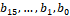
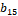
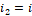

3GPP TS 38.214 V15.16.0 (2022-03)

Technical Specification

3rd Generation Partnership Project;

Technical Specification Group Radio Access Network;

NR;

Physical layer procedures for data

(Release 15)

{width="1.3243055555555556in"
height="0.9166666666666666in"}
{width="1.7777777777777777in"
height="1.0368055555555555in"}

The present document has been developed within the 3rd Generation
Partnership Project (3GPP ^TM^) and may be further elaborated for the
purposes of 3GPP..\
The present document has not been subject to any approval process by the
3GPP Organizational Partners and shall not be implemented.\
This Specification is provided for future development work within 3GPP
only. The Organizational Partners accept no liability for any use of
this Specification.\
Specifications and Reports for implementation of the 3GPP ^TM^ system
should be obtained via the 3GPP Organizational Partners\' Publications
Offices.

> Keywords
>
> 3GPP, New Radio, Layer 1
>
> ***3GPP***
>
> Postal address
>
> 3GPP support office address
>
> 650 Route des Lucioles - Sophia Antipolis
>
> Valbonne - FRANCE
>
> Tel.: +33 4 92 94 42 00 Fax: +33 4 93 65 47 16
>
> Internet
>
> http://www.3gpp.org

***Copyright Notification***

No part may be reproduced except as authorized by written permission.\
The copyright and the foregoing restriction extend to reproduction in
all media.

© 2022, 3GPP Organizational Partners (ARIB, ATIS, CCSA, ETSI, TSDSI,
TTA, TTC).

All rights reserved.

UMTS™ is a Trade Mark of ETSI registered for the benefit of its members

3GPP™ is a Trade Mark of ETSI registered for the benefit of its Members
and of the 3GPP Organizational Partners\
LTE™ is a Trade Mark of ETSI registered for the benefit of its Members
and of the 3GPP Organizational Partners

GSM® and the GSM logo are registered and owned by the GSM Association

 Contents {#contents .TT}
========

Foreword 5

1 Scope 6

2 References 6

3 Definitions, symbols and abbreviations 6

3.1 Definitions 6

3.2 Symbols 6

3.3 Abbreviations 6

4 Power control 7

4.1 Power allocation for downlink 7

5 Physical downlink shared channel related procedures 8

5.1 UE procedure for receiving the physical downlink shared channel 8

5.1.1 Transmission schemes 10

5.1.1.1 Transmission scheme 1 10

5.1.2 Resource allocation 10

5.1.2.1 Resource allocation in time domain 10

5.1.2.1.1 Determination of the resource allocation table to be used for
PDSCH 11

5.1.2.2 Resource allocation in frequency domain 14

5.1.2.2.1 Downlink resource allocation type 0 15

5.1.2.2.2 Downlink resource allocation type 1 15

5.1.2.3 Physical resource block (PRB) bundling 16

5.1.3 Modulation order, target code rate, redundancy version and
transport block size determination 17

5.1.3.1 Modulation order and target code rate determination 19

5.1.3.2 Transport block size determination 22

5.1.4 PDSCH resource mapping 25

5.1.4.1 PDSCH resource mapping with RB symbol level granularity 25

5.1.4.2 PDSCH resource mapping with RE level granularity 26

5.1.5 Antenna ports quasi co-location 27

5.1.6 UE procedure for receiving downlink reference signals 29

5.1.6.1 CSI-RS reception procedure 29

5.1.6.1.1 CSI-RS for tracking 30

5.1.6.1.2 CSI-RS for L1-RSRP computation 31

5.1.6.1.3 CSI-RS for mobility 31

5.1.6.2 DM-RS reception procedure 32

5.1.6.3 PT-RS reception procedure 33

5.1.7 Code block group based PDSCH transmission 35

5.1.7.1 UE procedure for grouping of code blocks to code block groups 35

5.1.7.2 UE procedure for receiving code block group based transmissions
35

5.2 UE procedure for reporting channel state information (CSI) 36

5.2.1 Channel state information framework 36

5.2.1.1 Reporting settings 36

5.2.1.2 Resource settings 36

5.2.1.3 (void) 37

5.2.1.4 Reporting configurations 37

5.2.1.4.1 Resource Setting configuration 39

5.2.1.4.2 Report Quantity Configurations 40

5.2.1.4.3 L1-RSRP Reporting 41

5.2.1.5 Triggering/activation of CSI Reports and CSI-RS 42

5.2.1.5.1 Aperiodic CSI Reporting/Aperiodic CSI-RS 42

5.2.1.5.2 Semi-persistent CSI/Semi-persistent CSI-RS 43

5.2.1.6 CSI processing criteria 44

5.2.2 Channel state information 46

5.2.2.1 Channel quality indicator (CQI) 46

5.2.2.1.1 (void) 48

5.2.2.2 Precoding matrix indicator (PMI) 48

5.2.2.2.1 Type I Single-Panel Codebook 48

5.2.2.2.2 Type I Multi-Panel Codebook 54

5.2.2.2.3 Type II Codebook 58

5.2.2.2.4 Type II Port Selection Codebook 64

5.2.2.3 Reference signal (CSI-RS) 67

5.2.2.3.1 NZP CSI-RS 67

5.2.2.4 Channel State Information -- Interference Measurement (CSI-IM)
68

5.2.2.5 CSI reference resource definition 69

5.2.3 CSI reporting using PUSCH 70

5.2.4 CSI reporting using PUCCH 72

5.2.5 Priority rules for CSI reports 73

5.3 UE PDSCH processing procedure time 73

5.4 UE CSI computation time 75

6 Physical uplink shared channel related procedure 76

6.1 UE procedure for transmitting the physical uplink shared channel 76

6.1.1 Transmission schemes 77

6.1.1.1 Codebook based UL transmission 77

6.1.1.2 Non-Codebook based UL transmission 78

6.1.2 Resource allocation 79

6.1.2.1 Resource allocation in time domain 79

6.1.2.1.1 Determination of the resource allocation table to be used for
PUSCH 80

6.1.2.2 Resource allocation in frequency domain 82

6.1.2.2.1 Uplink resource allocation type 0 83

6.1.2.2.2 Uplink resource allocation type 1 83

6.1.2.3 Resource allocation for uplink transmission with configured
grant 84

6.1.3 UE procedure for applying transform precoding on PUSCH 85

6.1.4 Modulation order, redundancy version and transport block size
determination 85

6.1.4.1 Modulation order and target code rate determination 87

6.1.4.2 Transport block size determination 90

6.1.5 Code block group based PUSCH transmission 91

6.1.5.1 UE procedure for grouping of code blocks to code block groups 91

6.1.5.2 UE procedure for transmitting code block group based
transmissions 92

6.2 UE reference signal (RS) procedure 92

6.2.1 UE sounding procedure 92

6.2.1.1 UE SRS frequency hopping procedure 95

6.2.1.2 UE sounding procedure for DL CSI acquisition 95

6.2.1.3 UE sounding procedure between component carriers 96

6.2.2 UE DM-RS transmission procedure 98

6.2.3 UE PT-RS transmission procedure 99

6.2.3.1 UE PT-RS transmission procedure when transform precoding is not
enabled 99

6.2.3.2 UE PT-RS transmission procedure when transform precoding is
enabled 101

6.3 UE PUSCH frequency hopping procedure 102

6.4 UE PUSCH preparation procedure time 103

Annex A (informative): Change history 104

 Foreword
========

This Technical Specification has been produced by the 3rd Generation
Partnership Project (3GPP).

The contents of the present document are subject to continuing work
within the TSG and may change following formal TSG approval. Should the
TSG modify the contents of the present document, it will be re-released
by the TSG with an identifying change of release date and an increase in
version number as follows:

Version x.y.z

where:

x the first digit:

1 presented to TSG for information;

2 presented to TSG for approval;

3 or greater indicates TSG approved document under change control.

y the second digit is incremented for all changes of substance, i.e.
technical enhancements, corrections, updates, etc.

z the third digit is incremented when editorial only changes have been
incorporated in the document.

 1 Scope
=======

The present document specifies and establishes the characteristics of
the physicals layer procedures of data channels for 5G-NR.

2 References
============

The following documents contain provisions which, through reference in
this text, constitute provisions of the present document.

\[1\] 3GPP TR 21.905: \"Vocabulary for 3GPP Specifications\"

\[2\] 3GPP TS 38.201: \" NR; Physical Layer -- General Description\"

\[3\] 3GPP TS 38.202: \"NR; Services provided by the physical layer\"

\[4\] 3GPP TS 38.211: \"NR; Physical channels and modulation\"

\[5\] 3GPP TS 38.212: \"NR; Multiplexing and channel coding\"

\[6\] 3GPP TS 38.213: \"NR; Physical layer procedures for control\"

\[7\] 3GPP TS 38.215: \"NR; Physical layer measurements\"

\[8\] 3GPP TS 38.101: \"NR; User Equipment (UE) radio transmission and
reception\"

\[9\] 3GPP TS 38.104: \"NR; Base Station (BS) radio transmission and
reception\"

\[10\] 3GPP TS 38.321: \"NR; Medium Access Control (MAC) protocol
specification\"

\[11\] 3GPP TS 38.133: \"NR; Requirements for support of radio resource
management\"

\[12\] 3GPP TS 38.331: \"NR; Radio Resource Control (RRC); Protocol
specification\"

\[13\] 3GPP TS 38.306: \"NR; User Equipment (UE) radio access
capabilities\"

\[14\] 3GPP TS 38.423: \"NG-RAN; Xn Application Protocol (XnAP)\"

\[15\] 3GPP TS 36.211: \"Evolved Universal Terrestrial Radio Access
(E-UTRA); Physical channels and modulation\"

3 Definitions, symbols and abbreviations
========================================

3.1 Definitions
---------------

For the purposes of the present document, the terms and definitions
given in TR 21.905 \[1\] and the following apply. A term defined in the
present document takes precedence over the definition of the same term,
if any, in TR 21.905 \[1\].

3.2 Symbols
-----------

For the purposes of the present document, the following symbols apply:

3.3 Abbreviations
-----------------

For the purposes of the present document, the abbreviations given in
TR 21.905 \[1\] and the following apply. An abbreviation defined in the
present document takes precedence over the definition of the same
abbreviation, if any, in TR 21.905 \[1\].

BWP Bandwidth part

CBG Code block group

CP Cyclic prefix

CQI Channel quality indicator

CPU CSI processing unit

CRB Common resource block

CRC Cyclic redundancy check

CRI CSI-RS Resource Indicator

CSI Channel state information

CSI-RS Channel state information reference signal

CSI-RSRP CSI reference signal received power

CSI-RSRQ CSI reference signal received quality

CSI-SINR CSI signal-to-noise and interference ratio

CW Codeword

DCI Downlink control information

DL Downlink

DM-RS Demodulation reference signals

EPRE Energy per resource element

L1-RSRP Layer 1 reference signal received power

LI Layer Indicator

MCS Modulation and coding scheme

PDCCH Physical downlink control channel

PDSCH Physical downlink shared channel

PSS Primary Synchronisation signal

PUCCH Physical uplink control channel

QCL Quasi co-location

PMI Precoding Matrix Indicator

PRB Physical resource block

PRG Precoding resource block group

PT-RS Phase-tracking reference signal

RB Resource block

RBG Resource block group

RI Rank Indicator

RIV Resource indicator value

RS Reference signal

SLIV Start and length indicator value

SR Scheduling Request

SRS Sounding reference signal

SS Synchronisation signal

SSS Secondary Synchronisation signal

SS-RSRP SS reference signal received power

SS-RSRQ SS reference signal received quality

SS-SINR SS signal-to-noise and interference ratio

TB Transport Block

TCI Transmission Configuration Indicator

TDM Time division multiplexing

UE User equipment

UL Uplink

4 Power control
===============

4.1 Power allocation for downlink 
---------------------------------

The gNB determines the downlink transmit EPRE.

For the purpose of SS-RSRP, SS-RSRQ and SS-SINR measurements, the UE may
assume downlink EPRE is constant across the bandwidth. For the purpose
of SS-RSRP, SS-RSRQ and SS-SINR measurements, the UE may assume downlink
EPRE is constant over SSS carried in different SS/PBCH blocks. For the
purpose of SS-RSRP, SS-RSRQ and SS-SINR measurements, the UE may assume
that the ratio of SSS EPRE to PBCH DM-RS EPRE is 0 dB.

For the purpose of CSI-RSRP, CSI-RSRQ and CSI-SINR measurements, the UE
may assume downlink EPRE of a port of CSI-RS resource configuration is
constant across the configured downlink bandwidth and constant across
all configured OFDM symbols.

The downlink SS/PBCH SSS EPRE can be derived from the SS/PBCH downlink
transmit power given by the parameter *ss-PBCH-BlockPower* provided by
higher layers. The downlink SSS transmit power is defined as the linear
average over the power contributions (in \[W\]) of all resource elements
that carry the SSS within the operating system bandwidth.

The downlink CSI-RS EPRE can be derived from the SS/PBCH block downlink
transmit power given by the parameter *ss-PBCH-BlockPower* and CSI-RS
power offset given by the parameter *powerControlOffsetSS* provided by
higher layers. The downlink reference-signal transmit power is defined
as the linear average over the power contributions (in \[W\]) of the
resource elements that carry the configured CSI-RS within the operating
system bandwidth.

For downlink DM-RS associated with PDSCH, the UE may assume the ratio of
PDSCH EPRE to DM-RS EPRE ( \[dB\]) is given by Table 4.1-1 according to
the number of DM-RS CDM groups without data as described in clause
5.1.6.2. The DM-RS scaling factor specified in clause 7.4.1.1.2 of \[4,
TS 38.211\] is given by .

Table 4.1-1: The ratio of PDSCH EPRE to DM-RS EPRE

  Number of DM-RS CDM groups without data   DM-RS configuration type 1   DM-RS configuration type 2
  ----------------------------------------- ---------------------------- ----------------------------
  1                                         0 dB                         0 dB
  2                                         -3 dB                        -3 dB
  3                                         \-                           -4.77 dB

When the UE is scheduled with a PT-RS port associated with the PDSCH,

\- if the UE is configured with the higher layer parameter *epre-Ratio*,
the ratio of PT-RS EPRE to PDSCH EPRE per layer per RE for PT-RS port ()
is given by Table 4.1-2 according to the *epre-Ratio*, the PT-RS scaling
factor specified in clause 7.4.1.2.2 of \[4, TS 38.211\] is given by.

\- otherwise, the UE shall assume *epre-Ratio* is set to state \'0\' in
Table 4.1-2 if not configured.

Table 4.1-2: PT-RS EPRE to PDSCH EPRE per layer per RE ()

  *epre-Ratio*   The number of PDSCH layers                      
  -------------- ---------------------------- --- ------ --- --- ------
                 1                            2   3      4   5   6
  0              0                            3   4.77   6   7   7.78
  1              0                            0   0      0   0   0
  2              reserved                                        
  3              reserved                                        

For link recovery, as described in clause 6 of \[6, TS 38.213\] the
ratio of the PDCCH EPRE to NZP CSI-RS EPRE is assumed as 0 dB.

5 Physical downlink shared channel related procedures
=====================================================

5.1 UE procedure for receiving the physical downlink shared channel
-------------------------------------------------------------------

For downlink, a maximum of 16 HARQ processes per cell is supported by
the UE. The number of processes the UE may assume will at most be used
for the downlink is configured to the UE for each cell separately by
higher layer parameter *nrofHARQ-ProcessesForPDSCH*, and when no
configuration is provided the UE may assume a default number of 8
processes.

A UE shall upon detection of a PDCCH with a configured DCI format 1\_0
or 1\_1 decode the corresponding PDSCHs as indicated by that DCI. For
any HARQ process ID(s) in a given scheduled cell, the UE is not expected
to receive a PDSCH that overlaps in time with another PDSCH. The UE is
not expected to receive another PDSCH for a given HARQ process until
after the end of the expected transmission of HARQ-ACK for that HARQ
process, where the timing is given by clause 9.2.3 of \[6\]. In a given
scheduled cell, the UE is not expected to receive a first PDSCH in slot
*i*, with the corresponding HARQ-ACK assigned to be transmitted in slot
*j*, and a second PDSCH starting later than the first PDSCH with its
corresponding HARQ-ACK assigned to be transmitted in a slot before slot
*j*. For any two HARQ process IDs in a given scheduled cell, if the UE
is scheduled to start receiving a first PDSCH starting in symbol *j* by
a PDCCH ending in symbol *i*, the UE is not expected to be scheduled to
receive a PDSCH starting earlier than the end of the first PDSCH with a
PDCCH that ends later than symbol *i*. In a given scheduled cell, for
any PDSCH corresponding to SI-RNTI, the UE is not expected to decode a
re-transmission of an earlier PDSCH with a starting symbol less than *N*
symbols after the last symbol of that PDSCH, where the value of *N*
depends on the PDSCH subcarrier spacing configuration *μ,* with *N*=13
for *μ*=0, *N*=13 for *μ*=1, *N*=20 for *μ*=2, and *N*=24 for *μ*=3.

When receiving PDSCH scheduled with SI-RNTI or P-RNTI, the UE may assume
that the DM-RS port of PDSCH is quasi co-located with the associated
SS/PBCH block with respect to Doppler shift, Doppler spread, average
delay, delay spread, spatial RX parameters when applicable.

When receiving PDSCH scheduled with RA-RNTI the UE may assume that the
DM-RS port of PDSCH is quasi co-located with the SS/PBCH block or the
CSI-RS resource the UE used for RACH association and transmission with
respect to Doppler shift, Doppler spread, average delay, delay spread,
spatial RX parameters when applicable. When receiving a PDSCH scheduled
with RA-RNTI in response to a random access procedure triggered by a
PDCCH order which triggers contention-free random access procedure for
the SpCell \[10, TS 38.321\], the UE may assume that the DM-RS port of
the received PDCCH order and the DM-RS ports of the corresponding PDSCH
scheduled with RA-RNTI are quasi co-located with the same SS/PBCH block
or CSI-RS with respect to Doppler shift, Doppler spread, average delay,
delay spread, spatial RX parameters when applicable.

When receiving PDSCH in response to a PUSCH transmission scheduled by a
RAR UL grant or corresponding PUSCH retransmission the UE may assume
that the DM-RS port of PDSCH is quasi co-located with the SS/PBCH block
the UE selected for RACH association and transmission with respect to
Doppler shift, Doppler spread, average delay, delay spread, spatial RX
parameters when applicable.

If the UE is not configured for PUSCH/PUCCH transmission for at least
one serving cell configured with slot formats comprised of DL and UL
symbols, and if the UE is not capable of simultaneous reception and
transmission on serving cell *c~1~* and serving cell *c~2~*, the UE is
not expected to receive PDSCH on serving cell *c~1~* if the PDSCH
overlaps in time with SRS transmission (including any interruption due
to uplink or downlink RF retuning time \[10\]) on serving cell *c~2~*
not configured for PUSCH/PUCCH transmission.

The UE is not expected to decode a PDSCH scheduled in a serving cell
with C-RNTI or MCS-C-RNTI and another PDSCH scheduled in the same
serving cell with CS-RNTI if the PDSCHs partially or fully overlap in
time except if the PDCCH scheduling the PDSCH with C-RNTI or MCS-C-RNTI
ends at least 14 symbols before the start of the PDSCH with CS-RNTI
without the corresponding DCI, in which case the UE shall decode the
PDSCH scheduled with C-RNTI or MCS-C-RNTI.

The UE is not expected to decode a PDSCH scheduled with C-RNTI,
MCS-C-RNTI, or CS-RNTI if another PDSCH in the same cell scheduled with
RA-RNTI partially or fully overlap in time.

The UE in RRC\_IDLE and RRC\_INACTIVE modes shall be able to decode two
PDSCHs each scheduled with SI-RNTI, P-RNTI, RA-RNTI or TC-RNTI, with the
two PDSCHs partially or fully overlapping in time in non-overlapping
PRBs.

On a frequency range 1 cell, the UE shall be able to decode a PDSCH
scheduled with C-RNTI, MCS-C-RNTI, or CS-RNTI and, during a process of
P-RNTI triggered SI acquisition, another PDSCH scheduled with SI-RNTI
that partially or fully overlap in time in non-overlapping PRBs, unless
the PDSCH scheduled with C-RNTI, MCS-C-RNTI, or CS-RNTI requires
Capability 2 processing time according to clause 5.3 in which case the
UE may skip decoding of the scheduled PDSCH with C-RNTI, MCS-C-RNTI, or
CS-RNTI.

On a frequency range 2 cell, the UE is not expected to decode a PDSCH
scheduled with C-RNTI, MCS-C-RNTI, or CS-RNTI if in the same cell,
during a process of P-RNTI triggered SI acquisition, another PDSCH
scheduled with SI-RNTI partially or fully overlap in time.

The UE is expected to decode a PDSCH scheduled with C-RNTI, MCS-C-RNTI,
or CS-RNTI during a process of autonomous SI acquisition.

If the UE is configured by higher layers to decode a PDCCH with its CRC
scrambled by a CS-RNTI, the UE shall receive PDSCH transmissions without
corresponding PDCCH transmissions using the higher-layer-provided PDSCH
configuration for those PDSCHs.

### 5.1.1 Transmission schemes

Only one transmission scheme is defined for the PDSCH, and is used for
all PDSCH transmissions.

#### 5.1.1.1 Transmission scheme 1

For transmission scheme 1 of the PDSCH, the UE may assume that a gNB
transmission on the PDSCH would be performed with up to 8 transmission
layers on antenna ports 1000-1011 as defined in clause 7.3.1.4 of \[4,
TS 38.211\], subject to the DM-RS reception procedures in clause
5.1.6.2.

### 5.1.2 Resource allocation

#### 5.1.2.1 Resource allocation in time domain

When the UE is scheduled to receive PDSCH by a DCI, the *Time domain
resource assignment* field value *m* of the DCI provides a row index *m*
+ 1 to an allocation table. The determination of the used resource
allocation table is defined in clause 5.1.2.1.1. The indexed row defines
the slot offset *K~0~*, the start and length indicator *SLIV*, or
directly the start symbol *S* and the allocation length *L*, and the
PDSCH mapping type to be assumed in the PDSCH reception.

Given the parameter values of the indexed row:

\- The slot allocated for the PDSCH is , where *n* is the slot with the
scheduling DCI, and *K~0~* is based on the numerology of PDSCH, and and
are the subcarrier spacing configurations for PDSCH and PDCCH,
respectively, and

\- The starting symbol *S* relative to the start of the slot, and the
number of consecutive symbols *L* counting from the symbol *S* allocated
for the PDSCH are determined from the start and length indicator *SLIV*:

if then

else

where, and

\- The PDSCH mapping type is set to Type A or Type B as defined in
clause 7.4.1.1.2 of \[4, TS 38.211\].

The UE shall consider the *S* and *L* combinations defined in table
5.1.2.1-1 as valid PDSCH allocations:

Table 5.1.2.1-1: Valid *S* and *L* combinations

+---------+---------+---------+---------+---------+---------+---------+
| PDSCH   | Normal  | E       |         |         |         |         |
| mapping | cyclic  | xtended |         |         |         |         |
| type    | prefix  | cyclic  |         |         |         |         |
|         |         | prefix  |         |         |         |         |
+=========+=========+=========+=========+=========+=========+=========+
|         | *S*     | *L*     | *S+L*   | *S*     | *L*     | *S+L*   |
+---------+---------+---------+---------+---------+---------+---------+
| Type A  | {0      | {3,     | {3,     | {0      | {3,     | {3,     |
|         | ,1,2,3} | ...,14} | ...,14} | ,1,2,3} | ...,12} | ...,12} |
|         |         |         |         |         |         |         |
|         | (Note   |         |         | (Note   |         |         |
|         | 1)      |         |         | 1)      |         |         |
+---------+---------+---------+---------+---------+---------+---------+
| Type B  | {0,     | {2,4,7} | {2,     | {0,     | {2,4,6} | {2,     |
|         | ...,12} |         | ...,14} | ...,10} |         | ...,12} |
+---------+---------+---------+---------+---------+---------+---------+
| Note 1: |         |         |         |         |         |         |
| S = 3   |         |         |         |         |         |         |
| is      |         |         |         |         |         |         |
| app     |         |         |         |         |         |         |
| licable |         |         |         |         |         |         |
| only if |         |         |         |         |         |         |
| *dmrs-T |         |         |         |         |         |         |
| ypeA-Po |         |         |         |         |         |         |
| sition* |         |         |         |         |         |         |
| = 3     |         |         |         |         |         |         |
+---------+---------+---------+---------+---------+---------+---------+

When receiving PDSCH scheduled by DCI format 1\_1 in PDCCH with CRC
scrambled by C-RNTI, MCS-C-RNTI, CS-RNTI, or PDSCH scheduled without
corresponding PDCCH transmission using *sps-Config* and activated by DCI
format 1\_1, if the UE is configured with *pdsch-AggregationFactor*, the
same symbol allocation is applied across the *pdsch-AggregationFactor*
consecutive slots. The UE may expect that the TB is repeated within each
symbol allocation among each of the *pdsch-AggregationFactor*
consecutive slots and the PDSCH is limited to a single transmission
layer. The redundancy version to be applied on the *n*^th^ transmission
occasion of the TB, where n = 0, 1, ...*pdsch-AggregationFactor* -1, is
determined according to table 5.1.2.1-2 and \"*rv~id~* indicated by the
DCI scheduling the PDSCH\" in table 5.1.2.1-2 is assumed to be 0 for
PDSCH scheduled without corresponding PDCCH transmission using
*sps-Config* and activated by DCI format 1\_1.

Table 5.1.2.1-2: Applied redundancy version when
*pdsch-AggregationFactor* is present

  *rv~id\ ~*indicated by the DCI scheduling the PDSCH   *rv~id~* to be applied to *n*^th^ transmission occasion                                   
  ----------------------------------------------------- --------------------------------------------------------- --------------- --------------- ---------------
                                                        *n* mod 4 = 0                                             *n* mod 4 = 1   *n* mod 4 = 2   *n* mod 4 = 3
  0                                                     0                                                         2               3               1
  2                                                     2                                                         3               1               0
  3                                                     3                                                         1               0               2
  1                                                     1                                                         0               2               3

A PDSCH reception in a slot of a multi-slot PDSCH reception is omitted
according to the conditions in clause 11.1 of \[6, TS38.213\].

The UE is not expected to receive a PDSCH with mapping type A in a slot,
if the PDCCH scheduling the PDSCH was received in the same slot and was
not contained within the first three symbols of the slot.

The UE is not expected to receive a PDSCH with mapping type B in a slot,
if the first symbol of the PDCCH scheduling the PDSCH was received in a
later symbol than the first symbol indicated in the PDSCH time domain
resource allocation.

##### 5.1.2.1.1 Determination of the resource allocation table to be used for PDSCH

Table 5.1.2.1.1-1 defines which PDSCH time domain resource allocation
configuration to apply. Either a default PDSCH time domain allocation A,
B or C according to tables 5.1.2.1.1-2, 5.1.2.1.1-3, 5.1.2.1.1-4 and
5.1.2.1.1-5 is applied, or the higher layer configured
*pdsch-TimeDomainAllocationList* in either *pdsch-ConfigCommon* or
*pdsch-Config* is applied.

Table 5.1.2.1.1-1: Applicable PDSCH time domain resource allocation

+----------+----------+----------+----------+----------+----------+
| RNTI     | PDCCH    | SS/PBCH  | *pds     | *pdsch   | PDSCH    |
|          | search   | block    | ch-Confi | -Config* | time     |
|          | space    | and      | gCommon* | includes | domain   |
|          |          | CORESET  | includes | *pdsch-T | resource |
|          |          | mult     | *pdsch-T | imeDomai | al       |
|          |          | iplexing | imeDomai | nAllocat | location |
|          |          | pattern  | nAllocat | ionList* | to apply |
|          |          |          | ionList* |          |          |
+==========+==========+==========+==========+==========+==========+
| SI-RNTI  | Type0    | 1        | \-       | \-       | Default  |
|          | common   |          |          |          | A for    |
|          |          |          |          |          | normal   |
|          |          |          |          |          | CP       |
+----------+----------+----------+----------+----------+----------+
|          |          | 2        | \-       | \-       | Default  |
|          |          |          |          |          | B        |
+----------+----------+----------+----------+----------+----------+
|          |          | 3        | \-       | \-       | Default  |
|          |          |          |          |          | C        |
+----------+----------+----------+----------+----------+----------+
| SI-RNTI  | Type0A   | 1        | No       | \-       | Default  |
|          | common   |          |          |          | A        |
+----------+----------+----------+----------+----------+----------+
|          |          | 2        | No       | \-       | Default  |
|          |          |          |          |          | B        |
+----------+----------+----------+----------+----------+----------+
|          |          | 3        | No       | \-       | Default  |
|          |          |          |          |          | C        |
+----------+----------+----------+----------+----------+----------+
|          |          | 1,2,3    | Yes      | \-       | *pdsch-  |
|          |          |          |          |          | TimeDoma |
|          |          |          |          |          | inAlloca |
|          |          |          |          |          | tionList |
|          |          |          |          |          | provided |
|          |          |          |          |          | in       |
|          |          |          |          |          | pds      |
|          |          |          |          |          | ch-Confi |
|          |          |          |          |          | gCommon* |
+----------+----------+----------+----------+----------+----------+
| RA-RNTI, | Type1    | 1, 2, 3  | No       | \-       | Default  |
| TC-RNTI  | common   |          |          |          | A        |
+----------+----------+----------+----------+----------+----------+
|          |          | 1, 2, 3  | Yes      | \-       | *pdsch-T |
|          |          |          |          |          | imeDomai |
|          |          |          |          |          | nAllocat |
|          |          |          |          |          | ionList* |
|          |          |          |          |          | provided |
|          |          |          |          |          | in       |
|          |          |          |          |          | *pds     |
|          |          |          |          |          | ch-Confi |
|          |          |          |          |          | gCommon* |
+----------+----------+----------+----------+----------+----------+
| P-RNTI   | Type2    | 1        | No       | \-       | Default  |
|          | common   |          |          |          | A        |
+----------+----------+----------+----------+----------+----------+
|          |          | 2        | No       | \-       | Default  |
|          |          |          |          |          | B        |
+----------+----------+----------+----------+----------+----------+
|          |          | 3        | No       | \-       | Default  |
|          |          |          |          |          | C        |
+----------+----------+----------+----------+----------+----------+
|          |          | 1,2,3    | Yes      | \-       | *pdsch-  |
|          |          |          |          |          | TimeDoma |
|          |          |          |          |          | inAlloca |
|          |          |          |          |          | tionList |
|          |          |          |          |          | provided |
|          |          |          |          |          | in       |
|          |          |          |          |          | pds      |
|          |          |          |          |          | ch-Confi |
|          |          |          |          |          | gCommon* |
+----------+----------+----------+----------+----------+----------+
| C-RNTI,  | Any      | 1, 2, 3  | No       | \-       | Default  |
| MCS      | common   |          |          |          | A        |
| -C-RNTI, | search   |          |          |          |          |
| CS-RNTI  | space    |          |          |          |          |
|          | as       |          |          |          |          |
|          | sociated |          |          |          |          |
|          | with     |          |          |          |          |
|          | CORESET  |          |          |          |          |
|          | 0        |          |          |          |          |
+----------+----------+----------+----------+----------+----------+
|          |          | 1, 2, 3  | Yes      | \-       | *pdsch-T |
|          |          |          |          |          | imeDomai |
|          |          |          |          |          | nAllocat |
|          |          |          |          |          | ionList* |
|          |          |          |          |          | provided |
|          |          |          |          |          | in       |
|          |          |          |          |          | *pds     |
|          |          |          |          |          | ch-Confi |
|          |          |          |          |          | gCommon* |
+----------+----------+----------+----------+----------+----------+
| C-RNTI,  | Any      | 1,2,3    | No       | No       | Default  |
| MCS      | common   |          |          |          | A        |
| -C-RNTI, | search   |          |          |          |          |
| CS-RNTI  | space    |          |          |          |          |
|          | not      |          |          |          |          |
|          | as       |          |          |          |          |
|          | sociated |          |          |          |          |
|          | with     |          |          |          |          |
|          | CORESET  |          |          |          |          |
|          | 0        |          |          |          |          |
|          |          |          |          |          |          |
|          | UE       |          |          |          |          |
|          | specific |          |          |          |          |
|          | search   |          |          |          |          |
|          | space    |          |          |          |          |
+----------+----------+----------+----------+----------+----------+
|          |          | 1,2,3    | Yes      | No       | *pdsch-T |
|          |          |          |          |          | imeDomai |
|          |          |          |          |          | nAllocat |
|          |          |          |          |          | ionList* |
|          |          |          |          |          | provided |
|          |          |          |          |          | in       |
|          |          |          |          |          | *pds     |
|          |          |          |          |          | ch-Confi |
|          |          |          |          |          | gCommon* |
+----------+----------+----------+----------+----------+----------+
|          |          | 1,2,3    | No/Yes   | Yes      | *pdsch-T |
|          |          |          |          |          | imeDomai |
|          |          |          |          |          | nAllocat |
|          |          |          |          |          | ionList* |
|          |          |          |          |          | provided |
|          |          |          |          |          | in       |
|          |          |          |          |          | *pdsch   |
|          |          |          |          |          | -Config* |
+----------+----------+----------+----------+----------+----------+

Table 5.1.2.1.1-2: Default PDSCH time domain resource allocation A for
normal CP

  Row index   *dmrs-TypeA-Position*   PDSCH mapping type   *K~0~*   *S*   *L*
  ----------- ----------------------- -------------------- -------- ----- -----
  1           2                       Type A               0        2     12
              3                       Type A               0        3     11
  2           2                       Type A               0        2     10
              3                       Type A               0        3     9
  3           2                       Type A               0        2     9
              3                       Type A               0        3     8
  4           2                       Type A               0        2     7
              3                       Type A               0        3     6
  5           2                       Type A               0        2     5
              3                       Type A               0        3     4
  6           2                       Type B               0        9     4
              3                       Type B               0        10    4
  7           2                       Type B               0        4     4
              3                       Type B               0        6     4
  8           2,3                     Type B               0        5     7
  9           2,3                     Type B               0        5     2
  10          2,3                     Type B               0        9     2
  11          2,3                     Type B               0        12    2
  12          2,3                     Type A               0        1     13
  13          2,3                     Type A               0        1     6
  14          2,3                     Type A               0        2     4
  15          2,3                     Type B               0        4     7
  16          2,3                     Type B               0        8     4

Table 5.1.2.1.1-3: Default PDSCH time domain resource allocation A for
extended CP

  Row index   *dmrs-TypeA-Position*   PDSCH mapping type   *K~0~*   *S*   *L*
  ----------- ----------------------- -------------------- -------- ----- -----
  1           2                       Type A               0        2     6
              3                       Type A               0        3     5
  2           2                       Type A               0        2     10
              3                       Type A               0        3     9
  3           2                       Type A               0        2     9
              3                       Type A               0        3     8
  4           2                       Type A               0        2     7
              3                       Type A               0        3     6
  5           2                       Type A               0        2     5
              3                       Type A               0        3     4
  6           2                       Type B               0        6     4
              3                       Type B               0        8     2
  7           2                       Type B               0        4     4
              3                       Type B               0        6     4
  8           2,3                     Type B               0        5     6
  9           2,3                     Type B               0        5     2
  10          2,3                     Type B               0        9     2
  11          2,3                     Type B               0        10    2
  12          2,3                     Type A               0        1     11
  13          2,3                     Type A               0        1     6
  14          2,3                     Type A               0        2     4
  15          2,3                     Type B               0        4     6
  16          2,3                     Type B               0        8     4

Table 5.1.2.1.1-4: Default PDSCH time domain resource allocation B

  **Row index**                                                                                                                                              ***dmrs-TypeA-Position***   **PDSCH mapping type**   ***K~0~***   ***S***   ***L***
  ---------------------------------------------------------------------------------------------------------------------------------------------------------- --------------------------- ------------------------ ------------ --------- ---------
  1                                                                                                                                                          2,3                         Type B                   0            2         2
  2                                                                                                                                                          2,3                         Type B                   0            4         2
  3                                                                                                                                                          2,3                         Type B                   0            6         2
  4                                                                                                                                                          2,3                         Type B                   0            8         2
  5                                                                                                                                                          2,3                         Type B                   0            10        2
  6                                                                                                                                                          2,3                         Type B                   1            2         2
  7                                                                                                                                                          2,3                         Type B                   1            4         2
  8                                                                                                                                                          2,3                         Type B                   0            2         4
  9                                                                                                                                                          2,3                         Type B                   0            4         4
  10                                                                                                                                                         2,3                         Type B                   0            6         4
  11                                                                                                                                                         2,3                         Type B                   0            8         4
  12 (Note 1)                                                                                                                                                2,3                         Type B                   0            10        4
  13 (Note 1)                                                                                                                                                2,3                         Type B                   0            2         7
  14 (Note 1)                                                                                                                                                2                           Type A                   0            2         12
                                                                                                                                                             3                           Type A                   0            3         11
  15                                                                                                                                                         2,3                         Type B                   1            2         4
  16                                                                                                                                                         Reserved                                                                    
  Note 1: If the PDSCH was scheduled with SI-RNTI in PDCCH Type0 common search space, the UE may assume that this PDSCH resource allocation is not applied                                                                               

Table 5.1.2.1.1-5: Default PDSCH time domain resource allocation C

  **Row index**                                                                                                                                           ***dmrs-TypeA-Position***   **PDSCH mapping type**   ***K~0~***   ***S***   ***L***
  ------------------------------------------------------------------------------------------------------------------------------------------------------- --------------------------- ------------------------ ------------ --------- ---------
  1 (Note 1)                                                                                                                                              2,3                         Type B                   0            2         2
  2                                                                                                                                                       2,3                         Type B                   0            4         2
  3                                                                                                                                                       2,3                         Type B                   0            6         2
  4                                                                                                                                                       2,3                         Type B                   0            8         2
  5                                                                                                                                                       2,3                         Type B                   0            10        2
  6                                                                                                                                                       Reserved                                                                    
  7                                                                                                                                                       Reserved                                                                    
  8                                                                                                                                                       2,3                         Type B                   0            2         4
  9                                                                                                                                                       2,3                         Type B                   0            4         4
  10                                                                                                                                                      2,3                         Type B                   0            6         4
  11                                                                                                                                                      2,3                         Type B                   0            8         4
  12                                                                                                                                                      2,3                         Type B                   0            10        4
  13 (Note 1)                                                                                                                                             2,3                         Type B                   0            2         7
  14 (Note 1)                                                                                                                                             2                           Type A                   0            2         12
                                                                                                                                                          3                           Type A                   0            3         11
  15 (Note 1)                                                                                                                                             2,3                         Type A                   0            0         6
  16 (Note 1)                                                                                                                                             2,3                         Type A                   0            2         6
  Note 1: The UE may assume that this PDSCH resource allocation is not used, if the PDSCH was scheduled with SI-RNTI in PDCCH Type0 common search space                                                                               

#### 5.1.2.2 Resource allocation in frequency domain

Two downlink resource allocation schemes, type 0 and type 1, are
supported. The UE shall assume that when the scheduling grant is
received with DCI format 1\_0, then downlink resource allocation type 1
is used.

If the scheduling DCI is configured to indicate the downlink resource
allocation type as part of the *Frequency domain resource assignment*
field by setting a higher layer parameter *resourceAllocation* in
*pdsch-Config* to \'dynamicswitch\', the UE shall use downlink resource
allocation type 0 or type 1 as defined by this DCI field. Otherwise the
UE shall use the downlink frequency resource allocation type as defined
by the higher layer parameter *resourceAllocation*.

If a bandwidth part indicator field is not configured in the scheduling
DCI or the UE does not support active BWP change via DCI, the RB
indexing for downlink type 0 and type 1 resource allocation is
determined within the UE\'s active bandwidth part. If a bandwidth part
indicator field is configured in the scheduling DCI and the UE supports
active BWP change via DCI, the RB indexing for downlink type 0 and type
1 resource allocation is determined within the UE\'s bandwidth part
indicated by bandwidth part indicator field value in the DCI. The UE
shall upon detection of PDCCH intended for the UE determine first the
downlink bandwidth part and then the resource allocation within the
bandwidth part.

For a PDSCH scheduled with a DCI format 1\_0 in any type of PDCCH common
search space, regardless of which bandwidth part is the active bandwidth
part, RB numbering starts from the lowest RB of the CORESET in which the
DCI was received; otherwise RB numbering starts from the lowest RB in
the determined downlink bandwidth part.

##### 5.1.2.2.1 Downlink resource allocation type 0

In downlink resource allocation of type 0, the resource block assignment
information includes a bitmap indicating the Resource Block Groups
(RBGs) that are allocated to the scheduled UE where a RBG is a set of
consecutive virtual resource blocks defined by higher layer parameter
*rbg-Size* configured by *PDSCH-Config* and the size of the bandwidth
part as defined in Table 5.1.2.2.1-1.

Table 5.1.2.2.1-1: Nominal RBG size *P*

  Bandwidth Part Size   Configuration 1   Configuration 2
  --------------------- ----------------- -----------------
  1 -- 36               2                 4
  37 -- 72              4                 8
  73 -- 144             8                 16
  145 -- 275            16                16

The total number of RBGs () for a downlink bandwidth part *i* of size
PRBs is given by , where

\- the size of the first RBG is ,

\- the size of last RBG is if and *P* otherwise,

\- the size of all other RBGs is *P*.

The bitmap is of size bits with one bitmap bit per RBG such that each
RBG is addressable. The RBGs shall be indexed in the order of increasing
frequency and starting at the lowest frequency of the bandwidth part.
The order of RBG bitmap is such that RBG 0 to RBG are mapped from MSB to
LSB. The RBG is allocated to the UE if the corresponding bit value in
the bitmap is 1, the RBG is not allocated to the UE otherwise.

##### 5.1.2.2.2 Downlink resource allocation type 1

In downlink resource allocation of type 1, the resource block assignment
information indicates to a scheduled UE a set of contiguously allocated
non-interleaved or interleaved virtual resource blocks within the active
bandwidth part of size PRBs except for the case when DCI format 1\_0 is
decoded in any common search space in which case the size of CORESET 0
shall be used if CORESET 0 is configured for the cell and the size of
initial DL bandwidth part shall be used if CORESET 0 is not configured
for the cell.

A downlink type 1 resource allocation field consists of a resource
indication value (*RIV*) corresponding to a starting virtual resource
block () and a length in terms of contiguously allocated resource
blocks. The resource indication value is defined by

if then

else

where≥ 1 and shall not exceed .

When the DCI size for DCI format 1\_0 in USS is derived from the size of
DCI format 1\_0 in CSS but applied to an active BWP with size of , a
downlink type 1 resource block assignment field consists of a resource
indication value (*RIV*) corresponding to a starting resource block and
a length in terms of virtually contiguously allocated resource blocks ,
where is given by

\- the size of CORESET 0 if CORESET 0 is configured for the cell;

\- the size of initial DL bandwidth part if CORESET 0 is not configured
for the cell.

The resource indication value is defined by:

if then

else

where, and where shall not exceed .

If , *K* is the maximum value from set {1, 2, 4, 8} which satisfies ;
otherwise *K* = 1.

#### 5.1.2.3 Physical resource block (PRB) bundling

A UE may assume that precoding granularity is consecutive resource
blocks in the frequency domain. can be equal to one of the values among
{2, 4, wideband}.

If is determined as \"wideband\", the UE is not expected to be scheduled
with non-contiguous PRBs and the UE may assume that the same precoding
is applied to the allocated resource.

If is determined as one of the values among {2, 4}, Precoding Resource
Block Group (PRGs) partitions the bandwidth part *i* with
{width="0.39652777777777776in"
height="0.19791666666666666in"} consecutive PRBs. Actual number of
consecutive PRBs in each PRG could be one or more.

The first PRG size is given by and the last PRG size given by if , and
the last PRG size is if .

The UE may assume the same precoding is applied for any downlink
contiguous allocation of PRBs in a PRG.

For PDSCH carrying SIB1 scheduled by PDCCH with CRC scrambled by
SI-RNTI, a PRG is partitioned from the lowest numbered resource block of
CORESET 0 if the corresponding PDCCH is associated with CORESET 0 and
Type0-PDCCH common search space and is addressed to SI-RNTI; otherwise,
a PRG is partitioned from common resource block 0.

If a UE is scheduled a PDSCH with DCI format 1\_0, the UE shall assume
that is equal to 2 PRBs.

When receiving PDSCH scheduled by PDCCH with DCI format 1\_1 with CRC
scrambled by C-RNTI, MCS-C-RNTI, or CS-RNTI,
{width="0.3958333333333333in"
height="0.19791666666666666in"}for bandwidth part is equal to 2 PRBs
unless configured by the higher layer parameter *prb-BundlingType* given
by *PDSCH-Config*.

When receiving PDSCH scheduled by PDCCH with DCI format 1\_1 with CRC
scrambled by C-RNTI, MCS-C-RNTI, or CS-RNTI, if the higher layer
parameter *prb-BundlingType* is set to \'dynamicBundling\', the higher
layer parameters *bundleSizeSet1* and *bundleSizeSet2* configure two
sets of values, the first set can take one or two values among {2, 4,
wideband}, and the second set can take one value among {2, 4, wideband}.

If the *PRB bundling size indicator* signalled in DCI format 1\_1 as
defined in clause 7.3.1.2.2 of \[5, TS 38.212\]

\- is set to \'0\', the UE shall use the value from the second set of
values when receiving PDSCH scheduled by the same DCI.

\- is set to \'1\' and one value is configured for the first set of
values, the UE shall use this value when receiving PDSCH scheduled by
the same DCI

\- is set to \'1\' and two values are configured for the first set of
values as \'n2-wideband\' (corresponding to two values 2 and wideband)
or \'n4-wideband\' (corresponding to two values 4 and wideband), the UE
shall use the value when receiving PDSCH scheduled by the same DCI as
follows:

\- If the scheduled PRBs are contiguous and the size of the scheduled
PRBs is larger than , is the same as the scheduled bandwidth, otherwise
is set to the remaining configured value of 2 or 4, respectively.

When receiving PDSCH scheduled by PDCCH with DCI format 1\_1 with CRC
scrambled by C-RNTI, MCS-C-RNTI, or CS-RNTI, if the higher layer
parameter *prb-BundlingType* is set to \'staticBundling\', the value is
configured with the single value indicated by the higher layer parameter
*bundleSize*.

When a UE is configured with nominal RBG size $P = 2$ for bandwidth part
*i* according to clause 5.1.2.2.1, or when a UE is configured with
interleaving unit of 2 for VRB to PRB mapping provided by the higher
layer parameter *vrb-ToPRB-Interleaver* given by *PDSCH-Config* for
bandwidth part *i*, the UE is not expected to be configured with = 4.

### 5.1.3 Modulation order, target code rate, redundancy version and transport block size determination

To determine the modulation order, target code rate, and transport block
size(s) in the physical downlink shared channel, the UE shall first

\- read the 5-bit modulation and coding scheme field (*I~MCS~*) in the
DCI to determine the modulation order (*Q~m~*) and target code rate
(*R*) based on the procedure defined in clause 5.1.3.1, and

\- read *redundancy version* field (*rv*) in the DCI to determine the
redundancy version..

and second

\- the UE shall use the number of layers (ʋ), the total number of
allocated PRBs before rate matching (*n~PRB~*) to determine to the
transport block size based on the procedure defined in clause 5.1.3.2.

The UE may skip decoding a transport block in an initial transmission if
the effective channel code rate is higher than 0.95, where the effective
channel code rate is defined as the number of downlink information bits
(including CRC bits) divided by the number of physical channel bits on
PDSCH.

The UE is not expected to handle any transport blocks (TBs) in a 14
consecutive-symbol duration for normal CP (or 12 for extended CP) ending
at the last symbol of the latest PDSCH transmission within an active BWP
on a serving cell whenever

$$2^{max(0,\mu - \mu^{'})}.\sum_{i \in S}^{}{\left\lfloor \frac{C_{i}^{'}}{L_{i}} \right\rfloor x_{i}.F_{i}} > \left\lceil \frac{X}{4} \right\rceil.\frac{1}{R_{\text{LBRM}}}.\text{TB}S_{\text{LBRM}}$$

where, for the serving cell,

\- S is the set of TBs belonging to PDSCH(s) that are partially or fully
contained in the consecutive-symbol duration

\- for the *i*th TB

*- C~i~\'* is the number of scheduled code blocks for as defined in \[5,
38.212\].

*- L~i~* is the number of OFDM symbols assigned to the PDSCH

*- x~i~* is the number of OFDM symbols of the PDSCH contained in the
consecutive-symbol duration

\-
$F_{i} = \max_{j = 0,...,J - 1}{(\min{(k_{0,i}^{j} + E_{i}^{j},\ N_{cb,i})})}$
based on the values defined in clause 5.4.2.1 \[5, TS 38.212\]

\- $k_{0,i}^{j}$ is the starting location of RV for the $j$th
transmission

\- $E_{\text{i\ }}^{j} = \min{(E_{r})\ }$*of the scheduled code* blocks
for the $j\text{th}$ transmission

\- $N_{cb,i}$ is the circular buffer length

\- $J - 1$ is the current (re)transmission for the *i*th TB

\- $\mu^{'}$ corresponds to the subcarrier spacing of the BWP (across
all configured BWPs of a carrier) that has the largest configured number
of PRBs

\- in case there is more than one BWP corresponding to the largest
configured number of PRBs, *µ\'* follows the BWP with the largest
subcarrier spacing.

\- $\mu$ corresponds to the subcarrier spacing of the active BWP

\- R~LBRM~ = 2/3 as defined in clause 5.4.2.1 \[5, TS 38.212\]

> \- TBS~LBRM~ as defined in clause 5.4.2.1 \[5, TS 38.212\]

\- X as defined for downlink in clause 5.4.2.1 \[5, TS 38.212\].

If the UE skips decoding, the physical layer indicates to higher layer
that the transport block is not successfully decoded.

Within a cell group, a UE is not required to handle PDSCH(s)
transmissions in slot *s~j~* in serving cell-*j*, and for *j* = 0,1,2..
*J-1*, slot *s~j~* overlapping with any given point in time, if the
following condition is not satisfied at that point in time:

$$\sum_{j = 0}^{J - 1}\frac{\sum_{m = 0}^{M - 1}V_{j,m}}{T_{\text{slot}}^{\mu(j)}} \leq \text{DataRate}$$

where,

\- *J* is the number of configured serving cells belonging to a
frequency range

\- for the *j-th* serving cell,

*- M* is the number of TB(s) transmitted in slot *s~j~*.

*- T~slot~^μ(j)^* =10^-3^/2*^μ(j)^*, where *μ(j)* is the numerology for
PDSCH(s) in slot *s~j~* of the *j*-th serving cell.

\- for the *m*-th TB,
$V_{j,m} = C' \bullet \left\lfloor \frac{A}{C} \right\rfloor$

*- A* is the number of bits in the transport block as defined in clause
7.2.1 \[5, TS 38.212\]

*- C* *is the total number of code blocks for the transport block*
defined in clause 5.2.2 \[5, TS 38.212\].$\ $

*-* $C'$ is the number of scheduled code blocks for the transport block
as defined in clause 5.4.2.1 \[5, TS 38.212\]

\- $\text{DataRate}$ \[Mbps\] is computed as the maximum data rate
summed over all the carriers in the frequency range for any signaled
band combination and feature set consistent with the configured servings
cells, where the data rate value is given by the formula in clause 4.1.2
in \[13, TS 38.306\], including the scaling factor *f(i).*

For a *j-*th serving cell, if higher layer parameter
*processingType2Enabled* of *PDSCH-ServingCellConfig* is configured for
the serving cell and set to *enable,* or if at least one *I~MCS~ \>* *W*
for a PDSCH, where *W* = 28 for MCS tables 5.1.3.1-1 and 5.1.3.1-3, and
*W* = 27 for MCS table 5.1.3.1-2, the UE is not required to handle PDSCH
transmissions, if the following condition is not satisfied:

$$\frac{\sum_{m = 0}^{M - 1}V_{j,m}}{L \times T_{s}^{\mu}} \leq \text{DataRateCC}$$

*where*

\- $\text{L\ }$is the number of symbols assigned to the PDSCH

\- M is the number of TB(s) in the PDSCH

\-
$T_{s}^{\mu} = \frac{10^{- 3}}{{2^{\mu} \bullet N}_{\text{symb}}^{\text{slot}}}$
where *μ* is the numerology of the PDSCH

\- for the *m*-th TB,
$V_{j,m} = C' \bullet \left\lfloor \frac{A}{C} \right\rfloor$

*- A* is the number of bits in the transport block as defined in clause
7.2.1 \[5, TS 38.212\]

*- C* is the total number of code blocks for the transport block defined
in clause 5.2.2 \[5, TS 38.212\]

*-* $C'$ is the number of scheduled code blocks for the transport block
as defined in clause 5.4.2.1 \[5, TS 38.212\]

\- $\text{DataRateCC}$ \[Mbps\] is computed as the maximum data rate for
a carrier in the frequency band of the serving cell for any signaled
band combination and feature set consistent with the serving cell, where
the data rate value is given by the formula in clause 4.1.2 in \[13, TS
38.306\], including the scaling factor *f(i).*

#### 5.1.3.1 Modulation order and target code rate determination

For the PDSCH scheduled by a PDCCH with DCI format 1\_0 or format 1\_1
with CRC scrambled by C-RNTI, MCS-C-RNTI, TC-RNTI, CS-RNTI, SI-RNTI,
RA-RNTI, or P-RNTI, or for the PDSCH scheduled without corresponding
PDCCH transmissions using the higher-layer-provided PDSCH configuration
*SPS-Config*,

if the higher layer parameter *mcs-Table* given by *PDSCH-Config* is set
to \'qam256\', and the PDSCH is scheduled by a PDCCH with DCI format
1\_1 with CRC scrambled by C-RNTI

\- the UE shall use *I~MCS~* and Table 5.1.3.1-2 to determine the
modulation order (*Q~m~*) and Target code rate (*R*) used in the
physical downlink shared channel.

elseif the UE is not configured with MCS-C-RNTI, the higher layer
parameter *mcs-Table* given by *PDSCH-Config* is set to \'qam64LowSE\',
and the PDSCH is scheduled by a PDCCH in a UE-specific search space with
CRC scrambled by C-RNTI

\- the UE shall use *I~MCS~* and Table 5.1.3.1-3 to determine the
modulation order (*Q~m~*) and Target code rate (*R*) used in the
physical downlink shared channel.

elseif the UE is configured with MCS-C-RNTI, and the PDSCH is scheduled
by a PDCCH with CRC scrambled by MCS-C-RNTI

\- the UE shall use *I~MCS~* and Table 5.1.3.1-3 to determine the
modulation order (*Q~m~*) and Target code rate (*R*) used in the
physical downlink shared channel.

elseif the UE is not configured with the higher layer parameter
*mcs-Table* given by *SPS-Config*, the higher layer parameter
*mcs-Table* given by *PDSCH-Config* is set to \'qam256\',

\- if the PDSCH is scheduled by a PDCCH with DCI format 1\_1 with CRC
scrambled by CS-RNTI or

\- if the PDSCH is scheduled without corresponding PDCCH transmission
using *SPS-Config*,

\- the UE shall use *I~MCS~* and Table 5.1.3.1-2 to determine the
modulation order (*Q~m~*) and Target code rate (*R*) used in the
physical downlink shared channel.

elseif the UE is configured with the higher layer parameter *mcs-Table*
given by *SPS-Config* set to \'qam64LowSE\'

\- if the PDSCH is scheduled by a PDCCH with CRC scrambled by CS-RNTI or

\- if the PDSCH is scheduled without corresponding PDCCH transmission
using *SPS-Config*,

\- the UE shall use *I~MCS~* and Table 5.1.3.1-3 to determine the
modulation order (*Q~m~*) and Target code rate (*R*) used in the
physical downlink shared channel.

else

\- the UE shall use *I~MCS~* and Table 5.1.3.1-1 to determine the
modulation order (*Q~m~*) and Target code rate (*R*) used in the
physical downlink shared channel.

end

The UE is not expected to decode a PDSCH scheduled with P-RNTI, RA-RNTI,
SI-RNTI and *Q~m~* \> 2

Table 5.1.3.1-1: MCS index table 1 for PDSCH

+------------+-------------------+---------------------------------+------------+
| MCS Index\ | Modulation Order\ | Target code Rate *R* x \[1024\] | Spectral   |
| *I~MCS~*   | *Q~m~*            |                                 |            |
|            |                   |                                 | efficiency |
+============+===================+=================================+============+
| **0**      | 2                 | 120                             | 0.2344     |
+------------+-------------------+---------------------------------+------------+
| **1**      | 2                 | 157                             | 0.3066     |
+------------+-------------------+---------------------------------+------------+
| **2**      | 2                 | 193                             | 0.3770     |
+------------+-------------------+---------------------------------+------------+
| **3**      | 2                 | 251                             | 0.4902     |
+------------+-------------------+---------------------------------+------------+
| **4**      | 2                 | 308                             | 0.6016     |
+------------+-------------------+---------------------------------+------------+
| **5**      | 2                 | 379                             | 0.7402     |
+------------+-------------------+---------------------------------+------------+
| **6**      | 2                 | 449                             | 0.8770     |
+------------+-------------------+---------------------------------+------------+
| **7**      | 2                 | 526                             | 1.0273     |
+------------+-------------------+---------------------------------+------------+
| **8**      | 2                 | 602                             | 1.1758     |
+------------+-------------------+---------------------------------+------------+
| **9**      | 2                 | 679                             | 1.3262     |
+------------+-------------------+---------------------------------+------------+
| **10**     | 4                 | 340                             | 1.3281     |
+------------+-------------------+---------------------------------+------------+
| **11**     | 4                 | 378                             | 1.4766     |
+------------+-------------------+---------------------------------+------------+
| **12**     | 4                 | 434                             | 1.6953     |
+------------+-------------------+---------------------------------+------------+
| **13**     | 4                 | 490                             | 1.9141     |
+------------+-------------------+---------------------------------+------------+
| **14**     | 4                 | 553                             | 2.1602     |
+------------+-------------------+---------------------------------+------------+
| **15**     | 4                 | 616                             | 2.4063     |
+------------+-------------------+---------------------------------+------------+
| **16**     | 4                 | 658                             | 2.5703     |
+------------+-------------------+---------------------------------+------------+
| **17**     | 6                 | 438                             | 2.5664     |
+------------+-------------------+---------------------------------+------------+
| **18**     | 6                 | 466                             | 2.7305     |
+------------+-------------------+---------------------------------+------------+
| **19**     | 6                 | 517                             | 3.0293     |
+------------+-------------------+---------------------------------+------------+
| **20**     | 6                 | 567                             | 3.3223     |
+------------+-------------------+---------------------------------+------------+
| **21**     | 6                 | 616                             | 3.6094     |
+------------+-------------------+---------------------------------+------------+
| **22**     | 6                 | 666                             | 3.9023     |
+------------+-------------------+---------------------------------+------------+
| **23**     | 6                 | 719                             | 4.2129     |
+------------+-------------------+---------------------------------+------------+
| **24**     | 6                 | 772                             | 4.5234     |
+------------+-------------------+---------------------------------+------------+
| **25**     | 6                 | 822                             | 4.8164     |
+------------+-------------------+---------------------------------+------------+
| **26**     | 6                 | 873                             | 5.1152     |
+------------+-------------------+---------------------------------+------------+
| **27**     | 6                 | 910                             | 5.3320     |
+------------+-------------------+---------------------------------+------------+
| **28**     | 6                 | 948                             | 5.5547     |
+------------+-------------------+---------------------------------+------------+
| **29**     | 2                 | reserved                        |            |
+------------+-------------------+---------------------------------+------------+
| **30**     | 4                 | reserved                        |            |
+------------+-------------------+---------------------------------+------------+
| **31**     | 6                 | reserved                        |            |
+------------+-------------------+---------------------------------+------------+

Table 5.1.3.1-2: MCS index table 2 for PDSCH

+--------------+----------------+----------------+----------------+
| **MCS Index\ | **Modulation   | **Target code  | **Spectral**   |
| ***I~MCS~*   | Order\         | Rate *R ***x   |                |
|              | ** *Q~m~*      | \[1024\]       | **efficiency** |
+==============+================+================+================+
| **0**        | 2              | 120            | 0.2344         |
+--------------+----------------+----------------+----------------+
| **1**        | 2              | 193            | 0.3770         |
+--------------+----------------+----------------+----------------+
| **2**        | 2              | 308            | 0.6016         |
+--------------+----------------+----------------+----------------+
| **3**        | 2              | 449            | 0.8770         |
+--------------+----------------+----------------+----------------+
| **4**        | 2              | 602            | 1.1758         |
+--------------+----------------+----------------+----------------+
| **5**        | 4              | 378            | 1.4766         |
+--------------+----------------+----------------+----------------+
| **6**        | 4              | 434            | 1.6953         |
+--------------+----------------+----------------+----------------+
| **7**        | 4              | 490            | 1.9141         |
+--------------+----------------+----------------+----------------+
| **8**        | 4              | 553            | 2.1602         |
+--------------+----------------+----------------+----------------+
| **9**        | 4              | 616            | 2.4063         |
+--------------+----------------+----------------+----------------+
| **10**       | 4              | 658            | 2.5703         |
+--------------+----------------+----------------+----------------+
| **11**       | 6              | 466            | 2.7305         |
+--------------+----------------+----------------+----------------+
| **12**       | 6              | 517            | 3.0293         |
+--------------+----------------+----------------+----------------+
| **13**       | 6              | 567            | 3.3223         |
+--------------+----------------+----------------+----------------+
| **14**       | 6              | 616            | 3.6094         |
+--------------+----------------+----------------+----------------+
| **15**       | 6              | 666            | 3.9023         |
+--------------+----------------+----------------+----------------+
| **16**       | 6              | 719            | 4.2129         |
+--------------+----------------+----------------+----------------+
| **17**       | 6              | 772            | 4.5234         |
+--------------+----------------+----------------+----------------+
| **18**       | 6              | 822            | 4.8164         |
+--------------+----------------+----------------+----------------+
| **19**       | 6              | 873            | 5.1152         |
+--------------+----------------+----------------+----------------+
| **20**       | 8              | 682.5          | 5.3320         |
+--------------+----------------+----------------+----------------+
| **21**       | 8              | 711            | 5.5547         |
+--------------+----------------+----------------+----------------+
| **22**       | 8              | 754            | 5.8906         |
+--------------+----------------+----------------+----------------+
| **23**       | 8              | 797            | 6.2266         |
+--------------+----------------+----------------+----------------+
| **24**       | 8              | 841            | 6.5703         |
+--------------+----------------+----------------+----------------+
| **25**       | 8              | 885            | 6.9141         |
+--------------+----------------+----------------+----------------+
| **26**       | 8              | 916.5          | 7.1602         |
+--------------+----------------+----------------+----------------+
| **27**       | 8              | 948            | 7.4063         |
+--------------+----------------+----------------+----------------+
| **28**       | 2              | reserved       |                |
+--------------+----------------+----------------+----------------+
| **29**       | 4              | reserved       |                |
+--------------+----------------+----------------+----------------+
| **30**       | 6              | reserved       |                |
+--------------+----------------+----------------+----------------+
| **31**       | 8              | reserved       |                |
+--------------+----------------+----------------+----------------+

Table 5.1.3.1-3: MCS index table 3 for PDSCH

+------------+-------------------+---------------------------------+------------+
| MCS Index\ | Modulation Order\ | Target code Rate *R* x \[1024\] | Spectral   |
| *I~MCS~*   | *Q~m~*            |                                 |            |
|            |                   |                                 | efficiency |
+============+===================+=================================+============+
| **0**      | 2                 | 30                              | 0.0586     |
+------------+-------------------+---------------------------------+------------+
| **1**      | 2                 | 40                              | 0.0781     |
+------------+-------------------+---------------------------------+------------+
| **2**      | 2                 | 50                              | 0.0977     |
+------------+-------------------+---------------------------------+------------+
| **3**      | 2                 | 64                              | 0.1250     |
+------------+-------------------+---------------------------------+------------+
| **4**      | 2                 | 78                              | 0.1523     |
+------------+-------------------+---------------------------------+------------+
| **5**      | 2                 | 99                              | 0.1934     |
+------------+-------------------+---------------------------------+------------+
| **6**      | 2                 | 120                             |  0.2344    |
+------------+-------------------+---------------------------------+------------+
| **7**      | 2                 | 157                             |  0.3066    |
+------------+-------------------+---------------------------------+------------+
| **8**      | 2                 | 193                             |  0.3770    |
+------------+-------------------+---------------------------------+------------+
| **9**      | 2                 | 251                             |  0.4902    |
+------------+-------------------+---------------------------------+------------+
| **10**     | 2                 | 308                             |  0.6016    |
+------------+-------------------+---------------------------------+------------+
| **11**     | 2                 | 379                             |  0.7402    |
+------------+-------------------+---------------------------------+------------+
| **12**     | 2                 | 449                             |  0.8770    |
+------------+-------------------+---------------------------------+------------+
| **13**     | 2                 | 526                             |  1.0273    |
+------------+-------------------+---------------------------------+------------+
| **14**     | 2                 | 602                             |  1.1758    |
+------------+-------------------+---------------------------------+------------+
| **15**     | 4                 | 340                             |  1.3281    |
+------------+-------------------+---------------------------------+------------+
| **16**     | 4                 | 378                             | 1.4766     |
+------------+-------------------+---------------------------------+------------+
| **17**     | 4                 | 434                             |  1.6953    |
+------------+-------------------+---------------------------------+------------+
| **18**     | 4                 | 490                             |  1.9141    |
+------------+-------------------+---------------------------------+------------+
| **19**     | 4                 | 553                             |  2.1602    |
+------------+-------------------+---------------------------------+------------+
| **20**     | 4                 | 616                             |  2.4063    |
+------------+-------------------+---------------------------------+------------+
| **21**     | 6                 | 438                             |  2.5664    |
+------------+-------------------+---------------------------------+------------+
| **22**     | 6                 | 466                             |  2.7305    |
+------------+-------------------+---------------------------------+------------+
| **23**     | 6                 | 517                             |  3.0293    |
+------------+-------------------+---------------------------------+------------+
| **24**     | 6                 | 567                             |  3.3223    |
+------------+-------------------+---------------------------------+------------+
| **25**     | 6                 | 616                             |  3.6094    |
+------------+-------------------+---------------------------------+------------+
| **26**     | 6                 | 666                             |  3.9023    |
+------------+-------------------+---------------------------------+------------+
| **27**     | 6                 | 719                             |  4.2129    |
+------------+-------------------+---------------------------------+------------+
| **28**     | 6                 | 772                             |  4.5234    |
+------------+-------------------+---------------------------------+------------+
| **29**     | 2                 | reserved                        |            |
+------------+-------------------+---------------------------------+------------+
| **30**     | 4                 | reserved                        |            |
+------------+-------------------+---------------------------------+------------+
| **31**     | 6                 | reserved                        |            |
+------------+-------------------+---------------------------------+------------+

#### 5.1.3.2 Transport block size determination

In case the higher layer parameter *maxNrofCodeWordsScheduledByDCI*
indicates that two codeword transmission is enabled, then one of the two
transport blocks is disabled by DCI format 1\_1 if *I~MCS\ ~*= 26 and if
*rv~id~* = 1 for the corresponding transport block. If both transport
blocks are enabled, transport block 1 and 2 are mapped to codeword 0 and
1 respectively. If only one transport block is enabled, then the enabled
transport block is always mapped to the first codeword.

For the PDSCH assigned by a PDCCH with DCI format 1\_0 or format 1\_1
with CRC scrambled by C-RNTI, MCS-C-RNTI, TC-RNTI, CS-RNTI, or SI-RNTI,
if Table 5.1.3.1-2 is used and $0\  \leq \ I_{\text{MCS\ }} \leq 27$*,*
or a table other than Table 5.1.3.1-2 is used and
$0\  \leq \ I_{\text{MCS\ }} \leq 28$*,* the UE shall, except if the
transport block is disabled in DCI format 1\_1, first determine the TBS
as specified below:

1\) The UE shall first determine the number of REs (*N~RE~*)
$N_{\text{RE}})$within the slot.

\- A UE first determines the number of REs allocated for PDSCH within a
PRB () by , where is the number of subcarriers in a physical resource
block, $N_{\text{symb}}^{\text{slot}}$ is the number of symbols of the
PDSCH allocation within the slot, $N_{\text{DMRS}}^{\text{PRB}}$ is the
number of REs for DM-RS per PRB in the scheduled duration including the
overhead of the DM-RS CDM groups without data, as indicated by DCI
format 1\_1 or as described for format 1\_0 in clause 5.1.6.2, and
$N_{\text{oh}}^{\text{PRB}}$is the overhead configured by higher layer
parameter *xOverhead in PDSCH-ServingCellConfig*. If the *xOverhead* in
*PDSCH-ServingCellconfig* is not configured (a value from 0, 6, 12, or
18), the is set to 0. If the PDSCH is scheduled by PDCCH with a CRC
scrambled by SI-RNTI, RA-RNTI or P-RNTI, is assumed to be 0.

\- A UE determines the total number of REs allocated for PDSCH
()$N_{\text{RE}})$ by
$N_{\text{RE}} = \ {\overline{N}}_{\text{RE}}^{'}*\ n_{\text{PRB}}$,
where *n~PRB~* is the total number of allocated PRBs for the UE.

2\) Intermediate number of information bits (*N~info~*)
$\text{TBS}_{\text{temp}})\ $is obtained by
$\text{TBS}_{\text{temp}} = \ N_{\text{RE}}*R*Q_{m}*ʋ$.

If

Use step 3 as the next step of the TBS determination

else

Use step 4 as the next step of the TBS determination

end if

3\) When , TBS is determined as follows

\- quantized intermediate number of information bits , where .

\- use Table 5.1.3.2-1 find the closest TBS that is not less than .

Table 5.1.3.2-1: TBS for

  Index   TBS   Index   TBS    Index   TBS    Index   TBS
  ------- ----- ------- ------ ------- ------ ------- ------
  1       24    31      336    61      1288   91      3624
  2       32    32      352    62      1320   92      3752
  3       40    33      368    63      1352   93      3824
  4       48    34      384    64      1416           
  5       56    35      408    65      1480           
  6       64    36      432    66      1544           
  7       72    37      456    67      1608           
  8       80    38      480    68      1672           
  9       88    39      504    69      1736           
  10      96    40      528    70      1800           
  11      104   41      552    71      1864           
  12      112   42      576    72      1928           
  13      120   43      608    73      2024           
  14      128   44      640    74      2088           
  15      136   45      672    75      2152           
  16      144   46      704    76      2216           
  17      152   47      736    77      2280           
  18      160   48      768    78      2408           
  19      168   49      808    79      2472           
  20      176   50      848    80      2536           
  21      184   51      888    81      2600           
  22      192   52      928    82      2664           
  23      208   53      984    83      2728           
  24      224   54      1032   84      2792           
  25      240   55      1064   85      2856           
  26      256   56      1128   86      2976           
  27      272   57      1160   87      3104           
  28      288   58      1192   88      3240           
  29      304   59      1224   89      3368           
  30      320   60      1256   90      3496           

4\) When , TBS is determined as follows.

\- quantized intermediate number of information bits , where and ties in
the round function are broken towards the next largest integer.

\- if

, where

else

if

, where

else

end if

end if

> else if Table 5.1.3.1-2 is used and *,*

\- the TBS is assumed to be as determined from the DCI transported in
the latest PDCCH for the same transport block using
$0\  \leq \ I_{\text{MCS\ }} \leq 27$. If there is no PDCCH for the same
transport block using $0\  \leq \ I_{\text{MCS\ }} \leq 27$, and if the
initial PDSCH for the same transport block is semi-persistently
scheduled, the TBS shall be determined from the most recent
semi-persistent scheduling assignment PDCCH.

> else

\- the TBS is assumed to be as determined from the DCI transported in
the latest PDCCH for the same transport block using
$0\  \leq \ I_{\text{MCS\ }} \leq 28$. If there is no PDCCH for the same
transport block using$\ 0\  \leq \ I_{\text{MCS\ }} \leq 28$, and if the
initial PDSCH for the same transport block is semi-persistently
scheduled, the TBS shall be determined from the most recent
semi-persistent scheduling assignment PDCCH.

The UE is not expected to receive a PDSCH assigned by a PDCCH with CRC
scrambled by SI-RNTI with a TBS exceeding 2976 bits.

For the PDSCH assigned by a PDCCH with DCI format 1\_0 with CRC
scrambled by P-RNTI, or RA-RNTI, TBS determination follows the steps 1-4
with the following modification in step 2: a scaling is applied in the
calculation of *N~info~*, where the scaling factor is determined based
on the *TB scaling* field in the DCI as in Table 5.1.3.2-2.

Table 5.1.3.2-2: Scaling factor of *N~info~* for P-RNTI and RA-RNTI

  TB scaling field   Scaling factor S
  ------------------ ------------------
  00                 1
  01                 0.5
  10                 0.25
  11                 

The NDI and HARQ process ID, as signalled on PDCCH, and the TBS, as
determined above, shall be reported to higher layers.

### 5.1.4 PDSCH resource mapping

When receiving the PDSCH scheduled with SI-RNTI and the system
information indicator in DCI is set to 0, the UE shall assume that no
SS/PBCH block is transmitted in REs used by the UE for a reception of
the PDSCH.

When receiving the PDSCH scheduled with SI-RNTI and the system
information indicator in DCI is set to 1, RA-RNTI, P-RNTI or TC-RNTI,
the UE assumes SS/PBCH block transmission according to
*ssb-PositionsInBurst*, and if the PDSCH resource allocation overlaps
with PRBs containing SS/PBCH block transmission resources the UE shall
assume that the PRBs containing SS/PBCH block transmission resources are
not available for PDSCH in the OFDM symbols where SS/PBCH block is
transmitted.

A UE expects a configuration provided by *ssb-PositionsInBurst* in
*ServingCellConfigCommon* to be same as a configuration provided by
*ssb-PositionsInBurst* in *SIB1*.

When receiving PDSCH scheduled by PDCCH with CRC scrambled by C-RNTI,
MCS-C-RNTI, CS-RNTI, or PDSCHs with SPS, the REs corresponding to the
configured or dynamically indicated resources in clauses 5.1.4.1,
5.1.4.2 are not available for PDSCH. Furthermore, the UE assumes SS/PBCH
block transmission according to *ssb-PositionsInBurst* if the PDSCH
resource allocation overlaps with PRBs containing SS/PBCH block
transmission resources, the UE shall assume that the PRBs containing
SS/PBCH block transmission resources are not available for PDSCH in the
OFDM symbols where SS/PBCH block is transmitted.

A UE is not expected to handle the case where PDSCH DM-RS REs are
overlapping, even partially, with any RE(s) not available for PDSCH*.*

#### 5.1.4.1 PDSCH resource mapping with RB symbol level granularity

A UE may be configured with any of the following higher layer parameters
indicating REs declared as not available for PDSCH:

\- *rateMatchPatternToAddModList* given by *PDSCH-Config,* by
*ServingCellConfig* or by *ServingCellConfigCommon* and configuring up
to 4 *RateMatchPattern(s)* per BWP and up to 4 *RateMatchPattern(s)* per
serving-cell. A *RateMatchPattern* may contain:

\- within a BWP, when provided by *PDSCH-Config* or within a serving
cell when provided by *ServingCellConfig* or *ServingCellConfigCommon*,
a pair of reserved resources with numerology provided by higher layer
parameter *subcarrierSpacing* given by *RateMatchPattern* when
configured per serving cell or by numerology of associated BWP when
configured per BWP .The pair of reserved resources are respectively
indicated by an RB level bitmap (higher layer parameter *resourceBlocks*
given by *RateMatchPattern* ) with 1RB granularity and a symbol level
bitmap spanning one or two slots (higher layer parameters
*symbolsInResourceBlock* given by *RateMatchPattern* ) for which the
reserved RBs apply. A bit value equal to 1 in the RB and symbol level
bitmaps indicates that the corresponding resource is not available for
PDSCH. For each pair of RB and symbol level bitmaps, a UE may be
configured with a time-domain pattern (higher layer parameter
*periodicityAndPattern* given by *RateMatchPattern* ), where each bit of
*periodicityAndPattern* corresponds to a unit equal to a duration of the
symbol level bitmap, and a bit value equal to 1 indicates that the pair
is present in the unit. The *periodicityAndPattern* can be {1, 2, 4, 5,
8, 10, 20 or 40} units long, but maximum of 40ms. The first symbol of
*periodicityAndPattern* every 40ms/P periods is a first symbol in frame
$n_{f}$ mod 4 = 0, where P is the duration of *periodicityAndPattern* in
units of ms. When *periodicityAndPattern* is not configured for a pair,
for a symbol level bitmap spanning two slots, the bits of the first and
second slots correspond respectively to even and odd slots of a radio
frame, and for a symbol level bitmap spanning one slot, the bits of the
slot correspond to every slot of a radio frame. The pair can be included
in one or two groups of resource sets (higher layer parameters
*rateMatchPatternGroup1*and *rateMatchPatternGroup2*). The
*rateMatchPatternToAddModList* given by *ServingCellConfig* or
*ServingCellConfigCommon* configuration in numerology *µ* applies only
to PDSCH of the same numerology *µ*.

\- within a BWP, a frequency domain resource of a CORESET configured by
*ControlResourceSet* with *controlResourceSetId* or
*ControlResourceSetZero* and time domain resource determined by the
higher layer parameters *monitoringSlotPeriodicityAndOffset,* *duration*
and *monitoringSymbolsWithinSlot* of all search-space-sets configured by
*SearchSpace* and time domain resource of search-space-set zero
configured by *searchSpaceZero* associated with the CORESET as well as
CORESET duration configured by *ControlResourceSet* with
*controlResourceSetId* or *ControlResourceSetZero.* This resource not
available for PDSCH can be included in one or two groups of resource
sets (higher layer parameters *rateMatchPatternGroup1* and
*rateMatchPatternGroup2*).

A configured group *rateMatchPatternGroup1* or *rateMatchPatternGroup2*
contains a list of indices of *RateMatchPattern(s)* forming a union of
resource-sets not available for a PDSCH dynamically if a corresponding
bit of the Rate matching indicator field of the DCI format 1\_1
scheduling the PDSCH is equal to 1. The REs corresponding to the union
of resource-sets configured by *RateMatchPattern(s)* that are not
included in either of the two groups are not available for a PDSCH
scheduled by a DCI format 1\_0, a PDSCH scheduled by a DCI format 1\_1,
and PDSCHs with SPS. When receiving a PDSCH scheduled by a DCI format
1\_0 or PDSCHs with SPS activated by a DCI format 1\_0, the REs
corresponding to configured resources in *rateMatchPatternGroup1* or
*rateMatchPatternGroup2* are not available for the scheduled PDSCH or
the activated PDSCHs with SPS. When receiving PDSCHs with SPS activated
by a DCI format 1\_1, the REs corresponding to configured resources in
*rateMatchPatternGroup1* or *rateMatchPatternGroup2* are not available
for the PDSCHs with SPS if a corresponding bit of the Rate matching
indicator field of the DCI format 1\_1 activating the PDSCHs with SPS is
equal to 1.

For a bitmap pair included in one or two groups of resource sets, the
dynamic indication of availability for PDSCH applies to a set of slot(s)
where the *rateMatchPatternToAddModList* is present among the slots of
scheduled PDSCH.

If a UE monitors PDCCH candidates of aggregation levels 8 and 16 with
the same starting CCE index in non-interleaved CORESET spanning one OFDM
symbol and if a detected PDCCH scheduling the PDSCH has aggregation
level 8, the resources corresponding to the aggregation level 16 PDCCH
candidate are not available for the PDSCH.

If a PDSCH scheduled by a PDCCH would overlap with resources in the
CORESET containing the PDCCH, the resources corresponding to a union of
the detected PDCCH that scheduled the PDSCH and associated PDCCH DM-RS
are not available for the PDSCH. When *precoderGranularity* configured
in a CORESET where the PDCCH was detected is equal to
*allContiguousRBs*, the associated PDCCH DM-RS are DM-RS in all REGs of
the CORESET. Otherwise, the associated DM-RS are the DM-RS in REGs of
the PDCCH.

#### 5.1.4.2 PDSCH resource mapping with RE level granularity

A UE may be configured with any of the following higher layer
parameters:

*-* REs indicated by the *RateMatchingPatternLTE-CRS* in
*lte-CRS-ToMatchAround* in *ServingCellConfig* or
*ServingCellConfigCommon* configuring common RS, in 15 kHz subcarrier
spacing applicable only to 15 kHz subcarrier spacing PDSCH, of one LTE
carrier in a serving cell are declared as not available for PDSCH. The
*RateMatchingPatternLTE-CRS* configuration contains *v-Shift* consisting
of LTE-CRS-vshift(s), *nrofCRS-Ports* consisting of LTE-CRS antenna
ports 1, 2 or 4 ports, *carrierFreqDL* representing the offset in units
of 15 kHz subcarriers from (reference) point A to the LTE carrier centre
subcarrier location, *carrierBandwidthDL* representing the LTE carrier
bandwidth, and may also configure *mbsfn-SubframeConfigList*
representing MBSFN subframe configuration. A UE determines the CRS
position within the slot according to clause 6.10.1.2 in \[15, TS
36.211\], where slot corresponds to LTE subframe.

\- within a BWP, the UE can be configured with one or more ZP CSI-RS
resource set configuration(s) for aperiodic, semi-persistent and
periodic time-domain behaviours (higher layer parameters
*aperiodic-ZP-CSI-RS-ResourceSetsToAddModList,*
*sp-ZP-CSI-RS-ResourceSetsToAddModList* and *p-ZP-CSI-RS-ResourceSet*
respectively comprised in *PDSCH-Config*), with each ZP-CSI-RS resource
set consisting of at most 16 ZP CSI-RS resources (higher layer parameter
*ZP-CSI-RS-Resource*) in numerology of the BWP. The REs indicated by
*p-ZP-CSI-RS-ResourceSet* are declared as not available for PDSCH. The
REs indicated by *sp-ZP-CSI-RS-ResourceSetsToAddModList* and
aperiodic-ZP-CSI-RS-ResourceSetsToAddModList are declared as not
available for PDSCH when their triggering and activation are applied,
respectively. The following parameters are configured via higher layer
signaling for each ZP CSI-RS resource configuration:

\- *zp-CSI-RS-ResourceId* in *ZP-CSI-RS-Resource* determines ZP CSI-RS
resource configuration identity.

\- *nrofPorts* defines the number of CSI-RS ports, where the allowable
values are given in clause 7.4.1.5 of \[4, TS 38.211\].

\- *cdm-Type defines CDM values and pattern, where the allowable values
are given in clause 7.4.1.5 of \[4, TS 38.211\].*

*- resourceMapping given by ZP-CSI-RS-Resource defines t*he OFDM symbol
and subcarrier occupancy of the ZP-CSI-RS resource within a slot that
are given in clause 7.4.1.5 of \[4, TS 38.211\].

*- periodicityAndOffset in* *ZP-CSI-RS-Resource defines the ZP-CSI-RS
periodicity and slot offset for periodic/semi-persistent ZP-CSI-RS.*

The UE may be configured with a DCI field for triggering the aperiodic
ZP-CSI-RS. A list of *ZP-CSI-RS-ResourceSet(s)*, provided by higher
layer parameter *aperiodic-ZP-CSI-RS-ResourceSetsToAddModList* in
*PDSCH-Config* , is configured for aperiodic triggering. The maximum
number of aperiodic *ZP-CSI-RS-ResourceSet(s)* configured per BWP is 3.
The bit-length of DCI field *ZP CSI-RS trigger* depends on the number of
aperiodic *ZP-CSI-RS-ResourceSet(s)*configured (up to 2 bits). Each
non-zero codepoint of *ZP CSI-RS trigger* in DCI format 1\_1 triggers
one aperiodic *ZP-CSI-RS-*ResourceSet in the list
*aperiodic-ZP-CSI-RS-ResourceSetsToAddModList* by indicating the
aperiodic ZP CSI-RS resource set ID. The DCI codepoint \'01\' triggers
the resource set with ZP-CSI-RS-ResourceSetIds = 1, the DCI codepoint
\'10\' triggers the resource set with ZP-CSI-RS-ResourceSetIds = 2, and
the DCI codepoint \'11\' triggers the resource set with
ZP-CSI-RS-ResourceSetIds = 3. Codepoint \'00\' is reserved for not
triggering aperiodic ZP CSI-RS. When receiving PDSCH scheduled by DCI
format 1\_0 or PDSCHs with SPS activated by DCI format 1\_0, the REs
corresponding to configured resources in
*aperiodic-ZP-CSI-RS-ResourceSetsToAddModList* are available for PDSCH.

When the UE is configured with multi-slot and single-slot PDSCH
scheduling, the triggered aperiodic ZP CSI-RS is applied to all the
slot(s) of the PDSCH scheduled or the PDSCHs with SPS activated by the
PDCCH containing the trigger.

For a UE configured with a list of *ZP-CSI-RS-ResourceSet(s)* provided
by higher layer parameter *sp-ZP-CSI-RS-ResourceSetsToAddModList*:

\- when the UE would transmit a PUCCH with HARQ-ACK information in slot
*n* corresponding to the PDSCH carrying the activation command, as
described in clause 6.1.3.19 of \[10, TS 38.321\], for ZP CSI-RS
resource(s), the corresponding action in \[10, TS 38.321\] and the UE
assumption on the PDSCH RE mapping corresponding to the activated ZP
CSI-RS resource(s) shall be applied starting from the first slot that is
after slot $n + {3N}_{\text{slot}}^{subframe,µ}$ where *μ* is the SCS
configuration for the PUCCH.

\- when the UE would transmit a PUCCH with HARQ-ACK information in slot
*n* corresponding to the PDSCH carrying the deactivation command, as
described in clause 6.1.3.19 of \[10, TS 38.321\], for activated ZP
CSI-RS resource(s), the corresponding action in \[10, TS 38.321\] and
the UE assumption on cessation of the PDSCH RE mapping corresponding to
the de-activated ZP CSI-RS resource(s) shall be applied starting from
the first slot that is after slot $n + {3N}_{\text{slot}}^{subframe,µ}$
where *μ* is the SCS configuration for the PUCCH.

### 5.1.5 Antenna ports quasi co-location

The UE can be configured with a list of up to *M* *TCI-State*
configurations within the higher layer parameter *PDSCH-Config* to
decode PDSCH according to a detected PDCCH with DCI intended for the UE
and the given serving cell, where M depends on the UE capability
*maxNumberConfiguredTCIstatesPerCC*. Each *TCI-State* contains
parameters for configuring a quasi co-location relationship between one
or two downlink reference signals and the DM-RS ports of the PDSCH, the
DM-RS port of PDCCH or the CSI-RS port(s) of a CSI-RS resource. The
quasi co-location relationship is configured by the higher layer
parameter *qcl-Type1* for the first DL RS, and *qcl-Type2* for the
second DL RS (if configured). For the case of two DL RSs, the QCL types
shall not be the same, regardless of whether the references are to the
same DL RS or different DL RSs. The quasi co-location types
corresponding to each DL RS are given by the higher layer parameter
*qcl-Type* in *QCL-Info* and may take one of the following values:

\- \'QCL-TypeA\': {Doppler shift, Doppler spread, average delay, delay
spread}

\- \'QCL-TypeB\': {Doppler shift, Doppler spread}

\- \'QCL-TypeC\': {Doppler shift, average delay}

\- \'QCL-TypeD\': {Spatial Rx parameter}

The UE receives an activation command, as described in clause 6.1.3.14
of \[10, TS 38.321\], used to map up to 8 TCI states to the codepoints
of the DCI field *\'Transmission Configuration Indication\'*. When the
UE would transmit a PUCCH with HARQ-ACK information in slot *n*
corresponding to the PDSCH carrying the activation command, the
indicated mapping between TCI states and codepoints of the DCI field
*\'Transmission Configuration Indication\'* should be applied starting
from the first slot that is after
slot$\ n + {3N}_{\text{slot}}^{subframe,µ}$ where *μ* is the SCS
configuration for the PUCCH. If *tci-PresentInDCI* is set to \"enabled\"
for the CORESET scheduling the PDSCH, and the time offset between the
reception of the DL DCI and the corresponding PDSCH is equal to or
greater than *timeDurationForQCL* if applicable, after a UE receives an
initial higher layer configuration of TCI states and before reception of
the activation command, the UE may assume that the DM-RS ports of PDSCH
of a serving cell are quasi co-located with the SS/PBCH block determined
in the initial access procedure with respect to \'QCL-TypeA\', and when
applicable, also with respect to\'QCL-TypeD\'.

If a UE is configured with the higher layer parameter *tci-PresentInDCI*
that is set as \'enabled\' for the CORESET scheduling the PDSCH, the UE
assumes that the TCI field is present in the DCI format 1\_1 of the
PDCCH transmitted on the CORESET. If *tci-PresentInDCI* is not
configured for the CORESET scheduling the PDSCH or the PDSCH is
scheduled by a DCI format 1\_0, and the time offset between the
reception of the DL DCI and the corresponding PDSCH is equal to or
greater than a threshold *timeDurationForQCL* if applicable, where the
threshold is based on reported UE capability \[13, TS 38.306\], for
determining PDSCH antenna port quasi co-location, the UE assumes that
the TCI state or the QCL assumption for the PDSCH is identical to the
TCI state or QCL assumption whichever is applied for the CORESET used
for the PDCCH transmission.

If the *tci-PresentInDCI* is set as \'enabled\', the TCI field in DCI in
the scheduling component carrier points to the activated TCI states in
the scheduled component carrier or DL BWP and when the PDSCH is
scheduled by DCI format 1\_1, the UE shall use the *TCI-State* according
to the value of the \'*Transmission Configuration Indication*\' field in
the detected PDCCH with DCI for determining PDSCH antenna port quasi
co-location. The UE may assume that the DM-RS ports of PDSCH of a
serving cell are quasi co-located with the RS(s) in the TCI state with
respect to the QCL type parameter(s) given by the indicated TCI state if
the time offset between the reception of the DL DCI and the
corresponding PDSCH is equal to or greater than a threshold
*timeDurationForQCL*, where the threshold is based on reported UE
capability \[13, TS 38.306\]. When the UE is configured with a single
slot PDSCH, the indicated TCI state should be based on the activated TCI
states in the slot with the scheduled PDSCH. When the UE is configured
with a multi-slot PDSCH, the indicated TCI state should be based on the
activated TCI states in the first slot with the scheduled PDSCH, and UE
shall expect the activated TCI states are the same across the slots with
the scheduled PDSCH. When the UE is configured with CORESET associated
with a search space set for cross-carrier scheduling, the UE expects
*tci-PresentInDci* is set as \'enabled\' for the CORESET, and if one or
more of the TCI states configured for the serving cell scheduled by the
search space set contains \'QCL-TypeD\', the UE expects the time offset
between the reception of the detected PDCCH in the search space set and
the corresponding PDSCH is larger than or equal to the threshold
*timeDurationForQCL.*

For both the cases when *tci-PresentInDCI* is set to \'enabled\' and
*tci-PresentInDCI* is not configured in RRC connected mode, if the
offset between the reception of the DL DCI and the corresponding PDSCH
is less than the threshold *timeDurationForQCL*, the UE may assume that
the DM-RS ports of PDSCH of a serving cell are quasi co-located with the
RS(s) with respect to the QCL parameter(s) used for PDCCH quasi
co-location indication of the CORESET associated with a monitored search
space with the lowest *controlResourceSetId* in the latest slot in which
one or more CORESETs within the active BWP of the serving cell are
monitored by the UE. In this case, if the \'QCL-TypeD\' of the PDSCH
DM-RS is different from that of the PDCCH DM-RS with which they overlap
in at least one symbol, the UE is expected to prioritize the reception
of PDCCH associated with that CORESET. This also applies to the
intra-band CA case (when PDSCH and the CORESET are in different
component carriers). If none of configured TCI states for the serving
cell of scheduled PDSCH contains \'QCL-TypeD\', the UE shall obtain the
other QCL assumptions from the indicated TCI state for its scheduled
PDSCH irrespective of the time offset between the reception of the DL
DCI and the corresponding PDSCH.

For a periodic CSI-RS resource in a *NZP-CSI-RS-ResourceSet* configured
with higher layer parameter *trs-Info*, the UE shall expect that a
TCI-State indicates one of the following quasi co-location type(s):

\- \'QCL-TypeC\' with an SS/PBCH block and, when applicable,
\'QCL-TypeD\' with the same SS/PBCH block, or

\- \'QCL-TypeC\' with an SS/PBCH block and, when
applicable,\'QCL-TypeD\' with a CSI-RS resource in an
*NZP-CSI-RS-ResourceSet* configured with higher layer parameter
*repetition*.

For an aperiodic CSI-RS resource in a *NZP-CSI-RS-ResourceSet*
configured with higher layer parameter *trs-Info,* the UE shall expect
that a *TCI-State* indicates \'QCL-TypeA\' with a periodic CSI-RS
resource in a *NZP-CSI-RS-ResourceSet* configured with higher layer
parameter *trs-Info* and, when applicable,\'QCL-TypeD\' with the same
periodic CSI-RS resource.

For a CSI-RS resource in a *NZP-CSI-RS-ResourceSet* configured without
higher layer parameter *trs-Info* and without the higher layer parameter
*repetition*, the UE shall expect that a *TCI-State* indicates one of
the following quasi co-location type(s):

\- \'QCL-TypeA\' with a CSI-RS resource in a *NZP-CSI-RS-ResourceSet*
configured with higher layer parameter *trs-Info* and, when applicable,
\'QCL-TypeD\' with the same CSI-RS resource, or

\- \'QCL-TypeA\' with a CSI-RS resource in a *NZP-CSI-RS-ResourceSet*
configured with higher layer parameter *trs-Info* and, when applicable,
\'QCL-TypeD\' with an SS/PBCH block , or

\- \'QCL-TypeA\' with a CSI-RS resource in a *NZP-CSI-RS-ResourceSet*
configured with higher layer parameter *trs-Info* and, when applicable,
\'QCL-TypeD\' with a CSI-RS resource in a *NZP-CSI-RS-ResourceSet*
configured with higher layer parameter *repetition*, or

\- \'QCL-TypeB\' with a CSI-RS resource in a *NZP-CSI-RS-ResourceSet*
configured with higher layer parameter *trs-Info* when \'QCL-TypeD\' is
not applicable.

For a CSI-RS resource in a *NZP-CSI-RS-ResourceSet* configured with
higher layer parameter *repetition,* the UE shall expect that a
*TCI-State* indicates one of the following quasi co-location type(s):

\- \'QCL-TypeA\' with a CSI-RS resource in a *NZP-CSI-RS-ResourceSet*
configured with higher layer parameter *trs-Info* and, when applicable,
\'QCL-TypeD\' with the same CSI-RS resource, or

\- \'QCL-TypeA\' with a CSI-RS resource in a *NZP-CSI-RS-ResourceSet*
configured with higher layer parameter *trs-Info* and, when applicable,
\'QCL-TypeD\' with a CSI-RS resource in a *NZP-CSI-RS-ResourceSet*
configured with higher layer parameter *repetition*, or

\- \'QCL-TypeC\' with an SS/PBCH block and, when applicable,
\'QCL-TypeD\' with the same SS/PBCH block.

For the DM-RS of PDCCH, the UE shall expect that a *TCI-State* indicates
one of the following quasi co-location type(s):

\- \'QCL-TypeA\' with a CSI-RS resource in a *NZP-CSI-RS-ResourceSet*
configured with higher layer parameter *trs-Info* and, when applicable,
\'QCL-TypeD\' with the same CSI-RS resource, or

\- \'QCL-TypeA\' with a CSI-RS resource in a *NZP-CSI-RS-ResourceSet*
configured with higher layer parameter *trs-Info* and, when applicable,
\'QCL-TypeD\' with a CSI-RS resource in an *NZP-CSI-RS-ResourceSet*
configured with higher layer parameter *repetition*, or

\- \'QCL-TypeA\' with a CSI-RS resource in a *NZP-CSI-RS-ResourceSet*
configured without higher layer parameter trs-Info and without higher
layer parameter *repetition* and, when applicable, \'QCL-TypeD\' with
the same CSI-RS resource.

For the DM-RS of PDSCH, the UE shall expect that a *TCI-State* indicates
one of the following quasi co-location type(s):

\- \'QCL-TypeA\' with a CSI-RS resource in a *NZP-CSI-RS-ResourceSet*
configured with higher layer parameter *trs-Info* and, when applicable,
\'QCL-TypeD\' with the same CSI-RS resource*,* or

\- \'QCL-TypeA\' with a CSI-RS resource in a *NZP-CSI-RS-ResourceSet*
configured with higher layer parameter *trs-Info* and, when applicable,
\'QCL-TypeD\' with a CSI-RS resource in an *NZP-CSI-RS-ResourceSet*
configured with higher layer parameter *repetition*,or

\- QCL-TypeA\' with a CSI-RS resource in a *NZP-CSI-RS-ResourceSet*
configured without higher layer parameter *trs-Info* and without higher
layer parameter *repetition* and, when applicable, \'QCL-TypeD\' with
the same CSI-RS resource.

### 5.1.6 UE procedure for receiving downlink reference signals

#### 5.1.6.1 CSI-RS reception procedure

The CSI-RS defined in clause 7.4.1.5 of \[4, TS 38.211\], may be used
for time/frequency tracking, CSI computation, L1-RSRP computation and
mobility.

For a CSI-RS resource associated with a *NZP-CSI-RS-ResourceSet* with
the higher layer parameter *repetition* set to \'on\', the UE shall not
expect to be configured with CSI-RS over the symbols during which the UE
is also configured to monitor the CORESET, while for other
*NZP-CSI-RS-ResourceSet* configurations, if the UE is configured with a
CSI-RS resource and a search space set associated with a CORESET in the
same OFDM symbol(s), the UE may assume that the CSI-RS and a PDCCH DM-RS
transmitted in all the search space sets associated with CORESET are
quasi co-located with \'QCL-TypeD\', if \'QCL-TypeD\' is applicable.
This also applies to the case when CSI-RS and the CORESET are in
different intra-band component carriers, if \'QCL-TypeD\' is applicable.
Furthermore, the UE shall not expect to be configured with the CSI-RS in
PRBs that overlap those of the CORESET in the OFDM symbols occupied by
the search space set(s).

The UE is not expected to receive CSI-RS and *SIB1* message in the
overlapping PRBs in the OFDM symbols where *SIB1* is transmitted.

If the UE is configured with DRX, the most recent CSI measurement
occasion occurs in DRX active time for CSI to be reported.

##### 5.1.6.1.1 CSI-RS for tracking

A UE in RRC connected mode is expected to receive the higher layer UE
specific configuration of a *NZP-CSI-RS-ResourceSet* configured with
higher layer parameter *trs-Info*.

For a *NZP-CSI-RS-ResourceSet* configured with the higher layer
parameter *trs-Info*, the UE shall assume the antenna port with the same
port index of the configured NZP CSI-RS resources in the
*NZP-CSI-RS-ResourceSet* is the same. For frequency range 1, the UE may
be configured with one or more NZP CSI-RS set(s), where a
*NZP-CSI-RS-ResourceSet* consists of four periodic NZP CSI-RS resources
in two consecutive slots with two periodic NZP CSI-RS resources in each
slot. For frequency range 2 the UE may be configured with one or more
NZP CSI-RS set(s), where a *NZP-CSI-RS-ResourceSet* consists of two
periodic CSI-RS resources in one slot or with a *NZP-CSI-RS-ResourceSet*
of four periodic NZP CSI-RS resources in two consecutive slots with two
periodic NZP CSI-RS resources in each slot.

A UE configured with *NZP-CSI-RS-ResourceSet(s)* configured with higher
layer parameter *trs-Info* may have the CSI-RS resources configured as:

\- Periodic, with the CSI-RS resources in the *NZP-CSI-RS-ResourceSet*
configured with same periodicity, bandwidth and subcarrier location

\- Periodic CSI-RS resource in one set and aperiodic CSI-RS resources in
a second set, with the aperiodic CSI-RS and periodic CSI-RS resource
having the same bandwidth (with same RB location)and the aperiodic
CSI-RS being \'QCL-Type-A\' and \'QCL-TypeD\', where applicable, with
the periodic CSI-RS resources. For frequency range 2, the UE does not
expect that the scheduling offset between the last symbol of the PDCCH
carrying the triggering DCI and the first symbol of the aperiodic CSI-RS
resources is smaller than the UE reported *beamSwitchTiming*. The UE
shall expect that the periodic CSI-RS resource set and aperiodic CSI-RS
resource set are configured with the same number of CSI-RS resources and
with the same number of CSI-RS resources in a slot. For the aperiodic
CSI-RS resource set if triggered, and if the associated periodic CSI-RS
resource set is configured with four periodic CSI-RS resources with two
consecutive slots with two periodic CSI-RS resources in each slot, the
higher layer parameter *aperiodicTriggeringOffset* indicates the
triggering offset for the first slot for the first two CSI-RS resources
in the set.

A UE does not expect to be configured with a *CSI-ReportConfig* that is
linked to a *CSI-ResourceConfig* containing an *NZP-CSI-RS-ResourceSet*
configured with *trs-Info* and with the *CSI-ReportConfig* configured
with the higher layer parameter *timeRestrictionForChannelMeasurements*
set to \'configured\'.

A UE does not expect to be configured with a *CSI-ReportConfig* with the
higher layer parameter *reportQuantity* set to other than \'none\' for
aperiodic NZP CSI-RS resource set configured with *trs-Info.*

A UE does not expect to be configured with a *CSI-ReportConfig* for
periodic NZP CSI-RS resource set configured with *trs-Info*.

A UE does not expect to be configured with a *NZP-CSI-RS-ResourceSet*
configured both with *trs-Info* and *repetition*.

Each CSI-RS resource, defined in clause 7.4.1.5.3 of \[4, TS 38.211\],
is configured by the higher layer parameter *NZP-CSI-RS-Resource* with
the following restrictions:

\- the time-domain locations of the two CSI-RS resources in a slot, or
of the four CSI-RS resources in two consecutive slots (which are the
same across two consecutive slots), as defined by higher layer parameter
*CSI-RS-resourceMapping*, is given by one of

\- , , or for frequency range 1 and frequency range 2,

\- , , , , , or for frequency range 2.

\- a single port CSI-RS resource with density given by Table 7.4.1.5.3-1
from \[4, TS 38.211\] and higher layer parameter *density* configured by
*CSI-RS-ResourceMapping.*

\- the bandwidth of the CSI-RS resource, as given by the higher layer
parameter *freqBand* configured by *CSI-RS-ResourceMapping*, is the
minimum of 52 and $N_{\text{BWP,i}}^{\text{size}}$ resource blocks, or
is equal to $N_{\text{BWP,i}}^{\text{size}}$ resource blocks

\- the UE is not expected to be configured with the periodicity of slots
if the bandwidth of CSI-RS resource is larger than 52 resource blocks.

\- the periodicity and slot offset for periodic NZP CSI-RS resources, as
given by the higher layer parameter *periodicityAndOffset* configured
b*y NZP-CSI-RS-Resource*, is one of slots where 10, 20, 40, or 80 and
where µ is defined in clause 4.3 of \[4, TS 38.211\].

\- same *powerControlOffset* and *powerControlOffsetSS* given by
*NZP-CSI-RS-Resource* value across all resources.

##### 5.1.6.1.2 CSI-RS for L1-RSRP computation

If a UE is configured with a *NZP-CSI-RS-ResourceSet* configured with
the higher layer parameter *repetition* set to \'on\', the UE may assume
that the CSI-RS resources, described in clause 5.2.2.3.1, within the
*NZP-CSI-RS-ResourceSet* are transmitted with the same downlink spatial
domain transmission filter, where the CSI-RS resources in the
*NZP-CSI-RS-ResourceSet* are transmitted in different OFDM symbols. If
*repetition* is set to \'off\', the UE shall not assume that the CSI-RS
resources within the *NZP-CSI-RS-ResourceSet* are transmitted with the
same downlink spatial domain transmission filter.

If the UE is configured with a *CSI-ReportConfig* with *reportQuantity*
set to \"cri-RSRP\", or \"none\" and if the *CSI-ResourceConfig* for
channel measurement (higher layer parameter
*resourcesForChannelMeasurement*) contains a *NZP-CSI-RS-ResourceSet*
that is configured with the higher layer parameter *repetition* and
without the higher layer parameter *trs-Info*, the UE can only be
configured with the same number (1 or 2) of ports with the higher layer
parameter *nrofPorts* for all CSI-RS resources within the set. If the UE
is configured with the CSI-RS resource in the same OFDM symbol(s) as an
SS/PBCH block, the UE may assume that the CSI-RS and the SS/PBCH block
are quasi co-located with \'QCL-TypeD\' if \'QCL-TypeD\' is applicable.
Furthermore, the UE shall not expect to be configured with the CSI-RS in
PRBs that overlap with those of the SS/PBCH block, and the UE shall
expect that the same subcarrier spacing is used for both the CSI-RS and
the SS/PBCH block.

##### 5.1.6.1.3 CSI-RS for mobility

If a UE is configured with the higher layer parameter
*CSI-RS-Resource-Mobility* and the higher layer parameter
*associatedSSB* is not configured, the UE shall perform measurements
based on *CSI-RS-Resource-Mobility* and the UE may base the timing of
the CSI-RS resource on the timing of the serving cell.

If a UE is configured with the higher layer parameters
*CSI-RS-Resource-Mobility* and *associatedSSB*, the UE may base the
timing of the CSI-RS resource on the timing of the cell given by the
*cellId* of the CSI-RS resource configuration. Additionally, for a given
CSI-RS resource, if the associated SS/PBCH block is configured but not
detected by the UE, the UE is not required to monitor the corresponding
CSI-RS resource. The higher layer parameter *isQuasiColocated* indicates
whether the associated SS/PBCH block given by the *associatedSSB* and
the CSI-RS resource(s) are quasi co-located with respect to
\[\'QCL-TypeD\'\].

If a UE is configured with the higher layer parameter
*CSI-RS-Resource-Mobility* and with periodicity greater than 10 ms in
paired spectrum, the UE may assume the absolute value of the time
difference between radio frame *i* between any two cells, listed in the
configuration with the higher layer parameter *CSI-RS-CellMobility* and
with same *refFreqCSI-RS*, is less than 153600 *T~s~*.

If the UE is configured with DRX, the UE is not required to perform
measurement of CSI-RS resources other than during the active time for
measurements based on *CSI-RS-Resource-Mobility*.

If the UE is configured with DRX and DRX cycle in use is larger than 80
ms, the UE may not expect CSI-RS resources are available other than
during the active time for measurements based on
*CSI-RS-Resource-Mobility*. Otherwise, the UE may assume CSI-RS are
available for measurements based on *CSI-RS-Resource-Mobility*.

A UE configured with the higher layer parameters
*CSI-RS-Resource-Mobility* may expect to be configured

\- with no more than 96 CSI-RS resources per higher layer parameter
*MeasObjectNR* when all CSI-RS resources configured by the same higher
layer parameter *MeasObjectNR* have been configured with
*associatedSSB*, or,

\- with no more than 64 CSI-RS resources per higher layer parameter
*MeasObjectNR* when all CSI-RS resources have been configured without
*associatedSSB* or when only some of the CSI-RS resources have been
configured with associatedSSB by the same higher layer parameter
*MeasObjectNR*

\- For frequency range 1 the *associatedSSB* is optionally present for
each CSI-RS resource

\- For frequency range 2 the *associatedSSB* is either present for all
configured CSI-RS resources or not present for any configured CSI-RS
resource per higher layer parameter *MeasObjectNR*.

For any CSI-RS resource configuration, the UE shall assume that the
value for parameter *cdm-Type* is \'noCDM\', and there is only one
antenna port.

#### 5.1.6.2 DM-RS reception procedure

When receiving PDSCH scheduled by DCI format 1\_0 or receiving PDSCH
before dedicated higher layer configuration of any of the parameters
*dmrs-AdditionalPosition*, *maxLength* and *dmrs-Type,* the UE shall
assume that the PDSCH is not present in any symbol carrying DM-RS except
for PDSCH with allocation duration of 2 symbols with PDSCH mapping type
B (described in clause 7.4.1.1.2 of \[4, TS 38.211\]), and a single
symbol front-loaded DM-RS of configuration type 1 on DM-RS port 1000 is
transmitted, and that all the remaining orthogonal antenna ports are not
associated with transmission of PDSCH to another UE and in addition

\- For PDSCH with mapping type A, the UE shall assume
*dmrs-AdditionalPosition*=\'pos2\' and up to two additional
single-symbol DM-RS present in a slot according to the PDSCH duration
indicated in the DCI as defined in clause 7.4.1.1 of \[4, TS 38.211\],
and

\- For PDSCH with allocation duration of 7 symbols for normal CP or 6
symbols for extended CP with mapping type B, the UE shall assume one
additional single-symbol DM-RS present in the 5th or 6^th^ symbol when
the front-loaded DM-RS symbol is in the 1^st^ or 2^nd^ symbol
respectively of the PDSCH allocation duration, otherwise the UE shall
assume that the additional DM-RS symbol is not present, and

\- For PDSCH with allocation duration of 4 symbols with mapping type B,
the UE shall assume that no additional DM-RS are present, and

\- For PDSCH with allocation duration of 2 symbols with mapping type B,
the UE shall assume that no additional DM-RS are present, and the UE
shall assume that the PDSCH is present in the symbol carrying DM-RS.

When receiving PDSCH scheduled by DCI format 1\_1 by PDCCH with CRC
scrambled by C-RNTI, MCS-C-RNTI, or CS-RNTI,

\- the UE may be configured with the higher layer parameter *dmrs-Type*,
and the configured DM-RS configuration type is used for receiving PDSCH
in as defined in clause 7.4.1.1 of \[4, TS 38.211\].

\- the UE may be configured with the maximum number of front-loaded
DM-RS symbols for PDSCH by higher layer parameter *maxLength* given by
*DMRS-DownlinkConfig..*

\- if *maxLength* is set to \'len1\', single-symbol DM-RS can be
scheduled for the UE by DCI, and the UE can be configured with a number
of additional DM-RS for PDSCH by higher layer parameter
*dmrs-AdditionalPosition,* which can be set to \'pos0\', \'pos1\',
\'pos2\' or \'pos3\'.

\- if *maxLength* is set to \'len2\', both single-symbol DM-RS and
double symbol DM-RS can be scheduled for the UE by DCI, and the UE can
be configured with a number of additional DM-RS for PDSCH by higher
layer parameter *dmrs-AdditionalPosition,* which can be set to \'pos0\'
or \'pos1\'.

\- and the UE shall assume to receive additional DM-RS as specified in
Table 7.4.1.1.2-3 and Table 7.4.1.1.2-4 as described in clause 7.4.1.1.2
of \[4, TS 38.211\].

For the UE-specific reference signals generation as defined in clause
7.4.1.1 of \[4, TS 38.211\], a UE can be configured by higher layers
with one or two scrambling identity(s), $n_{\text{ID}}^{DMRS,i}\ $*i* =
0,1 which are the same for both PDSCH mapping Type A and Type B.

A UE may be scheduled with a number of DM-RS ports by the antenna port
index in DCI format 1\_1 as described in clause 7.3.1.2 of \[5, TS
38.212\].

For DM-RS configuration type 1,

\- if a UE is scheduled with one codeword and assigned with the antenna
port mapping with indices of {2, 9, 10, 11 or 30} in Table 7.3.1.2.2-1
and Table 7.3.1.2.2-2 of clause 7.3.1.2 of \[5, TS 38.212\], or

\- if a UE is scheduled with two codewords,

the UE may assume that all the remaining orthogonal antenna ports are
not associated with transmission of PDSCH to another UE.

For DM-RS configuration type 2,

\- if a UE is scheduled with one codeword and assigned with the antenna
port mapping with indices of {2, 10 or 23} in Table 7.3.1.2.2-3 and
Table 7.3.1.2.2-4 of clause 7.3.1.2 of \[5, TS38.212\], or

\- if a UE is scheduled with two codewords,

the UE may assume that all the remaining orthogonal antenna ports are
not associated with transmission of PDSCH to another UE.

If a UE receiving PDSCH is configured with the higher layer parameter
*phaseTrackingRS* in *DMRS-DownlinkConfig*, the UE may assume that the
following configurations are not occurring simultaneously for the
received PDSCH:

\- any DM-RS ports among 1004-1007 or 1006-1011 for DM-RS configurations
type 1 and type 2, respectively are scheduled for the UE and the other
UE(s) sharing the DM-RS REs on the same CDM group(s), and

\- PT-RS is transmitted to the UE.

The UE is not expected to simultaneously be configured with the maximum
number of front-loaded DM-RS symbols for PDSCH by higher layer parameter
*maxLength being set* equal to \'len2\' and more than one additional
DM-RS symbol as given by the higher layer parameter
*dmrs-AdditionalPosition*.

*The UE is not expected to assume co-scheduled UE(s) with different
DM-RS configuration with respect to the actual number of front-loaded
DM-RS symbol(s), the actual number of additional DM-RS, the DM-RS symbol
location, and DM-RS configuration type as described in clause 7.4.1.1 of
\[4, TS 38.211\].*

*The UE does not expect the precoding of the potential co-scheduled
UE(s) in other DM-RS ports of the same CDM group to be different in the
PRG-level grid configured to this UE with PRG =2 or 4.*

*The UE does not expect the resource allocation of the potential
co-scheduled UE(s) in other DM-RS ports of the same CDM group to be
misaligned in the PRG-level grid to this UE with PRG=2 or 4.*

When receiving PDSCH scheduled by DCI format 1\_1, the UE shall assume
that the CDM groups indicated in the configured index from Tables
7.3.1.2.2-1, 7.3.1.2.2-2, 7.3.1.2.2-3, 7.3.1.2.2-4 of \[5, TS. 38.212\]
contain potential co-scheduled downlink DM-RS and are not used for data
transmission, where \"1\", \"2\" and \"3\" for the number of DM-RS CDM
group(s) in Tables 7.3.1.2.2-1, 7.3.1.2.2-2, 7.3.1.2.2-3, 7.3.1.2.2-4 of
\[5, TS. 38.212\] correspond to CDM group 0, {0,1}, {0,1,2},
respectively.

When receiving PDSCH scheduled by DCI format 1\_0, the UE shall assume
the number of DM-RS CDM groups without data is 1 which corresponds to
CDM group 0 for the case of PDSCH with allocation duration of 2 symbols,
and the UE shall assume that the number of DM-RS CDM groups without data
is 2 which corresponds to CDM group {0,1} for all other cases.

The UE is not expected to receive PDSCH scheduling DCI which indicates
CDM group(s) with potential DM-RS ports which overlap with any
configured CSI-RS resource(s) for that UE.

If the UE receives the DM-RS for PDSCH and an SS/PBCH block in the same
OFDM symbol(s), then the UE may assume that the DM-RS and SS/PBCH block
are quasi co-located with \'QCL-TypeD\', if \'QCL-TypeD\' is applicable.
Furthermore, the UE shall not expect to receive DM-RS in resource
elements that overlap with those of the SS/PBCH block, and the UE can
expect that the same or different subcarrier spacing is configured for
the DM-RS and SS/PBCH block in a CC except for the case of 240 kHz where
only different subcarrier spacing is supported.

#### 5.1.6.3 PT-RS reception procedure

A UE shall report the preferred MCS and bandwidth thresholds based on
the UE capability at a given carrier frequency, for each subcarrier
spacing applicable to data channel at this carrier frequency, assuming
the MCS table with the maximum Modulation Order as it reported to
support.

If a UE is configured with the higher layer parameter *phaseTrackingRS*
in *DMRS-DownlinkConfig*,

\- the higher layer parameters *timeDensity* and *frequencyDensity* in
*PTRS-DownlinkConfig* indicate the threshold values *ptrs-MCS~i~*,
*i*=1,2,3 and *N~RB,i~* , *i*=0,1, as shown in Table 5.1.6.3-1 and Table
5.1.6.3-2, respectively.

\- if either or both of the additional higher layer parameters
*timeDensity* and *frequencyDensity* are configured, and the RNTI equals
MCS-C-RNTI, C-RNTI or CS-RNTI, the UE shall assume the PT-RS antenna
port\' presence and pattern is a function of the corresponding scheduled
MCS of the corresponding codeword and scheduled bandwidth in
corresponding bandwidth part as shown in Table 5.1.6.3-1 and Table
5.1.6.3-2,

\- if the higher layer parameter *timeDensity* given by
*PTRS-DownlinkConfig* is not configured, the UE shall assume
*L~PT-RS\ ~*= 1.

\- if the higher layer parameter *frequencyDensity* given by
*PTRS-DownlinkConfig* is not configured, the UE shall assume *K~PT-RS~*
= 2.

\- otherwise, if neither of the additional higher layer parameters
*timeDensity* and *frequencyDensity* are configured and the RNTI equals
MCS-C-RNTI, C-RNTI or CS-RNTI, the UE shall assume the PT-RS is present
with *L~PT-RS\ ~*= 1, *K~PT-RS~* = 2, and the UE shall assume PT-RS is
not present when

\- the scheduled MCS from Table 5.1.3.1-1 is smaller than 10, or

\- the scheduled MCS from Table 5.1.3.1-2 is smaller than 5, or

\- the scheduled MCS from Table 5.1.3.1-3 is smaller than 15, or

\- the number of scheduled RBs is smaller than 3, or

\- otherwise, if the RNTI equals RA-RNTI, SI-RNTI, or P-RNTI, the UE
shall assume PT-RS is not present

Table 5.1.6.3-1: Time density of PT-RS as a function of scheduled MCS

  Scheduled MCS                   Time density ()
  ------------------------------- ----------------------
  I~MCS~ \< ptrs-MCS~1~           PT-RS is not present
  ptrs-MCS1 I~MCS~ \< ptrs-MCS2   4
  ptrs-MCS2 I~MCS~ \< ptrs-MCS3   2
  ptrs-MCS3 I~MCS~ \< ptrs-MCS4   1

Table 5.1.6.3-2: Frequency density of PT-RS as a function of scheduled
bandwidth

  Scheduled bandwidth            Frequency density ()
  ------------------------------ ----------------------
  *N~RB~* \< *N~RB0~*            PT-RS is not present
  *N~RB0~* *N~RB~* \< *N~RB1~*   2
  *N~RB1~* *N~RB~*               4

If a UE is not configured with the higher layer parameter
*phaseTrackingRS* in *DMRS-DownlinkConfig*, the UE assumes PT-RS is not
present.

The higher layer parameter *PTRS-DownlinkConfig* provides the parameters
*ptrs-MCS~i~*, *i=1,2,3* and with values in range 0-29 when MCS Table
5.1.3.1-1 or MCS Table 5.1.3.1-3 is used and 0-28 when MCS Table
5.1.3.1-2 is used, respectively. *ptrs-MCS4* is not explicitly
configured by higher layers but assumed 29 when MCS Table 5.1.3.1-1 or
MCS Table 5.1.3.1-3 is used and 28 when MCS Table 5.1.3.1-2 is used,
respectively. The higher layer parameter *frequencyDensity in
PTRS-DownlinkConfig* provides the parameters *N~RBi~* *i=0,1* with
values in range 1-276.

If the higher layer parameter *PTRS-DownlinkConfig* indicates that the
time density thresholds *ptrs-MCS~i~* = *ptrs-MCS~i+1~*, then the time
density *L~PT-RS~* of the associated row where both these thresholds
appear in Table 5.1.6.3-1 is disabled. If the higher layer parameter
*PTRS-DownlinkConfig* indicates that the frequency density thresholds
*N~RBi~* = *N~RBi~* *~+1~*, then the frequency density *K~PTRS~* of the
associated row where both these thresholds appear in Table 5.1.6.3-2 is
disabled.

If either or both of the parameters PT-RS time density (*L~PT-RS~*) and
PT-RS frequency density (*K~PT-RS~*), shown in Table 5.1.6.3-1 and Table
5.1.6.3-2, indicates that \'PT-RS not present\', the UE shall assume
that PT-RS is not present.

When the UE is receiving a PDSCH with allocation duration of 2 symbols
as defined in clause 7.4.1.1.2 of \[4, TS 38.211\] and if *L~PT-RS~* is
set to 2 or 4, the UE shall assume PT-RS is not transmitted.

When the UE is receiving a PDSCH with allocation duration of 4 symbols
and if *L~PT-RS~* is set to 4, the UE shall assume PT-RS is not
transmitted.

When a UE is receiving PDSCH for retransmission, if the UE is scheduled
with an MCS index greater than V, where V=28 for MCS Table 5.1.3.1-1 and
Table 5.1.3.1-3, and V=27 for MCS Table 5.1.3.1-2 respectively, the MCS
for the PT-RS time-density determination is obtained from the DCI
received for the same transport block in the initial transmission, which
is smaller than or equal to V.

The DL DM-RS port(s) associated with a PT-RS port are assumed to be
quasi co-located with respect to {\'QCL-TypeA\' and \'QCL-TypeD\'}.If a
UE is scheduled with one codeword, the PT-RS antenna port is associated
with the lowest indexed DM-RS antenna port among the DM-RS antenna ports
assigned for the PDSCH.

If a UE is scheduled with two codewords, the PT-RS antenna port is
associated with the lowest indexed DM-RS antenna port among the DM-RS
antenna ports assigned for the codeword with the higher MCS. If the MCS
indices of the two codewords are the same, the PT-RS antenna port is
associated with the lowest indexed DM-RS antenna port assigned for
codeword 0.

### 5.1.7 Code block group based PDSCH transmission

#### 5.1.7.1 UE procedure for grouping of code blocks to code block groups

If a UE is configured to receive code block group (CBG) based
transmissions by receiving the higher layer parameter
*codeBlockGroupTransmission* for PDSCH, the UE shall determine the
number of CBGs for atransport block reception as

,

where *N* is the maximum number of CBGs per transport block as
configured by *maxCodeBlockGroupsPerTransportBlock* for PDSCH, and *C*
is the number of code blocks in the transport block according to the
procedure defined in clause 7.2.3 of \[5, TS 38.212\].

Define , , and .

If , CBG *m*, , consists of code blocks with indices . CBG *m*, ,
consists of code blocks with indices .

#### 5.1.7.2 UE procedure for receiving code block group based transmissions

If a UE is configured to receive code block group based transmissions by
receiving the higher layer parameter *codeBlockGroupTransmission* for
PDSCH,

\- The CBG transmission information (CBGTI) field of DCI format 1\_1 is
of length $N_{\text{TB}} \bullet N\ $ bits, where $N_{\text{TB}}$ is the
value of the higher layer parameter *maxNrofCodeWordsScheduledByDCI*. If
$N_{\text{TB}} = 2$ the CBGTI field bits are mapped such that the first
set of $N\ $ bits starting from the MSB corresponds to the first TB
while the second set of $N\ $ bits corresponds to a second TB, if
scheduled. The first *M* bits of each set of $N\ $ bits in the CBGTI
field have an in-order one-to-one mapping with the *M* CBGs of the TB,
with the MSB mapped to CBG\#0.

\- For initial transmission of a TB as indicated by the *New Data
Indicator* field of the scheduling DCI, the UE may assume that all the
code block groups of the TB are present.

\- For a retransmission of a TB as indicated by the *New Data Indicator*
field of the scheduling DCI, the UE may assume that

\- The *CBGTI* field of the scheduling DCI indicates which CBGs of the
TB are present in the transmission. A bit value of 0\' in the *CBGTI*
field indicates that the corresponding CBG is not transmitted and 1\'
indicates that it is transmitted.

\- If the CBG flushing out information *(CBGFI)* field of the scheduling
DCI is present, *CBGFI* set to 0\' indicates that the earlier received
instances of the same CBGs being transmitted may be corrupted, and
*CBGFI* set to 1\' indicates that the CBGs being retransmitted are
combinable with the earlier received instances of the same CBGs.

\- A CBG contains the same CBs as in the initial transmission of the TB.

5.2 UE procedure for reporting channel state information (CSI)
--------------------------------------------------------------

### 5.2.1 Channel state information framework

The time and frequency resources that can be used by the UE to report
CSI are controlled by the gNB. CSI may consist of Channel Quality
Indicator (CQI), precoding matrix indicator (PMI), CSI-RS resource
indicator (CRI), SS/PBCH Block Resource indicator (SSBRI), layer
indicator (LI), rank indicator (RI) and/or L1-RSRP.

For CQI, PMI, CRI, SSBRI, LI, RI, L1-RSRP, a UE is configured by higher
layers with N≥1 *CSI-ReportConfig* Reporting Settings, M≥1
*CSI-ResourceConfig* Resource Settings, and one or two list(s) of
trigger states (given by the higher layer parameters
*CSI-AperiodicTriggerStateList* and
*CSI-SemiPersistentOnPUSCH-TriggerStateList*). Each trigger state in
*CSI-AperiodicTriggerStateList* contains a list of associated
*CSI-ReportConfigs* indicating the Resource Set IDs for channel and
optionally for interference. Each trigger state in
*CSI-SemiPersistentOnPUSCH-TriggerStateList* contains one associated
*CSI-ReportConfig*.

#### 5.2.1.1 Reporting settings

Each Reporting Setting *CSI-ReportConfig* is associated with a single
downlink BWP (indicated by higher layer parameter *BWP-Id*) given in the
associated *CSI-ResourceConfig* for channel measurement and contains the
parameter(s) for one CSI reporting band:codebook configuration including
codebook subset restriction, time-domain behavior, frequency granularity
for CQI and PMI, measurement restriction configurations, and the
CSI-related quantities to be reported by the UE such as the layer
indicator (LI), L1-RSRP, CRI, and SSBRI (SSB Resource Indicator).

The time domain behavior of the *CSI-ReportConfig* is indicated by the
higher layer parameter *reportConfigType* and can be set to
\'aperiodic\', \'semiPersistentOnPUCCH\', \'semiPersistentOnPUSCH\', or
\'periodic\'. For periodic and
semiPersistentOnPUCCH/semiPersistentOnPUSCH CSI reporting, the
configured periodicity and slot offset applies in the numerology of the
UL BWP in which the CSI report is configured to be transmitted on. The
higher layer parameter *reportQuantity* indicates the CSI-related or
L1-RSRP-related quantities to report. The *reportFreqConfiguration*
indicates the reporting granularity in the frequency domain, including
the CSI reporting band and if PMI/CQI reporting is wideband or sub-band.
The *timeRestrictionForChannelMeasurements* parameter in
*CSI-ReportConfig* can be configured to enable time domain restriction
for channel measurements and
*timeRestrictionForInterferenceMeasurements* can be configured to enable
time domain restriction for interference measurements. The
*CSI-ReportConfig* can also contain *CodebookConfig*, which contains
configuration parameters for Type-I or Type II CSI including codebook
subset restriction, and configurations of group based reporting.

#### 5.2.1.2 Resource settings

Each CSI Resource Setting *CSI-ResourceConfig* contains a configuration
of a list of S≥1 CSI Resource Sets (given by higher layer parameter
*csi-RS-ResourceSetList*), where the list is comprised of references to
either or both of NZP CSI-RS resource set(s) and SS/PBCH block set(s) or
the list is comprised of references to CSI-IM resource set(s). Each CSI
Resource Setting is located in the DL BWP identified by the higher layer
parameter *BWP-id*, and all CSI Resource Settings linked to a CSI Report
Setting have the same DL BWP.

The time domain behavior of the CSI-RS resources within a CSI Resource
Setting are indicated by the higher layer parameter *resourceType* and
can be set to aperiodic, periodic, or semi-persistent. For periodic and
semi-persistent CSI Resource Settings, the number of CSI-RS Resource
Sets configured is limited to S=1. For periodic and semi-persistent CSI
Resource Settings, the configured periodicity and slot offset is given
in the numerology of its associated DL BWP, as given by *BWP-id.* When a
UE is configured with multiple *CSI-ResourceConfigs* consisting the same
NZP CSI-RS resource ID, the same time domain behavior shall be
configured for the *CSI-ResourceConfigs*. When a UE is configured with
multiple *CSI-ResourceConfigs* consisting the same CSI-IM resource ID,
the same time-domain behavior shall be configured for the
*CSI-ResourceConfigs*. All CSI Resource Settings linked to a CSI Report
Setting shall have the same time domain behavior.

The following are configured via higher layer signaling for one or more
CSI Resource Settings for channel and interference measurement:

\- CSI-IM resource for interference measurement as described in clause
5.2.2.4.

\- NZP CSI-RS resource for interference measurement as described in
clause 5.2.2.3.1.

\- NZP CSI-RS resource for channel measurement as described in clause
5.2.2.3.1.

The UE may assume that the NZP CSI-RS resource(s) for channel
measurement and the CSI-IM resource(s) for interference measurement
configured for one CSI reporting are resource-wise QCLed with respect to
\'QCL-TypeD\'. When NZP CSI-RS resource(s) is used for interference
measurement, the UE may assume that the NZP CSI-RS resource for channel
measurement and the CSI- IM resource and/or NZP CSI-RS resource(s) for
interference measurement configured for one CSI reporting are QCLed with
respect to \'QCL-TypeD\'.

#### 5.2.1.3 (void)

#### 5.2.1.4 Reporting configurations

The UE shall calculate CSI parameters (if reported) assuming the
following dependencies between CSI parameters (if reported)

\- LI shall be calculated conditioned on the reported CQI, PMI, RI and
CRI

\- CQI shall be calculated conditioned on the reported PMI, RI and CRI

\- PMI shall be calculated conditioned on the reported RI and CRI

\- RI shall be calculated conditioned on the reported CRI.

The Reporting configuration for CSI can be aperiodic (using PUSCH),
periodic (using PUCCH) or semi-persistent (using PUCCH, and DCI
activated PUSCH). The CSI-RS Resources can be periodic, semi-persistent,
or aperiodic. Table 5.2.1.4-1 shows the supported combinations of CSI
Reporting configurations and CSI-RS Resource configurations and how the
CSI Reporting is triggered for each CSI-RS Resource configuration.
Periodic CSI-RS is configured by higher layers. Semi-persistent CSI-RS
is activated and deactivated as described in clause 5.2.1.5.2. Aperiodic
CSI-RS is configured and triggered/activated as described in clause
5.2.1.5.1.

Table 5.2.1.4-1: Triggering/Activation of CSI Reporting for the possible
CSI-RS Configurations.

  CSI-RS Configuration     Periodic CSI Reporting             Semi-Persistent CSI Reporting                                                                                                                                                    Aperiodic CSI Reporting
  ------------------------ ---------------------------------- -------------------------------------------------------------------------------------------------------------------------------------------------------------------------------- -------------------------------------------------------------------------------------------------------------------------------------------------------
  Periodic CSI-RS          No dynamic triggering/activation   For reporting on PUCCH, the UE receives an activation command, as described in clause 6.1.3.16 of \[10, TS 38.321\]; for reporting on PUSCH, the UE receives triggering on DCI   Triggered by DCI; additionally, subselection indication as described in clause 6.1.3.13 of \[10, TS 38.321\] possible as defined in clause 5.2.1.5.1.
  Semi-Persistent CSI-RS   Not Supported                      For reporting on PUCCH, the UE receives an activation command, as described in clause 6.1.3.16 of \[10, TS 38.321\]; for reporting on PUSCH, the UE receives triggering on DCI   Triggered by DCI; additionally, subselection indication as described in clause 6.1.3.13 of \[10, TS 38.321\] possible as defined in clause 5.2.1.5.1.
  Aperiodic CSI-RS         Not Supported                      Not Supported                                                                                                                                                                    Triggered by DCI; additionally, subselection indication as described in clause 6.1.3.13 of \[10, TS 38.321\] possible as defined in clause 5.2.1.5.1.

When the UE is configured with higher layer parameter
*NZP-CSI-RS-ResourceSet* and when the higher layer parameter
*repetition* is set to \'off\', the UE shall determine a CRI from the
supported set of CRI values as defined in clause 6.3.1.1.2 of \[5, TS
38.212\] and report the number in each CRI report. When the higher layer
parameter *repetition* is set to \'on\', CRI is not reported. CRI
reporting is not supported when the higher layer parameter
*codebookType* is set to \'typeII\' or to \'typeII-PortSelection\'.

For a periodic or semi-persistent CSI report on PUCCH, the periodicity
$T_{\text{CSI}}$ (measured in slots) and the slot offset
$T_{\text{offset}}$ are configured by the higher layer parameter
*reportSlotConfig*. Unless specified otherwise, the UE shall transmit
the CSI report in frames with SFN $n_{f}$ and slot number within the
frame $n_{s,f}^{\mu}$ satisfying

$\left( N_{\text{slot}}^{frame,\mu}n_{f} + n_{s,f}^{\mu} - T_{\text{offset}} \right)\text{mod\ }T_{\text{CSI}} = 0$

where $\text{\ μ}$ is the SCS configuration of the UL BWP the CSI report
is transmitted on.

For a semi-persistent CSI report on PUSCH, the periodicity
$T_{\text{CSI}}$ (measured in slots) is configured by the higher layer
parameter *reportSlotConfig.* Unless specified otherwise, the UE shall
transmit the CSI report in frames with SFN $n_{f}$ and slot number
within the frame $n_{s,f}^{\mu}$ satisfying

$\left( N_{\text{slot}}^{frame,\mu}(n_{f} - n_{f}^{\text{start}})\  + n_{s,f}^{\mu} - n_{s,f}^{\text{start}} \right)\text{mod\ }T_{\text{CSI}} = 0$

where $n_{f}^{\text{start}}$ and $n_{s,f}^{\text{start}}$ are the SFN
and slot number within the frame respectively of the initial
semi-persistent PUSCH transmission according to the activating DCI.

For a semi-persistent or aperiodic CSI report on PUSCH, the allowed slot
offsets are configured by the higher layer parameter
*reportSlotOffsetList*. The offset is selected in the
activating/triggering DCI.

For CSI reporting, a UE can be configured via higher layer signaling
with one out of two possible subband sizes, where a subband is defined
as contiguous PRBs and depends on the total number of PRBs in the
bandwidth part according to Table 5.2.1.4-2.

Table 5.2.1.4-2: Configurable subband sizes

  **Bandwidth part (PRBs)**   **Subband size (PRBs)**
  --------------------------- -------------------------
  24 -- 72                    4, 8
  73 -- 144                   8, 16
  145 -- 275                  16, 32

The *reportFreqConfiguration* contained in a *CSI-ReportConfig*
indicates the frequency granularity of the CSI Report. A CSI Reporting
Setting configuration defines a CSI reporting band as a subset of
subbands of the bandwidth part, where the *reportFreqConfiguration*
indicates:

\- the *csi-ReportingBand* as a contiguous or non-contiguous subset of
subbands in the bandwidth part for which CSI shall be reported.

\- A UE is not expected to be configured with *csi-ReportingBand* which
contains a subband where a CSI-RS resource linked to the CSI Report
setting has the frequency density of each CSI-RS port per PRB in the
subband less than the configured density of the CSI-RS resource.

\- If a CSI-IM resource is linked to the CSI Report Setting, a UE is not
expected to be configured with *csi-ReportingBand* which contains a
subband where not all PRBs in the subband have the CSI-IM REs present.

\- wideband CQI or subband CQI reporting, as configured by the higher
layer parameter *cqi-FormatIndicator*. When wideband CQI reporting is
configured, a wideband CQI is reported for each codeword for the entire
CSI reporting band. When subband CQI reporting is configured, one CQI
for each codeword is reported for each subband in the CSI reporting
band.

\- wideband PMI or subband PMI reporting as configured by the higher
layer parameter *pmi-FormatIndicator*. When wideband PMI reporting is
configured, a wideband PMI is reported for the entire CSI reporting
band. When subband PMI reporting is configured, except with 2 antenna
ports, a single wideband indication (*i~1~* in clause 5.2.2.2) is
reported for the entire CSI reporting band and one subband indication
(*i~2~* in clause 5.2.2.2) is reported for each subband in the CSI
reporting band. When subband PMIs are configured with 2 antenna ports, a
PMI is reported for each subband in the CSI reporting band.

A CSI Reporting Setting is said to have a wideband frequency-granularity
if

\- *reportQuantity* is set to \'cri-RI-PMI-CQI\', or
\'cri-RI-LI-PMI-CQI\', *cqi-FormatIndicator* is set to \'widebandCQI\'
and *pmi-FormatIndicator* is set to \'widebandPMI\', or

\- *reportQuantity* is set to \'cri-RI-i1\' or

\- *reportQuantity* is set to \'cri-RI-CQI\' or \'cri-RI-i1-CQI\' and
*cqi-FormatIndicator* is set to \'widebandCQI\', or

\- *reportQuantity* is set to \'cri-RSRP\' or \'ssb-Index-RSRP\'

otherwise, the CSI Reporting Setting is said to have a subband
frequency-granularity.

If the UE is configured with a CSI Reporting Setting for a bandwidth
part with fewer than 24 PRBs, the CSI reporting setting is expected to
have a wideband frequency-granularity, and, if applicable, the higher
layer parameter *codebookType* is set to \'typeI-SinglePanel\'.

The first subband size is given by and the last subband size given by if
and if

If a UE is configured with semi-persistent CSI reporting, the UE shall
report CSI when both CSI-IM and NZP CSI-RS resources are configured as
periodic or semi-persistent. If a UE is configured with aperiodic CSI
reporting, the UE shall report CSI when both CSI-IM and NZP CSI-RS
resources are configured as periodic, semi-persistent or aperiodic.

A UE configured with DCI 0\_1 does not expect to be triggered with
multiple CSI reports with the same *CSI-ReportConfigId*.

##### 5.2.1.4.1 Resource Setting configuration

For aperiodic CSI, each trigger state configured using the higher layer
parameter *CSI-AperiodicTriggerState* is associated with one or multiple
*CSI-ReportConfig* where each *CSI-ReportConfig* is linked to periodic,
or semi-persistent, or aperiodic resource setting(s):

\- When one Resource Setting is configured, the Resource Setting (given
by higher layer parameter *resourcesForChannelMeasurement*) is for
channel measurement for L1-RSRP computation.

\- When two Resource Settings are configured, the first one Resource
Setting (given by higher layer parameter
*resourcesForChannelMeasurement*) is for channel measurement and the
second one (given by either higher layer parameter
*csi-IM-ResourcesForInterference* or higher layer parameter
*nzp-CSI-RS-ResourcesForInterference*) is for interference measurement
performed on CSI-IM or on NZP CSI-RS.

\- When three Resource Settings are configured, the first Resource
Setting (higher layer parameter *resourcesForChannelMeasurement*) is for
channel measurement, the second one (given by higher layer parameter
*csi-IM-ResourcesForInterference*) is for CSI-IM based interference
measurement and the third one (given by higher layer parameter
*nzp-CSI-RS-ResourcesForInterference*) is for NZP CSI-RS based
interference measurement.

*For semi-persistent or periodic CSI,* each *CSI-ReportConfig* is linked
to periodic or semi-persistent Resource Setting(s):

\- When one Resource Setting (given by higher layer parameter
*resourcesForChannelMeasurement*) is configured, the Resource Setting is
for channel measurement for L1-RSRP computation.

\- When two Resource Settings are configured, the first Resource Setting
(given by higher layer parameter *resourcesForChannelMeasurement*) is
for channel measurement and the second Resource Setting (given by higher
layer parameter *csi-IM-ResourcesForInterference*) is used for
interference measurement performed on CSI-IM.

A UE is not expected to be configured with more than one CSI-RS resource
in resource set for channel measurement for a *CSI-ReportConfig* with
the higher layer parameter *codebookType* set to \'typeII\' or to
\'typeII-PortSelection\'. A UE is not expected to be configured with
more than 64 NZP CSI-RS resources in resource setting for channel
measurement for a CSI-ReportConfig with the higher layer parameter
*reportQuantity* set to \'none\', \'cri-RI-CQI\', \'cri-RSRP\' or
\'ssb-Index-RSRP\'. If interference measurement is performed on CSI-IM,
each CSI-RS resource for channel measurement is resource-wise associated
with a CSI-IM resource by the ordering of the CSI-RS resource and CSI-IM
resource in the corresponding resource sets. The number of CSI-RS
resources for channel measurement equals to the number of CSI-IM
resources.

If interference measurement is performed on NZP CSI-RS, a UE does not
expect to be configured with more than one NZP CSI-RS resource in the
associated resource set within the resource setting for channel
measurement. The UE configured with the higher layer parameter
*nzp-CSI-RS-ResourcesForInterference* may expect no more than 18 NZP
CSI-RS ports configured in a NZP CSI-RS resource set.

For CSI measurement(s), a UE assumes:

\- each NZP CSI-RS port configured for interference measurement
corresponds to an interference transmission layer.

\- all interference transmission layers on NZP CSI-RS ports for
interference measurement take into account the associated EPRE ratios
configured in 5.2.2.3.1;

\- other interference signal on REs of NZP CSI-RS resource for channel
measurement, NZP CSI-RS resource for interference measurement, or CSI-IM
resource for interference measurement.

##### 5.2.1.4.2 Report Quantity Configurations

A UE may be configured with a *CSI-ReportConfig* with the higher layer
parameter *reportQuantity* set to either \'none\', \'cri-RI-PMI-CQI \',
\'cri-RI-i1\', \'cri-RI-i1-CQI\', \'cri-RI-CQI\', \'cri-RSRP\',
\'ssb-Index-RSRP\' or \'cri-RI-LI-PMI-CQI\'.

If the UE is configured with a *CSI-ReportConfig* with the higher layer
parameter *reportQuantity set to \'none\', then the UE shall not report
any quantity for the CSI-ReportConfig.*

If the UE is configured with a *CSI-ReportConfig* with the higher layer
parameter *reportQuantity* set to \'cri-RI-PMI-CQI\', or
\'cri-RI-LI-PMI-CQI\', the UE shall report a preferred precoder matrix
for the entire reporting band, or a preferred precoder matrix per
subband, according to clause 5.2.2.2.

If the UE is configured with a *CSI-ReportConfig* with the higher layer
parameter *reportQuantity* set to \'cri-RI-i1\',

\- the UE expects, for that *CSI-ReportConfig,* to be configured with
higher layer parameter *codebookType* set to \'typeI-SinglePanel\' and
*pmi-FormatIndicator* set to \'widebandPMI\' and,

\- the UE shall report a PMI consisting of a single wideband indication
( in clause 5.2.2.2.1) for the entire CSI reporting band.

If the UE is configured with a *CSI-ReportConfig* with the higher layer
parameter *reportQuantity* set to \'cri-RI-i1-CQI\',

\- the UE expects, for that *CSI-ReportConfig,* to be configured with
higher layer parameter *codebookType* set to \'typeI-SinglePanel\' and
*pmi-FormatIndicator* set to \'widebandPMI\' and,

\- the UE shall report a PMI consisting of a single wideband indication
( in clause 5.2.2.2.1) for the entire CSI reporting band. The CQI is
calculated conditioned on the reported assuming PDSCH transmission with
precoders (corresponding to the same but different in clause 5.2.2.2.1),
where the UE assumes that one precoder is randomly selected from the set
of precoders for each PRG on PDSCH, where the PRG size for CQI
calculation is configured by the higher layer parameter
*pdsch-BundleSizeForCSI*.

If the UE is configured with a *CSI-ReportConfig* with the higher layer
parameter *reportQuantity* set to \'cri-RI-CQI*\',*

\- if the UE is configured with higher layer parameter
*non-PMI-PortIndication* contained in a *CSI-ReportConfig,* *r* ports
are indicated in the order of layer ordering for rank *r* and each
CSI-RS resource in the CSI resource setting is linked to the
*CSI-ReportConfig* based on the order of the associated
*NZP-CSI-RS-ResourceId* in the linked CSI resource setting for channel
measurement given by higher layer parameter
*resourcesForChannelMeasurement*. The configured higher layer parameter
*non-PMI-PortIndication* contains a sequence of port indices, where are
the CSI-RS port indices associated with rank ν and where is the number
of ports in the CSI-RS resource. The UE shall only report RI
corresponding to the configured fields of *PortIndexFor8Ranks*.

\- if the UE is not configured with higher layer parameter
*non-PMI-PortIndication,* the UE assumes, for each CSI-RS resource in
the CSI resource setting linked to the *CSI-ReportConfig*, that the
CSI-RS port indices are associated with ranks where is the number of
ports in the CSI-RS resource.

\- When calculating the CQI for a rank, the UE shall use the ports
indicated for that rank for the selected CSI-RS resource. The precoder
for the indicated ports shall be assumed to be the identity matrix
scaled by .

If the UE is configured with a *CSI-ReportConfig* with the higher layer
parameter *reportQuantity set to \'cri-RSRP\' or \'ssb-Index-RSRP\',*

\- if the UE is configured with the higher layer parameter
*groupBasedBeamReporting* set to \'disabled\', the UE is not required to
update measurements for more than 64 CSI-RS and/or SSB resources, and
the UE shall report in a single report *nrofReportedRS* (higher layer
configured) different CRI or SSBRI for each report setting.

\- if the UE is configured with the higher layer parameter
*groupBasedBeamReporting* set to \'enabled\', the UE is not required to
update measurements for more than 64 CSI-RS and/or SSB resources, and
the UE shall report in a single reporting instance two different CRI or
SSBRI for each report setting, where CSI-RS and/or SSB resources can be
received simultaneously by the UE either with a single spatial domain
receive filter, or with multiple simultaneous spatial domain receive
filters.

If the UE is configured with a *CSI-ReportConfig* with the higher layer
parameter *reportQuantity* set to \'cri-RSRP\', \'cri-RI-PMI-CQI \',
\'cri-RI-i1\', \'cri-RI-i1-CQI\', \'cri-RI-CQI\' or
\'cri-RI-LI-PMI-CQI\', and $K_{s} > 1\ $resources are configured in the
corresponding resource set for channel measurement, then the UE shall
derive the CSI parameters other than CRI conditioned on the reported
CRI, where CRI *k* (*k* ≥ 0) corresponds to the configured (*k*+1)-th
entry of associated *nzp-CSI-RSResource* in the corresponding
*nzp-CSI-RS-ResourceSet* for channel measurement, and (*k*+1)-th entry
of associated *csi-IM-Resource* in the corresponding
*csi-IM-ResourceSet* (if configured) If $K_{s} = 2\ $CSI-RS resources
are configured, each resource shall contain at most 16 CSI-RS ports. If
$2 < K_{s} \leq 8\ $CSI-RS resources are configured, each resource shall
contain at most 8 CSI-RS ports.

If the UE is configured with a *CSI-ReportConfig* with the higher layer
parameter *reportQuantity* set to \'ssb-Index-RSRP\', the UE shall
report SSBRI, where SSBRI *k* (*k* ≥ 0) corresponds to the configured
(*k*+1)-th entry of the associated *csi-SSB-ResourceList* in the
corresponding *CSI-SSB-ResourceSet.*

If the UE is configured with a *CSI-ReportConfig* with the higher layer
parameter *reportQuantity* set to \'cri-RI-PMI-CQI\', \' cri-RI-i1\',
\'cri-RI-i1-CQI\', \'cri-RI-CQI\' or \'cri-RI-LI-PMI-CQI\', then the UE
is not expected to be configured with more than 8 CSI-RS resources in a
CSI-RS resource set contained within a resource setting that is linked
to the *CSI-ReportConfig*.

If the UE is configured with a *CSI-ReportConfig* with higher layer
parameter *reportQuantity* set to \'cri-RSRP\' or \'none\' and the
*CSI-ReportConfig* is linked to a resource setting configured with the
higher layer parameter *resourceType* set to \'aperiodic\', then the UE
is not expected to be configured with more than 16 CSI-RS resources in a
CSI-RS resource set contained within the resource setting.

The LI indicates which column of the precoder matrix of the reported PMI
corresponds to the strongest layer of the codeword corresponding to the
largest reported wideband CQI. If two wideband CQIs are reported and
have equal value, the LI corresponds to strongest layer of the first
codeword.

##### 5.2.1.4.3 L1-RSRP Reporting

For L1-RSRP computation

\- the UE may be configured with CSI-RS resources, SS/PBCH Block
resources or both CSI-RS and SS/PBCH block resources, when resource-wise
quasi co-located with \'QCL-Type C\' and \'QCL-TypeD\' when applicable.

\- the UE may be configured with CSI-RS resource setting up to 16 CSI-RS
resource sets having up to 64 resources within each set. The total
number of different CSI-RS resources over all resource sets is no more
than 128.

For L1-RSRP reporting, if the higher layer parameter *nrofReportedRS* in
*CSI-ReportConfig* is configured to be one, the reported L1-RSRP value
is defined by a 7-bit value in the range \[-140, -44\] dBm with 1dB step
size, if the higher layer parameter *nrofReportedRS* is configured to be
larger than one, or if the higher layer parameter
*groupBasedBeamReporting* is configured as \'enabled\', the UE shall use
differential L1-RSRP based reporting, where the largest measured value
of L1-RSRP is quantized to a 7-bit value in the range \[-140, -44\] dBm
with 1dB step size, and the differential L1-RSRP is quantized to a 4-bit
value. The differential L1-RSRP value is computed with 2 dB step size
with a reference to the largest measured L1-RSRP value which is part of
the same L1-RSRP reporting instance. The mapping between the reported
L1-RSRP value and the measured quantity is described in \[11, TS
38.133\].

If higher layer parameter *timeRestrictionForChannelMeasurements* in
*CSI-ReportConfig* is set to \"*notConfigured*\", the UE shall derive
the channel measurements for computing L1-RSRP value reported in uplink
slot n based on only the SS/PBCH or NZP CSI-RS, no later than the CSI
reference resource, (defined in TS 38.211\[4\]) associated with the CSI
resource setting.

If higher layer parameter *timeRestrictionForChannelMeasurements* in
*CSI-ReportConfig* is set to \"*Configured*\", the UE shall derive the
channel measurements for computing L1-RSRP reported in uplink slot n
based on only the most recent, no later than the CSI reference resource,
occasion of SS/PBCH or NZP CSI-RS (defined in \[4, TS 38.211\])
associated with the CSI resource setting.

#### 5.2.1.5 Triggering/activation of CSI Reports and CSI-RS

##### 5.2.1.5.1 Aperiodic CSI Reporting/Aperiodic CSI-RS

For CSI-RS resource sets associated with Resource Settings configured
with the higher layer parameter *resourceType* set to \'aperiodic\',
\'periodic\', or \'semi-persistent\', trigger states for Reporting
Setting(s) (configured with the higher layer parameter
*reportConfigType* set to \'aperiodic\') and/or Resource Setting for
channel and/or interference measurement on one or more component
carriers are configured using the higher layer parameter
*CSI-AperiodicTriggerStateList*. For aperiodic CSI report triggering, a
single set of CSI triggering states are higher layer configured, wherein
the CSI triggering states can be associated with any candidate DL BWP. A
UE is not expected to receive more than one DCI with non-zero *CSI
request* field per slot per cell. A UE is not expected to receive DCI
with non-zero *CSI request* field within a cell group in a slot
overlapping with any slot receiving DCI with non-zero *CSI request*
field in the same cell group. A UE is not expected to be configured with
different *TCI-StateId*\'s for the same aperiodic CSI-RS resource ID
configured in multiple aperiodic CSI-RS resource sets with the same
triggering offset in the same aperiodic trigger state. A UE is not
expected to receive more than one aperiodic CSI report request for
transmission in a given slot per cell. A UE is not expected to receive
an aperiodic CSI report request for transmission in a slot overlapping
with any slot having an aperiodic CSI report transmission in the same
cell group. A UE is not expected to be triggered with a CSI report for a
non-active DL BWP. A trigger state is initiated using the *CSI request*
field in DCI.

\- When all the bits of *CSI request* field in DCI are set to zero, no
CSI is requested.

\- When the number of configured CSI triggering states in
*CSI-AperiodicTriggerStateList* is greater than , where is the number of
bits in the DCI *CSI request* field, the UE receives a subselection
indication, as described in clause 6.1.3.13 of \[10, TS 38.321\], used
to map up to trigger states to the codepoints of the *CSI request* field
in DCI. is configured by the higher layer parameter *reportTriggerSize*
where . When the UE would transmit a PUCCH with HARQ-ACK information in
slot *n* corresponding to the PDSCH carrying the subselection
indication, the corresponding action in \[10, TS 38.321\] and UE
assumption on the mapping of the selected CSI trigger state(s) to the
codepoint(s) of DCI CSI request field shall be applied starting from the
first slot that is after slot $n + {3N}_{\text{slot}}^{subframe,µ}$
where *μ* is the SCS configuration for the PUCCH.

\- When the number of CSI triggering states in
*CSI-AperiodicTriggerStateList* is less than or equal to , the *CSI
request* field in DCI directly indicates the triggering state.

\- For each aperiodic CSI-RS resource in a CSI-RS resource set
associated with each CSI triggering state, the UE is indicated the quasi
co-location configuration of quasi co-location RS source(s) and quasi
co-location type(s), as described in clause 5.1.5, through higher layer
signaling of *qcl-info* which contains a list of references to
*TCI-State\'s* for the aperiodic CSI-RS resources associated with the
CSI triggering state. If a *State* referred to in the list is configured
with a reference to an RS associated with \'*QCL-TypeD*\', that RS may
be an SS/PBCH block located in the same or different CC/DL BWP or a
CSI-RS resource configured as periodic or semi-persistent located in the
same or different CC/DL BWP.

\- If the scheduling offset between the last symbol of the PDCCH
carrying the triggering DCI and the first symbol of the aperiodic CSI-RS
resources in a *NZP-CSI-RS-ResourceSet* configured without higher layer
parameter *trs-Info* and without the higher layer parameter *repetition*
is smaller than the UE reported threshold *beamSwitchTiming,* as defined
in \[13, TS 38.306\], when the reported value is one of the values of
{14, 28, 48}.

\- if there is any other DL signal with an indicated TCI state in the
same symbols as the CSI-RS, the UE applies the QCL assumption of the
other DL signal also when receiving the aperiodic CSI-RS. The other DL
signal refers to PDSCH scheduled with offset larger than or equal to the
threshold *timeDurationForQCL,* as defined in \[13, TS 38.306\],
aperiodic CSI-RS scheduled with offset larger than or equal to the UE
reported threshold *beamSwitchTiming* when the reported value is one of
the values {14,28,48}, periodic CSI-RS, semi-persistent CSI-RS;

\- else, when receiving the aperiodic CSI-RS, the UE applies the QCL
assumption used for the CORESET associated with a monitored search space
with the lowest *controlResourceSetId* in the latest slot in which one
or more CORESETs within the active BWP of the serving cell are
monitored.

\- If the scheduling offset between the last symbol of the PDCCH
carrying the triggering DCI and the first symbol of the aperiodic CSI-RS
resources is equal to or greater than the UE reported threshold
*beamSwitchTiming* when the reported value is one of the values of
{14,28,48}, the UE is expected to apply the QCL assumptions in the
indicated TCI states for the aperiodic CSI-RS resources in the CSI
triggering state indicated by the CSI trigger field in DCI.

\- A non-zero codepoint of the CSI request field in the DCI is mapped to
a CSI triggering state according to the order of the associated
positions of the up to $2^{N_{\text{TS}}} - 1$ trigger states in
*CSI-AperiodicTriggerStateList* with codepoint \'1\' mapped to the
triggering state in the first position.

For a UE configured with the higher layer parameter
*CSI-AperiodicTriggerStateList*, if a Resource Setting linked to a
*CSI-ReportConfig* has multiple aperiodic resource sets, only one of the
aperiodic CSI-RS resource sets from the Resource Setting is associated
with the trigger state, and the UE is higher layer configured per
trigger state per Resource Setting to select the one CSI-IM/NZP CSI-RS
resource set from the Resource Setting.

When aperiodic CSI-RS is used with aperiodic reporting, the CSI-RS
offset is configured per resource set by the higher layer parameter
*aperiodicTriggeringOffset*. The CSI-RS triggering offset has the values
of {0, 1, 2, 3, 4, 16, 24} slots. If all the associated trigger states
do not have the higher layer parameter *qcl-Type* set to \'QCL-TypeD\'
in the corresponding TCI states , the CSI-RS triggering offset is fixed
to zero. The aperiodic triggering offset of the CSI-IM follows offset of
the associated NZP CSI-RS for channel measurement.

The UE does not expect that aperiodic CSI-RS is transmitted before the
OFDM symbol(s) carrying its triggering DCI.

If interference measurement is performed on aperiodic NZP CSI-RS, a UE
is not expected to be configured with a different aperiodic triggering
offset of the NZP CSI-RS for interference measurement from the
associated NZP CSI-RS for channel measurement.

If the UE is configured with a single carrier for uplink, the UE is not
expected to transmit more than one aperiodic CSI report triggered by
different DCIs on overlapping OFDM symbols.

##### 5.2.1.5.2 Semi-persistent CSI/Semi-persistent CSI-RS

For semi-persistent reporting on PUSCH, a set of trigger states are
higher layer configured by *CSI-SemiPersistentOnPUSCH-TriggerStateList,*
where the CSI request field in DCI scrambled with SP-CSI-RNTI activates
one of the trigger states. A UE is not expected to receive a DCI
scrambled with SP-CSI-RNTI activating one semi-persistent CSI report
with the same CSI-ReportConfigId as in a semi-persistent CSI report
which is activated by a previously received DCI scrambled with
SP-CSI-RNTI.

For semi-persistent reporting on PUCCH, the PUCCH resource used for
transmitting the CSI report are configured by *reportConfigType*.
Semi-persistent reporting on PUCCH is activated by an activation command
as described in clause 6.1.3.16 of \[10, TS 38.321\], which selects one
of the semi-persistent Reporting Settings for use by the UE on the
PUCCH. When the UE would transmit a PUCCH with HARQ-ACK information in
slot *n* corresponding to the PDSCH carrying the activation command, the
indicated semi-persistent Reporting Setting should be applied starting
from the first slot that is after slot
$n + {3N}_{\text{slot}}^{subframe,µ}$ where *μ* is the SCS configuration
for the PUCCH.

For a UE configured with CSI resource setting(s) where the higher layer
parameter *resourceType* set to \'semiPersistent\'.

\- when a UE receives an activation command, as described in clause
6.1.3.12 of \[10, TS 38.321\], for CSI-RS resource set(s) for channel
measurement and CSI-IM/NZP CSI-RS resource set(s) for interference
measurement associated with configured CSI resource setting(s), and when
the UE would transmit a PUCCH with HARQ-ACK information in slot *n*
corresponding to the PDSCH carrying the selection command, the
corresponding actions in \[10, TS 38.321\] and the UE assumptions
(including QCL assumptions provided by a list of reference to
*TCI-State\'s,* one per activated resource) on CSI-RS/CSI-IM
transmission corresponding to the configured CSI-RS/CSI-IM resource
configuration(s) shall be applied starting from the first slot that is
after slot $n + {3N}_{\text{slot}}^{subframe,µ}$ where *μ* is the SCS
configuration for the PUCCH. If a *TCI-State* referred to in the list is
configured with a reference to an RS associated with \'QCL-TypeD\', that
RS can be an SS/PBCH block, periodic or semi-persistent CSI-RS located
in same or different CC/DL BWP.

\- when a UE receives a deactivation command, as described in clause
6.1.3.12 of \[10, TS 38.321\], for activated CSI-RS/CSI-IM resource
set(s) associated with configured CSI resource setting(s), and when the
UE would transmit a PUCCH with HARQ-ACK information in slot *n*
corresponding to the PDSCH carrying the deactivation command, the
corresponding actions in \[10, TS 38.321\] and UE assumption on
cessation of CSI-RS/CSI-IM transmission corresponding to the deactivated
CSI-RS/CSI-IM resource set(s) shall apply starting from the first slot
that is after slot $n + {3N}_{\text{slot}}^{subframe,µ}$ where *μ* is
the SCS configuration for the PUCCH.

A codepoint of the CSI request field in the DCI is mapped to a SP-CSI
triggering state according to the order of the positions of the
configured trigger states in
*CSI-SemiPersistentOnPUSCH-TriggerStateList*, with codepoint \'0\'
mapped to the triggering state in the first position. A UE validates,
for semi-persistent CSI activation or release, a PDCCH on a DCI only if
the following conditions are met:

> \- the CRC parity bits of the DCI format are scrambled with a
> SP-CSI-RNTI provided by higher layer parameter *sp-CSI-RNTI*

\- Special fields for the DCI format are set according to Table
5.2.1.5.2-1 or Table 5.2.1.5.2-2.

If validation is achieved, the UE considers the information in the DCI
format as a valid activation or valid release of semi-persistent CSI
transmission on PUSCH, and the UE activates or deactivates a CSI
Reporting Setting indicated by CSI request field in the DCI. If
validation is not achieved, the UE considers the DCI format as having
been detected with a non-matching CRC.

**Table 5.2.1.5.2-1: Special fields for semi-persistent CSI activation
PDCCH validation**

  --------------------- -------------------
                        DCI format 0\_1
  HARQ process number   set to all \'0\'s
  Redundancy version    set to \'00\'
  --------------------- -------------------

Table 5.2.1.5.2-2: Special fields for semi-persistent CSI deactivation
PDCCH validation

+------------------------------+--------------------------------------+
|                              | DCI format 0\_1                      |
+------------------------------+--------------------------------------+
| HARQ process number          | set to all \'0\'s                    |
+------------------------------+--------------------------------------+
| Modulation and coding scheme | set to all \'1\'s                    |
+------------------------------+--------------------------------------+
| Resource block assignment    | If higher layer configures RA type 0 |
|                              | only, set to all \'0\'s;             |
|                              |                                      |
|                              | If higher layer configures RA type 1 |
|                              | only, set to all \'1\'s;             |
|                              |                                      |
|                              | If higher layer configures dynamic   |
|                              | switch between RA type 0 and 1, then |
|                              | if MSB is\'0\', set to all \'0\'s;   |
|                              | else, set to all \'1\'s              |
+------------------------------+--------------------------------------+
| Redundancy version           | set to \'00\'                        |
+------------------------------+--------------------------------------+

If the UE has an active semi-persistent CSI-RS/CSI-IM resource
configuration, or an active semi-persistent ZP CSI-RS resource set
configuration, and has not received a deactivation command, the
activated semi-persistent CSI-RS/CSI-IM resource set or the activated
semi-persistent ZP CSI-RS resource set configurations are considered to
be active when the corresponding DL BWP is active, otherwise they are
considered suspended.

If the UE is configured with carrier deactivation, the following
configurations in the carrier in activated state would also be
deactivated and need re-activation configuration(s): semi-persistent
CSI-RS/CSI- IM resource, semi-persistent CSI reporting on PUCCH,
semi-persistent SRS, semi-persistent ZP CSI-RS resource set.

#### 5.2.1.6 CSI processing criteria

The UE indicates the number of supported simultaneous CSI calculations
$N_{\text{CPU}}$ with parameter *simultaneousCSI-ReportsPerCC* in a
component carrier, and *simultaneousCSI-ReportsAllCC* across all
component carriers. If a UE supports $N_{\text{CPU}}$ simultaneous CSI
calculations it is said to have $N_{\text{CPU}}$ CSI processing units
for processing CSI reports. If *L* CPUs are occupied for calculation of
CSI reports in a given OFDM symbol, the UE has $N_{\text{CPU}} - L$
unoccupied CPUs. If *N* CSI reports start occupying their respective
CPUs on the same OFDM symbol on which $N_{\text{CPU}} - L$ CPUs are
unoccupied, where each CSI report $n = 0,\ \ldots,\ N - 1$ corresponds
to $O_{\text{CPU}}^{(n)}$, the UE is not required to update the $N - M$
requested CSI reports with lowest priority (according to clause 5.2.5),
where $0 \leq M \leq N\ $is the largest value such that
$\sum_{n = 0}^{M - 1}O_{\text{CPU}}^{(n)} \leq N_{\text{CPU}} - L\ $
holds.

A UE is not expected to be configured with an aperiodic CSI trigger
state containing more than $N_{\text{CPU}}$ Reporting
Settings.Processing of a CSI report occupies a number of CPUs for a
number of symbols as follows:

\- $O_{\text{CPU}} = 0\ \ $for a CSI report with CSI-ReportConfig with
higher layer parameter *reportQuantity* set to \'none\' and
*CSI-RS-ResourceSet* with higher layer parameter *trs-Info* configured

\- $O_{\text{CPU}} = 1\ $ for a CSI report with *CSI-ReportConfig* with
higher layer parameter *reportQuantity* set to \'cri-RSRP\',
\'ssb-Index-RSRP\' or \'none\' (and *CSI-RS-ResourceSet* with higher
layer parameter *trs-Info* not configured)

\- for a CSI report with *CSI-ReportConfig* with higher layer parameter
*reportQuantity* set to \'cri-RI-PMI-CQI\', \'cri-RI-i1\',
\'cri-RI-i1-CQI\', \'cri-RI-CQI\', or \'cri-RI-LI-PMI-CQI\',

\- if a CSI report is aperiodically triggered without transmitting a
PUSCH with either transport block or HARQ-ACK or both when *L* = 0 CPUs
are occupied, where the CSI corresponds to a single CSI with wideband
frequency-granularity and to at most 4 CSI-RS ports in a single resource
without CRI report and where *codebookType* is set to
\'typeI-SinglePanel\' or where *reportQuantity* is set to
\'cri-RI-CQI\',
$O_{\text{CPU}} = N_{\text{CPU}}$$O_{\text{CPU}} = N_{\text{CPU}}$,

\- otherwise, $O_{\text{CPU}} = K_{s}$$O_{\text{CPU}} = K_{S}$, where
$K_{s}\ $$K_{s}\ $is the number of CSI-RS resources in the CSI-RS
resource set for channel measurement.

For a CSI report with *CSI-ReportConfig* with higher layer parameter
*reportQuantity* not set to \'none\', the CPU(s) are occupied for a
number of OFDM symbols as follows:

\- A periodic or semi-persistent CSI report (excluding an initial
semi-persistent CSI report on PUSCH after the PDCCH triggering the
report) occupies CPU(s) from the first symbol of the earliest one of
each CSI-RS/CSI-IM/SSB resource for channel or interference measurement,
respective latest CSI-RS/CSI-IM/SSB occasion no later than the
corresponding CSI reference resource, until the last symbol of the
PUSCH/PUCCH carrying the report.

\- An aperiodic CSI report occupies CPU(s) from the first symbol after
the PDCCH triggering the CSI report until the last symbol of the PUSCH
carrying the report.

\- An initial semi-persistent CSI report on PUSCH after the PDCCH
trigger occupies CPU(s) from the first symbol after the PDCCH until the
last symbol of the PUSCH carrying the report.

For a CSI report with *CSI-ReportConfig* with higher layer parameter
*reportQuantity* set to \'none\' and *CSI-RS-ResourceSet* with higher
layer parameter *trs-Info* is not configured, the CPU(s) are occupied
for a number of OFDM symbols as follows:

\- A semi-persistent CSI report (excluding an initial semi-persistent
CSI report on PUSCH after the PDCCH triggering the report) occupies
CPU(s) from the first symbol of the earliest one of each transmission
occasion of periodic or semi-persistent CSI-RS/SSB resource for channel
measurement for L1-RSRP computation, until $Z_{3}^{'}$ symbols after the
last symbol of the latest one of the CSI-RS/SSB resource for channel
measurement for L1-RSRP computation in each transmission occasion.

\- An aperiodic CSI report occupies CPU(s) from the first symbol after
the PDCCH triggering the CSI report until the last symbol between
$Z_{3}$ symbols after the first symbol after the PDCCH triggering the
CSI report and $Z_{3}^{'}$ symbols after the last symbol of the latest
one of each CSI-RS/SSB resource for channel measurement for L1-RSRP
computation.

where $(Z_{3},Z_{3}^{'})$ are defined in the table 5.4-2.

In any slot, the UE is not expected to have more active CSI-RS ports or
active CSI-RS resources in active BWPs than reported as capability. NZP
CSI-RS resource is active in a duration of time defined as follows. For
aperiodic CSI-RS, starting from the end of the PDCCH containing the
request and ending at the end of the PUSCH containing the report
associated with this aperiodic CSI-RS. For semi-persistent CSI-RS,
starting from the end of when the activation command is applied, and
ending at the end of when the deactivation command is applied. For
periodic CSI-RS, starting when the periodic CSI-RS is configured by
higher layer signalling, and ending when the periodic CSI-RS
configuration is released. If a CSI-RS resource is referred *N* times by
one or more CSI Reporting Settings, the CSI-RS resource and the CSI-RS
ports within the CSI-RS resource are counted *N* times.

### 5.2.2 Channel state information

#### 5.2.2.1 Channel quality indicator (CQI) 

The CQI indices and their interpretations are given in Table 5.2.2.1-2
or Table 5.2.2.1-4 for reporting CQI based on QPSK, 16QAM and 64QAM. The
CQI indices and their interpretations are given in Table 5.2.2.1-3 for
reporting CQI based on QPSK, 16QAM, 64QAM and 256QAM.

Based on an unrestricted observation interval in time unless specified
otherwise in this clause, and an unrestricted observation interval in
frequency, the UE shall derive for each CQI value reported in uplink
slot *n* the highest CQI index which satisfies the following condition:

\- A single PDSCH transport block with a combination of modulation
scheme, target code rate and transport block size corresponding to the
CQI index, and occupying a group of downlink physical resource blocks
termed the CSI reference resource, could be received with a transport
block error probability not exceeding:

\- 0.1, if the higher layer parameter *cqi-Table* in *CSI-ReportConfig*
configures \'table1\' (corresponding to Table 5.2.2.1-2), or \'table2\'
(corresponding to Table 5.2.2.1-3), or

\- 0.00001, if the higher layer parameter *cqi-Table* in
*CSI-ReportConfig* configures \'table3\' (corresponding to Table
5.2.2.1-4).

If higher layer parameter *timeRestrictionForChannelMeasurements* is set
to \"*notConfigured*\", the UE shall derive the channel measurements for
computing CSI value reported in uplink slot n based on only the NZP
CSI-RS, no later than the CSI reference resource, (defined in TS
38.211\[4\]) associated with the CSI resource setting.

If higher layer parameter *timeRestrictionForChannelMeasurements* in
*CSI-ReportConfig* is set to \"*Configured*\", the UE shall derive the
channel measurements for computing CSI reported in uplink slot n based
on only the most recent, no later than the CSI reference resource,
occasion of NZP CSI-RS (defined in \[4, TS 38.211\]) associated with the
CSI resource setting.

If higher layer parameter *timeRestrictionForInterferenceMeasurements*
is set to \"*notConfigured*\", the UE shall derive the interference
measurements for computing CSI value reported in uplink slot n based on
only the CSI-IM and/or NZP CSI-RS for interference measurement no later
than the CSI reference resource associated with the CSI resource
setting.

If higher layer parameter *timeRestrictionForInterferenceMeasurements*
in *CSI-ReportConfig* is set to \"*Configured*\", the UE shall derive
the interference measurements for computing the CSI value reported in
uplink slot n based on the most recent, no later than the CSI reference
resource, occasion of CSI-IM and/or NZP CSI-RS for interference
measurement (defined in \[4, TS 38.211\]) associated with the CSI
resource setting.

For each sub-band index *s,* a 2-bit sub-band differential CQI is
defined as:

\- Sub-band Offset level (*s*) = sub-band CQI index (*s*) - wideband CQI
index.

The mapping from the 2-bit sub-band differential CQI values to the
offset level is shown in Table 5.2.2.1-1

Table 5.2.2.1-1: Mapping sub-band differential CQI value to offset level

  Sub-band differential CQI value   Offset level
  --------------------------------- --------------
  0                                 0
  1                                 1
  2                                 ≥ 2
  3                                 ≤-1

A combination of modulation scheme and transport block size corresponds
to a CQI index if:

\- the combination could be signaled for transmission on the PDSCH in
the CSI reference resource according to the Transport Block Size
determination described in clause 5.1.3.2, and

\- the modulation scheme is indicated by the CQI index, and

\- the combination of transport block size and modulation scheme when
applied to the reference resource results in the effective channel code
rate which is the closest possible to the code rate indicated by the CQI
index. If more than one combination of transport block size and
modulation scheme results in an effective channel code rate equally
close to the code rate indicated by the CQI index, only the combination
with the smallest of such transport block sizes is relevant.

Table 5.2.2.1-2: 4-bit CQI Table

  ----------- -------------- ------------------ ------------
  CQI index   modulation     code rate x 1024   efficiency
  0           out of range                      
  1           QPSK           78                 0.1523
  2           QPSK           120                0.2344
  3           QPSK           193                0.3770
  4           QPSK           308                0.6016
  5           QPSK           449                0.8770
  6           QPSK           602                1.1758
  7           16QAM          378                1.4766
  8           16QAM          490                1.9141
  9           16QAM          616                2.4063
  10          64QAM          466                2.7305
  11          64QAM          567                3.3223
  12          64QAM          666                3.9023
  13          64QAM          772                4.5234
  14          64QAM          873                5.1152
  15          64QAM          948                5.5547
  ----------- -------------- ------------------ ------------

Table 5.2.2.1-3: 4-bit CQI Table 2

  ----------- -------------- ------------------ ------------
  CQI index   modulation     code rate x 1024   efficiency
  0           out of range                      
  1           QPSK           78                 0.1523
  2           QPSK           193                0.3770
  3           QPSK           449                0.8770
  4           16QAM          378                1.4766
  5           16QAM          490                1.9141
  6           16QAM          616                2.4063
  7           64QAM          466                2.7305
  8           64QAM          567                3.3223
  9           64QAM          666                3.9023
  10          64QAM          772                4.5234
  11          64QAM          873                5.1152
  12          256QAM         711                5.5547
  13          256QAM         797                6.2266
  14          256QAM         885                6.9141
  15          256QAM         948                7.4063
  ----------- -------------- ------------------ ------------

Table 5.2.2.1-4: 4-bit CQI Table 3

  ----------- -------------- ------------------ ------------
  CQI index   modulation     code rate x 1024   efficiency
  0           out of range                      
  1           QPSK           30                 0.0586
  2           QPSK           50                 0.0977
  3           QPSK           78                 0.1523
  4           QPSK           120                0.2344
  5           QPSK           193                0.3770
  6           QPSK           308                0.6016
  7           QPSK           449                0.8770
  8           QPSK           602                1.1758
  9           16QAM          378                1.4766
  10          16QAM          490                1.9141
  11          16QAM          616                2.4063
  12          64QAM          466                2.7305
  13          64QAM          567                3.3223
  14          64QAM          666                3.9023
  15          64QAM          772                4.5234
  ----------- -------------- ------------------ ------------

##### 5.2.2.1.1 (void)

#### 5.2.2.2 Precoding matrix indicator (PMI) 

##### 5.2.2.2.1 Type I Single-Panel Codebook

For 2 antenna ports {3000, 3001} and the UE configured with higher layer
parameter *codebookType* set to \'typeI-SinglePanel\' each PMI value
corresponds to a codebook index given in Table 5.2.2.2.1-1. The UE is
configured with the higher layer parameter
*twoTX-CodebookSubsetRestriction*. The bitmap parameter
*twoTX-CodebookSubsetRestriction* forms the bit sequence where is the
LSB and is the MSB and where a bit value of zero indicates that PMI
reporting is not allowed to correspond to the precoder associated with
the bit. Bits 0 to 3 are associated respectively with the codebook
indices 0 to 3 for layer, and bits 4 and 5 are associated respectively
with the codebook indices 0 and 1 for layers.

Table 5.2.2.2.1-1: Codebooks for 1-layer and 2-layer CSI reporting using
antenna ports 3000 to 3001

  Codebook index   Number of layers   
  ---------------- ------------------ ----
                   1                  2
  0                                   
  1                                   
  2                                   \-
  3                                   \-

For 4 antenna ports {3000, 3001, 3002, 3003}, 8 antenna ports {3000,
3001, ..., 3007}, 12 antenna ports {3000, 3001, ..., 3011}, 16 antenna
ports {3000, 3001, ..., 3015}, 24 antenna ports {3000, 3001, ..., 3023},
and 32 antenna ports {3000, 3001, ..., 3031}, and the UE configured with
higher layer parameter *codebookType* set to \'typeI-SinglePanel\',
except when the number of layers (where is the associated RI value),
each PMI value corresponds to three codebook indices ,,. When the number
of layers , each PMI value corresponds to four codebook indices ,,,. The
composite codebook index is defined by

The codebooks for 1-8 layers are given respectively in Tables
5.2.2.2.1-5, 5.2.2.2.1-6, 5.2.2.2.1-7, 5.2.2.2.1-8, 5.2.2.2.1-9,
5.2.2.2.1-10, 5.2.2.2.1-11, and 5.2.2.2.1-12. The mapping from to and
for 2-layer reporting is given in Table 5.2.2.2.1-3. The mapping from to
and for 3-layer and 4-layer reporting when is given in Table
5.2.2.2.1-4. The quantities , , , , and are given by

\- The values of and are configured with the higher layer parameter
*n1-n2*, respectively. The supported configurations of for a given
number of CSI-RS ports and the corresponding values of are given in
Table 5.2.2.2.1-2. The number of CSI-RS ports, , is.

\- UE shall only use and shall not report if the value of *N~2~* is 1.

The bitmap parameter *n1-n2* forms the bit sequence where is the LSB and
is the MSB and where a bit value of zero indicates that PMI reporting is
not allowed to correspond to any precoder associated with the bit. The
number of bits is given by . Except when the number of layers and the
number of antenna ports is 16, 24, or 32, bit is associated with all
precoders based on the quantity , , . When the number of layers and the
number of antenna ports is 16, 24, or 32,

\- bits , , and are each associated with all precoders based on the
quantity , , ;

\- if one or more of the associated bits is zero, then PMI reporting is
not allowed to correspond to any precoder based on .

For UE configured with higher layer parameter *codebookType* set to
\'typeI-SinglePanel\', the bitmap parameter
*typeI-SinglePanel-ri‑Restriction* forms the bit sequence where is the
LSB and is the MSB. When is zero, , PMI and RI reporting are not allowed
to correspond to any precoder associated with layers.

For UE configured with higher layer parameter *reportQuantity* set to
\'cri-RI-i1-CQI\', the bitmap parameter
*typeI-SinglePanel-codebookSubsetRestriction-i2* forms the bit sequence
$b_{15},\ldots$,$b_{1},\ b_{0}$ where
$b_{0}$ is the LSB and
$b_{15}$ is the MSB. The bit
$b_{i}$ is associated with precoders
corresponding to codebook index $i_{2} = i$.
When $b_{i}$ is zero, the randomly selected
precoder for CQI calculation is not allowed to correspond to any
precoder associated with the bit $b_{i}$.

Table 5.2.2.2.1-2: Supported configurations of and

  ----------------------- -------- -------
  Number of\                       
  CSI-RS antenna ports,            

                                   

  4                       (2,1)    (4,1)

  8                       (2,2)    (4,4)

                          (4,1)    (4,1)

  12                      (3,2)    (4,4)

                          (6,1)    (4,1)

  16                      (4,2)    (4,4)

                          (8,1)    (4,1)

  24                      (4,3)    (4,4)

                          (6,2)    (4,4)

                          (12,1)   (4,1)

  32                      (4,4)    (4,4)

                          (8,2)    (4,4)

                          (16,1)   (4,1)
  ----------------------- -------- -------

Table 5.2.2.2.1-3: Mapping of to and for 2-layer CSI reporting

  --- --- --- --- --- --- --- --- ---
                                  
  0   0   0   0   0   0   0   0   0
  1       0       0       0       0
  2   0       0                   0
  3       0                       0
  --- --- --- --- --- --- --- --- ---

Table 5.2.2.2.1-4: Mapping of to and for 3-layer and 4-layer CSI
reporting when

  --- -- --- -- --- -- --- --- --- --- ---
                                       
  0      0      0      0       0       0
  1             0      0   0       0   
  2             0      0               
  3                    0               0
  --- -- --- -- --- -- --- --- --- --- ---

Table 5.2.2.2.1-5: Codebook for 1-layer CSI reporting using antenna
ports 3000 to 2999+*P*~CSI-RS~

  *codebookMode* = 1         
  -------------------- -- -- --
                             
                             
  where .                    

  *codebookMode* = 2,                     
  --------------------- -- ---- ---- ---- ----
                                          
                           0    1    2    3
                                          
                                          
                           4    5    6    7
                                          
                                          
                           8    9    10   11
                                          
                                          
                           12   13   14   15
                                          
  where .                                 

  *codebookMode =* 2,                     
  --------------------- -- ---- ---- ---- ----
                                          
                           0    1    2    3
                                          
                                          
                           4    5    6    7
                                          
                                          
                           8    9    10   11
                                          
                                          
                           12   13   14   15
                                          
  where .                                 

Table 5.2.2.2.1-6: Codebook for 2-layer CSI reporting using antenna
ports 3000 to 2999+*P*~CSI-RS~

+------------------------------------------------------------+---+---+---+
| *codebookMode* = 1                                         |   |   |   |
+============================================================+===+===+===+
|                                                            |   |   |   |
+------------------------------------------------------------+---+---+---+
|                                                            |   |   |   |
+------------------------------------------------------------+---+---+---+
| where .                                                    |   |   |   |
|                                                            |   |   |   |
| and the mapping from to and is given in Table 5.2.2.2.1-3. |   |   |   |
+------------------------------------------------------------+---+---+---+

+------------------------------------------------------------+---+---+---+
| *codebookMode =* 2,                                        |   |   |   |
+============================================================+===+===+===+
|                                                            |   |   |   |
+------------------------------------------------------------+---+---+---+
|                                                            |   | 0 | 1 |
+------------------------------------------------------------+---+---+---+
|                                                            |   |   |   |
+------------------------------------------------------------+---+---+---+
|                                                            |   |   |   |
+------------------------------------------------------------+---+---+---+
|                                                            |   | 2 | 3 |
+------------------------------------------------------------+---+---+---+
|                                                            |   |   |   |
+------------------------------------------------------------+---+---+---+
|                                                            |   |   |   |
+------------------------------------------------------------+---+---+---+
|                                                            |   | 4 | 5 |
+------------------------------------------------------------+---+---+---+
|                                                            |   |   |   |
+------------------------------------------------------------+---+---+---+
|                                                            |   |   |   |
+------------------------------------------------------------+---+---+---+
|                                                            |   | 6 | 7 |
+------------------------------------------------------------+---+---+---+
|                                                            |   |   |   |
+------------------------------------------------------------+---+---+---+
| where .                                                    |   |   |   |
|                                                            |   |   |   |
| and the mapping from to and is given in Table 5.2.2.2.1-3. |   |   |   |
+------------------------------------------------------------+---+---+---+

+--------------------------------------------------------+---+---+---+---+---+
| *codebookMode =* 2,                                    |   |   |   |   |   |
+========================================================+===+===+===+===+===+
|                                                        |   |   |   |   |   |
+--------------------------------------------------------+---+---+---+---+---+
|                                                        |   | 0 | 1 | 2 | 3 |
+--------------------------------------------------------+---+---+---+---+---+
|                                                        |   |   |   |   |   |
+--------------------------------------------------------+---+---+---+---+---+
|                                                        |   |   |   |   |   |
+--------------------------------------------------------+---+---+---+---+---+
|                                                        |   | 4 | 5 | 6 | 7 |
+--------------------------------------------------------+---+---+---+---+---+
|                                                        |   |   |   |   |   |
+--------------------------------------------------------+---+---+---+---+---+
| where .                                                |   |   |   |   |   |
|                                                        |   |   |   |   |   |
| and the mapping from to is given in Table 5.2.2.2.1-3. |   |   |   |   |   |
+--------------------------------------------------------+---+---+---+---+---+

Table 5.2.2.2.1-7: Codebook for 3-layer CSI reporting using antenna
ports 3000 to 2999+*P*~CSI-RS~

+------------------------------------------------------------+---+---+---+
| *codebookMode =* 1-2,                                      |   |   |   |
+============================================================+===+===+===+
|                                                            |   |   |   |
+------------------------------------------------------------+---+---+---+
|                                                            |   |   |   |
+------------------------------------------------------------+---+---+---+
| where .                                                    |   |   |   |
|                                                            |   |   |   |
| and the mapping from to and is given in Table 5.2.2.2.1-4. |   |   |   |
+------------------------------------------------------------+---+---+---+

  *codebookMode* = 1-2,            
  ----------------------- -- -- -- --
                                   
                                   
  where .                          

Table 5.2.2.2.1-8: Codebook for 4-layer CSI reporting using antenna
ports 3000 to 2999+*P*~CSI-RS~

+------------------------------------------------------------+---+---+---+
| *codebookMode =* 1-2,                                      |   |   |   |
+============================================================+===+===+===+
|                                                            |   |   |   |
+------------------------------------------------------------+---+---+---+
|                                                            |   |   |   |
+------------------------------------------------------------+---+---+---+
| where .                                                    |   |   |   |
|                                                            |   |   |   |
| and the mapping from to and is given in Table 5.2.2.2.1-4. |   |   |   |
+------------------------------------------------------------+---+---+---+

  *codebookMode* = 1-2,            
  ----------------------- -- -- -- --
                                   
                                   
  where .                          

Table 5.2.2.2.1-9: Codebook for 5-layer CSI reporting using antenna
ports 3000 to 2999+*P*~CSI-RS~

  *codebookMode* = 1-2            
  ---------------------- -- -- -- --
                                  
                                  
                                  
  where .                         

Table 5.2.2.2.1-10: Codebook for 6-layer CSI reporting using antenna
ports 3000 to 2999+*P*~CSI-RS~

  *codebookMode* = 1-2            
  ---------------------- -- -- -- --
                                  
                                  
                                  
  where .                         

Table 5.2.2.2.1-11: Codebook for 7-layer CSI reporting using antenna
ports 3000 to 2999+*P*~CSI-RS~

  *codebookMode* = 1-2            
  ---------------------- -- -- -- --
                                  
                                  
                                  
                                  
                                  
                                  
  where .                         

Table 5.2.2.2.1-12: Codebook for 8-layer CSI reporting using antenna
ports 3000 to 2999+*P*~CSI-RS~

  *codebookMode* = 1-2            
  ---------------------- -- -- -- --
                                  
                                  
                                  
                                  
                                  
                                  
  where .                         

##### 5.2.2.2.2 Type I Multi-Panel Codebook

For 8 antenna ports {3000, 3001, ..., 3007}, 16 antenna ports {3000,
3001, ..., 3015}, and 32 antenna ports {3000, 3001, ..., 3031}, and the
UE configured with higher layer parameter *codebookType* set to
\'typeI-MultiPanel\',

\- The values of , and are configured with the higher layer parameters
*ng-n1-n2*. The supported configurations of for a given number of CSI-RS
ports and the corresponding values of are given in Table 5.2.2.2.2-1.
The number of CSI-RS ports, , is .

\- When , *codebookMode* shall be set to either \'1\' or \'2\'. When ,
*codebookMode* shall be set to \'1\'.

The bitmap parameter *ng-n1-n2* forms the bit sequence where is the LSB
and is the MSB and where a bit value of zero indicates that PMI
reporting is not allowed to correspond to any precoder associated with
the bit. The number of bits is given by . Bit is associated with all
precoders based on the quantity , , , as defined below. The bitmap
parameter *ri‑Restriction* forms the bit sequence where is the LSB and
is the MSB. When is zero, , PMI and RI reporting are not allowed to
correspond to any precoder associated with layers.

Table 5.2.2.2.2-1: Supported configurations of and

  ----------------------- --------- -------
  Number of\                        
  CSI-RS antenna ports,             

                                    

  8                       (2,2,1)   (4,1)

  16                      (2,4,1)   (4,1)

                          (4,2,1)   (4,1)

                          (2,2,2)   (4,4)

  32                      (2,8,1)   (4,1)

                          (4,4,1)   (4,1)

                          (2,4,2)   (4,4)

                          (4,2,2)   (4,4)
  ----------------------- --------- -------

Each PMI value corresponds to the codebook indices and , where is the
vector

and is the associated RI value. When *codebookMode* is set to \'1\', is

.

When *codebookMode* is set to \'2\', and are

.

The mapping from to and for 2-layer reporting is given in Table
5.2.2.2.1-3. The mapping from to and for 3-layer and 4-layer reporting
is given in Table 5.2.2.2.2-2.

\- UE shall only use and shall not report if the value of *N~2~* is 1.

Table 5.2.2.2.2-2: Mapping of to and for 3-layer and 4-layer CSI
reporting

  --- -- --- -- --- -- --- --- --- --- ---
                                       
  0      0      0      0       0       0
  1             0      0   0       0   
  2             0      0               
  3                    0               0
  --- -- --- -- --- -- --- --- --- --- ---

Several quantities are used to define the codebook elements. The
quantities , , , , and are given by

Furthermore, the quantities and () are given by

where

,

and the quantities and () are given by

where

.

The codebooks for 1-4 layers are given respectively in Tables
5.2.2.2.2-3, 5.2.2.2.2-4, 5.2.2.2.2-5, and 5.2.2.2.2-6.

Table 5.2.2.2.2-3: Codebook for 1-layer CSI reporting using antenna
ports 3000 to 2999+*P*~CSI-RS~

  *codebookMode* = 1,             
  --------------------- -- --- -- --
                           ,      
                                  
  where .                         

  *codebookMode* = 2,               
  --------------------- -- -- -- -- --
                                    
                                    
  where .                           

Table 5.2.2.2.2-4: Codebook for 2-layer CSI reporting using antenna
ports 3000 to 2999+*P*~CSI-RS~

+------------------------------------------------------------+---+---+---+---+
| *codebookMode* = 1,                                        |   |   |   |   |
+============================================================+===+===+===+===+
|                                                            |   | , |   |   |
+------------------------------------------------------------+---+---+---+---+
|                                                            |   |   |   |   |
+------------------------------------------------------------+---+---+---+---+
| where                                                      |   |   |   |   |
|                                                            |   |   |   |   |
| and the mapping from to and is given in Table 5.2.2.2.1-3. |   |   |   |   |
+------------------------------------------------------------+---+---+---+---+

+------------------------------------------------------------+---+---+---+---+
| *codebookMode* = 2,                                        |   |   |   |   |
+============================================================+===+===+===+===+
|                                                            |   |   |   |   |
+------------------------------------------------------------+---+---+---+---+
|                                                            |   |   |   |   |
+------------------------------------------------------------+---+---+---+---+
| where                                                      |   |   |   |   |
|                                                            |   |   |   |   |
| and the mapping from to and is given in Table 5.2.2.2.1-3. |   |   |   |   |
+------------------------------------------------------------+---+---+---+---+

Table 5.2.2.2.2-5: Codebook for 3-layer CSI reporting using antenna
ports 3000 to 2999+*P*~CSI-RS~

+------------------------------------------------------------+---+---+---+---+
| *codebookMode* = 1,                                        |   |   |   |   |
+============================================================+===+===+===+===+
|                                                            |   | , |   |   |
+------------------------------------------------------------+---+---+---+---+
|                                                            |   |   |   |   |
+------------------------------------------------------------+---+---+---+---+
| where                                                      |   |   |   |   |
|                                                            |   |   |   |   |
| and the mapping from to and is given in Table 5.2.2.2.2-2. |   |   |   |   |
+------------------------------------------------------------+---+---+---+---+

+------------------------------------------------------------+---+---+---+---+
| *codebookMode* = 2,                                        |   |   |   |   |
+============================================================+===+===+===+===+
|                                                            |   |   |   |   |
+------------------------------------------------------------+---+---+---+---+
|                                                            |   |   |   |   |
+------------------------------------------------------------+---+---+---+---+
| where                                                      |   |   |   |   |
|                                                            |   |   |   |   |
| and the mapping from to and is given in Table 5.2.2.2.2-2. |   |   |   |   |
+------------------------------------------------------------+---+---+---+---+

Table 5.2.2.2.2-6: Codebook for 4-layer CSI reporting using antenna
ports 3000 to 2999+*P*~CSI-RS~

+------------------------------------------------------------+---+---+---+---+
| *codebookMode* = 1,                                        |   |   |   |   |
+============================================================+===+===+===+===+
|                                                            |   | , |   |   |
+------------------------------------------------------------+---+---+---+---+
|                                                            |   |   |   |   |
+------------------------------------------------------------+---+---+---+---+
| where                                                      |   |   |   |   |
|                                                            |   |   |   |   |
| and the mapping from to and is given in Table 5.2.2.2.2-2. |   |   |   |   |
+------------------------------------------------------------+---+---+---+---+

+------------------------------------------------------------+---+---+---+---+
| *codebookMode* = 2,                                        |   |   |   |   |
+============================================================+===+===+===+===+
|                                                            |   |   |   |   |
+------------------------------------------------------------+---+---+---+---+
|                                                            |   |   |   |   |
+------------------------------------------------------------+---+---+---+---+
| where                                                      |   |   |   |   |
|                                                            |   |   |   |   |
| and the mapping from to and is given in Table 5.2.2.2.2-2. |   |   |   |   |
+------------------------------------------------------------+---+---+---+---+

##### 5.2.2.2.3 Type II Codebook

For 4 antenna ports {3000, 3001, ..., 3003}, 8 antenna ports {3000,
3001, ..., 3007}, 12 antenna ports {3000, 3001, ..., 3011}, 16 antenna
ports {3000, 3001, ..., 3015}, 24 antenna ports {3000, 3001, ..., 3023},
and 32 antenna ports {3000, 3001, ..., 3031}, and the UE configured with
higher layer parameter *codebookType* set to \'typeII\'

\- The values of and are configured with the higher layer parameter
*n1-n2-codebookSubsetRestriction*. The supported configurations of for a
given number of CSI-RS ports and the corresponding values of are given
in Table 5.2.2.2.1-2. The number of CSI-RS ports, , is .

\- The value of is configured with the higher layer parameter
*numberOfBeams*, where when and when .

\- The value of is configured with the higher layer parameter
*phaseAlphabetSize*, where .

\- The UE is configured with the higher layer parameter
*subbandAmplitude* set to \'true\' or \'false\'.

\- The UE shall not report RI \> 2.

When , where is the associated RI value, each PMI value corresponds to
the codebook indices and where

..

The vectors combined by the codebook are identified by the indices and ,
where

.

Let

and

.

where the values of are given in Table 5.2.2.2.3-1.

Then the elements of and are found from using the algorithm:

> for
>
> Find the largest in Table 5.2.2.2.3-1 such that

When and are known, is found using:

> where the indices are assigned such that increases as increases
>
> , where is given in Table 5.2.2.2.3-1.

\- If , and for , and is not reported.

\- When , and , and is not reported.

\- When and , and , and is not reported.

\- When and , and, and is not reported.

Table 5.2.2.2.3-1: Combinatorial coefficients

       1    2     3     4
  ---- ---- ----- ----- ------
  0    0    0     0     0
  1    1    0     0     0
  2    2    1     0     0
  3    3    3     1     0
  4    4    6     4     1
  5    5    10    10    5
  6    6    15    20    15
  7    7    21    35    35
  8    8    28    56    70
  9    9    36    84    126
  10   10   45    120   210
  11   11   55    165   330
  12   12   66    220   495
  13   13   78    286   715
  14   14   91    364   1001
  15   15   105   455   1365

The strongest coefficient on layer is identified by .

The amplitude coefficient indicators and are

for . The mapping from to the amplitude coefficient is given in Table
5.2.2.2.3-2 and the mapping from to the amplitude coefficient is given
in Table 5.2.2.2.3-3. The amplitude coefficients are represented by

for .

Table 5.2.2.2.3-2: Mapping of elements of : to

  --- --
      
      
  0   
  1   
  2   
  3   
  4   
  5   
  6   
  7   
  --- --

Table 5.2.2.2.3-3: Mapping of elements of : to

  --- --
      
      
  0   
  1   
  --- --

The phase coefficient indicators are

for .

The amplitude and phase coefficient indicators are reported as follows:

\- The indicators , , and (). , , and are not reported for .

\- The remaining elements of () are reported, where . Let () be the
number of elements of that satisfy .

\- The remaining elements of and () are reported as follows:

\- When *subbandAmplitude* is set to \'false\',

\- for , and . is not reported for .

\- For , the elements of corresponding to the coefficients that satisfy
, , as determined by the reported elements of , are reported, where and
the remaining elements of are not reported and are set to .

\- When *subbandAmplitude* is set to \'true\',

\- For , the elements of and corresponding to the strongest coefficients
(excluding the strongest coefficient indicated by), as determined by the
corresponding reported elements of , are reported, where and . The
values of are given in Table 5.2.2.2.3-4. The remaining elements of are
not reported and are set to . The elements of corresponding to the
weakest non-zero coefficients are reported, where . The remaining
elements of are not reported and are set to .

\- When two elements, and , of the reported elements of are identical
(), then element is prioritized to be included in the set of the
strongest coefficients for and () reporting.

Table 5.2.2.2.3-4: Full resolution subband coefficients when
*subbandAmplitude* is set to \'true\'

  --- ---
      
      
  2   4
  3   4
  4   6
  --- ---

The codebooks for 1-2 layers are given in Table 5.2.2.2.3-5, where the
indices and are given by

for , and the quantities , , and are given by

.

Table 5.2.2.2.3-5: Codebook for 1-layer and 2-layer CSI reporting using
antenna ports 3000 to 2999+*P*~CSI‑RS~

+-----------------------------------------------------------------+---+
| Layers                                                          |   |
+-----------------------------------------------------------------+---+
|                                                                 |   |
+-----------------------------------------------------------------+---+
|                                                                 |   |
+-----------------------------------------------------------------+---+
|                                                                 |   |
+-----------------------------------------------------------------+---+
| where ,                                                         |   |
|                                                                 |   |
| and the mappings from to , , , , , and , and from to , , and    |   |
| are as described above, including the ranges of the constituent |   |
| indices of and .                                                |   |
+-----------------------------------------------------------------+---+

When the UE is configured with higher layer parameter *codebookType* set
to \'typeII\', thebitmap parameter *typeII-RI‑Restriction* forms the bit
sequence where is the LSB and is the MSB. When is zero, , PMI and RI
reporting are not allowed to correspond to any precoder associated with
layers. The bitmap parameter *n1-n2‑codebookSubsetRestriction* forms the
bit sequence where bit sequences , and are concatenated to form . To
define and , first define the vector groups as

for

.

The UE shall be configured with restrictions for 4 vector groups
indicated by for and identified by the group indices

for , where the indices are assigned such that increases as increases.
The remaining vector groups are not restricted.

\- If , for , and is empty.

\- If , is the binary representation of the integer where is the MSB and
is the LSB. is found using:

,

> where is defined in Table 5.2.2.2.3-1. The group indices and
> indicators for may be found from using the algorithm:
>
> for
>
> Find the largest such that

The bit sequence is the concatenation of the bit sequences for ,
corresponding to the group indices . The bit sequence is defined as

Bits indicate the maximum allowed amplitude coefficient for the vector
in group indexed by , where the maximum amplitude coefficients are given
in Table 5.2.2.2.3-6. A UE that does not report parameter
*amplitudeSubsetRestriction* = \'supported\' in its capability signaling
is not expected to be configured with = 01 or 10.

Table 5.2.2.2.3-6: Maximum allowed amplitude coefficients for restricted
vectors

  ------ -------------------------------
  Bits   Maximum Amplitude Coefficient
         
  00     
  01     
  10     
  11     
  ------ -------------------------------

##### 5.2.2.2.4 Type II Port Selection Codebook

For 4 antenna ports {3000, 3001, ..., 3003}, 8 antenna ports {3000,
3001, ..., 3007}, 12 antenna ports {3000, 3001, ..., 3011}, 16 antenna
ports {3000, 3001, ..., 3015}, 24 antenna ports {3000, 3001, ..., 3023},
and 32 antenna ports {3000, 3001, ..., 3031}, and the UE configured with
higher layer parameter *codebookType* set to \'typeII-PortSelection\'

\- The number of CSI-RS ports is given by as configured by higher layer
parameter *nrofPorts*.

\- The value of is configured with the higher layer parameter
*numberOfBeams* , where when and when .

\- The value of is configured with the higher layer parameter
*portSelectionSamplingSize*, where and .

\- The value of is configured with the higher layer parameter
*phaseAlphabetSize*, where .

\- The UE is configured with the higher layer parameter
*subbandAmplitude* set to \'true\' or \'false\'.

\- The UE shall not report RI \> 2.

The UE is also configured with the higher layer parameter
*typeII-PortSelectionRI‑Restriction*. The bitmap parameter
*typeII-PortSelectionRI‑Restriction* forms the bit sequence where is the
LSB and is the MSB. When is zero, , PMI and RI reporting are not allowed
to correspond to any precoder associated with layers.

When , where is the associated RI value, each PMI value corresponds to
the codebook indices and where

.

The antenna ports per polarization are selected by the index , where

.

The strongest coefficient on layer is identified by .

The amplitude coefficient indicators and are

for . The mapping from to the amplitude coefficient is given in Table
5.2.2.2.3-2 and the mapping from to the amplitude coefficient is given
in Table 5.2.2.2.3-3. The amplitude coefficients are represented by

for .

The phase coefficient indicators are

for .

The amplitude and phase coefficient indicators are reported as follows:

\- The indicators , , and (). , , and are not reported for .

\- The remaining elements of () are reported, where . Let () be the
number of elements of that satisfy .

\- The remaining elements of and () are reported as follows:

\- When *subbandAmplitude* is set to \'false\',

\- for , and . is not reported for .

\- For , the elements of corresponding to the coefficients that satisfy
, , as determined by the reported elements of , are reported, where and
the remaining elements of are not reported and are set to .

\- When *subbandAmplitude* is set to \'true\',

\- For , the elements of and corresponding to the strongest coefficients
(excluding the strongest coefficient indicated by), as determined by the
corresponding reported elements of , are reported, where and . The
values of are given in Table 5.2.2.2.3-4. The remaining elements of are
not reported and are set to . The elements of corresponding to the
weakest non-zero coefficients are reported, where . The remaining
elements of are not reported and are set to .

\- When two elements, and , of the reported elements of are identical
(), then element is prioritized to be included in the set of the
strongest coefficients for and () reporting.

The codebooks for 1-2 layers are given in Table 5.2.2.2.4-1, where the
quantity is given by

and is a -element column vector containing a value of 1 in element and
zeros elsewhere (where the first element is element 0).

Table 5.2.2.2.4-1: Codebook for 1-layer and 2-layer CSI reporting using
antenna ports 3000 to 2999+*P*~CSI‑RS~

+-----------------------------------------------------------------+---+
| Layers                                                          |   |
+-----------------------------------------------------------------+---+
|                                                                 |   |
+-----------------------------------------------------------------+---+
|                                                                 |   |
+-----------------------------------------------------------------+---+
|                                                                 |   |
+-----------------------------------------------------------------+---+
| where ,                                                         |   |
|                                                                 |   |
| and the mappings from to , , and and from to , , , and are as   |   |
| described above, including the ranges of the constituent        |   |
| indices of and .                                                |   |
+-----------------------------------------------------------------+---+

#### 5.2.2.3 Reference signal (CSI-RS) 

##### 5.2.2.3.1 NZP CSI-RS

The UE can be configured with one or more NZP CSI-RS resource set
configuration(s) as indicated by the higher layer parameters
*CSI-ResourceConfig, and NZP-CSI-RS-ResourceSet.* Each NZP CSI-RS
resource set consists of *K*≥1 NZP CSI-RS resource(s).

The following parameters for which the UE shall assume non-zero
transmission power for CSI-RS resource are configured via the higher
layer parameter *NZP-CSI-RS-Resource, CSI-ResourceConfig* and
*NZP-CSI-RS-ResourceSet* for each CSI-RS resource configuration:

*- nzp-CSI-RS-ResourceId determines CSI-RS resource configuration
identity.*

*- periodicityAndOffset defines the CSI-RS periodicity and slot offset
for periodic/semi-persistent CSI-RS. All the CSI-RS resources within one
set are configured with the same periodicity, while the slot offset can
be same or different for different CSI-RS resources.*

*- resourceMapping defines t*he number of ports, CDM-type, and OFDM
symbol and subcarrier occupancy of the CSI-RS resource within a slot
that are given in clause 7.4.1.5 of \[4, TS 38.211\].

*- nrofPorts* in *resourceMapping* *defines the number of CSI-RS ports,
where the allowable values are given in* clause 7.4.1.5 of \[4, TS
38.211\].

*- density in resourceMapping* *defines CSI-RS frequency density of each
CSI-RS port per PRB*, *and CSI-RS PRB offset in case of the density
value of 1/2,* where the *allowable values are given in* clause 7.4.1.5
of \[4, TS 38.211\]. For density 1/2, the odd/even PRB allocation
indicated in *density* is with respect to the common resource block
grid.

*- cdm-Type* *in resourceMapping* *defines CDM values and pattern, where
the allowable values are given in clause 7.4.1.5 of \[4, TS 38.211\].*

*- powerControlOffset: which is the assumed ratio of PDSCH EPRE to* NZP
*CSI-RS EPRE when UE derives CSI feedback and takes values in the range
of \[-8, 15\] dB with 1 dB step size.*

*- powerControlOffsetSS: which is the assumed ratio of* NZP *CSI-RS EPRE
to SS/PBCH block EPRE.*

*- scramblingID defines scrambling ID of CSI-RS with length of 10 bits.*

*- BWP-Id in CSI-ResourceConfig defines which bandwidth part the
configured CSI-RS is located in.*

\- *repetition* in *NZP-CSI-RS-ResourceSet* is associated with a CSI-RS
resource set and defines whether UE can assume the CSI-RS resources
within the NZP CSI-RS Resource Set are transmitted with the same
downlink spatial domain transmission filter or not as described in
clause 5.1.6.1.2. and can be configured only when the higher layer
parameter *reportQuantity* associated with all the reporting settings
linked with the CSI-RS resource set is set to \'cri-RSRP\' or \'none\'.

\- *qcl-InfoPeriodicCSI-RS* contains a reference to a *TCI-State*
indicating QCL source RS(s) and QCL type(s). If the *TCI-State* is
configured with a reference to an RS with \'QCL-TypeD\' association,
that RS may be an SS/PBCH block located in the same or different CC/DL
BWP or a CSI-RS resource configured as periodic located in the same or
different CC/DL BWP.

\- *trs-Info* in *NZP-CSI-RS-ResourceSet* is associated with a CSI-RS
resource set and for which the UE can assume that the antenna port with
the same port index of the configured NZP CSI-RS resources in the
*NZP-CSI-RS-ResourceSet* is the same as described in clause 5.1.6.1.1
and can be configured when reporting setting is not configured or when
the higher layer parameter *reportQuantity* associated with all the
reporting settings linked with the CSI-RS resource set is set to
\'none\'.

All CSI-RS resources within one set are configured with same *density*
and same *nrofPorts*, except for the NZP CSI-RS resources used for
interference measurement.

The UE expects that all the CSI-RS resources of a resource set are
configured with the same starting RB and number of RBs and the same
*cdm-type*.

The bandwidth and initial common resource block (CRB) index of a CSI-RS
resource within a BWP, as defined in clause 7.4.1.5 of \[4, TS 38.211\],
are determined based on the higher layer parameters *nrofRBs* and
*startingRB*, respectively, within the CSI-FrequencyOccupation IE
configured by the higher layer parameter *freqBand* within the
*CSI-RS-ResourceMapping* IE. Both *nrofRBs* and *startingRB* are
configured as integer multiples of 4 RBs, and the reference point for
*startingRB* is CRB 0 on the common resource block grid. If
$\text{startingRB} < N_{\text{BWP}}^{\text{start}},$ the UE shall assume
that the initial CRB index of the CSI-RS resource is
$N_{\text{initial}\ \text{RB}} = N_{\text{BWP}}^{\text{start}}$,
otherwise $N_{\text{initial}\ \text{RB}} = \text{startingRB}$. If
$\text{nrofRBs} > N_{\text{BWP}}^{\text{size}} + N_{\text{BWP}}^{\text{start}} - N_{\text{initial}\ \text{RB}}$,
the UE shall assume that the bandwidth of the CSI-RS resource is
$N_{\text{CSI} - \text{RS}}^{\text{BW}} = N_{\text{BWP}}^{\text{size}} + N_{\text{BWP}}^{\text{start}} - N_{\text{initial}\ \text{RB}}$,
otherwise $N_{\text{CSI} - \text{RS}}^{\text{BW}} = \text{nrofRBs}$. In
all cases, the UE shall expect that
$N_{\text{CSI} - \text{RS}}^{\text{BW}} \geq min(24,\ N_{\text{BWP}}^{\text{size}})$.

#### 5.2.2.4 Channel State Information -- Interference Measurement (CSI-IM) 

The UE can be configured with one or more CSI-IM resource set
configuration(s) as indicated by the higher layer parameter
*CSI-IM-ResourceSet*. Each CSI-IM resource set consists of *K*≥1 CSI-IM
resource(s).

The following parameters are configured via higher layer parameter
*CSI-IM-Resource* for each CSI-IM resource configuration:

*- csi-IM-ResourceId* determines CSI-IM resource configuration identity

*- subcarrierLocation-p0* or *subcarrierLocation-p1* defines subcarrier
occupancy of the CSI-IM resource within a slot for
*csi-IM-ResourceElementPattern* set to \'pattern0\' or \'pattern1\',
respectively.

*- symbolLocation-p0* or *symbolLocation-p1* defines OFDM symbol
location of the CSI-IM resource within a slot for
*csi-IM-ResourceElementPattern* set to \'pattern0\' or \'pattern1\',
respectively.

*- periodicityAndOffset* defines the CSI-IM periodicity and slot offset
for periodic/semi-persistent CSI-IM.

*-* f*reqBand* includes parameters to enable configuration of
frequency-occupancy of CSI-IM

In each of the PRBs configured by f*reqBand,* the UE shall assume each
CSI-IM resource is located in,

\- resource elements , , and , if *csi-IM-ResourceElementPattern* is set
to \'pattern0\',

\- resource elements , , and if *csi-IM-ResourceElementPattern* is set
to \'pattern1\',

where and are the configured frequency-domain location and time-domain
location, respectively, given by the higher layer parameters in the
above list.

#### 5.2.2.5 CSI reference resource definition

The CSI reference resource for a serving cell is defined as follows:

\- In the frequency domain, the CSI reference resource is defined by the
group of downlink physical resource blocks corresponding to the band to
which the derived CSI relates.

\- In the time domain, the CSI reference resource for a CSI reporting in
uplink slot *n\'* is defined by a single downlink slot
*n*-*n~CSI\_ref~*,

\- where and and are the subcarrier spacing configurations for DL and
UL, respectively

\- where for periodic and semi-persistent CSI reporting

\- if a single CSI-RS/SSB resource is configured for channel measurement
*n~CSI\_ref~* is the smallest value greater than or equal to
$4 \cdot 2^{µ_{\text{DL}}}$, such that it corresponds to a valid
downlink slot, or

\- if multiple CSI-RS/SSB resources are configured for channel
measurement *n~CSI\_ref~* is the smallest value greater than or equal to
, such that it corresponds to a valid downlink slot.

\- where for aperiodic CSI reporting, if the UE is indicated by the DCI
to report CSI in the same slot as the CSI request, *n~CSI\_ref~* is such
that the reference resource is in the same valid downlink slot as the
corresponding CSI request, otherwise *n~CSI\_ref~* is the smallest value
greater than or equal to , such that slot *n*- *n~CSI\_ref~* corresponds
to a valid downlink slot, where *Z\'* corresponds to the delay
requirement as defined in clause 5.4.

\- when periodic or semi-persistent CSI-RS/CSI-IM or SSB is used for
channel/interference measurements, the UE is not expected to measure
channel/interference on the CSI-RS/CSI-IM/SSB whose last OFDM symbol is
received up to *Z\'* symbols before transmission time of the first OFDM
symbol of the aperiodic CSI reporting.

A slot in a serving cell shall be considered to be a valid downlink slot
if:

\- it comprises at least one higher layer configured downlink or
flexible symbol, and

\- it does not fall within a configured measurement gap for that UE

If there is no valid downlink slot for the CSI reference resource
corresponding to a CSI Report Setting in a serving cell, CSI reporting
is omitted for the serving cell in uplink slot *n\'*.

After the CSI report (re)configuration, serving cell activation, BWP
change, or activation of SP-CSI, the UE reports a CSI report only after
receiving at least one CSI-RS transmission occasion for channel
measurement and CSI-RS and/or CSI-IM occasion for interference
measurement no later than CSI reference resource and drops the report
otherwise.

When DRX is configured, the UE reports a CSI report only if receiving at
least one CSI-RS transmission occasion for channel measurement and
CSI-RS and/or CSI-IM occasion for interference measurement in DRX Active
Time no later than CSI reference resource and drops the report
otherwise.

When deriving CSI feedback, the UE is not expected that a NZP CSI -RS
resource for channel measurement overlaps with CSI-IM resource for
interference measurement or NZP CSI -RS resource for interference
measurement.

If configured to report CQI index, in the CSI reference resource, the UE
shall assume the following for the purpose of deriving the CQI index,
and if also configured, for deriving PMI and RI:

\- The first 2 OFDM symbols are occupied by control signaling.

\- The number of PDSCH and DM-RS symbols is equal to 12.

\- The same bandwidth part subcarrier spacing configured as for the
PDSCH reception

\- The bandwidth as configured for the corresponding CQI report.

\- The reference resource uses the CP length and subcarrier spacing
configured for PDSCH reception

\- No resource elements used by primary or secondary synchronization
signals or PBCH.

\- Redundancy Version 0.

\- The ratio of PDSCH EPRE to CSI-RS EPRE is as given in clause
5.2.2.3.1.

\- Assume no REs allocated for NZP CSI-RS and ZP CSI-RS.

\- Assume the same number of front loaded DM-RS symbols as the maximum
front-loaded symbols configured by the higher layer parameter
*maxLength* in *DMRS-DownlinkConfig.*

\- Assume the same number of additional DM-RS symbols as the additional
symbols configured by the higher layer parameter
*dmrs-AdditionalPosition*.

\- Assume the PDSCH symbols are not containing DM-RS.

\- Assume PRB bundling size of 2 PRBs.

\- The PDSCH transmission scheme where the UE may assume that PDSCH
transmission would be performed with up to 8 transmission layers as
defined in clause 7.3.1.4 of \[4, TS 38.211\]. For CQI calculation, the
UE should assume that PDSCH signals on antenna ports in the set
\[1000,..., 1000+ν-1\] for ν layers would result in signals equivalent
to corresponding symbols transmitted on antenna ports \[3000,...,
3000+*P*-1\], as given by

$\begin{bmatrix}
y^{\left( 3000 \right)}(i) \\
\cdots \\
y^{\left( 3000 + P - 1 \right)}(i) \\
\end{bmatrix} = W(i)\begin{bmatrix}
x^{\left( 0 \right)}(i) \\
\cdots \\
x^{\left( \nu - 1 \right)}(i) \\
\end{bmatrix}$

where is a vector of PDSCH symbols from the layer mapping defined in
clause 7.3.1.4 of \[4, TS 38.211\], is the number of CSI-RS ports. If
only one CSI-RS port is configured, *W(i)* is 1. If the higher layer
parameter *reportQuantity* in *CSI-ReportConfig* for which the CQI is
reported is set to either \'cri-RI-PMI-CQI\' or \'cri-RI-LI-PMI-CQI\',
*W(i)* is the precoding matrix corresponding to the reported PMI
applicable to *x(i)*. If the higher layer parameter *reportQuantity* in
*CSI-ReportConfig* for which the CQI is reported is set to
\'cri-RI-CQI\', *W(i)* is the precoding matrix corresponding to the
procedure described in clause 5.2.1.4.2. If the higher layer parameter
*reportQuantity* in *CSI-ReportConfig* for which the CQI is reported is
set to \'cri-RI-i1-CQI\', *W(i)* is the precoding matrix corresponding
to the reported i1 according to the procedure described in clause
5.2.1.4.2*.*The corresponding PDSCH signals transmitted on antenna ports
\[3000,...,3000 + *P* - 1\] would have a ratio of EPRE to CSI-RS EPRE
equal to the ratio given in clause 5.2.2.3.1.

### 5.2.3 CSI reporting using PUSCH

A UE shall perform aperiodic CSI reporting using PUSCH on serving cell c
upon successful decoding of a DCI format 0\_1 which triggers an
aperiodic CSI trigger state.

An aperiodic CSI report carried on the PUSCH supports wideband, and
sub-band frequency granularities. An aperiodic CSI report carried on the
PUSCH supports Type I and Type II CSI.

A UE shall perform semi-persistent CSI reporting on the PUSCH upon
successful decoding of a DCI format 0\_1 which activates a
semi-persistent CSI trigger state. DCI format 0\_1 contains a CSI
request field which indicates the semi-persistent CSI trigger state to
activate or deactivate. Semi-persistent CSI reporting on the PUSCH
supports Type I and Type II CSI with wideband, and sub-band frequency
granularities. The PUSCH resources and MCS shall be allocated
semi-persistently by an uplink DCI.

CSI reporting on PUSCH can be multiplexed with uplink data on PUSCH
except that semi-persistent CSI reporting on PUSCH activated by a DCI
format is not expected to be multiplexed with uplink data on the PUSCH.
CSI reporting on PUSCH can also be performed without any multiplexing
with uplink data from the UE.

Type I CSI feedback is supported for CSI Reporting on PUSCH. Type I
wideband and sub-band CSI is supported for CSI Reporting on the PUSCH.
Type II CSI is supported for CSI Reporting on the PUSCH.

For Type I and Type II CSI feedback on PUSCH, a CSI report comprises of
two parts. Part 1 has a fixed payload size and is used to identify the
number of information bits in Part 2. Part 1 shall be transmitted in its
entirety before Part 2.

\- For Type I CSI feedback, Part 1 contains RI (if reported), CRI (if
reported), CQI for the first codeword (if reported). Part 2 contains PMI
(if reported), LI (if reported) and contains the CQI for the second
codeword (if reported) when RI is larger than 4.

\- For Type II CSI feedback, Part 1 contains RI (if reported), CQI, and
an indication of the number of non-zero wideband amplitude coefficients
per layer for the Type II CSI (see clause 5.2.2). The fields of Part 1
-- RI (if reported), CQI, and the indication of the number of non-zero
wideband amplitude coefficients for each layer -- are separately
encoded. Part 2 contains the PMI and LI (if reported) of the Type II
CSI. The elements of $i_{1,4,l}$, $i_{2,1,l}$ (if reported) and
$i_{2,2,l}$ (if reported) are reported in the increasing order of their
indices, $i = 0,1,\ldots,\ L - 1$, where the element of the lowest index
is mapped to the most significant bits and the element of the highest
index is mapped to the least significant bits. Part 1 and 2 are
separately encoded.

A Type II CSI report that is carried on the PUSCH shall be computed
independently from any Type II CSI report that is carried on the PUCCH
formats 3 or 4 (see clause 5.2.4 and 5.2.2).

When the higher layer parameter *reportQuantity* is configured with one
of the values \'cri-RSRP\' or \'ssb-Index-RSRP\', the CSI feedback
consists of a single part.

For both Type I and Type II reports configured for PUCCH but transmitted
on PUSCH, the determination of the payload for CSI part 1 and CSI part 2
follows that of PUCCH as described in clause 5.2.4.

When CSI reporting on PUSCH comprises two parts, the UE may omit a
portion of the Part 2 CSI. Omission of Part 2 CSI is according to the
priority order shown in Table 5.2.3-1, where is the number of CSI
reports configured to be carried on the PUSCH. Priority 0 is the highest
priority and priority is the lowest priority and the CSI report *n*
corresponds to the CSI report with the *n*th smallest
Pri~i,CSI~(*y,k,c,s*) value among the CSI reports as defined in clause
5.2.5. The subbands for a given CSI report *n* indicated by the higher
layer parameter *csi-ReportingBand* are numbered continuously in
increasing order with the lowest subband of *csi-ReportingBand* as
subband 0. When omitting Part 2 CSI information for a particular
priority level, the UE shall omit all of the information at that
priority level.

Table 5.2.3-1: Priority reporting levels for Part 2 CSI

+------------------------------------------------------+
| Priority 0:                                          |
|                                                      |
| Part 2 wideband CSI for CSI reports 1 to             |
+======================================================+
| Priority 1:                                          |
|                                                      |
| Part 2 subband CSI of even subbands for CSI report 1 |
+------------------------------------------------------+
| Priority 2:                                          |
|                                                      |
| Part 2 subband CSI of odd subbands for CSI report 1  |
+------------------------------------------------------+
| Priority 3:                                          |
|                                                      |
| Part 2 subband CSI of even subbands for CSI report 2 |
+------------------------------------------------------+
| Priority 4:                                          |
|                                                      |
| Part 2 subband CSI of odd subbands for CSI report 2  |
+------------------------------------------------------+
| ⁞                                                    |
+------------------------------------------------------+
| Priority :                                           |
|                                                      |
| Part 2 subband CSI of even subbands for CSI report   |
+------------------------------------------------------+
| Priority :                                           |
|                                                      |
| Part 2 subband CSI of odd subbands for CSI report    |
+------------------------------------------------------+

When the UE is scheduled to transmit a transport block on PUSCH
multiplexed with a CSI report(s), Part 2 CSI is omitted only when
{width="2.8506944444444446in"
height="0.4673611111111111in"} is larger than , where parameters
{width="0.38958333333333334in"
height="0.2534722222222222in"},
{width="0.325in"
height="0.23402777777777778in"},
{width="0.49375in"
height="0.2465277777777778in"},
{width="0.4284722222222222in"
height="0.2534722222222222in"},
{width="0.50625in"
height="0.2534722222222222in"},
{width="0.5194444444444445in"
height="0.2534722222222222in"},
{width="0.22708333333333333in"
height="0.2534722222222222in"},
{width="0.44166666666666665in"
height="0.2534722222222222in"},
{width="0.4152777777777778in"
height="0.2534722222222222in"} and
{width="0.15555555555555556in"
height="0.1361111111111111in"}are defined in clause 6.3.2.4 of \[5, TS
38.212\].

Part 2 CSI is omitted level by level, beginning with the lowest priority
level until the lowest priority level is reached which causes the
{width="2.8506944444444446in"
height="0.4673611111111111in"} to be less than or equal to .

When part 2 CSI is transmitted on PUSCH with no transport block, lower
priority bits are omitted until Part 2 CSI code rate, which is given by
$\left( O_{\text{CSI-2}} + L_{\text{CSI-2}} \right)/(N_{L} \cdot Q'_{\text{CSI,2}} \cdot Q_{m})$
where $O_{\text{CSI-2}}$, $L_{\text{CSI-2}}$,
$N_{L},Q'_{\text{CSI,2}},Q_{m}$ are given in clause 6.3.2.4 of \[5,
38.212\] before HARQ-ACK puncturing part 2 CSI if any, is below a
threshold code rate lower than one, where

\- is the CSI offset value from Table 9.3-2 of \[6, TS 38.213\]

\- *R* is signaled code rate in DCI

If the UE is in an active semi-persistent CSI reporting configuration on
PUSCH, the CSI reporting is deactivated when either the downlink BWP or
the uplink BWP is changed. Another activation command is required to
enable the semi-persistent CSI reporting.

### 5.2.4 CSI reporting using PUCCH

A UE is semi-statically configured by higher layers to perform periodic
CSI Reporting on the PUCCH. A UE can be configured by higher layers for
multiple periodic CSI Reports corresponding to multiple higher layer
configured CSI Reporting Settings, where the associated CSI Resource
Settings are higher layer configured. Periodic CSI reporting on PUCCH
formats 2, 3, 4 supports Type I CSI with wideband granularity.

A UE shall perform semi-persistent CSI reporting on the PUCCH applied
starting from the first slot that is after slot
$n + {3N}_{\text{slot}}^{subframe,µ}$ when the UE would transmit a PUCCH
with HARQ-ACK information in slot *n* corresponding to the PDSCH
carrying the activation command described in clause 6.1.3.16 of \[10, TS
38.321\] where *μ* is the SCS configuration for the PUCCH. The
activation command will contain one or more Reporting Settings where the
associated CSI Resource Settings are configured. Semi-persistent CSI
reporting on the PUCCH supports Type I CSI. Semi-persistent CSI
reporting on the PUCCH format 2 supports Type I CSI with wideband
frequency granularity. Semi-persistent CSI reporting on PUCCH formats 3
or 4 supports Type I CSI with wideband and sub-band frequency
granularities and Type II CSI Part 1.

When the PUCCH carry Type I CSI with wideband frequency granularity, the
CSI payload carried by the PUCCH format 2 and PUCCH formats 3, or 4 are
identical and the same irrespective of RI (if reported), CRI (if
reported). For type I CSI sub-band reporting on PUCCH formats 3, or 4,
the payload is split into two parts. The first part contains RI (if
reported), CRI (if reported), CQI for the first codeword. The second
part contains PMI and contains the CQI for the second codeword when RI
\> 4.

A semi-persistent report carried on the PUCCH formats 3 or 4 supports
Type II CSI feedback, but only Part 1 of Type II CSI feedback (See
clause 5.2.2 and 5.2.3). Supporting Type II CSI reporting on the PUCCH
formats 3 or 4 is a UE capability *type2-SP-CSI-Feedback-LongPUCCH*. A
Type II CSI report (Part 1 only) carried on PUCCH formats 3 or 4 shall
be calculated independently of any Type II CSI reports carried on the
PUSCH (see clause 5.2.3).

When the UE is configured with CSI Reporting on PUCCH formats 2, 3 or 4,
each PUCCH resource is configured for each candidate UL BWP.

If the UE is in an active semi-persistent CSI reporting configuration on
PUCCH and has not received a deactivation command, the CSI reporting
takes place when the BWP in which the reporting is configured to take
place is the active BWP, otherwise the CSI reporting is suspended.

A UE is not expected to report CSI with a total number of UCI bits and
CRC bits larger than 115 bits when configured with PUCCH format 4. For
CSI reports transmitted on a PUCCH, if all CSI reports consist of one
part, the UE may omit a portion of CSI reports. Omission of CSI is
according to the priority order determined from the
Pri~i,CSI~(*y,k,c,s*) value as defined in clause 5.2.5. CSI report is
omitted beginning with the lowest priority level until the CSI report
code rate is less or equal to the one configured by the higher layer
parameter *maxCodeRate*.

If any of the CSI reports consist of two parts, the UE may omit a
portion of Part 2 CSI. Omission of Part 2 CSI is according to the
priority order shown in Table 5.2.3-1. Part 2 CSI is omitted beginning
with the lowest priority level until the Part 2 CSI code rate is less or
equal to the one configured by higher layer parameter *maxCodeRate*.

### 5.2.5 Priority rules for CSI reports

CSI reports are associated with a priority value
$\text{Pri}_{\text{iCSI}}\left( y,k,c,s \right) = 2 \bullet N_{\text{cells}} \bullet M_{s} \bullet y + N_{\text{cells}} \bullet M_{s} \bullet k + M_{s} \bullet c + s$
where

\- for aperiodic CSI reports to be carried on PUSCH for semi-persistent
CSI reports to be carried on PUSCH, for semi-persistent CSI reports to
be carried on PUCCH and for periodic CSI reports to be carried on PUCCH;

\- for CSI reports carrying L1-RSRP and for CSI reports not carrying
L1-RSRP;

\- *c* is the serving cell index and $N_{\text{cells}}$ is the value of
the higher layer parameter *maxNrofServingCells*;

> \- *s* is the *reportConfigID* and is the value of the higher layer
> parameter *maxNrofCSI-ReportConfigurations.*

A first CSI report is said to have priority over second CSI report if
the associated value is lower for the first report than for the second
report.

Two CSI reports are said to collide if the time occupancy of the
physical channels scheduled to carry the CSI reports overlap in at least
one OFDM symbol and are transmitted on the same carrier. When a UE is
configured to transmit two colliding CSI reports,

\- if *y* values are different between the two CSI reports, the
following rules apply except for the case when one of the *y* value is 2
and the other *y* value is 3 (for CSI reports transmitted on PUSCH, as
described in clause 5.2.3; for CSI reports transmitted on PUCCH, as
described in clause 5.2.4):

\- The CSI report with higher value shall not be sent by the UE.

\- otherwise, the two CSI reports are multiplexed or either is dropped
based on the priority values, as described in clause 9.2.5.2 in \[6, TS
38.213\].

If a semi-persistent CSI report to be carried on PUSCH overlaps in time
with PUSCH data transmission in one or more symbols on the same carrier,
and if the earliest symbol of these PUSCH channels starts no earlier
than N~2~+d~2,1~ symbols after the last symbol of the DCI scheduling the
PUSCH where d~2,1~ is the maximum of the d~2,1~ associated with the
PUSCH carrying semi-persistent CSI report and the PUSCH with data
transmission, the CSI report shall not be transmitted by the UE.
Otherwise, if the timeline requirement is not satisfied this is an error
case.

If a UE would transmit a first PUSCH that includes semi-persistent CSI
reports and a second PUSCH that includes an UL-SCH and the first PUSCH
transmission would overlap in time with the second PUSCH transmission,
the UE does not transmit the first PUSCH and transmits the second PUSCH.
The UE expects that the first and second PUSCH transmissions satisfy the
above timing conditions for PUSCH transmissions that overlap in time
when at least one of the first or second PUSCH transmissions is in
response to a DCI format detection by the UE.

5.3 UE PDSCH processing procedure time
--------------------------------------

If the first uplink symbol of the PUCCH which carries the HARQ-ACK
information, as defined by the assigned HARQ-ACK timing *K~1\ ~*and the
PUCCH resource to be used and including the effect of the timing
advance, starts no earlier than at symbol *L~1~*, where *L~1~* is
defined as the next uplink symbol with its CP starting after after the
end of the last symbol of the PDSCH carrying the TB being acknowledged,
then the UE shall provide a valid HARQ-ACK message.

*- N~1~* is based on *µ* of table 5.3-1 and table 5.3-2 for UE
processing capability 1 and 2 respectively, where *µ* corresponds to the
one of (*µ~PDCCH~*, *µ~PDSCH~*, *µ~UL~*) resulting with the largest
*T~proc,1~*, where the *µ~PDCCH~* corresponds to the subcarrier spacing
of the PDCCH scheduling the PDSCH, the *µ~PDSCH~* corresponds to the
subcarrier spacing of the scheduled PDSCH, and *µ~UL~* corresponds to
the subcarrier spacing of the uplink channel with which the HARQ-ACK is
to be transmitted, and κ is defined in clause 4.1 of \[4, TS 38.211\].

*-* If the PDSCH DM-RS position $l_{1}$ for the additional DM-RS in
Table 7.4.1.1.2-3 in clause 7.4.1.1.2 of \[4, TS 38.211\] is
$l_{1} = 12$ then *N~1,0~=14* in Table 5.3-1*,* otherwise *N~1,0~=13.*

\- If the UE is configured with multiple active component carriers, the
first uplink symbol which carries the HARQ-ACK information further
includes the effect of timing difference between the component carriers
as given in \[11, TS 38.133\].

\- For the PDSCH mapping type A as given in clause 7.4.1.1 of \[4, TS
38.211\]: if the last symbol of PDSCH is on the *i-*th symbol of the
slot where *i* \< 7, then *d~1,1~ = 7 - i*, otherwise *d~1,1~ = 0*

\- For UE processing capability 1: If the PDSCH is mapping type B as
given in clause 7.4.1.1 of \[4, TS 38.211\], and

\- if the number of PDSCH symbols allocated is 7, then *d~1,1~* = 0,

\- if the number of PDSCH symbols allocated is 4, then *d~1,1~* = 3

\- if the number of PDSCH symbols allocated is 2, then *d~1,1~* = 3*+d*,
where *d* is the number of overlapping symbols of the scheduling PDCCH
and the scheduled PDSCH.

\- For UE processing capability 2: If the PDSCH is mapping type B as
given in clause 7.4.1.1 of \[4, TS 38.211\],

\- if the number of PDSCH symbols allocated is 7, then *d~1,1~* = 0,

\- if the number of PDSCH symbols allocated is 4, then *d~1,1~* is the
number of overlapping symbols of the scheduling PDCCH and the scheduled
PDSCH,

\- if the number of PDSCH symbols allocated is 2,

\- if the scheduling PDCCH was in a 3-symbol CORESET and the CORESET and
the PDSCH had the same starting symbol, then *d~1,1~* = 3,

\- otherwise *d~1,1~* is the number of overlapping symbols of the
scheduling PDCCH and the scheduled PDSCH.

\- For UE processing capability 2 with scheduling limitation when
*µ~PDSCH~* = 1, if the scheduled RB allocation exceeds 136 RBs, the UE
defaults to capability 1 processing time. The UE may skip decoding a
number of PDSCHs with last symbol within 10 symbols before the start of
a PDSCH that is scheduled to follow Capability 2, if any of those PDSCHs
are scheduled with more than 136 RBs with 30kHz SCS and following
Capability 1 processing time.

\- For a UE that supports capability 2 on a given cell, the processing
time according to UE processing capability 2 is applied if the high
layer parameter *processingType2Enabled* in *PDSCH-ServingCellConfig* is
configured for the cell and set to *enable*.

\- If this PUCCH resource is overlapping with another PUCCH or PUSCH
resource, then HARQ-ACK is multiplexed following the procedure in clause
9.2.5 of \[6, TS 38.213\], otherwise the HARQ-ACK message is transmitted
on PUCCH.

Otherwise the UE may not provide a valid HARQ-ACK corresponding to the
scheduled PDSCH. The value of *T~proc,1~* is used both in the case of
normal and extended cyclic prefix.

Table 5.3-1: PDSCH processing time for PDSCH processing capability 1

+---+-------------------------------+-------------------------------+
|   | PDSCH decoding time *N~1~*    |                               |
|   | \[symbols\]                   |                               |
+===+===============================+===============================+
|   | *dmrs-AdditionalPosition* =   | *dmrs-AdditionalPosition* ≠   |
|   | pos0 in\                      | pos0 in\                      |
|   | *DMRS-DownlinkConfig* in both | *DMRS-DownlinkConfig* in      |
|   | of\                           | either of\                    |
|   | *dmrs-Do                      | *dmrs-Do                      |
|   | wnlinkForPDSCH-MappingTypeA*, | wnlinkForPDSCH-MappingTypeA*, |
|   | *dmrs-D                       | *dmrs-D                       |
|   | ownlinkForPDSCH-MappingTypeB* | ownlinkForPDSCH-MappingTypeB* |
|   |                               |                               |
|   |                               | *or if the higher layer       |
|   |                               | parameter is not configured*  |
+---+-------------------------------+-------------------------------+
| 0 | 8                             | *N~1,0~*                      |
+---+-------------------------------+-------------------------------+
| 1 | 10                            | 13                            |
+---+-------------------------------+-------------------------------+
| 2 | 17                            | 20                            |
+---+-------------------------------+-------------------------------+
| 3 | 20                            | 24                            |
+---+-------------------------------+-------------------------------+

Table 5.3-2: PDSCH processing time for PDSCH processing capability 2

  --------------------------------------------------------------------------------
      PDSCH decoding time *N~1~* \[symbols\]
  --- ----------------------------------------------------------------------------
      *dmrs-AdditionalPosition* = pos0 in\
      *DMRS-DownlinkConfig* in both of\
      *dmrs-DownlinkForPDSCH-MappingTypeA*, *dmrs-DownlinkForPDSCH-MappingTypeB*

  0   3

  1   4.5

  2   9 for frequency range 1
  --------------------------------------------------------------------------------

5.4 UE CSI computation time
---------------------------

When the *CSI request* field on a DCI triggers a CSI report(s) on PUSCH,
the UE shall provide a valid CSI report for the *n*-th triggered report,

\- if the first uplink symbol to carry the corresponding CSI report(s)
including the effect of the timing advance, starts no earlier than at
symbol *Z~ref~* , and

\- if the first uplink symbol to carry the *n*-th CSI report including
the effect of the timing advance, starts no earlier than at symbol
*Z\'~ref~(n),*

where *Z~ref~* is defined as the next uplink symbol with its CP starting
after the end of the last symbol of the PDCCH triggering the CSI
report(s), and where *Z\'~ref~(n),* is defined as the next uplink symbol
with its CP starting after the end of the last symbol in time of the
latest of: aperiodic CSI-RS resource for channel measurements, aperiodic
CSI-IM used for interference measurements, and aperiodic NZP CSI-RS for
interference measurement, when aperiodic CSI-RS is used for channel
measurement for the *n*-th triggered CSI report.

If the PUSCH indicated by the DCI is overlapping with another PUCCH or
PUSCH, then the CSI report(s) are multiplexed following the procedure in
clause 9.2.5 of \[6, TS 38.213\] and clause 5.2.5 when applicable,
otherwise the CSI report(s) are transmitted on the PUSCH indicated by
the DCI.

When the *CSI request* field on a DCI triggers a CSI report(s) on PUSCH,
if the first uplink symbol to carry the corresponding CSI report(s)
including the effect of the timing advance, starts earlier than at
symbol *Z~ref~*,

\- the UE may ignore the scheduling DCI if no HARQ-ACK or transport
block is multiplexed on the PUSCH.

When the *CSI request* field on a DCI triggers a CSI report(s) on PUSCH,
if the first uplink symbol to carry the *n*-th CSI report including the
effect of the timing advance, starts earlier than at symbol
*Z\'~ref~(n),*

\- the UE may ignore the scheduling DCI if the number of triggered
reports is one and no HARQ-ACK or transport block is multiplexed on the
PUSCH

\- Otherwise, the UE is not required to update the CSI for the *n*-th
triggered CSI report.

*Z,* *Z\'* and *µ* are defined as:

$Z = \max_{m = 0,\ldots,M - 1}{(Z(m))}$ and
$Z' = \max_{m = 0,\ldots,M - 1}{(Z'(m))}$, where *M* is the number of
updated CSI report(s) according to clause 5.2.1.6, $(Z(m),Z'(m))$
corresponds to the *m*-th updated CSI report and is defined as

\- $(Z_{1},Z_{1}^{'})$ of the table 5.4-1 if the CSI is triggered
without a PUSCH with either transport block or HARQ-ACK or both when *L*
= 0 CPUs are occupied (according to clause 5.2.1.6) and the CSI to be
transmitted is a single CSI and corresponds to wideband
frequency-granularity where the CSI corresponds to at most 4 CSI-RS
ports in a single resource without CRI report and where *CodebookType*
is set to \'typeI-SinglePanel\' or where *reportQuantity* is set to
\'cri-RI-CQI\', or

\- $(Z_{1},Z_{1}^{'})$ of the table 5.4-2 if the CSI to be transmitted
corresponds to wideband frequency-granularity where the CSI corresponds
to at most 4 CSI-RS ports in a single resource without CRI report and
where *CodebookType* is set to \'typeI-SinglePanel\' or where
*reportQuantity* is set to \'cri-RI-CQI\', or

\- $(Z_{3},Z_{3}^{'})$ of the table 5.4-2 if *reportQuantity* is set to
\'cri-RSRP\' or \'ssb-Index-RSRP\', $\text{\ where\ }\text{Xµ}\ $is
according to UE reported capability *beamReportTiming* and *KB~l~* is
according to UE reported capability *beamSwitchTiming* as defined in
\[13, TS 38.306\], or

\- $(Z_{2},Z_{2}^{'})$ of table 5.4-2 otherwise.

*- µ* of table 5.4-1 and table 5.4-2 corresponds to the min (*µ~PDCCH~*,
*µ~CSI-RS~, µ~UL~*) where the *µ~PDCCH~* corresponds to the subcarrier
spacing of the PDCCH with which the DCI was transmitted and *µ~UL~*
corresponds to the subcarrier spacing of the PUSCH with which the CSI
report is to be transmitted and *µ~CSI-RS~* corresponds to the minimum
subcarrier spacing of the aperiodic CSI-RS triggered by the DCI

Table 5.4-1: CSI computation delay requirement 1

      *Z~1~* \[symbols\]   
  --- -------------------- ----------
      *Z~1~*               *Z\'~1~*
  0   10                   8
  1   13                   11
  2   25                   21
  3   43                   36

Table 5.4-2: CSI computation delay requirement 2

      *Z~1~* \[symbols\]   *Z~2~* \[symbols\]   *Z~3~* \[symbols\]                                                                                  
  --- -------------------- -------------------- -------------------- ---------- ------------------------------------------------------------------- ----------
      *Z~1~*               *Z\'~1~*             *Z~2~*               *Z\'~2~*   *Z~3~*                                                              *Z\'~3~*
  0   22                   16                   40                   37         22                                                                  *X*~0~
  1   33                   30                   72                   69         33                                                                  *X*~1~
  2   44                   42                   141                  140        [min(44,]{.underline}$\text{\ X}_{3}$[*X*~2~+ KB~1~)]{.underline}   *X*~2~
  3   97                   85                   152                  140        [min(97, *X*~3~+ KB~2~)]{.underline}                                *X*~3~

6 Physical uplink shared channel related procedure
==================================================

6.1 UE procedure for transmitting the physical uplink shared channel
--------------------------------------------------------------------

PUSCH transmission(s) can be dynamically scheduled by an UL grant in a
DCI, or the transmission can correspond to a configured grant Type 1 or
Type 2. The configured grant Type 1 PUSCH transmission is
semi-statically configured to operate upon the reception of higher layer
parameter of *configuredGrantConfig including rrc-ConfiguredUplinkGrant*
without the detection of an UL grant in a DCI. The configured grant Type
2 PUSCH transmission is semi-persistently scheduled by an UL grant in a
valid activation DCI according to clause 10.2 of \[6, TS 38.213\] after
the reception of higher layer parameter *configuredGrantConfig* not
including *rrc-ConfiguredUplinkGrant*.

For the PUSCH transmission corresponding to a configured grant, the
parameters applied for the transmission are provided by
*configuredGrantConfig* except for *dataScramblingIdentityPUSCH*,
*txConfig*, *codebookSubset*, *maxRank*, *scaling* of *UCI-OnPUSCH,*
which are provided by *pusch-Config*. If the UE is provided with
*transformPrecoder in configuredGrantConfig, the UE applies the higher
layer parameter tp-pi2BPSK*, if provided in *pusch-Config*, according to
the procedure described in clause 6.1.4 for the PUSCH transmission
corresponding to a configured grant.

For the PUSCH retransmission scheduled by a PDCCH with CRC scrambled by
CS-RNTI with NDI=1, the parameters in *pusch-Config* are applied for the
PUSCH transmission except for *p0-NominalWithoutGrant, p0-PUSCH-Alpha,
powerControlLoopToUse,* *pathlossReferenceIndex* described in clause 7.1
of \[6, TS 38.213\], *mcs-Table, mcs-TableTransformPrecoder* described
in clause 6.1.4.1 and *transformPrecoder* described in clause 6.1.3.

For a UE configured with two uplinks in a serving cell, PUSCH
retransmission for a TB on the serving cell is not expected to be on a
different uplink than the uplink used for the PUSCH initial transmission
of that TB.

A UE shall upon detection of a DCI format scheduling a PUSCH transmit
the corresponding PUSCH unless the UE does not generate a transport
block as described in \[10, TS38.321\] and there is no PUCCH with
CSI/HARQ-ACK that overlaps in time with the PUSCH. In this release of
the specification, the UE behavior is undefined if there would be a
PUCCH with CSI/HARQ-ACK overlapping in time with a PUSCH scheduled by a
DCI format and if the UE does not generate a transport block as
described in \[10, TS38.321\] when *skipUplinkTxDynamic* provided by
higher layers is set to *true*. Upon detection of a DCI format 0\_1 with
\"UL-SCH indicator\" set to \"0\" and with a non-zero \"CSI request\"
where the associated \"reportQuantity\" in *CSI-ReportConfig* set to
\"none\" for all CSI report(s) triggered by \"CSI request\" in this DCI
format 0\_1, the UE ignores all fields in this DCI except the \"CSI
request\" and the UE shall not transmit the corresponding PUSCH as
indicated by this DCI format 0\_1. For any HARQ process ID(s) in a given
scheduled cell, the UE is not expected to transmit a PUSCH that overlaps
in time with another PUSCH. For any two HARQ process IDs in a given
scheduled cell, if the UE is scheduled to start a first PUSCH
transmission starting in symbol *j* by a PDCCH ending in symbol *i*, the
UE is not expected to be scheduled to transmit a PUSCH starting earlier
than the end of the first PUSCH by a PDCCH that ends later than symbol
*i*. The UE is not expected to be scheduled to transmit another PUSCH by
a DCI format 0\_0 with CRC scrambled by TC-RNTI, for a given HARQ
process with the DCI received before the end of the expected
transmission of the last PUSCH for that HARQ process if the latter is
scheduled by a DCI format 0\_0 with CRC scrambled by TC-RNTI or by an UL
grant in RA Response. The UE is not expected to be scheduled to transmit
another PUSCH by DCI format 0\_0 or 0\_1 scrambled by C-RNTI, CS-RNTI or
MCS-C-RNTI for a given HARQ process with the DCI received before the end
of the expected transmission of the last PUSCH for that HARQ process if
the latter is scheduled by a DCI with CRC scrambled by C-RNTI, CS-RNTI
or MCS-C-RNTI.

A UE is not expected to be scheduled by a PDCCH ending in symbol $i$ to
transmit a PUSCH on a given serving cell overlapping in time with a
transmission occasion, where the UE is allowed to transmit a PUSCH with
configured grant according to \[10, TS38.321\], starting in a symbol $j$
on the same serving cell if the end of symbol $i$ is not at least
$N_{2}$ symbols before the beginning of symbol $j$. The value $N_{2}$ in
symbols is determined according to the UE processing capability defined
in clause 6.4, and $N_{2}\ $and the symbol duration are based on the
minimum of the subcarrier spacing corresponding to the PUSCH with
configured grant and the subcarrier spacing of the PDCCH scheduling the
PUSCH.

A UE is not expected to be scheduled by a PDCCH ending in symbol $i$ to
transmit a PUSCH on a given serving cell for a given HARQ process, if
there is a transmission occasion where the UE is allowed to transmit a
PUSCH with configured grant according to \[10, TS38.321\] with the same
HARQ process on the same serving cell starting in a symbol $j$ after
symbol $i$, and if the gap between the end of PDCCH and the beginning of
symbol $j$ is less than $N_{2}$ symbols. The value $N_{2}$ in symbols is
determined according to the UE processing capability defined in clause
6.4, and $N_{2}\ $and the symbol duration are based on the minimum of
the subcarrier spacing corresponding to the PUSCH with configured grant
and the subcarrier spacing of the PDCCH scheduling the PUSCH.

For PUSCH scheduled by DCI format 0\_0 on a cell, the UE shall transmit
PUSCH according to the spatial relation, if applicable, corresponding to
the dedicated PUCCH resource with the lowest ID within the active UL BWP
of the cell, as described in clause 9.2.1 of \[6, TS 38.213\].

For uplink, 16 HARQ processes per cell is supported by the UE.

### 6.1.1 Transmission schemes

Two transmission schemes are supported for PUSCH: codebook based
transmission and non-codebook based transmission. The UE is configured
with codebook based transmission when the higher layer parameter
*txConfig* in *pusch-Config* is set to \'codebook\', the UE is
configured non-codebook based transmission when the higher layer
parameter *txConfig* is set to \'nonCodebook\'. If the higher layer
parameter *txConfig* is not configured, the UE is not expected to be
scheduled by DCI format 0\_1. If PUSCH is scheduled by DCI format 0\_0,
the PUSCH transmission is based on a single antenna port. The UE shall
not expect PUSCH scheduled by DCI format 0\_0 in a BWP without
configured PUCCH resource with *PUCCH-SpatialRelationInfo* in frequency
range 2 in RRC connected mode.

#### 6.1.1.1 Codebook based UL transmission

For codebook based transmission, PUSCH can be scheduled by DCI format
0\_0, DCI format 0\_1 or semi-statically configured to operate according
to clause 6.1.2.3. If this PUSCH is scheduled by DCI format 0\_1, or
semi-statically configured to operate according to clause 6.1.2.3, the
UE determines its PUSCH transmission precoder based on SRI, TPMI and the
transmission rank, where the SRI, TPMI and the transmission rank are
given by DCI fields of SRS resource indicator and Precoding information
and number of layers in clause 7.3.1.1.2 of \[5, TS 38.212\] or given by
*srs-ResourceIndicator* and *precodingAndNumberOfLayers* according to
clause 6.1.2.3. The TPMI is used to indicate the precoder to be applied
over the layers {0...*ν*-1} and that corresponds to the SRS resource
selected by the SRI when multiple SRS resources are configured, or if a
single SRS resource is configured TPMI is used to indicate the precoder
to be applied over the layers {0...*ν*-1} and that corresponds to the
SRS resource. The transmission precoder is selected from the uplink
codebook that has a number of antenna ports equal to higher layer
parameter *nrofSRS-Ports* in SRS-Config, as defined in clause 6.3.1.5 of
\[4, TS 38.211\]. When the UE is configured with the higher layer
parameter *txConfig* set to \'codebook\', the UE is configured with at
least one SRS resource. The indicated SRI in slot *n* is associated with
the most recent transmission of SRS resource identified by the SRI,
where the SRS resource is prior to the PDCCH carrying the SRI.

For codebook based transmission, the UE determines its codebook subsets
based on TPMI and upon the reception of higher layer parameter
*codebookSubset* in *pusch-Config* which may be configured with
*\'*fullyAndPartialAndNonCoherent*\'*, or *\'*partialAndNonCoherent*\'*,
or \'nonCoherent\' depending on the UE capability. The maximum
transmission rank may be configured by the higher layer parameter
*maxRank* in *pusch-Config.*

A UE reporting its UE capability of \'partialAndNonCoherent\'
transmission shall not expect to be configured by *codebookSubset* with
\'fullyAndPartialAndNonCoherent*\'*.

A UE reporting its UE capability of \'nonCoherent\' transmission shall
not expect to be configured by *codebookSubset* with
*\'*fullyAndPartialAndNonCoherent*\'* or with
*\'*partialAndNonCoherent\'.

A UE shall not expect to be configured with the higher layer parameter
*codebookSubset* set to *\'*partialAndNonCoherent\' when higher layer
parameter *nrofSRS-Ports* in an *SRS-ResourceSet* with *usage* set to
\'codebook\' indicates that two SRS antenna ports are configured.

For codebook based transmission, the UE may be configured with a single
*SRS-ResourceSet* with *usage* set to \'codebook\' and only one SRS
resource can be indicated based on the SRI from within the SRS resource
set. The maximum number of configured SRS resources for codebook based
transmission is 2. If aperiodic SRS is configured for a UE, the SRS
request field in DCI triggers the transmission of aperiodic SRS
resources.

The UE shall transmit PUSCH using the same antenna port(s) as the SRS
port(s) in the SRS resource indicated by the DCI format 0\_1 or by
*configuredGrantConfig* according to clause 6.1.2.3.

The DM-RS antenna ports
{width="0.6479166666666667in"
height="0.21736111111111112in"} in clause 6.4.1.1.3 of \[4, TS38.211\]
are determined according to the ordering of DM-RS port(s) given by
Tables 7.3.1.1.2-6 to 7.3.1.1.2-23 in clause 7.3.1.1.2 of \[5, TS
38.212\].

When multiple SRS resources are configured by *SRS-ResourceSet* with
*usage* set to \'codebook\', the UE shall expect that higher layer
parameters *nrofSRS-Ports* in *SRS-Resource* in *SRS-ResourceSet* shall
be configured with the same value for all these SRS resources.

#### 6.1.1.2 Non-Codebook based UL transmission

For non-codebook based transmission, PUSCH can be scheduled by DCI
format 0\_0, DCI format 0\_1 or semi-statically configured to operate
according to clause 6.1.2.3. The UE can determine its PUSCH precoder and
transmission rank based on the SRI when multiple SRS resources are
configured, where the SRI is given by the SRS resource indicator in DCI
according to clause 7.3.1.1.2 of \[5, 38.212\], or the SRI is given by
*srs-ResourceIndicator* according to clause 6.1.2.3. The UE shall use
one or multiple SRS resources for SRS transmission, where, in a SRS
resource set, the maximum number of SRS resources which can be
configured to the UE for simultaneous transmission in the same symbol
and the maximum number of SRS resources are UE capabilities. The SRS
resources transmitted simultaneously occupy the same RBs. Only one SRS
port for each SRS resource is configured. Only one SRS resource set can
be configured with higher layer parameter *usage* in *SRS-ResourceSet*
set to \'nonCodebook\'. The maximum number of SRS resources that can be
configured for non-codebook based uplink transmission is 4. The
indicated SRI in slot *n* is associated with the most recent
transmission of SRS resource(s) identified by the SRI, where the SRS
transmission is prior to the PDCCH carrying the SRI.

For non-codebook based transmission, the UE can calculate the precoder
used for the transmission of SRS based on measurement of an associated
NZP CSI-RS resource. A UE can be configured with only one NZP CSI-RS
resource for the SRS resource set with higher layer parameter usage in
*SRS-ResourceSet* set to \'nonCodebook\' if configured.

\- If aperiodic SRS resource set is configured, the associated
NZP-CSI-RS is indicated via SRS request field in DCI format 0\_1 and
1\_1, where *AperiodicSRS-ResourceTrigger* and
*AperiodicSRS-ResourceTriggerList* (indicating the association between
aperiodic SRS triggering state(s) and SRS resource sets), triggered SRS
resource(s) *srs-ResourceSetId*, *csi-RS (indicating the associated
NZP-CSI-RS-ResourceId)* are higher layer configured in
*SRS-ResourceSet*. A UE is not expected to update the SRS precoding
information if the gap from the last symbol of the reception of the
aperiodic NZP-CSI-RS resource and the first symbol of the aperiodic SRS
transmission is less than 42 OFDM symbols.

\- If the UE configured with aperiodic SRS associated with aperiodic NZP
CSI-RS resource, the presence of the associated CSI-RS is indicated by
the SRS request field if the value of the SRS request field is not
\'00\' as in Table 7.3.1.1.2-24 of \[5, TS 38.212\] and if the
scheduling DCI is not used for cross carrier or cross bandwidth part
scheduling. The CSI-RS is located in the same slot as the SRS request
field. If the UE configured with aperiodic SRS associated with aperiodic
NZP CSI-RS resource, any of the TCI states configured in the scheduled
CC shall not be configured with \'QCL-TypeD\'.

\- If periodic or semi-persistent SRS resource set is configured, the
*NZP-CSI-RS-ResourceId* for measurement is indicated via higher layer
parameter *associatedCSI-RS* in *SRS-ResourceSet*.

The UE shall perform one-to-one mapping from the indicated SRI(s) to the
indicated DM-RS ports(s) and their corresponding PUSCH layers {0 ...
ν-1} given by DCI format 0\_1 or by *configuredGrantConfig* according to
clause 6.1.2.3 in increasing order.

The UE shall transmit PUSCH using the same antenna ports as the SRS
port(s) in the SRS resource(s) indicated by SRI(s) given by DCI format
0\_1 or by *configuredGrantConfig* according to clause 6.1.2.3, where
the SRS port in (*i*+1)-th SRS resource in the SRS resource set is
indexed as .

The DM-RS antenna ports
{width="0.6479166666666667in"
height="0.21736111111111112in"} in clause 6.4.1.1.3 of \[4, TS 38.211\]
are determined according to the ordering of DM-RS port(s) given by
Tables 7.3.1.1.2-6 to 7.3.1.1.2-23 in clause 7.3.1.1.2 of \[5, TS
38.212\].

For non-codebook based transmission, the UE does not expect to be
configured with both *spatialRelationInfo* for SRS resource and
*associatedCSI-RS* in *SRS-ResourceSet* for SRS resource set.

For non-codebook based transmission, the UE can be scheduled with DCI
format 0\_1 when at least one SRS resource is configured in
*SRS-ResourceSet* with *usage* set to \'nonCodebook\'.

### 6.1.2 Resource allocation 

#### 6.1.2.1 Resource allocation in time domain

When the UE is scheduled to transmit a transport block and no CSI report
by a DCI or by a RAR UL grant, or the UE is scheduled to transmit a
transport block and a CSI report(s) on PUSCH by a DCI, the *Time domain
resource assignment* field value *m* of the DCI or the *PUSCH time
resource allocation* field value *m* of the RAR UL grant provides a row
index *m* + 1 to an allocated table. The determination of the used
resource allocation table is defined in clause 6.1.2.1.1. The indexed
row defines the slot offset *K~2~*, the start and length indicator
*SLIV*, or directly the start symbol *S* and the allocation length *L*,
and the PUSCH mapping type to be applied in the PUSCH transmission.

When the UE is scheduled to transmit a PUSCH with no transport block and
with a CSI report(s) by a *CSI request* field on a DCI, the *Time domain
resource assignment* field value *m* of the DCI provides a row index *m*
+ 1 to an allocated table which is defined by the higher layer
configured *pusch-TimeDomainAllocationList* in *pusch-Config*. The
indexed row defines the start and length indicator SLIV, and the PUSCH
mapping type to be applied in the PUSCH transmission and the *K~2~*
value is determined as , where are the corresponding list entries of the
higher layer parameter *reportSlotOffsetList* in *CSI-ReportConfig* for
the triggered CSI Reporting Settings and is the *(m+1)*th entry of .

\- The slot where the UE shall transmit the PUSCH is determined by
*K~2~* as where *n* is the slot with the scheduling DCI, K*~2~* is based
on the numerology of PUSCH, and and are the subcarrier spacing
configurations for PUSCH and PDCCH, respectively, and

\- The starting symbol *S* relative to the start of the slot, and the
number of consecutive symbols *L* counting from the symbol *S* allocated
for the PUSCH are determined from the start and length indicator *SLIV*
of the indexed row:

> if then
>
> else
>
> where, and

\- The PUSCH mapping type is set to Type A or Type B as defined in
clause 6.4.1.1.3 of \[4, TS 38.211\] as given by the indexed row.

The UE shall consider the *S* and *L* combinations defined in table
6.1.2.1-1 as valid PUSCH allocations

Table 6.1.2.1-1: Valid *S* and *L* combinations

  PUSCH mapping type   Normal cyclic prefix   Extended cyclic prefix                                           
  -------------------- ---------------------- ------------------------ ------------ ------------- ------------ ------------
                       *S*                    *L*                      *S+L*        *S*           *L*          *S+L*
  Type A               0                      {4,...,14}               {4,...,14}   0             {4,...,12}   {4,...,12}
  Type B               {0,...,13}             {1,...,14}               {1,...,14}   {0,..., 11}   {1,...,12}   {1,...,12}

When transmitting PUSCH scheduled by DCI format 0\_1 in PDCCH with CRC
scrambled with C-RNTI, MCS-C-RNTI, or CS-RNTI with NDI=1, if the UE is
configured with *pusch-AggregationFactor*, the same symbol allocation is
applied across the *pusch-AggregationFactor* consecutive slots and the
PUSCH is limited to a single transmission layer. The UE shall repeat the
TB across the *pusch-AggregationFactor* consecutive slots applying the
same symbol allocation in each slot. The redundancy version to be
applied on the *n*th transmission occasion of the TB, where n = 0, 1,
...*pusch-AggregationFactor* -1, is determined according to table
6.1.2.1-2.

Table 6.1.2.1-2: Redundancy version when *pusch-AggregationFactor* is
present

  *rv~id\ ~*indicated by the DCI scheduling the PUSCH   *rv~id~* to be applied to *n*^th^ transmission occasion                                   
  ----------------------------------------------------- --------------------------------------------------------- --------------- --------------- ---------------
                                                        *n* mod 4 = 0                                             *n* mod 4 = 1   *n* mod 4 = 2   *n* mod 4 = 3
  0                                                     0                                                         2               3               1
  2                                                     2                                                         3               1               0
  3                                                     3                                                         1               0               2
  1                                                     1                                                         0               2               3

A PUSCH transmission in a slot of a multi-slot PUSCH transmission is
omitted according to the conditions in clause 11.1 of \[6, TS38.213\].

##### 6.1.2.1.1 Determination of the resource allocation table to be used for PUSCH

Table 6.1.2.1.1-1 defines which PUSCH time domain resource allocation
configuration to apply. Either a default PUSCH time domain allocation A
according to table 6.1.2.1.1-2, is applied, or the higher layer
configured *pusch-TimeDomainAllocationList* in either
*pusch-ConfigCommon* or *pusch-Config* is applied.

Table 6.1.2.1.1-4 defines the subcarrier spacing specific values *j*.
*j* is used in determination of $K_{2}^{}$ in conjunction to table
6.1.2.1.1-2, for normal CP or table 6.1.2.1.1.-3 for extended CP, where
$µ_{\text{PUSCH}}$ is the subcarrier spacing configurations for PUSCH.

Table 6.1.2.1.1-5 defines the additional subcarrier spacing specific
slot delay value for the first transmission of PUSCH scheduled by the
RAR. When the UE transmits a PUSCH scheduled by RAR, the *Δ* value
specific to the PUSCH subcarrier spacing *µ~PUSCH~* is applied in
addition to the *K~2~* value.

Table 6.1.2.1.1-1: Applicable PUSCH time domain resource allocation

+-------------+-------------+-------------+-------------+-------------+
| RNTI        | PDCCH       | *pusch-Co   | *pu         | PUSCH time  |
|             | search      | nfigCommon* | sch-Config* | domain      |
|             | space       | includes    | includes    | resource    |
|             |             | *pusch-Tim  | *pusch-Tim  | allocation  |
|             |             | eDomainAllo | eDomainAllo | to apply    |
|             |             | cationList* | cationList* |             |
+=============+=============+=============+=============+=============+
| PUSCH       | No          | \-          | Default A   |             |
| scheduled   |             |             |             |             |
| by MAC RAR  |             |             |             |             |
| as          |             |             |             |             |
| described   |             |             |             |             |
| in clause   |             |             |             |             |
| 8.2 of \[6, |             |             |             |             |
| TS 38.213\] |             |             |             |             |
+-------------+-------------+-------------+-------------+-------------+
|             | Yes         |             | *pusch-Tim  |             |
|             |             |             | eDomainAllo |             |
|             |             |             | cationList* |             |
|             |             |             | provided in |             |
|             |             |             | *pusch-Co   |             |
|             |             |             | nfigCommon* |             |
+-------------+-------------+-------------+-------------+-------------+
| C-RNTI,     | Any common  | No          | \-          | Default A   |
| MCS-C-RNTI, | search      |             |             |             |
| TC-RNTI,    | space       |             |             |             |
| CS-RNTI     | associated  |             |             |             |
|             | with        |             |             |             |
|             | CORESET 0   |             |             |             |
+-------------+-------------+-------------+-------------+-------------+
|             |             | Yes         |             | *pusch-All  |
|             |             |             |             | oTimeDomain |
|             |             |             |             | cationList* |
|             |             |             |             | provided in |
|             |             |             |             | *pusch-Co   |
|             |             |             |             | nfigCommon* |
+-------------+-------------+-------------+-------------+-------------+
| C-RNTI,     | Any common  | No          | No          | Default A   |
| MCS-C-RNTI, | search      |             |             |             |
| TC-RNTI,    | space not   |             |             |             |
| CS-RNTI,    | associated  |             |             |             |
| SP-CSI-RNTI | with        |             |             |             |
|             | CORESET 0,  |             |             |             |
|             |             |             |             |             |
|             | UE specific |             |             |             |
|             | search      |             |             |             |
|             | space       |             |             |             |
+-------------+-------------+-------------+-------------+-------------+
|             |             | Yes         | No          | *pusch-Tim  |
|             |             |             |             | eDomainAllo |
|             |             |             |             | cationList* |
|             |             |             |             | provided in |
|             |             |             |             | *pusch-Co   |
|             |             |             |             | nfigCommon* |
+-------------+-------------+-------------+-------------+-------------+
|             |             | No/Yes      | Yes         | *pusch-Tim  |
|             |             |             |             | eDomainAllo |
|             |             |             |             | cationList* |
|             |             |             |             | provided in |
|             |             |             |             | *pu         |
|             |             |             |             | sch-Config* |
+-------------+-------------+-------------+-------------+-------------+

Table 6.1.2.1.1-2: Default PUSCH time domain resource allocation A for
normal CP

  Row index   PUSCH mapping type   $$\mathbf{K}_{\mathbf{2}}^{}$$   *S*   *L*
  ----------- -------------------- -------------------------------- ----- -----
  1           Type A               *j*                              0     14
  2           Type A               *j*                              0     12
  3           Type A               *j*                              0     10
  4           Type B               *j*                              2     10
  5           Type B               *j*                              4     10
  6           Type B               *j*                              4     8
  7           Type B               *j*                              4     6
  8           Type A               *j*+1                            0     14
  9           Type A               *j*+1                            0     12
  10          Type A               *j*+1                            0     10
  11          Type A               *j*+2                            0     14
  12          Type A               *j*+2                            0     12
  13          Type A               *j*+2                            0     10
  14          Type B               *j*                              8     6
  15          Type A               *j*+3                            0     14
  16          Type A               *j*+3                            0     10

Table 6.1.2.1.1-3: Default PUSCH time domain resource allocation A for
extended CP

  Row index   PUSCH mapping type   *K~2~*   *S*   *L*
  ----------- -------------------- -------- ----- -----
  1           Type A               *j*      0     8
  2           Type A               *j*      0     12
  3           Type A               *j*      0     10
  4           Type B               *j*      2     10
  5           Type B               *j*      4     4
  6           Type B               *j*      4     8
  7           Type B               *j*      4     6
  8           Type A               *j*+1    0     8
  9           Type A               *j*+1    0     12
  10          Type A               *j*+1    0     10
  11          Type A               *j*+2    0     6
  12          Type A               *j*+2    0     12
  13          Type A               *j*+2    0     10
  14          Type B               *j*      8     4
  15          Type A               *j*+3    0     8
  16          Type A               *j*+3    0     10

Table 6.1.2.1.1-4: Definition of value *j*

  *µ~PUSCH~*   *j*
  ------------ -----
  0            1
  1            1
  2            2
  3            3

Table 6.1.2.1.1-5: Definition of value *Δ*

  *µ~PUSCH~*   *Δ*
  ------------ -----
  0            2
  1            3
  2            4
  3            6

#### 6.1.2.2 Resource allocation in frequency domain

The UE shall determine the resource block assignment in frequency domain
using the resource allocation field in the detected PDCCH DCI except for
a PUSCH transmission scheduled by a RAR UL grant, in which case the
frequency domain resource allocation is determined according to clause
8.3 of \[6, 38.213\]. Two uplink resource allocation schemes type 0 and
type 1 are supported. Uplink resource allocation scheme type 0 is
supported for PUSCH only when transform precoding is disabled. Uplink
resource allocation scheme type 1 is supported for PUSCH for both cases
when transform precoding is enabled or disabled.

If the scheduling DCI is configured to indicate the uplink resource
allocation type as part of the *Frequency domain resource* assignment
field by setting a higher layer parameter r*esourceAllocation* in
*pusch-Config* to \'dynamicSwitch\', the UE shall use uplink resource
allocation type 0 or type 1 as defined by this DCI field. Otherwise the
UE shall use the uplink frequency resource allocation type as defined by
the higher layer parameter *resourceAllocation*.

The UE shall assume that when the scheduling PDCCH is received with DCI
format 0\_0, then uplink resource allocation type 1 is used.

If a bandwidth part indicator field is not configured in the scheduling
DCI or the UE does not support active bandwidth part change via DCI, the
RB indexing for uplink type 0 and type 1 resource allocation is
determined within the UE\'s active bandwidth part. If a bandwidth part
indicator field is configured in the scheduling DCI and the UE supports
active bandwidh part change via DCI, the RB indexing for uplink type 0
and type 1 resource allocation is determined within the UE\'s bandwidth
part indicated by bandwidth part indicator field value in the DCI. The
UE shall upon detection of PDCCH intended for the UE determine first the
uplink bandwidth part and then the resource allocation within the
bandwidth part. RB numbering starts from the lowest RB in the determined
uplink bandwidth part.

##### 6.1.2.2.1 Uplink resource allocation type 0

In uplink resource allocation of type 0, the resource block assignment
information includes a bitmap indicating the Resource Block Groups
(RBGs) that are allocated to the scheduled UE where a RBG is a set of
consecutive virtual resource blocks defined by higher layer parameter
*rbg-Size* configured in *pusch-Config* and the size of the bandwidth
part as defined in Table 6.1.2.2.1-1.

Table 6.1.2.2.1-1: Nominal RBG size *P*

  Bandwidth Part Size   Configuration 1   Configuration 2
  --------------------- ----------------- -----------------
  1 -- 36               *2*               4
  37 -- 72              4                 8
  73 -- 144             8                 16
  145 -- 275            16                16

The total number of RBGs () for a uplink bandwidth part *i* of sizePRBs
is given by where

\- the size of the first RBG is ,

\- the size of the last RBG is if and *P* otherwise.

\- the size of all other RBG is *P*.

The bitmap is of size bits with one bitmap bit per RBG such that each
RBG is addressable. The RBGs shall be indexed in the order of increasing
frequency of the bandwidth part and starting at the lowest frequency.
The order of RBG bitmap is such that RBG 0 to RBG are mapped from MSB to
LSB of the bitmap. The RBG is allocated to the UE if the corresponding
bit value in the bitmap is 1, the RBG is not allocated to the UE
otherwise.

In frequency range 1, only \'almost contiguous allocation\' defined in
\[8, TS 38.101-1\] is allowed as non-contiguous allocation per component
carrier for UL RB allocation for CP-OFDM.

In frequency range 2, non-contiguous allocation per component carrier
for UL RB allocation for CP-OFDM is not supported.

##### 6.1.2.2.2 Uplink resource allocation type 1

In uplink resource allocation of type 1, the resource block assignment
information indicates to a scheduled UE a set of contiguously allocated
non-interleaved virtual resource blocks within the active bandwidth part
of size PRBs except for the case when DCI format 0\_0 is decoded in any
common search space in which case the size of the initial UL bandwidth
part shall be used.

An uplink type 1 resource allocation field consists of a resource
indication value (*RIV*) corresponding to a starting virtual resource
block () and a length in terms of contiguously allocated resource
blocks. The resource indication value is defined by

if then

else

where≥ 1 and shall not exceed.

When the DCI size for DCI format 0\_0 in USS is derived from the initial
UL BWP with size but applied to another active BWP with size of , an
uplink type 1 resource block assignment field consists of a resource
indication value (*RIV*) corresponding to a starting resource block and
a length in terms of virtually contiguously allocated resource blocks .

The resource indication value is defined by

if then

else

where, and where shall not exceed .

If , *K* is the maximum value from set {1, 2, 4, 8} which satisfies ;
otherwise *K* = 1.

#### 6.1.2.3 Resource allocation for uplink transmission with configured grant

When PUSCH resource allocation is semi-statically configured by higher
layer parameter *configuredGrantConfig in BWP-UplinkDedicated
information element*, and the PUSCH transmission corresponding to a
configured grant, the following higher layer parameters are applied in
the transmission:

\- For Type 1 PUSCH transmissions with a configured grant, the following
parameters are given in *configuredGrantConfig*:

\- The higher layer parameter *timeDomainAllocation* value *m* provides
a row index m+1 pointing to an allocated table, indicating a combination
of start symbol and length and PUSCH mapping type, where the table
selection follows the rules for the UE specific search space, as defined
in clause 6.1.2.1.1;

\- Frequency domain resource allocation is determined by the *N* LSB
bits in the higher layer parameter *frequencyDomainAllocation*, forming
a bit sequence $f_{17},\ \ldots,\ f_{1},\ f_{0}$, where $f_{0}$ is the
LSB, according to the procedure in clause 6.1.2.2 and *N* is determined
as the size of frequency domain resource assignment field in DCI format
0\_1 for a given resource allocation type indicated by
*resourceAllocation;*

\- The *I~MCS~* is provided by higher layer parameter *mcsAndTBS;*

\- Number of DM-RS CDM groups, DM-RS ports, SRS resource indication and
DM-RS sequence initialization are determined as in clause 7.3.1.1 of
\[5, TS 38.212\], and the antenna port value, the bit value for DM-RS
sequence initialization, precoding information and number of layers, SRS
resource indicator are provided by *antennaPort, dmrs-SeqInitialization,
precodingAndNumberOfLayers*, and *srs-ResourceIndicator* respectively;

\- When frequency hopping is enabled, the frequency offset between two
frequency hops can be configured by higher layer parameter
*frequencyHoppingOffset.*

\- For Type 2 PUSCH transmissions with a configured grant: the resource
allocation follows the higher layer configuration according to \[10, TS
38.321\], and UL grant received on the DCI.

The UE shall not transmit anything on the resources configured by
*configuredGrantConfig* if the higher layers did not deliver a transport
block to transmit on the resources allocated for uplink transmission
without grant.

A set of allowed periodicities *P* are defined in \[12, TS 38.331\].

6.1.2.3.1 Transport Block repetition for uplink transmissions with a
configured grant

The higher layer configured parameters *repK* and *repK-RV* define the
*K* repetitions to be applied to the transmitted transport block, and
the redundancy version pattern to be applied to the repetitions. If the
parameter *repK-RV* is not provided in the *configuredGrantConfig*, the
redundancy version for uplink transmissions with a configured grant
shall be set to 0. Otherwise, for the *n*th transmission occasion among
*K* repetitions, *n*=1, 2, ..., *K*, it is associated with
*(mod(n-1,4)+1)^th^* value in the configured RV sequence. The initial
transmission of a transport block may start at

\- the first transmission occasion of the *K* repetitions if the
configured RV sequence is {0,2,3,1},

\- any of the transmission occasions of the *K* repetitions that are
associated with RV=0 if the configured RV sequence is {0,3,0,3},

\- any of the transmission occasions of the *K* repetitions if the
configured RV sequence is {0,0,0,0}, except the last transmission
occasion when *K=8*.

For any RV sequence, the repetitions shall be terminated after
transmitting *K* repetitions, or at the last transmission occasion among
the *K* repetitions within the period *P*, or from the starting symbol
of the repetition that overlaps with a PUSCH with the same HARQ process
scheduled by DCI format 0\_0 or 0\_1, whichever is reached first. The UE
is not expected to be configured with the time duration for the
transmission of *K* repetitions larger than the time duration derived by
the periodicity *P*. If the UE determines that, for a transmission
occasion, the number of symbols available for the PUSCH transmission in
a slot is smaller than transmission duration *L*, the UE does not
transmit the PUSCH in the transmission occasion.

For both Type 1 and Type 2 PUSCH transmissions with a configured grant,
when the UE is configured with *repK \> 1,* the UE shall repeat the TB
across the *repK* consecutive slots applying the same symbol allocation
in each slot. A Type 1 or Type 2 PUSCH transmission with a configured
grant in a slot is omitted according to the conditions in clause 11.1 of
\[6, TS38.213\].

### 6.1.3 UE procedure for applying transform precoding on PUSCH

For a PUSCH scheduled by RAR UL grant or for a PUSCH scheduled by DCI
format 0\_0 with CRC scrambled by TC-RNTI, the UE shall consider the
transform precoding either \'enabled\' or \'disabled\' according to the
higher layer configured parameter *msg3-transformPrecoder.*

For PUSCH transmission scheduled by a PDCCH with CRC scrambled by
CS-RNTI with NDI=1, C-RNTI, or MCS-C-RNTI or SP-CSI-RNTI:

\- If the DCI with the scheduling grant was received with DCI format
0\_0, the UE shall, for this PUSCH transmission, consider the transform
precoding either enabled or disabled according to the higher layer
configured parameter *msg3-transformPrecoder*.

\- If the DCI with the scheduling grant was not received with DCI format
0\_0

\- If the UE is configured with the higher layer parameter
*transformPrecoder in pusch-Config*, the UE shall, for this PUSCH
transmission, consider the transform precoding either enabled or
disabled according to this parameter.

\- If the UE is not configured with the higher layer parameter
*transformPrecoder in pusch-Config*, the UE shall, for this PUSCH
transmission, consider the transform precoding either enabled or
disabled according to the higher layer configured parameter
*msg3-transformPrecoder*.

For PUSCH transmission with a configured grant

\- If the UE is configured with the higher layer parameter
*transformPrecoder in configuredGrantConfig*, the UE shall, for this
PUSCH transmission, consider the transform precoding either enabled or
disabled according to this parameter.

\- If the UE is not configured with the higher layer parameter
*transformPrecoder in configuredGrantConfig*, the UE shall, for this
PUSCH transmission, consider the transform precoding either enabled or
disabled according to the higher layer configured parameter
*msg3-transformPrecoder*.

### 6.1.4 Modulation order, redundancy version and transport block size determination

To determine the modulation order, target code rate, redundancy version
and transport block size for the physical uplink shared channel, the UE
shall first

\- read the 5-bit modulation and coding scheme field in the DCI
scheduling PUSCH or provided in a DCI activating a configured grant Type
2 PUSCH, or as provided by *mcsAndTBS* as described in clause 6.1.2.3
for a configured grant Type 1 PUSCH to determine the modulation order
and target code rate (*R*) based on the procedure defined in clause
6.1.4.1

\- read redundancy version field (*rv*) in the DCI to determine the
redundancy version for PUSCH scheduled by DCI, or determine the
redundancy version according to clause 6.1.2.3.1 for configured grant
Type 1 and Type 2 PUSCH,

and second

\- use the number of layers , the total number of allocated PRBs to
determine the transport block size based on the procedure defined in
clause 6.1.4.2.

Within a cell group, a UE is not required to handle PUSCH(s)
transmissions in slot *s~j~* in serving cell-*j*, and for *j* = 0,1,2..
*J-1*, slot *s~j~* overlapping with any given point in time, if the
following condition is not satisfied at that point in time:

$\sum_{j = 0}^{J - 1}\frac{\sum_{m = 0}^{M - 1}V_{j,m}}{T_{\text{slot}}^{\mu(j)}} \leq \text{DataRate}$,

where

*- J* is the number of configured serving cells belong to a frequency
range

\- for the *j-th* serving cell,

*- M* is the number of TB(s) transmitted in slot-*s~j~*.

*- T~slot~^μ(j)^* =10^-3^/2^*μ(j*)^, where *μ(j)* is the numerology for
PUSCH(s) in slot *s~j~* of the *j*-th serving cell.

\- for the *m*-th TB,
$V_{j,m} = C' \bullet \left\lfloor \frac{A}{C} \right\rfloor$

*- A* is the number of bits in the transport block as defined in clause
6.2.1 \[5, TS 38.212\]

*- C* *is the total number of code blocks for the transport block*
defined in clause 5.2.2 \[5, TS 38.212\].$\ $

\- $C'$is the number of scheduled code blocks for the transport block as
defined in clause 5.4.2.1 \[5,38.212\]

\- $\text{DataRate}$ \[Mbps\] is computed as the maximum data rate
summed over all the carriers in the frequency range for any signaled
band combination and feature set consistent with the configured servings
cells, where the data rate value is given by the formula in clause 4.1.2
in \[13, TS 38.306\], including the scaling factor *f(i).*

For a *j*-th serving cell, if higher layer parameter
*processingType2Enabled* of *PUSCH-ServingCellConfig* is configured for
the serving cell and set to *enable,* or if at least one *I~MCS~ \> W*
for [ ]{.underline} a PUSCH, where *W* = 28 for MCS tables 5.1.3.1-1 and
5.1.3.1-3, and *W* = 27 for MCS tables 5.1.3.1-2, 6.1.4.1-1, and
6.1.4.1-2, the UE is not required to handle PUSCH transmissions, if the
following condition is not satisfied:

$$\frac{\sum_{m = 0}^{M - 1}V_{j,m}}{L \times T_{s}^{\mu}} \leq \text{DataRateCC}$$

*where*

\- $\text{L\ }$is the number of symbols assigned to the PUSCH

\- *M* is the number of TB in the PUSCH

\-
$T_{s}^{\mu} = \frac{10^{- 3}}{{2^{\mu} \bullet N}_{\text{symb}}^{\text{slot}}}$
where μ is the numerology of the PUSCH

\- for the *m*-th TB,
$V_{j,m} = C' \bullet \left\lfloor \frac{A}{C} \right\rfloor$

\- *A* is the number of bits in the transport block as defined in clause
6.2.1 \[5, TS 38.212\]

\- *C* is the total number of code blocks for the transport block
defined in clause 5.2.2 \[5, TS 38.212\]

\- $C'$ is the number of scheduled code blocks for the transport block
as defined in clause 5.4.2.1 \[5, TS 38.212\]

\- $\text{DataRateCC}$ \[Mbps\] is computed as the maximum data rate for
a carrier in the frequency band of the serving cell for any signaled
band combination and feature set consistent with the serving cell, where
the data rate value is given by the formula in clause 4.1.2 in \[13, TS
38.306\], including the scaling factor *f(i).*

#### 6.1.4.1 Modulation order and target code rate determination

For a PUSCH scheduled by RAR UL grant or

for a PUSCH scheduled by a DCI format 0\_0 with CRC scrambled by C-RNTI,
MCS-C-RNTI, TC-RNTI, CS-RNTI, or

for a PUSCH scheduled by a DCI format 0\_1 with CRC scrambled by C-RNTI,
MCS-C-RNTI, CS-RNTI, SP-CSI-RNTI, or

for a PUSCH with configured grant using CS-RNTI, and

if transform precoding is disabled for this PUSCH transmission according
to clause 6.1.3

\- if *mcs-Table* in *pusch-Config* is set to \'qam256\', and PUSCH is
scheduled by a PDCCH with DCI format 0\_1 with CRC scrambled by C-RNTI
or SP-CSI-RNTI,

\- the UE shall use *I~MCS~* and Table 5.1.3.1-2 to determine the
modulation order (*Q~m~*) and Target code rate (*R*) used in the
physical uplink shared channel.

\- elseif the UE is not configured with MCS-C-RNTI, *mcs-Table* in
*pusch-Config* is set to \'qam64LowSE\', and the PUSCH is scheduled by a
PDCCH in a UE-specific search space with CRC scrambled by C-RNTI or
SP-CSI-RNTI,

> \- the UE shall use *I~MCS~* and Table 5.1.3.1-3 to determine the
> modulation order (*Q~m~*) and Target code rate (*R*) used in the
> physical uplink shared channel.

\- elseif the UE is configured with MCS-C-RNTI, and the PUSCH is
scheduled by a PDCCH with CRC scrambled by MCS-C-RNTI,

> \- the UE shall use *I~MCS~* and Table 5.1.3.1-3 to determine the
> modulation order (*Q~m~*) and Target code rate (*R*) used in the
> physical uplink shared channel.

\- elseif *mcs-Table* in *configuredGrantConfig* is set to \'qam256\',

\- if PUSCH is scheduled by a PDCCH with CRC scrambled by CS-RNTI or

\- if PUSCH is transmitted with configured grant

\- the UE shall use *I~MCS~* and Table 5.1.3.1-2 to determine the
modulation order (*Q~m~*) and Target code rate (*R*) used in the
physical uplink shared channel.

\- elseif *mcs-Table* in *configuredGrantConfig* is set to
\'qam64LowSE\',

\- if PUSCH is scheduled by a PDCCH with CRC scrambled by CS-RNTI or

\- if PUSCH is transmitted with configured grant,

\- the UE shall use *I~MCS~* and Table 5.1.3.1-3 to determine the
modulation order (*Q~m~*) and Target code rate (*R*) used in the
physical uplink shared channel.

\- else

\- the UE shall use *I~MCS~* and Table 5.1.3.1-1 to determine the
modulation order (*Q~m~*) and Target code rate (*R*) used in the
physical uplink shared channel.

else

\- if *mcs-TableTransformPrecoder* in *pusch-Config* is set to
\'qam256\', and PUSCH is scheduled by a PDCCH with DCI format 0\_1 with
CRC scrambled by C-RNTI or SP-CSI-RNTI,

\- the UE shall use *I~MCS~* and Table 5.1.3.1.-2 to determine the
modulation order (*Q~m~*) and Target code rate (*R*) used in the
physical uplink shared channel.

\- elseif the UE is not configured with MCS-C-RNTI,
*mcs-TableTransformPrecoder* in *pusch-Config* is set to \'qam64LowSE\',
and the PUSCH is scheduled by a PDCCH in a UE-specific search space with
CRC scrambled by C-RNTI or SP-CSI-RNTI,

> \- the UE shall use *I~MCS~* and Table 6.1.4.1-2 to determine the
> modulation order (*Q~m~*) and Target code rate (*R*) used in the
> physical uplink shared channel.

\- elseif the UE is configured with MCS-C-RNTI, and the PUSCH is
scheduled by a PDCCH with CRC scrambled by MCS-C-RNTI,

> \- the UE shall use *I~MCS~* and Table 6.1.4.1-2 to determine the
> modulation order (*Q~m~*) and Target code rate (*R*) used in the
> physical uplink shared channel.

\- elseif *mcs-TableTransformPrecoder* in *configuredGrantConfig* is set
to \'qam256\',

\- if PUSCH is scheduled by a PDCCH with CRC scrambled by CS-RNTI or

\- if PUSCH is transmitted with configured grant,

\- the UE shall use *I~MCS~* and Table 5.1.3.1-2 to determine the
modulation order (*Q~m~*) and Target code rate (*R*) used in the
physical uplink shared channel.

\- elseif *mcs-TableTransformPrecoder* in *configuredGrantConfig* is set
to \'qam64LowSE\',

\- if PUSCH is scheduled by a PDCCH with CRC scrambled by CS-RNTI or

\- if PUSCH is transmitted with configured grant,

\- the UE shall use *I~MCS~* and Table 6.1.4.1-2 to determine the
modulation order (*Q~m~*) and Target code rate (*R*) used in the
physical uplink shared channel.

> \- else

\- the UE shall use *I~MCS~* and Table 6.1.4.1-1to determine the
modulation order (*Q~m~*) and Target code rate (*R*) used in the
physical uplink shared channel.

end

For Table 6.1.4.1-1 and Table 6.1.4.1-2, if higher layer parameter
*tp-pi2BPSK* is configured, *q* = 1 otherwise *q*=2.

Table 6.1.4.1-1: MCS index table for PUSCH with transform precoding and
64QAM

+--------------+----------------+----------------+----------------+
| **MCS Index\ | **Modulation   | **Target code  | **Spectral**   |
| ***I~MCS~*   | Order\         | Rate R** x     |                |
|              | ** *Q~m~*      | 1024**\        | **efficiency** |
|              |                | **             |                |
+==============+================+================+================+
| **0**        | q              | 240/ q         | 0.2344         |
+--------------+----------------+----------------+----------------+
| **1**        | q              | 314/ q         | 0.3066         |
+--------------+----------------+----------------+----------------+
| **2**        | 2              | 193            | 0.3770         |
+--------------+----------------+----------------+----------------+
| **3**        | 2              | 251            | 0.4902         |
+--------------+----------------+----------------+----------------+
| **4**        | 2              | 308            | 0.6016         |
+--------------+----------------+----------------+----------------+
| **5**        | 2              | 379            | 0.7402         |
+--------------+----------------+----------------+----------------+
| **6**        | 2              | 449            | 0.8770         |
+--------------+----------------+----------------+----------------+
| **7**        | 2              | 526            | 1.0273         |
+--------------+----------------+----------------+----------------+
| **8**        | 2              | 602            | 1.1758         |
+--------------+----------------+----------------+----------------+
| **9**        | 2              | 679            | 1.3262         |
+--------------+----------------+----------------+----------------+
| **10**       | ~~4~~          | 340            | 1.3281         |
+--------------+----------------+----------------+----------------+
| **11**       | 4              | 378            | 1.4766         |
+--------------+----------------+----------------+----------------+
| **12**       | 4              | 434            | 1.6953         |
+--------------+----------------+----------------+----------------+
| **13**       | 4              | 490            | 1.9141         |
+--------------+----------------+----------------+----------------+
| **14**       | 4              | 553            | 2.1602         |
+--------------+----------------+----------------+----------------+
| **15**       | 4              | 616            | 2.4063         |
+--------------+----------------+----------------+----------------+
| **16**       | 4              | 658            | 2.5703         |
+--------------+----------------+----------------+----------------+
| **17**       | 6              | 466            | 2.7305         |
+--------------+----------------+----------------+----------------+
| **18**       | 6              | 517            | 3.0293         |
+--------------+----------------+----------------+----------------+
| **19**       | 6              | 567            | 3.3223         |
+--------------+----------------+----------------+----------------+
| **20**       | 6              | 616            | 3.6094         |
+--------------+----------------+----------------+----------------+
| **21**       | 6              | 666            | 3.9023         |
+--------------+----------------+----------------+----------------+
| **22**       | 6              | 719            | 4.2129         |
+--------------+----------------+----------------+----------------+
| **23**       | 6              | 772            | 4.5234         |
+--------------+----------------+----------------+----------------+
| **24**       | 6              | 822            | 4.8164         |
+--------------+----------------+----------------+----------------+
| **25**       | 6              | 873            | 5.1152         |
+--------------+----------------+----------------+----------------+
| **26**       | 6              | 910            | 5.3320         |
+--------------+----------------+----------------+----------------+
| **27**       | 6              | 948            | 5.5547         |
+--------------+----------------+----------------+----------------+
| **28**       | q              | reserved       |                |
+--------------+----------------+----------------+----------------+
| **29**       | 2              | reserved       |                |
+--------------+----------------+----------------+----------------+
| **30**       | 4              | reserved       |                |
+--------------+----------------+----------------+----------------+
| **31**       | 6              | reserved       |                |
+--------------+----------------+----------------+----------------+

Table 6.1.4.1-2: MCS index table 2 for PUSCH with transform precoding
and 64QAM

+--------------+----------------+----------------+----------------+
| **MCS Index\ | **Modulation   | **Target code  | **Spectral**   |
| ***I~MCS~*   | Order\         | Rate R** x     |                |
|              | ** *Q~m~*      | 1024**\        | **efficiency** |
|              |                | **             |                |
+==============+================+================+================+
| **0**        | *q*            | 60/*q*         | 0.0586         |
+--------------+----------------+----------------+----------------+
| **1**        | *q*            | 80/*q*         | 0.0781         |
+--------------+----------------+----------------+----------------+
| **2**        | *q*            | 100/*q*        | 0.0977         |
+--------------+----------------+----------------+----------------+
| **3**        | *q*            | 128/*q*        | 0.1250         |
+--------------+----------------+----------------+----------------+
| **4**        | *q*            | 156/*q*        | 0.1523         |
+--------------+----------------+----------------+----------------+
| **5**        | *q*            | 198/*q*        | 0.1934         |
+--------------+----------------+----------------+----------------+
| **6**        | 2              | 120            |  0.2344        |
+--------------+----------------+----------------+----------------+
| **7**        | 2              | 157            |  0.3066        |
+--------------+----------------+----------------+----------------+
| **8**        | 2              | 193            |  0.3770        |
+--------------+----------------+----------------+----------------+
| **9**        | 2              | 251            |  0.4902        |
+--------------+----------------+----------------+----------------+
| **10**       | 2              | 308            |  0.6016        |
+--------------+----------------+----------------+----------------+
| **11**       | 2              | 379            |  0.7402        |
+--------------+----------------+----------------+----------------+
| **12**       | 2              | 449            |  0.8770        |
+--------------+----------------+----------------+----------------+
| **13**       | 2              | 526            |  1.0273        |
+--------------+----------------+----------------+----------------+
| **14**       | 2              | 602            |  1.1758        |
+--------------+----------------+----------------+----------------+
| **15**       | 2              | 679            | 1.3262         |
+--------------+----------------+----------------+----------------+
| **16**       | 4              | 378            | 1.4766         |
+--------------+----------------+----------------+----------------+
| **17**       | 4              | 434            |  1.6953        |
+--------------+----------------+----------------+----------------+
| **18**       | 4              | 490            |  1.9141        |
+--------------+----------------+----------------+----------------+
| **19**       | 4              | 553            |  2.1602        |
+--------------+----------------+----------------+----------------+
| **20**       | 4              | 616            |  2.4063        |
+--------------+----------------+----------------+----------------+
| **21**       | 4              | 658            | 2.5703         |
+--------------+----------------+----------------+----------------+
| **22**       | 4              | 699            |  2.7305        |
+--------------+----------------+----------------+----------------+
| **23**       | 4              | 772            |  3.0156        |
+--------------+----------------+----------------+----------------+
| **24**       | 6              | 567            |  3.3223        |
+--------------+----------------+----------------+----------------+
| **25**       | 6              | 616            |  3.6094        |
+--------------+----------------+----------------+----------------+
| **26**       | 6              | 666            |  3.9023        |
+--------------+----------------+----------------+----------------+
| **27**       | 6              | 772            |  4.5234        |
+--------------+----------------+----------------+----------------+
| **28**       | q              | reserved       |                |
+--------------+----------------+----------------+----------------+
| **29**       | 2              | reserved       |                |
+--------------+----------------+----------------+----------------+
| **30**       | 4              | reserved       |                |
+--------------+----------------+----------------+----------------+
| **31**       | 6              | reserved       |                |
+--------------+----------------+----------------+----------------+

#### 6.1.4.2 Transport block size determination

For a PUSCH scheduled by RAR UL grant or

for a PUSCH scheduled by a DCI format 0\_0 with CRC scrambled by C-RNTI,
MCS-C-RNTI, TC-RNTI, CS-RNTI, or

for a PUSCH scheduled by a DCI format 0\_1 with CRC scrambled by C-RNTI,
MCS-C-RNTI, CS-RNTI, or

for a PUSCH transmission with configured grant,

if

\- and transform precoding is disabled and Table 5.1.3.1-2 is used, or

\- and transform precoding is disabled and a table other than Table
5.1.3.1-2 is used, or

\- and transform precoding is enabled, the UE shall first determine the
TBS as specified below:

> The UE shall first determine the number of REs (*N~RE~*) within the
> slot:

\- A UE first determines the number of REs allocated for PUSCH within a
PRB by

\- , where is the number of subcarriers in the frequency domain in a
physical resource block, $N_{\text{symb}}^{\text{slot}}$is the number of
symbols of the PUSCH allocation within the slot, is the number of REs
for DM-RS per PRB in the allocated duration including the overhead of
the DM-RS CDM groups without data, as described for PUSCH with a
configured grant in clause 6.1.2.3 or as indicated by DCI format 0\_1 or
as described for DCI format 0\_0 in clause 6.2.2, and is the overhead
configured by higher layer parameter *xOverhead in*
*PUSCH-ServingCellConfig*. If the is not configured (a value from 6, 12,
or 18), the is assumed to be 0. For Msg3 transmission the is always set
to 0.

\- A UE determines the total number of REs allocated for PUSCH by where
is the total number of allocated PRBs for the UE.

\- Next, proceed with steps 2-4 as defined in clause 5.1.3.2

else if

\- and transform precoding is disabled and Table 5.1.3.1-2 is used, or

\- and transform precoding is enabled,

\- the TBS is assumed to be as determined from the DCI transported in
the latest PDCCH for the same transport block using . If there is no
PDCCH for the same transport block using , and if the initial PUSCH for
the same transport block is transmitted with configured grant,

\- the TBS shall be determined from *configuredGrantConfig* for a
configured grant Type 1 PUSCH.

\- the TBS shall be determined from the most recent PDCCH scheduling a
configured grant Type 2 PUSCH.

> else

\- the TBS is assumed to be as determined from the DCI transported in
the latest PDCCH for the same transport block using . If there is no
PDCCH for the same transport block using , and if the initial PUSCH for
the same transport block is transmitted with configured grant,

\- the TBS shall be determined from *configuredGrantConfig* for a
configured grant Type 1 PUSCH.

\- the TBS shall be determined from the most recent PDCCH scheduling a
configured grant Type 2 PUSCH.

### 6.1.5 Code block group based PUSCH transmission

#### 6.1.5.1 UE procedure for grouping of code blocks to code block groups

If a UE is configured to transmit code block group (CBG) based
transmissions by receiving the higher layer parameter
*codeBlockGroupTransmission* in *PUSCH-ServingCellConfig*, the UE shall
determine the number of CBGs for a PUSCH transmission as

,

where *N* is the maximum number of CBGs per transport block as
configured by *maxCodeBlockGroupsPerTransportBlock* in
*PUSCH-ServingCellConfig*, and *C* is the number of code blocks in the
PUSCH according to the procedure defined in clause 6.2.3 of \[5, TS
38.212\].

Define , , and .

If , CBG *m*, , consists of code blocks with indices . CBG *m*, ,
consists of code blocks with indices .

#### 6.1.5.2 UE procedure for transmitting code block group based transmissions

If a UE is configured to transmit code block group based transmissions
by receiving the higher layer parameter *codeBlockGroupTransmission* in
*PUSCH-ServingCellConfig*,

\- For an initial transmission of a TB as indicated by the *New Data
Indicator* field of the scheduling DCI, the UE may expect that the
*CBGTI* field indicates all the CBGs of the TB are to be transmitted,
and the UE shall include all the code block groups of the TB.

\- For a retransmission of a TB as indicated by the *New Data Indicator*
field of the scheduling DCI, the UE shall include only the CBGs
indicated by the *CBGTI* field of the scheduling DCI.

A bit value of 0\' in the *CBGTI* field indicates that the corresponding
CBG is not to be transmitted and 1\' indicates that it is to be
transmitted. The order of *CBGTI* field bits is such that the CBGs are
mapped in order from CBG\#0 onwards starting from the MSB.

6.2 UE reference signal (RS) procedure
--------------------------------------

### 6.2.1 UE sounding procedure

The UE may be configured with one or more Sounding Reference Signal
(SRS) resource sets as configured by the higher layer parameter
*SRS-ResourceSet*. For each SRS resource set, a UE may be configured
with SRS resources (higher layer parameter *SRS-Resource*), where the
maximum value of K is indicated by UE capability \[13, 38.306\]. The SRS
resource set applicability is configured by the higher layer parameter
*usage* in *SRS-ResourceSet.* When the higher layer parameter *usage* is
set to \'beamManagement\'*,* only one SRS resource in each of multiple
SRS sets may be transmitted at a given time instant, but the SRS
resources in different SRS resource sets with the same time domain
behaviour in the same BWP may be transmitted simultaneously.

For aperiodic SRS at least one state of the DCI field is used to select
at least one out of the configured SRS resource set(s).

The following SRS parameters are semi-statically configurable by higher
layer parameter *SRS-Resource*.

*- srs-ResourceId determines SRS resource configuration identity.*

*-* Number of SRS ports as defined by the higher layer parameter
*nrofSRS-Ports* and described in clause 6.4.1.4 of \[4, TS 38.211\].

*-* Time domain behaviour of SRS resource configuration as indicated by
the higher layer parameter *resourceType*, which may be periodic,
semi-persistent, aperiodic SRS transmission as defined in clause 6.4.1.4
of \[4, TS 38.211\].

\- Slot level periodicity and slot level offset as defined by the higher
layer parameters *periodicityAndOffset-p* or *periodicityAndOffset-sp*
for an SRS resource of type periodic or semi-persistent. The UE is not
expected to be configured with SRS resources in the same SRS resource
set *SRS-ResourceSet* with different slot level periodicities. For an
*SRS-ResourceSet* configured with higher layer parameter *resourceType*
set to \'aperiodic\', a slot level offset is defined by the higher layer
parameter *slotOffset*.

\- Number of OFDM symbols in the SRS resource, starting OFDM symbol of
the SRS resource within a slot including repetition factor R as defined
by the higher layer parameter *resourceMapping* and described in clause
6.4.1.4 of \[4, TS 38.211\].

\- SRS bandwidth and , as defined by the higher layer parameter
*freqHopping* and described in clause 6.4.1.4 of \[4, TS 38.211\].

\- Frequency hopping bandwidth, , as defined by the higher layer
parameter *freqHopping* and described in clause 6.4.1.4 of \[4, TS
38.211\].

\- Defining frequency domain position and configurable shift, as defined
by the higher layer parameters *freqDomainPosition* and
*freqDomainShift, respectively,* and described in clause 6.4.1.4 of \[4,
TS 38.211\].

\- Cyclic shift, as defined by the higher layer parameter
*cyclicShift-n2* or *cyclicShift-n4* for transmission comb value 2 and
4, respectively, and described in clause 6.4.1.4 of \[4, TS 38.211\].

\- Transmission comb value as defined by the higher layer parameter
*transmissionComb* described in clause 6.4.1.4 of \[4, TS 38.211\].

\- Transmission comb offset as defined by the higher layer parameter
*combOffset-n2* or *combOffset-n4* for transmission comb value 2 or 4,
respectively, and described in clause 6.4.1.4 of \[4, TS 38.211\].

\- SRS sequence ID as defined by the higher layer parameter *sequenceId*
in clause 6.4.1.4 of \[4\].

\- The configuration of the spatial relation between a reference RS and
the target SRS, where the higher layer parameter *spatialRelationInfo*,
if configured, contains the ID of the reference RS. The reference RS may
be an SS/PBCH block, CSI-RS configured on serving cell indicated by
higher layer parameter *servingCellId* if present, same serving cell as
the target SRS otherwise, or an SRS configured on uplink BWP indicated
by the higher layer parameter *uplinkBWP*, and serving cell indicated by
the higher layer parameter *servingCellId* if present, same serving cell
as the target SRS otherwise.

The UE may be configured by the higher layer parameter *resourceMapping*
in *SRS-Resource* with an SRS resource occupying adjacent symbols within
the last 6 symbols of the slot, where all antenna ports of the SRS
resources are mapped to each symbol of the resource.

When PUSCH and SRS are transmitted in the same slot, the UE may only be
configured to transmit SRS after the transmission of the PUSCH and the
corresponding DM-RS.

*For a UE configured with one or more SRS resource configuration(s), and
when the higher layer parameter* *resourceType* in *SRS-Resource* *is
set to \'periodic\':*

\- if the UE is configured with the higher layer parameter
*spatialRelationInfo* containing the ID of a reference \'ssb-Index\',
the UE shall transmit the target SRS resource with the same spatial
domain transmission filter used for the reception of the reference
SS/PBCH block, if the higher layer parameter *spatialRelationInfo*
contains the ID of a reference \'csi-RS-Index\', the UE shall transmit
the target SRS resource with the same spatial domain transmission filter
used for the reception of the reference periodic CSI-RS or of the
reference semi-persistent CSI-RS, if the higher layer parameter
*spatialRelationInfo* containing the ID of a reference \'srs\', the UE
shall transmit the target SRS resource with the same spatial domain
transmission filter used for the transmission of the reference periodic
SRS.

*For a UE configured with one or more SRS resource configuration(s), and
when the higher layer parameter resourceType* in *SRS-Resource* *is set
to \'semi-persistent\':*

\- when a UE receives an activation command, as described in clause
6.1.3.17 of \[10, TS 38.321\], for an SRS resource, and when the UE
would transmit a PUCCH with HARQ-ACK information in slot *n*
corresponding to the PDSCH carrying the activation command is
transmitted in slot n, the corresponding actions in \[10, TS 38.321\]
and the UE assumptions on SRS transmission corresponding to the
configured SRS resource set shall be applied starting from the first
slot that is after slot $n + {3N}_{\text{slot}}^{subframe,µ}$ where *μ*
is the SCS configuration for the PUCCH. The activation command also
contains spatial relation assumptions provided by a list of references
to reference signal IDs, one per element of the activated SRS resource
set. Each ID in the list refers to a reference SS/PBCH block, NZP CSI-RS
resource configured on serving cell indicated by *Resource Serving Cell
ID* field in the activation command if present, same serving cell as the
SRS resource set otherwise, or SRS resource configured on serving cell
and uplink bandwidth part indicated by Resource *Serving Cell ID* field
and *Resource BWP ID* field in the activation command if present, same
serving cell and bandwidth part as the SRS resource set otherwise.

\- if an SRS resource in the activated resource set is configured with
the higher layer parameter *spatialRelationInfo*, the UE shall assume
that the ID of the reference signal in the activation command overrides
the one configured in *spatialRelationInfo.*

\- when a UE receives a deactivation command \[10, TS 38.321\] for an
activated SRS resource set, and when the UE would transmit a PUCCH with
HARQ-ACK information in slot *n* corresponding to the PDSCH carrying the
deactivation command, the corresponding actions in \[10, TS 38.321\] and
UE assumption on cessation of SRS transmission corresponding to the
deactivated SRS resource set shall apply starting from the first slot
that is after slot $n + {3N}_{\text{slot}}^{subframe,µ}$ where *μ* is
the SCS configuration for the PUCCH.

\- if the UE is configured with the higher layer parameter
*spatialRelationInfo* containing the ID of a reference \'ssb-Index\',
the UE shall transmit the target SRS resource with the same spatial
domain transmission filter used for the reception of the reference
SS/PBCH block, if the higher layer parameter *spatialRelationInfo*
contains the ID of a reference \'csi-RS-Index\', the UE shall transmit
the target SRS resource with the same spatial domain transmission filter
used for the reception of the reference periodic CSI-RS or of the
reference semi-persistent CSI-RS, if the higher layer parameter
*spatialRelationInfo* contains the ID of a reference \'srs\', the UE
shall transmit the target SRS resource with the same spatial domain
transmission filter used for the transmission of the reference periodic
SRS or of the reference semi-persistent SRS.

If the UE has an active semi-persistent SRS resource configuration and
has not received a deactivation command, the semi-persistent SRS
configuration is considered to be active in the UL BWP which is active,
otherwise it is considered suspended.

For a UE configured with one or more SRS resource configuration(s), and
when the higher layer parameter *resourceType* in *SRS-Resource* is set
to \'aperiodic\':

\- the UE receives a configuration of SRS resource sets,

\- the UE receives a downlink DCI, a group common DCI, or an uplink DCI
based command where a codepoint of the DCI may trigger one or more SRS
resource set(s). For SRS in a resource set with usage set to
\'codebook\' or \'antennaSwitching\', the minimal time interval between
the last symbol of the PDCCH triggering the aperiodic SRS transmission
and the first symbol of SRS resource is *N~2~*. Otherwise, the minimal
time interval between the last symbol of the PDCCH triggering the
aperiodic SRS transmission and the first symbol of SRS resource is
*N~2~* + 14. The minimal time interval in units of OFDM symbols is
counted based on the minimum subcarrier spacing between the PDCCH and
the aperiodic SRS.

\- If the UE receives the DCI triggering aperiodic SRS in slot *n*, the
UE transmits aperiodic SRS in each of the triggered SRS resource set(s)
in slot where *k* is configured via higher layer parameter *slotOffset*
for each triggered SRS resources set and is based on the subcarrier
spacing of the triggered SRS transmission, *µ~SRS~* and *µ~PDCCH~* are
the subcarrier spacing configurations for triggered SRS and PDCCH
carrying the triggering command respectively.

\- if the UE is configured with the higher layer parameter
*spatialRelationInfo* containing the ID of a reference \'ssb-Index\',
the UE shall transmit the target SRS resource with the same spatial
domain transmission filter used for the reception of the reference
SS/PBCH block, if the higher layer parameter *spatialRelationInfo*
contains the ID of a reference \'csi-RS-Index\', the UE shall transmit
the target SRS resource with the same spatial domain transmission filter
used for the reception of the reference periodic CSI-RS or of the
reference semi-persistent CSI-RS, or of the latest reference aperiodic
CSI-RS. If the higher layer parameter *spatialRelationInfo* contains the
ID of a reference \'srs\', the UE shall transmit the target SRS resource
with the same spatial domain transmission filter used for the
transmission of the reference periodic SRS or of the reference
semi-persistent SRS or of the reference aperiodic SRS.

The UE is not expected to be configured with different time domain
behavior for SRS resources in the same SRS resource set. The UE is also
not expected to be configured with different time domain behavior
between SRS resource and associated SRS resources set.

The SRS request field \[5, TS38.212\] in DCI format 0\_1, 1\_1 indicates
the triggered SRS resource set given in Table 7.3.1.1.2-24 of \[5, TS
38.212\]. The 2-bit SRS request field \[5, TS38.212\] in DCI format 2\_3
indicates the triggered SRS resource set given in clause 7.3 of \[5, TS
38.212\] if the UE is configured with higher layer parameter
*srs-TPC-PDCCH-Group* set to \'typeB\', or indicates the SRS
transmission on a set of serving cells configured by higher layers if
the UE is configured with higher layer parameter *srs-TPC-PDCCH-Group*
set to \'typeA\'.

For PUCCH and SRS on the same carrier, a UE shall not transmit SRS when
semi-persistent or periodic SRS is configured in the same symbol(s) with
PUCCH carrying only CSI report(s), or only L1-RSRP report(s). A UE shall
not transmit SRS when semi-persistent or periodic SRS is configured or
aperiodic SRS is triggered to be transmitted in the same symbol(s) with
PUCCH carrying HARQ-ACK and/or SR. In the case that SRS is not
transmitted due to overlap with PUCCH, only the SRS symbol(s) that
overlap with PUCCH symbol(s) are dropped. PUCCH shall not be transmitted
when aperiodic SRS is triggered to be transmitted to overlap in the same
symbol with PUCCH carrying semi-persistent/periodic CSI report(s) or
semi-persistent/periodic L1-RSRP report(s) only.

In case of intra-band carrier aggregation or in inter-band CA band
combination if simultaneous SRS and PUCCH/PUSCH transmissions are not
supported by UE, the UE is not expected to be configured with SRS from a
carrier and PUSCH/UL DM-RS/UL PT-RS/PUCCH formats from a different
carrier in the same symbol.

In case of intra-band carrier aggregation or in inter-band CA band
combination if simultaneous SRS and PRACH transmissions are not
supported by UE, the UE shall not transmit simultaneously SRS
resource(s) from a carrier and PRACH from a different carrier.

In case a SRS resource with *resourceType* set as \'aperiodic\' is
triggered on the OFDM symbol(s) configured with periodic/semi-persistent
SRS transmission, the UE shall transmit the aperiodic SRS resource and
only the periodic/semi-persistent SRS symbol(s) overlapping within the
symbol(s) are dropped, while the periodic/semi-persistent SRS symbol(s)
that are not overlapped with the aperiodic SRS resource are transmitted.
In case a SRS resource with *resourceType* set as \'semi-persistent\' is
triggered on the OFDM symbol(s) configured with periodic SRS
transmission, the UE shall transmit the semi-persistent SRS resource and
only the periodic SRS symbol(s) overlapping within the symbol(s) are
dropped, while the periodic SRS symbol(s) that are not overlapped with
the semi-persistent SRS resource are transmitted.

When the UE is configured with the higher layer parameter *usage* in
*SRS-ResourceSet* set to \'antennaSwitching\', and a guard period of Y
symbols is configured according to clause 6.2.1.2, the UE shall use the
same priority rules as defined above during the guard period as if SRS
was configured.

#### 6.2.1.1 UE SRS frequency hopping procedure

For a given SRS resource, the UE is configured with repetition factor
R∈{1,2,4} by higher layer parameter *resourceMapping* in *SRS-Resource*
where *R*≤*N~s~*. When frequency hopping within an SRS resource in each
slot is not configured (*R=N~s~*), each of the antenna ports of the SRS
resource in each slot is mapped in all the symbols to the same set of
subcarriers in the same set of PRBs. When frequency hopping within an
SRS resource in each slot is configured without repetition (*R=1*),
according to the SRS hopping parameters , and defined in clause 6.4.1.4
of \[4, TS 38.211\], each of the antenna ports of the SRS resource in
each slot is mapped to different sets of subcarriers in each OFDM
symbol, where the same transmission comb value is assumed for different
sets of subcarriers. When both frequency hopping and repetition within
an SRS resource in each slot are configured (*N~s~=4, R=2*), each of the
antenna ports of the SRS resource in each slot is mapped to the same set
of subcarriers within each pair of R adjacent OFDM symbols, and
frequency hopping across the two pairs is according to the SRS hopping
parameters , and .

A UE may be configured adjacent symbol aperiodic SRS resource with
intra-slot frequency hopping within a bandwidth part, where the full
hopping bandwidth is sounded with an equal-size subband across symbols
when frequency hopping is configured with *R=1*. A UE may be configured
adjacent symbols aperiodic SRS resource with intra-slot frequency
hopping within a bandwidth part, where the full hopping bandwidth is
sounded with an equal-size subband across two pairs of *R* adjacent OFDM
symbols, when frequency hopping is configured with *R=2*. Each of the
antenna ports of the SRS resource is mapped to the same set of
subcarriers within each pair of R adjacent OFDM symbols of the resource.

A UE may be configured symbol periodic or semi-persistent SRS resource
with inter-slot hopping within a bandwidth part, where the SRS resource
occupies the same symbol location in each slot. A UE may be configured
symbol periodic or semi-persistent SRS resource with intra-slot and
inter-slot hopping within a bandwidth part, where the N-symbol SRS
resource occupies the same symbol location(s) in each slot. For
*N~s~=4*, when frequency hopping is configured with *R=2*, intra-slot
and inter-slot hopping is supported with each of the antenna ports of
the SRS resource mapped to different sets of subcarriers across two
pairs of *R* adjacent OFDM symbol(s) of the resource in each slot. Each
of the antenna ports of the SRS resource is mapped to the same set of
subcarriers within each pair of *R* adjacent OFDM symbols of the
resource in each slot. For *N~s~= R*, when frequency hopping is
configured, inter-slot frequency hopping is supported with each of the
antenna ports of the SRS resource mapped to the same set of subcarriers
in *R* adjacent OFDM symbol(s) of the resource in each slot.

#### 6.2.1.2 UE sounding procedure for DL CSI acquisition

When the UE is configured with the higher layer parameter *usage* in
*SRS-ResourceSet* set as \'antennaSwitching\', the UE may be configured
with one of the following configurations depending on the indicated UE
capability *supportedSRS-TxPortSwitch* (\'t1r2\' for 1T2R, \'t2r4\' for
2T4R, \'t1r4\' for 1T4R, \'t1r4-t2r4\' for 1T4R/2T4R, \'t1r1\' for
1T=1R, \'t2r2\' for 2T=2R, or \'t4r4\' for 4T=4R):

*- For 1T2R, up to two SRS resource sets configured with a different
value for the higher layer parameter resourceType in SRS-ResourceSet
set, where each set has* two SRS resources transmitted in different
symbols, each SRS resource in a given set consisting of a single SRS
port, and the SRS port of the second resource in the set is associated
with a different UE antenna port than the SRS port of the first resource
in the same set, or

*- For 2T4R, up to two SRS resource sets configured with a different
value for the higher layer parameter resourceType in SRS-ResourceSet
set, where each SRS resource set has* two SRS resources transmitted in
different symbols, each SRS resource in a given set consisting of two
SRS ports, and the SRS port pair of the second resource is associated
with a different UE antenna port pair than the SRS port pair of the
first resource, or

*- For 1T4R, zero or one SRS resource set configured with higher layer
parameter resourceType in SRS-ResourceSet set to \'periodic\' or
\'semi-persistent\' with four SRS resources transmitted in different
symbols, each SRS resource in a given set consisting of a single SRS
port, and the SRS port of each resource is associated with a different
UE antenna port, and*

*- For 1T4R, zero or two SRS resource sets each configured with higher
layer parameter resourceType in SRS-ResourceSet set to \'aperiodic\' and
with a total of four SRS resources transmitted in different symbols of
two different slots, and where the SRS port of each SRS resource in the
given two sets is associated with a different UE antenna port. The two
sets are each configured with two SRS resources, or one set is
configured with one SRS resource and the other set is configured with
three SRS resources. The UE shall expect that the two sets are both
configured with the same values of the higher layer parameters alpha,
p0, pathlossReferenceRS, and srs-PowerControlAdjustmentStates in
SRS-ResourceSet. The UE shall expect that the value of the higher layer
parameter* *aperiodicSRS-ResourceTrigger* or the value of an entry in
*AperiodicSRS-ResourceTriggerList* *in each SRS-ResourceSet is the same,
and the value of the higher layer parameter slotOffset in each
SRS-ResourceSet is different. Or,*

*- For 1T=1R, or 2T=2R, or 4T=4R, up to two SRS resource sets each with
one SRS resource, where the number of SRS ports for each resource is
equal to 1, 2, or 4.*

The UE is configured with a guard period of Y symbols, in which the UE
does not transmit any other signal, in the case the SRS resources of a
set are transmitted in the same slot. The guard period is in-between the
SRS resources of the set.

If the indicated UE capability is \'t1r4-t2r4\', the UE shall expect to
be configured with the same number of SRS ports, either one or two, for
all SRS resources in the SRS resource set(s).

If the indicated UE capability is \'t1r2\', \'t2r4\', \'t1r4\',
\'t1r4-t2r4\', the UE shall not expect to be configured or triggered
with more than one SRS resource set with higher layer parameter *usage*
set as \'antennaSwitching\' in the same slot. If the indicated UE
capability is \'t1r1\', or \'t2r2\', or \'t4r4\' the UE shall not expect
to be configured or triggered with more than one SRS resource set with
higher layer parameter *usage* set as \'antennaSwitching\' in the same
symbol.

The value of *Y* is defined by Table 6.2.1.2-1.

Table 6.2.1.2-1: The minimum guard period between two SRS resources of
an SRS resource set for antenna switching

  --- ----- ----------------
            *Y* \[symbol\]
  0   15    1
  1   30    1
  2   60    1
  3   120   2
  --- ----- ----------------

#### 6.2.1.3 UE sounding procedure between component carriers

For a carrier of a serving cell with slot formats comprised of DL and UL
symbols, not configured for PUSCH/PUCCH transmission, the UE shall not
transmit SRS whenever SRS transmission (including any interruption due
to uplink or downlink RF retuning time \[11, TS 38.133\] as defined by
higher layer parameters *switchingTimeUL* and *switchingTimeDL* of
*srs-SwitchingTimeNR)* on the carrier of the serving cell and
PUSCH/PUCCH transmission carrying HARQ-ACK/positive SR/RI/CRI/SSBRI
and/or PRACH happen to overlap in the same symbol [ ]{.underline} and
that can result in uplink transmissions beyond the UE\'s indicated
uplink carrier aggregation capability included in \[13, TS 38.306\].

For a carrier of a serving cell with slot formats comprised of DL and UL
symbols, not configured for PUSCH/PUCCH transmission, the UE shall not
transmit a periodic/semi-persistent SRS whenever
periodic/semi-persistent SRS transmission (including any interruption
due to uplink or downlink RF retuning time \[11, TS 38.133\] as defined
by higher layer parameters *switchingTimeUL* and *switchingTimeDL* of
*srs-SwitchingTimeNR)* on the carrier of the serving cell and PUSCH
transmission carrying aperiodic CSI happen to overlap in the same symbol
and that can result in uplink transmissions beyond the UE\'s indicated
uplink carrier aggregation capability included in \[13, TS 38.306\].

For a carrier of a serving cell with slot formats comprised of DL and UL
symbols, not configured for PUSCH/PUCCH transmission, the UE shall drop
PUCCH/PUSCH transmission carrying periodic CSI comprising only
CQI/PMI/L1-RSRP, and/or SRS transmission on another serving cell
configured for PUSCH/PUCCH transmission whenever the transmission and
SRS transmission (including any interruption due to uplink or downlink
RF retuning time \[11, TS 38.133\] as defined by higher layer parameters
*switchingTimeUL* and *switchingTimeDL* of *srs-SwitchingTimeNR)* on the
serving cell happen to overlap in the same symbol and that can result in
uplink transmissions beyond the UE\'s indicated uplink carrier
aggregation capability included in \[13, TS 38.306\].

For a carrier of a serving cell with slot formats comprised of DL and UL
symbols, not configured for PUSCH/PUCCH transmission, the UE shall drop
PUSCH transmission carrying aperiodic CSI comprising only
CQI/PMI/L1-RSRP whenever the transmission and aperiodic SRS transmission
(including any interruption due to uplink or downlink RF retuning time
\[11, TS 38.133\]) as defined by higher layer parameters
*switchingTimeUL* and *switchingTimeDL* of *srs-SwitchingTimeNR)* on the
carrier of the serving cell happen to overlap in the same symbol and
that can result in uplink transmissions beyond the UE\'s indicated
uplink carrier aggregation capability included in \[13, TS 38.306\].

For an aperiodic SRS triggered in DCI format 2\_3 and if the UE is
configured with higher layer parameter *srs-TPC-PDCCH-Group* set to
\'typeA\', and given by *SRS-CarrierSwitching,* without PUSCH/PUCCH
transmission, the order of the triggered SRS transmission on the serving
cells follow the order of the serving cells in the indicated set of
serving cells configured by higher layers, where the UE in each serving
cell transmits the configured one or two SRS resource set(s) with higher
layer parameter *usage* set to \'antennaSwitching\' and higher layer
parameter *resourceType* in *SRS-ResourceSet* set to \'aperiodic\'.

For an aperiodic SRS triggered in DCI format 2\_3 and if the UE is
configured with higher layer parameter *srs-TPC-PDCCH-Group* set to
\'typeB\' without PUSCH/PUCCH transmission, the order of the triggered
SRS transmission on the serving cells follow the order of the serving
cells with aperiodic SRS triggered in the DCI, and the UE in each
serving cell transmits the configured one or two SRS resource set(s)
with higher layer parameter *usage* set to \'antennaSwitching\' and
higher layer parameter *resourceType* in *SRS-ResourceSet* set to
\'aperiodic\'.

A UE can be configured with SRS resource(s) on a carrier *c~1~* with
slot formats comprised of DL and UL symbols and not configured for
PUSCH/PUCCH transmission. For carrier *c~1~*, the UE is configured with
higher layer parameter *srs-SwitchFromServCellIndex* and
*srs-SwitchFromCarrier* the switching from carrier *c~2~* which is
configured for PUSCH/PUCCH transmission. During SRS transmission on
carrier *c~1\ ~*(including any interruption due to uplink or downlink RF
retuning time \[11, TS 38.133\] as defined by higher layer parameters
*switchingTimeUL* and *switchingTimeDL* of *srs-SwitchingTimeNR*), the
UE temporarily suspends the uplink transmission on carrier *c~2~*.

If the UE is not configured for PUSCH/PUCCH transmission on carrier
*c~1\ ~*with slot formats comprised of DL and UL symbols, and if the UE
is not capable of simultaneous reception and transmission on carrier
*c~1~* and serving cell *c~2~*, the UE is not expected to be configured
or indicated with SRS resource(s) such that SRS transmission on carrier
*c~1~* (including any interruption due to uplink or downlink RF retuning
time \[11, TS 38.133\] as defined by higher layer parameters
*switchingTimeUL* and *switchingTimeDL* of *srs-SwitchingTimeNR*) would
collide with the REs corresponding to the SS/PBCH blocks configured for
the UE or the slots belonging to a control resource set indicated by
*MIB* or *SIB1* on serving cell *c~2~*.

For *n*-th (*n ≥* 1) aperiodic SRS transmission on a cell *c*, upon
detection of a positive SRS request on a grant, the UE shall commence
this SRS transmission on the configured symbol and slot provided

\- it is no earlier than the summation of

\- the maximum time duration between the two durations spanned by N OFDM
symbols of the numerology of cell *c* and the cell carrying the grant
respectively, and

\- the UL or DL RF retuning time \[11, TS 38.133\] as defined by higher
layer parameters *switchingTimeUL* and *switchingTimeDL* of
*srs-SwitchingTimeNR,*

\- it does not collide with any previous SRS transmissions, or
interruption due to UL or DL RF retuning time.

otherwise, *n*-th SRS transmission is dropped, where N is the reported
capability as the minimum time interval in unit of symbols, between the
DCI triggering and aperiodic SRS transmission.

In case of inter-band carrier aggregation, a UE can simultaneously
transmit SRS and PUCCH/PUSCH across component carriers in different
bands subject to the UE\'s capability.

In case of inter-band carrier aggregation, a UE can simultaneously
transmit PRACH and SRS across component carriers in different bands
subject to UE\'s capability.

### 6.2.2 UE DM-RS transmission procedure

When transmitted PUSCH is neither scheduled by DCI format 0\_1 with CRC
scrambled by C-RNTI, CS-RNTI, SP-CSI-RNTI or MCS-C-RNTI, nor
corresponding to a configured grant, the UE shall use single symbol
front-loaded DM-RS of configuration type 1 on DM-RS port 0 and the
remaining REs not used for DM-RS in the symbols are not used for any
PUSCH transmission except for PUSCH with allocation duration of 2 or
less OFDM symbols with transform precoding disabled, additional DM-RS
can be transmitted according to the scheduling type and the PUSCH
duration as specified in Table 6.4.1.1.3-3 of \[4, TS38.211\] for
frequency hopping disabled and as specified in Table 6.4.1.1.3-6 of \[4,
TS38.211\] for frequency hopping enabled, and

If frequency hopping is disabled:

\- The UE shall assume *dmrs-AdditionalPosition* equals to \'pos2\' and
up to two additional DM-RS can be transmitted according to PUSCH
duration, or

If frequency hopping is enabled:

\- The UE shall assume *dmrs-AdditionalPosition* equals to \'pos1\' and
up to one additional DM-RS can be transmitted according to PUSCH
duration.

When transmitted PUSCH is scheduled by activation DCI format 0\_0 with
CRC scrambled by CS-RNTI, the UE shall use single symbol front-loaded
DM-RS of configuration type provided by higher layer parameter
*dmrs-Type* in *configuredGrantConfig* on DM-RS port 0 and the remaining
REs not used for DM-RS in the symbols are not used for any PUSCH
transmission except for PUSCH with allocation duration of 2 or less OFDM
symbols with transform precoding disabled, and additional DM-RS with
*dmrs-AdditionalPosition* from *configuredGrantConfig* can be
transmitted according to the scheduling type and the PUSCH duration as
specified in Table 6.4.1.1.3-3 of \[4, TS38.211\] for frequency hopping
disabled and as specified in Table 6.4.1.1.3-6 of \[4, TS38.211\] for
frequency hopping enabled.

For the UE-specific reference signals generation as defined in clause
6.4.1.1 of \[4, TS 38.211\], a UE can be configured by higher layers
with one or two scrambling identity(s), $n_{\text{ID}}^{DMRS,i}\ $*i* =
0,1 which are the same for both PUSCH mapping Type A and Type B.

When transmitted PUSCH is scheduled by DCI format 0\_1 with CRC
scrambled by C-RNTI, CS-RNTI, SP-CSI-RNTI or MCS-C-RNTI, or
corresponding to a configured grant,

\- the UE may be configured with higher layer parameter *dmrs-Type* in
*DMRS-UplinkConfig*, and the configured DM-RS configuration type is used
for transmitting PUSCH in as defined in clause 6.4.1.1 of \[4, TS
38.211\].

\- the UE may be configured with the maximum number of front-loaded
DM-RS symbols for PUSCH by higher layer parameter *maxLength* in
*DMRS-UplinkConfig.*

\- if *maxLength* is not configured, single-symbol DM-RS can be
scheduled for the UE by DCI or configured by the configured grant
configuration, and the UE can be configured with a number of additional
DM-RS for PUSCH by higher layer parameter *dmrs-AdditionalPosition,*
which can be \'pos0\', \'pos1\', \'pos2\', \'pos3\'.

\- if *maxLength* is configured, either single-symbol DM-RS or double
symbol DM-RS can be scheduled for the UE by DCI or configured by the
configured grant configuration, and the UE can be configured with a
number of additional DM-RS for PUSCH by higher layer parameter
*dmrs-AdditionalPosition,* which can be \'pos0\' or \'pos1\'.

\- and, the UE shall transmit a number of additional DM-RS as specified
in Table 6.4.1.1.3-3 and Table 6.4.1.1.3-4 in -clause 6.4.1.1.3 of \[4,
TS 38.211\].

If a UE transmitting PUSCH is configured with the higher layer parameter
*phaseTrackingRS* in *DMRS-UplinkConfig*, the UE may assume that the
following configurations are not occurring simultaneously for the
transmitted PUSCH

\- any DM-RS ports among 4-7 or 6-11 for DM-RS configurations type 1 and
type 2, respectively are scheduled for the UE and PT-RS is transmitted
from the UE.

For PUSCH scheduled by DCI format 0\_1, by activation DCI format 0\_1
with CRC scrambled by CS-RNTI, or configured by configured grant Type 1
configuration, the UE shall assume the DM-RS CDM groups indicated in
Tables 7.3.1.1.2-6 to 7.3.1.1.2-23 of clause 7.3.1.1 of \[5, TS38.212\]
are not used for data transmission, where \"1\", \"2\" and \"3\" for the
number of DM-RS CDM group(s) correspond to CDM group 0, {0,1}, {0,1,2},
respectively.

For PUSCH scheduled by DCI format 0\_0 or by activation DCI format 0\_0
with CRC scrambled by CS-RNTI, the UE shall assume the number of DM-RS
CDM groups without data is 1 which corresponds to CDM group 0 for the
case of PUSCH with allocation duration of 2 or less OFDM symbols with
transform precoding disabled, the UE shall assume that the number of
DM-RS CDM groups without data is 3 which corresponds to CDM group
{0,1,2} for the case of PUSCH scheduled by activation DCI format 0\_0
and the *dmrs-Type* in *cg-DMRS-Configuration* equal to \'type2\' and
the PUSCH allocation duration being more than 2 OFDM symbols, and the UE
shall assume that the number of DM-RS CDM groups without data is 2 which
corresponds to CDM group {0,1} for all other cases.

For uplink DM-RS with PUSCH, the UE may assume the ratio of PUSCH EPRE
to DM-RS EPRE ( \[dB\]) is given by Table 6.2.2-1 according to the
number of DM-RS CDM groups without data. The DM-RS scaling factor
specified in clause 6.4.1.1.3 of \[4, TS 38.211\] is given by .

Table 6.2.2-1: The ratio of PUSCH EPRE to DM-RS EPRE

  Number of DM-RS CDM groups without data   DM-RS configuration type 1   DM-RS configuration type 2
  ----------------------------------------- ---------------------------- ----------------------------
  1                                         0 dB                         0 dB
  2                                         -3 dB                        -3 dB
  3                                         \-                           -4.77 dB

### 6.2.3 UE PT-RS transmission procedure

If a UE is not configured with the higher layer parameter
*phaseTrackingRS* in *DMRS-UplinkConfig*, the UE shall not transmit
PT-RS. The PTRS is only present on PUSCH scheduled by PDCCH with CRC
scrambled by MCS-C-RNTI, C-RNTI, CS-RNTI, SP-CSI-RNTI and on PUSCH
corresponding to a configured grant.

#### 6.2.3.1 UE PT-RS transmission procedure when transform precoding is not enabled

When transform precoding is not enabled and if a UE is configured with
the higher layer parameter *phaseTrackingRS* in *DMRS-UplinkConfig,*

\- the higher layer parameters *timeDensity* and *frequencyDensity* in
*PTRS-UplinkConfig* indicate the threshold values *ptrs-MCS~i~*,
*i*=1,2,3 and *N~RB,i~* , *i*=0,1, as shown in Table 6.2.3.1-1 and Table
6.2.3.1-2, respectively.

\- if either or both higher layer parameters *timeDensity* and/or
*frequencyDensity* in *PTRS-UplinkConfig* are configured, the UE shall
assume the PT-RS antenna ports\' presence and pattern are a function of
the corresponding scheduled MCS and scheduled bandwidth in a
corresponding bandwidth part as shown in Table 6.2.3.1-1 and Table
6.2.3.1-2, respectively,

\- if the higher layer parameter *timeDensity* is not configured, the UE
shall assume *L~PT-RS\ ~*= 1.

\- if the higher layer parameter *frequencyDensity* is not configured,
the UE shall assume *K~PT-RS~* = 2.

\- if none of the higher layer parameters *timeDensity* and
*frequencyDensity* in *PTRS-UplinkConfig* are configured, the UE shall
assume *L~PT-RS~* = 1 and *K~PT-RS~* = 2.

Table 6.2.3.1-1: Time density of PT-RS as a function of scheduled MCS

  Scheduled MCS                   Time density()
  ------------------------------- ----------------------
  I~MCS~ \< ptrs-MCS~1~           PT-RS is not present
  ptrs-MCS1 I~MCS~ \< ptrs-MCS2   4
  ptrs-MCS2 I~MCS~ \< ptrs-MCS3   2
  ptrs-MCS3 I~MCS~ \< ptrs-MCS4   1

Table 6.2.3.1-2: Frequency density of PT-RS as a function of scheduled
bandwidth

  Scheduled bandwidth      Frequency density ()
  ------------------------ ----------------------
  N~RB~ \< N~RB0~          PT-RS is not present
  N~RB0~ N~RB~ \< N~RB1~   2
  N~RB1~ N~RB~             4

The higher layer parameter *PTRS-UplinkConfig* provides the parameters
*ptrs-MCS~i~*, *i=1,2,3* and with values in 0-29 when MCS Table
5.1.3.1-1 or Table 5.1.3.1-3 is used and 0-28 when MCS Table 5.1.3.1-2
is used, respectively. *ptrs-MCS4* is not explicitly configured by
higher layers but assumed 29 when MCS Table 5.1.3.1-1 or Table 5.1.3.1-3
is used and 28 when MCS Table 5.1.3.1-2 is used. The higher layer
parameter *PTRS-UplinkConfig* provides the parameters *N~RBi~* *i=0,1*
with values in range 1-276.

If the higher layer parameter *PTRS-UplinkConfig* indicates that the
time density thresholds *ptrs-MCS~i~* = *ptrs-MCS~i+1~*, then the time
density *L~PTRS~* of the associated row where both these thresholds
appear in Table 6.2.3.1-1 is disabled. If the higher layer parameter
*frequencyDensity* in *PTRS-UplinkConfig* indicates that the frequency
density thresholds *N~RB,i~* = *N~RB,i+1~*, then the frequency density
*K~PTRS~* of the associated row where both these thresholds appear in
Table 6.2.3.1-2 is disabled.

If either or both of the parameters PT-RS time density (*L~PT-RS~*) and
PT-RS frequency density (*K~PT-RS~*), shown in Table 6.2.3.1-1 and Table
6.2.3.1-2, indicates that are configured as \'PT-RS not present\', the
UE shall assume that PT-RS is not present.

When a UE is scheduled to transmit PUSCH with allocation duration of 2
symbols or less, and if *L~PT-RS~* is set to 2 or 4, the UE shall not
transmit PT-RS. When a UE is scheduled to transmit PUSCH with allocation
duration of 4 symbols or less, and if *L~PT-RS~* is set to 4, the UE
shall not transmit PT-RS.

When a UE is scheduled to transmit PUSCH for retransmission, if the UE
is scheduled with *I~MCS~* \> *V*, where *V* = 28 for MCS Table
5.1.3.1-1 and MCS Table 5.1.3.1-3 and *V* = 27 for MCS Table 5.1.3.1-2,
respectively, the MCS for PT-RS time-density determination is obtained
from the DCI for the same transport block in the initial transmission,
which is smaller than or equal to V.

The maximum number of configured PT-RS ports is given by the higher
layer parameter *maxNrofPorts* in *PTRS-UplinkConfig.* The UE is not
expected to be configured with a larger number of UL PT-RS ports than it
has reported need for.

If a UE has reported the capability of supporting full-coherent UL
transmission, the UE shall expect the number of UL PT-RS ports to be
configured as one if UL-PTRS is configured.

For codebook or non-codebook based UL transmission, the association
between UL PT-RS port(s) and DM-RS port(s) is signalled by *PTRS-DMRS
association* field in DCI format 0\_1. For a PUSCH corresponding to a
configured grant Type 1 transmission, the UE may assume the association
between UL PT-RS port(s) and DM-RS port(s) defined by value 0 in Table
7.3.1.1.2-25 or value \"00\" in Table 7.3.1.1.1.2-26 described in clause
7.3.1 of \[5, TS38.212\].

For PUSCH scheduled by DCI format 0\_0 or by activation DCI format 0\_0,
the UL PT-RS port is associated to DM-RS port 0.

For non-codebook based UL transmission, the actual number of UL PT-RS
port(s) to transmit is determined based on SRI(s) in DCI format 0\_1 or
higher layer parameter *sri-ResourceIndicator* in
*rrc-ConfiguredUplinkGrant*. A UE is configured with the PT-RS port
index for each configured SRS resource by the higher layer parameter
*ptrs-PortIndex* configured by *SRS-Config* if the UE is configured with
the higher layer parameter *phaseTrackingRS in DMRS-UplinkConfig*. If
the PT-RS port index associated with different SRIs are the same, the
corresponding UL DM-RS ports are associated to the one UL PT-RS port.

For partial-coherent and non-coherent codebook based UL transmission,
the actual number of UL PT-RS port(s) is determined based on TPMI and/or
number of layers which are indicated by *Precoding information and
number of layers* field in DCI format 0\_1 or configured by higher layer
parameter *precodingAndNnumberOfLayers*:

\- if the UE is configured with the higher layer parameter
*maxNrofPorts* in *PTRS-UplinkConfig* set to \'n2\', the actual UL PT-RS
port(s) and the associated transmission layer(s) are derived from
indicated TPMI as:

\- PUSCH antenna port 1000 and 1002 in indicated TPMI share PT-RS port
0, and PUSCH antenna port 1001 and 1003 in indicated TPMI share PT-RS
port 1.

> \- UL PT-RS port 0 is associated with the UL layer \[x\] of layers
> which are transmitted with PUSCH antenna port 1000 and PUSCH antenna
> port 1002 in indicated TPMI, and UL PT-RS port 1 is associated with
> the UL layer \[y\] of layers which are transmitted with PUSCH antenna
> port 1001 and PUSCH antenna port 1003 in indicated TPMI, where \[x\]
> and/or \[y\] are given by DCI parameter *PTRS-DMRS association* as
> shown in DCI format 0\_1 described in clause 7.3.1 of \[5, TS38.212\].

When the UE is scheduled with *Q~p~*={1,2} PT-RS port(s) in uplink and
the number of scheduled layers is ,

\- If the UE is configured with higher layer parameter *ptrs-Power*, the
PUSCH to PT-RS power ratio per layer per RE is given by , where is shown
in the Table 6.2.3.1-3 according to the higher layer parameter
*ptrs-Power*, the PT-RS scaling factor specified in clause 6.4.1.2.2.1
of \[4, TS 38.211\] is given by and also on the *Precoding Information
and Number of Layers* field in DCI.

\- The UE shall assume *ptrs-Power* in *PTRS-UplinkConfig* is set to
state \"00\" in Table 6.2.3.1-3 if not configured or in case of
non-codebook based PUSCH.

Table 6.2.3.1-3: Factor related to PUSCH to PT-RS power ratio per layer
per RE

  *UL-PTRS-power /*               The number of PUSCH layers ( )                                                                                                                                                            
  ------------------- ----------- -------------------------------- -------------------------------------------------- --------------- -------------------------------------------------- --------------- ------------------ -------------------------------------
                      1           2                                3                                                  4                                                                                                     
                      All cases   Full coherent                    Partial and non- coherent and non-codebook based   Full coherent   Partial and non- coherent and non-codebook based   Full coherent   Partial coherent   Non-coherent and non-codebook based
  00                  0           3                                3*Q~p~*-3                                          4.77            3*Q~p~*-3                                          6               3*Q~p~*            3*Q~p~*-3
  01                  0           3                                3                                                  4.77            4.77                                               6               6                  6
  10                  Reserved                                                                                                                                                                                              
  11                  Reserved                                                                                                                                                                                              

#### 6.2.3.2 UE PT-RS transmission procedure when transform precoding is enabled

When transform precoding is enabled and if a UE is configured with the
higher layer parameter *transformPrecoderEnabled* in
*PTRS-UplinkConfig,*

\- the UE shall be configured with the higher layer parameters
*sampleDensity* and the UE shall assume the PT-RS antenna ports\'
presence and PT-RS group pattern are a function of the corresponding
scheduled bandwidth in a corresponding bandwidth part, as shown in Table
6.2.3.2-1. The UE shall assume no PT-RS is present when the number of
scheduled RBs is less than N~RB0~ if N~RB0~ \> 1 or if the RNTI equals
TC-RNTI.

\- and the UE may be configured PT-RS time density *L~PT-RS~* = 2 with
the higher layer parameter *timeDensityTransformPrecoding.* Otherwise,
the UE shall assume *L~PT-RS~* = 1.

\- if the higher layer parameter *sampleDensity* indicates that the
sample density thresholds *N~RB,i~* = *N~RB,i+1~*, then the associated
row where both these thresholds appear in Table 6.2.3.2-1 is disabled.

Table 6.2.3.2-1: PT-RS group pattern as a function of scheduled
bandwidth

+------------------------------+------------------------+-------------------+
| Scheduled bandwidth          | Number of PT-RS groups | Number of samples |
|                              |                        |                   |
|                              |                        | per PT-RS group   |
+==============================+========================+===================+
| *N~RB0~ N~RB~* \< *N~RB1~*   | 2                      | 2                 |
+------------------------------+------------------------+-------------------+
| *N~RB1~* *N~RB~* \< *N~RB2~* | 2                      | 4                 |
+------------------------------+------------------------+-------------------+
| *N~RB2~* *N~RB~* \< *N~RB3~* | 4                      | 2                 |
+------------------------------+------------------------+-------------------+
| *N~RB3~* *N~RB~* \< *N~RB4~* | 4                      | 4                 |
+------------------------------+------------------------+-------------------+
| *N~RB4~* *N~RB~*             | 8                      | 4                 |
+------------------------------+------------------------+-------------------+

When transform precoding is enabled and if a UE is configured with the
higher layer parameter *transformPrecoderEnabled* in
*PTRS-UplinkConfig,* the PT-RS scaling factor *β*\' specified in clause
6.4.1.2.2.2 of \[4, TS 38.211\] is determined by the scheduled
modulation order as shown in table 6.2.3.2-2.

Table 6.2.3.2-2: PT-RS scaling factor (*β*\') when transform precoding
enabled.

  Scheduled modulation   PT-RS scaling factor (*β*\')
  ---------------------- ------------------------------
  π/2-BPSK               1
  QPSK                   1
  16QAM                  
  64QAM                  
  256QAM                 

6.3 UE PUSCH frequency hopping procedure
----------------------------------------

A UE is configured for frequency hopping of scheduled or configured
PUSCH transmission by the higher layer parameter *frequencyHopping*
provided respectively in *pusch-Config* or in *configuredGrantConfig*.
One of two frequency hopping modes can be configured:

\- Intra-slot frequency hopping, applicable to single slot and
multi-slot PUSCH transmission.

\- Inter-slot frequency hopping, applicable to multi-slot PUSCH
transmission.

In case of resource allocation type 1, whether or not transform
precoding is enabled for PUSCH transmission, the UE may perform PUSCH
frequency hopping, if the frequency hopping field in a corresponding
detected DCI format or in a random access response UL grant is set to 1,
or if for a Type 1 PUSCH transmission with a configured grant the higher
layer parameter *frequencyHoppingOffset* is provided, otherwise no PUSCH
frequency hopping is performed. When frequency hopping is enabled for
PUSCH, the RE mapping is defined in clause 6.3.1.6 of \[4, TS 38.211\].

For a PUSCH scheduled by RAR UL grant or by DCI format 0\_0 with CRC
scrambled by TC-RNTI, frequency offsets are obtained as described in
clause 8.3 of \[6, TS 38.213\]. Otherwise, for a PUSCH scheduled by DCI
format 0\_0/0\_1 or a PUSCH based on a Type2 configured UL grant and for
resource allocation type 1, frequency offsets are configured by higher
layer parameter *frequencyHoppingOffsetLists* in *pusch-Config*:

\- when the size of the active BWP is less than 50 PRBs, one of two
higher layer configured offsets is indicated in the UL grant

\- when the size of the active BWP is equal to or greater than 50 PRBs,
one of four higher layer configured offsets is indicated in the UL
grant.

For PUSCH based on a Type1 configured UL grant the frequency offset is
provided by the higher layer parameter *frequencyHoppingOffset* in
*rrc-ConfiguredUplinkGrant*.

*In case of intra-slot frequency hopping, t*he starting RB in each hop
is given by:

,

where *i*=0 and *i*=1 are the first hop and the second hop respectively,
and is the starting RB within the UL BWP, as calculated from the
resource block assignment information of resource allocation type 1
(described in clause 6.1.2.2.2) and is the frequency offset in RBs
between the two frequency hops. *The number of symbols in the first hop
is given by , the number of symbols in the second hop is given by ,
where* $N_{\text{symb}}^{PUSCH,s}$ *is the length of the PUSCH
transmission in OFDM symbols in one slot.*

*In case of inter-slot frequency hopping, t*he starting RB during slot
is given by:

,

where is the current slot number within a radio frame, where a
multi-slot PUSCH transmission can take place, is the starting RB within
the UL BWP, as calculated from the resource block assignment information
of resource allocation type 1 (described in clause 6.1.2.2.2) and is the
frequency offset in RBs between the two frequency hops.

6.4 UE PUSCH preparation procedure time
---------------------------------------

If the first uplink symbol in the PUSCH allocation for a transport
block, including the DM-RS, as defined by the slot offset *K~2~* and the
start and length indicator *SLIV* of the scheduling DCI and including
the effect of the timing advance, is no earlier than at symbol *L~2~*,
where *L~2~* is defined as the next uplink symbol with its CP starting
after the end of the reception of the last symbol of the PDCCH carrying
the DCI scheduling the PUSCH, then the UE shall transmit the transport
block.

*- N~2~* is based on *µ* of Table 6.4-1 and Table 6.4-2 for UE
processing capability 1 and 2 respectively, where *µ* corresponds to the
one of (*µ~DL~*, *µ~UL~*) resulting with the largest *T~proc,2~*, where
the *µ~DL~* corresponds to the subcarrier spacing of the downlink with
which the PDCCH carrying the DCI scheduling the PUSCH was transmitted
and *µ~UL~* corresponds to the subcarrier spacing of the uplink channel
with which the PUSCH is to be transmitted, and *κ* is defined in clause
4.1 of \[4, TS 38.211\].

\- If the first symbol of the PUSCH allocation consists of DM-RS only,
then *d~2,1\ ~*= 0*,* otherwise *d~2,1\ ~*= 1.

\- If the UE is configured with multiple active component carriers, the
first uplink symbol in the PUSCH allocation further includes the effect
of timing difference between component carriers as given in \[11, TS
38.133\].

\- If the scheduling DCI triggered a switch of BWP, *d~2,2~* equals to
the switching time as defined in \[11, TS 38.133\], otherwise
*d~2,2~*=0.

\- For a UE that supports capability 2 on a given cell, the processing
time according to UE processing capability 2 is applied if the high
layer parameter *processingType2Enabled* in *PUSCH-ServingCellConfig* is
configured for the cell and set to *enable*,

\- If the PUSCH indicated by the DCI is overlapping with one or more
PUCCH channels, then the transport block is multiplexed following the
procedure in clause 9.2.5 of \[6, TS 38.213\], otherwise the transport
block is transmitted on the PUSCH indicated by the DCI.

Otherwise the UE may ignore the scheduling DCI.

The value of is used both in the case of normal and extended cyclic
prefix.

Table 6.4-1: PUSCH preparation time for PUSCH timing capability 1

      PUSCH preparation time *N~2~* \[symbols\]
  --- -------------------------------------------
  0   10
  1   12
  2   23
  3   36

Table 6.4-2: PUSCH preparation time for PUSCH timing capability 2

      PUSCH preparation time *N~2~* \[symbols\]
  --- -------------------------------------------
  0   5
  1   5.5
  2   11 for frequency range 1

######## Annex A (informative): Change history

  ---------------- ------------- ------------ -------- --------- --------- ------------------------------------------------------------------------------------------------------------------------------------------ -----------------
  Change history                                                                                                                                                                                                      
  **Date**         **Meeting**   **TDoc**     **CR**   **Rev**   **Cat**   **Subject/Comment**                                                                                                                        **New version**
  2017-05          RAN1\#89      R1-1708892   \-       \-        \-        Draft skeleton                                                                                                                             0.0.0
  2017-07          AH\_1706      R1-1712016                                Inclusion of agreements up to and including RAN1\#AH2                                                                                      0.0.1
  2017-08          AH\_1706      R1-1714234                                Inclusion of agreements up to and including RAN1\#AH2                                                                                      0.0.2
  2017-08          RAN1\#90      R1-1714596                                Updated editor\'s version                                                                                                                  0.0.3
  2017-08          RAN1\#90      R1-1714626                                Updated editor\'s version                                                                                                                  0.0.4
  2017-08          RAN1\#90      R1-1715077                                Endorsed version by RAN1\#90                                                                                                               0.1.0
  2017-08          RAN1\#90      R1-1715324                                Inclusion of agreements up to and including RAN1\#90                                                                                       0.1.1
  2017-08          RAN1\#90      R1-1715331                                Updated editor\'s version                                                                                                                  0.1.2
  2017-09          RAN\#77       RP-172001                                 For information to plenary                                                                                                                 1.0.0
  2017-09          AH\_1709      R1-1716930                                Inclusion of agreements up to and including RAN1\#AH3                                                                                      1.0.1
  2017-10          RAN1\#90bis   R1-1718808                                Updated editor\'s version                                                                                                                  1.0.2
  2017-10          RAN1\#90bis   R1-1718819                                Endorsed version by RAN1\#90bis                                                                                                            1.1.0
  2017-10          RAN1\#90bis   R1-1719227                                Inclusion of agreements up to and including RAN1\#90bis                                                                                    1.1.1
  2017-11          RAN1\#90bis   R1-1720113                                Inclusion of agreements up to and including RAN1\#90bis                                                                                    1.1.2
  2017-11          RAN1\#90bis   R1-1720114                                Inclusion of agreements up to and including RAN1\#90bis                                                                                    1.1.3
  2017-11          RAN1\#90bis   R1-1721051                                Endorsed version                                                                                                                           1.2.0
  2017-12          RAN1\#91      R1-1721344                                Inclusion of agreements up to and including RAN1\#91                                                                                       1.3.0
  2017-12          RAN\#78       RP-172416                                 Endorsed version for approval by plenary                                                                                                   2.0.0
  2017-12          RAN\#78                                                 Approved by plenary -- Rel-15 spec under change control                                                                                    15.0.0
  2018-03          RAN\#79       RP-180200    0001               F         CR capturing the Jan18 ad-hoc and RAN1\#92 meeting agreements                                                                              15.1.0
  2018-06          RAN\#80       RP-181172    0002     1         F         CR to 38.214 capturing the RAN1\#92bis and RAN1\#93 meeting agreements                                                                     15.2.0
  2018-06          RAN\#80       RP-181257    0003     \-        B         CR to 38.214 capturing the RAN1\#92bis and RAN1\#93 meeting agreements related to URLLC                                                    15.2.0
  2018-06          RAN\#80       RP-181172    0004     \-        F         CR to 38.214: maintenance according to agreed Rel 15 features                                                                              15.2.0
  2018-09          RAN\#81       RP-181789    0005     \-        F         CR to 38.214 capturing the RAN1\#94 meeting agreements                                                                                     15.3.0
  2018-12          RAN\#82       RP-182523    0006     2         F         Combined CR of all essential corrections to 38.214 from RAN1\#94bis and RAN1\#95                                                           15.4.0
  2019-03          RAN\#83       RP-190632    0007     3         F         Correction to aperiodic CSI-RS triggering with different numerology between PDCCH and CSI-RS                                               15.5.0
  2019-03          RAN\#83       RP-190450    0009     \-        F         Correction on CSI-RS configuration in 38.214                                                                                               15.5.0
  2019-03          RAN\#83       RP-190450    0010     \-        F         Correction on uplink resource allocation type 1                                                                                            15.5.0
  2019-03          RAN\#83       RP-190450    0011     \-        F         Correction on determination of the resource allocation table for PUSCH with SP CSI                                                         15.5.0
  2019-03          RAN\#83       RP-190450    0012     \-        F         Correction on PUSCH resource allocation                                                                                                    15.5.0
  2019-03          RAN\#83       RP-190450    0013     \-        F         Change Request for alignment of frequency domain resource allocation with 38.213 for a PUSCH transmission scheduled by a RAR UL grant      15.5.0
  2019-03          RAN\#83       RP-190450    0014     \-        F         CR on sequential PDSCH and PUSCH scheduling                                                                                                15.5.0
  2019-03          RAN\#83       RP-190450    0015     \-        F         CR on out of HARQ order with multiple PDSCHs within one slot                                                                               15.5.0
  2019-03          RAN\#83       RP-190450    0016     \-        F         Correction to LBRM restriction                                                                                                             15.5.0
  2019-03          RAN\#83       RP-190450    0017     \-        F         CR on PDSCH beam indication                                                                                                                15.5.0
  2019-03          RAN\#83       RP-190450    0018     \-        F         Correction on TCI indication for multi-slot PDSCH                                                                                          15.5.0
  2019-03          RAN\#83       RP-190450    0019     \-        F         Clarifications on CSI reporting on PUSCH                                                                                                   15.5.0
  2019-03          RAN\#83       RP-190450    0020     \-        F         QCL properties of Msg4 in CONNECTED Mode                                                                                                   15.5.0
  2019-03          RAN\#83       RP-190450    0022     1         F         CR on dynamic grant overriding configured grant                                                                                            15.5.0
  2019-03          RAN\#83       RP-190450    0023     \-        F         Correction on PUSCH with configured grant                                                                                                  15.5.0
  2019-03          RAN\#83       RP-190450    0024     \-        F         Corrections to 38.214                                                                                                                      15.5.0
  2019-03          RAN\#83       RP-190425    0025     1         F         CR on QCL assumption for receiving PDSCH for RAR                                                                                           15.5.0
  2019-06          RAN\#84       RP-191552    0035     \-        F         Removal of \"Correction to aperiodic CSI-RS triggering with different numerology between PDCCH and CSI-RS\"                                15.6.0
  2019-06          RAN\#84       RP-191284    0026     \-        F         Corrections on non-codebook based UL transmission to TS 38.214                                                                             15.6.0
  2019-06          RAN\#84       RP-191284    0027     \-        F         CR on UE procedure for PDSCH and PUSCH                                                                                                     15.6.0
  2019-06          RAN\#84       RP-191284    0028     \-        F         Correction on configured scheduling PUSCH repetition with dynamic SFI                                                                      15.6.0
  2019-06          RAN\#84       RP-191284    0029     \-        F         CR on rate matching for PDSCH scheduled by DCI format 1\_0                                                                                 15.6.0
  2019-06          RAN\#84       RP-191284    0030     \-        F         Clarification on CG transmission opportunities                                                                                             15.6.0
  2019-06          RAN\#84       RP-191284    0031     5         F         Corrections to 38.214 including alignment of terminology across specifications                                                             15.6.0
  2019-06          RAN\#84       RP-191284    0032     \-        F         CR to 38.214 clarifying calculation of DataRate and DataRateCC                                                                             15.6.0
  2019-06          RAN\#84       RP-191284    0033     \-        F         Correction on PUSCH retransmission for a serving cell configured with two uplinks                                                          15.6.0
  2019-06          RAN\#84       RP-191284    0034     \-        F         Corrections to 38.214 regarding the MAC CE activation/deactivation timing in mixed numerology scenario                                     15.6.0
  2019-09          RAN\#85       RP-191943    0037     \-        F         Correction on UE receiving PDSCH procedure in FR2                                                                                          15.7.0
  2019-09          RAN\#85       RP-191943    0038     \-        F         Correction on slot aggregation                                                                                                             15.7.0
  2019-09          RAN\#85       RP-191943    0039     \-        F         CR on grant-based PDSCH overlapping with SPS PDSCH                                                                                         15.7.0
  2019-09          RAN\#85       RP-191943    0040     \-        F         Correction on the resource mapping of PDSCH in TS 38.214                                                                                   15.7.0
  2019-09          RAN\#85       RP-191943    0041     1         F         Corrections to 38.214 including alignment of terminology across specifications in RAN1\#98                                                 15.7.0
  2019-09          RAN\#85       RP-191943    0042     \-        F         Clarification of PUSCH with SP-CSI overlapping with PUSCH with data                                                                        15.7.0
  2019-12          RAN\#86       RP-192627    0045     \-        F         Correction on resource allocation for uplink transmission with configured grant Type 1                                                     15.8.0
  2019-12          RAN\#86       RP-192627    0046     \-        F         Clarification to the dynamically scheduled PDSCH collision with SPS-PDSCH                                                                  15.8.0
  2019-12          RAN\#86       RP-192627    0047     \-        F         Correction on rate-matching for LTE-CRS-toMatchAround                                                                                      15.8.0
  2019-12          RAN\#86       RP-192627    0048     \-        F         Correction on timing for MAC CE applicability in 38.214                                                                                    15.8.0
  2019-12          RAN\#86       RP-192627    0049     \-        F         Corrections to 38.214 including alignment of terminology across specifications in RAN1\#98bis and RAN1\#99                                 15.8.0
  2020-03          RAN\#87-e     RP-200181    0077     \-        F         CR on UL PTRS density selection                                                                                                            15.9.0
  2020-06          RAN\#88-e     RP-200683    0079     \-        F         CR on CSI reporting for BWP size \< 24 PRBs                                                                                                15.10.0
  2020-06          RAN\#88-e     RP-200683    0081     \-        F         CR on 38.214 PDSCH resource mapping                                                                                                        15.10.0
  2020-06          RAN\#88-e     RP-200683    0083     \-        F         CR to 38.214 clarification on resource and port occupation of duplicate CSI-RS resources                                                   15.10.0
  2020-06          RAN\#88-e     RP-200683    0096     \-        F         CR on SRS for 38.214                                                                                                                       15.10.0
  2020-06          RAN\#88-e     RP-200683    0098     \-        F         CR on 38.214 rate-matching for PDSCH with SPS                                                                                              15.10.0
  2020-06          RAN\#88-e     RP-200683    0100     \-        F         Correction for SP-CSI reporting on PUSCH                                                                                                   15.10.0
  2020-06          RAN\#88-e     RP-200683    0102     \-        F         CR on port and CSI-RS resource counting                                                                                                    15.10.0
  2020-06          RAN\#88-e     RP-200683    0104     \-        F         Correction of RRC parameter name for AP-TRS                                                                                                15.10.0
  2020-06          RAN\#88-e     RP-200683    0105     \-        F         Correction on 38.214 for PUSCH with UL skipping                                                                                            15.10.0
  2020-09          RAN\#89-e     RP-201803    0110     \-        F         CR on Measurement Restriction for L1-RSRP                                                                                                  15.11.0
  2020-09          RAN\#89-e     RP-201803    0112     \-        F         Correction on sounding procedure between component carriers                                                                                15.11.0
  2020-09          RAN\#89-e     RP-201803    0114     \-        F         Clarification on which UE capability component indicates the number of supported simultaneous CSI calculations $N_{\text{CPU}}$            15.11.0
  2020-09          RAN\#89-e     RP-201803    0119     \-        F         Correction on SRS carrier switching                                                                                                        15.11.0
  2021-03          RAN\#91-e     RP-210047    0155     \-        F         Correction on MCS values for PT-RS time density determination in TS 38.214                                                                 15.12.0
  2021-03          RAN\#91-e     RP-210047    0174     \-        F         38.214 CR on CSI request constraint per slot                                                                                               15.12.0
  2021-06          RAN\#92-e     RP-211233    0185     1         F         Rel-15 editorial corrections for TS 38.214                                                                                                 15.13.0
  2021-06          RAN\#92-e     RP-211233    0193     \-        F         Correction on enabling configuration of time restriction over L1-RSRP and CSI measurement                                                  15.13.0
  2021-06          RAN\#92-e     RP-211233    0195     \-        F         Clarification on back-to-back PUSCHs scheduling restriction                                                                                15.13.0
  2021-09          RAN\#93-e     RP-211841    0211     \-        F         CR to 38.214 clarification on coefficients packing order for Type II CSI                                                                   15.14.0
  2021-09          RAN\#93-e     RP-211841    0213     \-        F         Clarification on back-to-back PUSCHs scheduling restriction                                                                                15.14.0
  2021-12          RAN\#94-e     RP-212958    0217     \-        F         Correction on semi-persistent CSI reporting on PUSCH                                                                                       15.15.0
  2021-12          RAN\#94-e     RP-212958    0221     \-        F         Rel-15 editorial corrections for TS 38.214                                                                                                 15.15.0
  2022-03          RAN\#95-e     RP-220244    0240     \-        F         Corrections on mapping between the Time domain resource allocation field value of the RAR UL grant and a row index of an allocated table   15.16.0
  ---------------- ------------- ------------ -------- --------- --------- ------------------------------------------------------------------------------------------------------------------------------------------ -----------------
