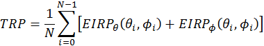

{width="7.0875in" height="3.4229166666666666in"}

  {#section .TT}

Contents {#contents .TT}
========

[13](#foreword)

[14](#scope)

[14](#references)

[15](#definitions-symbols-and-abbreviations)

[15](#definitions)

[15](#symbols)

[16](#abbreviations)

[16](#general)

[16](#relationship-between-minimum-requirements-and-test-requirements)

[17](#applicability-of-minimum-requirements)

[17](#specification-suffix-information)

[18](#test-points-analysis)

[18](#applicability-and-test-coverage-rules)

[18](#test-coverage-across-5g-nr-architecture-options)

[19](#e-utra-configuration-for-en-dc-fr1-tests-applying-the-e-utra-anchor-agnostic-approach)

[21](#e-utra-configuration-for-en-dc-fr2-tests-applying-the-e-utra-anchor-agnostic-approach)

[23](#operating-bands-and-channel-arrangement)

[23](#general-1)

[23](#operating-bands)

[23](#a-operating-bands-for-ca)

[23](#a.1-inter-band-ca-between-fr1-and-fr2)

[24](#b-operating-bands-for-dc)

[24](#b.1-general)

[24](#b.2-to-5.2b.7-void)

[24](#ue-channel-bandwidth)

[24](#a-ue-channel-bandwidth-for-ca)

[24](#a.1-inter-band-ca-between-fr1-and-fr2-1)

[24](#b-ue-channel-bandwidth-for-en-dc)

[25](#b.1-intra-band-en-dc-in-fr1)

[25](#b.1.1-general)

[25](#b.1.2-bcs-for-intra-band-contiguous-en-dc)

[26](#b.1.3-bcs-for-intra-band-non-contiguous-en-dc)

[26](#channel-arrangement)

[26](#a-channel-arrangement-for-ca)

[26](#b-channel-arrangement-for-dc)

[26](#b.1-channel-spacing-for-intra-band-en-dc-carriers)

[28](#configuration)

[28](#a-configuration-for-ca)

[28](#a.1-inter-band-ca-configurations-between-fr1-and-fr2)

[29](#b-configuration-for-dc)

[29](#b.1-general-1)

[30](#b.2-intra-band-contiguous-en-dc)

[30](#b.3-intra-band-non-contiguous-en-dc)

[30](#b.4-inter-band-en-dc-within-fr1)

[31](#b.4.1-inter-band-en-dc-configurations-within-fr1-two-bands)

[34](#b.4.2-inter-band-en-dc-configurations-within-fr1-three-bands)

[40](#b.4.3-inter-band-en-dc-configurations-within-fr1-four-bands)

[45](#b.4.4-inter-band-en-dc-configurations-within-fr1-five-bands)

[47](#b.4.5-inter-band-en-dc-configurations-within-fr1-six-bands)

[47](#b.5-inter-band-en-dc-including-fr2)

[48](#b.5.1-inter-band-en-dc-configurations-including-fr2-two-bands)

[52](#b.5.2-inter-band-en-dc-configurations-including-fr2-three-bands)

[56](#b.5.3-inter-band-en-dc-configurations-including-fr2-four-bands)

[58](#b.5.4-inter-band-en-dc-configurations-including-fr2-five-bands)

[59](#b.5.5-inter-band-en-dc-configurations-including-fr2-six-bands)

[59](#b.6-inter-band-en-dc-including-fr1-and-fr2)

[60](#b.6.1-void)

[60](#b.6.2-inter-band-en-dc-configurations-including-fr1-and-fr2-three-bands)

[62](#b.6.3-inter-band-en-dc-configurations-including-fr1-and-fr2-four-bands)

[63](#b.6.4-inter-band-en-dc-configurations-including-fr1-and-fr2-five-bands)

[64](#b.6.5-inter-band-en-dc-configurations-including-fr1-and-fr2-six-bands)

[64](#b.7-inter-band-nr-dc-between-fr1-and-fr2)

[65](#b.7.1-inter-band-nr-dc-configurations-between-fr1-and-fr2-two-bands)

[65](#transmitter-characteristics)

[65](#general-2)

[66](#transmitter-power)

[66](#a-transmitter-power-for-ca-without-en-dc)

[66](#a.1-ue-maximum-output-power-for-ca)

[66](#a.1.1-ue-maximum-output-power-for-inter-band-nr-ca-between-fr-1-and-fr-2-without-en-dc)

[66](#a.2-ue-maximum-output-power-reduction-for-ca)

[66](#a.2.1-ue-maximum-output-power-reduction-for-inter-band-nr-ca-between-fr-1-and-fr-2-without-en-dc)

[67](#a.3-ue-additional-maximum-output-power-reduction-for-ca)

[67](#a.3.1-ue-additional-maximum-output-power-reduction-for-inter-band-nr-ca-between-fr-1-and-fr-2-without-en-dc)

[67](#a.4-configured-output-power-level-for-ca)

[67](#a.4.1-configured-output-power-level-for-inter-band-nr-ca-between-fr-1-and-fr-2-without-en-dc)

[67](#a.4.2-δtibc-for-ca)

[67](#a.4.2.1-δtibc-for-inter-band-ca-between-fr-1-and-fr-2)

[67](#b-transmitter-power-for-en-dc)

[67](#b.1-ue-maximum-output-power-for-en-dc)

[68](#b.1.1-ue-maximum-output-power-for-intra-band-contiguous-en-dc)

[72](#b.1.2-ue-maximum-output-power-for-intra-band-non-contiguous-en-dc)

[76](#b.1.3-ue-maximum-output-power-for-inter-band-en-dc-within-fr1)

[86](#b.1.4-ue-maximum-output-power-for-inter-band-en-dc-including-fr2)

[86](#b.1.4.1-ue-maximum-output-power---eirp-and-trp)

[87](#b.1.4.2-ue-maximum-output-power---spherical-coverage)

[88](#b.1.4.2-ue-maximum-output-power-for-inter-band-en-dc-including-fr2-3-ccs)

[88](#b.1.4.2.1-ue-maximum-output-power---eirp-and-trp)

[89](#b.1.4.3-ue-maximum-output-power-for-inter-band-en-dc-including-fr2-4-ccs)

[89](#b.1.4.3.1-ue-maximum-output-power---eirp-and-trp)

[90](#b.1.4.4-ue-maximum-output-power-for-inter-band-en-dc-including-fr2-5-ccs)

[90](#b.1.4.4.1-ue-maximum-output-power---eirp-and-trp)

[91](#b.2-ue-maximum-output-power-reduction-for-en-dc)

[91](#b.2.0-general)

[91](#b.2.1-ue-maximum-output-power-reduction-for-intra-band-contiguous-en-dc)

[97](#b.2.2-ue-maximum-output-power-reduction-for-intra-band-non-contiguous-en-dc)

[97](#b.2.2.1-test-purpose)

[97](#b.2.2.2-test-applicability)

[97](#b.2.2.3-minimum-conformance-requirements)

[97](#b.2.2.4-test-description)

[98](#b.2.2.5-test-requirement)

[99](#b.2.3-ue-maximum-output-power-reduction-for-inter-band-en-dc-within-fr1)

[99](#b.2.3.5-test-requirement)

[100](#b.2.4-ue-maximum-output-power-reduction-for-inter-band-en-dc-including-fr2)

[100](#b.2.4.1-test-purpose)

[100](#b.2.4.2-test-applicability)

[100](#b.2.4.3-minimum-conformance-requirements)

[100](#b.2.4.4-test-description)

[101](#b.2.4.5-test-requirement)

[101](#b.2.4.2-transmit-off-power-for-inter-band-en-dc-including-fr2-3-ccs)

[102](#b.2.4.3-transmit-off-power-for-inter-band-en-dc-including-fr2-4-ccs)

[103](#b.2.4.4-transmit-off-power-for-inter-band-en-dc-including-fr2-5-ccs)

[104](#b.2.5-ue-maximum-output-power-reduction-for-inter-band-en-dc-including-both-fr1-and-fr2)

[104](#b.3-ue-additional-maximum-output-power-reduction-for-en-dc)

[104](#b.3.1-ue-additional-maximum-output-power-reduction-for-intra-band-contiguous-en-dc)

[107](#b.3.1.3.2.1-a-mprim3-for-ns_04-to-meet--13-dbm-1mhz-for-26dbm-ue-power)

[108](#b.3.1.3.2.2-a-mpr-for-ns_04-to-meet--25-dbm-1mhz-for-26-dbm-ue-power)

[123](#b.3.2-ue-additional-maximum-output-power-reduction-for-intra-band-non-contiguous-en-dc)

[124](#b.3.2.3.1-a-mpr-for-ns_04)

[132](#b.3.3-ue-additional-maximum-output-power-reduction-for-inter-band-en-dc-within-fr1)

[133](#b.3.3.1-test-purpose)

[133](#b.3.3.2-test-applicability)

[133](#b.3.3.3-minimum-conformance-requirements)

[133](#b.3.3.4-test-description)

[133](#b.3.4-ue-additional-maximum-output-power-reduction-for-inter-band-en-dc-including-fr2)

[135](#b.3.5-ue-additional-maximum-output-power-reduction-for-inter-band-en-dc-including-both-fr1-and-fr2)

[135](#b.4-configured-output-power-for-en-dc)

[135](#b.4.1-configured-output-power-level-for-en-dc)

[135](#b.4.1.0-minimum-conformance-requirements)

[135](#b.4.1.0.1-configured-output-power-level)

[135](#b.4.1.0.1.1-intra-band-contiguous-en-dc)

[138](#b.4.1.0.1.2-intra-band-non-contiguous-en-dc)

[139](#b.4.1.0.1.3-inter-band-en-dc-within-fr1)

[141](#b.4.1.0.1.4-inter-band-en-dc-including-fr2)

[142](#b.4.1.0.1.5-inter-band-en-dc-including-both-fr1-and-fr2)

[142](#b.4.1.0.2-δtibc-for-en-dc)

[142](#b.4.1.0.2.1-intra-band-contiguous-en-dc)

[142](#b.4.1.0.2.2-intra-band-non-contiguous-en-dc)

[143](#b.4.1.0.2.3-inter-band-en-dc-within-fr1)

[158](#b.4.1.0.2.4-inter-band-en-dc-including-fr2)

[159](#b.4.1.0.2.5-inter-band-en-dc-including-both-fr1-and-fr2)

[159](#b.4.1.1-configured-output-power-level-for-intra-band-contiguous-en-dc)

[165](#b.4.2-δtibc-for-en-dc)

[165](#b.4.2.1-intra-band-contiguous-en-dc)

[165](#b.4.2.2-intra-band-non-contiguous-en-dc)

[166](#b.4.2.3-inter-band-en-dc-within-fr1)

[174](#b.4.2.3.3-δtibc-for-en-dc-four-bands)

[179](#b.4.2.3.4-δtibc-for-en-dc-five-bands)

[181](#b.4.2.3.5-δtibc-for-en-dc-six-bands)

[181](#b.4.2.4-inter-band-en-dc-including-fr2)

[181](#b.4.2.4.1-δtibc-for-en-dc-two-bands)

[181](#b.4.2.4.2-δtibc-for-en-dc-three-bands)

[181](#b.4.2.4.3-δtibc-for-en-dc-four-bands)

[182](#b.4.2.4.4-δtibc-for-en-dc-five-bands)

[182](#b.4.2.4.5-δtibc-for-en-dc-six-bands)

[182](#b.4.2.5-inter-band-en-dc-including-both-fr1-and-fr2)

[182](#b.4.2.5.1-δtibc-for-en-dc-three-bands)

[182](#b.4.2.5.2-δtibc-for-en-dc-four-bands)

[182](#b.4.2.5.3-δtibc-for-en-dc-five-bands)

[182](#b.4.2.5.4-δtibc-for-en-dc-six-bands)

[183](#output-power-dynamics)

[183](#b)

[183](#b.1-minimum-output-power-for-en-dc)

[183](#b.1.1-minimum-output-power-for-intra-band-contiguous-en-dc)

[184](#b.1.2-minimum-output-power-for-intra-band-non-contiguous-en-dc)

[186](#b.1.3-minimum-output-power-for-inter-band-en-dc-within-fr1)

[187](#b.1.4-minimum-output-power-for-en-dc-interband-including-fr2)

[188](#b.2-transmit-off-power-for-en-dc)

[188](#b.2.1-transmit-off-power-for-intra-band-contiguous-en-dc)

[188](#b.2.1.1-test-purpose-1)

[188](#b.2.1.2-test-applicability-1)

[188](#b.2.1.3-minimum-conformance-requirements-1)

[188](#b.2.1.4-test-description-1)

[188](#b.2.1.5-test-requirements)

[188](#b.2.2-transmit-off-power-for-intra-band-non-contiguous-en-dc)

[188](#b.2.2.1-test-purpose-1)

[188](#b.2.2.2-test-applicability-1)

[188](#b.2.2.3-minimum-conformance-requirements-1)

[189](#b.2.2.4-test-description-1)

[189](#b.2.2.5-test-requirements)

[189](#b.2.3-transmit-off-power-for-inter-band-en-dc-within-fr1)

[189](#b.2.3.1-test-purpose-1)

[189](#b.2.3.2-test-applicability-1)

[189](#b.2.3.3-minimum-conformance-requirements-1)

[189](#b.2.3.4-test-description-1)

[189](#b.2.3.5-test-requirements)

[189](#b.3-tx-onoff-time-maskpucch-time-mask-for-en-dc)

[189](#b.3.1-tx-onoff-time-mask-for-intra-band-contiguous-en-dc)

[189](#b.3.1.1-test-purpose-1)

[189](#b.3.1.2-test-applicability-1)

[189](#b.3.1.3-minimum-conformance-requirements-1)

[190](#b.3.1.4-test-description-1)

[190](#b.3.2-tx-onoff-time-mask-for-intra-band-non-contiguous-en-dc)

[190](#b.3.2.1-test-purpose-1)

[190](#b.3.2.2-test-applicability-1)

[190](#b.3.2.3-minimum-conformance-requirements-1)

[190](#b.3.2.4-test-description)

[191](#b.3.2.5-test-requirements)

[191](#b.3.3-tx-onoff-time-mask-for-inter-band-en-dc-within-fr1)

[191](#b.3.3.1-test-purpose-1)

[191](#b.3.3.2-test-applicability-1)

[191](#b.3.3.3-minimum-conformance-requirements-1)

[191](#b.3.3.4-test-description-1)

[191](#b.3.3.5-test-requirements)

[192](#b.4-prach-time-mask-for-en-dc)

[192](#b.4.1-prach-time-mask-for-intra-band-contiguous-en-dc)

[193](#b.4.2-prach-time-mask-for-intra-band-non-contiguous-en-dc)

[193](#b.4.3-prach-time-mask-for-inter-band-en-dc-within-fr16.3b.4.3.1-test-purpose)

[194](#b.5-output-power-dynamics-for-en-dc-with-ul-sharing-from-ue-perspective)

[194](#b.5.1-e-utra-and-nr-switching-time-mask-for-tdm-based-ul-sharing-from-ue-perspective)

[194](#__RefHeading___Toc12631567)

[195](#b.7-output-power-dynamics-for-intra-band-en-dc-with-dual-pa-capability)

[195](#transmit-signal-quality)

[195](#a-transmit-signal-quality-for-inter-band-nr-ca-between-fr-and-fr2-without-en-dc)

[195](#a.1-frequency-error-for-inter-band-nr-ca-between-fr-1-and-fr-2-without-en-dc)

[195](#a.2-transmit-modulation-quality-for-inter-band-nr-ca-without-en-dc)

[195](#a.2.1-error-vector-magnitude-for-inter-band-nr-ca-between-fr-1-and-fr-2-without-en-dc)

[195](#a.2.2-carrier-leakage-for-inter-band-nr-ca-between-fr-1-and-fr-2-without-en-dc)

[196](#a.2.3-in-band-emissions-for-inter-band-nr-ca-between-fr-1-and-fr-2-without-en-dc)

[196](#b-1)

[196](#b.1-frequency-error)

[196](#b.1.1-frequency-error-for-intra-band-contiguous-en-dc)

[196](#b.1.2-frequency-error-for-intra-band-non-contiguous-en-dc)

[196](#b.1.3-frequency-error-for-inter-band-en-dc-within-fr1)

[196](#b.1.3.1-test-purpose-2)

[196](#b.1.3.2-test-applicability-2)

[197](#b.1.3.3-minimum-conformance-requirements-2)

[197](#b.1.3.4-test-description-2)

[197](#b.1.3.5-test-requirement)

[197](#b.1.4)

[197](#b.1.5-frequency-error-for-inter-band-en-dc-including-fr2)

[198](#b.1.5.2-frequency-error-for-inter-band-en-dc-including-fr2-3-ccs)

[199](#b.1.5.3-frequency-error-for-inter-band-en-dc-including-fr2-4-ccs)

[200](#b.1.5.4-frequency-error-for-inter-band-en-dc-including-fr2-5-ccs)

[201](#b.2)

[201](#b.2.1-transmit-modulation-quality-for-intra-band-contiguous-en-dc)

[201](#b.2.1.1-error-vector-magnitude-for-intra-band-contiguous-en-dc)

[202](#b.2.1.2-carrier-leakage-for-intra-band-contiguous-en-dc)

[203](#b.2.1.3-in-band-emissions-for-intra-band-contiguous-en-dc)

[208](#b.2.2-transmit-modulation-quality-for-intra-band-non-contiguous-en-dc)

[209](#b.2.2.1-error-vector-magnitude-for-intra-band-non-contiguous-en-dc)

[209](#b.2.2.2-carrier-leakage-for-intra-band-non-contiguous-en-dc)

[210](#b.2.2.3-in-band-emissions-for-intra-band-non-contiguous-en-dc)

[215](#b.2.2.4-evm-equalizer-flatness-for-intra-band-non-contiguous-en-dc)

[217](#b.2.3-transmit-modulation-quality-for-inter-band-en-dc-within-fr1)

[217](#b.2.3.1-error-vector-magnitude-for-inter-band-en-dc-within-fr1)

[217](#b.2.3.2-carrier-leakage-for-inter-band-en-dc-within-fr1)

[218](#b.2.3.3-in-band-emissions-for-inter-band-en-dc-within-fr1)

[219](#b.2.3.4-evm-equalizer-flatness-for-inter-band-en-dc-within-fr1)

[220](#b.2.4-transmit-modulation-quality-for-inter-band-en-dc-including-fr2)

[220](#b.2.4.1-error-vector-magnitude-for-inter-band-en-dc-including-fr2)

[221](#b.2.4.2-carrier-leakage-for-inter-band-en-dc-including-fr2)

[221](#b.2.4.3-in-band-emissions-for-inter-band-en-dc-including-fr2)

[222](#b.2.4.4-evm-equalizer-flatness-for-inter-band-en-dc-including-fr2)

[223](#output-rf-spectrum-emissions)

[223](#a-output-rf-spectrum-emissions-for-ca)

[223](#a.1-occupied-bandwidth-for-ca-without-en-dc)

[224](#a.2-out-of-band-emissions-for-ca-without-en-dc)

[224](#a.2.2-additional-spectrum-emissions-mask-for-ca-without-en-dc)

[224](#a.2.3-adjacent-channel-leakage-ratio-for-ca-without-en-dc)

[224](#a.3-spurious-emissions-for-ca-without-en-dc)

[225](#b-output-rf-spectrum-emissions-for-dc)

[225](#b.1-occupied-bandwidth-for-en-dc)

[225](#b.1.1-occupied-bandwidth-for-intra-band-contiguous-en-dc)

[227](#b.1.2-occupied-bandwidth-for-intra-band-non-contiguous-en-dc)

[228](#b.1.3-occupied-bandwidth-for-inter-band-en-dc-within-fr1)

[228](#b.1.4-occupied-bandwidth-for-inter-band-en-dc-including-fr2)

[229](#b.1.4.2-occupied-bandwidth-for-inter-band-en-dc-including-fr2-3-ccs)

[230](#b.1.4.3-occupied-bandwidth-for-inter-band-en-dc-including-fr2-4-ccs)

[231](#b.1.4.4-occupied-bandwidth-for-inter-band-en-dc-including-fr2-5-ccs)

[232](#b.2-out-of-band-emissions-for-en-dc)

[232](#b.2.1-out-of-band-emissions-for-intra-band-contiguous-en-dc)

[246](#b.2.2-out-of-band-emissions-for-intra-band-non-contiguous-en-dc)

[246](#b.2.2.1-spectrum-emissions-mask-for-intra-band-non-contiguous-en-dc)

[247](#b.2.2.3-adjacent-channel-leakage-ratio-for-intra-band-non-contiguous-en-dc)

[249](#b.2.3-out-of-band-emissions-for-inter-band-en-dc-within-fr1)

[249](#b.2.3.1-spectrum-emissions-mask-for-inter-band-en-dc-within-fr1)

[249](#b.2.3.2-additional-spectrum-emissions-mask-for-inter-band-en-dc-within-fr1)

[249](#b.2.3.3-adjacent-channel-leakage-ratio-for-inter-band-en-dc-within-fr1)

[250](#b.2.4-out-of-band-emissions-for-inter-band-en-dc-including-fr2)

[250](#b.2.4.1-spectrum-emissions-mask-for-inter-band-en-dc-including-fr2)

[250](#b.2.4.1.1-test-purpose-1)

[250](#b.2.4.1.2-test-applicability-1)

[250](#b.2.4.1.3-minimum-conformance-requirements-1)

[251](#b.2.4.1.4-test-description-1)

[251](#b.2.4.1.4.1-initial-conditions-1)

[251](#b.2.4.1.5-test-requirement-1)

[251](#b.2.4.1.2-spectrum-emissions-mask-for-inter-band-en-dc-including-fr2-3-ccs)

[252](#b.2.4.1.3-spectrum-emissions-mask-for-inter-band-en-dc-including-fr2-4-ccs)

[253](#b.2.4.1.4-spectrum-emissions-mask-for-inter-band-en-dc-including-fr2-5-ccs)

[254](#b.2.4.3-adjacent-channel-leakage-ratio-for-inter-band-en-dc-including-fr2)

[254](#b.2.4.3.1-test-purpose-2)

[254](#b.2.4.3.2-test-applicability-2)

[254](#b.2.4.3.3-minimum-conformance-requirements-2)

[254](#b.2.4.3.4-test-description-2)

[254](#b.2.4.3.4.1-initial-conditions-1)

[255](#b.2.4.3.5-test-requirement-1)

[255](#b.2.4.3.2-adjacent-channel-leakage-ratio-for-inter-band-en-dc-including-fr2-3-ccs)

[256](#b.2.4.3.3-adjacent-channel-leakage-ratio-for-inter-band-en-dc-including-fr2-4-ccs)

[257](#b.2.4.3.4-adjacent-channel-leakage-ratio-for-inter-band-en-dc-including-fr2-5-ccs)

[258](#b.3-spurious-emissions-for-en-dc)

[258](#b.3.1-spurious-emissions-for-intra-band-contiguous-en-dc)

[258](#b.3.1.1-general-spurious-emissions-for-intra-band-contiguous-en-dc)

[260](#b.3.1.2-spurious-emission-band-ue-co-existence-for-intra-band-contiguous-en-dc)

[263](#b.3.2-spurious-emissions-for-intra-band-non-contiguous-en-dc)

[263](#b.3.2.1-general-spurious-emissions-for-intra-band-non-contiguous-en-dc)

[265](#b.3.2.2-spurious-emission-band-ue-co-existence-for-intra-band-non-contiguous-en-dc)

[265](#b.3.2.2.1-test-purpose)

[265](#b.3.2.2.2-test-applicability)

[265](#b.3.2.2.3-minimum-conformance-requirements)

[265](#b.3.2.2.4-test-description)

[267](#b.3.2.2.5-test-requirement)

[267](#b.3.3-spurious-emissions-for-inter-band-en-dc-within-fr1)

[267](#b.3.3.1-general-spurious-emissions-for-inter-band-en-dc-within-fr1)

[268](#b.3.3.2-spurious-emission-band-ue-co-existence-for-inter-band-within-fr1)

[280](#b.3.4-spurious-emissions-for-inter-band-including-fr2)

[280](#b.3.4.1-general-spurious-emissions-for-inter-band-including-fr2)

[281](#b.3.4.1.2-transmitter-spurious-emissions-for-inter-band-en-dc-including-fr2-3-ccs)

[282](#b.3.4.1.3-transmitter-spurious-emissions-for-inter-band-en-dc-including-fr2-4-ccs)

[283](#b.3.4.1.4-transmitter-spurious-emissions-for-inter-band-en-dc-including-fr2-5-ccs)

[284](#b.4-additional-spurious-emissions-for-en-dc)

[284](#b.4.1-additional-spurious-emissions-for-intra-band-contiguous-en-dc)

[285](#b.4.1.4-test-description-1)

[287](#__RefHeading___Toc12631680)

[287](#b.4.2-additional-spurious-emissions-for-intra-band-non-contiguous-en-dc)

[288](#b.4.3-additional-spurious-emissions-for-inter-band-en-dc)

[289](#b.5-transmit-intermodulation)

[289](#b.5.1-intra-band-contiguous-en-dc)

[289](#b.5.2-intra-band-non-contiguous-en-dc)

[289](#b.5.3-inter-band-en-dc-within-fr1)

[289](#b.5.3.3-minimum-conformance-requirements)

[289](#b.5.3.4-test-description)

[290](#b.5.3.5-test-requirement)

[290](#b.5.4-inter-band-en-dc-including-fr2)

[290](#b.5.5-inter-band-en-dc-including-both-fr1-and-fr2)

[290](#receiver-characteristics)

[290](#general-3)

[291](#diversity-characteristics)

[291](#reference-sensitivity)

[291](#a-reference-sensitivity-for-ca-without-en-dc)

[291](#a.1-general)

[291](#a.2-reference-sensitivity-power-level-for-ca-without-en-dc)

[291](#a.3-δribc-for-ca-without-en-dc)

[292](#a.3.1-reference-sensitivity-for-inter-band-ca-between-fr1-and-fr2-without-en-dc)

[292](#a.4-reference-sensitivity-exceptions-due-to-ul-harmonic-interference-for-ca)

[292](#b-reference-sensitivity-level-for-dc)

[292](#b.1-general-2)

[292](#b.2-reference-sensitivity-for-en-dc)

[293](#b.2.0-minimum-conformance-requirements-of-reference-sensitivity-for-en-dc)

[293](#b.2.0.1-intra-band-contiguous-en-dc)

[293](#b.2.0.2-intra-band-non-contiguous-en-dc)

[293](#b.2.0.3-inter-band-en-dc-within-fr1)

[293](#b.2.0.3.1-reference-sensitivity-exceptions-due-to-ul-harmonic-interference-for-en-dc-in-nr-fr1)

[295](#b.2.0.3.2-reference-sensitivity-exceptions-due-to-receiver-harmonic-mixing-for-en-dc-in-nr-fr1)

[297](#b.2.0.3.3-void)

[297](#b.2.0.3.4-reference-sensitivity-exceptions-due-to-cross-band-isolation-for-en-dc-in-nr-fr1)

[298](#b.2.0.3.5-msd-for-intermodulation-interference-due-to-dual-uplink-operation-for-en-dc-in-nr-fr1)

[306](#b.2.1-reference-sensitivity-for-intra-band-contiguous-en-dc-2-ccs)

[306](#b.2.1.1-test-purpose-2)

[306](#b.2.1.2-test-applicability-2)

[306](#b.2.1.3-minimum-conformance-requirements-2)

[310](#__RefHeading___Toc12631718)

[310](#b.2.2.1-test-purpose-2)

[310](#b.2.2.2-test-applicability-2)

[310](#b.2.2.3-minimum-conformance-requirements-2)

[310](#b.2.2.4-test-description-2)

[312](#b.2.2.5-test-requirement-1)

[312](#b.2.3-reference-sensitivity-for-inter-band-en-dc-within-fr12-ccs)

[313](#b.2.3.1-test-purpose-2)

[313](#b.2.3.2-test-applicability-2)

[313](#b.2.3.3-minimum-conformance-requirements-2)

[313](#b.2.3.4-test-description-2)

[340](#b.2.4-reference-sensitivity-for-inter-band-en-dc-including-fr2)

[341](#b.2.5-reference-sensitivity-for-inter-band-en-dc-including-fr1-and-fr2-3-ccs)

[341](#b.2.6-reference-sensitivity-for-en-dc-within-fr13-ccs)

[349](#b.3-δribc-δribnc-for-en-dc)

[350](#b.3.1-reference-sensitivity-δribc-for-intra-band-contiguous-en-dc)

[351](#b.3.2-reference-sensitivity-δribc-for-intra-band-non-contiguous-en-dc)

[352](#b.3.3-δribc-for-inter-band-en-dc-within-fr1)

[352](#b.3.3.1-δribc-for-inter-band-en-dc-in-two-bands-within-fr1)

[354](#b.3.3.2-δribc-for-inter-band-en-dc-in-three-bands-within-fr1)

[358](#b.3.3.3-δribc-for-inter-band-en-dc-in-four-bands-within-fr1)

[362](#b.3.4-reference-sensitivity-for-δribc-inter-band-en-dc-including-fr2)

[362](#b.3.4.1-reference-sensitivity-for-δribc-inter-band-en-dc-in-two-bands-including-fr2)

[363](#b.3.4.2-reference-sensitivity-for-δribc-inter-band-en-dc-in-three-bands-including-fr2)

[364](#b.3.4.3-reference-sensitivity-for-δribc-inter-band-en-dc-in-four-bands-including-fr2)

[365](#b.3.4.4-reference-sensitivity-for-δribc-inter-band-en-dc-in-five-bands-including-fr2)

[366](#b.3.4.5-δribc-for-en-dc-six-bands)

[366](#maximum-input-level)

[366](#b-maximum-input-level-for-en-dc)

[366](#b.0-minimum-conformance-requirement)

[366](#b.0.1-intra-band-contiguous-en-dc-in-fr1)

[366](#b.0.2-intra-band-non-contiguous-en-dc-in-fr1)

[366](#b.0.3-inter-band-en-dc-within-fr1)

[367](#b.0.4-inter-band-en-dc-including-fr2)

[367](#b.0.5-inter-band-en-dc-including-both-fr1-and-fr2)

[367](#b.1-maximum-input-level-for-intra-band-contiguous-en-dc-2-ccs)

[367](#b.1.1-test-purpose)

[367](#b.1.2-test-applicability)

[367](#b.1.3-minimum-conformance-requirements)

[367](#b.1.4-test-description)

[369](#b.1.5-test-requirement)

[370](#b.2-maximum-input-level-for-intra-band-non-contiguous-en-dc-2-ccs)

[370](#b.2.1-test-purpose)

[371](#b.2.2-test-applicability)

[371](#b.2.3-minimum-conformance-requirements)

[371](#b.2.4-test-description)

[372](#b.2.5-test-requirement)

[372](#b.3-maximum-input-level-for-inter-band-en-dc-within-fr1)

[372](#b.3.1-test-purpose)

[372](#b.3.2-test-applicability)

[372](#b.3.3-minimum-conformance-requirements)

[373](#b.3.4-test-description)

[373](#b.3.5-test-requirement)

[374](#adjacent-channel-selectivity)

[374](#b-adjacent-channel-selectivity-for-en-dc)

[374](#b.0-minimum-conformance-requirements)

[374](#b.0.1-intra-band-contiguous-en-dc-in-fr1-1)

[374](#b.0.2-intra-band-non-contiguous-en-dc-in-fr1-1)

[375](#b.0.3-inter-band-en-dc-within-fr1-1)

[375](#b.0.4-inter-band-en-dc-including-fr2-1)

[375](#b.0.5-inter-band-en-dc-including-both-fr1-and-fr2-1)

[375](#b.1-adjacent-channel-selectivity-for-intra-band-contiguous-en-dc-2-ccs)

[377](#b.2-adjacent-channel-selectivity-for-intra-band-non-contiguous-en-dc-2-ccs)

[379](#b.3-adjacent-channel-selectivity-for-inter-band-en-dc-within-fr1-2-ccs)

[379](#b.4-adjacent-channel-selectivity-for-inter-band-en-dc-including-fr2)

[379](#b.4.1-adjacent-channel-selectivity-for-inter-band-en-dc-including-fr2-2ccs)

[380](#b.4.1.1-test-purpose-2)

[380](#b.4.1.2-test-applicability-2)

[380](#b.4.1.3-minimum-conformance-requirements-2)

[380](#b.4.1.4-test-description-2)

[381](#b.4.2-adjacent-channel-selectivity-for-inter-band-en-dc-including-fr2-3ccs)

[382](#b.4.3-adjacent-channel-selectivity-for-inter-band-en-dc-including-fr2-4ccs)

[383](#b.4.4-adjacent-channel-selectivity-for-inter-band-en-dc-including-fr2-5ccs)

[385](#b.4.5-adjacent-channel-selectivity-for-inter-band-en-dc-including-fr2-6ccs)

[387](#b.5-adjacent-channel-selectivity-for-inter-band-en-dc-including-both-fr1-and-fr2-3-ccs)

[387](#blocking-characteristics)

[387](#b-blocking-characteristics-for-en-dc)

[387](#b.1-general-3)

[387](#b.2-inband-blocking-for-en-dc)

[387](#b.2.0-minimum-conformance-requirements)

[387](#b.2.0.1-intra-band-contiguous-en-dc-1)

[388](#b.2.0.2-intra-band-non-contiguous-en-dc-1)

[388](#b.2.0.3-inter-band-en-dc-within-fr1-1)

[388](#b.2.0.4-inter-band-en-dc-including-fr2)

[388](#b.2.0.5-inter-band-en-dc-including-both-fr1-and-fr2)

[388](#b.2.1-inband-blocking-for-intra-band-contiguous-en-dc-2-ccs)

[391](#b.2.2-inband-blocking-for-intra-band-non-contiguous-en-dc-2-ccs)

[392](#b.2.3-inband-blocking-for-inter-band-en-dc-within-fr1-2-ccs)

[393](#b.2.4-inband-blocking-for-inter-band-en-dc-including-fr2)

[393](#b.2.4.1-inband-blocking-for-inter-band-en-dc-including-fr2-2-ccs)

[394](#b.2.5-inband-blocking-for-inter-band-en-dc-including-both-fr1-and-fr2)

[394](#b.3-out-of-band-blocking-for-en-dc)

[394](#b.3.0-minimum-conformance-requirements)

[394](#b.3.0.1-intra-band-contiguous-en-dc)

[394](#b.3.0.2-intra-band-non-contiguous-en-dc)

[395](#b.3.0.3-inter-band-en-dc-within-fr1)

[395](#b.3.0.4-inter-band-en-dc-including-fr2)

[395](#b.3.0.5-inter-band-en-dc-including-both-fr1-and-fr2)

[395](#b.3.1-out-of-band-blocking-for-intra-band-contiguous-en-dc-2-ccs)

[398](#b.3.2-out-of-band-blocking-for-intra-band-non-contiguous-en-dc-2-ccs)

[399](#b.3.3-out-of-band-blocking-for-inter-band-en-dc-within-fr1-2-ccs)

[400](#b.4-narrow-band-blocking-for-en-dc-in-fr1)

[400](#b.4.0-minimum-conformance-requirements)

[400](#b.4.0.1-intra-band-contiguous-en-dc)

[400](#b.4.0.2-intra-band-non-contiguous-en-dc)

[401](#b.4.0.3-inter-band-en-dc-within-fr1)

[401](#b.4.0.4-inter-band-en-dc-including-fr2)

[401](#b.4.0.5-inter-band-en-dc-including-both-fr1-and-fr2)

[401](#b.4.1-narrow-band-blocking-for-intra-band-contiguous-en-dc-2-ccs)

[404](#b.4.2-narrow-band-blocking-for-intra-band-non-contiguous-en-dc-2-ccs)

[405](#b.4.3-narrow-band-blocking-for-inter-band-en-dc-within-fr1-2-ccs)

[406](#section-2)

[406](#b-spurious-response-for-en-dc-in-fr1)

[406](#b.0-minimum-conformance-requirements-1)

[406](#b.0.1-intra-band-contiguous-en-dc)

[406](#b.0.2-intra-band-non-contiguous-en-dc)

[406](#b.0.3-inter-band-en-dc-within-fr1-2)

[406](#b.0.4-inter-band-en-dc-including-fr2-2)

[406](#b.0.5-inter-band-en-dc-including-both-fr1-and-fr2-2)

[407](#b.1-spurious-response-for-intra-band-contiguous-en-dc-2-ccs)

[408](#b.2-spurious-response-for-intra-band-non-contiguous-en-dc-2-ccs)

[409](#b.3-spurious-response-for-inter-band-en-dc-within-fr1-2-ccs)

[410](#intermodulation-characteristics)

[410](#b-intermodulation-characteristics-for-en-dc-in-fr1)

[410](#b.1-general-4)

[410](#b.2-wide-band-intermodulation)

[410](#b.2.0-minimum-conformance-requirements-1)

[410](#b.2.0.1-intra-band-contiguous-en-dc-in-fr1)

[410](#b.2.0.2-intra-band-non-contiguous-en-dc-in-fr1)

[410](#b.2.0.3-inter-band-en-dc-within-fr1-2)

[411](#b.2.0.4-inter-band-en-dc-including-fr2-1)

[411](#b.2.0.5-inter-band-en-dc-including-both-fr1-and-fr2-1)

[411](#b.2.1-wideband-intermodulation-for-intra-band-contiguous-en-dc-in-fr1)

[413](#b.2.2-wideband-intermodulation-for-intra-band-non-contiguous-en-dc-in-fr1)

[414](#b.2.3-wideband-intermodulation-for-inter-band-en-dc-in-fr1-2-ccs)

[415](#b.2.4-wideband-intermodulation-for-en-dc-including-fr2-2-ccs)

[415](#b.2.5-wideband-intermodulation-for-inter-band-en-dc-including-both-fr1-and-fr2-3-ccs)

[415](#b.2.6-wideband-intermodulation-for-en-dc-including-fr1-3-ccs)

[418](#b.2.7-wideband-intermodulation-for-en-dc-including-fr1-4-ccs)

[418](#b.2.8-wideband-intermodulation-for-en-dc-including-fr1-5-ccs)

[418](#b.2.9-wideband-intermodulation-for-en-dc-including-fr1-6-ccs)

[419](#spurious-emissions)

[419](#b-spurious-emissions-for-en-dc-in-fr1)

[419](#b.0-minimum-conformance-requirements-2)

[419](#b.0.1-intra-band-contiguous-en-dc-in-fr1-2)

[419](#b.0.2-intra-band-non-contiguous-en-dc-in-fr1-2)

[419](#b.0.3-inter-band-en-dc-within-fr1-3)

[419](#b.0.4-inter-band-en-dc-including-fr2-3)

[419](#b.0.5-inter-band-en-dc-including-both-fr1-and-fr2-3)

[419](#b.1-spurious-emissions-for-intra-band-contiguous-en-dc-in-fr12-ccs)

[420](#b.2-spurious-emissions-for-intra-band-non-contiguous-en-dc-in-fr12-ccs)

[421](#b.3-spurious-emissions-for-inter-band-en-dc-within-fr12-ccs)

[422](#b.4-spurious-emissions-for-inter-band-en-dc-including-fr2-2-ccs)

[422](#b.5-spurious-emissions-for-inter-band-en-dc-including-both-fr1-and-fr2-3-ccs)

[422](#b.6-spurious-emissions-for-en-dc-3-ccs)

[422](#b.7-spurious-emissions-for-en-dc-4-ccs)

[422](#b.8-spurious-emissions-for-en-dc-5-ccs)

[422](#b.9-spurious-emissions-for-en-dc-6-ccs)

[423](#annex-a-normative-measurement-channels)

[423](#a.1-general-1)

[423](#a.2-ul-reference-measurement-channels-for-e-utra-tdd-config-2)

[423](#a.2.1-general)

[424](#a.2.2-reference-measurement-channels-for-e-utra)

[424](#a.2.2.1-full-rb-allocation)

[424](#a.2.2.1.1-qpsk)

[424](#a.2.2.1.2-16-qam)

[425](#a.2.2.1.3-64-qam)

[426](#a.2.2.1.4-256-qam)

[427](#a.2.2.2-partial-rb-allocation)

[427](#a.2.2.2.1-qpsk)

[428](#a.2.2.2.2-16-qam)

[429](#a.2.2.2.3-64-qam)

[430](#a.2.2.2.4-256-qam)

[431](#a.3-dl-reference-measurement-channels-for-e-utra)

[431](#a.3.1-general)

[431](#annex-b-normative-propagation-conditions)

[431](#annex-c-normative-downlink-physical-channels)

[431](#annex-d-normative-characteristics-of-the-interfering-signal)

[432](#annex-e-normative-global-in-channel-tx-test)

[432](#annex-f-informative-measurement-uncertainties-and-test-tolerances)

[432](#f.1-acceptable-uncertainty-of-test-system-normative)

[432](#f.1.1-measurement-of-test-environments)

[433](#f.1.2-measurement-of-transmitter)

[437](#f.1.3-measurement-of-receiver)

[438](#f.2-interpretation-of-measurement-results-normative)

[438](#f.3-test-tolerance-and-derivation-of-test-requirements-informative)

[438](#f.3.1-measurement-of-test-environments)

[439](#f.3.2-measurement-of-transmitter)

[443](#f.3.3-measurement-of-receiver)

[444](#annex-g-normative-uplink-physical-channels)

[444](#annex-h-normative-statistical-testing)

[444](#h.1-general)

[444](#h.2-statistical-testing-of-receiver-characteristics)

[444](#h.2.1-general)

[444](#h.2.2-mapping-throughput-to-error-ratio)

[445](#h.2.3-design-of-the-test)

[446](#h.2.4-numerical-definition-of-the-pass-fail-limits)

[447](#h.2.5-pass-fail-decision-rules)

[447](#annex-i-normative-void)

[447](#annex-j-normative-test-applicability-per-permitted-test-method)

[447](#annex-k-normative-eirp-trp-and-eis-measurement-procedures)

[447](#annex-l-normative-void)

[447](#annex-m-normative-dual-uplink-interferer)

[449](#annex-n-informative-change-history)Foreword 1 Scope 2 References
3 Definitions, symbols and abbreviations 3.1 Definitions 3.2 Symbols 3.3
Abbreviations 4 General 4.1 Relationship between minimum requirements
and test requirements 4.2 Applicability of minimum requirements 4.3
Specification suffix information 4.4 Test points analysis 4.5
Applicability and test coverage rules 4.5.1 Test coverage across 5G NR
architecture options 4.6 E-UTRA configuration for EN-DC FR1 tests
applying the E-UTRA anchor-agnostic approach 4.7 E-UTRA configuration
for EN-DC FR2 tests applying the E-UTRA anchor-agnostic approach 5
Operating bands and Channel arrangement 5.1 General 5.2 Operating bands
5.2A Operating bands for CA 5.2A.1 Inter-band CA between FR1 and FR2
5.2B Operating bands for DC 5.2B.1 General 5.2B.2 to 5.2B.7 Void 5.3 UE
Channel bandwidth 5.3A UE Channel bandwidth for CA 5.3A.1 Inter-band CA
between FR1 and FR2 5.3B UE Channel bandwidth for EN-DC 5.3B.1
Intra-band EN-DC in FR1 5.3B.1.1 General 5.3B.1.2 BCS for Intra-band
contiguous EN-DC 5.3B.1.3 BCS for Intra-band non-contiguous EN-DC 5.4
Channel arrangement 5.4A Channel arrangement for CA 5.4B Channel
arrangement for DC 5.4B.1 Channel spacing for intra-band EN-DC carriers
5.5 Configuration 5.5A Configuration for CA 5.5A.1 Inter-band CA
configurations between FR1 and FR2 5.5B Configuration for DC 5.5B.1
General 5.5B.2 Intra-band contiguous EN-DC 5.5B.3 Intra-band
non-contiguous EN-DC 5.5B.4 Inter-band EN-DC within FR1 5.5B.4.1
Inter-band EN-DC configurations within FR1 (two bands) 5.5B.4.2
Inter-band EN-DC configurations within FR1 (three bands) 5.5B.4.3
Inter-band EN-DC configurations within FR1 (four bands) 5.5B.4.4
Inter-band EN-DC configurations within FR1 (five bands) 5.5B.4.5
Inter-band EN-DC configurations within FR1 (six bands) 5.5B.5 Inter-band
EN-DC including FR2 5.5B.5.1 Inter-band EN-DC configurations including
FR2 (two bands) 5.5B.5.2 Inter-band EN-DC configurations including FR2
(three bands) 5.5B.5.3 Inter-band EN-DC configurations including FR2
(four bands) 5.5B.5.4 Inter-band EN-DC configurations including FR2
(five bands) 5.5B.5.5 Inter-band EN-DC configurations including FR2 (six
bands) 5.5B.6 Inter-band EN-DC including FR1 and FR2 5.5B.6.1 Void
5.5B.6.2 Inter-band EN-DC configurations including FR1 and FR2 (three
bands) 5.5B.6.3 Inter-band EN-DC configurations including FR1 and FR2
(four bands) 5.5B.6.4 Inter-band EN-DC configurations including FR1 and
FR2 (five bands) 5.5B.6.5 Inter-band EN-DC configurations including FR1
and FR2 (six bands) 5.5B.7 Inter-band NR-DC between FR1 and FR2 5.5B.7.1
Inter-band NR-DC configurations between FR1 and FR2 (two bands) 6
Transmitter characteristics 6.1 General 6.2 Transmitter power 6.2A
Transmitter power for CA without EN-DC 6.2A.1 UE maximum output power
for CA 6.2A.1.1 UE maximum output power for inter-band NR CA between FR
1 and FR 2 without EN-DC 6.2A.2 UE maximum output power reduction for CA
6.2A.2.1 UE maximum output power reduction for inter-band NR CA between
FR 1 and FR 2 without EN-DC 6.2A.3 UE additional maximum output power
reduction for CA 6.2A.3.1 UE additional maximum output power reduction
for inter-band NR CA between FR 1 and FR 2 without EN-DC 6.2A.4
Configured output power level for CA 6.2A.4.1 Configured output power
level for inter-band NR CA between FR 1 and FR 2 without EN-DC 6.2A.4.2
ΔTIB,c for CA 6.2A.4.2.1 ΔTIB,c for inter-band CA between FR 1 and FR 2
6.2B Transmitter power for EN-DC 6.2B.1 UE Maximum Output Power for
EN-DC 6.2B.1.1 UE Maximum Output Power for Intra-Band Contiguous EN-DC
6.2B.1.2 UE Maximum Output Power for Intra-Band Non-Contiguous EN-DC
6.2B.1.3 UE Maximum Output Power for Inter-Band EN-DC within FR1
6.2B.1.4 UE Maximum Output Power for Inter-Band EN-DC including FR2
6.2B.1.4.1 UE maximum output power - EIRP and TRP 6.2B.1.4.2 UE maximum
output power - Spherical coverage 6.2B.1.4.2 UE maximum output power for
Inter-band EN-DC including FR2 (3 CCs) 6.2B.1.4.2.1 UE maximum output
power - EIRP and TRP 6.2B.1.4.3 UE maximum output power for Inter-band
EN-DC including FR2 (4 CCs) 6.2B.1.4.3.1 UE maximum output power - EIRP
and TRP 6.2B.1.4.4 UE maximum output power for Inter-band EN-DC
including FR2 (5 CCs) 6.2B.1.4.4.1 UE maximum output power - EIRP and
TRP 6.2B.2 UE Maximum Output Power reduction for EN-DC 6.2B.2.0 General
6.2B.2.1 UE Maximum Output Power reduction for Intra-Band Contiguous
EN-DC 6.2B.2.2 UE Maximum Output Power reduction for Intra-Band
Non-Contiguous EN-DC 6.2B.2.2.1 Test purpose 6.2B.2.2.2 Test
applicability 6.2B.2.2.3 Minimum conformance requirements 6.2B.2.2.4
Test description 6.2B.2.2.5 Test requirement 6.2B.2.3 UE Maximum Output
Power reduction for Inter-Band EN-DC within FR1 6.2B.2.3.5 Test
requirement 6.2B.2.4 UE Maximum Output Power reduction for Inter-Band
EN-DC including FR2 6.2B.2.4.1 Test purpose 6.2B.2.4.2 Test
applicability 6.2B.2.4.3 Minimum conformance requirements 6.2B.2.4.4
Test description 6.2B.2.4.5 Test requirement 6.2B.2.4.2 Transmit OFF
Power for Inter-band EN-DC including FR2 (3 CCs) 6.2B.2.4.3 Transmit OFF
Power for Inter-band EN-DC including FR2 (4 CCs) 6.2B.2.4.4 Transmit OFF
Power for Inter-band EN-DC including FR2 (5 CCs) 6.2B.2.5 UE Maximum
Output power reduction for inter-band EN-DC including both FR1 and FR2
6.2B.3 UE additional maximum output power reduction for EN-DC 6.2B.3.1
UE Additional Maximum Output Power reduction for Intra-band contiguous
EN-DC 6.2B.3.1.3.2.1 A-MPR~IM3~ for NS\_04 to meet -13 dBm / 1MHz for
26dBm UE power 6.2B.3.1.3.2.2 A-MPR for NS\_04 to meet -25 dBm / 1MHz
for 26 dBm UE power 6.2B.3.2 UE Additional Maximum Output Power
reduction for Intra-Band Non-Contiguous EN-DC 6.2B.3.2.3.1 A-MPR for
NS\_04 6.2B.3.3 UE Additional Maximum Output Power reduction for
Inter-Band EN-DC within FR1 6.2B.3.3.1 Test purpose 6.2B.3.3.2 Test
applicability 6.2B.3.3.3 Minimum conformance requirements 6.2B.3.3.4
Test description 6.2B.3.4 UE Additional Maximum Output Power reduction
for Inter-Band EN-DC including FR2 6.2B.3.5 UE Additional Maximum Output
power reduction for inter-band EN-DC including both FR1 and FR2 6.2B.4
Configured Output Power for EN-DC 6.2B.4.1 Configured Output Power Level
for EN-DC 6.2B.4.1.0 Minimum Conformance Requirements 6.2B.4.1.0.1
Configured output power level 6.2B.4.1.0.1.1 Intra-band contiguous EN-DC
6.2B.4.1.0.1.2 Intra-band non-contiguous EN-DC 6.2B.4.1.0.1.3 Inter-band
EN-DC within FR1 6.2B.4.1.0.1.4 Inter-band EN-DC including FR2
6.2B.4.1.0.1.5 Inter-band EN-DC including both FR1 and FR2 6.2B.4.1.0.2
ΔT~IB,c~ for EN-DC 6.2B.4.1.0.2.1 Intra-band contiguous EN-DC
6.2B.4.1.0.2.2 Intra-band non-contiguous EN-DC 6.2B.4.1.0.2.3 Inter-band
EN-DC within FR1 6.2B.4.1.0.2.4 Inter-band EN-DC including FR2
6.2B.4.1.0.2.5 Inter-band EN-DC including both FR1 and FR2 6.2B.4.1.1
Configured Output Power Level for Intra-Band Contiguous EN-DC 6.2B.4.2
ΔTIB,c for EN-DC 6.2B.4.2.1 Intra-Band Contiguous EN-DC 6.2B.4.2.2
Intra-Band non-Contiguous EN-DC 6.2B.4.2.3 Inter-Band EN-DC within FR1
6.2B.4.2.3.3 ΔTIB,c for EN-DC four bands 6.2B.4.2.3.4 ΔTIB,c for EN-DC
five bands 6.2B.4.2.3.5 ΔTIB,c for EN-DC six bands 6.2B.4.2.4 Inter-band
EN-DC including FR2 6.2B.4.2.4.1 ΔT~IB,c~ for EN-DC two bands
6.2B.4.2.4.2 ΔT~IB,c~ for EN-DC three bands 6.2B.4.2.4.3 ΔT~IB,c~ for
EN-DC four bands 6.2B.4.2.4.4 ΔT~IB,c~ for EN-DC five bands 6.2B.4.2.4.5
ΔT~IB,c~ for EN-DC six bands 6.2B.4.2.5 Inter-band EN-DC including both
FR1 and FR2 6.2B.4.2.5.1 ΔT~IB,c~ for EN-DC three bands 6.2B.4.2.5.2
ΔT~IB,c~ for EN-DC four bands 6.2B.4.2.5.3 ΔT~IB,c~ for EN-DC five bands
6.2B.4.2.5.4 ΔT~IB,c~ for EN-DC six bands 6.3 Output power dynamics 6.3B
6.3B.1 Minimum Output Power for EN-DC 6.3B.1.1 Minimum Output Power for
intra-band contiguous EN-DC 6.3B.1.2 Minimum output power for intra-band
non-contiguous EN-DC 6.3B.1.3 Minimum output power for inter-band EN-DC
within FR1 6.3B.1.4 Minimum Output Power for EN-DC Interband including
FR2 6.3B.2 Transmit OFF Power for EN-DC 6.3B.2.1 Transmit OFF Power for
intra-band contiguous EN-DC 6.3B.2.1.1 Test purpose 6.3B.2.1.2 Test
applicability 6.3B.2.1.3 Minimum conformance requirements 6.3B.2.1.4
Test description 6.3B.2.1.5 Test requirements 6.3B.2.2 Transmit OFF
Power for intra-band non-contiguous EN-DC 6.3B.2.2.1 Test purpose
6.3B.2.2.2 Test applicability 6.3B.2.2.3 Minimum conformance
requirements 6.3B.2.2.4 Test description 6.3B.2.2.5 Test requirements
6.3B.2.3 Transmit OFF Power for inter-band EN-DC within FR1 6.3B.2.3.1
Test purpose 6.3B.2.3.2 Test applicability 6.3B.2.3.3 Minimum
conformance requirements 6.3B.2.3.4 Test description 6.3B.2.3.5 Test
requirements 6.3B.3 Tx ON/OFF time mask/PUCCH time mask for EN-DC
6.3B.3.1 Tx ON/OFF time mask for intra-band contiguous EN-DC 6.3B.3.1.1
Test purpose 6.3B.3.1.2 Test applicability 6.3B.3.1.3 Minimum
conformance requirements 6.3B.3.1.4 Test description 6.3B.3.2 Tx ON/OFF
time mask for intra-band non-contiguous EN-DC 6.3B.3.2.1 Test purpose
6.3B.3.2.2 Test applicability 6.3B.3.2.3 Minimum conformance
requirements 6.3B.3.2.4 Test description 6.3B.3.2.5 Test requirements
6.3B.3.3 Tx ON/OFF time mask for inter-band EN-DC within FR1 6.3B.3.3.1
Test purpose 6.3B.3.3.2 Test applicability 6.3B.3.3.3 Minimum
conformance requirements 6.3B.3.3.4 Test description 6.3B.3.3.5 Test
requirements 6.3B.4 PRACH time mask for EN-DC 6.3B.4.1 PRACH time mask
for intra-band contiguous EN-DC 6.3B.4.2 PRACH Time Mask for intra-band
non-contiguous EN-DC 6.3B.4.3 PRACH Time Mask for inter-band EN-DC
within FR16.3B.4.3.1 Test purpose 6.3B.5 Output power dynamics for EN-DC
with UL sharing from UE perspective 6.3B.5.1 E-UTRA and NR switching
time mask for TDM based UL sharing from UE perspective 6.3B.6 Output
power dynamics for intra-band EN-DC without dual PA capability 6.3B.7
Output power dynamics for intra-band EN-DC with dual PA capability 6.4
Transmit signal quality 6.4A Transmit Signal Quality for inter-band NR
CA between FR and FR2 without EN-DC 6.4A.1 Frequency error for
inter-band NR CA between FR 1 and FR 2 without EN-DC 6.4A.2 Transmit
Modulation Quality for inter-band NR CA without EN-DC 6.4A.2.1 Error
Vector Magnitude for inter-band NR CA between FR 1 and FR 2 without
EN-DC 6.4A.2.2 Carrier Leakage for inter-band NR CA between FR 1 and FR
2 without EN-DC 6.4A.2.3 In-band Emissions for inter-band NR CA between
FR 1 and FR 2 without EN-DC 6.4B 6.4B.1 Frequency error 6.4B.1.1
Frequency error for Intra-band contiguous EN-DC 6.4B.1.2 Frequency error
for Intra-band non-contiguous EN-DC 6.4B.1.3 Frequency error for
Inter-band EN-DC within FR1 6.4B.1.3.1 Test purpose 6.4B.1.3.2 Test
applicability 6.4B.1.3.3 Minimum conformance requirements 6.4B.1.3.4
Test description 6.4B.1.3.5 Test Requirement 6.4B.1.4 6.4B.1.5 Frequency
Error for inter-band EN-DC including FR2 6.4B.1.5.2 Frequency Error for
Inter-band EN-DC including FR2 (3 CCs) 6.4B.1.5.3 Frequency Error for
Inter-band EN-DC including FR2 (4 CCs) 6.4B.1.5.4 Frequency Error for
Inter-band EN-DC including FR2 (5 CCs) 6.4B.2 6.4B.2.1 Transmit
Modulation Quality for intra-band contiguous EN-DC 6.4B.2.1.1 Error
Vector Magnitude for intra-band contiguous EN-DC 6.4B.2.1.2 Carrier
Leakage for intra-band contiguous EN-DC 6.4B.2.1.3 In-band Emissions for
intra-band contiguous EN-DC 6.4B.2.2 Transmit Modulation Quality for
intra-band non-contiguous EN-DC 6.4B.2.2.1 Error Vector Magnitude for
intra-band non-contiguous EN-DC 6.4B.2.2.2 Carrier Leakage for
intra-band non-contiguous EN-DC 6.4B.2.2.3 In-band Emissions for
intra-band non-contiguous EN-DC 6.4B.2.2.4 EVM Equalizer Flatness for
intra-band non-contiguous EN-DC 6.4B.2.3 Transmit Modulation Quality for
inter-band EN-DC within FR1 6.4B.2.3.1 Error Vector Magnitude for
inter-band EN-DC within FR1 6.4B.2.3.2 Carrier Leakage for inter-band
EN-DC within FR1 6.4B.2.3.3 In-band Emissions for inter-band EN-DC
within FR1 6.4B.2.3.4 EVM Equalizer Flatness for inter-band EN-DC within
FR1 6.4B.2.4 Transmit Modulation Quality for inter-band EN-DC including
FR2 6.4B.2.4.1 Error Vector Magnitude for inter-band EN-DC including FR2
6.4B.2.4.2 Carrier Leakage for inter-band EN-DC including FR2 6.4B.2.4.3
In-band Emissions for inter-band EN-DC including FR2 6.4B.2.4.4 EVM
Equalizer Flatness for inter-band EN-DC including FR2 6.5 Output RF
spectrum emissions 6.5A Output RF spectrum emissions for CA 6.5A.1
Occupied bandwidth for CA without EN-DC 6.5A.2 Out-of-band emissions for
CA without EN-DC 6.5A.2.2 Additional Spectrum emissions mask for CA
without EN-DC 6.5A.2.3 Adjacent channel leakage ratio for CA without
EN-DC 6.5A.3 Spurious emissions for CA without EN-DC 6.5B Output RF
spectrum emissions for DC 6.5B.1 Occupied bandwidth for EN-DC 6.5B.1.1
Occupied bandwidth for Intra-Band Contiguous EN-DC 6.5B.1.2 Occupied
bandwidth for Intra-Band Non-Contiguous EN-DC 6.5B.1.3 Occupied
bandwidth for Inter-Band EN-DC within FR1 6.5B.1.4 Occupied bandwidth
for Inter-Band EN-DC including FR2 6.5B.1.4.2 Occupied bandwidth for
Inter-band EN-DC including FR2 (3 CCs) 6.5B.1.4.3 Occupied bandwidth for
Inter-band EN-DC including FR2 (4 CCs) 6.5B.1.4.4 Occupied bandwidth for
Inter-band EN-DC including FR2 (5 CCs) 6.5B.2 Out-of-band emissions for
EN-DC 6.5B.2.1 Out-of-band emissions for Intra-band contiguous EN-DC
6.5B.2.2 Out-of-band emissions for Intra-band non-contiguous EN-DC
6.5B.2.2.1 Spectrum emissions mask for intra-band non-contiguous EN-DC
6.5B.2.2.3 Adjacent channel leakage ratio for intra-band non-contiguous
EN-DC 6.5B.2.3 Out-of-band emissions for Inter-band EN-DC within FR1
6.5B.2.3.1 Spectrum emissions mask for Inter-band EN-DC within FR1
6.5B.2.3.2 Additional Spectrum emissions mask for Inter-band EN-DC
within FR1 6.5B.2.3.3 Adjacent channel leakage ratio for inter-band
EN-DC within FR1 6.5B.2.4 Out-of-band emissions for Inter-band EN-DC
including FR2 6.5B.2.4.1 Spectrum emissions mask for Inter-band EN-DC
including FR2 6.5B.2.4.1.1 Test purpose 6.5B.2.4.1.2 Test applicability
6.5B.2.4.1.3 Minimum conformance requirements 6.5B.2.4.1.4 Test
description 6.5B.2.4.1.4.1 Initial conditions 6.5B.2.4.1.5 Test
requirement 6.5B.2.4.1.2 Spectrum emissions mask for Inter-band EN-DC
including FR2 (3 CCs) 6.5B.2.4.1.3 Spectrum emissions mask for
Inter-band EN-DC including FR2 (4 CCs) 6.5B.2.4.1.4 Spectrum emissions
mask for Inter-band EN-DC including FR2 (5 CCs) 6.5B.2.4.3 Adjacent
channel leakage ratio for Inter-band EN-DC including FR2 6.5B.2.4.3.1
Test purpose 6.5B.2.4.3.2 Test applicability 6.5B.2.4.3.3 Minimum
conformance requirements 6.5B.2.4.3.4 Test description 6.5B.2.4.3.4.1
Initial conditions 6.5B.2.4.3.5 Test requirement 6.5B.2.4.3.2 Adjacent
channel leakage ratio for Inter-band EN-DC including FR2 (3 CCs)
6.5B.2.4.3.3 Adjacent channel leakage ratio for Inter-band EN-DC
including FR2 (4 CCs) 6.5B.2.4.3.4 Adjacent channel leakage ratio for
Inter-band EN-DC including FR2 (5 CCs) 6.5B.3 Spurious emissions for
EN-DC 6.5B.3.1 Spurious Emissions for intra-band contiguous EN-DC
6.5B.3.1.1 General spurious emissions for intra-band contiguous EN-DC
6.5B.3.1.2 Spurious emission band UE co-existence for intra-band
contiguous EN-DC 6.5B.3.2 Spurious Emissions for intra-band
non-contiguous EN-DC 6.5B.3.2.1 General spurious emissions for
Intra-band non-contiguous EN-DC 6.5B.3.2.2 Spurious emission band UE
co-existence for intra-band non-contiguous EN-DC 6.5B.3.2.2.1 Test
purpose 6.5B.3.2.2.2 Test applicability 6.5B.3.2.2.3 Minimum conformance
requirements 6.5B.3.2.2.4 Test description 6.5B.3.2.2.5 Test Requirement
6.5B.3.3 Spurious Emissions for Inter-band EN-DC within FR1 6.5B.3.3.1
General spurious emissions for Inter-band EN-DC within FR1 6.5B.3.3.2
Spurious emission band UE co-existence for Inter-band within FR1
6.5B.3.4 Spurious Emissions for Inter-band including FR2 6.5B.3.4.1
General Spurious Emissions for Inter-band including FR2 6.5B.3.4.1.2
Transmitter Spurious emissions for Inter-band EN-DC including FR2 (3
CCs) 6.5B.3.4.1.3 Transmitter Spurious emissions for Inter-band EN-DC
including FR2 (4 CCs) 6.5B.3.4.1.4 Transmitter Spurious emissions for
Inter-band EN-DC including FR2 (5 CCs) 6.5B.4 Additional Spurious
Emissions for EN-DC 6.5B.4.1 Additional Spurious Emissions for
Intra-band contiguous EN-DC 6.5B.4.1.4 Test description 6.5B.4.1.5 Test
Requirement 6.5B.4.2 Additional Spurious Emissions for Intra-band
non-contiguous EN-DC 6.5B.4.3 Additional Spurious Emissions for
Inter-band EN-DC 6.5B.5 Transmit intermodulation 6.5B.5.1 Intra-band
contiguous EN-DC 6.5B.5.2 Intra-band non-contiguous EN-DC 6.5B.5.3
Inter-band EN-DC within FR1 6.5B.5.3.3 Minimum conformance requirements
6.5B.5.3.4 Test description 6.5B.5.3.5 Test Requirement 6.5B.5.4
Inter-band EN-DC including FR2 6.5B.5.5 Inter-band EN-DC including both
FR1 and FR2 7 Receiver characteristics 7.1 General 7.2 Diversity
characteristics 7.3 Reference sensitivity 7.3A Reference sensitivity for
CA without EN-DC 7.3A.1 General 7.3A.2 Reference sensitivity power level
for CA without EN-DC 7.3A.3 ΔR~IB,c~ for CA without EN-DC 7.3A.3.1
Reference Sensitivity for Inter-band CA between FR1 and FR2 without
EN-DC 7.3A.4 Reference sensitivity exceptions due to UL harmonic
interference for CA 7.3B Reference sensitivity level for DC 7.3B.1
General 7.3B.2 Reference sensitivity for EN-DC 7.3B.2.0 Minimum
Conformance Requirements of Reference sensitivity for EN-DC 7.3B.2.0.1
Intra-band contiguous EN-DC 7.3B.2.0.2 Intra-band non-contiguous EN-DC
7.3B.2.0.3 Inter-band EN-DC within FR1 7.3B.2.0.3.1 Reference
sensitivity exceptions due to UL harmonic interference for EN-DC in NR
FR1 7.3B.2.0.3.2 Reference sensitivity exceptions due to receiver
harmonic mixing for EN-DC in NR FR1 7.3B.2.0.3.3 Void 7.3B.2.0.3.4
Reference sensitivity exceptions due to cross band isolation for EN-DC
in NR FR1 7.3B.2.0.3.5 MSD for intermodulation interference due to dual
uplink operation for EN-DC in NR FR1 7.3B.2.1 Reference sensitivity for
Intra-band Contiguous EN-DC (2 CCs) 7.3B.2.1.1 Test purpose 7.3B.2.1.2
Test applicability 7.3B.2.1.3 Minimum conformance requirements 7.3B.2.2
Reference sensitivity for Intra-band non-contiguous EN-DC (2 CCs)
7.3B.2.2.1 Test purpose 7.3B.2.2.2 Test applicability 7.3B.2.2.3 Minimum
conformance requirements 7.3B.2.2.4 Test Description 7.3B.2.2.5 Test
Requirement 7.3B.2.3 Reference sensitivity for Inter-band EN-DC within
FR1(2 CCs) 7.3B.2.3.1 Test purpose 7.3B.2.3.2 Test applicability
7.3B.2.3.3 Minimum conformance requirements 7.3B.2.3.4 Test description
7.3B.2.4 Reference sensitivity for Inter-band EN-DC including FR2
7.3B.2.5 Reference sensitivity for Inter-band EN-DC including FR1 and
FR2 (3 CCs) 7.3B.2.6 Reference sensitivity for EN-DC within FR1(3 CCs)
7.3B.3 ΔR~IB,c~ ΔR~IBNC~ for EN-DC 7.3B.3.1 Reference sensitivity
ΔR~IB,c~ for Intra-band Contiguous EN-DC 7.3B.3.2 Reference sensitivity
ΔR~IB,c~ for Intra-band non-contiguous EN-DC 7.3B.3.3 ΔR~IB,c~ for
Inter-band EN-DC within FR1 7.3B.3.3.1 ΔR~IB,c~ for Inter-band EN-DC in
two bands within FR1 7.3B.3.3.2 ΔR~IB,c~ for Inter-band EN-DC in three
bands within FR1 7.3B.3.3.3 ΔR~IB,c~ for Inter-band EN-DC in four bands
within FR1 7.3B.3.4 Reference sensitivity for **ΔR~IB,c~** Inter-band
EN-DC including FR2 7.3B.3.4.1 Reference sensitivity for ***ΔR~IB,c~***
Inter-band EN-DC in two bands including FR2 7.3B.3.4.2 Reference
sensitivity for ***ΔR~IB,c~*** Inter-band EN-DC in three bands including
FR2 7.3B.3.4.3 Reference sensitivity for ***ΔR~IB,c~*** Inter-band EN-DC
in four bands including FR2 7.3B.3.4.4 Reference sensitivity for
***ΔR~IB,c~*** Inter-band EN-DC in five bands including FR2 7.3B.3.4.5
ΔRIB,c for EN-DC six bands 7.4 Maximum Input Level 7.4B Maximum Input
Level for EN-DC 7.4B.0 Minimum conformance requirement 7.4B.0.1
Intra-band contiguous EN-DC in FR1 7.4B.0.2 Intra-band non-contiguous
EN-DC in FR1 7.4B.0.3 Inter-band EN-DC within FR1 7.4B.0.4 Inter-band
EN-DC including FR2 7.4B.0.5 Inter-band EN-DC including both FR1 and FR2
7.4B.1 Maximum Input Level for Intra-Band Contiguous EN-DC (2 CCs)
7.4B.1.1 Test purpose 7.4B.1.2 Test applicability 7.4B.1.3 Minimum
conformance requirements 7.4B.1.4 Test Description 7.4B.1.5 Test
Requirement 7.4B.2 Maximum Input Level for Intra-Band Non-Contiguous
EN-DC (2 CCs) 7.4B.2.1 Test purpose 7.4B.2.2 Test applicability 7.4B.2.3
Minimum conformance requirements 7.4B.2.4 Test Description 7.4B.2.5 Test
Requirement 7.4B.3 Maximum Input Level for Inter-band EN-DC within FR1
7.4B.3.1 Test purpose 7.4B.3.2 Test applicability 7.4B.3.3 Minimum
conformance requirements 7.4B.3.4 Test Description 7.4B.3.5 Test
Requirement 7.5 Adjacent channel selectivity 7.5B Adjacent channel
selectivity for EN-DC 7.5B.0 Minimum Conformance Requirements 7.5B.0.1
Intra-band contiguous EN-DC in FR1 7.5B.0.2 Intra-band non-contiguous
EN-DC in FR1 7.5B.0.3 Inter-band EN-DC within FR1 7.5B.0.4 Inter-band
EN-DC including FR2 7.5B.0.5 Inter-band EN-DC including both FR1 and FR2
7.5B.1 Adjacent Channel Selectivity for intra-band contiguous EN-DC (2
CCs) 7.5B.2 Adjacent Channel Selectivity for intra-band non-contiguous
EN-DC (2 CCs) 7.5B.3 Adjacent Channel Selectivity for inter-band EN-DC
within FR1 (2 CCs) 7.5B.4 Adjacent Channel Selectivity for inter-band
EN-DC including FR2 7.5B.4.1 Adjacent Channel Selectivity for inter-band
EN-DC including FR2 (2CCs) 7.5B.4.1.1 Test purpose 7.5B.4.1.2 Test
applicability 7.5B.4.1.3 Minimum conformance requirements 7.5B.4.1.4
Test description 7.5B.4.2 Adjacent Channel Selectivity for inter-band
EN-DC including FR2 (3CCs) 7.5B.4.3 Adjacent Channel Selectivity for
inter-band EN-DC including FR2 (4CCs) 7.5B.4.4 Adjacent Channel
Selectivity for inter-band EN-DC including FR2 (5CCs) 7.5B.4.5 Adjacent
Channel Selectivity for inter-band EN-DC including FR2 (6CCs) 7.5B.5
Adjacent Channel Selectivity for inter-band EN-DC including both FR1 and
FR2 (3 CCs) 7.6 Blocking characteristics 7.6B Blocking characteristics
for EN-DC 7.6B.1 General 7.6B.2 Inband blocking for EN-DC 7.6B.2.0
Minimum Conformance Requirements 7.6B.2.0.1 Intra-band contiguous EN-DC
7.6B.2.0.2 Intra-band non-contiguous EN-DC 7.6B.2.0.3 Inter-band EN-DC
within FR1 7.6B.2.0.4 Inter-band EN-DC including FR2 7.6B.2.0.5
Inter-band EN-DC including both FR1 and FR2 7.6B.2.1 Inband blocking for
intra-band contiguous EN-DC (2 CCs) 7.6B.2.2 Inband blocking for
intra-band non-contiguous EN-DC (2 CCs) 7.6B.2.3 Inband blocking for
inter-band EN-DC within FR1 (2 CCs) 7.6B.2.4 Inband blocking for
inter-band EN-DC including FR2 7.6B.2.4.1 Inband blocking for inter-band
EN-DC including FR2 (2 CCs) 7.6B.2.5 Inband blocking for inter-band
EN-DC including both FR1 and FR2 7.6B.3 Out-of-band blocking for EN-DC
7.6B.3.0 Minimum Conformance Requirements 7.6B.3.0.1 Intra-band
contiguous EN-DC 7.6B.3.0.2 Intra-band non-contiguous EN-DC 7.6B.3.0.3
Inter-band EN-DC within FR1 7.6B.3.0.4 Inter-band EN-DC including FR2
7.6B.3.0.5 Inter-band EN-DC including both FR1 and FR2 7.6B.3.1
Out-of-band blocking for intra-band contiguous EN-DC (2 CCs) 7.6B.3.2
Out-of-band blocking for intra-band non-contiguous EN-DC (2 CCs)
7.6B.3.3 Out-of-band blocking for inter-band EN-DC within FR1 (2 CCs)
7.6B.4 Narrow band blocking for EN-DC in FR1 7.6B.4.0 Minimum
Conformance Requirements 7.6B.4.0.1 Intra-band contiguous EN-DC
7.6B.4.0.2 Intra-band non-contiguous EN-DC 7.6B.4.0.3 Inter-band EN-DC
within FR1 7.6B.4.0.4 Inter-band EN-DC including FR2 7.6B.4.0.5
Inter-band EN-DC including both FR1 and FR2 7.6B.4.1 Narrow band
blocking for intra-band contiguous EN-DC (2 CCs) 7.6B.4.2 Narrow band
blocking for intra-band non-contiguous EN-DC (2 CCs) 7.6B.4.3 Narrow
band blocking for inter-band EN-DC within FR1 (2 CCs) 7.7 7.7B Spurious
response for EN-DC in FR1 7.7B.0 Minimum Conformance Requirements
7.7B.0.1 Intra-band contiguous EN-DC 7.7B.0.2 Intra-band non-contiguous
EN-DC 7.7B.0.3 Inter-band EN-DC within FR1 7.7B.0.4 Inter-band EN-DC
including FR2 7.7B.0.5 Inter-band EN-DC including both FR1 and FR2
7.7B.1 Spurious Response for intra-band contiguous EN-DC (2 CCs) 7.7B.2
Spurious Response for intra-band non-contiguous EN-DC (2 CCs) 7.7B.3
Spurious Response for inter-band EN-DC within FR1 (2 CCs) 7.8
Intermodulation characteristics 7.8B Intermodulation characteristics for
EN-DC in FR1 7.8B.1 General 7.8B.2 Wide band Intermodulation 7.8B.2.0
Minimum Conformance Requirements 7.8B.2.0.1 Intra-band contiguous EN-DC
in FR1 7.8B.2.0.2 Intra-band non-contiguous EN-DC in FR1 7.8B.2.0.3
Inter-band EN-DC within FR1 7.8B.2.0.4 Inter-band EN-DC including FR2
7.8B.2.0.5 Inter-band EN-DC including both FR1 and FR2 7.8B.2.1 Wideband
Intermodulation for intra-band contiguous EN-DC in FR1 7.8B.2.2 Wideband
Intermodulation for intra-band non-contiguous EN-DC in FR1 7.8B.2.3
Wideband Intermodulation for inter-band EN-DC in FR1 (2 CCs) 7.8B.2.4
Wideband Intermodulation for EN-DC including FR2 (2 CCs) 7.8B.2.5
Wideband Intermodulation for inter-band EN-DC including both FR1 and FR2
(3 CCs) 7.8B.2.6 Wideband Intermodulation for EN-DC including FR1 (3
CCs) 7.8B.2.7 Wideband Intermodulation for EN-DC including FR1 (4 CCs)
7.8B.2.8 Wideband Intermodulation for EN-DC including FR1 (5 CCs)
7.8B.2.9 Wideband Intermodulation for EN-DC including FR1 (6 CCs) 7.9
Spurious emissions 7.9B Spurious emissions for EN-DC in FR1 7.9B.0
Minimum Conformance Requirements 7.9B.0.1 Intra-band contiguous EN-DC in
FR1 7.9B.0.2 Intra-band non-contiguous EN-DC in FR1 7.9B.0.3 Inter-band
EN-DC within FR1 7.9B.0.4 Inter-band EN-DC including FR2 7.9B.0.5
Inter-band EN-DC including both FR1 and FR2 7.9B.1 Spurious Emissions
for intra-band contiguous EN-DC in FR1(2 CCs) 7.9B.2 Spurious Emissions
for intra-band non-contiguous EN-DC in FR1(2 CCs) 7.9B.3 Spurious
Emissions for inter-band EN-DC within FR1(2 CCs) 7.9B.4 Spurious
Emissions for inter-band EN-DC including FR2 (2 CCs) 7.9B.5 Spurious
Emissions for inter-band EN-DC including both FR1 and FR2 (3 CCs) 7.9B.6
Spurious Emissions for EN-DC (3 CCs) 7.9B.7 Spurious Emissions for EN-DC
(4 CCs) 7.9B.8 Spurious Emissions for EN-DC (5 CCs) 7.9B.9 Spurious
Emissions for EN-DC (6 CCs) Annex A (normative): Measurement Channels
A.1 General A.2 UL reference measurement channels for E-UTRA TDD Config
2 A.2.1 General A.2.2 Reference measurement channels for E-UTRA A.2.2.1
Full RB allocation A.2.2.1.1 QPSK A.2.2.1.2 16-QAM A.2.2.1.3 64-QAM
A.2.2.1.4 256 QAM A.2.2.2 Partial RB allocation A.2.2.2.1 QPSK A.2.2.2.2
16-QAM A.2.2.2.3 64-QAM A.2.2.2.4 256 QAM A.3 DL reference measurement
channels for E-UTRA A.3.1 General Annex B (normative): Propagation
Conditions Annex C (normative): Downlink Physical Channels Annex D
(normative): Characteristics of the Interfering Signal Annex E
(normative): Global In-Channel Tx Test Annex F (informative):
Measurement uncertainties and Test Tolerances F.1 Acceptable uncertainty
of Test System (normative) F.1.1 Measurement of test environments F.1.2
Measurement of transmitter F.1.3 Measurement of receiver F.2
Interpretation of measurement results (normative) F.3 Test Tolerance and
Derivation of Test Requirements (informative) F.3.1 Measurement of test
environments F.3.2 Measurement of transmitter F.3.3 Measurement of
receiver Annex G (normative): Uplink Physical Channels Annex H
(normative): Statistical Testing H.1 General H.2 Statistical testing of
receiver characteristics H.2.1 General H.2.2 Mapping throughput to error
ratio H.2.3 Design of the test H.2.4 Numerical definition of the pass
fail limits H.2.5 Pass fail decision rules Annex I (normative): Void
Annex J (normative): Test applicability per permitted test method Annex
K (normative): EIRP, TRP, and EIS measurement procedures Annex L
(normative): Void Annex M (normative): Dual uplink interferer Annex N
(informative): Change history

  {#section-1 .list-paragraph}

Foreword
========

This Technical Specification has been produced by the 3rd Generation
Partnership Project (3GPP).

The contents of the present document are subject to continuing work
within the TSG and may change following formal TSG approval. Should the
TSG modify the contents of the present document, it will be re-released
by the TSG with an identifying change of release date and an increase in
version number as follows:

Version x.y.z

where:

x the first digit:

1 presented to TSG for information;

2 presented to TSG for approval;

3 or greater indicates TSG approved document under change control.

y the second digit is incremented for all changes of substance, i.e.
technical enhancements, corrections, updates, etc.

z the third digit is incremented when editorial only changes have been
incorporated in the document.

The present document is part 3 of a multi-part Technical Specification
(TS) covering the New Radio (NR) User Equipment (UE) conformance
specification, which is divided in the following parts:

FFS

1 Scope
=======

The present document specifies the measurement procedures for the
conformance test of the user equipment (UE) that contain RF
characteristics for carrier aggregation between Range 1 and Range 2 and
additional requirements due to NR non-standalone (NSA) operation mode
with E-UTRA.

The requirements are listed in different clauses only if the
corresponding parameters deviate. More generally, tests are only
applicable to those mobiles that are intended to support the appropriate
functionality. To indicate the circumstances in which tests apply, this
is noted in the \"*definition and applicability*\" part of the test.

For example only Release 15 and later UE declared to support 5G-NR shall
be tested for this functionality. In the event that for some tests
different conditions apply for different releases, this is indicated
within the text of the test itself.

2 References
============

The following documents contain provisions which, through reference in
this text, constitute provisions of the present document.

● References are either specific (identified by date of publication,
edition number, version number, etc.) or non‑specific.

● For a specific reference, subsequent revisions do not apply.

● For a non-specific reference, the latest version applies. In the case
of a reference to a 3GPP document (including a GSM document), a
non-specific reference implicitly refers to the latest version of that
document *in the same Release as the present document*.

Editor's note: intended to capture more references

> \[1\] 3GPP TR 21.905: \"Vocabulary for 3GPP Specifications\"
>
> \[2\] 3GPP TS 38.101-1: "NR; User Equipment (UE) radio transmission
> and reception; Part 1: Range 1 Standalone".
>
> \[3\] 3GPP TS 38.101-2: "NR; User Equipment (UE) radio transmission
> and reception; Part 2: Range 2 Standalone".
>
> \[4\] 3GPP TS 38.101-3: "NR; User Equipment (UE) radio transmission
> and reception; Part 3: Range 1 and Range 2 Interworking operation with
> other radios".

\[5\] 3GPP TS 36.101: "Evolved Universal Terrestrial Radio Access
(E-UTRA); User Equipment (UE) radio transmission and reception".

\[6\] 3GPP TS 38.508-1: \"5GS; User Equipment (UE) conformance
specification; Part 1: Common test environment\".

\[7\] 3GPP TR 38.905: \"NR; Derivation of test points for radio
transmission and reception conformance test cases\".

\[8\] 3GPP TS 38.521-1:" User Equipment (UE) conformance specification;
Radio transmission and reception; Part 1: Range 1 Standalone.

\[9\] 3GPP TS 38.521-2:" NR; User Equipment (UE) conformance
specification; Radio transmission and reception; Part 2: Range 2
Standalone".

\[10\] 3GPP TS 36.521-1:" Evolved Universal Terrestrial Radio Access
(E-UTRA); User Equipment (UE) conformance specification; Radio
transmission and reception; Part 1: Conformance testing"

\[11\] 3GPP TS 36.508:" Evolved Universal Terrestrial Radio Access
(E-UTRA) and Evolved Packet Core (EPC); Common test environments for
User Equipment (UE) conformance testing".

\[12\] 3GPP TS 36.133:" Evolved Universal Terrestrial Radio Access
(E-UTRA); Requirements for support of radio resource management".

\[13\] 3GPP TS 36.211: \"E-UTRA; Physical channels and modulation\".

\[14\] 3GPP TS 38.522: \"NR; User Equipment (UE) conformance
specification; Applicability of radio transmission, radio reception and
radio resource management test cases\".

\[15\] 3GPP TS 38.331: \"Evolved Universal Terrestrial Radio Access
(E-UTRA); Radio Resource Control (RRC) protocol specification\".

\[16\] 3GPP TS 38.306: \"NR: User Equipment (UE) radio access
capabilities\"

\[17\] 3GPP TS 36.331: \" Evolved Universal Terrestrial Radio Access
(E-UTRA); Radio Resource Control (RRC); Protocol specification\"

\[18\] 3GPP TS 38.331: \"NR; Radio Resource Control (RRC) protocol
specification\"

\[19\] 3GPP TS 38.213: "NR; Physical layer procedures for control"

3 Definitions, symbols and abbreviations
========================================

3.1 Definitions
---------------

For the purposes of the present document, the terms and definitions
given in TR 21.905 \[1\] and the following apply. A term defined in the
present document takes precedence over the definition of the same term,
if any, in TR 21.905 \[1\].

*Editor's note: intended to capture* *definitions*

3.2 Symbols
-----------

For the purposes of the present document, the following symbols apply:

> ΔR~IB,c~ Allowed reference sensitivity relaxation due to support for
> CA or DC operation, for serving cell *c*.
>
> ΔT~IB,c~ Allowed maximum configured output power relaxation due to
> support for CA or DC operation, for serving cell *c*
>
> BW~E-UTRA\_Channel~ Channel bandwidth of E-UTRA carrier
>
> BW~E-UTRA\_Channel\_CA~ Channel bandwidth of E-UTRA sub-block which is
> composed of intra-band contiguous CA E-UTRA carriers
>
> BW~NR\_Channel~ Channel bandwidth of NR carrier
>
> BW~NR\_Channel\_CA~ Channel bandwidth of NR sub-block which is
> composed of intra-band contiguous CA NR carriers
>
> Ceil(x) Rounding upwards; ceil(x) is the smallest integer such that
> ceil(x) ≥ x
>
> EN-DC~ACLR~ The ratio of the filtered mean power centred on the
> aggregated sub-block bandwidth ENBW to the filtered mean power centred
> on an adjacent bandwidth of the same size ENBW
>
> E-UTRA~ACLR~ E-UTRA ACLR
>
> F~C~ *RF reference frequency for the carrier centre* on the channel
> raster
>
> F~DL\_low~ The lowest frequency of the downlink *operating band*
>
> F~DL\_high~ The highest frequency of the downlink *operating band*
>
> F~UL\_low~ The lowest frequency of the uplink *operating band*
>
> F~UL\_high~ The highest frequency of the uplink *operating band*
>
> F~OOB~ The boundary between the NR out of band emission and spurious
> emission domains
>
> L~CRB~ Transmission bandwidth which represents the length of a
> contiguous resource block allocation
>
> expressed in units of resources blocks
>
> Max() The largest of given numbers
>
> Min() The smallest of given numbers
>
> NR~ACLR~ NR ACLR
>
> N~RB~ Transmission bandwidth configuration, expressed in units of
> resource blocks
>
> P~CMAX~ The configured maximum UE output power
>
> RB~start~ Indicates the lowest RB index of transmitted resource blocks
>
> W~gap~ The sub-block gap between the two sub-blocks

3.3 Abbreviations
-----------------

For the purposes of the present document, the abbreviations given in
TR 21.905 \[1\] and the following apply. An abbreviation defined in the
present document takes precedence over the definition of the same
abbreviation, if any, in TR 21.905 \[1\].

> ACLR Adjacent Channel Leakage Ratio
>
> ACS Adjacent Channel Selectivity
>
> A-MPR Additional Maximum Power Reduction
>
> BCS Bandwidth Combination Set
>
> CA Carrier Aggregation
>
> CC Component Carrier
>
> DC Dual Connectivity
>
> EN-DC E-UTRA/NR DC
>
> EVM Error Vector Magnitude
>
> FR Frequency Range
>
> ENBW The aggregated bandwidth of an E-UTRA sub-block and an adjacent
> NR sub-block
>
> ITU‑R Radiocommunication Sector of the International Telecommunication
> Union
>
> MBW Measurement bandwidth defined for the protected band
>
> MPR Allowed maximum power reduction
>
> MSD Maximum Sensitivity Degradation
>
> MCG Master Cell Group
>
> NR New Radio
>
> NS Network Signalling
>
> NSA Non-Standalone, a mode of operation where operation of another
> radio is assisted with another radio
>
> OOB Out-of-band
>
> OOBE Out-of-band emission
>
> OTA Over The Air
>
> PRB Physical Resource Block
>
> RE Resource Element
>
> REFSENS Reference Sensitivity
>
> RF Radio Frequency
>
> Rx Receiver
>
> SCG Secondary Cell Group
>
> SCS Subcarrier spacing
>
> SEM Spectrum Emission Mask
>
> SUL Supplementary uplink
>
> TDM Time Division Multiplex
>
> Tx Transmitter
>
> UE User Equipment

UL-MIMO Up Link Multiple Antenna transmission

ULSUP Uplink sharing from UE perspective

4 General
=========

4.1 Relationship between minimum requirements and test requirements
-------------------------------------------------------------------

The present document is interwork specification for NR UE, covering RF
characteristics and minimum performance requirements. Conformance to the
present specification is demonstrated by fulfilling the test
requirements specified in the conformance specification 3GPP TS 38.521-3
\[5\]. 

The Minimum Requirements given in this specification make no allowance
for measurement uncertainty (MU). The test specification TS
38.521-3 \[5\] defines test tolerances (TT). These test tolerances are
individually calculated for each test. The test tolerances are used to
relax the minimum requirements in this specification to create test
requirements. For some requirements, including regulatory requirements,
the test tolerance is set to zero.

The measurement results returned by the test system are compared -
without any modification - against the test requirements as defined by
either the "Never fail a good DUT" principle for test tolerance equal to
measurement uncertainty (TT = MU) or "Shared Risk" principle for Test
Tolerance equal to 0 (TT = 0) Test tolerances lower that measurement
uncertainty and greater than 0 (0 \< TT \< MU) are also considered in
this specification..

The "Never fail a good DUT" and the "Shared Risk"principles are defined
in Recommendation ITU‑R M.1545 \[6\].

4.2 Applicability of minimum requirements
-----------------------------------------

a\) In this specification the Minimum Requirements are specified as
general requirements and additional requirements. Where the Requirement
is specified as a general requirement, the requirement is mandated to be
met in all scenarios

b\) For specific scenarios for which an additional requirement is
specified, in addition to meeting the general requirement, the UE is
mandated to meet the additional requirements.

c\) The spurious emissions power requirements are for the long-term
average of the power. For the purpose of reducing measurement
uncertainty it is acceptable to average the measured power over a period
of time sufficient to reduce the uncertainty due to the statistical
nature of the signal.

d\) Terminal that supports EN-DC configuration shall meet E-UTRA
requirements as specified in TS 36.101 \[4\] and NR requirements as in
TS 38.101-1 \[2\] and TS 38.101-2 \[3\] unless otherwise specified in
this specification.e) All the requirements for intra-band contiguous and
non-contiguous CA apply under the assumption of the same uplink-downlink
and special subframe configurations in the PCell and SCells for SA.

e\) All the requirements for intra-band contiguous and non-contiguous
EN-DC apply under the assumption of the same uplink-downlink and special
subframe configurations in the E-UTRA and slot format indicated by
UL-DL-configuration-common in the NR for the EN-DC.

f\) For EN-DC combinations with CA configuarations for E-UTRA and/or NR,
all the requirements for E-UTRA and/or NR all the requirements for
E-UTRA and/or NR intra-band contiguous and non-contiguous CA apply under
the assumption of the same slot format indicated by
UL-DL-configuration-common in the PSCell and SCells for NR and the same
uplink-downlink and special subframe configurations in Pcell and SCells
for E-UTRA.

A terminal which supports an inter-band EN-DC configuration shall
support all apecified E-UTRA bandwidth combination set that belong to
the E-UTRA CA configuration part of E-UTRA -- NR DC and shall support
all apecified NR bandwidth combination set that belong to the NR CA
configuration part of E-UTRA -- NR DC.

A terminal which supports an inter-band EN-DC configuration with a
certain UL configuration shall support the all lower order DL
configurations of the lower order EN-DC combinations, which have this
certain UL configuration and the fallbacks of this UL configuration.

Terminal that supports inter-band NR-DC between FR1 and FR2
configuration shall meet the requirements for corresponding CA
configuration (suffix A), unless otherwise specified.

4.3 Specification suffix information
------------------------------------

Unless stated otherwise the following suffixes are used for indicating
at 2^nd^ level sub-clause, shown in Table 4.3-1.

Table 4.3-1: Definition of suffixes

  --------------- --------------------------
  Clause suffix   Variant
  None            Single Carrier
  A               Carrier Aggregation (CA)
  B               Dual-Connectivity (DC)
  C               Supplement Uplink (SUL)
  D               UL MIMO
  --------------- --------------------------

4.4 Test points analysis
------------------------

The information on test point analysis and test point selection
including number of test points for each test case is shown in TR 38.905
\[7\] clause 4.3.

4.5 Applicability and test coverage rules
-----------------------------------------

\(1\) The applicability and test coverage rules for EN-DC only capable
devices shall include the following:

\(a\) Test all the EN-DC exception test requirements as per test
procedures in TS38.521-3.

\(b\) Test all the EN-DC FR2 non-exception test requirements in
TS38.521-3 with test procedures which refer appropriately back to
TS38.521-2. Test only one EN-DC combination per FR2 band for each EN-DC
configuration as defined in section 5.5B of 38.101-3 using LTE anchor
agnostic approach.

\(c\) Test all the EN-DC FR1 non-exception test requirements in
TS38.521-3 with test procedures which refer appropriately back to
TS38.521-1. Test only one EN-DC combination per FR1 band for each EN-DC
configuration as defined in section 5.5B of 38.101-3using LTE anchor
agnostic approach.

\(2\) The applicability and test coverage rules for Standalone and EN-DC
capable devices shall include the following:

\(a\) Test all the EN-DC exception test requirements as per test
procedures in TS38.521-3.

\(b\) Test all the Standalone FR2 test requirements as per test
procedures in TS38.521-2. This also fulfils coverage for all
non-exception EN-DC FR2 test requirements and need not be retested. If
Standalone FR2 cannot be tested (due to test case not being complete),
then test in EN-DC mode following (1)(b) above.

\(c\) Test all the Standalone FR1 test requirements as per test
procedures in TS38.521-1. This also fulfils coverage for all
non-exception EN-DC FR1 test requirements and need not be retested. If
Standalone FR1 cannot be tested (due to test case not being complete),
then test in EN-DC mode following (1)(c) above.

### 4.5.1 Test coverage across 5G NR architecture options

The test cases in this specification cover both Standalone (FR1+FR2 CA
without DC) as well as Non-Standalone FR1 and FR2 (E-UTRA and 5G NR
interworking) testing. Below shall be the understanding with respect to
coverage across 5G NR architecture options:

1\) Unless otherwise stated within the test case, it shall be understood
that test requirements are agnostic of the NSA architecture option
configured within the test. The test coverage across NSA options shall
be considered fulfilled by execution of the NSA test case in one NSA
option Subsequently the test execution and test results can be leveraged
to other NSA options.

2\) Only one SA or NSA architecture option type is identified and
utilized in the definition of each test case within this test
specification. NSA test cases are configured using *Connectivity EN-DC*
i.e. NSA Option 3 and Standalone (SA) test cases are configured using
*Connectivity NR* i.e. SA Option 2 which shall be the default
architecture options used for NSA and SA test execution respectively.

3\) If a UE does not support NSA Option 3, any other supported NSA
option can be configured to execute the test. This is accomplished by
appropriately picking the generic procedure paremeter from Table
4.5.1-2. The leverage rule detailed in (1) would apply.

Table 4.5.1-1: Generic procedure parameter summary for SA

  ---------------------------------------------------------- ------------- ---------------------------------------------- -------------
  Generic Procedure Parameter to use in Initial Conditions   Description   5G NR SA Architecture Option supported by UE   
  *Connectivity*                                             *NR*          NG-RAN NR Radio Access                         SA Option 2
                                                             *E-UTRA*      NG-RAN E-UTRA Radio Access                     SA Option 5
  ---------------------------------------------------------- ------------- ---------------------------------------------- -------------

Editor's Note: Any additional test config details needed for SA Option 5
is FFS.

Table 4.5.1-2: Generic procedure parameter summary for NSA

  ---------------------------------------------------------- ------------- ----------------------------------------------- --------------
  Generic Procedure Parameter to use in Initial Conditions   Description   5G NR NSA Architecture Option supported by UE   
  *Connectivity*                                             **NSA**                                                       
                                                             *EN-DC*       E-UTRA-NR Dual Connectivity                     NSA Option 3
                                                             *NGEN-DC*     NG-RAN E-UTRA-NR Dual Connectivity              NSA Option 4
                                                             *NE-DC*       NR-E-UTRA Dual Connectivity                     NSA Option 7
  ---------------------------------------------------------- ------------- ----------------------------------------------- --------------

Editor's Note: Any additional test config details needed for NSA Options
4 and 7 are FFS.

4.6 E-UTRA configuration for EN-DC FR1 tests applying the E-UTRA anchor-agnostic approach
-----------------------------------------------------------------------------------------

This section applies to EN-DC test cases where E-UTRA anchor needs to be
configured as per the anchor-agnostic approach outlined in section 6.1
and 7.1 of TS 38.101-3 \[4\].The LTE anchor-agnostic approach is defined
as measurements on the NR carrier under conditions where the LTE anchor
resources do not interfere with NR operation. The configuration defined
in this section ensures establishment of such conditions.

For baseline configuration, the E-UTRA carrier will be configured for
each test case in section 6 and 7 as defined in the equivalent
standalone E-UTRA test in TS 36.521-1. However, the below exceptions
defined in Table 4.6-1, 4.6-2, 4.6-3, 4.6-4 and 4.6-5 are applied to
ensure that the E-UTRA anchor resources do not interfere with NR
operation.

For EN-DC within FR1 band combinations with multiple E-UTRA component
carriers, it is sufficient to configure any one E-UTRA carrier from the
carrier group whenever it is determined that anchor agnostic approach
can be applied.

Table 4.6-1: E-UTRA configuration for EN-DC FR1 tests applying anchor
agnostic approach

+----------------------+----------------------+----------------------+
| Parameter            | Value                | Comments             |
+----------------------+----------------------+----------------------+
| Test Frequency       | Mid (See Table       | As defined in TS     |
| during and after     | 4.6-2)               | 36.508 for the LTE   |
| connection setup     |                      | band under test      |
+----------------------+----------------------+----------------------+
| Bandwidth during and | 5 MHz (See Table     | Supported by all LTE |
| after connection     | 4.6-2)               | bands.               |
| setup                |                      |                      |
+----------------------+----------------------+----------------------+
| DL signal levels     | RS EPRE -85.0        | DL physical channels |
| during connection    | dBm/15kHz            | as defined in Annex  |
| setup                |                      | C0, C.1, C.2 and     |
|                      |                      | Annex C.3 of TS      |
|                      |                      | 36.521-1             |
|                      |                      |                      |
|                      |                      | 36.521-1 annex C.0   |
|                      |                      | defines the default  |
|                      |                      | DL power level of RS |
|                      |                      | EPRE to be           |
|                      |                      | -85dBm/15kHz.        |
+----------------------+----------------------+----------------------+
| UL Signal levels     | PUSCH Power          | Attained by enabling |
| during connection    |                      | open loop power      |
| setup                |                      | control and setting  |
|                      |                      | up UL signal levels  |
|                      |                      | according to Annex   |
|                      |                      | H.0, H.2 and H.3 of  |
|                      |                      | TS 36.521-1          |
+----------------------+----------------------+----------------------+
| DL/UL RMC after      | 0 RB allocation on   | Once the LTE link is |
| connection setup     | both DL and UL (see  | established, then    |
|                      | Table 4.6-2)         | LTE Tx can be        |
|                      |                      | restricted by        |
|                      |                      | configuring 0 RB     |
|                      |                      | allocation on DL and |
|                      |                      | UL.                  |
|                      |                      |                      |
|                      |                      | *TimeAlig            |
|                      |                      | nmentTimerDedicated* |
|                      |                      | IE to be set to      |
|                      |                      | infinity to ensure   |
|                      |                      | UE doesn't look for  |
|                      |                      | TA adjustments (See  |
|                      |                      | Table 4.6-5)         |
+----------------------+----------------------+----------------------+
| CQI Reports and SRS  | Disabled (See Table  | Disable periodic and |
| after connection     | 4.6-3 and 4.6-4)     | aperiodic CQI        |
| setup                |                      | reports to ensure    |
|                      |                      | none of these        |
|                      |                      | transmissions occur  |
|                      |                      | on the LTE uplink.   |
|                      |                      |                      |
|                      |                      | Since LTE            |
|                      |                      | transmissions could  |
|                      |                      | easily exceed        |
|                      |                      | spurious emissions   |
|                      |                      | limits, tests that   |
|                      |                      | are intended to      |
|                      |                      | measure RF           |
|                      |                      | parametrics on the   |
|                      |                      | NR should simply     |
|                      |                      | avoid LTE transmit   |
|                      |                      | altogether.          |
+----------------------+----------------------+----------------------+

Table 4.6-2: E-UTRA Test Configuration Table

+----------+----------+----------+----------+----------+----------+
| E-UTRA   |          |          |          |          |          |
| Test     |          |          |          |          |          |
| Pa       |          |          |          |          |          |
| rameters |          |          |          |          |          |
+----------+----------+----------+----------+----------+----------+
| E-UTRA   | E-UTRA   | Downlink | Uplink   |          |          |
| Channel  | Test     |          |          |          |          |
| B        | F        |          |          |          |          |
| andwidth | requency |          |          |          |          |
+----------+----------+----------+----------+----------+----------+
|          |          | **Modu   | **RB     | Mo       | RB       |
|          |          | lation** | allo     | dulation | al       |
|          |          |          | cation** |          | location |
+----------+----------+----------+----------+----------+----------+
| 5 MHz^2^ | Mid      | N/A      | 0        | N/A      | 0        |
|          | Range^1^ |          |          |          |          |
+----------+----------+----------+----------+----------+----------+
| NOTE 1:  |          |          |          |          |          |
| E-UTRA   |          |          |          |          |          |
| Test     |          |          |          |          |          |
| F        |          |          |          |          |          |
| requency |          |          |          |          |          |
| as       |          |          |          |          |          |
| s        |          |          |          |          |          |
| pecified |          |          |          |          |          |
| in TS    |          |          |          |          |          |
| 36.508   |          |          |          |          |          |
| \[11\]   |          |          |          |          |          |
| s        |          |          |          |          |          |
| ubclause |          |          |          |          |          |
| 4.3.1.   |          |          |          |          |          |
|          |          |          |          |          |          |
| NOTE 2:  |          |          |          |          |          |
| For      |          |          |          |          |          |
| EN-DC    |          |          |          |          |          |
| In       |          |          |          |          |          |
| tra-band |          |          |          |          |          |
| tests    |          |          |          |          |          |
| that     |          |          |          |          |          |
| need to  |          |          |          |          |          |
| apply    |          |          |          |          |          |
| E-UTRA   |          |          |          |          |          |
| anchor   |          |          |          |          |          |
| agnostic |          |          |          |          |          |
| a        |          |          |          |          |          |
| pproach, |          |          |          |          |          |
| refer to |          |          |          |          |          |
| and pick |          |          |          |          |          |
| ap       |          |          |          |          |          |
| plicable |          |          |          |          |          |
| E-UTRA   |          |          |          |          |          |
| channel  |          |          |          |          |          |
| b        |          |          |          |          |          |
| andwidth |          |          |          |          |          |
| from     |          |          |          |          |          |
| s        |          |          |          |          |          |
| ubclause |          |          |          |          |          |
| 5.3B.1   |          |          |          |          |          |
| and      |          |          |          |          |          |
| indicate |          |          |          |          |          |
| within   |          |          |          |          |          |
| test     |          |          |          |          |          |
| case if  |          |          |          |          |          |
| it is    |          |          |          |          |          |
| d        |          |          |          |          |          |
| ifferent |          |          |          |          |          |
| than 5   |          |          |          |          |          |
| MHz.     |          |          |          |          |          |
+----------+----------+----------+----------+----------+----------+

Table 4.6-3: *CQI-ReportConfig-DEFAULT:* Additional E-UTRA Anchor
Configuration

  --------------------------------------------------------------------------------------- -------------- --------- -----------
  Derivation Path: TS 36.508 \[7\] clause 4.6.3, Table 4.6.3-2 CQI-ReportConfig-DEFAULT                            
  Information Element                                                                     Value/remark   Comment   Condition
  CQI-ReportConfig-DEFAULT ::= SEQUENCE {                                                                          
  cqi-ReportModeAperiodic                                                                 NOT PRESENT              
  cqi-ReportPeriodic                                                                      NOT PRESENT              
  }                                                                                                                
  --------------------------------------------------------------------------------------- -------------- --------- -----------

Table 4.6-4: *PhysicalConfigDedicated-DEFAULT: Additional* E*-UTRA
Anchor Configuration*

  -------------------------------------------------------------------------------------------------- -------------- --------- -----------
  Derivation Path: TS 36.508 \[7\] clause 4.8.2, Table 4.8.2.1.6-1 PhysicalConfigDedicated-DEFAULT                            
  Information Element                                                                                Value/remark   Comment   Condition
  PhysicalConfigDedicated-DEFAULT ::= SEQUENCE {                                                                              
  soundingRS-UL-ConfigDedicated                                                                      Not present              RBC
  }                                                                                                                           
  -------------------------------------------------------------------------------------------------- -------------- --------- -----------

Table 4.6-5: *MAC-MainConfig-RBC*: Additional E-UTRA Anchor
Configuration

  ----------------------------------------------------------------------------------------- -------------- --------- -----------
  Derivation Path: TS 36.508 \[7\] clause 4.8.2.1.5, Table 4.8.2.1.5-1 MAC-MainConfig-RBC                            
  Information Element                                                                       Value/remark   Comment   Condition
  timeAlignmentTimerDedicated                                                               Infinity                 
  ----------------------------------------------------------------------------------------- -------------- --------- -----------

4.7 E-UTRA configuration for EN-DC FR2 tests applying the E-UTRA anchor-agnostic approach
-----------------------------------------------------------------------------------------

This section applies to EN-DC test cases where E-UTRA anchor needs to be
configured as per the anchor-agnostic approach outlined in section 6.1
and 7.1 of TS 38.101-3 \[4\].The LTE anchor-agnostic approach is defined
as measurements on the NR carrier under conditions where the LTE anchor
resources do not interfere with NR operation. The configuration defined
in this section ensures establishment of such conditions.

For baseline configuration, the E-UTRA carrier will be configured for
each test case in section 6 and 7 as defined in the equivalent
standalone E-UTRA test in TS 36.521-1. However, the below exceptions
defined in Table 4.7-1 to 4.7-7 are applied to ensure that the E-UTRA
anchor resources do not interfere with NR operation.

Since the E-UTRA link is always a functional link when testing EN-DC
including FR2 band combinations, it is sufficient to configure any one
E-UTRA carrier from the carrier group, irrespective of the number of
E-UTRA carriers in the EN-DC combination under test.

Table 4.7-1: E-UTRA configuration for EN-DC FR2 tests applying anchor
agnostic approach

+----------------------+----------------------+----------------------+
| Parameter            | Value                | Comments             |
+----------------------+----------------------+----------------------+
| Test Frequency       | Mid (See Table       | As defined in TS     |
| during and after     | 4.7-2)               | 36.508 for the LTE   |
| connection setup     |                      | band under test      |
+----------------------+----------------------+----------------------+
| Bandwidth during and | 5 MHz (See Table     | Supported by all LTE |
| after connection     | 4.7-2)               | bands.               |
| setup                |                      |                      |
+----------------------+----------------------+----------------------+
| DL signal levels     | See table 4.7-3      | DL physical channels |
|                      |                      | as defined in Annex  |
|                      |                      | C0, C.1, C.2 and     |
|                      |                      | Annex C.3 of TS      |
|                      |                      | 36.521-1             |
+----------------------+----------------------+----------------------+
| UL Signal levels for | PUSCH Power          | Attained by enabling |
| connection setup and |                      | open loop power      |
| UBF transmission     |                      | control and setting  |
|                      |                      | up UL signal levels  |
|                      |                      | according to Annex   |
|                      |                      | H.0, H.2 and H.3 of  |
|                      |                      | TS 36.521-1 with the |
|                      |                      | exception for power  |
|                      |                      | control message      |
|                      |                      | exception defined in |
|                      |                      | Table 4.7-5          |
+----------------------+----------------------+----------------------+
| DL/UL RMC after      | 0 RB allocation on   | Once the LTE link is |
| connection setup     | both DL and UL (see  | established, then    |
| except for UBF       | Table 4.7-2)         | LTE Tx can be        |
| transmission         |                      | restricted by        |
|                      |                      | configuring 0 RB     |
|                      |                      | allocation on DL and |
|                      |                      | UL.                  |
|                      |                      |                      |
|                      |                      | *TimeAlig            |
|                      |                      | nmentTimerDedicated* |
|                      |                      | IE to be set to      |
|                      |                      | infinity to ensure   |
|                      |                      | UE doesn't look for  |
|                      |                      | TA adjustments (See  |
|                      |                      | Table 4.7-7)         |
+----------------------+----------------------+----------------------+
| CQI Reports and SRS  | Disabled (See Table  | Disable periodic and |
| after connection     | 4.7-4 and 4.7-6)     | aperiodic CQI        |
| setup                |                      | reports to ensure    |
|                      |                      | none of these        |
|                      |                      | transmissions occur  |
|                      |                      | on the LTE uplink.   |
|                      |                      |                      |
|                      |                      | Since LTE            |
|                      |                      | transmissions could  |
|                      |                      | easily exceed        |
|                      |                      | spurious emissions   |
|                      |                      | limits, tests that   |
|                      |                      | are intended to      |
|                      |                      | measure RF           |
|                      |                      | parametrics on the   |
|                      |                      | NR should simply     |
|                      |                      | avoid LTE transmit   |
|                      |                      | altogether.          |
+----------------------+----------------------+----------------------+

Table 4.7-2: E-UTRA Test Configuration Table

+----------+----------+----------+----------+----------+----------+
| E-UTRA   |          |          |          |          |          |
| Test     |          |          |          |          |          |
| Pa       |          |          |          |          |          |
| rameters |          |          |          |          |          |
+----------+----------+----------+----------+----------+----------+
| E-UTRA   | E-UTRA   | Downlink | Uplink   |          |          |
| Channel  | Test     |          |          |          |          |
| B        | F        |          |          |          |          |
| andwidth | requency |          |          |          |          |
+----------+----------+----------+----------+----------+----------+
|          |          | **Modu   | **RB     | Mo       | RB       |
|          |          | lation** | allo     | dulation | al       |
|          |          |          | cation** |          | location |
+----------+----------+----------+----------+----------+----------+
| 5 MHz^2^ | Mid      | N/A      | 0        | N/A      | 0        |
|          | Range^1^ |          |          |          |          |
+----------+----------+----------+----------+----------+----------+
| NOTE 1:  |          |          |          |          |          |
| E-UTRA   |          |          |          |          |          |
| Test     |          |          |          |          |          |
| F        |          |          |          |          |          |
| requency |          |          |          |          |          |
| as       |          |          |          |          |          |
| s        |          |          |          |          |          |
| pecified |          |          |          |          |          |
| in TS    |          |          |          |          |          |
| 36.508   |          |          |          |          |          |
| \[11\]   |          |          |          |          |          |
| s        |          |          |          |          |          |
| ubclause |          |          |          |          |          |
| 4.3.1    |          |          |          |          |          |
|          |          |          |          |          |          |
| NOTE 2:  |          |          |          |          |          |
| For      |          |          |          |          |          |
| EN-DC    |          |          |          |          |          |
| In       |          |          |          |          |          |
| tra-band |          |          |          |          |          |
| tests    |          |          |          |          |          |
| that     |          |          |          |          |          |
| need to  |          |          |          |          |          |
| apply    |          |          |          |          |          |
| E-UTRA   |          |          |          |          |          |
| anchor   |          |          |          |          |          |
| agnostic |          |          |          |          |          |
| a        |          |          |          |          |          |
| pproach, |          |          |          |          |          |
| refer to |          |          |          |          |          |
| and pick |          |          |          |          |          |
| ap       |          |          |          |          |          |
| plicable |          |          |          |          |          |
| E-UTRA   |          |          |          |          |          |
| channel  |          |          |          |          |          |
| b        |          |          |          |          |          |
| andwidth |          |          |          |          |          |
| from     |          |          |          |          |          |
| s        |          |          |          |          |          |
| ubclause |          |          |          |          |          |
| 5.3B.1   |          |          |          |          |          |
| and      |          |          |          |          |          |
| indicate |          |          |          |          |          |
| within   |          |          |          |          |          |
| test     |          |          |          |          |          |
| case if  |          |          |          |          |          |
| it is    |          |          |          |          |          |
| d        |          |          |          |          |          |
| ifferent |          |          |          |          |          |
| than 5   |          |          |          |          |          |
| MHz.     |          |          |          |          |          |
+----------+----------+----------+----------+----------+----------+

Table 4.7-3: Default Downlink power levels for E-UTRA anchor

  ---------------------------------------------------------------------------------------------- ----------- ------------------ ------------------- ------- ---------- ------- -------- --------
                                                                                                 Unit        Band Group         Channel Bandwidth                                       

                                                                                                                                1.4 MHz             3 MHz   5MHz       10MHz   15 MHz   20 MHz

  RS EPRE                                                                                        dBm/15kHz   FDD\_A, TDD\_A     N/A                 N/A     ≥ -120.0   N/A     N/A      N/A

                                                                                                             FDD\_B1, TDD\_B1   N/A                 N/A     ≥ -119.5   N/A     N/A      N/A

                                                                                                             FDD\_C, TDD\_C     N/A                 N/A     ≥ -119.0   N/A     N/A      N/A

                                                                                                             FDD\_D, TDD\_D     N/A                 N/A     ≥ -118.5   N/A     N/A      N/A

                                                                                                             FDD\_E, TDD\_E     N/A                 N/A     ≥ -118.0   N/A     N/A      N/A

                                                                                                             FDD\_G, TDD\_G     N/A                 N/A     ≥ -117.0   N/A     N/A      N/A

                                                                                                             FDD\_H, TDD\_H     N/A                 N/A     ≥ -116.5   N/A     N/A      N/A

                                                                                                             FDD\_N, TDD\_N     N/A                 N/A     ≥ -113.5   N/A     N/A      N/A

  Note 1: The power level is specified at RSRP reference point as defined in TS 36.214 \[21\]\                                                                                          
  Note 2: E-UTRA Band groups are defined in TS 36.133 \[12\] clause 3.5.1.                                                                                                              
  ---------------------------------------------------------------------------------------------- ----------- ------------------ ------------------- ------- ---------- ------- -------- --------

Table 4.7-4: *CQI-ReportConfig-DEFAULT:* Additional E-UTRA Anchor
Configuration

  --------------------------------------------------------------------------------------- -------------- --------- -----------
  Derivation Path: TS 36.508 \[7\] clause 4.6.3, Table 4.6.3-2 CQI-ReportConfig-DEFAULT                            
  Information Element                                                                     Value/remark   Comment   Condition
  CQI-ReportConfig-DEFAULT ::= SEQUENCE {                                                                          
  cqi-ReportModeAperiodic                                                                 NOT PRESENT              
  cqi-ReportPeriodic                                                                      NOT PRESENT              
  }                                                                                                                
  --------------------------------------------------------------------------------------- -------------- --------- -----------

Table 4.7-5: UplinkPowerControlCommon-DEFAULT : Additional E-UTRA Anchor
Configuration

  --------------------------------------------------------------------------------- --------------- -------------------------------------- -----------
  Derivation Path: TS 36.508 \[7\] clause 4.6.3, UplinkPowerControlCommon-DEFAULT                                                          
  Information Element                                                               Value/remark    Comment                                Condition
  UplinkPowerControlCommon-DEFAULT ::= SEQUENCE {                                                                                          
  p0-NominalPUSCH                                                                   -60 (-60 dBm)   To attain maximum power from the DUT   
  }                                                                                                                                        
  --------------------------------------------------------------------------------- --------------- -------------------------------------- -----------

Table 4.7-6: *PhysicalConfigDedicated-DEFAULT: Additional* E*-UTRA
Anchor Configuration*

  -------------------------------------------------------------------------------------------------- -------------- --------- -----------
  Derivation Path: TS 36.508 \[7\] clause 4.8.2, Table 4.8.2.1.6-1 PhysicalConfigDedicated-DEFAULT                            
  Information Element                                                                                Value/remark   Comment   Condition
  PhysicalConfigDedicated-DEFAULT ::= SEQUENCE {                                                                              
  soundingRS-UL-ConfigDedicated                                                                      Not present              RBC
  }                                                                                                                           
  -------------------------------------------------------------------------------------------------- -------------- --------- -----------

Table 4.7-7: *MAC-MainConfig-RBC*: Additional E-UTRA Anchor
Configuration

  ----------------------------------------------------------------------------------------- -------------- --------- -----------
  Derivation Path: TS 36.508 \[7\] clause 4.8.2.1.5, Table 4.8.2.1.5-1 MAC-MainConfig-RBC                            
  Information Element                                                                       Value/remark   Comment   Condition
  timeAlignmentTimerDedicated                                                               Infinity                 
  ----------------------------------------------------------------------------------------- -------------- --------- -----------

5 Operating bands and Channel arrangement
=========================================

5.1 General
-----------

The channel arrangements presented in this clause are based on the
operating bands and channel bandwidths defined in the present release of
specifications.

NOTE: Other operating bands and channel bandwidths may be considered in
future releases.

Requirements throughout the RF specifications are in many cases defined
separately for different frequency ranges (FR). The frequency ranges in
which NR can operate according to this version of the specifications are
identified as described in Table 5.1-1.

Table 5.1-1: Definition of frequency ranges

  ----------------------------- -------------------------------
  Frequency range designation   Corresponding frequency range
  FR1                           410 MHz -- 7125 MHz
  FR2                           24250 MHz -- 52600 MHz
  ----------------------------- -------------------------------

The present specification covers band combinations including

\- at least one FR1 operating band and one FR2 operating band for
carrier aggregation and dual connectivity operations;

\- at least one E-UTRA operating band for dual connectivity operations.

5.2 Operating bands
-------------------

NR is designed to operate in FR1 operating bands defined in TS 38.101-1
\[2\] and FR2 operating bands defined in TS 38.101-2 \[3\]. E-UTRA is
designed to operate in operating bands defined in TS 36.101 \[4\].

5.2A Operating bands for CA
---------------------------

### 5.2A.1 Inter-band CA between FR1 and FR2

NR carrier aggregation is designed to operate in the operating bands
defined in Table 5.2A.1‑1. The band combinations include at least one
FR1 operating band and one FR2 operating band.

Table 5.2A.1-1: Band combinations for inter-band NR CA between FR1 and
FR2

  ------------------------------------------------------------------------------------------------------------------- -----------
  NR CA Band                                                                                                          NR Band
  CA\_n8-n258                                                                                                         n8, n258
  CA\_n71-n257^1^                                                                                                     n71, n257
  CA\_n77-n257^1^                                                                                                     n77, n257
  CA\_n78-n257^1^                                                                                                     n78, n257
  CA\_n79-n257^1^                                                                                                     n79, n257
  NOTE 1: Applicable for UE supporting inter-band carrier aggregation with mandatory simultaneous Rx/Tx capability.   
  ------------------------------------------------------------------------------------------------------------------- -----------

5.2B Operating bands for DC
---------------------------

### 5.2B.1 General

The operating bands are specified in subclause 5.5B for operation with
EN-DC, NGEN-DC or NR-DC configured.

### 5.2B.2 to 5.2B.7 Void

5.3 UE Channel bandwidth
------------------------

5.3A UE Channel bandwidth for CA
--------------------------------

### 5.3A.1 Inter-band CA between FR1 and FR2

For inter-band NR CA between FR1 and FR2, a carrier aggregation
configuration is a combination of operating bands, each supporting a
carrier aggregation bandwidth class as specified in clause 5.3A.5 of TS
38.101-1 \[2\] and clause 5.3A.4 of TS 38.101-2 \[3\] independently.

5.3B UE Channel bandwidth for EN-DC
-----------------------------------

For intra-band contiguous EN-DC, the aggregated channel bandwidth is sum
of the individual NR and E-UTRA channel bandwidths assuming nominal
EN-DC channel with 0 kHz offset spacing as specified in sub-clause 5.4.

ENBW = BW~NR\_Channel~ + BW~E-UTRA\_Channel~

In the case where the NR sub-block and/or the E-UTRA sub-block itself is
composed of intra-band contiguous CA carriers, the EN-DC aggregated
channel bandwidth is the sum of the aggregated channel bandwidths of the
NR and E-UTRA sub-blocks assuming nominal EN-DC channel spacing between
the NR sub-block and E-UTRA sub-block.

ENBW = BW~NR\_Channel\_CA~ + BW~E-UTRA\_Channel\_CA~

For NR inter-band dual connectivity specified in sub-clause 5.2B.7, the
corresponding NR CA configurations in sub-clause 5.5A.1, i.e., dual
uplink inter-band carrier aggregation between FR1 and FR2 with uplink
assigned to two NR bands, are applicable to Dual Connectivity.

NOTE 1: Requirements for the dual connectivity configurations are
defined in the section corresponding NR uplink CA between FR1 and FR2
configurations, unless otherwise specified.

Intra-band contiguous EN-DC configurations are defined using intra-band
contiguous EN-DC bandwidth class notation where the first EN-DC
bandwidth class letter indicates the number of contiguous E-UTRA
carriers and the second EN-DC bandwidth class letter indicates the
number of contiguous NR carriers. Applicable contiguous intraband EN-DC
bandwidth classes are listed in Table 5.3B-1

Table 5.3.B-1: Intra-band contiguous EN-DC bandwidth classes

+---------------------------------------------+---------------+----+
| Intra-band contiguous EN-DC bandwidth class | Number of     |    |
|                                             |               |    |
|                                             | contiguous CC |    |
+---------------------------------------------+---------------+----+
|                                             | E-UTRA        | NR |
+---------------------------------------------+---------------+----+
| AA                                          | 1             | 1  |
+---------------------------------------------+---------------+----+
| CA                                          | 2             | 1  |
+---------------------------------------------+---------------+----+
| DA                                          | 3             | 1  |
+---------------------------------------------+---------------+----+

### 5.3B.1 Intra-band EN-DC in FR1

#### 5.3B.1.1 General

The requirements for intra-band EN-DC in this specification are defined
for EN-DC configurations with associated bandwidth combination sets.

For each EN-DC configuration, requirements are specified for all
bandwidth combinations contained in a *bandwidth combination set*, which
is indicated per supported band combination in the UE radio access
capability. A UE can indicate support of several bandwidth combination
sets per band combination.

#### 5.3B.1.2 BCS for Intra-band contiguous EN-DC

For intra-band contiguous EN-DC, an EN-DC configuration is a single
operating band supporting an intra-band contiguous EN-DC bandwidth
class.

Bandwidth combination sets for intra-band contiguous EN-DC are specified
in Table 5.3B.1.2-1.

Table 5.3B.1.2-1: EN-DC configurations and bandwidth combination sets
defined for intra-band contiguous EN-DC

+-----------+-----------+-----------+-----------+-----------+-----+---+
| **E-UTRA  |           |           |           |           |     |   |
| -- NR     |           |           |           |           |     |   |
| conf      |           |           |           |           |     |   |
| iguration |           |           |           |           |     |   |
| /         |           |           |           |           |     |   |
| Bandwidth |           |           |           |           |     |   |
| co        |           |           |           |           |     |   |
| mbination |           |           |           |           |     |   |
| set**     |           |           |           |           |     |   |
+-----------+-----------+-----------+-----------+-----------+-----+---+
| Downlink  | Uplink    | Component | Maximum   | Bandwidth |     |   |
|           | EN-DC     | carriers  | ag        | co        |     |   |
| EN-DC     | confi     | in order  | gregated\ | mbination |     |   |
| conf      | gurations | of        | bandwidth | set       |     |   |
| iguration |           | i         | (MHz)     |           |     |   |
|           |           | ncreasing |           |           |     |   |
|           |           | carrier   |           |           |     |   |
|           |           | frequency |           |           |     |   |
+-----------+-----------+-----------+-----------+-----------+-----+---+
|           |           | Channel   | Channel   | Channel   |     |   |
|           |           | b         | b         | b         |     |   |
|           |           | andwidths | andwidths | andwidths |     |   |
|           |           | for LTE   | for NR    | for LTE   |     |   |
|           |           | carrier   | carrier   | carrier   |     |   |
|           |           | (MHz)     | (MHz)     | (MHz)     |     |   |
+-----------+-----------+-----------+-----------+-----------+-----+---+
| DC        | DC        | 20        | 40, 60,   |           | 120 | 0 |
| \_(n)41AA | \_(n)41AA |           | 80,100    |           |     |   |
+-----------+-----------+-----------+-----------+-----------+-----+---+
|           |           |           | 40, 60,   | 20        |     |   |
|           |           |           | 80,100    |           |     |   |
+-----------+-----------+-----------+-----------+-----------+-----+---+
|           |           | 20        | 40, 50,   |           | 120 | 1 |
|           |           |           | 60,       |           |     |   |
|           |           |           | 80,100    |           |     |   |
+-----------+-----------+-----------+-----------+-----------+-----+---+
|           |           |           | 40, 50,   | 20        |     |   |
|           |           |           | 60,       |           |     |   |
|           |           |           | 80,100    |           |     |   |
+-----------+-----------+-----------+-----------+-----------+-----+---+
| DC        | DC\_(n    | 20+20     | 40, 60,   |           | 140 | 0 |
| \_(n)41CA | )41AA^1^, |           | 80,100    |           |     |   |
|           | DC\_41A   |           |           |           |     |   |
|           | \_n41A^2^ |           |           |           |     |   |
+-----------+-----------+-----------+-----------+-----------+-----+---+
|           |           |           | 40, 60,   | 20+20     |     |   |
|           |           |           | 80,100    |           |     |   |
+-----------+-----------+-----------+-----------+-----------+-----+---+
|           |           | 20+20     | 40, 50,   |           | 140 | 1 |
|           |           |           | 60,       |           |     |   |
|           |           |           | 80,100    |           |     |   |
+-----------+-----------+-----------+-----------+-----------+-----+---+
|           |           |           | 40, 50,   | 20+20     |     |   |
|           |           |           | 60,       |           |     |   |
|           |           |           | 80,100    |           |     |   |
+-----------+-----------+-----------+-----------+-----------+-----+---+
| DC        | DC\_(n    | 20+20+20  | 40, 60,   |           | 160 | 0 |
| \_(n)41DA | )41AA^1^, |           | 80,100    |           |     |   |
|           | DC\_41A   |           |           |           |     |   |
|           | \_n41A^2^ |           |           |           |     |   |
+-----------+-----------+-----------+-----------+-----------+-----+---+
|           |           |           | 40, 60,   | 20+20+20  |     |   |
|           |           |           | 80,100    |           |     |   |
+-----------+-----------+-----------+-----------+-----------+-----+---+
|           |           | 20+20+20  | 40, 50,   |           | 160 | 1 |
|           |           |           | 60,       |           |     |   |
|           |           |           | 80,100    |           |     |   |
+-----------+-----------+-----------+-----------+-----------+-----+---+
|           |           |           | 40, 50,   | 20+20+20  |     |   |
|           |           |           | 60,       |           |     |   |
|           |           |           | 80,100    |           |     |   |
+-----------+-----------+-----------+-----------+-----------+-----+---+
| DC        | DC\_(     | 15        | 5         |           | 20  | 0 |
| \_(n)71AA | n)71AA^3^ |           |           |           |     |   |
+-----------+-----------+-----------+-----------+-----------+-----+---+
|           |           | 10        | 5, 10     |           |     |   |
+-----------+-----------+-----------+-----------+-----------+-----+---+
|           |           | 5         | 5, 10, 15 |           |     |   |
+-----------+-----------+-----------+-----------+-----------+-----+---+
|           |           |           | 5         | 15        |     |   |
+-----------+-----------+-----------+-----------+-----------+-----+---+
|           |           |           | 5, 10     | 10        |     |   |
+-----------+-----------+-----------+-----------+-----------+-----+---+
|           |           |           | 5, 10, 15 | 5         |     |   |
+-----------+-----------+-----------+-----------+-----------+-----+---+
| NOTE 1:   |           |           |           |           |     |   |
| C         |           |           |           |           |     |   |
| ontiguous |           |           |           |           |     |   |
| i         |           |           |           |           |     |   |
| ntra-band |           |           |           |           |     |   |
| EN-DC     |           |           |           |           |     |   |
| uplink    |           |           |           |           |     |   |
| req       |           |           |           |           |     |   |
| uirements |           |           |           |           |     |   |
| shall     |           |           |           |           |     |   |
| apply.    |           |           |           |           |     |   |
|           |           |           |           |           |     |   |
| NOTE 2:   |           |           |           |           |     |   |
| LTE and   |           |           |           |           |     |   |
| NR ACLR   |           |           |           |           |     |   |
| req       |           |           |           |           |     |   |
| uirements |           |           |           |           |     |   |
| and       |           |           |           |           |     |   |
| non-c     |           |           |           |           |     |   |
| ontiguous |           |           |           |           |     |   |
| i         |           |           |           |           |     |   |
| ntra-band |           |           |           |           |     |   |
| EN-DC     |           |           |           |           |     |   |
| uplink    |           |           |           |           |     |   |
| req       |           |           |           |           |     |   |
| uirements |           |           |           |           |     |   |
| shall     |           |           |           |           |     |   |
| apply.    |           |           |           |           |     |   |
+-----------+-----------+-----------+-----------+-----------+-----+---+

#### 5.3B.1.3 BCS for Intra-band non-contiguous EN-DC

For intra-band non-contiguous EN-DC, an EN-DC configuration is a single
operating band supporting E-UTRA and NR carriers, where E-UTRA
configuration is indicated by using E-UTRA CA bandwidth class as defined
in TS 36.101 \[4\] and NR configuration is indicated by using NR CA
bandwidth class as defined in TS 38.101-1 \[2\].

Requirements for intra-band non-contiguous EN-DC are defined for the
EN-DC configurations and bandwidth combination sets specified in Table
5.3B.1.3-1.

Table 5.3B.1.3-1: EN-DC configurations and bandwidth combination sets
defined for intra-band non-contiguous EN-DC

+-----------+-----------+-----------+-----------+-----------+-----+---+
| **E-UTRA  |           |           |           |           |     |   |
| -- NR     |           |           |           |           |     |   |
| conf      |           |           |           |           |     |   |
| iguration |           |           |           |           |     |   |
| /         |           |           |           |           |     |   |
| Bandwidth |           |           |           |           |     |   |
| co        |           |           |           |           |     |   |
| mbination |           |           |           |           |     |   |
| set**     |           |           |           |           |     |   |
+-----------+-----------+-----------+-----------+-----------+-----+---+
| Downlink  | Uplink    | Component | Maximum   | Bandwidth |     |   |
|           | EN-DC     | carriers  | ag        | co        |     |   |
| EN-DC     | confi     | in order  | gregated\ | mbination |     |   |
| conf      | gurations | of        | bandwidth | set       |     |   |
| iguration |           | i         | (MHz)     |           |     |   |
|           |           | ncreasing |           |           |     |   |
|           |           | carrier   |           |           |     |   |
|           |           | frequency |           |           |     |   |
+-----------+-----------+-----------+-----------+-----------+-----+---+
|           |           | Channel   | Channel   | Channel   |     |   |
|           |           | b         | b         | b         |     |   |
|           |           | andwidths | andwidths | andwidths |     |   |
|           |           | for LTE   | for NR    | for LTE   |     |   |
|           |           | carrier   | carrier   | carrier   |     |   |
|           |           | (MHz)     | (MHz)     | (MHz)     |     |   |
+-----------+-----------+-----------+-----------+-----------+-----+---+
| DC        | DC\_3A\   |           | 5, 10,    | 5, 10,    | 50  | 0 |
| \_3A\_n3A | _n3A^(1)^ |           | 15, 20,   | 15, 20    |     |   |
|           |           |           | 25, 30    |           |     |   |
+-----------+-----------+-----------+-----------+-----------+-----+---+
| DC\_      | DC\_      | 20        | 40, 60,   |           | 120 | 0 |
| 41A\_n41A | 41A\_n41A |           | 80,100    |           |     |   |
+-----------+-----------+-----------+-----------+-----------+-----+---+
|           |           |           | 40, 60,   | 20        |     |   |
|           |           |           | 80,100    |           |     |   |
+-----------+-----------+-----------+-----------+-----------+-----+---+
|           |           | 20        | 40, 50,   |           | 120 | 1 |
|           |           |           | 60,       |           |     |   |
|           |           |           | 80,100    |           |     |   |
+-----------+-----------+-----------+-----------+-----------+-----+---+
|           |           |           | 40, 50,   | 20        |     |   |
|           |           |           | 60,       |           |     |   |
|           |           |           | 80,100    |           |     |   |
+-----------+-----------+-----------+-----------+-----------+-----+---+
| DC\_      | DC\_      | 20+20     | 40, 60,   |           | 140 | 0 |
| 41C\_n41A | 41A\_n41A |           | 80,100    |           |     |   |
+-----------+-----------+-----------+-----------+-----------+-----+---+
|           |           |           | 40, 60,   | 20+20     |     |   |
|           |           |           | 80,100    |           |     |   |
+-----------+-----------+-----------+-----------+-----------+-----+---+
|           |           | 20+20     | 40, 50,   |           | 140 | 1 |
|           |           |           | 60,       |           |     |   |
|           |           |           | 80,100    |           |     |   |
+-----------+-----------+-----------+-----------+-----------+-----+---+
|           |           |           | 40, 50,   | 20+20     |     |   |
|           |           |           | 60,       |           |     |   |
|           |           |           | 80,100    |           |     |   |
+-----------+-----------+-----------+-----------+-----------+-----+---+
| DC\_      | DC\_      | 20+20+20  | 40, 60,   |           | 160 | 0 |
| 41D\_n41A | 41A\_n41A |           | 80,100    |           |     |   |
+-----------+-----------+-----------+-----------+-----------+-----+---+
|           |           |           | 40, 60,   | 20+20+20  |     |   |
|           |           |           | 80,100    |           |     |   |
+-----------+-----------+-----------+-----------+-----------+-----+---+
|           |           | 20+20+20  | 40, 50,   |           | 160 | 1 |
|           |           |           | 60,       |           |     |   |
|           |           |           | 80,100    |           |     |   |
+-----------+-----------+-----------+-----------+-----------+-----+---+
|           |           |           | 40, 50,   | 20+20+20  |     |   |
|           |           |           | 60,       |           |     |   |
|           |           |           | 80,100    |           |     |   |
+-----------+-----------+-----------+-----------+-----------+-----+---+
| NOTE 1:   |           |           |           |           |     |   |
| Only      |           |           |           |           |     |   |
| single    |           |           |           |           |     |   |
| switched  |           |           |           |           |     |   |
| UL is     |           |           |           |           |     |   |
| supported |           |           |           |           |     |   |
| in        |           |           |           |           |     |   |
| Rel.15.   |           |           |           |           |     |   |
+-----------+-----------+-----------+-----------+-----------+-----+---+

5.4 Channel arrangement
-----------------------

5.4A Channel arrangement for CA
-------------------------------

The channel arrangement for CA operations in FR1 and FR2 as specified in
38.101-1 and 38.101-2, respectively.

5.4B Channel arrangement for DC
-------------------------------

The channel arrangement for intra-band EN-DC operations in FR1 is
specified in TS 36.101 \[4\] and TS 38.101-1, respectively.

### 5.4B.1 Channel spacing for intra-band EN-DC carriers

The spacing between carriers will depend on the deployment scenario, the
size of the frequency block available and the channel bandwidths. The
nominal channel spacing between and E-UTRA carrier and an adjacent NR
carrier for intra-band contiguous EN-DC is defined as following:

\- For NR operating bands with 15 kHz channel raster,

Nominal Channel spacing = (BW~E-UTRA\_Channel~ +
BW~NR\_Channel~)/2+{-5kHz, 0kHz, 5kHz}

\- For NR operating bands with 30 kHz channel raster,

Nominal Channel spacing = (BW~E-UTRA\_Channel~ +
BW~NR\_Channel~)/2+{-10kHz, 0kHz, 10kHz}

where BW~E-UTRA\_Channel~ and BW~NR\_Channel~ are the channel bandwidths
of the E-UTRA and NR carriers. The channel spacing can be adjusted
depending on the channel raster to optimize performance in a particular
deployment scenario.

For intra-band non-contiguous EN-DC the channel spacing between E-UTRA
and NR carriers shall be larger than the nominal channel spacing defined
in this subclause.

5.5 Configuration
-----------------

5.5A Configuration for CA
-------------------------

### 5.5A.1 Inter-band CA configurations between FR1 and FR2

Table 5.5A.1-1: Inter-band CA configurations and bandwidth combinations
sets between FR1 and FR2 (two bands)

<table>
<tbody>
<tr class="odd">
<td>NR CA configuration</td>
<td>Uplink CA configuration</td>
<td>NR Band</td>
<td>
SCS

(kHz)
</td>
<td>
5

MHz
</td>
<td>
10

MHz
</td>
<td>
15

MHz
</td>
<td>
20

MHz
</td>
<td>
40

MHz
</td>
<td>
50

MHz
</td>
<td>
60

MHz
</td>
<td>
80

MHz
</td>
<td>100 MHz</td>
<td>200 MHz</td>
<td>400 MHz</td>
<td>Bandwidth combination set</td>
</tr>
<tr class="even">
<td>CA_n8A-n258A</td>
<td>CA_n8A-n258A</td>
<td>n8</td>
<td>15</td>
<td>Yes</td>
<td>Yes</td>
<td>Yes</td>
<td>Yes</td>
<td></td>
<td></td>
<td></td>
<td></td>
<td></td>
<td></td>
<td></td>
<td>0</td>
</tr>
<tr class="odd">
<td></td>
<td></td>
<td></td>
<td>30</td>
<td></td>
<td>Yes</td>
<td>Yes</td>
<td>Yes</td>
<td></td>
<td></td>
<td></td>
<td></td>
<td></td>
<td></td>
<td></td>
<td></td>
</tr>
<tr class="even">
<td></td>
<td></td>
<td></td>
<td>60</td>
<td></td>
<td></td>
<td></td>
<td></td>
<td></td>
<td></td>
<td></td>
<td></td>
<td></td>
<td></td>
<td></td>
<td></td>
</tr>
<tr class="odd">
<td></td>
<td></td>
<td>n258</td>
<td>60</td>
<td></td>
<td></td>
<td></td>
<td></td>
<td></td>
<td>Yes</td>
<td></td>
<td></td>
<td>Yes</td>
<td>Yes</td>
<td></td>
<td></td>
</tr>
<tr class="even">
<td></td>
<td></td>
<td></td>
<td>120</td>
<td></td>
<td></td>
<td></td>
<td></td>
<td></td>
<td>Yes</td>
<td></td>
<td></td>
<td>Yes</td>
<td>Yes</td>
<td>Yes</td>
<td></td>
</tr>
<tr class="odd">
<td>CA_n71A-n257A</td>
<td>-</td>
<td>n71</td>
<td>15</td>
<td>Yes</td>
<td>Yes</td>
<td>Yes</td>
<td>Yes</td>
<td></td>
<td></td>
<td></td>
<td></td>
<td></td>
<td></td>
<td></td>
<td>0</td>
</tr>
<tr class="even">
<td></td>
<td></td>
<td></td>
<td>30</td>
<td></td>
<td>Yes</td>
<td>Yes</td>
<td>Yes</td>
<td></td>
<td></td>
<td></td>
<td></td>
<td></td>
<td></td>
<td></td>
<td></td>
</tr>
<tr class="odd">
<td></td>
<td></td>
<td></td>
<td>60</td>
<td></td>
<td></td>
<td></td>
<td></td>
<td></td>
<td></td>
<td></td>
<td></td>
<td></td>
<td></td>
<td></td>
<td></td>
</tr>
<tr class="even">
<td></td>
<td></td>
<td>n257</td>
<td>60</td>
<td></td>
<td></td>
<td></td>
<td></td>
<td></td>
<td>Yes</td>
<td></td>
<td></td>
<td>Yes</td>
<td>Yes</td>
<td></td>
<td></td>
</tr>
<tr class="odd">
<td></td>
<td></td>
<td></td>
<td>120</td>
<td></td>
<td></td>
<td></td>
<td></td>
<td></td>
<td>Yes</td>
<td></td>
<td></td>
<td>Yes</td>
<td>Yes</td>
<td>Yes</td>
<td></td>
</tr>
<tr class="even">
<td>CA_n77A-n257A</td>
<td>CA_n77A-n257A</td>
<td>n77</td>
<td>15</td>
<td></td>
<td>Yes</td>
<td>Yes</td>
<td>Yes</td>
<td>Yes</td>
<td>Yes</td>
<td></td>
<td></td>
<td></td>
<td></td>
<td></td>
<td>0</td>
</tr>
<tr class="odd">
<td></td>
<td></td>
<td></td>
<td>30</td>
<td></td>
<td>Yes</td>
<td>Yes</td>
<td>Yes</td>
<td>Yes</td>
<td>Yes</td>
<td>Yes</td>
<td>Yes</td>
<td>Yes</td>
<td></td>
<td></td>
<td></td>
</tr>
<tr class="even">
<td></td>
<td></td>
<td></td>
<td>60</td>
<td></td>
<td>Yes</td>
<td>Yes</td>
<td>Yes</td>
<td>Yes</td>
<td>Yes</td>
<td>Yes</td>
<td>Yes</td>
<td>Yes</td>
<td></td>
<td></td>
<td></td>
</tr>
<tr class="odd">
<td></td>
<td></td>
<td>n257</td>
<td>60</td>
<td></td>
<td></td>
<td></td>
<td></td>
<td></td>
<td>Yes</td>
<td></td>
<td></td>
<td>Yes</td>
<td>Yes</td>
<td></td>
<td></td>
</tr>
<tr class="even">
<td></td>
<td></td>
<td></td>
<td>120</td>
<td></td>
<td></td>
<td></td>
<td></td>
<td></td>
<td>Yes</td>
<td></td>
<td></td>
<td>Yes</td>
<td>Yes</td>
<td>Yes</td>
<td></td>
</tr>
<tr class="odd">
<td>CA_n77A-n257D</td>
<td>CA_n77A-n257A</td>
<td>n77</td>
<td>15</td>
<td></td>
<td>Yes</td>
<td>Yes</td>
<td>Yes</td>
<td>Yes</td>
<td>Yes</td>
<td></td>
<td></td>
<td></td>
<td></td>
<td></td>
<td>0</td>
</tr>
<tr class="even">
<td></td>
<td></td>
<td></td>
<td>30</td>
<td></td>
<td>Yes</td>
<td>Yes</td>
<td>Yes</td>
<td>Yes</td>
<td>Yes</td>
<td>Yes</td>
<td>Yes</td>
<td>Yes</td>
<td></td>
<td></td>
<td></td>
</tr>
<tr class="odd">
<td></td>
<td></td>
<td></td>
<td>60</td>
<td></td>
<td>Yes</td>
<td>Yes</td>
<td>Yes</td>
<td>Yes</td>
<td>Yes</td>
<td>Yes</td>
<td>Yes</td>
<td>Yes</td>
<td></td>
<td></td>
<td></td>
</tr>
<tr class="even">
<td></td>
<td></td>
<td>n257</td>
<td>See CA_n257D in Table 5.5A.1-1 in TS 38.521-2 [9]</td>
<td></td>
<td></td>
<td></td>
<td></td>
<td></td>
<td></td>
<td></td>
<td></td>
<td></td>
<td></td>
<td></td>
<td></td>
</tr>
<tr class="odd">
<td>CA_n77A-n257E</td>
<td>CA_n77A-n257A</td>
<td>n77</td>
<td>15</td>
<td></td>
<td>Yes</td>
<td>Yes</td>
<td>Yes</td>
<td>Yes</td>
<td>Yes</td>
<td></td>
<td></td>
<td></td>
<td></td>
<td></td>
<td>0</td>
</tr>
<tr class="even">
<td></td>
<td></td>
<td></td>
<td>30</td>
<td></td>
<td>Yes</td>
<td>Yes</td>
<td>Yes</td>
<td>Yes</td>
<td>Yes</td>
<td>Yes</td>
<td>Yes</td>
<td>Yes</td>
<td></td>
<td></td>
<td></td>
</tr>
<tr class="odd">
<td></td>
<td></td>
<td></td>
<td>60</td>
<td></td>
<td>Yes</td>
<td>Yes</td>
<td>Yes</td>
<td>Yes</td>
<td>Yes</td>
<td>Yes</td>
<td>Yes</td>
<td>Yes</td>
<td></td>
<td></td>
<td></td>
</tr>
<tr class="even">
<td></td>
<td></td>
<td>n257</td>
<td>See CA_n257E in Table 5.5A.1-1 in TS 38.521-2 [9]</td>
<td></td>
<td></td>
<td></td>
<td></td>
<td></td>
<td></td>
<td></td>
<td></td>
<td></td>
<td></td>
<td></td>
<td></td>
</tr>
<tr class="odd">
<td>CA_n77A-n257F</td>
<td>CA_n77A-n257A</td>
<td>n77</td>
<td>15</td>
<td></td>
<td>Yes</td>
<td>Yes</td>
<td>Yes</td>
<td>Yes</td>
<td>Yes</td>
<td></td>
<td></td>
<td></td>
<td></td>
<td></td>
<td>0</td>
</tr>
<tr class="even">
<td></td>
<td></td>
<td></td>
<td>30</td>
<td></td>
<td>Yes</td>
<td>Yes</td>
<td>Yes</td>
<td>Yes</td>
<td>Yes</td>
<td>Yes</td>
<td>Yes</td>
<td>Yes</td>
<td></td>
<td></td>
<td></td>
</tr>
<tr class="odd">
<td></td>
<td></td>
<td></td>
<td>60</td>
<td></td>
<td>Yes</td>
<td>Yes</td>
<td>Yes</td>
<td>Yes</td>
<td>Yes</td>
<td>Yes</td>
<td>Yes</td>
<td>Yes</td>
<td></td>
<td></td>
<td></td>
</tr>
<tr class="even">
<td></td>
<td></td>
<td>n257</td>
<td>See CA_n257F in Table 5.5A.1-1 in TS 38.521-2 [9]</td>
<td></td>
<td></td>
<td></td>
<td></td>
<td></td>
<td></td>
<td></td>
<td></td>
<td></td>
<td></td>
<td></td>
<td></td>
</tr>
<tr class="odd">
<td>CA_n77C-n257A</td>
<td>CA_n77A-n257A</td>
<td>n77</td>
<td>See CA_n77C in Table 5.5A.1-1 in TS 38.521-1 [8]</td>
<td>0</td>
<td></td>
<td></td>
<td></td>
<td></td>
<td></td>
<td></td>
<td></td>
<td></td>
<td></td>
<td></td>
<td></td>
</tr>
<tr class="even">
<td></td>
<td></td>
<td>n257</td>
<td>60</td>
<td></td>
<td></td>
<td></td>
<td></td>
<td></td>
<td>Yes</td>
<td></td>
<td></td>
<td>Yes</td>
<td>Yes</td>
<td></td>
<td></td>
</tr>
<tr class="odd">
<td></td>
<td></td>
<td></td>
<td>120</td>
<td></td>
<td></td>
<td></td>
<td></td>
<td></td>
<td>Yes</td>
<td></td>
<td></td>
<td>Yes</td>
<td>Yes</td>
<td>Yes</td>
<td></td>
</tr>
<tr class="even">
<td>CA_n77C-n257D</td>
<td>CA_n77A-n257A</td>
<td>n77</td>
<td>See CA_n77C in Table 5.5A.1-1 in TS 38.521-1 [8]</td>
<td>0</td>
<td></td>
<td></td>
<td></td>
<td></td>
<td></td>
<td></td>
<td></td>
<td></td>
<td></td>
<td></td>
<td></td>
</tr>
<tr class="odd">
<td></td>
<td></td>
<td>n257</td>
<td>See CA_n257D in Table 5.5A.1-1 in TS 38.521-2 [9]</td>
<td></td>
<td></td>
<td></td>
<td></td>
<td></td>
<td></td>
<td></td>
<td></td>
<td></td>
<td></td>
<td></td>
<td></td>
</tr>
<tr class="even">
<td>CA_n77C-n257E</td>
<td>CA_n77A-n257A</td>
<td>n77</td>
<td>See CA_n77C in Table 5.5A.1-1 in TS 38.521-1 [8]</td>
<td>0</td>
<td></td>
<td></td>
<td></td>
<td></td>
<td></td>
<td></td>
<td></td>
<td></td>
<td></td>
<td></td>
<td></td>
</tr>
<tr class="odd">
<td></td>
<td></td>
<td>n257</td>
<td>See CA_n257E in Table 5.5A.1-2 in TS 38.521-2 [9]</td>
<td></td>
<td></td>
<td></td>
<td></td>
<td></td>
<td></td>
<td></td>
<td></td>
<td></td>
<td></td>
<td></td>
<td></td>
</tr>
<tr class="even">
<td>CA_n77C-n257F</td>
<td>CA_n77A-n257A</td>
<td>n77</td>
<td>See CA_n77C in Table 5.5A.1-1 in TS 38.521-1 [8]</td>
<td>0</td>
<td></td>
<td></td>
<td></td>
<td></td>
<td></td>
<td></td>
<td></td>
<td></td>
<td></td>
<td></td>
<td></td>
</tr>
<tr class="odd">
<td></td>
<td></td>
<td>n257</td>
<td>See CA_n257F in Table 5.5A.1-2 in TS 38.521-2 [9]</td>
<td></td>
<td></td>
<td></td>
<td></td>
<td></td>
<td></td>
<td></td>
<td></td>
<td></td>
<td></td>
<td></td>
<td></td>
</tr>
<tr class="even">
<td>CA_n78A-n257A</td>
<td>CA_n78A-n257A</td>
<td>n78</td>
<td>15</td>
<td></td>
<td>Yes</td>
<td>Yes</td>
<td>Yes</td>
<td>Yes</td>
<td>Yes</td>
<td></td>
<td></td>
<td></td>
<td></td>
<td></td>
<td>0</td>
</tr>
<tr class="odd">
<td></td>
<td></td>
<td></td>
<td>30</td>
<td></td>
<td>Yes</td>
<td>Yes</td>
<td>Yes</td>
<td>Yes</td>
<td>Yes</td>
<td>Yes</td>
<td>Yes</td>
<td>Yes</td>
<td></td>
<td></td>
<td></td>
</tr>
<tr class="even">
<td></td>
<td></td>
<td></td>
<td>60</td>
<td></td>
<td>Yes</td>
<td>Yes</td>
<td>Yes</td>
<td>Yes</td>
<td>Yes</td>
<td>Yes</td>
<td>Yes</td>
<td>Yes</td>
<td></td>
<td></td>
<td></td>
</tr>
<tr class="odd">
<td></td>
<td></td>
<td>n257</td>
<td>60</td>
<td></td>
<td></td>
<td></td>
<td></td>
<td></td>
<td>Yes</td>
<td></td>
<td></td>
<td>Yes</td>
<td>Yes</td>
<td></td>
<td></td>
</tr>
<tr class="even">
<td></td>
<td></td>
<td></td>
<td>120</td>
<td></td>
<td></td>
<td></td>
<td></td>
<td></td>
<td>Yes</td>
<td></td>
<td></td>
<td>Yes</td>
<td>Yes</td>
<td>Yes</td>
<td></td>
</tr>
<tr class="odd">
<td>CA_n78A-n257D</td>
<td>CA_n78A-n257A</td>
<td>n78</td>
<td>15</td>
<td></td>
<td>Yes</td>
<td>Yes</td>
<td>Yes</td>
<td>Yes</td>
<td>Yes</td>
<td></td>
<td></td>
<td></td>
<td></td>
<td></td>
<td>0</td>
</tr>
<tr class="even">
<td></td>
<td></td>
<td></td>
<td>30</td>
<td></td>
<td>Yes</td>
<td>Yes</td>
<td>Yes</td>
<td>Yes</td>
<td>Yes</td>
<td>Yes</td>
<td>Yes</td>
<td>Yes</td>
<td></td>
<td></td>
<td></td>
</tr>
<tr class="odd">
<td></td>
<td></td>
<td></td>
<td>60</td>
<td></td>
<td>Yes</td>
<td>Yes</td>
<td>Yes</td>
<td>Yes</td>
<td>Yes</td>
<td>Yes</td>
<td>Yes</td>
<td>Yes</td>
<td></td>
<td></td>
<td></td>
</tr>
<tr class="even">
<td></td>
<td></td>
<td>n257</td>
<td>See CA_n257D in Table 5.5A.1-1 in TS 38.521-2 [9]</td>
<td></td>
<td></td>
<td></td>
<td></td>
<td></td>
<td></td>
<td></td>
<td></td>
<td></td>
<td></td>
<td></td>
<td></td>
</tr>
<tr class="odd">
<td>CA_n78A-n257E</td>
<td>CA_n78A-n257A</td>
<td>n78</td>
<td>15</td>
<td></td>
<td>Yes</td>
<td>Yes</td>
<td>Yes</td>
<td>Yes</td>
<td>Yes</td>
<td></td>
<td></td>
<td></td>
<td></td>
<td></td>
<td>0</td>
</tr>
<tr class="even">
<td></td>
<td></td>
<td></td>
<td>30</td>
<td></td>
<td>Yes</td>
<td>Yes</td>
<td>Yes</td>
<td>Yes</td>
<td>Yes</td>
<td>Yes</td>
<td>Yes</td>
<td>Yes</td>
<td></td>
<td></td>
<td></td>
</tr>
<tr class="odd">
<td></td>
<td></td>
<td></td>
<td>60</td>
<td></td>
<td>Yes</td>
<td>Yes</td>
<td>Yes</td>
<td>Yes</td>
<td>Yes</td>
<td>Yes</td>
<td>Yes</td>
<td>Yes</td>
<td></td>
<td></td>
<td></td>
</tr>
<tr class="even">
<td></td>
<td></td>
<td>n257</td>
<td>See CA_n257E in Table 5.5A.1-1 in TS 38.521-2 [9]</td>
<td></td>
<td></td>
<td></td>
<td></td>
<td></td>
<td></td>
<td></td>
<td></td>
<td></td>
<td></td>
<td></td>
<td></td>
</tr>
<tr class="odd">
<td>CA_n78A-n257F</td>
<td>CA_n78A-n257A</td>
<td>n78</td>
<td>15</td>
<td></td>
<td>Yes</td>
<td>Yes</td>
<td>Yes</td>
<td>Yes</td>
<td>Yes</td>
<td></td>
<td></td>
<td></td>
<td></td>
<td></td>
<td>0</td>
</tr>
<tr class="even">
<td></td>
<td></td>
<td></td>
<td>30</td>
<td></td>
<td>Yes</td>
<td>Yes</td>
<td>Yes</td>
<td>Yes</td>
<td>Yes</td>
<td>Yes</td>
<td>Yes</td>
<td>Yes</td>
<td></td>
<td></td>
<td></td>
</tr>
<tr class="odd">
<td></td>
<td></td>
<td></td>
<td>60</td>
<td></td>
<td>Yes</td>
<td>Yes</td>
<td>Yes</td>
<td>Yes</td>
<td>Yes</td>
<td>Yes</td>
<td>Yes</td>
<td>Yes</td>
<td></td>
<td></td>
<td></td>
</tr>
<tr class="even">
<td></td>
<td></td>
<td>n257</td>
<td>See CA_n257F in Table 5.5A.1-1 in TS 38.521-2 [9]</td>
<td></td>
<td></td>
<td></td>
<td></td>
<td></td>
<td></td>
<td></td>
<td></td>
<td></td>
<td></td>
<td></td>
<td></td>
</tr>
<tr class="odd">
<td>CA_n78C-n257A</td>
<td>CA_n78A-n257A</td>
<td>n78</td>
<td>See CA_n78C in Table 5.5A.1-1 in TS 38.521-1 [8]</td>
<td>0</td>
<td></td>
<td></td>
<td></td>
<td></td>
<td></td>
<td></td>
<td></td>
<td></td>
<td></td>
<td></td>
<td></td>
</tr>
<tr class="even">
<td></td>
<td></td>
<td>n257</td>
<td>60</td>
<td></td>
<td></td>
<td></td>
<td></td>
<td></td>
<td>Yes</td>
<td></td>
<td></td>
<td>Yes</td>
<td>Yes</td>
<td></td>
<td></td>
</tr>
<tr class="odd">
<td></td>
<td></td>
<td></td>
<td>120</td>
<td></td>
<td></td>
<td></td>
<td></td>
<td></td>
<td>Yes</td>
<td></td>
<td></td>
<td>Yes</td>
<td>Yes</td>
<td>Yes</td>
<td></td>
</tr>
<tr class="even">
<td>CA_n78C-n257D</td>
<td>CA_n78A-n257A</td>
<td>n78</td>
<td>See CA_n78C in Table 5.5A.1-1 in TS 38.521-1 [8]</td>
<td>0</td>
<td></td>
<td></td>
<td></td>
<td></td>
<td></td>
<td></td>
<td></td>
<td></td>
<td></td>
<td></td>
<td></td>
</tr>
<tr class="odd">
<td></td>
<td></td>
<td>n257</td>
<td>See CA_n257D in Table 5.5A.1-1 in TS 38.521-2 [9]</td>
<td></td>
<td></td>
<td></td>
<td></td>
<td></td>
<td></td>
<td></td>
<td></td>
<td></td>
<td></td>
<td></td>
<td></td>
</tr>
<tr class="even">
<td>CA_n78C-n257E</td>
<td>CA_n78A-n257A</td>
<td>n78</td>
<td>See CA_n78C in Table 5.5A.1-1 in TS 38.521-1 [8]</td>
<td>0</td>
<td></td>
<td></td>
<td></td>
<td></td>
<td></td>
<td></td>
<td></td>
<td></td>
<td></td>
<td></td>
<td></td>
</tr>
<tr class="odd">
<td></td>
<td></td>
<td>n257</td>
<td>See CA_n257E in Table 5.5A.1-1 in TS 38.521-2 [9]</td>
<td></td>
<td></td>
<td></td>
<td></td>
<td></td>
<td></td>
<td></td>
<td></td>
<td></td>
<td></td>
<td></td>
<td></td>
</tr>
<tr class="even">
<td>CA_n78C-n257F</td>
<td>CA_n78A-n257A</td>
<td>n78</td>
<td>See CA_n78C in Table 5.5A.1-1 in TS 38.521-1 [8]</td>
<td>0</td>
<td></td>
<td></td>
<td></td>
<td></td>
<td></td>
<td></td>
<td></td>
<td></td>
<td></td>
<td></td>
<td></td>
</tr>
<tr class="odd">
<td></td>
<td></td>
<td>n257</td>
<td>See CA_n257F in Table 5.5A.1-1 in TS 38.521-2 [9]</td>
<td></td>
<td></td>
<td></td>
<td></td>
<td></td>
<td></td>
<td></td>
<td></td>
<td></td>
<td></td>
<td></td>
<td></td>
</tr>
<tr class="even">
<td>CA_n79A-n257A</td>
<td>CA_n79A-n257A</td>
<td>n79</td>
<td>15</td>
<td></td>
<td></td>
<td></td>
<td></td>
<td>Yes</td>
<td>Yes</td>
<td></td>
<td></td>
<td></td>
<td></td>
<td></td>
<td>0</td>
</tr>
<tr class="odd">
<td></td>
<td></td>
<td></td>
<td>30</td>
<td></td>
<td></td>
<td></td>
<td></td>
<td>Yes</td>
<td>Yes</td>
<td>Yes</td>
<td>Yes</td>
<td>Yes</td>
<td></td>
<td></td>
<td></td>
</tr>
<tr class="even">
<td></td>
<td></td>
<td></td>
<td>60</td>
<td></td>
<td></td>
<td></td>
<td></td>
<td>Yes</td>
<td>Yes</td>
<td>Yes</td>
<td>Yes</td>
<td>Yes</td>
<td></td>
<td></td>
<td></td>
</tr>
<tr class="odd">
<td></td>
<td></td>
<td>n257</td>
<td>60</td>
<td></td>
<td></td>
<td></td>
<td></td>
<td></td>
<td>Yes</td>
<td></td>
<td></td>
<td>Yes</td>
<td>Yes</td>
<td></td>
<td></td>
</tr>
<tr class="even">
<td></td>
<td></td>
<td></td>
<td>120</td>
<td></td>
<td></td>
<td></td>
<td></td>
<td></td>
<td>Yes</td>
<td></td>
<td></td>
<td>Yes</td>
<td>Yes</td>
<td>Yes</td>
<td></td>
</tr>
<tr class="odd">
<td>CA_n79A-n257D</td>
<td>CA_n79A-n257A</td>
<td>n79</td>
<td>15</td>
<td></td>
<td></td>
<td></td>
<td></td>
<td>Yes</td>
<td>Yes</td>
<td></td>
<td></td>
<td></td>
<td></td>
<td></td>
<td>0</td>
</tr>
<tr class="even">
<td></td>
<td></td>
<td></td>
<td>30</td>
<td></td>
<td></td>
<td></td>
<td></td>
<td>Yes</td>
<td>Yes</td>
<td>Yes</td>
<td>Yes</td>
<td>Yes</td>
<td></td>
<td></td>
<td></td>
</tr>
<tr class="odd">
<td></td>
<td></td>
<td></td>
<td>60</td>
<td></td>
<td></td>
<td></td>
<td></td>
<td>Yes</td>
<td>Yes</td>
<td>Yes</td>
<td>Yes</td>
<td>Yes</td>
<td></td>
<td></td>
<td></td>
</tr>
<tr class="even">
<td></td>
<td></td>
<td>n257</td>
<td>See CA_n257D in Table 5.5A.1-1 in TS 38.521-2 [9]</td>
<td></td>
<td></td>
<td></td>
<td></td>
<td></td>
<td></td>
<td></td>
<td></td>
<td></td>
<td></td>
<td></td>
<td></td>
</tr>
<tr class="odd">
<td>CA_n79A-n257E</td>
<td>CA_n79A-n257A</td>
<td>n79</td>
<td>15</td>
<td></td>
<td></td>
<td></td>
<td></td>
<td>Yes</td>
<td>Yes</td>
<td></td>
<td></td>
<td></td>
<td></td>
<td></td>
<td>0</td>
</tr>
<tr class="even">
<td></td>
<td></td>
<td></td>
<td>30</td>
<td></td>
<td></td>
<td></td>
<td></td>
<td>Yes</td>
<td>Yes</td>
<td>Yes</td>
<td>Yes</td>
<td>Yes</td>
<td></td>
<td></td>
<td></td>
</tr>
<tr class="odd">
<td></td>
<td></td>
<td></td>
<td>60</td>
<td></td>
<td></td>
<td></td>
<td></td>
<td>Yes</td>
<td>Yes</td>
<td>Yes</td>
<td>Yes</td>
<td>Yes</td>
<td></td>
<td></td>
<td></td>
</tr>
<tr class="even">
<td></td>
<td></td>
<td>n257</td>
<td>See CA_n257E in Table 5.5A.1-1 in TS 38.521-2 [9]</td>
<td></td>
<td></td>
<td></td>
<td></td>
<td></td>
<td></td>
<td></td>
<td></td>
<td></td>
<td></td>
<td></td>
<td></td>
</tr>
<tr class="odd">
<td>CA_n79A-n257F</td>
<td>CA_n79A-n257A</td>
<td>n79</td>
<td>15</td>
<td></td>
<td></td>
<td></td>
<td></td>
<td>Yes</td>
<td>Yes</td>
<td></td>
<td></td>
<td></td>
<td></td>
<td></td>
<td>0</td>
</tr>
<tr class="even">
<td></td>
<td></td>
<td></td>
<td>30</td>
<td></td>
<td></td>
<td></td>
<td></td>
<td>Yes</td>
<td>Yes</td>
<td>Yes</td>
<td>Yes</td>
<td>Yes</td>
<td></td>
<td></td>
<td></td>
</tr>
<tr class="odd">
<td></td>
<td></td>
<td></td>
<td>60</td>
<td></td>
<td></td>
<td></td>
<td></td>
<td>Yes</td>
<td>Yes</td>
<td>Yes</td>
<td>Yes</td>
<td>Yes</td>
<td></td>
<td></td>
<td></td>
</tr>
<tr class="even">
<td></td>
<td></td>
<td>n257</td>
<td>See CA_n257F in Table 5.5A.1-1 in TS 38.521-2 [9]</td>
<td></td>
<td></td>
<td></td>
<td></td>
<td></td>
<td></td>
<td></td>
<td></td>
<td></td>
<td></td>
<td></td>
<td></td>
</tr>
<tr class="odd">
<td>CA_n79C-n257A</td>
<td>CA_n79A-n257A</td>
<td>n79</td>
<td>See CA_n79C in Table 5.5A.1-1 in TS 38.521-1 [8]</td>
<td>0</td>
<td></td>
<td></td>
<td></td>
<td></td>
<td></td>
<td></td>
<td></td>
<td></td>
<td></td>
<td></td>
<td></td>
</tr>
<tr class="even">
<td></td>
<td></td>
<td>n257</td>
<td>60</td>
<td></td>
<td></td>
<td></td>
<td></td>
<td></td>
<td>Yes</td>
<td></td>
<td></td>
<td>Yes</td>
<td>Yes</td>
<td></td>
<td></td>
</tr>
<tr class="odd">
<td></td>
<td></td>
<td></td>
<td>120</td>
<td></td>
<td></td>
<td></td>
<td></td>
<td></td>
<td>Yes</td>
<td></td>
<td></td>
<td>Yes</td>
<td>Yes</td>
<td>Yes</td>
<td></td>
</tr>
<tr class="even">
<td>CA_n79C-n257D</td>
<td>CA_n79A-n257A</td>
<td>n79</td>
<td>See CA_n79C in Table 5.5A.1-1 in TS 38.521-1 [8]</td>
<td>0</td>
<td></td>
<td></td>
<td></td>
<td></td>
<td></td>
<td></td>
<td></td>
<td></td>
<td></td>
<td></td>
<td></td>
</tr>
<tr class="odd">
<td></td>
<td></td>
<td>n257</td>
<td>See CA_n257D in Table 5.5A.1-2 in TS 38.521-2 [9]</td>
<td></td>
<td></td>
<td></td>
<td></td>
<td></td>
<td></td>
<td></td>
<td></td>
<td></td>
<td></td>
<td></td>
<td></td>
</tr>
<tr class="even">
<td>CA_n79C-n257E</td>
<td>CA_n79A-n257A</td>
<td>n79</td>
<td>See CA_n79C in Table 5.5A.1-1 in TS 38.521-1 [8]</td>
<td>0</td>
<td></td>
<td></td>
<td></td>
<td></td>
<td></td>
<td></td>
<td></td>
<td></td>
<td></td>
<td></td>
<td></td>
</tr>
<tr class="odd">
<td></td>
<td></td>
<td>n257</td>
<td>See CA_n257E in Table 5.5A.1-1 in TS 38.521-2 [9]</td>
<td></td>
<td></td>
<td></td>
<td></td>
<td></td>
<td></td>
<td></td>
<td></td>
<td></td>
<td></td>
<td></td>
<td></td>
</tr>
<tr class="even">
<td>CA_n79C-n257F</td>
<td>CA_n79A-n257A</td>
<td>n79</td>
<td>See CA_n79C in Table 5.5A.1-1 in TS 38.521-1 [8]</td>
<td>0</td>
<td></td>
<td></td>
<td></td>
<td></td>
<td></td>
<td></td>
<td></td>
<td></td>
<td></td>
<td></td>
<td></td>
</tr>
<tr class="odd">
<td></td>
<td></td>
<td>n257</td>
<td>See CA_n257F in Table 5.5A.1-1 in TS 38.521-2 [9]</td>
<td></td>
<td></td>
<td></td>
<td></td>
<td></td>
<td></td>
<td></td>
<td></td>
<td></td>
<td></td>
<td></td>
<td></td>
</tr>
</tbody>
</table>

5.5B Configuration for DC
-------------------------

### 5.5B.1 General

The operating bands and bandwidth classes are specified for operation
with EN-DC, NGEN-DC or NR-DC configured. The EN-DC or NGEN-DC band
combinations include at least one E-UTRA operating band.

For EN-DC configurations indicated by column "Single Uplink allowed"
(e.g., problematic band combinations as defined in TS38.306 \[xx\]) in
tables in this section the UE may indicate capability of not supporting
simultaneous dual and triple uplink operation due to possible
intermodulation interference to its own primary downlink channel
bandwidth if the intermodulation order is 2 or if the intermodulation
order is 3 for the combinations when both operating bands are between
450 MHz -- 960 MHz or between 1427 MHz -- 2690 MHz. In case for the
EN-DC configurations listed in tables in this section for which the
intermodulation products caused by the dual and triple uplink operation
fall into the receive band but do not interfere with the own primary
downlink channel bandwidth as defined in Annex-I the UE is mandated to
operate in dual and triple uplink mode. Single Uplink is also allowed
for certain band combinations where intermodulation or reverse
intermodulation products could create difficulty for meeting emission
requirements.

For EN-DC combinations of order 3 or higher, "Single Uplink allowed" UL
configurations captured in Table 5.5B.2-1, Table 5.5B.3-1, and Table
5.5B.4-1 apply.

If multiple UL DC configurations are listed for multiple DL DC
configurations, valid uplink configurations are such that uplink does
not have more carriers than downlink.

### 5.5B.2 Intra-band contiguous EN-DC

Supported channel bandwidths for E-UTRA operating bands are defined in
TS 36.521-1 \[10\] and for NR operating bands in TS 38.521-1 \[8\].

Table 5.5B.2-1: Intra-band contiguous EN-DC configurations

+-----------------------+-----------------------+-------------------+
| EN-DC Configuration   | Uplink EN-DC          | Single UL allowed |
|                       | configuration (NOTE   |                   |
|                       | 1)                    |                   |
+-----------------------+-----------------------+-------------------+
| DC\_(n)41AA^5^        | DC\_(n)41AA           | Yes^3^            |
|                       |                       |                   |
| DC\_(n)41CA^5^        |                       |                   |
|                       |                       |                   |
| DC\_(n)41DA^5^        |                       |                   |
+-----------------------+-----------------------+-------------------+
| DC\_(n)41CA^5^        | DC\_41A\_n41A         | Yes^3^            |
|                       |                       |                   |
| DC\_(n)41DA^5^        |                       |                   |
+-----------------------+-----------------------+-------------------+
| DC\_(n)71AA           | DC\_(n)71AA           | No^4^             |
+-----------------------+-----------------------+-------------------+
| NOTE 1: Uplink EN-DC  |                       |                   |
| configurations are    |                       |                   |
| the configurations    |                       |                   |
| supported by the      |                       |                   |
| present release of    |                       |                   |
| specifications.       |                       |                   |
|                       |                       |                   |
| NOTE 2: Requirements  |                       |                   |
| in this specification |                       |                   |
| apply for NR SCS of   |                       |                   |
| 15 kHz only.          |                       |                   |
|                       |                       |                   |
| NOTE 3: Single UL     |                       |                   |
| allowed due to        |                       |                   |
| potential emission    |                       |                   |
| issues, not           |                       |                   |
| self-interference.    |                       |                   |
|                       |                       |                   |
| NOTE 4: For UE(s)     |                       |                   |
| supporting dynamic    |                       |                   |
| power sharing it is   |                       |                   |
| mandatory to do dual  |                       |                   |
| simultaneous UL. For  |                       |                   |
| UE(s) not supporting  |                       |                   |
| dynamic power sharing |                       |                   |
| single UL is allowed. |                       |                   |
|                       |                       |                   |
| NOTE 5: The minimum   |                       |                   |
| requirements only     |                       |                   |
| apply for             |                       |                   |
| non-simultaneous      |                       |                   |
| Tx/Rx between all     |                       |                   |
| carriers.             |                       |                   |
+-----------------------+-----------------------+-------------------+

### 5.5B.3 Intra-band non-contiguous EN-DC

Supported channel bandwidths for E-UTRA operating bands are defined in
TS 36.521-1 \[10\] and for NR operating bands in TS 38.521-1 \[8\].

Table 5.5B.3-1: Intra-band non-contiguous EN-DC configurations

+-----------------------+-----------------------+-------------------+
| EN-DC Configuration   | Uplink EN-DC          | Single UL allowed |
|                       | configuration (NOTE   |                   |
|                       | 1)                    |                   |
+-----------------------+-----------------------+-------------------+
| DC\_3A\_n3A           | DC\_3A\_n3A^2^        | Yes^2^            |
+-----------------------+-----------------------+-------------------+
| DC\_41A\_n41A^3^      | DC\_41A\_n41A         | Yes               |
|                       |                       |                   |
| DC\_41C\_n41A^3^      |                       |                   |
|                       |                       |                   |
| DC\_41D\_n41A^3^      |                       |                   |
+-----------------------+-----------------------+-------------------+
| NOTE 1: Uplink EN-DC  |                       |                   |
| configurations are    |                       |                   |
| the configurations    |                       |                   |
| supported by the      |                       |                   |
| present release of    |                       |                   |
| specifications.       |                       |                   |
|                       |                       |                   |
| NOTE 2: Only single   |                       |                   |
| switched UL is        |                       |                   |
| supported in Rel.15   |                       |                   |
|                       |                       |                   |
| NOTE 3: The minimum   |                       |                   |
| requirements only     |                       |                   |
| apply for             |                       |                   |
| non-simultaneous      |                       |                   |
| Tx/Rx between all     |                       |                   |
| carriers.             |                       |                   |
+-----------------------+-----------------------+-------------------+

### 5.5B.4 Inter-band EN-DC within FR1

Supported channel bandwidths for E-UTRA operating bands and CA
configurations are defined in TS 36.521-1 \[10\] and for NR operating
bands and CA configurations in TS 38.521-1 \[8\] and present document.

#### 5.5B.4.1 Inter-band EN-DC configurations within FR1 (two bands)

Table 5.5B.4.1-1: Inter-band EN-DC configurations within FR1 (two bands)

+-----------------------+-----------------------+-------------------+
| EN-DC configuration   | Uplink EN-DC          | Single UL allowed |
|                       | configuration (NOTE   |                   |
|                       | 1)                    |                   |
+-----------------------+-----------------------+-------------------+
| DC\_1A\_n28A          | DC\_1A\_n28A          | No                |
+-----------------------+-----------------------+-------------------+
| DC\_1A\_n40A          | DC\_1A\_n40A          | No                |
+-----------------------+-----------------------+-------------------+
| DC\_1A\_n51A          | DC\_1A\_n51A          | No                |
+-----------------------+-----------------------+-------------------+
| DC\_1A\_n77A^7^       | DC\_1A\_n77A          | DC\_1\_n77        |
|                       |                       |                   |
| DC\_1A\_n77C^7^       |                       |                   |
+-----------------------+-----------------------+-------------------+
| DC\_1A\_n78A^7^       | DC\_1A\_n78A          | No                |
|                       |                       |                   |
| DC\_1A\_n78C^7^       |                       |                   |
+-----------------------+-----------------------+-------------------+
| DC\_1A\_n79A^7^       | DC\_1A\_n79A          | No                |
|                       |                       |                   |
| DC\_1A\_n79C^7^       |                       |                   |
+-----------------------+-----------------------+-------------------+
| DC\_2A\_n5A           | DC\_2A\_n5A           | No                |
+-----------------------+-----------------------+-------------------+
| DC\_2A\_n66A          | DC\_2A\_n66A          | DC\_2\_n66        |
+-----------------------+-----------------------+-------------------+
| DC\_2A\_n71A          | DC\_2A\_n71A          | No                |
+-----------------------+-----------------------+-------------------+
| DC\_2A\_n78A          | DC\_2A\_n78A          | DC\_2\_n78        |
+-----------------------+-----------------------+-------------------+
| DC\_3A\_n7A           | DC\_3A\_n7A           | No                |
+-----------------------+-----------------------+-------------------+
| DC\_3A\_n28A          | DC\_3A\_n28A          | No                |
+-----------------------+-----------------------+-------------------+
| DC\_3A\_n40A          | DC\_3A\_n40A          | No                |
+-----------------------+-----------------------+-------------------+
| DC\_3A\_n51A          | DC\_3A\_n51A          | No                |
+-----------------------+-----------------------+-------------------+
| DC\_3A\_n77A^7^       | DC\_3A\_n77A          | DC\_3\_n77        |
|                       |                       |                   |
| DC\_3A\_n77C^7^       |                       |                   |
+-----------------------+-----------------------+-------------------+
| DC\_3A\_n78A^7^       | DC\_3A\_n78A          | DC\_3\_n78        |
|                       |                       |                   |
| DC\_3A\_n78C^7^       |                       |                   |
|                       |                       |                   |
| DC\_3C\_n78A^7^       |                       |                   |
+-----------------------+-----------------------+-------------------+
| DC\_3A\_n79A^7^       | DC\_3A\_n79A          | No                |
|                       |                       |                   |
| DC\_3A\_n79C^7^       |                       |                   |
+-----------------------+-----------------------+-------------------+
| DC\_5A\_n40A          | DC\_5A\_n40A          | No                |
+-----------------------+-----------------------+-------------------+
| DC\_5A\_n66A          | DC\_5A\_n66A          | DC\_5\_n66        |
+-----------------------+-----------------------+-------------------+
| DC\_5A\_n78A^7^       | DC\_5A\_n78A          | No                |
+-----------------------+-----------------------+-------------------+
| DC\_7A\_n28A          | DC\_7A\_n28A          | No                |
+-----------------------+-----------------------+-------------------+
| DC\_7A\_n51A          | DC\_7A\_n51A          | No                |
+-----------------------+-----------------------+-------------------+
| DC\_7A\_n78A^7^       | DC\_7A\_n78A          | No                |
|                       |                       |                   |
| DC\_7C\_n78A^7^       | DC\_7C\_n78A          |                   |
+-----------------------+-----------------------+-------------------+
| DC\_7A-7A\_n78A^7^    | DC\_7A\_n78A          | No                |
+-----------------------+-----------------------+-------------------+
| DC\_8A\_n40A          | DC\_8A\_n40A          | No                |
+-----------------------+-----------------------+-------------------+
| DC\_8A\_n77A^7^       | DC\_8A\_n77A          | No                |
+-----------------------+-----------------------+-------------------+
| DC\_8A\_n78A^7^       | DC\_8A\_n78A          | No                |
+-----------------------+-----------------------+-------------------+
| DC\_8A\_n79A^7^       | DC\_8A\_n79A          | No                |
+-----------------------+-----------------------+-------------------+
| DC\_11A\_n77A^7^      | DC\_11A\_n77A         | No                |
+-----------------------+-----------------------+-------------------+
| DC\_11A\_n78A^7^      | DC\_11A\_n78A         | No                |
+-----------------------+-----------------------+-------------------+
| DC\_11A\_n79A^7^      | DC\_11A\_n79A         | No                |
+-----------------------+-----------------------+-------------------+
| DC\_12A\_n5A          | DC\_12A\_n5A          | No                |
+-----------------------+-----------------------+-------------------+
| DC\_12A\_n66A         | DC\_12A\_n66A         | No                |
+-----------------------+-----------------------+-------------------+
| DC\_18A\_n77A^7^      | DC\_18A\_n77A         | No                |
+-----------------------+-----------------------+-------------------+
| DC\_18A\_n78A^7^      | DC\_18A\_n78A         | No                |
+-----------------------+-----------------------+-------------------+
| DC\_18A\_n79A^7^      | DC\_18A\_n79A         | No                |
+-----------------------+-----------------------+-------------------+
| DC\_19A\_n77A^7^      | DC\_19A\_n77A         | No                |
|                       |                       |                   |
| DC\_19A\_n77C^7^      |                       |                   |
+-----------------------+-----------------------+-------------------+
| DC\_19A\_n78A^7^      | DC\_19A\_n78A         | No                |
|                       |                       |                   |
| DC\_19A\_n78C^7^      |                       |                   |
+-----------------------+-----------------------+-------------------+
| DC\_19A\_n79A^7^      | DC\_19A\_n79A         | No                |
|                       |                       |                   |
| DC\_19A\_n79C^7^      |                       |                   |
+-----------------------+-----------------------+-------------------+
| DC\_20A\_n8A          | DC\_20A\_n8A          | DC\_20\_n8        |
+-----------------------+-----------------------+-------------------+
| DC\_20A\_n28A^8,10^   | DC\_20A\_n28A         | No                |
+-----------------------+-----------------------+-------------------+
| DC\_20A\_n51A         | DC\_20A\_n51A         | No                |
+-----------------------+-----------------------+-------------------+
| DC\_20A\_n77A         | DC\_20A\_n77A         | No                |
+-----------------------+-----------------------+-------------------+
| DC\_20A\_n78A^7^      | DC\_20A\_n78A         | No                |
+-----------------------+-----------------------+-------------------+
| DC\_21A\_n77A^7^      | DC\_21A\_n77A         | No                |
|                       |                       |                   |
| DC\_21A\_n77C^7^      |                       |                   |
+-----------------------+-----------------------+-------------------+
| DC\_21A\_n78A^7^      | DC\_21A\_n78A         | No                |
|                       |                       |                   |
| DC\_21A\_n78C^7^      |                       |                   |
+-----------------------+-----------------------+-------------------+
| DC\_21A\_n79A^7^      | DC\_21A\_n79A         | No                |
|                       |                       |                   |
| DC\_21A\_n79C^7^      |                       |                   |
+-----------------------+-----------------------+-------------------+
| DC\_25A\_n41A         | DC\_25A\_n41A         | No                |
+-----------------------+-----------------------+-------------------+
| DC\_26A\_n41A^7^      | DC\_26A\_n41A         | No                |
+-----------------------+-----------------------+-------------------+
| DC\_26A\_n77A^7^      | DC\_26A\_n77A         | No                |
+-----------------------+-----------------------+-------------------+
| DC\_26A\_n78A^7^      | DC\_26A\_n78A         | No                |
+-----------------------+-----------------------+-------------------+
| DC\_26A\_n79A^7^      | DC\_26A\_n79A         | No                |
+-----------------------+-----------------------+-------------------+
| DC\_28A n51A          | DC\_28A\_n51A         | No                |
+-----------------------+-----------------------+-------------------+
| DC\_28A\_n77A^7^      | DC\_28A\_n77A         | No                |
|                       |                       |                   |
| DC\_28A\_n77C^7^      |                       |                   |
+-----------------------+-----------------------+-------------------+
| DC\_28A\_n78A^7^      | DC\_28A\_n78A         | No                |
|                       |                       |                   |
| DC\_28A\_n78C^7^      |                       |                   |
+-----------------------+-----------------------+-------------------+
| DC\_28A\_n79A^7^      | DC\_28A\_n79A         | No                |
|                       |                       |                   |
| DC\_28A\_n79C^7^      |                       |                   |
+-----------------------+-----------------------+-------------------+
| DC\_30A\_n5A          | DC\_30A\_n5A          | No                |
+-----------------------+-----------------------+-------------------+
| DC\_30A\_n66A         | DC\_30A\_n66A         | No                |
+-----------------------+-----------------------+-------------------+
| DC\_38A\_n78A         | N/A                   | No                |
+-----------------------+-----------------------+-------------------+
| DC\_39A\_n78A^5,\ 7^  | DC\_39A\_n78A         | No                |
+-----------------------+-----------------------+-------------------+
| DC\_39A\_n79A^7^      | DC\_39A\_n79A         | No                |
+-----------------------+-----------------------+-------------------+
| DC\_40A\_n77A         | N/A                   | No                |
+-----------------------+-----------------------+-------------------+
| DC\_41A\_n77A         | DC\_41A\_n77A         | No                |
|                       |                       |                   |
| DC\_41C\_n77A         | DC\_41C\_n77A         |                   |
+-----------------------+-----------------------+-------------------+
| DC\_41A\_n78A         | DC\_41A\_n78A         | No                |
|                       |                       |                   |
| DC\_41C\_n78A         | DC\_41C\_n78A         |                   |
+-----------------------+-----------------------+-------------------+
| DC\_41A\_n79A^6,7^    | DC\_41A\_n79A         | No                |
|                       |                       |                   |
| DC\_41C\_n79A^6,7^    | DC\_41C\_n79A         |                   |
+-----------------------+-----------------------+-------------------+
| DC\_42A\_n51A         | DC\_42A\_n51A         | No                |
+-----------------------+-----------------------+-------------------+
| DC\_42A\_n77A^3,4,9^  | N/A                   | N/A               |
|                       |                       |                   |
| DC\_42A\_n77C^3,4,9^  |                       |                   |
|                       |                       |                   |
| DC\_42C\_n77A^3,4,9^  |                       |                   |
|                       |                       |                   |
| DC\_42C\_n77C^3,4,9^  |                       |                   |
|                       |                       |                   |
| DC\_42D\_n77A^3,4,9^  |                       |                   |
|                       |                       |                   |
| DC\_42E\_n77A^3,4,9^  |                       |                   |
+-----------------------+-----------------------+-------------------+
| DC\_42A\_n78A^3,4,9^  | N/A                   | N/A               |
|                       |                       |                   |
| DC\_42A\_n78C^3,4,9^  |                       |                   |
|                       |                       |                   |
| DC\_42C\_n78A^3,4,9^  |                       |                   |
|                       |                       |                   |
| DC\_42C\_n78C^3,4,9^  |                       |                   |
|                       |                       |                   |
| DC\_42D\_n78A^3,4,9^  |                       |                   |
|                       |                       |                   |
| DC\_42E\_n78A^3,4,9^  |                       |                   |
+-----------------------+-----------------------+-------------------+
| DC\_42A\_n79A^9^      | N/A                   | N/A               |
|                       |                       |                   |
| DC\_42A\_n79C^9^      |                       |                   |
|                       |                       |                   |
| DC\_42C\_n79A^9^      |                       |                   |
|                       |                       |                   |
| DC\_42C\_n79C^9^      |                       |                   |
|                       |                       |                   |
| DC\_42D\_n79A^9^      |                       |                   |
|                       |                       |                   |
| DC\_42E\_n79A^9^      |                       |                   |
+-----------------------+-----------------------+-------------------+
| DC\_46A\_n78A^2^      | N/A                   | N/A               |
|                       |                       |                   |
| DC\_46C\_n78A^2^      |                       |                   |
|                       |                       |                   |
| DC\_46D\_n78A^2^      |                       |                   |
|                       |                       |                   |
| DC\_46E\_n78A^2^      |                       |                   |
+-----------------------+-----------------------+-------------------+
| DC\_66A\_n5A          | DC\_66A\_n5A          | DC\_66\_n5        |
+-----------------------+-----------------------+-------------------+
| DC\_66A\_n71A         | DC\_66A\_n71A         | No                |
+-----------------------+-----------------------+-------------------+
| DC\_66A\_n78A         | DC\_66A\_n78A         | No                |
+-----------------------+-----------------------+-------------------+
| NOTE 1: Uplink CA     |                       |                   |
| configurations are    |                       |                   |
| the configurations    |                       |                   |
| supported by the      |                       |                   |
| present release of    |                       |                   |
| specifications.       |                       |                   |
|                       |                       |                   |
| NOTE 2: Restricted to |                       |                   |
| E-UTRA operation when |                       |                   |
| inter-band carrier    |                       |                   |
| aggregation is        |                       |                   |
| configured. The       |                       |                   |
| downlink operating    |                       |                   |
| band for Band 46 is   |                       |                   |
| paired with the       |                       |                   |
| uplink operating band |                       |                   |
| (external E-UTRA      |                       |                   |
| band) of the carrier  |                       |                   |
| aggregation           |                       |                   |
| configuration that is |                       |                   |
| supporting the        |                       |                   |
| configured Pcell.     |                       |                   |
|                       |                       |                   |
| NOTE 3: The minimum   |                       |                   |
| requirements apply    |                       |                   |
| only when there is    |                       |                   |
| non-simultaneous      |                       |                   |
| Tx/Rx operation       |                       |                   |
| between E-UTRA and NR |                       |                   |
| carriers. This        |                       |                   |
| restriction applies   |                       |                   |
| also for these        |                       |                   |
| carriers when         |                       |                   |
| applicable EN-DC      |                       |                   |
| configuration is part |                       |                   |
| of a higher order     |                       |                   |
| EN-DC configuration.  |                       |                   |
|                       |                       |                   |
| NOTE 4: The minimum   |                       |                   |
| requirements for      |                       |                   |
| intra-band EN-DC      |                       |                   |
| apply. The intra-band |                       |                   |
| requirements also     |                       |                   |
| apply for these       |                       |                   |
| carriers when         |                       |                   |
| applicable EN-DC      |                       |                   |
| configuration is a    |                       |                   |
| subset of a higher    |                       |                   |
| order EN-DC           |                       |                   |
| configuration.        |                       |                   |
|                       |                       |                   |
| NOTE 5: The frequency |                       |                   |
| range above 3600 MHz  |                       |                   |
| for Band n78 is not   |                       |                   |
| used in this          |                       |                   |
| combination.          |                       |                   |
|                       |                       |                   |
| NOTE 6: The frequency |                       |                   |
| range below 2506 MHz  |                       |                   |
| for Band 41 is not    |                       |                   |
| used in this          |                       |                   |
| combination.          |                       |                   |
|                       |                       |                   |
| NOTE 7: Applicable    |                       |                   |
| for UE supporting     |                       |                   |
| inter-band EN-DC with |                       |                   |
| mandatory             |                       |                   |
| simultaneous Rx/Tx    |                       |                   |
| capability.           |                       |                   |
|                       |                       |                   |
| NOTE 8: The frequency |                       |                   |
| range in band n28 is  |                       |                   |
| restricted for this   |                       |                   |
| band combination to   |                       |                   |
| 703-733 MHz for the   |                       |                   |
| UL and 758-788 MHz    |                       |                   |
| for the DL.           |                       |                   |
|                       |                       |                   |
| NOTE 9: The           |                       |                   |
| combination is not    |                       |                   |
| used alone as fall    |                       |                   |
| back mode of other    |                       |                   |
| band combinations in  |                       |                   |
| which UL in Band 42   |                       |                   |
| is not used.          |                       |                   |
|                       |                       |                   |
| NOTE 10: The maximum  |                       |                   |
| power spectral        |                       |                   |
| density imbalance     |                       |                   |
| between downlink      |                       |                   |
| carriers is within    |                       |                   |
| \[6\] dB. The power   |                       |                   |
| spectral density      |                       |                   |
| imbalance condition   |                       |                   |
| also applies for      |                       |                   |
| these carriers when   |                       |                   |
| applicable EN-DC      |                       |                   |
| configuration is a    |                       |                   |
| subset of a higher    |                       |                   |
| order EN-DC           |                       |                   |
| configuration.        |                       |                   |
+-----------------------+-----------------------+-------------------+

##### 5.5B.4.2 Inter-band EN-DC configurations within FR1 (three bands)

Table 5.5B.4.2-1: Inter-band EN-DC configurations within FR1 (three
bands)

+----------------------------------+----------------------------------+
| EN-DC configuration              | Uplink EN-DC configuration (NOTE |
|                                  | 1)                               |
+----------------------------------+----------------------------------+
| DC\_1A-3A\_n28A                  | DC\_1A\_n28A                     |
|                                  |                                  |
|                                  | DC\_3A\_n28A                     |
+----------------------------------+----------------------------------+
| DC\_1A-3A\_n77A^5^               | DC\_1A\_n77A                     |
|                                  |                                  |
| DC\_1A-3A\_n77C^5^               | DC\_3A\_n77A                     |
+----------------------------------+----------------------------------+
| DC\_1A-3A\_n78A^5^               | DC\_1A\_n78A                     |
|                                  |                                  |
| DC\_1A-3A\_n78C^5^               | DC\_3A\_n78A                     |
|                                  |                                  |
| DC\_1A-3C\_n78A^5^               |                                  |
+----------------------------------+----------------------------------+
| DC\_1A-3A\_n79A^5^               | DC\_1A\_n79A                     |
|                                  |                                  |
| DC\_1A-3A\_n79C^5^               | DC\_3A\_n79A                     |
+----------------------------------+----------------------------------+
| DC\_1A-5A\_n78A^5^               | DC\_1A\_n78A                     |
|                                  |                                  |
|                                  | DC\_5A\_n78A                     |
+----------------------------------+----------------------------------+
| DC\_1A-7A\_n28A^5^               | DC\_1A\_n28A                     |
|                                  |                                  |
|                                  | DC\_7A\_n28A                     |
+----------------------------------+----------------------------------+
| DC\_1A-7A\_n78A^5^               | DC\_1A\_n78A                     |
|                                  |                                  |
|                                  | DC\_7A\_n78A                     |
+----------------------------------+----------------------------------+
| DC\_1A-7A-7A\_n78A^5^            | DC\_1A\_n78A                     |
|                                  |                                  |
|                                  | DC\_7A\_n78A                     |
+----------------------------------+----------------------------------+
| DC\_1A-8A\_n78A^5^               | DC\_1A\_n78A                     |
|                                  |                                  |
|                                  | DC\_8A\_n78A                     |
+----------------------------------+----------------------------------+
| DC\_1A-18A\_n77A^5^              | DC\_1A\_n77A                     |
|                                  |                                  |
|                                  | DC\_18A\_n77A                    |
+----------------------------------+----------------------------------+
| DC\_1A-18A\_n78A^5^              | DC\_1A\_n78A                     |
|                                  |                                  |
|                                  | DC\_18A\_n78A                    |
+----------------------------------+----------------------------------+
| DC\_1A-18A\_n79A                 | DC\_1A\_n79A                     |
|                                  |                                  |
|                                  | DC\_18A\_n79A                    |
+----------------------------------+----------------------------------+
| DC\_1A-19A\_n77A^5^              | DC\_1A\_n77A                     |
|                                  |                                  |
| DC\_1A-19A\_n77C^5^              | DC 19A\_n77A                     |
+----------------------------------+----------------------------------+
| DC\_1A-19A\_n78A^5^              | DC\_1A\_n78A                     |
|                                  |                                  |
| DC\_1A-19A\_n78C^5^              | DC\_19A\_n78A                    |
+----------------------------------+----------------------------------+
| DC\_1A-19A\_n79A^5^              | DC\_1A\_n79A                     |
|                                  |                                  |
| DC\_1A-19A\_n79C^5^              | DC\_19A\_n79A                    |
+----------------------------------+----------------------------------+
| DC\_1A-20A\_n28A^6^              | DC\_1A\_n28A                     |
|                                  |                                  |
|                                  | DC\_20A\_n28A                    |
+----------------------------------+----------------------------------+
| DC\_1A-20A\_n78A^5^              | DC\_1A\_n78A                     |
|                                  |                                  |
|                                  | DC\_20A\_n78A                    |
+----------------------------------+----------------------------------+
| DC\_1A-21A\_n77A^5^              | DC\_1A\_n77A                     |
|                                  |                                  |
| DC\_1A-21A\_n77C^5^              | DC\_21A\_n77A                    |
+----------------------------------+----------------------------------+
| DC\_1A-21A\_n78A^5^              | DC\_1A\_n78A                     |
|                                  |                                  |
| DC\_1A-21A\_n78C^5^              | DC\_21A\_n78A                    |
+----------------------------------+----------------------------------+
| DC\_1A-21A\_n79A^5^              | DC\_1A\_n79A                     |
|                                  |                                  |
| DC\_1A-21A\_n79C^5^              | DC\_21A\_n79A                    |
+----------------------------------+----------------------------------+
| DC\_1A-28A\_n77A^5^              | DC\_1A\_n77A                     |
|                                  |                                  |
| DC\_1A-28A\_n77C^5^              | DC\_28A\_n77A                    |
+----------------------------------+----------------------------------+
| DC\_1A-28A\_n78A^5^              | DC\_1A\_n78A                     |
|                                  |                                  |
| DC\_1A-28A\_n78C^5^              | DC\_28A\_n78A                    |
+----------------------------------+----------------------------------+
| DC\_1A\_n28A-n78A^5^             | DC\_1A\_n28A,                    |
|                                  |                                  |
|                                  | DC\_1A\_n78A                     |
+----------------------------------+----------------------------------+
| DC\_1A-28A\_n79A                 | DC\_1A\_n79A                     |
|                                  |                                  |
| DC\_1A-28A\_n79C                 | DC\_28A\_n79A                    |
+----------------------------------+----------------------------------+
| DC\_1A-41A\_n77A                 | DC\_1A\_n77A                     |
|                                  |                                  |
| DC\_1A-41C\_n77A                 | DC\_41A\_n77A                    |
|                                  |                                  |
|                                  | DC\_41C\_n77A                    |
+----------------------------------+----------------------------------+
| DC\_1A-41A\_n78A                 | DC\_1A\_n78A                     |
|                                  |                                  |
| DC\_1A-41C\_n78A                 | DC\_41A\_n78A                    |
|                                  |                                  |
|                                  | DC\_41C\_n78A                    |
+----------------------------------+----------------------------------+
| DC\_1A-41C\_n79A                 | DC\_1A\_n79A                     |
|                                  |                                  |
|                                  | DC\_41C\_n79A                    |
+----------------------------------+----------------------------------+
| DC\_1A-42A\_n77A                 | DC\_1A\_n77A                     |
|                                  |                                  |
| DC\_1A-42A\_n77C                 |                                  |
|                                  |                                  |
| DC\_1A-42C\_n77A                 |                                  |
|                                  |                                  |
| DC\_1A-42C\_n77C                 |                                  |
|                                  |                                  |
| DC\_1A-42D\_n77A                 |                                  |
|                                  |                                  |
| DC\_1A-42E\_n77A                 |                                  |
+----------------------------------+----------------------------------+
| DC\_1A-42A\_n78A                 | DC\_1A\_n78A                     |
|                                  |                                  |
| DC\_1A-42A\_n78C                 |                                  |
|                                  |                                  |
| DC\_1A-42C\_n78A                 |                                  |
|                                  |                                  |
| DC\_1A-42C\_n78C                 |                                  |
|                                  |                                  |
| DC\_1A-42D\_n78A                 |                                  |
|                                  |                                  |
| DC\_1A-42E\_n78A                 |                                  |
+----------------------------------+----------------------------------+
| DC\_1A-42A\_n79A                 | DC\_1A\_n79A                     |
|                                  |                                  |
| DC\_1A-42A\_n79C                 |                                  |
|                                  |                                  |
| DC\_1A-42C\_n79A                 |                                  |
|                                  |                                  |
| DC\_1A-42C\_n79C                 |                                  |
|                                  |                                  |
| DC\_1A-42D\_n79A                 |                                  |
|                                  |                                  |
| DC\_1A-42E\_n79A                 |                                  |
+----------------------------------+----------------------------------+
| DC\_1A\_n77A-n79A                | DC\_1A\_n77A                     |
|                                  |                                  |
|                                  | DC\_1A\_n79A                     |
+----------------------------------+----------------------------------+
| DC\_1A\_n78A-n79A                | DC\_1A\_n78A                     |
|                                  |                                  |
|                                  | DC\_1A\_n79A                     |
+----------------------------------+----------------------------------+
| DC\_1A\_SUL\_n78A-n84A^5^        | DC\_1A\_n78A                     |
|                                  |                                  |
|                                  | DC\_1A\_n84A\_ULSUP-TDM\_n78A    |
|                                  |                                  |
|                                  | DC\_1A\_n84A\_ULSUP-FDM\_n78A    |
+----------------------------------+----------------------------------+
| DC\_2A-5A\_n66A                  | DC\_2A\_n66A                     |
|                                  |                                  |
|                                  | DC\_5A\_n66A                     |
+----------------------------------+----------------------------------+
| DC\_2A-12A\_n66A                 | DC\_2A\_n66A                     |
|                                  |                                  |
|                                  | DC\_12A\_n66A                    |
+----------------------------------+----------------------------------+
| DC\_2A-30A\_n66A                 | DC\_2A\_n66A                     |
|                                  |                                  |
|                                  | DC\_30A\_n66A                    |
+----------------------------------+----------------------------------+
| DC\_2A-66A\_n71A                 | DC\_2A\_n71A                     |
|                                  |                                  |
|                                  | DC\_66A\_n71A                    |
+----------------------------------+----------------------------------+
| DC\_2A-(n)71AA                   | DC\_2A\_n71A                     |
|                                  |                                  |
|                                  | DC\_(n)71AA                      |
+----------------------------------+----------------------------------+
| DC\_3A\_n3A-n77A                 | DC\_3A\_n77A                     |
|                                  |                                  |
|                                  | DC\_3A\_n3A^2^                   |
+----------------------------------+----------------------------------+
| DC\_3A\_n3A-n78A                 | DC\_3A\_n78A                     |
|                                  |                                  |
|                                  | DC\_3A\_n3A^2^                   |
+----------------------------------+----------------------------------+
| DC\_3A-5A\_n78A^5^               | DC\_3A\_n78A                     |
|                                  |                                  |
|                                  | DC\_5A\_n78A                     |
+----------------------------------+----------------------------------+
| DC\_3A-7A\_n28A                  | DC\_3A\_n28A                     |
|                                  |                                  |
|                                  | DC\_7A\_n28A                     |
+----------------------------------+----------------------------------+
| DC\_3A-7A\_n78A^5^               | DC\_3A\_n78A                     |
|                                  |                                  |
| DC\_3C-7A\_n78A^5^               | DC\_7A\_n78A                     |
+----------------------------------+----------------------------------+
| DC\_3A-7C\_n78A^5^               | DC\_3A\_n78A                     |
|                                  |                                  |
| DC\_3C-7C\_n78A^5^               | DC\_7C\_n78A                     |
+----------------------------------+----------------------------------+
| DC\_3A-7A-7A\_n78A^5^            | DC\_3A\_n78A                     |
|                                  |                                  |
|                                  | DC\_7A\_n78A                     |
+----------------------------------+----------------------------------+
| DC\_3A-8A\_n78A                  | DC\_3A\_n78A                     |
|                                  |                                  |
|                                  | DC\_8A\_n78A                     |
+----------------------------------+----------------------------------+
| DC\_3A-19A\_n77A^5^              | DC\_3A\_n77A                     |
|                                  |                                  |
| DC\_3A-19A\_n77C^5^              | DC\_19A\_n77A                    |
+----------------------------------+----------------------------------+
| DC\_3A-19A\_n78A^5^              | DC\_3A\_n78A                     |
|                                  |                                  |
| DC\_3A-19A\_n78C^5^              | DC\_19A\_n78A                    |
+----------------------------------+----------------------------------+
| DC\_3A-19A\_n79A^5^              | DC\_3A\_n79A                     |
|                                  |                                  |
| DC\_3A-19A\_n79C^5^              | DC\_19A\_n79A                    |
+----------------------------------+----------------------------------+
| DC\_3A-20A\_n28A^5,6^            | DC\_3A\_n28A                     |
|                                  |                                  |
|                                  | DC\_20A\_n28A                    |
+----------------------------------+----------------------------------+
| DC\_3A-20A\_n78A^5^              | DC\_3A\_n78A                     |
|                                  |                                  |
| DC\_3C-20A\_n78A^5^              | DC\_20A\_n78A                    |
+----------------------------------+----------------------------------+
| DC\_3A-21A\_n77A^5^              | DC\_3A\_n77A                     |
|                                  |                                  |
| DC\_3A-21A\_n77C^5^              | DC\_21A\_n77A                    |
+----------------------------------+----------------------------------+
| DC\_3A-21A\_n78A^5^              | DC\_3A\_n78A                     |
|                                  |                                  |
| DC\_3A-21A\_n78C^5^              | DC\_21A\_n78A                    |
+----------------------------------+----------------------------------+
| DC\_3A-21A\_n79A^5^              | DC\_3A\_n79A                     |
|                                  |                                  |
| DC\_3A-21A\_n79C^5^              | DC\_21A\_n79A                    |
+----------------------------------+----------------------------------+
| DC\_3A-28A\_n77A                 | DC\_3A\_n77A                     |
|                                  |                                  |
| DC\_3A-28A\_n77C                 | DC\_28A\_n77A                    |
+----------------------------------+----------------------------------+
| DC\_3A-28A\_n78A^5^              | DC\_3A\_n78A                     |
|                                  |                                  |
| DC\_3A-28A\_n78C^5^              | DC\_28A\_n78A                    |
+----------------------------------+----------------------------------+
| DC\_3A\_n28A-n78A^5^             | DC\_3A\_n28A,                    |
|                                  |                                  |
|                                  | DC\_3A\_n78A                     |
+----------------------------------+----------------------------------+
| DC\_3A-28A\_n79A                 | DC\_3A\_n79A                     |
|                                  |                                  |
| DC\_3A-28A\_n79C                 | DC\_28A\_n79A                    |
+----------------------------------+----------------------------------+
| DC\_3A-38A\_n78A                 | DC\_3A\_n78A                     |
+----------------------------------+----------------------------------+
| DC\_3A-41A\_n78A                 | DC\_3A\_n78A                     |
|                                  |                                  |
|                                  | DC\_41A\_n78A                    |
+----------------------------------+----------------------------------+
| DC\_3A-42A\_n77A                 | DC\_3A\_n77A                     |
|                                  |                                  |
| DC\_3A-42A\_n77C                 |                                  |
|                                  |                                  |
| DC\_3A-42C\_n77A                 |                                  |
|                                  |                                  |
| DC\_3A-42C\_n77C                 |                                  |
|                                  |                                  |
| DC\_3A-42D\_n77A                 |                                  |
|                                  |                                  |
| DC\_3A-42E\_n77A                 |                                  |
+----------------------------------+----------------------------------+
| DC\_3A-42A\_n78A                 | DC\_3A\_n78A                     |
|                                  |                                  |
| DC\_3A-42A\_n78C                 |                                  |
|                                  |                                  |
| DC\_3A-42C\_n78A                 |                                  |
|                                  |                                  |
| DC\_3A-42C\_n78C                 |                                  |
|                                  |                                  |
| DC\_3A-42D\_n78A                 |                                  |
|                                  |                                  |
| DC\_3A-42E\_n78A                 |                                  |
+----------------------------------+----------------------------------+
| DC\_3A-42A\_n79A                 | DC\_3A\_n79A                     |
|                                  |                                  |
| DC\_3A-42A\_n79C                 |                                  |
|                                  |                                  |
| DC\_3A-42C\_n79A                 |                                  |
|                                  |                                  |
| DC\_3A-42C\_n79C                 |                                  |
|                                  |                                  |
| DC\_3A-42D\_n79A                 |                                  |
|                                  |                                  |
| DC\_3A-42E\_n79A                 |                                  |
+----------------------------------+----------------------------------+
| DC\_3A\_n77A-n79A                | DC\_3A\_n77A                     |
|                                  |                                  |
|                                  | DC\_3A\_n79A                     |
+----------------------------------+----------------------------------+
| DC\_3A\_n78A-n79A                | DC\_3A\_n78A                     |
|                                  |                                  |
|                                  | DC\_3A\_n79A                     |
+----------------------------------+----------------------------------+
| DC\_3A\_SUL\_n78A-n80A^5^        | DC\_3A\_n78A                     |
|                                  |                                  |
|                                  | DC\_3A\_n80A\_ULSUP-TDM\_n78A    |
|                                  |                                  |
|                                  | DC\_3A\_n80A\_ULSUP-FDM\_n78A    |
+----------------------------------+----------------------------------+
| DC\_3A\_SUL\_n78A-n82A^5^        | DC\_3A\_n78A                     |
|                                  |                                  |
|                                  | DC\_3A\_n82A                     |
+----------------------------------+----------------------------------+
| DC\_3A\_SUL\_n79A-n80A^5^        | DC\_3A\_n79A                     |
|                                  |                                  |
|                                  | DC\_3A\_n80A\_ULSUP-TDM\_n79A    |
|                                  |                                  |
|                                  | DC\_3A\_n80A\_ULSUP-FDM\_n79A    |
+----------------------------------+----------------------------------+
| DC\_5A-7A\_n78A                  | DC\_5A\_n78A                     |
|                                  |                                  |
|                                  | DC\_7A\_n78A                     |
+----------------------------------+----------------------------------+
| DC\_5A-7A-7A\_n78A               | DC\_5A\_n78A                     |
|                                  |                                  |
|                                  | DC\_7A\_n78A                     |
+----------------------------------+----------------------------------+
| DC\_5A-30A\_n66A                 | DC\_5A\_n66A                     |
|                                  |                                  |
|                                  | DC\_30A\_n66A                    |
+----------------------------------+----------------------------------+
| DC\_7A-20A\_n28A^6^              | DC\_7A\_n28A                     |
|                                  |                                  |
|                                  | DC\_20A\_n28A                    |
+----------------------------------+----------------------------------+
| DC\_7A-20A\_n78A^5^              | DC\_7A\_n78A                     |
|                                  |                                  |
|                                  | DC\_20A\_n78A                    |
+----------------------------------+----------------------------------+
| DC\_7A-28A\_n78A^5^              | DC\_7A\_n78A                     |
|                                  |                                  |
|                                  | DC\_28A\_n78A                    |
+----------------------------------+----------------------------------+
| DC\_7C-28A\_n78A^5^              | DC\_7C\_n78A                     |
|                                  |                                  |
|                                  | DC\_28A\_n78A                    |
+----------------------------------+----------------------------------+
| DC\_7A\_n28A-n78A^5^             | DC\_7A\_n28A,                    |
|                                  |                                  |
|                                  | DC\_7A\_n78A                     |
+----------------------------------+----------------------------------+
| DC\_7A-46A\_n78A^3^              | DC\_7A\_n78A                     |
|                                  |                                  |
| DC\_7A-46C\_n78A^3^              |                                  |
|                                  |                                  |
| DC\_7A-46D\_n78A^3^              |                                  |
|                                  |                                  |
| DC\_7A-46E\_n78A^3^              |                                  |
+----------------------------------+----------------------------------+
| DC\_8A\_SUL\_n78A-n81A^5^        | DC\_8A\_n78A                     |
|                                  |                                  |
|                                  | DC\_8A\_n81A\_ULSUP-TDM\_n78A    |
|                                  |                                  |
|                                  | DC\_8A\_n81A\_ULSUP-FDM\_n78A    |
+----------------------------------+----------------------------------+
| DC\_8A\_SUL\_n79A-n81A^5^        | DC\_8A\_n79A                     |
|                                  |                                  |
|                                  | DC\_8A\_n81A\_ULSUP-TDM\_n79A    |
|                                  |                                  |
|                                  | DC\_8A\_n81A\_ULSUP-FDM\_n79A    |
+----------------------------------+----------------------------------+
| DC\_12A-30A\_n66A                | DC\_12A\_n66A                    |
|                                  |                                  |
|                                  | DC\_30A\_n66A                    |
+----------------------------------+----------------------------------+
| DC\_18A-28A\_n77A^5^             | DC\_18A\_n77A                    |
|                                  |                                  |
|                                  | DC\_28A\_n77A                    |
+----------------------------------+----------------------------------+
| DC\_18A-28A\_n78A^5^             | DC\_18A\_n78A                    |
|                                  |                                  |
|                                  | DC\_28A\_n78A                    |
+----------------------------------+----------------------------------+
| DC\_18A-28A\_n79A^5^             | DC\_18A\_n79A                    |
|                                  |                                  |
|                                  | DC\_28A\_n79A                    |
+----------------------------------+----------------------------------+
| DC\_19A-21A\_n77A^5^             | DC\_19A\_n77A                    |
|                                  |                                  |
| DC\_19A-21A\_n77C^5^             | DC\_21A\_n77A                    |
+----------------------------------+----------------------------------+
| DC\_19A-21A\_n78A^5^             | DC\_19A\_n78A                    |
|                                  |                                  |
| DC\_19A-21A\_n78C^5^             | DC\_21A\_n78A                    |
+----------------------------------+----------------------------------+
| DC\_19A-21A\_n79A^5^             | DC\_19A\_n79A                    |
|                                  |                                  |
| DC\_19A-21A\_n79C^5^             | DC\_21A\_n79A                    |
+----------------------------------+----------------------------------+
| DC\_19A-42A\_n77A                | DC\_19A\_n77A                    |
|                                  |                                  |
| DC\_19A-42A\_n77C                |                                  |
|                                  |                                  |
| DC\_19A-42C\_n77A                |                                  |
|                                  |                                  |
| DC\_19A-42C\_n77C                |                                  |
+----------------------------------+----------------------------------+
| DC\_19A-42A\_n78A                | DC\_19A\_n78A                    |
|                                  |                                  |
| DC\_19A-42A\_n78C                |                                  |
|                                  |                                  |
| DC\_19A-42C\_n78A                |                                  |
|                                  |                                  |
| DC\_19A-42C\_n78C                |                                  |
+----------------------------------+----------------------------------+
| DC\_19A-42A\_n79A                | DC\_19A\_n79A                    |
|                                  |                                  |
| DC\_19A-42A\_n79C                |                                  |
|                                  |                                  |
| DC\_19A-42C\_n79A                |                                  |
|                                  |                                  |
| DC\_19A-42C\_n79C                |                                  |
+----------------------------------+----------------------------------+
| DC\_19A\_n77A-n79A               | DC\_19A\_n77A                    |
|                                  |                                  |
|                                  | DC\_19A\_n79A                    |
+----------------------------------+----------------------------------+
| DC\_19A\_n78A-n79A               | DC\_19A\_n78A                    |
|                                  |                                  |
|                                  | DC\_19A\_n79A                    |
+----------------------------------+----------------------------------+
| DC\_20A\_n8A-n75A^6^             | DC\_20A\_n8A                     |
+----------------------------------+----------------------------------+
| DC\_20A\_n28A-n75A^6^            | DC\_20A\_n28A                    |
+----------------------------------+----------------------------------+
| DC\_20A\_n28A-n78A^5,6^          | DC\_20A\_n28A                    |
|                                  |                                  |
|                                  | DC\_20A\_n78A                    |
+----------------------------------+----------------------------------+
| DC\_20A\_n75A-n78A^5^            | DC\_20A\_n78A                    |
+----------------------------------+----------------------------------+
| DC\_20A\_n76A-n78A^5^            | DC\_20A\_n78A                    |
+----------------------------------+----------------------------------+
| DC\_20A\_SUL\_n78A-n82A^5^       | DC\_20A\_n78A                    |
|                                  |                                  |
|                                  | DC\_20A\_n82A\_ULSUP-TDM\_n78A   |
|                                  |                                  |
|                                  | DC\_20A\_n82A\_ULSUP-FDM\_n78A   |
+----------------------------------+----------------------------------+
| DC\_20A\_SUL\_n78A-n83A^5^       | DC\_20A\_n78A                    |
|                                  |                                  |
|                                  | DC\_20A\_n83A                    |
+----------------------------------+----------------------------------+
| DC\_21A-28A\_n77A                | DC\_21A\_n77A                    |
|                                  |                                  |
| DC\_21A-28A\_n77C                | DC\_28A\_n77A                    |
+----------------------------------+----------------------------------+
| DC\_21A-28A\_n78A                | DC\_21A\_n78A                    |
|                                  |                                  |
| DC\_21A-28A\_n78C                | DC\_28A\_n78A                    |
+----------------------------------+----------------------------------+
| DC\_21A-28A\_n79A                | DC\_21A\_n79A                    |
|                                  |                                  |
| DC\_21A-28A\_n79C                | DC\_28A\_n79A                    |
+----------------------------------+----------------------------------+
| DC\_21A-42A\_n77A                | DC\_21A\_n77A                    |
|                                  |                                  |
| DC\_21A-42A\_n77C                |                                  |
|                                  |                                  |
| DC\_21A-42C\_n77A                |                                  |
|                                  |                                  |
| DC\_21A-42C\_n77C                |                                  |
+----------------------------------+----------------------------------+
| DC\_21A-42A\_n78A                | DC\_21A\_n78A                    |
|                                  |                                  |
| DC\_21A-42A\_n78C                |                                  |
|                                  |                                  |
| DC\_21A-42C\_n78A                |                                  |
|                                  |                                  |
| DC\_21A-42C\_n77C                |                                  |
+----------------------------------+----------------------------------+
| DC\_21A-42A\_n79A                | DC\_21A\_n79A                    |
|                                  |                                  |
| DC\_21A-42A\_n79C                |                                  |
|                                  |                                  |
| DC\_21A-42C\_n79A                |                                  |
|                                  |                                  |
| DC\_21A-42C\_n77C                |                                  |
+----------------------------------+----------------------------------+
| DC\_21A\_n77A-n79A               | DC\_21A\_n77A                    |
|                                  |                                  |
|                                  | DC\_21A\_n79A                    |
+----------------------------------+----------------------------------+
| DC\_21A\_n78A-n79A               | DC\_21A\_n78A                    |
|                                  |                                  |
|                                  | DC\_21A\_n79A                    |
+----------------------------------+----------------------------------+
| DC\_28A-42A\_n77A                | DC\_28A\_n77A                    |
|                                  |                                  |
| DC\_28A-42A\_n77C                |                                  |
|                                  |                                  |
| DC\_28A-42C\_n77A                |                                  |
+----------------------------------+----------------------------------+
| DC\_28A-42A\_n78A                | DC\_28A\_n78A                    |
|                                  |                                  |
| DC\_28A-42A\_n78C                |                                  |
|                                  |                                  |
| DC\_28A-42C\_n78A                |                                  |
+----------------------------------+----------------------------------+
| DC\_28A-42A\_n79A                | DC\_28A\_n79A                    |
|                                  |                                  |
| DC\_28A-42A\_n79C                |                                  |
|                                  |                                  |
| DC\_28A-42C\_n79A                |                                  |
+----------------------------------+----------------------------------+
| DC\_28A\_SUL\_n78A-n83A^5^       | DC\_28A\_n78A                    |
|                                  |                                  |
|                                  | DC\_28A\_n83A\_ULSUP-TDM\_n78A   |
|                                  |                                  |
|                                  | DC\_28A\_n83A\_ULSUP-FDM\_n78A   |
+----------------------------------+----------------------------------+
| DC\_41A-42A\_n77A                | DC\_41A\_n77A                    |
|                                  |                                  |
| DC\_41A-42C\_n77A                | DC\_41C\_n77A                    |
|                                  |                                  |
| DC\_41C-42A\_n77A                |                                  |
|                                  |                                  |
| DC\_41C-42C\_n77A                |                                  |
+----------------------------------+----------------------------------+
| DC\_41A-42A\_n78A                | DC\_41A\_n78A                    |
|                                  |                                  |
| DC\_41A-42C\_n78A                | DC\_41C\_n78A                    |
|                                  |                                  |
| DC\_41C-42A\_n78A                |                                  |
|                                  |                                  |
| DC\_41C-42C\_n78A                |                                  |
+----------------------------------+----------------------------------+
| DC\_41A-42A\_n79A                | DC\_41A\_n79A                    |
|                                  |                                  |
| DC\_41A-42C\_n79A                | DC\_41C\_n79A                    |
|                                  |                                  |
| DC\_41C-42A\_n79A                |                                  |
|                                  |                                  |
| DC\_41C-42C\_n79A                |                                  |
+----------------------------------+----------------------------------+
| DC\_66A\_(n)71AA                 | DC\_66A\_n71A                    |
|                                  |                                  |
|                                  | DC\_(n)71AA                      |
+----------------------------------+----------------------------------+
| DC\_66A\_SUL\_n78A-n86A^5^       | DC\_66A\_n78A                    |
|                                  |                                  |
|                                  | DC\_66A\_n86A\_ULSUP-TDM\_n78A   |
|                                  |                                  |
|                                  | DC\_66A\_n86A\_ULSUP-FDM\_n78A   |
+----------------------------------+----------------------------------+
| NOTE 1: Uplink CA configurations |                                  |
| are the configurations supported |                                  |
| by the present release of        |                                  |
| specifications.                  |                                  |
|                                  |                                  |
| NOTE 2: Only single switched UL  |                                  |
| is supported in Rel.15           |                                  |
|                                  |                                  |
| NOTE 3: Restricted to E-UTRA     |                                  |
| operation when inter-band        |                                  |
| carrier aggregation is           |                                  |
| configured. The downlink         |                                  |
| operating band for Band 46 is    |                                  |
| paired with the uplink operating |                                  |
| band (external E-UTRA band) of   |                                  |
| the carrier aggregation          |                                  |
| configuration that is supporting |                                  |
| the configured Pcell.            |                                  |
|                                  |                                  |
| NOTE 4: If a UE is configured    |                                  |
| with both NR UL and NR SUL       |                                  |
| carriers in a cell, the          |                                  |
| switching time between NR UL     |                                  |
| carrier and NR SUL carrier can   |                                  |
| be up to 140us and placed in SUL |                                  |
| resources.                       |                                  |
|                                  |                                  |
| NOTE 5: Applicable for UE        |                                  |
| supporting inter-band EN-DC with |                                  |
| mandatory simultaneous Rx/Tx     |                                  |
| capability                       |                                  |
|                                  |                                  |
| NOTE 6: The frequency range in   |                                  |
| band n28 is restricted for this  |                                  |
| band combination to 703-733 MHz  |                                  |
| for the UL and 758-788 MHz for   |                                  |
| the DL.                          |                                  |
+----------------------------------+----------------------------------+

##### 5.5B.4.3 Inter-band EN-DC configurations within FR1 (four bands)

Table 5.5B.4.3-1: Inter-band EN-DC configurations within FR1 (four
bands)

+----------------------------------+----------------------------------+
| EN-DC configuration              | Uplink EN-DC configuration (NOTE |
|                                  | 1)                               |
+----------------------------------+----------------------------------+
| DC\_1A-3A-5A\_n78A^2^            | DC\_1A\_n78A                     |
|                                  |                                  |
|                                  | DC\_3A\_n78A                     |
|                                  |                                  |
|                                  | DC\_5A\_n78A                     |
+----------------------------------+----------------------------------+
| DC\_1A-3A-7A\_n28A               | DC\_1A\_n28A                     |
|                                  |                                  |
|                                  | DC\_3A\_n28A                     |
|                                  |                                  |
|                                  | DC\_7A\_n28A                     |
+----------------------------------+----------------------------------+
| DC\_1A-3A-7A\_n78A^2^            | DC\_1A\_n78A                     |
|                                  |                                  |
| DC\_1A-3C-7A\_n78A^2^            | DC\_3A\_n78A                     |
|                                  |                                  |
|                                  | DC\_7A\_n78A                     |
+----------------------------------+----------------------------------+
| DC\_1A-3A-7A-7A\_n78A^2^         | DC\_1A\_n78A                     |
|                                  |                                  |
|                                  | DC\_3A\_n78A                     |
|                                  |                                  |
|                                  | DC\_7A\_n78A                     |
+----------------------------------+----------------------------------+
| DC\_1A-3A-8A\_n78A^2^            | DC\_1A\_n78A                     |
|                                  |                                  |
|                                  | DC\_3A\_n78A                     |
|                                  |                                  |
|                                  | DC\_8A\_n78A                     |
+----------------------------------+----------------------------------+
| DC\_1A-3A-19A\_n77A^2^           | DC\_1A\_n77A                     |
|                                  |                                  |
| DC\_1A-3A-19A\_n77C^2^           | DC\_3A\_n77A                     |
|                                  |                                  |
|                                  | DC\_19A\_n77A                    |
+----------------------------------+----------------------------------+
| DC\_1A-3A-19A\_n78A^2^           | DC\_1A\_n78A                     |
|                                  |                                  |
| DC\_1A-3A-19A\_n78C^2^           | DC\_3A\_n78A                     |
|                                  |                                  |
|                                  | DC\_19A\_n78A                    |
+----------------------------------+----------------------------------+
| DC\_1A-3A-19A\_n79A^2^           | DC\_1A\_n79A                     |
|                                  |                                  |
| DC\_1A-3A-19A\_n79C^2^           | DC\_3A\_n79A                     |
|                                  |                                  |
|                                  | DC\_19A\_n79A                    |
+----------------------------------+----------------------------------+
| DC\_1A-3A-20A\_n28A^3^           | DC\_1A\_n28A                     |
|                                  |                                  |
|                                  | DC\_3A\_n28A                     |
|                                  |                                  |
|                                  | DC\_20A\_n28A                    |
+----------------------------------+----------------------------------+
| DC\_1A-3A-20A\_n78A^2^           | DC\_1A\_n78A                     |
|                                  |                                  |
|                                  | DC\_3A\_n78A                     |
|                                  |                                  |
|                                  | DC\_20A\_n78A                    |
+----------------------------------+----------------------------------+
| DC\_1A-3A-21A\_n77A^2^           | DC\_1A\_n77A                     |
|                                  |                                  |
| DC\_1A-3A-21A\_n77C^2^           | DC\_3A\_n77A                     |
|                                  |                                  |
|                                  | DC\_21A\_n77A                    |
+----------------------------------+----------------------------------+
| DC\_1A-3A-21A\_n78A^2^           | DC\_1A\_n78A                     |
|                                  |                                  |
| DC\_1A-3A-21A\_n78C^2^           | DC\_3A\_n78A                     |
|                                  |                                  |
|                                  | DC\_21A\_n78A                    |
+----------------------------------+----------------------------------+
| DC\_1A-3A-21A\_n79A^2^           | DC\_1A\_n79A                     |
|                                  |                                  |
| DC\_1A-3A-21A\_n79C^2^           | DC\_3A\_n79A                     |
|                                  |                                  |
|                                  | DC\_21A\_n79A                    |
+----------------------------------+----------------------------------+
| DC\_1A-3A-28A\_n77A^2^           | DC\_1A\_n77A                     |
|                                  |                                  |
|                                  | DC\_3A\_n77A                     |
|                                  |                                  |
|                                  | DC\_28A\_n77A                    |
+----------------------------------+----------------------------------+
| DC\_1A-3A-28A\_n78A^2^           | DC\_1A\_n78A                     |
|                                  |                                  |
|                                  | DC\_3A\_n78A                     |
|                                  |                                  |
|                                  | DC\_28A\_n78A                    |
+----------------------------------+----------------------------------+
| DC\_1A-3A\_n28A-n78A^2^          | DC\_1A\_n28A                     |
|                                  |                                  |
|                                  | DC\_1A\_n78A                     |
|                                  |                                  |
|                                  | DC\_3A\_n28A                     |
|                                  |                                  |
|                                  | DC\_3A\_n78A                     |
+----------------------------------+----------------------------------+
| DC\_1A-3A-28A\_n79A^2^           | DC\_1A\_n79A                     |
|                                  |                                  |
|                                  | DC\_3A\_n79A                     |
|                                  |                                  |
|                                  | DC\_28A\_n79A                    |
+----------------------------------+----------------------------------+
| DC\_1A-3A-42A\_n77A              | DC\_1A\_n77A                     |
|                                  |                                  |
| DC\_1A-3A-42A\_n77C              | DC\_3A\_n77A                     |
|                                  |                                  |
| DC\_1A-3A-42C\_n77A              |                                  |
|                                  |                                  |
| DC\_1A-3A-42C\_n77C              |                                  |
+----------------------------------+----------------------------------+
| DC\_1A-3A-42A\_n78A              | DC\_1A\_n78A                     |
|                                  |                                  |
| DC\_1A-3A-42A\_n78C              | DC\_3A\_n78A                     |
|                                  |                                  |
| DC\_1A-3A-42C\_n78A              |                                  |
|                                  |                                  |
| DC\_1A-3A-42C\_n78C              |                                  |
+----------------------------------+----------------------------------+
| DC\_1A-3A-42A\_n79A              | DC\_1A\_n79A                     |
|                                  |                                  |
| DC\_1A-3A-42A\_n79C              | DC\_3A\_n79A                     |
|                                  |                                  |
| DC\_1A-3A-42C\_n79A              |                                  |
|                                  |                                  |
| DC\_1A-3A-42C\_n79C              |                                  |
+----------------------------------+----------------------------------+
| DC\_1A-5A-7A\_n78A               | DC\_1A\_n78A                     |
|                                  |                                  |
|                                  | DC\_5A\_n78A                     |
|                                  |                                  |
|                                  | DC\_7A\_n78A                     |
+----------------------------------+----------------------------------+
| DC\_1A-5A-7A-7A\_n78A            | DC\_1A\_n78A                     |
|                                  |                                  |
|                                  | DC\_5A\_n78A                     |
|                                  |                                  |
|                                  | DC\_7A\_n78A                     |
+----------------------------------+----------------------------------+
| DC\_1A-7A-20A\_n28A^3^           | DC\_1A\_n28A                     |
|                                  |                                  |
|                                  | DC\_7A\_n28A                     |
|                                  |                                  |
|                                  | DC\_20A\_n28A                    |
+----------------------------------+----------------------------------+
| DC\_1A-7A-20A\_n78A^2^           | DC\_1A\_n78A                     |
|                                  |                                  |
|                                  | DC\_7A\_n78A                     |
|                                  |                                  |
|                                  | DC\_20A\_n78A                    |
+----------------------------------+----------------------------------+
| DC\_1A-7A\_n28A-n78A^2^          | DC\_1A\_n28A                     |
|                                  |                                  |
|                                  | DC\_1A\_n78A                     |
|                                  |                                  |
|                                  | DC\_7A\_n28A                     |
|                                  |                                  |
|                                  | DC\_7A\_n78A                     |
+----------------------------------+----------------------------------+
| DC\_1A-18A-28A\_n77A             | DC\_1A\_n77A                     |
|                                  |                                  |
|                                  | DC\_18A\_n77A                    |
|                                  |                                  |
|                                  | DC\_28A\_n77A                    |
+----------------------------------+----------------------------------+
| DC\_1A-18A-28A\_n78A             | DC\_1A\_n78A                     |
|                                  |                                  |
|                                  | DC\_18A\_n78A                    |
|                                  |                                  |
|                                  | DC\_28A\_n78A                    |
+----------------------------------+----------------------------------+
| DC\_1A-18A-28A\_n79A^2^          | DC\_1A\_n79A                     |
|                                  |                                  |
|                                  | DC\_18A\_n79A                    |
|                                  |                                  |
|                                  | DC\_28A\_n79A                    |
+----------------------------------+----------------------------------+
| DC\_1A-19A-21A\_n77A             | DC\_1A\_n77A                     |
|                                  |                                  |
| DC\_1A-19A-21A\_n77C             | DC\_19A\_n77A                    |
|                                  |                                  |
|                                  | DC\_21A\_n77A                    |
+----------------------------------+----------------------------------+
| DC\_1A-19A-21A\_n78A             | DC\_1A\_n78A                     |
|                                  |                                  |
| DC\_1A-19A-21A\_n78C             | DC\_19A\_n78A                    |
|                                  |                                  |
|                                  | DC\_21A\_n78A                    |
+----------------------------------+----------------------------------+
| DC\_1A-19A-21A\_n79A             | DC\_1A\_n79A                     |
|                                  |                                  |
| DC\_1A-19A-21A\_n79C             | DC\_19A\_n79A                    |
|                                  |                                  |
|                                  | DC\_21A\_n79A                    |
+----------------------------------+----------------------------------+
| DC\_1A-19A-42A\_n77A             | DC\_1A\_n77A                     |
|                                  |                                  |
| DC\_1A-19A-42A\_n77C             | DC\_19A\_n77A                    |
|                                  |                                  |
| DC\_1A-19A-42C\_n77A             |                                  |
|                                  |                                  |
| DC\_1A-19A-42C\_n77C             |                                  |
+----------------------------------+----------------------------------+
| DC\_1A-19A-42A\_n78A             | DC\_1A\_n78A                     |
|                                  |                                  |
| DC\_1A-19A-42A\_n78C             | DC\_19A\_n78A                    |
|                                  |                                  |
| DC\_1A-19A-42C\_n78A             |                                  |
|                                  |                                  |
| DC\_1A-19A-42C\_n78C             |                                  |
+----------------------------------+----------------------------------+
| DC\_1A-19A-42A\_n79A             | DC\_1A\_n79A                     |
|                                  |                                  |
| DC\_1A-19A-42A\_n79C             | DC\_19A\_n79A                    |
|                                  |                                  |
| DC\_1A-19A-42C\_n79A             |                                  |
|                                  |                                  |
| DC\_1A-19A-42C\_n79C             |                                  |
+----------------------------------+----------------------------------+
| DC\_1A-20A\_n28A-n78A^2,3^       | DC\_1A\_n28A                     |
|                                  |                                  |
|                                  | DC\_1A\_n78A                     |
|                                  |                                  |
|                                  | DC\_20A\_n28A                    |
|                                  |                                  |
|                                  | DC\_20A\_n78A                    |
+----------------------------------+----------------------------------+
| DC\_1A-21A-28A\_n77A^2^          | DC\_1A\_n77A                     |
|                                  |                                  |
|                                  | DC\_21A\_n77A                    |
|                                  |                                  |
|                                  | DC\_28A\_n77A                    |
+----------------------------------+----------------------------------+
| DC\_1A-21A-28A\_n78A^2^          | DC\_1A\_n78A                     |
|                                  |                                  |
|                                  | DC\_21A\_n78A                    |
|                                  |                                  |
|                                  | DC\_28A\_n78A                    |
+----------------------------------+----------------------------------+
| DC\_1A-21A-28A\_n79A^2^          | DC\_1A\_n79A                     |
|                                  |                                  |
|                                  | DC\_21A\_n79A                    |
|                                  |                                  |
|                                  | DC\_28A\_n79A                    |
+----------------------------------+----------------------------------+
| DC\_1A-21A-42A\_n77A             | DC\_1A\_n77A                     |
|                                  |                                  |
| DC\_1A-21A-42A\_n77C             | DC\_21A\_n77A                    |
|                                  |                                  |
| DC\_1A-21A-42C\_n77A             |                                  |
|                                  |                                  |
| DC\_1A-21A-42C\_n77C             |                                  |
+----------------------------------+----------------------------------+
| DC\_1A-21A-42A\_n78A             | DC\_1A\_n78A                     |
|                                  |                                  |
| DC\_1A-21A-42A\_n78C             | DC\_21A\_n78A                    |
|                                  |                                  |
| DC\_1A-21A-42C\_n78A             |                                  |
|                                  |                                  |
| DC\_1A-21A-42C\_n78C             |                                  |
+----------------------------------+----------------------------------+
| DC\_1A-21A-42A\_n79A             | DC\_1A\_n79A                     |
|                                  |                                  |
| DC\_1A-21A-42A\_n79C             | DC\_21A\_n79A                    |
|                                  |                                  |
| DC\_1A-21A-42C\_n79A             |                                  |
|                                  |                                  |
| DC\_1A-21A-42C\_n79C             |                                  |
+----------------------------------+----------------------------------+
| DC\_1A-28A-42A\_n77A             | DC\_1A\_n77A                     |
|                                  |                                  |
| DC\_1A-28A-42C\_n77A             | DC\_28A\_n77A                    |
+----------------------------------+----------------------------------+
| DC\_1A-28A-42A\_n78A             | DC\_1A\_n78A                     |
|                                  |                                  |
| DC\_1A-28A-42C\_n78A             | DC\_28A\_n78A                    |
+----------------------------------+----------------------------------+
| DC\_1A-28A-42A\_n79A             | DC\_1A\_n79A                     |
|                                  |                                  |
| DC\_1A-28A-42C\_n79A             | DC\_28A\_n79A                    |
+----------------------------------+----------------------------------+
| DC\_1A-41A-42A\_n77A             | DC\_1A\_n77A                     |
|                                  |                                  |
| DC\_1A-41A-42C\_n77A             | DC\_41A\_n77A                    |
|                                  |                                  |
| DC\_1A-41C-42A\_n77A             |                                  |
|                                  |                                  |
| DC\_1A-41C-42C\_n77A             |                                  |
+----------------------------------+----------------------------------+
| DC\_1A-41A-42A\_n78A             | DC\_1A\_n78A                     |
|                                  |                                  |
| DC\_1A-41A-42C\_n78A             | DC\_41A\_n78A                    |
|                                  |                                  |
| DC\_1A-41C-42A\_n78A             |                                  |
|                                  |                                  |
| DC\_1A-41C-42C\_n78A             |                                  |
+----------------------------------+----------------------------------+
| DC\_1A-41A-42A\_n79A             | DC\_1A\_n79A                     |
|                                  |                                  |
| DC\_1A-41A-42C\_n79A             | DC\_41A\_n79A                    |
|                                  |                                  |
| DC\_1A-41C-42A\_n79A             |                                  |
|                                  |                                  |
| DC\_1A-41C-42C\_n79A             |                                  |
+----------------------------------+----------------------------------+
| DC\_2A-66A-(n)71AA               | DC\_2A\_n71A                     |
|                                  |                                  |
|                                  | DC\_66A\_n71A                    |
|                                  |                                  |
|                                  | DC\_(n)71AA                      |
+----------------------------------+----------------------------------+
| DC\_3A-5A-7A\_n78A               | DC\_3A\_n78A                     |
|                                  |                                  |
|                                  | DC\_5A\_n78A                     |
|                                  |                                  |
|                                  | DC\_7A\_n78A                     |
+----------------------------------+----------------------------------+
| DC\_3A-5A-7A-7A\_n78A            | DC\_3A\_n78A                     |
|                                  |                                  |
|                                  | DC\_5A\_n78A                     |
|                                  |                                  |
|                                  | DC\_7A\_n78A                     |
+----------------------------------+----------------------------------+
| DC\_3A-7A-20A\_n28A^3^           | DC\_3A\_n28A                     |
|                                  |                                  |
|                                  | DC\_7A\_n28A                     |
|                                  |                                  |
|                                  | DC\_20A\_n28A                    |
+----------------------------------+----------------------------------+
| DC\_3A-7A-20A\_n78A^2^           | DC\_3A\_n78A                     |
|                                  |                                  |
|                                  | DC\_7A\_n78A                     |
|                                  |                                  |
|                                  | DC\_20A\_n78A                    |
+----------------------------------+----------------------------------+
| DC\_3A-7A-28A\_n78A^2^           | DC\_3A\_n78A                     |
|                                  |                                  |
| DC\_3A-7C-28A\_n78A^2^           | DC\_7A\_n78A                     |
|                                  |                                  |
|                                  | DC\_28A\_n78A                    |
+----------------------------------+----------------------------------+
| DC\_3A-7A\_n28A-n78A^2^          | DC\_3A\_n28A                     |
|                                  |                                  |
|                                  | DC\_3A\_n78A                     |
|                                  |                                  |
|                                  | DC\_7A\_n28A                     |
|                                  |                                  |
|                                  | DC\_7A\_n78A                     |
+----------------------------------+----------------------------------+
| DC\_3A-19A-21A\_n77A^2^          | DC\_3A\_n77A                     |
|                                  |                                  |
| DC\_3A-19A-21A\_n77C^2^          | DC\_19A\_n77A                    |
|                                  |                                  |
|                                  | DC\_21A\_n77A                    |
+----------------------------------+----------------------------------+
| DC\_3A-19A-21A\_n78A^2^          | DC\_3A\_n78A                     |
|                                  |                                  |
| DC\_3A-19A-21A\_n78C^2^          | DC\_19A\_n78A                    |
|                                  |                                  |
|                                  | DC\_21A\_n78A                    |
+----------------------------------+----------------------------------+
| DC\_3A-19A-21A\_n79A^2^          | DC\_3A\_n79A                     |
|                                  |                                  |
| DC\_3A-19A-21A\_n79C^2^          | DC\_19A\_n79A                    |
|                                  |                                  |
|                                  | DC\_21A\_n79A                    |
+----------------------------------+----------------------------------+
| DC\_3A-19A-42A\_n77A             | DC\_3A\_n77A                     |
|                                  |                                  |
| DC\_3A-19A-42A\_n77C             | DC\_19A\_n77A                    |
|                                  |                                  |
| DC\_3A-19A-42C\_n77A             |                                  |
|                                  |                                  |
| DC\_3A-19A-42C\_n77C             |                                  |
+----------------------------------+----------------------------------+
| DC\_3A-19A-42A\_n78A             | DC\_3A\_n78A                     |
|                                  |                                  |
| DC\_3A-19A-42A\_n78C             | DC\_19A\_n78A                    |
|                                  |                                  |
| DC\_3A-19A-42C\_n78A             |                                  |
|                                  |                                  |
| DC\_3A-19A-42C\_n78C             |                                  |
+----------------------------------+----------------------------------+
| DC\_3A-19A-42A\_n79A^2^          | DC\_3A\_n79A                     |
|                                  |                                  |
| DC\_3A-19A-42A\_n79C^2^          | DC\_19A\_n79A                    |
|                                  |                                  |
| DC\_3A-19A-42C\_n79A^2^          |                                  |
|                                  |                                  |
| DC\_3A-19A-42C\_n79C^2^          |                                  |
+----------------------------------+----------------------------------+
| DC\_3A-20A\_n28A-n78A^2,3^       | DC\_3A\_n28A                     |
|                                  |                                  |
|                                  | DC\_3A\_n78A                     |
|                                  |                                  |
|                                  | DC\_20A\_n28A                    |
|                                  |                                  |
|                                  | DC\_20A\_n78A                    |
+----------------------------------+----------------------------------+
| DC\_3A-21A-42A\_n77A             | DC\_3A\_n77A                     |
|                                  |                                  |
| DC\_3A-21A-42A\_n77C             | DC\_21A\_n77A                    |
|                                  |                                  |
| DC\_3A-21A-42C\_n77A             |                                  |
|                                  |                                  |
| DC\_3A-21A-42C\_n77C             |                                  |
+----------------------------------+----------------------------------+
| DC\_3A-21A-42A\_n78A             | DC\_3A\_n78A                     |
|                                  |                                  |
| DC\_3A-21A-42A\_n78C             | DC\_21A\_n78A                    |
|                                  |                                  |
| DC\_3A-21A-42C\_n78A             |                                  |
|                                  |                                  |
| DC\_3A-21A-42C\_n78C             |                                  |
+----------------------------------+----------------------------------+
| DC\_3A-21A-42A\_n79A             | DC\_3A\_n79A                     |
|                                  |                                  |
| DC\_3A-21A-42A\_n79C             | DC\_21A\_n79A                    |
|                                  |                                  |
| DC\_3A-21A-42C\_n79A             |                                  |
|                                  |                                  |
| DC\_3A-21A-42C\_n79C             |                                  |
+----------------------------------+----------------------------------+
| DC\_3A-28A-42A\_n77A             | DC\_3A\_n77A                     |
|                                  |                                  |
| DC\_3A-28A-42C\_n77A             | DC\_28A\_n77A                    |
+----------------------------------+----------------------------------+
| DC\_3A-28A-42A\_n78A             | DC\_3A\_n78A                     |
|                                  |                                  |
| DC\_3A-28A-42C\_n78A             | DC\_28A\_n78A                    |
+----------------------------------+----------------------------------+
| DC\_3A-28A-42A\_n79A             | DC\_3A\_n79A                     |
|                                  |                                  |
| DC\_3A-28A-42C\_n79A             | DC\_28A\_n79A                    |
+----------------------------------+----------------------------------+
| DC\_7A-20A\_n28A-n78A^2,3^       | DC\_7A\_n28A                     |
|                                  |                                  |
|                                  | DC\_7A\_n78A                     |
|                                  |                                  |
|                                  | DC\_20A\_n28A                    |
|                                  |                                  |
|                                  | DC\_20A\_n78A                    |
+----------------------------------+----------------------------------+
| DC\_19A-21A-42A\_n77A            | DC\_19A\_n77A                    |
|                                  |                                  |
| DC\_19A-21A-42A\_n77C            | DC\_21A\_n77A                    |
|                                  |                                  |
| DC\_19A-21A-42C\_n77A            |                                  |
|                                  |                                  |
| DC\_19A-21A-42C\_n77C            |                                  |
+----------------------------------+----------------------------------+
| DC\_19A-21A-42A\_n78A            | DC\_19A\_n78A                    |
|                                  |                                  |
| DC\_19A-21A-42A\_n78C            | DC\_21A\_n78A                    |
|                                  |                                  |
| DC\_19A-21A-42C\_n78A            |                                  |
|                                  |                                  |
| DC\_19A-21A-42C\_n78C            |                                  |
+----------------------------------+----------------------------------+
| DC\_19A-21A-42A\_n79A            | DC\_19A\_n79A                    |
|                                  |                                  |
| DC\_19A-21A-42A\_n79C            | DC\_21A\_n79A                    |
|                                  |                                  |
| DC\_19A-21A-42C\_n79A            |                                  |
|                                  |                                  |
| DC\_19A-21A-42C\_n79C            |                                  |
+----------------------------------+----------------------------------+
| DC\_21A-28A-42A\_n77A            | DC\_21A\_n77A                    |
|                                  |                                  |
| DC\_21A-28A-42C\_n77A            | DC\_28A\_n77A                    |
+----------------------------------+----------------------------------+
| DC\_21A-28A-42A\_n78A            | DC\_21A\_n78A                    |
|                                  |                                  |
| DC\_21A-28A-42C\_n78A            | DC\_28A\_n78A                    |
+----------------------------------+----------------------------------+
| DC\_21A-28A-42A\_n79A            | DC\_21A\_n79A                    |
|                                  |                                  |
| DC\_21A-28A-42C\_n79A            | DC\_28A\_n79A                    |
+----------------------------------+----------------------------------+
| NOTE 1: Uplink CA configurations |                                  |
| are the configurations supported |                                  |
| by the present release of        |                                  |
| specifications.                  |                                  |
|                                  |                                  |
| NOTE 2: Applicable for UE        |                                  |
| supporting inter-band EN-DC with |                                  |
| mandatory simultaneous Rx/Tx     |                                  |
| capability                       |                                  |
|                                  |                                  |
| NOTE 3: The frequency range in   |                                  |
| band n28 is restricted for this  |                                  |
| band combination to 703-733 MHz  |                                  |
| for the UL and 758-788 MHz for   |                                  |
| the DL.                          |                                  |
+----------------------------------+----------------------------------+

#### 5.5B.4.4 Inter-band EN-DC configurations within FR1 (five bands)

Table 5.5B.4.4-1: Inter-band EN-DC configurations within FR1 (five
bands)

+----------------------------------+----------------------------------+
| EN-DC configuration              | Uplink EN-DC configuration (NOTE |
|                                  | 1)                               |
+----------------------------------+----------------------------------+
| DC\_1A-3A-5A-7A\_n78A            | DC\_1A\_n78A                     |
|                                  |                                  |
|                                  | DC\_3A\_n78A                     |
|                                  |                                  |
|                                  | DC\_5A\_n78A                     |
|                                  |                                  |
|                                  | DC\_7A\_n78A                     |
+----------------------------------+----------------------------------+
| DC\_1A-3A-5A-7A-7A\_n78A         | DC\_1A\_n78A                     |
|                                  |                                  |
|                                  | DC\_3A\_n78A                     |
|                                  |                                  |
|                                  | DC\_5A\_n78A                     |
|                                  |                                  |
|                                  | DC\_7A\_n78A                     |
+----------------------------------+----------------------------------+
| DC\_1A-3A-7A-20A\_n28A^3^        | DC\_1A\_n28A                     |
|                                  |                                  |
|                                  | DC\_3A\_n28A                     |
|                                  |                                  |
|                                  | DC\_7A\_n28A                     |
|                                  |                                  |
|                                  | DC\_20A\_n28A                    |
+----------------------------------+----------------------------------+
| DC\_1A-3A-7A-20A\_n78A^2^        | DC\_1A\_n78A                     |
|                                  |                                  |
|                                  | DC\_3A\_n78A                     |
|                                  |                                  |
|                                  | DC\_7A\_n78A                     |
|                                  |                                  |
|                                  | DC\_20A\_n78A                    |
+----------------------------------+----------------------------------+
| DC\_1A-3A-7A\_n28A-n78A^2^       | DC\_1A\_n28A                     |
|                                  |                                  |
|                                  | DC\_1A\_n78A                     |
|                                  |                                  |
|                                  | DC\_3A\_n28A                     |
|                                  |                                  |
|                                  | DC\_3A\_n78A                     |
|                                  |                                  |
|                                  | DC\_7A\_n28A                     |
|                                  |                                  |
|                                  | DC\_7A\_n78A                     |
+----------------------------------+----------------------------------+
| DC\_1A-3A-19A-21A\_n77A^2^       | DC\_1A\_n77A                     |
|                                  |                                  |
| DC\_1A-3A-19A-21A\_n77C^2^       | DC\_3A\_n77A                     |
|                                  |                                  |
|                                  | DC\_19A\_n77A                    |
|                                  |                                  |
|                                  | DC\_21A\_n77A                    |
+----------------------------------+----------------------------------+
| DC\_1A-3A-19A-21A\_n78A^2^       | DC\_1A\_n78A                     |
|                                  |                                  |
| DC\_1A-3A-19A-21A\_n78C^2^       | DC\_3A\_n78A                     |
|                                  |                                  |
|                                  | DC\_19A\_n78A                    |
|                                  |                                  |
|                                  | DC\_21A\_n78A                    |
+----------------------------------+----------------------------------+
| DC\_1A-3A-19A-21A\_n79A^2^       | DC\_1A\_n79A                     |
|                                  |                                  |
| DC\_1A-3A-19A-21A\_n79C^2^       | DC\_3A\_n79A                     |
|                                  |                                  |
|                                  | DC\_19A\_n79A                    |
|                                  |                                  |
|                                  | DC\_21A\_n79A                    |
+----------------------------------+----------------------------------+
| DC\_1A-3A-19A-42A\_n77A          | DC\_1A\_n77A                     |
|                                  |                                  |
| DC\_1A-3A-19A-42A\_n77C          | DC\_3A\_n77A                     |
|                                  |                                  |
| DC\_1A-3A-19A-42C\_n77A          | DC\_19A\_n77A                    |
|                                  |                                  |
| DC\_1A-3A-19A-42C\_n77C          |                                  |
+----------------------------------+----------------------------------+
| DC\_1A-3A-19A-42A\_n78A          | DC\_1A\_n78A                     |
|                                  |                                  |
| DC\_1A-3A-19A-42A\_n78C          | DC\_3A\_n78A                     |
|                                  |                                  |
| DC\_1A-3A-19A-42C\_n78A          | DC\_19A\_n78A                    |
|                                  |                                  |
| DC\_1A-3A-19A-42C\_n78C          |                                  |
+----------------------------------+----------------------------------+
| DC\_1A-3A-19A-42A\_n79A          | DC\_1A\_n79A                     |
|                                  |                                  |
| DC\_1A-3A-19A-42A\_n79C          | DC\_3A\_n79A                     |
|                                  |                                  |
| DC\_1A-3A-19A-42C\_n79A          | DC\_19A\_n79A                    |
|                                  |                                  |
| DC\_1A-3A-19A-42C\_n79C          |                                  |
+----------------------------------+----------------------------------+
| DC\_1A-3A-20A\_n28A-n78A^2,3^    | DC\_1A\_n28A                     |
|                                  |                                  |
|                                  | DC\_1A\_n78A                     |
|                                  |                                  |
|                                  | DC\_3A\_n28A                     |
|                                  |                                  |
|                                  | DC\_3A\_n78A                     |
|                                  |                                  |
|                                  | DC\_20A\_n28A                    |
|                                  |                                  |
|                                  | DC\_20A\_n78A                    |
+----------------------------------+----------------------------------+
| DC\_1A-3A-21A-42A\_n77A          | DC\_1A\_n77A                     |
|                                  |                                  |
| DC\_1A-3A-21A-42A\_n77C          | DC\_3A\_n77A                     |
|                                  |                                  |
| DC\_1A-3A-21A-42C\_n77A          | DC\_21A\_n77A                    |
|                                  |                                  |
| DC\_1A-3A-21A-42C\_n77C          |                                  |
+----------------------------------+----------------------------------+
| DC\_1A-3A-21A-42A\_n78A          | DC\_1A\_n78A                     |
|                                  |                                  |
| DC\_1A-3A-21A-42A\_n78C          | DC\_3A\_n78A                     |
|                                  |                                  |
| DC\_1A-3A-21A-42C\_n78A          | DC\_21A\_n78A                    |
|                                  |                                  |
| DC\_1A-3A-21A-42C\_n78C          |                                  |
+----------------------------------+----------------------------------+
| DC\_1A-3A-21A-42A\_n79A          | DC\_1A\_n79A                     |
|                                  |                                  |
| DC\_1A-3A-21A-42A\_n79C          | DC\_3A\_n79A                     |
|                                  |                                  |
| DC\_1A-3A-21A-42C\_n79A          | DC\_21A\_n79A                    |
|                                  |                                  |
| DC\_1A-3A-21A-42C\_n79C          |                                  |
+----------------------------------+----------------------------------+
| DC\_1A-3A-28A-42A\_n77A          | DC\_1A\_n77A                     |
|                                  |                                  |
| DC\_1A-3A-28A-42C\_n77A          | DC\_3A\_n77A                     |
|                                  |                                  |
|                                  | DC\_28A\_n77A                    |
+----------------------------------+----------------------------------+
| DC\_1A-3A-28A-42A\_n78A          | DC\_1A\_n78A                     |
|                                  |                                  |
| DC\_1A-3A-28A-42C\_n78A          | DC\_3A\_n78A                     |
|                                  |                                  |
|                                  | DC\_28A\_n78A                    |
+----------------------------------+----------------------------------+
| DC\_1A-3A-28A-42A\_n79A          | DC\_1A\_n79A                     |
|                                  |                                  |
| DC\_1A-3A-28A-42C\_n79A          | DC\_3A\_n79A                     |
|                                  |                                  |
|                                  | DC\_28A\_n79A                    |
+----------------------------------+----------------------------------+
| DC\_1A-7A-20A\_n28A-n78A^2,3^    | DC\_1A\_n28A                     |
|                                  |                                  |
|                                  | DC\_1A\_n78A                     |
|                                  |                                  |
|                                  | DC\_7A\_n28A                     |
|                                  |                                  |
|                                  | DC\_7A\_n78A                     |
|                                  |                                  |
|                                  | DC\_20A\_n28A                    |
|                                  |                                  |
|                                  | DC\_20A\_n78A                    |
+----------------------------------+----------------------------------+
| DC\_1A-19A-21A-42A\_n77A         | DC\_1A\_n77A                     |
|                                  |                                  |
| DC\_1A-19A-21A-42A\_n77C         | DC\_19A\_n77A                    |
|                                  |                                  |
| DC\_1A-19A-21A-42C\_n77A         | DC\_21A\_n77A                    |
|                                  |                                  |
| DC\_1A-19A-21A-42C\_n77C         |                                  |
+----------------------------------+----------------------------------+
| DC\_1A-19A-21A-42A\_n78A         | DC\_1A\_n78A                     |
|                                  |                                  |
| DC\_1A-19A-21A-42A\_n78C         | DC\_19A\_n78A                    |
|                                  |                                  |
| DC\_1A-19A-21A-42C\_n78A         | DC\_21A\_n78A                    |
|                                  |                                  |
| DC\_1A-19A-21A-42C\_n78C         |                                  |
+----------------------------------+----------------------------------+
| DC\_1A-19A-21A-42A\_n79A         | DC\_1A\_n79A                     |
|                                  |                                  |
| DC\_1A-19A-21A-42A\_n79C         | DC\_19A\_n79A                    |
|                                  |                                  |
| DC\_1A-19A-21A-42C\_n79A         | DC\_21A\_n79A                    |
|                                  |                                  |
| DC\_1A-19A-21A-42C\_n79C         |                                  |
+----------------------------------+----------------------------------+
| DC\_1A-21A-28A-42A\_n77A         | DC\_1A\_n77A                     |
|                                  |                                  |
| DC\_1A-21A-28A-42C\_n77A         | DC\_21A\_n77A                    |
|                                  |                                  |
|                                  | DC\_28A\_n77A                    |
+----------------------------------+----------------------------------+
| DC\_1A-21A-28A-42A\_n78A         | DC\_1A\_n78A                     |
|                                  |                                  |
| DC\_1A-21A-28A-42C\_n78A         | DC\_21A\_n78A                    |
|                                  |                                  |
|                                  | DC\_28A\_n78A                    |
+----------------------------------+----------------------------------+
| DC\_1A-21A-28A-42A\_n79A         | DC\_1A\_n79A                     |
|                                  |                                  |
| DC\_1A-21A-28A-42C\_n79A         | DC\_21A\_n79A                    |
|                                  |                                  |
|                                  | DC\_28A\_n79A                    |
+----------------------------------+----------------------------------+
| DC\_3A-7A-20A\_n28A-n78A^2,3^    | DC\_3A\_n28A                     |
|                                  |                                  |
|                                  | DC\_3A\_n78A                     |
|                                  |                                  |
|                                  | DC\_7A\_n28A                     |
|                                  |                                  |
|                                  | DC\_7A\_n78A                     |
|                                  |                                  |
|                                  | DC\_20A\_n28A                    |
|                                  |                                  |
|                                  | DC\_20A\_n78A                    |
+----------------------------------+----------------------------------+
| NOTE 1: Uplink CA configurations |                                  |
| are the configurations supported |                                  |
| by the present release of        |                                  |
| specifications.                  |                                  |
|                                  |                                  |
| NOTE 2: Applicable for UE        |                                  |
| supporting inter-band EN-DC with |                                  |
| mandatory simultaneous Rx/Tx     |                                  |
| capability                       |                                  |
|                                  |                                  |
| NOTE 3: The frequency range in   |                                  |
| band n28 is restricted for this  |                                  |
| band combination to 703-733 MHz  |                                  |
| for the UL and 758-788 MHz for   |                                  |
| the DL                           |                                  |
+----------------------------------+----------------------------------+

#### 5.5B.4.5 Inter-band EN-DC configurations within FR1 (six bands)

Table 5.5B.4.5-1: Inter-band EN-DC configurations within FR1 (six bands)

+----------------------------------+----------------------------------+
| EN-DC configuration              | Uplink EN-DC configuration (NOTE |
|                                  | 1)                               |
+----------------------------------+----------------------------------+
| DC\_1A-3A-7A-20A\_n28A-n78A^2,3^ | DC\_1A\_n28A                     |
|                                  |                                  |
|                                  | DC\_1A\_n78A                     |
|                                  |                                  |
|                                  | DC\_3A\_n28A                     |
|                                  |                                  |
|                                  | DC\_3A\_n78A                     |
|                                  |                                  |
|                                  | DC\_7A\_n28A                     |
|                                  |                                  |
|                                  | DC\_7A\_n78A                     |
|                                  |                                  |
|                                  | DC\_20A\_n28A                    |
|                                  |                                  |
|                                  | DC\_20A\_n78A                    |
+----------------------------------+----------------------------------+
| NOTE 1: Uplink CA configurations |                                  |
| are the configurations supported |                                  |
| by the present release of        |                                  |
| specifications.                  |                                  |
|                                  |                                  |
| NOTE 2: Applicable for UE        |                                  |
| supporting inter-band EN-DC with |                                  |
| mandatory simultaneous Rx/Tx     |                                  |
| capability                       |                                  |
|                                  |                                  |
| NOTE 3: The frequency range in   |                                  |
| band n28 is restricted for this  |                                  |
| band combination to 703-733 MHz  |                                  |
| for the UL and 758-788 MHz for   |                                  |
| the DL                           |                                  |
+----------------------------------+----------------------------------+

### 5.5B.5 Inter-band EN-DC including FR2

Supported channel bandwidths for E-UTRA operating bands and CA
configurations are defined in TS 36.521-1 \[10\] and for NR operating
bands and CA configurations in TS 38.521-1 \[8\], TS 38.521-2 \[9\] and
present document.

#### 5.5B.5.1 Inter-band EN-DC configurations including FR2 (two bands)

Table 5.5B.5.1-1: Inter-band EN-DC configurations including FR2 (two
bands)

+----------------------------------+----------------------------------+
| EN-DC configuration              | Uplink EN-DC configuration (NOTE |
|                                  | 1)                               |
+----------------------------------+----------------------------------+
| DC\_1A\_n257A                    | DC\_1A\_n257A                    |
|                                  |                                  |
| DC\_1A\_n257D                    |                                  |
|                                  |                                  |
| DC\_1A\_n257E                    |                                  |
|                                  |                                  |
| DC\_1A\_n257F                    |                                  |
+----------------------------------+----------------------------------+
| DC\_2A\_n257A                    | DC\_2A\_n257A                    |
|                                  |                                  |
| DC\_2C\_n257A                    |                                  |
+----------------------------------+----------------------------------+
| DC\_2A\_n257(2A)                 | DC\_2A\_n257A                    |
+----------------------------------+----------------------------------+
| DC\_2A-2A\_n257A                 | DC\_2A\_n257A                    |
+----------------------------------+----------------------------------+
| DC\_2A\_n260A                    | DC\_2A\_n260A                    |
|                                  |                                  |
| DC\_2A\_n260G                    |                                  |
|                                  |                                  |
| DC\_2A\_n260H                    |                                  |
|                                  |                                  |
| DC\_2A\_n260I                    |                                  |
|                                  |                                  |
| DC\_2A\_n260J                    |                                  |
|                                  |                                  |
| DC\_2A\_n260K                    |                                  |
|                                  |                                  |
| DC\_2A\_n260L                    |                                  |
|                                  |                                  |
| DC\_2A\_n260M                    |                                  |
|                                  |                                  |
| DC\_2C\_n260A                    |                                  |
+----------------------------------+----------------------------------+
| DC\_2A\_n260(2A)                 | DC\_2A\_n260A                    |
+----------------------------------+----------------------------------+
| DC\_2A-2A\_n260A                 | DC\_2A\_n260A                    |
|                                  |                                  |
| DC\_2A-2A\_n260G                 |                                  |
|                                  |                                  |
| DC\_2A-2A\_n260H                 |                                  |
|                                  |                                  |
| DC\_2A-2A\_n260I                 |                                  |
|                                  |                                  |
| DC\_2A-2A\_n260J                 |                                  |
|                                  |                                  |
| DC\_2A-2A\_n260K                 |                                  |
|                                  |                                  |
| DC\_2A-2A\_n260L                 |                                  |
|                                  |                                  |
| DC\_2A-2A\_n260M                 |                                  |
+----------------------------------+----------------------------------+
| DC\_3A\_n257A                    | DC\_3A\_n257A                    |
|                                  |                                  |
| DC\_3A\_n257D                    |                                  |
|                                  |                                  |
| DC\_3A\_n257E                    |                                  |
|                                  |                                  |
| DC\_3A\_n257F                    |                                  |
+----------------------------------+----------------------------------+
| DC\_3A\_n258A                    | DC\_3A\_n258A                    |
+----------------------------------+----------------------------------+
| DC\_5A\_n257A                    | DC\_5A\_n257A                    |
|                                  |                                  |
| DC\_5B\_n257A                    | DC\_5B\_n257A                    |
+----------------------------------+----------------------------------+
| DC\_5A-5A\_n257A                 | DC\_5A\_n257A                    |
+----------------------------------+----------------------------------+
| DC\_5A\_n260A                    | DC\_5A\_n260A                    |
|                                  |                                  |
| DC\_5A\_n260B                    | DC\_5B\_n260A                    |
|                                  |                                  |
| DC\_5A\_n260C                    |                                  |
|                                  |                                  |
| DC\_5A\_n260D                    |                                  |
|                                  |                                  |
| DC\_5A\_n260E                    |                                  |
|                                  |                                  |
| DC\_5A\_n260F                    |                                  |
|                                  |                                  |
| DC\_5A\_n260G                    |                                  |
|                                  |                                  |
| DC\_5A\_n260H                    |                                  |
|                                  |                                  |
| DC\_5A\_n260I                    |                                  |
|                                  |                                  |
| DC\_5A\_n260J                    |                                  |
|                                  |                                  |
| DC\_5A\_n260K                    |                                  |
|                                  |                                  |
| DC\_5A\_n260L                    |                                  |
|                                  |                                  |
| DC\_5A\_n260M                    |                                  |
|                                  |                                  |
| DC\_5A\_n260O                    |                                  |
|                                  |                                  |
| DC\_5A\_n260P                    |                                  |
|                                  |                                  |
| DC\_5A\_n260Q                    |                                  |
|                                  |                                  |
| DC\_5B\_n260A                    |                                  |
+----------------------------------+----------------------------------+
| DC\_5A\_n260(2A)                 | DC\_5A\_n260A                    |
|                                  |                                  |
| DC\_5A\_n260(3A)                 |                                  |
|                                  |                                  |
| DC\_5A\_n260(4A)                 |                                  |
|                                  |                                  |
| DC\_5A\_n260(A-I)                |                                  |
|                                  |                                  |
| DC\_5A\_n260(D-G)                |                                  |
|                                  |                                  |
| DC\_5A\_n260(D-H)                |                                  |
|                                  |                                  |
| DC\_5A\_n260(D-I)                |                                  |
|                                  |                                  |
| DC\_5A\_n260(D-O)                |                                  |
|                                  |                                  |
| DC\_5A\_n260(D-P)                |                                  |
|                                  |                                  |
| DC\_5A\_n260(D-Q)                |                                  |
|                                  |                                  |
| DC\_5A\_n260(E-O)                |                                  |
|                                  |                                  |
| DC\_5A\_n260(E-P)                |                                  |
|                                  |                                  |
| DC\_5A\_n260(E-Q)                |                                  |
|                                  |                                  |
| DC\_5A\_n260(G-I)                |                                  |
+----------------------------------+----------------------------------+
| DC\_5A-5A\_n260A                 | DC\_5A\_n260A                    |
+----------------------------------+----------------------------------+
| DC\_5A\_n261A                    | DC\_5A\_n261A                    |
|                                  |                                  |
| DC\_5A\_n261B                    |                                  |
|                                  |                                  |
| DC\_5A\_n261C                    |                                  |
|                                  |                                  |
| DC\_5A\_n261D                    |                                  |
|                                  |                                  |
| DC\_5A\_n261E                    |                                  |
|                                  |                                  |
| DC\_5A\_n261F                    |                                  |
|                                  |                                  |
| DC\_5A\_n261G                    |                                  |
|                                  |                                  |
| DC\_5A\_n261H                    |                                  |
|                                  |                                  |
| DC\_5A\_n261I                    |                                  |
|                                  |                                  |
| DC\_5A\_n261J                    |                                  |
|                                  |                                  |
| DC\_5A\_n261K                    |                                  |
|                                  |                                  |
| DC\_5A\_n261L                    |                                  |
|                                  |                                  |
| DC\_5A\_n261M                    |                                  |
|                                  |                                  |
| DC\_5A\_n261O                    |                                  |
|                                  |                                  |
| DC\_5A\_n261P                    |                                  |
|                                  |                                  |
| DC\_5A\_n261Q                    |                                  |
+----------------------------------+----------------------------------+
| DC\_5A\_n261(2A)                 | DC\_5A\_n261A                    |
|                                  |                                  |
| DC\_5A\_n261(3A)                 |                                  |
|                                  |                                  |
| DC\_5A\_n261(4A)                 |                                  |
|                                  |                                  |
| DC\_5A\_n261(D-G)                |                                  |
|                                  |                                  |
| DC\_5A\_n261(D-H)                |                                  |
|                                  |                                  |
| DC\_5A\_n261(D-I)                |                                  |
|                                  |                                  |
| DC\_5A\_n261(D-O)                |                                  |
|                                  |                                  |
| DC\_5A\_n261(D-P)                |                                  |
|                                  |                                  |
| DC\_5A\_n261(D-Q)                |                                  |
|                                  |                                  |
| DC\_5A\_n261(E-O)                |                                  |
|                                  |                                  |
| DC\_5A\_n261(E-P)                |                                  |
|                                  |                                  |
| DC\_5A\_n261(E-Q)                |                                  |
+----------------------------------+----------------------------------+
| DC\_7A\_n257A                    | DC\_7A\_n257A                    |
+----------------------------------+----------------------------------+
| DC\_7A-7A\_n257A                 | DC\_7A\_n257A                    |
+----------------------------------+----------------------------------+
| DC\_7A\_n258A                    | DC\_7A\_n258A                    |
+----------------------------------+----------------------------------+
| DC\_8A\_n257A                    | DC\_8A\_n257A                    |
+----------------------------------+----------------------------------+
| DC\_8A\_n258A                    | DC\_8A\_n258A                    |
+----------------------------------+----------------------------------+
| DC\_11A\_n257A                   | DC\_11A\_n257A                   |
+----------------------------------+----------------------------------+
| DC\_12A\_n260A                   | DC\_12A\_n260A                   |
|                                  |                                  |
| DC\_12A\_n260G                   |                                  |
|                                  |                                  |
| DC\_12A\_n260H                   |                                  |
|                                  |                                  |
| DC\_12A\_n260I                   |                                  |
|                                  |                                  |
| DC\_12A\_n260J                   |                                  |
|                                  |                                  |
| DC\_12A\_n260K                   |                                  |
|                                  |                                  |
| DC\_12A\_n260L                   |                                  |
|                                  |                                  |
| DC\_12A\_n260M                   |                                  |
+----------------------------------+----------------------------------+
| DC\_12A\_n260(A-I)               | DC\_12A\_n260A                   |
|                                  |                                  |
| DC\_12A\_n260(G-I)               |                                  |
+----------------------------------+----------------------------------+
| DC\_13A\_n257A                   | DC\_13A\_n257A                   |
+----------------------------------+----------------------------------+
| DC\_13A\_n260A                   | DC\_13A\_n260A                   |
+----------------------------------+----------------------------------+
| DC\_18A\_n257A                   | DC\_18A\_n257A                   |
+----------------------------------+----------------------------------+
| DC\_19A\_n257A                   | DC\_19A\_n257A                   |
|                                  |                                  |
| DC\_19A\_n257D                   |                                  |
|                                  |                                  |
| DC\_19A\_n257E                   |                                  |
|                                  |                                  |
| DC\_19A\_n257F                   |                                  |
+----------------------------------+----------------------------------+
| DC\_20A\_n258A                   | DC\_20A\_n258A                   |
+----------------------------------+----------------------------------+
| DC\_21A\_n257A                   | DC\_21A\_n257A                   |
|                                  |                                  |
| DC\_21A\_n257D                   |                                  |
|                                  |                                  |
| DC\_21A\_n257E                   |                                  |
|                                  |                                  |
| DC\_21A\_n257F                   |                                  |
+----------------------------------+----------------------------------+
| DC\_26A\_n257A                   | DC\_26A\_n257A                   |
+----------------------------------+----------------------------------+
| DC\_28A\_n257A                   | DC\_28A\_n257A                   |
|                                  |                                  |
| DC\_28A\_n257D                   |                                  |
|                                  |                                  |
| DC\_28A\_n257E                   |                                  |
|                                  |                                  |
| DC\_28A\_n257F                   |                                  |
+----------------------------------+----------------------------------+
| DC\_28A\_n258A                   | DC\_28A\_n258A                   |
+----------------------------------+----------------------------------+
| DC\_30A\_n260A                   | DC\_30A\_n260A                   |
|                                  |                                  |
| DC\_30A\_n260G                   |                                  |
|                                  |                                  |
| DC\_30A\_n260H                   |                                  |
|                                  |                                  |
| DC\_30A\_n260I                   |                                  |
|                                  |                                  |
| DC\_30A\_n260J                   |                                  |
|                                  |                                  |
| DC\_30A\_n260K                   |                                  |
|                                  |                                  |
| DC\_30A\_n260L                   |                                  |
|                                  |                                  |
| DC\_30A\_n260M                   |                                  |
+----------------------------------+----------------------------------+
| DC\_30A\_n260(A-I)               | DC\_30A\_n260A                   |
|                                  |                                  |
| DC\_30A\_n260(G-I)               |                                  |
+----------------------------------+----------------------------------+
| DC\_39A\_n258A                   | DC\_39A\_n258A                   |
+----------------------------------+----------------------------------+
| DC\_41A\_n257A                   | DC\_41A\_n257A                   |
|                                  |                                  |
| DC\_41C\_n257A                   | DC\_41C\_n257A                   |
+----------------------------------+----------------------------------+
| DC\_41A\_n258A                   | DC\_41A\_n258A                   |
+----------------------------------+----------------------------------+
| DC\_42A\_n257A                   | DC\_42A\_n257A                   |
|                                  |                                  |
| DC\_42A\_n257D                   | DC\_42C\_n257A                   |
|                                  |                                  |
| DC\_42A\_n257E                   |                                  |
|                                  |                                  |
| DC\_42A\_n257F                   |                                  |
|                                  |                                  |
| DC\_42C\_n257A                   |                                  |
|                                  |                                  |
| DC\_42E\_n257A                   |                                  |
|                                  |                                  |
| DC\_42C\_n257A                   |                                  |
|                                  |                                  |
| DC\_42C\_n257D                   |                                  |
|                                  |                                  |
| DC\_42C\_n257E                   |                                  |
|                                  |                                  |
| DC\_42C\_n257F                   |                                  |
|                                  |                                  |
| DC\_42D\_n257A                   |                                  |
+----------------------------------+----------------------------------+
| DC\_48A\_n257A                   | DC\_48A\_n257A                   |
|                                  |                                  |
| DC\_48C\_n257A                   | DC\_48C\_n257A                   |
+----------------------------------+----------------------------------+
| DC\_48A-48A\_n257A               | DC\_48A\_n257A                   |
+----------------------------------+----------------------------------+
| DC\_48A\_n260A                   | DC\_48A\_n260A                   |
|                                  |                                  |
| DC\_48C\_n260A                   | DC\_48C\_n260A                   |
+----------------------------------+----------------------------------+
| DC\_48A-48A\_n260A               | DC\_48A\_n260A                   |
+----------------------------------+----------------------------------+
| DC\_66A\_n257A                   | DC\_66A\_n257A                   |
|                                  |                                  |
| DC\_66A\_n257G                   | DC\_66C\_n257A                   |
|                                  |                                  |
| DC\_66A\_n257H                   |                                  |
|                                  |                                  |
| DC\_66A\_n257I                   |                                  |
|                                  |                                  |
| DC\_66A\_n257J                   |                                  |
|                                  |                                  |
| DC\_66A\_n257K                   |                                  |
|                                  |                                  |
| DC\_66A\_n257L                   |                                  |
|                                  |                                  |
| DC\_66A\_n257M                   |                                  |
|                                  |                                  |
| DC\_66C\_n257A                   |                                  |
+----------------------------------+----------------------------------+
| DC\_66A\_n257(2A)                | DC\_66A\_n257A                   |
+----------------------------------+----------------------------------+
| DC\_66A-66A\_n257A               | DC\_66A\_n257A                   |
+----------------------------------+----------------------------------+
| DC\_66A\_n260A                   | DC\_66A\_n260A                   |
|                                  |                                  |
| DC\_66A\_n260D                   |                                  |
|                                  |                                  |
| DC\_66A\_n260E                   |                                  |
|                                  |                                  |
| DC\_66A\_n260F                   |                                  |
|                                  |                                  |
| DC\_66A\_n260G                   |                                  |
|                                  |                                  |
| DC\_66A\_n260H                   |                                  |
|                                  |                                  |
| DC\_66A\_n260I                   |                                  |
|                                  |                                  |
| DC\_66A\_n260J                   |                                  |
|                                  |                                  |
| DC\_66A\_n260K                   |                                  |
|                                  |                                  |
| DC\_66A\_n260L                   |                                  |
|                                  |                                  |
| DC\_66A\_n260M                   |                                  |
|                                  |                                  |
| DC\_66A\_n260O                   |                                  |
|                                  |                                  |
| DC\_66A\_n260P                   |                                  |
|                                  |                                  |
| DC\_66A\_n260Q                   |                                  |
+----------------------------------+----------------------------------+
| DC\_66A\_n260(2A)                | DC\_66A\_n260A                   |
|                                  |                                  |
| DC\_66A\_n260(3A)                |                                  |
|                                  |                                  |
| DC\_66A\_n260(4A)                |                                  |
|                                  |                                  |
| DC\_66A\_n260(A-I)               |                                  |
|                                  |                                  |
| DC\_66A\_n260(D-G)               |                                  |
|                                  |                                  |
| DC\_66A\_n260(D-H)               |                                  |
|                                  |                                  |
| DC\_66A\_n260(D-I)               |                                  |
|                                  |                                  |
| DC\_66A\_n260(D-O)               |                                  |
|                                  |                                  |
| DC\_66A\_n260(D-P)               |                                  |
|                                  |                                  |
| DC\_66A\_n260(D-Q)               |                                  |
|                                  |                                  |
| DC\_66A\_n260(E-O)               |                                  |
|                                  |                                  |
| DC\_66A\_n260(E-P)               |                                  |
|                                  |                                  |
| DC\_66A\_n260(E-Q)               |                                  |
|                                  |                                  |
| DC\_66A\_n260(G-I)               |                                  |
+----------------------------------+----------------------------------+
| DC\_66A-66A\_n260A               | DC\_66A\_n260A                   |
|                                  |                                  |
| DC\_66A-66A\_n260G               |                                  |
|                                  |                                  |
| DC\_66A-66A\_n260H               |                                  |
|                                  |                                  |
| DC\_66A-66A\_n260I               |                                  |
|                                  |                                  |
| DC\_66A-66A\_n260J               |                                  |
|                                  |                                  |
| DC\_66A-66A\_n260K               |                                  |
|                                  |                                  |
| DC\_66A-66A\_n260L               |                                  |
|                                  |                                  |
| DC\_66A-66A\_n260M               |                                  |
+----------------------------------+----------------------------------+
| DC\_66A\_n261A                   | DC\_66A\_n261A                   |
|                                  |                                  |
| DC\_66A\_n261D                   |                                  |
|                                  |                                  |
| DC\_66A\_n261E                   |                                  |
|                                  |                                  |
| DC\_66A\_n261F                   |                                  |
|                                  |                                  |
| DC\_66A\_n261G                   |                                  |
|                                  |                                  |
| DC\_66A\_n261H                   |                                  |
|                                  |                                  |
| DC\_66A\_n261I                   |                                  |
|                                  |                                  |
| DC\_66A\_n261J                   |                                  |
|                                  |                                  |
| DC\_66A\_n261K                   |                                  |
|                                  |                                  |
| DC\_66A\_n261L                   |                                  |
|                                  |                                  |
| DC\_66A\_n261M                   |                                  |
|                                  |                                  |
| DC\_66A\_n261O                   |                                  |
|                                  |                                  |
| DC\_66A\_n261P                   |                                  |
|                                  |                                  |
| DC\_66A\_n261Q                   |                                  |
+----------------------------------+----------------------------------+
| DC\_66A\_n261(2A)                | DC\_66A\_n261A                   |
|                                  |                                  |
| DC\_66A\_n261(3A)                |                                  |
|                                  |                                  |
| DC\_66A\_n261(4A)                |                                  |
|                                  |                                  |
| DC\_66A\_n261(D-G)               |                                  |
|                                  |                                  |
| DC\_66A\_n261(D-H)               |                                  |
|                                  |                                  |
| DC\_66A\_n261(D-I)               |                                  |
|                                  |                                  |
| DC\_66A\_n261(D-O)               |                                  |
|                                  |                                  |
| DC\_66A\_n261(D-P)               |                                  |
|                                  |                                  |
| DC\_66A\_n261(D-Q)               |                                  |
|                                  |                                  |
| DC\_66A\_n261(E-O)               |                                  |
|                                  |                                  |
| DC\_66A\_n261(E-P)               |                                  |
|                                  |                                  |
| DC\_66A\_n261(E-Q)               |                                  |
+----------------------------------+----------------------------------+
| NOTE 1: Uplink CA configurations |                                  |
| are the configurations supported |                                  |
| by the present release of        |                                  |
| specifications.                  |                                  |
|                                  |                                  |
| NOTE 2: Applicable for UE        |                                  |
| supporting inter-band EN-DC with |                                  |
| mandatory simultaneous Rx/Tx     |                                  |
| capability for all of the above  |                                  |
| combinations                     |                                  |
+----------------------------------+----------------------------------+

#### 5.5B.5.2 Inter-band EN-DC configurations including FR2 (three bands)

Table 5.5B.5.2-1: Inter-band EN-DC configurations including FR2 (three
bands)

+----------------------------------+----------------------------------+
| EN-DC configuration              | Uplink EN-DC configuration (NOTE |
|                                  | 1)                               |
+----------------------------------+----------------------------------+
| DC\_1A-3A\_n257A^2^              | DC\_1A\_n257A                    |
|                                  |                                  |
| DC\_1A-3A\_n257D^2^              | DC\_3A\_n257A                    |
|                                  |                                  |
| DC\_1A-3A\_n257E^2^              |                                  |
|                                  |                                  |
| DC\_1A-3A\_n257F^2^              |                                  |
+----------------------------------+----------------------------------+
| DC\_1A-5A\_n257A^2^              | DC\_1A\_n257A                    |
|                                  |                                  |
|                                  | DC\_5A\_n257A                    |
+----------------------------------+----------------------------------+
| DC\_1A-7A\_n257A^2^              | DC\_1A\_n257A                    |
|                                  |                                  |
|                                  | DC\_7A\_n257A                    |
+----------------------------------+----------------------------------+
| DC\_1A-7A-7A\_n257A^2^           | DC\_1A\_n257A                    |
|                                  |                                  |
|                                  | DC\_7A\_n257A                    |
+----------------------------------+----------------------------------+
| DC\_1A-8A\_n257A^2^              | DC\_1A\_n257A                    |
|                                  |                                  |
|                                  | DC\_8A\_n257A                    |
+----------------------------------+----------------------------------+
| DC\_1A-18A\_n257A^2^             | DC\_1A\_n257A                    |
|                                  |                                  |
|                                  | DC\_18A\_n257A                   |
+----------------------------------+----------------------------------+
| DC\_1A-19A\_n257A^2^             | DC\_1A\_n257A                    |
|                                  |                                  |
| DC\_1A-19A\_n257D^2^             | DC\_19A\_n257A                   |
|                                  |                                  |
| DC\_1A-19A\_n257E^2^             |                                  |
|                                  |                                  |
| DC\_1A-19A\_n257F^2^             |                                  |
+----------------------------------+----------------------------------+
| DC\_1A-21A\_n257A^2^             | DC\_1A\_n257A                    |
|                                  |                                  |
| DC\_1A-21A\_n257D^2^             | DC\_21A\_n257A                   |
|                                  |                                  |
| DC\_1A-21A\_n257E^2^             |                                  |
|                                  |                                  |
| DC\_1A-21A\_n257F^2^             |                                  |
+----------------------------------+----------------------------------+
| DC\_1A-28A\_n257A^2^             | DC\_1A\_n257A                    |
|                                  |                                  |
| DC\_1A-28A\_n257D^2^             | DC\_28A\_n257A                   |
|                                  |                                  |
| DC\_1A-28A\_n257E^2^             |                                  |
|                                  |                                  |
| DC\_1A-28A\_n257F^2^             |                                  |
+----------------------------------+----------------------------------+
| DC\_1A-41A\_n257A                | DC\_1A\_n257A                    |
|                                  |                                  |
| DC\_1A-41C\_n257A                | DC\_41A\_n257A                   |
|                                  |                                  |
|                                  | DC\_41C\_n257A                   |
+----------------------------------+----------------------------------+
| DC\_1A-42A\_n257A                | DC\_1A\_n257A                    |
|                                  |                                  |
| DC\_1A-42A\_n257D                | DC\_42A\_n257A                   |
|                                  |                                  |
| DC\_1A-42A\_n257E                |                                  |
|                                  |                                  |
| DC\_1A-42A\_n257F                |                                  |
|                                  |                                  |
| DC\_1A-42C\_n257A                |                                  |
|                                  |                                  |
| DC\_1A-42D\_n257A                |                                  |
|                                  |                                  |
| DC\_1A-42E\_n257A                |                                  |
+----------------------------------+----------------------------------+
| DC\_2A-5A\_n257A^2^              | DC\_2A\_n257A                    |
|                                  |                                  |
|                                  | DC\_5A\_n257A                    |
+----------------------------------+----------------------------------+
| DC\_2A-5A\_n260A                 | DC\_2A\_n260A                    |
|                                  |                                  |
| DC\_2A-5A\_n260G                 | DC\_5A\_n260A                    |
|                                  |                                  |
| DC\_2A-5A\_n260H                 |                                  |
|                                  |                                  |
| DC\_2A-5A\_n260I                 |                                  |
|                                  |                                  |
| DC\_2A-5A\_n260J                 |                                  |
|                                  |                                  |
| DC\_2A-5A\_n260K                 |                                  |
|                                  |                                  |
| DC\_2A-5A\_n260L                 |                                  |
|                                  |                                  |
| DC\_2A-5A\_n260M                 |                                  |
+----------------------------------+----------------------------------+
| DC\_2A-12A\_n260A                | DC\_2A\_n260A                    |
|                                  |                                  |
| DC\_2A-12A\_n260G                | DC\_12A\_n260A                   |
|                                  |                                  |
| DC\_2A-12A\_n260H                |                                  |
|                                  |                                  |
| DC\_2A-12A\_n260I                |                                  |
|                                  |                                  |
| DC\_2A-12A\_n260J                |                                  |
|                                  |                                  |
| DC\_2A-12A\_n260K                |                                  |
|                                  |                                  |
| DC\_2A-12A\_n260L                |                                  |
|                                  |                                  |
| DC\_2A-12A\_n260M                |                                  |
+----------------------------------+----------------------------------+
| DC\_2A-13A\_n257A^2^             | DC\_2A\_n257A                    |
|                                  |                                  |
|                                  | DC\_13A\_n257A                   |
+----------------------------------+----------------------------------+
| DC\_2A-13A\_n260A^2^             | DC\_2A\_n260A                    |
|                                  |                                  |
|                                  | DC\_13A\_n260A                   |
+----------------------------------+----------------------------------+
| DC\_2A-30A\_n260A                | DC\_2A\_n260A                    |
|                                  |                                  |
| DC\_2A-30A\_n260G                | DC\_30A\_n260A                   |
|                                  |                                  |
| DC\_2A-30A\_n260H                |                                  |
|                                  |                                  |
| DC\_2A-30A\_n260I                |                                  |
|                                  |                                  |
| DC\_2A-30A\_n260J                |                                  |
|                                  |                                  |
| DC\_2A-30A\_n260K                |                                  |
|                                  |                                  |
| DC\_2A-30A\_n260L                |                                  |
|                                  |                                  |
| DC\_2A-30A\_n260M                |                                  |
+----------------------------------+----------------------------------+
| DC\_2A-66A\_n257A^2^             | DC\_2A\_n257A                    |
|                                  |                                  |
|                                  | DC\_66A\_n257A                   |
+----------------------------------+----------------------------------+
| DC\_2A-66A\_n260A                | DC\_2A\_n260A                    |
|                                  |                                  |
| DC\_2A-66A\_n260G                | DC\_66A\_n260A                   |
|                                  |                                  |
| DC\_2A-66A\_n260H                |                                  |
|                                  |                                  |
| DC\_2A-66A\_n260I                |                                  |
|                                  |                                  |
| DC\_2A-66A\_n260J                |                                  |
|                                  |                                  |
| DC\_2A-66A\_n260K                |                                  |
|                                  |                                  |
| DC\_2A-66A\_n260L                |                                  |
|                                  |                                  |
| DC\_2A-66A\_n260M                |                                  |
+----------------------------------+----------------------------------+
| DC\_3A-5A\_n257A^2^              | DC\_3A\_n257A                    |
|                                  |                                  |
|                                  | DC\_5A\_n257A                    |
+----------------------------------+----------------------------------+
| DC\_3A-7A\_n257A^2^              | DC\_3A\_n257A                    |
|                                  |                                  |
|                                  | DC\_7A\_n257A                    |
+----------------------------------+----------------------------------+
| DC\_3A-7A-7A\_n257A^2^           | DC\_3A\_n257A                    |
|                                  |                                  |
|                                  | DC\_7A\_n257A                    |
+----------------------------------+----------------------------------+
| DC\_3A-19A\_n257A^2^             | DC\_3A\_n257A                    |
|                                  |                                  |
| DC\_3A-19A\_n257D^2^             | DC\_19A\_n257A                   |
|                                  |                                  |
| DC\_3A-19A\_n257E^2^             |                                  |
|                                  |                                  |
| DC\_3A-19A\_n257F^2^             |                                  |
+----------------------------------+----------------------------------+
| DC\_3A-21A\_n257A^2^             | DC\_3A\_n257A                    |
|                                  |                                  |
| DC\_3A-21A\_n257D^2^             | DC\_21A\_n257A                   |
|                                  |                                  |
| DC\_3A-21A\_n257E^2^             |                                  |
|                                  |                                  |
| DC\_3A-21A\_n257F^2^             |                                  |
+----------------------------------+----------------------------------+
| DC\_3A-28A\_n257A^2^             | DC\_3A\_n257A                    |
|                                  |                                  |
| DC\_3A-28A\_n257D^2^             | DC\_28A\_n257A                   |
|                                  |                                  |
| DC\_3A-28A\_n257E^2^             |                                  |
|                                  |                                  |
| DC\_3A-28A\_n257F^2^             |                                  |
+----------------------------------+----------------------------------+
| DC\_3A-41A\_n257A                | DC\_3A\_n257A                    |
|                                  |                                  |
|                                  | DC\_41A\_n257A                   |
+----------------------------------+----------------------------------+
| DC\_3A-42A\_n257A^2^             | DC\_3A\_n257A                    |
|                                  |                                  |
| DC\_3A-42A\_n257D^2^             | DC\_42A\_n257A                   |
|                                  |                                  |
| DC\_3A-42A\_n257E^2^             |                                  |
|                                  |                                  |
| DC\_3A-42A\_n257F^2^             |                                  |
|                                  |                                  |
| DC\_3A-42C\_n257A^2^             |                                  |
|                                  |                                  |
| DC\_3A-42D\_n257A^2^             |                                  |
|                                  |                                  |
| DC\_3A-42E\_n257A^2^             |                                  |
+----------------------------------+----------------------------------+
| DC\_5A-7A\_n257A^2^              | DC\_5A\_n257A                    |
|                                  |                                  |
|                                  | DC\_7A\_n257A                    |
+----------------------------------+----------------------------------+
| DC\_5A-7A-7A\_n257A              | DC\_5A\_n257A                    |
|                                  |                                  |
|                                  | DC\_7A\_n257A                    |
+----------------------------------+----------------------------------+
| DC\_5A-30A\_n260A                | DC\_5A\_n260A                    |
|                                  |                                  |
| DC\_5A-30A\_n260G                | DC\_30A\_n260A                   |
|                                  |                                  |
| DC\_5A-30A\_n260H                |                                  |
|                                  |                                  |
| DC\_5A-30A\_n260I                |                                  |
|                                  |                                  |
| DC\_5A-30A\_n260J                |                                  |
|                                  |                                  |
| DC\_5A-30A\_n260K                |                                  |
|                                  |                                  |
| DC\_5A-30A\_n260L                |                                  |
|                                  |                                  |
| DC\_5A-30A\_n260M                |                                  |
+----------------------------------+----------------------------------+
| DC\_5A-66A\_n257A                | DC\_5A\_n257A                    |
|                                  |                                  |
|                                  | DC\_66A\_n257A                   |
+----------------------------------+----------------------------------+
| DC\_5A-66A\_n260A                | DC\_5A\_n260A                    |
|                                  |                                  |
| DC\_5A-66A\_n260G                | DC\_66A\_n260A                   |
|                                  |                                  |
| DC\_5A-66A\_n260H                |                                  |
|                                  |                                  |
| DC\_5A-66A\_n260I                |                                  |
|                                  |                                  |
| DC\_5A-66A\_n260J                |                                  |
|                                  |                                  |
| DC\_5A-66A\_n260K                |                                  |
|                                  |                                  |
| DC\_5A-66A\_n260L                |                                  |
|                                  |                                  |
| DC\_5A-66A\_n260M                |                                  |
+----------------------------------+----------------------------------+
| DC\_12A-30A\_n260A               | DC\_12A\_n260A                   |
|                                  |                                  |
| DC\_12A-30A\_n260G               | DC\_30A\_n260A                   |
|                                  |                                  |
| DC\_12A-30A\_n260H               |                                  |
|                                  |                                  |
| DC\_12A-30A\_n260I               |                                  |
|                                  |                                  |
| DC\_12A-30A\_n260J               |                                  |
|                                  |                                  |
| DC\_12A-30A\_n260K               |                                  |
|                                  |                                  |
| DC\_12A-30A\_n260L               |                                  |
|                                  |                                  |
| DC\_12A-30A\_n260M               |                                  |
+----------------------------------+----------------------------------+
| DC\_12A-66A\_n260A               | DC\_12A\_n260A                   |
|                                  |                                  |
| DC\_12A-66A\_n260G               | DC\_66A\_n260A                   |
|                                  |                                  |
| DC\_12A-66A\_n260H               |                                  |
|                                  |                                  |
| DC\_12A-66A\_n260I               |                                  |
|                                  |                                  |
| DC\_12A-66A\_n260J               |                                  |
|                                  |                                  |
| DC\_12A-66A\_n260K               |                                  |
|                                  |                                  |
| DC\_12A-66A\_n260L               |                                  |
|                                  |                                  |
| DC\_12A-66A\_n260M               |                                  |
+----------------------------------+----------------------------------+
| DC\_13A-66A\_n257A^2^            | DC\_13A\_n257A                   |
|                                  |                                  |
|                                  | DC\_66A\_n257A                   |
+----------------------------------+----------------------------------+
| DC\_13A-66A\_n260A^2^            | DC\_13A\_n260A                   |
|                                  |                                  |
|                                  | DC\_66A\_n260A                   |
+----------------------------------+----------------------------------+
| DC\_18A-28A\_n257A^2^            | DC\_18A\_n257A                   |
|                                  |                                  |
|                                  | DC\_28A\_n257A                   |
+----------------------------------+----------------------------------+
| DC\_19A-21A\_n257A^2^            | DC\_19A\_n257A                   |
|                                  |                                  |
| DC\_19A-21A\_n257D^2^            | DC\_21A\_n257A                   |
|                                  |                                  |
| DC\_19A-21A\_n257E^2^            |                                  |
|                                  |                                  |
| DC\_19A-21A\_n257F^2^            |                                  |
+----------------------------------+----------------------------------+
| DC\_19A-42A\_n257A^2^            | DC\_19A\_n257A                   |
|                                  |                                  |
| DC\_19A-42A\_n257D^2^            | DC\_42A\_n257A                   |
|                                  |                                  |
| DC\_19A-42A\_n257E^2^            |                                  |
|                                  |                                  |
| DC\_19A-42A\_n257F^2^            |                                  |
|                                  |                                  |
| DC\_19A-42C\_n257A^2^            |                                  |
+----------------------------------+----------------------------------+
| DC\_21A-28A\_n257A^2^            | DC\_21A\_n257A                   |
|                                  |                                  |
| DC\_21A-28A\_n257D^2^            | DC\_28A\_n257A                   |
|                                  |                                  |
| DC\_21A-28A\_n257E^2^            |                                  |
|                                  |                                  |
| DC\_21A-28A\_n257F^2^            |                                  |
+----------------------------------+----------------------------------+
| DC\_21A-42A\_n257A^2^            | DC\_21A\_n257A                   |
|                                  |                                  |
| DC\_21A-42A\_n257D^2^            | DC\_42A\_n257A                   |
|                                  |                                  |
| DC\_21A-42A\_n257E^2^            |                                  |
|                                  |                                  |
| DC\_21A-42A\_n257F^2^            |                                  |
|                                  |                                  |
| DC\_21A-42C\_n257A^2^            |                                  |
+----------------------------------+----------------------------------+
| DC\_28A-42C\_n257A^2^            | DC\_28A\_n257A                   |
|                                  |                                  |
| DC\_28A-42A\_n257A^2^            | DC\_42A\_n257A                   |
+----------------------------------+----------------------------------+
| DC\_30A-66A\_n260A               | DC\_30A\_n260A                   |
|                                  |                                  |
| DC\_30A-66A\_n260G               | DC\_66A\_n260A                   |
|                                  |                                  |
| DC\_30A-66A\_n260H               |                                  |
|                                  |                                  |
| DC\_30A-66A\_n260I               |                                  |
|                                  |                                  |
| DC\_30A-66A\_n260J               |                                  |
|                                  |                                  |
| DC\_30A-66A\_n260K               |                                  |
|                                  |                                  |
| DC\_30A-66A\_n260L               |                                  |
|                                  |                                  |
| DC\_30A-66A\_n260M               |                                  |
+----------------------------------+----------------------------------+
| DC\_41A-42A\_n257A               | DC\_41A\_n257A                   |
|                                  |                                  |
| DC\_41A-42C\_n257A               | DC\_42A\_n257A                   |
|                                  |                                  |
| DC\_41C-42A\_n257A               |                                  |
|                                  |                                  |
| DC\_41C-42C\_n257A               |                                  |
+----------------------------------+----------------------------------+
| NOTE 1: Uplink CA configurations |                                  |
| are the configurations supported |                                  |
| by the present release of        |                                  |
| specifications.                  |                                  |
|                                  |                                  |
| NOTE 2: Applicable for UE        |                                  |
| supporting inter-band EN-DC with |                                  |
| mandatory simultaneous Rx/Tx     |                                  |
| capability                       |                                  |
+----------------------------------+----------------------------------+

#### 5.5B.5.3 Inter-band EN-DC configurations including FR2 (four bands)

Table 5.5B.5.3-1: Inter-band EN-DC configurations including FR2 (four
bands)

+----------------------------------+----------------------------------+
| EN-DC configuration              | Uplink EN-DC configuration (NOTE |
|                                  | 1)                               |
+----------------------------------+----------------------------------+
| DC\_1A-3A-5A\_n257A^2^           | DC\_1A\_n257A                    |
|                                  |                                  |
|                                  | DC\_3A\_n257A                    |
|                                  |                                  |
|                                  | DC\_5A\_n257A                    |
+----------------------------------+----------------------------------+
| DC\_1A-3A-7A\_n257A^2^           | DC\_1A\_n257A                    |
|                                  |                                  |
|                                  | DC\_3A\_n257A                    |
|                                  |                                  |
|                                  | DC\_7A\_n257A                    |
+----------------------------------+----------------------------------+
| DC\_1A-3A-7A-7A\_n257A           | DC\_1A\_n257A                    |
|                                  |                                  |
|                                  | DC\_3A\_n257A                    |
|                                  |                                  |
|                                  | DC\_7A\_n257A                    |
+----------------------------------+----------------------------------+
| DC\_1A-3A-19A\_n257A^2^          | DC\_1A\_n257A                    |
|                                  |                                  |
|                                  | DC\_3A\_n257A                    |
|                                  |                                  |
|                                  | DC\_19A\_n257A                   |
+----------------------------------+----------------------------------+
| DC\_1A-3A-21A\_n257A^2^          | DC\_1A\_n257A                    |
|                                  |                                  |
|                                  | DC\_3A\_n257A                    |
|                                  |                                  |
|                                  | DC\_21A\_n257A                   |
+----------------------------------+----------------------------------+
| DC\_1A-3A-28A\_n257A^2^          | DC\_1A\_n257A                    |
|                                  |                                  |
|                                  | DC\_3A\_n257A                    |
|                                  |                                  |
|                                  | DC\_28A\_n257A                   |
+----------------------------------+----------------------------------+
| DC\_1A-3A-42A\_n257A             | DC\_1A\_n257A                    |
|                                  |                                  |
| DC\_1A-3A-42C\_n257A             | DC\_3A\_n257A                    |
|                                  |                                  |
| DC\_1A-3A-42C\_n257D             | DC\_42A\_n257A                   |
|                                  |                                  |
| DC\_1A-3A-42C\_n257E             |                                  |
|                                  |                                  |
| DC\_1A-3A-42C\_n257F             |                                  |
+----------------------------------+----------------------------------+
| DC\_1A-5A-7A\_n257A^2^           | DC\_1A\_n257A                    |
|                                  |                                  |
|                                  | DC\_5A\_n257A                    |
|                                  |                                  |
|                                  | DC\_7A\_n257A                    |
+----------------------------------+----------------------------------+
| DC\_1A-5A-7A-7A\_n257A           | DC\_1A\_n257A                    |
|                                  |                                  |
|                                  | DC\_5A\_n257A                    |
|                                  |                                  |
|                                  | DC\_7A\_n257A                    |
+----------------------------------+----------------------------------+
| DC\_1A-18A-28A\_n257A^2^         | DC\_1A\_n257A                    |
|                                  |                                  |
|                                  | DC\_18A\_n257A                   |
|                                  |                                  |
|                                  | DC\_28A\_n257A                   |
+----------------------------------+----------------------------------+
| DC\_1A-19A-21A\_n257A            | DC\_1A\_n257A                    |
|                                  |                                  |
| DC\_1A-19A-21A\_n257D            | DC\_19A\_n257A                   |
|                                  |                                  |
| DC\_1A-19A-21A\_n257E            | DC\_21A\_n257A                   |
|                                  |                                  |
| DC\_1A-19A-21A\_n257F            |                                  |
+----------------------------------+----------------------------------+
| DC\_1A-19A-42A\_n257A            | DC\_1A\_n257A                    |
|                                  |                                  |
| DC\_1A-19A-42C\_n257A            | DC\_19A\_n257A                   |
|                                  |                                  |
| DC\_1A-19A-42C\_n257D            | DC\_42A\_n257A                   |
|                                  |                                  |
| DC\_1A-19A-42C\_n257E            |                                  |
|                                  |                                  |
| DC\_1A-19A-42C\_n257F            |                                  |
+----------------------------------+----------------------------------+
| DC\_1A-21A-28A\_n257A^2^         | DC\_1A\_n257A                    |
|                                  |                                  |
|                                  | DC\_21A\_n257A                   |
|                                  |                                  |
|                                  | DC\_28A\_n257A                   |
+----------------------------------+----------------------------------+
| DC\_1A-21A-42A\_n257A            | DC\_1A\_n257A                    |
|                                  |                                  |
| DC\_1A-21A-42C\_n257A            | DC\_21A\_n257A                   |
|                                  |                                  |
| DC\_1A-21A-42C\_n257D            | DC\_42A\_n257A                   |
|                                  |                                  |
| DC\_1A-21A-42C\_n257E            |                                  |
|                                  |                                  |
| DC\_1A-21A-42C\_n257F            |                                  |
+----------------------------------+----------------------------------+
| DC\_1A-28A-42A\_n257A            | DC\_1A\_n257A                    |
|                                  |                                  |
| DC\_1A-28A-42C\_n257A            | DC\_28A\_n257A                   |
|                                  |                                  |
|                                  | DC\_42A\_n257A                   |
+----------------------------------+----------------------------------+
| DC\_1A-41A-42A\_n257A            | DC\_1A\_n257A                    |
|                                  |                                  |
| DC\_1A-41A-42C\_n257A            | DC\_41A\_n257A                   |
|                                  |                                  |
| DC\_1A-41C-42A\_n257A            | DC\_42A\_n257A                   |
|                                  |                                  |
| DC\_1A-41C-42C\_n257A            |                                  |
+----------------------------------+----------------------------------+
| DC\_3A-5A-7A\_n257A^2^           | DC\_3A\_n257A                    |
|                                  |                                  |
|                                  | DC\_5A\_n257A                    |
|                                  |                                  |
|                                  | DC\_7A\_n257A                    |
+----------------------------------+----------------------------------+
| DC\_3A-5A-7A-7A\_n257A^2^        | DC\_3A\_n257A                    |
|                                  |                                  |
|                                  | DC\_5A\_n257A                    |
|                                  |                                  |
|                                  | DC\_7A\_n257A                    |
+----------------------------------+----------------------------------+
| DC\_3A-19A-21A\_n257A^2^         | DC\_3A\_n257A                    |
|                                  |                                  |
|                                  | DC\_19A\_n257A                   |
|                                  |                                  |
|                                  | DC\_21A\_n257A                   |
+----------------------------------+----------------------------------+
| DC\_3A-19A-42A\_n257A            | DC\_3A\_n257A                    |
|                                  |                                  |
| DC\_3A-19A-42C\_n257A            | DC\_19A\_n257A                   |
|                                  |                                  |
| DC\_3A-19A-42C\_n257D            | DC\_42A\_n257A                   |
|                                  |                                  |
| DC\_3A-19A-42C\_n257E            |                                  |
|                                  |                                  |
| DC\_3A-19A-42C\_n257F            |                                  |
+----------------------------------+----------------------------------+
| DC\_3A-21A-42A\_n257A            | DC\_3A\_n257A                    |
|                                  |                                  |
| DC\_3A-21A-42C\_n257A            | DC\_21A\_n257A                   |
|                                  |                                  |
| DC\_3A-21A-42C\_n257D            | DC\_42A\_n257A                   |
|                                  |                                  |
| DC\_3A-21A-42C\_n257E            |                                  |
|                                  |                                  |
| DC\_3A-21A-42C\_n257F            |                                  |
+----------------------------------+----------------------------------+
| DC\_3A-28A-42A\_n257A            | DC\_3A\_n257A                    |
|                                  |                                  |
| DC\_3A-28A-42C\_n257A            | DC\_28A\_n257A                   |
|                                  |                                  |
|                                  | DC\_42A\_n257A                   |
+----------------------------------+----------------------------------+
| DC\_19A-21A-42A\_n257A^2^        | DC\_19A\_n257A                   |
|                                  |                                  |
| DC\_19A-21A-42C\_n257A^2^        | DC\_21A\_n257A                   |
|                                  |                                  |
| DC\_19A-21A-42C\_n257D^2^        | DC\_42A\_n257A                   |
|                                  |                                  |
| DC\_19A-21A-42C\_n257E^2^        |                                  |
|                                  |                                  |
| DC\_19A-21A-42C\_n257F^2^        |                                  |
+----------------------------------+----------------------------------+
| DC\_21A-28A-42A\_n257A^2^        | DC\_21A\_n257A                   |
|                                  |                                  |
| DC\_21A-28A-42C\_n257A^2^        | DC\_28A\_n257A                   |
|                                  |                                  |
|                                  | DC\_42A\_n257A                   |
+----------------------------------+----------------------------------+
| NOTE 1: Uplink CA configurations |                                  |
| are the configurations supported |                                  |
| by the present release of        |                                  |
| specifications.                  |                                  |
|                                  |                                  |
| NOTE 2: Applicable for UE        |                                  |
| supporting inter-band EN-DC with |                                  |
| mandatory simultaneous Rx/Tx     |                                  |
| capability                       |                                  |
+----------------------------------+----------------------------------+

#### 5.5B.5.4 Inter-band EN-DC configurations including FR2 (five bands)

Table 5.5B.5.4-1: Inter-band EN-DC configurations including FR2 (five
bands)

+----------------------------------+----------------------------------+
| EN-DC configuration              | Uplink EN-DC configuration (NOTE |
|                                  | 1)                               |
+----------------------------------+----------------------------------+
| DC\_1A-3A-5A-7A\_n257A^2^        | DC\_1A\_n257A                    |
|                                  |                                  |
|                                  | DC\_3A\_n257A                    |
|                                  |                                  |
|                                  | DC\_5A\_n257A                    |
|                                  |                                  |
|                                  | DC\_7A\_n257A                    |
+----------------------------------+----------------------------------+
| DC\_1A-3A-5A-7A-7A\_n257A^2^     | DC\_1A\_n257A                    |
|                                  |                                  |
|                                  | DC\_3A\_n257A                    |
|                                  |                                  |
|                                  | DC\_5A\_n257A                    |
|                                  |                                  |
|                                  | DC\_7A\_n257A                    |
+----------------------------------+----------------------------------+
| DC\_1A-3A-19A-21A\_n257A^2^      | DC\_1A\_n257A                    |
|                                  |                                  |
| DC\_1A-3A-19A-21A\_n257D^2^      | DC\_3A\_n257A                    |
|                                  |                                  |
| DC\_1A-3A-19A-21A\_n257E^2^      | DC\_19A\_n257A                   |
|                                  |                                  |
| DC\_1A-3A-19A-21A\_n257F^2^      | DC\_21A\_n257A                   |
+----------------------------------+----------------------------------+
| DC\_1A-3A-19A-42A\_n257A         | DC\_1A\_n257A                    |
|                                  |                                  |
| DC\_1A-3A-19A-42A\_n257D         | DC\_3A\_n257A                    |
|                                  |                                  |
| DC\_1A-3A-19A-42A\_n257E         | DC\_19A\_n257A                   |
|                                  |                                  |
| DC\_1A-3A-19A-42A\_n257F         | DC\_42A\_n257A                   |
|                                  |                                  |
| DC\_1A-3A-19A-42C\_n257A         |                                  |
|                                  |                                  |
| DC\_1A-3A-19A-42C\_n257D         |                                  |
|                                  |                                  |
| DC\_1A-3A-19A-42C\_n257E         |                                  |
|                                  |                                  |
| DC\_1A-3A-19A-42C\_n257F         |                                  |
+----------------------------------+----------------------------------+
| DC\_1A-3A-21A-42A\_n257A         | DC\_1A\_n257A                    |
|                                  |                                  |
| DC\_1A-3A-21A-42C\_n257A         | DC\_3A\_n257A                    |
|                                  |                                  |
| DC\_1A-3A-21A-42C\_n257D         | DC\_21A\_n257A                   |
|                                  |                                  |
| DC\_1A-3A-21A-42C\_n257E         | DC\_42A\_n257A                   |
|                                  |                                  |
| DC\_1A-3A-21A-42C\_n257F         |                                  |
+----------------------------------+----------------------------------+
| DC\_1A-3A-28A-42A\_n257A         | DC\_1A\_n257A                    |
|                                  |                                  |
| DC\_1A-3A-28A-42C\_n257A         | DC\_3A\_n257A                    |
|                                  |                                  |
|                                  | DC\_28A\_n257A                   |
|                                  |                                  |
|                                  | DC\_42A\_n257A                   |
+----------------------------------+----------------------------------+
| DC\_1A-19A-21A-42A\_n257A        | DC\_1A\_n257A                    |
|                                  |                                  |
| DC\_1A-19A-21A-42A\_n257D        | DC\_19A\_n257A                   |
|                                  |                                  |
| DC\_1A-19A-21A-42A\_n257E        | DC\_21A\_n257A                   |
|                                  |                                  |
| DC\_1A-19A-21A-42A\_n257F        | DC\_42A\_n257A                   |
|                                  |                                  |
| DC\_1A-19A-21A-42C\_n257A        |                                  |
|                                  |                                  |
| DC\_1A-19A-21A-42C\_n257D        |                                  |
|                                  |                                  |
| DC\_1A-19A-21A-42C\_n257E        |                                  |
|                                  |                                  |
| DC\_1A-19A-21A-42C\_n257F        |                                  |
+----------------------------------+----------------------------------+
| DC\_1A-19A-28A-42C\_n257A        | DC\_1A\_n257A                    |
|                                  |                                  |
|                                  | DC\_19A\_n257A                   |
|                                  |                                  |
|                                  | DC\_28A\_n257A                   |
|                                  |                                  |
|                                  | DC\_42A\_n257A                   |
+----------------------------------+----------------------------------+
| DC\_1A-21A-28A-42A\_n257A        | DC\_1A\_n257A                    |
|                                  |                                  |
|                                  | DC\_21A\_n257A                   |
|                                  |                                  |
|                                  | DC\_28A\_n257A                   |
|                                  |                                  |
|                                  | DC\_42A\_n257A                   |
+----------------------------------+----------------------------------+
| NOTE 1: Uplink CA configurations |                                  |
| are the configurations supported |                                  |
| by the present release of        |                                  |
| specifications.                  |                                  |
|                                  |                                  |
| NOTE 2: Applicable for UE        |                                  |
| supporting inter-band EN-DC with |                                  |
| mandatory simultaneous Rx/Tx     |                                  |
| capability                       |                                  |
+----------------------------------+----------------------------------+

#### 5.5B.5.5 Inter-band EN-DC configurations including FR2 (six bands)

Table 5.5B.5.5-1: Inter-band EN-DC configurations including FR2 (six
bands)

  ------------------------------------------------------------------------------------------------------------- -------------------------------------
  EN-DC configuration                                                                                           Uplink EN-DC configuration (NOTE 1)
  FFS                                                                                                           
  NOTE 1: Uplink CA configurations are the configurations supported by the present release of specifications.   
  ------------------------------------------------------------------------------------------------------------- -------------------------------------

### 5.5B.6 Inter-band EN-DC including FR1 and FR2

Supported channel bandwidths for E-UTRA operating bands and CA
configurations are defined in TS 36.521-1 \[10\] and for NR operating
bands and CA configurations in TS 38.521-1 \[8\], TS 38.521-2 \[9\] and
present document.

#### 5.5B.6.1 Void

#### 5.5B.6.2 Inter-band EN-DC configurations including FR1 and FR2 (three bands)

Table 5.5B.6.2-1: Inter-band EN-DC configurations including FR1 and FR2
[ ]{.underline} (three bands)

+----------------------------------+----------------------------------+
| **EN-DC configuration**          | **Uplink EN-DC configuration     |
|                                  | (NOTE 1)**                       |
+----------------------------------+----------------------------------+
| DC\_1A\_n77A-n257A               | DC\_1A\_n77A                     |
|                                  |                                  |
| DC\_1A\_n77A-n257D               | DC\_1A\_n257A                    |
|                                  |                                  |
| DC\_1A\_n77A-n257E               | DC\_1A\_n77A-n257A               |
|                                  |                                  |
| DC\_1A\_n77A-n257F               |                                  |
|                                  |                                  |
| DC\_1A\_n77C-n257A               |                                  |
|                                  |                                  |
| DC\_1A\_n77C-n257D               |                                  |
|                                  |                                  |
| DC\_1A\_n77C-n257E               |                                  |
|                                  |                                  |
| DC\_1A\_n77C-n257F               |                                  |
+----------------------------------+----------------------------------+
| DC\_1A\_n78A-n257A               | DC\_1A\_n78A                     |
|                                  |                                  |
| DC\_1A\_n78A-n257D               | DC\_1A\_n257A                    |
|                                  |                                  |
| DC\_1A\_n78A-n257E               | DC\_1A\_n78A-n257A               |
|                                  |                                  |
| DC\_1A\_n78A-n257F               |                                  |
|                                  |                                  |
| DC\_1A\_n78C-n257A               |                                  |
|                                  |                                  |
| DC\_1A\_n78C-n257D               |                                  |
|                                  |                                  |
| DC\_1A\_n78C-n257E               |                                  |
|                                  |                                  |
| DC\_1A\_n78C-n257F               |                                  |
+----------------------------------+----------------------------------+
| DC\_1A\_n79A-n257A               | DC\_1A\_n79A                     |
|                                  |                                  |
| DC\_1A\_n79A-n257D               | DC\_1A\_n257A                    |
|                                  |                                  |
| DC\_1A\_n79A-n257E               | DC\_1A\_n79A-n257A               |
|                                  |                                  |
| DC\_1A\_n79A-n257F               |                                  |
|                                  |                                  |
| DC\_1A\_n79C-n257A               |                                  |
|                                  |                                  |
| DC\_1A\_n79C-n257D               |                                  |
|                                  |                                  |
| DC\_1A\_n79C-n257E               |                                  |
|                                  |                                  |
| DC\_1A\_n79C-n257F               |                                  |
+----------------------------------+----------------------------------+
| DC\_3A\_n77A-n257A               | DC\_3A\_n77A                     |
|                                  |                                  |
| DC\_3A\_n77A-n257D               | DC\_3A\_n257A                    |
|                                  |                                  |
| DC\_3A\_n77A-n257E               | DC\_3A\_n77A-n257A               |
|                                  |                                  |
| DC\_3A\_n77A-n257F               |                                  |
|                                  |                                  |
| DC\_3A\_n77C-n257A               |                                  |
|                                  |                                  |
| DC\_3A\_n77C-n257D               |                                  |
|                                  |                                  |
| DC\_3A\_n77C-n257E               |                                  |
|                                  |                                  |
| DC\_3A\_n77C-n257F               |                                  |
+----------------------------------+----------------------------------+
| DC\_3A\_n78A-n257A               | DC\_3A\_n78A                     |
|                                  |                                  |
| DC\_3A\_n78A-n257D               | DC\_3A\_n257A                    |
|                                  |                                  |
| DC\_3A\_n78A-n257E               | DC\_3A\_n78A-n257A               |
|                                  |                                  |
| DC\_3A\_n78A-n257F               |                                  |
|                                  |                                  |
| DC\_3A\_n78C-n257A               |                                  |
|                                  |                                  |
| DC\_3A\_n78C-n257D               |                                  |
|                                  |                                  |
| DC\_3A\_n78C-n257E               |                                  |
|                                  |                                  |
| DC\_3A\_n78C-n257F               |                                  |
+----------------------------------+----------------------------------+
| DC\_3A\_n79A-n257A               | DC\_3A\_n79A                     |
|                                  |                                  |
| DC\_3A\_n79A-n257D               | DC\_3A\_n257A                    |
|                                  |                                  |
| DC\_3A\_n79A-n257E               | DC\_3A\_n79A-n257A               |
|                                  |                                  |
| DC\_3A\_n79A-n257F               |                                  |
|                                  |                                  |
| DC\_3A\_n79C-n257A               |                                  |
|                                  |                                  |
| DC\_3A\_n79C-n257D               |                                  |
|                                  |                                  |
| DC\_3A\_n79C-n257E               |                                  |
|                                  |                                  |
| DC\_3A\_n79C-n257F               |                                  |
+----------------------------------+----------------------------------+
| DC\_5A\_n78A-n257A^2^            | DC\_5A\_n78A                     |
|                                  |                                  |
|                                  | DC\_5A\_n257A                    |
+----------------------------------+----------------------------------+
| DC\_7A\_n78A-n257A               | DC\_7A\_n78A                     |
|                                  |                                  |
|                                  | DC\_7A\_n257A                    |
+----------------------------------+----------------------------------+
| DC\_7A-7A\_n78A-n257A            | DC\_7A\_n78A                     |
|                                  |                                  |
|                                  | DC\_7A\_n257A                    |
|                                  |                                  |
|                                  | DC\_7A\_n78A-n257A               |
+----------------------------------+----------------------------------+
| DC\_19A\_n77A-n257A              | DC\_19A\_n77A                    |
|                                  |                                  |
| DC\_19A\_n77A-n257D              | DC\_19A\_n257A                   |
|                                  |                                  |
| DC\_19A\_n77A-n257E              | DC\_19A\_n77A-n257A              |
|                                  |                                  |
| DC\_19A\_n77A-n257F              |                                  |
|                                  |                                  |
| DC\_19A\_n77C-n257A              |                                  |
|                                  |                                  |
| DC\_19A\_n77C-n257D              |                                  |
|                                  |                                  |
| DC\_19A\_n77C-n257E              |                                  |
|                                  |                                  |
| DC\_19A\_n77C-n257F              |                                  |
+----------------------------------+----------------------------------+
| DC\_19A\_n78A-n257A              | DC\_19A\_n78A                    |
|                                  |                                  |
| DC\_19A\_n78A-n257D              | DC\_19A\_n257A                   |
|                                  |                                  |
| DC\_19A\_n78A-n257E              | DC\_19A\_n78A-n257A              |
|                                  |                                  |
| DC\_19A\_n78A-n257F              |                                  |
|                                  |                                  |
| DC\_19A\_n78C-n257A              |                                  |
|                                  |                                  |
| DC\_19A\_n78C-n257D              |                                  |
|                                  |                                  |
| DC\_19A\_n78C-n257E              |                                  |
|                                  |                                  |
| DC\_19A\_n78C-n257F              |                                  |
+----------------------------------+----------------------------------+
| DC\_19A\_n79A-n257A              | DC\_19A\_n79A                    |
|                                  |                                  |
| DC\_19A\_n79A-n257D              | DC\_19A\_n257A                   |
|                                  |                                  |
| DC\_19A\_n79A-n257E              | DC\_19A\_n79A-n257A              |
|                                  |                                  |
| DC\_19A\_n79A-n257F              |                                  |
|                                  |                                  |
| DC\_19A\_n79C-n257A              |                                  |
|                                  |                                  |
| DC\_19A\_n79C-n257D              |                                  |
|                                  |                                  |
| DC\_19A\_n79C-n257E              |                                  |
|                                  |                                  |
| DC\_19A\_n79C-n257F              |                                  |
+----------------------------------+----------------------------------+
| DC\_21A\_n77A-n257A              | DC\_21A\_n77A                    |
|                                  |                                  |
|                                  | DC\_21A\_n257A                   |
+----------------------------------+----------------------------------+
| DC\_21A\_n78A-n257A              | DC\_21A\_n78A                    |
|                                  |                                  |
|                                  | DC\_21A\_n257A                   |
+----------------------------------+----------------------------------+
| DC\_21A\_n79A-n257A              | DC\_21A\_n79A                    |
|                                  |                                  |
|                                  | DC\_21A\_n257A                   |
+----------------------------------+----------------------------------+
| NOTE 1: Uplink CA configurations |                                  |
| are the configurations supported |                                  |
| by the present release of        |                                  |
| specifications.                  |                                  |
|                                  |                                  |
| NOTE 2: Applicable for UE        |                                  |
| supporting inter-band EN-DC with |                                  |
| mandatory simultaneous Rx/Tx     |                                  |
| capability                       |                                  |
+----------------------------------+----------------------------------+

#### 5.5B.6.3 Inter-band EN-DC configurations including FR1 and FR2 (four bands)

Table 5.5B.6.3-1: Inter-band EN-DC configurations including FR1 and FR2
(four bands)

+----------------------------------+----------------------------------+
| **EN-DC configuration**          | **Uplink EN-DC configuration     |
|                                  | (NOTE 1)**                       |
+----------------------------------+----------------------------------+
| DC\_1A-3A\_n78A-n257A            | DC\_1A\_n78A                     |
|                                  |                                  |
|                                  | DC\_1A\_n257A                    |
|                                  |                                  |
|                                  | DC\_3A\_n78A                     |
|                                  |                                  |
|                                  | DC\_3A\_n257A                    |
+----------------------------------+----------------------------------+
| DC\_1A-5A\_n78A-n257A            | DC\_1A\_n78A                     |
|                                  |                                  |
|                                  | DC\_1A\_n257A                    |
|                                  |                                  |
|                                  | DC\_5A\_n78A                     |
|                                  |                                  |
|                                  | DC\_5A\_n257A                    |
+----------------------------------+----------------------------------+
| DC\_1A-7A\_n78A-n257A            | DC\_1A\_n78A                     |
|                                  |                                  |
|                                  | DC\_1A\_n257A                    |
|                                  |                                  |
|                                  | DC\_7A\_n78A                     |
|                                  |                                  |
|                                  | DC\_7A\_n257A                    |
+----------------------------------+----------------------------------+
| DC\_1A-7A-7A\_n78A-n257A         | DC\_1A\_n78A                     |
|                                  |                                  |
|                                  | DC\_1A\_n257A                    |
|                                  |                                  |
|                                  | DC\_7A\_n78A                     |
|                                  |                                  |
|                                  | DC\_7A\_n257A                    |
+----------------------------------+----------------------------------+
| DC\_3A-5A\_n78A-n257A            | DC\_3A\_n78A                     |
|                                  |                                  |
|                                  | DC\_3A\_n257A                    |
|                                  |                                  |
|                                  | DC\_5A\_n78A                     |
|                                  |                                  |
|                                  | DC\_5A\_n257A                    |
+----------------------------------+----------------------------------+
| DC\_3A-7A\_n78A-n257A            | DC\_3A\_n78A                     |
|                                  |                                  |
|                                  | DC\_3A\_n257A                    |
|                                  |                                  |
|                                  | DC\_7A\_n78A                     |
|                                  |                                  |
|                                  | DC\_7A\_n257A                    |
+----------------------------------+----------------------------------+
| DC\_3A-7A-7A\_n78A-n257A         | DC\_3A\_n78A                     |
|                                  |                                  |
|                                  | DC\_3A\_n257A                    |
|                                  |                                  |
|                                  | DC\_7A\_n78A                     |
|                                  |                                  |
|                                  | DC\_7A\_n257A                    |
+----------------------------------+----------------------------------+
| DC\_5A-7A\_n78A-n257A            | DC\_5A\_n78A                     |
|                                  |                                  |
|                                  | DC\_5A\_n257A                    |
|                                  |                                  |
|                                  | DC\_7A\_n78A                     |
|                                  |                                  |
|                                  | DC\_7A\_n257A                    |
+----------------------------------+----------------------------------+
| DC\_5A-7A-7A\_n78A-n257A         | DC\_5A\_n78A                     |
|                                  |                                  |
|                                  | DC\_5A\_n257A                    |
|                                  |                                  |
|                                  | DC\_7A\_n78A                     |
|                                  |                                  |
|                                  | DC\_7A\_n257A                    |
+----------------------------------+----------------------------------+
| NOTE 1: Uplink CA configurations |                                  |
| are the configurations supported |                                  |
| by the present release of        |                                  |
| specifications.                  |                                  |
+----------------------------------+----------------------------------+

#### 5.5B.6.4 Inter-band EN-DC configurations including FR1 and FR2 (five bands)

Table 5.5B.6.4-1: Inter-band EN-DC configurations including FR1 and FR2
(five bands)

+----------------------------------+----------------------------------+
| **EN-DC configuration**          | **Uplink EN-DC configuration     |
|                                  | (NOTE 1)**                       |
+----------------------------------+----------------------------------+
| DC\_1A-3A-5A\_n78A-n257A         | DC\_1A\_n78A                     |
|                                  |                                  |
|                                  | DC\_1A\_n257A                    |
|                                  |                                  |
|                                  | DC\_3A\_n78A                     |
|                                  |                                  |
|                                  | DC\_3A\_n257A                    |
|                                  |                                  |
|                                  | DC\_5A\_n78A                     |
|                                  |                                  |
|                                  | DC\_5A\_n257A                    |
+----------------------------------+----------------------------------+
| DC\_1A-3A-7A\_n78A-n257A         | DC\_1A\_n78A                     |
|                                  |                                  |
|                                  | DC\_1A\_n257A                    |
|                                  |                                  |
|                                  | DC\_3A\_n78A                     |
|                                  |                                  |
|                                  | DC\_3A\_n257A                    |
|                                  |                                  |
|                                  | DC\_7A\_n78A                     |
|                                  |                                  |
|                                  | DC\_7A\_n257A                    |
+----------------------------------+----------------------------------+
| DC\_1A-3A-7A-7A\_n78A-n257A      | DC\_1A\_n78A                     |
|                                  |                                  |
|                                  | DC\_1A\_n257A                    |
|                                  |                                  |
|                                  | DC\_3A\_n78A                     |
|                                  |                                  |
|                                  | DC\_3A\_n257A                    |
|                                  |                                  |
|                                  | DC\_7A\_n78A                     |
|                                  |                                  |
|                                  | DC\_7A\_n257A                    |
+----------------------------------+----------------------------------+
| DC\_1A-5A-7A\_n78A-n257A         | DC\_1A\_n78A                     |
|                                  |                                  |
|                                  | DC\_1A\_n257A                    |
|                                  |                                  |
|                                  | DC\_5A\_n78A                     |
|                                  |                                  |
|                                  | DC\_5A\_n257A                    |
|                                  |                                  |
|                                  | DC\_7A\_n78A                     |
|                                  |                                  |
|                                  | DC\_7A\_n257A                    |
+----------------------------------+----------------------------------+
| DC\_1A-5A-7A-7A\_n78A-n257A      | DC\_1A\_n78A                     |
|                                  |                                  |
|                                  | DC\_1A\_n257A                    |
|                                  |                                  |
|                                  | DC\_5A\_n78A                     |
|                                  |                                  |
|                                  | DC\_5A\_n257A                    |
|                                  |                                  |
|                                  | DC\_7A\_n78A                     |
|                                  |                                  |
|                                  | DC\_7A\_n257A                    |
+----------------------------------+----------------------------------+
| DC\_3A-5A-7A\_n78A-n257A         | DC\_3A\_n78A                     |
|                                  |                                  |
|                                  | DC\_3A\_n257A                    |
|                                  |                                  |
|                                  | DC\_5A\_n78A                     |
|                                  |                                  |
|                                  | DC\_5A\_n257A                    |
|                                  |                                  |
|                                  | DC\_7A\_n78A                     |
|                                  |                                  |
|                                  | DC\_7A\_n257A                    |
+----------------------------------+----------------------------------+
| DC\_3A-5A-7A-7A\_n78A-n257A      | DC\_3A\_n78A                     |
|                                  |                                  |
|                                  | DC\_3A\_n257A                    |
|                                  |                                  |
|                                  | DC\_5A\_n78A                     |
|                                  |                                  |
|                                  | DC\_5A\_n257A                    |
|                                  |                                  |
|                                  | DC\_7A\_n78A                     |
|                                  |                                  |
|                                  | DC\_7A\_n257A                    |
+----------------------------------+----------------------------------+
| NOTE 1: Uplink CA configurations |                                  |
| are the configurations supported |                                  |
| by the present release of        |                                  |
| specifications.                  |                                  |
+----------------------------------+----------------------------------+

#### 5.5B.6.5 Inter-band EN-DC configurations including FR1 and FR2 (six bands)

Table 5.5B.6.5-1: Inter-band EN-DC configurations including FR1 and FR2
(six bands)

+----------------------------------+----------------------------------+
| EN-DC configuration              | Uplink EN-DC configuration (NOTE |
|                                  | 1)                               |
+----------------------------------+----------------------------------+
| DC\_1A-3A-5A-7A\_n78A-n257A      | DC\_1A\_n78A                     |
|                                  |                                  |
|                                  | DC\_1A\_n257A                    |
|                                  |                                  |
|                                  | DC\_3A\_n78A                     |
|                                  |                                  |
|                                  | DC\_3A\_n257A                    |
|                                  |                                  |
|                                  | DC\_5A\_n78A                     |
|                                  |                                  |
|                                  | DC\_5A\_n257A                    |
|                                  |                                  |
|                                  | DC\_7A\_n78A                     |
|                                  |                                  |
|                                  | DC\_7A\_n257A                    |
+----------------------------------+----------------------------------+
| NOTE 1: Uplink CA configurations |                                  |
| are the configurations supported |                                  |
| by the present release of        |                                  |
| specifications.                  |                                  |
+----------------------------------+----------------------------------+

### 5.5B.7 Inter-band NR-DC between FR1 and FR2

Supported channel bandwidths for E-UTRA operating bands and CA
configurations are defined in TS 36.521-1 \[10\] and for NR operating
bands and CA configurations in TS 38.521-1 \[8\], TS 38.521-2 \[9\] and
present document.

#### 5.5B.7.1 Inter-band NR-DC configurations between FR1 and FR2 (two bands)

Table 5.5B.7-1: Inter-band NR-DC configurations between FR1 and FR2 (two
bands)

+----------------------------------+----------------------------------+
| Downlink NR DC configuration     | Uplink NR DC configuration (Note |
|                                  | 1)                               |
+----------------------------------+----------------------------------+
| DC\_n77A-n257A                   | DC\_n77A-n257A                   |
|                                  |                                  |
| DC\_n77A-n257D                   |                                  |
|                                  |                                  |
| DC\_n77A-n257E                   |                                  |
|                                  |                                  |
| DC\_n77A-n257F                   |                                  |
|                                  |                                  |
| DC\_n77A-n257G                   |                                  |
|                                  |                                  |
| DC\_n77A-n257H                   |                                  |
|                                  |                                  |
| DC\_n77A-n257I                   |                                  |
|                                  |                                  |
| DC\_n77A-n257J                   |                                  |
|                                  |                                  |
| DC\_n77A-n257K                   |                                  |
|                                  |                                  |
| DC\_n77A-n257L                   |                                  |
|                                  |                                  |
| DC\_n77A-n257M                   |                                  |
|                                  |                                  |
| DC\_n77C-n257A                   |                                  |
|                                  |                                  |
| DC\_n77C-n257D                   |                                  |
|                                  |                                  |
| DC\_n77C-n257E                   |                                  |
|                                  |                                  |
| DC\_n77C-n257F                   |                                  |
+----------------------------------+----------------------------------+
| DC\_n78A-n257A                   | DC\_n78A-n257A                   |
|                                  |                                  |
| DC\_n78A-n257D                   |                                  |
|                                  |                                  |
| DC\_n78A-n257E                   |                                  |
|                                  |                                  |
| DC\_n78A-n257F                   |                                  |
|                                  |                                  |
| DC\_n78A-n257G                   |                                  |
|                                  |                                  |
| DC\_n78A-n257H                   |                                  |
|                                  |                                  |
| DC\_n78A-n257I                   |                                  |
|                                  |                                  |
| DC\_n78A-n257J                   |                                  |
|                                  |                                  |
| DC\_n78A-n257K                   |                                  |
|                                  |                                  |
| DC\_n78A-n257L                   |                                  |
|                                  |                                  |
| DC\_n78A-n257M                   |                                  |
|                                  |                                  |
| DC\_n78C-n257A                   |                                  |
|                                  |                                  |
| DC\_n78C-n257D                   |                                  |
|                                  |                                  |
| DC\_n78C-n257E                   |                                  |
|                                  |                                  |
| DC\_n78C-n257F                   |                                  |
+----------------------------------+----------------------------------+
| DC\_n79A-n257A                   | DC\_n79A-n257A                   |
|                                  |                                  |
| DC\_n79A-n257D                   |                                  |
|                                  |                                  |
| DC\_n79A-n257E                   |                                  |
|                                  |                                  |
| DC\_n79A-n257F                   |                                  |
|                                  |                                  |
| DC\_n79A-n257G                   |                                  |
|                                  |                                  |
| DC\_n79A-n257H                   |                                  |
|                                  |                                  |
| DC\_n79A-n257I                   |                                  |
|                                  |                                  |
| DC\_n79A-n257J                   |                                  |
|                                  |                                  |
| DC\_n79A-n257K                   |                                  |
|                                  |                                  |
| DC\_n79A-n257L                   |                                  |
|                                  |                                  |
| DC\_n79A-n257M                   |                                  |
|                                  |                                  |
| DC\_n79C-n257A                   |                                  |
|                                  |                                  |
| DC\_n79C-n257D                   |                                  |
|                                  |                                  |
| DC\_n79C-n257E                   |                                  |
|                                  |                                  |
| DC\_n79C-n257F                   |                                  |
+----------------------------------+----------------------------------+
| NOTE 1: NR configuration for FR1 |                                  |
| and FR2 are defined in TS        |                                  |
| 38.101-1 \[2\] and TS 38.101-2   |                                  |
| \[3\] respectively.              |                                  |
+----------------------------------+----------------------------------+

6 Transmitter characteristics
=============================

6.1 General
-----------

Editor's Note: Test configurations/environments that require new
spherical scan shall be included in test procedure section and
identifying such scenarios is currently FFS and owned by RAN5.

For Tx test cases the identified beam peak direction can be stored and
reused for a device under test in various configurations/environments
for the full duration of device testing as long as beam peak direction
is the same.

Unless otherwise stated the transmitter, characteristics are specified
at the antenna connector(s) of the UE for the bands operating on
frequency range 1 and over the air of the UE for the bands operating on
frequency range 2. The requirements for frequency range 1 and frequency
range 2 can be verified separately. For the carrier in frequency range
1, requirements can be verified with NR FR2 link disabled. For the
carrier in frequency range 2, requirements can be verified in OTA mode
with LTE connecting to the network by OTA without calibration.

Unless otherwise stated, requirements for NR transmitter written in TS
38.101-1 and TS 38.101-2 apply and are assumed anchor agnostic.
Requirements are verified under conditions where anchor resources do not
interfere NR operation.

Unless otherwise stated, Channel Bandwidth shall be prioritized in the
selecting of test points. Subcarrier spacing shall be selected after
Test Channel Bandwidth is selected.

For conformance testing involving FR2 test cases in this specification,
the UE under test shall disable UL Tx diversity schemes.

6.2 Transmitter power
---------------------

6.2A Transmitter power for CA without EN-DC
-------------------------------------------

### 6.2A.1 UE maximum output power for CA

#### 6.2A.1.1 UE maximum output power for inter-band NR CA between FR 1 and FR 2 without EN-DC

##### 6.2A.1.1.1 Test purpose {#a.1.1.1-test-purpose .H6}

Same test purpose as in clause 6.2.1 in TS 38.521-1 \[8\] for NR FR1
carrier(s) and clause 6.2.1 in TS 38.521-2 \[9\] for NR FR2 carrier(s).

##### 6.2A.1.1.2 Test applicability {#a.1.1.2-test-applicability .H6}

The requirements in this test are not testable due to issues with
combined testing of NR FR1 conducted mode with NR FR2 in radiated mode.
Therefore, the conducted and radiated requirements are tested
separately.

No test case details are specified. The SA requirements for maximum
output power apply and are tested in TS 38.521-1 \[8\[ clauses 6.2 and
6.2A and TS 38.521-2 \[9\] clauses 6.2 and 6.2A

### 6.2A.2 UE maximum output power reduction for CA

#### 6.2A.2.1 UE maximum output power reduction for inter-band NR CA between FR 1 and FR 2 without EN-DC

##### 6.2A.2.1.1 Test purpose {#a.2.1.1-test-purpose .H6}

Same test purpose as in 6.2.2 in TS 38.521-1 \[8\] for NR FR1 carrier(s)
and 6.2.2 in TS 38.521-2 \[9\] for NR FR2 carrier(s).

##### 6.2A.2.1.2 Test applicability {#a.2.1.2-test-applicability .H6}

The requirements in this test are not testable due to issues with
combined testing of NR FR1 conducted mode with NR FR2 in radiated mode.
Therefore, the conducted and radiated requirements are tested
separately.

No test case details are specified. The SA requirements for additional
spectrum emissions mask apply and are tested in TS 38.521-1 \[8\[ clause
6.2 and 6.2A and TS 38.521-2 \[9\] clause 6.2 and 6.2A

### 6.2A.3 UE additional maximum output power reduction for CA

#### 6.2A.3.1 UE additional maximum output power reduction for inter-band NR CA between FR 1 and FR 2 without EN-DC

##### 6.2A.3.1.1 Test purpose {#a.3.1.1-test-purpose .H6}

Same test purpose as in 6.2.3.1 in TS 38.521-1 \[8\] for NR FR1 carrier
and 6.2.3.1 in TS 38.521-2 \[9\] for NR FR2 carrier.

##### 6.2A.3.1.2 Test applicability {#a.3.1.2-test-applicability .H6}

The requirements in this test are not testable due to issues with
combined testing of NR FR1 and E-UTRA in conducted mode with NR FR2 in
radiated mode. Therefore, the conducted and radiated requirements are
tested separately.

No test case details are specified. The single carrier requirements for
Additional Maximum Output Power apply and are tested as part of 6.2.3 in
TS 38.521-1 \[8\] for NR FR1 carrier and 6.2.3 in TS 38.521-2 \[9\] for
NR FR2 carrier.

### 6.2A.4 Configured output power level for CA

#### 6.2A.4.1 Configured output power level for inter-band NR CA between FR 1 and FR 2 without EN-DC

##### 6.2A.4.1.1 Test purpose {#a.4.1.1-test-purpose .H6}

Same test purpose as in clause 6.2.4 in TS 38.521-1 \[8\] for NR FR1
carrier(s) and clause 6.2.4 in TS 38.521-2 \[9\] for NR FR2 carrier(s).

##### 6.2A.4.1.2 Test applicability {#a.4.1.2-test-applicability .H6}

The requirements in this test are not testable due to issues with
combined testing of NR FR1 conducted mode with NR FR2 in radiated mode.
Therefore, the conducted and radiated requirements are tested
separately.

No test case details are specified. The SA requirements for configured
output power level apply and are tested in TS 38.521-1 \[8\[ clauses 6.2
and 6.2A and TS 38.521-2 \[9\] clauses 6.2 and 6.2A.

#### 6.2A.4.2 ΔTIB,c for CA

##### 6.2A.4.2.1 ΔTIB,c for inter-band CA between FR 1 and FR 2

ΔT~IB,c~ for NR CA For the UE which supports inter-band NR CA
configuration, ΔT~IB,c~ in Tables below applies. Unless otherwise
stated, ΔT~IB,c~ is set to zero.

6.2B Transmitter power for EN-DC
--------------------------------

### 6.2B.1 UE Maximum Output Power for EN-DC

FFS

#### 6.2B.1.1 UE Maximum Output Power for Intra-Band Contiguous EN-DC

Editor's note: The test case is imcomplete, the following aspects are
either missing or not yet determined:- Test applicability for
DC\_(n)71AA and DC\_(n)41AA is TBD

\- Recommendation on specifical time difference between MCG and SCG is
TBD

##### 6.2B.1.1.1 Test purpose {#b.1.1.1-test-purpose .H6}

To verify that the error of the UE maximum output power does not exceed
the range prescribed by the specified nominal maximum output power and
tolerance.

An excess maximum output power has the possibility to interfere to other
channels or other systems. A small maximum output power decreases the
coverage area.

##### 6.2B.1.1.2 Test applicability {#b.1.1.2-test-applicability .H6}

This test applies to all types of E-UTRA UE release 15 and forward,
supporting intra-band contiguous EN-DC operation on FR1.

##### 6.2B.1.1.3 Minimum conformance requirements {#b.1.1.3-minimum-conformance-requirements .H6}

The following UE Power Classes define the total maximum output power for
any transmission bandwidth(s) of the CG(s) configured.

The maximum output power is measured as the total maximum output power
across the UE antenna connector(s). The period of measurement shall be
at least one sub frame.

Table 6.2B.1.1.3-1: Maximum output power for EN-DC (continuous
sub-blocks)

+--------------+--------------+-----------+--------------+-----------+
| DC           | Power class  | Tolerance | Power class  | Tolerance |
| c            | 2            |           | 3            |           |
| onfiguration |              | (dB)      |              | (dB)      |
|              | (dBm)        |           | (dBm)        |           |
+--------------+--------------+-----------+--------------+-----------+
| DC\_(n)71AA  |              |           | 23           | +2/-3     |
+--------------+--------------+-----------+--------------+-----------+
| DC\_(n)41AA  | 26           | +2/-2^1^  | 23           | +2/-2^1^  |
+--------------+--------------+-----------+--------------+-----------+
| NOTE 1: If   |              |           |              |           |
| all          |              |           |              |           |
| transmitted  |              |           |              |           |
| resource     |              |           |              |           |
| blocks over  |              |           |              |           |
| all          |              |           |              |           |
| component    |              |           |              |           |
| carriers are |              |           |              |           |
| confined     |              |           |              |           |
| within       |              |           |              |           |
| FUL\_low and |              |           |              |           |
| FUL\_low + 4 |              |           |              |           |
| MHz or/and   |              |           |              |           |
| FUL\_high -- |              |           |              |           |
| 4 MHz and    |              |           |              |           |
| FUL\_high,   |              |           |              |           |
| the maximum  |              |           |              |           |
| output power |              |           |              |           |
| requirement  |              |           |              |           |
| is relaxed   |              |           |              |           |
| by reducing  |              |           |              |           |
| the lower    |              |           |              |           |
| tolerance    |              |           |              |           |
| limit by 1.5 |              |           |              |           |
| dB           |              |           |              |           |
|              |              |           |              |           |
| NOTE 2:      |              |           |              |           |
| Power Class  |              |           |              |           |
| 3 is the     |              |           |              |           |
| default      |              |           |              |           |
| power class  |              |           |              |           |
| unless       |              |           |              |           |
| otherwise    |              |           |              |           |
| stated.      |              |           |              |           |
+--------------+--------------+-----------+--------------+-----------+

If UE supports a different power class than the default UE power class
for EN-DC band combination, and the supported power class enables higher
maximum output power than that of the default power class:

\- if the LTE UL/DL configuration is 0 or 6; or

\- if the LTE UL/DL configuration is 1 and special subframe
configuration is 0 or 5; or

\- if the IE *p-maxUE-FR1* as defined in TS 38.331 \[7\] is provided and
set to the maximum output power of the default power class or lower;

\- apply all requirements for the default power class, and set the
configured transmitted power as specified in sub-clause 6.2B.4;

\- else

\- apply all requirements for the supported power class, and set the
configured transmitted power class as specified in sub-clause 6.2B.4;

The normative reference for this requirement is TS 38.101-3 \[4\] clause
6.2B.1.

LTE anchor agnostic approach is not applied. E-UTRA test point analysis
is included and E-UTRA measurements are performed.

##### 6.2B.1.1.4 Test description {#b.1.1.4-test-description .H6}

##### 6.2B.1.1.4.1 Initial condition {#b.1.1.4.1-initial-condition .H6}

Initial conditions are a set of test configurations the UE needs to be
tested in and the steps for the SS to take with the UE to reach the
correct measurement state.

The initial test configurations consist of environmental conditions,
test frequencies and channel bandwidths based on EN-DC operating bands
specified in clause 5.3B.1.2, channel bandwidths and sub-carrier
spacings for the NR cell specified in TS 38.521-1 \[8\] clause 5.3 and
channel bandwidth for the E-UTRA cell are specified in TS 36.521-1
\[10\] clause 5.4.2.All of these configurations shall be tested with
applicable test parameters for each EN-DC configuration specified in
clause 5.3B.1.2, and are shown in table 6.2B.1.1.4.1-1. The details of
the uplink reference measurement channels (RMCs) are specified in Annex
A.2 for E-UTRA RMC for TDD, TS 36.521-1 \[10\] Annex A.2 for E-UTRA RMC
for FDD, and TS 38.521-1 \[8\] Annex A.2 for NR RMC. Configurations of
PDSCH and PDCCH before measurement are specified in TS 36.521-1 \[10\]
Annex C.2 and in TS 38.521-1 \[8\] Annex C.2 for E-UTRA CG and NR CG
respectively.

Table 6.2B.1.1.4.1-1: Test configuration table

+----------+----------+----------+----------+----------+----------+
| Initial  |          |          |          |          |          |
| Co       |          |          |          |          |          |
| nditions |          |          |          |          |          |
+----------+----------+----------+----------+----------+----------+
| Test     | NC,      |          |          |          |          |
| Env      | TL/VL,   |          |          |          |          |
| ironment | TL/VH,   |          |          |          |          |
|          | TH/VL,   |          |          |          |          |
| as       | TH/VH    |          |          |          |          |
| s        |          |          |          |          |          |
| pecified |          |          |          |          |          |
| in TS    |          |          |          |          |          |
| 38.508-1 |          |          |          |          |          |
| \[6\]    |          |          |          |          |          |
| s        |          |          |          |          |          |
| ubclause |          |          |          |          |          |
| 4.1      |          |          |          |          |          |
+----------+----------+----------+----------+----------+----------+
| Test     | Low      |          |          |          |          |
| Fre      | range,   |          |          |          |          |
| quencies | Mid      |          |          |          |          |
|          | range,   |          |          |          |          |
| as       | High     |          |          |          |          |
| s        | range    |          |          |          |          |
| pecified |          |          |          |          |          |
| in TS    |          |          |          |          |          |
| 38.508-1 |          |          |          |          |          |
| \[6\]    |          |          |          |          |          |
| s        |          |          |          |          |          |
| ubclause |          |          |          |          |          |
| 4.3.1    |          |          |          |          |          |
+----------+----------+----------+----------+----------+----------+
| **Test   | Lowest,  |          |          |          |          |
| EN-DC    | Mid,     |          |          |          |          |
| b        | Highest  |          |          |          |          |
| andwidth |          |          |          |          |          |
| combi    |          |          |          |          |          |
| nation** |          |          |          |          |          |
| as       |          |          |          |          |          |
| s        |          |          |          |          |          |
| pecified |          |          |          |          |          |
| in Table |          |          |          |          |          |
| 5.       |          |          |          |          |          |
| 3B.1.2-1 |          |          |          |          |          |
| across   |          |          |          |          |          |
| b        |          |          |          |          |          |
| andwidth |          |          |          |          |          |
| com      |          |          |          |          |          |
| bination |          |          |          |          |          |
| sets     |          |          |          |          |          |
| s        |          |          |          |          |          |
| upported |          |          |          |          |          |
| by the   |          |          |          |          |          |
| UE       |          |          |          |          |          |
+----------+----------+----------+----------+----------+----------+
| Test SCS | Lowest   |          |          |          |          |
| for the  | ,Highest |          |          |          |          |
| NR cell  |          |          |          |          |          |
| as       |          |          |          |          |          |
| s        |          |          |          |          |          |
| pecified |          |          |          |          |          |
| in TS    |          |          |          |          |          |
| 38.521-1 |          |          |          |          |          |
| \[8\]    |          |          |          |          |          |
| Table    |          |          |          |          |          |
| 5.3.5-1  |          |          |          |          |          |
+----------+----------+----------+----------+----------+----------+
| Test     |          |          |          |          |          |
| Pa       |          |          |          |          |          |
| rameters |          |          |          |          |          |
+----------+----------+----------+----------+----------+----------+
| Test ID  | Downlink | EN-DC    |          |          |          |
|          | Confi    | Uplink   |          |          |          |
|          | guration | Confi    |          |          |          |
|          |          | guration |          |          |          |
+----------+----------+----------+----------+----------+----------+
|          |          | E-UTRA   | NR Cell  |          |          |
|          |          | Cell     |          |          |          |
+----------+----------+----------+----------+----------+----------+
|          |          | Mo       | RB       | Modulat  | RB       |
|          |          | dulation | al       | ion(NOTE | allocat  |
|          |          |          | location | 2)       | ion(NOTE |
|          |          |          |          |          | 1)       |
+----------+----------+----------+----------+----------+----------+
| 1        | N/A for  | NOTE 3   | DF       | Inner    |          |
|          | MOP      |          | T-s-OFDM | Full     |          |
|          | testing. |          | PI/2     |          |          |
|          |          |          | BPSK     |          |          |
+----------+----------+----------+----------+----------+----------+
| 2        |          |          | DF       | Inner    |          |
|          |          |          | T-s-OFDM | 1RB Left |          |
|          |          |          | PI/2     |          |          |
|          |          |          | BPSK     |          |          |
+----------+----------+----------+----------+----------+----------+
| 3        |          |          | DF       | Inner    |          |
|          |          |          | T-s-OFDM | 1RB      |          |
|          |          |          | PI/2     | Right    |          |
|          |          |          | BPSK     |          |          |
+----------+----------+----------+----------+----------+----------+
| 4        |          |          | DF       | Inner    |          |
|          |          |          | T-s-OFDM | Full     |          |
|          |          |          | QPSK     |          |          |
+----------+----------+----------+----------+----------+----------+
| 5        |          |          | DF       | Inner    |          |
|          |          |          | T-s-OFDM | 1RB Left |          |
|          |          |          | QPSK     |          |          |
+----------+----------+----------+----------+----------+----------+
| 6        |          |          | DF       | Inner    |          |
|          |          |          | T-s-OFDM | 1RB      |          |
|          |          |          | QPSK     | Right    |          |
+----------+----------+----------+----------+----------+----------+
| NOTE 1:  |          |          |          |          |          |
| The      |          |          |          |          |          |
| specific |          |          |          |          |          |
| confi    |          |          |          |          |          |
| guration |          |          |          |          |          |
| of each  |          |          |          |          |          |
| RB       |          |          |          |          |          |
| al       |          |          |          |          |          |
| location |          |          |          |          |          |
| is       |          |          |          |          |          |
| defined  |          |          |          |          |          |
| in Table |          |          |          |          |          |
| 6.1-1.   |          |          |          |          |          |
|          |          |          |          |          |          |
| NOTE 2:  |          |          |          |          |          |
| DF       |          |          |          |          |          |
| T-s-OFDM |          |          |          |          |          |
| PI/2     |          |          |          |          |          |
| BPSK     |          |          |          |          |          |
| test     |          |          |          |          |          |
| applies  |          |          |          |          |          |
| only for |          |          |          |          |          |
| UEs      |          |          |          |          |          |
| which    |          |          |          |          |          |
| supports |          |          |          |          |          |
| half Pi  |          |          |          |          |          |
| BPSK in  |          |          |          |          |          |
| FR1.     |          |          |          |          |          |
|          |          |          |          |          |          |
| NOTE 3:  |          |          |          |          |          |
| Mo       |          |          |          |          |          |
| dulation |          |          |          |          |          |
| and RB   |          |          |          |          |          |
| al       |          |          |          |          |          |
| location |          |          |          |          |          |
| for      |          |          |          |          |          |
| E-UTRA   |          |          |          |          |          |
| Cell is  |          |          |          |          |          |
| selected |          |          |          |          |          |
| from     |          |          |          |          |          |
| Table    |          |          |          |          |          |
| 6.2      |          |          |          |          |          |
| .2.4.1-1 |          |          |          |          |          |
| in TS    |          |          |          |          |          |
| 36.521   |          |          |          |          |          |
| -1\[10\] |          |          |          |          |          |
| as per   |          |          |          |          |          |
| the test |          |          |          |          |          |
| channel  |          |          |          |          |          |
| b        |          |          |          |          |          |
| andwidth |          |          |          |          |          |
| of       |          |          |          |          |          |
| E-UTRA   |          |          |          |          |          |
| cell.    |          |          |          |          |          |
|          |          |          |          |          |          |
| NOTE 4:  |          |          |          |          |          |
| Unless   |          |          |          |          |          |
| o        |          |          |          |          |          |
| therwise |          |          |          |          |          |
| stated,  |          |          |          |          |          |
| for a    |          |          |          |          |          |
| specific |          |          |          |          |          |
| in       |          |          |          |          |          |
| tra-band |          |          |          |          |          |
| co       |          |          |          |          |          |
| ntiguous |          |          |          |          |          |
| EN-DC    |          |          |          |          |          |
| comb, if |          |          |          |          |          |
| a UE     |          |          |          |          |          |
| i        |          |          |          |          |          |
| ndicates |          |          |          |          |          |
| support  |          |          |          |          |          |
| of       |          |          |          |          |          |
| dyn      |          |          |          |          |          |
| amicPowe |          |          |          |          |          |
| rSharing |          |          |          |          |          |
| in the   |          |          |          |          |          |
| UE       |          |          |          |          |          |
| -MRDC-Ca |          |          |          |          |          |
| pability |          |          |          |          |          |
| IE and   |          |          |          |          |          |
| Single   |          |          |          |          |          |
| UL       |          |          |          |          |          |
| allowed  |          |          |          |          |          |
| is "NO"  |          |          |          |          |          |
| a        |          |          |          |          |          |
| ccording |          |          |          |          |          |
| to       |          |          |          |          |          |
| Clause   |          |          |          |          |          |
| 5.2B.2,  |          |          |          |          |          |
| run test |          |          |          |          |          |
| points   |          |          |          |          |          |
| with     |          |          |          |          |          |
| E-UTRA   |          |          |          |          |          |
| UL       |          |          |          |          |          |
| tran     |          |          |          |          |          |
| smission |          |          |          |          |          |
| ove      |          |          |          |          |          |
| rlapping |          |          |          |          |          |
| NR UL    |          |          |          |          |          |
| tran     |          |          |          |          |          |
| smission |          |          |          |          |          |
| in time; |          |          |          |          |          |
| oht      |          |          |          |          |          |
| herwise, |          |          |          |          |          |
| run test |          |          |          |          |          |
| points   |          |          |          |          |          |
| with     |          |          |          |          |          |
| E-UTRA   |          |          |          |          |          |
| UL       |          |          |          |          |          |
| tran     |          |          |          |          |          |
| smission |          |          |          |          |          |
| not      |          |          |          |          |          |
| ove      |          |          |          |          |          |
| rlapping |          |          |          |          |          |
| with NR  |          |          |          |          |          |
| UL       |          |          |          |          |          |
| tran     |          |          |          |          |          |
| smission |          |          |          |          |          |
| in time. |          |          |          |          |          |
+----------+----------+----------+----------+----------+----------+

1\. Connect the SS to the UE antenna connectors as shown in \[6\] TS
38.508-1 A.3.1.1 for SS diagram and A.3.2.1 for UE diagram.

2\. The parameter settings for the E-UTRA cell are set up according to
TS 36.508 \[11\] subclause 4.4.3, and the parameter settings for the NR
cell are set up according to TS 38.508-1 \[6\] subclause 4.4.3.

3\. Downlink signals are initially set up according to TS 36.521-1
\[10\] Annex C.0 and TS 38.521-1 \[8\] Annex C.0 for E-UTRA CG and NR CG
respectively, and uplink signals according to TS 36.521-1 \[10\] Annex H
and TS 38.521-1 \[8\] Annex G for E-UTRA CG and NR CG respectively.

4\. The UL Reference Measurement channels are TS 36.521-1 \[10\] Annex
A.2 and TS 38.521-1 \[8\] Annex A.2 for E-UTRA CG and NR CG
respectively.

5\. Propagation conditions are set according to TS 36.521-1 \[10\] Annex
B.0 and TS 38.521-1 \[8\] Annex B.0 for E-UTRA CG and NR CG
respectively.

6\. Ensure the UE is in state RRC\_CONNECTED with generic procedure
parameters Connectivity EN-DC, DC bearer *MCG* and *SCG*, Connected
without release *On* according to TS 38.508-1 \[6\] clause 4.5. Message
contents are defined in clause 6.2B.1.1.4.3.

7\. Ensure E-UTRA UL transmission overlaps with NR UL transmission in
time by restricting timing difference between MCG and SCG to be \[TBD\],
or E-UTRA UL transmission doesn't overlap with NR UL transmission in
time by restricting timing difference between MCG and SCG to be \[TBD\].

##### 6.2B.1.1.4.2 Test procedure {#b.1.1.4.2-test-procedure .H6}

1\. SS sends uplink scheduling information for each UL HARQ process via
PDCCH DCI format 0 and DCI format 0\_1 for C\_RNTI to schedule the UL
RMC according to table 6.2B.1.1.4.1-1on E-UTRA CC and NR CC
respectively. Since the UL has no payload and no loopback data to send
the UE sends uplink MAC padding bits on the UL RMC.

2\. Send continuously uplink power control \"up\" commands to the UE for
NR and E-UTRA carrier until the UE transmits at its P~UMAX~ level; allow
at least 200 ms from the first TPC command for the UE to reach P~UMAX~
level for Power Class 3.

3\. Measure the mean transmitted power over all EN-DC component carriers
in the EN-DC, which shall meet the requirements described in table
6.2B.1.1.5-1 the period of the measurement shall be at least the
continuous duration of one active sub-frame.

4\. For UEs supporting Power Class 2, repeat steps 1\~3 on the
applicable bands except P~UMAX~ level in step 2 is corresponding to
Power Class 2.

##### 6.2B.1.1.4.3 Message contents {#b.1.1.4.3-message-contents .H6}

Message contents are according to TS 36.508-1\[11\] subclause 4.6.1 and
TS 36.508 \[11\] subclause 4.6.1 and TS 38.508-1 \[6\] subclause 4.6.1
with the following exceptions.

6.2B.1.1.4.3-1: PhysicalCellGroupConfig

  ----------------------------------------------------- -------------- --------------------------- -----------
  Derivation Path: TS 38.508-1 \[6\], Table 4.6.3-106                                              
  Information Element                                   Value/remark   Comment                     Condition
  p-NR-FR1                                              23             Apply if Power Class 3 UE   
  ----------------------------------------------------- -------------- --------------------------- -----------

6.2B.1.1.4.3-2: *RRCConnectionReconfiguration:* nr-Config-r15

  -------------------------------------------------- -------------- ----------------------------------------------------------------------------------------------------------------- -----------
  Derivation Path: TS 36.508 \[11\], Table 4.6.1-8                                                                                                                                    
  Information Element                                Value/remark   Comment                                                                                                           Condition
  p-MaxEUTRA-r15                                     23             Apply if run test points with E-UTRA UL transmission not overlapping with NR UL transmission in time for PC3 UE   
                                                     20             Apply if run test points with E-UTRA UL transmission overlapping with NR UL transmission in time for PC3 UE       
  -------------------------------------------------- -------------- ----------------------------------------------------------------------------------------------------------------- -----------

6.2B.1.1.4.3-3: *RRCConnectionReconfiguration:* tdm-PatternConfig if
operating on FDD band

  -------------------------------------------------- -------------- ------------------------------------------------------------------------------------------------------------------------------------------------------------ -----------
  Derivation Path: TS 36.508 \[11\], Table 4.6.1-8                                                                                                                                                                               
  Information Element                                Value/remark   Comment                                                                                                                                                      Condition
  setup :: = SEQUENCE {                                             Apply if operating on FDD band for a UE indicating support of dynamicPowerSharing in the *UE-MRDC-Capability* IE according to TS 38.213 \[x\] clause 7.6.1   
  subframeAssignment-r15                             sa2                                                                                                                                                                         
  harq-Offset-r15                                    0                                                                                                                                                                           
  }                                                                                                                                                                                                                              
  -------------------------------------------------- -------------- ------------------------------------------------------------------------------------------------------------------------------------------------------------ -----------

6.2B.1.1.4.3-4: *SystemInfomationBlockType1:* tdd-Config if operating on
TDD band

  --------------------------------------------------- -------------- ----------------------- -----------
  Derivation Path: TS 36.508 \[11\], Table 4.6.3-23                                          
  Information Element                                 Value/remark   Comment                 Condition
  TDD-Config-DEFAULT ::= SEQUENCE {                                  Operating on TDD band   
  subframeAssignment                                  sa2                                    
  specialSubframePatterns                             ssp6                                   
  }                                                                                          
  --------------------------------------------------- -------------- ----------------------- -----------

##### 6.2B.1.1.5 Test requirements {#b.1.1.5-test-requirements .H6}

The maximum output power for the DC configuration, derived in step 3
shall be within the range prescribed by the DC UE Power Class and
tolerance in Table 6.2B.1.1.5-1.

Table 6.2B.1.1.5-1: Maximum output power for EN-DC (continuous
sub-blocks) for power class 3

+-------------+-------------+-----------+-------------+-------------+
| DC          | Power       | Tolerance | Power class | Tolerance   |
| co          | class2      |           | 3           |             |
| nfiguration |             | (dB)      |             | (dB)        |
|             |             |           | (dBm)       |             |
+-------------+-------------+-----------+-------------+-------------+
| DC\_(n)71B  |             |           | 23          | +2+TT/-3-TT |
+-------------+-------------+-----------+-------------+-------------+
| DC\_(n)41AA |             |           | 23          | +2+         |
|             |             |           |             | TT/-2^1^+TT |
+-------------+-------------+-----------+-------------+-------------+
| NOTE 1: If  |             |           |             |             |
| all         |             |           |             |             |
| transmitted |             |           |             |             |
| resource    |             |           |             |             |
| blocks over |             |           |             |             |
| all         |             |           |             |             |
| component   |             |           |             |             |
| carriers    |             |           |             |             |
| are         |             |           |             |             |
| confined    |             |           |             |             |
| within      |             |           |             |             |
| FUL\_low    |             |           |             |             |
| and         |             |           |             |             |
| FUL\_low +  |             |           |             |             |
| 4 MHz       |             |           |             |             |
| or/and      |             |           |             |             |
| FUL\_high   |             |           |             |             |
| -- 4 MHz    |             |           |             |             |
| and         |             |           |             |             |
| FUL\_high,  |             |           |             |             |
| the maximum |             |           |             |             |
| output      |             |           |             |             |
| power       |             |           |             |             |
| requirement |             |           |             |             |
| is relaxed  |             |           |             |             |
| by reducing |             |           |             |             |
| the lower   |             |           |             |             |
| tolerance   |             |           |             |             |
| limit by    |             |           |             |             |
| 1.5 dB      |             |           |             |             |
|             |             |           |             |             |
| NOTE 2: TT  |             |           |             |             |
| for each    |             |           |             |             |
| frequency   |             |           |             |             |
| and channel |             |           |             |             |
| bandwidth   |             |           |             |             |
| is          |             |           |             |             |
| specified   |             |           |             |             |
| in TBD      |             |           |             |             |
+-------------+-------------+-----------+-------------+-------------+

Table 6.2B.1.1.5-2: Maximum output power for EN-DC (continuous
sub-blocks) for Power Class 2

+-------------+-------------+-------------+-------------+-----------+
| DC          | Power       | Tolerance   | Power class | Tolerance |
| co          | class2      |             | 3           |           |
| nfiguration |             | (dB)        |             | (dB)      |
|             |             |             | (dBm)       |           |
+-------------+-------------+-------------+-------------+-----------+
| DC\_(n)41AA | 26          | +2+         |             |           |
|             |             | TT/-2^1^-TT |             |           |
+-------------+-------------+-------------+-------------+-----------+
| NOTE 1: If  |             |             |             |           |
| all         |             |             |             |           |
| transmitted |             |             |             |           |
| resource    |             |             |             |           |
| blocks over |             |             |             |           |
| all         |             |             |             |           |
| component   |             |             |             |           |
| carriers    |             |             |             |           |
| are         |             |             |             |           |
| confined    |             |             |             |           |
| within      |             |             |             |           |
| FUL\_low    |             |             |             |           |
| and         |             |             |             |           |
| FUL\_low +  |             |             |             |           |
| 4 MHz       |             |             |             |           |
| or/and      |             |             |             |           |
| FUL\_high   |             |             |             |           |
| -- 4 MHz    |             |             |             |           |
| and         |             |             |             |           |
| FUL\_high,  |             |             |             |           |
| the maximum |             |             |             |           |
| output      |             |             |             |           |
| power       |             |             |             |           |
| requirement |             |             |             |           |
| is relaxed  |             |             |             |           |
| by reducing |             |             |             |           |
| the lower   |             |             |             |           |
| tolerance   |             |             |             |           |
| limit by    |             |             |             |           |
| 1.5 dB      |             |             |             |           |
|             |             |             |             |           |
| NOTE 2: TT  |             |             |             |           |
| for each    |             |             |             |           |
| frequency   |             |             |             |           |
| and channel |             |             |             |           |
| bandwidth   |             |             |             |           |
| is          |             |             |             |           |
| specified   |             |             |             |           |
| in Table    |             |             |             |           |
| 6.2B.1.5-3  |             |             |             |           |
+-------------+-------------+-------------+-------------+-----------+

Table 6.2B.1.5-3: Test Tolerance

  ---------------------- ------------ --------------------
                         f ≤ 3.0GHz   3.0GHz \< f ≤ 6GHz
  BW ≤ 40MHz             0.7 dB       1.0 dB
  40MHz \< BW ≤ 100MHz   1.0 dB       1.0 dB
  ---------------------- ------------ --------------------

#### 6.2B.1.2 UE Maximum Output Power for Intra-Band Non-Contiguous EN-DC

Editor's note: The test case is imcomplete,the following aspects are
either missing or not yet determined:

\- Test applicability for DC\_41A\_n41A is TBD

\- Recommendation on specifical time difference between MCG and SCG is
TBD

##### 6.2B.1.2.1 Test purpose {#b.1.2.1-test-purpose .H6}

To verify that the error of the UE maximum output power does not exceed
the range prescribed by the specified nominal maximum output power and
tolerance.

An excess maximum output power has the possibility to interfere to other
channels or other systems. A small maximum output power decreases the
coverage area.

##### 6.2B.1.2.2 Test applicability {#b.1.2.2-test-applicability .H6}

This test applies to all types of E-UTRA UE release 15 and forward,
supporting intra-band non contiguous EN-DC operationg on FR1.

NOTE: For the test for DC\_41A\_(n)41A, it is applicable to UE which
supports dynmic power sharing.

##### 6.2B.1.2.3 Minimum conformance requirements {#b.1.2.3-minimum-conformance-requirements .H6}

The following UE Power Classes define the total maximum output power for
any transmission bandwidth(s) of the CG(s) configured.

The maximum output power is measured as the total maximum output power
across the UE antenna connector(s). The period of measurement shall be
at least one sub frame.

Table 6.2B.1.2.3-1: Maximum output power for EN-DC (non-continuous
sub-blocks)

+--------------+--------------+-----------+--------------+-----------+
| DC           | Power class  | Tolerance | Power class  | Tolerance |
| c            | 2            |           | 3            |           |
| onfiguration |              | (dB)      |              | (dB)      |
|              | (dBm)        |           | (dBm)        |           |
+--------------+--------------+-----------+--------------+-----------+
| DC\_         |              |           | 23           | +2/-3     |
| 3A\_n3A^(2)^ |              |           |              |           |
+--------------+--------------+-----------+--------------+-----------+
| D            | 26           | +2/-2^1^  | 23           | +2/-2^1^  |
| C\_41A\_n41A |              |           |              |           |
+--------------+--------------+-----------+--------------+-----------+
| NOTE 1: If   |              |           |              |           |
| all          |              |           |              |           |
| transmitted  |              |           |              |           |
| resource     |              |           |              |           |
| blocks over  |              |           |              |           |
| all          |              |           |              |           |
| component    |              |           |              |           |
| carriers are |              |           |              |           |
| confined     |              |           |              |           |
| within       |              |           |              |           |
| FUL\_low and |              |           |              |           |
| FUL\_low + 4 |              |           |              |           |
| MHz or/and   |              |           |              |           |
| FUL\_high -- |              |           |              |           |
| 4 MHz and    |              |           |              |           |
| FUL\_high,   |              |           |              |           |
| the maximum  |              |           |              |           |
| output power |              |           |              |           |
| requirement  |              |           |              |           |
| is relaxed   |              |           |              |           |
| by reducing  |              |           |              |           |
| the lower    |              |           |              |           |
| tolerance    |              |           |              |           |
| limit by 1.5 |              |           |              |           |
| dB           |              |           |              |           |
|              |              |           |              |           |
| NOTE 2: Only |              |           |              |           |
| single       |              |           |              |           |
| switched UL  |              |           |              |           |
| is supported |              |           |              |           |
| in Rel.15    |              |           |              |           |
|              |              |           |              |           |
| NOTE 3:      |              |           |              |           |
| Power Class  |              |           |              |           |
| 3 is the     |              |           |              |           |
| default      |              |           |              |           |
| power class  |              |           |              |           |
| unless       |              |           |              |           |
| otherwise    |              |           |              |           |
| stated.      |              |           |              |           |
+--------------+--------------+-----------+--------------+-----------+

If UE supports a different power class than the default UE power class
for EN-DC band combination, and the supported power class enables higher
maximum output power than that of the default power class:

\- if the LTE UL/DL configuration is 0 or 6; or

\- if the LTE UL/DL configuration is 1 and special subframe
configuration is 0 or 5; or

\- if the IE *p-maxUE-FR1* as defined in TS 38.331 \[7\] is provided and
set to the maximum output power of the default power class or lower;

\- apply all requirements for the default power class, and set the
configured transmitted power as specified in sub-clause 6.2B.4;

\- else

\- apply all requirements for the supported power class, and set the
configured transmitted power class as specified in sub-clause 6.2B.4;

The normative reference for this requirement is TS 38.101-3 \[4\] clause
6.2B.1.

LTE anchor agnostic approach is not applied. E-UTRA test point analysis
is included and E-UTRA measurements are performed.

##### 6.2B.1.2.4 Test description {#b.1.2.4-test-description .H6}

##### 6.2B.1.2.4.1 Initial condition {#b.1.2.4.1-initial-condition .H6}

Initial conditions are a set of test configurations the UE needs to be
tested in and the steps for the SS to take with the UE to reach the
correct measurement state.

The initial test configurations consist of environmental conditions,
test frequencies and channel bandwidths based on EN-DC operating bands
specified in Table 5.3B.1.3-1, channel bandwidths and sub-carrier
spacings for the NR cell are specified in TS 38.521-1 \[8\] clause 5.3
and channel bandwidth for the E-UTRA cell are specified in TS 36.521-1
\[10\] clause 5.4.2 .All of these configurations shall be tested with
applicable test parameters for each EN-DC configuration specified in
Table 5.3B.1.3-1, and are shown in table 6.2B.1.2.4.1-1. The details of
the uplink reference measurement channels (RMCs) are specified in Annexe
A.2.for E-UTRA RMC for TDD, TS 36.521-1 \[10\] Annex A.2 for E-UTRA RMC
for FDD, and TS 38.521-1 \[8\] Annex A.2 for NR RMC Configurations of
PDSCH and PDCCH before measurement are specified in TS 36.521-1 \[10\]
Annex C.2 and in TS 38.521-1 \[8\] Annex C.2 for E-UTRA CG and NR CG
respectively.

Table 6.2B.1.2.4.1-1: Test configuration table

+----------+----------+----------+----------+----------+----------+
| Initial  |          |          |          |          |          |
| Co       |          |          |          |          |          |
| nditions |          |          |          |          |          |
+----------+----------+----------+----------+----------+----------+
| Test     | NC,      |          |          |          |          |
| Env      | TL/VL,   |          |          |          |          |
| ironment | TL/VH,   |          |          |          |          |
|          | TH/VL,   |          |          |          |          |
| as       | TH/VH    |          |          |          |          |
| s        |          |          |          |          |          |
| pecified |          |          |          |          |          |
| in TS    |          |          |          |          |          |
| 38.508-1 |          |          |          |          |          |
| \[6\]    |          |          |          |          |          |
| s        |          |          |          |          |          |
| ubclause |          |          |          |          |          |
| 4.1      |          |          |          |          |          |
+----------+----------+----------+----------+----------+----------+
| Test     | minWgap  |          |          |          |          |
| Fre      | ,        |          |          |          |          |
| quencies | MaxWgap  |          |          |          |          |
|          |          |          |          |          |          |
| as       |          |          |          |          |          |
| s        |          |          |          |          |          |
| pecified |          |          |          |          |          |
| in TS    |          |          |          |          |          |
| 38.508-1 |          |          |          |          |          |
| \[6\]    |          |          |          |          |          |
| s        |          |          |          |          |          |
| ubclause |          |          |          |          |          |
| 4.3.1    |          |          |          |          |          |
+----------+----------+----------+----------+----------+----------+
| **Test   | Lowest,  |          |          |          |          |
| EN-DC    | Mid,     |          |          |          |          |
| b        | Highest  |          |          |          |          |
| andwidth |          |          |          |          |          |
| combi    |          |          |          |          |          |
| nation** |          |          |          |          |          |
| as       |          |          |          |          |          |
| s        |          |          |          |          |          |
| pecified |          |          |          |          |          |
| in Table |          |          |          |          |          |
| 5.       |          |          |          |          |          |
| 3B.1.2-1 |          |          |          |          |          |
| across   |          |          |          |          |          |
| b        |          |          |          |          |          |
| andwidth |          |          |          |          |          |
| com      |          |          |          |          |          |
| bination |          |          |          |          |          |
| sets     |          |          |          |          |          |
| s        |          |          |          |          |          |
| upported |          |          |          |          |          |
| by the   |          |          |          |          |          |
| UE       |          |          |          |          |          |
+----------+----------+----------+----------+----------+----------+
| Test SCS | Lowest,  |          |          |          |          |
| for the  | Highest  |          |          |          |          |
| NR cell  |          |          |          |          |          |
| as       |          |          |          |          |          |
| s        |          |          |          |          |          |
| pecified |          |          |          |          |          |
| in TS    |          |          |          |          |          |
| 38.521-1 |          |          |          |          |          |
| \[8\]    |          |          |          |          |          |
| Table    |          |          |          |          |          |
| 5.3.5-1  |          |          |          |          |          |
+----------+----------+----------+----------+----------+----------+
| Test     |          |          |          |          |          |
| Pa       |          |          |          |          |          |
| rameters |          |          |          |          |          |
+----------+----------+----------+----------+----------+----------+
| **Test   | **       | **EN-DC  |          |          |          |
| ID**     | Downlink | Uplink   |          |          |          |
|          | Configu  | Configu  |          |          |          |
|          | ration** | ration** |          |          |          |
+----------+----------+----------+----------+----------+----------+
|          |          | **E-UTRA | **NR     |          |          |
|          |          | Cell**   | Cell**   |          |          |
+----------+----------+----------+----------+----------+----------+
|          |          | **Modu   | **RB     | *        | **RB     |
|          |          | lation** | allo     | *Modulat | allocat  |
|          |          |          | cation** | ion(NOTE | ion(NOTE |
|          |          |          |          | 2)**     | 1)**     |
+----------+----------+----------+----------+----------+----------+
| 1        | N/A for  | NOTE 3   | DF       | Inner    |          |
|          | MOP      |          | T-s-OFDM | Full     |          |
|          | testing. |          | PI/2     |          |          |
|          |          |          | BPSK     |          |          |
+----------+----------+----------+----------+----------+----------+
| 2        |          |          | DF       | Inner    |          |
|          |          |          | T-s-OFDM | 1RB Left |          |
|          |          |          | PI/2     |          |          |
|          |          |          | BPSK     |          |          |
+----------+----------+----------+----------+----------+----------+
| 3        |          |          | DF       | Inner    |          |
|          |          |          | T-s-OFDM | 1RB      |          |
|          |          |          | PI/2     | Right    |          |
|          |          |          | BPSK     |          |          |
+----------+----------+----------+----------+----------+----------+
| 4        |          |          | DF       | Inner    |          |
|          |          |          | T-s-OFDM | Full     |          |
|          |          |          | QPSK     |          |          |
+----------+----------+----------+----------+----------+----------+
| 5        |          |          | DF       | Inner    |          |
|          |          |          | T-s-OFDM | 1RB Left |          |
|          |          |          | QPSK     |          |          |
+----------+----------+----------+----------+----------+----------+
| 6        |          |          | DF       | Inner    |          |
|          |          |          | T-s-OFDM | 1RB      |          |
|          |          |          | QPSK     | Right    |          |
+----------+----------+----------+----------+----------+----------+
| NOTE 1:  |          |          |          |          |          |
| The      |          |          |          |          |          |
| specific |          |          |          |          |          |
| confi    |          |          |          |          |          |
| guration |          |          |          |          |          |
| of each  |          |          |          |          |          |
| RB       |          |          |          |          |          |
| al       |          |          |          |          |          |
| location |          |          |          |          |          |
| is       |          |          |          |          |          |
| defined  |          |          |          |          |          |
| in Table |          |          |          |          |          |
| 6.1-1.   |          |          |          |          |          |
|          |          |          |          |          |          |
| NOTE 2:  |          |          |          |          |          |
| DF       |          |          |          |          |          |
| T-s-OFDM |          |          |          |          |          |
| PI/2     |          |          |          |          |          |
| BPSK     |          |          |          |          |          |
| test     |          |          |          |          |          |
| applies  |          |          |          |          |          |
| only for |          |          |          |          |          |
| UEs      |          |          |          |          |          |
| which    |          |          |          |          |          |
| supports |          |          |          |          |          |
| half Pi  |          |          |          |          |          |
| BPSK in  |          |          |          |          |          |
| FR1.     |          |          |          |          |          |
|          |          |          |          |          |          |
| NOTE 3:  |          |          |          |          |          |
| Mo       |          |          |          |          |          |
| dulation |          |          |          |          |          |
| and RB   |          |          |          |          |          |
| al       |          |          |          |          |          |
| location |          |          |          |          |          |
| for      |          |          |          |          |          |
| E-UTRA   |          |          |          |          |          |
| Cell is  |          |          |          |          |          |
| selected |          |          |          |          |          |
| from     |          |          |          |          |          |
| Table    |          |          |          |          |          |
| 6.2      |          |          |          |          |          |
| .2.4.1-1 |          |          |          |          |          |
| in TS    |          |          |          |          |          |
| 36.521   |          |          |          |          |          |
| -1\[10\] |          |          |          |          |          |
| as per   |          |          |          |          |          |
| the test |          |          |          |          |          |
| channel  |          |          |          |          |          |
| b        |          |          |          |          |          |
| andwidth |          |          |          |          |          |
| of       |          |          |          |          |          |
| E-UTRA   |          |          |          |          |          |
| cell.    |          |          |          |          |          |
|          |          |          |          |          |          |
| NOTE 4:  |          |          |          |          |          |
| Unless   |          |          |          |          |          |
| o        |          |          |          |          |          |
| therwise |          |          |          |          |          |
| stated,  |          |          |          |          |          |
| for a    |          |          |          |          |          |
| specific |          |          |          |          |          |
| intra    |          |          |          |          |          |
| band     |          |          |          |          |          |
| non-co   |          |          |          |          |          |
| ntiguous |          |          |          |          |          |
| EN-DC    |          |          |          |          |          |
| comb, if |          |          |          |          |          |
| a UE     |          |          |          |          |          |
| i        |          |          |          |          |          |
| ndicates |          |          |          |          |          |
| support  |          |          |          |          |          |
| of       |          |          |          |          |          |
| dyn      |          |          |          |          |          |
| amicPowe |          |          |          |          |          |
| rSharing |          |          |          |          |          |
| in the   |          |          |          |          |          |
| UE       |          |          |          |          |          |
| -MRDC-Ca |          |          |          |          |          |
| pability |          |          |          |          |          |
| IE and   |          |          |          |          |          |
| Single   |          |          |          |          |          |
| UL       |          |          |          |          |          |
| allowed  |          |          |          |          |          |
| is "NO"  |          |          |          |          |          |
| a        |          |          |          |          |          |
| ccording |          |          |          |          |          |
| to       |          |          |          |          |          |
| Clause   |          |          |          |          |          |
| 5.2B.3,  |          |          |          |          |          |
| run test |          |          |          |          |          |
| points   |          |          |          |          |          |
| with     |          |          |          |          |          |
| E-UTRA   |          |          |          |          |          |
| UL       |          |          |          |          |          |
| tran     |          |          |          |          |          |
| smission |          |          |          |          |          |
| ove      |          |          |          |          |          |
| rlapping |          |          |          |          |          |
| NR UL    |          |          |          |          |          |
| tran     |          |          |          |          |          |
| smission |          |          |          |          |          |
| in time; |          |          |          |          |          |
| oht      |          |          |          |          |          |
| herwise, |          |          |          |          |          |
| run test |          |          |          |          |          |
| points   |          |          |          |          |          |
| with     |          |          |          |          |          |
| E-UTRA   |          |          |          |          |          |
| UL       |          |          |          |          |          |
| tran     |          |          |          |          |          |
| smission |          |          |          |          |          |
| not      |          |          |          |          |          |
| ove      |          |          |          |          |          |
| rlapping |          |          |          |          |          |
| with NR  |          |          |          |          |          |
| UL       |          |          |          |          |          |
| tran     |          |          |          |          |          |
| smission |          |          |          |          |          |
| in time. |          |          |          |          |          |
+----------+----------+----------+----------+----------+----------+

> 1\. Connect the SS to the UE antenna connectors as shown in TS
> 38.508-1 \[6\] A.3.1.1 for SS diagram and A.3.2.1 for UE diagram.
>
> 2\. The parameter settings for the cell are set up according to TS
> 38.508-1 \[6\] subclause 4.4.3.
>
> 3\. Downlink signals are initially set up according to TS 36.521-1
> \[10\] Annex C.0 and TS 38.521-1 \[8\] Annex C.0 for E-UTRA CG and NR
> CG respectively, and uplink signals according to TS 36.521-1 \[10\]
> Annex H and TS 38.521-1 \[8\] Annex G for E-UTRA CG and NR CG
> respectively.
>
> 4\. The UL Reference Measurement channels are TS 36.521-1 \[10\] Annex
> A.2 and TS 38.521-1 \[8\] Annex A.2 for E-UTRA CG and NR CG
> respectively.
>
> 5\. Propagation conditions are set according to TS 36.521-1 \[10\]
> Annex B.0 and TS 38.521-1 \[8\] Annex B.0 for E-UTRA CG and NR CG
> respectively.
>
> 6\. Ensure the UE is in state RRC\_CONNECTED with generic procedure
> parameters Connectivity EN-DC, DC bearer *MCG* and *SCG*, Connected
> without release *On* according to TS 38.508-1 \[6\] clause 4.5.
> Message contents are defined in clause 6.2B.1.2.4.3.
>
> 7\. Ensure E-UTRA UL transmission overlaps with NR UL transmission in
> time by restricting timing difference between MCG and SCG to be
> \[TBD\], or E-UTRA UL transmission doesn't overlap with NR UL
> transmission in time by restricting timing difference between MCG and
> SCG to be \[TBD\].

##### 6.2B.1.2.4.2 Test procedure {#b.1.2.4.2-test-procedure .H6}

> 1\. SS sends uplink scheduling information for each UL HARQ process
> via PDCCH DCI format 0 and DCI format 0\_1 for C\_RNTI to schedule the
> UL RMC according to table 6.2B.1.2.4.1-1on E-UTRA CC and NR CC
> respectively. Since the UL has no payload and no loopback data to send
> the UE sends uplink MAC padding bits on the UL RMC.
>
> 2\. Send continuously uplink power control \"up\" commands to the UE
> for NR and E-UTRA carrier according to table 6.2B.1.2.4.1-1 until the
> UE transmits at its P~UMAX~ level; allow at least 200 ms from the
> first TPC command for the UE to reach P~UMAX~ level for Power class 2.
>
> 3\. Measure the mean transmitted power over all EN-DC component
> carriers in the EN-DC, which shall meet the requirements described in
> table 6.2B.1.2.5-1 the period of the measurement shall be at least the
> continuous duration of one active sub-frame.
>
> 4\. For UEs supporting Power Class 2, repeat steps 1\~3 on the
> applicable bands except P~UMAX~ level in step 2 is corresponding to
> Power Class 2.

##### 6.2B.1.2.4.3 Message contents {#b.1.2.4.3-message-contents .H6}

Same message contents as specified in 6.2B.1.1.4.3.

##### 6.2B.1.2.5 Test requirements {#b.1.2.5-test-requirements .H6}

The maximum output power for the DC configuration, derived in step 3
shall be within the range prescribed by the DC UE Power Class and
tolerance in Table 6.2B.1.2.5-1.

Table 6.2B.1.2.5-1: Maximum output power for EN-DC (non-continuous
sub-blocks) for power class 3

+-------------+-------------+-----------+-------------+-------------+
| DC          | Power class | Tolerance | Power class | Tolerance   |
| co          | 2           |           | 3           |             |
| nfiguration |             | (dB)      |             | (dB)        |
|             | (dBm)       |           | (dBm)       |             |
+-------------+-------------+-----------+-------------+-------------+
| DC\_3       |             |           | 23          | +2+TT/-3-TT |
| A\_n3A^(2)^ |             |           |             |             |
+-------------+-------------+-----------+-------------+-------------+
| DC          |             |           | 23          | +2/-2^1^    |
| \_41A\_n41A |             |           |             |             |
+-------------+-------------+-----------+-------------+-------------+
| NOTE 1: If  |             |           |             |             |
| all         |             |           |             |             |
| transmitted |             |           |             |             |
| resource    |             |           |             |             |
| blocks over |             |           |             |             |
| all         |             |           |             |             |
| component   |             |           |             |             |
| carriers    |             |           |             |             |
| are         |             |           |             |             |
| confined    |             |           |             |             |
| within      |             |           |             |             |
| FUL\_low    |             |           |             |             |
| and         |             |           |             |             |
| FUL\_low +  |             |           |             |             |
| 4 MHz       |             |           |             |             |
| or/and      |             |           |             |             |
| FUL\_high   |             |           |             |             |
| -- 4 MHz    |             |           |             |             |
| and         |             |           |             |             |
| FUL\_high,  |             |           |             |             |
| the maximum |             |           |             |             |
| output      |             |           |             |             |
| power       |             |           |             |             |
| requirement |             |           |             |             |
| is relaxed  |             |           |             |             |
| by reducing |             |           |             |             |
| the lower   |             |           |             |             |
| tolerance   |             |           |             |             |
| limit by    |             |           |             |             |
| 1.5 dB      |             |           |             |             |
|             |             |           |             |             |
| NOTE 2:     |             |           |             |             |
| Only single |             |           |             |             |
| switched UL |             |           |             |             |
| is          |             |           |             |             |
| supported   |             |           |             |             |
| in Rel.15   |             |           |             |             |
|             |             |           |             |             |
| NOTE 3: TT  |             |           |             |             |
| for         |             |           |             |             |
| frequency   |             |           |             |             |
| and channel |             |           |             |             |
| bandwidth   |             |           |             |             |
| is Table    |             |           |             |             |
| 6           |             |           |             |             |
| .2B.1.2.5-3 |             |           |             |             |
+-------------+-------------+-----------+-------------+-------------+

Table 6.2B.1.2.5-2: Maximum output power for EN-DC (non-continuous
sub-blocks) for power class 2

+-------------+-------------+-------------+-------------+-----------+
| DC          | Power class | Tolerance   | Power class | Tolerance |
| co          | 2           |             | 3           |           |
| nfiguration |             | (dB)        |             | (dB)      |
|             | (dBm)       |             | (dBm)       |           |
+-------------+-------------+-------------+-------------+-----------+
| DC          | 26          | +2+         |             |           |
| \_41A\_n41A |             | TT/-2^1^-TT |             |           |
+-------------+-------------+-------------+-------------+-----------+
| NOTE 1: If  |             |             |             |           |
| all         |             |             |             |           |
| transmitted |             |             |             |           |
| resource    |             |             |             |           |
| blocks over |             |             |             |           |
| all         |             |             |             |           |
| component   |             |             |             |           |
| carriers    |             |             |             |           |
| are         |             |             |             |           |
| confined    |             |             |             |           |
| within      |             |             |             |           |
| FUL\_low    |             |             |             |           |
| and         |             |             |             |           |
| FUL\_low +  |             |             |             |           |
| 4 MHz       |             |             |             |           |
| or/and      |             |             |             |           |
| FUL\_high   |             |             |             |           |
| -- 4 MHz    |             |             |             |           |
| and         |             |             |             |           |
| FUL\_high,  |             |             |             |           |
| the maximum |             |             |             |           |
| output      |             |             |             |           |
| power       |             |             |             |           |
| requirement |             |             |             |           |
| is relaxed  |             |             |             |           |
| by reducing |             |             |             |           |
| the lower   |             |             |             |           |
| tolerance   |             |             |             |           |
| limit by    |             |             |             |           |
| 1.5 dB      |             |             |             |           |
|             |             |             |             |           |
| NOTE 2: TT  |             |             |             |           |
| for         |             |             |             |           |
| frequency   |             |             |             |           |
| and channel |             |             |             |           |
| bandwidth   |             |             |             |           |
| is Table    |             |             |             |           |
| 6           |             |             |             |           |
| .2B.1.2.5-3 |             |             |             |           |
+-------------+-------------+-------------+-------------+-----------+

Table 6.2B.1.2.5-3: Test Tolerance

  ---------------------- ------------ --------------------
                         f ≤ 3.0GHz   3.0GHz \< f ≤ 6GHz
  BW ≤ 40MHz             0.7 dB       1.0 dB
  40MHz \< BW ≤ 100MHz   1.0 dB       1.0 dB
  ---------------------- ------------ --------------------

#### 6.2B.1.3 UE Maximum Output Power for Inter-Band EN-DC within FR1

##### 6.2B.1.3.1 Test purpose {#b.1.3.1-test-purpose .H6}

To verify that the error of the UE maximum output power does not exceed
the range prescribed by the specified nominal maximum output power and
tolerance.

An excess maximum output power has the possibility to interfere to other
channels or other systems. A small maximum output power decreases the
coverage area.

##### 6.2B.1.3.2 Test applicability {#b.1.3.2-test-applicability .H6}

This test applies to all types of E-UTRA UE release 15 and forward,
supporting inter-band EN-DC operating on FR1.

##### 6.2B.1.3.3 Minimum conformance requirements {#b.1.3.3-minimum-conformance-requirements .H6}

For inter-band EN-DC of LTE and NR in FR1, the following UE Power
Classes define the maximum output power for any transmission bandwidth
within the aggregated channel bandwidth. The maximum output power is
measured as the sum of the maximum output power at each UE antenna
connector. The period of measurement shall be at least one sub frame
(1ms). UE maximum output power shall be measured over all component
carriers from different bands. If each band has separate antenna
connectors, maximum output power is measured as the sum of maximum
output power at each UE antenna connector.

Table 6.2B.1.3.3-1: Maximum output power for inter-band EN-DC (two
bands)

+----------------------------------------+---------------+-----------+
| EN-DC configuration                    | Power class 3 | Tolerance |
|                                        |               |           |
|                                        | (dBm)         | (dB)      |
+----------------------------------------+---------------+-----------+
| DC\_1A\_n28A                           | 23            | +2/-3     |
+----------------------------------------+---------------+-----------+
| DC\_1A\_n40A                           | 23            | +2/-3     |
+----------------------------------------+---------------+-----------+
| DC\_1A\_n51A                           | 23            | +2/-3     |
+----------------------------------------+---------------+-----------+
| DC\_1A\_n77A                           | 23            | +2/-3     |
+----------------------------------------+---------------+-----------+
| DC\_1A\_n78A                           | 23            | +2/-3     |
|                                        |               |           |
| DC\_1A\_n84A\_ULSUP-TDM\_n78A          |               |           |
|                                        |               |           |
| DC\_1A\_n84A\_ULSUP-FDM\_n78A          |               |           |
+----------------------------------------+---------------+-----------+
| DC\_1A\_n79A                           | 23            | +2/-3     |
+----------------------------------------+---------------+-----------+
| DC\_2A\_n5A                            | 23            | +2/-3^1^  |
+----------------------------------------+---------------+-----------+
| DC\_2A\_n66A                           | 23            | +2/-3^1^  |
+----------------------------------------+---------------+-----------+
| DC\_2A\_n71A                           | 23            | +2/-3     |
+----------------------------------------+---------------+-----------+
| DC\_2A\_n78A                           | 23            | +2/-3     |
+----------------------------------------+---------------+-----------+
| DC\_3A\_n7A                            | 23            | +2/-3^1^  |
+----------------------------------------+---------------+-----------+
| DC\_3A\_n28A                           | 23            | +2/-3^1^  |
+----------------------------------------+---------------+-----------+
| DC\_3A\_n40A                           | 23            | +2/-3^1^  |
+----------------------------------------+---------------+-----------+
| DC\_3A\_n51A                           | 23            | +2/-3^1^  |
+----------------------------------------+---------------+-----------+
| DC\_3A\_n77A                           | 23            | +2/-3^1^  |
+----------------------------------------+---------------+-----------+
| DC\_3A\_n78A                           | 23            | +2/-3^1^  |
|                                        |               |           |
| DC\_3A\_n80A\_ULSUP-TDM\_n78A,         |               |           |
|                                        |               |           |
| DC\_3A\_n80A\_ULSUP-FDM\_n78A          |               |           |
+----------------------------------------+---------------+-----------+
| DC\_3A\_n79A                           | 23            | +2/-3^1^  |
|                                        |               |           |
| DC\_3A\_n80A\_ULSUP-TDM\_n79A,         |               |           |
|                                        |               |           |
| DC\_3A\_n80A\_ULSUP-FDM\_n79A          |               |           |
+----------------------------------------+---------------+-----------+
| DC\_3A\_n82A                           | 23            | +2/-3^1^  |
+----------------------------------------+---------------+-----------+
| DC\_5A\_n40A                           | 23            | +2/-3^1^  |
+----------------------------------------+---------------+-----------+
| DC\_5A\_n66A                           | 23            | +2/-3^1^  |
+----------------------------------------+---------------+-----------+
| DC\_5A\_n78A                           | 23            | +2/-3     |
+----------------------------------------+---------------+-----------+
| DC\_7A\_n28A                           | 23            | +2/-3^1^  |
+----------------------------------------+---------------+-----------+
| DC\_7A\_n51A                           | 23            | +2/-3^1^  |
+----------------------------------------+---------------+-----------+
| DC\_7A\_n78A                           | 23            | +2/-3     |
|                                        |               |           |
| DC\_7C\_n78A                           |               |           |
+----------------------------------------+---------------+-----------+
| DC\_8A\_n40A                           | 23            | +2/-3^1^  |
+----------------------------------------+---------------+-----------+
| DC\_8A\_n77A                           | 23            | +2/-3     |
+----------------------------------------+---------------+-----------+
| DC\_8A\_n78A                           | 23            | +2/-3     |
|                                        |               |           |
| DC\_8A\_n81A\_ULSUP-TDM\_n78A,         |               |           |
|                                        |               |           |
| DC\_8A\_n81A\_ULSUP-FDM\_n78A          |               |           |
+----------------------------------------+---------------+-----------+
| DC\_8A\_n79A                           | 23            | +2/-3     |
|                                        |               |           |
| DC\_8A\_n81A\_ULSUP-TDM\_n79A,         |               |           |
|                                        |               |           |
| DC\_8A\_n81A\_ULSUP-FDM\_n79A          |               |           |
+----------------------------------------+---------------+-----------+
| DC\_11A\_n77A                          | 23            | +2/-3     |
+----------------------------------------+---------------+-----------+
| DC\_11A\_n78A                          | 23            | +2/-3     |
+----------------------------------------+---------------+-----------+
| DC\_11A\_n79A                          | 23            | +2/-3     |
+----------------------------------------+---------------+-----------+
| DC\_12A\_n5A                           | 23            | +2/-3     |
+----------------------------------------+---------------+-----------+
| DC\_12A\_n66A                          | 23            | +2/-3     |
+----------------------------------------+---------------+-----------+
| DC\_18A\_n77A                          | 23            | +2/-3     |
+----------------------------------------+---------------+-----------+
| DC\_18A\_n78A                          | 23            | +2/-3     |
+----------------------------------------+---------------+-----------+
| DC\_18A\_n79A                          | 23            | +2/-3     |
+----------------------------------------+---------------+-----------+
| DC\_19A\_n77A                          | 23            | +2/-3     |
+----------------------------------------+---------------+-----------+
| DC\_19A\_n78A                          | 23            | +2/-3     |
+----------------------------------------+---------------+-----------+
| DC\_19A\_n79A                          | 23            | +2/-3     |
+----------------------------------------+---------------+-----------+
| DC\_20A\_n8A                           | 23            | +2/-3     |
+----------------------------------------+---------------+-----------+
| DC\_20A\_n28A                          | 23            | +2/-3     |
|                                        |               |           |
| DC\_20A\_n83A                          |               |           |
+----------------------------------------+---------------+-----------+
| DC\_20A\_n51A                          | 23            | +2/-3     |
+----------------------------------------+---------------+-----------+
| DC\_20A\_n77A                          | 23            | +2/-3     |
+----------------------------------------+---------------+-----------+
| DC\_20A\_n78A                          | 23            | +2/-3     |
|                                        |               |           |
| DC\_20A\_n82A\_ULSUP-TDM\_n78A,        |               |           |
|                                        |               |           |
| DC\_20A\_n82A\_ULSUP-FDM\_n78A         |               |           |
+----------------------------------------+---------------+-----------+
| DC\_21A\_n77A                          | 23            | +2/-3     |
+----------------------------------------+---------------+-----------+
| DC\_21A\_n78A                          | 23            | +2/-3     |
+----------------------------------------+---------------+-----------+
| DC\_21A\_n79A                          | 23            | +2/-3     |
+----------------------------------------+---------------+-----------+
| DC\_25A\_n41A                          | 23            | +2/-3     |
+----------------------------------------+---------------+-----------+
| DC\_26A\_n41A                          | 23            | +2/-3     |
+----------------------------------------+---------------+-----------+
| DC\_26A\_n77A                          | 23            | +2/-3     |
+----------------------------------------+---------------+-----------+
| DC\_26A\_n78A                          | 23            | +2/-3     |
+----------------------------------------+---------------+-----------+
| DC\_26A\_n79A                          | 23            | +2/-3     |
+----------------------------------------+---------------+-----------+
| DC\_28A n51A                           | 23            | +2/-3     |
+----------------------------------------+---------------+-----------+
| DC\_28A\_n77A                          | 23            | +2/-3     |
+----------------------------------------+---------------+-----------+
| DC\_28A\_n78A                          | 23            | +2/-3     |
|                                        |               |           |
| DC\_28A\_n83A\_ULSUP-TDM\_n78A,        |               |           |
|                                        |               |           |
| DC\_28A\_n83A\_ULSUP-FDM\_n78A         |               |           |
+----------------------------------------+---------------+-----------+
| DC\_28A\_n79A                          | 23            | +2/-3     |
+----------------------------------------+---------------+-----------+
| DC\_30A\_n5A                           | 23            | +2/-3     |
+----------------------------------------+---------------+-----------+
| DC\_30A\_n66A                          | 23            | +2/-3     |
+----------------------------------------+---------------+-----------+
| DC\_38A\_n78A                          | N/A           | N/A       |
+----------------------------------------+---------------+-----------+
| DC\_39A\_n78A                          | 23            | +2/-3^1^  |
+----------------------------------------+---------------+-----------+
| DC\_39A\_n79A                          | 23            | +2/-3^1^  |
+----------------------------------------+---------------+-----------+
| DC\_40A\_n77A                          | N/A           | N/A       |
+----------------------------------------+---------------+-----------+
| DC\_41A\_n77A                          | 23            | +2/-3^1^  |
|                                        |               |           |
| DC\_41C\_n77A                          |               |           |
+----------------------------------------+---------------+-----------+
| DC\_41A\_n78A                          | 23            | +2/-3^1^  |
|                                        |               |           |
| DC\_41C\_n78A                          |               |           |
+----------------------------------------+---------------+-----------+
| DC\_41A\_n79A                          | 23            | +2/-3^1^  |
|                                        |               |           |
| DC\_41C\_n79A                          |               |           |
+----------------------------------------+---------------+-----------+
| DC\_42A\_n51A                          | 23            | +2/-3     |
+----------------------------------------+---------------+-----------+
| DC\_42A\_n77A                          | N/A           | N/A       |
+----------------------------------------+---------------+-----------+
| DC\_42A\_n78A                          | N/A           | N/A       |
+----------------------------------------+---------------+-----------+
| DC\_42A\_n79A                          | N/A           | N/A       |
+----------------------------------------+---------------+-----------+
| DC\_66A\_n5A                           | 23            | +2/-3^1^  |
+----------------------------------------+---------------+-----------+
| DC\_66A\_n71A                          | 23            | +2/-3     |
+----------------------------------------+---------------+-----------+
| DC\_66A\_n78A,                         | 23            | +2/-3     |
| DC\_66A\_n86A\_ULSUP-TDM\_n78A,        |               |           |
|                                        |               |           |
| DC\_66A\_n86A\_ULSUP-FDM\_n78A         |               |           |
+----------------------------------------+---------------+-----------+
| NOTE 1: ^2^ refers to the transmission |               |           |
| bandwidths confined within F~UL\_low~  |               |           |
| and F~UL\_low~ + 4 MHz or F~UL\_high~  |               |           |
| -- 4 MHz and F~UL\_high~, the maximum  |               |           |
| output power requirement is relaxed by |               |           |
| reducing the lower tolerance limit by  |               |           |
| 1.5 dB                                 |               |           |
|                                        |               |           |
| NOTE 2: P~PowerClass\_EN-DC~ is the    |               |           |
| maximum UE power specified without     |               |           |
| taking into account the tolerance      |               |           |
|                                        |               |           |
| NOTE 3: For inter-band EN-DC the       |               |           |
| maximum power requirement should apply |               |           |
| to the total transmitted power over    |               |           |
| all component carriers (per UE).       |               |           |
+----------------------------------------+---------------+-----------+

The normative reference for this requirement is TS 38.101-3 \[4\] clause
6.2B.1.

LTE anchor agnostic approach is not applied. E-UTRA test point analysis
is included and E-UTRA measurements are performed.

##### 6.2B.1.3.4 Test description {#b.1.3.4-test-description .H6}

##### 6.2B.1.3.4.1 Initial condition {#b.1.3.4.1-initial-condition .H6}

Initial conditions are a set of test configurations the UE needs to be
tested in and the steps for the SS to take with the UE to reach the
correct measurement state.

The initial test configurations consist of environmental conditions,
test frequencies, DC configuration specified in clause 5.5B.4 and test
channel bandwidths specified in TS 36.508 \[6\] subclause 4.3.1 and TS
38.508-1 clause 4.3.1, and sub-carrier spacing based on NR operating
bands specified in TS 38.521-1 \[8\] clause 5.3 .All of these
configurations shall be tested with applicable test parameters for each
EN-DC configuration, and are shown in table 6.2B.1.3.4.1-1. The details
of the uplink reference measurement channels (RMCs) are specified in
Annexe A.2 for E-UTRA RMC for TDD, TS 36.521-1 \[10\] Annex A.2 for
E-UTRA RMC for FDD , and TS 38.521-1 \[8\] Annex A.2 for NR RMC.
Configurations of PDSCH and PDCCH before measurement are specified in TS
36.521-1 \[10\] Annex C.2 and in TS 38.521-1 \[8\] Annex C.2 for E-UTRA
CG and NR CG respectively.

Table 6.2B.1.3.4.1-1: Test configuration table

+-------+-------+-------+-------+-------+-------+-------+-------+-------+
| De    |       |       |       |       |       |       |       |       |
| fault |       |       |       |       |       |       |       |       |
| Condi |       |       |       |       |       |       |       |       |
| tions |       |       |       |       |       |       |       |       |
+-------+-------+-------+-------+-------+-------+-------+-------+-------+
| Test  | NC,   |       |       |       |       |       |       |       |
| E     | T     |       |       |       |       |       |       |       |
| nviro | L/VL, |       |       |       |       |       |       |       |
| nment | T     |       |       |       |       |       |       |       |
|       | L/VH, |       |       |       |       |       |       |       |
| as    | T     |       |       |       |       |       |       |       |
| spec  | H/VL, |       |       |       |       |       |       |       |
| ified | TH/VH |       |       |       |       |       |       |       |
| in TS |       |       |       |       |       |       |       |       |
| 38.   |       |       |       |       |       |       |       |       |
| 508-1 |       |       |       |       |       |       |       |       |
| \[6\] |       |       |       |       |       |       |       |       |
| subc  |       |       |       |       |       |       |       |       |
| lause |       |       |       |       |       |       |       |       |
| 4.1   |       |       |       |       |       |       |       |       |
+-------+-------+-------+-------+-------+-------+-------+-------+-------+
| Test  | Low   |       |       |       |       |       |       |       |
| F     | for   |       |       |       |       |       |       |       |
| reque | E     |       |       |       |       |       |       |       |
| ncies | -UTRA |       |       |       |       |       |       |       |
|       | CC1   |       |       |       |       |       |       |       |
| as    | and   |       |       |       |       |       |       |       |
| spec  | NR    |       |       |       |       |       |       |       |
| ified | CC1,  |       |       |       |       |       |       |       |
| in TS |       |       |       |       |       |       |       |       |
| 38.   | Mid   |       |       |       |       |       |       |       |
| 508-1 | for   |       |       |       |       |       |       |       |
| \[6\] | E     |       |       |       |       |       |       |       |
| subc  | -UTRA |       |       |       |       |       |       |       |
| lause | CC1   |       |       |       |       |       |       |       |
| 4.3.1 | and   |       |       |       |       |       |       |       |
| and   | NR    |       |       |       |       |       |       |       |
| TS    | CC1,  |       |       |       |       |       |       |       |
| 3     |       |       |       |       |       |       |       |       |
| 6.508 | High  |       |       |       |       |       |       |       |
| \[6\] | for   |       |       |       |       |       |       |       |
|       | E     |       |       |       |       |       |       |       |
|       | -UTRA |       |       |       |       |       |       |       |
|       | CC1   |       |       |       |       |       |       |       |
|       | and   |       |       |       |       |       |       |       |
|       | NR    |       |       |       |       |       |       |       |
|       | CC1   |       |       |       |       |       |       |       |
+-------+-------+-------+-------+-------+-------+-------+-------+-------+
| *     | 5MHz  |       |       |       |       |       |       |       |
| *Test | for   |       |       |       |       |       |       |       |
| E     | E     |       |       |       |       |       |       |       |
| N\_DC | -UTRA |       |       |       |       |       |       |       |
| c     | CC1   |       |       |       |       |       |       |       |
| hanel | and   |       |       |       |       |       |       |       |
| b     | L     |       |       |       |       |       |       |       |
| andwi | owest |       |       |       |       |       |       |       |
| dth** | for   |       |       |       |       |       |       |       |
| as    | NR    |       |       |       |       |       |       |       |
| spec  | CC1,  |       |       |       |       |       |       |       |
| ified |       |       |       |       |       |       |       |       |
| in TS | Hi    |       |       |       |       |       |       |       |
| 3     | ghest |       |       |       |       |       |       |       |
| 6.508 | for   |       |       |       |       |       |       |       |
| \[6\] | E     |       |       |       |       |       |       |       |
| subc  | -UTRA |       |       |       |       |       |       |       |
| lause | CC1   |       |       |       |       |       |       |       |
| 4.3.1 | and   |       |       |       |       |       |       |       |
| and   | Hi    |       |       |       |       |       |       |       |
| TS    | ghest |       |       |       |       |       |       |       |
| 38.   | for   |       |       |       |       |       |       |       |
| 508-1 | NR    |       |       |       |       |       |       |       |
| c     | CC1   |       |       |       |       |       |       |       |
| lause |       |       |       |       |       |       |       |       |
| 4.3.1 |       |       |       |       |       |       |       |       |
+-------+-------+-------+-------+-------+-------+-------+-------+-------+
| Test  | Lo    |       |       |       |       |       |       |       |
| SCS   | west, |       |       |       |       |       |       |       |
| for   | Hi    |       |       |       |       |       |       |       |
| the   | ghest |       |       |       |       |       |       |       |
| NR    |       |       |       |       |       |       |       |       |
| cell  |       |       |       |       |       |       |       |       |
| as    |       |       |       |       |       |       |       |       |
| spec  |       |       |       |       |       |       |       |       |
| ified |       |       |       |       |       |       |       |       |
| in TS |       |       |       |       |       |       |       |       |
| 38.   |       |       |       |       |       |       |       |       |
| 521-1 |       |       |       |       |       |       |       |       |
| \[8\] |       |       |       |       |       |       |       |       |
| Table |       |       |       |       |       |       |       |       |
| 5.    |       |       |       |       |       |       |       |       |
| 3.5-1 |       |       |       |       |       |       |       |       |
+-------+-------+-------+-------+-------+-------+-------+-------+-------+
| Test  |       |       |       |       |       |       |       |       |
| Param |       |       |       |       |       |       |       |       |
| eters |       |       |       |       |       |       |       |       |
+-------+-------+-------+-------+-------+-------+-------+-------+-------+
| Test  | Test  | E     | NR BW | Dow   | EN-DC |       |       |       |
| ID    | Freq  | -UTRA |       | nlink | U     |       |       |       |
|       |       |       |       | Con   | plink |       |       |       |
|       |       | BW    |       | figur | Con   |       |       |       |
|       |       |       |       | ation | figur |       |       |       |
|       |       |       |       |       | ation |       |       |       |
+-------+-------+-------+-------+-------+-------+-------+-------+-------+
|       |       |       |       |       | E     | NR    |       |       |
|       |       |       |       |       | -UTRA | Cell  |       |       |
|       |       |       |       |       | Cell  |       |       |       |
+-------+-------+-------+-------+-------+-------+-------+-------+-------+
|       |       |       |       |       | Modul | RB    | Modul | RB    |
|       |       |       |       |       | ation | alloc | ation | alloc |
|       |       |       |       |       |       | ation |       | ation |
|       |       |       |       |       |       | (Note |       |       |
|       |       |       |       |       |       | 2)    |       | (Note |
|       |       |       |       |       |       |       |       | 3)    |
+-------+-------+-------+-------+-------+-------+-------+-------+-------+
| 1     | High  | 5     | De    | N/A   | QPSK  | Ou    | DFT-s | Edge  |
|       |       |       | fault |       |       | ter\_ | -OFDM | \_1RB |
|       |       |       |       | N/A   |       | 1RB\_ | PI/2  | \_    |
|       |       |       |       |       |       | Right | BPSK  | Right |
+-------+-------+-------+-------+-------+-------+-------+-------+-------+
| 2     | Low   | 5     | De    |       | QPSK  | O     | DFT-s | Edge  |
|       |       |       | fault |       |       | uter\ | -OFDM | \_1RB |
|       |       |       |       |       |       | _1RB\ | PI/2  | \     |
|       |       |       |       |       |       | _Left | BPSK  | _Left |
+-------+-------+-------+-------+-------+-------+-------+-------+-------+
| 3     | De    | 5     | De    |       | QPSK  | 8     | DFT-s | I     |
|       | fault |       | fault |       |       |       | -OFDM | nner\ |
|       |       |       |       |       |       |       | PI/2  | _Full |
|       |       |       |       |       |       |       | BPSK  |       |
+-------+-------+-------+-------+-------+-------+-------+-------+-------+
| 4     | High  | 5     | De    |       | QPSK  | Ou    | DFT-s | Edge  |
|       |       |       | fault |       |       | ter\_ | -OFDM | \_1RB |
|       |       |       |       |       |       | 1RB\_ | QPSK  | \_    |
|       |       |       |       |       |       | Right |       | Right |
+-------+-------+-------+-------+-------+-------+-------+-------+-------+
| 5     | Low   | 5     | De    |       | QPSK  | O     | DFT-s | Edge  |
|       |       |       | fault |       |       | uter\ | -OFDM | \_1RB |
|       |       |       |       |       |       | _1RB\ | QPSK  | \     |
|       |       |       |       |       |       | _Left |       | _Left |
+-------+-------+-------+-------+-------+-------+-------+-------+-------+
| 6     | De    | 5     | De    |       | QPSK  | 8     | DFT-s | I     |
|       | fault |       | fault |       |       |       | -OFDM | nner\ |
|       |       |       |       |       |       |       | QPSK  | _Full |
+-------+-------+-------+-------+-------+-------+-------+-------+-------+
| 7     | High  | 10    | De    |       | QPSK  | Ou    | DFT-s | Edge  |
|       |       |       | fault |       |       | ter\_ | -OFDM | \_1RB |
|       |       |       |       |       |       | 1RB\_ | PI/2  | \_    |
|       |       |       |       |       |       | Right | BPSK  | Right |
+-------+-------+-------+-------+-------+-------+-------+-------+-------+
| 8     | Low   | 10    | De    |       | QPSK  | O     | DFT-s | Edge  |
|       |       |       | fault |       |       | uter\ | -OFDM | \_1RB |
|       |       |       |       |       |       | _1RB\ | PI/2  | \     |
|       |       |       |       |       |       | _Left | BPSK  | _Left |
+-------+-------+-------+-------+-------+-------+-------+-------+-------+
| 9     | De    | 10    | De    |       | QPSK  | 12    | DFT-s | I     |
|       | fault |       | fault |       |       |       | -OFDM | nner\ |
|       |       |       |       |       |       |       | PI/2  | _Full |
|       |       |       |       |       |       |       | BPSK  |       |
+-------+-------+-------+-------+-------+-------+-------+-------+-------+
| 10    | High  | 10    | De    |       | QPSK  | Ou    | DFT-s | Edge  |
|       |       |       | fault |       |       | ter\_ | -OFDM | \_1RB |
|       |       |       |       |       |       | 1RB\_ | QPSK  | \_    |
|       |       |       |       |       |       | Right |       | Right |
+-------+-------+-------+-------+-------+-------+-------+-------+-------+
| 11    | Low   | 10    | De    |       | QPSK  | O     | DFT-s | Edge  |
|       |       |       | fault |       |       | uter\ | -OFDM | \_1RB |
|       |       |       |       |       |       | _1RB\ | QPSK  | \     |
|       |       |       |       |       |       | _Left |       | _Left |
+-------+-------+-------+-------+-------+-------+-------+-------+-------+
| 12    | De    | 10    | De    |       | QPSK  | 12    | DFT-s | I     |
|       | fault |       | fault |       |       |       | -OFDM | nner\ |
|       |       |       |       |       |       |       | QPSK  | _Full |
+-------+-------+-------+-------+-------+-------+-------+-------+-------+
| 13    | High  | 15    | De    |       | QPSK  | Ou    | DFT-s | Edge  |
|       |       |       | fault |       |       | ter\_ | -OFDM | \_1RB |
|       |       |       |       |       |       | 1RB\_ | PI/2  | \_    |
|       |       |       |       |       |       | Right | BPSK  | Right |
+-------+-------+-------+-------+-------+-------+-------+-------+-------+
| 14    | Low   | 15    | De    |       | QPSK  | O     | DFT-s | Edge  |
|       |       |       | fault |       |       | uter\ | -OFDM | \_1RB |
|       |       |       |       |       |       | _1RB\ | PI/2  | \     |
|       |       |       |       |       |       | _Left | BPSK  | _Left |
+-------+-------+-------+-------+-------+-------+-------+-------+-------+
| 15    | De    | 15    | De    |       | QPSK  | 16    | DFT-s | I     |
|       | fault |       | fault |       |       |       | -OFDM | nner\ |
|       |       |       |       |       |       |       | PI/2  | _Full |
|       |       |       |       |       |       |       | BPSK  |       |
+-------+-------+-------+-------+-------+-------+-------+-------+-------+
| 16    | High  | 15    | De    |       | QPSK  | Ou    | DFT-s | Edge  |
|       |       |       | fault |       |       | ter\_ | -OFDM | \_1RB |
|       |       |       |       |       |       | 1RB\_ | QPSK  | \_    |
|       |       |       |       |       |       | Right |       | Right |
+-------+-------+-------+-------+-------+-------+-------+-------+-------+
| 17    | Low   | 15    | De    |       | QPSK  | O     | DFT-s | Edge  |
|       |       |       | fault |       |       | uter\ | -OFDM | \_1RB |
|       |       |       |       |       |       | _1RB\ | QPSK  | \     |
|       |       |       |       |       |       | _Left |       | _Left |
+-------+-------+-------+-------+-------+-------+-------+-------+-------+
| 18    | De    | 15    | De    |       | QPSK  | 16    | DFT-s | I     |
|       | fault |       | fault |       |       |       | -OFDM | nner\ |
|       |       |       |       |       |       |       | QPSK  | _Full |
+-------+-------+-------+-------+-------+-------+-------+-------+-------+
| 19    | High  | 20    | De    |       | QPSK  | Ou    | DFT-s | E     |
|       |       |       | fault |       |       | ter\_ | -OFDM | dge\_ |
|       |       |       |       |       |       | 1RB\_ | PI/2  | 1RB\_ |
|       |       |       |       |       |       | Right | BPSK  | Right |
+-------+-------+-------+-------+-------+-------+-------+-------+-------+
| 20    | Low   | 20    | De    |       | QPSK  | O     | DFT-s | Edge\ |
|       |       |       | fault |       |       | uter\ | -OFDM | _1RB\ |
|       |       |       |       |       |       | _1RB\ | PI/2  | _Left |
|       |       |       |       |       |       | _Left | BPSK  |       |
+-------+-------+-------+-------+-------+-------+-------+-------+-------+
| 21    | De    | 20    | De    |       | QPSK  | 18    | DFT-s | I     |
|       | fault |       | fault |       |       |       | -OFDM | nner\ |
|       |       |       |       |       |       |       | PI/2  | _Full |
|       |       |       |       |       |       |       | BPSK  |       |
+-------+-------+-------+-------+-------+-------+-------+-------+-------+
| 22    | High  | 20    | De    |       | QPSK  | Ou    | DFT-s | E     |
|       |       |       | fault |       |       | ter\_ | -OFDM | dge\_ |
|       |       |       |       |       |       | 1RB\_ | QPSK  | 1RB\_ |
|       |       |       |       |       |       | Right |       | Right |
+-------+-------+-------+-------+-------+-------+-------+-------+-------+
| 23    | Low   | 20    | De    |       | QPSK  | O     | DFT-s | Edge\ |
|       |       |       | fault |       |       | uter\ | -OFDM | _1RB\ |
|       |       |       |       |       |       | _1RB\ | QPSK  | _Left |
|       |       |       |       |       |       | _Left |       |       |
+-------+-------+-------+-------+-------+-------+-------+-------+-------+
| 24    | De    | 20    | De    |       | QPSK  | 18    | DFT-s | I     |
|       | fault |       | fault |       |       |       | -OFDM | nner\ |
|       |       |       |       |       |       |       | QPSK  | _Full |
+-------+-------+-------+-------+-------+-------+-------+-------+-------+
| NOTE  |       |       |       |       |       |       |       |       |
| 1:    |       |       |       |       |       |       |       |       |
| For   |       |       |       |       |       |       |       |       |
| no    |       |       |       |       |       |       |       |       |
| n-1RB |       |       |       |       |       |       |       |       |
| allo  |       |       |       |       |       |       |       |       |
| catio |       |       |       |       |       |       |       |       |
| on    |       |       |       |       |       |       |       |       |
| E     |       |       |       |       |       |       |       |       |
| -UTRA |       |       |       |       |       |       |       |       |
| b     |       |       |       |       |       |       |       |       |
| ands, |       |       |       |       |       |       |       |       |
| the   |       |       |       |       |       |       |       |       |
| RB    |       |       |       |       |       |       |       |       |
| start |       |       |       |       |       |       |       |       |
| shall |       |       |       |       |       |       |       |       |
| be RB |       |       |       |       |       |       |       |       |
| \#0   |       |       |       |       |       |       |       |       |
| for   |       |       |       |       |       |       |       |       |
| low   |       |       |       |       |       |       |       |       |
| and   |       |       |       |       |       |       |       |       |
| mid   |       |       |       |       |       |       |       |       |
| r     |       |       |       |       |       |       |       |       |
| ange, |       |       |       |       |       |       |       |       |
| and   |       |       |       |       |       |       |       |       |
| RB\#  |       |       |       |       |       |       |       |       |
| (max  |       |       |       |       |       |       |       |       |
| +1 -  |       |       |       |       |       |       |       |       |
| RB    |       |       |       |       |       |       |       |       |
| a     |       |       |       |       |       |       |       |       |
| lloca |       |       |       |       |       |       |       |       |
| tion) |       |       |       |       |       |       |       |       |
| for   |       |       |       |       |       |       |       |       |
| high  |       |       |       |       |       |       |       |       |
| range |       |       |       |       |       |       |       |       |
| test  |       |       |       |       |       |       |       |       |
| frequ |       |       |       |       |       |       |       |       |
| ency. |       |       |       |       |       |       |       |       |
|       |       |       |       |       |       |       |       |       |
| NOTE  |       |       |       |       |       |       |       |       |
| 2:    |       |       |       |       |       |       |       |       |
| The   |       |       |       |       |       |       |       |       |
| spe   |       |       |       |       |       |       |       |       |
| cific |       |       |       |       |       |       |       |       |
| con   |       |       |       |       |       |       |       |       |
| figur |       |       |       |       |       |       |       |       |
| ation |       |       |       |       |       |       |       |       |
| of    |       |       |       |       |       |       |       |       |
| each  |       |       |       |       |       |       |       |       |
| RB    |       |       |       |       |       |       |       |       |
| alloc |       |       |       |       |       |       |       |       |
| ation |       |       |       |       |       |       |       |       |
| is    |       |       |       |       |       |       |       |       |
| de    |       |       |       |       |       |       |       |       |
| fined |       |       |       |       |       |       |       |       |
| in    |       |       |       |       |       |       |       |       |
| Table |       |       |       |       |       |       |       |       |
| 6.1-1 |       |       |       |       |       |       |       |       |
| in TS |       |       |       |       |       |       |       |       |
| 38.   |       |       |       |       |       |       |       |       |
| 521-1 |       |       |       |       |       |       |       |       |
| \     |       |       |       |       |       |       |       |       |
| [8\]. |       |       |       |       |       |       |       |       |
|       |       |       |       |       |       |       |       |       |
| NOTE  |       |       |       |       |       |       |       |       |
| 3:    |       |       |       |       |       |       |       |       |
| O     |       |       |       |       |       |       |       |       |
| uter\ |       |       |       |       |       |       |       |       |
| _1RB\ |       |       |       |       |       |       |       |       |
| _Left |       |       |       |       |       |       |       |       |
| de    |       |       |       |       |       |       |       |       |
| fined |       |       |       |       |       |       |       |       |
| as 1  |       |       |       |       |       |       |       |       |
| RB    |       |       |       |       |       |       |       |       |
| allo  |       |       |       |       |       |       |       |       |
| cated |       |       |       |       |       |       |       |       |
| at    |       |       |       |       |       |       |       |       |
| the   |       |       |       |       |       |       |       |       |
| left  |       |       |       |       |       |       |       |       |
| edge  |       |       |       |       |       |       |       |       |
| of    |       |       |       |       |       |       |       |       |
| the   |       |       |       |       |       |       |       |       |
| E     |       |       |       |       |       |       |       |       |
| -UTRA |       |       |       |       |       |       |       |       |
| compo |       |       |       |       |       |       |       |       |
| nent. |       |       |       |       |       |       |       |       |
| Ou    |       |       |       |       |       |       |       |       |
| ter\_ |       |       |       |       |       |       |       |       |
| 1RB\_ |       |       |       |       |       |       |       |       |
| Right |       |       |       |       |       |       |       |       |
| de    |       |       |       |       |       |       |       |       |
| fined |       |       |       |       |       |       |       |       |
| as 1  |       |       |       |       |       |       |       |       |
| RB    |       |       |       |       |       |       |       |       |
| allo  |       |       |       |       |       |       |       |       |
| cated |       |       |       |       |       |       |       |       |
| at    |       |       |       |       |       |       |       |       |
| the   |       |       |       |       |       |       |       |       |
| right |       |       |       |       |       |       |       |       |
| edge  |       |       |       |       |       |       |       |       |
| of    |       |       |       |       |       |       |       |       |
| the   |       |       |       |       |       |       |       |       |
| E     |       |       |       |       |       |       |       |       |
| -UTRA |       |       |       |       |       |       |       |       |
| compo |       |       |       |       |       |       |       |       |
| nent. |       |       |       |       |       |       |       |       |
|       |       |       |       |       |       |       |       |       |
| NOTE  |       |       |       |       |       |       |       |       |
| 4:    |       |       |       |       |       |       |       |       |
| U     |       |       |       |       |       |       |       |       |
| nless |       |       |       |       |       |       |       |       |
| othe  |       |       |       |       |       |       |       |       |
| rwise |       |       |       |       |       |       |       |       |
| st    |       |       |       |       |       |       |       |       |
| ated, |       |       |       |       |       |       |       |       |
| for a |       |       |       |       |       |       |       |       |
| spe   |       |       |       |       |       |       |       |       |
| cific |       |       |       |       |       |       |       |       |
| inter |       |       |       |       |       |       |       |       |
| -band |       |       |       |       |       |       |       |       |
| EN-DC |       |       |       |       |       |       |       |       |
| comb, |       |       |       |       |       |       |       |       |
| if a  |       |       |       |       |       |       |       |       |
| UE    |       |       |       |       |       |       |       |       |
| indi  |       |       |       |       |       |       |       |       |
| cates |       |       |       |       |       |       |       |       |
| su    |       |       |       |       |       |       |       |       |
| pport |       |       |       |       |       |       |       |       |
| of    |       |       |       |       |       |       |       |       |
| dyna  |       |       |       |       |       |       |       |       |
| micPo |       |       |       |       |       |       |       |       |
| werSh |       |       |       |       |       |       |       |       |
| aring |       |       |       |       |       |       |       |       |
| in    |       |       |       |       |       |       |       |       |
| the   |       |       |       |       |       |       |       |       |
| *UE-M |       |       |       |       |       |       |       |       |
| RDC-C |       |       |       |       |       |       |       |       |
| apabi |       |       |       |       |       |       |       |       |
| lity* |       |       |       |       |       |       |       |       |
| IE    |       |       |       |       |       |       |       |       |
| and   |       |       |       |       |       |       |       |       |
| S     |       |       |       |       |       |       |       |       |
| ingle |       |       |       |       |       |       |       |       |
| UL    |       |       |       |       |       |       |       |       |
| al    |       |       |       |       |       |       |       |       |
| lowed |       |       |       |       |       |       |       |       |
| is    |       |       |       |       |       |       |       |       |
| "NO"  |       |       |       |       |       |       |       |       |
| acco  |       |       |       |       |       |       |       |       |
| rding |       |       |       |       |       |       |       |       |
| to    |       |       |       |       |       |       |       |       |
| C     |       |       |       |       |       |       |       |       |
| lause |       |       |       |       |       |       |       |       |
| 5.    |       |       |       |       |       |       |       |       |
| 2B.4, |       |       |       |       |       |       |       |       |
| run   |       |       |       |       |       |       |       |       |
| test  |       |       |       |       |       |       |       |       |
| p     |       |       |       |       |       |       |       |       |
| oints |       |       |       |       |       |       |       |       |
| with  |       |       |       |       |       |       |       |       |
| E     |       |       |       |       |       |       |       |       |
| -UTRA |       |       |       |       |       |       |       |       |
| UL    |       |       |       |       |       |       |       |       |
| tr    |       |       |       |       |       |       |       |       |
| ansmi |       |       |       |       |       |       |       |       |
| ssion |       |       |       |       |       |       |       |       |
| o     |       |       |       |       |       |       |       |       |
| verla |       |       |       |       |       |       |       |       |
| pping |       |       |       |       |       |       |       |       |
| NR UL |       |       |       |       |       |       |       |       |
| tr    |       |       |       |       |       |       |       |       |
| ansmi |       |       |       |       |       |       |       |       |
| ssion |       |       |       |       |       |       |       |       |
| in    |       |       |       |       |       |       |       |       |
| time; |       |       |       |       |       |       |       |       |
| o     |       |       |       |       |       |       |       |       |
| hther |       |       |       |       |       |       |       |       |
| wise, |       |       |       |       |       |       |       |       |
| run   |       |       |       |       |       |       |       |       |
| test  |       |       |       |       |       |       |       |       |
| p     |       |       |       |       |       |       |       |       |
| oints |       |       |       |       |       |       |       |       |
| with  |       |       |       |       |       |       |       |       |
| E     |       |       |       |       |       |       |       |       |
| -UTRA |       |       |       |       |       |       |       |       |
| UL    |       |       |       |       |       |       |       |       |
| tr    |       |       |       |       |       |       |       |       |
| ansmi |       |       |       |       |       |       |       |       |
| ssion |       |       |       |       |       |       |       |       |
| not   |       |       |       |       |       |       |       |       |
| o     |       |       |       |       |       |       |       |       |
| verla |       |       |       |       |       |       |       |       |
| pping |       |       |       |       |       |       |       |       |
| with  |       |       |       |       |       |       |       |       |
| NR UL |       |       |       |       |       |       |       |       |
| tr    |       |       |       |       |       |       |       |       |
| ansmi |       |       |       |       |       |       |       |       |
| ssion |       |       |       |       |       |       |       |       |
| in    |       |       |       |       |       |       |       |       |
| time. |       |       |       |       |       |       |       |       |
+-------+-------+-------+-------+-------+-------+-------+-------+-------+

1\. Connect the SS to the UE antenna connectors as shown in \[6\] TS
38.508-1 A.3.1.1 for SS and A.3.2.1 for UE.

2\. The parameter settings for the cell are set up according to TS
38.508-1 \[6\] subclause 4.4.3.

3\. Downlink signals are initially set up according to TS 36.521-1
\[10\] Annex C.0 and TS 38.521-1 \[8\] Annex C.0 for E-UTRA CG and NR CG
respectively, and uplink signals according to TS 36.521-1 \[10\] Annex H
and TS 38.521-1 \[8\] Annex G for E-UTRA CG and NR CG respectively.

4\. The UL Reference Measurement channels are TS 36.521-1 \[10\] Annex
A.2 and TS 38.521-1 \[8\] Annex A.2 for E-UTRA CG and NR CG
respectively.

5\. Propagation conditions are set according to TS 36.521-1 \[10\] and
TS 38.521-1 \[8\] Annex B.0 for E-UTRA CG and NR CG respectively.

6\. Ensure the UE is in state RRC\_CONNECTED with generic procedure
parameters Connectivity EN-DC, DC bearer *MCG* and *SCG*, Connected
without release *On* according to TS 38.508-1 \[6\] clause 4.5. Message
contents are defined in clause 6.2B.1.3.4.3.

7\. For the case of testing overlapping E-UTRA and NR UL transmission
scenario when both bands are TDD, ensure E-UTRA UL transmission overlaps
with NR UL transmission in time by giving SCG a delay of 3 E-UTRA
subframes, or by giving MCG a delay of 2 subframes.

##### 6.2B.1.3.3.2 Test procedure {#b.1.3.3.2-test-procedure .H6}

1\. SS sends uplink scheduling information for each UL HARQ process via
PDCCH DCI format 0 and DCI format 0\_1 for C\_RNTI to schedule the UL
RMC according to table 6.2B.1.3.4.1-1on E-UTRA CC and NR CC
respectively. Since the UL has no payload and no loopback data to send
the UE sends uplink MAC padding bits on the UL RMC.

2\. Send continuously uplink power control \"up\" commands to the UE for
NR and E-UTRA carrier until the UE transmits at its P~UMAX~ level; allow
at least 200 ms for the UE to reach P~UMAX~ level.

3\. Measure the mean transmitted power over all EN-DC component carriers
in the EN-DC, which shall meet the requirements described in table
6.2B.1.3.5-1 the period of the measurement shall be at least the
continuous duration of one active sub-frame.

##### 6.2B.1.3.4.3 Message contents {#b.1.3.4.3-message-contents .H6}

Message contents are according to TS 36.508-1\[11\] subclause 4.6.1 and
TS 38.508-1 \[6\] subclause 4.6.1 with the following exceptions.

6.2B.1.3.4.3-1: PhysicalCellGroupConfig

  ----------------------------------------------------- -------------- --------------------------- -----------
  Derivation Path: TS 38.508-1 \[6\], Table 4.6.3-106                                              
  Information Element                                   Value/remark   Comment                     Condition
  PhysicalCellGroupConfig ::= SEQUENCE {                                                           
  p-NR-FR1                                              23             Apply if Power Class 3 UE   
  }                                                                                                
  ----------------------------------------------------- -------------- --------------------------- -----------

6.2B.1.3.4.3-2: *RRCConnectionReconfiguration:* nr-Config-r15

  -------------------------------------------------- -------------- ----------------------------------------------------------------------------------------------------------------- -----------
  Derivation Path: TS 36.508 \[11\], Table 4.6.1-8                                                                                                                                    
  Information Element                                Value/remark   Comment                                                                                                           Condition
  p-MaxEUTRA-r15                                     23             Apply if run test points with E-UTRA UL transmission not overlapping with NR UL transmission in time for PC3 UE   
                                                     20             Apply if run test points with E-UTRA UL transmission overlapping with NR UL transmission in time for PC3 UE       
  -------------------------------------------------- -------------- ----------------------------------------------------------------------------------------------------------------- -----------

6.2B.1.3.4.3-3: *RRCConnectionReconfiguration:* tdm-PatternConfig if
E-UTRA on FDD band

  -------------------------------------------------- -------------- ------------------------------------------------------------------------------------------------------------------------------------------------------------ -----------
  Derivation Path: TS 36.508 \[11\], Table 4.6.1-8                                                                                                                                                                               
  Information Element                                Value/remark   Comment                                                                                                                                                      Condition
  setup :: = SEQUENCE {                                             Apply if operating on FDD band for a UE indicating support of dynamicPowerSharing in the *UE-MRDC-Capability* IE according to TS 38.213 \[x\] clause 7.6.1   
  subframeAssignment-r15                             sa2                                                                                                                                                                         
  harq-Offset-r15                                    0                                                                                                                                                                           
  }                                                                                                                                                                                                                              
  -------------------------------------------------- -------------- ------------------------------------------------------------------------------------------------------------------------------------------------------------ -----------

6.2B.1.3.4.3-4: *SystemInfomationBlockType1:* tdd-Config if E-UTRA on
TDD band

  --------------------------------------------------- -------------- ----------------------- -----------
  Derivation Path: TS 36.508 \[11\], Table 4.6.3-23                                          
  Information Element                                 Value/remark   Comment                 Condition
  TDD-Config-DEFAULT ::= SEQUENCE {                                  Operating on TDD band   
  subframeAssignment                                  Sa2                                    
  specialSubframePatterns                             Ssp6                                   
  }                                                                                          
  --------------------------------------------------- -------------- ----------------------- -----------

##### 6.2B.1.3.5 Test requirements {#b.1.3.5-test-requirements .H6}

The maximum output power for the DC configuration, derived in step 3
shall be within the range prescribed by the UE Power Class and tolerance
in Table 6.2B.1.3.5-1.

Table 6.2B.1.3.5-1: Maximum output power for inter-band EN-DC (two
bands)

+-------------------------------------+---------------+--------------+
| EN-DC configuration                 | Power class 3 | Tolerance    |
|                                     |               |              |
|                                     | (dBm)         | (dB)         |
+-------------------------------------+---------------+--------------+
| DC\_1A\_n28A                        | 23            | +2 +TT/-3-TT |
+-------------------------------------+---------------+--------------+
| DC\_1A\_n40A                        | 23            | +2 +TT/-3-TT |
+-------------------------------------+---------------+--------------+
| DC\_1A\_n51A                        | 23            | +2 +TT/-3-TT |
+-------------------------------------+---------------+--------------+
| DC\_1A\_n77A                        | 23            | +2 +TT/-3-TT |
+-------------------------------------+---------------+--------------+
| DC\_1A\_n78A                        | 23            | +2 +TT/-3-TT |
|                                     |               |              |
| DC\_1A\_n84A\_ULSUP-TDM\_n78A       |               |              |
|                                     |               |              |
| DC\_1A\_n84A\_ULSUP-FDM\_n78A       |               |              |
+-------------------------------------+---------------+--------------+
| DC\_1A\_n79A                        | 23            | +2 +TT/-3-TT |
+-------------------------------------+---------------+--------------+
| DC\_2A\_n5A                         | 23            | +2 +TT/-3-TT |
+-------------------------------------+---------------+--------------+
| DC\_2A\_n66A                        | 23            | +2 +TT/-3-TT |
+-------------------------------------+---------------+--------------+
| DC\_2A\_n71A                        | 23            | +2 +TT/-3-TT |
+-------------------------------------+---------------+--------------+
| DC\_2A\_n78A                        | 23            | +2 +TT/-3-TT |
+-------------------------------------+---------------+--------------+
| DC\_3A\_n7A                         | 23            | +2 +TT/-3-TT |
+-------------------------------------+---------------+--------------+
| DC\_3A\_n28A                        | 23            | +2 +TT/-3-TT |
+-------------------------------------+---------------+--------------+
| DC\_3A\_n40A                        | 23            | +2 +TT/-3-TT |
+-------------------------------------+---------------+--------------+
| DC\_3A\_n51A                        | 23            | +2 +TT/-3-TT |
+-------------------------------------+---------------+--------------+
| DC\_3A\_n77A                        | 23            | +2 +TT/-3-TT |
+-------------------------------------+---------------+--------------+
| DC\_3A\_n78A                        | 23            | +2 +TT/-3-TT |
|                                     |               |              |
| DC\_3A\_n80A\_ULSUP-TDM\_n78A,      |               |              |
|                                     |               |              |
| DC\_3A\_n80A\_ULSUP-FDM\_n78A       |               |              |
+-------------------------------------+---------------+--------------+
| DC\_3A\_n79A                        | 23            | +2 +TT/-3-TT |
|                                     |               |              |
| DC\_3A\_n80A\_ULSUP-TDM\_n79A,      |               |              |
|                                     |               |              |
| DC\_3A\_n80A\_ULSUP-FDM\_n79A       |               |              |
+-------------------------------------+---------------+--------------+
| DC\_3A\_n82A                        | 23            | +2 +TT/-3-TT |
+-------------------------------------+---------------+--------------+
| DC\_5A\_n40A                        | 23            | +2 +TT/-3-TT |
+-------------------------------------+---------------+--------------+
| DC\_5A\_n66A                        | 23            | +2 +TT/-3-TT |
+-------------------------------------+---------------+--------------+
| DC\_5A\_n78A                        | 23            | +2 +TT/-3-TT |
+-------------------------------------+---------------+--------------+
| DC\_7A\_n28A                        | 23            | +2 +TT/-3-TT |
+-------------------------------------+---------------+--------------+
| DC\_7A\_n51A                        | 23            | +2 +TT/-3-TT |
+-------------------------------------+---------------+--------------+
| DC\_7A\_n78A                        | 23            | +2 +TT/-3-TT |
+-------------------------------------+---------------+--------------+
| DC\_8A\_n40A                        | 23            | +2 +TT/-3-TT |
+-------------------------------------+---------------+--------------+
| DC\_8A\_n77A                        | 23            | +2 +TT/-3-TT |
+-------------------------------------+---------------+--------------+
| DC\_8A\_n78A                        | 23            | +2 +TT/-3-TT |
|                                     |               |              |
| DC\_8A\_n81A\_ULSUP-TDM\_n78A,      |               |              |
|                                     |               |              |
| DC\_8A\_n81A\_ULSUP-FDM\_n78A       |               |              |
+-------------------------------------+---------------+--------------+
| DC\_8A\_n79A                        | 23            | +2 +TT/-3-TT |
|                                     |               |              |
| DC\_8A\_n81A\_ULSUP-TDM\_n79A,      |               |              |
|                                     |               |              |
| DC\_8A\_n81A\_ULSUP-FDM\_n79A       |               |              |
+-------------------------------------+---------------+--------------+
| DC\_11A\_n77A                       | 23            | +2 +TT/-3-TT |
+-------------------------------------+---------------+--------------+
| DC\_11A\_n78A                       | 23            | +2 +TT/-3-TT |
+-------------------------------------+---------------+--------------+
| DC\_11A\_n79A                       | 23            | +2 +TT/-3-TT |
+-------------------------------------+---------------+--------------+
| DC\_12A\_n5A                        | 23            | +2 +TT/-3-TT |
+-------------------------------------+---------------+--------------+
| DC\_12A\_n66A                       | 23            | +2 +TT/-3-TT |
+-------------------------------------+---------------+--------------+
| DC\_18A\_n77A                       | 23            | +2 +TT/-3-TT |
+-------------------------------------+---------------+--------------+
| DC\_18A\_n78A                       | 23            | +2 +TT/-3-TT |
+-------------------------------------+---------------+--------------+
| DC\_18A\_n79A                       | 23            | +2 +TT/-3-TT |
+-------------------------------------+---------------+--------------+
| DC\_19A\_n77A                       | 23            | +2 +TT/-3-TT |
+-------------------------------------+---------------+--------------+
| DC\_19A\_n78A                       | 23            | +2 +TT/-3-TT |
+-------------------------------------+---------------+--------------+
| DC\_19A\_n79A                       | 23            | +2 +TT/-3-TT |
+-------------------------------------+---------------+--------------+
| DC\_20A\_n8A                        | 23            | +2 +TT/-3-TT |
+-------------------------------------+---------------+--------------+
| DC\_20A\_n28A                       | 23            | +2 +TT/-3-TT |
|                                     |               |              |
| DC\_20A\_n83A                       |               |              |
+-------------------------------------+---------------+--------------+
| DC\_20A\_n51A                       | 23            | +2 +TT/-3-TT |
+-------------------------------------+---------------+--------------+
| DC\_20A\_n77A                       | 23            | +2 +TT/-3-TT |
+-------------------------------------+---------------+--------------+
| DC\_20A\_n78A                       | 23            | +2 +TT/-3-TT |
|                                     |               |              |
| DC\_20A\_n82A\_ULSUP-TDM\_n78A,     |               |              |
|                                     |               |              |
| DC\_20A\_n82A\_ULSUP-FDM\_n78A      |               |              |
+-------------------------------------+---------------+--------------+
| DC\_21A\_n77A                       | 23            | +2 +TT/-3-TT |
+-------------------------------------+---------------+--------------+
| DC\_21A\_n78A                       | 23            | +2 +TT/-3-TT |
+-------------------------------------+---------------+--------------+
| DC\_21A\_n79A                       | 23            | +2 +TT/-3-TT |
+-------------------------------------+---------------+--------------+
| DC\_25A\_n41A                       | 23            | +2 +TT/-3-TT |
+-------------------------------------+---------------+--------------+
| DC\_26A\_n41A                       | 23            | +2 +TT/-3-TT |
+-------------------------------------+---------------+--------------+
| DC\_26A\_n77A                       | 23            | +2 +TT/-3-TT |
+-------------------------------------+---------------+--------------+
| DC\_26A\_n78A                       | 23            | +2 +TT/-3-TT |
+-------------------------------------+---------------+--------------+
| DC\_26A\_n79A                       | 23            | +2 +TT/-3-TT |
+-------------------------------------+---------------+--------------+
| DC\_28A n51A                        | 23            | +2 +TT/-3-TT |
+-------------------------------------+---------------+--------------+
| DC\_28A\_n77A                       | 23            | +2 +TT/-3-TT |
+-------------------------------------+---------------+--------------+
| DC\_28A\_n78A                       | 23            | +2 +TT/-3-TT |
|                                     |               |              |
| DC\_28A\_n83A\_ULSUP-TDM\_n78A,     |               |              |
|                                     |               |              |
| DC\_28A\_n83A\_ULSUP-FDM\_n78A      |               |              |
+-------------------------------------+---------------+--------------+
| DC\_28A\_n79A                       | 23            | +2 +TT/-3-TT |
+-------------------------------------+---------------+--------------+
| DC\_30A\_n5A                        | 23            | +2 +TT/-3-TT |
+-------------------------------------+---------------+--------------+
| DC\_30A\_n66A                       | 23            | +2 +TT/-3-TT |
+-------------------------------------+---------------+--------------+
| DC\_38A\_n78A                       | N/A           | N/A          |
+-------------------------------------+---------------+--------------+
| DC\_39A\_n78A                       | 23            | +2 +TT/-3-TT |
+-------------------------------------+---------------+--------------+
| DC\_39A\_n79A                       | 23            | +2 +TT/-3-TT |
+-------------------------------------+---------------+--------------+
| DC\_40A\_n77A                       | N/A           | N/A          |
+-------------------------------------+---------------+--------------+
| DC\_41A\_n77A                       | 23            | +2 +TT/-3-TT |
+-------------------------------------+---------------+--------------+
| DC\_41A\_n78A                       | 23            | +2 +TT/-3-TT |
+-------------------------------------+---------------+--------------+
| DC\_41A\_n79A                       | 23            | +2 +TT/-3-TT |
+-------------------------------------+---------------+--------------+
| DC\_42A\_n51A                       | 23            | +2 +TT/-3-TT |
+-------------------------------------+---------------+--------------+
| DC\_42A\_n77A                       | N/A           | N/A          |
+-------------------------------------+---------------+--------------+
| DC\_42A\_n78A                       | N/A           | N/A          |
+-------------------------------------+---------------+--------------+
| DC\_42A\_n79A                       | N/A           | N/A          |
+-------------------------------------+---------------+--------------+
| DC\_66A\_n5A                        | 23            | +2 +TT/-3-TT |
+-------------------------------------+---------------+--------------+
| DC\_66A\_n71A                       | 23            | +2 +TT/-3-TT |
+-------------------------------------+---------------+--------------+
| DC\_66A\_n78A,                      | 23            | +2 +TT/-3-TT |
| DC\_66A\_n86A\_ULSUP-TDM\_n78A,     |               |              |
|                                     |               |              |
| DC\_66A\_n86A\_ULSUP                |               |              |
|                                     |               |              |
| -FDM\_n78A                          |               |              |
+-------------------------------------+---------------+--------------+
| NOTE 1: TT applies to output power  |               |              |
| in each UL carrier with E-UTRA UL   |               |              |
| transmission not overlapping with   |               |              |
| NR UL transmission in time, and its |               |              |
| value is the same as TT of          |               |              |
| standalone E-UTRA or NR             |               |              |
| transmission. For detailed values   |               |              |
| refer to Table 6.2B.1.3.5-2.        |               |              |
|                                     |               |              |
| NOTE 2: TT applies to overall       |               |              |
| output power with E-UTRA UL         |               |              |
| transmission overlapping with NR UL |               |              |
| transmission in time, and its value |               |              |
| is the maximum TT among all E-UTRA  |               |              |
| and NR UL carrires. For detailed    |               |              |
| values refer to Table 6.2B.1.3.5-3. |               |              |
+-------------------------------------+---------------+--------------+

Table 6.2B.1.3.5-2: Test Tolerance for UE maximum output power
(Non-overlapping UL transmission)

  ----------- ---------------------- ------------ ---------------------- --------------------
  Uplink TX                          f ≤ 3.0GHz   3.0GHz \< f ≤ 4.2GHz   4.2GHz \< f ≤ 6GHz
  E-UTRA      BW ≤ 20MHz             0.7          1.0                    1.3
  NR          BW ≤ 40MHz             0.7 dB       1.0 dB                 1.0
              40MHz \< BW ≤ 100MHz   1.0 dB       1.0 dB                 1.0
  ----------- ---------------------- ------------ ---------------------- --------------------

Table 6.2B.1.3.5-3: Test Tolerance for UE maximum output power
(Overlapping UL transmission)

  ----------------------------- ------------ ---------------------- ------------ ---------------------- ---------------------- ------------ ---------------------- ---------------------- ------------ ---------------------- ----------------------
  TT for overall output power                                                                                                                                                                                                 
                                                                    NR                                                                                                                                                        
                                                                    BW ≤ 20MHz   20 MHz \< BW ≤ 40MHz   40MHz \< BW ≤ 100MHz                                                                                                  
                                                                    f ≤ 3.0GHz   3.0GHz \< f ≤ 4.2GHz   4.2GHz \< f ≤ 6.0GHz   f ≤ 3.0GHz   3.0GHz \< f ≤ 4.2GHz   4.2GHz \< f ≤ 6.0GHz   f ≤ 3.0GHz   3.0GHz \< f ≤ 4.2GHz   4.2GHz \< f ≤ 6.0GHz
  E-UTRA                        BW ≤ 20MHz   f ≤ 3.0GHz             0,7          1,0                    1,0                    0,7          1,0                    1,0                    1,0          1,0                    1,0
                                             3.0GHz \< f ≤ 4.2GHz   1,0          1,0                    1,0                    1,0          1,0                    1,0                    1,0          1,0                    1,0
  ----------------------------- ------------ ---------------------- ------------ ---------------------- ---------------------- ------------ ---------------------- ---------------------- ------------ ---------------------- ----------------------

#### 6.2B.1.4 UE Maximum Output Power for Inter-Band EN-DC including FR2

##### 6.2B.1.4.1 UE maximum output power - EIRP and TRP

Editor's note: The following aspects are either missing or not yet
determined:

> \- The referred test case 6.2.1.1 in TS 38.521-2 is incomplete for
> power class 1, 2 and 4.
>
> \- The following aspects of the clause are for future consideration:
>
> \- Test Procedures for EIRP beam peak Extreme Conditions are FFS

##### 6.2B.1.4.1.1 Test purpose {#b.1.4.1.1-test-purpose .H6}

Same test purpose as in clause 6.2.1.1.1 in TS 38.521-2 \[9\] for the
*NR* carrier.

##### 6.2B.1.4.1.2 Test applicability {#b.1.4.1.2-test-applicability .H6}

This test case applies to all types of E-UTRA UE release 15 and forward,
supporting inter-band EN-DC including FR2.

##### 6.2B.1.4.1.3 Minimum conformance requirements {#b.1.4.1.3-minimum-conformance-requirements .H6}

Same minimum conformance requirements as in clause 6.2.1.1.3 in TS
38.521-2 \[9\] for the *NR* carrier.

No exception requirements applicable to NR or LTE. LTE anchor agnostic
approach is applied.

The normative reference for this requirement is TS 38.101-3 subclause
6.2B.1.4.

##### 6.2B.1.4.1.4 Test description {#b.1.4.1.4-test-description .H6}

Same test description as in clause 6.2.1.1.4 in TS 38.521-2 \[9\] for
the *NR* carrier with the following exception:

The initial test configurations for E-UTRA band consist of environmental
conditions, test frequencies, and channel bandwidths based on E-UTRA
bands specified in Table 4.7-1.

For initial conditions as in clause 6.2.1.1.4.1 in TS 38.521-2 \[9\],
the following steps will be added to configure E-UTRA component:

2.1 The parameter settings for E-UTRA cell are set up according to
TS 36.508 \[11\] subclause 4.4.3.

> 3.1 The E-UTRA downlink signal level, uplink signal level are set
> according to Table 4.7-1 and propagation conditions are set according
> to Annex B.0 of TS36.521-1 \[10\].

Step 6 of Initial conditions as in clause 6.2.1.1.4.1 in TS 38.521-2
\[9\] is replaced by:

> 6\. Ensure the UE is in state RRC\_CONNECTED with generic procedure
> parameters Connectivity EN-DC, DC bearer MCG and SCG, Connected
> without release On according to TS 38.508-1 \[6\] clause 4.5.

Same test procedure as in clause 6.2.1.1.4.2 in TS 38.521-2 \[9\] with
the following steps added for E-UTRA component:

> 1.1 On the E-UTRA carrier, disable periodic and aperiodic CQI reports,
> disable SRS, set TimeAlignmentTimerDedicated IE to infinity and
> disable downlink and uplink scheduling, all as per Table 4.7-1 under
> clause 4.7.

##### 6.2B.1.4.1.5 Test requirement {#b.1.4.1.5-test-requirement .H6}

Same test requirement as in clause 6.2.1.1.5 in TS 38.521-2 \[9\] for
the *NR* carrier.

##### 6.2B.1.4.2 UE maximum output power - Spherical coverage

Editor's note: This clause is incomplete. The following aspects are
either missing or not yet determined:

> \- All clauses related to Power class 3 can be tested using working
> assumptions of MU/TT
>
> \- The referred test case 6.2.1.2 in TS 38.521-2 is incomplete.
>
> \- Measurement Uncertainties and Test Tolerances are FFS for power
> class 1, 2 and 4.

##### 6.2B.1.4.2.1 Test purpose {#b.1.4.2.1-test-purpose .H6}

Same test purpose as in clause 6.2.1.2.1 in TS 38.521-2 \[9\] for the
*NR* carrier.

##### 6.2B.1.4.2.2 Test applicability {#b.1.4.2.2-test-applicability .H6}

This test case applies to all types of E-UTRA UE release 15 and forward,
supporting inter-band EN-DC.

##### 6.2B.1.4.2.3 Minimum conformance requirements {#b.1.4.2.3-minimum-conformance-requirements .H6}

Same minimum conformance requirements as in clause 6.2.1.2.3 in TS
38.521-2 \[9\] for the *NR* carrier.

The normative reference for this requirement is TS 38.101-3 subclause
6.2B.1.4.

##### 6.2B.1.4.2.4 Test description {#b.1.4.2.4-test-description .H6}

Same test description as in clause 6.2.1.2.4 in TS 38.521-2 \[9\] for
the *NR* carrier with the following exception:

The initial test configurations for E-UTRA band consist of environmental
conditions, test frequencies, and channel bandwidths based on E-UTRA
bands specified in Table 4.6-1.

For initial conditions as in clause 6.2.1.2.4.1 in TS 38.521-2 \[9\],
the following steps will be added to configure E-UTRA component:

2.1 The parameter settings for E-UTRA cell are set up according to
TS 36.508 \[11\] subclause 4.4.3.

> 3.1 The E-UTRA downlink signal level, uplink signal level are set
> according to Table 4.7-1 and propagation conditions are set according
> to Annex B.0 of TS36.521-1 \[10\].

Step 6 of initial conditions as in clause 6.2.1.2.4.1 in TS 38.521-2
\[9\] is replaced by:

> 6\. Ensure the UE is in state RRC\_CONNECTED with generic procedure
> parameters Connectivity EN-DC, DC bearer MCG and SCG, Connected
> without release On according to TS 38.508-1 \[6\] clause 4.5.

Same test procedure as in clause 6.2.1.2.4.2 in TS 38.521-2 \[9\] with
the following steps added for E-UTRA component:

> 1.1 On the E-UTRA carrier, disable periodic and aperiodic CQI reports,
> disable SRS, set TimeAlignmentTimerDedicated IE to infinity and
> disable downlink and uplink scheduling, all as per Table 4.7-1 under
> clause 4.7.

##### 6.2B.1.4.2.5 Test requirement {#b.1.4.2.5-test-requirement .H6}

Same test requirement as in clause 6.2.1.2.5 in TS 38.521-2 \[9\] for
the *NR* carrier.

\[IS: 5446 NTT created a duplication!!\]

##### 6.2B.1.4.2 UE maximum output power for Inter-band EN-DC including FR2 (3 CCs)

##### 6.2B.1.4.2.1 UE maximum output power - EIRP and TRP

Editor's note: This clause is incomplete. The following aspects are
either missing or not yet determined:

-   Test configuration table and Connection diagram in TS 38.521-2 are
    TBD

-   The referred test case 6.2A.1.1.1 in TS 38.521-2 is incomplete.

##### 6.2B.1.4.2.1.1 Test purpose {#b.1.4.2.1.1-test-purpose .H6}

Same test purpose as in clause 6.2.1.1.1 in TS 38.521-2 \[9\] for the NR
carrier.

##### 6.2B.1.4.2.1.2 Test applicability {#b.1.4.2.1.2-test-applicability .H6}

This test case applies to all types of E-UTRA UE release 15 and forward,
supporting inter-band EN-DC including FR2 with 3CCs.

##### 6.2B.1.4.2.1.3 Minimum conformance requirements {#b.1.4.2.1.3-minimum-conformance-requirements .H6}

Same minimum conformance requirements as in clause 6.2.1.1.3 in TS
38.521-2 \[9\] for the NR carrier.

No exception requirements applicable to NR or LTE. LTE anchor agnostic
approach is applied.

The normative reference for this requirement is TS 38.101-3 \[4\] clause
6.2B.1.4.

##### 6.2B.1.4.2.1.4 Test description {#b.1.4.2.1.4-test-description .H6}

##### 6.2B.1.4.2.1.4.1 Initial condition {#b.1.4.2.1.4.1-initial-condition .H6}

Same test description as in clause 6.2A.1.1.1.4 in TS 38.521-2 \[9\] for
the *NR* carrier with the following exception:

The initial test configurations for E-UTRA band consist of environmental
conditions, test frequencies, and channel bandwidths based on E-UTRA
bands specified in Table 4.7-1.

For Initial conditions as in clause 6.2A.1.1.1.4.1 in TS 38.521-2 \[9\],
the following steps will be added to configure E-UTRA component:

2.1. The parameter settings for E-UTRA cell are set up according to
TS 36.508 \[11\] subclause 4.4.3.

> 3.1. The E-UTRA downlink signal level, uplink signal level are set
> according to Table 4.7-1 and propagation conditions are set according
> to Annex B.0 of TS 36.521-1 \[10\].

Step 6 of Initial conditions as in clause 6.2A.1.1.1.4.1 in TS 38.521-2
\[9\] is replaced by:

> 6\. Ensure the UE is in state RRC\_CONNECTED with generic procedure
> parameters Connectivity EN-DC, DC bearer MCG and SCG, Connected
> without release On according to TS 38.508-1 \[6\] clause 4.5.

Same test procedure as in clause 6.2A.1.1.1.4.2 in TS 38.521-2 \[9\]
with the following steps added for E-UTRA component:

> 1.1 On the E-UTRA carrier, disable periodic and aperiodic CQI reports,
> disable SRS, set TimeAlignmentTimerDedicated IE to infinity and
> disable downlink and uplink scheduling, all as per Table 4.7-1 under
> clause 4.7.

##### 6.2B.1.4.2.1.5 Test Requirements {#b.1.4.2.1.5-test-requirements .H6}

Same test requirement as in clause 6.2A.1.1.1.5 in TS 38.521-2 \[9\] for
the *NR* carrier.

\[IS: 5446 NTT end of a duplication!!\]

##### 6.2B.1.4.3 UE maximum output power for Inter-band EN-DC including FR2 (4 CCs)

##### 6.2B.1.4.3.1 UE maximum output power - EIRP and TRP

Editor's note: This clause is incomplete. The following aspects are
either missing or not yet determined:

-   Test configuration table and Connection diagram in TS 38.521-2 are
    TBD

-   The referred test case 6.2A.1.1.2 in TS 38.521-2 is incomplete.

##### 6.2B.1.4.3.1.1 Test purpose {#b.1.4.3.1.1-test-purpose .H6}

Same test purpose as in clause 6.2.1.1.1 in TS 38.521-2 \[9\] for the NR
carrier.

##### 6.2B.1.4.3.1.2 Test applicability {#b.1.4.3.1.2-test-applicability .H6}

This test case applies to all types of E-UTRA UE release 15 and forward,
supporting inter-band EN-DC including FR2 with 4 CCs.

##### 6.2B.1.4.3.1.3 Minimum conformance requirements {#b.1.4.3.1.3-minimum-conformance-requirements .H6}

Same minimum conformance requirements as in clause 6.2.1.1.3 in TS
38.521-2 \[9\] for the NR carrier.

No exception requirements applicable to NR or LTE. LTE anchor agnostic
approach is applied.

The normative reference for this requirement is TS 38.101-3 \[4\] clause
6.2B.1.4.

##### 6.2B.1.4.3.1.4 Test description {#b.1.4.3.1.4-test-description .H6}

##### 6.2B.1.4.3.1.4.1 Initial condition {#b.1.4.3.1.4.1-initial-condition .H6}

Same test description as in clause 6.2A.1.1.2.4 in TS 38.521-2 \[9\] for
the *NR* carrier with the following exception:

The initial test configurations for E-UTRA band consist of environmental
conditions, test frequencies, and channel bandwidths based on E-UTRA
bands specified in Table 4.7-1.

For Initial conditions as in clause 6.2A.1.1.2.4.1 in TS 38.521-2 \[9\],
the following steps will be added to configure E-UTRA component:

2.1. The parameter settings for E-UTRA cell are set up according to
TS 36.508 \[11\] subclause 4.4.3.

> 3.1. The E-UTRA downlink signal level, uplink signal level are set
> according to Table 4.7-1 and propagation conditions are set according
> to Annex B.0 of TS 36.521-1 \[10\].

Step 6 of Initial conditions as in clause 6.2A.1.1.2.4.1 in TS 38.521-2
\[9\] is replaced by:

> 6\. Ensure the UE is in state RRC\_CONNECTED with generic procedure
> parameters Connectivity EN-DC, DC bearer MCG and SCG, Connected
> without release On according to TS 38.508-1 \[6\] clause 4.5.

Same test procedure as in clause 6.2A.1.1.2.4.2 in TS 38.521-2 \[9\]
with the following steps added for E-UTRA component:

> 1.1 On the E-UTRA carrier, disable periodic and aperiodic CQI reports,
> disable SRS, set TimeAlignmentTimerDedicated IE to infinity and
> disable downlink and uplink scheduling, all as per Table 4.7-1 under
> clause 4.7.

##### 6.2B.1.4.3.1.5 Test Requirements {#b.1.4.3.1.5-test-requirements .H6}

Same test requirement as in clause 6.2A.1.1.2.5 in TS 38.521-2 \[9\] for
the *NR* carrier.

##### 6.2B.1.4.4 UE maximum output power for Inter-band EN-DC including FR2 (5 CCs)

##### 6.2B.1.4.4.1 UE maximum output power - EIRP and TRP

Editor's note: This clause is incomplete. The following aspects are
either missing or not yet determined:

-   Test configuration table and Connection diagram in TS 38.521-2 are
    TBD

-   The referred test case 6.2A.1.1.3 in TS 38.521-2 is incomplete.

##### 6.2B.1.4.4.1.1 Test purpose {#b.1.4.4.1.1-test-purpose .H6}

Same test purpose as in clause 6.2.1.1.1 in TS 38.521-2 \[9\] for the NR
carrier.

##### 6.2B.1.4.4.1.2 Test applicability {#b.1.4.4.1.2-test-applicability .H6}

This test case applies to all types of E-UTRA UE release 15 and forward,
supporting inter-band EN-DC including FR2 with 5 CCs.

##### 6.2B.1.4.4.1.3 Minimum conformance requirements {#b.1.4.4.1.3-minimum-conformance-requirements .H6}

Same minimum conformance requirements as in clause 6.2.1.1.3 in TS
38.521-2 \[9\] for the NR carrier.

No exception requirements applicable to NR or LTE. LTE anchor agnostic
approach is applied.

The normative reference for this requirement is TS 38.101-3 \[4\] clause
6.2B.1.4.

##### 6.2B.1.4.4.1.4 Test description {#b.1.4.4.1.4-test-description .H6}

##### 6.2B.1.4.4.1.4.1 Initial condition {#b.1.4.4.1.4.1-initial-condition .H6}

Same test description as in clause 6.2A.1.1.3.4 in TS 38.521-2 \[9\] for
the *NR* carrier with the following exception:

The initial test configurations for E-UTRA band consist of environmental
conditions, test frequencies, and channel bandwidths based on E-UTRA
bands specified in Table 4.7-1.

For Initial conditions as in clause 6.2A.1.1.3.4.1 in TS 38.521-2 \[9\],
the following steps will be added to configure E-UTRA component:

2.1. The parameter settings for E-UTRA cell are set up according to
TS 36.508 \[11\] subclause 4.4.3.

> 3.1. The E-UTRA downlink signal level, uplink signal level are set
> according to Table 4.7-1 and propagation conditions are set according
> to Annex B.0 of TS 36.521-1 \[10\].

Step 6 of Initial conditions as in clause 6.2A.1.1.3.4.1 in TS 38.521-2
\[9\] is replaced by:

> 6\. Ensure the UE is in state RRC\_CONNECTED with generic procedure
> parameters Connectivity EN-DC, DC bearer MCG and SCG, Connected
> without release On according to TS 38.508-1 \[6\] clause 4.5.

Same test procedure as in clause 6.2A.1.1.3.4.2 in TS 38.521-2 \[9\]
with the following steps added for E-UTRA component:

> 1.1 On the E-UTRA carrier, disable periodic and aperiodic CQI reports,
> disable SRS, set TimeAlignmentTimerDedicated IE to infinity and
> disable downlink and uplink scheduling, all as per Table 4.7-1 under
> clause 4.7.

##### 6.2B.1.4.4.1.5 Test Requirements {#b.1.4.4.1.5-test-requirements .H6}

Same test requirement as in clause 6.2A.1.1.3.5 in TS 38.521-2 \[9\] for
the *NR* carrier.

### 6.2B.2 UE Maximum Output Power reduction for EN-DC

#### 6.2B.2.0 General

The UE maximum output power reduction (MPR) specified in this subclause
is applicable for UEs configured with EN-DC when NS\_01 is indicated in
the MCG and the SCG. The MPR applies subject to indication in the field
*modifiedMPRbehavior* for the SCG \[2\].

#### 6.2B.2.1 UE Maximum Output Power reduction for Intra-Band Contiguous EN-DC

##### 6.2B.2.1.1 Test purpose {#b.2.1.1-test-purpose .H6}

Same test purpose as in clause 6.2.2.1 in TS 38.521-1 \[8\] for the NR
carrier.

##### 6.2B.2.1.2 Test applicability {#b.2.1.2-test-applicability .H6}

This test case applies to all types of E-UTRA power class 3 and power
class 2 UE release 15 and forward, supporting intra-band EN-DC.

##### 6.2B.2.1.3 Minimum conformance requirements {#b.2.1.3-minimum-conformance-requirements .H6}

When the UE is configured for intra-band contiguous EN-DC, the UE
determines the total allowed maximum output power reduction as specified
in this subclause.

For UE supporting dynamic power sharing the following:

\- for the MCG, MPR*~c~* in accordance with \[5\]

\- for the SCG,

MPR\'*~c~* = MPR~NR~ = MAX( MPR~single,NR~, MPR~ENDC~)

\- for the total configured transmission power,

MPR~tot~ = P~PowerClass,EN-DC~ -- min(P~PowerClass,EN-DC~
,10\*log~10~(10\^((P~PowerClass,E-UTRA~ - MPR~E-UTRA~)/10) +
10\^((P~PowerClass,NR~ - MPR~NR~)/10))

where

MPR~E-UTRA~ = MAX(MPR~single,E-UTRA~, MPR~ENDC~ )

with

\- MPR~single,\ E-UTRA~is the MPR defined for the E-UTRA transmission in
\[5\]

\- MPR~single,NR~ is the MPR defined for the NR transmission in \[2\]

For UEs not supporting dynamic power sharing the following

\- for the MCG,

MPR*~c~* = MAX(MPR~single,E-UTRA~, MPR~ENDC~ )

\- for the SCG,

MPR\'*~c~* = MAX( MPR~single,NR~, MPR~ENDC~ )

where

\- MPR~single,NR~ is the MPR defined for the NR transmission in \[2\]

\- MPR~single,E-UTRA~ is the MPR defined for the E-UTRA transmission in
\[5\]

MPR in this sub-clause is applicable for power class 3 and power class
2. The allowed maximum output power reduction applied to transmission on
the MCG and the SCG is defined as follows:

> MPR~ENDC~ = M~A~

Where M~A~ is defined as follows

M~A~ = \[15\] ; 0 ≤ B \< 0.5

\[10\] ; 0.5 ≤ B \< 1.0

\[8\] ; 1.0 ≤ B \< 2.0

\[6\] ; 2.0 \< B

Where:

> For UEs supporting dynamic power sharing,
>
> B = (L~CRB\_alloc,\ E-UTRA~ \* 12\* SCS~E-UTRA~ + L~CRB\_alloc,NR~ \*
> 12 \* SCS~NR~)/1,000,000
>
> For UEs not supporting dynamic power sharing,
>
> For E-UTRA
>
> B = (L~CRB\_alloc,\ E-UTRA~ \* 12\* SCS~E-UTRA~ + 12 \*
> SCS~NR~)/1,000,000
>
> For NR
>
> B = (12\* SCS~E-UTRA~ + L~CRB\_alloc,NR~ \* 12 \* SCS~NR~)/1,000,000

and M~A~ is reduced by 1 dB for B \< 2.The normative reference for this
requirement is TS 38.101-3 \[4\] clause 6.2B.2.1.

Exception requirements for both NR and E-UTRA are defined for this test
when transission on E-UTRA overlap in time with NR. LTE anchor agnostic
approach is not applied for this case and referred to as sub-test 1.
E-UTRA test point analysis is included and E-UTRA measurements are
performed,

No exception requirements for NR or E-UTRA are defined for this test
when transission on E-UTRA doesn't overlap in time with NR. LTE anchor
agnostic approach is applied for this case and referred to as sub-test
2.

##### 6.2B.2.1.4 Test description {#b.2.1.4-test-description .H6}

##### 6.2B.2.1.4.1 Initial conditions {#b.2.1.4.1-initial-conditions .H6}

Initial conditions are a set of test configurations the UE needs to be
tested in and the steps for the SS to take with the UE to reach the
correct measurement state.

The initial condition part is separated in two sub tests to verify
different aspects of MPR. Sub test 2 is only applicable to UE's
supporting dynamic power sharing.

1\. Sub test: with transmission overlap for all UE's

> The initial test configurations consist of environmental conditions,
> test frequencies and test channel bandwidths based on NR operating
> bands specified in clause 5.3B.1.2, channel bandwidths and sub-carrier
> spacings for the NR cell specified in TS 38.521-1 \[8\] clause 5.3 and
> channel bandwidth for the E-UTRA cell are specified in TS 36.521-1
> \[10\] clause 5.4.2. All of these configurations shall be tested with
> applicable test parameters for each EN-DC combination of test channel
> bandwidth and sub-carrier spacing, and are shown in table
> 6.4B.2.1.3.4.1-1. The details of the uplink reference measurement
> channels (RMCs) are specified in Annexes A.2. Configurations of PDSCH
> and PDCCH before measurement are specified in TS 36.521.1 \[10\] Annex
> C.2 and in TS 38.521-1 \[8\] Annex C.2 for E-UTRA CG and NR CG
> respectively.

Table 6.2B.2.1.4.1-1: Test configuration table

+---------+---------+---------+---------+---------+---------+---------+
| **      |         |         |         |         |         |         |
| Initial |         |         |         |         |         |         |
| Condi   |         |         |         |         |         |         |
| tions** |         |         |         |         |         |         |
+---------+---------+---------+---------+---------+---------+---------+
| Test    | Normal, |         |         |         |         |         |
| Envi    | TL/VL,  |         |         |         |         |         |
| ronment | TL/VH,  |         |         |         |         |         |
| as      | TH/VL,  |         |         |         |         |         |
| sp      | TH/VH   |         |         |         |         |         |
| ecified |         |         |         |         |         |         |
| in TS   |         |         |         |         |         |         |
| 3       |         |         |         |         |         |         |
| 8.508-1 |         |         |         |         |         |         |
| \[6\]   |         |         |         |         |         |         |
| su      |         |         |         |         |         |         |
| bclause |         |         |         |         |         |         |
| 4.1     |         |         |         |         |         |         |
+---------+---------+---------+---------+---------+---------+---------+
| Test    | Low     |         |         |         |         |         |
| Freq    | range,  |         |         |         |         |         |
| uencies | High    |         |         |         |         |         |
| as      | range   |         |         |         |         |         |
| sp      |         |         |         |         |         |         |
| ecified |         |         |         |         |         |         |
| in TS   |         |         |         |         |         |         |
| 3       |         |         |         |         |         |         |
| 8.508-1 |         |         |         |         |         |         |
| \[6\]   |         |         |         |         |         |         |
| su      |         |         |         |         |         |         |
| bclause |         |         |         |         |         |         |
| 4.3.1   |         |         |         |         |         |         |
+---------+---------+---------+---------+---------+---------+---------+
| **Test  | Lowest  |         |         |         |         |         |
| EN-DC   | N~RB    |         |         |         |         |         |
| ba      | \_agg~, |         |         |         |         |         |
| ndwidth | Highest |         |         |         |         |         |
| combin  | N~R     |         |         |         |         |         |
| ation** | B\_agg~ |         |         |         |         |         |
| as      |         |         |         |         |         |         |
| sp      | (Note   |         |         |         |         |         |
| ecified | 2)      |         |         |         |         |         |
| in      |         |         |         |         |         |         |
| Table   |         |         |         |         |         |         |
| 5.3     |         |         |         |         |         |         |
| B.1.3-1 |         |         |         |         |         |         |
+---------+---------+---------+---------+---------+---------+---------+
| Test    | Lowest, |         |         |         |         |         |
| SCS for | Highest |         |         |         |         |         |
| the NR  |         |         |         |         |         |         |
| cell as |         |         |         |         |         |         |
| sp      |         |         |         |         |         |         |
| ecified |         |         |         |         |         |         |
| in TS   |         |         |         |         |         |         |
| 3       |         |         |         |         |         |         |
| 8.521-1 |         |         |         |         |         |         |
| \[8\]   |         |         |         |         |         |         |
| Table   |         |         |         |         |         |         |
| 5.3.5-1 |         |         |         |         |         |         |
+---------+---------+---------+---------+---------+---------+---------+
| **Test  |         |         |         |         |         |         |
| Param   |         |         |         |         |         |         |
| eters** |         |         |         |         |         |         |
+---------+---------+---------+---------+---------+---------+---------+
| **Test  | *       | **D     | **EN-DC |         |         |         |
| ID**    | *Freq** | ownlink | Uplink  |         |         |         |
|         |         | C       | C       |         |         |         |
|         |         | onfigur | onfigur |         |         |         |
|         |         | ation** | ation** |         |         |         |
+---------+---------+---------+---------+---------+---------+---------+
|         |         |         | *       | **NR    |         |         |
|         |         |         | *E-UTRA | Cell**  |         |         |
|         |         |         | Cell**  |         |         |         |
+---------+---------+---------+---------+---------+---------+---------+
|         |         |         | **Modul | **RB    | **Modul | **RB    |
|         |         |         | ation** | alloc   | ation** | all     |
|         |         |         |         | ation** |         | ocation |
|         |         |         |         |         |         | (NOTE   |
|         |         |         |         |         |         | 1)**    |
+---------+---------+---------+---------+---------+---------+---------+
| 1       | Default | N/A     | 16QAM   | Oute    | DFT     | Oute    |
|         |         |         |         | r\_Full | -s-OFDM | r\_Full |
|         |         |         |         |         | PI/2    |         |
|         |         |         |         |         | BPSK    |         |
+---------+---------+---------+---------+---------+---------+---------+
| 2 (Note | Default |         | 16QAM   | Ou      | DFT     | Ed      |
| 3)      |         |         |         | ter\_1R | -s-OFDM | ge\_1RB |
|         |         |         |         | B\_Left | QPSK    | \_Right |
+---------+---------+---------+---------+---------+---------+---------+
| 3 (Note | Default |         | 16QAM   | Out     | DFT     | E       |
| 4)      |         |         |         | er\_1RB | -s-OFDM | dge\_1R |
|         |         |         |         | \_Right | 16QAM   | B\_Left |
+---------+---------+---------+---------+---------+---------+---------+
| 4       | Default |         | 16QAM   | Oute    | CP-OFDM | Oute    |
|         |         |         |         | r\_Full | 64QAM   | r\_Full |
+---------+---------+---------+---------+---------+---------+---------+
| 5       | Default |         | 16QAM   | Oute    | CP-OFDM | Oute    |
|         |         |         |         | r\_Full | 256QAM  | r\_Full |
+---------+---------+---------+---------+---------+---------+---------+
| 6       | Default |         | 16QAM   | 0       | DFT     | Oute    |
|         |         |         |         |         | -s-OFDM | r\_Full |
|         |         |         |         |         | 64QAM   |         |
+---------+---------+---------+---------+---------+---------+---------+
| NOTE 1: |         |         |         |         |         |         |
| The     |         |         |         |         |         |         |
| s       |         |         |         |         |         |         |
| pecific |         |         |         |         |         |         |
| config  |         |         |         |         |         |         |
| uration |         |         |         |         |         |         |
| of each |         |         |         |         |         |         |
| RB      |         |         |         |         |         |         |
| all     |         |         |         |         |         |         |
| ocation |         |         |         |         |         |         |
| is      |         |         |         |         |         |         |
| defined |         |         |         |         |         |         |
| in      |         |         |         |         |         |         |
| Table   |         |         |         |         |         |         |
| 6.1-1   |         |         |         |         |         |         |
| in TS   |         |         |         |         |         |         |
| 3       |         |         |         |         |         |         |
| 8.521-1 |         |         |         |         |         |         |
| \[8\].  |         |         |         |         |         |         |
|         |         |         |         |         |         |         |
| NOTE 2: |         |         |         |         |         |         |
| If the  |         |         |         |         |         |         |
| UE      |         |         |         |         |         |         |
| s       |         |         |         |         |         |         |
| upports |         |         |         |         |         |         |
| m       |         |         |         |         |         |         |
| ultiple |         |         |         |         |         |         |
| CC      |         |         |         |         |         |         |
| combi   |         |         |         |         |         |         |
| nations |         |         |         |         |         |         |
| in the  |         |         |         |         |         |         |
| EN-DC   |         |         |         |         |         |         |
| config  |         |         |         |         |         |         |
| uration |         |         |         |         |         |         |
| with    |         |         |         |         |         |         |
| the     |         |         |         |         |         |         |
| same    |         |         |         |         |         |         |
| NR      |         |         |         |         |         |         |
| B\_agg, |         |         |         |         |         |         |
| select  |         |         |         |         |         |         |
| the     |         |         |         |         |         |         |
| comb    |         |         |         |         |         |         |
| ination |         |         |         |         |         |         |
| to test |         |         |         |         |         |         |
| as      |         |         |         |         |         |         |
| f       |         |         |         |         |         |         |
| ollows: |         |         |         |         |         |         |
|         |         |         |         |         |         |         |
| -       |         |         |         |         |         |         |
|  Lowest |         |         |         |         |         |         |
|         |         |         |         |         |         |         |
| > ENBW: |         |         |         |         |         |         |
|         |         |         |         |         |         |         |
|    > NR |         |         |         |         |         |         |
|         |         |         |         |         |         |         |
|    > co |         |         |         |         |         |         |
| mponent |         |         |         |         |         |         |
|         |         |         |         |         |         |         |
|  > with |         |         |         |         |         |         |
|     >   |         |         |         |         |         |         |
|  lowest |         |         |         |         |         |         |
|         |         |         |         |         |         |         |
|   > NRB |         |         |         |         |         |         |
|         |         |         |         |         |         |         |
|    > is |         |         |         |         |         |         |
|     >   |         |         |         |         |         |         |
| tested. |         |         |         |         |         |         |
|         |         |         |         |         |         |         |
| -       |         |         |         |         |         |         |
| Highest |         |         |         |         |         |         |
|         |         |         |         |         |         |         |
| > ENBW: |         |         |         |         |         |         |
|         |         |         |         |         |         |         |
|    > NR |         |         |         |         |         |         |
|         |         |         |         |         |         |         |
|    > co |         |         |         |         |         |         |
| mponent |         |         |         |         |         |         |
|         |         |         |         |         |         |         |
|  > with |         |         |         |         |         |         |
|     >   |         |         |         |         |         |         |
| highest |         |         |         |         |         |         |
|         |         |         |         |         |         |         |
|   > NRB |         |         |         |         |         |         |
|         |         |         |         |         |         |         |
|    > is |         |         |         |         |         |         |
|     >   |         |         |         |         |         |         |
| tested. |         |         |         |         |         |         |
|         |         |         |         |         |         |         |
| NOTE 3: |         |         |         |         |         |         |
| App     |         |         |         |         |         |         |
| licable |         |         |         |         |         |         |
| when    |         |         |         |         |         |         |
| E-UTRA  |         |         |         |         |         |         |
| cell    |         |         |         |         |         |         |
| carrier |         |         |         |         |         |         |
| fr      |         |         |         |         |         |         |
| equency |         |         |         |         |         |         |
| is      |         |         |         |         |         |         |
| lower   |         |         |         |         |         |         |
| than NR |         |         |         |         |         |         |
| cell    |         |         |         |         |         |         |
| c       |         |         |         |         |         |         |
| arrier. |         |         |         |         |         |         |
|         |         |         |         |         |         |         |
| NOTE 4: |         |         |         |         |         |         |
| App     |         |         |         |         |         |         |
| licable |         |         |         |         |         |         |
| when NR |         |         |         |         |         |         |
| cell    |         |         |         |         |         |         |
| carrier |         |         |         |         |         |         |
| fr      |         |         |         |         |         |         |
| equency |         |         |         |         |         |         |
| is      |         |         |         |         |         |         |
| lower   |         |         |         |         |         |         |
| than    |         |         |         |         |         |         |
| E-UTRA  |         |         |         |         |         |         |
| cell    |         |         |         |         |         |         |
| c       |         |         |         |         |         |         |
| arrier. |         |         |         |         |         |         |
|         |         |         |         |         |         |         |
| NOTE 5: |         |         |         |         |         |         |
| Oute    |         |         |         |         |         |         |
| r\_Full |         |         |         |         |         |         |
| defined |         |         |         |         |         |         |
| as the  |         |         |         |         |         |         |
| trans   |         |         |         |         |         |         |
| mission |         |         |         |         |         |         |
| ba      |         |         |         |         |         |         |
| ndwidth |         |         |         |         |         |         |
| config  |         |         |         |         |         |         |
| uration |         |         |         |         |         |         |
| NRB per |         |         |         |         |         |         |
| channel |         |         |         |         |         |         |
| ba      |         |         |         |         |         |         |
| ndwidth |         |         |         |         |         |         |
| for the |         |         |         |         |         |         |
| E-UTRA  |         |         |         |         |         |         |
| co      |         |         |         |         |         |         |
| mponent |         |         |         |         |         |         |
| as      |         |         |         |         |         |         |
| in      |         |         |         |         |         |         |
| dicated |         |         |         |         |         |         |
| in TS   |         |         |         |         |         |         |
| 36.521  |         |         |         |         |         |         |
| \[10\]  |         |         |         |         |         |         |
| Table   |         |         |         |         |         |         |
| 5       |         |         |         |         |         |         |
| .4.2-1. |         |         |         |         |         |         |
| Ou      |         |         |         |         |         |         |
| ter\_1R |         |         |         |         |         |         |
| B\_Left |         |         |         |         |         |         |
| defined |         |         |         |         |         |         |
| as 1 RB |         |         |         |         |         |         |
| al      |         |         |         |         |         |         |
| located |         |         |         |         |         |         |
| at the  |         |         |         |         |         |         |
| left    |         |         |         |         |         |         |
| edge of |         |         |         |         |         |         |
| the     |         |         |         |         |         |         |
| E-UTRA  |         |         |         |         |         |         |
| com     |         |         |         |         |         |         |
| ponent. |         |         |         |         |         |         |
| Out     |         |         |         |         |         |         |
| er\_1RB |         |         |         |         |         |         |
| \_Right |         |         |         |         |         |         |
| defined |         |         |         |         |         |         |
| as 1 RB |         |         |         |         |         |         |
| al      |         |         |         |         |         |         |
| located |         |         |         |         |         |         |
| at the  |         |         |         |         |         |         |
| right   |         |         |         |         |         |         |
| edge of |         |         |         |         |         |         |
| the     |         |         |         |         |         |         |
| E-UTRA  |         |         |         |         |         |         |
| com     |         |         |         |         |         |         |
| ponent. |         |         |         |         |         |         |
|         |         |         |         |         |         |         |
| NOTE 6: |         |         |         |         |         |         |
| DFT     |         |         |         |         |         |         |
| -s-OFDM |         |         |         |         |         |         |
| PI/2    |         |         |         |         |         |         |
| BPSK    |         |         |         |         |         |         |
| test    |         |         |         |         |         |         |
| applies |         |         |         |         |         |         |
| only    |         |         |         |         |         |         |
| for UEs |         |         |         |         |         |         |
| which   |         |         |         |         |         |         |
| s       |         |         |         |         |         |         |
| upports |         |         |         |         |         |         |
| half Pi |         |         |         |         |         |         |
| BPSK in |         |         |         |         |         |         |
| FR1.    |         |         |         |         |         |         |
+---------+---------+---------+---------+---------+---------+---------+

> 1.1. Connect the SS to the UE antenna connectors as shown in TS
> 38.508-1 \[6\] Annex A, Figure A.3.1.1 for TE diagram and section
> A.3.2.1 for UE diagram.
>
> 1.2. The parameter settings for the E-UTRA cell are set up according
> to TS 36.508 \[11\] subclause 4.4.3, and the parameter settings for
> the NR cell are set up according to TS 38.508-1 \[6\] subclause 4.4.3.
>
> 1.3. Downlink signals are initially set up according to TS 36.521-1
> \[10\] Annex C.0 and TS 38.521-1 \[8\] Annex C.0 for E-UTRA CG and NR
> CG respectively, and uplink signals according to TS 36.521-1 \[10\]
> Annex H and TS 38.521-1 \[8\] Annex G for E-UTRA CG and NR CG
> respectively.
>
> 1.4. NR downlink signals are initially set up according to Annex C.0,
> C.1, and C.2 and uplink signals according to Annex G.0, G.1, G.2, and
> G.3.0 of TS 38.521-1\[8\].
>
> 1.5. The UL Reference Measurement channels are TS 36.521-1 \[10\]
> Annex A.2 and TS 38.521-1 \[8\] Annex A.2 for E-UTRA CG and NR CG
> respectively.
>
> 1.6. Propagation conditions are set according to TS 36.521-1 \[10\]
> Annex B.0 and TS 38.521-1 \[8\] Annex B.0 for E-UTRA CG and NR CG
> respectively.
>
> 1.7. Ensure the UE is in state RRC\_CONNECTED with generic procedure
> parameters Connectivity EN-DC, DC bearer *MCG* and *SCG*, Connected
> without release *On* according to TS 38.508-1 \[6\] clause 4.5.
> Message contents are defined in clause 6.4B.2.1.3.4.3.
>
> 1.8. On the E-UTRA carrier, disable periodic and aperiodic CQI
> reports, disable SRS, set *TimeAlignmentTimerDedicated* IE to infinity
> and disable downlink and uplink scheduling, all as per Table 4.6-1
> under clause 4.6.
>
> 2\. Sub test: without transmission overlap for UE's supporting dynamic
> power sharing
>
> Same initial condition as in clause 6.2.2.4 in TS 38.521-1 \[8\] for
> the NR carrier with the following exception:
>
> The initial test configurations for E-UTRA band consist of
> environmental conditions, test frequencies, and channel bandwidths
> based on E-UTRA bands specified in Table 4.6-1. For initial conditions
> as in clause 6.2.2.4.1 in TS 38.521-1 \[8\], the following steps will
> be added to configure E-UTRA component:
>
> 2.1. The parameter settings for E-UTRA cell are set up according to TS
> 36.508 \[11\] subclause 4.4.3.
>
> 3.1. The E-UTRA downlink signal level, uplink signal level are set
> according to Table 4.6-1 and propagation conditions are set according
> to Annex B.0 of TS 36.521-1\[10\].
>
> Same initial conditions as in clause 6.2.2.4.1 in TS 38.521-1 \[8\]
> with the following steps exception:
>
> 6\. Ensure the UE is in state RRC\_CONNECTED with generic procedure
> parameters Connectivity EN-DC, DC bearer MCG and SCG according to TS
> 38.508 \[6\] clause 4.5.
>
> 7\. On the E-UTRA carrier, disable periodic and aperiodic CQI reports,
> disable SRS, set TimeAlignmentTimerDedicated IE to infinity and
> disable downlink and uplink scheduling, all as per Table 4.6-1 under
> clause 4.6.

##### 6.2B.2.1.4.3 Test procedure {#b.2.1.4.3-test-procedure .H6}

The test procedure part is separated in two sub tests to verify
different aspects of MPR. Sub test 2 is only applicable to UE's
supporting dynamic power sharing.

> 1\. Sub test: with transmission overlap for all UE's
>
> 1.1. SS sends uplink scheduling information for each UL HARQ process
> via PDCCH DCI format 0 and DCI format 0\_1 for C\_RNTI to schedule the
> UL RMC according to Table 6.2B.2.1.4.1-1 on E-UTRA CC and NR CC
> respectively. Since the UL has no payload and no loopback data to
> send, the UE transmits uplink MAC padding bits on the UL RMC.
>
> 1.2. Send continuously uplink power control \"up\" commands to the UE
> for NR and E-UTRA carrier until the UE transmits at its P~UMAX~ level;
> allow at least 200 ms from the first TPC command starting from the
> first TPC command in this step for the UE to reach P~UMAX~ level.
>
> 1.3. Measure the mean power over all component carriers for the EN-DC
> configuration, which shall meet the requirements described in table
> 6.2B.2.1.5. The period of the measurement shall be at least the
> continuous duration of one active sub-frame (1ms). For TDD slots with
> transient periods are not under test.
>
> NOTE 1: When switching to DFT-s-OFDM waveform, as specified in the
> test configuration table 6.2B.2.1.4.1-1, send an NR RRCReconfiguration
> message according to TS 38.508-1 \[6\] clause 4.6.3 Table 4.6.3-89
> PUSCH-Config with TRANSFORM\_PRECODER\_ENABLED condition.
>
> 2\. Sub test: without transmission overlap for UE's supporting dynamic
> power sharing
>
> Same test procedure as in clause 6.2.2.4.2 in TS 38.521-1 \[8\] with
> the following steps exception:
>
> 3\. Measure the mean power of the UE in the channel bandwidth of the
> radio access mode according to the test configuration. The period of
> the measurement shall be at least the continuous duration of one
> active sub-frame (1ms) and in the uplink symbols. For TDD slots with
> transient periods are not under test.

##### 6.2B.2.1.4.3 Message contents {#b.2.1.4.3-message-contents .H6}

Message contents are according to TS 38.508-1 \[6\] subclause 4.6.1 with
the following exceptions:

Table 6.2B.2.1.4.3-1: AdditionalSpectrumEmission for MCG

  -------------------------------------------------------------- -------------- --------- -----------
  Derivation Path: 36.508 \[11\] clause 4.6.3, Table 4.4.3.3-1                            
  Information Element                                            Value/remark   Comment   Condition
  AdditionalSpectrumEmission                                     0 (NS\_01)               
  -------------------------------------------------------------- -------------- --------- -----------

Table 6.2B.2.1.4.3-2: AdditionalSpectrumEmission for SCG

  ------------------------------------------------------------- -------------- --------- -----------
  Derivation Path: 38.508-1 \[5\] clause 4.6.3, Table 4.6.3-1                            
  Information Element                                           Value/remark   Comment   Condition
  AdditionalSpectrumEmission                                    0 (NS\_01)               
  ------------------------------------------------------------- -------------- --------- -----------

Table 6.2B.2.1.4.3-3: RF-Parameters

  --------------------------------------------- -------------- --------- -----------
  Derivation Path: 38.331 \[15\] clause 6.3.3                            
  Information Element                           Value/remark   Comment   Condition
  modifiedMPR-Behaviour                         \[00000001\]             
  --------------------------------------------- -------------- --------- -----------

##### 6.2B.2.1.5 Test requirement {#b.2.1.5-test-requirement .H6}

The maximum output power, derived in step 1.3 in sub test 1 shall be
within the range prescribed by the nominal maximum output power and
tolerance in table 6.2B.2.1.5-1/table 6.2B.2.1.5-2 for UE supporting
dynamic power sharing and table 6.2B.2.1.5-3/table 6.2B.2.1.5-4 for UE
not supporting dynamic power sharing. Same test requirement as in
6.2.2.5 in TS 38.521-1 \[8\] for sub test 2.

Table 6.2B.2.1.5-1: UE Power Class 3 test requirements, UE supporting
dynamic power sharing

  ------------------ --------------- ------------------------- ------------------------- -------------------------- --------------------------- ------------------- -------------------
  Configuration ID   MPR~tot~ (dB)   P~EN-DC,\ tot\_L~ (dBm)   P~EN-DC,\ tot\_H~ (dBm)   T~LOW~ (P~CMAX\_L~) (dB)   T~HIGH~ (P~CMAX\_H~) (dB)   Upper limit (dBm)   Lower limit (dBm)
  1                  12.0            11.0                      23.0                      6.0                        3.0                         26.0 + TT           5.0 - TT
  2                  12,0            11,0                      23,0                      6,0                        3,0                         26.0 + TT           5.0 - TT
  3                  12,0            11,0                      23,0                      6,0                        3,0                         26.0 + TT           5.0 - TT
  4                  12,0            11,0                      23,0                      6,0                        3,0                         26.0 + TT           5.0 - TT
  5                  12,0            11,0                      23,0                      6,0                        3,0                         26.0 + TT           5.0 - TT
  6                  12,0            11,0                      23,0                      6,0                        3,0                         26.0 + TT           5.0 - TT
  ------------------ --------------- ------------------------- ------------------------- -------------------------- --------------------------- ------------------- -------------------

Table 6.2B.2.1.5-2: UE Power Class 2 test requirements, UE supporting
dynamic power sharing

  ------------------ --------------- ------------------------- ------------------------- -------------------------- --------------------------- ------------------- -------------------
  Configuration ID   MPR~tot~ (dB)   P~EN-DC,\ tot\_L~ (dBm)   P~EN-DC,\ tot\_H~ (dBm)   T~LOW~ (P~CMAX\_L~) (dB)   T~HIGH~ (P~CMAX\_H~) (dB)   Upper limit (dBm)   Lower limit (dBm)
  1                  12.0            14.0                      26.0                      6.0                        2.0                         28.0 + TT           8.0 - TT
  2                  12.0            14.0                      26.0                      6.0                        2.0                         28.0 + TT           8.0 - TT
  3                  12.0            14.0                      26.0                      6.0                        2.0                         28.0 + TT           8.0 - TT
  4                  12.0            14.0                      26.0                      6.0                        2.0                         28.0 + TT           8.0 - TT
  5                  12.0            14.0                      26.0                      6.0                        2.0                         28.0 + TT           8.0 - TT
  6                  12.0            14.0                      26.0                      6.0                        2.0                         28.0 + TT           8.0 - TT
  ------------------ --------------- ------------------------- ------------------------- -------------------------- --------------------------- ------------------- -------------------

Table 6.2B.2.1.5-3: UE Power Class 3 test requirements, UE not
supporting dynamic power sharing

  ------------------ --------------- ------------------------- ------------------------- -------------------------- --------------------------- ------------------- -------------------
  Configuration ID   MPR~tot~ (dB)   P~EN-DC,\ tot\_L~ (dBm)   P~EN-DC,\ tot\_H~ (dBm)   T~LOW~ (P~CMAX\_L~) (dB)   T~HIGH~ (P~CMAX\_H~) (dB)   Upper limit (dBm)   Lower limit (dBm)
  1                  11.0            12.0                      23.0                      6.0                        2.0                         25.0 + TT           6.0 - TT
  2                  11.0            12.0                      23.0                      6.0                        2.0                         25.0 + TT           6.0 - TT
  3                  11.0            12.0                      23.0                      6.0                        2.0                         25.0 + TT           6.0 - TT
  4                  11.0            12.0                      23.0                      6.0                        2.0                         25.0 + TT           6.0 - TT
  5                  11.0            12.0                      23.0                      6.0                        2.0                         25.0 + TT           6.0 - TT
  6                  11.0            12.0                      23.0                      6.0                        2.0                         25.0 + TT           6.0 - TT
  ------------------ --------------- ------------------------- ------------------------- -------------------------- --------------------------- ------------------- -------------------

Table 6.2B.2.1.5-4: UE Power Class 2 test requirements, UE not
supporting dynamic power sharing

  ------------------ --------------- ------------------------- ------------------------- -------------------------- --------------------------- ------------------- -------------------
  Configuration ID   MPR~tot~ (dB)   P~EN-DC,\ tot\_L~ (dBm)   P~EN-DC,\ tot\_H~ (dBm)   T~LOW~ (P~CMAX\_L~) (dB)   T~HIGH~ (P~CMAX\_H~) (dB)   Upper limit (dBm)   Lower limit (dBm)
  1                  11.0            15.0                      26.0                      6.0                        2.0                         28.0 + TT           9.0 - TT
  2                  11.0            15.0                      26.0                      6.0                        2.0                         28.0 + TT           9.0 - TT
  3                  11.0            15.0                      26.0                      6.0                        2.0                         28.0 + TT           9.0 - TT
  4                  11.0            15.0                      26.0                      6.0                        2.0                         28.0 + TT           9.0 - TT
  5                  11.0            15.0                      26.0                      6.0                        2.0                         28.0 + TT           9.0 - TT
  6                  11.0            15.0                      26.0                      6.0                        2.0                         28.0 + TT           9.0 - TT
  ------------------ --------------- ------------------------- ------------------------- -------------------------- --------------------------- ------------------- -------------------

Table 6.2B.2.1.5-5: Test Tolerance

  ---------------------- ------------ --------------------
                         f ≤ 3.0GHz   3.0GHz \< f ≤ 6GHz
  BW ≤ 40MHz             0.7          1.0
  40MHz \< BW ≤ 100MHz   1.0          1.0
  ---------------------- ------------ --------------------

#### 6.2B.2.2 UE Maximum Output Power reduction for Intra-Band Non-Contiguous EN-DC

Editor's note: The following aspects are either missing or not yet
determined:

\- Initial condition is not complete.

\- Equations for \<Pcmax\> is missing in TS 38.521-3, 6.2B.4.1.2

\- Test requirement is TBD

\- Test tolerance is not complete.

\- Wgap not defined

##### 6.2B.2.2.1 Test purpose

FFS

##### 6.2B.2.2.2 Test applicability

This test case applies to all types of E-UTRA UE release 15 and forward,
supporting intra-band EN-DC.

##### 6.2B.2.2.3 Minimum conformance requirements

For intra-band non-contiguous EN-DC, single carrier UE maximum output
power reduction specified in TS 36.101 \[4\] for E-UTRA and TS 38.101-1
\[2\] for NR apply for E-UTRA and NR carriers respectively, unless
additional MPR is specified in 6.2B.3.

The normative reference for this requirement is TS 38.101-3 \[4\] clause
6.2B.2.2.

##### 6.2B.2.2.4 Test description

##### 6.2B.2.2.4.1 Initial conditions {#b.2.2.4.1-initial-conditions .H6}

Initial conditions are a set of test configurations the UE needs to be
tested in and the steps for the SS to take with the UE to reach the
correct measurement state.

The initial test configurations consist of environmental conditions,
test frequencies and test channel bandwidths based on NR operating bands
specified in clause 5.3B.1.2, channel bandwidths and sub-carrier
spacings for the NR cell specified in TS 38.521-1 \[8\] clause 5.3 and
channel bandwidth for the E-UTRA cell are specified in TS 36.521-1
\[10\] clause 5.4.2. All of these configurations shall be tested with
applicable test parameters for each EN-DC combination of test channel
bandwidth and sub-carrier spacing, and are shown in table
6.2B.2.2.4.1-1. The details of the uplink reference measurement channels
(RMCs) are specified in Annexes A.2. Configurations of PDSCH and PDCCH
before measurement are specified in TS 36.521.1 \[10\] Annex C.2 and in
TS 38.521-1 \[8\] Annex C.2 for E-UTRA CG and NR CG respectively.

Table 6.2B.2.2.4.1-1: Test configuration table

FFS

1\. Connect the SS to the UE antenna connectors as shown in TS 38.508-1
\[6\], Figure A.3.1.1.1 for SS diagram and section A.3.2.1 for UE
diagram.

2\. The parameter settings for the E-UTRA cell are set up according to
TS 36.508 \[11\] subclause 4.4.3, and the parameter settings for the NR
cell are set up according to TS 38.508-1 \[6\] subclause 4.4.3.

3\. Downlink signals are initially set up according to TS 36.521-1
\[10\] Annex C.0 and TS 38.521-1 \[8\] Annex C.0 for E-UTRA CG and NR CG
respectively, and uplink signals according to TS 36.521-1 \[10\] Annex H
and TS 38.521-1 \[8\] Annex G for E-UTRA CG and NR CG respectively.

4\. The UL Reference Measurement channels are TS 36.521-1 \[10\] Annex
A.2 and TS 38.521-1 \[8\] Annex A.2 for E-UTRA CG and NR CG
respectively.

5\. Propagation conditions are set according to TS 36.521-1 \[10\] Annex
B.0 and TS 38.521-1 \[8\] Annex B.0 for E-UTRA CG and NR CG
respectively.

6\. Ensure the UE is in state RRC\_CONNECTED with generic procedure
parameters Connectivity EN-DC, DC bearer *MCG* and *SCG* according to TS
38.508-1 \[6\] clause 4.5. Message contents are defined in clause
6.2B.2.2.4.3.

##### 6.2B.2.2.4.2 Test procedure {#b.2.2.4.2-test-procedure .H6}

> 1\. NR SS sends uplink scheduling information for each UL HARQ process
> via PDCCH DCI format \[0\_1\] for C\_RNTI to schedule the UL RMC
> according to Table 6.2.2.4.1-1 and Table 6.2.2.4.1-2 of TS
> 38.521-1\[8\] for UE power class 3 and UE power class 2 respectively.
> Since the UE has no payload data to send, the UE transmits uplink MAC
> padding bits on the UL RMC.
>
> 2\. E-UTRA SS sends uplink scheduling information for each UL HARQ
> process via PDCCH DCI format 0 for C\_RNTI to schedule the UL RMC
> according to Table 6.2.3.3-1 and Table 6.2.3\_1.3-1 of TS
> 36.521-1\[10\] for UE power class 3 and UE power class 2 respectively.
> Since the UE has no payload data to send, the UE transmits uplink MAC
> padding bits on the UL RMC.

3\. Send continuously uplink power control \"up\" commands to the UE for
NR and E-UTRA carrier until the UE transmits at its P~UMAX~ level; allow
at least 200 ms for the UE to reach P~UMAX~ level.

4\. Measure the mean power over all component carriers for the EN-DC
configuration, which shall meet the requirements described in table
6.2B.2.2.5-1. The period of the measurement shall be at least the
continuous duration of \[one active sub-frame\].

NOTE 1: When switching to DFT-s-OFDM waveform, as specified in the test
configuration table 6.5B.2.1.2.4.1-1 and 6.5B.2.1.2.4.1-2, send an
RRCConnectionReconfiguration message containing NR RRCReconfiguration
message according to TS 38.508-1 \[6\] clause 4.6.3 Table 4.6.3-118
PUSCH-Config without CP-OFDM condition. When switching to CP-OFDM
waveform, send an RRCConnectionReconfiguration message containing NR
RRCReconfiguration message with CP-OFDM condition.

##### 6.2B.2.2.4.3 Message contents {#b.2.2.4.3-message-contents .H6}

Message contents are according to TS 38.508-1 \[6\] subclause 4.6.1.

##### 6.2B.2.2.5 Test requirement

The maximum output power, derived in step 3 shall be within the range
prescribed by the nominal maximum output power and tolerance in table
6.2B.2.2.5-1.

Table 6.2B.2.2.5-1: UE Power Class test requirements

TBD

#### 6.2B.2.3 UE Maximum Output Power reduction for Inter-Band EN-DC within FR1

Editor's note:

\- Future optimization is possible by include this test case with
corresponding ACLR test case

\- The reason why minimum requirement doesn't specify "sum of output
power at each UE antenna connector", as in corresponding MOP test case,
needs to be understood.

##### 6.2B.2.3.1 Test purpose {#b.2.3.1-test-purpose .H6}

Same test purpose as in clause 6.2.2.1 in TS 38.521-1 \[8\] for the NR
carrier.

##### 6.2B.2.3.2 Test applicability {#b.2.3.2-test-applicability .H6}

The requirements of this test apply to all types of E-UTRA UE release 15
and forward, supporting inter-band EN-DC.

##### 6.2B.2.3.3 Minimum conformance requirements {#b.2.3.3-minimum-conformance-requirements .H6}

For inter-band EN-DC between E-UTRA and FR1 NR, UE maximum output power
reduction specified in TS 36.101 \[5\] and TS 38.101-1 \[2\] apply for
E-UTRA and NR respectively.

The normative reference for this requirement is TS 38.101-3 \[4\] clause
6.2B.2.3.

No exception requirements applicable to NR or LTE. LTE anchor agnostic
approach is applied.

##### 6.2B.2.3.4 Test description {#b.2.3.4-test-description .H6}

Same test description as in clause 6.2.2.4 in TS 38.521-1 \[8\] for the
NR carrier with the following exceptions:

The initial test configurations for E-UTRA band consist of environmental
conditions, test frequencies, and channel bandwidths based on E-UTRA
bands specified in Table 4.6-1.

For Initial conditions as in clause 6.2.2.4.1 in TS 38.521-1 \[8\], the
following steps will be added to configure E-UTRA component:

2.1. The parameter settings for the E-UTRA cell are set up according to
TS 36.508 \[11\] subclause 4.4.3 with E-UTRA channel bandwidth and test
frequencies defined in Table 6.2B.2.3.4-1.

3.1. Downlink E-UTRA signals are initially set up according to
TS 36.521-1 \[10\] Annex C0, C.1 and C.3.0, and uplink signals according
to Annex H.1 and H.3.0.

4.1. The E-UTRA UL Reference Measurement channels are set according to
Table 6.2B.2.3.4-1.

Step 6 of Initial conditions as in clause 6.2.2.4.1 in TS 38.521-1 \[8\]
is replaced by:

> 6\. Ensure the UE is in state RRC\_CONNECTED with generic procedure
> parameters Connectivity EN-DC, DC bearer MCG and SCG according to TS
> 38.508 \[6\] clause 4.5.

Same test procedure as in clause 6.2.2.4.2 in TS 38.521-1 \[8\].

##### 6.2B.2.3.5 Test requirement

Same test requirement as in clause 6.2.2.5 in TS 38.521-1 \[8\].

#### 6.2B.2.4 UE Maximum Output Power reduction for Inter-Band EN-DC including FR2

Editor's Note: This test case is incomplete. Following aspects are
missing or under discussion

> \- Test configuration table is FFS (referenced FR2 test case is
> incomplete)

-   The referred test case 6.2.2 in TS 38.521-2 is incomplete

##### 6.2B.2.4.1 Test purpose

To verify that the error of the UE maximum output power does not exceed
the range prescribed by the specified maximum output power with MPR and
tolerance.

An excess maximum output power has the possibility to interfere to other
channels or other systems. A small maximum output power decreases the
coverage area.

##### 6.2B.2.4.2 Test applicability

This test case applies to all types of E-UTRA UE release 15 and forward,
supporting inter-band EN-DC including FR2.

##### 6.2B.2.4.3 Minimum conformance requirements

Same minimum conformance requirements as in clause 6.2.2.3 in TS
38.521-2 \[9\] for the NR carrier. No exception requirements applicable
to NR or LTE. LTE anchor agnostic approach is applied.

##### 6.2B.2.4.4 Test description

##### 6.2B.2.4.4.1 Initial conditions {#b.2.4.4.1-initial-conditions .H6}

Initial conditions are a set of test configurations the UE needs to be
tested in and the steps for the SS to take with the UE to reach the
correct measurement state.

The initial test configurations consist of environmental conditions,
test frequencies and test channel bandwidths based on NR operating bands
specified in clause 5.3B.1.2, channel bandwidths and sub-carrier
spacings for the NR cell specified in TS 38.521-1 \[8\] clause 5.3 and
channel bandwidth for the E-UTRA cell are specified in TS 36.521-1
\[10\] clause 5.4.2. All of these configurations shall be tested with
applicable test parameters for each EN-DC combination of test channel
bandwidth and sub-carrier spacing, and are shown in table
6.2B.2.4.4.1-1. The details of the uplink reference measurement channels
(RMCs) are specified in Annexes A.2. Configurations of PDSCH and PDCCH
before measurement are specified in TS 36.521.1 \[10\] Annex C.2 and in
TS 38.521-1 \[8\] Annex C.2 for E-UTRA CG and NR CG respectively.

The initial test configurations for E-UTRA consist of test frequency
based on E-UTRA operating band and test channel bandwidth as specified
in Table 4.7-1.

Table 6.2B.2.4.4.1-1: Test configuration Table

> FFS

1\. Connect the SS to the UE antenna connectors as shown in TS 38.508-1
\[5\] Annex A, Figure A.3.1.1.1 for TE diagram and section A.3.2.1 for
UE diagram.

2\. The parameter settings for NR cell are set up according to TS
38.508-1 \[6\] subclause 4.4.3.

3\. The parameter settings for E-UTRA cell are set up according to
TS 36.508 \[11\] subclause 4.4.3. The E-UTRA downlink signal level,
uplink signal level are set according to Table 4.7-1 and propagation
conditions are set according to Annex B.0 of TS 36.521-1\[10\].

4\. NR downlink signals are initially set up according to Annex C.0,
C.1, and C.2 and uplink signals according to Annex G.0, G.1, G.2, and
G.3.0 of TS38.521-1\[8\].

5\. The UL Reference Measurement channels for NR are set according to
Table 6.5.3.1.4.1-1 of TS38.521-1\[8\].

8\. NR propagation conditions are set according to Annex B.0 of
TS38.521-1\[8\].

9\. Ensure the UE is in state RRC\_CONNECTED with generic procedure
parameters Connectivity EN-DC, DC bearer MCG and SCG, Connected without
release *On* according to TS 38.508-1 \[6\] clause 4.5. Message contents
are defined in clause 6.2B.2.4.4.3.

10 On the E-UTRA carrier, disable periodic and aperiodic CQI reports,
disable SRS, set *TimeAlignmentTimerDedicated* IE to infinity and
disable downlink and uplink scheduling, all as per Table 4.7-1 under
clause 4.7.

##### 6.2B.2.4.4.2 Test procedure {#b.2.4.4.2-test-procedure .H6}

Same test procedure as in clause 6.2.2.4.2 in TS 38.521-2 \[9\].

##### 6.2B.2.4.4.3 Message contents {#b.2.4.4.3-message-contents .H6}

Same message contents as in clause 6.2.2.4.3 in TS 38.521-2 \[9\].

##### 6.2B.2.4.5 Test requirement

Same test requirement as in clause 6.2.2.5 in TS 38.521-2 \[9\].

\[IS: 5446 NTT created a 2. duplication!!\]

##### 6.2B.2.4.2 Transmit OFF Power for Inter-band EN-DC including FR2 (3 CCs)

Editor's note: This clause is incomplete. The following aspects are
either missing or not yet determined:

-   Test configuration table and Connection diagram in TS 38.521-2 are
    TBD

-   The referred test case 6.3A.2.1 in TS 38.521-2 is incomplete.

##### 6.2B.2.4.2.1 Test purpose {#b.2.4.2.1-test-purpose .H6}

Same test purpose as in clause 6.3.2.1 in TS 38.521-2 \[9\] for the NR
carrier.

##### 6.2B.2.4.2.2 Test applicability {#b.2.4.2.2-test-applicability .H6}

This test case applies to all types of E-UTRA UE release 15 and forward,
supporting inter-band EN-DC including FR2 with 3CCs.

##### 6.2B.2.4.2.3 Minimum conformance requirements {#b.2.4.2.3-minimum-conformance-requirements .H6}

Same minimum conformance requirements as in clause 6.3.2.3 in TS
38.521-2 \[9\] for the NR carrier.

No exception requirements applicable to NR or LTE. LTE anchor agnostic
approach is applied.

The normative reference for this requirement is TS 38.101-3 \[4\] clause
6.3.

##### 6.2B.2.4.2.4 Test description {#b.2.4.2.4-test-description .H6}

##### 6.2B.2.4.2.4.1 Initial condition {#b.2.4.2.4.1-initial-condition .H6}

Same test description as in clause 6.3A.2.1.4 in TS 38.521-2 \[9\] for
the *NR* carrier with the following exception:

The initial test configurations for E-UTRA band consist of environmental
conditions, test frequencies, and channel bandwidths based on E-UTRA
bands specified in Table 4.7-1.

For Initial conditions as in clause 6.3A.2.1.4.1 in TS 38.521-2 \[9\],
the following steps will be added to configure E-UTRA component:

2.1. The parameter settings for E-UTRA cell are set up according to
TS 36.508 \[11\] subclause 4.4.3.

> 3.1. The E-UTRA downlink signal level, uplink signal level are set
> according to Table 4.7-1 and propagation conditions are set according
> to Annex B.0 of TS 36.521-1 \[10\].

Step 6 of Initial conditions as in clause 6.3A.2.1.4.1 in TS 38.521-2
\[9\] is replaced by:

> 6\. Ensure the UE is in state RRC\_CONNECTED with generic procedure
> parameters Connectivity EN-DC, DC bearer MCG and SCG, Connected
> without release On according to TS 38.508-1 \[6\] clause 4.5.

Same test procedure as in clause 6.3A.2.1.4.2 in TS 38.521-2 \[9\] with
the following steps added for E-UTRA component:

> 1.1 On the E-UTRA carrier, disable periodic and aperiodic CQI reports,
> disable SRS, set TimeAlignmentTimerDedicated IE to infinity and
> disable downlink and uplink scheduling, all as per Table 4.7-1 under
> clause 4.7.

##### 6.2B.2.4.2.5 Test Requirements {#b.2.4.2.5-test-requirements .H6}

Same test requirement as in clause 6.3A.2.1.5 in TS 38.521-2 \[9\] for
the *NR* carrier.

##### 6.2B.2.4.3 Transmit OFF Power for Inter-band EN-DC including FR2 (4 CCs)

Editor's note: This clause is incomplete. The following aspects are
either missing or not yet determined:

-   Test configuration table and Connection diagram in TS 38.521-2 are
    TBD

-   The referred test case 6.3A.2.2 in TS 38.521-2 is incomplete.

##### 6.2B.2.4.3.1 Test purpose {#b.2.4.3.1-test-purpose .H6}

Same test purpose as in clause 6.3.2.1 in TS 38.521-2 \[9\] for the NR
carrier.

##### 6.2B.2.4.3.2 Test applicability {#b.2.4.3.2-test-applicability .H6}

This test case applies to all types of E-UTRA UE release 15 and forward,
supporting inter-band EN-DC including FR2 with 4 CCs.

##### 6.2B.2.4.3.3 Minimum conformance requirements {#b.2.4.3.3-minimum-conformance-requirements .H6}

Same minimum conformance requirements as in clause 6.3.2.3 in TS
38.521-2 \[9\] for the NR carrier.

No exception requirements applicable to NR or LTE. LTE anchor agnostic
approach is applied.

The normative reference for this requirement is TS 38.101-3 \[4\] clause
6.3.

##### 6.2B.2.4.3.4 Test description {#b.2.4.3.4-test-description .H6}

##### 6.2B.2.4.3.4.1 Initial condition {#b.2.4.3.4.1-initial-condition .H6}

Same test description as in clause 6.3A.2.2.4 in TS 38.521-2 \[9\] for
the *NR* carrier with the following exception:

The initial test configurations for E-UTRA band consist of environmental
conditions, test frequencies, and channel bandwidths based on E-UTRA
bands specified in Table 4.7-1.

For Initial conditions as in clause 6.3A.2.2.4.1 in TS 38.521-2 \[9\],
the following steps will be added to configure E-UTRA component:

2.1. The parameter settings for E-UTRA cell are set up according to
TS 36.508 \[11\] subclause 4.4.3.

> 3.1. The E-UTRA downlink signal level, uplink signal level are set
> according to Table 4.7-1 and propagation conditions are set according
> to Annex B.0 of TS 36.521-1 \[10\].

Step 6 of Initial conditions as in clause 6.3A.2.2.4.1 in TS 38.521-2
\[9\] is replaced by:

> 6\. Ensure the UE is in state RRC\_CONNECTED with generic procedure
> parameters Connectivity EN-DC, DC bearer MCG and SCG, Connected
> without release On according to TS 38.508-1 \[6\] clause 4.5.

Same test procedure as in clause 6.3A.2.2.4.2 in TS 38.521-2 \[9\] with
the following steps added for E-UTRA component:

> 1.1 On the E-UTRA carrier, disable periodic and aperiodic CQI reports,
> disable SRS, set TimeAlignmentTimerDedicated IE to infinity and
> disable downlink and uplink scheduling, all as per Table 4.7-1 under
> clause 4.7.

##### 6.2B.2.4.3.5 Test Requirements {#b.2.4.3.5-test-requirements .H6}

Same test requirement as in clause 6.3A.2.2.5 in TS 38.521-2 \[9\] for
the *NR* carrier.

##### 6.2B.2.4.4 Transmit OFF Power for Inter-band EN-DC including FR2 (5 CCs)

Editor's note: This clause is incomplete. The following aspects are
either missing or not yet determined:

-   Test configuration table and Connection diagram in TS 38.521-2 are
    TBD

-   The referred test case 6.3A.2.3 in TS 38.521-2 is incomplete.

##### 6.2B.2.4.4.1 Test purpose {#b.2.4.4.1-test-purpose .H6}

Same test purpose as in clause 6.3.2.1 in TS 38.521-2 \[9\] for the NR
carrier.

##### 6.2B.2.4.4.2 Test applicability {#b.2.4.4.2-test-applicability .H6}

This test case applies to all types of E-UTRA UE release 15 and forward,
supporting inter-band EN-DC including FR2 with 5 CCs.

##### 6.2B.2.4.4.3 Minimum conformance requirements {#b.2.4.4.3-minimum-conformance-requirements .H6}

Same minimum conformance requirements as in clause 6.3.2.3 in TS
38.521-2 \[9\] for the NR carrier.

No exception requirements applicable to NR or LTE. LTE anchor agnostic
approach is applied.

The normative reference for this requirement is TS 38.101-3 \[4\] clause
6.3.

##### 6.2B.2.4.4.4 Test description {#b.2.4.4.4-test-description .H6}

##### 6.2B.2.4.4.4.1 Initial condition {#b.2.4.4.4.1-initial-condition .H6}

Same test description as in clause 6.3A.2.3.4 in TS 38.521-2 \[9\] for
the *NR* carrier with the following exception:

The initial test configurations for E-UTRA band consist of environmental
conditions, test frequencies, and channel bandwidths based on E-UTRA
bands specified in Table 4.7-1.

For Initial conditions as in clause 6.3A.2.3.4.1 in TS 38.521-2 \[9\],
the following steps will be added to configure E-UTRA component:

2.1. The parameter settings for E-UTRA cell are set up according to
TS 36.508 \[11\] subclause 4.4.3.

> 3.1. The E-UTRA downlink signal level, uplink signal level are set
> according to Table 4.7-1 and propagation conditions are set according
> to Annex B.0 of TS 36.521-1 \[10\].

Step 6 of Initial conditions as in clause 6.3A.2.3.4.1 in TS 38.521-2
\[9\] is replaced by:

> 6\. Ensure the UE is in state RRC\_CONNECTED with generic procedure
> parameters Connectivity EN-DC, DC bearer MCG and SCG, Connected
> without release On according to TS 38.508-1 \[6\] clause 4.5.

Same test procedure as in clause 6.3A.2.3.4.2 in TS 38.521-2 \[9\] with
the following steps added for E-UTRA component:

> 1.1 On the E-UTRA carrier, disable periodic and aperiodic CQI reports,
> disable SRS, set TimeAlignmentTimerDedicated IE to infinity and
> disable downlink and uplink scheduling, all as per Table 4.7-1 under
> clause 4.7.

##### 6.2B.2.4.4.5 Test Requirements {#b.2.4.4.5-test-requirements .H6}

Same test requirement as in clause 6.3A.2.3.5 in TS 38.521-2 \[9\] for
the *NR* carrier.

\[IS: 5446 NTT end of the 2. duplication!!\]

#### 6.2B.2.5 UE Maximum Output power reduction for inter-band EN-DC including both FR1 and FR2

##### 6.2B.2.5.1 Test purpose {#b.2.5.1-test-purpose .H6}

Same test purpose as in 6.2B.2.3.1 in TS 38.521-1 \[8\] for NR FR1
carrier(s) and 6.2B.2.4.1 in 38.521-2 \[9\] for NR FR2 carrier(s).

##### 6.2B.2.5.2 Test applicability {#b.2.5.2-test-applicability .H6}

The requirements in this test are not testable due to issues with
combined testing of NR FR1 and E-UTRA in conducted mode with NR FR2 in
radiated mode. Therefore, the conducted and radiated requirements are
tested separately.

No test case details are specified. The NSA requirements for maximum
output power apply and are tested as part of the EN-DC within FR1 and
EN-DC including FR2 test cases in clause 6.2B.

### 6.2B.3 UE additional maximum output power reduction for EN-DC

#### 6.2B.3.1 UE Additional Maximum Output Power reduction for Intra-band contiguous EN-DC

Editor's note: This test case is incomplete. The following aspects are
either missing or not yet determined:

\- Test requirements and test configuration table for NS\_35 incomplete.

\- UE Power Class 2 test requirements

\- Test requirements for NS\_04 power class 3 are TBD.

##### 6.2B.3.1.1 Test purpose {#b.3.1.1-test-purpose .H6}

Additional emission requirements can be signalled by the network with
network signalling value indicated by the field
*additionalSpectrumEmission.* To meet these additional requirements,
additional maximum power reduction (A-MPR) is allowed for the maximum
output power as specified in Table 6.2B.1.1.3-1. Unless stated
otherwise, an A-MPR of 0 dB shall be used.

##### 6.2B.3.1.2 Test applicability {#b.3.1.2-test-applicability .H6}

The requirements of this test apply in test case 6.5B.2.1.2 Additional
spectrum emission mask for network signalled values NS\_04 and NS\_35 to
all types of E-UTRA power class 3 and power class 2 UE release 15 and
forward, supporting intra-band contiguous EN-DC.

##### 6.2B.3.1.3 Minimum conformance requirements {#b.3.1.3-minimum-conformance-requirements .H6}

For EN-DC band combinations with additional requirements the A-MPR
allowed are specified in table 6.2B.3.1.3-1 for combinations of network
signalling values indicated in E-UTRA or NRcell group(s). Unless
otherwise stated the A-MPR specified in sub-clause 6.2B.3.1 for
intra-band contiguous EN-DC configurations includes MPR.

Table 6.2B.3.1.3-1: Additional maximum power reduction for Intra-band
contiguous EN-DC

+-------------+-------------+-------------+-------------+-------------+
| DC          | Requirement | E-UTRA      | NR network  | A-MPR       |
| co          | (           | network     | signalling  |             |
| nfiguration | sub-clause) | signalling  | value       | (subclause) |
|             |             | value       |             |             |
+-------------+-------------+-------------+-------------+-------------+
| DC\_(n)71AA | 6.5         | NS\_35      | NS\_35      | 6.2B        |
|             | B.2.1.2.3.1 |             |             | .3.1.3.1^3^ |
+-------------+-------------+-------------+-------------+-------------+
| DC\         | 6.5         | NS\_01 or   | NS\_04      | 6.2B        |
| _(n)41AA^1^ | B.2.1.2.3.2 | NS\_04      |             | .3.1.3.2^4^ |
+-------------+-------------+-------------+-------------+-------------+
| NOTE 1:     |             |             |             |             |
| Only        |             |             |             |             |
| applies to  |             |             |             |             |
| UEs that    |             |             |             |             |
| support     |             |             |             |             |
| dual UL     |             |             |             |             |
| t           |             |             |             |             |
| ransmission |             |             |             |             |
| for this    |             |             |             |             |
| EN-DC       |             |             |             |             |
| c           |             |             |             |             |
| ombination. |             |             |             |             |
|             |             |             |             |             |
| NOTE 2: The |             |             |             |             |
| network     |             |             |             |             |
| signalling  |             |             |             |             |
| value for   |             |             |             |             |
| NR is       |             |             |             |             |
| mapped to   |             |             |             |             |
| configured  |             |             |             |             |
| FBI and     |             |             |             |             |
| *Addit      |             |             |             |             |
| ionalSpectr |             |             |             |             |
| umEmission* |             |             |             |             |
| values as   |             |             |             |             |
| specified   |             |             |             |             |
| in \[6\].   |             |             |             |             |
|             |             |             |             |             |
| NOTE 3: The |             |             |             |             |
| A-MPR is    |             |             |             |             |
| applied as  |             |             |             |             |
| MPR if      |             |             |             |             |
| NS\_35 is   |             |             |             |             |
| not         |             |             |             |             |
| signalled.  |             |             |             |             |
|             |             |             |             |             |
| NOTE 4: The |             |             |             |             |
| A-MPR is    |             |             |             |             |
| applied as  |             |             |             |             |
| MPR if      |             |             |             |             |
| NS\_04 is   |             |             |             |             |
| not         |             |             |             |             |
| signalled.  |             |             |             |             |
+-------------+-------------+-------------+-------------+-------------+

The normative reference for this requirement is TS 38.101-3 \[4\] clause
6.2B.3.1.

Exception requirements for both NR and E-UTRA are defined for this test
when tramsission on E-UTRA overlap in time with NR.LTE anchor agnostic
approach is not applied for this case and referred to as sub-test 1.
E-UTRA test point analysis is included and E-UTRA measurements are
performed.

No exception requirements for NR or E-UTRA are defined for this test
when tramsission on E-UTRA doesn't overlap in time with NR. LTE anchor
agnostic approach is applied for this case and referred to as sub-test
2.

##### 6.2B.3.1.3.1 A-MPR for DC\_(n)71AA {#b.3.1.3.1-a-mpr-for-dc_n71aa .H6}

For UE supporting dynamic power sharing the following:

\- for the MCG, A-MPR*~c~* in accordance with \[5\]

\- for the SCG, A-MPR\'*~c~* = \[A-MPR~DC~\]

\- for the total configured transmission power, A-MPR~tot~ = A-MPR~DC~

with A-MPR~DC~ as defined in this sub-clause.

For UEs not supporting dynamic power sharing the following

\- for the MCG,

A-MPR*~c~* = A-MPR~LTE~

\- for the SCG,

A-MPR\'*~c~* = A-MPR~NR~

with A-MPR~LTE~ and A-MPR~NR~ as defined in this sub-clause.

For DC\_(n)71AA with configured with network signalling values as per
Table 6.2B.3.1.3-1the allowed A-MPR is defined by

\- for UE indicating support of dynamicPowerSharing in the
*UE-MRDC-Capability* IE

A-MPR~DC~ = CEIL{ M~A,DC~ (A), 0.5}

where A-MPR~DC~ is the total power reduction allowed (dB),

\- for OFDM:

M~A,DC~ = 11.00 - 11.67\*A; 0.00 \< A ≤ 0.30

8.10 - 2.00\*A; 0.30 \< A ≤ 0.80

6.50; 0.80 \< A ≤ 1.00

\- for DFT-S-OFDM:

M~A,DC~ = 11.00 - 13.33\*A; 0.00 \< A ≤ 0.30

8.00 - 3.33\*A; 0.30 \< A ≤ 0.60

6.00; 0.60 \< A ≤ 1.00

where\
{width="6.072222222222222in"
height="0.5569444444444445in"}

with L~CRB~ and N~RB~ the number of allocated PRB and transmission
bandwidth for the respective CG,

\- for UE not indicating support of dynamicPowerSharing

A-MPR~LTE~ = CEIL{ M~A,LTE~ , 0.5}

A-MPR~NR~ = CEIL{ M~A,NR~, 0.5}

where A-MPR is the total power reduction allowed per CG with

{width="1.9895833333333333in" height="0.1875in"}

{width="1.40625in" height="0.2708333333333333in"}

{width="1.5520833333333333in"
height="0.3541666666666667in"}

{width="1.7395833333333333in"
height="0.2708333333333333in"}

> {width="1.875in" height="0.3541666666666667in"}

##### 6.2B.3.1.3.2 A-MPR for NS\_04 {#b.3.1.3.2-a-mpr-for-ns_04 .H6}

##### 6.2B.3.1.3.2.0 General {#b.3.1.3.2.0-general .H6}

When the UE is configured for B41/n41 intra-band contiguous EN-DC and it
receives IE NS\_04, the UE determines the total allowed maximum output
power reduction as specified in this subclause. The A-MPR for EN-DC
defined in this section is used instead of MPR defined in 6.2B.2.2, not
additively, so EN-DC MPR=0 when NS\_04 is signalled.

For UE supporting dynamic power sharing the following:

\- for the MCG, A-MPR*~c~* in accordance with \[5\]

\- for the SCG,

> A-MPR\'*~c~* = A-MPR~NR~ = MAX( A-MPR~single,NR~, A-MPR~IM3~)

\- for the total configured transmission power,

A-MPR~tot~ = P~PowerClass,EN-DC~ -- min(P~PowerClass,EN-DC~
,10\*log~10~(10\^((P~PowerClass,E-UTRA~ - A-MPR~E-UTRA~)/10) +
10\^((P~PowerClass,NR~ - A-MPR~NR~)/10))

where

> A-MPR~E-UTRA~ = MAX( A-MPR~single,E-UTRA~ + MPR~single,E-UTRA~,
> A-MPR~IM3~ )

with

\- A-MPR~single,\ E-UTRA~is the A-MPR defined for the E-UTRA
transmission in \[5\]

\- A-MPR~single,NR~ is the A-MPR defined for the NR transmission in
\[2\]

\- MPR~single,E-UTRA~ is the MPR defined for the E-UTRA transmission in
\[5\]

For UEs not supporting dynamic power sharing the following

\- for the MCG,

A-MPR*~c~* = MAX( A-MPR~single,\ E-UTRA~ + MPR~single,E-UTRA~,
A-MPR~IM3~ )

\- for the SCG,

A-MPR\'*~c~* = MAX( A-MPR~single,NR~, A-MPR~IM3~ )

where

\- A-MPR~single,\ E-UTRA~is the A-MPR defined for the E-UTRA
transmission in \[5\]

\- A-MPR~single,NR~ is the A-MPR defined for the NR transmission in
\[2\]

> \- MPR~single,E-UTRA~ is the MPR defined for the E-UTRA transmission
> in \[5\]

The UE determines the Channel Configuration Case and the value of
A-MPR~IM3~ as follows:

If F~IM3,low\_block,low~ \< 2490.5 MHz

Channel Configuration Case B. A-MPR~IM3~ defined in subclause
6.2B.3.1.3.2.2.

Else

Channel Configuration Case A. A-MPR~IM3~ defined in subclause
6.2B.3.1.3.2.1.

where

\- F~IM3,low\_block,low~ = (2 \* F~low\_channel,low\_edge~) --
F~high\_channel,high\_edge~

\- F~low\_channel,low\_edge~ is the lowermost frequency of lower
transmission bandwidth configuration.

\- F~high\_channel,high\_edge~ is the uppermost frequency of upper
transmission bandwidth configuration.

##### 6.2B.3.1.3.2.1 A-MPR~IM3~ for NS\_04 to meet -13 dBm / 1MHz for 26dBm UE power

A-MPR in this sub-clause is relative to 26 dBm for power class 2. The
same A-MPR is used relative to 23 dBm for power class 3. For the UE is
configured with channel configurations Case A or Case C (defined in
Subclause 6.2B.3.2.3.1), the allowed maximum output power reduction for
IM3s applied to transmission on the MCG and the SCG with non-contiguous
resource allocation is defined as follows:

A-MPR~IM3~ = M~A~

Where M~A~ is defined as follows

M~A~ = 15 ; 0 ≤ B \< 0.5

10 ; 0.5 ≤ B \< 1.0

8 ; 1.0 ≤ B \< 2.0

6 ; 2.0 \< B

Where:

For UEs supporting dynamic power sharing,

B = (L~CRB\_alloc,\ E-UTRA~ \* 12\* SCS~E-UTRA~ + L~CRB\_alloc,NR~ \* 12
\* SCS~NR~)/1,000,000

For UEs not supporting dynamic power sharing,

For E-UTRA

B = (L~CRB\_alloc,\ E-UTRA~ \* 12\* SCS~E-UTRA~ + 12 \*
SCS~NR~)/1,000,000

For NR

> B = (12\* SCS~E-UTRA~ + L~CRB\_alloc,NR~ \* 12 \* SCS~NR~)/1,000,000

and M~A~ is reduced by 1 dB for B \< 2.0.

##### 6.2B.3.1.3.2.2 A-MPR for NS\_04 to meet -25 dBm / 1MHz for 26 dBm UE power

A-MPR in this sub-clause is relative to 26 dBm. The same A-MPR is used
relative to 23 dBm for power class 3. For the UE is configured with
channel configurations Case B or Case D (defined in subclause
6.2B.3.2.1), the allowed maximum output power reduction for IM3s applied
to transmission on the MCG and the SCG with non-contiguous resource
allocation is defined as follows:

A-MPR~IM3~ = M~A~

Where M~A~ is defined as follows

M~A~ = 15 ; 0 ≤ B \< 1.0

14 ; 1.0 ≤ B \< 2.0

13 ; 2.0 ≤ B \< 5.0

12 ; 5.0 \< B

Where:

For UEs supporting dynamic power sharing,

B = (L~CRB\_alloc,\ E-UTRA~ \* 12\* SCS~E-UTRA~ + L~CRB\_alloc,NR~ \* 12
\* SCS~NR~)/1,000.000

For UEs not supporting dynamic power sharing,

For E-UTRA

B = (L~CRB\_alloc,E-UTRA~ \* 12\* SCS~E-UTRA~ + 12 \* SCS~NR~)/1,000,000

For NR

B = (L~CRB\_alloc,E-UTRA~ \* 12\* SCS~E-UTRA~ + 12 \* SCS~NR~)/1,000,000

and MA is reduced by 1 dB.

##### 6.2B.3.1.4 Test description {#b.3.1.4-test-description .H6}

##### 6.2B.3.1.4.1 Initial conditions {#b.3.1.4.1-initial-conditions .H6}

Initial conditions are a set of test configurations the UE needs to be
tested in and the steps for the SS to take with the UE to reach the
correct measurement state.

The initial condition part is separated in two sub tests to verify
different aspects of MPR. Sub test 2 is only applicable to UE's
supporting dynamic power sharing.

1\. Sub test: with transmission overlap for all UE's

The initial test configurations consist of environmental conditions,
test frequencies and channel bandwidths based on EN-DC operating bands
specified in clause 5.3B.1.2, channel bandwidths and sub-carrier
spacings for the NR cell specified in TS 38.521-1 \[8\] clause 5.3 and
channel bandwidth for the E-UTRA cell are specified in TS 36.521-1
\[10\] clause 5.4.2. All these configurations shall be tested with
applicable test parameters for each EN-DC configuration specified in
clause 5.3B.1.2 and are shown in table 6.5B.2.1.1.4.1-1. The details of
the uplink reference measurement channels (RMCs) are specified in Annex
A.2. Configurations of PDSCH and PDCCH before measurement are specified
in TS 36.521-1 \[10\] Annex C.2 and in TS 38.521-1 \[8\] Annex C.2 for
E-UTRA CG and NR CG respectively.

Table 6.2B.3.1.4.1-0: E-UTRA test configuration table for NS\_04

+-------------+-------------+-------------+------------+-------------+
| E-UTRA Test |             |             |            |             |
| Parameters  |             |             |            |             |
+-------------+-------------+-------------+------------+-------------+
| E-UTRA      | E-UTRA Test | Downlink    | Uplink     |             |
| Channel     | Frequency\  |             |            |             |
| Bandwidth   | (Note 1)    |             |            |             |
+-------------+-------------+-------------+------------+-------------+
|             |             | N/A for     | Modulation | RB          |
|             |             | A-MPR       |            | allocation  |
|             |             | testing.    |            |             |
+-------------+-------------+-------------+------------+-------------+
| 20 MHz      | Low range   |             | QPSK       | 100         |
|             | and High    |             |            |             |
|             | range (Note |             |            |             |
|             | 2)          |             |            |             |
+-------------+-------------+-------------+------------+-------------+
| NOTE 1:     |             |             |            |             |
| E-UTRA Test |             |             |            |             |
| Frequency   |             |             |            |             |
| as          |             |             |            |             |
| specified   |             |             |            |             |
| in TS       |             |             |            |             |
| 36.508      |             |             |            |             |
| \[6\]       |             |             |            |             |
| subclause   |             |             |            |             |
| 4.3.1       |             |             |            |             |
|             |             |             |            |             |
| NOTE 2: NR  |             |             |            |             |
| carrier     |             |             |            |             |
| shall be    |             |             |            |             |
| the         |             |             |            |             |
| outermost   |             |             |            |             |
| carrier     |             |             |            |             |
| during      |             |             |            |             |
| test.       |             |             |            |             |
+-------------+-------------+-------------+------------+-------------+

Table 6.2B.3.1.4.1-1: Test configuration table (network signalled value
\"NS\_35\")

+---------+---------+---------+---------+---------+---------+---------+
| **      |         |         |         |         |         |         |
| Initial |         |         |         |         |         |         |
| Condi   |         |         |         |         |         |         |
| tions** |         |         |         |         |         |         |
+---------+---------+---------+---------+---------+---------+---------+
| Test    | NC      |         |         |         |         |         |
| Envi    |         |         |         |         |         |         |
| ronment |         |         |         |         |         |         |
|         |         |         |         |         |         |         |
| as      |         |         |         |         |         |         |
| sp      |         |         |         |         |         |         |
| ecified |         |         |         |         |         |         |
| in TS   |         |         |         |         |         |         |
| 3       |         |         |         |         |         |         |
| 8.508-1 |         |         |         |         |         |         |
| \[6\]   |         |         |         |         |         |         |
| su      |         |         |         |         |         |         |
| bclause |         |         |         |         |         |         |
| 4.1     |         |         |         |         |         |         |
+---------+---------+---------+---------+---------+---------+---------+
| Test    | Low     |         |         |         |         |         |
| Freq    | range,  |         |         |         |         |         |
| uencies | High    |         |         |         |         |         |
|         | range   |         |         |         |         |         |
| as      |         |         |         |         |         |         |
| sp      |         |         |         |         |         |         |
| ecified |         |         |         |         |         |         |
| in TS   |         |         |         |         |         |         |
| 3       |         |         |         |         |         |         |
| 8.508-1 |         |         |         |         |         |         |
| \[6\]   |         |         |         |         |         |         |
| su      |         |         |         |         |         |         |
| bclause |         |         |         |         |         |         |
| 4.3.1   |         |         |         |         |         |         |
+---------+---------+---------+---------+---------+---------+---------+
| **Test  | Lowest  |         |         |         |         |         |
| EN-DC   | N~RB    |         |         |         |         |         |
| ba      | \_agg~, |         |         |         |         |         |
| ndwidth | Highest |         |         |         |         |         |
| combin  | N~R     |         |         |         |         |         |
| ation** | B\_agg~ |         |         |         |         |         |
| as      |         |         |         |         |         |         |
| sp      | (Note   |         |         |         |         |         |
| ecified | 2)      |         |         |         |         |         |
| in      |         |         |         |         |         |         |
| Table   |         |         |         |         |         |         |
| 5.3     |         |         |         |         |         |         |
| B.1.2-1 |         |         |         |         |         |         |
+---------+---------+---------+---------+---------+---------+---------+
| Test    | Lowest, |         |         |         |         |         |
| SCS for | Highest |         |         |         |         |         |
| the NR  |         |         |         |         |         |         |
| cell as |         |         |         |         |         |         |
| sp      |         |         |         |         |         |         |
| ecified |         |         |         |         |         |         |
| in TS   |         |         |         |         |         |         |
| 3       |         |         |         |         |         |         |
| 8.521-1 |         |         |         |         |         |         |
| \[8\]   |         |         |         |         |         |         |
| Table   |         |         |         |         |         |         |
| 5.3.5-1 |         |         |         |         |         |         |
+---------+---------+---------+---------+---------+---------+---------+
| **Test  |         |         |         |         |         |         |
| Param   |         |         |         |         |         |         |
| eters** |         |         |         |         |         |         |
+---------+---------+---------+---------+---------+---------+---------+
| **Test  | *       | **D     | **EN-DC |         |         |         |
| ID**    | *Freq** | ownlink | Uplink  |         |         |         |
|         |         | C       | C       |         |         |         |
|         |         | onfigur | onfigur |         |         |         |
|         |         | ation** | ation** |         |         |         |
+---------+---------+---------+---------+---------+---------+---------+
|         |         |         | *       | **NR    |         |         |
|         |         |         | *E-UTRA | Cell**  |         |         |
|         |         |         | Cell**  |         |         |         |
+---------+---------+---------+---------+---------+---------+---------+
|         |         |         | **Modul | **RB    | **Modul | **RB    |
|         |         |         | ation** | allo    | ation** | all     |
|         |         |         |         | cation\ |         | ocation |
|         |         |         |         | (Note   |         | (NOTE   |
|         |         |         |         | 5)**    |         | 1)**    |
+---------+---------+---------+---------+---------+---------+---------+
| 1       | Default | N/A     | 16QAM   | Oute    | DFT     | Oute    |
|         |         |         |         | r\_Full | -s-OFDM | r\_Full |
|         |         |         |         |         | PI/2    |         |
|         |         |         |         |         | BPSK    |         |
+---------+---------+---------+---------+---------+---------+---------+
| 2 (Note | Default |         | 16QAM   | Ou      | DFT     | Ed      |
| 3)      |         |         |         | ter\_1R | -s-OFDM | ge\_1RB |
|         |         |         |         | B\_Left | PI/2    | \_Right |
|         |         |         |         |         | BPSK    |         |
+---------+---------+---------+---------+---------+---------+---------+
| 3 (Note | Low     |         | 16QAM   | Ou      | DFT     | N/A     |
| 3)      |         |         |         | ter\_1R | -s-OFDM |         |
|         |         |         |         | B\_Left | PI/2    |         |
|         |         |         |         |         | BPSK    |         |
+---------+---------+---------+---------+---------+---------+---------+
| 4 (Note | High    |         | 16QAM   | N/A     | DFT     | Ed      |
| 3)      |         |         |         |         | -s-OFDM | ge\_1RB |
|         |         |         |         |         | PI/2    | \_Right |
|         |         |         |         |         | BPSK    |         |
+---------+---------+---------+---------+---------+---------+---------+
| 5 (Note | Default |         | 16QAM   | Out     | DFT     | E       |
| 4)      |         |         |         | er\_1RB | -s-OFDM | dge\_1R |
|         |         |         |         | \_Right | PI/2    | B\_Left |
|         |         |         |         |         | BPSK    |         |
+---------+---------+---------+---------+---------+---------+---------+
| 6 (Note | Low     |         | 16QAM   | N/A     | DFT     | E       |
| 4)      |         |         |         |         | -s-OFDM | dge\_1R |
|         |         |         |         |         | PI/2    | B\_Left |
|         |         |         |         |         | BPSK    |         |
+---------+---------+---------+---------+---------+---------+---------+
| 7 (Note | High    |         | 16QAM   | Out     | DFT     | N/A     |
| 4)      |         |         |         | er\_1RB | -s-OFDM |         |
|         |         |         |         | \_Right | PI/2    |         |
|         |         |         |         |         | BPSK    |         |
+---------+---------+---------+---------+---------+---------+---------+
| 8       | Default |         | 16QAM   | Oute    | DFT     | Oute    |
|         |         |         |         | r\_Full | -s-OFDM | r\_Full |
|         |         |         |         |         | QPSK    |         |
+---------+---------+---------+---------+---------+---------+---------+
| 9 (Note | Default |         | 16QAM   | Ou      | DFT     | Ed      |
| 3)      |         |         |         | ter\_1R | -s-OFDM | ge\_1RB |
|         |         |         |         | B\_Left | QPSK    | \_Right |
+---------+---------+---------+---------+---------+---------+---------+
| 10      | Low     |         | 16QAM   | Ou      | DFT     | N/A     |
| (Note   |         |         |         | ter\_1R | -s-OFDM |         |
| 3)      |         |         |         | B\_Left | QPSK    |         |
+---------+---------+---------+---------+---------+---------+---------+
| 11      | High    |         | 16QAM   | N/A     | DFT     | Ed      |
| (Note   |         |         |         |         | -s-OFDM | ge\_1RB |
| 3)      |         |         |         |         | QPSK    | \_Right |
+---------+---------+---------+---------+---------+---------+---------+
| 12      | Default |         | 16QAM   | Out     | DFT     | E       |
| (Note   |         |         |         | er\_1RB | -s-OFDM | dge\_1R |
| 4)      |         |         |         | \_Right | QPSK    | B\_Left |
+---------+---------+---------+---------+---------+---------+---------+
| 13      | Low     |         | 16QAM   | N/A     | DFT     | E       |
| (Note   |         |         |         |         | -s-OFDM | dge\_1R |
| 4)      |         |         |         |         | QPSK    | B\_Left |
+---------+---------+---------+---------+---------+---------+---------+
| 14      | High    |         | 16QAM   | Out     | DFT     | N/A     |
| (Note   |         |         |         | er\_1RB | -s-OFDM |         |
| 4)      |         |         |         | \_Right | QPSK    |         |
+---------+---------+---------+---------+---------+---------+---------+
| 15      | Default |         | 16QAM   | Oute    | DFT     | Oute    |
|         |         |         |         | r\_Full | -s-OFDM | r\_Full |
|         |         |         |         |         | 16QAM   |         |
+---------+---------+---------+---------+---------+---------+---------+
| 16      | Default |         | 16QAM   | Ou      | DFT     | Ed      |
| (Note   |         |         |         | ter\_1R | -s-OFDM | ge\_1RB |
| 3)      |         |         |         | B\_Left |         | \_Right |
|         |         |         |         |         | 16QAM   |         |
+---------+---------+---------+---------+---------+---------+---------+
| 17      | Low     |         | 16QAM   | Ou      | DFT     | N/A     |
| (Note   |         |         |         | ter\_1R | -s-OFDM |         |
| 3)      |         |         |         | B\_Left | 16QAM   |         |
+---------+---------+---------+---------+---------+---------+---------+
| 18      | High    |         | 16QAM   | N/A     | DFT     | Ed      |
| (Note   |         |         |         |         | -s-OFDM | ge\_1RB |
| 3)      |         |         |         |         | 16QAM   | \_Right |
+---------+---------+---------+---------+---------+---------+---------+
| 19      | Default |         | 16QAM   | Out     | DFT     | E       |
| (Note   |         |         |         | er\_1RB | -s-OFDM | dge\_1R |
| 4)      |         |         |         | \_Right | 16QAM   | B\_Left |
+---------+---------+---------+---------+---------+---------+---------+
| 20      | Low     |         | 16QAM   | N/A     | DFT     | E       |
| (Note   |         |         |         |         | -s-OFDM | dge\_1R |
| 4)      |         |         |         |         | 16QAM   | B\_Left |
+---------+---------+---------+---------+---------+---------+---------+
| 21      | High    |         | 16QAM   | Out     | DFT     | N/A     |
| (Note   |         |         |         | er\_1RB | -s-OFDM |         |
| 4)      |         |         |         | \_Right | 16QAM   |         |
+---------+---------+---------+---------+---------+---------+---------+
| 22      | Default |         | 16QAM   | Oute    | DFT     | Oute    |
|         |         |         |         | r\_Full | -s-OFDM | r\_Full |
|         |         |         |         |         | 64QAM   |         |
+---------+---------+---------+---------+---------+---------+---------+
| 23      | Low     |         | 16QAM   | Ou      | DFT     | Ed      |
| (Note   |         |         |         | ter\_1R | -s-OFDM | ge\_1RB |
| 3)      |         |         |         | B\_Left | 64QAM   | \_Right |
+---------+---------+---------+---------+---------+---------+---------+
| 24      | High    |         | 16QAM   | Out     | DFT     | E       |
| (Note   |         |         |         | er\_1RB | -s-OFDM | dge\_1R |
| 4)      |         |         |         | \_Right | 64QAM   | B\_Left |
+---------+---------+---------+---------+---------+---------+---------+
| 25      | Default |         | 16QAM   | Oute    | DFT     | Oute    |
|         |         |         |         | r\_Full | -s-OFDM | r\_Full |
|         |         |         |         |         | 256QAM  |         |
+---------+---------+---------+---------+---------+---------+---------+
| 26      | Low     |         | 16QAM   | Ou      | DFT     | Ed      |
| (Note   |         |         |         | ter\_1R | -s-OFDM | ge\_1RB |
| 3)      |         |         |         | B\_Left | 256QAM  | \_Right |
+---------+---------+---------+---------+---------+---------+---------+
| 27      | High    |         | 16QAM   | Out     | DFT     | E       |
| (Note   |         |         |         | er\_1RB | -s-OFDM | dge\_1R |
| 4)      |         |         |         | \_Right | 256QAM  | B\_Left |
+---------+---------+---------+---------+---------+---------+---------+
| 28      | Default |         | 16QAM   | Oute    | CP-OFDM | Oute    |
|         |         |         |         | r\_Full | QPSK    | r\_Full |
+---------+---------+---------+---------+---------+---------+---------+
| 29      | Default |         | 16QAM   | Ou      | CP-OFDM | Ed      |
| (Note   |         |         |         | ter\_1R | QPSK    | ge\_1RB |
| 3)      |         |         |         | B\_Left |         | \_Right |
+---------+---------+---------+---------+---------+---------+---------+
| 30      | Low     |         | 16QAM   | Ou      | CP-OFDM | N/A     |
| (Note   |         |         |         | ter\_1R | QPSK    |         |
| 3)      |         |         |         | B\_Left |         |         |
+---------+---------+---------+---------+---------+---------+---------+
| 31      | High    |         | 16QAM   | N/A     | CP-OFDM | Ed      |
| (Note   |         |         |         |         | QPSK    | ge\_1RB |
| 3)      |         |         |         |         |         | \_Right |
+---------+---------+---------+---------+---------+---------+---------+
| 32      | Default |         | 16QAM   | Out     | CP-OFDM | E       |
| (Note   |         |         |         | er\_1RB | QPSK    | dge\_1R |
| 4)      |         |         |         | \_Right |         | B\_Left |
+---------+---------+---------+---------+---------+---------+---------+
| 33      | Low     |         | 16QAM   | N/A     | CP-OFDM | E       |
| (Note   |         |         |         |         | QPSK    | dge\_1R |
| 4)      |         |         |         |         |         | B\_Left |
+---------+---------+---------+---------+---------+---------+---------+
| 34      | High    |         | 16QAM   | Out     | CP-OFDM | N/A     |
| (Note   |         |         |         | er\_1RB | QPSK    |         |
| 4)      |         |         |         | \_Right |         |         |
+---------+---------+---------+---------+---------+---------+---------+
| 35      | Default |         | 16QAM   | Oute    | CP-OFDM | Oute    |
|         |         |         |         | r\_Full | 16QAM   | r\_Full |
+---------+---------+---------+---------+---------+---------+---------+
| 36      | Default |         | 16QAM   | Ou      | CP-OFDM | Ed      |
| (Note   |         |         |         | ter\_1R | 16QAM   | ge\_1RB |
| 3)      |         |         |         | B\_Left |         | \_Right |
+---------+---------+---------+---------+---------+---------+---------+
| 37      | Low     |         | 16QAM   | Ou      | CP-OFDM | N/A     |
| (Note   |         |         |         | ter\_1R | 16QAM   |         |
| 3)      |         |         |         | B\_Left |         |         |
+---------+---------+---------+---------+---------+---------+---------+
| 38      | High    |         | 16QAM   | N/A     | CP-OFDM | Ed      |
| (Note   |         |         |         |         | 16QAM   | ge\_1RB |
| 3)      |         |         |         |         |         | \_Right |
+---------+---------+---------+---------+---------+---------+---------+
| 39      | Default |         | 16QAM   | Out     | CP-OFDM | E       |
| (Note   |         |         |         | er\_1RB | 16QAM   | dge\_1R |
| 4)      |         |         |         | \_Right |         | B\_Left |
+---------+---------+---------+---------+---------+---------+---------+
| 40      | Low     |         | 16QAM   | N/A     | CP-OFDM | E       |
| (Note   |         |         |         |         | 16QAM   | dge\_1R |
| 4)      |         |         |         |         |         | B\_Left |
+---------+---------+---------+---------+---------+---------+---------+
| 41      | High    |         | 16QAM   | Out     | CP-OFDM | N/A     |
| (Note   |         |         |         | er\_1RB | 16QAM   |         |
| 4)      |         |         |         | \_Right |         |         |
+---------+---------+---------+---------+---------+---------+---------+
| 42      | Default |         | 16QAM   | Oute    | CP-OFDM | Oute    |
|         |         |         |         | r\_Full | 64QAM   | r\_Full |
+---------+---------+---------+---------+---------+---------+---------+
| 43      | Low     |         | 16QAM   | Ou      | CP-OFDM | Ed      |
| (Note   |         |         |         | ter\_1R | 64QAM   | ge\_1RB |
| 3)      |         |         |         | B\_Left |         | \_Right |
+---------+---------+---------+---------+---------+---------+---------+
| 44      | High    |         | 16QAM   | Out     | CP-OFDM | E       |
| (Note   |         |         |         | er\_1RB | 64QAM   | dge\_1R |
| 4)      |         |         |         | \_Right |         | B\_Left |
+---------+---------+---------+---------+---------+---------+---------+
| 45      | Default |         | 16QAM   | Oute    | CP-OFDM | Oute    |
|         |         |         |         | r\_Full | 256QAM  | r\_Full |
+---------+---------+---------+---------+---------+---------+---------+
| 46      | Low     |         | 16QAM   | Ou      | CP-OFDM | Ed      |
| (Note   |         |         |         | ter\_1R | 256QAM  | ge\_1RB |
| 3)      |         |         |         | B\_Left |         | \_Right |
+---------+---------+---------+---------+---------+---------+---------+
| 47      | High    |         | 16QAM   | Out     | CP-OFDM | E       |
| (Note   |         |         |         | er\_1RB | 256QAM  | dge\_1R |
| 4)      |         |         |         | \_Right |         | B\_Left |
+---------+---------+---------+---------+---------+---------+---------+
| NOTE 1: |         |         |         |         |         |         |
| The     |         |         |         |         |         |         |
| s       |         |         |         |         |         |         |
| pecific |         |         |         |         |         |         |
| config  |         |         |         |         |         |         |
| uration |         |         |         |         |         |         |
| of each |         |         |         |         |         |         |
| RB      |         |         |         |         |         |         |
| all     |         |         |         |         |         |         |
| ocation |         |         |         |         |         |         |
| is      |         |         |         |         |         |         |
| defined |         |         |         |         |         |         |
| in      |         |         |         |         |         |         |
| Table   |         |         |         |         |         |         |
| 6.1-1   |         |         |         |         |         |         |
| in TS   |         |         |         |         |         |         |
| 3       |         |         |         |         |         |         |
| 8.521-1 |         |         |         |         |         |         |
| \[8\].  |         |         |         |         |         |         |
|         |         |         |         |         |         |         |
| NOTE 2: |         |         |         |         |         |         |
| If the  |         |         |         |         |         |         |
| UE      |         |         |         |         |         |         |
| s       |         |         |         |         |         |         |
| upports |         |         |         |         |         |         |
| m       |         |         |         |         |         |         |
| ultiple |         |         |         |         |         |         |
| CC      |         |         |         |         |         |         |
| combi   |         |         |         |         |         |         |
| nations |         |         |         |         |         |         |
| in the  |         |         |         |         |         |         |
| EN-DC   |         |         |         |         |         |         |
| config  |         |         |         |         |         |         |
| uration |         |         |         |         |         |         |
| with    |         |         |         |         |         |         |
| the     |         |         |         |         |         |         |
| same    |         |         |         |         |         |         |
| N~RB    |         |         |         |         |         |         |
| \_agg~, |         |         |         |         |         |         |
| select  |         |         |         |         |         |         |
| the     |         |         |         |         |         |         |
| comb    |         |         |         |         |         |         |
| ination |         |         |         |         |         |         |
| to test |         |         |         |         |         |         |
| as      |         |         |         |         |         |         |
| f       |         |         |         |         |         |         |
| ollows: |         |         |         |         |         |         |
|         |         |         |         |         |         |         |
| -       |         |         |         |         |         |         |
|  Lowest |         |         |         |         |         |         |
|         |         |         |         |         |         |         |
| > ENBW: |         |         |         |         |         |         |
|         |         |         |         |         |         |         |
|    > NR |         |         |         |         |         |         |
|         |         |         |         |         |         |         |
|    > co |         |         |         |         |         |         |
| mponent |         |         |         |         |         |         |
|         |         |         |         |         |         |         |
|  > with |         |         |         |         |         |         |
|     >   |         |         |         |         |         |         |
|  lowest |         |         |         |         |         |         |
|         |         |         |         |         |         |         |
| > N~RB~ |         |         |         |         |         |         |
|         |         |         |         |         |         |         |
|    > is |         |         |         |         |         |         |
|     >   |         |         |         |         |         |         |
| tested. |         |         |         |         |         |         |
|         |         |         |         |         |         |         |
| -       |         |         |         |         |         |         |
| Highest |         |         |         |         |         |         |
|         |         |         |         |         |         |         |
| > ENBW: |         |         |         |         |         |         |
|         |         |         |         |         |         |         |
|    > NR |         |         |         |         |         |         |
|         |         |         |         |         |         |         |
|    > co |         |         |         |         |         |         |
| mponent |         |         |         |         |         |         |
|         |         |         |         |         |         |         |
|  > with |         |         |         |         |         |         |
|     >   |         |         |         |         |         |         |
| highest |         |         |         |         |         |         |
|         |         |         |         |         |         |         |
| > N~RB~ |         |         |         |         |         |         |
|         |         |         |         |         |         |         |
|    > is |         |         |         |         |         |         |
|     >   |         |         |         |         |         |         |
| tested. |         |         |         |         |         |         |
|         |         |         |         |         |         |         |
| NOTE 3: |         |         |         |         |         |         |
| App     |         |         |         |         |         |         |
| licable |         |         |         |         |         |         |
| when    |         |         |         |         |         |         |
| E-UTRA  |         |         |         |         |         |         |
| cell    |         |         |         |         |         |         |
| carrier |         |         |         |         |         |         |
| fr      |         |         |         |         |         |         |
| equency |         |         |         |         |         |         |
| is      |         |         |         |         |         |         |
| lower   |         |         |         |         |         |         |
| than NR |         |         |         |         |         |         |
| cell    |         |         |         |         |         |         |
| c       |         |         |         |         |         |         |
| arrier. |         |         |         |         |         |         |
|         |         |         |         |         |         |         |
| NOTE 4: |         |         |         |         |         |         |
| App     |         |         |         |         |         |         |
| licable |         |         |         |         |         |         |
| when NR |         |         |         |         |         |         |
| cell    |         |         |         |         |         |         |
| carrier |         |         |         |         |         |         |
| fr      |         |         |         |         |         |         |
| equency |         |         |         |         |         |         |
| is      |         |         |         |         |         |         |
| lower   |         |         |         |         |         |         |
| than    |         |         |         |         |         |         |
| E-UTRA  |         |         |         |         |         |         |
| cell    |         |         |         |         |         |         |
| c       |         |         |         |         |         |         |
| arrier. |         |         |         |         |         |         |
|         |         |         |         |         |         |         |
| NOTE 5: |         |         |         |         |         |         |
| Oute    |         |         |         |         |         |         |
| r\_Full |         |         |         |         |         |         |
| defined |         |         |         |         |         |         |
| as the  |         |         |         |         |         |         |
| trans   |         |         |         |         |         |         |
| mission |         |         |         |         |         |         |
| ba      |         |         |         |         |         |         |
| ndwidth |         |         |         |         |         |         |
| config  |         |         |         |         |         |         |
| uration |         |         |         |         |         |         |
| N~RB~   |         |         |         |         |         |         |
| per     |         |         |         |         |         |         |
| channel |         |         |         |         |         |         |
| ba      |         |         |         |         |         |         |
| ndwidth |         |         |         |         |         |         |
| for the |         |         |         |         |         |         |
| E-UTRA  |         |         |         |         |         |         |
| co      |         |         |         |         |         |         |
| mponent |         |         |         |         |         |         |
| as      |         |         |         |         |         |         |
| in      |         |         |         |         |         |         |
| dicated |         |         |         |         |         |         |
| in TS   |         |         |         |         |         |         |
| 36.521  |         |         |         |         |         |         |
| \[10\]  |         |         |         |         |         |         |
| Table   |         |         |         |         |         |         |
| 5       |         |         |         |         |         |         |
| .4.2-1. |         |         |         |         |         |         |
| Ou      |         |         |         |         |         |         |
| ter\_1R |         |         |         |         |         |         |
| B\_Left |         |         |         |         |         |         |
| defined |         |         |         |         |         |         |
| as 1 RB |         |         |         |         |         |         |
| al      |         |         |         |         |         |         |
| located |         |         |         |         |         |         |
| at the  |         |         |         |         |         |         |
| left    |         |         |         |         |         |         |
| edge of |         |         |         |         |         |         |
| the     |         |         |         |         |         |         |
| E-UTRA  |         |         |         |         |         |         |
| com     |         |         |         |         |         |         |
| ponent. |         |         |         |         |         |         |
| Out     |         |         |         |         |         |         |
| er\_1RB |         |         |         |         |         |         |
| \_Right |         |         |         |         |         |         |
| defined |         |         |         |         |         |         |
| as 1 RB |         |         |         |         |         |         |
| al      |         |         |         |         |         |         |
| located |         |         |         |         |         |         |
| at the  |         |         |         |         |         |         |
| right   |         |         |         |         |         |         |
| edge of |         |         |         |         |         |         |
| the     |         |         |         |         |         |         |
| E-UTRA  |         |         |         |         |         |         |
| com     |         |         |         |         |         |         |
| ponent. |         |         |         |         |         |         |
|         |         |         |         |         |         |         |
| NOTE 6: |         |         |         |         |         |         |
| DFT     |         |         |         |         |         |         |
| -s-OFDM |         |         |         |         |         |         |
| PI/2    |         |         |         |         |         |         |
| BPSK    |         |         |         |         |         |         |
| test    |         |         |         |         |         |         |
| applies |         |         |         |         |         |         |
| only    |         |         |         |         |         |         |
| for UEs |         |         |         |         |         |         |
| which   |         |         |         |         |         |         |
| s       |         |         |         |         |         |         |
| upports |         |         |         |         |         |         |
| half Pi |         |         |         |         |         |         |
| BPSK in |         |         |         |         |         |         |
| FR1.    |         |         |         |         |         |         |
+---------+---------+---------+---------+---------+---------+---------+

Table 6.2B.3.1.4.1-2: NR test configuration table for NS\_04

+---------+---------+---------+---------+---------+---------+---------+
| **      |         |         |         |         |         |         |
| Initial |         |         |         |         |         |         |
| Condi   |         |         |         |         |         |         |
| tions** |         |         |         |         |         |         |
+---------+---------+---------+---------+---------+---------+---------+
| Test    | NC      |         |         |         |         |         |
| Envi    |         |         |         |         |         |         |
| ronment |         |         |         |         |         |         |
|         |         |         |         |         |         |         |
| as      |         |         |         |         |         |         |
| sp      |         |         |         |         |         |         |
| ecified |         |         |         |         |         |         |
| in TS   |         |         |         |         |         |         |
| 3       |         |         |         |         |         |         |
| 8.508-1 |         |         |         |         |         |         |
| \[6\]   |         |         |         |         |         |         |
| su      |         |         |         |         |         |         |
| bclause |         |         |         |         |         |         |
| 4.1     |         |         |         |         |         |         |
+---------+---------+---------+---------+---------+---------+---------+
| Test    | Low     |         |         |         |         |         |
| Freq    | range,  |         |         |         |         |         |
| uencies | High    |         |         |         |         |         |
|         | range   |         |         |         |         |         |
| as      | (Note   |         |         |         |         |         |
| sp      | 7)      |         |         |         |         |         |
| ecified |         |         |         |         |         |         |
| in TS   |         |         |         |         |         |         |
| 3       |         |         |         |         |         |         |
| 8.508-1 |         |         |         |         |         |         |
| \[6\]   |         |         |         |         |         |         |
| su      |         |         |         |         |         |         |
| bclause |         |         |         |         |         |         |
| 4.3.1   |         |         |         |         |         |         |
+---------+---------+---------+---------+---------+---------+---------+
| **Test  | Lowest  |         |         |         |         |         |
| EN-DC   | N~RB    |         |         |         |         |         |
| ba      | \_agg~, |         |         |         |         |         |
| ndwidth | Highest |         |         |         |         |         |
| combin  | N~R     |         |         |         |         |         |
| ation** | B\_agg~ |         |         |         |         |         |
| as      |         |         |         |         |         |         |
| sp      | (Note   |         |         |         |         |         |
| ecified | 2)      |         |         |         |         |         |
| in      |         |         |         |         |         |         |
| Table   |         |         |         |         |         |         |
| 5.3     |         |         |         |         |         |         |
| B.1.2-1 |         |         |         |         |         |         |
+---------+---------+---------+---------+---------+---------+---------+
| Test    | Lowest, |         |         |         |         |         |
| SCS for | Highest |         |         |         |         |         |
| the NR  |         |         |         |         |         |         |
| cell as |         |         |         |         |         |         |
| sp      |         |         |         |         |         |         |
| ecified |         |         |         |         |         |         |
| in TS   |         |         |         |         |         |         |
| 3       |         |         |         |         |         |         |
| 8.521-1 |         |         |         |         |         |         |
| \[8\]   |         |         |         |         |         |         |
| Table   |         |         |         |         |         |         |
| 5.3.5-1 |         |         |         |         |         |         |
+---------+---------+---------+---------+---------+---------+---------+
| **Test  |         |         |         |         |         |         |
| Param   |         |         |         |         |         |         |
| eters** |         |         |         |         |         |         |
+---------+---------+---------+---------+---------+---------+---------+
| **Test  | *       | **D     | **EN-DC |         |         |         |
| ID**    | *Freq** | ownlink | Uplink  |         |         |         |
|         |         | C       | C       |         |         |         |
|         |         | onfigur | onfigur |         |         |         |
|         |         | ation** | ation** |         |         |         |
+---------+---------+---------+---------+---------+---------+---------+
|         |         |         | *       | **NR    |         |         |
|         |         |         | *E-UTRA | Cell**  |         |         |
|         |         |         | Cell**  |         |         |         |
+---------+---------+---------+---------+---------+---------+---------+
|         |         |         | **Modul | **RB    | **Modul | **RB    |
|         |         |         | ation** | allo    | ation** | all     |
|         |         |         |         | cation\ |         | ocation |
|         |         |         |         | (Note   |         | (NOTE   |
|         |         |         |         | 5)**    |         | 1)**    |
+---------+---------+---------+---------+---------+---------+---------+
| 1       | Default | N/A     | 16QAM   | Oute    | DFT     | Oute    |
|         |         |         |         | r\_Full | -s-OFDM | r\_Full |
|         |         |         |         |         | PI/2    |         |
|         |         |         |         |         | BPSK    |         |
+---------+---------+---------+---------+---------+---------+---------+
| 2 (Note | Default |         | 16QAM   | Ou      | DFT     | Ed      |
| 3)      |         |         |         | ter\_1R | -s-OFDM | ge\_1RB |
|         |         |         |         | B\_Left | PI/2    | \_Right |
|         |         |         |         |         | BPSK    |         |
+---------+---------+---------+---------+---------+---------+---------+
| 3 (Note | Low     |         | 16QAM   | Ou      | DFT     | N/A     |
| 3)      |         |         |         | ter\_1R | -s-OFDM |         |
|         |         |         |         | B\_Left | PI/2    |         |
|         |         |         |         |         | BPSK    |         |
+---------+---------+---------+---------+---------+---------+---------+
| 4 (Note | High    |         | 16QAM   | N/A     | DFT     | Ed      |
| 3)      |         |         |         |         | -s-OFDM | ge\_1RB |
|         |         |         |         |         | PI/2    | \_Right |
|         |         |         |         |         | BPSK    |         |
+---------+---------+---------+---------+---------+---------+---------+
| 5 (Note | Default |         | 16QAM   | Out     | DFT     | E       |
| 4)      |         |         |         | er\_1RB | -s-OFDM | dge\_1R |
|         |         |         |         | \_Right | PI/2    | B\_Left |
|         |         |         |         |         | BPSK    |         |
+---------+---------+---------+---------+---------+---------+---------+
| 6 (Note | Low     |         | 16QAM   | N/A     | DFT     | E       |
| 4)      |         |         |         |         | -s-OFDM | dge\_1R |
|         |         |         |         |         | PI/2    | B\_Left |
|         |         |         |         |         | BPSK    |         |
+---------+---------+---------+---------+---------+---------+---------+
| 7 (Note | High    |         | 16QAM   | Out     | DFT     | N/A     |
| 4)      |         |         |         | er\_1RB | -s-OFDM |         |
|         |         |         |         | \_Right | PI/2    |         |
|         |         |         |         |         | BPSK    |         |
+---------+---------+---------+---------+---------+---------+---------+
| 8       | Default |         | 16QAM   | Oute    | DFT     | Oute    |
|         |         |         |         | r\_Full | -s-OFDM | r\_Full |
|         |         |         |         |         | QPSK    |         |
+---------+---------+---------+---------+---------+---------+---------+
| 9 (Note | Default |         | 16QAM   | Ou      | DFT     | Ed      |
| 3)      |         |         |         | ter\_1R | -s-OFDM | ge\_1RB |
|         |         |         |         | B\_Left | QPSK    | \_Right |
+---------+---------+---------+---------+---------+---------+---------+
| 10      | Low     |         | 16QAM   | Ou      | DFT     | N/A     |
| (Note   |         |         |         | ter\_1R | -s-OFDM |         |
| 3)      |         |         |         | B\_Left | QPSK    |         |
+---------+---------+---------+---------+---------+---------+---------+
| 11      | High    |         | 16QAM   | N/A     | DFT     | Ed      |
| (Note   |         |         |         |         | -s-OFDM | ge\_1RB |
| 3)      |         |         |         |         | QPSK    | \_Right |
+---------+---------+---------+---------+---------+---------+---------+
| 12      | Default |         | 16QAM   | Out     | DFT     | E       |
| (Note   |         |         |         | er\_1RB | -s-OFDM | dge\_1R |
| 4)      |         |         |         | \_Right | QPSK    | B\_Left |
+---------+---------+---------+---------+---------+---------+---------+
| 13      | Low     |         | 16QAM   | N/A     | DFT     | E       |
| (Note   |         |         |         |         | -s-OFDM | dge\_1R |
| 4)      |         |         |         |         | QPSK    | B\_Left |
+---------+---------+---------+---------+---------+---------+---------+
| 14      | High    |         | 16QAM   | Out     | DFT     | N/A     |
| (Note   |         |         |         | er\_1RB | -s-OFDM |         |
| 4)      |         |         |         | \_Right | QPSK    |         |
+---------+---------+---------+---------+---------+---------+---------+
| 15      | Default |         | 16QAM   | Oute    | DFT     | Oute    |
|         |         |         |         | r\_Full | -s-OFDM | r\_Full |
|         |         |         |         |         | 16QAM   |         |
+---------+---------+---------+---------+---------+---------+---------+
| 16      | Default |         | 16QAM   | Ou      | DFT     | Ed      |
| (Note   |         |         |         | ter\_1R | -s-OFDM | ge\_1RB |
| 3)      |         |         |         | B\_Left |         | \_Right |
|         |         |         |         |         | 16QAM   |         |
+---------+---------+---------+---------+---------+---------+---------+
| 17      | Low     |         | 16QAM   | Ou      | DFT     | N/A     |
| (Note   |         |         |         | ter\_1R | -s-OFDM |         |
| 3)      |         |         |         | B\_Left | 16QAM   |         |
+---------+---------+---------+---------+---------+---------+---------+
| 18      | High    |         | 16QAM   | N/A     | DFT     | Ed      |
| (Note   |         |         |         |         | -s-OFDM | ge\_1RB |
| 3)      |         |         |         |         | 16QAM   | \_Right |
+---------+---------+---------+---------+---------+---------+---------+
| 19      | Default |         | 16QAM   | Out     | DFT     | E       |
| (Note   |         |         |         | er\_1RB | -s-OFDM | dge\_1R |
| 4)      |         |         |         | \_Right | 16QAM   | B\_Left |
+---------+---------+---------+---------+---------+---------+---------+
| 20      | Low     |         | 16QAM   | N/A     | DFT     | E       |
| (Note   |         |         |         |         | -s-OFDM | dge\_1R |
| 4)      |         |         |         |         | 16QAM   | B\_Left |
+---------+---------+---------+---------+---------+---------+---------+
| 21      | High    |         | 16QAM   | Out     | DFT     | N/A     |
| (Note   |         |         |         | er\_1RB | -s-OFDM |         |
| 4)      |         |         |         | \_Right | 16QAM   |         |
+---------+---------+---------+---------+---------+---------+---------+
| 22      | Default |         | 16QAM   | Oute    | DFT     | Oute    |
|         |         |         |         | r\_Full | -s-OFDM | r\_Full |
|         |         |         |         |         | 64QAM   |         |
+---------+---------+---------+---------+---------+---------+---------+
| 23      | Low     |         | 16QAM   | Ou      | DFT     | Ed      |
| (Note   |         |         |         | ter\_1R | -s-OFDM | ge\_1RB |
| 3)      |         |         |         | B\_Left | 64QAM   | \_Right |
+---------+---------+---------+---------+---------+---------+---------+
| 24      | High    |         | 16QAM   | Out     | DFT     | E       |
| (Note   |         |         |         | er\_1RB | -s-OFDM | dge\_1R |
| 4)      |         |         |         | \_Right | 64QAM   | B\_Left |
+---------+---------+---------+---------+---------+---------+---------+
| 25      | Default |         | 16QAM   | Oute    | DFT     | Oute    |
|         |         |         |         | r\_Full | -s-OFDM | r\_Full |
|         |         |         |         |         | 256QAM  |         |
+---------+---------+---------+---------+---------+---------+---------+
| 26      | Low     |         | 16QAM   | Ou      | DFT     | Ed      |
| (Note   |         |         |         | ter\_1R | -s-OFDM | ge\_1RB |
| 3)      |         |         |         | B\_Left | 256QAM  | \_Right |
+---------+---------+---------+---------+---------+---------+---------+
| 27      | High    |         | 16QAM   | Out     | DFT     | E       |
| (Note   |         |         |         | er\_1RB | -s-OFDM | dge\_1R |
| 4)      |         |         |         | \_Right | 256QAM  | B\_Left |
+---------+---------+---------+---------+---------+---------+---------+
| 28      | Default |         | 16QAM   | Oute    | CP-OFDM | Oute    |
|         |         |         |         | r\_Full | QPSK    | r\_Full |
+---------+---------+---------+---------+---------+---------+---------+
| 29      | Default |         | 16QAM   | Ou      | CP-OFDM | Ed      |
| (Note   |         |         |         | ter\_1R | QPSK    | ge\_1RB |
| 3)      |         |         |         | B\_Left |         | \_Right |
+---------+---------+---------+---------+---------+---------+---------+
| 30      | Low     |         | 16QAM   | Ou      | CP-OFDM | N/A     |
| (Note   |         |         |         | ter\_1R | QPSK    |         |
| 3)      |         |         |         | B\_Left |         |         |
+---------+---------+---------+---------+---------+---------+---------+
| 31      | High    |         | 16QAM   | N/A     | CP-OFDM | Ed      |
| (Note   |         |         |         |         | QPSK    | ge\_1RB |
| 3)      |         |         |         |         |         | \_Right |
+---------+---------+---------+---------+---------+---------+---------+
| 32      | Default |         | 16QAM   | Out     | CP-OFDM | E       |
| (Note   |         |         |         | er\_1RB | QPSK    | dge\_1R |
| 4)      |         |         |         | \_Right |         | B\_Left |
+---------+---------+---------+---------+---------+---------+---------+
| 33      | Low     |         | 16QAM   | N/A     | CP-OFDM | E       |
| (Note   |         |         |         |         | QPSK    | dge\_1R |
| 4)      |         |         |         |         |         | B\_Left |
+---------+---------+---------+---------+---------+---------+---------+
| 34      | High    |         | 16QAM   | Out     | CP-OFDM | N/A     |
| (Note   |         |         |         | er\_1RB | QPSK    |         |
| 4)      |         |         |         | \_Right |         |         |
+---------+---------+---------+---------+---------+---------+---------+
| 35      | Default |         | 16QAM   | Oute    | CP-OFDM | Oute    |
|         |         |         |         | r\_Full | 16QAM   | r\_Full |
+---------+---------+---------+---------+---------+---------+---------+
| 36      | Default |         | 16QAM   | Ou      | CP-OFDM | Ed      |
| (Note   |         |         |         | ter\_1R | 16QAM   | ge\_1RB |
| 3)      |         |         |         | B\_Left |         | \_Right |
+---------+---------+---------+---------+---------+---------+---------+
| 37      | Low     |         | 16QAM   | Ou      | CP-OFDM | N/A     |
| (Note   |         |         |         | ter\_1R | 16QAM   |         |
| 3)      |         |         |         | B\_Left |         |         |
+---------+---------+---------+---------+---------+---------+---------+
| 38      | High    |         | 16QAM   | N/A     | CP-OFDM | Ed      |
| (Note   |         |         |         |         | 16QAM   | ge\_1RB |
| 3)      |         |         |         |         |         | \_Right |
+---------+---------+---------+---------+---------+---------+---------+
| 39      | Default |         | 16QAM   | Out     | CP-OFDM | E       |
| (Note   |         |         |         | er\_1RB | 16QAM   | dge\_1R |
| 4)      |         |         |         | \_Right |         | B\_Left |
+---------+---------+---------+---------+---------+---------+---------+
| 40      | Low     |         | 16QAM   | N/A     | CP-OFDM | E       |
| (Note   |         |         |         |         | 16QAM   | dge\_1R |
| 4)      |         |         |         |         |         | B\_Left |
+---------+---------+---------+---------+---------+---------+---------+
| 41      | High    |         | 16QAM   | Out     | CP-OFDM | N/A     |
| (Note   |         |         |         | er\_1RB | 16QAM   |         |
| 4)      |         |         |         | \_Right |         |         |
+---------+---------+---------+---------+---------+---------+---------+
| 42      | Default |         | 16QAM   | Oute    | CP-OFDM | Oute    |
|         |         |         |         | r\_Full | 64QAM   | r\_Full |
+---------+---------+---------+---------+---------+---------+---------+
| 43      | Low     |         | 16QAM   | Ou      | CP-OFDM | Ed      |
| (Note   |         |         |         | ter\_1R | 64QAM   | ge\_1RB |
| 3)      |         |         |         | B\_Left |         | \_Right |
+---------+---------+---------+---------+---------+---------+---------+
| 44      | High    |         | 16QAM   | Out     | CP-OFDM | E       |
| (Note   |         |         |         | er\_1RB | 64QAM   | dge\_1R |
| 4)      |         |         |         | \_Right |         | B\_Left |
+---------+---------+---------+---------+---------+---------+---------+
| 45      | Default |         | 16QAM   | Oute    | CP-OFDM | Oute    |
|         |         |         |         | r\_Full | 256QAM  | r\_Full |
+---------+---------+---------+---------+---------+---------+---------+
| 46      | Low     |         | 16QAM   | Ou      | CP-OFDM | Ed      |
| (Note   |         |         |         | ter\_1R | 256QAM  | ge\_1RB |
| 3)      |         |         |         | B\_Left |         | \_Right |
+---------+---------+---------+---------+---------+---------+---------+
| 47      | High    |         | 16QAM   | Out     | CP-OFDM | E       |
| (Note   |         |         |         | er\_1RB | 256QAM  | dge\_1R |
| 4)      |         |         |         | \_Right |         | B\_Left |
+---------+---------+---------+---------+---------+---------+---------+
| NOTE 1: |         |         |         |         |         |         |
| The     |         |         |         |         |         |         |
| s       |         |         |         |         |         |         |
| pecific |         |         |         |         |         |         |
| config  |         |         |         |         |         |         |
| uration |         |         |         |         |         |         |
| of each |         |         |         |         |         |         |
| RB      |         |         |         |         |         |         |
| all     |         |         |         |         |         |         |
| ocation |         |         |         |         |         |         |
| is      |         |         |         |         |         |         |
| defined |         |         |         |         |         |         |
| in      |         |         |         |         |         |         |
| Table   |         |         |         |         |         |         |
| 6.1-1   |         |         |         |         |         |         |
| in TS   |         |         |         |         |         |         |
| 3       |         |         |         |         |         |         |
| 8.521-1 |         |         |         |         |         |         |
| \[8\].  |         |         |         |         |         |         |
|         |         |         |         |         |         |         |
| NOTE 2: |         |         |         |         |         |         |
| If the  |         |         |         |         |         |         |
| UE      |         |         |         |         |         |         |
| s       |         |         |         |         |         |         |
| upports |         |         |         |         |         |         |
| m       |         |         |         |         |         |         |
| ultiple |         |         |         |         |         |         |
| CC      |         |         |         |         |         |         |
| combi   |         |         |         |         |         |         |
| nations |         |         |         |         |         |         |
| in the  |         |         |         |         |         |         |
| EN-DC   |         |         |         |         |         |         |
| config  |         |         |         |         |         |         |
| uration |         |         |         |         |         |         |
| with    |         |         |         |         |         |         |
| the     |         |         |         |         |         |         |
| same    |         |         |         |         |         |         |
| N~RB    |         |         |         |         |         |         |
| \_agg~, |         |         |         |         |         |         |
| select  |         |         |         |         |         |         |
| the     |         |         |         |         |         |         |
| comb    |         |         |         |         |         |         |
| ination |         |         |         |         |         |         |
| to test |         |         |         |         |         |         |
| as      |         |         |         |         |         |         |
| f       |         |         |         |         |         |         |
| ollows: |         |         |         |         |         |         |
|         |         |         |         |         |         |         |
| -       |         |         |         |         |         |         |
|  Lowest |         |         |         |         |         |         |
|         |         |         |         |         |         |         |
| > ENBW: |         |         |         |         |         |         |
|         |         |         |         |         |         |         |
|    > NR |         |         |         |         |         |         |
|         |         |         |         |         |         |         |
|    > co |         |         |         |         |         |         |
| mponent |         |         |         |         |         |         |
|         |         |         |         |         |         |         |
|  > with |         |         |         |         |         |         |
|     >   |         |         |         |         |         |         |
|  lowest |         |         |         |         |         |         |
|         |         |         |         |         |         |         |
| > N~RB~ |         |         |         |         |         |         |
|         |         |         |         |         |         |         |
|    > is |         |         |         |         |         |         |
|     >   |         |         |         |         |         |         |
| tested. |         |         |         |         |         |         |
|         |         |         |         |         |         |         |
| -       |         |         |         |         |         |         |
| Highest |         |         |         |         |         |         |
|         |         |         |         |         |         |         |
| > ENBW: |         |         |         |         |         |         |
|         |         |         |         |         |         |         |
|    > NR |         |         |         |         |         |         |
|         |         |         |         |         |         |         |
|    > co |         |         |         |         |         |         |
| mponent |         |         |         |         |         |         |
|         |         |         |         |         |         |         |
|  > with |         |         |         |         |         |         |
|     >   |         |         |         |         |         |         |
| highest |         |         |         |         |         |         |
|         |         |         |         |         |         |         |
| > N~RB~ |         |         |         |         |         |         |
|         |         |         |         |         |         |         |
|    > is |         |         |         |         |         |         |
|     >   |         |         |         |         |         |         |
| tested. |         |         |         |         |         |         |
|         |         |         |         |         |         |         |
| NOTE 3: |         |         |         |         |         |         |
| App     |         |         |         |         |         |         |
| licable |         |         |         |         |         |         |
| when    |         |         |         |         |         |         |
| E-UTRA  |         |         |         |         |         |         |
| cell    |         |         |         |         |         |         |
| carrier |         |         |         |         |         |         |
| fr      |         |         |         |         |         |         |
| equency |         |         |         |         |         |         |
| is      |         |         |         |         |         |         |
| lower   |         |         |         |         |         |         |
| than NR |         |         |         |         |         |         |
| cell    |         |         |         |         |         |         |
| c       |         |         |         |         |         |         |
| arrier. |         |         |         |         |         |         |
|         |         |         |         |         |         |         |
| NOTE 4: |         |         |         |         |         |         |
| App     |         |         |         |         |         |         |
| licable |         |         |         |         |         |         |
| when NR |         |         |         |         |         |         |
| cell    |         |         |         |         |         |         |
| carrier |         |         |         |         |         |         |
| fr      |         |         |         |         |         |         |
| equency |         |         |         |         |         |         |
| is      |         |         |         |         |         |         |
| lower   |         |         |         |         |         |         |
| than    |         |         |         |         |         |         |
| E-UTRA  |         |         |         |         |         |         |
| cell    |         |         |         |         |         |         |
| c       |         |         |         |         |         |         |
| arrier. |         |         |         |         |         |         |
|         |         |         |         |         |         |         |
| NOTE 5: |         |         |         |         |         |         |
| Oute    |         |         |         |         |         |         |
| r\_Full |         |         |         |         |         |         |
| defined |         |         |         |         |         |         |
| as the  |         |         |         |         |         |         |
| trans   |         |         |         |         |         |         |
| mission |         |         |         |         |         |         |
| ba      |         |         |         |         |         |         |
| ndwidth |         |         |         |         |         |         |
| config  |         |         |         |         |         |         |
| uration |         |         |         |         |         |         |
| N~RB~   |         |         |         |         |         |         |
| per     |         |         |         |         |         |         |
| channel |         |         |         |         |         |         |
| ba      |         |         |         |         |         |         |
| ndwidth |         |         |         |         |         |         |
| for the |         |         |         |         |         |         |
| E-UTRA  |         |         |         |         |         |         |
| co      |         |         |         |         |         |         |
| mponent |         |         |         |         |         |         |
| as      |         |         |         |         |         |         |
| in      |         |         |         |         |         |         |
| dicated |         |         |         |         |         |         |
| in TS   |         |         |         |         |         |         |
| 36.521  |         |         |         |         |         |         |
| \[10\]  |         |         |         |         |         |         |
| Table   |         |         |         |         |         |         |
| 5       |         |         |         |         |         |         |
| .4.2-1. |         |         |         |         |         |         |
| Ou      |         |         |         |         |         |         |
| ter\_1R |         |         |         |         |         |         |
| B\_Left |         |         |         |         |         |         |
| defined |         |         |         |         |         |         |
| as 1 RB |         |         |         |         |         |         |
| al      |         |         |         |         |         |         |
| located |         |         |         |         |         |         |
| at the  |         |         |         |         |         |         |
| left    |         |         |         |         |         |         |
| edge of |         |         |         |         |         |         |
| the     |         |         |         |         |         |         |
| E-UTRA  |         |         |         |         |         |         |
| com     |         |         |         |         |         |         |
| ponent. |         |         |         |         |         |         |
| Out     |         |         |         |         |         |         |
| er\_1RB |         |         |         |         |         |         |
| \_Right |         |         |         |         |         |         |
| defined |         |         |         |         |         |         |
| as 1 RB |         |         |         |         |         |         |
| al      |         |         |         |         |         |         |
| located |         |         |         |         |         |         |
| at the  |         |         |         |         |         |         |
| right   |         |         |         |         |         |         |
| edge of |         |         |         |         |         |         |
| the     |         |         |         |         |         |         |
| E-UTRA  |         |         |         |         |         |         |
| com     |         |         |         |         |         |         |
| ponent. |         |         |         |         |         |         |
|         |         |         |         |         |         |         |
| NOTE 6: |         |         |         |         |         |         |
| DFT     |         |         |         |         |         |         |
| -s-OFDM |         |         |         |         |         |         |
| PI/2    |         |         |         |         |         |         |
| BPSK    |         |         |         |         |         |         |
| test    |         |         |         |         |         |         |
| applies |         |         |         |         |         |         |
| only    |         |         |         |         |         |         |
| for UEs |         |         |         |         |         |         |
| which   |         |         |         |         |         |         |
| s       |         |         |         |         |         |         |
| upports |         |         |         |         |         |         |
| half Pi |         |         |         |         |         |         |
| BPSK in |         |         |         |         |         |         |
| FR1.    |         |         |         |         |         |         |
|         |         |         |         |         |         |         |
| NOTE 7: |         |         |         |         |         |         |
| Add     |         |         |         |         |         |         |
| itional |         |         |         |         |         |         |
| IM3     |         |         |         |         |         |         |
| test    |         |         |         |         |         |         |
| freq    |         |         |         |         |         |         |
| uencies |         |         |         |         |         |         |
| may     |         |         |         |         |         |         |
| apply.  |         |         |         |         |         |         |
+---------+---------+---------+---------+---------+---------+---------+

Table 6.2B.3.1.4.1-3: Additional IM3 Test Frquencies for NS\_04
intra-band contiguous EN-DC

+--------------------------------+------------------------------------+
| Additional Initial Condition   |                                    |
+--------------------------------+------------------------------------+
| Additional IM3 Test Frquencies | if SCS 15 kHz, 15 kHz NR raster,   |
|                                | and NR ChBw 40 MHz or 50 MHz then  |
|                                | IM3 test frequencies as specified  |
|                                | in Table 6.2B.3.1.4.1-4.           |
|                                |                                    |
|                                | if SCS 30 kHz, 30 kHz NR raster,   |
|                                | and NR ChBw 40 MHz, 50 MHz or 60   |
|                                | MHz then IM3 test frequencies as   |
|                                | specified in Table 6.2B.3.1.4.1-5. |
|                                |                                    |
|                                | if SCS 60 kHz, 15 kHz NR raster,   |
|                                | and NR ChBw 40 MHz, 50 MHz or 60   |
|                                | MHz then IM3 test frequencies as   |
|                                | specified in Table 6.2B.3.1.4.1-6. |
+--------------------------------+------------------------------------+

Table 6.2B.3.1.4.1-4: EN-DC combination DC\_(n)41AA, intra-band
contiguous, SCS 15 kHz, 15 kHz NR raster, IM3 test frequencies.

<table>
<tbody>
<tr class="odd">
<td>EN-DC channel bandwidth combination</td>
<td>CC</td>
<td>Bandwidth [MHz]</td>
<td>
<em>carrierBandwidth</em>

[PRBs]
</td>
<td>Range</td>
<td>
Carrier centre

[MHz]

Note 2
</td>
<td>
Carrier centre

[ARFCN]
</td>
<td>point A 
[MHz]</td>
<td><em>absoluteFrequencyPointA</em> 
[ARFCN]</td>
<td><em>offsetToCarrier</em> [Carrier PRBs]</td>
<td>
SS block SCS

[kHz]
</td>
<td>GSCN</td>
<td>
<em>absoluteFrequencySSB</em>

[ARFCN]
</td>
<td></td>
</tr>
<tr class="even">
<td>E-UTRA: 20MHz + NR: 40MHz</td>
<td>E-UTRA CC1</td>
<td>20</td>
<td>100</td>
<td>Downlink &amp; Uplink</td>
<td>IM3</td>
<td>2600.400</td>
<td>40694</td>
<td>-</td>
<td>-</td>
<td>-</td>
<td>-</td>
<td>-</td>
<td>-</td>
</tr>
<tr class="odd">
<td></td>
<td>NR CC1</td>
<td>40</td>
<td>216</td>
<td>Downlink &amp; Uplink</td>
<td>IM3</td>
<td>2570.400</td>
<td>514080</td>
<td>2550.96</td>
<td>510192</td>
<td>0</td>
<td>15</td>
<td>6384</td>
<td>514080</td>
</tr>
<tr class="even">
<td>E-UTRA: 20MHz + NR: 50MHz</td>
<td>E-UTRA CC1</td>
<td>20</td>
<td>100</td>
<td>Downlink &amp; Uplink</td>
<td>IM3</td>
<td>2620.400</td>
<td>40894</td>
<td>-</td>
<td>-</td>
<td>-</td>
<td>-</td>
<td>-</td>
<td>-</td>
</tr>
<tr class="odd">
<td></td>
<td>NR CC1</td>
<td>50</td>
<td>270</td>
<td>Downlink &amp; Uplink</td>
<td>IM3</td>
<td>2585.400</td>
<td>517080</td>
<td>2561.1</td>
<td>512220</td>
<td>0</td>
<td>15</td>
<td>6408</td>
<td>517080</td>
</tr>
</tbody>
</table>

Table 6.2B.3.1.4.1-5: EN-DC combination DC\_(n)41AA, intra-band
contiguous, SCS 30 kHz, 30 kHz NR raster, IM3 test frequencies.

<table>
<tbody>
<tr class="odd">
<td>EN-DC channel bandwidth combination</td>
<td>CC</td>
<td>Bandwidth [MHz]</td>
<td>
<em>carrierBandwidth</em>

[PRBs]
</td>
<td>Range</td>
<td>
Carrier centre

[MHz]

Note 2
</td>
<td>
Carrier centre

[ARFCN]
</td>
<td>point A 
[MHz]</td>
<td><em>absoluteFrequencyPointA</em> 
[ARFCN]</td>
<td><em>offsetToCarrier</em> [Carrier PRBs]</td>
<td>
SS block SCS

[kHz]
</td>
<td>GSCN</td>
<td>
<em>absoluteFrequencySSB</em>

[ARFCN]
</td>
<td></td>
</tr>
<tr class="even">
<td>E-UTRA: 20MHz + NR: 40MHz</td>
<td>E-UTRA CC1</td>
<td>20</td>
<td>100</td>
<td>Downlink &amp; Uplink</td>
<td>IM3</td>
<td>2600.400</td>
<td>40694</td>
<td>-</td>
<td>-</td>
<td>-</td>
<td>-</td>
<td>-</td>
<td>-</td>
</tr>
<tr class="odd">
<td></td>
<td>NR CC1</td>
<td>40</td>
<td>216</td>
<td>Downlink &amp; Uplink</td>
<td>IM3</td>
<td>2570.400</td>
<td>514080</td>
<td>2550.96</td>
<td>510192</td>
<td>0</td>
<td>15</td>
<td>6384</td>
<td>514080</td>
</tr>
<tr class="even">
<td>E-UTRA: 20MHz + NR: 50MHz</td>
<td>E-UTRA CC1</td>
<td>20</td>
<td>100</td>
<td>Downlink &amp; Uplink</td>
<td>IM3</td>
<td>2620.400</td>
<td>40894</td>
<td>-</td>
<td>-</td>
<td>-</td>
<td>-</td>
<td>-</td>
<td>-</td>
</tr>
<tr class="odd">
<td></td>
<td>NR CC1</td>
<td>50</td>
<td>270</td>
<td>Downlink &amp; Uplink</td>
<td>IM3</td>
<td>2585.400</td>
<td>517080</td>
<td>2561.1</td>
<td>512220</td>
<td>0</td>
<td>15</td>
<td>6408</td>
<td>517080</td>
</tr>
<tr class="even">
<td>E-UTRA: 20MHz + NR: 60MHz</td>
<td>E-UTRA CC1</td>
<td>20</td>
<td>100</td>
<td>Downlink &amp; Uplink</td>
<td>IM3</td>
<td>2640.500</td>
<td>41095</td>
<td>-</td>
<td>-</td>
<td>-</td>
<td>-</td>
<td>-</td>
<td>-</td>
</tr>
<tr class="odd">
<td></td>
<td>NR CC1</td>
<td>60</td>
<td>162</td>
<td>Downlink &amp; Uplink</td>
<td>IM3</td>
<td>2600.500</td>
<td>520100</td>
<td>2571.34</td>
<td>514268</td>
<td>0</td>
<td>30</td>
<td>6438</td>
<td>520100</td>
</tr>
</tbody>
</table>

Table 6.2B.3.1.4.1-6: EN-DC combination DC\_(n)41AA, intra-band
contiguous, SCS 60 kHz, 15 kHz NR raster, IM3 test frequencies.

<table>
<tbody>
<tr class="odd">
<td>EN-DC channel bandwidth combination</td>
<td>CC</td>
<td>Bandwidth [MHz]</td>
<td>
<em>carrierBandwidth</em>

[PRBs]
</td>
<td>Range</td>
<td>
Carrier centre

[MHz]

Note 2
</td>
<td>
Carrier centre

[ARFCN]
</td>
<td>point A 
[MHz]</td>
<td><em>absoluteFrequencyPointA</em> 
[ARFCN]</td>
<td><em>offsetToCarrier</em> [Carrier PRBs]</td>
<td>
SS block SCS

[kHz]
</td>
<td>GSCN</td>
<td>
<em>absoluteFrequencySSB</em>

[ARFCN]
</td>
<td></td>
</tr>
<tr class="even">
<td>E-UTRA: 20MHz + NR: 40MHz</td>
<td>E-UTRA CC1</td>
<td>20</td>
<td>100</td>
<td>Downlink &amp; Uplink</td>
<td>IM3</td>
<td>2600.400</td>
<td>40694</td>
<td>-</td>
<td>-</td>
<td>-</td>
<td>-</td>
<td>-</td>
<td>-</td>
</tr>
<tr class="odd">
<td></td>
<td>NR CC1</td>
<td>40</td>
<td>51</td>
<td>Downlink &amp; Uplink</td>
<td>IM3</td>
<td>2570.400</td>
<td>514080</td>
<td>2552.04</td>
<td>510408</td>
<td>0</td>
<td>15</td>
<td>6387</td>
<td>514080</td>
</tr>
<tr class="even">
<td>E-UTRA: 20MHz + NR: 50MHz</td>
<td>E-UTRA CC1</td>
<td>20</td>
<td>100</td>
<td>Downlink &amp; Uplink</td>
<td>IM3</td>
<td>2620.400</td>
<td>40894</td>
<td>-</td>
<td>-</td>
<td>-</td>
<td>-</td>
<td>-</td>
<td>-</td>
</tr>
<tr class="odd">
<td></td>
<td>NR CC1</td>
<td>50</td>
<td>65</td>
<td>Downlink &amp; Uplink</td>
<td>IM3</td>
<td>2585.400</td>
<td>517080</td>
<td>2562</td>
<td>512400</td>
<td>0</td>
<td>15</td>
<td>6411</td>
<td>517080</td>
</tr>
<tr class="even">
<td>E-UTRA: 20MHz + NR: 60MHz</td>
<td>E-UTRA CC1</td>
<td>20</td>
<td>100</td>
<td>Downlink &amp; Uplink</td>
<td>IM3</td>
<td>2640.500</td>
<td>41095</td>
<td>-</td>
<td>-</td>
<td>-</td>
<td>-</td>
<td>-</td>
<td>-</td>
</tr>
<tr class="odd">
<td></td>
<td>NR CC1</td>
<td>60</td>
<td>79</td>
<td>Downlink &amp; Uplink</td>
<td>IM3</td>
<td>2600.500</td>
<td>520100</td>
<td>2572.06</td>
<td>514412</td>
<td>0</td>
<td>15</td>
<td>6435</td>
<td>520100</td>
</tr>
</tbody>
</table>

Editor's note: The following lines belong at the end of section
6.2B.3.1.4.1. As new tables are added to this section, these lines
should always follow the tables.

The initial test configurations for E-UTRA consist of test frequency
based on E-UTRA operating band and test channel bandwidth as specified
in Table 4.6-1.

1.1. Connect the SS to the UE antenna connectors as shown in TS 38.508-1
\[6\] Annex A, Figure A.3.1.1.1 for TE diagram and section A.3.2.1 for
UE diagram.

1.2. The parameter settings for E-UTRA the cell are set up according to
TS 36.508 \[11\] subclause 4.4.3, and the parameter settings for the NR
cell are set up according to TS 38.508-1 \[6\] subclause 4.4.3.

1.3. Downlink signals are initially set up according to TS 36.521-1
\[10\] Annex C.0 and TS 38.521-1 \[8\] Annex C.0 for E-UTRA CG and NR CG
respectively, and uplink signals according to TS 36.521-1 \[10\] Annex H
and TS 38.521-1 \[8\] Annex G for E-UTRA CG and NR CG respectively.

> 1.4 NR downlink signals are initially set up according to Annex C.0,
> C.1, and C.2 and uplink signals according to Annex G.0, G.1, G.2, and
> G.3.0 of TS 38.521-1\[8\].

1.5. The UL Reference Measurement channels are set according to TS
36.521-1 \[10\] Annex A.2 and TS 38.521-1 \[8\] Annex A.2 for E-UTRA CG
and NR CG link respectively.

1.6. Propagation conditions are set according to TS 36.521-1 \[10\]
Annex B.0 and TS 38.521-1 \[8\] Annex B.0 for E-UTRA CG and NR CG
respectively.

1.7. Ensure the UE is in state RRC\_CONNECTED with generic procedure
parameters Connectivity EN-DC, DC bearer *MCG* and *SCG*, Connected
without release *On* according to TS 38.508-1 \[6\] clause 4.5. Message
contents are defined in clause 6.2B.3.1.4.3.

> 1.8. On the E-UTRA carrier, disable periodic and aperiodic CQI
> reports, disable SRS, set *TimeAlignmentTimerDedicated* IE to infinity
> and disable downlink and uplink scheduling, all as per Table 4.6-1
> under clause 4.6.

2\. Sub test: without transmission overlap for UE's supporting dynamic
power sharing

> Same initial condition as in clause 6.2.3.4 in TS 38.521-1 \[8\] for
> the NR carrier with the following exception:
>
> The initial test configurations for E-UTRA band consist of
> environmental conditions, test frequencies, and channel bandwidths
> based on E-UTRA bands specified in Table 4.6-1. For initial conditions
> as in clause 6.2.3.4.1 in TS 38.521-1 \[8\], the following steps will
> be added to configure E-UTRA component:
>
> 2.1. The parameter settings for E-UTRA cell are set up according to TS
> 36.508 \[11\] subclause 4.4.3.
>
> 3.1. The E-UTRA downlink signal level, uplink signal level are set
> according to Table 4.6-1 and propagation conditions are set according
> to Annex B.0 of TS 36.521-1\[10\].
>
> Same initial conditions as in clause 6.2.3.4.1 in TS 38.521-1 \[8\]
> with the following steps exception:
>
> 6\. Ensure the UE is in state RRC\_CONNECTED with generic procedure
> parameters Connectivity EN-DC, DC bearer MCG and SCG according to TS
> 38.508 \[6\] clause 4.5.
>
> 7\. On the E-UTRA carrier, disable periodic and aperiodic CQI reports,
> disable SRS, set TimeAlignmentTimerDedicated IE to infinity and
> disable downlink and uplink scheduling, all as per Table 4.6-1 under
> clause 4.6.

##### 6.2B.3.1.4.2 Test procedure {#b.3.1.4.2-test-procedure .H6}

The test procedure part is separated in two sub tests to verify
different aspects of MPR. Sub test 2 is only applicable to UE's
supporting dynamic power sharing.

1\. Sub test: with transmission overlap for all UE's

1.1. SS sends uplink scheduling information for each UL HARQ process via
PDCCH DCI format 0 and DCI format \[0\_1\] for C\_RNTI to schedule the
UL RMC according to table 6.2B.3.1.4.1-1 or 6.2B.3.1.4.1-2 on both EN-DC
component carriers. Since the UL has no payload and no loopback data to
send the UE sends uplink MAC padding bits on the UL RMC.

1.2. Send continuously uplink power control \"up\" commands to the UE
for NR and E-UTRA carrier until the UE transmits at its P~UMAX~ level;
allow at least 200 ms from the first TPC command for the UE to reach
P~UMAX~ level.

1.3. Measure the mean power over all component carriers for the EN-DC
configuration, which shall meet the requirements described in table
6.2B.3.1.5.1-1 thru 6.2B.3.1.5.2-1. The period of the measurement shall
be at least the continuous duration of one active sub-frame (1ms).

NOTE 1: When switching to DFT-s-OFDM waveform, as specified in the test
configuration table 6.2B.3.1.4.1-1 or 6.2B.3.1.4.1-2, send an NR
RRCReconfiguration message according to TS 38.508-1 \[6\] clause 4.6.3
Table 4.6.3-89 PUSCH-Config with TRANSFORM\_PRECODER\_ENABLED condition.

2\. Sub test: without transmission overlap for UE's supporting dynamic
power sharing

> Same test procedure as in clause 6.2.3.4.2 in TS 38.521-1 \[8\] with
> the following steps exception:
>
> 3\. Measure the mean power of the UE in the channel bandwidth of the
> radio access mode according to the test configuration. The period of
> the measurement shall be at least the continuous duration of one
> active sub-frame (1ms) and in the uplink symbols. For TDD slots with
> transient periods are not under test.

##### 6.2B.3.1.4.3 Message contents {#b.3.1.4.3-message-contents .H6}

Message contents are according to TS 38.508-1 \[6\] subclause 4.6.1,
with the following exceptions for each network signalled value.

##### 6.2B.3.1.4.3.1 Message contents exceptions (network signalled value \"NS\_04\") {#b.3.1.4.3.1-message-contents-exceptions-network-signalled-value-ns_04 .H6}

1\. Information element additionalSpectrumEmission for E-UTRA is set to
NS\_04. This can be set in the *SystemInformationblockType2* as part of
the cell broadcast message. This exception indicates that the UE shall
meet the additional spurious emission requirement for a specific
deployment scenario.

Table 6.2B.3.1.4.3.1-1: *SystemInformationBlockType2*: Additional
spurious emissions test requirement for MCG and \"NS\_04\"

  -------------------------------------------------------------- -------------- --------- -----------
  Derivation Path: 36.508 \[11\] clause 4.6.3, Table 4.4.3.3-1                            
  Information Element                                            Value/remark   Comment   Condition
  additionalSpectrumEmission                                     1 (NS\_04)               
  -------------------------------------------------------------- -------------- --------- -----------

2\. Information element AdditionalSpectrumEmission for NR is set to
NS\_04. This can be set in *nr-SecondaryCellGroupConfig* according to TS
36.331\[TBD\]. This exception indicates that the UE shall meet the
additional spurious emission requirement for a specific deployment
scenario

Table 6.2B.3.1.4.3.1-2: *AdditionalSpectrumEmission: A*dditional
spurious emissions test requirement for SCG and \"NS\_04\"

  ---------------------------------------------------------------- -------------- --------- -----------
  Derivation Path: TS 38.508-1 \[6\] clause 4.6.3, Table 4.6.3-1                            
  Information Element                                              Value/remark   Comment   Condition
  additionalSpectrumEmission                                       1 (NS\_04)               
  ---------------------------------------------------------------- -------------- --------- -----------

##### 6.2B.3.1.4.3.2 Message contents exceptions (network signalled value \"NS\_35\") {#b.3.1.4.3.2-message-contents-exceptions-network-signalled-value-ns_35 .H6}

1\. Information element additionalSpectrumEmission for E-UTRA is set to
NS\_35. This can be set in the *SystemInformationblockType2* as part of
the cell broadcast message. This exception indicates that the UE shall
meet the additional spurious emission requirement for a specific
deployment scenario.

Table 6.2B.3.1.4.3.2-1: *SystemInformationBlockType2*: Additional
spurious emissions test requirement for MCG and \"NS\_35\"

  -------------------------------------------------------------- -------------- --------- -----------
  Derivation Path: 36.508 \[11\] clause 4.6.3, Table 4.4.3.3-1                            
  Information Element                                            Value/remark   Comment   Condition
  additionalSpectrumEmission                                     1 (NS\_35)               
  -------------------------------------------------------------- -------------- --------- -----------

2\. Information element AdditionalSpectrumEmission for NR is set to
NS\_35. This can be set in *nr-SecondaryCellGroupConfig* according to TS
36.331\[TBD\]. This exception indicates that the UE shall meet the
additional spurious emission requirement for a specific deployment
scenario

Table 6.2B.3.1.4.3.2-2: *AdditionalSpectrumEmission: A*dditional
spurious emissions test requirement for for SCG \"NS\_35\"

  ---------------------------------------------------------------- -------------- --------- -----------
  Derivation Path: TS 38.508-1 \[5\] clause 4.6.3, Table 4.6.3-1                            
  Information Element                                              Value/remark   Comment   Condition
  additionalSpectrumEmission                                       1 (NS\_35)               
  ---------------------------------------------------------------- -------------- --------- -----------

##### 6.2B.3.1.5 Test requirement {#b.3.1.5-test-requirement .H6}

##### 6.2B.3.1.5.1 Test requirement for network signalled value "NS\_35" {#b.3.1.5.1-test-requirement-for-network-signalled-value-ns_35 .H6}

The maximum output power, derived in step 3 shall be within the range
prescribed by the nominal maximum output power and tolerance in table
6.2B.3.1.5.1-1. The allowed A-MPR values specified in table 6.2B.3.1.3-1
are in addition to the allowed MPR requirements specified in clause
6.2B.1.1.3. For the UE maximum output power modified by MPR and/or
A-MPR, the power limits specified in table 6.2B.1.1.3-1 apply.

Table 6.2B.3.1.5.1-1: UE Power Class test requirements for network
signalled value \"NS\_35\"for UEs not supporting dynamic power sharing

<table>
<tbody>
<tr class="odd">
<td><strong>Test ID</strong></td>
<td><strong>Test freq. range</strong></td>
<td><strong>E-UTRA BW</strong></td>
<td><strong>NR BW</strong></td>
<td><strong>Modulation</strong></td>
<td><strong>PPowerClass (dBm)</strong></td>
<td><strong>ΔPPowerClass (dB)</strong></td>
<td><strong>A-MPRc (dB)</strong></td>
<td>
<strong>ΔTC,c (dB)</strong>

<strong>Note 7</strong>
</td>
<td><strong>PCMAX,c (dBm)</strong></td>
<td><strong>T(PCMAX_L,f,c) 
(dB)</strong></td>
<td><strong>TL,c (dB)</strong></td>
<td><strong>Upper limit</strong></td>
<td><strong>Lower limit</strong></td>
</tr>
<tr class="even">
<td>1, 8, 15, 22, 25</td>
<td>Low</td>
<td>5</td>
<td>5</td>
<td>E-UTRA/NR</td>
<td>23</td>
<td>0</td>
<td><strong>6.0</strong></td>
<td>0</td>
<td>17.0</td>
<td>5</td>
<td>+2/-3</td>
<td>25+TT</td>
<td>12-TT</td>
</tr>
<tr class="odd">
<td>1, 8, 15, 22, 25</td>
<td>Low</td>
<td>5</td>
<td>15</td>
<td>E-UTRA/NR</td>
<td>23</td>
<td>0</td>
<td><strong>6.0</strong></td>
<td>0</td>
<td>17.0</td>
<td>5</td>
<td>+2/-3</td>
<td>25+TT</td>
<td>12-TT</td>
</tr>
<tr class="even">
<td>1, 8, 15, 22, 25</td>
<td>High</td>
<td>5</td>
<td>5</td>
<td>E-UTRA/NR</td>
<td>23</td>
<td>0</td>
<td><strong>6.0</strong></td>
<td>0</td>
<td>17.0</td>
<td>5</td>
<td>+2/-3</td>
<td>25+TT</td>
<td>12-TT</td>
</tr>
<tr class="odd">
<td>1, 8, 15, 22, 25</td>
<td>High</td>
<td>15</td>
<td>5</td>
<td>E-UTRA/NR</td>
<td>23</td>
<td>0</td>
<td><strong>6.0</strong></td>
<td>0</td>
<td>17.0</td>
<td>5</td>
<td>+2/-3</td>
<td>25+TT</td>
<td>12-TT</td>
</tr>
<tr class="even">
<td>2, 5, 9, 12, 16, 19, 23, 24, 2, 26, 27</td>
<td>Low</td>
<td>5</td>
<td>5</td>
<td>E-UTRA/NR</td>
<td>23</td>
<td>0</td>
<td><strong>10.5</strong></td>
<td>0</td>
<td>12.5</td>
<td>6</td>
<td>+2/-3</td>
<td>25+TT</td>
<td>6.5-TT</td>
</tr>
<tr class="odd">
<td>2, 5, 9, 12, 16, 19, 23, 24, 2, 26, 27</td>
<td>Low</td>
<td>5</td>
<td>15</td>
<td>E-UTRA/NR</td>
<td>23</td>
<td>0</td>
<td><strong>11.0</strong></td>
<td>0</td>
<td>12.0</td>
<td>6</td>
<td>+2/-3</td>
<td>25+TT</td>
<td>6-TT</td>
</tr>
<tr class="even">
<td>2, 5, 9, 12, 16, 19, 23, 24, 2, 26, 27</td>
<td>High</td>
<td>5</td>
<td>5</td>
<td>E-UTRA/NR</td>
<td>23</td>
<td>0</td>
<td><strong>10.5</strong></td>
<td>0</td>
<td>12.5</td>
<td>6</td>
<td>+2/-3</td>
<td>25+TT</td>
<td>6.5-TT</td>
</tr>
<tr class="odd">
<td>2, 5, 9, 12, 16, 19, 23, 24, 2, 26, 27</td>
<td>High</td>
<td>15</td>
<td>5</td>
<td>E-UTRA/NR</td>
<td>23</td>
<td>0</td>
<td><strong>11.0</strong></td>
<td>0</td>
<td>12.0</td>
<td>6</td>
<td>+2/-3</td>
<td>25+TT</td>
<td>6-TT</td>
</tr>
<tr class="even">
<td>3, 10, 17</td>
<td>Low</td>
<td>5</td>
<td>5</td>
<td>E-UTRA/NR</td>
<td>23</td>
<td>0</td>
<td><strong>12.5</strong></td>
<td>0</td>
<td>10.5</td>
<td>6</td>
<td>+2/-3</td>
<td>25+TT</td>
<td>4.5-TT</td>
</tr>
<tr class="odd">
<td>3, 14, 17</td>
<td>Low</td>
<td>5</td>
<td>15</td>
<td>E-UTRA/NR</td>
<td>23</td>
<td>0</td>
<td><strong>16.0</strong></td>
<td>0</td>
<td>7.0</td>
<td>7</td>
<td>+2/-3</td>
<td>25+TT</td>
<td>0-TT</td>
</tr>
<tr class="even">
<td>4, 11, 18</td>
<td>High</td>
<td>5</td>
<td>5</td>
<td>E-UTRA/NR</td>
<td>23</td>
<td>0</td>
<td><strong>12.5</strong></td>
<td>0</td>
<td>10.5</td>
<td><strong>12.5</strong></td>
<td>+2/-3</td>
<td>25+TT</td>
<td>4.5-TT</td>
</tr>
<tr class="odd">
<td>4, 11, 18</td>
<td>High</td>
<td>15</td>
<td>5</td>
<td>E-UTRA/NR</td>
<td>23</td>
<td>0</td>
<td><strong>16.0</strong></td>
<td>0</td>
<td>7.0</td>
<td><strong>16.0</strong></td>
<td>+2/-3</td>
<td>25+TT</td>
<td>0-TT</td>
</tr>
<tr class="even">
<td>6, 13, 20</td>
<td>Low</td>
<td>5</td>
<td>5</td>
<td>E-UTRA/NR</td>
<td>23</td>
<td>0</td>
<td>11.0</td>
<td>0</td>
<td>12.0</td>
<td>6</td>
<td>+2/-3</td>
<td>25+TT</td>
<td>6-TT</td>
</tr>
<tr class="odd">
<td>6, 13, 20</td>
<td>Low</td>
<td>5</td>
<td>15</td>
<td>E-UTRA/NR</td>
<td>23</td>
<td>0</td>
<td>11.0</td>
<td>0</td>
<td>12.0</td>
<td>6</td>
<td>+2/-3</td>
<td>25+TT</td>
<td>6-TT</td>
</tr>
<tr class="even">
<td>7, 14, 21</td>
<td>High</td>
<td>5</td>
<td>5</td>
<td>E-UTRA/NR</td>
<td>23</td>
<td>0</td>
<td>11.0</td>
<td>0</td>
<td>12.0</td>
<td>6</td>
<td>+2/-3</td>
<td>25+TT</td>
<td>6-TT</td>
</tr>
<tr class="odd">
<td>7, 14, 21</td>
<td>High</td>
<td>15</td>
<td>5</td>
<td>E-UTRA/NR</td>
<td>23</td>
<td>0</td>
<td>11.0</td>
<td>0</td>
<td>12.0</td>
<td>6</td>
<td>+2/-3</td>
<td>25+TT</td>
<td>6-TT</td>
</tr>
<tr class="even">
<td>28, 35, 42. 45</td>
<td>Low</td>
<td>5</td>
<td>5</td>
<td>E-UTRA/NR</td>
<td>23</td>
<td>0</td>
<td><strong>6.5</strong></td>
<td>0</td>
<td>16.5</td>
<td>5</td>
<td>+2/-3</td>
<td>25+TT</td>
<td>11.5-TT</td>
</tr>
<tr class="odd">
<td>28, 35, 42. 45</td>
<td>Low</td>
<td>5</td>
<td>15</td>
<td>E-UTRA/NR</td>
<td>23</td>
<td>0</td>
<td><strong>6.5</strong></td>
<td>0</td>
<td>16.5</td>
<td>5</td>
<td>+2/-3</td>
<td>25+TT</td>
<td>11.5-TT</td>
</tr>
<tr class="even">
<td>28, 35, 42. 45</td>
<td>High</td>
<td>5</td>
<td>5</td>
<td>E-UTRA/NR</td>
<td>23</td>
<td>0</td>
<td><strong>6.5</strong></td>
<td>0</td>
<td>16.5</td>
<td>5</td>
<td>+2/-3</td>
<td>25+TT</td>
<td>11.5-TT</td>
</tr>
<tr class="odd">
<td>28, 35, 42. 45</td>
<td>High</td>
<td>15</td>
<td>5</td>
<td>E-UTRA/NR</td>
<td>23</td>
<td>0</td>
<td><strong>6.5</strong></td>
<td>0</td>
<td>16.5</td>
<td>5</td>
<td>+2/-3</td>
<td>25+TT</td>
<td>11.5-TT</td>
</tr>
<tr class="even">
<td>29, 35, 42, 45</td>
<td>Low</td>
<td>5</td>
<td>5</td>
<td>E-UTRA/NR</td>
<td>23</td>
<td>0</td>
<td><strong>11.0</strong></td>
<td>0</td>
<td>12.0</td>
<td>6</td>
<td>+2/-3</td>
<td>25+TT</td>
<td>6.5-TT</td>
</tr>
<tr class="odd">
<td>29, 35, 42, 45</td>
<td>Low</td>
<td>5</td>
<td>15</td>
<td>E-UTRA/NR</td>
<td>23</td>
<td>0</td>
<td><strong>11.0</strong></td>
<td>0</td>
<td>12.0</td>
<td>6</td>
<td>+2/-3</td>
<td>25+TT</td>
<td>6-TT</td>
</tr>
<tr class="even">
<td>29, 35, 42, 45</td>
<td>High</td>
<td>5</td>
<td>5</td>
<td>E-UTRA/NR</td>
<td>23</td>
<td>0</td>
<td><strong>11.0</strong></td>
<td>0</td>
<td>12.0</td>
<td>6</td>
<td>+2/-3</td>
<td>25+TT</td>
<td>6.5-TT</td>
</tr>
<tr class="odd">
<td>29, 35, 42, 45</td>
<td>High</td>
<td>15</td>
<td>5</td>
<td>E-UTRA/NR</td>
<td>23</td>
<td>0</td>
<td><strong>11.0</strong></td>
<td>0</td>
<td>12.0</td>
<td>6</td>
<td>+2/-3</td>
<td>25+TT</td>
<td>6-TT</td>
</tr>
<tr class="even">
<td>30, 34, 37, 41</td>
<td>Low</td>
<td>5</td>
<td>5</td>
<td>E-UTRA/NR</td>
<td>23</td>
<td>0</td>
<td><strong>11.0</strong></td>
<td>0</td>
<td>12.0</td>
<td>6</td>
<td>+2/-3</td>
<td>25+TT</td>
<td>6-TT</td>
</tr>
<tr class="odd">
<td>30, 34, 37, 41</td>
<td>Low</td>
<td>5</td>
<td>15</td>
<td>E-UTRA/NR</td>
<td>23</td>
<td>0</td>
<td><strong>11.0</strong></td>
<td>0</td>
<td>12.0</td>
<td>6</td>
<td>+2/-3</td>
<td>25+TT</td>
<td>6-TT</td>
</tr>
<tr class="even">
<td>31, 33, 38, 40</td>
<td>High</td>
<td>5</td>
<td>5</td>
<td>E-UTRA/NR</td>
<td>23</td>
<td>0</td>
<td><strong>11.0</strong></td>
<td>0</td>
<td>12.0</td>
<td>6</td>
<td>+2/-3</td>
<td>25+TT</td>
<td>6-TT</td>
</tr>
<tr class="odd">
<td>31, 33, 38, 40</td>
<td>High</td>
<td>15</td>
<td>5</td>
<td>E-UTRA/NR</td>
<td>23</td>
<td>0</td>
<td><strong>11.0</strong></td>
<td>0</td>
<td>12.0</td>
<td>6</td>
<td>+2/-3</td>
<td>25+TT</td>
<td>6-TT</td>
</tr>
</tbody>
</table>

Table 6.2B.3.1.5.1-1A: UE Power Class test requirements for network
signalled value \"NS\_35\" for UEs supporting dynamic power sharing

<table>
<tbody>
<tr class="odd">
<td><strong>Test ID</strong></td>
<td><strong>Test freq. range</strong></td>
<td><strong>E-UTRA BW</strong></td>
<td><strong>NR BW</strong></td>
<td><strong>Modulation</strong></td>
<td><strong>PPowerClass (dBm)</strong></td>
<td><strong>ΔPPowerClass (dB)</strong></td>
<td><strong>A-MPRc (dB)</strong></td>
<td>
<strong>ΔTC,c (dB)</strong>

<strong>Note 7</strong>
</td>
<td><strong>PCMAX,c (dBm)</strong></td>
<td><strong>T(PCMAX_L,f,c) 
(dB)</strong></td>
<td><strong>TL,c (dB)</strong></td>
<td><strong>Upper limit</strong></td>
<td><strong>Lower limit</strong></td>
</tr>
<tr class="even">
<td>1, 8, 15, 22, 25</td>
<td>Low</td>
<td>5</td>
<td>5</td>
<td>E-UTRA</td>
<td>23</td>
<td>0</td>
<td><strong>8.5</strong></td>
<td>0</td>
<td>14.5</td>
<td>5</td>
<td>+2/-3</td>
<td>25+TT</td>
<td>9.5-TT</td>
</tr>
<tr class="odd">
<td>1, 8, 15, 22, 25</td>
<td>Low</td>
<td>5</td>
<td>5</td>
<td>NR</td>
<td>23</td>
<td>0</td>
<td><strong>8.5</strong></td>
<td>0</td>
<td>14.5</td>
<td>5</td>
<td>+2/-3</td>
<td>25+TT</td>
<td>9.5-TT</td>
</tr>
<tr class="even">
<td>1, 8, 15, 22, 25</td>
<td>Low</td>
<td>5</td>
<td>15</td>
<td>E-UTRA</td>
<td>23</td>
<td>0</td>
<td><strong>13.0</strong></td>
<td>0</td>
<td>10.0</td>
<td>6</td>
<td>+2/-3</td>
<td>25+TT</td>
<td>4-TT</td>
</tr>
<tr class="odd">
<td>1, 8, 15, 22, 25</td>
<td>Low</td>
<td>5</td>
<td>15</td>
<td>NR</td>
<td>23</td>
<td>0</td>
<td><strong>6.5</strong></td>
<td>0</td>
<td>16.5</td>
<td>5</td>
<td>+2/-3</td>
<td>25+TT</td>
<td>11.5-TT</td>
</tr>
<tr class="even">
<td>1, 8, 15, 22, 25</td>
<td>High</td>
<td>5</td>
<td>5</td>
<td>E-UTRA</td>
<td>23</td>
<td>0</td>
<td><strong>8.5</strong></td>
<td>0</td>
<td>14.5</td>
<td>5</td>
<td>+2/-3</td>
<td>25+TT</td>
<td>9.5-TT</td>
</tr>
<tr class="odd">
<td>1, 8, 15, 22, 25</td>
<td>High</td>
<td>5</td>
<td>5</td>
<td>NR</td>
<td>23</td>
<td>0</td>
<td><strong>8.5</strong></td>
<td>0</td>
<td>14.5</td>
<td>5</td>
<td>+2/-3</td>
<td>25+TT</td>
<td>9.5-TT</td>
</tr>
<tr class="even">
<td>1, 8, 15, 22, 25</td>
<td>High</td>
<td>15</td>
<td>5</td>
<td>E-UTRA</td>
<td>23</td>
<td>0</td>
<td><strong>6.5</strong></td>
<td>0</td>
<td>16.5</td>
<td>5</td>
<td>+2/-3</td>
<td>25+TT</td>
<td>11.5-TT</td>
</tr>
<tr class="odd">
<td>1, 8, 15, 22, 25</td>
<td>High</td>
<td>15</td>
<td>5</td>
<td>NR</td>
<td>23</td>
<td>0</td>
<td><strong>13.0</strong></td>
<td>0</td>
<td>10.0</td>
<td>6</td>
<td>+2/-3</td>
<td>25+TT</td>
<td>4-TT</td>
</tr>
<tr class="even">
<td>2, 5, 9, 12, 16, 19, 23, 24, 2, 26, 27</td>
<td>Low</td>
<td>5</td>
<td>5</td>
<td>E-UTRA</td>
<td>23</td>
<td>0</td>
<td><strong>13.0</strong></td>
<td>0</td>
<td>10.0</td>
<td>6</td>
<td>+2/-3</td>
<td>25+TT</td>
<td>4-TT</td>
</tr>
<tr class="odd">
<td>2, 5, 9, 12, 16, 19, 23, 24, 2, 26, 27</td>
<td>Low</td>
<td>5</td>
<td>5</td>
<td>NR</td>
<td>23</td>
<td>0</td>
<td><strong>13.0</strong></td>
<td>0</td>
<td>10.0</td>
<td>6</td>
<td>+2/-3</td>
<td>25+TT</td>
<td>4-TT</td>
</tr>
<tr class="even">
<td>2, 5, 9, 12, 16, 19, 23, 24, 2, 26, 27</td>
<td>Low</td>
<td>5</td>
<td>15</td>
<td>E-UTRA</td>
<td>23</td>
<td>0</td>
<td><strong>16.0</strong></td>
<td>0</td>
<td>7.0</td>
<td>7</td>
<td>+2/-3</td>
<td>25+TT</td>
<td>0-TT</td>
</tr>
<tr class="odd">
<td>2, 5, 9, 12, 16, 19, 23, 24, 2, 26, 27</td>
<td>Low</td>
<td>5</td>
<td>15</td>
<td>NR</td>
<td>23</td>
<td>0</td>
<td><strong>11.0</strong></td>
<td>0</td>
<td>12.0</td>
<td>6</td>
<td>+2/-3</td>
<td>25+TT</td>
<td>6-TT</td>
</tr>
<tr class="even">
<td>2, 5, 9, 12, 16, 19, 23, 24, 2, 26, 27</td>
<td>High</td>
<td>5</td>
<td>5</td>
<td>E-UTRA</td>
<td>23</td>
<td>0</td>
<td><strong>13.0</strong></td>
<td>0</td>
<td>10.0</td>
<td>6</td>
<td>+2/-3</td>
<td>25+TT</td>
<td>4-TT</td>
</tr>
<tr class="odd">
<td>2, 5, 9, 12, 16, 19, 23, 24, 2, 26, 27</td>
<td>High</td>
<td>5</td>
<td>5</td>
<td>NR</td>
<td>23</td>
<td>0</td>
<td><strong>13.0</strong></td>
<td>0</td>
<td>10.0</td>
<td>6</td>
<td>+2/-3</td>
<td>25+TT</td>
<td>4-TT</td>
</tr>
<tr class="even">
<td>2, 5, 9, 12, 16, 19, 23, 24, 2, 26, 27</td>
<td>High</td>
<td>15</td>
<td>5</td>
<td>E-UTRA</td>
<td>23</td>
<td>0</td>
<td><strong>11.5</strong></td>
<td>0</td>
<td>11.5</td>
<td>6</td>
<td>+2/-3</td>
<td>25+TT</td>
<td>5.5-TT</td>
</tr>
<tr class="odd">
<td>2, 5, 9, 12, 16, 19, 23, 24, 2, 26, 27</td>
<td>High</td>
<td>15</td>
<td>5</td>
<td>NR</td>
<td>23</td>
<td>0</td>
<td><strong>16.0</strong></td>
<td>0</td>
<td>7.0</td>
<td>7</td>
<td>+2/-3</td>
<td>25+TT</td>
<td>0-TT</td>
</tr>
<tr class="even">
<td>3, 10, 17</td>
<td>Low</td>
<td>5</td>
<td>5</td>
<td>E-UTRA/</td>
<td>23</td>
<td>0</td>
<td><strong>12.5</strong></td>
<td>0</td>
<td>10.5</td>
<td>6</td>
<td>+2/-3</td>
<td>25+TT</td>
<td>4.5-TT</td>
</tr>
<tr class="odd">
<td>3, 10, 17</td>
<td>Low</td>
<td>5</td>
<td>15</td>
<td>E-UTRA</td>
<td>23</td>
<td>0</td>
<td><strong>16.0</strong></td>
<td>0</td>
<td>7.0</td>
<td>7</td>
<td>+2/-3</td>
<td>25+TT</td>
<td>0-TT</td>
</tr>
<tr class="even">
<td>4, 11, 18</td>
<td>High</td>
<td>5</td>
<td>5</td>
<td>NR</td>
<td>23</td>
<td>0</td>
<td><strong>13.0</strong></td>
<td>0</td>
<td>10.0</td>
<td>6</td>
<td>+2/-3</td>
<td>25+TT</td>
<td>4-TT</td>
</tr>
<tr class="odd">
<td>4, 11, 18</td>
<td>High</td>
<td>15</td>
<td>5</td>
<td>NR</td>
<td>23</td>
<td>0</td>
<td><strong>16.0</strong></td>
<td>0</td>
<td>7.0</td>
<td>7</td>
<td>+2/-3</td>
<td>25+TT</td>
<td>0-TT</td>
</tr>
<tr class="even">
<td>6, 17, 20</td>
<td>Low</td>
<td>5</td>
<td>5</td>
<td>E-UTRA/</td>
<td>23</td>
<td>0</td>
<td><strong>13.0</strong></td>
<td>0</td>
<td>10.0</td>
<td>6</td>
<td>+2/-3</td>
<td>25+TT</td>
<td>4-TT</td>
</tr>
<tr class="odd">
<td>6, 17, 20</td>
<td>Low</td>
<td>5</td>
<td>15</td>
<td>E-UTRA</td>
<td>23</td>
<td>0</td>
<td><strong>16.5</strong></td>
<td>0</td>
<td>6.5</td>
<td>7</td>
<td>+2/-3</td>
<td>25+TT</td>
<td>-0.5-TT</td>
</tr>
<tr class="even">
<td>7, 14, 21</td>
<td>High</td>
<td>5</td>
<td>5</td>
<td>NR</td>
<td>23</td>
<td>0</td>
<td><strong>13.0</strong></td>
<td>0</td>
<td>10.0</td>
<td>6</td>
<td>+2/-3</td>
<td>25+TT</td>
<td>4-TT</td>
</tr>
<tr class="odd">
<td>7, 14, 21</td>
<td>High</td>
<td>15</td>
<td>5</td>
<td>NR</td>
<td>23</td>
<td>0</td>
<td><strong>16.0</strong></td>
<td>0</td>
<td>7.0</td>
<td>7</td>
<td>+2/-3</td>
<td>25+TT</td>
<td>0-TT</td>
</tr>
<tr class="even">
<td></td>
<td></td>
<td></td>
<td></td>
<td></td>
<td></td>
<td></td>
<td></td>
<td></td>
<td></td>
<td></td>
<td></td>
<td></td>
<td></td>
</tr>
<tr class="odd">
<td>28, 35, 42, 45</td>
<td>Low</td>
<td>5</td>
<td>5</td>
<td>E-UTRA</td>
<td>23</td>
<td>0</td>
<td><strong>9.5</strong></td>
<td>0</td>
<td>13.5</td>
<td>5</td>
<td>+2/-3</td>
<td>25+TT</td>
<td>8.5-TT</td>
</tr>
<tr class="even">
<td>28, 35, 42, 45</td>
<td>Low</td>
<td>5</td>
<td>5</td>
<td>NR</td>
<td>23</td>
<td>0</td>
<td><strong>9.5</strong></td>
<td>0</td>
<td>13.5</td>
<td>5</td>
<td>+2/-3</td>
<td>25+TT</td>
<td>8.5-TT</td>
</tr>
<tr class="odd">
<td>28, 35, 42, 45</td>
<td>Low</td>
<td>5</td>
<td>15</td>
<td>E-UTRA</td>
<td>23</td>
<td>0</td>
<td><strong>13.5</strong></td>
<td>0</td>
<td>9.5</td>
<td>6</td>
<td>+2/-3</td>
<td>25+TT</td>
<td>3.5-TT</td>
</tr>
<tr class="even">
<td>28, 35, 42, 45</td>
<td>Low</td>
<td>5</td>
<td>15</td>
<td>NR</td>
<td>23</td>
<td>0</td>
<td><strong>7.0</strong></td>
<td>0</td>
<td>16.0</td>
<td>5</td>
<td>+2/-3</td>
<td>25+TT</td>
<td>11-TT</td>
</tr>
<tr class="odd">
<td>28, 35, 42, 45</td>
<td>High</td>
<td>5</td>
<td>5</td>
<td>E-UTRA</td>
<td>23</td>
<td>0</td>
<td><strong>9.5</strong></td>
<td>0</td>
<td>13.5</td>
<td>5</td>
<td>+2/-3</td>
<td>25+TT</td>
<td>8.5-TT</td>
</tr>
<tr class="even">
<td>28, 35, 42, 45</td>
<td>High</td>
<td>5</td>
<td>5</td>
<td>NR</td>
<td>23</td>
<td>0</td>
<td><strong>9.5</strong></td>
<td>0</td>
<td>13.5</td>
<td>5</td>
<td>+2/-3</td>
<td>25+TT</td>
<td>8.5-TT</td>
</tr>
<tr class="odd">
<td>28, 35, 42, 45</td>
<td>High</td>
<td>15</td>
<td>5</td>
<td>E-UTRA</td>
<td>23</td>
<td>0</td>
<td><strong>7.0</strong></td>
<td>0</td>
<td>16.0</td>
<td>5</td>
<td>+2/-3</td>
<td>25+TT</td>
<td>11-TT</td>
</tr>
<tr class="even">
<td>28, 35, 42, 45</td>
<td>High</td>
<td>15</td>
<td>5</td>
<td>NR</td>
<td>23</td>
<td>0</td>
<td><strong>13.0</strong></td>
<td>0</td>
<td>10.0</td>
<td>6</td>
<td>+2/-3</td>
<td>25+TT</td>
<td>4-TT</td>
</tr>
<tr class="odd">
<td>29, 36, 43, 46</td>
<td>Low</td>
<td>5</td>
<td>5</td>
<td>E-UTRA</td>
<td>23</td>
<td>0</td>
<td><strong>13.0</strong></td>
<td>0</td>
<td>10.0</td>
<td>6</td>
<td>+2/-3</td>
<td>25+TT</td>
<td>4-TT</td>
</tr>
<tr class="even">
<td>29, 36, 43, 46</td>
<td>Low</td>
<td>5</td>
<td>5</td>
<td>NR</td>
<td>23</td>
<td>0</td>
<td><strong>13.0</strong></td>
<td>0</td>
<td>10.0</td>
<td>6</td>
<td>+2/-3</td>
<td>25+TT</td>
<td>4-TT</td>
</tr>
<tr class="odd">
<td>29, 36, 43, 46</td>
<td>Low</td>
<td>5</td>
<td>15</td>
<td>E-UTRA</td>
<td>23</td>
<td>0</td>
<td><strong>16.0</strong></td>
<td>0</td>
<td>7.0</td>
<td>7</td>
<td>+2/-3</td>
<td>25+TT</td>
<td>0-TT</td>
</tr>
<tr class="even">
<td>29, 36, 43, 46</td>
<td>Low</td>
<td>5</td>
<td>15</td>
<td>NR</td>
<td>23</td>
<td>0</td>
<td><strong>11.0</strong></td>
<td>0</td>
<td>12.0</td>
<td>6</td>
<td>+2/-3</td>
<td>25+TT</td>
<td>6-TT</td>
</tr>
<tr class="odd">
<td>29, 36, 43, 46</td>
<td>High</td>
<td>5</td>
<td>5</td>
<td>E-UTRA</td>
<td>23</td>
<td>0</td>
<td><strong>13.0</strong></td>
<td>0</td>
<td>10.0</td>
<td>6</td>
<td>+2/-3</td>
<td>25+TT</td>
<td>4-TT</td>
</tr>
<tr class="even">
<td>29, 36, 43, 46</td>
<td>High</td>
<td>5</td>
<td>5</td>
<td>NR</td>
<td>23</td>
<td>0</td>
<td><strong>13.0</strong></td>
<td>0</td>
<td>10.0</td>
<td>6</td>
<td>+2/-3</td>
<td>25+TT</td>
<td>4-TT</td>
</tr>
<tr class="odd">
<td>29, 36, 43, 46</td>
<td>High</td>
<td>15</td>
<td>5</td>
<td>E-UTRA</td>
<td>23</td>
<td>0</td>
<td><strong>11.5</strong></td>
<td>0</td>
<td>11.5</td>
<td>6</td>
<td>+2/-3</td>
<td>25+TT</td>
<td>0-TT</td>
</tr>
<tr class="even">
<td>29, 36, 43, 46</td>
<td>High</td>
<td>15</td>
<td>5</td>
<td>NR</td>
<td>23</td>
<td>0</td>
<td><strong>16.0</strong></td>
<td>0</td>
<td>7.0</td>
<td>7</td>
<td>+2/-3</td>
<td>25+TT</td>
<td>5.5-TT</td>
</tr>
<tr class="odd">
<td>30, 37</td>
<td>Low</td>
<td>5</td>
<td>5</td>
<td>E-UTRA/</td>
<td>23</td>
<td>0</td>
<td><strong>13.0</strong></td>
<td>0</td>
<td>10.0</td>
<td>6</td>
<td></td>
<td>25+TT</td>
<td>4-TT</td>
</tr>
<tr class="even">
<td>30, 37</td>
<td>Low</td>
<td>5</td>
<td>15</td>
<td>E-UTRA</td>
<td>23</td>
<td>0</td>
<td><strong>16.0</strong></td>
<td>0</td>
<td>7.0</td>
<td>7</td>
<td></td>
<td>25+TT</td>
<td>0-TT</td>
</tr>
<tr class="odd">
<td>31, 38</td>
<td>High</td>
<td>5</td>
<td>5</td>
<td>NR</td>
<td>23</td>
<td>0</td>
<td><strong>13.0</strong></td>
<td>0</td>
<td>10.0</td>
<td>6</td>
<td></td>
<td>25+TT</td>
<td>4-TT</td>
</tr>
<tr class="even">
<td>31, 38</td>
<td>High</td>
<td>15</td>
<td>5</td>
<td>NR</td>
<td>23</td>
<td>0</td>
<td><strong>16.0</strong></td>
<td>0</td>
<td>7.0</td>
<td>7</td>
<td></td>
<td>25+TT</td>
<td>0-TT</td>
</tr>
<tr class="odd">
<td>34, 41</td>
<td>High</td>
<td>5</td>
<td>5</td>
<td>NR</td>
<td>23</td>
<td>0</td>
<td><strong>13.0</strong></td>
<td>0</td>
<td>10.0</td>
<td>6</td>
<td></td>
<td>25+TT</td>
<td>4-TT</td>
</tr>
<tr class="even">
<td>34, 41</td>
<td>High</td>
<td>15</td>
<td>5</td>
<td>NR</td>
<td>23</td>
<td>0</td>
<td><strong>16.0</strong></td>
<td>0</td>
<td>7.0</td>
<td>7</td>
<td></td>
<td>25+TT</td>
<td>0-TT</td>
</tr>
<tr class="odd">
<td>33,40</td>
<td>Low</td>
<td>5</td>
<td>5</td>
<td>E-UTRA/</td>
<td>23</td>
<td>0</td>
<td><strong>13.0</strong></td>
<td>0</td>
<td>10.0</td>
<td>6</td>
<td></td>
<td>25+TT</td>
<td>4-TT</td>
</tr>
<tr class="even">
<td>33,40</td>
<td>Low</td>
<td>5</td>
<td>15</td>
<td>E-UTRA</td>
<td>23</td>
<td>0</td>
<td><strong>16.5</strong></td>
<td>0</td>
<td>6.5</td>
<td>7</td>
<td></td>
<td>25+TT</td>
<td>-0.5-TT</td>
</tr>
</tbody>
</table>

##### 6.2B.3.1.5.2 Test requirement for network signalled value "NS\_04" {#b.3.1.5.2-test-requirement-for-network-signalled-value-ns_04 .H6}

Table 6.2B.3.1.5.2-1: UE Power Class 3 test requirements for network
signalled value \"NS\_04\"

<table>
<tbody>
<tr class="odd">
<td>Test ID</td>
<td><strong>Modulation</strong></td>
<td><strong>ΔPPowerClass (dB)</strong></td>
<td><strong>MPR (dB)</strong></td>
<td><strong>A-MPR 
(dB)</strong></td>
<td><strong>A-MPRIM3 
(dB)</strong></td>
<td><strong>A-MPRc (dB)</strong></td>
<td>
<strong>ΔTC,c (dB)</strong>

<strong>Note 7</strong>
</td>
<td>PCMAX,c (dBm)</td>
<td><strong>T(PCMAX_L,f,c) 
(dB)</strong></td>
<td><strong>TL,c (dB)</strong></td>
<td><strong>Upper limit</strong></td>
<td><strong>Lower limit</strong></td>
</tr>
<tr class="even">
<td>1, 8, 15, 22, 25, 28, 35, 42 and 45</td>
<td>E-UTRA 
Note 1</td>
<td>0</td>
<td>2</td>
<td>0</td>
<td>6</td>
<td><strong>6</strong></td>
<td>0 
(1.5)</td>
<td>17 
(15.5)</td>
<td>5 
(5)</td>
<td>2 
(3.5)</td>
<td>25+TT</td>
<td>12-TT 
(10.5-TT)</td>
</tr>
<tr class="odd">
<td>1, 8, 15, 22, 25, 28, 35, 42 and 45</td>
<td>E-UTRA 
Note 2</td>
<td>0</td>
<td>2</td>
<td>0</td>
<td>11</td>
<td>11</td>
<td>0 
(1.5)</td>
<td>12 
(10.5)</td>
<td>6 
(6)</td>
<td>2 
(3.5)</td>
<td>25+TT</td>
<td>6+TT 
(4.5-TT)</td>
</tr>
<tr class="even">
<td>1, 8, 15, 22, 25, 28, 35, 42 and 45</td>
<td>
NR,

Note 1
</td>
<td>0</td>
<td>-</td>
<td>Note 5</td>
<td>6</td>
<td><strong>6</strong></td>
<td>0 
(1.5)</td>
<td>17 
(15.5)</td>
<td>5 
(5)</td>
<td>2 
(3.5)</td>
<td>25+TT</td>
<td>12-TT 
(10.5-TT)</td>
</tr>
<tr class="odd">
<td>1, 8, 15, 22, 25, 28, 35, 42 and 45</td>
<td>
NR,

Note 2
</td>
<td>0</td>
<td>-</td>
<td>Note 5</td>
<td>11</td>
<td><strong>11</strong></td>
<td>0 
(1.5)</td>
<td>12 
(10.5)</td>
<td>6 
(6)</td>
<td>2 
(3.5)</td>
<td>25+TT</td>
<td>6+TT 
(4.5-TT)</td>
</tr>
<tr class="even">
<td>2, 5, 9, 16, 19, 23, 24, 26, 27, 29, 32, 36, 39, 43, 44, 46, and 47</td>
<td>E-UTRA 
Note 1, 3</td>
<td>0</td>
<td>1</td>
<td>Note 6</td>
<td>14</td>
<td><strong>14</strong></td>
<td>0 
(1.5)</td>
<td>9 
(7.5)</td>
<td>6 
(7)</td>
<td>2 
(3.5)</td>
<td>25+TT</td>
<td>3-TT 
(0.5-TT)</td>
</tr>
<tr class="odd">
<td>2, 5, 9, 16, 19, 23, 24, 26, 27, 29, 32, 36, 39, 43, 44, 46, and 47</td>
<td>E-UTRA 
Note 1, 4</td>
<td>0</td>
<td>1</td>
<td>Note 6</td>
<td>9</td>
<td>9</td>
<td>0 
(1.5)</td>
<td>14 
(12.5)</td>
<td>5 
(6)</td>
<td>2 
(3.5)</td>
<td>25+TT</td>
<td>9-TT 
(6.5-TT)</td>
</tr>
<tr class="even">
<td>2, 5, 9, 16, 19, 23, 24, 26, 27, 29, 32, 36, 39, 43, 44, 46, and 47</td>
<td>E-UTRA 
Note 2</td>
<td>0</td>
<td>1</td>
<td>Note 6</td>
<td>14</td>
<td>14</td>
<td>0 
(1.5)</td>
<td>9 
(7.5)</td>
<td>6</td>
<td>2 
(3.5)</td>
<td>25+TT</td>
<td>3-TT 
(0.5-TT)</td>
</tr>
<tr class="odd">
<td>2, 5, 9, 16, 19, 23, 24, 26, 27, 29, 32, 36, 39, 43, 44, 46, and 47</td>
<td>NR 
Note 1, 3</td>
<td>0</td>
<td> -</td>
<td>Note 5</td>
<td>14</td>
<td><strong>14</strong></td>
<td>0 
(1.5)</td>
<td>9 
(7.5)</td>
<td>6 
(7)</td>
<td>2 
(3.5)</td>
<td>25+TT</td>
<td>3-TT 
(0.5-TT)</td>
</tr>
<tr class="even">
<td>2, 5, 9, 16, 19, 23, 24, 26, 27, 29, 32, 36, 39, 43, 44, 46, and 47</td>
<td>NR 
Note 1, 4</td>
<td>0</td>
<td>-</td>
<td>Note 5</td>
<td>9</td>
<td><strong>9</strong></td>
<td>0 
(1.5)</td>
<td>14 
(12.5)</td>
<td>5 
(6)</td>
<td>2 
(3.5)</td>
<td>25+TT</td>
<td>9-TT 
(6.5-TT)</td>
</tr>
<tr class="odd">
<td>2, 5, 9, 16, 19, 23, 24, 26, 27, 29, 32, 36, 39, 43, 44, 46, and 47</td>
<td>NR 
Note 2</td>
<td>0</td>
<td> -</td>
<td>Note 5</td>
<td>11</td>
<td><strong>11</strong></td>
<td>0 
(1.5)</td>
<td>9 
(7.5)</td>
<td>6 
(6)</td>
<td>2 
(3.5)</td>
<td>25+TT</td>
<td>3-TT 
(0.5-TT)</td>
</tr>
<tr class="even">
<td>3, 7, 10, 14, 17, 21, 30, 34, 37, 41</td>
<td>E-UTRA 
Note 1</td>
<td>0</td>
<td>1</td>
<td>Note 6</td>
<td>14</td>
<td><strong>14</strong></td>
<td>0 
(1.5)</td>
<td>9 
(7.5)</td>
<td>6 
(7)</td>
<td>2 
(3.5)</td>
<td>25+TT</td>
<td>3-TT 
(0.5-TT)</td>
</tr>
<tr class="odd">
<td>3, 7, 10, 14, 17, 21, 30, 34, 37 and 41</td>
<td>
E-UTRA

Note 2
</td>
<td>0</td>
<td>1</td>
<td>Note 6</td>
<td>14</td>
<td><strong>14</strong></td>
<td>0 
(1.5)</td>
<td>9 
(7.5)</td>
<td>6 
(7)</td>
<td>2 
(3.5)</td>
<td>25+TT</td>
<td>3-TT 
(0.5-TT)</td>
</tr>
<tr class="even">
<td>4, 6, 11, 13, 18, 20, 31, 33,38 and 40</td>
<td>NR 
Note 1, 3</td>
<td>0</td>
<td> -</td>
<td>Note 5</td>
<td><strong>14</strong></td>
<td><strong>14</strong></td>
<td>0 
(1.5)</td>
<td>9 
(7.5)</td>
<td>6 
(7)</td>
<td>2 
(3.5)</td>
<td>25+TT</td>
<td>3-TT 
(0.5-TT)</td>
</tr>
<tr class="odd">
<td>4, 6, 11, 13, 18, 20, 31, 33,38 and 40</td>
<td>NR 
Note 1,4</td>
<td>0</td>
<td>-</td>
<td>Note 5</td>
<td><strong>9</strong></td>
<td><strong>9</strong></td>
<td>0 
(1.5)</td>
<td>14 
(12.5)</td>
<td>5 
(6)</td>
<td>2 
(3.5)</td>
<td>25+TT</td>
<td>9-TT 
(6.5-TT)</td>
</tr>
<tr class="even">
<td>4, 6, 11, 13, 18, 20, 31, 33,38 and 40</td>
<td>NR 
Note 2</td>
<td>0</td>
<td>-</td>
<td>Note 5</td>
<td><strong>14</strong></td>
<td><strong>14</strong></td>
<td>0 
(1.5)</td>
<td>9 
(7.5)</td>
<td>6 
(6)</td>
<td>2 
(3.5)</td>
<td>25+TT</td>
<td>3-TT 
(0.5-TT)</td>
</tr>
<tr class="odd">
<td>
NOTE 1: When FIM3,low_block,low ≥ 2490.5 MHz (Case A)

NOTE 2: When FIM3,low_block,low &lt; 2490.5 MHz (Case B)

NOTE 3: When NR SCS = 15kHz.

NOTE 4: When NR SCS = 30 kHz or 60 kHz.

NOTE 5: NR A-MPR values for NS_04 are defined in Table 6.2.3.3.2-1.

NOTE 6: E-UTRA A-MPR= 3 dB for 1 RB and fc &lt; 2517.5 MHz, otherwise 0 dB.

NOTE 7: <strong>ΔTC,c</strong> = 1.5 dB for transmission bandwidths confined within FUL_low and FUL_low + 4 MHz or FUL_high – 4 MHz and FUL_high, otherwise 0 dB.

NOTE 8: TT for each frequency and channel bandwidth is specified in Table 6.2B.3.1.5.2-2.
</td>
<td></td>
<td></td>
<td></td>
<td></td>
<td></td>
<td></td>
<td></td>
<td></td>
<td></td>
<td></td>
<td></td>
<td></td>
</tr>
</tbody>
</table>

Table 6.2B.3.1.5.2-2: UE Power Class 2 test requirements for network
signalled value \"NS\_04\" for UEs supporting dynamic power sharing with
backoff applied equally to LTE and NR

  ------------------ ----------------------- -------------------- --------- ----- ----------------- ---------------------- ------------------- -------------------
  Configuration ID   F~IM3,low\_block.low~   **A-MPR~IM3~(dB)**   A-MPR~\   TBD   P~CMAX,c~ (dBm)   T(P~CMAX\_L,c~) (dB)   Upper limit (dBm)   Lower limit (dBm)
                                                                  ~(dB)                                                                        

  1                  TBD                     TBD                  TBD       TBD   TBD               TBD                    TBD                 TBD

  2                  TBD                     TBD                  TBD       TBD   TBD               TBD                    TBD                 TBD

  3                  TBD                     TBD                  TBD       TBD   TBD               TBD                    TBD                 TBD

  4                  TBD                     TBD                  TBD       TBD   TBD               TBD                    TBD                 TBD

  5                  TBD                     TBD                  TBD       TBD   TBD               TBD                    TBD                 TBD

  6                  TBD                     TBD                  TBD       TBD   TBD               TBD                    TBD                 TBD
  ------------------ ----------------------- -------------------- --------- ----- ----------------- ---------------------- ------------------- -------------------

Table: 6.2B.3.1.5.2-2: Test Tolerance for UE maximum output power (LTE,
NR TX seperately)

  ----------- ---------------------- ------------ ---------------------- --------------------
  Uplink TX                          f ≤ 3.0GHz   3.0GHz \< f ≤ 4.2GHz   4.2GHz \< f ≤ 6GHz
  LTE         BW ≤ 20MHz             0.7          1.0                    1.3
  NR          BW ≤ 40MHz             0.7 dB       1.0 dB                 1.0
              40MHz \< BW ≤ 100MHz   1.0 dB       1.0 dB                 1.0
  ----------- ---------------------- ------------ ---------------------- --------------------

#### 6.2B.3.2 UE Additional Maximum Output Power reduction for Intra-Band Non-Contiguous EN-DC

Editor's note: This test case is incomplete. The following aspects are
either missing or not yet determined:

\- UE Power Class 2 test requirements

\- Test frequencies for the Minimum W~GAP~

##### 6.2B.3.2.1 Test purpose {#b.3.2.1-test-purpose .H6}

Additional emission requirements can be signalled by the network with
network signalling value indicated by the field
*additionalSpectrumEmission.* To meet these additional requirements,
additional maximum power reduction (A-MPR) is allowed for the maximum
output power as specified in Table 6.2B.1.1.3-1. Unless stated
otherwise, an A-MPR of 0 dB shall be used.

##### 6.2B.3.2.2 Test applicability {#b.3.2.2-test-applicability .H6}

The requirements of this test apply in test case 6.5B.2.1.2 Additional
spectrum emission mask for network signalled values NS\_04 to all types
of E-UTRA UE release 15 and forward, supporting intra-band
non-contiguous EN-DC.

##### 6.2B.3.2.3 Minimum conformance requirements {#b.3.2.3-minimum-conformance-requirements .H6}

For intra-band EN-DC band combinations with additional requirements the
A-MPR allowed are specified in table 6.2B.3.2.3-1 for combinations of
network signalling values indicated in E-UTRA or NR cell group(s).
Unless otherwise stated the A-MPR specified in sub-clause 6.2B.3.2 for
intra-band non-contiguous EN-DC configurations includes MPR.

Table 6.2B.3.2.3-1: Allowed power reduction for intra-band
non-contiguous EN-DC

+-------------+-------------+-------------+-------------+-------------+
| DC          | Requirement | E-UTRA      | NR network  | A-MPR       |
| co          | (           | network     | signalling  | (subclause) |
| nfiguration | sub-clause) | signalling  | value       |             |
|             |             | value       |             |             |
+-------------+-------------+-------------+-------------+-------------+
| DC\_        | 6.6.3.3.19  | NS\_01 or   | NS\_04      | 6           |
| 41A\_n41^1^ | and         | NS\_04      |             | .2B.3.2.3.1 |
|             | 6.6.2.2.2   |             |             |             |
|             | of TS       |             |             |             |
|             | 36.101      |             |             |             |
|             | \[5\] and   |             |             |             |
|             | 6.5.2.3.2   |             |             |             |
|             | and         |             |             |             |
|             | 6.5.3.3.1   |             |             |             |
|             | of TS       |             |             |             |
|             | 38.101-1    |             |             |             |
|             | \[2\]       |             |             |             |
+-------------+-------------+-------------+-------------+-------------+
| NOTE 1:     |             |             |             |             |
| Only        |             |             |             |             |
| applies to  |             |             |             |             |
| UEs that    |             |             |             |             |
| support     |             |             |             |             |
| dual UL     |             |             |             |             |
| t           |             |             |             |             |
| ransmission |             |             |             |             |
| for this    |             |             |             |             |
| EN-DC       |             |             |             |             |
| c           |             |             |             |             |
| ombination. |             |             |             |             |
|             |             |             |             |             |
| NOTE 2: The |             |             |             |             |
| A-MPR is    |             |             |             |             |
| applied as  |             |             |             |             |
| MPR if      |             |             |             |             |
| NS\_04 is   |             |             |             |             |
| not         |             |             |             |             |
| signalled   |             |             |             |             |
+-------------+-------------+-------------+-------------+-------------+

The normative reference for this requirement is TS 38.101-3 \[4\] clause
6.2B.3.2.

Exception requirements for both NR and E-UTRA are defined for this test
when tramsission on E-UTRA overlap in time with NR.LTE anchor agnostic
approach is not applied for this case and referred to as sub-test 1.
E-UTRA test point analysis is included and E-UTRA measurements are
performed.

No exception requirements for NR or E-UTRA are defined for this test
when tramsission on E-UTRA doesn't overlap in time with NR. LTE anchor
agnostic approach is applied for this case and referred to as sub-test
2.

##### 6.2B.3.2.3.1 A-MPR for NS\_04

When the UE is configured for B41/n41 intra-band non-contiguous EN-DC
and it receives IE NS\_04, the UE determines the total allowed maximum
output power reduction as specified in this subclause. The A-MPR for
EN-DC defined in this section is used instead of MPR defined in
6.2B.2.2, not additively, so EN-DC MPR=0 when NS\_04 is signalled.

For UE supporting dynamic power sharing the following:

\- for the MCG, A-MPR*~c~* in accordance with \[4\]

\- for the SCG,

A-MPR\'*~c~* = A-MPR~NR~ = MAX( A-MPR~single,NR~, A-MPR~EN-DC~)

\- for the total configured transmission power,

A-MPR~tot~ = P~PowerClass,EN-DC~ -- min(P~PowerClass,EN-DC~
,10\*log~10~(10\^((P~PowerClass,E-UTRA~ - A-MPR~E-UTRA~)/10) +
10\^((P~PowerClass,NR~ - A-MPR~NR~)/10))

where

A-MPR~E-UTRA~ = MAX( A-MPR~single,E-UTRA~ + MPR~single,E-UTRA~,
A-MPR~EN-DC~ )

A-MPR~EN-DC~ = MAX(A-MPR~IM3~, A-MPR~ACLRoverlap~ )

with

\- A-MPR~single,\ E-UTRA~is the A-MPR defined for the E-UTRA
transmission in \[4\]

\- A-MPR~single,NR~ is the A-MPR defined for the NR transmission in
\[2\]

\- MPR~single,E-UTRA~ is the MPR defined for the E-UTRA transmission in
\[4\]

For UEs not supporting dynamic power sharing the following

\- for the MCG,

A-MPR*~c~* = MAX( A-MPR~single,\ E-UTRA~ + MPR~single,E-UTRA~,
A-MPR~IM3~, A-MPR~ACLRoverlap~)

\- for the SCG,

A-MPR\'*~c~* = MAX( A-MPR~single,NR~, A-MPR~IM3~, A-MPR~ACLRoverlap~)

where

\- A-MPR~single,\ E-UTRA~is the A-MPR defined for the E-UTRA
transmission in \[5\]

\- A-MPR~single,NR~ is the A-MPR defined for the NR transmission in
\[2\]

\- MPR~single,E-UTRA~ is the MPR defined for the E-UTRA transmission in
\[5\]

The UE determines the Channel Configuration Case and the value of
A-MPR~IM3~ as follows:

If AND( F~IM3,low\_block,high~ \< F~filter,low\ ,~ MAX( SEM~-13,high~,
F~IM3,high\_block,low~ ) \> F~filter,high~ )

Channel Configuration Case C. A-MPR~IM3~ defined in Subclause
6.2B.3.1.3.2.1

Else

Channel Configuration Case D. A-MPR~IM3~ defined in Subclause
6.2B.3.1.3.2.2

where

\- F~IM3,low\_block,high~ = (2 \* F~low\_channel,high\_edge~ ) --
F~high\_channel,low\_edge~

\- F~IM3,high\_block,low~ = (2 \* F~high\_channel,low\_edge~) --
F~low\_channel,high\_edge~

\- F~low\_channel,low\_edge~ is the lowermost frequency of lower
transmission bandwidth configuration.

\- F~low\_channel,high\_edge~ is the uppermost frequency of lower
transmission bandwidth configuration.

\- F~high\_channel,low\_edge~ is the lowermost frequency of upper
transmission bandwidth configuration.

\- F~high\_channel,high\_edge~ is the uppermost frequency of upper
transmission bandwidth configuration.

\- F~filter,low~ = 2480 MHz

\- F~filter,high~ = 2745 MHz

\- SEM~-13,high~ = Threshold frequency where upper spectral emission
mask for upper channel drops from -13 dBm / 1MHz to -25 dBm / 1MHz, as
specified in Subclause 6.2B.3.1.3.2.2.

The UE determines the value of A-MPR~ACLRoverlap~ as specified in Table
6.2B.3.2.3.1-1:

Table 6.2B.3.2.3.1-1: A-MPR~ACLRoverlap~

  --------------------------------------------------------------------------- --------------------
  W~gap~                                                                      A-MPR~ACLRoverlap~
  \< BW~channel,E-UTRA~ + BW~channel,NR~                                      4 dB
  ≥ BW~channel,E-UTRA~ + BW~channel,NR~                                       0 dB
  NOTE 1: W~gap~ = F~high\_channel,low\_edge\ -~ F~low\_channel,high\_edge~   
  --------------------------------------------------------------------------- --------------------

The UE determines the total allowed maximum output power reduction as
follows:

For UEs not supporting dynamic power sharing, with backoff applied
independently

A-MPR ~E-UTRA~ = MAX( A-MPR~single,\ E-UTRA~ + MPR~single,E-UTRA~,
A-MPR~IM3~, A-MPR~ACLRoverlap~ )

A-MPR~NR~ = MAX( A-MPR~single,NR~, A-MPR~IM3~, A-MPR~ACLRoverlap~ )

For UEs supporting dynamic power sharing , with IM3 backoff applied
equally to E-UTRA and NR

A-MPR~EN-DC~ = MAX(A-MPR~IM3~, A-MPR~ACLRoverlap~ )

A-MPR~E-UTRA~ = MAX( A-MPR~single,E-UTRA~ + MPR~single,E-UTRA~,
A-MPR~EN-DC~ )

A-MPR~NR~ = MAX( A-MPR~single,NR~, A-MPR~EN-DC~ )

where

\- A-MPR~single,E-UTRA~ is the A-MPR defined for the E-UTRA transmission
in TS 36.101 \[5\].

\- A-MPR~single,NR~ is the A-MPR defined for the NR transmission in TS
38.101-1 \[2\].

\- MPR~single,E-UTRA~ is the MPR defined for the E-UTRA transmission in
\[5\].

##### 6.2B.3.2.4.1 Initial conditions {#b.3.2.4.1-initial-conditions .H6}

Initial conditions are a set of test configurations the UE needs to be
tested in and the steps for the SS to take with the UE to reach the
correct measurement state.

The initial condition part is separated in two sub tests to verify
different aspects of MPR. Sub test 2 is only applicable to UE's
supporting dynamic power sharing.

1\. Sub test: with transmission overlap for all UE's

The initial test configurations consist of environmental conditions,
test frequencies, test channel bandwidths and sub-carrier spacing based
on NR operating bands specified in table 5.2B.3.1-1. All of these
configurations shall be tested with applicable test parameters for each
combination of test channel bandwidth and sub-carrier spacing, and are
shown in test configuration table 6.2B.3.1.4.1-1 through 6.2B.3.1.4.1-2
with additional IM3 test frequencies for NS\_04 in 6.2B.3.2.4.1-1. The
details of the uplink reference measurement channels (RMCs) are
specified in Annex A2. Configurations of PDSCH and PDCCH before
measurement are specified in Annex TS 36.521-1 \[10\] Annex C and in
Annex C2 for LTE link and NR link respectively.

Table 6.2B.3.2.4.1-0: E-UTRA test configuration table

+-------------+-------------+-------------+------------+-------------+
| E-UTRA Test |             |             |            |             |
| Parameters  |             |             |            |             |
+-------------+-------------+-------------+------------+-------------+
| E-UTRA      | E-UTRA Test | Downlink    | Uplink     |             |
| Channel     | Frequency\  |             |            |             |
| Bandwidth   | (Note 1)    |             |            |             |
+-------------+-------------+-------------+------------+-------------+
|             |             | N/A for     | Modulation | RB          |
|             |             | A-MPR       |            | allocation  |
|             |             | testing     |            |             |
+-------------+-------------+-------------+------------+-------------+
| 20 MHz      | Low range   |             | QPSK       | 100         |
|             | and High    |             |            |             |
|             | range (Note |             |            |             |
|             | 2)          |             |            |             |
+-------------+-------------+-------------+------------+-------------+
| NOTE 1:     |             |             |            |             |
| E-UTRA Test |             |             |            |             |
| Frequency   |             |             |            |             |
| as          |             |             |            |             |
| specified   |             |             |            |             |
| in TS       |             |             |            |             |
| 36.508      |             |             |            |             |
| \[6\]       |             |             |            |             |
| subclause   |             |             |            |             |
| 4.3.1       |             |             |            |             |
|             |             |             |            |             |
| NOTE 2: NR  |             |             |            |             |
| carrier     |             |             |            |             |
| shall be    |             |             |            |             |
| the         |             |             |            |             |
| outermost   |             |             |            |             |
| carrier     |             |             |            |             |
| during      |             |             |            |             |
| test.       |             |             |            |             |
+-------------+-------------+-------------+------------+-------------+

Table 6.2B.3.2.4.1-1: Additional IM3 Test Frquencies for NS\_04
intra-band non-contiguous EN-DC

+--------------------------------+------------------------------------+
| Additional Initial Condition   |                                    |
+--------------------------------+------------------------------------+
| Additional IM3 Test Frquencies | if maximum W~GAP~ \> 88.4 MHz, and |
|                                | SCS 15 kHz, 15 kHz NR raster then  |
|                                | IM3 test frequencies as specified  |
|                                | in Table 6.2B.3.2.4.1-2.           |
|                                |                                    |
|                                | if maximum W~GAP~ \> 88.4 MHz, and |
|                                | SCS 15 kHz, 30 kHz NR raster then  |
|                                | IM3 test frequencies as specified  |
|                                | in Table 6.2B.3.2.4.1-3.           |
|                                |                                    |
|                                | if maximum W~GAP~ \> 88.4 MHz, and |
|                                | SCS 15 kHz, 60 kHz NR raster then  |
|                                | IM3 test frequencies as specified  |
|                                | in Table 6.2B.3.2.4.1-4.           |
+--------------------------------+------------------------------------+

Table 6.2B.3.2.4.1-2: EN-DC combination DC\_41A\_n41A, intra-band
non-contiguous, SCS 15 kHz, 15 kHz NR raster, IM3 test frequencies

<table>
<tbody>
<tr class="odd">
<td>EN-DC channel bandwidth combination</td>
<td>CC</td>
<td>Bandwidth [MHz]</td>
<td>
<em>carrierBandwidth</em>

[PRBs]
</td>
<td>Range</td>
<td>
Carrier centre

[MHz]

Note 2
</td>
<td>
Carrier centre

[ARFCN]
</td>
<td>
point A

[MHz]
</td>
<td>
<em>absoluteFrequencyPointA</em>

[ARFCN]
</td>
<td><em>offsetToCarrier</em> [Carrier PRBs]</td>
<td>
SS block SCS

[kHz]
</td>
<td>GSCN</td>
<td>
<em>absoluteFrequencySSB</em>

[ARFCN]
</td>
<td></td>
</tr>
<tr class="even">
<td>E-UTRA: 20MHz + NR: 40MHz</td>
<td>E-UTRA CC1</td>
<td>20</td>
<td>100</td>
<td>Downlink &amp; Uplink</td>
<td>IM3</td>
<td>2666.700</td>
<td>41357</td>
<td>-</td>
<td>-</td>
<td>-</td>
<td>-</td>
<td>-</td>
<td>-</td>
</tr>
<tr class="odd">
<td></td>
<td>NR CC1</td>
<td>40</td>
<td>216</td>
<td>Downlink &amp; Uplink</td>
<td>IM3</td>
<td>2548.300</td>
<td>509660</td>
<td>2528.86</td>
<td>505772</td>
<td>0</td>
<td>15</td>
<td>6327</td>
<td>509660</td>
</tr>
<tr class="even">
<td>
NR: 40MHz +

E-UTRA: 20MHz
</td>
<td>E-UTRA CC1</td>
<td>20</td>
<td>100</td>
<td>Downlink &amp; Uplink</td>
<td>IM3</td>
<td>2558.300</td>
<td>40273</td>
<td>-</td>
<td>-</td>
<td>-</td>
<td>-</td>
<td>-</td>
<td>-</td>
</tr>
<tr class="odd">
<td></td>
<td>NR CC1</td>
<td>40</td>
<td>216</td>
<td>Downlink &amp; Uplink</td>
<td>IM3</td>
<td>2676.700</td>
<td>535340</td>
<td>2657.26</td>
<td>531452</td>
<td>0</td>
<td>15</td>
<td>6648</td>
<td>535340</td>
</tr>
<tr class="even">
<td>E-UTRA: 20MHz + NR: 50MHz</td>
<td>E-UTRA CC1</td>
<td>20</td>
<td>100</td>
<td>Downlink &amp; Uplink</td>
<td>IM3</td>
<td>2524.900</td>
<td>39939</td>
<td>-</td>
<td>-</td>
<td>-</td>
<td>-</td>
<td>-</td>
<td>-</td>
</tr>
<tr class="odd">
<td></td>
<td>NR CC1</td>
<td>50</td>
<td>270</td>
<td>Downlink &amp; Uplink</td>
<td>IM3</td>
<td>2665.000</td>
<td>533000</td>
<td>2640.7</td>
<td>528140</td>
<td>0</td>
<td>15</td>
<td>6606</td>
<td>533000</td>
</tr>
<tr class="even">
<td>
NR: 50MHz +

E-UTRA: 20MHz
</td>
<td>E-UTRA CC1</td>
<td>20</td>
<td>100</td>
<td>Downlink &amp; Uplink</td>
<td>IM3</td>
<td>2666.700</td>
<td>41357</td>
<td>-</td>
<td>-</td>
<td>-</td>
<td>-</td>
<td>-</td>
<td>-</td>
</tr>
<tr class="odd">
<td></td>
<td>NR CC1</td>
<td>50</td>
<td>270</td>
<td>Downlink &amp; Uplink</td>
<td>IM3</td>
<td>2543.300</td>
<td>508660</td>
<td>2519</td>
<td>503800</td>
<td>0</td>
<td>15</td>
<td>6303</td>
<td>508660</td>
</tr>
</tbody>
</table>

Table 6.2B.3.2.4.1-3: EN-DC combination DC\_41A\_n41A, intra-band
non-contiguous, SCS 30 kHz, 30 kHz NR raster, IM3 test frequencies

<table>
<tbody>
<tr class="odd">
<td><strong>EN-DC channel bandwidth combination</strong></td>
<td><strong>CC</strong></td>
<td><strong>Bandwidth [MHz]</strong></td>
<td>
<em><strong>carrierBandwidth</strong></em>

<strong>[PRBs]</strong>
</td>
<td><strong>Range</strong></td>
<td>
<strong>Carrier centre</strong>

<strong>[MHz]</strong>

<strong>Note 2</strong>
</td>
<td>
<strong>Carrier centre</strong>

<strong>[ARFCN]</strong>
</td>
<td>
<strong>point A</strong>

<strong>[MHz]</strong>
</td>
<td>
<em><strong>absoluteFrequencyPointA</strong></em>

<strong>[ARFCN]</strong>
</td>
<td><strong><em>offsetToCarrier</em> [Carrier PRBs]</strong></td>
<td>
<strong>SS block SCS</strong>

<strong>[kHz]</strong>
</td>
<td><strong>GSCN</strong></td>
<td>
<em><strong>absoluteFrequencySSB</strong></em>

<strong>[ARFCN]</strong>
</td>
<td></td>
</tr>
<tr class="even">
<td>E-UTRA: 20MHz + NR: 40MHz</td>
<td>E-UTRA CC1</td>
<td>20</td>
<td>100</td>
<td>Downlink &amp; Uplink</td>
<td>IM3</td>
<td>2666.700</td>
<td>41357</td>
<td>-</td>
<td>-</td>
<td>-</td>
<td>-</td>
<td>-</td>
<td>-</td>
</tr>
<tr class="odd">
<td></td>
<td>NR CC1</td>
<td>40</td>
<td>106</td>
<td>Downlink &amp; Uplink</td>
<td>IM3</td>
<td>2548.300</td>
<td>509660</td>
<td>2529.22</td>
<td>505844</td>
<td>0</td>
<td>30</td>
<td>6333</td>
<td>509660</td>
</tr>
<tr class="even">
<td>
NR: 40MHz +

E-UTRA: 20MHz
</td>
<td>E-UTRA CC1</td>
<td>20</td>
<td>100</td>
<td>Downlink &amp; Uplink</td>
<td>IM3</td>
<td>2558.300</td>
<td>40273</td>
<td>-</td>
<td>-</td>
<td>-</td>
<td>-</td>
<td>-</td>
<td>-</td>
</tr>
<tr class="odd">
<td></td>
<td>NR CC1</td>
<td>40</td>
<td>106</td>
<td>Downlink &amp; Uplink</td>
<td>IM3</td>
<td>2676.700</td>
<td>535340</td>
<td>2657.62</td>
<td>531524</td>
<td>0</td>
<td>30</td>
<td>6654</td>
<td>535340</td>
</tr>
<tr class="even">
<td>E-UTRA: 20MHz + NR: 50MHz</td>
<td>E-UTRA CC1</td>
<td>20</td>
<td>100</td>
<td>Downlink &amp; Uplink</td>
<td>IM3</td>
<td>2524.900</td>
<td>39939</td>
<td>-</td>
<td>-</td>
<td>-</td>
<td>-</td>
<td>-</td>
<td>-</td>
</tr>
<tr class="odd">
<td></td>
<td>NR CC1</td>
<td>50</td>
<td>133</td>
<td>Downlink &amp; Uplink</td>
<td>IM3</td>
<td>2665.000</td>
<td>533000</td>
<td>2641.06</td>
<td>528212</td>
<td>0</td>
<td>30</td>
<td>6612</td>
<td>533000</td>
</tr>
<tr class="even">
<td>
NR: 50MHz +

E-UTRA: 20MHz
</td>
<td>E-UTRA CC1</td>
<td>20</td>
<td>100</td>
<td>Downlink &amp; Uplink</td>
<td>IM3</td>
<td>2666.700</td>
<td>41357</td>
<td>-</td>
<td>-</td>
<td>-</td>
<td>-</td>
<td>-</td>
<td>-</td>
</tr>
<tr class="odd">
<td></td>
<td>NR CC1</td>
<td>50</td>
<td>133</td>
<td>Downlink &amp; Uplink</td>
<td>IM3</td>
<td>2543.300</td>
<td>508660</td>
<td>2519.36</td>
<td>503872</td>
<td>0</td>
<td>30</td>
<td>6309</td>
<td>508660</td>
</tr>
</tbody>
</table>

Table 6.2B.3.2.4.1-4: EN-DC combination DC\_41A\_n41A, intra-band
non-contiguous, SCS 60 kHz, 15 kHz NR raster, IM3 test frequencies

<table>
<tbody>
<tr class="odd">
<td>EN-DC channel bandwidth combination</td>
<td>CC</td>
<td>Bandwidth [MHz]</td>
<td>
<em>carrierBandwidth</em>

[PRBs]
</td>
<td>Range</td>
<td>
Carrier centre

[MHz]

Note 2
</td>
<td>
Carrier centre

[ARFCN]
</td>
<td>
point A

[MHz]
</td>
<td>
<em>absoluteFrequencyPointA</em>

[ARFCN]
</td>
<td><em>offsetToCarrier</em> [Carrier PRBs]</td>
<td>
SS block SCS

[kHz]
</td>
<td>GSCN</td>
<td>
<em>absoluteFrequencySSB</em>

[ARFCN]
</td>
<td></td>
</tr>
<tr class="even">
<td>E-UTRA: 20MHz + NR: 40MHz</td>
<td>E-UTRA CC1</td>
<td>20</td>
<td>100</td>
<td>Downlink &amp; Uplink</td>
<td>IM3</td>
<td>2666.700</td>
<td>41357</td>
<td>-</td>
<td>-</td>
<td>-</td>
<td>-</td>
<td>-</td>
<td>-</td>
</tr>
<tr class="odd">
<td></td>
<td>NR CC1</td>
<td>40</td>
<td>51</td>
<td>Downlink &amp; Uplink</td>
<td>IM3</td>
<td>2548.300</td>
<td>509660</td>
<td>2529.94</td>
<td>505988</td>
<td>0</td>
<td>15</td>
<td>6330</td>
<td>509660</td>
</tr>
<tr class="even">
<td>
NR: 40MHz +

E-UTRA: 20MHz
</td>
<td>E-UTRA CC1</td>
<td>20</td>
<td>100</td>
<td>Downlink &amp; Uplink</td>
<td>IM3</td>
<td>2558.300</td>
<td>40273</td>
<td>-</td>
<td>-</td>
<td>-</td>
<td>-</td>
<td>-</td>
<td>-</td>
</tr>
<tr class="odd">
<td></td>
<td>NR CC1</td>
<td>40</td>
<td>51</td>
<td>Downlink &amp; Uplink</td>
<td>IM3</td>
<td>2676.700</td>
<td>535340</td>
<td>2658.34</td>
<td>531668</td>
<td>0</td>
<td>15</td>
<td>6651</td>
<td>535340</td>
</tr>
<tr class="even">
<td>E-UTRA: 20MHz + NR: 50MHz</td>
<td>E-UTRA CC1</td>
<td>20</td>
<td>100</td>
<td>Downlink &amp; Uplink</td>
<td>IM3</td>
<td>2524.900</td>
<td>39939</td>
<td>-</td>
<td>-</td>
<td>-</td>
<td>-</td>
<td>-</td>
<td>-</td>
</tr>
<tr class="odd">
<td></td>
<td>NR CC1</td>
<td>50</td>
<td>65</td>
<td>Downlink &amp; Uplink</td>
<td>IM3</td>
<td>2665.000</td>
<td>535340</td>
<td>2653.3</td>
<td>530660</td>
<td>0</td>
<td>15</td>
<td>6639</td>
<td>535340</td>
</tr>
<tr class="even">
<td>
NR: 50MHz +

E-UTRA: 20MHz
</td>
<td>E-UTRA CC1</td>
<td>20</td>
<td>100</td>
<td>Downlink &amp; Uplink</td>
<td>IM3</td>
<td>2666.700</td>
<td>41357</td>
<td>-</td>
<td>-</td>
<td>-</td>
<td>-</td>
<td>-</td>
<td>-</td>
</tr>
<tr class="odd">
<td></td>
<td>NR CC1</td>
<td>50</td>
<td>65</td>
<td>Downlink &amp; Uplink</td>
<td>IM3</td>
<td>2543.300</td>
<td>508660</td>
<td>2519.9</td>
<td>503980</td>
<td>0</td>
<td>15</td>
<td>6306</td>
<td>508660</td>
</tr>
</tbody>
</table>

Editor's note: The following lines belong at the end of section
6.2B.3.2.4.1. As new tables are added to this section, these lines
should always follow the tables.

1.1. Connect the SS to the UE antenna connectors as shown in TS 38.508-1
\[6\] Annex A, Figure A.3.1.1.1 for TE diagram and section A.3.2.1 for
UE diagram.

1.2. The parameter settings for the cell are set up according to
TS 38.508-1 \[6\] subclause 4.4.3.

> 1.3. Downlink signals are initially set up according to TS 36.521-1
> \[10\] Annex C.0 and TS 38.521-1 \[8\] Annex C.0 for E-UTRA CG and NR
> CG respectively, and uplink signals according to TS 36.521-1 \[10\]
> Annex H and TS 38.521-1 \[8\] Annex G for E-UTRA CG and NR CG
> respectively.

1.4. NR downlink signals are initially set up according to Annex C.0,
C.1, and C.2 and uplink signals according to Annex G.0, G.1, G.2, and
G.3.0 of TS 38.521-1\[8\].

1.5. The UL Reference Measurement channels are set according to TS
36.521-1 \[10\] Annex A.2 and Annex A for LTE link and NR link
respectively.

1.6. Propagation conditions are set according to TS 36.521-1 \[10\]
Annex B.0 and TS 38.521-1 \[8\] Annex B.0 for E-UTRA CG and NR CG
respectively.

> 1.7. Ensure the UE is in state RRC\_CONNECTED with generic procedure
> parameters Connectivity EN-DC, DC bearer *MCG* and *SCG*, Connected
> without release *On* according to TS 38.508-1 \[6\] clause 4.5.
> Message contents are defined in clause 6.2B.3.2.4.3.
>
> 1.8. On the E-UTRA carrier, disable periodic and aperiodic CQI
> reports, disable SRS, set *TimeAlignmentTimerDedicated* IE to infinity
> and disable downlink and uplink scheduling, all as per Table 4.6-1
> under clause 4.6.

2\. Sub test: without transmission overlap for UE's supporting dynamic
power sharing

> Same initial condition as in clause 6.2.3.4 in TS 38.521-1 \[8\] for
> the NR carrier with the following exception:
>
> The initial test configurations for E-UTRA band consist of
> environmental conditions, test frequencies, and channel bandwidths
> based on E-UTRA bands specified in Table 4.6-1. For initial conditions
> as in clause 6.2.3.4.1 in TS 38.521-1 \[8\], the following steps will
> be added to configure E-UTRA component:
>
> 2.1. The parameter settings for E-UTRA cell are set up according to TS
> 36.508 \[11\] subclause 4.4.3.
>
> 3.1. The E-UTRA downlink signal level, uplink signal level are set
> according to Table 4.6-1 and propagation conditions are set according
> to Annex B.0 of TS 36.521-1\[10\].
>
> Same initial conditions as in clause 6.2.3.4.1 in TS 38.521-1 \[8\]
> with the following steps exception:
>
> 6\. Ensure the UE is in state RRC\_CONNECTED with generic procedure
> parameters Connectivity EN-DC, DC bearer MCG and SCG according to TS
> 38.508 \[6\] clause 4.5.

7\. On the E-UTRA carrier, disable periodic and aperiodic CQI reports,
disable SRS, set TimeAlignmentTimerDedicated IE to infinity and disable
downlink and uplink scheduling, all as per Table 4.6-1 under clause 4.6.

##### 6.2B.3.2.4.2 Test procedure  {#b.3.2.4.2-test-procedure .H6}

The test procedure part is separated in two sub tests to verify
different aspects of MPR. Sub test 2 is only applicable to UE's
supporting dynamic power sharing.

1\. Sub test: with transmission overlap for all UE's

1.1. SS sends uplink scheduling information for each UL HARQ process via
PDCCH DCI format 0 and DCI format \[0\_1\] for C\_RNTI to schedule the
UL RMC according to table 6.2B.3.2.4.1-1 on both EN-DC component
carriers. Since the UL has no payload and no loopback data to send the
UE sends uplink MAC padding bits on the UL RMC.

1.2. Send continuously uplink power control \"up\" commands to the UE
for NR and E-UTRA carrier until the UE transmits at its P~UMAX~ level;
allow at least 200 ms starting from the first TPC command in this step
for the UE to reach P~UMAX~ level.

> 1.3. Measure the mean power over all component carriers for the EN-DC
> configuration, which shall meet the requirements described in table
> 6.2B.3.2.5-1. The period of the measurement shall be at least the
> continuous duration of one sub-frame (1ms).
>
> NOTE 1: When switching to DFT-s-OFDM waveform, as specified in the
> test configuration table 6.2B.3.1.4.1-2, send an NR RRCReconfiguration
> message according to TS 38.508-1 \[6\] clause 4.6.3 Table 4.6.3-89
> PUSCH-Config with TRANSFORM\_PRECODER\_ENABLED condition.

2\. Sub test: without transmission overlap for UE's supporting dynamic
power sharing

Same test procedure as in clause 6.2.3.4.2 in TS 38.521-1 \[8\] with the
following steps exception:

3\. Measure the mean power of the UE in the channel bandwidth of the
radio access mode according to the test configuration. The period of the
measurement shall be at least the continuous duration of one active
sub-frame (1ms) and in the uplink symbols. For TDD slots with transient
periods are not under test.

##### 6.2B.3.2.4.3 Message contents {#b.3.2.4.3-message-contents .H6}

Message contents are according to TS 38.508-1 \[6\] subclause 4.6.1,
with the following exceptions for each network signalled value.

##### 6.2B.3.2.4.3.1 Message contents exceptions (network signalled value \"NS\_04\") {#b.3.2.4.3.1-message-contents-exceptions-network-signalled-value-ns_04 .H6}

For \"NS\_04\" see A-MPR test case in table 6.2B.3.1.4.3.1-1 and table
6.2B.3.1.4.3.1-2.

##### 6.2B.3.2.5 Test requirement {#b.3.2.5-test-requirement .H6}

The maximum output power, derived in step 3 shall be within the range
prescribed by the nominal maximum output power and tolerance in table
6.2B.3.2.5-1. The allowed A-MPR values specified in table 6.2B.3.2.3-1
are in addition to the allowed MPR requirements specified in clause
6.2B.1.1.3. For the UE maximum output power modified by MPR and/or
A-MPR, the power limits specified in table 6.2B.1.1.3-1 apply.

Table 6.2B.3.2.5-1: UE Power Class 3 test requirements for network
signalled value \"NS\_04\"

<table>
<tbody>
<tr class="odd">
<td>Test ID</td>
<td><strong>Modulation</strong></td>
<td><strong>ΔPPowerClass (dB)</strong></td>
<td><strong>MPR (dB)</strong></td>
<td><strong>A-MPR 
(dB)</strong></td>
<td><strong>A-MPREN-DC 
(dB)</strong></td>
<td><strong>A-MPRc (dB)</strong></td>
<td>
<strong>ΔTC,c (dB)</strong>

<strong>Note 7</strong>
</td>
<td>PCMAX,c (dBm)</td>
<td><strong>T(PCMAX_L,f,c) 
(dB)</strong></td>
<td><strong>TL,c (dB)</strong></td>
<td><strong>Upper limit</strong></td>
<td><strong>Lower limit</strong></td>
</tr>
<tr class="even">
<td>1, 8, 15, 22, 25, 28, 35, 42 and 45</td>
<td>E-UTRA 
Note 1</td>
<td>0</td>
<td>2</td>
<td>0</td>
<td>6</td>
<td><strong>6</strong></td>
<td>0 
(1.5)</td>
<td>17 
(15.5)</td>
<td>5 
(5)</td>
<td>2 
(3.5)</td>
<td>25+TT</td>
<td>12-TT 
(10.5-TT)</td>
</tr>
<tr class="odd">
<td>1, 8, 15, 22, 25, 28, 35, 42 and 45</td>
<td>E-UTRA 
Note 2</td>
<td>0</td>
<td>2</td>
<td>0</td>
<td>11</td>
<td>11</td>
<td>0 
(1.5)</td>
<td>12 
(10.5)</td>
<td>6 
(6)</td>
<td>2 
(3.5)</td>
<td>25+TT</td>
<td>6+TT 
(4.5-TT)</td>
</tr>
<tr class="even">
<td>1, 8, 15, 22, 25, 28, 35, 42 and 45</td>
<td>
NR,

Note 1
</td>
<td>0</td>
<td>-</td>
<td>Note 5</td>
<td>6</td>
<td><strong>6</strong></td>
<td>0 
(1.5)</td>
<td>17 
(15.5)</td>
<td>5 
(5)</td>
<td>2 
(3.5)</td>
<td>25+TT</td>
<td>12-TT 
(10.5-TT)</td>
</tr>
<tr class="odd">
<td>1, 8, 15, 22, 25, 28, 35, 42 and 45</td>
<td>
NR,

Note 2
</td>
<td>0</td>
<td>-</td>
<td>Note 5</td>
<td>11</td>
<td><strong>11</strong></td>
<td>0 
(1.5)</td>
<td>12 
(10.5)</td>
<td>6 
(6)</td>
<td>2 
(3.5)</td>
<td>25+TT</td>
<td>6+TT 
(4.5-TT)</td>
</tr>
<tr class="even">
<td>2, 5, 9, 16, 19, 23, 24, 26, 27, 29, 32, 36, 39, 43, 44, 46, and 47</td>
<td>E-UTRA 
Note 1, 3</td>
<td>0</td>
<td>1</td>
<td>Note 6</td>
<td>14</td>
<td><strong>14</strong></td>
<td>0 
(1.5)</td>
<td>9 
(7.5)</td>
<td>6 
(7)</td>
<td>2 
(3.5)</td>
<td>25+TT</td>
<td>3-TT 
(0.5-TT)</td>
</tr>
<tr class="odd">
<td>2, 5, 9, 16, 19, 23, 24, 26, 27, 29, 32, 36, 39, 43, 44, 46, and 47</td>
<td>E-UTRA 
Note 1, 4</td>
<td>0</td>
<td>1</td>
<td>Note 6</td>
<td>9</td>
<td>9</td>
<td>0 
(1.5)</td>
<td>14 
(12.5)</td>
<td>5 
(6)</td>
<td>2 
(3.5)</td>
<td>25+TT</td>
<td>9-TT 
(6.5-TT)</td>
</tr>
<tr class="even">
<td>2, 5, 9, 16, 19, 23, 24, 26, 27, 29, 32, 36, 39, 43, 44, 46, and 47</td>
<td>E-UTRA 
Note 2</td>
<td>0</td>
<td>1</td>
<td>Note 6</td>
<td>14</td>
<td>14</td>
<td>0 
(1.5)</td>
<td>9 
(7.5)</td>
<td>6</td>
<td>2 
(3.5)</td>
<td>25+TT</td>
<td>3-TT 
(0.5-TT)</td>
</tr>
<tr class="odd">
<td>2, 5, 9, 16, 19, 23, 24, 26, 27, 29, 32, 36, 39, 43, 44, 46, and 47</td>
<td>NR 
Note 1, 3</td>
<td>0</td>
<td> -</td>
<td>Note 5</td>
<td>14</td>
<td><strong>14</strong></td>
<td>0 
(1.5)</td>
<td>9 
(7.5)</td>
<td>6 
(7)</td>
<td>2 
(3.5)</td>
<td>25+TT</td>
<td>3-TT 
(0.5-TT)</td>
</tr>
<tr class="even">
<td>2, 5, 9, 16, 19, 23, 24, 26, 27, 29, 32, 36, 39, 43, 44, 46, and 47</td>
<td>NR 
Note 1, 4</td>
<td>0</td>
<td>-</td>
<td>Note 5</td>
<td>9</td>
<td><strong>9</strong></td>
<td>0 
(1.5)</td>
<td>14 
(12.5)</td>
<td>5 
(6)</td>
<td>2 
(3.5)</td>
<td>25+TT</td>
<td>9-TT 
(6.5-TT)</td>
</tr>
<tr class="odd">
<td>2, 5, 9, 16, 19, 23, 24, 26, 27, 29, 32, 36, 39, 43, 44, 46, and 47</td>
<td>NR 
Note 2</td>
<td>0</td>
<td> -</td>
<td>Note 5</td>
<td>11</td>
<td><strong>11</strong></td>
<td>0 
(1.5)</td>
<td>9 
(7.5)</td>
<td>6 
(6)</td>
<td>2 
(3.5)</td>
<td>25+TT</td>
<td>3-TT 
(0.5-TT)</td>
</tr>
<tr class="even">
<td>3, 7, 10, 14, 17, 21, 30, 34, 37, 41</td>
<td>E-UTRA 
Note 1</td>
<td>0</td>
<td>1</td>
<td>Note 6</td>
<td>14</td>
<td><strong>14</strong></td>
<td>0 
(1.5)</td>
<td>9 
(7.5)</td>
<td>6 
(7)</td>
<td>2 
(3.5)</td>
<td>25+TT</td>
<td>3-TT 
(0.5-TT)</td>
</tr>
<tr class="odd">
<td>3, 7, 10, 14, 17, 21, 30, 34, 37 and 41</td>
<td>
E-UTRA

Note 2
</td>
<td>0</td>
<td>1</td>
<td>Note 6</td>
<td>14</td>
<td><strong>14</strong></td>
<td>0 
(1.5)</td>
<td>9 
(7.5)</td>
<td>6 
(7)</td>
<td>2 
(3.5)</td>
<td>25+TT</td>
<td>3-TT 
(0.5-TT)</td>
</tr>
<tr class="even">
<td>4, 6, 11, 13, 18, 20, 31, 33,38 and 40</td>
<td>NR 
Note 1, 3</td>
<td>0</td>
<td> -</td>
<td>Note 5</td>
<td><strong>14</strong></td>
<td><strong>14</strong></td>
<td>0 
(1.5)</td>
<td>9 
(7.5)</td>
<td>6 
(7)</td>
<td>2 
(3.5)</td>
<td>25+TT</td>
<td>3-TT 
(0.5-TT)</td>
</tr>
<tr class="odd">
<td>4, 6, 11, 13, 18, 20, 31, 33,38 and 40</td>
<td>NR 
Note 1,4</td>
<td>0</td>
<td>-</td>
<td>Note 5</td>
<td><strong>9</strong></td>
<td><strong>9</strong></td>
<td>0 
(1.5)</td>
<td>14 
(12.5)</td>
<td>5 
(6)</td>
<td>2 
(3.5)</td>
<td>25+TT</td>
<td>9-TT 
(6.5-TT)</td>
</tr>
<tr class="even">
<td>4, 6, 11, 13, 18, 20, 31, 33,38 and 40</td>
<td>NR 
Note 2</td>
<td>0</td>
<td>-</td>
<td>Note 5</td>
<td><strong>14</strong></td>
<td><strong>14</strong></td>
<td>0 
(1.5)</td>
<td>9 
(7.5)</td>
<td>6 
(6)</td>
<td>2 
(3.5)</td>
<td>25+TT</td>
<td>3-TT 
(0.5-TT)</td>
</tr>
<tr class="odd">
<td>
NOTE 1: When FIM3,low_block,low ≥ 2490.5 MHz (Case A)

NOTE 2: When FIM3,low_block,low &lt; 2490.5 MHz (Case B)

NOTE 3: When NR SCS = 15kHz.

NOTE 4: When NR SCS = 30 kHz or 60 kHz.

NOTE 5: NR A-MPR values for NS_04 are defined in Table 6.2.3.3.2-1.

NOTE 6: E-UTRA A-MPR= 3 dB for 1 RB and fc &lt; 2517.5 MHz, otherwise 0 dB.

NOTE 7: <strong>ΔTC,c</strong> = 1.5 dB for transmission bandwidths confined within FUL_low and FUL_low + 4 MHz or FUL_high – 4 MHz and FUL_high, otherwise 0 dB.

NOTE 8: TT for each frequency and channel bandwidth is specified in Table 6.2B.3.2.5-2.
</td>
<td></td>
<td></td>
<td></td>
<td></td>
<td></td>
<td></td>
<td></td>
<td></td>
<td></td>
<td></td>
<td></td>
<td></td>
</tr>
</tbody>
</table>

Table 6.2B.3.2.5-2: Test Tolerance for UE maximum output power (LTE, NR
TX seperately)

  ----------- ---------------------- ------------ ---------------------- --------------------
  Uplink TX                          f ≤ 3.0GHz   3.0GHz \< f ≤ 4.2GHz   4.2GHz \< f ≤ 6GHz
  LTE         BW ≤ 20MHz             0.7          1.0                    1.3
  NR          BW ≤ 40MHz             0.7 dB       1.0 dB                 1.0
              40MHz \< BW ≤ 100MHz   1.0 dB       1.0 dB                 1.0
  ----------- ---------------------- ------------ ---------------------- --------------------

#### 6.2B.3.3 UE Additional Maximum Output Power reduction for Inter-Band EN-DC within FR1

Editor's note:

\- Future optimization is possible by include this test case with
corresponding ACLR test case

\- The reason why minimum requirement doesn't specify "sum of output
power at each UE antenna connector", as in corresponding MOP test case,
needs to be understood.

##### 6.2B.3.3.1 Test purpose

Same test purpose as in clause 6.2.3.1 in TS 38.521-1 \[8\] for the NR
carrier.

##### 6.2B.3.3.2 Test applicability

The requirements of this test apply to all types of E-UTRA UE release 15
and forward, supporting inter-band EN-DC.

##### 6.2B.3.3.3 Minimum conformance requirements

For inter-band EN-DC between E-UTRA and FR1 NR, UE additional maximum
output power reduction specified in TS 36.101 \[5\] and TS 38.101-1
\[2\] apply for E-UTRA and NR respectively.

The normative reference for this requirement is TS 38.101-3 \[4\] clause
6.2B.3.3.

No exception requirements applicable to NR or LTE. LTE anchor agnostic
approach is applied

##### 6.2B.3.3.4 Test description

Same test description as in clause 6.2.3.4 in TS 38.521-1 \[8\] for the
NR carrier with the following exceptions:

The initial test configurations for E-UTRA band consist of environmental
conditions, test frequencies, and channel bandwidths based on E-UTRA
bands specified in Table 4.6-1.

For Initial conditions as in clause 6.2.3.4.1 in TS 38.521-1 \[8\], the
following steps will be added to configure E-UTRA component:

2.1. The parameter settings for the E-UTRA cell are set up according to
TS 36.508 \[11\] subclause 4.4.3 with E-UTRA channel bandwidth and test
frequencies defined in Table 6.2B.3.3.4-1.

3.1. Downlink E-UTRA signals are initially set up according to
TS 36.521-1 \[10\] Annex C0, C.1 and C.3.0, and uplink signals according
to Annex H.1 and H.3.0.

4.1. The E-UTRA UL Reference Measurement channels are set according to
Table 6.2B.3.3.4-1.

Step 6 of Initial conditions as in clause 6.2.3.4.1 in TS 38.521-1 \[8\]
is replaced by:

> 6\. Ensure the UE is in state RRC\_CONNECTED with generic procedure
> parameters Connectivity EN-DC, DC bearer MCG and SCG according to TS
> 38.508 \[6\] clause 4.5.

Same test procedure as in clause 6.2.3.4.2 in TS 38.521-1 \[8\].

##### 6.2B.3.3.5 Test requirement {#b.3.3.5-test-requirement .H6}

Same test requirement as in clause 6.2.2.5 in TS 38.521-1 \[8\].

#### 6.2B.3.4 UE Additional Maximum Output Power reduction for Inter-Band EN-DC including FR2

Editor's Note: This test case is incomplete. Following aspects are
missing or under discussion

-   Measurement Uncertainties and Test Tolerances are FFS.

-   This test is intended to be covered by Additional Spurious Emissions
    test case which is currently missing.

-   Test configuration table in referenced TS38.521-2 test case is
    incomplete

-   Test requirements in referenced TS38.521-2 test case is incomplete

##### 6.2B.3.4.1 Test purpose {#b.3.4.1-test-purpose .H6}

Same test purpose as in clause 6.2.3.1 in TS 38.521-2 \[9\] for the NR
carrier.

##### 6.2B.3.4.2 Test applicability {#b.3.4.2-test-applicability .H6}

This test case applies to all types of E-UTRA UE release 15 and forward,
supporting inter-band EN-DC including FR2.

##### 6.2B.3.4.3 Minimum conformance requirements {#b.3.4.3-minimum-conformance-requirements .H6}

Same minimum conformance requirements as in clause 6.2.2.3 in TS
38.521-2 \[9\] for the NR carrier.

No exception requirements applicable to NR or LTE. LTE anchor agnostic
approach is applied.

##### 6.2B.3.4.4 Test description {#b.3.4.4-test-description .H6}

##### 6.2B.3.4.4.1 Initial conditions  {#b.3.4.4.1-initial-conditions .H6}

Same test description as in clause 6.2.3.4 in TS 38.521-2 \[9\] for the
NR carrier with the following exception:

The initial test configurations for E-UTRA band consist of environmental
conditions, test frequencies, and channel bandwidths based on E-UTRA
bands specified in Table 4.7-1. For Initial conditions as in clause
6.2.3.4.1 in TS 38.521-2 \[9\], the following steps will be added to
configure E-UTRA component:

2.1. The parameter settings for E-UTRA cell are set up according to
TS 36.508 \[11\] subclause 4.4.3.

> 3.1. The E-UTRA downlink signal level, uplink signal level are set
> according to Table 4.7-1 and propagation conditions are set according
> to Annex B.0 of TS 36.521-1 \[10\].

Step 6 of Initial conditions as in clause 6.2.3.4.1 in TS 38.521-2 \[9\]
is replaced by:

> 6\. Ensure the UE is in state RRC\_CONNECTED with generic procedure
> parameters Connectivity EN-DC, DC bearer MCG and SCG, Connected
> without release On according to TS 38.508-1 \[6\] clause 4.5.

##### 6.2B.3.4.4.2 Test procedure {#b.3.4.4.2-test-procedure .H6}

Same test procedure as in clause 6.2.3.4.2 in TS 38.521-2 \[9\] with the
following steps added for E-UTRA component:

> 1.1 On the E-UTRA carrier, disable periodic and aperiodic CQI reports,
> disable SRS, set TimeAlignmentTimerDedicated IE to infinity and
> disable downlink and uplink scheduling, all as per Table 4.7-1 under
> clause 4.7.

6.2B.3.4.4.3 Message contents

Message contents are according to TS 38.508-1 \[5\] subclause 4.6 with
the following exceptions for each network signalled value.

1\. Information element AdditionalSpectrumEmission for NR can be set in
*nr-SecondaryCellGroupConfig* according to TS 36.331\[15\]. This
exception indicates that the UE shall meet the additional spurious
emission requirement for a specific deployment scenario.

Table 6.2B.3.4.4.3-1: *AdditionalSpectrumEmission: A*dditional spurious
emissions test requirement

  ---------------------------------------------------------------- -------------- --------------- -----------
  Derivation Path: TS 38.508-1 \[5\] clause 4.6.3, Table 4.6.3-1                                  
  Information Element                                              Value/remark   Comment         Condition
  AdditionalSpectrumEmission                                       1 (NS\_201)    for band n258   
  ---------------------------------------------------------------- -------------- --------------- -----------

##### 6.2B.3.4.5 Test requirement {#b.3.4.5-test-requirement .H6}

Same test requirement as in clause 6.2.2.5 in TS 38.521-2 \[9\] for the
NR carrier.

#### 6.2B.3.5 UE Additional Maximum Output power reduction for inter-band EN-DC including both FR1 and FR2 

##### 6.2B.3.5.1 Test purpose {#b.3.5.1-test-purpose .H6}

Same test purpose as in 6.2.3.1 in TS 38.521-1 \[8\] for NR FR1 carrier
and 6.2.3.1 in TS 38.521-2 \[9\] for NR FR2 carrier.

##### 6.2B.3.5.2 Test applicability {#b.3.5.2-test-applicability .H6}

The requirements in this test are not testable due to issues with
combined testing of NR FR1 and E-UTRA in conducted mode with NR FR2 in
radiated mode. Therefore, the conducted and radiated requirements are
tested separately.

No test case details are specified. The NSA requirements for Additional
Maximum Output Power apply and are tested as part of the EN-DC within
FR1 and EN-DC including FR2 test cases in clause 6.2B.3.

### 6.2B.4 Configured Output Power for EN-DC

#### 6.2B.4.1 Configured Output Power Level for EN-DC

##### 6.2B.4.1.0 Minimum Conformance Requirements

###### 6.2B.4.1.0.1 Configured output power level

####### 6.2B.4.1.0.1.1 Intra-band contiguous EN-DC

The following requirements apply for one component carrier per CG
configured for synchronous DC.

For intra-band dual connectivity with one uplink serving cell per CG on
E-UTRA and NR respectively, the UE is allowed to set its configured
maximum output power P~CMAX,*c(i),i\ *~for serving cell *c(i)* of CG *i,
i = 1,2*, and its total configured maximum transmission power for EN-DC
operation {width="0.4375in"
height="0.17222222222222222in"}.

The configured maximum output power P~CMAX\_\ E-UTRA,*c\ *~(*p*) in
sub-frame *p* for the configured E-UTRA uplink carrier shall be set
within the bounds:

P~CMAX\_L\_\ E-UTRA,*c*~ (*p*) ≤ P~CMAX\_\ E-UTRA,*c\ *~(*p*) ≤ P~CMAX~
~H\ \_\ E-UTRA,*c*~ (*p*)

where P~CMAX\_L\_\ E-UTRA,*c*~ and P~CMAX~ ~H\ \_\ E-UTRA,*c*~ are the
limits for a serving cell *c* as specified in TS 36.101 \[4\] sub-clause
6.2.5 modified by P~LTE~ as follows:

P~CMAX\_L\_\ E-UTRA,*c*~ = MIN {MIN(P~EMAX,*c*~ , P~EMAX,\ EN-DC~,
P~LTE~) -- ∆t~C\_\ E-UTRA,\ *c*~, (P~PowerClass~ -- ΔP~PowerClass~) --
MAX(MPR*~c~* + A-MPR*~c~* + ΔT~IB,c~ + ∆T~C\_\ E-UTRA,\ *c*~ +
∆T~ProSe~, P-MPR*~c~*)}

P~CMAX~ ~H\ \_\ E-UTRA,*c*~ = MIN {P~EMAX,*c*~, P~EMAX,\ EN-DC~ ,
P~LTE~, P~PowerClass~ -- ΔP~PowerClass~}

\- for a UE indicating support of dynamicPowerSharing, the A-MPR*~c~* is
determined in accordance with the DCI of serving cell *c* of the CG 1
and the specification in sub-clause 6.2.4 of \[4\];

\- for a UE not indicating support of dynamicPowerSharing, the
A-MPR*~c~* is determined in accordance with sub-clause 6.2B.3.1 with
parameters applicable for UEs not indicating support of
dynamicPowerSharing and MPR*~c~* = 0 dB;

The configured maximum output power P~CMAX\_\ NR,*c\ *~(*q*) in physical
channel *q* for the configured NR carrier shall be set within the
bounds:

P~CMAX\_L,f,*c,,NR*~ (*q*) ≤ P~CMAX,f,*c,NR\ *~(*q*) ≤
P~CMAX\_H,f,*c,NR*~ (*q*)

where P~CMAX\_L\_\ NR,*c*~ and P~CMAX~ ~H\ \_\ NR,*c*~ are the limits
for a serving cell c as specified in sub-clause 6.2.4 of
TS 38.101-1 \[2\] modified by P~NR~ as follows:

P~CMAX\_L,f,*c,,NR*~ = MIN {MIN(P~EMAX,c~ , P~EMAX,\ EN-DC~, P~NR~) -
∆T~C\_NR,\ *c*~, (P~PowerClass~ -- ΔP~PowerClass~) -- MAX(MPR~c~ +
A-MPR~c~+ ΔT~IB,c~ + ∆T~C\_NR,\ *c*~ + ∆T~RxSRS~, P-MPR~c~) }

P~CMAX\_H,f,*c,NR*~ = MIN {P~EMAX,c~, P~EMAX,\ EN-DC~, P~NR~ ,
P~PowerClass~ -- ΔP~PowerClass~ }

\- P~LTE~ and P~NR~ are the linear values for the P~LTE~ and P~NR~
respectively signalled by RRC defined in \[7\]

\- ΔT~c\_E-UTRA,\ *c*~ = 1.5dB when NOTE 2 in Table 6.2.2-1 in TS 36.101
\[4\] applies for a serving cell *c*, otherwise ∆T~C\_\ E-UTRA,*c*~ =
0dB;

\- ∆T~C\_NR,*c*~ = 1.5dB when NOTE 3 in Table 6.2.1-1 in TS 38.101-1
\[2\] applies for a serving cell *c*, otherwise ∆T~C\_NR,*c*~ = 0dB;

\- ΔT~IB,c~ specified in sub-clause 6.2.7 for EN-DC, the individual
Power Class defined in table 6.2B.1-3 and any other additional power
reductions parameters specified in sub-clauses 6.2.3 and 6.2.4 for EN-DC
are applicable to P~CMAX\_\ E-UTRA,*c\ *~and
P~CMAX\_\ NR,*c\ *~evaluations.

\- for a UE indicating support of dynamicPowerSharing, A-MPR*~c~* =
A-MPR\'*~c~* with A-MPR\'*~c~* determined in accordance with sub-clause
6.2B.3.1 and MPR*~c~* = 0 dB if transmission(s) in subframe *p* on CG 1
overlap in time with physical channel *q* on CG 2;

\- for a UE indicating support of dynamicPowerSharing, A-MPR*~c~* is
determined in accordance with \[2\] if transmission(s) in subframe *p*
on CG 1 does not overlap in time with physical channel *q* on CG 2;

\- for a UE not indicating support of dynamicPowerSharing, the
A-MPR*~c~* is determined in accordance with sub-clause 6.2B.3.1 with
parameters applicable for UEs not indicating support of
dynamicPowerSharing and MPR*~c~* = 0 dB;

If the transmissions from NR and E-UTRA do not overlap, then the
complete sub-clauses for configured transmitted power for E-UTRA and NR
respectively from their own specifications apply with the modifications
specified above. The lower value between P~PowerClass,\ EN-DC~ or
P~EMAX,\ EN-DC~ shall not be exceeded at any time by UE.

If the EN-DC UE is not supporting dynamic power sharing, then the
complete sub-clauses for configured transmitted power for E-UTRA and NR
respectively from their own specifications TS 36.101 \[4\] and TS
38.101-1 \[2\] respectively apply with the modifications specified
above.

For UEs indicating support of dynamicPowerSharing in the
*UE-MRDC-Capability* IE the UE can configure the total transmission
power within the range

P~EN-DC,tot\_L~ ≤ P~EN-DC,tot~ ≤ P~EN-DC,tot\_H~

where

P~EN-DC,tot\_L~ (*p,q*) = MIN{ P~PowerClass,EN-DC~ -- A-MPR~tot~,
P~EMAX,EN-DC~}

P~EN-DC,tot\_H~ (*p,q*) = MIN{P~PowerClass,EN-DC~, P~EMAX,EN-DC~}

for sub-frame *p* on CG 1 overlapping with physical channel *q* on CG 2
and A-MPR~tot~ in accordance with sub-clause 6.2B.3.1.

The measured total maximum output power P~UMAX~ over both CGs/RATs,
measured over the transmission reference time duration is

P~UMAX~ = 10 log~10~ \[p~UMAX,*c,E-UTRA*~ + p~UMAX,*f,c,NR*~\],

where p~UMAX,*c,E-UTRA*~ and p~UMAX,*c,NR*~ denotes the measured output
power of serving cell *c for E-UTRA and NR* respectively, expressed in
linear scale.

For UEs indicating support of dynamicPowerSharing, the measured total
configured maximum output power P~UMAX~ shall be within the following
bounds:

P~CMAX\_L~ -T~LOW~ (P~CMAX\_L~) ≤ P~UMAX~ ≤ P~CMAX\_H~ + T~HIGH~
(P~CMAX\_H~)

with the tolerances T~LOW~(P~CMAX\_L~) and T~HIGH~(P~CMAX\_H~) for
applicable values of P~CMAX\_L~ and P~CMAX\_L~ specified in Table
6.2B.4.1.0.1.1-2.

When an UL subframe transmission *p* from E-UTRA overlap with a physical
channel *q* from the NR*,* then for P~UMAX~ evaluation, the E-UTRA
subframe *p* is taken as reference period T~REF~ and always considered
as the reference measurement duration and the following rules are
applicable.

T~REF~ and T~eval~ are specified in Table 6.2B.4.1.0.1.1-1 when same or
different subframes and physical channel durations are used in
aggregated carriers. P~PowerClass\ ,EN-DC~ shall not be exceeded by the
UE during any evaluation period of time.

Table 6.2B.4.1.0.1.1-1: P~CMAX~ evaluation window

  ----------------------------------------------------------- -------------- ------------------------------------------------
  transmission duration                                       T~REF~         T~eval~
  Different transmission duration in different RAT carriers   LTE Subframe   Min(*T~no\_hopping~*, Physical Channel Length)
  ----------------------------------------------------------- -------------- ------------------------------------------------

For each T~REF~, the P~CMAX\_H~ is evaluated per T~eval~ and given by
the maximum value over the transmission(s) within the T~eval~ as
follows:

P~CMAX\_H~ = MAX { P~CMAX\_\ EN-DC\ \_H~ (*p,q*) , P~CMAX\_\ EN-DC\ \_H~
(*p,q+1*), ... , P~CMAX\_\ EN-DC\ \_H~ (*p,q+n*) }

where P~CMAX\_\ EN-DC\ \_H~ are the applicable upper limits for each
overlapping scheduling unit pairs *(p,q*) , (*p, q+1*) , up to *(p,
q+n*) for each applicable T~eval~ duration, where q+*n* is the last NR
UL physical channel overlapping with LTE subframe p.

While P~CMAX\_L~ is computed as follows:

P~CMAX\_L~ = MIN { P~CMAX\_\ EN-DC\ \_L~ (*p,q*) , P~CMAX\_\ EN-DC\ \_L~
(*p,q+1*), ... , P~CMAX\_\ EN-DC\ \_L~ (*p,q+n*)}

where P~CMAX\_EN-DC\_L~ are the applicable lower limits for each
overlapping scheduling unit pairs *(p,q*) , (*p, q+1*) , up to *(p,
q+n*) for each applicable T~eval~ duration, where q+*n* is the last NR
UL physical channel overlapping with LTE subframe p,

With

P~CMAX\_\ EN-DC\ \_H~(*p,q*) = MIN {10 log~10~ \[p~CMAX~
~H\ \_\ E-UTRA,*c\ *~(*p*) + p~CMAX~ ~H,f,*c,NR*~ *~c~*(*q*)\],
P~EMAX,\ EN-DC~ ,P~PowerClass,\ EN-DC~}

And:

a= 10 log~10~ \[p~CMAX\_\ E-UTRA,*c\ *~(*p*) +p~CMAX,f,*c,NR\ *~(*q*) \]
\> P~EN-DC,tot\_L~

b= 10 log~10~ \[p~CMAX\_\ E-UTRA,*c\ *~(*p*) +p~CMAX,f,*c,NR\ *~(*q*)
/X\_scale\] \> P~EN-DC,tot\_L~

If a= FALSE and the configured transmission power spectral density
between the MCG and SCG differs by less than \[6\] dB

P~CMAX\_\ EN-DC\ \_L~(*p,q*) = MIN {10 log~10~ \[p~CMAX~
~L\ \_\ E-UTRA,*c\ *~(*p*) + p~CMAX~ ~L,f,*c,,NR*~ *~c~*(*q*)\],
P~EMAX,\ EN-DC~ ,P~PowerClass,\ EN-DC~}

ELSE If (a=TRUE) AND (b=FALSE) and the configured transmission power
spectral density between the MCG and SCG differs by less than \[6\] dB

P~CMAX\_\ EN-DC\ \_L~(*p,q*) = MIN {10 log~10~ \[p~CMAX~
~L\ \_\ E-UTRA,*c\ *~(*p*) + p~CMAX~ ~L,f,*c,,NR*~ *~c~*(*q*) /X\_scale
\], P~EMAX,\ EN-DC~ ,P~PowerClass,\ EN-DC~}

ELSE If b= TRUE or the configured transmission power spectral density
between the MCG and SCG differs by more than \[6\] dB

P~CMAX\_\ EN-DC\ \_L~(*p,q*) = MIN {10 log~10~ \[p~CMAX~
~L\ \_\ E-UTRA,*c\ *~(*p*) \], P~EMAX,\ EN-DC~ ,P~PowerClass,\ EN-DC~}

where

\- p~CMAX~ ~H\ \_\ E-UTRA,*c\ *~(*p*) is the E-UTRA higher limit of the
maximum configured power expressed in linear scale;

\- p~CMAX~ ~H\ \_\ NR,*c\ *~(*q*) is the NR higher limit of the maximum
configured power expressed in linear scale;

\- p~CMAX~ ~L\ \_\ E-UTRA,*c\ *~(*p*) is the E-UTRA lower limit of the
maximum configured power expressed in linear scale;

\- p~CMAX~ ~L\ \_\ NR,*c*~(*q*) is the NR lower limit of the maximum
configured power expressed in linear scale;

\- P~PowerClass,\ EN-DC~ is defined in sub-clause 6.2B.1.1-1 for
intra-band EN-DC;

\- X\_scale is the linear value of X dB which is configured by RRC and
can only take values \[0 , 6\] dB

\- p~CMAX\ E-UTRA,c~ (*p*) is the linear value of P~CMAX\ E-UTRA,c~
(*p*), the real configured max power for LTE

\- p~CMAX,f,c\ *NR*~ (*q*) is the linear value of P~CMAX,f,c\ *NR*~
(*q*), the real configured max power of NR

Table **6.2B.4.1.0.1.1-2**: P~CMAX~ tolerance for Dual Connectivity
LTE-NR

+---------------------+----------------------+----------------------+
| **P~CMAX~(dBm)**    | **Tolerance**        | **Tolerance**        |
|                     |                      |                      |
|                     | **T~LOW~             | **T~HIGH~            |
|                     | (P~CMAX\_L~) (dB)**  | (P~CMAX\_H~) (dB)**  |
+---------------------+----------------------+----------------------+
| 23 ≤ P~CMAX~ ≤ 33   | \[3.0\]              | \[2.0\]              |
+---------------------+----------------------+----------------------+
| 22 ≤ P~CMAX~ \< 23  | \[5.0\]              | \[2.0\]              |
+---------------------+----------------------+----------------------+
| 21 ≤ P~CMAX~\< 22   | \[5.0\]              | \[3.0\]              |
+---------------------+----------------------+----------------------+
| 20 ≤ P~CMAX~ \< 21  | \[6.0\]              | \[4.0\]              |
+---------------------+----------------------+----------------------+
| 16 ≤ P~CMAX~ \< 20  | \[5.0\]              |                      |
+---------------------+----------------------+----------------------+
| 11 ≤ P~CMAX~ \< 16  | \[6.0\]              |                      |
+---------------------+----------------------+----------------------+
| -40 ≤ P~CMAX~ \< 11 | \[7.0\]              |                      |
+---------------------+----------------------+----------------------+

If the UE supports dynamic power sharing, and when LTE and NR
transmissions overlap and the condition (If (a=TRUE) AND (b=FALSE)) is
met, SCG shall be transmitted and the following supplementary minimum
requirement apply for the measured SCG power, P~UMAX,f,*c,NR\ *~(*q*),
under nominal conditions and unless otherwise stated

10log(p~CMAX~ ~L,f,*c,,NR*~(*q*)/X\_scale) -- T~LOW~ (10log(p~CMAX~
~L,f,*c,,NR*~(*q*)/X\_scale) )} ≤ P~UMAX,f,*c,NR\ *~(*q*) ≤
10log(p~CMAX~ ~H,\ f,*c,,NR*~ (*q*)) + T~HIGH~ (10log(p~CMAX~
~H,\ f,*c,,NR*~ (*q*))).

with the tolerances T~LOW~ and T~HIGH~ for applicable values of P~CMAX~
specified in Table 6.2B.4.1.0.1.1-2.

If the UE supports dynamic power sharing, the measured maximum output
power in subframe *p* on CG 1, p~UMAX,*c,E-UTRA*~, shall meet the
requirements in subclause 6.2.5 in \[4\] with the limits P~CMAX\_L,*c*~
and P~CMAX\_H,*c*~ replaced by P~CMAX\_L\_\ E-UTRA,*c*~ and
P~CMAX\_H\_\ E-\ UTRA,*c*~ as specified above, respectively.

If the configured transmission power spectral density between the MCG
and SCG differs by more than \[6\] dB, then

P~UMAX,f,*c,NR\ *~(*q*) ≤ 10log(p~CMAX~ ~H,\ f,*c,,NR*~ (*q*)) + T~HIGH~
(10log(p~CMAX~ ~H,\ f,*c,NR*~ (*q*))).

####### 6.2B.4.1.0.1.2 Intra-band non-contiguous EN-DC

\< equations for Pcmax \>

The following requirements apply for one component carrier per CG
configured for synchronous DC. The CG(s) are indexed by *j* = 1 for MCG
and *j* = 2 for SCG.

The configured maximum output power P~CMAX\_\ E-UTRA,*c\ *~(*p*) in
sub-frame *p* for the configured E-UTRA uplink carrier shall be set in
accordance with sub-clause 6.2B.4.1.0.1.1 but where

\- for a UE not indicating support of dynamicPowerSharing, the
A-MPR*~c~* determined in accordance with sub-clause 6.2B.3.2 with
parameters applicable for UEs not indicating support of
dynamicPowerSharing and MPR*~c~* = 0 dB;

The configured maximum output power P~CMAX\_\ NR,*c\ *~(*q*) in physical
channel *q* for the configured NR carrier shall be set in accordance
with sub-clause 6.2B.4.1.0.1.1 but where

\- for a UE indicating support of dynamicPowerSharing, A-MPR*~c~* =
A-MPR\'*~c~* with A-MPR\'*~c~* determined in accordance with sub-clause
6.2B.3.2 and MPR*~c~* = 0 dB if transmission(s) in subframe *p* on CG 1
overlap in time with physical channel *q* on CG 2;

\- for a UE indicating support of dynamicPowerSharing, A-MPR*~c~* is
determined in accordance with \[2\] if transmission(s) in subframe *p*
on CG 1 does not overlap in time with physical channel *q* on CG 2;

\- for a UE not indicating support of dynamicPowerSharing, the
A-MPR*~c~* is determined in accordance with sub-clause 6.2B.3.2 with
parameters applicable for UEs not indicating support of
dynamicPowerSharing and MPR*~c~* = 0 dB;

For UEs indicating support of dynamicPowerSharing in the
*UE-MRDC-Capability IE*, the UE can configure the total transmission
power in accordance with sub-clause 6.2B.4.1.0.1.1 but with
P~powerclass,EN-DC~ the EN-DC power class of the intra-band
non-contiguous band combination configured and A-MPR determined in
accordance with sub-clause 6.2B.3.2.

The total maximum output power P~UMAX~ over both CGs is measured in
accordance with sub-clause 6.2B.4.1.0.1.1 and shall be within the limits
specified in sub-clause 6.2B.4.1.0.1.1 but with parameters applicable
for the non-contiguous band combination configured.

The maximum output power levels p~UMAX,c,E-UTRA~ and p~UMAX,f,c,NR~ for
the CGs are measured in accordance with sub-clause 6.2B.4.1.0.1.1 and
shall be within the limits specified in sub-clause 6.2B.4.1.0.1.1 but
with parameters applicable for the non-contiguous band combination
configured.

####### 6.2B.4.1.0.1.3 Inter-band EN-DC within FR1

For inter-band dual connectivity with one uplink serving cell per CG on
E-UTRA and NR respectively, the UE is allowed to set its configured
maximum output power P~CMAX,*c(i),i\ *~for serving cell *c(i)* of CG *i,
i = 1,2*, and its total configured maximum transmission power for EN-DC
operation, {width="0.4375in"
height="0.17222222222222222in"}.

The configured maximum output power P~CMAX\_\ E-UTRA,*c\ *~(*p*) in
sub-frame *p* for the configured E-UTRA uplink carrier shall be set
within the bounds:

P~CMAX\_L\_\ E-UTRA,*c*~ (*p*) ≤ P~CMAX\_\ E-UTRA,*c\ *~(*p*) ≤ P~CMAX~
~H\ \_\ E-UTRA,*c*~ (*p*)

where P~CMAX\_L\_\ E-UTRA,*c*~ and P~CMAX~ ~H\ \_\ E-UTRA,*c*~ are the
limits for a serving cell *c* as specified in TS 36.101 \[4\] sub-clause
6.2.5 modified by P~LTE~ as follows:

P~CMAX\_L\_\ E-UTRA,*c*~ = MIN { P~EMAX,\ EN-DC~ ,
(P~PowerClass,\ EN-DC~ -- ΔP~PowerClass~ ), MIN(P~EMAX,*c*~ , P~LTE~) --
∆t~C\_\ E-UTRA,\ *c*~, (P~PowerClass~ -- ΔP~PowerClass~) -- MAX(MPR*~c~*
+ A-MPR*~c~* + ΔT~IB,c~ + ∆T~C\_\ E-UTRA,\ *c*~ + ∆T~ProSe~,
P-MPR*~c~*)}

P~CMAX~ ~H\ \_\ E-UTRA,*c*~ = MIN {P~EMAX,*c*~, P~EMAX,\ EN-DC~ ,
(P~PowerClass,\ EN-DC~ -- ΔP~PowerClass~ ), P~LTE~, P~PowerClass~ --
ΔP~PowerClass~}

The configured maximum output power P~CMAX\_\ NR,*c\ *~(*q*) in
physical-channel *q* for the configured NR carrier shall be set within
the bounds:

P~CMAX\_L,f,*c,,NR*~ (*q*) ≤ P~CMAX,f,*c,NR\ *~(*q*) ≤
P~CMAX\_H,f,*c,NR*~ (*q*)

where P~CMAX\_L\_\ NR,*c*~ and P~CMAX~ ~H\ \_\ NR,*c*~ are the limits
for a serving cell c as specified in sub-clause 6.2.4 of TS 38.101-1
\[2\] modified by P~NR~ as follows:

P~CMAX\_L,f,*c,,NR*~ = MIN { P~EMAX,\ EN-DC~ , (P~PowerClass,\ EN-DC~ --
ΔP~PowerClass~ ), MIN(P~EMAX,c~ , P~NR~ ) - ∆T~C\_NR,\ *c*~,
(P~PowerClass~ -- ΔP~PowerClass~) -- MAX(MPR~c~ + A-MPR~c~+ ΔT~IB,c~ +
∆T~C\_NR,\ *c*~ + ∆T~RxSRS~, P-MPR~c~) }

P~CMAX\_H,f,*c,NR*~ = MIN {P~EMAX,c~, P~EMAX,\ EN-DC~ ,
(P~PowerClass,\ EN-DC~ -- ΔP~PowerClass~ ), P~NR~ , P~PowerClass~ --
ΔP~PowerClass~ }

\- P~LTE~ signalled by RRC as p-MaxEUTRA in \[36.331\]

\- P~NR~ signalled by RRC as p-NR-FR1 defined in \[38.331\]

\- ΔT~c\_E-UTRA,\ *c*~ = 1.5dB when NOTE 2 in Table 6.2.2-1 in TS 36.101
\[4\] applies for a serving cell *c*, otherwise ∆T~C\_\ E-UTRA,*c*~ =
0dB;

\- ∆T~C\_NR,*c*~ = 1.5dB when NOTE 3 in Table 6.2.1-1 in TS 38.101-1
\[2\] applies for a serving cell *c*, otherwise ∆T~C\_NR,*c*~ = 0dB;

\- ΔT~IB,c~ specified in sub-clause 6.2.7 for EN-DC, the individual
Power Class defined in table 6.2B.1-3 and any other additional power
reductions parameters specified in sub-clauses 6.2.3 and 6.2.4 for EN-DC
are applicable to P~CMAX\_\ E-UTRA,*c\ *~and
P~CMAX\_\ NR,*c\ *~evaluations.

If the transmissions from NR and E-UTRA do not overlap, then the
complete sub-clauses for configured transmitted power for E-UTRA and NR
respectively from their own specifications apply with the modifications
specified above. The lower value between P~PowerClass,\ EN-DC~ or
P~EMAX,\ EN-DC~ shall not be exceeded at any time by UE.

The total configured maximum transmission power for both synchronous and
non-synchronous operation is

P\_EN-DC\_Total = MIN { P~EMAX,\ EN-DC~ ,P~PowerClass,\ EN-DC~ --
ΔP~PowerClass~ }

P\_EN-DC\_Total is the dB value of
{width="0.4375in"
height="0.17222222222222222in"}, which is used in \[38.213\] and
P~EMAX,\ EN-DC~ is p-maxUE-FR1-r15 value signalled by RRC and defined in
\[36.331\];

If the UE does not support dynamic power sharing,

P\_EN-DC\_Total = MIN { P~EMAX,\ EN-DC~ ,P~PowerClass,\ EN-DC~ } + 0.3
dB

If the EN-DC UE does not support dynamic power sharing, then the
complete sub-clauses for configured transmitted power for E-UTRA and NR
respectively from their own specifications TS 36.101 \[4\] and TS
38.101-1 \[2\] respectively apply with the modifications specified above
and P\_EN-DC\_Total applies.

When a UE supporting dynamic sharing is configured for overlapping
E-UTRA uplink and NR uplink transmissions, the UE can set its configured
maximum output power P~CMAX\_\ E-UTRA,*c\ *~and P~CMAX\_\ NR,*c\ *~for
the configured E-UTRA and NR uplink carriers, respectively, and its
configured maximum transmission power for EN-DC operation,
{width="0.4375in"
height="0.17222222222222222in"}, as specified above.

The measured total maximum output power P~UMAX~ over both CGs/RATs,
measured over the transmission reference time duration is

P~UMAX~ = 10 log~10~ \[p~UMAX,*c,E-UTRA*~ + p~UMAX,*c,NR*~\],

where p~UMAX,*c,E-UTRA*~ and p~UMAX,*c,NR*~ denotes the measured output
power of serving cell *c for E-UTRA and NR* respectively, expressed in
linear scale.

The measured total configured maximum output power P~UMAX~ shall be
within the following bounds:

P~CMAX\_L~ -T~LOW~ (P~CMAX\_L~) ≤ P~UMAX~ ≤ P~CMAX\_H~ + T~HIGH~
(P~CMAX\_H~)

with the tolerances T~LOW~(P~CMAX\_H~) and T~HIGH~(P~CMAX\_H~) for
applicable values of P~CMAX~ specified in Table 6.2B.4.1.0.1.3-2.

When an UL subframe transmission *p* from E-UTRA overlap with a
physical-channel *q* from the NR*,* then for P~UMAX~ evaluation, the
E-UTRA subframe *p* is taken as reference period T~REF~ and always
considered as the reference measurement duration and the following rules
are applicable.

T~REF~ and T~eval~ are specified in Table 6.2B.4.1.0.1.3-1 when same or
different subframe and physical-channel durations are used in aggregated
carriers. P~PowerClass\ ,EN-DC~ shall not be exceeded by the UE during
any evaluation period of time.

Table 6.2B.4.1.0.1.3-1: P~CMAX~ evaluation window

  ----------------------------------------------------------- -------------- ------------------------------------------------
  transmission duration                                       T~REF~         T~eval~
  Different transmission duration in different RAT carriers   LTE Subframe   Min(*T~no\_hopping~*, Physical Channel Length)
  ----------------------------------------------------------- -------------- ------------------------------------------------

For each T~REF~, the P~CMAX\_H~ is evaluated per T~eval~ and given by
the maximum value over the transmission(s) within the T~eval~ as
follows:

P~CMAX\_H~ = MAX { P~CMAX\_\ EN-DC\ \_H~ (*p,q*) , P~CMAX\_\ EN-DC\ \_H~
(*p,q+1*), ... , P~CMAX\_\ EN-DC\ \_H~ (*p,q+n*) }

where P~CMAX\_\ EN-DC\ \_H~ are the applicable upper limits for each
overlapping scheduling unit pairs *(p,q*) , (*p, q+1*) , up to *(p,
q+n*) for each applicable T~eval~ duration, where q+*n* is the last NR
UL physical-channel overlapping with LTE subframe p.

While P~CMAX\_L~ is computed as follows:

P~CMAX\_L~ = MIN { P~CMAX\_\ EN-DC\ \_L~ (*p,q*) , P~CMAX\_\ EN-DC\ \_L~
(*p,q+1*), ... , P~CMAX\_\ EN-DC\ \_L~ (*p,q+n*)}

where P~CMAX\_EN-DC\_L~ are the applicable lower limits for each
overlapping scheduling unit pairs *(p,q*) , (*p, q+1*) , up to *(p,
q+n*) for each applicable T~eval~ duration, where q+*n* is the last NR
UL physical-channel overlapping with LTE subframe p,

With

P~CMAX\_\ EN-DC\ \_H~(*p,q*) = MIN {10 log~10~ \[p~CMAX~
~H\ \_\ E-UTRA,*c\ *~(*p*) + p~CMAX~ ~H,f,*c,NR*~ *~c~*(*q*)\],
P~EMAX,\ EN-DC~ ,P~PowerClass,\ EN-DC~}

And:

a= 10 log~10~ \[p~CMAX\_\ E-UTRA,*c\ *~(*p*) +p~CMAX,f,*c,NR\ *~(*q*) \]
\> P\_EN-DC\_Total

b= 10 log~10~ \[p~CMAX\_\ E-UTRA,*c\ *~(*p*) +p~CMAX,f,*c,NR\ *~(*q*)
/X\_scale\] \> P\_EN-DC\_Total

If a= FALSE

P~CMAX\_\ EN-DC\ \_L~(*p,q*) = MIN {10 log~10~ \[p~CMAX~
~L\ \_\ E-UTRA,*c\ *~(*p*) + p~CMAX~ ~L,f,*c,,NR*~ *~c~*(*q*)\],
P~EMAX,\ EN-DC~ ,P~PowerClass,\ EN-DC~}

ELSE If (a=TRUE) AND (b=FALSE)

P~CMAX\_\ EN-DC\ \_L~(*p,q*) = MIN {10 log~10~ \[p~CMAX~
~L\ \_\ E-UTRA,*c\ *~(*p*) + p~CMAX~ ~L,f,*c,,NR*~ *~c~*(*q*) /X\_scale
\], P~EMAX,\ EN-DC~ ,P~PowerClass,\ EN-DC~}

ELSE If b= TRUE

P~CMAX\_\ EN-DC\ \_L~(*p,q*) = MIN {10 log~10~ \[p~CMAX~
~L\ \_\ E-UTRA,*c\ *~(*p*) \], P~EMAX,\ EN-DC~ ,P~PowerClass,\ EN-DC~}

where

\- p~CMAX~ ~H\ \_\ E-UTRA,*c\ *~(*p*) is the E-UTRA higher limit of the
maximum configured power expressed in linear scale;

\- p~CMAX~ ~H\ \_\ NR,*c\ *~(*q*) is the NR higher limit of the maximum
configured power expressed in linear scale;

\- p~CMAX~ ~L\ \_\ E-UTRA,*c\ *~(*p*) is the E-UTRA lower limit of the
maximum configured power expressed in linear scale;

\- p~CMAX~ ~L\ \_\ NR,*c*~(*q*) is the NR lower limit of the maximum
configured power expressed in linear scale;

\- P~PowerClass,\ EN-DC~ is defined in sub-clause 6.2B.1.3-1 for
inter-band EN-DC;

\- X\_scale is the linear value of X dB which is configured by RRC and
can only take values \[0 , 6\]

\- p~CMAX\_\ E-UTRA,c~ (p) is the linear value of P~CMAX\_\ E-UTRA,c~
(p), the real configured max power for LTE

\- p~CMAX,f,c,NR~ (q) is the linear value of P~CMAX,f,c,NR~ (q), the
real configured max power of NR

Table **6.2B.4.1.0.1.3-2**: P~CMAX~ tolerance for Dual Connectivity
LTE-NR

+----------------------+----------------------+----------------------+
| **P~CMAX~(dBm)**     | **Tolerance**        | **Tolerance**        |
|                      |                      |                      |
|                      | **T~LOW~             | **T~HIGH~            |
|                      | (P~CMAX\_L~) (dB)**  | (P~CMAX\_H~) (dB)**  |
+----------------------+----------------------+----------------------+
| 23 ≤ P~CMAX~ ≤ 33    | \[3.0\]              | \[2.0\]              |
+----------------------+----------------------+----------------------+
| 22 ≤ P~CMAX~ \< 23   | \[5.0\]              | \[2.0\]              |
+----------------------+----------------------+----------------------+
| 21 ≤ P~CMAX~\< 22    | \[5.0\]              | \[3.0\]              |
+----------------------+----------------------+----------------------+
| 20 ≤ P~CMAX~ \< 21   | \[6.0\]              | \[4.0\]              |
+----------------------+----------------------+----------------------+
| 16 ≤ P~CMAX~ \< 20   | \[5.0\]              |                      |
+----------------------+----------------------+----------------------+
| 11 ≤ P~CMAX~ \< 16   | \[6.0\]              |                      |
+----------------------+----------------------+----------------------+
| -40 ≤ P~CMAX~ \< 11  | \[7.0\]              |                      |
+----------------------+----------------------+----------------------+
| NOTE 1: For UEs not  |                      |                      |
| indicating support   |                      |                      |
| of dynamic power     |                      |                      |
| sharing, the upper   |                      |                      |
| tolerance T~high~    |                      |                      |
| shall be reduced by  |                      |                      |
| 0.3 dB for P ≥ 20    |                      |                      |
| dBm.                 |                      |                      |
+----------------------+----------------------+----------------------+

When LTE and NR transmissions overlap and the condition (If (a=TRUE) AND
(b=FALSE)) is met, SCG shall be transmitted and the following
supplementary minimum requirement apply for the measured SCG power,
P~UMAX,f,*c,NR\ *~(*q*), under nominal conditions.

10log(p~CMAX~ ~L,f,*c,,NR*~ *~c~*(*q*)/X\_scale) -- T~LOW~
(10log(p~CMAX~ ~L,f,*c,,NR*~ *~c~*(*q*)/X\_scale) )} ≤
P~UMAX,f,*c,NR\ *~(*q*) ≤ 10log(p~CMAX~ ~H,\ f,*c,,NR*~ *~c~* (*q*)) +
T~HIGH~ (10log(p~CMAX~ ~H,\ f,*c,,NR*~ *~c~* (*q*))).

with the tolerances T~LOW~ and T~HIGH~ for applicable values of P~CMAX~
specified in Table 6.2B.4.1.0.1.3-2.

####### 6.2B.4.1.0.1.4 Inter-band EN-DC including FR2

For inter-band dual connectivity with one uplink serving cell per CG on
E-UTRA and NR respectively, with NR configured in FR2, the UE is allowed
to set its configured maximum output power PCMAX,c(i),i for serving cell
c(i) of CG i, i = 1,2.

The UE maximum configured power PCMAX,c(i), on E-UTRA for the subframe i
shall be set according to subclause 6.2.5 from TS 36.101 \[4\].
Applicable inter-band ΔTIB,c parameters shall be used according to the
subclauses 6.2B.4.1.0.2.4 or 6.2B.4.1.0.2.5.

The UE maximum configured power PCMAX,c(j), on NR for the slot j shall
be set according to subclause 6.2.4 from TS 38.101-2 \[3\].

For the configured power measurements TS 36.101 \[4\] subclause 6.2.5
and TS 38.101-2 \[3\] subclause 6.2.4 are applicable.

####### 6.2B.4.1.0.1.5 Inter-band EN-DC including both FR1 and FR2

\< equations for Pcmax \>

###### 6.2B.4.1.0.2 ΔT~IB,c~ for EN-DC

For the UE which supports inter-band EN-DC configuration, ΔT~IB,c~ in
Tables below applies where unless otherwise stated, the same ΔT~IB,c~ is
applicable to NR band(s) part for DC configurations which have the same
NR operating band combination. Unless otherwise stated, ΔT~IB,c~ is set
to zero.

####### 6.2B.4.1.0.2.1 Intra-band contiguous EN-DC

ΔT~IB,c~ is not applicable for intra-band contiguous EN-DC.

####### 6.2B.4.1.0.2.2 Intra-band non-contiguous EN-DC

ΔT~IB,c~ is not applicable for intra-band non-contiguous EN-DC.

####### 6.2B.4.1.0.2.3 Inter-band EN-DC within FR1

##### 6.2B.4.1.0.2.3.1 ΔT~IB,c~ for EN-DC two bands {#b.4.1.0.2.3.1-δtibc-for-en-dc-two-bands .H6}

Table 6.2B.4.1.0.2.3.1-1: ΔT~IB,c~ due to EN-DC(two bands)

+--------------------------------+-------------------+---------------+
| Inter-band EN-DC configuration | E-UTRA or NR Band | ΔT~IB,c~ (dB) |
+--------------------------------+-------------------+---------------+
| DC\_1\_n28                     |                   | 0.3           |
+--------------------------------+-------------------+---------------+
|                                | n28               | 0.6           |
+--------------------------------+-------------------+---------------+
| DC\_1\_n40                     | 1                 | 0.5           |
+--------------------------------+-------------------+---------------+
|                                | n40               | 0.5           |
+--------------------------------+-------------------+---------------+
| DC\_1\_n51                     | 1                 | 0.6           |
+--------------------------------+-------------------+---------------+
|                                | n51               | 0.6           |
+--------------------------------+-------------------+---------------+
| DC\_1\_n77                     | 1                 | 0.6           |
+--------------------------------+-------------------+---------------+
|                                | n77               | 0.8           |
+--------------------------------+-------------------+---------------+
| DC\_1\_n78                     | 1                 | 0.3           |
+--------------------------------+-------------------+---------------+
|                                | n78               | 0.8           |
+--------------------------------+-------------------+---------------+
| DC\_2\_n5                      | 2                 | 0.3           |
+--------------------------------+-------------------+---------------+
|                                | n5                | 0.3           |
+--------------------------------+-------------------+---------------+
| DC\_2\_n66                     | 2                 | 0.5           |
+--------------------------------+-------------------+---------------+
|                                | n66               | 0.5           |
+--------------------------------+-------------------+---------------+
| DC\_2\_n71                     | 2                 | 0.3           |
+--------------------------------+-------------------+---------------+
|                                | n71               | 0.3           |
+--------------------------------+-------------------+---------------+
| DC\_2\_n78                     | 2                 | 0.6           |
+--------------------------------+-------------------+---------------+
|                                | n78               | 0.8           |
+--------------------------------+-------------------+---------------+
| DC\_3\_n7                      | 3                 | 0.5           |
+--------------------------------+-------------------+---------------+
|                                | n7                | 0.5           |
+--------------------------------+-------------------+---------------+
| DC\_3\_n28                     | 3                 | 0.3           |
+--------------------------------+-------------------+---------------+
|                                | n28               | 0.3           |
+--------------------------------+-------------------+---------------+
| DC\_3\_n40                     | 3                 | 0.5           |
+--------------------------------+-------------------+---------------+
|                                | n40               | 0.5           |
+--------------------------------+-------------------+---------------+
| DC\_3\_n51                     | 3                 | 0.3           |
+--------------------------------+-------------------+---------------+
|                                | n51               | 0.3           |
+--------------------------------+-------------------+---------------+
| DC\_3\_n77                     | 3                 | 0.6           |
+--------------------------------+-------------------+---------------+
|                                | n77               | 0.8           |
+--------------------------------+-------------------+---------------+
| DC\_3\_n78                     | 3                 | 0.6           |
+--------------------------------+-------------------+---------------+
|                                | n78               | 0.8           |
+--------------------------------+-------------------+---------------+
| DC\_5\_n40                     | 5                 | 0.3           |
+--------------------------------+-------------------+---------------+
|                                | n40               | 0.3           |
+--------------------------------+-------------------+---------------+
| DC\_5\_n66                     | 5                 | 0.3           |
+--------------------------------+-------------------+---------------+
|                                | n66               | 0.3           |
+--------------------------------+-------------------+---------------+
| DC\_5\_n78                     | 5                 | 0.6           |
+--------------------------------+-------------------+---------------+
|                                | n78               | 0.8           |
+--------------------------------+-------------------+---------------+
| DC\_7\_n28                     | 7                 | 0.3           |
+--------------------------------+-------------------+---------------+
|                                | n28               | 0.3           |
+--------------------------------+-------------------+---------------+
| DC\_7\_n51                     | 7                 | 0.3           |
+--------------------------------+-------------------+---------------+
|                                | n51               | 0.3           |
+--------------------------------+-------------------+---------------+
| DC\_7\_n78                     | 7                 | 0.5           |
+--------------------------------+-------------------+---------------+
|                                | n78               | 0.8           |
+--------------------------------+-------------------+---------------+
| DC\_8\_n40                     | 8                 | 0.3           |
+--------------------------------+-------------------+---------------+
|                                | n40               | 0.3           |
+--------------------------------+-------------------+---------------+
| DC\_8\_n77                     | 8                 | 0.6           |
+--------------------------------+-------------------+---------------+
|                                | n77               | 0.8           |
+--------------------------------+-------------------+---------------+
| DC\_8\_n78                     | 8                 | 0.6           |
+--------------------------------+-------------------+---------------+
|                                | n77               | 0.8           |
+--------------------------------+-------------------+---------------+
| DC\_11\_n77                    | 11                | 0.4           |
+--------------------------------+-------------------+---------------+
|                                | n77               | 0.8           |
+--------------------------------+-------------------+---------------+
| DC\_11\_n78                    | 11                | 0.4           |
+--------------------------------+-------------------+---------------+
|                                | n78               | 0.8           |
+--------------------------------+-------------------+---------------+
| DC\_12\_n5                     | 12                | 0.4           |
+--------------------------------+-------------------+---------------+
|                                | n5                | 0.8           |
+--------------------------------+-------------------+---------------+
| DC\_12\_n66                    | 12                | 0.8           |
+--------------------------------+-------------------+---------------+
|                                | n66               | 0.3           |
+--------------------------------+-------------------+---------------+
| DC\_18\_n77                    | 18                | 0.3           |
+--------------------------------+-------------------+---------------+
|                                | n77               | 0.8           |
+--------------------------------+-------------------+---------------+
| DC\_18\_n78                    | 18                | 0.3           |
+--------------------------------+-------------------+---------------+
|                                | n78               | 0.8           |
+--------------------------------+-------------------+---------------+
| DC\_19\_n77                    | 19                | 0.3           |
+--------------------------------+-------------------+---------------+
|                                | n77               | 0.8           |
+--------------------------------+-------------------+---------------+
| DC\_19\_n78                    | 19                | 0.3           |
+--------------------------------+-------------------+---------------+
|                                | n78               | 0.8           |
+--------------------------------+-------------------+---------------+
| DC\_20\_n8                     | 20                | 0.4           |
+--------------------------------+-------------------+---------------+
|                                | n8                | 0.4           |
+--------------------------------+-------------------+---------------+
| DC\_20\_n28                    | 20                | 0.5           |
+--------------------------------+-------------------+---------------+
|                                | n28               | 0.5           |
+--------------------------------+-------------------+---------------+
| DC\_20\_n51                    | 20                | 0.5           |
+--------------------------------+-------------------+---------------+
|                                | n51               | 0.5           |
+--------------------------------+-------------------+---------------+
| DC\_20\_n77                    | 20                | 0.6           |
+--------------------------------+-------------------+---------------+
|                                | n77               | 0.8           |
+--------------------------------+-------------------+---------------+
| DC\_20\_n78                    | 20                | 0.6           |
+--------------------------------+-------------------+---------------+
|                                | n78               | 0.8           |
+--------------------------------+-------------------+---------------+
| DC\_21\_n77                    | 21                | 0.4           |
+--------------------------------+-------------------+---------------+
|                                | n77               | 0.8           |
+--------------------------------+-------------------+---------------+
| DC\_21\_n78                    | 21                | 0.4           |
+--------------------------------+-------------------+---------------+
|                                | n78               | 0.8           |
+--------------------------------+-------------------+---------------+
|                                | n77               | 0.8           |
+--------------------------------+-------------------+---------------+
| DC\_25\_n41                    | 25                | 0.5           |
+--------------------------------+-------------------+---------------+
|                                | n41               | 0.3^1^        |
+--------------------------------+-------------------+---------------+
|                                |                   | 0.8^2^        |
+--------------------------------+-------------------+---------------+
| DC\_26\_n41                    | 26                | 0.3           |
+--------------------------------+-------------------+---------------+
|                                | n41               | 0.3           |
+--------------------------------+-------------------+---------------+
| DC\_26\_n77                    | 26                | 0.3           |
+--------------------------------+-------------------+---------------+
|                                | n77               | 0.8           |
+--------------------------------+-------------------+---------------+
| DC\_26\_n78                    | 26                | 0.3           |
+--------------------------------+-------------------+---------------+
|                                | n78               | 0.8           |
+--------------------------------+-------------------+---------------+
| DC\_28\_n51                    | 28                | 0.5           |
+--------------------------------+-------------------+---------------+
|                                | n51               | 0.5           |
+--------------------------------+-------------------+---------------+
| DC\_28\_n77                    | 28                | 0.5           |
+--------------------------------+-------------------+---------------+
|                                | n77               | 0.8           |
+--------------------------------+-------------------+---------------+
| DC\_28\_n78                    | 28                | 0.5           |
+--------------------------------+-------------------+---------------+
|                                | n78               | 0.8           |
+--------------------------------+-------------------+---------------+
| DC\_30\_n5                     | 30                | 0.3           |
+--------------------------------+-------------------+---------------+
|                                | n5                | 0.3           |
+--------------------------------+-------------------+---------------+
| DC\_30\_n66                    | 30                | 0.5           |
+--------------------------------+-------------------+---------------+
|                                | n66               | 0.8           |
+--------------------------------+-------------------+---------------+
| DC\_38\_n78                    | n78               | 0.5           |
+--------------------------------+-------------------+---------------+
| DC\_39\_n78                    | 39                | 0.3           |
+--------------------------------+-------------------+---------------+
|                                | n78               | 0.8           |
+--------------------------------+-------------------+---------------+
| DC\_39\_n79                    | 39                | 0.3           |
+--------------------------------+-------------------+---------------+
|                                | n79               | 0.8           |
+--------------------------------+-------------------+---------------+
| DC\_40\_n77                    | n77               | 0.5           |
+--------------------------------+-------------------+---------------+
| DC\_41\_n77                    | 41                | 0.3           |
+--------------------------------+-------------------+---------------+
|                                | n77               | 0.8           |
+--------------------------------+-------------------+---------------+
| DC\_41\_n78                    | 41                | 0.3           |
+--------------------------------+-------------------+---------------+
|                                | n78               | 0.8           |
+--------------------------------+-------------------+---------------+
| DC\_41\_n79                    | 41                | 0.3           |
+--------------------------------+-------------------+---------------+
|                                | n79               | 0.8           |
+--------------------------------+-------------------+---------------+
| DC\_42\_n51                    | 42                | 0.6           |
+--------------------------------+-------------------+---------------+
|                                | n51               | 0.8           |
+--------------------------------+-------------------+---------------+
| DC\_66\_n5                     | 66                | 0.3           |
+--------------------------------+-------------------+---------------+
|                                | n5                | 0.3           |
+--------------------------------+-------------------+---------------+
| DC\_66\_n71                    | 66                | 0.3           |
+--------------------------------+-------------------+---------------+
|                                | n71               | 0.3           |
+--------------------------------+-------------------+---------------+
| DC\_66\_n78                    | 66                | 0.6           |
+--------------------------------+-------------------+---------------+
|                                | n78               | 0.8           |
+--------------------------------+-------------------+---------------+
| NOTE 1: The requirement is     |                   |               |
| applied for UE transmitting on |                   |               |
| the frequency range of         |                   |               |
| 2545-2690MHz.                  |                   |               |
|                                |                   |               |
| NOTE 2: The requirement is     |                   |               |
| applied for UE transmitting on |                   |               |
| the frequency range of         |                   |               |
| 2496-2545MHz.                  |                   |               |
+--------------------------------+-------------------+---------------+

##### 6.2B.4.1.0.2.3.2 ΔT~IB,c~ for EN-DC three bands {#b.4.1.0.2.3.2-δtibc-for-en-dc-three-bands .H6}

Table 6.2B.4.1.0.2.3.2-1: ΔT~IB,c~ due to EN-DC (three bands)

+--------------------------------+-------------------+---------------+
| Inter-band EN-DC configuration | E-UTRA or NR Band | ΔT~IB,c~ (dB) |
+--------------------------------+-------------------+---------------+
| DC\_1-3\_n28                   | 1                 | 0.3           |
+--------------------------------+-------------------+---------------+
|                                | 3                 | 0.3           |
+--------------------------------+-------------------+---------------+
|                                | n28               | 0.6           |
+--------------------------------+-------------------+---------------+
| DC\_1-3\_n77                   | 1                 | 0.6           |
+--------------------------------+-------------------+---------------+
|                                | 3                 | 0.6           |
+--------------------------------+-------------------+---------------+
|                                | n77               | 0.8           |
+--------------------------------+-------------------+---------------+
| DC\_1-3\_n78                   | 1                 | 0.6           |
+--------------------------------+-------------------+---------------+
|                                | 3                 | 0.6           |
+--------------------------------+-------------------+---------------+
|                                | n78               | 0.8           |
+--------------------------------+-------------------+---------------+
| DC\_1-3\_n79                   | 1                 | 0.3           |
+--------------------------------+-------------------+---------------+
|                                | 3                 | 0.3           |
+--------------------------------+-------------------+---------------+
| DC\_1-5\_n78                   | 1                 | 0.3           |
+--------------------------------+-------------------+---------------+
|                                | 5                 | 0.6           |
+--------------------------------+-------------------+---------------+
|                                | n78               | 0.8           |
+--------------------------------+-------------------+---------------+
| DC\_1-7\_n28                   | 1                 | 0.5           |
+--------------------------------+-------------------+---------------+
|                                | 7                 | 0.6           |
+--------------------------------+-------------------+---------------+
|                                | n28               | 0.6           |
+--------------------------------+-------------------+---------------+
| DC\_1-7\_n78                   | 1                 | 0.6           |
+--------------------------------+-------------------+---------------+
|                                | 7                 | 0.6           |
+--------------------------------+-------------------+---------------+
|                                | n78               | 0.8           |
+--------------------------------+-------------------+---------------+
| DC\_1-7-7\_n78                 | 1                 | 0.6           |
+--------------------------------+-------------------+---------------+
|                                | 7                 | 0.6           |
+--------------------------------+-------------------+---------------+
|                                | n78               | 0.8           |
+--------------------------------+-------------------+---------------+
| DC\_1-8\_n78                   | 1                 | 0.3           |
+--------------------------------+-------------------+---------------+
|                                | 8                 | 0.6           |
+--------------------------------+-------------------+---------------+
|                                | n78               | 0.8           |
+--------------------------------+-------------------+---------------+
| DC\_1-1A\_n77                  | 1                 | 0.3           |
+--------------------------------+-------------------+---------------+
|                                | 18                | 0.3           |
+--------------------------------+-------------------+---------------+
|                                | n77               | 0.8           |
+--------------------------------+-------------------+---------------+
| DC\_1-18\_n78                  | 1                 | 0.3           |
+--------------------------------+-------------------+---------------+
|                                | 18                | 0.3           |
+--------------------------------+-------------------+---------------+
|                                | n78               | 0.8           |
+--------------------------------+-------------------+---------------+
| DC\_1-19\_n77                  | 1                 | 0.3           |
+--------------------------------+-------------------+---------------+
|                                | 19                | 0.3           |
+--------------------------------+-------------------+---------------+
|                                | n77               | 0.8           |
+--------------------------------+-------------------+---------------+
| DC\_1-19\_n78                  | 1                 | 0.3           |
+--------------------------------+-------------------+---------------+
|                                | 19                | 0.3           |
+--------------------------------+-------------------+---------------+
|                                | n78               | 0.8           |
+--------------------------------+-------------------+---------------+
| DC\_1-19\_n79                  | 1                 | 0.3           |
+--------------------------------+-------------------+---------------+
|                                | 19                | 0.3           |
+--------------------------------+-------------------+---------------+
| DC\_1-20\_n28                  | 1                 | 0.3           |
+--------------------------------+-------------------+---------------+
|                                | 20                | 0.6           |
+--------------------------------+-------------------+---------------+
|                                | N28               | 0.6           |
+--------------------------------+-------------------+---------------+
| DC\_1-20\_n78                  | 1                 | 0.3           |
+--------------------------------+-------------------+---------------+
|                                | 20                | 0.3           |
+--------------------------------+-------------------+---------------+
|                                | n78               | 0.8           |
+--------------------------------+-------------------+---------------+
| DC\_1-21\_n77                  | 1                 | 0.3           |
+--------------------------------+-------------------+---------------+
|                                | 21                | 0.3           |
+--------------------------------+-------------------+---------------+
|                                | n77               | 0.8           |
+--------------------------------+-------------------+---------------+
| DC\_1-21\_n78                  | 1                 | 0.6           |
+--------------------------------+-------------------+---------------+
|                                | 21                | 0.4           |
+--------------------------------+-------------------+---------------+
|                                | n78               | 0.8           |
+--------------------------------+-------------------+---------------+
| DC\_1-21\_n79                  | 1                 | 0.3           |
+--------------------------------+-------------------+---------------+
|                                | 21                | 0.3           |
+--------------------------------+-------------------+---------------+
| DC\_1-41\_n77                  | 1                 | 0.5           |
+--------------------------------+-------------------+---------------+
|                                | 41                | 0.5           |
+--------------------------------+-------------------+---------------+
|                                | n77               | 0.8           |
+--------------------------------+-------------------+---------------+
| DC\_1-41\_n78                  | 1                 | 0.5           |
+--------------------------------+-------------------+---------------+
|                                | 41                | 0.5           |
+--------------------------------+-------------------+---------------+
|                                | n78               | 0.8           |
+--------------------------------+-------------------+---------------+
| DC\_1-41\_n79                  | 1                 | 0.5           |
+--------------------------------+-------------------+---------------+
|                                | 41                | 0.5           |
+--------------------------------+-------------------+---------------+
| DC\_1-28\_n77                  | 1                 | 0.3           |
+--------------------------------+-------------------+---------------+
|                                | 28                | 0.6           |
+--------------------------------+-------------------+---------------+
|                                | n77               | 0.8           |
+--------------------------------+-------------------+---------------+
| DC\_1-28\_n78                  | 1                 | 0.3           |
+--------------------------------+-------------------+---------------+
|                                | 28                | 0.6           |
+--------------------------------+-------------------+---------------+
|                                | n78               | 0.8           |
+--------------------------------+-------------------+---------------+
| DC\_1\_n28-n78                 | 1                 | 0.3           |
+--------------------------------+-------------------+---------------+
|                                | n28               | 0.6           |
+--------------------------------+-------------------+---------------+
|                                | n78               | 0.8           |
+--------------------------------+-------------------+---------------+
| DC\_1\_n28-n79                 | 1                 | 0.3           |
+--------------------------------+-------------------+---------------+
|                                | 28                | 0.3           |
+--------------------------------+-------------------+---------------+
| DC\_1-42\_n77                  | 1                 | 0.6           |
+--------------------------------+-------------------+---------------+
|                                | 42                | 0.8           |
+--------------------------------+-------------------+---------------+
|                                | n77               | 0.8           |
+--------------------------------+-------------------+---------------+
| DC\_1-42\_n78                  | 1                 | 0.3           |
+--------------------------------+-------------------+---------------+
|                                | 42                | 0.8           |
+--------------------------------+-------------------+---------------+
|                                | n78               | 0.8           |
+--------------------------------+-------------------+---------------+
| DC\_1-42\_n79                  | 1                 | 0.3           |
+--------------------------------+-------------------+---------------+
|                                | 42                | 0.8           |
+--------------------------------+-------------------+---------------+
| DC\_1\_SUL\_n78-n84            | 1                 | 0.3           |
+--------------------------------+-------------------+---------------+
|                                | n78               | 0.8           |
+--------------------------------+-------------------+---------------+
|                                | n84               | 0.3           |
+--------------------------------+-------------------+---------------+
| DC\_1\_n77-n79                 | 1                 | 0.6           |
+--------------------------------+-------------------+---------------+
|                                | n77               | 0.8           |
+--------------------------------+-------------------+---------------+
|                                | n79               | 0             |
+--------------------------------+-------------------+---------------+
| DC\_1\_n78-n79                 | 1                 | 0.3           |
+--------------------------------+-------------------+---------------+
|                                | n78               | 0.8           |
+--------------------------------+-------------------+---------------+
|                                | n79               | 0.5           |
+--------------------------------+-------------------+---------------+
| DC\_2-(n)71                    | 2                 | 0.3           |
+--------------------------------+-------------------+---------------+
|                                | 71                | 0.3           |
+--------------------------------+-------------------+---------------+
|                                | n71               |               |
+--------------------------------+-------------------+---------------+
| DC\_2-5\_n66                   | 2                 | 0.5           |
+--------------------------------+-------------------+---------------+
|                                | 5                 | 0.3           |
+--------------------------------+-------------------+---------------+
|                                | n66               | 0.5           |
+--------------------------------+-------------------+---------------+
| DC\_2-30\_n66                  | 2                 | 0.5           |
+--------------------------------+-------------------+---------------+
|                                | 30                | 0.3           |
+--------------------------------+-------------------+---------------+
|                                | n66               | 0.5           |
+--------------------------------+-------------------+---------------+
| DC\_2-66\_n71                  | 2                 | 0.5           |
+--------------------------------+-------------------+---------------+
|                                | 66                | 0.5           |
+--------------------------------+-------------------+---------------+
|                                | n71               | 0.3           |
+--------------------------------+-------------------+---------------+
| DC\_3\_n3-n77                  | 3                 | 0.6           |
+--------------------------------+-------------------+---------------+
|                                | n3                | 0.6           |
+--------------------------------+-------------------+---------------+
|                                | n77               | 0.8           |
+--------------------------------+-------------------+---------------+
| DC\_3\_n3-n78                  | 3                 | 0.6           |
+--------------------------------+-------------------+---------------+
|                                | n3                | 0.6           |
+--------------------------------+-------------------+---------------+
|                                | n78               | 0.8           |
+--------------------------------+-------------------+---------------+
| DC\_3-5\_n78                   | 3                 | 0.6           |
+--------------------------------+-------------------+---------------+
|                                | 5                 | 0.6           |
+--------------------------------+-------------------+---------------+
|                                | n78               | 0.8           |
+--------------------------------+-------------------+---------------+
| DC\_3-7\_n28                   | 3                 | 0.5           |
+--------------------------------+-------------------+---------------+
|                                | 7                 | 0.5           |
+--------------------------------+-------------------+---------------+
|                                | n28               | 0.3           |
+--------------------------------+-------------------+---------------+
| DC\_3-7\_n78, DC\_3-7-7\_n78   | 3                 | 0.6           |
+--------------------------------+-------------------+---------------+
|                                | 7                 | 0.6           |
+--------------------------------+-------------------+---------------+
|                                | n78               | 0.8           |
+--------------------------------+-------------------+---------------+
| DC\_3-8\_n78                   | 3                 | 0.6           |
+--------------------------------+-------------------+---------------+
|                                | 8                 | 0.6           |
+--------------------------------+-------------------+---------------+
|                                | n78               | 0.8           |
+--------------------------------+-------------------+---------------+
| DC\_3-19\_n77                  | 3                 | 0.6           |
+--------------------------------+-------------------+---------------+
|                                | 19                | 0.3           |
+--------------------------------+-------------------+---------------+
|                                | n77               | 0.8           |
+--------------------------------+-------------------+---------------+
| DC\_3-19\_n78                  | 3                 | 0.6           |
+--------------------------------+-------------------+---------------+
|                                | 19                | 0.3           |
+--------------------------------+-------------------+---------------+
|                                | n78               | 0.8           |
+--------------------------------+-------------------+---------------+
| DC\_3-19\_n79                  | 3                 | 0.3           |
+--------------------------------+-------------------+---------------+
|                                | 19                | 0.3           |
+--------------------------------+-------------------+---------------+
| DC\_3-20\_n28                  | 3                 | 0.3           |
+--------------------------------+-------------------+---------------+
|                                | 20                | 0.5           |
+--------------------------------+-------------------+---------------+
|                                | n28               | 0.5           |
+--------------------------------+-------------------+---------------+
| DC\_3-20\_n78                  | 3                 | 0.5           |
+--------------------------------+-------------------+---------------+
|                                | 20                | 0.3           |
+--------------------------------+-------------------+---------------+
|                                | n78               | 0.8           |
+--------------------------------+-------------------+---------------+
| DC\_3-21\_n77                  | 3                 | 0.8           |
+--------------------------------+-------------------+---------------+
|                                | 21                | 0.9           |
+--------------------------------+-------------------+---------------+
|                                | n77               | 0.8           |
+--------------------------------+-------------------+---------------+
| DC\_3-21\_n78                  | 3                 | 0.8           |
+--------------------------------+-------------------+---------------+
|                                | 21                | 0.9           |
+--------------------------------+-------------------+---------------+
|                                | n78               | 0.8           |
+--------------------------------+-------------------+---------------+
| DC\_3-21\_n79                  | 3                 | 0.8           |
+--------------------------------+-------------------+---------------+
|                                | 21                | 0.9           |
+--------------------------------+-------------------+---------------+
| DC\_3-28\_n78                  | 3                 | 0.5           |
+--------------------------------+-------------------+---------------+
|                                | 28                | 0.3           |
+--------------------------------+-------------------+---------------+
|                                | n78               | 0.8           |
+--------------------------------+-------------------+---------------+
| DC\_3\_n28-n78                 | 3                 | 0.5           |
+--------------------------------+-------------------+---------------+
|                                | n28               | 0.3           |
+--------------------------------+-------------------+---------------+
|                                | n78               | 0.8           |
+--------------------------------+-------------------+---------------+
| DC\_3-38\_n78                  | 3                 | 0.6           |
+--------------------------------+-------------------+---------------+
|                                | n78               | 0.8           |
+--------------------------------+-------------------+---------------+
| DC\_3-41\_n78                  | 3                 | 0.6           |
+--------------------------------+-------------------+---------------+
|                                | 41                | 0.3^1^        |
+--------------------------------+-------------------+---------------+
|                                |                   | 0.8^2^        |
+--------------------------------+-------------------+---------------+
|                                | n78               | 0.8           |
+--------------------------------+-------------------+---------------+
| DC\_3-42\_n77                  | 3                 | 0.6           |
+--------------------------------+-------------------+---------------+
|                                | 42                | 0.8           |
+--------------------------------+-------------------+---------------+
|                                | n787              | 0.8           |
+--------------------------------+-------------------+---------------+
| DC\_3-42\_n78                  | 3                 | 0.6           |
+--------------------------------+-------------------+---------------+
|                                | 42                | 0.8           |
+--------------------------------+-------------------+---------------+
|                                | n78               | 0.8           |
+--------------------------------+-------------------+---------------+
| DC\_3-42\_n79                  | 3                 | 0.6           |
+--------------------------------+-------------------+---------------+
|                                | 42                | 0.8           |
+--------------------------------+-------------------+---------------+
| DC\_3\_n77-n79                 | 3                 | 0.6           |
+--------------------------------+-------------------+---------------+
|                                | n77               | 0.8           |
+--------------------------------+-------------------+---------------+
|                                | n79               | 0             |
+--------------------------------+-------------------+---------------+
| DC\_3\_n78-n79                 | 3                 | 0.6           |
+--------------------------------+-------------------+---------------+
|                                | n78               | 0.8           |
+--------------------------------+-------------------+---------------+
|                                | n79               | 0.5           |
+--------------------------------+-------------------+---------------+
| DC\_3\_SUL\_n78-n80            | 3                 | 0.6           |
+--------------------------------+-------------------+---------------+
|                                | n78               | 0.8           |
+--------------------------------+-------------------+---------------+
|                                | n80               | 0.6           |
+--------------------------------+-------------------+---------------+
| DC\_3\_SUL\_n78-n82            | 3                 | 0.5           |
+--------------------------------+-------------------+---------------+
|                                | n78               | 0.8           |
+--------------------------------+-------------------+---------------+
|                                | n82               | 0.3           |
+--------------------------------+-------------------+---------------+
| DC\_5-7\_n78, DC\_5-7-7\_n78   | 5                 | 0.6           |
+--------------------------------+-------------------+---------------+
|                                | 7                 | 0.6           |
+--------------------------------+-------------------+---------------+
|                                | n78               | 0.8           |
+--------------------------------+-------------------+---------------+
| DC\_5\_30\_n66                 | 5                 | 0.3           |
+--------------------------------+-------------------+---------------+
|                                | 30                | 0.3           |
+--------------------------------+-------------------+---------------+
|                                | n66               | 0.5           |
+--------------------------------+-------------------+---------------+
| DC\_7-7\_n78                   | 7                 | 0.5           |
+--------------------------------+-------------------+---------------+
|                                | n78               | 0.8           |
+--------------------------------+-------------------+---------------+
| DC\_7-20\_n28                  | 7                 | 0.3           |
+--------------------------------+-------------------+---------------+
|                                | 20                | 0.6           |
+--------------------------------+-------------------+---------------+
|                                | n28               | 0.6           |
+--------------------------------+-------------------+---------------+
| DC\_7-20\_n78                  | 7                 | 0.3           |
+--------------------------------+-------------------+---------------+
|                                | 20                | 0.3           |
+--------------------------------+-------------------+---------------+
|                                | n78               | 0.8           |
+--------------------------------+-------------------+---------------+
| DC\_7-28\_n78                  | 7                 | 0.3           |
+--------------------------------+-------------------+---------------+
|                                | 28                | 0.3           |
+--------------------------------+-------------------+---------------+
|                                | n78               | 0.8           |
+--------------------------------+-------------------+---------------+
| DC\_7\_n28-n78                 | 7                 | 0.3           |
+--------------------------------+-------------------+---------------+
|                                | n28               | 0.3           |
+--------------------------------+-------------------+---------------+
|                                | n78               | 0.8           |
+--------------------------------+-------------------+---------------+
| DC\_7-46\_n78                  | 7                 | 0.5           |
+--------------------------------+-------------------+---------------+
|                                | n78               | 0.8           |
+--------------------------------+-------------------+---------------+
| DC\_8\_SUL\_n78- n81           | 8                 | 0.6           |
+--------------------------------+-------------------+---------------+
|                                | n78               | 0.8           |
+--------------------------------+-------------------+---------------+
|                                | n81               | 0.6           |
+--------------------------------+-------------------+---------------+
| DC\_18-28\_n77                 | 18                | 0.5           |
+--------------------------------+-------------------+---------------+
|                                | 28                | 0.5           |
+--------------------------------+-------------------+---------------+
|                                | n77               | 0.8           |
+--------------------------------+-------------------+---------------+
| DC\_18-28\_n78                 | 18                | 0.5           |
+--------------------------------+-------------------+---------------+
|                                | 28                | 0.5           |
+--------------------------------+-------------------+---------------+
|                                | n78               | 0.8           |
+--------------------------------+-------------------+---------------+
| DC\_18-28\_n79                 | 18                | 0.5           |
+--------------------------------+-------------------+---------------+
|                                | 28                | 0.5           |
+--------------------------------+-------------------+---------------+
| DC\_19-21\_n77                 | 19                | 0.3           |
+--------------------------------+-------------------+---------------+
|                                | 21                | 0.4           |
+--------------------------------+-------------------+---------------+
|                                | n77               | 0.8           |
+--------------------------------+-------------------+---------------+
| DC\_19-21\_n78                 | 19                | 0.3           |
+--------------------------------+-------------------+---------------+
|                                | 21                | 0.4           |
+--------------------------------+-------------------+---------------+
|                                | n78               | 0.8           |
+--------------------------------+-------------------+---------------+
| DC\_19-21\_n79                 | 19                | 0.3           |
+--------------------------------+-------------------+---------------+
|                                | 21                | 0.4           |
+--------------------------------+-------------------+---------------+
| DC\_19-42\_n77                 | 19                | 0.3           |
+--------------------------------+-------------------+---------------+
|                                | 42                | 0.8           |
+--------------------------------+-------------------+---------------+
|                                | n77               | 0.8           |
+--------------------------------+-------------------+---------------+
| DC\_19-42\_n78                 | 19                | 0.3           |
+--------------------------------+-------------------+---------------+
|                                | 42                | 0.8           |
+--------------------------------+-------------------+---------------+
|                                | n78               | 0.8           |
+--------------------------------+-------------------+---------------+
| DC\_19-42\_n79                 | 19                | 0.3           |
+--------------------------------+-------------------+---------------+
|                                | 42                | 0.8           |
+--------------------------------+-------------------+---------------+
| DC\_19\_n77-n79                | 19                | 0.3           |
+--------------------------------+-------------------+---------------+
|                                | n77               | 0.8           |
+--------------------------------+-------------------+---------------+
|                                | n79               | 0             |
+--------------------------------+-------------------+---------------+
| DC\_19\_n78-n79                | 19                | 0.3           |
+--------------------------------+-------------------+---------------+
|                                | n78               | 0.8           |
+--------------------------------+-------------------+---------------+
|                                | n79               | 0.5           |
+--------------------------------+-------------------+---------------+
| DC\_20\_n8-n75                 | 20                | 0.4           |
+--------------------------------+-------------------+---------------+
|                                | n8                | 0.4           |
+--------------------------------+-------------------+---------------+
| DC\_20\_n28-n75                | 20                | 0.5           |
+--------------------------------+-------------------+---------------+
|                                | n28               | 0.7           |
+--------------------------------+-------------------+---------------+
| DC\_20\_n28-n78                | 20                | 0.6           |
+--------------------------------+-------------------+---------------+
|                                | n28               | 0.6           |
+--------------------------------+-------------------+---------------+
|                                | n78               | 0.8           |
+--------------------------------+-------------------+---------------+
| DC\_20\_n75-n78                | 20                | 0.5           |
+--------------------------------+-------------------+---------------+
|                                | n78               | 0.8           |
+--------------------------------+-------------------+---------------+
| DC\_20\_n76-n78                | 20                | 0.5           |
+--------------------------------+-------------------+---------------+
|                                | n78               | 0.8           |
+--------------------------------+-------------------+---------------+
| DC\_20\_SUL\_n78-n82           | 20                | 0.6           |
+--------------------------------+-------------------+---------------+
|                                | n78               | 0.8           |
+--------------------------------+-------------------+---------------+
|                                | n82               | 0.6           |
+--------------------------------+-------------------+---------------+
| DC\_20\_SUL\_n78-n83           | 20                | 0.8           |
+--------------------------------+-------------------+---------------+
|                                | n78               | 0.8           |
+--------------------------------+-------------------+---------------+
|                                | n83               | 0.8           |
+--------------------------------+-------------------+---------------+
| DC\_21-42\_n77                 | 21                | 0.4           |
+--------------------------------+-------------------+---------------+
|                                | 42                | 0.8           |
+--------------------------------+-------------------+---------------+
|                                | n77               | 0.8           |
+--------------------------------+-------------------+---------------+
| DC\_21-42\_n78                 | 21                | 0.4           |
+--------------------------------+-------------------+---------------+
|                                | 42                | 0.8           |
+--------------------------------+-------------------+---------------+
|                                | n78               | 0.8           |
+--------------------------------+-------------------+---------------+
| DC\_21-42\_n79                 | 21                | 0.4           |
+--------------------------------+-------------------+---------------+
|                                | 42                | 0.8           |
+--------------------------------+-------------------+---------------+
| DC\_21\_n77-n79                | 21                | 0.4           |
+--------------------------------+-------------------+---------------+
|                                | n77               | 0.8           |
+--------------------------------+-------------------+---------------+
|                                | n79               | 0             |
+--------------------------------+-------------------+---------------+
| DC\_21\_n78-n79                | 21                | 0.4           |
+--------------------------------+-------------------+---------------+
|                                | n78               | 0.8           |
+--------------------------------+-------------------+---------------+
|                                | n79               | 0.5           |
+--------------------------------+-------------------+---------------+
| DC\_28-42\_n77                 | 28                | 0.5           |
+--------------------------------+-------------------+---------------+
|                                | 42                | 0.8           |
+--------------------------------+-------------------+---------------+
|                                | n77               | 0.8           |
+--------------------------------+-------------------+---------------+
| DC\_28-42\_n78                 | 28                | 0.5           |
+--------------------------------+-------------------+---------------+
|                                | 42                | 0.8           |
+--------------------------------+-------------------+---------------+
|                                | n78               | 0.8           |
+--------------------------------+-------------------+---------------+
| DC\_28-42\_n79                 | 28                | 0.5           |
+--------------------------------+-------------------+---------------+
|                                | 42                | 0.8           |
+--------------------------------+-------------------+---------------+
| DC\_28\_SUL\_n78-n83           | 28                | 0.5           |
+--------------------------------+-------------------+---------------+
|                                | n78               | 0.8           |
+--------------------------------+-------------------+---------------+
|                                | n83               | 0.5           |
+--------------------------------+-------------------+---------------+
| DC\_41-42\_n77                 | 41                | 0.5           |
+--------------------------------+-------------------+---------------+
|                                | 42                | 0.8           |
+--------------------------------+-------------------+---------------+
|                                | n77               | 0.8           |
+--------------------------------+-------------------+---------------+
| DC\_41-42\_n78                 | 41                | 0.5           |
+--------------------------------+-------------------+---------------+
|                                | 42                | 0.8           |
+--------------------------------+-------------------+---------------+
|                                | n78               | 0.8           |
+--------------------------------+-------------------+---------------+
| DC\_41-42\_n79                 | 41                | 0\.           |
+--------------------------------+-------------------+---------------+
|                                | 42                | 0.8           |
+--------------------------------+-------------------+---------------+
| DC\_41\_n77                    | 41                | 0.3           |
+--------------------------------+-------------------+---------------+
|                                | n77               | 0.8           |
+--------------------------------+-------------------+---------------+
| DC\_41\_n78                    | 41                | 0.3           |
+--------------------------------+-------------------+---------------+
|                                | n78               | 0.8           |
+--------------------------------+-------------------+---------------+
| DC\_41\_n79                    | 41                | 0.3           |
+--------------------------------+-------------------+---------------+
|                                | n79               | 0.8           |
+--------------------------------+-------------------+---------------+
| DC\_66\_(n)71                  | 66                | 0.3           |
+--------------------------------+-------------------+---------------+
|                                | 71                | 0.3           |
+--------------------------------+-------------------+---------------+
|                                | n71               | 0.3           |
+--------------------------------+-------------------+---------------+
| DC\_66\_SUL\_n78-n86           | 66                | 0.6           |
+--------------------------------+-------------------+---------------+
|                                | n78               | 0.8           |
+--------------------------------+-------------------+---------------+
|                                | n86               | 0.6           |
+--------------------------------+-------------------+---------------+
| NOTE 1: The requirement is     |                   |               |
| applied for UE transmitting on |                   |               |
| the frequency range of         |                   |               |
| 2545-2690MHz.                  |                   |               |
|                                |                   |               |
| NOTE 2: The requirement is     |                   |               |
| applied for UE transmitting on |                   |               |
| the frequency range of         |                   |               |
| 2496-2545MHz.                  |                   |               |
+--------------------------------+-------------------+---------------+

##### 6.2B.4.1.0.2.3.3 ΔT~IB,c~ for EN-DC four bands {#b.4.1.0.2.3.3-δtibc-for-en-dc-four-bands .H6}

Table 6.2B.4.1.0.2.3.3-1: ΔT~IB,c~ due to EN-DC(four bands)

+----------------------------------+-------------------+---------------+
| Inter-band EN-DC configuration   | E-UTRA or NR Band | ΔT~IB,c~ (dB) |
+----------------------------------+-------------------+---------------+
| DC\_1-3-5\_n78                   | 1                 | 0.6           |
+----------------------------------+-------------------+---------------+
|                                  | 3                 | 0.6           |
+----------------------------------+-------------------+---------------+
|                                  | 5                 | 0.3           |
+----------------------------------+-------------------+---------------+
|                                  | n78               | 0.8           |
+----------------------------------+-------------------+---------------+
| DC\_1-3-7\_n28                   | 1                 | 0.6           |
+----------------------------------+-------------------+---------------+
|                                  | 3                 | 0.6           |
+----------------------------------+-------------------+---------------+
|                                  | 7                 | 0.6           |
+----------------------------------+-------------------+---------------+
|                                  | n28               | 0.6           |
+----------------------------------+-------------------+---------------+
| DC\_1-3-7\_n78                   | 1                 | 0.7           |
|                                  |                   |               |
| DC\_1-3-7-7\_n78                 |                   |               |
+----------------------------------+-------------------+---------------+
|                                  | 3                 | 0.7           |
+----------------------------------+-------------------+---------------+
|                                  | 7                 | 0.7           |
+----------------------------------+-------------------+---------------+
|                                  | n78               | 0.8           |
+----------------------------------+-------------------+---------------+
| DC\_1-3-8\_n78                   | 1                 | 0.6           |
+----------------------------------+-------------------+---------------+
|                                  | 3                 | 0.6           |
+----------------------------------+-------------------+---------------+
|                                  | 8                 | 0.6           |
+----------------------------------+-------------------+---------------+
|                                  | n78               | 0.8           |
+----------------------------------+-------------------+---------------+
| DC\_1-3-28\_n77                  | 1                 | 0.6           |
+----------------------------------+-------------------+---------------+
|                                  | 3                 | 0.6           |
+----------------------------------+-------------------+---------------+
|                                  | 28                | 0.6           |
+----------------------------------+-------------------+---------------+
|                                  | n77               | 0.8           |
+----------------------------------+-------------------+---------------+
| DC\_1-3-28\_n78                  | 1                 | 0.6           |
+----------------------------------+-------------------+---------------+
|                                  | 3                 | 0.6           |
+----------------------------------+-------------------+---------------+
|                                  | 28                | 0.6           |
+----------------------------------+-------------------+---------------+
|                                  | n78               | 0.8           |
+----------------------------------+-------------------+---------------+
| DC\_1-3\_n28-n78                 | 1                 | 0.6           |
+----------------------------------+-------------------+---------------+
|                                  | 3                 | 0.6           |
+----------------------------------+-------------------+---------------+
|                                  | n28               | 0.6           |
+----------------------------------+-------------------+---------------+
|                                  | n78               | 0.8           |
+----------------------------------+-------------------+---------------+
| DC\_1-3-28\_n79                  | 1                 | 0.6           |
+----------------------------------+-------------------+---------------+
|                                  | 3                 | 0.6           |
+----------------------------------+-------------------+---------------+
|                                  | 28                | 0.6           |
+----------------------------------+-------------------+---------------+
| DC\_1-3-19\_n78                  | 1                 | 0.6           |
+----------------------------------+-------------------+---------------+
|                                  | 3                 | 0.6           |
+----------------------------------+-------------------+---------------+
|                                  | 19                | 0.3           |
+----------------------------------+-------------------+---------------+
|                                  | n78               | 0.8           |
+----------------------------------+-------------------+---------------+
| DC\_1-3-19\_n79                  | 1                 | 0.3           |
+----------------------------------+-------------------+---------------+
|                                  | 3                 | 0.3           |
+----------------------------------+-------------------+---------------+
|                                  | 19                | 0.3           |
+----------------------------------+-------------------+---------------+
| DC\_1-3-20\_n28                  | 1                 | 0.3           |
+----------------------------------+-------------------+---------------+
|                                  | 3                 | 0.3           |
+----------------------------------+-------------------+---------------+
|                                  | 20                | 0.6           |
+----------------------------------+-------------------+---------------+
|                                  | n28               | 0.6           |
+----------------------------------+-------------------+---------------+
| DC\_1-3-20\_n78                  | 1                 | 0.6           |
+----------------------------------+-------------------+---------------+
|                                  | 3                 | 0.6           |
+----------------------------------+-------------------+---------------+
|                                  | 20                | 0.3           |
+----------------------------------+-------------------+---------------+
|                                  | n78               | 0.8           |
+----------------------------------+-------------------+---------------+
| DC\_1-3-21\_n77                  | 1                 | 0.6           |
+----------------------------------+-------------------+---------------+
|                                  | 3                 | 0.8           |
+----------------------------------+-------------------+---------------+
|                                  | 21                | 0.9           |
+----------------------------------+-------------------+---------------+
|                                  | n77               | 0.8           |
+----------------------------------+-------------------+---------------+
| DC\_1-3-21\_n78                  | 1                 | 0.6           |
+----------------------------------+-------------------+---------------+
|                                  | 3                 | 0.8           |
+----------------------------------+-------------------+---------------+
|                                  | 21                | 0.9           |
+----------------------------------+-------------------+---------------+
|                                  | n78               | 0.8           |
+----------------------------------+-------------------+---------------+
| DC\_1-3-21\_n79                  | 1                 | 0.3           |
+----------------------------------+-------------------+---------------+
|                                  | 3                 | 0.8           |
+----------------------------------+-------------------+---------------+
|                                  | 21                | 0.9           |
+----------------------------------+-------------------+---------------+
| DC\_1-3-42\_n77                  | 1                 | 0.6           |
+----------------------------------+-------------------+---------------+
|                                  | 3                 | 0.6           |
+----------------------------------+-------------------+---------------+
|                                  | 42                | 0.8           |
+----------------------------------+-------------------+---------------+
|                                  | n77               | 0.8           |
+----------------------------------+-------------------+---------------+
| DC\_1-3-42\_n78                  | 1                 | 0.6           |
+----------------------------------+-------------------+---------------+
|                                  | 3                 | 0.6           |
+----------------------------------+-------------------+---------------+
|                                  | 42                | 0.8           |
+----------------------------------+-------------------+---------------+
|                                  | n78               | 0.8           |
+----------------------------------+-------------------+---------------+
| DC\_1-3-42\_n79                  | 1                 | 0.6           |
+----------------------------------+-------------------+---------------+
|                                  | 3                 | 0.6           |
+----------------------------------+-------------------+---------------+
|                                  | 42                | 0.8           |
+----------------------------------+-------------------+---------------+
| DC\_1-5-7\_n78                   | 1                 | 0.6           |
|                                  |                   |               |
| DC\_1-5-7-7\_n78                 |                   |               |
+----------------------------------+-------------------+---------------+
|                                  | 5                 | 0.6           |
+----------------------------------+-------------------+---------------+
|                                  | 7                 | 0.6           |
+----------------------------------+-------------------+---------------+
|                                  | n78               | 0.8           |
+----------------------------------+-------------------+---------------+
| DC\_1-7-20\_n28                  | 1                 | 0.5           |
+----------------------------------+-------------------+---------------+
|                                  | 7                 | 0.6           |
+----------------------------------+-------------------+---------------+
|                                  | 20                | 0.6           |
+----------------------------------+-------------------+---------------+
|                                  | n28               | 0.6           |
+----------------------------------+-------------------+---------------+
| DC\_1-7-20\_n78                  | 1                 | 0.6           |
+----------------------------------+-------------------+---------------+
|                                  | 7                 | 0.7           |
+----------------------------------+-------------------+---------------+
|                                  | 20                | 0.4           |
+----------------------------------+-------------------+---------------+
|                                  | n78               | 0.8           |
+----------------------------------+-------------------+---------------+
| DC\_1-7\_n28-n78                 | 1                 | 0.6           |
+----------------------------------+-------------------+---------------+
|                                  | 7                 | 0.6           |
+----------------------------------+-------------------+---------------+
|                                  | n28               | 0.6           |
+----------------------------------+-------------------+---------------+
|                                  | n78               | 0.8           |
+----------------------------------+-------------------+---------------+
| DC\_1-18-28\_n77                 | 1                 | 0.3           |
+----------------------------------+-------------------+---------------+
|                                  | 18                | 0.5           |
+----------------------------------+-------------------+---------------+
|                                  | 28                | 0.5           |
+----------------------------------+-------------------+---------------+
|                                  | n77               | 0.8           |
+----------------------------------+-------------------+---------------+
| DC\_1-18-28\_n78                 | 1                 | 0.3           |
+----------------------------------+-------------------+---------------+
|                                  | 18                | 0.5           |
+----------------------------------+-------------------+---------------+
|                                  | 28                | 0.5           |
+----------------------------------+-------------------+---------------+
|                                  | n78               | 0.8           |
+----------------------------------+-------------------+---------------+
| DC\_1-18-28\_n79                 | 1                 | 0.3           |
+----------------------------------+-------------------+---------------+
|                                  | 18                | 0.5           |
+----------------------------------+-------------------+---------------+
|                                  | 28                | 0.5           |
+----------------------------------+-------------------+---------------+
| DC\_1-19-42\_n77                 | 1                 | 0.6           |
+----------------------------------+-------------------+---------------+
|                                  | 19                | 0.3           |
+----------------------------------+-------------------+---------------+
|                                  | 42                | 0.8           |
+----------------------------------+-------------------+---------------+
|                                  | n77               | 0.8           |
+----------------------------------+-------------------+---------------+
| DC\_1-19-42\_n78                 | 1                 | 0.3           |
+----------------------------------+-------------------+---------------+
|                                  | 19                | 0.3           |
+----------------------------------+-------------------+---------------+
|                                  | 42                | 0.8           |
+----------------------------------+-------------------+---------------+
|                                  | n78               | 0.8           |
+----------------------------------+-------------------+---------------+
| DC\_1-19-42\_n79                 | 1                 | 0.3           |
+----------------------------------+-------------------+---------------+
|                                  | 19                | 0.3           |
+----------------------------------+-------------------+---------------+
|                                  | 42                | 0.8           |
+----------------------------------+-------------------+---------------+
| DC\_1-20\_n28-n78                | 1                 | 0.3           |
+----------------------------------+-------------------+---------------+
|                                  | 20                | 0.6           |
+----------------------------------+-------------------+---------------+
|                                  | n28               | 0.6           |
+----------------------------------+-------------------+---------------+
|                                  | n78               | 0.8           |
+----------------------------------+-------------------+---------------+
| DC\_1-21-28\_n77                 | 1                 | 0.6           |
+----------------------------------+-------------------+---------------+
|                                  | 21                | 0.4           |
+----------------------------------+-------------------+---------------+
|                                  | 28                | 0.6           |
+----------------------------------+-------------------+---------------+
|                                  | n77               | 0.8           |
+----------------------------------+-------------------+---------------+
| DC\_1-21-28\_n78                 | 1                 | 0.3           |
+----------------------------------+-------------------+---------------+
|                                  | 21                | 0.4           |
+----------------------------------+-------------------+---------------+
|                                  | 28                | 0.6           |
+----------------------------------+-------------------+---------------+
|                                  | n78               | 0.8           |
+----------------------------------+-------------------+---------------+
| DC\_1-21-28\_n79                 | 1                 | 0.3           |
+----------------------------------+-------------------+---------------+
|                                  | 21                | 0.4           |
+----------------------------------+-------------------+---------------+
|                                  | 28                | 0.6           |
+----------------------------------+-------------------+---------------+
| DC\_1-21-42\_n77                 | 1                 | 0.6           |
+----------------------------------+-------------------+---------------+
|                                  | 21                | 0.4           |
+----------------------------------+-------------------+---------------+
|                                  | 42                | 0.8           |
+----------------------------------+-------------------+---------------+
|                                  | n77               | 0.8           |
+----------------------------------+-------------------+---------------+
| DC\_1-21-42\_n78                 | 1                 | 0.3           |
+----------------------------------+-------------------+---------------+
|                                  | 21                | 0.4           |
+----------------------------------+-------------------+---------------+
|                                  | 42                | 0.8           |
+----------------------------------+-------------------+---------------+
|                                  | n78               | 0.8           |
+----------------------------------+-------------------+---------------+
| DC\_1-21-42\_n79                 | 1                 | 0.3           |
+----------------------------------+-------------------+---------------+
|                                  | 21                | 0.4           |
+----------------------------------+-------------------+---------------+
|                                  | 42                | 0.8           |
+----------------------------------+-------------------+---------------+
| DC\_1-28-42\_n77                 | 1                 | 0.6           |
+----------------------------------+-------------------+---------------+
|                                  | 28                | 0.6           |
+----------------------------------+-------------------+---------------+
|                                  | 42                | 0.8           |
+----------------------------------+-------------------+---------------+
|                                  | n77               | 0.8           |
+----------------------------------+-------------------+---------------+
| DC\_1-28-42\_n78                 | 1                 | 0.3           |
+----------------------------------+-------------------+---------------+
|                                  | 28                | 0.6           |
+----------------------------------+-------------------+---------------+
|                                  | 42                | 0.8           |
+----------------------------------+-------------------+---------------+
|                                  | n78               | 0.8           |
+----------------------------------+-------------------+---------------+
| DC\_1-28-42\_n79                 | 1                 | 0.3           |
+----------------------------------+-------------------+---------------+
|                                  | 28                | 0.6           |
+----------------------------------+-------------------+---------------+
|                                  | 42                | 0.8           |
+----------------------------------+-------------------+---------------+
| DC\_1-41-42\_n77                 | 1                 | 0.5           |
+----------------------------------+-------------------+---------------+
|                                  | 41                | 0.5           |
+----------------------------------+-------------------+---------------+
|                                  | 42                | 0.8           |
+----------------------------------+-------------------+---------------+
|                                  | n77               | 0.8           |
+----------------------------------+-------------------+---------------+
| DC\_1-41-42\_n78                 | 1                 | 0.5           |
+----------------------------------+-------------------+---------------+
|                                  | 41                | 0.5           |
+----------------------------------+-------------------+---------------+
|                                  | 42                | 0.8           |
+----------------------------------+-------------------+---------------+
|                                  | n78               | 0.8           |
+----------------------------------+-------------------+---------------+
| DC\_1-41-42\_n79                 | 1                 | 0.5           |
+----------------------------------+-------------------+---------------+
|                                  | 41                | 0.5           |
+----------------------------------+-------------------+---------------+
|                                  | 42                | 0.8           |
+----------------------------------+-------------------+---------------+
| DC\_2-66-(n)71                   | 2                 | 0.5           |
+----------------------------------+-------------------+---------------+
|                                  | 66                | 0.5           |
+----------------------------------+-------------------+---------------+
|                                  | 71                | 0.3           |
+----------------------------------+-------------------+---------------+
|                                  | n71               |               |
+----------------------------------+-------------------+---------------+
| DC\_3-5-7\_n78, DC\_3-5-7-7\_n78 | 3                 | 0.6           |
+----------------------------------+-------------------+---------------+
|                                  | 5                 | 0.6           |
+----------------------------------+-------------------+---------------+
|                                  | 7                 | 0.6           |
+----------------------------------+-------------------+---------------+
|                                  | n78               | 0.8           |
+----------------------------------+-------------------+---------------+
| DC\_3-7-20\_n28                  | 3                 | 0.5           |
+----------------------------------+-------------------+---------------+
|                                  | 7                 | 0.5           |
+----------------------------------+-------------------+---------------+
|                                  | 20                | 0.6           |
+----------------------------------+-------------------+---------------+
|                                  | n28               | 0.5           |
+----------------------------------+-------------------+---------------+
| DC\_3-7-20\_n78                  | 3                 | 0.6           |
+----------------------------------+-------------------+---------------+
|                                  | 7                 | 0.6           |
+----------------------------------+-------------------+---------------+
|                                  | 20                | 0.3           |
+----------------------------------+-------------------+---------------+
|                                  | n78               | 0.8           |
+----------------------------------+-------------------+---------------+
| DC\_3-7-28\_n78                  | 3                 | 0.6           |
+----------------------------------+-------------------+---------------+
|                                  | 7                 | 0.6           |
+----------------------------------+-------------------+---------------+
|                                  | 28                | 0.6           |
+----------------------------------+-------------------+---------------+
|                                  | n78               | 0.8           |
+----------------------------------+-------------------+---------------+
| DC\_3-7\_n28-n78                 | 3                 | 0.6           |
+----------------------------------+-------------------+---------------+
|                                  | 7                 | 0.6           |
+----------------------------------+-------------------+---------------+
|                                  | n28               | 0.6           |
+----------------------------------+-------------------+---------------+
|                                  | n78               | 0.8           |
+----------------------------------+-------------------+---------------+
| DC\_3-19-21\_n77                 | 3                 | 0.8           |
+----------------------------------+-------------------+---------------+
|                                  | 19                | 0.3           |
+----------------------------------+-------------------+---------------+
|                                  | 21                | 0.9           |
+----------------------------------+-------------------+---------------+
|                                  | n77               | 0.8           |
+----------------------------------+-------------------+---------------+
| DC\_3-19-21\_n78                 | 3                 | 0.8           |
+----------------------------------+-------------------+---------------+
|                                  | 19                | 0.3           |
+----------------------------------+-------------------+---------------+
|                                  | 21                | 0.9           |
+----------------------------------+-------------------+---------------+
|                                  | n78               | 0.8           |
+----------------------------------+-------------------+---------------+
| DC\_3-19-21\_n79                 | 3                 | 0.8           |
+----------------------------------+-------------------+---------------+
|                                  | 19                | 0.3           |
+----------------------------------+-------------------+---------------+
|                                  | 21                | 0.9           |
+----------------------------------+-------------------+---------------+
| DC\_3-19-42\_n77                 | 3                 | 0.6           |
+----------------------------------+-------------------+---------------+
|                                  | 19                | 0.3           |
+----------------------------------+-------------------+---------------+
|                                  | 42                | 0.8           |
+----------------------------------+-------------------+---------------+
|                                  | n77               | 0.8           |
+----------------------------------+-------------------+---------------+
| DC\_3-19-42\_n78                 | 3                 | 0.6           |
+----------------------------------+-------------------+---------------+
|                                  | 19                | 0.3           |
+----------------------------------+-------------------+---------------+
|                                  | 42                | 0.8           |
+----------------------------------+-------------------+---------------+
|                                  | n78               | 0.8           |
+----------------------------------+-------------------+---------------+
| DC\_3-19-42\_n79                 | 3                 | 0.6           |
+----------------------------------+-------------------+---------------+
|                                  | 19                | 0.3           |
+----------------------------------+-------------------+---------------+
|                                  | 42                | 0.8           |
+----------------------------------+-------------------+---------------+
| DC\_3-20\_n28-n78                | 3                 | 0.6           |
+----------------------------------+-------------------+---------------+
|                                  | 20                | 0.6           |
+----------------------------------+-------------------+---------------+
|                                  | n28               | 0.6           |
+----------------------------------+-------------------+---------------+
|                                  | n78               | 0.8           |
+----------------------------------+-------------------+---------------+
| DC\_3-28-42\_n77                 | 3                 | 0.6           |
+----------------------------------+-------------------+---------------+
|                                  | 28                | 0.5           |
+----------------------------------+-------------------+---------------+
|                                  | 42                | 0.8           |
+----------------------------------+-------------------+---------------+
|                                  | n77               | 0.8           |
+----------------------------------+-------------------+---------------+
| DC\_3-28-42\_n78                 | 3                 | 0.6           |
+----------------------------------+-------------------+---------------+
|                                  | 28                | 0.5           |
+----------------------------------+-------------------+---------------+
|                                  | 42                | 0.8           |
+----------------------------------+-------------------+---------------+
|                                  | n78               | 0.8           |
+----------------------------------+-------------------+---------------+
| DC\_3-28-42\_n79                 | 3                 | 0.6           |
+----------------------------------+-------------------+---------------+
|                                  | 28                | 0.5           |
+----------------------------------+-------------------+---------------+
|                                  | 42                | 0.8           |
+----------------------------------+-------------------+---------------+
| DC\_3-21-42\_n77                 | 3                 | 0.8           |
+----------------------------------+-------------------+---------------+
|                                  | 21                | 0.9           |
+----------------------------------+-------------------+---------------+
|                                  | 42                | 0.8           |
+----------------------------------+-------------------+---------------+
|                                  | n77               | 0.8           |
+----------------------------------+-------------------+---------------+
| DC\_3-21-42\_n78                 | 3                 | 0.8           |
+----------------------------------+-------------------+---------------+
|                                  | 21                | 0.9           |
+----------------------------------+-------------------+---------------+
|                                  | 42                | 0.8           |
+----------------------------------+-------------------+---------------+
|                                  | n78               | 0.8           |
+----------------------------------+-------------------+---------------+
| DC\_3-21-42\_n79                 | 3                 | 0.8           |
+----------------------------------+-------------------+---------------+
|                                  | 21                | 0.9           |
+----------------------------------+-------------------+---------------+
|                                  | 42                | 0.8           |
+----------------------------------+-------------------+---------------+
| DC\_7-20\_n28-n78                | 7                 | 0.3           |
+----------------------------------+-------------------+---------------+
|                                  | 20                | 0.6           |
+----------------------------------+-------------------+---------------+
|                                  | n28               | 0.6           |
+----------------------------------+-------------------+---------------+
|                                  | n78               | 0.8           |
+----------------------------------+-------------------+---------------+
| DC\_19-21-42\_n77                | 19                | 0.3           |
+----------------------------------+-------------------+---------------+
|                                  | 21                | 0.4           |
+----------------------------------+-------------------+---------------+
|                                  | 42                | 0.8           |
+----------------------------------+-------------------+---------------+
|                                  | n77               | 0.8           |
+----------------------------------+-------------------+---------------+
| DC\_19-21-42\_n78                | 19                | 0.3           |
+----------------------------------+-------------------+---------------+
|                                  | 21                | 0.4           |
+----------------------------------+-------------------+---------------+
|                                  | 42                | 0.8           |
+----------------------------------+-------------------+---------------+
|                                  | n78               | 0.8           |
+----------------------------------+-------------------+---------------+
| DC\_19-21-42\_n79                | 19                | 0.3           |
+----------------------------------+-------------------+---------------+
|                                  | 21                | 0.4           |
+----------------------------------+-------------------+---------------+
|                                  | 42                | 0.8           |
+----------------------------------+-------------------+---------------+
| DC\_21-28-42\_n77                | 21                | 0.4           |
+----------------------------------+-------------------+---------------+
|                                  | 28                | 0.5           |
+----------------------------------+-------------------+---------------+
|                                  | 42                | 0.8           |
+----------------------------------+-------------------+---------------+
|                                  | n77               | 0.8           |
+----------------------------------+-------------------+---------------+
| DC\_21-28-42\_n78                | 21                | 0.4           |
+----------------------------------+-------------------+---------------+
|                                  | 28                | 0.5           |
+----------------------------------+-------------------+---------------+
|                                  | 42                | 0.8           |
+----------------------------------+-------------------+---------------+
|                                  | n78               | 0.8           |
+----------------------------------+-------------------+---------------+
| DC\_21-28-42\_n79                | 21                | 0.4           |
+----------------------------------+-------------------+---------------+
|                                  | 28                | 0.5           |
+----------------------------------+-------------------+---------------+
|                                  | 42                | 0.8           |
+----------------------------------+-------------------+---------------+

##### 6.2B.4.1.0.2.3.4 ΔT~IB,c~ for EN-DC five bands {#b.4.1.0.2.3.4-δtibc-for-en-dc-five-bands .H6}

Table 6.2B.4.1.0.2.3.4-1: ΔT~IB,c~ due to EN-DC (five bands)

+--------------------------------+-------------------+---------------+
| Inter-band EN-DC configuration | E-UTRA or NR Band | ΔT~IB,c~ (dB) |
+--------------------------------+-------------------+---------------+
| DC\_1-3-5-7\_n78,              | 1                 | 0.6           |
|                                |                   |               |
| DC\_1-3-5-7-7\_n78             |                   |               |
+--------------------------------+-------------------+---------------+
|                                | 3                 | 0.6           |
+--------------------------------+-------------------+---------------+
|                                | 5                 | 0.6           |
+--------------------------------+-------------------+---------------+
|                                | 7                 | 0.6           |
+--------------------------------+-------------------+---------------+
|                                | n78               | 0.8           |
+--------------------------------+-------------------+---------------+
| DC\_1-3-7-20\_n28              | 1                 | 0.6           |
+--------------------------------+-------------------+---------------+
|                                | 3                 | 0.6           |
+--------------------------------+-------------------+---------------+
|                                | 7                 | 0.6           |
+--------------------------------+-------------------+---------------+
|                                | 20                | 0.6           |
+--------------------------------+-------------------+---------------+
|                                | n28               | 0.6           |
+--------------------------------+-------------------+---------------+
| DC\_1-3-7-20\_n78              | 1                 | 0.6           |
+--------------------------------+-------------------+---------------+
|                                | 3                 | 0.6           |
+--------------------------------+-------------------+---------------+
|                                | 7                 | 0.6           |
+--------------------------------+-------------------+---------------+
|                                | 20                | 0.6           |
+--------------------------------+-------------------+---------------+
|                                | n78               | 0.6           |
+--------------------------------+-------------------+---------------+
| DC\_1-3-7\_n28-n78             | 1                 | 0.7           |
+--------------------------------+-------------------+---------------+
|                                | 3                 | 0.7           |
+--------------------------------+-------------------+---------------+
|                                | 7                 | 0.7           |
+--------------------------------+-------------------+---------------+
|                                | n28               | 0.6           |
+--------------------------------+-------------------+---------------+
|                                | n78               | 0.8           |
+--------------------------------+-------------------+---------------+
| DC\_1-3-19-21\_n77             | 1                 | 0.6           |
+--------------------------------+-------------------+---------------+
|                                | 3                 | 0.8           |
+--------------------------------+-------------------+---------------+
|                                | 19                | 0.3           |
+--------------------------------+-------------------+---------------+
|                                | 21                | 0.9           |
+--------------------------------+-------------------+---------------+
|                                | n77               | 0.8           |
+--------------------------------+-------------------+---------------+
| DC\_1-3-19-21\_n78             | 1                 | 0.6           |
+--------------------------------+-------------------+---------------+
|                                | 3                 | 0.8           |
+--------------------------------+-------------------+---------------+
|                                | 19                | 0.3           |
+--------------------------------+-------------------+---------------+
|                                | 21                | 0.9           |
+--------------------------------+-------------------+---------------+
|                                | n78               | 0.8           |
+--------------------------------+-------------------+---------------+
| DC\_1-3-19-21\_n79             | 1                 | 0.3           |
+--------------------------------+-------------------+---------------+
|                                | 3                 | 0.8           |
+--------------------------------+-------------------+---------------+
|                                | 19                | 0.3           |
+--------------------------------+-------------------+---------------+
|                                | 21                | 0.9           |
+--------------------------------+-------------------+---------------+
| DC\_1-3-19-42\_n77             | 1                 | 0.6           |
+--------------------------------+-------------------+---------------+
|                                | 3                 | 0.6           |
+--------------------------------+-------------------+---------------+
|                                | 19                | 0.3           |
+--------------------------------+-------------------+---------------+
|                                | 42                | 0.8           |
+--------------------------------+-------------------+---------------+
|                                | n77               | 0.8           |
+--------------------------------+-------------------+---------------+
| DC\_1-3-19-42\_n78             | 1                 | 0.6           |
+--------------------------------+-------------------+---------------+
|                                | 3                 | 0.6           |
+--------------------------------+-------------------+---------------+
|                                | 19                | 0.3           |
+--------------------------------+-------------------+---------------+
|                                | 42                | 0.8           |
+--------------------------------+-------------------+---------------+
|                                | n78               | 0.8           |
+--------------------------------+-------------------+---------------+
| DC\_1-3-19-42\_n79             | 1                 | 0.6           |
+--------------------------------+-------------------+---------------+
|                                | 3                 | 0.6           |
+--------------------------------+-------------------+---------------+
|                                | 19                | 0.3           |
+--------------------------------+-------------------+---------------+
|                                | 42                | 0.8           |
+--------------------------------+-------------------+---------------+
| DC\_1-3-20\_n28-n78            | 1                 | 0.6           |
+--------------------------------+-------------------+---------------+
|                                | 3                 | 0.6           |
+--------------------------------+-------------------+---------------+
|                                | 20                | 0.6           |
+--------------------------------+-------------------+---------------+
|                                | n28               | 0.6           |
+--------------------------------+-------------------+---------------+
|                                | n78               | 0.8           |
+--------------------------------+-------------------+---------------+
| DC\_1-3-21-42\_n77             | 1                 | 0.6           |
+--------------------------------+-------------------+---------------+
|                                | 3                 | 0.8           |
+--------------------------------+-------------------+---------------+
|                                | 21                | 0.9           |
+--------------------------------+-------------------+---------------+
|                                | 42                | 0.8           |
+--------------------------------+-------------------+---------------+
|                                | n77               | 0.6           |
+--------------------------------+-------------------+---------------+
| DC\_1-3-21-42\_n78             | 1                 | 0.6           |
+--------------------------------+-------------------+---------------+
|                                | 3                 | 0.8           |
+--------------------------------+-------------------+---------------+
|                                | 21                | 0.9           |
+--------------------------------+-------------------+---------------+
|                                | 42                | 0.8           |
+--------------------------------+-------------------+---------------+
|                                | n78               | 0.6           |
+--------------------------------+-------------------+---------------+
| DC\_1-3-21-42\_n79             | 1                 | 0.6           |
+--------------------------------+-------------------+---------------+
|                                | 3                 | 0.8           |
+--------------------------------+-------------------+---------------+
|                                | 21                | 0.9           |
+--------------------------------+-------------------+---------------+
|                                | 42                | 0.8           |
+--------------------------------+-------------------+---------------+
|                                | n79               | 0             |
+--------------------------------+-------------------+---------------+
| DC\_1-3-28-42\_n77             | 1                 | 0.6           |
+--------------------------------+-------------------+---------------+
|                                | 3                 | 0.6           |
+--------------------------------+-------------------+---------------+
|                                | 28                | 0.6           |
+--------------------------------+-------------------+---------------+
|                                | 42                | 0.8           |
+--------------------------------+-------------------+---------------+
|                                | n77               | 0.8           |
+--------------------------------+-------------------+---------------+
| DC\_1-3-28-42\_n78             | 1                 | 0.6           |
+--------------------------------+-------------------+---------------+
|                                | 3                 | 0.6           |
+--------------------------------+-------------------+---------------+
|                                | 28                | 0.6           |
+--------------------------------+-------------------+---------------+
|                                | 42                | 0.8           |
+--------------------------------+-------------------+---------------+
|                                | n78               | 0.8           |
+--------------------------------+-------------------+---------------+
| DC\_1-3-28-42\_n79             | 1                 | 0.6           |
+--------------------------------+-------------------+---------------+
|                                | 3                 | 0.6           |
+--------------------------------+-------------------+---------------+
|                                | 28                | 0.6           |
+--------------------------------+-------------------+---------------+
|                                | 42                | 0.8           |
+--------------------------------+-------------------+---------------+
| DC\_1-7-20\_n28-n78            | 1                 | 0.6           |
+--------------------------------+-------------------+---------------+
|                                | 7                 | 0.7           |
+--------------------------------+-------------------+---------------+
|                                | 20                | 0.6           |
+--------------------------------+-------------------+---------------+
|                                | n28               | 0.6           |
+--------------------------------+-------------------+---------------+
|                                | n78               | 0.8           |
+--------------------------------+-------------------+---------------+
| DC\_1-19-21-42\_n77            | 1                 | 0.3           |
+--------------------------------+-------------------+---------------+
|                                | 19                | 0.3           |
+--------------------------------+-------------------+---------------+
|                                | 21                | 0.4           |
+--------------------------------+-------------------+---------------+
|                                | 42                | 0.8           |
+--------------------------------+-------------------+---------------+
|                                | n77               | 0.8           |
+--------------------------------+-------------------+---------------+
| DC\_1-19-21-42\_n78            | 1                 | 0.3           |
+--------------------------------+-------------------+---------------+
|                                | 19                | 0.3           |
+--------------------------------+-------------------+---------------+
|                                | 21                | 0.4           |
+--------------------------------+-------------------+---------------+
|                                | 42                | 0.8           |
+--------------------------------+-------------------+---------------+
|                                | n78               | 0.8           |
+--------------------------------+-------------------+---------------+
| DC\_1-19-21-42\_n79            | 1                 | 0.3           |
+--------------------------------+-------------------+---------------+
|                                | 19                | 0.3           |
+--------------------------------+-------------------+---------------+
|                                | 21                | 0.4           |
+--------------------------------+-------------------+---------------+
|                                | 42                | 0.8           |
+--------------------------------+-------------------+---------------+
| DC\_1-21-28-42\_n77            | 1                 | 0.6           |
+--------------------------------+-------------------+---------------+
|                                | 21                | 0.4           |
+--------------------------------+-------------------+---------------+
|                                | 28                | 0.6           |
+--------------------------------+-------------------+---------------+
|                                | 42                | 0.8           |
+--------------------------------+-------------------+---------------+
|                                | n77               | 0.8           |
+--------------------------------+-------------------+---------------+
| DC\_1-21-28-42\_n78            | 1                 | 0.3           |
+--------------------------------+-------------------+---------------+
|                                | 21                | 0.4           |
+--------------------------------+-------------------+---------------+
|                                | 28                | 0.6           |
+--------------------------------+-------------------+---------------+
|                                | 42                | 0.8           |
+--------------------------------+-------------------+---------------+
|                                | n78               | 0.8           |
+--------------------------------+-------------------+---------------+
| DC\_1-21-28-42\_n79            | 1                 | 0.3           |
+--------------------------------+-------------------+---------------+
|                                | 21                | 0.4           |
+--------------------------------+-------------------+---------------+
|                                | 28                | 0.6           |
+--------------------------------+-------------------+---------------+
|                                | 42                | 0.8           |
+--------------------------------+-------------------+---------------+
| DC\_3-7-20\_n28-n78            | 3                 | 0.6           |
+--------------------------------+-------------------+---------------+
|                                | 7                 | 0.6           |
+--------------------------------+-------------------+---------------+
|                                | 20                | 0.6           |
+--------------------------------+-------------------+---------------+
|                                | n28               | 0.6           |
+--------------------------------+-------------------+---------------+
|                                | n78               | 0.8           |
+--------------------------------+-------------------+---------------+

##### 6.2B.4.1.0.2.3.5 ΔT~IB,c~ for EN-DC six bands {#b.4.1.0.2.3.5-δtibc-for-en-dc-six-bands .H6}

Table 6.2B.4.1.0.2.3.5-1: ΔT~IB,c~ due to EN-DC (six bands)

  -------------------------------- ------------------- ---------------
  Inter-band EN-DC configuration   E-UTRA or NR Band   ΔT~IB,c~ (dB)
  DC\_1-3-7-20\_n28-n78            1                   0.7
                                   3                   0.7
                                   7                   0.7
                                   20                  0.6
                                   n28                 0.6
                                   n78                 0.8
  -------------------------------- ------------------- ---------------

####### 6.2B.4.1.0.2.4 Inter-band EN-DC including FR2

##### 6.2B.4.1.0.2.4.1 ΔT~IB,c~ for EN-DC two bands {#b.4.1.0.2.4.1-δtibc-for-en-dc-two-bands .H6}

Unless otherwise stated, ΔT~IB,c~ for E-UTRA and FR2 NR bands of
inter-band EN-DC combinations defined in table 5.2B.5.1-1 is set to
zero.

Table 6.2B.4.1.0.2.4.1-1: ΔT~IB,c~ due to EN-DC(two bands)

FFS

##### 6.2B.4.1.0.2.4.2 ΔT~IB,c~ for EN-DC three bands {#b.4.1.0.2.4.2-δtibc-for-en-dc-three-bands .H6}

Unless otherwise stated, ΔT~IB,c~ for FR2 NR bands is set to zero, and
ΔT~IB,c~ for constituent E-UTRA bands for inter-band EN-DC defined in
table 5.2B.5.2-1 is the same as those for the corresponding E-UTRA CA
configuration specified in TS 36.101 \[4\], without the FR2 NR bands.

Table 6.2B.4.1.0.2.4.2-1: ΔT~IB,c~ due to EN-DC (three bands)

FFS

##### 6.2B.4.1.0.2.4.3 ΔT~IB,c~ for EN-DC four bands {#b.4.1.0.2.4.3-δtibc-for-en-dc-four-bands .H6}

Unless otherwise stated, ΔT~IB,c~ for FR2 NR bands is set to zero, and
ΔT~IB,c~ for constituent E-UTRA bands for inter-band EN-DC defined in
table 5.2B.5.3-1 is the same as those for the corresponding E-UTRA CA
configuration specified in TS 36.101 \[4\], without the FR2 NR bands.

Table 6.2B.4.1.0.2.4.3-1: ΔT~IB,c~ due to EN-DC(four bands)

FFS

##### 6.2B.4.1.0.2.4.4 ΔT~IB,c~ for EN-DC five bands {#b.4.1.0.2.4.4-δtibc-for-en-dc-five-bands .H6}

Unless otherwise stated, ΔT~IB,c~ for FR2 NR bands is set to zero, and
ΔT~IB,c~ for constituent E-UTRA bands for inter-band EN-DC defined in
table 5.2B.5.4-1 is the same as those for the corresponding E-UTRA CA
configuration specified in TS 36.101 \[4\], without the FR2 NR bands.

Table 6.2B.4.1.0.2.4.4-1: ΔT~IB,c~ due to EN-DC (five bands)

FFS

##### 6.2B.4.1.0.2.4.5 ΔT~IB,c~ for EN-DC six bands {#b.4.1.0.2.4.5-δtibc-for-en-dc-six-bands .H6}

FFS

####### 6.2B.4.1.0.2.5 Inter-band EN-DC including both FR1 and FR2

##### 6.2B.4.1.0.2.5.1 ΔT~IB,c~ for EN-DC three bands {#b.4.1.0.2.5.1-δtibc-for-en-dc-three-bands .H6}

Unless otherwise stated, for inter-band EN-DC configurations defined in
table5.5B.6.2-1, ΔT~IB,c~ for constituent FR2 NR bands is set to zero,
and ΔT~IB,c~ for constituent E-UTRA and FR1 NR bands is the same as
those for the corresponding inter band EN-DC configuration without the
FR2 bands specified in 6.2B.4.1.0.2.3.

Table 6.2B.4.1.0.2.5.1-1: ΔT~IB,c~ due to EN-DC (three bands)

FFS

##### 6.2B.4.1.0.2.5.2 ΔT~IB,c~ for EN-DC four bands {#b.4.1.0.2.5.2-δtibc-for-en-dc-four-bands .H6}

Unless otherwise stated, for inter-band EN-DC configurations defined in
table5.5B.6.3-1, ΔT~IB,c~ for constituent FR2 NR bands is set to zero,
and ΔT~IB,c~ for constituent E-UTRA and FR1 NR bands is the same as
those for the corresponding inter band EN-DC configuration without the
FR2 bands specified in 6.2B.4.1.0.2.3.

##### 6.2B.4.1.0.2.5.3 ΔT~IB,c~ for EN-DC five bands {#b.4.1.0.2.5.3-δtibc-for-en-dc-five-bands .H6}

Unless otherwise stated, for inter-band EN-DC configurations defined in
table5.5B.6.4-1, ΔT~IB,c~ for constituent FR2 NR bands is set to zero,
and ΔT~IB,c~ for constituent E-UTRA and FR1 NR bands is the same as
those for the corresponding inter band EN-DC configuration without the
FR2 bands specified in 6.2B.4.1.0.2.3.

##### 6.2B.4.1.0.2.5.4 ΔT~IB,c~ for EN-DC six bands {#b.4.1.0.2.5.4-δtibc-for-en-dc-six-bands .H6}

Unless otherwise stated, for inter-band EN-DC configurations defined in
table5.5B.6.5-1, ΔT~IB,c~ for constituent FR2 NR bands is set to zero,
and ΔT~IB,c~ for constituent E-UTRA and FR1 NR bands is the same as
those for the corresponding inter band EN-DC configuration without the
FR2 bands specified in 6.2B.4.1.0.2.3.

##### 6.2B.4.1.1 Configured Output Power Level for Intra-Band Contiguous EN-DC

Editor's note: The following aspects are either missing or not yet
determined:

\- Test description is FFS.

\- MU and TT are FFS.

##### 6.2B.4.1.1.1 Test purpose {#b.4.1.1.1-test-purpose .H6}

Editor's Note: Explanatory test is needed.

##### 6.2B.4.1.1.2 Test applicability {#b.4.1.1.2-test-applicability .H6}

This test case applies to all types of E-UTRA UE release 15 and forward,
supporting intra-band contiguous EN-DC.

6.2B.4.1.1.3 Minimum conformance requirements

The minimum conformance requirements are defined in clause
6.2B.4.1.0.1.1.

Exception requirements for both NR and E-UTRA are defined for this test
and therefore LTE anchor agnostic approach is not applied. E-UTRA test
point analysis is included and E-UTRA measurements are performed.

##### 6.2B.4.1.1.4 Test description {#b.4.1.1.4-test-description .H6}

##### 6.2B.4.1.1.4.1 Initial conditions {#b.4.1.1.4.1-initial-conditions .H6}

Initial conditions are a set of test configurations the UE needs to be
tested in and the steps for the SS to take with the UE to reach the
correct measurement state.

The initial test configurations consist of environmental conditions,
test frequencies and channel bandwidths based on EN-DC operating bands
specified in clause 5.3B.1.2, channel bandwidths and sub-carrier
spacings for the NR cell specified in TS 38.521-1 \[8\] clause 5.3 and
channel bandwidth for the E-UTRA cell are specified in TS 36.521-1
\[10\] clause 5.4.2. All of these configurations shall be tested with
applicable test parameters for each EN-DC configuration specified in
clause 5.3B.1.2 and are shown in table 6.2B.4.1.1.4.1-1. The details of
the uplink reference measurement channels (RMCs) are specified in Annex
A.2. Configurations of PDSCH and PDCCH before measurement are specified
in TS 36.521-1 \[10\] Annex C.2 and in TS 38.521-1 \[8\] Annex C.2 for
E-UTRA CG and NR CG respectively.

Table 6.2B.4.1.1.4.1-1: Test configurations table for intra-band
contiguous EN-DC

+----------+----------+----------+----------+----------+----------+
| Initial  |          |          |          |          |          |
| Co       |          |          |          |          |          |
| nditions |          |          |          |          |          |
+----------+----------+----------+----------+----------+----------+
| Test     | Normal,  |          |          |          |          |
| Env      | TL/VL,   |          |          |          |          |
| ironment | TL/VH,   |          |          |          |          |
| as       | TH/VL,   |          |          |          |          |
| s        | TH/VH    |          |          |          |          |
| pecified |          |          |          |          |          |
| in TS    |          |          |          |          |          |
| 38.508-1 |          |          |          |          |          |
| \[5\]    |          |          |          |          |          |
| s        |          |          |          |          |          |
| ubclause |          |          |          |          |          |
| 4.1      |          |          |          |          |          |
+----------+----------+----------+----------+----------+----------+
| NR Test  | Mid      |          |          |          |          |
| Fre      | range    |          |          |          |          |
| quencies |          |          |          |          |          |
| as       |          |          |          |          |          |
| s        |          |          |          |          |          |
| pecified |          |          |          |          |          |
| in TS    |          |          |          |          |          |
| 38.508-1 |          |          |          |          |          |
| \[5\]    |          |          |          |          |          |
| s        |          |          |          |          |          |
| ubclause |          |          |          |          |          |
| 4.3.1    |          |          |          |          |          |
|          |          |          |          |          |          |
| E-UTRA   |          |          |          |          |          |
| Test     |          |          |          |          |          |
| Fre      |          |          |          |          |          |
| quencies |          |          |          |          |          |
| as       |          |          |          |          |          |
| s        |          |          |          |          |          |
| pecified |          |          |          |          |          |
| in TS    |          |          |          |          |          |
| 36.508-1 |          |          |          |          |          |
| \[11\]   |          |          |          |          |          |
| s        |          |          |          |          |          |
| ubclause |          |          |          |          |          |
| 4.3.1    |          |          |          |          |          |
+----------+----------+----------+----------+----------+----------+
| Test     | Lowest   |          |          |          |          |
| **EN-DC  | N~R      |          |          |          |          |
| b        | B\_agg~, |          |          |          |          |
| andwidth | Highest  |          |          |          |          |
| combi    | N~       |          |          |          |          |
| nation** | RB\_agg~ |          |          |          |          |
| as       |          |          |          |          |          |
| s        |          |          |          |          |          |
| pecified |          |          |          |          |          |
| in TS    |          |          |          |          |          |
| 38.508-1 |          |          |          |          |          |
| \[5\]    |          |          |          |          |          |
| s        |          |          |          |          |          |
| ubclause |          |          |          |          |          |
| 4.3.1    |          |          |          |          |          |
+----------+----------+----------+----------+----------+----------+
| NR Test  | Highest  |          |          |          |          |
| SCS as   | s        |          |          |          |          |
| s        | upported |          |          |          |          |
| pecified | SCS      |          |          |          |          |
| in Table |          |          |          |          |          |
| 5.3.5-1  |          |          |          |          |          |
| in TS    |          |          |          |          |          |
| 38.52    |          |          |          |          |          |
| 1-1\[8\] |          |          |          |          |          |
+----------+----------+----------+----------+----------+----------+
| N        |          |          |          |          |          |
| R/E-UTRA |          |          |          |          |          |
| Test     |          |          |          |          |          |
| Pa       |          |          |          |          |          |
| rameters |          |          |          |          |          |
+----------+----------+----------+----------+----------+----------+
| Test ID  | Downlink | EN-DC    |          |          |          |
|          | Confi    | Uplink   |          |          |          |
|          | guration | Confi    |          |          |          |
|          |          | guration |          |          |          |
+----------+----------+----------+----------+----------+----------+
|          |          | E-UTRA   | NR Cell  |          |          |
|          |          | Cell     |          |          |          |
+----------+----------+----------+----------+----------+----------+
|          |          | Mo       | RB       | Mo       | RB       |
|          |          | dulation | al       | dulation | al       |
|          |          |          | location |          | location |
|          |          |          |          |          | (NOTE 1) |
|          |          |          | (NOTE 2) |          |          |
+----------+----------+----------+----------+----------+----------+
| 1        | N/A for  | QPSK     | Out      | CP-OFDM  | Out      |
|          | Co       |          | er\_Full | QPSK     | er\_Full |
|          | nfigured |          |          |          |          |
+----------+----------+----------+----------+----------+----------+
| 2        | tra      | QPSK     | Table    | DF       | Inner    |
|          | nsmitted |          | 6.2B.4.1 | T-s-OFDM | Full     |
|          | power    |          | .1.4.1-2 | QPSK     |          |
|          | testing. |          |          |          |          |
+----------+----------+----------+----------+----------+----------+
| NOTE 1:  |          |          |          |          |          |
| The      |          |          |          |          |          |
| specific |          |          |          |          |          |
| confi    |          |          |          |          |          |
| guration |          |          |          |          |          |
| of each  |          |          |          |          |          |
| RB       |          |          |          |          |          |
| al       |          |          |          |          |          |
| location |          |          |          |          |          |
| is       |          |          |          |          |          |
| defined  |          |          |          |          |          |
| in Table |          |          |          |          |          |
| 6.1-1 in |          |          |          |          |          |
| TS       |          |          |          |          |          |
| 38.521-1 |          |          |          |          |          |
| \[8\].   |          |          |          |          |          |
|          |          |          |          |          |          |
| NOTE 2:  |          |          |          |          |          |
| Out      |          |          |          |          |          |
| er\_Full |          |          |          |          |          |
| defined  |          |          |          |          |          |
| as the   |          |          |          |          |          |
| tran     |          |          |          |          |          |
| smission |          |          |          |          |          |
| b        |          |          |          |          |          |
| andwidth |          |          |          |          |          |
| confi    |          |          |          |          |          |
| guration |          |          |          |          |          |
| N~RB~    |          |          |          |          |          |
| per      |          |          |          |          |          |
| channel  |          |          |          |          |          |
| b        |          |          |          |          |          |
| andwidth |          |          |          |          |          |
| for the  |          |          |          |          |          |
| E-UTRA   |          |          |          |          |          |
| c        |          |          |          |          |          |
| omponent |          |          |          |          |          |
| as       |          |          |          |          |          |
| i        |          |          |          |          |          |
| ndicated |          |          |          |          |          |
| in TS    |          |          |          |          |          |
| 36.521-1 |          |          |          |          |          |
| \[10\]   |          |          |          |          |          |
| Table    |          |          |          |          |          |
| 5.4.2-1. |          |          |          |          |          |
+----------+----------+----------+----------+----------+----------+

Table 6.2B.4.1.1.4.1-2: RB allocation table for LTE carrier

  ----------- ---------------
  LTE Ch BW   RB allocation
  5MHz        8\@0
  10MHz       12\@0
  15MHz       16\@0
  20MHz       18\@0
  ----------- ---------------

1\. Connect the SS to the UE antenna connectors as shown in \[6\] TS
38.508-1 A.3.1.2.1 for SS diagram and A.3.2.1 for UE diagram.

2\. The parameter settings for the E-UTRA cell are set up according to
TS 36.508 \[11\] subclause 4.4.3, and the parameter settings for the NR
cell are set up according to TS 38.508-1 \[6\] subclause 4.4.3.

3\. Downlink signals are initially set up according to TS 36.521-1
\[10\] Annex C.0 and TS 38.521-1 \[8\] Annex C.0 for E-UTRA CG and NR CG
respectively, and uplink signals according to TS 36.521-1 \[10\] Annex H
and TS 38.521-1 \[8\] Annex G for E-UTRA CG and NR CG respectively.

4\. The UL Reference Measurement channels are TS 36.521-1 \[10\] Annex
A.2 and TS 38.521-1 \[8\] Annex A.2 for E-UTRA CG and NR CG
respectively.

5\. Propagation conditions are set according to TS 36.521-1 \[10\] Annex
B.0 and TS 38.521-1 \[8\] Annex B.0 for E-UTRA CG and NR CG
respectively.

6\. Ensure the UE is in state RRC\_CONNECTED with generic procedure
parameters Connectivity EN-DC, DC bearer *MCG* and *SCG*, Connected
without release *On* according to TS 38.508-1 \[6\] clause 4.5. Message
contents are defined in clause 6.2B.4.1.1.4.3.

##### 6.2B.4.1.1.4.2 Test procedure {#b.4.1.1.4.2-test-procedure .H6}

FFS

##### 6.2B.4.1.1.4.3 Message contents {#b.4.1.1.4.3-message-contents .H6}

FFS

##### 6.2B.4.1.1.5 Test requirement {#b.4.1.1.5-test-requirement .H6}

FFS

6.2B.4.1.2 Configured Output Power for Intra-Band Non-Contiguous EN-DC

Editor's note: The following aspects are either missing or not yet
determined:

\- Test description is FFS.

\- MU and TT are FFS.

##### 6.2B.4.1.2.1 Test purpose {#b.4.1.2.1-test-purpose .H6}

Editor's Note: Explanatory test is needed.

##### 6.2B.4.1.2.2 Test applicability {#b.4.1.2.2-test-applicability .H6}

This test case applies to all types of E-UTRA UE release 15 and forward,
supporting intra-band non-contiguous EN-DC.

##### 6.2B.4.1.2.3 Minimum conformance requirements {#b.4.1.2.3-minimum-conformance-requirements .H6}

The minimum conformance requirements are defined in clause
6.2B.4.1.0.1.2.

Exception requirements for both NR and E-UTRA are defined for this test
and therefore LTE anchor agnostic approach is not applied. E-UTRA test
point analysis is included and E-UTRA measurements are performed.

##### 6.2B.4.1.2.4 Test description {#b.4.1.2.4-test-description .H6}

##### 6.2B.4.1.2.4.1 Initial conditions {#b.4.1.2.4.1-initial-conditions .H6}

Initial conditions are a set of test configurations the UE needs to be
tested in and the steps for the SS to take with the UE to reach the
correct measurement state.

The initial test configurations consist of environmental conditions,
test frequencies and channel bandwidths based on EN-DC operating bands
specified in clause 5.3B.1.2, channel bandwidths and sub-carrier
spacings for the NR cell specified in TS 38.521-1 \[8\] clause 5.3 and
channel bandwidth for the E-UTRA cell are specified in TS 36.521-1
\[10\] clause 5.4.2. All of these configurations shall be tested with
applicable test parameters for each EN-DC configuration specified in
clause 5.3B.1.2 and are shown in table 6.2B.4.1.2.4.1-1. The details of
the uplink reference measurement channels (RMCs) are specified in Annex
A.2. Configurations of PDSCH and PDCCH before measurement are specified
in TS 36.521-1 \[10\] Annex C.2 and in TS 38.521-1 \[8\] Annex C.2 for
E-UTRA CG and NR CG respectively.

Table 6.2B.4.1.2.4.1-1: Test configurations table for intra-band
contiguous EN-DC

+----------+----------+----------+----------+----------+----------+
| Initial  |          |          |          |          |          |
| Co       |          |          |          |          |          |
| nditions |          |          |          |          |          |
+----------+----------+----------+----------+----------+----------+
| Test     | Normal,  |          |          |          |          |
| Env      | TL/VL,   |          |          |          |          |
| ironment | TL/VH,   |          |          |          |          |
| as       | TH/VL,   |          |          |          |          |
| s        | TH/VH    |          |          |          |          |
| pecified |          |          |          |          |          |
| in TS    |          |          |          |          |          |
| 38.508-1 |          |          |          |          |          |
| \[5\]    |          |          |          |          |          |
| s        |          |          |          |          |          |
| ubclause |          |          |          |          |          |
| 4.1      |          |          |          |          |          |
+----------+----------+----------+----------+----------+----------+
| NR Test  | Refer to |          |          |          |          |
| Fre      | test     |          |          |          |          |
| quencies | points   |          |          |          |          |
| and      |          |          |          |          |          |
| E-UTRA   | A:       |          |          |          |          |
| Test     | Maximum  |          |          |          |          |
| Fre      | Wgap     |          |          |          |          |
| quencies |          |          |          |          |          |
| as       |          |          |          |          |          |
| s        |          |          |          |          |          |
| pecified |          |          |          |          |          |
| in TS    |          |          |          |          |          |
| 38.508-1 |          |          |          |          |          |
| \[5\]    |          |          |          |          |          |
| s        |          |          |          |          |          |
| ubclause |          |          |          |          |          |
| 4.3.1.   |          |          |          |          |          |
+----------+----------+----------+----------+----------+----------+
| Test     | Lowest   |          |          |          |          |
| **EN-DC  | N~R      |          |          |          |          |
| b        | B\_agg~, |          |          |          |          |
| andwidth | Highest  |          |          |          |          |
| combi    | N~       |          |          |          |          |
| nation** | RB\_agg~ |          |          |          |          |
| as       |          |          |          |          |          |
| s        |          |          |          |          |          |
| pecified |          |          |          |          |          |
| in TS    |          |          |          |          |          |
| 38.508-1 |          |          |          |          |          |
| \[5\]    |          |          |          |          |          |
| s        |          |          |          |          |          |
| ubclause |          |          |          |          |          |
| 4.3.1    |          |          |          |          |          |
+----------+----------+----------+----------+----------+----------+
| NR Test  | Highest  |          |          |          |          |
| SCS as   | s        |          |          |          |          |
| s        | upported |          |          |          |          |
| pecified | SCS      |          |          |          |          |
| in Table |          |          |          |          |          |
| 5.3.5-1  |          |          |          |          |          |
| in TS    |          |          |          |          |          |
| 38.52    |          |          |          |          |          |
| 1-1\[8\] |          |          |          |          |          |
+----------+----------+----------+----------+----------+----------+
| N        |          |          |          |          |          |
| R/E-UTRA |          |          |          |          |          |
| Test     |          |          |          |          |          |
| Pa       |          |          |          |          |          |
| rameters |          |          |          |          |          |
+----------+----------+----------+----------+----------+----------+
| Test ID  | Downlink | EN-DC    |          |          |          |
|          | Confi    | Uplink   |          |          |          |
|          | guration | Confi    |          |          |          |
|          |          | guration |          |          |          |
+----------+----------+----------+----------+----------+----------+
|          |          | E-UTRA   | NR Cell  |          |          |
|          |          | Cell     |          |          |          |
+----------+----------+----------+----------+----------+----------+
|          |          | Mo       | RB       | Mo       | RB       |
|          |          | dulation | al       | dulation | al       |
|          |          |          | location |          | location |
|          |          |          |          |          | (NOTE 1) |
|          |          |          | (NOTE 2) |          |          |
+----------+----------+----------+----------+----------+----------+
| 1        | N/A      | QPSK     | Out      | CP-OFDM  | Out      |
|          |          |          | er\_Full | QPSK     | er\_Full |
+----------+----------+----------+----------+----------+----------+
| 2        |          | QPSK     | Table    | DF       | Inner    |
|          |          |          | 6.2B.4.1 | T-s-OFDM | Full     |
|          |          |          | .2.4.1-2 | QPSK     |          |
+----------+----------+----------+----------+----------+----------+
| NOTE 1:  |          |          |          |          |          |
| The      |          |          |          |          |          |
| specific |          |          |          |          |          |
| confi    |          |          |          |          |          |
| guration |          |          |          |          |          |
| of each  |          |          |          |          |          |
| RB       |          |          |          |          |          |
| al       |          |          |          |          |          |
| location |          |          |          |          |          |
| is       |          |          |          |          |          |
| defined  |          |          |          |          |          |
| in Table |          |          |          |          |          |
| 6.1-1 in |          |          |          |          |          |
| TS       |          |          |          |          |          |
| 38.521-1 |          |          |          |          |          |
| \[8\].   |          |          |          |          |          |
|          |          |          |          |          |          |
| NOTE 2:  |          |          |          |          |          |
| Out      |          |          |          |          |          |
| er\_Full |          |          |          |          |          |
| defined  |          |          |          |          |          |
| as the   |          |          |          |          |          |
| tran     |          |          |          |          |          |
| smission |          |          |          |          |          |
| b        |          |          |          |          |          |
| andwidth |          |          |          |          |          |
| confi    |          |          |          |          |          |
| guration |          |          |          |          |          |
| NRB per  |          |          |          |          |          |
| channel  |          |          |          |          |          |
| b        |          |          |          |          |          |
| andwidth |          |          |          |          |          |
| for the  |          |          |          |          |          |
| E-UTRA   |          |          |          |          |          |
| c        |          |          |          |          |          |
| omponent |          |          |          |          |          |
| as       |          |          |          |          |          |
| i        |          |          |          |          |          |
| ndicated |          |          |          |          |          |
| in TS    |          |          |          |          |          |
| 36.521-1 |          |          |          |          |          |
| \[10\]   |          |          |          |          |          |
| Table    |          |          |          |          |          |
| 5.4.2-1. |          |          |          |          |          |
+----------+----------+----------+----------+----------+----------+

Table 6.2B.4.1.2.4.1-2: RB allocation table for LTE carrier

  ----------- ---------------
  LTE Ch BW   RB allocation
  5MHz        8\@0
  10MHz       12\@0
  15MHz       16\@0
  20MHz       18\@0
  ----------- ---------------

1\. Connect the SS to the UE antenna connectors as shown in \[6\] TS
38.508-1 A.3.1.2.1 for SS diagram and A.3.2.1 for UE diagram.

2\. The parameter settings for the E-UTRA cell are set up according to
TS 36.508 \[11\] subclause 4.4.3, and the parameter settings for the NR
cell are set up according to TS 38.508-1 \[6\] subclause 4.4.3.

3\. Downlink signals are initially set up according to TS 36.521-1
\[10\] Annex C.0 and TS 38.521-1 \[8\] Annex C.0 for E-UTRA CG and NR CG
respectively, and uplink signals according to TS 36.521-1 \[10\] Annex H
and TS 38.521-1 \[8\] Annex G for E-UTRA CG and NR CG respectively.

4\. The UL Reference Measurement channels are TS 36.521-1 \[10\] Annex
A.2 and TS 38.521-1 \[8\] Annex A.2 for E-UTRA CG and NR CG
respectively.

5\. Propagation conditions are set according to TS 36.521-1 \[10\] Annex
B.0 and TS 38.521-1 \[8\] Annex B.0 for E-UTRA CG and NR CG
respectively.

6\. Ensure the UE is in state RRC\_CONNECTED with generic procedure
parameters Connectivity EN-DC, DC bearer *MCG* and *SCG*, Connected
without release *On* according to TS 38.508-1 \[6\] clause 4.5. Message
contents are defined in clause 6.2B.4.1.2.4.3.

##### 6.2B.4.1.2.5 Test requirement {#b.4.1.2.5-test-requirement .H6}

FFS

##### 6.2B.4.1.3 Configured Output Power for Inter-Band EN-DC within FR1 {#b.4.1.3-configured-output-power-for-inter-band-en-dc-within-fr1 .H6}

Editor's note: The following aspects are either missing or not yet
determined:

\- Minimum requirements are pending RAN4.

\- Test description is not complete.

##### 6.2B.4.1.3.1 Test purpose {#b.4.1.3.1-test-purpose .H6}

Editor's Note: Explanatory test is needed.

##### 6.2B.4.1.3.2 Test applicability {#b.4.1.3.2-test-applicability .H6}

This test case applies to all types of E-UTRA UE release 15 and forward,
supporting inter-band EN-DC within FR1.

##### 6.2B.4.1.3.3 Minimum conformance requirements {#b.4.1.3.3-minimum-conformance-requirements .H6}

The minimum conformance requirements are defined in clause
6.2B.4.1.0.1.3.

Exception requirements for both NR and E-UTRA are defined for this test
and therefore LTE anchor agnostic approach is not applied. E-UTRA test
point analysis is included and E-UTRA measurements are performed.

##### 6.2B.4.1.3.4 Test description {#b.4.1.3.4-test-description .H6}

##### 6.2B.4.1.3.4.1 Initial conditions {#b.4.1.3.4.1-initial-conditions .H6}

Initial conditions are a set of test configurations the UE needs to be
tested in and the steps for the SS to take with the UE to reach the
correct measurement state.

The initial test configurations consist of environmental conditions,
test frequencies and channel bandwidths based on EN-DC operating bands
specified in clause 5.3B.1.2, channel bandwidths and sub-carrier
spacings for the NR cell specified in TS 38.521-1 \[8\] clause 5.3 and
channel bandwidth for the E-UTRA cell are specified in TS 36.521-1
\[10\] clause 5.4.2. All of these configurations shall be tested with
applicable test parameters for each EN-DC configuration specified in
clause 5.3B.1.2 and are shown in table 6.2B.4.1.3.4.1-1. The details of
the uplink reference measurement channels (RMCs) are specified in Annex
A.2. Configurations of PDSCH and PDCCH before measurement are specified
in TS 36.521-1 \[10\] Annex C.2 and in TS 38.521-1 \[8\] Annex C.2 for
E-UTRA CG and NR CG respectively.

Table 6.2B.4.1.3.4.1-1: Test configurations table for intra-band
contiguous EN-DC

+----------+----------+----------+----------+----------+----------+
| Initial  |          |          |          |          |          |
| Co       |          |          |          |          |          |
| nditions |          |          |          |          |          |
+----------+----------+----------+----------+----------+----------+
| Test     | Normal,  |          |          |          |          |
| Env      | TL/VL,   |          |          |          |          |
| ironment | TL/VH,   |          |          |          |          |
| as       | TH/VL,   |          |          |          |          |
| s        | TH/VH    |          |          |          |          |
| pecified |          |          |          |          |          |
| in TS    |          |          |          |          |          |
| 38.508-1 |          |          |          |          |          |
| \[5\]    |          |          |          |          |          |
| s        |          |          |          |          |          |
| ubclause |          |          |          |          |          |
| 4.1      |          |          |          |          |          |
+----------+----------+----------+----------+----------+----------+
| NR Test  | Mid      |          |          |          |          |
| Fre      | range    |          |          |          |          |
| quencies |          |          |          |          |          |
| as       |          |          |          |          |          |
| s        |          |          |          |          |          |
| pecified |          |          |          |          |          |
| in TS    |          |          |          |          |          |
| 38.508-1 |          |          |          |          |          |
| \[5\]    |          |          |          |          |          |
| s        |          |          |          |          |          |
| ubclause |          |          |          |          |          |
| 4.3.1    |          |          |          |          |          |
|          |          |          |          |          |          |
| E-UTRA   |          |          |          |          |          |
| Test     |          |          |          |          |          |
| Fre      |          |          |          |          |          |
| quencies |          |          |          |          |          |
| as       |          |          |          |          |          |
| s        |          |          |          |          |          |
| pecified |          |          |          |          |          |
| in TS    |          |          |          |          |          |
| 36.508-1 |          |          |          |          |          |
| \[11\]   |          |          |          |          |          |
| s        |          |          |          |          |          |
| ubclause |          |          |          |          |          |
| 4.3.1    |          |          |          |          |          |
+----------+----------+----------+----------+----------+----------+
| Test     | Lowest   |          |          |          |          |
| **EN-DC  | N~R      |          |          |          |          |
| b        | B\_agg~, |          |          |          |          |
| andwidth | Highest  |          |          |          |          |
| combi    | N~       |          |          |          |          |
| nation** | RB\_agg~ |          |          |          |          |
| as       |          |          |          |          |          |
| s        |          |          |          |          |          |
| pecified |          |          |          |          |          |
| in TS    |          |          |          |          |          |
| 38.508-1 |          |          |          |          |          |
| \[5\]    |          |          |          |          |          |
| s        |          |          |          |          |          |
| ubclause |          |          |          |          |          |
| 4.3.1    |          |          |          |          |          |
+----------+----------+----------+----------+----------+----------+
| NR Test  | Highest  |          |          |          |          |
| SCS as   | s        |          |          |          |          |
| s        | upported |          |          |          |          |
| pecified | SCS      |          |          |          |          |
| in Table |          |          |          |          |          |
| 5.3.5-1  |          |          |          |          |          |
| in TS    |          |          |          |          |          |
| 38.52    |          |          |          |          |          |
| 1-1\[8\] |          |          |          |          |          |
+----------+----------+----------+----------+----------+----------+
| N        |          |          |          |          |          |
| R/E-UTRA |          |          |          |          |          |
| Test     |          |          |          |          |          |
| Pa       |          |          |          |          |          |
| rameters |          |          |          |          |          |
+----------+----------+----------+----------+----------+----------+
| Test ID  | Downlink | EN-DC    |          |          |          |
|          | Confi    | Uplink   |          |          |          |
|          | guration | Confi    |          |          |          |
|          |          | guration |          |          |          |
+----------+----------+----------+----------+----------+----------+
|          |          | E-UTRA   | NR Cell  |          |          |
|          |          | Cell     |          |          |          |
+----------+----------+----------+----------+----------+----------+
|          |          | Mo       | RB       | Mo       | RB       |
|          |          | dulation | al       | dulation | al       |
|          |          |          | location |          | location |
|          |          |          |          |          | (NOTE 1) |
+----------+----------+----------+----------+----------+----------+
| 1        | N/A for  | QPSK     | Table    | DF       | Inner    |
|          | Co       |          | 6.2B.4.1 | T-s-OFDM | Full     |
|          | nfigured |          | .3.4.1-2 | QPSK     |          |
|          | tra      |          |          |          |          |
|          | nsmitted |          |          |          |          |
|          | power    |          |          |          |          |
|          | testing. |          |          |          |          |
+----------+----------+----------+----------+----------+----------+
| NOTE 1:  |          |          |          |          |          |
| The      |          |          |          |          |          |
| specific |          |          |          |          |          |
| confi    |          |          |          |          |          |
| guration |          |          |          |          |          |
| of each  |          |          |          |          |          |
| RB       |          |          |          |          |          |
| al       |          |          |          |          |          |
| location |          |          |          |          |          |
| is       |          |          |          |          |          |
| defined  |          |          |          |          |          |
| in Table |          |          |          |          |          |
| 6.1-1 in |          |          |          |          |          |
| TS       |          |          |          |          |          |
| 38.521-1 |          |          |          |          |          |
| \[8\].   |          |          |          |          |          |
+----------+----------+----------+----------+----------+----------+

Table 6.2B.4.1.3.4.1-2: RB allocation table for LTE carrier

  ----------- ---------------
  LTE Ch BW   RB allocation
  5MHz        8\@0
  10MHz       12\@0
  15MHz       16\@0
  20MHz       18\@0
  ----------- ---------------

1\. Connect the SS to the UE antenna connectors as shown in \[6\] TS
38.508-1 A.3.1.2.1 for SS diagram and A.3.2.1 for UE diagram.

2\. The parameter settings for the E-UTRA cell are set up according to
TS 36.508 \[11\] subclause 4.4.3, and the parameter settings for the NR
cell are set up according to TS 38.508-1 \[6\] subclause 4.4.3.

3\. Downlink signals are initially set up according to TS 36.521-1
\[10\] Annex C.0 and TS 38.521-1 \[8\] Annex C.0 for E-UTRA CG and NR CG
respectively, and uplink signals according to TS 36.521-1 \[10\] Annex H
and TS 38.521-1 \[8\] Annex G for E-UTRA CG and NR CG respectively.

4\. The UL Reference Measurement channels are TS 36.521-1 \[10\] Annex
A.2 and TS 38.521-1 \[8\] Annex A.2 for E-UTRA CG and NR CG
respectively.

5\. Propagation conditions are set according to TS 36.521-1 \[10\] Annex
B.0 and TS 38.521-1 \[8\] Annex B.0 for E-UTRA CG and NR CG
respectively.

6\. Ensure the UE is in state RRC\_CONNECTED with generic procedure
parameters Connectivity EN-DC, DC bearer *MCG* and *SCG*, Connected
without release *On* according to TS 38.508-1 \[6\] clause 4.5. Message
contents are defined in clause 6.2B.4.1.3.4.3.

##### 6.2B.4.1.3.5 Test requirement {#b.4.1.3.5-test-requirement .H6}

FFS

##### 6.2B.4.1.4 Configured Output Power for Inter-Band EN-DC including FR2 {#b.4.1.4-configured-output-power-for-inter-band-en-dc-including-fr2 .H6}

Editor's note: The following aspects are either missing or not yet
determined:

\- Minimum requirements are pending RAN4.

\- Test description is FFS.

\- MU and TT are FFS.

##### 6.2B.4.1.4.1 Test purpose {#b.4.1.4.1-test-purpose .H6}

Editor's Note: Explanatory test is needed.

##### 6.2B.4.1.4.2 Test applicability {#b.4.1.4.2-test-applicability .H6}

This test case applies to all types of E-UTRA UE release 15 and forward,
supporting inter-band EN-DC including FR2.

##### 6.2B.4.1.4.3 Minimum conformance requirements {#b.4.1.4.3-minimum-conformance-requirements .H6}

FFS

The normative reference for this requirement is TS 38.101-3 \[4\] clause
6.2B.4.1.4.

##### 6.2B.4.1.4.4 Test description {#b.4.1.4.4-test-description .H6}

FFS

##### 6.2B.4.1.4.5 Test requirement {#b.4.1.4.5-test-requirement .H6}

FFS

##### 6.2B.4.1.5 Configured Output Power for Inter-Band EN-DC including both FR1 and FR2 {#b.4.1.5-configured-output-power-for-inter-band-en-dc-including-both-fr1-and-fr2 .H6}

Editor's note: The following aspects are either missing or not yet
determined:

\- Minimum requirements are pending RAN4.

\- Test description is FFS.

\- MU and TT are FFS.

##### 6.2B.4.1.5.1 Test purpose {#b.4.1.5.1-test-purpose .H6}

Editor's Note: Explanatory test is needed.

##### 6.2B.4.1.5.2 Test applicability {#b.4.1.5.2-test-applicability .H6}

This test case applies to all types of E-UTRA UE release 15 and forward,
supporting inter-band EN-DC including both FR1 and FR2.

##### 6.2B.4.1.5.3 Minimum conformance requirements {#b.4.1.5.3-minimum-conformance-requirements .H6}

FFS

The normative reference for this requirement is TS 38.101-3 \[4\] clause
6.2B.4.1.5.

##### 6.2B.4.1.5.4 Test description {#b.4.1.5.4-test-description .H6}

FFS

##### 6.2B.4.1.5.5 Test requirement {#b.4.1.5.5-test-requirement .H6}

FFS

#### 6.2B.4.2 ΔTIB,c for EN-DC

For the UE which supports inter-band EN-DC configuration, ΔT~IB,c~ in
Tables below applies where unless otherwise stated, the same ΔT~IB,c~ is
applicable to NR band(s) part for DC configurations which have the same
NR operating band combination. Unless otherwise stated, ΔT~IB,c~ is set
to zero.

##### 6.2B.4.2.1 Intra-Band Contiguous EN-DC

ΔT~IB,c~ is not applicable for intra-band contiguous EN-DC.

##### 6.2B.4.2.2 Intra-Band non-Contiguous EN-DC 

ΔT~IB,c~ is not applicable for intra-band non-contiguous EN-DC.

##### 6.2B.4.2.3 Inter-Band EN-DC within FR1

##### 6.2B.4.2.3.1 ΔT~IB,c~ for EN-DC two bands {#b.4.2.3.1-δtibc-for-en-dc-two-bands .H6}

Table 6.2B.4.2.3.1-1: ΔT~IB,c~ due to EN-DC(two bands)

+--------------------------------+-------------------+---------------+
| Inter-band EN-DC configuration | E-UTRA or NR Band | ΔT~IB,c~ (dB) |
+--------------------------------+-------------------+---------------+
| DC\_1\_n28                     | 1                 | 0.3           |
+--------------------------------+-------------------+---------------+
|                                | n28               | 0.6           |
+--------------------------------+-------------------+---------------+
| DC\_1\_n40                     | 1                 | 0.5           |
+--------------------------------+-------------------+---------------+
|                                | n40               | 0.5           |
+--------------------------------+-------------------+---------------+
| DC\_1\_n51                     | 1                 | 0.6           |
+--------------------------------+-------------------+---------------+
|                                | n51               | 0.6           |
+--------------------------------+-------------------+---------------+
| DC\_1\_n77                     | 1                 | 0.6           |
+--------------------------------+-------------------+---------------+
|                                | n77               | 0.8           |
+--------------------------------+-------------------+---------------+
| DC\_1\_n78                     | 1                 | 0.3           |
+--------------------------------+-------------------+---------------+
|                                | n78               | 0.8           |
+--------------------------------+-------------------+---------------+
| DC\_2\_n5                      | 2                 | 0.3           |
+--------------------------------+-------------------+---------------+
|                                | n5                | 0.3           |
+--------------------------------+-------------------+---------------+
| DC\_2\_n66                     | 2                 | 0.5           |
+--------------------------------+-------------------+---------------+
|                                | n66               | 0.5           |
+--------------------------------+-------------------+---------------+
| DC\_2\_n71                     | 2                 | 0.3           |
+--------------------------------+-------------------+---------------+
|                                | n71               | 0.3           |
+--------------------------------+-------------------+---------------+
| DC\_2\_n78                     | 2                 | 0.6           |
+--------------------------------+-------------------+---------------+
|                                | n78               | 0.8           |
+--------------------------------+-------------------+---------------+
| DC\_3\_n7                      | 3                 | 0.5           |
+--------------------------------+-------------------+---------------+
|                                | n7                | 0.5           |
+--------------------------------+-------------------+---------------+
| DC\_3\_n28                     | 3                 | 0.3           |
+--------------------------------+-------------------+---------------+
|                                | n28               | 0.3           |
+--------------------------------+-------------------+---------------+
| DC\_3\_n40                     | 3                 | 0.5           |
+--------------------------------+-------------------+---------------+
|                                | n40               | 0.5           |
+--------------------------------+-------------------+---------------+
| DC\_3\_n51                     | 3                 | 0.3           |
+--------------------------------+-------------------+---------------+
|                                | n51               | 0.3           |
+--------------------------------+-------------------+---------------+
| DC\_3\_n77                     | 3                 | 0.6           |
+--------------------------------+-------------------+---------------+
|                                | n77               | 0.8           |
+--------------------------------+-------------------+---------------+
| DC\_3\_n78                     | 3                 | 0.6           |
+--------------------------------+-------------------+---------------+
|                                | n78               | 0.8           |
+--------------------------------+-------------------+---------------+
| DC\_5\_n40                     | 5                 | 0.3           |
+--------------------------------+-------------------+---------------+
|                                | n40               | 0.3           |
+--------------------------------+-------------------+---------------+
| DC\_5\_n66                     | 5                 | 0.3           |
+--------------------------------+-------------------+---------------+
|                                | n66               | 0.3           |
+--------------------------------+-------------------+---------------+
| DC\_5\_n78                     | 5                 | 0.6           |
+--------------------------------+-------------------+---------------+
|                                | n78               | 0.8           |
+--------------------------------+-------------------+---------------+
| DC\_7\_n28                     | 7                 | 0.3           |
+--------------------------------+-------------------+---------------+
|                                | n28               | 0.3           |
+--------------------------------+-------------------+---------------+
| DC\_7\_n51                     | 7                 | 0.3           |
+--------------------------------+-------------------+---------------+
|                                | n51               | 0.3           |
+--------------------------------+-------------------+---------------+
| DC\_7\_n78                     | 7                 | 0.5           |
+--------------------------------+-------------------+---------------+
|                                | n78               | 0.8           |
+--------------------------------+-------------------+---------------+
| DC\_8\_n40                     | 8                 | 0.3           |
+--------------------------------+-------------------+---------------+
|                                | n40               | 0.3           |
+--------------------------------+-------------------+---------------+
| DC\_8\_n77                     | 8                 | 0.6           |
+--------------------------------+-------------------+---------------+
|                                | n77               | 0.8           |
+--------------------------------+-------------------+---------------+
| DC\_8\_n78                     | 8                 | 0.6           |
+--------------------------------+-------------------+---------------+
|                                | n77               | 0.8           |
+--------------------------------+-------------------+---------------+
| DC\_11\_n77                    | 11                | 0.4           |
+--------------------------------+-------------------+---------------+
|                                | n77               | 0.8           |
+--------------------------------+-------------------+---------------+
| DC\_11\_n78                    | 11                | 0.4           |
+--------------------------------+-------------------+---------------+
|                                | n78               | 0.8           |
+--------------------------------+-------------------+---------------+
| DC\_12\_n5                     | 12                | 0.4           |
+--------------------------------+-------------------+---------------+
|                                | n5                | 0.8           |
+--------------------------------+-------------------+---------------+
| DC\_12\_n66                    | 12                | 0.8           |
+--------------------------------+-------------------+---------------+
|                                | n66               | 0.3           |
+--------------------------------+-------------------+---------------+
| DC\_18\_n77                    | 18                | 0.3           |
+--------------------------------+-------------------+---------------+
|                                | n77               | 0.8           |
+--------------------------------+-------------------+---------------+
| DC\_18\_n78                    | 18                | 0.3           |
+--------------------------------+-------------------+---------------+
|                                | n78               | 0.8           |
+--------------------------------+-------------------+---------------+
| DC\_19\_n77                    | 19                | 0.3           |
+--------------------------------+-------------------+---------------+
|                                | n77               | 0.8           |
+--------------------------------+-------------------+---------------+
| DC\_19\_n78                    | 19                | 0.3           |
+--------------------------------+-------------------+---------------+
|                                | n78               | 0.8           |
+--------------------------------+-------------------+---------------+
| DC\_20\_n8                     | 20                | 0.4           |
+--------------------------------+-------------------+---------------+
|                                | n8                | 0.4           |
+--------------------------------+-------------------+---------------+
| DC\_20\_n28                    | 20                | 0.5           |
+--------------------------------+-------------------+---------------+
|                                | n28               | 0.5           |
+--------------------------------+-------------------+---------------+
| DC\_20\_n51                    | 20                | 0.5           |
+--------------------------------+-------------------+---------------+
|                                | n51               | 0.5           |
+--------------------------------+-------------------+---------------+
| DC\_20\_n77                    | 20                | 0.6           |
+--------------------------------+-------------------+---------------+
|                                | n77               | 0.8           |
+--------------------------------+-------------------+---------------+
| DC\_20\_n78                    | 20                | 0.6           |
+--------------------------------+-------------------+---------------+
|                                | n78               | 0.8           |
+--------------------------------+-------------------+---------------+
| DC\_21\_n77                    | 21                | 0.4           |
+--------------------------------+-------------------+---------------+
|                                | n77               | 0.8           |
+--------------------------------+-------------------+---------------+
| DC\_21\_n78                    | 21                | 0.4           |
+--------------------------------+-------------------+---------------+
|                                | n78               | 0.8           |
+--------------------------------+-------------------+---------------+
|                                | n77               | 0.8           |
+--------------------------------+-------------------+---------------+
| DC\_25\_n41                    | 25                | 0.5           |
+--------------------------------+-------------------+---------------+
|                                | n41               | 0.4^1^        |
+--------------------------------+-------------------+---------------+
|                                |                   | 0.9^2^        |
+--------------------------------+-------------------+---------------+
| DC\_26\_n41                    | 26                | 0.3           |
+--------------------------------+-------------------+---------------+
|                                | n41               | 0.3           |
+--------------------------------+-------------------+---------------+
| DC\_26\_n77                    | 26                | 0.3           |
+--------------------------------+-------------------+---------------+
|                                | n77               | 0.8           |
+--------------------------------+-------------------+---------------+
| DC\_26\_n78                    | 26                | 0.3           |
+--------------------------------+-------------------+---------------+
|                                | n78               | 0.8           |
+--------------------------------+-------------------+---------------+
| DC\_28\_n51                    | 28                | 0.5           |
+--------------------------------+-------------------+---------------+
|                                | n51               | 0.5           |
+--------------------------------+-------------------+---------------+
| DC\_28\_n77                    | 28                | 0.5           |
+--------------------------------+-------------------+---------------+
|                                | n77               | 0.8           |
+--------------------------------+-------------------+---------------+
| DC\_28\_n78                    | 28                | 0.5           |
+--------------------------------+-------------------+---------------+
|                                | n78               | 0.8           |
+--------------------------------+-------------------+---------------+
| DC\_30\_n5                     | 30                | 0.3           |
+--------------------------------+-------------------+---------------+
|                                | n5                | 0.3           |
+--------------------------------+-------------------+---------------+
| DC\_30\_n66                    | 30                | 0.5           |
+--------------------------------+-------------------+---------------+
|                                | n66               | 0.8           |
+--------------------------------+-------------------+---------------+
| DC\_38\_n78                    | n78               | 0.5           |
+--------------------------------+-------------------+---------------+
| DC\_39\_n78                    | 39                | 0.3           |
+--------------------------------+-------------------+---------------+
|                                | n78               | 0.8           |
+--------------------------------+-------------------+---------------+
| DC\_39\_n79                    | 39                | 0.3           |
+--------------------------------+-------------------+---------------+
|                                | n79               | 0.8           |
+--------------------------------+-------------------+---------------+
| DC\_40\_n77                    | n77               | 0.5           |
+--------------------------------+-------------------+---------------+
| DC\_41\_n77                    | 41                | 0.3           |
+--------------------------------+-------------------+---------------+
|                                | n77               | 0.8           |
+--------------------------------+-------------------+---------------+
| DC\_41\_n78                    | 41                | 0.3           |
+--------------------------------+-------------------+---------------+
|                                | n78               | 0.8           |
+--------------------------------+-------------------+---------------+
| DC\_41\_n79                    | 41                | 0.3           |
+--------------------------------+-------------------+---------------+
|                                | n79               | 0.8           |
+--------------------------------+-------------------+---------------+
| DC\_42\_n51                    | 42                | 0.6           |
+--------------------------------+-------------------+---------------+
|                                | n51               | 0.8           |
+--------------------------------+-------------------+---------------+
| DC\_66\_n5                     | 66                | 0.3           |
+--------------------------------+-------------------+---------------+
|                                | n5                | 0.3           |
+--------------------------------+-------------------+---------------+
| DC\_66\_n71                    | 66                | 0.3           |
+--------------------------------+-------------------+---------------+
|                                | n71               | 0.3           |
+--------------------------------+-------------------+---------------+
| DC\_66\_n78                    | 66                | 0.6           |
+--------------------------------+-------------------+---------------+
|                                | n78               | 0.8           |
+--------------------------------+-------------------+---------------+
| NOTE 1: The requirement is     |                   |               |
| applied for UE transmitting on |                   |               |
| the frequency range of         |                   |               |
| 2545-2690 MHz.                 |                   |               |
|                                |                   |               |
| NOTE 2: The requirement is     |                   |               |
| applied for UE transmitting on |                   |               |
| the frequency range of         |                   |               |
| 2496-2545 MHz.                 |                   |               |
+--------------------------------+-------------------+---------------+

##### 6.2B.4.2.3.2 ΔTIB,c for EN-DC three bands {#b.4.2.3.2-δtibc-for-en-dc-three-bands .H6}

Table 6.2B.4.2.3.2-1: ΔT~IB,c~ due to EN-DC (three bands)

+--------------------------------+-------------------+---------------+
| Inter-band EN-DC configuration | E-UTRA or NR Band | ΔT~IB,c~ (dB) |
+--------------------------------+-------------------+---------------+
| DC\_1-3\_n28                   | 1                 | 0.3           |
+--------------------------------+-------------------+---------------+
|                                | 3                 | 0.3           |
+--------------------------------+-------------------+---------------+
|                                | n28               | 0.6           |
+--------------------------------+-------------------+---------------+
| DC\_1-3\_n77                   | 1                 | 0.6           |
+--------------------------------+-------------------+---------------+
|                                | 3                 | 0.6           |
+--------------------------------+-------------------+---------------+
|                                | n77               | 0.8           |
+--------------------------------+-------------------+---------------+
| DC\_1-3\_n78                   | 1                 | 0.6           |
+--------------------------------+-------------------+---------------+
|                                | 3                 | 0.6           |
+--------------------------------+-------------------+---------------+
|                                | n78               | 0.8           |
+--------------------------------+-------------------+---------------+
| DC\_1-3\_n79                   | 1                 | 0.3           |
+--------------------------------+-------------------+---------------+
|                                | 3                 | 0.3           |
+--------------------------------+-------------------+---------------+
| DC\_1-5\_n78                   | 1                 | 0.3           |
+--------------------------------+-------------------+---------------+
|                                | 5                 | 0.6           |
+--------------------------------+-------------------+---------------+
|                                | n78               | 0.8           |
+--------------------------------+-------------------+---------------+
| DC\_1-7\_n28                   | 1                 | 0.5           |
+--------------------------------+-------------------+---------------+
|                                | 7                 | 0.6           |
+--------------------------------+-------------------+---------------+
|                                | n28               | 0.6           |
+--------------------------------+-------------------+---------------+
| DC\_1-7\_n78                   | 1                 | 0.6           |
+--------------------------------+-------------------+---------------+
|                                | 7                 | 0.6           |
+--------------------------------+-------------------+---------------+
|                                | n78               | 0.8           |
+--------------------------------+-------------------+---------------+
| DC\_1-7-7\_n78                 | 1                 | 0.6           |
+--------------------------------+-------------------+---------------+
|                                | 7                 | 0.6           |
+--------------------------------+-------------------+---------------+
|                                | n78               | 0.8           |
+--------------------------------+-------------------+---------------+
| DC\_1-8\_n78                   | 1                 | 0.3           |
+--------------------------------+-------------------+---------------+
|                                | 8                 | 0.6           |
+--------------------------------+-------------------+---------------+
|                                | n78               | 0.8           |
+--------------------------------+-------------------+---------------+
| DC\_1-18\_n77                  | 1                 | 0.3           |
+--------------------------------+-------------------+---------------+
|                                | 18                | 0.3           |
+--------------------------------+-------------------+---------------+
|                                | n77               | 0.8           |
+--------------------------------+-------------------+---------------+
| DC\_1-18\_n78                  | 1                 | 0.3           |
+--------------------------------+-------------------+---------------+
|                                | 18                | 0.3           |
+--------------------------------+-------------------+---------------+
|                                | n78               | 0.8           |
+--------------------------------+-------------------+---------------+
| DC\_1-19\_n77                  | 1                 | 0.3           |
+--------------------------------+-------------------+---------------+
|                                | 19                | 0.3           |
+--------------------------------+-------------------+---------------+
|                                | n77               | 0.8           |
+--------------------------------+-------------------+---------------+
| DC\_1-19\_n78                  | 1                 | 0.3           |
+--------------------------------+-------------------+---------------+
|                                | 19                | 0.3           |
+--------------------------------+-------------------+---------------+
|                                | n78               | 0.8           |
+--------------------------------+-------------------+---------------+
| DC\_1-19\_n79                  | 1                 | 0.3           |
+--------------------------------+-------------------+---------------+
|                                | 19                | 0.3           |
+--------------------------------+-------------------+---------------+
| DC\_1-20\_n28                  | 1                 | 0.3           |
+--------------------------------+-------------------+---------------+
|                                | 20                | 0.6           |
+--------------------------------+-------------------+---------------+
|                                | n28               | 0.6           |
+--------------------------------+-------------------+---------------+
| DC\_1-20\_n78                  | 1                 | 0.3           |
+--------------------------------+-------------------+---------------+
|                                | 20                | 0.3           |
+--------------------------------+-------------------+---------------+
|                                | n78               | 0.8           |
+--------------------------------+-------------------+---------------+
| DC\_1-21\_n77                  | 1                 | 0.3           |
+--------------------------------+-------------------+---------------+
|                                | 21                | 0.3           |
+--------------------------------+-------------------+---------------+
|                                | n77               | 0.8           |
+--------------------------------+-------------------+---------------+
| DC\_1-21\_n78                  | 1                 | 0.6           |
+--------------------------------+-------------------+---------------+
|                                | 21                | 0.4           |
+--------------------------------+-------------------+---------------+
|                                | n78               | 0.8           |
+--------------------------------+-------------------+---------------+
| DC\_1-21\_n79                  | 1                 | 0.3           |
+--------------------------------+-------------------+---------------+
|                                | 21                | 0.3           |
+--------------------------------+-------------------+---------------+
| DC\_1-41\_n77                  | 1                 | 0.5           |
+--------------------------------+-------------------+---------------+
|                                | 41                | 0.5           |
+--------------------------------+-------------------+---------------+
|                                | n77               | 0.8           |
+--------------------------------+-------------------+---------------+
| DC\_1-41\_n78                  | 1                 | 0.5           |
+--------------------------------+-------------------+---------------+
|                                | 41                | 0.5           |
+--------------------------------+-------------------+---------------+
|                                | n78               | 0.8           |
+--------------------------------+-------------------+---------------+
| DC\_1-41\_n79                  | 1                 | 0.5           |
+--------------------------------+-------------------+---------------+
|                                | 41                | 0.5           |
+--------------------------------+-------------------+---------------+
| DC\_1-28\_n77                  | 1                 | 0.3           |
+--------------------------------+-------------------+---------------+
|                                | 28                | 0.6           |
+--------------------------------+-------------------+---------------+
|                                | n77               | 0.8           |
+--------------------------------+-------------------+---------------+
| DC\_1-28\_n78                  | 1                 | 0.3           |
+--------------------------------+-------------------+---------------+
|                                | 28                | 0.6           |
+--------------------------------+-------------------+---------------+
|                                | n78               | 0.8           |
+--------------------------------+-------------------+---------------+
| DC\_1\_n28-n78                 | 1                 | 0.3           |
+--------------------------------+-------------------+---------------+
|                                | n28               | 0.6           |
+--------------------------------+-------------------+---------------+
|                                | n78               | 0.8           |
+--------------------------------+-------------------+---------------+
| DC\_1\_n28-n79                 | 1                 | 0.3           |
+--------------------------------+-------------------+---------------+
|                                | n28               | 0.3           |
+--------------------------------+-------------------+---------------+
| DC\_1-42\_n77                  | 1                 | 0.6           |
+--------------------------------+-------------------+---------------+
|                                | 42                | 0.8           |
+--------------------------------+-------------------+---------------+
|                                | n77               | 0.8           |
+--------------------------------+-------------------+---------------+
| DC\_1-42\_n78                  | 1                 | 0.3           |
+--------------------------------+-------------------+---------------+
|                                | 42                | 0.8           |
+--------------------------------+-------------------+---------------+
|                                | n78               | 0.8           |
+--------------------------------+-------------------+---------------+
| DC\_1-42\_n79                  | 1                 | 0.3           |
+--------------------------------+-------------------+---------------+
|                                | 42                | 0.8           |
+--------------------------------+-------------------+---------------+
| DC\_1\_SUL\_n78-n84            | 1                 | 0.3           |
+--------------------------------+-------------------+---------------+
|                                | n78               | 0.8           |
+--------------------------------+-------------------+---------------+
|                                | n84               | 0.3           |
+--------------------------------+-------------------+---------------+
| DC\_1\_n77-n79                 | 1                 | 0.6           |
+--------------------------------+-------------------+---------------+
|                                | n77               | 0.8           |
+--------------------------------+-------------------+---------------+
|                                | n79               | 0             |
+--------------------------------+-------------------+---------------+
| DC\_1\_n78-n79                 | 1                 | 0.3           |
+--------------------------------+-------------------+---------------+
|                                | n78               | 0.8           |
+--------------------------------+-------------------+---------------+
|                                | n79               | 0.5           |
+--------------------------------+-------------------+---------------+
| DC\_2-(n)71                    | 2                 | 0.3           |
+--------------------------------+-------------------+---------------+
|                                | 71                | 0.3           |
+--------------------------------+-------------------+---------------+
|                                | n71               |               |
+--------------------------------+-------------------+---------------+
| DC\_2-5\_n66                   | 2                 | 0.5           |
+--------------------------------+-------------------+---------------+
|                                | 5                 | 0.3           |
+--------------------------------+-------------------+---------------+
|                                | n66               | 0.5           |
+--------------------------------+-------------------+---------------+
| DC\_2-30\_n66                  | 2                 | 0.5           |
+--------------------------------+-------------------+---------------+
|                                | 30                | 0.3           |
+--------------------------------+-------------------+---------------+
|                                | n66               | 0.5           |
+--------------------------------+-------------------+---------------+
| DC\_2-66\_n71                  | 2                 | 0.5           |
+--------------------------------+-------------------+---------------+
|                                | 66                | 0.5           |
+--------------------------------+-------------------+---------------+
|                                | n71               | 0.3           |
+--------------------------------+-------------------+---------------+
| DC\_3\_n3-n77                  | 3                 | 0.6           |
+--------------------------------+-------------------+---------------+
|                                | n3                | 0.6           |
+--------------------------------+-------------------+---------------+
|                                | n77               | 0.8           |
+--------------------------------+-------------------+---------------+
| DC\_3\_n3-n78                  | 3                 | 0.6           |
+--------------------------------+-------------------+---------------+
|                                | n3                | 0.6           |
+--------------------------------+-------------------+---------------+
|                                | n78               | 0.8           |
+--------------------------------+-------------------+---------------+
| DC\_3-5\_n78                   | 3                 | 0.6           |
+--------------------------------+-------------------+---------------+
|                                | 5                 | 0.6           |
+--------------------------------+-------------------+---------------+
|                                | n78               | 0.8           |
+--------------------------------+-------------------+---------------+
| DC\_3-7\_n28                   | 3                 | 0.5           |
+--------------------------------+-------------------+---------------+
|                                | 7                 | 0.5           |
+--------------------------------+-------------------+---------------+
|                                | n28               | 0.3           |
+--------------------------------+-------------------+---------------+
| DC\_3-7\_n78, DC\_3-7-7\_n78   | 3                 | 0.6           |
+--------------------------------+-------------------+---------------+
|                                | 7                 | 0.6           |
+--------------------------------+-------------------+---------------+
|                                | n78               | 0.8           |
+--------------------------------+-------------------+---------------+
| DC\_3-8\_n78                   | 3                 | 0.6           |
+--------------------------------+-------------------+---------------+
|                                | 8                 | 0.6           |
+--------------------------------+-------------------+---------------+
|                                | n78               | 0.8           |
+--------------------------------+-------------------+---------------+
| DC\_3-19\_n77                  | 3                 | 0.6           |
+--------------------------------+-------------------+---------------+
|                                | 19                | 0.3           |
+--------------------------------+-------------------+---------------+
|                                | n77               | 0.8           |
+--------------------------------+-------------------+---------------+
| DC\_3-19\_n78                  | 3                 | 0.6           |
+--------------------------------+-------------------+---------------+
|                                | 19                | 0.3           |
+--------------------------------+-------------------+---------------+
|                                | n78               | 0.8           |
+--------------------------------+-------------------+---------------+
| DC\_3-19\_n79                  | 3                 | 0.3           |
+--------------------------------+-------------------+---------------+
|                                | 19                | 0.3           |
+--------------------------------+-------------------+---------------+
| DC\_3-20\_n28                  | 3                 | 0.3           |
+--------------------------------+-------------------+---------------+
|                                | 20                | 0.5           |
+--------------------------------+-------------------+---------------+
|                                | n28               | 0.5           |
+--------------------------------+-------------------+---------------+
| DC\_3-20\_n78                  | 3                 | 0.5           |
+--------------------------------+-------------------+---------------+
|                                | 20                | 0.3           |
+--------------------------------+-------------------+---------------+
|                                | n78               | 0.8           |
+--------------------------------+-------------------+---------------+
| DC\_3-21\_n77                  | 3                 | 0.8           |
+--------------------------------+-------------------+---------------+
|                                | 21                | 0.9           |
+--------------------------------+-------------------+---------------+
|                                | n77               | 0.8           |
+--------------------------------+-------------------+---------------+
| DC\_3-21\_n78                  | 3                 | 0.8           |
+--------------------------------+-------------------+---------------+
|                                | 21                | 0.9           |
+--------------------------------+-------------------+---------------+
|                                | n78               | 0.8           |
+--------------------------------+-------------------+---------------+
| DC\_3-21\_n79                  | 3                 | 0.8           |
+--------------------------------+-------------------+---------------+
|                                | 21                | 0.9           |
+--------------------------------+-------------------+---------------+
| DC\_3-28\_n78                  | 3                 | 0.5           |
+--------------------------------+-------------------+---------------+
|                                | 28                | 0.3           |
+--------------------------------+-------------------+---------------+
|                                | n78               | 0.8           |
+--------------------------------+-------------------+---------------+
| DC\_3\_n28-n78                 | 3                 | 0.5           |
+--------------------------------+-------------------+---------------+
|                                | n28               | 0.3           |
+--------------------------------+-------------------+---------------+
|                                | n78               | 0.8           |
+--------------------------------+-------------------+---------------+
| DC\_3-38\_n78                  | 3                 | 0.6           |
+--------------------------------+-------------------+---------------+
|                                | n78               | 0.8           |
+--------------------------------+-------------------+---------------+
| DC\_3-41\_n78                  | 3                 | 0.6           |
+--------------------------------+-------------------+---------------+
|                                | 41                | 0.3^1^        |
+--------------------------------+-------------------+---------------+
|                                |                   | 0.8^2^        |
+--------------------------------+-------------------+---------------+
|                                | n78               | 0.8           |
+--------------------------------+-------------------+---------------+
| DC\_3-42\_n77                  | 3                 | 0.6           |
+--------------------------------+-------------------+---------------+
|                                | 42                | 0.8           |
+--------------------------------+-------------------+---------------+
|                                | n77               | 0.8           |
+--------------------------------+-------------------+---------------+
| DC\_3-42\_n78                  | 3                 | 0.6           |
+--------------------------------+-------------------+---------------+
|                                | 42                | 0.8           |
+--------------------------------+-------------------+---------------+
|                                | n78               | 0.8           |
+--------------------------------+-------------------+---------------+
| DC\_3-42\_n79                  | 3                 | 0.6           |
+--------------------------------+-------------------+---------------+
|                                | 42                | 0.8           |
+--------------------------------+-------------------+---------------+
| DC\_3\_n77-n79                 | 3                 | 0.6           |
+--------------------------------+-------------------+---------------+
|                                | n77               | 0.8           |
+--------------------------------+-------------------+---------------+
|                                | n79               | 0             |
+--------------------------------+-------------------+---------------+
| DC\_3\_n78-n79                 | 3                 | 0.6           |
+--------------------------------+-------------------+---------------+
|                                | n78               | 0.8           |
+--------------------------------+-------------------+---------------+
|                                | n79               | 0.5           |
+--------------------------------+-------------------+---------------+
| DC\_3\_SUL\_n78-n80            | 3                 | 0.6           |
+--------------------------------+-------------------+---------------+
|                                | n78               | 0.8           |
+--------------------------------+-------------------+---------------+
|                                | n80               | 0.6           |
+--------------------------------+-------------------+---------------+
| DC\_3\_SUL\_n78-n82            | 3                 | 0.5           |
+--------------------------------+-------------------+---------------+
|                                | n78               | 0.8           |
+--------------------------------+-------------------+---------------+
|                                | n82               | 0.3           |
+--------------------------------+-------------------+---------------+
| DC\_5-7\_n78,                  | 5                 | 0.6           |
|                                |                   |               |
| DC\_5-7-7\_n78                 |                   |               |
+--------------------------------+-------------------+---------------+
|                                | 7                 | 0.6           |
+--------------------------------+-------------------+---------------+
|                                | n78               | 0.8           |
+--------------------------------+-------------------+---------------+
| DC\_5-30\_n66                  | 5                 | 0.3           |
+--------------------------------+-------------------+---------------+
|                                | 30                | 0.3           |
+--------------------------------+-------------------+---------------+
|                                | n66               | 0.5           |
+--------------------------------+-------------------+---------------+
| DC\_7-7\_n78                   | 7                 | 0.5           |
+--------------------------------+-------------------+---------------+
|                                | n78               | 0.8           |
+--------------------------------+-------------------+---------------+
| DC\_7-20\_n28                  | 7                 | 0.3           |
+--------------------------------+-------------------+---------------+
|                                | 20                | 0.6           |
+--------------------------------+-------------------+---------------+
|                                | n28               | 0.6           |
+--------------------------------+-------------------+---------------+
| DC\_7-20\_n78                  | 7                 | 0.3           |
+--------------------------------+-------------------+---------------+
|                                | 20                | 0.3           |
+--------------------------------+-------------------+---------------+
|                                | n78               | 0.8           |
+--------------------------------+-------------------+---------------+
| DC\_7-28\_n78                  | 7                 | 0.3           |
+--------------------------------+-------------------+---------------+
|                                | 28                | 0.3           |
+--------------------------------+-------------------+---------------+
|                                | n78               | 0.8           |
+--------------------------------+-------------------+---------------+
| DC\_7\_n28-n78                 | 7                 | 0.3           |
+--------------------------------+-------------------+---------------+
|                                | n28               | 0.3           |
+--------------------------------+-------------------+---------------+
|                                | n78               | 0.8           |
+--------------------------------+-------------------+---------------+
| DC\_7-46\_n78                  | 7                 | 0.5           |
+--------------------------------+-------------------+---------------+
|                                | n78               | 0.8           |
+--------------------------------+-------------------+---------------+
| DC\_8\_SUL\_n78- n81           | 8                 | 0.6           |
+--------------------------------+-------------------+---------------+
|                                | n78               | 0.8           |
+--------------------------------+-------------------+---------------+
|                                | n81               | 0.6           |
+--------------------------------+-------------------+---------------+
| DC\_18-28\_n77                 | 18                | 0.5           |
+--------------------------------+-------------------+---------------+
|                                | 28                | 0.5           |
+--------------------------------+-------------------+---------------+
|                                | n77               | 0.8           |
+--------------------------------+-------------------+---------------+
| DC\_18-28\_n78                 | 18                | 0.5           |
+--------------------------------+-------------------+---------------+
|                                | 28                | 0.5           |
+--------------------------------+-------------------+---------------+
|                                | n78               | 0.8           |
+--------------------------------+-------------------+---------------+
| DC\_18-28\_n79                 | 18                | 0.5           |
+--------------------------------+-------------------+---------------+
|                                | 28                | 0.5           |
+--------------------------------+-------------------+---------------+
| DC\_19-21\_n77                 | 19                | 0.3           |
+--------------------------------+-------------------+---------------+
|                                | 21                | 0.4           |
+--------------------------------+-------------------+---------------+
|                                | n77               | 0.8           |
+--------------------------------+-------------------+---------------+
| DC\_19-21\_n78                 | 19                | 0.3           |
+--------------------------------+-------------------+---------------+
|                                | 21                | 0.4           |
+--------------------------------+-------------------+---------------+
|                                | n78               | 0.8           |
+--------------------------------+-------------------+---------------+
| DC\_19-21\_n79                 | 19                | 0.3           |
+--------------------------------+-------------------+---------------+
|                                | 21                | 0.4           |
+--------------------------------+-------------------+---------------+
| DC\_19-42\_n77                 | 19                | 0.3           |
+--------------------------------+-------------------+---------------+
|                                | 42                | 0.8           |
+--------------------------------+-------------------+---------------+
|                                | n77               | 0.8           |
+--------------------------------+-------------------+---------------+
| DC\_19-42\_n78                 | 19                | 0.3           |
+--------------------------------+-------------------+---------------+
|                                | 42                | 0.8           |
+--------------------------------+-------------------+---------------+
|                                | n78               | 0.8           |
+--------------------------------+-------------------+---------------+
| DC\_19-42\_n79                 | 19                | 0.3           |
+--------------------------------+-------------------+---------------+
|                                | 42                | 0.8           |
+--------------------------------+-------------------+---------------+
| DC\_19\_n77-n79                | 19                | 0.3           |
+--------------------------------+-------------------+---------------+
|                                | n77               | 0.8           |
+--------------------------------+-------------------+---------------+
|                                | n79               | 0             |
+--------------------------------+-------------------+---------------+
| DC\_19\_n78-n79                | 19                | 0.3           |
+--------------------------------+-------------------+---------------+
|                                | n78               | 0.8           |
+--------------------------------+-------------------+---------------+
|                                | n79               | 0.5           |
+--------------------------------+-------------------+---------------+
| DC\_20\_n8-n75                 | 20                | 0.4           |
+--------------------------------+-------------------+---------------+
|                                | n8                | 0.4           |
+--------------------------------+-------------------+---------------+
| DC\_20\_n28-n75                | 20                | 0.5           |
+--------------------------------+-------------------+---------------+
|                                | n28               | 0.7           |
+--------------------------------+-------------------+---------------+
| DC\_20\_n28-n78                | 20                | 0.6           |
+--------------------------------+-------------------+---------------+
|                                | n28               | 0.6           |
+--------------------------------+-------------------+---------------+
|                                | n78               | 0.8           |
+--------------------------------+-------------------+---------------+
| DC\_20\_n75-n78                | 20                | 0.5           |
+--------------------------------+-------------------+---------------+
|                                | n78               | 0.8           |
+--------------------------------+-------------------+---------------+
| DC\_20\_n76-n78                | 20                | 0.5           |
+--------------------------------+-------------------+---------------+
|                                | n78               | 0.8           |
+--------------------------------+-------------------+---------------+
| DC\_20\_SUL\_n78-n82           | 20                | 0.6           |
+--------------------------------+-------------------+---------------+
|                                | n78               | 0.8           |
+--------------------------------+-------------------+---------------+
|                                | n82               | 0.6           |
+--------------------------------+-------------------+---------------+
| DC\_20\_SUL\_n78-n83           | 20                | 0.8           |
+--------------------------------+-------------------+---------------+
|                                | n78               | 0.8           |
+--------------------------------+-------------------+---------------+
|                                | n83               | 0.8           |
+--------------------------------+-------------------+---------------+
| DC\_21-42\_n77                 | 21                | 0.4           |
+--------------------------------+-------------------+---------------+
|                                | 42                | 0.8           |
+--------------------------------+-------------------+---------------+
|                                | n77               | 0.8           |
+--------------------------------+-------------------+---------------+
| DC\_21-42\_n78                 | 21                | 0.4           |
+--------------------------------+-------------------+---------------+
|                                | 42                | 0.8           |
+--------------------------------+-------------------+---------------+
|                                | n78               | 0.8           |
+--------------------------------+-------------------+---------------+
| DC\_21-42\_n79                 | 21                | 0.4           |
+--------------------------------+-------------------+---------------+
|                                | 42                | 0.8           |
+--------------------------------+-------------------+---------------+
| DC\_21\_n77-n79                | 21                | 0.4           |
+--------------------------------+-------------------+---------------+
|                                | n77               | 0.8           |
+--------------------------------+-------------------+---------------+
|                                | n79               | 0             |
+--------------------------------+-------------------+---------------+
| DC\_21\_n78-n79                | 21                | 0.4           |
+--------------------------------+-------------------+---------------+
|                                | n78               | 0.8           |
+--------------------------------+-------------------+---------------+
|                                | n79               | 0.5           |
+--------------------------------+-------------------+---------------+
| DC\_28-42\_n77                 | 28                | 0.5           |
+--------------------------------+-------------------+---------------+
|                                | 42                | 0.8           |
+--------------------------------+-------------------+---------------+
|                                | n77               | 0.8           |
+--------------------------------+-------------------+---------------+
| DC\_28-42\_n78                 | 28                | 0.5           |
+--------------------------------+-------------------+---------------+
|                                | 42                | 0.8           |
+--------------------------------+-------------------+---------------+
|                                | n78               | 0.8           |
+--------------------------------+-------------------+---------------+
| DC\_28-42\_n79                 | 28                | 0.5           |
+--------------------------------+-------------------+---------------+
|                                | 42                | 0.8           |
+--------------------------------+-------------------+---------------+
| DC\_28\_SUL\_n78-n83           | 28                | 0.5           |
+--------------------------------+-------------------+---------------+
|                                | n78               | 0.8           |
+--------------------------------+-------------------+---------------+
|                                | n83               | 0.5           |
+--------------------------------+-------------------+---------------+
| DC\_41-42\_n77                 | 41                | 0.5           |
+--------------------------------+-------------------+---------------+
|                                | 42                | 0.8           |
+--------------------------------+-------------------+---------------+
|                                | n77               | 0.8           |
+--------------------------------+-------------------+---------------+
| DC\_41-42\_n78                 | 41                | 0.5           |
+--------------------------------+-------------------+---------------+
|                                | 42                | 0.8           |
+--------------------------------+-------------------+---------------+
|                                | n78               | 0.8           |
+--------------------------------+-------------------+---------------+
| DC\_41-42\_n79                 | 41                | 0\.           |
+--------------------------------+-------------------+---------------+
|                                | 42                | 0.8           |
+--------------------------------+-------------------+---------------+
| DC\_41\_n77                    | 41                | 0.3           |
+--------------------------------+-------------------+---------------+
|                                | n77               | 0.8           |
+--------------------------------+-------------------+---------------+
| DC\_41\_n78                    | 41                | 0.3           |
+--------------------------------+-------------------+---------------+
|                                | n78               | 0.8           |
+--------------------------------+-------------------+---------------+
| DC\_41\_n79                    | 41                | 0.3           |
+--------------------------------+-------------------+---------------+
|                                | n79               | 0.8           |
+--------------------------------+-------------------+---------------+
| DC\_66\_(n)71                  | 66                | 0.3           |
+--------------------------------+-------------------+---------------+
|                                | 71                | 0.3           |
+--------------------------------+-------------------+---------------+
|                                | n71               | 0.3           |
+--------------------------------+-------------------+---------------+
| DC\_66\_SUL\_n78-n86           | 66                | 0.6           |
+--------------------------------+-------------------+---------------+
|                                | n78               | 0.8           |
+--------------------------------+-------------------+---------------+
|                                | n86               | 0.6           |
+--------------------------------+-------------------+---------------+
| NOTE 1: The requirement is     |                   |               |
| applied for UE transmitting on |                   |               |
| the frequency range of         |                   |               |
| 2545-2690 MHz.                 |                   |               |
|                                |                   |               |
| NOTE 2: The requirement is     |                   |               |
| applied for UE transmitting on |                   |               |
| the frequency range of         |                   |               |
| 2496-2545 MHz.                 |                   |               |
+--------------------------------+-------------------+---------------+

###### 6.2B.4.2.3.3 ΔTIB,c for EN-DC four bands

Table 6.2B.4.2.3.3-1: ΔT~IB,c~ due to EN-DC(four bands)

+--------------------------------+-------------------+---------------+
| Inter-band EN-DC configuration | E-UTRA or NR Band | ΔT~IB,c~ (dB) |
+--------------------------------+-------------------+---------------+
| DC\_1-3-5\_n78                 | 1                 | 0.6           |
+--------------------------------+-------------------+---------------+
|                                | 3                 | 0.6           |
+--------------------------------+-------------------+---------------+
|                                | 5                 | 0.3           |
+--------------------------------+-------------------+---------------+
|                                | n78               | 0.8           |
+--------------------------------+-------------------+---------------+
| DC\_1-3-7\_n28                 | 1                 | 0.6           |
+--------------------------------+-------------------+---------------+
|                                | 3                 | 0.6           |
+--------------------------------+-------------------+---------------+
|                                | 7                 | 0.6           |
+--------------------------------+-------------------+---------------+
|                                | n28               | 0.6           |
+--------------------------------+-------------------+---------------+
| DC\_1-3-7\_n78                 | 1                 | 0.7           |
|                                |                   |               |
| DC\_1-3-7-7\_n78               |                   |               |
+--------------------------------+-------------------+---------------+
|                                | 3                 | 0.7           |
+--------------------------------+-------------------+---------------+
|                                | 7                 | 0.7           |
+--------------------------------+-------------------+---------------+
|                                | n78               | 0.8           |
+--------------------------------+-------------------+---------------+
| DC\_1-3-8\_n78                 | 1                 | 0.6           |
+--------------------------------+-------------------+---------------+
|                                | 3                 | 0.6           |
+--------------------------------+-------------------+---------------+
|                                | 8                 | 0.6           |
+--------------------------------+-------------------+---------------+
|                                | n78               | 0.8           |
+--------------------------------+-------------------+---------------+
| DC\_1-3-28\_n77                | 1                 | 0.6           |
+--------------------------------+-------------------+---------------+
|                                | 3                 | 0.6           |
+--------------------------------+-------------------+---------------+
|                                | 28                | 0.6           |
+--------------------------------+-------------------+---------------+
|                                | n77               | 0.8           |
+--------------------------------+-------------------+---------------+
| DC\_1-3-28\_n78                | 1                 | 0.6           |
+--------------------------------+-------------------+---------------+
|                                | 3                 | 0.6           |
+--------------------------------+-------------------+---------------+
|                                | 28                | 0.6           |
+--------------------------------+-------------------+---------------+
|                                | n78               | 0.8           |
+--------------------------------+-------------------+---------------+
| DC\_1-3\_n28-n78               | 1                 | 0.6           |
+--------------------------------+-------------------+---------------+
|                                | 3                 | 0.6           |
+--------------------------------+-------------------+---------------+
|                                | n28               | 0.6           |
+--------------------------------+-------------------+---------------+
|                                | n78               | 0.8           |
+--------------------------------+-------------------+---------------+
| DC\_1-3-28\_n79                | 1                 | 0.6           |
+--------------------------------+-------------------+---------------+
|                                | 3                 | 0.6           |
+--------------------------------+-------------------+---------------+
|                                | 28                | 0.6           |
+--------------------------------+-------------------+---------------+
| DC\_1-3-19\_n78                | 1                 | 0.6           |
+--------------------------------+-------------------+---------------+
|                                | 3                 | 0.6           |
+--------------------------------+-------------------+---------------+
|                                | 19                | 0.3           |
+--------------------------------+-------------------+---------------+
|                                | n78               | 0.8           |
+--------------------------------+-------------------+---------------+
| DC\_1-3-19\_n79                | 1                 | 0.3           |
+--------------------------------+-------------------+---------------+
|                                | 3                 | 0.3           |
+--------------------------------+-------------------+---------------+
|                                | 19                | 0.3           |
+--------------------------------+-------------------+---------------+
| DC\_1-3-20\_n28                | 1                 | 0.3           |
+--------------------------------+-------------------+---------------+
|                                | 3                 | 0.3           |
+--------------------------------+-------------------+---------------+
|                                | 20                | 0.6           |
+--------------------------------+-------------------+---------------+
|                                | n28               | 0.6           |
+--------------------------------+-------------------+---------------+
| DC\_1-3-20\_n78                | 1                 | 0.6           |
+--------------------------------+-------------------+---------------+
|                                | 3                 | 0.6           |
+--------------------------------+-------------------+---------------+
|                                | 20                | 0.3           |
+--------------------------------+-------------------+---------------+
|                                | n78               | 0.8           |
+--------------------------------+-------------------+---------------+
| DC\_1-3-21\_n77                | 1                 | 0.6           |
+--------------------------------+-------------------+---------------+
|                                | 3                 | 0.8           |
+--------------------------------+-------------------+---------------+
|                                | 21                | 0.9           |
+--------------------------------+-------------------+---------------+
|                                | n77               | 0.8           |
+--------------------------------+-------------------+---------------+
| DC\_1-3-21\_n78                | 1                 | 0.6           |
+--------------------------------+-------------------+---------------+
|                                | 3                 | 0.8           |
+--------------------------------+-------------------+---------------+
|                                | 21                | 0.9           |
+--------------------------------+-------------------+---------------+
|                                | n78               | 0.8           |
+--------------------------------+-------------------+---------------+
| DC\_1-3-21\_n79                | 1                 | 0.3           |
+--------------------------------+-------------------+---------------+
|                                | 3                 | 0.8           |
+--------------------------------+-------------------+---------------+
|                                | 21                | 0.9           |
+--------------------------------+-------------------+---------------+
| DC\_1-3-42\_n77                | 1                 | 0.6           |
+--------------------------------+-------------------+---------------+
|                                | 3                 | 0.6           |
+--------------------------------+-------------------+---------------+
|                                | 42                | 0.8           |
+--------------------------------+-------------------+---------------+
|                                | n77               | 0.8           |
+--------------------------------+-------------------+---------------+
| DC\_1-3-42\_n78                | 1                 | 0.6           |
+--------------------------------+-------------------+---------------+
|                                | 3                 | 0.6           |
+--------------------------------+-------------------+---------------+
|                                | 42                | 0.8           |
+--------------------------------+-------------------+---------------+
|                                | n78               | 0.8           |
+--------------------------------+-------------------+---------------+
| DC\_1-3-42\_n79                | 1                 | 0.6           |
+--------------------------------+-------------------+---------------+
|                                | 3                 | 0.6           |
+--------------------------------+-------------------+---------------+
|                                | 42                | 0.8           |
+--------------------------------+-------------------+---------------+
| DC\_1-5-7\_n78                 | 1                 | 0.6           |
|                                |                   |               |
| DC\_1-5-7-7\_n78               |                   |               |
+--------------------------------+-------------------+---------------+
|                                | 5                 | 0.6           |
+--------------------------------+-------------------+---------------+
|                                | 7                 | 0.6           |
+--------------------------------+-------------------+---------------+
|                                | n78               | 0.8           |
+--------------------------------+-------------------+---------------+
| DC\_1-7-20\_n28                | 1                 | 0.5           |
+--------------------------------+-------------------+---------------+
|                                | 7                 | 0.6           |
+--------------------------------+-------------------+---------------+
|                                | 20                | 0.6           |
+--------------------------------+-------------------+---------------+
|                                | n28               | 0.6           |
+--------------------------------+-------------------+---------------+
| DC\_1-7-20\_n78                | 1                 | 0.6           |
+--------------------------------+-------------------+---------------+
|                                | 7                 | 0.7           |
+--------------------------------+-------------------+---------------+
|                                | 20                | 0.4           |
+--------------------------------+-------------------+---------------+
|                                | n78               | 0.8           |
+--------------------------------+-------------------+---------------+
| DC\_1-7\_n28-n78               | 1                 | 0.6           |
+--------------------------------+-------------------+---------------+
|                                | 7                 | 0.6           |
+--------------------------------+-------------------+---------------+
|                                | n28               | 0.6           |
+--------------------------------+-------------------+---------------+
|                                | n78               | 0.8           |
+--------------------------------+-------------------+---------------+
| DC\_1-18-28\_n77               | 1                 | 0.3           |
+--------------------------------+-------------------+---------------+
|                                | 18                | 0.5           |
+--------------------------------+-------------------+---------------+
|                                | 28                | 0.5           |
+--------------------------------+-------------------+---------------+
|                                | n77               | 0.8           |
+--------------------------------+-------------------+---------------+
| DC\_1-18-28\_n78               | 1                 | 0.3           |
+--------------------------------+-------------------+---------------+
|                                | 18                | 0.5           |
+--------------------------------+-------------------+---------------+
|                                | 28                | 0.5           |
+--------------------------------+-------------------+---------------+
|                                | n78               | 0.8           |
+--------------------------------+-------------------+---------------+
| DC\_1-18-28\_n79               | 1                 | 0.3           |
+--------------------------------+-------------------+---------------+
|                                | 18                | 0.5           |
+--------------------------------+-------------------+---------------+
|                                | 28                | 0.5           |
+--------------------------------+-------------------+---------------+
| DC\_1-19-42\_n77               | 1                 | 0.6           |
+--------------------------------+-------------------+---------------+
|                                | 19                | 0.3           |
+--------------------------------+-------------------+---------------+
|                                | 42                | 0.8           |
+--------------------------------+-------------------+---------------+
|                                | n77               | 0.8           |
+--------------------------------+-------------------+---------------+
| DC\_1-19-42\_n78               | 1                 | 0.3           |
+--------------------------------+-------------------+---------------+
|                                | 19                | 0.3           |
+--------------------------------+-------------------+---------------+
|                                | 42                | 0.8           |
+--------------------------------+-------------------+---------------+
|                                | n78               | 0.8           |
+--------------------------------+-------------------+---------------+
| DC\_1-19-42\_n79               | 1                 | 0.3           |
+--------------------------------+-------------------+---------------+
|                                | 19                | 0.3           |
+--------------------------------+-------------------+---------------+
|                                | 42                | 0.8           |
+--------------------------------+-------------------+---------------+
| DC\_1-20\_n28-n78              | 1                 | 0.3           |
+--------------------------------+-------------------+---------------+
|                                | 20                | 0.6           |
+--------------------------------+-------------------+---------------+
|                                | n28               | 0.6           |
+--------------------------------+-------------------+---------------+
|                                | n78               | 0.8           |
+--------------------------------+-------------------+---------------+
| DC\_1-21-28\_n77               | 1                 | 0.6           |
+--------------------------------+-------------------+---------------+
|                                | 21                | 0.4           |
+--------------------------------+-------------------+---------------+
|                                | 28                | 0.6           |
+--------------------------------+-------------------+---------------+
|                                | n77               | 0.8           |
+--------------------------------+-------------------+---------------+
| DC\_1-21-28\_n78               | 1                 | 0.3           |
+--------------------------------+-------------------+---------------+
|                                | 21                | 0.4           |
+--------------------------------+-------------------+---------------+
|                                | 28                | 0.6           |
+--------------------------------+-------------------+---------------+
|                                | n78               | 0.8           |
+--------------------------------+-------------------+---------------+
| DC\_1-21-28\_n79               | 1                 | 0.3           |
+--------------------------------+-------------------+---------------+
|                                | 21                | 0.4           |
+--------------------------------+-------------------+---------------+
|                                | 28                | 0.6           |
+--------------------------------+-------------------+---------------+
| DC\_1-21-42\_n77               | 1                 | 0.6           |
+--------------------------------+-------------------+---------------+
|                                | 21                | 0.4           |
+--------------------------------+-------------------+---------------+
|                                | 42                | 0.8           |
+--------------------------------+-------------------+---------------+
|                                | n77               | 0.8           |
+--------------------------------+-------------------+---------------+
| DC\_1-21-42\_n78               | 1                 | 0.3           |
+--------------------------------+-------------------+---------------+
|                                | 21                | 0.4           |
+--------------------------------+-------------------+---------------+
|                                | 42                | 0.8           |
+--------------------------------+-------------------+---------------+
|                                | n78               | 0.8           |
+--------------------------------+-------------------+---------------+
| DC\_1-21-42\_n79               | 1                 | 0.3           |
+--------------------------------+-------------------+---------------+
|                                | 21                | 0.4           |
+--------------------------------+-------------------+---------------+
|                                | 42                | 0.8           |
+--------------------------------+-------------------+---------------+
| DC\_1-28-42\_n77               | 1                 | 0.6           |
+--------------------------------+-------------------+---------------+
|                                | 28                | 0.6           |
+--------------------------------+-------------------+---------------+
|                                | 42                | 0.8           |
+--------------------------------+-------------------+---------------+
|                                | n77               | 0.8           |
+--------------------------------+-------------------+---------------+
| DC\_1-28-42\_n78               | 1                 | 0.3           |
+--------------------------------+-------------------+---------------+
|                                | 28                | 0.6           |
+--------------------------------+-------------------+---------------+
|                                | 42                | 0.8           |
+--------------------------------+-------------------+---------------+
|                                | n78               | 0.8           |
+--------------------------------+-------------------+---------------+
| DC\_1-28-42\_n79               | 1                 | 0.3           |
+--------------------------------+-------------------+---------------+
|                                | 28                | 0.6           |
+--------------------------------+-------------------+---------------+
|                                | 42                | 0.8           |
+--------------------------------+-------------------+---------------+
| DC\_1-41-42\_n77               | 1                 | 0.5           |
+--------------------------------+-------------------+---------------+
|                                | 41                | 0.5           |
+--------------------------------+-------------------+---------------+
|                                | 42                | 0.8           |
+--------------------------------+-------------------+---------------+
|                                | n77               | 0.8           |
+--------------------------------+-------------------+---------------+
| DC\_1-41-42\_n78               | 1                 | 0.5           |
+--------------------------------+-------------------+---------------+
|                                | 41                | 0.5           |
+--------------------------------+-------------------+---------------+
|                                | 42                | 0.8           |
+--------------------------------+-------------------+---------------+
|                                | n78               | 0.8           |
+--------------------------------+-------------------+---------------+
| DC\_1-41-42\_n79               | 1                 | 0.5           |
+--------------------------------+-------------------+---------------+
|                                | 41                | 0.5           |
+--------------------------------+-------------------+---------------+
|                                | 42                | 0.8           |
+--------------------------------+-------------------+---------------+
| DC\_2-66-(n)71                 | 2                 | 0.5           |
+--------------------------------+-------------------+---------------+
|                                | 66                | 0.5           |
+--------------------------------+-------------------+---------------+
|                                | 71                | 0.3           |
+--------------------------------+-------------------+---------------+
|                                | n71               |               |
+--------------------------------+-------------------+---------------+
| DC\_3-5-7\_n78                 | 3                 | 0.6           |
|                                |                   |               |
| DC\_3-5-7-7\_n78               |                   |               |
+--------------------------------+-------------------+---------------+
|                                | 5                 | 0.6           |
+--------------------------------+-------------------+---------------+
|                                | 7                 | 0.6           |
+--------------------------------+-------------------+---------------+
|                                | n78               | 0.8           |
+--------------------------------+-------------------+---------------+
| DC\_3-7-20\_n28                | 3                 | 0.5           |
+--------------------------------+-------------------+---------------+
|                                | 7                 | 0.5           |
+--------------------------------+-------------------+---------------+
|                                | 20                | 0.6           |
+--------------------------------+-------------------+---------------+
|                                | n28               | 0.5           |
+--------------------------------+-------------------+---------------+
| DC\_3-7-20\_n78                | 3                 | 0.6           |
+--------------------------------+-------------------+---------------+
|                                | 7                 | 0.6           |
+--------------------------------+-------------------+---------------+
|                                | 20                | 0.3           |
+--------------------------------+-------------------+---------------+
|                                | n78               | 0.8           |
+--------------------------------+-------------------+---------------+
| DC\_3-7-28\_n78                | 3                 | 0.6           |
+--------------------------------+-------------------+---------------+
|                                | 7                 | 0.6           |
+--------------------------------+-------------------+---------------+
|                                | 28                | 0.6           |
+--------------------------------+-------------------+---------------+
|                                | n78               | 0.8           |
+--------------------------------+-------------------+---------------+
| DC\_3-7\_n28-n78               | 3                 | 0.6           |
+--------------------------------+-------------------+---------------+
|                                | 7                 | 0.6           |
+--------------------------------+-------------------+---------------+
|                                | n28               | 0.6           |
+--------------------------------+-------------------+---------------+
|                                | n78               | 0.8           |
+--------------------------------+-------------------+---------------+
| DC\_3-19-21\_n77               | 3                 | 0.8           |
+--------------------------------+-------------------+---------------+
|                                | 19                | 0.3           |
+--------------------------------+-------------------+---------------+
|                                | 21                | 0.9           |
+--------------------------------+-------------------+---------------+
|                                | n77               | 0.8           |
+--------------------------------+-------------------+---------------+
| DC\_3-19-21\_n78               | 3                 | 0.8           |
+--------------------------------+-------------------+---------------+
|                                | 19                | 0.3           |
+--------------------------------+-------------------+---------------+
|                                | 21                | 0.9           |
+--------------------------------+-------------------+---------------+
|                                | n78               | 0.8           |
+--------------------------------+-------------------+---------------+
| DC\_3-19-21\_n79               | 3                 | 0.8           |
+--------------------------------+-------------------+---------------+
|                                | 19                | 0.3           |
+--------------------------------+-------------------+---------------+
|                                | 21                | 0.9           |
+--------------------------------+-------------------+---------------+
| DC\_3-19-42\_n77               | 3                 | 0.6           |
+--------------------------------+-------------------+---------------+
|                                | 19                | 0.3           |
+--------------------------------+-------------------+---------------+
|                                | 42                | 0.8           |
+--------------------------------+-------------------+---------------+
|                                | n77               | 0.8           |
+--------------------------------+-------------------+---------------+
| DC\_3-19-42\_n78               | 3                 | 0.6           |
+--------------------------------+-------------------+---------------+
|                                | 19                | 0.3           |
+--------------------------------+-------------------+---------------+
|                                | 42                | 0.8           |
+--------------------------------+-------------------+---------------+
|                                | n78               | 0.8           |
+--------------------------------+-------------------+---------------+
| DC\_3-19-42\_n79               | 3                 | 0.6           |
+--------------------------------+-------------------+---------------+
|                                | 19                | 0.3           |
+--------------------------------+-------------------+---------------+
|                                | 42                | 0.8           |
+--------------------------------+-------------------+---------------+
| DC\_3-20\_n28-n78              | 3                 | 0.6           |
+--------------------------------+-------------------+---------------+
|                                | 20                | 0.6           |
+--------------------------------+-------------------+---------------+
|                                | n28               | 0.6           |
+--------------------------------+-------------------+---------------+
|                                | n78               | 0.8           |
+--------------------------------+-------------------+---------------+
| DC\_3-28-42\_n77               | 3                 | 0.6           |
+--------------------------------+-------------------+---------------+
|                                | 28                | 0.5           |
+--------------------------------+-------------------+---------------+
|                                | 42                | 0.8           |
+--------------------------------+-------------------+---------------+
|                                | n77               | 0.8           |
+--------------------------------+-------------------+---------------+
| DC\_3-28-42\_n78               | 3                 | 0.6           |
+--------------------------------+-------------------+---------------+
|                                | 28                | 0.5           |
+--------------------------------+-------------------+---------------+
|                                | 42                | 0.8           |
+--------------------------------+-------------------+---------------+
|                                | n78               | 0.8           |
+--------------------------------+-------------------+---------------+
| DC\_3-28-42\_n79               | 3                 | 0.6           |
+--------------------------------+-------------------+---------------+
|                                | 28                | 0.5           |
+--------------------------------+-------------------+---------------+
|                                | 42                | 0.8           |
+--------------------------------+-------------------+---------------+
| DC\_3-21-42\_n77               | 3                 | 0.8           |
+--------------------------------+-------------------+---------------+
|                                | 21                | 0.9           |
+--------------------------------+-------------------+---------------+
|                                | 42                | 0.8           |
+--------------------------------+-------------------+---------------+
|                                | n77               | 0.8           |
+--------------------------------+-------------------+---------------+
| DC\_3-21-42\_n78               | 3                 | 0.8           |
+--------------------------------+-------------------+---------------+
|                                | 21                | 0.9           |
+--------------------------------+-------------------+---------------+
|                                | 42                | 0.8           |
+--------------------------------+-------------------+---------------+
|                                | n78               | 0.8           |
+--------------------------------+-------------------+---------------+
| DC\_3-21-42\_n79               | 3                 | 0.8           |
+--------------------------------+-------------------+---------------+
|                                | 21                | 0.9           |
+--------------------------------+-------------------+---------------+
|                                | 42                | 0.8           |
+--------------------------------+-------------------+---------------+
| DC\_7-20\_n28-n78              | 7                 | 0.3           |
+--------------------------------+-------------------+---------------+
|                                | 20                | 0.6           |
+--------------------------------+-------------------+---------------+
|                                | n28               | 0.6           |
+--------------------------------+-------------------+---------------+
|                                | n78               | 0.8           |
+--------------------------------+-------------------+---------------+
| DC\_19-21-42\_n77              | 19                | 0.3           |
+--------------------------------+-------------------+---------------+
|                                | 21                | 0.4           |
+--------------------------------+-------------------+---------------+
|                                | 42                | 0.8           |
+--------------------------------+-------------------+---------------+
|                                | n77               | 0.8           |
+--------------------------------+-------------------+---------------+
| DC\_19-21-42\_n78              | 19                | 0.3           |
+--------------------------------+-------------------+---------------+
|                                | 21                | 0.4           |
+--------------------------------+-------------------+---------------+
|                                | 42                | 0.8           |
+--------------------------------+-------------------+---------------+
|                                | n78               | 0.8           |
+--------------------------------+-------------------+---------------+
| DC\_19-21-42\_n79              | 19                | 0.3           |
+--------------------------------+-------------------+---------------+
|                                | 21                | 0.4           |
+--------------------------------+-------------------+---------------+
|                                | 42                | 0.8           |
+--------------------------------+-------------------+---------------+
| DC\_21-28-42\_n77              | 21                | 0.4           |
+--------------------------------+-------------------+---------------+
|                                | 28                | 0.5           |
+--------------------------------+-------------------+---------------+
|                                | 42                | 0.8           |
+--------------------------------+-------------------+---------------+
|                                | n77               | 0.8           |
+--------------------------------+-------------------+---------------+
| DC\_21-28-42\_n78              | 21                | 0.4           |
+--------------------------------+-------------------+---------------+
|                                | 28                | 0.5           |
+--------------------------------+-------------------+---------------+
|                                | 42                | 0.8           |
+--------------------------------+-------------------+---------------+
|                                | n78               | 0.8           |
+--------------------------------+-------------------+---------------+
| DC\_21-28-42\_n79              | 21                | 0.4           |
+--------------------------------+-------------------+---------------+
|                                | 28                | 0.5           |
+--------------------------------+-------------------+---------------+
|                                | 42                | 0.8           |
+--------------------------------+-------------------+---------------+

###### 6.2B.4.2.3.4 ΔTIB,c for EN-DC five bands

Table 6.2B.4.2.3.4-1: ΔT~IB,c~ due to EN-DC (five bands)

+--------------------------------+-------------------+---------------+
| Inter-band EN-DC configuration | E-UTRA or NR Band | ΔT~IB,c~ (dB) |
+--------------------------------+-------------------+---------------+
| DC\_1-3-5-7\_n78,              | 1                 | 0.6           |
|                                |                   |               |
| DC\_1-3-5-7-7\_n78             |                   |               |
+--------------------------------+-------------------+---------------+
|                                | 3                 | 0.6           |
+--------------------------------+-------------------+---------------+
|                                | 5                 | 0.6           |
+--------------------------------+-------------------+---------------+
|                                | 7                 | 0.6           |
+--------------------------------+-------------------+---------------+
|                                | n78               | 0.8           |
+--------------------------------+-------------------+---------------+
| DC\_1-3-7-20\_n28              | 1                 | 0.6           |
+--------------------------------+-------------------+---------------+
|                                | 3                 | 0.6           |
+--------------------------------+-------------------+---------------+
|                                | 7                 | 0.6           |
+--------------------------------+-------------------+---------------+
|                                | 20                | 0.6           |
+--------------------------------+-------------------+---------------+
|                                | n28               | 0.6           |
+--------------------------------+-------------------+---------------+
| DC\_1-3-7-20\_n78              | 1                 | 0.6           |
+--------------------------------+-------------------+---------------+
|                                | 3                 | 0.6           |
+--------------------------------+-------------------+---------------+
|                                | 7                 | 0.6           |
+--------------------------------+-------------------+---------------+
|                                | 20                | 0.6           |
+--------------------------------+-------------------+---------------+
|                                | n78               | 0.6           |
+--------------------------------+-------------------+---------------+
| DC\_1-3-7\_n28-n78             | 1                 | 0.7           |
+--------------------------------+-------------------+---------------+
|                                | 3                 | 0.7           |
+--------------------------------+-------------------+---------------+
|                                | 7                 | 0.7           |
+--------------------------------+-------------------+---------------+
|                                | n28               | 0.6           |
+--------------------------------+-------------------+---------------+
|                                | n78               | 0.8           |
+--------------------------------+-------------------+---------------+
| DC\_1-3-19-21\_n77             | 1                 | 0.6           |
+--------------------------------+-------------------+---------------+
|                                | 3                 | 0.8           |
+--------------------------------+-------------------+---------------+
|                                | 19                | 0.3           |
+--------------------------------+-------------------+---------------+
|                                | 21                | 0.9           |
+--------------------------------+-------------------+---------------+
|                                | n77               | 0.8           |
+--------------------------------+-------------------+---------------+
| DC\_1-3-19-21\_n78             | 1                 | 0.6           |
+--------------------------------+-------------------+---------------+
|                                | 3                 | 0.8           |
+--------------------------------+-------------------+---------------+
|                                | 19                | 0.3           |
+--------------------------------+-------------------+---------------+
|                                | 21                | 0.9           |
+--------------------------------+-------------------+---------------+
|                                | n78               | 0.8           |
+--------------------------------+-------------------+---------------+
| DC\_1-3-19-21\_n79             | 1                 | 0.3           |
+--------------------------------+-------------------+---------------+
|                                | 3                 | 0.8           |
+--------------------------------+-------------------+---------------+
|                                | 19                | 0.3           |
+--------------------------------+-------------------+---------------+
|                                | 21                | 0.9           |
+--------------------------------+-------------------+---------------+
| DC\_1-3-19-42\_n77             | 1                 | 0.6           |
+--------------------------------+-------------------+---------------+
|                                | 3                 | 0.6           |
+--------------------------------+-------------------+---------------+
|                                | 19                | 0.3           |
+--------------------------------+-------------------+---------------+
|                                | 42                | 0.8           |
+--------------------------------+-------------------+---------------+
|                                | n77               | 0.8           |
+--------------------------------+-------------------+---------------+
| DC\_1-3-19-42\_n78             | 1                 | 0.6           |
+--------------------------------+-------------------+---------------+
|                                | 3                 | 0.6           |
+--------------------------------+-------------------+---------------+
|                                | 19                | 0.3           |
+--------------------------------+-------------------+---------------+
|                                | 42                | 0.8           |
+--------------------------------+-------------------+---------------+
|                                | n78               | 0.8           |
+--------------------------------+-------------------+---------------+
| DC\_1-3-19-42\_n79             | 1                 | 0.6           |
+--------------------------------+-------------------+---------------+
|                                | 3                 | 0.6           |
+--------------------------------+-------------------+---------------+
|                                | 19                | 0.3           |
+--------------------------------+-------------------+---------------+
|                                | 42                | 0.8           |
+--------------------------------+-------------------+---------------+
| DC\_1-3-20\_n28-n78            | 1                 | 0.6           |
+--------------------------------+-------------------+---------------+
|                                | 3                 | 0.6           |
+--------------------------------+-------------------+---------------+
|                                | 20                | 0.6           |
+--------------------------------+-------------------+---------------+
|                                | n28               | 0.6           |
+--------------------------------+-------------------+---------------+
|                                | n78               | 0.8           |
+--------------------------------+-------------------+---------------+
| DC\_1-3-21-42\_n77             | 1                 | 0.6           |
+--------------------------------+-------------------+---------------+
|                                | 3                 | 0.8           |
+--------------------------------+-------------------+---------------+
|                                | 21                | 0.9           |
+--------------------------------+-------------------+---------------+
|                                | 42                | 0.8           |
+--------------------------------+-------------------+---------------+
|                                | n77               | 0.6           |
+--------------------------------+-------------------+---------------+
| DC\_1-3-21-42\_n78             | 1                 | 0.6           |
+--------------------------------+-------------------+---------------+
|                                | 3                 | 0.8           |
+--------------------------------+-------------------+---------------+
|                                | 21                | 0.9           |
+--------------------------------+-------------------+---------------+
|                                | 42                | 0.8           |
+--------------------------------+-------------------+---------------+
|                                | n78               | 0.6           |
+--------------------------------+-------------------+---------------+
| DC\_1-3-21-42\_n79             | 1                 | 0.6           |
+--------------------------------+-------------------+---------------+
|                                | 3                 | 0.8           |
+--------------------------------+-------------------+---------------+
|                                | 21                | 0.9           |
+--------------------------------+-------------------+---------------+
|                                | 42                | 0.8           |
+--------------------------------+-------------------+---------------+
|                                | n79               | 0             |
+--------------------------------+-------------------+---------------+
| DC\_1-3-28-42\_n77             | 1                 | 0.6           |
+--------------------------------+-------------------+---------------+
|                                | 3                 | 0.6           |
+--------------------------------+-------------------+---------------+
|                                | 28                | 0.6           |
+--------------------------------+-------------------+---------------+
|                                | 42                | 0.8           |
+--------------------------------+-------------------+---------------+
|                                | n77               | 0.8           |
+--------------------------------+-------------------+---------------+
| DC\_1-3-28-42\_n78             | 1                 | 0.6           |
+--------------------------------+-------------------+---------------+
|                                | 3                 | 0.6           |
+--------------------------------+-------------------+---------------+
|                                | 28                | 0.6           |
+--------------------------------+-------------------+---------------+
|                                | 42                | 0.8           |
+--------------------------------+-------------------+---------------+
|                                | n78               | 0.8           |
+--------------------------------+-------------------+---------------+
| DC\_1-3-28-42\_n79             | 1                 | 0.6           |
+--------------------------------+-------------------+---------------+
|                                | 3                 | 0.6           |
+--------------------------------+-------------------+---------------+
|                                | 28                | 0.6           |
+--------------------------------+-------------------+---------------+
|                                | 42                | 0.8           |
+--------------------------------+-------------------+---------------+
| DC\_1-7-20\_n28-n78            | 1                 | 0.6           |
+--------------------------------+-------------------+---------------+
|                                | 7                 | 0.7           |
+--------------------------------+-------------------+---------------+
|                                | 20                | 0.6           |
+--------------------------------+-------------------+---------------+
|                                | n28               | 0.6           |
+--------------------------------+-------------------+---------------+
|                                | n78               | 0.8           |
+--------------------------------+-------------------+---------------+
| DC\_1-19-21-42\_n77            | 1                 | 0.3           |
+--------------------------------+-------------------+---------------+
|                                | 19                | 0.3           |
+--------------------------------+-------------------+---------------+
|                                | 21                | 0.4           |
+--------------------------------+-------------------+---------------+
|                                | 42                | 0.8           |
+--------------------------------+-------------------+---------------+
|                                | n77               | 0.8           |
+--------------------------------+-------------------+---------------+
| DC\_1-19-21-42\_n78            | 1                 | 0.3           |
+--------------------------------+-------------------+---------------+
|                                | 19                | 0.3           |
+--------------------------------+-------------------+---------------+
|                                | 21                | 0.4           |
+--------------------------------+-------------------+---------------+
|                                | 42                | 0.8           |
+--------------------------------+-------------------+---------------+
|                                | n78               | 0.8           |
+--------------------------------+-------------------+---------------+
| DC\_1-19-21-42\_n79            | 1                 | 0.3           |
+--------------------------------+-------------------+---------------+
|                                | 19                | 0.3           |
+--------------------------------+-------------------+---------------+
|                                | 21                | 0.4           |
+--------------------------------+-------------------+---------------+
|                                | 42                | 0.8           |
+--------------------------------+-------------------+---------------+
| DC\_1-21-28-42\_n77            | 1                 | 0.6           |
+--------------------------------+-------------------+---------------+
|                                | 21                | 0.4           |
+--------------------------------+-------------------+---------------+
|                                | 28                | 0.6           |
+--------------------------------+-------------------+---------------+
|                                | 42                | 0.8           |
+--------------------------------+-------------------+---------------+
|                                | n77               | 0.8           |
+--------------------------------+-------------------+---------------+
| DC\_1-21-28-42\_n78            | 1                 | 0.3           |
+--------------------------------+-------------------+---------------+
|                                | 21                | 0.4           |
+--------------------------------+-------------------+---------------+
|                                | 28                | 0.6           |
+--------------------------------+-------------------+---------------+
|                                | 42                | 0.8           |
+--------------------------------+-------------------+---------------+
|                                | n78               | 0.8           |
+--------------------------------+-------------------+---------------+
| DC\_1-21-28-42\_n79            | 1                 | 0.3           |
+--------------------------------+-------------------+---------------+
|                                | 21                | 0.4           |
+--------------------------------+-------------------+---------------+
|                                | 28                | 0.6           |
+--------------------------------+-------------------+---------------+
|                                | 42                | 0.8           |
+--------------------------------+-------------------+---------------+
| DC\_3-7-20\_n28-n78            | 3                 | 0.6           |
+--------------------------------+-------------------+---------------+
|                                | 7                 | 0.6           |
+--------------------------------+-------------------+---------------+
|                                | 20                | 0.6           |
+--------------------------------+-------------------+---------------+
|                                | n28               | 0.6           |
+--------------------------------+-------------------+---------------+
|                                | n78               | 0.8           |
+--------------------------------+-------------------+---------------+

###### 6.2B.4.2.3.5 ΔTIB,c for EN-DC six bands

Table 6.2B.4.2.3.5-1: ΔT~IB,c~ due to EN-DC (six bands)

  -------------------------------- ------------------- ---------------
  Inter-band EN-DC configuration   E-UTRA or NR Band   ΔT~IB,c~ (dB)
  DC\_1-3-7-20\_n28-n78            1                   0.7
                                   3                   0.7
                                   7                   0.7
                                   20                  0.6
                                   n28                 0.6
                                   n78                 0.8
  -------------------------------- ------------------- ---------------

##### 6.2B.4.2.4 Inter-band EN-DC including FR2

###### 6.2B.4.2.4.1 ΔT~IB,c~ for EN-DC two bands

Unless otherwise stated, ΔT~IB,c~ for E-UTRA and FR2 NR bands of
inter-band EN-DC combinations defined in table 5.2B.5.1-1 is set to
zero.

Table 6.2B.4.2.4.1-1: ΔT~IB,c~ due to EN-DC(two bands)

FFS

###### 6.2B.4.2.4.2 ΔT~IB,c~ for EN-DC three bands

Unless otherwise stated, ΔT~IB,c~ for FR2 NR bands is set to zero, and
ΔT~IB,c~ for constituent E-UTRA bands for inter-band EN-DC defined in
table 5.2B.5.2-1 is the same as those for the corresponding E-UTRA CA
configuration specified in TS 36.101 \[4\], without the FR2 NR bands.

Table 6.2B.4.2.4.2-1: ΔT~IB,c~ due to EN-DC (three bands)

FFS

###### 6.2B.4.2.4.3 ΔT~IB,c~ for EN-DC four bands

Unless otherwise stated, ΔT~IB,c~ for FR2 NR bands is set to zero, and
ΔT~IB,c~ for constituent E-UTRA bands for inter-band EN-DC defined in
table 5.2B.5.3-1 is the same as those for the corresponding E-UTRA CA
configuration specified in TS 36.101 \[4\], without the FR2 NR bands.

Table 6.2B.4.2.4.3-1: ΔT~IB,c~ due to EN-DC(four bands)

FFS

###### 6.2B.4.2.4.4 ΔT~IB,c~ for EN-DC five bands

Unless otherwise stated, ΔT~IB,c~ for FR2 NR bands is set to zero, and
ΔT~IB,c~ for constituent E-UTRA bands for inter-band EN-DC defined in
table 5.2B.5.4-1 is the same as those for the corresponding E-UTRA CA
configuration specified in TS 36.101 \[4\], without the FR2 NR bands.

Table 6.2B.4.2.4.4-1: ΔT~IB,c~ due to EN-DC (five bands)

FFS

###### 6.2B.4.2.4.5 ΔT~IB,c~ for EN-DC six bands

Table 6.2B.4.2.4.5-1: ΔT~IB,c~ due to EN-DC (six bands)

Void

##### 6.2B.4.2.5 Inter-band EN-DC including both FR1 and FR2

###### 6.2B.4.2.5.1 ΔT~IB,c~ for EN-DC three bands

Unless otherwise stated, for inter-band EN-DC configurations defined in
table 5.2B.6.2-1, ΔT~IB,c~ for constituent FR2 NR bands is set to zero,
and ΔT~IB,c~ for constituent E-UTRA and FR1 NR bands is the same as
those for the corresponding inter band EN-DC configuration without the
FR2 bands specified in 6.2B.4.2.3.

Table 6.2B.4.2.5.1-1: ΔT~IB,c~ due to EN-DC (three bands)

FFS

###### 6.2B.4.2.5.2 ΔT~IB,c~ for EN-DC four bands

Unless otherwise stated, for inter-band EN-DC configurations defined in
table 5.2B.6.3-1, ΔT~IB,c~ for constituent FR2 NR bands is set to zero,
and ΔT~IB,c~ for constituent E-UTRA and FR1 NR bands is the same as
those for the corresponding inter band EN-DC configuration without the
FR2 bands specified in 6.2B.4.2.3.

###### 6.2B.4.2.5.3 ΔT~IB,c~ for EN-DC five bands

Unless otherwise stated, for inter-band EN-DC configurations defined in
table 5.2B.6.4-1, ΔT~IB,c~ for constituent FR2 NR bands is set to zero,
and ΔT~IB,c~ for constituent E-UTRA and FR1 NR bands is the same as
those for the corresponding inter band EN-DC configuration without the
FR2 bands specified in 6.2B.4.2.3.

###### 6.2B.4.2.5.4 ΔT~IB,c~ for EN-DC six bands

Unless otherwise stated, for inter-band EN-DC configurations defined in
table 5.2B.6.5-1, ΔT~IB,c~ for constituent FR2 NR bands is set to zero,
and ΔT~IB,c~ for constituent E-UTRA and FR1 NR bands is the same as
those for the corresponding inter band EN-DC configuration without the
FR2 bands specified in 6.2B.4.2.3.

6.3 Output power dynamics
-------------------------

### 6.3B 

### 6.3B.1 Minimum Output Power for EN-DC

#### 6.3B.1.1 Minimum Output Power for intra-band contiguous EN-DC

Editor's note: The following aspects are either missing or not yet
determined:

\- Measurement uncertainty and TT is FFS.

Working assumption: E-UTRA is not tested during test procedure

##### 6.3B.1.1.1 Test purpose {#b.1.1.1-test-purpose-1 .H6}

Same test purpose as in clause 6.3.1.1 in TS 38.521-1 \[8\] for the NR
carrier.

##### 6.3B.1.1.2 Test applicability {#b.1.1.2-test-applicability-1 .H6}

This test applies to all types of E-UTRA UE release 15 and forward,
supporting intra-band contiguous EN-DC.

##### 6.3B.1.1.3 Minimum conformance requirements {#b.1.1.3-minimum-conformance-requirements-1 .H6}

Same minimum conformance requirements as in clause 6.3.1.3 in TS
38.521-1 \[8\] for the NR carrier.

The normative reference for this requirement is TS 38.101-3 \[4\] clause
6.3.

##### 6.3B.1.1.4 Test description {#b.1.1.4-test-description-1 .H6}

Same test descriptions as in clause 6.3.1.4 in TS 38.521-1 \[8\] for the
NR carrier with the following exceptions:

Table 6.3B.1.1.4-1: Test configuration table

  -------------------------------------------------------------------------------- ----------------------- ------------------------------- ------------ ---------------
  E-UTRA Test Parameters                                                                                                                                
  E-UTRA Channel Bandwidth                                                         E-UTRA Test Frequency   Downlink                        Uplink       
                                                                                                           N/A for min output power test   Modulation   RB allocation
  5 MHz                                                                            MidRange                                                QPSK         25
  NOTE 1: E-UTRA Test Frequency as specified in TS 36.508 \[11\] subclause 4.3.1                                                                        
  -------------------------------------------------------------------------------- ----------------------- ------------------------------- ------------ ---------------

For Initial conditions as in clause 6.3.1.4.1 in TS 38.521-1 \[8\], the
following steps will be added to configure E-UTRA component:

2.1. The parameter settings for the E-UTRA cell are set up according to
TS36.508 \[11\] subclause 4.4.3 with E-UTRA channel bandwidth and test
frequencies defined in Table 6.3B.1.1.4-1.

3.1. Downlink signals are initially set up according to TS 36.521-1
\[10\] Annex C.0, C.1 and C.3.0, and uplink signals according to Annex
H.1 and H.3.0.

4.1. The UL Reference Measurement channels are set according to Table
6.3B.1.1.4-1.

Step 6 of Initial conditions as in clause 6.3.1.4.1 in TS 38.521-1 \[8\]
is replaced by:

6\. Ensure the UE is in state RRC\_CONNECTED with generic procedure
parameters Connectivity EN-DC, DC bearer *MCG* and *SCG*, Connected
without release *On* according to TS 38.508-1 \[6\] clause 4.5.

Same test procedure as in clause 6.3.1.4.2 in TS 38.521-1 \[8\] with the
following steps added for E-UTRA component:

1.1. For E-UTRA component, SS sends uplink scheduling information for
each UL HARQ process via PDCCH DCI format 0 for C\_RNTI to schedule the
UL RMC according to table 6.3B.1.1.4-1. Since the UE has no payload and
no loopback data to send the UE sends uplink MAC padding bits on the UL
RMC.

2.1. For E-UTRA component, send continuously uplink power control
\"down\" commands in every uplink scheduling information to the UE.

##### 6.3B.1.1.5 Test requirements {#b.1.1.5-test-requirements-1 .H6}

Same test requirement as in clause 6.3.1.5 in TS 38.521-1 \[8\] for the
NR carrier.

#### 6.3B.1.2 Minimum output power for intra-band non-contiguous EN-DC

Editor's note: The following aspects are either missing or not yet
determined:

\- Minimum requirement are pending RAN4.

\- Initial condition is not complete.

\- Message contents are not complete.

\- The test tolerance is not complete.

##### 6.3B.1.2.1 Test purpose {#b.1.2.1-test-purpose-1 .H6}

Same test purpose as in clause 6.3.1.1 in TS 38.521-1 \[8\] for the NR
carrier.

##### 6.3B.1.2.2 Test applicability {#b.1.2.2-test-applicability-1 .H6}

This test applies to all types of E-UTRA UE release 15 and forward,
supporting intra-band non-contiguous EN-DC.

##### 6.3B.1.2.3 Minimum conformance requirements {#b.1.2.3-minimum-conformance-requirements-1 .H6}

FFS

The normative reference for this requirement is TS 38.101-1 \[2\] clause
6.3.

##### 6.3B.1.2.4 Test description {#b.1.2.4-test-description-1 .H6}

##### 6.3B.1.2.4.1 Initial condition {#b.1.2.4.1-initial-condition-1 .H6}

Initial conditions are a set of test configurations the UE needs to be
tested in and the steps for the SS to take with the UE to reach the
correct measurement state.

The initial test configurations consist of environmental conditions,
test frequencies, test channel bandwidths and sub-carrier spacing based
on NR operating bands specified in table \[TBD\]. All of these
configurations shall be tested with applicable test parameters for each
combination of test channel bandwidth and sub-carrier spacing, and are
shown in table 6.3B.1.2.4.1-1. The details of the uplink reference
measurement channels (RMCs) are specified in Annexes \[TBD\].
Configurations of PDSCH and PDCCH before measurement are specified in
Annexes \[TBD\].

Table 6.3B.1.2.4.1-1: Test configuration table

+----------+----------+----------+----------+----------+----------+
| Initial  |          |          |          |          |          |
| Co       |          |          |          |          |          |
| nditions |          |          |          |          |          |
+----------+----------+----------+----------+----------+----------+
| Test     | NC,      |          |          |          |          |
| Env      | TL/VL,   |          |          |          |          |
| ironment | TL/VH,   |          |          |          |          |
|          | TH/VL,   |          |          |          |          |
| as       | TH/VH    |          |          |          |          |
| s        |          |          |          |          |          |
| pecified |          |          |          |          |          |
| in TS    |          |          |          |          |          |
| 38.508-1 |          |          |          |          |          |
| \[6\]    |          |          |          |          |          |
| s        |          |          |          |          |          |
| ubclause |          |          |          |          |          |
| 4.1      |          |          |          |          |          |
+----------+----------+----------+----------+----------+----------+
| Test     | TBD      |          |          |          |          |
| Fre      |          |          |          |          |          |
| quencies |          |          |          |          |          |
|          |          |          |          |          |          |
| as       |          |          |          |          |          |
| s        |          |          |          |          |          |
| pecified |          |          |          |          |          |
| in TS    |          |          |          |          |          |
| 38.508-1 |          |          |          |          |          |
| \[6\]    |          |          |          |          |          |
| s        |          |          |          |          |          |
| ubclause |          |          |          |          |          |
| 4.3.1    |          |          |          |          |          |
+----------+----------+----------+----------+----------+----------+
| **Test   | TBD      |          |          |          |          |
| CC       |          |          |          |          |          |
| Comb     |          |          |          |          |          |
| inations |          |          |          |          |          |
| s        |          |          |          |          |          |
| etting** |          |          |          |          |          |
| (N~R     |          |          |          |          |          |
| B\_agg~) |          |          |          |          |          |
| as       |          |          |          |          |          |
| s        |          |          |          |          |          |
| pecified |          |          |          |          |          |
| in TS    |          |          |          |          |          |
| 38.508-1 |          |          |          |          |          |
| \[6\]    |          |          |          |          |          |
| s        |          |          |          |          |          |
| ubclause |          |          |          |          |          |
| 4.3.1    |          |          |          |          |          |
+----------+----------+----------+----------+----------+----------+
| Test SCS | TBD      |          |          |          |          |
| for the  |          |          |          |          |          |
| NR cell  |          |          |          |          |          |
| as       |          |          |          |          |          |
| s        |          |          |          |          |          |
| pecified |          |          |          |          |          |
| in TS    |          |          |          |          |          |
| 38.508-1 |          |          |          |          |          |
| \[8\]    |          |          |          |          |          |
| Table    |          |          |          |          |          |
| 5.3.5-1  |          |          |          |          |          |
+----------+----------+----------+----------+----------+----------+
| Test     |          |          |          |          |          |
| Pa       |          |          |          |          |          |
| rameters |          |          |          |          |          |
+----------+----------+----------+----------+----------+----------+
| Test ID  | Downlink | EN-DC    |          |          |          |
|          | Confi    | Uplink   |          |          |          |
|          | guration | Confi    |          |          |          |
|          |          | guration |          |          |          |
+----------+----------+----------+----------+----------+----------+
|          |          | E-UTRA   | NR Cell  |          |          |
|          |          | Cell     |          |          |          |
+----------+----------+----------+----------+----------+----------+
|          |          | Mo       | RB       | Mo       | RB       |
|          |          | dulation | al       | dulation | al       |
|          |          |          | location |          | location |
|          |          |          |          |          | (Note 1) |
+----------+----------+----------+----------+----------+----------+
| 1        | N/A for  | TBD      | TBD      | TBD      | TBD      |
|          | min      |          |          |          |          |
|          | output   |          |          |          |          |
|          | power    |          |          |          |          |
|          | test     |          |          |          |          |
+----------+----------+----------+----------+----------+----------+
| 2        |          | TBD      | TBD      |          |          |
+----------+----------+----------+----------+----------+----------+
| 3        |          | TBD      | TBD      |          |          |
+----------+----------+----------+----------+----------+----------+
| 4        |          | TBD      | TBD      |          |          |
+----------+----------+----------+----------+----------+----------+
| NOTE 1:  |          |          |          |          |          |
| The      |          |          |          |          |          |
| specific |          |          |          |          |          |
| confi    |          |          |          |          |          |
| guration |          |          |          |          |          |
| of each  |          |          |          |          |          |
| RB       |          |          |          |          |          |
| al       |          |          |          |          |          |
| location |          |          |          |          |          |
| is       |          |          |          |          |          |
| defined  |          |          |          |          |          |
| in Table |          |          |          |          |          |
| 6.1-1.   |          |          |          |          |          |
+----------+----------+----------+----------+----------+----------+

1\. Connect the SS to the UE antenna connectors as shown in TS 38.508-1
\[6\] Annex A, Figure A.3.1.1 for SS diagram and A.3.2.1 for UE diagram.

2\. The parameter settings for the cell are set up according to \[TBD\].

3\. Downlink signals are initially set up according to \[TBD\], and
uplink signals according to \[TBD\].

4\. The UL Reference Measurement channels are \[TBD\].

5\. Propagation conditions are set according to \[Annex B.0\].

6\. Ensure the UE is in state RRC\_CONNECTED with generic procedure
parameters Connectivity EN-DC, DC bearer *MCG* and *SCG*, Connected
without release *On* according to TS 38.508-1 \[6\] clause 4.5. Message
contents are defined in clause 6.3B.1.2.4.3.

##### 6.3B.1.2.4.2 Test procedure {#b.1.2.4.2-test-procedure-1 .H6}

1\. SS sends uplink scheduling information for each UL HARQ process via
PDCCH DCI format 0 and DCI format \[0\_1\] for C\_RNTI to schedule the
UL RMC according to table 6.3B.1.2.4.1-1on both EN-DC component
carriers. Since the UL has no payload and no loopback data to send the
UE sends uplink MAC padding bits on the UL RMC.

2\. Send continuously uplink power control \"down\" commands to the UE
for NR and E-UTRA carrier in every uplink scheduling information to the
UE; allow at least 200ms to ensure that the UE transmits at its minimum
output power.

3\. Measure the mean power of the UE in the associated measurement
bandwidth specified in Table 6.3B.1.2.5-1 for the specific channel
bandwidth under test in the EN-DC. The period of the measurement shall
be at least the continuous duration of one active sub-frame (1ms) and in
the uplink symbols. For TDD slots with transient periods are not under
test.

##### 6.3B.1.2.4.3 Message contents {#b.1.2.4.3-message-contents-1 .H6}

Message contents are according to TS 38.508-1 \[6\] subclause 4.6.1.

##### 6.3B.1.2.5 Test requirements {#b.1.2.5-test-requirements-1 .H6}

FFS

#### 6.3B.1.3 Minimum output power for inter-band EN-DC within FR1

##### 6.3B.1.3.1 Test purpose {#b.1.3.1-test-purpose-1 .H6}

Same test purpose as in clause 6.3.1.1 in TS 38.521-1 \[8\] for the NR
carrier.

##### 6.3B.1.3.2 Test applicability {#b.1.3.2-test-applicability-1 .H6}

This test case applies to all types of E-UTRA UE release 15 and forward,
supporting inter-band EN-DC.

##### 6.3B.1.3.3 Minimum conformance requirements {#b.1.3.3-minimum-conformance-requirements-1 .H6}

Same minimum conformance requirements as in clause 6.3.1.3 in TS
38.521-1 \[8\] for the NR carrier.

The normative reference for this requirement is TS 38.101-3 \[4\] clause
6.3.

##### 6.3B.1.3.4 Test description {#b.1.3.4-test-description-1 .H6}

Same test descriptions as in clause 6.3.1.4 in TS 38.521-1 \[8\] for the
NR carrier with the following exceptions:

Table 6.3B.1.3.4-1: Test configuration table

  -------------------------------------------------------------------------------- ----------------------- ------------------------------- ------------ ---------------
  E-UTRA Test Parameters                                                                                                                                
  E-UTRA Channel Bandwidth                                                         E-UTRA Test Frequency   Downlink                        Uplink       
                                                                                                           N/A for min output power test   Modulation   RB allocation
  5 MHz                                                                            MidRange                                                QPSK         25
  NOTE 1: E-UTRA Test Frequency as specified in TS 36.508 \[11\] subclause 4.3.1                                                                        
  -------------------------------------------------------------------------------- ----------------------- ------------------------------- ------------ ---------------

For Initial conditions as in clause 6.3.1.4.1 in TS 38.521-1 \[8\], the
following steps will be added to configure E-UTRA component:

2.1. The parameter settings for the E-UTRA cell are set up according to
TS36.508 \[11\] subclause 4.4.3 with E-UTRA channel bandwidth and test
frequencies defined in Table 6.3B.1.3.4-1.

3.1. Downlink signals are initially set up according to TS 36.521-1
\[10\] Annex C.0, C.1 and C.3.0, and uplink signals according to Annex
H.1 and H.3.0.

4.1. The UL Reference Measurement channels are set according to Table
6.3B.1.3.4-1.

Step 6 of Initial conditions as in clause 6.3.1.4.1 in TS 38.521-1 \[8\]
is replaced by:

6\. Ensure the UE is in state RRC\_CONNECTED with generic procedure
parameters Connectivity EN-DC, DC bearer *MCG* and *SCG*, Connected
without release *On* according to TS 38.508-1 \[6\] clause 4.5.

Same test procedure as in clause 6.3.1.4.2 in TS 38.521-1 \[8\] with the
following steps added for E-UTRA component:

1.1. For E-UTRA component, SS sends uplink scheduling information for
each UL HARQ process via PDCCH DCI format 0 for C\_RNTI to schedule the
UL RMC according to table 6.3B.1.3.4-1. Since the UE has no payload and
no loopback data to send the UE sends uplink MAC padding bits on the UL
RMC.

2.1. For E-UTRA component, send continuously uplink power control
\"down\" commands in every uplink scheduling information to the UE.

##### 6.3B.1.3.5 Test requirements {#b.1.3.5-test-requirements-1 .H6}

Same test requirement as in clause 6.3.1.5 in TS 38.521-1 \[8\] for the
NR carrier.

#### 6.3B.1.4 Minimum Output Power for EN-DC Interband including FR2

Editor's note: This clause is incomplete. The following aspects are
either missing or not yet determined:

-   The referred test case 6.3.1 in TS 38.521-2 is incomplete.

-   Measurement Uncertainty and Test Tolerances are FFS.

-   Measurement period is pending RAN4.

-   The following aspects of the clause are for future consideration:

> \- Testing of extreme conditions for FR2 is FFS.

##### 6.3B.1.4.1 Test purpose {#b.1.4.1-test-purpose .H6}

Same test purpose as in clause 6.3.1.1 in TS 38.521-2 \[9\] for the *NR*
carrier.

##### 6.3B.1.4.2 Test applicability {#b.1.4.2-test-applicability .H6}

This test case applies to all types of E-UTRA UE release 15 and forward,
supporting inter-band EN-DC including FR2.

##### 6.3B.1.4.3 Minimum conformance requirements {#b.1.4.3-minimum-conformance-requirements .H6}

Same minimum conformance requirements as in clause 6.3.1.3 in TS
38.521-2 \[9\] for the *NR* carrier.

No exception requirements applicable to NR or LTE. LTE anchor agnostic
approach is applied.

The normative reference for this requirement is TS 38.101-3 subclause
6.3B.1.

##### 6.3B.1.4.4 Test description {#b.1.4.4-test-description .H6}

Same test description as in clause 6.3.1.4 in TS 38.521-2 \[9\] for the
*NR* carrier with the following exception:

The initial test configurations for E-UTRA band consist of environmental
conditions, test frequencies, and channel bandwidths based on E-UTRA
bands specified in Table 4.7-1.

For initial conditions as in clause 6.3.1.4.1 in TS 38.521-2 \[9\], the
following steps will be added to configure E-UTRA component:

2.1 The parameter settings for E-UTRA cell are set up according to
TS 36.508 \[11\] subclause 4.4.3.

> 3.1 The E-UTRA downlink signal level, uplink signal level are set
> according to Table 4.7-1 and propagation conditions are set according
> to Annex B.0 of TS36.521-1 \[10\].

Step 6 of initial conditions as in clause 6.3.1.4.1 in TS 38.521-2 \[9\]
is replaced by:

> 6\. Ensure the UE is in state RRC\_CONNECTED with generic procedure
> parameters Connectivity EN-DC, DC bearer MCG and SCG, Connected
> without release On according to TS 38.508-1 \[6\] clause 4.5.

Same test procedure as in clause 6.3.1.4.2 in TS 38.521-2 \[9\] with the
following steps added for E-UTRA component:

> 1.1 On the E-UTRA carrier, disable periodic and aperiodic CQI reports,
> disable SRS, set TimeAlignmentTimerDedicated IE to infinity and
> disable downlink and uplink scheduling, all as per Table 4.7-1 under
> clause 4.7.

##### 6.3B.1.4.5 Test requirements {#b.1.4.5-test-requirements .H6}

Same test requirement as in clause 6.3.1.5 in TS 38.521-2 \[9\] for the
*NR* carrier.

### 6.3B.2 Transmit OFF Power for EN-DC

#### 6.3B.2.1 Transmit OFF Power for intra-band contiguous EN-DC

Editor's note: The following aspects are either missing or not yet
determined:

\- Measurement uncertainty and TT is FFS.

\- Initial condition & test procedure depends on Clause 6.3B.3 Tx ON/OFF
time mask/PUCCH time mask for EN-DC, this test case is incomplete now

Editor's note: Working assumption: E-UTRA is not tested during test
procedure

##### 6.3B.2.1.1 Test purpose

Same test purpose as in clause 6.3.2.1 in TS 38.521-1 \[8\] for the NR
carrier.

##### 6.3B.2.1.2 Test applicability

The requirements of this test apply in Clause 6.3B.3 Tx ON/OFF time
mask/PUCCH time mask to all types of E-UTRA UE release 15 and forward,
supporting intra-band contiguous EN-DC.

##### 6.3B.2.1.3 Minimum conformance requirements

Same minimum conformance requirements as in clause 6.3.2.3 in TS
38.521-1 \[8\] for the NR carrier.

The normative reference for this requirement is TS 38.101-3 \[4\] clause
6.3.

##### 6.3B.2.1.4 Test description

This test is covered by Clause 6.3B.3 Tx ON/OFF time mask/PUCCH time
mask for EN-DC.

##### 6.3B.2.1.5 Test requirements

Same test requirement as in clause 6.3.2.5 in TS 38.521-1 \[8\] for the
NR carrier.

#### 6.3B.2.2 Transmit OFF Power for intra-band non-contiguous EN-DC

Editor's note: The following aspects are either missing or not yet
determined:

\- Measurement uncertainty and TT is FFS.

\- Initial condition & test procedure depends on Clause 6.3B.3 Tx ON/OFF
time mask/PUCCH time mask for EN-DC, this test case is incomplete now

Editor's note: Working assumption: E-UTRA is not tested during test
procedure

##### 6.3B.2.2.1 Test purpose

Same test purpose as in clause 6.3.2.1 in TS 38.521-1 \[8\] for the NR
carrier.

##### 6.3B.2.2.2 Test applicability

The requirements of this test apply in Clause 6.3B.3 Tx ON/OFF time
mask/PUCCH time mask to all types of E-UTRA UE release 15 and forward,
supporting intra-band non-contiguous EN-DC.

##### 6.3B.2.2.3 Minimum conformance requirements

Same minimum conformance requirements as in clause 6.3.2.3 in TS
38.521-1 \[8\] for the NR carrier.

The normative reference for this requirement is TS 38.101-3 \[4\] clause
6.3.

##### 6.3B.2.2.4 Test description

This test is covered by Clause 6.3B.3 Tx ON/OFF time mask/PUCCH time
mask for EN-DC.

##### 6.3B.2.2.5 Test requirements

Same test requirement as in clause 6.3.2.5 in TS 38.521-1 \[8\] for the
NR carrier.

#### 6.3B.2.3 Transmit OFF Power for inter-band EN-DC within FR1

Editor's note: The following aspects are either missing or not yet
determined:

\- Initial condition & test procedure depends on Clause 6.3B.3 Tx ON/OFF
time mask/PUCCH time mask for EN-DC, this test case is incomplete now

Editor's note: Working assumption: E-UTRA is not tested during test
procedure

##### 6.3B.2.3.1 Test purpose

Same test purpose as in clause 6.3.2.1 in TS 38.521-1 \[8\] for the NR
carrier.

##### 6.3B.2.3.2 Test applicability

The requirements of this test apply in Clause 6.3B.3 Tx ON/OFF time
mask/PUCCH time mask to all types of E-UTRA UE release 15 and forward,
supporting inter-band EN-DC.

##### 6.3B.2.3.3 Minimum conformance requirements

Same minimum conformance requirements as in clause 6.3.2.3 in TS
38.521-1 \[8\] for the NR carrier.

The normative reference for this requirement is TS 38.101-3 \[4\] clause
6.3.

##### 6.3B.2.3.4 Test description

This test is covered by Clause 6.3B.3 Tx ON/OFF time mask/PUCCH time
mask for EN-DC.

##### 6.3B.2.3.5 Test requirements

Same test requirement as in clause 6.3.2.5 in TS 38.521-1 \[8\] for the
NR carrier.

### 6.3B.3 Tx ON/OFF time mask/PUCCH time mask for EN-DC

#### 6.3B.3.1 Tx ON/OFF time mask for intra-band contiguous EN-DC

##### 6.3B.3.1.1 Test purpose

Same test purpose as in clause 6.3.3.2.1 in TS 38.521-1 \[8\] for the NR
carrier.

##### 6.3B.3.1.2 Test applicability

This test applies to all types of E-UTRA UE release 15 and forward,
supporting intra-band contiguous EN-DC.

##### 6.3B.3.1.3 Minimum conformance requirements

Same minimum conformance requirements as in clause 6.3.3.2.3 in TS
38.521-1 \[8\] for the NR carrier.

No exception requirements applicable to NR or LTE . LTE anchor agnostic
approach is applied.

The normative reference for this requirement is TS 38.101-3 \[4\] clause
6.3.

##### 6.3B.3.1.4 Test description

Same test descriptions as in clause 6.3.3.2.4 in TS 38.521-1 \[8\] for
the NR carrier with the following exceptions:

The initial test configurations for E-UTRA band consist of environmental
conditions, test frequencies, and channel bandwidths based on E-UTRA
bands specified in Table 4.6-1.

For Initial conditions as in clause 6.3.3.2.4.1 in TS 38.521-1 \[8\],
the following steps will be added to configure E-UTRA component:

2.1. The parameter settings for the E-UTRA cell are set up according to
TS36.508 \[11\] subclause 4.4.3.

3.1. The E-UTRA Downlink signal level, uplink signal level are set
according to Table 4.6-1 and propagation conditions are set according to
Annex B.0 of TS 36.521-1 \[10\].

Step 6 of Initial conditions as in clause 6.3.3.2.4.1 in TS 38.521-1
\[8\] is replaced by:

6\. Ensure the UE is in state RRC\_CONNECTED with generic procedure
parameters Connectivity EN-DC, DC bearer *MCG* and *SCG, Connected
without release On* according to TS 38.508-1 \[6\] clause 4.5.

Same test procedure as in clause 6.3.3.2.4.2 in TS 38.521-1 \[8\] with
the following steps added for E-UTRA component:

1.1. On the E-UTRA carrier, disable periodic and aperiodic CQI reports,
disable SRS, set *TimeAlignmentTimerDedicated* IE to infinity and
disable downlink and uplink scheduling, all as per Table 4.6-1 under
clause 4.6.

##### 6.3B.3.1.5 Test requirements {#b.3.1.5-test-requirements .H6}

Same test requirement as in clause 6.3.3.2.5 in TS 38.521-1 \[8\] for
the NR carrier.

#### 6.3B.3.2 Tx ON/OFF time mask for intra-band non-contiguous EN-DC

##### 6.3B.3.2.1 Test purpose

Same test purpose as in clause 6.3.3.2.1 in TS 38.521-1 \[8\] for the NR
carrier.

##### 6.3B.3.2.2 Test applicability

This test applies to all types of E-UTRA UE release 15 and forward,
supporting intra-band non-contiguous EN-DC.

##### 6.3B.3.2.3 Minimum conformance requirements

Same minimum conformance requirements as in clause 6.3.3.2.3 in TS
38.521-1 \[8\] for the NR carrier.

No exception requirements applicable to NR or LTE. LTE anchor agnostic
approach is applied.

The normative reference for this requirement is TS 38.101-3 \[4\] clause
6.3.

##### 6.3B.3.2.4 Test description

Same test descriptions as in clause 6.3.3.2.4 in TS 38.521-1 \[8\] for
the NR carrier with the following exceptions:

The initial test configurations for E-UTRA band consist of environmental
conditions, test frequencies, and channel bandwidths based on E-UTRA
bands specified in Table 4.6-1.

For Initial conditions as in clause 6.3.3.2.4.1 in TS 38.521-1 \[8\],
the following steps will be added to configure E-UTRA component:

2.1. The parameter settings for the E-UTRA cell are set up according to
TS36.508 \[11\] subclause 4.4.3.

3.1. The E-UTRA Downlink signal level, uplink signal level are set
according to Table 4.6-1 and propagation conditions are set according to
Annex B.0 of TS 36.521-1 \[10\].

Step 6 of Initial conditions as in clause 6.3.3.2.4.1 in TS 38.521-1
\[8\] is replaced by:

6\. Ensure the UE is in state RRC\_CONNECTED with generic procedure
parameters Connectivity EN-DC, DC bearer *MCG* and *SCG, Connected
without release On* according to TS 38.508-1 \[6\] clause 4.5.

Same test procedure as in clause 6.3.3.2.4.2 in TS 38.521-1 \[8\] with
the following steps added for E-UTRA component:

1.1. On the E-UTRA carrier, disable periodic and aperiodic CQI reports,
disable SRS, set *TimeAlignmentTimerDedicated* IE to infinity and
disable downlink and uplink scheduling, all as per Table 4.6-1 under
clause 4.6.

##### 6.3B.3.2.5 Test requirements

Same test requirement as in clause 6.3.3.2.5 in TS 38.521-1 \[8\] for
the NR carrier.

#### 6.3B.3.3 Tx ON/OFF time mask for inter-band EN-DC within FR1

##### 6.3B.3.3.1 Test purpose

Same test purpose as in clause 6.3.3.2.1 in TS 38.521-1 \[8\] for the NR
carrier.

##### 6.3B.3.3.2 Test applicability

This test applies to all types of E-UTRA UE release 15 and forward,
supporting inter-band EN-DC.

##### 6.3B.3.3.3 Minimum conformance requirements

Same minimum conformance requirements as in clause 6.3.3.2.3 in TS
38.521-1 \[8\] for the NR carrier.

No exception requirements applicable to NR or LTE.LTE anchor agnostic
approach is applied.

The normative reference for this requirement is TS 38.101-3 \[4\] clause
6.3.

##### 6.3B.3.3.4 Test description

Same test descriptions as in clause 6.3.3.2.4 in TS 38.521-1 \[8\] for
the NR carrier with the following exceptions:

The initial test configurations for E-UTRA band consist of environmental
conditions, test frequencies, and channel bandwidths based on E-UTRA
bands specified in Table 4.6-1.

For Initial conditions as in clause 6.3.3.2.4.1 in TS 38.521-1 \[8\],
the following steps will be added to configure E-UTRA component:

2.1. The parameter settings for the E-UTRA cell are set up according to
TS36.508 \[11\] subclause 4.4.3.

3.1. The E-UTRA Downlink signal level, uplink signal level are set
according to Table 4.6-1 and propagation conditions are set according to
Annex B.0 of TS 36.521-1 \[10\].

Step 6 of Initial conditions as in clause 6.3.3.2.4.1 in TS 38.521-1
\[8\] is replaced by:

6\. Ensure the UE is in state RRC\_CONNECTED with generic procedure
parameters Connectivity EN-DC, DC bearer *MCG* and *SCG, Connected
without release On* according to TS 38.508-1 \[6\] clause 4.5.

Same test procedure as in clause 6.3.3.2.4.2 in TS 38.521-1 \[8\] with
the following steps added for E-UTRA component:

1.1. On the E-UTRA carrier, disable periodic and aperiodic CQI reports,
disable SRS, set *TimeAlignmentTimerDedicated* IE to infinity and
disable downlink and uplink scheduling, all as per Table 4.6-1 under
clause 4.6.

##### 6.3B.3.3.5 Test requirements

Same test requirement as in clause 6.3.3.2.5 in TS 38.521-1 \[8\] for
the NR carrier.

### 6.3B.4 PRACH time mask for EN-DC

#### 6.3B.4.1 PRACH time mask for intra-band contiguous EN-DC

##### 6.3B.4.1.1 Test purpose {#b.4.1.1-test-purpose .H6}

Same test purpose as in clause 6.3.3.4.1 in TS 38.521-1 \[8\] for the NR
carrier.

##### 6.3B.4.1.2 Test applicability {#b.4.1.2-test-applicability .H6}

This test applies to all types of E-UTRA UE release 15 and forward,
supporting intra-band contiguous EN-DC.

##### 6.3B.4.1.3 Minimum conformance requirements {#b.4.1.3-minimum-conformance-requirements .H6}

Same minimum conformance requirements as in clause 6.3.3.4.3 in TS
38.521-1 \[8\] for the NR carrier.

The normative reference for this requirement is TS 38.101-3 \[4\] clause
6.3.

No exception requirements applicable to NR or LTE. LTE anchor agnostic
approach is applied.

##### 6.3B.4.1.4 Test description {#b.4.1.4-test-description .H6}

Same test description as in clause 6.3.3.4.4 in TS 38.521-1 \[8\] with
the following exception:

Table 6.3B.4.1.4-1: Test Configuration Table

  ------------------------------------------------------------------------------------------------------------------------------------------------------------------ ---------------------------
  Initial Conditions                                                                                                                                                 
  Test Frequencies as specified in TS 38.508-1 \[6\] subclause 4.3.1 for different DC bandwidth classes.                                                             Mid range
  Test EN-DC bandwidth combination as specified in Table 5.3B.1.2-1 across bandwidth combination sets supported by the UE                                            Highest NRB\_agg (NOTE 1)
  NOTE 1: If the UE supports multiple CC Combinations in the EN-DC Configuration with the same NRB\_agg , only the combination with the highest NRB\_SCG is tested   
  ------------------------------------------------------------------------------------------------------------------------------------------------------------------ ---------------------------

The initial test configurations for E-UTRA as specified in Table 4.6-1
except for the parameters specified in Table 6.3B.4.1.4-1.

For Initial conditions as in clause 6.3.3.4.4.1 in TS 38.521-1 \[8\],
the following steps will be added to configure E-UTRA component:

2.1. The parameter settings for E-UTRA cell are set up according to
TS 36.508 \[11\] subclause 4.4.3.

> 3.1. The E-UTRA downlink signal level, uplink signal level are set
> according to Table 4.6-1 and propagation conditions are set according
> to Annex B.0 of TS 36.521-1 \[10\].

Step 5 of Initial conditions as in clause 6.3.3.4.4.1 in TS 38.521-1
\[8\] is replaced by:

5\. Ensure the UE is in state RRC\_CONNECTED with generic procedure
parameters Connectivity EN-DC, DC bearer MCG and SCG, Connected without
release *On* according to TS 38.508 \[6\] clause 4.5.

Same test procedure as in clause 6.3.3.4.4.2 in TS 38.521-1 \[8\] for
E-UTRA carrier with the following exception:

3\. The SS measure the UE transmission OFF power during the slot
preceding the PRACH preamble excluding a transient period of 10 µs
according to Table 4.6.3-129 in TS 38.508 \[6\].

4\. Measure the output power of the transmitted PRACH preamble according
to Table 4.6.3-129 in TS 38.508 \[6\].

##### 6.3B.4.1.5 Test requirements {#b.4.1.5-test-requirements .H6}

Same test requirement as in clause 6.3.3.4.5 in TS 38.521-1 \[8\].

#### 6.3B.4.2 PRACH Time Mask for intra-band non-contiguous EN-DC

##### 6.3B.4.2.1 Test purpose {#b.4.2.1-test-purpose .H6}

Same test purpose as in clause 6.3.3.4.1 in TS 38.521-1 \[8\] for the NR
carrier.

##### 6.3B.4.2.2 Test applicability {#b.4.2.2-test-applicability .H6}

This test applies to all types of E-UTRA UE release 15 and forward,
supporting intra-band non-contiguous EN-DC.

##### 6.3B.4.2.3 Minimum conformance requirements {#b.4.2.3-minimum-conformance-requirements .H6}

Same minimum conformance requirements as in clause 6.3.3.4.3 in TS
38.521-1 \[8\] for the NR carrier.

The normative reference for this requirement is TS 38.101-3 \[4\] clause
6.3.

No exception requirements applicable to NR or LTE. LTE anchor agnostic
approach is applied.

##### 6.3B.4.2.4 Test description {#b.4.2.4-test-description .H6}

Same test description as in clause 6.3.3.4.4 in TS 38.521-1 \[8\] with
the following exception:

Table 6.3B.4.2.4-1: Test Configuration Table

  ------------------------------------------------------------------------------------------------------------------------------------------------------------------ --------------------------
  Initial Conditions                                                                                                                                                 
  Test Frequencies as specified in TS36TS38.508-1 \[76\] subclause 4.3.1 for different EN-DC bandwidth classes                                                       \[MaxWGap\]
  **Test EN-DC bandwidth combination** as specified in Table 5.3B.1.2-1 across bandwidth combination sets supported by the UE                                        Highest NRB\_agg (NOTE1)
  NOTE 1: If the UE supports multiple CC Combinations in the EN-DC Configuration with the same NRB\_agg , only the combination with the highest NRB\_SCG is tested   
  ------------------------------------------------------------------------------------------------------------------------------------------------------------------ --------------------------

The initial test configurations for E-UTRA as specified in Table 4.6-1
except for the parameters specified in Table 6.3B.4.2.4-1.

For Initial conditions as in clause 6.3.3.4.4.1 in TS 38.521-1 \[8\],
the following steps will be added to configure E-UTRA component:

2.1. The parameter settings for E-UTRA cell are set up according to
TS 36.508 \[11\] subclause 4.4.3.

> 3.1. The E-UTRA downlink signal level, uplink signal level are set
> according to Table 4.6-1 and propagation conditions are set according
> to Annex B.0 of TS 36.521-1 \[10\].

Step 5 of Initial conditions as in clause 6.3.3.4.4.1 in TS 38.521-1
\[8\] is replaced by:

5\. Ensure the UE is in state RRC\_CONNECTED with generic procedure
parameters Connectivity EN-DC, DC bearer MCG and SCG, Connected without
release *On* according to TS 38.508 \[6\] clause 4.5.

Same test procedure as in clause 6.3.3.4.4.2 in TS 38.521-1 \[8\] for
E-UTRA carrier with the following exception:

3\. The SS measure the UE transmission OFF power during the slot
preceding the PRACH preamble excluding a transient period of 10 µs
according to Table 4.6.3-129 in TS 38.508 \[6\].

4\. Measure the output power of the transmitted PRACH preamble according
to Table 4.6.3-129 in TS 38.508 \[6\].

##### 6.3B.4.2.5 Test requirements {#b.4.2.5-test-requirements .H6}

Same test requirement as in clause 6.3.3.4.5 in TS 38.521-1 \[8\].

#### 6.3B.4.3 PRACH Time Mask for inter-band EN-DC within FR16.3B.4.3.1 Test purpose

Same test purpose as in clause 6.3.3.4.1 in TS 38.521-1 \[8\] for the NR
carrier.

##### 6.3B.4.3.2 Test applicability {#b.4.3.2-test-applicability .H6}

This test applies to all types of E-UTRA UE release 15 and forward,
supporting inter-band EN-DC.

##### 6.3B.4.3.3 Minimum conformance requirements {#b.4.3.3-minimum-conformance-requirements .H6}

Same minimum conformance requirements as in clause 6.3.3.4.3 in TS
38.521-1 \[8\] for the NR carrier.

The normative reference for this requirement is TS 38.101-3 \[4\] clause
6.3.

No exception requirements applicable to NR or LTE. LTE anchor agnostic
approach is applied.

##### 6.3B.4.3.4 Test description {#b.4.3.4-test-description .H6}

Same test description as in clause 6.3.3.4.4 in TS 38.521-1 \[8\] for
the NR carrier with the following exception:

The initial test configurations for E-UTRA band consist of environmental
conditions, test frequencies, and channel bandwidths based on E-UTRA
bands specified in Table 4.6-1.For Initial conditions as in clause
6.3.3.4.4.1 in TS 38.521-1 \[8\], the following steps will be added to
configure E-UTRA component:

2.1. The parameter settings for E-UTRA cell are set up according to
TS 36.508 \[11\] subclause 4.4.3.

> 3.1. The E-UTRA downlink signal level, uplink signal level are set
> according to Table 4.6-1 and propagation conditions are set according
> to Annex B.0 of TS36.521-1 \[10\].

Step 5 of Initial conditions as in clause 6.3.3.4.4.1 in TS 38.521-1
\[8\] is replaced by:

5\. Ensure the UE is in state RRC\_CONNECTED with generic procedure
parameters Connectivity EN-DC, DC bearer MCG and SCG, Connected without
release *On* according to TS 38.508 \[6\] clause 4.5.

Same test procedure as in clause 6.3.3.4.4.2 in TS 38.521-1 \[8\] for
E-UTRA carrier with the following exception:

> 3\. The SS measure the UE transmission OFF power during the slot
> preceding the PRACH preamble excluding a transient period of 10 µs
> according to Table 4.6.3-129 in TS 38.508 \[6\].
>
> 4\. Measure the output power of the transmitted PRACH preamble
> according to Table 4.6.3-129 in TS 38.508 \[6\].

##### 6.3B.4.3.5 Test requirements {#b.4.3.5-test-requirements .H6}

Same test requirement as in clause 6.3.3.4.5 in TS 38.521-1 \[8\].

### 6.3B.5 Output power dynamics for EN-DC with UL sharing from UE perspective

#### 6.3B.5.1 E-UTRA and NR switching time mask for TDM based UL sharing from UE perspective

[]{#__RefHeading___Toc12631567 .anchor}No test case details are
specified. Current test procedures for time masks are based on power
measurement in relatively long period compared with transient period.
For time masks between 2 active time slots with different power level,
the test procedure can't provide enough resolution to identify
non-conformant UEs. Therefore the minimum requirement is not testable.

### 6.3B.6 Output power dynamics for intra-band EN-DC without dual PA capability

No test case details are specified. Current test procedures for time
masks are based on power measurement in relatively long period compared
with transient period. For time masks between 2 active time slots with
different power level, the test procedure can't provide enough
resolution to identify non-conformant UEs. Therefore the minimum
requirement is not testable.

### 6.3B.7 Output power dynamics for intra-band EN-DC with dual PA capability

No test case details are specified. Current test procedures for time
masks are based on power measurement in relatively long period compared
with transient period. For time masks between 2 active time slots with
different power level, the test procedure can't provide enough
resolution to identify non-conformant UEs. Therefore the minimum
requirement is not testable.

6.4 Transmit signal quality
---------------------------

### 6.4A Transmit Signal Quality for inter-band NR CA between FR and FR2 without EN-DC

#### 6.4A.1 Frequency error for inter-band NR CA between FR 1 and FR 2 without EN-DC

##### 6.4A.1.1 Test purpose {#a.1.1-test-purpose .H6}

Same test purpose as in clause 6.4.1 in TS 38.521-1 \[8\] for NR FR1
carrier(s) and clause 6.4.1 in TS 38.521-2 \[9\] for NR FR2 carrier(s).

##### 6.4A.1.2 Test applicability {#a.1.2-test-applicability .H6}

The requirements in this test are not testable due to issues with
combined testing of NR FR1 conducted mode with NR FR2 in radiated mode.
Therefore, the conducted and radiated requirements are tested
separately.

No test case details are specified. The SA requirements for frequency
error apply and are tested in TS 38.521-1 \[8\[ clauses 6.4 and 6.4A and
TS 38.521-2 \[9\] clauses 6.4 and 6.4A

#### 6.4A.2 Transmit Modulation Quality for inter-band NR CA without EN-DC

#### 6.4A.2.1 Error Vector Magnitude for inter-band NR CA between FR 1 and FR 2 without EN-DC

##### 6.4A.2.1.1 Test purpose {#a.2.1.1-test-purpose-1 .H6}

Same test purpose as in clause 6.4.2.1 in TS 38.521-1 \[8\] for NR FR1
carrier(s) and clause 6.4.2.1 in TS 38.521-2 \[9\] for NR FR2
carrier(s).

##### 6.4A.2.1.2 Test applicability {#a.2.1.2-test-applicability-1 .H6}

The requirements in this test are not testable due to issues with
combined testing of NR FR1 conducted mode with NR FR2 in radiated mode.
Therefore, the conducted and radiated requirements are tested
separately.

No test case details are specified. The SA requirements for error vector
magnitude apply and are tested in TS 38.521-1 \[8\[ clauses 6.4 and 6.4A
and TS 38.521-2 \[9\] clauses 6.4 and 6.4A

#### 6.4A.2.2 Carrier Leakage for inter-band NR CA between FR 1 and FR 2 without EN-DC

##### 6.4A.2.2.1 Test purpose {#a.2.2.1-test-purpose .H6}

Same test purpose as in clause 6.4.2.2 in TS 38.521-1 \[8\] for NR FR1
carrier(s) and clause 6.4.2.2 in TS 38.521-2 \[9\] for NR FR2
carrier(s).

##### 6.4A.2.2.2 Test applicability {#a.2.2.2-test-applicability .H6}

The requirements in this test are not testable due to issues with
combined testing of NR FR1 conducted mode with NR FR2 in radiated mode.
Therefore, the conducted and radiated requirements are tested
separately.

No test case details are specified. The SA requirements for carrier
leakage apply and are tested in TS 38.521-1 \[8\[ clauses 6.4 and 6.4A
and TS 38.521-2 \[9\] clauses 6.4 and 6.4A

#### 6.4A.2.3 In-band Emissions for inter-band NR CA between FR 1 and FR 2 without EN-DC

##### 6.4A.2.3.1 Test purpose {#a.2.3.1-test-purpose .H6}

Same test purpose as in clause 6.4.2.3 in TS 38.521-1 \[8\] for NR FR1
carrier(s) and clause 6.4.2.3 in TS 38.521-2 \[9\] for NR FR2
carrier(s).

##### 6.4A.2.3.1 Test applicability {#a.2.3.1-test-applicability .H6}

The requirements in this test are not testable due to issues with
combined testing of NR FR1 conducted mode with NR FR2 in radiated mode.
Therefore, the conducted and radiated requirements are tested
separately.

No test case details are specified. The SA requirements for in-band
emissions apply and are tested in TS 38.521-1 \[8\[ clauses 6.4 and 6.4A
and TS 38.521-2 \[9\] clauses 6.4 and 6.4A

##### 6.4A.2.4 EVM Equalizer Spectral Flatness for inter-band NR CA between FR 1 and FR 2 without EN-DC6.4A.2.4.1 Test purpose {#a.2.4-evm-equalizer-spectral-flatness-for-inter-band-nr-ca-between-fr-1-and-fr-2-without-en-dc6.4a.2.4.1-test-purpose .H6}

Same test purpose as in clause 6.4.2.4 in TS 38.521-1 \[8\] for NR FR1
carrier(s) and clause 6.4.2.4 in TS 38.521-2 \[9\] for NR FR2
carrier(s).

##### 6.4A.2.4.1 Test applicability {#a.2.4.1-test-applicability .H6}

The requirements in this test are not testable due to issues with
combined testing of NR FR1 conducted mode with NR FR2 in radiated mode.
Therefore, the conducted and radiated requirements are tested
separately.

No test case details are specified. The SA requirements for EVM
equalizer spectral flatness apply and are tested in TS 38.521-1 \[8\[
clauses 6.4 and 6.4A and TS 38.521-2 \[9\] clauses 6.4 and 6.4A

6.4B 
----

### 6.4B.1 Frequency error

#### 6.4B.1.1 Frequency error for Intra-band contiguous EN-DC

#### 6.4B.1.2 Frequency error for Intra-band non-contiguous EN-DC

#### 6.4B.1.3 Frequency error for Inter-band EN-DC within FR1

##### 6.4B.1.3.1 Test purpose

Same test purpose as in clause 6.4.1 in TS 38.521-1 \[8\] for the NR
carrier.

##### 6.4B.1.3.2 Test applicability

This test case applies to all types of E-UTRA UE release 15 and forward,
supporting inter-band EN-DC.

##### 6.4B.1.3.3 Minimum conformance requirements

For inter-band EN-DC with uplink assigned to one E-UTRA band and one NR
band, the requirements shall apply on each component carrier as defined
in clause 6.5.1 in \[5\] and in clause 6.4.1 in \[2\], respectively,
with all component carriers active. If multiple component carriers are
assigned to one E-UTRA band, the requirements in subclauses 6.5.1A in
\[5\] apply for those component carriers, and if multiple component
carriers are assigned to one NR band, the requirements in subclauses
6.4A.1 in \[2\] apply for those component carriers.

No exception requirements applicable to NR or LTE. LTE anchor agnostic
approach is applied.

The normative reference for this measurement is TS 38.101-3 \[4\] clause
6.4B.1.3.

##### 6.4B.1.3.4 Test description

Same test description as in clause 6.4.1.4 in TS 38.521-1 \[8\] for the
NR carrier with the following exception:

Notes defined in Table 6.4.1.4.1-1 will be updated as below.

NOTE 2: REFSENS refers to Table 7.3B.2.3.4.1-2a to Table 7.3B.2.3.4.1-3m
which defines uplink RB configuration and start RB location for each
SCS, channel BW and NR band.

The initial test configurations for E-UTRA band consist of environmental
conditions, test frequencies, and channel bandwidths based on E-UTRA
bands specified in Table 4.6-1. For Initial conditions as in clause
6.4.1.4.1 in TS 38.521-1 \[8\], the following steps will be added to
configure E-UTRA component:

2.1. The parameter settings for E-UTRA cell are set up according to TS
36.508 \[11\] subclause 4.4.3.

3.1. The E-UTRA downlink signal level, uplink signal level are set
according to Table 4.6-1 and propagation conditions are set according to
Annex B.0 of TS 36.521-1\[10\].

Step 6 of Initial conditions as in clause 6.4.1.4.1 in TS 38.521-1 \[8\]
is replaced by:

6\. Ensure the UE is in state RRC\_CONNECTED with generic procedure
parameters Connectivity EN-DC, DC bearer MCG and SCG according to TS
38.508 \[6\] clause 4.5.

Step 3 of Test procedure as in clause 6.4.1.4.2 in TS 38.521-1 \[8\] is
replaced by:

3\. Set the Downlink signal level to the appropriate REFSENS value
defined in Table 7.3B.2.3.5.1-1, 7.3B.2.3.5.2-1, and 7.3B.2.3.5.5-1.
Send continuously uplink power control \"up\" commands to the UE in
every uplink scheduling information to the UE so that the UE transmits
at P~UMAX~ level for the duration of the test. Allow at least 200ms
starting from the first TPC command in this step for the UE to reach
P~UMAX~ level.

##### 6.4B.1.3.5 Test Requirement

The 20 frequency error Δf results must fulfil the test requirement
defined in 6.4.1.5 TS 38.521-1 \[8\].

##### 6.4B.1.3.6 Test applicability {#b.1.3.6-test-applicability .H6}

This test case applies to all types of E-UTRA UE release 15 and forward,
supporting inter-band EN-DC.

#### 6.4B.1.4 

#### 6.4B.1.5 Frequency Error for inter-band EN-DC including FR2

Editor's note:

-   The following aspects of the clause are for future consideration:

    -   Testing of extreme conditions for FR2 is FFS.

##### 6.4B.1.5.1 Test purpose {#b.1.5.1-test-purpose .H6}

Same test purpose as in clause 6.4.1.1 in TS 38.521-2 \[9\] for the *NR*
carrier.

##### 6.4B.1.5.2 Test applicability {#b.1.5.2-test-applicability .H6}

This test applies to all types of E-UTRA UE release 15 and forward,
supporting intra-band EN-DC including FR2.

##### 6.4B.1.5.3 Minimum conformance requirements {#b.1.5.3-minimum-conformance-requirements .H6}

Same minimum conformance requirements as in clause 6.4.1.3 in TS
38.521-2 \[9\] for the *NR* carrier.

No exception requirements applicable to NR or LTE. LTE anchor agnostic
approach is applied.

The normative reference for this requirement is TS 38.101-3 \[4\] clause
6.4B.

##### 6.4B.1.5.4 Test description {#b.1.5.4-test-description .H6}

Same test description as in clause 6.4.1.4 in TS 38.521-2 \[9\] for the
*NR* carrier with the following exception:

The initial test configurations for E-UTRA band consist of environmental
conditions, test frequencies, and channel bandwidths based on E-UTRA
bands specified in Table 4.7-1.

For initial conditions as in clause 6.4.1.4.1 in TS 38.521-2 \[9\], the
following steps will be added to configure E-UTRA component:

2.1 The parameter settings for E-UTRA cell are set up according to
TS 36.508 \[11\] subclause 4.4.3.

> 3.1 The E-UTRA downlink signal level, uplink signal level are set
> according to Table 4.7-1 and propagation conditions are set according
> to Annex B.0 of TS36.521-1 \[10\].

Step 6 of Initial conditions as in clause 6.4.1.4.1 in TS 38.521-2 \[9\]
is replaced by:

> 6\. Ensure the UE is in state RRC\_CONNECTED with generic procedure
> parameters Connectivity EN-DC, DC bearer MCG and SCG, Connected
> without release On according to TS 38.508-1 \[6\] clause 4.5.

Same test procedure as in clause 6.4.1.4.2 in TS 38.521-2 \[9\] with the
following steps added for E-UTRA component:

> 1.1 On the E-UTRA carrier, disable periodic and aperiodic CQI reports,
> disable SRS, set TimeAlignmentTimerDedicated IE to infinity and
> disable downlink and uplink scheduling, all as per Table 4.7-1 under
> clause 4.7.

##### 6.4B.1.5.5 Test requirements {#b.1.5.5-test-requirements .H6}

Same test requirement as in clause 6.4.1.5 in TS 38.521-2 \[9\] for the
*NR* carrier.

\[IS: 5446 NTT created a 3. duplication!!\]

##### 6.4B.1.5.2 Frequency Error for Inter-band EN-DC including FR2 (3 CCs)

Editor's note: This clause is incomplete. The following aspects are
either missing or not yet determined:

-   Test configuration table and Connection diagram in TS 38.521-2 are
    TBD

-   The referred test case 6.4A.1.1 in TS 38.521-2 is incomplete.

##### 6.4B.1.5.2.1 Test purpose {#b.1.5.2.1-test-purpose .H6}

Same test purpose as in clause 6.4.1.1 in TS 38.521-2 \[9\] for the NR
carrier.

##### 6.4B.1.5.2.2 Test applicability {#b.1.5.2.2-test-applicability .H6}

This test case applies to all types of E-UTRA UE release 15 and forward,
supporting inter-band EN-DC including FR2 with 3CCs.

##### 6.4B.1.5.2.3 Minimum conformance requirements {#b.1.5.2.3-minimum-conformance-requirements .H6}

Same minimum conformance requirements as in clause 6.4.1.3 in TS
38.521-2 \[9\] for the NR carrier.

No exception requirements applicable to NR or LTE. LTE anchor agnostic
approach is applied.

The normative reference for this requirement is TS 38.101-3 \[4\] clause
6.4B.1.4.

##### 6.4B.1.5.2.4 Test description {#b.1.5.2.4-test-description .H6}

##### 6.4B.1.5.2.4.1 Initial condition {#b.1.5.2.4.1-initial-condition .H6}

Same test description as in clause 6.4A.1.1.4 in TS 38.521-2 \[9\] for
the *NR* carrier with the following exception:

The initial test configurations for E-UTRA band consist of environmental
conditions, test frequencies, and channel bandwidths based on E-UTRA
bands specified in Table 4.7-1.

For Initial conditions as in clause 6.4A.1.1.4.1 in TS 38.521-2 \[9\],
the following steps will be added to configure E-UTRA component:

2.1. The parameter settings for E-UTRA cell are set up according to
TS 36.508 \[11\] subclause 4.4.3.

> 3.1. The E-UTRA downlink signal level, uplink signal level are set
> according to Table 4.7-1 and propagation conditions are set according
> to Annex B.0 of TS 36.521-1 \[10\].

Step 6 of Initial conditions as in clause 6.4A.1.1.4.1 in TS 38.521-2
\[9\] is replaced by:

> 6\. Ensure the UE is in state RRC\_CONNECTED with generic procedure
> parameters Connectivity EN-DC, DC bearer MCG and SCG, Connected
> without release On according to TS 38.508-1 \[6\] clause 4.5.

Same test procedure as in clause 6.4A.1.1.4.2 in TS 38.521-2 \[9\] with
the following steps added for E-UTRA component:

> 1.1 On the E-UTRA carrier, disable periodic and aperiodic CQI reports,
> disable SRS, set TimeAlignmentTimerDedicated IE to infinity and
> disable downlink and uplink scheduling, all as per Table 4.7-1 under
> clause 4.7.

##### 6.4B.1.5.2.5 Test Requirements {#b.1.5.2.5-test-requirements .H6}

Same test requirement as in clause 6.4A.1.1.5 in TS 38.521-2 \[9\] for
the *NR* carrier.

##### 6.4B.1.5.3 Frequency Error for Inter-band EN-DC including FR2 (4 CCs)

Editor's note: This clause is incomplete. The following aspects are
either missing or not yet determined:

-   Test configuration table and Connection diagram in TS 38.521-2 are
    TBD

-   The referred test case 6.4A.1.2 in TS 38.521-2 is incomplete.

##### 6.4B.1.5.3.1 Test purpose {#b.1.5.3.1-test-purpose .H6}

Same test purpose as in clause 6.4.1.1 in TS 38.521-2 \[9\] for the NR
carrier.

##### 6.4B.1.5.3.2 Test applicability {#b.1.5.3.2-test-applicability .H6}

This test case applies to all types of E-UTRA UE release 15 and forward,
supporting inter-band EN-DC including FR2 with 4CCs.

##### 6.4B.1.5.3.3 Minimum conformance requirements {#b.1.5.3.3-minimum-conformance-requirements .H6}

Same minimum conformance requirements as in clause 6.4.1.3 in TS
38.521-2 \[9\] for the NR carrier.

No exception requirements applicable to NR or LTE. LTE anchor agnostic
approach is applied.

The normative reference for this requirement is TS 38.101-3 \[4\] clause
6.4B.1.4.

##### 6.4B.1.5.3.4 Test description {#b.1.5.3.4-test-description .H6}

##### 6.4B.1.5.3.4.1 Initial condition {#b.1.5.3.4.1-initial-condition .H6}

Same test description as in clause 6.4A.1.2.4 in TS 38.521-2 \[9\] for
the *NR* carrier with the following exception:

The initial test configurations for E-UTRA band consist of environmental
conditions, test frequencies, and channel bandwidths based on E-UTRA
bands specified in Table 4.7-1.

For Initial conditions as in clause 6.4A.1.2.4.1 in TS 38.521-2 \[9\],
the following steps will be added to configure E-UTRA component:

2.1. The parameter settings for E-UTRA cell are set up according to
TS 36.508 \[11\] subclause 4.4.3.

> 3.1. The E-UTRA downlink signal level, uplink signal level are set
> according to Table 4.7-1 and propagation conditions are set according
> to Annex B.0 of TS 36.521-1 \[10\].

Step 6 of Initial conditions as in clause 6.4A.1.2.4.1 in TS 38.521-2
\[9\] is replaced by:

> 6\. Ensure the UE is in state RRC\_CONNECTED with generic procedure
> parameters Connectivity EN-DC, DC bearer MCG and SCG, Connected
> without release On according to TS 38.508-1 \[6\] clause 4.5.

Same test procedure as in clause 6.4A.1.2.4.2 in TS 38.521-2 \[9\] with
the following steps added for E-UTRA component:

> 1.1 On the E-UTRA carrier, disable periodic and aperiodic CQI reports,
> disable SRS, set TimeAlignmentTimerDedicated IE to infinity and
> disable downlink and uplink scheduling, all as per Table 4.7-1 under
> clause 4.7.

##### 6.4B.1.5.3.5 Test Requirements {#b.1.5.3.5-test-requirements .H6}

Same test requirement as in clause 6.4A.1.2.5 in TS 38.521-2 \[9\] for
the *NR* carrier.

##### 6.4B.1.5.4 Frequency Error for Inter-band EN-DC including FR2 (5 CCs)

Editor's note: This clause is incomplete. The following aspects are
either missing or not yet determined:

-   Test configuration table and Connection diagram in TS 38.521-2 are
    TBD

-   The referred test case 6.4A.1.3 in TS 38.521-2 is incomplete.

##### 6.4B.1.5.4.1 Test purpose {#b.1.5.4.1-test-purpose .H6}

Same test purpose as in clause 6.4.1.1 in TS 38.521-2 \[9\] for the NR
carrier.

##### 6.4B.1.5.4.2 Test applicability {#b.1.5.4.2-test-applicability .H6}

This test case applies to all types of E-UTRA UE release 15 and forward,
supporting inter-band EN-DC including FR2 with 5CCs.

##### 6.4B.1.5.4.3 Minimum conformance requirements {#b.1.5.4.3-minimum-conformance-requirements .H6}

Same minimum conformance requirements as in clause 6.4.1.3 in TS
38.521-2 \[9\] for the NR carrier.

No exception requirements applicable to NR or LTE. LTE anchor agnostic
approach is applied.

The normative reference for this requirement is TS 38.101-3 \[4\] clause
6.4B.1.4.

##### 6.4B.1.5.4.4 Test description {#b.1.5.4.4-test-description .H6}

##### 6.4B.1.5.4.4.1 Initial condition {#b.1.5.4.4.1-initial-condition .H6}

Same test description as in clause 6.4A.1.3.4 in TS 38.521-2 \[9\] for
the *NR* carrier with the following exception:

The initial test configurations for E-UTRA band consist of environmental
conditions, test frequencies, and channel bandwidths based on E-UTRA
bands specified in Table 4.7-1.

For Initial conditions as in clause 6.4A.1.3.4.1 in TS 38.521-2 \[9\],
the following steps will be added to configure E-UTRA component:

2.1. The parameter settings for E-UTRA cell are set up according to
TS 36.508 \[11\] subclause 4.4.3.

> 3.1. The E-UTRA downlink signal level, uplink signal level are set
> according to Table 4.7-1 and propagation conditions are set according
> to Annex B.0 of TS 36.521-1 \[10\].

Step 6 of Initial conditions as in clause 6.4A.1.3.4.1 in TS 38.521-2
\[9\] is replaced by:

> 6\. Ensure the UE is in state RRC\_CONNECTED with generic procedure
> parameters Connectivity EN-DC, DC bearer MCG and SCG, Connected
> without release On according to TS 38.508-1 \[6\] clause 4.5.

Same test procedure as in clause 6.4A.1.3.4.2 in TS 38.521-2 \[9\] with
the following steps added for E-UTRA component:

> 1.1 On the E-UTRA carrier, disable periodic and aperiodic CQI reports,
> disable SRS, set TimeAlignmentTimerDedicated IE to infinity and
> disable downlink and uplink scheduling, all as per Table 4.7-1 under
> clause 4.7.

##### 6.4B.1.5.4.5 Test Requirements {#b.1.5.4.5-test-requirements .H6}

Same test requirement as in clause 6.4A.1.3.5 in TS 38.521-2 \[9\] for
the *NR* carrier.

\[IS: 5446 NTT end of 3. duplication!!\]

### 6.4B.2 

#### 6.4B.2.1 Transmit Modulation Quality for intra-band contiguous EN-DC

##### 6.4B.2.1.1 Error Vector Magnitude for intra-band contiguous EN-DC

##### 6.4B.2.1.1.1 Test purpose {#b.2.1.1.1-test-purpose .H6}

The Error Vector Magnitude is a measure of the difference between the
reference waveform and the measured waveform. This difference is called
the error vector. Before calculating the EVM the measured waveform is
corrected by the sample timing offset and RF frequency offset. Then the
carrier leakage shall be removed from the measured waveform before
calculating the EVM.

The measured waveform is further equalised using the channel estimates
subjected to the EVM equaliser spectrum flatness requirement specified
in sub-clause 6.4B.2.1.4.3. For DFT-s-OFDM waveforms, the EVM result is
defined after the front-end FFT and IDFT as the square root of the ratio
of the mean error vector power to the mean reference power expressed as
a %. For CP-OFDM waveforms, the EVM result is defined after the
front-end FFT as the square root of the ratio of the mean error vector
power to the mean reference power expressed as a %.

The basic EVM measurement interval in the time domain is one preamble
sequence for the PRACH and the duration of PUCCH/PUSCH channel, or one
hop, if frequency hopping is enabled for PUCCH and PUSCH in the time
domain. The EVM measurement interval is reduced by any symbols that
contains an allowable power transient as defined in subclause 6.3.3.3 of
\[8\].

##### 6.4B.2.1.1.2 Test applicability {#b.2.1.1.2-test-applicability .H6}

This test case applies to all types of E-UTRA UE release 15 and forward,
supporting intra-band EN-DC.

##### 6.4B.2.1.1.3 Minimum conformance requirements {#b.2.1.1.3-minimum-conformance-requirements .H6}

For the intra-band contiguous EN-DC with one component carrier per CG
the EVM requirement applies with PRB allocation in one of the CG and the
other CG unallocated.

The EVM requirements for each CG are according to clause 6.5.2 of \[5\]
for the MCG and 6.4.2 of \[2\] for the SCG with EN-DC configured.

The normative reference for this requirement is TS 38.101-3 \[4\] clause
6.4B.2.1.1.

No exception requirements applicable to NR or LTE. LTE anchor agnostic
approach is applied.

##### 6.4B.2.1.1.4 Test description {#b.2.1.1.4-test-description .H6}

Same test description as in clause 6.4.2.1.4 in TS 38.521-1 \[8\] for
the NR carrier with the following exception:

Table 6.4B.2.1.1.4-1: Test Configuration Table

  ------------------------------------------------------------------------------------------------------------------------------------------------------------------- ---------------------------
  Initial Conditions                                                                                                                                                  
  Test Frequencies as specified in TS 38.508-1 \[6\] subclause 4.3.1                                                                                                  Mid range
  Test EN-DC bandwidth combination as specified in Table 5.3B.1.2-1                                                                                                   Highest NRB\_agg (NOTE 1)
  NOTE 1: If the UE supports multiple CC Combinations in the EN-DC Configuration with the same NRB\_agg , only the combination with the highest NRB\_SCG is tested.   
  ------------------------------------------------------------------------------------------------------------------------------------------------------------------- ---------------------------

The initial test configurations for E-UTRA as specified in Table 4.6-1
except for the parameters specified in Table 6.4B.2.1.1.4-1.

For Initial conditions as in clause 6.4.2.1.4.1 in TS 38.521-1 \[8\],
the following steps are added to configure E-UTRA component:

2.1. The parameter settings for E-UTRA cell are set up according to
TS 36.508 \[11\] subclause 4.4.3.

> 3.1. The E-UTRA downlink signal level, uplink signal level are set
> according to Table 4.6-1 and propagation conditions are set according
> to Annex B.0 of TS36.521-1 \[10\].

Step 6 of Initial conditions as in clause 6.4.2.1.4.1 in TS 38.521-1
\[8\] is replaced by:

6\. Ensure the UE is in state RRC\_CONNECTED with generic procedure
parameters Connectivity EN-DC, DC bearer MCG and SCG, Connected without
release *On* according to TS 38.508 \[6\] clause 4.5.

Same test procedure as in clause 6.4.2.1.4.2 in TS 38.521-1 \[8\].

##### 6.4B.2.1.1.5 Test requirements {#b.2.1.1.5-test-requirements .H6}

Same test requirement as in clause 6.4.2.1.5 in TS 38.521-1 \[8\] for
the NR carrier.

##### 6.4B.2.1.2 Carrier Leakage for intra-band contiguous EN-DC

##### 6.4B.2.1.2.1 Test purpose {#b.2.1.2.1-test-purpose .H6}

Carrier leakage expresses itself as unmodulated sine wave with the
carrier frequency or centre frequency of aggregated transmission
bandwidth configuration. It is an interference of approximately constant
amplitude and independent of the amplitude of the wanted signal. Carrier
leakage interferes with the centre sub carriers of the UE under test (if
allocated), especially, when their amplitude is small. The measurement
interval is defined over one slot in the time domain.

The purpose of this test is to exercise the UE transmitter to verify its
modulation quality in terms of carrier leakage.

##### 6.4B.2.1.2.2 Test applicability {#b.2.1.2.2-test-applicability .H6}

This test case applies to all types of E-UTRA UE release 15 and forward,
supporting intra-band EN-DC.

##### 6.4B.2.1.2.3 Minimum conformance requirements {#b.2.1.2.3-minimum-conformance-requirements .H6}

The carrier leakage requirements for each CG are according to clause
6.5.2 of \[5\] for the MCG and 6.4.2 of \[2\] for the SCG with EN-DC
configured.

The normative reference for this requirement is TS 38.101-3 \[4\] clause
6.4B.2.1.2.

No exception requirements applicable to NR or LTE. LTE anchor agnostic
approach is applied.

##### 6.4B.2.1.2.4 Test description {#b.2.1.2.4-test-description .H6}

Same test description as in clause 6.4.2.2.4 in TS 38.521-1 \[8\] for
the NR carrier with the following exception:

Table 6.4B.2.1.2.4-1: Test Configuration

  ------------------------------------------------------------------------------------------------------------------------------------------------------------------- ---------------------------
  Initial Conditions                                                                                                                                                  
                                                                                                                                                                      
  Test Frequencies as specified in TS 38.508-1 \[6\] subclause 4.3.1                                                                                                  Mid range
  Test EN-DC bandwidth combination as specified in Table 5.3B.1.2-1                                                                                                   Highest NRB\_agg (NOTE 1)
  NOTE 1: If the UE supports multiple CC Combinations in the EN-DC Configuration with the same NRB\_agg , only the combination with the highest NRB\_SCG is tested.   
  ------------------------------------------------------------------------------------------------------------------------------------------------------------------- ---------------------------

The initial test configurations for E-UTRA as specified in Table 4.6-1
except for the parameters specified in Table 6.4B.2.1.2.4-1For Initial
conditions as in clause 6.4.2.2.4.1 in TS 38.521-1 \[8\], the following
steps will be added to configure E-UTRA component:

2.1. The parameter settings for E-UTRA cell are set up according to
TS 36.508 \[11\] subclause 4.4.3.

> 3.1. The E-UTRA downlink signal level, uplink signal level are set
> according to Table 4.6-1 and propagation conditions are set according
> to Annex B.0 of TS 36.521-1 \[10\].

Step 6 of Initial conditions as in clause 6.4.2.2.4.1 in TS 38.521-1
\[8\] is replaced by:

6\. Ensure the UE is in state RRC\_CONNECTED with generic procedure
parameters Connectivity EN-DC, DC bearer MCG and SCG, Connected without
release *On* according to TS 38.508 \[6\] clause 4.5.

##### 6.4B.2.1.2.5 Test requirements {#b.2.1.2.5-test-requirements .H6}

Same test requirement as in clause 6.4.2.2.5 in TS 38.521-1 \[8\] for
the NR carrier.

##### 6.4B.2.1.3 In-band Emissions for intra-band contiguous EN-DC

##### 6.4B.2.1.3.1 Test purpose {#b.2.1.3.1-test-purpose .H6}

The in-band emissions are a measure of the interference falling into the
non-allocated resources blocks.

The in-band emission is defined as the average emission across 12
sub-carriers and as a function of the RB offset from the edge of the
allocated UL transmission bandwidth. The in-band emission is measured as
the ratio of the UE output power in a non--allocated RB to the UE output
power in an allocated RB.

The basic in-band emissions measurement interval is defined over one
slot in the time domain, however, the minimum requirement applies when
the in-band emission measurement is averaged over 10 sub-frames. When
the PUSCH or PUCCH transmission slot is shortened due to multiplexing
with SRS, the in-band emissions measurement interval is reduced by one
or more symbols, accordingly.

The purpose of this test is to exercise the UE transmitter to verify its
modulation quality in terms of in-band emissions.

##### 6.4B.2.1.3.2 Test applicability {#b.2.1.3.2-test-applicability .H6}

This test applies to all types of E-UTRA UE release 15 and forward,
supporting intra-band contiguous EN-DC.

##### 6.4B.2.1.3.3 Minimum conformance requirements {#b.2.1.3.3-minimum-conformance-requirements .H6}

For the MCG the in-band emission requirements in Table 6.5.2A.3.1-1 and
6.5.2A.3.1-2 in \[5\] apply within the aggregated transmission bandwidth
configuration of the EN-DC bandwidth with the carriers of both CGs
active and one single contiguous PRB allocation of bandwidth
$L_{\text{CRB}}$ within the MCG at the edge of the said aggregated
transmission bandwidth configuration.

For the SCG the in-band emission requirements in Table 6.5.2A.3.1-1 and
6.5.2A.3.1-2 in \[5\] apply within the aggregated transmission bandwidth
configuration of the EN-DC bandwidth with the carriers of both CGs
active and one single contiguous PRB allocation of bandwidth
$L_{\text{CRB}}$ within the SCG at the edge of the aggregated
transmission bandwidth configuration.

The normative reference for this requirement is TS 38.101-3 \[4\] clause
6.4B.2.1.3

Exception requirements for both NR and E-UTRA are defined for this test
and therefore LTE anchor agnostic approach is not applied. E-UTRA test
point analysis is included and E-UTRA measurements are performed.

##### 6.4B.2.1.3.4 Test description {#b.2.1.3.4-test-description .H6}

##### 6.4B.2.1.3.4.1 Initial condition {#b.2.1.3.4.1-initial-condition .H6}

Initial conditions are a set of test configurations the UE needs to be
tested in and the steps for the SS to take with the UE to reach the
correct measurement state.

The initial test configurations consist of environmental conditions,
test frequencies and test channel bandwidths based on NR operating bands
specified in clause 5.3B.1.2, channel bandwidths and sub-carrier
spacings for the NR cell specified in TS 38.521-1 \[8\] clause 5.3 and
channel bandwidth for the E-UTRA cell are specified in TS 36.521-1
\[10\] clause 5.4.2. All of these configurations shall be tested with
applicable test parameters for each EN-DC combination of test channel
bandwidth and sub-carrier spacing, and are shown in table
6.4B.2.1.3.4.1-1. The details of the uplink reference measurement
channels (RMCs) are specified in Annexes A.2. Configurations of PDSCH
and PDCCH before measurement are specified in TS 36.521.1 \[10\] Annex
C.2 and in TS 38.521-1 \[8\] Annex C.2 for E-UTRA CG and NR CG
respectively.

Table 6.4B.2.1.3.4.1-1: Test configuration table

+----------+----------+----------+----------+----------+----------+
| Initial  |          |          |          |          |          |
| Co       |          |          |          |          |          |
| nditions |          |          |          |          |          |
+----------+----------+----------+----------+----------+----------+
| Test     | NC       |          |          |          |          |
| Env      |          |          |          |          |          |
| ironment |          |          |          |          |          |
|          |          |          |          |          |          |
| as       |          |          |          |          |          |
| s        |          |          |          |          |          |
| pecified |          |          |          |          |          |
| in TS    |          |          |          |          |          |
| 38.508-1 |          |          |          |          |          |
| \[6\]    |          |          |          |          |          |
| s        |          |          |          |          |          |
| ubclause |          |          |          |          |          |
| 4.1      |          |          |          |          |          |
+----------+----------+----------+----------+----------+----------+
| Test     | Low      |          |          |          |          |
| Fre      | range,   |          |          |          |          |
| quencies | Mid      |          |          |          |          |
|          | range,   |          |          |          |          |
| as       | High     |          |          |          |          |
| s        | range    |          |          |          |          |
| pecified |          |          |          |          |          |
| in TS    |          |          |          |          |          |
| 38.508-1 |          |          |          |          |          |
| \[6\]    |          |          |          |          |          |
| s        |          |          |          |          |          |
| ubclause |          |          |          |          |          |
| 4.3.1    |          |          |          |          |          |
+----------+----------+----------+----------+----------+----------+
| **Test   | Lowest   |          |          |          |          |
| EN-DC    | N        |          |          |          |          |
| b        | RB\_agg, |          |          |          |          |
| andwidth | Highest  |          |          |          |          |
| combi    | NRB\_agg |          |          |          |          |
| nation** | (Note 2) |          |          |          |          |
| as       |          |          |          |          |          |
| s        |          |          |          |          |          |
| pecified |          |          |          |          |          |
| in Table |          |          |          |          |          |
| 5.       |          |          |          |          |          |
| 3B.1.2-1 |          |          |          |          |          |
+----------+----------+----------+----------+----------+----------+
| Test SCS | Smallest |          |          |          |          |
| for the  | s        |          |          |          |          |
| NR cell  | upported |          |          |          |          |
| as       | SCS per  |          |          |          |          |
| s        | Channel  |          |          |          |          |
| pecified | B        |          |          |          |          |
| in TS    | andwidth |          |          |          |          |
| 38.521-1 |          |          |          |          |          |
| \[8\]    |          |          |          |          |          |
| Table    |          |          |          |          |          |
| 5.3.5-1  |          |          |          |          |          |
+----------+----------+----------+----------+----------+----------+
| Test     |          |          |          |          |          |
| Pa       |          |          |          |          |          |
| rameters |          |          |          |          |          |
+----------+----------+----------+----------+----------+----------+
| Test ID  | Downlink | EN-DC    |          |          |          |
|          | Confi    | Uplink   |          |          |          |
|          | guration | Confi    |          |          |          |
|          |          | guration |          |          |          |
+----------+----------+----------+----------+----------+----------+
|          |          | E-UTRA   | NR Cell  |          |          |
|          |          | Cell     |          |          |          |
+----------+----------+----------+----------+----------+----------+
|          |          | Mo       | RB       | Mo       | RB       |
|          |          | dulation | al       | dulation | al       |
|          |          |          | location |          | location |
|          |          |          |          |          | (Note 1) |
+----------+----------+----------+----------+----------+----------+
| 1        | N/A for  | QPSK     | 0        | DF       | Inner\_1 |
|          | In-band  |          |          | T-s-OFDM | RB\_Left |
| (Note3)  | emission |          |          | QPSK     |          |
|          | test     |          |          |          |          |
+----------+----------+----------+----------+----------+----------+
| 2        |          | QPSK     | 0        | DF       | I        |
|          |          |          |          | T-s-OFDM | nner\_1R |
| (Note 4) |          |          |          | QPSK     | B\_Right |
+----------+----------+----------+----------+----------+----------+
| 3        |          | QPSK     | 0        | CP-OFDM  | Inner\_1 |
|          |          |          |          | QPSK     | RB\_Left |
| (Note3)  |          |          |          |          |          |
+----------+----------+----------+----------+----------+----------+
| 4        |          | QPSK     | 0        | CP-OFDM  | I        |
|          |          |          |          | QPSK     | nner\_1R |
| (Note 4) |          |          |          |          | B\_Right |
+----------+----------+----------+----------+----------+----------+
| 5        |          | QPSK     | O        | DF       | 0        |
|          |          |          | uter\_1R | T-s-OFDM |          |
| (Note3)  |          |          | B\_Right | QPSK     |          |
+----------+----------+----------+----------+----------+----------+
| 6        |          | QPSK     | Outer\_1 | DF       | 0        |
|          |          |          | RB\_Left | T-s-OFDM |          |
| (Note 4) |          |          |          | QPSK     |          |
+----------+----------+----------+----------+----------+----------+
| NOTE 1:  |          |          |          |          |          |
| The      |          |          |          |          |          |
| specific |          |          |          |          |          |
| confi    |          |          |          |          |          |
| guration |          |          |          |          |          |
| of each  |          |          |          |          |          |
| RB       |          |          |          |          |          |
| al       |          |          |          |          |          |
| location |          |          |          |          |          |
| is       |          |          |          |          |          |
| defined  |          |          |          |          |          |
| in Table |          |          |          |          |          |
| 6.1-1 in |          |          |          |          |          |
| TS       |          |          |          |          |          |
| 38.521-1 |          |          |          |          |          |
| \[8\].   |          |          |          |          |          |
|          |          |          |          |          |          |
| NOTE 2:  |          |          |          |          |          |
| If the   |          |          |          |          |          |
| UE       |          |          |          |          |          |
| supports |          |          |          |          |          |
| multiple |          |          |          |          |          |
| CC       |          |          |          |          |          |
| comb     |          |          |          |          |          |
| inations |          |          |          |          |          |
| in the   |          |          |          |          |          |
| EN-DC    |          |          |          |          |          |
| confi    |          |          |          |          |          |
| guration |          |          |          |          |          |
| with the |          |          |          |          |          |
| same     |          |          |          |          |          |
| N~R      |          |          |          |          |          |
| B\_agg~, |          |          |          |          |          |
| select   |          |          |          |          |          |
| the      |          |          |          |          |          |
| com      |          |          |          |          |          |
| bination |          |          |          |          |          |
| to test  |          |          |          |          |          |
| as       |          |          |          |          |          |
| follows: |          |          |          |          |          |
|          |          |          |          |          |          |
| -        |          |          |          |          |          |
|   Lowest |          |          |          |          |          |
|          |          |          |          |          |          |
|  > ENBW: |          |          |          |          |          |
|     > NR |          |          |          |          |          |
|     > c  |          |          |          |          |          |
| omponent |          |          |          |          |          |
|          |          |          |          |          |          |
|   > with |          |          |          |          |          |
|          |          |          |          |          |          |
| > lowest |          |          |          |          |          |
|          |          |          |          |          |          |
|  > N~RB~ |          |          |          |          |          |
|     > is |          |          |          |          |          |
|     >    |          |          |          |          |          |
|  tested. |          |          |          |          |          |
|          |          |          |          |          |          |
| -        |          |          |          |          |          |
|  Highest |          |          |          |          |          |
|          |          |          |          |          |          |
|  > ENBW: |          |          |          |          |          |
|     > NR |          |          |          |          |          |
|     > c  |          |          |          |          |          |
| omponent |          |          |          |          |          |
|          |          |          |          |          |          |
|   > with |          |          |          |          |          |
|     >    |          |          |          |          |          |
|  highest |          |          |          |          |          |
|          |          |          |          |          |          |
|  > N~RB~ |          |          |          |          |          |
|     > is |          |          |          |          |          |
|     >    |          |          |          |          |          |
|  tested. |          |          |          |          |          |
|          |          |          |          |          |          |
| NOTE 3:  |          |          |          |          |          |
| Ap       |          |          |          |          |          |
| plicable |          |          |          |          |          |
| when     |          |          |          |          |          |
| E-UTRA   |          |          |          |          |          |
| cell     |          |          |          |          |          |
| carrier  |          |          |          |          |          |
| f        |          |          |          |          |          |
| requency |          |          |          |          |          |
| is lower |          |          |          |          |          |
| than NR  |          |          |          |          |          |
| cell     |          |          |          |          |          |
| carrier. |          |          |          |          |          |
|          |          |          |          |          |          |
| NOTE 4:  |          |          |          |          |          |
| Ap       |          |          |          |          |          |
| plicable |          |          |          |          |          |
| when NR  |          |          |          |          |          |
| cell     |          |          |          |          |          |
| carrier  |          |          |          |          |          |
| f        |          |          |          |          |          |
| requency |          |          |          |          |          |
| is lower |          |          |          |          |          |
| than     |          |          |          |          |          |
| E-UTRA   |          |          |          |          |          |
| cell     |          |          |          |          |          |
| carrier. |          |          |          |          |          |
|          |          |          |          |          |          |
| NOTE 5:  |          |          |          |          |          |
| Outer\_1 |          |          |          |          |          |
| RB\_Left |          |          |          |          |          |
| defined  |          |          |          |          |          |
| as 1 RB  |          |          |          |          |          |
| a        |          |          |          |          |          |
| llocated |          |          |          |          |          |
| at the   |          |          |          |          |          |
| left     |          |          |          |          |          |
| edge of  |          |          |          |          |          |
| the      |          |          |          |          |          |
| E-UTRA   |          |          |          |          |          |
| co       |          |          |          |          |          |
| mponent. |          |          |          |          |          |
| O        |          |          |          |          |          |
| uter\_1R |          |          |          |          |          |
| B\_Right |          |          |          |          |          |
| defined  |          |          |          |          |          |
| as 1 RB  |          |          |          |          |          |
| a        |          |          |          |          |          |
| llocated |          |          |          |          |          |
| at the   |          |          |          |          |          |
| right    |          |          |          |          |          |
| edge of  |          |          |          |          |          |
| the      |          |          |          |          |          |
| E-UTRA   |          |          |          |          |          |
| co       |          |          |          |          |          |
| mponent. |          |          |          |          |          |
+----------+----------+----------+----------+----------+----------+

The initial test configurations for E-UTRA consist of test frequency
based on E-UTRA operation band and test channel bandwidth as specified
in Table 4.6-1.

1\. Connect the SS to the UE antenna connectors as shown in TS 38.508-1
\[6\] Annex A, Figure A.3.1.1 for TE diagram and section A.3.2.1 for UE
diagram.

2\. The parameter settings for the E-UTRA cell are set up according to
TS 36.508 \[11\] subclause 4.4.3, and the parameter settings for the NR
cell are set up according to TS 38.508-1 \[6\] subclause 4.4.3.

3\. Downlink signals are initially set up according to TS 36.521-1
\[10\] Annex C.0 and TS 38.521-1 \[8\] Annex C.0 for E-UTRA CG and NR CG
respectively, and uplink signals according to TS 36.521-1 \[10\] Annex H
and TS 38.521-1 \[8\] Annex G for E-UTRA CG and NR CG respectively.

4\. NR downlink signals are initially set up according to Annex C.0,
C.1, and C.2 and uplink signals according to Annex G.0, G.1, G.2, and
G.3.0 of TS 38.521-1\[8\].

5\. The UL Reference Measurement channels are TS 36.521-1 \[10\] Annex
A.2 and TS 38.521-1 \[8\] Annex A.2 for E-UTRA CG and NR CG
respectively.

6\. Propagation conditions are set according to TS 36.521-1 \[10\] Annex
B.0 and TS 38.521-1 \[8\] Annex B.0 for E-UTRA CG and NR CG
respectively.

7\. Ensure the UE is in state RRC\_CONNECTED with generic procedure
parameters Connectivity EN-DC, DC bearer *MCG* and *SCG*, Connected
without release *On* according to TS 38.508-1 \[6\] clause 4.5. Message
contents are defined in clause 6.4B.2.1.3.4.3.

8\. On the E-UTRA carrier, disable periodic and aperiodic CQI reports,
disable SRS, set *TimeAlignmentTimerDedicated* IE to infinity and
disable downlink and uplink scheduling, all as per Table 4.6-1 under
clause 4.6.

##### 6.4B.2.1.3.4.2 Test procedure {#b.2.1.3.4.2-test-procedure .H6}

1\. SS sends uplink scheduling information for each UL HARQ process via
PDCCH DCI format 0 and DCI format 0\_1 for C\_RNTI to schedule the UL
RMC according to Table 6.4B.2.1.3.4.1-1 on E-UTRA CC and NR CC
respectively. Since the UL has no payload and no loopback data to send,
the UE transmits uplink MAC padding bits on the UL RMC.

2\. Send the appropriate TPC commands in the uplink scheduling
information to the UE until UE output power is 0 + P~W~ dBm ± P~W~ dB
where P~W~ is the power window according to Table 6.4B.2.1.3.4.2-1 for
the carrier frequency f and the channel bandwidth BW on NR CC.

3\. Measure In-band emission on NR CC using Global In-Channel Tx-Test
(Annex E). Measure power spectral density on E-UTRA CC. For TDD slots
with transient periods are not under test.

4\. Send the appropriate TPC commands in the uplink scheduling
information to the UE until UE output power is -30 + P~W~ dBm ± P~W~ dB
where P~W~ is the power window according to Table 6.4B.2.1.3.4.2-2 for
the carrier frequency f and the channel bandwidth BW on NR CC.

5\. Measure In-band emission on NR CC using Global In-Channel Tx-Test
(Annex E). Measure power spectral density on E-UTRA CC. For TDD slots
with transient periods are not under test

6\. Send the appropriate TPC commands in the uplink scheduling
information to the UE until UE output power is -40 + P~W~ dBm ± P~W~ dB
where P~W~ is the power window according to 6.4B.2.1.3.4.2-2 for the
carrier frequency f and the channel bandwidth BW on NR CC.

7\. Measure In-band emission on NR CC using Global In-Channel Tx-Test
(Annex E). Measure power spectral density on E-UTRA CC. For TDD slots
with transient periods are not under test.

8\. Send the appropriate TPC commands in the uplink scheduling
information to the UE until UE output power is 3.2 dBm ±3.2dB for
carrier frequency f ≤ 3.0GHz or 3.5dBm ±3.5 dB for carrier frequency
3.0GHz \< f ≤ 4.2GHz on E-UTRA CC.

9\. Measure In-band emission on E-UTRA CC using Global In-Channel
Tx-Test (Annex E). Measure power spectral density on NR CC. For TDD
slots with transient periods are not under test.

10\. Send the appropriate TPC commands in the uplink scheduling
information to the UE until UE output power is -26.8 dBm ±3.2dB for
carrier frequency f ≤ 3.0GHz or -26.5dBm ±3.5 dB for carrier frequency
3.0GHz \< f ≤ 4.2GHz on E-UTRA CC.

11\. Measure In-band emission on E-UTRA CC using Global In-Channel
Tx-Test (Annex E). Measure power spectral density on NR CC. For TDD
slots with transient periods are not under test

12\. Send the appropriate TPC commands in the uplink scheduling
information to the UE until UE output power is to -36.8 dBm ±3.2dB for
carrier frequency f ≤ 3.0GHz or -36.5dBm ±3.5 dB for carrier frequency
3.0GHz \< f ≤ 4.2GHz on E-UTRA CC.

13\. Measure In-band emission on E-UTRA CC using Global In-Channel
Tx-Test (Annex E). Measure power spectral density on NR CC. For TDD
slots with transient periods are not under test.

NOTE 1: When switching to DFT-s-OFDM waveform, as specified in the test
configuration table 6.4B.2.1.3.4.1-1, send an NR RRCReconfiguration
message according to TS 38.508-1 \[5\] clause 4.6.3 Table 4.6.3-118
PUSCH-Config without CP-OFDM condition. When switching to CP-OFDM
waveform, send an NR RRCReconfiguration message with CP-OFDM condition.

Table 6.4B.2.1.3.4.2-1: Power Window (dB) for carrier leakage (steps 2)

  ---------------------- ---------- -------------------- --------------------
                         f ≤ 3GHz   3GHz \< f ≤ 4.2GHz   4.2GHz \< f ≤ 6GHz
  BW ≤ 20MHz             \[1.4\]    \[1.7\]              \[2\]
  20MHz \< BW ≤ 40MHz    \[1.4\]    \[1.7\]              \[2.2\]
  40MHz \< BW ≤ 100MHz   \[2.1\]    \[2.3\]              \[2.3\]
  ---------------------- ---------- -------------------- --------------------

Table 6.4B.2.1.3.4.2-2: Power Window (dB) for carrier leakage (steps 4
and 6)

  ---------------------- ---------- -------------------- --------------------
                         f ≤ 3GHz   3GHz \< f ≤ 4.2GHz   4.2GHz \< f ≤ 6GHz
  BW ≤ 40MHz             \[1.7\]    \[2.0\]              \[2.2\]
  40MHz \< BW ≤ 100MHz   \[2.1\]    \[2.3\]              \[2.5\]
  ---------------------- ---------- -------------------- --------------------

##### 6.4B.2.1.3.4.3 Message contents {#b.2.1.3.4.3-message-contents .H6}

Message contents are according to TS 38.508-1 \[6\] subclause 4.6.1.

##### 6.4B.2.1.3.5 Test requirements {#b.2.1.3.5-test-requirements .H6}

Each of the \[20\] In-band emissions results, derived in Annex E.4.3
shall not exceed the corresponding values in Table 6.4B.2.1.3.5-1.

Table 6.4B.2.1.3.5-1: Test requirements for in-band emissions (allocated
component carrier)

+--------------+------+--------------+--------------+--------------+
| Parameter    | Unit | Limit        | Applicable   |              |
|              |      |              | Frequencies  |              |
+--------------+------+--------------+--------------+--------------+
| General      | dB   | $\b          | Any          |              |
|              |      | egin{matrix} | n            |              |
|              |      | \            | on-allocated |              |
|              |      | text{max} \\ | (NOTE 2)     |              |
|              |      |  \\          |              |              |
|              |      | \e           |              |              |
|              |      | nd{matrix}$+ |              |              |
|              |      | TT           |              |              |
+--------------+------+--------------+--------------+--------------+
| IQ Image     | dB   | -25          | Exception    |              |
|              |      |              | for IQ image |              |
|              |      |              |              |              |
|              |      |              | (NOTE 3)     |              |
+--------------+------+--------------+--------------+--------------+
| Carrier      | dBc  | 25 + TT      | Output power | Exception    |
| leakage      |      |              | \> 0 dBm     | for Carrier  |
|              |      |              |              | frequency    |
|              |      |              |              | (NOTE 4)     |
+--------------+------+--------------+--------------+--------------+
|              |      | 20 + TT      | -30 dBm ≤    |              |
|              |      |              | Output power |              |
|              |      |              | ≤ 0 dBm      |              |
+--------------+------+--------------+--------------+--------------+
|              |      | 10 + TT      | -40 dBm ≤    |              |
|              |      |              | Output power |              |
|              |      |              | \< -30 dBm   |              |
+--------------+------+--------------+--------------+--------------+
| NOTE 1: An   |      |              |              |              |
| in-band      |      |              |              |              |
| emissions    |      |              |              |              |
| combined     |      |              |              |              |
| limit is     |      |              |              |              |
| evaluated in |      |              |              |              |
| each         |      |              |              |              |
| n            |      |              |              |              |
| on-allocated |      |              |              |              |
| RB. For each |      |              |              |              |
| such RB, the |      |              |              |              |
| minimum      |      |              |              |              |
| requirement  |      |              |              |              |
| is           |      |              |              |              |
| calculated   |      |              |              |              |
| as the       |      |              |              |              |
| higher of    |      |              |              |              |
| *P~RB~* - 30 |      |              |              |              |
| dB and the   |      |              |              |              |
| power sum of |      |              |              |              |
| all limit    |      |              |              |              |
| values       |      |              |              |              |
| (General, IQ |      |              |              |              |
| Image or     |      |              |              |              |
| Carrier      |      |              |              |              |
| leakage)     |      |              |              |              |
| that apply.  |      |              |              |              |
| *P~RB~* is   |      |              |              |              |
| defined in   |      |              |              |              |
| NOTE 9. The  |      |              |              |              |
| limit is     |      |              |              |              |
| evaluated in |      |              |              |              |
| each         |      |              |              |              |
| n            |      |              |              |              |
| on-allocated |      |              |              |              |
| RB.          |      |              |              |              |
|              |      |              |              |              |
| NOTE 2: The  |      |              |              |              |
| measurement  |      |              |              |              |
| bandwidth is |      |              |              |              |
| 1 RB and the |      |              |              |              |
| limit is     |      |              |              |              |
| expressed as |      |              |              |              |
| a ratio of   |      |              |              |              |
| measured     |      |              |              |              |
| power in one |      |              |              |              |
| n            |      |              |              |              |
| on-allocated |      |              |              |              |
| RB to the    |      |              |              |              |
| measured     |      |              |              |              |
| average      |      |              |              |              |
| power per    |      |              |              |              |
| allocated    |      |              |              |              |
| RB, where    |      |              |              |              |
| the          |      |              |              |              |
| averaging is |      |              |              |              |
| done across  |      |              |              |              |
| all          |      |              |              |              |
| allocated    |      |              |              |              |
| RBs          |      |              |              |              |
|              |      |              |              |              |
| NOTE 3:      |      |              |              |              |
| Exceptions   |      |              |              |              |
| to the       |      |              |              |              |
| general      |      |              |              |              |
| limit are    |      |              |              |              |
| allowed for  |      |              |              |              |
| up to        |      |              |              |              |
| {wid |      |              |              |              |
| th="0.375in" |      |              |              |              |
| heig         |      |              |              |              |
| ht="0.25in"} |      |              |              |              |
| +1 RBs       |      |              |              |              |
| within a     |      |              |              |              |
| contiguous   |      |              |              |              |
| width of     |      |              |              |              |
| {wid |      |              |              |              |
| th="0.375in" |      |              |              |              |
| heig         |      |              |              |              |
| ht="0.25in"} |      |              |              |              |
| +1           |      |              |              |              |
| n            |      |              |              |              |
| on-allocated |      |              |              |              |
| RBs. The     |      |              |              |              |
| measurement  |      |              |              |              |
| bandwidth is |      |              |              |              |
| 1 RB.        |      |              |              |              |
|              |      |              |              |              |
| NOTE 4:      |      |              |              |              |
| Exceptions   |      |              |              |              |
| to the       |      |              |              |              |
| general      |      |              |              |              |
| limit are    |      |              |              |              |
| allowed for  |      |              |              |              |
| up to two    |      |              |              |              |
| contiguous   |      |              |              |              |
| n            |      |              |              |              |
| on-allocated |      |              |              |              |
| RBs. The     |      |              |              |              |
| measurement  |      |              |              |              |
| bandwidth is |      |              |              |              |
| 1 RB and the |      |              |              |              |
| limit is     |      |              |              |              |
| expressed as |      |              |              |              |
| a ratio of   |      |              |              |              |
| measured     |      |              |              |              |
| power in the |      |              |              |              |
| n            |      |              |              |              |
| on-allocated |      |              |              |              |
| RB to the    |      |              |              |              |
| measured     |      |              |              |              |
| total power  |      |              |              |              |
| in all       |      |              |              |              |
| allocated    |      |              |              |              |
| RBs.         |      |              |              |              |
|              |      |              |              |              |
| NOTE 5:      |      |              |              |              |
| $L_{         |      |              |              |              |
| \text{CRB}}$ |      |              |              |              |
| is the       |      |              |              |              |
| Transmission |      |              |              |              |
| Bandwidth    |      |              |              |              |
| (see Figure  |      |              |              |              |
| 5.6-1) not   |      |              |              |              |
| exceeding    |      |              |              |              |
| $\left\l     |      |              |              |              |
| floor \frac{ |      |              |              |              |
| N_{\text{RB} |      |              |              |              |
| }}{2} - 1 \r |      |              |              |              |
| ight\rfloor$ |      |              |              |              |
|              |      |              |              |              |
| NOTE 6:      |      |              |              |              |
| {widt |      |              |              |              |
| h="0.3055555 |      |              |              |              |
| 555555556in" |      |              |              |              |
| height       |      |              |              |              |
| ="0.23611111 |      |              |              |              |
| 11111111in"} |      |              |              |              |
| is the       |      |              |              |              |
| Transmission |      |              |              |              |
| Bandwidth    |      |              |              |              |
| C            |      |              |              |              |
| onfiguration |      |              |              |              |
| (see Figure  |      |              |              |              |
| 5.6-1) of    |      |              |              |              |
| the          |      |              |              |              |
| component    |      |              |              |              |
| carrier with |      |              |              |              |
| RBs          |      |              |              |              |
| allocated.   |      |              |              |              |
|              |      |              |              |              |
| NOTE 7:      |      |              |              |              |
| {widt |      |              |              |              |
| h="0.4305555 |      |              |              |              |
| 555555556in" |      |              |              |              |
| height=      |      |              |              |              |
| "0.19375in"} |      |              |              |              |
| is the limit |      |              |              |              |
| specified in |      |              |              |              |
| Table        |      |              |              |              |
| 6.5.2.1.1-1  |      |              |              |              |
| for the      |      |              |              |              |
| modulation   |      |              |              |              |
| format used  |      |              |              |              |
| in the       |      |              |              |              |
| allocated    |      |              |              |              |
| RBs.         |      |              |              |              |
|              |      |              |              |              |
| NOTE 8:      |      |              |              |              |
| {widt |      |              |              |              |
| h="0.2777777 |      |              |              |              |
| 777777778in" |      |              |              |              |
| height=      |      |              |              |              |
| "0.208333333 |      |              |              |              |
| 33333334in"} |      |              |              |              |
| is the       |      |              |              |              |
| starting     |      |              |              |              |
| frequency    |      |              |              |              |
| offset       |      |              |              |              |
| between the  |      |              |              |              |
| allocated RB |      |              |              |              |
| and the      |      |              |              |              |
| measured     |      |              |              |              |
| n            |      |              |              |              |
| on-allocated |      |              |              |              |
| RB (e.g.     |      |              |              |              |
| {widt |      |              |              |              |
| h="0.5277777 |      |              |              |              |
| 777777778in" |      |              |              |              |
| height       |      |              |              |              |
| ="0.23611111 |      |              |              |              |
| 11111111in"} |      |              |              |              |
| or           |      |              |              |              |
| {widt |      |              |              |              |
| h="0.6388888 |      |              |              |              |
| 888888888in" |      |              |              |              |
| height       |      |              |              |              |
| ="0.23611111 |      |              |              |              |
| 11111111in"} |      |              |              |              |
| for the      |      |              |              |              |
| first        |      |              |              |              |
| adjacent RB  |      |              |              |              |
| outside of   |      |              |              |              |
| the          |      |              |              |              |
| allocated    |      |              |              |              |
| bandwidth).  |      |              |              |              |
|              |      |              |              |              |
| NOTE 9:      |      |              |              |              |
| {widt |      |              |              |              |
| h="0.2638888 |      |              |              |              |
| 888888889in" |      |              |              |              |
| height       |      |              |              |              |
| ="0.23611111 |      |              |              |              |
| 11111111in"} |      |              |              |              |
| is the       |      |              |              |              |
| transmitted  |      |              |              |              |
| power per    |      |              |              |              |
| 180 kHz in   |      |              |              |              |
| allocated    |      |              |              |              |
| RBs,         |      |              |              |              |
| measured in  |      |              |              |              |
| dBm.         |      |              |              |              |
|              |      |              |              |              |
| NOTE 10:     |      |              |              |              |
| Test         |      |              |              |              |
| tolerance TT |      |              |              |              |
| = 0.8 dB.    |      |              |              |              |
+--------------+------+--------------+--------------+--------------+

The in-band emissions results, measured with the spectral test shall not
exceed the corresponding values in Table 6.4B.2.1.3.5-2.

Table 6.4B.2.1.3.5-2: Test requirements for in-band emissions (not
allocated component carrier)

+----------+------+----------+----------+----------+----------+---+
| Pa       | Unit | Meas BW  | Limit    | remark   | Ap       |   |
| ra-meter |      |          |          |          | plicable |   |
|          |      | NOTE 1   |          |          | Fre      |   |
|          |      |          |          |          | quencies |   |
+----------+------+----------+----------+----------+----------+---+
| General  | dB   | BW of 1  |          | The      | Any RB   |   |
|          |      | RB       |          | r        | in the   |   |
|          |      | (180KHz  |          | eference | non      |   |
|          |      | rect     |          | value is | a        |   |
|          |      | angular) |          | the      | llocated |   |
|          |      |          |          | average  | c        |   |
|          |      |          |          | power    | omponent |   |
|          |      |          |          | per      | carrier. |   |
|          |      |          |          | a        |          |   |
|          |      |          |          | llocated | The      |   |
|          |      |          |          | RB in    | f        |   |
|          |      |          |          | the      | requency |   |
|          |      |          |          | a        | raster   |   |
|          |      |          |          | llocated | of the   |   |
|          |      |          |          | c        | RBs is   |   |
|          |      |          |          | omponent | derived  |   |
|          |      |          |          | carrier  | when     |   |
|          |      |          |          |          | this     |   |
|          |      |          |          |          | c        |   |
|          |      |          |          |          | omponent |   |
|          |      |          |          |          | carrier  |   |
|          |      |          |          |          | is       |   |
|          |      |          |          |          | a        |   |
|          |      |          |          |          | llocated |   |
|          |      |          |          |          | with RBs |   |
+----------+------+----------+----------+----------+----------+---+
| IQ Image | dB   | BW of 1  | -25 + TT | The      | The      |   |
|          |      | RB       |          | r        | fre      |   |
|          |      | (180KHz  | NOTE 2   | eference | quencies |   |
|          |      | rect     |          | value is | of       |   |
|          |      | angular) |          | the      | the      |   |
|          |      |          |          | average  | $L_{\tex |   |
|          |      |          |          | power    | t{CRB}}$ |   |
|          |      |          |          | per      | co       |   |
|          |      |          |          | a        | ntiguous |   |
|          |      |          |          | llocated | non-a    |   |
|          |      |          |          | RB in    | llocated |   |
|          |      |          |          | the      | RBs are  |   |
|          |      |          |          | a        | unknown. |   |
|          |      |          |          | llocated |          |   |
|          |      |          |          | c        | The      |   |
|          |      |          |          | omponent | f        |   |
|          |      |          |          | carrier  | requency |   |
|          |      |          |          |          | raster   |   |
|          |      |          |          |          | of the   |   |
|          |      |          |          |          | RBs is   |   |
|          |      |          |          |          | derived  |   |
|          |      |          |          |          | when     |   |
|          |      |          |          |          | this     |   |
|          |      |          |          |          | c        |   |
|          |      |          |          |          | omponent |   |
|          |      |          |          |          | carrier  |   |
|          |      |          |          |          | is       |   |
|          |      |          |          |          | a        |   |
|          |      |          |          |          | llocated |   |
|          |      |          |          |          | with RBs |   |
+----------+------+----------+----------+----------+----------+---+
| Carrier  | dBc  | BW of 1  | NOTE 3   | The      | The      |   |
| leakage  |      | RB       |          | r        | fre      |   |
|          |      | (180KHz  |          | eference | quencies |   |
|          |      | rect     |          | value is | of the   |   |
|          |      | angular) |          | the      | up to 2  |   |
|          |      |          |          | total    | non-a    |   |
|          |      |          |          | power of | llocated |   |
|          |      |          |          | the      | RBs are  |   |
|          |      |          |          | a        | unknown. |   |
|          |      |          |          | llocated |          |   |
|          |      |          |          | RBs in   | The      |   |
|          |      |          |          | the      | f        |   |
|          |      |          |          | a        | requency |   |
|          |      |          |          | llocated | raster   |   |
|          |      |          |          | c        | of the   |   |
|          |      |          |          | omponent | RBs is   |   |
|          |      |          |          | carrier  | derived  |   |
|          |      |          |          |          | when     |   |
|          |      |          |          |          | this     |   |
|          |      |          |          |          | c        |   |
|          |      |          |          |          | omponent |   |
|          |      |          |          |          | carrier  |   |
|          |      |          |          |          | is       |   |
|          |      |          |          |          | a        |   |
|          |      |          |          |          | llocated |   |
|          |      |          |          |          | with RBs |   |
+----------+------+----------+----------+----------+----------+---+
|          |      |          | -25 + TT | Output   |          |   |
|          |      |          |          | power \> |          |   |
|          |      |          |          | 0 dBm    |          |   |
+----------+------+----------+----------+----------+----------+---+
|          |      |          | -20 + TT | -30 dBm  |          |   |
|          |      |          |          | ≤ Output |          |   |
|          |      |          |          | power ≤  |          |   |
|          |      |          |          | 0 dBm    |          |   |
+----------+------+----------+----------+----------+----------+---+
|          |      |          | -10 + TT | -40 dBm  |          |   |
|          |      |          |          | ≤ Output |          |   |
|          |      |          |          | power \< |          |   |
|          |      |          |          | -30 dBm  |          |   |
+----------+------+----------+----------+----------+----------+---+
| NOTE 1:  |      |          |          |          |          |   |
| Re       |      |          |          |          |          |   |
| solution |      |          |          |          |          |   |
| BWs      |      |          |          |          |          |   |
| smaller  |      |          |          |          |          |   |
| than the |      |          |          |          |          |   |
| mea      |      |          |          |          |          |   |
| surement |      |          |          |          |          |   |
| BW may   |      |          |          |          |          |   |
| be       |      |          |          |          |          |   |
| in       |      |          |          |          |          |   |
| tegrated |      |          |          |          |          |   |
| to       |      |          |          |          |          |   |
| achieve  |      |          |          |          |          |   |
| the      |      |          |          |          |          |   |
| mea      |      |          |          |          |          |   |
| surement |      |          |          |          |          |   |
| ba       |      |          |          |          |          |   |
| ndwidth. |      |          |          |          |          |   |
|          |      |          |          |          |          |   |
| NOTE 2:  |      |          |          |          |          |   |
| Ex       |      |          |          |          |          |   |
| ceptions |      |          |          |          |          |   |
| to the   |      |          |          |          |          |   |
| general  |      |          |          |          |          |   |
| limit is |      |          |          |          |          |   |
| are      |      |          |          |          |          |   |
| allowed  |      |          |          |          |          |   |
| for up   |      |          |          |          |          |   |
| to       |      |          |          |          |          |   |
| $L       |      |          |          |          |          |   |
| _{\text{ |      |          |          |          |          |   |
| CRB}}$+1 |      |          |          |          |          |   |
| RBs      |      |          |          |          |          |   |
| within a |      |          |          |          |          |   |
| co       |      |          |          |          |          |   |
| ntiguous |      |          |          |          |          |   |
| width of |      |          |          |          |          |   |
| $L       |      |          |          |          |          |   |
| _{\text{ |      |          |          |          |          |   |
| CRB}}$+1 |      |          |          |          |          |   |
| non-a    |      |          |          |          |          |   |
| llocated |      |          |          |          |          |   |
| RBs.     |      |          |          |          |          |   |
|          |      |          |          |          |          |   |
| NOTE 3:  |      |          |          |          |          |   |
| Two      |      |          |          |          |          |   |
| Ex       |      |          |          |          |          |   |
| ceptions |      |          |          |          |          |   |
| to the   |      |          |          |          |          |   |
| general  |      |          |          |          |          |   |
| limit    |      |          |          |          |          |   |
| are      |      |          |          |          |          |   |
| allowed  |      |          |          |          |          |   |
| for up   |      |          |          |          |          |   |
| to two   |      |          |          |          |          |   |
| co       |      |          |          |          |          |   |
| ntiguous |      |          |          |          |          |   |
| non-a    |      |          |          |          |          |   |
| llocated |      |          |          |          |          |   |
| RBs      |      |          |          |          |          |   |
|          |      |          |          |          |          |   |
| NOTE 4:  |      |          |          |          |          |   |
| NOTES 1, |      |          |          |          |          |   |
| 5, 6, 7, |      |          |          |          |          |   |
| 8, 9     |      |          |          |          |          |   |
| from     |      |          |          |          |          |   |
| Table    |      |          |          |          |          |   |
| 6.5.     |      |          |          |          |          |   |
| 2A.3.1-1 |      |          |          |          |          |   |
| apply    |      |          |          |          |          |   |
| for      |      |          |          |          |          |   |
| Table    |      |          |          |          |          |   |
| 6.5.     |      |          |          |          |          |   |
| 2A.3.1-2 |      |          |          |          |          |   |
| as well. |      |          |          |          |          |   |
|          |      |          |          |          |          |   |
| NOTE 5:  |      |          |          |          |          |   |
| {widt |      |          |          |          |          |   |
| h="0.277 |      |          |          |          |          |   |
| 77777777 |      |          |          |          |          |   |
| 77778in" |      |          |          |          |          |   |
| height=  |      |          |          |          |          |   |
| "0.20833 |      |          |          |          |          |   |
| 33333333 |      |          |          |          |          |   |
| 3334in"} |      |          |          |          |          |   |
| for      |      |          |          |          |          |   |
| measured |      |          |          |          |          |   |
| non-a    |      |          |          |          |          |   |
| llocated |      |          |          |          |          |   |
| RB in    |      |          |          |          |          |   |
| the non  |      |          |          |          |          |   |
| a        |      |          |          |          |          |   |
| llocated |      |          |          |          |          |   |
| c        |      |          |          |          |          |   |
| omponent |      |          |          |          |          |   |
| carrier  |      |          |          |          |          |   |
| may take |      |          |          |          |          |   |
| non      |      |          |          |          |          |   |
| -integer |      |          |          |          |          |   |
| values   |      |          |          |          |          |   |
| when the |      |          |          |          |          |   |
| carrier  |      |          |          |          |          |   |
| spacing  |      |          |          |          |          |   |
| between  |      |          |          |          |          |   |
| the CCs  |      |          |          |          |          |   |
| is not a |      |          |          |          |          |   |
| multiple |      |          |          |          |          |   |
| of RB.   |      |          |          |          |          |   |
|          |      |          |          |          |          |   |
| NOTE 6:  |      |          |          |          |          |   |
| Test     |      |          |          |          |          |   |
| t        |      |          |          |          |          |   |
| olerance |      |          |          |          |          |   |
| TT = 0.8 |      |          |          |          |          |   |
| dB.      |      |          |          |          |          |   |
+----------+------+----------+----------+----------+----------+---+

#### 6.4B.2.2 Transmit Modulation Quality for intra-band non-contiguous EN-DC

Editor's Note: Wgap is TBD in TS 38.101-3 for this test case

##### 6.4B.2.2.1 Error Vector Magnitude for intra-band non-contiguous EN-DC

##### 6.4B.2.2.1.1 Test purpose {#b.2.2.1.1-test-purpose .H6}

Same test purpose as in clause 6.4.2.1.1 in TS 38.521-1 \[8\] for the NR
carrier.

##### 6.4B.2.2.1.2 Test applicability {#b.2.2.1.2-test-applicability .H6}

This test case applies to all types of E-UTRA UE release 15 and forward,
supporting intra-band non-contiguous EN-DC.

##### 6.4B.2.2.1.3 Minimum conformance requirements {#b.2.2.1.3-minimum-conformance-requirements .H6}

For the intra-band non-contiguous EN-DC with one component carrier per
CG the EVM requirement applies with PRB allocation in one of the CG and
the other CG unallocated.

The EVM requirements for each CG are according to clause 6.5.2.1 of
\[5\] for the MCG and 6.4.2.1.3 of \[8\] for the SCG with EN-DC
configured.

The normative reference for this requirement is TS 38.101-3 \[4\] clause
6.4B.2.2.1.

No exception requirements applicable to NR or LTE. LTE anchor agnostic
approach is applied.

##### 6.4B.2.2.1.4 Test description {#b.2.2.1.4-test-description .H6}

Same test description as in clause 6.4.2.1.4 in TS 38.521-1 \[8\] for
the NR carrier with the following exception:

The initial test configurations for E-UTRA band consist of environmental
conditions, test frequencies, and channel bandwidths based on E-UTRA
bands specified in Table 4.6-1.For Initial conditions as in clause
6.4.2.1.4.1 in TS 38.521-1 \[8\], the following steps will be added to
configure E-UTRA component:

2.1. The parameter settings for E-UTRA cell are set up according to
TS 36.508 \[11\] subclause 4.4.3.

> 3.1. The E-UTRA downlink signal level, uplink signal level are set
> according to Table 4.6-1 and propagation conditions are set according
> to Annex B.0 of TS36.521-1 \[10\].

Step 6 of Initial conditions as in clause 6.4.2.1.4.1 in TS 38.521-1
\[8\] is replaced by:

6\. Ensure the UE is in state RRC\_CONNECTED with generic procedure
parameters Connectivity EN-DC, DC bearer MCG and SCG, Connected without
release *On* according to TS 38.508 \[6\] clause 4.5.

Same test procedure as in clause 6.4.2.1.4.2 in TS 38.521-1 \[8\].

##### 6.4B.2.2.1.5 Test requirement {#b.2.2.1.5-test-requirement .H6}

Same test requirement as in clause 6.4.2.1.5 in TS 38.521-1 \[8\] for
the NR carrier.

##### 6.4B.2.2.2 Carrier Leakage for intra-band non-contiguous EN-DC

##### 6.4B.2.2.2.1 Test purpose {#b.2.2.2.1-test-purpose .H6}

Same test purpose as in clause 6.4.2.2.1 in TS 38.521-1 \[8\] for the NR
carrier.

##### 6.4B.2.2.2.2 Test applicability {#b.2.2.2.2-test-applicability .H6}

This test case applies to all types of E-UTRA UE release 15 and forward,
supporting intra-band non-contiguous EN-DC.

##### 6.4B.2.2.2.3 Minimum conformance requirements {#b.2.2.2.3-minimum-conformance-requirements .H6}

The carrier leakage requirements for each CG are according to clause
6.5.2.2 of \[5\] for the MCG and 6.4.2.2.3 of \[8\] for the SCG with
EN-DC configured and PRB allocation only in the CG being measured.

The normative reference for this requirement is TS 38.101-3 \[4\] clause
6.4B.2.2.2.

No exception requirements applicable to NR or LTE. LTE anchor agnostic
approach is applied.

##### 6.4B.2.2.2.4 Test description {#b.2.2.2.4-test-description .H6}

Same test description as in clause 6.4.2.2.4 in TS 38.521-1 \[8\] for
the NR carrier with the following exception:

The initial test configurations for E-UTRA band consist of environmental
conditions, test frequencies, and channel bandwidths based on E-UTRA
bands specified in Table 4.6-1.

For Initial conditions as in clause 6.4.2.2.4.1 in TS 38.521-1 \[8\],
the following steps will be added to configure E-UTRA component:

2.1. The parameter settings for E-UTRA cell are set up according to
TS 36.508 \[11\] subclause 4.4.3.

> 3.1. The E-UTRA downlink signal level, uplink signal level are set
> according to Table 4.6-1 and propagation conditions are set according
> to Annex B.0 of TS 36.521-1 \[10\].

Step 6 of Initial conditions as in clause 6.4.2.2.4.1 in TS 38.521-1
\[8\] is replaced by the following two steps:

6\. Ensure the UE is in state RRC\_CONNECTED with generic procedure
parameters Connectivity EN-DC, DC bearer MCG and SCG, Connected without
release *On* according to TS 38.508 \[6\] clause 4.5.

7\. On the E-UTRA carrier, disable periodic and aperiodic CQI reports,
disable SRS, set TimeAlignmentTimerDedicated IE to infinity and disable
downlink and uplink scheduling, all as per Table 4.6-1 under clause 4.6.

##### 6.4B.2.2.2.5 Test requirement {#b.2.2.2.5-test-requirement .H6}

Same test requirement as in clause 6.4.2.2.5 in TS 38.521-1 \[8\] for
the NR carrier.

##### 6.4B.2.2.3 In-band Emissions for intra-band non-contiguous EN-DC

Editor's note: This clause is incomplete. The following aspects are
either missing or not yet determined:

-   Measurement uncertainty and TT is FFS.

##### 6.4B.2.2.3.1 Test purpose {#b.2.2.3.1-test-purpose .H6}

Same test purpose as in clause 6.4.2.3.1 in TS 38.521-1 \[8\] for the NR
carrier.

##### 6.4B.2.2.3.2 Test applicability {#b.2.2.3.2-test-applicability .H6}

This test case applies to all types of E-UTRA UE release 15 and forward,
supporting intra-band non-contiguous EN-DC.

##### 6.4B.2.2.3.3 Minimum conformance requirements {#b.2.2.3.3-minimum-conformance-requirements .H6}

For the MCG the in-band emission requirements in Table 6.5.2A.3.1-1 and
6.5.2A.3.1-2 in \[5\] apply within the transmission bandwidth
configuration of the MCG with the carriers of both CGs active and one
single contiguous PRB allocation of bandwidth $L_{\text{CRB}}$ within
the MCG at the edge of the transmission bandwidth configuration.

For the SCG the in-band emission requirements in Table 6.5.2A.3.1-1 and
6.5.2A.3.1-2 in \[5\] apply within the transmission bandwidth
configuration of the SCG with the carriers of both CGs active and one
single contiguous PRB allocation of bandwidth $L_{\text{CRB}}$ within
the SCG at the edge of the transmission bandwidth configuration.

The normative reference for this requirement is TS 38.101-3 \[4\] clause
6.4B.2.2.3.

No exception requirements applicable to NR or LTE.

##### 6.4B.2.2.3.4 Test description {#b.2.2.3.4-test-description .H6}

##### 6.4B.2.2.3.4.1 Initial conditions {#b.2.2.3.4.1-initial-conditions .H6}

Initial conditions are a set of test configurations the UE needs to be
tested in and the steps for the SS to take with the UE to reach the
correct measurement state.

The initial test configurations consist of environmental conditions,
test frequencies and test channel bandwidths based on NR operating bands
specified in clause 5.3B.1.2, channel bandwidths and sub-carrier
spacings for the NR cell specified in TS 38.521-1 \[8\] clause 5.3 and
channel bandwidth for the E-UTRA cell are specified in TS 36.521-1
\[10\] clause 5.4.2. All of these configurations shall be tested with
applicable test parameters for each EN-DC combination of test channel
bandwidth and sub-carrier spacing, and are shown in table
6.4B.2.2.3.4.1-1. The details of the uplink reference measurement
channels (RMCs) are specified in Annexes A.2. Configurations of PDSCH
and PDCCH before measurement are specified in TS 36.521.1 \[10\] Annex
C.2 and in TS 38.521-1 \[8\] Annex C.2 for E-UTRA CG and NR CG
respectively.

Table 6.4B.2.2.3.4-1: Test Configuration Table

+----------+----------+----------+----------+----------+----------+
| Initial  |          |          |          |          |          |
| Co       |          |          |          |          |          |
| nditions |          |          |          |          |          |
+----------+----------+----------+----------+----------+----------+
| Test     | NC       |          |          |          |          |
| Env      |          |          |          |          |          |
| ironment |          |          |          |          |          |
| as       |          |          |          |          |          |
| s        |          |          |          |          |          |
| pecified |          |          |          |          |          |
| in TS    |          |          |          |          |          |
| 38.508-1 |          |          |          |          |          |
| \[6\]    |          |          |          |          |          |
| s        |          |          |          |          |          |
| ubclause |          |          |          |          |          |
| 4.1      |          |          |          |          |          |
+----------+----------+----------+----------+----------+----------+
| Test     | Low      |          |          |          |          |
| Fre      | range,   |          |          |          |          |
| quencies | Mid      |          |          |          |          |
| as       | range,   |          |          |          |          |
| s        | High     |          |          |          |          |
| pecified | range    |          |          |          |          |
| in TS    |          |          |          |          |          |
| 38.508-1 |          |          |          |          |          |
| \[6\]    |          |          |          |          |          |
| s        |          |          |          |          |          |
| ubclause |          |          |          |          |          |
| 4.3.1    |          |          |          |          |          |
+----------+----------+----------+----------+----------+----------+
| **Test   | Lowest,  |          |          |          |          |
| EN-DC    | Mid,     |          |          |          |          |
| b        | Highest  |          |          |          |          |
| andwidth |          |          |          |          |          |
| combi    |          |          |          |          |          |
| nation** |          |          |          |          |          |
| as       |          |          |          |          |          |
| s        |          |          |          |          |          |
| pecified |          |          |          |          |          |
| in Table |          |          |          |          |          |
| 5.       |          |          |          |          |          |
| 3B.1.3-1 |          |          |          |          |          |
+----------+----------+----------+----------+----------+----------+
| Test SCS | Smallest |          |          |          |          |
| for the  | s        |          |          |          |          |
| NR cell  | upported |          |          |          |          |
| as       | SCS per  |          |          |          |          |
| s        | Channel  |          |          |          |          |
| pecified | B        |          |          |          |          |
| in TS    | andwidth |          |          |          |          |
| 38.521-1 |          |          |          |          |          |
| \[8\]    |          |          |          |          |          |
| Table    |          |          |          |          |          |
| 5.3.5-1  |          |          |          |          |          |
+----------+----------+----------+----------+----------+----------+
| Test     |          |          |          |          |          |
| Pa       |          |          |          |          |          |
| rameters |          |          |          |          |          |
+----------+----------+----------+----------+----------+----------+
| Test ID  | Downlink | EN-DC    |          |          |          |
|          | Confi    | Uplink   |          |          |          |
|          | guration | Confi    |          |          |          |
|          |          | guration |          |          |          |
+----------+----------+----------+----------+----------+----------+
|          |          | E-UTRA   | NR Cell  |          |          |
|          |          | Cell     |          |          |          |
+----------+----------+----------+----------+----------+----------+
|          |          | Mo       | RB       | Mo       | RB       |
|          |          | dulation | al       | dulation | al       |
|          |          |          | location |          | location |
|          |          |          |          |          | (NOTE    |
|          |          |          | (NOTE 3) |          | 1,2)     |
+----------+----------+----------+----------+----------+----------+
| 1        | N/A for  | QPSK     | 0        | DF       | Inner\_1 |
|          | carrier  |          |          | T-s-OFDM | RB\_Left |
|          | leakage  |          |          | QPSK     |          |
|          | testing  |          |          |          |          |
+----------+----------+----------+----------+----------+----------+
| 2        |          | QPSK     | 0        | DF       | I        |
|          |          |          |          | T-s-OFDM | nner\_1R |
|          |          |          |          | QPSK     | B\_Right |
+----------+----------+----------+----------+----------+----------+
| 3        |          | QPSK     | 0        | CP-OFDM  | Inner\_1 |
|          |          |          |          | QPSK     | RB\_Left |
+----------+----------+----------+----------+----------+----------+
| 4        |          | QPSK     | 0        | CP-OFDM  | I        |
|          |          |          |          | QPSK     | nner\_1R |
|          |          |          |          |          | B\_Right |
+----------+----------+----------+----------+----------+----------+
| 5        |          | QPSK     | Outer\_1 | DF       | 0        |
|          |          |          | RB\_Left | T-s-OFDM |          |
|          |          |          |          | QPSK     |          |
+----------+----------+----------+----------+----------+----------+
| 6        |          | QPSK     | O        | DF       | 0        |
|          |          |          | uter\_1R | T-s-OFDM |          |
|          |          |          | B\_Right | QPSK     |          |
+----------+----------+----------+----------+----------+----------+
| NOTE 1:  |          |          |          |          |          |
| The      |          |          |          |          |          |
| specific |          |          |          |          |          |
| confi    |          |          |          |          |          |
| guration |          |          |          |          |          |
| of each  |          |          |          |          |          |
| RB       |          |          |          |          |          |
| al       |          |          |          |          |          |
| location |          |          |          |          |          |
| is       |          |          |          |          |          |
| defined  |          |          |          |          |          |
| in Table |          |          |          |          |          |
| 6.1-1 in |          |          |          |          |          |
| TS       |          |          |          |          |          |
| 38.521-1 |          |          |          |          |          |
| \[8\].   |          |          |          |          |          |
|          |          |          |          |          |          |
| NOTE 2:  |          |          |          |          |          |
| When the |          |          |          |          |          |
| s        |          |          |          |          |          |
| ignalled |          |          |          |          |          |
| DC       |          |          |          |          |          |
| carrier  |          |          |          |          |          |
| position |          |          |          |          |          |
| is at    |          |          |          |          |          |
| I        |          |          |          |          |          |
| nner\_1R |          |          |          |          |          |
| B\_Left, |          |          |          |          |          |
| use      |          |          |          |          |          |
| I        |          |          |          |          |          |
| nner\_1R |          |          |          |          |          |
| B\_Right |          |          |          |          |          |
| for UL   |          |          |          |          |          |
| RB       |          |          |          |          |          |
| all      |          |          |          |          |          |
| ocation. |          |          |          |          |          |
|          |          |          |          |          |          |
| NOTE 3:  |          |          |          |          |          |
| Outer\_1 |          |          |          |          |          |
| RB\_Left |          |          |          |          |          |
| defined  |          |          |          |          |          |
| as 1 RB  |          |          |          |          |          |
| a        |          |          |          |          |          |
| llocated |          |          |          |          |          |
| at the   |          |          |          |          |          |
| left     |          |          |          |          |          |
| edge of  |          |          |          |          |          |
| the      |          |          |          |          |          |
| E-UTRA   |          |          |          |          |          |
| co       |          |          |          |          |          |
| mponent. |          |          |          |          |          |
| O        |          |          |          |          |          |
| uter\_1R |          |          |          |          |          |
| B\_Right |          |          |          |          |          |
| defined  |          |          |          |          |          |
| as 1 RB  |          |          |          |          |          |
| a        |          |          |          |          |          |
| llocated |          |          |          |          |          |
| at the   |          |          |          |          |          |
| right    |          |          |          |          |          |
| edge of  |          |          |          |          |          |
| the      |          |          |          |          |          |
| E-UTRA   |          |          |          |          |          |
| co       |          |          |          |          |          |
| mponent. |          |          |          |          |          |
+----------+----------+----------+----------+----------+----------+

The initial test configurations for E-UTRA consist of test frequency
based on E-UTRA operating band and test channel bandwidth as specified
in Table 4.6-1.

1\. Connect the SS to the UE antenna connectors as shown in TS 38.508-1
\[6\] Annex A, in Figure A.3.1.1.1 for TE diagram and section A.3.2.1
for UE diagram.

> 2\. The parameter settings for NR cell are set up according to TS
> 38.508-1 \[6\] subclause 4.4.3.
>
> 3\. The parameter settings for E-UTRA cell are set up according to
> TS 36.508 \[11\] subclause 4.4.3. The E-UTRA downlink signal level,
> uplink signal level are set according to Table 4.6-1 and propagation
> conditions are set according to Annex B.0 of TS36.521-1\[10\].
>
> 4\. NR downlink signals are initially set up according to Annex C.0,
> C.1, and C.2 and uplink signals according to Annex G.0, G.1, G.2, and
> G.3.0 of TS38.521-1\[8\].

5\. E-UTRA downlink signals are initially set up according to Annex C.0,
C.1 and C.3.0, and uplink signals according to Annex H.1 and H.3.0 of
TS36.521-1\[10\].

6\. The UL Reference Measurement channels are TS 36.521-1 \[10\] Annex
A.2 and TS 38.521-1 \[8\] Annex A.2 for E-UTRA CG and NR CG
respectively.

7\. Propagation conditions are set according to TS 36.521-1 \[10\] Annex
B.0 and TS 38.521-1 \[8\] Annex B.0 for E-UTRA CG and NR CG
respectively.

8\. Ensure the UE is in state RRC\_CONNECTED with generic procedure
parameters Connectivity EN-DC, DC bearer *MCG* and *SCG*, Connected
without release *On* according to TS 38.508-1 \[6\] clause 4.5. Message
contents are defined in clause 6.4B.2.2.3.4.3.

9\. On the E-UTRA carrier, disable periodic and aperiodic CQI reports,
disable SRS, set *TimeAlignmentTimerDedicated* IE to infinity and
disable downlink and uplink scheduling, all as per Table 4.6-1 under
clause 4.6.

##### 6.4B.2.2.3.4.2 Test procedure {#b.2.2.3.4.2-test-procedure .H6}

1\. SS sends uplink scheduling information for each UL HARQ process via
PDCCH DCI format 0 and DCI format 0\_1 for C\_RNTI to schedule the UL
RMC according to Table 6.4B.2.2.3.4.1-1 on E-UTRA CC and NR CC
respectively. Since the UL has no payload and no loopback data to send,
the UE transmits uplink MAC padding bits on the UL RMC.

2\. Send the appropriate TPC commands in the uplink scheduling
information to the UE until UE output power is 0 + P~W~ dBm ± P~W~ dB
where P~W~ is the power window according to Table 6.4B.2.2.3.4.2-1 for
the carrier frequency f and the channel bandwidth BW on NR CC.

3\. Measure In-band emission on NR CC using Global In-Channel Tx-Test
(Annex E). Measure power spectral density on E-UTRA CC. For TDD slots
with transient periods are not under test.

4\. Send the appropriate TPC commands in the uplink scheduling
information to the UE until UE output power is -30 + P~W~ dBm ± P~W~ dB
where P~W~ is the power window according to Table 6.4B.2.2.3.4.2-2 for
the carrier frequency f and the channel bandwidth BW on NR CC.

5\. Measure In-band emission on NR CC using Global In-Channel Tx-Test
(Annex E). Measure power spectral density on E-UTRA CC. For TDD slots
with transient periods are not under test

6\. Send the appropriate TPC commands in the uplink scheduling
information to the UE until UE output power is -40 + P~W~ dBm ± P~W~ dB
where P~W~ is the power window according to 6.4B.2.2.3.4.2-2 for the
carrier frequency f and the channel bandwidth BW on NR CC.

7\. Measure In-band emission on NR CC using Global In-Channel Tx-Test
(Annex E). Measure power spectral density on E-UTRA CC. For TDD slots
with transient periods are not under test.

8\. Send the appropriate TPC commands in the uplink scheduling
information to the UE until UE output power is 3.2 dBm ±3.2dB for
carrier frequency f ≤ 3.0GHz or 3.5dBm ±3.5 dB for carrier frequency
3.0GHz \< f ≤ 4.2GHz on E-UTRA CC.

9\. Measure In-band emission on E-UTRA CC using Global In-Channel
Tx-Test (Annex E). Measure power spectral density on NR CC. For TDD
slots with transient periods are not under test.

10\. Send the appropriate TPC commands in the uplink scheduling
information to the UE until UE output power is -26.8 dBm ±3.2dB for
carrier frequency f ≤ 3.0GHz or -26.5dBm ±3.5 dB for carrier frequency
3.0GHz \< f ≤ 4.2GHz on E-UTRA CC.

11\. Measure In-band emission on E-UTRA CC using Global In-Channel
Tx-Test (Annex E). Measure power spectral density on NR CC. For TDD
slots with transient periods are not under test

12\. Send the appropriate TPC commands in the uplink scheduling
information to the UE until UE output power is to -36.8 dBm ±3.2dB for
carrier frequency f ≤ 3.0GHz or -36.5dBm ±3.5 dB for carrier frequency
3.0GHz \< f ≤ 4.2GHz on E-UTRA CC.

13\. Measure In-band emission on E-UTRA CC using Global In-Channel
Tx-Test (Annex E). Measure power spectral density on NR CC. For TDD
slots with transient periods are not under test.

NOTE 1: When switching to DFT-s-OFDM waveform, as specified in the test
configuration table 6.4B.2.2.3.4.1-1, send an NR
RRCConnectionReconfiguration message containing NR RRCReconfiguration
message according to TS 38.508-1 \[6\] clause 4.6.3 Table 4.6.3-118
PUSCH-Config without CP-OFDM condition. When switching to CP-OFDM
waveform, send an RRCConnectionReconfiguration message containing NR
RRCReconfiguration message with CP-OFDM condition.

Table 6.4B.2.2.3.4.2-1: Power Window (dB) for carrier leakage (step 2)

  ---------------------- ---------- -------------------- --------------------
                         f ≤ 3GHz   3GHz \< f ≤ 4.2GHz   4.2GHz \< f ≤ 6GHz
  BW ≤ 20MHz             \[1.4\]    \[1.7\]              \[2\]
  20MHz \< BW ≤ 40MHz    \[1.4\]    \[1.7\]              \[2.2\]
  40MHz \< BW ≤ 100MHz   \[2.1\]    \[2.3\]              \[2.3\]
  ---------------------- ---------- -------------------- --------------------

Table 6.4B.2.2.3.4.2-2: Power Window (dB) for carrier leakage (step 4
and step 6)

  ---------------------- ---------- -------------------- --------------------
                         f ≤ 3GHz   3GHz \< f ≤ 4.2GHz   4.2GHz \< f ≤ 6GHz
  BW ≤ 40MHz             \[1.7\]    \[2.0\]              \[2.2\]
  40MHz \< BW ≤ 100MHz   \[2.1\]    \[2.3\]              \[2.5\]
  ---------------------- ---------- -------------------- --------------------

##### 6.4B.2.2.3.4.3 Message contents {#b.2.2.3.4.3-message-contents .H6}

Message contents are according to TS 38.508-1 \[5\] subclause 4.6.

##### 6.4B.2.2.3.5 Test requirement {#b.2.2.3.5-test-requirement .H6}

Each of the \[20\] In-band emissions results, derived in Annex E.4.3
shall not exceed the corresponding values in Tables 6.4B.2.2.3.5-1.

Table 6.4B.2.2.3.5-1: Minimum requirements for in-band emissions
(allocated component carrier)

+-----------------+------+-------+-----------------+-----------------+
| Parameter       | Unit | Limit | Applicable      |                 |
|                 |      |       | Frequencies     |                 |
+-----------------+------+-------+-----------------+-----------------+
| General         | dB   |       | Any             |                 |
|                 |      |       | non-allocated   |                 |
|                 |      |       | (NOTE 2)        |                 |
+-----------------+------+-------+-----------------+-----------------+
| IQ Image        | dB   | -25   | Exception for   |                 |
|                 |      |       | IQ image        |                 |
|                 |      |       |                 |                 |
|                 |      |       | (NOTE 3)        |                 |
+-----------------+------+-------+-----------------+-----------------+
| Carrier leakage | dBc  | -25   | Output power \> | Exception for   |
|                 |      |       | 0 dBm           | Carrier         |
|                 |      |       |                 | frequency (NOTE |
|                 |      |       |                 | 4)              |
+-----------------+------+-------+-----------------+-----------------+
|                 |      | -20   | -30 dBm ≤       |                 |
|                 |      |       | Output power ≤  |                 |
|                 |      |       | 0 dBm           |                 |
+-----------------+------+-------+-----------------+-----------------+
|                 |      | -10   | -40 dBm ≤       |                 |
|                 |      |       | Output power \< |                 |
|                 |      |       | -30 dBm         |                 |
+-----------------+------+-------+-----------------+-----------------+
| NOTE 1: An      |      |       |                 |                 |
| in-band         |      |       |                 |                 |
| emissions       |      |       |                 |                 |
| combined limit  |      |       |                 |                 |
| is evaluated in |      |       |                 |                 |
| each            |      |       |                 |                 |
| non-allocated   |      |       |                 |                 |
| RB. For each    |      |       |                 |                 |
| such RB, the    |      |       |                 |                 |
| minimum         |      |       |                 |                 |
| requirement is  |      |       |                 |                 |
| calculated as   |      |       |                 |                 |
| the higher of   |      |       |                 |                 |
| *P~RB~* - 30 dB |      |       |                 |                 |
| and the power   |      |       |                 |                 |
| sum of all      |      |       |                 |                 |
| limit values    |      |       |                 |                 |
| (General, IQ    |      |       |                 |                 |
| Image or        |      |       |                 |                 |
| Carrier         |      |       |                 |                 |
| leakage) that   |      |       |                 |                 |
| apply. *P~RB~*  |      |       |                 |                 |
| is defined in   |      |       |                 |                 |
| NOTE 9. The     |      |       |                 |                 |
| limit is        |      |       |                 |                 |
| evaluated in    |      |       |                 |                 |
| each            |      |       |                 |                 |
| non-allocated   |      |       |                 |                 |
| RB.             |      |       |                 |                 |
|                 |      |       |                 |                 |
| NOTE 2: The     |      |       |                 |                 |
| measurement     |      |       |                 |                 |
| bandwidth is 1  |      |       |                 |                 |
| RB and the      |      |       |                 |                 |
| limit is        |      |       |                 |                 |
| expressed as a  |      |       |                 |                 |
| ratio of        |      |       |                 |                 |
| measured power  |      |       |                 |                 |
| in one          |      |       |                 |                 |
| non-allocated   |      |       |                 |                 |
| RB to the       |      |       |                 |                 |
| measured        |      |       |                 |                 |
| average power   |      |       |                 |                 |
| per allocated   |      |       |                 |                 |
| RB, where the   |      |       |                 |                 |
| averaging is    |      |       |                 |                 |
| done across all |      |       |                 |                 |
| allocated RBs.  |      |       |                 |                 |
|                 |      |       |                 |                 |
| NOTE 3:         |      |       |                 |                 |
| Exceptions to   |      |       |                 |                 |
| the general     |      |       |                 |                 |
| limit are       |      |       |                 |                 |
| allowed for up  |      |       |                 |                 |
| to              |      |       |                 |                 |
| { |      |       |                 |                 |
| width="0.375in" |      |       |                 |                 |
| h               |      |       |                 |                 |
| eight="0.25in"} |      |       |                 |                 |
| +1 RBs within a |      |       |                 |                 |
| contiguous      |      |       |                 |                 |
| width of        |      |       |                 |                 |
| { |      |       |                 |                 |
| width="0.375in" |      |       |                 |                 |
| h               |      |       |                 |                 |
| eight="0.25in"} |      |       |                 |                 |
| +1              |      |       |                 |                 |
| non-allocated   |      |       |                 |                 |
| RBs. The        |      |       |                 |                 |
| measurement     |      |       |                 |                 |
| bandwidth is 1  |      |       |                 |                 |
| RB.             |      |       |                 |                 |
|                 |      |       |                 |                 |
| NOTE 4:         |      |       |                 |                 |
| Exceptions to   |      |       |                 |                 |
| the general     |      |       |                 |                 |
| limit are       |      |       |                 |                 |
| allowed for up  |      |       |                 |                 |
| to two          |      |       |                 |                 |
| contiguous      |      |       |                 |                 |
| non-allocated   |      |       |                 |                 |
| RBs. The        |      |       |                 |                 |
| measurement     |      |       |                 |                 |
| bandwidth is 1  |      |       |                 |                 |
| RB and the      |      |       |                 |                 |
| limit is        |      |       |                 |                 |
| expressed as a  |      |       |                 |                 |
| ratio of        |      |       |                 |                 |
| measured power  |      |       |                 |                 |
| in the          |      |       |                 |                 |
| non-allocated   |      |       |                 |                 |
| RB to the       |      |       |                 |                 |
| measured total  |      |       |                 |                 |
| power in all    |      |       |                 |                 |
| allocated RBs.  |      |       |                 |                 |
|                 |      |       |                 |                 |
| NOTE 5:         |      |       |                 |                 |
| $               |      |       |                 |                 |
| L_{\text{CRB}}$ |      |       |                 |                 |
| is the          |      |       |                 |                 |
| Transmission    |      |       |                 |                 |
| Bandwidth (see  |      |       |                 |                 |
| Figure          |      |       |                 |                 |
| \[5.6-1\]) not  |      |       |                 |                 |
| exceeding       |      |       |                 |                 |
| $\left\lflo     |      |       |                 |                 |
| or \frac{N_{\te |      |       |                 |                 |
| xt{RB}}}{2} - 1 |      |       |                 |                 |
|  \right\rfloor$ |      |       |                 |                 |
|                 |      |       |                 |                 |
| NOTE 6:         |      |       |                 |                 |
| {width="0.3055 |      |       |                 |                 |
| 555555555556in" |      |       |                 |                 |
| height="0.23611 |      |       |                 |                 |
| 11111111111in"} |      |       |                 |                 |
| is the          |      |       |                 |                 |
| Transmission    |      |       |                 |                 |
| Bandwidth       |      |       |                 |                 |
| Configuration   |      |       |                 |                 |
| (see Figure     |      |       |                 |                 |
| \[5.6-1\]) of   |      |       |                 |                 |
| the component   |      |       |                 |                 |
| carrier with    |      |       |                 |                 |
| RBs allocated.  |      |       |                 |                 |
|                 |      |       |                 |                 |
| NOTE 7:         |      |       |                 |                 |
| {width="0.4305 |      |       |                 |                 |
| 555555555556in" |      |       |                 |                 |
| heig            |      |       |                 |                 |
| ht="0.19375in"} |      |       |                 |                 |
| is the limit    |      |       |                 |                 |
| specified in    |      |       |                 |                 |
| Table           |      |       |                 |                 |
| 6.4.2.1.3-1 for |      |       |                 |                 |
| the modulation  |      |       |                 |                 |
| format used in  |      |       |                 |                 |
| the allocated   |      |       |                 |                 |
| RBs.            |      |       |                 |                 |
|                 |      |       |                 |                 |
| NOTE 8:         |      |       |                 |                 |
| {width="0.2777 |      |       |                 |                 |
| 777777777778in" |      |       |                 |                 |
| h               |      |       |                 |                 |
| eight="0.208333 |      |       |                 |                 |
| 33333333334in"} |      |       |                 |                 |
| is the starting |      |       |                 |                 |
| frequency       |      |       |                 |                 |
| offset between  |      |       |                 |                 |
| the allocated   |      |       |                 |                 |
| RB and the      |      |       |                 |                 |
| measured        |      |       |                 |                 |
| non-allocated   |      |       |                 |                 |
| RB (e.g.        |      |       |                 |                 |
| {width="0.5277 |      |       |                 |                 |
| 777777777778in" |      |       |                 |                 |
| height="0.23611 |      |       |                 |                 |
| 11111111111in"} |      |       |                 |                 |
| or              |      |       |                 |                 |
| {width="0.6388 |      |       |                 |                 |
| 888888888888in" |      |       |                 |                 |
| height="0.23611 |      |       |                 |                 |
| 11111111111in"} |      |       |                 |                 |
| for the first   |      |       |                 |                 |
| adjacent RB     |      |       |                 |                 |
| outside of the  |      |       |                 |                 |
| allocated       |      |       |                 |                 |
| bandwidth).     |      |       |                 |                 |
|                 |      |       |                 |                 |
| NOTE 9:         |      |       |                 |                 |
| {width="0.2638 |      |       |                 |                 |
| 888888888889in" |      |       |                 |                 |
| height="0.23611 |      |       |                 |                 |
| 11111111111in"} |      |       |                 |                 |
| is the          |      |       |                 |                 |
| transmitted     |      |       |                 |                 |
| power per 180   |      |       |                 |                 |
| kHz in          |      |       |                 |                 |
| allocated RBs,  |      |       |                 |                 |
| measured in     |      |       |                 |                 |
| dBm.            |      |       |                 |                 |
+-----------------+------+-------+-----------------+-----------------+

Table 6.4B.2.2.3.5-2: Minimum requirements for in-band emissions (not
allocated component carrier)

+-----------+------+-----------+--------+-----------+-----------+---+
| P         | Unit | Meas BW   | Limit  | remark    | A         |   |
| ara-meter |      |           |        |           | pplicable |   |
|           |      | NOTE 1    |        |           | Fr        |   |
|           |      |           |        |           | equencies |   |
+-----------+------+-----------+--------+-----------+-----------+---+
| General   | dB   | BW of 1   |        | The       | Any RB in |   |
|           |      | RB        |        | reference | the non   |   |
|           |      | (180KHz   |        | value is  | allocated |   |
|           |      | rec       |        | the       | component |   |
|           |      | tangular) |        | average   | carrier.  |   |
|           |      |           |        | power per |           |   |
|           |      |           |        | allocated | The       |   |
|           |      |           |        | RB in the | frequency |   |
|           |      |           |        | allocated | raster of |   |
|           |      |           |        | component | the RBs   |   |
|           |      |           |        | carrier   | is        |   |
|           |      |           |        |           | derived   |   |
|           |      |           |        |           | when this |   |
|           |      |           |        |           | component |   |
|           |      |           |        |           | carrier   |   |
|           |      |           |        |           | is        |   |
|           |      |           |        |           | allocated |   |
|           |      |           |        |           | with RBs  |   |
+-----------+------+-----------+--------+-----------+-----------+---+
| IQ Image  | dB   | BW of 1   | -25    | The       | The       |   |
|           |      | RB        |        | reference | fr        |   |
|           |      | (180KHz   | NOTE 2 | value is  | equencies |   |
|           |      | rec       |        | the       | of        |   |
|           |      | tangular) |        | average   | t         |   |
|           |      |           |        | power per | he$L_{\te |   |
|           |      |           |        | allocated | xt{CRB}}$ |   |
|           |      |           |        | RB in the | c         |   |
|           |      |           |        | allocated | ontiguous |   |
|           |      |           |        | component | non-      |   |
|           |      |           |        | carrier   | allocated |   |
|           |      |           |        |           | RBs are   |   |
|           |      |           |        |           | unknown.  |   |
|           |      |           |        |           |           |   |
|           |      |           |        |           | The       |   |
|           |      |           |        |           | frequency |   |
|           |      |           |        |           | raster of |   |
|           |      |           |        |           | the RBs   |   |
|           |      |           |        |           | is        |   |
|           |      |           |        |           | derived   |   |
|           |      |           |        |           | when this |   |
|           |      |           |        |           | component |   |
|           |      |           |        |           | carrier   |   |
|           |      |           |        |           | is        |   |
|           |      |           |        |           | allocated |   |
|           |      |           |        |           | with RBs  |   |
+-----------+------+-----------+--------+-----------+-----------+---+
| Carrier   | dBc  | BW of 1   | NOTE 3 | The       | The       |   |
| leakage   |      | RB        |        | reference | fr        |   |
|           |      | (180KHz   |        | value is  | equencies |   |
|           |      | rec       |        | the total | of the up |   |
|           |      | tangular) |        | power of  | to 2      |   |
|           |      |           |        | the       | non-      |   |
|           |      |           |        | allocated | allocated |   |
|           |      |           |        | RBs in    | RBs are   |   |
|           |      |           |        | the       | unknown.  |   |
|           |      |           |        | allocated |           |   |
|           |      |           |        | component | The       |   |
|           |      |           |        | carrier   | frequency |   |
|           |      |           |        |           | raster of |   |
|           |      |           |        |           | the RBs   |   |
|           |      |           |        |           | is        |   |
|           |      |           |        |           | derived   |   |
|           |      |           |        |           | when this |   |
|           |      |           |        |           | component |   |
|           |      |           |        |           | carrier   |   |
|           |      |           |        |           | is        |   |
|           |      |           |        |           | allocated |   |
|           |      |           |        |           | with RBs  |   |
+-----------+------+-----------+--------+-----------+-----------+---+
|           |      |           | -25    | Output    |           |   |
|           |      |           |        | power \>  |           |   |
|           |      |           |        | 0 dBm     |           |   |
+-----------+------+-----------+--------+-----------+-----------+---+
|           |      |           | -20    | -30 dBm ≤ |           |   |
|           |      |           |        | Output    |           |   |
|           |      |           |        | power ≤ 0 |           |   |
|           |      |           |        | dBm       |           |   |
+-----------+------+-----------+--------+-----------+-----------+---+
|           |      |           | -10    | -40 dBm ≤ |           |   |
|           |      |           |        | Output    |           |   |
|           |      |           |        | power \<  |           |   |
|           |      |           |        | -30 dBm   |           |   |
+-----------+------+-----------+--------+-----------+-----------+---+
| NOTE1:    |      |           |        |           |           |   |
| R         |      |           |        |           |           |   |
| esolution |      |           |        |           |           |   |
| BWs       |      |           |        |           |           |   |
| smaller   |      |           |        |           |           |   |
| than the  |      |           |        |           |           |   |
| me        |      |           |        |           |           |   |
| asurement |      |           |        |           |           |   |
| BW may be |      |           |        |           |           |   |
| i         |      |           |        |           |           |   |
| ntegrated |      |           |        |           |           |   |
| to        |      |           |        |           |           |   |
| achieve   |      |           |        |           |           |   |
| the       |      |           |        |           |           |   |
| me        |      |           |        |           |           |   |
| asurement |      |           |        |           |           |   |
| b         |      |           |        |           |           |   |
| andwidth. |      |           |        |           |           |   |
|           |      |           |        |           |           |   |
| NOTE 2:   |      |           |        |           |           |   |
| E         |      |           |        |           |           |   |
| xceptions |      |           |        |           |           |   |
| to the    |      |           |        |           |           |   |
| general   |      |           |        |           |           |   |
| limit is  |      |           |        |           |           |   |
| are       |      |           |        |           |           |   |
| allowed   |      |           |        |           |           |   |
| for up to |      |           |        |           |           |   |
| $L_{\text |      |           |        |           |           |   |
| {CRB}}$+1 |      |           |        |           |           |   |
| RBs       |      |           |        |           |           |   |
| within a  |      |           |        |           |           |   |
| c         |      |           |        |           |           |   |
| ontiguous |      |           |        |           |           |   |
| width of  |      |           |        |           |           |   |
| $L_{\text |      |           |        |           |           |   |
| {CRB}}$+1 |      |           |        |           |           |   |
| non-      |      |           |        |           |           |   |
| allocated |      |           |        |           |           |   |
| RBs.      |      |           |        |           |           |   |
|           |      |           |        |           |           |   |
| NOTE 3:   |      |           |        |           |           |   |
| Two       |      |           |        |           |           |   |
| E         |      |           |        |           |           |   |
| xceptions |      |           |        |           |           |   |
| to the    |      |           |        |           |           |   |
| general   |      |           |        |           |           |   |
| limit are |      |           |        |           |           |   |
| allowed   |      |           |        |           |           |   |
| for up to |      |           |        |           |           |   |
| two       |      |           |        |           |           |   |
| c         |      |           |        |           |           |   |
| ontiguous |      |           |        |           |           |   |
| non-      |      |           |        |           |           |   |
| allocated |      |           |        |           |           |   |
| RBs       |      |           |        |           |           |   |
|           |      |           |        |           |           |   |
| NOTE 4:   |      |           |        |           |           |   |
| NOTES 1,  |      |           |        |           |           |   |
| 5, 6, 7,  |      |           |        |           |           |   |
| 8, 9 from |      |           |        |           |           |   |
| Table     |      |           |        |           |           |   |
| 6.4B.     |      |           |        |           |           |   |
| 2.2.3.5-1 |      |           |        |           |           |   |
| apply for |      |           |        |           |           |   |
| Table     |      |           |        |           |           |   |
| 6.4B.     |      |           |        |           |           |   |
| 2.2.3.5-2 |      |           |        |           |           |   |
| as well.  |      |           |        |           |           |   |
|           |      |           |        |           |           |   |
| NOTE 5:   |      |           |        |           |           |   |
| {w |      |           |        |           |           |   |
| idth="0.2 |      |           |        |           |           |   |
| 777777777 |      |           |        |           |           |   |
| 777778in" |      |           |        |           |           |   |
| heig      |      |           |        |           |           |   |
| ht="0.208 |      |           |        |           |           |   |
| 333333333 |      |           |        |           |           |   |
| 33334in"} |      |           |        |           |           |   |
| for       |      |           |        |           |           |   |
| measured  |      |           |        |           |           |   |
| non-      |      |           |        |           |           |   |
| allocated |      |           |        |           |           |   |
| RB in the |      |           |        |           |           |   |
| non       |      |           |        |           |           |   |
| allocated |      |           |        |           |           |   |
| component |      |           |        |           |           |   |
| carrier   |      |           |        |           |           |   |
| may take  |      |           |        |           |           |   |
| no        |      |           |        |           |           |   |
| n-integer |      |           |        |           |           |   |
| values    |      |           |        |           |           |   |
| when the  |      |           |        |           |           |   |
| carrier   |      |           |        |           |           |   |
| spacing   |      |           |        |           |           |   |
| between   |      |           |        |           |           |   |
| the CCs   |      |           |        |           |           |   |
| is not a  |      |           |        |           |           |   |
| multiple  |      |           |        |           |           |   |
| of RB.    |      |           |        |           |           |   |
+-----------+------+-----------+--------+-----------+-----------+---+

##### 6.4B.2.2.4 EVM Equalizer Flatness for intra-band non-contiguous EN-DC

##### 6.4B.2.2.4.1 Test purpose {#b.2.2.4.1-test-purpose .H6}

Same test purpose as in clause 6.4.2.4 in TS 38.521-1 \[8\] for the NR
carrier.

##### 6.4B.2.2.4.2 Test applicability {#b.2.2.4.2-test-applicability .H6}

This test case applies to all types of E-UTRA UE release 15 and forward,
supporting intra-band non-contiguous EN-DC.

##### 6.4B.2.2.4.3 Minimum conformance requirements {#b.2.2.4.3-minimum-conformance-requirements .H6}

Same minimum conformance requirements as in clause 6.4.2.4.3 in TS
38.521-1 \[8\] for the NR carrier.

No exception requirements applicable to NR or LTE. LTE anchor agnostic
approach is applied.

##### 6.4B.2.2.4.4 Test description {#b.2.2.4.4-test-description .H6}

Same test description as in clause 6.4.2.4.4 in TS 38.521-1 \[8\] for
the NR carrier with the following exception:

Table 6.4B.2.2.4.4-1: Test Configuration Table

+----------------+----------------+----------------+----------------+
| Initial        |                |                |                |
| Conditions     |                |                |                |
+----------------+----------------+----------------+----------------+
| Test           | Normal, TL/VL, |                |                |
| Environment as | TL/VH, TH/VL,  |                |                |
| specified in   | TH/VH          |                |                |
| TS 38.508-1    |                |                |                |
| \[6\]          |                |                |                |
| subclause 4.1  |                |                |                |
+----------------+----------------+----------------+----------------+
| Test           | MaxWGap        |                |                |
| Frequencies as |                |                |                |
| specified in   |                |                |                |
| TS 38.508-1    |                |                |                |
| \[6\]          |                |                |                |
| subclause      |                |                |                |
| 4.3.1          |                |                |                |
+----------------+----------------+----------------+----------------+
| Test Channel   | Highest        |                |                |
| Bandwidths as  | N~RB\_agg~     |                |                |
| specified in   | (NOTE1, 2)     |                |                |
| TS 38.508-1    |                |                |                |
| \[6\]          |                |                |                |
| subclause      |                |                |                |
| 4.3.1          |                |                |                |
+----------------+----------------+----------------+----------------+
| Test SCS as    | Lowest         |                |                |
| specified in   |                |                |                |
| Table 5.3.5-1  |                |                |                |
+----------------+----------------+----------------+----------------+
| Test           |                |                |                |
| parameters     |                |                |                |
+----------------+----------------+----------------+----------------+
|                | Downlink       | Uplink         |                |
|                | Configuration  | Configuration  |                |
+----------------+----------------+----------------+----------------+
| Test ID        | N/A for EVM    | Modulation     | **NR RB        |
|                | equalizer      |                | allocation     |
|                | flatness       |                | (NOTE 3)**     |
|                | testing        |                |                |
+----------------+----------------+----------------+----------------+
| 1              |                | DFT-s-OFDM     | Outer Full     |
|                |                | QPSK           |                |
+----------------+----------------+----------------+----------------+
| 2              |                | CP-OFDM QPSK   | Outer Full     |
+----------------+----------------+----------------+----------------+
| NOTE 1: Test   |                |                |                |
| Channel        |                |                |                |
| Bandwidths are |                |                |                |
| checked        |                |                |                |
| separately for |                |                |                |
| each NR band,  |                |                |                |
| which          |                |                |                |
| applicable     |                |                |                |
| channel        |                |                |                |
| bandwidths are |                |                |                |
| specified in   |                |                |                |
| Table 5.3.5-1  |                |                |                |
| of 38.521-1    |                |                |                |
| \[8\].         |                |                |                |
|                |                |                |                |
| NOTE 2: Lowest |                |                |                |
| and highest    |                |                |                |
| allowed NR     |                |                |                |
| channel BW as  |                |                |                |
| specified in   |                |                |                |
| Table          |                |                |                |
| 5.3B.1.3-1. If |                |                |                |
| the UE         |                |                |                |
| supports       |                |                |                |
| multiple CC    |                |                |                |
| Combinations   |                |                |                |
| in the EN-DC   |                |                |                |
| Configuration  |                |                |                |
| with the same  |                |                |                |
| NRB\_agg, only |                |                |                |
| the            |                |                |                |
| combination    |                |                |                |
| with the       |                |                |                |
| highest        |                |                |                |
| NRB\_SCG is    |                |                |                |
| tested.        |                |                |                |
|                |                |                |                |
| NOTE 3: The    |                |                |                |
| specific       |                |                |                |
| configuration  |                |                |                |
| of each RB     |                |                |                |
| allocation is  |                |                |                |
| defined in     |                |                |                |
| Table 6.1-1 of |                |                |                |
| 38.521-1       |                |                |                |
| \[8\].         |                |                |                |
+----------------+----------------+----------------+----------------+

The initial test configurations for E-UTRA band consist of environmental
conditions, test frequencies, and channel bandwidths based on E-UTRA
bands specified in Table 4.6-1.

For Initial conditions as in clause 6.4.2.4.4.1 in TS 38.521-1 \[8\],
the following steps will be added to configure E-UTRA component:

2.1. The parameter settings for E-UTRA cell are set up according to
TS 36.508 \[11\] subclause 4.4.3.

> 3.1. The E-UTRA downlink signal level, uplink signal level are set
> according to Table 4.6-1 and propagation conditions are set according
> to Annex B.0 of TS 36.521-1 \[10\].

Step 6 of Initial conditions as in clause 6.4.2.4.4.1 in TS 38.521-1
\[8\] is replaced by:

> 6\. Ensure the UE is in state RRC\_CONNECTED with generic procedure
> parameters Connectivity EN-DC, DC bearer MCG and SCG, Connected
> without release On according to TS 38.508-1 \[6\] clause 4.5.

Same test procedure as in clause 6.4.2.4.4.2 in TS 38.521-1 \[8\] with
the following steps added for E-UTRA component:

> 1.1 On the E-UTRA carrier, disable periodic and aperiodic CQI reports,
> disable SRS, set TimeAlignmentTimerDedicated IE to infinity and
> disable downlink and uplink scheduling, all as per Table 4.6-1 under
> clause 4.6.

##### 6.4B.2.2.4.5 Test requirement {#b.2.2.4.5-test-requirement .H6}

Same test requirement as in clause 6.4.2.4.5 in TS 38.521-1 \[8\] for
the NR carrier.

#### 6.4B.2.3 Transmit Modulation Quality for inter-band EN-DC within FR1

##### 6.4B.2.3.1 Error Vector Magnitude for inter-band EN-DC within FR1

##### 6.4B.2.3.1.1 Test purpose {#b.2.3.1.1-test-purpose .H6}

Same test purpose as in clause 6.4.2.1.1 in TS 38.521-1 \[8\] for the NR
carrier.

##### 6.4B.2.3.1.2 Test applicability {#b.2.3.1.2-test-applicability .H6}

This test case applies to all types of E-UTRA UE release 15 and forward,
supporting inter-band EN-DC.

##### 6.4B.2.3.1.3 Minimum conformance requirements {#b.2.3.1.3-minimum-conformance-requirements .H6}

Same minimum conformance requirements as in clause 6.4.2.1.3 in TS
38.521-1 \[8\] for the NR carrier.

The normative reference for this requirement is TS 38.101-3 \[4\] clause
6.4B.2.

No exception requirements applicable to NR or LTE. LTE anchor agnostic
approach is applied.

##### 6.4B.2.3.1.4 Test description {#b.2.3.1.4-test-description .H6}

Same test description as in clause 6.4.2.1.4 in TS 38.521-1 \[8\] for
the NR carrier with the following exception:

The initial test configurations for E-UTRA band consist of environmental
conditions, test frequencies, and channel bandwidths based on E-UTRA
bands specified in Table 4.6-1.For Initial conditions as in clause
6.4.2.1.4.1 in TS 38.521-1 \[8\], the following steps will be added to
configure E-UTRA component:

2.1. The parameter settings for E-UTRA cell are set up according to
TS 36.508 \[11\] subclause 4.4.3.

> 3.1. The E-UTRA downlink signal level, uplink signal level are set
> according to Table 4.6-1 and propagation conditions are set according
> to Annex B.0 of TS36.521-1 \[10\].

Step 6 of Initial conditions as in clause 6.4.2.1.4.1 in TS 38.521-1
\[8\] is replaced by the following two steps:

6\. Ensure the UE is in state RRC\_CONNECTED with generic procedure
parameters Connectivity EN-DC, DC bearer MCG and SCG, Connected without
release *On* according to TS 38.508 \[6\] clause 4.5.

7\. On the E-UTRA carrier, disable periodic and aperiodic CQI reports,
disable SRS, set TimeAlignmentTimerDedicated IE to infinity and disable
downlink and uplink scheduling, all as per Table 4.6-1 under clause 4.6.

Same test procedure as in clause 6.4.2.1.4.2 in TS 38.521-1 \[8\].

##### 6.4B.2.3.1.5 Test requirement {#b.2.3.1.5-test-requirement .H6}

Same test requirement as in clause 6.4.2.1.5 in TS 38.521-1 \[8\] for
the NR carrier.

##### 6.4B.2.3.2 Carrier Leakage for inter-band EN-DC within FR1

##### 6.4B.2.3.2.1 Test purpose {#b.2.3.2.1-test-purpose .H6}

Same test purpose as in clause 6.4.2.2.1 in TS 38.521-1 \[8\] for the NR
carrier.

##### 6.4B.2.3.2.2 Test applicability {#b.2.3.2.2-test-applicability .H6}

This test case applies to all types of E-UTRA UE release 15 and forward,
supporting inter-band EN-DC.

##### 6.4B.2.3.2.3 Minimum conformance requirements {#b.2.3.2.3-minimum-conformance-requirements .H6}

Same minimum conformance requirements as in clause 6.4.2.2.3 in TS
38.521-1 \[8\] for the NR carrier.

The normative reference for this requirement is TS 38.101-3 \[4\] clause
6.4B.2.

No exception requirements applicable to NR or LTE. LTE anchor agnostic
approach is applied.

##### 6.4B.2.3.2.4 Test description {#b.2.3.2.4-test-description .H6}

Same test description as in clause 6.4.2.2.4 in TS 38.521-1 \[8\] for
the NR carrier with the following exception:

The initial test configurations for E-UTRA band consist of environmental
conditions, test frequencies, and channel bandwidths based on E-UTRA
bands specified in Table 4.6-1.

For Initial conditions as in clause 6.4.2.2.4.1 in TS 38.521-1 \[8\],
the following steps will be added to configure E-UTRA component:

2.1. The parameter settings for E-UTRA cell are set up according to
TS 36.508 \[11\] subclause 4.4.3.

> 3.1. The E-UTRA downlink signal level, uplink signal level are set
> according to Table 4.6-1 and propagation conditions are set according
> to Annex B.0 of TS 36.521-1 \[10\].

Step 6 of Initial conditions as in clause 6.5.2.2.4.1 in TS 38.521-1
\[8\] is replaced by by the following two steps:

6\. Ensure the UE is in state RRC\_CONNECTED with generic procedure
parameters Connectivity EN-DC, DC bearer MCG and SCG, Connected without
release *On* according to TS 38.508 \[6\] clause 4.5.

7\. On the E-UTRA carrier, disable periodic and aperiodic CQI reports,
disable SRS, set TimeAlignmentTimerDedicated IE to infinity and disable
downlink and uplink scheduling, all as per Table 4.6-1 under clause 4.6.

##### 6.4B.2.3.2.5 Test requirement {#b.2.3.2.5-test-requirement .H6}

Same test requirement as in clause 6.4.2.2.5 in TS 38.521-1 \[8\] for
the NR carrier.

##### 6.4B.2.3.3 In-band Emissions for inter-band EN-DC within FR1

##### 6.4B.2.3.3.1 Test purpose {#b.2.3.3.1-test-purpose .H6}

Same test purpose as in clause 6.4.2.3.1 in TS 38.521-1 \[8\] for the NR
carrier.

##### 6.4B.2.3.3.2 Test applicability {#b.2.3.3.2-test-applicability .H6}

This test case applies to all types of E-UTRA UE release 15 and forward,
supporting inter-band EN-DC.

##### 6.4B.2.3.3.3 Minimum conformance requirements {#b.2.3.3.3-minimum-conformance-requirements .H6}

Same minimum conformance requirements as in clause 6.4.2.3.3 in TS
38.521-1 \[8\] for the NR carrier.

The normative reference for this requirement is TS 38.101-3 \[4\] clause
6.4B.2.

No exception requirements applicable to NR or LTE. LTE anchor agnostic
approach is applied.

##### 6.4B.2.3.3.4 Test description {#b.2.3.3.4-test-description .H6}

Same test description as in clause 6.4.2.1.4 in TS 38.521-1 \[8\] for
the NR carrier with the following exception:

The initial test configurations for E-UTRA band consist of environmental
conditions, test frequencies, and channel bandwidths based on E-UTRA
bands specified in Table 4.6-1.For Initial conditions as in clause
6.4.2.1.4.1 in TS 38.521-1 \[8\], the following steps will be added to
configure E-UTRA component:

2.1. The parameter settings for E-UTRA cell are set up according to
TS 36.508 \[11\] subclause 4.4.3.

> 3.1. The E-UTRA downlink signal level, uplink signal level are set
> according to Table 4.6-1 and propagation conditions are set according
> to Annex B.0 of TS36.521-1 \[10\].

Step 6 of Initial conditions as in clause 6.4.2.1.4.1 in TS 38.521-1
\[8\] is replaced by:

6\. Ensure the UE is in state RRC\_CONNECTED with generic procedure
parameters Connectivity EN-DC, DC bearer MCG and SCG, Connected without
release *On* according to TS 38.508 \[6\] clause 4.5.

7\. On the E-UTRA carrier, disable periodic and aperiodic CQI reports,
disable SRS, set TimeAlignmentTimerDedicated IE to infinity and disable
downlink and uplink scheduling, all as per Table 4.6-1 under clause 4.6.

Same test procedure as in clause 6.4.2.3.4.2 in TS 38.521-1 \[8\].

##### 6.4B.2.3.3.5 Test requirement {#b.2.3.3.5-test-requirement .H6}

Same test requirement as in clause 6.4.2.3.5 in TS 38.521-1 \[8\] for
the NR carrier.

##### 6.4B.2.3.4 EVM Equalizer Flatness for inter-band EN-DC within FR1

##### 6.4B.2.3.4.1 Test purpose {#b.2.3.4.1-test-purpose .H6}

Same test purpose as in clause 6.4.2.4 in TS 38.521-1 \[8\] for the NR
carrier.

##### 6.4B.2.3.4.2 Test applicability {#b.2.3.4.2-test-applicability .H6}

This test case applies to all types of E-UTRA UE release 15 and forward,
supporting inter-band EN-DC.

##### 6.4B.2.3.4.3 Minimum conformance requirements {#b.2.3.4.3-minimum-conformance-requirements .H6}

Same minimum conformance requirements as in clause 6.4.2.4.3 in TS
38.521-1 \[8\] for the NR carrier.

No exception requirements applicable to NR or LTE. LTE anchor agnostic
approach is applied.

##### 6.4B.2.3.4.4 Test description {#b.2.3.4.4-test-description .H6}

##### 6.4B.2.3.4.4.1 Initial conditions {#b.2.3.4.4.1-initial-conditions .H6}

Same test description as in clause 6.4.2.4.4 in TS 38.521-1 \[8\] for
the NR carrier with the following exception:

The initial test configurations for E-UTRA band consist of environmental
conditions, test frequencies, and channel bandwidths based on E-UTRA
bands specified in Table 4.6-1.

For Initial conditions as in clause 6.4.2.4.4.1 in TS 38.521-1 \[8\],
the following steps will be added to configure E-UTRA component:

2.1. The parameter settings for E-UTRA cell are set up according to
TS 36.508 \[11\] subclause 4.4.3.

> 3.1. The E-UTRA downlink signal level, uplink signal level are set
> according to Table 4.6-1 and propagation conditions are set according
> to Annex B.0 of TS 36.521-1 \[10\].

Step 6 of Initial conditions as in clause 6.4.2.4.4.1 in TS 38.521-1
\[8\] is replaced by:

> 6\. Ensure the UE is in state RRC\_CONNECTED with generic procedure
> parameters Connectivity EN-DC, DC bearer MCG and SCG, Connected
> without release On according to TS 38.508-1 \[6\] clause 4.5.

Same test procedure as in clause 6.4.2.4.4.2 in TS 38.521-1 \[8\] with
the following steps added for E-UTRA component:

> 1.1 On the E-UTRA carrier, disable periodic and aperiodic CQI reports,
> disable SRS, set TimeAlignmentTimerDedicated IE to infinity and
> disable downlink and uplink scheduling, all as per Table 4.6-1 under
> clause 4.6.

##### 6.4B.2.3.4.5 Test requirement {#b.2.3.4.5-test-requirement .H6}

Same test requirement as in clause 6.4.2.4.5 in TS 38.521-1 \[8\] for
the NR carrier.

#### 6.4B.2.4 Transmit Modulation Quality for inter-band EN-DC including FR2

##### 6.4B.2.4.1 Error Vector Magnitude for inter-band EN-DC including FR2

Editor's note: This clause is incomplete. The following aspects are
either missing or not yet determined:

\- The referred test case 6.4.2.1 in TS 38.521-2 is incomplete.

-   Measurement Uncertainty and Test Tolerance are FFS.

-   38.101-2 Clause 6.3.4.3: Relative power tolerances are in square
    brackets.

##### 6.4B.2.4.1.1 Test purpose {#b.2.4.1.1-test-purpose .H6}

Same test purpose as in clause 6.4.2.1 in TS 38.521-2 \[9\] for the NR
carrier.

##### 6.4B.2.4.1.2 Test applicability {#b.2.4.1.2-test-applicability .H6}

This test case applies to all types of E-UTRA UE release 15 and forward,
supporting inter-band EN-DC including FR2.

##### 6.4B.2.4.1.3 Minimum conformance requirements {#b.2.4.1.3-minimum-conformance-requirements .H6}

For inter-band EN-DC including FR2 or both FR1 and FR2, transmit
modulation quality for EN-DC operations in FR1 and FR2 as specified in
TS 36.101 \[5\], 38.101-1 \[2\] and 38.101-2 \[3\] apply for E-UTRA, NR
FR1 and NR FR2 respectively.

##### The normative reference for this requirement is TS 38.101-3 \[4\] clause 6.4B.2.4. {#the-normative-reference-for-this-requirement-is-ts-38.101-3-4-clause-6.4b.2.4. .H6}

Same minimum conformance requirements as in clause 6.4.2.1.3 in TS
38.521-2 \[9\] for the NR carrier.

No exception requirements applicable to NR or LTE. LTE anchor agnostic
approach is applied.

##### 6.4B.2.4.1.4 Test description {#b.2.4.1.4-test-description .H6}

##### 6.4B.2.4.1.4.1 Initial conditions {#b.2.4.1.4.1-initial-conditions .H6}

Same test description as in clause 6.4.2.1.4 in TS 38.521-2 \[9\] for
the NR carrier with the following exception:

The initial test configurations for E-UTRA band consist of environmental
conditions, test frequencies, and channel bandwidths based on E-UTRA
bands specified in Table 4.7-1. For Initial conditions as in clause
6.4.2.1.4.1 in TS 38.521-2 \[9\], the following steps will be added to
configure E-UTRA component:

2.1. The parameter settings for E-UTRA cell are set up according to
TS 36.508 \[11\] subclause 4.4.3.

> 3.1. The E-UTRA downlink signal level, uplink signal level are set
> according to Table 4.7-1 and propagation conditions are set according
> to Annex B.0 of TS 36.521-1 \[10\].

Step 6 of Initial conditions as in clause 6.4.2.4.1 in TS 38.521-2 \[9\]
is replaced by:

> 6\. Ensure the UE is in state RRC\_CONNECTED with generic procedure
> parameters Connectivity EN-DC, DC bearer MCG and SCG, Connected
> without release On according to TS 38.508-1 \[6\] clause 4.5.

Same test procedure as in clause 6.4.2.1.4.1 in TS 38.521-2 \[9\] with
the following steps added for E-UTRA component:

> 1.1 On the E-UTRA carrier, disable periodic and aperiodic CQI reports,
> disable SRS, set TimeAlignmentTimerDedicated IE to infinity and
> disable downlink and uplink scheduling, all as per Table 4.7-1 under
> clause 4.7.

##### 6.4B.2.4.1.5 Test requirement {#b.2.4.1.5-test-requirement .H6}

Same test requirement as in clause 6.4.2.1.5 in TS 38.521-2 \[9\] for
the NR carrier.

##### 6.4B.2.4.2 Carrier Leakage for inter-band EN-DC including FR2

Editor's note: This clause is incomplete. The following aspects are
either missing or not yet determined:

\- The referred test case 6.4.2.2 in TS 38.521-2 is incomplete.

-   Measurement Uncertainty and Test Tolerance are FFS.

-   38.101-2 Clause 6.3.4.3: Relative power tolerances are in square
    brackets.

##### 6.4B.2.4.2.1 Test purpose {#b.2.4.2.1-test-purpose-1 .H6}

Same test purpose as in clause 6.4.2.2 in TS 38.521-2 \[9\] for the NR
carrier.

##### 6.4B.2.4.2.2 Test applicability {#b.2.4.2.2-test-applicability-1 .H6}

This test case applies to all types of E-UTRA UE release 15 and forward,
supporting inter-band EN-DC including FR2.

##### 6.4B.2.4.2.3 Minimum conformance requirements {#b.2.4.2.3-minimum-conformance-requirements-1 .H6}

For inter-band EN-DC including FR2 or both FR1 and FR2, transmit
modulation quality for EN-DC operations in FR1 and FR2 as specified in
TS 36.101 \[5\], 38.101-1 \[2\] and 38.101-2 \[3\] apply for E-UTRA, NR
FR1 and NR FR2 respectively.

The normative reference for this requirement is TS 38.101-3 \[4\] clause
6.4B.2.4.

Same minimum conformance requirements as in clause 6.4.2.2.3 in TS
38.521-2 \[9\] for the NR carrier.

No exception requirements applicable to NR or LTE. LTE anchor agnostic
approach is applied

##### 6.4B.2.4.2.4 Test description {#b.2.4.2.4-test-description-1 .H6}

##### 6.4B.2.4.2.4.1 Initial conditions {#b.2.4.2.4.1-initial-conditions .H6}

Same test description as in clause 6.4.2.2.4 in TS 38.521-2 \[9\] for
the NR carrier with the following exception:

The initial test configurations for E-UTRA band consist of environmental
conditions, test frequencies, and channel bandwidths based on E-UTRA
bands specified in Table 4.7-1. For Initial conditions as in clause
6.4.2.2.4.1 in TS 38.521-2 \[9\], the following steps will be added to
configure E-UTRA component:

2.1. The parameter settings for E-UTRA cell are set up according to
TS 36.508 \[11\] subclause 4.4.3.

> 3.1. The E-UTRA downlink signal level, uplink signal level are set
> according to Table 4.7-1 and propagation conditions are set according
> to Annex B.0 of TS 36.521-1 \[10\].

Step 6 of Initial conditions as in clause 6.4.2.4.1 in TS 38.521-2 \[9\]
is replaced by:

> 6\. Ensure the UE is in state RRC\_CONNECTED with generic procedure
> parameters Connectivity EN-DC, DC bearer MCG and SCG, Connected
> without release On according to TS 38.508-1 \[6\] clause 4.5.

Same test procedure as in clause 6.4.2.2.4.1 in TS 38.521-2 \[9\] with
the following steps added for E-UTRA component:

> 1.1 On the E-UTRA carrier, disable periodic and aperiodic CQI reports,
> disable SRS, set TimeAlignmentTimerDedicated IE to infinity and
> disable downlink and uplink scheduling, all as per Table 4.7-1 under
> clause 4.7.

##### 6.4B.2.4.2.5 Test requirement {#b.2.4.2.5-test-requirement .H6}

Same test requirement as in clause 6.4.2.2.5 in TS 38.521-2 \[9\] for
the NR carrier.

##### 6.4B.2.4.3 In-band Emissions for inter-band EN-DC including FR2

Editor's note: This clause is incomplete. The following aspects are
either missing or not yet determined:

\- The referred test case 6.4.2.3 in TS 38.521-2 is incomplete.

-   Measurement Uncertainty and Test Tolerance are FFS.

-   38.101-2 Clause 6.3.4.3: Relative power tolerances are in square
    brackets.

##### 6.4B.2.4.3.1 Test purpose {#b.2.4.3.1-test-purpose-1 .H6}

Same test purpose as in clause 6.4.2.3 in TS 38.521-2 \[9\] for the NR
carrier.

##### 6.4B.2.4.3.2 Test applicability {#b.2.4.3.2-test-applicability-1 .H6}

This test case applies to all types of E-UTRA UE release 15 and forward,
supporting inter-band EN-DC including FR2.

##### 6.4B.2.4.3.3 Minimum conformance requirements {#b.2.4.3.3-minimum-conformance-requirements-1 .H6}

For inter-band EN-DC including FR2 or both FR1 and FR2, transmit
modulation quality for EN-DC operations in FR1 and FR2 as specified in
TS 36.101 \[5\], 38.101-1 \[2\] and 38.101-2 \[3\] apply for E-UTRA, NR
FR1 and NR FR2 respectively.

The normative reference for this requirement is TS 38.101-3 \[4\] clause
6.4B.2.4.

Same minimum conformance requirements as in clause 6.4.2.3.3 in TS
38.521-2 \[9\] for the NR carrier.

No exception requirements applicable to NR or LTE. LTE anchor agnostic
approach is applied.

##### 6.4B.2.4.3.4 Test description {#b.2.4.3.4-test-description-1 .H6}

##### 6.4B.2.4.3.4.1 Initial conditions {#b.2.4.3.4.1-initial-conditions .H6}

Same test description as in clause 6.4.2.3.4 in TS 38.521-2 \[9\] for
the NR carrier with the following exception:

The initial test configurations for E-UTRA band consist of environmental
conditions, test frequencies, and channel bandwidths based on E-UTRA
bands specified in Table 4.7-1. For Initial conditions as in clause
6.4.2.3.4.1 in TS 38.521-2 \[9\], the following steps will be added to
configure E-UTRA component:

2.1. The parameter settings for E-UTRA cell are set up according to
TS 36.508 \[11\] subclause 4.4.3.

> 3.1. The E-UTRA downlink signal level, uplink signal level are set
> according to Table 4.7-1 and propagation conditions are set according
> to Annex B.0 of TS 36.521-1 \[10\].

Step 6 of Initial conditions as in clause 6.4.2.4.1 in TS 38.521-2 \[9\]
is replaced by:

> 6\. Ensure the UE is in state RRC\_CONNECTED with generic procedure
> parameters Connectivity EN-DC, DC bearer MCG and SCG, Connected
> without release On according to TS 38.508-1 \[6\] clause 4.5.

Same test procedure as in clause 6.4.2.3.4.1 in TS 38.521-2 \[9\] with
the following steps added for E-UTRA component:

> 1.1 On the E-UTRA carrier, disable periodic and aperiodic CQI reports,
> disable SRS, set TimeAlignmentTimerDedicated IE to infinity and
> disable downlink and uplink scheduling, all as per Table 4.7-1 under
> clause 4.7.

##### 6.4B.2.4.3.5 Test requirement {#b.2.4.3.5-test-requirement .H6}

Same test requirement as in clause 6.4.2.3.5 in TS 38.521-2 \[9\] for
the NR carrier.

##### 6.4B.2.4.4 EVM Equalizer Flatness for inter-band EN-DC including FR2

Editor's note: This clause is incomplete. The following aspects are
either missing or not yet determined:

\- The referred test case 6.4.2.4 in TS 38.521-2 is incomplete.

\- Measurement Uncertainty and Test Tolerance are FFS.

\- 38.101-2 Clause 6.3.4.3: Relative power tolerances are in square
brackets.

##### 6.4B.2.4.4.1 Test purpose {#b.2.4.4.1-test-purpose-1 .H6}

Same test purpose as in clause 6.4.2.4 in TS 38.521-2 \[9\] for the NR
carrier.

##### 6.4B.2.4.4.2 Test applicability {#b.2.4.4.2-test-applicability-1 .H6}

This test case applies to all types of E-UTRA UE release 15 and forward,
supporting inter-band EN-DC including FR2.

##### 6.4B.2.4.4.3 Minimum conformance requirements {#b.2.4.4.3-minimum-conformance-requirements-1 .H6}

For inter-band EN-DC including FR2 or both FR1 and FR2, transmit
modulation quality for EN-DC operations in FR1 and FR2 as specified in
TS 36.101 \[5\], 38.101-1 \[2\] and 38.101-2 \[3\] apply for E-UTRA, NR
FR1 and NR FR2 respectively.

The normative reference for this requirement is TS 38.101-3 \[4\] clause
6.4B.2.4.

Same minimum conformance requirements as in clause 6.4.2.4.3 in TS
38.521-2 \[9\] for the NR carrier.

No exception requirements applicable to NR or LTE. LTE anchor agnostic
approach is applied.

##### 6.4B.2.4.4.4 Test description {#b.2.4.4.4-test-description-1 .H6}

##### 6.4B.2.4.4.4.1 Initial conditions {#b.2.4.4.4.1-initial-conditions .H6}

Same test description as in clause 6.4.2.4.4 in TS 38.521-2 \[9\] for
the NR carrier with the following exception:

The initial test configurations for E-UTRA band consist of environmental
conditions, test frequencies, and channel bandwidths based on E-UTRA
bands specified in Table 4.7-1. For Initial conditions as in clause
6.4.2.4.4.1 in TS 38.521-2 \[9\], the following steps will be added to
configure E-UTRA component:

2.1. The parameter settings for E-UTRA cell are set up according to
TS 36.508 \[11\] subclause 4.4.3.

> 3.1. The E-UTRA downlink signal level, uplink signal level are set
> according to Table 4.7-1 and propagation conditions are set according
> to Annex B.0 of TS 36.521-1 \[10\].

Step 6 of Initial conditions as in clause 6.4.2.4.1 in TS 38.521-2 \[9\]
is replaced by:

> 6\. Ensure the UE is in state RRC\_CONNECTED with generic procedure
> parameters Connectivity EN-DC, DC bearer MCG and SCG, Connected
> without release On according to TS 38.508-1 \[6\] clause 4.5.

Same test procedure as in clause 6.4.2.4.4.1 in TS 38.521-2 \[9\] with
the following steps added for E-UTRA component:

> 1.1 On the E-UTRA carrier, disable periodic and aperiodic CQI reports,
> disable SRS, set TimeAlignmentTimerDedicated IE to infinity and
> disable downlink and uplink scheduling, all as per Table 4.7-1 under
> clause 4.7.

##### 6.4B.2.4.4.5 Test requirement {#b.2.4.4.5-test-requirement .H6}

Same test requirement as in clause 6.4.2.4.5 in TS 38.521-2 \[9\] for
the NR carrier.

6.5 Output RF spectrum emissions
--------------------------------

6.5A Output RF spectrum emissions for CA
----------------------------------------

### 6.5A.1 Occupied bandwidth for CA without EN-DC

##### 6.5A.1.1 Test purpose {#a.1.1-test-purpose-1 .H6}

Same test purpose as in clause 6.5.1 in TS 38.521-1 \[8\] for NR FR1
carrier(s) and clause 6.5.1 in TS 38.521-2 \[9\] for NR FR2 carrier(s).

##### 6.4A.2.4.1 Test applicability {#a.2.4.1-test-applicability-1 .H6}

The requirements in this test are not testable due to issues with
combined testing of NR FR1 conducted mode with NR FR2 in radiated mode.
Therefore, the conducted and radiated requirements are tested
separately.

No test case details are specified. The SA requirements for occupied
bandwidth apply and are tested in TS 38.521-1 \[8\[ clause 6.5 and 6.5A
and TS 38.521-2 \[9\] clauses 6.5 and 6.5A.

### 6.5A.2 Out-of-band emissions for CA without EN-DC

#### 6.5A.2.2 Additional Spectrum emissions mask for CA without EN-DC

##### 6.5A.2.2.1 Test purpose {#a.2.2.1-test-purpose-1 .H6}

Same test purpose as in 6.5.2.3 in TS 38.521-1 \[8\] for NR FR1
carrier(s) and 6.5.2.2 in TS 38.521-2 \[9\] for NR FR2 carrier(s).

##### 6.5A.2.2.2 Test applicability {#a.2.2.2-test-applicability-1 .H6}

The requirements in this test are not testable due to issues with
combined testing of NR FR1 conducted mode with NR FR2 in radiated mode.
Therefore, the conducted and radiated requirements are tested
separately.

No test case details are specified. The SA requirements for additional
spectrum emissions mask apply and are tested in TS 38.521-1 \[8\[ clause
6.5 and 6.5A and TS 38.521-2 \[9\] clause 6.5 and 6.5A.

### 6.5A.2.3 Adjacent channel leakage ratio for CA without EN-DC

No test case details specified as there are no exception requirements
applicable to NR FR1 or NR FR2 as per TS 38.101-3 \[4\], clause 6.5A.2.
The SA requirement for ACLR applies and is tested in TS 38.521-1 \[8\]
and TS 38.521-2 \[9\] for FR1 and FR2 respectively.

### 6.5A.3 Spurious emissions for CA without EN-DC

##### 6.5A.3.1 Test purpose {#a.3.1-test-purpose .H6}

Same test purpose as in clause 6.5.3 in TS 38.521-1 \[8\] for NR FR1
carrier(s) and clause 6.5.3 in TS 38.521-2 \[9\] for NR FR2 carrier(s).

##### 6.5A.3.2 Test applicability {#a.3.2-test-applicability .H6}

The requirements in this test are not testable due to issues with
combined testing of NR FR1 conducted mode with NR FR2 in radiated mode.
Therefore, the conducted and radiated requirements are tested
separately.

No test case details are specified. The SA requirements for occupied
bandwidth apply and are tested in TS 38.521-1 \[8\[ clauses 6.5 and 6.5A
and TS 38.521-2 \[9\] clauses 6.5 and 6.5A.

6.5B Output RF spectrum emissions for DC
----------------------------------------

### 6.5B.1 Occupied bandwidth for EN-DC

#### 6.5B.1.1 Occupied bandwidth for Intra-Band Contiguous EN-DC

Editor's note: This clause is incomplete. The following aspects are
either missing or not yet determined:

\- measurement uncertainty for ENBW \> 100 MHz is FFS.

##### 6.5B.1.1.1 Test purpose {#b.1.1.1-test-purpose-2 .H6}

To verify that the UE occupied bandwidth for intra-band contiguous EN-DC
for all transmission bandwidth configurations supported by the UE are
less than their specific limits.

##### 6.5B.1.1.2 Test applicability {#b.1.1.2-test-applicability-2 .H6}

This test case applies to all types of E-UTRA UE release 15 and forward,
supporting intra-band contiguous EN-DC.

##### 6.5B.1.1.3 Minimum conformance requirements {#b.1.1.3-minimum-conformance-requirements-2 .H6}

For intra-band contiguous EN-DC, the occupied bandwidth is a measure of
the bandwidth containing the 99% of the total integrated power of the
transmitted spectrum. The OBW shall be less than the aggregated channel
bandwidth for EN-DC, denoted as EN-BW in sub-clause 5.3B.

The normative reference for this measurement is TS 38.101-3 \[4\] clause
6.5B.1.

Exception requirements for both NR and E-UTRA are defined for this test
and therefore LTE anchor agnostic approach is not applied. E-UTRA test
point analysis is included and E-UTRA measurements are performed.

##### 6.5B.1.1.4 Test description {#b.1.1.4-test-description-2 .H6}

##### 6.5B.1.1.4.1 Initial condition {#b.1.1.4.1-initial-condition-1 .H6}

Initial conditions are a set of test configurations the UE needs to be
tested in and the steps for the SS to take with the UE to reach the
correct measurement state.

The initial test configurations consist of environmental conditions,
test frequencies and channel bandwidths based on EN-DC operating bands
specified in clause 5.3B.1.2, channel bandwidths and sub-carrier
spacings for the NR cell specified in TS 38.521-1 \[8\] clause 5.3 and
channel bandwidth for the E-UTRA cell are specified in TS 36.521-1
\[10\] clause 5.4.2. All of these configurations shall be tested with
applicable test parameters for each EN-DC configuration specified in
clause 5.3B.1.2 and are shown in table 6.5B.1.1.4.1-1. The details of
the uplink reference measurement channels (RMCs) are specified in Annex
A.2. Configurations of PDSCH and PDCCH before measurement are specified
in TS 36.521-1 \[10\] Annex C.2 and in TS 38.521-1 \[8\] Annex C.2 for
E-UTRA CG and NR CG respectively.

Table 6.5B.1.1.4.1-1: Test configuration table

+----------+----------+----------+----------+----------+----------+
| Initial  |          |          |          |          |          |
| Co       |          |          |          |          |          |
| nditions |          |          |          |          |          |
+----------+----------+----------+----------+----------+----------+
| Test     | NC       |          |          |          |          |
| Env      |          |          |          |          |          |
| ironment |          |          |          |          |          |
|          |          |          |          |          |          |
| as       |          |          |          |          |          |
| s        |          |          |          |          |          |
| pecified |          |          |          |          |          |
| in TS    |          |          |          |          |          |
| 38.508-1 |          |          |          |          |          |
| \[6\]    |          |          |          |          |          |
| s        |          |          |          |          |          |
| ubclause |          |          |          |          |          |
| 4.1      |          |          |          |          |          |
+----------+----------+----------+----------+----------+----------+
| Test     | Mid      |          |          |          |          |
| Fre      | range    |          |          |          |          |
| quencies |          |          |          |          |          |
|          |          |          |          |          |          |
| as       |          |          |          |          |          |
| s        |          |          |          |          |          |
| pecified |          |          |          |          |          |
| in TS    |          |          |          |          |          |
| 38.508-1 |          |          |          |          |          |
| \[6\]    |          |          |          |          |          |
| s        |          |          |          |          |          |
| ubclause |          |          |          |          |          |
| 4.3.1    |          |          |          |          |          |
+----------+----------+----------+----------+----------+----------+
| **Test   | All      |          |          |          |          |
| EN-DC    |          |          |          |          |          |
| b        |          |          |          |          |          |
| andwidth |          |          |          |          |          |
| combi    |          |          |          |          |          |
| nation** |          |          |          |          |          |
| as       |          |          |          |          |          |
| s        |          |          |          |          |          |
| pecified |          |          |          |          |          |
| in Table |          |          |          |          |          |
| 5.       |          |          |          |          |          |
| 3B.1.2-1 |          |          |          |          |          |
+----------+----------+----------+----------+----------+----------+
| Test SCS | Lowest   |          |          |          |          |
| for the  | SCS per  |          |          |          |          |
| NR cell  | Channel  |          |          |          |          |
| as       | B        |          |          |          |          |
| s        | andwidth |          |          |          |          |
| pecified |          |          |          |          |          |
| in TS    |          |          |          |          |          |
| 38.521-1 |          |          |          |          |          |
| \[8\]    |          |          |          |          |          |
| Table    |          |          |          |          |          |
| 5.3.5-1  |          |          |          |          |          |
+----------+----------+----------+----------+----------+----------+
| Test     |          |          |          |          |          |
| Pa       |          |          |          |          |          |
| rameters |          |          |          |          |          |
+----------+----------+----------+----------+----------+----------+
| Test ID  | Downlink | EN-DC    |          |          |          |
|          | Confi    | Uplink   |          |          |          |
|          | guration | Confi    |          |          |          |
|          |          | guration |          |          |          |
+----------+----------+----------+----------+----------+----------+
|          |          | E-UTRA   | NR Cell  |          |          |
|          |          | Cell     |          |          |          |
+----------+----------+----------+----------+----------+----------+
|          |          | Mo       | RB       | Mo       | RB       |
|          |          | dulation | al       | dulation | al       |
|          |          |          | location |          | location |
|          |          |          |          |          | (NOTE 1) |
|          |          |          | (NOTE 2) |          |          |
+----------+----------+----------+----------+----------+----------+
| 1        | N/A for  | QPSK     | Out      | CP-OFDM  | Out      |
|          | OBW      |          | er\_Full | QPSK     | er\_Full |
|          | testing. |          |          |          |          |
+----------+----------+----------+----------+----------+----------+
| NOTE 1:  |          |          |          |          |          |
| The      |          |          |          |          |          |
| specific |          |          |          |          |          |
| confi    |          |          |          |          |          |
| guration |          |          |          |          |          |
| of each  |          |          |          |          |          |
| RB       |          |          |          |          |          |
| al       |          |          |          |          |          |
| location |          |          |          |          |          |
| is       |          |          |          |          |          |
| defined  |          |          |          |          |          |
| in Table |          |          |          |          |          |
| 6.1-1 in |          |          |          |          |          |
| TS       |          |          |          |          |          |
| 38.521-1 |          |          |          |          |          |
| \[8\].   |          |          |          |          |          |
|          |          |          |          |          |          |
| NOTE 2:  |          |          |          |          |          |
| Out      |          |          |          |          |          |
| er\_Full |          |          |          |          |          |
| defined  |          |          |          |          |          |
| as the   |          |          |          |          |          |
| tran     |          |          |          |          |          |
| smission |          |          |          |          |          |
| b        |          |          |          |          |          |
| andwidth |          |          |          |          |          |
| confi    |          |          |          |          |          |
| guration |          |          |          |          |          |
| N~RB~    |          |          |          |          |          |
| per      |          |          |          |          |          |
| channel  |          |          |          |          |          |
| b        |          |          |          |          |          |
| andwidth |          |          |          |          |          |
| for the  |          |          |          |          |          |
| E-UTRA   |          |          |          |          |          |
| c        |          |          |          |          |          |
| omponent |          |          |          |          |          |
| as       |          |          |          |          |          |
| i        |          |          |          |          |          |
| ndicated |          |          |          |          |          |
| in TS    |          |          |          |          |          |
| 36.521-1 |          |          |          |          |          |
| \[10\]   |          |          |          |          |          |
| Table    |          |          |          |          |          |
| 5.4.2-1. |          |          |          |          |          |
+----------+----------+----------+----------+----------+----------+

1\. Connect the SS to the UE antenna connectors as shown in \[6\] TS
38.508-1 A.3.1.2.1 for SS diagram and A.3.2.1 for UE diagram.

2\. The parameter settings for the E-UTRA cell are set up according to
TS 36.508 \[11\] subclause 4.4.3, and the parameter settings for the NR
cell are set up according to TS 38.508-1 \[6\] subclause 4.4.3.

3\. Downlink signals are initially set up according to TS 36.521-1
\[10\] Annex C.0 and TS 38.521-1 \[8\] Annex C.0 for E-UTRA CG and NR CG
respectively, and uplink signals according to TS 36.521-1 \[10\] Annex H
and TS 38.521-1 \[8\] Annex G for E-UTRA CG and NR CG respectively.

4\. The UL Reference Measurement channels are TS 36.521-1 \[10\] Annex
A.2 and TS 38.521-1 \[8\] Annex A.2 for E-UTRA CG and NR CG
respectively.

5\. Propagation conditions are set according to TS 36.521-1 \[10\] Annex
B.0 and TS 38.521-1 \[8\] Annex B.0 for E-UTRA CG and NR CG
respectively.

6\. Ensure the UE is in state RRC\_CONNECTED with generic procedure
parameters Connectivity EN-DC, DC bearer *MCG* and *SCG*, Connected
without release *On* according to TS 38.508-1 \[6\] clause 4.5. Message
contents are defined in clause 6.2B.1.1.4.3.

##### 6.5B.1.1.4.2 Test procedure {#b.1.1.4.2-test-procedure-1 .H6}

1\. SS sends uplink scheduling information for each UL HARQ process via
PDCCH DCI format 0 and DCI format 0\_1 for C\_RNTI to schedule the UL
RMC according to table 6.5B.1.1.4.1-1 on E-UTRA CC and NR CC
respectively. Since the UL has no payload and no loopback data to send
the UE sends uplink MAC padding bits on the UL RMC.

2\. Send continuously uplink power control \"up\" commands to the UE for
NR and E-UTRA carrier until the UE transmits at its P~UMAX~ level; allow
at least 200 ms from the first TPC command for the UE to reach P~UMAX~
level.

3\. Measure the power spectrum distribution over all EN-DC component
carriers in the EN-DC within two times or more range over the
requirement for Occupied Bandwidth specification for intra-band
contiguous EN-DC centring on the current carrier frequency in the EN-DC
configuration. The characteristics of the filter shall be approximately
Gaussian (typical spectrum analyser filter). Other methods to measure
the power spectrum distribution are allowed. The measuring duration is
at least 1ms over consecutive active uplink slots.

4\. Calculate the total power within the range of all frequencies
measured in step 3 and save this value as "Total power".

5\. Sum up the power upward from the lower boundary of the measured
frequency range in step 3 and seek the limit frequency point by which
this sum becomes 0.5% of "Total power" and save this point as "Lower
Frequency".

6\. Sum up the power downward from the upper boundary of the measured
frequency range in step 3 and seek the limit frequency point by which
this sum becomes 0.5% of "Total power" and save this point as "Upper
Frequency".

7\. Calculate the difference "Upper Frequency" -- "Lower Frequency" =
"Occupied Bandwidth" between the two limit frequencies obtained in step
5 and step 6.

##### 6.5B.1.1.4.3 Message contents {#b.1.1.4.3-message-contents-1 .H6}

Message contents are according to TS 38.508-1 \[6\] subclause 4.6.1.

##### 6.5B.1.1.5 Test requirements {#b.1.1.5-test-requirements-2 .H6}

The measured Occupied Bandwidth shall not exceed values of aggregated
channel bandwidth as defined in section 5.3B.1.2 for intra-band
contiguous EN-DC.

#### 6.5B.1.2 Occupied bandwidth for Intra-Band Non-Contiguous EN-DC

Editor's note: This clause is incomplete. The following aspects are
either missing or not yet determined:

\- Wgap for intraband non-contiguous EN-DC is FFS in TS 38.508-1 due to
dependencies with RAN4.

##### 6.5B.1.2.1 Test purpose {#b.1.2.1-test-purpose-2 .H6}

Same test purpose as in clause 6.5.1.1 in TS 38.521-1 \[8\] for the NR
carrier.

##### 6.5B.1.2.2 Test applicability {#b.1.2.2-test-applicability-2 .H6}

This test case applies to all types of E-UTRA UE release 15 and forward,
supporting intra-band non contiguous EN-DC.

##### 6.5B.1.2.3 Minimum conformance requirements {#b.1.2.3-minimum-conformance-requirements-2 .H6}

Same minimum conformance requirements as in clause 6.5.1.3 in TS
38.521-1 \[8\] for the NR carrier.

The normative reference for this requirement is TS 38.101-3 \[4\] clause
6.5B.1.

No exception requirements applicable to NR or LTE. LTE anchor agnostic
approach is applied.

##### 6.5B.1.2.4 Test description {#b.1.2.4-test-description-2 .H6}

Same test description as in clause 6.5.1.4 in TS 38.521-1 \[8\] for the
NR carrier with the following exceptions:

The initial test configurations for E-UTRA consist of test frequency
based on E-UTRA operating band and test channel bandwidth as specified
in Table 4.6-1.

For Initial conditions as in clause 6.5.1.4.1 in TS 38.521-1 \[8\], the
following steps will be added to configure E-UTRA component:

2.1. The parameter settings for E-UTRA cell are set up according to TS
36.508 \[11\] subclause 4.4.3.

3.1. The E-UTRA downlink signal level, uplink signal level are set
according to Table 4.6-1 and propagation conditions are set according to
Annex B.0 of TS 36.521-1 \[10\].

Step 6 of Initial conditions as in clause 6.5.1.4.1 in TS 38.521-1 \[8\]
is replaced by:

> 6\. Ensure the UE is in state RRC\_CONNECTED with generic procedure
> parameters Connectivity EN-DC, DC bearer MCG and SCG, Connected
> without release *On* according to TS 38.508 \[6\] clause 4.5.
>
> 7\. On the E-UTRA carrier, disable periodic and aperiodic CQI reports,
> disable SRS, set *TimeAlignmentTimerDedicated* IE to infinity and
> disable downlink and uplink scheduling, all as per Table 4.6-1 under
> clause 4.6.

Same test procedure as in clause 6.5.1.4.2 in TS 38.521-1 \[8\].

##### 6.5B.1.2.5 Test requirement {#b.1.2.5-test-requirement .H6}

Same test requirement as in clause 6.5.1.5 in TS 38.521-1 \[8\] for the
NR carrier.

#### 6.5B.1.3 Occupied bandwidth for Inter-Band EN-DC within FR1

##### 6.5B.1.3.1 Test purpose {#b.1.3.1-test-purpose-3 .H6}

Same test purpose as in clause 6.5.1.1 in TS 38.521-1 \[8\] for the NR
carrier.

##### 6.5B.1.3.2 Test applicability {#b.1.3.2-test-applicability-3 .H6}

This test case applies to all types of E-UTRA UE release 15 and forward,
supporting inter-band EN-DC.

##### 6.5B.1.3.3 Minimum conformance requirements {#b.1.3.3-minimum-conformance-requirements-3 .H6}

Same minimum conformance requirements as in clause 6.5.1.3 in TS
38.521-1 \[8\] for the NR carrier.

The normative reference for this requirement is TS 38.101-3 \[4\] clause
6.5B.1.

*No exception requirements applicable to NR or LTE. LTE anchor agnostic
approach is applied.*

##### 6.5B.1.3.4 Test description {#b.1.3.4-test-description-3 .H6}

Same test description as in clause 6.5.1.4 in TS 38.521-1 \[8\] for the
NR carrier with the following exceptions:

The initial test configurations for E-UTRA consist of test frequency
based on E-UTRA operating band and test channel bandwidth as specified
in Table 4.6-1.

For Initial conditions as in clause 6.5.1.4.1 in TS 38.521-1 \[8\], the
following steps will be added to configure E-UTRA component:

2.1. The parameter settings for the cell are set up according to
TS 36.508 \[11\] subclause 4.4.3.

3.1. The E-UTRA downlink signal level, uplink signal level are set
according to Table 4.6-1 and propagation conditions are set according to
Annex B.0 of TS 36.521-1 \[10\].

Step 6 of Initial conditions as in clause 6.5.1.4.1 in TS 38.521-1 \[8\]
is replaced by:

> 6\. Ensure the UE is in state RRC\_CONNECTED with generic procedure
> parameters Connectivity EN-DC, DC bearer MCG and SCG, Connected
> without release *On* according to TS 38.508 \[6\] clause 4.5.
>
> 7\. On the E-UTRA carrier, disable periodic and aperiodic CQI reports,
> disable SRS, set TimeAlignmentTimerDedicated IE to infinity and
> disable downlink and uplink scheduling, all as per Table 4.6-1 under
> clause 4.6.

##### 6.5B.1.3.5 Test requirement {#b.1.3.5-test-requirement-1 .H6}

Same test requirement as in clause 6.5.1.5 in TS 38.521-1 \[8\] for the
NR carrier.

#### 6.5B.1.4 Occupied bandwidth for Inter-Band EN-DC including FR2

Editor's note: This clause is incomplete. The following aspects are
either missing or not yet determined:

-   The referred test case 6.5.1 in TS 38.521-2 is incomplete

-   Measurement Uncertainty FFS.

-   OBW core requirement and waveform defined in TS 38.101-2 is under
    discussion in RAN4.

##### 6.5B.1.4.1 Test purpose {#b.1.4.1-test-purpose-1 .H6}

Same test purpose as in clause 6.5.1.1 in TS 38.521-2 \[9\] for the NR
carrier.

##### 6.5B.1.4.2 Test applicability {#b.1.4.2-test-applicability-1 .H6}

This test case applies to all types of E-UTRA UE release 15 and forward,
supporting inter-band EN-DC including FR2.

##### 6.5B.1.4.3 Minimum conformance requirements {#b.1.4.3-minimum-conformance-requirements-1 .H6}

Same minimum conformance requirements as in clause 6.5.1.3 in TS
38.521-2 \[9\] for the NR carrier.

No exception requirements applicable to NR or LTE. LTE anchor agnostic
approach is applied.

##### 6.5B.1.4.4 Test description {#b.1.4.4-test-description-1 .H6}

##### 6.5B.1.4.4.1 Initial conditions {#b.1.4.4.1-initial-conditions .H6}

Same test description as in clause 6.5.1.4 in TS 38.521-2 \[9\] for the
NR carrier with the following exception:

The initial test configurations for E-UTRA band consist of environmental
conditions, test frequencies, and channel bandwidths based on E-UTRA
bands specified in Table 4.7-1. For Initial conditions as in clause
6.5.1.4.1 in TS 38.521-2 \[9\], the following steps will be added to
configure E-UTRA component:

2.1. The parameter settings for E-UTRA cell are set up according to
TS 36.508 \[11\] subclause 4.4.3.

> 3.1. The E-UTRA downlink signal level, uplink signal level are set
> according to Table 4.7-1 and propagation conditions are set according
> to Annex B.0 of TS 36.521-1 \[10\].

Step 6 of Initial conditions as in clause 6.5.1.4.1 in TS 38.521-2 \[9\]
is replaced by:

> 6\. Ensure the UE is in state RRC\_CONNECTED with generic procedure
> parameters Connectivity EN-DC, DC bearer MCG and SCG, Connected
> without release On according to TS 38.508-1 \[6\] clause 4.5.

Same test procedure as in clause 6.5.1.4.2 in TS 38.521-2 \[9\] with the
following steps added for E-UTRA component:

> 1.1 On the E-UTRA carrier, disable periodic and aperiodic CQI reports,
> disable SRS, set TimeAlignmentTimerDedicated IE to infinity and
> disable downlink and uplink scheduling, all as per Table 4.7-1 under
> clause 4.7.

##### 6.5B.1.4.5 Test requirement {#b.1.4.5-test-requirement .H6}

Same test requirement as in clause 6.5.1.5 in TS 38.521-2 \[9\] for the
NR carrier.

\[IS: 5446 NTT created a 4. duplication!!\]

##### 6.5B.1.4.2 Occupied bandwidth for Inter-band EN-DC including FR2 (3 CCs)

Editor's note: This clause is incomplete. The following aspects are
either missing or not yet determined:

-   Test configuration table and Connection diagram in TS 38.521-2 are
    TBD

-   The referred test case 6.5A.1.1 in TS 38.521-2 is incomplete.

##### 6.5B.1.4.2.1 Test purpose {#b.1.4.2.1-test-purpose-1 .H6}

Same test purpose as in clause 6.5.1.1 in TS 38.521-2 \[9\] for the NR
carrier.

##### 6.5B.1.4.2.2 Test applicability {#b.1.4.2.2-test-applicability-1 .H6}

This test case applies to all types of E-UTRA UE release 15 and forward,
supporting inter-band EN-DC including FR2 with 3CCs.

##### 6.5B.1.4.2.3 Minimum conformance requirements {#b.1.4.2.3-minimum-conformance-requirements-1 .H6}

Same minimum conformance requirements as in clause 6.5.1.3 in TS
38.521-2 \[9\] for the NR carrier.

No exception requirements applicable to NR or LTE. LTE anchor agnostic
approach is applied.

The normative reference for this requirement is TS 38.101-3 \[4\] clause
6.5B.1.

##### 6.5B.1.4.2.4 Test description {#b.1.4.2.4-test-description-1 .H6}

##### 6.5B.1.4.2.4.1 Initial condition {#b.1.4.2.4.1-initial-condition .H6}

Same test description as in clause 6.5A.1.1.4 in TS 38.521-2 \[9\] for
the *NR* carrier with the following exception:

The initial test configurations for E-UTRA band consist of environmental
conditions, test frequencies, and channel bandwidths based on E-UTRA
bands specified in Table 4.7-1.

For Initial conditions as in clause 6.5A.1.1.4.1 in TS 38.521-2 \[9\],
the following steps will be added to configure E-UTRA component:

2.1. The parameter settings for E-UTRA cell are set up according to
TS 36.508 \[11\] subclause 4.4.3.

> 3.1. The E-UTRA downlink signal level, uplink signal level are set
> according to Table 4.7-1 and propagation conditions are set according
> to Annex B.0 of TS 36.521-1 \[10\].

Step 6 of Initial conditions as in clause 6.5A.1.1.4.1 in TS 38.521-2
\[9\] is replaced by:

> 6\. Ensure the UE is in state RRC\_CONNECTED with generic procedure
> parameters Connectivity EN-DC, DC bearer MCG and SCG, Connected
> without release On according to TS 38.508-1 \[6\] clause 4.5.

Same test procedure as in clause 6.5A.1.1.4.2 in TS 38.521-2 \[9\] with
the following steps added for E-UTRA component:

> 1.1 On the E-UTRA carrier, disable periodic and aperiodic CQI reports,
> disable SRS, set TimeAlignmentTimerDedicated IE to infinity and
> disable downlink and uplink scheduling, all as per Table 4.7-1 under
> clause 4.7.

##### 6.5B.1.4.2.5 Test Requirements {#b.1.4.2.5-test-requirements .H6}

Same test requirement as in clause 6.5A.1.1.5 in TS 38.521-2 \[9\] for
the *NR* carrier.

##### 6.5B.1.4.3 Occupied bandwidth for Inter-band EN-DC including FR2 (4 CCs)

Editor's note: This clause is incomplete. The following aspects are
either missing or not yet determined:

-   Test configuration table and Connection diagram in TS 38.521-2 are
    TBD

-   The referred test case 6.5A.1.2 in TS 38.521-2 is incomplete.

##### 6.5B.1.4.3.1 Test purpose {#b.1.4.3.1-test-purpose .H6}

Same test purpose as in clause 6.5.1.1 in TS 38.521-2 \[9\] for the NR
carrier.

##### 6.5B.1.4.3.2 Test applicability {#b.1.4.3.2-test-applicability .H6}

This test case applies to all types of E-UTRA UE release 15 and forward,
supporting inter-band EN-DC including FR2 with 4CCs.

##### 6.5B.1.4.3.3 Minimum conformance requirements {#b.1.4.3.3-minimum-conformance-requirements .H6}

Same minimum conformance requirements as in clause 6.5.1.3 in TS
38.521-2 \[9\] for the NR carrier.

No exception requirements applicable to NR or LTE. LTE anchor agnostic
approach is applied.

The normative reference for this requirement is TS 38.101-3 \[4\] clause
6.5B.1.

##### 6.5B.1.4.3.4 Test description {#b.1.4.3.4-test-description .H6}

##### 6.5B.1.4.3.4.1 Initial condition {#b.1.4.3.4.1-initial-condition .H6}

Same test description as in clause 6.5A.1.2.4 in TS 38.521-2 \[9\] for
the *NR* carrier with the following exception:

The initial test configurations for E-UTRA band consist of environmental
conditions, test frequencies, and channel bandwidths based on E-UTRA
bands specified in Table 4.7-1.

For Initial conditions as in clause 6.5A.1.2.4.1 in TS 38.521-2 \[9\],
the following steps will be added to configure E-UTRA component:

2.1. The parameter settings for E-UTRA cell are set up according to
TS 36.508 \[11\] subclause 4.4.3.

> 3.1. The E-UTRA downlink signal level, uplink signal level are set
> according to Table 4.7-1 and propagation conditions are set according
> to Annex B.0 of TS 36.521-1 \[10\].

Step 6 of Initial conditions as in clause 6.5A.1.2.4.1 in TS 38.521-2
\[9\] is replaced by:

> 6\. Ensure the UE is in state RRC\_CONNECTED with generic procedure
> parameters Connectivity EN-DC, DC bearer MCG and SCG, Connected
> without release On according to TS 38.508-1 \[6\] clause 4.5.

Same test procedure as in clause 6.5A.1.2.4.2 in TS 38.521-2 \[9\] with
the following steps added for E-UTRA component:

> 1.1 On the E-UTRA carrier, disable periodic and aperiodic CQI reports,
> disable SRS, set TimeAlignmentTimerDedicated IE to infinity and
> disable downlink and uplink scheduling, all as per Table 4.7-1 under
> clause 4.7.

##### 6.5B.1.4.3.5 Test Requirements {#b.1.4.3.5-test-requirements .H6}

Same test requirement as in clause 6.5A.1.2.5 in TS 38.521-2 \[9\] for
the *NR* carrier.

##### 6.5B.1.4.4 Occupied bandwidth for Inter-band EN-DC including FR2 (5 CCs)

Editor's note: This clause is incomplete. The following aspects are
either missing or not yet determined:

-   Test configuration table and Connection diagram in TS 38.521-2 are
    TBD

-   The referred test case 6.5A.1.1 in TS 38.521-2 is incomplete.

##### 6.5B.1.4.4.1 Test purpose {#b.1.4.4.1-test-purpose .H6}

Same test purpose as in clause 6.5.1.1 in TS 38.521-2 \[9\] for the NR
carrier.

##### 6.5B.1.4.4.2 Test applicability {#b.1.4.4.2-test-applicability .H6}

This test case applies to all types of E-UTRA UE release 15 and forward,
supporting inter-band EN-DC including FR2 with 5CCs.

##### 6.5B.1.4.4.3 Minimum conformance requirements {#b.1.4.4.3-minimum-conformance-requirements .H6}

Same minimum conformance requirements as in clause 6.5.1.3 in TS
38.521-2 \[9\] for the NR carrier.

No exception requirements applicable to NR or LTE. LTE anchor agnostic
approach is applied.

The normative reference for this requirement is TS 38.101-3 \[4\] clause
6.5B.1.

##### 6.5B.1.4.4.4 Test description {#b.1.4.4.4-test-description .H6}

##### 6.5B.1.4.4.4.1 Initial condition {#b.1.4.4.4.1-initial-condition .H6}

Same test description as in clause 6.5A.1.3.4 in TS 38.521-2 \[9\] for
the *NR* carrier with the following exception:

The initial test configurations for E-UTRA band consist of environmental
conditions, test frequencies, and channel bandwidths based on E-UTRA
bands specified in Table 4.7-1.

For Initial conditions as in clause 6.5A.1.3.4.1 in TS 38.521-2 \[9\],
the following steps will be added to configure E-UTRA component:

2.1. The parameter settings for E-UTRA cell are set up according to
TS 36.508 \[11\] subclause 4.4.3.

> 3.1. The E-UTRA downlink signal level, uplink signal level are set
> according to Table 4.7-1 and propagation conditions are set according
> to Annex B.0 of TS 36.521-1 \[10\].

Step 6 of Initial conditions as in clause 6.5A.1.3.4.1 in TS 38.521-2
\[9\] is replaced by:

> 6\. Ensure the UE is in state RRC\_CONNECTED with generic procedure
> parameters Connectivity EN-DC, DC bearer MCG and SCG, Connected
> without release On according to TS 38.508-1 \[6\] clause 4.5.

Same test procedure as in clause 6.5A.1.3.4.2 in TS 38.521-2 \[9\] with
the following steps added for E-UTRA component:

> 1.1 On the E-UTRA carrier, disable periodic and aperiodic CQI reports,
> disable SRS, set TimeAlignmentTimerDedicated IE to infinity and
> disable downlink and uplink scheduling, all as per Table 4.7-1 under
> clause 4.7.

##### 6.5B.1.4.4.5 Test Requirements {#b.1.4.4.5-test-requirements .H6}

Same test requirement as in clause 6.5A.1.3.5 in TS 38.521-2 \[9\] for
the *NR* carrier.

\[IS: 5446 NTT end of the 4. duplication!!\]

### 6.5B.2 Out-of-band emissions for EN-DC

#### 6.5B.2.1 Out-of-band emissions for Intra-band contiguous EN-DC

##### 6.5B.2.1.1 Spectrum emissions mask for intra-band contiguous EN-DC {#b.2.1.1-spectrum-emissions-mask-for-intra-band-contiguous-en-dc .H6}

##### 6.5B.2.1.1.1 Test purpose {#b.2.1.1.1-test-purpose-1 .H6}

To verify that the power of any UE emissions shall not exceed specified
level for the specified aggregated bandwidth for the EN-DC intra-band
contiguous.

##### 6.5B.2.1.1.2 Test applicability {#b.2.1.1.2-test-applicability-1 .H6}

This test case applies to all types of E-UTRA UE release 15 and forward,
supporting intra-band contiguous EN-DC.

##### 6.5B.2.1.1.3 Minimum conformance requirements {#b.2.1.1.3-minimum-conformance-requirements-1 .H6}

The general spectrum emission for intra-band contiguous EN-DC is
specified in Table 6.5B.2.1.1.3-1.

Table 6.5B.2.1.1.3-1: General spectrum emission mask for intra-band
contiguous EN-DC

+----------------------+----------------------+----------------------+
| Δf~OOB~              | **Spectrum emission  | **Measurement        |
|                      | limit (dBm)**        | bandwidth**          |
| **(MHz)**            |                      |                      |
+----------------------+----------------------+----------------------+
| ± 0 -- 1             | Max(Round(10\*       | 30 kHz               |
|                      | log(0.15/ENBW)),-24) |                      |
+----------------------+----------------------+----------------------+
| ± 1 -- 5             | -10                  | 1 MHz                |
+----------------------+----------------------+----------------------+
| ± 5 -- ENBW          | -13                  | 1 MHz                |
+----------------------+----------------------+----------------------+
| ± ENBW -- (ENBW+5)   | -25                  | 1 MHz                |
+----------------------+----------------------+----------------------+
| NOTE: ENBW refers to |                      |                      |
| the aggregated       |                      |                      |
| channel bandwidth in |                      |                      |
| MHz as defined in    |                      |                      |
| sub-clause 5.3B.     |                      |                      |
+----------------------+----------------------+----------------------+

The normative reference for this measurement is TS 38.101-3 \[4\] clause
6.5B.2.1.1.

Exception requirements for both NR and E-UTRA are defined for this test
and therefore LTE anchor agnostic approach is not applied. E-UTRA test
point analysis is included and E-UTRA measurements are performed.

##### 6.5B.2.1.1.4 Test description {#b.2.1.1.4-test-description-1 .H6}

##### 6.5B.2.1.1.4.1 Initial conditions {#b.2.1.1.4.1-initial-conditions .H6}

Initial conditions are a set of test configurations the UE needs to be
tested in and the steps for the SS to take with the UE to reach the
correct measurement state.

The initial test configurations consist of environmental conditions,
test frequencies and channel bandwidths based on EN-DC operating bands
specified in clause 5.3B.1.2, channel bandwidths and sub-carrier
spacings for the NR cell specified in TS 38.521-1 \[8\] clause 5.3 and
channel bandwidth for the E-UTRA cell are specified in TS 36.521-1
\[10\] clause 5.4.2. All of these configurations shall be tested with
applicable test parameters for each EN-DC configuration specified in
clause 5.3B.1.2 and are shown in table 6.5B.2.1.1.4.1-1. The details of
the uplink reference measurement channels (RMCs) are specified in Annex
A.2. Configurations of PDSCH and PDCCH before measurement are specified
in TS 36.521-1 \[10\] Annex C.2 and in TS 38.521-1 \[8\] Annex C.2 for
E-UTRA CG and NR CG respectively.

Table 6.5B.2.1.1.4.1-1: Test configuration table

+-------+-------+-------+-------+-------+-------+-------+-------+-------+
| In    |       |       |       |       |       |       |       |       |
| itial |       |       |       |       |       |       |       |       |
| Condi |       |       |       |       |       |       |       |       |
| tions |       |       |       |       |       |       |       |       |
+-------+-------+-------+-------+-------+-------+-------+-------+-------+
| Test  | NC    |       |       |       |       |       |       |       |
| E     |       |       |       |       |       |       |       |       |
| nviro |       |       |       |       |       |       |       |       |
| nment |       |       |       |       |       |       |       |       |
|       |       |       |       |       |       |       |       |       |
| as    |       |       |       |       |       |       |       |       |
| spec  |       |       |       |       |       |       |       |       |
| ified |       |       |       |       |       |       |       |       |
| in TS |       |       |       |       |       |       |       |       |
| 38.   |       |       |       |       |       |       |       |       |
| 508-1 |       |       |       |       |       |       |       |       |
| \[6\] |       |       |       |       |       |       |       |       |
| subc  |       |       |       |       |       |       |       |       |
| lause |       |       |       |       |       |       |       |       |
| 4.1   |       |       |       |       |       |       |       |       |
+-------+-------+-------+-------+-------+-------+-------+-------+-------+
| Test  | Low   |       |       |       |       |       |       |       |
| F     | r     |       |       |       |       |       |       |       |
| reque | ange, |       |       |       |       |       |       |       |
| ncies | High  |       |       |       |       |       |       |       |
|       | range |       |       |       |       |       |       |       |
| as    |       |       |       |       |       |       |       |       |
| spec  |       |       |       |       |       |       |       |       |
| ified |       |       |       |       |       |       |       |       |
| in TS |       |       |       |       |       |       |       |       |
| 38.   |       |       |       |       |       |       |       |       |
| 508-1 |       |       |       |       |       |       |       |       |
| \[6\] |       |       |       |       |       |       |       |       |
| subc  |       |       |       |       |       |       |       |       |
| lause |       |       |       |       |       |       |       |       |
| 4.3.1 |       |       |       |       |       |       |       |       |
+-------+-------+-------+-------+-------+-------+-------+-------+-------+
| *     | L     |       |       |       |       |       |       |       |
| *Test | owest |       |       |       |       |       |       |       |
| EN-DC | N     |       |       |       |       |       |       |       |
| band  | ~RB\_ |       |       |       |       |       |       |       |
| width | agg~, |       |       |       |       |       |       |       |
| com   | Hi    |       |       |       |       |       |       |       |
| binat | ghest |       |       |       |       |       |       |       |
| ion** | N~RB\ |       |       |       |       |       |       |       |
| as    | _agg~ |       |       |       |       |       |       |       |
| spec  |       |       |       |       |       |       |       |       |
| ified | (Note |       |       |       |       |       |       |       |
| in    | 2)    |       |       |       |       |       |       |       |
| Table |       |       |       |       |       |       |       |       |
| 5.3B. |       |       |       |       |       |       |       |       |
| 1.2-1 |       |       |       |       |       |       |       |       |
+-------+-------+-------+-------+-------+-------+-------+-------+-------+
| Test  | Lo    |       |       |       |       |       |       |       |
| SCS   | west, |       |       |       |       |       |       |       |
| for   | Hi    |       |       |       |       |       |       |       |
| the   | ghest |       |       |       |       |       |       |       |
| NR    |       |       |       |       |       |       |       |       |
| cell  |       |       |       |       |       |       |       |       |
| as    |       |       |       |       |       |       |       |       |
| spec  |       |       |       |       |       |       |       |       |
| ified |       |       |       |       |       |       |       |       |
| in TS |       |       |       |       |       |       |       |       |
| 38.   |       |       |       |       |       |       |       |       |
| 521-1 |       |       |       |       |       |       |       |       |
| \[8\] |       |       |       |       |       |       |       |       |
| Table |       |       |       |       |       |       |       |       |
| 5.    |       |       |       |       |       |       |       |       |
| 3.5-1 |       |       |       |       |       |       |       |       |
+-------+-------+-------+-------+-------+-------+-------+-------+-------+
| Test  |       |       |       |       |       |       |       |       |
| Param |       |       |       |       |       |       |       |       |
| eters |       |       |       |       |       |       |       |       |
+-------+-------+-------+-------+-------+-------+-------+-------+-------+
| Test  | Freq  | **C   | **    | **Dow | EN-DC |       |       |       |
| ID    |       | hBw** | SCS** | nlink | U     |       |       |       |
|       |       |       |       | Confi | plink |       |       |       |
|       |       |       |       | gurat | Con   |       |       |       |
|       |       |       |       | ion** | figur |       |       |       |
|       |       |       |       |       | ation |       |       |       |
+-------+-------+-------+-------+-------+-------+-------+-------+-------+
|       |       |       |       |       | E     | NR    |       |       |
|       |       |       |       |       | -UTRA | Cell  |       |       |
|       |       |       |       |       | Cell  |       |       |       |
+-------+-------+-------+-------+-------+-------+-------+-------+-------+
|       |       |       |       |       | Modul | RB    | Modul | RB    |
|       |       |       |       |       | ation | alloc | ation | alloc |
|       |       |       |       |       |       | ation |       | ation |
|       |       |       |       |       |       |       |       | (NOTE |
|       |       |       |       |       |       | (Note |       | 1)    |
|       |       |       |       |       |       | 5)    |       |       |
+-------+-------+-------+-------+-------+-------+-------+-------+-------+
| 1     | De    | De    | De    | N/A   | 16QAM | O     | DFT-s | O     |
|       | fault | fault | fault | for   |       | uter\ | -OFDM | uter\ |
|       |       |       |       | SEM   |       | _Full | PI/2  | _Full |
|       |       |       |       | test  |       |       | BPSK  |       |
|       |       |       |       | case  |       |       |       |       |
+-------+-------+-------+-------+-------+-------+-------+-------+-------+
| 2     | De    |       |       |       | 16QAM | O     | DFT-s | E     |
|       | fault |       |       |       |       | uter\ | -OFDM | dge\_ |
| (Note |       |       |       |       |       | _1RB\ | PI/2  | 1RB\_ |
| 3)    |       |       |       |       |       | _Left | BPSK  | Right |
+-------+-------+-------+-------+-------+-------+-------+-------+-------+
| 3     | Low   |       |       |       | 16QAM | O     | DFT-s | N/A   |
|       |       |       |       |       |       | uter\ | -OFDM |       |
| (Note |       |       |       |       |       | _1RB\ | PI/2  |       |
| 3)    |       |       |       |       |       | _Left | BPSK  |       |
+-------+-------+-------+-------+-------+-------+-------+-------+-------+
| 4     | High  |       |       |       | 16QAM | N/A   | DFT-s | E     |
|       |       |       |       |       |       |       | -OFDM | dge\_ |
| (Note |       |       |       |       |       |       | PI/2  | 1RB\_ |
| 3)    |       |       |       |       |       |       | BPSK  | Right |
+-------+-------+-------+-------+-------+-------+-------+-------+-------+
| 5     | De    |       |       |       | 16QAM | Ou    | DFT-s | Edge\ |
|       | fault |       |       |       |       | ter\_ | -OFDM | _1RB\ |
| (Note |       |       |       |       |       | 1RB\_ | PI/2  | _Left |
| 4)    |       |       |       |       |       | Right | BPSK  |       |
+-------+-------+-------+-------+-------+-------+-------+-------+-------+
| 6     | Low   |       |       |       | 16QAM | N/A   | DFT-s | Edge\ |
|       |       |       |       |       |       |       | -OFDM | _1RB\ |
| (Note |       |       |       |       |       |       | PI/2  | _Left |
| 4)    |       |       |       |       |       |       | BPSK  |       |
+-------+-------+-------+-------+-------+-------+-------+-------+-------+
| 7     | High  |       |       |       | 16QAM | Ou    | DFT-s | N/A   |
|       |       |       |       |       |       | ter\_ | -OFDM |       |
| (Note |       |       |       |       |       | 1RB\_ | PI/2  |       |
| 4)    |       |       |       |       |       | Right | BPSK  |       |
+-------+-------+-------+-------+-------+-------+-------+-------+-------+
| 8     | De    |       |       |       | 16QAM | O     | DFT-s | O     |
|       | fault |       |       |       |       | uter\ | -OFDM | uter\ |
|       |       |       |       |       |       | _Full | QPSK  | _Full |
+-------+-------+-------+-------+-------+-------+-------+-------+-------+
| 9     | De    |       |       |       | 16QAM | O     | DFT-s | E     |
|       | fault |       |       |       |       | uter\ | -OFDM | dge\_ |
| (Note |       |       |       |       |       | _1RB\ | QPSK  | 1RB\_ |
| 3)    |       |       |       |       |       | _Left |       | Right |
+-------+-------+-------+-------+-------+-------+-------+-------+-------+
| 10    | Low   |       |       |       | 16QAM | O     | DFT-s | N/A   |
|       |       |       |       |       |       | uter\ | -OFDM |       |
| (Note |       |       |       |       |       | _1RB\ | QPSK  |       |
| 3)    |       |       |       |       |       | _Left |       |       |
+-------+-------+-------+-------+-------+-------+-------+-------+-------+
| 11    | High  |       |       |       | 16QAM | N/A   | DFT-s | E     |
|       |       |       |       |       |       |       | -OFDM | dge\_ |
| (Note |       |       |       |       |       |       | QPSK  | 1RB\_ |
| 3)    |       |       |       |       |       |       |       | Right |
+-------+-------+-------+-------+-------+-------+-------+-------+-------+
| 12    | De    |       |       |       | 16QAM | Ou    | DFT-s | Edge\ |
|       | fault |       |       |       |       | ter\_ | -OFDM | _1RB\ |
| (Note |       |       |       |       |       | 1RB\_ | QPSK  | _Left |
| 4)    |       |       |       |       |       | Right |       |       |
+-------+-------+-------+-------+-------+-------+-------+-------+-------+
| 13    | Low   |       |       |       | 16QAM | N/A   | DFT-s | Edge\ |
|       |       |       |       |       |       |       | -OFDM | _1RB\ |
| (Note |       |       |       |       |       |       | QPSK  | _Left |
| 4)    |       |       |       |       |       |       |       |       |
+-------+-------+-------+-------+-------+-------+-------+-------+-------+
| 14    | High  |       |       |       | 16QAM | Ou    | DFT-s | N/A   |
|       |       |       |       |       |       | ter\_ | -OFDM |       |
| (Note |       |       |       |       |       | 1RB\_ | QPSK  |       |
| 4)    |       |       |       |       |       | Right |       |       |
+-------+-------+-------+-------+-------+-------+-------+-------+-------+
| 15    | De    |       |       |       | 16QAM | O     | DFT-s | O     |
|       | fault |       |       |       |       | uter\ | -OFDM | uter\ |
|       |       |       |       |       |       | _Full | 16QAM | _Full |
+-------+-------+-------+-------+-------+-------+-------+-------+-------+
| 16    | De    |       |       |       | 16QAM | O     | DFT-s | E     |
|       | fault |       |       |       |       | uter\ | -OFDM | dge\_ |
| (Note |       |       |       |       |       | _1RB\ |       | 1RB\_ |
| 3)    |       |       |       |       |       | _Left | 16QAM | Right |
+-------+-------+-------+-------+-------+-------+-------+-------+-------+
| 17    | Low   |       |       |       | 16QAM | O     | DFT-s | N/A   |
|       |       |       |       |       |       | uter\ | -OFDM |       |
| (Note |       |       |       |       |       | _1RB\ | 16QAM |       |
| 3)    |       |       |       |       |       | _Left |       |       |
+-------+-------+-------+-------+-------+-------+-------+-------+-------+
| 18    | High  |       |       |       | 16QAM | N/A   | DFT-s | E     |
|       |       |       |       |       |       |       | -OFDM | dge\_ |
| (Note |       |       |       |       |       |       | 16QAM | 1RB\_ |
| 3)    |       |       |       |       |       |       |       | Right |
+-------+-------+-------+-------+-------+-------+-------+-------+-------+
| 19    | De    |       |       |       | 16QAM | Ou    | DFT-s | Edge\ |
|       | fault |       |       |       |       | ter\_ | -OFDM | _1RB\ |
| (Note |       |       |       |       |       | 1RB\_ | 16QAM | _Left |
| 4)    |       |       |       |       |       | Right |       |       |
+-------+-------+-------+-------+-------+-------+-------+-------+-------+
| 20    | Low   |       |       |       | 16QAM | N/A   | DFT-s | Edge\ |
|       |       |       |       |       |       |       | -OFDM | _1RB\ |
| (Note |       |       |       |       |       |       | 16QAM | _Left |
| 4)    |       |       |       |       |       |       |       |       |
+-------+-------+-------+-------+-------+-------+-------+-------+-------+
| 21    | High  |       |       |       | 16QAM | Ou    | DFT-s | N/A   |
|       |       |       |       |       |       | ter\_ | -OFDM |       |
| (Note |       |       |       |       |       | 1RB\_ | 16QAM |       |
| 4)    |       |       |       |       |       | Right |       |       |
+-------+-------+-------+-------+-------+-------+-------+-------+-------+
| 22    | De    |       |       |       | 16QAM | O     | DFT-s | O     |
|       | fault |       |       |       |       | uter\ | -OFDM | uter\ |
|       |       |       |       |       |       | _Full | 64QAM | _Full |
+-------+-------+-------+-------+-------+-------+-------+-------+-------+
| 23    | Low   |       |       |       | 16QAM | O     | DFT-s | E     |
|       |       |       |       |       |       | uter\ | -OFDM | dge\_ |
| (Note |       |       |       |       |       | _1RB\ | 64QAM | 1RB\_ |
| 3)    |       |       |       |       |       | _Left |       | Right |
+-------+-------+-------+-------+-------+-------+-------+-------+-------+
| 24    | High  |       |       |       | 16QAM | Ou    | DFT-s | Edge\ |
|       |       |       |       |       |       | ter\_ | -OFDM | _1RB\ |
| (Note |       |       |       |       |       | 1RB\_ | 64QAM | _Left |
| 4)    |       |       |       |       |       | Right |       |       |
+-------+-------+-------+-------+-------+-------+-------+-------+-------+
| 25    | De    |       |       |       | 16QAM | O     | DFT-s | O     |
|       | fault |       |       |       |       | uter\ | -OFDM | uter\ |
|       |       |       |       |       |       | _Full | 2     | _Full |
|       |       |       |       |       |       |       | 56QAM |       |
+-------+-------+-------+-------+-------+-------+-------+-------+-------+
| 26    | Low   |       |       |       | 16QAM | O     | DFT-s | E     |
|       |       |       |       |       |       | uter\ | -OFDM | dge\_ |
| (Note |       |       |       |       |       | _1RB\ | 2     | 1RB\_ |
| 3)    |       |       |       |       |       | _Left | 56QAM | Right |
+-------+-------+-------+-------+-------+-------+-------+-------+-------+
| 27    | High  |       |       |       | 16QAM | Ou    | DFT-s | Edge\ |
|       |       |       |       |       |       | ter\_ | -OFDM | _1RB\ |
| (Note |       |       |       |       |       | 1RB\_ | 2     | _Left |
| 4)    |       |       |       |       |       | Right | 56QAM |       |
+-------+-------+-------+-------+-------+-------+-------+-------+-------+
| 28    | De    |       |       |       | 16QAM | O     | CP    | O     |
|       | fault |       |       |       |       | uter\ | -OFDM | uter\ |
|       |       |       |       |       |       | _Full | PI/2  | _Full |
|       |       |       |       |       |       |       | BPSK  |       |
+-------+-------+-------+-------+-------+-------+-------+-------+-------+
| 29    | De    |       |       |       | 16QAM | O     | CP    | E     |
|       | fault |       |       |       |       | uter\ | -OFDM | dge\_ |
| (Note |       |       |       |       |       | _1RB\ | PI/2  | 1RB\_ |
| 3)    |       |       |       |       |       | _Left | BPSK  | Right |
+-------+-------+-------+-------+-------+-------+-------+-------+-------+
| 30    | Low   |       |       |       | 16QAM | O     | CP    | N/A   |
|       |       |       |       |       |       | uter\ | -OFDM |       |
| (Note |       |       |       |       |       | _1RB\ | PI/2  |       |
| 3)    |       |       |       |       |       | _Left | BPSK  |       |
+-------+-------+-------+-------+-------+-------+-------+-------+-------+
| 31    | High  |       |       |       | 16QAM | N/A   | CP    | E     |
|       |       |       |       |       |       |       | -OFDM | dge\_ |
| (Note |       |       |       |       |       |       | PI/2  | 1RB\_ |
| 3)    |       |       |       |       |       |       | BPSK  | Right |
+-------+-------+-------+-------+-------+-------+-------+-------+-------+
| 32    | De    |       |       |       | 16QAM | Ou    | CP    | Edge\ |
|       | fault |       |       |       |       | ter\_ | -OFDM | _1RB\ |
| (Note |       |       |       |       |       | 1RB\_ | PI/2  | _Left |
| 4)    |       |       |       |       |       | Right | BPSK  |       |
+-------+-------+-------+-------+-------+-------+-------+-------+-------+
| 33    | Low   |       |       |       | 16QAM | N/A   | CP    | Edge\ |
|       |       |       |       |       |       |       | -OFDM | _1RB\ |
| (Note |       |       |       |       |       |       | PI/2  | _Left |
| 4)    |       |       |       |       |       |       | BPSK  |       |
+-------+-------+-------+-------+-------+-------+-------+-------+-------+
| 34    | High  |       |       |       | 16QAM | Ou    | CP    | N/A   |
|       |       |       |       |       |       | ter\_ | -OFDM |       |
| (Note |       |       |       |       |       | 1RB\_ | PI/2  |       |
| 4)    |       |       |       |       |       | Right | BPSK  |       |
+-------+-------+-------+-------+-------+-------+-------+-------+-------+
| 35    | De    |       |       |       | 16QAM | O     | CP    | O     |
|       | fault |       |       |       |       | uter\ | -OFDM | uter\ |
|       |       |       |       |       |       | _Full | QPSK  | _Full |
+-------+-------+-------+-------+-------+-------+-------+-------+-------+
| 36    | De    |       |       |       | 16QAM | O     | CP    | E     |
|       | fault |       |       |       |       | uter\ | -OFDM | dge\_ |
| (Note |       |       |       |       |       | _1RB\ | QPSK  | 1RB\_ |
| 3)    |       |       |       |       |       | _Left |       | Right |
+-------+-------+-------+-------+-------+-------+-------+-------+-------+
| 37    | Low   |       |       |       | 16QAM | O     | CP    | N/A   |
|       |       |       |       |       |       | uter\ | -OFDM |       |
| (Note |       |       |       |       |       | _1RB\ | QPSK  |       |
| 3)    |       |       |       |       |       | _Left |       |       |
+-------+-------+-------+-------+-------+-------+-------+-------+-------+
| 38    | High  |       |       |       | 16QAM | N/A   | CP    | E     |
|       |       |       |       |       |       |       | -OFDM | dge\_ |
| (Note |       |       |       |       |       |       | QPSK  | 1RB\_ |
| 3)    |       |       |       |       |       |       |       | Right |
+-------+-------+-------+-------+-------+-------+-------+-------+-------+
| 39    | De    |       |       |       | 16QAM | Ou    | CP    | Edge\ |
|       | fault |       |       |       |       | ter\_ | -OFDM | _1RB\ |
| (Note |       |       |       |       |       | 1RB\_ | QPSK  | _Left |
| 4)    |       |       |       |       |       | Right |       |       |
+-------+-------+-------+-------+-------+-------+-------+-------+-------+
| 40    | Low   |       |       |       | 16QAM | N/A   | CP    | Edge\ |
|       |       |       |       |       |       |       | -OFDM | _1RB\ |
| (Note |       |       |       |       |       |       | QPSK  | _Left |
| 4)    |       |       |       |       |       |       |       |       |
+-------+-------+-------+-------+-------+-------+-------+-------+-------+
| 41    | High  |       |       |       | 16QAM | Ou    | CP    | N/A   |
|       |       |       |       |       |       | ter\_ | -OFDM |       |
| (Note |       |       |       |       |       | 1RB\_ | QPSK  |       |
| 4)    |       |       |       |       |       | Right |       |       |
+-------+-------+-------+-------+-------+-------+-------+-------+-------+
| 42    | De    |       |       |       | 16QAM | O     | CP    | O     |
|       | fault |       |       |       |       | uter\ | -OFDM | uter\ |
|       |       |       |       |       |       | _Full | 16QAM | _Full |
+-------+-------+-------+-------+-------+-------+-------+-------+-------+
| 43    | De    |       |       |       | 16QAM | O     | CP    | E     |
|       | fault |       |       |       |       | uter\ | -OFDM | dge\_ |
| (Note |       |       |       |       |       | _1RB\ |       | 1RB\_ |
| 3)    |       |       |       |       |       | _Left | 16QAM | Right |
+-------+-------+-------+-------+-------+-------+-------+-------+-------+
| 44    | Low   |       |       |       | 16QAM | O     | CP    | N/A   |
|       |       |       |       |       |       | uter\ | -OFDM |       |
| (Note |       |       |       |       |       | _1RB\ | 16QAM |       |
| 3)    |       |       |       |       |       | _Left |       |       |
+-------+-------+-------+-------+-------+-------+-------+-------+-------+
| 45    | High  |       |       |       | 16QAM | N/A   | CP    | E     |
|       |       |       |       |       |       |       | -OFDM | dge\_ |
| (Note |       |       |       |       |       |       | 16QAM | 1RB\_ |
| 3)    |       |       |       |       |       |       |       | Right |
+-------+-------+-------+-------+-------+-------+-------+-------+-------+
| 46    | De    |       |       |       | 16QAM | Ou    | CP    | Edge\ |
|       | fault |       |       |       |       | ter\_ | -OFDM | _1RB\ |
| (Note |       |       |       |       |       | 1RB\_ | 16QAM | _Left |
| 4)    |       |       |       |       |       | Right |       |       |
+-------+-------+-------+-------+-------+-------+-------+-------+-------+
| 47    | Low   |       |       |       | 16QAM | N/A   | CP    | Edge\ |
|       |       |       |       |       |       |       | -OFDM | _1RB\ |
| (Note |       |       |       |       |       |       | 16QAM | _Left |
| 4)    |       |       |       |       |       |       |       |       |
+-------+-------+-------+-------+-------+-------+-------+-------+-------+
| 48    | High  |       |       |       | 16QAM | Ou    | CP    | N/A   |
|       |       |       |       |       |       | ter\_ | -OFDM |       |
| (Note |       |       |       |       |       | 1RB\_ | 16QAM |       |
| 4)    |       |       |       |       |       | Right |       |       |
+-------+-------+-------+-------+-------+-------+-------+-------+-------+
| 49    | De    |       |       |       | 16QAM | O     | CP    | O     |
|       | fault |       |       |       |       | uter\ | -OFDM | uter\ |
|       |       |       |       |       |       | _Full | 64QAM | _Full |
+-------+-------+-------+-------+-------+-------+-------+-------+-------+
| 50    | Low   |       |       |       | 16QAM | O     | CP    | E     |
|       |       |       |       |       |       | uter\ | -OFDM | dge\_ |
| (Note |       |       |       |       |       | _1RB\ | 64QAM | 1RB\_ |
| 3)    |       |       |       |       |       | _Left |       | Right |
+-------+-------+-------+-------+-------+-------+-------+-------+-------+
| 51    | High  |       |       |       | 16QAM | Ou    | CP    | Edge\ |
|       |       |       |       |       |       | ter\_ | -OFDM | _1RB\ |
| (Note |       |       |       |       |       | 1RB\_ | 64QAM | _Left |
| 4)    |       |       |       |       |       | Right |       |       |
+-------+-------+-------+-------+-------+-------+-------+-------+-------+
| 52    | De    |       |       |       | 16QAM | O     | CP    | O     |
|       | fault |       |       |       |       | uter\ | -OFDM | uter\ |
|       |       |       |       |       |       | _Full | 2     | _Full |
|       |       |       |       |       |       |       | 56QAM |       |
+-------+-------+-------+-------+-------+-------+-------+-------+-------+
| 53    | Low   |       |       |       | 16QAM | O     | CP    | E     |
|       |       |       |       |       |       | uter\ | -OFDM | dge\_ |
| (Note |       |       |       |       |       | _1RB\ | 2     | 1RB\_ |
| 3)    |       |       |       |       |       | _Left | 56QAM | Right |
+-------+-------+-------+-------+-------+-------+-------+-------+-------+
| 54    | High  |       |       |       | 16QAM | Ou    | CP    | Edge\ |
|       |       |       |       |       |       | ter\_ | -OFDM | _1RB\ |
| (Note |       |       |       |       |       | 1RB\_ | 2     | _Left |
| 4)    |       |       |       |       |       | Right | 56QAM |       |
+-------+-------+-------+-------+-------+-------+-------+-------+-------+
| NOTE  |       |       |       |       |       |       |       |       |
| 1:    |       |       |       |       |       |       |       |       |
| The   |       |       |       |       |       |       |       |       |
| spe   |       |       |       |       |       |       |       |       |
| cific |       |       |       |       |       |       |       |       |
| con   |       |       |       |       |       |       |       |       |
| figur |       |       |       |       |       |       |       |       |
| ation |       |       |       |       |       |       |       |       |
| of    |       |       |       |       |       |       |       |       |
| each  |       |       |       |       |       |       |       |       |
| RB    |       |       |       |       |       |       |       |       |
| alloc |       |       |       |       |       |       |       |       |
| ation |       |       |       |       |       |       |       |       |
| is    |       |       |       |       |       |       |       |       |
| de    |       |       |       |       |       |       |       |       |
| fined |       |       |       |       |       |       |       |       |
| in    |       |       |       |       |       |       |       |       |
| Table |       |       |       |       |       |       |       |       |
| 6.1-1 |       |       |       |       |       |       |       |       |
| in TS |       |       |       |       |       |       |       |       |
| 38.   |       |       |       |       |       |       |       |       |
| 521-1 |       |       |       |       |       |       |       |       |
| \     |       |       |       |       |       |       |       |       |
| [8\]. |       |       |       |       |       |       |       |       |
|       |       |       |       |       |       |       |       |       |
| NOTE  |       |       |       |       |       |       |       |       |
| 2: If |       |       |       |       |       |       |       |       |
| the   |       |       |       |       |       |       |       |       |
| UE    |       |       |       |       |       |       |       |       |
| sup   |       |       |       |       |       |       |       |       |
| ports |       |       |       |       |       |       |       |       |
| mul   |       |       |       |       |       |       |       |       |
| tiple |       |       |       |       |       |       |       |       |
| CC    |       |       |       |       |       |       |       |       |
| co    |       |       |       |       |       |       |       |       |
| mbina |       |       |       |       |       |       |       |       |
| tions |       |       |       |       |       |       |       |       |
| in    |       |       |       |       |       |       |       |       |
| the   |       |       |       |       |       |       |       |       |
| EN-DC |       |       |       |       |       |       |       |       |
| con   |       |       |       |       |       |       |       |       |
| figur |       |       |       |       |       |       |       |       |
| ation |       |       |       |       |       |       |       |       |
| with  |       |       |       |       |       |       |       |       |
| the   |       |       |       |       |       |       |       |       |
| same  |       |       |       |       |       |       |       |       |
| N     |       |       |       |       |       |       |       |       |
| ~RB\_ |       |       |       |       |       |       |       |       |
| agg~, |       |       |       |       |       |       |       |       |
| s     |       |       |       |       |       |       |       |       |
| elect |       |       |       |       |       |       |       |       |
| the   |       |       |       |       |       |       |       |       |
| c     |       |       |       |       |       |       |       |       |
| ombin |       |       |       |       |       |       |       |       |
| ation |       |       |       |       |       |       |       |       |
| to    |       |       |       |       |       |       |       |       |
| test  |       |       |       |       |       |       |       |       |
| as    |       |       |       |       |       |       |       |       |
| fol   |       |       |       |       |       |       |       |       |
| lows: |       |       |       |       |       |       |       |       |
|       |       |       |       |       |       |       |       |       |
| -   L |       |       |       |       |       |       |       |       |
| owest |       |       |       |       |       |       |       |       |
|       |       |       |       |       |       |       |       |       |
|    >  |       |       |       |       |       |       |       |       |
| ENBW: |       |       |       |       |       |       |       |       |
|       |       |       |       |       |       |       |       |       |
|  > NR |       |       |       |       |       |       |       |       |
|     > |       |       |       |       |       |       |       |       |
|  comp |       |       |       |       |       |       |       |       |
| onent |       |       |       |       |       |       |       |       |
|     > |       |       |       |       |       |       |       |       |
|  with |       |       |       |       |       |       |       |       |
|       |       |       |       |       |       |       |       |       |
|   > l |       |       |       |       |       |       |       |       |
| owest |       |       |       |       |       |       |       |       |
|       |       |       |       |       |       |       |       |       |
|    >  |       |       |       |       |       |       |       |       |
| N~RB~ |       |       |       |       |       |       |       |       |
|       |       |       |       |       |       |       |       |       |
|  > is |       |       |       |       |       |       |       |       |
|       |       |       |       |       |       |       |       |       |
|  > te |       |       |       |       |       |       |       |       |
| sted. |       |       |       |       |       |       |       |       |
|       |       |       |       |       |       |       |       |       |
| -     |       |       |       |       |       |       |       |       |
|    Hi |       |       |       |       |       |       |       |       |
| ghest |       |       |       |       |       |       |       |       |
|       |       |       |       |       |       |       |       |       |
|    >  |       |       |       |       |       |       |       |       |
| ENBW: |       |       |       |       |       |       |       |       |
|       |       |       |       |       |       |       |       |       |
|  > NR |       |       |       |       |       |       |       |       |
|     > |       |       |       |       |       |       |       |       |
|  comp |       |       |       |       |       |       |       |       |
| onent |       |       |       |       |       |       |       |       |
|     > |       |       |       |       |       |       |       |       |
|  with |       |       |       |       |       |       |       |       |
|       |       |       |       |       |       |       |       |       |
|  > hi |       |       |       |       |       |       |       |       |
| ghest |       |       |       |       |       |       |       |       |
|       |       |       |       |       |       |       |       |       |
|    >  |       |       |       |       |       |       |       |       |
| N~RB~ |       |       |       |       |       |       |       |       |
|       |       |       |       |       |       |       |       |       |
|  > is |       |       |       |       |       |       |       |       |
|       |       |       |       |       |       |       |       |       |
|  > te |       |       |       |       |       |       |       |       |
| sted. |       |       |       |       |       |       |       |       |
|       |       |       |       |       |       |       |       |       |
| NOTE  |       |       |       |       |       |       |       |       |
| 3:    |       |       |       |       |       |       |       |       |
| Appli |       |       |       |       |       |       |       |       |
| cable |       |       |       |       |       |       |       |       |
| when  |       |       |       |       |       |       |       |       |
| E     |       |       |       |       |       |       |       |       |
| -UTRA |       |       |       |       |       |       |       |       |
| cell  |       |       |       |       |       |       |       |       |
| ca    |       |       |       |       |       |       |       |       |
| rrier |       |       |       |       |       |       |       |       |
| freq  |       |       |       |       |       |       |       |       |
| uency |       |       |       |       |       |       |       |       |
| is    |       |       |       |       |       |       |       |       |
| lower |       |       |       |       |       |       |       |       |
| than  |       |       |       |       |       |       |       |       |
| NR    |       |       |       |       |       |       |       |       |
| cell  |       |       |       |       |       |       |       |       |
| car   |       |       |       |       |       |       |       |       |
| rier. |       |       |       |       |       |       |       |       |
|       |       |       |       |       |       |       |       |       |
| NOTE  |       |       |       |       |       |       |       |       |
| 4:    |       |       |       |       |       |       |       |       |
| Appli |       |       |       |       |       |       |       |       |
| cable |       |       |       |       |       |       |       |       |
| when  |       |       |       |       |       |       |       |       |
| NR    |       |       |       |       |       |       |       |       |
| cell  |       |       |       |       |       |       |       |       |
| ca    |       |       |       |       |       |       |       |       |
| rrier |       |       |       |       |       |       |       |       |
| freq  |       |       |       |       |       |       |       |       |
| uency |       |       |       |       |       |       |       |       |
| is    |       |       |       |       |       |       |       |       |
| lower |       |       |       |       |       |       |       |       |
| than  |       |       |       |       |       |       |       |       |
| E     |       |       |       |       |       |       |       |       |
| -UTRA |       |       |       |       |       |       |       |       |
| cell  |       |       |       |       |       |       |       |       |
| car   |       |       |       |       |       |       |       |       |
| rier. |       |       |       |       |       |       |       |       |
|       |       |       |       |       |       |       |       |       |
| NOTE  |       |       |       |       |       |       |       |       |
| 5:    |       |       |       |       |       |       |       |       |
| O     |       |       |       |       |       |       |       |       |
| uter\ |       |       |       |       |       |       |       |       |
| _Full |       |       |       |       |       |       |       |       |
| de    |       |       |       |       |       |       |       |       |
| fined |       |       |       |       |       |       |       |       |
| as    |       |       |       |       |       |       |       |       |
| the   |       |       |       |       |       |       |       |       |
| tr    |       |       |       |       |       |       |       |       |
| ansmi |       |       |       |       |       |       |       |       |
| ssion |       |       |       |       |       |       |       |       |
| band  |       |       |       |       |       |       |       |       |
| width |       |       |       |       |       |       |       |       |
| con   |       |       |       |       |       |       |       |       |
| figur |       |       |       |       |       |       |       |       |
| ation |       |       |       |       |       |       |       |       |
| N~RB~ |       |       |       |       |       |       |       |       |
| per   |       |       |       |       |       |       |       |       |
| ch    |       |       |       |       |       |       |       |       |
| annel |       |       |       |       |       |       |       |       |
| band  |       |       |       |       |       |       |       |       |
| width |       |       |       |       |       |       |       |       |
| for   |       |       |       |       |       |       |       |       |
| the   |       |       |       |       |       |       |       |       |
| E     |       |       |       |       |       |       |       |       |
| -UTRA |       |       |       |       |       |       |       |       |
| comp  |       |       |       |       |       |       |       |       |
| onent |       |       |       |       |       |       |       |       |
| as    |       |       |       |       |       |       |       |       |
| indi  |       |       |       |       |       |       |       |       |
| cated |       |       |       |       |       |       |       |       |
| in TS |       |       |       |       |       |       |       |       |
| 3     |       |       |       |       |       |       |       |       |
| 6.521 |       |       |       |       |       |       |       |       |
| \     |       |       |       |       |       |       |       |       |
| [10\] |       |       |       |       |       |       |       |       |
| Table |       |       |       |       |       |       |       |       |
| 5.4   |       |       |       |       |       |       |       |       |
| .2-1. |       |       |       |       |       |       |       |       |
| O     |       |       |       |       |       |       |       |       |
| uter\ |       |       |       |       |       |       |       |       |
| _1RB\ |       |       |       |       |       |       |       |       |
| _Left |       |       |       |       |       |       |       |       |
| de    |       |       |       |       |       |       |       |       |
| fined |       |       |       |       |       |       |       |       |
| as 1  |       |       |       |       |       |       |       |       |
| RB    |       |       |       |       |       |       |       |       |
| allo  |       |       |       |       |       |       |       |       |
| cated |       |       |       |       |       |       |       |       |
| at    |       |       |       |       |       |       |       |       |
| the   |       |       |       |       |       |       |       |       |
| left  |       |       |       |       |       |       |       |       |
| edge  |       |       |       |       |       |       |       |       |
| of    |       |       |       |       |       |       |       |       |
| the   |       |       |       |       |       |       |       |       |
| E     |       |       |       |       |       |       |       |       |
| -UTRA |       |       |       |       |       |       |       |       |
| compo |       |       |       |       |       |       |       |       |
| nent. |       |       |       |       |       |       |       |       |
| Ou    |       |       |       |       |       |       |       |       |
| ter\_ |       |       |       |       |       |       |       |       |
| 1RB\_ |       |       |       |       |       |       |       |       |
| Right |       |       |       |       |       |       |       |       |
| de    |       |       |       |       |       |       |       |       |
| fined |       |       |       |       |       |       |       |       |
| as 1  |       |       |       |       |       |       |       |       |
| RB    |       |       |       |       |       |       |       |       |
| allo  |       |       |       |       |       |       |       |       |
| cated |       |       |       |       |       |       |       |       |
| at    |       |       |       |       |       |       |       |       |
| the   |       |       |       |       |       |       |       |       |
| right |       |       |       |       |       |       |       |       |
| edge  |       |       |       |       |       |       |       |       |
| of    |       |       |       |       |       |       |       |       |
| the   |       |       |       |       |       |       |       |       |
| E     |       |       |       |       |       |       |       |       |
| -UTRA |       |       |       |       |       |       |       |       |
| compo |       |       |       |       |       |       |       |       |
| nent. |       |       |       |       |       |       |       |       |
|       |       |       |       |       |       |       |       |       |
| NOTE  |       |       |       |       |       |       |       |       |
| 2:    |       |       |       |       |       |       |       |       |
| DFT-s |       |       |       |       |       |       |       |       |
| -OFDM |       |       |       |       |       |       |       |       |
| PI/2  |       |       |       |       |       |       |       |       |
| BPSK  |       |       |       |       |       |       |       |       |
| test  |       |       |       |       |       |       |       |       |
| ap    |       |       |       |       |       |       |       |       |
| plies |       |       |       |       |       |       |       |       |
| only  |       |       |       |       |       |       |       |       |
| for   |       |       |       |       |       |       |       |       |
| UEs   |       |       |       |       |       |       |       |       |
| which |       |       |       |       |       |       |       |       |
| sup   |       |       |       |       |       |       |       |       |
| ports |       |       |       |       |       |       |       |       |
| half  |       |       |       |       |       |       |       |       |
| Pi    |       |       |       |       |       |       |       |       |
| BPSK  |       |       |       |       |       |       |       |       |
| in    |       |       |       |       |       |       |       |       |
| FR1   |       |       |       |       |       |       |       |       |
+-------+-------+-------+-------+-------+-------+-------+-------+-------+

1\. Connect the SS to the UE antenna connectors as shown in \[6\] TS
38.508-1 A.3.1.2.1 for SS diagram and A.3.2.1 for UE diagram.

2\. The parameter settings for the E-UTRA cell are set up according to
TS 36.508 \[11\] subclause 4.4.3, and the parameter settings for the NR
cell are set up according to TS 38.508-1 \[6\] subclause 4.4.3.

3\. Downlink signals are initially set up according to TS 36.521-1
\[10\] Annex C.0 and TS 38.521-1 \[8\] Annex C.0 for E-UTRA CG and NR CG
respectively, and uplink signals according to TS 36.521-1 \[10\] Annex H
and TS 38.521-1 \[8\] Annex G for E-UTRA CG and NR CG respectively.

4\. The UL Reference Measurement channels are TS 36.521-1 \[10\] Annex
A.2 and TS 38.521-1 \[8\] Annex A.2 for E-UTRA CG and NR CG
respectively.

5\. Propagation conditions are set according to TS 36.521-1 \[10\] Annex
B.0 and TS 38.521-1 \[8\] Annex B.0 for E-UTRA CG and NR CG
respectively.

6\. Ensure the UE is in state RRC\_CONNECTED with generic procedure
parameters Connectivity EN-DC, DC bearer *MCG* and *SCG*, Connected
without release *On* according to TS 38.508-1 \[6\] clause 4.5. Message
contents are defined in clause 6.2B.1.1.4.3.

##### 6.5B.2.1.1.4.2 Test procedure {#b.2.1.1.4.2-test-procedure .H6}

1\. SS sends uplink scheduling information for each UL HARQ process via
PDCCH DCI format 0 and DCI format 0\_1 for C\_RNTI to schedule the UL
RMC according to table 6.5B.1.1.4.1-1 on E-UTRA CC and NR CC
respectively. Since the UL has no payload and no loopback data to send
the UE sends uplink MAC padding bits on the UL RMC.

2\. Send continuously uplink power control \"up\" commands to the UE for
NR and E-UTRA carrier until the UE transmits at its P~UMAX~ level; allow
at least 200 ms from the first TPC command for the UE to reach P~UMAX~
level.

3\. Measure the mean power over all component carriers for the EN-DC
configuration. The period of measurement shall be at least the
continuous duration of 1ms over consecutive active uplink slotsFor TDD,
only slots consisting of only UL symbols are under test. .

4\. Measure the power of the transmitted signal with a measurement
filter of bandwidths according to table 6.5B.2.1.1.5-1. The centre
frequency of the filter shall be stepped in continuous steps according
to the same table. The measured power shall be recorded for each step.
The measurement period shall capture the active TSs.

NOTE 1: When switching to DFT-s-OFDM waveform, as specified in the test
configuration table 6.5B.2.1.1.4.1-1, send an NR RRCReconfiguration
message according to TS 38.508-1 \[6\] clause 4.6.3 Table 4.6.3-118
PUSCH-Config with TRANSFORM\_PRECODER\_ENABLED condition.

##### 6.5B.2.1.2.4.3 Message contents {#b.2.1.2.4.3-message-contents .H6}

Message contents are according to TS 38.508-1 \[6\] subclause 4.6.1.

##### 6.5B.2.1.2.5 Test requirements {#b.2.1.2.5-test-requirements-1 .H6}

The power of any UE emissions shall fulfil requirements in Table
6.5B.2.1.2.5-1.

Table 6.5B.2.1.1.5-1: General spectrum emission mask for intra-band
contiguous EN-DC

+----------------------+----------------------+----------------------+
| Δf~OOB~              | **Spectrum emission  | **Measurement        |
|                      | limit (dBm)**        | bandwidth**          |
| **(MHz)**            |                      |                      |
+----------------------+----------------------+----------------------+
| ± 0 - 1              | Max(Round(10\*       | 30 kHz               |
|                      | log(0.15/ENBW)),-24) |                      |
+----------------------+----------------------+----------------------+
| ± 1 - 5              | -10 + TT             | 1 MHz                |
+----------------------+----------------------+----------------------+
| ± 5 - ENBW           | -13 + TT             | 1 MHz                |
+----------------------+----------------------+----------------------+
| ± ENBW -- (ENBW+5)   | -25 + TT             | 1 MHz                |
+----------------------+----------------------+----------------------+
| NOTE: ENBW refers to |                      |                      |
| the aggregated       |                      |                      |
| channel bandwidth in |                      |                      |
| MHz as defined in    |                      |                      |
| sub-clause 5.3B.     |                      |                      |
+----------------------+----------------------+----------------------+

Table 6.5B.2.1.1.5-2: Test Tolerance (Spectrum Emission Mask)

  ---------------- -------------------------- --------------------------
  **f ≤ 3.0GHz**   **3.0GHz \< f ≤ 4.2GHz**   **4.2GHz \< f ≤ 6.0GHz**
  1.5 dB           1.8 dB                     1.8 dB
  ---------------- -------------------------- --------------------------

##### 6.5B.2.1.2 Additional spectrum emissions mask for intra-band contiguous EN-DC {#b.2.1.2-additional-spectrum-emissions-mask-for-intra-band-contiguous-en-dc .H6}

##### 6.5B.2.1.2.1 Test purpose {#b.2.1.2.1-test-purpose-1 .H6}

To verify that UE transmitter does not cause unacceptable interference
to other channels or other systems in terms of transmitter spurious
emissions under the deployment scenarios where additional requirements
are specified.

##### 6.5B.2.1.2.2 Test applicability {#b.2.1.2.2-test-applicability-1 .H6}

This test case applies to all types of E-UTRA power class 3 and power
class UE release 15 and forward, supporting intra-band contiguous EN-DC.

##### 6.5B.2.1.2.3 Minimum conformance requirements {#b.2.1.2.3-minimum-conformance-requirements-1 .H6}

##### 6.5B.2.1.2.3.1 Minimum requirement for network signalled value \"NS\_35\" {#b.2.1.2.3.1-minimum-requirement-for-network-signalled-value-ns_35 .H6}

For contiguous intra-band EN-DC configuration of DC\_(n)71AA when NS\_35
is indicated for the UE the requirements in table 6.5B.2.1.2.3-1 **apply
in the frequency ranges** immediately adjacent and outside the
aggregation of the said sub-blocks

When NS\_35 is indicated in the MCG and NS\_35 is indicated in the SCG
the requirements in table 6.5B.2.1.2.3.1-1 apply in the frequency ranges
immediately adjacent and outside the aggregated sub-blocks of the EN-DC
configuration for DC\_(n)71AA.

Table **6.5B.2.1.2.3.1-1**: Additional requirements

+----------------+----------------+----------------+----------------+
|                | Frequency      | Minimum        | Measurement    |
|                | offset of      | requirement    | bandwidth      |
|                | measurement    |                |                |
|                | filter centre  | ( dBm )        |                |
|                | frequency,     |                |                |
|                | f\_offset      |                |                |
+----------------+----------------+----------------+----------------+
| 0 MHz ≤ ∆f \<  | 0.015 MHz ≤    | -13            | 30 kHz         |
| 0.1 MHz        | f\_offset \<   |                |                |
|                | 0.085 MHz      |                |                |
+----------------+----------------+----------------+----------------+
| 0.1 MHz ≤ ∆f   | 0.15 MHz ≤     | -13            | 100 kHz        |
| \< ENBW        | f\_offset \<   |                |                |
|                | ENBW-0.05 MHz  |                |                |
+----------------+----------------+----------------+----------------+
| ENBW ≤ ∆f \<   | ENBW + 0.5 MHz | -25            | 1 MHz          |
| ENBW +5 MHz    | ≤ f\_offset \< |                |                |
|                | ENBW + 4.5 MHz |                |                |
+----------------+----------------+----------------+----------------+
| NOTE: ENBW is  |                |                |                |
| the aggregated |                |                |                |
| bandwidth of   |                |                |                |
| an E-UTRA      |                |                |                |
| sub-block and  |                |                |                |
| an adjacent NR |                |                |                |
| sub-block;     |                |                |                |
| there is no    |                |                |                |
| frequency      |                |                |                |
| separation     |                |                |                |
| between the    |                |                |                |
| said           |                |                |                |
| sub-blocks.    |                |                |                |
| The sub-block  |                |                |                |
| bandwidths     |                |                |                |
| include any    |                |                |                |
| internal guard |                |                |                |
| bands.         |                |                |                |
+----------------+----------------+----------------+----------------+

The normative reference for this requirement is TS 38.101-3 \[4\] clause
6.5B.2.1.2.1.

Exception requirements for both NR and E-UTRA are defined for this test
when tramsission on E-UTRA overlap in time with NR.LTE and therefore LTE
anchor agnostic approach is not applied. E-UTRA test point analysis is
included and E-UTRA measurements are performed.

No exception requirements for NR or E-UTRA are defined for this test
when tramsission on E-UTRA doesn't overlap in time with NR. LTE anchor
agnostic approach is applied for this case and referred to as sub-test
2.

##### 6.5B.2.1.2.3.2 Minimum requirement for network signalled value \"NS\_04\" {#b.2.1.2.3.2-minimum-requirement-for-network-signalled-value-ns_04 .H6}

Additional spectrum emission requirements are signalled by the network
to indicate that the UE shall meet an additional requirement for a
specific deployment scenario as part of the cell handover/broadcast
message.

The Band 41/n41 SEM transition point from -13 dBm/MHz to -25 dBm/MHz is
based on the emission bandwidth. The emission bandwidth is defined as
the width of the signal between two points, one below the carrier center
frequency and one above the carrier center frequency, outside of which
all emissions are attenuated at least 26 dB below the transmitter power.
Since the 26 dB emission bandwidth is implementation dependent, the
transmission bandwidths occupied by RBs is used for the SEM. The
emission bandwidth for LTE carriers is document in 36.101 \[5\], and the
emission bandwidth for NR carriers is documented in 38.101-1 \[2\]. The
total emission bandwidth for contiguous intra-band EN-DC is the sum of
the emission bandwidth for each CC plus the guard band between
contiguous CCs.

When \"NS\_04\" is indicated in the cell, the power of any UE emission
shall not exceed the levels specified in Table 6.5B.2.1.2.3.2-1.

Table **6.5B.2.1.2.3.2-1**: n41 SEM with NS\_04

+-------+-------+-------+-------+-------+-------+-------+-------+
|       | Spe   |       |       |       |       |       |       |
|       | ctrum |       |       |       |       |       |       |
|       | emi   |       |       |       |       |       |       |
|       | ssion |       |       |       |       |       |       |
|       | limit |       |       |       |       |       |       |
|       | (     |       |       |       |       |       |       |
|       | dBm)/ |       |       |       |       |       |       |
|       | m     |       |       |       |       |       |       |
|       | easur |       |       |       |       |       |       |
|       | ement |       |       |       |       |       |       |
|       | band  |       |       |       |       |       |       |
|       | width |       |       |       |       |       |       |
|       |       |       |       |       |       |       |       |
|       | for   |       |       |       |       |       |       |
|       | each  |       |       |       |       |       |       |
|       | ch    |       |       |       |       |       |       |
|       | annel |       |       |       |       |       |       |
|       | band  |       |       |       |       |       |       |
|       | width |       |       |       |       |       |       |
+-------+-------+-------+-------+-------+-------+-------+-------+
| Δ     | *     | *     | *     | *     | *     | **\>  | **Mea |
| fOOB\ | *10** | *15** | *20** | *40** | *50** | 50**  | surem |
| MHz   |       |       |       |       |       |       | ent** |
|       | **    | **    | **    | **    | **    | **    |       |
|       | MHz** | MHz** | MHz** | MHz** | MHz** | MHz** | **b   |
|       |       |       |       |       |       |       | andwi |
|       |       |       |       |       |       |       | dth** |
+-------+-------+-------+-------+-------+-------+-------+-------+
| ± 0 - | -18   | -20   | -21   | -24   | -25   | 30    |       |
| 1     |       |       |       |       |       | kHz   |       |
+-------+-------+-------+-------+-------+-------+-------+-------+
| ± 1 - | -10   | 1 MHz |       |       |       |       |       |
| 5     |       |       |       |       |       |       |       |
+-------+-------+-------+-------+-------+-------+-------+-------+
| ± 5 - | -13   |       |       |       |       |       |       |
| X     |       |       |       |       |       |       |       |
+-------+-------+-------+-------+-------+-------+-------+-------+
| ± X - | -25   |       |       |       |       |       |       |
| (BWCh |       |       |       |       |       |       |       |
| annel |       |       |       |       |       |       |       |
| + 5   |       |       |       |       |       |       |       |
| MHz)  |       |       |       |       |       |       |       |
+-------+-------+-------+-------+-------+-------+-------+-------+
| NOTE  |       |       |       |       |       |       |       |
| 1: X  |       |       |       |       |       |       |       |
| is    |       |       |       |       |       |       |       |
| de    |       |       |       |       |       |       |       |
| fined |       |       |       |       |       |       |       |
| as    |       |       |       |       |       |       |       |
| the   |       |       |       |       |       |       |       |
| sum   |       |       |       |       |       |       |       |
| of    |       |       |       |       |       |       |       |
| the   |       |       |       |       |       |       |       |
| emi   |       |       |       |       |       |       |       |
| ssion |       |       |       |       |       |       |       |
| band  |       |       |       |       |       |       |       |
| width |       |       |       |       |       |       |       |
| of    |       |       |       |       |       |       |       |
| the   |       |       |       |       |       |       |       |
| comp  |       |       |       |       |       |       |       |
| onent |       |       |       |       |       |       |       |
| car   |       |       |       |       |       |       |       |
| riers |       |       |       |       |       |       |       |
| plus  |       |       |       |       |       |       |       |
| the   |       |       |       |       |       |       |       |
| guard |       |       |       |       |       |       |       |
| band  |       |       |       |       |       |       |       |
| be    |       |       |       |       |       |       |       |
| tween |       |       |       |       |       |       |       |
| conti |       |       |       |       |       |       |       |
| guous |       |       |       |       |       |       |       |
| CCs.  |       |       |       |       |       |       |       |
+-------+-------+-------+-------+-------+-------+-------+-------+

The normative reference for this requirement is TS 38.101-3 \[4\] clause
6.5B.2.1.2.2

Exception requirements for both NR and E-UTRA are defined for this test
and therefore LTE anchor agnostic approach is not applied. E-UTRA test
point analysis is included and E-UTRA measurements are performed.

##### 6.5B.2.1.2.4 Test description {#b.2.1.2.4-test-description-1 .H6}

##### 6.5B.2.1.2.4.1 Initial conditions {#b.2.1.2.4.1-initial-conditions .H6}

Initial conditions are a set of test configurations the UE needs to be
tested in and the steps for the SS to take with the UE to reach the
correct measurement state.

The initial condition part is separated in two sub tests to verify
different aspects of MPR. Sub test 2 is only applicable to UE's
supporting dynamic power sharing.

1\. Sub test: with transmission overlap for all UE's

The initial test configurations consist of environmental conditions,
test frequencies and channel bandwidths based on EN-DC operating bands
specified in clause 5.3B.1.2, channel bandwidths and sub-carrier
spacings for the NR cell specified in TS 38.521-1 \[8\] clause 5.3 and
channel bandwidth for the E-UTRA cell are specified in TS 36.521-1
\[10\] clause 5.4.2. All these configurations shall be tested with
applicable test parameters for each EN-DC configuration specified in
clause 5.3B.1.2 and are shown in test configuration table 6.2B.3.1.4.1-1
through 6.2B.3.1.4.1-26. The details of the uplink reference measurement
channels (RMCs) are specified in Annex A.2. Configurations of PDSCH and
PDCCH before measurement are specified in TS 36.521-1 \[10\] Annex C.2
and in TS 38.521-1 \[8\] Annex C.2 for E-UTRA CG and NR CG respectively.

Table 6.5B.2.1.2.4.1-0: E-UTRA test configuration table

+-------------+-------------+-------------+------------+-------------+
| E-UTRA Test |             |             |            |             |
| Parameters  |             |             |            |             |
+-------------+-------------+-------------+------------+-------------+
| E-UTRA      | E-UTRA Test | Downlink    | Uplink     |             |
| Channel     | Frequency\  |             |            |             |
| Bandwidth   | (Note 1)    |             |            |             |
+-------------+-------------+-------------+------------+-------------+
|             |             | N/A for     | Modulation | RB          |
|             |             | A-MPR       |            | allocation  |
|             |             | testing.    |            |             |
+-------------+-------------+-------------+------------+-------------+
| 20 MHz      | Low range   |             | QPSK       | 100         |
|             | and High    |             |            |             |
|             | range (Note |             |            |             |
|             | 2)          |             |            |             |
+-------------+-------------+-------------+------------+-------------+
| NOTE 1:     |             |             |            |             |
| E-UTRA Test |             |             |            |             |
| Frequency   |             |             |            |             |
| as          |             |             |            |             |
| specified   |             |             |            |             |
| in TS       |             |             |            |             |
| 36.508      |             |             |            |             |
| \[6\]       |             |             |            |             |
| subclause   |             |             |            |             |
| 4.3.1       |             |             |            |             |
|             |             |             |            |             |
| NOTE 2: NR  |             |             |            |             |
| carrier     |             |             |            |             |
| shall be    |             |             |            |             |
| the         |             |             |            |             |
| outermost   |             |             |            |             |
| carrier     |             |             |            |             |
| during      |             |             |            |             |
| test.       |             |             |            |             |
+-------------+-------------+-------------+------------+-------------+

Editor's note: The following lines belong at the end of section
6.5B.2.1.2.4.1. As new tables are added to this section, these lines
should always follow the tables.

The initial test configurations for E-UTRA consist of test frequency
based on E-UTRA operating band and test channel bandwidth as specified
in Table 4.6-1.

11\. Connect the SS to the UE antenna connectors as shown in TS 38.508-1
\[6\] Annex A, Figure A.3.1.2.1 for SS diagram and section A.3.2.1 for
UE diagram.

1.2. The parameter settings for the E-UTRA cell are set up according to
TS 36.508 \[11\] subclause 4.4.3, and the parameter settings for the NR
cell are set up according to TS 38.508-1 \[6\] subclause 4.4.3.

1.3. Downlink signals are initially set up according to TS 36.521-1
\[10\] Annex C.0 and TS 38.521-1 \[8\] Annex C.0 for E-UTRA CG and NR CG
respectively, and uplink signals according to TS 36.521-1 \[10\] Annex H
and TS 38.521-1 \[8\] Annex G for E-UTRA CG and NR CG respectively.

1.4 NR downlink signals are initially set up according to Annex C.0,
C.1, and C.2 and uplink signals according to Annex G.0, G.1, G.2, and
G.3.0 of TS 38.521-1\[8\].

1.5. The UL Reference Measurement channels are set according to TS
36.521-1 \[10\] Annex A.2 and TS 38.521-1 \[8\] Annex A.2 for E-UTRA CG
link and NR CG link respectively.

1.6. Propagation conditions are set according to TS 36.521-1 \[10\]
Annex B.0 and TS 38.521-1 \[8\] Annex B.0 for E-UTRA CG link and NR CG
link respectively.

> 1.7. Ensure the UE is in state RRC\_CONNECTED with generic procedure
> parameters Connectivity EN-DC, DC bearer *MCG* and *SCG* , Connected
> without release *On* according to TS 38.508-1 \[6\] clause 4.5.
> Message contents are defined in clause 6.5B.2.1.2.4.3.
>
> 1.8. On the E-UTRA carrier, disable periodic and aperiodic CQI
> reports, disable SRS, set *TimeAlignmentTimerDedicated* IE to infinity
> and disable downlink and uplink scheduling, all as per Table 4.6-1
> under clause 4.6.

2\. Sub test: without transmission overlap for UE's supporting dynamic
power sharing

> Same initial condition as in clause 6.2.3.4 in TS 38.521-1 \[8\] for
> the NR carrier with the following exception:
>
> The initial test configurations for E-UTRA band consist of
> environmental conditions, test frequencies, and channel bandwidths
> based on E-UTRA bands specified in Table 4.6-1. For initial conditions
> as in clause 6.5.3.3.4.1in TS 38.521-1 \[8\], the following steps will
> be added to configure E-UTRA component:
>
> 2.1. The parameter settings for E-UTRA cell are set up according to TS
> 36.508 \[11\] subclause 4.4.3.
>
> 3.1. The E-UTRA downlink signal level, uplink signal level are set
> according to Table 4.6-1 and propagation conditions are set according
> to Annex B.0 of TS 36.521-1\[10\].
>
> Same initial conditions as in clause 6.5.3.3.4.1in TS 38.521-1 \[8\]
> with the following steps exception:
>
> 6\. Ensure the UE is in state RRC\_CONNECTED with generic procedure
> parameters Connectivity EN-DC, DC bearer MCG and SCG according to TS
> 38.508 \[6\] clause 4.5.

7\. On the E-UTRA carrier, disable periodic and aperiodic CQI reports,
disable SRS, set TimeAlignmentTimerDedicated IE to infinity and disable
downlink and uplink scheduling, all as per Table 4.6-1 under clause 4.6.

##### 6.5B.2.1.2.4.2 Test procedure {#b.2.1.2.4.2-test-procedure .H6}

The test procedure part is separated in two sub tests to verify
different aspects of Additional spectrum emissions mask for intra-band
contiguous EN-DC. Sub test 2 is only applicable to UE's supporting
dynamic power sharing.

1\. Sub test: with transmission overlap for all UE's

1.1. SS sends uplink scheduling information for each UL HARQ process via
PDCCH DCI format 0 and DCI format \[0\_1\] for C\_RNTI to schedule the
UL RMC according to table 6.2B.3.1.4.1-1 on both EN-DC component
carriers. Since the UL has no payload and no loopback data to send the
UE sends uplink MAC padding bits on the UL RMC.

1.2. Send continuously uplink power control \"up\" commands to the UE
for NR and E-UTRA carrier until the UE transmits at its P~UMAX~ level;
allow at least 200 ms from the first TPC command starting from the first
TPC command in this step for the UE to reach P~UMAX~ level.

1.3. Measure the mean power over all component carriers for the EN-DC
configuration, which shall meet the requirements described in table
6.5B.2.1.2.5.1-1 thru 6.5B.2.1.2.5.2-1. The period of the measurement
shall be at least the continuous duration of one active sub-frame (1ms).

> 1.4. Measure the power of the transmitted signal with a measurement
> filter of bandwidths according to table 6.5B.2.1.2.5-1 thru
> 6.5B.2.1.2.5.2-1. The centre frequency of the filter shall be stepped
> in contiguous steps according to the same table. The measured power
> shall be recorded for each step. The measurement period shall capture
> the active time slots.
>
> NOTE 1: When switching to DFT-s-OFDM waveform, as specified in the
> test configuration table 6.2B.3.1.4.1-2, send an NR RRCReconfiguration
> message according to TS 38.508-1 \[6\] clause 4.6.3 Table 4.6.3-89
> PUSCH-Config with TRANSFORM\_PRECODER\_ENABLED condition.

2\. Sub test: without transmission overlap for UE's supporting dynamic
power sharing

> Same test procedure as in clause 6.2.3.4.2 in TS 38.521-1 \[8\] with
> the following steps exception:
>
> 3\. Measure the mean power over all component carriers for the EN-DC
> configuration, which shall meet the requirements described in table
> 6.5B.2.1.2.5.1-1 thru 6.5B.2.1.2.5.2-1. The period of the measurement
> shall be at least the continuous duration of one active sub-frame
> (1ms).
>
> 4\. Measure the power of the transmitted signal with a measurement
> filter of bandwidths according to table 6.5B.2.1.2.5-1 thru
> 6.5B.2.1.2.5.2-1. The centre frequency of the filter shall be stepped
> in contiguous steps according to the same table. The measured power
> shall be recorded for each step. The measurement period shall capture
> the active time slots.

##### 6.5B.2.1.2.4.3 Message contents {#b.2.1.2.4.3-message-contents-1 .H6}

Message contents are according to TS 38.508-1 \[6\] subclause 4.6.1,
with the following exceptions for each network signalled value.

Editor's note: Exceptions to network signal values should be added as
sub-clauses below.

##### 6.5B.2.1.2.4.3.1 Message contents exceptions for network signalled value \"NS\_35\" {#b.2.1.2.4.3.1-message-contents-exceptions-for-network-signalled-value-ns_35 .H6}

For \"NS\_35\" see A-MPR test case in table 6.2B.3.1.4.3.2-1 and table
6.2B.3.1.4.3.2-2.

##### 6.5B.2.1.2.4.3.2 Message contents exceptions for network signalled value \"NS\_04\" {#b.2.1.2.4.3.2-message-contents-exceptions-for-network-signalled-value-ns_04 .H6}

For \"NS\_04\" see A-MPR test case in table 6.2B.3.1.4.3.1-1 and table
6.2B.3.1.4.3.1-2.

##### 6.5B.2.1.2.5 Test requirement {#b.2.1.2.5-test-requirement .H6}

##### 6.5B.2.1.2.5.1 Test requirement for network signalled value "NS\_35" {#b.2.1.2.5.1-test-requirement-for-network-signalled-value-ns_35 .H6}

When "NS\_35" is indicated in the cell measured UE mean power in the
channel bandwidth, derived in step 3, shall fulfil requirements in table
6.2B.3.1.5.1-1, and the power of any UE shall not exceed the described
values in table 6.5B.2.1.2.5.1-1. The requirements in the table **apply
in the frequency ranges** immediately adjacent and outside the
aggregation of the sub-blocks.

Table 6.5B.2.1.2.5.1-1: Additional requirements for "NS\_35"

+----------------+----------------+----------------+----------------+
| Δf~OOB~        | Frequency      | Minimum        | Measurement    |
|                | offset of      | requirement    | bandwidth      |
|                | measurement    |                |                |
|                | filter centre  | \[dBm\]        |                |
|                | frequency,     |                |                |
|                | f\_offset      |                |                |
+----------------+----------------+----------------+----------------+
| 0 MHz ≤ ∆f \<  | 0.015 MHz ≤    | -11.5          | 30 kHz         |
| 0.1 MHz        | f\_offset \<   |                |                |
|                | 0.085 MHz      |                |                |
+----------------+----------------+----------------+----------------+
| 0.1 MHz ≤ ∆f   | 0.15 MHz ≤     | -11.5          | 100 kHz        |
| \< ENBW        | f\_offset \<   |                |                |
|                | ENBW -- 0.05   |                |                |
|                | MHz            |                |                |
+----------------+----------------+----------------+----------------+
| ENBW ≤ ∆f \<   | ENBW + 0.5 MHz | -23.5          | 1 MHz          |
| ENBW +5 MHz    | ≤ f\_offset \< |                |                |
|                | ENBW + 4.5 MHz |                |                |
+----------------+----------------+----------------+----------------+
| NOTE: ENBW is  |                |                |                |
| the aggregated |                |                |                |
| bandwidth of   |                |                |                |
| an E-UTRA      |                |                |                |
| sub-block and  |                |                |                |
| an adjacent NR |                |                |                |
| sub-block;     |                |                |                |
| there is no    |                |                |                |
| frequency      |                |                |                |
| separation     |                |                |                |
| between the    |                |                |                |
| said           |                |                |                |
| sub-blocks.    |                |                |                |
| The sub-block  |                |                |                |
| bandwidths     |                |                |                |
| include any    |                |                |                |
| internal guard |                |                |                |
| bands.         |                |                |                |
+----------------+----------------+----------------+----------------+

##### 6.5B.2.1.2.5.2 Test requirement for network signalled value "NS\_04" {#b.2.1.2.5.2-test-requirement-for-network-signalled-value-ns_04 .H6}

When "NS\_04" is indicated in the cell measured UE mean power in the
channel bandwidth, derived in step 3, shall fulfil requirements in
tables 6.2B.3.1.5.2-1, and the power of any UE shall not exceed the
described values in table 6.5B.2.1.2.5.2-1. The requirements in the
table **apply in the frequency ranges** immediately adjacent and outside
the aggregation of the sub-blocks.

Table 6.5B.2.1.2.5.2-1: Additional requirements for n41 SEM with NS\_04

+-------+-------+-------+-------+-------+-------+-------+-------+
|       | Spe   |       |       |       |       |       |       |
|       | ctrum |       |       |       |       |       |       |
|       | emi   |       |       |       |       |       |       |
|       | ssion |       |       |       |       |       |       |
|       | limit |       |       |       |       |       |       |
|       | (     |       |       |       |       |       |       |
|       | dBm)/ |       |       |       |       |       |       |
|       | m     |       |       |       |       |       |       |
|       | easur |       |       |       |       |       |       |
|       | ement |       |       |       |       |       |       |
|       | band  |       |       |       |       |       |       |
|       | width |       |       |       |       |       |       |
|       |       |       |       |       |       |       |       |
|       | for   |       |       |       |       |       |       |
|       | each  |       |       |       |       |       |       |
|       | ch    |       |       |       |       |       |       |
|       | annel |       |       |       |       |       |       |
|       | band  |       |       |       |       |       |       |
|       | width |       |       |       |       |       |       |
+-------+-------+-------+-------+-------+-------+-------+-------+
| Δf~   | **10\ | **15\ | **20\ | **40\ | **50\ | **\>  | **Me  |
| OOB~\ | MHz** | MHz** | MHz** | MHz** | MHz** | 50\   | asure |
| MHz   |       |       |       |       |       | MHz** | ment\ |
|       |       |       |       |       |       |       | b     |
|       |       |       |       |       |       |       | andwi |
|       |       |       |       |       |       |       | dth** |
+-------+-------+-------+-------+-------+-------+-------+-------+
| ± 0 - | -16.5 | -18.5 | -19.5 | -22.5 | -23.5 | 30    |       |
| 1     |       |       |       |       |       | kHz   |       |
+-------+-------+-------+-------+-------+-------+-------+-------+
| ± 1 - | -8.5  | 1 MHz |       |       |       |       |       |
| 5     |       |       |       |       |       |       |       |
+-------+-------+-------+-------+-------+-------+-------+-------+
| ± 5 - | -11.5 |       |       |       |       |       |       |
| X     |       |       |       |       |       |       |       |
+-------+-------+-------+-------+-------+-------+-------+-------+
| ± X - | -23.5 |       |       |       |       |       |       |
| (BWCh |       |       |       |       |       |       |       |
| annel |       |       |       |       |       |       |       |
| + 5   |       |       |       |       |       |       |       |
| MHz)  |       |       |       |       |       |       |       |
+-------+-------+-------+-------+-------+-------+-------+-------+
| NOTE  |       |       |       |       |       |       |       |
| 1: X  |       |       |       |       |       |       |       |
| is    |       |       |       |       |       |       |       |
| de    |       |       |       |       |       |       |       |
| fined |       |       |       |       |       |       |       |
| as    |       |       |       |       |       |       |       |
| the   |       |       |       |       |       |       |       |
| sum   |       |       |       |       |       |       |       |
| of    |       |       |       |       |       |       |       |
| the   |       |       |       |       |       |       |       |
| emi   |       |       |       |       |       |       |       |
| ssion |       |       |       |       |       |       |       |
| band  |       |       |       |       |       |       |       |
| width |       |       |       |       |       |       |       |
| of    |       |       |       |       |       |       |       |
| the   |       |       |       |       |       |       |       |
| comp  |       |       |       |       |       |       |       |
| onent |       |       |       |       |       |       |       |
| car   |       |       |       |       |       |       |       |
| riers |       |       |       |       |       |       |       |
| plus  |       |       |       |       |       |       |       |
| the   |       |       |       |       |       |       |       |
| guard |       |       |       |       |       |       |       |
| band  |       |       |       |       |       |       |       |
| be    |       |       |       |       |       |       |       |
| tween |       |       |       |       |       |       |       |
| conti |       |       |       |       |       |       |       |
| guous |       |       |       |       |       |       |       |
| CCs.  |       |       |       |       |       |       |       |
+-------+-------+-------+-------+-------+-------+-------+-------+

##### 6.5B.2.1.3 Adjacent channel leakage ratio for intra-band contiguous EN-DC {#b.2.1.3-adjacent-channel-leakage-ratio-for-intra-band-contiguous-en-dc .H6}

Editor\'s note: Future optimization of this test case might be possible
by combining ACLR measurement with MPR measurement

##### 6.5B.2.1.3.1 Test purpose {#b.2.1.3.1-test-purpose-1 .H6}

To verify that UE transmitter does not cause unacceptable interference
to adjacent channels in terms of Adjacent Channel Leakage Power Ratio
(ACLR).

##### 6.5B.2.1.3.2 Test applicability {#b.2.1.3.2-test-applicability-1 .H6}

This test case applies to all types of E-UTRA UE release 15 and forward,
supporting intra-band EN-DC.

##### 6.5B.2.1.3.3 Minimum conformance requirements {#b.2.1.3.3-minimum-conformance-requirements-1 .H6}

For EN-DC operation with an E-UTRA sub-block immediately adjacent to an
NR sub-block, the ACLR is defined as the ratio of the filtered mean
power centred on the aggregated sub-block bandwidth ENBW to the filtered
mean power centred on an adjacent bandwidth of the same size ENBW at
nominal channel spacing. The UE shall meet the ACLR minimum requirement
EN-DC~ACLR~ specified in Table 6.5B.2.1.3-1 with ENBW the sum of the
sub-block bandwidths.

The assigned channel power and adjacent channel power are measured with
rectangular filters with measurement bandwidths specified in
6.5B.2.1.3-1.

Table 6.5B.2.1.3**-1**: ACLR for intra-band EN-DC (contiguous
sub-blocks)

+------------------------------------------------+------+------------+
| Parameter                                      | Unit | Value      |
+------------------------------------------------+------+------------+
| EN-DC~ACLR~                                    | dBc  | 30         |
+------------------------------------------------+------+------------+
| Measurement bandwidth of EN-DC channel         |      | 1.00\*ENBW |
+------------------------------------------------+------+------------+
| Measurement bandwidth of adjacent channel      |      | 0.95\*ENBW |
+------------------------------------------------+------+------------+
| Frequency offset of adjacent channel           |      | ENBW       |
|                                                |      |            |
|                                                |      | /          |
|                                                |      |            |
|                                                |      | -ENBW      |
+------------------------------------------------+------+------------+
| NOTE 1: ENBW is the aggregated bandwidth in    |      |            |
| MHz as defined in sub-clause 5.3B.             |      |            |
|                                                |      |            |
| NOTE 2: The frequency offset is that in        |      |            |
| between the centre frequencies of the          |      |            |
| measurement filters                            |      |            |
+------------------------------------------------+------+------------+

The normative reference for this requirement is TS 38.101-3 \[4\] clause
6.5B.2.1.3.

Exception requirements for both NR and E-UTRA are defined for this test
and therefore LTE anchor agnostic approach is not applied. E-UTRA test
point analysis is included and E-UTRA measurements are performed.

##### 6.5B.2.1.3.4 Test description {#b.2.1.3.4-test-description-1 .H6}

##### 6.5B.2.1.3.4.1 Initial conditions {#b.2.1.3.4.1-initial-conditions .H6}

Initial conditions are a set of test configurations the UE needs to be
tested in and the steps for the SS to take with the UE to reach the
correct measurement state.

The initial test configurations consist of environmental conditions,
test frequencies and channel bandwidths based on EN-DC operating bands
specified in clause 5.3B.1.2, channel bandwidths and sub-carrier
spacings for the NR cell specified in TS 38.521-1 \[8\] clause 5.3 and
channel bandwidth for the E-UTRA cell are specified in TS 36.521-1
\[10\] clause 5.4.2. All of these configurations shall be tested with
applicable test parameters for each EN-DC configuration specified in
clause 5.3B.1.2 and are shown in table 6.5B.2.1.1.4.1-1. The details of
the uplink reference measurement channels (RMCs) are specified in Annex
A.2. Configurations of PDSCH and PDCCH before measurement are specified
in TS 36.521-1 \[10\] Annex C.2 and in TS 38.521-1 \[8\] Annex C.2 for
E-UTRA CG and NR CG respectively.

Table 6.5B.2.1.3.4.1-1: Test Configuration Table

+-------+-------+-------+-------+-------+-------+-------+-------+-------+
| In    |       |       |       |       |       |       |       |       |
| itial |       |       |       |       |       |       |       |       |
| Condi |       |       |       |       |       |       |       |       |
| tions |       |       |       |       |       |       |       |       |
+-------+-------+-------+-------+-------+-------+-------+-------+-------+
| Test  | NC,   |       |       |       |       |       |       |       |
| E     | T     |       |       |       |       |       |       |       |
| nviro | L/VL, |       |       |       |       |       |       |       |
| nment | T     |       |       |       |       |       |       |       |
|       | L/VH, |       |       |       |       |       |       |       |
| as    | T     |       |       |       |       |       |       |       |
| spec  | H/VL, |       |       |       |       |       |       |       |
| ified | TH/VH |       |       |       |       |       |       |       |
| in TS |       |       |       |       |       |       |       |       |
| 38.   |       |       |       |       |       |       |       |       |
| 508-1 |       |       |       |       |       |       |       |       |
| \[6\] |       |       |       |       |       |       |       |       |
| subc  |       |       |       |       |       |       |       |       |
| lause |       |       |       |       |       |       |       |       |
| 4.1   |       |       |       |       |       |       |       |       |
+-------+-------+-------+-------+-------+-------+-------+-------+-------+
| Test  | Low   |       |       |       |       |       |       |       |
| F     | r     |       |       |       |       |       |       |       |
| reque | ange, |       |       |       |       |       |       |       |
| ncies | High  |       |       |       |       |       |       |       |
|       | range |       |       |       |       |       |       |       |
| as    |       |       |       |       |       |       |       |       |
| spec  |       |       |       |       |       |       |       |       |
| ified |       |       |       |       |       |       |       |       |
| in TS |       |       |       |       |       |       |       |       |
| 38.   |       |       |       |       |       |       |       |       |
| 508-1 |       |       |       |       |       |       |       |       |
| \[6\] |       |       |       |       |       |       |       |       |
| subc  |       |       |       |       |       |       |       |       |
| lause |       |       |       |       |       |       |       |       |
| 4.3.1 |       |       |       |       |       |       |       |       |
+-------+-------+-------+-------+-------+-------+-------+-------+-------+
| *     | L     |       |       |       |       |       |       |       |
| *Test | owest |       |       |       |       |       |       |       |
| EN-DC | N     |       |       |       |       |       |       |       |
| band  | ~RB\_ |       |       |       |       |       |       |       |
| width | agg~, |       |       |       |       |       |       |       |
| com   | Hi    |       |       |       |       |       |       |       |
| binat | ghest |       |       |       |       |       |       |       |
| ion** | N~RB\ |       |       |       |       |       |       |       |
| as    | _agg~ |       |       |       |       |       |       |       |
| spec  |       |       |       |       |       |       |       |       |
| ified | (Note |       |       |       |       |       |       |       |
| in    | 2)    |       |       |       |       |       |       |       |
| Table |       |       |       |       |       |       |       |       |
| 5.3B. |       |       |       |       |       |       |       |       |
| 1.2-1 |       |       |       |       |       |       |       |       |
+-------+-------+-------+-------+-------+-------+-------+-------+-------+
| Test  | Lo    |       |       |       |       |       |       |       |
| SCS   | west, |       |       |       |       |       |       |       |
| for   | Hi    |       |       |       |       |       |       |       |
| the   | ghest |       |       |       |       |       |       |       |
| NR    |       |       |       |       |       |       |       |       |
| cell  |       |       |       |       |       |       |       |       |
| as    |       |       |       |       |       |       |       |       |
| spec  |       |       |       |       |       |       |       |       |
| ified |       |       |       |       |       |       |       |       |
| in TS |       |       |       |       |       |       |       |       |
| 38.   |       |       |       |       |       |       |       |       |
| 521-1 |       |       |       |       |       |       |       |       |
| \[8\] |       |       |       |       |       |       |       |       |
| Table |       |       |       |       |       |       |       |       |
| 5.    |       |       |       |       |       |       |       |       |
| 3.5-1 |       |       |       |       |       |       |       |       |
+-------+-------+-------+-------+-------+-------+-------+-------+-------+
| Test  |       |       |       |       |       |       |       |       |
| Param |       |       |       |       |       |       |       |       |
| eters |       |       |       |       |       |       |       |       |
+-------+-------+-------+-------+-------+-------+-------+-------+-------+
| Test  | Freq  | **C   | **    | **Dow | EN-DC |       |       |       |
| ID    |       | hBw** | SCS** | nlink | U     |       |       |       |
|       |       |       |       | Confi | plink |       |       |       |
|       |       |       |       | gurat | Con   |       |       |       |
|       |       |       |       | ion** | figur |       |       |       |
|       |       |       |       |       | ation |       |       |       |
+-------+-------+-------+-------+-------+-------+-------+-------+-------+
|       |       |       |       |       | E     | NR    |       |       |
|       |       |       |       |       | -UTRA | Cell  |       |       |
|       |       |       |       |       | Cell  |       |       |       |
+-------+-------+-------+-------+-------+-------+-------+-------+-------+
|       |       |       |       |       | Modul | RB    | Modul | RB    |
|       |       |       |       |       | ation | alloc | ation | alloc |
|       |       |       |       |       |       | ation |       | ation |
|       |       |       |       |       |       |       |       | (NOTE |
|       |       |       |       |       |       | (Note |       | 1)    |
|       |       |       |       |       |       | 5)    |       |       |
+-------+-------+-------+-------+-------+-------+-------+-------+-------+
| 1     | De    | De    | De    | N/A   | 16QAM | O     | DFT-s | O     |
|       | fault | fault | fault | for   |       | uter\ | -OFDM | uter\ |
|       |       |       |       | ACLR  |       | _Full | PI/2  | _Full |
|       |       |       |       | test  |       |       | BPSK  |       |
|       |       |       |       | case  |       |       |       |       |
+-------+-------+-------+-------+-------+-------+-------+-------+-------+
| 2     | De    |       |       |       | 16QAM | O     | DFT-s | E     |
|       | fault |       |       |       |       | uter\ | -OFDM | dge\_ |
| (Note |       |       |       |       |       | _1RB\ | PI/2  | 1RB\_ |
| 3)    |       |       |       |       |       | _Left | BPSK  | Right |
+-------+-------+-------+-------+-------+-------+-------+-------+-------+
| 3     | Low   |       |       |       | 16QAM | O     | DFT-s | N/A   |
|       |       |       |       |       |       | uter\ | -OFDM |       |
| (Note |       |       |       |       |       | _1RB\ | PI/2  |       |
| 3)    |       |       |       |       |       | _Left | BPSK  |       |
+-------+-------+-------+-------+-------+-------+-------+-------+-------+
| 4     | High  |       |       |       | 16QAM | N/A   | DFT-s | E     |
|       |       |       |       |       |       |       | -OFDM | dge\_ |
| (Note |       |       |       |       |       |       | PI/2  | 1RB\_ |
| 3)    |       |       |       |       |       |       | BPSK  | Right |
+-------+-------+-------+-------+-------+-------+-------+-------+-------+
| 5     | De    |       |       |       | 16QAM | Ou    | DFT-s | Edge\ |
|       | fault |       |       |       |       | ter\_ | -OFDM | _1RB\ |
| (Note |       |       |       |       |       | 1RB\_ | PI/2  | _Left |
| 4)    |       |       |       |       |       | Right | BPSK  |       |
+-------+-------+-------+-------+-------+-------+-------+-------+-------+
| 6     | Low   |       |       |       | 16QAM | N/A   | DFT-s | Edge\ |
|       |       |       |       |       |       |       | -OFDM | _1RB\ |
| (Note |       |       |       |       |       |       | PI/2  | _Left |
| 4)    |       |       |       |       |       |       | BPSK  |       |
+-------+-------+-------+-------+-------+-------+-------+-------+-------+
| 7     | High  |       |       |       | 16QAM | Ou    | DFT-s | N/A   |
|       |       |       |       |       |       | ter\_ | -OFDM |       |
| (Note |       |       |       |       |       | 1RB\_ | PI/2  |       |
| 4)    |       |       |       |       |       | Right | BPSK  |       |
+-------+-------+-------+-------+-------+-------+-------+-------+-------+
| 8     | De    |       |       |       | 16QAM | O     | DFT-s | O     |
|       | fault |       |       |       |       | uter\ | -OFDM | uter\ |
|       |       |       |       |       |       | _Full | QPSK  | _Full |
+-------+-------+-------+-------+-------+-------+-------+-------+-------+
| 9     | De    |       |       |       | 16QAM | O     | DFT-s | E     |
|       | fault |       |       |       |       | uter\ | -OFDM | dge\_ |
| (Note |       |       |       |       |       | _1RB\ | QPSK  | 1RB\_ |
| 3)    |       |       |       |       |       | _Left |       | Right |
+-------+-------+-------+-------+-------+-------+-------+-------+-------+
| 10    | Low   |       |       |       | 16QAM | O     | DFT-s | N/A   |
|       |       |       |       |       |       | uter\ | -OFDM |       |
| (Note |       |       |       |       |       | _1RB\ | QPSK  |       |
| 3)    |       |       |       |       |       | _Left |       |       |
+-------+-------+-------+-------+-------+-------+-------+-------+-------+
| 11    | High  |       |       |       | 16QAM | N/A   | DFT-s | E     |
|       |       |       |       |       |       |       | -OFDM | dge\_ |
| (Note |       |       |       |       |       |       | QPSK  | 1RB\_ |
| 3)    |       |       |       |       |       |       |       | Right |
+-------+-------+-------+-------+-------+-------+-------+-------+-------+
| 12    | De    |       |       |       | 16QAM | Ou    | DFT-s | Edge\ |
|       | fault |       |       |       |       | ter\_ | -OFDM | _1RB\ |
| (Note |       |       |       |       |       | 1RB\_ | QPSK  | _Left |
| 4)    |       |       |       |       |       | Right |       |       |
+-------+-------+-------+-------+-------+-------+-------+-------+-------+
| 13    | Low   |       |       |       | 16QAM | N/A   | DFT-s | Edge\ |
|       |       |       |       |       |       |       | -OFDM | _1RB\ |
| (Note |       |       |       |       |       |       | QPSK  | _Left |
| 4)    |       |       |       |       |       |       |       |       |
+-------+-------+-------+-------+-------+-------+-------+-------+-------+
| 14    | High  |       |       |       | 16QAM | Ou    | DFT-s | N/A   |
|       |       |       |       |       |       | ter\_ | -OFDM |       |
| (Note |       |       |       |       |       | 1RB\_ | QPSK  |       |
| 4)    |       |       |       |       |       | Right |       |       |
+-------+-------+-------+-------+-------+-------+-------+-------+-------+
| 15    | De    |       |       |       | 16QAM | O     | DFT-s | O     |
|       | fault |       |       |       |       | uter\ | -OFDM | uter\ |
|       |       |       |       |       |       | _Full | 16QAM | _Full |
+-------+-------+-------+-------+-------+-------+-------+-------+-------+
| 16    | De    |       |       |       | 16QAM | O     | DFT-s | E     |
|       | fault |       |       |       |       | uter\ | -OFDM | dge\_ |
| (Note |       |       |       |       |       | _1RB\ |       | 1RB\_ |
| 3)    |       |       |       |       |       | _Left | 16QAM | Right |
+-------+-------+-------+-------+-------+-------+-------+-------+-------+
| 17    | Low   |       |       |       | 16QAM | O     | DFT-s | N/A   |
|       |       |       |       |       |       | uter\ | -OFDM |       |
| (Note |       |       |       |       |       | _1RB\ | 16QAM |       |
| 3)    |       |       |       |       |       | _Left |       |       |
+-------+-------+-------+-------+-------+-------+-------+-------+-------+
| 18    | High  |       |       |       | 16QAM | N/A   | DFT-s | E     |
|       |       |       |       |       |       |       | -OFDM | dge\_ |
| (Note |       |       |       |       |       |       | 16QAM | 1RB\_ |
| 3)    |       |       |       |       |       |       |       | Right |
+-------+-------+-------+-------+-------+-------+-------+-------+-------+
| 19    | De    |       |       |       | 16QAM | Ou    | DFT-s | Edge\ |
|       | fault |       |       |       |       | ter\_ | -OFDM | _1RB\ |
| (Note |       |       |       |       |       | 1RB\_ | 16QAM | _Left |
| 4)    |       |       |       |       |       | Right |       |       |
+-------+-------+-------+-------+-------+-------+-------+-------+-------+
| 20    | Low   |       |       |       | 16QAM | N/A   | DFT-s | Edge\ |
|       |       |       |       |       |       |       | -OFDM | _1RB\ |
| (Note |       |       |       |       |       |       | 16QAM | _Left |
| 4)    |       |       |       |       |       |       |       |       |
+-------+-------+-------+-------+-------+-------+-------+-------+-------+
| 21    | High  |       |       |       | 16QAM | Ou    | DFT-s | N/A   |
|       |       |       |       |       |       | ter\_ | -OFDM |       |
| (Note |       |       |       |       |       | 1RB\_ | 16QAM |       |
| 4)    |       |       |       |       |       | Right |       |       |
+-------+-------+-------+-------+-------+-------+-------+-------+-------+
| 22    | De    |       |       |       | 16QAM | O     | DFT-s | O     |
|       | fault |       |       |       |       | uter\ | -OFDM | uter\ |
|       |       |       |       |       |       | _Full | 64QAM | _Full |
+-------+-------+-------+-------+-------+-------+-------+-------+-------+
| 23    | Low   |       |       |       | 16QAM | O     | DFT-s | E     |
|       |       |       |       |       |       | uter\ | -OFDM | dge\_ |
| (Note |       |       |       |       |       | _1RB\ | 64QAM | 1RB\_ |
| 3)    |       |       |       |       |       | _Left |       | Right |
+-------+-------+-------+-------+-------+-------+-------+-------+-------+
| 24    | High  |       |       |       | 16QAM | Ou    | DFT-s | Edge\ |
|       |       |       |       |       |       | ter\_ | -OFDM | _1RB\ |
| (Note |       |       |       |       |       | 1RB\_ | 64QAM | _Left |
| 4)    |       |       |       |       |       | Right |       |       |
+-------+-------+-------+-------+-------+-------+-------+-------+-------+
| 25    | De    |       |       |       | 16QAM | O     | DFT-s | O     |
|       | fault |       |       |       |       | uter\ | -OFDM | uter\ |
|       |       |       |       |       |       | _Full | 2     | _Full |
|       |       |       |       |       |       |       | 56QAM |       |
+-------+-------+-------+-------+-------+-------+-------+-------+-------+
| 26    | Low   |       |       |       | 16QAM | O     | DFT-s | E     |
|       |       |       |       |       |       | uter\ | -OFDM | dge\_ |
| (Note |       |       |       |       |       | _1RB\ | 2     | 1RB\_ |
| 3)    |       |       |       |       |       | _Left | 56QAM | Right |
+-------+-------+-------+-------+-------+-------+-------+-------+-------+
| 27    | High  |       |       |       | 16QAM | Ou    | DFT-s | Edge\ |
|       |       |       |       |       |       | ter\_ | -OFDM | _1RB\ |
| (Note |       |       |       |       |       | 1RB\_ | 2     | _Left |
| 4)    |       |       |       |       |       | Right | 56QAM |       |
+-------+-------+-------+-------+-------+-------+-------+-------+-------+
|       |       |       |       |       |       |       |       |       |
+-------+-------+-------+-------+-------+-------+-------+-------+-------+
|       |       |       |       |       |       |       |       |       |
+-------+-------+-------+-------+-------+-------+-------+-------+-------+
|       |       |       |       |       |       |       |       |       |
+-------+-------+-------+-------+-------+-------+-------+-------+-------+
|       |       |       |       |       |       |       |       |       |
+-------+-------+-------+-------+-------+-------+-------+-------+-------+
|       |       |       |       |       |       |       |       |       |
+-------+-------+-------+-------+-------+-------+-------+-------+-------+
|       |       |       |       |       |       |       |       |       |
+-------+-------+-------+-------+-------+-------+-------+-------+-------+
|       |       |       |       |       |       |       |       |       |
+-------+-------+-------+-------+-------+-------+-------+-------+-------+
| 28    | De    |       |       |       | 16QAM | O     | CP    | O     |
|       | fault |       |       |       |       | uter\ | -OFDM | uter\ |
|       |       |       |       |       |       | _Full | QPSK  | _Full |
+-------+-------+-------+-------+-------+-------+-------+-------+-------+
| 29    | De    |       |       |       | 16QAM | O     | CP    | E     |
|       | fault |       |       |       |       | uter\ | -OFDM | dge\_ |
| (Note |       |       |       |       |       | _1RB\ | QPSK  | 1RB\_ |
| 3)    |       |       |       |       |       | _Left |       | Right |
+-------+-------+-------+-------+-------+-------+-------+-------+-------+
| 30    | Low   |       |       |       | 16QAM | O     | CP    | N/A   |
|       |       |       |       |       |       | uter\ | -OFDM |       |
| (Note |       |       |       |       |       | _1RB\ | QPSK  |       |
| 3)    |       |       |       |       |       | _Left |       |       |
+-------+-------+-------+-------+-------+-------+-------+-------+-------+
| 31    | High  |       |       |       | 16QAM | N/A   | CP    | E     |
|       |       |       |       |       |       |       | -OFDM | dge\_ |
| (Note |       |       |       |       |       |       | QPSK  | 1RB\_ |
| 3)    |       |       |       |       |       |       |       | Right |
+-------+-------+-------+-------+-------+-------+-------+-------+-------+
| 32    | De    |       |       |       | 16QAM | Ou    | CP    | Edge\ |
|       | fault |       |       |       |       | ter\_ | -OFDM | _1RB\ |
| (Note |       |       |       |       |       | 1RB\_ | QPSK  | _Left |
| 4)    |       |       |       |       |       | Right |       |       |
+-------+-------+-------+-------+-------+-------+-------+-------+-------+
| 33    | Low   |       |       |       | 16QAM | N/A   | CP    | Edge\ |
|       |       |       |       |       |       |       | -OFDM | _1RB\ |
| (Note |       |       |       |       |       |       | QPSK  | _Left |
| 4)    |       |       |       |       |       |       |       |       |
+-------+-------+-------+-------+-------+-------+-------+-------+-------+
| 34    | High  |       |       |       | 16QAM | Ou    | CP    | N/A   |
|       |       |       |       |       |       | ter\_ | -OFDM |       |
| (Note |       |       |       |       |       | 1RB\_ | QPSK  |       |
| 4)    |       |       |       |       |       | Right |       |       |
+-------+-------+-------+-------+-------+-------+-------+-------+-------+
| 35    | De    |       |       |       | 16QAM | O     | CP    | O     |
|       | fault |       |       |       |       | uter\ | -OFDM | uter\ |
|       |       |       |       |       |       | _Full | 16QAM | _Full |
+-------+-------+-------+-------+-------+-------+-------+-------+-------+
| 36    | De    |       |       |       | 16QAM | O     | CP    | E     |
|       | fault |       |       |       |       | uter\ | -OFDM | dge\_ |
| (Note |       |       |       |       |       | _1RB\ |       | 1RB\_ |
| 3)    |       |       |       |       |       | _Left | 16QAM | Right |
+-------+-------+-------+-------+-------+-------+-------+-------+-------+
| 37    | Low   |       |       |       | 16QAM | O     | CP    | N/A   |
|       |       |       |       |       |       | uter\ | -OFDM |       |
| (Note |       |       |       |       |       | _1RB\ | 16QAM |       |
| 3)    |       |       |       |       |       | _Left |       |       |
+-------+-------+-------+-------+-------+-------+-------+-------+-------+
| 38    | High  |       |       |       | 16QAM | N/A   | CP    | E     |
|       |       |       |       |       |       |       | -OFDM | dge\_ |
| (Note |       |       |       |       |       |       | 16QAM | 1RB\_ |
| 3)    |       |       |       |       |       |       |       | Right |
+-------+-------+-------+-------+-------+-------+-------+-------+-------+
| 39    | De    |       |       |       | 16QAM | Ou    | CP    | Edge\ |
|       | fault |       |       |       |       | ter\_ | -OFDM | _1RB\ |
| (Note |       |       |       |       |       | 1RB\_ | 16QAM | _Left |
| 4)    |       |       |       |       |       | Right |       |       |
+-------+-------+-------+-------+-------+-------+-------+-------+-------+
| 40    | Low   |       |       |       | 16QAM | N/A   | CP    | Edge\ |
|       |       |       |       |       |       |       | -OFDM | _1RB\ |
| (Note |       |       |       |       |       |       | 16QAM | _Left |
| 4)    |       |       |       |       |       |       |       |       |
+-------+-------+-------+-------+-------+-------+-------+-------+-------+
| 41    | High  |       |       |       | 16QAM | Ou    | CP    | N/A   |
|       |       |       |       |       |       | ter\_ | -OFDM |       |
| (Note |       |       |       |       |       | 1RB\_ | 16QAM |       |
| 4)    |       |       |       |       |       | Right |       |       |
+-------+-------+-------+-------+-------+-------+-------+-------+-------+
| 42    | De    |       |       |       | 16QAM | O     | CP    | O     |
|       | fault |       |       |       |       | uter\ | -OFDM | uter\ |
|       |       |       |       |       |       | _Full | 64QAM | _Full |
+-------+-------+-------+-------+-------+-------+-------+-------+-------+
| 43    | Low   |       |       |       | 16QAM | O     | CP    | E     |
|       |       |       |       |       |       | uter\ | -OFDM | dge\_ |
| (Note |       |       |       |       |       | _1RB\ | 64QAM | 1RB\_ |
| 3)    |       |       |       |       |       | _Left |       | Right |
+-------+-------+-------+-------+-------+-------+-------+-------+-------+
| 44    | High  |       |       |       | 16QAM | Ou    | CP    | Edge\ |
|       |       |       |       |       |       | ter\_ | -OFDM | _1RB\ |
| (Note |       |       |       |       |       | 1RB\_ | 64QAM | _Left |
| 4)    |       |       |       |       |       | Right |       |       |
+-------+-------+-------+-------+-------+-------+-------+-------+-------+
| 45    | De    |       |       |       | 16QAM | O     | CP    | O     |
|       | fault |       |       |       |       | uter\ | -OFDM | uter\ |
|       |       |       |       |       |       | _Full | 2     | _Full |
|       |       |       |       |       |       |       | 56QAM |       |
+-------+-------+-------+-------+-------+-------+-------+-------+-------+
| 46    | Low   |       |       |       | 16QAM | O     | CP    | E     |
|       |       |       |       |       |       | uter\ | -OFDM | dge\_ |
| (Note |       |       |       |       |       | _1RB\ | 2     | 1RB\_ |
| 3)    |       |       |       |       |       | _Left | 56QAM | Right |
+-------+-------+-------+-------+-------+-------+-------+-------+-------+
| 47    | High  |       |       |       | 16QAM | Ou    | CP    | Edge\ |
|       |       |       |       |       |       | ter\_ | -OFDM | _1RB\ |
| (Note |       |       |       |       |       | 1RB\_ | 2     | _Left |
| 4)    |       |       |       |       |       | Right | 56QAM |       |
+-------+-------+-------+-------+-------+-------+-------+-------+-------+
| NOTE  |       |       |       |       |       |       |       |       |
| 1:    |       |       |       |       |       |       |       |       |
| The   |       |       |       |       |       |       |       |       |
| spe   |       |       |       |       |       |       |       |       |
| cific |       |       |       |       |       |       |       |       |
| con   |       |       |       |       |       |       |       |       |
| figur |       |       |       |       |       |       |       |       |
| ation |       |       |       |       |       |       |       |       |
| of    |       |       |       |       |       |       |       |       |
| each  |       |       |       |       |       |       |       |       |
| RB    |       |       |       |       |       |       |       |       |
| alloc |       |       |       |       |       |       |       |       |
| ation |       |       |       |       |       |       |       |       |
| is    |       |       |       |       |       |       |       |       |
| de    |       |       |       |       |       |       |       |       |
| fined |       |       |       |       |       |       |       |       |
| in    |       |       |       |       |       |       |       |       |
| Table |       |       |       |       |       |       |       |       |
| 6.1-1 |       |       |       |       |       |       |       |       |
| in TS |       |       |       |       |       |       |       |       |
| 38.   |       |       |       |       |       |       |       |       |
| 521-1 |       |       |       |       |       |       |       |       |
| \     |       |       |       |       |       |       |       |       |
| [8\]. |       |       |       |       |       |       |       |       |
|       |       |       |       |       |       |       |       |       |
| NOTE  |       |       |       |       |       |       |       |       |
| 2: If |       |       |       |       |       |       |       |       |
| the   |       |       |       |       |       |       |       |       |
| UE    |       |       |       |       |       |       |       |       |
| sup   |       |       |       |       |       |       |       |       |
| ports |       |       |       |       |       |       |       |       |
| mul   |       |       |       |       |       |       |       |       |
| tiple |       |       |       |       |       |       |       |       |
| CC    |       |       |       |       |       |       |       |       |
| co    |       |       |       |       |       |       |       |       |
| mbina |       |       |       |       |       |       |       |       |
| tions |       |       |       |       |       |       |       |       |
| in    |       |       |       |       |       |       |       |       |
| the   |       |       |       |       |       |       |       |       |
| EN-DC |       |       |       |       |       |       |       |       |
| con   |       |       |       |       |       |       |       |       |
| figur |       |       |       |       |       |       |       |       |
| ation |       |       |       |       |       |       |       |       |
| with  |       |       |       |       |       |       |       |       |
| the   |       |       |       |       |       |       |       |       |
| same  |       |       |       |       |       |       |       |       |
| N     |       |       |       |       |       |       |       |       |
| ~RB\_ |       |       |       |       |       |       |       |       |
| agg~, |       |       |       |       |       |       |       |       |
| s     |       |       |       |       |       |       |       |       |
| elect |       |       |       |       |       |       |       |       |
| the   |       |       |       |       |       |       |       |       |
| c     |       |       |       |       |       |       |       |       |
| ombin |       |       |       |       |       |       |       |       |
| ation |       |       |       |       |       |       |       |       |
| to    |       |       |       |       |       |       |       |       |
| test  |       |       |       |       |       |       |       |       |
| as    |       |       |       |       |       |       |       |       |
| fol   |       |       |       |       |       |       |       |       |
| lows: |       |       |       |       |       |       |       |       |
|       |       |       |       |       |       |       |       |       |
| -   L |       |       |       |       |       |       |       |       |
| owest |       |       |       |       |       |       |       |       |
|       |       |       |       |       |       |       |       |       |
|    >  |       |       |       |       |       |       |       |       |
| ENBW: |       |       |       |       |       |       |       |       |
|       |       |       |       |       |       |       |       |       |
|  > NR |       |       |       |       |       |       |       |       |
|     > |       |       |       |       |       |       |       |       |
|  comp |       |       |       |       |       |       |       |       |
| onent |       |       |       |       |       |       |       |       |
|     > |       |       |       |       |       |       |       |       |
|  with |       |       |       |       |       |       |       |       |
|       |       |       |       |       |       |       |       |       |
|   > l |       |       |       |       |       |       |       |       |
| owest |       |       |       |       |       |       |       |       |
|       |       |       |       |       |       |       |       |       |
|    >  |       |       |       |       |       |       |       |       |
| N~RB~ |       |       |       |       |       |       |       |       |
|       |       |       |       |       |       |       |       |       |
|  > is |       |       |       |       |       |       |       |       |
|       |       |       |       |       |       |       |       |       |
|  > te |       |       |       |       |       |       |       |       |
| sted. |       |       |       |       |       |       |       |       |
|       |       |       |       |       |       |       |       |       |
| -     |       |       |       |       |       |       |       |       |
|    Hi |       |       |       |       |       |       |       |       |
| ghest |       |       |       |       |       |       |       |       |
|       |       |       |       |       |       |       |       |       |
|    >  |       |       |       |       |       |       |       |       |
| ENBW: |       |       |       |       |       |       |       |       |
|       |       |       |       |       |       |       |       |       |
|  > NR |       |       |       |       |       |       |       |       |
|     > |       |       |       |       |       |       |       |       |
|  comp |       |       |       |       |       |       |       |       |
| onent |       |       |       |       |       |       |       |       |
|     > |       |       |       |       |       |       |       |       |
|  with |       |       |       |       |       |       |       |       |
|       |       |       |       |       |       |       |       |       |
|  > hi |       |       |       |       |       |       |       |       |
| ghest |       |       |       |       |       |       |       |       |
|       |       |       |       |       |       |       |       |       |
|    >  |       |       |       |       |       |       |       |       |
| N~RB~ |       |       |       |       |       |       |       |       |
|       |       |       |       |       |       |       |       |       |
|  > is |       |       |       |       |       |       |       |       |
|       |       |       |       |       |       |       |       |       |
|  > te |       |       |       |       |       |       |       |       |
| sted. |       |       |       |       |       |       |       |       |
|       |       |       |       |       |       |       |       |       |
| NOTE  |       |       |       |       |       |       |       |       |
| 3:    |       |       |       |       |       |       |       |       |
| Appli |       |       |       |       |       |       |       |       |
| cable |       |       |       |       |       |       |       |       |
| when  |       |       |       |       |       |       |       |       |
| E     |       |       |       |       |       |       |       |       |
| -UTRA |       |       |       |       |       |       |       |       |
| cell  |       |       |       |       |       |       |       |       |
| ca    |       |       |       |       |       |       |       |       |
| rrier |       |       |       |       |       |       |       |       |
| freq  |       |       |       |       |       |       |       |       |
| uency |       |       |       |       |       |       |       |       |
| is    |       |       |       |       |       |       |       |       |
| lower |       |       |       |       |       |       |       |       |
| than  |       |       |       |       |       |       |       |       |
| NR    |       |       |       |       |       |       |       |       |
| cell  |       |       |       |       |       |       |       |       |
| car   |       |       |       |       |       |       |       |       |
| rier. |       |       |       |       |       |       |       |       |
|       |       |       |       |       |       |       |       |       |
| NOTE  |       |       |       |       |       |       |       |       |
| 4:    |       |       |       |       |       |       |       |       |
| Appli |       |       |       |       |       |       |       |       |
| cable |       |       |       |       |       |       |       |       |
| when  |       |       |       |       |       |       |       |       |
| NR    |       |       |       |       |       |       |       |       |
| cell  |       |       |       |       |       |       |       |       |
| ca    |       |       |       |       |       |       |       |       |
| rrier |       |       |       |       |       |       |       |       |
| freq  |       |       |       |       |       |       |       |       |
| uency |       |       |       |       |       |       |       |       |
| is    |       |       |       |       |       |       |       |       |
| lower |       |       |       |       |       |       |       |       |
| than  |       |       |       |       |       |       |       |       |
| E     |       |       |       |       |       |       |       |       |
| -UTRA |       |       |       |       |       |       |       |       |
| cell  |       |       |       |       |       |       |       |       |
| car   |       |       |       |       |       |       |       |       |
| rier. |       |       |       |       |       |       |       |       |
|       |       |       |       |       |       |       |       |       |
| NOTE  |       |       |       |       |       |       |       |       |
| 5:    |       |       |       |       |       |       |       |       |
| O     |       |       |       |       |       |       |       |       |
| uter\ |       |       |       |       |       |       |       |       |
| _Full |       |       |       |       |       |       |       |       |
| de    |       |       |       |       |       |       |       |       |
| fined |       |       |       |       |       |       |       |       |
| as    |       |       |       |       |       |       |       |       |
| the   |       |       |       |       |       |       |       |       |
| tr    |       |       |       |       |       |       |       |       |
| ansmi |       |       |       |       |       |       |       |       |
| ssion |       |       |       |       |       |       |       |       |
| band  |       |       |       |       |       |       |       |       |
| width |       |       |       |       |       |       |       |       |
| con   |       |       |       |       |       |       |       |       |
| figur |       |       |       |       |       |       |       |       |
| ation |       |       |       |       |       |       |       |       |
| N~RB~ |       |       |       |       |       |       |       |       |
| per   |       |       |       |       |       |       |       |       |
| ch    |       |       |       |       |       |       |       |       |
| annel |       |       |       |       |       |       |       |       |
| band  |       |       |       |       |       |       |       |       |
| width |       |       |       |       |       |       |       |       |
| for   |       |       |       |       |       |       |       |       |
| the   |       |       |       |       |       |       |       |       |
| E     |       |       |       |       |       |       |       |       |
| -UTRA |       |       |       |       |       |       |       |       |
| comp  |       |       |       |       |       |       |       |       |
| onent |       |       |       |       |       |       |       |       |
| as    |       |       |       |       |       |       |       |       |
| indi  |       |       |       |       |       |       |       |       |
| cated |       |       |       |       |       |       |       |       |
| in TS |       |       |       |       |       |       |       |       |
| 3     |       |       |       |       |       |       |       |       |
| 6.521 |       |       |       |       |       |       |       |       |
| \     |       |       |       |       |       |       |       |       |
| [10\] |       |       |       |       |       |       |       |       |
| Table |       |       |       |       |       |       |       |       |
| 5.4   |       |       |       |       |       |       |       |       |
| .2-1. |       |       |       |       |       |       |       |       |
| O     |       |       |       |       |       |       |       |       |
| uter\ |       |       |       |       |       |       |       |       |
| _1RB\ |       |       |       |       |       |       |       |       |
| _Left |       |       |       |       |       |       |       |       |
| de    |       |       |       |       |       |       |       |       |
| fined |       |       |       |       |       |       |       |       |
| as 1  |       |       |       |       |       |       |       |       |
| RB    |       |       |       |       |       |       |       |       |
| allo  |       |       |       |       |       |       |       |       |
| cated |       |       |       |       |       |       |       |       |
| at    |       |       |       |       |       |       |       |       |
| the   |       |       |       |       |       |       |       |       |
| left  |       |       |       |       |       |       |       |       |
| edge  |       |       |       |       |       |       |       |       |
| of    |       |       |       |       |       |       |       |       |
| the   |       |       |       |       |       |       |       |       |
| E     |       |       |       |       |       |       |       |       |
| -UTRA |       |       |       |       |       |       |       |       |
| compo |       |       |       |       |       |       |       |       |
| nent. |       |       |       |       |       |       |       |       |
| Ou    |       |       |       |       |       |       |       |       |
| ter\_ |       |       |       |       |       |       |       |       |
| 1RB\_ |       |       |       |       |       |       |       |       |
| Right |       |       |       |       |       |       |       |       |
| de    |       |       |       |       |       |       |       |       |
| fined |       |       |       |       |       |       |       |       |
| as 1  |       |       |       |       |       |       |       |       |
| RB    |       |       |       |       |       |       |       |       |
| allo  |       |       |       |       |       |       |       |       |
| cated |       |       |       |       |       |       |       |       |
| at    |       |       |       |       |       |       |       |       |
| the   |       |       |       |       |       |       |       |       |
| right |       |       |       |       |       |       |       |       |
| edge  |       |       |       |       |       |       |       |       |
| of    |       |       |       |       |       |       |       |       |
| the   |       |       |       |       |       |       |       |       |
| E     |       |       |       |       |       |       |       |       |
| -UTRA |       |       |       |       |       |       |       |       |
| compo |       |       |       |       |       |       |       |       |
| nent. |       |       |       |       |       |       |       |       |
|       |       |       |       |       |       |       |       |       |
| NOTE  |       |       |       |       |       |       |       |       |
| 6:    |       |       |       |       |       |       |       |       |
| DFT-s |       |       |       |       |       |       |       |       |
| -OFDM |       |       |       |       |       |       |       |       |
| PI/2  |       |       |       |       |       |       |       |       |
| BPSK  |       |       |       |       |       |       |       |       |
| test  |       |       |       |       |       |       |       |       |
| ap    |       |       |       |       |       |       |       |       |
| plies |       |       |       |       |       |       |       |       |
| only  |       |       |       |       |       |       |       |       |
| for   |       |       |       |       |       |       |       |       |
| UEs   |       |       |       |       |       |       |       |       |
| which |       |       |       |       |       |       |       |       |
| sup   |       |       |       |       |       |       |       |       |
| ports |       |       |       |       |       |       |       |       |
| half  |       |       |       |       |       |       |       |       |
| Pi    |       |       |       |       |       |       |       |       |
| BPSK  |       |       |       |       |       |       |       |       |
| in    |       |       |       |       |       |       |       |       |
| FR1   |       |       |       |       |       |       |       |       |
+-------+-------+-------+-------+-------+-------+-------+-------+-------+

1\. Connect the SS to the UE antenna connectors as shown in \[6\] TS
38.508-1 A.3.1.2.1 for SS diagram and A.3.2.1 for UE diagram.

2\. The parameter settings for the E-UTRA cell are set up according to
TS 36.508 \[11\] subclause 4.4.3, and the parameter settings for the NR
cell are set up according to TS 38.508-1 \[6\] subclause 4.4.3.

3\. Downlink signals are initially set up according to TS 36.521-1
\[10\] Annex C.0 and TS 38.521-1 \[8\] Annex C.0 for E-UTRA CG and NR CG
respectively, and uplink signals according to TS 36.521-1 \[10\] Annex H
and TS 38.521-1 \[8\] Annex G for E-UTRA CG and NR CG respectively.

4\. The UL Reference Measurement channels are TS 36.521-1 \[10\] Annex
A.2 and TS 38.521-1 \[8\] Annex A.2 for E-UTRA CG and NR CG
respectively.

5\. Propagation conditions are set according to TS 36.521-1 \[10\] Annex
B.0 and TS 38.521-1 \[8\] Annex B.0 for E-UTRA CG and NR CG
respectively.

6\. Ensure the UE is in state RRC\_CONNECTED with generic procedure
parameters Connectivity EN-DC, DC bearer *MCG* and *SCG,* Connected
without release *On* according to TS 38.508-1 \[6\] clause 4.5. Message
contents are defined in clause 6.2B.1.1.4.3.

##### 6.5B.2.1.3.4.2 Test procedure {#b.2.1.3.4.2-test-procedure-1 .H6}

1\. SS sends uplink scheduling information for each UL HARQ process via
PDCCH DCI format 0 and DCI format \[0\_1\] for C\_RNTI to schedule the
UL RMC according to Table 6.5B.2.1.3.4.1-1 on both EN-DC component
carriers. Since the UL has no payload and no loopback data to send the
UE sends uplink MAC padding bits on the UL RMC.

2\. Send continuously uplink power control \"up\" commands to the UE for
NR and E-UTRA carrier until the UE transmits at its P~UMAX~ level; allow
at least 200ms for the UE to reach P~UMAX~ level.

3\. Measure the filtered mean power of the transmitted signal centered
on the aggregated sub-block ENBW with a measurement filter of bandwidth
according to Table 6.5B.2.1.3-1. The period of the measurement shall be
at least the continuous duration of 1ms over consecutive active uplink
slots For TDD, only slots consisting of only UL symbols are under test.
.

4\. Measure the filtered mean power of the first adjacent channel on
both lower and upper side of the assigned NR + E-UTRA channel,
respectively with a frequency offset and measurement filter of bandwidth
according to Table 6.5B.2.1.3-1.

5\. Calculate the ratios of the power between the values measured in
step 5 over step 6 for lower and upper side respectively.

NOTE 1: When switching to DFT-s-OFDM waveform, as specified in the test
configuration table 6.5B.2.1.1.4.1-1, send an NR RRCReconfiguration
message according to TS 38.508-1 \[6\] clause 4.6.3 Table 4.6.3-118
PUSCH-Config with TRANSFORM\_PRECODER\_ENABLED condition.

##### 6.5B.2.1.3.4.3 Message contents {#b.2.1.3.4.3-message-contents-1 .H6}

Message contents are according to TS 38.508-1 \[5\] subclause 4.6.1.

##### 6.5B.2.1.3.5 Test requirement {#b.2.1.3.5-test-requirement .H6}

The measured adjacent channel power ratio, derived in step 5, shall be
less than or equal to 30 + TT dBc , where

> \- TT = 0.8 dB for f ≤ 4.0GHz, TT = 1.0 dB for 4.0GHz \< f ≤ 6.0GHz,

#### 6.5B.2.2 Out-of-band emissions for Intra-band non-contiguous EN-DC

##### 6.5B.2.2.1 Spectrum emissions mask for intra-band non-contiguous EN-DC

Editor's note: This clause is incomplete. The following aspects are
either missing or not yet determined:

> \- For Wgap \< NR ΔfOOB + E-UTRA ΔfOOB, test description and test
> requirements are FFS.

##### 6.5B.2.2.1.1 Test purpose {#b.2.2.1.1-test-purpose-1 .H6}

Same test purpose as in clause 6.5.2.2 in TS 38.521-1 \[8\] for the NR
carrier.

##### 6.5B.2.2.1.2 Test applicability {#b.2.2.1.2-test-applicability-1 .H6}

This test case applies to all types of E-UTRA UE release 15 and forward,
supporting intra-band non-contiguous EN-DC.

##### 6.5B.2.2.1.3 Minimum conformance requirements {#b.2.2.1.3-minimum-conformance-requirements-1 .H6}

The spectral emission mask for intra-band non-contiguous EN-DC is a
composite of the emission mask for each CC with the level set to the
maximum value from each mask for each frequency outside of the
transmission bandwidth of either carrier. A composite spectrum emission
mask is a combination of individual CC spectrum emissions masks. Where
two masks overlap the most relaxed limit is used. Composite spectrum
emission mask applies to frequencies up to ± Δf~OOB~ starting from the
edges of the sub-blocks. If for some frequency an individual CC spectrum
emission mask overlaps with the bandwidth of another CC then the
emission mask does not apply for that frequency.

The normative reference for this requirement is TS 38.101-3 \[4\] clause
6.5B.2.2.1.

No exception requirements applicable to NR or LTE when Wgap \> NR
Δf~OOB~ + E-UTRA Δf~OOB~. LTE anchor agnostic approach is applied when
Wgap \> NR Δf~OOB~ + E-UTRA Δf~OOB~.

Exception requirements for both NR and E-UTRA are defined for this test
when Wgap \< NR Δf~OOB~ + E-UTRA Δf~OOB~ and therefore LTE anchor
agnostic approach is not applied when Wgap \< NR Δf~OOB~ + E-UTRA
Δf~OOB~.

##### 6.5B.2.2.1.4 Test description {#b.2.2.1.4-test-description-1 .H6}

For Wgap \> NR Δf~OOB~ + E-UTRA Δf~OOB~:

Same test description as in clause 6.5.2.2.4 in TS 38.521-1 \[8\] for
the NR carrier with the following exception:

The initial test configurations for E-UTRA band consist of environmental
conditions, test frequencies, and channel bandwidths based on E-UTRA
bands specified in Table 4.6-1.For Initial conditions as in clause
6.5.2.2.4.1 in TS 38.521-1 \[8\], the following steps will be added to
configure E-UTRA component:

2.1. The parameter settings for E-UTRA cell are set up according to TS
36.508 \[11\] subclause 4.4.3.

3.1. The E-UTRA downlink signal level, uplink signal level are set
according to Table 4.6-1 and propagation conditions are set according to
Annex B.0 of TS36.521-1\[10\].

Step 6 of Initial conditions as in clause 6.5.2.2.4.1 in TS 38.521-1
\[8\] is replaced by the following two steps:

6\. Ensure the UE is in state RRC\_CONNECTED with generic procedure
parameters Connectivity EN-DC, DC bearer MCG and SCG according to TS
38.508 \[6\] clause 4.5.

7\. On the E-UTRA carrier, disable periodic and aperiodic CQI reports,
disable SRS, set TimeAlignmentTimerDedicated IE to infinity and disable
downlink and uplink scheduling, all as per Table 4.6-1 under clause 4.6.

Same test procedure as in clause 6.5.2.2.4.2 in TS 38.521-1 \[8\] with
the following steps exception:

3\. Measure the mean power of the UE in the channel bandwidth of the
radio access mode according to the test configuration. The period of the
measurement shall be at least the continuous duration of 1ms over
consecutive active uplink slots. For TDD, only slots consisting of only
UL symbols are under test.

For Wgap \< NR Δf~OOB~ + E-UTRA Δf~OOB~:

FFS.

##### 6.5B.2.2.1.5 Test requirement {#b.2.2.1.5-test-requirement-1 .H6}

For Wgap \> NR Δf~OOB~ + E-UTRA Δf~OOB~:

Power of any UE emission shall fulfil requirements in Table 6.5.2.2.5-1
defined in TS 38.521-1 \[8\] for the NR carrier.

For Wgap \< NR Δf~OOB~ + E-UTRA Δf~OOB~:

FFS.

##### 6.5B.2.2.3 Adjacent channel leakage ratio for intra-band non-contiguous EN-DC

Editor's note: This clause is incomplete. The following aspects are
either missing or not yet determined:

> \- For Wgap \< NR adjacent channel + E-UTRA adjacent channel, test
> description and test requirements are FFS.

##### 6.5B.2.2.3.1 Test purpose {#b.2.2.3.1-test-purpose-1 .H6}

Same test purpose as in clause 6.5.2.4.1.1 in TS 38.521-1 \[8\] for the
NR carrier.

##### 6.5B.2.2.3.2 Test applicability {#b.2.2.3.2-test-applicability-1 .H6}

This test case applies to all types of E-UTRA UE release 15 and forward,
supporting intra-band non-contiguous EN-DC.

##### 6.5B.2.2.3.3 Minimum conformance requirements {#b.2.2.3.3-minimum-conformance-requirements-1 .H6}

For intra-band non-contiguous EN-DC, the EN-DC Adjacent Channel Leakage
power Ratio (EN-DC~ACLR~) is the ratio of the sum of the filtered mean
powers centred on the assigned E-UTRA and NR sub-block frequencies to
the filtered mean power centred on an adjacent channel frequency at
nominal channel spacing. In case the sub-block gap bandwidth Wgap is
smaller than a E-UTRA or NR sub-block bandwidth, no EN-DC~ACLR~
requirement is set for the corresponding sub-block for the gap. The
assigned EN-DC sub-block power and adjacent channel power are measured
with rectangular filters with measurement bandwidths specified in \[4\]
for the E-UTRA sub-block, and \[2\],\[3\] for the NR sub-block. If the
measured adjacent channel power is greater than --50dBm then the
EN-DC~ACLR~ shall be higher than the value specified in for E-UTRA~ACLR~
and NR~ACLR~.

The normative reference for this requirement is TS 38.101-3 \[4\] clause
6.5B.2.2.3.

No exception requirements applicable to NR or LTE when Wgap \> NR
adjacent channel + E-UTRA adjacent channel. LTE anchor agnostic approach
is applied when Wgap \> NR adjacent channel + E-UTRA adjacent channel.

Exception requirements for both NR and E-UTRA are defined for this test
when Wgap \< NR adjacent channel + E-UTRA adjacent channel and therefore
LTE anchor agnostic approach is not applied when Wgap \< NR adjacent
channel + E-UTRA adjacent channel.

##### 6.5B.2.2.3.4 Test description {#b.2.2.3.4-test-description-1 .H6}

For Wgap \> NR adjacent channel + E-UTRA adjacent channel:

Same test description as in clause 6.5.2.4.1.4 in TS 38.521-1 \[8\] for
the NR carrier with the following exception:

The initial test configurations for E-UTRA band consist of environmental
conditions, test frequencies, and channel bandwidths based on E-UTRA
bands specified in Table 4.6-1.For Initial conditions as in clause
6.5.2.4.1.4.1 in TS 38.521-1 \[8\], the following steps will be added to
configure E-UTRA component:

2.1. The parameter settings for E-UTRA cell are set up according to TS
36.508 \[11\] subclause 4.4.3.

3.1. The E-UTRA downlink signal level, uplink signal level are set
according to Table 4.6-1 and propagation conditions are set according to
Annex B.0 of TS36.521-1\[10\].

Step 6 of Initial conditions as in clause 6.5.2.4.1.4.1 in TS 38.521-1
\[8\] is replaced by the following two steps:

6\. Ensure the UE is in state RRC\_CONNECTED with generic procedure
parameters Connectivity EN-DC, DC bearer MCG and SCG according to TS
38.508 \[6\] clause 4.5.

7\. On the E-UTRA carrier, disable periodic and aperiodic CQI reports,
disable SRS, set TimeAlignmentTimerDedicated IE to infinity and disable
downlink and uplink scheduling, all as per Table 4.6-1 under clause 4.6.

Same test procedure as in clause 6.5.2.4.1.4.2 in TS 38.521-1 \[8\] with
the following steps exception:

3\. Measure the mean power of the UE in the channel bandwidth of the
radio access mode according to the test configuration. The period of the
measurement shall be at least the continuous duration of 1ms over
consecutive active uplink slots. For TDD, only slots consisting of only
UL symbols are under test.

For Wgap \< NR adjacent channel + E-UTRA adjacent channel:

FFS.

##### 6.5B.2.2.3.5 Test requirement {#b.2.2.3.5-test-requirement-1 .H6}

For Wgap \> NR adjacent channel + E-UTRA adjacent channel:

If the measured adjacent channel power is greater than --50 dBm then the
measured NR ACLR shall be higher than the limits in table 6.5.2.4.1.5-2
defined in clause 6.5.2.4.1.5 in TS 38.521-1 \[8\] for the NR carrier.

For Wgap \< NR adjacent channel + E-UTRA adjacent channel:

FFS.

#### 6.5B.2.3 Out-of-band emissions for Inter-band EN-DC within FR1

##### 6.5B.2.3.1 Spectrum emissions mask for Inter-band EN-DC within FR1

##### 6.5B.2.3.1.1 Test purpose {#b.2.3.1.1-test-purpose-1 .H6}

Same test purpose as in clause 6.5.2.2 in TS 38.521-1 \[8\] for the NR
carrier.

##### 6.5B.2.3.1.2 Test applicability {#b.2.3.1.2-test-applicability-1 .H6}

This test case applies to all types of E-UTRA UE release 15 and forward,
supporting inter-band EN-DC.

##### 6.5B.2.3.1.3 Minimum conformance requirements {#b.2.3.1.3-minimum-conformance-requirements-1 .H6}

Same minimum conformance requirements as in clause 6.5.2.2.3 in TS
38.521-1 \[8\] for the NR carrier.

The normative reference for this requirement is TS 38.101-3 \[4\] clause
6.5B.2.3.

##### 6.5B.2.3.1.4 Test description {#b.2.3.1.4-test-description-1 .H6}

Same test description as in clause 6.5.2.2.4 in TS 38.521-1 \[8\] for
the NR carrier with the following exception:

The initial test configurations for E-UTRA band consist of environmental
conditions, test frequencies, and channel bandwidths based on E-UTRA
bands specified in Table 4.6-1.For Initial conditions as in clause
6.5.2.2.4.1 in TS 38.521-1 \[8\], the following steps will be added to
configure E-UTRA component:

2.1. The parameter settings for E-UTRA cell are set up according to TS
36.508 \[11\] subclause 4.4.3.

3.1. The E-UTRA downlink signal level, uplink signal level are set
according to Table 4.6-1 and propagation conditions are set according to
Annex B.0 of TS36.521-1\[10\].

Step 6 of Initial conditions as in clause 6.5.2.2.4.1 in TS 38.521-1
\[8\] is replaced by the following two steps:

6\. Ensure the UE is in state RRC\_CONNECTED with generic procedure
parameters Connectivity EN-DC, DC bearer MCG and SCG according to TS
38.508 \[6\] clause 4.5.

7\. On the E-UTRA carrier, disable periodic and aperiodic CQI reports,
disable SRS, set TimeAlignmentTimerDedicated IE to infinity and disable
downlink and uplink scheduling, all as per Table 4.6-1 under clause 4.6.

Same test procedure as in clause 6.5.2.2.4.2 in TS 38.521-1 \[8\] with
the following steps exception:

3\. Measure the mean power of the UE in the channel bandwidth of the
radio access mode according to the test configuration. The period of the
measurement shall be at least the continuous duration of one active
sub-frame (1ms) and in the uplink symbols. For TDD slots with transient
periods are not under test.

##### 6.5B.2.3.1.5 Test requirement {#b.2.3.1.5-test-requirement-1 .H6}

Power of any UE emission shall fulfil requirements in Table 6.5.2.2.5-1
defined in TS 38.521-1 \[8\] for the NR carrier.6.5B.2.3.2.

##### 6.5B.2.3.2 Additional Spectrum emissions mask for Inter-band EN-DC within FR1

##### 6.5B.2.3.3 Adjacent channel leakage ratio for inter-band EN-DC within FR1

##### 6.5B.2.3.3.1 Test purpose {#b.2.3.3.1-test-purpose-1 .H6}

Same test purpose as in clause 6.5.2.4.1.1 in TS 38.521-1 \[8\].

##### 6.5B.2.3.3.2 Test applicability {#b.2.3.3.2-test-applicability-1 .H6}

This test case applies to all types of E-UTRA UE release 15 and forward,
supporting inter-band EN-DC.

##### 6.5B.2.3.3.3 Minimum conformance requirements {#b.2.3.3.3-minimum-conformance-requirements-1 .H6}

Same minimum conformance requirements as in clause 6.5.2.4.1.3 in TS
38.521-1 \[8\] for the NR carrier.

The normative reference for this requirement is TS 38.101-3 \[4\] clause
6.5B.2.3.

No exception requirements applicable to NR or LTE. LTE anchor agnostic
approach is applied

##### 6.5B.2.3.3.4 Test description {#b.2.3.3.4-test-description-1 .H6}

Same test description as in clause 6.5.2.4.1.4 in TS 38.521-1 \[TBD\]
for the NR carrier with the following exception:

The initial test configurations for E-UTRA band consist of environmental
conditions, test frequencies, and channel bandwidths based on E-UTRA
bands specified in Table 4.6-1.

For Initial conditions as in clause 6.5.2.4.1.4.1 in TS 38.521-1 \[8\],
the following steps will be added to configure E-UTRA component:

2.1. The parameter settings for E-UTRA cell are set up according to TS
36.508 \[11\] subclause 4.4.3.

3.1. The E-UTRA downlink signal level, uplink signal level are set
according to Table 4.6-1 and propagation conditions are set according to
Annex B.0 of TS36.521-1\[10\].

Step 6 of Initial conditions as in clause 6.5.2.4.1.4.1 in TS 38.521-1
\[8\] is replaced by the following two steps:

> 6\. Ensure the UE is in state RRC\_CONNECTED with generic procedure
> parameters Connectivity EN-DC, DC bearer MCG and SCG, Connected
> without release *On* according to TS 38.508 \[6\] clause 4.5.
>
> 7\. On the E-UTRA carrier, disable periodic and aperiodic CQI reports,
> disable SRS, set TimeAlignmentTimerDedicated IE to infinity and
> disable downlink and uplink scheduling, all as per Table 4.6-1 under
> clause 4.6.

Same test procedure as in clause 6.5.2.4.1.4.2 in TS 38.521-1 \[8\] with
the following steps exception:

3\. Measure the mean power of the UE in the channel bandwidth of the
radio access mode according to the test configuration. The period of the
measurement shall be at least the continuous duration of one active
sub-frame (1ms) and in the uplink symbols. For TDD slots with transient
periods are not under test.

##### 6.5B.2.3.3.5 Test requirement {#b.2.3.3.5-test-requirement-1 .H6}

If the measured adjacent channel power is greater than --50 dBm then the
measured NR ACLR shall be higher than the limits in table 6.5.2.4.1.5-2
defined in clause 6.5.2.4.1.5 in TS 38.521-1 \[8\] for the NR carrier.

#### 6.5B.2.4 Out-of-band emissions for Inter-band EN-DC including FR2

##### 6.5B.2.4.1 Spectrum emissions mask for Inter-band EN-DC including FR2

###### 6.5B.2.4.1.1 Test purpose

Same test purpose as in clause 6.5.2.1.1 in TS 38.521-2 \[9\] for the NR
carrier.

###### 6.5B.2.4.1.2 Test applicability

This test case applies to all types of E-UTRA UE release 15 and forward,
supporting inter-band EN-DC including FR2.

###### 6.5B.2.4.1.3 Minimum conformance requirements

Same minimum conformance requirements as in clause 6.5.2.1.3 in TS
38.521-2 \[9\] for the NR carrier.

No exception requirements applicable to NR or LTE. LTE anchor agnostic
approach is applied.

###### 6.5B.2.4.1.4 Test description

###### 6.5B.2.4.1.4.1 Initial conditions

Same test description as in clause 6.5.2.1.4 in TS 38.521-2 \[9\] for
the NR carrier with the following exception:

The initial test configurations for E-UTRA band consist of environmental
conditions, test frequencies, and channel bandwidths based on E-UTRA
bands specified in Table 4.7-1. For Initial conditions as in clause
6.5.2.1.4.1 in TS 38.521-2 \[9\], the following steps will be added to
configure E-UTRA component:

2.1. The parameter settings for E-UTRA cell are set up according to
TS 36.508 \[11\] subclause 4.4.3.

> 3.1. The E-UTRA downlink signal level, uplink signal level are set
> according to Table 4.7-1 and propagation conditions are set according
> to Annex B.0 of TS 36.521-1 \[10\].

Step 6 of Initial conditions as in clause 6.5.2.1.4.1 in TS 38.521-2
\[9\] is replaced by:

> 6\. Ensure the UE is in state RRC\_CONNECTED with generic procedure
> parameters Connectivity EN-DC, DC bearer MCG and SCG, Connected
> without release On according to TS 38.508-1 \[6\] clause 4.5.

Same test procedure as in clause 6.5.2.1.4.2 in TS 38.521-2 \[9\] with
the following steps added for E-UTRA component:

> 1.1 On the E-UTRA carrier, disable periodic and aperiodic CQI reports,
> disable SRS, set TimeAlignmentTimerDedicated IE to infinity and
> disable downlink and uplink scheduling, all as per Table 4.7-1 under
> clause 4.7.

###### 6.5B.2.4.1.5 Test requirement

Same test requirement as in clause 6.5.2.1.5 in TS 38.521-2 \[9\] for
the NR carrier.

\[IS: 5446 NTT created a 5. duplication!!\]

##### 6.5B.2.4.1.2 Spectrum emissions mask for Inter-band EN-DC including FR2 (3 CCs)

Editor's note: This clause is incomplete. The following aspects are
either missing or not yet determined:

-   Test configuration table and Connection diagram in TS 38.521-2 are
    TBD

-   The referred test case 6.5A.2.1.1 in TS 38.521-2 is incomplete.

##### 6.5B.2.4.1.2.1 Test purpose {#b.2.4.1.2.1-test-purpose .H6}

Same test purpose as in clause 6.5.2.1.1 in TS 38.521-2 \[9\] for the NR
carrier.

##### 6.5B.2.4.1.2.2 Test applicability {#b.2.4.1.2.2-test-applicability .H6}

This test case applies to all types of E-UTRA UE release 15 and forward,
supporting inter-band EN-DC including FR2 with 3CCs.

##### 6.5B.2.4.1.2.3 Minimum conformance requirements {#b.2.4.1.2.3-minimum-conformance-requirements .H6}

Same minimum conformance requirements as in clause 6.5.2.1.3 in TS
38.521-2 \[9\] for the NR carrier.

No exception requirements applicable to NR or LTE. LTE anchor agnostic
approach is applied.

The normative reference for this requirement is TS 38.101-3 \[4\] clause
6.4B.1.4.

##### 6.5B.2.4.1.2.4 Test description {#b.2.4.1.2.4-test-description .H6}

##### 6.5B.2.4.1.2.4.1 Initial condition {#b.2.4.1.2.4.1-initial-condition .H6}

Same test description as in clause 6.5A.2.1.1.4 in TS 38.521-2 \[9\] for
the *NR* carrier with the following exception:

The initial test configurations for E-UTRA band consist of environmental
conditions, test frequencies, and channel bandwidths based on E-UTRA
bands specified in Table 4.7-1.

For Initial conditions as in clause 6.5A.2.1.1.4.1 in TS 38.521-2 \[9\],
the following steps will be added to configure E-UTRA component:

2.1. The parameter settings for E-UTRA cell are set up according to
TS 36.508 \[11\] subclause 4.4.3.

> 3.1. The E-UTRA downlink signal level, uplink signal level are set
> according to Table 4.7-1 and propagation conditions are set according
> to Annex B.0 of TS 36.521-1 \[10\].

Step 6 of Initial conditions as in clause 6.5A.2.1.1.4.1 in TS 38.521-2
\[9\] is replaced by:

> 6\. Ensure the UE is in state RRC\_CONNECTED with generic procedure
> parameters Connectivity EN-DC, DC bearer MCG and SCG, Connected
> without release On according to TS 38.508-1 \[6\] clause 4.5.

Same test procedure as in clause 6.5A.2.1.1.4.2 in TS 38.521-2 \[9\]
with the following steps added for E-UTRA component:

> 1.1 On the E-UTRA carrier, disable periodic and aperiodic CQI reports,
> disable SRS, set TimeAlignmentTimerDedicated IE to infinity and
> disable downlink and uplink scheduling, all as per Table 4.7-1 under
> clause 4.7.

##### 6.5B.2.4.1.2.5 Test Requirements {#b.2.4.1.2.5-test-requirements .H6}

Same test requirement as in clause 6.5A.2.1.1.5 in TS 38.521-2 \[9\] for
the *NR* carrier.

##### 6.5B.2.4.1.3 Spectrum emissions mask for Inter-band EN-DC including FR2 (4 CCs)

Editor's note: This clause is incomplete. The following aspects are
either missing or not yet determined:

-   Test configuration table and Connection diagram in TS 38.521-2 are
    TBD

-   The referred test case 6.5A.2.1.2 in TS 38.521-2 is incomplete.

##### 6.5B.2.4.1.3.1 Test purpose {#b.2.4.1.3.1-test-purpose .H6}

Same test purpose as in clause 6.5.2.1.1 in TS 38.521-2 \[9\] for the NR
carrier.

##### 6.5B.2.4.1.3.2 Test applicability {#b.2.4.1.3.2-test-applicability .H6}

This test case applies to all types of E-UTRA UE release 15 and forward,
supporting inter-band EN-DC including FR2 with 4CCs.

##### 6.5B.2.4.1.3.3 Minimum conformance requirements {#b.2.4.1.3.3-minimum-conformance-requirements .H6}

Same minimum conformance requirements as in clause 6.5.2.1.3 in TS
38.521-2 \[9\] for the NR carrier.

No exception requirements applicable to NR or LTE. LTE anchor agnostic
approach is applied.

The normative reference for this requirement is TS 38.101-3 \[4\] clause
6.4B.1.4.

##### 6.5B.2.4.1.3.4 Test description {#b.2.4.1.3.4-test-description .H6}

##### 6.5B.2.4.1.3.4.1 Initial condition {#b.2.4.1.3.4.1-initial-condition .H6}

Same test description as in clause 6.5A.2.1.2.4 in TS 38.521-2 \[9\] for
the *NR* carrier with the following exception:

The initial test configurations for E-UTRA band consist of environmental
conditions, test frequencies, and channel bandwidths based on E-UTRA
bands specified in Table 4.7-1.

For Initial conditions as in clause 6.5A.2.1.2.4.1 in TS 38.521-2 \[9\],
the following steps will be added to configure E-UTRA component:

2.1. The parameter settings for E-UTRA cell are set up according to
TS 36.508 \[11\] subclause 4.4.3.

> 3.1. The E-UTRA downlink signal level, uplink signal level are set
> according to Table 4.7-1 and propagation conditions are set according
> to Annex B.0 of TS 36.521-1 \[10\].

Step 6 of Initial conditions as in clause 6.5A.2.1.2.4.1 in TS 38.521-2
\[9\] is replaced by:

> 6\. Ensure the UE is in state RRC\_CONNECTED with generic procedure
> parameters Connectivity EN-DC, DC bearer MCG and SCG, Connected
> without release On according to TS 38.508-1 \[6\] clause 4.5.

Same test procedure as in clause 6.5A.2.1.2.4.2 in TS 38.521-2 \[9\]
with the following steps added for E-UTRA component:

> 1.1 On the E-UTRA carrier, disable periodic and aperiodic CQI reports,
> disable SRS, set TimeAlignmentTimerDedicated IE to infinity and
> disable downlink and uplink scheduling, all as per Table 4.7-1 under
> clause 4.7.

##### 6.5B.2.4.1.3.5 Test Requirements {#b.2.4.1.3.5-test-requirements .H6}

Same test requirement as in clause 6.5A.2.1.2.5 in TS 38.521-2 \[9\] for
the *NR* carrier.

##### 6.5B.2.4.1.4 Spectrum emissions mask for Inter-band EN-DC including FR2 (5 CCs)

Editor's note: This clause is incomplete. The following aspects are
either missing or not yet determined:

-   Test configuration table and Connection diagram in TS 38.521-2 are
    TBD

-   The referred test case 6.5A.2.1.3 in TS 38.521-2 is incomplete.

##### 6.5B.2.4.1.4.1 Test purpose {#b.2.4.1.4.1-test-purpose .H6}

Same test purpose as in clause 6.5.2.1.1 in TS 38.521-2 \[9\] for the NR
carrier.

##### 6.5B.2.4.1.4.2 Test applicability {#b.2.4.1.4.2-test-applicability .H6}

This test case applies to all types of E-UTRA UE release 15 and forward,
supporting inter-band EN-DC including FR2 with 5CCs.

##### 6.5B.2.4.1.4.3 Minimum conformance requirements {#b.2.4.1.4.3-minimum-conformance-requirements .H6}

Same minimum conformance requirements as in clause 6.5.2.1.3 in TS
38.521-2 \[9\] for the NR carrier.

No exception requirements applicable to NR or LTE. LTE anchor agnostic
approach is applied.

The normative reference for this requirement is TS 38.101-3 \[4\] clause
6.4B.1.4.

##### 6.5B.2.4.1.4.4 Test description {#b.2.4.1.4.4-test-description .H6}

##### 6.5B.2.4.1.4.4.1 Initial condition {#b.2.4.1.4.4.1-initial-condition .H6}

Same test description as in clause 6.5A.2.1.3.4 in TS 38.521-2 \[9\] for
the *NR* carrier with the following exception:

The initial test configurations for E-UTRA band consist of environmental
conditions, test frequencies, and channel bandwidths based on E-UTRA
bands specified in Table 4.7-1.

For Initial conditions as in clause 6.5A.2.1.3.4.1 in TS 38.521-2 \[9\],
the following steps will be added to configure E-UTRA component:

2.1. The parameter settings for E-UTRA cell are set up according to
TS 36.508 \[11\] subclause 4.4.3.

> 3.1. The E-UTRA downlink signal level, uplink signal level are set
> according to Table 4.7-1 and propagation conditions are set according
> to Annex B.0 of TS 36.521-1 \[10\].

Step 6 of Initial conditions as in clause 6.5A.2.1.3.4.1 in TS 38.521-2
\[9\] is replaced by:

> 6\. Ensure the UE is in state RRC\_CONNECTED with generic procedure
> parameters Connectivity EN-DC, DC bearer MCG and SCG, Connected
> without release On according to TS 38.508-1 \[6\] clause 4.5.

Same test procedure as in clause 6.5A.2.1.3.4.2 in TS 38.521-2 \[9\]
with the following steps added for E-UTRA component:

> 1.1 On the E-UTRA carrier, disable periodic and aperiodic CQI reports,
> disable SRS, set TimeAlignmentTimerDedicated IE to infinity and
> disable downlink and uplink scheduling, all as per Table 4.7-1 under
> clause 4.7.

##### 6.5B.2.4.1.4.5 Test Requirements {#b.2.4.1.4.5-test-requirements .H6}

Same test requirement as in clause 6.5A.2.1.3.5 in TS 38.521-2 \[9\] for
the *NR* carrier.

\[IS: 5446 NTT end of 5. duplication!!\]

##### 6.5B.2.4.3 Adjacent channel leakage ratio for Inter-band EN-DC including FR2

Editor's note: This clause is incomplete. The following aspects are
either missing or not yet determined:

-   The referred test case 6.5.2.3 in TS 38.521-2 is incomplete.

###### 6.5B.2.4.3.1 Test purpose

Same test purpose as in clause 6.5.2.3.1 in TS 38.521-2 \[9\] for the NR
carrier.

###### 6.5B.2.4.3.2 Test applicability

This test case applies to all types of E-UTRA UE release 15 and forward,
supporting inter-band EN-DC including FR2.

###### 6.5B.2.4.3.3 Minimum conformance requirements

Same minimum conformance requirements as in clause 6.5.2.3.3 in TS
38.521-2 \[9\] for the NR carrier.

No exception requirements applicable to NR or LTE. LTE anchor agnostic
approach is applied.

###### 6.5B.2.4.3.4 Test description

###### 6.5B.2.4.3.4.1 Initial conditions

Same test description as in clause 6.5.2.3.4 in TS 38.521-2 \[9\] for
the NR carrier with the following exception:

The initial test configurations for E-UTRA band consist of environmental
conditions, test frequencies, and channel bandwidths based on E-UTRA
bands specified in Table 4.7-1. For Initial conditions as in clause
6.5.2.3.4.1 in TS 38.521-2 \[9\], the following steps will be added to
configure E-UTRA component:

2.1. The parameter settings for E-UTRA cell are set up according to
TS 36.508 \[11\] subclause 4.4.3.

> 3.1. The E-UTRA downlink signal level, uplink signal level are set
> according to Table 4.7-1 and propagation conditions are set according
> to Annex B.0 of TS 36.521-1 \[10\].

Step 6 of Initial conditions as in clause 6.5.2.3.4.1 in TS 38.521-2
\[9\] is replaced by:

> 6\. Ensure the UE is in state RRC\_CONNECTED with generic procedure
> parameters Connectivity EN-DC, DC bearer MCG and SCG, Connected
> without release On according to TS 38.508-1 \[6\] clause 4.5.

Same test procedure as in clause 6.5.2.3.4.2 in TS 38.521-2 \[9\] with
the following steps added for E-UTRA component:

> 1.1 On the E-UTRA carrier, disable periodic and aperiodic CQI reports,
> disable SRS, set TimeAlignmentTimerDedicated IE to infinity and
> disable downlink and uplink scheduling, all as per Table 4.7-1 under
> clause 4.7.

###### 6.5B.2.4.3.5 Test requirement

Same test requirement as in clause 6.5.2.3.5 in TS 38.521-2 \[9\] for
the NR carrier.

\[IS: 5446 NTT created a 6. duplication!!\]

##### 6.5B.2.4.3.2 Adjacent channel leakage ratio for Inter-band EN-DC including FR2 (3 CCs)

Editor's note: This clause is incomplete. The following aspects are
either missing or not yet determined:

-   Test configuration table and Connection diagram in TS 38.521-2 are
    TBD

-   The referred test case 6.5A.2.2.1 in TS 38.521-2 is incomplete.

##### 6.5B.2.4.3.2.1 Test purpose {#b.2.4.3.2.1-test-purpose .H6}

Same test purpose as in clause 6.5.2.3.1 in TS 38.521-2 \[9\] for the NR
carrier.

##### 6.5B.2.4.3.2.2 Test applicability {#b.2.4.3.2.2-test-applicability .H6}

This test case applies to all types of E-UTRA UE release 15 and forward,
supporting inter-band EN-DC including FR2 with 3CCs.

##### 6.5B.2.4.3.2.3 Minimum conformance requirements {#b.2.4.3.2.3-minimum-conformance-requirements .H6}

Same minimum conformance requirements as in clause 6.5.2.3.3 in TS
38.521-2 \[9\] for the NR carrier.

No exception requirements applicable to NR or LTE. LTE anchor agnostic
approach is applied.

The normative reference for this requirement is TS 38.101-3 \[4\] clause
6.4B.2.4.

##### 6.5B.2.4.3.2.4 Test description {#b.2.4.3.2.4-test-description .H6}

##### 6.5B.2.4.3.2.4.1 Initial condition {#b.2.4.3.2.4.1-initial-condition .H6}

Same test description as in clause 6.5A.2.2.1.4 in TS 38.521-2 \[9\] for
the *NR* carrier with the following exception:

The initial test configurations for E-UTRA band consist of environmental
conditions, test frequencies, and channel bandwidths based on E-UTRA
bands specified in Table 4.7-1.

For Initial conditions as in clause 6.5A.2.2.1.4.1 in TS 38.521-2 \[9\],
the following steps will be added to configure E-UTRA component:

2.1. The parameter settings for E-UTRA cell are set up according to
TS 36.508 \[11\] subclause 4.4.3.

> 3.1. The E-UTRA downlink signal level, uplink signal level are set
> according to Table 4.7-1 and propagation conditions are set according
> to Annex B.0 of TS 36.521-1 \[10\].

Step 6 of Initial conditions as in clause 6.5A.2.2.1.4.1 in TS 38.521-2
\[9\] is replaced by:

> 6\. Ensure the UE is in state RRC\_CONNECTED with generic procedure
> parameters Connectivity EN-DC, DC bearer MCG and SCG, Connected
> without release On according to TS 38.508-1 \[6\] clause 4.5.

Same test procedure as in clause 6.5A.2.2.1.4.2 in TS 38.521-2 \[9\]
with the following steps added for E-UTRA component:

> 1.1 On the E-UTRA carrier, disable periodic and aperiodic CQI reports,
> disable SRS, set TimeAlignmentTimerDedicated IE to infinity and
> disable downlink and uplink scheduling, all as per Table 4.7-1 under
> clause 4.7.

##### 6.5B.2.4.3.2.5 Test Requirements {#b.2.4.3.2.5-test-requirements .H6}

Same test requirement as in clause 6.5A.2.2.1.5 in TS 38.521-2 \[9\] for
the *NR* carrier.

##### 6.5B.2.4.3.3 Adjacent channel leakage ratio for Inter-band EN-DC including FR2 (4 CCs)

Editor's note: This clause is incomplete. The following aspects are
either missing or not yet determined:

-   Test configuration table and Connection diagram in TS 38.521-2 are
    TBD

-   The referred test case 6.5A.2.2.2 in TS 38.521-2 is incomplete.

##### 6.5B.2.4.3.3.1 Test purpose {#b.2.4.3.3.1-test-purpose .H6}

Same test purpose as in clause 6.5.2.3.1 in TS 38.521-2 \[9\] for the NR
carrier.

##### 6.5B.2.4.3.3.2 Test applicability {#b.2.4.3.3.2-test-applicability .H6}

This test case applies to all types of E-UTRA UE release 15 and forward,
supporting inter-band EN-DC including FR2 with 4CCs.

##### 6.5B.2.4.3.3.3 Minimum conformance requirements {#b.2.4.3.3.3-minimum-conformance-requirements .H6}

Same minimum conformance requirements as in clause 6.5.2.3.3 in TS
38.521-2 \[9\] for the NR carrier.

No exception requirements applicable to NR or LTE. LTE anchor agnostic
approach is applied.

The normative reference for this requirement is TS 38.101-3 \[4\] clause
6.4B.2.4.

##### 6.5B.2.4.3.3.4 Test description {#b.2.4.3.3.4-test-description .H6}

##### 6.5B.2.4.3.3.4.1 Initial condition {#b.2.4.3.3.4.1-initial-condition .H6}

Same test description as in clause 6.5A.2.2.2.4 in TS 38.521-2 \[9\] for
the *NR* carrier with the following exception:

The initial test configurations for E-UTRA band consist of environmental
conditions, test frequencies, and channel bandwidths based on E-UTRA
bands specified in Table 4.7-1.

For Initial conditions as in clause 6.5A.2.2.2.4.1 in TS 38.521-2 \[9\],
the following steps will be added to configure E-UTRA component:

2.1. The parameter settings for E-UTRA cell are set up according to
TS 36.508 \[11\] subclause 4.4.3.

> 3.1. The E-UTRA downlink signal level, uplink signal level are set
> according to Table 4.7-1 and propagation conditions are set according
> to Annex B.0 of TS 36.521-1 \[10\].

Step 6 of Initial conditions as in clause 6.5A.2.2.2.4.1 in TS 38.521-2
\[9\] is replaced by:

> 6\. Ensure the UE is in state RRC\_CONNECTED with generic procedure
> parameters Connectivity EN-DC, DC bearer MCG and SCG, Connected
> without release On according to TS 38.508-1 \[6\] clause 4.5.

Same test procedure as in clause 6.5A.2.2.2.4.2 in TS 38.521-2 \[9\]
with the following steps added for E-UTRA component:

> 1.1 On the E-UTRA carrier, disable periodic and aperiodic CQI reports,
> disable SRS, set TimeAlignmentTimerDedicated IE to infinity and
> disable downlink and uplink scheduling, all as per Table 4.7-1 under
> clause 4.7.

##### 6.5B.2.4.3.3.5 Test Requirements {#b.2.4.3.3.5-test-requirements .H6}

Same test requirement as in clause 6.5A.2.2.2.5 in TS 38.521-2 \[9\] for
the *NR* carrier.

##### 6.5B.2.4.3.4 Adjacent channel leakage ratio for Inter-band EN-DC including FR2 (5 CCs)

Editor's note: This clause is incomplete. The following aspects are
either missing or not yet determined:

-   Test configuration table and Connection diagram in TS 38.521-2 are
    TBD

-   The referred test case 6.5A.2.2.3 in TS 38.521-2 is incomplete.

##### 6.5B.2.4.3.4.1 Test purpose {#b.2.4.3.4.1-test-purpose .H6}

Same test purpose as in clause 6.5.2.3.1 in TS 38.521-2 \[9\] for the NR
carrier.

##### 6.5B.2.4.3.4.2 Test applicability {#b.2.4.3.4.2-test-applicability .H6}

This test case applies to all types of E-UTRA UE release 15 and forward,
supporting inter-band EN-DC including FR2 with 5CCs.

##### 6.5B.2.4.3.4.3 Minimum conformance requirements {#b.2.4.3.4.3-minimum-conformance-requirements .H6}

Same minimum conformance requirements as in clause 6.5.2.3.3 in TS
38.521-2 \[9\] for the NR carrier.

No exception requirements applicable to NR or LTE. LTE anchor agnostic
approach is applied.

The normative reference for this requirement is TS 38.101-3 \[4\] clause
6.4B.2.4.

##### 6.5B.2.4.3.4.4 Test description {#b.2.4.3.4.4-test-description .H6}

##### 6.5B.2.4.3.4.4.1 Initial condition {#b.2.4.3.4.4.1-initial-condition .H6}

Same test description as in clause 6.5A.2.2.3.4 in TS 38.521-2 \[9\] for
the *NR* carrier with the following exception:

The initial test configurations for E-UTRA band consist of environmental
conditions, test frequencies, and channel bandwidths based on E-UTRA
bands specified in Table 4.7-1.

For Initial conditions as in clause 6.5A.2.2.3.4.1 in TS 38.521-2 \[9\],
the following steps will be added to configure E-UTRA component:

2.1. The parameter settings for E-UTRA cell are set up according to
TS 36.508 \[11\] subclause 4.4.3.

> 3.1. The E-UTRA downlink signal level, uplink signal level are set
> according to Table 4.7-1 and propagation conditions are set according
> to Annex B.0 of TS 36.521-1 \[10\].

Step 6 of Initial conditions as in clause 6.5A.2.2.3.4.1 in TS 38.521-2
\[9\] is replaced by:

> 6\. Ensure the UE is in state RRC\_CONNECTED with generic procedure
> parameters Connectivity EN-DC, DC bearer MCG and SCG, Connected
> without release On according to TS 38.508-1 \[6\] clause 4.5.

Same test procedure as in clause 6.5A.2.2.3.4.2 in TS 38.521-2 \[9\]
with the following steps added for E-UTRA component:

> 1.1 On the E-UTRA carrier, disable periodic and aperiodic CQI reports,
> disable SRS, set TimeAlignmentTimerDedicated IE to infinity and
> disable downlink and uplink scheduling, all as per Table 4.7-1 under
> clause 4.7.

##### 6.5B.2.4.3.4.5 Test Requirements {#b.2.4.3.4.5-test-requirements .H6}

Same test requirement as in clause 6.5A.2.2.3.5 in TS 38.521-2 \[9\] for
the *NR* carrier.

\[IS: 5446 NTT end of 6 duplication!!\]

#### 6.5B.3 Spurious emissions for EN-DC

-   Editor's note

-   Working assumption: E-UTRA is not tested during test procedure.

-   Spurious emission for intra-band non-contiguous EN-DC is FFS.

Spurious emissions are emissions which are caused by unwanted
transmitter effects such as harmonics emission, parasitic emissions,
intermodulation products and frequency conversion products, but exclude
out of band emissions. The spurious emission limits are specified in
terms of general requirements inline with SM.329 \[3\] and *NR*
operating band requirement to address UE co-existence.

To improve measurement accuracy, sensitivity and efficiency, the
resolution bandwidth may be smaller than the measurement bandwidth. When
the resolution bandwidth is smaller than the measurement bandwidth, the
result should be integrated over the measurement bandwidth in order to
obtain the equivalent noise bandwidth of the measurement bandwidth.

#### 6.5B.3.1 Spurious Emissions for intra-band contiguous EN-DC

##### 6.5B.3.1.1 General spurious emissions for intra-band contiguous EN-DC

##### 6.5B.3.1.1.1 Test purpose {#b.3.1.1.1-test-purpose .H6}

To verify that UE transmitter does not cause unacceptable interference
to other channels or other systems in terms of transmitter spurious
emissions.

##### 6.5B.3.1.1.2 Test applicability {#b.3.1.1.2-test-applicability .H6}

This test case applies to all types of E-UTRA UE release 15 and forward,
supporting intra-band EN-DC.

##### 6.5B.3.1.1.3 Minimum conformance requirements {#b.3.1.1.3-minimum-conformance-requirements .H6}

The general spurious emissions requirements specified in sub-clause
6.6.3.1 of TS36.521-1\[10\] and sub-clause 6.5.3.1 of TS38.521-1\[8\]
apply beyond any frequencies for which the out-of-band emissions
requirements in sub-clause 6.5B.2.1 of TS 38.101-3\[4\] apply.

The normative reference for this requirement is TS 38.101-3 \[4\]
subclause 6.5B.3.1.1.

No exception requirements applicable to NR or LTE. LTE anchor agnostic
approach is applied.

##### 6.5B.3.1.1.4 Test description {#b.3.1.1.4-test-description .H6}

##### 6.5B.3.1.1.4.1 Initial conditions {#b.3.1.1.4.1-initial-conditions .H6}

Initial conditions are a set of test configurations the UE needs to be
tested in and the steps for the Subscriber Station (SS) to take with the
UE to reach the correct measurement state.

The initial test configurations for E-UTRA consist of the test frequency
based on E-UTRA operating band and test channel bandwidth as specified
in Table 4.6-1, with the exception that the E-UTRA channel bandwidth is
the lowest supported value in Table 5.3B.1.3-1 for the EN-DC contiguous
configuration under test.

The initial test configurations consist of environmental conditions,
test frequencies, test channel bandwidths and sub-carrier spacing based
on NR operating bands specified in table 5.2B.2.1-1. All of these
configurations shall be tested with applicable test parameters for each
combination of test channel bandwidth and sub-carrier spacing are shown
in Table 6.5B.3.1.1.4.1-1 for NR band. The details of the uplink
reference measurement channels (RMCs) are specified in Annex A.2.
Configurations of PDSCH and PDCCH before measurement are specified in TS
38.521-1 Annex C2.

Table 6.5B.3.1.1.4.1-1: NR test configuration table

+----------------+----------------+----------------+----------------+
| Initial        |                |                |                |
| Conditions     |                |                |                |
+----------------+----------------+----------------+----------------+
| Test           | Normal         |                |                |
| Environment as |                |                |                |
| specified in   |                |                |                |
| TS 38.508-1    |                |                |                |
| \[6\]          |                |                |                |
| subclause 4.1  |                |                |                |
+----------------+----------------+----------------+----------------+
| Test           | Mid range      |                |                |
| Frequencies as |                |                |                |
| specified in   |                |                |                |
| TS 38.508-1    |                |                |                |
| \[6\]          |                |                |                |
| subclause      |                |                |                |
| 4.3.1          |                |                |                |
+----------------+----------------+----------------+----------------+
| Test Channel   | Highest        |                |                |
| Bandwidths as  | N~RB\_agg~     |                |                |
| specified in   | (NOTE1, 2)     |                |                |
| TS 38.508-1    |                |                |                |
| \[6\]          |                |                |                |
| subclause      |                |                |                |
| 4.3.1          |                |                |                |
+----------------+----------------+----------------+----------------+
| Test SCS as    | Lowest         |                |                |
| specified in   |                |                |                |
| Table 5.3.5-1  |                |                |                |
+----------------+----------------+----------------+----------------+
| Test           |                |                |                |
| parameters     |                |                |                |
+----------------+----------------+----------------+----------------+
|                | Downlink       | Uplink         |                |
|                | Configuration  | Configuration  |                |
+----------------+----------------+----------------+----------------+
| Test ID        | N/A for        | Modulation     | **NR RB        |
|                | Spurious       |                | allocation**   |
|                | emission       |                |                |
|                | testing.       |                |                |
+----------------+----------------+----------------+----------------+
| 1              |                | CP-OFDM QPSK   | E              |
|                |                |                | dge\_1RB\_Left |
+----------------+----------------+----------------+----------------+
| 2              |                | CP-OFDM QPSK   | Ed             |
|                |                |                | ge\_1RB\_Right |
+----------------+----------------+----------------+----------------+
| 3              |                | CP-OFDM QPSK   | Outer Full     |
+----------------+----------------+----------------+----------------+
| NOTE 1: Test   |                |                |                |
| Channel        |                |                |                |
| Bandwidths are |                |                |                |
| checked        |                |                |                |
| separately for |                |                |                |
| each NR band,  |                |                |                |
| which          |                |                |                |
| applicable     |                |                |                |
| channel        |                |                |                |
| bandwidths are |                |                |                |
| specified in   |                |                |                |
| Table 5.3.5-1  |                |                |                |
| of 38.521-1    |                |                |                |
| \[8\].         |                |                |                |
|                |                |                |                |
| NOTE 2: Lowest |                |                |                |
| and highest    |                |                |                |
| allowed NR     |                |                |                |
| channel BW as  |                |                |                |
| specified in   |                |                |                |
| Table          |                |                |                |
| 5.3B.1.3-1. If |                |                |                |
| the UE         |                |                |                |
| supports       |                |                |                |
| multiple CC    |                |                |                |
| Combinations   |                |                |                |
| in the EN-DC   |                |                |                |
| Configuration  |                |                |                |
| with the same  |                |                |                |
| NRB\_agg, only |                |                |                |
| the            |                |                |                |
| combination    |                |                |                |
| with the       |                |                |                |
| highest        |                |                |                |
| NRB\_SCG is    |                |                |                |
| tested..       |                |                |                |
+----------------+----------------+----------------+----------------+

1\. Connect the SS to the UE antenna connectors as shown in TS 38.508-1
\[5\] Annex A, Figure A.3.1.1.1 for TE diagram and section A.3.2.1 for
UE diagram.

2\. The parameter settings for NR cell are set up according to TS
38.508-1 \[6\] subclause 4.4.3.

3\. The parameter settings for E-URA cell are set up according to
TS 36.508 \[11\] subclause 4.4.3. E-UTRA downlink signal level, and
uplink signal level are set according to Table 4.6-1.

4\. NR downlink signals are initially set up according to Annex C.0,
C.1, and C.2 and uplink signals according to Annex G.0, G.1, G.2, and
G.3.0 of TS38.521-1\[8\].

5\. The NR UL Reference Measurement channels are set according to Table
6.5B.3.1.1.4.1-1.

6\. Set up the NR and E-UTRA test frequencies so that NR carrier is
located at the lower frequency side as specified in Table 5.3B.1.2-1.
Repeat each testing with E-UTRA carrier frequency is located at the
lower side as specified in Table 5.3B.1.2-1.

7\. NR propagation conditions are set according to B.0 of
TS38.521-1\[8\] E-UTRA propagation conditions are set according to B.0
of TS36.521-1\[10\]..

8\. Ensure the UE is in state RRC\_CONNECTED with generic procedure
parameters *Connectivity* EN-DC, DC bearer MCG and SCG, Connected
without release *On* according to TS 38.508-1 \[6\] clause 4.5. Message
contents are defined in clause 6.5B.3.1.1.4. 3.

9\. On the E-UTRA carrier, disable periodic and aperiodic CQI reports,
disable SRS, set *TimeAlignmentTimerDedicated* IE to infinity and
disable downlink and uplink scheduling, all as per Table 4.6-1 under
clause 4.6.

##### 6.5B.3.1.1.4.2 Test Procedure {#b.3.1.1.4.2-test-procedure .H6}

1\. NR SS sends uplink scheduling information for each UL HARQ process
via PDCCH DCI format \[0\_1\] for C\_RNTI to schedule the UL RMC
according to Table 6.5.3.1.4.1-1 of TS38.521-1\[8\]. Since the UE has no
payload data to send, the UE transmits uplink MAC padding bits on the UL
RMC. 3. NR SS send continuously uplink power control \"up\" commands in
the uplink scheduling information to the UE until the UE transmits at
PUMAX level.

4\. Measure the mean power of each component carriers for the EN-DC
configuration, which shall meet the requirements described in table
Table 6.2B.1.2.5-1. The period of the measurement shall be at least the
continuous duration of one sub-frame (1ms).

5\. Measure the power of the transmitted signal with a measurement
filter of bandwidths according to table 6.5B.3.1.1.5-1. The centre
frequency of the filter shall be stepped in contiguous steps according
to table 6.5B.3.1.1.5-1. The measured power shall be verified for each
step. The measurement period shall capture the active time slots

##### 6.5B.3.1.1.4.3 Message Contents {#b.3.1.1.4.3-message-contents .H6}

Message contents are according to TS 38.508-1 \[5\] subclause 4.6

##### 6.5B.3.1.1.5 Test Requirement {#b.3.1.1.5-test-requirement .H6}

The measured average power of spurious emission, derived in step 5,
shall not exceed the described value in Table 6.5B.3.1.1.5-1.

Unless otherwise stated, the spurious emission limits apply for the
frequency ranges that are more than Δf~OOB~ (MHz) from the edge of the
channel bandwidth shown in Table 6.5.3.1.5-1 of TS38.521-1\[8\].

NOTE: For measurement conditions at the edge of each frequency range,
the lowest frequency of the measurement position in each frequency range
should be set at the lowest boundary of the frequency range plus MBW/2.
The highest frequency of the measurement position in each frequency
range should be set at the highest boundary of the frequency range minus
MBW/2. MBW denotes the measurement bandwidth defined for the protected
band.

Table 6.5B.3.1.1.5-1: General spurious emissions test requirements

+---------------------+---------------+---------------------+------+
| Frequency Range     | Maximum Level | Measurement         | NOTE |
|                     |               | bandwidth           |      |
+---------------------+---------------+---------------------+------+
| 9 kHz ≤ f \< 150    | -36 dBm       | 1 kHz               |      |
| kHz                 |               |                     |      |
+---------------------+---------------+---------------------+------+
| 150 kHz ≤ f \< 30   | -36 dBm       | 10 kHz              |      |
| MHz                 |               |                     |      |
+---------------------+---------------+---------------------+------+
| 30 MHz ≤ f \< 1000  | -36 dBm       | 100 kHz             |      |
| MHz                 |               |                     |      |
+---------------------+---------------+---------------------+------+
| 1 GHz ≤ f \< 12.75  | -30 dBm       | 1 MHz               |      |
| GHz                 |               |                     |      |
+---------------------+---------------+---------------------+------+
|                     | -25 dBm       | 1 MHz               | 3    |
+---------------------+---------------+---------------------+------+
| 12.75 GHz ≤ f \<    | -30 dBm       | 1 MHz               | 1    |
| 5th harmonic of the |               |                     |      |
| upper frequency     |               |                     |      |
| edge of the UL      |               |                     |      |
| operating band in   |               |                     |      |
| GHz                 |               |                     |      |
+---------------------+---------------+---------------------+------+
| 12.75 GHz \< f \<   | -30 dBm       | 1 MHz               | 2    |
| 26 GHz              |               |                     |      |
+---------------------+---------------+---------------------+------+
| NOTE 1: Applies for |               |                     |      |
| Band that the upper |               |                     |      |
| frequency edge of   |               |                     |      |
| the UL Band more    |               |                     |      |
| than 2.69 GHz.      |               |                     |      |
|                     |               |                     |      |
| NOTE 2: Applies for |               |                     |      |
| Band that the upper |               |                     |      |
| frequency edge of   |               |                     |      |
| the UL Band more    |               |                     |      |
| than 5.2 GHz.       |               |                     |      |
|                     |               |                     |      |
| NOTE 3: Applies for |               |                     |      |
| Band n41, CA        |               |                     |      |
| configurations      |               |                     |      |
| including Band n41, |               |                     |      |
| and EN-DC           |               |                     |      |
| configurations that |               |                     |      |
| include n41         |               |                     |      |
| specified in        |               |                     |      |
| sub-clause 5.2B of  |               |                     |      |
| \[4\] when NS\_04   |               |                     |      |
| is signalled.       |               |                     |      |
+---------------------+---------------+---------------------+------+

##### 6.5B.3.1.2 Spurious emission band UE co-existence for intra-band contiguous EN-DC

##### 6.5B.3.1.2.1 Test purpose  {#b.3.1.2.1-test-purpose .H6}

To verify that UE transmitter does not cause unacceptable interference
to other channels or other systems in terms of transmitter spurious
emissions for band UE co-existence for intra-band contiguous EN-DC.

##### 6.5B.3.1.2.2 Test applicability {#b.3.1.2.2-test-applicability .H6}

This test case applies to all types of NR UE release 15 and forward
supporting intra-band contiguous EN-DC.

##### 6.5B.3.1.2.3 Minimum conformance requirements {#b.3.1.2.3-minimum-conformance-requirements .H6}

This clause specifies the requirements for the specified EN-DC
configurations for coexistence with protected bands.

The requirements in Table 6.5B.3.1.2.3-1 apply on each component carrier
with all component carriers are active.

Table 6.5B.3.1.2.3-1: Requirements for intra band contiguous EN-DC

+--------+--------+--------+--------+--------+--------+---+---+
| EN-DC  | Sp     |        |        |        |        |   |   |
| C      | urious |        |        |        |        |   |   |
| onfigu | em     |        |        |        |        |   |   |
| ration | ission |        |        |        |        |   |   |
+--------+--------+--------+--------+--------+--------+---+---+
|        | Pro    | Fre    | M      | MBW    | NOTE   |   |   |
|        | tected | quency | aximum | (MHz)  |        |   |   |
|        | band   | range  | Level  |        |        |   |   |
|        |        | (MHz)  | (dBm)  |        |        |   |   |
+--------+--------+--------+--------+--------+--------+---+---+
| ...    |        |        |        |        |        |   |   |
+--------+--------+--------+--------+--------+--------+---+---+
| DC\_   | E-UTRA | F~DL   | \-     | F~DL\  | -50    | 1 |   |
| (n)71B | Band   | \_low~ |        | _high~ |        |   |   |
|        | 4, 5,  |        |        |        |        |   |   |
|        | 12,    |        |        |        |        |   |   |
|        | 13,    |        |        |        |        |   |   |
|        | 14,    |        |        |        |        |   |   |
|        | 17,    |        |        |        |        |   |   |
|        | 24,    |        |        |        |        |   |   |
|        | 26,    |        |        |        |        |   |   |
|        | 30,    |        |        |        |        |   |   |
|        | 48, 66 |        |        |        |        |   |   |
+--------+--------+--------+--------+--------+--------+---+---+
|        | E-UTRA | F~DL   | \-     | F~DL\  | -50    | 1 | 2 |
|        | Band   | \_low~ |        | _high~ |        |   |   |
|        | 2, 25, |        |        |        |        |   |   |
|        | 41, 70 |        |        |        |        |   |   |
+--------+--------+--------+--------+--------+--------+---+---+
|        | E-UTRA | F~     | \--    | F~DL   | -38    | 1 | 3 |
|        | Band   | DL\_lo |        | \_high |        |   |   |
|        | 29     | w~F~DL |        | ~F~DL\ |        |   |   |
|        |        | \_low~ |        | _high~ |        |   |   |
+--------+--------+--------+--------+--------+--------+---+---+
|        | E-UTRA | F~DL   | \-     | F~DL\  | -50    | 1 | 3 |
|        | Band   | \_low~ |        | _high~ |        |   |   |
|        | 71     |        |        |        |        |   |   |
+--------+--------+--------+--------+--------+--------+---+---+
| ...    | E-UTRA | F~DL   | \-     | F~DL\  | \      | 1 |   |
|        | Band   | \_low~ |        | _high~ | [-40\] |   |   |
|        | 40     |        |        |        |        |   |   |
+--------+--------+--------+--------+--------+--------+---+---+
| NOTE   |        |        |        |        |        |   |   |
| 1:     |        |        |        |        |        |   |   |
| F~DL   |        |        |        |        |        |   |   |
| \_low~ |        |        |        |        |        |   |   |
| and    |        |        |        |        |        |   |   |
| F~DL\  |        |        |        |        |        |   |   |
| _high~ |        |        |        |        |        |   |   |
| refer  |        |        |        |        |        |   |   |
| to     |        |        |        |        |        |   |   |
| each   |        |        |        |        |        |   |   |
| E-UTRA |        |        |        |        |        |   |   |
| fre    |        |        |        |        |        |   |   |
| quency |        |        |        |        |        |   |   |
| band   |        |        |        |        |        |   |   |
| spe    |        |        |        |        |        |   |   |
| cified |        |        |        |        |        |   |   |
| in     |        |        |        |        |        |   |   |
| Table  |        |        |        |        |        |   |   |
| 5. 2-1 |        |        |        |        |        |   |   |
| of     |        |        |        |        |        |   |   |
| TS36.  |        |        |        |        |        |   |   |
| 121-1\ |        |        |        |        |        |   |   |
| [10\]. |        |        |        |        |        |   |   |
|        |        |        |        |        |        |   |   |
| NOTE   |        |        |        |        |        |   |   |
| 2: As  |        |        |        |        |        |   |   |
| excep  |        |        |        |        |        |   |   |
| tions, |        |        |        |        |        |   |   |
| measur |        |        |        |        |        |   |   |
| ements |        |        |        |        |        |   |   |
| with a |        |        |        |        |        |   |   |
| level  |        |        |        |        |        |   |   |
| up to  |        |        |        |        |        |   |   |
| the    |        |        |        |        |        |   |   |
| appl   |        |        |        |        |        |   |   |
| icable |        |        |        |        |        |   |   |
| requir |        |        |        |        |        |   |   |
| ements |        |        |        |        |        |   |   |
| d      |        |        |        |        |        |   |   |
| efined |        |        |        |        |        |   |   |
| in     |        |        |        |        |        |   |   |
| Table  |        |        |        |        |        |   |   |
| 6.5B.  |        |        |        |        |        |   |   |
| 3.1.1. |        |        |        |        |        |   |   |
| 5-1are |        |        |        |        |        |   |   |
| per    |        |        |        |        |        |   |   |
| mitted |        |        |        |        |        |   |   |
| for    |        |        |        |        |        |   |   |
| each   |        |        |        |        |        |   |   |
| as     |        |        |        |        |        |   |   |
| signed |        |        |        |        |        |   |   |
| E-UTRA |        |        |        |        |        |   |   |
| c      |        |        |        |        |        |   |   |
| arrier |        |        |        |        |        |   |   |
| used   |        |        |        |        |        |   |   |
| in the |        |        |        |        |        |   |   |
| measu  |        |        |        |        |        |   |   |
| rement |        |        |        |        |        |   |   |
| due to |        |        |        |        |        |   |   |
| 2^nd^, |        |        |        |        |        |   |   |
| 3^rd^, |        |        |        |        |        |   |   |
| 4^th^  |        |        |        |        |        |   |   |
| or     |        |        |        |        |        |   |   |
| 5^th^  |        |        |        |        |        |   |   |
| ha     |        |        |        |        |        |   |   |
| rmonic |        |        |        |        |        |   |   |
| sp     |        |        |        |        |        |   |   |
| urious |        |        |        |        |        |   |   |
| emis   |        |        |        |        |        |   |   |
| sions. |        |        |        |        |        |   |   |
| Due to |        |        |        |        |        |   |   |
| spr    |        |        |        |        |        |   |   |
| eading |        |        |        |        |        |   |   |
| of the |        |        |        |        |        |   |   |
| ha     |        |        |        |        |        |   |   |
| rmonic |        |        |        |        |        |   |   |
| em     |        |        |        |        |        |   |   |
| ission |        |        |        |        |        |   |   |
| the    |        |        |        |        |        |   |   |
| exc    |        |        |        |        |        |   |   |
| eption |        |        |        |        |        |   |   |
| is     |        |        |        |        |        |   |   |
| also   |        |        |        |        |        |   |   |
| a      |        |        |        |        |        |   |   |
| llowed |        |        |        |        |        |   |   |
| for    |        |        |        |        |        |   |   |
| the    |        |        |        |        |        |   |   |
| first  |        |        |        |        |        |   |   |
| 1 MHz  |        |        |        |        |        |   |   |
| fre    |        |        |        |        |        |   |   |
| quency |        |        |        |        |        |   |   |
| range  |        |        |        |        |        |   |   |
| immed  |        |        |        |        |        |   |   |
| iately |        |        |        |        |        |   |   |
| o      |        |        |        |        |        |   |   |
| utside |        |        |        |        |        |   |   |
| the    |        |        |        |        |        |   |   |
| ha     |        |        |        |        |        |   |   |
| rmonic |        |        |        |        |        |   |   |
| em     |        |        |        |        |        |   |   |
| ission |        |        |        |        |        |   |   |
| on     |        |        |        |        |        |   |   |
| both   |        |        |        |        |        |   |   |
| sides  |        |        |        |        |        |   |   |
| of the |        |        |        |        |        |   |   |
| ha     |        |        |        |        |        |   |   |
| rmonic |        |        |        |        |        |   |   |
| emi    |        |        |        |        |        |   |   |
| ssion. |        |        |        |        |        |   |   |
| This   |        |        |        |        |        |   |   |
| r      |        |        |        |        |        |   |   |
| esults |        |        |        |        |        |   |   |
| in an  |        |        |        |        |        |   |   |
| o      |        |        |        |        |        |   |   |
| verall |        |        |        |        |        |   |   |
| exc    |        |        |        |        |        |   |   |
| eption |        |        |        |        |        |   |   |
| in     |        |        |        |        |        |   |   |
| terval |        |        |        |        |        |   |   |
| c      |        |        |        |        |        |   |   |
| entred |        |        |        |        |        |   |   |
| at the |        |        |        |        |        |   |   |
| ha     |        |        |        |        |        |   |   |
| rmonic |        |        |        |        |        |   |   |
| em     |        |        |        |        |        |   |   |
| ission |        |        |        |        |        |   |   |
| of     |        |        |        |        |        |   |   |
| (2MHz  |        |        |        |        |        |   |   |
| + N x  |        |        |        |        |        |   |   |
| L~CRB~ |        |        |        |        |        |   |   |
| x      |        |        |        |        |        |   |   |
| 18     |        |        |        |        |        |   |   |
| 0kHz), |        |        |        |        |        |   |   |
| where  |        |        |        |        |        |   |   |
| N is   |        |        |        |        |        |   |   |
| 2, 3,  |        |        |        |        |        |   |   |
| 4, 5   |        |        |        |        |        |   |   |
| for    |        |        |        |        |        |   |   |
| the    |        |        |        |        |        |   |   |
| 2^nd^, |        |        |        |        |        |   |   |
| 3^rd^, |        |        |        |        |        |   |   |
| 4^th^  |        |        |        |        |        |   |   |
| or     |        |        |        |        |        |   |   |
| 5^th^  |        |        |        |        |        |   |   |
| ha     |        |        |        |        |        |   |   |
| rmonic |        |        |        |        |        |   |   |
| r      |        |        |        |        |        |   |   |
| espect |        |        |        |        |        |   |   |
| ively. |        |        |        |        |        |   |   |
| The    |        |        |        |        |        |   |   |
| exc    |        |        |        |        |        |   |   |
| eption |        |        |        |        |        |   |   |
| is     |        |        |        |        |        |   |   |
| a      |        |        |        |        |        |   |   |
| llowed |        |        |        |        |        |   |   |
| if the |        |        |        |        |        |   |   |
| measu  |        |        |        |        |        |   |   |
| rement |        |        |        |        |        |   |   |
| ban    |        |        |        |        |        |   |   |
| dwidth |        |        |        |        |        |   |   |
| (MBW)  |        |        |        |        |        |   |   |
| t      |        |        |        |        |        |   |   |
| otally |        |        |        |        |        |   |   |
| or     |        |        |        |        |        |   |   |
| par    |        |        |        |        |        |   |   |
| tially |        |        |        |        |        |   |   |
| ov     |        |        |        |        |        |   |   |
| erlaps |        |        |        |        |        |   |   |
| the    |        |        |        |        |        |   |   |
| o      |        |        |        |        |        |   |   |
| verall |        |        |        |        |        |   |   |
| exc    |        |        |        |        |        |   |   |
| eption |        |        |        |        |        |   |   |
| int    |        |        |        |        |        |   |   |
| erval. |        |        |        |        |        |   |   |
|        |        |        |        |        |        |   |   |
| NOTE   |        |        |        |        |        |   |   |
| 3:     |        |        |        |        |        |   |   |
| These  |        |        |        |        |        |   |   |
| requir |        |        |        |        |        |   |   |
| ements |        |        |        |        |        |   |   |
| also   |        |        |        |        |        |   |   |
| apply  |        |        |        |        |        |   |   |
| for    |        |        |        |        |        |   |   |
| the    |        |        |        |        |        |   |   |
| fre    |        |        |        |        |        |   |   |
| quency |        |        |        |        |        |   |   |
| ranges |        |        |        |        |        |   |   |
| that   |        |        |        |        |        |   |   |
| are    |        |        |        |        |        |   |   |
| less   |        |        |        |        |        |   |   |
| than F |        |        |        |        |        |   |   |
| ~OOB~  |        |        |        |        |        |   |   |
| (MHz)  |        |        |        |        |        |   |   |
| in     |        |        |        |        |        |   |   |
| Table  |        |        |        |        |        |   |   |
| 6.6    |        |        |        |        |        |   |   |
| .3.1-1 |        |        |        |        |        |   |   |
| and    |        |        |        |        |        |   |   |
| Table  |        |        |        |        |        |   |   |
| 6.6.   |        |        |        |        |        |   |   |
| 3.1A-1 |        |        |        |        |        |   |   |
| \[2\]  |        |        |        |        |        |   |   |
| from   |        |        |        |        |        |   |   |
| the    |        |        |        |        |        |   |   |
| edge   |        |        |        |        |        |   |   |
| of the |        |        |        |        |        |   |   |
| c      |        |        |        |        |        |   |   |
| hannel |        |        |        |        |        |   |   |
| band   |        |        |        |        |        |   |   |
| width. |        |        |        |        |        |   |   |
+--------+--------+--------+--------+--------+--------+---+---+

The normative reference for this requirement is TS 38.101-3 \[4\]
subclause 6.5B.3.1.2.

Exception requirements for both NR and E-UTRA are defined for this test
and therefore LTE anchor agnostic approach is not applied. E-UTRA test
point analysis is included and E-UTRA measurements are performed.

##### 6.5B.3.1.2.4 Test description {#b.3.1.2.4-test-description .H6}

##### 6.5B.3.1.2.4.1 Initial conditions {#b.3.1.2.4.1-initial-conditions .H6}

Initial conditions are a set of test configurations the UE needs to be
tested in and the steps for the SS to take with the UE to reach the
correct measurement state.

The initial test configurations consist of environmental conditions,
test frequencies and channel bandwidths based on EN-DC operating bands
specified in clause 5.2B.2.1, channel bandwidths and sub-carrier
spacings for the NR cell specified in TS 38.521-1 \[8\] clause 5.3 and
channel bandwidth for the E-UTRA cell are specified in TS 36.521-1
\[10\] clause 5.4.2. All of these configurations shall be tested with
applicable test parameters for each EN-DC configuration specified in
clause 5.3B.1.2 and are shown in table 6.5B.3.1.2.4.1-1. The details of
the uplink reference measurement channels (RMCs) are specified in Annex
A.2. Configurations of PDSCH and PDCCH before measurement are specified
in TS 36.521-1 \[10\] Annex C.2 and in TS 38.521-1 \[8\] Annex C.2 for
E-UTRA CG and NR CG respectively.

Table 6.5B.3.1.2.4.1-1: Test configuration table

+----------+----------+----------+----------+----------+----------+
| Initial  |          |          |          |          |          |
| Co       |          |          |          |          |          |
| nditions |          |          |          |          |          |
+----------+----------+----------+----------+----------+----------+
| Test     | NC       |          |          |          |          |
| Env      |          |          |          |          |          |
| ironment |          |          |          |          |          |
|          |          |          |          |          |          |
| as       |          |          |          |          |          |
| s        |          |          |          |          |          |
| pecified |          |          |          |          |          |
| in TS    |          |          |          |          |          |
| 38.508-1 |          |          |          |          |          |
| \[6\]    |          |          |          |          |          |
| s        |          |          |          |          |          |
| ubclause |          |          |          |          |          |
| 4.1      |          |          |          |          |          |
+----------+----------+----------+----------+----------+----------+
| Test     | Low      |          |          |          |          |
| Fre      | range,   |          |          |          |          |
| quencies | High     |          |          |          |          |
|          | range    |          |          |          |          |
| as       |          |          |          |          |          |
| s        |          |          |          |          |          |
| pecified |          |          |          |          |          |
| in TS    |          |          |          |          |          |
| 38.508-1 |          |          |          |          |          |
| \[6\]    |          |          |          |          |          |
| s        |          |          |          |          |          |
| ubclause |          |          |          |          |          |
| 4.3.1    |          |          |          |          |          |
+----------+----------+----------+----------+----------+----------+
| **Test   | Lowest   |          |          |          |          |
| EN-DC    | and      |          |          |          |          |
| b        | Highest  |          |          |          |          |
| andwidth | N~       |          |          |          |          |
| combi    | RB\_agg~ |          |          |          |          |
| nation** |          |          |          |          |          |
| as       | (Note 3) |          |          |          |          |
| s        |          |          |          |          |          |
| pecified |          |          |          |          |          |
| in Table |          |          |          |          |          |
| 5.       |          |          |          |          |          |
| 3B.1.2-1 |          |          |          |          |          |
+----------+----------+----------+----------+----------+----------+
| Test SCS | Lowest   |          |          |          |          |
| for the  | SCS per  |          |          |          |          |
| NR cell  | Channel  |          |          |          |          |
| as       | B        |          |          |          |          |
| s        | andwidth |          |          |          |          |
| pecified |          |          |          |          |          |
| in TS    |          |          |          |          |          |
| 38.521-1 |          |          |          |          |          |
| \[8\]    |          |          |          |          |          |
| Table    |          |          |          |          |          |
| 5.3.5-1  |          |          |          |          |          |
+----------+----------+----------+----------+----------+----------+
| Test     |          |          |          |          |          |
| Pa       |          |          |          |          |          |
| rameters |          |          |          |          |          |
+----------+----------+----------+----------+----------+----------+
| Test ID  | Downlink | EN-DC    |          |          |          |
|          | Confi    | Uplink   |          |          |          |
|          | guration | Confi    |          |          |          |
|          |          | guration |          |          |          |
+----------+----------+----------+----------+----------+----------+
|          |          | E-UTRA   | NR Cell  |          |          |
|          |          | Cell     |          |          |          |
+----------+----------+----------+----------+----------+----------+
|          |          | Mo       | RB       | Mo       | RB       |
|          |          | dulation | al       | dulation | al       |
|          |          |          | location |          | location |
|          |          |          |          |          | (NOTE 1) |
|          |          |          | (NOTE 2) |          |          |
+----------+----------+----------+----------+----------+----------+
| 1        | N/A for  | QPSK     | Out      | CP-OFDM  | Edge\_1  |
|          | Spurious |          | er\_Full | QPSK     | RB\_Left |
|          | e        |          |          |          |          |
|          | mission. |          |          |          |          |
+----------+----------+----------+----------+----------+----------+
| 2        |          | QPSK     | Out      | CP-OFDM  | Edge\_1R |
|          |          |          | er\_Full | QPSK     | B\_Right |
+----------+----------+----------+----------+----------+----------+
| 3        |          | QPSK     | Out      | CP-OFDM  | Outer    |
|          |          |          | er\_Full | QPSK     | Full     |
+----------+----------+----------+----------+----------+----------+
| Note 1:  |          |          |          |          |          |
| The      |          |          |          |          |          |
| specific |          |          |          |          |          |
| confi    |          |          |          |          |          |
| guration |          |          |          |          |          |
| of each  |          |          |          |          |          |
| RB       |          |          |          |          |          |
| al       |          |          |          |          |          |
| location |          |          |          |          |          |
| is       |          |          |          |          |          |
| defined  |          |          |          |          |          |
| in Table |          |          |          |          |          |
| 6.1-1 in |          |          |          |          |          |
| TS       |          |          |          |          |          |
| 38.521-1 |          |          |          |          |          |
| \[8\].   |          |          |          |          |          |
|          |          |          |          |          |          |
| Note 2:  |          |          |          |          |          |
| Out      |          |          |          |          |          |
| er\_Full |          |          |          |          |          |
| defined  |          |          |          |          |          |
| as the   |          |          |          |          |          |
| tran     |          |          |          |          |          |
| smission |          |          |          |          |          |
| b        |          |          |          |          |          |
| andwidth |          |          |          |          |          |
| confi    |          |          |          |          |          |
| guration |          |          |          |          |          |
| N~RB~    |          |          |          |          |          |
| per      |          |          |          |          |          |
| channel  |          |          |          |          |          |
| b        |          |          |          |          |          |
| andwidth |          |          |          |          |          |
| for the  |          |          |          |          |          |
| E-UTRA   |          |          |          |          |          |
| c        |          |          |          |          |          |
| omponent |          |          |          |          |          |
| as       |          |          |          |          |          |
| i        |          |          |          |          |          |
| ndicated |          |          |          |          |          |
| in TS    |          |          |          |          |          |
| 36.521-1 |          |          |          |          |          |
| \[10\]   |          |          |          |          |          |
| Table    |          |          |          |          |          |
| 5.4.2-1. |          |          |          |          |          |
|          |          |          |          |          |          |
| Note 3:  |          |          |          |          |          |
| If the   |          |          |          |          |          |
| UE       |          |          |          |          |          |
| supports |          |          |          |          |          |
| multiple |          |          |          |          |          |
| CC       |          |          |          |          |          |
| Comb     |          |          |          |          |          |
| inations |          |          |          |          |          |
| in the   |          |          |          |          |          |
| EN-DC    |          |          |          |          |          |
| Confi    |          |          |          |          |          |
| guration |          |          |          |          |          |
| with the |          |          |          |          |          |
| same     |          |          |          |          |          |
| ag       |          |          |          |          |          |
| gregated |          |          |          |          |          |
| channel  |          |          |          |          |          |
| BW, only |          |          |          |          |          |
| the      |          |          |          |          |          |
| com      |          |          |          |          |          |
| bination |          |          |          |          |          |
| with the |          |          |          |          |          |
| highest  |          |          |          |          |          |
| NR BW is |          |          |          |          |          |
| tested.  |          |          |          |          |          |
+----------+----------+----------+----------+----------+----------+

1\. Connect the SS to the UE antenna connectors as shown in TS 38.508-1
\[5\] Annex A, Figure A.3.1.1.1 for TE diagram and section A.3.2.1 for
UE diagram.

2\. The parameter settings for the E-UTRA cell are set up according to
TS 36.508 \[11\] subclause 4.4.3, and the parameter settings for the NR
cell are set up according to TS 38.508-1 \[6\] subclause 4.4.3.

3\. E-UTRA downlink signals are initially set up according to Annex C0,
C.1 and C.3.0, and uplink signals according to Annex H.1 and H.3.0 of TS
36.521-1 \[10\].

4\. NR downlink signals are initially set up according to Annex C.0, C.1
and C.2, and uplink signals according to Annex G.0, G.1, G.2, G.3.0 of
TS 38.521-1 \[8\].

5\. The UL Reference Measurement channels are set up accordiong to TS
36.521-1 \[10\] Annex A.2 and TS 38.521-1 \[8\] Annex A.2 for E-UTRA CG
and NR CG respectively.

6\. Propagation conditions are set according to TS 36.521-1 \[10\] Annex
B.0 and TS 38.521-1 \[8\] Annex B.0 for E-UTRA CG and NR CG,
respectively.

7\. Ensure the UE is in state RRC\_CONNECTED with generic procedure
parameters Connectivity EN-DC, DC bearer *MCG* and *SCG*, Connected
without release *On* according to TS 38.508-1 \[6\] clause 4.5. Message
contents are defined in clause 6.5B.3.1.2.4.3.

##### 6.5B.3.1.2.4.2 Test Procedure {#b.3.1.2.4.2-test-procedure .H6}

1\. E-UTRA SS sends uplink scheduling information for each UL HARQ
process via PDCCH DCI format 0 for C\_RNTI to schedule the UL RMC
according to Table 6.6.3.1.4.1-1 of TS36.521-1\[10\]. Since the UE has
no payload data to send, the UE transmits uplink MAC padding bits on the
UL RMC.

2\. NR SS sends uplink scheduling information for each UL HARQ process
via PDCCH DCI format \[0\_1\] for C\_RNTI to schedule the UL RMC
according to Table 6.5.3.1.4.1-1 of TS38.521-1\[8\]. Since the UE has no
payload data to send, the UE transmits uplink MAC padding bits on the UL
RMC.

3\. Both NR and E-UTRA SS send continuously uplink power control \"up\"
commands in the uplink scheduling information to the UE until the UE
transmits at P~UMAX~ level.

4\. Measure the mean power of each component carriers for the EN-DC
configuration, which shall meet the requirements described in table
Table 6.2B.1.2.5-1. The period of the measurement shall be at least the
continuous duration of one sub-frame (1ms).

5\. Measure the power of the transmitted signal with a measurement
filter of bandwidths according to table Table 6.5B.3.1.2.3-1. The centre
frequency of the filter shall be stepped in contiguous steps according
to table 6.5B.3.1.2.3-1. The measured power shall be verified for each
step. The measurement period shall capture the active time slots.

##### 6.5B.3.2.1.4.3 Message Contents {#b.3.2.1.4.3-message-contents .H6}

Message contents are according to TS 38.508-1 \[5\] subclause 4.6.

##### 6.5B.3.1.2.5 Test Requirement {#b.3.1.2.5-test-requirement .H6}

Test requirements for Spurious Emissions UE Co-existence for intra-band
contiguous EN-DC are the same as described in minimum requirements and
are not repeated in this section.

#### 6.5B.3.2 Spurious Emissions for intra-band non-contiguous EN-DC 

Editor's Note: Wgap is TBD in TS 38.101-3 for this test case

##### 6.5B.3.2.1 General spurious emissions for Intra-band non-contiguous EN-DC

##### 6.5B.3.2.1.1 Test purpose {#b.3.2.1.1-test-purpose .H6}

To verify that UE transmitter does not cause unacceptable interference
to other channels or other systems in terms of transmitter spurious
emissions.

##### 6.5B.3.2.1.2 Test applicability {#b.3.2.1.2-test-applicability .H6}

This test case applies to all types of E-UTRA UE release 15 and forward
supporting intra-band non-contiguous EN-DC.

##### 6.5B.3.2.1.3 Minimum conformance requirements {#b.3.2.1.3-minimum-conformance-requirements .H6}

The general spurious emissions requirements specified in sub-clause
6.6.3.1 of TS36.521-1\[10\] and sub-clause 6.5.3.1 of TS38.521-1\[8\]
apply beyond any frequencies for which the out-of-band emissions
requirements in sub-clause 6.5B.2.2 of TS 38.101-3\[4\] apply.

The normative reference for this requirement is TS 38.101-3 \[4\]
subclause 6.5B.3.2.1.

No exception requirements applicable to NR or LTE. LTE anchor agnostic
approach is applied.

##### 6.5B.3.2.1.4 Test description {#b.3.2.1.4-test-description .H6}

##### 6.5B.3.2.1.4.1 Initial Conditions {#b.3.2.1.4.1-initial-conditions .H6}

Initial conditions are a set of test configurations the UE needs to be
tested in and the steps for the SS to take with the UE to reach the
correct measurement state.

The initial test configurations for E-UTRA consist of the test frequency
based on E-UTRA operating band and test channel bandwidth as specified
in Table 4.6-1, with the exception that the E-UTRA channel bandwidth is
the lowest supported value in Table 5.3B.1.3-1 for the EN-DC
non-contiguous configuration under test and parameters specified in
Table 6.5B.3.2.1.4.1-1.

The initial test configurations consist of environmental conditions,
test frequencies, test channel bandwidths and sub-carrier spacing based
on NR operating bands specified in table 5.2B.2.1-1. All of these
configurations shall be tested with applicable test parameters for each
combination of test channel bandwidth and sub-carrier spacing are shown
in Table 6.5B.3.2.1.4.1-1 for NR band. The details of the uplink
reference measurement channels (RMCs) are specified in Annex A.2.
Configurations of PDSCH and PDCCH before measurement are specified in TS
38.521-1 Annex C2.

Table 6.5B.3.2.1.4.1-1: Test configuration table

+----------------+----------------+----------------+----------------+
| Initial        |                |                |                |
| Conditions     |                |                |                |
+----------------+----------------+----------------+----------------+
| Test           | Normal         |                |                |
| Environment as |                |                |                |
| specified in   |                |                |                |
| TS 38.508-1    |                |                |                |
| \[6\]          |                |                |                |
| subclause 4.1  |                |                |                |
+----------------+----------------+----------------+----------------+
| Test           | MaxWGap        |                |                |
| Frequencies as |                |                |                |
| specified in   |                |                |                |
| TS 38.508-1    |                |                |                |
| \[6\]          |                |                |                |
| subclause      |                |                |                |
| 4.3.1          |                |                |                |
+----------------+----------------+----------------+----------------+
| Test Channel   | Highest        |                |                |
| Bandwidths as  | N~RB\_agg~     |                |                |
| specified in   | (NOTE1, 2)     |                |                |
| TS 38.508-1    |                |                |                |
| \[6\]          |                |                |                |
| subclause      |                |                |                |
| 4.3.1          |                |                |                |
+----------------+----------------+----------------+----------------+
| Test SCS as    | Lowest         |                |                |
| specified in   |                |                |                |
| Table 5.3.5-1  |                |                |                |
+----------------+----------------+----------------+----------------+
| Test           |                |                |                |
| parameters     |                |                |                |
+----------------+----------------+----------------+----------------+
|                | Downlink       | Uplink         |                |
|                | Configuration  | Configuration  |                |
+----------------+----------------+----------------+----------------+
| Test ID        | N/A for        | Modulation     | **NR RB        |
|                | Spurious       |                | allocation**   |
|                | emission       |                |                |
|                | testing.       |                |                |
+----------------+----------------+----------------+----------------+
| 1              |                | CP-OFDM QPSK   | E              |
|                |                |                | dge\_1RB\_Left |
+----------------+----------------+----------------+----------------+
| 2              |                | CP-OFDM QPSK   | Ed             |
|                |                |                | ge\_1RB\_Right |
+----------------+----------------+----------------+----------------+
| 3              |                | CP-OFDM QPSK   | Outer Full     |
+----------------+----------------+----------------+----------------+
| NOTE 1: Test   |                |                |                |
| Channel        |                |                |                |
| Bandwidths are |                |                |                |
| checked        |                |                |                |
| separately for |                |                |                |
| each NR band,  |                |                |                |
| which          |                |                |                |
| applicable     |                |                |                |
| channel        |                |                |                |
| bandwidths are |                |                |                |
| specified in   |                |                |                |
| Table 5.3.5-1  |                |                |                |
| of 38.521-1    |                |                |                |
| \[8\].         |                |                |                |
|                |                |                |                |
| NOTE 2: Lowest |                |                |                |
| and highest    |                |                |                |
| allowed NR     |                |                |                |
| channel BW as  |                |                |                |
| specified in   |                |                |                |
| Table          |                |                |                |
| 5.3B.1.3-1. If |                |                |                |
| the UE         |                |                |                |
| supports       |                |                |                |
| multiple CC    |                |                |                |
| Combinations   |                |                |                |
| in the EN-DC   |                |                |                |
| Configuration  |                |                |                |
| with the same  |                |                |                |
| NRB\_agg, only |                |                |                |
| the            |                |                |                |
| combination    |                |                |                |
| with the       |                |                |                |
| highest        |                |                |                |
| NRB\_SCG is    |                |                |                |
| tested.        |                |                |                |
+----------------+----------------+----------------+----------------+

1\. Connect the SS to the UE antenna connectors as shown in TS 38.508-1
\[5\] Annex A, Figure A.3.1.1.1 for TE diagram and section A.3.2.1 for
UE diagram.

2\. The parameter settings for NR cell are set up according to TS
38.508-1 \[6\] subclause 4.4.3.

3\. The parameter settings for E-UTRA cell are set up according to
TS 36.508 \[11\] subclause 4.4.3. E-UTRA downlink signal level, uplink
signal level are set according to Table 4.6-1. and propagation
conditions are set according to Annex B.0 of TS36.521-1\[10\].

4\. NR downlink signals are initially set up according to Annex C.0,
C.1, and C.2 and uplink signals according to Annex G.0, G.1, G.2, and
G.3.0 of TS38.521-1\[8\].

5\. The UL Reference Measurement channels for NR are set according to
Table 6.5B.3.2.1.4.1-1.

6\. NR propagation conditions are set according to Annex B.0 of TS
38.521-1 \[8\].

7 .Ensure the UE is in state RRC\_CONNECTED with generic procedure
parameters Connectivity EN-DC, DC bearer MCG and SCG according to TS
38.508-1 \[6\] clause 4.5. Message contents are defined in clause
6.5B.3. 2.1.4. 3.

8 On the E-UTRA carrier, disable periodic and aperiodic CQI reports,
disable SRS, set *TimeAlignmentTimerDedicated* IE to infinity and
disable downlink and uplink scheduling, all as per Table 4.6-1 under
clause 4.6.

##### 6.5B.3.2.1.4.2 Test Procedure {#b.3.2.1.4.2-test-procedure .H6}

1\. NR SS sends uplink scheduling information for each UL HARQ process
via PDCCH DCI format \[0\_1\] for C\_RNTI to schedule the UL RMC
according to Table 6.5.3.1.4.1-1 of TS38.521-1\[8\]. Since the UE has no
payload data to send, the UE transmits uplink MAC padding bits on the UL
RMC.

2\. NR carrier sends continuously uplink power control \"up\" commands
in the uplink scheduling information to the UE until the UE transmits at
PUMAX level.

3\. Measure the power of the transmitted NR signal with a measurement
filter of bandwidths according to table 6.5.3.1.5-1 in TS 38.521-1
\[8\]. The centre frequency of the filter shall be stepped in contiguous
steps according to table 6.5.3.1.5-1 in TS 38.521-1 \[8\]. The measured
power shall be verified for each step. The measurement period shall
capture the active time slots.

##### 6.5B.3.2.1.4. 3 Message Contents {#b.3.2.1.4.-3-message-contents .H6}

Message contents are according to TS 38.508-1 \[5\] subclause 4.6.

##### 6.5B.3.2.1.5 Test Requirement  {#b.3.2.1.5-test-requirement .H6}

Same test requirement as in clause 6.5B.3.1.1.5.

##### 6.5B.3.2.2 Spurious emission band UE co-existence for intra-band non-contiguous EN-DC

Editor's note: Wgap for intra-band non-contiguous EN-DC is FFS in TS
38.508-1.

###### 6.5B.3.2.2.1 Test purpose

To verify that UE transmitter does not cause unacceptable interference
to other channels or other systems in terms of transmitter spurious
emissions for band UE co-existence for intra-band non-contiguous EN-DC.

###### 6.5B.3.2.2.2 Test applicability

This test case applies to all types of E-UTRA UE release 15 and forward
supporting intra-band non-contiguous EN-DC.

###### 6.5B.3.2.2.3 Minimum conformance requirements

This clause specifies the requirements for the specified EN-DC
configurations for co-existence with protected bands.

The requirements in Table 6.5B.3.2.2.3-1 apply with all component
carriers are active.

Table 6.5B.3.2.2.3-1: Requirements for intra-band non-contiguous EN-DC

+--------+--------+--------+--------+--------+--------+---+---+
| EN-DC  | Sp     |        |        |        |        |   |   |
| C      | urious |        |        |        |        |   |   |
| onfigu | em     |        |        |        |        |   |   |
| ration | ission |        |        |        |        |   |   |
+--------+--------+--------+--------+--------+--------+---+---+
|        | Pro    | Fre    | M      | MBW    | NOTE   |   |   |
|        | tected | quency | aximum | (MHz)  |        |   |   |
|        | band   | range  | Level  |        |        |   |   |
|        |        | (MHz)  | (dBm)  |        |        |   |   |
+--------+--------+--------+--------+--------+--------+---+---+
| ...    |        |        |        |        |        |   |   |
+--------+--------+--------+--------+--------+--------+---+---+
| D      | E-UTRA | F~DL   | \-     | F~DL\  | -50    | 1 |   |
| C\_41A | Band   | \_low~ |        | _high~ |        |   |   |
| \_n41A | 1, 2,  |        |        |        |        |   |   |
|        | 3, 4,  |        |        |        |        |   |   |
|        | 5, 8,  |        |        |        |        |   |   |
|        | 10,    |        |        |        |        |   |   |
|        | 12, 13 |        |        |        |        |   |   |
|        | , 14,  |        |        |        |        |   |   |
|        | 17,    |        |        |        |        |   |   |
|        | 24,    |        |        |        |        |   |   |
|        | 25,    |        |        |        |        |   |   |
|        | 26,    |        |        |        |        |   |   |
|        | 27,    |        |        |        |        |   |   |
|        | 28,    |        |        |        |        |   |   |
|        | 29,    |        |        |        |        |   |   |
|        | 34,    |        |        |        |        |   |   |
|        | 39,    |        |        |        |        |   |   |
|        | 42,    |        |        |        |        |   |   |
|        | 44,    |        |        |        |        |   |   |
|        | 45,    |        |        |        |        |   |   |
|        | 48,    |        |        |        |        |   |   |
|        | 50,    |        |        |        |        |   |   |
|        | 51,    |        |        |        |        |   |   |
|        | 66,    |        |        |        |        |   |   |
|        | 70,    |        |        |        |        |   |   |
|        | 71,    |        |        |        |        |   |   |
|        | 73, 74 |        |        |        |        |   |   |
|        |        |        |        |        |        |   |   |
|        | NR     |        |        |        |        |   |   |
|        | Band   |        |        |        |        |   |   |
|        | n77,   |        |        |        |        |   |   |
|        | n78    |        |        |        |        |   |   |
|        | and    |        |        |        |        |   |   |
|        | n79    |        |        |        |        |   |   |
+--------+--------+--------+--------+--------+--------+---+---+
|        | E-UTRA | F~DL   | \-     | F~DL\  | \      | 1 |   |
|        | Band   | \_low~ |        | _high~ | [-40\] |   |   |
|        | 30, 40 |        |        |        |        |   |   |
+--------+--------+--------+--------+--------+--------+---+---+
| ...    |        |        |        |        |        |   |   |
+--------+--------+--------+--------+--------+--------+---+---+
| NOTE   |        |        |        |        |        |   |   |
| 1:     |        |        |        |        |        |   |   |
| F~DL   |        |        |        |        |        |   |   |
| \_low~ |        |        |        |        |        |   |   |
| and    |        |        |        |        |        |   |   |
| F~DL\  |        |        |        |        |        |   |   |
| _high~ |        |        |        |        |        |   |   |
| refer  |        |        |        |        |        |   |   |
| to     |        |        |        |        |        |   |   |
| each   |        |        |        |        |        |   |   |
| E-UTRA |        |        |        |        |        |   |   |
| fre    |        |        |        |        |        |   |   |
| quency |        |        |        |        |        |   |   |
| band   |        |        |        |        |        |   |   |
| spe    |        |        |        |        |        |   |   |
| cified |        |        |        |        |        |   |   |
| in     |        |        |        |        |        |   |   |
| Table  |        |        |        |        |        |   |   |
| 5. 2-1 |        |        |        |        |        |   |   |
| of     |        |        |        |        |        |   |   |
| TS36.  |        |        |        |        |        |   |   |
| 121-1\ |        |        |        |        |        |   |   |
| [10\]. |        |        |        |        |        |   |   |
|        |        |        |        |        |        |   |   |
| NOTE   |        |        |        |        |        |   |   |
| 2: As  |        |        |        |        |        |   |   |
| excep  |        |        |        |        |        |   |   |
| tions, |        |        |        |        |        |   |   |
| measur |        |        |        |        |        |   |   |
| ements |        |        |        |        |        |   |   |
| with a |        |        |        |        |        |   |   |
| level  |        |        |        |        |        |   |   |
| up to  |        |        |        |        |        |   |   |
| the    |        |        |        |        |        |   |   |
| appl   |        |        |        |        |        |   |   |
| icable |        |        |        |        |        |   |   |
| requir |        |        |        |        |        |   |   |
| ements |        |        |        |        |        |   |   |
| d      |        |        |        |        |        |   |   |
| efined |        |        |        |        |        |   |   |
| in     |        |        |        |        |        |   |   |
| Table  |        |        |        |        |        |   |   |
| 6.5.3  |        |        |        |        |        |   |   |
| .1.3-2 |        |        |        |        |        |   |   |
| of     |        |        |        |        |        |   |   |
| TS3    |        |        |        |        |        |   |   |
| 8.521- |        |        |        |        |        |   |   |
| 1\[8\] |        |        |        |        |        |   |   |
| are    |        |        |        |        |        |   |   |
| per    |        |        |        |        |        |   |   |
| mitted |        |        |        |        |        |   |   |
| for    |        |        |        |        |        |   |   |
| each   |        |        |        |        |        |   |   |
| as     |        |        |        |        |        |   |   |
| signed |        |        |        |        |        |   |   |
| E-UTRA |        |        |        |        |        |   |   |
| c      |        |        |        |        |        |   |   |
| arrier |        |        |        |        |        |   |   |
| used   |        |        |        |        |        |   |   |
| in the |        |        |        |        |        |   |   |
| measu  |        |        |        |        |        |   |   |
| rement |        |        |        |        |        |   |   |
| due to |        |        |        |        |        |   |   |
| 2^nd^, |        |        |        |        |        |   |   |
| 3^rd^, |        |        |        |        |        |   |   |
| 4^th^  |        |        |        |        |        |   |   |
| or     |        |        |        |        |        |   |   |
| 5^th^  |        |        |        |        |        |   |   |
| ha     |        |        |        |        |        |   |   |
| rmonic |        |        |        |        |        |   |   |
| sp     |        |        |        |        |        |   |   |
| urious |        |        |        |        |        |   |   |
| emis   |        |        |        |        |        |   |   |
| sions. |        |        |        |        |        |   |   |
| Due to |        |        |        |        |        |   |   |
| spr    |        |        |        |        |        |   |   |
| eading |        |        |        |        |        |   |   |
| of the |        |        |        |        |        |   |   |
| ha     |        |        |        |        |        |   |   |
| rmonic |        |        |        |        |        |   |   |
| em     |        |        |        |        |        |   |   |
| ission |        |        |        |        |        |   |   |
| the    |        |        |        |        |        |   |   |
| exc    |        |        |        |        |        |   |   |
| eption |        |        |        |        |        |   |   |
| is     |        |        |        |        |        |   |   |
| also   |        |        |        |        |        |   |   |
| a      |        |        |        |        |        |   |   |
| llowed |        |        |        |        |        |   |   |
| for    |        |        |        |        |        |   |   |
| the    |        |        |        |        |        |   |   |
| first  |        |        |        |        |        |   |   |
| 1 MHz  |        |        |        |        |        |   |   |
| fre    |        |        |        |        |        |   |   |
| quency |        |        |        |        |        |   |   |
| range  |        |        |        |        |        |   |   |
| immed  |        |        |        |        |        |   |   |
| iately |        |        |        |        |        |   |   |
| o      |        |        |        |        |        |   |   |
| utside |        |        |        |        |        |   |   |
| the    |        |        |        |        |        |   |   |
| ha     |        |        |        |        |        |   |   |
| rmonic |        |        |        |        |        |   |   |
| em     |        |        |        |        |        |   |   |
| ission |        |        |        |        |        |   |   |
| on     |        |        |        |        |        |   |   |
| both   |        |        |        |        |        |   |   |
| sides  |        |        |        |        |        |   |   |
| of the |        |        |        |        |        |   |   |
| ha     |        |        |        |        |        |   |   |
| rmonic |        |        |        |        |        |   |   |
| emi    |        |        |        |        |        |   |   |
| ssion. |        |        |        |        |        |   |   |
| This   |        |        |        |        |        |   |   |
| r      |        |        |        |        |        |   |   |
| esults |        |        |        |        |        |   |   |
| in an  |        |        |        |        |        |   |   |
| o      |        |        |        |        |        |   |   |
| verall |        |        |        |        |        |   |   |
| exc    |        |        |        |        |        |   |   |
| eption |        |        |        |        |        |   |   |
| in     |        |        |        |        |        |   |   |
| terval |        |        |        |        |        |   |   |
| c      |        |        |        |        |        |   |   |
| entred |        |        |        |        |        |   |   |
| at the |        |        |        |        |        |   |   |
| ha     |        |        |        |        |        |   |   |
| rmonic |        |        |        |        |        |   |   |
| em     |        |        |        |        |        |   |   |
| ission |        |        |        |        |        |   |   |
| of     |        |        |        |        |        |   |   |
| (2MHz  |        |        |        |        |        |   |   |
| + N x  |        |        |        |        |        |   |   |
| L~CRB~ |        |        |        |        |        |   |   |
| x      |        |        |        |        |        |   |   |
| 18     |        |        |        |        |        |   |   |
| 0kHz), |        |        |        |        |        |   |   |
| where  |        |        |        |        |        |   |   |
| N is   |        |        |        |        |        |   |   |
| 2, 3,  |        |        |        |        |        |   |   |
| 4, 5   |        |        |        |        |        |   |   |
| for    |        |        |        |        |        |   |   |
| the    |        |        |        |        |        |   |   |
| 2^nd^, |        |        |        |        |        |   |   |
| 3^rd^, |        |        |        |        |        |   |   |
| 4^th^  |        |        |        |        |        |   |   |
| or     |        |        |        |        |        |   |   |
| 5^th^  |        |        |        |        |        |   |   |
| ha     |        |        |        |        |        |   |   |
| rmonic |        |        |        |        |        |   |   |
| r      |        |        |        |        |        |   |   |
| espect |        |        |        |        |        |   |   |
| ively. |        |        |        |        |        |   |   |
| The    |        |        |        |        |        |   |   |
| exc    |        |        |        |        |        |   |   |
| eption |        |        |        |        |        |   |   |
| is     |        |        |        |        |        |   |   |
| a      |        |        |        |        |        |   |   |
| llowed |        |        |        |        |        |   |   |
| if the |        |        |        |        |        |   |   |
| measu  |        |        |        |        |        |   |   |
| rement |        |        |        |        |        |   |   |
| ban    |        |        |        |        |        |   |   |
| dwidth |        |        |        |        |        |   |   |
| (MBW)  |        |        |        |        |        |   |   |
| t      |        |        |        |        |        |   |   |
| otally |        |        |        |        |        |   |   |
| or     |        |        |        |        |        |   |   |
| par    |        |        |        |        |        |   |   |
| tially |        |        |        |        |        |   |   |
| ov     |        |        |        |        |        |   |   |
| erlaps |        |        |        |        |        |   |   |
| the    |        |        |        |        |        |   |   |
| o      |        |        |        |        |        |   |   |
| verall |        |        |        |        |        |   |   |
| exc    |        |        |        |        |        |   |   |
| eption |        |        |        |        |        |   |   |
| in     |        |        |        |        |        |   |   |
| terval |        |        |        |        |        |   |   |
|        |        |        |        |        |        |   |   |
| NOTE   |        |        |        |        |        |   |   |
| 3:     |        |        |        |        |        |   |   |
| Appl   |        |        |        |        |        |   |   |
| icable |        |        |        |        |        |   |   |
| when   |        |        |        |        |        |   |   |
| co-exi |        |        |        |        |        |   |   |
| stence |        |        |        |        |        |   |   |
| with   |        |        |        |        |        |   |   |
| PHS    |        |        |        |        |        |   |   |
| system |        |        |        |        |        |   |   |
| ope    |        |        |        |        |        |   |   |
| rating |        |        |        |        |        |   |   |
| in     |        |        |        |        |        |   |   |
| 1884.5 |        |        |        |        |        |   |   |
| -      |        |        |        |        |        |   |   |
| 1915.7 |        |        |        |        |        |   |   |
| MHz.   |        |        |        |        |        |   |   |
|        |        |        |        |        |        |   |   |
| NOTE   |        |        |        |        |        |   |   |
| 4:     |        |        |        |        |        |   |   |
| This   |        |        |        |        |        |   |   |
| requi  |        |        |        |        |        |   |   |
| rement |        |        |        |        |        |   |   |
| a      |        |        |        |        |        |   |   |
| pplies |        |        |        |        |        |   |   |
| when   |        |        |        |        |        |   |   |
| the NR |        |        |        |        |        |   |   |
| c      |        |        |        |        |        |   |   |
| arrier |        |        |        |        |        |   |   |
| is     |        |        |        |        |        |   |   |
| co     |        |        |        |        |        |   |   |
| nfined |        |        |        |        |        |   |   |
| within |        |        |        |        |        |   |   |
| 2545-2 |        |        |        |        |        |   |   |
| 575MHz |        |        |        |        |        |   |   |
| or     |        |        |        |        |        |   |   |
| 2595-2 |        |        |        |        |        |   |   |
| 645MHz |        |        |        |        |        |   |   |
| and    |        |        |        |        |        |   |   |
| the    |        |        |        |        |        |   |   |
| c      |        |        |        |        |        |   |   |
| hannel |        |        |        |        |        |   |   |
| ban    |        |        |        |        |        |   |   |
| dwidth |        |        |        |        |        |   |   |
| is 10  |        |        |        |        |        |   |   |
| or 20  |        |        |        |        |        |   |   |
| MHz.   |        |        |        |        |        |   |   |
+--------+--------+--------+--------+--------+--------+---+---+

The normative reference for this requirement is TS 38.101-3 \[4\]
subclause 6.5B.3.2.2.

Exception requirements are applicable for NR but not for E-UTRA within
this test. LTE anchor agnostic approach is not applied. E-UTRA
configuration is included but E-UTRA measurements are not performed.

###### 6.5B.3.2.2.4 Test description

##### 6.5B.3.2.2.4.1 Initial conditions {#b.3.2.2.4.1-initial-conditions .H6}

Initial conditions are a set of test configurations the UE needs to be
tested in and the steps for the SS to take with the UE to reach the
correct measurement state.

The initial test configurations consist of environmental conditions,
test frequencies, test channel bandwidths and sub-carrier spacing based
on NR operating bands specified in table 5.2B.2.1-1. All of these
configurations shall be tested with applicable test parameters for each
combination of test channel bandwidth and sub-carrier spacing are shown
in Table 6.5B.3.2.2.4.1-1 for E-UTRA and Table 6.5B.3.2.2.4.1-2 for NR.
The details of the uplink reference measurement channels (RMCs) are
specified in Annex A.2. Configurations of PDSCH and PDCCH before
measurement are specified in Annex TS 36.521-1 \[10\] Annex C and in TS
38.521-1 Annex C2 for LTE link and NR link respectively.

Table 6.5B.3.2.2.4.1-1: Test configuration table

+----------+----------+----------+----------+----------+----------+
| Initial  |          |          |          |          |          |
| Co       |          |          |          |          |          |
| nditions |          |          |          |          |          |
+----------+----------+----------+----------+----------+----------+
| Test     | NC       |          |          |          |          |
| Env      |          |          |          |          |          |
| ironment |          |          |          |          |          |
|          |          |          |          |          |          |
| as       |          |          |          |          |          |
| s        |          |          |          |          |          |
| pecified |          |          |          |          |          |
| in TS    |          |          |          |          |          |
| 38.508-1 |          |          |          |          |          |
| \[6\]    |          |          |          |          |          |
| s        |          |          |          |          |          |
| ubclause |          |          |          |          |          |
| 4.1      |          |          |          |          |          |
+----------+----------+----------+----------+----------+----------+
| Test     | Low      |          |          |          |          |
| Fre      | range,   |          |          |          |          |
| quencies | High     |          |          |          |          |
|          | range    |          |          |          |          |
| as       |          |          |          |          |          |
| s        |          |          |          |          |          |
| pecified |          |          |          |          |          |
| in TS    |          |          |          |          |          |
| 38.508-1 |          |          |          |          |          |
| \[6\]    |          |          |          |          |          |
| s        |          |          |          |          |          |
| ubclause |          |          |          |          |          |
| 4.3.1    |          |          |          |          |          |
+----------+----------+----------+----------+----------+----------+
| **Test   | Lowest   |          |          |          |          |
| EN-DC    | and      |          |          |          |          |
| b        | Highest  |          |          |          |          |
| andwidth | N~       |          |          |          |          |
| combi    | RB\_agg~ |          |          |          |          |
| nation** |          |          |          |          |          |
| as       | (Note 3) |          |          |          |          |
| s        |          |          |          |          |          |
| pecified |          |          |          |          |          |
| in Table |          |          |          |          |          |
| 5.       |          |          |          |          |          |
| 3B.1.2-1 |          |          |          |          |          |
+----------+----------+----------+----------+----------+----------+
| Test SCS | Lowest   |          |          |          |          |
| for the  | SCS per  |          |          |          |          |
| NR cell  | Channel  |          |          |          |          |
| as       | B        |          |          |          |          |
| s        | andwidth |          |          |          |          |
| pecified |          |          |          |          |          |
| in TS    |          |          |          |          |          |
| 38.521-1 |          |          |          |          |          |
| \[8\]    |          |          |          |          |          |
| Table    |          |          |          |          |          |
| 5.3.5-1  |          |          |          |          |          |
+----------+----------+----------+----------+----------+----------+
| Test     |          |          |          |          |          |
| Pa       |          |          |          |          |          |
| rameters |          |          |          |          |          |
+----------+----------+----------+----------+----------+----------+
| Test ID  | Downlink | EN-DC    |          |          |          |
|          | Confi    | Uplink   |          |          |          |
|          | guration | Confi    |          |          |          |
|          |          | guration |          |          |          |
+----------+----------+----------+----------+----------+----------+
|          |          | E-UTRA   | NR Cell  |          |          |
|          |          | Cell     |          |          |          |
+----------+----------+----------+----------+----------+----------+
|          |          | Mo       | RB       | Mo       | RB       |
|          |          | dulation | al       | dulation | al       |
|          |          |          | location |          | location |
|          |          |          |          |          | (NOTE 1) |
|          |          |          | (NOTE 2) |          |          |
+----------+----------+----------+----------+----------+----------+
| 1        | N/A for  | QPSK     | Out      | CP-OFDM  | Edge\_1  |
|          | Spurious |          | er\_Full | QPSK     | RB\_Left |
|          | e        |          |          |          |          |
|          | mission. |          |          |          |          |
+----------+----------+----------+----------+----------+----------+
| 2        |          | QPSK     | Out      | CP-OFDM  | Edge\_1R |
|          |          |          | er\_Full | QPSK     | B\_Right |
+----------+----------+----------+----------+----------+----------+
| 3        |          | QPSK     | Out      | CP-OFDM  | Outer    |
|          |          |          | er\_Full | QPSK     | Full     |
+----------+----------+----------+----------+----------+----------+
| Note 1:  |          |          |          |          |          |
| The      |          |          |          |          |          |
| specific |          |          |          |          |          |
| confi    |          |          |          |          |          |
| guration |          |          |          |          |          |
| of each  |          |          |          |          |          |
| RB       |          |          |          |          |          |
| al       |          |          |          |          |          |
| location |          |          |          |          |          |
| is       |          |          |          |          |          |
| defined  |          |          |          |          |          |
| in Table |          |          |          |          |          |
| 6.1-1 in |          |          |          |          |          |
| TS       |          |          |          |          |          |
| 38.521-1 |          |          |          |          |          |
| \[8\].   |          |          |          |          |          |
|          |          |          |          |          |          |
| Note 2:  |          |          |          |          |          |
| Out      |          |          |          |          |          |
| er\_Full |          |          |          |          |          |
| defined  |          |          |          |          |          |
| as the   |          |          |          |          |          |
| tran     |          |          |          |          |          |
| smission |          |          |          |          |          |
| b        |          |          |          |          |          |
| andwidth |          |          |          |          |          |
| confi    |          |          |          |          |          |
| guration |          |          |          |          |          |
| N~RB~    |          |          |          |          |          |
| per      |          |          |          |          |          |
| channel  |          |          |          |          |          |
| b        |          |          |          |          |          |
| andwidth |          |          |          |          |          |
| for the  |          |          |          |          |          |
| E-UTRA   |          |          |          |          |          |
| c        |          |          |          |          |          |
| omponent |          |          |          |          |          |
| as       |          |          |          |          |          |
| i        |          |          |          |          |          |
| ndicated |          |          |          |          |          |
| in TS    |          |          |          |          |          |
| 36.521-1 |          |          |          |          |          |
| \[10\]   |          |          |          |          |          |
| Table    |          |          |          |          |          |
| 5.4.2-1. |          |          |          |          |          |
|          |          |          |          |          |          |
| Note 3:  |          |          |          |          |          |
| If the   |          |          |          |          |          |
| UE       |          |          |          |          |          |
| supports |          |          |          |          |          |
| multiple |          |          |          |          |          |
| CC       |          |          |          |          |          |
| Comb     |          |          |          |          |          |
| inations |          |          |          |          |          |
| in the   |          |          |          |          |          |
| EN-DC    |          |          |          |          |          |
| Confi    |          |          |          |          |          |
| guration |          |          |          |          |          |
| with the |          |          |          |          |          |
| same     |          |          |          |          |          |
| ag       |          |          |          |          |          |
| gregated |          |          |          |          |          |
| channel  |          |          |          |          |          |
| BW, only |          |          |          |          |          |
| the      |          |          |          |          |          |
| com      |          |          |          |          |          |
| bination |          |          |          |          |          |
| with the |          |          |          |          |          |
| highest  |          |          |          |          |          |
| NR BW is |          |          |          |          |          |
| tested.  |          |          |          |          |          |
+----------+----------+----------+----------+----------+----------+

1\. Connect the SS to the UE antenna connectors as shown in TS 38.508-1
\[6\] Annex A, Figure A.3.1.1.1 for SS diagram and section A.3.2.1 for
UE diagram.

2\. The parameter settings for the cell are set up according to
TS 38.508-1 \[6\] subclause 4.4.3.

3\. E-UTRA downlink signals are initially set up according to Annex C0,
C.1 and C.3.0, and uplink signals according to Annex H.1 and H.3.0 of TS
36.521-1 \[10\].

4\. NR downlink signals are initially set up according to Annex C.0, C.1
and C.2, and uplink signals according to Annex G.0, G.1, G.2, G.3.0 of
TS 38.521-1 \[8\].

5\. The UL Reference Measurement channels are set according to TS
36.521-1 \[10\] Annex A.2 and TS 38.521-1 \[8\] Annex A.2 for E-UTRA CG
and NR CG respectively.

6\. For each EN-DC combination specified in Table 5.3B.1.3-1, channel
spacing between NR and E-UTRA is specified according to subclause
5.4B.1.

7\. Propagation conditions are set according to TS 36.521-1 \[10\] Annex
B and TS 38.521-1 \[8\] Annex B for E-UTRA link and NR link
respectively.

8\. Ensure the UE is in state RRC\_CONNECTED with generic procedure
parameters Connectivity EN-DC, DC bearer *MCG* and *SCG,* Connected
without release *On* according to TS 38.508-1 \[6\] clause 4.5. Message
contents are defined in clause 6.5B.3.2.2.4.3.

##### 6.5B.3.2.2.4.2 Test Procedure {#b.3.2.2.4.2-test-procedure .H6}

1\. E-UTRA SS sends uplink scheduling information for each UL HARQ
process via PDCCH DCI format 0 for C\_RNTI to schedule the UL RMC
according to Table 6.5B.3.2.2.4.1-1. Since the UE has no payload data to
send, the UE transmits uplink MAC padding bits on the UL RMC.

2\. NR SS sends uplink scheduling information for each UL HARQ process
via PDCCH DCI format \[0\_1\] for C\_RNTI to schedule the UL RMC
according to Table 6.5B.3.2.2.4.1-1. Since the UE has no payload data to
send, the UE transmits uplink MAC padding bits on the UL RMC.

3\. Send continuously uplink power control \"up\" commands to the UE for
both NR and E-UTRA carriers until the UE transmits at its P~UMAX~ level;
allow at least 200 ms starting from the first TPC command in this step
for the UE to reach P~UMAX~ level.

4\. Measure the mean power of each component carriers for the EN-DC
configuration, which shall meet the requirements described in Table
6.2B.1.2.5-1. The period of the measurement shall be at least the
continuous duration of one sub-frame (1ms).

5\. Measure the power of the transmitted signal with a measurement
filter of bandwidths according to table 6.5B.3.2.2.3-1. The centre
frequency of the filter shall be stepped in contiguous steps according
to the same table. The measured power shall be recorded for each step.
The measurement period shall capture the active time slots.

##### 6.5B.3.2.2.4.3 Message Contents {#b.3.2.2.4.3-message-contents .H6}

Message contents are according to TS 38.508-1 \[5\] subclause 4.6.

###### 6.5B.3.2.2.5 Test Requirement

Test requirements for Spurious Emissions UE Co-existence for intra-band
non-contiguous EN-DC are the same as the minimum requirements described
in subclause 6.5B.3.2.2.3 and are not repeated in this section.

#### 6.5B.3.3 Spurious Emissions for Inter-band EN-DC within FR1

##### 6.5B.3.3.1 General spurious emissions for Inter-band EN-DC within FR1

##### 6.5B.3.3.1.1 Test purpose {#b.3.3.1.1-test-purpose .H6}

Same test purpose as in clause 6.5B.3.1.1.1.

##### 6.5B.3.3.1.2 Test applicability {#b.3.3.1.2-test-applicability .H6}

This test case applies to all types of NR UE release 15 and forward
supporting inter-band EN-DC.

##### 6.5B.3.3.1.3 Minimum conformance requirements {#b.3.3.1.3-minimum-conformance-requirements .H6}

Same minimum conformance requirements as in clause 6.5B.3.1.1.3.

No exception requirements applicable to NR or LTE. LTE anchor agnostic
approach is applied.

##### 6.5B.3.3.1.4 Test description {#b.3.3.1.4-test-description .H6}

##### 6.5B.3.3.1.4.1 Initial condition {#b.3.3.1.4.1-initial-condition .H6}

Same initial conditions as in clause 6.5B.3.1.1 with the following
exceptions:

Instead of Table Table 6.5B.3.1.1.4.1-1  use Table 6.5B.3.3.1.4-1

Table 6.5B.3.3.1.4-1: NR test configuration table

+----------------+----------------+----------------+----------------+
| Initial        |                |                |                |
| Conditions     |                |                |                |
+----------------+----------------+----------------+----------------+
| Test           | Normal         |                |                |
| Environment as |                |                |                |
| specified in   |                |                |                |
| TS 38.508-1    |                |                |                |
| \[6\]          |                |                |                |
| subclause 4.1  |                |                |                |
+----------------+----------------+----------------+----------------+
| Test           | Low range,     |                |                |
| Frequencies as | High range     |                |                |
| specified in   |                |                |                |
| TS 38.508-1    |                |                |                |
| \[6\]          |                |                |                |
| subclause      |                |                |                |
| 4.3.1          |                |                |                |
+----------------+----------------+----------------+----------------+
| Test Channel   | Lowest and     |                |                |
| Bandwidths as  | Highest        |                |                |
| specified in   | N~RB\_agg~     |                |                |
| TS 38.508-1    |                |                |                |
| \[6\]          | (Note 2)       |                |                |
| subclause      |                |                |                |
| 4.3.1          |                |                |                |
+----------------+----------------+----------------+----------------+
| Test SCS as    | Lowest         |                |                |
| specified in   |                |                |                |
| Table 5.3.5-1  |                |                |                |
+----------------+----------------+----------------+----------------+
| Test           |                |                |                |
| parameters     |                |                |                |
+----------------+----------------+----------------+----------------+
|                | Downlink       | Uplink         |                |
|                | Configuration  | Configuration  |                |
+----------------+----------------+----------------+----------------+
| Test ID        | N/A for        | Modulation     | **NR RB        |
|                | Spurious       |                | allocation**   |
|                | emission       |                |                |
|                | testing.       |                |                |
+----------------+----------------+----------------+----------------+
| 1              |                | CP-OFDM QPSK   | E              |
|                |                |                | dge\_1RB\_Left |
+----------------+----------------+----------------+----------------+
| 2              |                | CP-OFDM QPSK   | Ed             |
|                |                |                | ge\_1RB\_Right |
+----------------+----------------+----------------+----------------+
| 3              |                | CP-OFDM QPSK   | Outer Full     |
+----------------+----------------+----------------+----------------+
| Note 1: Test   |                |                |                |
| Channel        |                |                |                |
| Bandwidths are |                |                |                |
| checked        |                |                |                |
| separately for |                |                |                |
| each NR band,  |                |                |                |
| which          |                |                |                |
| applicable     |                |                |                |
| channel        |                |                |                |
| bandwidths are |                |                |                |
| specified in   |                |                |                |
| Table 5.3.5-1  |                |                |                |
| of 38.521-1    |                |                |                |
| \[8\].         |                |                |                |
|                |                |                |                |
| Note 2: If the |                |                |                |
| UE supports    |                |                |                |
| multiple CC    |                |                |                |
| Combinations   |                |                |                |
| in the EN-DC   |                |                |                |
| Configuration  |                |                |                |
| with the same  |                |                |                |
| aggregated     |                |                |                |
| channel BW,    |                |                |                |
| only the       |                |                |                |
| combination    |                |                |                |
| with the       |                |                |                |
| highest NR BW  |                |                |                |
| is tested      |                |                |                |
+----------------+----------------+----------------+----------------+

Same test procedure as in clause 6.5.3.1.4.2 in TS 38.521-1 \[8\].

##### 6.5B.3.3.1.4.2 Test procedure {#b.3.3.1.4.2-test-procedure .H6}

Same test procedure as in clause 6.5B.3.1.1.4.2.

##### 6.5B.3.3.1.4.3 Message Contents {#b.3.3.1.4.3-message-contents .H6}

Same message Contents as in clause 6.5B.3.1.1.4.3.

##### 6.5B.3.3.1.5 Test Requirement  {#b.3.3.1.5-test-requirement .H6}

Same test requirement as in clause 6.5B.3.1.1.5.

##### 6.5B.3.3.2 Spurious emission band UE co-existence for Inter-band within FR1

Editor's note:

The default and additional test configuration is analysed based on the
assumption that only intermodulation products needs to be tested.

##### 6.5B.3.3.2.1 Test purpose {#b.3.3.2.1-test-purpose .H6}

To verify that UE transmitter does not cause unacceptable interference
to other channels or other systems in terms of transmitter spurious
emissions for band UE co-existence for inter-band EN-DC.

##### 6.5B.3.3.2.2 Test applicability {#b.3.3.2.2-test-applicability .H6}

This test case applies to all types of E-UTRA UE release 15 and forward
supporting inter-band EN-DC.

##### 6.5B.3.3.2.3 Minimum conformance requirements {#b.3.3.2.3-minimum-conformance-requirements .H6}

The general spurious emissions requirements specified in sub-clause
6.6.3.1 of TS36.521-1\[11\] and sub-clause 6.5.3.1 of TS38.521-1\[8\]
apply beyond any frequencies for which the out-of-band emissions
requirements in sub-clause 6.5B.2.3 apply.

NOTE 1: For measurement conditions at the edge of each frequency range,
the lowest frequency of the measurement position in each frequency range
should be set at the lowest boundary of the frequency range plus MBW/2.
The highest frequency of the measurement position in each frequency
range should be set at the highest boundary of the frequency range minus
MBW/2. MBW denotes the measurement bandwidth defined for the protected
band.

For inter-band EN\_DC with the uplink assigned to both carriers, the
requirements in Table 6.5B.3.3.2.3-1 apply on each component carrier
with both component carriers are active.

Table 6.5B.3.3.2.3-1: Requirements

+-------+-------+-------+-------+-------+-------+-----+-------+
| **    | **Spu |       |       |       |       |     |       |
| EN-DC | rious |       |       |       |       |     |       |
| Confi | emiss |       |       |       |       |     |       |
| gurat | ion** |       |       |       |       |     |       |
| ion** |       |       |       |       |       |     |       |
+-------+-------+-------+-------+-------+-------+-----+-------+
|       | *     | *     | **Ma  | **MBW | **N   |     |       |
|       | *Prot | *Freq | ximum | (M    | OTE** |     |       |
|       | ected | uency | Level | Hz)** |       |     |       |
|       | b     | range | (d    |       |       |     |       |
|       | and** | (M    | Bm)** |       |       |     |       |
|       |       | Hz)** |       |       |       |     |       |
+-------+-------+-------+-------+-------+-------+-----+-------+
| DC\_1 | E     | F~DL\ | \-    | F     | -50   | 1   |       |
| \_n28 | -UTRA | _low~ |       | ~DL\_ |       |     |       |
|       | Band  |       |       | high~ |       |     |       |
|       | 5, 7, |       |       |       |       |     |       |
|       | 8,    |       |       |       |       |     |       |
|       | 18,   |       |       |       |       |     |       |
|       | 19,   |       |       |       |       |     |       |
|       | 20,   |       |       |       |       |     |       |
|       | 26,   |       |       |       |       |     |       |
|       | 27,   |       |       |       |       |     |       |
|       | 31,   |       |       |       |       |     |       |
|       | 32,   |       |       |       |       |     |       |
|       | 38,   |       |       |       |       |     |       |
|       | 40,   |       |       |       |       |     |       |
|       | 41,   |       |       |       |       |     |       |
|       | 50,   |       |       |       |       |     |       |
|       | 51,   |       |       |       |       |     |       |
|       | 72,   |       |       |       |       |     |       |
|       | 74    |       |       |       |       |     |       |
+-------+-------+-------+-------+-------+-------+-----+-------+
|       | E     | F~DL\ | \-    | F     | -50   | 1   | 2     |
|       | -UTRA | _low~ |       | ~DL\_ |       |     |       |
|       | Ba    |       |       | high~ |       |     |       |
|       | nd42, |       |       |       |       |     |       |
|       | 43,   |       |       |       |       |     |       |
|       | 75,   |       |       |       |       |     |       |
|       | 76    |       |       |       |       |     |       |
|       |       |       |       |       |       |     |       |
|       | NR    |       |       |       |       |     |       |
|       | band  |       |       |       |       |     |       |
|       | n78   |       |       |       |       |     |       |
+-------+-------+-------+-------+-------+-------+-----+-------+
|       | E     | F~DL\ | \-    | F     | -50   | 1   | 5     |
|       | -UTRA | _low~ |       | ~DL\_ |       |     |       |
|       | band  |       |       | high~ |       |     |       |
|       | n3,   |       |       |       |       |     |       |
|       | n34   |       |       |       |       |     |       |
+-------+-------+-------+-------+-------+-------+-----+-------+
|       | E     | F~DL\ | \-    | F     | -50   | 1   | 9, 11 |
|       | -UTRA | _low~ |       | ~DL\_ |       |     |       |
|       | Band  |       |       | high~ |       |     |       |
|       | 11,   |       |       |       |       |     |       |
|       | 21    |       |       |       |       |     |       |
+-------+-------+-------+-------+-------+-------+-----+-------+
|       | E     | F~DL\ | \-    | F     | -50   | 1   | 9, 10 |
|       | -UTRA | _low~ |       | ~DL\_ |       |     |       |
|       | Band  |       |       | high~ |       |     |       |
|       | 1, 65 |       |       |       |       |     |       |
+-------+-------+-------+-------+-------+-------+-----+-------+
|       | Freq  | 470   | \-    | 694   | -42   | 8   | 5, 17 |
|       | uency |       |       |       |       |     |       |
|       | range |       |       |       |       |     |       |
+-------+-------+-------+-------+-------+-------+-----+-------+
|       | Freq  | 470   | \-    | 710   | -26.2 | 6   | 14    |
|       | uency |       |       |       |       |     |       |
|       | range |       |       |       |       |     |       |
+-------+-------+-------+-------+-------+-------+-----+-------+
|       | Freq  | 758   | \-    | 773   | -32   | 1   | 5     |
|       | uency |       |       |       |       |     |       |
|       | range |       |       |       |       |     |       |
+-------+-------+-------+-------+-------+-------+-----+-------+
|       | Freq  | 773   | \-    | 803   | -50   | 1   |       |
|       | uency |       |       |       |       |     |       |
|       | range |       |       |       |       |     |       |
+-------+-------+-------+-------+-------+-------+-----+-------+
|       | Freq  | 662   | \-    | 694   | -26.2 | 6   | 5     |
|       | uency |       |       |       |       |     |       |
|       | range |       |       |       |       |     |       |
+-------+-------+-------+-------+-------+-------+-----+-------+
|       | Freq  | 1880  | \-    | 1895  | -40   | 1   | 5, 16 |
|       | uency |       |       |       |       |     |       |
|       | range |       |       |       |       |     |       |
+-------+-------+-------+-------+-------+-------+-----+-------+
|       | Freq  | 1895  | \-    | 1915  | -15.5 | 5   | 5, 7, |
|       | uency |       |       |       |       |     | 16    |
|       | range |       |       |       |       |     |       |
+-------+-------+-------+-------+-------+-------+-----+-------+
|       | Freq  | 1915  | \-    | 1920  | +1.6  | 5   | 5, 7, |
|       | uency |       |       |       |       |     | 16    |
|       | range |       |       |       |       |     |       |
+-------+-------+-------+-------+-------+-------+-----+-------+
|       | Freq  | 1     | \-    | 1     | -50   | 1   | 5     |
|       | uency | 839.9 |       | 879.9 |       |     |       |
|       | range |       |       |       |       |     |       |
+-------+-------+-------+-------+-------+-------+-----+-------+
|       | Freq  | 1     | \-    | 1     | -41   | 0.3 | 9, 15 |
|       | uency | 884.5 |       | 915.7 |       |     |       |
|       | range |       |       |       |       |     |       |
+-------+-------+-------+-------+-------+-------+-----+-------+
| DC\_1 | Band  | F~DL\ | \-    | F     | -50   | 1   |       |
| \_n40 | 1, 5, | _low~ |       | ~DL\_ |       |     |       |
|       | 7, 8, |       |       | high~ |       |     |       |
|       | 11,   |       |       |       |       |     |       |
|       | 18,   |       |       |       |       |     |       |
|       | 19,   |       |       |       |       |     |       |
|       | 20,   |       |       |       |       |     |       |
|       | 21,   |       |       |       |       |     |       |
|       | 22,   |       |       |       |       |     |       |
|       | 26,   |       |       |       |       |     |       |
|       | 27,   |       |       |       |       |     |       |
|       | 28,   |       |       |       |       |     |       |
|       | 31,   |       |       |       |       |     |       |
|       | 32,   |       |       |       |       |     |       |
|       | 38,   |       |       |       |       |     |       |
|       | 40,   |       |       |       |       |     |       |
|       | 41,   |       |       |       |       |     |       |
|       | 42,   |       |       |       |       |     |       |
|       | 43,   |       |       |       |       |     |       |
|       | 44,   |       |       |       |       |     |       |
|       | 45,   |       |       |       |       |     |       |
|       | 50,   |       |       |       |       |     |       |
|       | 51,   |       |       |       |       |     |       |
|       | 52,   |       |       |       |       |     |       |
|       | 65,   |       |       |       |       |     |       |
|       | 67,   |       |       |       |       |     |       |
|       | 68,   |       |       |       |       |     |       |
|       | 69,   |       |       |       |       |     |       |
|       | 72,   |       |       |       |       |     |       |
|       | 73,   |       |       |       |       |     |       |
|       | 74,   |       |       |       |       |     |       |
|       | 75,   |       |       |       |       |     |       |
|       | 76    |       |       |       |       |     |       |
+-------+-------+-------+-------+-------+-------+-----+-------+
|       | Band  | F~DL\ | \-    | F     | -50   | 1   | 5     |
|       | 3, 34 | _low~ |       | ~DL\_ |       |     |       |
|       |       |       |       | high~ |       |     |       |
+-------+-------+-------+-------+-------+-------+-----+-------+
|       | Freq  | 1880  |       | 1895  | -40   | 1   | 5, 17 |
|       | uency |       |       |       |       |     |       |
|       | range |       |       |       |       |     |       |
+-------+-------+-------+-------+-------+-------+-----+-------+
|       | Freq  | 1895  |       | 1915  | -15.5 | 5   | 5, 7, |
|       | uency |       |       |       |       |     | 17    |
|       | range |       |       |       |       |     |       |
+-------+-------+-------+-------+-------+-------+-----+-------+
|       | Freq  | 1915  |       | 1920  | +1.6  | 5   | 5, 7, |
|       | uency |       |       |       |       |     | 17    |
|       | range |       |       |       |       |     |       |
+-------+-------+-------+-------+-------+-------+-----+-------+
| DC\_1 | E     | F~DL\ | \-    | F     | -50   | 1   |       |
| \_n51 | -UTRA | _low~ |       | ~DL\_ |       |     |       |
|       | Band  |       |       | high~ |       |     |       |
|       | 7,    |       |       |       |       |     |       |
|       | 12,   |       |       |       |       |     |       |
|       | 13,   |       |       |       |       |     |       |
|       | 17,   |       |       |       |       |     |       |
|       | 20,   |       |       |       |       |     |       |
|       | 22,   |       |       |       |       |     |       |
|       | 27,   |       |       |       |       |     |       |
|       | 28,   |       |       |       |       |     |       |
|       | 29,   |       |       |       |       |     |       |
|       | 31,   |       |       |       |       |     |       |
|       | 38,   |       |       |       |       |     |       |
|       | 44,   |       |       |       |       |     |       |
|       | 48,   |       |       |       |       |     |       |
|       | 67,   |       |       |       |       |     |       |
|       | 68,   |       |       |       |       |     |       |
|       | 69,   |       |       |       |       |     |       |
|       | 72,   |       |       |       |       |     |       |
|       | 73    |       |       |       |       |     |       |
+-------+-------+-------+-------+-------+-------+-----+-------+
|       | E     | F~DL\ | \-    | F     | -50   | 1   | 5, 2  |
|       | -UTRA | _low~ |       | ~DL\_ |       |     |       |
|       | Band  |       |       | high~ |       |     |       |
|       | 3, 34 |       |       |       |       |     |       |
+-------+-------+-------+-------+-------+-------+-----+-------+
|       | Freq  | 1880  | \-    | 1895  | -40   | 1   | 5, 16 |
|       | uency |       |       |       |       |     |       |
|       | range |       |       |       |       |     |       |
+-------+-------+-------+-------+-------+-------+-----+-------+
|       | Freq  | 1895  | \-    | 1915  | -15.5 | 5   | 5, 7, |
|       | uency |       |       |       |       |     | 16    |
|       | range |       |       |       |       |     |       |
+-------+-------+-------+-------+-------+-------+-----+-------+
|       | Freq  | 1915  | \-    | 1920  | +1.6  | 5   | 5, 7, |
|       | uency |       |       |       |       |     | 16    |
|       | range |       |       |       |       |     |       |
+-------+-------+-------+-------+-------+-------+-----+-------+
|       | E     | F~DL\ | \-    | F     | -50   | 1   | 2     |
|       | -UTRA | _low~ |       | ~DL\_ |       |     |       |
|       | Band  |       |       | high~ |       |     |       |
|       | 5, 6, |       |       |       |       |     |       |
|       | 8,    |       |       |       |       |     |       |
|       | 26,   |       |       |       |       |     |       |
|       | 30,   |       |       |       |       |     |       |
|       | 40,   |       |       |       |       |     |       |
|       | 41,   |       |       |       |       |     |       |
|       | 42,   |       |       |       |       |     |       |
|       | 43,   |       |       |       |       |     |       |
|       | 46    |       |       |       |       |     |       |
|       |       |       |       |       |       |     |       |
|       | NR    |       |       |       |       |     |       |
|       | Band  |       |       |       |       |     |       |
|       | n77,  |       |       |       |       |     |       |
|       | n78,  |       |       |       |       |     |       |
|       | n79,  |       |       |       |       |     |       |
+-------+-------+-------+-------+-------+-------+-----+-------+
| DC\_1 | E     | F~DL\ | \-    | F     | -50   | 1   |       |
| \_n77 | -UTRA | _low~ |       | ~DL\_ |       |     |       |
|       | Band  |       |       | high~ |       |     |       |
|       | 1, 3, |       |       |       |       |     |       |
|       | 5, 7, |       |       |       |       |     |       |
|       | 8,    |       |       |       |       |     |       |
|       | 11,   |       |       |       |       |     |       |
|       | 18,   |       |       |       |       |     |       |
|       | 19,   |       |       |       |       |     |       |
|       | 20,   |       |       |       |       |     |       |
|       | 21,   |       |       |       |       |     |       |
|       | 26,   |       |       |       |       |     |       |
|       | 28,   |       |       |       |       |     |       |
|       | 34,   |       |       |       |       |     |       |
|       | 39,   |       |       |       |       |     |       |
|       | 40,   |       |       |       |       |     |       |
|       | 41,   |       |       |       |       |     |       |
|       | 65    |       |       |       |       |     |       |
+-------+-------+-------+-------+-------+-------+-----+-------+
|       |       |       |       |       |       |     |       |
+-------+-------+-------+-------+-------+-------+-----+-------+
|       | Freq  | 1880  | \-    | 1895  | -40   | 1   | 5, 8  |
|       | uency |       |       |       |       |     |       |
|       | range |       |       |       |       |     |       |
+-------+-------+-------+-------+-------+-------+-----+-------+
|       | Freq  | 1895  | \-    | 1915  | -15.5 | 5   | 5, 7, |
|       | uency |       |       |       |       |     | 8     |
|       | range |       |       |       |       |     |       |
+-------+-------+-------+-------+-------+-------+-----+-------+
|       | Freq  | 1915  | \-    | 1920  | +1.6  | 5   | 5, 7, |
|       | uency |       |       |       |       |     | 8     |
|       | range |       |       |       |       |     |       |
+-------+-------+-------+-------+-------+-------+-----+-------+
| DC\_1 | E     | F~DL\ | \-    | F     | -50   | 1   |       |
| \_n78 | -UTRA | _low~ |       | ~DL\_ |       |     |       |
|       | Band  |       |       | high~ |       |     |       |
| D     | 1, 3, |       |       |       |       |     |       |
| C\_1\ | 5, 7, |       |       |       |       |     |       |
| _n84\ | 8,    |       |       |       |       |     |       |
| _ULSU | 11,   |       |       |       |       |     |       |
| P-TDM | 18,   |       |       |       |       |     |       |
| \_n78 | 19,   |       |       |       |       |     |       |
|       | 20,   |       |       |       |       |     |       |
| D     | 21,   |       |       |       |       |     |       |
| C\_1\ | 26,   |       |       |       |       |     |       |
| _n84\ | 28,   |       |       |       |       |     |       |
| _ULSU | 34,   |       |       |       |       |     |       |
| P-FDM | 40,   |       |       |       |       |     |       |
| \_n78 | 41,   |       |       |       |       |     |       |
|       | 65    |       |       |       |       |     |       |
+-------+-------+-------+-------+-------+-------+-----+-------+
|       |       |       |       |       |       |     |       |
+-------+-------+-------+-------+-------+-------+-----+-------+
|       | Freq  | 1880  | \-    | 1895  | -40   | 1   | 5, 8  |
|       | uency |       |       |       |       |     |       |
|       | range |       |       |       |       |     |       |
+-------+-------+-------+-------+-------+-------+-----+-------+
|       | Freq  | 1895  | \-    | 1915  | -15.5 | 5   | 5, 7, |
|       | uency |       |       |       |       |     | 8     |
|       | range |       |       |       |       |     |       |
+-------+-------+-------+-------+-------+-------+-----+-------+
|       | Freq  | 1915  | \-    | 1920  | +1.6  | 5   | 5, 7, |
|       | uency |       |       |       |       |     | 8     |
|       | range |       |       |       |       |     |       |
+-------+-------+-------+-------+-------+-------+-----+-------+
| DC\_1 | E     | F~DL\ | \-    | F     | -50   | 1   |       |
| \_n79 | -UTRA | _low~ |       | ~DL\_ |       |     |       |
|       | Band  |       |       | high~ |       |     |       |
|       | 1, 3, |       |       |       |       |     |       |
|       | 5, 7, |       |       |       |       |     |       |
|       | 8,    |       |       |       |       |     |       |
|       | 11,   |       |       |       |       |     |       |
|       | 18,   |       |       |       |       |     |       |
|       | 19,   |       |       |       |       |     |       |
|       | 21,   |       |       |       |       |     |       |
|       | 26,   |       |       |       |       |     |       |
|       | 28,   |       |       |       |       |     |       |
|       | 34,   |       |       |       |       |     |       |
|       | 40,   |       |       |       |       |     |       |
|       | 41,   |       |       |       |       |     |       |
|       | 42,   |       |       |       |       |     |       |
|       | 65    |       |       |       |       |     |       |
+-------+-------+-------+-------+-------+-------+-----+-------+
|       |       |       |       |       |       |     |       |
+-------+-------+-------+-------+-------+-------+-----+-------+
|       | Freq  | 1880  | \-    | 1895  | -40   | 1   | 5, 8  |
|       | uency |       |       |       |       |     |       |
|       | range |       |       |       |       |     |       |
+-------+-------+-------+-------+-------+-------+-----+-------+
|       | Freq  | 1895  | \-    | 1915  | -15.5 | 5   | 5, 7, |
|       | uency |       |       |       |       |     | 8     |
|       | range |       |       |       |       |     |       |
+-------+-------+-------+-------+-------+-------+-----+-------+
|       | Freq  | 1915  | \-    | 1920  | +1.6  | 5   | 5, 7, |
|       | uency |       |       |       |       |     | 8     |
|       | range |       |       |       |       |     |       |
+-------+-------+-------+-------+-------+-------+-----+-------+
| DC\_  | E     | F~DL\ | \-    | F     | -50   | 1   |       |
| 2\_n5 | -UTRA | _low~ |       | ~DL\_ |       |     |       |
|       | Bands |       |       | high~ |       |     |       |
|       | 4, 5, |       |       |       |       |     |       |
|       | 10,   |       |       |       |       |     |       |
|       | 12,   |       |       |       |       |     |       |
|       | 13,   |       |       |       |       |     |       |
|       | 14,   |       |       |       |       |     |       |
|       | 17,   |       |       |       |       |     |       |
|       | 24,   |       |       |       |       |     |       |
|       | 28,   |       |       |       |       |     |       |
|       | 29,   |       |       |       |       |     |       |
|       | 30,   |       |       |       |       |     |       |
|       | 42,   |       |       |       |       |     |       |
|       | 48,   |       |       |       |       |     |       |
|       | 50,   |       |       |       |       |     |       |
|       | 51,   |       |       |       |       |     |       |
|       | 66,   |       |       |       |       |     |       |
|       | 70,   |       |       |       |       |     |       |
|       | 71,   |       |       |       |       |     |       |
|       | n71,  |       |       |       |       |     |       |
|       | 74,   |       |       |       |       |     |       |
|       | 85    |       |       |       |       |     |       |
+-------+-------+-------+-------+-------+-------+-----+-------+
|       | E     | F~DL\ | \-    | F     | -50   | 1   | 2     |
|       | -UTRA | _low~ |       | ~DL\_ |       |     |       |
|       | Bands |       |       | high~ |       |     |       |
|       | 2,    |       |       |       |       |     |       |
|       | 25,   |       |       |       |       |     |       |
|       | 48    |       |       |       |       |     |       |
+-------+-------+-------+-------+-------+-------+-----+-------+
|       | E     | 859   | \-    | 869   | -27   | 1   |       |
|       | -UTRA |       |       |       |       |     |       |
|       | Band  |       |       |       |       |     |       |
|       | 26    |       |       |       |       |     |       |
+-------+-------+-------+-------+-------+-------+-----+-------+
|       | E     | F~DL\ | \-    | F     | -50   | 1   |       |
|       | -UTRA | _low~ |       | ~DL\_ |       |     |       |
|       | Band  |       |       | high~ |       |     |       |
|       | 41,   |       |       |       |       |     |       |
|       | 43    |       |       |       |       |     |       |
+-------+-------+-------+-------+-------+-------+-----+-------+
| DC\_2 | E     | F~DL\ | \-    | F     | -50   | 1   |       |
| \_n66 | -UTRA | _low~ |       | ~DL\_ |       |     |       |
|       | Bands |       |       | high~ |       |     |       |
|       | 4, 5, |       |       |       |       |     |       |
|       | 10,   |       |       |       |       |     |       |
|       | 12,   |       |       |       |       |     |       |
|       | 13,   |       |       |       |       |     |       |
|       | 14,   |       |       |       |       |     |       |
|       | 17,   |       |       |       |       |     |       |
|       | 24,   |       |       |       |       |     |       |
|       | 26,   |       |       |       |       |     |       |
|       | 27,   |       |       |       |       |     |       |
|       | 28,   |       |       |       |       |     |       |
|       | 29,   |       |       |       |       |     |       |
|       | 30,   |       |       |       |       |     |       |
|       | 41,   |       |       |       |       |     |       |
|       | 50,   |       |       |       |       |     |       |
|       | 51,   |       |       |       |       |     |       |
|       | 66,   |       |       |       |       |     |       |
|       | 70,   |       |       |       |       |     |       |
|       | 71,   |       |       |       |       |     |       |
|       | n71,  |       |       |       |       |     |       |
|       | 74,   |       |       |       |       |     |       |
|       | 85    |       |       |       |       |     |       |
+-------+-------+-------+-------+-------+-------+-----+-------+
|       | E     | F~DL\ | \-    | F     | -50   | 1   | 5     |
|       | -UTRA | _low~ |       | ~DL\_ |       |     |       |
|       | Bands |       |       | high~ |       |     |       |
|       | 2, 25 |       |       |       |       |     |       |
+-------+-------+-------+-------+-------+-------+-----+-------+
|       | E     | F~DL\ | \-    | F     | -50   | 1   | 2     |
|       | -UTRA | _low~ |       | ~DL\_ |       |     |       |
|       | Bands |       |       | high~ |       |     |       |
|       | 42,   |       |       |       |       |     |       |
|       | 48    |       |       |       |       |     |       |
+-------+-------+-------+-------+-------+-------+-----+-------+
| DC\_2 | E     | F~DL\ | \-    | F     | -50   | 1   |       |
| \_n71 | -UTRA | _low~ |       | ~DL\_ |       |     |       |
|       | Band  |       |       | high~ |       |     |       |
|       | 4, 5, |       |       |       |       |     |       |
|       | 12,   |       |       |       |       |     |       |
|       | 13,   |       |       |       |       |     |       |
|       | 14,   |       |       |       |       |     |       |
|       | 17,   |       |       |       |       |     |       |
|       | 24,   |       |       |       |       |     |       |
|       | 26,   |       |       |       |       |     |       |
|       | 29,   |       |       |       |       |     |       |
|       | 30,   |       |       |       |       |     |       |
|       | 48,   |       |       |       |       |     |       |
|       | 66    |       |       |       |       |     |       |
+-------+-------+-------+-------+-------+-------+-----+-------+
|       | E     | F~DL\ | \-    | F     | -50   | 1   | 2     |
|       | -UTRA | _low~ |       | ~DL\_ |       |     |       |
|       | Band  |       |       | high~ |       |     |       |
|       | 2,    |       |       |       |       |     |       |
|       | 25,   |       |       |       |       |     |       |
|       | 41,   |       |       |       |       |     |       |
|       | 70    |       |       |       |       |     |       |
+-------+-------+-------+-------+-------+-------+-----+-------+
|       | E     | F~DL\ | \-    | F     | -50   | 1   | 5     |
|       | -UTRA | _low~ |       | ~DL\_ |       |     |       |
|       | Band  |       |       | high~ |       |     |       |
|       | n71   |       |       |       |       |     |       |
+-------+-------+-------+-------+-------+-------+-----+-------+
| DC\_2 | E     | F~DL\ | \-    | F     | -50   | 1   |       |
| \_n78 | -UTRA | _low~ |       | ~DL\_ |       |     |       |
|       | Band  |       |       | high~ |       |     |       |
|       | 4, 5, |       |       |       |       |     |       |
|       | 10,   |       |       |       |       |     |       |
|       | 12,   |       |       |       |       |     |       |
|       | 13,   |       |       |       |       |     |       |
|       | 14,   |       |       |       |       |     |       |
|       | 17,   |       |       |       |       |     |       |
|       | 24,   |       |       |       |       |     |       |
|       | 26,   |       |       |       |       |     |       |
|       | 27,   |       |       |       |       |     |       |
|       | 28,   |       |       |       |       |     |       |
|       | 29,   |       |       |       |       |     |       |
|       | 30,   |       |       |       |       |     |       |
|       | 41,   |       |       |       |       |     |       |
|       | 42,   |       |       |       |       |     |       |
|       | 48,   |       |       |       |       |     |       |
|       | 50,   |       |       |       |       |     |       |
|       | 51,   |       |       |       |       |     |       |
|       | 66,   |       |       |       |       |     |       |
|       | 70,   |       |       |       |       |     |       |
|       | 71,   |       |       |       |       |     |       |
|       | 74,   |       |       |       |       |     |       |
|       | 85    |       |       |       |       |     |       |
+-------+-------+-------+-------+-------+-------+-----+-------+
|       | E     | F~DL\ | \-    | F     | -50   | 1   | 2     |
|       | -UTRA | _low~ |       | ~DL\_ |       |     |       |
|       | Band  |       |       | high~ |       |     |       |
|       | 2, 25 |       |       |       |       |     |       |
+-------+-------+-------+-------+-------+-------+-----+-------+
| DC\_  | E     | F~DL\ | \-    | F     | -50   | 1   |       |
| 3\_n7 | -UTRA | _low~ |       | ~DL\_ |       |     |       |
|       | Band  |       |       | high~ |       |     |       |
|       | 1, 5, |       |       |       |       |     |       |
|       | 7, 8, |       |       |       |       |     |       |
|       | 20,   |       |       |       |       |     |       |
|       | 26,   |       |       |       |       |     |       |
|       | 27,   |       |       |       |       |     |       |
|       | 28,   |       |       |       |       |     |       |
|       | 31,   |       |       |       |       |     |       |
|       | 32,   |       |       |       |       |     |       |
|       | 33,   |       |       |       |       |     |       |
|       | 34,   |       |       |       |       |     |       |
|       | 40,   |       |       |       |       |     |       |
|       | 43,   |       |       |       |       |     |       |
|       | 44,   |       |       |       |       |     |       |
|       | 50,   |       |       |       |       |     |       |
|       | 51,   |       |       |       |       |     |       |
|       | 65,   |       |       |       |       |     |       |
|       | 67,   |       |       |       |       |     |       |
|       | 72,   |       |       |       |       |     |       |
|       | 74,   |       |       |       |       |     |       |
|       | 75,   |       |       |       |       |     |       |
|       | 76    |       |       |       |       |     |       |
+-------+-------+-------+-------+-------+-------+-----+-------+
|       | E     | F~DL\ | \-    | F     | -50   | 1   | 5     |
|       | -UTRA | _low~ |       | ~DL\_ |       |     |       |
|       | band  |       |       | high~ |       |     |       |
|       | 3     |       |       |       |       |     |       |
+-------+-------+-------+-------+-------+-------+-----+-------+
|       | E     | F~DL\ | \-    | F     | -50   | 1   | 2     |
|       | -UTRA | _low~ |       | ~DL\_ |       |     |       |
|       | band  |       |       | high~ |       |     |       |
|       | 22,   |       |       |       |       |     |       |
|       | 42    |       |       |       |       |     |       |
+-------+-------+-------+-------+-------+-------+-----+-------+
|       | Freq  | 2570  | \-    | 2575  | +1.6  | 5   | 5, 6, |
|       | uency |       |       |       |       |     | 7     |
|       | range |       |       |       |       |     |       |
+-------+-------+-------+-------+-------+-------+-----+-------+
|       | Freq  | 2575  | \-    | 2595  | -15.5 | 5   | 5, 6, |
|       | uency |       |       |       |       |     | 7     |
|       | range |       |       |       |       |     |       |
+-------+-------+-------+-------+-------+-------+-----+-------+
|       | Freq  | 2595  | \-    | 2620  | -40   | 1   | 5, 6  |
|       | uency |       |       |       |       |     |       |
|       | range |       |       |       |       |     |       |
+-------+-------+-------+-------+-------+-------+-----+-------+
| DC\_3 | E     | F~DL\ | \-    | F     | -50   | 1   | 2     |
| \_n28 | -UTRA | _low~ |       | ~DL\_ |       |     |       |
|       | Band  |       |       | high~ |       |     |       |
|       | 1,    |       |       |       |       |     |       |
|       | 42,   |       |       |       |       |     |       |
|       | 43,   |       |       |       |       |     |       |
|       | 50,   |       |       |       |       |     |       |
|       | 51,   |       |       |       |       |     |       |
|       | 65,   |       |       |       |       |     |       |
|       | 74,   |       |       |       |       |     |       |
|       | 75,   |       |       |       |       |     |       |
|       | 76    |       |       |       |       |     |       |
|       |       |       |       |       |       |     |       |
|       | NR    |       |       |       |       |     |       |
|       | n78   |       |       |       |       |     |       |
+-------+-------+-------+-------+-------+-------+-----+-------+
|       | E     | F~DL\ | \-    | F     | -50   | 1   | 9, 10 |
|       | -UTRA | _low~ |       | ~DL\_ |       |     |       |
|       | band  |       |       | high~ |       |     |       |
|       | n1    |       |       |       |       |     |       |
+-------+-------+-------+-------+-------+-------+-----+-------+
|       | E     | F~DL\ | \-    | F     | -50   | 1   | 5     |
|       | -UTRA | _low~ |       | ~DL\_ |       |     |       |
|       | band  |       |       | high~ |       |     |       |
|       | n3    |       |       |       |       |     |       |
+-------+-------+-------+-------+-------+-------+-----+-------+
|       | E     | F~DL\ | \-    | F     | -50   | 1   |       |
|       | -UTRA | _low~ |       | ~DL\_ |       |     |       |
|       | Band  |       |       | high~ |       |     |       |
|       | 5, 7, |       |       |       |       |     |       |
|       | 8,    |       |       |       |       |     |       |
|       | 20,   |       |       |       |       |     |       |
|       | 26,   |       |       |       |       |     |       |
|       | 27,   |       |       |       |       |     |       |
|       | 31,   |       |       |       |       |     |       |
|       | 34,   |       |       |       |       |     |       |
|       | 38,   |       |       |       |       |     |       |
|       | 40,   |       |       |       |       |     |       |
|       | 41,   |       |       |       |       |     |       |
|       | 72    |       |       |       |       |     |       |
+-------+-------+-------+-------+-------+-------+-----+-------+
|       | E     | F~DL\ | \-    | F     | -50   | 1   | 13    |
|       | -UTRA | _low~ |       | ~DL\_ |       |     |       |
|       | Band  |       |       | high~ |       |     |       |
|       | 11,   |       |       |       |       |     |       |
|       | 18,   |       |       |       |       |     |       |
|       | 19,   |       |       |       |       |     |       |
|       | 21    |       |       |       |       |     |       |
+-------+-------+-------+-------+-------+-------+-----+-------+
|       | Freq  | 1     | \-    | 1     | -41   | 0.3 | 13    |
|       | uency | 884.5 |       | 915.7 |       |     |       |
|       | range |       |       |       |       |     |       |
+-------+-------+-------+-------+-------+-------+-----+-------+
|       | Freq  | 470   | \-    | 710   | -26.2 | 6   | 14    |
|       | uency |       |       |       |       |     |       |
|       | range |       |       |       |       |     |       |
+-------+-------+-------+-------+-------+-------+-----+-------+
|       | Freq  | 758   | \-    | 773   | -32   | 1   | 5     |
|       | uency |       |       |       |       |     |       |
|       | range |       |       |       |       |     |       |
+-------+-------+-------+-------+-------+-------+-----+-------+
|       | Freq  | 773   | \-    | 803   | -50   | 1   |       |
|       | uency |       |       |       |       |     |       |
|       | range |       |       |       |       |     |       |
+-------+-------+-------+-------+-------+-------+-----+-------+
|       | Freq  | 1     | \-    | 1     | -41   | 0.3 | 3, 9  |
|       | uency | 884.5 |       | 915.7 |       |     |       |
|       | range |       |       |       |       |     |       |
+-------+-------+-------+-------+-------+-------+-----+-------+
| DC\_3 | 34,   | F~DL\ | \-    | F     | -50   | 1   |       |
| \_n40 | 38,   | _low~ |       | ~DL\_ |       |     |       |
|       | 40,   |       |       | high~ |       |     |       |
|       | 41,   |       |       |       |       |     |       |
|       | E     |       |       |       |       |     |       |
|       | -UTRA |       |       |       |       |     |       |
|       | Band  |       |       |       |       |     |       |
|       | 1, 5, |       |       |       |       |     |       |
|       | 7, 8, |       |       |       |       |     |       |
|       | 20,   |       |       |       |       |     |       |
|       | 26,   |       |       |       |       |     |       |
|       | 27,   |       |       |       |       |     |       |
|       | 28,   |       |       |       |       |     |       |
|       | 31,   |       |       |       |       |     |       |
|       | 32,   |       |       |       |       |     |       |
|       | 33,   |       |       |       |       |     |       |
|       | 34,   |       |       |       |       |     |       |
|       | 38,   |       |       |       |       |     |       |
|       | 39,   |       |       |       |       |     |       |
|       | 41,   |       |       |       |       |     |       |
|       | 43,   |       |       |       |       |     |       |
|       | 44.   |       |       |       |       |     |       |
|       | 45,   |       |       |       |       |     |       |
|       | 50,   |       |       |       |       |     |       |
|       | 51,   |       |       |       |       |     |       |
|       | 65,   |       |       |       |       |     |       |
|       | 67,   |       |       |       |       |     |       |
|       | 68,   |       |       |       |       |     |       |
|       | 69,   |       |       |       |       |     |       |
|       | 72,   |       |       |       |       |     |       |
|       | 73,   |       |       |       |       |     |       |
|       | 75,   |       |       |       |       |     |       |
|       | 76    |       |       |       |       |     |       |
+-------+-------+-------+-------+-------+-------+-----+-------+
|       | E     | F~DL\ | \-    | F     | -50   | 1   | 5     |
|       | -UTRA | _low~ |       | ~DL\_ |       |     |       |
|       | Band  |       |       | high~ |       |     |       |
|       | 3     |       |       |       |       |     |       |
+-------+-------+-------+-------+-------+-------+-----+-------+
|       | E     | F~DL\ | \-    | F     | -50   | 1   | 2     |
|       | -UTRA | _low~ |       | ~DL\_ |       |     |       |
|       | Band  |       |       | high~ |       |     |       |
|       | 22,   |       |       |       |       |     |       |
|       | 42,   |       |       |       |       |     |       |
|       | 52    |       |       |       |       |     |       |
+-------+-------+-------+-------+-------+-------+-----+-------+
|       | Freq  | 1     | \-    | 1     | -41   | 0.3 | 3     |
|       | uency | 884.5 |       | 915.7 |       |     |       |
|       | range |       |       |       |       |     |       |
+-------+-------+-------+-------+-------+-------+-----+-------+
| DC\_3 | E     | F~DL\ | \-    | F     | -50   | 1   |       |
| \_n51 | -UTRA | _low~ |       | ~DL\_ |       |     |       |
|       | Band  |       |       | high~ |       |     |       |
|       | 7, 8, |       |       |       |       |     |       |
|       | 12,   |       |       |       |       |     |       |
|       | 13,   |       |       |       |       |     |       |
|       | 17,   |       |       |       |       |     |       |
|       | 20,   |       |       |       |       |     |       |
|       | 27,   |       |       |       |       |     |       |
|       | 28,   |       |       |       |       |     |       |
|       | 31,   |       |       |       |       |     |       |
|       | 33,   |       |       |       |       |     |       |
|       | 38,   |       |       |       |       |     |       |
|       | 48,   |       |       |       |       |     |       |
|       | 67,   |       |       |       |       |     |       |
|       | 68,   |       |       |       |       |     |       |
|       | 69,   |       |       |       |       |     |       |
|       | 72,   |       |       |       |       |     |       |
|       | 73    |       |       |       |       |     |       |
+-------+-------+-------+-------+-------+-------+-----+-------+
|       | E     | F~DL\ | \-    | F     | -50   | 1   | 5     |
|       | -UTRA | _low~ |       | ~DL\_ |       |     |       |
|       | Band  |       |       | high~ |       |     |       |
|       | 3     |       |       |       |       |     |       |
+-------+-------+-------+-------+-------+-------+-----+-------+
|       | E     | F~DL\ | \-    | F     | -50   | 1   | 2     |
|       | -UTRA | _low~ |       | ~DL\_ |       |     |       |
|       | Band  |       |       | high~ |       |     |       |
|       | 1, 5, |       |       |       |       |     |       |
|       | 6,    |       |       |       |       |     |       |
|       | 22,   |       |       |       |       |     |       |
|       | 26,   |       |       |       |       |     |       |
|       | 30,   |       |       |       |       |     |       |
|       | 34,   |       |       |       |       |     |       |
|       | 36,   |       |       |       |       |     |       |
|       | 40,   |       |       |       |       |     |       |
|       | 41,   |       |       |       |       |     |       |
|       | 42,   |       |       |       |       |     |       |
|       | 43,   |       |       |       |       |     |       |
|       | 44,   |       |       |       |       |     |       |
|       | 46,   |       |       |       |       |     |       |
|       | 65,   |       |       |       |       |     |       |
|       | 71    |       |       |       |       |     |       |
+-------+-------+-------+-------+-------+-------+-----+-------+
| DC\_3 | E     | F~DL\ | \-    | F     | -50   | 1   |       |
| \_n77 | -UTRA | _low~ |       | ~DL\_ |       |     |       |
|       | Band  |       |       | high~ |       |     |       |
|       | 1, 3, |       |       |       |       |     |       |
|       | 5, 7, |       |       |       |       |     |       |
|       | 8,    |       |       |       |       |     |       |
|       | 11,   |       |       |       |       |     |       |
|       | 18,   |       |       |       |       |     |       |
|       | 19,   |       |       |       |       |     |       |
|       | 20,   |       |       |       |       |     |       |
|       | 21,   |       |       |       |       |     |       |
|       | 26,   |       |       |       |       |     |       |
|       | 28,   |       |       |       |       |     |       |
|       | 34,   |       |       |       |       |     |       |
|       | 39,   |       |       |       |       |     |       |
|       | 40,   |       |       |       |       |     |       |
|       | 41,   |       |       |       |       |     |       |
|       | 65    |       |       |       |       |     |       |
+-------+-------+-------+-------+-------+-------+-----+-------+
|       | Freq  | 1     | \-    | 1     | -41   | 0.3 | 3     |
|       | uency | 884.5 |       | 915.7 |       |     |       |
|       | range |       |       |       |       |     |       |
+-------+-------+-------+-------+-------+-------+-----+-------+
| DC\_3 | E     | F~DL\ | \-    | F     | -50   | 1   |       |
| \_n78 | -UTRA | _low~ |       | ~DL\_ |       |     |       |
|       | Band  |       |       | high~ |       |     |       |
| DC    | 1, 3, |       |       |       |       |     |       |
| \_3\_ | 5, 7, |       |       |       |       |     |       |
| n80\_ | 8,    |       |       |       |       |     |       |
| ULSUP | 11,   |       |       |       |       |     |       |
| -TDM\ | 18,   |       |       |       |       |     |       |
| _n78, | 19,   |       |       |       |       |     |       |
|       | 20,   |       |       |       |       |     |       |
| D     | 21,   |       |       |       |       |     |       |
| C\_3\ | 26,   |       |       |       |       |     |       |
| _n80\ | 28,   |       |       |       |       |     |       |
| _ULSU | 34,   |       |       |       |       |     |       |
| P-FDM | 39,   |       |       |       |       |     |       |
| \_n78 | 40,   |       |       |       |       |     |       |
|       | 41,   |       |       |       |       |     |       |
|       | 65    |       |       |       |       |     |       |
+-------+-------+-------+-------+-------+-------+-----+-------+
|       | Freq  | 1     | \-    | 1     | -41   | 0.3 | 3     |
|       | uency | 884.5 |       | 915.7 |       |     |       |
|       | range |       |       |       |       |     |       |
+-------+-------+-------+-------+-------+-------+-----+-------+
| DC\_3 | E     | F~DL\ | \-    | F     | -50   | 1   |       |
| \_n79 | -UTRA | _low~ |       | ~DL\_ |       |     |       |
|       | Band  |       |       | high~ |       |     |       |
| DC\_3 | 1, 3, |       |       |       |       |     |       |
| \_n79 | 5, 8, |       |       |       |       |     |       |
| DC    | 11,   |       |       |       |       |     |       |
| \_3\_ | 18,   |       |       |       |       |     |       |
| n80\_ | 19,   |       |       |       |       |     |       |
| ULSUP | 21,   |       |       |       |       |     |       |
| -TDM\ | 28,   |       |       |       |       |     |       |
| _n79, | 34,   |       |       |       |       |     |       |
|       | 39,   |       |       |       |       |     |       |
| D     | 40,   |       |       |       |       |     |       |
| C\_3\ | 41,   |       |       |       |       |     |       |
| _n80\ | 65    |       |       |       |       |     |       |
| _ULSU |       |       |       |       |       |     |       |
| P-FDM |       |       |       |       |       |     |       |
| \_n79 |       |       |       |       |       |     |       |
+-------+-------+-------+-------+-------+-------+-----+-------+
|       | E     | F~DL\ | \-    | F     | -50   | 1   | 2     |
|       | -UTRA | _low~ |       | ~DL\_ |       |     |       |
|       | Band  |       |       | high~ |       |     |       |
|       | 42    |       |       |       |       |     |       |
+-------+-------+-------+-------+-------+-------+-----+-------+
|       | Freq  | 1     | \-    | 1     | -41   | 0.3 | 3     |
|       | uency | 884.5 |       | 915.7 |       |     |       |
|       | range |       |       |       |       |     |       |
+-------+-------+-------+-------+-------+-------+-----+-------+
| DC\_3 | E     | F~DL\ | \-    | F     | -50   | 1   |       |
| \_n82 | -UTRA | _low~ |       | ~DL\_ |       |     |       |
|       | Band  |       |       | high~ |       |     |       |
|       | 1, 3  |       |       |       |       |     |       |
|       | 7, 8, |       |       |       |       |     |       |
|       | 20    |       |       |       |       |     |       |
|       | ，22, |       |       |       |       |     |       |
|       | 31,   |       |       |       |       |     |       |
|       | 32,   |       |       |       |       |     |       |
|       | 33,   |       |       |       |       |     |       |
|       | 34,   |       |       |       |       |     |       |
|       | 38,   |       |       |       |       |     |       |
|       | 40,   |       |       |       |       |     |       |
|       | 43,   |       |       |       |       |     |       |
|       | 50,   |       |       |       |       |     |       |
|       | 51,   |       |       |       |       |     |       |
|       | 65,   |       |       |       |       |     |       |
|       | 67,   |       |       |       |       |     |       |
|       | 68,   |       |       |       |       |     |       |
|       | 69,   |       |       |       |       |     |       |
|       | 7     |       |       |       |       |     |       |
|       | 2,74, |       |       |       |       |     |       |
|       | 75,   |       |       |       |       |     |       |
|       | 76    |       |       |       |       |     |       |
+-------+-------+-------+-------+-------+-------+-----+-------+
|       | E     | F~DL\ | \-    | F     | -50   | 1   | 2     |
|       | -UTRA | _low~ |       | ~DL\_ |       |     |       |
|       | Band  |       |       | high~ |       |     |       |
|       | 42    |       |       |       |       |     |       |
+-------+-------+-------+-------+-------+-------+-----+-------+
| DC\_5 | E     | F~DL\ | \-    | F     | -50   | 1   |       |
| \_n40 | -UTRA | _low~ |       | ~DL\_ |       |     |       |
|       | Band  |       |       | high~ |       |     |       |
|       | 1, 3, |       |       |       |       |     |       |
|       | 5, 7, |       |       |       |       |     |       |
|       | 8,    |       |       |       |       |     |       |
|       | 28,   |       |       |       |       |     |       |
|       | 31,   |       |       |       |       |     |       |
|       | 34,   |       |       |       |       |     |       |
|       | 38,   |       |       |       |       |     |       |
|       | 42,   |       |       |       |       |     |       |
|       | 43,   |       |       |       |       |     |       |
|       | 45,   |       |       |       |       |     |       |
|       | 65,   |       |       |       |       |     |       |
|       | 73    |       |       |       |       |     |       |
+-------+-------+-------+-------+-------+-------+-----+-------+
|       | E     | 859   | \-    | 869   | -27   | 1   |       |
|       | -UTRA |       |       |       |       |     |       |
|       | Band  |       |       |       |       |     |       |
|       | 26    |       |       |       |       |     |       |
+-------+-------+-------+-------+-------+-------+-----+-------+
|       | E     | F~DL\ | \-    | F     | -50   | 1   |       |
|       | -UTRA | _low~ |       | ~DL\_ |       |     |       |
|       | Band  |       |       | high~ |       |     |       |
|       | 41,   |       |       |       |       |     |       |
|       | 52    |       |       |       |       |     |       |
+-------+-------+-------+-------+-------+-------+-----+-------+
|       | Freq  | 1     | \-    | 1     | -41   | 0.3 | 3     |
|       | uency | 884.5 |       | 915.7 |       |     |       |
|       | range |       |       |       |       |     |       |
+-------+-------+-------+-------+-------+-------+-----+-------+
| DC\_5 | E     | F~DL\ | \-    | F     | -50   | 1   |       |
| \_n66 | -UTRA | _low~ |       | ~DL\_ |       |     |       |
|       | Band  |       |       | high~ |       |     |       |
|       | 1, 2, |       |       |       |       |     |       |
|       | 3, 4, |       |       |       |       |     |       |
|       | 5, 6, |       |       |       |       |     |       |
|       | 7, 8, |       |       |       |       |     |       |
|       | 10,   |       |       |       |       |     |       |
|       | 12,   |       |       |       |       |     |       |
|       | 13,   |       |       |       |       |     |       |
|       | 14,   |       |       |       |       |     |       |
|       | 17,   |       |       |       |       |     |       |
|       | 24,   |       |       |       |       |     |       |
|       | 25,   |       |       |       |       |     |       |
|       | 28,   |       |       |       |       |     |       |
|       | 29,   |       |       |       |       |     |       |
|       | 30,   |       |       |       |       |     |       |
|       | 34,   |       |       |       |       |     |       |
|       | 38,   |       |       |       |       |     |       |
|       | 40,   |       |       |       |       |     |       |
|       | 43,   |       |       |       |       |     |       |
|       | 45,   |       |       |       |       |     |       |
|       | 50,   |       |       |       |       |     |       |
|       | 51,   |       |       |       |       |     |       |
|       | 65,   |       |       |       |       |     |       |
|       | 66,   |       |       |       |       |     |       |
|       | 70,   |       |       |       |       |     |       |
|       | 71,   |       |       |       |       |     |       |
|       | 85    |       |       |       |       |     |       |
+-------+-------+-------+-------+-------+-------+-----+-------+
|       | E     | 859   | \-    | 869   | -27   | 1   |       |
|       | -UTRA |       |       |       |       |     |       |
|       | Band  |       |       |       |       |     |       |
|       | 26    |       |       |       |       |     |       |
+-------+-------+-------+-------+-------+-------+-----+-------+
|       | E     | F~DL\ | \-    | F     | -50   | 1   | 2     |
|       | -UTRA | _low~ |       | ~DL\_ |       |     |       |
|       | Band  |       |       | high~ |       |     |       |
|       | 41,   |       |       |       |       |     |       |
|       | 42,   |       |       |       |       |     |       |
|       | 48,   |       |       |       |       |     |       |
|       | 52    |       |       |       |       |     |       |
+-------+-------+-------+-------+-------+-------+-----+-------+
|       | E     | F~DL\ | \-    | F     | -40   | 1   |       |
|       | -UTRA | _low~ |       | ~DL\_ |       |     |       |
|       | Band  |       |       | high~ |       |     |       |
|       | 18,   |       |       |       |       |     |       |
|       | 19    |       |       |       |       |     |       |
+-------+-------+-------+-------+-------+-------+-----+-------+
|       | E     | F~DL\ | \-    | F     | -50   | 1   |       |
|       | -UTRA | _low~ |       | ~DL\_ |       |     |       |
|       | Band  |       |       | high~ |       |     |       |
|       | 11,   |       |       |       |       |     |       |
|       | 21    |       |       |       |       |     |       |
+-------+-------+-------+-------+-------+-------+-----+-------+
|       | Freq  | 1     | \-    | 1     | -41   | 0.3 | 3     |
|       | uency | 884.5 |       | 915.7 |       |     |       |
|       | range |       |       |       |       |     |       |
+-------+-------+-------+-------+-------+-------+-----+-------+
| DC\_5 | E     | F~DL\ | \-    | F     | -50   | 1   |       |
| \_n78 | -UTRA | _low~ |       | ~DL\_ |       |     |       |
|       | Band  |       |       | high~ |       |     |       |
|       | 1, 2, |       |       |       |       |     |       |
|       | 3, 4, |       |       |       |       |     |       |
|       | 5, 7, |       |       |       |       |     |       |
|       | 8,    |       |       |       |       |     |       |
|       | 10,   |       |       |       |       |     |       |
|       | 12,   |       |       |       |       |     |       |
|       | 13,   |       |       |       |       |     |       |
|       | 14,   |       |       |       |       |     |       |
|       | 17,   |       |       |       |       |     |       |
|       | 24,   |       |       |       |       |     |       |
|       | 25,   |       |       |       |       |     |       |
|       | 28,   |       |       |       |       |     |       |
|       | 29,   |       |       |       |       |     |       |
|       | 30,   |       |       |       |       |     |       |
|       | 31,   |       |       |       |       |     |       |
|       | 34,   |       |       |       |       |     |       |
|       | 38,   |       |       |       |       |     |       |
|       | 40,   |       |       |       |       |     |       |
|       | 42,   |       |       |       |       |     |       |
|       | 43,   |       |       |       |       |     |       |
|       | 45,   |       |       |       |       |     |       |
|       | 48,   |       |       |       |       |     |       |
|       | 65,   |       |       |       |       |     |       |
|       | 66,   |       |       |       |       |     |       |
|       | 70    |       |       |       |       |     |       |
+-------+-------+-------+-------+-------+-------+-----+-------+
|       | E     | 859   | \-    | 869   | -27   | 1   |       |
|       | -UTRA |       |       |       |       |     |       |
|       | Band  |       |       |       |       |     |       |
|       | 26    |       |       |       |       |     |       |
+-------+-------+-------+-------+-------+-------+-----+-------+
|       | Freq  | 945   | \-    | 960   | -50   | 1   |       |
|       | uency |       |       |       |       |     |       |
|       | range |       |       |       |       |     |       |
+-------+-------+-------+-------+-------+-------+-----+-------+
|       | Freq  | 1     | \-    | 1     | -41   | 0.3 | 3, 4  |
|       | uency | 884.5 |       | 915.7 |       |     |       |
|       | range |       |       |       |       |     |       |
+-------+-------+-------+-------+-------+-------+-----+-------+
|       | Freq  | 2545  | \-    | 2575  | -50   | 1   |       |
|       | uency |       |       |       |       |     |       |
|       | range |       |       |       |       |     |       |
+-------+-------+-------+-------+-------+-------+-----+-------+
|       | Freq  | 2595  | \-    | 2645  | -50   | 1   |       |
|       | uency |       |       |       |       |     |       |
|       | range |       |       |       |       |     |       |
+-------+-------+-------+-------+-------+-------+-----+-------+
|       | E     | F~DL\ | \-    | F     | -50   | 1   | 7     |
|       | -UTRA | _low~ |       | ~DL\_ |       |     |       |
|       | Band  |       |       | high~ |       |     |       |
|       | 41    |       |       |       |       |     |       |
+-------+-------+-------+-------+-------+-------+-----+-------+
|       | E     | F~DL\ | \-    | F     | -40   | 1   | 4     |
|       | -UTRA | _low~ |       | ~DL\_ |       |     |       |
|       | Band  |       |       | high~ |       |     |       |
|       | 18,   |       |       |       |       |     |       |
|       | 19    |       |       |       |       |     |       |
+-------+-------+-------+-------+-------+-------+-----+-------+
|       | E     | F~DL\ | \-    | F     | -50   | 1   | 4     |
|       | -UTRA | _low~ |       | ~DL\_ |       |     |       |
|       | Band  |       |       | high~ |       |     |       |
|       | 11,   |       |       |       |       |     |       |
|       | 21    |       |       |       |       |     |       |
+-------+-------+-------+-------+-------+-------+-----+-------+
| DC\_7 | E     | F~DL\ | \-    | F     | -50   | 1   |       |
| \_n28 | -UTRA | _low~ |       | ~DL\_ |       |     |       |
|       | Band  |       |       | high~ |       |     |       |
|       | 2, 3, |       |       |       |       |     |       |
|       | 5, 7, |       |       |       |       |     |       |
|       | 8,    |       |       |       |       |     |       |
|       | 20,   |       |       |       |       |     |       |
|       | 26,   |       |       |       |       |     |       |
|       | 27,   |       |       |       |       |     |       |
|       | 31,   |       |       |       |       |     |       |
|       | 34,   |       |       |       |       |     |       |
|       | 40.   |       |       |       |       |     |       |
|       | 72    |       |       |       |       |     |       |
|       |       |       |       |       |       |     |       |
|       | N     |       |       |       |       |     |       |
+-------+-------+-------+-------+-------+-------+-----+-------+
|       | E     | F~DL\ | \-    | F     | -50   | 1   | 2     |
|       | -UTRA | _low~ |       | ~DL\_ |       |     |       |
|       | Band  |       |       | high~ |       |     |       |
|       | 1, 4, |       |       |       |       |     |       |
|       | 10,   |       |       |       |       |     |       |
|       | 42,   |       |       |       |       |     |       |
|       | 43,   |       |       |       |       |     |       |
|       | 50,   |       |       |       |       |     |       |
|       | 65,   |       |       |       |       |     |       |
|       | 66,   |       |       |       |       |     |       |
|       | 74,   |       |       |       |       |     |       |
|       | 75,   |       |       |       |       |     |       |
|       | 76    |       |       |       |       |     |       |
|       |       |       |       |       |       |     |       |
|       | NR    |       |       |       |       |     |       |
|       | band  |       |       |       |       |     |       |
|       | n78   |       |       |       |       |     |       |
+-------+-------+-------+-------+-------+-------+-----+-------+
|       | E     | F~DL\ | \-    | F     | -50   | 1   | 9, 10 |
|       | -UTRA | _low~ |       | ~DL\_ |       |     |       |
|       | band  |       |       | high~ |       |     |       |
|       | n1    |       |       |       |       |     |       |
+-------+-------+-------+-------+-------+-------+-----+-------+
|       | Freq  | 758   | \-    | 773   | -32   | 1   | 5     |
|       | uency |       |       |       |       |     |       |
|       | range |       |       |       |       |     |       |
+-------+-------+-------+-------+-------+-------+-----+-------+
|       | Freq  | 773   | \-    | 803   | -50   | 1   |       |
|       | uency |       |       |       |       |     |       |
|       | range |       |       |       |       |     |       |
+-------+-------+-------+-------+-------+-------+-----+-------+
|       | Freq  | 2570  | \-    | 2575  | +1.6  | 5   | 5, 6, |
|       | uency |       |       |       |       |     | 7     |
|       | range |       |       |       |       |     |       |
+-------+-------+-------+-------+-------+-------+-----+-------+
|       | Freq  | 2575  | \-    | 2595  | -15.5 | 5   | 5, 6, |
|       | uency |       |       |       |       |     | 7     |
|       | range |       |       |       |       |     |       |
+-------+-------+-------+-------+-------+-------+-----+-------+
|       | Freq  | 2595  | \-    | 2620  | -40   | 1   | 5, 6  |
|       | uency |       |       |       |       |     |       |
|       | range |       |       |       |       |     |       |
+-------+-------+-------+-------+-------+-------+-----+-------+
| DC\_7 | E     | F~DL\ | \-    | F     | -50   | 1   |       |
| \_n51 | -UTRA | _low~ |       | ~DL\_ |       |     |       |
|       | Band  |       |       | high~ |       |     |       |
|       | 2, 3, |       |       |       |       |     |       |
|       | 5, 8, |       |       |       |       |     |       |
|       | 26,   |       |       |       |       |     |       |
|       | 30,   |       |       |       |       |     |       |
|       | 31,   |       |       |       |       |     |       |
|       | 32,   |       |       |       |       |     |       |
|       | 33,   |       |       |       |       |     |       |
|       | 34,   |       |       |       |       |     |       |
|       | 40,   |       |       |       |       |     |       |
|       | 48,   |       |       |       |       |     |       |
|       | 72    |       |       |       |       |     |       |
+-------+-------+-------+-------+-------+-------+-----+-------+
|       | Freq  | 2570  | \-    | 2575  | +1.6  | 5   | 5, 7, |
|       | uency |       |       |       |       |     | 16    |
|       | range |       |       |       |       |     |       |
+-------+-------+-------+-------+-------+-------+-----+-------+
|       | Freq  | 2575  | \-    | 2595  | -15.5 | 5   | 5, 7, |
|       | uency |       |       |       |       |     | 16    |
|       | range |       |       |       |       |     |       |
+-------+-------+-------+-------+-------+-------+-----+-------+
|       | Freq  | 2595  | \-    | 2620  | -40   | 1   | 5, 21 |
|       | uency |       |       |       |       |     |       |
|       | range |       |       |       |       |     |       |
+-------+-------+-------+-------+-------+-------+-----+-------+
|       | E     | F~DL\ | \-    | F     | -50   | 1   | 2     |
|       | -UTRA | _low~ |       | ~DL\_ |       |     |       |
|       | Band  |       |       | high~ |       |     |       |
|       | 1, 4, |       |       |       |       |     |       |
|       | 10,   |       |       |       |       |     |       |
|       | 12,   |       |       |       |       |     |       |
|       | 13,   |       |       |       |       |     |       |
|       | 14,   |       |       |       |       |     |       |
|       | 17,   |       |       |       |       |     |       |
|       | 20,   |       |       |       |       |     |       |
|       | 22,   |       |       |       |       |     |       |
|       | 23,   |       |       |       |       |     |       |
|       | 27,   |       |       |       |       |     |       |
|       | 28,   |       |       |       |       |     |       |
|       | 29,   |       |       |       |       |     |       |
|       | 42,   |       |       |       |       |     |       |
|       | 43,   |       |       |       |       |     |       |
|       | 44,   |       |       |       |       |     |       |
|       | 46,   |       |       |       |       |     |       |
|       | 65,   |       |       |       |       |     |       |
|       | 66,   |       |       |       |       |     |       |
|       | 67,   |       |       |       |       |     |       |
|       | 68    |       |       |       |       |     |       |
|       |       |       |       |       |       |     |       |
|       | NR    |       |       |       |       |     |       |
|       | Band  |       |       |       |       |     |       |
|       | n77,  |       |       |       |       |     |       |
|       | n78,  |       |       |       |       |     |       |
|       | n79,  |       |       |       |       |     |       |
+-------+-------+-------+-------+-------+-------+-----+-------+
| DC\_7 | E     | F~DL\ | \-    | F     | -50   | 1   |       |
| \_n78 | -UTRA | _low~ |       | ~DL\_ |       |     |       |
|       | Band  |       |       | high~ |       |     |       |
|       | 1, 2, |       |       |       |       |     |       |
|       | 3, 4, |       |       |       |       |     |       |
|       | 5, 7, |       |       |       |       |     |       |
|       | 8,    |       |       |       |       |     |       |
|       | 10,   |       |       |       |       |     |       |
|       | 11,   |       |       |       |       |     |       |
|       | 18,   |       |       |       |       |     |       |
|       | 19,   |       |       |       |       |     |       |
|       | 20,   |       |       |       |       |     |       |
|       | 21,   |       |       |       |       |     |       |
|       | 26,   |       |       |       |       |     |       |
|       | 27,   |       |       |       |       |     |       |
|       | 28,   |       |       |       |       |     |       |
|       | 31,   |       |       |       |       |     |       |
|       | 32,   |       |       |       |       |     |       |
|       | 33,   |       |       |       |       |     |       |
|       | 34,   |       |       |       |       |     |       |
|       | 40,   |       |       |       |       |     |       |
|       | 50,   |       |       |       |       |     |       |
|       | 51,   |       |       |       |       |     |       |
|       | 65,   |       |       |       |       |     |       |
|       | 66,   |       |       |       |       |     |       |
|       | 67,   |       |       |       |       |     |       |
|       | 68,   |       |       |       |       |     |       |
|       | 72,   |       |       |       |       |     |       |
|       | 74,   |       |       |       |       |     |       |
|       | 75,   |       |       |       |       |     |       |
|       | 76    |       |       |       |       |     |       |
+-------+-------+-------+-------+-------+-------+-----+-------+
|       | Freq  | 2570  | \-    | 2575  | +1.6  | 5   | 5, 6, |
|       | uency |       |       |       |       |     | 7     |
|       | range |       |       |       |       |     |       |
+-------+-------+-------+-------+-------+-------+-----+-------+
|       | Freq  | 2575  | \-    | 2595  | -15.5 | 5   | 5, 6, |
|       | uency |       |       |       |       |     | 7     |
|       | range |       |       |       |       |     |       |
+-------+-------+-------+-------+-------+-------+-----+-------+
|       | Freq  | 2595  | \-    | 2620  | -40   | 1   | 5, 6  |
|       | uency |       |       |       |       |     |       |
|       | range |       |       |       |       |     |       |
+-------+-------+-------+-------+-------+-------+-----+-------+
| DC\_8 | E     | F~DL\ | \-    | F     | -50   | 1   |       |
| \_n40 | -UTRA | _low~ |       | ~DL\_ |       |     |       |
|       | Band  |       |       | high~ |       |     |       |
|       | 1,    |       |       |       |       |     |       |
|       | 20,   |       |       |       |       |     |       |
|       | 28,   |       |       |       |       |     |       |
|       | 31,   |       |       |       |       |     |       |
|       | 32,   |       |       |       |       |     |       |
|       | 33,   |       |       |       |       |     |       |
|       | 34,   |       |       |       |       |     |       |
|       | 38,   |       |       |       |       |     |       |
|       | 39,   |       |       |       |       |     |       |
|       | 40,   |       |       |       |       |     |       |
|       | 45,   |       |       |       |       |     |       |
|       | 50,   |       |       |       |       |     |       |
|       | 51,   |       |       |       |       |     |       |
|       | 65,   |       |       |       |       |     |       |
|       | 67,   |       |       |       |       |     |       |
|       | 68,   |       |       |       |       |     |       |
|       | 69,   |       |       |       |       |     |       |
|       | 72,   |       |       |       |       |     |       |
|       | 73,   |       |       |       |       |     |       |
|       | 74,   |       |       |       |       |     |       |
|       | 75,   |       |       |       |       |     |       |
|       | 76    |       |       |       |       |     |       |
+-------+-------+-------+-------+-------+-------+-----+-------+
|       | E     | F~DL\ | \-    | F     | -50   | 1   | 2     |
|       | -UTRA | _low~ |       | ~DL\_ |       |     |       |
|       | Band  |       |       | high~ |       |     |       |
|       | 3, 7, |       |       |       |       |     |       |
|       | 22,   |       |       |       |       |     |       |
|       | 41,   |       |       |       |       |     |       |
|       | 42,   |       |       |       |       |     |       |
|       | 43,   |       |       |       |       |     |       |
|       | 52    |       |       |       |       |     |       |
+-------+-------+-------+-------+-------+-------+-----+-------+
|       | E     | F~DL\ | \-    | F     | -50   | 1   | 5     |
|       | -UTRA | _low~ |       | ~DL\_ |       |     |       |
|       | Band  |       |       | high~ |       |     |       |
|       | 8     |       |       |       |       |     |       |
+-------+-------+-------+-------+-------+-------+-----+-------+
|       | E     | F~DL\ | \-    | F     | -50   | 1   | 12    |
|       | -UTRA | _low~ |       | ~DL\_ |       |     |       |
|       | Band  |       |       | high~ |       |     |       |
|       | 11,   |       |       |       |       |     |       |
|       | 21    |       |       |       |       |     |       |
+-------+-------+-------+-------+-------+-------+-----+-------+
|       | Freq  | 860   | \-    | 890   | -40   | 1   | 5, 12 |
|       | uency |       |       |       |       |     |       |
|       | range |       |       |       |       |     |       |
+-------+-------+-------+-------+-------+-------+-----+-------+
|       | Freq  | 1     | \-    | 1     | -41   | 0.3 | ３,   |
|       | uency | 884.5 |       | 915.7 |       |     | 12    |
|       | range |       |       |       |       |     |       |
+-------+-------+-------+-------+-------+-------+-----+-------+
| DC\_8 | E     | F~DL\ | \-    | F     | -50   | 1   |       |
| \_n77 | -UTRA | _low~ |       | ~DL\_ |       |     |       |
|       | Band  |       |       | high~ |       |     |       |
|       | 1,    |       |       |       |       |     |       |
|       | 20,   |       |       |       |       |     |       |
|       | 28,   |       |       |       |       |     |       |
|       | 31,   |       |       |       |       |     |       |
|       | 32,   |       |       |       |       |     |       |
|       | 33,   |       |       |       |       |     |       |
|       | 34,   |       |       |       |       |     |       |
|       | 38,   |       |       |       |       |     |       |
|       | 39,   |       |       |       |       |     |       |
|       | 40,   |       |       |       |       |     |       |
|       | 44,   |       |       |       |       |     |       |
|       | 45,   |       |       |       |       |     |       |
|       | 50,   |       |       |       |       |     |       |
|       | 51,   |       |       |       |       |     |       |
|       | 65,   |       |       |       |       |     |       |
|       | 67,   |       |       |       |       |     |       |
|       | 68,   |       |       |       |       |     |       |
|       | 69,   |       |       |       |       |     |       |
|       | 72,   |       |       |       |       |     |       |
|       | 73,   |       |       |       |       |     |       |
|       | 74,   |       |       |       |       |     |       |
|       | 75,   |       |       |       |       |     |       |
|       | 76    |       |       |       |       |     |       |
+-------+-------+-------+-------+-------+-------+-----+-------+
|       | E     | F~DL\ | \-    | F     | -50   | 1   | 2     |
|       | -UTRA | _low~ |       | ~DL\_ |       |     |       |
|       | band  |       |       | high~ |       |     |       |
|       | 3, 7, |       |       |       |       |     |       |
|       | 22,   |       |       |       |       |     |       |
|       | 41    |       |       |       |       |     |       |
+-------+-------+-------+-------+-------+-------+-----+-------+
|       | E     | F~DL\ | \-    | F     | -50   | 1   | 5     |
|       | -UTRA | _low~ |       | ~DL\_ |       |     |       |
|       | Band  |       |       | high~ |       |     |       |
|       | 8     |       |       |       |       |     |       |
+-------+-------+-------+-------+-------+-------+-----+-------+
|       | E     | F~DL\ | \-    | F     | -50   | 1   | 12    |
|       | -UTRA | _low~ |       | ~DL\_ |       |     |       |
|       | Band  |       |       | high~ |       |     |       |
|       | 11,   |       |       |       |       |     |       |
|       | 21    |       |       |       |       |     |       |
+-------+-------+-------+-------+-------+-------+-----+-------+
|       | Freq  | 860   | \-    | 890   | -40   | 1   | 5, 12 |
|       | uency |       |       |       |       |     |       |
|       | range |       |       |       |       |     |       |
+-------+-------+-------+-------+-------+-------+-----+-------+
|       | Freq  | 1     | \-    | 1     | -41   | 0.3 | 3, 12 |
|       | uency | 884.5 |       | 915.7 |       |     |       |
|       | range |       |       |       |       |     |       |
+-------+-------+-------+-------+-------+-------+-----+-------+
| DC\_8 | E     | F~DL\ | \-    | F     | -50   | 1   |       |
| \_n78 | -UTRA | _low~ |       | ~DL\_ |       |     |       |
|       | Band  |       |       | high~ |       |     |       |
| DC    | 1,8,  |       |       |       |       |     |       |
| \_8\_ | 20,   |       |       |       |       |     |       |
| n81\_ | 28,   |       |       |       |       |     |       |
| ULSUP | 34,   |       |       |       |       |     |       |
| -TDM\ | 39,   |       |       |       |       |     |       |
| _n78, | 40,   |       |       |       |       |     |       |
|       | 65    |       |       |       |       |     |       |
| D     |       |       |       |       |       |     |       |
| C\_8\ |       |       |       |       |       |     |       |
| _n81\ |       |       |       |       |       |     |       |
| _ULSU |       |       |       |       |       |     |       |
| P-FDM |       |       |       |       |       |     |       |
| \_n78 |       |       |       |       |       |     |       |
+-------+-------+-------+-------+-------+-------+-----+-------+
|       | E     | F~DL\ | \-    | F     | -50   | 1   | 2     |
|       | -UTRA | _low~ |       | ~DL\_ |       |     |       |
|       | Band  |       |       | high~ |       |     |       |
|       | 3,    |       |       |       |       |     |       |
|       | 7,41  |       |       |       |       |     |       |
+-------+-------+-------+-------+-------+-------+-----+-------+
|       | E     | F~DL\ | \-    | F     | -50   | 1   | 12    |
|       | -UTRA | _low~ |       | ~DL\_ |       |     |       |
|       | Band  |       |       | high~ |       |     |       |
|       | 11,   |       |       |       |       |     |       |
|       | 21    |       |       |       |       |     |       |
+-------+-------+-------+-------+-------+-------+-----+-------+
|       | Freq  | 860   | \-    | 890   | -40   | 1   | 5, 12 |
|       | uency |       |       |       |       |     |       |
|       | range |       |       |       |       |     |       |
+-------+-------+-------+-------+-------+-------+-----+-------+
|       | Freq  | 1     | \-    | 1     | -41   | 0.3 | 3, 12 |
|       | uency | 884.5 |       | 915.7 |       |     |       |
|       | range |       |       |       |       |     |       |
+-------+-------+-------+-------+-------+-------+-----+-------+
| DC\_8 | E     | F~DL\ | \-    | F     | -50   | 1   |       |
| \_n79 | -UTRA | _low~ |       | ~DL\_ |       |     |       |
|       | Band  |       |       | high~ |       |     |       |
| DC    | 1,8   |       |       |       |       |     |       |
| \_8\_ | ,28,3 |       |       |       |       |     |       |
| n81\_ | 4,39, |       |       |       |       |     |       |
| ULSUP | 40,65 |       |       |       |       |     |       |
| -TDM\ |       |       |       |       |       |     |       |
| _n79, |       |       |       |       |       |     |       |
|       |       |       |       |       |       |     |       |
| D     |       |       |       |       |       |     |       |
| C\_8\ |       |       |       |       |       |     |       |
| _n81\ |       |       |       |       |       |     |       |
| _ULSU |       |       |       |       |       |     |       |
| P-FDM |       |       |       |       |       |     |       |
| \_n79 |       |       |       |       |       |     |       |
+-------+-------+-------+-------+-------+-------+-----+-------+
|       | E     | F~DL\ | \-    | F     | -50   | 1   | 2     |
|       | -UTRA | _low~ |       | ~DL\_ |       |     |       |
|       | Band  |       |       | high~ |       |     |       |
|       | 3,    |       |       |       |       |     |       |
|       | 41,42 |       |       |       |       |     |       |
+-------+-------+-------+-------+-------+-------+-----+-------+
|       | E     | F~DL\ | \-    | F     | -50   | 1   | 12    |
|       | -UTRA | _low~ |       | ~DL\_ |       |     |       |
|       | Band  |       |       | high~ |       |     |       |
|       | 11,   |       |       |       |       |     |       |
|       | 21    |       |       |       |       |     |       |
+-------+-------+-------+-------+-------+-------+-----+-------+
|       | Freq  | 860   | \-    | 890   | -40   | 1   | 5, 12 |
|       | uency |       |       |       |       |     |       |
|       | range |       |       |       |       |     |       |
+-------+-------+-------+-------+-------+-------+-----+-------+
|       | Freq  | 1     | \-    | 1     | -41   | 0.3 | 3     |
|       | uency | 884.5 |       | 915.7 |       |     |       |
|       | range |       |       |       |       |     |       |
+-------+-------+-------+-------+-------+-------+-----+-------+
| D     | E     | F~DL\ | \-    | F     | -50   | 1   |       |
| C\_11 | -UTRA | _low~ |       | ~DL\_ |       |     |       |
| \_n77 | Band  |       |       | high~ |       |     |       |
|       | 1, 3, |       |       |       |       |     |       |
|       | 18,   |       |       |       |       |     |       |
|       | 19,   |       |       |       |       |     |       |
|       | 28,   |       |       |       |       |     |       |
|       | 34,   |       |       |       |       |     |       |
|       | 65    |       |       |       |       |     |       |
+-------+-------+-------+-------+-------+-------+-----+-------+
|       | Freq  | 945   | \-    | 960   | -50   | 1   |       |
|       | uency |       |       |       |       |     |       |
|       | range |       |       |       |       |     |       |
+-------+-------+-------+-------+-------+-------+-----+-------+
|       | Freq  | 1     | \-    | 1     | -41   | 0.3 | 3     |
|       | uency | 884.5 |       | 915.7 |       |     |       |
|       | range |       |       |       |       |     |       |
+-------+-------+-------+-------+-------+-------+-----+-------+
|       | Freq  | 2545  | \-    | 2575  | -50   | 1   |       |
|       | uency |       |       |       |       |     |       |
|       | range |       |       |       |       |     |       |
+-------+-------+-------+-------+-------+-------+-----+-------+
|       | Freq  | 2595  | \-    | 2645  | -50   | 1   |       |
|       | uency |       |       |       |       |     |       |
|       | range |       |       |       |       |     |       |
+-------+-------+-------+-------+-------+-------+-----+-------+
| D     | E     | F~DL\ | \-    | F     | -50   | 1   |       |
| C\_11 | -UTRA | _low~ |       | ~DL\_ |       |     |       |
| \_n78 | Band  |       |       | high~ |       |     |       |
|       | 1, 3, |       |       |       |       |     |       |
|       | 18,   |       |       |       |       |     |       |
|       | 19,   |       |       |       |       |     |       |
|       | 28,   |       |       |       |       |     |       |
|       | 34,   |       |       |       |       |     |       |
|       | 65    |       |       |       |       |     |       |
+-------+-------+-------+-------+-------+-------+-----+-------+
|       | Freq  | 945   | \-    | 960   | -50   | 1   |       |
|       | uency |       |       |       |       |     |       |
|       | range |       |       |       |       |     |       |
+-------+-------+-------+-------+-------+-------+-----+-------+
|       | Freq  | 1     | \-    | 1     | -41   | 0.3 | 3     |
|       | uency | 884.5 |       | 915.7 |       |     |       |
|       | range |       |       |       |       |     |       |
+-------+-------+-------+-------+-------+-------+-----+-------+
|       | Freq  | 2545  | \-    | 2575  | -50   | 1   |       |
|       | uency |       |       |       |       |     |       |
|       | range |       |       |       |       |     |       |
+-------+-------+-------+-------+-------+-------+-----+-------+
|       | Freq  | 2595  | \-    | 2645  | -50   | 1   |       |
|       | uency |       |       |       |       |     |       |
|       | range |       |       |       |       |     |       |
+-------+-------+-------+-------+-------+-------+-----+-------+
| D     | E     | F~DL\ | \-    | F     | -50   | 1   |       |
| C\_11 | -UTRA | _low~ |       | ~DL\_ |       |     |       |
| \_n79 | Band  |       |       | high~ |       |     |       |
|       | 1, 3, |       |       |       |       |     |       |
|       | 18,   |       |       |       |       |     |       |
|       | 19,   |       |       |       |       |     |       |
|       | 28,   |       |       |       |       |     |       |
|       | 34,   |       |       |       |       |     |       |
|       | 42,   |       |       |       |       |     |       |
|       | 65    |       |       |       |       |     |       |
+-------+-------+-------+-------+-------+-------+-----+-------+
|       | Freq  | 945   | \-    | 960   | -50   | 1   |       |
|       | uency |       |       |       |       |     |       |
|       | range |       |       |       |       |     |       |
+-------+-------+-------+-------+-------+-------+-----+-------+
|       | Freq  | 1     | \-    | 1     | -41   | 0.3 | 3     |
|       | uency | 884.5 |       | 915.7 |       |     |       |
|       | range |       |       |       |       |     |       |
+-------+-------+-------+-------+-------+-------+-----+-------+
|       | Freq  | 2545  | \-    | 2575  | -50   | 1   |       |
|       | uency |       |       |       |       |     |       |
|       | range |       |       |       |       |     |       |
+-------+-------+-------+-------+-------+-------+-----+-------+
|       | Freq  | 2595  | \-    | 2645  | -50   | 1   |       |
|       | uency |       |       |       |       |     |       |
|       | range |       |       |       |       |     |       |
+-------+-------+-------+-------+-------+-------+-----+-------+
| DC\_1 | E     | F~DL\ | \-    | F     | -50   | 1   |       |
| 2\_n5 | -UTRA | _low~ |       | ~DL\_ |       |     |       |
|       | Band  |       |       | high~ |       |     |       |
|       | 2, 5, |       |       |       |       |     |       |
|       | 12,   |       |       |       |       |     |       |
|       | 13,   |       |       |       |       |     |       |
|       | 14,   |       |       |       |       |     |       |
|       | 17,   |       |       |       |       |     |       |
|       | 24,   |       |       |       |       |     |       |
|       | 25,   |       |       |       |       |     |       |
|       | 30,   |       |       |       |       |     |       |
|       | 42,   |       |       |       |       |     |       |
|       | 43    |       |       |       |       |     |       |
|       | 50,   |       |       |       |       |     |       |
|       | 51,   |       |       |       |       |     |       |
|       | 71,   |       |       |       |       |     |       |
|       | n71,  |       |       |       |       |     |       |
|       | 74    |       |       |       |       |     |       |
+-------+-------+-------+-------+-------+-------+-----+-------+
|       | E     | F~DL\ | \-    | F     | -50   | 1   | 2     |
|       | -UTRA | _low~ |       | ~DL\_ |       |     |       |
|       | Band  |       |       | high~ |       |     |       |
|       | 4,    |       |       |       |       |     |       |
|       | 10,   |       |       |       |       |     |       |
|       | 41,   |       |       |       |       |     |       |
|       | 48,   |       |       |       |       |     |       |
|       | 66,   |       |       |       |       |     |       |
|       | 70    |       |       |       |       |     |       |
+-------+-------+-------+-------+-------+-------+-----+-------+
|       | E     | 859   | \-    | 869   | -27   | 1   |       |
|       | -UTRA |       |       |       |       |     |       |
|       | Band  |       |       |       |       |     |       |
|       | 26    |       |       |       |       |     |       |
+-------+-------+-------+-------+-------+-------+-----+-------+
|       | E     | F~DL\ | \-    | F     | -50   | 1   |       |
|       | -UTRA | _low~ |       | ~DL\_ |       |     |       |
|       | Band  |       |       | high~ |       |     |       |
|       | 12,   |       |       |       |       |     |       |
|       | 85    |       |       |       |       |     |       |
+-------+-------+-------+-------+-------+-------+-----+-------+
| D     | E     | F~DL\ | \-    | F     | -50   | 1   |       |
| C\_12 | -UTRA | _low~ |       | ~DL\_ |       |     |       |
| \_n66 | Band  |       |       | high~ |       |     |       |
|       | 2, 4, |       |       |       |       |     |       |
| DC\_1 | 5,    |       |       |       |       |     |       |
| 2\_n5 | 13,   |       |       |       |       |     |       |
|       | 14,   |       |       |       |       |     |       |
|       | 17,   |       |       |       |       |     |       |
|       | 24,   |       |       |       |       |     |       |
|       | 25,   |       |       |       |       |     |       |
|       | 26,   |       |       |       |       |     |       |
|       | 27,   |       |       |       |       |     |       |
|       | 29,   |       |       |       |       |     |       |
|       | 30,   |       |       |       |       |     |       |
|       | 41,   |       |       |       |       |     |       |
|       | 50,   |       |       |       |       |     |       |
|       | 51,   |       |       |       |       |     |       |
|       | 70,   |       |       |       |       |     |       |
|       | 71,   |       |       |       |       |     |       |
|       | 74    |       |       |       |       |     |       |
+-------+-------+-------+-------+-------+-------+-----+-------+
|       | E     | F~DL\ | \-    | F     | -50   | 1   | 2     |
|       | -UTRA | _low~ |       | ~DL\_ |       |     |       |
|       | Bands |       |       | high~ |       |     |       |
|       | 4,    |       |       |       |       |     |       |
|       | 10,   |       |       |       |       |     |       |
|       | 48    |       |       |       |       |     |       |
+-------+-------+-------+-------+-------+-------+-----+-------+
|       | E     | F~DL\ | \-    | F     | -50   | 1   | 5     |
|       | -UTRA | _low~ |       | ~DL\_ |       |     |       |
|       | Band  |       |       | high~ |       |     |       |
|       | 12,   |       |       |       |       |     |       |
|       | 85    |       |       |       |       |     |       |
+-------+-------+-------+-------+-------+-------+-----+-------+
|       | E     | F~DL\ | \-    | F     | -50   | 1   |       |
|       | -UTRA | _low~ |       | ~DL\_ |       |     |       |
|       | Band  |       |       | high~ |       |     |       |
|       | 2, 5, |       |       |       |       |     |       |
|       | 12,   |       |       |       |       |     |       |
|       | 13,   |       |       |       |       |     |       |
|       | 14,   |       |       |       |       |     |       |
|       | 17,   |       |       |       |       |     |       |
|       | 24,   |       |       |       |       |     |       |
|       | 25,   |       |       |       |       |     |       |
|       | 30,   |       |       |       |       |     |       |
|       | 42,   |       |       |       |       |     |       |
|       | 43    |       |       |       |       |     |       |
|       | 50,   |       |       |       |       |     |       |
|       | 51,   |       |       |       |       |     |       |
|       | 71,   |       |       |       |       |     |       |
|       | 74    |       |       |       |       |     |       |
+-------+-------+-------+-------+-------+-------+-----+-------+
| D     | E     | F~DL\ | \-    | F     | -50   | 1   |       |
| C\_18 | -UTRA | _low~ |       | ~DL\_ |       |     |       |
| \_n77 | Band  |       |       | high~ |       |     |       |
|       | 1, 3, |       |       |       |       |     |       |
|       | 11,   |       |       |       |       |     |       |
|       | 21,   |       |       |       |       |     |       |
|       | 28,   |       |       |       |       |     |       |
|       | 34,   |       |       |       |       |     |       |
|       | 65    |       |       |       |       |     |       |
+-------+-------+-------+-------+-------+-------+-----+-------+
|       | Freq  | 945   | \-    | 960   | -50   | 1   |       |
|       | uency |       |       |       |       |     |       |
|       | range |       |       |       |       |     |       |
+-------+-------+-------+-------+-------+-------+-----+-------+
|       | Freq  | 1     | \-    | 1     | -41   | 0.3 | 3     |
|       | uency | 884.5 |       | 915.7 |       |     |       |
|       | range |       |       |       |       |     |       |
+-------+-------+-------+-------+-------+-------+-----+-------+
|       | Freq  | 2545  | \-    | 2575  | -50   | 1   |       |
|       | uency |       |       |       |       |     |       |
|       | range |       |       |       |       |     |       |
+-------+-------+-------+-------+-------+-------+-----+-------+
|       | Freq  | 2595  | \-    | 2645  | -50   | 1   |       |
|       | uency |       |       |       |       |     |       |
|       | range |       |       |       |       |     |       |
+-------+-------+-------+-------+-------+-------+-----+-------+
| D     | E     | F~DL\ | \-    | F     | -50   | 1   |       |
| C\_18 | -UTRA | _low~ |       | ~DL\_ |       |     |       |
| \_n78 | Band  |       |       | high~ |       |     |       |
|       | 1, 3, |       |       |       |       |     |       |
|       | 11,   |       |       |       |       |     |       |
|       | 21,   |       |       |       |       |     |       |
|       | 28,   |       |       |       |       |     |       |
|       | 34,   |       |       |       |       |     |       |
|       | 65    |       |       |       |       |     |       |
+-------+-------+-------+-------+-------+-------+-----+-------+
|       | Freq  | 945   | \-    | 960   | -50   | 1   |       |
|       | uency |       |       |       |       |     |       |
|       | range |       |       |       |       |     |       |
+-------+-------+-------+-------+-------+-------+-----+-------+
|       | Freq  | 1     | \-    | 1     | -41   | 0.3 | 3     |
|       | uency | 884.5 |       | 915.7 |       |     |       |
|       | range |       |       |       |       |     |       |
+-------+-------+-------+-------+-------+-------+-----+-------+
|       | Freq  | 2545  | \-    | 2575  | -50   | 1   |       |
|       | uency |       |       |       |       |     |       |
|       | range |       |       |       |       |     |       |
+-------+-------+-------+-------+-------+-------+-----+-------+
|       | Freq  | 2595  | \-    | 2645  | -50   | 1   |       |
|       | uency |       |       |       |       |     |       |
|       | range |       |       |       |       |     |       |
+-------+-------+-------+-------+-------+-------+-----+-------+
| D     | E     | F~DL\ | \-    | F     | -50   | 1   |       |
| C\_18 | -UTRA | _low~ |       | ~DL\_ |       |     |       |
| \_n79 | Band  |       |       | high~ |       |     |       |
|       | 1, 3, |       |       |       |       |     |       |
|       | 11,   |       |       |       |       |     |       |
|       | 21,   |       |       |       |       |     |       |
|       | 28,   |       |       |       |       |     |       |
|       | 34,   |       |       |       |       |     |       |
|       | 42,   |       |       |       |       |     |       |
|       | 65    |       |       |       |       |     |       |
+-------+-------+-------+-------+-------+-------+-----+-------+
|       | Freq  | 945   | \-    | 960   | -50   | 1   |       |
|       | uency |       |       |       |       |     |       |
|       | range |       |       |       |       |     |       |
+-------+-------+-------+-------+-------+-------+-----+-------+
|       | Freq  | 1     | \-    | 1     | -41   | 0.3 | 3     |
|       | uency | 884.5 |       | 915.7 |       |     |       |
|       | range |       |       |       |       |     |       |
+-------+-------+-------+-------+-------+-------+-----+-------+
|       | Freq  | 2545  | \-    | 2575  | -50   | 1   |       |
|       | uency |       |       |       |       |     |       |
|       | range |       |       |       |       |     |       |
+-------+-------+-------+-------+-------+-------+-----+-------+
|       | Freq  | 2595  | \-    | 2645  | -50   | 1   |       |
|       | uency |       |       |       |       |     |       |
|       | range |       |       |       |       |     |       |
+-------+-------+-------+-------+-------+-------+-----+-------+
| D     | E     | F~DL\ | \-    | F     | -50   | 1   |       |
| C\_19 | -UTRA | _low~ |       | ~DL\_ |       |     |       |
| \_n77 | Band  |       |       | high~ |       |     |       |
|       | 1, 3, |       |       |       |       |     |       |
|       | 11,   |       |       |       |       |     |       |
|       | 21,   |       |       |       |       |     |       |
|       | 28,   |       |       |       |       |     |       |
|       | 34,   |       |       |       |       |     |       |
|       | 65    |       |       |       |       |     |       |
+-------+-------+-------+-------+-------+-------+-----+-------+
|       | Freq  | 945   | \-    | 960   | -50   | 1   |       |
|       | uency |       |       |       |       |     |       |
|       | range |       |       |       |       |     |       |
+-------+-------+-------+-------+-------+-------+-----+-------+
|       | Freq  | 1     | \-    | 1     | -41   | 0.3 | 3     |
|       | uency | 884.5 |       | 915.7 |       |     |       |
|       | range |       |       |       |       |     |       |
+-------+-------+-------+-------+-------+-------+-----+-------+
|       | Freq  | 2545  | \-    | 2575  | -50   | 1   |       |
|       | uency |       |       |       |       |     |       |
|       | range |       |       |       |       |     |       |
+-------+-------+-------+-------+-------+-------+-----+-------+
|       | Freq  | 2595  | \-    | 2645  | -50   | 1   |       |
|       | uency |       |       |       |       |     |       |
|       | range |       |       |       |       |     |       |
+-------+-------+-------+-------+-------+-------+-----+-------+
| D     | E     | F~DL\ | \-    | F     | -50   | 1   |       |
| C\_19 | -UTRA | _low~ |       | ~DL\_ |       |     |       |
| \_n78 | Band  |       |       | high~ |       |     |       |
|       | 1, 3, |       |       |       |       |     |       |
|       | 11,   |       |       |       |       |     |       |
|       | 21,   |       |       |       |       |     |       |
|       | 28,   |       |       |       |       |     |       |
|       | 34,   |       |       |       |       |     |       |
|       | 65    |       |       |       |       |     |       |
+-------+-------+-------+-------+-------+-------+-----+-------+
|       | Freq  | 945   | \-    | 960   | -50   | 1   |       |
|       | uency |       |       |       |       |     |       |
|       | range |       |       |       |       |     |       |
+-------+-------+-------+-------+-------+-------+-----+-------+
|       | Freq  | 1     | \-    | 1     | -41   | 0.3 | 3     |
|       | uency | 884.5 |       | 915.7 |       |     |       |
|       | range |       |       |       |       |     |       |
+-------+-------+-------+-------+-------+-------+-----+-------+
|       | Freq  | 2545  | \-    | 2575  | -50   | 1   |       |
|       | uency |       |       |       |       |     |       |
|       | range |       |       |       |       |     |       |
+-------+-------+-------+-------+-------+-------+-----+-------+
|       | Freq  | 2595  | \-    | 2645  | -50   | 1   |       |
|       | uency |       |       |       |       |     |       |
|       | range |       |       |       |       |     |       |
+-------+-------+-------+-------+-------+-------+-----+-------+
| D     | E     | F~DL\ | \-    | F     | -50   | 1   |       |
| C\_19 | -UTRA | _low~ |       | ~DL\_ |       |     |       |
| \_n79 | Band  |       |       | high~ |       |     |       |
|       | 1, 3, |       |       |       |       |     |       |
|       | 11,   |       |       |       |       |     |       |
|       | 21,   |       |       |       |       |     |       |
|       | 28,   |       |       |       |       |     |       |
|       | 34,   |       |       |       |       |     |       |
|       | 42,   |       |       |       |       |     |       |
|       | 65    |       |       |       |       |     |       |
+-------+-------+-------+-------+-------+-------+-----+-------+
|       | Freq  | 945   | \-    | 960   | -50   | 1   |       |
|       | uency |       |       |       |       |     |       |
|       | range |       |       |       |       |     |       |
+-------+-------+-------+-------+-------+-------+-----+-------+
|       | Freq  | 1     | \-    | 1     | -41   | 0.3 | 3     |
|       | uency | 884.5 |       | 915.7 |       |     |       |
|       | range |       |       |       |       |     |       |
+-------+-------+-------+-------+-------+-------+-----+-------+
|       | Freq  | 2545  | \-    | 2575  | -50   | 1   |       |
|       | uency |       |       |       |       |     |       |
|       | range |       |       |       |       |     |       |
+-------+-------+-------+-------+-------+-------+-----+-------+
|       | Freq  | 2595  | \-    | 2645  | -50   | 1   |       |
|       | uency |       |       |       |       |     |       |
|       | range |       |       |       |       |     |       |
+-------+-------+-------+-------+-------+-------+-----+-------+
| DC\_2 | E     | F~DL\ | \-    | F     | -50   | 1   |       |
| 0\_n8 | -UTRA | _low~ |       | ~DL\_ |       |     |       |
|       | Band  |       |       | high~ |       |     |       |
|       | 1, 3, |       |       |       |       |     |       |
|       | 7,    |       |       |       |       |     |       |
|       | 22,   |       |       |       |       |     |       |
|       | 28,   |       |       |       |       |     |       |
|       | 31,   |       |       |       |       |     |       |
|       | 32,   |       |       |       |       |     |       |
|       | 34,   |       |       |       |       |     |       |
|       | 38,   |       |       |       |       |     |       |
|       | 42,   |       |       |       |       |     |       |
|       | 43,   |       |       |       |       |     |       |
|       | 65,   |       |       |       |       |     |       |
|       | 75,   |       |       |       |       |     |       |
|       | 76,   |       |       |       |       |     |       |
|       | NR    |       |       |       |       |     |       |
|       | band  |       |       |       |       |     |       |
|       | n78   |       |       |       |       |     |       |
+-------+-------+-------+-------+-------+-------+-----+-------+
| D     | E     | F~DL\ | \-    | F     | -50   | 1   |       |
| C\_20 | -UTRA | _low~ |       | ~DL\_ |       |     |       |
| \_n28 | Band  |       |       | high~ |       |     |       |
|       | 1, 3, |       |       |       |       |     |       |
| D     | 7, 8, |       |       |       |       |     |       |
| C\_20 | 22,   |       |       |       |       |     |       |
| \_n83 | 31,   |       |       |       |       |     |       |
|       | 32,   |       |       |       |       |     |       |
|       | 34,   |       |       |       |       |     |       |
|       | 38,   |       |       |       |       |     |       |
|       | 42,   |       |       |       |       |     |       |
|       | 43,   |       |       |       |       |     |       |
|       | 65,   |       |       |       |       |     |       |
|       | 75,   |       |       |       |       |     |       |
|       | 76    |       |       |       |       |     |       |
+-------+-------+-------+-------+-------+-------+-----+-------+
| D     | E     | F~DL\ | \-    | F     | -50   | 1   |       |
| C\_20 | -UTRA | _low~ |       | ~DL\_ |       |     |       |
| \_n51 | Band  |       |       | high~ |       |     |       |
|       | 1, 3, |       |       |       |       |     |       |
|       | 4, 8, |       |       |       |       |     |       |
|       | 17,   |       |       |       |       |     |       |
|       | 22,   |       |       |       |       |     |       |
|       | 28,   |       |       |       |       |     |       |
|       | 29,   |       |       |       |       |     |       |
|       | 31,   |       |       |       |       |     |       |
|       | 40,   |       |       |       |       |     |       |
|       | 43,   |       |       |       |       |     |       |
|       | 48,   |       |       |       |       |     |       |
|       | 65,   |       |       |       |       |     |       |
|       | 66,   |       |       |       |       |     |       |
|       | 68,   |       |       |       |       |     |       |
|       | 72    |       |       |       |       |     |       |
+-------+-------+-------+-------+-------+-------+-----+-------+
|       | E     | F~DL\ | \-    | F     | -50   | 1   | 5     |
|       | -UTRA | _low~ |       | ~DL\_ |       |     |       |
|       | Band  |       |       | high~ |       |     |       |
|       | 20    |       |       |       |       |     |       |
+-------+-------+-------+-------+-------+-------+-----+-------+
|       | Freq  | 758   | \-    | 788   | -50   | 1   |       |
|       | uency |       |       |       |       |     |       |
|       | range |       |       |       |       |     |       |
+-------+-------+-------+-------+-------+-------+-----+-------+
|       | E     | F~DL\ | \-    | F     | -50   | 1   | 2     |
|       | -UTRA | _low~ |       | ~DL\_ |       |     |       |
|       | Band  |       |       | high~ |       |     |       |
|       | 2, 7, |       |       |       |       |     |       |
|       | 25,   |       |       |       |       |     |       |
|       | 32,   |       |       |       |       |     |       |
|       | 33,   |       |       |       |       |     |       |
|       | 34,   |       |       |       |       |     |       |
|       | 35,   |       |       |       |       |     |       |
|       | 36,   |       |       |       |       |     |       |
|       | 37,   |       |       |       |       |     |       |
|       | 38,   |       |       |       |       |     |       |
|       | 39,   |       |       |       |       |     |       |
|       | 41,   |       |       |       |       |     |       |
|       | 42,   |       |       |       |       |     |       |
|       | 46,   |       |       |       |       |     |       |
|       | 69,   |       |       |       |       |     |       |
|       | 70    |       |       |       |       |     |       |
|       |       |       |       |       |       |     |       |
|       | NR    |       |       |       |       |     |       |
|       | Band  |       |       |       |       |     |       |
|       | n77,  |       |       |       |       |     |       |
|       | n78,  |       |       |       |       |     |       |
|       | n79,  |       |       |       |       |     |       |
+-------+-------+-------+-------+-------+-------+-----+-------+
| D     | E     |       |       |       |       |     |       |
| C\_20 | -UTRA |       |       |       |       |     |       |
| \_n77 | Band  |       |       |       |       |     |       |
|       | 1, 3, |       |       |       |       |     |       |
|       | 7, 8, |       |       |       |       |     |       |
|       | 31,   |       |       |       |       |     |       |
|       | 32,   |       |       |       |       |     |       |
|       | 33,   |       |       |       |       |     |       |
|       | 34,   |       |       |       |       |     |       |
|       | 40,   |       |       |       |       |     |       |
|       | 50,   |       |       |       |       |     |       |
|       | 51,   |       |       |       |       |     |       |
|       | 65,   |       |       |       |       |     |       |
|       | 67,   |       |       |       |       |     |       |
|       | 68,   |       |       |       |       |     |       |
|       | 72,   |       |       |       |       |     |       |
|       | 74,   |       |       |       |       |     |       |
|       | 75,   |       |       |       |       |     |       |
|       | 76    |       |       |       |       |     |       |
+-------+-------+-------+-------+-------+-------+-----+-------+
|       | E     | F~DL\ | \-    | F     | -50   | 1   | 5     |
|       | -UTRA | _low~ |       | ~DL\_ |       |     |       |
|       | Band  |       |       | high~ |       |     |       |
|       | 20    |       |       |       |       |     |       |
+-------+-------+-------+-------+-------+-------+-----+-------+
|       | E     | F~DL\ | \-    | F     | -50   | 1   | 2     |
|       | -UTRA | _low~ |       | ~DL\_ |       |     |       |
|       | Band  |       |       | high~ |       |     |       |
|       | 38,   |       |       |       |       |     |       |
|       | 69    |       |       |       |       |     |       |
+-------+-------+-------+-------+-------+-------+-----+-------+
| D     | E     |       |       |       |       |     |       |
| C\_20 | -UTRA |       |       |       |       |     |       |
| \_n78 | Band  |       |       |       |       |     |       |
|       | 1, 3, |       |       |       |       |     |       |
| DC\   | 7, 8  |       |       |       |       |     |       |
| _20\_ | 22,,  |       |       |       |       |     |       |
| n82\_ | 31,   |       |       |       |       |     |       |
| ULSUP | 32,   |       |       |       |       |     |       |
| -TDM\ | 33,   |       |       |       |       |     |       |
| _n78, | 34,   |       |       |       |       |     |       |
|       | 40,   |       |       |       |       |     |       |
| DC    | 42,   |       |       |       |       |     |       |
| \_20\ | 43,   |       |       |       |       |     |       |
| _n82\ | 50,   |       |       |       |       |     |       |
| _ULSU | 51,   |       |       |       |       |     |       |
| P-FDM | 65,   |       |       |       |       |     |       |
| \_n78 | 67,   |       |       |       |       |     |       |
|       | 68,   |       |       |       |       |     |       |
|       | 72,   |       |       |       |       |     |       |
|       | 74,   |       |       |       |       |     |       |
|       | 75,   |       |       |       |       |     |       |
|       | 76    |       |       |       |       |     |       |
+-------+-------+-------+-------+-------+-------+-----+-------+
|       | E     | F~DL\ | \-    | F     | -50   | 1   | 5     |
|       | -UTRA | _low~ |       | ~DL\_ |       |     |       |
|       | Band  |       |       | high~ |       |     |       |
|       | 20    |       |       |       |       |     |       |
+-------+-------+-------+-------+-------+-------+-----+-------+
|       | E     | F~DL\ | \-    | F     | -50   | 1   | 2     |
|       | -UTRA | _low~ |       | ~DL\_ |       |     |       |
|       | Band  |       |       | high~ |       |     |       |
|       | 38,   |       |       |       |       |     |       |
|       | 69    |       |       |       |       |     |       |
+-------+-------+-------+-------+-------+-------+-----+-------+
| D     | E     | F~DL\ | \-    | F     | -50   | 1   |       |
| C\_21 | -UTRA | _low~ |       | ~DL\_ |       |     |       |
| \_n77 | Band  |       |       | high~ |       |     |       |
|       | 1, 3, |       |       |       |       |     |       |
|       | 18,   |       |       |       |       |     |       |
|       | 19,   |       |       |       |       |     |       |
|       | 21,   |       |       |       |       |     |       |
|       | 28,   |       |       |       |       |     |       |
|       | 34,   |       |       |       |       |     |       |
|       | 65    |       |       |       |       |     |       |
+-------+-------+-------+-------+-------+-------+-----+-------+
|       | Freq  | 945   | \-    | 960   | -50   | 1   |       |
|       | uency |       |       |       |       |     |       |
|       | range |       |       |       |       |     |       |
+-------+-------+-------+-------+-------+-------+-----+-------+
|       | Freq  | 1     | \-    | 1     | -41   | 0.3 | 3     |
|       | uency | 884.5 |       | 915.7 |       |     |       |
|       | range |       |       |       |       |     |       |
+-------+-------+-------+-------+-------+-------+-----+-------+
|       | Freq  | 2545  | \-    | 2575  | -50   | 1   |       |
|       | uency |       |       |       |       |     |       |
|       | range |       |       |       |       |     |       |
+-------+-------+-------+-------+-------+-------+-----+-------+
|       | Freq  | 2595  | \-    | 2645  | -50   | 1   |       |
|       | uency |       |       |       |       |     |       |
|       | range |       |       |       |       |     |       |
+-------+-------+-------+-------+-------+-------+-----+-------+
| D     | E     | F~DL\ | \-    | F     | -50   | 1   |       |
| C\_21 | -UTRA | _low~ |       | ~DL\_ |       |     |       |
| \_n78 | Band  |       |       | high~ |       |     |       |
|       | 1, 3, |       |       |       |       |     |       |
|       | 18,   |       |       |       |       |     |       |
|       | 19,   |       |       |       |       |     |       |
|       | 21,   |       |       |       |       |     |       |
|       | 28,   |       |       |       |       |     |       |
|       | 34,   |       |       |       |       |     |       |
|       | 65    |       |       |       |       |     |       |
+-------+-------+-------+-------+-------+-------+-----+-------+
|       | Freq  | 945   | \-    | 960   | -50   | 1   |       |
|       | uency |       |       |       |       |     |       |
|       | range |       |       |       |       |     |       |
+-------+-------+-------+-------+-------+-------+-----+-------+
|       | Freq  | 1     | \-    | 1     | -41   | 0.3 | 3     |
|       | uency | 884.5 |       | 915.7 |       |     |       |
|       | range |       |       |       |       |     |       |
+-------+-------+-------+-------+-------+-------+-----+-------+
|       | Freq  | 2545  | \-    | 2575  | -50   | 1   |       |
|       | uency |       |       |       |       |     |       |
|       | range |       |       |       |       |     |       |
+-------+-------+-------+-------+-------+-------+-----+-------+
|       | Freq  | 2595  | \-    | 2645  | -50   | 1   |       |
|       | uency |       |       |       |       |     |       |
|       | range |       |       |       |       |     |       |
+-------+-------+-------+-------+-------+-------+-----+-------+
| D     | E     | F~DL\ | \-    | F     | -50   | 1   |       |
| C\_21 | -UTRA | _low~ |       | ~DL\_ |       |     |       |
| \_n79 | Band  |       |       | high~ |       |     |       |
|       | 1, 3, |       |       |       |       |     |       |
|       | 18,   |       |       |       |       |     |       |
|       | 19,   |       |       |       |       |     |       |
|       | 21,   |       |       |       |       |     |       |
|       | 28,   |       |       |       |       |     |       |
|       | 34,   |       |       |       |       |     |       |
|       | 42,   |       |       |       |       |     |       |
|       | 65    |       |       |       |       |     |       |
+-------+-------+-------+-------+-------+-------+-----+-------+
|       | Freq  | 945   | \-    | 960   | -50   | 1   |       |
|       | uency |       |       |       |       |     |       |
|       | range |       |       |       |       |     |       |
+-------+-------+-------+-------+-------+-------+-----+-------+
|       | Freq  | 1     | \-    | 1     | -41   | 0.3 | 3     |
|       | uency | 884.5 |       | 915.7 |       |     |       |
|       | range |       |       |       |       |     |       |
+-------+-------+-------+-------+-------+-------+-----+-------+
|       | Freq  | 2545  | \-    | 2575  | -50   | 1   |       |
|       | uency |       |       |       |       |     |       |
|       | range |       |       |       |       |     |       |
+-------+-------+-------+-------+-------+-------+-----+-------+
|       | Freq  | 2595  | \-    | 2645  | -50   | 1   |       |
|       | uency |       |       |       |       |     |       |
|       | range |       |       |       |       |     |       |
+-------+-------+-------+-------+-------+-------+-----+-------+
| D     | E     | F~DL\ | \-    | F     | -50   | 1   |       |
| C\_25 | -UTRA | _low~ |       | ~DL\_ |       |     |       |
| \_n41 | band  |       |       | high~ |       |     |       |
|       | 4, 5, |       |       |       |       |     |       |
|       | 10,   |       |       |       |       |     |       |
|       | 12,   |       |       |       |       |     |       |
|       | 13,   |       |       |       |       |     |       |
|       | 14,   |       |       |       |       |     |       |
|       | 17,   |       |       |       |       |     |       |
|       | 24,   |       |       |       |       |     |       |
|       | 26,   |       |       |       |       |     |       |
|       | 27,   |       |       |       |       |     |       |
|       | 28,   |       |       |       |       |     |       |
|       | 29,   |       |       |       |       |     |       |
|       | 30,   |       |       |       |       |     |       |
|       | 42,   |       |       |       |       |     |       |
|       | 45,   |       |       |       |       |     |       |
|       | 48,   |       |       |       |       |     |       |
|       | 66,   |       |       |       |       |     |       |
|       | 70,71 |       |       |       |       |     |       |
+-------+-------+-------+-------+-------+-------+-----+-------+
|       | E-UT  | F~DL\ | \-    | F     | -50   | 1   | 5     |
|       | RA/NR | _low~ |       | ~DL\_ |       |     |       |
|       | Band  |       |       | high~ |       |     |       |
|       | 2, 25 |       |       |       |       |     |       |
+-------+-------+-------+-------+-------+-------+-----+-------+
|       |       |       |       |       |       |     |       |
+-------+-------+-------+-------+-------+-------+-----+-------+
| D     | E-UT  | F~DL\ | \-    | F     | -50   | 1   |       |
| C\_26 | RA/NR | _low~ |       | ~DL\_ |       |     |       |
| \_n41 | Band  |       |       | high~ |       |     |       |
|       | 1, 2, |       |       |       |       |     |       |
|       | 3, 4, |       |       |       |       |     |       |
|       | 5,    |       |       |       |       |     |       |
|       | 10,   |       |       |       |       |     |       |
|       | 12,   |       |       |       |       |     |       |
|       | 13 ,  |       |       |       |       |     |       |
|       | 14,   |       |       |       |       |     |       |
|       | 17,   |       |       |       |       |     |       |
|       | 24,   |       |       |       |       |     |       |
|       | 25,   |       |       |       |       |     |       |
|       | 26,   |       |       |       |       |     |       |
|       | 28,   |       |       |       |       |     |       |
|       | 29,   |       |       |       |       |     |       |
|       | 30,   |       |       |       |       |     |       |
|       | 31,   |       |       |       |       |     |       |
|       | 34,   |       |       |       |       |     |       |
|       | 39,   |       |       |       |       |     |       |
|       | 40,   |       |       |       |       |     |       |
|       | 42,   |       |       |       |       |     |       |
|       | 43,   |       |       |       |       |     |       |
|       | 48,   |       |       |       |       |     |       |
|       | 50,   |       |       |       |       |     |       |
|       | 51,   |       |       |       |       |     |       |
|       | 65,   |       |       |       |       |     |       |
|       | 66,   |       |       |       |       |     |       |
|       | 70,   |       |       |       |       |     |       |
|       | 71,   |       |       |       |       |     |       |
|       | 74    |       |       |       |       |     |       |
+-------+-------+-------+-------+-------+-------+-----+-------+
|       | E     | F~DL\ | \-    | F     | -50   | 1   | 19    |
|       | -UTRA | _low~ |       | ~DL\_ |       |     |       |
|       | Band  |       |       | high~ |       |     |       |
|       | 9,    |       |       |       |       |     |       |
|       | 11,   |       |       |       |       |     |       |
|       | 18,   |       |       |       |       |     |       |
|       | 19,   |       |       |       |       |     |       |
|       | 21    |       |       |       |       |     |       |
+-------+-------+-------+-------+-------+-------+-----+-------+
|       | Freq  | 1     |       | 1     | -41   | 0.3 | 3, 19 |
|       | uency | 884.5 |       | 915.7 |       |     |       |
|       | range |       |       |       |       |     |       |
+-------+-------+-------+-------+-------+-------+-----+-------+
|       | Freq  | 703   | \-    | 799   | -50   | 1   |       |
|       | uency |       |       |       |       |     |       |
|       | range |       |       |       |       |     |       |
+-------+-------+-------+-------+-------+-------+-----+-------+
|       | Freq  | 799   | \-    | 803   | -40   | 1   | 5     |
|       | uency |       |       |       |       |     |       |
|       | range |       |       |       |       |     |       |
+-------+-------+-------+-------+-------+-------+-----+-------+
|       | Freq  | 945   | \-    | 960   | -50   | 1   |       |
|       | uency |       |       |       |       |     |       |
|       | range |       |       |       |       |     |       |
+-------+-------+-------+-------+-------+-------+-----+-------+
| D     | E     | F~DL\ | \-    | F     | -50   | 1   |       |
| C\_26 | -UTRA | _low~ |       | ~DL\_ |       |     |       |
| \_n77 | Band  |       |       | high~ |       |     |       |
|       | 1, 3, |       |       |       |       |     |       |
|       | 11,   |       |       |       |       |     |       |
|       | 21,   |       |       |       |       |     |       |
|       | 28,   |       |       |       |       |     |       |
|       | 34,   |       |       |       |       |     |       |
|       | 65    |       |       |       |       |     |       |
+-------+-------+-------+-------+-------+-------+-----+-------+
|       | Freq  | 945   | \-    | 960   | -50   | 1   |       |
|       | uency |       |       |       |       |     |       |
|       | range |       |       |       |       |     |       |
+-------+-------+-------+-------+-------+-------+-----+-------+
|       | Freq  | 1     | \-    | 1     | -41   | 0.3 | 3     |
|       | uency | 884.5 |       | 915.7 |       |     |       |
|       | range |       |       |       |       |     |       |
+-------+-------+-------+-------+-------+-------+-----+-------+
|       | Freq  | 2545  | \-    | 2575  | -50   | 1   |       |
|       | uency |       |       |       |       |     |       |
|       | range |       |       |       |       |     |       |
+-------+-------+-------+-------+-------+-------+-----+-------+
|       | Freq  | 2595  | \-    | 2645  | -50   | 1   |       |
|       | uency |       |       |       |       |     |       |
|       | range |       |       |       |       |     |       |
+-------+-------+-------+-------+-------+-------+-----+-------+
| D     | E     | F~DL\ | \-    | F     | -50   | 1   |       |
| C\_26 | -UTRA | _low~ |       | ~DL\_ |       |     |       |
| \_n78 | Band  |       |       | high~ |       |     |       |
|       | 1, 3, |       |       |       |       |     |       |
|       | 11,   |       |       |       |       |     |       |
|       | 21,   |       |       |       |       |     |       |
|       | 28,   |       |       |       |       |     |       |
|       | 34,   |       |       |       |       |     |       |
|       | 65    |       |       |       |       |     |       |
+-------+-------+-------+-------+-------+-------+-----+-------+
|       | Freq  | 945   | \-    | 960   | -50   | 1   |       |
|       | uency |       |       |       |       |     |       |
|       | range |       |       |       |       |     |       |
+-------+-------+-------+-------+-------+-------+-----+-------+
|       | Freq  | 1     | \-    | 1     | -41   | 0.3 | 3     |
|       | uency | 884.5 |       | 915.7 |       |     |       |
|       | range |       |       |       |       |     |       |
+-------+-------+-------+-------+-------+-------+-----+-------+
|       | Freq  | 2545  | \-    | 2575  | -50   | 1   |       |
|       | uency |       |       |       |       |     |       |
|       | range |       |       |       |       |     |       |
+-------+-------+-------+-------+-------+-------+-----+-------+
|       | Freq  | 2595  | \-    | 2645  | -50   | 1   |       |
|       | uency |       |       |       |       |     |       |
|       | range |       |       |       |       |     |       |
+-------+-------+-------+-------+-------+-------+-----+-------+
| D     | E     | F~DL\ | \-    | F     | -50   | 1   |       |
| C\_26 | -UTRA | _low~ |       | ~DL\_ |       |     |       |
| \_n79 | Band  |       |       | high~ |       |     |       |
|       | 1, 3, |       |       |       |       |     |       |
|       | 11,   |       |       |       |       |     |       |
|       | 21,   |       |       |       |       |     |       |
|       | 28,   |       |       |       |       |     |       |
|       | 34,   |       |       |       |       |     |       |
|       | 42,   |       |       |       |       |     |       |
|       | 65    |       |       |       |       |     |       |
+-------+-------+-------+-------+-------+-------+-----+-------+
|       | Freq  | 945   | \-    | 960   | -50   | 1   |       |
|       | uency |       |       |       |       |     |       |
|       | range |       |       |       |       |     |       |
+-------+-------+-------+-------+-------+-------+-----+-------+
|       | Freq  | 1     | \-    | 1     | -41   | 0.3 | 3     |
|       | uency | 884.5 |       | 915.7 |       |     |       |
|       | range |       |       |       |       |     |       |
+-------+-------+-------+-------+-------+-------+-----+-------+
|       | Freq  | 2545  | \-    | 2575  | -50   | 1   |       |
|       | uency |       |       |       |       |     |       |
|       | range |       |       |       |       |     |       |
+-------+-------+-------+-------+-------+-------+-----+-------+
|       | Freq  | 2595  | \-    | 2645  | -50   | 1   |       |
|       | uency |       |       |       |       |     |       |
|       | range |       |       |       |       |     |       |
+-------+-------+-------+-------+-------+-------+-----+-------+
| D     | E     | F~DL\ | \-    | F     | -50   | 1   |       |
| C\_28 | -UTRA | _low~ |       | ~DL\_ |       |     |       |
| \_n51 | Band  |       |       | high~ |       |     |       |
|       | 2, 3, |       |       |       |       |     |       |
|       | 5, 7, |       |       |       |       |     |       |
|       | 8,    |       |       |       |       |     |       |
|       | 25,   |       |       |       |       |     |       |
|       | 26,   |       |       |       |       |     |       |
|       | 31,   |       |       |       |       |     |       |
|       | 34,   |       |       |       |       |     |       |
|       | 38,   |       |       |       |       |     |       |
|       | 40,   |       |       |       |       |     |       |
|       | 41,   |       |       |       |       |     |       |
|       | 66,   |       |       |       |       |     |       |
|       | 72    |       |       |       |       |     |       |
+-------+-------+-------+-------+-------+-------+-----+-------+
|       | E     | F~DL\ | \-    | F     | -50   | 1   | 2     |
|       | -UTRA | _low~ |       | ~DL\_ |       |     |       |
|       | Band  |       |       | high~ |       |     |       |
|       | 4,    |       |       |       |       |     |       |
|       | 10,   |       |       |       |       |     |       |
|       | 20,   |       |       |       |       |     |       |
|       | 22,   |       |       |       |       |     |       |
|       | 24,   |       |       |       |       |     |       |
|       | 32,   |       |       |       |       |     |       |
|       | 42,   |       |       |       |       |     |       |
|       | 43,   |       |       |       |       |     |       |
|       | 45,   |       |       |       |       |     |       |
|       | 46,   |       |       |       |       |     |       |
|       | 65,   |       |       |       |       |     |       |
|       | 66,   |       |       |       |       |     |       |
|       | 71,   |       |       |       |       |     |       |
|       | 73    |       |       |       |       |     |       |
|       |       |       |       |       |       |     |       |
|       | NR    |       |       |       |       |     |       |
|       | band  |       |       |       |       |     |       |
|       | n78,  |       |       |       |       |     |       |
|       | n79   |       |       |       |       |     |       |
+-------+-------+-------+-------+-------+-------+-----+-------+
|       | E     | F~DL\ | \-    | F     | -50   | 1   | 2, 9, |
|       | -UTRA | _low~ |       | ~DL\_ |       |     | 11    |
|       | Band  |       |       | high~ |       |     |       |
|       | 1     |       |       |       |       |     |       |
+-------+-------+-------+-------+-------+-------+-----+-------+
|       | Freq  | 470   | \-    | 694   | -42   | 8   | 5, 17 |
|       | uency |       |       |       |       |     |       |
|       | range |       |       |       |       |     |       |
+-------+-------+-------+-------+-------+-------+-----+-------+
|       | Freq  | 470   | \-    | 710   | -26.2 | 6   | 14    |
|       | uency |       |       |       |       |     |       |
|       | range |       |       |       |       |     |       |
+-------+-------+-------+-------+-------+-------+-----+-------+
|       | Freq  | 662   | \-    | 694   | -26.2 | 6   | 5     |
|       | uency |       |       |       |       |     |       |
|       | range |       |       |       |       |     |       |
+-------+-------+-------+-------+-------+-------+-----+-------+
|       | Freq  | 758   | \-    | 773   | -32   | 1   | 5     |
|       | uency |       |       |       |       |     |       |
|       | range |       |       |       |       |     |       |
+-------+-------+-------+-------+-------+-------+-----+-------+
|       | Freq  | 773   | \-    | 803   | -50   | 1   |       |
|       | uency |       |       |       |       |     |       |
|       | range |       |       |       |       |     |       |
+-------+-------+-------+-------+-------+-------+-----+-------+
| D     | E     | F~DL\ | \-    | F     | -50   | 1   |       |
| C\_28 | -UTRA | _low~ |       | ~DL\_ |       |     |       |
| \_n77 | Band  |       |       | high~ |       |     |       |
|       | 3, 5, |       |       |       |       |     |       |
|       | 7, 8, |       |       |       |       |     |       |
|       | 18,   |       |       |       |       |     |       |
|       | 19,   |       |       |       |       |     |       |
|       | 20,   |       |       |       |       |     |       |
|       | 26,   |       |       |       |       |     |       |
|       | 34,   |       |       |       |       |     |       |
|       | 39,   |       |       |       |       |     |       |
|       | 40,   |       |       |       |       |     |       |
|       | 41    |       |       |       |       |     |       |
+-------+-------+-------+-------+-------+-------+-----+-------+
|       | E     | F~DL\ | \-    | F     | -50   | 1   | 2     |
|       | -UTRA | _low~ |       | ~DL\_ |       |     |       |
|       | Band  |       |       | high~ |       |     |       |
|       | 1, 65 |       |       |       |       |     |       |
+-------+-------+-------+-------+-------+-------+-----+-------+
|       | E     | F~DL\ | \-    | F     | -50   | 1   | 9, 10 |
|       | -UTRA | _low~ |       | ~DL\_ |       |     |       |
|       | Band  |       |       | high~ |       |     |       |
|       | 1     |       |       |       |       |     |       |
+-------+-------+-------+-------+-------+-------+-----+-------+
|       | E     | F~DL\ | \-    | F     | -50   | 1   | 9, 11 |
|       | -UTRA | _low~ |       | ~DL\_ |       |     |       |
|       | Band  |       |       | high~ |       |     |       |
|       | 11,   |       |       |       |       |     |       |
|       | 21    |       |       |       |       |     |       |
+-------+-------+-------+-------+-------+-------+-----+-------+
|       | Freq  | 758   | \-    | 773   | -32   | 1   |       |
|       | uency |       |       |       |       |     |       |
|       | range |       |       |       |       |     |       |
+-------+-------+-------+-------+-------+-------+-----+-------+
|       | Freq  | 773   | \-    | 803   | -50   | 1   |       |
|       | uency |       |       |       |       |     |       |
|       | range |       |       |       |       |     |       |
+-------+-------+-------+-------+-------+-------+-----+-------+
|       | Freq  | 1     | \-    | 1     | -41   | 0.3 | 3     |
|       | uency | 884.5 |       | 915.7 |       |     |       |
|       | range |       |       |       |       |     |       |
+-------+-------+-------+-------+-------+-------+-----+-------+
| D     | E     | F~DL\ | \-    | F     | -50   | 1   |       |
| C\_28 | -UTRA | _low~ |       | ~DL\_ |       |     |       |
| \_n78 | Band  |       |       | high~ |       |     |       |
|       | 3, 5, |       |       |       |       |     |       |
| DC\   | 7, 8, |       |       |       |       |     |       |
| _28\_ | 18,   |       |       |       |       |     |       |
| n83\_ | 19,   |       |       |       |       |     |       |
| ULSUP | 20,   |       |       |       |       |     |       |
| -TDM\ | 26,   |       |       |       |       |     |       |
| _n78, | 34,   |       |       |       |       |     |       |
|       | 39,   |       |       |       |       |     |       |
| DC    | 40,   |       |       |       |       |     |       |
| \_28\ | 41    |       |       |       |       |     |       |
| _n83\ |       |       |       |       |       |     |       |
| _ULSU |       |       |       |       |       |     |       |
| P-FDM |       |       |       |       |       |     |       |
| \_n78 |       |       |       |       |       |     |       |
+-------+-------+-------+-------+-------+-------+-----+-------+
|       | E     | F~DL\ | \-    | F     | -50   | 1   | 2     |
|       | -UTRA | _low~ |       | ~DL\_ |       |     |       |
|       | Band  |       |       | high~ |       |     |       |
|       | 1, 65 |       |       |       |       |     |       |
+-------+-------+-------+-------+-------+-------+-----+-------+
|       | E     | F~DL\ | \-    | F     | -50   | 1   | 10,   |
|       | -UTRA | _low~ |       | ~DL\_ |       |     | 11    |
|       | Band  |       |       | high~ |       |     |       |
|       | 1     |       |       |       |       |     |       |
+-------+-------+-------+-------+-------+-------+-----+-------+
|       | E     | F~DL\ | \-    | F     | -50   | 1   | 10,   |
|       | -UTRA | _low~ |       | ~DL\_ |       |     | 12    |
|       | Band  |       |       | high~ |       |     |       |
|       | 11,   |       |       |       |       |     |       |
|       | 21    |       |       |       |       |     |       |
+-------+-------+-------+-------+-------+-------+-----+-------+
|       | Freq  | 758   | \-    | 773   | -32   | 1   |       |
|       | uency |       |       |       |       |     |       |
|       | range |       |       |       |       |     |       |
+-------+-------+-------+-------+-------+-------+-----+-------+
|       | Freq  | 773   | \-    | 803   | -50   | 1   |       |
|       | uency |       |       |       |       |     |       |
|       | range |       |       |       |       |     |       |
+-------+-------+-------+-------+-------+-------+-----+-------+
|       | Freq  | 1     | \-    | 1     | -41   | 0.3 | 3     |
|       | uency | 884.5 |       | 915.7 |       |     |       |
|       | range |       |       |       |       |     |       |
+-------+-------+-------+-------+-------+-------+-----+-------+
| D     | E     | F~DL\ | \-    | F     | -50   | 1   |       |
| C\_28 | -UTRA | _low~ |       | ~DL\_ |       |     |       |
| \_n79 | Band  |       |       | high~ |       |     |       |
|       | 3, 5, |       |       |       |       |     |       |
|       | 8,    |       |       |       |       |     |       |
|       | 18,   |       |       |       |       |     |       |
|       | 19,   |       |       |       |       |     |       |
|       | 34,   |       |       |       |       |     |       |
|       | 39,   |       |       |       |       |     |       |
|       | 40,   |       |       |       |       |     |       |
|       | 41,   |       |       |       |       |     |       |
|       | 42    |       |       |       |       |     |       |
+-------+-------+-------+-------+-------+-------+-----+-------+
|       | E     | F~DL\ | \-    | F     | -50   | 1   | 2     |
|       | -UTRA | _low~ |       | ~DL\_ |       |     |       |
|       | Band  |       |       | high~ |       |     |       |
|       | 1, 65 |       |       |       |       |     |       |
+-------+-------+-------+-------+-------+-------+-----+-------+
|       | E     | F~DL\ | \-    | F     | -50   | 1   | 9, 10 |
|       | -UTRA | _low~ |       | ~DL\_ |       |     |       |
|       | Band  |       |       | high~ |       |     |       |
|       | 1     |       |       |       |       |     |       |
+-------+-------+-------+-------+-------+-------+-----+-------+
|       | E     | F~DL\ | \-    | F     | -50   | 1   | 9, 11 |
|       | -UTRA | _low~ |       | ~DL\_ |       |     |       |
|       | Band  |       |       | high~ |       |     |       |
|       | 11,   |       |       |       |       |     |       |
|       | 21    |       |       |       |       |     |       |
+-------+-------+-------+-------+-------+-------+-----+-------+
|       | Freq  | 758   | \-    | 773   | -32   | 1   |       |
|       | uency |       |       |       |       |     |       |
|       | range |       |       |       |       |     |       |
+-------+-------+-------+-------+-------+-------+-----+-------+
|       | Freq  | 773   | \-    | 803   | -50   | 1   |       |
|       | uency |       |       |       |       |     |       |
|       | range |       |       |       |       |     |       |
+-------+-------+-------+-------+-------+-------+-----+-------+
|       | Freq  | 1     | \-    | 1     | -41   | 0.3 | 3     |
|       | uency | 884.5 |       | 915.7 |       |     |       |
|       | range |       |       |       |       |     |       |
+-------+-------+-------+-------+-------+-------+-----+-------+
| DC\_3 | E     | F~DL\ | \-    | F     | -50   | 1   |       |
| 0\_n5 | -UTRA | _low~ |       | ~DL\_ |       |     |       |
|       | Band  |       |       | high~ |       |     |       |
|       | 1, 2, |       |       |       |       |     |       |
|       | 3, 4, |       |       |       |       |     |       |
|       | 5, 7, |       |       |       |       |     |       |
|       | 8,    |       |       |       |       |     |       |
|       | 10,   |       |       |       |       |     |       |
|       | 12,   |       |       |       |       |     |       |
|       | 13,   |       |       |       |       |     |       |
|       | 14,   |       |       |       |       |     |       |
|       | 17,   |       |       |       |       |     |       |
|       | 24,   |       |       |       |       |     |       |
|       | 25,   |       |       |       |       |     |       |
|       | 28,   |       |       |       |       |     |       |
|       | 29,   |       |       |       |       |     |       |
|       | 30,   |       |       |       |       |     |       |
|       | 31,   |       |       |       |       |     |       |
|       | 34,   |       |       |       |       |     |       |
|       | 38,   |       |       |       |       |     |       |
|       | 40,   |       |       |       |       |     |       |
|       | 42,   |       |       |       |       |     |       |
|       | 43,   |       |       |       |       |     |       |
|       | 45,   |       |       |       |       |     |       |
|       | 48,   |       |       |       |       |     |       |
|       | 50,   |       |       |       |       |     |       |
|       | 51,   |       |       |       |       |     |       |
|       | 65,   |       |       |       |       |     |       |
|       | 66,   |       |       |       |       |     |       |
|       | 70,   |       |       |       |       |     |       |
|       | 71,   |       |       |       |       |     |       |
|       | 73,   |       |       |       |       |     |       |
|       | 74,   |       |       |       |       |     |       |
|       | 85    |       |       |       |       |     |       |
+-------+-------+-------+-------+-------+-------+-----+-------+
|       | E     | 859   | \-    | 869   | -27   | 1   |       |
|       | -UTRA |       |       |       |       |     |       |
|       | Band  |       |       |       |       |     |       |
|       | 26    |       |       |       |       |     |       |
+-------+-------+-------+-------+-------+-------+-----+-------+
|       | E     | F~DL\ | \-    | F     | -50   | 1   | 2     |
|       | -UTRA | _low~ |       | ~DL\_ |       |     |       |
|       | Band  |       |       | high~ |       |     |       |
|       | 41,   |       |       |       |       |     |       |
|       | 48,   |       |       |       |       |     |       |
|       | 52    |       |       |       |       |     |       |
+-------+-------+-------+-------+-------+-------+-----+-------+
|       | E     | F~DL\ | \-    | F     | -40   | 1   |       |
|       | -UTRA | _low~ |       | ~DL\_ |       |     |       |
|       | Band  |       |       | high~ |       |     |       |
|       | 18,   |       |       |       |       |     |       |
|       | 19    |       |       |       |       |     |       |
+-------+-------+-------+-------+-------+-------+-----+-------+
|       | E     | F~DL\ | \-    | F     | -50   | 1   |       |
|       | -UTRA | _low~ |       | ~DL\_ |       |     |       |
|       | Band  |       |       | high~ |       |     |       |
|       | 11,   |       |       |       |       |     |       |
|       | 21    |       |       |       |       |     |       |
+-------+-------+-------+-------+-------+-------+-----+-------+
|       | Freq  | 1     | \-    | 1     | -41   | 0.3 | 3     |
|       | uency | 884.5 |       | 915.7 |       |     |       |
|       | range |       |       |       |       |     |       |
+-------+-------+-------+-------+-------+-------+-----+-------+
| D     | E     | F~DL\ | \-    | F     | -50   | 1   |       |
| C\_30 | -UTRA | _low~ |       | ~DL\_ |       |     |       |
| \_n66 | Band  |       |       | high~ |       |     |       |
|       | 2, 4, |       |       |       |       |     |       |
|       | 5,    |       |       |       |       |     |       |
|       | 10,   |       |       |       |       |     |       |
|       | 12,   |       |       |       |       |     |       |
|       | 13,   |       |       |       |       |     |       |
|       | 14,   |       |       |       |       |     |       |
|       | 17,   |       |       |       |       |     |       |
|       | 24,   |       |       |       |       |     |       |
|       | 25,   |       |       |       |       |     |       |
|       | 26,   |       |       |       |       |     |       |
|       | 27,   |       |       |       |       |     |       |
|       | 29,   |       |       |       |       |     |       |
|       | 30,   |       |       |       |       |     |       |
|       | 38,   |       |       |       |       |     |       |
|       | 41,   |       |       |       |       |     |       |
|       | 66,   |       |       |       |       |     |       |
|       | 70,   |       |       |       |       |     |       |
|       | 71    |       |       |       |       |     |       |
+-------+-------+-------+-------+-------+-------+-----+-------+
|       | Bands | F~DL\ | \-    | F     | -50   | 1   | 2     |
|       | 48    | _low~ |       | ~DL\_ |       |     |       |
|       |       |       |       | high~ |       |     |       |
+-------+-------+-------+-------+-------+-------+-----+-------+
| D     | N/A   |       |       |       |       |     |       |
| C\_38 |       |       |       |       |       |     |       |
| \_n78 |       |       |       |       |       |     |       |
+-------+-------+-------+-------+-------+-------+-----+-------+
| D     | E     | F~DL\ | \-    | F     | -50   | 1   |       |
| C\_39 | -UTRA | _low~ |       | ~DL\_ |       |     |       |
| \_n78 | Band  |       |       | high~ |       |     |       |
|       | 1, 8, |       |       |       |       |     |       |
|       | 34,   |       |       |       |       |     |       |
|       | 40,   |       |       |       |       |     |       |
|       | 41,   |       |       |       |       |     |       |
|       | 44,   |       |       |       |       |     |       |
|       | 45    |       |       |       |       |     |       |
+-------+-------+-------+-------+-------+-------+-----+-------+
|       | Freq  | 1805  | \-    | 1855  | -40   | 1   | 18    |
|       | uency |       |       |       |       |     |       |
|       | range |       |       |       |       |     |       |
+-------+-------+-------+-------+-------+-------+-----+-------+
|       | Freq  | 1855  | \-    | 1880  | -15.5 | 5   | 18    |
|       | uency |       |       |       |       |     |       |
|       | range |       |       |       |       |     |       |
+-------+-------+-------+-------+-------+-------+-----+-------+
| D     | E     | F~DL\ | \-    | F     | -50   | 1   |       |
| C\_39 | -UTRA | _low~ |       | ~DL\_ |       |     |       |
| \_n79 | Band  |       |       | high~ |       |     |       |
|       | 1, 8, |       |       |       |       |     |       |
|       | 34,   |       |       |       |       |     |       |
|       | 40,   |       |       |       |       |     |       |
|       | 41,   |       |       |       |       |     |       |
|       | 44,   |       |       |       |       |     |       |
|       | 45    |       |       |       |       |     |       |
+-------+-------+-------+-------+-------+-------+-----+-------+
|       | Freq  | 1805  | \-    | 1855  | -40   | 1   | 18    |
|       | uency |       |       |       |       |     |       |
|       | range |       |       |       |       |     |       |
+-------+-------+-------+-------+-------+-------+-----+-------+
|       | Freq  | 1855  | \-    | 1880  | -15.5 | 5   | 18    |
|       | uency |       |       |       |       |     |       |
|       | range |       |       |       |       |     |       |
+-------+-------+-------+-------+-------+-------+-----+-------+
| D     | N/A   |       |       |       |       |     |       |
| C\_40 |       |       |       |       |       |     |       |
| \_n77 |       |       |       |       |       |     |       |
+-------+-------+-------+-------+-------+-------+-----+-------+
| D     | E     | F~DL\ | \-    | F     | -50   | 1   |       |
| C\_41 | -UTRA | _low~ |       | ~DL\_ |       |     |       |
| \_n77 | Band  |       |       | high~ |       |     |       |
|       | 1, 3, |       |       |       |       |     |       |
|       | 5, 8, |       |       |       |       |     |       |
|       | 26,   |       |       |       |       |     |       |
|       | 28,   |       |       |       |       |     |       |
|       | 33,   |       |       |       |       |     |       |
|       | 34,   |       |       |       |       |     |       |
|       | 39,   |       |       |       |       |     |       |
|       | 40,   |       |       |       |       |     |       |
|       | 44,   |       |       |       |       |     |       |
|       | 45,   |       |       |       |       |     |       |
|       | 73,   |       |       |       |       |     |       |
|       | 74    |       |       |       |       |     |       |
+-------+-------+-------+-------+-------+-------+-----+-------+
|       | E     | F~DL\ | \-    | F     | -50   | 1   | 19    |
|       | -UTRA | _low~ |       | ~DL\_ |       |     |       |
|       | Band  |       |       | high~ |       |     |       |
|       | 9,    |       |       |       |       |     |       |
|       | 11,   |       |       |       |       |     |       |
|       | 18,   |       |       |       |       |     |       |
|       | 19,   |       |       |       |       |     |       |
|       | 21    |       |       |       |       |     |       |
+-------+-------+-------+-------+-------+-------+-----+-------+
|       | Freq  | 1     |       | 1     | -41   | 0.3 | 3, 19 |
|       | uency | 884.5 |       | 915.7 |       |     |       |
|       | range |       |       |       |       |     |       |
+-------+-------+-------+-------+-------+-------+-----+-------+
| D     | E     | F~DL\ | \-    | F     | -50   | 1   |       |
| C\_41 | -UTRA | _low~ |       | ~DL\_ |       |     |       |
| \_n78 | Band  |       |       | high~ |       |     |       |
|       | 1, 3, |       |       |       |       |     |       |
|       | 8,    |       |       |       |       |     |       |
|       | 34,   |       |       |       |       |     |       |
|       | 39,   |       |       |       |       |     |       |
|       | 40,   |       |       |       |       |     |       |
|       | 44,   |       |       |       |       |     |       |
|       | 45    |       |       |       |       |     |       |
+-------+-------+-------+-------+-------+-------+-----+-------+
|       | Freq  | F~DL\ | \-    | F     | -5    | 100 |       |
|       | uency | _low~ |       | ~DL\_ |       |     |       |
|       | range |       |       | high~ |       |     |       |
+-------+-------+-------+-------+-------+-------+-----+-------+
| D     | E     | F~DL\ | \-    | F     | -50   | 1   |       |
| C\_41 | -UTRA | _low~ |       | ~DL\_ |       |     |       |
| \_n79 | Band  |       |       | high~ |       |     |       |
|       | 1, 3, |       |       |       |       |     |       |
|       | 5, 8, |       |       |       |       |     |       |
|       | 9,    |       |       |       |       |     |       |
|       | 11,   |       |       |       |       |     |       |
|       | 18,   |       |       |       |       |     |       |
|       | 19,   |       |       |       |       |     |       |
|       | 21,   |       |       |       |       |     |       |
|       | 28,   |       |       |       |       |     |       |
|       | 34,   |       |       |       |       |     |       |
|       | 40,   |       |       |       |       |     |       |
|       | 42,   |       |       |       |       |     |       |
|       | 44,   |       |       |       |       |     |       |
|       | 45,   |       |       |       |       |     |       |
|       | 65    |       |       |       |       |     |       |
+-------+-------+-------+-------+-------+-------+-----+-------+
|       | Freq  | 1     | \-    | 1     | -41   | 0.3 | 3     |
|       | uency | 884.5 |       | 915.7 |       |     |       |
|       | range |       |       |       |       |     |       |
+-------+-------+-------+-------+-------+-------+-----+-------+
| D     | E     | F~DL\ | \-    | F     | -50   | 1   |       |
| C\_42 | -UTRA | _low~ |       | ~DL\_ |       |     |       |
| \_n51 | Band  |       |       | high~ |       |     |       |
|       | 3, 8, |       |       |       |       |     |       |
|       | 20,   |       |       |       |       |     |       |
|       | 25,   |       |       |       |       |     |       |
|       | 30,   |       |       |       |       |     |       |
|       | 31,   |       |       |       |       |     |       |
|       | 34,   |       |       |       |       |     |       |
|       | 39,   |       |       |       |       |     |       |
|       | 41,   |       |       |       |       |     |       |
|       | 73    |       |       |       |       |     |       |
+-------+-------+-------+-------+-------+-------+-----+-------+
|       | E     | F~DL\ | \-    | F     | -50   | 1   | 2     |
|       | -UTRA | _low~ |       | ~DL\_ |       |     |       |
|       | Band  |       |       | high~ |       |     |       |
|       | 1, 2, |       |       |       |       |     |       |
|       | 4, 5, |       |       |       |       |     |       |
|       | 6, 7, |       |       |       |       |     |       |
|       | 10,   |       |       |       |       |     |       |
|       | 12,   |       |       |       |       |     |       |
|       | 13,   |       |       |       |       |     |       |
|       | 14,   |       |       |       |       |     |       |
|       | 17,   |       |       |       |       |     |       |
|       | 23,   |       |       |       |       |     |       |
|       | 24,   |       |       |       |       |     |       |
|       | 26,   |       |       |       |       |     |       |
|       | 27,   |       |       |       |       |     |       |
|       | 28,   |       |       |       |       |     |       |
|       | 29,   |       |       |       |       |     |       |
|       | 32,   |       |       |       |       |     |       |
|       | 38,   |       |       |       |       |     |       |
|       | 40,   |       |       |       |       |     |       |
|       | 44,   |       |       |       |       |     |       |
|       | 46,   |       |       |       |       |     |       |
|       | 65,   |       |       |       |       |     |       |
|       | 66,   |       |       |       |       |     |       |
|       | 67,   |       |       |       |       |     |       |
|       | 68,   |       |       |       |       |     |       |
|       | 70,   |       |       |       |       |     |       |
|       | 71    |       |       |       |       |     |       |
+-------+-------+-------+-------+-------+-------+-----+-------+
| D     | N/A   |       |       |       |       |     |       |
| C\_42 |       |       |       |       |       |     |       |
| \_n77 |       |       |       |       |       |     |       |
+-------+-------+-------+-------+-------+-------+-----+-------+
| D     | N/A   |       |       |       |       |     |       |
| C\_42 |       |       |       |       |       |     |       |
| \_n78 |       |       |       |       |       |     |       |
+-------+-------+-------+-------+-------+-------+-----+-------+
| D     | N/A   |       |       |       |       |     |       |
| C\_42 |       |       |       |       |       |     |       |
| \_n79 |       |       |       |       |       |     |       |
+-------+-------+-------+-------+-------+-------+-----+-------+
| DC\_6 | E     | F~DL\ | \-    | F     | -50   | 1   |       |
| 6\_n5 | -UTRA | _low~ |       | ~DL\_ |       |     |       |
|       | Band  |       |       | high~ |       |     |       |
|       | 1, 2, |       |       |       |       |     |       |
|       | 3, 4, |       |       |       |       |     |       |
|       | 5, 6, |       |       |       |       |     |       |
|       | 7, 8, |       |       |       |       |     |       |
|       | 10,   |       |       |       |       |     |       |
|       | 12,   |       |       |       |       |     |       |
|       | 13,   |       |       |       |       |     |       |
|       | 14,   |       |       |       |       |     |       |
|       | 17,   |       |       |       |       |     |       |
|       | 24,   |       |       |       |       |     |       |
|       | 25,   |       |       |       |       |     |       |
|       | 28,   |       |       |       |       |     |       |
|       | 29,   |       |       |       |       |     |       |
|       | 30,   |       |       |       |       |     |       |
|       | 34,   |       |       |       |       |     |       |
|       | 38,   |       |       |       |       |     |       |
|       | 40,   |       |       |       |       |     |       |
|       | 43,   |       |       |       |       |     |       |
|       | 45,   |       |       |       |       |     |       |
|       | 50,   |       |       |       |       |     |       |
|       | 51,   |       |       |       |       |     |       |
|       | 65,   |       |       |       |       |     |       |
|       | 66,   |       |       |       |       |     |       |
|       | 70,   |       |       |       |       |     |       |
|       | 71    |       |       |       |       |     |       |
|       | ,n71, |       |       |       |       |     |       |
|       | 85    |       |       |       |       |     |       |
+-------+-------+-------+-------+-------+-------+-----+-------+
|       | E     | 859   | \-    | 869   | -27   | 1   |       |
|       | -UTRA |       |       |       |       |     |       |
|       | Band  |       |       |       |       |     |       |
|       | 26    |       |       |       |       |     |       |
+-------+-------+-------+-------+-------+-------+-----+-------+
|       | E     | F~DL\ | \-    | F     | -50   | 1   | 2     |
|       | -UTRA | _low~ |       | ~DL\_ |       |     |       |
|       | Band  |       |       | high~ |       |     |       |
|       | 41,   |       |       |       |       |     |       |
|       | 42,   |       |       |       |       |     |       |
|       | 48,   |       |       |       |       |     |       |
|       | 52    |       |       |       |       |     |       |
+-------+-------+-------+-------+-------+-------+-----+-------+
|       | E     | F~DL\ | \-    | F     | -40   | 1   |       |
|       | -UTRA | _low~ |       | ~DL\_ |       |     |       |
|       | Band  |       |       | high~ |       |     |       |
|       | 18,   |       |       |       |       |     |       |
|       | 19    |       |       |       |       |     |       |
+-------+-------+-------+-------+-------+-------+-----+-------+
|       | E     | F~DL\ | \-    | F     | -50   | 1   |       |
|       | -UTRA | _low~ |       | ~DL\_ |       |     |       |
|       | Band  |       |       | high~ |       |     |       |
|       | 11,   |       |       |       |       |     |       |
|       | 21    |       |       |       |       |     |       |
+-------+-------+-------+-------+-------+-------+-----+-------+
|       | Freq  | 1     | \-    | 1     | -41   | 0.3 | 3     |
|       | uency | 884.5 |       | 915.7 |       |     |       |
|       | range |       |       |       |       |     |       |
+-------+-------+-------+-------+-------+-------+-----+-------+
| D     | E     | F~DL\ | \-    | F     | -50   | 1   |       |
| C\_66 | -UTRA | _low~ |       | ~DL\_ |       |     |       |
| \_n71 | Band  |       |       | high~ |       |     |       |
|       | 4, 5, |       |       |       |       |     |       |
|       | 7,10, |       |       |       |       |     |       |
|       | 13,   |       |       |       |       |     |       |
|       | 14,   |       |       |       |       |     |       |
|       | 17,   |       |       |       |       |     |       |
|       | 22,   |       |       |       |       |     |       |
|       | 24,   |       |       |       |       |     |       |
|       | 26,   |       |       |       |       |     |       |
|       | 27,   |       |       |       |       |     |       |
|       | 29,   |       |       |       |       |     |       |
|       | 30,   |       |       |       |       |     |       |
|       | 43,   |       |       |       |       |     |       |
|       | 50,   |       |       |       |       |     |       |
|       | 51,   |       |       |       |       |     |       |
|       | 66,   |       |       |       |       |     |       |
|       | 74    |       |       |       |       |     |       |
+-------+-------+-------+-------+-------+-------+-----+-------+
|       | E     | F~DL\ | \-    | F     | -50   | 1   | 2     |
|       | -UTRA | _low~ |       | ~DL\_ |       |     |       |
|       | Band  |       |       | high~ |       |     |       |
|       | 2,    |       |       |       |       |     |       |
|       | 25,   |       |       |       |       |     |       |
|       | 41,   |       |       |       |       |     |       |
|       | 42,   |       |       |       |       |     |       |
|       | 48,   |       |       |       |       |     |       |
|       | 70    |       |       |       |       |     |       |
+-------+-------+-------+-------+-------+-------+-----+-------+
|       | E     | F~DL\ | \-    | F     | -50   | 1   | 5     |
|       | -UTRA | _low~ |       | ~DL\_ |       |     |       |
|       | Band  |       |       | high~ |       |     |       |
|       | 71    |       |       |       |       |     |       |
+-------+-------+-------+-------+-------+-------+-----+-------+
| DC    | E     | F~DL\ | \-    | F     | -50   | 1   |       |
| \_66\ | -UTRA | _low~ |       | ~DL\_ |       |     |       |
| _n78, | Band  |       |       | high~ |       |     |       |
|       | 1, 3, |       |       |       |       |     |       |
| DC\   | 5, 7, |       |       |       |       |     |       |
| _66\_ | 8,    |       |       |       |       |     |       |
| n86\_ | 20,   |       |       |       |       |     |       |
| ULSUP | 26,   |       |       |       |       |     |       |
| -TDM\ | 28,   |       |       |       |       |     |       |
| _n78, | 34,   |       |       |       |       |     |       |
|       | 39,   |       |       |       |       |     |       |
| DC    | 40,   |       |       |       |       |     |       |
| \_66\ | 41,   |       |       |       |       |     |       |
| _n86\ | 65    |       |       |       |       |     |       |
| _ULSU |       |       |       |       |       |     |       |
| P-FDM |       |       |       |       |       |     |       |
| \_n78 |       |       |       |       |       |     |       |
+-------+-------+-------+-------+-------+-------+-----+-------+
| NOTE  |       |       |       |       |       |     |       |
| 1:    |       |       |       |       |       |     |       |
| FDL   |       |       |       |       |       |     |       |
| \_low |       |       |       |       |       |     |       |
| and   |       |       |       |       |       |     |       |
| FDL\  |       |       |       |       |       |     |       |
| _high |       |       |       |       |       |     |       |
| refer |       |       |       |       |       |     |       |
| to    |       |       |       |       |       |     |       |
| each  |       |       |       |       |       |     |       |
| E     |       |       |       |       |       |     |       |
| -UTRA |       |       |       |       |       |     |       |
| freq  |       |       |       |       |       |     |       |
| uency |       |       |       |       |       |     |       |
| band  |       |       |       |       |       |     |       |
| spec  |       |       |       |       |       |     |       |
| ified |       |       |       |       |       |     |       |
| in    |       |       |       |       |       |     |       |
| Table |       |       |       |       |       |     |       |
| 5.2-1 |       |       |       |       |       |     |       |
| of    |       |       |       |       |       |     |       |
| TS    |       |       |       |       |       |     |       |
| 36.12 |       |       |       |       |       |     |       |
| 1-1\[ |       |       |       |       |       |     |       |
| 10\]. |       |       |       |       |       |     |       |
|       |       |       |       |       |       |     |       |
| NOTE  |       |       |       |       |       |     |       |
| 2: As |       |       |       |       |       |     |       |
| e     |       |       |       |       |       |     |       |
| xcept |       |       |       |       |       |     |       |
| ions, |       |       |       |       |       |     |       |
| me    |       |       |       |       |       |     |       |
| asure |       |       |       |       |       |     |       |
| ments |       |       |       |       |       |     |       |
| with  |       |       |       |       |       |     |       |
| a     |       |       |       |       |       |     |       |
| level |       |       |       |       |       |     |       |
| up to |       |       |       |       |       |     |       |
| the   |       |       |       |       |       |     |       |
| appli |       |       |       |       |       |     |       |
| cable |       |       |       |       |       |     |       |
| re    |       |       |       |       |       |     |       |
| quire |       |       |       |       |       |     |       |
| ments |       |       |       |       |       |     |       |
| de    |       |       |       |       |       |     |       |
| fined |       |       |       |       |       |     |       |
| in    |       |       |       |       |       |     |       |
| Table |       |       |       |       |       |     |       |
| 6.5B  |       |       |       |       |       |     |       |
| .3.1. |       |       |       |       |       |     |       |
| 1.5-1 |       |       |       |       |       |     |       |
| are   |       |       |       |       |       |     |       |
| perm  |       |       |       |       |       |     |       |
| itted |       |       |       |       |       |     |       |
| for   |       |       |       |       |       |     |       |
| each  |       |       |       |       |       |     |       |
| ass   |       |       |       |       |       |     |       |
| igned |       |       |       |       |       |     |       |
| E     |       |       |       |       |       |     |       |
| -UTRA |       |       |       |       |       |     |       |
| ca    |       |       |       |       |       |     |       |
| rrier |       |       |       |       |       |     |       |
| used  |       |       |       |       |       |     |       |
| in    |       |       |       |       |       |     |       |
| the   |       |       |       |       |       |     |       |
| m     |       |       |       |       |       |     |       |
| easur |       |       |       |       |       |     |       |
| ement |       |       |       |       |       |     |       |
| due   |       |       |       |       |       |     |       |
| to    |       |       |       |       |       |     |       |
| 2     |       |       |       |       |       |     |       |
| ^nd^, |       |       |       |       |       |     |       |
| 3     |       |       |       |       |       |     |       |
| ^rd^, |       |       |       |       |       |     |       |
| 4^th^ |       |       |       |       |       |     |       |
| or    |       |       |       |       |       |     |       |
| 5^th^ |       |       |       |       |       |     |       |
| har   |       |       |       |       |       |     |       |
| monic |       |       |       |       |       |     |       |
| spu   |       |       |       |       |       |     |       |
| rious |       |       |       |       |       |     |       |
| emiss |       |       |       |       |       |     |       |
| ions. |       |       |       |       |       |     |       |
| Due   |       |       |       |       |       |     |       |
| to    |       |       |       |       |       |     |       |
| spre  |       |       |       |       |       |     |       |
| ading |       |       |       |       |       |     |       |
| of    |       |       |       |       |       |     |       |
| the   |       |       |       |       |       |     |       |
| har   |       |       |       |       |       |     |       |
| monic |       |       |       |       |       |     |       |
| emi   |       |       |       |       |       |     |       |
| ssion |       |       |       |       |       |     |       |
| the   |       |       |       |       |       |     |       |
| exce  |       |       |       |       |       |     |       |
| ption |       |       |       |       |       |     |       |
| is    |       |       |       |       |       |     |       |
| also  |       |       |       |       |       |     |       |
| al    |       |       |       |       |       |     |       |
| lowed |       |       |       |       |       |     |       |
| for   |       |       |       |       |       |     |       |
| the   |       |       |       |       |       |     |       |
| first |       |       |       |       |       |     |       |
| 1 MHz |       |       |       |       |       |     |       |
| freq  |       |       |       |       |       |     |       |
| uency |       |       |       |       |       |     |       |
| range |       |       |       |       |       |     |       |
| i     |       |       |       |       |       |     |       |
| mmedi |       |       |       |       |       |     |       |
| ately |       |       |       |       |       |     |       |
| ou    |       |       |       |       |       |     |       |
| tside |       |       |       |       |       |     |       |
| the   |       |       |       |       |       |     |       |
| har   |       |       |       |       |       |     |       |
| monic |       |       |       |       |       |     |       |
| emi   |       |       |       |       |       |     |       |
| ssion |       |       |       |       |       |     |       |
| on    |       |       |       |       |       |     |       |
| both  |       |       |       |       |       |     |       |
| sides |       |       |       |       |       |     |       |
| of    |       |       |       |       |       |     |       |
| the   |       |       |       |       |       |     |       |
| har   |       |       |       |       |       |     |       |
| monic |       |       |       |       |       |     |       |
| emis  |       |       |       |       |       |     |       |
| sion. |       |       |       |       |       |     |       |
| This  |       |       |       |       |       |     |       |
| re    |       |       |       |       |       |     |       |
| sults |       |       |       |       |       |     |       |
| in an |       |       |       |       |       |     |       |
| ov    |       |       |       |       |       |     |       |
| erall |       |       |       |       |       |     |       |
| exce  |       |       |       |       |       |     |       |
| ption |       |       |       |       |       |     |       |
| int   |       |       |       |       |       |     |       |
| erval |       |       |       |       |       |     |       |
| ce    |       |       |       |       |       |     |       |
| ntred |       |       |       |       |       |     |       |
| at    |       |       |       |       |       |     |       |
| the   |       |       |       |       |       |     |       |
| har   |       |       |       |       |       |     |       |
| monic |       |       |       |       |       |     |       |
| emi   |       |       |       |       |       |     |       |
| ssion |       |       |       |       |       |     |       |
| of    |       |       |       |       |       |     |       |
| (2MHz |       |       |       |       |       |     |       |
| + N x |       |       |       |       |       |     |       |
| L     |       |       |       |       |       |     |       |
| ~CRB~ |       |       |       |       |       |     |       |
| x     |       |       |       |       |       |     |       |
| 180   |       |       |       |       |       |     |       |
| kHz), |       |       |       |       |       |     |       |
| where |       |       |       |       |       |     |       |
| N is  |       |       |       |       |       |     |       |
| 2, 3, |       |       |       |       |       |     |       |
| 4, 5  |       |       |       |       |       |     |       |
| for   |       |       |       |       |       |     |       |
| the   |       |       |       |       |       |     |       |
| 2     |       |       |       |       |       |     |       |
| ^nd^, |       |       |       |       |       |     |       |
| 3     |       |       |       |       |       |     |       |
| ^rd^, |       |       |       |       |       |     |       |
| 4^th^ |       |       |       |       |       |     |       |
| or    |       |       |       |       |       |     |       |
| 5^th^ |       |       |       |       |       |     |       |
| har   |       |       |       |       |       |     |       |
| monic |       |       |       |       |       |     |       |
| res   |       |       |       |       |       |     |       |
| pecti |       |       |       |       |       |     |       |
| vely. |       |       |       |       |       |     |       |
| The   |       |       |       |       |       |     |       |
| exce  |       |       |       |       |       |     |       |
| ption |       |       |       |       |       |     |       |
| is    |       |       |       |       |       |     |       |
| al    |       |       |       |       |       |     |       |
| lowed |       |       |       |       |       |     |       |
| if    |       |       |       |       |       |     |       |
| the   |       |       |       |       |       |     |       |
| m     |       |       |       |       |       |     |       |
| easur |       |       |       |       |       |     |       |
| ement |       |       |       |       |       |     |       |
| band  |       |       |       |       |       |     |       |
| width |       |       |       |       |       |     |       |
| (MBW) |       |       |       |       |       |     |       |
| to    |       |       |       |       |       |     |       |
| tally |       |       |       |       |       |     |       |
| or    |       |       |       |       |       |     |       |
| part  |       |       |       |       |       |     |       |
| ially |       |       |       |       |       |     |       |
| ove   |       |       |       |       |       |     |       |
| rlaps |       |       |       |       |       |     |       |
| the   |       |       |       |       |       |     |       |
| ov    |       |       |       |       |       |     |       |
| erall |       |       |       |       |       |     |       |
| exce  |       |       |       |       |       |     |       |
| ption |       |       |       |       |       |     |       |
| inte  |       |       |       |       |       |     |       |
| rval. |       |       |       |       |       |     |       |
|       |       |       |       |       |       |     |       |
| NOTE  |       |       |       |       |       |     |       |
| 3:    |       |       |       |       |       |     |       |
| Appli |       |       |       |       |       |     |       |
| cable |       |       |       |       |       |     |       |
| when  |       |       |       |       |       |     |       |
| co    |       |       |       |       |       |     |       |
| -exis |       |       |       |       |       |     |       |
| tence |       |       |       |       |       |     |       |
| with  |       |       |       |       |       |     |       |
| PHS   |       |       |       |       |       |     |       |
| s     |       |       |       |       |       |     |       |
| ystem |       |       |       |       |       |     |       |
| oper  |       |       |       |       |       |     |       |
| ating |       |       |       |       |       |     |       |
| in    |       |       |       |       |       |     |       |
| 1     |       |       |       |       |       |     |       |
| 884.5 |       |       |       |       |       |     |       |
| -     |       |       |       |       |       |     |       |
| 1915. |       |       |       |       |       |     |       |
| 7MHz. |       |       |       |       |       |     |       |
|       |       |       |       |       |       |     |       |
| NOTE  |       |       |       |       |       |     |       |
| 4:    |       |       |       |       |       |     |       |
| Appli |       |       |       |       |       |     |       |
| cable |       |       |       |       |       |     |       |
| only  |       |       |       |       |       |     |       |
| when  |       |       |       |       |       |     |       |
| the   |       |       |       |       |       |     |       |
| ass   |       |       |       |       |       |     |       |
| igned |       |       |       |       |       |     |       |
| E     |       |       |       |       |       |     |       |
| -UTRA |       |       |       |       |       |     |       |
| ca    |       |       |       |       |       |     |       |
| rrier |       |       |       |       |       |     |       |
| is    |       |       |       |       |       |     |       |
| con   |       |       |       |       |       |     |       |
| fined |       |       |       |       |       |     |       |
| w     |       |       |       |       |       |     |       |
| ithin |       |       |       |       |       |     |       |
| 824   |       |       |       |       |       |     |       |
| MHz   |       |       |       |       |       |     |       |
| and   |       |       |       |       |       |     |       |
| 849   |       |       |       |       |       |     |       |
| MHz   |       |       |       |       |       |     |       |
| for   |       |       |       |       |       |     |       |
| UE    |       |       |       |       |       |     |       |
| cat   |       |       |       |       |       |     |       |
| egory |       |       |       |       |       |     |       |
| M1,   |       |       |       |       |       |     |       |
| M2    |       |       |       |       |       |     |       |
| and   |       |       |       |       |       |     |       |
| UE    |       |       |       |       |       |     |       |
| cat   |       |       |       |       |       |     |       |
| egory |       |       |       |       |       |     |       |
| NB1   |       |       |       |       |       |     |       |
| and   |       |       |       |       |       |     |       |
| NB2.  |       |       |       |       |       |     |       |
|       |       |       |       |       |       |     |       |
| NOTE  |       |       |       |       |       |     |       |
| 5:    |       |       |       |       |       |     |       |
| These |       |       |       |       |       |     |       |
| re    |       |       |       |       |       |     |       |
| quire |       |       |       |       |       |     |       |
| ments |       |       |       |       |       |     |       |
| also  |       |       |       |       |       |     |       |
| apply |       |       |       |       |       |     |       |
| for   |       |       |       |       |       |     |       |
| the   |       |       |       |       |       |     |       |
| freq  |       |       |       |       |       |     |       |
| uency |       |       |       |       |       |     |       |
| r     |       |       |       |       |       |     |       |
| anges |       |       |       |       |       |     |       |
| that  |       |       |       |       |       |     |       |
| are   |       |       |       |       |       |     |       |
| less  |       |       |       |       |       |     |       |
| than  |       |       |       |       |       |     |       |
| F     |       |       |       |       |       |     |       |
| ~OOB~ |       |       |       |       |       |     |       |
| (MHz) |       |       |       |       |       |     |       |
| in    |       |       |       |       |       |     |       |
| Table |       |       |       |       |       |     |       |
| 6.6.  |       |       |       |       |       |     |       |
| 3.1-1 |       |       |       |       |       |     |       |
| and   |       |       |       |       |       |     |       |
| Table |       |       |       |       |       |     |       |
| 6.6.3 |       |       |       |       |       |     |       |
| .1A-1 |       |       |       |       |       |     |       |
| from  |       |       |       |       |       |     |       |
| the   |       |       |       |       |       |     |       |
| edge  |       |       |       |       |       |     |       |
| of    |       |       |       |       |       |     |       |
| the   |       |       |       |       |       |     |       |
| ch    |       |       |       |       |       |     |       |
| annel |       |       |       |       |       |     |       |
| bandw |       |       |       |       |       |     |       |
| idth. |       |       |       |       |       |     |       |
|       |       |       |       |       |       |     |       |
| NOTE  |       |       |       |       |       |     |       |
| 6:    |       |       |       |       |       |     |       |
| This  |       |       |       |       |       |     |       |
| r     |       |       |       |       |       |     |       |
| equir |       |       |       |       |       |     |       |
| ement |       |       |       |       |       |     |       |
| is    |       |       |       |       |       |     |       |
| appli |       |       |       |       |       |     |       |
| cable |       |       |       |       |       |     |       |
| for   |       |       |       |       |       |     |       |
| any   |       |       |       |       |       |     |       |
| ch    |       |       |       |       |       |     |       |
| annel |       |       |       |       |       |     |       |
| bandw |       |       |       |       |       |     |       |
| idths |       |       |       |       |       |     |       |
| w     |       |       |       |       |       |     |       |
| ithin |       |       |       |       |       |     |       |
| the   |       |       |       |       |       |     |       |
| range |       |       |       |       |       |     |       |
| 2500  |       |       |       |       |       |     |       |
| -     |       |       |       |       |       |     |       |
| 2570  |       |       |       |       |       |     |       |
| MHz   |       |       |       |       |       |     |       |
| with  |       |       |       |       |       |     |       |
| the   |       |       |       |       |       |     |       |
| foll  |       |       |       |       |       |     |       |
| owing |       |       |       |       |       |     |       |
| re    |       |       |       |       |       |     |       |
| stric |       |       |       |       |       |     |       |
| tion: |       |       |       |       |       |     |       |
| for   |       |       |       |       |       |     |       |
| car   |       |       |       |       |       |     |       |
| riers |       |       |       |       |       |     |       |
| of 15 |       |       |       |       |       |     |       |
| MHz   |       |       |       |       |       |     |       |
| band  |       |       |       |       |       |     |       |
| width |       |       |       |       |       |     |       |
| when  |       |       |       |       |       |     |       |
| ca    |       |       |       |       |       |     |       |
| rrier |       |       |       |       |       |     |       |
| c     |       |       |       |       |       |     |       |
| entre |       |       |       |       |       |     |       |
| freq  |       |       |       |       |       |     |       |
| uency |       |       |       |       |       |     |       |
| is    |       |       |       |       |       |     |       |
| w     |       |       |       |       |       |     |       |
| ithin |       |       |       |       |       |     |       |
| the   |       |       |       |       |       |     |       |
| range |       |       |       |       |       |     |       |
| 2     |       |       |       |       |       |     |       |
| 560.5 |       |       |       |       |       |     |       |
| -     |       |       |       |       |       |     |       |
| 2     |       |       |       |       |       |     |       |
| 562.5 |       |       |       |       |       |     |       |
| MHz   |       |       |       |       |       |     |       |
| and   |       |       |       |       |       |     |       |
| for   |       |       |       |       |       |     |       |
| car   |       |       |       |       |       |     |       |
| riers |       |       |       |       |       |     |       |
| of 20 |       |       |       |       |       |     |       |
| MHz   |       |       |       |       |       |     |       |
| band  |       |       |       |       |       |     |       |
| width |       |       |       |       |       |     |       |
| when  |       |       |       |       |       |     |       |
| ca    |       |       |       |       |       |     |       |
| rrier |       |       |       |       |       |     |       |
| c     |       |       |       |       |       |     |       |
| entre |       |       |       |       |       |     |       |
| freq  |       |       |       |       |       |     |       |
| uency |       |       |       |       |       |     |       |
| is    |       |       |       |       |       |     |       |
| w     |       |       |       |       |       |     |       |
| ithin |       |       |       |       |       |     |       |
| the   |       |       |       |       |       |     |       |
| range |       |       |       |       |       |     |       |
| 2552  |       |       |       |       |       |     |       |
| -     |       |       |       |       |       |     |       |
| 2560  |       |       |       |       |       |     |       |
| MHz   |       |       |       |       |       |     |       |
| the   |       |       |       |       |       |     |       |
| r     |       |       |       |       |       |     |       |
| equir |       |       |       |       |       |     |       |
| ement |       |       |       |       |       |     |       |
| is    |       |       |       |       |       |     |       |
| appli |       |       |       |       |       |     |       |
| cable |       |       |       |       |       |     |       |
| only  |       |       |       |       |       |     |       |
| for   |       |       |       |       |       |     |       |
| an    |       |       |       |       |       |     |       |
| u     |       |       |       |       |       |     |       |
| plink |       |       |       |       |       |     |       |
| tr    |       |       |       |       |       |     |       |
| ansmi |       |       |       |       |       |     |       |
| ssion |       |       |       |       |       |     |       |
| band  |       |       |       |       |       |     |       |
| width |       |       |       |       |       |     |       |
| less  |       |       |       |       |       |     |       |
| than  |       |       |       |       |       |     |       |
| or    |       |       |       |       |       |     |       |
| equal |       |       |       |       |       |     |       |
| to 54 |       |       |       |       |       |     |       |
| RB.   |       |       |       |       |       |     |       |
|       |       |       |       |       |       |     |       |
| NOTE  |       |       |       |       |       |     |       |
| 7:    |       |       |       |       |       |     |       |
| For   |       |       |       |       |       |     |       |
| these |       |       |       |       |       |     |       |
| adj   |       |       |       |       |       |     |       |
| acent |       |       |       |       |       |     |       |
| b     |       |       |       |       |       |     |       |
| ands, |       |       |       |       |       |     |       |
| the   |       |       |       |       |       |     |       |
| emi   |       |       |       |       |       |     |       |
| ssion |       |       |       |       |       |     |       |
| limit |       |       |       |       |       |     |       |
| could |       |       |       |       |       |     |       |
| imply |       |       |       |       |       |     |       |
| risk  |       |       |       |       |       |     |       |
| of    |       |       |       |       |       |     |       |
| ha    |       |       |       |       |       |     |       |
| rmful |       |       |       |       |       |     |       |
| in    |       |       |       |       |       |     |       |
| terfe |       |       |       |       |       |     |       |
| rence |       |       |       |       |       |     |       |
| to    |       |       |       |       |       |     |       |
| UE(s) |       |       |       |       |       |     |       |
|  oper |       |       |       |       |       |     |       |
| ating |       |       |       |       |       |     |       |
| in    |       |       |       |       |       |     |       |
| the   |       |       |       |       |       |     |       |
| prot  |       |       |       |       |       |     |       |
| ected |       |       |       |       |       |     |       |
| oper  |       |       |       |       |       |     |       |
| ating |       |       |       |       |       |     |       |
| band. |       |       |       |       |       |     |       |
|       |       |       |       |       |       |     |       |
| NOTE  |       |       |       |       |       |     |       |
| 8:    |       |       |       |       |       |     |       |
| This  |       |       |       |       |       |     |       |
| r     |       |       |       |       |       |     |       |
| equir |       |       |       |       |       |     |       |
| ement |       |       |       |       |       |     |       |
| is    |       |       |       |       |       |     |       |
| appli |       |       |       |       |       |     |       |
| cable |       |       |       |       |       |     |       |
| for   |       |       |       |       |       |     |       |
| any   |       |       |       |       |       |     |       |
| ch    |       |       |       |       |       |     |       |
| annel |       |       |       |       |       |     |       |
| bandw |       |       |       |       |       |     |       |
| idths |       |       |       |       |       |     |       |
| w     |       |       |       |       |       |     |       |
| ithin |       |       |       |       |       |     |       |
| the   |       |       |       |       |       |     |       |
| range |       |       |       |       |       |     |       |
| 1920  |       |       |       |       |       |     |       |
| -     |       |       |       |       |       |     |       |
| 1980  |       |       |       |       |       |     |       |
| MHz   |       |       |       |       |       |     |       |
| with  |       |       |       |       |       |     |       |
| the   |       |       |       |       |       |     |       |
| foll  |       |       |       |       |       |     |       |
| owing |       |       |       |       |       |     |       |
| re    |       |       |       |       |       |     |       |
| stric |       |       |       |       |       |     |       |
| tion: |       |       |       |       |       |     |       |
| for   |       |       |       |       |       |     |       |
| car   |       |       |       |       |       |     |       |
| riers |       |       |       |       |       |     |       |
| of 15 |       |       |       |       |       |     |       |
| MHz   |       |       |       |       |       |     |       |
| band  |       |       |       |       |       |     |       |
| width |       |       |       |       |       |     |       |
| when  |       |       |       |       |       |     |       |
| ca    |       |       |       |       |       |     |       |
| rrier |       |       |       |       |       |     |       |
| c     |       |       |       |       |       |     |       |
| entre |       |       |       |       |       |     |       |
| freq  |       |       |       |       |       |     |       |
| uency |       |       |       |       |       |     |       |
| is    |       |       |       |       |       |     |       |
| w     |       |       |       |       |       |     |       |
| ithin |       |       |       |       |       |     |       |
| the   |       |       |       |       |       |     |       |
| range |       |       |       |       |       |     |       |
| 1     |       |       |       |       |       |     |       |
| 927.5 |       |       |       |       |       |     |       |
| -     |       |       |       |       |       |     |       |
| 1     |       |       |       |       |       |     |       |
| 929.5 |       |       |       |       |       |     |       |
| MHz   |       |       |       |       |       |     |       |
| and   |       |       |       |       |       |     |       |
| for   |       |       |       |       |       |     |       |
| car   |       |       |       |       |       |     |       |
| riers |       |       |       |       |       |     |       |
| of 20 |       |       |       |       |       |     |       |
| MHz   |       |       |       |       |       |     |       |
| band  |       |       |       |       |       |     |       |
| width |       |       |       |       |       |     |       |
| when  |       |       |       |       |       |     |       |
| ca    |       |       |       |       |       |     |       |
| rrier |       |       |       |       |       |     |       |
| c     |       |       |       |       |       |     |       |
| entre |       |       |       |       |       |     |       |
| freq  |       |       |       |       |       |     |       |
| uency |       |       |       |       |       |     |       |
| is    |       |       |       |       |       |     |       |
| w     |       |       |       |       |       |     |       |
| ithin |       |       |       |       |       |     |       |
| the   |       |       |       |       |       |     |       |
| range |       |       |       |       |       |     |       |
| 1930  |       |       |       |       |       |     |       |
| -     |       |       |       |       |       |     |       |
| 1938  |       |       |       |       |       |     |       |
| MHz   |       |       |       |       |       |     |       |
| the   |       |       |       |       |       |     |       |
| r     |       |       |       |       |       |     |       |
| equir |       |       |       |       |       |     |       |
| ement |       |       |       |       |       |     |       |
| is    |       |       |       |       |       |     |       |
| appli |       |       |       |       |       |     |       |
| cable |       |       |       |       |       |     |       |
| only  |       |       |       |       |       |     |       |
| for   |       |       |       |       |       |     |       |
| an    |       |       |       |       |       |     |       |
| u     |       |       |       |       |       |     |       |
| plink |       |       |       |       |       |     |       |
|       |       |       |       |       |       |     |       |
| NOTE  |       |       |       |       |       |     |       |
| 9:    |       |       |       |       |       |     |       |
| Appli |       |       |       |       |       |     |       |
| cable |       |       |       |       |       |     |       |
| when  |       |       |       |       |       |     |       |
| the   |       |       |       |       |       |     |       |
| ass   |       |       |       |       |       |     |       |
| igned |       |       |       |       |       |     |       |
| E     |       |       |       |       |       |     |       |
| -UTRA |       |       |       |       |       |     |       |
| ca    |       |       |       |       |       |     |       |
| rrier |       |       |       |       |       |     |       |
| is    |       |       |       |       |       |     |       |
| con   |       |       |       |       |       |     |       |
| fined |       |       |       |       |       |     |       |
| w     |       |       |       |       |       |     |       |
| ithin |       |       |       |       |       |     |       |
| 718   |       |       |       |       |       |     |       |
| MHz   |       |       |       |       |       |     |       |
| and   |       |       |       |       |       |     |       |
| 748   |       |       |       |       |       |     |       |
| MHz   |       |       |       |       |       |     |       |
| and   |       |       |       |       |       |     |       |
| when  |       |       |       |       |       |     |       |
| the   |       |       |       |       |       |     |       |
| ch    |       |       |       |       |       |     |       |
| annel |       |       |       |       |       |     |       |
| band  |       |       |       |       |       |     |       |
| width |       |       |       |       |       |     |       |
| used  |       |       |       |       |       |     |       |
| is 5  |       |       |       |       |       |     |       |
| or 10 |       |       |       |       |       |     |       |
| MHz.  |       |       |       |       |       |     |       |
|       |       |       |       |       |       |     |       |
| NOTE  |       |       |       |       |       |     |       |
| 10:   |       |       |       |       |       |     |       |
| As    |       |       |       |       |       |     |       |
| e     |       |       |       |       |       |     |       |
| xcept |       |       |       |       |       |     |       |
| ions, |       |       |       |       |       |     |       |
| me    |       |       |       |       |       |     |       |
| asure |       |       |       |       |       |     |       |
| ments |       |       |       |       |       |     |       |
| with  |       |       |       |       |       |     |       |
| a     |       |       |       |       |       |     |       |
| level |       |       |       |       |       |     |       |
| up to |       |       |       |       |       |     |       |
| the   |       |       |       |       |       |     |       |
| appli |       |       |       |       |       |     |       |
| cable |       |       |       |       |       |     |       |
| r     |       |       |       |       |       |     |       |
| equir |       |       |       |       |       |     |       |
| ement |       |       |       |       |       |     |       |
| of    |       |       |       |       |       |     |       |
| -36   |       |       |       |       |       |     |       |
| dB    |       |       |       |       |       |     |       |
| m/MHz |       |       |       |       |       |     |       |
| is    |       |       |       |       |       |     |       |
| perm  |       |       |       |       |       |     |       |
| itted |       |       |       |       |       |     |       |
| for   |       |       |       |       |       |     |       |
| each  |       |       |       |       |       |     |       |
| ass   |       |       |       |       |       |     |       |
| igned |       |       |       |       |       |     |       |
| E     |       |       |       |       |       |     |       |
| -UTRA |       |       |       |       |       |     |       |
| ca    |       |       |       |       |       |     |       |
| rrier |       |       |       |       |       |     |       |
| used  |       |       |       |       |       |     |       |
| in    |       |       |       |       |       |     |       |
| the   |       |       |       |       |       |     |       |
| m     |       |       |       |       |       |     |       |
| easur |       |       |       |       |       |     |       |
| ement |       |       |       |       |       |     |       |
| due   |       |       |       |       |       |     |       |
| to    |       |       |       |       |       |     |       |
| 2nd   |       |       |       |       |       |     |       |
| har   |       |       |       |       |       |     |       |
| monic |       |       |       |       |       |     |       |
| spu   |       |       |       |       |       |     |       |
| rious |       |       |       |       |       |     |       |
| emiss |       |       |       |       |       |     |       |
| ions. |       |       |       |       |       |     |       |
| An    |       |       |       |       |       |     |       |
| exce  |       |       |       |       |       |     |       |
| ption |       |       |       |       |       |     |       |
| is    |       |       |       |       |       |     |       |
| al    |       |       |       |       |       |     |       |
| lowed |       |       |       |       |       |     |       |
| if    |       |       |       |       |       |     |       |
| there |       |       |       |       |       |     |       |
| is at |       |       |       |       |       |     |       |
| least |       |       |       |       |       |     |       |
| one   |       |       |       |       |       |     |       |
| indiv |       |       |       |       |       |     |       |
| idual |       |       |       |       |       |     |       |
| RB    |       |       |       |       |       |     |       |
| w     |       |       |       |       |       |     |       |
| ithin |       |       |       |       |       |     |       |
| the   |       |       |       |       |       |     |       |
| tr    |       |       |       |       |       |     |       |
| ansmi |       |       |       |       |       |     |       |
| ssion |       |       |       |       |       |     |       |
| band  |       |       |       |       |       |     |       |
| width |       |       |       |       |       |     |       |
| (see  |       |       |       |       |       |     |       |
| F     |       |       |       |       |       |     |       |
| igure |       |       |       |       |       |     |       |
| 5     |       |       |       |       |       |     |       |
| .6-1) |       |       |       |       |       |     |       |
| for   |       |       |       |       |       |     |       |
| which |       |       |       |       |       |     |       |
| the   |       |       |       |       |       |     |       |
| 2nd   |       |       |       |       |       |     |       |
| har   |       |       |       |       |       |     |       |
| monic |       |       |       |       |       |     |       |
| to    |       |       |       |       |       |     |       |
| tally |       |       |       |       |       |     |       |
| or    |       |       |       |       |       |     |       |
| part  |       |       |       |       |       |     |       |
| ially |       |       |       |       |       |     |       |
| ove   |       |       |       |       |       |     |       |
| rlaps |       |       |       |       |       |     |       |
| the   |       |       |       |       |       |     |       |
| m     |       |       |       |       |       |     |       |
| easur |       |       |       |       |       |     |       |
| ement |       |       |       |       |       |     |       |
| band  |       |       |       |       |       |     |       |
| width |       |       |       |       |       |     |       |
| (     |       |       |       |       |       |     |       |
| MBW). |       |       |       |       |       |     |       |
|       |       |       |       |       |       |     |       |
| NOTE  |       |       |       |       |       |     |       |
| 11:   |       |       |       |       |       |     |       |
| As    |       |       |       |       |       |     |       |
| e     |       |       |       |       |       |     |       |
| xcept |       |       |       |       |       |     |       |
| ions, |       |       |       |       |       |     |       |
| me    |       |       |       |       |       |     |       |
| asure |       |       |       |       |       |     |       |
| ments |       |       |       |       |       |     |       |
| with  |       |       |       |       |       |     |       |
| a     |       |       |       |       |       |     |       |
| level |       |       |       |       |       |     |       |
| up to |       |       |       |       |       |     |       |
| the   |       |       |       |       |       |     |       |
| appli |       |       |       |       |       |     |       |
| cable |       |       |       |       |       |     |       |
| r     |       |       |       |       |       |     |       |
| equir |       |       |       |       |       |     |       |
| ement |       |       |       |       |       |     |       |
| of    |       |       |       |       |       |     |       |
| -38   |       |       |       |       |       |     |       |
| dB    |       |       |       |       |       |     |       |
| m/MHz |       |       |       |       |       |     |       |
| is    |       |       |       |       |       |     |       |
| perm  |       |       |       |       |       |     |       |
| itted |       |       |       |       |       |     |       |
| for   |       |       |       |       |       |     |       |
| each  |       |       |       |       |       |     |       |
| ass   |       |       |       |       |       |     |       |
| igned |       |       |       |       |       |     |       |
| E     |       |       |       |       |       |     |       |
| -UTRA |       |       |       |       |       |     |       |
| ca    |       |       |       |       |       |     |       |
| rrier |       |       |       |       |       |     |       |
| used  |       |       |       |       |       |     |       |
| in    |       |       |       |       |       |     |       |
| the   |       |       |       |       |       |     |       |
| m     |       |       |       |       |       |     |       |
| easur |       |       |       |       |       |     |       |
| ement |       |       |       |       |       |     |       |
| due   |       |       |       |       |       |     |       |
| to    |       |       |       |       |       |     |       |
| 3rd   |       |       |       |       |       |     |       |
| har   |       |       |       |       |       |     |       |
| monic |       |       |       |       |       |     |       |
| spu   |       |       |       |       |       |     |       |
| rious |       |       |       |       |       |     |       |
| emiss |       |       |       |       |       |     |       |
| ions. |       |       |       |       |       |     |       |
| An    |       |       |       |       |       |     |       |
| exce  |       |       |       |       |       |     |       |
| ption |       |       |       |       |       |     |       |
| is    |       |       |       |       |       |     |       |
| al    |       |       |       |       |       |     |       |
| lowed |       |       |       |       |       |     |       |
| if    |       |       |       |       |       |     |       |
| there |       |       |       |       |       |     |       |
| is at |       |       |       |       |       |     |       |
| least |       |       |       |       |       |     |       |
| one   |       |       |       |       |       |     |       |
| indiv |       |       |       |       |       |     |       |
| idual |       |       |       |       |       |     |       |
| RB    |       |       |       |       |       |     |       |
| w     |       |       |       |       |       |     |       |
| ithin |       |       |       |       |       |     |       |
| the   |       |       |       |       |       |     |       |
| tr    |       |       |       |       |       |     |       |
| ansmi |       |       |       |       |       |     |       |
| ssion |       |       |       |       |       |     |       |
| band  |       |       |       |       |       |     |       |
| width |       |       |       |       |       |     |       |
| (see  |       |       |       |       |       |     |       |
| F     |       |       |       |       |       |     |       |
| igure |       |       |       |       |       |     |       |
| 5     |       |       |       |       |       |     |       |
| .6-1) |       |       |       |       |       |     |       |
| for   |       |       |       |       |       |     |       |
| which |       |       |       |       |       |     |       |
| the   |       |       |       |       |       |     |       |
| 3rd   |       |       |       |       |       |     |       |
| har   |       |       |       |       |       |     |       |
| monic |       |       |       |       |       |     |       |
| to    |       |       |       |       |       |     |       |
| tally |       |       |       |       |       |     |       |
| or    |       |       |       |       |       |     |       |
| part  |       |       |       |       |       |     |       |
| ially |       |       |       |       |       |     |       |
| ove   |       |       |       |       |       |     |       |
| rlaps |       |       |       |       |       |     |       |
| the   |       |       |       |       |       |     |       |
| m     |       |       |       |       |       |     |       |
| easur |       |       |       |       |       |     |       |
| ement |       |       |       |       |       |     |       |
| band  |       |       |       |       |       |     |       |
| width |       |       |       |       |       |     |       |
| (     |       |       |       |       |       |     |       |
| MBW). |       |       |       |       |       |     |       |
|       |       |       |       |       |       |     |       |
| NOTE  |       |       |       |       |       |     |       |
| 12:   |       |       |       |       |       |     |       |
| This  |       |       |       |       |       |     |       |
| r     |       |       |       |       |       |     |       |
| equir |       |       |       |       |       |     |       |
| ement |       |       |       |       |       |     |       |
| is    |       |       |       |       |       |     |       |
| appli |       |       |       |       |       |     |       |
| cable |       |       |       |       |       |     |       |
| only  |       |       |       |       |       |     |       |
| for   |       |       |       |       |       |     |       |
| the   |       |       |       |       |       |     |       |
| foll  |       |       |       |       |       |     |       |
| owing |       |       |       |       |       |     |       |
| c     |       |       |       |       |       |     |       |
| ases: |       |       |       |       |       |     |       |
| - for |       |       |       |       |       |     |       |
| car   |       |       |       |       |       |     |       |
| riers |       |       |       |       |       |     |       |
| of 5  |       |       |       |       |       |     |       |
| MHz   |       |       |       |       |       |     |       |
| ch    |       |       |       |       |       |     |       |
| annel |       |       |       |       |       |     |       |
| band  |       |       |       |       |       |     |       |
| width |       |       |       |       |       |     |       |
| when  |       |       |       |       |       |     |       |
| ca    |       |       |       |       |       |     |       |
| rrier |       |       |       |       |       |     |       |
| c     |       |       |       |       |       |     |       |
| entre |       |       |       |       |       |     |       |
| freq  |       |       |       |       |       |     |       |
| uency |       |       |       |       |       |     |       |
| (Fc)  |       |       |       |       |       |     |       |
| is    |       |       |       |       |       |     |       |
| w     |       |       |       |       |       |     |       |
| ithin |       |       |       |       |       |     |       |
| the   |       |       |       |       |       |     |       |
| range |       |       |       |       |       |     |       |
| 902.5 |       |       |       |       |       |     |       |
| MHz ≤ |       |       |       |       |       |     |       |
| Fc \< |       |       |       |       |       |     |       |
| 907.5 |       |       |       |       |       |     |       |
| MHz   |       |       |       |       |       |     |       |
| with  |       |       |       |       |       |     |       |
| an    |       |       |       |       |       |     |       |
| u     |       |       |       |       |       |     |       |
| plink |       |       |       |       |       |     |       |
| tr    |       |       |       |       |       |     |       |
| ansmi |       |       |       |       |       |     |       |
| ssion |       |       |       |       |       |     |       |
| band  |       |       |       |       |       |     |       |
| width |       |       |       |       |       |     |       |
| less  |       |       |       |       |       |     |       |
| than  |       |       |       |       |       |     |       |
| or    |       |       |       |       |       |     |       |
| equal |       |       |       |       |       |     |       |
| to 20 |       |       |       |       |       |     |       |
| RB -  |       |       |       |       |       |     |       |
| for   |       |       |       |       |       |     |       |
| car   |       |       |       |       |       |     |       |
| riers |       |       |       |       |       |     |       |
| of 5  |       |       |       |       |       |     |       |
| MHz   |       |       |       |       |       |     |       |
| ch    |       |       |       |       |       |     |       |
| annel |       |       |       |       |       |     |       |
| band  |       |       |       |       |       |     |       |
| width |       |       |       |       |       |     |       |
| when  |       |       |       |       |       |     |       |
| ca    |       |       |       |       |       |     |       |
| rrier |       |       |       |       |       |     |       |
| c     |       |       |       |       |       |     |       |
| entre |       |       |       |       |       |     |       |
| freq  |       |       |       |       |       |     |       |
| uency |       |       |       |       |       |     |       |
| (Fc)  |       |       |       |       |       |     |       |
| is    |       |       |       |       |       |     |       |
| w     |       |       |       |       |       |     |       |
| ithin |       |       |       |       |       |     |       |
| the   |       |       |       |       |       |     |       |
| range |       |       |       |       |       |     |       |
| 907.5 |       |       |       |       |       |     |       |
| MHz ≤ |       |       |       |       |       |     |       |
| Fc ≤  |       |       |       |       |       |     |       |
| 912.5 |       |       |       |       |       |     |       |
| MHz   |       |       |       |       |       |     |       |
| wi    |       |       |       |       |       |     |       |
| thout |       |       |       |       |       |     |       |
| any   |       |       |       |       |       |     |       |
| r     |       |       |       |       |       |     |       |
| estri |       |       |       |       |       |     |       |
| ction |       |       |       |       |       |     |       |
| on    |       |       |       |       |       |     |       |
| u     |       |       |       |       |       |     |       |
| plink |       |       |       |       |       |     |       |
| tr    |       |       |       |       |       |     |       |
| ansmi |       |       |       |       |       |     |       |
| ssion |       |       |       |       |       |     |       |
| bandw |       |       |       |       |       |     |       |
| idth. |       |       |       |       |       |     |       |
| - for |       |       |       |       |       |     |       |
| car   |       |       |       |       |       |     |       |
| riers |       |       |       |       |       |     |       |
| of 10 |       |       |       |       |       |     |       |
| MHz   |       |       |       |       |       |     |       |
| ch    |       |       |       |       |       |     |       |
| annel |       |       |       |       |       |     |       |
| band  |       |       |       |       |       |     |       |
| width |       |       |       |       |       |     |       |
| when  |       |       |       |       |       |     |       |
| ca    |       |       |       |       |       |     |       |
| rrier |       |       |       |       |       |     |       |
| c     |       |       |       |       |       |     |       |
| entre |       |       |       |       |       |     |       |
| freq  |       |       |       |       |       |     |       |
| uency |       |       |       |       |       |     |       |
| (Fc)  |       |       |       |       |       |     |       |
| is Fc |       |       |       |       |       |     |       |
| = 910 |       |       |       |       |       |     |       |
| MHz   |       |       |       |       |       |     |       |
| with  |       |       |       |       |       |     |       |
| an    |       |       |       |       |       |     |       |
| u     |       |       |       |       |       |     |       |
| plink |       |       |       |       |       |     |       |
| tr    |       |       |       |       |       |     |       |
| ansmi |       |       |       |       |       |     |       |
| ssion |       |       |       |       |       |     |       |
| band  |       |       |       |       |       |     |       |
| width |       |       |       |       |       |     |       |
| less  |       |       |       |       |       |     |       |
| than  |       |       |       |       |       |     |       |
| or    |       |       |       |       |       |     |       |
| equal |       |       |       |       |       |     |       |
| to 32 |       |       |       |       |       |     |       |
| RB    |       |       |       |       |       |     |       |
| with  |       |       |       |       |       |     |       |
| RB    |       |       |       |       |       |     |       |
| start |       |       |       |       |       |     |       |
| \> 3. |       |       |       |       |       |     |       |
|       |       |       |       |       |       |     |       |
| NO    |       |       |       |       |       |     |       |
| TE13: |       |       |       |       |       |     |       |
| This  |       |       |       |       |       |     |       |
| r     |       |       |       |       |       |     |       |
| equir |       |       |       |       |       |     |       |
| ement |       |       |       |       |       |     |       |
| ap    |       |       |       |       |       |     |       |
| plies |       |       |       |       |       |     |       |
| for   |       |       |       |       |       |     |       |
| 5,    |       |       |       |       |       |     |       |
| 10,   |       |       |       |       |       |     |       |
| 15    |       |       |       |       |       |     |       |
| and   |       |       |       |       |       |     |       |
| 20    |       |       |       |       |       |     |       |
| MHz   |       |       |       |       |       |     |       |
| E     |       |       |       |       |       |     |       |
| -UTRA |       |       |       |       |       |     |       |
| ch    |       |       |       |       |       |     |       |
| annel |       |       |       |       |       |     |       |
| band  |       |       |       |       |       |     |       |
| width |       |       |       |       |       |     |       |
| allo  |       |       |       |       |       |     |       |
| cated |       |       |       |       |       |     |       |
| w     |       |       |       |       |       |     |       |
| ithin |       |       |       |       |       |     |       |
| 1744  |       |       |       |       |       |     |       |
| .9MHz |       |       |       |       |       |     |       |
| and   |       |       |       |       |       |     |       |
| 1784. |       |       |       |       |       |     |       |
| 9MHz. |       |       |       |       |       |     |       |
|       |       |       |       |       |       |     |       |
| NOTE  |       |       |       |       |       |     |       |
| 14:   |       |       |       |       |       |     |       |
| This  |       |       |       |       |       |     |       |
| r     |       |       |       |       |       |     |       |
| equir |       |       |       |       |       |     |       |
| ement |       |       |       |       |       |     |       |
| is    |       |       |       |       |       |     |       |
| appli |       |       |       |       |       |     |       |
| cable |       |       |       |       |       |     |       |
| for 5 |       |       |       |       |       |     |       |
| and   |       |       |       |       |       |     |       |
| 10    |       |       |       |       |       |     |       |
| MHz   |       |       |       |       |       |     |       |
| E     |       |       |       |       |       |     |       |
| -UTRA |       |       |       |       |       |     |       |
| ch    |       |       |       |       |       |     |       |
| annel |       |       |       |       |       |     |       |
| band  |       |       |       |       |       |     |       |
| width |       |       |       |       |       |     |       |
| allo  |       |       |       |       |       |     |       |
| cated |       |       |       |       |       |     |       |
| w     |       |       |       |       |       |     |       |
| ithin |       |       |       |       |       |     |       |
| 7     |       |       |       |       |       |     |       |
| 18-72 |       |       |       |       |       |     |       |
| 8MHz. |       |       |       |       |       |     |       |
| For   |       |       |       |       |       |     |       |
| car   |       |       |       |       |       |     |       |
| riers |       |       |       |       |       |     |       |
| of 10 |       |       |       |       |       |     |       |
| MHz   |       |       |       |       |       |     |       |
| bandw |       |       |       |       |       |     |       |
| idth, |       |       |       |       |       |     |       |
| this  |       |       |       |       |       |     |       |
| r     |       |       |       |       |       |     |       |
| equir |       |       |       |       |       |     |       |
| ement |       |       |       |       |       |     |       |
| ap    |       |       |       |       |       |     |       |
| plies |       |       |       |       |       |     |       |
| for   |       |       |       |       |       |     |       |
| an    |       |       |       |       |       |     |       |
| u     |       |       |       |       |       |     |       |
| plink |       |       |       |       |       |     |       |
| tr    |       |       |       |       |       |     |       |
| ansmi |       |       |       |       |       |     |       |
| ssion |       |       |       |       |       |     |       |
| band  |       |       |       |       |       |     |       |
| width |       |       |       |       |       |     |       |
| less  |       |       |       |       |       |     |       |
| than  |       |       |       |       |       |     |       |
| or    |       |       |       |       |       |     |       |
| equal |       |       |       |       |       |     |       |
| to 30 |       |       |       |       |       |     |       |
| RB    |       |       |       |       |       |     |       |
| with  |       |       |       |       |       |     |       |
| RB    |       |       |       |       |       |     |       |
| start |       |       |       |       |       |     |       |
| \> 1  |       |       |       |       |       |     |       |
| and   |       |       |       |       |       |     |       |
| RB    |       |       |       |       |       |     |       |
| start |       |       |       |       |       |     |       |
| \<48. |       |       |       |       |       |     |       |
|       |       |       |       |       |       |     |       |
| NOTE  |       |       |       |       |       |     |       |
| 15:   |       |       |       |       |       |     |       |
| Appli |       |       |       |       |       |     |       |
| cable |       |       |       |       |       |     |       |
| when  |       |       |       |       |       |     |       |
| N     |       |       |       |       |       |     |       |
| S\_05 |       |       |       |       |       |     |       |
| in    |       |       |       |       |       |     |       |
| se    |       |       |       |       |       |     |       |
| ction |       |       |       |       |       |     |       |
| 6.6.  |       |       |       |       |       |     |       |
| 3.3.1 |       |       |       |       |       |     |       |
| is    |       |       |       |       |       |     |       |
| sign  |       |       |       |       |       |     |       |
| alled |       |       |       |       |       |     |       |
| by    |       |       |       |       |       |     |       |
| the   |       |       |       |       |       |     |       |
| net   |       |       |       |       |       |     |       |
| work. |       |       |       |       |       |     |       |
|       |       |       |       |       |       |     |       |
| NOTE  |       |       |       |       |       |     |       |
| 16:   |       |       |       |       |       |     |       |
| This  |       |       |       |       |       |     |       |
| r     |       |       |       |       |       |     |       |
| equir |       |       |       |       |       |     |       |
| ement |       |       |       |       |       |     |       |
| is    |       |       |       |       |       |     |       |
| appli |       |       |       |       |       |     |       |
| cable |       |       |       |       |       |     |       |
| for   |       |       |       |       |       |     |       |
| any   |       |       |       |       |       |     |       |
| ch    |       |       |       |       |       |     |       |
| annel |       |       |       |       |       |     |       |
| bandw |       |       |       |       |       |     |       |
| idths |       |       |       |       |       |     |       |
| w     |       |       |       |       |       |     |       |
| ithin |       |       |       |       |       |     |       |
| the   |       |       |       |       |       |     |       |
| range |       |       |       |       |       |     |       |
| 1920  |       |       |       |       |       |     |       |
| -     |       |       |       |       |       |     |       |
| 1980  |       |       |       |       |       |     |       |
| MHz   |       |       |       |       |       |     |       |
| with  |       |       |       |       |       |     |       |
| the   |       |       |       |       |       |     |       |
| foll  |       |       |       |       |       |     |       |
| owing |       |       |       |       |       |     |       |
| re    |       |       |       |       |       |     |       |
| stric |       |       |       |       |       |     |       |
| tion: |       |       |       |       |       |     |       |
| for   |       |       |       |       |       |     |       |
| car   |       |       |       |       |       |     |       |
| riers |       |       |       |       |       |     |       |
| of 15 |       |       |       |       |       |     |       |
| MHz   |       |       |       |       |       |     |       |
| band  |       |       |       |       |       |     |       |
| width |       |       |       |       |       |     |       |
| when  |       |       |       |       |       |     |       |
| ca    |       |       |       |       |       |     |       |
| rrier |       |       |       |       |       |     |       |
| c     |       |       |       |       |       |     |       |
| entre |       |       |       |       |       |     |       |
| freq  |       |       |       |       |       |     |       |
| uency |       |       |       |       |       |     |       |
| is    |       |       |       |       |       |     |       |
| w     |       |       |       |       |       |     |       |
| ithin |       |       |       |       |       |     |       |
| the   |       |       |       |       |       |     |       |
| range |       |       |       |       |       |     |       |
| 1     |       |       |       |       |       |     |       |
| 927.5 |       |       |       |       |       |     |       |
| -     |       |       |       |       |       |     |       |
| 1     |       |       |       |       |       |     |       |
| 929.5 |       |       |       |       |       |     |       |
| MHz   |       |       |       |       |       |     |       |
| and   |       |       |       |       |       |     |       |
| for   |       |       |       |       |       |     |       |
| car   |       |       |       |       |       |     |       |
| riers |       |       |       |       |       |     |       |
| of 20 |       |       |       |       |       |     |       |
| MHz   |       |       |       |       |       |     |       |
| band  |       |       |       |       |       |     |       |
| width |       |       |       |       |       |     |       |
| when  |       |       |       |       |       |     |       |
| ca    |       |       |       |       |       |     |       |
| rrier |       |       |       |       |       |     |       |
| c     |       |       |       |       |       |     |       |
| entre |       |       |       |       |       |     |       |
| freq  |       |       |       |       |       |     |       |
| uency |       |       |       |       |       |     |       |
| is    |       |       |       |       |       |     |       |
| w     |       |       |       |       |       |     |       |
| ithin |       |       |       |       |       |     |       |
| the   |       |       |       |       |       |     |       |
| range |       |       |       |       |       |     |       |
| 1930  |       |       |       |       |       |     |       |
| -     |       |       |       |       |       |     |       |
| 1938  |       |       |       |       |       |     |       |
| MHz   |       |       |       |       |       |     |       |
| the   |       |       |       |       |       |     |       |
| r     |       |       |       |       |       |     |       |
| equir |       |       |       |       |       |     |       |
| ement |       |       |       |       |       |     |       |
| is    |       |       |       |       |       |     |       |
| appli |       |       |       |       |       |     |       |
| cable |       |       |       |       |       |     |       |
| only  |       |       |       |       |       |     |       |
| for   |       |       |       |       |       |     |       |
| an    |       |       |       |       |       |     |       |
| u     |       |       |       |       |       |     |       |
| plink |       |       |       |       |       |     |       |
| tr    |       |       |       |       |       |     |       |
| ansmi |       |       |       |       |       |     |       |
| ssion |       |       |       |       |       |     |       |
| band  |       |       |       |       |       |     |       |
| width |       |       |       |       |       |     |       |
| less  |       |       |       |       |       |     |       |
| than  |       |       |       |       |       |     |       |
| or    |       |       |       |       |       |     |       |
| equal |       |       |       |       |       |     |       |
| to 54 |       |       |       |       |       |     |       |
| RB.   |       |       |       |       |       |     |       |
|       |       |       |       |       |       |     |       |
| NOTE  |       |       |       |       |       |     |       |
| 17:   |       |       |       |       |       |     |       |
| This  |       |       |       |       |       |     |       |
| r     |       |       |       |       |       |     |       |
| equir |       |       |       |       |       |     |       |
| ement |       |       |       |       |       |     |       |
| is    |       |       |       |       |       |     |       |
| appli |       |       |       |       |       |     |       |
| cable |       |       |       |       |       |     |       |
| in    |       |       |       |       |       |     |       |
| the   |       |       |       |       |       |     |       |
| case  |       |       |       |       |       |     |       |
| of a  |       |       |       |       |       |     |       |
| 10    |       |       |       |       |       |     |       |
| MHz   |       |       |       |       |       |     |       |
| E     |       |       |       |       |       |     |       |
| -UTRA |       |       |       |       |       |     |       |
| ca    |       |       |       |       |       |     |       |
| rrier |       |       |       |       |       |     |       |
| con   |       |       |       |       |       |     |       |
| fined |       |       |       |       |       |     |       |
| w     |       |       |       |       |       |     |       |
| ithin |       |       |       |       |       |     |       |
| 703   |       |       |       |       |       |     |       |
| MHz   |       |       |       |       |       |     |       |
| and   |       |       |       |       |       |     |       |
| 733   |       |       |       |       |       |     |       |
| MHz,  |       |       |       |       |       |     |       |
| othe  |       |       |       |       |       |     |       |
| rwise |       |       |       |       |       |     |       |
| the   |       |       |       |       |       |     |       |
| r     |       |       |       |       |       |     |       |
| equir |       |       |       |       |       |     |       |
| ement |       |       |       |       |       |     |       |
| of    |       |       |       |       |       |     |       |
| -25   |       |       |       |       |       |     |       |
| dBm   |       |       |       |       |       |     |       |
| with  |       |       |       |       |       |     |       |
| a     |       |       |       |       |       |     |       |
| m     |       |       |       |       |       |     |       |
| easur |       |       |       |       |       |     |       |
| ement |       |       |       |       |       |     |       |
| band  |       |       |       |       |       |     |       |
| width |       |       |       |       |       |     |       |
| of 8  |       |       |       |       |       |     |       |
| MHz   |       |       |       |       |       |     |       |
| app   |       |       |       |       |       |     |       |
| lies. |       |       |       |       |       |     |       |
|       |       |       |       |       |       |     |       |
| NOTE  |       |       |       |       |       |     |       |
| 18:   |       |       |       |       |       |     |       |
| This  |       |       |       |       |       |     |       |
| r     |       |       |       |       |       |     |       |
| equir |       |       |       |       |       |     |       |
| ement |       |       |       |       |       |     |       |
| is    |       |       |       |       |       |     |       |
| only  |       |       |       |       |       |     |       |
| appli |       |       |       |       |       |     |       |
| cable |       |       |       |       |       |     |       |
| for   |       |       |       |       |       |     |       |
| E     |       |       |       |       |       |     |       |
| -UTRA |       |       |       |       |       |     |       |
| car   |       |       |       |       |       |     |       |
| riers |       |       |       |       |       |     |       |
| with  |       |       |       |       |       |     |       |
| band  |       |       |       |       |       |     |       |
| width |       |       |       |       |       |     |       |
| con   |       |       |       |       |       |     |       |
| fined |       |       |       |       |       |     |       |
| w     |       |       |       |       |       |     |       |
| ithin |       |       |       |       |       |     |       |
| 1885  |       |       |       |       |       |     |       |
| -1920 |       |       |       |       |       |     |       |
| MHz   |       |       |       |       |       |     |       |
| (r    |       |       |       |       |       |     |       |
| equir |       |       |       |       |       |     |       |
| ement |       |       |       |       |       |     |       |
| for   |       |       |       |       |       |     |       |
| car   |       |       |       |       |       |     |       |
| riers |       |       |       |       |       |     |       |
| with  |       |       |       |       |       |     |       |
| at    |       |       |       |       |       |     |       |
| least |       |       |       |       |       |     |       |
| 1RB   |       |       |       |       |       |     |       |
| con   |       |       |       |       |       |     |       |
| fined |       |       |       |       |       |     |       |
| w     |       |       |       |       |       |     |       |
| ithin |       |       |       |       |       |     |       |
| 1880  |       |       |       |       |       |     |       |
| -     |       |       |       |       |       |     |       |
| 1885  |       |       |       |       |       |     |       |
| MHz   |       |       |       |       |       |     |       |
| is    |       |       |       |       |       |     |       |
| not   |       |       |       |       |       |     |       |
| s     |       |       |       |       |       |     |       |
| pecif |       |       |       |       |       |     |       |
| ied). |       |       |       |       |       |     |       |
| This  |       |       |       |       |       |     |       |
| r     |       |       |       |       |       |     |       |
| equir |       |       |       |       |       |     |       |
| ement |       |       |       |       |       |     |       |
| ap    |       |       |       |       |       |     |       |
| plies |       |       |       |       |       |     |       |
| for   |       |       |       |       |       |     |       |
| an    |       |       |       |       |       |     |       |
| u     |       |       |       |       |       |     |       |
| plink |       |       |       |       |       |     |       |
| tr    |       |       |       |       |       |     |       |
| ansmi |       |       |       |       |       |     |       |
| ssion |       |       |       |       |       |     |       |
| band  |       |       |       |       |       |     |       |
| width |       |       |       |       |       |     |       |
| less  |       |       |       |       |       |     |       |
| than  |       |       |       |       |       |     |       |
| or    |       |       |       |       |       |     |       |
| equal |       |       |       |       |       |     |       |
| to 54 |       |       |       |       |       |     |       |
| RB    |       |       |       |       |       |     |       |
| for   |       |       |       |       |       |     |       |
| E     |       |       |       |       |       |     |       |
| -UTRA |       |       |       |       |       |     |       |
| car   |       |       |       |       |       |     |       |
| riers |       |       |       |       |       |     |       |
| of 15 |       |       |       |       |       |     |       |
| MHz   |       |       |       |       |       |     |       |
| band  |       |       |       |       |       |     |       |
| width |       |       |       |       |       |     |       |
| when  |       |       |       |       |       |     |       |
| ca    |       |       |       |       |       |     |       |
| rrier |       |       |       |       |       |     |       |
| c     |       |       |       |       |       |     |       |
| entre |       |       |       |       |       |     |       |
| freq  |       |       |       |       |       |     |       |
| uency |       |       |       |       |       |     |       |
| is    |       |       |       |       |       |     |       |
| w     |       |       |       |       |       |     |       |
| ithin |       |       |       |       |       |     |       |
| the   |       |       |       |       |       |     |       |
| range |       |       |       |       |       |     |       |
| 1     |       |       |       |       |       |     |       |
| 892.5 |       |       |       |       |       |     |       |
| -     |       |       |       |       |       |     |       |
| 1     |       |       |       |       |       |     |       |
| 894.5 |       |       |       |       |       |     |       |
| MHz   |       |       |       |       |       |     |       |
| and   |       |       |       |       |       |     |       |
| for   |       |       |       |       |       |     |       |
| E     |       |       |       |       |       |     |       |
| -UTRA |       |       |       |       |       |     |       |
| car   |       |       |       |       |       |     |       |
| riers |       |       |       |       |       |     |       |
| of 20 |       |       |       |       |       |     |       |
| MHz   |       |       |       |       |       |     |       |
| band  |       |       |       |       |       |     |       |
| width |       |       |       |       |       |     |       |
| when  |       |       |       |       |       |     |       |
| ca    |       |       |       |       |       |     |       |
| rrier |       |       |       |       |       |     |       |
| c     |       |       |       |       |       |     |       |
| entre |       |       |       |       |       |     |       |
| freq  |       |       |       |       |       |     |       |
| uency |       |       |       |       |       |     |       |
| is    |       |       |       |       |       |     |       |
| w     |       |       |       |       |       |     |       |
| ithin |       |       |       |       |       |     |       |
| the   |       |       |       |       |       |     |       |
| range |       |       |       |       |       |     |       |
| 1895  |       |       |       |       |       |     |       |
| -     |       |       |       |       |       |     |       |
| 1903  |       |       |       |       |       |     |       |
| MHz.  |       |       |       |       |       |     |       |
|       |       |       |       |       |       |     |       |
| NOTE  |       |       |       |       |       |     |       |
| 19:   |       |       |       |       |       |     |       |
| This  |       |       |       |       |       |     |       |
| r     |       |       |       |       |       |     |       |
| equir |       |       |       |       |       |     |       |
| ement |       |       |       |       |       |     |       |
| ap    |       |       |       |       |       |     |       |
| plies |       |       |       |       |       |     |       |
| when  |       |       |       |       |       |     |       |
| the   |       |       |       |       |       |     |       |
| E     |       |       |       |       |       |     |       |
| -UTRA |       |       |       |       |       |     |       |
| and   |       |       |       |       |       |     |       |
| NR    |       |       |       |       |       |     |       |
| car   |       |       |       |       |       |     |       |
| riers |       |       |       |       |       |     |       |
| are   |       |       |       |       |       |     |       |
| con   |       |       |       |       |       |     |       |
| fined |       |       |       |       |       |     |       |
| w     |       |       |       |       |       |     |       |
| ithin |       |       |       |       |       |     |       |
| 25    |       |       |       |       |       |     |       |
| 45-25 |       |       |       |       |       |     |       |
| 75MHz |       |       |       |       |       |     |       |
| or    |       |       |       |       |       |     |       |
| 25    |       |       |       |       |       |     |       |
| 95-26 |       |       |       |       |       |     |       |
| 45MHz |       |       |       |       |       |     |       |
| and   |       |       |       |       |       |     |       |
| the   |       |       |       |       |       |     |       |
| ch    |       |       |       |       |       |     |       |
| annel |       |       |       |       |       |     |       |
| band  |       |       |       |       |       |     |       |
| width |       |       |       |       |       |     |       |
| is 10 |       |       |       |       |       |     |       |
| or 20 |       |       |       |       |       |     |       |
| MHz.  |       |       |       |       |       |     |       |
+-------+-------+-------+-------+-------+-------+-----+-------+

NOTE: To simplify the above Table, E-UTRA band numbers are listed for
bands which are specified only for E-UTRA operation or both E-UTRA and
NR operation. NR band numbers are listed for bands which are specified
only for NR operation.

The normative reference for this requirement is TS 38.101-3 \[1\]
subclause 6.5B.3.3.1, Table 6.5B.3.3.1-1.

Exception requirements for both NR and E-UTRA are defined for this test
and therefore LTE anchor agnostic approach is not applied. E-UTRA test
point analysis is included and E-UTRA measurements are performed.

##### 6.5B.3.3.2.4 Test description {#b.3.3.2.4-test-description .H6}

##### 6.5B.3.3.2.4.1 Initial conditions {#b.3.3.2.4.1-initial-conditions .H6}

Same initial conditions as described in subclause 6.5B.3.1.2.4.1 with
the following exceptions:

\- Instead of Table 6.5B.3.1.2.4.1-1  use Table 6.5B.3.3.2.4.1-1.

Table 6.5B.3.3.2.4.1-1: Test Configuration Table

<table>
<tbody>
<tr class="odd">
<td>Initial Conditions</td>
<td></td>
<td></td>
<td></td>
<td></td>
<td></td>
<td></td>
<td></td>
<td></td>
<td></td>
<td></td>
<td></td>
</tr>
<tr class="even">
<td>
Test Environment

as specified in TS 38.508-1 [6] subclause 4.1
</td>
<td>NC</td>
<td></td>
<td></td>
<td></td>
<td></td>
<td></td>
<td></td>
<td></td>
<td></td>
<td></td>
<td></td>
</tr>
<tr class="odd">
<td>
Test Frequencies

as specified in TS 38.508-1 [6] subclause 4.3.1
</td>
<td>For test frequencies refer to “Range” columns.</td>
<td></td>
<td></td>
<td></td>
<td></td>
<td></td>
<td></td>
<td></td>
<td></td>
<td></td>
<td></td>
</tr>
<tr class="even">
<td><strong>Test EN-DC bandwidth combination</strong> as specified in Table 5.3B.1.2-1</td>
<td>Refer to “NR NRB”and “E-UTRA NRB ” columns</td>
<td></td>
<td></td>
<td></td>
<td></td>
<td></td>
<td></td>
<td></td>
<td></td>
<td></td>
<td></td>
</tr>
<tr class="odd">
<td>Test SCS for the NR cell as specified in TS 38.521-1 [8] Table 5.3.5-1</td>
<td>Lowest SCS per Channel Bandwidth</td>
<td></td>
<td></td>
<td></td>
<td></td>
<td></td>
<td></td>
<td></td>
<td></td>
<td></td>
<td></td>
</tr>
<tr class="even">
<td>Test Parameters for DC Configurations</td>
<td></td>
<td></td>
<td></td>
<td></td>
<td></td>
<td></td>
<td></td>
<td></td>
<td></td>
<td></td>
<td></td>
</tr>
<tr class="odd">
<td><strong>ID</strong></td>
<td><strong>DC Configuration / NRB_agg</strong></td>
<td><strong>DL Allocation</strong></td>
<td><strong>UL Allocation (Note 1,2)</strong></td>
<td></td>
<td></td>
<td></td>
<td></td>
<td></td>
<td></td>
<td></td>
<td></td>
</tr>
<tr class="even">
<td></td>
<td><strong>DC Configuration</strong></td>
<td>
<strong>E-UTRA</strong>

<strong>Ch BW/NRB</strong>
</td>
<td>
<strong>NR</strong>

<strong>Ch BW/NRB</strong>
</td>
<td>
<strong>CC MOD</strong>

<strong>E-UTRA/NR</strong>
</td>
<td><strong>E-UTRA &amp; NR RB allocation</strong></td>
<td>
<strong>CC MOD</strong>

<strong>E-UTRA/NR</strong>
</td>
<td>
<strong>E-UTRA &amp; NR allocations</strong>

<strong>(LCRB @ RBstart)</strong>
</td>
<td></td>
<td></td>
<td></td>
<td></td>
</tr>
<tr class="odd">
<td></td>
<td><strong>E-UTRA</strong></td>
<td><strong>NR</strong></td>
<td></td>
<td></td>
<td></td>
<td></td>
<td></td>
<td></td>
<td></td>
<td></td>
<td></td>
</tr>
<tr class="even">
<td></td>
<td><strong>Band</strong></td>
<td><strong>Range</strong></td>
<td><strong>Band</strong></td>
<td><strong>Range</strong></td>
<td></td>
<td></td>
<td></td>
<td></td>
<td></td>
<td></td>
<td></td>
</tr>
<tr class="odd">
<td><strong>Default Test Settings for a CA_XA-YA Configuration</strong></td>
<td></td>
<td></td>
<td></td>
<td></td>
<td></td>
<td></td>
<td></td>
<td></td>
<td></td>
<td></td>
<td></td>
</tr>
<tr class="even">
<td>1</td>
<td>X</td>
<td>Low</td>
<td>Y</td>
<td>Low</td>
<td>Highest NRB_agg /Highest NRB</td>
<td>Highest NRB_agg /Highest NRB</td>
<td>QPSK/CP-OFDM QPSK</td>
<td>NA</td>
<td>QPSK / CP-OFDM QPSK</td>
<td>1@0</td>
<td>1@0</td>
</tr>
<tr class="odd">
<td>2</td>
<td>X</td>
<td>High</td>
<td>Y</td>
<td>High</td>
<td>Highest NRB_agg /Highest NRB</td>
<td>Highest NRB_agg /Highest NRB</td>
<td>QPSK/CP-OFDM QPSK</td>
<td>NA</td>
<td>QPSK / CP-OFDM QPSK</td>
<td>1@RBmax</td>
<td>1@RBmax</td>
</tr>
<tr class="even">
<td>Test Settings for DC_3A-n79A Configuration</td>
<td></td>
<td></td>
<td></td>
<td></td>
<td></td>
<td></td>
<td></td>
<td></td>
<td></td>
<td></td>
<td></td>
</tr>
<tr class="odd">
<td><strong>1</strong></td>
<td>3</td>
<td>Low</td>
<td>79</td>
<td>Low</td>
<td>20/100</td>
<td>100/273</td>
<td>QPSK/CP-OFDM QPSK</td>
<td>NA</td>
<td>QPSK / CP-OFDM QPSK</td>
<td>1@0</td>
<td>1@0</td>
</tr>
<tr class="even">
<td><strong>2</strong></td>
<td>3</td>
<td>High</td>
<td>79</td>
<td>Note 3</td>
<td>20/100</td>
<td>100/273</td>
<td>QPSK/CP-OFDM QPSK</td>
<td>NA</td>
<td>QPSK / CP-OFDM QPSK</td>
<td>1@75</td>
<td>1@0</td>
</tr>
<tr class="odd">
<td><strong>3</strong></td>
<td>3</td>
<td>High</td>
<td>79</td>
<td>Low</td>
<td>20/100</td>
<td>100/273</td>
<td>QPSK/CP-OFDM QPSK</td>
<td>NA</td>
<td>QPSK / CP-OFDM QPSK</td>
<td>1@RBmax</td>
<td>1@136</td>
</tr>
<tr class="even">
<td><strong>4</strong></td>
<td>3</td>
<td>High</td>
<td>79</td>
<td>Low</td>
<td>20/100</td>
<td>100/273</td>
<td>QPSK/CP-OFDM QPSK</td>
<td>NA</td>
<td>QPSK / CP-OFDM QPSK</td>
<td>1@75</td>
<td>1@RBmax</td>
</tr>
<tr class="odd">
<td><strong>5</strong></td>
<td>3</td>
<td>Low</td>
<td>79</td>
<td>Low</td>
<td>20/100</td>
<td>100/273</td>
<td>QPSK/CP-OFDM QPSK</td>
<td>NA</td>
<td>QPSK / CP-OFDM QPSK</td>
<td>1@RBmax</td>
<td>1@136</td>
</tr>
<tr class="even">
<td><strong>6</strong></td>
<td>3</td>
<td>Low</td>
<td>79</td>
<td>Note 3</td>
<td>20/100</td>
<td>100/273</td>
<td>QPSK/CP-OFDM QPSK</td>
<td>NA</td>
<td>QPSK / CP-OFDM QPSK</td>
<td>1@RBmax</td>
<td>1@RBmax</td>
</tr>
<tr class="odd">
<td>
Note 1: Use DC Configuration – specific test points if present in the table, otherwise use test points from matching Group Test Settings, if present in the table. Otherwise use the Default Test Settings test points.

Note 2: X, Y correspond to the different bands in the DC Configuration. E.g. for DC_1A-n3A, X=1, Y=3.

Note 3: Test Point ID 2 for DC_3A-n79A have the centre carrier frequency of 4480.5 MHz in Band 79 (NR ARFCN=698700). Test Point ID 6 for DC_3A-n79A have the centre carrier frequency of 4909.5 MHz in Band 79 (EARFCN=727300).
</td>
<td></td>
<td></td>
<td></td>
<td></td>
<td></td>
<td></td>
<td></td>
<td></td>
<td></td>
<td></td>
<td></td>
</tr>
</tbody>
</table>

##### 6.5B.3.3.2.4.2 Test Procedure {#b.3.3.2.4.2-test-procedure .H6}

Same test procedure as described in subclause 6.5B.3.1.2.4.2 with the
following exceptions:

Instead of Table 6.2B.1.2.5-1 use Table Table 6.2B.3.2.5-1.

For EN-DC only capable devices

Instead of Table 6.5B.3.1.2.3-1 use Table 6.5B.3.3.2.3-1.

For Standalone and EN-DC capable devices

Instead of Table 6.5B.3.1.2.3-1 use Table Table 6.5B.3.3.2.5-1.

##### 6.5B.3.3.2.4.3 Message Contents {#b.3.3.2.4.3-message-contents .H6}

Message contents are according to TS 38.508-1 \[5\] subclause 4.6.

##### 6.5B.3.3.2.5 Test Requirement {#b.3.3.2.5-test-requirement .H6}

For EN-DC only capable devices, test requirements for Spurious Emissions
UE Co-existence are the same as the minimum requirements and are not
repeated in this section.

For Standalone and EN-DC capable devices, the test requirements are in
Table 6.5B.3.3.2.5-1.

Table 6.5B.3.3.2.5-1: Requirements for inter-band within FR1

+--------+--------+--------+--------+--------+--------+---+---+
| *      | **Sp   |        |        |        |        |   |   |
| *EN-DC | urious |        |        |        |        |   |   |
| Con    | emis   |        |        |        |        |   |   |
| figura | sion** |        |        |        |        |   |   |
| tion** |        |        |        |        |        |   |   |
+--------+--------+--------+--------+--------+--------+---+---+
|        | **Pro  | **Fre  | **M    | **MBW  | **     |   |   |
|        | tected | quency | aximum | (      | NOTE** |   |   |
|        | band** | range  | Level  | MHz)** |        |   |   |
|        |        | (      | (      |        |        |   |   |
|        |        | MHz)** | dBm)** |        |        |   |   |
+--------+--------+--------+--------+--------+--------+---+---+
| DC\    | E-UTRA | F~DL   | \-     | F~DL\  | -50    | 1 |   |
| _3-n79 | Band   | \_low~ |        | _high~ |        |   |   |
|        | 5, 8,  |        |        |        |        |   |   |
|        | 11,    |        |        |        |        |   |   |
|        | 18,    |        |        |        |        |   |   |
|        | 19,    |        |        |        |        |   |   |
|        | 21, 41 |        |        |        |        |   |   |
+--------+--------+--------+--------+--------+--------+---+---+
| NOTE   |        |        |        |        |        |   |   |
| 1:     |        |        |        |        |        |   |   |
| F~DL   |        |        |        |        |        |   |   |
| \_low~ |        |        |        |        |        |   |   |
| and    |        |        |        |        |        |   |   |
| F~DL\  |        |        |        |        |        |   |   |
| _high~ |        |        |        |        |        |   |   |
| refer  |        |        |        |        |        |   |   |
| to     |        |        |        |        |        |   |   |
| each   |        |        |        |        |        |   |   |
| E-UTRA |        |        |        |        |        |   |   |
| fre    |        |        |        |        |        |   |   |
| quency |        |        |        |        |        |   |   |
| band   |        |        |        |        |        |   |   |
| spe    |        |        |        |        |        |   |   |
| cified |        |        |        |        |        |   |   |
| in     |        |        |        |        |        |   |   |
| Table  |        |        |        |        |        |   |   |
| 5.5-1  |        |        |        |        |        |   |   |
| of TS  |        |        |        |        |        |   |   |
| 38     |        |        |        |        |        |   |   |
| .101-3 |        |        |        |        |        |   |   |
| \[1\]. |        |        |        |        |        |   |   |
|        |        |        |        |        |        |   |   |
| NOTE   |        |        |        |        |        |   |   |
| 2: As  |        |        |        |        |        |   |   |
| excep  |        |        |        |        |        |   |   |
| tions, |        |        |        |        |        |   |   |
| measur |        |        |        |        |        |   |   |
| ements |        |        |        |        |        |   |   |
| with a |        |        |        |        |        |   |   |
| level  |        |        |        |        |        |   |   |
| up to  |        |        |        |        |        |   |   |
| the    |        |        |        |        |        |   |   |
| appl   |        |        |        |        |        |   |   |
| icable |        |        |        |        |        |   |   |
| requir |        |        |        |        |        |   |   |
| ements |        |        |        |        |        |   |   |
| d      |        |        |        |        |        |   |   |
| efined |        |        |        |        |        |   |   |
| in     |        |        |        |        |        |   |   |
| Table  |        |        |        |        |        |   |   |
| 6.6    |        |        |        |        |        |   |   |
| .3.1-2 |        |        |        |        |        |   |   |
| of TS  |        |        |        |        |        |   |   |
| 38     |        |        |        |        |        |   |   |
| .101-3 |        |        |        |        |        |   |   |
| \[1\]  |        |        |        |        |        |   |   |
| are    |        |        |        |        |        |   |   |
| per    |        |        |        |        |        |   |   |
| mitted |        |        |        |        |        |   |   |
| for    |        |        |        |        |        |   |   |
| each   |        |        |        |        |        |   |   |
| as     |        |        |        |        |        |   |   |
| signed |        |        |        |        |        |   |   |
| E-UTRA |        |        |        |        |        |   |   |
| c      |        |        |        |        |        |   |   |
| arrier |        |        |        |        |        |   |   |
| used   |        |        |        |        |        |   |   |
| in the |        |        |        |        |        |   |   |
| measu  |        |        |        |        |        |   |   |
| rement |        |        |        |        |        |   |   |
| due to |        |        |        |        |        |   |   |
| 2^nd^, |        |        |        |        |        |   |   |
| 3^rd^, |        |        |        |        |        |   |   |
| 4^th^  |        |        |        |        |        |   |   |
| or     |        |        |        |        |        |   |   |
| 5^th^  |        |        |        |        |        |   |   |
| ha     |        |        |        |        |        |   |   |
| rmonic |        |        |        |        |        |   |   |
| sp     |        |        |        |        |        |   |   |
| urious |        |        |        |        |        |   |   |
| emis   |        |        |        |        |        |   |   |
| sions. |        |        |        |        |        |   |   |
| Due to |        |        |        |        |        |   |   |
| spr    |        |        |        |        |        |   |   |
| eading |        |        |        |        |        |   |   |
| of the |        |        |        |        |        |   |   |
| ha     |        |        |        |        |        |   |   |
| rmonic |        |        |        |        |        |   |   |
| em     |        |        |        |        |        |   |   |
| ission |        |        |        |        |        |   |   |
| the    |        |        |        |        |        |   |   |
| exc    |        |        |        |        |        |   |   |
| eption |        |        |        |        |        |   |   |
| is     |        |        |        |        |        |   |   |
| also   |        |        |        |        |        |   |   |
| a      |        |        |        |        |        |   |   |
| llowed |        |        |        |        |        |   |   |
| for    |        |        |        |        |        |   |   |
| the    |        |        |        |        |        |   |   |
| first  |        |        |        |        |        |   |   |
| 1 MHz  |        |        |        |        |        |   |   |
| fre    |        |        |        |        |        |   |   |
| quency |        |        |        |        |        |   |   |
| range  |        |        |        |        |        |   |   |
| immed  |        |        |        |        |        |   |   |
| iately |        |        |        |        |        |   |   |
| o      |        |        |        |        |        |   |   |
| utside |        |        |        |        |        |   |   |
| the    |        |        |        |        |        |   |   |
| ha     |        |        |        |        |        |   |   |
| rmonic |        |        |        |        |        |   |   |
| em     |        |        |        |        |        |   |   |
| ission |        |        |        |        |        |   |   |
| on     |        |        |        |        |        |   |   |
| both   |        |        |        |        |        |   |   |
| sides  |        |        |        |        |        |   |   |
| of the |        |        |        |        |        |   |   |
| ha     |        |        |        |        |        |   |   |
| rmonic |        |        |        |        |        |   |   |
| emi    |        |        |        |        |        |   |   |
| ssion. |        |        |        |        |        |   |   |
| This   |        |        |        |        |        |   |   |
| r      |        |        |        |        |        |   |   |
| esults |        |        |        |        |        |   |   |
| in an  |        |        |        |        |        |   |   |
| o      |        |        |        |        |        |   |   |
| verall |        |        |        |        |        |   |   |
| exc    |        |        |        |        |        |   |   |
| eption |        |        |        |        |        |   |   |
| in     |        |        |        |        |        |   |   |
| terval |        |        |        |        |        |   |   |
| c      |        |        |        |        |        |   |   |
| entred |        |        |        |        |        |   |   |
| at the |        |        |        |        |        |   |   |
| ha     |        |        |        |        |        |   |   |
| rmonic |        |        |        |        |        |   |   |
| em     |        |        |        |        |        |   |   |
| ission |        |        |        |        |        |   |   |
| of     |        |        |        |        |        |   |   |
| (2MHz  |        |        |        |        |        |   |   |
| + N x  |        |        |        |        |        |   |   |
| L~CRB~ |        |        |        |        |        |   |   |
| x      |        |        |        |        |        |   |   |
| 18     |        |        |        |        |        |   |   |
| 0kHz), |        |        |        |        |        |   |   |
| where  |        |        |        |        |        |   |   |
| N is   |        |        |        |        |        |   |   |
| 2, 3,  |        |        |        |        |        |   |   |
| 4, 5   |        |        |        |        |        |   |   |
| for    |        |        |        |        |        |   |   |
| the    |        |        |        |        |        |   |   |
| 2^nd^, |        |        |        |        |        |   |   |
| 3^rd^, |        |        |        |        |        |   |   |
| 4^th^  |        |        |        |        |        |   |   |
| or     |        |        |        |        |        |   |   |
| 5^th^  |        |        |        |        |        |   |   |
| ha     |        |        |        |        |        |   |   |
| rmonic |        |        |        |        |        |   |   |
| r      |        |        |        |        |        |   |   |
| espect |        |        |        |        |        |   |   |
| ively. |        |        |        |        |        |   |   |
| The    |        |        |        |        |        |   |   |
| exc    |        |        |        |        |        |   |   |
| eption |        |        |        |        |        |   |   |
| is     |        |        |        |        |        |   |   |
| a      |        |        |        |        |        |   |   |
| llowed |        |        |        |        |        |   |   |
| if the |        |        |        |        |        |   |   |
| measu  |        |        |        |        |        |   |   |
| rement |        |        |        |        |        |   |   |
| ban    |        |        |        |        |        |   |   |
| dwidth |        |        |        |        |        |   |   |
| (MBW)  |        |        |        |        |        |   |   |
| t      |        |        |        |        |        |   |   |
| otally |        |        |        |        |        |   |   |
| or     |        |        |        |        |        |   |   |
| par    |        |        |        |        |        |   |   |
| tially |        |        |        |        |        |   |   |
| ov     |        |        |        |        |        |   |   |
| erlaps |        |        |        |        |        |   |   |
| the    |        |        |        |        |        |   |   |
| o      |        |        |        |        |        |   |   |
| verall |        |        |        |        |        |   |   |
| exc    |        |        |        |        |        |   |   |
| eption |        |        |        |        |        |   |   |
| int    |        |        |        |        |        |   |   |
| erval. |        |        |        |        |        |   |   |
|        |        |        |        |        |        |   |   |
| NOTE   |        |        |        |        |        |   |   |
| 3:     |        |        |        |        |        |   |   |
| Appl   |        |        |        |        |        |   |   |
| icable |        |        |        |        |        |   |   |
| when   |        |        |        |        |        |   |   |
| co-exi |        |        |        |        |        |   |   |
| stence |        |        |        |        |        |   |   |
| with   |        |        |        |        |        |   |   |
| PHS    |        |        |        |        |        |   |   |
| system |        |        |        |        |        |   |   |
| ope    |        |        |        |        |        |   |   |
| rating |        |        |        |        |        |   |   |
| in     |        |        |        |        |        |   |   |
| 1884.5 |        |        |        |        |        |   |   |
| -191   |        |        |        |        |        |   |   |
| 5.7MHz |        |        |        |        |        |   |   |
|        |        |        |        |        |        |   |   |
| NOTE   |        |        |        |        |        |   |   |
| 4:     |        |        |        |        |        |   |   |
| Appl   |        |        |        |        |        |   |   |
| icable |        |        |        |        |        |   |   |
| only   |        |        |        |        |        |   |   |
| when   |        |        |        |        |        |   |   |
| the    |        |        |        |        |        |   |   |
| as     |        |        |        |        |        |   |   |
| signed |        |        |        |        |        |   |   |
| E-UTRA |        |        |        |        |        |   |   |
| c      |        |        |        |        |        |   |   |
| arrier |        |        |        |        |        |   |   |
| is     |        |        |        |        |        |   |   |
| co     |        |        |        |        |        |   |   |
| nfined |        |        |        |        |        |   |   |
| within |        |        |        |        |        |   |   |
| 824    |        |        |        |        |        |   |   |
| MHz    |        |        |        |        |        |   |   |
| and    |        |        |        |        |        |   |   |
| 849    |        |        |        |        |        |   |   |
| MHz    |        |        |        |        |        |   |   |
| for UE |        |        |        |        |        |   |   |
| ca     |        |        |        |        |        |   |   |
| tegory |        |        |        |        |        |   |   |
| M1, M2 |        |        |        |        |        |   |   |
| and UE |        |        |        |        |        |   |   |
| ca     |        |        |        |        |        |   |   |
| tegory |        |        |        |        |        |   |   |
| NB1    |        |        |        |        |        |   |   |
| and    |        |        |        |        |        |   |   |
| NB2.   |        |        |        |        |        |   |   |
|        |        |        |        |        |        |   |   |
| NOTE   |        |        |        |        |        |   |   |
| 5:     |        |        |        |        |        |   |   |
| These  |        |        |        |        |        |   |   |
| requir |        |        |        |        |        |   |   |
| ements |        |        |        |        |        |   |   |
| also   |        |        |        |        |        |   |   |
| apply  |        |        |        |        |        |   |   |
| for    |        |        |        |        |        |   |   |
| the    |        |        |        |        |        |   |   |
| fre    |        |        |        |        |        |   |   |
| quency |        |        |        |        |        |   |   |
| ranges |        |        |        |        |        |   |   |
| that   |        |        |        |        |        |   |   |
| are    |        |        |        |        |        |   |   |
| less   |        |        |        |        |        |   |   |
| than   |        |        |        |        |        |   |   |
| F~OOB~ |        |        |        |        |        |   |   |
| (MHz)  |        |        |        |        |        |   |   |
| in     |        |        |        |        |        |   |   |
| Table  |        |        |        |        |        |   |   |
| 6.6    |        |        |        |        |        |   |   |
| .3.1-1 |        |        |        |        |        |   |   |
| and    |        |        |        |        |        |   |   |
| Table  |        |        |        |        |        |   |   |
| 6.6.   |        |        |        |        |        |   |   |
| 3.1A-1 |        |        |        |        |        |   |   |
| of TS  |        |        |        |        |        |   |   |
| 38     |        |        |        |        |        |   |   |
| .101-3 |        |        |        |        |        |   |   |
| \[1\]  |        |        |        |        |        |   |   |
| from   |        |        |        |        |        |   |   |
| the    |        |        |        |        |        |   |   |
| edge   |        |        |        |        |        |   |   |
| of the |        |        |        |        |        |   |   |
| c      |        |        |        |        |        |   |   |
| hannel |        |        |        |        |        |   |   |
| band   |        |        |        |        |        |   |   |
| width. |        |        |        |        |        |   |   |
|        |        |        |        |        |        |   |   |
| NOTE   |        |        |        |        |        |   |   |
| 6:     |        |        |        |        |        |   |   |
| This   |        |        |        |        |        |   |   |
| requi  |        |        |        |        |        |   |   |
| rement |        |        |        |        |        |   |   |
| is     |        |        |        |        |        |   |   |
| appl   |        |        |        |        |        |   |   |
| icable |        |        |        |        |        |   |   |
| for    |        |        |        |        |        |   |   |
| any    |        |        |        |        |        |   |   |
| c      |        |        |        |        |        |   |   |
| hannel |        |        |        |        |        |   |   |
| band   |        |        |        |        |        |   |   |
| widths |        |        |        |        |        |   |   |
| within |        |        |        |        |        |   |   |
| the    |        |        |        |        |        |   |   |
| range  |        |        |        |        |        |   |   |
| 2500 - |        |        |        |        |        |   |   |
| 2570   |        |        |        |        |        |   |   |
| MHz    |        |        |        |        |        |   |   |
| with   |        |        |        |        |        |   |   |
| the    |        |        |        |        |        |   |   |
| fol    |        |        |        |        |        |   |   |
| lowing |        |        |        |        |        |   |   |
| restri |        |        |        |        |        |   |   |
| ction: |        |        |        |        |        |   |   |
| for    |        |        |        |        |        |   |   |
| ca     |        |        |        |        |        |   |   |
| rriers |        |        |        |        |        |   |   |
| of 15  |        |        |        |        |        |   |   |
| MHz    |        |        |        |        |        |   |   |
| ban    |        |        |        |        |        |   |   |
| dwidth |        |        |        |        |        |   |   |
| when   |        |        |        |        |        |   |   |
| c      |        |        |        |        |        |   |   |
| arrier |        |        |        |        |        |   |   |
| centre |        |        |        |        |        |   |   |
| fre    |        |        |        |        |        |   |   |
| quency |        |        |        |        |        |   |   |
| is     |        |        |        |        |        |   |   |
| within |        |        |        |        |        |   |   |
| the    |        |        |        |        |        |   |   |
| range  |        |        |        |        |        |   |   |
| 2560.5 |        |        |        |        |        |   |   |
| -      |        |        |        |        |        |   |   |
| 2562.5 |        |        |        |        |        |   |   |
| MHz    |        |        |        |        |        |   |   |
| and    |        |        |        |        |        |   |   |
| for    |        |        |        |        |        |   |   |
| ca     |        |        |        |        |        |   |   |
| rriers |        |        |        |        |        |   |   |
| of 20  |        |        |        |        |        |   |   |
| MHz    |        |        |        |        |        |   |   |
| ban    |        |        |        |        |        |   |   |
| dwidth |        |        |        |        |        |   |   |
| when   |        |        |        |        |        |   |   |
| c      |        |        |        |        |        |   |   |
| arrier |        |        |        |        |        |   |   |
| centre |        |        |        |        |        |   |   |
| fre    |        |        |        |        |        |   |   |
| quency |        |        |        |        |        |   |   |
| is     |        |        |        |        |        |   |   |
| within |        |        |        |        |        |   |   |
| the    |        |        |        |        |        |   |   |
| range  |        |        |        |        |        |   |   |
| 2552 - |        |        |        |        |        |   |   |
| 2560   |        |        |        |        |        |   |   |
| MHz    |        |        |        |        |        |   |   |
| the    |        |        |        |        |        |   |   |
| requi  |        |        |        |        |        |   |   |
| rement |        |        |        |        |        |   |   |
| is     |        |        |        |        |        |   |   |
| appl   |        |        |        |        |        |   |   |
| icable |        |        |        |        |        |   |   |
| only   |        |        |        |        |        |   |   |
| for an |        |        |        |        |        |   |   |
| uplink |        |        |        |        |        |   |   |
| transm |        |        |        |        |        |   |   |
| ission |        |        |        |        |        |   |   |
| ban    |        |        |        |        |        |   |   |
| dwidth |        |        |        |        |        |   |   |
| less   |        |        |        |        |        |   |   |
| than   |        |        |        |        |        |   |   |
| or     |        |        |        |        |        |   |   |
| equal  |        |        |        |        |        |   |   |
| to 54  |        |        |        |        |        |   |   |
| RB.    |        |        |        |        |        |   |   |
|        |        |        |        |        |        |   |   |
| NOTE   |        |        |        |        |        |   |   |
| 7: For |        |        |        |        |        |   |   |
| these  |        |        |        |        |        |   |   |
| ad     |        |        |        |        |        |   |   |
| jacent |        |        |        |        |        |   |   |
| bands, |        |        |        |        |        |   |   |
| the    |        |        |        |        |        |   |   |
| em     |        |        |        |        |        |   |   |
| ission |        |        |        |        |        |   |   |
| limit  |        |        |        |        |        |   |   |
| could  |        |        |        |        |        |   |   |
| imply  |        |        |        |        |        |   |   |
| risk   |        |        |        |        |        |   |   |
| of     |        |        |        |        |        |   |   |
| h      |        |        |        |        |        |   |   |
| armful |        |        |        |        |        |   |   |
| interf |        |        |        |        |        |   |   |
| erence |        |        |        |        |        |   |   |
| to     |        |        |        |        |        |   |   |
| UE(    |        |        |        |        |        |   |   |
| s) ope |        |        |        |        |        |   |   |
| rating |        |        |        |        |        |   |   |
| in the |        |        |        |        |        |   |   |
| pro    |        |        |        |        |        |   |   |
| tected |        |        |        |        |        |   |   |
| ope    |        |        |        |        |        |   |   |
| rating |        |        |        |        |        |   |   |
| band.  |        |        |        |        |        |   |   |
|        |        |        |        |        |        |   |   |
| NOTE   |        |        |        |        |        |   |   |
| 8:     |        |        |        |        |        |   |   |
| This   |        |        |        |        |        |   |   |
| requi  |        |        |        |        |        |   |   |
| rement |        |        |        |        |        |   |   |
| is     |        |        |        |        |        |   |   |
| appl   |        |        |        |        |        |   |   |
| icable |        |        |        |        |        |   |   |
| for    |        |        |        |        |        |   |   |
| any    |        |        |        |        |        |   |   |
| c      |        |        |        |        |        |   |   |
| hannel |        |        |        |        |        |   |   |
| band   |        |        |        |        |        |   |   |
| widths |        |        |        |        |        |   |   |
| within |        |        |        |        |        |   |   |
| the    |        |        |        |        |        |   |   |
| range  |        |        |        |        |        |   |   |
| 1920 - |        |        |        |        |        |   |   |
| 1980   |        |        |        |        |        |   |   |
| MHz    |        |        |        |        |        |   |   |
| with   |        |        |        |        |        |   |   |
| the    |        |        |        |        |        |   |   |
| fol    |        |        |        |        |        |   |   |
| lowing |        |        |        |        |        |   |   |
| restri |        |        |        |        |        |   |   |
| ction: |        |        |        |        |        |   |   |
| for    |        |        |        |        |        |   |   |
| ca     |        |        |        |        |        |   |   |
| rriers |        |        |        |        |        |   |   |
| of 15  |        |        |        |        |        |   |   |
| MHz    |        |        |        |        |        |   |   |
| ban    |        |        |        |        |        |   |   |
| dwidth |        |        |        |        |        |   |   |
| when   |        |        |        |        |        |   |   |
| c      |        |        |        |        |        |   |   |
| arrier |        |        |        |        |        |   |   |
| centre |        |        |        |        |        |   |   |
| fre    |        |        |        |        |        |   |   |
| quency |        |        |        |        |        |   |   |
| is     |        |        |        |        |        |   |   |
| within |        |        |        |        |        |   |   |
| the    |        |        |        |        |        |   |   |
| range  |        |        |        |        |        |   |   |
| 1927.5 |        |        |        |        |        |   |   |
| --     |        |        |        |        |        |   |   |
| 1929.5 |        |        |        |        |        |   |   |
| MHz    |        |        |        |        |        |   |   |
| and    |        |        |        |        |        |   |   |
| for    |        |        |        |        |        |   |   |
| ca     |        |        |        |        |        |   |   |
| rriers |        |        |        |        |        |   |   |
| of 20  |        |        |        |        |        |   |   |
| MHz    |        |        |        |        |        |   |   |
| ban    |        |        |        |        |        |   |   |
| dwidth |        |        |        |        |        |   |   |
| when   |        |        |        |        |        |   |   |
| c      |        |        |        |        |        |   |   |
| arrier |        |        |        |        |        |   |   |
| centre |        |        |        |        |        |   |   |
| fre    |        |        |        |        |        |   |   |
| quency |        |        |        |        |        |   |   |
| is     |        |        |        |        |        |   |   |
| within |        |        |        |        |        |   |   |
| the    |        |        |        |        |        |   |   |
| range  |        |        |        |        |        |   |   |
| 1930 - |        |        |        |        |        |   |   |
| 1938   |        |        |        |        |        |   |   |
| MHz    |        |        |        |        |        |   |   |
| the    |        |        |        |        |        |   |   |
| requi  |        |        |        |        |        |   |   |
| rement |        |        |        |        |        |   |   |
| is     |        |        |        |        |        |   |   |
| appl   |        |        |        |        |        |   |   |
| icable |        |        |        |        |        |   |   |
| only   |        |        |        |        |        |   |   |
| for an |        |        |        |        |        |   |   |
| u      |        |        |        |        |        |   |   |
| plink. |        |        |        |        |        |   |   |
|        |        |        |        |        |        |   |   |
| NOTE   |        |        |        |        |        |   |   |
| 9:     |        |        |        |        |        |   |   |
| Appl   |        |        |        |        |        |   |   |
| icable |        |        |        |        |        |   |   |
| when   |        |        |        |        |        |   |   |
| the    |        |        |        |        |        |   |   |
| as     |        |        |        |        |        |   |   |
| signed |        |        |        |        |        |   |   |
| E-UTRA |        |        |        |        |        |   |   |
| c      |        |        |        |        |        |   |   |
| arrier |        |        |        |        |        |   |   |
| is     |        |        |        |        |        |   |   |
| co     |        |        |        |        |        |   |   |
| nfined |        |        |        |        |        |   |   |
| within |        |        |        |        |        |   |   |
| 718    |        |        |        |        |        |   |   |
| MHz    |        |        |        |        |        |   |   |
| and    |        |        |        |        |        |   |   |
| 748    |        |        |        |        |        |   |   |
| MHz    |        |        |        |        |        |   |   |
| and    |        |        |        |        |        |   |   |
| when   |        |        |        |        |        |   |   |
| the    |        |        |        |        |        |   |   |
| c      |        |        |        |        |        |   |   |
| hannel |        |        |        |        |        |   |   |
| ban    |        |        |        |        |        |   |   |
| dwidth |        |        |        |        |        |   |   |
| used   |        |        |        |        |        |   |   |
| is 5   |        |        |        |        |        |   |   |
| or 10  |        |        |        |        |        |   |   |
| MHz.   |        |        |        |        |        |   |   |
|        |        |        |        |        |        |   |   |
| NOTE   |        |        |        |        |        |   |   |
| 10: As |        |        |        |        |        |   |   |
| excep  |        |        |        |        |        |   |   |
| tions, |        |        |        |        |        |   |   |
| measur |        |        |        |        |        |   |   |
| ements |        |        |        |        |        |   |   |
| with a |        |        |        |        |        |   |   |
| level  |        |        |        |        |        |   |   |
| up to  |        |        |        |        |        |   |   |
| the    |        |        |        |        |        |   |   |
| appl   |        |        |        |        |        |   |   |
| icable |        |        |        |        |        |   |   |
| requi  |        |        |        |        |        |   |   |
| rement |        |        |        |        |        |   |   |
| of -36 |        |        |        |        |        |   |   |
| d      |        |        |        |        |        |   |   |
| Bm/MHz |        |        |        |        |        |   |   |
| is     |        |        |        |        |        |   |   |
| per    |        |        |        |        |        |   |   |
| mitted |        |        |        |        |        |   |   |
| for    |        |        |        |        |        |   |   |
| each   |        |        |        |        |        |   |   |
| as     |        |        |        |        |        |   |   |
| signed |        |        |        |        |        |   |   |
| E-UTRA |        |        |        |        |        |   |   |
| c      |        |        |        |        |        |   |   |
| arrier |        |        |        |        |        |   |   |
| used   |        |        |        |        |        |   |   |
| in the |        |        |        |        |        |   |   |
| measu  |        |        |        |        |        |   |   |
| rement |        |        |        |        |        |   |   |
| due to |        |        |        |        |        |   |   |
| 2nd    |        |        |        |        |        |   |   |
| ha     |        |        |        |        |        |   |   |
| rmonic |        |        |        |        |        |   |   |
| sp     |        |        |        |        |        |   |   |
| urious |        |        |        |        |        |   |   |
| emis   |        |        |        |        |        |   |   |
| sions. |        |        |        |        |        |   |   |
| An     |        |        |        |        |        |   |   |
| exc    |        |        |        |        |        |   |   |
| eption |        |        |        |        |        |   |   |
| is     |        |        |        |        |        |   |   |
| a      |        |        |        |        |        |   |   |
| llowed |        |        |        |        |        |   |   |
| if     |        |        |        |        |        |   |   |
| there  |        |        |        |        |        |   |   |
| is at  |        |        |        |        |        |   |   |
| least  |        |        |        |        |        |   |   |
| one    |        |        |        |        |        |   |   |
| indi   |        |        |        |        |        |   |   |
| vidual |        |        |        |        |        |   |   |
| RB     |        |        |        |        |        |   |   |
| within |        |        |        |        |        |   |   |
| the    |        |        |        |        |        |   |   |
| transm |        |        |        |        |        |   |   |
| ission |        |        |        |        |        |   |   |
| ban    |        |        |        |        |        |   |   |
| dwidth |        |        |        |        |        |   |   |
| (see   |        |        |        |        |        |   |   |
| Figure |        |        |        |        |        |   |   |
| 5.6-1) |        |        |        |        |        |   |   |
| for    |        |        |        |        |        |   |   |
| which  |        |        |        |        |        |   |   |
| the    |        |        |        |        |        |   |   |
| 2nd    |        |        |        |        |        |   |   |
| ha     |        |        |        |        |        |   |   |
| rmonic |        |        |        |        |        |   |   |
| t      |        |        |        |        |        |   |   |
| otally |        |        |        |        |        |   |   |
| or     |        |        |        |        |        |   |   |
| par    |        |        |        |        |        |   |   |
| tially |        |        |        |        |        |   |   |
| ov     |        |        |        |        |        |   |   |
| erlaps |        |        |        |        |        |   |   |
| the    |        |        |        |        |        |   |   |
| measu  |        |        |        |        |        |   |   |
| rement |        |        |        |        |        |   |   |
| ban    |        |        |        |        |        |   |   |
| dwidth |        |        |        |        |        |   |   |
| (MBW). |        |        |        |        |        |   |   |
|        |        |        |        |        |        |   |   |
| NOTE   |        |        |        |        |        |   |   |
| 11: As |        |        |        |        |        |   |   |
| excep  |        |        |        |        |        |   |   |
| tions, |        |        |        |        |        |   |   |
| measur |        |        |        |        |        |   |   |
| ements |        |        |        |        |        |   |   |
| with a |        |        |        |        |        |   |   |
| level  |        |        |        |        |        |   |   |
| up to  |        |        |        |        |        |   |   |
| the    |        |        |        |        |        |   |   |
| appl   |        |        |        |        |        |   |   |
| icable |        |        |        |        |        |   |   |
| requi  |        |        |        |        |        |   |   |
| rement |        |        |        |        |        |   |   |
| of -38 |        |        |        |        |        |   |   |
| d      |        |        |        |        |        |   |   |
| Bm/MHz |        |        |        |        |        |   |   |
| is     |        |        |        |        |        |   |   |
| per    |        |        |        |        |        |   |   |
| mitted |        |        |        |        |        |   |   |
| for    |        |        |        |        |        |   |   |
| each   |        |        |        |        |        |   |   |
| as     |        |        |        |        |        |   |   |
| signed |        |        |        |        |        |   |   |
| E-UTRA |        |        |        |        |        |   |   |
| c      |        |        |        |        |        |   |   |
| arrier |        |        |        |        |        |   |   |
| used   |        |        |        |        |        |   |   |
| in the |        |        |        |        |        |   |   |
| measu  |        |        |        |        |        |   |   |
| rement |        |        |        |        |        |   |   |
| due to |        |        |        |        |        |   |   |
| 3rd    |        |        |        |        |        |   |   |
| ha     |        |        |        |        |        |   |   |
| rmonic |        |        |        |        |        |   |   |
| sp     |        |        |        |        |        |   |   |
| urious |        |        |        |        |        |   |   |
| emis   |        |        |        |        |        |   |   |
| sions. |        |        |        |        |        |   |   |
| An     |        |        |        |        |        |   |   |
| exc    |        |        |        |        |        |   |   |
| eption |        |        |        |        |        |   |   |
| is     |        |        |        |        |        |   |   |
| a      |        |        |        |        |        |   |   |
| llowed |        |        |        |        |        |   |   |
| if     |        |        |        |        |        |   |   |
| there  |        |        |        |        |        |   |   |
| is at  |        |        |        |        |        |   |   |
| least  |        |        |        |        |        |   |   |
| one    |        |        |        |        |        |   |   |
| indi   |        |        |        |        |        |   |   |
| vidual |        |        |        |        |        |   |   |
| RB     |        |        |        |        |        |   |   |
| within |        |        |        |        |        |   |   |
| the    |        |        |        |        |        |   |   |
| transm |        |        |        |        |        |   |   |
| ission |        |        |        |        |        |   |   |
| ban    |        |        |        |        |        |   |   |
| dwidth |        |        |        |        |        |   |   |
| (see   |        |        |        |        |        |   |   |
| Figure |        |        |        |        |        |   |   |
| 5.6-1) |        |        |        |        |        |   |   |
| for    |        |        |        |        |        |   |   |
| which  |        |        |        |        |        |   |   |
| the    |        |        |        |        |        |   |   |
| 3rd    |        |        |        |        |        |   |   |
| ha     |        |        |        |        |        |   |   |
| rmonic |        |        |        |        |        |   |   |
| t      |        |        |        |        |        |   |   |
| otally |        |        |        |        |        |   |   |
| or     |        |        |        |        |        |   |   |
| par    |        |        |        |        |        |   |   |
| tially |        |        |        |        |        |   |   |
| ov     |        |        |        |        |        |   |   |
| erlaps |        |        |        |        |        |   |   |
| the    |        |        |        |        |        |   |   |
| measu  |        |        |        |        |        |   |   |
| rement |        |        |        |        |        |   |   |
| ban    |        |        |        |        |        |   |   |
| dwidth |        |        |        |        |        |   |   |
| (MBW). |        |        |        |        |        |   |   |
|        |        |        |        |        |        |   |   |
| NOTE   |        |        |        |        |        |   |   |
| 12:    |        |        |        |        |        |   |   |
| This   |        |        |        |        |        |   |   |
| requi  |        |        |        |        |        |   |   |
| rement |        |        |        |        |        |   |   |
| is     |        |        |        |        |        |   |   |
| appl   |        |        |        |        |        |   |   |
| icable |        |        |        |        |        |   |   |
| only   |        |        |        |        |        |   |   |
| for    |        |        |        |        |        |   |   |
| the    |        |        |        |        |        |   |   |
| fol    |        |        |        |        |        |   |   |
| lowing |        |        |        |        |        |   |   |
| cases: |        |        |        |        |        |   |   |
| - for  |        |        |        |        |        |   |   |
| ca     |        |        |        |        |        |   |   |
| rriers |        |        |        |        |        |   |   |
| of 5   |        |        |        |        |        |   |   |
| MHz    |        |        |        |        |        |   |   |
| c      |        |        |        |        |        |   |   |
| hannel |        |        |        |        |        |   |   |
| ban    |        |        |        |        |        |   |   |
| dwidth |        |        |        |        |        |   |   |
| when   |        |        |        |        |        |   |   |
| c      |        |        |        |        |        |   |   |
| arrier |        |        |        |        |        |   |   |
| centre |        |        |        |        |        |   |   |
| fre    |        |        |        |        |        |   |   |
| quency |        |        |        |        |        |   |   |
| (Fc)   |        |        |        |        |        |   |   |
| is     |        |        |        |        |        |   |   |
| within |        |        |        |        |        |   |   |
| the    |        |        |        |        |        |   |   |
| range  |        |        |        |        |        |   |   |
| 902.5  |        |        |        |        |        |   |   |
| MHz ≤  |        |        |        |        |        |   |   |
| Fc \<  |        |        |        |        |        |   |   |
| 907.5  |        |        |        |        |        |   |   |
| MHz    |        |        |        |        |        |   |   |
| with   |        |        |        |        |        |   |   |
| an     |        |        |        |        |        |   |   |
| uplink |        |        |        |        |        |   |   |
| transm |        |        |        |        |        |   |   |
| ission |        |        |        |        |        |   |   |
| ban    |        |        |        |        |        |   |   |
| dwidth |        |        |        |        |        |   |   |
| less   |        |        |        |        |        |   |   |
| than   |        |        |        |        |        |   |   |
| or     |        |        |        |        |        |   |   |
| equal  |        |        |        |        |        |   |   |
| to 20  |        |        |        |        |        |   |   |
| RB -   |        |        |        |        |        |   |   |
| for    |        |        |        |        |        |   |   |
| ca     |        |        |        |        |        |   |   |
| rriers |        |        |        |        |        |   |   |
| of 5   |        |        |        |        |        |   |   |
| MHz    |        |        |        |        |        |   |   |
| c      |        |        |        |        |        |   |   |
| hannel |        |        |        |        |        |   |   |
| ban    |        |        |        |        |        |   |   |
| dwidth |        |        |        |        |        |   |   |
| when   |        |        |        |        |        |   |   |
| c      |        |        |        |        |        |   |   |
| arrier |        |        |        |        |        |   |   |
| centre |        |        |        |        |        |   |   |
| fre    |        |        |        |        |        |   |   |
| quency |        |        |        |        |        |   |   |
| (Fc)   |        |        |        |        |        |   |   |
| is     |        |        |        |        |        |   |   |
| within |        |        |        |        |        |   |   |
| the    |        |        |        |        |        |   |   |
| range  |        |        |        |        |        |   |   |
| 907.5  |        |        |        |        |        |   |   |
| MHz ≤  |        |        |        |        |        |   |   |
| Fc ≤   |        |        |        |        |        |   |   |
| 912.5  |        |        |        |        |        |   |   |
| MHz    |        |        |        |        |        |   |   |
| w      |        |        |        |        |        |   |   |
| ithout |        |        |        |        |        |   |   |
| any    |        |        |        |        |        |   |   |
| restr  |        |        |        |        |        |   |   |
| iction |        |        |        |        |        |   |   |
| on     |        |        |        |        |        |   |   |
| uplink |        |        |        |        |        |   |   |
| transm |        |        |        |        |        |   |   |
| ission |        |        |        |        |        |   |   |
| band   |        |        |        |        |        |   |   |
| width. |        |        |        |        |        |   |   |
| - for  |        |        |        |        |        |   |   |
| ca     |        |        |        |        |        |   |   |
| rriers |        |        |        |        |        |   |   |
| of 10  |        |        |        |        |        |   |   |
| MHz    |        |        |        |        |        |   |   |
| c      |        |        |        |        |        |   |   |
| hannel |        |        |        |        |        |   |   |
| ban    |        |        |        |        |        |   |   |
| dwidth |        |        |        |        |        |   |   |
| when   |        |        |        |        |        |   |   |
| c      |        |        |        |        |        |   |   |
| arrier |        |        |        |        |        |   |   |
| centre |        |        |        |        |        |   |   |
| fre    |        |        |        |        |        |   |   |
| quency |        |        |        |        |        |   |   |
| (Fc)   |        |        |        |        |        |   |   |
| is Fc  |        |        |        |        |        |   |   |
| = 910  |        |        |        |        |        |   |   |
| MHz    |        |        |        |        |        |   |   |
| with   |        |        |        |        |        |   |   |
| an     |        |        |        |        |        |   |   |
| uplink |        |        |        |        |        |   |   |
| transm |        |        |        |        |        |   |   |
| ission |        |        |        |        |        |   |   |
| ban    |        |        |        |        |        |   |   |
| dwidth |        |        |        |        |        |   |   |
| less   |        |        |        |        |        |   |   |
| than   |        |        |        |        |        |   |   |
| or     |        |        |        |        |        |   |   |
| equal  |        |        |        |        |        |   |   |
| to 32  |        |        |        |        |        |   |   |
| RB     |        |        |        |        |        |   |   |
| with   |        |        |        |        |        |   |   |
| R      |        |        |        |        |        |   |   |
| Bstart |        |        |        |        |        |   |   |
| \> 3.  |        |        |        |        |        |   |   |
|        |        |        |        |        |        |   |   |
| N      |        |        |        |        |        |   |   |
| OTE13: |        |        |        |        |        |   |   |
| This   |        |        |        |        |        |   |   |
| requi  |        |        |        |        |        |   |   |
| rement |        |        |        |        |        |   |   |
| a      |        |        |        |        |        |   |   |
| pplies |        |        |        |        |        |   |   |
| for 5, |        |        |        |        |        |   |   |
| 10, 15 |        |        |        |        |        |   |   |
| and 20 |        |        |        |        |        |   |   |
| MHz    |        |        |        |        |        |   |   |
| E-UTRA |        |        |        |        |        |   |   |
| c      |        |        |        |        |        |   |   |
| hannel |        |        |        |        |        |   |   |
| ban    |        |        |        |        |        |   |   |
| dwidth |        |        |        |        |        |   |   |
| all    |        |        |        |        |        |   |   |
| ocated |        |        |        |        |        |   |   |
| within |        |        |        |        |        |   |   |
| 174    |        |        |        |        |        |   |   |
| 4.9MHz |        |        |        |        |        |   |   |
| and    |        |        |        |        |        |   |   |
| 1784   |        |        |        |        |        |   |   |
| .9MHz. |        |        |        |        |        |   |   |
|        |        |        |        |        |        |   |   |
| NOTE   |        |        |        |        |        |   |   |
| 14:    |        |        |        |        |        |   |   |
| This   |        |        |        |        |        |   |   |
| requi  |        |        |        |        |        |   |   |
| rement |        |        |        |        |        |   |   |
| is     |        |        |        |        |        |   |   |
| appl   |        |        |        |        |        |   |   |
| icable |        |        |        |        |        |   |   |
| for 5  |        |        |        |        |        |   |   |
| and 10 |        |        |        |        |        |   |   |
| MHz    |        |        |        |        |        |   |   |
| E-UTRA |        |        |        |        |        |   |   |
| c      |        |        |        |        |        |   |   |
| hannel |        |        |        |        |        |   |   |
| ban    |        |        |        |        |        |   |   |
| dwidth |        |        |        |        |        |   |   |
| all    |        |        |        |        |        |   |   |
| ocated |        |        |        |        |        |   |   |
| within |        |        |        |        |        |   |   |
| 718-7  |        |        |        |        |        |   |   |
| 28MHz. |        |        |        |        |        |   |   |
| For    |        |        |        |        |        |   |   |
| ca     |        |        |        |        |        |   |   |
| rriers |        |        |        |        |        |   |   |
| of 10  |        |        |        |        |        |   |   |
| MHz    |        |        |        |        |        |   |   |
| band   |        |        |        |        |        |   |   |
| width, |        |        |        |        |        |   |   |
| this   |        |        |        |        |        |   |   |
| requi  |        |        |        |        |        |   |   |
| rement |        |        |        |        |        |   |   |
| a      |        |        |        |        |        |   |   |
| pplies |        |        |        |        |        |   |   |
| for an |        |        |        |        |        |   |   |
| uplink |        |        |        |        |        |   |   |
| transm |        |        |        |        |        |   |   |
| ission |        |        |        |        |        |   |   |
| ban    |        |        |        |        |        |   |   |
| dwidth |        |        |        |        |        |   |   |
| less   |        |        |        |        |        |   |   |
| than   |        |        |        |        |        |   |   |
| or     |        |        |        |        |        |   |   |
| equal  |        |        |        |        |        |   |   |
| to 30  |        |        |        |        |        |   |   |
| RB     |        |        |        |        |        |   |   |
| with   |        |        |        |        |        |   |   |
| R      |        |        |        |        |        |   |   |
| Bstart |        |        |        |        |        |   |   |
| \> 1   |        |        |        |        |        |   |   |
| and    |        |        |        |        |        |   |   |
| RBstar |        |        |        |        |        |   |   |
| t\<48. |        |        |        |        |        |   |   |
|        |        |        |        |        |        |   |   |
| NOTE   |        |        |        |        |        |   |   |
| 15:    |        |        |        |        |        |   |   |
| Appl   |        |        |        |        |        |   |   |
| icable |        |        |        |        |        |   |   |
| when   |        |        |        |        |        |   |   |
| NS\_05 |        |        |        |        |        |   |   |
| in     |        |        |        |        |        |   |   |
| s      |        |        |        |        |        |   |   |
| ection |        |        |        |        |        |   |   |
| 6.6    |        |        |        |        |        |   |   |
| .3.3.1 |        |        |        |        |        |   |   |
| of TS  |        |        |        |        |        |   |   |
| 38     |        |        |        |        |        |   |   |
| .101-3 |        |        |        |        |        |   |   |
| \[1\]  |        |        |        |        |        |   |   |
| is     |        |        |        |        |        |   |   |
| sig    |        |        |        |        |        |   |   |
| nalled |        |        |        |        |        |   |   |
| by the |        |        |        |        |        |   |   |
| ne     |        |        |        |        |        |   |   |
| twork. |        |        |        |        |        |   |   |
|        |        |        |        |        |        |   |   |
| NOTE   |        |        |        |        |        |   |   |
| 16:    |        |        |        |        |        |   |   |
| This   |        |        |        |        |        |   |   |
| requi  |        |        |        |        |        |   |   |
| rement |        |        |        |        |        |   |   |
| is     |        |        |        |        |        |   |   |
| appl   |        |        |        |        |        |   |   |
| icable |        |        |        |        |        |   |   |
| for    |        |        |        |        |        |   |   |
| any    |        |        |        |        |        |   |   |
| c      |        |        |        |        |        |   |   |
| hannel |        |        |        |        |        |   |   |
| band   |        |        |        |        |        |   |   |
| widths |        |        |        |        |        |   |   |
| within |        |        |        |        |        |   |   |
| the    |        |        |        |        |        |   |   |
| range  |        |        |        |        |        |   |   |
| 1920 - |        |        |        |        |        |   |   |
| 1980   |        |        |        |        |        |   |   |
| MHz    |        |        |        |        |        |   |   |
| with   |        |        |        |        |        |   |   |
| the    |        |        |        |        |        |   |   |
| fol    |        |        |        |        |        |   |   |
| lowing |        |        |        |        |        |   |   |
| restri |        |        |        |        |        |   |   |
| ction: |        |        |        |        |        |   |   |
| for    |        |        |        |        |        |   |   |
| ca     |        |        |        |        |        |   |   |
| rriers |        |        |        |        |        |   |   |
| of 15  |        |        |        |        |        |   |   |
| MHz    |        |        |        |        |        |   |   |
| ban    |        |        |        |        |        |   |   |
| dwidth |        |        |        |        |        |   |   |
| when   |        |        |        |        |        |   |   |
| c      |        |        |        |        |        |   |   |
| arrier |        |        |        |        |        |   |   |
| centre |        |        |        |        |        |   |   |
| fre    |        |        |        |        |        |   |   |
| quency |        |        |        |        |        |   |   |
| is     |        |        |        |        |        |   |   |
| within |        |        |        |        |        |   |   |
| the    |        |        |        |        |        |   |   |
| range  |        |        |        |        |        |   |   |
| 1927.5 |        |        |        |        |        |   |   |
| -      |        |        |        |        |        |   |   |
| 1929.5 |        |        |        |        |        |   |   |
| MHz    |        |        |        |        |        |   |   |
| and    |        |        |        |        |        |   |   |
| for    |        |        |        |        |        |   |   |
| ca     |        |        |        |        |        |   |   |
| rriers |        |        |        |        |        |   |   |
| of 20  |        |        |        |        |        |   |   |
| MHz    |        |        |        |        |        |   |   |
| ban    |        |        |        |        |        |   |   |
| dwidth |        |        |        |        |        |   |   |
| when   |        |        |        |        |        |   |   |
| c      |        |        |        |        |        |   |   |
| arrier |        |        |        |        |        |   |   |
| centre |        |        |        |        |        |   |   |
| fre    |        |        |        |        |        |   |   |
| quency |        |        |        |        |        |   |   |
| is     |        |        |        |        |        |   |   |
| within |        |        |        |        |        |   |   |
| the    |        |        |        |        |        |   |   |
| range  |        |        |        |        |        |   |   |
| 1930 - |        |        |        |        |        |   |   |
| 1938   |        |        |        |        |        |   |   |
| MHz    |        |        |        |        |        |   |   |
| the    |        |        |        |        |        |   |   |
| requi  |        |        |        |        |        |   |   |
| rement |        |        |        |        |        |   |   |
| is     |        |        |        |        |        |   |   |
| appl   |        |        |        |        |        |   |   |
| icable |        |        |        |        |        |   |   |
| only   |        |        |        |        |        |   |   |
| for an |        |        |        |        |        |   |   |
| uplink |        |        |        |        |        |   |   |
| transm |        |        |        |        |        |   |   |
| ission |        |        |        |        |        |   |   |
| ban    |        |        |        |        |        |   |   |
| dwidth |        |        |        |        |        |   |   |
| less   |        |        |        |        |        |   |   |
| than   |        |        |        |        |        |   |   |
| or     |        |        |        |        |        |   |   |
| equal  |        |        |        |        |        |   |   |
| to 54  |        |        |        |        |        |   |   |
| RB.    |        |        |        |        |        |   |   |
|        |        |        |        |        |        |   |   |
| NOTE   |        |        |        |        |        |   |   |
| 17:    |        |        |        |        |        |   |   |
| This   |        |        |        |        |        |   |   |
| requi  |        |        |        |        |        |   |   |
| rement |        |        |        |        |        |   |   |
| is     |        |        |        |        |        |   |   |
| appl   |        |        |        |        |        |   |   |
| icable |        |        |        |        |        |   |   |
| in the |        |        |        |        |        |   |   |
| case   |        |        |        |        |        |   |   |
| of a   |        |        |        |        |        |   |   |
| 10 MHz |        |        |        |        |        |   |   |
| E-UTRA |        |        |        |        |        |   |   |
| c      |        |        |        |        |        |   |   |
| arrier |        |        |        |        |        |   |   |
| co     |        |        |        |        |        |   |   |
| nfined |        |        |        |        |        |   |   |
| within |        |        |        |        |        |   |   |
| 703    |        |        |        |        |        |   |   |
| MHz    |        |        |        |        |        |   |   |
| and    |        |        |        |        |        |   |   |
| 733    |        |        |        |        |        |   |   |
| MHz,   |        |        |        |        |        |   |   |
| oth    |        |        |        |        |        |   |   |
| erwise |        |        |        |        |        |   |   |
| the    |        |        |        |        |        |   |   |
| requi  |        |        |        |        |        |   |   |
| rement |        |        |        |        |        |   |   |
| of -25 |        |        |        |        |        |   |   |
| dBm    |        |        |        |        |        |   |   |
| with a |        |        |        |        |        |   |   |
| measu  |        |        |        |        |        |   |   |
| rement |        |        |        |        |        |   |   |
| ban    |        |        |        |        |        |   |   |
| dwidth |        |        |        |        |        |   |   |
| of 8   |        |        |        |        |        |   |   |
| MHz    |        |        |        |        |        |   |   |
| ap     |        |        |        |        |        |   |   |
| plies. |        |        |        |        |        |   |   |
|        |        |        |        |        |        |   |   |
| NOTE   |        |        |        |        |        |   |   |
| 18:    |        |        |        |        |        |   |   |
| This   |        |        |        |        |        |   |   |
| requi  |        |        |        |        |        |   |   |
| rement |        |        |        |        |        |   |   |
| is     |        |        |        |        |        |   |   |
| only   |        |        |        |        |        |   |   |
| appl   |        |        |        |        |        |   |   |
| icable |        |        |        |        |        |   |   |
| for    |        |        |        |        |        |   |   |
| E-UTRA |        |        |        |        |        |   |   |
| ca     |        |        |        |        |        |   |   |
| rriers |        |        |        |        |        |   |   |
| with   |        |        |        |        |        |   |   |
| ban    |        |        |        |        |        |   |   |
| dwidth |        |        |        |        |        |   |   |
| co     |        |        |        |        |        |   |   |
| nfined |        |        |        |        |        |   |   |
| within |        |        |        |        |        |   |   |
| 188    |        |        |        |        |        |   |   |
| 5-1920 |        |        |        |        |        |   |   |
| MHz    |        |        |        |        |        |   |   |
| (requi |        |        |        |        |        |   |   |
| rement |        |        |        |        |        |   |   |
| for    |        |        |        |        |        |   |   |
| ca     |        |        |        |        |        |   |   |
| rriers |        |        |        |        |        |   |   |
| with   |        |        |        |        |        |   |   |
| at     |        |        |        |        |        |   |   |
| least  |        |        |        |        |        |   |   |
| 1RB    |        |        |        |        |        |   |   |
| co     |        |        |        |        |        |   |   |
| nfined |        |        |        |        |        |   |   |
| within |        |        |        |        |        |   |   |
| 1880 - |        |        |        |        |        |   |   |
| 1885   |        |        |        |        |        |   |   |
| MHz is |        |        |        |        |        |   |   |
| not    |        |        |        |        |        |   |   |
| speci  |        |        |        |        |        |   |   |
| fied). |        |        |        |        |        |   |   |
| This   |        |        |        |        |        |   |   |
| requi  |        |        |        |        |        |   |   |
| rement |        |        |        |        |        |   |   |
| a      |        |        |        |        |        |   |   |
| pplies |        |        |        |        |        |   |   |
| for an |        |        |        |        |        |   |   |
| uplink |        |        |        |        |        |   |   |
| transm |        |        |        |        |        |   |   |
| ission |        |        |        |        |        |   |   |
| ban    |        |        |        |        |        |   |   |
| dwidth |        |        |        |        |        |   |   |
| less   |        |        |        |        |        |   |   |
| than   |        |        |        |        |        |   |   |
| or     |        |        |        |        |        |   |   |
| equal  |        |        |        |        |        |   |   |
| to 54  |        |        |        |        |        |   |   |
| RB for |        |        |        |        |        |   |   |
| E-UTRA |        |        |        |        |        |   |   |
| ca     |        |        |        |        |        |   |   |
| rriers |        |        |        |        |        |   |   |
| of 15  |        |        |        |        |        |   |   |
| MHz    |        |        |        |        |        |   |   |
| ban    |        |        |        |        |        |   |   |
| dwidth |        |        |        |        |        |   |   |
| when   |        |        |        |        |        |   |   |
| c      |        |        |        |        |        |   |   |
| arrier |        |        |        |        |        |   |   |
| centre |        |        |        |        |        |   |   |
| fre    |        |        |        |        |        |   |   |
| quency |        |        |        |        |        |   |   |
| is     |        |        |        |        |        |   |   |
| within |        |        |        |        |        |   |   |
| the    |        |        |        |        |        |   |   |
| range  |        |        |        |        |        |   |   |
| 1892.5 |        |        |        |        |        |   |   |
| -      |        |        |        |        |        |   |   |
| 1894.5 |        |        |        |        |        |   |   |
| MHz    |        |        |        |        |        |   |   |
| and    |        |        |        |        |        |   |   |
| for    |        |        |        |        |        |   |   |
| E-UTRA |        |        |        |        |        |   |   |
| ca     |        |        |        |        |        |   |   |
| rriers |        |        |        |        |        |   |   |
| of 20  |        |        |        |        |        |   |   |
| MHz    |        |        |        |        |        |   |   |
| ban    |        |        |        |        |        |   |   |
| dwidth |        |        |        |        |        |   |   |
| when   |        |        |        |        |        |   |   |
| c      |        |        |        |        |        |   |   |
| arrier |        |        |        |        |        |   |   |
| centre |        |        |        |        |        |   |   |
| fre    |        |        |        |        |        |   |   |
| quency |        |        |        |        |        |   |   |
| is     |        |        |        |        |        |   |   |
| within |        |        |        |        |        |   |   |
| the    |        |        |        |        |        |   |   |
| range  |        |        |        |        |        |   |   |
| 1895 - |        |        |        |        |        |   |   |
| 1903   |        |        |        |        |        |   |   |
| MHz.   |        |        |        |        |        |   |   |
|        |        |        |        |        |        |   |   |
| NOTE   |        |        |        |        |        |   |   |
| 19:    |        |        |        |        |        |   |   |
| This   |        |        |        |        |        |   |   |
| requi  |        |        |        |        |        |   |   |
| rement |        |        |        |        |        |   |   |
| a      |        |        |        |        |        |   |   |
| pplies |        |        |        |        |        |   |   |
| when   |        |        |        |        |        |   |   |
| the    |        |        |        |        |        |   |   |
| E-UTRA |        |        |        |        |        |   |   |
| and NR |        |        |        |        |        |   |   |
| ca     |        |        |        |        |        |   |   |
| rriers |        |        |        |        |        |   |   |
| are    |        |        |        |        |        |   |   |
| co     |        |        |        |        |        |   |   |
| nfined |        |        |        |        |        |   |   |
| within |        |        |        |        |        |   |   |
| 2545-2 |        |        |        |        |        |   |   |
| 575MHz |        |        |        |        |        |   |   |
| or     |        |        |        |        |        |   |   |
| 2595-2 |        |        |        |        |        |   |   |
| 645MHz |        |        |        |        |        |   |   |
| and    |        |        |        |        |        |   |   |
| the    |        |        |        |        |        |   |   |
| c      |        |        |        |        |        |   |   |
| hannel |        |        |        |        |        |   |   |
| ban    |        |        |        |        |        |   |   |
| dwidth |        |        |        |        |        |   |   |
| is 10  |        |        |        |        |        |   |   |
| or 20  |        |        |        |        |        |   |   |
| MHz.   |        |        |        |        |        |   |   |
+--------+--------+--------+--------+--------+--------+---+---+

#### 6.5B.3.4 Spurious Emissions for Inter-band including FR2

Editor's note: This clause is incomplete. The following aspects are
either missing or not yet determined:

\- The referred test case 6.5.3 in TS 38.521-2 is incomplete.

##### 6.5B.3.4.1 General Spurious Emissions for Inter-band including FR2

##### 6.5B.3.4.1.1 Test purpose {#b.3.4.1.1-test-purpose .H6}

Same test purpose as in clause 6.5.3.1.1 in TS 38.521-2 \[9\] for the NR
carrier.

##### 6.5B.3.4.1.2 Test applicability {#b.3.4.1.2-test-applicability .H6}

This test case applies to all types of E-UTRA UE release 15 and forward,
supporting inter-band EN-DC.

##### 6.5B.3.4.1.3 Minimum conformance requirements {#b.3.4.1.3-minimum-conformance-requirements .H6}

Same minimum conformance requirements as in clause 6.5.3.1.3 in TS
38.521-2 \[9\] for the NR carrier.

The normative reference for this requirement is TS 38.101-3 \[4\]
subclause 6.5B.3.4.

##### 6.5B.3.4.1.4 Test description {#b.3.4.1.4-test-description .H6}

##### 6.4B.3.4.1.4.1 Initial conditions {#b.3.4.1.4.1-initial-conditions .H6}

Same test description as in clause 6.5.3.1.4 in TS 38.521-2 \[9\] for
the NR carrier with the following exception:

The initial test configurations for E-UTRA band consist of environmental
conditions, test frequencies, and channel bandwidths based on E-UTRA
bands specified in Table 4.6-1. For Initial conditions as in clause
6.5.3.1.4.1 in TS 38.521-2 \[9\], the following steps will be added to
configure E-UTRA component:

2.1 The parameter settings for E-UTRA cell are set up according to
TS 36.508 \[11\] subclause 4.4.3.

> 3.1 The E-UTRA downlink signal level, uplink signal level are set
> according to Table 4.7-1 and propagation conditions are set according
> to Annex B.0 of TS36.521-1 \[10\].

Step 6 of Initial conditions as in clause 6.5.3.1.4.1 in TS 38.521-2
\[9\] is replaced by:

> 6\. Ensure the UE is in state RRC\_CONNECTED with generic procedure
> parameters Connectivity EN-DC, DC bearer MCG and SCG, Connected
> without release On according to TS 38.508-1 \[6\] clause 4.5.

Same test procedure as in clause 6.5.3.1.4.1 in TS 38.521-2 \[9\] with
the following steps added for E-UTRA component:

> 1.1 On the E-UTRA carrier, disable periodic and aperiodic CQI reports,
> disable SRS, set TimeAlignmentTimerDedicated IE to infinity and
> disable downlink and uplink scheduling, all as per Table 4.7-1 under
> clause 4.7.

##### 6.5B.3.4.1.5 Test requirement {#b.3.4.1.5-test-requirement .H6}

Same test requirement as in clause 6.5.3.1.5 in TS 38.521-2 \[9\] for
the NR carrier.

\[IS: 5446 NTT created a 7. duplication!!\]

##### 6.5B.3.4.1.2 Transmitter Spurious emissions for Inter-band EN-DC including FR2 (3 CCs)

Editor's note: This clause is incomplete. The following aspects are
either missing or not yet determined:

-   Test configuration table and Connection diagram in TS 38.521-2 are
    TBD

-   The referred test case 6.5A.3.1.1 in TS 38.521-2 is incomplete.

##### 6.5B.3.4.1.2.1 Test purpose {#b.3.4.1.2.1-test-purpose .H6}

Same test purpose as in clause 6.5.3.1 in TS 38.521-2 \[9\] for the NR
carrier.

##### 6.5B.3.4.1.2.2 Test applicability {#b.3.4.1.2.2-test-applicability .H6}

This test case applies to all types of E-UTRA UE release 15 and forward,
supporting inter-band EN-DC including FR2 with 3CCs.

##### 6.5B.3.4.1.2.3 Minimum conformance requirements {#b.3.4.1.2.3-minimum-conformance-requirements .H6}

Same minimum conformance requirements as in clause 6.5.3.3 in TS
38.521-2 \[9\] for the NR carrier.

No exception requirements applicable to NR or LTE. LTE anchor agnostic
approach is applied.

The normative reference for this requirement is TS 38.101-3 \[4\] clause
6.4B.3.4.

##### 6.5B.3.4.1.2.4 Test description {#b.3.4.1.2.4-test-description .H6}

##### 6.5B.3.4.1.2.4.1 Initial condition {#b.3.4.1.2.4.1-initial-condition .H6}

Same test description as in clause 6.5A.3.1.1.4 in TS 38.521-2 \[9\] for
the *NR* carrier with the following exception:

The initial test configurations for E-UTRA band consist of environmental
conditions, test frequencies, and channel bandwidths based on E-UTRA
bands specified in Table 4.7-1.

For Initial conditions as in clause 6.5A.3.1.1.4.1 in TS 38.521-2 \[9\],
the following steps will be added to configure E-UTRA component:

2.1. The parameter settings for E-UTRA cell are set up according to
TS 36.508 \[11\] subclause 4.4.3.

> 3.1. The E-UTRA downlink signal level, uplink signal level are set
> according to Table 4.7-1 and propagation conditions are set according
> to Annex B.0 of TS 36.521-1 \[10\].

Step 6 of Initial conditions as in clause 6.5A.3.1.1.4.1 in TS 38.521-2
\[9\] is replaced by:

> 6\. Ensure the UE is in state RRC\_CONNECTED with generic procedure
> parameters Connectivity EN-DC, DC bearer MCG and SCG, Connected
> without release On according to TS 38.508-1 \[6\] clause 4.5.

Same test procedure as in clause 6.5A.3.1.1.4.2 in TS 38.521-2 \[9\]
with the following steps added for E-UTRA component:

> 1.1 On the E-UTRA carrier, disable periodic and aperiodic CQI reports,
> disable SRS, set TimeAlignmentTimerDedicated IE to infinity and
> disable downlink and uplink scheduling, all as per Table 4.7-1 under
> clause 4.7.

##### 6.5B.3.4.1.2.5 Test Requirements {#b.3.4.1.2.5-test-requirements .H6}

Same test requirement as in clause 6.5A.3.1.1.5 in TS 38.521-2 \[9\] for
the *NR* carrier.

##### 6.5B.3.4.1.3 Transmitter Spurious emissions for Inter-band EN-DC including FR2 (4 CCs)

Editor's note: This clause is incomplete. The following aspects are
either missing or not yet determined:

-   Test configuration table and Connection diagram in TS 38.521-2 are
    TBD

-   The referred test case 6.5A.3.1.2 in TS 38.521-2 is incomplete.

##### 6.5B.3.4.1.3.1 Test purpose {#b.3.4.1.3.1-test-purpose .H6}

Same test purpose as in clause 6.5.3.1 in TS 38.521-2 \[9\] for the NR
carrier.

##### 6.5B.3.4.1.3.2 Test applicability {#b.3.4.1.3.2-test-applicability .H6}

This test case applies to all types of E-UTRA UE release 15 and forward,
supporting inter-band EN-DC including FR2 with 4CCs.

##### 6.5B.3.4.1.3.3 Minimum conformance requirements {#b.3.4.1.3.3-minimum-conformance-requirements .H6}

Same minimum conformance requirements as in clause 6.5.3.3 in TS
38.521-2 \[9\] for the NR carrier.

No exception requirements applicable to NR or LTE. LTE anchor agnostic
approach is applied.

The normative reference for this requirement is TS 38.101-3 \[4\] clause
6.4B.3.4.

##### 6.5B.3.4.1.3.4 Test description {#b.3.4.1.3.4-test-description .H6}

##### 6.5B.3.4.1.3.4.1 Initial condition {#b.3.4.1.3.4.1-initial-condition .H6}

Same test description as in clause 6.5A.3.1.2.4 in TS 38.521-2 \[9\] for
the *NR* carrier with the following exception:

The initial test configurations for E-UTRA band consist of environmental
conditions, test frequencies, and channel bandwidths based on E-UTRA
bands specified in Table 4.7-1.

For Initial conditions as in clause 6.5A.3.1.2.4.1 in TS 38.521-2 \[9\],
the following steps will be added to configure E-UTRA component:

2.1. The parameter settings for E-UTRA cell are set up according to
TS 36.508 \[11\] subclause 4.4.3.

> 3.1. The E-UTRA downlink signal level, uplink signal level are set
> according to Table 4.7-1 and propagation conditions are set according
> to Annex B.0 of TS 36.521-1 \[10\].

Step 6 of Initial conditions as in clause 6.5A.3.1.2.4.1 in TS 38.521-2
\[9\] is replaced by:

> 6\. Ensure the UE is in state RRC\_CONNECTED with generic procedure
> parameters Connectivity EN-DC, DC bearer MCG and SCG, Connected
> without release On according to TS 38.508-1 \[6\] clause 4.5.

Same test procedure as in clause 6.5A.3.1.2.4.2 in TS 38.521-2 \[9\]
with the following steps added for E-UTRA component:

> 1.1 On the E-UTRA carrier, disable periodic and aperiodic CQI reports,
> disable SRS, set TimeAlignmentTimerDedicated IE to infinity and
> disable downlink and uplink scheduling, all as per Table 4.7-1 under
> clause 4.7.

##### 6.5B.3.4.1.3.5 Test Requirements {#b.3.4.1.3.5-test-requirements .H6}

Same test requirement as in clause 6.5A.3.1.2.5 in TS 38.521-2 \[9\] for
the *NR* carrier.

##### 6.5B.3.4.1.4 Transmitter Spurious emissions for Inter-band EN-DC including FR2 (5 CCs)

Editor's note: This clause is incomplete. The following aspects are
either missing or not yet determined:

-   Test configuration table and Connection diagram in TS 38.521-2 are
    TBD

-   The referred test case 6.5A.3.1.3 in TS 38.521-2 is incomplete.

##### 6.5B.3.4.1.4.1 Test purpose {#b.3.4.1.4.1-test-purpose .H6}

Same test purpose as in clause 6.5.3.1 in TS 38.521-2 \[9\] for the NR
carrier.

##### 6.5B.3.4.1.4.2 Test applicability {#b.3.4.1.4.2-test-applicability .H6}

This test case applies to all types of E-UTRA UE release 15 and forward,
supporting inter-band EN-DC including FR2 with 5CCs.

##### 6.5B.3.4.1.4.3 Minimum conformance requirements {#b.3.4.1.4.3-minimum-conformance-requirements .H6}

Same minimum conformance requirements as in clause 6.5.3.3 in TS
38.521-2 \[9\] for the NR carrier.

No exception requirements applicable to NR or LTE. LTE anchor agnostic
approach is applied.

The normative reference for this requirement is TS 38.101-3 \[4\] clause
6.4B.3.4.

##### 6.5B.3.4.1.4.4 Test description {#b.3.4.1.4.4-test-description .H6}

##### 6.5B.3.4.1.4.4.1 Initial condition {#b.3.4.1.4.4.1-initial-condition .H6}

Same test description as in clause 6.5A.3.1.3.4 in TS 38.521-2 \[9\] for
the *NR* carrier with the following exception:

The initial test configurations for E-UTRA band consist of environmental
conditions, test frequencies, and channel bandwidths based on E-UTRA
bands specified in Table 4.7-1.

For Initial conditions as in clause 6.5A.3.1.3.4.1 in TS 38.521-2 \[9\],
the following steps will be added to configure E-UTRA component:

2.1. The parameter settings for E-UTRA cell are set up according to
TS 36.508 \[11\] subclause 4.4.3.

> 3.1. The E-UTRA downlink signal level, uplink signal level are set
> according to Table 4.7-1 and propagation conditions are set according
> to Annex B.0 of TS 36.521-1 \[10\].

Step 6 of Initial conditions as in clause 6.5A.3.1.3.4.1 in TS 38.521-2
\[9\] is replaced by:

> 6\. Ensure the UE is in state RRC\_CONNECTED with generic procedure
> parameters Connectivity EN-DC, DC bearer MCG and SCG, Connected
> without release On according to TS 38.508-1 \[6\] clause 4.5.

Same test procedure as in clause 6.5A.3.1.3.4.2 in TS 38.521-2 \[9\]
with the following steps added for E-UTRA component:

> 1.1 On the E-UTRA carrier, disable periodic and aperiodic CQI reports,
> disable SRS, set TimeAlignmentTimerDedicated IE to infinity and
> disable downlink and uplink scheduling, all as per Table 4.7-1 under
> clause 4.7.

##### 6.5B.3.4.1.4.5 Test Requirements {#b.3.4.1.4.5-test-requirements .H6}

Same test requirement as in clause 6.5A.3.1.3.5 in TS 38.521-2 \[9\] for
the *NR* carrier.

\[IS: 5446 NTT end of a duplication!!\]

##### 6.5B.3.4.2 Spurious emission band UE co-existence for Inter-band including FR2 {#b.3.4.2-spurious-emission-band-ue-co-existence-for-inter-band-including-fr2 .H6}

Editor's note: This clause is incomplete. The following aspects are
either missing or not yet determined:

-   The referred test case 6.5.3.2 in TS 38.521-2 is incomplete.

-   Testability issue for 6GHz \~ \[12.75GHz\] is identified. How to
    treat this frequency range is TBD.

-   TRP Measurement uncertainty is TBD

##### 6.5B.3.4.2.1 Test purpose {#b.3.4.2.1-test-purpose .H6}

Same test purpose as in clause 6.5.3.2.1 in TS 38.521-2 \[9\] for the
*NR* carrier.

##### 6.5B.3.4.2.2 Test applicability {#b.3.4.2.2-test-applicability .H6}

This test case applies to all types of E-UTRA UE release 15 and forward,
supporting inter-band EN-DC including FR2.

##### 6.5B.3.4.2.3 Minimum conformance requirements {#b.3.4.2.3-minimum-conformance-requirements .H6}

Same minimum conformance requirements as in clause 6.5.3.2.3 in TS
38.521-2 \[9\] for the *NR* carrier.

No exception requirements applicable to NR or LTE. LTE anchor agnostic
approach is applied.

The normative reference for this requirement is TS 38.101-3 subclause
6.5B.3.4.1.

##### 6.5B.3.4.2.4 Test description {#b.3.4.2.4-test-description .H6}

Same Test description as in clause 6.5.3.2.4 in TS 38.521-2 \[9\] for
the *NR* carrier with the following exception:

The initial test configurations for E-UTRA band consist of environmental
conditions, test frequencies, and channel bandwidths based on E-UTRA
bands specified in Table 4.7-1.

For initial conditions as in clause 6.5.3.2.4.1 in TS 38.521-2 \[9\],
the following steps will be added to configure E-UTRA component:

2.1 The parameter settings for E-UTRA cell are set up according to
TS 36.508 \[11\] subclause 4.4.3.

> 3.1 The E-UTRA downlink signal level, uplink signal level are set
> according to Table 4.7-1 and propagation conditions are set according
> to Annex B.0 of TS36.521-1 \[10\].

Step 6 of Initial conditions as in clause 6.5.3.2.4.1 in TS 38.521-2
\[9\] is replaced by:

> 6\. Ensure the UE is in state RRC\_CONNECTED with generic procedure
> parameters Connectivity EN-DC, DC bearer MCG and SCG, Connected
> without release On according to TS 38.508-1 \[6\] clause 4.5.

Same test procedure as in clause 6.5.3.2.4.1 in TS 38.521-2 \[9\] with
the following steps added for E-UTRA component:

> 1.1 On the E-UTRA carrier, disable periodic and aperiodic CQI reports,
> disable SRS, set TimeAlignmentTimerDedicated IE to infinity and
> disable downlink and uplink scheduling, all as per Table 4.7-1 under
> clause 4.7.

##### 6.5B.3.4.2.5 Test requirement {#b.3.4.2.5-test-requirement .H6}

Same Test requirement as in clause 6.5.3.2.5 in TS 38.521-2 \[9\] for
the *NR* carrier.

### 6.5B.4 Additional Spurious Emissions for EN-DC

#### 6.5B.4.1 Additional Spurious Emissions for Intra-band contiguous EN-DC

##### 6.5B.4.1.1 Test purpose {#b.4.1.1-test-purpose-1 .H6}

To verify that UE transmitter does not cause unacceptable interference
to other channels or other systems in terms of transmitter spurious
emissions under the deployment scenarios where additional requirements
are specified.

##### 6.5B.4.1.2 Test applicability {#b.4.1.2-test-applicability-1 .H6}

This test case applies to all types of E-UTRA UE release 15 and forward
supporting intra-band contiguous EN-DC.

##### 6.5B.4.1.3 Minimum conformance requirements {#b.4.1.3-minimum-conformance-requirements-1 .H6}

These requirements are specified in terms of an additional spectrum
emission requirement. Additional spurious emission requirements are
signalled by the network to indicate that the UE shall meet an
additional requirement for a specific deployment scenario as part of the
cell handover/broadcast message.

NOTE: For measurement conditions at the edge of each frequency range,
the lowest frequency of the measurement position in each frequency range
should be set at the lowest boundary of the frequency range plus MBW/2.
The highest frequency of the measurement position in each frequency
range should be set at the highest boundary of the frequency range minus
MBW/2. MBW denotes the measurement bandwidth defined for the protected
band.

##### 6.5B.4.1.3.1 Minimum requirement (network signalled value \"NS\_04\") {#b.4.1.3.1-minimum-requirement-network-signalled-value-ns_04 .H6}

When \"NS 04\" is indicated in the cell, the power of any UE emission
shall not exceed the levels specified in Table 6.5B.4. 1.3.1-1. This
requirement also applies for the frequency ranges that are less than
F~OOB~ (MHz) in Table 6.6.3.1-1 of TS 38.521-1 \[8\] from the edge of
the channel bandwidth.

Table 6.5B.4.1.3.1-1: Additional requirements

+--------------------+-----------------------+-----------------------+
| Frequency band     | Channel bandwidth /   | Measurement bandwidth |
|                    | Spectrum emission     |                       |
| (MHz)              | limit (dBm)           |                       |
+--------------------+-----------------------+-----------------------+
| 2495 ≤ f \< 2496   | -13                   | 1% of Channel BW for  |
|                    |                       | contiguous BW up to   |
|                    |                       | 100 MHz,              |
|                    |                       |                       |
|                    |                       | 1 MHz for contiguous  |
|                    |                       | BW \> 100 MHz         |
+--------------------+-----------------------+-----------------------+
| 2490.5 ≤ f \< 2495 | -13                   | 1 MHz                 |
+--------------------+-----------------------+-----------------------+
| 0 \< f \< 2490.5   | -25                   | 1 MHz                 |
+--------------------+-----------------------+-----------------------+

The normative reference for this requirement is TS 38.101-3 \[4\]
subclause 6.5B.4.1.1.

Exception requirements are applicable for NR but not for E-UTRA within
this test. LTE anchor agnostic approach is not applied. E-UTRA
configuration is included but E-UTRA measurements are not performed.

##### 6.5B.4.1.4 Test description

##### 6.5B.4.1.4.1 Initial conditions {#b.4.1.4.1-initial-conditions .H6}

Initial conditions are a set of test configurations the UE needs to be
tested in and the steps for the SS to take with the UE to reach the
correct measurement state.

The initial test configurations consist of environmental conditions,
test frequencies, test channel bandwidths and sub-carrier spacing based
on NR operating bands specified in table 5.2B.2.1-1. All of these
configurations shall be tested with applicable test parameters for each
combination of test channel bandwidth and sub-carrier spacing are shown
in Table 6.5B.4.1.4.1-1 for E-UTRA and Table 6.5B.4.1.4.1-2 for NR. The
details of the uplink reference measurement channels (RMCs) are
specified in Annex A.2. Configurations of PDSCH and PDCCH before
measurement are specified in Annex TS 36.521-1 \[10\] Annex C and in TS
38.521-1 Annex C2 for LTE link and NR link respectively.

Table 6.5B.4.1.4.1-1: EN-DC test configuration table for NS\_04

+----------+----------+----------+----------+----------+----------+
| *        |          |          |          |          |          |
| *Initial |          |          |          |          |          |
| Cond     |          |          |          |          |          |
| itions** |          |          |          |          |          |
+----------+----------+----------+----------+----------+----------+
| Test     | NC       |          |          |          |          |
| Env      |          |          |          |          |          |
| ironment |          |          |          |          |          |
|          |          |          |          |          |          |
| as       |          |          |          |          |          |
| s        |          |          |          |          |          |
| pecified |          |          |          |          |          |
| in TS    |          |          |          |          |          |
| 38.508-1 |          |          |          |          |          |
| \[6\]    |          |          |          |          |          |
| s        |          |          |          |          |          |
| ubclause |          |          |          |          |          |
| 4.1      |          |          |          |          |          |
+----------+----------+----------+----------+----------+----------+
| NR Test  | Low      |          |          |          |          |
| Fre      | range,   |          |          |          |          |
| quencies | High     |          |          |          |          |
|          | range    |          |          |          |          |
| as       |          |          |          |          |          |
| s        |          |          |          |          |          |
| pecified |          |          |          |          |          |
| in TS    |          |          |          |          |          |
| 38.508-1 |          |          |          |          |          |
| \[6\]    |          |          |          |          |          |
| s        |          |          |          |          |          |
| ubclause |          |          |          |          |          |
| 4.3.1    |          |          |          |          |          |
|          |          |          |          |          |          |
| E-UTRA   |          |          |          |          |          |
| Test     |          |          |          |          |          |
| Fre      |          |          |          |          |          |
| quencies |          |          |          |          |          |
| as       |          |          |          |          |          |
| s        |          |          |          |          |          |
| pecified |          |          |          |          |          |
| in TS    |          |          |          |          |          |
| 36.508-1 |          |          |          |          |          |
| \[11\]   |          |          |          |          |          |
| s        |          |          |          |          |          |
| ubclause |          |          |          |          |          |
| 4.3.1    |          |          |          |          |          |
+----------+----------+----------+----------+----------+----------+
| **Test   | E-UTRA:  |          |          |          |          |
| EN-DC    | 20 MHz   |          |          |          |          |
| b        |          |          |          |          |          |
| andwidth | NR: 40   |          |          |          |          |
| combi    | MHz, 100 |          |          |          |          |
| nation** | MHz      |          |          |          |          |
| as       |          |          |          |          |          |
| s        | Lowest   |          |          |          |          |
| pecified | and      |          |          |          |          |
| in Table | Highest  |          |          |          |          |
| 5.       | N~       |          |          |          |          |
| 3B.1.2-1 | RB\_agg~ |          |          |          |          |
|          |          |          |          |          |          |
|          | (Note 3) |          |          |          |          |
+----------+----------+----------+----------+----------+----------+
| Test SCS | Lowest   |          |          |          |          |
| for the  | SCS per  |          |          |          |          |
| NR cell  | Channel  |          |          |          |          |
| as       | B        |          |          |          |          |
| s        | andwidth |          |          |          |          |
| pecified |          |          |          |          |          |
| in TS    |          |          |          |          |          |
| 38.521-1 |          |          |          |          |          |
| \[8\]    |          |          |          |          |          |
| Table    |          |          |          |          |          |
| 5.3.5-1  |          |          |          |          |          |
+----------+----------+----------+----------+----------+----------+
| Test     |          |          |          |          |          |
| Pa       |          |          |          |          |          |
| rameters |          |          |          |          |          |
+----------+----------+----------+----------+----------+----------+
| Test ID  | Downlink | EN-DC    |          |          |          |
|          | Confi    | Uplink   |          |          |          |
|          | guration | Confi    |          |          |          |
|          |          | guration |          |          |          |
+----------+----------+----------+----------+----------+----------+
|          |          | E-UTRA   | NR Cell  |          |          |
|          |          | Cell     |          |          |          |
+----------+----------+----------+----------+----------+----------+
|          |          | Mo       | RB       | Mo       | RB       |
|          |          | dulation | al       | dulation | al       |
|          |          |          | location |          | location |
|          |          |          |          |          | (NOTE 1) |
|          |          |          | (NOTE 2) |          |          |
+----------+----------+----------+----------+----------+----------+
| 1        | N/A for  | QPSK     | 1\@0     | Same as  | Same as  |
|          | Spurious |          |          | in Table | in Table |
|          | e        |          |          | 6.5.3    | 6.5.3    |
|          | mission. |          |          | .3.4.1-1 | .3.4.1-1 |
|          |          |          |          | of TS    | of TS    |
|          |          |          |          | 38.52    | 38.52    |
|          |          |          |          | 1-1\[8\] | 1-1\[8\] |
+----------+----------+----------+----------+----------+----------+
| 2        |          | QPSK     | Full RB  | Same as  | Same as  |
|          |          |          |          | in Table | in Table |
|          |          |          |          | 6.5.3    | 6.5.3    |
|          |          |          |          | .3.4.1-1 | .3.4.1-1 |
|          |          |          |          | of TS    | of TS    |
|          |          |          |          | 38.52    | 38.52    |
|          |          |          |          | 1-1\[8\] | 1-1\[8\] |
+----------+----------+----------+----------+----------+----------+
| 3        |          | QPSK     | Out      | CP-OFDM  | Inner    |
|          |          |          | er\_Full | QPSK     | Full     |
+----------+----------+----------+----------+----------+----------+
| 4        |          | QPSK     | Out      | CP-OFDM  | Outer    |
|          |          |          | er\_Full | QPSK     | Full     |
+----------+----------+----------+----------+----------+----------+
| Note 1:  |          |          |          |          |          |
| The      |          |          |          |          |          |
| specific |          |          |          |          |          |
| confi    |          |          |          |          |          |
| guration |          |          |          |          |          |
| of each  |          |          |          |          |          |
| RB       |          |          |          |          |          |
| al       |          |          |          |          |          |
| location |          |          |          |          |          |
| is       |          |          |          |          |          |
| defined  |          |          |          |          |          |
| in Table |          |          |          |          |          |
| 6.1-1 in |          |          |          |          |          |
| TS       |          |          |          |          |          |
| 38.521-1 |          |          |          |          |          |
| \[8\].   |          |          |          |          |          |
|          |          |          |          |          |          |
| Note 2:  |          |          |          |          |          |
| Out      |          |          |          |          |          |
| er\_Full |          |          |          |          |          |
| defined  |          |          |          |          |          |
| as the   |          |          |          |          |          |
| tran     |          |          |          |          |          |
| smission |          |          |          |          |          |
| b        |          |          |          |          |          |
| andwidth |          |          |          |          |          |
| confi    |          |          |          |          |          |
| guration |          |          |          |          |          |
| N~RB~    |          |          |          |          |          |
| per      |          |          |          |          |          |
| channel  |          |          |          |          |          |
| b        |          |          |          |          |          |
| andwidth |          |          |          |          |          |
| for the  |          |          |          |          |          |
| E-UTRA   |          |          |          |          |          |
| c        |          |          |          |          |          |
| omponent |          |          |          |          |          |
| as       |          |          |          |          |          |
| i        |          |          |          |          |          |
| ndicated |          |          |          |          |          |
| in TS    |          |          |          |          |          |
| 36.521-1 |          |          |          |          |          |
| \[10\]   |          |          |          |          |          |
| Table    |          |          |          |          |          |
| 5.4.2-1. |          |          |          |          |          |
|          |          |          |          |          |          |
| Note 3:  |          |          |          |          |          |
| If the   |          |          |          |          |          |
| UE       |          |          |          |          |          |
| supports |          |          |          |          |          |
| multiple |          |          |          |          |          |
| CC       |          |          |          |          |          |
| Comb     |          |          |          |          |          |
| inations |          |          |          |          |          |
| in the   |          |          |          |          |          |
| EN-DC    |          |          |          |          |          |
| Confi    |          |          |          |          |          |
| guration |          |          |          |          |          |
| with the |          |          |          |          |          |
| same     |          |          |          |          |          |
| ag       |          |          |          |          |          |
| gregated |          |          |          |          |          |
| channel  |          |          |          |          |          |
| BW, only |          |          |          |          |          |
| the      |          |          |          |          |          |
| com      |          |          |          |          |          |
| bination |          |          |          |          |          |
| with the |          |          |          |          |          |
| highest  |          |          |          |          |          |
| NR BW is |          |          |          |          |          |
| tested.  |          |          |          |          |          |
|          |          |          |          |          |          |
| Note 4:  |          |          |          |          |          |
| B        |          |          |          |          |          |
| andwidth |          |          |          |          |          |
| com      |          |          |          |          |          |
| bination |          |          |          |          |          |
| sets for |          |          |          |          |          |
| in       |          |          |          |          |          |
| tra-band |          |          |          |          |          |
| co       |          |          |          |          |          |
| ntiguous |          |          |          |          |          |
| EN-DC    |          |          |          |          |          |
| shall    |          |          |          |          |          |
| meet     |          |          |          |          |          |
| req      |          |          |          |          |          |
| uirement |          |          |          |          |          |
| s        |          |          |          |          |          |
| pecified |          |          |          |          |          |
| in Table |          |          |          |          |          |
| 5.3      |          |          |          |          |          |
| B.1.2-1. |          |          |          |          |          |
+----------+----------+----------+----------+----------+----------+

1\. Connect the SS to the UE antenna connectors as shown in TS 38.508-1
\[6\] Annex A, Figure A.3.1.1.1 for SS diagram and section A.3.2.1 for
UE diagram.

2\. The parameter settings for NR cell are set up according to
TS 38.508-1 \[6\] subclause 4.4.3.

3\. The parameter settings for E-UTRA cell are set up according to
TS 36.508 \[11\] subclause 4.4.3.

4\. E-UTRA downlink signals are initially set up according to Annex C0,
C.1 and C.3.0, and uplink signals according to Annex H.1 and H.3.0 of TS
36.521-1 \[10\].

5\. NR downlink signals are initially set up according to Annex C.0, C.1
and C.2, and uplink signals according to Annex G.0, G.1, G.2, G.3.0 of
TS 38.521-1 \[8\].

6\. The UL Reference Measurement channels are set according to Table
6.5B.4.1.4.1-1.

7\. NR propagation conditions are set according to B.0 of
TS38.521-1\[8\]. E-UTRA propagation conditions are set according to B.0
of TS36.521-1\[10\].

8\. Ensure the UE is in state RRC\_CONNECTED with generic procedure
parameters Connectivity EN-DC, DC bearer *MCG* and *SCG,* Connected
without release *On* according to TS 38.508-1 \[6\] clause 4.5. Message
contents are defined in clause 6.5B.4.1.4.3.

##### 6.5B.4.1.4.2 Test Procedure {#b.4.1.4.2-test-procedure .H6}

1\. E-UTRA SS sends uplink scheduling information for each UL HARQ
process via PDCCH DCI format 0 for C\_RNTI to schedule the UL RMC
according to Table 6.5B.4.1.4.1-1. Since the UE has no payload data to
send, the UE transmits uplink MAC padding bits on the UL RMC.

2\. NR SS sends uplink scheduling information for each UL HARQ process
via PDCCH DCI format \[0\_1\] for C\_RNTI to schedule the UL RMC
according to Table 6.5B.4.1.4.1-1. Since the UE has no payload data to
send, the UE transmits uplink MAC padding bits on the UL RMC.

3\. Send continuously uplink power control \"up\" commands to the UE for
both NR and E-UTRA carriers until the UE transmits at its P~UMAX~ level;
allow at least 200 ms starting from the first TPC command in this step
for the UE to reach P~UMAX~ level.

3\. Measure the mean power of each component carriers for the EN-DC
configuration, which shall meet the requirements described in Table
6.2B.3.1.5.1 thru 6.5B.2.1.2.5.2 depending NS-values. The period of the
measurement shall be at least the continuous duration of one sub-frame.

4\. Measure the power of the transmitted signal with a measurement
filter of bandwidths according to table 6.5B.4.1.3.1 -1. The centre
frequency of the filter shall be stepped in contiguous steps according
to the same table. The measured power shall be recorded for each step.
The measurement period shall capture the active time slots.

##### 6.5B.4.1.4.3 Message Contents {#b.4.1.4.3-message-contents .H6}

Message contents are according to TS 38.508-1 \[5\] subclause 4.6 with
the following exceptions for each network signalled value.

##### 6.5B.4.1.4.3.1 Message contents exceptions for network signalled value \"NS\_04\" {#b.4.1.4.3.1-message-contents-exceptions-for-network-signalled-value-ns_04 .H6}

1\. Information element additionalSpectrumEmission is set to NS\_04.
This can be set in *SIB1* as part of the cell broadcast message. This
exception indicates that the UE shall meet the additional spurious
emission requirement for a specific deployment scenario.

Table 6.5B.4.1.4.3.1-1: *AdditionalSpectrumEmission: A*dditional
spurious emissions test requirement for \"NS\_04\"

  ---------------------------------------------------------------- -------------- --------- -----------
  Derivation Path: TS 38.508-1 \[5\] clause 4.6.3, Table 4.6.3-1                            
  Information Element                                              Value/remark   Comment   Condition
  additionalSpectrumEmission                                       1 (NS\_04)               
  ---------------------------------------------------------------- -------------- --------- -----------

##### 6.5B.4.1.5 Test Requirement

Test requirements for additional spurious emissions for intra-band
contiguous EN-DC are the same as the minimum requirements described in
clause 6.5B.4.1.3 and are not repeated in this section.

#### 6.5B.4.2 Additional Spurious Emissions for Intra-band non-contiguous EN-DC

Editor's note: Wgap for intra-band non-contiguous EN-DC is FFS in TS
38.508-1

##### 6.5B.4.2.1 Test purpose {#b.4.2.1-test-purpose-1 .H6}

Same minimum conformance requirements as in clause 6.5B.4.1.1.

##### 6.5B.4.2.2 Test applicability {#b.4.2.2-test-applicability-1 .H6}

This test case applies to all types of E-UTRA UE release 15 and forward,
supporting intra-band non-contiguous EN-DC.

##### 6.5B.4.2.3 Minimum conformance requirements {#b.4.2.3-minimum-conformance-requirements-1 .H6}

Same minimum conformance requirements as in clause 6.5B.4.1.3.

##### 6.5B.4.2.4 Test description {#b.4.2.4-test-description-1 .H6}

##### 6.5B.4.2.4.1 Initial conditions {#b.4.2.4.1-initial-conditions .H6}

Same initial conditions as described in subclause 6.5B.4.1.4.1 for both
E-UTRA and NR carriers with the following exception:

1\. For each EN-DC combination specified in Table 5.3B.1.3-1, channel
spacing between NR and E-UTRA is specified according to subclause
5.4B.1.

2\. Set up the NR and E-UTRA test frequencies so that NR carrier is
located at the lower frequency side as specified in Table 5.3B.1.3-1.
Repeat each testing with E-UTRA carrier frequency is located at the
lower side as specified in Table 5.3B.1.3-1.

##### 6.5B.4.2.4.2 Test Procedure {#b.4.2.4.2-test-procedure .H6}

Same test procedure as described in subclause 6.5B.4.1.4.2.

##### 6.5B.4.2.4.3 Message Contents {#b.4.2.4.3-message-contents .H6}

Message contents are according to TS 38.508-1 \[5\] subclause 4.6 with
the following exceptions for each network signalled value.

##### 6.5B.4.2.4.3.1 Message contents exceptions for network signalled value \"NS\_04\" {#b.4.2.4.3.1-message-contents-exceptions-for-network-signalled-value-ns_04 .H6}

1\. Information element additionalSpectrumEmission is set to NS\_04.
This can be set in *SIB1* as part of the cell broadcast message. This
exception indicates that the UE shall meet the additional spurious
emission requirement for a specific deployment scenario.

Table 6.5B.4.2.4.3.1-1: *AdditionalSpectrumEmission: A*dditional
spurious emissions test requirement for \"NS\_04\"

  ---------------------------------------------------------------- -------------- --------- -----------
  Derivation Path: TS 38.508-1 \[5\] clause 4.6.3, Table 4.6.3-1                            
  Information Element                                              Value/remark   Comment   Condition
  additionalSpectrumEmission                                       1 (NS\_04)               
  ---------------------------------------------------------------- -------------- --------- -----------

##### 6.5B.4.2.5 Test Requirement {#b.4.2.5-test-requirement .H6}

Test requirements for Spurious Emissions for intra-band non-contiguous
EN-DC are the same as the minimum requirements described in 6.5B.4.2.3
and are not repeated in this section.

#### 6.5B.4.3 Additional Spurious Emissions for Inter-band EN-DC

##### 6.5B.4.3.1 Test purpose {#b.4.3.1-test-purpose .H6}

To verify that UE transmitter does not cause unacceptable interference
to other channels or other systems in terms of transmitter spurious
emissions under the deployment scenarios where additional requirements
are specified.

##### 6.5B.4.3.2 Test applicability {#b.4.3.2-test-applicability-1 .H6}

This test case applies to all types of E-UTRA UE release 15 and forward
supporting inter-band EN-DC

##### 6.5B.4.3.3 Minimum conformance requirements {#b.4.3.3-minimum-conformance-requirements-1 .H6}

Same minimum conformance requirements as in clause 6.5B.4.1.3.

##### 6.5B.4.3.4 Test description {#b.4.3.4-test-description-1 .H6}

##### 6.5B.4.3.4.1 Initial conditions {#b.4.3.4.1-initial-conditions .H6}

Same initial conditions as described in subclause 6.5B.4.1.4.1

##### 6.5B.4.3.4.2 Test Procedure {#b.4.3.4.2-test-procedure .H6}

Same test procedure as described in subclause 6.5B.4.1.4.2.

##### 6.5B.4.3.4.3 Message Contents {#b.4.3.4.3-message-contents .H6}

Same message contents as described in subclause 6.5B.4.1.4.3.

##### 6.5B.4.3.5 Test Requirement {#b.4.3.5-test-requirement .H6}

Test requirements for additional spurious emissions for inter-band EN-DC
are the same as the minimum requirements described in 6.5B.4.3.3 and are
not repeated in this section.

### 6.5B.5 Transmit intermodulation

#### 6.5B.5.1 Intra-band contiguous EN-DC

#### 6.5B.5.2 Intra-band non-contiguous EN-DC

#### 6.5B.5.3 Inter-band EN-DC within FR1

##### 6.5B.5.3.1 Test purpose {#b.5.3.1-test-purpose .H6}

Same test purpose as in clause 6.5.4 in TS 38.521-1 \[8\] for the NR
carrier.

##### 6.5B.5.3.2 Te {#b.5.3.2-te .H6}

editor's note

Editor's note: wrong section starts here!

##### 6.5B.5.3.3 Minimum conformance requirements

The transmit intermodulation requirement specified in sub-clauses 6.7.1
and 6.7.1A of \[5\] and sub-clauses 6.5.4 and 6.5A.4 of \[2\] apply for
each component carrier in E-UTRA bands and NR bands, respectively.

No exception requirements applicable to NR or LTE. LTE anchor agnostic
approach is applied.

The normative reference for this measurement is TS 38.101-3 \[4\] clause
6.5B.5.3.

##### 6.5B.5.3.4 Test description

Same test description as in clause 6.5.4.4 in TS 38.521-1 \[8\] for the
NR carrier with the following exception:

The initial test configurations for E-UTRA band consist of environmental
conditions, test frequencies, and channel bandwidths based on E-UTRA
bands specified in Table 4.6-1. For Initial conditions as in clause
6.5.4.4.1 in TS 38.521-1 \[8\], the following steps will be added to
configure E-UTRA component:

2.1. The parameter settings for E-UTRA cell are set up according to TS
36.508 \[11\] subclause 4.4.3.

3.1. The E-UTRA downlink signal level, uplink signal level are set
according to Table 4.6-1 and propagation conditions are set according to
Annex B.0 of TS 36.521-1\[10\].

Step 6 of Initial conditions as in clause 6.5.4.4.1 in TS 38.521-1 \[8\]
is replaced by:

6\. Ensure the UE is in state RRC\_CONNECTED with generic procedure
parameters Connectivity EN-DC, DC bearer MCG and SCG according to TS
38.508 \[6\] clause 4.5.

Same test procedure as in clause 6.5.4.4.2 in TS 38.521-1 \[8\].

##### 6.5B.5.3.5 Test Requirement

The ratio derived in step 6 and 8, shall not exceed the described value
in Table 6.5.4.5-1 defined in TS 38.521-1 \[8\].

#### 6.5B.5.4 Inter-band EN-DC including FR2

#### 6.5B.5.5 Inter-band EN-DC including both FR1 and FR2

7 Receiver characteristics
==========================

7.1 General
-----------

Editor's Note: Test configurations/environments that require new
spherical scan shall be included in test procedure section and
identifying such scenarios is currently FFS and owned by RAN5.

For Rx test cases the identified beam peak direction can be stored and
reused for a device under test in various configurations/environments
for the full duration of device testing as long as beam peak direction
is the same.

RX requirements for intra-band contiguous and non-contiguous EN-DC only
apply for bands \< 2.7GHz.

For intra-band non-contiguous EN-DC, the output power is configured as
follows:

\- One E-UTRA uplink carrier with the output power set to 4dB Below
P~CMAX\_L~ and the NR band whose downlink is being tested has its uplink
carrier output power set to minimum output power as defined in
sub-clause 6.3.1 of \[2\].

\- One NR uplink carrier with the output power set to 4dB Below
P~CMAX\_L~ and the E-UTRA band whose downlink is being tested has its
uplink carrier output power set to minimum output power as defined in
sub-clause 6.3.2.1 of \[4\].

For the additional requirements for intra-band non-contiguous EN-DC of
two sub-blocks, an in-gap test refers to the case when the interfering
signal is located at a negative offset with respect to the assigned
lowest channel frequency of the highest sub-block and located at a
positive offset with respect to the assigned highest channel frequency
of the lowest sub-block.

For the additional requirements for intra-band non-contiguous EN-DC of
two sub-blocks, an out-of-gap test refers to the case when the
interfering signal(s) is (are) located at a positive offset with respect
to the assigned channel frequency of the highest carrier frequency or
located at a negative offset with respect to the assigned channel
frequency of the lowest carrier frequency.

For the additional requirements for intra-band non-contiguous EN-DC of
two sub-blocks with channel bandwidth larger than or equal to 5 MHz, the
existing adjacent channel selectivity requirements, in-band blocking
requirements (for each case), and narrow band blocking requirements
apply for in-gap tests only if the corresponding interferer frequency
offsets with respect to the two measured carriers satisfy the following
condition in relation to the sub-block gap size W~gap~ for at least one
of the E-UTRA or NR sub-blocks, so that the interferer frequency
position does not change the nature of the core requirement tested:

Wgap ≥ 2∙\|FInterferer (offset)\| -- BWChannel

For the E-UTRA sub-block, the F~Interferer\ (offset),~ for a sub-block
with a single component carrier is the interferer frequency offset with
respect to carrier as specified in subclause 7.5.1, subclause 7.6.1 and
subclause 7.6.3 for the respective requirement in \[4\] and BW~Channel.~
F~Interferer\ (offset)~ for the E-UTRA sub-block with two or more
contiguous component carriers is the interference frequency offset with
respect to the carrier adjacent to the gap is specified in subclause
7.5.1A, 7.6.1A and 7.6.3A in \[4\].

For the NR sub-block, the F~Interferer\ (offset),~ for a sub-block with
a single component carrier is the interferer frequency offset with
respect to carrier as specified in subclause 7.5.1, subclause 7.6.1 and
subclause 7.6.3 for the respective requirement in \[2\] and BW~Channel.~

The interferer frequency offsets for adjacent channel selectivity, each
in-band blocking case and narrow- band blocking shall be tested
separately with a single in-gap interferer at a time.

Unless otherwise stated the receiver characteristics are specified at
the antenna connector(s) of the UE for the bands operating on frequency
range 1 and over the air of the UE for the bands operating on frequency
range 2. The requirements for frequency range 1 and frequency range 2
can be verified separately. For the carrier in frequency range 1,
requirements can be verified with NR FR2 link disabled. For the carrier
in frequency range 2, requirements can be verified in OTA mode with LTE
connecting to the network by OTA without calibration.

The requirements defined in this clause are the extra requirements
compared with the single carrier requirements defined in \[2\] and
\[3\].

Unless otherwise stated, the UL and DL reference measurement channels
are the same with the configurations specified in \[2\] and \[3\].

Unless otherwise stated, requirements for NR receiver written in TS
38.101-1 and TS 38.101-2 apply and are assumed anchor agnostic.
Requirements are verified under conditions where anchor resources do not
interfere NR operation.

Unless otherwise stated, Channel Bandwidth shall be prioritized in the
selecting of test points. Subcarrier spacing shall be selected after
Test Channel Bandwidth is selected.

For conformance testing involving FR2 test cases in this specification,
the UE under test shall disable UL Tx diversity schemes.

7.2 Diversity characteristics
-----------------------------

7.3 Reference sensitivity
-------------------------

7.3A Reference sensitivity for CA without EN-DC
-----------------------------------------------

### 7.3A.1 General

FFS

### 7.3A.2 Reference sensitivity power level for CA without EN-DC

FFS

### 7.3A.3 ΔR~IB,c~ for CA without EN-DC

For the UE which supports inter-band NR CA configuration, the minimum
requirement for reference sensitivity in subclause 7.3.2 in TS 38.101-1
\[2\] and subclause 7.3.2, 7.3A.2in TS 38.101-2 \[3\] shall be increased
by the amount given in ΔR~IB,c~ in Tables below. Unless otherwise
stated, ΔR~IB,c~ is set to zero.

In case the UE supports more than one of band combinations for CA, SUL
or DC, and an operating band belongs to more than one band combinations
then

\- When the operating band frequency range is ≤ 1GHz, the applicable
additional ∆R~IB,c~ shall be the average value for all band combinations
defined in subclause 7.3A, 7.3B, 7.3C in this specification and 7.3A,
7.3B in TS 38.101-3 \[3\], truncated to one decimal place that apply for
that operating band among the supported band combinations. In case there
is a harmonic relation between low band UL and high band DL, then the
maximum ΔR~IB,c~ among the different supported band combinations
involving such band shall be applied

\- When the operating band frequency range is \> 1 GHz, the applicable
additional ΔR~IB,c~ shall be the maximum value for all band combinations
defined in subclause 7.3A, 7.3B, 7.3C in this specification and 7.3A,
7.3B in TS 38.101-3 \[3\] for the applicable operating bands.

#### 7.3A.3.1 Reference Sensitivity for Inter-band CA between FR1 and FR2 without EN-DC

(Void)

### 7.3A.4 Reference sensitivity exceptions due to UL harmonic interference for CA

Sensitivity degradation is allowed for a band in frequency range 2 if it
is impacted by UL harmonic interference from the band in frequency range
1 of the same CA configuration. Reference sensitivity exceptions are
specified in Table 7.3A.4-1 with uplink configuration specified in Table
7.3A.4-2.

Table 7.3A.4-1: Reference sensitivity exceptions due to UL harmonic for
NR CA of FR1+FR2

  --------- --------- --------- ---------- ---------- ----------
  UL Band   DL Band   50 MHz\   100 MHz\   200 MHz\   400 MHz\
                      (dBm)     (dBm)      (dBm)      (dBm)

  X         Y                                         
  --------- --------- --------- ---------- ---------- ----------

7.3B Reference sensitivity level for DC
---------------------------------------

### 7.3B.1 General

For EN-DC, E-UTRA and NR single carrier REFSENS requirements defined in
\[2\], \[3\] and \[4\] apply to all downlink bands of EN-DC
configurations listed in clause 5.5B, unless sensitivity degradation
exception is allowed in this clause of this specification, section 7.3
in TS 38.101-1 \[2\] or section 7.3 in TS 36.101 \[4\]. Allowed
exceptions specified in this clause also apply to any higher order EN-DC
configuration combination containing one of the band combinations that
exception is allowed for. Reference sensitivity exeptions are specified
by applying maximum sensitivity degradation (MSD) into applicaple
REFSENS requirement. EN-DC REFSENS requirements shall be met for NR
uplink transmissions using QPSK DFT-s-OFDM waveforms as defined in
clause 7.3.2 \[2\]. Unless otherwise specified UL allocation uses the
lowest SCS allowable for a given channel BW.

In case of interband EN-DC the receiver REFSENS requirements in this
clause do not apply for 1.4 and 3 MHz E-UTRA carriers.

### 7.3B.2 Reference sensitivity for EN-DC

Editor's Note: Final section structure under further analysis and
discussion.

#### 7.3B.2.0 Minimum Conformance Requirements of Reference sensitivity for EN-DC

##### 7.3B.2.0.1 Intra-band contiguous EN-DC

For Intra-band contiguous EN-DC configurations listed in Table
7.3B.2.0.1-1, the reference sensitivity is defined only for the specific
uplink and downlink test points which are specified in Table
7.3B.2.0.1-1 and E-UTRA and NR single carrier requriements do not
apply.Table 7.3B.2.0.1-1: Reference sensitivity (MSD) for intra-band DC
bandwidth class

+-------+-------+-------+-------+-------+-------+------+-------+
| EN-DC |       |       |       |       |       |      |       |
| c     |       |       |       |       |       |      |       |
| onfig |       |       |       |       |       |      |       |
| urati |       |       |       |       |       |      |       |
| on/ch |       |       |       |       |       |      |       |
| annel |       |       |       |       |       |      |       |
| alloc |       |       |       |       |       |      |       |
| ation |       |       |       |       |       |      |       |
| s/MSD |       |       |       |       |       |      |       |
+-------+-------+-------+-------+-------+-------+------+-------+
| DC    | E-UT  | F~C~  | Ch    | UL    | F~C~  | MSD  | D     |
| con   | RA/NR | (UL)  | annel |       | (DL)  |      | uplex |
| figur | band  |       | band  | alloc |       | (dB) | mode  |
| ation |       | (MHz) | width | ation | (MHz) |      |       |
|       |       |       |       | (     |       |      |       |
|       |       |       | (MHz) | LCRB) |       |      |       |
+-------+-------+-------+-------+-------+-------+------+-------+
| D     | 71    | 665.5 | 5     | 5     | 619.5 | 0    | FDD   |
| C\_(n |       |       |       | (RB   |       |      |       |
| )71AA |       |       |       | ~end~ |       |      |       |
|       |       |       |       | =24)  |       |      |       |
+-------+-------+-------+-------+-------+-------+------+-------+
|       | n71   | 675.5 | 15    | 15    | 629.5 | 1.8  |       |
|       |       |       |       | (RB~s |       |      |       |
|       |       |       |       | tart~ |       |      |       |
|       |       |       |       | = 0)  |       |      |       |
+-------+-------+-------+-------+-------+-------+------+-------+
| D     | 71    | 670.5 | 15    | 15    | 624.5 | 0    |       |
| C\_(n |       |       |       | (RB   |       |      |       |
| )71AA |       |       |       | ~end~ |       |      |       |
|       |       |       |       | = 74) |       |      |       |
+-------+-------+-------+-------+-------+-------+------+-------+
|       | n71   | 680.5 | 5     | 5     | 634.5 | 1.6  |       |
|       |       |       |       | (RB~s |       |      |       |
|       |       |       |       | tart~ |       |      |       |
|       |       |       |       | = 0)  |       |      |       |
+-------+-------+-------+-------+-------+-------+------+-------+
| D     | 71    | 668   | 10    | 10    | 622   | 0    |       |
| C\_(n |       |       |       | (RB   |       |      |       |
| )71AA |       |       |       | ~end~ |       |      |       |
|       |       |       |       | = 49) |       |      |       |
+-------+-------+-------+-------+-------+-------+------+-------+
|       | n71   | 678   | 10    | 10    | 632   | 1.7  |       |
|       |       |       |       | (RB~s |       |      |       |
|       |       |       |       | tart~ |       |      |       |
|       |       |       |       | = 0)  |       |      |       |
+-------+-------+-------+-------+-------+-------+------+-------+
| D     | 71    | 668   | 10    | 10    | 622   | 17.2 |       |
| C\_(n |       |       |       | (RB~s |       |      |       |
| )71AA |       |       |       | tart~ |       |      |       |
|       |       |       |       | = 0)  |       |      |       |
+-------+-------+-------+-------+-------+-------+------+-------+
|       | n71   | 678   | 10    | 10    | 632   | 29.4 |       |
|       |       |       |       | (RB   |       |      |       |
|       |       |       |       | ~end~ |       |      |       |
|       |       |       |       | = 51) |       |      |       |
+-------+-------+-------+-------+-------+-------+------+-------+

##### 7.3B.2.0.2 Intra-band non-contiguous EN-DC

*For DC\_3A\_n3A intra-band non-contiguous EN-DC combination, only
single switched UL is* supported *in rel.15, therefore, no MSD is
specified and E-UTRA and NR single carrier requriements apply.*

##### 7.3B.2.0.3 Inter-band EN-DC within FR1

Reference sensitivity exceptions are specified for the condition when
there is uplink transmission only in the aggressor band.

Editor's note: FFS how to clarify the issues of 1Tx may also exist for
2Tx mode, for example harmonic, etc.

##### 7.3B.2.0.3.1 Reference sensitivity exceptions due to UL harmonic interference for EN-DC in NR FR1

Sensitivity degradation is allowed for a band if it is impacted by UL
harmonic interference from another band part of the same DC
configuration. Reference sensitivity exceptions are specified in Table
7.3B.2.0.3.1-1 with uplink configuration specified in Table
7.3B.2.0.3.1-2.

Table 7.3B.2.0.3.1-1: Reference sensitivity exceptions (MSD) due to UL
harmonic for EN-DC in NR FR1

<table>
<tbody>
<tr class="odd">
<td>E-UTRA or NR Band / Channel bandwidth of the affected DL band / MSD</td>
<td></td>
<td></td>
<td></td>
<td></td>
<td></td>
<td></td>
<td></td>
<td></td>
<td></td>
<td></td>
<td></td>
<td></td>
<td></td>
</tr>
<tr class="even">
<td>UL band</td>
<td>DL band</td>
<td>
5 MHz

(dB)
</td>
<td>
10 MHz

(dB)
</td>
<td>
15 MHz

(dB)
</td>
<td>
20 MHz

(dB)
</td>
<td>
25 MHz

(dB)
</td>
<td>30 MHz (dB)</td>
<td>
40 MHz

(dB)
</td>
<td>
50 MHz

(dB)
</td>
<td>
60 MHz

(dB)
</td>
<td>
80 MHz

(dB)
</td>
<td>
90 MHz

(dB)
</td>
<td>
100 MHz

(dB)
</td>
</tr>
<tr class="odd">
<td>1, 3</td>
<td>n771,2</td>
<td></td>
<td>23.9</td>
<td>22.1</td>
<td>20.9</td>
<td></td>
<td></td>
<td>17.9</td>
<td>16.8</td>
<td>16.0</td>
<td>14.8</td>
<td>14.3</td>
<td>13.8</td>
</tr>
<tr class="even">
<td></td>
<td>n773</td>
<td></td>
<td>1.1</td>
<td>0.8</td>
<td>0.3</td>
<td></td>
<td></td>
<td>0</td>
<td>0</td>
<td>0</td>
<td>0</td>
<td>0</td>
<td>0</td>
</tr>
<tr class="odd">
<td>2</td>
<td>n781,2</td>
<td>27.1</td>
<td>23.9</td>
<td>22.1</td>
<td>20.9</td>
<td></td>
<td></td>
<td>17.9</td>
<td>16.8</td>
<td>16.0</td>
<td>14.8</td>
<td>14.3</td>
<td>13.8</td>
</tr>
<tr class="even">
<td></td>
<td>n783</td>
<td>1.9</td>
<td>1.1</td>
<td>0.8</td>
<td>0.3</td>
<td></td>
<td></td>
<td>0</td>
<td>0</td>
<td>0</td>
<td>0</td>
<td>0</td>
<td>0</td>
</tr>
<tr class="odd">
<td>3</td>
<td>n781,2</td>
<td></td>
<td>23.9</td>
<td>22.1</td>
<td>20.9</td>
<td></td>
<td></td>
<td>17.9</td>
<td>16.8</td>
<td>16.0</td>
<td>14.8</td>
<td>14.3</td>
<td>13.8</td>
</tr>
<tr class="even">
<td></td>
<td>n783</td>
<td></td>
<td>1.1</td>
<td>0.8</td>
<td>0.3</td>
<td></td>
<td></td>
<td>0</td>
<td>0</td>
<td>0</td>
<td>0</td>
<td>0</td>
<td>0</td>
</tr>
<tr class="odd">
<td>5</td>
<td>n786,7</td>
<td></td>
<td>10.5</td>
<td>8.9</td>
<td>7.8</td>
<td></td>
<td></td>
<td>5.4</td>
<td></td>
<td></td>
<td></td>
<td></td>
<td></td>
</tr>
<tr class="even">
<td>8</td>
<td>
n776,7

n786,7
</td>
<td></td>
<td>10.8</td>
<td>9.1</td>
<td>8</td>
<td></td>
<td></td>
<td>5.1</td>
<td>4.2</td>
<td>3.5</td>
<td>2.3</td>
<td>2.1</td>
<td>1.4</td>
</tr>
<tr class="odd">
<td>8</td>
<td>n794,5</td>
<td></td>
<td></td>
<td></td>
<td></td>
<td></td>
<td></td>
<td>6.8</td>
<td>6.2</td>
<td>5.6</td>
<td>4.9</td>
<td></td>
<td>4.4</td>
</tr>
<tr class="even">
<td>18， 19</td>
<td>n774,5</td>
<td></td>
<td>10.4</td>
<td>8.9</td>
<td>7.8</td>
<td></td>
<td></td>
<td>4.7</td>
<td>3.7</td>
<td>3</td>
<td>1.7</td>
<td>1.2</td>
<td>0.7</td>
</tr>
<tr class="odd">
<td>28</td>
<td>n774,5 n784,5</td>
<td></td>
<td>10.4</td>
<td>8.9</td>
<td>7.8</td>
<td></td>
<td></td>
<td>4.7</td>
<td>3.7</td>
<td>3</td>
<td>1.7</td>
<td>1.2</td>
<td>0.7</td>
</tr>
<tr class="even">
<td>20</td>
<td>
n776,7

n786,7
</td>
<td></td>
<td>10.8</td>
<td>9.1</td>
<td>8</td>
<td></td>
<td></td>
<td>6</td>
<td>4.0</td>
<td>3.2</td>
<td>2.0</td>
<td>1.5</td>
<td>1.0</td>
</tr>
<tr class="odd">
<td>26</td>
<td>N418,9</td>
<td>NA</td>
<td>10.3</td>
<td>8.4</td>
<td>7.4</td>
<td></td>
<td></td>
<td>5</td>
<td>4.3</td>
<td>3.9</td>
<td>3.1</td>
<td>2.7</td>
<td></td>
</tr>
<tr class="even">
<td>26</td>
<td>
n776,7

n786,7
</td>
<td></td>
<td>10.8</td>
<td>9.1</td>
<td>8</td>
<td></td>
<td></td>
<td>6</td>
<td>4.0</td>
<td>3.2</td>
<td>2.0</td>
<td>1.5</td>
<td>1.0</td>
</tr>
<tr class="odd">
<td>n28</td>
<td>18,9,10</td>
<td>10.2</td>
<td>7.6</td>
<td>6.2</td>
<td>5.3</td>
<td></td>
<td></td>
<td></td>
<td></td>
<td></td>
<td></td>
<td></td>
<td></td>
</tr>
<tr class="even">
<td>n71</td>
<td>211</td>
<td>4.6</td>
<td>1.0</td>
<td>0.7</td>
<td>0.6</td>
<td></td>
<td></td>
<td></td>
<td></td>
<td></td>
<td></td>
<td></td>
<td></td>
</tr>
<tr class="odd">
<td></td>
<td>212</td>
<td>1.7</td>
<td>1.0</td>
<td>0.7</td>
<td>0.6</td>
<td></td>
<td></td>
<td></td>
<td></td>
<td></td>
<td></td>
<td></td>
<td></td>
</tr>
<tr class="even">
<td>66</td>
<td>n781,2</td>
<td></td>
<td>23.9</td>
<td>22.1</td>
<td>20.9</td>
<td></td>
<td></td>
<td>17.9</td>
<td>16.8</td>
<td>16.0</td>
<td>14.8</td>
<td>14.3</td>
<td>13.8</td>
</tr>
<tr class="odd">
<td></td>
<td>n783</td>
<td></td>
<td>1.1</td>
<td>0.8</td>
<td>0.3</td>
<td></td>
<td></td>
<td>0</td>
<td>0</td>
<td>0</td>
<td>0</td>
<td>0</td>
<td>0</td>
</tr>
<tr class="even">
<td>
NOTE 1: These requirements apply when there is at least one individual RE within the uplink transmission bandwidth of the aggressor (lower) band for which the 2nd transmitter harmonic is within the downlink transmission bandwidth of a victim (higher) band.

NOTE 2: The requirements should be verified for UL EARFCN or NR ARFCN of the aggressor (lower) band (superscript LB) such that $f_{\text{UL}}^{\text{LB}} = \left\lfloor \frac{f_{\text{DL}}^{\text{HB}}}{0}\text{.}2 \right\rfloor 0\text{.}1$in MHz and with carrier frequency in the victim (higher) band in MHz and the channel bandwidth configured in the lower band.

NOTE 3: The requirements are only applicable to channel bandwidths with a carrier frequency at $\pm \left( \text{20} + \frac{\text{BW}_{\text{Channel}}^{\text{HB}}}{2} \right)$ MHz offset from 2<em>f</em>ULLB in the victim (higher band) with , whereandBWChannelHBare the channel bandwidths configured in the aggressor (lower) and victim (higher) bands in MHz, respectively.

NOTE 4: These requirements apply when there is at least one individual RE within the uplink transmission bandwidth of the aggressor (lower) band for which the 5th transmitter harmonic is within the downlink transmission bandwidth of a victim (higher) band.

NOTE 5: The requirements should be verified for UL EARFCN of the aggressor (lower) band (superscript LB) such that $f_{\text{UL}}^{\text{LB}} = \left\lfloor \frac{f_{\text{DL}}^{\text{HB}}}{0}\text{.}5 \right\rfloor 0\text{.}1$in MHz and with carrier frequency in the victim (higher) band in MHz and the channel bandwidth configured in the lower band.

NOTE 6: These requirements apply when there is at least one individual RE within the uplink transmission bandwidth of the aggressor (lower) band for which the 4th transmitter harmonic is within the downlink transmission bandwidth of a victim (higher) band.

NOTE 7: The requirements should be verified for UL EARFCN of the aggressor (lower) band (superscript LB) such that $f_{\text{UL}}^{\text{LB}} = \left\lfloor \frac{f_{\text{DL}}^{\text{HB}}}{0}\text{.}4 \right\rfloor 0\text{.}1$in MHz and with carrier frequency in the victim (higher) band in MHz and the channel bandwidth configured in the lower band.

NOTE 8: These requirements apply when there is at least one individual RE within the uplink transmission bandwidth of a low band for which the 3rd transmitter harmonic is within the downlink transmission bandwidth of a high band.

NOTE 9 The requirements should be verified for UL EARFCN of the aggressor (lower) band (superscript LB such that in MHz and with the carrier frequency in the victim (higher) band in MHz and the channel bandwidth configured in the low band.

NOTE 10: Applicable for the operations with 2 or 4 antenna ports supported in the band with carrier aggregation configured.

NOTE 11: These requirements apply when the lower edge frequency of the 5 MHz uplink channel in Band 71 is located at or below 668 MHz and the downlink channel in Band 2 is located with its upper edge at 1990 MHz.

NOTE 12: These requirements apply when the lower edge frequency of the 10 MHz, 15 MHz, or 20 MHz uplink channel in Band 71 is located at or below 668 MHz and the downlink channel in Band 2 is located with its upper edge at 1990 MHz.

NOTE 13: These requirements apply when there is at least one individual RE within the uplink transmission bandwidth of the aggressor (lower) band for which the 2nd transmitter harmonic is within the downlink transmission bandwidth of a victim (higher) band and a range ∆FHD above and below the edge of this downlink transmission bandwidth. The value ∆FHD depends on the EN-DC band combination: ∆FHD = 10 MHz for DC_3_n77 and DC_3_n78; ∆FHD = 20 MHz for DC_1_n77.
</td>
<td></td>
<td></td>
<td></td>
<td></td>
<td></td>
<td></td>
<td></td>
<td></td>
<td></td>
<td></td>
<td></td>
<td></td>
<td></td>
</tr>
</tbody>
</table>

Table 7.3B.2.0.3.1-2: Uplink configuration for reference sensitivity
exceptions due to UL harmonic interference for EN-DC in NR FR1

<table>
<tbody>
<tr class="odd">
<td></td>
<td>E-UTRA or NR Band / Channel bandwidth of the affected DL band / UL RB allocation of the agressor band</td>
<td></td>
<td></td>
<td></td>
<td></td>
<td></td>
<td></td>
<td></td>
<td></td>
<td></td>
<td></td>
<td></td>
<td></td>
</tr>
<tr class="even">
<td>UL band</td>
<td>DL band</td>
<td>
5

MHz
</td>
<td>10 MHz</td>
<td>15 MHz</td>
<td>20 MHz</td>
<td>25 MHz</td>
<td>30 MHz</td>
<td>40 MHz</td>
<td>50 MHz</td>
<td>60 MHz</td>
<td>80 MHz</td>
<td>90 MHz</td>
<td>100 MHz</td>
</tr>
<tr class="odd">
<td>1</td>
<td>n77</td>
<td></td>
<td>25</td>
<td>36</td>
<td>50</td>
<td></td>
<td></td>
<td>100</td>
<td>100</td>
<td>100</td>
<td>100</td>
<td>100</td>
<td>100</td>
</tr>
<tr class="even">
<td>2</td>
<td>n78</td>
<td>12</td>
<td>25</td>
<td>36</td>
<td>50</td>
<td></td>
<td></td>
<td>100</td>
<td>100</td>
<td>100</td>
<td>100</td>
<td>100</td>
<td>100</td>
</tr>
<tr class="odd">
<td>3</td>
<td>n77</td>
<td></td>
<td>25</td>
<td>36</td>
<td>50</td>
<td></td>
<td></td>
<td>50</td>
<td>50</td>
<td>50</td>
<td>50</td>
<td>50</td>
<td>50</td>
</tr>
<tr class="even">
<td>3</td>
<td>n78</td>
<td></td>
<td>25</td>
<td>36</td>
<td>50</td>
<td></td>
<td></td>
<td>50</td>
<td>50</td>
<td>50</td>
<td>50</td>
<td>50</td>
<td>50</td>
</tr>
<tr class="odd">
<td>5</td>
<td>n78</td>
<td>8</td>
<td>16</td>
<td>25</td>
<td>25</td>
<td></td>
<td></td>
<td>25</td>
<td></td>
<td></td>
<td></td>
<td></td>
<td></td>
</tr>
<tr class="even">
<td>8</td>
<td>
n77

n78
</td>
<td></td>
<td>16</td>
<td>25</td>
<td>25</td>
<td></td>
<td></td>
<td>25</td>
<td>25</td>
<td>25</td>
<td>25</td>
<td>25</td>
<td>25</td>
</tr>
<tr class="odd">
<td>8</td>
<td>n79</td>
<td></td>
<td></td>
<td></td>
<td></td>
<td></td>
<td></td>
<td>25</td>
<td>25</td>
<td>25</td>
<td>25</td>
<td></td>
<td>25</td>
</tr>
<tr class="even">
<td>18</td>
<td>n77</td>
<td></td>
<td>16</td>
<td>25</td>
<td>25</td>
<td></td>
<td></td>
<td>25</td>
<td>25</td>
<td>25</td>
<td>25</td>
<td>25</td>
<td>25</td>
</tr>
<tr class="odd">
<td>19</td>
<td>n77</td>
<td></td>
<td>16</td>
<td>25</td>
<td>25</td>
<td></td>
<td></td>
<td>25</td>
<td>25</td>
<td>25</td>
<td>25</td>
<td></td>
<td>25</td>
</tr>
<tr class="even">
<td>20</td>
<td>
n77

n78
</td>
<td></td>
<td>16</td>
<td>25</td>
<td>251, 252</td>
<td></td>
<td></td>
<td>25</td>
<td>25</td>
<td>25</td>
<td>25</td>
<td>25</td>
<td>25</td>
</tr>
<tr class="odd">
<td>20</td>
<td>n41</td>
<td></td>
<td>16</td>
<td>25</td>
<td>25</td>
<td></td>
<td></td>
<td>25</td>
<td>25</td>
<td></td>
<td></td>
<td></td>
<td></td>
</tr>
<tr class="even">
<td>26</td>
<td>
n77

n78
</td>
<td></td>
<td>16</td>
<td>25</td>
<td>25</td>
<td></td>
<td></td>
<td>25</td>
<td>25</td>
<td>25</td>
<td>25</td>
<td>25</td>
<td>25</td>
</tr>
<tr class="odd">
<td>n28</td>
<td>1</td>
<td>8</td>
<td>16</td>
<td>25</td>
<td>25</td>
<td></td>
<td></td>
<td></td>
<td></td>
<td></td>
<td></td>
<td></td>
<td></td>
</tr>
<tr class="even">
<td>28</td>
<td>
n77

n78
</td>
<td></td>
<td>10</td>
<td>-15</td>
<td>20</td>
<td></td>
<td></td>
<td>25</td>
<td>25</td>
<td>25</td>
<td>25</td>
<td>25</td>
<td>25</td>
</tr>
<tr class="odd">
<td>66</td>
<td>n78</td>
<td></td>
<td>25</td>
<td>36</td>
<td>50</td>
<td></td>
<td></td>
<td>100</td>
<td>100</td>
<td>100</td>
<td>100</td>
<td>100</td>
<td>100</td>
</tr>
<tr class="even">
<td>n71</td>
<td>2</td>
<td>
254

85
</td>
<td>
254

85
</td>
<td>
204

85
</td>
<td>
204

85
</td>
<td></td>
<td></td>
<td></td>
<td></td>
<td></td>
<td></td>
<td></td>
<td></td>
</tr>
<tr class="odd">
<td>
NOTE 1: The UL configuration applies regardless of the channel bandwidth of the UL band. UL resource blocks allocation in the table shall be further limited to that specified in Table 7.3.1-2 in TS 36.101 [4] or Table 7.3.2-3 in TS 38.101-1 [2]

NOTE 2: Void.

NOTE 3: The RB allocation is at the lower edge of the lowest channel of UL band.

NOTE 4: These requirements apply when the lower edge frequency of the 5 MHz uplink channel in Band 71 is located at or below 668 MHz and the downlink channel in Band 2 is located with its upper edge at 1990 MHz.

NOTE 5: These requirements apply when the lower edge frequency of the 10 MHz, 15 MHz, or 20 MHz uplink channel in Band 71 is located at or below 668 MHz and the downlink channel in Band 2 is located with its upper edge at 1990 MHz.
</td>
<td></td>
<td></td>
<td></td>
<td></td>
<td></td>
<td></td>
<td></td>
<td></td>
<td></td>
<td></td>
<td></td>
<td></td>
<td></td>
</tr>
</tbody>
</table>

##### 7.3B.2.0.3.2 Reference sensitivity exceptions due to receiver harmonic mixing for EN-DC in NR FR1

Sensitivity degradation is allowed for a band if it is impacted by
receiver harmonic mixing due to another band part of the same EN-DC
configuration. Reference sensitivity exceptions for the victim band
(low) are specified in Table 7.3B.2.0.3.2-1 with uplink configuration of
the agressor band (high) specified in Table 7.3B.2.0.3.2-2.

Table 7.3B.2.0.3.2-1: Reference sensitivity exceptions (MSD) due to
receiver harmonic mixing for EN-DC in NR FR1

<table>
<tbody>
<tr class="odd">
<td>E-UTRA or NR Band / Channel bandwidth of the affected DL band / MSD</td>
<td></td>
<td></td>
<td></td>
<td></td>
<td></td>
<td></td>
<td></td>
<td></td>
<td></td>
<td></td>
<td></td>
<td></td>
</tr>
<tr class="even">
<td>UL band</td>
<td>DL band</td>
<td>
5

MHz

(dB)
</td>
<td>
10 MHz

(dB)
</td>
<td>
15 MHz

(dB)
</td>
<td>
20 MHz

(dB)
</td>
<td>
25 MHz

(dB)
</td>
<td>
40 MHz

(dB)
</td>
<td>
50 MHz

(dB)
</td>
<td>
60 MHz

(dB)
</td>
<td>
80 MHz

(dB)
</td>
<td>
90 MHz

(dB)
</td>
<td>
100 MHz

(dB)
</td>
</tr>
<tr class="odd">
<td>2</td>
<td>n714</td>
<td>26.8</td>
<td>23.6</td>
<td>21.2</td>
<td>15.6</td>
<td></td>
<td></td>
<td></td>
<td></td>
<td></td>
<td></td>
<td></td>
</tr>
<tr class="even">
<td>n4126</td>
<td>264</td>
<td>24.3</td>
<td>24.3</td>
<td>22.5</td>
<td>N/A</td>
<td></td>
<td></td>
<td></td>
<td></td>
<td></td>
<td></td>
<td></td>
</tr>
<tr class="odd">
<td>41</td>
<td>n777</td>
<td></td>
<td>8.3</td>
<td>8.0</td>
<td>6.9</td>
<td></td>
<td>3.9</td>
<td>3</td>
<td>2.3</td>
<td>1.2</td>
<td></td>
<td>0.4</td>
</tr>
<tr class="even">
<td>41</td>
<td>n787</td>
<td></td>
<td>8.3</td>
<td>8.0</td>
<td>6.9</td>
<td></td>
<td>3.9</td>
<td>3</td>
<td>2.3</td>
<td>1.2</td>
<td></td>
<td>0.4</td>
</tr>
<tr class="odd">
<td>n71</td>
<td>25</td>
<td>4.6</td>
<td>1</td>
<td>0.7</td>
<td>0.6</td>
<td></td>
<td></td>
<td></td>
<td></td>
<td></td>
<td></td>
<td></td>
</tr>
<tr class="even">
<td></td>
<td>26</td>
<td>1.7</td>
<td>1</td>
<td>0.7</td>
<td>0.6</td>
<td></td>
<td></td>
<td></td>
<td></td>
<td></td>
<td></td>
<td></td>
</tr>
<tr class="odd">
<td>n77</td>
<td>418</td>
<td>10.4</td>
<td>10.4</td>
<td>10.4</td>
<td>10.4</td>
<td></td>
<td></td>
<td></td>
<td></td>
<td></td>
<td></td>
<td>N/A</td>
</tr>
<tr class="even">
<td>n77</td>
<td>282</td>
<td>28</td>
<td>25</td>
<td>23.2</td>
<td>22</td>
<td></td>
<td></td>
<td></td>
<td></td>
<td></td>
<td></td>
<td></td>
</tr>
<tr class="odd">
<td>n78</td>
<td>418</td>
<td>10.4</td>
<td>10.4</td>
<td>10.4</td>
<td>10.4</td>
<td></td>
<td></td>
<td></td>
<td></td>
<td></td>
<td></td>
<td>N/A</td>
</tr>
<tr class="even">
<td>n79</td>
<td>192</td>
<td>29.5</td>
<td>26.5</td>
<td>24.7</td>
<td></td>
<td></td>
<td></td>
<td></td>
<td></td>
<td></td>
<td></td>
<td></td>
</tr>
<tr class="odd">
<td>n79</td>
<td>213</td>
<td>39.3</td>
<td>36.3</td>
<td>34.5</td>
<td></td>
<td></td>
<td></td>
<td></td>
<td></td>
<td></td>
<td></td>
<td></td>
</tr>
<tr class="even">
<td>n79</td>
<td>262</td>
<td>27</td>
<td>24</td>
<td>22.2</td>
<td></td>
<td></td>
<td></td>
<td></td>
<td></td>
<td></td>
<td></td>
<td></td>
</tr>
<tr class="odd">
<td>
NOTE 1: These requirements apply when there is at least one individual RE within the uplink transmission bandwidth of the aggressor (higher) band for which the mixing product due to harmonic of victim (lower) band LO with leakage of aggressor (higher) band is within the downlink transmission bandwidth of a victim (lower) band.

NOTE 2: The requirements should be verified for DL EARFCN of the victim (lower) band (superscript LB) such that $f_{\text{DL}}^{\text{LB}} = \left\lfloor \frac{f_{\text{UL}}^{\text{HB}}}{0}\text{.}5 \right\rfloor 0\text{.}1$in MHz and $F_{\text{DL}_{\text{low}}}^{\text{LB}} + \frac{\text{BW}_{\text{Channel}}^{\text{LB}}}{2} \leq f_{\text{DL}}^{\text{LB}} \leq F_{\text{DL}_{\text{high}}}^{\text{LB}} - \frac{\text{BW}_{\text{Channel}}^{\text{LB}}}{2}$ with <em>f</em>DLLBcarrier frequency in the victim (lower) band in MHz and the channel bandwidth configured in the lower band.

NOTE 3: The requirements should be verified for DL EARFCN of the victim (lower) band (superscript LB) such that $f_{\text{DL}}^{\text{LB}} = \left\lfloor \frac{f_{\text{UL}}^{\text{HB}}}{0}\text{.}4 \right\rfloor 0\text{.}1$in MHz and $F_{\text{DL}_{\text{low}}}^{\text{LB}} + \frac{\text{BW}_{\text{Channel}}^{\text{LB}}}{2} \leq f_{\text{DL}}^{\text{LB}} \leq F_{\text{DL}_{\text{high}}}^{\text{LB}} - \frac{\text{BW}_{\text{Channel}}^{\text{LB}}}{2}$ with <em>f</em>DLLBcarrier frequency in the victim (lower) band in MHz and the channel bandwidth configured in the lower band.

NOTE 4: The requirements should be verified for UL EARFCN of the aggressor (higher) band (superscript HB) such that in MHz and with the carrier frequency in the victim (lower) band and the channel bandwidth configured in the higher band.

NOTE 5: These requirements apply when the lower edge frequency of the 5 MHz uplink channel in Band n71 is located at or below 668 MHz and the downlink channel in Band 2 is located with its upper edge at 1990 MHz.

NOTE 6: These requirements apply when the lower edge frequency of the 10 MHz, 15 MHz, or 20 MHz uplink channel in Band n71 is located at or below 668 MHz and the downlink channel in Band 2 is located with its upper edge at 1990 MHz.

NOTE 7: The requirements should be verified for UL EARFCN of the aggressor (lower) band (superscript LB) such that $f_{\text{UL}}^{\text{LB}} = \left\lfloor \frac{f_{\text{DL}}^{\text{HB}}}{0}\text{.}\text{15} \right\rfloor 0\text{.}1$in MHz and with carrier frequency in the victim (higher) band in MHz and the channel bandwidth configured in the lower band.

NOTE 8: The requirements should be verified for UL EARFCN of the aggressor (higher) band (superscript HB) such that <em>f</em>ULLB = ⌊15*<em>f</em>DLHB⌋0.1in MHz and $F_{\text{UL}_{\text{low}}}^{\text{HB}} + \frac{\text{BW}_{\text{Channel}}^{\text{HB}}}{2} \leq f_{\text{UL}}^{\text{HB}} \leq f_{\text{UL}_{\text{high}}}^{\text{HB}} - \frac{\text{BW}_{\text{Channel}}^{\text{HB}}}{2}$ with<em>f</em>DLLB carrier frequency in the victim (lower) band in MHz and BWChannelLB the channel bandwidth configured in the higher band.
</td>
<td></td>
<td></td>
<td></td>
<td></td>
<td></td>
<td></td>
<td></td>
<td></td>
<td></td>
<td></td>
<td></td>
<td></td>
</tr>
</tbody>
</table>

Table 7.3B.2.0.3.2-2: Uplink configuration for reference sensitivity
exceptions due to receiver harmonic mixing for EN-DC in NR FR1

<table>
<tbody>
<tr class="odd">
<td>E-UTRA or NR Band / SCS / Channel bandwidth of the affected DL band / UL RB allocation of the agressor band</td>
<td></td>
<td></td>
<td></td>
<td></td>
<td></td>
<td></td>
<td></td>
<td></td>
<td></td>
<td></td>
<td></td>
<td></td>
<td></td>
</tr>
<tr class="even">
<td>UL band</td>
<td>DL band</td>
<td>
SCS of UL band

(kHz)
</td>
<td>5 MHz (LCRB)</td>
<td>10 MHz (LCRB)</td>
<td>15 MHz (LCRB)</td>
<td>20 MHz (LCRB)</td>
<td>25 MHz (LCRB)</td>
<td>40 MHz (LCRB)</td>
<td>50 MHz (LCRB)</td>
<td>60 MHz (LCRB)</td>
<td>80 MHz (LCRB)</td>
<td>90 MHz (LCRB)</td>
<td>100 MHz (LCRB)</td>
</tr>
<tr class="odd">
<td>2</td>
<td>n71</td>
<td>15</td>
<td>25</td>
<td>50</td>
<td>50</td>
<td>50</td>
<td></td>
<td></td>
<td></td>
<td></td>
<td></td>
<td></td>
<td></td>
</tr>
<tr class="even">
<td>n41</td>
<td>26</td>
<td>15</td>
<td>25</td>
<td>50</td>
<td>75</td>
<td></td>
<td></td>
<td></td>
<td></td>
<td></td>
<td></td>
<td></td>
<td></td>
</tr>
<tr class="odd">
<td>41</td>
<td>n77</td>
<td>15</td>
<td></td>
<td>25</td>
<td>25</td>
<td>25</td>
<td></td>
<td></td>
<td></td>
<td></td>
<td></td>
<td></td>
<td></td>
</tr>
<tr class="even">
<td>41</td>
<td>n78</td>
<td>15</td>
<td></td>
<td>25</td>
<td>25</td>
<td>25</td>
<td></td>
<td></td>
<td></td>
<td></td>
<td></td>
<td></td>
<td></td>
</tr>
<tr class="odd">
<td>n77</td>
<td>28</td>
<td>15</td>
<td>25</td>
<td>50</td>
<td>75</td>
<td>100</td>
<td></td>
<td></td>
<td></td>
<td></td>
<td></td>
<td></td>
<td></td>
</tr>
<tr class="even">
<td>n77</td>
<td>41</td>
<td>30</td>
<td>N/A</td>
<td>50</td>
<td>50</td>
<td>50</td>
<td></td>
<td></td>
<td></td>
<td></td>
<td></td>
<td></td>
<td></td>
</tr>
<tr class="odd">
<td>n78</td>
<td>41</td>
<td>30</td>
<td>N/A</td>
<td>50</td>
<td>50</td>
<td>50</td>
<td></td>
<td></td>
<td></td>
<td></td>
<td></td>
<td></td>
<td></td>
</tr>
<tr class="even">
<td>n79</td>
<td>19</td>
<td>15</td>
<td>25</td>
<td>50</td>
<td>75</td>
<td></td>
<td></td>
<td></td>
<td></td>
<td></td>
<td></td>
<td></td>
<td></td>
</tr>
<tr class="odd">
<td>n79</td>
<td>21</td>
<td>15</td>
<td>25</td>
<td>50</td>
<td>75</td>
<td></td>
<td></td>
<td></td>
<td></td>
<td></td>
<td></td>
<td></td>
<td></td>
</tr>
<tr class="even">
<td>n79</td>
<td>26</td>
<td>15</td>
<td>25</td>
<td>50</td>
<td>75</td>
<td></td>
<td></td>
<td></td>
<td></td>
<td></td>
<td></td>
<td></td>
<td></td>
</tr>
<tr class="odd">
<td>
NOTE 1: These requirements apply when there is at least one individual RE within the downlink transmission bandwidth of the victim (lower) band for which the 3rd harmonic is within the uplink transmission bandwidth or the uplink adjacent channel’s transmission bandwidth of an aggressor (higher) band.

NOTE 2: The requirements should be verified for UL EARFCN of the aggressor (higher) band (superscript HB) such that in MHz and with the carrier frequency in the victim (lower) band and the channel bandwidth configured in the higher band.

NOTE 3: The UL configuration applies regardless of the channel bandwidth of the UL band. UL resource blocks allocation in the table shall be further limited to that specified in Table 7.3.1-2 in TS36.101 or Table 7.3.2-3 in TS38.101-1.
</td>
<td></td>
<td></td>
<td></td>
<td></td>
<td></td>
<td></td>
<td></td>
<td></td>
<td></td>
<td></td>
<td></td>
<td></td>
<td></td>
</tr>
</tbody>
</table>

##### 7.3B.2.0.3.3 Void

Table 7.3B.2.0.3.3-1: Void

Table 7.3B.2.0.3-2: Void

##### 7.3B.2.0.3.4 Reference sensitivity exceptions due to cross band isolation for EN-DC in NR FR1

Sensitivity degradation is allowed for a band if it is impacted by UL of
another band part of the same EN-DC configuration due to cross band
isolation issues. Reference sensitivity exceptions for the victim band
are specified in Table 7.3B.2.0.3.4-1 with uplink configuration of the
agressor band specified in Table 7.3B.2.0.3.4-2.

Table 7.3B.2.0.3.4-1: Reference sensitivity exceptions (MSD) due to
cross band isolation for EN-DC in NR FR1

<table>
<tbody>
<tr class="odd">
<td>E-UTRA or NR Band / Channel bandwidth of the affected DL band /MSD</td>
<td></td>
<td></td>
<td></td>
<td></td>
<td></td>
<td></td>
<td></td>
<td></td>
<td></td>
<td></td>
<td></td>
<td></td>
</tr>
<tr class="even">
<td>UL band</td>
<td>DL band</td>
<td>
5 MHz

(dBm)
</td>
<td>
10 MHz

(dB)
</td>
<td>
15 MHz

(dB)
</td>
<td>
20 MHz

(dB)
</td>
<td>
25 MHz

(dB)
</td>
<td>
40 MHz

(dB)
</td>
<td>
50 MHz

(dB)
</td>
<td>
60 MHz

(dB)
</td>
<td>
80 MHz

(dB)
</td>
<td>
90 MHz

(dB)
</td>
<td>
100 MHz

(dB)
</td>
</tr>
<tr class="odd">
<td>n41</td>
<td>25</td>
<td>0.6</td>
<td>0.6</td>
<td>0.6</td>
<td>0.6</td>
<td></td>
<td></td>
<td></td>
<td></td>
<td></td>
<td></td>
<td></td>
</tr>
<tr class="even">
<td>n77</td>
<td>411</td>
<td>4.5</td>
<td>4.5</td>
<td>4.5</td>
<td>4.5</td>
<td></td>
<td></td>
<td></td>
<td></td>
<td></td>
<td></td>
<td></td>
</tr>
<tr class="odd">
<td>n78</td>
<td>411</td>
<td>4.5</td>
<td>4.5</td>
<td>4.5</td>
<td>4.5</td>
<td></td>
<td></td>
<td></td>
<td></td>
<td></td>
<td></td>
<td></td>
</tr>
<tr class="even">
<td>NOTE 1: Applicable only when harmonic mixing MSD for this combination is not applied.</td>
<td></td>
<td></td>
<td></td>
<td></td>
<td></td>
<td></td>
<td></td>
<td></td>
<td></td>
<td></td>
<td></td>
<td></td>
</tr>
</tbody>
</table>

Table 7.3B.2.0.3.4-2: Uplink configuration for reference sensitivity
exceptions due to cross band isolation for EN-DC in NR FR1

  --------------------------------------------------------------------------------------------------------------------------------------------------------------------------------------------------------------------------------------------------- --------- ---------------------- ---------------- ----------------- ----------------- ----------------- ----------------- ----------------- ----------------- ----------------- ----------------- ----------------- ------------------
  E-UTRA or NR Band / SCS / Channel bandwidth of the affected DL band / UL RB allocation of the agressor band                                                                                                                                                                                                                                                                                                                                                             
  UL band                                                                                                                                                                                                                                             DL band   SCS of UL band (kHz)   5 MHz (L~CRB~)   10 MHz (L~CRB~)   15 MHz (L~CRB~)   20 MHz (L~CRB~)   25 MHz (L~CRB~)   40 MHz (L~CRB~)   50 MHz (L~CRB~)   60 MHz (L~CRB~)   80 MHz (L~CRB~)   90 MHz (L~CRB~)   100 MHz (L~CRB~)
  n41                                                                                                                                                                                                                                                 25        30                     160              160               160               160                                                                                                                           
  n77                                                                                                                                                                                                                                                 41        30                     270              270               270               270                                                                                                                           
  n78                                                                                                                                                                                                                                                 41        30                     270              270               270               270                                                                                                                           
  NOTE 1: The UL configuration applies regardless of the channel bandwidth of the UL band. UL resource blocks allocation in the table shall be further limited to that specified in Table 7.3.1-2 in TS36.101 or Table 7.3.2-3 in TS38.101-1 \[2\].                                                                                                                                                                                                                       
  --------------------------------------------------------------------------------------------------------------------------------------------------------------------------------------------------------------------------------------------------- --------- ---------------------- ---------------- ----------------- ----------------- ----------------- ----------------- ----------------- ----------------- ----------------- ----------------- ----------------- ------------------

##### 7.3B.2.0.3.5 MSD for intermodulation interference due to dual uplink operation for EN-DC in NR FR1

For EN-DC configurations in NR FR1 the UE may indicate capability of not
supporting simultaneous dual uplink operation due to possible
intermodulation interference overlapping in frequency to its own primary
downlink channel bandwidth if

\- the intermodulation order is 2;

\- the intermodulation order is 3 when both operating bands are between
450 MHz -- 960 MHz or between 1427 MHz -- 2690 MHz

In case for the EN-DC in NR FR1 configurations the intermodulation
products caused by dual uplink operation do not interfere with the own
primary downlink channel bandwidth as defined in Annex-I the UE is
mandated to operate in dual and triple uplink mode.

For EN-DC in NR FR1 with uplink and downlink assigned to E-UTRA and NR
FR1 bands given in Table 7.3B.2.0.3.5.1-1, Table 7.3B.2.0.3.5.2-1 and
Table 7.3B.2.0.3.5.3-1 the reference sensitivity is defined only for the
specific uplink and downlink test points specified in Table
7.3B.2.0.3.5.1-1, Table 7.3B.2.0.3.5.2-1 and Table 7.3B.2.0.3.5.3-1. For
these test points the reference sensitivity levels specified in clause
7.3.1 in \[4\] and 7.3.2.1 of \[2\] for the corresponding channel
bandwidths or in clause 7.3.1 of \[4\] are relaxed by the amount of the
parameter MSD given in Table 7.3B.2.0.3.5.1-1, Table 7.3B.2.0.3.5.2-1
and Table 7.3B.2.0.3.5.3-1.

The throughput on each of the CGs shall be ≥ 95% of the maximum
throughput of the respective reference measurement channels as specified
in ... with parameters specified in Table 7.3B.2.0.3.5-1 with dual UL
transmissions overlapping in time unless otherwise stated.

For EN-DC configurations in Table 7.3B.2.0.3.5-1 with UL/DL channel
assignments such that Single UL is allowed, the MSD requirement is
verified with non-simultaneous uplink transmissions on the two CGs for
UEs only indicating support of Single UL.

##### 7.3B.2.0.3.5.1 MSD test points for intermodulation interference due to dual uplink operation for EN-DC in NR FR1 involving two bands {#b.2.0.3.5.1-msd-test-points-for-intermodulation-interference-due-to-dual-uplink-operation-for-en-dc-in-nr-fr1-involving-two-bands .H6}

Table 7.3B.2.0.3.5.1-1: MSD test points for PCell due to dual uplink
operation for EN-DC in NR FR1 (two bands)

+-------+-------+-------+-------+-------+-------+-------+---+-------+
| NR or |       |       |       |       |       |       |   |       |
| E     |       |       |       |       |       |       |   |       |
| -UTRA |       |       |       |       |       |       |   |       |
| Band  |       |       |       |       |       |       |   |       |
| /     |       |       |       |       |       |       |   |       |
| Ch    |       |       |       |       |       |       |   |       |
| annel |       |       |       |       |       |       |   |       |
| band  |       |       |       |       |       |       |   |       |
| width |       |       |       |       |       |       |   |       |
| /     |       |       |       |       |       |       |   |       |
| N~RB~ |       |       |       |       |       |       |   |       |
| / MSD |       |       |       |       |       |       |   |       |
+-------+-------+-------+-------+-------+-------+-------+---+-------+
| EN-DC | EUTRA | UL    | UL/DL | UL\   | DL    | MSD\  |   | IMD   |
|       | or NR | F~c~\ | BW\   | L     | F~c~  | (dB)  |   | order |
| Con   | band  | (MHz) | (MHz) | ~CRB~ | (MHz) |       |   |       |
| figur |       |       |       |       |       |       |   |       |
| ation |       |       |       |       |       |       |   |       |
+-------+-------+-------+-------+-------+-------+-------+---+-------+
| DC    | 1     | 1950  | 5     | 25    | 2140  | 29.8  |   | IM    |
| \_1A\ |       |       |       |       |       |       |   | D2^3^ |
| _n77A |       |       |       |       |       |       |   |       |
+-------+-------+-------+-------+-------+-------+-------+---+-------+
|       |       |       |       |       |       | 32    |   |       |
|       |       |       |       |       |       | .5^4^ |   |       |
+-------+-------+-------+-------+-------+-------+-------+---+-------+
|       | n77   | 4090  | 10    | 50    | 4090  | N/A   |   | N/A   |
+-------+-------+-------+-------+-------+-------+-------+---+-------+
| DC    | 1     | 1950  | 5     | 25    | 2140  | 8.0   |   | IM    |
| \_1A\ |       |       |       |       |       |       |   | D4^3^ |
| _n77A |       |       |       |       |       |       |   |       |
|       |       |       |       |       |       |       |   |       |
| DC\   |       |       |       |       |       |       |   |       |
| _1A\_ |       |       |       |       |       |       |   |       |
| n78A, |       |       |       |       |       |       |   |       |
|       |       |       |       |       |       |       |   |       |
| DC    |       |       |       |       |       |       |   |       |
| \_1A\ |       |       |       |       |       |       |   |       |
| _SUL\ |       |       |       |       |       |       |   |       |
| _n78A |       |       |       |       |       |       |   |       |
| -n84A |       |       |       |       |       |       |   |       |
+-------+-------+-------+-------+-------+-------+-------+---+-------+
|       |       |       |       |       |       | 10    |   |       |
|       |       |       |       |       |       | .7^4^ |   |       |
+-------+-------+-------+-------+-------+-------+-------+---+-------+
|       | n77   | 3710  | 10    | 50    | 3710  | N/A   |   | N/A   |
+-------+-------+-------+-------+-------+-------+-------+---+-------+
| DC\   | 1     | 1950  | 5     | 25    | 2140  | 8.0   |   | IM    |
| _1A\_ |       |       |       |       |       |       |   | D4^3^ |
| n78A, |       |       |       |       |       |       |   |       |
| DC    |       |       |       |       |       |       |   |       |
| \_1A\ |       |       |       |       |       |       |   |       |
| _SUL\ |       |       |       |       |       |       |   |       |
| _n78A |       |       |       |       |       |       |   |       |
| -n84A |       |       |       |       |       |       |   |       |
+-------+-------+-------+-------+-------+-------+-------+---+-------+
|       |       |       |       |       |       | 10    |   |       |
|       |       |       |       |       |       | .7^4^ |   |       |
+-------+-------+-------+-------+-------+-------+-------+---+-------+
|       | n78   | 3710  | 10    | 25    | 3710  | N/A   |   |       |
+-------+-------+-------+-------+-------+-------+-------+---+-------+
| DC    | 2     | 1855  | 5     | 25    | 1935  | 20    |   | IMD3  |
| \_2A\ |       |       |       |       |       |       |   |       |
| _n66A |       |       |       |       |       |       |   |       |
+-------+-------+-------+-------+-------+-------+-------+---+-------+
|       | n66   | 1775  | 5     | 25    | 2175  | N/A   |   | N/A   |
+-------+-------+-------+-------+-------+-------+-------+---+-------+
| DC    | 2     | 1     | 5     | 25    | 1     | N/A   |   | N/A   |
| \_2A\ |       | 883.3 |       |       | 963.3 |       |   |       |
| _n66A |       |       |       |       |       |       |   |       |
+-------+-------+-------+-------+-------+-------+-------+---+-------+
|       | n66   | 1750  | 5     | 25    | 2150  | 4     |   | IMD5  |
+-------+-------+-------+-------+-------+-------+-------+---+-------+
| DC    | 2     | 1855  | 5     | 25    | 1940  | 26    |   | IM    |
| \_2A\ |       |       |       |       |       |       |   | D2^3^ |
| _n78A |       |       |       |       |       |       |   |       |
+-------+-------+-------+-------+-------+-------+-------+---+-------+
|       |       |       |       |       |       | 28    |   |       |
|       |       |       |       |       |       | .7^4^ |   |       |
+-------+-------+-------+-------+-------+-------+-------+---+-------+
|       | n78   | 3795  | 10    | 50    | 3795  | N/A   |   | N/A   |
+-------+-------+-------+-------+-------+-------+-------+---+-------+
| DC    | 2     | 1885  | 5     | 25    | 1955  | 8.0   |   | IM    |
| \_2A\ |       |       |       |       |       |       |   | D4^3^ |
| _n78A |       |       |       |       |       |       |   |       |
+-------+-------+-------+-------+-------+-------+-------+---+-------+
|       |       |       |       |       |       | 10    |   |       |
|       |       |       |       |       |       | .7^4^ |   |       |
+-------+-------+-------+-------+-------+-------+-------+---+-------+
|       | n78   | 3700  | 10    | 50    | 3700  | N/A   |   | N/A   |
+-------+-------+-------+-------+-------+-------+-------+---+-------+
| D     | 3     | 1730  | 5     | 25    | 1825  | N/A   |   | N/A   |
| C\_3A |       |       |       |       |       |       |   |       |
| \_n7A |       |       |       |       |       |       |   |       |
+-------+-------+-------+-------+-------+-------+-------+---+-------+
|       | n7    | 2535  | 10    | 50    | 2655  | 10    |   | IMD4  |
|       |       |       |       |       |       | .2^5^ |   |       |
+-------+-------+-------+-------+-------+-------+-------+---+-------+
| DC    | 3     | 1740  | 5     | 25    | 1835  | 26    |   | IM    |
| \_3A\ |       |       |       |       |       |       |   | D2^3^ |
| _n77A |       |       |       |       |       |       |   |       |
|       |       |       |       |       |       |       |   |       |
| DC    |       |       |       |       |       |       |   |       |
| \_3A\ |       |       |       |       |       |       |   |       |
| _n78A |       |       |       |       |       |       |   |       |
|       |       |       |       |       |       |       |   |       |
| DC    |       |       |       |       |       |       |   |       |
| \_3A- |       |       |       |       |       |       |   |       |
| SUL\_ |       |       |       |       |       |       |   |       |
| n78A- |       |       |       |       |       |       |   |       |
| n80A, |       |       |       |       |       |       |   |       |
|       |       |       |       |       |       |       |   |       |
| DC    |       |       |       |       |       |       |   |       |
| \_3C\ |       |       |       |       |       |       |   |       |
| _n78A |       |       |       |       |       |       |   |       |
+-------+-------+-------+-------+-------+-------+-------+---+-------+
|       |       |       |       |       |       | 28    |   |       |
|       |       |       |       |       |       | .7^4^ |   |       |
+-------+-------+-------+-------+-------+-------+-------+---+-------+
|       | n77,  | 3575  | 10    | 50    | 3575  | N/A   |   | N/A   |
|       | n78   |       |       |       |       |       |   |       |
+-------+-------+-------+-------+-------+-------+-------+---+-------+
| DC    | 3     | 1765  | 5     | 25    | 1860  | 8.0   |   | IM    |
| \_3A\ |       |       |       |       |       |       |   | D4^3^ |
| _n77A |       |       |       |       |       |       |   |       |
|       |       |       |       |       |       |       |   |       |
| DC    |       |       |       |       |       |       |   |       |
| \_3A\ |       |       |       |       |       |       |   |       |
| _n78A |       |       |       |       |       |       |   |       |
|       |       |       |       |       |       |       |   |       |
| DC    |       |       |       |       |       |       |   |       |
| \_3A- |       |       |       |       |       |       |   |       |
| SUL\_ |       |       |       |       |       |       |   |       |
| n78A- |       |       |       |       |       |       |   |       |
| n80A, |       |       |       |       |       |       |   |       |
|       |       |       |       |       |       |       |   |       |
| DC    |       |       |       |       |       |       |   |       |
| \_3C\ |       |       |       |       |       |       |   |       |
| _n78A |       |       |       |       |       |       |   |       |
+-------+-------+-------+-------+-------+-------+-------+---+-------+
|       |       |       |       |       |       | 10    |   |       |
|       |       |       |       |       |       | .7^4^ |   |       |
+-------+-------+-------+-------+-------+-------+-------+---+-------+
|       | n77,  | 3435  | 10    | 50    | 3435  | N/A   |   | N/A   |
|       | n78   |       |       |       |       |       |   |       |
+-------+-------+-------+-------+-------+-------+-------+---+-------+
| DC    | 3     | 1     | 5     | 25    | 1     | T     |   | IMD2  |
| \_3A\ |       | 712.5 |       |       | 807.5 | BD^5^ |   |       |
| _n78A |       |       |       |       |       |       |   |       |
+-------+-------+-------+-------+-------+-------+-------+---+-------+
|       | n78   | 3515  | 10    | 50    | 3515  | N/A   |   | N/A   |
+-------+-------+-------+-------+-------+-------+-------+---+-------+
|       | 3     | 1     | 5     | 25    | 1     | N/A   |   | N/A   |
|       |       | 762.5 |       |       | 857.5 |       |   |       |
+-------+-------+-------+-------+-------+-------+-------+---+-------+
|       | n78   | 3465  | 10    | 50    | 3465  | N/A   |   | N/A   |
+-------+-------+-------+-------+-------+-------+-------+---+-------+
| D     | 3     | 1740  | 5     | 25    | 1835  | 26    |   | IM    |
| C\_3A |       |       |       |       |       |       |   | D2^3^ |
| -SUL\ |       |       |       |       |       |       |   |       |
| _n78A |       |       |       |       |       |       |   |       |
| -n80A |       |       |       |       |       |       |   |       |
+-------+-------+-------+-------+-------+-------+-------+---+-------+
|       |       |       |       |       |       | 28    |   |       |
|       |       |       |       |       |       | .7^4^ |   |       |
+-------+-------+-------+-------+-------+-------+-------+---+-------+
|       | n78   | 3575  | 10    | 25    | 3575  | N/A   |   | N/A   |
+-------+-------+-------+-------+-------+-------+-------+---+-------+
|       |       |       |       |       |       |       |   |       |
+-------+-------+-------+-------+-------+-------+-------+---+-------+
| DC    | 3     | 1765  | 5     | 25    | 1860  | 8.0   |   | IM    |
| \_3A\ |       |       |       |       |       |       |   | D4^3^ |
| _SUL\ |       |       |       |       |       |       |   |       |
| _n78A |       |       |       |       |       |       |   |       |
| -n80A |       |       |       |       |       |       |   |       |
+-------+-------+-------+-------+-------+-------+-------+---+-------+
|       |       |       |       |       |       | 10    |   |       |
|       |       |       |       |       |       | .7^4^ |   |       |
+-------+-------+-------+-------+-------+-------+-------+---+-------+
|       | n78   | 3435  | 10    | 25    | 3435  | N/A   |   | N/A   |
+-------+-------+-------+-------+-------+-------+-------+---+-------+
| DC    | 3     | 1740  | 5     | 25    | 1835  | 26    |   | IM    |
| \_3C\ |       |       |       |       |       |       |   | D2^4^ |
| _n78A |       |       |       |       |       |       |   |       |
+-------+-------+-------+-------+-------+-------+-------+---+-------+
|       |       |       |       |       |       | 28    |   |       |
|       |       |       |       |       |       | .7^5^ |   |       |
+-------+-------+-------+-------+-------+-------+-------+---+-------+
|       | n78   | 3575  | 10    | 25    | 3575  | N/A   |   | N/A   |
+-------+-------+-------+-------+-------+-------+-------+---+-------+
|       | n78   | 3710  | 10    | 25    | 3710  | N/A   |   | N/A   |
+-------+-------+-------+-------+-------+-------+-------+---+-------+
| DC    | 3     | 1765  | 5     | 25    | 1860  | 8.0   |   | IM    |
| \_3C\ |       |       |       |       |       |       |   | D4^4^ |
| _n78A |       |       |       |       |       |       |   |       |
+-------+-------+-------+-------+-------+-------+-------+---+-------+
|       |       |       |       |       |       | 10    |   |       |
|       |       |       |       |       |       | .7^5^ |   |       |
+-------+-------+-------+-------+-------+-------+-------+---+-------+
|       | n78   | 3435  | 10    | 25    | 3435  | N/A   |   | N/A   |
+-------+-------+-------+-------+-------+-------+-------+---+-------+
| DC    | 5     | 838   | 5     | 25    | 883   | 30    |   | IM    |
| \_5A\ |       |       |       |       |       |       |   | D2^3^ |
| _n66A |       |       |       |       |       |       |   |       |
+-------+-------+-------+-------+-------+-------+-------+---+-------+
|       | n66   | 1721  | 5     | 25    | 2121  | N/A   |   | N/A   |
+-------+-------+-------+-------+-------+-------+-------+---+-------+
| DC    | 5     | 844   | 5     | 25    | 889   | 8.3   |   | IMD4  |
| \_5A\ |       |       |       |       |       |       |   |       |
| _n78A |       |       |       |       |       |       |   |       |
+-------+-------+-------+-------+-------+-------+-------+---+-------+
|       | n78   | 3421  | 10    | 50    | 3421  | N/A   |   | N/A   |
+-------+-------+-------+-------+-------+-------+-------+---+-------+
| DC    | 8     | 897.5 | 5     | 25    | 942.5 | 8.3   |   | IMD4  |
| \_8A\ |       |       |       |       |       |       |   |       |
| _n77A |       |       |       |       |       |       |   |       |
|       |       |       |       |       |       |       |   |       |
| DC    |       |       |       |       |       |       |   |       |
| \_8A\ |       |       |       |       |       |       |   |       |
| _n78A |       |       |       |       |       |       |   |       |
| D     |       |       |       |       |       |       |   |       |
| C\_8A |       |       |       |       |       |       |   |       |
| -SUL\ |       |       |       |       |       |       |   |       |
| _n78A |       |       |       |       |       |       |   |       |
| -n81A |       |       |       |       |       |       |   |       |
+-------+-------+-------+-------+-------+-------+-------+---+-------+
|       | n77,  | 3635  | 10    | 50    | 3635  | N/A   |   | H4    |
|       | n78   |       |       |       |       |       |   |       |
+-------+-------+-------+-------+-------+-------+-------+---+-------+
| DC    | 8     | 897.5 | 5     | 25    | 942.5 | 4.8   |   | IMD5  |
| \_8A\ |       |       |       |       |       |       |   |       |
| _n79A |       |       |       |       |       |       |   |       |
| D     |       |       |       |       |       |       |   |       |
| C\_8A |       |       |       |       |       |       |   |       |
| -SUL\ |       |       |       |       |       |       |   |       |
| _n79A |       |       |       |       |       |       |   |       |
| -n81A |       |       |       |       |       |       |   |       |
+-------+-------+-------+-------+-------+-------+-------+---+-------+
|       | n79   | 4     | 40    | 216   | 4     | N/A   |   | N/A   |
|       |       | 532.5 |       |       | 532.5 |       |   |       |
+-------+-------+-------+-------+-------+-------+-------+---+-------+
| DC    | 20    | 849.5 | 5     | 25    | 808.5 | 21    |   | IMD3  |
| \_20A |       |       |       |       |       |       |   |       |
| \_n8A |       |       |       |       |       |       |   |       |
+-------+-------+-------+-------+-------+-------+-------+---+-------+
|       | n8    | 892.5 | 5     | 25    | 937.5 | 21    |   | IMD3  |
+-------+-------+-------+-------+-------+-------+-------+---+-------+
| DC\   | 20    | 850   | 5     | 25    | 809   | 11    |   | IMD4  |
| _20A\ |       |       |       |       |       |       |   |       |
| _n77A |       |       |       |       |       |       |   |       |
|       |       |       |       |       |       |       |   |       |
| DC\_  |       |       |       |       |       |       |   |       |
| 20A\_ |       |       |       |       |       |       |   |       |
| n78A, |       |       |       |       |       |       |   |       |
|       |       |       |       |       |       |       |   |       |
| DC    |       |       |       |       |       |       |   |       |
| \_20A |       |       |       |       |       |       |   |       |
| -SUL\ |       |       |       |       |       |       |   |       |
| _n78A |       |       |       |       |       |       |   |       |
| -n82A |       |       |       |       |       |       |   |       |
+-------+-------+-------+-------+-------+-------+-------+---+-------+
|       | n77   | 3359  | 10    | 50    | 3359  | N/A   |   | N/A   |
+-------+-------+-------+-------+-------+-------+-------+---+-------+
|       |       |       |       |       |       |       |   |       |
+-------+-------+-------+-------+-------+-------+-------+---+-------+
|       |       |       |       |       |       |       |   |       |
+-------+-------+-------+-------+-------+-------+-------+---+-------+
| DC\_  | 20    | 840   | 5     | 25    | 799   | 6.5   |   | IM    |
| 20A\_ |       |       |       |       |       |       |   | D5^4^ |
| n77A, |       |       |       |       |       |       |   |       |
+-------+-------+-------+-------+-------+-------+-------+---+-------+
|       | n77   | 4159  | 10    | 50    | 4159  | N/A   |   | N/A   |
+-------+-------+-------+-------+-------+-------+-------+---+-------+
| DC\   | 21    | 1     | 5     | 25    | 1     | 18.4  |   | IMD3  |
| _21A\ |       | 457.5 |       |       | 505.5 |       |   |       |
| _n79A |       |       |       |       |       |       |   |       |
+-------+-------+-------+-------+-------+-------+-------+---+-------+
|       | n79   | 4     | 40    | 216   | 4     | N/A   |   | N/A   |
|       |       | 420.5 |       |       | 420.5 |       |   |       |
+-------+-------+-------+-------+-------+-------+-------+---+-------+
| DC\   | 26    | 839   | 5     | 25    | 884   | 15.6  |   | IMD3  |
| _26A\ |       |       |       |       |       |       |   |       |
| _n41A |       |       |       |       |       |       |   |       |
+-------+-------+-------+-------+-------+-------+-------+---+-------+
|       | n41   | 2562  | 10    | 50    | 2562  | N/A   |   | N/A   |
+-------+-------+-------+-------+-------+-------+-------+---+-------+
| DC\   | 28    | 742.3 | 5     | 25    | 797.3 | 5     |   | IMD 4 |
| _28A\ |       |       |       |       |       |       |   |       |
| _n51A |       |       |       |       |       |       |   |       |
+-------+-------+-------+-------+-------+-------+-------+---+-------+
|       | n51   | 1     | 5     | 25    | 1     | N/A   |   | N/A   |
|       |       | 429.5 |       |       | 429.5 |       |   |       |
+-------+-------+-------+-------+-------+-------+-------+---+-------+
| DC\   | 26    | 836.5 | 5     | 25    | 881.5 | 11.1  |   | IMD4  |
| _26A\ |       |       |       |       |       |       |   |       |
| _n77A |       |       |       |       |       |       |   |       |
|       |       |       |       |       |       |       |   |       |
| DC\   |       |       |       |       |       |       |   |       |
| _26A\ |       |       |       |       |       |       |   |       |
| _n78A |       |       |       |       |       |       |   |       |
+-------+-------+-------+-------+-------+-------+-------+---+-------+
|       | n77,  | 3391  | 10    | 50    | 3391  | N/A   |   | N/A   |
|       | n78   |       |       |       |       |       |   |       |
+-------+-------+-------+-------+-------+-------+-------+---+-------+
| CA\_  | 28    | 705.5 | 5     | 25    | 760.5 | 5.5   |   | IMD5  |
| 28A\_ |       |       |       |       |       |       |   |       |
| n77A, |       |       |       |       |       |       |   |       |
|       |       |       |       |       |       |       |   |       |
| CA\_  |       |       |       |       |       |       |   |       |
| 28A\_ |       |       |       |       |       |       |   |       |
| n78A, |       |       |       |       |       |       |   |       |
| DC    |       |       |       |       |       |       |   |       |
| \_28A |       |       |       |       |       |       |   |       |
| -SUL\ |       |       |       |       |       |       |   |       |
| _n78A |       |       |       |       |       |       |   |       |
| -n83A |       |       |       |       |       |       |   |       |
+-------+-------+-------+-------+-------+-------+-------+---+-------+
|       | n77,  | 3     | 10    | 50    | 3     | N/A   |   | N/A   |
|       | n78   | 582.5 |       |       | 582.5 |       |   |       |
+-------+-------+-------+-------+-------+-------+-------+---+-------+
| DC    | n5    | 838   | 5     | 25    | 883   | 30    |   | IM    |
| \_66A |       |       |       |       |       |       |   | D2^3^ |
| \_n5A |       |       |       |       |       |       |   |       |
+-------+-------+-------+-------+-------+-------+-------+---+-------+
|       | 66    | 1721  | 5     | 25    | 2121  | N/A   |   | N/A   |
+-------+-------+-------+-------+-------+-------+-------+---+-------+
| DC\   | 66    | 1750  | 5     | 25    | 2150  | 5     |   | IMD4  |
| _66A\ |       |       |       |       |       |       |   |       |
| _n71A |       |       |       |       |       |       |   |       |
+-------+-------+-------+-------+-------+-------+-------+---+-------+
|       | n71   | 675   | 5     | 25    | 629   | N/A   |   | N/A   |
+-------+-------+-------+-------+-------+-------+-------+---+-------+
| NOTE  |       |       |       |       |       |       |   |       |
| 1:    |       |       |       |       |       |       |   |       |
| Both  |       |       |       |       |       |       |   |       |
| of    |       |       |       |       |       |       |   |       |
| the   |       |       |       |       |       |       |   |       |
| tr    |       |       |       |       |       |       |   |       |
| ansmi |       |       |       |       |       |       |   |       |
| tters |       |       |       |       |       |       |   |       |
| shall |       |       |       |       |       |       |   |       |
| be    |       |       |       |       |       |       |   |       |
| set   |       |       |       |       |       |       |   |       |
| mi    |       |       |       |       |       |       |   |       |
| n(+20 |       |       |       |       |       |       |   |       |
| dBm,  |       |       |       |       |       |       |   |       |
| P~C   |       |       |       |       |       |       |   |       |
| MAX\_ |       |       |       |       |       |       |   |       |
| L,c~) |       |       |       |       |       |       |   |       |
| as    |       |       |       |       |       |       |   |       |
| de    |       |       |       |       |       |       |   |       |
| fined |       |       |       |       |       |       |   |       |
| in    |       |       |       |       |       |       |   |       |
| subc  |       |       |       |       |       |       |   |       |
| lause |       |       |       |       |       |       |   |       |
| 6.    |       |       |       |       |       |       |   |       |
| 2.5A. |       |       |       |       |       |       |   |       |
|       |       |       |       |       |       |       |   |       |
| NOTE  |       |       |       |       |       |       |   |       |
| 2:    |       |       |       |       |       |       |   |       |
| RB~S  |       |       |       |       |       |       |   |       |
| TART~ |       |       |       |       |       |       |   |       |
| = 0   |       |       |       |       |       |       |   |       |
|       |       |       |       |       |       |       |   |       |
| NOTE  |       |       |       |       |       |       |   |       |
| 3:    |       |       |       |       |       |       |   |       |
| This  |       |       |       |       |       |       |   |       |
| band  |       |       |       |       |       |       |   |       |
| is    |       |       |       |       |       |       |   |       |
| su    |       |       |       |       |       |       |   |       |
| bject |       |       |       |       |       |       |   |       |
| to    |       |       |       |       |       |       |   |       |
| IMD5  |       |       |       |       |       |       |   |       |
| also  |       |       |       |       |       |       |   |       |
| which |       |       |       |       |       |       |   |       |
| MSD   |       |       |       |       |       |       |   |       |
| is    |       |       |       |       |       |       |   |       |
| not   |       |       |       |       |       |       |   |       |
| speci |       |       |       |       |       |       |   |       |
| fied. |       |       |       |       |       |       |   |       |
|       |       |       |       |       |       |       |   |       |
| NOTE  |       |       |       |       |       |       |   |       |
| 4:    |       |       |       |       |       |       |   |       |
| Appli |       |       |       |       |       |       |   |       |
| cable |       |       |       |       |       |       |   |       |
| only  |       |       |       |       |       |       |   |       |
| if    |       |       |       |       |       |       |   |       |
| oper  |       |       |       |       |       |       |   |       |
| ation |       |       |       |       |       |       |   |       |
| with  |       |       |       |       |       |       |   |       |
| 4     |       |       |       |       |       |       |   |       |
| an    |       |       |       |       |       |       |   |       |
| tenna |       |       |       |       |       |       |   |       |
| ports |       |       |       |       |       |       |   |       |
| is    |       |       |       |       |       |       |   |       |
| supp  |       |       |       |       |       |       |   |       |
| orted |       |       |       |       |       |       |   |       |
| in    |       |       |       |       |       |       |   |       |
| the   |       |       |       |       |       |       |   |       |
| band  |       |       |       |       |       |       |   |       |
| with  |       |       |       |       |       |       |   |       |
| ca    |       |       |       |       |       |       |   |       |
| rrier |       |       |       |       |       |       |   |       |
| a     |       |       |       |       |       |       |   |       |
| ggreg |       |       |       |       |       |       |   |       |
| ation |       |       |       |       |       |       |   |       |
| c     |       |       |       |       |       |       |   |       |
| onfig |       |       |       |       |       |       |   |       |
| ured. |       |       |       |       |       |       |   |       |
|       |       |       |       |       |       |       |   |       |
| NOTE  |       |       |       |       |       |       |   |       |
| 5:    |       |       |       |       |       |       |   |       |
| Void. |       |       |       |       |       |       |   |       |
+-------+-------+-------+-------+-------+-------+-------+---+-------+

##### 7.3B.2.0.3.5.2 MSD test points for intermodulation interference due to dual uplink operation for EN-DC in NR FR1 involving three bands {#b.2.0.3.5.2-msd-test-points-for-intermodulation-interference-due-to-dual-uplink-operation-for-en-dc-in-nr-fr1-involving-three-bands .H6}

Table 7.3B.2.0.3.5.2-0: MSD test points for Pcell due to dual uplink
operation for EN-DC in NR FR1 (three bands)

+-------+-------+-------+-------+-------+-------+------+---+-------+
| EN-DC | EUT   | UL    | UL/DL | UL    | DL    | MSD\ |   | IMD   |
| Con   | RA/NR | F~c~\ | BW\   |       | F~c~  | (dB) |   | order |
| figur | band  | (MHz) | (MHz) | L     | (MHz) |      |   |       |
| ation |       |       |       | ~CRB~ |       |      |   |       |
+-------+-------+-------+-------+-------+-------+------+---+-------+
| D     | 66    | 1750  | 5     | 25    | 2150  | 5    |   | IMD4  |
| C\_66 |       |       |       |       |       |      |   |       |
| A\_(n |       |       |       |       |       |      |   |       |
| )71AA |       |       |       |       |       |      |   |       |
+-------+-------+-------+-------+-------+-------+------+---+-------+
|       | n71   | 678   | 10    | 10    | 632   | N/A  |   |       |
|       |       |       |       | (RB~s |       |      |   |       |
|       |       |       |       | tart~ |       |      |   |       |
|       |       |       |       | =0)   |       |      |   |       |
+-------+-------+-------+-------+-------+-------+------+---+-------+

Table 7.3B.2.0.3.5.2-1: MSD test points for Scell due to dual uplink
operation for EN-DC in NR FR1 (three bands)

+-------+-------+-------+-------+-------+-------+-------+-------+-------+
| **NR  |       |       |       |       |       |       |       |       |
| or    |       |       |       |       |       |       |       |       |
| E     |       |       |       |       |       |       |       |       |
| -UTRA |       |       |       |       |       |       |       |       |
| Band  |       |       |       |       |       |       |       |       |
| /     |       |       |       |       |       |       |       |       |
| Ch    |       |       |       |       |       |       |       |       |
| annel |       |       |       |       |       |       |       |       |
| band  |       |       |       |       |       |       |       |       |
| width |       |       |       |       |       |       |       |       |
| / NRB |       |       |       |       |       |       |       |       |
| /     |       |       |       |       |       |       |       |       |
| MSD** |       |       |       |       |       |       |       |       |
+-------+-------+-------+-------+-------+-------+-------+-------+-------+
| **    | **EUT | **UL  | **    | *     | **DL  | *     | **D   | **IMD |
| EN-DC | RA/NR | F~c~\ | UL/DL | *UL** | F~c~  | *MSD\ | uplex | or    |
| Confi | b     | (M    | BW\   |       | (M    | (     | m     | der** |
| gurat | and** | Hz)** | (M    | **L~C | Hz)** | dB)** | ode** |       |
| ion** |       |       | Hz)** | RB~** |       |       |       |       |
+-------+-------+-------+-------+-------+-------+-------+-------+-------+
| DC\_1 | 1     | 1975  | 5     | 25    | 2165  | N/A   |       | N/A   |
| A-3A\ |       |       |       |       |       |       |       |       |
| _n28A |       |       |       |       |       |       |       |       |
+-------+-------+-------+-------+-------+-------+-------+-------+-------+
|       | n28   | 710.5 | 5     | 25    | 765.5 | N/A   |       | N/A   |
+-------+-------+-------+-------+-------+-------+-------+-------+-------+
|       | 3     | 1     | 5     | 25    | 1     | 4.0   |       | IMD5  |
|       |       | 723.5 |       |       | 818.5 |       |       |       |
+-------+-------+-------+-------+-------+-------+-------+-------+-------+
| DC\_1 | 3     | 1780  | 5     | 25    | 1875  | N/A   |       | N/A   |
| A-3A\ |       |       |       |       |       |       |       |       |
| _n28A |       |       |       |       |       |       |       |       |
+-------+-------+-------+-------+-------+-------+-------+-------+-------+
|       | n28   | 710.5 | 5     | 25    | 765.5 | N/A   |       | N/A   |
+-------+-------+-------+-------+-------+-------+-------+-------+-------+
|       | 1     | 1949  | 5     | 25    | 2139  | 11.0  |       | IMD4  |
+-------+-------+-------+-------+-------+-------+-------+-------+-------+
| DC\_1 | 1     | 1935  | 5     | 25    | 2125  | N/A   |       | N/A   |
| A-7A\ |       |       |       |       |       |       |       |       |
| _n28A |       |       |       |       |       |       |       |       |
+-------+-------+-------+-------+-------+-------+-------+-------+-------+
|       | n28   | 718   | 5     | 25    | 773   | N/A   |       | N/A   |
+-------+-------+-------+-------+-------+-------+-------+-------+-------+
|       | 7     | 2533  | 10    | 50    | 2653  | 30.0  |       | IMD2  |
+-------+-------+-------+-------+-------+-------+-------+-------+-------+
| DC\_1 | 1     | 1950  | 5     | 25    | 2140  | N/A   |       | N/A   |
| A-3A\ |       |       |       |       |       |       |       |       |
| _n77A |       |       |       |       |       |       |       |       |
+-------+-------+-------+-------+-------+-------+-------+-------+-------+
|       | 3     | 1     | 5     | 25    | 1     | 31.5  |       | IMD2  |
|       |       | 712.5 |       |       | 807.5 |       |       |       |
+-------+-------+-------+-------+-------+-------+-------+-------+-------+
|       | n77   | 3     | 10    | 50    | 3     | N/A   |       | N/A   |
|       |       | 757.5 |       |       | 757.5 |       |       |       |
+-------+-------+-------+-------+-------+-------+-------+-------+-------+
|       | 1     | 1950  | 5     | 25    | 2140  | N/A   |       | N/A   |
+-------+-------+-------+-------+-------+-------+-------+-------+-------+
|       | 3     | 1775  | 5     | 25    | 1870  | 8.5   |       | IMD4  |
+-------+-------+-------+-------+-------+-------+-------+-------+-------+
|       | n77   | 3980  | 10    | 50    | 3980  | N/A   |       | N/A   |
+-------+-------+-------+-------+-------+-------+-------+-------+-------+
|       | 1     | 1950  | 5     | 25    | 2140  | 31.0  |       | IMD2  |
+-------+-------+-------+-------+-------+-------+-------+-------+-------+
|       | 3     | 1775  | 5     | 25    | 1870  | N/A   |       | N/A   |
+-------+-------+-------+-------+-------+-------+-------+-------+-------+
|       | n77   | 3915  | 10    | 50    | 3915  | N/A   |       | N/A   |
+-------+-------+-------+-------+-------+-------+-------+-------+-------+
| DC\_1 |       |       |       |       |       |       |       |       |
| A-3A\ |       |       |       |       |       |       |       |       |
| _n78A |       |       |       |       |       |       |       |       |
|       |       |       |       |       |       |       |       |       |
| DC\_1 |       |       |       |       |       |       |       |       |
| A-3C\ |       |       |       |       |       |       |       |       |
| _n78A |       |       |       |       |       |       |       |       |
+-------+-------+-------+-------+-------+-------+-------+-------+-------+
|       |       |       |       |       |       |       |       |       |
+-------+-------+-------+-------+-------+-------+-------+-------+-------+
|       |       |       |       |       |       |       |       |       |
+-------+-------+-------+-------+-------+-------+-------+-------+-------+
|       | 1     | 1950  | 5     | 25    | 2140  | N/A   |       | N/A   |
+-------+-------+-------+-------+-------+-------+-------+-------+-------+
|       | 3     | 1     | 5     | 25    | 1     | 31.2  |       | IMD2  |
|       |       | 712.5 |       |       | 807.5 |       |       |       |
|       |       |       |       |       |       |       |       | \     |
|       |       |       |       |       |       |       |       | |f~B7 |
|       |       |       |       |       |       |       |       | 8~-f~ |
|       |       |       |       |       |       |       |       | B1~\| |
+-------+-------+-------+-------+-------+-------+-------+-------+-------+
|       | n78   | 3     | 10    | 50    | 3     | N/A   |       | N/A   |
|       |       | 757.5 |       |       | 757.5 |       |       |       |
+-------+-------+-------+-------+-------+-------+-------+-------+-------+
|       | 1     | 1935  | 5     | 25    | 2125  | 2.8   |       | IMD5  |
|       |       |       |       |       |       |       |       |       |
|       |       |       |       |       |       |       |       | \|    |
|       |       |       |       |       |       |       |       | 2\*f~ |
|       |       |       |       |       |       |       |       | B78~- |
|       |       |       |       |       |       |       |       | 3\*f~ |
|       |       |       |       |       |       |       |       | B3~\| |
+-------+-------+-------+-------+-------+-------+-------+-------+-------+
|       | 3     | 1775  | 5     | 25    | 1870  | N/A   |       | N/A   |
+-------+-------+-------+-------+-------+-------+-------+-------+-------+
|       | n78   | 3725  | 10    | 50    | 3725  | N/A   |       | N/A   |
+-------+-------+-------+-------+-------+-------+-------+-------+-------+
|       | 1     | 1932  | 5     | 25    | 2122  | 18.1  |       | IMD3  |
|       |       |       |       |       |       |       |       |       |
|       |       |       |       |       |       |       |       | \|f~  |
|       |       |       |       |       |       |       |       | B78~- |
|       |       |       |       |       |       |       |       | 2\*f~ |
|       |       |       |       |       |       |       |       | B5~\| |
+-------+-------+-------+-------+-------+-------+-------+-------+-------+
|       | 5     | 829   | 5     | 25    | 874   | N/A   |       | N/A   |
+-------+-------+-------+-------+-------+-------+-------+-------+-------+
|       | n78   | 3780  | 10    | 50    | 3780  | N/A   |       | N/A   |
+-------+-------+-------+-------+-------+-------+-------+-------+-------+
|       | 1     | 1975  | 5     | 25    | 2165  | N/A   |       | N/A   |
+-------+-------+-------+-------+-------+-------+-------+-------+-------+
|       | 5     | 840   | 5     | 25    | 885   | 3.1   |       | IMD5  |
|       |       |       |       |       |       |       |       |       |
|       |       |       |       |       |       |       |       | \|    |
|       |       |       |       |       |       |       |       | 2\*f~ |
|       |       |       |       |       |       |       |       | B78~- |
|       |       |       |       |       |       |       |       | 3\*f~ |
|       |       |       |       |       |       |       |       | B1~\| |
+-------+-------+-------+-------+-------+-------+-------+-------+-------+
|       | n78   | 3405  | 10    | 50    | 3405  | N/A   |       | N/A   |
+-------+-------+-------+-------+-------+-------+-------+-------+-------+
|       | 1     | 1     | 5     | 25    | 2     | N/A   |       | N/A   |
|       |       | 977.5 |       |       | 167.5 |       |       |       |
+-------+-------+-------+-------+-------+-------+-------+-------+-------+
|       | 7     | 2     | 5     | 25    | 2     | 9.1   |       | IMD4  |
|       |       | 507.5 |       |       | 627.5 |       |       |       |
|       |       |       |       |       |       |       |       | \|f~  |
|       |       |       |       |       |       |       |       | B78~- |
|       |       |       |       |       |       |       |       | 3\*f~ |
|       |       |       |       |       |       |       |       | B1~\| |
+-------+-------+-------+-------+-------+-------+-------+-------+-------+
|       | n78   | 3305  | 10    | 50    | 3305  | N/A   |       | N/A   |
+-------+-------+-------+-------+-------+-------+-------+-------+-------+
|       | 1     | 1950  | 5     | 25    | 2140  | 8.7   |       | IMD4  |
|       |       |       |       |       |       |       |       |       |
|       |       |       |       |       |       |       |       | \|    |
|       |       |       |       |       |       |       |       | 2\*f~ |
|       |       |       |       |       |       |       |       | B78~- |
|       |       |       |       |       |       |       |       | 2\*f~ |
|       |       |       |       |       |       |       |       | B7~\| |
+-------+-------+-------+-------+-------+-------+-------+-------+-------+
|       | 7     | 2510  | 10    | 50    | 2630  | N/A   |       | N/A   |
+-------+-------+-------+-------+-------+-------+-------+-------+-------+
|       | n78   | 3310  | 10    | 50    | 3310  | N/A   |       | N/A   |
+-------+-------+-------+-------+-------+-------+-------+-------+-------+
| DC\_1 | 1     | 1950  | 5     | 25    | 2140  | 3.6   |       | IMD5  |
| A-3A\ |       |       |       |       |       |       |       |       |
| _n79A |       |       |       |       |       |       |       |       |
+-------+-------+-------+-------+-------+-------+-------+-------+-------+
|       | 3     | 1750  | 5     | 25    | 1845  | N/A   |       | N/A   |
+-------+-------+-------+-------+-------+-------+-------+-------+-------+
|       | n79   | 4860  | 40    | 216   | 4860  | N/A   |       | N/A   |
+-------+-------+-------+-------+-------+-------+-------+-------+-------+
| D     | 1     | 1930  | 5     | 25    | 2120  | 16.4  |       | IMD3  |
| C\_1A |       |       |       |       |       |       |       |       |
| -18A\ |       |       |       |       |       |       |       |       |
| _n77A |       |       |       |       |       |       |       |       |
+-------+-------+-------+-------+-------+-------+-------+-------+-------+
|       | 18    | 825   | 5     | 25    | 870   | N/A   |       | N/A   |
+-------+-------+-------+-------+-------+-------+-------+-------+-------+
|       | n77   | 3770  | 10    | 50    | 3770  | N/A   |       | N/A   |
+-------+-------+-------+-------+-------+-------+-------+-------+-------+
| D     | 1     | 1930  | 5     | 25    | 2120  | 16.4  |       | IMD3  |
| C\_1A |       |       |       |       |       |       |       |       |
| -18A\ |       |       |       |       |       |       |       |       |
| _n78A |       |       |       |       |       |       |       |       |
+-------+-------+-------+-------+-------+-------+-------+-------+-------+
|       | 18    | 819   | 5     | 25    | 864   | N/A   |       | N/A   |
+-------+-------+-------+-------+-------+-------+-------+-------+-------+
|       | n78   | 3758  | 10    | 50    | 3758  | N/A   |       | N/A   |
+-------+-------+-------+-------+-------+-------+-------+-------+-------+
| D     | 1     | 1935  | 5     | 25    | 2125  | N/A   |       | N/A   |
| C\_1A |       |       |       |       |       |       |       |       |
| -18A\ |       |       |       |       |       |       |       |       |
| _n79A |       |       |       |       |       |       |       |       |
+-------+-------+-------+-------+-------+-------+-------+-------+-------+
|       | 18    | 822.5 | 5     | 25    | 867.5 | 18.3  |       | IMD3  |
+-------+-------+-------+-------+-------+-------+-------+-------+-------+
|       | n79   | 4     | 40    | 216   | 4     | N/A   |       | N/A   |
|       |       | 782.5 |       |       | 782.5 |       |       |       |
+-------+-------+-------+-------+-------+-------+-------+-------+-------+
|       | 1     | 1930  | 5     | 25    | 2120  | N/A   |       | N/A   |
+-------+-------+-------+-------+-------+-------+-------+-------+-------+
|       | 18    | 820   | 5     | 25    | 865   | 8.9   |       | IMD4  |
+-------+-------+-------+-------+-------+-------+-------+-------+-------+
|       | n79   | 4925  | 40    | 216   | 4925  | N/A   |       | N/A   |
+-------+-------+-------+-------+-------+-------+-------+-------+-------+
|       | 1     | 1935  | 5     | 25    | 2125  | 8.1   |       | IMD4  |
+-------+-------+-------+-------+-------+-------+-------+-------+-------+
|       | 18    | 822.5 | 5     | 25    | 867.5 | N/A   |       | N/A   |
+-------+-------+-------+-------+-------+-------+-------+-------+-------+
|       | n79   | 4     | 40    | 216   | 4     | N/A   |       | N/A   |
|       |       | 782.5 |       |       | 782.5 |       |       |       |
+-------+-------+-------+-------+-------+-------+-------+-------+-------+
| D     | 1     | 1940  | 5     | 25    | 2130  | 17.8  |       | IMD3  |
| C\_1A |       |       |       |       |       |       |       |       |
| -19A\ |       |       |       |       |       |       |       |       |
| _n77A |       |       |       |       |       |       |       |       |
|       |       |       |       |       |       |       |       |       |
| D     |       |       |       |       |       |       |       |       |
| C\_1A |       |       |       |       |       |       |       |       |
| -19A\ |       |       |       |       |       |       |       |       |
| _n78A |       |       |       |       |       |       |       |       |
+-------+-------+-------+-------+-------+-------+-------+-------+-------+
|       | 19    | 832.5 | 5     | 25    | 877.5 | N/A   |       | N/A   |
+-------+-------+-------+-------+-------+-------+-------+-------+-------+
|       | n77,  | 3795  | 10    | 50    | 3795  | N/A   |       | N/A   |
|       | n78   |       |       |       |       |       |       |       |
+-------+-------+-------+-------+-------+-------+-------+-------+-------+
| D     | 1     | 1950  | 5     | 25    | 2140  | N/A   |       | N/A   |
| C\_1A |       |       |       |       |       |       |       |       |
| -19A\ |       |       |       |       |       |       |       |       |
| _n79A |       |       |       |       |       |       |       |       |
+-------+-------+-------+-------+-------+-------+-------+-------+-------+
|       | 19    | 837.5 | 5     | 25    | 882.5 | 18.3  |       | IMD3  |
+-------+-------+-------+-------+-------+-------+-------+-------+-------+
|       | n79   | 4     | 40    | 216   | 4     | N/A   |       | N/A   |
|       |       | 782.5 |       |       | 782.5 |       |       |       |
+-------+-------+-------+-------+-------+-------+-------+-------+-------+
|       | 1     | 1950  | 5     | 25    | 2140  | 8.1   |       | IMD4  |
+-------+-------+-------+-------+-------+-------+-------+-------+-------+
|       | 19    | 837.5 | 5     | 25    | 882.5 | N/A   |       | N/A   |
+-------+-------+-------+-------+-------+-------+-------+-------+-------+
|       | n79   | 4     | 40    | 216   | 4     | N/A   |       | N/A   |
|       |       | 652.5 |       |       | 652.5 |       |       |       |
+-------+-------+-------+-------+-------+-------+-------+-------+-------+
| D     | 1     | 1930  | 5     | 25    | 2120  | 20.3  |       | IMD3  |
| C\_1A |       |       |       |       |       |       |       |       |
| -20A\ |       |       |       |       |       |       |       |       |
| _n78A |       |       |       |       |       |       |       |       |
+-------+-------+-------+-------+-------+-------+-------+-------+-------+
|       | 20    | 835   | 5     | 25    | 794   | N/A   |       | N/A   |
+-------+-------+-------+-------+-------+-------+-------+-------+-------+
|       | n78   | 3790  | 10    | 50    | 3790  | N/A   |       | N/A   |
+-------+-------+-------+-------+-------+-------+-------+-------+-------+
| D     | 1     | 1950  | 5     | 25    | 2140  | N/A   |       | N/A   |
| C\_1A |       |       |       |       |       |       |       |       |
| -20A\ |       |       |       |       |       |       |       |       |
| _n78A |       |       |       |       |       |       |       |       |
+-------+-------+-------+-------+-------+-------+-------+-------+-------+
|       | 20    | 851   | 5     | 25    | 810   | 3.0   |       | IMD5  |
+-------+-------+-------+-------+-------+-------+-------+-------+-------+
|       | n78   | 3330  | 10    | 50    | 3330  | N/A   |       | N/A   |
+-------+-------+-------+-------+-------+-------+-------+-------+-------+
| D     | 1     | 1     | 5     | 25    | 2     | 30.6  |       | IMD2  |
| C\_1A |       | 964.6 |       |       | 154.6 |       |       |       |
| -21A\ |       |       |       |       |       |       |       |       |
| _n77A |       |       |       |       |       |       |       |       |
|       |       |       |       |       |       |       |       |       |
| D     |       |       |       |       |       |       |       |       |
| C\_1A |       |       |       |       |       |       |       |       |
| -21A\ |       |       |       |       |       |       |       |       |
| _n78A |       |       |       |       |       |       |       |       |
+-------+-------+-------+-------+-------+-------+-------+-------+-------+
|       | 21    | 1     | 5     | 25    | 1     | N/A   |       | N/A   |
|       |       | 450.4 |       |       | 498.4 |       |       |       |
+-------+-------+-------+-------+-------+-------+-------+-------+-------+
|       | n77,  | 3605  | 10    | 50    | 3605  | N/A   |       | N/A   |
|       | n78   |       |       |       |       |       |       |       |
+-------+-------+-------+-------+-------+-------+-------+-------+-------+
|       | 1     | 1950  | 5     | 25    | 2140  | N/A   |       | N/A   |
+-------+-------+-------+-------+-------+-------+-------+-------+-------+
|       | 21    | 1452  | 5     | 25    | 1500  | 2.9   |       | IMD5  |
+-------+-------+-------+-------+-------+-------+-------+-------+-------+
|       | n77,  | 3675  | 10    | 50    | 3675  | N/A   |       | N/A   |
|       | n78   |       |       |       |       |       |       |       |
+-------+-------+-------+-------+-------+-------+-------+-------+-------+
| D     | 1     | 1960  | 5     | 25    | 2150  | 15.8  |       | IMD3  |
| C\_1A |       |       |       |       |       |       |       |       |
| -28A\ |       |       |       |       |       |       |       |       |
| _n77A |       |       |       |       |       |       |       |       |
+-------+-------+-------+-------+-------+-------+-------+-------+-------+
|       | 28    | 740   | 5     | 25    | 795   | N/A   |       | N/A   |
+-------+-------+-------+-------+-------+-------+-------+-------+-------+
|       | n77   | 3630  | 10    | 50    | 3630  | N/A   |       | N/A   |
+-------+-------+-------+-------+-------+-------+-------+-------+-------+
| D     | 1     | 1960  | 5     | 25    | 2150  | N/A   |       | N/A   |
| C\_1A |       |       |       |       |       |       |       |       |
| -28A\ |       |       |       |       |       |       |       |       |
| _n77A |       |       |       |       |       |       |       |       |
+-------+-------+-------+-------+-------+-------+-------+-------+-------+
|       | 28    | 725   | 5     | 25    | 780   | 4.3   |       | IMD5  |
+-------+-------+-------+-------+-------+-------+-------+-------+-------+
|       | n77   | 3330  | 10    | 50    | 3330  | N/A   |       | N/A   |
+-------+-------+-------+-------+-------+-------+-------+-------+-------+
| D     | 1     | 1960  | 5     | 25    | 2150  | 15.7  |       | IMD3  |
| C\_1A |       |       |       |       |       |       |       |       |
| -28A\ |       |       |       |       |       |       |       |       |
| _n78A |       |       |       |       |       |       |       |       |
+-------+-------+-------+-------+-------+-------+-------+-------+-------+
|       | 28    | 740   | 5     | 25    | 795   | N/A   |       | N/A   |
+-------+-------+-------+-------+-------+-------+-------+-------+-------+
|       | n78   | 3630  | 10    | 50    | 3630  | N/A   |       | N/A   |
+-------+-------+-------+-------+-------+-------+-------+-------+-------+
| D     | 1     | 1970  | 5     | 25    | 2160  | N/A   |       | N/A   |
| C\_1A |       |       |       |       |       |       |       |       |
| -28A\ |       |       |       |       |       |       |       |       |
| _n78A |       |       |       |       |       |       |       |       |
+-------+-------+-------+-------+-------+-------+-------+-------+-------+
|       | 28    | 739   | 5     | 25    | 794   | 4.2   |       | IMD5  |
+-------+-------+-------+-------+-------+-------+-------+-------+-------+
|       | n78   | 3352  | 10    | 50    | 3352  | N/A   |       | N/A   |
+-------+-------+-------+-------+-------+-------+-------+-------+-------+
| DC    | 1     | 1950  | 5     | 25    | 2140  | N/A   |       | N/A   |
| \_1A\ |       |       |       |       |       |       |       |       |
| _n28A |       |       |       |       |       |       |       |       |
| -n78A |       |       |       |       |       |       |       |       |
+-------+-------+-------+-------+-------+-------+-------+-------+-------+
|       | n28   | 733   | 5     | 25    | 788   | N/A   |       | N/A   |
+-------+-------+-------+-------+-------+-------+-------+-------+-------+
|       | n78   | 3416  | 10    | 50    | 3416  | 15.7  |       | IMD3  |
+-------+-------+-------+-------+-------+-------+-------+-------+-------+
|       | 1     | 1950  | 5     | 25    | 2140  | N/A   |       | N/A   |
+-------+-------+-------+-------+-------+-------+-------+-------+-------+
|       | n78   | 3320  | 10    | 50    | 3320  | N/A   |       | N/A   |
+-------+-------+-------+-------+-------+-------+-------+-------+-------+
|       | n28   | 735   | 5     | 25    | 790   | 3.3   |       | IMD5  |
+-------+-------+-------+-------+-------+-------+-------+-------+-------+
| D     | 1     | 1930  | 5     | 25    | 2120  | N/A   |       | N/A   |
| C\_1A |       |       |       |       |       |       |       |       |
| -28A\ |       |       |       |       |       |       |       |       |
| _n79A |       |       |       |       |       |       |       |       |
+-------+-------+-------+-------+-------+-------+-------+-------+-------+
|       | 28    | 733   | 5     | 25    | 788   | 15.2  |       | IMD3  |
+-------+-------+-------+-------+-------+-------+-------+-------+-------+
|       | n79   | 4648  | 40    | 216   | 4648  | N/A   |       | N/A   |
+-------+-------+-------+-------+-------+-------+-------+-------+-------+
|       | 1     | 1925  | 5     | 25    | 2115  | N/A   | []{.  | N/A   |
|       |       |       |       |       |       |       | under |       |
|       |       |       |       |       |       |       | line} |       |
+-------+-------+-------+-------+-------+-------+-------+-------+-------+
| []{.  | 28    | 740   | 5     | 25    | 795   | 10.0  | []{.  | IMD4  |
| under |       |       |       |       |       |       | under |       |
| line} |       |       |       |       |       |       | line} |       |
+-------+-------+-------+-------+-------+-------+-------+-------+-------+
| []{.  | n79   | 4980  | 40    | 216   | 4980  | N/A   | []{.  | N/A   |
| under |       |       |       |       |       |       | under |       |
| line} |       |       |       |       |       |       | line} |       |
+-------+-------+-------+-------+-------+-------+-------+-------+-------+
| []{.  | 1     | 1     | 5     | 25    | 2     | 1.2   | []{.  | IMD4  |
| under |       | 977.5 |       |       | 167.5 |       | under |       |
| line} |       |       |       |       |       |       | line} |       |
+-------+-------+-------+-------+-------+-------+-------+-------+-------+
| []{.  | 28    | 745.5 | 5     | 25    | 800.5 | N/A   | []{.  | N/A   |
| under |       |       |       |       |       |       | under |       |
| line} |       |       |       |       |       |       | line} |       |
+-------+-------+-------+-------+-------+-------+-------+-------+-------+
| []{.  | n79   | 4420  | 40    | 216   | 4420  | N/A   | []{.  | N/A   |
| under |       |       |       |       |       |       | under |       |
| line} |       |       |       |       |       |       | line} |       |
+-------+-------+-------+-------+-------+-------+-------+-------+-------+
| []{.  | 1     | 1935  | 5     | 25    | 2125  | 4.5   | []{.  | IMD5  |
| under |       |       |       |       |       |       | under |       |
| line} |       |       |       |       |       |       | line} |       |
+-------+-------+-------+-------+-------+-------+-------+-------+-------+
| []{.  | 28    | 718   | 5     | 25    | 773   | N/A   | []{.  | N/A   |
| under |       |       |       |       |       |       | under |       |
| line} |       |       |       |       |       |       | line} |       |
+-------+-------+-------+-------+-------+-------+-------+-------+-------+
| []{.  | n79   | 4807  | 40    | 216   | 4807  | N/A   | []{.  | N/A   |
| under |       |       |       |       |       |       | under |       |
| line} |       |       |       |       |       |       | line} |       |
+-------+-------+-------+-------+-------+-------+-------+-------+-------+
| D     | 1     | 1970  | 5     | 25    | 2160  | N/A   | []{.  | N/A   |
| C\_1A |       |       |       |       |       |       | under |       |
| -41A\ |       |       |       |       |       |       | line} |       |
| _n77A |       |       |       |       |       |       |       |       |
+-------+-------+-------+-------+-------+-------+-------+-------+-------+
| []{.  | n77   | 3400  | 10    | 50    | 3400  | []{.  | []{.  | []{.  |
| under |       |       |       |       |       | under | under | under |
| line} |       |       |       |       |       | line} | line} | line} |
+-------+-------+-------+-------+-------+-------+-------+-------+-------+
| []{.  | 41    | 2510  | 5     | 25    | 2510  | 11.0  | []{.  | IMD4  |
| under |       |       |       |       |       |       | under |       |
| line} |       |       |       |       |       |       | line} |       |
+-------+-------+-------+-------+-------+-------+-------+-------+-------+
| []{.  | 1     | 1930  | 5     | 25    | 2120  | N/A   | []{.  | N/A   |
| under |       |       |       |       |       |       | under |       |
| line} |       |       |       |       |       |       | line} |       |
+-------+-------+-------+-------+-------+-------+-------+-------+-------+
| []{.  | n77   | 4150  | 10    | 50    | 4150  | []{.  | []{.  | []{.  |
| under |       |       |       |       |       | under | under | under |
| line} |       |       |       |       |       | line} | line} | line} |
+-------+-------+-------+-------+-------+-------+-------+-------+-------+
| []{.  | 41    | 2510  | 5     | 25    | 2510  | 3.6   | []{.  | IMD5  |
| under |       |       |       |       |       |       | under |       |
| line} |       |       |       |       |       |       | line} |       |
+-------+-------+-------+-------+-------+-------+-------+-------+-------+
| D     | 1     | 1975  | 5     | 25    | 2165  | N/A   | []{.  | N/A   |
| C\_1A |       |       |       |       |       |       | under |       |
| -41A\ |       |       |       |       |       |       | line} |       |
| _n78A |       |       |       |       |       |       |       |       |
+-------+-------+-------+-------+-------+-------+-------+-------+-------+
| []{.  | 41    |       | 5     | 25    | 2515  | 12    | []{.  | IMD4  |
| under |       |       |       |       |       |       | under |       |
| line} |       |       |       |       |       |       | line} |       |
+-------+-------+-------+-------+-------+-------+-------+-------+-------+
| []{.  | n78   | 3410  | 10    | 50    | 3410  | N/A   | []{.  | N/A   |
| under |       |       |       |       |       |       | under |       |
| line} |       |       |       |       |       |       | line} |       |
+-------+-------+-------+-------+-------+-------+-------+-------+-------+
| D     | 1     | 1970  | 5     | 25    | 2160  | N/A   | []{.  | N/A   |
| C\_1A |       |       |       |       |       |       | under |       |
| -41A\ |       |       |       |       |       |       | line} |       |
| _n79A |       |       |       |       |       |       |       |       |
+-------+-------+-------+-------+-------+-------+-------+-------+-------+
| []{.  | n79   | 4500  | 40    | 216   | 4500  | []{.  | []{.  | []{.  |
| under |       |       |       |       |       | under | under | under |
| line} |       |       |       |       |       | line} | line} | line} |
+-------+-------+-------+-------+-------+-------+-------+-------+-------+
| []{.  | 41    | 2530  | 5     | 25    | 2530  | 29.4  | []{.  | IMD2  |
| under |       |       |       |       |       |       | under |       |
| line} |       |       |       |       |       |       | line} |       |
+-------+-------+-------+-------+-------+-------+-------+-------+-------+
| []{.  | 1     | 1     | 5     | 25    | 2     | N/A   | []{.  | N/A   |
| under |       | 922.5 |       |       | 112.5 |       | under |       |
| line} |       |       |       |       |       |       | line} |       |
+-------+-------+-------+-------+-------+-------+-------+-------+-------+
| []{.  | n79   | 4980  | 40    | 216   | 4980  | []{.  | []{.  | []{.  |
| under |       |       |       |       |       | under | under | under |
| line} |       |       |       |       |       | line} | line} | line} |
+-------+-------+-------+-------+-------+-------+-------+-------+-------+
| []{.  | 41    | 2     | 5     | 25    | 2     | 0.0   | []{.  | IMD5  |
| under |       | 687.5 |       |       | 687.5 |       | under |       |
| line} |       |       |       |       |       |       | line} |       |
+-------+-------+-------+-------+-------+-------+-------+-------+-------+
| D     | 1     | 1     | 5     | 25    | 2     | N/A   | []{.  | N/A   |
| C\_1A |       | 977.5 |       |       | 167.5 |       | under |       |
| -42A\ |       |       |       |       |       |       | line} |       |
| _n79A |       |       |       |       |       |       |       |       |
+-------+-------+-------+-------+-------+-------+-------+-------+-------+
| []{.  | n79   | 4420  | 40    | 216   | 4420  | []{.  | []{.  | []{.  |
| under |       |       |       |       |       | under | under | under |
| line} |       |       |       |       |       | line} | line} | line} |
+-------+-------+-------+-------+-------+-------+-------+-------+-------+
| []{.  | 42    | 3490  | 5     | 25    | 3490  | 4.8   | []{.  | IMD5  |
| under |       |       |       |       |       |       | under |       |
| line} |       |       |       |       |       |       | line} |       |
+-------+-------+-------+-------+-------+-------+-------+-------+-------+
| []{.  | 42    | 3     | 5     | 25    | 3     | N/A   | []{.  | N/A   |
| under |       | 402.5 |       |       | 402.5 |       | under |       |
| line} |       |       |       |       |       |       | line} |       |
+-------+-------+-------+-------+-------+-------+-------+-------+-------+
| []{.  | n79   | 4640  | 40    | 216   | 4640  | []{.  | []{.  | []{.  |
| under |       |       |       |       |       | under | under | under |
| line} |       |       |       |       |       | line} | line} | line} |
+-------+-------+-------+-------+-------+-------+-------+-------+-------+
| []{.  | 1     | 1975  | 5     | 25    | 2165  | 15.5  | []{.  | IMD3  |
| under |       |       |       |       |       |       | under |       |
| line} |       |       |       |       |       |       | line} |       |
+-------+-------+-------+-------+-------+-------+-------+-------+-------+
| []{.  | 42    | 3450  | 5     | 25    | 3450  | N/A   | []{.  | N/A   |
| under |       |       |       |       |       |       | under |       |
| line} |       |       |       |       |       |       | line} |       |
+-------+-------+-------+-------+-------+-------+-------+-------+-------+
| []{.  | n79   | 4520  | 40    | 216   | 4520  | []{.  | []{.  | []{.  |
| under |       |       |       |       |       | under | under | under |
| line} |       |       |       |       |       | line} | line} | line} |
+-------+-------+-------+-------+-------+-------+-------+-------+-------+
| []{.  | 1     | 1950  | 5     | 25    | 2140  | 9.3   | []{.  | IMD4  |
| under |       |       |       |       |       |       | under |       |
| line} |       |       |       |       |       |       | line} |       |
+-------+-------+-------+-------+-------+-------+-------+-------+-------+
| DC    | 1     | 1950  | 5     | 25    | 2140  | N/A   |       | N/A   |
| \_1A\ |       |       |       |       |       |       |       |       |
| _n78A |       |       |       |       |       |       |       |       |
| -n79A |       |       |       |       |       |       |       |       |
+-------+-------+-------+-------+-------+-------+-------+-------+-------+
|       | n78   | 3410  | 10    | 50    | 3410  | N/A   |       | N/A   |
+-------+-------+-------+-------+-------+-------+-------+-------+-------+
|       | n79   | 4870  | 40    | 216   | 4870  | 15.9  |       | IMD3  |
+-------+-------+-------+-------+-------+-------+-------+-------+-------+
|       | 1     | 1950  | 5     | 25    | 2140  | N/A   |       | N/A   |
+-------+-------+-------+-------+-------+-------+-------+-------+-------+
|       | n79   | 4670  | 40    | 216   | 4670  | N/A   |       | N/A   |
+-------+-------+-------+-------+-------+-------+-------+-------+-------+
|       | n78   | 3490  | 10    | 50    | 3490  | 4.6   |       | IMD5  |
+-------+-------+-------+-------+-------+-------+-------+-------+-------+
| DC\_3 | 3     | 1     | 5     | 25    | 1     | N/A   |       | N/A   |
| A-7A\ |       | 712.5 |       |       | 807.5 |       |       |       |
| _n28A |       |       |       |       |       |       |       |       |
+-------+-------+-------+-------+-------+-------+-------+-------+-------+
|       | n28   | 743   | 5     | 25    | 798   | N/A   |       | N/A   |
+-------+-------+-------+-------+-------+-------+-------+-------+-------+
|       | 7     | 2562  | 10    | 50    | 2682  | 16.9  |       | IMD3  |
+-------+-------+-------+-------+-------+-------+-------+-------+-------+
|       | 7     | 2543  | 10    | 50    | 2663  | N/A   |       | N/A   |
+-------+-------+-------+-------+-------+-------+-------+-------+-------+
|       | n28   | 710.5 | 5     | 25    | 765.5 | N/A   |       | N/A   |
+-------+-------+-------+-------+-------+-------+-------+-------+-------+
|       | 3     | 1     | 5     | 25    | 1     | 26.0  |       | IMD2  |
|       |       | 737.5 |       |       | 832.5 |       |       |       |
+-------+-------+-------+-------+-------+-------+-------+-------+-------+
| DC\_3 | 3     | 1725  | 5     | 25    | 1820  | 17.6  |       | IMD3  |
| C-7C\ |       |       |       |       |       |       |       |       |
| _n78A |       |       |       |       |       |       |       | \|f~  |
|       |       |       |       |       |       |       |       | B78~- |
|       |       |       |       |       |       |       |       | 2\*f~ |
|       |       |       |       |       |       |       |       | B7~\| |
+-------+-------+-------+-------+-------+-------+-------+-------+-------+
|       | 7     | 2565  | 5     | 25    | 2685  | N/A   |       | N/A   |
+-------+-------+-------+-------+-------+-------+-------+-------+-------+
|       | n78   | 3310  | 10    | 50    | 3310  | N/A   |       | N/A   |
+-------+-------+-------+-------+-------+-------+-------+-------+-------+
|       | 3     | 1725  | 5     | 25    | 1820  | 8.6   |       | IMD4  |
|       |       |       |       |       |       |       |       |       |
|       |       |       |       |       |       |       |       | \|    |
|       |       |       |       |       |       |       |       | 2\*f~ |
|       |       |       |       |       |       |       |       | B78~- |
|       |       |       |       |       |       |       |       | 2\*f~ |
|       |       |       |       |       |       |       |       | B7~\| |
+-------+-------+-------+-------+-------+-------+-------+-------+-------+
|       | 7     | 2565  | 5     | 25    | 2685  | N/A   |       | N/A   |
+-------+-------+-------+-------+-------+-------+-------+-------+-------+
|       | n78   | 3475  | 10    | 50    | 3475  | N/A   |       | N/A   |
+-------+-------+-------+-------+-------+-------+-------+-------+-------+
| D     | 20    | 852   | 5     | 25    | 811   | N/A   |       | N/A   |
| C\_3A |       |       |       |       |       |       |       |       |
| -20A\ |       |       |       |       |       |       |       |       |
| _n28A |       |       |       |       |       |       |       |       |
+-------+-------+-------+-------+-------+-------+-------+-------+-------+
|       | n28   | 738   | 5     | 25    | 793   | N/A   |       | N/A   |
+-------+-------+-------+-------+-------+-------+-------+-------+-------+
|       | 3     | 1723  | 5     | 25    | 1818  | 9.4   |       | IMD4  |
+-------+-------+-------+-------+-------+-------+-------+-------+-------+
| D     | 3     | 1     | 5     | 25    | 1     | N/A   |       | N/A   |
| C\_3A |       | 712.5 |       |       | 807.5 |       |       |       |
| -28A\ |       |       |       |       |       |       |       |       |
| _n77A |       |       |       |       |       |       |       |       |
+-------+-------+-------+-------+-------+-------+-------+-------+-------+
|       | 28    | 715   | 5     | 25    | 770   | 15.3  |       | IMD3  |
+-------+-------+-------+-------+-------+-------+-------+-------+-------+
|       | n77   | 4195  | 10    | 50    | 4195  | N/A   |       | N/A   |
+-------+-------+-------+-------+-------+-------+-------+-------+-------+
|       | 3     | 1755  | 5     | 25    | 1850  | 17.0  |       | IMD3  |
+-------+-------+-------+-------+-------+-------+-------+-------+-------+
|       | 28    | 735   | 5     | 25    | 790   | N/A   |       | N/A   |
+-------+-------+-------+-------+-------+-------+-------+-------+-------+
|       | n77   | 3320  | 10    | 50    | 3320  | N/A   |       | N/A   |
+-------+-------+-------+-------+-------+-------+-------+-------+-------+
|       | 3     | 1775  | 5     | 25    | 1870  | 17.3  |       | IMD3  |
+-------+-------+-------+-------+-------+-------+-------+-------+-------+
|       | 28    | 740   | 5     | 25    | 760   | N/A   |       | N/A   |
+-------+-------+-------+-------+-------+-------+-------+-------+-------+
|       | n78   | 3350  | 10    | 25    | 3350  | N/A   |       | N/A   |
+-------+-------+-------+-------+-------+-------+-------+-------+-------+
| D     | 3     | 1770  | 5     | 25    | 1865  | N/A   |       | N/A   |
| C\_3A |       |       |       |       |       |       |       |       |
| -28A\ |       |       |       |       |       |       |       |       |
| _n79A |       |       |       |       |       |       |       |       |
+-------+-------+-------+-------+-------+-------+-------+-------+-------+
|       | 28    | 725   | 5     | 25    | 780   | 10.3  |       | IMD4  |
+-------+-------+-------+-------+-------+-------+-------+-------+-------+
|       | n79   | 4530  | 40    | 216   | 4530  | N/A   |       | N/A   |
+-------+-------+-------+-------+-------+-------+-------+-------+-------+
|       | 3     | 1775  | 5     | 25    | 1870  | 5.7   |       | IMD5  |
+-------+-------+-------+-------+-------+-------+-------+-------+-------+
|       | 28    | 725   | 5     | 25    | 780   | N/A   |       | N/A   |
+-------+-------+-------+-------+-------+-------+-------+-------+-------+
|       | n79   | 4770  | 40    | 216   | 4770  | N/A   |       | N/A   |
+-------+-------+-------+-------+-------+-------+-------+-------+-------+
| DC    | 3     | 1750  | 5     | 25    | 1845  | N/A   |       | N/A   |
| \_3A\ |       |       |       |       |       |       |       |       |
| _n28A |       |       |       |       |       |       |       |       |
| -n78A |       |       |       |       |       |       |       |       |
+-------+-------+-------+-------+-------+-------+-------+-------+-------+
|       | n28   | 743   | 5     | 25    | 798   | N/A   |       | N/A   |
+-------+-------+-------+-------+-------+-------+-------+-------+-------+
|       | n78   | 3764  | 10    | 50    | 3764  | 4.5   |       | IMD5  |
+-------+-------+-------+-------+-------+-------+-------+-------+-------+
| DC    | 3     | 1770  | 5     | 25    | 1865  | N/A   |       | N/A   |
| \_3A\ |       |       |       |       |       |       |       |       |
| _n78A |       |       |       |       |       |       |       |       |
| -n79A |       |       |       |       |       |       |       |       |
+-------+-------+-------+-------+-------+-------+-------+-------+-------+
|       | n78   | 3340  | 10    | 50    | 3340  | N/A   |       | N/A   |
+-------+-------+-------+-------+-------+-------+-------+-------+-------+
|       | n79   | 4910  | 40    | 216   | 4910  | 16.3  |       | IMD3  |
+-------+-------+-------+-------+-------+-------+-------+-------+-------+
|       | 3     | 1770  | 5     | 25    | 1865  | N/A   |       | N/A   |
+-------+-------+-------+-------+-------+-------+-------+-------+-------+
|       | n79   | 4510  | 40    | 216   | 4510  | N/A   |       | N/A   |
+-------+-------+-------+-------+-------+-------+-------+-------+-------+
|       | n78   | 3710  | 10    | 50    | 3710  | 4.2   |       | IMD5  |
+-------+-------+-------+-------+-------+-------+-------+-------+-------+
| D     | 3     | 1775  | 5     | 25    | 1870  | 4     |       | IMD4  |
| C\_3A |       |       |       |       |       |       |       |       |
| -SUL\ |       |       |       |       |       |       |       |       |
| _n78A |       |       |       |       |       |       |       |       |
| -n82A |       |       |       |       |       |       |       |       |
+-------+-------+-------+-------+-------+-------+-------+-------+-------+
|       | n82   | 840   | 5     | 25    |       | N/A   |       | N/A   |
+-------+-------+-------+-------+-------+-------+-------+-------+-------+
| DC\_3 | 3     | 1725  | 5     | 25    | 1820  | 17.6  |       | IMD3  |
| A-7A\ |       |       |       |       |       |       |       |       |
| _n78A |       |       |       |       |       |       |       | \|f~  |
|       |       |       |       |       |       |       |       | B78~- |
| DC\_3 |       |       |       |       |       |       |       | 2\*f~ |
| C-7A\ |       |       |       |       |       |       |       | B7~\| |
| _n78A |       |       |       |       |       |       |       |       |
+-------+-------+-------+-------+-------+-------+-------+-------+-------+
|       | 7     | 2565  | 5     | 25    | 2685  | N/A   |       | N/A   |
+-------+-------+-------+-------+-------+-------+-------+-------+-------+
|       | n78   | 3310  | 10    | 50    | 3310  | N/A   |       | N/A   |
+-------+-------+-------+-------+-------+-------+-------+-------+-------+
| DC\_3 | 3     | 1725  | 5     | 25    | 1820  | 8.6   |       | IMD4  |
| A-7A\ |       |       |       |       |       |       |       |       |
| _n78A |       |       |       |       |       |       |       | \|    |
|       |       |       |       |       |       |       |       | 2\*f~ |
| DC\_3 |       |       |       |       |       |       |       | B78~- |
| C-7A\ |       |       |       |       |       |       |       | 2\*f~ |
| _n78A |       |       |       |       |       |       |       | B7~\| |
+-------+-------+-------+-------+-------+-------+-------+-------+-------+
|       | 7     | 2565  | 5     | 25    | 2685  | N/A   |       | N/A   |
+-------+-------+-------+-------+-------+-------+-------+-------+-------+
|       | n78   | 3475  | 10    | 50    | 3475  | N/A   |       | N/A   |
+-------+-------+-------+-------+-------+-------+-------+-------+-------+
| D     | 3     | 1     | 5     | 25    | 1     | 0.2   |       | IMD4  |
| C\_3A |       | 782.5 |       |       | 877.5 |       |       |       |
| -19A\ |       |       |       |       |       |       |       |       |
| _n79A |       |       |       |       |       |       |       |       |
+-------+-------+-------+-------+-------+-------+-------+-------+-------+
|       | 19    | 842.5 | 5     | 25    | 887.5 | N/A   |       | N/A   |
+-------+-------+-------+-------+-------+-------+-------+-------+-------+
|       | n79   | 4420  | 40    | 216   | 4420  | N/A   |       | N/A   |
+-------+-------+-------+-------+-------+-------+-------+-------+-------+
| D     | 3     | 1725  | 5     | 25    | 1820  | 17.3  |       | IMD3  |
| C\_3A |       |       |       |       |       |       |       |       |
| -20A\ |       |       |       |       |       |       |       | \|f~B |
| _n78A |       |       |       |       |       |       |       | 78~-2 |
|       |       |       |       |       |       |       |       | \*f~B |
| D     |       |       |       |       |       |       |       | 20~\| |
| C\_3C |       |       |       |       |       |       |       |       |
| -20A\ |       |       |       |       |       |       |       |       |
| _n78A |       |       |       |       |       |       |       |       |
+-------+-------+-------+-------+-------+-------+-------+-------+-------+
|       | 20    | 845   | 5     | 25    | 804   | N/A   |       | N/A   |
+-------+-------+-------+-------+-------+-------+-------+-------+-------+
|       | n78   | 3510  | 10    | 50    | 3510  | N/A   |       | N/A   |
+-------+-------+-------+-------+-------+-------+-------+-------+-------+
| D     | 3     | 1     | 5     | 25    | 1     | N/A   |       | N/A   |
| C\_3A |       | 767.5 |       |       | 862.5 |       |       |       |
| -21A\ |       |       |       |       |       |       |       |       |
| _n77A |       |       |       |       |       |       |       |       |
|       |       |       |       |       |       |       |       |       |
| D     |       |       |       |       |       |       |       |       |
| C\_3A |       |       |       |       |       |       |       |       |
| -21A\ |       |       |       |       |       |       |       |       |
| _n78A |       |       |       |       |       |       |       |       |
+-------+-------+-------+-------+-------+-------+-------+-------+-------+
|       | 21    | 1     | 5     | 25    | 1     | 8.8   |       | IMD4  |
|       |       | 459.5 |       |       | 507.5 |       |       |       |
+-------+-------+-------+-------+-------+-------+-------+-------+-------+
|       | n77,  | 3795  | 10    | 50    | 3795  | N/A   |       | N/A   |
|       | n78   |       |       |       |       |       |       |       |
+-------+-------+-------+-------+-------+-------+-------+-------+-------+
| D     | 3     | 1     | 5     | 25    | 1     | 3.4   |       | IMD5  |
| C\_3A |       | 771.6 |       |       | 866.6 |       |       |       |
| -21A\ |       |       |       |       |       |       |       |       |
| _n77A |       |       |       |       |       |       |       |       |
+-------+-------+-------+-------+-------+-------+-------+-------+-------+
|       | 21    | 1     | 5     | 25    | 1     | N/A   |       | N/A   |
|       |       | 450.4 |       |       | 498.4 |       |       |       |
+-------+-------+-------+-------+-------+-------+-------+-------+-------+
|       | n77   | 3935  | 10    | 50    | 3935  | N/A   |       | N/A   |
+-------+-------+-------+-------+-------+-------+-------+-------+-------+
| D     | 3     | 1     | 5     | 25    | 1     | 17.8  |       | IMD3  |
| C\_3A |       | 774.2 |       |       | 869.2 |       |       |       |
| -21A\ |       |       |       |       |       |       |       |       |
| _n79A |       |       |       |       |       |       |       |       |
+-------+-------+-------+-------+-------+-------+-------+-------+-------+
|       | 21    | 1     | 5     | 25    | 1     | N/A   |       | N/A   |
|       |       | 450.4 |       |       | 498.4 |       |       |       |
+-------+-------+-------+-------+-------+-------+-------+-------+-------+
|       | n79   | 4770  | 40    | 216   | 4770  | N/A   |       | N/A   |
+-------+-------+-------+-------+-------+-------+-------+-------+-------+
|       | 5     | 844   | 5     | 25    | 889   | N/A   |       | N/A   |
+-------+-------+-------+-------+-------+-------+-------+-------+-------+
|       | 7     | 2525  | 5     | 25    | 2645  | 30.1  |       | IMD2  |
|       |       |       |       |       |       |       |       |       |
|       |       |       |       |       |       |       |       | ꟾf~B  |
|       |       |       |       |       |       |       |       | 78~-f |
|       |       |       |       |       |       |       |       | ~b5~ꟾ |
+-------+-------+-------+-------+-------+-------+-------+-------+-------+
|       | n78   | 3489  | 10    | 50    | 3489  | N/A   |       | N/A   |
+-------+-------+-------+-------+-------+-------+-------+-------+-------+
|       | 5     | 834   | 5     | 25    | 879   | 30.2  |       | IMD2  |
|       |       |       |       |       |       |       |       |       |
|       |       |       |       |       |       |       |       | \     |
|       |       |       |       |       |       |       |       | |f~B7 |
|       |       |       |       |       |       |       |       | 8~-f~ |
|       |       |       |       |       |       |       |       | B7~\| |
+-------+-------+-------+-------+-------+-------+-------+-------+-------+
|       | 7     | 2550  | 5     | 25    | 2670  | N/A   |       | N/A   |
+-------+-------+-------+-------+-------+-------+-------+-------+-------+
|       | n78   | 3429  | 10    | 50    | 3429  | N/A   |       | N/A   |
+-------+-------+-------+-------+-------+-------+-------+-------+-------+
|       | 5     | 830   | 5     | 25    | 875   | 3.3   |       | IMD5  |
|       |       |       |       |       |       |       |       |       |
|       |       |       |       |       |       |       |       | \|2\* |
|       |       |       |       |       |       |       |       | f~B78 |
|       |       |       |       |       |       |       |       | ~-3f~ |
|       |       |       |       |       |       |       |       | B7~\| |
+-------+-------+-------+-------+-------+-------+-------+-------+-------+
|       | 7     | 2525  | 5     | 25    | 2645  | N/A   |       | N/A   |
+-------+-------+-------+-------+-------+-------+-------+-------+-------+
|       | n78   | 3350  | 10    | 50    | 3350  | N/A   |       | N/A   |
+-------+-------+-------+-------+-------+-------+-------+-------+-------+
| DC    | 5     | 860   | 5     | 25    | 885   | 30.2  |       | IMD2  |
| \_5A\ |       |       |       |       |       |       |       |       |
| _41A\ |       |       |       |       |       |       |       |       |
| _n78A |       |       |       |       |       |       |       |       |
+-------+-------+-------+-------+-------+-------+-------+-------+-------+
|       | 41    | 2615  | 5     | 25    | 2615  | N/A   |       | N/A   |
+-------+-------+-------+-------+-------+-------+-------+-------+-------+
|       | n78   | 3500  | 10    | 50    | 3500  | N/A   |       | N/A   |
+-------+-------+-------+-------+-------+-------+-------+-------+-------+
|       | 5     | 856.5 | 5     | 25    | 881.5 | 3.1   |       | IMD5  |
+-------+-------+-------+-------+-------+-------+-------+-------+-------+
|       | 41    | 2     | 5     | 25    | 2     | N/A   |       | N/A   |
|       |       | 620.5 |       |       | 620.5 |       |       |       |
+-------+-------+-------+-------+-------+-------+-------+-------+-------+
|       | n78   | 3490  | 10    | 50    | 3490  | N/A   |       | N/A   |
+-------+-------+-------+-------+-------+-------+-------+-------+-------+
| D     | 20    | 852   | 5     | 25    | 811   | N/A   |       | N/A   |
| C\_7A |       |       |       |       |       |       |       |       |
| -20A\ |       |       |       |       |       |       |       |       |
| _n28A |       |       |       |       |       |       |       |       |
+-------+-------+-------+-------+-------+-------+-------+-------+-------+
|       | n28   | 738   | 5     | 25    | 793   | N/A   |       | N/A   |
+-------+-------+-------+-------+-------+-------+-------+-------+-------+
|       | 7     | 2550  | 10    | 50    | 2670  | 5.9   |       | IMD5  |
+-------+-------+-------+-------+-------+-------+-------+-------+-------+
| D     | 7     | 2560  | 5     | 25    | 2680  | N/A   |       | N/A   |
| C\_7A |       |       |       |       |       |       |       |       |
| -20A\ |       |       |       |       |       |       |       |       |
| _n78A |       |       |       |       |       |       |       |       |
+-------+-------+-------+-------+-------+-------+-------+-------+-------+
|       | 20    | 851   | 5     | 25    | 810   | 30.5  |       | IMD2  |
|       |       |       |       |       |       |       |       |       |
|       |       |       |       |       |       |       |       | \     |
|       |       |       |       |       |       |       |       | |f~B7 |
|       |       |       |       |       |       |       |       | 8~-f~ |
|       |       |       |       |       |       |       |       | B7~\| |
+-------+-------+-------+-------+-------+-------+-------+-------+-------+
|       | n78   | 3370  | 10    | 50    | 3370  | N/A   |       | N/A   |
+-------+-------+-------+-------+-------+-------+-------+-------+-------+
| DC\_  | 7     | 2560  | 5     | 25    | 2680  | N/A   |       | N/A   |
| 7A-20 |       |       |       |       |       |       |       |       |
| A\_n7 |       |       |       |       |       |       |       |       |
| DC\   |       |       |       |       |       |       |       |       |
| _20A\ |       |       |       |       |       |       |       |       |
| _n28A |       |       |       |       |       |       |       |       |
| -n78A |       |       |       |       |       |       |       |       |
|       |       |       |       |       |       |       |       |       |
| 8A    |       |       |       |       |       |       |       |       |
+-------+-------+-------+-------+-------+-------+-------+-------+-------+
|       | 20    | 851   | 5     | 25    | 810   | 3.0   |       | IMD5  |
|       |       |       |       |       |       |       |       |       |
|       |       |       |       |       |       |       |       | \|    |
|       |       |       |       |       |       |       |       | 2\*f~ |
|       |       |       |       |       |       |       |       | B78~- |
|       |       |       |       |       |       |       |       | 3\*f~ |
|       |       |       |       |       |       |       |       | B7~\| |
+-------+-------+-------+-------+-------+-------+-------+-------+-------+
|       | n78   | 3435  | 10    | 50    | 3435  | N/A   |       | N/A   |
+-------+-------+-------+-------+-------+-------+-------+-------+-------+
| D     | 7     | 2555  | 5     | 25    | 2675  | 30.8  |       | IMD2  |
| C\_7A |       |       |       |       |       |       |       |       |
| -20A\ |       |       |       |       |       |       |       | \|    |
| _n78A |       |       |       |       |       |       |       | f~B78 |
|       |       |       |       |       |       |       |       | ~-f~B |
|       |       |       |       |       |       |       |       | 20~\| |
+-------+-------+-------+-------+-------+-------+-------+-------+-------+
|       | 20    | 845   | 5     | 25    | 804   | N/A   |       | N/A   |
+-------+-------+-------+-------+-------+-------+-------+-------+-------+
|       | n78   | 3520  | 10    | 50    | 3520  | N/A   |       | N/A   |
+-------+-------+-------+-------+-------+-------+-------+-------+-------+
| D     | 7     | 2570  | 5     | 25    | 2670  | N/A   |       | N/A   |
| C\_7A |       |       |       |       |       |       |       |       |
| -28A\ |       |       |       |       |       |       |       |       |
| _n78A |       |       |       |       |       |       |       |       |
+-------+-------+-------+-------+-------+-------+-------+-------+-------+
|       | 28    | 720   | 5     | 25    | 780   | 8.3   |       | IMD2  |
+-------+-------+-------+-------+-------+-------+-------+-------+-------+
|       | n78   | 3350  | 10    | 50    | 3421  | N/A   |       | N/A   |
+-------+-------+-------+-------+-------+-------+-------+-------+-------+
|       | 7     | 2570  | 5     | 25    | 2670  | N/A   |       | N/A   |
+-------+-------+-------+-------+-------+-------+-------+-------+-------+
|       | 28    | 720   | 5     | 25    | 790   | 3.0   |       | IMD5  |
+-------+-------+-------+-------+-------+-------+-------+-------+-------+
|       | n78   | 3460  | 10    | 50    | 3421  | N/A   |       | N/A   |
+-------+-------+-------+-------+-------+-------+-------+-------+-------+
|       | 7     | 2570  | 5     | 25    | 2650  | 30.5  |       | IMD2  |
+-------+-------+-------+-------+-------+-------+-------+-------+-------+
|       | 28    | 740   | 5     | 25    | 768   | N/A   |       | N/A   |
+-------+-------+-------+-------+-------+-------+-------+-------+-------+
|       | n78   | 3390  | 10    | 50    | 3421  | N/A   |       | N/A   |
+-------+-------+-------+-------+-------+-------+-------+-------+-------+
| DC    | 7     | 2565  | 5     | 25    | 2685  | N/A   |       | N/A   |
| \_7A\ |       |       |       |       |       |       |       |       |
| _n28A |       |       |       |       |       |       |       |       |
| -n78A |       |       |       |       |       |       |       |       |
+-------+-------+-------+-------+-------+-------+-------+-------+-------+
|       | n28   | 745   | 5     | 25    | 800   | N/A   |       | N/A   |
+-------+-------+-------+-------+-------+-------+-------+-------+-------+
|       | n78   | 3310  | 10    | 50    | 3310  | 29.7  |       | IMD2  |
+-------+-------+-------+-------+-------+-------+-------+-------+-------+
|       | 7     | 2565  | 5     | 25    | 2685  | N/A   |       | N/A   |
+-------+-------+-------+-------+-------+-------+-------+-------+-------+
|       | n78   | 3365  | 10    | 50    | 3365  | N/A   |       | N/A   |
+-------+-------+-------+-------+-------+-------+-------+-------+-------+
|       | n28   | 745   | 5     | 25    | 800   | 28.8  |       | IMD2  |
+-------+-------+-------+-------+-------+-------+-------+-------+-------+
| DC\_  | 7     | N/A   | N/A   | N/A   | N/A   | N/A   |       | N/A   |
| 7A-46 |       |       |       |       |       |       |       |       |
| A\_n7 |       |       |       |       |       |       |       |       |
| 8A^6^ |       |       |       |       |       |       |       |       |
+-------+-------+-------+-------+-------+-------+-------+-------+-------+
|       | 46    | N/A   | N/A   | N/A   | N/A   | N/A   |       | IMD2, |
|       |       |       |       |       |       |       |       | IMD5  |
+-------+-------+-------+-------+-------+-------+-------+-------+-------+
|       | n78   | N/A   | N/A   | N/A   | N/A   | N/A   |       | N/A   |
+-------+-------+-------+-------+-------+-------+-------+-------+-------+
| DC    | 18    | 820   | 5     | 25    | 865   | N/A   |       | N/A   |
| \_18A |       |       |       |       |       |       |       |       |
| -28A\ |       |       |       |       |       |       |       |       |
| _n77A |       |       |       |       |       |       |       |       |
+-------+-------+-------+-------+-------+-------+-------+-------+-------+
|       | 28    | 723   | 5     | 25    | 778   | 4.4   |       | IMD5  |
+-------+-------+-------+-------+-------+-------+-------+-------+-------+
|       | n77   | 4058  | 10    | 50    | 4058  | N/A   |       | N/A   |
+-------+-------+-------+-------+-------+-------+-------+-------+-------+
| DC    | 18    | 820   | 5     | 25    | 865   | 3.9   |       | IMD5  |
| \_18A |       |       |       |       |       |       |       |       |
| -28A\ |       |       |       |       |       |       |       |       |
| _n77A |       |       |       |       |       |       |       |       |
+-------+-------+-------+-------+-------+-------+-------+-------+-------+
|       | 28    | 723   | 5     | 25    | 778   | N/A   |       | N/A   |
+-------+-------+-------+-------+-------+-------+-------+-------+-------+
|       | n77   | 3757  | 10    | 50    | 3757  | N/A   |       | N/A   |
+-------+-------+-------+-------+-------+-------+-------+-------+-------+
| DC    | 18    | 819   | 5     | 25    | 864   | 3.8   |       | IMD5  |
| \_18A |       |       |       |       |       |       |       |       |
| -28A\ |       |       |       |       |       |       |       |       |
| _n78A |       |       |       |       |       |       |       |       |
+-------+-------+-------+-------+-------+-------+-------+-------+-------+
|       | 28    | 723   | 5     | 25    | 778   | N/A   |       | N/A   |
+-------+-------+-------+-------+-------+-------+-------+-------+-------+
|       | n78   | 3756  | 10    | 50    | 3756  | N/A   |       | N/A   |
+-------+-------+-------+-------+-------+-------+-------+-------+-------+
| DC    | 19    | 837.5 | 5     | 25    | 882.5 | 18.7  |       | IMD3  |
| \_19A |       |       |       |       |       |       |       |       |
| -21A\ |       |       |       |       |       |       |       |       |
| _n77A |       |       |       |       |       |       |       |       |
|       |       |       |       |       |       |       |       |       |
| DC    |       |       |       |       |       |       |       |       |
| \_19A |       |       |       |       |       |       |       |       |
| -21A\ |       |       |       |       |       |       |       |       |
| _n78A |       |       |       |       |       |       |       |       |
+-------+-------+-------+-------+-------+-------+-------+-------+-------+
|       | 21    | 1     | 5     | 25    | 1     | N/A   |       | N/A   |
|       |       | 450.4 |       |       | 498.4 |       |       |       |
+-------+-------+-------+-------+-------+-------+-------+-------+-------+
|       | n77,  | 3     | 10    | 50    | 3     | N/A   |       | N/A   |
|       | n78   | 783.3 |       |       | 783.3 |       |       |       |
+-------+-------+-------+-------+-------+-------+-------+-------+-------+
| DC    | 19    | 837.5 | 5     | 25    | 882.5 | N/A   |       | N/A   |
| \_19A |       |       |       |       |       |       |       |       |
| -21A\ |       |       |       |       |       |       |       |       |
| _n77A |       |       |       |       |       |       |       |       |
+-------+-------+-------+-------+-------+-------+-------+-------+-------+
|       | 21    | 1     | 5     | 25    | 1     | 9.0   |       | IMD4  |
|       |       | 454.5 |       |       | 502.5 |       |       |       |
+-------+-------+-------+-------+-------+-------+-------+-------+-------+
|       | n77   | 4015  | 10    | 50    | 4015  | N/A   |       | N/A   |
+-------+-------+-------+-------+-------+-------+-------+-------+-------+
| DC    | 19    | 837.5 | 5     | 25    | 882.2 | N/A   |       | N/A   |
| \_19A |       |       |       |       |       |       |       |       |
| -21A\ |       |       |       |       |       |       |       |       |
| _n79A |       |       |       |       |       |       |       |       |
+-------+-------+-------+-------+-------+-------+-------+-------+-------+
|       | 21    | 1452  | 5     | 25    | 1500  | 3.8   |       | IMD5  |
+-------+-------+-------+-------+-------+-------+-------+-------+-------+
|       | n79   | 4850  | 40    | 216   | 4850  | N/A   |       | N/A   |
+-------+-------+-------+-------+-------+-------+-------+-------+-------+
| DC    | 21    | 1452  | 5     | 25    | 1500  | N/A   |       | N/A   |
| \_21A |       |       |       |       |       |       |       |       |
| -28A\ |       |       |       |       |       |       |       |       |
| _n77A |       |       |       |       |       |       |       |       |
+-------+-------+-------+-------+-------+-------+-------+-------+-------+
|       | 28    | 730.5 | 5     | 25    | 785.5 | 16.9  |       | IMD3  |
+-------+-------+-------+-------+-------+-------+-------+-------+-------+
|       | n77   | 3     | 10    | 50    | 3     | N/A   |       | N/A   |
|       |       | 689.5 |       |       | 689.5 |       |       |       |
+-------+-------+-------+-------+-------+-------+-------+-------+-------+
|       | 21    | 1     | 5     | 25    | 1     | 9.9   |       | IMD4  |
|       |       | 450.5 |       |       | 498.5 |       |       |       |
+-------+-------+-------+-------+-------+-------+-------+-------+-------+
|       | 28    | 730.5 | 5     | 25    | 785.5 | N/A   |       | N/A   |
+-------+-------+-------+-------+-------+-------+-------+-------+-------+
|       | n77   | 3690  | 10    | 50    | 3690  | N/A   |       | N/A   |
+-------+-------+-------+-------+-------+-------+-------+-------+-------+
| DC    | 21    | 1450  | 5     | 25    | 1498  | 5.2   |       | IMD5  |
| \_21A |       |       |       |       |       |       |       |       |
| -28A\ |       |       |       |       |       |       |       |       |
| _n79A |       |       |       |       |       |       |       |       |
+-------+-------+-------+-------+-------+-------+-------+-------+-------+
|       | 28    | 730.5 | 5     | 25    | 785.5 | N/A   |       | N/A   |
+-------+-------+-------+-------+-------+-------+-------+-------+-------+
|       | n79   | 4420  | 40    | 216   | 4420  | N/A   |       | N/A   |
+-------+-------+-------+-------+-------+-------+-------+-------+-------+
| D     | 28    | 730   | 5     | 25    | 785   | N/A   |       | N/A   |
| C\_28 |       |       |       |       |       |       |       |       |
| A-42A |       |       |       |       |       |       |       |       |
| \_79A |       |       |       |       |       |       |       |       |
+-------+-------+-------+-------+-------+-------+-------+-------+-------+
|       | 42    | 3420  | 5     | 25    | 3420  | 15.3  |       | IMD3  |
+-------+-------+-------+-------+-------+-------+-------+-------+-------+
|       | n79   | 4880  | 40    | 216   | 4880  | N/A   |       | N/A   |
+-------+-------+-------+-------+-------+-------+-------+-------+-------+
|       | 28    | 745   | 5     | 25    | 800   | 16.2  |       | IMD2  |
+-------+-------+-------+-------+-------+-------+-------+-------+-------+
|       | 42    | 3     | 5     | 25    | 3     | N/A   |       | N/A   |
|       |       | 597.5 |       |       | 597.5 |       |       |       |
+-------+-------+-------+-------+-------+-------+-------+-------+-------+
|       | n79   | 4420  | 40    | 216   | 4420  | N/A   |       | N/A   |
+-------+-------+-------+-------+-------+-------+-------+-------+-------+
| DC\   | 19    | 835   | 5     | 25    | 880   | N/A   |       | N/A   |
| _19A\ |       |       |       |       |       |       |       |       |
| _n78A |       |       |       |       |       |       |       |       |
| -n79A |       |       |       |       |       |       |       |       |
+-------+-------+-------+-------+-------+-------+-------+-------+-------+
|       | n78   | 3680  | 10    | 50    | 3680  | N/A   |       | N/A   |
+-------+-------+-------+-------+-------+-------+-------+-------+-------+
|       | n79   | 4515  | 40    | 216   | 4515  | 29.3  |       | IMD2  |
+-------+-------+-------+-------+-------+-------+-------+-------+-------+
|       | 19    | 835   | 5     | 25    | 880   | N/A   |       | N/A   |
+-------+-------+-------+-------+-------+-------+-------+-------+-------+
|       | n79   | 4550  | 40    | 216   | 4550  | N/A   |       | N/A   |
+-------+-------+-------+-------+-------+-------+-------+-------+-------+
|       | n78   | 3715  | 10    | 50    | 3715  | 28.8  |       | IMD2  |
+-------+-------+-------+-------+-------+-------+-------+-------+-------+
| DC\   | 20    | 857   | 5     | 25    | 816   | N/A   |       | N/A   |
| _20A\ |       |       |       |       |       |       |       |       |
| _n28A |       |       |       |       |       |       |       |       |
| -n78A |       |       |       |       |       |       |       |       |
|       |       |       |       |       |       |       |       |       |
| DC\   |       |       |       |       |       |       |       |       |
| _20A\ |       |       |       |       |       |       |       |       |
| _SUL\ |       |       |       |       |       |       |       |       |
| _n78A |       |       |       |       |       |       |       |       |
| -n83A |       |       |       |       |       |       |       |       |
+-------+-------+-------+-------+-------+-------+-------+-------+-------+
|       | n28,  | 743   | 5     | 25    | 798   | N/A   |       | N/A   |
|       | n83   |       |       |       |       |       |       |       |
+-------+-------+-------+-------+-------+-------+-------+-------+-------+
|       | n78   | 3314  | 10    | 50    | 3314  | 8.7   |       | IMD4  |
+-------+-------+-------+-------+-------+-------+-------+-------+-------+
|       | 20    | 837   | 5     | 25    | 796   | N/A   |       | N/A   |
+-------+-------+-------+-------+-------+-------+-------+-------+-------+
|       | n78   | 3310  | 10    | 50    | 3310  | N/A   |       | N/A   |
+-------+-------+-------+-------+-------+-------+-------+-------+-------+
|       | n28   | 744   | 5     | 25    | 799   | 9.4   |       | IMD4  |
+-------+-------+-------+-------+-------+-------+-------+-------+-------+
| DC\   | 21    | 1453  | 5     | 25    | 1501  | N/A   |       | N/A   |
| _21A\ |       |       |       |       |       |       |       |       |
| _n78A |       |       |       |       |       |       |       |       |
| -n79A |       |       |       |       |       |       |       |       |
+-------+-------+-------+-------+-------+-------+-------+-------+-------+
|       | n78   | 3420  | 10    | 50    | 3420  | N/A   |       | N/A   |
+-------+-------+-------+-------+-------+-------+-------+-------+-------+
|       | n79   | 4873  | 40    | 216   | 4873  | 30.1  |       | IMD2  |
+-------+-------+-------+-------+-------+-------+-------+-------+-------+
|       | 21    | 1453  | 5     | 25    | 1501  | N/A   |       | N/A   |
+-------+-------+-------+-------+-------+-------+-------+-------+-------+
|       | n79   | 4940  | 40    | 216   | 4940  | N/A   |       | N/A   |
+-------+-------+-------+-------+-------+-------+-------+-------+-------+
|       | n78   | 3487  | 10    | 50    | 3487  | 29.8  |       | IMD2  |
+-------+-------+-------+-------+-------+-------+-------+-------+-------+

##### 7.3B.2.0.3.5.3 MSD exceptions due to Tx leakage issue {#b.2.0.3.5.3-msd-exceptions-due-to-tx-leakage-issue .H6}

Table 7.3B.2.0.3.5.3-1: Void

The normative reference for this requirement is TS 38.101-3 \[4\]
subclause 7.3B.2.

#### 7.3B.2.1 Reference sensitivity for Intra-band Contiguous EN-DC (2 CCs)

##### 7.3B.2.1.1 Test purpose

To verify the ability of UE that support intra-band contiguous EN-DC
configurations to receive data with a given average throughput for a
specified reference measurement channel, under conditions of low signal
level, ideal propagation and no added noise. A UE unable to meet the
throughput requirement under these conditions will decrease the
effective coverage area.

##### 7.3B.2.1.2 Test applicability

This test applies to all types of NR UE release 15 and forward
supporting intra-band EN-DC.

##### 7.3B.2.1.3 Minimum conformance requirements

The minimum conformance requirements are defined in clause 7.3B.2.0.

Exception requirements for both NR and E-UTRA are defined for this test
and therefore LTE anchor agnostic approach is not applied. E-UTRA test
point analysis is included and E-UTRA measurements are performed.

##### 7.3B.2.1.4 Test description {#b.2.1.4-test-description-2 .H6}

##### 7.3B.2.1.4.1 Initial conditions {#b.2.1.4.1-initial-conditions-1 .H6}

Initial conditions are a set of test configurations the UE needs to be
tested in and the steps for the SS to take with the UE to reach the
correct measurement state.

The initial test configurations for NR consist of environmental
conditions test frequencies, test channel bandwidths and sub-carrier
spacing based on NR operating bands specified in Table 5.3.5-1 of TS
38.521-1\[8\]. All of these configurations shall be tested with
applicable test parameters for each channel bandwidth, and are shown in
Table 7.3.2.4.1-1, Table 7.3.2.4.1-2, and Table 7.3.2.4.1-3 of TS
38.521-1\[8\]. The details of the uplink reference measurement channels
(RMCs) are specified in Annexe A2.2 of TS 38.521-1\[8\]. Configurations
of PDSCH and PDCCH before measurement are specified in Annex C.2 of TS
38.521-1\[8\].

The initial test configurations for E-UTRA band consist of environmental
conditions, test frequencies, and channel bandwidths based on E-UTRA
bands specified in Table 5.4.2.1-1 of TS 36.521-1\[10\]. All of these
configurations shall be tested with applicable test parameters for each
channel bandwidth are shown in tables 7.3.4.1-1 and 7.3.4.1-2 of
TS36.521-1\[10\]. The details of the downlink and uplink reference
measurement channels (RMCs) are specified in Annexes A.2 and A.3 of
TS36.521-1\[10\]. The details of the OCNG patterns used are specified in
Annex A.5. Configurations of PDSCH and PDCCH before measurement are
specified in Annex C.2 of TS36.521-1\[10\].

The channel bandwidths for E-UTRA and NR component carriers shall follow
the values specified in Table 5.3B.1.2-1 for a given EN-DC combination.

Table 7.3B.2.1.4.1-1: Test configurations table for intra-band
DC\_(n)71AA

+-------+-------+-------+-------+-------+-------+-------+-------+
| In    |       |       |       |       |       |       |       |
| itial |       |       |       |       |       |       |       |
| Condi |       |       |       |       |       |       |       |
| tions |       |       |       |       |       |       |       |
+-------+-------+-------+-------+-------+-------+-------+-------+
| Test  | No    |       |       |       |       |       |       |
| E     | rmal, |       |       |       |       |       |       |
| nviro | T     |       |       |       |       |       |       |
| nment | L/VL, |       |       |       |       |       |       |
| as    | T     |       |       |       |       |       |       |
| spec  | L/VH, |       |       |       |       |       |       |
| ified | T     |       |       |       |       |       |       |
| in TS | H/VL, |       |       |       |       |       |       |
| 38.   | TH/VH |       |       |       |       |       |       |
| 508-1 |       |       |       |       |       |       |       |
| \[5\] |       |       |       |       |       |       |       |
| subc  |       |       |       |       |       |       |       |
| lause |       |       |       |       |       |       |       |
| 4.1   |       |       |       |       |       |       |       |
+-------+-------+-------+-------+-------+-------+-------+-------+
| NR    | Low,  |       |       |       |       |       |       |
| Test  | mid   |       |       |       |       |       |       |
| F     | and   |       |       |       |       |       |       |
| reque | high  |       |       |       |       |       |       |
| ncies | range |       |       |       |       |       |       |
| as    |       |       |       |       |       |       |       |
| spec  |       |       |       |       |       |       |       |
| ified |       |       |       |       |       |       |       |
| in TS |       |       |       |       |       |       |       |
| 38.   |       |       |       |       |       |       |       |
| 508-1 |       |       |       |       |       |       |       |
| \[5\] |       |       |       |       |       |       |       |
| subc  |       |       |       |       |       |       |       |
| lause |       |       |       |       |       |       |       |
| 4.3.1 |       |       |       |       |       |       |       |
|       |       |       |       |       |       |       |       |
| E     |       |       |       |       |       |       |       |
| -UTRA |       |       |       |       |       |       |       |
| Test  |       |       |       |       |       |       |       |
| F     |       |       |       |       |       |       |       |
| reque |       |       |       |       |       |       |       |
| ncies |       |       |       |       |       |       |       |
| as    |       |       |       |       |       |       |       |
| spec  |       |       |       |       |       |       |       |
| ified |       |       |       |       |       |       |       |
| in TS |       |       |       |       |       |       |       |
| 36.   |       |       |       |       |       |       |       |
| 508-1 |       |       |       |       |       |       |       |
| \     |       |       |       |       |       |       |       |
| [11\] |       |       |       |       |       |       |       |
| subc  |       |       |       |       |       |       |       |
| lause |       |       |       |       |       |       |       |
| 4.3.1 |       |       |       |       |       |       |       |
+-------+-------+-------+-------+-------+-------+-------+-------+
| E     | 5 MHz |       |       |       |       |       |       |
| -UTRA |       |       |       |       |       |       |       |
| Test  |       |       |       |       |       |       |       |
| Ch    |       |       |       |       |       |       |       |
| annel |       |       |       |       |       |       |       |
| Bandw |       |       |       |       |       |       |       |
| idths |       |       |       |       |       |       |       |
| as    |       |       |       |       |       |       |       |
| spec  |       |       |       |       |       |       |       |
| ified |       |       |       |       |       |       |       |
| in TS |       |       |       |       |       |       |       |
| 3     |       |       |       |       |       |       |       |
| 6.508 |       |       |       |       |       |       |       |
| \     |       |       |       |       |       |       |       |
| [11\] |       |       |       |       |       |       |       |
| subc  |       |       |       |       |       |       |       |
| lause |       |       |       |       |       |       |       |
| 4.3.1 |       |       |       |       |       |       |       |
+-------+-------+-------+-------+-------+-------+-------+-------+
| NR    | 5     |       |       |       |       |       |       |
| Test  | MHz,  |       |       |       |       |       |       |
| Ch    | 10    |       |       |       |       |       |       |
| annel | MHz,  |       |       |       |       |       |       |
| Bandw | 15    |       |       |       |       |       |       |
| idths | MHz,  |       |       |       |       |       |       |
| as    | 20    |       |       |       |       |       |       |
| spec  | MHz   |       |       |       |       |       |       |
| ified |       |       |       |       |       |       |       |
| in TS |       |       |       |       |       |       |       |
| 38.   |       |       |       |       |       |       |       |
| 508-1 |       |       |       |       |       |       |       |
| \[5\] |       |       |       |       |       |       |       |
| subc  |       |       |       |       |       |       |       |
| lause |       |       |       |       |       |       |       |
| 4.3.1 |       |       |       |       |       |       |       |
+-------+-------+-------+-------+-------+-------+-------+-------+
| NR    | L     |       |       |       |       |       |       |
| Test  | owest |       |       |       |       |       |       |
| SCS   | supp  |       |       |       |       |       |       |
| as    | orted |       |       |       |       |       |       |
| spec  | SCS   |       |       |       |       |       |       |
| ified |       |       |       |       |       |       |       |
| in    |       |       |       |       |       |       |       |
| Table |       |       |       |       |       |       |       |
| 5.    |       |       |       |       |       |       |       |
| 3.5-1 |       |       |       |       |       |       |       |
| in TS |       |       |       |       |       |       |       |
| 38.   |       |       |       |       |       |       |       |
| 521-1 |       |       |       |       |       |       |       |
| \[8\] |       |       |       |       |       |       |       |
+-------+-------+-------+-------+-------+-------+-------+-------+
|       |       |       |       |       |       |       |       |
+-------+-------+-------+-------+-------+-------+-------+-------+
| NR/E  |       |       |       |       |       |       |       |
| -UTRA |       |       |       |       |       |       |       |
| Test  |       |       |       |       |       |       |       |
| Param |       |       |       |       |       |       |       |
| eters |       |       |       |       |       |       |       |
+-------+-------+-------+-------+-------+-------+-------+-------+
| Dow   | U     |       |       |       |       |       |       |
| nlink | plink |       |       |       |       |       |       |
| Con   | Con   |       |       |       |       |       |       |
| figur | figur |       |       |       |       |       |       |
| ation | ation |       |       |       |       |       |       |
+-------+-------+-------+-------+-------+-------+-------+-------+
| NR    | NR RB | E     | E     | NR    | NR RB | E     | E     |
| Modul | alloc | -UTRA | -UTRA | Modul | alloc | -UTRA | -UTRA |
| ation | ation | Modul |       | ation | ation |       |       |
|       |       | ation | RB    |       |       |       | RB    |
|       |       |       | alloc |       |       | Modul | alloc |
|       |       |       | ation |       |       | ation | ation |
+-------+-------+-------+-------+-------+-------+-------+-------+
| CP    | Full  | QPSK  | Full  | DFT-s | Spec  | QPSK  | Spec  |
| -OFDM | RB    |       | RB    | -OFDM | ified |       | ified |
| QPSK  | (NOTE |       |       | QPSK  | in    |       | in    |
|       | 1)    |       |       |       | Table |       | Table |
|       |       |       |       |       | 7.3B  |       | 7.3B  |
|       |       |       |       |       | .2.1. |       | .2.1. |
|       |       |       |       |       | 4.1-2 |       | 4.1-2 |
+-------+-------+-------+-------+-------+-------+-------+-------+
| Test  |       |       |       |       |       |       |       |
| Point |       |       |       |       |       |       |       |
| conf  |       |       |       |       |       |       |       |
| igura |       |       |       |       |       |       |       |
| tions |       |       |       |       |       |       |       |
+-------+-------+-------+-------+-------+-------+-------+-------+
| Test  | E-UT  | F~C~  | Ch    | UL    | F~C~  | D     |       |
| ID    | RA/NR | (UL)  | annel |       | (DL)  | uplex |       |
|       | band  | (MHz) | BW    | alloc | (MHz) | mode  |       |
|       |       |       |       | ation |       |       |       |
|       |       | N~UL~ | (MHz) | (     | N~DL~ |       |       |
|       |       |       |       | LCRB) |       |       |       |
+-------+-------+-------+-------+-------+-------+-------+-------+
| 1     | 71    | 665.  | 5     | 5\@19 | 619.5 | FDD   |       |
|       |       | 5MHz, |       |       | MHz   |       |       |
|       |       |       |       |       |       |       |       |
|       |       | N     |       |       | N~DL~ |       |       |
|       |       | ~UL~= |       |       | =     |       |       |
|       |       | 1     |       |       | 68611 |       |       |
|       |       | 33147 |       |       |       |       |       |
+-------+-------+-------+-------+-------+-------+-------+-------+
|       | n71   | 675.5 | 15    | 15\@0 | 629.5 |       |       |
|       |       |       |       |       |       |       |       |
|       |       | N     |       |       | N~DL~ |       |       |
|       |       | ~UL~= |       |       | =     |       |       |
|       |       | 1     |       |       | 1     |       |       |
|       |       | 35100 |       |       | 25900 |       |       |
+-------+-------+-------+-------+-------+-------+-------+-------+
| 2     | 71    | 670.5 | 15    | 1     | 624.5 |       |       |
|       |       |       |       | 5\@59 |       |       |       |
|       |       | N     |       |       | N~DL~ |       |       |
|       |       | ~UL~= |       |       | =     |       |       |
|       |       | 1     |       |       | 68661 |       |       |
|       |       | 33197 |       |       |       |       |       |
+-------+-------+-------+-------+-------+-------+-------+-------+
|       | n71   | 680.5 | 5     | 5\@0  | 634.5 |       |       |
|       |       |       |       |       |       |       |       |
|       |       | N     |       |       | N~DL~ |       |       |
|       |       | ~UL~= |       |       | =     |       |       |
|       |       | 1     |       |       | 1     |       |       |
|       |       | 36100 |       |       | 26900 |       |       |
+-------+-------+-------+-------+-------+-------+-------+-------+
| 3     | 71    | 668   | 10    | 1     | 622   |       |       |
|       |       |       |       | 0\@39 |       |       |       |
|       |       | N     |       |       | N~DL~ |       |       |
|       |       | ~UL~= |       |       | =     |       |       |
|       |       | 1     |       |       | 68636 |       |       |
|       |       | 33172 |       |       |       |       |       |
+-------+-------+-------+-------+-------+-------+-------+-------+
|       | n71   | 678   | 10    | 10\@0 | 632   |       |       |
|       |       |       |       |       |       |       |       |
|       |       | N     |       |       | N~DL~ |       |       |
|       |       | ~UL~= |       |       | =     |       |       |
|       |       | 1     |       |       | 1     |       |       |
|       |       | 35600 |       |       | 26400 |       |       |
+-------+-------+-------+-------+-------+-------+-------+-------+
| 4     | 71    | 668   | 10    | 1     | 622   |       |       |
|       |       |       |       | 0\@39 |       |       |       |
|       |       | N     |       |       | N~DL~ |       |       |
|       |       | ~UL~= |       |       | =     |       |       |
|       |       | 1     |       |       | 68636 |       |       |
|       |       | 33172 |       |       |       |       |       |
+-------+-------+-------+-------+-------+-------+-------+-------+
|       | n71   | 678   | 10    | 1     | 632   |       |       |
|       |       |       |       | 0\@41 |       |       |       |
|       |       | N     |       | (for  | N~DL~ |       |       |
|       |       | ~UL~= |       | CP ?? | =     |       |       |
|       |       | 1     |       |       | 1     |       |       |
|       |       | 35600 |       |       | 26400 |       |       |
+-------+-------+-------+-------+-------+-------+-------+-------+
| NOTE  |       |       |       |       |       |       |       |
| 1:    |       |       |       |       |       |       |       |
| Full  |       |       |       |       |       |       |       |
| RB    |       |       |       |       |       |       |       |
| alloc |       |       |       |       |       |       |       |
| ation |       |       |       |       |       |       |       |
| shall |       |       |       |       |       |       |       |
| be    |       |       |       |       |       |       |       |
| used  |       |       |       |       |       |       |       |
| per   |       |       |       |       |       |       |       |
| each  |       |       |       |       |       |       |       |
| SCS   |       |       |       |       |       |       |       |
| and   |       |       |       |       |       |       |       |
| ch    |       |       |       |       |       |       |       |
| annel |       |       |       |       |       |       |       |
| BW as |       |       |       |       |       |       |       |
| spec  |       |       |       |       |       |       |       |
| ified |       |       |       |       |       |       |       |
| in    |       |       |       |       |       |       |       |
| Table |       |       |       |       |       |       |       |
| 7     |       |       |       |       |       |       |       |
| .3.2. |       |       |       |       |       |       |       |
| 4.1-2 |       |       |       |       |       |       |       |
| of TS |       |       |       |       |       |       |       |
| 38.5  |       |       |       |       |       |       |       |
| 21-1\ |       |       |       |       |       |       |       |
| [8\]. |       |       |       |       |       |       |       |
|       |       |       |       |       |       |       |       |
| NOTE  |       |       |       |       |       |       |       |
| 2:    |       |       |       |       |       |       |       |
| Test  |       |       |       |       |       |       |       |
| Ch    |       |       |       |       |       |       |       |
| annel |       |       |       |       |       |       |       |
| Bandw |       |       |       |       |       |       |       |
| idths |       |       |       |       |       |       |       |
| are   |       |       |       |       |       |       |       |
| ch    |       |       |       |       |       |       |       |
| ecked |       |       |       |       |       |       |       |
| separ |       |       |       |       |       |       |       |
| ately |       |       |       |       |       |       |       |
| for   |       |       |       |       |       |       |       |
| each  |       |       |       |       |       |       |       |
| E     |       |       |       |       |       |       |       |
| -UTRA |       |       |       |       |       |       |       |
| band, |       |       |       |       |       |       |       |
| which |       |       |       |       |       |       |       |
| appli |       |       |       |       |       |       |       |
| cable |       |       |       |       |       |       |       |
| ch    |       |       |       |       |       |       |       |
| annel |       |       |       |       |       |       |       |
| bandw |       |       |       |       |       |       |       |
| idths |       |       |       |       |       |       |       |
| are   |       |       |       |       |       |       |       |
| spec  |       |       |       |       |       |       |       |
| ified |       |       |       |       |       |       |       |
| in    |       |       |       |       |       |       |       |
| Table |       |       |       |       |       |       |       |
| 5     |       |       |       |       |       |       |       |
| .3B.1 |       |       |       |       |       |       |       |
| .2-1. |       |       |       |       |       |       |       |
+-------+-------+-------+-------+-------+-------+-------+-------+

1\. Connect the SS to the UE antenna connectors as shown in TS 38.508-1
\[5\] Annex A, Figure A.3.1.1.1 for TE diagram and section A.3.2.1 for
UE diagram.

2\. The parameter settings for NR cell are set up according to TS
38.508-1 \[5\] subclause 4.4.3.

3\. The parameter settings for E-URA cell are set up according to
TS 36.508 \[11\] subclause 4.4.3.

4\. NR downlink signals are initially set up according to Annex C.0,
C.1, C.2, C.3.1, and uplink signals according to Annex G.0, G.1, G.2,
and G.3.1 of TS38.521-1 \[8\].

5\. E-UTRA downlink signals are initially set up according to Annex C0,
C.1 and C.3.0, and uplink signals according to Annex H.1 and H.3.0 of
TS36.521-1\[10\].

6\. The UL Reference Measurement channels for NR are set according to
Table 7.3.2.4.1-1, Table 7.3.2.4.1-2, and Table 7.3.2.4.1-3 of
TS38.521-1\[8\].

7 The UL Reference Measurement channels for E-UTRA are set according to
Tables7.3.4.1-1 and 7.3.4.1-2 of TS36.521-1\[10\].

8\. NR propagation conditions are set according to Annex B.0 of
TS38.521-1\[8\].

9\. E-UTRA propagation conditions are set according to B.0 of
TS36.521-1\[10\].

10\. Ensure the UE is in state RRC\_CONNECTED with generic procedure
parameters *Connectivity* EN-DC, DC bearer MCG and SCG, Connected
without release *On* according to TS 38.508-1 \[6\] clause 4.5. Message
contents are defined in clause 7.3B.2.1.4.3.

11\. The UL Reference Measurement channels configurations for
exceptional cases are set according to Table 7.3B.2.1.4.1-1.

##### 7.3B.2.1.4.2 Test procedure {#b.2.1.4.2-test-procedure .H6}

1\. NR SS sends uplink scheduling information for each UL HARQ process
via PDCCH DCI format 0 and DCI format \[0\_1\] for C\_RNTI to schedule
the UL RMC according to Table 7.3B.2.3.4.1-1 on both EN-DC component
carriers. Since the UL has no payload and no loopback data to send the
UE sends uplink MAC padding bits on the UL RMC.

2\. E-UTRA SS sends uplink scheduling information for each UL HARQ
process via PDCCH DCI format 0 for C\_RNTI to schedule the UL RMC
according to Table 6.6.3.1.4.1-1 of TS36.521-1\[10\]. Since the UE has
no payload data to send, the UE transmits uplink MAC padding bits on the
UL RMC.

3\. Set the Downlink signal level to the appropriate REFSENS value
defined in TS 38.521-1 \[TBD\], Table 7.3.3-1 for NR band and TS
36.521-1\[10\] Table 7.3.3-1 for E-UTRA band. Send continuously uplink
power control \"up\" commands in the uplink scheduling information to
both carriers to ensure the UE transmits PUMAX level for at least the
duration of the Throughput measurement.

4\. Measure the average throughput of both NR and E-UTRA for a duration
sufficient to achieve statistical significance according to Annex H.2 of
TS 38.521-1\[8\] for NR band, and Annex G.2 of TS36.521-1\[10\] for
EUTRA band.

##### 7.3B.2.1.4.3 Message contents {#b.2.1.4.3-message-contents-1 .H6}

Message contents are according to TS 38.508-1 \[5\] subclause 4.6 for NR
band. Message contents are according to TS 36.508 \[7\] subclause 4.6
for EUTRA band.

##### 7.3B.2.1.5 Test requirement {#b.2.1.5-test-requirement-1 .H6}

For intra-band contiguous EN-DC configurations, The throughput of each
CG shall be ≥ 95% of the maximum throughput of the reference measurement
channels as specified in Annex A.3.2 with reference receive power level
specified in Tables 7.3.2.5-1 and parameters specified Tables
7.3.2.4.1-1, Tables 7.3.2.4.1-2 and Tables 7.3.2.4.1-3 of TS 38.521-1
for NR band , and reference measurement channels as specified in Annex
A.3.2 of TS 36.521-1 \[10\] with parameters specified in Tables 7.3.5-1
and Table 7.3.5-2 of TS 36.521-1 \[10\] for E-UTRA band.

The maximum allowed degradation MSD of the reference sensitivity level,
as specified for the applicable carrier bandwidths in accordance with
\[5\] for the E-UTRA CG and \[2\] for the NR CG, is specified in Table
7.3B.2.1.5-1.

Table 7.3B.2.1.5-1: Reference sensitivity for intra-band DC\_(n)71AA

+---------+---------+---------+---------+---------+---------+---------+
| **      | **      | **SCS   | **      | **Ref   | *       | *       |
| EN-DC** | E-UTRA/ | (kHz)** | Channel | sensit  | *Note** | *Duplex |
|         | NR      |         | BW**    | ivity** |         | mode**  |
|         | band**  |         |         |         |         |         |
|         |         |         | **      | **      |         |         |
|         |         |         | (MHz)** | (dBm)** |         |         |
+---------+---------+---------+---------+---------+---------+---------+
| DC\_    | 71      | N/A     | 5       | -97.2   |         | FDD     |
| (n)71AA |         |         |         |         |         |         |
+---------+---------+---------+---------+---------+---------+---------+
|         | n71     | 15      | 5       | -97.2   |         |         |
|         |         |         |         | +TT     |         |         |
+---------+---------+---------+---------+---------+---------+---------+
|         | 71      | N/A     | 5       | -97.2   |         |         |
+---------+---------+---------+---------+---------+---------+---------+
|         | n71     | 15      | 10      | -94.0   |         |         |
|         |         |         |         | +TT     |         |         |
+---------+---------+---------+---------+---------+---------+---------+
|         | B1      | N/A     | 5       | -97.2   |         |         |
+---------+---------+---------+---------+---------+---------+---------+
|         | n71     | 15      | 15      | -91.6   |         |         |
|         |         |         |         | +TT     |         |         |
+---------+---------+---------+---------+---------+---------+---------+
|         | 71      | N/A     | 5       | -97.2   |         |         |
+---------+---------+---------+---------+---------+---------+---------+
|         | n71     | 15      | 20      | -86.0   |         |         |
|         |         |         |         | +TT     |         |         |
+---------+---------+---------+---------+---------+---------+---------+
|         | 71      | N/A     | 5       | -96.5   | Note 1  |         |
+---------+---------+---------+---------+---------+---------+---------+
|         | n71     | 15      | 15      | -89.8   |         |         |
|         |         |         |         | +TT     |         |         |
+---------+---------+---------+---------+---------+---------+---------+
|         | 71      | N/A     | 15      | -91.3   | Note 2  |         |
+---------+---------+---------+---------+---------+---------+---------+
|         | n71     | 15      | 5       | -95.6   |         |         |
|         |         |         |         | +TT     |         |         |
+---------+---------+---------+---------+---------+---------+---------+
|         | 71      | N/A     | 10      | -93.5   | Note 3  |         |
+---------+---------+---------+---------+---------+---------+---------+
|         | n71     | 15      | 10      | -92.3   |         |         |
|         |         |         |         | +TT     |         |         |
+---------+---------+---------+---------+---------+---------+---------+
|         | 71      | N/A     | 10      | -76.3   | Note 4  |         |
+---------+---------+---------+---------+---------+---------+---------+
|         | n71     | 15      | 10      | -64.6   |         |         |
|         |         |         |         | +TT     |         |         |
+---------+---------+---------+---------+---------+---------+---------+
| NOTE 1: |         |         |         |         |         |         |
| For     |         |         |         |         |         |         |
| test    |         |         |         |         |         |         |
| config  |         |         |         |         |         |         |
| uration |         |         |         |         |         |         |
| sp      |         |         |         |         |         |         |
| ecified |         |         |         |         |         |         |
| by      |         |         |         |         |         |         |
| Table   |         |         |         |         |         |         |
| 7.3B.2. |         |         |         |         |         |         |
| 1.4.1-2 |         |         |         |         |         |         |
| Test ID |         |         |         |         |         |         |
| 1       |         |         |         |         |         |         |
|         |         |         |         |         |         |         |
| NOTE 2: |         |         |         |         |         |         |
| For     |         |         |         |         |         |         |
| test    |         |         |         |         |         |         |
| config  |         |         |         |         |         |         |
| uration |         |         |         |         |         |         |
| sp      |         |         |         |         |         |         |
| ecified |         |         |         |         |         |         |
| by      |         |         |         |         |         |         |
| Table   |         |         |         |         |         |         |
| 7.3B.2. |         |         |         |         |         |         |
| 1.4.1-2 |         |         |         |         |         |         |
| Test ID |         |         |         |         |         |         |
| 2       |         |         |         |         |         |         |
|         |         |         |         |         |         |         |
| NOTE 3: |         |         |         |         |         |         |
| For     |         |         |         |         |         |         |
| test    |         |         |         |         |         |         |
| config  |         |         |         |         |         |         |
| uration |         |         |         |         |         |         |
| sp      |         |         |         |         |         |         |
| ecified |         |         |         |         |         |         |
| by      |         |         |         |         |         |         |
| Table   |         |         |         |         |         |         |
| 7.3B.2. |         |         |         |         |         |         |
| 1.4.1-2 |         |         |         |         |         |         |
| Test ID |         |         |         |         |         |         |
| 3       |         |         |         |         |         |         |
|         |         |         |         |         |         |         |
| NOTE 4: |         |         |         |         |         |         |
| For     |         |         |         |         |         |         |
| test    |         |         |         |         |         |         |
| config  |         |         |         |         |         |         |
| uration |         |         |         |         |         |         |
| sp      |         |         |         |         |         |         |
| ecified |         |         |         |         |         |         |
| by      |         |         |         |         |         |         |
| Table   |         |         |         |         |         |         |
| 7.3B.2. |         |         |         |         |         |         |
| 1.4.1-2 |         |         |         |         |         |         |
| Test ID |         |         |         |         |         |         |
| 4       |         |         |         |         |         |         |
+---------+---------+---------+---------+---------+---------+---------+

Table 7.3B.2.1.5-2: Test Tolerance (TT) for NR RX sensitivity level

  ---------------- ---------------------------
  **f ≤ 3.0GHz**   **3.0GHz \< f ≤ 6.0 GHz**
  0.7 dB           1.0 dB
  ---------------- ---------------------------

#### 7.3B.2.2 Reference sensitivity for Intra-band non-contiguous EN-DC (2 CCs)

##### 7.3B.2.2.1 Test purpose

Same as in clause 7.3B.2.1.1.

##### 7.3B.2.2.2 Test applicability

This test applies to all types of E-UTRA UE release 15 and forward,
supporting intra-band non-contiguous EN-DC.

##### 7.3B.2.2.3 Minimum conformance requirements

The minimum conformance requirements are defined in clause 7.3B.2.0

No exception requirements applicable to NR or LTE. LTE anchor agnostic
approach is applied.

##### 7.3B.2.2.4 Test Description

##### 7.3B.2.2.4.1 Initial Condition {#b.2.2.4.1-initial-condition .H6}

Initial conditions are a set of te**st configurations the UE needs to be
tested in and the steps for the** SS to take with the UE to reach the
correct measurement state.

The initial test configurations for E-UTRA consist of the test frequency
based on E-UTRA operating band and test channel bandwidth as specified
in Table 4.6-1, with the exception that the E-UTRA channel bandwidth is
the lowest supported value in Table 5.3B.1.3-1 for the EN-DC
non-contiguous configuration under test.

The initial test configurations consist of environmental conditions,
test frequencies, test channel bandwidths and sub-carrier spacing based
on NR operating bands specified in table 5.2B.2.1-1. All of these
configurations shall be tested with applicable test parameters for each
combination of test channel bandwidth and sub-carrier spacing are shown
in Table 7.3B.2.2.4.1-1 for NR band. The details of the uplink reference
measurement channels (RMCs) are specified in Annex A.2. Configurations
of PDSCH and PDCCH before measurement are specified in TS 38.521-1 Annex
C2.

Table 7.3B.2.2.4.1-1: Test Configuration Table

+-------------+-------------+-------------+-------------+-------------+
| Initial     |             |             |             |             |
| Conditions  |             |             |             |             |
+-------------+-------------+-------------+-------------+-------------+
| Test        | Normal,     |             |             |             |
| Environment | TL/VL,      |             |             |             |
| as          | TL/VH,      |             |             |             |
| specified   | TH/VL,      |             |             |             |
| in TS       | TH/VH       |             |             |             |
| 38.508-1    |             |             |             |             |
| \[5\]       |             |             |             |             |
| subclause   |             |             |             |             |
| 4.1         |             |             |             |             |
+-------------+-------------+-------------+-------------+-------------+
| Test        | Low range,  |             |             |             |
| Frequencies | High range  |             |             |             |
| as          |             |             |             |             |
| specified   |             |             |             |             |
| in TS       |             |             |             |             |
| 38.508-1    |             |             |             |             |
| \[5\]       |             |             |             |             |
| sub         |             |             |             |             |
| clause4.3.1 |             |             |             |             |
+-------------+-------------+-------------+-------------+-------------+
| Test        | Lowest,     |             |             |             |
| Channel     | Highest     |             |             |             |
| Bandwidths  |             |             |             |             |
| as          | (NOTE 4)    |             |             |             |
| specified   |             |             |             |             |
| in TS       |             |             |             |             |
| 38.508-1    |             |             |             |             |
| \[5\]       |             |             |             |             |
| subclause   |             |             |             |             |
| 4.3.1       |             |             |             |             |
+-------------+-------------+-------------+-------------+-------------+
| Test SCS as | Lowest      |             |             |             |
| specified   | supported   |             |             |             |
| in Table    | SCS per     |             |             |             |
| 5.3.5-1     | test        |             |             |             |
|             | channel BW  |             |             |             |
+-------------+-------------+-------------+-------------+-------------+
| Test        |             |             |             |             |
| Parameters  |             |             |             |             |
+-------------+-------------+-------------+-------------+-------------+
| Test ID     | Downlink    | Uplink      |             |             |
|             | Co          | Co          |             |             |
|             | nfiguration | nfiguration |             |             |
+-------------+-------------+-------------+-------------+-------------+
|             | Modulation  | RB          | Modulation  | RB          |
|             |             | allocation  |             | allocation  |
+-------------+-------------+-------------+-------------+-------------+
| 1           | CP-OFDM     | Full RB     | DFT-s-OFDM  | REFSENS     |
|             | QPSK        | (NOTE 1)    | QPSK        | (NOTE 2)    |
+-------------+-------------+-------------+-------------+-------------+
| NOTE 1:     |             |             |             |             |
| Full RB     |             |             |             |             |
| allocation  |             |             |             |             |
| shall be    |             |             |             |             |
| used per    |             |             |             |             |
| each SCS    |             |             |             |             |
| and channel |             |             |             |             |
| BW as       |             |             |             |             |
| specified   |             |             |             |             |
| in Table    |             |             |             |             |
| 7           |             |             |             |             |
| .3.2.4.1-2. |             |             |             |             |
|             |             |             |             |             |
| NOTE 2:     |             |             |             |             |
| REFSENS     |             |             |             |             |
| refers to   |             |             |             |             |
| Table       |             |             |             |             |
| 7.3.2.4.1-3 |             |             |             |             |
| which       |             |             |             |             |
| defines     |             |             |             |             |
| uplink RB   |             |             |             |             |
| co          |             |             |             |             |
| nfiguration |             |             |             |             |
| and start   |             |             |             |             |
| RB location |             |             |             |             |
| for each    |             |             |             |             |
| SCS,        |             |             |             |             |
| channel BW  |             |             |             |             |
| and NR      |             |             |             |             |
| band.       |             |             |             |             |
|             |             |             |             |             |
| NOTE 3:     |             |             |             |             |
| Test        |             |             |             |             |
| Channel     |             |             |             |             |
| Bandwidths  |             |             |             |             |
| are checked |             |             |             |             |
| separately  |             |             |             |             |
| for each NR |             |             |             |             |
| band, which |             |             |             |             |
| applicable  |             |             |             |             |
| channel     |             |             |             |             |
| bandwidths  |             |             |             |             |
| are         |             |             |             |             |
| specified   |             |             |             |             |
| in Table    |             |             |             |             |
| 5.3.5-1 of  |             |             |             |             |
| 38.521-1    |             |             |             |             |
| \[8\]       |             |             |             |             |
|             |             |             |             |             |
| NOTE 4:     |             |             |             |             |
| Lowest and  |             |             |             |             |
| highest     |             |             |             |             |
| allowed NR  |             |             |             |             |
| channel BW  |             |             |             |             |
| as          |             |             |             |             |
| specified   |             |             |             |             |
| in Table    |             |             |             |             |
| 5.3B.1.3-1  |             |             |             |             |
+-------------+-------------+-------------+-------------+-------------+

1\. Connect the SS to the UE antenna connectors as shown in TS 38.508-1
\[5\] Annex A, Figure A.3.1.1.1 for TE diagram and section A.3.2.1 for
UE diagram.

2\. The parameter settings for NR cell are set up according to TS
38.508-1 \[6\] subclause 4.4.3.

3\. The parameter settings for E-UTRA cell are set up according to
TS 36.508 \[11\] subclause 4.4.3. E-UTRA downlink signal level, and
uplink signal level are set according to Table 4.6-1.

4\. NR downlink signals are initially set up according to Annex C.0,
C.1, and C.2 and uplink signals according to Annex G.0, G.1, G.2, and
G.3.0 of TS38.521-1\[8\].

5\. The NR UL Reference Measurement channels for NR are set according to
Table 7.3B.2.2.4.1-1.

6\. Set up the NR and E-UTRA test frequencies so that NR carrier is
located at the lower frequency side as specified in Table 5.3B.1.3-1.
Repeat each testing with E-UTRA carrier frequency is located at the
lower side as specified in Table 5.3B.1.3-1. 7

7\. NR propagation conditions are set according to Annex B.0 of
TS38.521-1\[8\]. E-UTRA propagation conditions are set according to B.0
of TS36.521-1\[10\].

8 Ensure the UE is in state RRC\_CONNECTED with generic procedure
parameters Connectivity EN-DC, DC bearer MCG and SCG, Connected without
release *On* according to TS 38.508-1 \[6\] clause 4.5. Message contents
are defined in clause7.3B.2.2.4.3.

9 On the E-UTRA carrier, disable periodic and aperiodic CQI reports,
disable SRS, set *TimeAlignmentTimerDedicated* IE to infinity and
disable downlink and uplink scheduling, all as per Table 4.6-1 under
clause 4.6.

##### 7.3B.2.2.4.2 Test Procedure {#b.2.2.4.2-test-procedure-1 .H6}

> 1\. NR SS sends uplink scheduling information for each UL HARQ process
> via PDCCH DCI format 0 and DCI format \[0\_1\] for C\_RNTI to schedule
> the UL RMC according to Table 7.3B.22..4.1-1 Since the UL has no
> payload and no loopback data to send the UE sends uplink MAC padding
> bits on the UL RMC.
>
> 2\. Set the Downlink signal level to the appropriate REFSENS value
> defined in TS 38.521-1 \[8\], Table 7.3.3-1 for NR band and TS
> 36.521-1\[10\] Table 7.3.3-1 for E-UTRA band. Send continuously uplink
> power control \"up\" commands in the uplink scheduling information to
> both carriers to ensure the UE transmits PUMAX level for at least the
> duration of the Throughput measurement.
>
> 3\. Measure the average throughput on the NR carrier for a duration
> sufficient to achieve statistical significance according to Annex H.2
> of TS 38.521-1\[8\] for NR band.

##### 7.3B.2.2.4.3 Message Contents {#b.2.2.4.3-message-contents-1 .H6}

Message contents are according to TS 38.508-1 \[6\] subclause 4.6.1.

##### 7.3B.2.2.5 Test Requirement

For intra-band non-contiguous EN-DC configurations, the measured
throughput on the NR carrier shall be ≥ 95% of the maximum throughput of
the reference measurement channels as specified in Annex A with
reference receive power level specified in Table 7.3B.2.2.5-1, and
parameters specified Tables 7.3.2.4.1-1, Tables 7.3.2.4.1-2 and Tables
7.3.2.4.1-3 of TS 38.521-1\[8\] for NR band.

Table 7.3B.2.2.5-1: Reference sensitivity for intra-band Non-contiguous
EN-DC

+----------+----------+----------+----------+----------+----------+
| EN-DC    | E-UTRA/  | SCS      | Channel  | Ref      | Duplex   |
|          | NR band  | (kHz)    | BW       | sen      | mode     |
|          |          |          |          | sitivity |          |
|          |          |          | (MHz)    |          |          |
|          |          |          |          | (dBm)    |          |
+----------+----------+----------+----------+----------+----------+
| DC\      | 3        | N/A      | 5        | -96.3    | FDD      |
| _3A\_n3A |          |          |          |          |          |
+----------+----------+----------+----------+----------+----------+
|          | n3       | 15       | 5        | -97.0    |          |
|          |          |          |          | +TT      |          |
+----------+----------+----------+----------+----------+----------+
|          | 3        | N/A      | 5        | -96.3    |          |
+----------+----------+----------+----------+----------+----------+
|          | n3       | 15       | 10       | -93.8    |          |
|          |          |          |          | +TT      |          |
+----------+----------+----------+----------+----------+----------+
|          | 3        | N/A      | 5        | -96.3    |          |
+----------+----------+----------+----------+----------+----------+
|          | n3       | 15       | 15       | -92.0    |          |
|          |          |          |          | +TT      |          |
+----------+----------+----------+----------+----------+----------+
|          | 3        | N/A      | 5        | -96.3    |          |
+----------+----------+----------+----------+----------+----------+
|          | n3       | 15       | 20       | -90.8    |          |
|          |          |          |          | +TT      |          |
+----------+----------+----------+----------+----------+----------+
|          | 3        | N/A      | 5        | -96.3    |          |
+----------+----------+----------+----------+----------+----------+
|          | n3       | 15       | 25       | -89.7    |          |
|          |          |          |          | +TT      |          |
+----------+----------+----------+----------+----------+----------+
|          | 3        | N/A      | 5        | -96.3    |          |
+----------+----------+----------+----------+----------+----------+
|          | n3       | 15       | 30       | -88.9    |          |
|          |          |          |          | +TT      |          |
+----------+----------+----------+----------+----------+----------+
| DC\_4    | 41       | N/A      | 20       | -92.0    | TDD      |
| 1A\_n41A |          |          |          |          |          |
+----------+----------+----------+----------+----------+----------+
|          | n41      | 15       | 40       | -88.6    |          |
|          |          |          |          | +TT      |          |
+----------+----------+----------+----------+----------+----------+
|          | 41       | N/A      | 20       | -92.0    |          |
+----------+----------+----------+----------+----------+----------+
|          | n41      | 15       | 50       | -87.6    |          |
|          |          |          |          | +TT      |          |
+----------+----------+----------+----------+----------+----------+
|          | 41       | N/A      | 20       | -92.0    |          |
+----------+----------+----------+----------+----------+----------+
|          | n41      | 30       | 60       | -86.9    |          |
|          |          |          |          | +TT      |          |
+----------+----------+----------+----------+----------+----------+
|          | 41       | N/A      | 20       | -92.0    |          |
+----------+----------+----------+----------+----------+----------+
|          | n41      | 30       | 80       | -85.6    |          |
|          |          |          |          | +TT      |          |
+----------+----------+----------+----------+----------+----------+
|          | 41       | N/A      | 20       | -92.0    |          |
+----------+----------+----------+----------+----------+----------+
|          | n41      | 30       | 100      | -84.7    |          |
|          |          |          |          | +TT      |          |
+----------+----------+----------+----------+----------+----------+
| Note: NR |          |          |          |          |          |
| band     |          |          |          |          |          |
| Test     |          |          |          |          |          |
| t        |          |          |          |          |          |
| olerance |          |          |          |          |          |
| (TT) is  |          |          |          |          |          |
| s        |          |          |          |          |          |
| pecified |          |          |          |          |          |
| in Table |          |          |          |          |          |
| 7.3B     |          |          |          |          |          |
| .2.2.5-2 |          |          |          |          |          |
+----------+----------+----------+----------+----------+----------+

Table 7.3B.2.2.5-2: Test Tolerance (TT) for NR RX sensitivity level

  ------------ -----------------------
  f ≤ 3.0GHz   3.0GHz \< f ≤ 6.0 GHz
  0.7 dB       1.0 dB
  ------------ -----------------------

#### 7.3B.2.3 Reference sensitivity for Inter-band EN-DC within FR1(2 CCs)

Editor's Note: This clause is incomplete. The following aspects are
either missing or not yet determined:

\- Reference sensitivity exceptions due to UL harmonic interference for
EN-DC in NR FR1 is partially completed.

\- Reference sensitivity test requirement exceptions due to receiver
harmonic mixing for EN-DC in NR FR1 Reference sensitivity is partially
completed.

\- Reference sensitivity exceptions due to close proximity of bands for
EN-DC in NR FR1 is FFS.- Reference sensitivity exceptions due to cross
band isolation for EN-DC in NR FR1 is FFS.

\- Test requirement and configuration tables for EN-DC configurations
without exception requirements in 38.101-3 are complete.

##### 7.3B.2.3.1 Test purpose

Same as in clause 7.3B.2.1.1.

##### 7.3B.2.3.2 Test applicability

This test applies to all types of NR UE release 15 and forward
supporting inter-band EN-DC.

##### 7.3B.2.3.3 Minimum conformance requirements

The minimum conformance requirements are defined in clause 7.3B.2.0.

For EN-DC with no exception requirements applicable to NR or LTE, LTE
anchor agnostic approach is applied.

For EN-DC combination with exceptional requirements, LTE anchor agnostic
approach is not applied.

##### 7.3B.2.3.4 Test description

##### 7.3B.2.3.4.1 Test description for Inter-band EN-DC without exceptions {#b.2.3.4.1-test-description-for-inter-band-en-dc-without-exceptions .H6}

##### 7.3B.2.3.4.1.1 Initial conditions {#b.2.3.4.1.1-initial-conditions .H6}

Initial conditions are a set of test configurations the UE needs to be
tested in and the steps for the SS to take with the UE to reach the
correct measurement state.

The initial test configurations for E-UTRA consist of the test frequency
based on E-UTRA operating band and test channel bandwidth as specified
in clause 4.6. The details of the downlink and uplink reference
measurement channels (RMCs) are specified in Annexes A.2 and A.3 of TS
36.521-1\[10\]. The details of the OCNG patterns used are specified in
Annex A.5. Configurations of PDSCH and PDCCH before measurement are
specified in Annex C.2 of TS 36.521-1\[10\].

For each supported inter-band EN-DC combination specified in subclause
5.2B.4.1, the initial test configurations for NR carrier consist of
environmental conditions test frequencies, test channel bandwidths and
sub-carrier spacing based on NR operating bands specified in Table
5.3.5-1 of TS 38.521-1\[8\]. All of these configurations shall be tested
with applicable test parameters for each channel bandwidth, and are
shown in Table 7.3.2.4.1-1, Table 7.3.2.4.1-2, and Table 7.3.2.4.1-3 of
TS 38.521-1\[8\]. The details of the uplink reference measurement
channels (RMCs) are specified in Annexe A2.2 of TS 38.521-1\[8\].
Configurations of PDSCH and PDCCH before measurement are specified in
Annex C.2 of TS 38.521-1\[8\].

1\. Connect the SS to the UE antenna connectors as shown in TS 38.508-1
\[5\] Annex A, Figure A.3.1.1.1 for TE diagram and section A.3.2.1 for
UE diagram.

2\. The parameter settings for NR cell are set up according to TS
38.508-1 \[5\] subclause 4.4.3.

3\. NR downlink signals are initially set up according to Annex C.0,
C.1, C.2, C.3.1, and uplink signals according to Annex G.0, G.1, G.2,
and G.3.1 of TS38.521-1 \[8\].

4\. NR downlink signals are initially set up according to Annex C.0,
C.1, and C.2 and uplink signals according to Annex G.0, G.1, G.2, and
G.3.0 of TS38.521-1\[8\].

5\. The UL Reference Measurement channels for NR are set according to
Table 7.3.2.4.1-1, Table 7.3.2.4.1-2, and Table 7.3.2.4.1-3 of
TS38.521-1\[8\].

6\. NR propagation conditions are set according to Annex B.0. E-UTRA
propagation conditions are set according to Annex B.0 of TS 36.521-1
\[10\]

7\. Ensure the UE is in state RRC\_CONNECTED with generic procedure
parameters Connectivity EN-DC, DC bearer MCG and SCG, Connected without
release *On* are set according to TS 38.508-1\[6\] clause 4.5. Message
contents are defined in clause 7.3B.2.3.4.1.3.

8\. On the E-UTRA carrier, disable periodic and aperiodic CQI reports,
disable SRS, set *TimeAlignmentTimerDedicated* IE to infinity and
disable downlink and uplink scheduling, all as per Table 4.6-1 under
clause 4.6.

##### 7.3B.2.3.4.1.2 Test procedure {#b.2.3.4.1.2-test-procedure .H6}

1\. NR SS sends uplink scheduling information for each UL HARQ process
via PDCCH DCI format 0 and DCI format \[0\_1\] for C\_RNTI to schedule
the UL RMC according to Table 7.3.2.4.1-1, Table 7.3.2.4.1-2, and Table
7.3.2.4.1-3 of TS38.521-1\[8\]. Since the UL has no payload and no
loopback data to send the UE sends uplink MAC padding bits on the UL
RMC.

3\. Set the Downlink signal level to the appropriate REFSENS value
defined in TS 38.521-1 \[8\], Table 7.3.3-1 for NR band and TS
36.521-1\[10\] and Table 7.3.3-1 for E-UTRA band. Send continuously
uplink power control \"up\" commands in the uplink scheduling
information to both carriers to ensure the UE transmits PUMAX level for
at least the duration of the Throughput measurement.

4\. Measure the average throughput of NR carrier for a duration
sufficient to achieve statistical significance according to Annex H.2 of
TS 38.521-1\[8\] for NR band, and Annex G.2 of TS 36.521-1\[10\] for
EUTRA band

##### 7.3B.2.3.4.1.3 Message contents {#b.2.3.4.1.3-message-contents .H6}

Message contents are according to TS 38.508-1 \[5\] subclause 4.6.

##### 7.3B.2.3.4.2 Test description for Inter-band EN-DC with exception requirement {#b.2.3.4.2-test-description-for-inter-band-en-dc-with-exception-requirement .H6}

##### 7.3B.2.3.4.2.1 Initial conditions {#b.2.3.4.2.1-initial-conditions .H6}

Same initial conditions with following exceptions:

1\. The parameter settings for the E-UTRA cell are set up according to
TS 36.508 \[11\] subclause 4.4.3, and the parameter settings for the NR
cell are set up according to TS 38.508-1 \[6\] subclause 4.4.3.

2\. E-UTRA downlink signals are initially set up according to Annex C0,
C.1 and C.3.0, and uplink signals according to Annex H.1 and H.3.0 of TS
36.521-1 \[10\].

3\. The initial test configurations for E-UTRA band and NR band consist
of environmental conditions, test frequencies, and channel bandwidths
and RB allocations for exceptional test scenarios are specified in Table
7.3B.2.3.4.2.1-2a to Table 7.3B.2.3.4.2.1-6.

Table 7.3B.2.3.4.2.1-1: Initial test conditions for reference
sensitivity exceptions due to UL harmonic interference for EN-DC in NR
FR1

+-------+-------+-------+-------+-------+-------+-------+-------+
| In    |       |       |       |       |       |       |       |
| itial |       |       |       |       |       |       |       |
| Condi |       |       |       |       |       |       |       |
| tions |       |       |       |       |       |       |       |
+-------+-------+-------+-------+-------+-------+-------+-------+
| Test  | No    |       |       |       |       |       |       |
| E     | rmal, |       |       |       |       |       |       |
| nviro | T     |       |       |       |       |       |       |
| nment | L/VL, |       |       |       |       |       |       |
| as    | T     |       |       |       |       |       |       |
| spec  | L/VH, |       |       |       |       |       |       |
| ified | T     |       |       |       |       |       |       |
| in TS | H/VL, |       |       |       |       |       |       |
| 38.   | TH/VH |       |       |       |       |       |       |
| 508-1 |       |       |       |       |       |       |       |
| \[6\] |       |       |       |       |       |       |       |
| subc  |       |       |       |       |       |       |       |
| lause |       |       |       |       |       |       |       |
| 4.1   |       |       |       |       |       |       |       |
+-------+-------+-------+-------+-------+-------+-------+-------+
| NR    | Mid   |       |       |       |       |       |       |
| Test  | range |       |       |       |       |       |       |
| F     | for   |       |       |       |       |       |       |
| reque | E     |       |       |       |       |       |       |
| ncies | -UTRA |       |       |       |       |       |       |
| as    | and   |       |       |       |       |       |       |
| spec  | NR,   |       |       |       |       |       |       |
| ified | u     |       |       |       |       |       |       |
| in TS | nless |       |       |       |       |       |       |
| 38.   | othe  |       |       |       |       |       |       |
| 508-1 | rwise |       |       |       |       |       |       |
| \[6\] | spec  |       |       |       |       |       |       |
| subc  | ified |       |       |       |       |       |       |
| lause | in    |       |       |       |       |       |       |
| 4.3.1 | Table |       |       |       |       |       |       |
|       | 7.    |       |       |       |       |       |       |
| E     | 3B.2. |       |       |       |       |       |       |
| -UTRA | 3.4.2 |       |       |       |       |       |       |
| Test  | .1-2a |       |       |       |       |       |       |
| F     | to    |       |       |       |       |       |       |
| reque | Table |       |       |       |       |       |       |
| ncies | 7.    |       |       |       |       |       |       |
| as    | 3B.2. |       |       |       |       |       |       |
| spec  | 3.4.2 |       |       |       |       |       |       |
| ified | .1-2t |       |       |       |       |       |       |
| in TS |       |       |       |       |       |       |       |
| 38.   |       |       |       |       |       |       |       |
| 508-1 |       |       |       |       |       |       |       |
| \     |       |       |       |       |       |       |       |
| [11\] |       |       |       |       |       |       |       |
| subc  |       |       |       |       |       |       |       |
| lause |       |       |       |       |       |       |       |
| 4.3.1 |       |       |       |       |       |       |       |
+-------+-------+-------+-------+-------+-------+-------+-------+
| NR    | Hi    |       |       |       |       |       |       |
| Test  | ghest |       |       |       |       |       |       |
| Ch    | NRB\  |       |       |       |       |       |       |
| annel | _agg, |       |       |       |       |       |       |
| Bandw | u     |       |       |       |       |       |       |
| idths | nless |       |       |       |       |       |       |
| as    | othe  |       |       |       |       |       |       |
| spec  | rwise |       |       |       |       |       |       |
| ified | spec  |       |       |       |       |       |       |
| in TS | ified |       |       |       |       |       |       |
| 38.   | in    |       |       |       |       |       |       |
| 508-1 | Table |       |       |       |       |       |       |
| \[6\] | 7.    |       |       |       |       |       |       |
| subc  | 3B.2. |       |       |       |       |       |       |
| lause | 3.4.2 |       |       |       |       |       |       |
| 4.3.1 | .1-2a |       |       |       |       |       |       |
|       | to    |       |       |       |       |       |       |
| E     | Table |       |       |       |       |       |       |
| -UTRA | 7.    |       |       |       |       |       |       |
| Test  | 3B.2. |       |       |       |       |       |       |
| Ch    | 3.4.2 |       |       |       |       |       |       |
| annel | .1-2t |       |       |       |       |       |       |
| Bandw |       |       |       |       |       |       |       |
| idths |       |       |       |       |       |       |       |
| as    |       |       |       |       |       |       |       |
| spec  |       |       |       |       |       |       |       |
| ified |       |       |       |       |       |       |       |
| in TS |       |       |       |       |       |       |       |
| 3     |       |       |       |       |       |       |       |
| 6.508 |       |       |       |       |       |       |       |
| \     |       |       |       |       |       |       |       |
| [11\] |       |       |       |       |       |       |       |
| subc  |       |       |       |       |       |       |       |
| lause |       |       |       |       |       |       |       |
| 4.3.1 |       |       |       |       |       |       |       |
+-------+-------+-------+-------+-------+-------+-------+-------+
| NR    | L     |       |       |       |       |       |       |
| Test  | owest |       |       |       |       |       |       |
| SCS   | supp  |       |       |       |       |       |       |
| as    | orted |       |       |       |       |       |       |
| spec  | SCS   |       |       |       |       |       |       |
| ified | othe  |       |       |       |       |       |       |
| in    | rwise |       |       |       |       |       |       |
| Table | spec  |       |       |       |       |       |       |
| 5.    | ified |       |       |       |       |       |       |
| 3.5-1 |       |       |       |       |       |       |       |
+-------+-------+-------+-------+-------+-------+-------+-------+
| Test  |       |       |       |       |       |       |       |
| Param |       |       |       |       |       |       |       |
| eters |       |       |       |       |       |       |       |
+-------+-------+-------+-------+-------+-------+-------+-------+
| Dow   | U     |       |       |       |       |       |       |
| nlink | plink |       |       |       |       |       |       |
| Con   | Con   |       |       |       |       |       |       |
| figur | figur |       |       |       |       |       |       |
| ation | ation |       |       |       |       |       |       |
+-------+-------+-------+-------+-------+-------+-------+-------+
| E     | NR    | E     | NR    |       |       |       |       |
| -UTRA | Cell  | -UTRA | Cell  |       |       |       |       |
| Cell  |       | Cell  |       |       |       |       |       |
+-------+-------+-------+-------+-------+-------+-------+-------+
| Modul | RB    | Modul | RB    | Modul | RB    | Modul | RB    |
| ation | alloc | ation | alloc | ation | alloc | ation | alloc |
|       | ation |       | ation |       | ation |       | ation |
+-------+-------+-------+-------+-------+-------+-------+-------+
| QPSK  | Full  | CP    | Full  | QPSK  | Full  | DFT-s | Full  |
|       | RB    | -OFDM | RB    |       | RB    | -OFDM | RB    |
|       |       | QPSK  | (NOTE |       |       | QPSK  | (NOTE |
|       |       |       | 1)    |       |       |       | 1)    |
+-------+-------+-------+-------+-------+-------+-------+-------+
| NOTE  |       |       |       |       |       |       |       |
| 1:    |       |       |       |       |       |       |       |
| Full  |       |       |       |       |       |       |       |
| RB    |       |       |       |       |       |       |       |
| alloc |       |       |       |       |       |       |       |
| ation |       |       |       |       |       |       |       |
| shall |       |       |       |       |       |       |       |
| be    |       |       |       |       |       |       |       |
| used  |       |       |       |       |       |       |       |
| per   |       |       |       |       |       |       |       |
| each  |       |       |       |       |       |       |       |
| SCS   |       |       |       |       |       |       |       |
| and   |       |       |       |       |       |       |       |
| ch    |       |       |       |       |       |       |       |
| annel |       |       |       |       |       |       |       |
| BW as |       |       |       |       |       |       |       |
| spec  |       |       |       |       |       |       |       |
| ified |       |       |       |       |       |       |       |
| in    |       |       |       |       |       |       |       |
| Table |       |       |       |       |       |       |       |
| 7     |       |       |       |       |       |       |       |
| .3.2. |       |       |       |       |       |       |       |
| 4.1-2 |       |       |       |       |       |       |       |
| of TS |       |       |       |       |       |       |       |
| 38.5  |       |       |       |       |       |       |       |
| 21-1\ |       |       |       |       |       |       |       |
| [8\]. |       |       |       |       |       |       |       |
+-------+-------+-------+-------+-------+-------+-------+-------+

Table 7.3B.2.3.4.2.1-2a: Test configurations table for exceptions due to
UL harmonic interference for EN-DC 1\_n77

+----------+----------+----------+----------+--------+----------+
| E-UTRA   | NR Band  |          |          |        |          |
| Band 1   | 77       |          |          |        |          |
+----------+----------+----------+----------+--------+----------+
| Test ID  | Channel  | F~C~     | NR F~C~  | NR CBW | UL       |
|          | BW       | (UL)     | (UL)     |        |          |
|          |          | (MHz)    | (MHz)    |        | al       |
|          | (MHz)    |          | N~UL~    |        | location |
|          |          | N~UL~    |          |        | (LCRB)   |
+----------+----------+----------+----------+--------+----------+
| 1        | 10       | 1925MHz/ | 3850MH   | 5      | 12\@0    |
|          |          |          | z/656666 |        |          |
|          |          | 18050    |          |        |          |
+----------+----------+----------+----------+--------+----------+
|          |          |          |          | 10     | 25\@0    |
+----------+----------+----------+----------+--------+----------+
|          |          |          |          | 15     | 36\@0    |
+----------+----------+----------+----------+--------+----------+
|          |          |          |          | 20     | 50\@0    |
+----------+----------+----------+----------+--------+----------+
|          |          |          |          | 40     | 100\@0   |
+----------+----------+----------+----------+--------+----------+
| 2        |          | 1950     | 3900     | 5      | 12\@0    |
|          |          | MHz/     | MHz/     |        |          |
|          |          | 18300    | 660000   |        |          |
+----------+----------+----------+----------+--------+----------+
|          |          |          |          | 10     | 25\@0    |
+----------+----------+----------+----------+--------+----------+
|          |          |          |          | 15     | 36\@0    |
+----------+----------+----------+----------+--------+----------+
|          |          |          |          | 20     | 50\@0    |
+----------+----------+----------+----------+--------+----------+
|          |          |          |          | 40     | 100\@0   |
+----------+----------+----------+----------+--------+----------+
| 3        |          | 1975     | 3950     | 5      | 12\@0    |
|          |          | M        | MHz/     |        |          |
|          |          | Hz/18550 | 663333   |        |          |
+----------+----------+----------+----------+--------+----------+
|          |          |          |          | 10     | 25\@0    |
+----------+----------+----------+----------+--------+----------+
|          |          |          |          | 15     | 36\@0    |
+----------+----------+----------+----------+--------+----------+
|          |          |          |          | 20     | 50\@0    |
+----------+----------+----------+----------+--------+----------+
|          |          |          |          | 40     | 100\@0   |
+----------+----------+----------+----------+--------+----------+
| Note:    |          |          |          |        |          |
| Test     |          |          |          |        |          |
| fre      |          |          |          |        |          |
| quencies |          |          |          |        |          |
| are      |          |          |          |        |          |
| selected |          |          |          |        |          |
| to       |          |          |          |        |          |
| fulfil   |          |          |          |        |          |
| Note 1   |          |          |          |        |          |
| and Note |          |          |          |        |          |
| 2 in     |          |          |          |        |          |
| Table    |          |          |          |        |          |
| 7.3B.2.  |          |          |          |        |          |
| 0.3.1-1. |          |          |          |        |          |
+----------+----------+----------+----------+--------+----------+

Table 7.3B.2.3.4.2.1-2b: Test configurations table for exceptions due to
UL harmonic interference for EN-DC 1\_n77 (For Note 3 in Table
7.3B.2.0.3.1-1)

+----------+----------+----------+----------+--------+----------+
| E-UTRA   | NR Band  |          |          |        |          |
| Band 1   | 77       |          |          |        |          |
+----------+----------+----------+----------+--------+----------+
| Test ID  | Channel  | F~C~     | NR F~C~  | NR CBW | UL       |
|          | BW       | (UL)     | (UL)     |        |          |
|          |          | (MHz)    | (MHz)    |        | al       |
|          | (MHz)    |          | N~UL~    |        | location |
|          |          | N~UL~    |          |        | (LCRB)   |
+----------+----------+----------+----------+--------+----------+
| 1        | 10       | 1925MHz/ | 3820     | 5      | 12\@0    |
|          |          |          | MHz/     |        |          |
|          |          | 18050    | 654666   |        |          |
+----------+----------+----------+----------+--------+----------+
|          |          |          |          | 10     | 25\@0    |
+----------+----------+----------+----------+--------+----------+
|          |          |          |          | 15     | 36\@0    |
+----------+----------+----------+----------+--------+----------+
|          |          |          |          | 20     | 50\@0    |
+----------+----------+----------+----------+--------+----------+
| 2        |          | 1950     | 3870     | 5      | 12\@0    |
|          |          | MHz/     | MHz/     |        |          |
|          |          | 18300    | 658000   |        |          |
+----------+----------+----------+----------+--------+----------+
|          |          |          |          | 10     | 25\@0    |
+----------+----------+----------+----------+--------+----------+
|          |          |          |          | 15     | 36\@0    |
+----------+----------+----------+----------+--------+----------+
|          |          |          |          | 20     | 50\@0    |
+----------+----------+----------+----------+--------+----------+
| 3        |          | 1975     | 3920     | 5      | 12\@0    |
|          |          | M        | MHz/     |        |          |
|          |          | Hz/18550 | 651333   |        |          |
+----------+----------+----------+----------+--------+----------+
|          |          |          |          | 10     | 25\@0    |
+----------+----------+----------+----------+--------+----------+
|          |          |          |          | 15     | 36\@0    |
+----------+----------+----------+----------+--------+----------+
|          |          |          |          | 20     | 50\@0    |
+----------+----------+----------+----------+--------+----------+
| Note:    |          |          |          |        |          |
| Test     |          |          |          |        |          |
| fre      |          |          |          |        |          |
| quencies |          |          |          |        |          |
| are      |          |          |          |        |          |
| selected |          |          |          |        |          |
| to       |          |          |          |        |          |
| fulfil   |          |          |          |        |          |
| Note 3   |          |          |          |        |          |
| in Table |          |          |          |        |          |
| 7.3B.2   |          |          |          |        |          |
| .0.3.1-1 |          |          |          |        |          |
+----------+----------+----------+----------+--------+----------+

Table 7.3B.2.3.4.2.1-2c: Test configurations table for exceptions due to
UL harmonic interference for EN-DC 3\_n77

+----------+----------+----------+----------+--------+----------+
|          | E-UTRA   | NR Band  |          |        |          |
|          | Band 3   | 77       |          |        |          |
+----------+----------+----------+----------+--------+----------+
| Test ID  | Channel  | F~C~     | NR F~C~  | NR CBW | UL       |
|          | BW       | (UL)     | (UL)     |        |          |
|          |          | (MHz)    | (MHz)    |        | al       |
|          | (MHz)    |          | N~UL~    |        | location |
|          |          | N~UL~    |          |        | (LCRB)   |
+----------+----------+----------+----------+--------+----------+
| 1        | 10       | 1715     | 3430     | 5      | 12\@0    |
|          |          | MHz/     | MHz/     |        |          |
|          |          |          | 628666   |        |          |
|          |          | 19250    |          |        |          |
+----------+----------+----------+----------+--------+----------+
|          |          |          |          | 10     | 25\@0    |
+----------+----------+----------+----------+--------+----------+
|          |          |          |          | 15     | 36\@0    |
+----------+----------+----------+----------+--------+----------+
|          |          |          |          | 20     | 50\@0    |
+----------+----------+----------+----------+--------+----------+
|          |          |          |          | 40     | 50\@0    |
+----------+----------+----------+----------+--------+----------+
| 2        |          | 1747.5   | 3495     | 5      | 12\@0    |
|          |          | MHz/     | MHz/     |        |          |
|          |          | 19575    | 633000   |        |          |
+----------+----------+----------+----------+--------+----------+
|          |          |          |          | 10     | 25\@0    |
+----------+----------+----------+----------+--------+----------+
|          |          |          |          | 15     | 36\@0    |
+----------+----------+----------+----------+--------+----------+
|          |          |          |          | 20     | 50\@0    |
+----------+----------+----------+----------+--------+----------+
|          |          |          |          | 40     | 50\@0    |
+----------+----------+----------+----------+--------+----------+
| 3        |          | 1780     | 3560     | 5      | 12\@0    |
|          |          | MHz/     | MHz/     |        |          |
|          |          | 19900    | 637333   |        |          |
+----------+----------+----------+----------+--------+----------+
|          |          |          |          | 10     | 25\@0    |
+----------+----------+----------+----------+--------+----------+
|          |          |          |          | 15     | 36\@0    |
+----------+----------+----------+----------+--------+----------+
|          |          |          |          | 20     | 50\@0    |
+----------+----------+----------+----------+--------+----------+
|          |          |          |          | 40     | 50\@0    |
+----------+----------+----------+----------+--------+----------+
| Note:    |          |          |          |        |          |
| Test     |          |          |          |        |          |
| fre      |          |          |          |        |          |
| quencies |          |          |          |        |          |
| are      |          |          |          |        |          |
| selected |          |          |          |        |          |
| to       |          |          |          |        |          |
| fulfil   |          |          |          |        |          |
| Note 1   |          |          |          |        |          |
| and Note |          |          |          |        |          |
| 2 in     |          |          |          |        |          |
| Table    |          |          |          |        |          |
| 7.3B.2.  |          |          |          |        |          |
| 0.3.1-1. |          |          |          |        |          |
+----------+----------+----------+----------+--------+----------+

Table 7.3B.2.3.4.2.1-2d: Test configurations table for exceptions due to
UL harmonic interference for EN-DC 3\_n77 (For Note 3 in Table
7.3B.2.0.3.1-1

+----------+----------+----------+----------+--------+----------+
|          | E-UTRA   | NR Band  |          |        |          |
|          | Band 3   | 77       |          |        |          |
+----------+----------+----------+----------+--------+----------+
| Test ID  | Channel  | F~C~     | NR F~C~  | NR CBW | UL       |
|          | BW       | (UL)     | (UL)     |        |          |
|          |          | (MHz)    | (MHz)    |        | al       |
|          | (MHz)    |          | N~UL~    |        | location |
|          |          | N~UL~    |          |        | (LCRB)   |
+----------+----------+----------+----------+--------+----------+
| 1        | 10       | 1715     | 3400     | 5      | 12\@0    |
|          |          | MHz/     | MHz/     |        |          |
|          |          |          | 626666   |        |          |
|          |          | 19250    |          |        |          |
+----------+----------+----------+----------+--------+----------+
|          |          |          |          | 10     | 25\@0    |
+----------+----------+----------+----------+--------+----------+
|          |          |          |          | 15     | 36\@0    |
+----------+----------+----------+----------+--------+----------+
|          |          |          |          | 20     | 50\@0    |
+----------+----------+----------+----------+--------+----------+
| 2        |          | 1747.5   | 3465     | 5      | 12\@0    |
|          |          | MHz/     | MHz/     |        |          |
|          |          | 19575    | 631000   |        |          |
+----------+----------+----------+----------+--------+----------+
|          |          |          |          | 10     | 25\@0    |
+----------+----------+----------+----------+--------+----------+
|          |          |          |          | 15     | 36\@0    |
+----------+----------+----------+----------+--------+----------+
|          |          |          |          | 20     | 50\@0    |
+----------+----------+----------+----------+--------+----------+
| 3        |          | 1780     | 3590     | 5      | 12\@0    |
|          |          | MHz/     | MHz/     |        |          |
|          |          | 19900    | 639333   |        |          |
+----------+----------+----------+----------+--------+----------+
|          |          |          |          | 10     | 25\@0    |
+----------+----------+----------+----------+--------+----------+
|          |          |          |          | 15     | 36\@0    |
+----------+----------+----------+----------+--------+----------+
|          |          |          |          | 20     | 50\@0    |
+----------+----------+----------+----------+--------+----------+
| Note:    |          |          |          |        |          |
| Test     |          |          |          |        |          |
| fre      |          |          |          |        |          |
| quencies |          |          |          |        |          |
| are      |          |          |          |        |          |
| selected |          |          |          |        |          |
| to       |          |          |          |        |          |
| fulfil   |          |          |          |        |          |
| Note 3   |          |          |          |        |          |
| in Table |          |          |          |        |          |
| 7.3B.2.  |          |          |          |        |          |
| 0.3.1-1. |          |          |          |        |          |
+----------+----------+----------+----------+--------+----------+

Table 7.3B.2.3.4.2.1-2e: Test configurations table for exceptions due to
UL harmonic interference for EN-DC 2\_n78

+----------+----------+----------+----------+--------+----------+
|          | E-UTRA   | NR Band  |          |        |          |
|          | Band 2   | 78       |          |        |          |
+----------+----------+----------+----------+--------+----------+
| Test ID  | Channel  | F~C~     | NR F~C~  | NR CBW | UL       |
|          | BW       | (UL)     | (UL)     |        |          |
|          |          | (MHz)    | (MHz)    |        | al       |
|          | (MHz)    |          | N~UL~    |        | location |
|          |          | N~UL~    |          |        | (LCRB)   |
+----------+----------+----------+----------+--------+----------+
| 1        | 10       | 1855MHz/ | 3710     | 5      | 12\@0    |
|          |          |          | MHz/     |        |          |
|          |          | 18650    | 647333   |        |          |
+----------+----------+----------+----------+--------+----------+
|          |          |          |          | 10     | 26\@0    |
+----------+----------+----------+----------+--------+----------+
|          |          |          |          | 15     | 39\@0    |
+----------+----------+----------+----------+--------+----------+
|          |          |          |          | 20     | 53\@0    |
+----------+----------+----------+----------+--------+----------+
|          |          |          |          | 40     | 100\@0   |
+----------+----------+----------+----------+--------+----------+
| 2        |          | 1880     | 3760     | 5      | 12\@0    |
|          |          | MHz/     | MHz/     |        |          |
|          |          | 18900    | 650666   |        |          |
+----------+----------+----------+----------+--------+----------+
|          |          |          |          | 10     | 26\@0    |
+----------+----------+----------+----------+--------+----------+
|          |          |          |          | 15     | 39\@0    |
+----------+----------+----------+----------+--------+----------+
|          |          |          |          | 20     | 53\@0    |
+----------+----------+----------+----------+--------+----------+
|          |          |          |          | 40     | 100\@0   |
+----------+----------+----------+----------+--------+----------+
| 3        |          | 1890     | 3780     | 5      | 12\@0    |
|          |          | MHz/     | MHz/     |        |          |
|          |          | 19000    | 652000   |        |          |
+----------+----------+----------+----------+--------+----------+
|          |          |          |          | 10     | 26\@0    |
+----------+----------+----------+----------+--------+----------+
|          |          |          |          | 15     | 39\@0    |
+----------+----------+----------+----------+--------+----------+
|          |          |          |          | 20     | 53\@0    |
+----------+----------+----------+----------+--------+----------+
|          |          |          |          | 40     | 100\@0   |
+----------+----------+----------+----------+--------+----------+
| Note:    |          |          |          |        |          |
| Test     |          |          |          |        |          |
| fre      |          |          |          |        |          |
| quencies |          |          |          |        |          |
| are      |          |          |          |        |          |
| selected |          |          |          |        |          |
| to       |          |          |          |        |          |
| fulfil   |          |          |          |        |          |
| Note     |          |          |          |        |          |
| 1and     |          |          |          |        |          |
| Note 2   |          |          |          |        |          |
| in Table |          |          |          |        |          |
| 7.3B.2.  |          |          |          |        |          |
| 0.3.1-1. |          |          |          |        |          |
+----------+----------+----------+----------+--------+----------+

Table 7.3B.2.3.4.2.1-2f: Test configurations table for exceptions due to
UL harmonic interference for EN-DC 2\_n78 (for Note 3 in Table
7.3B.2.0.3.1-1)

+----------+----------+----------+----------+--------+----------+
|          | E-UTRA   | NR Band  |          |        |          |
|          | Band 2   | 78       |          |        |          |
+----------+----------+----------+----------+--------+----------+
| Test ID  | Channel  | F~C~     | NR F~C~  | NR CBW | UL       |
|          | BW       | (UL)     | (UL)     |        |          |
|          |          | (MHz)    | (MHz)    |        | al       |
|          | (MHz)    |          | N~UL~    |        | location |
|          |          | N~UL~    |          |        | (LCRB)   |
+----------+----------+----------+----------+--------+----------+
| 1        | 10       | 1855MHz/ | 3680     | 5      | 12\@0    |
|          |          |          | MHz/     |        |          |
|          |          | 18650    | 645333   |        |          |
+----------+----------+----------+----------+--------+----------+
|          |          |          |          | 10     | 26\@0    |
+----------+----------+----------+----------+--------+----------+
|          |          |          |          | 15     | 39\@0    |
+----------+----------+----------+----------+--------+----------+
|          |          |          |          | 20     | 53\@0    |
+----------+----------+----------+----------+--------+----------+
| 2        |          | 1880     | 3730     | 5      | 12\@0    |
|          |          | MHz/     | MHz/     |        |          |
|          |          | 18900    | 648666   |        |          |
+----------+----------+----------+----------+--------+----------+
|          |          |          |          | 10     | 26\@0    |
+----------+----------+----------+----------+--------+----------+
|          |          |          |          | 15     | 39\@0    |
+----------+----------+----------+----------+--------+----------+
|          |          |          |          | 20     | 53\@0    |
+----------+----------+----------+----------+--------+----------+
| 3        |          | 1880     | 3790     | 5      | 12\@0    |
|          |          | MHz/     | MHz/     |        |          |
|          |          | 18900    | 652666   |        |          |
+----------+----------+----------+----------+--------+----------+
|          |          |          |          | 10     | 26\@0    |
+----------+----------+----------+----------+--------+----------+
|          |          |          |          | 15     | 39\@0    |
+----------+----------+----------+----------+--------+----------+
|          |          |          |          | 20     | 53\@0    |
+----------+----------+----------+----------+--------+----------+
| Note:    |          |          |          |        |          |
| Test     |          |          |          |        |          |
| fre      |          |          |          |        |          |
| quencies |          |          |          |        |          |
| are      |          |          |          |        |          |
| selected |          |          |          |        |          |
| to       |          |          |          |        |          |
| fulfil   |          |          |          |        |          |
| Note 3   |          |          |          |        |          |
| in Table |          |          |          |        |          |
| 7.3B.2.  |          |          |          |        |          |
| 0.3.1-1. |          |          |          |        |          |
+----------+----------+----------+----------+--------+----------+

Table 7.3B.2.3.4.2.1-2g: Test configurations table for exceptions due to
UL harmonic interference for EN-DC 3\_n78 (Test frequencies are selected
to fulfil Requirement for Note 1 and 2 in Table 7.3B.2.0.3.1-1)

+----------+----------+----------+----------+--------+----------+
|          | E-UTRA   | NR Band  |          |        |          |
|          | Band 3   | 78       |          |        |          |
+----------+----------+----------+----------+--------+----------+
| Test ID  | Channel  | F~C~     | NR F~C~  | NR CBW | UL       |
|          | BW       | (UL)     | (UL)     |        |          |
|          |          | (MHz)    | (MHz)    |        | al       |
|          | (MHz)    |          | N~UL~    |        | location |
|          |          | N~UL~    |          |        | (LCRB)   |
+----------+----------+----------+----------+--------+----------+
| 1        | 10       | 1715     | 3430     | 5      | 12\@0    |
|          |          | MHz/     | MHz/     |        |          |
|          |          |          | 628666   |        |          |
|          |          | 19250    |          |        |          |
+----------+----------+----------+----------+--------+----------+
|          |          |          |          | 10     | 25\@0    |
+----------+----------+----------+----------+--------+----------+
|          |          |          |          | 15     | 36\@0    |
+----------+----------+----------+----------+--------+----------+
|          |          |          |          | 20     | 50\@0    |
+----------+----------+----------+----------+--------+----------+
|          |          |          |          | 40     | 50\@0    |
+----------+----------+----------+----------+--------+----------+
| 2        |          | 1747.5   | 3495     | 5      | 12\@0    |
|          |          | MHz/     | MHz/     |        |          |
|          |          | 19575    | 633000   |        |          |
+----------+----------+----------+----------+--------+----------+
|          |          |          |          | 10     | 25\@0    |
+----------+----------+----------+----------+--------+----------+
|          |          |          |          | 15     | 36\@0    |
+----------+----------+----------+----------+--------+----------+
|          |          |          |          | 20     | 50\@0    |
+----------+----------+----------+----------+--------+----------+
|          |          |          |          | 40     | 50\@0    |
+----------+----------+----------+----------+--------+----------+
| 3        |          | 1780     | 3560     | 5      | 12\@0    |
|          |          | MHz/     | MHz/     |        |          |
|          |          | 19900    | 637333   |        |          |
+----------+----------+----------+----------+--------+----------+
|          |          |          |          | 10     | 25\@0    |
+----------+----------+----------+----------+--------+----------+
|          |          |          |          | 15     | 36\@0    |
+----------+----------+----------+----------+--------+----------+
|          |          |          |          | 20     | 50\@0    |
+----------+----------+----------+----------+--------+----------+
|          |          |          |          | 40     | 50\@0    |
+----------+----------+----------+----------+--------+----------+
| Note:    |          |          |          |        |          |
| Test     |          |          |          |        |          |
| fre      |          |          |          |        |          |
| quencies |          |          |          |        |          |
| are      |          |          |          |        |          |
| selected |          |          |          |        |          |
| to       |          |          |          |        |          |
| fulfil   |          |          |          |        |          |
| Note 1   |          |          |          |        |          |
| and 2 in |          |          |          |        |          |
| Table    |          |          |          |        |          |
| 7.3B.2.  |          |          |          |        |          |
| 0.3.1-1. |          |          |          |        |          |
+----------+----------+----------+----------+--------+----------+

Table 7.3B.2.3.4.2.1-2h: Test configurations table for exceptions due to
UL harmonic interference for EN-DC 3\_n78 (Test frequencies are selected
to fulfil Requirement for Note 3 inTable 7.3B.2.0.3.1-1)

+----------+----------+----------+----------+--------+----------+
|          | E-UTRA   | NR Band  |          |        |          |
|          | Band 3   | 78       |          |        |          |
+----------+----------+----------+----------+--------+----------+
| Test ID  | Channel  | F~C~     | NR F~C~  | NR CBW | UL       |
|          | BW       | (UL)     | (UL)     |        |          |
|          |          | (MHz)    | (MHz)    |        | al       |
|          | (MHz)    |          | N~UL~    |        | location |
|          |          | N~UL~    |          |        | (LCRB)   |
+----------+----------+----------+----------+--------+----------+
| 1        | 10       | 1715     | 3400     | 5      | 12\@0    |
|          |          | MHz/     | MHz/     |        |          |
|          |          |          | 626666   |        |          |
|          |          | 19250    |          |        |          |
+----------+----------+----------+----------+--------+----------+
|          |          |          |          | 10     | 25\@0    |
+----------+----------+----------+----------+--------+----------+
|          |          |          |          | 15     | 36\@0    |
+----------+----------+----------+----------+--------+----------+
|          |          |          |          | 20     | 50\@0    |
+----------+----------+----------+----------+--------+----------+
| 2        |          | 1747.5   | 3465     | 5      | 12\@0    |
|          |          | MHz/     | MHz/     |        |          |
|          |          | 19575    | 631000   |        |          |
+----------+----------+----------+----------+--------+----------+
|          |          |          |          | 10     | 25\@0    |
+----------+----------+----------+----------+--------+----------+
|          |          |          |          | 15     | 36\@0    |
+----------+----------+----------+----------+--------+----------+
|          |          |          |          | 20     | 50\@0    |
+----------+----------+----------+----------+--------+----------+
| 3        |          | 1780     | 3590     | 5      | 12\@0    |
|          |          | MHz/     | MHz/     |        |          |
|          |          | 19900    | 639333   |        |          |
+----------+----------+----------+----------+--------+----------+
|          |          |          |          | 10     | 25\@0    |
+----------+----------+----------+----------+--------+----------+
|          |          |          |          | 15     | 36\@0    |
+----------+----------+----------+----------+--------+----------+
|          |          |          |          | 20     | 50\@0    |
+----------+----------+----------+----------+--------+----------+
| Note:    |          |          |          |        |          |
| Test     |          |          |          |        |          |
| fre      |          |          |          |        |          |
| quencies |          |          |          |        |          |
| are      |          |          |          |        |          |
| selected |          |          |          |        |          |
| to       |          |          |          |        |          |
| fulfil   |          |          |          |        |          |
| Note 3   |          |          |          |        |          |
| in Table |          |          |          |        |          |
| 7.3B.2.  |          |          |          |        |          |
| 0.3.1-1. |          |          |          |        |          |
+----------+----------+----------+----------+--------+----------+

Table 7.3B.2.3.4.2.1-2i: Test configurations table for exceptions due to
UL harmonic interference for EN-DC 8\_n77 (Test frequencies are selected
to fulfil Requirement of Note 6 and 7 in Table 7.3B.2.0.3.1-1)

+----------+----------+----------+----------+--------+----------+
| E-UTRA   | NR Band  |          |          |        |          |
| Band 8   | 77       |          |          |        |          |
+----------+----------+----------+----------+--------+----------+
| Test ID  | Channel  | F~C~     | NR F~C~  | NR CBW | UL       |
|          | BW       | (UL)     | (UL)     |        |          |
|          |          | (MHz)    | (MHz)    |        | al       |
|          | (MHz)    |          | N~UL~    |        | location |
|          |          | N~UL~    |          |        | (LCRB)   |
+----------+----------+----------+----------+--------+----------+
| 1        | 5        | 882.5    | 3530     | 10     | 16\@0    |
|          |          | MHz/     | MHz/     |        |          |
|          |          |          | 635333   |        |          |
|          |          | 21475    |          |        |          |
+----------+----------+----------+----------+--------+----------+
|          |          |          |          | 15     | 25\@0    |
+----------+----------+----------+----------+--------+----------+
|          |          |          |          | 20     | 25\@0    |
+----------+----------+----------+----------+--------+----------+
|          |          |          |          | 40     | 25\@0    |
+----------+----------+----------+----------+--------+----------+
|          |          |          |          | 50     | 25\@0    |
+----------+----------+----------+----------+--------+----------+
|          |          |          |          | 60     | 25\@0    |
+----------+----------+----------+----------+--------+----------+
| 2        |          | 897.5    | 3590     | 10     | 16\@0    |
|          |          | MHz/     | MHz/     |        |          |
|          |          | 21625    | 639333   |        |          |
+----------+----------+----------+----------+--------+----------+
|          |          |          |          | 15     | 25\@0    |
+----------+----------+----------+----------+--------+----------+
|          |          |          |          | 20     | 25\@0    |
+----------+----------+----------+----------+--------+----------+
|          |          |          |          | 40     | 25\@0    |
+----------+----------+----------+----------+--------+----------+
|          |          |          |          | 50     | 25\@0    |
+----------+----------+----------+----------+--------+----------+
|          |          |          |          | 60     | 25\@0    |
+----------+----------+----------+----------+--------+----------+
| 3        |          | 912.5    | 3650     | 10     | 16\@0    |
|          |          | MHz/     | MHz/     |        |          |
|          |          | 21775    | 643333   |        |          |
+----------+----------+----------+----------+--------+----------+
|          |          |          |          | 15     | 25\@0    |
+----------+----------+----------+----------+--------+----------+
|          |          |          |          | 20     | 25\@0    |
+----------+----------+----------+----------+--------+----------+
|          |          |          |          | 40     | 25\@0    |
+----------+----------+----------+----------+--------+----------+
|          |          |          |          | 50     | 25\@0    |
+----------+----------+----------+----------+--------+----------+
|          |          |          |          | 60     | 25\@0    |
+----------+----------+----------+----------+--------+----------+
| Note:    |          |          |          |        |          |
| Test     |          |          |          |        |          |
| fre      |          |          |          |        |          |
| quencies |          |          |          |        |          |
| are      |          |          |          |        |          |
| selected |          |          |          |        |          |
| to       |          |          |          |        |          |
| fulfil   |          |          |          |        |          |
| Note 6   |          |          |          |        |          |
| and 7in  |          |          |          |        |          |
| Table    |          |          |          |        |          |
| 7.3B.2.  |          |          |          |        |          |
| 0.3.1-1. |          |          |          |        |          |
+----------+----------+----------+----------+--------+----------+

Table 7.3B.2.3.4.2.1-2j: Test configurations table for exceptions due to
UL harmonic interference for EN-DC 8\_n78 (Requirement of Note 6 and 7)

+----------+----------+----------+----------+--------+----------+
| E-UTRA   | NR Band  |          |          |        |          |
| Band 8   | 78       |          |          |        |          |
+----------+----------+----------+----------+--------+----------+
| Test ID  | Channel  | F~C~     | NR F~C~  | NR CBW | UL       |
|          | BW       | (UL)     | (UL)     |        |          |
|          |          | (MHz)    | (MHz)    |        | al       |
|          | (MHz)    |          | N~UL~    |        | location |
|          |          | N~UL~    |          |        | (LCRB)   |
+----------+----------+----------+----------+--------+----------+
| 1        | 5        | 882.5    | 3530     | 10     | 16\@0    |
|          |          | MHz/     | MHz/     |        |          |
|          |          |          | 635333   |        |          |
|          |          | 21475    |          |        |          |
+----------+----------+----------+----------+--------+----------+
|          |          |          |          | 15     | 25\@0    |
+----------+----------+----------+----------+--------+----------+
|          |          |          |          | 20     | 25\@0    |
+----------+----------+----------+----------+--------+----------+
|          |          |          |          | 40     | 25\@0    |
+----------+----------+----------+----------+--------+----------+
|          |          |          |          | 50     | 25\@0    |
+----------+----------+----------+----------+--------+----------+
|          |          |          |          | 60     | 25\@0    |
+----------+----------+----------+----------+--------+----------+
| 2        |          | 897.5    | 3590     | 10     | 16\@0    |
|          |          | MHz/     | MHz/     |        |          |
|          |          | 21625    | 639333   |        |          |
+----------+----------+----------+----------+--------+----------+
|          |          |          |          | 15     | 25\@0    |
+----------+----------+----------+----------+--------+----------+
|          |          |          |          | 20     | 25\@0    |
+----------+----------+----------+----------+--------+----------+
|          |          |          |          | 40     | 25\@0    |
+----------+----------+----------+----------+--------+----------+
|          |          |          |          | 50     | 25\@0    |
+----------+----------+----------+----------+--------+----------+
|          |          |          |          | 60     | 25\@0    |
+----------+----------+----------+----------+--------+----------+
| 3        |          | 912.5    | 3650     | 10     | 16\@0    |
|          |          | MHz/     | MHz/     |        |          |
|          |          | 21775    | 643333   |        |          |
+----------+----------+----------+----------+--------+----------+
|          |          |          |          | 15     | 25\@0    |
+----------+----------+----------+----------+--------+----------+
|          |          |          |          | 20     | 25\@0    |
+----------+----------+----------+----------+--------+----------+
|          |          |          |          | 40     | 25\@0    |
+----------+----------+----------+----------+--------+----------+
|          |          |          |          | 50     | 25\@0    |
+----------+----------+----------+----------+--------+----------+
|          |          |          |          | 60     | 25\@0    |
+----------+----------+----------+----------+--------+----------+
| Note:    |          |          |          |        |          |
| Test     |          |          |          |        |          |
| fre      |          |          |          |        |          |
| quencies |          |          |          |        |          |
| are      |          |          |          |        |          |
| selected |          |          |          |        |          |
| to       |          |          |          |        |          |
| fulfil   |          |          |          |        |          |
| Note 6   |          |          |          |        |          |
| and 7in  |          |          |          |        |          |
| Table    |          |          |          |        |          |
| 7.3B.2.  |          |          |          |        |          |
| 0.3.1-1. |          |          |          |        |          |
+----------+----------+----------+----------+--------+----------+

Table 7.3B.2.3.4.2.1-2k: Test configurations table for exceptions due to
UL harmonic interference for EN-DC 8\_n79 (Requirement of Note 4 and 5)

+----------+----------+----------+----------+--------+----------+
| E-UTRA   | NR Band  |          |          |        |          |
| Band 8   | 79       |          |          |        |          |
+----------+----------+----------+----------+--------+----------+
| Test ID  | Channel  | F~C~     | NR F~C~  | NR CBW | UL       |
|          | BW       | (UL)     | (UL)     |        |          |
|          |          | (MHz)    | (MHz)    |        | al       |
|          | (MHz)    |          | N~UL~    |        | location |
|          |          | N~UL~    |          |        | (LCRB)   |
+----------+----------+----------+----------+--------+----------+
| 1        | 5        | 882.5    | 4412.5   | 40     | 25\@0    |
|          |          | MHz/     | MHz/     |        |          |
|          |          |          | 694166   |        |          |
|          |          | 21475    |          |        |          |
+----------+----------+----------+----------+--------+----------+
|          |          |          |          | 50     | 25\@0    |
+----------+----------+----------+----------+--------+----------+
|          |          |          |          | 60     | 25\@0    |
+----------+----------+----------+----------+--------+----------+
|          |          |          |          | 80     | 25\@0    |
+----------+----------+----------+----------+--------+----------+
|          |          |          |          | 100    | 25\@0    |
+----------+----------+----------+----------+--------+----------+
| 2        |          | 897.5    | 4487.5   | 40     | 25\@0    |
|          |          | MHz/     | MHz/     |        |          |
|          |          | 21625    | 699166   |        |          |
+----------+----------+----------+----------+--------+----------+
|          |          |          |          | 50     | 25\@0    |
+----------+----------+----------+----------+--------+----------+
|          |          |          |          | 60     | 25\@0    |
+----------+----------+----------+----------+--------+----------+
|          |          |          |          | 80     | 25\@0    |
+----------+----------+----------+----------+--------+----------+
|          |          |          |          | 100    | 25\@0    |
+----------+----------+----------+----------+--------+----------+
| 3        |          | 912.5    | 4652.5   | 40     | 25\@0    |
|          |          | MHz/     | MHz/     |        |          |
|          |          | 21775    | 704166   |        |          |
+----------+----------+----------+----------+--------+----------+
|          |          |          |          | 50     | 25\@0    |
+----------+----------+----------+----------+--------+----------+
|          |          |          |          | 60     | 25\@0    |
+----------+----------+----------+----------+--------+----------+
|          |          |          |          | 80     | 25\@0    |
+----------+----------+----------+----------+--------+----------+
|          |          |          |          | 100    | 25\@0    |
+----------+----------+----------+----------+--------+----------+
| Note:    |          |          |          |        |          |
| Test     |          |          |          |        |          |
| fre      |          |          |          |        |          |
| quencies |          |          |          |        |          |
| are      |          |          |          |        |          |
| selected |          |          |          |        |          |
| to       |          |          |          |        |          |
| fulfil   |          |          |          |        |          |
| Note 4   |          |          |          |        |          |
| and 5 in |          |          |          |        |          |
| Table    |          |          |          |        |          |
| 7.3B.2.  |          |          |          |        |          |
| 0.3.1-1. |          |          |          |        |          |
+----------+----------+----------+----------+--------+----------+

Table 7.3B.2.3.4.2.1-2l: Test configurations table for exceptions due to
UL harmonic interference for EN-DC 18\_n77 (Requirement of Note 4)

+----------+----------+----------+----------+--------+----------+
| E-UTRA   | NR Band  |          |          |        |          |
| Band 18  | 77       |          |          |        |          |
+----------+----------+----------+----------+--------+----------+
| Test ID  | Channel  | F~C~     | NR F~C~  | NR CBW | UL       |
|          | BW       | (UL)     | (UL)     |        |          |
|          |          | (MHz)    | (MHz)    |        | al       |
|          | (MHz)    |          | N~UL~    |        | location |
|          |          | N~UL~    |          |        | (LCRB)   |
+----------+----------+----------+----------+--------+----------+
| 1        | 10       | 820 MHz/ | 4100     | 10     | 16\@0    |
|          |          |          | MHz/     |        |          |
|          |          | 23900    | 673333   |        |          |
+----------+----------+----------+----------+--------+----------+
|          |          |          |          | 15     | 25\@0    |
+----------+----------+----------+----------+--------+----------+
|          |          |          |          | 20     | 25\@0    |
+----------+----------+----------+----------+--------+----------+
|          |          |          |          | 40     | 25\@0    |
+----------+----------+----------+----------+--------+----------+
| 2        |          | 822.5    | 4112.5   | 10     | 16\@0    |
|          |          | MHz/     | MHz/     |        |          |
|          |          | 23925    | 674166   |        |          |
+----------+----------+----------+----------+--------+----------+
|          |          |          |          | 15     | 25\@0    |
+----------+----------+----------+----------+--------+----------+
|          |          |          |          | 20     | 25\@0    |
+----------+----------+----------+----------+--------+----------+
|          |          |          |          | 40     | 25\@0    |
+----------+----------+----------+----------+--------+----------+
| 3        |          | 825 MHz/ | 4125     | 10     | 16\@0    |
|          |          | 23950    | MHz/     |        |          |
|          |          |          | 675000   |        |          |
+----------+----------+----------+----------+--------+----------+
|          |          |          |          | 15     | 25\@0    |
+----------+----------+----------+----------+--------+----------+
|          |          |          |          | 20     | 25\@0    |
+----------+----------+----------+----------+--------+----------+
|          |          |          |          | 40     | 25\@0    |
+----------+----------+----------+----------+--------+----------+
| Note:    |          |          |          |        |          |
| Test     |          |          |          |        |          |
| fre      |          |          |          |        |          |
| quencies |          |          |          |        |          |
| are      |          |          |          |        |          |
| selected |          |          |          |        |          |
| to       |          |          |          |        |          |
| fulfil   |          |          |          |        |          |
| Note 4   |          |          |          |        |          |
| in Table |          |          |          |        |          |
| 7.3B.2.  |          |          |          |        |          |
| 0.3.1-1. |          |          |          |        |          |
+----------+----------+----------+----------+--------+----------+

Table 7.3B.2.3.4.2.1-2m: Test configurations table for exceptions due to
UL harmonic interference for EN-DC 19\_n77 (Requirement of Note 4 and 5)

+----------+----------+----------+----------+--------+----------+
| E-UTRA   | NR Band  |          |          |        |          |
| Band 19  | 77       |          |          |        |          |
+----------+----------+----------+----------+--------+----------+
| Test ID  | Channel  | F~C~     | NR F~C~  | NR CBW | UL       |
|          | BW       | (UL)     | (UL)     |        |          |
|          |          | (MHz)    | (MHz)    |        | al       |
|          | (MHz)    |          | N~UL~    |        | location |
|          |          | N~UL~    |          |        | (LCRB)   |
+----------+----------+----------+----------+--------+----------+
| 1        | 10       | 835 MHz/ | 4175     | 10     | 16\@0    |
|          |          |          | MHz/     |        |          |
|          |          | 24050    | 678333   |        |          |
+----------+----------+----------+----------+--------+----------+
|          |          |          |          | 15     | 25\@0    |
+----------+----------+----------+----------+--------+----------+
|          |          |          |          | 20     | 25\@0    |
+----------+----------+----------+----------+--------+----------+
|          |          |          |          | 40     | 25\@0    |
+----------+----------+----------+----------+--------+----------+
|          |          |          |          | 50     | 25\@0    |
+----------+----------+----------+----------+--------+----------+
|          |          |          |          | 60     | 25\@0    |
+----------+----------+----------+----------+--------+----------+
|          |          |          |          | 80     | 25\@0    |
+----------+----------+----------+----------+--------+----------+
|          |          |          |          | 100    | 25\@0    |
+----------+----------+----------+----------+--------+----------+
| 2        |          | 837.5    | 4187.5   | 10     | 16\@0    |
|          |          | MHz/     | MHz/     |        |          |
|          |          | 24075    | 679166   |        |          |
+----------+----------+----------+----------+--------+----------+
|          |          |          |          | 15     | 25\@0    |
+----------+----------+----------+----------+--------+----------+
|          |          |          |          | 20     | 25\@0    |
+----------+----------+----------+----------+--------+----------+
|          |          |          |          | 40     | 25\@0    |
+----------+----------+----------+----------+--------+----------+
|          |          |          |          | 50     | 25\@0    |
+----------+----------+----------+----------+--------+----------+
|          |          |          |          | 60     | 25\@0    |
+----------+----------+----------+----------+--------+----------+
|          |          |          |          | 80     | 25\@0    |
+----------+----------+----------+----------+--------+----------+
|          |          |          |          | 100    | 25\@0    |
+----------+----------+----------+----------+--------+----------+
| Note:    |          |          |          |        |          |
| Test     |          |          |          |        |          |
| fre      |          |          |          |        |          |
| quencies |          |          |          |        |          |
| are      |          |          |          |        |          |
| selected |          |          |          |        |          |
| to       |          |          |          |        |          |
| fulfil   |          |          |          |        |          |
| Note 4   |          |          |          |        |          |
| and 5 in |          |          |          |        |          |
| Table    |          |          |          |        |          |
| 7.3B.2.  |          |          |          |        |          |
| 0.3.1-1. |          |          |          |        |          |
+----------+----------+----------+----------+--------+----------+

Table 7.3B.2.3.4.2.1-2n: Test configurations table for exceptions due to
UL harmonic interference for EN-DC 28\_n77/n78 (Requirement of Note 4
and 5)

+----------+----------+----------+----------+--------+----------+
| E-UTRA   | NR Band  |          |          |        |          |
| Band 28  | 77/78    |          |          |        |          |
+----------+----------+----------+----------+--------+----------+
| Test ID  | Channel  | F~C~     | NR F~C~  | NR CBW | UL       |
|          | BW       | (UL)     | (UL)     |        |          |
|          |          | (MHz)    | (MHz)    |        | al       |
|          | (MHz)    |          | N~UL~    |        | location |
|          |          | N~UL~    |          |        | (LCRB)   |
+----------+----------+----------+----------+--------+----------+
| 1        | 10       | 708 MHz/ | 3540     | 10     | 10\@0    |
|          |          |          | MHz/     |        |          |
|          |          | 27260    | 636000   |        |          |
+----------+----------+----------+----------+--------+----------+
|          |          |          |          | 15     | 15\@0    |
+----------+----------+----------+----------+--------+----------+
|          |          |          |          | 20     | 20\@0    |
+----------+----------+----------+----------+--------+----------+
|          |          |          |          | 40     | 25\@0    |
+----------+----------+----------+----------+--------+----------+
|          |          |          |          | 50     | 25\@0    |
+----------+----------+----------+----------+--------+----------+
|          |          |          |          | 60     | 25\@0    |
+----------+----------+----------+----------+--------+----------+
|          |          |          |          | 80     | 25\@0    |
+----------+----------+----------+----------+--------+----------+
|          |          |          |          | 90     | 25\@0    |
+----------+----------+----------+----------+--------+----------+
|          |          |          |          | 100    | 25\@0    |
+----------+----------+----------+----------+--------+----------+
| 2        |          | 723 MHz/ | 3615     | 10     | 10\@0    |
|          |          | 27410    | MHz/     |        |          |
|          |          |          | 641000   |        |          |
+----------+----------+----------+----------+--------+----------+
|          |          |          |          | 15     | 15\@0    |
+----------+----------+----------+----------+--------+----------+
|          |          |          |          | 20     | 20\@0    |
+----------+----------+----------+----------+--------+----------+
|          |          |          |          | 40     | 25\@0    |
+----------+----------+----------+----------+--------+----------+
|          |          |          |          | 50     | 25\@0    |
+----------+----------+----------+----------+--------+----------+
|          |          |          |          | 60     | 25\@0    |
+----------+----------+----------+----------+--------+----------+
|          |          |          |          | 80     | 25\@0    |
+----------+----------+----------+----------+--------+----------+
|          |          |          |          | 90     | 25\@0    |
+----------+----------+----------+----------+--------+----------+
|          |          |          |          | 100    | 25\@0    |
+----------+----------+----------+----------+--------+----------+
| 3        |          | 743 MHz/ | 3715     | 10     | 10\@0    |
|          |          | 27610    | MHz/     |        |          |
|          |          |          | 647666   |        |          |
+----------+----------+----------+----------+--------+----------+
|          |          |          |          | 15     | 15\@0    |
+----------+----------+----------+----------+--------+----------+
|          |          |          |          | 20     | 20\@0    |
+----------+----------+----------+----------+--------+----------+
|          |          |          |          | 40     | 25\@0    |
+----------+----------+----------+----------+--------+----------+
|          |          |          |          | 50     | 25\@0    |
+----------+----------+----------+----------+--------+----------+
|          |          |          |          | 60     | 25\@0    |
+----------+----------+----------+----------+--------+----------+
|          |          |          |          | 80     | 25\@0    |
+----------+----------+----------+----------+--------+----------+
|          |          |          |          | 90     | 25\@0    |
+----------+----------+----------+----------+--------+----------+
|          |          |          |          | 100    | 25\@0    |
+----------+----------+----------+----------+--------+----------+
| Note:    |          |          |          |        |          |
| Test     |          |          |          |        |          |
| fre      |          |          |          |        |          |
| quencies |          |          |          |        |          |
| are      |          |          |          |        |          |
| selected |          |          |          |        |          |
| to       |          |          |          |        |          |
| fulfil   |          |          |          |        |          |
| Note 4   |          |          |          |        |          |
| and 5 in |          |          |          |        |          |
| Table    |          |          |          |        |          |
| 7.3B.2.  |          |          |          |        |          |
| 0.3.1-1. |          |          |          |        |          |
+----------+----------+----------+----------+--------+----------+

Table 7.3B.2.3.4.2.1-2o: Test configurations table for exceptions due to
UL harmonic interference for EN-DC 20\_n77/78 (Requirement of Note 6 and
7)

+----------+----------+----------+----------+--------+----------+
| E-UTRA   | NR Band  |          |          |        |          |
| Band 20  | 77/78    |          |          |        |          |
+----------+----------+----------+----------+--------+----------+
| Test ID  | Channel  | F~C~     | NR F~C~  | NR CBW | UL       |
|          | BW       | (UL)     | (UL)     |        |          |
|          |          | (MHz)    | (MHz)    |        | al       |
|          | (MHz)    |          | N~UL~    |        | location |
|          |          | N~UL~    |          |        | (LCRB)   |
+----------+----------+----------+----------+--------+----------+
| 1        | 10       | 837 MHz/ | 3348     | 5      | 8\@0     |
|          |          |          | MHz/     |        |          |
|          |          | 24200    | 623300   |        |          |
+----------+----------+----------+----------+--------+----------+
|          |          |          |          | 10     | 16\@0    |
+----------+----------+----------+----------+--------+----------+
|          |          |          |          | 15     | 25\@0    |
+----------+----------+----------+----------+--------+----------+
|          |          |          |          | 20     | 25\@0    |
+----------+----------+----------+----------+--------+----------+
|          |          |          |          | 40     | 25\@0    |
+----------+----------+----------+----------+--------+----------+
| 2        |          | 847 MHz/ | 3388     | 5      | 8\@0     |
|          |          | 24300    | MHz/     |        |          |
|          |          |          | 625866   |        |          |
+----------+----------+----------+----------+--------+----------+
|          |          |          |          | 10     | 16\@0    |
+----------+----------+----------+----------+--------+----------+
|          |          |          |          | 15     | 25\@0    |
+----------+----------+----------+----------+--------+----------+
|          |          |          |          | 20     | 25\@0    |
+----------+----------+----------+----------+--------+----------+
|          |          |          |          | 40     | 25\@0    |
+----------+----------+----------+----------+--------+----------+
| 3        |          | 857 MHz/ | 3428     | 5      | 8\@0     |
|          |          | 24400    | MHz/     |        |          |
|          |          |          | 628533   |        |          |
+----------+----------+----------+----------+--------+----------+
|          |          |          |          | 10     | 16\@0    |
+----------+----------+----------+----------+--------+----------+
|          |          |          |          | 15     | 25\@0    |
+----------+----------+----------+----------+--------+----------+
|          |          |          |          | 20     | 25\@0    |
+----------+----------+----------+----------+--------+----------+
|          |          |          |          | 40     | 25\@0    |
+----------+----------+----------+----------+--------+----------+
| Note:    |          |          |          |        |          |
| Test     |          |          |          |        |          |
| fre      |          |          |          |        |          |
| quencies |          |          |          |        |          |
| are      |          |          |          |        |          |
| selected |          |          |          |        |          |
| to       |          |          |          |        |          |
| fulfil   |          |          |          |        |          |
| Note 6   |          |          |          |        |          |
| in Table |          |          |          |        |          |
| 7.3B.2.  |          |          |          |        |          |
| 0.3.1-1. |          |          |          |        |          |
+----------+----------+----------+----------+--------+----------+

Table 7.3B.2.3.4.2.1-2p: Test configurations table for exceptions due to
UL harmonic interference for EN-DC 26\_n41 (Requirement of Note 8)

+----------+----------+----------+----------+--------+----------+
| E-UTRA   | NR Band  |          |          |        |          |
| Band 26  | 41       |          |          |        |          |
+----------+----------+----------+----------+--------+----------+
| Test ID  | Channel  | F~C~     | NR F~C~  | NR CBW | UL       |
|          | BW       | (UL)     | (UL)     |        |          |
|          |          | (MHz)    | (MHz)    |        | al       |
|          | (MHz)    |          | N~UL~    |        | location |
|          |          | N~UL~    |          |        | (LCRB)   |
+----------+----------+----------+----------+--------+----------+
| 1        | 10       | 835 MHz/ | 2505     | 10     | 25\@0    |
|          |          |          | MHz/     |        |          |
|          |          | 26900    | 501000   |        |          |
+----------+----------+----------+----------+--------+----------+
|          |          |          |          | 15     | 25\@0    |
+----------+----------+----------+----------+--------+----------+
|          |          |          |          | 20     | 25\@0    |
+----------+----------+----------+----------+--------+----------+
|          |          |          |          | 40     | 25\@0    |
+----------+----------+----------+----------+--------+----------+
|          |          |          |          | 50     | 25\@0    |
+----------+----------+----------+----------+--------+----------+
|          |          |          |          | 60     | 25\@0    |
+----------+----------+----------+----------+--------+----------+
|          |          |          |          | 80     | 25\@0    |
+----------+----------+----------+----------+--------+----------+
|          |          |          |          | 90     | 25\@0    |
+----------+----------+----------+----------+--------+----------+
| 2        |          | 844 MHz/ | 2532     | 10     | 25\@0    |
|          |          | 26990    | MHz/     |        |          |
|          |          |          | 506400   |        |          |
+----------+----------+----------+----------+--------+----------+
|          |          |          |          | 15     | 25\@0    |
+----------+----------+----------+----------+--------+----------+
|          |          |          |          | 20     | 25\@0    |
+----------+----------+----------+----------+--------+----------+
|          |          |          |          | 40     | 25\@0    |
+----------+----------+----------+----------+--------+----------+
|          |          |          |          | 50     | 25\@0    |
+----------+----------+----------+----------+--------+----------+
|          |          |          |          | 60     | 25\@0    |
+----------+----------+----------+----------+--------+----------+
|          |          |          |          | 80     | 25\@0    |
+----------+----------+----------+----------+--------+----------+
|          |          |          |          | 90     | 25\@0    |
+----------+----------+----------+----------+--------+----------+
| Note:    |          |          |          |        |          |
| Test     |          |          |          |        |          |
| fre      |          |          |          |        |          |
| quencies |          |          |          |        |          |
| are      |          |          |          |        |          |
| selected |          |          |          |        |          |
| to       |          |          |          |        |          |
| fulfil   |          |          |          |        |          |
| Note 8   |          |          |          |        |          |
| in Table |          |          |          |        |          |
| 7.3B.2.  |          |          |          |        |          |
| 0.3.1-1. |          |          |          |        |          |
+----------+----------+----------+----------+--------+----------+

Table 7.3B.2.3.4.2.1-2q: Test configurations table for exceptions due to
UL harmonic interference for EN-DC 26\_n77/78 (Requirement of Note 6 and
7)

+----------+----------+----------+----------+--------+----------+
| E-UTRA   | NR Band  |          |          |        |          |
| Band 20  | 77/78    |          |          |        |          |
+----------+----------+----------+----------+--------+----------+
| Test ID  | Channel  | F~C~     | NR F~C~  | NR CBW | UL       |
|          | BW       | (UL)     | (UL)     |        |          |
|          |          | (MHz)    | (MHz)    |        | al       |
|          | (MHz)    |          | N~UL~    |        | location |
|          |          | N~UL~    |          |        | (LCRB)   |
+----------+----------+----------+----------+--------+----------+
| 1        | 10       | 831.5    | 3276     | 5      | 8\@0     |
|          |          | MHz/     | MHz/     |        |          |
|          |          |          | 621733   |        |          |
|          |          | 26865    |          |        |          |
+----------+----------+----------+----------+--------+----------+
|          |          |          |          | 10     | 16\@0    |
+----------+----------+----------+----------+--------+----------+
|          |          |          |          | 15     | 25\@0    |
+----------+----------+----------+----------+--------+----------+
|          |          |          |          | 20     | 25\@0    |
+----------+----------+----------+----------+--------+----------+
|          |          |          |          | 40     | 25\@0    |
+----------+----------+----------+----------+--------+----------+
| 2        |          | 844 MHz/ | 3376     | 5      | 8\@0     |
|          |          | 226990   | MHz/     |        |          |
|          |          |          | 625066   |        |          |
+----------+----------+----------+----------+--------+----------+
|          |          |          |          | 10     | 16\@0    |
+----------+----------+----------+----------+--------+----------+
|          |          |          |          | 15     | 25\@0    |
+----------+----------+----------+----------+--------+----------+
|          |          |          |          | 20     | 25\@0    |
+----------+----------+----------+----------+--------+----------+
|          |          |          |          | 40     | 25\@0    |
+----------+----------+----------+----------+--------+----------+
| Note:    |          |          |          |        |          |
| Test     |          |          |          |        |          |
| fre      |          |          |          |        |          |
| quencies |          |          |          |        |          |
| are      |          |          |          |        |          |
| selected |          |          |          |        |          |
| to       |          |          |          |        |          |
| fulfil   |          |          |          |        |          |
| Note 6   |          |          |          |        |          |
| and 7 in |          |          |          |        |          |
| Table    |          |          |          |        |          |
| 7.3B.2.  |          |          |          |        |          |
| 0.3.1-1. |          |          |          |        |          |
+----------+----------+----------+----------+--------+----------+

Table 7.3B.2.3.4.2.1-2r: Test configurations table for exceptions due to
UL harmonic interference for EN-DC 26\_n77 (Requirement of Note 4)

+----------+----------+----------+----------+--------+----------+
| E-UTRA   | NR Band  |          |          |        |          |
| Band 26  | 77       |          |          |        |          |
+----------+----------+----------+----------+--------+----------+
| Test ID  | Channel  | F~C~     | NR F~C~  | NR CBW | UL       |
|          | BW       | (UL)     | (UL)     |        |          |
|          |          | (MHz)    | (MHz)    |        | al       |
|          | (MHz)    |          | N~UL~    |        | location |
|          |          | N~UL~    |          |        | (LCRB)   |
+----------+----------+----------+----------+--------+----------+
| 1        | 10       | 819 MHz/ | 4095     | 5      | 8\@0     |
|          |          |          | MHz/     |        |          |
|          |          | 26740    | 673000   |        |          |
+----------+----------+----------+----------+--------+----------+
|          |          |          |          | 10     | 16\@0    |
+----------+----------+----------+----------+--------+----------+
|          |          |          |          | 15     | 25\@0    |
+----------+----------+----------+----------+--------+----------+
|          |          |          |          | 20     | 25\@0    |
+----------+----------+----------+----------+--------+----------+
|          |          |          |          | 40     | 25\@0    |
+----------+----------+----------+----------+--------+----------+
|          |          |          |          | 50     | 25\@0    |
+----------+----------+----------+----------+--------+----------+
|          |          |          |          | 60     | 25\@0    |
+----------+----------+----------+----------+--------+----------+
|          |          |          |          | 80     | 25\@0    |
+----------+----------+----------+----------+--------+----------+
|          |          |          |          | 100    | 25\@0    |
+----------+----------+----------+----------+--------+----------+
| 2        |          | 831.5    | 4158     | 5      | 8\@0     |
|          |          | MHz/     | MHz/     |        |          |
|          |          | 26865    | 677200   |        |          |
+----------+----------+----------+----------+--------+----------+
|          |          |          |          | 10     | 16\@0    |
+----------+----------+----------+----------+--------+----------+
|          |          |          |          | 15     | 25\@0    |
+----------+----------+----------+----------+--------+----------+
|          |          |          |          | 20     | 25\@0    |
+----------+----------+----------+----------+--------+----------+
|          |          |          |          | 40     | 25\@0    |
+----------+----------+----------+----------+--------+----------+
|          |          |          |          | 60     | 25\@0    |
+----------+----------+----------+----------+--------+----------+
|          |          |          |          | 80     | 25\@0    |
+----------+----------+----------+----------+--------+----------+
|          |          |          |          | 90     | 25\@0    |
+----------+----------+----------+----------+--------+----------+
|          |          |          |          | 100    | 25\@0    |
+----------+----------+----------+----------+--------+----------+
| Note:    |          |          |          |        |          |
| Test     |          |          |          |        |          |
| fre      |          |          |          |        |          |
| quencies |          |          |          |        |          |
| are      |          |          |          |        |          |
| selected |          |          |          |        |          |
| to       |          |          |          |        |          |
| fulfil   |          |          |          |        |          |
| Note 4   |          |          |          |        |          |
| in Table |          |          |          |        |          |
| 7.3B.2.  |          |          |          |        |          |
| 0.3.1-1. |          |          |          |        |          |
+----------+----------+----------+----------+--------+----------+

Table 7.3B.2.3.4.2.1-2s: Test configurations table for exceptions due to
UL harmonic interference for EN-DC 66\_n78 (Requirement of Note 1 and 2)

+----------+----------+----------+----------+--------+----------+
| E-UTRA   | NR Band  |          |          |        |          |
| Band 66  | 78       |          |          |        |          |
+----------+----------+----------+----------+--------+----------+
| Test ID  | Channel  | F~C~     | NR F~C~  | NR CBW | UL       |
|          | BW       | (UL)     | (UL)     |        |          |
|          |          | (MHz)    | (MHz)    |        | al       |
|          | (MHz)    |          | N~UL~    |        | location |
|          |          | N~UL~    |          |        | (LCRB)   |
+----------+----------+----------+----------+--------+----------+
| 1        | 10       | 1715     | 3430     | 10     | 26\@0    |
|          |          | MHz/     | MHz/     |        |          |
|          |          |          | 628666   |        |          |
|          |          | 132022   |          |        |          |
+----------+----------+----------+----------+--------+----------+
|          |          |          |          | 15     | 39\@0    |
+----------+----------+----------+----------+--------+----------+
|          |          |          |          | 20     | 53\@0    |
+----------+----------+----------+----------+--------+----------+
|          |          |          |          | 40     | 100\@0   |
+----------+----------+----------+----------+--------+----------+
| 2        |          | 1755     | 3510     | 10     | 26\@0    |
|          |          | MHz/     | MHz/     |        |          |
|          |          | 132422   | 634000   |        |          |
+----------+----------+----------+----------+--------+----------+
|          |          |          |          | 15     | 39\@0    |
+----------+----------+----------+----------+--------+----------+
|          |          |          |          | 20     | 53\@0    |
+----------+----------+----------+----------+--------+----------+
|          |          |          |          | 40     | 100\@0   |
+----------+----------+----------+----------+--------+----------+
| 3        |          | 1775     | 3550     | 10     | 26\@0    |
|          |          | MHz/     | MHz/     |        |          |
|          |          | 132622   | 636666   |        |          |
+----------+----------+----------+----------+--------+----------+
|          |          |          |          | 15     | 39\@0    |
+----------+----------+----------+----------+--------+----------+
|          |          |          |          | 20     | 53\@0    |
+----------+----------+----------+----------+--------+----------+
|          |          |          |          | 40     | 100\@0   |
+----------+----------+----------+----------+--------+----------+
| Note:    |          |          |          |        |          |
| Test     |          |          |          |        |          |
| fre      |          |          |          |        |          |
| quencies |          |          |          |        |          |
| are      |          |          |          |        |          |
| selected |          |          |          |        |          |
| to       |          |          |          |        |          |
| fulfil   |          |          |          |        |          |
| Note 1   |          |          |          |        |          |
| and 2 in |          |          |          |        |          |
| Table    |          |          |          |        |          |
| 7.3B.2.  |          |          |          |        |          |
| 0.3.1-1. |          |          |          |        |          |
+----------+----------+----------+----------+--------+----------+

Table 7.3B.2.3.4.2.1-2t: Test configurations table for exceptions due to
UL harmonic interference for EN-DC 66\_n78 (Requirement of Note 3)

+----------+----------+----------+----------+--------+----------+
| E-UTRA   | NR Band  |          |          |        |          |
| Band 66  | 78       |          |          |        |          |
+----------+----------+----------+----------+--------+----------+
| Test ID  | Channel  | F~C~     | NR F~C~  | NR CBW | UL       |
|          | BW       | (UL)     | (UL)     |        |          |
|          |          | (MHz)    | (MHz)    |        | al       |
|          | (MHz)    |          | N~UL~    |        | location |
|          |          | N~UL~    |          |        | (LCRB)   |
+----------+----------+----------+----------+--------+----------+
| 1        | 10       | 1715     | 3390     | 10     | 26\@0    |
|          |          | MHz/     | MHz/     |        |          |
|          |          |          | 626000   |        |          |
|          |          | 132022   |          |        |          |
|          |          |          | 3470     |        |          |
|          |          |          | MHz/     |        |          |
|          |          |          | 631333   |        |          |
+----------+----------+----------+----------+--------+----------+
|          |          |          |          | 15     | 39\@0    |
+----------+----------+----------+----------+--------+----------+
|          |          |          |          | 20     | 53\@0    |
+----------+----------+----------+----------+--------+----------+
|          |          |          |          | 40     | 100\@0   |
+----------+----------+----------+----------+--------+----------+
| 2        |          | 1755     | 3470     | 10     | 26\@0    |
|          |          | MHz/     | MHz/     |        |          |
|          |          | 132422   | 631333   |        |          |
|          |          |          |          |        |          |
|          |          |          | 3550     |        |          |
|          |          |          | MHz/     |        |          |
|          |          |          | 636666   |        |          |
+----------+----------+----------+----------+--------+----------+
|          |          |          |          | 15     | 39\@0    |
+----------+----------+----------+----------+--------+----------+
|          |          |          |          | 20     | 53\@0    |
+----------+----------+----------+----------+--------+----------+
|          |          |          |          | 40     | 100\@0   |
+----------+----------+----------+----------+--------+----------+
| 3        |          | 1775     | 3510     | 10     | 26\@0    |
|          |          | MHz/     | MHz/     |        |          |
|          |          | 132622   | 634000   |        |          |
|          |          |          |          |        |          |
|          |          |          | 3590     |        |          |
|          |          |          | MHz/     |        |          |
|          |          |          | 639333   |        |          |
+----------+----------+----------+----------+--------+----------+
|          |          |          |          | 15     | 39\@0    |
+----------+----------+----------+----------+--------+----------+
|          |          |          |          | 20     | 53\@0    |
+----------+----------+----------+----------+--------+----------+
|          |          |          |          | 40     | 100\@0   |
+----------+----------+----------+----------+--------+----------+
| Note:    |          |          |          |        |          |
| Test     |          |          |          |        |          |
| fre      |          |          |          |        |          |
| quencies |          |          |          |        |          |
| are      |          |          |          |        |          |
| selected |          |          |          |        |          |
| to       |          |          |          |        |          |
| fulfil   |          |          |          |        |          |
| Note 3   |          |          |          |        |          |
| in Table |          |          |          |        |          |
| 7.3B.2.  |          |          |          |        |          |
| 0.3.1-1. |          |          |          |        |          |
+----------+----------+----------+----------+--------+----------+

Table 7.3B.2.3.4.2.1-3a: Test configurations table for exceptions due to
receiver harmonic mixing for EN-DC 2\_n71

+----------+----------+----------+----------+-------+----------+
|          | E-UTRA   | NR Band  |          |       |          |
|          | Band 2   | 71       |          |       |          |
+----------+----------+----------+----------+-------+----------+
| Test ID  | Channel  | F~C~     | NR F~C~  | NR    | UL       |
|          | BW       | (UL)     | (UL)     |       |          |
|          |          |          |          | Ch BW | al       |
|          | (MHz)/   |          |          |       | location |
|          |          |          |          |       | (LCRB)   |
|          | RB       |          |          |       |          |
|          | al       |          |          |       |          |
|          | location |          |          |       |          |
+----------+----------+----------+----------+-------+----------+
| 1        | 5        | Low,     | Low, Mid | 5     | 25\@0    |
|          |          | Mid,     |          |       |          |
|          | 25\@0    | High     |          |       |          |
+----------+----------+----------+----------+-------+----------+
|          |          |          |          | 10    | 50\@0    |
+----------+----------+----------+----------+-------+----------+
|          |          |          |          | 15    | 75\@0    |
+----------+----------+----------+----------+-------+----------+
|          |          |          |          | 20    | 100\@0   |
+----------+----------+----------+----------+-------+----------+
| 2        | 10       | Low,     | Low, Mid | 5     | 25\@0    |
|          |          | Mid,     |          |       |          |
|          | 50\@0    | High     |          |       |          |
+----------+----------+----------+----------+-------+----------+
|          |          |          |          | 10    | 50\@0    |
+----------+----------+----------+----------+-------+----------+
|          |          |          |          | 15    | 75\@0    |
+----------+----------+----------+----------+-------+----------+
|          |          |          |          | 20    | 100\@0   |
+----------+----------+----------+----------+-------+----------+
| 3        | 15       | Low,     | Low, Mid | 5     | 25\@0    |
|          |          | Mid,     |          |       |          |
|          | 50\@0    | High     |          |       |          |
+----------+----------+----------+----------+-------+----------+
|          |          |          |          | 10    | 50\@0    |
+----------+----------+----------+----------+-------+----------+
|          |          |          |          | 15    | 75\@0    |
+----------+----------+----------+----------+-------+----------+
|          |          |          |          | 20    | 100\@0   |
+----------+----------+----------+----------+-------+----------+
| 34       | 20       | Low,     | Low, Mid | 5     | 25\@0    |
|          |          | Mid,     |          |       |          |
|          | 50@      | High     |          |       |          |
+----------+----------+----------+----------+-------+----------+
|          |          |          |          | 10    | 50\@0    |
+----------+----------+----------+----------+-------+----------+
|          |          |          |          | 15    | 75\@0    |
+----------+----------+----------+----------+-------+----------+
|          |          |          |          | 20    | 100\@0   |
+----------+----------+----------+----------+-------+----------+
| Note:    |          |          |          |       |          |
| Test     |          |          |          |       |          |
| fre      |          |          |          |       |          |
| quencies |          |          |          |       |          |
| are      |          |          |          |       |          |
| selected |          |          |          |       |          |
| to       |          |          |          |       |          |
| fulfil   |          |          |          |       |          |
| Note 4   |          |          |          |       |          |
| in Table |          |          |          |       |          |
| 7.3B.2.  |          |          |          |       |          |
| 0.3.2-1. |          |          |          |       |          |
+----------+----------+----------+----------+-------+----------+

Table 7.3B.2.3.4.2.1-3b: Test configurations table for exceptions due to
receiver harmonic mixing for EN-DC n41\_26

+----------+----------+----------+----------+----------+----------+
|          | NR Band  | E-UTRA   |          |          |          |
|          | n41      | Band 46  |          |          |          |
+----------+----------+----------+----------+----------+----------+
| Test ID  | Channel  | NR F~C~  | F~C~     | E-UTRA   | UL       |
|          | BW       | (UL)     | (UL)     | Ch BW    |          |
|          |          |          |          |          | al       |
|          | (MHz) /  |          |          |          | location |
|          |          |          |          |          | (LCRB)   |
|          | RB       |          |          |          |          |
|          | al       |          |          |          |          |
|          | location |          |          |          |          |
+----------+----------+----------+----------+----------+----------+
| 1        | 5 MHz/   | Mid      | Low,     | 5        | 25\@0    |
|          |          |          | Mid,     |          |          |
|          | 15\@0    |          | High     |          |          |
+----------+----------+----------+----------+----------+----------+
|          |          |          |          | 10       | 50\@0    |
+----------+----------+----------+----------+----------+----------+
|          |          |          |          | 15       | 75\@0    |
+----------+----------+----------+----------+----------+----------+
| 2        | 10 MHz   | Mid      | Low,     | 5        | 25\@0    |
|          |          |          | Mid,     |          |          |
|          | 25\@0    |          | High     |          |          |
+----------+----------+----------+----------+----------+----------+
|          |          |          |          | 10       | 50\@0    |
+----------+----------+----------+----------+----------+----------+
|          |          |          |          | 15       | 75\@0    |
+----------+----------+----------+----------+----------+----------+
| 3        | 15 MHz   | Mid      | Low,     | 5        | 25\@0    |
|          |          |          | Mid,     |          |          |
|          | 25\@0    |          | High     |          |          |
+----------+----------+----------+----------+----------+----------+
|          |          |          |          | 10       | 50\@0    |
+----------+----------+----------+----------+----------+----------+
|          |          |          |          | 15       | 75\@0    |
+----------+----------+----------+----------+----------+----------+
| 4        | 20 MHz   | Mid      | Low,     | 5        | 25\@0    |
|          |          |          | Mid,     |          |          |
|          | 25\@0    |          | High     |          |          |
+----------+----------+----------+----------+----------+----------+
|          |          |          |          | 10       | 50\@0    |
+----------+----------+----------+----------+----------+----------+
|          |          |          |          | 15       | 75\@0    |
+----------+----------+----------+----------+----------+----------+
| Note:    |          |          |          |          |          |
| Test     |          |          |          |          |          |
| fre      |          |          |          |          |          |
| quencies |          |          |          |          |          |
| are      |          |          |          |          |          |
| selected |          |          |          |          |          |
| to       |          |          |          |          |          |
| fulfil   |          |          |          |          |          |
| Note 4   |          |          |          |          |          |
| in Table |          |          |          |          |          |
| 7.3B.2.  |          |          |          |          |          |
| 0.3.2-1. |          |          |          |          |          |
+----------+----------+----------+----------+----------+----------+

Table 7.3B.2.3.4.2.1-3c: Test configurations table for exceptions due to
receiver harmonic mixing for EN-DC 41\_n77

+---------+---------+---------+---------+-------+---------+---------+
|         | E-UTRA  | NR Band |         |       |         |         |
|         | Band 41 | n77     |         |       |         |         |
+---------+---------+---------+---------+-------+---------+---------+
| Test ID | Channel | F~C~    | NR F~C~ | NR    | SCS     | UL      |
|         | BW      | (UL)    | (UL)    |       | (kHz)   |         |
|         |         |         |         | Ch BW |         | all     |
|         | (MHz)/  |         |         |       |         | ocation |
|         |         |         |         |       |         | (LCRB)  |
|         | RB      |         |         |       |         |         |
|         | all     |         |         |       |         |         |
|         | ocation |         |         |       |         |         |
+---------+---------+---------+---------+-------+---------+---------+
| 1       | 5/      | Low,    | Mid,    | 10    | 15      | 50\@0   |
|         |         | Mid,    | High    |       |         |         |
|         | 25\@0   | High    |         |       |         |         |
+---------+---------+---------+---------+-------+---------+---------+
|         |         |         |         | 15    | 15      | 75\@0   |
+---------+---------+---------+---------+-------+---------+---------+
|         |         |         |         | 20    | 15      | 100\@0  |
+---------+---------+---------+---------+-------+---------+---------+
|         |         |         |         | 40    | 15      | 216\@0  |
+---------+---------+---------+---------+-------+---------+---------+
|         |         |         |         | 50    | 15      | 270\@0  |
+---------+---------+---------+---------+-------+---------+---------+
|         |         |         |         | 60    | 30      | 162\@0  |
+---------+---------+---------+---------+-------+---------+---------+
|         |         |         |         | 80    | 30      | 216\@0  |
+---------+---------+---------+---------+-------+---------+---------+
|         |         |         |         | 90    | 30      | 243\@0  |
+---------+---------+---------+---------+-------+---------+---------+
| 2       | 10/     | Low,    | Mid,    | 10    | 15      | 50\@0   |
|         |         | Mid,    | High    |       |         |         |
|         | 25\@0   | High    |         |       |         |         |
+---------+---------+---------+---------+-------+---------+---------+
|         |         |         |         | 15    | 15      | 75\@0   |
+---------+---------+---------+---------+-------+---------+---------+
|         |         |         |         | 20    | 15      | 100\@0  |
+---------+---------+---------+---------+-------+---------+---------+
|         |         |         |         | 40    | 15      | 216\@0  |
+---------+---------+---------+---------+-------+---------+---------+
|         |         |         |         | 50    | 15      | 270\@0  |
+---------+---------+---------+---------+-------+---------+---------+
|         |         |         |         | 60    | 30      | 162\@0  |
+---------+---------+---------+---------+-------+---------+---------+
|         |         |         |         | 80    | 30      | 216\@0  |
+---------+---------+---------+---------+-------+---------+---------+
|         |         |         |         | 90    | 30      | 243\@0  |
+---------+---------+---------+---------+-------+---------+---------+
| 3       | 15/     | Low,    | Mid,    | 10    | 15      | 50\@0   |
|         |         | Mid,    | High    |       |         |         |
|         | 25\@0   | High    |         |       |         |         |
+---------+---------+---------+---------+-------+---------+---------+
|         |         |         |         | 15    | 15      | 75\@0   |
+---------+---------+---------+---------+-------+---------+---------+
|         |         |         |         | 20    | 15      | 100\@0  |
+---------+---------+---------+---------+-------+---------+---------+
|         |         |         |         | 40    | 15      | 216\@0  |
+---------+---------+---------+---------+-------+---------+---------+
|         |         |         |         | 50    | 15      | 270\@0  |
+---------+---------+---------+---------+-------+---------+---------+
|         |         |         |         | 60    | 30      | 162\@0  |
+---------+---------+---------+---------+-------+---------+---------+
|         |         |         |         | 80    | 30      | 216\@0  |
+---------+---------+---------+---------+-------+---------+---------+
|         |         |         |         | 90    | 30      | 243\@0  |
+---------+---------+---------+---------+-------+---------+---------+
| 4       | 20/     | Low,    | Mid,    | 10    | 15      | 50\@0   |
|         |         | Mid,    | High    |       |         |         |
|         | 25\@0   | High    |         |       |         |         |
+---------+---------+---------+---------+-------+---------+---------+
|         |         |         |         | 15    | 15      | 75\@0   |
+---------+---------+---------+---------+-------+---------+---------+
|         |         |         |         | 20    | 15      | 100\@0  |
+---------+---------+---------+---------+-------+---------+---------+
|         |         |         |         | 40    | 15      | 216\@0  |
+---------+---------+---------+---------+-------+---------+---------+
|         |         |         |         | 50    | 15      | 270\@0  |
+---------+---------+---------+---------+-------+---------+---------+
|         |         |         |         | 60    | 30      | 162\@0  |
+---------+---------+---------+---------+-------+---------+---------+
|         |         |         |         | 80    | 30      | 216\@0  |
+---------+---------+---------+---------+-------+---------+---------+
|         |         |         |         | 90    | 30      | 243\@0  |
+---------+---------+---------+---------+-------+---------+---------+
| Note:   |         |         |         |       |         |         |
| Test    |         |         |         |       |         |         |
| freq    |         |         |         |       |         |         |
| uencies |         |         |         |       |         |         |
| are     |         |         |         |       |         |         |
| s       |         |         |         |       |         |         |
| elected |         |         |         |       |         |         |
| to      |         |         |         |       |         |         |
| fulfil  |         |         |         |       |         |         |
| Note 7  |         |         |         |       |         |         |
| in      |         |         |         |       |         |         |
| Table   |         |         |         |       |         |         |
| 7       |         |         |         |       |         |         |
| .3B.2.0 |         |         |         |       |         |         |
| .3.2-1. |         |         |         |       |         |         |
+---------+---------+---------+---------+-------+---------+---------+

Table 7.3B.2.3.4.2.1-3d: Test configurations table for exceptions due to
receiver harmonic mixing for EN-DC 41\_n78

+---------+---------+---------+---------+-------+---------+---------+
|         | E-UTRA  | NR Band |         |       |         |         |
|         | Band 41 | n78     |         |       |         |         |
+---------+---------+---------+---------+-------+---------+---------+
| Test ID | Channel | F~C~    | NR F~C~ | NR    | SCS     | UL      |
|         | BW      | (UL)    | (UL)    |       | (kHz)   |         |
|         |         |         |         | Ch BW |         | all     |
|         | (MHz)/  |         |         |       |         | ocation |
|         |         |         |         |       |         | (LCRB)  |
|         | RB      |         |         |       |         |         |
|         | all     |         |         |       |         |         |
|         | ocation |         |         |       |         |         |
+---------+---------+---------+---------+-------+---------+---------+
| 1       | 5/      | Low     | High    | 10    | 15      | 50\@0   |
|         |         |         |         |       |         |         |
|         | 25\@0   |         |         |       |         |         |
+---------+---------+---------+---------+-------+---------+---------+
|         |         |         |         | 15    | 15      | 75\@0   |
+---------+---------+---------+---------+-------+---------+---------+
|         |         |         |         | 20    | 15      | 100\@0  |
+---------+---------+---------+---------+-------+---------+---------+
|         |         |         |         | 40    | 15      | 216\@0  |
+---------+---------+---------+---------+-------+---------+---------+
|         |         |         |         | 50    | 15      | 270\@0  |
+---------+---------+---------+---------+-------+---------+---------+
|         |         |         |         | 60    | 30      | 162\@0  |
+---------+---------+---------+---------+-------+---------+---------+
|         |         |         |         | 80    | 30      | 216\@0  |
+---------+---------+---------+---------+-------+---------+---------+
|         |         |         |         | 90    | 30      | 243\@0  |
+---------+---------+---------+---------+-------+---------+---------+
| 2       | 10/     | Low     | High    | 10    | 15      | 50\@0   |
|         |         |         |         |       |         |         |
|         | 25\@0   |         |         |       |         |         |
+---------+---------+---------+---------+-------+---------+---------+
|         |         |         |         | 15    | 15      | 75\@0   |
+---------+---------+---------+---------+-------+---------+---------+
|         |         |         |         | 20    | 15      | 100\@0  |
+---------+---------+---------+---------+-------+---------+---------+
|         |         |         |         | 40    | 15      | 216\@0  |
+---------+---------+---------+---------+-------+---------+---------+
|         |         |         |         | 50    | 15      | 270\@0  |
+---------+---------+---------+---------+-------+---------+---------+
|         |         |         |         | 60    | 30      | 162\@0  |
+---------+---------+---------+---------+-------+---------+---------+
|         |         |         |         | 80    | 30      | 216\@0  |
+---------+---------+---------+---------+-------+---------+---------+
|         |         |         |         | 90    | 30      | 243\@0  |
+---------+---------+---------+---------+-------+---------+---------+
| 3       | 15/     | Low     | High    | 10    | 15      | 50\@0   |
|         |         |         |         |       |         |         |
|         | 25\@0   |         |         |       |         |         |
+---------+---------+---------+---------+-------+---------+---------+
|         |         |         |         | 15    | 15      | 75\@0   |
+---------+---------+---------+---------+-------+---------+---------+
|         |         |         |         | 20    | 15      | 100\@0  |
+---------+---------+---------+---------+-------+---------+---------+
|         |         |         |         | 40    | 15      | 216\@0  |
+---------+---------+---------+---------+-------+---------+---------+
|         |         |         |         | 50    | 15      | 270\@0  |
+---------+---------+---------+---------+-------+---------+---------+
|         |         |         |         | 60    | 30      | 162\@0  |
+---------+---------+---------+---------+-------+---------+---------+
|         |         |         |         | 80    | 30      | 216\@0  |
+---------+---------+---------+---------+-------+---------+---------+
|         |         |         |         | 90    | 30      | 243\@0  |
+---------+---------+---------+---------+-------+---------+---------+
| 4       | 20/     | Low     | High    | 10    | 15      | 50\@0   |
|         |         |         |         |       |         |         |
|         | 25\@0   |         |         |       |         |         |
+---------+---------+---------+---------+-------+---------+---------+
|         |         |         |         | 15    | 15      | 75\@0   |
+---------+---------+---------+---------+-------+---------+---------+
|         |         |         |         | 20    | 15      | 100\@0  |
+---------+---------+---------+---------+-------+---------+---------+
|         |         |         |         | 40    | 15      | 216\@0  |
+---------+---------+---------+---------+-------+---------+---------+
|         |         |         |         | 50    | 15      | 270\@0  |
+---------+---------+---------+---------+-------+---------+---------+
|         |         |         |         | 60    | 30      | 162\@0  |
+---------+---------+---------+---------+-------+---------+---------+
|         |         |         |         | 80    | 30      | 216\@0  |
+---------+---------+---------+---------+-------+---------+---------+
|         |         |         |         | 90    | 30      | 243\@0  |
+---------+---------+---------+---------+-------+---------+---------+
| Note:   |         |         |         |       |         |         |
| Test    |         |         |         |       |         |         |
| freq    |         |         |         |       |         |         |
| uencies |         |         |         |       |         |         |
| are     |         |         |         |       |         |         |
| s       |         |         |         |       |         |         |
| elected |         |         |         |       |         |         |
| to      |         |         |         |       |         |         |
| fulfil  |         |         |         |       |         |         |
| Note 7  |         |         |         |       |         |         |
| in      |         |         |         |       |         |         |
| Table   |         |         |         |       |         |         |
| 7       |         |         |         |       |         |         |
| .3B.2.0 |         |         |         |       |         |         |
| .3.2-1. |         |         |         |       |         |         |
+---------+---------+---------+---------+-------+---------+---------+

Table 7.3B.2.3.4.2.1-3e: Test configurations table for exceptions due to
receiver harmonic mixing for EN-DC n71\_n2

> FFS

Table 7.3B.2.3.4.2.1-3f: Test configurations table for exceptions due to
receiver harmonic mixing for EN-DC n77\_41

> FFS --

Table 7.3B.2.3.4.2.1-3g: Test configurations table for exceptions due to
receiver harmonic mixing for EN-DC n77\_28

+----------+----------+----------+----------+----------+----------+
|          | NR Band  | E-UTRA   |          |          |          |
|          | n77      | Band 28  |          |          |          |
+----------+----------+----------+----------+----------+----------+
| Test ID  | Channel  | NR F~C~  | F~C~     | E-UTRA   | UL       |
|          | BW       | (UL)     | (UL)     | Ch BW    |          |
|          |          |          |          |          | al       |
|          | (MHz)    |          |          |          | location |
|          |          |          |          |          | (LCRB)   |
+----------+----------+----------+----------+----------+----------+
| 1        | 10 MHz   | Mid,     | Low,     | 5        | 25\@0    |
|          |          | High     | Mid,     |          |          |
|          |          |          | High     |          |          |
+----------+----------+----------+----------+----------+----------+
|          |          |          |          | 10       | 50\@0    |
+----------+----------+----------+----------+----------+----------+
|          |          |          |          | 15       | 75\@0    |
+----------+----------+----------+----------+----------+----------+
|          |          |          |          | 20       | 100@     |
+----------+----------+----------+----------+----------+----------+
| 2        | 15 MHz   | Mid,     | Low,     | 5        | 25\@0    |
|          |          | High     | Mid,     |          |          |
|          |          |          | High     |          |          |
+----------+----------+----------+----------+----------+----------+
|          |          |          |          | 10       | 50\@0    |
+----------+----------+----------+----------+----------+----------+
|          |          |          |          | 15       | 75\@0    |
+----------+----------+----------+----------+----------+----------+
|          |          |          |          | 20       | 100@     |
+----------+----------+----------+----------+----------+----------+
| 3        | 20 MHz   | Mid,     | Low,     | 5        | 25\@0    |
|          |          | High     | Mid,     |          |          |
|          |          |          | High     |          |          |
+----------+----------+----------+----------+----------+----------+
|          |          |          |          | 10       | 50\@0    |
+----------+----------+----------+----------+----------+----------+
|          |          |          |          | 15       | 75\@0    |
+----------+----------+----------+----------+----------+----------+
|          |          |          |          | 20       | 100@     |
+----------+----------+----------+----------+----------+----------+
| Note:    |          |          |          |          |          |
| Test     |          |          |          |          |          |
| fre      |          |          |          |          |          |
| quencies |          |          |          |          |          |
| are      |          |          |          |          |          |
| selected |          |          |          |          |          |
| to       |          |          |          |          |          |
| fulfil   |          |          |          |          |          |
| Note 2   |          |          |          |          |          |
| in Table |          |          |          |          |          |
| 7.3B.2.  |          |          |          |          |          |
| 0.3.2-1. |          |          |          |          |          |
+----------+----------+----------+----------+----------+----------+

Table 7.3B.2.3.4.2.1-3h: Test configurations table for exceptions due to
receiver harmonic mixing for EN-DC n78\_41

> FFS --

Table 7.3B.2.3.4.2.1-3i: Test configurations table for exceptions due to
receiver harmonic mixing for EN-DC n79\_19

+----------+----------+----------+----------+----------+----------+
|          | NR Band  | E-UTRA   |          |          |          |
|          | n79      | Band 19  |          |          |          |
+----------+----------+----------+----------+----------+----------+
| Test ID  | Channel  | NR F~C~  | F~C~     | E-UTRA   | UL       |
|          | BW       | (UL)     | (UL)     | Ch BW    |          |
|          |          |          |          |          | al       |
|          | (MHz)    |          |          |          | location |
|          |          |          |          |          | (LCRB)   |
+----------+----------+----------+----------+----------+----------+
| 1        | 40 MHz   | Low      | High     | 5        | 25\@0    |
+----------+----------+----------+----------+----------+----------+
|          |          |          |          | 10       | 50\@0    |
+----------+----------+----------+----------+----------+----------+
|          |          |          |          | 15       | 75\@0    |
+----------+----------+----------+----------+----------+----------+
| 2        | 50 MHz   | Low      | High     | 5        | 25\@0    |
+----------+----------+----------+----------+----------+----------+
|          |          |          |          | 10       | 50\@0    |
+----------+----------+----------+----------+----------+----------+
|          |          |          |          | 15       | 75\@0    |
+----------+----------+----------+----------+----------+----------+
| Note:    |          |          |          |          |          |
| Test     |          |          |          |          |          |
| fre      |          |          |          |          |          |
| quencies |          |          |          |          |          |
| are      |          |          |          |          |          |
| selected |          |          |          |          |          |
| to       |          |          |          |          |          |
| fulfil   |          |          |          |          |          |
| Note 2   |          |          |          |          |          |
| in Table |          |          |          |          |          |
| 7.3B.2.  |          |          |          |          |          |
| 0.3.2-1. |          |          |          |          |          |
+----------+----------+----------+----------+----------+----------+

Table 7.3B.2.3.4.2.1-3j: Test configurations table for exceptions due to
receiver harmonic mixing for EN-DC n79\_21

+----------+----------+----------+----------+----------+----------+
|          | NR Band  | E-UTRA   |          |          |          |
|          | n79      | Band 19  |          |          |          |
+----------+----------+----------+----------+----------+----------+
| Test ID  | Channel  | NR F~C~  | F~C~     | E-UTRA   | UL       |
|          | BW       | (UL)     | (UL)     | Ch BW    |          |
|          |          |          |          |          | al       |
|          | (MHz)    |          |          |          | location |
|          |          |          |          |          | (LCRB)   |
+----------+----------+----------+----------+----------+----------+
| 1        | 40 MHz   | Low^2^   | Low,     | 5        | 25\@0    |
|          |          |          | Mid,     |          |          |
|          |          |          | High     |          |          |
+----------+----------+----------+----------+----------+----------+
|          |          |          |          | 10       | 50\@0    |
+----------+----------+----------+----------+----------+----------+
|          |          |          |          | 15       | 75\@0    |
+----------+----------+----------+----------+----------+----------+
| 2        | 50 MHz   | Low^2^   | Low,     | 5        | 25\@0    |
|          |          |          | Mid,     |          |          |
|          |          |          | High     |          |          |
+----------+----------+----------+----------+----------+----------+
|          |          |          |          | 10       | 50\@0    |
+----------+----------+----------+----------+----------+----------+
|          |          |          |          | 15       | 75\@0    |
+----------+----------+----------+----------+----------+----------+
| Note 1:  |          |          |          |          |          |
| Test     |          |          |          |          |          |
| fre      |          |          |          |          |          |
| quencies |          |          |          |          |          |
| are      |          |          |          |          |          |
| selected |          |          |          |          |          |
| to       |          |          |          |          |          |
| fulfil   |          |          |          |          |          |
| Note 3   |          |          |          |          |          |
| in Table |          |          |          |          |          |
| 7.3B.2.  |          |          |          |          |          |
| 0.3.2-1. |          |          |          |          |          |
|          |          |          |          |          |          |
| Note 2:  |          |          |          |          |          |
| Test     |          |          |          |          |          |
| point    |          |          |          |          |          |
| f~UL/DL~ |          |          |          |          |          |
| = 4510.2 |          |          |          |          |          |
| MHz      |          |          |          |          |          |
| (N~DL~ = |          |          |          |          |          |
| 700680). |          |          |          |          |          |
+----------+----------+----------+----------+----------+----------+

Table 7.3B.2.3.4.2.1-3k: Test configurations table for exceptions due to
receiver harmonic mixing for EN-DC n79\_26

+----------+----------+----------+----------+----------+----------+
|          | NR Band  | E-UTRA   |          |          |          |
|          | n79      | Band 26  |          |          |          |
+----------+----------+----------+----------+----------+----------+
| Test ID  | Channel  | NR F~C~  | F~C~     | E-UTRA   | UL       |
|          | BW       | (UL)     | (UL)     | Ch BW    |          |
|          |          |          |          |          | al       |
|          | (MHz)    |          |          |          | location |
|          |          |          |          |          | (LCRB)   |
+----------+----------+----------+----------+----------+----------+
| 1        | 40 MHz   | Low      | High     | 5        | 25\@0    |
+----------+----------+----------+----------+----------+----------+
|          |          |          |          | 10       | 50\@0    |
+----------+----------+----------+----------+----------+----------+
|          |          |          |          | 15       | 75\@0    |
+----------+----------+----------+----------+----------+----------+
| 2        | 50 MHz   | Low      | High     | 5        | 25\@0    |
+----------+----------+----------+----------+----------+----------+
|          |          |          |          | 10       | 50\@0    |
+----------+----------+----------+----------+----------+----------+
|          |          |          |          | 15       | 75\@0    |
+----------+----------+----------+----------+----------+----------+
| Note:    |          |          |          |          |          |
| Test     |          |          |          |          |          |
| fre      |          |          |          |          |          |
| quencies |          |          |          |          |          |
| are      |          |          |          |          |          |
| selected |          |          |          |          |          |
| to       |          |          |          |          |          |
| fulfil   |          |          |          |          |          |
| Note 2   |          |          |          |          |          |
| in Table |          |          |          |          |          |
| 7.3B.2.  |          |          |          |          |          |
| 0.3.2-1. |          |          |          |          |          |
+----------+----------+----------+----------+----------+----------+

Table 7.3B.2.3.4.2.1-3l: Test configurations table for exceptions due to
receiver harmonic mixing for EN-DC 3\_n78

+---------+---------+---------+---------+---------+---------+---------+
| E-UTRA  | NR Band |         |         |         |         |         |
| Band 3  | 78      |         |         |         |         |         |
+---------+---------+---------+---------+---------+---------+---------+
| Test ID | Channel | F~C~    | UL      | NR F~C~ | NR CBW  | UL      |
|         | BW      | (UL)    |         | (DL)    | (MHz)   |         |
|         |         | (MHz)   | all     | (MHz)   |         | all     |
|         | (MHz)   |         | ocation | N~DL~   |         | ocation |
|         |         | N~UL~   | (       |         |         | (       |
|         |         |         | L~CRB~) |         |         | L~CRB~) |
+---------+---------+---------+---------+---------+---------+---------+
| 1       |         | 1715    | 25\@12  | 3430    | Lowest  | REFSENS |
|         |         | MHz/    |         | MHz/    |         | (NOTE   |
|         |         |         |         |         | Mid     | 2)      |
|         |         | 19250   |         | 628666  |         |         |
|         |         |         |         |         | Highest |         |
+---------+---------+---------+---------+---------+---------+---------+
| 2       | 10      | 1747.5  | 25\@12  | 3495    | Lowest  | REFSENS |
|         |         | MHz/    |         | MHz/    |         | (NOTE   |
|         |         |         |         |         | Mid     | 2)      |
|         |         | 19575   |         | 633000  |         |         |
|         |         |         |         |         | Highest |         |
+---------+---------+---------+---------+---------+---------+---------+
| 3       |         | 1780    | 25\@12  | 3560    | Lowest  | REFSENS |
|         |         | MHz/    |         | MHz/    |         | (NOTE   |
|         |         |         |         |         | Mid     | 2)      |
|         |         | 19900   |         | 637333  |         |         |
|         |         |         |         |         | Highest |         |
+---------+---------+---------+---------+---------+---------+---------+
| NOTE 1: |         |         |         |         |         |         |
| Test    |         |         |         |         |         |         |
| freq    |         |         |         |         |         |         |
| uencies |         |         |         |         |         |         |
| are     |         |         |         |         |         |         |
| s       |         |         |         |         |         |         |
| elected |         |         |         |         |         |         |
| to      |         |         |         |         |         |         |
| fulfil  |         |         |         |         |         |         |
| Note 2  |         |         |         |         |         |         |
| and 13  |         |         |         |         |         |         |
| in      |         |         |         |         |         |         |
| Table   |         |         |         |         |         |         |
| 7       |         |         |         |         |         |         |
| .3B.2.0 |         |         |         |         |         |         |
| .3.1-1. |         |         |         |         |         |         |
|         |         |         |         |         |         |         |
| NOTE 2: |         |         |         |         |         |         |
| REFSENS |         |         |         |         |         |         |
| refers  |         |         |         |         |         |         |
| to      |         |         |         |         |         |         |
| Table   |         |         |         |         |         |         |
| 7.3.    |         |         |         |         |         |         |
| 2.4.1-3 |         |         |         |         |         |         |
| in      |         |         |         |         |         |         |
| TS      |         |         |         |         |         |         |
| 38.521- |         |         |         |         |         |         |
| 1 \[8\] |         |         |         |         |         |         |
| which   |         |         |         |         |         |         |
| defines |         |         |         |         |         |         |
| uplink  |         |         |         |         |         |         |
| RB      |         |         |         |         |         |         |
| config  |         |         |         |         |         |         |
| uration |         |         |         |         |         |         |
| and     |         |         |         |         |         |         |
| start   |         |         |         |         |         |         |
| RB      |         |         |         |         |         |         |
| l       |         |         |         |         |         |         |
| ocation |         |         |         |         |         |         |
| for     |         |         |         |         |         |         |
| each    |         |         |         |         |         |         |
| SCS,    |         |         |         |         |         |         |
| channel |         |         |         |         |         |         |
| BW and  |         |         |         |         |         |         |
| NR      |         |         |         |         |         |         |
| band.   |         |         |         |         |         |         |
+---------+---------+---------+---------+---------+---------+---------+

Table 7.3B.2.3.4.2.1-4: Test configurations table for exceptions due to
close proximity of bands for EN-DC

FFS

Table 7.3B.2.3.4.2.1-5: Test configurations table for exceptions due to
cross band isolation for EN-DC FR1

+-------+-------+-------+-------+-------+-------+-------+-------+
| In    |       |       |       |       |       |       |       |
| itial |       |       |       |       |       |       |       |
| Condi |       |       |       |       |       |       |       |
| tions |       |       |       |       |       |       |       |
+-------+-------+-------+-------+-------+-------+-------+-------+
| Test  | No    |       |       |       |       |       |       |
| E     | rmal, |       |       |       |       |       |       |
| nviro | T     |       |       |       |       |       |       |
| nment | L/VL, |       |       |       |       |       |       |
| as    | T     |       |       |       |       |       |       |
| spec  | L/VH, |       |       |       |       |       |       |
| ified | T     |       |       |       |       |       |       |
| in TS | H/VL, |       |       |       |       |       |       |
| 38.   | TH/VH |       |       |       |       |       |       |
| 508-1 |       |       |       |       |       |       |       |
| \[6\] |       |       |       |       |       |       |       |
| subc  |       |       |       |       |       |       |       |
| lause |       |       |       |       |       |       |       |
| 4.1   |       |       |       |       |       |       |       |
+-------+-------+-------+-------+-------+-------+-------+-------+
| NR    | Mid   |       |       |       |       |       |       |
| Test  | ????  |       |       |       |       |       |       |
| F     |       |       |       |       |       |       |       |
| reque |       |       |       |       |       |       |       |
| ncies |       |       |       |       |       |       |       |
| as    |       |       |       |       |       |       |       |
| spec  |       |       |       |       |       |       |       |
| ified |       |       |       |       |       |       |       |
| in TS |       |       |       |       |       |       |       |
| 38.   |       |       |       |       |       |       |       |
| 508-1 |       |       |       |       |       |       |       |
| \[6\] |       |       |       |       |       |       |       |
| subc  |       |       |       |       |       |       |       |
| lause |       |       |       |       |       |       |       |
| 4.3.1 |       |       |       |       |       |       |       |
|       |       |       |       |       |       |       |       |
| E     |       |       |       |       |       |       |       |
| -UTRA |       |       |       |       |       |       |       |
| Test  |       |       |       |       |       |       |       |
| F     |       |       |       |       |       |       |       |
| reque |       |       |       |       |       |       |       |
| ncies |       |       |       |       |       |       |       |
| as    |       |       |       |       |       |       |       |
| spec  |       |       |       |       |       |       |       |
| ified |       |       |       |       |       |       |       |
| in    |       |       |       |       |       |       |       |
|       |       |       |       |       |       |       |       |
| TS3   |       |       |       |       |       |       |       |
| 6.508 |       |       |       |       |       |       |       |
| \     |       |       |       |       |       |       |       |
| [11\] |       |       |       |       |       |       |       |
| subc  |       |       |       |       |       |       |       |
| lause |       |       |       |       |       |       |       |
| 4.3.1 |       |       |       |       |       |       |       |
+-------+-------+-------+-------+-------+-------+-------+-------+
| NR    | L     |       |       |       |       |       |       |
| Test  | owest |       |       |       |       |       |       |
| Ch    | N     |       |       |       |       |       |       |
| annel | ~RB\_ |       |       |       |       |       |       |
| Bandw | agg~, |       |       |       |       |       |       |
| idths | Hi    |       |       |       |       |       |       |
| as    | ghest |       |       |       |       |       |       |
| spec  | N~RB\ |       |       |       |       |       |       |
| ified | _agg~ |       |       |       |       |       |       |
| in TS |       |       |       |       |       |       |       |
| 38.   |       |       |       |       |       |       |       |
| 508-1 |       |       |       |       |       |       |       |
| \[6\] |       |       |       |       |       |       |       |
| subc  |       |       |       |       |       |       |       |
| lause |       |       |       |       |       |       |       |
| 4.3.1 |       |       |       |       |       |       |       |
|       |       |       |       |       |       |       |       |
| E     |       |       |       |       |       |       |       |
| -UTRA |       |       |       |       |       |       |       |
| Test  |       |       |       |       |       |       |       |
| Ch    |       |       |       |       |       |       |       |
| annel |       |       |       |       |       |       |       |
| Bandw |       |       |       |       |       |       |       |
| idths |       |       |       |       |       |       |       |
| as    |       |       |       |       |       |       |       |
| spec  |       |       |       |       |       |       |       |
| ified |       |       |       |       |       |       |       |
| in TS |       |       |       |       |       |       |       |
| 3     |       |       |       |       |       |       |       |
| 6.508 |       |       |       |       |       |       |       |
| \     |       |       |       |       |       |       |       |
| [11\] |       |       |       |       |       |       |       |
| subc  |       |       |       |       |       |       |       |
| lause |       |       |       |       |       |       |       |
| 4.3.1 |       |       |       |       |       |       |       |
+-------+-------+-------+-------+-------+-------+-------+-------+
| NR    | L     |       |       |       |       |       |       |
| Test  | owest |       |       |       |       |       |       |
| SCS   | supp  |       |       |       |       |       |       |
| as    | orted |       |       |       |       |       |       |
| spec  | SCS   |       |       |       |       |       |       |
| ified | per   |       |       |       |       |       |       |
| in    | test  |       |       |       |       |       |       |
| Table | ch    |       |       |       |       |       |       |
| 5.    | annel |       |       |       |       |       |       |
| 3.5-1 | BW    |       |       |       |       |       |       |
|       | u     |       |       |       |       |       |       |
|       | nless |       |       |       |       |       |       |
|       | spec  |       |       |       |       |       |       |
|       | ified |       |       |       |       |       |       |
+-------+-------+-------+-------+-------+-------+-------+-------+
| NR    |       |       |       |       |       |       |       |
| Test  |       |       |       |       |       |       |       |
| Param |       |       |       |       |       |       |       |
| eters |       |       |       |       |       |       |       |
+-------+-------+-------+-------+-------+-------+-------+-------+
| Dow   | U     |       |       |       |       |       |       |
| nlink | plink |       |       |       |       |       |       |
| Con   | Con   |       |       |       |       |       |       |
| figur | figur |       |       |       |       |       |       |
| ation | ation |       |       |       |       |       |       |
+-------+-------+-------+-------+-------+-------+-------+-------+
| NR    | NR RB | E     | E     | NR    | NR RB | E     | E     |
| Modul | alloc | -UTRA | -UTRA | Modul | alloc | -UTRA | -UTRA |
| ation | ation | Modul | RB    | ation | ation |       |       |
|       |       | ation | alloc |       |       |       | RB    |
|       |       |       | ation |       |       | Modul | alloc |
|       |       |       |       |       |       | ation | ation |
+-------+-------+-------+-------+-------+-------+-------+-------+
| CP    | Full  | QPSK  | Full  | DFT-s | Table | QPSK  | Table |
| -OFDM | RB    |       | RB    | -OFDM | 7.3B  |       | 7.3B  |
| QPSK  | (NOTE |       |       | QPSK  | .2.3. |       | .2.3. |
|       | 1)    |       |       |       | 5.4-2 |       | 5.4-2 |
+-------+-------+-------+-------+-------+-------+-------+-------+
| NOTE  |       |       |       |       |       |       |       |
| 1:    |       |       |       |       |       |       |       |
| Full  |       |       |       |       |       |       |       |
| RB    |       |       |       |       |       |       |       |
| alloc |       |       |       |       |       |       |       |
| ation |       |       |       |       |       |       |       |
| shall |       |       |       |       |       |       |       |
| be    |       |       |       |       |       |       |       |
| used  |       |       |       |       |       |       |       |
| per   |       |       |       |       |       |       |       |
| each  |       |       |       |       |       |       |       |
| SCS   |       |       |       |       |       |       |       |
| and   |       |       |       |       |       |       |       |
| ch    |       |       |       |       |       |       |       |
| annel |       |       |       |       |       |       |       |
| BW as |       |       |       |       |       |       |       |
| spec  |       |       |       |       |       |       |       |
| ified |       |       |       |       |       |       |       |
| in    |       |       |       |       |       |       |       |
| Table |       |       |       |       |       |       |       |
| 7     |       |       |       |       |       |       |       |
| .3.2. |       |       |       |       |       |       |       |
| 4.1-2 |       |       |       |       |       |       |       |
| of TS |       |       |       |       |       |       |       |
| 38.5  |       |       |       |       |       |       |       |
| 21-1\ |       |       |       |       |       |       |       |
| [8\]. |       |       |       |       |       |       |       |
+-------+-------+-------+-------+-------+-------+-------+-------+

Table 7.3B.2.3.4.2.1-5a: Test configurations table for exceptions due to
cross band isolation for EN-DC 25\_n41

FFS

Table 7.3B.2.3.4.2.1-5b: Test configurations table for exceptions due to
cross band isolation for EN-DC 41\_n77

FFS

Table 7.3B.2.3.4.2.1-5c: Test configurations table for exceptions due to
cross band isolation for EN-DC 41\_n78

FFS

Table 7.3B.2.3.4.2.1-5d: Test configurations table for exceptions due to
cross band isolation for EN-DC 3\_n41

FFS

Table 7.3B.2.3.4.2.1-5e: Test configurations table for exceptions due to
cross band isolation for EN-DC n41\_3

FFS

Table 7.3B.2.3.4.2.1-6: Test Configuration Table Reference sensitivity
exceptions due to dual uplink operation for EN-DC in NR FR1 (two bands)

<table>
<tbody>
<tr class="odd">
<td>Initial Conditions</td>
<td></td>
<td></td>
<td></td>
<td></td>
<td></td>
<td></td>
<td></td>
<td></td>
<td></td>
<td></td>
<td></td>
</tr>
<tr class="even">
<td>Test Environment as specified in TS 38.508-1 [6] subclause 4.1</td>
<td>NC, TL/VL, TL/VH, TH/VL, TH/VH</td>
<td></td>
<td></td>
<td></td>
<td></td>
<td></td>
<td></td>
<td></td>
<td></td>
<td></td>
<td></td>
</tr>
<tr class="odd">
<td>
NR Test Frequencies as specified in TS 38.508-1 [6] subclause4.3.1,

E-UTRA Test Frequencies as specified in

TS 36.508 [11] subclause 4.3.1
</td>
<td>For test frequencies refer to “Range” columns.</td>
<td></td>
<td></td>
<td></td>
<td></td>
<td></td>
<td></td>
<td></td>
<td></td>
<td></td>
<td></td>
</tr>
<tr class="even">
<td>Test DC Combination setting (NRB_agg) as specified in subclause [TBD] for the DC Configuration across bandwidth combination sets supported by the UE.</td>
<td>Refer to “NR NRB”and “E-UTRA NRB ” columns</td>
<td></td>
<td></td>
<td></td>
<td></td>
<td></td>
<td></td>
<td></td>
<td></td>
<td></td>
<td></td>
</tr>
<tr class="odd">
<td>Network signalling value</td>
<td>
NS_01

Unless given by Table 7.3.3-3 for the band with active uplink carrier
</td>
<td></td>
<td></td>
<td></td>
<td></td>
<td></td>
<td></td>
<td></td>
<td></td>
<td></td>
<td></td>
</tr>
<tr class="even">
<td>Test Parameters for DC Configurations</td>
<td></td>
<td></td>
<td></td>
<td></td>
<td></td>
<td></td>
<td></td>
<td></td>
<td></td>
<td></td>
<td></td>
</tr>
<tr class="odd">
<td><strong>ID</strong></td>
<td><strong>DC Configuration / NRB_agg</strong></td>
<td><strong>DL Allocation</strong></td>
<td><strong>UL Allocation (Note 2,3)</strong></td>
<td></td>
<td></td>
<td></td>
<td></td>
<td></td>
<td></td>
<td></td>
<td></td>
</tr>
<tr class="even">
<td></td>
<td><strong>DC Configuration</strong></td>
<td>
<strong>E-UTRA</strong>

<strong>Ch BW/NRB</strong>
</td>
<td><strong>NR Ch BW/NRB</strong></td>
<td>
<strong>CC MOD</strong>

<strong>E-UTRA/NR</strong>
</td>
<td><strong>E-UTRA &amp; NR 
RB allocation</strong></td>
<td>
<strong>CC MOD</strong>

<strong>E-UTRA/NR</strong>
</td>
<td><strong>E-UTRA &amp; NR allocations 
(LCRB @ RBstart)</strong></td>
<td></td>
<td></td>
<td></td>
<td></td>
</tr>
<tr class="odd">
<td></td>
<td><strong>E-UTRA</strong></td>
<td><strong>NR</strong></td>
<td></td>
<td></td>
<td></td>
<td><strong>PCC</strong></td>
<td><strong>SCC</strong></td>
<td></td>
<td></td>
<td></td>
<td></td>
</tr>
<tr class="even">
<td></td>
<td><strong>Band</strong></td>
<td><strong>Range</strong></td>
<td><strong>Band</strong></td>
<td><strong>Range</strong></td>
<td></td>
<td></td>
<td></td>
<td></td>
<td></td>
<td></td>
<td></td>
</tr>
<tr class="odd">
<td><strong>Default Test Settings for a DC_XA-nYA Configuration</strong></td>
<td></td>
<td></td>
<td></td>
<td></td>
<td></td>
<td></td>
<td></td>
<td></td>
<td></td>
<td></td>
<td></td>
</tr>
<tr class="even">
<td>1</td>
<td>X</td>
<td>Mid</td>
<td>Y</td>
<td>Mid</td>
<td>
Mid/

Lowest NRB
</td>
<td>
Mid/

Lowest NRB
</td>
<td>QPSK /CP-OFDM QPSK</td>
<td>All RBs</td>
<td>QPSK/ DFT-s-OFDM QPSK</td>
<td>REFSENS</td>
<td>REFSENS</td>
</tr>
<tr class="odd">
<td>2</td>
<td>X</td>
<td>Mid</td>
<td>Y</td>
<td>Mid</td>
<td>Mid/ Highest NRB</td>
<td>Mid/ Highest NRB</td>
<td>QPSK /CP-OFDM QPSK</td>
<td>All RBs</td>
<td>QPSK/ DFT-s-OFDM QPSK</td>
<td>REFSENS</td>
<td>REFSENS</td>
</tr>
<tr class="even">
<td>Test Settings for DC_1A-n77A Configuration</td>
<td></td>
<td></td>
<td></td>
<td></td>
<td></td>
<td></td>
<td></td>
<td></td>
<td></td>
<td></td>
<td></td>
</tr>
<tr class="odd">
<td>1</td>
<td>1</td>
<td>Note 5</td>
<td>77</td>
<td>Note 5</td>
<td>5/25</td>
<td>10/25</td>
<td>Note 7</td>
<td>All RBs</td>
<td>Note 7</td>
<td>25@0</td>
<td>25@0</td>
</tr>
<tr class="even">
<td>Test Settings for DC_1A-n78A Configuration</td>
<td></td>
<td></td>
<td></td>
<td></td>
<td></td>
<td></td>
<td></td>
<td></td>
<td></td>
<td></td>
<td></td>
</tr>
<tr class="odd">
<td>1</td>
<td>1</td>
<td>Note 5</td>
<td>78</td>
<td>Note 5</td>
<td>5/25</td>
<td>10/25</td>
<td>Note 7</td>
<td>All RBs</td>
<td>Note 7</td>
<td>25@0</td>
<td>25@0</td>
</tr>
<tr class="even">
<td>Test Settings for DC_2A-n66A Configuration</td>
<td></td>
<td></td>
<td></td>
<td></td>
<td></td>
<td></td>
<td></td>
<td></td>
<td></td>
<td></td>
<td></td>
</tr>
<tr class="odd">
<td>1</td>
<td>2</td>
<td>Note 5</td>
<td>66</td>
<td>Note 5</td>
<td>5/25</td>
<td>5/25</td>
<td>Note 7</td>
<td>All RBs</td>
<td>Note 7</td>
<td>25@0</td>
<td>25@0</td>
</tr>
<tr class="even">
<td>Test Settings for DC_2A-n78A Configuration</td>
<td></td>
<td></td>
<td></td>
<td></td>
<td></td>
<td></td>
<td></td>
<td></td>
<td></td>
<td></td>
<td></td>
</tr>
<tr class="odd">
<td>1</td>
<td>2</td>
<td>Note 5</td>
<td>78</td>
<td>Note 5</td>
<td>5/25</td>
<td>10/50</td>
<td>Note 7</td>
<td>All RBs</td>
<td>Note 7</td>
<td>25@0</td>
<td>50@0</td>
</tr>
<tr class="even">
<td>Test Settings for DC_3A-n41A Configuration</td>
<td></td>
<td></td>
<td></td>
<td></td>
<td></td>
<td></td>
<td></td>
<td></td>
<td></td>
<td></td>
<td></td>
</tr>
<tr class="odd">
<td>1</td>
<td>3</td>
<td>Note 5</td>
<td>41</td>
<td>Note 5</td>
<td>5/25</td>
<td>10/52</td>
<td>Note 7</td>
<td>All RBs</td>
<td>Note 7</td>
<td>25@0</td>
<td>52@0</td>
</tr>
<tr class="even">
<td>Test Settings for DC_3A-n77/n7878A Configuration</td>
<td></td>
<td></td>
<td></td>
<td></td>
<td></td>
<td></td>
<td></td>
<td></td>
<td></td>
<td></td>
<td></td>
</tr>
<tr class="odd">
<td>1</td>
<td>3</td>
<td>Note 5</td>
<td>
77/

78
</td>
<td>Note 5</td>
<td>5/25</td>
<td>10/50</td>
<td>Note 7</td>
<td>All RBs</td>
<td>Note 7</td>
<td>25@0</td>
<td>50@0</td>
</tr>
<tr class="even">
<td>Test Settings for DC_3A-n78A Configuration</td>
<td></td>
<td></td>
<td></td>
<td></td>
<td></td>
<td></td>
<td></td>
<td></td>
<td></td>
<td></td>
<td></td>
</tr>
<tr class="odd">
<td>1</td>
<td>3</td>
<td>Note 5</td>
<td>78</td>
<td>Note 5</td>
<td>5/25</td>
<td>10/25</td>
<td>Note 7</td>
<td>All RBs</td>
<td>Note 7</td>
<td>50@0</td>
<td>25@0</td>
</tr>
<tr class="even">
<td>Test Settings for DC_5A-n78A Configuration</td>
<td></td>
<td></td>
<td></td>
<td></td>
<td></td>
<td></td>
<td></td>
<td></td>
<td></td>
<td></td>
<td></td>
</tr>
<tr class="odd">
<td>1</td>
<td>5</td>
<td>Note 5</td>
<td>78</td>
<td>Note 5</td>
<td>5/25</td>
<td>10/52</td>
<td>Note 7</td>
<td>All RBs</td>
<td>Note 7</td>
<td>25@0</td>
<td>52@0</td>
</tr>
<tr class="even">
<td>Test Settings for DC_8A-n41A Configuration</td>
<td></td>
<td></td>
<td></td>
<td></td>
<td></td>
<td></td>
<td></td>
<td></td>
<td></td>
<td></td>
<td></td>
</tr>
<tr class="odd">
<td>1</td>
<td>8</td>
<td>Low</td>
<td>41</td>
<td>High</td>
<td>5/25</td>
<td>10/50</td>
<td>Note 7</td>
<td>All RBs</td>
<td>Note 7</td>
<td>25@0</td>
<td>50@0</td>
</tr>
<tr class="even">
<td>Test Settings for DC_8A-n77A/n78A Configuration</td>
<td></td>
<td></td>
<td></td>
<td></td>
<td></td>
<td></td>
<td></td>
<td></td>
<td></td>
<td></td>
<td></td>
</tr>
<tr class="odd">
<td>1</td>
<td>8</td>
<td>Note 5</td>
<td>77</td>
<td>Note 5</td>
<td>5/25</td>
<td>10/52</td>
<td>Note 7</td>
<td>All RBs</td>
<td>Note 7</td>
<td>25@0</td>
<td>52@0</td>
</tr>
<tr class="even">
<td>2</td>
<td>8</td>
<td>Note 5</td>
<td>78</td>
<td>Note 5</td>
<td>5/25</td>
<td>10/52</td>
<td>Note 7</td>
<td>All RBs</td>
<td>Note 7</td>
<td>25@0</td>
<td>52@0</td>
</tr>
<tr class="odd">
<td>Test Settings for DC_8A-n79A Configuration</td>
<td></td>
<td></td>
<td></td>
<td></td>
<td></td>
<td></td>
<td></td>
<td></td>
<td></td>
<td></td>
<td></td>
</tr>
<tr class="even">
<td>1</td>
<td>8</td>
<td>Note 5</td>
<td>79</td>
<td>Note 5</td>
<td>5/25</td>
<td>40/216</td>
<td>Note 7</td>
<td>All RBs</td>
<td>Note 7</td>
<td>25@0</td>
<td>216@0</td>
</tr>
<tr class="odd">
<td><strong>Test Settings for DC_20A-n77A Configuration</strong></td>
<td></td>
<td></td>
<td></td>
<td></td>
<td></td>
<td></td>
<td></td>
<td></td>
<td></td>
<td></td>
<td></td>
</tr>
<tr class="even">
<td>1</td>
<td>20</td>
<td>Note 5</td>
<td>77</td>
<td>Note 5</td>
<td>5/25</td>
<td>10/50</td>
<td>Note 7</td>
<td>All RBs</td>
<td>Note 7</td>
<td>25@0</td>
<td>50@0</td>
</tr>
<tr class="odd">
<td>2</td>
<td>20</td>
<td>Note 5</td>
<td>77</td>
<td>Note 5</td>
<td>5/25</td>
<td>10/50</td>
<td>Note 7</td>
<td>All RBs</td>
<td>Note 7</td>
<td>25@0</td>
<td>50@0</td>
</tr>
<tr class="even">
<td>Test Settings for DC_20A-n78A Configuration</td>
<td></td>
<td></td>
<td></td>
<td></td>
<td></td>
<td></td>
<td></td>
<td></td>
<td></td>
<td></td>
<td></td>
</tr>
<tr class="odd">
<td>1</td>
<td>20</td>
<td>Note 5</td>
<td>78</td>
<td>Note 5</td>
<td>5/25</td>
<td>10/50</td>
<td>Note 7</td>
<td>All RBs</td>
<td>Note 7</td>
<td>25@0</td>
<td>50@0</td>
</tr>
<tr class="even">
<td>Test Settings for DC_21A- n79A Configuration</td>
<td></td>
<td></td>
<td></td>
<td></td>
<td></td>
<td></td>
<td></td>
<td></td>
<td></td>
<td></td>
<td></td>
</tr>
<tr class="odd">
<td>1</td>
<td>21</td>
<td>Note 5</td>
<td>79</td>
<td>Note 5</td>
<td>5/25</td>
<td>40/216</td>
<td>Note 7</td>
<td>All RBs</td>
<td>Note 7</td>
<td>25@0</td>
<td>216@0</td>
</tr>
<tr class="even">
<td>Test Settings for DC_28A- n77/n78A Configuration</td>
<td></td>
<td></td>
<td></td>
<td></td>
<td></td>
<td></td>
<td></td>
<td></td>
<td></td>
<td></td>
<td></td>
</tr>
<tr class="odd">
<td>1</td>
<td>28</td>
<td>Note 5</td>
<td>77</td>
<td>Note 5</td>
<td>5/25</td>
<td>10/25</td>
<td>Note 7</td>
<td>All RBs</td>
<td>Note 7</td>
<td>50@0</td>
<td>25@0</td>
</tr>
<tr class="even">
<td>2</td>
<td>28</td>
<td>Note 5</td>
<td>78</td>
<td>Note 5</td>
<td>5/25</td>
<td>10/25</td>
<td>Note 7</td>
<td>All RBs</td>
<td>Note 7</td>
<td>50@0</td>
<td>25@0</td>
</tr>
<tr class="odd">
<td>Test Settings for DC_66A-n78A Configuration</td>
<td></td>
<td></td>
<td></td>
<td></td>
<td></td>
<td></td>
<td></td>
<td></td>
<td></td>
<td></td>
<td></td>
</tr>
<tr class="even">
<td>1</td>
<td>66</td>
<td>Note 5</td>
<td>78</td>
<td>Note 5</td>
<td>5/25</td>
<td>10/25</td>
<td>Note 7</td>
<td>All RBs</td>
<td>Note 7</td>
<td>50@0</td>
<td>25@0</td>
</tr>
<tr class="odd">
<td>Test Settings for CA_7A-20A Configuration</td>
<td></td>
<td></td>
<td></td>
<td></td>
<td></td>
<td></td>
<td></td>
<td></td>
<td></td>
<td></td>
<td></td>
</tr>
<tr class="even">
<td>1</td>
<td>7</td>
<td>Note 5</td>
<td>20</td>
<td>Note 5</td>
<td>50</td>
<td>25</td>
<td>QPSK</td>
<td>All RBs</td>
<td>QPSK</td>
<td>50@0</td>
<td>25@0</td>
</tr>
<tr class="odd">
<td>
Note 1: Both of the transmitters shall be set min(+20 dBm, PCMAX_L,c) as defined in subclause 6.2.5A. In case Single UL is allowed and the UE only indicates support of “Single UL” the output power of the active UL shall be set at PCMAX_L,c or set to the maximum output power according to the UE power scaling capability.

Note 2: Use DC Configuration – specific test points if present in the table, otherwise use test points from matching Group Test Settings, if present in the table. Otherwise use the Default Test Settings test points.

Note 3: X,Y correspond to the different bands in the DC Configuration. E.g. for DC_1A-n3A, X=1, Y=3.

Note 4: REFSENS refers to the E_UTRA bands and NR band NRB ‘s single carrier Uplink RB allocation for reference sensitivity according to table 7.3.5-2 of TS 36.521-1 and Table 7.3.2.4.1-3 of TS 38.521-1, respectively

Note 5: Test frequency for each DC configuration shall follow Table 7.3B.2.3.3.5.1-1. If test configurations of each ID in a DC configuration are same, test frequency shall follow the order of Table 7.3B.2.3.3.5.1-1.

Note 6: Not applicable if the UE only supports Bandwidth Combination Set 1.

Note 7: Same as default.

Note 8: RBSTART = 0
</td>
<td></td>
<td></td>
<td></td>
<td></td>
<td></td>
<td></td>
<td></td>
<td></td>
<td></td>
<td></td>
<td></td>
</tr>
</tbody>
</table>

##### 7.3B.2.3.4.2.2 Test procedure  {#b.2.3.4.2.2-test-procedure .H6}

Same as in clause 7.3B.2.3.1.4.2 with following exceptions:

1\. E-UTRA SS sends uplink scheduling information for each UL HARQ
process via PDCCH DCI format 0 for C\_RNTI to schedule the UL RMC
according to Table 6.6.3.1.4.1-1 of TS 36.521-1\[10\]. Since the UE has
no payload data to send, the UE transmits uplink MAC padding bits on the
UL RMC.

2\. NR SS sends uplink scheduling information for each UL HARQ process
via PDCCH DCI format \[0\_1\] for C\_RNTI to schedule the UL RMC
according to Tables 7.3.4.1-1 and 7.3.4.1-2 of TS38.521-1\[8\]. Since
the UE has no payload data to send, the UE transmits uplink MAC padding
bits on the UL RMC.

3\. Both NR and E-UTRA SS send continuously uplink power control \"up\"
commands in the uplink scheduling information to the UE until the UE
transmits at P~UMAX~ level.

##### 7.3B.2.3.2.4.2.3 Message contents {#b.2.3.2.4.2.3-message-contents .H6}

Message contents are according to TS 38.508-1 \[5\] subclause 4.6.

##### 7.3B.2.3.2.5 Test requirement {#b.2.3.2.5-test-requirement-1 .H6}

For inter-band EN-DC configurations, the throughput of each CG shall be
≥ 95% of the maximum throughput of the reference measurement channels as
specified in Annex A.3.2 with reference receive power level specified in
Tables Table 7.3.2.5-1 in TS 38.521-1 \[8\] and parameters specified
Tables 7.3.2.4.1-1, Tables 7.3.2.4.1-2 and Tables 7.3.2.4.1-3 in TS
38.521-1 \[8\] for NR band.

Note 1: Each EN-DC combination defined in Table 5.2B.4.1-1 shall be
tested in ancher-agnoutic mode as described in this section.

Note 2: Test procedure for exceptional test requirements for reference
sensitivity for inter-band EN-DC within FR1 are defined in clause
7.3B.2.3.4.2.2. The test requirement is defined in Table 7.3B.2.3.2.5-1,
Table 7.3B.2.3.2.5-2, Table 7.3B.2.3.2.5-3, Table 7.3B.2.3.2.5-4, and
Table 7.3B.2.3.2.5-5.

Note 3: For the UE which supports inter-band EN-DC, the minimum
requirement for reference sensitivity in Table 7.3.2.5-1 of TS 38.521-1
\[8\] for NR band and Table 7.3.5-1 of TS 36.521-1 \[10\] for EUTRA
band, shall be increased by the amount given in ΔR~IB,c~ defined in
subclause 7.3B.3.3 for the applicable for two, three, four and five
bands operation.

Reference sensitivity exceptions due to UL harmonic interference for
EN-DC in NR FR1, are specified in Table 7.3B.2.3.2.5-1 with uplink
configuration specified in Table 7.3B.2.3.4.2.1-2a to Table
7.3B.2.3.4.2.1-2t for each specific EN-DC combination scenario.

Table 7.3B.2.3.2.5-1: Reference sensitivity due to UL harmonic for EN-DC
in NR FR1

<table>
<tbody>
<tr class="odd">
<td>UL band</td>
<td>DL band</td>
<td>SCS (kHz)</td>
<td>
5 MHz

(dB)
</td>
<td>
10 MHz

(dB)
</td>
<td>
15 MHz

(dB)
</td>
<td>
20 MHz

(dB)
</td>
<td>
25 MHz

(dB)
</td>
<td>30 MHz (dB)</td>
<td>
40 MHz

(dBm)
</td>
<td>
50 MHz

(dBm)
</td>
<td>
60 MHz

(dBm)
</td>
<td>
80 MHz

(dBm)
</td>
<td>
90 MHz

(dBm)
</td>
<td>
100 MHz

(dBm)
</td>
</tr>
<tr class="even">
<td>1, 3</td>
<td>n771,2</td>
<td>15</td>
<td></td>
<td>-71.4 +TT</td>
<td>-71.4 +TT</td>
<td>-71.3 +TT</td>
<td></td>
<td></td>
<td>-71.2 +TT</td>
<td>-71.3 +TT</td>
<td></td>
<td></td>
<td></td>
<td></td>
</tr>
<tr class="odd">
<td></td>
<td></td>
<td>30</td>
<td></td>
<td>-71.7 +TT</td>
<td>-71.5 +TT</td>
<td>-71.5 +TT</td>
<td></td>
<td></td>
<td>-71.3 +TT</td>
<td>-71.4 +TT</td>
<td>-71.4 +TT</td>
<td>-71.3 +TT</td>
<td>-71.3 +TT</td>
<td>-71.3 +TT</td>
</tr>
<tr class="even">
<td></td>
<td></td>
<td>60</td>
<td></td>
<td>-72.1 +TT</td>
<td>-71.8 +TT</td>
<td>-71.7 +TT</td>
<td></td>
<td></td>
<td>-71.5 +TT</td>
<td>-71.5 +TT</td>
<td>-71.5 +TT</td>
<td>-71.4 +TT</td>
<td>-71.4 +TT</td>
<td>-71.4 +TT</td>
</tr>
<tr class="odd">
<td></td>
<td>n773</td>
<td>15</td>
<td></td>
<td>-94.2 +TT</td>
<td>-92.7 +TT</td>
<td>-91.9 +TT</td>
<td></td>
<td></td>
<td>-89.1 +TT</td>
<td>-88.1 +TT</td>
<td></td>
<td></td>
<td></td>
<td></td>
</tr>
<tr class="even">
<td></td>
<td></td>
<td>30</td>
<td></td>
<td>-94.5 +TT</td>
<td>-92.8 +TT</td>
<td>-92.1 +TT</td>
<td></td>
<td></td>
<td>-89.2 +TT</td>
<td>-88.2 +TT</td>
<td>-87.4 +TT</td>
<td>-86.1 +TT</td>
<td>-85.6 +TT</td>
<td>-85.1 +TT</td>
</tr>
<tr class="odd">
<td></td>
<td></td>
<td>60</td>
<td></td>
<td>-94.9 +TT</td>
<td>-93.1 +TT</td>
<td>-92.3 +TT</td>
<td></td>
<td></td>
<td>-89.4 +TT</td>
<td>-88.3 +TT</td>
<td>-87.5 +TT</td>
<td>-86.2 +TT</td>
<td>-85.7 +TT</td>
<td>-85.2 +TT</td>
</tr>
<tr class="even">
<td>2</td>
<td>n781,2</td>
<td>15</td>
<td></td>
<td>-71.4 +TT</td>
<td>-71.4 +TT</td>
<td>-71.3 +TT</td>
<td></td>
<td></td>
<td>-71.2 +TT</td>
<td></td>
<td></td>
<td></td>
<td></td>
<td></td>
</tr>
<tr class="odd">
<td></td>
<td></td>
<td>30</td>
<td></td>
<td>-71.7 +TT</td>
<td>-71.5 +TT</td>
<td>-71.5 +TT</td>
<td></td>
<td></td>
<td>-71.3 +TT</td>
<td></td>
<td></td>
<td></td>
<td></td>
<td></td>
</tr>
<tr class="even">
<td></td>
<td></td>
<td>60</td>
<td></td>
<td>-72.1 +TT</td>
<td>-71.8 +TT</td>
<td>-71.7 +TT</td>
<td></td>
<td></td>
<td>-71.5 +TT</td>
<td></td>
<td></td>
<td></td>
<td></td>
<td></td>
</tr>
<tr class="odd">
<td>2</td>
<td>n783</td>
<td>15</td>
<td></td>
<td>-94.2 +TT</td>
<td>-92.7 +TT</td>
<td>-91.9 +TT</td>
<td></td>
<td></td>
<td></td>
<td></td>
<td></td>
<td></td>
<td></td>
<td></td>
</tr>
<tr class="even">
<td></td>
<td></td>
<td>30</td>
<td></td>
<td>-94.5 +TT</td>
<td>-92.8 +TT</td>
<td>-92.1 +TT</td>
<td></td>
<td></td>
<td></td>
<td></td>
<td></td>
<td></td>
<td></td>
<td></td>
</tr>
<tr class="odd">
<td></td>
<td></td>
<td>60</td>
<td></td>
<td>-94.9 +TT</td>
<td>-93.1 +TT</td>
<td>-92.3 +TT</td>
<td></td>
<td></td>
<td></td>
<td></td>
<td></td>
<td></td>
<td></td>
<td></td>
</tr>
<tr class="even">
<td>3</td>
<td>n781,2</td>
<td>15</td>
<td></td>
<td>-71.9 +TT</td>
<td>-71.9 +TT</td>
<td>-71.8 +TT</td>
<td></td>
<td></td>
<td>-71.7 +TT</td>
<td>-71.8 +TT</td>
<td></td>
<td></td>
<td></td>
<td></td>
</tr>
<tr class="odd">
<td></td>
<td></td>
<td>30</td>
<td></td>
<td>-72.2 +TT</td>
<td>-72.0 +TT</td>
<td>-72.0 +TT</td>
<td></td>
<td></td>
<td>-71.8 +TT</td>
<td>-71.9 +TT</td>
<td>-71.9 +TT</td>
<td>-71.8 +TT</td>
<td>-71.8 +TT</td>
<td>-71.8 +TT</td>
</tr>
<tr class="even">
<td></td>
<td></td>
<td>60</td>
<td></td>
<td>-72.6 +TT</td>
<td>-72.3 +TT</td>
<td>-72.2 +TT</td>
<td></td>
<td></td>
<td>-72.0 +TT</td>
<td>-72.0 +TT</td>
<td>-72.0 +TT</td>
<td>-71.9 +TT</td>
<td>-71.9 +TT</td>
<td>-71.9 +TT</td>
</tr>
<tr class="odd">
<td></td>
<td>n783</td>
<td>15</td>
<td></td>
<td>-94.7 +TT</td>
<td>-93.2 +TT</td>
<td>-92.4 +TT</td>
<td></td>
<td></td>
<td>-89.6 +TT</td>
<td>-88.6 +TT</td>
<td></td>
<td></td>
<td></td>
<td></td>
</tr>
<tr class="even">
<td></td>
<td></td>
<td>30</td>
<td></td>
<td>-95.0 +TT</td>
<td>-93.3 +TT</td>
<td>-92.6 +TT</td>
<td></td>
<td></td>
<td>-89.7 +TT</td>
<td>-88.7 +TT</td>
<td>-87.9 +TT</td>
<td>-86.6 +TT</td>
<td>-86.1 +TT</td>
<td>-85.6 +TT</td>
</tr>
<tr class="odd">
<td></td>
<td></td>
<td>60</td>
<td></td>
<td>-95.4 +TT</td>
<td>-93.6 +TT</td>
<td>-92.8 +TT</td>
<td></td>
<td></td>
<td>-89.9 +TT</td>
<td>-88.8 +TT</td>
<td>-88.0 +TT</td>
<td>-86.7 +TT</td>
<td>-86.2 +TT</td>
<td>-85.7 +TT</td>
</tr>
<tr class="even">
<td>8</td>
<td>
n776,7

n786,7
</td>
<td>15</td>
<td></td>
<td>-84.5 +TT</td>
<td>-84.4 +TT</td>
<td>-84.2 +TT</td>
<td></td>
<td></td>
<td>-84.0 +TT</td>
<td>-83.9 +TT</td>
<td></td>
<td></td>
<td></td>
<td></td>
</tr>
<tr class="odd">
<td></td>
<td></td>
<td>30</td>
<td></td>
<td>-84.8 +TT</td>
<td>-84.5 +TT</td>
<td>-84.4 +TT</td>
<td></td>
<td></td>
<td>-84.1 +TT</td>
<td>-84.0 +TT</td>
<td>-83.9 +TT</td>
<td>-83.8 +TT</td>
<td>-83.5 +TT</td>
<td>-83.7 +TT</td>
</tr>
<tr class="even">
<td></td>
<td></td>
<td>60</td>
<td></td>
<td>-85.2 +TT</td>
<td>-84.8 +TT</td>
<td>-84.6 +TT</td>
<td></td>
<td></td>
<td>-84.3 +TT</td>
<td>-84.1 +TT</td>
<td>-84.0 +TT</td>
<td>-83.9 +TT</td>
<td>-83.6 +TT</td>
<td>-83.8 +TT</td>
</tr>
<tr class="odd">
<td>8</td>
<td>n794,5</td>
<td>15</td>
<td></td>
<td></td>
<td></td>
<td></td>
<td></td>
<td></td>
<td>-82.8 +TT</td>
<td>-82.4 +TT</td>
<td></td>
<td></td>
<td></td>
<td></td>
</tr>
<tr class="even">
<td></td>
<td></td>
<td>30</td>
<td></td>
<td></td>
<td></td>
<td></td>
<td></td>
<td></td>
<td>-82.9 +TT</td>
<td>-82.5 +TT</td>
<td>-82.3 +TT</td>
<td>-81.7 +TT</td>
<td></td>
<td>-81.2 +TT</td>
</tr>
<tr class="odd">
<td></td>
<td></td>
<td>60</td>
<td></td>
<td></td>
<td></td>
<td></td>
<td></td>
<td></td>
<td>-83.1 +TT</td>
<td>-82.6 +TT</td>
<td>-82.4 +TT</td>
<td>-81.8 +TT</td>
<td></td>
<td>-81.3 +TT</td>
</tr>
<tr class="even">
<td>18， 19</td>
<td>n774,5</td>
<td>15</td>
<td></td>
<td>-84.9 +TT</td>
<td>-84.6 +TT</td>
<td>-84.4 +TT</td>
<td></td>
<td></td>
<td>-84.4 +TT</td>
<td>-84.4 +TT</td>
<td></td>
<td></td>
<td></td>
<td></td>
</tr>
<tr class="odd">
<td></td>
<td></td>
<td>30</td>
<td></td>
<td>-85.2 +TT</td>
<td>-84.7 +TT</td>
<td>-84.6 +TT</td>
<td></td>
<td></td>
<td>-84.5 +TT</td>
<td>-84.5 +TT</td>
<td>-84.4 +TT</td>
<td>-84.4 +TT</td>
<td></td>
<td>-84.4 +TT</td>
</tr>
<tr class="even">
<td></td>
<td></td>
<td>60</td>
<td></td>
<td>-85.6 +TT</td>
<td>-85.0 +TT</td>
<td>-84.8 +TT</td>
<td></td>
<td></td>
<td>-84.7 +TT</td>
<td>-84.6 +TT</td>
<td>-84.5 +TT</td>
<td>-84.5 +TT</td>
<td></td>
<td>-84.5 +TT</td>
</tr>
<tr class="odd">
<td>28</td>
<td>n774,5 n784,5</td>
<td>15</td>
<td></td>
<td>-84.9 +TT</td>
<td>-84.6 +TT</td>
<td>-84.4 +TT</td>
<td></td>
<td></td>
<td>-84.4 +TT</td>
<td>-84.4 +TT</td>
<td></td>
<td></td>
<td></td>
<td></td>
</tr>
<tr class="even">
<td></td>
<td></td>
<td>30</td>
<td></td>
<td>-85.2 +TT</td>
<td>-84.7 +TT</td>
<td>-84.6 +TT</td>
<td></td>
<td></td>
<td>-84.5 +TT</td>
<td>-84.5 +TT</td>
<td>-84.4 +TT</td>
<td>-84.4 +TT</td>
<td></td>
<td>-84.4 +TT</td>
</tr>
<tr class="odd">
<td></td>
<td></td>
<td>60</td>
<td></td>
<td>-85.6 +TT</td>
<td>-85.0 +TT</td>
<td>-84.8 +TT</td>
<td></td>
<td></td>
<td>-84.7 +TT</td>
<td>-84.6 +TT</td>
<td>-84.5 +TT</td>
<td>-84.5 +TT</td>
<td></td>
<td>-84.5 +TT</td>
</tr>
<tr class="even">
<td>20</td>
<td>
n776,7

n786,7
</td>
<td>15</td>
<td></td>
<td>-84.5 +TT</td>
<td>-84.4 +TT</td>
<td>-84.2 +TT</td>
<td></td>
<td></td>
<td>-83.1 +TT</td>
<td></td>
<td></td>
<td></td>
<td></td>
<td></td>
</tr>
<tr class="odd">
<td></td>
<td></td>
<td>30</td>
<td></td>
<td>-84.8 +TT</td>
<td>-84.5 +TT</td>
<td>-84.4 +TT</td>
<td></td>
<td></td>
<td>-83.2 +TT</td>
<td></td>
<td></td>
<td></td>
<td></td>
<td></td>
</tr>
<tr class="even">
<td></td>
<td></td>
<td>60</td>
<td></td>
<td>-85.2 +TT</td>
<td>-84.8 +TT</td>
<td>-84.6 +TT</td>
<td></td>
<td></td>
<td>-83.4 +TT</td>
<td></td>
<td></td>
<td></td>
<td></td>
<td></td>
</tr>
<tr class="odd">
<td>26</td>
<td>n41</td>
<td></td>
<td></td>
<td>-84.5 +TT</td>
<td>-84.6 +TT</td>
<td>-84.4 +TT</td>
<td></td>
<td></td>
<td>-83.6 +TT</td>
<td>-83.3 +TT</td>
<td>3.9 +TT</td>
<td>3.1 +TT</td>
<td>2.7 +TT</td>
<td></td>
</tr>
<tr class="even">
<td></td>
<td></td>
<td>30</td>
<td></td>
<td>-84.8 +TT</td>
<td>-84.7 +TT</td>
<td>-84.6 +TT</td>
<td></td>
<td></td>
<td>-83.7 +TT</td>
<td>-83.4 +TT</td>
<td>-83.0 +TT</td>
<td>-82.5 +TT</td>
<td>-82.4 +TT</td>
<td></td>
</tr>
<tr class="odd">
<td></td>
<td></td>
<td>60</td>
<td></td>
<td>-85.2 +TT</td>
<td>-85.0 +TT</td>
<td>-84.8 +TT</td>
<td></td>
<td></td>
<td>-83.9 +TT</td>
<td>-83.5 +TT</td>
<td>-83.2 +TT</td>
<td>-82.5 +TT</td>
<td>-82.4 +TT</td>
<td></td>
</tr>
<tr class="even">
<td>26</td>
<td>
n776,7

n786,7
</td>
<td>15</td>
<td></td>
<td>-84.5 +TT</td>
<td>-84.4 +TT</td>
<td>-84.2 +TT</td>
<td></td>
<td></td>
<td>-83.1 +TT</td>
<td></td>
<td></td>
<td></td>
<td></td>
<td></td>
</tr>
<tr class="odd">
<td></td>
<td></td>
<td>30</td>
<td></td>
<td>-84.8 +TT</td>
<td>-84.5 +TT</td>
<td>-84.4 +TT</td>
<td></td>
<td></td>
<td>-83.2 +TT</td>
<td></td>
<td></td>
<td></td>
<td></td>
<td></td>
</tr>
<tr class="even">
<td></td>
<td></td>
<td>60</td>
<td></td>
<td>-85.2 +TT</td>
<td>-84.8 +TT</td>
<td>-84.6 +TT</td>
<td></td>
<td></td>
<td>-83.4 +TT</td>
<td></td>
<td></td>
<td></td>
<td></td>
<td></td>
</tr>
<tr class="odd">
<td>26</td>
<td>n774,5</td>
<td>15</td>
<td></td>
<td>-84.9 +TT</td>
<td>-84.6 +TT</td>
<td>-84.4 +TT</td>
<td></td>
<td></td>
<td>-84.4 +TT</td>
<td>-84.4 +TT</td>
<td></td>
<td></td>
<td></td>
<td></td>
</tr>
<tr class="even">
<td></td>
<td></td>
<td>30</td>
<td></td>
<td>-85.2 +TT</td>
<td>-84.7 +TT</td>
<td>-84.6 +TT</td>
<td></td>
<td></td>
<td>-84.5 +TT</td>
<td>-84.5 +TT</td>
<td>-84.4 +TT</td>
<td>-84.4 +TT</td>
<td>-85.6 +TT</td>
<td>-84.4 +TT</td>
</tr>
<tr class="odd">
<td></td>
<td></td>
<td>60</td>
<td></td>
<td>-85.6 +TT</td>
<td>-85.0 +TT</td>
<td>-84.8 +TT</td>
<td></td>
<td></td>
<td>-84.7 +TT</td>
<td>-84.6 +TT</td>
<td>-84.5 +TT</td>
<td>-84.5 +TT</td>
<td>-85.7 +TT</td>
<td>-84.5 +TT</td>
</tr>
<tr class="even">
<td>n28</td>
<td>18,9,10</td>
<td>15</td>
<td>-89.1 +TT</td>
<td>-88.7 +TT</td>
<td>-88.3 +TT</td>
<td>-88.0 +TT</td>
<td></td>
<td></td>
<td></td>
<td></td>
<td></td>
<td></td>
<td></td>
<td></td>
</tr>
<tr class="odd">
<td></td>
<td>n751,2</td>
<td>15</td>
<td>TBD</td>
<td>TBD</td>
<td>TBD</td>
<td>TBD</td>
<td></td>
<td></td>
<td></td>
<td></td>
<td></td>
<td></td>
<td></td>
<td></td>
</tr>
<tr class="even">
<td></td>
<td></td>
<td>30</td>
<td>TBD</td>
<td>TBD</td>
<td>TBD</td>
<td>TBD</td>
<td></td>
<td></td>
<td></td>
<td></td>
<td></td>
<td></td>
<td></td>
<td></td>
</tr>
<tr class="odd">
<td></td>
<td></td>
<td>60</td>
<td>TBD</td>
<td>TBD</td>
<td>TBD</td>
<td>TBD</td>
<td></td>
<td></td>
<td></td>
<td></td>
<td></td>
<td></td>
<td></td>
<td></td>
</tr>
<tr class="even">
<td>n71</td>
<td>211</td>
<td>15</td>
<td>-92.7 +TT</td>
<td>-93.3 +TT</td>
<td>-91.8 +TT</td>
<td>-90.7 +TT</td>
<td></td>
<td></td>
<td></td>
<td></td>
<td></td>
<td></td>
<td></td>
<td></td>
</tr>
<tr class="odd">
<td>n71</td>
<td>212</td>
<td>15</td>
<td>-95.6 +TT</td>
<td>-93.3 +TT</td>
<td>-91.8 +TT</td>
<td>-90.7 +TT</td>
<td></td>
<td></td>
<td></td>
<td></td>
<td></td>
<td></td>
<td></td>
<td></td>
</tr>
<tr class="even">
<td>66</td>
<td>n781,2</td>
<td>15</td>
<td></td>
<td>-71.4 +TT</td>
<td>-71.4 +TT</td>
<td>-71.3 +TT</td>
<td></td>
<td></td>
<td>-71.2 +TT</td>
<td></td>
<td></td>
<td></td>
<td></td>
<td></td>
</tr>
<tr class="odd">
<td></td>
<td></td>
<td>30</td>
<td></td>
<td>-71.7 +TT</td>
<td>-71.5 +TT</td>
<td>-71.5 +TT</td>
<td></td>
<td></td>
<td>-71.3 +TT</td>
<td></td>
<td></td>
<td></td>
<td></td>
<td></td>
</tr>
<tr class="even">
<td></td>
<td></td>
<td>60</td>
<td></td>
<td>-72.1 +TT</td>
<td>-71.8 +TT</td>
<td>-71.7 +TT</td>
<td></td>
<td></td>
<td>-71.5 +TT</td>
<td></td>
<td></td>
<td></td>
<td></td>
<td></td>
</tr>
<tr class="odd">
<td></td>
<td>n783</td>
<td>15</td>
<td></td>
<td>-94.2 +TT</td>
<td>-92.7 +TT</td>
<td>-91.9 +TT</td>
<td></td>
<td></td>
<td></td>
<td></td>
<td></td>
<td></td>
<td></td>
<td></td>
</tr>
<tr class="even">
<td></td>
<td></td>
<td>30</td>
<td></td>
<td>-94.5 +TT</td>
<td>-92.8 +TT</td>
<td>-92.1 +TT</td>
<td></td>
<td></td>
<td></td>
<td></td>
<td></td>
<td></td>
<td></td>
<td></td>
</tr>
<tr class="odd">
<td></td>
<td></td>
<td>60</td>
<td></td>
<td>-94.9 +TT</td>
<td>-93.1 +TT</td>
<td>-92.3 +TT</td>
<td></td>
<td></td>
<td></td>
<td></td>
<td></td>
<td></td>
<td></td>
<td></td>
</tr>
<tr class="even">
<td>
NOTE 1: These requirements apply when there is at least one individual RE within the uplink transmission bandwidth of the aggressor (lower) band for which the 2nd transmitter harmonic is within the downlink transmission bandwidth of a victim (higher) band.

NOTE 2: The requirements should be verified for UL EARFCN or NR ARFCN of the aggressor (lower) band (superscript LB) such that $f_{\text{UL}}^{\text{LB}} = \left\lfloor \frac{f_{\text{DL}}^{\text{HB}}}{0}\text{.}2 \right\rfloor 0\text{.}1$in MHz and with carrier frequency in the victim (higher) band in MHz and the channel bandwidth configured in the lower band.

NOTE 3: The requirements are only applicable to channel bandwidths with a carrier frequency at $\pm \left( \text{20} + \frac{\text{BW}_{\text{Channel}}^{\text{HB}}}{2} \right)$ MHz offset from 2<em>f</em>ULLB in the victim (higher band) with , where andBWChannelHBare the channel bandwidths configured in the aggressor (lower) and victim (higher) bands in MHz, respectively.

NOTE 4: These requirements apply when there is at least one individual RE within the uplink transmission bandwidth of the aggressor (lower) band for which the 5th transmitter harmonic is within the downlink transmission bandwidth of a victim (higher) band.

NOTE 5: The requirements should be verified for UL EARFCN of the aggressor (lower) band (superscript LB) such that $f_{\text{UL}}^{\text{LB}} = \left\lfloor \frac{f_{\text{DL}}^{\text{HB}}}{0}\text{.}5 \right\rfloor 0\text{.}1$in MHz and with carrier frequency in the victim (higher) band in MHz and the channel bandwidth configured in the lower band.

NOTE 6: These requirements apply when there is at least one individual RE within the uplink transmission bandwidth of the aggressor (lower) band for which the 4th transmitter harmonic is within the downlink transmission bandwidth of a victim (higher) band.

NOTE 7: The requirements should be verified for UL EARFCN of the aggressor (lower) band (superscript LB) such that $f_{\text{UL}}^{\text{LB}} = \left\lfloor \frac{f_{\text{DL}}^{\text{HB}}}{0}\text{.}4 \right\rfloor 0\text{.}1$in MHz and with carrier frequency in the victim (higher) band in MHz and the channel bandwidth configured in the lower band.

NOTE 8: These requirements apply when there is at least one individual RE within the uplink transmission bandwidth of a low band for which the 3rd transmitter harmonic is within the downlink transmission bandwidth of a high band.

NOTE 9 The requirements should be verified for UL EARFCN of a low band (superscript LB) such that in MHz and with the carrier frequency of a high band in MHz and the channel bandwidth configured in the low band.

NOTE 10: Applicable for the operations with 2 or 4 antenna ports supported in the band with carrier aggregation configured.

NOTE 11: These requirements apply when the lower edge frequency of the 5 MHz uplink channel in Band 71 is located at or below 668 MHz and the downlink channel in Band 2 is located with its upper edge at 1990 MHz.

NOTE 12: These requirements apply when the lower edge frequency of the 10 MHz, 15 MHz, or 20 MHz uplink channel in Band 71 is located at or below 668 MHz and the downlink channel in Band 2 is located with its upper edge at 1990 MHz.

NOTE 13: TT is the same as defined in Table 7.3B.2.3.2.5-1a.
</td>
<td></td>
<td></td>
<td></td>
<td></td>
<td></td>
<td></td>
<td></td>
<td></td>
<td></td>
<td></td>
<td></td>
<td></td>
<td></td>
<td></td>
</tr>
</tbody>
</table>

Table 7.3B.2.3.2.5-1a: Test Tolerance (TT) for RX sensitivity level

  ------------ -----------------------
  f ≤ 3.0GHz   3.0GHz \< f ≤ 6.0 GHz
  0.7 dB       1.0 dB
  ------------ -----------------------

Reference sensitivity exceptions due to receiver harmonic mixing for
EN-DC in NR FR1, are specified in Table 7.3B.2.3.2.5-2 with uplink
configuration specified in Table 7.3B.2.3.4.2.1-3a to Table
7.3B.2.3.4.2.1-3k for each specific EN-DC combination scenario.

Table 7.3B.2.3.2.5-2: Reference sensitivity due to receiver harmonic
mixing for EN-DC in NR FR1

<table>
<tbody>
<tr class="odd">
<td>UL band</td>
<td>DL band</td>
<td>SCS (kHz)</td>
<td>
5

MHz

(dBm)
</td>
<td>
10 MHz

(dBm)
</td>
<td>
15 MHz

(dBm)
</td>
<td>
20 MHz

(dBm)
</td>
<td>
25 MHz

(dBm)
</td>
<td>
40 MHz

(dBm)
</td>
<td>
50 MHz

(dBm)
</td>
<td>
60 MHz

(dBm)
</td>
<td>
80 MHz

(dBm)
</td>
<td>
90 MHz

(dBm
</td>
<td>
100 MHz

(dBm)
</td>
</tr>
<tr class="even">
<td>2</td>
<td>n714</td>
<td>15</td>
<td>-70.4 +TT</td>
<td>-70.4 +TT</td>
<td>-70.4 +TT</td>
<td>-70.4 +TT</td>
<td></td>
<td></td>
<td></td>
<td></td>
<td></td>
<td></td>
<td></td>
</tr>
<tr class="odd">
<td></td>
<td></td>
<td>30</td>
<td></td>
<td>-70.7 +TT</td>
<td>-70.7 +TT</td>
<td>-71.8 +TT</td>
<td></td>
<td></td>
<td></td>
<td></td>
<td></td>
<td></td>
<td></td>
</tr>
<tr class="even">
<td></td>
<td></td>
<td>60</td>
<td></td>
<td>-72.4 +TT</td>
<td>-72.7 +TT</td>
<td>-77.0 +TT</td>
<td></td>
<td></td>
<td></td>
<td></td>
<td></td>
<td></td>
<td></td>
</tr>
<tr class="odd">
<td>26</td>
<td>n414</td>
<td></td>
<td>-72.5 +TT</td>
<td>-69.5 +TT</td>
<td>-69.5 +TT</td>
<td>N/A</td>
<td></td>
<td></td>
<td></td>
<td></td>
<td></td>
<td></td>
<td></td>
</tr>
<tr class="even">
<td>41</td>
<td>n777</td>
<td></td>
<td>N/A</td>
<td>-87.0 +TT</td>
<td>-85.5 +TT</td>
<td>-85.3 +TT</td>
<td>N/A</td>
<td>-86.1 +TT</td>
<td>-85.8 +TT</td>
<td></td>
<td></td>
<td></td>
<td></td>
</tr>
<tr class="odd">
<td></td>
<td></td>
<td></td>
<td>N/A</td>
<td>-87.3 +TT</td>
<td>-85.6 +TT</td>
<td>-85.5 +TT</td>
<td>N/A</td>
<td>-86.2 +TT</td>
<td>-85.9 +TT</td>
<td>-86.2 +TT</td>
<td>-85.7 +TT</td>
<td>-85.2 +TT</td>
<td></td>
</tr>
<tr class="even">
<td></td>
<td></td>
<td></td>
<td>N/A</td>
<td>-87.7 +TT</td>
<td>-85.9 +TT</td>
<td>-85.7 +TT</td>
<td>N/A</td>
<td>-86.4 +TT</td>
<td>-86.0 +TT</td>
<td>-86.3 +TT</td>
<td>-85.8 +TT</td>
<td>-85.3 +TT</td>
<td></td>
</tr>
<tr class="odd">
<td>41</td>
<td>n787</td>
<td></td>
<td>N/A</td>
<td>-87.0 +TT</td>
<td>-85.5 +TT</td>
<td>-85.3 +TT</td>
<td>N/A</td>
<td>-86.1 +TT</td>
<td>-85.8 +TT</td>
<td></td>
<td></td>
<td></td>
<td></td>
</tr>
<tr class="even">
<td></td>
<td></td>
<td></td>
<td>N/A</td>
<td>-87.3 +TT</td>
<td>-85.6 +TT</td>
<td>-85.5 +TT</td>
<td>N/A</td>
<td>-86.2 +TT</td>
<td>-85.9 +TT</td>
<td>-86.2 +TT</td>
<td>-85.7 +TT</td>
<td>-85.2 +TT</td>
<td></td>
</tr>
<tr class="odd">
<td></td>
<td></td>
<td></td>
<td>N/A</td>
<td>-87.7 +TT</td>
<td>-85.9 +TT</td>
<td>-85.7 +TT</td>
<td>N/A</td>
<td>-86.4 +TT</td>
<td>-86.0 +TT</td>
<td>-86.3 +TT</td>
<td>-85.8 +TT</td>
<td>-85.3 +TT</td>
<td></td>
</tr>
<tr class="even">
<td>n71</td>
<td>25</td>
<td></td>
<td>TBD</td>
<td>TBD</td>
<td>TBD</td>
<td>TBD</td>
<td></td>
<td></td>
<td></td>
<td></td>
<td></td>
<td></td>
<td></td>
</tr>
<tr class="odd">
<td></td>
<td>26</td>
<td></td>
<td>TBD</td>
<td>TBD</td>
<td>TBD</td>
<td>TBD</td>
<td></td>
<td></td>
<td></td>
<td></td>
<td></td>
<td></td>
<td></td>
</tr>
<tr class="even">
<td>n77</td>
<td>418</td>
<td></td>
<td>-86.9 +TT</td>
<td>-83.9 +TT</td>
<td>-82.1 +TT</td>
<td>-80.9 +TT</td>
<td>N/A</td>
<td>N/A</td>
<td>N/A</td>
<td>N/A</td>
<td>N/A</td>
<td>N/A</td>
<td></td>
</tr>
<tr class="odd">
<td>n77</td>
<td>282</td>
<td></td>
<td>-69.8 +TT</td>
<td>-69.8 +TT</td>
<td>-69.8 +TT</td>
<td>-68.3 +TT</td>
<td></td>
<td></td>
<td></td>
<td></td>
<td></td>
<td></td>
<td></td>
</tr>
<tr class="even">
<td>n78</td>
<td>418</td>
<td></td>
<td>-86.9 +TT</td>
<td>-83.9 +TT</td>
<td>-82.1 +TT</td>
<td>-80.9 +TT</td>
<td>N/A</td>
<td>N/A</td>
<td>N/A</td>
<td>N/A</td>
<td>N/A</td>
<td>N/A</td>
<td></td>
</tr>
<tr class="odd">
<td>n79</td>
<td>192</td>
<td></td>
<td>-69.8 +TT</td>
<td>-69.8 +TT</td>
<td>-69.8 +TT</td>
<td></td>
<td></td>
<td></td>
<td></td>
<td></td>
<td></td>
<td></td>
<td></td>
</tr>
<tr class="even">
<td>n79</td>
<td>213</td>
<td></td>
<td>-60.0 +TT</td>
<td>-60.0 +TT</td>
<td>-60.0 +TT</td>
<td></td>
<td></td>
<td></td>
<td></td>
<td></td>
<td></td>
<td></td>
<td></td>
</tr>
<tr class="odd">
<td>n79</td>
<td>262</td>
<td></td>
<td>-69.8 +TT</td>
<td>-69.8 +TT</td>
<td>-69.8 +TT</td>
<td>N/A</td>
<td>N/A</td>
<td>N/A</td>
<td>N/A</td>
<td>N/A</td>
<td>N/A</td>
<td></td>
<td>N/A</td>
</tr>
<tr class="even">
<td>
NOTE 1: These requirements apply when there is at least one individual RE within the uplink transmission bandwidth of the aggressor (higher) band for which the mixing product due to harmonic of victim (lower) band LO with leakage of aggressor (higher) band is within the downlink transmission bandwidth of a victim (lower) band.

NOTE 2: The requirements should be verified for DL EARFCN of the victim (lower) band (superscript LB) such that $f_{\text{DL}}^{\text{LB}} = \left\lfloor \frac{f_{\text{UL}}^{\text{HB}}}{0}\text{.}5 \right\rfloor 0\text{.}1$in MHz and $F_{\text{DL}_{\text{low}}}^{\text{LB}} + \frac{\text{BW}_{\text{Channel}}^{\text{LB}}}{2} \leq f_{\text{DL}}^{\text{LB}} \leq F_{\text{DL}_{\text{high}}}^{\text{LB}} - \frac{\text{BW}_{\text{Channel}}^{\text{LB}}}{2}$ with <em>f</em>DLLBcarrier frequency in the victim (lower) band in MHz and the channel bandwidth configured in the lower band.

NOTE 3: The requirements should be verified for DL EARFCN of the victim (lower) band (superscript LB) such that $f_{\text{DL}}^{\text{LB}} = \left\lfloor \frac{f_{\text{UL}}^{\text{HB}}}{0}\text{.}4 \right\rfloor 0\text{.}1$in MHz and $F_{\text{DL}_{\text{low}}}^{\text{LB}} + \frac{\text{BW}_{\text{Channel}}^{\text{LB}}}{2} \leq f_{\text{DL}}^{\text{LB}} \leq F_{\text{DL}_{\text{high}}}^{\text{LB}} - \frac{\text{BW}_{\text{Channel}}^{\text{LB}}}{2}$ with <em>f</em>DLLBcarrier frequency in the victim (lower) band in MHz and the channel bandwidth configured in the lower band.

NOTE 4: The requirements should be verified for UL EARFCN of the aggressor (higher) band (superscript HB) such that in MHz and with the carrier frequency in the victim (lower) band and the channel bandwidth configured in the higher band.

NOTE 5: These requirements apply when the lower edge frequency of the 5 MHz uplink channel in Band n71 is located at or below 668 MHz and the downlink channel in Band 2 is located with its upper edge at 1990 MHz.

NOTE 6: These requirements apply when the lower edge frequency of the 10 MHz, 15 MHz, or 20 MHz uplink channel in Band n71 is located at or below 668 MHz and the downlink channel in Band 2 is located with its upper edge at 1990 MHz.

NOTE 7: The requirements should be verified for UL EARFCN of the aggressor (lower) band (superscript LB) such that $f_{\text{UL}}^{\text{LB}} = \left\lfloor \frac{f_{\text{DL}}^{\text{HB}}}{0}\text{.}\text{15} \right\rfloor 0\text{.}1$in MHz and with carrier frequency in the victim (higher) band in MHz and the channel bandwidth configured in the lower band.

NOTE 8: The requirements should be verified for UL EARFCN of the aggressor (higher) band (superscript HB) such that <em>f</em>ULLB = ⌊15*<em>f</em>DLHB⌋0.1in MHz and $F_{\text{UL}_{\text{low}}}^{\text{HB}} + \frac{\text{BW}_{\text{Channel}}^{\text{HB}}}{2} \leq f_{\text{UL}}^{\text{HB}} \leq f_{\text{UL}_{\text{high}}}^{\text{HB}} - \frac{\text{BW}_{\text{Channel}}^{\text{HB}}}{2}$ with<em>f</em>DLLB carrier frequency in the victim (lower) band in MHz and BWChannelLB the channel bandwidth configured in the higher band.

NOTE 9: TT is the same as defined in Table 7.3B.2.3.2.5-1a.
</td>
<td></td>
<td></td>
<td></td>
<td></td>
<td></td>
<td></td>
<td></td>
<td></td>
<td></td>
<td></td>
<td></td>
<td></td>
<td></td>
</tr>
</tbody>
</table>

Reference sensitivity exceptions due to close proximity of bands for
EN-DC in NR FR1, are specified in Table 7.3B.2.3.2.5-3 with uplink
configuration specified in Table 7.3B.2.3.4.2.1-4.

Table 7.3B.2.3.2.5-3: Reference sensitivity exceptions due to close
proximity of bands for EN-DC in NR FR1

FFS

Reference sensitivity exceptions due to cross band isolation for EN-DC
in NR FR1, are specified in Table 7.3B.2.3.2.5-4 with uplink
configuration specified in Table 7.3B.2.3.4.2.1-5a to Table
7.3B.2.3.4.2.1-5e.

Table 7.3B.2.3.2.5-4: Reference sensitivity exceptions due to cross band
isolation for EN-DC in NR FR1

<table>
<tbody>
<tr class="odd">
<td><strong>E-UTRA or NR Band / Channel bandwidth of the affected DL band</strong></td>
<td></td>
<td></td>
<td></td>
<td></td>
<td></td>
<td></td>
<td></td>
<td></td>
<td></td>
<td></td>
<td></td>
<td></td>
<td></td>
</tr>
<tr class="even">
<td>UL band</td>
<td>DL band</td>
<td>
SCS

(kHz)
</td>
<td>
5 MHz

(dBm)
</td>
<td>
10 MHz

(dBm)
</td>
<td>
15 MHz

(dBm)
</td>
<td>
20 MHz

(dBm)
</td>
<td>
25 MHz

(dBm)
</td>
<td>
40 MHz

(dBm)
</td>
<td>
50 MHz

(dBm)
</td>
<td>
60 MHz

(dBm)
</td>
<td>
80 MHz

(dBm)
</td>
<td>
90 MHz

(dBm)
</td>
<td>
100 MHz

(dBm)
</td>
</tr>
<tr class="odd">
<td>3</td>
<td>n41</td>
<td>15</td>
<td></td>
<td>-90.5 +TT</td>
<td>-89.0 +TT</td>
<td>-87.9 +TT</td>
<td></td>
<td></td>
<td>-84.1 +TT</td>
<td></td>
<td></td>
<td></td>
<td></td>
</tr>
<tr class="even">
<td></td>
<td></td>
<td>30</td>
<td></td>
<td>-90.8 +TT</td>
<td>-89.1 +TT</td>
<td>-88.1 +TT</td>
<td></td>
<td></td>
<td>-84.2 +TT</td>
<td>-83.6 +TT</td>
<td>-82.4 +TT</td>
<td>-82.0 +TT</td>
<td>-81.7 +TT</td>
</tr>
<tr class="odd">
<td></td>
<td></td>
<td>60</td>
<td></td>
<td>-91.2 +TT</td>
<td>-89.4 +TT</td>
<td>-88.3 +TT</td>
<td></td>
<td></td>
<td>-84.3 +TT</td>
<td>-83.8 +TT</td>
<td>-82.4 +TT</td>
<td>-82.0 +TT</td>
<td>-81.7 +TT</td>
</tr>
<tr class="even">
<td>n41</td>
<td>3</td>
<td></td>
<td>-93.3</td>
<td>-90.3</td>
<td>-88.5</td>
<td>-87.2</td>
<td></td>
<td></td>
<td></td>
<td></td>
<td></td>
<td></td>
<td></td>
</tr>
<tr class="odd">
<td>n77</td>
<td>411</td>
<td></td>
<td>-93.5</td>
<td>-90.5</td>
<td>-88.7</td>
<td>-87.5</td>
<td></td>
<td></td>
<td></td>
<td></td>
<td></td>
<td></td>
<td></td>
</tr>
<tr class="even">
<td>n78</td>
<td>411</td>
<td></td>
<td>-93.5</td>
<td>-90.5</td>
<td>-88.7</td>
<td>-87.5</td>
<td></td>
<td></td>
<td></td>
<td></td>
<td></td>
<td></td>
<td></td>
</tr>
<tr class="odd">
<td>
NOTE 1: Applicable only when harmonic mixing MSD for this combination is not applied.

NOTE 2: TT is the same as defined in Table 7.3B.2.3.2.5-1a..
</td>
<td></td>
<td></td>
<td></td>
<td></td>
<td></td>
<td></td>
<td></td>
<td></td>
<td></td>
<td></td>
<td></td>
<td></td>
<td></td>
</tr>
</tbody>
</table>

Reference sensitivity exceptions due to dual uplink operation for EN-DC
in NR FR1, are specified in Table 7.3B.2.3.2.5-5 with uplink
configuration specified in Table 7.3B.2.3.4.2.1-6.

Table 7.3B.2.3.2.5-5: Reference sensitivity exceptions due to dual
uplink operation for EN-DC in NR FR1 (two bands)

<table>
<tbody>
<tr class="odd">
<td></td>
<td></td>
<td></td>
<td>NR or E-UTRA Band / Channel bandwidth</td>
<td></td>
<td></td>
<td></td>
<td></td>
<td></td>
<td></td>
</tr>
<tr class="even">
<td>
EN-DC

Configuration
</td>
<td>EUTRA or NR band</td>
<td>SCS (kHz)</td>
<td>5 MHz 
(dBm)</td>
<td>10 MHz 
(dBm)</td>
<td>15 MHz 
(dBm))</td>
<td>20 MHz 
(dBm)</td>
<td>40 MHz 
(dBm)</td>
<td>IMD order)</td>
<td>Duplex mode</td>
</tr>
<tr class="odd">
<td>DC_1A_n77A</td>
<td>1</td>
<td>N/A</td>
<td>-69.5</td>
<td>-</td>
<td>-</td>
<td>-</td>
<td>-</td>
<td>IMD23</td>
<td>FDD</td>
</tr>
<tr class="even">
<td></td>
<td>n77</td>
<td>15</td>
<td>-</td>
<td>REFSENS</td>
<td>-</td>
<td>-</td>
<td>-</td>
<td>N/A</td>
<td>TDD</td>
</tr>
<tr class="odd">
<td>DC_1A_n77A</td>
<td>1</td>
<td>N/A</td>
<td>-91.3</td>
<td>-</td>
<td>-</td>
<td>-</td>
<td>-</td>
<td>IMD4-</td>
<td>FDD</td>
</tr>
<tr class="even">
<td></td>
<td>n77</td>
<td>15</td>
<td>-</td>
<td>REFSENS</td>
<td>-</td>
<td>-</td>
<td>-</td>
<td>N/A</td>
<td>TDD</td>
</tr>
<tr class="odd">
<td>DC_2A_n66A</td>
<td>2</td>
<td>N/A</td>
<td>-77.3</td>
<td>-</td>
<td>-</td>
<td>-</td>
<td>-</td>
<td>IMD3</td>
<td></td>
</tr>
<tr class="even">
<td></td>
<td>n66</td>
<td>15</td>
<td>REFSENS</td>
<td>-</td>
<td>-</td>
<td>-</td>
<td>-</td>
<td>N/A</td>
<td></td>
</tr>
<tr class="odd">
<td>DC_2A_n66A</td>
<td>2</td>
<td>N/A</td>
<td>REFSENS</td>
<td>-</td>
<td>-</td>
<td>-</td>
<td>-</td>
<td>N/A</td>
<td></td>
</tr>
<tr class="even">
<td></td>
<td>n66</td>
<td>15</td>
<td>-95.5 +TT</td>
<td>-</td>
<td>-</td>
<td>-</td>
<td>-</td>
<td>IMD5</td>
<td></td>
</tr>
<tr class="odd">
<td>DC_2A_n78A</td>
<td>2</td>
<td>N/A</td>
<td>-71.3</td>
<td>-</td>
<td>-</td>
<td>-</td>
<td>-</td>
<td>IMD23</td>
<td>FDD</td>
</tr>
<tr class="even">
<td></td>
<td>n78</td>
<td>15</td>
<td>-</td>
<td>REFSENS</td>
<td>-</td>
<td>-</td>
<td>-</td>
<td>-</td>
<td>TDD</td>
</tr>
<tr class="odd">
<td>DC_2A_n78A</td>
<td>2</td>
<td>N/A</td>
<td>-89.3</td>
<td>-</td>
<td>-</td>
<td>-</td>
<td>-</td>
<td>N/A</td>
<td></td>
</tr>
<tr class="even">
<td></td>
<td>n78</td>
<td>15</td>
<td>-</td>
<td>REFSENS</td>
<td>-</td>
<td>-</td>
<td>-</td>
<td>IMD43</td>
<td>TDD</td>
</tr>
<tr class="odd">
<td>DC_3A_n7A</td>
<td>3</td>
<td>N/A</td>
<td>REFSENS</td>
<td>-</td>
<td>-</td>
<td>-</td>
<td>-</td>
<td>-</td>
<td></td>
</tr>
<tr class="even">
<td></td>
<td>n7</td>
<td>15</td>
<td>-</td>
<td>-84.6 +TT5</td>
<td>-</td>
<td>-</td>
<td>-</td>
<td>-</td>
<td></td>
</tr>
<tr class="odd">
<td>DC_3A_n41A</td>
<td>3</td>
<td>N/A</td>
<td>-88.1</td>
<td>-</td>
<td>-</td>
<td>-</td>
<td>-</td>
<td>IMD4</td>
<td>FDD</td>
</tr>
<tr class="even">
<td></td>
<td>n41</td>
<td>15</td>
<td>-</td>
<td>REFSENS</td>
<td>-</td>
<td>-</td>
<td>-</td>
<td>IMD4</td>
<td>TDD</td>
</tr>
<tr class="odd">
<td>
DC_3A_n77A

DC_3A_n78A
</td>
<td>3</td>
<td>N/A</td>
<td>-70.3</td>
<td>-</td>
<td>-</td>
<td>-</td>
<td>-</td>
<td>IMD23</td>
<td></td>
</tr>
<tr class="even">
<td></td>
<td>n77, n78</td>
<td>15</td>
<td>-</td>
<td>REFSENS</td>
<td>-</td>
<td>-</td>
<td>-</td>
<td>-</td>
<td>TDD</td>
</tr>
<tr class="odd">
<td>
DC_3A_n77A

DC_3A_n78A
</td>
<td>3</td>
<td>N/A</td>
<td>-88.3</td>
<td>-</td>
<td>-</td>
<td>-</td>
<td>-</td>
<td>IMD43</td>
<td></td>
</tr>
<tr class="even">
<td></td>
<td>n77, n78</td>
<td>15</td>
<td>-</td>
<td>REFSENS</td>
<td>-</td>
<td>-</td>
<td>-</td>
<td>N/A</td>
<td>TDD</td>
</tr>
<tr class="odd">
<td>DC_3A_n78A</td>
<td>3</td>
<td>N/A</td>
<td>TBD5</td>
<td>-</td>
<td>-</td>
<td>-</td>
<td>-</td>
<td>IMD2</td>
<td></td>
</tr>
<tr class="even">
<td></td>
<td>n78</td>
<td>15</td>
<td>-</td>
<td>REFSENS</td>
<td>-</td>
<td>-</td>
<td>-</td>
<td>N/A</td>
<td>TDD</td>
</tr>
<tr class="odd">
<td></td>
<td>3</td>
<td>N/A</td>
<td>-</td>
<td>-</td>
<td>-</td>
<td>-</td>
<td>-</td>
<td>N/A</td>
<td>No</td>
</tr>
<tr class="even">
<td></td>
<td>n78</td>
<td>15</td>
<td>-</td>
<td>REFSENS</td>
<td>-</td>
<td>-</td>
<td>-</td>
<td>N/A</td>
<td></td>
</tr>
<tr class="odd">
<td>DC_3C_n78A</td>
<td>3</td>
<td>N/A</td>
<td>-70.3</td>
<td>-</td>
<td>-</td>
<td>-</td>
<td>-</td>
<td>IMD24</td>
<td></td>
</tr>
<tr class="even">
<td></td>
<td>n78</td>
<td>15</td>
<td>-</td>
<td>REFSENS</td>
<td>-</td>
<td>-</td>
<td>-</td>
<td>N/A</td>
<td></td>
</tr>
<tr class="odd">
<td></td>
<td>n78</td>
<td>15</td>
<td>-</td>
<td>REFSENS</td>
<td>-</td>
<td>-</td>
<td>-</td>
<td>N/A</td>
<td></td>
</tr>
<tr class="even">
<td>DC_3C_n78A</td>
<td>3</td>
<td>N/A</td>
<td>-88.3</td>
<td>-</td>
<td>-</td>
<td>-</td>
<td>-</td>
<td>IMD44</td>
<td></td>
</tr>
<tr class="odd">
<td></td>
<td>n78</td>
<td>15</td>
<td>-</td>
<td>REFSENS</td>
<td>-</td>
<td>-</td>
<td>-</td>
<td>N/A</td>
<td></td>
</tr>
<tr class="even">
<td>DC_5A_n78A</td>
<td>5</td>
<td>N/A</td>
<td>-89.0</td>
<td>-</td>
<td>-</td>
<td>-</td>
<td>-</td>
<td>IMD4</td>
<td>FDD</td>
</tr>
<tr class="odd">
<td></td>
<td>n78</td>
<td>15</td>
<td>-</td>
<td>REFSENS</td>
<td>-</td>
<td>-</td>
<td>-</td>
<td>N/A</td>
<td>TDD</td>
</tr>
<tr class="even">
<td>DC_8A_n41A</td>
<td>8</td>
<td>N/A</td>
<td>-84.2</td>
<td>-</td>
<td>-</td>
<td>-</td>
<td>-</td>
<td>IMD33</td>
<td>FDD</td>
</tr>
<tr class="odd">
<td></td>
<td>n41</td>
<td>15</td>
<td>-</td>
<td>REFSENS</td>
<td>-</td>
<td>-</td>
<td>-</td>
<td>N/A</td>
<td>TDD</td>
</tr>
<tr class="even">
<td>
DC_8A_n77A

DC_8A_n78A DC_8A-SUL_n78A-n81A
</td>
<td>8</td>
<td>N/A</td>
<td>-88.0</td>
<td>-</td>
<td>-</td>
<td>-</td>
<td>-</td>
<td>IMD4</td>
<td>FDD</td>
</tr>
<tr class="odd">
<td></td>
<td>n77, n78</td>
<td>15</td>
<td>-</td>
<td>REFSENS</td>
<td>-</td>
<td>-</td>
<td>-</td>
<td>H4</td>
<td>TDD</td>
</tr>
<tr class="even">
<td>DC_8A_n79A DC_8A-SUL_n79A-n81A</td>
<td>8</td>
<td>N/A</td>
<td>-91.5</td>
<td>-</td>
<td>-</td>
<td>-</td>
<td>-</td>
<td>IMD5</td>
<td>FDD</td>
</tr>
<tr class="odd">
<td></td>
<td>n79</td>
<td>15</td>
<td>-</td>
<td>-</td>
<td>-</td>
<td>-</td>
<td>REFSENS</td>
<td>N/A</td>
<td>TDD</td>
</tr>
<tr class="even">
<td>DC_20A_n77A</td>
<td>20</td>
<td>N/A</td>
<td>-85.3</td>
<td>-</td>
<td>-</td>
<td>-</td>
<td>-</td>
<td>IMD4</td>
<td>FDD</td>
</tr>
<tr class="odd">
<td></td>
<td>n77</td>
<td>15</td>
<td>-</td>
<td>REFSENS</td>
<td>-</td>
<td>-</td>
<td>-</td>
<td>N/A</td>
<td>TDD</td>
</tr>
<tr class="even">
<td></td>
<td>20</td>
<td>N/A</td>
<td>-89.8</td>
<td>-</td>
<td>-</td>
<td>-</td>
<td>-</td>
<td>IMD5</td>
<td>FDD</td>
</tr>
<tr class="odd">
<td></td>
<td>n77</td>
<td>15</td>
<td>-</td>
<td>REFSENS</td>
<td>-</td>
<td>-</td>
<td>-</td>
<td>N/A</td>
<td>TDD</td>
</tr>
<tr class="even">
<td>DC_20A_n78A, DC_20A-SUL_n78A-n82A</td>
<td>20</td>
<td>N/A</td>
<td>-74.6</td>
<td>-</td>
<td>-</td>
<td>-</td>
<td>-</td>
<td>IMD44</td>
<td>FDD</td>
</tr>
<tr class="odd">
<td></td>
<td>n78</td>
<td>15</td>
<td>-</td>
<td>REFSENS</td>
<td>-</td>
<td>-</td>
<td>-</td>
<td>N/A</td>
<td>TDD</td>
</tr>
<tr class="even">
<td>DC_21A_n79A</td>
<td>21</td>
<td>N/A</td>
<td>-80.9</td>
<td>-</td>
<td>-</td>
<td>-</td>
<td>-</td>
<td>IMD3</td>
<td>FDD</td>
</tr>
<tr class="odd">
<td></td>
<td>n79</td>
<td>15</td>
<td>-</td>
<td>-</td>
<td>-</td>
<td>-</td>
<td>REFSENS</td>
<td>N/A</td>
<td>TDD</td>
</tr>
<tr class="even">
<td>
CA_28A_n77A,

CA_28A_n78A, DC_28A-SUL_n78A-n83A
</td>
<td>28</td>
<td>N/A</td>
<td>-92.3</td>
<td>-</td>
<td>-</td>
<td>-</td>
<td>-</td>
<td>IMD5</td>
<td>FDD</td>
</tr>
<tr class="odd">
<td></td>
<td>n77, n78</td>
<td>15</td>
<td>-</td>
<td>REFSENS</td>
<td>-</td>
<td>-</td>
<td>-</td>
<td>N/A</td>
<td>TDD</td>
</tr>
<tr class="even">
<td>DC_66A_n78A</td>
<td>66</td>
<td>1740</td>
<td>-72.8</td>
<td>-</td>
<td>-</td>
<td>-</td>
<td>-</td>
<td>IMD23</td>
<td>FDD</td>
</tr>
<tr class="odd">
<td></td>
<td>n78</td>
<td>3575</td>
<td>-</td>
<td>REFSENS</td>
<td>-</td>
<td>-</td>
<td>-</td>
<td>N/A</td>
<td>TDD</td>
</tr>
<tr class="even">
<td></td>
<td>66</td>
<td>1765</td>
<td>-90.8</td>
<td>-</td>
<td>-</td>
<td>-</td>
<td>-</td>
<td>IMD43</td>
<td>FDD</td>
</tr>
<tr class="odd">
<td></td>
<td>n78</td>
<td>3435</td>
<td>-</td>
<td>REFSENS</td>
<td>-</td>
<td>-</td>
<td>-</td>
<td>N/A</td>
<td>TDD</td>
</tr>
<tr class="even">
<td>
NOTE 1: Both of the transmitters shall be set min(+20 dBm, PCMAX_L,c) as defined in subclause 6.2.5A. In case Single UL is allowed and the UE only indicates support of “Single UL” the output power of the active UL shall be set at PCMAX_L,c or set to the maximum output power according to the UE power scaling capability.

NOTE 2: RBSTART = 0

NOTE 3: This band is subject to IMD5 also which MSD is not specified.

NOTE 4: The symbol “REFSENS” in this table refers to the reference sensitivity values for single carrier specified in Table 7.3.5-2 of TS 36.521-1 for 2 antenna port E-UTRA band, Table 7.3_1.5-1 of TS 36.521-1 for 4 antenna port E-UTRA band, Table 7.3.2.5-1 for 2 antenna port NR band and Table 7.3.2_1.5-1 for 4 antenna port NR band.

NOTE 5: For UEs only indicating support of Single UL, this requirement is verified with non-simultaneous uplink transmissions on the E-UTRA and NR CGs.

NOTE 6: TT is the same as defined in Table 7.3B.2.3.2.5-1a.
</td>
<td></td>
<td></td>
<td></td>
<td></td>
<td></td>
<td></td>
<td></td>
<td></td>
<td></td>
</tr>
</tbody>
</table>

##### 7.3B.2.4 Reference sensitivity for Inter-band EN-DC including FR2

##### 7.3B.2.4.1 Test purpose {#b.2.4.1-test-purpose-1 .H6}

Same test purpose as in clause 7.3.2.1 in TS 38.521-2 \[9\] for the NR
carrier.

##### 7.3B.2.4.2 Test applicability {#b.2.4.2-test-applicability-1 .H6}

This test case applies to all types of E-UTRA UE release 15 and forward,
supporting inter-band EN-DC.

##### 7.3B.2.4.3 Minimum conformance requirements {#b.2.4.3-minimum-conformance-requirements-1 .H6}

Same minimum conformance requirements as in clause 7.3.2.3 in TS
38.521-2 \[9\] for the NR carrier.

The normative reference for this requirement is TS 38.101-3 \[4\]
subclause 6.3B.2.4.

##### 7.3B.2.4.4 Test description {#b.2.4.4-test-description-1 .H6}

##### 7.3B.2.4.4.1 Initial conditions {#b.2.4.4.1-initial-conditions-1 .H6}

Same test description as in clause 7.3.2.4 in TS 38.521-2 \[9\] for the
NR carrier with the following exception:

The initial test configurations for E-UTRA band consist of environmental
conditions, test frequencies, and channel bandwidths based on E-UTRA
bands specified in Table 4.6-1. For Initial conditions as in clause
7.3.2.4.1 in TS 38.521-2 \[9\], the following steps will be added to
configure E-UTRA component:

2.1. The parameter settings for E-UTRA cell are set up according to
TS 36.508 \[11\] subclause 4.4.3.

> 3.1. The E-UTRA downlink signal level, uplink signal level are set
> according to Table 4.7-1 and propagation conditions are set according
> to Annex B.0 of TS36.521-1 \[10\].

Step 6 of Initial conditions as in clause 7.3.2.4.1 in TS 38.521-2 \[9\]
is replaced by:

> 6\. Ensure the UE is in state RRC\_CONNECTED with generic procedure
> parameters Connectivity EN-DC, DC bearer MCG and SCG, Connected
> without release On according to TS 38.508-1 \[6\] clause 4.5.

Same test procedure as in clause 6.5.3.1.4.1 in TS 38.521-2 \[9\] with
the following steps added for E-UTRA component:

> 1.1 On the E-UTRA carrier, disable periodic and aperiodic CQI reports,
> disable SRS, set TimeAlignmentTimerDedicated IE to infinity and
> disable downlink and uplink scheduling, all as per Table 4.7-1 under
> clause 4.7.

##### 7.3B.2.4.5 Test requirement {#b.2.4.5-test-requirement-1 .H6}

Same test requirement as in clause 7.3.2.5 in TS 38.521-2 \[9\] for the
NR carrier.

#### 7.3B.2.5 Reference sensitivity for Inter-band EN-DC including FR1 and FR2 (3 CCs)

FFS

#### 7.3B.2.6 Reference sensitivity for EN-DC within FR1(3 CCs)

##### 7.3B.2.6.1 Test purpose {#b.2.6.1-test-purpose .H6}

Same as in clause 7.3B.2.3.1.1.

##### 7.3B.2.6.2 Test applicability {#b.2.6.2-test-applicability .H6}

This test applies to all types of NR UE release 15 and forward
supporting inter-band EN-DC.

##### 7.3B.2.6.3 Minimum conformance requirements {#b.2.6.3-minimum-conformance-requirements .H6}

The minimum conformance requirements are defined in clause 7.3B.2.0

Exception requirements for both NR and E-UTRA are defined for this test
and therefore LTE anchor agnostic approach is not applied. E-UTRA test
point analysis is included and E-UTRA measurements are performed.

##### 7.3B.2.6.4 Test description {#b.2.6.4-test-description .H6}

##### 7.3B.2.6.4.1 Initial conditions {#b.2.6.4.1-initial-conditions .H6}

Same initial conditions as in subclause 7.3B.2.3.2.4.1with following
exceptions:

> The initial test configurations for E-UTRA band and NR band consist of
> environmental conditions, test frequencies, and channel bandwidths and
> RB allocations for exceptional test scenarios are specified in Table
> 7.3B.2.6.4.1-1.

Table 7.3B.2.6.4.1-1: Test Configuration Table Reference sensitivity
exceptions due to dual uplink operation for EN-DC in NR FR1 (three
bands)

<table>
<tbody>
<tr class="odd">
<td>Initial Conditions</td>
<td></td>
<td></td>
<td></td>
<td></td>
<td></td>
<td></td>
<td></td>
<td></td>
<td></td>
<td></td>
<td></td>
<td></td>
</tr>
<tr class="even">
<td>Test Environment as specified in TS 38.508-1 [6] subclause 4.1</td>
<td>NC, TL/VL, TL/VH, TH/VL, TH/VH</td>
<td></td>
<td></td>
<td></td>
<td></td>
<td></td>
<td></td>
<td></td>
<td></td>
<td></td>
<td></td>
<td></td>
</tr>
<tr class="odd">
<td>
NR Test Frequencies as specified in TS 38.508-1 [6] subclause4.3.1,

E-UTRA Test Frequencies as specified in TS 36.508 [11] subclause 4.3.1
</td>
<td>For test frequencies refer to “Range” columns. For mapping within Band refer to “CC” columns</td>
<td></td>
<td></td>
<td></td>
<td></td>
<td></td>
<td></td>
<td></td>
<td></td>
<td></td>
<td></td>
<td></td>
</tr>
<tr class="even">
<td>Test DC Combination setting (NRB_agg) as specified in subclause [TBD] for the DC Configuration across bandwidth combination sets supported by the UE.</td>
<td>Refer to “NR NRB”and “E-UTRA NRB ” columns</td>
<td></td>
<td></td>
<td></td>
<td></td>
<td></td>
<td></td>
<td></td>
<td></td>
<td></td>
<td></td>
<td></td>
</tr>
<tr class="odd">
<td>Network signalling value</td>
<td>NS_01 by default, exceptions listed in Table 7.3.3-3, dependent on PCC Band</td>
<td></td>
<td></td>
<td></td>
<td></td>
<td></td>
<td></td>
<td></td>
<td></td>
<td></td>
<td></td>
<td></td>
</tr>
<tr class="even">
<td>Test Parameters for DC Configurations</td>
<td></td>
<td></td>
<td></td>
<td></td>
<td></td>
<td></td>
<td></td>
<td></td>
<td></td>
<td></td>
<td></td>
<td></td>
</tr>
<tr class="odd">
<td>ID</td>
<td>PCC – E-UTRA</td>
<td>SCC1 – EUTRA/NR</td>
<td>CG -NR</td>
<td></td>
<td></td>
<td></td>
<td></td>
<td></td>
<td></td>
<td></td>
<td></td>
<td></td>
</tr>
<tr class="even">
<td></td>
<td>Band</td>
<td>Range</td>
<td>NRB</td>
<td>Band</td>
<td>Range</td>
<td>NRB</td>
<td>Band</td>
<td>Range</td>
<td>NRB</td>
<td></td>
<td></td>
<td></td>
</tr>
<tr class="odd">
<td></td>
<td>UL MOD</td>
<td>DL MOD</td>
<td>CH BW/ UL alloc (Note 2,3,4)</td>
<td>DLalloc</td>
<td>UL MOD</td>
<td>DL MOD</td>
<td>UL/DL Ch BW alloc</td>
<td>DLalloc</td>
<td>UL MOD</td>
<td>
UL Ch BW

RBalloc
</td>
<td>DL Ch BW</td>
<td>DLalloc</td>
</tr>
<tr class="even">
<td></td>
<td></td>
<td></td>
<td></td>
<td></td>
<td></td>
<td></td>
<td></td>
<td>ULalloc</td>
<td></td>
<td></td>
<td></td>
<td></td>
</tr>
<tr class="odd">
<td><strong>Default Test Settings for a DC_XA-YA-ZA Configuration (Inter-band)</strong></td>
<td></td>
<td></td>
<td></td>
<td></td>
<td></td>
<td></td>
<td></td>
<td></td>
<td></td>
<td></td>
<td></td>
<td></td>
</tr>
<tr class="even">
<td><strong>1</strong></td>
<td>X</td>
<td>Note 0</td>
<td>REFSENS</td>
<td>All RBs</td>
<td>Y</td>
<td>Mid</td>
<td>Mid</td>
<td>All RBs</td>
<td>Z</td>
<td>Mid</td>
<td>Mid</td>
<td>All RBs</td>
</tr>
<tr class="odd">
<td></td>
<td>QPSK</td>
<td>QPSK</td>
<td></td>
<td>Highest NRB</td>
<td>N/A</td>
<td>QPSK /CP-OFDM QPSK</td>
<td></td>
<td>All RBs</td>
<td>CP-OFDM QPSK</td>
<td>REFSENS</td>
<td></td>
<td>Highest NRB</td>
</tr>
<tr class="even">
<td><strong>2</strong></td>
<td>Y</td>
<td>Mid</td>
<td>REFSENS</td>
<td>All RBs</td>
<td>Y</td>
<td>Mid</td>
<td>Mid</td>
<td>All RBs</td>
<td>Z</td>
<td>Mid</td>
<td>Mid</td>
<td>All RBs</td>
</tr>
<tr class="odd">
<td></td>
<td>QPSK</td>
<td>QPSK</td>
<td></td>
<td>Highest NRB</td>
<td>N/A</td>
<td>QPSK /CP-OFDM QPSK</td>
<td></td>
<td>All RBsB</td>
<td>CP-OFDM QPSK</td>
<td>REFSENS</td>
<td></td>
<td>Highest NRB</td>
</tr>
<tr class="even">
<td><strong>3</strong></td>
<td>Z</td>
<td>Mid</td>
<td>REFSENS</td>
<td>All RBs</td>
<td>Y</td>
<td>Mid</td>
<td>Mid</td>
<td>All RBs</td>
<td>XX</td>
<td>Mid</td>
<td>Mid</td>
<td>All RBs</td>
</tr>
<tr class="odd">
<td></td>
<td>QPSK</td>
<td>QPSK</td>
<td></td>
<td>Highest NRB</td>
<td>N/A</td>
<td>QPSK /CP-OFDM QPSK</td>
<td></td>
<td>All RBs</td>
<td>CP-OFDM QPSK</td>
<td>REFSENS</td>
<td></td>
<td>Highest NRB</td>
</tr>
<tr class="even">
<td><strong>Test Settings for DC_1A-3A-n78A Configuration</strong></td>
<td></td>
<td></td>
<td></td>
<td></td>
<td></td>
<td></td>
<td></td>
<td></td>
<td></td>
<td></td>
<td></td>
<td></td>
</tr>
<tr class="odd">
<td><strong>1</strong></td>
<td>1</td>
<td>Note 0</td>
<td>
5 MHz

25@0
</td>
<td>All RBs</td>
<td>3</td>
<td>Note 0</td>
<td>5 MHz</td>
<td>All RBs</td>
<td>n78</td>
<td>Note 0</td>
<td>10 MHz</td>
<td>All RBs</td>
</tr>
<tr class="even">
<td></td>
<td>QPSK</td>
<td>QPSK</td>
<td></td>
<td>100</td>
<td>N/A</td>
<td>QPSK</td>
<td></td>
<td>25@0</td>
<td>CP-OFDM QPSK</td>
<td>
10 MHz

52@0
</td>
<td></td>
<td>52@0</td>
</tr>
<tr class="odd">
<td><strong>2</strong></td>
<td>1</td>
<td>Note 0</td>
<td>
5 MHz

25@0
</td>
<td>All RBs</td>
<td>3</td>
<td>Note 0</td>
<td>5 MHz</td>
<td>All RBs</td>
<td>n78</td>
<td>Note 0</td>
<td>10 MHz</td>
<td>All RBs</td>
</tr>
<tr class="even">
<td></td>
<td>QPSK</td>
<td>QPSK</td>
<td></td>
<td>100</td>
<td>N/A</td>
<td>QPSK</td>
<td></td>
<td>25@0</td>
<td>CP-OFDM QPSK</td>
<td>
10 MHz

52@0
</td>
<td></td>
<td>52@0</td>
</tr>
<tr class="odd">
<td><strong>3</strong></td>
<td>1</td>
<td>Note 0</td>
<td>
5 MHz

25@0
</td>
<td>All RBs</td>
<td>3</td>
<td>Note 0</td>
<td>5 MHZ</td>
<td>All RBs</td>
<td>n78</td>
<td>Note 0</td>
<td>10 MHz</td>
<td>All RBs</td>
</tr>
<tr class="even">
<td></td>
<td>QPSK</td>
<td>QPSK</td>
<td></td>
<td>100</td>
<td>N/A</td>
<td>QPSK</td>
<td></td>
<td>25@0</td>
<td>CP-OFDM QPSK</td>
<td>
10 MHz

52@0
</td>
<td></td>
<td>52@0</td>
</tr>
<tr class="odd">
<td><strong>Test Settings for DC_1A-5A-n78A Configuration</strong></td>
<td></td>
<td></td>
<td></td>
<td></td>
<td></td>
<td></td>
<td></td>
<td></td>
<td></td>
<td></td>
<td></td>
<td></td>
</tr>
<tr class="even">
<td><strong>1</strong></td>
<td>1</td>
<td>Note 0</td>
<td>
5 MHz

25@0
</td>
<td>All RBs</td>
<td>5</td>
<td>Note 0</td>
<td>5 MHz</td>
<td>All RBs</td>
<td>n78</td>
<td>Note 0</td>
<td>10 MHz</td>
<td>All RBs</td>
</tr>
<tr class="odd">
<td></td>
<td>QPSK</td>
<td>QPSK</td>
<td></td>
<td>100</td>
<td>N/A</td>
<td>QPSK</td>
<td></td>
<td>25@0</td>
<td>CP-OFDM QPSK</td>
<td>
10 MHz

52@0
</td>
<td></td>
<td>52@0</td>
</tr>
<tr class="even">
<td><strong>Test Settings for DC_1A-7A-n78A Configuration</strong></td>
<td></td>
<td></td>
<td></td>
<td></td>
<td></td>
<td></td>
<td></td>
<td></td>
<td></td>
<td></td>
<td></td>
<td></td>
</tr>
<tr class="odd">
<td><strong>1</strong></td>
<td>1</td>
<td>Note 0</td>
<td>
5 MHz

25@0
</td>
<td>All RBs</td>
<td>7</td>
<td>Note 0</td>
<td>5 MHz</td>
<td>All RBs</td>
<td>n78</td>
<td>Note 0</td>
<td>10 MHz</td>
<td>All RBs</td>
</tr>
<tr class="even">
<td></td>
<td>QPSK</td>
<td>QPSK</td>
<td></td>
<td>100</td>
<td>N/A</td>
<td>QPSK</td>
<td></td>
<td>25@0</td>
<td>CP-OFDM QPSK</td>
<td>
10 MHz

52@0
</td>
<td></td>
<td>52@0</td>
</tr>
<tr class="odd">
<td><strong>2</strong></td>
<td>1</td>
<td>Note 0</td>
<td>
5 MHz

25@0
</td>
<td>All RBs</td>
<td>7</td>
<td>Note 0</td>
<td>10 MHz</td>
<td>All RBs</td>
<td>n78</td>
<td>Note 0</td>
<td>10 MHz</td>
<td>All RBs</td>
</tr>
<tr class="even">
<td></td>
<td>QPSK</td>
<td>QPSK</td>
<td></td>
<td>100</td>
<td>N/A</td>
<td>QPSK</td>
<td></td>
<td>50@0</td>
<td>CP-OFDM QPSK</td>
<td>
10 MHz

52@0
</td>
<td></td>
<td>52@0</td>
</tr>
<tr class="odd">
<td><strong>Test Settings for DC_1A-20A-n78A Configuration</strong></td>
<td></td>
<td></td>
<td></td>
<td></td>
<td></td>
<td></td>
<td></td>
<td></td>
<td></td>
<td></td>
<td></td>
<td></td>
</tr>
<tr class="even">
<td><strong>1</strong></td>
<td>1</td>
<td>Note 0</td>
<td>
5 MHz

25@0
</td>
<td>All RBs</td>
<td>20</td>
<td>Note 0</td>
<td>5 MHz</td>
<td>All RBs</td>
<td>n78</td>
<td>Note 0</td>
<td>10 MHz</td>
<td>All RBs</td>
</tr>
<tr class="odd">
<td></td>
<td>QPSK</td>
<td>QPSK</td>
<td></td>
<td>100</td>
<td>N/A</td>
<td>QPSK</td>
<td></td>
<td>25@0</td>
<td>CP-OFDM QPSK</td>
<td>
10 MHz

52@0
</td>
<td></td>
<td>52@0</td>
</tr>
<tr class="even">
<td><strong>Test Settings for DC_3A-5A-n78A Configuration</strong></td>
<td></td>
<td></td>
<td></td>
<td></td>
<td></td>
<td></td>
<td></td>
<td></td>
<td></td>
<td></td>
<td></td>
<td></td>
</tr>
<tr class="odd">
<td><strong>1</strong></td>
<td>3</td>
<td>Note 0</td>
<td>
5 MHz

25@0
</td>
<td>All RBs</td>
<td>5</td>
<td>Note 0</td>
<td>5 MHz</td>
<td>All RBs</td>
<td>n78</td>
<td>Note 0</td>
<td>10 MHz</td>
<td>All RBs</td>
</tr>
<tr class="even">
<td></td>
<td>QPSK</td>
<td>QPSK</td>
<td></td>
<td>100</td>
<td>N/A</td>
<td>QPSK</td>
<td></td>
<td>25@0</td>
<td>CP-OFDM QPSK</td>
<td>
10 MHz

52@0
</td>
<td></td>
<td>52@0</td>
</tr>
<tr class="odd">
<td><strong>2</strong></td>
<td>3</td>
<td>Note 0</td>
<td>
5 MHz

25@0
</td>
<td>All RBs</td>
<td>5</td>
<td>Note 0</td>
<td>5 MHz</td>
<td>All RBs</td>
<td>n78</td>
<td>Note 0</td>
<td>10 MHz</td>
<td>All RBs</td>
</tr>
<tr class="even">
<td></td>
<td>QPSK</td>
<td>QPSK</td>
<td></td>
<td>100</td>
<td>N/A</td>
<td>QPSK</td>
<td></td>
<td>25@0</td>
<td>CP-OFDM QPSK</td>
<td>
10 MHz

25@0
</td>
<td></td>
<td>52@0</td>
</tr>
<tr class="odd">
<td><strong>Test Settings for DC_3C-7C-n78A with UL CA Configuration</strong></td>
<td></td>
<td></td>
<td></td>
<td></td>
<td></td>
<td></td>
<td></td>
<td></td>
<td></td>
<td></td>
<td></td>
<td></td>
</tr>
<tr class="even">
<td><strong>1</strong></td>
<td>3</td>
<td>Note 0</td>
<td>
5 MHz

25@0
</td>
<td>All RBs</td>
<td>7</td>
<td>Note 0</td>
<td>5 MHz</td>
<td>All RBs</td>
<td>n78</td>
<td>Note 0</td>
<td>10 MHz</td>
<td>All RBs</td>
</tr>
<tr class="odd">
<td></td>
<td>QPSK</td>
<td>QPSK</td>
<td></td>
<td>100</td>
<td>N/A</td>
<td>QPSK</td>
<td></td>
<td>25@0</td>
<td>CP-OFDM QPSK</td>
<td>
10 MHz

52@0
</td>
<td></td>
<td>52@0</td>
</tr>
<tr class="even">
<td>Test Settings for DC_3A-7A_n78A Configuration</td>
<td></td>
<td></td>
<td></td>
<td></td>
<td></td>
<td></td>
<td></td>
<td></td>
<td></td>
<td></td>
<td></td>
<td></td>
</tr>
<tr class="odd">
<td><strong>1</strong></td>
<td>3</td>
<td>Note 0</td>
<td>
5 MHz

25@0
</td>
<td>All RBs</td>
<td>7</td>
<td>Note 0</td>
<td>5 MHz</td>
<td>All RBs</td>
<td>n78</td>
<td>Note 0</td>
<td>10 MHz</td>
<td>All RBs</td>
</tr>
<tr class="even">
<td></td>
<td>QPSK</td>
<td>QPSK</td>
<td></td>
<td>100</td>
<td>N/A</td>
<td>QPSK</td>
<td></td>
<td>25@0</td>
<td>CP-OFDM QPSK</td>
<td>
10 MHz

52@0
</td>
<td></td>
<td>52@0</td>
</tr>
<tr class="odd">
<td><strong>Test Settings for DC_3C-7A_n78A Configuration</strong></td>
<td></td>
<td></td>
<td></td>
<td></td>
<td></td>
<td></td>
<td></td>
<td></td>
<td></td>
<td></td>
<td></td>
<td></td>
</tr>
<tr class="even">
<td><strong>1</strong></td>
<td>3</td>
<td>Note 0</td>
<td>
5 MHz

25@0
</td>
<td>All RBs</td>
<td>7</td>
<td>Note 0</td>
<td>5 MHz</td>
<td>All RBs</td>
<td>n78</td>
<td>Note 0</td>
<td>10 MHz</td>
<td>All RBs</td>
</tr>
<tr class="odd">
<td></td>
<td>QPSK</td>
<td>QPSK</td>
<td></td>
<td>100</td>
<td>N/A</td>
<td>QPSK</td>
<td></td>
<td>25@0</td>
<td>CP-OFDM QPSK</td>
<td>
10 MHz

52@0
</td>
<td></td>
<td>52@0</td>
</tr>
<tr class="even">
<td><strong>Test Settings for DC_3A-20A_n78A Configuration</strong></td>
<td></td>
<td></td>
<td></td>
<td></td>
<td></td>
<td></td>
<td></td>
<td></td>
<td></td>
<td></td>
<td></td>
<td></td>
</tr>
<tr class="odd">
<td><strong>1</strong></td>
<td>3</td>
<td>Note 0</td>
<td>
5 MHz

25@0
</td>
<td>All RBs</td>
<td>20</td>
<td>Note 0</td>
<td>5 MHz</td>
<td>All RBs</td>
<td>n78</td>
<td>Note 0</td>
<td>10 MHz</td>
<td>All RBs</td>
</tr>
<tr class="even">
<td></td>
<td>QPSK</td>
<td>QPSK</td>
<td></td>
<td>100</td>
<td>N/A</td>
<td>QPSK</td>
<td></td>
<td>25@0</td>
<td>CP-OFDM QPSK</td>
<td>
10 MHz

52@0
</td>
<td></td>
<td>52@0</td>
</tr>
<tr class="odd">
<td><strong>Test Settings for DC_3C-20A_n78A Configuration</strong></td>
<td></td>
<td></td>
<td></td>
<td></td>
<td></td>
<td></td>
<td></td>
<td></td>
<td></td>
<td></td>
<td></td>
<td></td>
</tr>
<tr class="even">
<td>1</td>
<td>3</td>
<td>Note 0</td>
<td>
5 MHz

25@0
</td>
<td>All RBs</td>
<td>20</td>
<td>Note 0</td>
<td>5 MHz</td>
<td>All RBs</td>
<td>n78</td>
<td>Note 0</td>
<td>10 MHz</td>
<td>All RBs</td>
</tr>
<tr class="odd">
<td></td>
<td>QPSK</td>
<td>QPSK</td>
<td></td>
<td>100</td>
<td>QPSK</td>
<td>QPSK</td>
<td></td>
<td>25@0</td>
<td>CP-OFDM QPSK</td>
<td>
10 MHz

52@0
</td>
<td></td>
<td>52@0</td>
</tr>
<tr class="even">
<td><strong>Test Settings for DC_5A-7A_n78A Configuration</strong></td>
<td></td>
<td></td>
<td></td>
<td></td>
<td></td>
<td></td>
<td></td>
<td></td>
<td></td>
<td></td>
<td></td>
<td></td>
</tr>
<tr class="odd">
<td>1</td>
<td>5</td>
<td>Note 0</td>
<td>
5 MHz

25@0
</td>
<td>All RBs</td>
<td>7</td>
<td>Note 0</td>
<td>5 MHz</td>
<td>All RBs</td>
<td>n78</td>
<td>Note 0</td>
<td>10 Mhz</td>
<td>All RBs</td>
</tr>
<tr class="even">
<td></td>
<td>QPSK</td>
<td>QPSK</td>
<td></td>
<td>100</td>
<td>QPSK</td>
<td>QPSK</td>
<td></td>
<td>25@0</td>
<td>CP-OFDM QPSK</td>
<td>
10 MHz

52@0
</td>
<td></td>
<td>52@0</td>
</tr>
<tr class="odd">
<td><strong>Test Settings for DC_7A-20A_n78A Configuration</strong></td>
<td></td>
<td></td>
<td></td>
<td></td>
<td></td>
<td></td>
<td></td>
<td></td>
<td></td>
<td></td>
<td></td>
<td></td>
</tr>
<tr class="even">
<td>1</td>
<td>7</td>
<td>Note 0</td>
<td>
5 MHz

25@0
</td>
<td>All RBs</td>
<td>20</td>
<td>Note 0</td>
<td>5 MHz</td>
<td>All RBs</td>
<td>n78</td>
<td>Note 0</td>
<td>10 MHz</td>
<td>All RBs</td>
</tr>
<tr class="odd">
<td></td>
<td>QPSK</td>
<td>QPSK</td>
<td></td>
<td>100</td>
<td>QPSK</td>
<td>QPSK</td>
<td></td>
<td>25@0</td>
<td>CP-OFDM QPSK</td>
<td>
10 MHz

52@0
</td>
<td></td>
<td>52@0</td>
</tr>
<tr class="even">
<td><strong>Test Settings for DC_7A-28A_n78A Configuration</strong></td>
<td></td>
<td></td>
<td></td>
<td></td>
<td></td>
<td></td>
<td></td>
<td></td>
<td></td>
<td></td>
<td></td>
<td></td>
</tr>
<tr class="odd">
<td>1</td>
<td>7</td>
<td>Note 0</td>
<td>
5 MHz

25@0
</td>
<td>All RBs</td>
<td>28</td>
<td>Note 0</td>
<td>5 MHz</td>
<td>All RBs</td>
<td>n78</td>
<td>Note 0</td>
<td>10 MHz</td>
<td>All RBs</td>
</tr>
<tr class="even">
<td></td>
<td>QPSK</td>
<td>QPSK</td>
<td></td>
<td>100</td>
<td>QPSK</td>
<td>QPSK</td>
<td></td>
<td>25@0</td>
<td>CP-OFDM QPSK</td>
<td>
10 MHz

52@0
</td>
<td></td>
<td>52@0</td>
</tr>
<tr class="odd">
<td>
Note 0: Test frequency for each DC configuration shall follow Table 7.3B.2.0.3.5.2-1. If test configurations of each ID in a DC configuration are same, test frequency shall follow the order of Table 7.3B.2.0.3.5.2-1.

Note 1: CA Configuration Test CC Combination test settings are checked separately for each CA Configuration.

Note 2: Intra-band contiguous &amp; Intra-band contiguous + Inter-band: Use CA Configuration – specific test points if present in the table, otherwise use Default Test Settings test points.

Note 3: Inter-band: Use CA Configuration – specific test points if present in the table, Otherwise use test points from matching Group Test Settings, if present in the table. Otherwise use the Default Test Settings test points.

Note 4: Inter-band &amp; Intra-band contiguous + Inter-band: If, according to the UE declared capability, UE does not support UL in an individual band within the CA Configuration, test points with that individual band as PCC are not applicable.

Note 5: Intra-band contiguous: X corresponds to the band of the CA Configuration. E.g. for CA_41D, X=41

Note 6: Inter-band: X,Y,Z correspond to the different bands in the CA Configuration. E.g. for CA_1A-3A-19A,X=1,Y=3,Z=19

Note 7: Intra-band contiguous + Inter-band: X,Y correspond to the different bands in the CA Configuration, e.g. for CA_1C-3A, X=1,Y=3, for CA_1A_42C, X=1,Y=42

Note 8: REFSENS refers to the PCC bands and PCC NRB ‘s single carrier Uplink RB allocation for reference sensitivity according to table 7.3.5-2.

Note 9: Intra-band contiguous<strong>:</strong> If in the CA Configuration UE supports multiple CC Combinations with the same NRB_agg , choose for testing the Combination with maximum NRB_PCC and then select maximum NRB_SCC1 for the chosen NRB_PCC

Note 10: Band 12: fUL = 706.7 MHz (NUL = 23087), fDL = 736.7 MHz (NDL = 5087) 
Band 4: fDL = 2120.1 MHz (NDL = 2051)

Note 11: Band 12: fUL = 710.9 MHz (NUL = 23129), fDL = 740.9 MHz (NDL = 5129) 
Band 4: fDL = 2132.7 MHz (NDL = 2177)

Note 12: N/A

Note 13: Test points that fulfil criteria of Note 4 in Table 7.3A.5.5-3.

Note 14: Only Band 1 and Band 42 need to be tested and Band 3 does not need to be tested.

Note 15: Only Band 1 and Band 3 need to be tested and Band 42 does not need to be tested.

Note 16: Band 3: fUL = 1720MHz (NUL = 19300), fDL = 1815MHz (NDL = 1300) 
Band 42: fUL/DL = 3440MHz (NUL/DL = 41990)

Note 17: Band 3: fUL = 1775MHz (NUL = 19850), fDL = 1870MHz (NDL = 1850) 
Band 42: fUL/DL = 3520MHz (NDL = 42790)

Note 18: N/A

Note 19: Only Band 1 and Band 19 need to be tested and Band 28 does not need to be tested.

Note 20: Intra-band contiguous + Inter-band<strong>:</strong> If in the CA Configuration UE supports multiple CC Combinations with the same NRB_agg , choose the Combination with NRB_PCC = NRB_SCC1 for testing. If no such combination is supported, choose Combination with maximum NRB_PCC for testing.

Note 21: Band 42: fUL/DL for SCC1 = 3430.2MHz (NUL/DL = 41892), fUL/DL for SCC2 = 3450MHz (NUL/DL = 42090).

Note 22: Band 42: fUL/DL for SCC1 = 3500.2MHz (NUL/DL = 42592), fUL/DL for SCC2 = 3520MHz (NUL/DL = 42790).

Note 23: Band 28: fUL = 719.3MHz (NUL = 27373), fDL = 774.3MHz (NDL = 9373).

Note 24: Band 42: fUL/DL for SCC1 = 3515.8MHz (NUL = 42748), fUL/DL for SCC2 = 3527.5MHz (NDL = 42865).

Note 25: Band 8: fUL = 897.5MHz (NUL = 21625), fDL = 942.5MHz (NDL = 3625), Band 42: fUL/DL = 3590MHz (NUL/DL = 43490).

Note 26: Band 28: fUL = 722.5 MHz (NUL = 27405), fDL = 777.5 MHz (NDL = 9405), Band 1: fDL = 2167.5 MHz (NDL = 575).

Note 27: Band 28: fUL = 743 MHz (NUL = 27610), fDL = 798 MHz (NDL = 9610). Band 11: fDL = 1480.9 MHz (NDL = 4800).

Note 28: Band 12: fUL = 704MHz (NUL = 23060), fDL = 734MHz (NDL = 5060) 
Band 66: fUL = 1712.5MHz (NUL = 131997), fDL = 2112.5MHz (NDL = 66461)

Note 29: Band 12: fUL = 707.5MHz (NUL = 23095), fDL = 737.5MHz (NDL = 5095) 
Band 66: fUL = 1720MHz (NUL = 132072), fDL = 2120MHz (NDL = 66536)

Note 30: Band 12: fUL = 711MHz (NUL = 23130), fDL = 741MHz (NDL = 5130) 
Band 66: fUL = 1717.5MHz (NUL = 132047), fDL = 2117.5MHz (NDL = 66511).

Note 31: Band 3: fUL = 1757.4MHz (NUL = 19674), fDL = 1852.4MHz (NDL = 1674), 
Band 11: fDL = 1480.9MHz (NDL = 4800).

Note 32: Band 3: fDL = 1852.4MHz (NDL = 1674), 
Band 11: fUL = 1432.9MHz (NUL = 22800), fDL = 1480.9MHz (NDL = 4800).

Note 33: Band 2: fUL = 1868.3MHz (NUL = 18783), fDL = 1948.3MHz (NDL = 783). 
Band 4: fUL = 1735MHz (NUL = 20200), fDL = 2135MHz (NDL = 2200).

Note 34: The orders and numbering of SCCs in this table does not imply any order in test implementation of SCCs.

Note 35: Band 3: fUL = 1737MHz (NUL = 19470), fDL = 1832MHz (NDL = 1470). 
Band 7: fUL = 2543MHz (NUL = 23430), fDL = 2663MHz (NDL = 3180). 
Band 20: fUL = 847MHz (NUL = 24300), fDL = 806MHz (NDL = 6300).

Note 36: Band 3: fUL = 1775MHz (NUL = 19850), fDL = 1870MHz (NDL = 1850). 
Band 7: fUL = 2510MHz (NUL = 23100), fDL = 2630MHz (NDL = 2850). 
Band 20: fUL = 855MHz (NUL = 24380), fDL = 814MHz (NDL = 6380).

Note 37: Band 7: fUL = 2512MHz (NUL = 23120), fDL = 2632MHz (NDL = 2512). 
Band 20: fUL = 851MHz (NUL = 24340), fDL = 851MHz (NDL = 6340).

Note 38: Test frequency for each CA configuration shall follow Table 7.3A.0-0f. If test configurations of each ID in a CA configuration are same, test frequency shall follow the order of Table 7.3A.0-0f.

Note 39: Test frequency for each CA configuration shall follow Table 7.3A.0-0g. If test configurations of each ID in a CA configuration are same, test frequency shall follow the order of Table 7.3A.0-0g.
</td>
<td></td>
<td></td>
<td></td>
<td></td>
<td></td>
<td></td>
<td></td>
<td></td>
<td></td>
<td></td>
<td></td>
<td></td>
</tr>
</tbody>
</table>

##### 7.3B.2.6.4.2 Test procedure {#b.2.6.4.2-test-procedure .H6}

Same as in clause 7.3B.2.6.0.4.2

##### 7.3B.2.6.4.3 Message contents {#b.2.6.4.3-message-contents .H6}

Message contents are according to TS 38.508-1 \[5\] subclause 4.6.

##### 7.3B.2.6.5 Test requirement {#b.2.6.5-test-requirement .H6}

Reference sensitivity exceptions for intermodulation interference due to
dual uplink operation for EN-DC in NR FR1, are specified in Table
7.3B.2.6.5-1 with uplink configuration specified in Table
7.3B.2.6.4.1-1.

Table 7.3B.2.6.5-1: Reference sensitivity exceptions for Scell due to
dual uplink operation for EN-DC in NR FR1 (three bands)

<table>
<tbody>
<tr class="odd">
<td><strong>EN-DC Configuration</strong></td>
<td><strong>EUTRA/ NR band</strong></td>
<td><strong>SCS 
(kHz)</strong></td>
<td><strong>5 MHz 
(dBm)</strong></td>
<td><strong>10 MHz 
(dBm)</strong></td>
<td><strong>20 MHz 
(dBm)</strong></td>
<td><strong>40 MHz 
(dBm)</strong></td>
<td><strong>Duplex mode</strong></td>
<td><strong>IMD order</strong></td>
<td><strong>Single UL allowed</strong></td>
</tr>
<tr class="even">
<td>DC_1A-3A_n77A</td>
<td>1</td>
<td>N/A</td>
<td>REFSENS</td>
<td>-</td>
<td>-</td>
<td>-</td>
<td>FDD</td>
<td>N/A</td>
<td></td>
</tr>
<tr class="odd">
<td></td>
<td>3</td>
<td>N/A</td>
<td>-64.8</td>
<td>-</td>
<td>-</td>
<td>-</td>
<td></td>
<td>IMD2</td>
<td></td>
</tr>
<tr class="even">
<td></td>
<td>n77</td>
<td>15</td>
<td>-</td>
<td>REFSENS</td>
<td>-</td>
<td>-</td>
<td>TDD</td>
<td>N/A</td>
<td></td>
</tr>
<tr class="odd">
<td></td>
<td>1</td>
<td>N/A</td>
<td>REFSENS</td>
<td>-</td>
<td>-</td>
<td>-</td>
<td>FDD</td>
<td>N/A</td>
<td></td>
</tr>
<tr class="even">
<td></td>
<td>3</td>
<td>N/A</td>
<td>-87.8</td>
<td>-</td>
<td>-</td>
<td>-</td>
<td></td>
<td>IMD4</td>
<td></td>
</tr>
<tr class="odd">
<td></td>
<td>n77</td>
<td>15</td>
<td>-</td>
<td>REFSENS</td>
<td>-</td>
<td>-</td>
<td>TDD</td>
<td>N/A</td>
<td></td>
</tr>
<tr class="even">
<td></td>
<td>1</td>
<td>N/A</td>
<td>-68.3</td>
<td>-</td>
<td>-</td>
<td>-</td>
<td>FDD</td>
<td>IMD2</td>
<td></td>
</tr>
<tr class="odd">
<td></td>
<td>3</td>
<td>N/A</td>
<td>REFSENS</td>
<td>-</td>
<td>-</td>
<td>-</td>
<td></td>
<td>N/A</td>
<td></td>
</tr>
<tr class="even">
<td></td>
<td>n77</td>
<td>15</td>
<td>-</td>
<td>REFSENS</td>
<td>-</td>
<td>-</td>
<td>TDD</td>
<td>N/A</td>
<td></td>
</tr>
<tr class="odd">
<td>
DC_1A-3A_n78A

DC_1A-3C_n78A
</td>
<td>1</td>
<td>N/A</td>
<td>-91.0</td>
<td>-</td>
<td>-</td>
<td>-</td>
<td>FDD</td>
<td>
IMD4

|fB78-3*fB1|
</td>
<td></td>
</tr>
<tr class="even">
<td></td>
<td>3</td>
<td>N/A</td>
<td>REFSENS</td>
<td>-</td>
<td>-</td>
<td>-</td>
<td>FDD</td>
<td>N/A</td>
<td></td>
</tr>
<tr class="odd">
<td></td>
<td>n78</td>
<td>15</td>
<td>-</td>
<td>REFSENS</td>
<td>-</td>
<td>-</td>
<td>TDD</td>
<td>N/A</td>
<td></td>
</tr>
<tr class="even">
<td></td>
<td>1</td>
<td>N/A</td>
<td>REFSENS</td>
<td>-</td>
<td>-</td>
<td>-</td>
<td>FDD</td>
<td>N/A</td>
<td></td>
</tr>
<tr class="odd">
<td></td>
<td>3</td>
<td>N/A</td>
<td>-65.1</td>
<td>-</td>
<td>-</td>
<td>-</td>
<td></td>
<td>
IMD2

|fB78-fB1|
</td>
<td></td>
</tr>
<tr class="even">
<td></td>
<td>n78</td>
<td>15</td>
<td>-</td>
<td>REFSENS</td>
<td>-</td>
<td>-</td>
<td>TDD</td>
<td>N/A</td>
<td></td>
</tr>
<tr class="odd">
<td></td>
<td>1</td>
<td>N/A</td>
<td>-96.5</td>
<td>-</td>
<td>-</td>
<td>-</td>
<td>FDD</td>
<td>
IMD5

|2*fB78-3*fB3|
</td>
<td></td>
</tr>
<tr class="even">
<td></td>
<td>3</td>
<td>N/A</td>
<td>REFSENS</td>
<td>-</td>
<td>-</td>
<td>-</td>
<td></td>
<td>N/A</td>
<td></td>
</tr>
<tr class="odd">
<td></td>
<td>n78</td>
<td>15</td>
<td>-</td>
<td>REFSENS</td>
<td>-</td>
<td>-</td>
<td>TDD</td>
<td>N/A</td>
<td></td>
</tr>
<tr class="even">
<td>DC_1A-5A_n78A</td>
<td>1</td>
<td>N/A</td>
<td>-91.0</td>
<td>-</td>
<td>-</td>
<td>-</td>
<td>FDD</td>
<td>
IMD4

|fB78-3*fB1|
</td>
<td></td>
</tr>
<tr class="odd">
<td></td>
<td>5</td>
<td>N/A</td>
<td>REFSENS</td>
<td>-</td>
<td>-</td>
<td>-</td>
<td>FDD</td>
<td>N/A</td>
<td></td>
</tr>
<tr class="even">
<td></td>
<td>n78</td>
<td>15</td>
<td>-</td>
<td>REFSENS</td>
<td>-</td>
<td>-</td>
<td>TDD</td>
<td>N/A</td>
<td></td>
</tr>
<tr class="odd">
<td></td>
<td>1</td>
<td>N/A</td>
<td>REFSENS</td>
<td>-</td>
<td>-</td>
<td>-</td>
<td>FDD</td>
<td>N/A</td>
<td></td>
</tr>
<tr class="even">
<td></td>
<td>5</td>
<td>N/A</td>
<td>-89.0</td>
<td>-</td>
<td>-</td>
<td>-</td>
<td>FDD</td>
<td>
IMD4

|fB78-3*fB5|
</td>
<td></td>
</tr>
<tr class="odd">
<td></td>
<td>n78</td>
<td>15</td>
<td>-</td>
<td>REFSENS</td>
<td>-</td>
<td>-</td>
<td>TDD</td>
<td>N/A</td>
<td></td>
</tr>
<tr class="even">
<td></td>
<td>1</td>
<td>N/A</td>
<td>-81.2</td>
<td>-</td>
<td>-</td>
<td>-</td>
<td>FDD</td>
<td>
IMD3

|fB78-2*fB5|
</td>
<td></td>
</tr>
<tr class="odd">
<td></td>
<td>5</td>
<td>N/A</td>
<td>REFSENS</td>
<td>-</td>
<td>-</td>
<td>-</td>
<td>FDD</td>
<td>N/A</td>
<td></td>
</tr>
<tr class="even">
<td></td>
<td>n78</td>
<td>15</td>
<td>-</td>
<td>REFSENS</td>
<td>-</td>
<td>-</td>
<td>TDD</td>
<td>N/A</td>
<td></td>
</tr>
<tr class="odd">
<td></td>
<td>1</td>
<td>N/A</td>
<td>REFSENS</td>
<td>-</td>
<td>-</td>
<td>-</td>
<td>FDD</td>
<td>N/A</td>
<td></td>
</tr>
<tr class="even">
<td></td>
<td>5</td>
<td>N/A</td>
<td>-94.2</td>
<td>-</td>
<td>-</td>
<td>-</td>
<td>FDD</td>
<td>
IMD5

|2*fB78-3*fB1|
</td>
<td></td>
</tr>
<tr class="odd">
<td></td>
<td>n78</td>
<td>15</td>
<td>-</td>
<td>REFSENS</td>
<td>-</td>
<td>-</td>
<td>TDD</td>
<td>N/A</td>
<td></td>
</tr>
<tr class="even">
<td>DC_1A-7A_n78A</td>
<td>1</td>
<td>N/A</td>
<td>-91.0</td>
<td>-</td>
<td>-</td>
<td>-</td>
<td>FDD</td>
<td>
IMD4

|fB78-3*fB1|
</td>
<td></td>
</tr>
<tr class="odd">
<td></td>
<td>7</td>
<td>N/A</td>
<td>REFSENS</td>
<td>-</td>
<td>-</td>
<td>-</td>
<td>FDD</td>
<td>N/A</td>
<td></td>
</tr>
<tr class="even">
<td></td>
<td>n78</td>
<td>15</td>
<td>-</td>
<td>REFSENS</td>
<td>-</td>
<td>-</td>
<td>TDD</td>
<td>N/A</td>
<td></td>
</tr>
<tr class="odd">
<td></td>
<td>1</td>
<td>N/A</td>
<td>REFSENS</td>
<td>-</td>
<td>-</td>
<td>-</td>
<td>FDD</td>
<td>N/A</td>
<td></td>
</tr>
<tr class="even">
<td></td>
<td>7</td>
<td>N/A</td>
<td>-88.2</td>
<td>-</td>
<td>-</td>
<td>-</td>
<td>FDD</td>
<td>
IMD4

|fB78-3*fB1|
</td>
<td></td>
</tr>
<tr class="odd">
<td></td>
<td>n78</td>
<td>15</td>
<td>-</td>
<td>REFSENS</td>
<td>-</td>
<td>-</td>
<td>TDD</td>
<td>N/A</td>
<td></td>
</tr>
<tr class="even">
<td></td>
<td>1</td>
<td>N/A</td>
<td>-90.6</td>
<td>-</td>
<td>-</td>
<td>-</td>
<td>FDD</td>
<td>
IMD4

|2*fB78-2*fB7|
</td>
<td></td>
</tr>
<tr class="odd">
<td></td>
<td>7</td>
<td>N/A</td>
<td>REFSENS</td>
<td>-</td>
<td>-</td>
<td>-</td>
<td>FDD</td>
<td>N/A</td>
<td></td>
</tr>
<tr class="even">
<td></td>
<td>n78</td>
<td>15</td>
<td>-</td>
<td>REFSENS</td>
<td>-</td>
<td>-</td>
<td>TDD</td>
<td>N/A</td>
<td></td>
</tr>
<tr class="odd">
<td>DC_1A-20A_n78A</td>
<td>1</td>
<td>N/A</td>
<td>-79.0</td>
<td>-</td>
<td>-</td>
<td>-</td>
<td>FDD</td>
<td>IMD3</td>
<td></td>
</tr>
<tr class="even">
<td></td>
<td>20</td>
<td>N/A</td>
<td>REFSENS</td>
<td>-</td>
<td>-</td>
<td>-</td>
<td>FDD</td>
<td>N/A</td>
<td></td>
</tr>
<tr class="odd">
<td></td>
<td>n78</td>
<td>15</td>
<td>-</td>
<td>REFSENS</td>
<td>-</td>
<td>-</td>
<td>TDD</td>
<td>N/A</td>
<td></td>
</tr>
<tr class="even">
<td>DC_1A-20A_n78A</td>
<td>1</td>
<td>N/A</td>
<td>REFSENS</td>
<td>-</td>
<td>-</td>
<td>-</td>
<td>FDD</td>
<td>N/A</td>
<td></td>
</tr>
<tr class="odd">
<td></td>
<td>20</td>
<td>N/A</td>
<td>-93.3</td>
<td>-</td>
<td>-</td>
<td>-</td>
<td>FDD</td>
<td>IMD5</td>
<td></td>
</tr>
<tr class="even">
<td></td>
<td>n78</td>
<td>15</td>
<td>-</td>
<td>REFSENS</td>
<td>-</td>
<td>-</td>
<td>TDD</td>
<td>N/A</td>
<td></td>
</tr>
<tr class="odd">
<td>DC_3A-5A_n78A</td>
<td>3</td>
<td>N/A</td>
<td>REFSENS</td>
<td>-</td>
<td>-</td>
<td>-</td>
<td>FDD</td>
<td>N/A</td>
<td></td>
</tr>
<tr class="even">
<td></td>
<td>5</td>
<td>N/A</td>
<td>-89.0</td>
<td>-</td>
<td>-</td>
<td>-</td>
<td>FDD</td>
<td>
IMD4

|fB78-3*fB5|4
</td>
<td></td>
</tr>
<tr class="odd">
<td></td>
<td>n78</td>
<td>15</td>
<td>-</td>
<td>REFSENS</td>
<td>-</td>
<td>-</td>
<td>TDD</td>
<td>N/A</td>
<td></td>
</tr>
<tr class="even">
<td></td>
<td>3</td>
<td>N/A</td>
<td>-70.3</td>
<td>-</td>
<td>-</td>
<td>-</td>
<td>FDD</td>
<td>
IMD2

|fB78-fB3|
</td>
<td></td>
</tr>
<tr class="odd">
<td></td>
<td>5</td>
<td>N/A</td>
<td>REFSENS</td>
<td>-</td>
<td>-</td>
<td>-</td>
<td>FDD</td>
<td>N/A</td>
<td></td>
</tr>
<tr class="even">
<td></td>
<td>n78</td>
<td>15</td>
<td>-</td>
<td>REFSENS</td>
<td>-</td>
<td>-</td>
<td>TDD</td>
<td>N/A</td>
<td></td>
</tr>
<tr class="odd">
<td></td>
<td>n78</td>
<td>15</td>
<td>-</td>
<td>REFSENS</td>
<td>-</td>
<td>-</td>
<td>TDD</td>
<td>N/A</td>
<td></td>
</tr>
<tr class="even">
<td></td>
<td>3</td>
<td>N/A</td>
<td>-88.3</td>
<td>-</td>
<td>-</td>
<td>-</td>
<td>FDD</td>
<td>
IMD4

|fB78-3*fB3|4
</td>
<td></td>
</tr>
<tr class="odd">
<td></td>
<td></td>
<td></td>
<td>[TBD]</td>
<td></td>
<td></td>
<td>10.75</td>
<td></td>
<td></td>
<td></td>
</tr>
<tr class="even">
<td>DC_3C-7C_n78A</td>
<td>3</td>
<td>N/A</td>
<td>-78.7</td>
<td>-</td>
<td>-</td>
<td>-</td>
<td>FDD</td>
<td>
IMD3

|fB78-2*fB7|
</td>
<td></td>
</tr>
<tr class="odd">
<td></td>
<td>7</td>
<td>N/A</td>
<td>REFSENS</td>
<td>-</td>
<td>-</td>
<td>-</td>
<td>FDD</td>
<td>N/A</td>
<td></td>
</tr>
<tr class="even">
<td></td>
<td>n78</td>
<td>15</td>
<td>-</td>
<td>REFSENS</td>
<td>-</td>
<td>-</td>
<td>TDD</td>
<td>N/A</td>
<td></td>
</tr>
<tr class="odd">
<td></td>
<td>3</td>
<td>N/A</td>
<td>-87.7</td>
<td>-</td>
<td>-</td>
<td>-</td>
<td>FDD</td>
<td>
IMD4

|2*fB78-2*fB7|
</td>
<td></td>
</tr>
<tr class="even">
<td></td>
<td>7</td>
<td>N/A</td>
<td>REFSENS</td>
<td>-</td>
<td>-</td>
<td>-</td>
<td>FDD</td>
<td>N/A</td>
<td></td>
</tr>
<tr class="odd">
<td></td>
<td>n78</td>
<td>15</td>
<td>-</td>
<td>REFSENS</td>
<td>-</td>
<td>-</td>
<td>TDD</td>
<td>N/A</td>
<td></td>
</tr>
<tr class="even">
<td>
DC_3A-7A_n78A

DC_3C-7A_n78A
</td>
<td>3</td>
<td>N/A</td>
<td>-78.7</td>
<td>-</td>
<td>-</td>
<td>-</td>
<td>FDD</td>
<td>
IMD3

|fB78-2*fB7|
</td>
<td></td>
</tr>
<tr class="odd">
<td></td>
<td>7</td>
<td>N/A</td>
<td>REFSENS</td>
<td>-</td>
<td>-</td>
<td>-</td>
<td>FDD</td>
<td>N/A</td>
<td></td>
</tr>
<tr class="even">
<td></td>
<td>n78</td>
<td>15</td>
<td>-</td>
<td>REFSENS</td>
<td>-</td>
<td>-</td>
<td>TDD</td>
<td>N/A</td>
<td></td>
</tr>
<tr class="odd">
<td>
DC_3A-7A_n78A

DC_3C-7A_n78A
</td>
<td>3</td>
<td>N/A</td>
<td>-87.7</td>
<td>-</td>
<td>-</td>
<td>-</td>
<td>FDD</td>
<td>
IMD4

|2*fB78-2*fB7|
</td>
<td></td>
</tr>
<tr class="even">
<td></td>
<td>7</td>
<td>N/A</td>
<td>REFSENS</td>
<td>-</td>
<td>-</td>
<td>-</td>
<td>FDD</td>
<td>N/A</td>
<td></td>
</tr>
<tr class="odd">
<td></td>
<td>n78</td>
<td>15</td>
<td>-</td>
<td>REFSENS</td>
<td>-</td>
<td>-</td>
<td>TDD</td>
<td>N/A</td>
<td></td>
</tr>
<tr class="even">
<td>
DC_3A-20A_n78A

DC_3C-20A_n78A
</td>
<td>3</td>
<td>N/A</td>
<td>-79.0</td>
<td>-</td>
<td>-</td>
<td>-</td>
<td>FDD</td>
<td>
IMD3

|fB78-2*fB20|
</td>
<td></td>
</tr>
<tr class="odd">
<td></td>
<td>20</td>
<td>N/A</td>
<td>REFSENS</td>
<td>-</td>
<td>-</td>
<td>-</td>
<td>FDD</td>
<td>N/A</td>
<td></td>
</tr>
<tr class="even">
<td></td>
<td>n78</td>
<td>15</td>
<td>-</td>
<td>REFSENS</td>
<td>-</td>
<td>-</td>
<td>TDD</td>
<td>N/A</td>
<td></td>
</tr>
<tr class="odd">
<td>DC_5A-7A_n78A</td>
<td>5</td>
<td>N/A</td>
<td>-89.0</td>
<td>-</td>
<td>-</td>
<td>-</td>
<td>FDD</td>
<td>
IMD4

|fB78-3*fB5|
</td>
<td></td>
</tr>
<tr class="even">
<td></td>
<td>7</td>
<td>N/A</td>
<td>REFSENS</td>
<td>-</td>
<td>-</td>
<td>-</td>
<td>FDD</td>
<td>N/A</td>
<td></td>
</tr>
<tr class="odd">
<td></td>
<td>n78</td>
<td>15</td>
<td>-</td>
<td>REFSENS</td>
<td>-</td>
<td>-</td>
<td>TDD</td>
<td>N/A</td>
<td></td>
</tr>
<tr class="even">
<td></td>
<td>5</td>
<td>N/A</td>
<td>REFSENS</td>
<td>-</td>
<td>-</td>
<td>-</td>
<td>FDD</td>
<td>N/A</td>
<td></td>
</tr>
<tr class="odd">
<td></td>
<td>7</td>
<td>N/A</td>
<td>-67.2</td>
<td>-</td>
<td>-</td>
<td>-</td>
<td>FDD</td>
<td>N/A</td>
<td></td>
</tr>
<tr class="even">
<td></td>
<td>n78</td>
<td>15</td>
<td>-</td>
<td>REFSENS</td>
<td>-</td>
<td>-</td>
<td>TDD</td>
<td>N/A</td>
<td></td>
</tr>
<tr class="odd">
<td></td>
<td>5</td>
<td>N/A</td>
<td>-67.1</td>
<td>-</td>
<td>-</td>
<td>-</td>
<td>FDD</td>
<td>
IMD2

|fB78-fB7|
</td>
<td></td>
</tr>
<tr class="even">
<td></td>
<td>7</td>
<td>N/A</td>
<td>REFSENS</td>
<td>-</td>
<td>-</td>
<td>-</td>
<td>FDD</td>
<td>N/A</td>
<td></td>
</tr>
<tr class="odd">
<td></td>
<td>n78</td>
<td>15</td>
<td>-</td>
<td>REFSENS</td>
<td>-</td>
<td>-</td>
<td>TDD</td>
<td>N/A</td>
<td></td>
</tr>
<tr class="even">
<td></td>
<td>5</td>
<td>N/A</td>
<td>-94.0</td>
<td>-</td>
<td>-</td>
<td>-</td>
<td>FDD</td>
<td>
IMD5

|2*fB78-3fB7|
</td>
<td></td>
</tr>
<tr class="odd">
<td></td>
<td>7</td>
<td>N/A</td>
<td>REFSENS</td>
<td>-</td>
<td>-</td>
<td>-</td>
<td>FDD</td>
<td>N/A</td>
<td></td>
</tr>
<tr class="even">
<td></td>
<td>n78</td>
<td>15</td>
<td>-</td>
<td>REFSENS</td>
<td>-</td>
<td>-</td>
<td>TDD</td>
<td>N/A</td>
<td></td>
</tr>
<tr class="odd">
<td>DC_7A-20A_n78A</td>
<td>7</td>
<td>N/A</td>
<td>REFSENS</td>
<td>-</td>
<td>-</td>
<td>-</td>
<td>FDD</td>
<td>N/A</td>
<td></td>
</tr>
<tr class="even">
<td></td>
<td>20</td>
<td>N/A</td>
<td>-65.8</td>
<td>-</td>
<td>-</td>
<td>-</td>
<td>FDD</td>
<td>
IMD2

|fB78-fB7|
</td>
<td></td>
</tr>
<tr class="odd">
<td></td>
<td>n78</td>
<td>3370</td>
<td>-</td>
<td>REFSENS</td>
<td>-</td>
<td>-</td>
<td>TDD</td>
<td>N/A</td>
<td></td>
</tr>
<tr class="even">
<td>DC_7A-20A_n78A</td>
<td>7</td>
<td>N/A</td>
<td>REFSENS</td>
<td>-</td>
<td>-</td>
<td>-</td>
<td>FDD</td>
<td>N/A</td>
<td></td>
</tr>
<tr class="odd">
<td></td>
<td>20</td>
<td>N/A</td>
<td>-93.3</td>
<td>-</td>
<td>-</td>
<td>-</td>
<td>FDD</td>
<td>
IMD5

|2*fB78-3*fB7|
</td>
<td></td>
</tr>
<tr class="even">
<td></td>
<td>n78</td>
<td>15</td>
<td>-</td>
<td>REFSENS</td>
<td>-</td>
<td>-</td>
<td>TDD</td>
<td>N/A</td>
<td></td>
</tr>
<tr class="odd">
<td>DC_7A-20A_n78A</td>
<td>7</td>
<td>N/A</td>
<td>-66.5</td>
<td>-</td>
<td>-</td>
<td>-</td>
<td>FDD</td>
<td>
IMD2

|fB78-fB20|
</td>
<td></td>
</tr>
<tr class="even">
<td></td>
<td>20</td>
<td>N/A</td>
<td>REFSENS</td>
<td>-</td>
<td>-</td>
<td>-</td>
<td>FDD</td>
<td>N/A</td>
<td></td>
</tr>
<tr class="odd">
<td></td>
<td>n78</td>
<td>15</td>
<td>-</td>
<td>REFSENS</td>
<td>-</td>
<td>-</td>
<td>TDD</td>
<td>N/A</td>
<td></td>
</tr>
<tr class="even">
<td>DC_7A-28A_n78A</td>
<td>7</td>
<td>N/A</td>
<td>REFSENS</td>
<td>-</td>
<td>-</td>
<td>-</td>
<td>FDD</td>
<td>N/A</td>
<td></td>
</tr>
<tr class="odd">
<td></td>
<td>28</td>
<td>N/A</td>
<td>-89.5</td>
<td>-</td>
<td>-</td>
<td>-</td>
<td></td>
<td>IMD2</td>
<td></td>
</tr>
<tr class="even">
<td></td>
<td>n78</td>
<td>15</td>
<td>-</td>
<td>REFSENS</td>
<td>-</td>
<td>-</td>
<td>TDD</td>
<td>N/A</td>
<td></td>
</tr>
<tr class="odd">
<td></td>
<td>7</td>
<td>N/A</td>
<td>REFSENS</td>
<td>-</td>
<td>-</td>
<td>-</td>
<td>FDD</td>
<td>N/A</td>
<td></td>
</tr>
<tr class="even">
<td></td>
<td>28</td>
<td>N/A</td>
<td>-94.8</td>
<td>-</td>
<td>-</td>
<td>-</td>
<td></td>
<td>IMD5</td>
<td></td>
</tr>
<tr class="odd">
<td></td>
<td>n78</td>
<td>15</td>
<td>-</td>
<td>REFSENS</td>
<td>-</td>
<td>-</td>
<td>TDD</td>
<td>N/A</td>
<td></td>
</tr>
<tr class="even">
<td></td>
<td>7</td>
<td>N/A</td>
<td>-66.8</td>
<td>-</td>
<td>-</td>
<td>-</td>
<td>FDD</td>
<td>IMD2</td>
<td></td>
</tr>
<tr class="odd">
<td></td>
<td>28</td>
<td>N/A</td>
<td>REFSENS</td>
<td>-</td>
<td>-</td>
<td>-</td>
<td></td>
<td>N/A</td>
<td></td>
</tr>
<tr class="even">
<td></td>
<td>n78</td>
<td>15</td>
<td>-</td>
<td>REFSENS</td>
<td>-</td>
<td>-</td>
<td>TDD</td>
<td>N/A</td>
<td></td>
</tr>
<tr class="odd">
<td>
NOTE 1: Both of the transmitters shall be set min (+20 dBm, PCMAX_L,c) as defined in subclause 6.2.5A. In case Single UL is allowed and the UE only indicates support of “Single UL” the output power of the active UL shall be set at PCMAX_L,c or set to the maximum output power according to the UE power scaling capability.

NOTE 2: RBSTART = 0

NOTE 3: For UEs only indicating support of Single UL, this requirement is verified with non-simultaneous uplink transmissions on the E-UTRA and NR CGs.

NOTE 4: This band is subject to IMD5 also which MSD is not specified.

NOTE 5: The symbol “REFSENS” in this table refers to the reference sensitivity values for single carrier specified in Table 7.3.5-1 of TS 36.521-1 for 2 antenna port E-UTRA band, Table 7.3_1.5-1 of TS 36.521-1 for 4 antenna port E-UTRA band, Table 7.3.2.5-1 for 2 antenna port NR band and Table 7.3.2.5-2 for 4 antenna port NR band.

NOTE 6: No requirements apply when there is at least one individual RE within the intermodulation generated by the dual uplink is within the downlink transmission bandwidth of the Band 46. The reference sensitivity should only be verified when this is not the case (the requirements for Band 46 specified in the CA_7A-46A in clause 7.3.1 of 36.101 apply).
</td>
<td></td>
<td></td>
<td></td>
<td></td>
<td></td>
<td></td>
<td></td>
<td></td>
<td></td>
</tr>
</tbody>
</table>

Test tolerance is the same as given in Table 7.3B.2.3.1.5-2.

### 7.3B.3 ΔR~IB,c~ ΔR~IBNC~ for EN-DC 

Editor's Note:Table number to be updated.

For the UE which supports inter-band EN-DC configuration, the minimum
requirement for reference sensitivity in Table 7.3.1-1 and Table
7.3.1-1a in TS.36101\[5\], subclause 7.3.2, 7.3A.2, 7.3C.2 in TS
38.101-1\[2\] and subclause 7.3.2, 7.3A.2 in TS 38.101-2 \[3\] shall be
increased by the amount given in ΔR~IB,c~ ΔR~IBNC~ in Tables below where
unless otherwise stated, the same ΔR~IB,c~, ΔR~IBNC~ are applicable to
NR band(s) part for DC configurations which have the same NR operating
band combination. Unless otherwise stated, ΔR~IB,c~ or ΔR~IBNC~ is set
to zero.

In case the UE supports more than one of band combinations for CA, SUL
or DC, and an operating band belongs to more than one band combinations
then

\- When the operating band frequency range is ≤ 1 GHz, the applicable
additional ΔR~IB,c~ shall be the average value for all band combinations
defined in subclause 7.3A, 7.3B, 7.3C in this specification and 7.3A,
7.3B in TS 38.101-3 \[4\], truncated to one decimal place that apply for
that operating band among the supported band combinations. In case there
is a harmonic relation between low band UL and high band DL, then the
maximum ΔR~IB,c~ among the different supported band combinations
involving such band shall be applied.

\- When the operating band frequency range is \> 1 GHz, the applicable
additional ΔR~IB,c~ shall be the maximum value for all band combinations
defined in subclause 7.3A, 7.3B, 7.3C in this specification and 7.3A,
7.3B in TS 38.101-3 \[4\] for the applicable operating bands.

The normative reference for this requirement is TS 38.101-3 \[4\] clause
7.3B.3.

#### 7.3B.3.1 Reference sensitivity ΔR~IB,c~ for Intra-band Contiguous EN-DC

FFS

#### 7.3B.3.2 Reference sensitivity ΔR~IB,c~ for Intra-band non-contiguous EN-DC

Table 7.3B.3.2-1: Intra-band non-contiguous EN-DC with one uplink
configuration for reference sensitivity

+----------+----------+----------+----------+----------+----------+
| DC       | Ag       | W~gap~ / | UL LTE   | ΔR~IBNC~ | Duplex   |
| confi    | gregated | (MHz)    | al       | (dB)     | mode     |
| guration | channel  |          | location |          |          |
|          | b        |          |          |          |          |
|          | andwidth |          |          |          |          |
|          | (LTE+NR) |          |          |          |          |
+----------+----------+----------+----------+----------+----------+
| DC\      | 5        | 45.0 \<  | 12^1^    | 4.7      | FDD      |
| _3A\_n3A | MHz+5MHz | W~gap~ ≤ |          |          |          |
|          |          | 65.0     |          |          |          |
+----------+----------+----------+----------+----------+----------+
|          |          | 0.0 \<   | 25^1^    | 0        |          |
|          |          | W~gap~ ≤ |          |          |          |
|          |          | 45.0     |          |          |          |
+----------+----------+----------+----------+----------+----------+
|          | 5M       | 40.0 \<  | 12^1^    | 3.8      |          |
|          | Hz+10MHz | W~gap~ ≤ |          |          |          |
|          |          | 60.0     |          |          |          |
+----------+----------+----------+----------+----------+----------+
|          |          | 0.0 \<   | 25^1^    | 0        |          |
|          |          | W~gap~ ≤ |          |          |          |
|          |          | 40.0     |          |          |          |
+----------+----------+----------+----------+----------+----------+
|          | 5M       | 35.0 \<  | 12^1^    | 3.6      |          |
|          | Hz+15MHz | W~gap~ ≤ |          |          |          |
|          |          | 55.0     |          |          |          |
+----------+----------+----------+----------+----------+----------+
|          |          | 0.0 \<   | 25^1^    | 0        |          |
|          |          | W~gap~ ≤ |          |          |          |
|          |          | 35.0     |          |          |          |
+----------+----------+----------+----------+----------+----------+
|          | 5M       | 30.0 \<  | 12^1^    | 3.4      |          |
|          | Hz+20MHz | W~gap~ ≤ |          |          |          |
|          |          | 50.0     |          |          |          |
+----------+----------+----------+----------+----------+----------+
|          |          | 0.0 \<   | 25^1^    | 0        |          |
|          |          | W~gap~ ≤ |          |          |          |
|          |          | 30.0     |          |          |          |
+----------+----------+----------+----------+----------+----------+
|          | 5M       | 25.0 \<  | 12^1^    | 3.2      |          |
|          | Hz+25MHz | W~gap~ ≤ |          |          |          |
|          |          | 45.0     |          |          |          |
+----------+----------+----------+----------+----------+----------+
|          |          | 0.0 \<   | 25^1^    | 0        |          |
|          |          | W~gap~ ≤ |          |          |          |
|          |          | 25.0     |          |          |          |
+----------+----------+----------+----------+----------+----------+
|          | 5M       | 20.0 \<  | 12^1^    | 3.0      |          |
|          | Hz+30MHz | W~gap~ ≤ |          |          |          |
|          |          | 40.0     |          |          |          |
+----------+----------+----------+----------+----------+----------+
|          |          | 0.0 \<   | 25^1^    | 0        |          |
|          |          | W~gap~ ≤ |          |          |          |
|          |          | 20.0     |          |          |          |
+----------+----------+----------+----------+----------+----------+
|          | 10       | 30.0 \<  | 12^5^    | 5.1      |          |
|          | MHz+5MHz | W~gap~ ≤ |          |          |          |
|          |          | 60.0     |          |          |          |
+----------+----------+----------+----------+----------+----------+
|          |          | 0.0 \<   | 32^1^    | 0        |          |
|          |          | W~gap~ ≤ |          |          |          |
|          |          | 30.0     |          |          |          |
+----------+----------+----------+----------+----------+----------+
|          | 10M      | 25.0 \<  | 12^5^    | 4.3      |          |
|          | Hz+10MHz | W~gap~ ≤ |          |          |          |
|          |          | 55.0     |          |          |          |
+----------+----------+----------+----------+----------+----------+
|          |          | 0.0 \<   | 32^1^    | 0        |          |
|          |          | W~gap~ ≤ |          |          |          |
|          |          | 25.0     |          |          |          |
+----------+----------+----------+----------+----------+----------+
|          | 10M      | 20.0 \<  | 12^5^    | 3.8      |          |
|          | Hz+15MHz | W~gap~ ≤ |          |          |          |
|          |          | 50.0     |          |          |          |
+----------+----------+----------+----------+----------+----------+
|          |          | 0.0 \<   | 32^1^    | 0        |          |
|          |          | W~gap~ ≤ |          |          |          |
|          |          | 20.0     |          |          |          |
+----------+----------+----------+----------+----------+----------+
|          | 10M      | 15.0 \<  | 12^5^    | 3.5      |          |
|          | Hz+20MHz | W~gap~ ≤ |          |          |          |
|          |          | 45.0     |          |          |          |
+----------+----------+----------+----------+----------+----------+
|          |          | 0.0 \<   | 32^1^    | 0        |          |
|          |          | W~gap~ ≤ |          |          |          |
|          |          | 15.0     |          |          |          |
+----------+----------+----------+----------+----------+----------+
|          | 10M      | 10.0 \<  | 12^5^    | 3.2      |          |
|          | Hz+25MHz | W~gap~ ≤ |          |          |          |
|          |          | 40.0     |          |          |          |
+----------+----------+----------+----------+----------+----------+
|          |          | 0.0 \<   | 32^1^    | 0        |          |
|          |          | W~gap~ ≤ |          |          |          |
|          |          | 10.0     |          |          |          |
+----------+----------+----------+----------+----------+----------+
|          | 10M      | 5.0 \<   | 12^5^    | 2.8      |          |
|          | Hz+30MHz | W~gap~ ≤ |          |          |          |
|          |          | 35.0     |          |          |          |
+----------+----------+----------+----------+----------+----------+
|          |          | 0.0 \<   | 32^1^    | 0        |          |
|          |          | W~gap~ ≤ |          |          |          |
|          |          | 5.0      |          |          |          |
+----------+----------+----------+----------+----------+----------+
|          | 15       | 25.0 \<  | 12^6^    | 6.0      |          |
|          | MHz+5MHz | W~gap~ ≤ |          |          |          |
|          |          | 55.0     |          |          |          |
+----------+----------+----------+----------+----------+----------+
|          |          | 0.0 \<   | 32^1^    | 0        |          |
|          |          | W~gap~ ≤ |          |          |          |
|          |          | 25.0     |          |          |          |
+----------+----------+----------+----------+----------+----------+
|          | 15M      | 20.0 \<  | 12^6^    | 4.7      |          |
|          | Hz+10MHz | W~gap~ ≤ |          |          |          |
|          |          | 50.0     |          |          |          |
+----------+----------+----------+----------+----------+----------+
|          |          | 0.0 \<   | 32^1^    | 0        |          |
|          |          | W~gap~ ≤ |          |          |          |
|          |          | 20.0     |          |          |          |
+----------+----------+----------+----------+----------+----------+
|          | 15M      | 15.0 \<  | 12^6^    | 4.2      |          |
|          | Hz+15MHz | W~gap~ ≤ |          |          |          |
|          |          | 45.0     |          |          |          |
+----------+----------+----------+----------+----------+----------+
|          |          | 0.0 \<   | 32^1^    | 0        |          |
|          |          | W~gap~ ≤ |          |          |          |
|          |          | 15.0     |          |          |          |
+----------+----------+----------+----------+----------+----------+
|          | 15M      | 10.0 \<  | 12^6^    | 3.8      |          |
|          | Hz+20MHz | W~gap~ ≤ |          |          |          |
|          |          | 40.0     |          |          |          |
+----------+----------+----------+----------+----------+----------+
|          |          | 0.0 \<   | 32^1^    | 0        |          |
|          |          | W~gap~ ≤ |          |          |          |
|          |          | 10.0     |          |          |          |
+----------+----------+----------+----------+----------+----------+
|          | 15M      | 5.0 \<   | 12^6^    | 3.5      |          |
|          | Hz+25MHz | W~gap~ ≤ |          |          |          |
|          |          | 35.0     |          |          |          |
+----------+----------+----------+----------+----------+----------+
|          |          | 0.0 \<   | 32^1^    | 0        |          |
|          |          | W~gap~ ≤ |          |          |          |
|          |          | 5.0      |          |          |          |
+----------+----------+----------+----------+----------+----------+
|          | 15M      | 0.0 \<   | 12^6^    | 3.3      |          |
|          | Hz+30MHz | W~gap~ ≤ |          |          |          |
|          |          | 30.0     |          |          |          |
+----------+----------+----------+----------+----------+----------+
|          | 20       | 15.0 \<  | 16^7^    | 6.5      |          |
|          | MHz+5MHz | W~gap~ ≤ |          |          |          |
|          |          | 50.0     |          |          |          |
+----------+----------+----------+----------+----------+----------+
|          |          | 0.0 \<   | 32^1^    | 0        |          |
|          |          | W~gap~ ≤ |          |          |          |
|          |          | 15.0     |          |          |          |
+----------+----------+----------+----------+----------+----------+
|          | 20M      | 10.0 \<  | 16^7^    | 5.1      |          |
|          | Hz+10MHz | W~gap~ ≤ |          |          |          |
|          |          | 45.0     |          |          |          |
+----------+----------+----------+----------+----------+----------+
|          |          | 0.0 \<   | 32^1^    | 0        |          |
|          |          | W~gap~ ≤ |          |          |          |
|          |          | 10.0     |          |          |          |
+----------+----------+----------+----------+----------+----------+
|          | 20M      | 5.0 \<   | 16^7^    | 4.5      |          |
|          | Hz+15MHz | W~gap~ ≤ |          |          |          |
|          |          | 40.0     |          |          |          |
+----------+----------+----------+----------+----------+----------+
|          |          | 0.0 \<   | 32^1^    | 0        |          |
|          |          | W~gap~ ≤ |          |          |          |
|          |          | 5.0      |          |          |          |
+----------+----------+----------+----------+----------+----------+
|          | 20M      | 0.0 \<   | 16^7^    | 4.1      |          |
|          | Hz+20MHz | W~gap~ ≤ |          |          |          |
|          |          | 35.0     |          |          |          |
+----------+----------+----------+----------+----------+----------+
|          | 20M      | 0.0 \<   | 16^7^    | 3.8      |          |
|          | Hz+25MHz | W~gap~ ≤ |          |          |          |
|          |          | 30.0     |          |          |          |
+----------+----------+----------+----------+----------+----------+
|          | 20M      | 0.0 \<   | 16^7^    | 3.6      |          |
|          | Hz+30MHz | W~gap~ ≤ |          |          |          |
|          |          | 25.0     |          |          |          |
+----------+----------+----------+----------+----------+----------+
| NOTE 1:  |          |          |          |          |          |
| ^1^      |          |          |          |          |          |
| refers   |          |          |          |          |          |
| to the   |          |          |          |          |          |
| UL       |          |          |          |          |          |
| resource |          |          |          |          |          |
| blocks   |          |          |          |          |          |
| shall be |          |          |          |          |          |
| located  |          |          |          |          |          |
| as close |          |          |          |          |          |
| as       |          |          |          |          |          |
| possible |          |          |          |          |          |
| to the   |          |          |          |          |          |
| downlink |          |          |          |          |          |
| o        |          |          |          |          |          |
| perating |          |          |          |          |          |
| band but |          |          |          |          |          |
| confined |          |          |          |          |          |
| within   |          |          |          |          |          |
| the      |          |          |          |          |          |
| trans    |          |          |          |          |          |
| mission. |          |          |          |          |          |
|          |          |          |          |          |          |
| NOTE 2:  |          |          |          |          |          |
| W~gap~   |          |          |          |          |          |
| is the   |          |          |          |          |          |
| s        |          |          |          |          |          |
| ub-block |          |          |          |          |          |
| gap      |          |          |          |          |          |
| between  |          |          |          |          |          |
| the two  |          |          |          |          |          |
| sub      |          |          |          |          |          |
| -blocks. |          |          |          |          |          |
|          |          |          |          |          |          |
| NOTE 3:  |          |          |          |          |          |
| The      |          |          |          |          |          |
| carrier  |          |          |          |          |          |
| centre   |          |          |          |          |          |
| f        |          |          |          |          |          |
| requency |          |          |          |          |          |
| of PCC   |          |          |          |          |          |
| in the   |          |          |          |          |          |
| UL       |          |          |          |          |          |
| o        |          |          |          |          |          |
| perating |          |          |          |          |          |
| band is  |          |          |          |          |          |
| co       |          |          |          |          |          |
| nfigured |          |          |          |          |          |
| closer   |          |          |          |          |          |
| to the   |          |          |          |          |          |
| DL       |          |          |          |          |          |
| o        |          |          |          |          |          |
| perating |          |          |          |          |          |
| band.    |          |          |          |          |          |
|          |          |          |          |          |          |
| NOTE 4:  |          |          |          |          |          |
| All      |          |          |          |          |          |
| comb     |          |          |          |          |          |
| inations |          |          |          |          |          |
| of       |          |          |          |          |          |
| channel  |          |          |          |          |          |
| ba       |          |          |          |          |          |
| ndwidths |          |          |          |          |          |
| defined  |          |          |          |          |          |
| in Table |          |          |          |          |          |
| 5.3      |          |          |          |          |          |
| B.1.3-1. |          |          |          |          |          |
|          |          |          |          |          |          |
| NOTE 5:  |          |          |          |          |          |
| ^5^      |          |          |          |          |          |
| refers   |          |          |          |          |          |
| to the   |          |          |          |          |          |
| UL       |          |          |          |          |          |
| resource |          |          |          |          |          |
| blocks   |          |          |          |          |          |
| shall be |          |          |          |          |          |
| located  |          |          |          |          |          |
| at       |          |          |          |          |          |
| RB~st    |          |          |          |          |          |
| art~=25. |          |          |          |          |          |
|          |          |          |          |          |          |
| NOTE 6:  |          |          |          |          |          |
| ^6^      |          |          |          |          |          |
| refers   |          |          |          |          |          |
| to the   |          |          |          |          |          |
| UL       |          |          |          |          |          |
| resource |          |          |          |          |          |
| blocks   |          |          |          |          |          |
| shall be |          |          |          |          |          |
| located  |          |          |          |          |          |
| at       |          |          |          |          |          |
| RB~st    |          |          |          |          |          |
| art~=35. |          |          |          |          |          |
|          |          |          |          |          |          |
| NOTE 7:  |          |          |          |          |          |
| ^7^      |          |          |          |          |          |
| refers   |          |          |          |          |          |
| to the   |          |          |          |          |          |
| UL       |          |          |          |          |          |
| resource |          |          |          |          |          |
| blocks   |          |          |          |          |          |
| shall be |          |          |          |          |          |
| located  |          |          |          |          |          |
| at       |          |          |          |          |          |
| RB~st    |          |          |          |          |          |
| art~=50. |          |          |          |          |          |
+----------+----------+----------+----------+----------+----------+

#### 7.3B.3.3 ΔR~IB,c~ for Inter-band EN-DC within FR1

##### 7.3B.3.3.1 ΔR~IB,c~ for Inter-band EN-DC in two bands within FR1

Table 7.3B.3.3.1-1: ΔR~IB,c~ due to EN-DC(two bands)

+--------------------------------+-------------------+---------------+
| Inter-band EN-DC configuration | E-UTRA or NR Band | ΔR~IB,c~ (dB) |
+--------------------------------+-------------------+---------------+
| DC\_1\_n28                     | n28               | 0.2           |
+--------------------------------+-------------------+---------------+
| DC\_1\_n51                     | n51               | 0.1           |
+--------------------------------+-------------------+---------------+
| DC\_1\_n77                     | 1                 | 0.2           |
+--------------------------------+-------------------+---------------+
|                                | n77               | 0.5           |
+--------------------------------+-------------------+---------------+
| DC\_1\_n78                     | n78               | 0.5           |
+--------------------------------+-------------------+---------------+
| DC\_2\_n66                     | 2                 | 0.3           |
+--------------------------------+-------------------+---------------+
|                                | n66               | 0.3           |
+--------------------------------+-------------------+---------------+
| DC\_2\_n78                     | 2                 | 0.2           |
+--------------------------------+-------------------+---------------+
|                                | n78               | 0.5           |
+--------------------------------+-------------------+---------------+
| DC\_3\_n51                     | 3                 | 0.2           |
+--------------------------------+-------------------+---------------+
|                                | n51               | 0.2           |
+--------------------------------+-------------------+---------------+
| DC\_3\_n77                     | 3                 | 0.2           |
+--------------------------------+-------------------+---------------+
|                                | n77               | 0.5           |
+--------------------------------+-------------------+---------------+
| DC\_3\_n78                     | 3                 | 0.2           |
+--------------------------------+-------------------+---------------+
|                                | n78               | 0.5           |
+--------------------------------+-------------------+---------------+
| DC\_5\_n78                     | 5                 | 0.2           |
+--------------------------------+-------------------+---------------+
|                                | n78               | 0.5           |
+--------------------------------+-------------------+---------------+
| DC\_7\_n51                     | n51               | 0.2           |
+--------------------------------+-------------------+---------------+
| DC\_7\_n77                     | n77               | 0.5           |
+--------------------------------+-------------------+---------------+
| DC\_7\_n78                     | n78               | 0.5           |
+--------------------------------+-------------------+---------------+
| DC\_8\_n77                     | 8                 | 0.2           |
+--------------------------------+-------------------+---------------+
|                                | n77               | 0.5           |
+--------------------------------+-------------------+---------------+
| DC\_8\_n78                     | 3                 | 0.2           |
+--------------------------------+-------------------+---------------+
|                                | n78               | 0.5           |
+--------------------------------+-------------------+---------------+
| DC\_11\_n77                    | n77               | 0.5           |
+--------------------------------+-------------------+---------------+
| DC\_11\_n78                    | n78               | 0.5           |
+--------------------------------+-------------------+---------------+
| DC\_12A\_n5A                   | 12                | 0.3           |
+--------------------------------+-------------------+---------------+
|                                | n5                | 0.5           |
+--------------------------------+-------------------+---------------+
| DC\_12A\_n66A                  | 12                | 0.5           |
+--------------------------------+-------------------+---------------+
| DC\_18\_n77                    | n77               | 0.5           |
+--------------------------------+-------------------+---------------+
| DC\_19\_n77                    | n77               | 0.5           |
+--------------------------------+-------------------+---------------+
| DC\_19\_n78                    | n78               | 0.5           |
+--------------------------------+-------------------+---------------+
| DC\_20\_n51                    | n51               | 0.2           |
+--------------------------------+-------------------+---------------+
| DC\_20\_n77                    | n77               | 0.5           |
+--------------------------------+-------------------+---------------+
| DC\_20\_n78                    | n78               | 0.5           |
+--------------------------------+-------------------+---------------+
| DC\_21\_n77                    | n77               | 0.5           |
+--------------------------------+-------------------+---------------+
| DC\_21\_n78                    | n78               | 0.5           |
+--------------------------------+-------------------+---------------+
| DC\_25\_n41                    | n41               | 0^f^          |
+--------------------------------+-------------------+---------------+
|                                |                   | 0.5^2^        |
+--------------------------------+-------------------+---------------+
| DC\_26A\_n77A                  | n77               | 0.5           |
+--------------------------------+-------------------+---------------+
| DC\_26\_n78                    | n78               | 0.5           |
+--------------------------------+-------------------+---------------+
| DC\_28A\_n51                   | n51               | 0.2           |
+--------------------------------+-------------------+---------------+
| DC\_28\_n77                    | 28                | 0.2           |
+--------------------------------+-------------------+---------------+
|                                | n77               | 0.5           |
+--------------------------------+-------------------+---------------+
| DC\_28\_n78                    | 28                | 0.2           |
+--------------------------------+-------------------+---------------+
|                                | n78               | 0.5           |
+--------------------------------+-------------------+---------------+
| DC\_28\_n78                    | 28                | 0.2           |
+--------------------------------+-------------------+---------------+
|                                | n78               | 0.5           |
+--------------------------------+-------------------+---------------+
| DC\_30\_n66                    | 30                | 0.5           |
+--------------------------------+-------------------+---------------+
|                                | n66               | 0.4           |
+--------------------------------+-------------------+---------------+
| DC\_38\_n78                    | 38                | 0.4           |
+--------------------------------+-------------------+---------------+
|                                | n78               | 0.5           |
+--------------------------------+-------------------+---------------+
| DC\_39\_n78                    | n78               | 0.5           |
+--------------------------------+-------------------+---------------+
| DC\_39\_n79                    | n79               | 0.5           |
+--------------------------------+-------------------+---------------+
| DC\_40\_n77                    | 40                | 0.4           |
+--------------------------------+-------------------+---------------+
|                                | n77               | 0.5           |
+--------------------------------+-------------------+---------------+
| DC\_41\_n77                    | n77               | 0.5           |
+--------------------------------+-------------------+---------------+
| DC\_41\_n78                    | n78               | 0.5           |
+--------------------------------+-------------------+---------------+
| DC\_41\_n79                    | n79               | 0.5           |
+--------------------------------+-------------------+---------------+
| DC\_42\_n51                    | n51               | 0.2           |
+--------------------------------+-------------------+---------------+
| DC\_66A\_n78A                  | 66                | 0.2           |
+--------------------------------+-------------------+---------------+
|                                | n78               | 0.5           |
+--------------------------------+-------------------+---------------+
| NOTE 1: The requirement is     |                   |               |
| applied for UE transmitting on |                   |               |
| the frequency range of         |                   |               |
| 2545-2690MHz.                  |                   |               |
|                                |                   |               |
| NOTE 2: The requirement is     |                   |               |
| applied for UE transmitting on |                   |               |
| the frequency range of         |                   |               |
| 2496-2545MHz.                  |                   |               |
+--------------------------------+-------------------+---------------+

##### 7.3B.3.3.2 ΔR~IB,c~ for Inter-band EN-DC in three bands within FR1

Table 7.3B.3.3.2-1: ΔR~IB,c~ due to EN-DC (three bands)

+--------------------------------+-------------------+---------------+
| Inter-band EN-DC configuration | E-UTRA or NR Band | ΔR~IB,c~ (dB) |
+--------------------------------+-------------------+---------------+
| DC\_1-3\_n28                   | n28               | 0.2           |
+--------------------------------+-------------------+---------------+
| DC\_1-3\_n77                   | 1                 | 0.2           |
+--------------------------------+-------------------+---------------+
|                                | 3                 | 0.2           |
+--------------------------------+-------------------+---------------+
|                                | n77               | 0.5           |
+--------------------------------+-------------------+---------------+
| DC\_1-3\_n78                   | 1                 | 0.2           |
+--------------------------------+-------------------+---------------+
|                                | 3                 | 0.2           |
+--------------------------------+-------------------+---------------+
|                                | n78               | 0.5           |
+--------------------------------+-------------------+---------------+
| DC\_1-5\_n78                   | 1                 | 0.2           |
+--------------------------------+-------------------+---------------+
|                                | 5                 | 0.2           |
+--------------------------------+-------------------+---------------+
|                                | n78               | 0.5           |
+--------------------------------+-------------------+---------------+
| DC\_1-7\_n28                   | n28               | 0.2           |
+--------------------------------+-------------------+---------------+
| DC\_1-7\_n78                   | 1                 | 0.2           |
+--------------------------------+-------------------+---------------+
|                                | 7                 | 0.2           |
+--------------------------------+-------------------+---------------+
|                                | n78               | 0.5           |
+--------------------------------+-------------------+---------------+
| DC\_1-8\_n78                   | 8                 | 0.2           |
+--------------------------------+-------------------+---------------+
|                                | n78               | 0.5           |
+--------------------------------+-------------------+---------------+
| DC\_1-18\_n77                  | n77               | 0.5           |
+--------------------------------+-------------------+---------------+
| DC\_1-18\_n78                  | n78               | 0.5           |
+--------------------------------+-------------------+---------------+
| DC\_1-19\_n77                  | n77               | 0.5           |
+--------------------------------+-------------------+---------------+
| DC\_1-19\_n78                  | n78               | 0.5           |
+--------------------------------+-------------------+---------------+
| DC\_1-19\_n79                  | 1                 | 0.3           |
+--------------------------------+-------------------+---------------+
|                                | 19                | 0.3           |
+--------------------------------+-------------------+---------------+
| DC\_1-20\_n28                  | 1                 | 0.0           |
+--------------------------------+-------------------+---------------+
|                                | 20                | 0.2           |
+--------------------------------+-------------------+---------------+
|                                | n28               | 0.2           |
+--------------------------------+-------------------+---------------+
| DC\_1-20\_n78                  | n78               | 0.5           |
+--------------------------------+-------------------+---------------+
| DC\_1-21\_n77                  | n77               | 0.5           |
+--------------------------------+-------------------+---------------+
| DC\_1-21\_n78                  | 1                 | 0.2           |
+--------------------------------+-------------------+---------------+
|                                | n78               | 0.5           |
+--------------------------------+-------------------+---------------+
| DC\_1-28\_n77                  | 28                | 0.2           |
+--------------------------------+-------------------+---------------+
|                                | n77               | 0.5           |
+--------------------------------+-------------------+---------------+
| DC\_1-28\_n78                  | 28                | 0.2           |
+--------------------------------+-------------------+---------------+
|                                | n78               | 0.5           |
+--------------------------------+-------------------+---------------+
| DC\_1\_n28-n78                 | 1                 | 0             |
+--------------------------------+-------------------+---------------+
|                                | n28               | 0.2           |
+--------------------------------+-------------------+---------------+
|                                | n78               | 0.5           |
+--------------------------------+-------------------+---------------+
| DC\_1\_n28-n79                 | 1                 | 0.3           |
+--------------------------------+-------------------+---------------+
|                                | 28                | 0.3           |
+--------------------------------+-------------------+---------------+
| DC\_1-42\_n77                  | 1                 | 0.2           |
+--------------------------------+-------------------+---------------+
|                                | 42                | 0.5           |
+--------------------------------+-------------------+---------------+
|                                | n77               | 0.5           |
+--------------------------------+-------------------+---------------+
| DC\_1-41\_n77                  | n77               | 0.5           |
+--------------------------------+-------------------+---------------+
| DC\_1-41\_n78                  | n78               | 0.5           |
+--------------------------------+-------------------+---------------+
| DC\_1-42\_n78                  | 1                 | 0.2           |
+--------------------------------+-------------------+---------------+
|                                | 42                | 0.5           |
+--------------------------------+-------------------+---------------+
|                                | n78               | 0.5           |
+--------------------------------+-------------------+---------------+
| DC\_1-42\_n79                  | 42                | 0.5           |
+--------------------------------+-------------------+---------------+
| DC\_1\_n77-n79                 | 1                 | 0.2           |
+--------------------------------+-------------------+---------------+
|                                | n77               | 0.5           |
+--------------------------------+-------------------+---------------+
|                                | n79               | 0.0           |
+--------------------------------+-------------------+---------------+
| DC\_1\_n78-n79                 | 1                 | 0.0           |
+--------------------------------+-------------------+---------------+
|                                | n78               | 0.5           |
+--------------------------------+-------------------+---------------+
|                                | n79               | 0.0           |
+--------------------------------+-------------------+---------------+
| DC\_1-SUL\_n78-n84             | n78               | 0.5           |
+--------------------------------+-------------------+---------------+
| DC\_2\_5\_n66                  | 2                 | 0.3           |
+--------------------------------+-------------------+---------------+
|                                | n66               | 0.3           |
+--------------------------------+-------------------+---------------+
| DC\_2\_30\_n66                 | 2                 | 0.4           |
+--------------------------------+-------------------+---------------+
|                                | 30                | 0.5           |
+--------------------------------+-------------------+---------------+
|                                | n66               | 0.4           |
+--------------------------------+-------------------+---------------+
| DC\_2-66\_n71B                 | 2                 | 0.3           |
+--------------------------------+-------------------+---------------+
|                                | 66                | 0.3           |
+--------------------------------+-------------------+---------------+
| DC\_3\_n3-n77                  | 3                 | 0.2           |
+--------------------------------+-------------------+---------------+
|                                | n3                | 0.2           |
+--------------------------------+-------------------+---------------+
|                                | n77               | 0.5           |
+--------------------------------+-------------------+---------------+
| DC\_3\_n3-n78                  | 3                 | 0.2           |
+--------------------------------+-------------------+---------------+
|                                | n3                | 0.2           |
+--------------------------------+-------------------+---------------+
|                                | n78               | 0.5           |
+--------------------------------+-------------------+---------------+
| DC\_3-5\_n78                   | 3                 | 0.2           |
+--------------------------------+-------------------+---------------+
|                                | 5                 | 0.2           |
+--------------------------------+-------------------+---------------+
|                                | n78               | 0.5           |
+--------------------------------+-------------------+---------------+
| DC\_3-7\_n78, DC\_3-7-7\_n78   | 3                 | 0.2           |
+--------------------------------+-------------------+---------------+
|                                | 7                 | 0.2           |
+--------------------------------+-------------------+---------------+
|                                | n78               | 0.5           |
+--------------------------------+-------------------+---------------+
| DC\_3-8\_n78                   | 3                 | 0.2           |
+--------------------------------+-------------------+---------------+
|                                | 8                 | 0.2           |
+--------------------------------+-------------------+---------------+
|                                | n78               | 0.5           |
+--------------------------------+-------------------+---------------+
| DC\_3-19\_n77                  | 3                 | 0.2           |
+--------------------------------+-------------------+---------------+
|                                | n77               | 0.5           |
+--------------------------------+-------------------+---------------+
| DC\_3-19\_n78                  | 3                 | 0.2           |
+--------------------------------+-------------------+---------------+
|                                | n78               | 0.5           |
+--------------------------------+-------------------+---------------+
| DC\_3-19\_n79                  | 3                 | 0             |
+--------------------------------+-------------------+---------------+
|                                | 19                | 0             |
+--------------------------------+-------------------+---------------+
|                                | n79               | 0             |
+--------------------------------+-------------------+---------------+
| DC\_3-20\_n78                  | 3                 | 0.2           |
+--------------------------------+-------------------+---------------+
|                                | n78               | 0.5           |
+--------------------------------+-------------------+---------------+
| DC\_3-21\_n77                  | 3                 | 0.3           |
+--------------------------------+-------------------+---------------+
|                                | 21                | 0.5           |
+--------------------------------+-------------------+---------------+
|                                | n77               | 0.5           |
+--------------------------------+-------------------+---------------+
| DC\_3-21\_n78                  | 3                 | 0.3           |
+--------------------------------+-------------------+---------------+
|                                | 21                | 0.5           |
+--------------------------------+-------------------+---------------+
|                                | n78               | 0.5           |
+--------------------------------+-------------------+---------------+
| DC\_3-21\_n79                  | 3                 | 0.3           |
+--------------------------------+-------------------+---------------+
|                                | 21                | 0.5           |
+--------------------------------+-------------------+---------------+
| DC\_3-28\_n78                  | 3                 | 0.2           |
+--------------------------------+-------------------+---------------+
|                                | n78               | 0.5           |
+--------------------------------+-------------------+---------------+
| DC\_3\_n28-n78                 | 3                 | 0.2           |
+--------------------------------+-------------------+---------------+
|                                | n28               | 0             |
+--------------------------------+-------------------+---------------+
|                                | n78               | 0.5           |
+--------------------------------+-------------------+---------------+
| DC\_3-38\_n78                  | 3                 | 0.2           |
+--------------------------------+-------------------+---------------+
|                                | 38                | 0.4           |
+--------------------------------+-------------------+---------------+
|                                | n78               | 0.5           |
+--------------------------------+-------------------+---------------+
| DC\_3-41\_n78                  | 3                 | 0.2           |
+--------------------------------+-------------------+---------------+
|                                | 41                | 0^1^          |
+--------------------------------+-------------------+---------------+
|                                |                   | 0.5^2^        |
+--------------------------------+-------------------+---------------+
|                                | n78               | 0.5           |
+--------------------------------+-------------------+---------------+
| DC\_3-42\_n77                  | 3                 | 0.2           |
+--------------------------------+-------------------+---------------+
|                                | 42                | 0.5           |
+--------------------------------+-------------------+---------------+
|                                | n77               | 0.5           |
+--------------------------------+-------------------+---------------+
| DC\_3-42\_n78                  | 3                 | 0.2           |
+--------------------------------+-------------------+---------------+
|                                | 42                | 0.5           |
+--------------------------------+-------------------+---------------+
|                                | n78               | 0.5           |
+--------------------------------+-------------------+---------------+
| DC\_3-42\_n79                  | 3                 | 0.2           |
+--------------------------------+-------------------+---------------+
|                                | 42                | 0.5           |
+--------------------------------+-------------------+---------------+
|                                | n79               | 0             |
+--------------------------------+-------------------+---------------+
| DC\_3\_n77-n79                 | 3                 | 0.2           |
+--------------------------------+-------------------+---------------+
|                                | n77               | 0.5           |
+--------------------------------+-------------------+---------------+
|                                | n79               | 0.0           |
+--------------------------------+-------------------+---------------+
| DC\_3\_n78-n79                 | 3                 | 0.2           |
+--------------------------------+-------------------+---------------+
|                                | n78               | 0.5           |
+--------------------------------+-------------------+---------------+
|                                | n79               | 0.0           |
+--------------------------------+-------------------+---------------+
| DC\_3-SUL\_n78-n80             | 3                 | 0.2           |
+--------------------------------+-------------------+---------------+
|                                | n78               | 0.5           |
+--------------------------------+-------------------+---------------+
|                                |                   |               |
+--------------------------------+-------------------+---------------+
| DC\_3-SUL\_n78-n82             | 3                 | 0.2           |
+--------------------------------+-------------------+---------------+
|                                | n78               | 0.5           |
+--------------------------------+-------------------+---------------+
| DC\_5-7\_n78                   | 5                 | 0.2           |
+--------------------------------+-------------------+---------------+
|                                | 7                 | 0.2           |
+--------------------------------+-------------------+---------------+
|                                | n78               | 0.5           |
+--------------------------------+-------------------+---------------+
| DC\_5\_30\_n66                 | 30                | 0.5           |
+--------------------------------+-------------------+---------------+
|                                | n66               | 0.4           |
+--------------------------------+-------------------+---------------+
| DC\_7-7\_n78                   | 7                 | 0.0           |
+--------------------------------+-------------------+---------------+
|                                | n78               | 0.5           |
+--------------------------------+-------------------+---------------+
| DC\_7-20\_n28                  | 20                | 0.2           |
+--------------------------------+-------------------+---------------+
|                                | n28               | 0.2           |
+--------------------------------+-------------------+---------------+
| DC\_7-20\_n78                  | n78               | 0.5           |
+--------------------------------+-------------------+---------------+
| DC\_7-28\_n78                  | n78               | 0.5           |
+--------------------------------+-------------------+---------------+
| DC\_7\_n28-n78                 | n78               | 0.5           |
+--------------------------------+-------------------+---------------+
| DC\_7-46\_n78                  | n78               | 0.5           |
+--------------------------------+-------------------+---------------+
| DC\_8A-SUL\_n78-n81            | 8                 | 0.2           |
+--------------------------------+-------------------+---------------+
|                                | n78               | 0.2           |
+--------------------------------+-------------------+---------------+
|                                |                   |               |
+--------------------------------+-------------------+---------------+
| DC\_18-28\_n77                 | n77               | 0.5           |
+--------------------------------+-------------------+---------------+
|                                | n78               | 0.5           |
+--------------------------------+-------------------+---------------+
|                                | n77               | 0.5           |
+--------------------------------+-------------------+---------------+
| DC\_18-28\_n78                 | n78               | 0.5           |
+--------------------------------+-------------------+---------------+
| DC\_19-21\_n77                 | n77               | 0.5           |
+--------------------------------+-------------------+---------------+
| DC\_19-21\_n78                 | n78               | 0.5           |
+--------------------------------+-------------------+---------------+
| DC\_19-42\_n77                 | 42                | 0.5           |
+--------------------------------+-------------------+---------------+
|                                | n77               | 0.5           |
+--------------------------------+-------------------+---------------+
| DC\_19-42\_n78                 | 42                | 0.5           |
+--------------------------------+-------------------+---------------+
|                                | n78               | 0.5           |
+--------------------------------+-------------------+---------------+
| DC\_19-42\_n79                 | 42                | 0.5           |
+--------------------------------+-------------------+---------------+
| DC\_19\_n77-n79                | 19                | 0.0           |
+--------------------------------+-------------------+---------------+
|                                | n77               | 0.5           |
+--------------------------------+-------------------+---------------+
|                                | N79               | 0             |
+--------------------------------+-------------------+---------------+
| DDC\_19\_n78-n79               | 19                | 0.0           |
+--------------------------------+-------------------+---------------+
|                                | N78               | 0.5           |
+--------------------------------+-------------------+---------------+
|                                | n79               | 0.0           |
+--------------------------------+-------------------+---------------+
| DC\_20\_n8-n75                 | 20                | 0.0           |
+--------------------------------+-------------------+---------------+
|                                | n8                | 0.0           |
+--------------------------------+-------------------+---------------+
|                                | n75               | 0.0           |
+--------------------------------+-------------------+---------------+
| DC\_20\_n28-n75                | 20                | 0.0           |
+--------------------------------+-------------------+---------------+
|                                | n28               | 0.2           |
+--------------------------------+-------------------+---------------+
|                                | n75               | 0.0           |
+--------------------------------+-------------------+---------------+
| DC\_20\_n28-n78                | 20                | 0.2           |
+--------------------------------+-------------------+---------------+
|                                | n28               | 0.2           |
+--------------------------------+-------------------+---------------+
|                                | n78               | 0.5           |
+--------------------------------+-------------------+---------------+
| DC\_20\_n75-n78                | 20                | 0.0           |
+--------------------------------+-------------------+---------------+
|                                | n75               | 0.0           |
+--------------------------------+-------------------+---------------+
|                                | n78               | 0.5           |
+--------------------------------+-------------------+---------------+
| DC\_20\_n76-n78                | 20                | 0.0           |
+--------------------------------+-------------------+---------------+
|                                | n76               | 0.0           |
+--------------------------------+-------------------+---------------+
|                                | n78               | 0.5           |
+--------------------------------+-------------------+---------------+
| DC\_20-SUL\_n78-n82            | n78               | 0.5           |
+--------------------------------+-------------------+---------------+
| DC\_20-SUL\_n78-n83            | 20                | 0.2           |
+--------------------------------+-------------------+---------------+
|                                | n78               | 0.5           |
+--------------------------------+-------------------+---------------+
|                                |                   |               |
+--------------------------------+-------------------+---------------+
| DC\_21-42\_n77                 | 42                | 0.5           |
+--------------------------------+-------------------+---------------+
|                                | n77               | 0.5           |
+--------------------------------+-------------------+---------------+
| DC\_21-42\_n78                 | 42                | 0.5           |
+--------------------------------+-------------------+---------------+
|                                | n78               | 0.5           |
+--------------------------------+-------------------+---------------+
| DC\_21-42\_n79                 | 42                | 0.5           |
+--------------------------------+-------------------+---------------+
| DC\_21\_n77-n79                | 21                | 0.0           |
+--------------------------------+-------------------+---------------+
|                                | n77               | 0.5           |
+--------------------------------+-------------------+---------------+
|                                | n79               | 0.0           |
+--------------------------------+-------------------+---------------+
| DC\_21\_n78-n79                | 21                | 0.0           |
+--------------------------------+-------------------+---------------+
|                                | n78               | 0.5           |
+--------------------------------+-------------------+---------------+
|                                | n79               | 0.0           |
+--------------------------------+-------------------+---------------+
| DC\_28-SUL\_n78-n83            | 28                | 0.2           |
+--------------------------------+-------------------+---------------+
|                                | n78               | 0.5           |
+--------------------------------+-------------------+---------------+
|                                | n83               | 0.2           |
+--------------------------------+-------------------+---------------+
| DC\_28-42\_n77                 | 28                | 0.2           |
+--------------------------------+-------------------+---------------+
|                                | 42                | 0.5           |
+--------------------------------+-------------------+---------------+
|                                | n77               | 0.5           |
+--------------------------------+-------------------+---------------+
| DC\_28-42\_n78                 | 28                | 0.2           |
+--------------------------------+-------------------+---------------+
|                                | 42                | 0.5           |
+--------------------------------+-------------------+---------------+
|                                | n78               | 0.5           |
+--------------------------------+-------------------+---------------+
| DC\_28-42\_n79                 | 28                | 0.2           |
+--------------------------------+-------------------+---------------+
|                                | 42                | 0.5           |
+--------------------------------+-------------------+---------------+
| DC\_41-42\_n77                 | 42                | 0.5           |
+--------------------------------+-------------------+---------------+
|                                | n77               | 0.5           |
+--------------------------------+-------------------+---------------+
| DC\_41-42\_n78                 | 42                | 0.5           |
+--------------------------------+-------------------+---------------+
|                                | n78               | 0.5           |
+--------------------------------+-------------------+---------------+
| DC\_41-42\_n79                 | 42                | 0.5           |
+--------------------------------+-------------------+---------------+
| DC\_41\_n77                    | n77               | 0.5           |
+--------------------------------+-------------------+---------------+
| DC\_41\_n78                    | n78               | 0.5           |
+--------------------------------+-------------------+---------------+
| DC\_41\_n79                    | n79               | 0.5           |
+--------------------------------+-------------------+---------------+
| DC\_66-SUL\_n78-n86            | 66                | 0.2           |
+--------------------------------+-------------------+---------------+
|                                | n78               | 0.5           |
+--------------------------------+-------------------+---------------+
|                                |                   |               |
+--------------------------------+-------------------+---------------+
| NOTE 1: The requirement is     |                   |               |
| applied for UE transmitting on |                   |               |
| the frequency range of         |                   |               |
| 2545-2690MHz.                  |                   |               |
|                                |                   |               |
| NOTE 2: The requirement is     |                   |               |
| applied for UE transmitting on |                   |               |
| the frequency range of         |                   |               |
| 2496-2545MHz.                  |                   |               |
+--------------------------------+-------------------+---------------+

##### 7.3B.3.3.3 ΔR~IB,c~ for Inter-band EN-DC in four bands within FR1

Table 7.3B.3.3.3-1: ΔRIB,c due to EN-DC (four bands)

+----------------------------------+-------------------+-----------------+
| Inter-band EN-DC configuration   | E-UTRA or NR Band | ΔR~IB,c~ \[dB\] |
+----------------------------------+-------------------+-----------------+
| DC\_1-3-5\_n78                   | 1                 | 0.2             |
+----------------------------------+-------------------+-----------------+
|                                  | 3                 | 0.2             |
+----------------------------------+-------------------+-----------------+
|                                  | n78               | 0.5             |
+----------------------------------+-------------------+-----------------+
| DC\_1-3-7\_n28                   | n28               | 0.2             |
+----------------------------------+-------------------+-----------------+
| DC\_1-3-7\_n78                   | 1                 | 0.3             |
|                                  |                   |                 |
| DC\_1-3-7-7\_n78                 |                   |                 |
+----------------------------------+-------------------+-----------------+
|                                  | 3                 | 0.3             |
+----------------------------------+-------------------+-----------------+
|                                  | 7                 | 0.3             |
+----------------------------------+-------------------+-----------------+
|                                  | n78               | 0.5             |
+----------------------------------+-------------------+-----------------+
| DC\_1-3-8\_n78                   | 1                 | 0.2             |
+----------------------------------+-------------------+-----------------+
|                                  | 3                 | 0.2             |
+----------------------------------+-------------------+-----------------+
|                                  | 8                 | 0.2             |
+----------------------------------+-------------------+-----------------+
|                                  | n78               | 0.5             |
+----------------------------------+-------------------+-----------------+
| DC\_1-3-28\_n77                  | 1                 | 0.2             |
+----------------------------------+-------------------+-----------------+
|                                  | 3                 | 0.2             |
+----------------------------------+-------------------+-----------------+
|                                  | 28                | 0.2             |
+----------------------------------+-------------------+-----------------+
|                                  | n77               | 0.5             |
+----------------------------------+-------------------+-----------------+
| DC\_1-3-28\_n78                  | 1                 | 0.2             |
|                                  |                   |                 |
| DC\_1-3\_n28-n78                 |                   |                 |
+----------------------------------+-------------------+-----------------+
|                                  | 3                 | 0.2             |
+----------------------------------+-------------------+-----------------+
|                                  | 28 or n28         | 0.2             |
+----------------------------------+-------------------+-----------------+
|                                  | n78               | 0.5             |
+----------------------------------+-------------------+-----------------+
| DC\_1-3-28\_n79                  | 1                 | 0.2             |
+----------------------------------+-------------------+-----------------+
|                                  | 3                 | 0.2             |
+----------------------------------+-------------------+-----------------+
|                                  | 28                | 0.2             |
+----------------------------------+-------------------+-----------------+
| DC\_1-3-19\_n78                  | 1                 | 0.2             |
+----------------------------------+-------------------+-----------------+
|                                  | 3                 | 0.2             |
+----------------------------------+-------------------+-----------------+
|                                  | n78               | 0.5             |
+----------------------------------+-------------------+-----------------+
| DC\_1-3-20\_n28                  | 20                | 0.2             |
+----------------------------------+-------------------+-----------------+
|                                  | n28               | 0.2             |
+----------------------------------+-------------------+-----------------+
| DC\_1-3-20\_n78                  | 1                 | 0.2             |
+----------------------------------+-------------------+-----------------+
|                                  | 3                 | 0.2             |
+----------------------------------+-------------------+-----------------+
|                                  | n78               | 0.5             |
+----------------------------------+-------------------+-----------------+
| DC\_1-3-21\_n77                  | 1                 | 0.2             |
+----------------------------------+-------------------+-----------------+
|                                  | 3                 | 0.3             |
+----------------------------------+-------------------+-----------------+
|                                  | 21                | 0.5             |
+----------------------------------+-------------------+-----------------+
|                                  | n77               | 0.5             |
+----------------------------------+-------------------+-----------------+
| DC\_1-3-21\_n78                  | 1                 | 0.2             |
+----------------------------------+-------------------+-----------------+
|                                  | 3                 | 0.3             |
+----------------------------------+-------------------+-----------------+
|                                  | 21                | 0.5             |
+----------------------------------+-------------------+-----------------+
|                                  | n78               | 0.5             |
+----------------------------------+-------------------+-----------------+
| DC\_1-3-21\_n79                  | 3                 | 0.3             |
+----------------------------------+-------------------+-----------------+
|                                  | 21                | 0.5             |
+----------------------------------+-------------------+-----------------+
| DC\_1-3-42\_n77                  | 1                 | 0.2             |
+----------------------------------+-------------------+-----------------+
|                                  | 3                 | 0.2             |
+----------------------------------+-------------------+-----------------+
|                                  | 42                | 0.5             |
+----------------------------------+-------------------+-----------------+
|                                  | n77               | 0.5             |
+----------------------------------+-------------------+-----------------+
| DC\_1-3-42\_n78                  | 1                 | 0.2             |
+----------------------------------+-------------------+-----------------+
|                                  | 3                 | 0.2             |
+----------------------------------+-------------------+-----------------+
|                                  | 42                | 0.5             |
+----------------------------------+-------------------+-----------------+
|                                  | n78               | 0.5             |
+----------------------------------+-------------------+-----------------+
| DC\_1-3-42\_n79                  | 1                 | 0.2             |
+----------------------------------+-------------------+-----------------+
|                                  | 3                 | 0.2             |
+----------------------------------+-------------------+-----------------+
|                                  | 42                | 0.5             |
+----------------------------------+-------------------+-----------------+
| DC\_1-5-7\_n78                   | 1                 | 0.2             |
|                                  |                   |                 |
| DC\_1-5-7-7\_n78                 |                   |                 |
+----------------------------------+-------------------+-----------------+
|                                  | 5                 | 0.2             |
+----------------------------------+-------------------+-----------------+
|                                  | 7                 | 0.2             |
+----------------------------------+-------------------+-----------------+
|                                  | n78               | 0.5             |
+----------------------------------+-------------------+-----------------+
| DC\_1-7-20\_n28                  | 20                | 0.2             |
+----------------------------------+-------------------+-----------------+
|                                  | n28               | 0.2             |
+----------------------------------+-------------------+-----------------+
| DC\_1-7-20\_n78                  | 1                 | 0.2             |
+----------------------------------+-------------------+-----------------+
|                                  | 7                 | 0.2             |
+----------------------------------+-------------------+-----------------+
|                                  | 20                | 0.2             |
+----------------------------------+-------------------+-----------------+
|                                  | n78               | 0.5             |
+----------------------------------+-------------------+-----------------+
| DC\_1-7\_n28-n78                 | 1                 | 0.2             |
+----------------------------------+-------------------+-----------------+
|                                  | 7                 | 0.2             |
+----------------------------------+-------------------+-----------------+
|                                  | n28               | 0.2             |
+----------------------------------+-------------------+-----------------+
|                                  | n78               | 0.5             |
+----------------------------------+-------------------+-----------------+
| DC\_1-18-28\_n77                 | n77               | 0.5             |
+----------------------------------+-------------------+-----------------+
| DC\_1-18-28\_n78                 | n78               | 0.5             |
+----------------------------------+-------------------+-----------------+
| DC\_1-19-42\_n77                 | 1                 | 0.2             |
+----------------------------------+-------------------+-----------------+
|                                  | 42                | 0.5             |
+----------------------------------+-------------------+-----------------+
|                                  | n77               | 0.5             |
+----------------------------------+-------------------+-----------------+
| DC\_1-19-42\_n78                 | 42                | 0.5             |
+----------------------------------+-------------------+-----------------+
|                                  | n78               | 0.5             |
+----------------------------------+-------------------+-----------------+
| DC\_1-19-42\_n79                 | 42                | 0.5             |
+----------------------------------+-------------------+-----------------+
| DC\_1-20\_n28-n78                | 1                 | 0.0             |
+----------------------------------+-------------------+-----------------+
|                                  | 20                | 0.2             |
+----------------------------------+-------------------+-----------------+
|                                  | n28               | 0.2             |
+----------------------------------+-------------------+-----------------+
|                                  | n78               | 0.5             |
+----------------------------------+-------------------+-----------------+
| DC\_1-21-42\_n77                 | 1                 | 0.2             |
+----------------------------------+-------------------+-----------------+
|                                  | 42                | 0.5             |
+----------------------------------+-------------------+-----------------+
|                                  | n77               | 0.5             |
+----------------------------------+-------------------+-----------------+
| DC\_1-21-42\_n78                 | 42                | 0.5             |
+----------------------------------+-------------------+-----------------+
|                                  | n78               | 0.5             |
+----------------------------------+-------------------+-----------------+
| DC\_1-21-42\_n79                 | 42                | 0.5             |
+----------------------------------+-------------------+-----------------+
| DC\_1-28-42\_n77                 | 1                 | 0.2             |
+----------------------------------+-------------------+-----------------+
|                                  | 28                | 0.2             |
+----------------------------------+-------------------+-----------------+
|                                  | 42                | 0.5             |
+----------------------------------+-------------------+-----------------+
|                                  | n77               | 0.5             |
+----------------------------------+-------------------+-----------------+
| DC\_1-28-42\_n78                 | 28                | 0.2             |
+----------------------------------+-------------------+-----------------+
|                                  | 42                | 0.5             |
+----------------------------------+-------------------+-----------------+
|                                  | n78               | 0.5             |
+----------------------------------+-------------------+-----------------+
| DC\_1-28-42\_n79                 | 28                | 0.2             |
+----------------------------------+-------------------+-----------------+
|                                  | 42                | 0.5             |
+----------------------------------+-------------------+-----------------+
| DC\_1-41-42\_n78                 | 42                | 0.5             |
+----------------------------------+-------------------+-----------------+
|                                  | n78               | 0.5             |
+----------------------------------+-------------------+-----------------+
| DC\_1-41-42\_n79                 | 42                | 0.5             |
+----------------------------------+-------------------+-----------------+
| DC\_1-41-42\_n79                 | 42                | 0.5             |
+----------------------------------+-------------------+-----------------+
| DC\_2-66-(n)71                   | 2                 | 0.3             |
+----------------------------------+-------------------+-----------------+
|                                  | 66                | 0.3             |
+----------------------------------+-------------------+-----------------+
| DC\_3-5-7\_n78, DC\_3-5-7-7\_n78 | 3                 | 0.2             |
+----------------------------------+-------------------+-----------------+
|                                  | 5                 | 0.2             |
+----------------------------------+-------------------+-----------------+
|                                  | 7                 | 0.2             |
+----------------------------------+-------------------+-----------------+
|                                  | n78               | 0.5             |
+----------------------------------+-------------------+-----------------+
| DC\_3-7-7\_n78                   | 3                 | 0.2             |
+----------------------------------+-------------------+-----------------+
|                                  | 7                 | 0.2             |
+----------------------------------+-------------------+-----------------+
|                                  | n78               | 0.5             |
+----------------------------------+-------------------+-----------------+
| DC\_3-7-20\_n28                  | 20                | 0.2             |
+----------------------------------+-------------------+-----------------+
|                                  | n28               | 0.1             |
+----------------------------------+-------------------+-----------------+
| DC\_3-7-20\_n78                  | 3                 | 0.2             |
+----------------------------------+-------------------+-----------------+
|                                  | 7                 | 0.2             |
+----------------------------------+-------------------+-----------------+
|                                  | n78               | 0.5             |
+----------------------------------+-------------------+-----------------+
| DC\_3-7-28\_n78                  | 3                 | 0.2             |
|                                  |                   |                 |
| DC\_3-7\_n28-n78                 |                   |                 |
+----------------------------------+-------------------+-----------------+
|                                  | 7                 | 0.2             |
+----------------------------------+-------------------+-----------------+
|                                  | 28 or n28         | 0.2             |
+----------------------------------+-------------------+-----------------+
|                                  | n78               | 0.5             |
+----------------------------------+-------------------+-----------------+
| DC\_3-19-21\_n77                 | 3                 | 0.3             |
+----------------------------------+-------------------+-----------------+
|                                  | 21                | 0.5             |
+----------------------------------+-------------------+-----------------+
|                                  | n77               | 0.5             |
+----------------------------------+-------------------+-----------------+
| DC\_3-19-21\_n78                 | 3                 | 0.3             |
+----------------------------------+-------------------+-----------------+
|                                  | 21                | 0.5             |
+----------------------------------+-------------------+-----------------+
|                                  | n78               | 0.5             |
+----------------------------------+-------------------+-----------------+
| DC\_3-19-21\_n79                 | 3                 | 0.3             |
+----------------------------------+-------------------+-----------------+
|                                  | 21                | 0.5             |
+----------------------------------+-------------------+-----------------+
| DC\_3-19-42\_n77                 | 3                 | 0.2             |
+----------------------------------+-------------------+-----------------+
|                                  | 42                | 0.5             |
+----------------------------------+-------------------+-----------------+
|                                  | n77               | 0.5             |
+----------------------------------+-------------------+-----------------+
| DC\_3-19-42\_n78                 | 0.2               | 0.2             |
+----------------------------------+-------------------+-----------------+
|                                  | 0.5               | 0.5             |
+----------------------------------+-------------------+-----------------+
|                                  | 0.5               | 0.5             |
+----------------------------------+-------------------+-----------------+
| DC\_3-19-42\_n79                 | 3                 | 0.2             |
+----------------------------------+-------------------+-----------------+
|                                  | 42                | 0.5             |
+----------------------------------+-------------------+-----------------+
| DC\_3-20\_n28-n78                | 3                 | 0.2             |
+----------------------------------+-------------------+-----------------+
|                                  | 20                | 0.2             |
+----------------------------------+-------------------+-----------------+
|                                  | n28               | 0.2             |
+----------------------------------+-------------------+-----------------+
|                                  | n78               | 0.5             |
+----------------------------------+-------------------+-----------------+
| DC\_3-21-42\_n77                 | 3                 | 0.3             |
+----------------------------------+-------------------+-----------------+
|                                  | 21                | 0.5             |
+----------------------------------+-------------------+-----------------+
|                                  | 42                | 0.5             |
+----------------------------------+-------------------+-----------------+
|                                  | n77               | 0.5             |
+----------------------------------+-------------------+-----------------+
| DC\_3-21-42\_n78                 | 3                 | 0.3             |
+----------------------------------+-------------------+-----------------+
|                                  | 21                | 0.5             |
+----------------------------------+-------------------+-----------------+
|                                  | 42                | 0.5             |
+----------------------------------+-------------------+-----------------+
|                                  | n78               | 0.5             |
+----------------------------------+-------------------+-----------------+
| DC\_3-21-42\_n79                 | 3                 | 0.3             |
+----------------------------------+-------------------+-----------------+
|                                  | 21                | 0.5             |
+----------------------------------+-------------------+-----------------+
|                                  | 42                | 0.5             |
+----------------------------------+-------------------+-----------------+
| DC\_3-28-42\_n77                 | 3                 | 0.2             |
+----------------------------------+-------------------+-----------------+
|                                  | 28                | 0.2             |
+----------------------------------+-------------------+-----------------+
|                                  | 42                | 0.5             |
+----------------------------------+-------------------+-----------------+
|                                  | n77               | 0.5             |
+----------------------------------+-------------------+-----------------+
| DC\_3-28-42\_n78                 | 3                 | 0.2             |
+----------------------------------+-------------------+-----------------+
|                                  | 28                | 0.2             |
+----------------------------------+-------------------+-----------------+
|                                  | 42                | 0.5             |
+----------------------------------+-------------------+-----------------+
|                                  | n78               | 0.5             |
+----------------------------------+-------------------+-----------------+
| DC\_3-28-42\_n79                 | 3                 | 0.2             |
+----------------------------------+-------------------+-----------------+
|                                  | 28                | 0.2             |
+----------------------------------+-------------------+-----------------+
|                                  | 42                | 0.5             |
+----------------------------------+-------------------+-----------------+
| DC\_5-7-7\_n78                   | 5                 | 0.2             |
+----------------------------------+-------------------+-----------------+
|                                  | 7                 | 0.2             |
+----------------------------------+-------------------+-----------------+
|                                  | n78               | 0.5             |
+----------------------------------+-------------------+-----------------+
| DC\_7-20\_n28-n78                | 7                 | 0.0             |
+----------------------------------+-------------------+-----------------+
|                                  | 20                | 0.2             |
+----------------------------------+-------------------+-----------------+
|                                  | n28               | 0.2             |
+----------------------------------+-------------------+-----------------+
|                                  | n78               | 0.5             |
+----------------------------------+-------------------+-----------------+
| DC\_19-21-42\_n77                | 42                | 0.5             |
+----------------------------------+-------------------+-----------------+
|                                  | n77               | 0.5             |
+----------------------------------+-------------------+-----------------+
| DC\_19-21-42\_n78                | 42                | 0.5             |
+----------------------------------+-------------------+-----------------+
|                                  | n78               | 0.5             |
+----------------------------------+-------------------+-----------------+
| DC\_19-21-42\_n79                | 42                | 0.5             |
+----------------------------------+-------------------+-----------------+
| DC\_21-28-42\_n77                | 28                | 0.2             |
+----------------------------------+-------------------+-----------------+
|                                  | 42                | 0.5             |
+----------------------------------+-------------------+-----------------+
|                                  | n77               | 0.5             |
+----------------------------------+-------------------+-----------------+
| DC\_21-28-42\_n78                | 28                | 0.2             |
+----------------------------------+-------------------+-----------------+
|                                  | 42                | 0.5             |
+----------------------------------+-------------------+-----------------+
|                                  | n78               | 0.5             |
+----------------------------------+-------------------+-----------------+
| DC\_21-28-42\_n79                | 28                | 0.2             |
+----------------------------------+-------------------+-----------------+
|                                  | 42                | 0.5             |
+----------------------------------+-------------------+-----------------+

##### 7.3B.3.3.4 ΔR~IB,c~ for Inter-band EN-DC in five bands within FR1 {#b.3.3.4-δribc-for-inter-band-en-dc-in-five-bands-within-fr1 .H6}

Table 7.3B.3.3.4-1: ΔR~IB,c~ due to EN-DC (five bands)

+--------------------------------+-------------------+-----------------+
| Inter-band EN-DC configuration | E-UTRA or NR Band | ΔR~IB,c~ \[dB\] |
+--------------------------------+-------------------+-----------------+
| DC\_1-3-5-7\_n78,              | 1                 | 0.2             |
|                                |                   |                 |
| DC\_1-3-5-7-7\_n78             |                   |                 |
+--------------------------------+-------------------+-----------------+
|                                | 3                 | 0.2             |
+--------------------------------+-------------------+-----------------+
|                                | 5                 | 0.2             |
+--------------------------------+-------------------+-----------------+
|                                | 7                 | 0.2             |
+--------------------------------+-------------------+-----------------+
|                                | n78               | 0.5             |
+--------------------------------+-------------------+-----------------+
| DC\_1-3-7-20\_n28              | 20                | 0.2             |
+--------------------------------+-------------------+-----------------+
|                                | n28               | 0.2             |
+--------------------------------+-------------------+-----------------+
| DC\_1-3-7-20\_n78              | 1                 | 0.2             |
+--------------------------------+-------------------+-----------------+
|                                | 3                 | 0.2             |
+--------------------------------+-------------------+-----------------+
|                                | 7                 | 0.2             |
+--------------------------------+-------------------+-----------------+
|                                | n78               | 0.5             |
+--------------------------------+-------------------+-----------------+
| DC\_1-3-7\_n28-n78             | 1                 | 0.2             |
+--------------------------------+-------------------+-----------------+
|                                | 3                 | 0.2             |
+--------------------------------+-------------------+-----------------+
|                                | 7                 | 0.2             |
+--------------------------------+-------------------+-----------------+
|                                | n28               | 0.2             |
+--------------------------------+-------------------+-----------------+
|                                | n78               | 0.5             |
+--------------------------------+-------------------+-----------------+
| DC\_1-3-19-21-n77              | 1                 | 0.2             |
+--------------------------------+-------------------+-----------------+
|                                | 3                 | 0.3             |
+--------------------------------+-------------------+-----------------+
|                                | 21                | 0.5             |
+--------------------------------+-------------------+-----------------+
|                                | n77               | 0.5             |
+--------------------------------+-------------------+-----------------+
| DC\_1-3-19-21\_n78             | 1                 | 0.2             |
+--------------------------------+-------------------+-----------------+
|                                | 3                 | 0.3             |
+--------------------------------+-------------------+-----------------+
|                                | 21                | 0.5             |
+--------------------------------+-------------------+-----------------+
|                                | n78               | 0.5             |
+--------------------------------+-------------------+-----------------+
| DC\_1-3-19-21\_n79             | 3                 | 0.3             |
+--------------------------------+-------------------+-----------------+
|                                | 21                | 0.5             |
+--------------------------------+-------------------+-----------------+
| DC\_1-3-19-42\_n77             | 1                 | 0.2             |
+--------------------------------+-------------------+-----------------+
|                                | 3                 | 0.2             |
+--------------------------------+-------------------+-----------------+
|                                | 42                | 0.5             |
+--------------------------------+-------------------+-----------------+
|                                | n77               | 0.5             |
+--------------------------------+-------------------+-----------------+
| DC\_1-3-19-42\_n79             | 1                 | 0.2             |
+--------------------------------+-------------------+-----------------+
|                                | 3                 | 0.2             |
+--------------------------------+-------------------+-----------------+
|                                | 42                | 0.5             |
+--------------------------------+-------------------+-----------------+
| DC\_1-3-28-42\_n77             | 1                 | 0.2             |
+--------------------------------+-------------------+-----------------+
|                                | 3                 | 0.2             |
+--------------------------------+-------------------+-----------------+
|                                | 28                | 0.2             |
+--------------------------------+-------------------+-----------------+
|                                | 42                | 0.5             |
+--------------------------------+-------------------+-----------------+
|                                | n77               | 0.5             |
+--------------------------------+-------------------+-----------------+
| DC\_1-3-28-42\_n78             | 1                 | 0.2             |
+--------------------------------+-------------------+-----------------+
|                                | 3                 | 0.2             |
+--------------------------------+-------------------+-----------------+
|                                | 28                | 0.2             |
+--------------------------------+-------------------+-----------------+
|                                | 42                | 0.5             |
+--------------------------------+-------------------+-----------------+
|                                | n78               | 0.5             |
+--------------------------------+-------------------+-----------------+
| DC\_1-3-28-42\_n79             | 1                 | 0.2             |
+--------------------------------+-------------------+-----------------+
|                                | 3                 | 0.2             |
+--------------------------------+-------------------+-----------------+
|                                | 28                | 0.2             |
+--------------------------------+-------------------+-----------------+
|                                | 42                | 0.5             |
+--------------------------------+-------------------+-----------------+
| DC\_1-3-20\_n28-n78            | 1                 | 0.2             |
+--------------------------------+-------------------+-----------------+
|                                | 3                 | 0.2             |
+--------------------------------+-------------------+-----------------+
|                                | 20                | 0.2             |
+--------------------------------+-------------------+-----------------+
|                                | n28               | 0.2             |
+--------------------------------+-------------------+-----------------+
|                                | n78               | 0.5             |
+--------------------------------+-------------------+-----------------+
| DC\_1-3-21-42\_n77             | 1                 | 0.2             |
+--------------------------------+-------------------+-----------------+
|                                | 3                 | 0.3             |
+--------------------------------+-------------------+-----------------+
|                                | 21                | 0.5             |
+--------------------------------+-------------------+-----------------+
|                                | 42                | 0.5             |
+--------------------------------+-------------------+-----------------+
|                                | n77               | 0.2             |
+--------------------------------+-------------------+-----------------+
| DC\_1-3-21-42\_n78             | 1                 | 0.2             |
+--------------------------------+-------------------+-----------------+
|                                | 3                 | 0.3             |
+--------------------------------+-------------------+-----------------+
|                                | 21                | 0.5             |
+--------------------------------+-------------------+-----------------+
|                                | 42                | 0.5             |
+--------------------------------+-------------------+-----------------+
|                                | n78               | 0.2             |
+--------------------------------+-------------------+-----------------+
| DC\_1-3-21-42\_n79             | 1                 | 0.2             |
+--------------------------------+-------------------+-----------------+
|                                | 3                 | 0.3             |
+--------------------------------+-------------------+-----------------+
|                                | 21                | 0.5             |
+--------------------------------+-------------------+-----------------+
|                                | 42                | 0.5             |
+--------------------------------+-------------------+-----------------+
|                                | n79               | 0.0             |
+--------------------------------+-------------------+-----------------+
| DC\_1-7-20\_n28-n78            | 1                 | 0.2             |
|                                |                   |                 |
| DC                             |                   |                 |
+--------------------------------+-------------------+-----------------+
|                                | 7                 | 0.2             |
+--------------------------------+-------------------+-----------------+
|                                | 20                | 0.2             |
+--------------------------------+-------------------+-----------------+
|                                | n28               | 0.2             |
+--------------------------------+-------------------+-----------------+
|                                | n78               | 0.5             |
+--------------------------------+-------------------+-----------------+
| DC\_1-19-21-42\_n77            | 1                 | 0.2             |
+--------------------------------+-------------------+-----------------+
|                                | 42                | 0.5             |
+--------------------------------+-------------------+-----------------+
|                                | n77               | 0.5             |
+--------------------------------+-------------------+-----------------+
| DC\_1-19-21-42\_n78            | 42                | 0.5             |
+--------------------------------+-------------------+-----------------+
|                                | n78               | 0.5             |
+--------------------------------+-------------------+-----------------+
| DC\_1-19-21-42\_n79            | 42                | 0.5             |
+--------------------------------+-------------------+-----------------+
| DC\_1-21-28-42\_n77            | 1                 | 0.2             |
+--------------------------------+-------------------+-----------------+
|                                | 28                | 0.2             |
+--------------------------------+-------------------+-----------------+
|                                | 42                | 0.5             |
+--------------------------------+-------------------+-----------------+
|                                | n77               | 0.5             |
+--------------------------------+-------------------+-----------------+
| DC\_1-21-28-42\_n78            | 28                | 0.2             |
+--------------------------------+-------------------+-----------------+
|                                | 42                | 0.5             |
+--------------------------------+-------------------+-----------------+
|                                | n78               | 0.5             |
+--------------------------------+-------------------+-----------------+
| DC\_1-21-28-42\_n79            | 28                | 0.2             |
|                                |                   |                 |
| DC                             |                   |                 |
+--------------------------------+-------------------+-----------------+
|                                | 42                | 0.5             |
+--------------------------------+-------------------+-----------------+
| DC\_3-7-20\_n28-n78            | 3                 | 0.2             |
+--------------------------------+-------------------+-----------------+
|                                | 7                 | 0.2             |
+--------------------------------+-------------------+-----------------+
|                                | 20                | 0.2             |
+--------------------------------+-------------------+-----------------+
|                                | n28               | 0.2             |
+--------------------------------+-------------------+-----------------+

7.3B.3.3.5 ΔR~IB,c~ for ***Inter-band*** EN-DC six bands ***within
FR1***

Table 7.3B.3.3.5-1: ΔR~IB,c~ due to EN-DC (six bands)

  -------------------------------- ------------------- ---------------
  Inter-band EN-DC configuration   E-UTRA or NR Band   ΔR~IB,c~ (dB)
  DC\_1-3-7-20\_n28-n78            1                   0.2
                                   3                   0.2
                                   7                   0.2
                                   20                  0.2
                                   n28                 0.2
                                   n78                 0.5
  -------------------------------- ------------------- ---------------

#### 7.3B.3.4 Reference sensitivity for **ΔR~IB,c~** Inter-band EN-DC including FR2

FFS

##### 7.3B.3.4.1 Reference sensitivity for ***ΔR~IB,c~*** Inter-band EN-DC in two bands including FR2

Table 7.3B.3.4.1-1: ΔR~IB,c~ due to EN-DC(two bands)

  -------------------------------- ------------------- ---------------
  Inter-band EN-DC configuration   E-UTRA or NR Band   ΔR~IB,c~ (dB)
                                                       
                                                       
  -------------------------------- ------------------- ---------------

##### 7.3B.3.4.2 Reference sensitivity for ***ΔR~IB,c~*** Inter-band EN-DC in three bands including FR2

Table 7.3B.3.4.2-1: ΔR~IB,c~ due to EN-DC (three bands)

+--------------------------------+-------------------+---------------+
| Inter-band EN-DC configuration | E-UTRA or NR Band | ΔR~IB,c~ (dB) |
+--------------------------------+-------------------+---------------+
| DC\_1-18\_n257                 | 1                 | 0.3           |
+--------------------------------+-------------------+---------------+
|                                | 18                | 0.3           |
+--------------------------------+-------------------+---------------+
| DC\_1-28\_n257                 | 28                | 0.2           |
+--------------------------------+-------------------+---------------+
| DC\_1-41\_n257                 | 1                 | 0.5           |
+--------------------------------+-------------------+---------------+
|                                | 41                | 0.5           |
+--------------------------------+-------------------+---------------+
| DC\_1-42\_n257                 | 1                 | 0             |
+--------------------------------+-------------------+---------------+
|                                | 42                | 0.5           |
+--------------------------------+-------------------+---------------+
| DC\_1-77\_n257                 | 1                 | 0.2           |
+--------------------------------+-------------------+---------------+
|                                | n77               | 0.5           |
+--------------------------------+-------------------+---------------+
| DC\_1-78\_n257                 | 1                 | 0             |
+--------------------------------+-------------------+---------------+
|                                | n78               | 0.5           |
+--------------------------------+-------------------+---------------+
| DC\_1-79\_n257                 | 1                 | 0.0           |
+--------------------------------+-------------------+---------------+
|                                | n79               | 0.0           |
+--------------------------------+-------------------+---------------+
| DC\_2-66\_n257                 | 2                 | 0.3           |
+--------------------------------+-------------------+---------------+
|                                | 66                | 0.3           |
+--------------------------------+-------------------+---------------+
| DC\_3-21\_n257                 | 3                 | 0.3           |
+--------------------------------+-------------------+---------------+
|                                | 21                | 0.5           |
+--------------------------------+-------------------+---------------+
| DC\_3-28\_n257                 | n257              | 0.5           |
+--------------------------------+-------------------+---------------+
| DC\_3-41\_n257                 | 41                | 0^1^/0.5^2^   |
+--------------------------------+-------------------+---------------+
| DC\_3-42\_n257                 | 3                 | 0.2           |
+--------------------------------+-------------------+---------------+
|                                | 42                | 0.5           |
+--------------------------------+-------------------+---------------+
| DC\_3-77\_n257                 | 3                 | 0.2           |
+--------------------------------+-------------------+---------------+
|                                | n77               | 0.5           |
+--------------------------------+-------------------+---------------+
| DC\_3-78\_n257                 | 3                 | 0.2           |
+--------------------------------+-------------------+---------------+
|                                | n78               | 0.5           |
+--------------------------------+-------------------+---------------+
| DC\_3-79\_n257                 | 3                 | 0.0           |
+--------------------------------+-------------------+---------------+
|                                | n79               | 0.0           |
+--------------------------------+-------------------+---------------+
| DC\_5\_n78-n257                | 5                 | 0.2           |
+--------------------------------+-------------------+---------------+
|                                | n78               | 0.5           |
+--------------------------------+-------------------+---------------+
| DC\_7\_n78-n257                | 7                 | 0             |
+--------------------------------+-------------------+---------------+
|                                | n78               | 0.5           |
+--------------------------------+-------------------+---------------+
| DC\_13-66\_n260                | 13                | 0.3           |
+--------------------------------+-------------------+---------------+
|                                | 66                | 0.3           |
+--------------------------------+-------------------+---------------+
| DC\_19-42\_n257                | 42                | 0.5           |
+--------------------------------+-------------------+---------------+
| DC\_19-77\_n257                | 19                | 0.0           |
+--------------------------------+-------------------+---------------+
|                                | n77               | 0.5           |
+--------------------------------+-------------------+---------------+
| DC\_19-78\_n257                | 19                | 0.0           |
+--------------------------------+-------------------+---------------+
|                                | n78               | 0.5           |
+--------------------------------+-------------------+---------------+
| DC\_19-79\_n257                | 19                | 0.0           |
+--------------------------------+-------------------+---------------+
|                                | n79               | 0.0           |
+--------------------------------+-------------------+---------------+
| DC\_21-42\_n257                | 42                | 0.5           |
+--------------------------------+-------------------+---------------+
| DC\_21-77\_n257                | 21                | 0.0           |
+--------------------------------+-------------------+---------------+
|                                | n77               | 0.5           |
+--------------------------------+-------------------+---------------+
| DC\_21-78\_n257                | 21                | 0.0           |
+--------------------------------+-------------------+---------------+
|                                | n78               | 0.5           |
+--------------------------------+-------------------+---------------+
| DC\_21-79\_n257                | 21                | 0.0           |
+--------------------------------+-------------------+---------------+
|                                | n79               | 0.0           |
+--------------------------------+-------------------+---------------+
| DC\_28-42\_n257                | 28                | 0.2           |
+--------------------------------+-------------------+---------------+
|                                | 42                | 0.5           |
+--------------------------------+-------------------+---------------+
| DC\_41-42\_n257                | 42                | 0.5           |
+--------------------------------+-------------------+---------------+
| NOTE 1: The requirement is     |                   |               |
| applied for UE transmitting on |                   |               |
| the frequency range of         |                   |               |
| 2545-2690MHz.                  |                   |               |
|                                |                   |               |
| NOTE 2: The requirement is     |                   |               |
| applied for UE transmitting on |                   |               |
| the frequency range of         |                   |               |
| 2496-2545MHz.                  |                   |               |
+--------------------------------+-------------------+---------------+

##### 7.3B.3.4.3 Reference sensitivity for ***ΔR~IB,c~*** Inter-band EN-DC in four bands including FR2

Table 7.3B.3.4.3-1: ΔR~IB,c~ due to EN-DC (four bands)

  -------------------------------- ------------------- ---------------
  Inter-band EN-DC configuration   E-UTRA or NR Band   ΔR~IB,c~ (dB)
  DC\_1-3-21\_n257                                     
                                   3                   0.3
                                   21                  0.5
  DC\_1-3-28\_n257                 1                   0.2
                                   3                   0.2
                                   28                  0.2
  DC\_1-3-42\_n257                 1                   0.2
                                   3                   0.2
                                   42                  0.5
  DC\_1-3\_n78-n257                1                   0.2
                                   3                   0.2
                                   n78                 0.5
  DC\_1-5\_n78-n257                1                   0.2
                                   5                   0.2
                                   n78                 0.5
  DC\_1-7\_n78-n257                1                   0.2
                                   7                   0.2
                                   n78                 0.5
  DC\_1-19-42\_n257                42                  0.5
  DC\_1-21-28\_n257                28                  0.2
  DC\_1-21-42\_n257                42                  0.5
  DC\_1-28-42\_n257                28                  0.2
  DC\_1-41-42\_n257                42                  0.5
  DC\_3-5\_n78-n257                3                   0.2
                                   5                   0.2
                                   n78                 0.5
  DC\_3-7\_n78-n257                3                   0.2
                                   7                   0.2
                                   n78                 0.5
  DC\_19-21-42\_n257               42                  0.5
  DC\_3-19-21\_n257                3                   0.3
                                   21                  0.5
  DC\_3-19-42\_n257                3                   0.2
                                   42                  0.5
  DC\_3-21-42\_n257                3                   0.3
                                   21                  0.5
                                   42                  0.5
  DC\_3-28-42\_n257                3                   0.2
                                   28                  0.2
                                   42                  0.5
  DC\_5-7\_n78-n257                5                   0.2
                                   7                   0.2
                                   n78                 0.5
  DC\_7-7\_n78-n257                n78                 0.5
  DC\_21-28-42\_n257               28                  0.2
                                   42                  0.5
  -------------------------------- ------------------- ---------------

##### 7.3B.3.4.4 Reference sensitivity for ***ΔR~IB,c~*** Inter-band EN-DC in five bands including FR2

Table 7.3B.3.4.4-1: ΔR~IB,c~ due to EN-DC (five bands)

  -------------------------------- ------------------- ---------------
  Inter-band EN-DC configuration   E-UTRA or NR Band   ΔR~IB,c~ (dB)
  DC\_1-3-5\_n78-n257              1                   0.2
                                   3                   0.2
                                   5                   0.2
                                   n78                 0.5
  DC\_1-3-7\_n78-n257              1                   0.3
                                   3                   0.3
                                   7                   0.3
                                   n78                 0.5
  DC\_1-3-19-21\_n257              3                   0.3
                                   21                  0.5
  DC\_1-3-19-42\_n257              1                   0.2
                                   3                   0.2
                                   42                  0.5
  DC\_1-3-21-42\_n257              1                   0.2
                                   3                   0.3
                                   21                  0.5
                                   42                  0.5
  DC\_1-3-28-42\_n257              1                   0.2
                                   3                   0.2
                                   28                  0.2
                                   42                  0.5
  DC\_1A-3A-28A-42C\_n257A         1                   0.2
                                   3                   0.2
                                   28                  0.2
                                   42                  0.5
  DC\_1-5-7\_n78-n257              1                   0.2
                                   5                   0.2
                                   7                   0.2
                                   n78                 0.5
  DC\_1-7-7\_n78-n257              1                   0.2
                                   7                   0.2
                                   n78                 0.5
  DC\_1-19-21-42\_n257             42                  0.5
  DC\_1-21-28-42\_n257             28                  0.2
                                   42                  0.5
  DC\_3-5-7\_n78-n257              3                   0.2
                                   5                   0.2
                                   7                   0.2
                                   n78                 0.5
  DC\_3-7-7\_n78-n257              3                   0.2
                                   7                   0.2
                                   n78                 0.5
  DC\_5-7-7\_n78-n257              5                   0.2
                                   7                   0.2
                                   n78                 0.5
  -------------------------------- ------------------- ---------------

##### 7.3B.3.4.5 ΔRIB,c for EN-DC six bands

Table 7.3B.3.4.5-1: ΔRIB,c due to EN-DC (six bands)

  -------------------------------- ------------------- ---------------
  Inter-band EN-DC configuration   E-UTRA or NR Band   ΔR~IB,c~ (dB)
  DC\_1-3-5-7\_n78-n257            1                   0.2
                                   3                   0.2
                                   5                   0.2
                                   7                   0.2
                                   n78                 0.5
  DC\_1-3-7-7\_n78-n257            1                   0.3
                                   3                   0.3
                                   7                   0.3
                                   n78                 0.5
  DC\_1-5-7-7\_n78-n257            1                   0.2
                                   5                   0.2
                                   7                   0.2
                                   n78                 0.5
  DC\_3-5-7-7\_n78-n257            3                   0.2
                                   5                   0.2
                                   7                   0.2
                                   n78                 0.5
  -------------------------------- ------------------- ---------------

7.4 Maximum Input Level
-----------------------

7.4B Maximum Input Level for EN-DC
----------------------------------

### 7.4B.0 Minimum conformance requirement

#### 7.4B.0.1 Intra-band contiguous EN-DC in FR1

Intra-band contiguous EN-DC maximum input level requirement and
parameters are defined in Table 7.4B.0.1-1.

Table 7.4B.0.1-1: Maximum Input

+----------------------------------+----------------------------------+
| **Power in Largest CC, E-UTRA or | X^1^                             |
| NR, dBm**                        |                                  |
+----------------------------------+----------------------------------+
| **Power in each other CC, dBm**  | X^1^ --                          |
|                                  | 10\*log10(N~x~SCS~x~/N~y~SCS~y~) |
+----------------------------------+----------------------------------+
| NOTE 1: Power in Largest E-UTRA  |                                  |
| or NR bandwidth CC, listed in    |                                  |
| Table 7.4-1 \[2\]                |                                  |
|                                  |                                  |
| NOTE 2: N~x~, SCS~x~ is the      |                                  |
| number of RB's and Sub carrier   |                                  |
| spacing in the largest carrier   |                                  |
| bandwidth and could be LTE or NR |                                  |
| carrier                          |                                  |
|                                  |                                  |
| NOTE 3: N~y,~ SCS~y~ is the      |                                  |
| number of RB's in any other      |                                  |
| carrier.                         |                                  |
|                                  |                                  |
| NOTE 4: For NR carrier, the      |                                  |
| transmitter shall be set to 4dB  |                                  |
| below P~CMAX\_L~ at the minimum  |                                  |
| uplink configuration specified   |                                  |
| in Table 7.3.2-3 \[2\] with      |                                  |
| P~CMAX\_L~ as defined in         |                                  |
| subclause 6.2B.4.                |                                  |
|                                  |                                  |
| NOTE 5: For E-UTRA carrier, the  |                                  |
| transmitter shall be set to 4dB  |                                  |
| below P~CMAX\_L~ at the minimum  |                                  |
| uplink configuration specified   |                                  |
| in Table 7.3.1-2 \[5\] with      |                                  |
| P~CMAX\_L~ as defined in         |                                  |
| subclause 6.2B.4.                |                                  |
+----------------------------------+----------------------------------+

#### 7.4B.0.2 Intra-band non-contiguous EN-DC in FR1

For the E-UTRA sub-block containing one or multiple CC's, the
requirement is defined in sub-clause 7.4.1 for single carrier operation
and in sub-clause 7.4.1A for CA in \[5\].

For the NR sub-block, the requirement is defined in sub-clause 7.4 in
\[2\].

#### 7.4B.0.3 Inter-band EN-DC within FR1

Maximum input level requirement for E-UTRA single carrier and CA
operation specified in sub-clauses 7.4.1 and 7.4.1A of \[5\] and for NR
single carrier and CA operation specified in sub-clauses 7.4 and 7.4A of
\[2\] apply.

#### 7.4B.0.4 Inter-band EN-DC including FR2

Maximum input level requirement for E-UTRA single carrier and CA
operation specified in sub-clauses 7.4.1 and 7.4.1A of \[5\] and for NR
single carrier and CA operation specified in sub-clauses 7.4 and 7.4A of
\[3\] apply.

#### 7.4B.0.5 Inter-band EN-DC including both FR1 and FR2

Maximum input level requirement for E-UTRA single carrier and CA
operation specified in sub-clauses 7.4.1 and 7.4.1A of \[5\] and for NR
single carrier and CA operation specified in sub-clauses 7.4 and 7.4A of
\[2\] and \[3\] apply.

The normative reference for this requirement is TS 38.101-3 \[4\] clause
7.4B.

### 7.4B.1 Maximum Input Level for Intra-Band Contiguous EN-DC (2 CCs)

##### 7.4B.1.1 Test purpose

Maximum input level for intra-band contiguous EN-DC tests the UE\'s
ability to receive data with a given average throughput for a specified
reference measurement channel, under conditions of high signal level,
ideal propagation and no added noise.

A UE unable to meet the throughput requirement under these conditions
will decrease the coverage area near to an e-NodeB or a gNB.

##### 7.4B.1.2 Test applicability

This test applies to all types of E-UTRA UE release 15 and forward,
supporting intra-band contiguous EN-DC operating in FR1.

##### 7.4B.1.3 Minimum conformance requirements

Refer to Clause 7.4B.0.1 for the intra-band contiguous EN-DC maximum
input level requirement.

Exception requirements are defined for this test, therefore LTE agnostic
approach is not applied, E-UTRA test point analysis is included and
E-UTRA measurements are performed.

The normative reference for this requirement is TS 38.101-3 \[4\] Clause
7.4B.1

##### 7.4B.1.4 Test Description

##### 7.4B.1.4.1 Initial Condition {#b.1.4.1-initial-condition .H6}

Initial conditions are a set of test configurations the UE needs to be
tested in and the steps for the SS to take with the UE to reach the
correct measurement state.

The initial test configurations consist of environmental conditions,
test frequencies and channel bandwidths based on EN-DC operating bands
specified in clause 5.2B.2, channel bandwidths and sub-carrier spacings
for the NR cell specified in TS 38.521-1 \[8\] clause 5.3 and channel
bandwidth for the E-UTRA cell are specified in TS 36.521-1 \[10\] clause
5.4.2.All of these configurations shall be tested with applicable test
parameters for each intra-band contiguous EN-DC configuration specified
in clause 5.3B.1.2, and are shown in table 7.4B.3.4.1-1. The details of
the uplink reference measurement channels (RMCs) are specified in Annex
A.2.for E-UTRA RMC for TDD, TS 36.521-1 \[10\] Annex A.2 for E-UTRA RMC
for FDD , and TS 38.521-1 \[8\] Annex A.2 for NR RMC Configurations of
PDSCH and PDCCH before measurement are specified in TS 36.521-1 \[10\]
Annex C.2 and in TS 38.521-1 \[8\] Annex C.2 for E-UTRA CG and NR CG
respectively.

Table 7.4B.1.4.1-1: Test configuration table

+-------+-------+-------+-------+-------+-------+-------+-------+-------+
| In    |       |       |       |       |       |       |       |       |
| itial |       |       |       |       |       |       |       |       |
| Condi |       |       |       |       |       |       |       |       |
| tions |       |       |       |       |       |       |       |       |
+-------+-------+-------+-------+-------+-------+-------+-------+-------+
| Test  | N     |       |       |       |       |       |       |       |
| E     | ormal |       |       |       |       |       |       |       |
| nviro |       |       |       |       |       |       |       |       |
| nment |       |       |       |       |       |       |       |       |
|       |       |       |       |       |       |       |       |       |
| as    |       |       |       |       |       |       |       |       |
| spec  |       |       |       |       |       |       |       |       |
| ified |       |       |       |       |       |       |       |       |
| in TS |       |       |       |       |       |       |       |       |
| 38.   |       |       |       |       |       |       |       |       |
| 508-1 |       |       |       |       |       |       |       |       |
| \[6\] |       |       |       |       |       |       |       |       |
| subc  |       |       |       |       |       |       |       |       |
| lause |       |       |       |       |       |       |       |       |
| 4.1   |       |       |       |       |       |       |       |       |
+-------+-------+-------+-------+-------+-------+-------+-------+-------+
| Test  | Mid   |       |       |       |       |       |       |       |
| F     | range |       |       |       |       |       |       |       |
| reque |       |       |       |       |       |       |       |       |
| ncies |       |       |       |       |       |       |       |       |
|       |       |       |       |       |       |       |       |       |
| as    |       |       |       |       |       |       |       |       |
| spec  |       |       |       |       |       |       |       |       |
| ified |       |       |       |       |       |       |       |       |
| in TS |       |       |       |       |       |       |       |       |
| 38.   |       |       |       |       |       |       |       |       |
| 508-1 |       |       |       |       |       |       |       |       |
| \[6\] |       |       |       |       |       |       |       |       |
| subc  |       |       |       |       |       |       |       |       |
| lause |       |       |       |       |       |       |       |       |
| 4.3.1 |       |       |       |       |       |       |       |       |
+-------+-------+-------+-------+-------+-------+-------+-------+-------+
| Test  | Lo    |       |       |       |       |       |       |       |
| EN-DC | west, |       |       |       |       |       |       |       |
| band  | Mid,  |       |       |       |       |       |       |       |
| width | Hi    |       |       |       |       |       |       |       |
| c     | ghest |       |       |       |       |       |       |       |
| ombin |       |       |       |       |       |       |       |       |
| ation |       |       |       |       |       |       |       |       |
| as    |       |       |       |       |       |       |       |       |
| spec  |       |       |       |       |       |       |       |       |
| ified |       |       |       |       |       |       |       |       |
| in    |       |       |       |       |       |       |       |       |
| Table |       |       |       |       |       |       |       |       |
| 5.3B. |       |       |       |       |       |       |       |       |
| 1.2-1 |       |       |       |       |       |       |       |       |
| a     |       |       |       |       |       |       |       |       |
| cross |       |       |       |       |       |       |       |       |
| band  |       |       |       |       |       |       |       |       |
| width |       |       |       |       |       |       |       |       |
| c     |       |       |       |       |       |       |       |       |
| ombin |       |       |       |       |       |       |       |       |
| ation |       |       |       |       |       |       |       |       |
| sets  |       |       |       |       |       |       |       |       |
| supp  |       |       |       |       |       |       |       |       |
| orted |       |       |       |       |       |       |       |       |
| by    |       |       |       |       |       |       |       |       |
| the   |       |       |       |       |       |       |       |       |
| UE    |       |       |       |       |       |       |       |       |
+-------+-------+-------+-------+-------+-------+-------+-------+-------+
| Test  | L     |       |       |       |       |       |       |       |
| SCS   | owest |       |       |       |       |       |       |       |
| for   |       |       |       |       |       |       |       |       |
| the   |       |       |       |       |       |       |       |       |
| NR    |       |       |       |       |       |       |       |       |
| cell  |       |       |       |       |       |       |       |       |
| as    |       |       |       |       |       |       |       |       |
| spec  |       |       |       |       |       |       |       |       |
| ified |       |       |       |       |       |       |       |       |
| in    |       |       |       |       |       |       |       |       |
| 38.   |       |       |       |       |       |       |       |       |
| 521-1 |       |       |       |       |       |       |       |       |
| \[8\] |       |       |       |       |       |       |       |       |
| Table |       |       |       |       |       |       |       |       |
| 5.    |       |       |       |       |       |       |       |       |
| 3.5-1 |       |       |       |       |       |       |       |       |
+-------+-------+-------+-------+-------+-------+-------+-------+-------+
| Test  |       |       |       |       |       |       |       |       |
| Param |       |       |       |       |       |       |       |       |
| eters |       |       |       |       |       |       |       |       |
| for   |       |       |       |       |       |       |       |       |
| Intra |       |       |       |       |       |       |       |       |
| -band |       |       |       |       |       |       |       |       |
| Conti |       |       |       |       |       |       |       |       |
| guous |       |       |       |       |       |       |       |       |
| EN-DC |       |       |       |       |       |       |       |       |
| Con   |       |       |       |       |       |       |       |       |
| figur |       |       |       |       |       |       |       |       |
| ation |       |       |       |       |       |       |       |       |
+-------+-------+-------+-------+-------+-------+-------+-------+-------+
| Dow   | U     |       |       |       |       |       |       |       |
| nlink | plink |       |       |       |       |       |       |       |
| Con   | Con   |       |       |       |       |       |       |       |
| figur | figur |       |       |       |       |       |       |       |
| ation | ation |       |       |       |       |       |       |       |
+-------+-------+-------+-------+-------+-------+-------+-------+-------+
| Test  | NR    | NR RB | E     | E     | NR    | NR RB | E     | E     |
| ID    | Modul | alloc | -UTRA | -UTRA | Modul | alloc | -UTRA | -UTRA |
|       | ation | ation | Modul |       | ation | ation |       |       |
|       |       |       | ation | RB    |       |       |       | RB    |
|       |       |       |       | alloc |       |       | Modul | alloc |
|       |       |       |       | ation |       |       | ation | ation |
+-------+-------+-------+-------+-------+-------+-------+-------+-------+
| 1     | CP    | Full  | CP    | Full  | DFT-s | NOTE  | QPSK  | NOTE  |
|       | -OFDM | RB    | -OFDM | RB    | -OFDM | 2     |       | 3     |
|       | 64QAM | (NOTE | 64QAM |       | QPSK  |       |       |       |
|       |       | 1)    |       |       |       |       |       |       |
+-------+-------+-------+-------+-------+-------+-------+-------+-------+
| 2     | CP    | Full  | CP    | Full  | DFT-s | NOTE  | QPSK  | NOTE  |
|       | -OFDM | RB    | -OFDM | RB    | -OFDM | 2     |       | 3     |
|       | 2     | (NOTE | 2     |       | QPSK  |       |       |       |
|       | 56QAM | 1)    | 56QAM |       |       |       |       |       |
+-------+-------+-------+-------+-------+-------+-------+-------+-------+
| NOTE  |       |       |       |       |       |       |       |       |
| 1:    |       |       |       |       |       |       |       |       |
| Full  |       |       |       |       |       |       |       |       |
| RB    |       |       |       |       |       |       |       |       |
| alloc |       |       |       |       |       |       |       |       |
| ation |       |       |       |       |       |       |       |       |
| shall |       |       |       |       |       |       |       |       |
| be    |       |       |       |       |       |       |       |       |
| used  |       |       |       |       |       |       |       |       |
| per   |       |       |       |       |       |       |       |       |
| each  |       |       |       |       |       |       |       |       |
| SCS   |       |       |       |       |       |       |       |       |
| and   |       |       |       |       |       |       |       |       |
| ch    |       |       |       |       |       |       |       |       |
| annel |       |       |       |       |       |       |       |       |
| BW as |       |       |       |       |       |       |       |       |
| spec  |       |       |       |       |       |       |       |       |
| ified |       |       |       |       |       |       |       |       |
| in    |       |       |       |       |       |       |       |       |
| Table |       |       |       |       |       |       |       |       |
| 7     |       |       |       |       |       |       |       |       |
| .3.2. |       |       |       |       |       |       |       |       |
| 4.1-2 |       |       |       |       |       |       |       |       |
| of TS |       |       |       |       |       |       |       |       |
| 38.5  |       |       |       |       |       |       |       |       |
| 21-1\ |       |       |       |       |       |       |       |       |
| [8\]. |       |       |       |       |       |       |       |       |
|       |       |       |       |       |       |       |       |       |
| NOTE  |       |       |       |       |       |       |       |       |
| 2:    |       |       |       |       |       |       |       |       |
| Same  |       |       |       |       |       |       |       |       |
| RB    |       |       |       |       |       |       |       |       |
| alloc |       |       |       |       |       |       |       |       |
| ation |       |       |       |       |       |       |       |       |
| shall |       |       |       |       |       |       |       |       |
| be    |       |       |       |       |       |       |       |       |
| used  |       |       |       |       |       |       |       |       |
| per   |       |       |       |       |       |       |       |       |
| each  |       |       |       |       |       |       |       |       |
| SCS   |       |       |       |       |       |       |       |       |
| and   |       |       |       |       |       |       |       |       |
| ch    |       |       |       |       |       |       |       |       |
| annel |       |       |       |       |       |       |       |       |
| BW as |       |       |       |       |       |       |       |       |
| spec  |       |       |       |       |       |       |       |       |
| ified |       |       |       |       |       |       |       |       |
| in    |       |       |       |       |       |       |       |       |
| Table |       |       |       |       |       |       |       |       |
| 7     |       |       |       |       |       |       |       |       |
| .3.2. |       |       |       |       |       |       |       |       |
| 4.1-2 |       |       |       |       |       |       |       |       |
| of TS |       |       |       |       |       |       |       |       |
| 38.5  |       |       |       |       |       |       |       |       |
| 21-1\ |       |       |       |       |       |       |       |       |
| [8\]. |       |       |       |       |       |       |       |       |
|       |       |       |       |       |       |       |       |       |
| NOTE  |       |       |       |       |       |       |       |       |
| 3:    |       |       |       |       |       |       |       |       |
| Same  |       |       |       |       |       |       |       |       |
| RB    |       |       |       |       |       |       |       |       |
| alloc |       |       |       |       |       |       |       |       |
| ation |       |       |       |       |       |       |       |       |
| shall |       |       |       |       |       |       |       |       |
| be    |       |       |       |       |       |       |       |       |
| used  |       |       |       |       |       |       |       |       |
| per   |       |       |       |       |       |       |       |       |
| the   |       |       |       |       |       |       |       |       |
| E     |       |       |       |       |       |       |       |       |
| -UTRA |       |       |       |       |       |       |       |       |
| band  |       |       |       |       |       |       |       |       |
| and   |       |       |       |       |       |       |       |       |
| ch    |       |       |       |       |       |       |       |       |
| annel |       |       |       |       |       |       |       |       |
| BW as |       |       |       |       |       |       |       |       |
| spec  |       |       |       |       |       |       |       |       |
| ified |       |       |       |       |       |       |       |       |
| in    |       |       |       |       |       |       |       |       |
| Table |       |       |       |       |       |       |       |       |
| 7.    |       |       |       |       |       |       |       |       |
| 3.3-2 |       |       |       |       |       |       |       |       |
| of TS |       |       |       |       |       |       |       |       |
| 36.   |       |       |       |       |       |       |       |       |
| 521\[ |       |       |       |       |       |       |       |       |
| 10\]. |       |       |       |       |       |       |       |       |
+-------+-------+-------+-------+-------+-------+-------+-------+-------+

1\. Connect the SS to the UE antenna connectors as shown in \[6\] TS
38.508-1 A.3.1.1 for SS diagram and A.3.2.1 for UE diagram.

2\. The parameter settings for the E-UTRA cell are set up according to
TS 36.508\[11\] subclause 4.4.3, and the parameter settings for the NR
cell are set up according to TS 38.508-1 \[6\] subclause 4.4.3.

3\. Downlink signals are initially set up according to TS 36.521-1
\[10\] Annex C.0, C.1,C.2,C3.1 and TS 38.521-1 \[8\] Annex
C.0,C.1,C.2,C3.1for E-UTRA CG and NR CG respectively, and uplink signals
according to TS 36.521-1 \[10\] Annex H.0,H.1,H.2,H.3.1 and TS 38.521-1
\[8\] Annex G.0,G.1,G.2,G.3.1 for E-UTRA CG and NR CG respectively.

4\. The UL Reference Measurement channels are TS 36.521-1 \[10\] Annex
A.2 and TS 38.521-1 \[8\] Annex A.2 for E-UTRA CG and NR CG
respectively.

5\. Propagation conditions are set according to TS 36.521-1 \[10\] Annex
B.0 and TS 38.521-1 \[8\] Annex B.0 for E-UTRA CG and NR CG
respectively.

6\. Ensure the UE is in state RRC\_CONNECTED with generic procedure
parameters Connectivity EN-DC, DC bearer *MCG* and *SCG*, Connected
without release *On* according to TS 38.508-1 \[6\] clause 4.5. Message
contents are defined in clause 7.4B.1.4.3.

##### 7.4B.1.4.2 Test Procedure {#b.1.4.2-test-procedure .H6}

1\. SS transmits PDSCH via PDCCH DCI format 1A and PDCCH DCI format 1\_1
for C\_RNTI to transmit the DL RMC according to Tables 7.4B.1.4.1 on the
E-UTRA CC and NR CC, The SS sends downlink MAC padding bits on the DL
RMC.

2\. SS sends uplink scheduling information for each UL HARQ process via
PDCCH DCI format 0 and PDCCH DCI format 0\_1 for C\_RNTI to schedule the
UL RMC according to Table 7.4B.1.4.1-1on the E-UTRA CC and NR CC. Since
the UL has no payload and no loopback data to send the UE sends uplink
MAC padding bits on the UL RMC.

3\. SS sets the Downlink signal level for the E-UTRA CC and NR CC to the
value defined in Table 7.4B.1.5-1. SS sends continuously uplink power
control \"up\" commands to the UE for the E-UTRA CC and NR CC untilthe
E-UTRA CC andNR CC output power are within -P~W~ ± P~W~ dB of target
level in Table 7.4B.1.5-1, P~W~ is the power window according to Table
7.4B.1.4.2-1 for the carrier frequency f and the channel bandwidth BW.

4\. Measure the average throughput for each component carrier for
duration sufficient to achieve statistical significance according to
Annex H in TS 38.521-1 \[8\].

Table 7.4B.1.4.2-1: Power Window (dB) for Maximum input level

  ---------------------- ---------- -------------------- --------------------
                         f ≤ 3GHz   3GHz \< f ≤ 4.2GHz   4.2GHz \< f ≤ 6GHz
  BW ≤ 20MHz             1.4        1.7                  2
  20MHz \< BW ≤ 40MHz    1.4        1.7                  2.2
  40MHz \< BW ≤ 100MHz   2.1        2.3                  2.3
  ---------------------- ---------- -------------------- --------------------

##### 7.4B.1.4.3 Message Contents {#b.1.4.3-message-contents .H6}

Message contents are according to TS 36.508-1\[11\] subclause 4.6.1 and
TS 38.508-1 \[6\] subclause 4.6.1.

##### 7.4B.1.5 Test Requirement

For the NR CC, the throughput measurement of the carrier derived in test
procedure shall be ≥ 95% of the maximum throughput of the reference
measurement channels with parameters specified in Table 7.4B.1.5-1

Table 7.4B.1.5-1: Maximum input level requirement for each CC

+-------------+-------------+-------------+-------------+-------------+
| Channel     | Rx          |             |             |             |
| bandwidth   | Parameter   |             |             |             |
| of Largest  |             |             |             |             |
| BW CC       |             |             |             |             |
+-------------+-------------+-------------+-------------+-------------+
|             | Power in    | Power in    | Power in    | Power in    |
|             | the Largest | the other   | the Largest | the other   |
|             | CC          | CC          | CC          | CC          |
+-------------+-------------+-------------+-------------+-------------+
| 5 MHz       | -25^2^-TT   | -25^2^      | -27^3^-TT   | -27^3^      |
|             |             | -10\*log10( |             | -10\*log10( |
|             |             | N~x~SCS~x~/ |             | N~x~SCS~x~/ |
|             |             | N~y~SCS~y~) |             | N~y~SCS~y~) |
|             |             | -TT         |             | -TT         |
+-------------+-------------+-------------+-------------+-------------+
| 10 MHz      | -25^2^-TT   | -25^2^      | -27^3^-TT   | -27^3^      |
|             |             | -10\*log10( |             | -10\*log10( |
|             |             | N~x~SCS~x~/ |             | N~x~SCS~x~/ |
|             |             | N~y~SCS~y~) |             | N~y~SCS~y~) |
|             |             | -TT         |             | -TT         |
+-------------+-------------+-------------+-------------+-------------+
| 15 MHz      | -25^2^-TT   | -25^2^      | -27^3^-TT   | -27^3^      |
|             |             | -10\*log10( |             | -10\*log10( |
|             |             | N~x~SCS~x~/ |             | N~x~SCS~x~/ |
|             |             | N~y~SCS~y~) |             | N~y~SCS~y~) |
|             |             | -TT         |             | -TT         |
+-------------+-------------+-------------+-------------+-------------+
| 20 MHz      | -25^2^-TT   | -25^2^      | -27^3^-TT   | -27^3^      |
|             |             | -10\*log10( |             | -10\*log10( |
|             |             | N~x~SCS~x~/ |             | N~x~SCS~x~/ |
|             |             | N~y~SCS~y~) |             | N~y~SCS~y~) |
|             |             | -TT         |             | -TT         |
+-------------+-------------+-------------+-------------+-------------+
| 25 MHz      | -24^2^-TT   | -24^2^      | -26^3^-TT   |  -26^3^     |
|             |             | -10\*log10( |             | -10\*log10( |
|             |             | N~x~SCS~x~/ |             | N~x~SCS~x~/ |
|             |             | N~y~SCS~y~) |             | N~y~SCS~y~) |
|             |             | -TT         |             | -TT         |
+-------------+-------------+-------------+-------------+-------------+
| 30 MHz      | -23^2^-TT   | -23^2^      | -25^3^-TT   | -25^3^      |
|             |             | -10\*log10( |             | -10\*log10( |
|             |             | N~x~SCS~x~/ |             | N~x~SCS~x~/ |
|             |             | N~y~SCS~y~) |             | N~y~SCS~y~) |
|             |             | -TT         |             | -TT         |
+-------------+-------------+-------------+-------------+-------------+
| 40 MHz      | -22^2^-TT   | -22^2^      | -24^3^-TT   | -24^3^      |
|             |             | -10\*log10( |             | -10\*log10( |
|             |             | N~x~SCS~x~/ |             | N~x~SCS~x~/ |
|             |             | N~y~SCS~y~) |             | N~y~SCS~y~) |
|             |             | -TT         |             | -TT         |
+-------------+-------------+-------------+-------------+-------------+
| 50 MHz      | -21^2^-TT   | -21^2^      | -23^3^-TT   | -23^3^      |
|             |             | -10\*log10( |             | -10\*log10( |
|             |             | N~x~SCS~x~/ |             | N~x~SCS~x~/ |
|             |             | N~y~SCS~y~) |             | N~y~SCS~y~) |
|             |             | -TT         |             | -TT         |
+-------------+-------------+-------------+-------------+-------------+
| 60 MHz      | -20^2^-TT   | -20^2^      | -22^3^-TT   |  -22^3^     |
|             |             | -10\*log10( |             | -10\*log10( |
|             |             | N~x~SCS~x~/ |             | N~x~SCS~x~/ |
|             |             | N~y~SCS~y~) |             | N~y~SCS~y~) |
|             |             | -TT         |             | -TT         |
+-------------+-------------+-------------+-------------+-------------+
| 80 MHz      | -20^2^-TT   | -20^2^      | -22^3^-TT   | -22^3^      |
|             |             | -10\*log10( |             | -10\*log10( |
|             |             | N~x~SCS~x~/ |             | N~x~SCS~x~/ |
|             |             | N~y~SCS~y~) |             | N~y~SCS~y~) |
|             |             | -TT         |             | -TT         |
+-------------+-------------+-------------+-------------+-------------+
| 90 MHz      | -20^2^-TT   | -20^2^      | -22^3^-TT   | -22^3^      |
|             |             | -10\*log10( |             | -10\*log10( |
|             |             | N~x~SCS~x~/ |             | N~x~SCS~x~/ |
|             |             | N~y~SCS~y~) |             | N~y~SCS~y~) |
|             |             | -TT         |             | -TT         |
+-------------+-------------+-------------+-------------+-------------+
| 100 MHz     | -20^2^-TT   | -20^2^      | -22^3^-TT   | -22^3^      |
|             |             | -10\*log10( |             | -10\*log10( |
|             |             | N~x~SCS~x~/ |             | N~x~SCS~x~/ |
|             |             | N~y~SCS~y~) |             | N~y~SCS~y~) |
|             |             | -TT         |             | -TT         |
+-------------+-------------+-------------+-------------+-------------+
| NOTE 1:     |             |             |             |             |
| N~x~,       |             |             |             |             |
| SCS~x~ is   |             |             |             |             |
| the number  |             |             |             |             |
| of RB's and |             |             |             |             |
| Sub carrier |             |             |             |             |
| spacing in  |             |             |             |             |
| the largest |             |             |             |             |
| carrier     |             |             |             |             |
| bandwidth   |             |             |             |             |
| and could   |             |             |             |             |
| be LTE or   |             |             |             |             |
| NR carrier. |             |             |             |             |
|             |             |             |             |             |
| NOTE 2:     |             |             |             |             |
| Reference   |             |             |             |             |
| measurement |             |             |             |             |
| channel     |             |             |             |             |
| refers to   |             |             |             |             |
| Clauses     |             |             |             |             |
| A.3.2.3 or  |             |             |             |             |
| A.3.3.3 in  |             |             |             |             |
| TS          |             |             |             |             |
| 38          |             |             |             |             |
| .521-1\[8\] |             |             |             |             |
| for 64-QAM  |             |             |             |             |
| NR Carrier, |             |             |             |             |
| and to      |             |             |             |             |
| Tables      |             |             |             |             |
| A.3.2-3,    |             |             |             |             |
| A.3.2-4 for |             |             |             |             |
| 64QAM in TS |             |             |             |             |
| 36.         |             |             |             |             |
| 521-1\[10\] |             |             |             |             |
| for E-UTRA  |             |             |             |             |
| Carrier.    |             |             |             |             |
|             |             |             |             |             |
| NOTE 3:     |             |             |             |             |
| Reference   |             |             |             |             |
| measurement |             |             |             |             |
| channel     |             |             |             |             |
| refers to   |             |             |             |             |
| Clauses     |             |             |             |             |
| A.3.2.4 or  |             |             |             |             |
| A.3.3.4 in  |             |             |             |             |
| TS          |             |             |             |             |
| 38          |             |             |             |             |
| .521-1\[8\] |             |             |             |             |
| for 256QAM  |             |             |             |             |
| NR Carrier, |             |             |             |             |
| and Tables  |             |             |             |             |
| A.3.2-5,    |             |             |             |             |
| A.3.2-6 in  |             |             |             |             |
| TS          |             |             |             |             |
| 36.         |             |             |             |             |
| 521-1\[10\] |             |             |             |             |
| for 256QAM  |             |             |             |             |
| E-UTRA      |             |             |             |             |
| Carrier.    |             |             |             |             |
|             |             |             |             |             |
| NOTE 4:     |             |             |             |             |
| N~y,~       |             |             |             |             |
| SCS~y~ is   |             |             |             |             |
| the number  |             |             |             |             |
| of RB's in  |             |             |             |             |
| any other   |             |             |             |             |
| carrier     |             |             |             |             |
|             |             |             |             |             |
| NOTE 5: For |             |             |             |             |
| NR carrier, |             |             |             |             |
| the         |             |             |             |             |
| transmitter |             |             |             |             |
| shall be    |             |             |             |             |
| set to 4dB  |             |             |             |             |
| below       |             |             |             |             |
| PCMAX\_L at |             |             |             |             |
| the minimum |             |             |             |             |
| uplink      |             |             |             |             |
| co          |             |             |             |             |
| nfiguration |             |             |             |             |
| specified   |             |             |             |             |
| in Table    |             |             |             |             |
| 7.3.2-3 in  |             |             |             |             |
| \[2\] with  |             |             |             |             |
| PCMAX\_L as |             |             |             |             |
| defined in  |             |             |             |             |
| subclause   |             |             |             |             |
| 6.2B.4.     |             |             |             |             |
|             |             |             |             |             |
| NOTE 6: For |             |             |             |             |
| E-UTRA      |             |             |             |             |
| carrier,    |             |             |             |             |
| the         |             |             |             |             |
| transmitter |             |             |             |             |
| shall be    |             |             |             |             |
| set to 4dB  |             |             |             |             |
| below       |             |             |             |             |
| P~CMAX\_L~  |             |             |             |             |
| at the      |             |             |             |             |
| minimum     |             |             |             |             |
| uplink      |             |             |             |             |
| co          |             |             |             |             |
| nfiguration |             |             |             |             |
| specified   |             |             |             |             |
| in Table    |             |             |             |             |
| 7.3.1-2 in  |             |             |             |             |
| \[4\] with  |             |             |             |             |
| P~CMAX\_L~  |             |             |             |             |
| as defined  |             |             |             |             |
| in          |             |             |             |             |
| subclause   |             |             |             |             |
| 6.2B.4 for  |             |             |             |             |
| single      |             |             |             |             |
| carrier.    |             |             |             |             |
|             |             |             |             |             |
| NOTE 7: TT  |             |             |             |             |
| for each    |             |             |             |             |
| frequency   |             |             |             |             |
| is          |             |             |             |             |
| specified   |             |             |             |             |
| in Table    |             |             |             |             |
| 7.4B.1.5-2  |             |             |             |             |
+-------------+-------------+-------------+-------------+-------------+

Table 7.4B.1.5-2: Test Tolerance (Maximum input level)

  ------------ ---------------------
  f ≤ 3.0GHz   3.0GHz \< f ≤6.0GHz
  0.7 dB       1.0 dB
  ------------ ---------------------

### 7.4B.2 Maximum Input Level for Intra-Band Non-Contiguous EN-DC (2 CCs)

##### 7.4B.2.1 Test purpose

Maximum input level for intra-band non-contiguous EN-DC tests the UE\'s
ability to receive data with a given average throughput for a specified
reference measurement channel, under conditions of high signal level,
ideal propagation and no added noise.

A UE unable to meet the throughput requirement under these conditions
will decrease the coverage area near to an e-NodeB or a gNB.

##### 7.4B.2.2 Test applicability

This test applies to all types of E-UTRA UE release 15 and forward,
supporting intra-band non contiguous EN-DC.

##### 7.4B.2.3 Minimum conformance requirements

Refer to Clause 7.4B.0.2 for the intra-band non-contiguous EN-DC maximum
input level requirement.

The normative reference for this requirement is TS 38.101-3 \[4\] Clause
7.4B.2, and 3GPP TS 38.101-1 \[2\] Clause 7.4, and 3GPP TS 36.101-1
\[5\] Clauses 7.4 and 7.4A

No exception requirements for E-UTRA CG and NR CG, LTE agnostic approach
applies.

##### 7.4B.2.4 Test Description

Same test description as in clause 7.4.4 in TS 38.521-1 \[8\] for the NR
carrier with the following exceptions in the initial test configuration.

\- The initial test configurations consist of environmental conditions,
test frequencies and channel bandwidths based on EN-DC operating bands
specified in clause 5.2B.3, all of these configurations shall be tested
with applicable test parameters for each intra-band non-contiguous EN-DC
configuration specified in clause 5.3B.1.3, and are shown in table
7.4B.2.4.1-1.

Table 7.4B.2.4.1-1: Test configuration table

+-------+-------+-------+-------+-------+-------+-------+-------+-------+
| **In  |       |       |       |       |       |       |       |       |
| itial |       |       |       |       |       |       |       |       |
| Co    |       |       |       |       |       |       |       |       |
| nditi |       |       |       |       |       |       |       |       |
| ons** |       |       |       |       |       |       |       |       |
+-------+-------+-------+-------+-------+-------+-------+-------+-------+
| Test  | N     |       |       |       |       |       |       |       |
| E     | ormal |       |       |       |       |       |       |       |
| nviro |       |       |       |       |       |       |       |       |
| nment |       |       |       |       |       |       |       |       |
|       |       |       |       |       |       |       |       |       |
| as    |       |       |       |       |       |       |       |       |
| spec  |       |       |       |       |       |       |       |       |
| ified |       |       |       |       |       |       |       |       |
| in TS |       |       |       |       |       |       |       |       |
| 38.   |       |       |       |       |       |       |       |       |
| 508-1 |       |       |       |       |       |       |       |       |
| \[6\] |       |       |       |       |       |       |       |       |
| subc  |       |       |       |       |       |       |       |       |
| lause |       |       |       |       |       |       |       |       |
| 4.1   |       |       |       |       |       |       |       |       |
+-------+-------+-------+-------+-------+-------+-------+-------+-------+
| Test  | Ma    |       |       |       |       |       |       |       |
| F     | xWGap |       |       |       |       |       |       |       |
| reque | for   |       |       |       |       |       |       |       |
| ncies | intra |       |       |       |       |       |       |       |
|       | -band |       |       |       |       |       |       |       |
| as    | non-  |       |       |       |       |       |       |       |
| spec  | conti |       |       |       |       |       |       |       |
| ified | guous |       |       |       |       |       |       |       |
| in TS | EN-DC |       |       |       |       |       |       |       |
| 38.   |       |       |       |       |       |       |       |       |
| 508-1 |       |       |       |       |       |       |       |       |
| \[6\] |       |       |       |       |       |       |       |       |
| subc  |       |       |       |       |       |       |       |       |
| lause |       |       |       |       |       |       |       |       |
| 4.3.1 |       |       |       |       |       |       |       |       |
+-------+-------+-------+-------+-------+-------+-------+-------+-------+
| *     | Lo    |       |       |       |       |       |       |       |
| *Test | west, |       |       |       |       |       |       |       |
| EN-DC | Mid,  |       |       |       |       |       |       |       |
| band  | Hi    |       |       |       |       |       |       |       |
| width | ghest |       |       |       |       |       |       |       |
| com   | of    |       |       |       |       |       |       |       |
| binat | Ch    |       |       |       |       |       |       |       |
| ion** | annel |       |       |       |       |       |       |       |
| as    | BW    |       |       |       |       |       |       |       |
| spec  | for   |       |       |       |       |       |       |       |
| ified | NR CC |       |       |       |       |       |       |       |
| in    |       |       |       |       |       |       |       |       |
| Table |       |       |       |       |       |       |       |       |
| 5.3B. |       |       |       |       |       |       |       |       |
| 1.3-1 |       |       |       |       |       |       |       |       |
| a     |       |       |       |       |       |       |       |       |
| cross |       |       |       |       |       |       |       |       |
| band  |       |       |       |       |       |       |       |       |
| width |       |       |       |       |       |       |       |       |
| c     |       |       |       |       |       |       |       |       |
| ombin |       |       |       |       |       |       |       |       |
| ation |       |       |       |       |       |       |       |       |
| sets  |       |       |       |       |       |       |       |       |
| supp  |       |       |       |       |       |       |       |       |
| orted |       |       |       |       |       |       |       |       |
| by    |       |       |       |       |       |       |       |       |
| the   |       |       |       |       |       |       |       |       |
| UE    |       |       |       |       |       |       |       |       |
+-------+-------+-------+-------+-------+-------+-------+-------+-------+
| Test  | L     |       |       |       |       |       |       |       |
| SCS   | owest |       |       |       |       |       |       |       |
| for   |       |       |       |       |       |       |       |       |
| the   |       |       |       |       |       |       |       |       |
| NR    |       |       |       |       |       |       |       |       |
| cell  |       |       |       |       |       |       |       |       |
| as    |       |       |       |       |       |       |       |       |
| spec  |       |       |       |       |       |       |       |       |
| ified |       |       |       |       |       |       |       |       |
| in    |       |       |       |       |       |       |       |       |
| 38.   |       |       |       |       |       |       |       |       |
| 521-1 |       |       |       |       |       |       |       |       |
| \[8\] |       |       |       |       |       |       |       |       |
| Table |       |       |       |       |       |       |       |       |
| 5.    |       |       |       |       |       |       |       |       |
| 3.5-1 |       |       |       |       |       |       |       |       |
+-------+-------+-------+-------+-------+-------+-------+-------+-------+
| *     |       |       |       |       |       |       |       |       |
| *Test |       |       |       |       |       |       |       |       |
| Param |       |       |       |       |       |       |       |       |
| eters |       |       |       |       |       |       |       |       |
| for   |       |       |       |       |       |       |       |       |
| EN-DC |       |       |       |       |       |       |       |       |
| Confi |       |       |       |       |       |       |       |       |
| gurat |       |       |       |       |       |       |       |       |
| ion** |       |       |       |       |       |       |       |       |
+-------+-------+-------+-------+-------+-------+-------+-------+-------+
| **Dow | **U   |       |       |       |       |       |       |       |
| nlink | plink |       |       |       |       |       |       |       |
| Confi | Confi |       |       |       |       |       |       |       |
| gurat | gurat |       |       |       |       |       |       |       |
| ion** | ion** |       |       |       |       |       |       |       |
+-------+-------+-------+-------+-------+-------+-------+-------+-------+
| *     | **NR  | **NR  | **E   | **E-U | **NR  | **NR  | **E-U | **E-U |
| *Test | Mo    | RB    | -UTRA | TRA** | Mo    | RB    | TRA** | TRA** |
| ID**  | dulat | al    | Mo    |       | dulat | al    |       |       |
|       | ion** | locat | dulat | **RB  | ion** | locat | **Mo  | **RB  |
|       |       | ion** | ion** | al    |       | ion** | dulat | al    |
|       |       |       |       | locat |       |       | ion** | locat |
|       |       |       |       | ion** |       |       |       | ion** |
+-------+-------+-------+-------+-------+-------+-------+-------+-------+
| 1     | CP    | NOTE  | NOTE  | NOTE  | DFT-s | NOTE  | NOTE  | NOTE  |
|       | -OFDM | 1     | 2     | 2     | -OFDM | 1     | 2     | 2     |
|       | 64QAM |       |       |       | QPSK  |       |       |       |
+-------+-------+-------+-------+-------+-------+-------+-------+-------+
| 2     | CP    | NOTE  | NOTE  | NOTE  | DFT-s | NOTE  | NOTE  | NOTE  |
|       | -OFDM | 1     | 2     | 2     | -OFDM | 1     | 2     | 2     |
|       | 2     |       |       |       | QPSK  |       |       |       |
|       | 56QAM |       |       |       |       |       |       |       |
+-------+-------+-------+-------+-------+-------+-------+-------+-------+
| NOTE  |       |       |       |       |       |       |       |       |
| 1:    |       |       |       |       |       |       |       |       |
| Same  |       |       |       |       |       |       |       |       |
| RB    |       |       |       |       |       |       |       |       |
| alloc |       |       |       |       |       |       |       |       |
| ation |       |       |       |       |       |       |       |       |
| shall |       |       |       |       |       |       |       |       |
| be    |       |       |       |       |       |       |       |       |
| used  |       |       |       |       |       |       |       |       |
| per   |       |       |       |       |       |       |       |       |
| modul |       |       |       |       |       |       |       |       |
| ation |       |       |       |       |       |       |       |       |
| as    |       |       |       |       |       |       |       |       |
| spec  |       |       |       |       |       |       |       |       |
| ified |       |       |       |       |       |       |       |       |
| in    |       |       |       |       |       |       |       |       |
| Table |       |       |       |       |       |       |       |       |
| 7.4.  |       |       |       |       |       |       |       |       |
| 4.1-1 |       |       |       |       |       |       |       |       |
| of TS |       |       |       |       |       |       |       |       |
| 38.5  |       |       |       |       |       |       |       |       |
| 21-1\ |       |       |       |       |       |       |       |       |
| [8\]. |       |       |       |       |       |       |       |       |
|       |       |       |       |       |       |       |       |       |
| NOTE  |       |       |       |       |       |       |       |       |
| 2:    |       |       |       |       |       |       |       |       |
| Modul |       |       |       |       |       |       |       |       |
| ation |       |       |       |       |       |       |       |       |
| and   |       |       |       |       |       |       |       |       |
| RB    |       |       |       |       |       |       |       |       |
| alloc |       |       |       |       |       |       |       |       |
| ation |       |       |       |       |       |       |       |       |
| for   |       |       |       |       |       |       |       |       |
| E     |       |       |       |       |       |       |       |       |
| -UTRA |       |       |       |       |       |       |       |       |
| CC    |       |       |       |       |       |       |       |       |
| r     |       |       |       |       |       |       |       |       |
| efers |       |       |       |       |       |       |       |       |
| to    |       |       |       |       |       |       |       |       |
| the   |       |       |       |       |       |       |       |       |
| Talbe |       |       |       |       |       |       |       |       |
| 4     |       |       |       |       |       |       |       |       |
| .6-2. |       |       |       |       |       |       |       |       |
+-------+-------+-------+-------+-------+-------+-------+-------+-------+

The initial test configurations for E-UTRA band consist of environmental
conditions, test frequencies, and channel bandwidths based on E-UTRA
bands specified in Table 4.6-1 with the exception that

-   E-UTRA test frequency are specified in Table 7.4B.2.4.1-1 based on
    intra-band non-contiguous EN-DC configuration specified in clause
    5.3B.1.3.

For Initial conditions as in clause 7.4.4.1 in TS 38.521-1 \[8\] with
the the following steps will be added to configure E-UTRA component:

2.1. The parameter settings for E-UTRA cell are set up according to TS
36.508 \[11\] subclause 4.4.3.

3.1. The E-UTRA downlink signal level, uplink signal level are set
according to Table 4.6-1 and propagation conditions are set according to
Annex B.0 of TS 36.521-1\[10\].

Step 6 of Initial conditions as in clause 6.4.1.4.1 in TS 38.521-1 \[8\]
is replaced by:

6\. Ensure the UE is in state RRC\_CONNECTED with generic procedure
parameters Connectivity EN-DC, DC bearer MCG and SCG according to TS
38.508 \[6\] clause 4.5.

##### 7.4B.2.5 Test Requirement

Same test requirement as in clause 7.4.5 in TS 38.521-1 \[8\] for NR
carrier.

### 7.4B.3 Maximum Input Level for Inter-band EN-DC within FR1

##### 7.4B.3.1 Test purpose

Maximum input level for inter-band EN-DC tests the UE\'s ability to
receive data with a given average throughput for a specified reference
measurement channel, under conditions of high signal level, ideal
propagation and no added noise.

A UE unable to meet the throughput requirement under these conditions
will decrease the coverage area near to an e-NodeB or a gNB.

##### 7.4B.3.2 Test applicability

This test applies to all types of E-UTRA UE release 15 and forward,
supporting inter-band EN-DC.

##### 7.4B.3.3 Minimum conformance requirements

For inter-band EN-DC maximum input level is defined as the powers
received at the UE antenna port over the Transmission bandwidth
configuration of each CC in each CG, at which the specified relative
throughput shall meet or exceed the minimum requirements for the
specified reference measurement channel over each CC in each CG.

Maximum input level is defined as the maximum mean power received at the
UE antenna port, at which the specified relative throughput shall meet
or exceed the minimum requirements for the specified reference
measurement channel. The throughput shall be ≥ 95% of the maximum
throughput of the reference measurement channels as specified in Annex
A.3.2 (with one sided dynamic OCNG Pattern OP.1 FDD/TDD as described in
Annex A.5.1.1/A.5.2.1) with parameters specified in Table 7.4-1.

Table 7.4-1: Maximum input level

<table>
<tbody>
<tr class="odd">
<td>Rx Parameter</td>
<td>Units</td>
<td>Channel bandwidth</td>
<td></td>
<td></td>
<td></td>
<td></td>
<td></td>
<td></td>
<td></td>
<td></td>
<td></td>
<td></td>
<td></td>
</tr>
<tr class="even">
<td></td>
<td></td>
<td>5 
MHz</td>
<td>10 
MHz</td>
<td>15 
MHz</td>
<td>20 
MHz</td>
<td>25 
MHz</td>
<td>30 MHz</td>
<td>40 
MHz</td>
<td>50 
MHz</td>
<td>60 
MHz</td>
<td>80 
MHz</td>
<td>90 MHz</td>
<td>100 
MHz</td>
</tr>
<tr class="odd">
<td>Power in Transmission Bandwidth Configuration</td>
<td>dBm</td>
<td>-252</td>
<td>-242</td>
<td>-232</td>
<td>-222</td>
<td>-212</td>
<td>-202</td>
<td></td>
<td></td>
<td></td>
<td></td>
<td></td>
<td></td>
</tr>
<tr class="even">
<td></td>
<td></td>
<td>-273</td>
<td>-263</td>
<td>-253</td>
<td>-243</td>
<td>-233</td>
<td>-223</td>
<td></td>
<td></td>
<td></td>
<td></td>
<td></td>
<td></td>
</tr>
<tr class="odd">
<td>
NOTE 1: The transmitter shall be set to 4dB below PCMAX_L at the minimum uplink configuration specified in Table 7.3-3 with PCMAX_L as defined in subclause 6.2.4.

NOTE 2: Reference measurement channel is [TBD] for 64-QAM.

NOTE 3: Reference measurement channel is [TBD] for 256-QAM.
</td>
<td></td>
<td></td>
<td></td>
<td></td>
<td></td>
<td></td>
<td></td>
<td></td>
<td></td>
<td></td>
<td></td>
<td></td>
<td></td>
</tr>
</tbody>
</table>

There is no exceptional requirement, LTE agnostic way is applied in the
test.

The normative reference for this requirement is TS 38.101-3 \[4\] clause
7.4B.3 and TS 38.101-1 clause 7.4.

No exception requirements applicable to NR or LTE. LTE anchor agnostic
approach is applied.

##### 7.4B.3.4 Test Description

##### 7.4B.3.4.1 Initial Condition {#b.3.4.1-initial-condition .H6}

Initial conditions are a set of test configurations the UE needs to be
tested in and the steps for the SS to take with the UE to reach the
correct measurement state.

The initial test configurations consist of environmental conditions,
test frequencies and channel bandwidths based on EN-DC operating bands
specified in clause 5.2B.4, channel bandwidths and sub-carrier spacings
for the NR cell specified in TS 38.521-1 \[8\] clause 5.3 and channel
bandwidth for the E-UTRA cell are specified in TS 36.521-1 \[10\] clause
5.4.2.All of these configurations shall be tested with applicable test
parameters for each inter-band EN-DC configuration specified in clause
5.5B.4, and the configurations for NR carrier are shown in TS 38.521-1
\[8\] table 7.4.4.1-1, the configurations for E-UTRA carrier are shown
in Table 4.6-1.The details of the uplink reference measurement channels
(RMCs) are specified in Annex A.2. Configurations of PDSCH and PDCCH
before measurement are specified in TS 36.521-1 \[10\] Annex C.2 and in
TS 38.521-1 \[8\] Annex C.2 for E-UTRA CG and NR CG respectively.

1\. Connect the SS to the UE antenna connectors as shown in TS 38.508-1
\[5\] Annex A, Figure A.3.1.1.1 for TE diagram and section A.3.2.1 for
UE diagram. .

2\. The parameter settings for the cell are set up according to TS
38.508-1 \[6\] subclause 4.4.3.

3\. Downlink signals are initially set up according to TS 36.521-1
\[10\] Annex C.0, C.1,C.2,C3.1 and TS 38.521-1 \[8\] Annex
C.0,C.1,C.2,C3.1for E-UTRA CG and NR CG respectively, and uplink signals
according to TS 36.521-1 \[10\] Annex H.0,H.1,H.2,H.3.1 and TS 38.521-1
\[8\] Annex G.0,G.1,G.2,G.3.1 for E-UTRA CG and NR CG respectively.

4\. The UL Reference Measurement channels are TS 36.521-1 \[10\] Annex
A.2 and TS 38.521-1 \[8\] Annex A.2 for E-UTRA CG and NR CG
respectively.

5\. Propagation conditions are set according to TS 36.521-1 \[10\] Annex
B.0 and TS 38.521-1 \[8\] Annex B.0 for E-UTRA CG and NR CG
respectively.

6\. Ensure the UE is in state RRC\_CONNECTED with generic procedure
parameters Connectivity EN-DC DC bearer *MCG* and *SCG*, Connected
without release *On* according to TS 38.508-1 \[6\] clause 4.5. Message
contents are defined in clause 7.4B.3.4.3.

7 On the E-UTRA carrier, disable periodic and aperiodic CQI reports,
disable SRS, set *TimeAlignmentTimerDedicated* IE to infinity and
disable downlink and uplink scheduling, all as per Table 4.6-1 under
clause 4.6.

##### 7.4B.3.4.2 Test Procedure {#b.3.4.2-test-procedure .H6}

Same test procedure as specified in clause 7.4.4.2

##### 7.4B.3.4.3 Message Contents {#b.3.4.3-message-contents .H6}

Message contents are according to TS 38.508-1 \[6\] subclause 4.6.1.

##### 7.4B.3.5 Test Requirement

Same test requirement as specified in TS 38.521-1 \[8\] table 7.4.5.

7.5 Adjacent channel selectivity
--------------------------------

7.5B Adjacent channel selectivity for EN-DC
-------------------------------------------

### 7.5B.0 Minimum Conformance Requirements

#### 7.5B.0.1 Intra-band contiguous EN-DC in FR1

Intra-band contiguous EN-DC ACS requirement and parameters are defined
for test case 1 in Table 7.5B.0.1-1 and for test case 2 in Table
7.5B.0.1-2.

Table 7.5B.0.1-1: ACS test case 1

+-------------+-------------+-------------+-------------+-------------+
| **EN-DC     | \<=100      | \>100,      | \>120,      | \>140,      |
| Aggregated  |             | \<=120      | \<=140      | \<=160      |
| Bandwidth,  |             |             |             |             |
| MHz**       |             |             |             |             |
+-------------+-------------+-------------+-------------+-------------+
| **ACS, dB** | X^1^        | 19.2        | 18.5        | 17.9        |
+-------------+-------------+-------------+-------------+-------------+
| **P~i       | P~I~ ^2^    | Aggregated  | Aggregated  | Aggregated  |
| nterferer~, |             | power +     | power + 17  | power +     |
| dBm**       |             | 17.7 dB     | dB          | 16.4dB      |
+-------------+-------------+-------------+-------------+-------------+
| **Pw in     | REFSENS     |             |             |             |
| T           | +14dB       |             |             |             |
| ransmission |             |             |             |             |
| BW          |             |             |             |             |
| con         |             |             |             |             |
| figuration, |             |             |             |             |
| per CC,     |             |             |             |             |
| dBm**       |             |             |             |             |
+-------------+-------------+-------------+-------------+-------------+
| NOTE 1: X   |             |             |             |             |
| is ACS      |             |             |             |             |
| level at    |             |             |             |             |
| the         |             |             |             |             |
| specified   |             |             |             |             |
| EN-DC       |             |             |             |             |
| aggregated  |             |             |             |             |
| Bandwidth   |             |             |             |             |
| from Table  |             |             |             |             |
| 7.5.1A-1 in |             |             |             |             |
| \[5\]       |             |             |             |             |
|             |             |             |             |             |
| NOTE 2:     |             |             |             |             |
| P~I~ is     |             |             |             |             |
| from Table  |             |             |             |             |
| 7.5.1A-2 in |             |             |             |             |
| \[5\]       |             |             |             |             |
|             |             |             |             |             |
| NOTE 3:     |             |             |             |             |
| Jammer BW   |             |             |             |             |
| and offset  |             |             |             |             |
| is from     |             |             |             |             |
| Table       |             |             |             |             |
| 7.5.1A-2 in |             |             |             |             |
| \[5\] and   |             |             |             |             |
| is applied  |             |             |             |             |
| from the    |             |             |             |             |
| lowest edge |             |             |             |             |
| of the      |             |             |             |             |
| lowest      |             |             |             |             |
| carrier and |             |             |             |             |
| the highest |             |             |             |             |
| edge of the |             |             |             |             |
| highest     |             |             |             |             |
| carrier     |             |             |             |             |
|             |             |             |             |             |
| NOTE 4: For |             |             |             |             |
| NR carrier, |             |             |             |             |
| the         |             |             |             |             |
| transmitter |             |             |             |             |
| shall be    |             |             |             |             |
| set to 4dB  |             |             |             |             |
| below       |             |             |             |             |
| P~C         |             |             |             |             |
| MAX\_L,f,c~ |             |             |             |             |
| at the      |             |             |             |             |
| minimum     |             |             |             |             |
| uplink      |             |             |             |             |
| co          |             |             |             |             |
| nfiguration |             |             |             |             |
| specified   |             |             |             |             |
| in Table    |             |             |             |             |
| 7.3.2-3 in  |             |             |             |             |
| \[2\] with  |             |             |             |             |
| P~C         |             |             |             |             |
| MAX\_L,f,c~ |             |             |             |             |
| as defined  |             |             |             |             |
| in          |             |             |             |             |
| subclause   |             |             |             |             |
| 6.2B.4 from |             |             |             |             |
| \[4\].      |             |             |             |             |
|             |             |             |             |             |
| NOTE 5: For |             |             |             |             |
| E-UTRA      |             |             |             |             |
| carrier,    |             |             |             |             |
| the         |             |             |             |             |
| transmitter |             |             |             |             |
| shall be    |             |             |             |             |
| set to 4dB  |             |             |             |             |
| below       |             |             |             |             |
| P           |             |             |             |             |
| ~CMAX\_L,c~ |             |             |             |             |
| at the      |             |             |             |             |
| minimum     |             |             |             |             |
| uplink      |             |             |             |             |
| co          |             |             |             |             |
| nfiguration |             |             |             |             |
| specified   |             |             |             |             |
| in Table    |             |             |             |             |
| 7.3.1-2 in  |             |             |             |             |
| \[5\] with  |             |             |             |             |
| P           |             |             |             |             |
| ~CMAX\_L,c~ |             |             |             |             |
| as defined  |             |             |             |             |
| in          |             |             |             |             |
| subclause   |             |             |             |             |
| 6.2B.4 from |             |             |             |             |
| \[4\] for   |             |             |             |             |
| single      |             |             |             |             |
| carrier.    |             |             |             |             |
+-------------+-------------+-------------+-------------+-------------+

Table 7.5B.0.1-2: ACS test case 2

+-------------+----------+-------------+-------------+-------------+
| **EN-DC     | \<=100   | \>100,      | \>120,      | \>140,      |
| Aggregated  |          | \<=120      | \<=140      | \<=160      |
| Bandwidth,  |          |             |             |             |
| BW~agg~,    |          |             |             |             |
| MHz**       |          |             |             |             |
+-------------+----------+-------------+-------------+-------------+
| **Pw in     | P~W~ ^1^ | -42.7       | -42         | -41.4       |
| T           |          | +10lo       | +10log~     | +10lo       |
| ransmission |          | g~10~(*N*~R | 10~(*N*~RB, | g~10~(N~RB, |
| Bandwidth   |          | B,c~SCS~c~/ | c~SCS~c~/BW | c~SCS~c~/BW |
| Con         |          | BW ~agg~)   | ~agg~)      | ~agg~)      |
| figuration, |          |             |             |             |
| perCC,      |          |             |             |             |
| dBm**       |          |             |             |             |
+-------------+----------+-------------+-------------+-------------+
| **P~i       | -25      |             |             |             |
| nterferer,~ |          |             |             |             |
| dBm**       |          |             |             |             |
+-------------+----------+-------------+-------------+-------------+
| NOTE 1:     |          |             |             |             |
| P~W~ is     |          |             |             |             |
| wanted      |          |             |             |             |
| signal      |          |             |             |             |
| power level |          |             |             |             |
| at the      |          |             |             |             |
| specified   |          |             |             |             |
| EN-DC       |          |             |             |             |
| aggregated  |          |             |             |             |
| Bandwidth   |          |             |             |             |
| from Table  |          |             |             |             |
| 7.5.1A-3 in |          |             |             |             |
| \[5\]       |          |             |             |             |
|             |          |             |             |             |
| NOTE 2:     |          |             |             |             |
| Jammer BW   |          |             |             |             |
| and offset  |          |             |             |             |
| is from     |          |             |             |             |
| Table       |          |             |             |             |
| 7.5.1A-3 in |          |             |             |             |
| \[5\] and   |          |             |             |             |
| is applied  |          |             |             |             |
| from the    |          |             |             |             |
| lowest edge |          |             |             |             |
| of the      |          |             |             |             |
| lowest      |          |             |             |             |
| carrier and |          |             |             |             |
| the highest |          |             |             |             |
| edge of the |          |             |             |             |
| highest     |          |             |             |             |
| carrier     |          |             |             |             |
|             |          |             |             |             |
| NOTE 3: For |          |             |             |             |
| NR carrier, |          |             |             |             |
| the         |          |             |             |             |
| transmitter |          |             |             |             |
| shall be    |          |             |             |             |
| set to 4dB  |          |             |             |             |
| below       |          |             |             |             |
| P~C         |          |             |             |             |
| MAX\_L,f,c~ |          |             |             |             |
| at the      |          |             |             |             |
| minimum     |          |             |             |             |
| uplink      |          |             |             |             |
| co          |          |             |             |             |
| nfiguration |          |             |             |             |
| specified   |          |             |             |             |
| in Table    |          |             |             |             |
| 7.3.2-3 in  |          |             |             |             |
| \[2\] with  |          |             |             |             |
| P~C         |          |             |             |             |
| MAX\_L,f,c~ |          |             |             |             |
| as defined  |          |             |             |             |
| in          |          |             |             |             |
| subclause   |          |             |             |             |
| 6.2B.4 from |          |             |             |             |
| \[4\].      |          |             |             |             |
|             |          |             |             |             |
| NOTE 4: For |          |             |             |             |
| E-UTRA      |          |             |             |             |
| carrier,    |          |             |             |             |
| the         |          |             |             |             |
| transmitter |          |             |             |             |
| shall be    |          |             |             |             |
| set to 4dB  |          |             |             |             |
| below       |          |             |             |             |
| P           |          |             |             |             |
| ~CMAX\_L,c~ |          |             |             |             |
| at the      |          |             |             |             |
| minimum     |          |             |             |             |
| uplink      |          |             |             |             |
| co          |          |             |             |             |
| nfiguration |          |             |             |             |
| specified   |          |             |             |             |
| in Table    |          |             |             |             |
| 7.3.1-2 in  |          |             |             |             |
| \[5\] with  |          |             |             |             |
| P           |          |             |             |             |
| ~CMAX\_L,c~ |          |             |             |             |
| as defined  |          |             |             |             |
| in          |          |             |             |             |
| subclause   |          |             |             |             |
| 6.2B.4 from |          |             |             |             |
| \[4\] for   |          |             |             |             |
| single      |          |             |             |             |
| carrier.    |          |             |             |             |
+-------------+----------+-------------+-------------+-------------+

#### 7.5B.0.2 Intra-band non-contiguous EN-DC in FR1

For the E-UTRA sub-block containing one or multiple CC's, the
requirement is defned in sub-clause 7.5.1 for single carrier operation
and in sub-clause 7.5.1A for CA in \[5\].

For the NR sub-block, the requirement is defined in sub-clause 7.5 in
\[2\].

The blocker configuration is defined in the general sub-clause 7.1 in
\[4\].

#### 7.5B.0.3 Inter-band EN-DC within FR1

Adjacent channel selectivity requirement for E-UTRA single carrier and
CA operation specified in sub-clauses 7.5.1 and 7.5.1A of \[5\] and for
NR single carrier and CA operation specified in sub-clauses 7.5 and 7.5A
of \[2\] apply.

#### 7.5B.0.4 Inter-band EN-DC including FR2

Adjacent channel selectivity requirement for E-UTRA single carrier and
CA operation specified in sub-clauses 7.5.1 and 7.5.1A of \[5\] and for
NR single carrier and CA operation specified in sub-clauses 7.5 and 7.5A
of \[3\] apply.

#### 7.5B.0.5 Inter-band EN-DC including both FR1 and FR2

Adjacent channel selectivity requirement for E-UTRA single carrier and
CA operation specified in sub-clauses 7.5.1 and 7.5.1A of \[5\] and for
NR single carrier and CA operation specified in sub-clauses 7.5 and 7.5A
of \[2\] and \[3\] apply.

The normative reference for this requirement is TS 38.101-3 \[4\] clause
7.5B.1, 7.5B.2, 7.5B.3, 7.5B.4 and 7.5B.5.

### 7.5B.1 Adjacent Channel Selectivity for intra-band contiguous EN-DC (2 CCs)

Editor's note: this clause is incomplete. The following aspects are
either missing or not yet determined:

\- The test point selection analysis is incomplete;

\- Test configuration needs further investigation

\- Test tolerance analysis is incomplete

\- The modulated interferer bandwidth used in Test Procedure Step 4 has
not been defined in Annex.

##### 7.5B.1.1 Test purpose {#b.1.1-test-purpose-1 .H6}

Adjacent channel selectivity (ACS) is a measure of a receiver\'s ability
to receive an NR and E-UTRA signal at its assigned channel frequency in
the presence of an adjacent channel signal at a given frequency offset
from the centre frequency of the assigned channel. ACS is the ratio of
the receive filter attenuation on the assigned channel frequency to the
receive filter attenuation on the adjacent channel(s).

##### 7.5B.1.2 Test applicability {#b.1.2-test-applicability-1 .H6}

This test case applies to all types of E-UTRA UE release 15 and forward,
supporting intra-band contiguous EN-DC.

##### 7.5B.1.3 Minimum conformance requirements {#b.1.3-minimum-conformance-requirements-1 .H6}

Refer to Clause 7.5B.0.1 for the intra-band contiguous EN-DC in FR1.

Exception requirements are applicable for NR but not for E-UTRA within
this test. LTE anchor agnostic approach is not applied. E-UTRA test
points are defined and measurements performed over the aggregated EN-DC
bandwidth.

##### 7.5B.1.4 Test description {#b.1.4-test-description-1 .H6}

##### 7.5B.1.4.1 Initial Condition {#b.1.4.1-initial-condition-1 .H6}

Initial conditions are a set of test configurations the UE needs to be
tested in and the steps for the SS to take with the UE to reach the
correct measurement state.

The initial test configurations consist of environmental conditions,
test frequencies and channel bandwidths based on EN-DC operating bands
specified in clause 5.2B.2, channel bandwidths and sub-carrier spacings
for the NR cell specified in TS 38.521-1 \[8\] clause 5.3 and channel
bandwidth for the E-UTRA cell are specified in TS 36.521-1 \[10\] clause
5.4.2.All of these configurations shall be tested with applicable test
parameters for each intra-band contiguous EN-DC configuration specified
in clause 5.5B.2, and are shown in table 7.5B.1.4.1-1.

The details of the uplink reference measurement channels (RMCs) are
specified in Annex A.2 for E-UTRA RMC for TDD, TS 36.521-1 \[10\] Annex
A.2 for E-UTRA RMC for FDD , TS 38.521-1 \[8\] Annex A.2 for NR UL RMC
and TS 38.521-1 \[8\] Annex A.3 for NR DL RMC. Configurations of PDSCH
and PDCCH before measurement are specified in TS 36.521-1 \[10\] Annex
C.2 and in TS 38.521-1 \[8\] Annex C.2 for E-UTRA CG and NR CG
respectively.

Table 7.5B.1.4.1-1: Test configuration table

+---------------------------------------------------------------+-----+
| **Initial Conditions**                                        |     |
+---------------------------------------------------------------+-----+
| Test Environment                                              | TBD |
|                                                               |     |
| as specified in TS 38.508-1 \[6\] subclause 4.1               |     |
+---------------------------------------------------------------+-----+
| Test Frequencies                                              | TBD |
|                                                               |     |
| as specified in TS 38.508-1 \[6\] subclause 4.3.1             |     |
+---------------------------------------------------------------+-----+
| **Test CC Combinations setting** (N~RB\_agg~) as specified in | TBD |
| TS 38.508-1 \[6\] subclause 4.3.1                             |     |
+---------------------------------------------------------------+-----+
| Test SCS for the NR cell as specified in 38.521-1 \[8\] Table | TBD |
| 5.3.5-1                                                       |     |
+---------------------------------------------------------------+-----+
| **Test Parameters for EN-DC Configuration**                   |     |
+---------------------------------------------------------------+-----+
| FFS                                                           |     |
+---------------------------------------------------------------+-----+

1\. Connect the SS to the UE antenna connectors as shown in A.3.1.1 for
SS diagram and A.3.2.1 for UE diagram in TS 38.508-1 \[6\] .

2\. The parameter settings for the E-UTRA cell are set up according to
TS 36.508\[11\] subclause 4.4.3, and parameter settings for the NR cell
are set up according to TS 38.508-1 \[6\] subclause 4.4.3.

3\. Downlink signals are initially set up according to TS 36.521-1
\[10\] Annex C.0 and TS 38.521-1 \[8\] Annex C.0 for E-UTRA CG and NR CG
respectively, and uplink signals according to TS 36.521-1 \[10\] Annex H
and TS 38.521-1 \[8\] Annex G for E-UTRA CG and NR CG respectively.

4\. The UL Reference Measurement channels are TS 36.521-1 \[10\] Annex
A.2 and TS 38.521-1 \[8\] Annex A.2 for E-UTRA CG and NR CG
respectively.

5\. Propagation conditions are set according to TS 36.521-1 \[10\] Annex
B.0 and TS 38.521-1 \[8\] Annex B.0 for E-UTRA CG and NR CG
respectively.

6\. Ensure the UE is in state RRC\_CONNECTED with generic procedure
parameters Connectivity EN-DC, DC bearer *MCG* and *SCG*, Connected
without release *On* according to TS 38.508-1 \[6\] clause 4.5. Message
contents are defined in clause 7.5B.1.4.3.

##### 7.5B.1.4.2 Test Procedure {#b.1.4.2-test-procedure-1 .H6}

1\. SS transmits PDSCH via PDCCH DCI format 1\_1 for C\_RNTI to transmit
the DL RMC on the NR CC according to Table 7.5B.1.4.1-1. SS transmits
PDSCH via PDCCH DCI format 1A for C\_RNTI to transmit the DL RMC on the
E-UTRA CC according to Table 7.5.4.1-1 in TS 36.521-1 \[10\].The SS
sends downlink MAC padding bits on the DL RMC.

2\. SS sends uplink scheduling information for each UL HARQ process via
PDCCH DCI format 0\_1 for C\_RNTI to schedule the UL RMC on the NR CC
according to Table 7.5B.1.4.1-1. SS sends uplink scheduling information
for each UL HARQ process via PDCCH DCI format 0 for C\_RNTI to schedule
the UL RMC on the E-UTRA CC according to Table 7.5.4.1-1 in TS 36.21-1
\[10\]. Since the UE has no payload data to send, the UE transmits
uplink MAC padding bits on the UL RMC.

3\. Set the Downlink signal level on the NR CC to the value as defined
in Table 7.5.5-2 or Table 7.5.5-5 as appropriate in TS 38.521-1\[8\]
(Case 1). Set the Downlink signal level on the E-UTRA CC to the value as
defined in Table 7.5.5-2 in TS 36.521-1 \[10\] (Case 1).Send Uplink
power control commands to the UE for the NR CC and E-UTRA CC (less or
equal to 1dB step size should be used) , to ensure that the UE output
power is within -P~W~ ± P~W~ dB of the target level in Table 7.5 B.0.11-
(Case 1) for at least the duration of the Throughput measurement.

P~W~ is the power window according to Table 7.5B.1.4.2-1 for the carrier
frequency f and the channel bandwidth BW.

4\. Set the Interferer signal level to the value as defined in Table
7.5B.0.1-1 (Case 1) and frequency below the wanted signal on the NR CC
and E-UTRA CC, using a modulated interferer bandwidth as defined in
Annex \[TBD\].

5\. Measure the average throughput for a duration sufficient to achieve
statistical significance according to Annex H.

6\. Repeat steps from 3 to 5, using an interfering signal above the
wanted signal in Case 1 at step 4.

7\. Set the Downlink signal level on the NR CC to the value as defined
in Table 7.5.5-3 or Table 7.5.5-6 as appropriate in TS 38. 521-1\[8\]
(Case 2) . Set the Downlink signal level on the E-UTRA CC to the value
as defined in Table 7.5.5-3 in TS 36.521-1 \[10\] (Case 2). Send Uplink
power control commands to the UE for the NR CC and E-UTRA CC (less or
equal to 1dB step size should be used), to ensure that the UE output
power is within-P~W~ ± P~W~ dB of the target level in Table 7.5 B.0.1-2
(Case 2) for at least the duration of the Throughput measurement.

P~W~ is the power window according to Table 7.5B.1.4.2-1 for the carrier
frequency f and the channel bandwidth BW.

8\. Set the Interferer signal level to the value as defined in Table
7.5B.0.1-2 (Case 2) and frequency below the wanted signal on the NR CC
and E-UTRA CC, using a modulated interferer bandwidth as defined in
Annex \[TBD\].

9\. Measure the average throughput for a duration sufficient to achieve
statistical significance according to Annex H

10\. Repeat steps from 7 to 9, using an interfering signal above the
wanted signal in Case 2 at step 8.

11\. Repeat for applicable channel bandwidths and operating band
combinations in both Case 1 and Case 2.

Table 7.5B.1.4.2-1: Power Window (dB) for ACS

> \[TBD\]

##### 7.5B.1.4.3 Message Contents {#b.1.4.3-message-contents-1 .H6}

Message contents are according to TS 38.508-1 \[6\] subclause 4.6.1.

##### 7.5B.1.5 Test requirement {#b.1.5-test-requirement-1 .H6}

For the NR CC, the throughput measurement of the carrier derived in test
procedure shall be ≥ 95% of the maximum throughput of the reference
measurement channels as specified in Annex A.3 under the conditions
specified in Table 7.5B.0.1-1, and also under the conditions specified
in Table 7.5B.0.1-2.

### 7.5B.2 Adjacent Channel Selectivity for intra-band non-contiguous EN-DC (2 CCs)

Editor's note: this clause is incomplete. The following aspects are
either missing or not yet determined:

\- The test point selection analysis is incomplete

\- Test configuration needs further investigation

\- "MaxWGap" in "Table 7.5B.2.4.1-1: Test Configuration Table" need FFS

##### 7.5B.2.1 Test purpose {#b.2.1-test-purpose-1 .H6}

Same test purpose as sub-clause 7.5B.1.1

##### 7.5B.2.2 Test applicability {#b.2.2-test-applicability-1 .H6}

This test case applies to all types of E-UTRA UE release 15 and forward,
supporting intra-band non-contiguous EN-DC.

##### 7.5B.2.3 Minimum conformance requirements {#b.2.3-minimum-conformance-requirements-1 .H6}

The minimum conformance requirements are defined in clause 7.5B.0.2.

No exception requirements applicable to NR or LTE. LTE anchor agnostic
approach is applied.

##### 7.5B.2.4 Test description {#b.2.4-test-description-1 .H6}

##### 7.5B.2.4.1 Initial Condition {#b.2.4.1-initial-condition .H6}

Initial conditions are a set of test configurations the UE needs to be
tested in and the steps for the SS to take with the UE to reach the
correct measurement state.

The initial test configurations consist of environmental conditions,
test frequencies and channel bandwidths based on EN-DC operating bands
specified in clause 5.2B.3, channel bandwidths and sub-carrier spacings
for the NR cell specified in TS 38.521-1 \[8\] clause 5.3 and channel
bandwidth for the E-UTRA cell are specified in TS 36.521-1 \[10\] clause
5.4.2.All of these configurations shall be tested with applicable test
parameters for each intra-band non-contiguous EN-DC configuration
specified in clause 5.5B.3, and the configuration for NR carrier are
shown in TS 38.521-1 \[8\] clause 7.5.4.1 with the following exceptions:

Table 7.5B.2.4.1-1: Test Configuration Table

  ------------------------------------------------------------------------------------------------------------------------------------------------------------------- -----------------------------
  Initial Conditions                                                                                                                                                  
  Test Frequencies as specified in TS38.508 \[7\] subclause 4.3.1 for different DC bandwidth classes                                                                  \[MaxWGap\]
  **Test EN-DC bandwidth combination** as specified in Table 5.3B.1.2-1 across bandwidth combination sets supported by the UE                                         Highest N~RB\_agg~ (NOTE 1)
  NOTE 1: If the UE supports multiple CC Combinations in the EN-DC Configuration with the same NRB\_agg , only the combination with the highest NRB\_SCG is tested.   
  ------------------------------------------------------------------------------------------------------------------------------------------------------------------- -----------------------------

The initial test configurations for E-UTRA as specified in Table 4.6-1
except for the parameters specified in Table 7.5B.2.4.1-1.

For Initial conditions as in clause 7.5.4.1 in TS 38.521-1 \[8\], the
following steps are added to configure E-UTRA component:

2.1. The parameter settings for E-UTRA cell are set up according to TS
36.508 \[11\] subclause 4.4.3. The E-UTRA downlink signal level, uplink
signal level are set according to Table 4.6-1 and propagation conditions
are set according to Annex B.0 of TS 36.521-1\[10\].

7\. On the E-UTRA carrier, disable periodic and aperiodic CQI reports,
disable SRS, set TimeAlignmentTimerDedicated IE to infinity and disable
downlink and uplink scheduling, all as per Table 4.6-1 under clause 4.6.

Step 6 of Initial conditions as in clause 7.5.4.1 in TS 38.521-1 \[8\]
is replaced by:

6\. Ensure the UE is in state RRC\_CONNECTED with generic procedure
parameters Connectivity EN-DC, DC bearer MCG and SCG, Connected without
release *On* according to TS 38.508-1 \[6\] clause 4.5.

##### 7.5B.2.4.2 Test Procedure {#b.2.4.2-test-procedure .H6}

Same test procedure as specified in clause 7.5.4.2 in TS 38.521-1 \[8\]
with the following exceptions for E-UTRA anchor

On the E-UTRA carrier, disable periodic and aperiodic CQI reports,
disable SRS, set *TimeAlignmentTimerDedicated* IE to infinity and
disable downlink and uplink scheduling, all as per Table 4.6-1 under
clause 4.6.

##### 7.5B.2.4.3 Message Contents {#b.2.4.3-message-contents .H6}

Message contents are according to TS 38.508-1 \[6\] subclause 4.6.1.

##### 7.5B.2.5 Test requirement {#b.2.5-test-requirement-1 .H6}

Same test requirement as specified in TS 38.521-1 \[8\] Clause 7.5.5.

### 7.5B.3 Adjacent Channel Selectivity for inter-band EN-DC within FR1 (2 CCs)

##### 7.5B.3.1 Test purpose {#b.3.1-test-purpose-1 .H6}

Same test purpose as in clause 7.5B.1.1.

##### 7.5B.3.2 Test applicability {#b.3.2-test-applicability-1 .H6}

This test case applies to all types of E-UTRA UE release 15 and forward,
supporting inter-band EN-DC within FR1.

##### 7.5B.3.3 Minimum conformance requirements {#b.3.3-minimum-conformance-requirements-1 .H6}

The minimum conformance requirements are defined in clause 7.5B.0.3.

No exception requirements applicable to NR or LTE. LTE anchor agnostic
approach is applied.

##### 7.5B.3.4 Test description {#b.3.4-test-description-1 .H6}

Same test description as in clause 7.5.4.2 in TS 38.521-1 \[8\] for the
NR carrier with the following exceptions:

The initial test configurations for E-UTRA consist of test frequency
based on E-UTRA operating band and test channel bandwidth as specified
in Table 4.6-1.

For Initial conditions as in clause 7.5.4.1 in TS 38.521-1 \[8\], add
step 2.1 and step 3.1 as follows:

2.1. The parameter settings for E-UTRA cell are set up according to TS
36.508 \[11\] subclause 4.4.3.

3.1. The E-UTRA downlink signal level, uplink signal level are set
according to Table 4.6-1 and propagation conditions are set according to
Annex B.0 of TS36.521-1\[10\].

Step 6 of Initial conditions as in clause 7.5.4.1 in TS 38.521-1 \[8\]
is replaced by:

6\. Ensure the UE is in state RRC\_CONNECTED with generic procedure
parameters Connectivity EN-DC, DC bearer MCG and SCG, Connected without
release *On* according to TS 38.508 \[6\] clause 4.5.

Add step 7 to Initial conditions in clause 7.5.4.1 in TS 38.521-1 \[8\]
as follows:

7\. On the E-UTRA carrier, disable periodic and aperiodic CQI reports,
disable SRS, set TimeAlignmentTimerDedicated IE to infinity and disable
downlink and uplink scheduling, all as per Table 4.6-1 under clause 4.6.

##### 7.5B.3.5 Test requirement {#b.3.5-test-requirement-1 .H6}

Same test requirement as specified in TS 38.521-1 \[8\] Clause 7.5.5.

### 7.5B.4 Adjacent Channel Selectivity for inter-band EN-DC including FR2

#### 7.5B.4.1 Adjacent Channel Selectivity for inter-band EN-DC including FR2 (2CCs)

Editor\'s note: This test case is not complete. Following aspects are
either missing or not yet determined:

-   MU and TT are FFS.

-   Testability issue due to high PSD interferer has been identified.

##### 7.5B.4.1.1 Test purpose

Same test purpose as in clause 7.5B.1.1.

##### 7.5B.4.1.2 Test applicability

This test case applies to all types of E-UTRA UE release 15 and forward,
supporting inter-band EN-DC including FR2.

##### 7.5B.4.1.3 Minimum conformance requirements

The minimum conformance requirements are defined in clause 7.5B.0.4.

No exception requirements applicable to NR or LTE. LTE anchor agnostic
approach is applied.

##### 7.5B.4.1.4 Test description

##### 7.5B.4.1.4.1 Initial Condition {#b.4.1.4.1-initial-condition .H6}

Initial conditions are a set of test configurations the UE needs to be
tested in and the steps for the SS to take with the UE to reach the
correct measurement state.

The initial test configurations consist of environmental conditions,
test frequencies and channel bandwidths based on EN-DC operating bands
specified in clause 5.2B.5.1, channel bandwidths and sub-carrier
spacings for the NR cell specified in TS 38.521-2 \[9\] clause 5.3 and
channel bandwidth for the E-UTRA cell are specified in TS 36.521-1
\[10\] clause 5.4.2. All of these configurations shall be tested with
applicable test parameters for each inter-band EN-DC including FR2
configuration specified in clause 5.5B.5.1, and the configuration for NR
carrier are shown in TS 38.521-2 \[9\] Table 7.5.4.1-1.

For initial conditions as in clause 7.5.4.1 in TS 38.521-2 \[9\], the
following steps are added to configure E-UTRA component:

2.1. The parameter settings for E-UTRA cell are set up according to TS
36.508 \[11\] subclause 4.4.3. The E-UTRA downlink signal level, uplink
signal level are set according to Table 4.6-1 and propagation conditions
are set according to Annex B.0 of TS 36.521-1\[10\].

7\. On the E-UTRA carrier, disable periodic and aperiodic CQI reports,
disable SRS, set TimeAlignmentTimerDedicated IE to infinity and disable
downlink and uplink scheduling, all as per Table 4.6-1 under clause 4.6.

Step 6 of initial conditions as in clause 7.5.4.1 in TS 38.521-2 \[9\]
is replaced by:

6\. Ensure the UE is in state RRC\_CONNECTED with generic procedure
parameters Connectivity EN-DC, DC bearer MCG and SCG, Connected without
release On according to TS 38.508-1 \[6\] clause 4.5.

##### 7.5B.4.1.4.2 Test Procedure {#b.4.1.4.2-test-procedure-1 .H6}

Same test procedure as specified in clause 7.5.4.2 in TS 38.521-2 \[9\]
with the following exceptions for E-UTRA anchor

On the E-UTRA carrier, disable periodic and aperiodic CQI reports,
disable SRS, set *TimeAlignmentTimerDedicated* IE to infinity and
disable downlink and uplink scheduling, all as per Table 4.6-1 under
clause 4.6.

##### 7.5B.4.1.4.3 Message contents {#b.4.1.4.3-message-contents-1 .H6}

Message contents are according to TS 38.508-1 \[6\] subclause 4.6.1.

##### 7.5B.4.1.5 Test requirement {#b.4.1.5-test-requirement-1 .H6}

Same test requirement as specified in TS 38.521-2 \[9\] Clause 7.5.5.

#### 7.5B.4.2 Adjacent Channel Selectivity for inter-band EN-DC including FR2 (3CCs)

Editor\'s note: This test case is not complete. Following aspects are
either missing or not yet determined:

-   Working assumption: to avoid LTE CA testing in inter-band EN-DC
    including FR2 and only PCC band is configured.

-   MU and TT are FFS.

-   \[Table 7.5A.4.1-1\] in TS 38.521-2 \[9\] where the configuration
    for NR CA carriers are shown is FFS.

-   \[clause 7.5A.4.1\] in TS 38.521-2 \[9\] where the initial
    conditions for NR CA is FFS.

-   \[clause 7.5A.4.2\] in TS 38.521-2 \[9\] where the test procedure
    for NR CA is FFS.

-   \[Clause 7.5A.5\] in TS 38.521-2 \[9\] where the test requirements
    for NR CA is FFS.

-   \[Clause 7.5A\] in TS 38.521-2 \[9\] where the test description for
    NR CA is FFS.

-   How to choose the LTE anchor when LTE CA is implemented is FFS.

##### 7.5B.4.2.1 Test purpose {#b.4.2.1-test-purpose-2 .H6}

Same test purpose as in clause 7.5B.1.1.

##### 7.5B.4.2.2 Test applicability {#b.4.2.2-test-applicability-2 .H6}

This test case applies to all types of E-UTRA UE release 15 and forward,
supporting inter-band EN-DC including FR2 (3CCs).

##### 7.5B.4.2.3 Minimum conformance requirements {#b.4.2.3-minimum-conformance-requirements-2 .H6}

The minimum conformance requirements are defined in clause 7.5B.0.4.

No exception requirements applicable to NR or LTE. LTE anchor agnostic
approach is applied.

##### 7.5B.4.2.4 Test description {#b.4.2.4-test-description-2 .H6}

-   For inter-band of "single carrier LTE + 2DL FR2 CA", the test
    description of 2DL FR2 CA for adjacent channel selectivity is the
    same as in corresponding section \[7.5A\] in TS 38.521-2 \[9\] for
    FR2 with the exceptions described below.

-   For inter-band of "2DL LTE CA + single carrier FR2", the test
    description of single carrier FR2 for adjacent channel selectivity
    is the same as in corresponding section 7.5 in TS 38.521-2 \[9\] for
    FR2 with the exceptions described below.

##### 7.5B.4.2.4.1 Initial Condition {#b.4.2.4.1-initial-condition .H6}

Initial conditions are a set of test configurations the UE needs to be
tested in and the steps for the SS to take with the UE to reach the
correct measurement state.

The initial test configurations consist of environmental conditions,
test frequencies and channel bandwidths based on EN-DC operating bands
specified in clause 5.2B.5.2, channel bandwidths and sub-carrier
spacings for the NR cell specified in TS 38.521-2 \[9\] clause 5.3 or
clause 5.3A and channel bandwidth for the E-UTRA cell are specified in
TS 36.521-1 \[10\] clause 5.4.2 or clause 5.4.2A. All of these
configurations shall be tested with applicable test parameters for each
inter-band EN-DC including FR2 configuration specified in clause
5.5B.5.2, and the configuration for NR carrier are shown in TS 38.521-2
\[9\] Table 7.5.4.1-1 or \[Table 7.5A.4.1-1\].

For initial conditions as in clause 7.5.4.1 or \[clause 7.5A.4.1\] in TS
38.521-2 \[9\], the following steps are added to configure E-UTRA
component:

2.1. The parameter settings for E-UTRA cell are set up according to TS
36.508 \[11\] subclause 4.4.3. The E-UTRA downlink signal level, uplink
signal level are set according to Table 4.6-1 and propagation conditions
are set according to Annex B.0 of TS 36.521-1\[10\].

7\. On the E-UTRA carrier, disable periodic and aperiodic CQI reports,
disable SRS, set TimeAlignmentTimerDedicated IE to infinity and disable
downlink and uplink scheduling, all as per Table 4.6-1 under clause 4.6.

Step 6 of initial conditions as in clause 7.5.4.1 or \[clause 7.5A.4.1\]
in TS 38.521-2 \[9\] is replaced by:

6\. Ensure the UE is in state RRC\_CONNECTED with generic procedure
parameters Connectivity EN-DC, DC bearer MCG and SCG, Connected without
release On according to TS 38.508-1 \[6\] clause 4.5.

##### 7.5B.4.2.4.2 Test Procedure {#b.4.2.4.2-test-procedure-1 .H6}

Same test procedure as specified in clause 7.5.4.2 or \[clause
7.5A.4.2\] in TS 38.521-2 \[9\] with the following exceptions for E-UTRA
anchor

On the E-UTRA carrier, disable periodic and aperiodic CQI reports,
disable SRS, set *TimeAlignmentTimerDedicated* IE to infinity and
disable downlink and uplink scheduling, all as per Table 4.6-1 under
clause 4.6.

##### 7.5B.4.2.4.3 Message contents {#b.4.2.4.3-message-contents-1 .H6}

Message contents are according to TS 38.508-1 \[6\] subclause 4.6.1.

##### 7.5B.4.2.5 Test requirement {#b.4.2.5-test-requirement-1 .H6}

Same test requirement as specified in TS 38.521-2 \[9\] Clause 7.5.5 or
\[Clause 7.5A.5\].

#### 7.5B.4.3 Adjacent Channel Selectivity for inter-band EN-DC including FR2 (4CCs)

Editor\'s note: This test case is not complete. Following aspects are
either missing or not yet determined:

-   Working assumption: to avoid LTE CA testing in inter-band EN-DC
    including FR2 and only PCC band is configured.

-   MU and TT are FFS.

-   \[Table 7.5A.4.1-1\] in TS 38.521-2 \[9\] where the configuration
    for NR CA carriers are shown in FFS.

-   \[clause 7.5A.4.1\] in TS 38.521-2 \[9\] where the initial
    conditions for NR CA in FFS.

-   \[clause 7.5A.4.2\] in TS 38.521-2 \[9\] where the test procedure
    for NR CA in FFS.

-   \[Clause 7.5A.5\] in TS 38.521-2 \[9\] where the test requirements
    for NR CA in FFS.

-   \[Clause 7.5A\] in TS 38.521-2 \[9\] where the test description for
    NR CA is FFS.

-   How to choose the LTE anchor when LTE CA is implemented is FFS.

##### 7.5B.4.3.1 Test purpose {#b.4.3.1-test-purpose-1 .H6}

Same test purpose as in clause 7.5B.1.1.

##### 7.5B.4.3.2 Test applicability {#b.4.3.2-test-applicability-2 .H6}

This test case applies to all types of E-UTRA UE release 15 and forward,
supporting inter-band EN-DC including FR2 (4CCs).

##### 7.5B.4.3.3 Minimum conformance requirements {#b.4.3.3-minimum-conformance-requirements-2 .H6}

The minimum conformance requirements are defined in clause 7.5B.0.4.

No exception requirements applicable to NR or LTE. LTE anchor agnostic
approach is applied.

##### 7.5B.4.3.4 Test description {#b.4.3.4-test-description-2 .H6}

-   For inter-band of "single carrier LTE + 3DL FR2 CA", the test
    description of 3DL FR2 CA for adjacent channel selectivity is the
    same as in corresponding section of clause \[7.5A\] in TS 38.521-2
    \[9\] for FR2 with the exceptions described below.

-   For inter-band of "2DL LTE CA + 2DL FR2 CA", the test description of
    2DL FR2 CA for adjacent channel selectivity is the same as in
    corresponding section of clause \[7.5A\] in TS 38.521-2 \[9\] for
    FR2 with the exceptions described below.

-   For inter-band of "3DL LTE CA + single carrier FR2", the test
    description of single carrier FR2 for adjacent channel selectivity
    is the same as in corresponding section of clause 7.5 in TS 38.521-2
    \[9\] for FR2 with the exceptions described below.

##### 7.5B.4.3.4.1 Initial Condition {#b.4.3.4.1-initial-condition .H6}

Initial conditions are a set of test configurations the UE needs to be
tested in and the steps for the SS to take with the UE to reach the
correct measurement state.

The initial test configurations consist of environmental conditions,
test frequencies and channel bandwidths based on EN-DC operating bands
specified in clause 5.2B.5.3, channel bandwidths and sub-carrier
spacings for the NR cell specified in TS 38.521-2 \[9\] clause 5.3 or
clause 5.3A and channel bandwidth for the E-UTRA cell are specified in
TS 36.521-1 \[10\] clause 5.4.2 or clause 5.4.2A. All of these
configurations shall be tested with applicable test parameters for each
inter-band EN-DC including FR2 configuration specified in clause
5.5B.5.3, and the configuration for NR carrier are shown in TS 38.521-2
\[9\] Table 7.5.4.1-1 or \[Table 7.5A.4.1-1\].

For initial conditions as in clause 7.5.4.1 or \[clause 7.5A.4.1\] in TS
38.521-2 \[9\], the following steps are added to configure E-UTRA
component:

2.1. The parameter settings for E-UTRA cell are set up according to TS
36.508 \[11\] subclause 4.4.3. The E-UTRA downlink signal level, uplink
signal level are set according to Table 4.6-1 and propagation conditions
are set according to Annex B.0 of TS 36.521-1\[10\].

7\. On the E-UTRA carrier, disable periodic and aperiodic CQI reports,
disable SRS, set TimeAlignmentTimerDedicated IE to infinity and disable
downlink and uplink scheduling, all as per Table 4.6-1 under clause 4.6.

Step 6 of initial conditions as in clause 7.5.4.1 or \[clause 7.5A.4.1\]
in TS 38.521-2 \[9\] is replaced by:

6\. Ensure the UE is in state RRC\_CONNECTED with generic procedure
parameters Connectivity EN-DC, DC bearer MCG and SCG, Connected without
release On according to TS 38.508-1 \[6\] clause 4.5.

##### 7.5B.4.3.4.2 Test Procedure {#b.4.3.4.2-test-procedure-1 .H6}

Same test procedure as specified in clause 7.5B.4.2.4.2.

##### 7.5B.4.3.4.3 Message contents {#b.4.3.4.3-message-contents-1 .H6}

Same message contents as specified in clause 7.5B.4.2.4.3.

##### 7.5B.4.3.5 Test requirement {#b.4.3.5-test-requirement-1 .H6}

Same test requirement as specified in clause 7.5B.4.2.5.

#### 7.5B.4.4 Adjacent Channel Selectivity for inter-band EN-DC including FR2 (5CCs)

Editor\'s note: This test case is not complete. Following aspects are
either missing or not yet determined:

-   Working assumption: to avoid LTE CA testing in inter-band EN-DC
    including FR2 and only PCC band is configured.

-   MU and TT are FFS.

-   \[Table 7.5A.4.1-1\] in TS 38.521-2 \[9\] where the configuration
    for NR CA carriers are shown is FFS.

-   \[clause 7.5A.4.1\] in TS 38.521-2 \[9\] where the initial
    conditions for NR CA is FFS.

-   \[clause 7.5A.4.2\] in TS 38.521-2 \[9\] where the test procedure
    for NR CA is FFS.

-   \[Clause 7.5A.5\] in TS 38.521-2 \[9\] where the test requirements
    for NR CA is FFS.

-   \[Clause 7.5A\] in TS 38.521-2 \[9\] where the test description for
    NR CA is FFS.

-   How to choose the LTE anchor when LTE CA is implemented is FFS.

##### 7.5B.4.4.1 Test purpose {#b.4.4.1-test-purpose .H6}

Same test purpose as in clause 7.5B.1.1.

##### 7.5B.4.4.2 Test applicability {#b.4.4.2-test-applicability .H6}

This test case applies to all types of E-UTRA UE release 15 and forward,
supporting inter-band EN-DC including FR2 (5CCs).

##### 7.5B.4.4.3 Minimum conformance requirements {#b.4.4.3-minimum-conformance-requirements .H6}

The minimum conformance requirements are defined in clause 7.5B.0.4.

No exception requirements applicable to NR or LTE. LTE anchor agnostic
approach is applied.

##### 7.5B.4.4.4 Test description {#b.4.4.4-test-description .H6}

-   For inter-band of "single carrier LTE + 4DL FR2 CA", the test
    description of 4DL FR2 CA for adjacent channel selectivity is the
    same as in corresponding section of clause \[7.5A\] in TS 38.521-2
    \[9\] for FR2 with the exceptions described below.

-   For inter-band of "2DL LTE CA + 3DL FR2 CA", the test description of
    3DL FR2 CA for adjacent channel selectivity is the same as in
    corresponding section of clause \[7.5A\] in TS 38.521-2 \[9\] for
    FR2 with the exceptions described below.

-   For inter-band of "3DL LTE CA + 2DL FR2 CA", the test description of
    2DL FR2 CA for adjacent channel selectivity is the same as in
    corresponding section of clause \[7.5A\] in TS 38.521-2 \[9\] for
    FR2 with the exceptions described below.

-   For inter-band of "4DL LTE CA + single carrier FR2", the test
    description of single carrier FR2 for adjacent channel selectivity
    is the same as in corresponding section of clause 7.5 in TS 38.521-2
    \[9\] for FR2 with the exceptions described below.

##### 7.5B.4.4.4.1 Initial Condition {#b.4.4.4.1-initial-condition .H6}

Initial conditions are a set of test configurations the UE needs to be
tested in and the steps for the SS to take with the UE to reach the
correct measurement state.

The initial test configurations consist of environmental conditions,
test frequencies and channel bandwidths based on EN-DC operating bands
specified in clause 5.2B.5.4, channel bandwidths and sub-carrier
spacings for the NR cell specified in TS 38.521-2 \[9\] clause 5.3 or
clause 5.3A and channel bandwidth for the E-UTRA cell are specified in
TS 36.521-1 \[10\] clause 5.4.2 or clause 5.4.2A. All of these
configurations shall be tested with applicable test parameters for each
inter-band EN-DC including FR2 configuration specified in clause
5.5B.5.4, and the configuration for NR carrier are shown in TS 38.521-2
\[9\] Table 7.5.4.1-1 or \[Table 7.5A.4.1-1\].

For initial conditions as in clause 7.5.4.1 or \[clause 7.5A.4.1\] in TS
38.521-2 \[9\], the following steps are added to configure E-UTRA
component:

2.1. The parameter settings for E-UTRA cell are set up according to TS
36.508 \[11\] subclause 4.4.3. The E-UTRA downlink signal level, uplink
signal level are set according to Table 4.6-1 and propagation conditions
are set according to Annex B.0 of TS 36.521-1\[10\].

7\. On the E-UTRA carrier, disable periodic and aperiodic CQI reports,
disable SRS, set TimeAlignmentTimerDedicated IE to infinity and disable
downlink and uplink scheduling, all as per Table 4.6-1 under clause 4.6.

Step 6 of initial conditions as in clause 7.5.4.1 or \[clause 7.5A.4.1\]
in TS 38.521-2 \[9\] is replaced by:

6\. Ensure the UE is in state RRC\_CONNECTED with generic procedure
parameters Connectivity EN-DC, DC bearer MCG and SCG, Connected without
release On according to TS 38.508-1 \[6\] clause 4.5.

##### 7.5B.4.4.4.2 Test Procedure {#b.4.4.4.2-test-procedure .H6}

Same test procedure as specified in clause 7.5B.4.2.4.2.

##### 7.5B.4.4.4.3 Message contents {#b.4.4.4.3-message-contents .H6}

Same message contents as specified in clause 7.5B.4.2.4.3.

##### 7.5B.4.4.5 Test requirement {#b.4.4.5-test-requirement .H6}

Same test requirement as specified in clause 7.5B.4.2.5.

#### 7.5B.4.5 Adjacent Channel Selectivity for inter-band EN-DC including FR2 (6CCs)

Editor\'s note: This test case is not complete. Following aspects are
either missing or not yet determined:

-   Working assumption: to avoid LTE CA testing in inter-band EN-DC
    including FR2 and only PCC band is configured.

-   MU and TT are FFS.

-   \[Table 7.5A.4.1-1\] in TS 38.521-2 \[9\] where the configuration
    for NR CA carriers are shown is FFS.

-   \[clause 7.5A.4.1\] in TS 38.521-2 \[9\] where the initial
    conditions for NR CA is FFS.

-   \[clause 7.5A.4.2\] in TS 38.521-2 \[9\] where the test procedure
    for NR CA is FFS.

-   \[Clause 7.5A.5\] in TS 38.521-2 \[9\] where the test requirements
    for NR CA is FFS.

-   \[clause 5.2B.5.5\] where EN-DC operating bands have been specified
    is FFS.

-   \[Clause 7.5A\] in TS 38.521-2 \[9\] where the test description for
    NR CA is FFS.

-   How to choose the LTE anchor when LTE CA is implemented is FFS.

##### 7.5B.4.5.1 Test purpose {#b.4.5.1-test-purpose .H6}

Same test purpose as in clause 7.5B.1.1.

##### 7.5B.4.5.2 Test applicability {#b.4.5.2-test-applicability .H6}

This test case applies to all types of E-UTRA UE release 15 and forward,
supporting inter-band EN-DC including FR2 (6CCs).

##### 7.5B.4.5.3 Minimum conformance requirements {#b.4.5.3-minimum-conformance-requirements .H6}

The minimum conformance requirements are defined in clause 7.5B.0.4.

No exception requirements applicable to NR or LTE. LTE anchor agnostic
approach is applied.

##### 7.5B.4.5.4 Test description {#b.4.5.4-test-description .H6}

-   For inter-band of "single carrier LTE + 5DL FR2 CA", the test
    description of 5DL FR2 CA for adjacent channel selectivity is the
    same as in corresponding section of clause \[7.5A\] in TS 38.521-2
    \[9\] for FR2 with the exceptions described below.

-   For inter-band of "2DL LTE CA + 4DL FR2 CA", the test description of
    4DL FR2 CA for adjacent channel selectivity is the same as in
    corresponding section of clause \[7.5A\] in TS 38.521-2 \[9\] for
    FR2 with the exceptions described below.

-   For inter-band of "3DL LTE CA + 3DL FR2 CA", the test description of
    3DL FR2 CA for adjacent channel selectivity is the same as in
    corresponding section of clause \[7.5A\] in TS 38.521-2 \[9\] for
    FR2 with the exceptions described below.

-   For inter-band of "4DL LTE CA + 2DL FR2 CA", the test description of
    2DL FR2 CA for adjacent channel selectivity is the same as in
    corresponding section of clause \[7.5A\] in TS 38.521-2 \[9\] for
    FR2 with the exceptions described below.

-   For inter-band of "5DL LTE CA + single carrier FR2", the test
    description of single carrier FR2 for adjacent channel selectivity
    is the same as in corresponding section of clause 7.5 in TS 38.521-2
    \[9\] for FR2 with the exceptions described below.

##### 7.5B.4.5.4.1 Initial Condition {#b.4.5.4.1-initial-condition .H6}

Initial conditions are a set of test configurations the UE needs to be
tested in and the steps for the SS to take with the UE to reach the
correct measurement state.

The initial test configurations consist of environmental conditions,
test frequencies and channel bandwidths based on EN-DC operating bands
specified in \[clause 5.2B.5.5\], channel bandwidths and sub-carrier
spacings for the NR cell specified in TS 38.521-2 \[9\] clause 5.3 or
clause 5.3A and channel bandwidth for the E-UTRA cell are specified in
TS 36.521-1 \[10\] clause 5.4.2 or clause 5.4.2A. All of these
configurations shall be tested with applicable test parameters for each
inter-band EN-DC including FR2 configuration specified in clause
5.5B.5.5, and the configuration for NR carrier are shown in TS 38.521-2
\[9\] Table 7.5.4.1-1 or \[Table 7.5A.4.1-1\].

For initial conditions as in clause 7.5.4.1 or \[clause 7.5A.4.1\] in TS
38.521-2 \[9\], the following steps are added to configure E-UTRA
component:

2.1. The parameter settings for E-UTRA cell are set up according to TS
36.508 \[11\] subclause 4.4.3. The E-UTRA downlink signal level, uplink
signal level are set according to Table 4.6-1 and propagation conditions
are set according to Annex B.0 of TS 36.521-1\[10\].

7\. On the E-UTRA carrier, disable periodic and aperiodic CQI reports,
disable SRS, set TimeAlignmentTimerDedicated IE to infinity and disable
downlink and uplink scheduling, all as per Table 4.6-1 under clause 4.6.

Step 6 of initial conditions as in clause 7.5.4.1 or \[clause 7.5A.4.1\]
in TS 38.521-2 \[9\] is replaced by:

6\. Ensure the UE is in state RRC\_CONNECTED with generic procedure
parameters Connectivity EN-DC, DC bearer MCG and SCG, Connected without
release On according to TS 38.508-1 \[6\] clause 4.5.

##### 7.5B.4.5.4.2 Test Procedure {#b.4.5.4.2-test-procedure .H6}

Same test procedure as specified in clause 7.5B.4.2.4.2.

##### 7.5B.4.5.4.3 Message contents {#b.4.5.4.3-message-contents .H6}

Same message contents as specified in clause 7.5B.4.2.4.3.

##### 7.5B.4.5.5 Test requirement {#b.4.5.5-test-requirement .H6}

Same test requirement as specified in clause 7.5B.4.2.5.

### 7.5B.5 Adjacent Channel Selectivity for inter-band EN-DC including both FR1 and FR2 (3 CCs)

##### 7.5B.5.1 Test purpose {#b.5.1-test-purpose .H6}

Same test purpose as in 7.5.1 in TS 38.521-1 \[8\] for NR FR1 carrier
and 7.5.1 in TS 38.521-2 \[9\] for NR FR2 carrier.

##### 7.5B.5.2 Test applicability {#b.5.2-test-applicability .H6}

The requirements in this test are not testable due to issues with
combined testing of NR FR1 and E-UTRA in conducted mode with NR FR2 in
radiated mode. Therefore, the conducted and radiated requirements are
tested separately.

No test case details are specified. The NSA requirements for adjacent
channel selectivity apply and are tested as part of the EN-DC within FR1
and EN-DC including FR2 test cases in clause 7.5B.

7.6 Blocking characteristics
----------------------------

7.6B Blocking characteristics for EN-DC
---------------------------------------

### 7.6B.1 General

The blocking characteristic for EN-DC in FR1 is a measure of the
receiver\'s ability of an UE that support EN-DC in FR1 to receive a
wanted signal at its assigned channel frequency in the presence of an
unwanted interferer on frequencies other than those of the spurious
response or the adjacent channels, without this unwanted input signal
causing a degradation of the performance of the receiver beyond a
specified limit. The blocking performance shall apply at all frequencies
except those at which a spurious response occur.

### 7.6B.2 Inband blocking for EN-DC

#### 7.6B.2.0 Minimum Conformance Requirements

##### 7.6B.2.0.1 Intra-band contiguous EN-DC

Intra-band contiguous EN-DC in-band blocking requirement and parameters
are defined in Table 7.6B.2.0.1-1.

Table 7.6B.2.0.1-1: In-band blocking for intra-band contiguous EN-DC

+-------------+-------------+-------------+-------------+-------------+
| EN-DC       | \<=100      | \>100,      | \>120,      | \>140,      |
| Aggregated  |             | \<=120      | \<=140      | \<=160      |
| Bandwidth,  |             |             |             |             |
| MHz         |             |             |             |             |
+-------------+-------------+-------------+-------------+-------------+
| Pw in       | REFSENS +   |             |             |             |
| T           | Aggregated  |             |             |             |
| ransmission | BW specific |             |             |             |
| Bandwidth   | value below |             |             |             |
| Con         |             |             |             |             |
| figuration, |             |             |             |             |
| perCC, dBm  |             |             |             |             |
+-------------+-------------+-------------+-------------+-------------+
|             | P~W~ ^1^    | 16.8        | 17.5        | 18          |
+-------------+-------------+-------------+-------------+-------------+
| NOTE 1:     |             |             |             |             |
| P~W~ is     |             |             |             |             |
| wanted      |             |             |             |             |
| signal      |             |             |             |             |
| power level |             |             |             |             |
| at the      |             |             |             |             |
| specified   |             |             |             |             |
| EN-DC       |             |             |             |             |
| aggregated  |             |             |             |             |
| Bandwidth   |             |             |             |             |
| from Table  |             |             |             |             |
| 7.6.1.1A-1  |             |             |             |             |
| in \[5\].   |             |             |             |             |
|             |             |             |             |             |
| NOTE 2:     |             |             |             |             |
| Interferer  |             |             |             |             |
| values are  |             |             |             |             |
| specified   |             |             |             |             |
| from Table  |             |             |             |             |
| 7.6.1.1A-2  |             |             |             |             |
| in \[5\].   |             |             |             |             |
|             |             |             |             |             |
| NOTE 3:     |             |             |             |             |
| Jammer BW   |             |             |             |             |
| and offset  |             |             |             |             |
| is from     |             |             |             |             |
| Table       |             |             |             |             |
| 7.6.1.1A-1  |             |             |             |             |
| in \[5\]    |             |             |             |             |
| and is      |             |             |             |             |
| applied     |             |             |             |             |
| from the    |             |             |             |             |
| lowest edge |             |             |             |             |
| of the      |             |             |             |             |
| lowest      |             |             |             |             |
| carrier and |             |             |             |             |
| the highest |             |             |             |             |
| edge of the |             |             |             |             |
| highest     |             |             |             |             |
| carrier.    |             |             |             |             |
|             |             |             |             |             |
| NOTE 4: For |             |             |             |             |
| NR carrier, |             |             |             |             |
| the         |             |             |             |             |
| transmitter |             |             |             |             |
| shall be    |             |             |             |             |
| set to 4dB  |             |             |             |             |
| below       |             |             |             |             |
| P~C         |             |             |             |             |
| MAX\_L,f,c~ |             |             |             |             |
| at the      |             |             |             |             |
| minimum     |             |             |             |             |
| uplink      |             |             |             |             |
| co          |             |             |             |             |
| nfiguration |             |             |             |             |
| specified   |             |             |             |             |
| in Table    |             |             |             |             |
| 7.3.2-3     |             |             |             |             |
| \[2\] with  |             |             |             |             |
| P~C         |             |             |             |             |
| MAX\_L,f,c~ |             |             |             |             |
| as defined  |             |             |             |             |
| in          |             |             |             |             |
| subclause   |             |             |             |             |
| 6.2.B.      |             |             |             |             |
|             |             |             |             |             |
| NOTE 5: For |             |             |             |             |
| E-UTRA      |             |             |             |             |
| carrier,    |             |             |             |             |
| the         |             |             |             |             |
| transmitter |             |             |             |             |
| shall be    |             |             |             |             |
| set to 4dB  |             |             |             |             |
| below       |             |             |             |             |
| P           |             |             |             |             |
| ~CMAX\_L,c~ |             |             |             |             |
| at the      |             |             |             |             |
| minimum     |             |             |             |             |
| uplink      |             |             |             |             |
| co          |             |             |             |             |
| nfiguration |             |             |             |             |
| specified   |             |             |             |             |
| in Table    |             |             |             |             |
| 7.3.1-2     |             |             |             |             |
| \[5\] with  |             |             |             |             |
| P           |             |             |             |             |
| ~CMAX\_L,c~ |             |             |             |             |
| as defined  |             |             |             |             |
| in          |             |             |             |             |
| subclause   |             |             |             |             |
| 6.2.B.4 for |             |             |             |             |
| single      |             |             |             |             |
| carrier.    |             |             |             |             |
+-------------+-------------+-------------+-------------+-------------+

The normative reference for this requirement is TS 38.101-3 \[4\] clause
7.6B.2.1.

##### 7.6B.2.0.2 Intra-band non-contiguous EN-DC

For the E-TRA sub-block containing one or multiple CC's, the requirement
is defined in sub-clause 7.6.1.1 for single carrier operation and in
sub-clause 7.6.1.1A for CA in \[5\].

For the NR sub-block, the requirement is defined in sub-clause 7.6.2 in
\[2\].

The blocker configuration is defined in the general sub-clause 7.1.

The normative reference for this requirement is TS 38.101-3 \[4\] clause
7.6B.2.2.

##### 7.6B.2.0.3 Inter-band EN-DC within FR1

Inband blocking requirement for E-UTRA single carrier and CA operation
specified in sub-clauses 7.6.1.1 and 7.6.1.1A of \[5\] and for NR single
carrier and CA operation specified in sub-clauses 7.6.2 and 7.6A.2 of
\[2\] apply.

The normative reference for this requirement is TS 38.101-3 \[4\] clause
7.6B.2.3.

##### 7.6B.2.0.4 Inter-band EN-DC including FR2

Inband blocking requirement for E-UTRA single carrier and CA operation
specified in sub-clauses 7.6.1.1 and 7.6.1.1A of \[5\] and for NR single
carrier and CA operation specified in sub-clauses 7.6.2 and 7.6A.2 of
\[3\] apply.

The normative reference for this requirement is TS 38.101-3 \[4\] clause
7.6B.2.4.

##### 7.6B.2.0.5 Inter-band EN-DC including both FR1 and FR2

Inband blocking requirement for E-UTRA single carrier and CA operation
specified in sub-clauses 7.6.1.1 and 7.6.1.1A of \[5\] and for NR single
carrier and CA operation specified in sub-clauses 7.6.2 and 7.6A.2 of
\[2\] and \[3\] apply.

The normative reference for this requirement is TS 38.101-3 \[4\] clause
7.6B.2.5.

#### 7.6B.2.1 Inband blocking for intra-band contiguous EN-DC (2 CCs) 

Editor's note: This clause is incomplete. The following aspects are
either missing or not yet determined:

\- MU is TBD in Annex F

##### 7.6B.2.1.1 Test Purpose {#b.2.1.1-test-purpose-3 .H6}

In-band blocking is defined for an unwanted interfering signal falling
into the range from 15MHz below to 15MHz above the UE receive band, at
which the relative throughput shall meet or exceed the requirement for
the specified measurement channels. The lack of in-band blocking ability
will decrease the coverage area when other NodeB transmitters exist
(except in the adjacent channels and spurious response).

##### 7.6B.2.1.2 Test Applicability {#b.2.1.2-test-applicability-3 .H6}

This test case applies to all types of E-UTRA UE release 15 and forward,
supporting intra-band contiguous EN-DC in FR1.

##### 7.6B.2.1.3 Minimum Conformance Requirements {#b.2.1.3-minimum-conformance-requirements-3 .H6}

The minimum conformance requirements are defined in clause 7. 6 B.2.0.1.

Exception requirements for both NR and E-UTRA are defined for this test
and therefore LTE anchor agnostic approach is not applied. E-UTRA test
point analysis is included and E-UTRA measurements are performed.

##### 7.6B.2.1.4 Test Description {#b.2.1.4-test-description-3 .H6}

##### 7.6 B.2.1.4.1 Initial condition {#b.2.1.4.1-initial-condition .H6}

Initial conditions are a set of test configurations the UE needs to be
tested in and the steps for the SS to take with the UE to reach the
correct measurement state.

The initial test configurations consist of environmental conditions,
test frequencies and channel bandwidths based on EN-DC operating bands
specified in clause 5.3B.1.2, channel bandwidths and sub-carrier
spacings for the NR cell specified in TS 38.521-1 \[8\] clause 5.3 and
channel bandwidth for the E-UTRA cell are specified in TS 36.521-1
\[10\] clause 5.4.2. All of these configurations shall be tested with
applicable test parameters for each EN-DC configuration specified in
clause 5.3B.1.2 and are shown in table 7.6B.2.1.4.1-1. The details of
the uplink and downlink reference measurement channels (RMCs) are
specified in Annex A.2 and A.3 respectively. The details of the OCNG
patterns used are specified in TS 36.521-1 \[10\] Annex A.5 and in TS
38.521-1 \[8\] Annex A.5 for E-UTRA CG and NR CG respectively.
Configurations of PDSCH and PDCCH before measurement are specified in TS
36.521-1 \[10\] Annex C.2 and in TS 38.521-1 \[8\] Annex C.2 for E-UTRA
CG and NR CG respectively.

Table 7.6B.2.1.4.1-1: Test configuration table

+-------+-------+-------+-------+-------+-------+-------+-------+
| In    |       |       |       |       |       |       |       |
| itial |       |       |       |       |       |       |       |
| Condi |       |       |       |       |       |       |       |
| tions |       |       |       |       |       |       |       |
+-------+-------+-------+-------+-------+-------+-------+-------+
| Test  | N     |       |       |       |       |       |       |
| E     | ormal |       |       |       |       |       |       |
| nviro |       |       |       |       |       |       |       |
| nment |       |       |       |       |       |       |       |
| as    |       |       |       |       |       |       |       |
| spec  |       |       |       |       |       |       |       |
| ified |       |       |       |       |       |       |       |
| in TS |       |       |       |       |       |       |       |
| 38.   |       |       |       |       |       |       |       |
| 508-1 |       |       |       |       |       |       |       |
| \[6\] |       |       |       |       |       |       |       |
| subc  |       |       |       |       |       |       |       |
| lause |       |       |       |       |       |       |       |
| 4.1   |       |       |       |       |       |       |       |
+-------+-------+-------+-------+-------+-------+-------+-------+
| Test  | Mid   |       |       |       |       |       |       |
| F     | range |       |       |       |       |       |       |
| reque |       |       |       |       |       |       |       |
| ncies |       |       |       |       |       |       |       |
| as    |       |       |       |       |       |       |       |
| spec  |       |       |       |       |       |       |       |
| ified |       |       |       |       |       |       |       |
| in    |       |       |       |       |       |       |       |
|       |       |       |       |       |       |       |       |
| T     |       |       |       |       |       |       |       |
| S38.5 |       |       |       |       |       |       |       |
| 08-1  |       |       |       |       |       |       |       |
| \[6\] |       |       |       |       |       |       |       |
| cl    |       |       |       |       |       |       |       |
| ause  |       |       |       |       |       |       |       |
| 4.3.1 |       |       |       |       |       |       |       |
| for   |       |       |       |       |       |       |       |
| diff  |       |       |       |       |       |       |       |
| erent |       |       |       |       |       |       |       |
| EN-DC |       |       |       |       |       |       |       |
| band  |       |       |       |       |       |       |       |
| width |       |       |       |       |       |       |       |
| cl    |       |       |       |       |       |       |       |
| asses |       |       |       |       |       |       |       |
+-------+-------+-------+-------+-------+-------+-------+-------+
| *     | L     |       |       |       |       |       |       |
| *Test | owest |       |       |       |       |       |       |
| EN-DC | N     |       |       |       |       |       |       |
| band  | ~RB\_ |       |       |       |       |       |       |
| width | agg~, |       |       |       |       |       |       |
| com   | Hi    |       |       |       |       |       |       |
| binat | ghest |       |       |       |       |       |       |
| ion** | N~RB\ |       |       |       |       |       |       |
| as    | _agg~ |       |       |       |       |       |       |
| spec  |       |       |       |       |       |       |       |
| ified | (NOTE |       |       |       |       |       |       |
| in    | 3)    |       |       |       |       |       |       |
| Table |       |       |       |       |       |       |       |
| 5.3B. |       |       |       |       |       |       |       |
| 1.2-1 |       |       |       |       |       |       |       |
| a     |       |       |       |       |       |       |       |
| cross |       |       |       |       |       |       |       |
| band  |       |       |       |       |       |       |       |
| width |       |       |       |       |       |       |       |
| c     |       |       |       |       |       |       |       |
| ombin |       |       |       |       |       |       |       |
| ation |       |       |       |       |       |       |       |
| sets  |       |       |       |       |       |       |       |
| supp  |       |       |       |       |       |       |       |
| orted |       |       |       |       |       |       |       |
| by    |       |       |       |       |       |       |       |
| the   |       |       |       |       |       |       |       |
| UE    |       |       |       |       |       |       |       |
+-------+-------+-------+-------+-------+-------+-------+-------+
| NR    | L     |       |       |       |       |       |       |
| Test  | owest |       |       |       |       |       |       |
| SCS   |       |       |       |       |       |       |       |
| as    |       |       |       |       |       |       |       |
| spec  |       |       |       |       |       |       |       |
| ified |       |       |       |       |       |       |       |
| in    |       |       |       |       |       |       |       |
| Table |       |       |       |       |       |       |       |
| 5.    |       |       |       |       |       |       |       |
| 3.5-1 |       |       |       |       |       |       |       |
| in TS |       |       |       |       |       |       |       |
| 38.   |       |       |       |       |       |       |       |
| 521-1 |       |       |       |       |       |       |       |
| \[8\] |       |       |       |       |       |       |       |
+-------+-------+-------+-------+-------+-------+-------+-------+
| NR/E  |       |       |       |       |       |       |       |
| -UTRA |       |       |       |       |       |       |       |
| Test  |       |       |       |       |       |       |       |
| Param |       |       |       |       |       |       |       |
| eters |       |       |       |       |       |       |       |
+-------+-------+-------+-------+-------+-------+-------+-------+
| Dow   | U     |       |       |       |       |       |       |
| nlink | plink |       |       |       |       |       |       |
| Con   | Con   |       |       |       |       |       |       |
| figur | figur |       |       |       |       |       |       |
| ation | ation |       |       |       |       |       |       |
+-------+-------+-------+-------+-------+-------+-------+-------+
| NR    | NR RB | E     | E     | NR    | NR RB | E     | E     |
| Modul | alloc | -UTRA | -UTRA | Modul | alloc | -UTRA | -UTRA |
| ation | ation | Modul |       | ation | ation |       |       |
|       |       | ation | RB    |       |       |       | RB    |
|       |       |       | alloc |       |       | Modul | alloc |
|       |       |       | ation |       |       | ation | ation |
+-------+-------+-------+-------+-------+-------+-------+-------+
| CP    | Full  | QPSK  | Full  | DFT-s | RE    | QPSK  | RE    |
| -OFDM | RB    |       | RB    | -OFDM | FSENS |       | FSENS |
| QPSK  | (NOTE |       |       | QPSK  |       |       |       |
|       | 1)    |       |       |       |       |       |       |
+-------+-------+-------+-------+-------+-------+-------+-------+
| NOTE  |       |       |       |       |       |       |       |
| 1:    |       |       |       |       |       |       |       |
| Full  |       |       |       |       |       |       |       |
| RB    |       |       |       |       |       |       |       |
| alloc |       |       |       |       |       |       |       |
| ation |       |       |       |       |       |       |       |
| shall |       |       |       |       |       |       |       |
| be    |       |       |       |       |       |       |       |
| used  |       |       |       |       |       |       |       |
| per   |       |       |       |       |       |       |       |
| each  |       |       |       |       |       |       |       |
| SCS   |       |       |       |       |       |       |       |
| and   |       |       |       |       |       |       |       |
| ch    |       |       |       |       |       |       |       |
| annel |       |       |       |       |       |       |       |
| BW as |       |       |       |       |       |       |       |
| spec  |       |       |       |       |       |       |       |
| ified |       |       |       |       |       |       |       |
| in    |       |       |       |       |       |       |       |
| Table |       |       |       |       |       |       |       |
| 7     |       |       |       |       |       |       |       |
| .3.2. |       |       |       |       |       |       |       |
| 4.1-2 |       |       |       |       |       |       |       |
| of TS |       |       |       |       |       |       |       |
| 38.5  |       |       |       |       |       |       |       |
| 21-1\ |       |       |       |       |       |       |       |
| [8\]. |       |       |       |       |       |       |       |
|       |       |       |       |       |       |       |       |
| NOTE  |       |       |       |       |       |       |       |
| 2:    |       |       |       |       |       |       |       |
| Test  |       |       |       |       |       |       |       |
| Ch    |       |       |       |       |       |       |       |
| annel |       |       |       |       |       |       |       |
| Bandw |       |       |       |       |       |       |       |
| idths |       |       |       |       |       |       |       |
| are   |       |       |       |       |       |       |       |
| ch    |       |       |       |       |       |       |       |
| ecked |       |       |       |       |       |       |       |
| separ |       |       |       |       |       |       |       |
| ately |       |       |       |       |       |       |       |
| for   |       |       |       |       |       |       |       |
| each  |       |       |       |       |       |       |       |
| EN-DC |       |       |       |       |       |       |       |
| band, |       |       |       |       |       |       |       |
| which |       |       |       |       |       |       |       |
| appli |       |       |       |       |       |       |       |
| cable |       |       |       |       |       |       |       |
| ch    |       |       |       |       |       |       |       |
| annel |       |       |       |       |       |       |       |
| bandw |       |       |       |       |       |       |       |
| idths |       |       |       |       |       |       |       |
| are   |       |       |       |       |       |       |       |
| spec  |       |       |       |       |       |       |       |
| ified |       |       |       |       |       |       |       |
| in    |       |       |       |       |       |       |       |
| Table |       |       |       |       |       |       |       |
| 5     |       |       |       |       |       |       |       |
| .3B.1 |       |       |       |       |       |       |       |
| .2-1. |       |       |       |       |       |       |       |
|       |       |       |       |       |       |       |       |
| NOTE  |       |       |       |       |       |       |       |
| 3: If |       |       |       |       |       |       |       |
| the   |       |       |       |       |       |       |       |
| UE    |       |       |       |       |       |       |       |
| sup   |       |       |       |       |       |       |       |
| ports |       |       |       |       |       |       |       |
| mul   |       |       |       |       |       |       |       |
| tiple |       |       |       |       |       |       |       |
| CC    |       |       |       |       |       |       |       |
| Co    |       |       |       |       |       |       |       |
| mbina |       |       |       |       |       |       |       |
| tions |       |       |       |       |       |       |       |
| in    |       |       |       |       |       |       |       |
| the   |       |       |       |       |       |       |       |
| EN-DC |       |       |       |       |       |       |       |
| Con   |       |       |       |       |       |       |       |
| figur |       |       |       |       |       |       |       |
| ation |       |       |       |       |       |       |       |
| with  |       |       |       |       |       |       |       |
| the   |       |       |       |       |       |       |       |
| same  |       |       |       |       |       |       |       |
| N~RB\ |       |       |       |       |       |       |       |
| _agg~ |       |       |       |       |       |       |       |
| ,     |       |       |       |       |       |       |       |
| only  |       |       |       |       |       |       |       |
| the   |       |       |       |       |       |       |       |
| c     |       |       |       |       |       |       |       |
| ombin |       |       |       |       |       |       |       |
| ation |       |       |       |       |       |       |       |
| with  |       |       |       |       |       |       |       |
| the   |       |       |       |       |       |       |       |
| hi    |       |       |       |       |       |       |       |
| ghest |       |       |       |       |       |       |       |
| NRB   |       |       |       |       |       |       |       |
| \_SCG |       |       |       |       |       |       |       |
| is    |       |       |       |       |       |       |       |
| te    |       |       |       |       |       |       |       |
| sted. |       |       |       |       |       |       |       |
|       |       |       |       |       |       |       |       |
| NOTE  |       |       |       |       |       |       |       |
| 4:    |       |       |       |       |       |       |       |
| RE    |       |       |       |       |       |       |       |
| FSENS |       |       |       |       |       |       |       |
| r     |       |       |       |       |       |       |       |
| efers |       |       |       |       |       |       |       |
| to    |       |       |       |       |       |       |       |
| U     |       |       |       |       |       |       |       |
| plink |       |       |       |       |       |       |       |
| con   |       |       |       |       |       |       |       |
| figur |       |       |       |       |       |       |       |
| ation |       |       |       |       |       |       |       |
| in    |       |       |       |       |       |       |       |
| Table |       |       |       |       |       |       |       |
| 7.3.  |       |       |       |       |       |       |       |
| 2.3-3 |       |       |       |       |       |       |       |
| in    |       |       |       |       |       |       |       |
| \[8\] |       |       |       |       |       |       |       |
| and   |       |       |       |       |       |       |       |
| Table |       |       |       |       |       |       |       |
| 7.    |       |       |       |       |       |       |       |
| 3.3-2 |       |       |       |       |       |       |       |
| in    |       |       |       |       |       |       |       |
| \     |       |       |       |       |       |       |       |
| [10\] |       |       |       |       |       |       |       |
| for   |       |       |       |       |       |       |       |
| NR    |       |       |       |       |       |       |       |
| and   |       |       |       |       |       |       |       |
| E     |       |       |       |       |       |       |       |
| -UTRA |       |       |       |       |       |       |       |
| CC    |       |       |       |       |       |       |       |
| res   |       |       |       |       |       |       |       |
| pecti |       |       |       |       |       |       |       |
| vely. |       |       |       |       |       |       |       |
+-------+-------+-------+-------+-------+-------+-------+-------+

1\. Connect the SS to the UE antenna connectors as shown in \[6\] TS
38.508-1 Annex A, in Figure \[A.3.1.4.1\] for SS diagram and section
A.3.2 for UE diagram.

2\. The parameter settings for the E-UTRA cell are set up according to
TS 36.508 \[11\] subclause 4.4.3, and the parameter settings for the NR
cell are set up according to TS 38.508-1 \[6\] subclause 4.4.3.

3\. Downlink signals are initially set up according to TS 36.521-1
\[10\] Annex C and TS 38.521-1 \[8\] Annex C for E-UTRA CG and NR CG
respectively, and uplink signals according to TS 36.521-1 \[10\] Annex H
and TS 38.521-1 \[8\] Annex G for E-UTRA CG and NR CG respectively.

4\. The UL and DL Reference Measurement channels are TS 36.521-1 \[10\]
Annex A.2, A.3 and TS 38.521-1 \[8\] Annex A.2 , A.3 for E-UTRA CG and
NR CG respectively.

5\. Propagation conditions are set according to TS 36.521-1 \[10\] Annex
B.0 and TS 38.521-1 \[8\] Annex B.0 for E-UTRA CG and NR CG
respectively.

6\. Ensure the UE is in state RRC\_CONNECTED with generic procedure
parameters Connectivity EN-DC, DC bearer *MCG* and *SCG*, Connected
without release *On* according to TS 38.508-1 \[6\] clause 4.5. Message
contents are defined in clause 7.6B.2.1.4.3.

##### 7.6B.2.1.4.2 Test procedure {#b.2.1.4.2-test-procedure-1 .H6}

1\. SS transmits PDSCH via PDCCH DCI format 1A and PDCCH DCI format 1\_1
for C\_RNTI to transmit the DL RMC according to Table 7.6B.2.1.4.1-1 on
E-UTRA CC and NR CC respectively. The SS sends downlink MAC padding bits
on the DL RMC.

2\. SS sends uplink scheduling information for each UL HARQ process via
PDCCH DCI format 0 and DCI format 0\_1 for C\_RNTI to schedule the UL
RMC according to table 7.6B.2.1.4.1-1 on E-UTRA CC and NR CC
respectively. Since the UL has no payload and no loopback data to send
the UE sends uplink MAC padding bits on the UL RMC.

3\. Set the Downlink signal level to the value as defined in Table
7.6B.2.1.5-1. Send Uplink power control commands to the UE (less or
equal to 1dB step size should be used), to ensure that for at least the
duration of the Throughput measurement:

> The E-UTRA CC output power is within -P~W~ ± P~W~ dB of (target level
> in Table 7.6B.2.1.5-1 + \[10log(P\_L~CRB~/N~RB\_alloc~)\]). P~W~ is
> the power window according to Table 7.6B.2.1.5-2 for the carrier
> frequency f.\
> The NR CC output power is within -P~W~ ± P~W~ dB of (target level in
> Table 7.6B.2.1.5-1 + \[10log(S\_L~CRB~/N~RB\_alloc~)\]). P~W~ is the
> power window according to Table 7.6B.2.1.5-3 for the carrier frequency
> f and the channel bandwidth BW.

4\. Set the parameters of the signal generator for an interfering signal
below the aggregated component carriers in Case 1 according to Table
7.6B.2.1.5-1.

5\. Measure the average throughput for a duration sufficient to achieve
statistical significance according to Annex H.2.

6\. Repeat steps from 4 to 5, using an interfering signal above the
aggregated component carriers in Case 1 at step 4.

7\. Repeat steps from 4 to 6, using interfering signals in Case 2 at
step 4 and 6.

##### 7.6B.2.1.4.3 Message contents {#b.2.1.4.3-message-contents-2 .H6}

Message contents are according to TS 38.508-1 \[6\] subclause 4.6 Table
4.6.3-118 with condition TRANSFORM\_PRECODER\_ENABLED.

##### 7.6B.2.1.5 Test Requirement {#b.2.1.5-test-requirement-2 .H6}

The throughput shall be ≥ 95% of the maximum throughput of the reference
measurement channels as specified in TS 36.521-1 \[10\] Annex A.3 and TS
38.521-1 \[8\] Annex A.3 for E-UTRA CG and NR CG respectively with
parameters specified in Table 7.6B.2.1.5-1 for the specified wanted
signal mean power in the presence of interfering signals.

Table 7.6B.2.1.5-1: In-band blocking for intra-band contiguous EN-DC

+-------------+-------------+-------------+-------------+-------------+
| EN-DC       | \<=100      | \>100,      | \>120,      | \>140,      |
| Aggregated  |             | \<=120      | \<=140      | \<=160      |
| Bandwidth,  |             |             |             |             |
| MHz         |             |             |             |             |
+-------------+-------------+-------------+-------------+-------------+
| Pw in       | REFSENS +   |             |             |             |
| T           | Aggregated  |             |             |             |
| ransmission | BW specific |             |             |             |
| Bandwidth   | value below |             |             |             |
| Con         |             |             |             |             |
| figuration, |             |             |             |             |
| perCC, dBm  |             |             |             |             |
+-------------+-------------+-------------+-------------+-------------+
|             | P~W~ ^1^    | 16.8        | 17.5        | 18          |
+-------------+-------------+-------------+-------------+-------------+
| NOTE 1:     |             |             |             |             |
| P~W~ is     |             |             |             |             |
| wanted      |             |             |             |             |
| signal      |             |             |             |             |
| power level |             |             |             |             |
| at the      |             |             |             |             |
| specified   |             |             |             |             |
| EN-DC       |             |             |             |             |
| aggregated  |             |             |             |             |
| Bandwidth   |             |             |             |             |
| from Table  |             |             |             |             |
| 7.6.1.1A-1  |             |             |             |             |
| in \[5\].   |             |             |             |             |
|             |             |             |             |             |
| NOTE 2:     |             |             |             |             |
| Interferer  |             |             |             |             |
| values are  |             |             |             |             |
| specified   |             |             |             |             |
| from Table  |             |             |             |             |
| 7.6.1.1A-2  |             |             |             |             |
| in \[5\].   |             |             |             |             |
|             |             |             |             |             |
| NOTE 3:     |             |             |             |             |
| Jammer BW   |             |             |             |             |
| and offset  |             |             |             |             |
| is from     |             |             |             |             |
| Table       |             |             |             |             |
| 7.6.1.1A-1  |             |             |             |             |
| in \[5\]    |             |             |             |             |
| and is      |             |             |             |             |
| applied     |             |             |             |             |
| from the    |             |             |             |             |
| lowest edge |             |             |             |             |
| of the      |             |             |             |             |
| lowest      |             |             |             |             |
| carrier and |             |             |             |             |
| the highest |             |             |             |             |
| edge of the |             |             |             |             |
| highest     |             |             |             |             |
| carrier.    |             |             |             |             |
|             |             |             |             |             |
| NOTE 4: For |             |             |             |             |
| NR carrier, |             |             |             |             |
| the         |             |             |             |             |
| transmitter |             |             |             |             |
| shall be    |             |             |             |             |
| set to 4dB  |             |             |             |             |
| below       |             |             |             |             |
| P~C         |             |             |             |             |
| MAX\_L,f,c~ |             |             |             |             |
| at the      |             |             |             |             |
| minimum     |             |             |             |             |
| uplink      |             |             |             |             |
| co          |             |             |             |             |
| nfiguration |             |             |             |             |
| specified   |             |             |             |             |
| in Table    |             |             |             |             |
| 7.3.2-3     |             |             |             |             |
| with        |             |             |             |             |
| P~C         |             |             |             |             |
| MAX\_L,f,c~ |             |             |             |             |
| as defined  |             |             |             |             |
| in          |             |             |             |             |
| subclause   |             |             |             |             |
| 6.2.4 from  |             |             |             |             |
| \[2\].      |             |             |             |             |
|             |             |             |             |             |
| NOTE 5: For |             |             |             |             |
| E-UTRA      |             |             |             |             |
| carrier,    |             |             |             |             |
| the         |             |             |             |             |
| transmitter |             |             |             |             |
| shall be    |             |             |             |             |
| set to 4dB  |             |             |             |             |
| below       |             |             |             |             |
| P           |             |             |             |             |
| ~CMAX\_L,c~ |             |             |             |             |
| at the      |             |             |             |             |
| minimum     |             |             |             |             |
| uplink      |             |             |             |             |
| co          |             |             |             |             |
| nfiguration |             |             |             |             |
| specified   |             |             |             |             |
| in Table    |             |             |             |             |
| 7.3.1-2     |             |             |             |             |
| with        |             |             |             |             |
| P           |             |             |             |             |
| ~CMAX\_L,c~ |             |             |             |             |
| as defined  |             |             |             |             |
| in          |             |             |             |             |
| subclause   |             |             |             |             |
| 6.2.5 for   |             |             |             |             |
| single      |             |             |             |             |
| carrier and |             |             |             |             |
| in Table    |             |             |             |             |
| 7.3.1A-1    |             |             |             |             |
| with        |             |             |             |             |
| P~CMAX\_L~  |             |             |             |             |
| as defined  |             |             |             |             |
| in          |             |             |             |             |
| subclause   |             |             |             |             |
| 6.2.5A for  |             |             |             |             |
| LTE-CA from |             |             |             |             |
| \[5\].      |             |             |             |             |
+-------------+-------------+-------------+-------------+-------------+

Table 7.6B.2.1.5-2: Power Window (dB) for E-UTRA CC

  ---------------------------------------------------------------------------------------------------------------- --------------------
  f ≤ 3GHz                                                                                                         3GHz \< f ≤ 4.2GHz
  1.7                                                                                                              2.0
  NOTE: Power Window comprises two parts, UE Power step tolerance and test system power measurement uncertainty.   
  ---------------------------------------------------------------------------------------------------------------- --------------------

Table 7.6B.2.1.5-3: Power Window (dB) for NR CC

  ---------------------------------------------------------------------------------------------------------------- ---------- -------------------- --------------------
                                                                                                                   f ≤ 3GHz   3GHz \< f ≤ 4.2GHz   4.2GHz \< f ≤ 6GHz
  BW ≤ 20MHz                                                                                                       1.4        1.7                  2.0
  20MHz \< BW ≤ 40MHz                                                                                              1.4        1.7                  2.2
  40MHz \< BW ≤ 100MHz                                                                                             2.1        2.3                  2.3
  NOTE: Power Window comprises two parts, UE Power step tolerance and test system power measurement uncertainty.                                   
  ---------------------------------------------------------------------------------------------------------------- ---------- -------------------- --------------------

#### 7.6B.2.2 Inband blocking for intra-band non-contiguous EN-DC (2 CCs)

Editor's note: This clause is incomplete. The following aspects are
either missing or not yet determined:

\- MU is TBD in Annex F

##### 7.6B.2.2.1 Test Purpose {#b.2.2.1-test-purpose-3 .H6}

Same test purpose as in clause 7.6.2.1 in TS 38.521-1 \[8\] for the NR
carrier.

##### 7.6B.2.2.2 Test Applicability {#b.2.2.2-test-applicability-3 .H6}

This test case applies to all types of E-UTRA UE release 15 and forward,
supporting intra-band non-contiguous EN-DC in FR1.

##### 7.6B.2.2.3 Minimum Conformance Requirements {#b.2.2.3-minimum-conformance-requirements-3 .H6}

The minimum conformance requirements are defined in clause 7.6B.2.0.2.

No exception requirements applicable to NR or LTE. LTE anchor agnostic
approach is applied.

##### 7.6B.2.2.4 Test Description {#b.2.2.4-test-description-3 .H6}

Same test description as in clause 7.6.2.4 in TS 38.521-1 \[8\] for the
NR carrier with the following exceptions:

Table 7.6B.2.2.4-1: Test Configuration Table

  ------------------------------------------------------------------------------------------------------------------------------------------------------------------- ----------------------------
  Initial Conditions                                                                                                                                                  
  Test Frequencies as specified in TS38.508-1 \[6\] subclause 4.3.1 for different EN-DC bandwidth classes                                                             High with maxWGap
  **Test EN-DC bandwidth combination** as specified in Table 5.3B.1.2-1 across bandwidth combination sets supported by the UE                                         Highest N~RB\_agg~ (NOTE1)
  NOTE 1: If the UE supports multiple CC Combinations in the EN-DC Configuration with the same NRB\_agg , only the combination with the highest NRB\_SCG is tested.   
  ------------------------------------------------------------------------------------------------------------------------------------------------------------------- ----------------------------

The initial test configurations for E-UTRA consist of test frequency
based on E-UTRA operating band and test channel bandwidth as specified
in Table 4.6-1 except for the parameters specified in Table
7.6B.2.2.4-1.

For Initial conditions as in clause 7.6.2.4.1 in TS 38.521-1 \[8\], add
step 2.1 and step 3.1 as follows:

2.1. The parameter settings for E-UTRA cell are set up according to TS
36.508 \[11\] subclause 4.4.3.

3.1. The E-UTRA downlink signal level, uplink signal level are set
according to Table 4.6-1 and propagation conditions are set according to
Annex B.0 of TS36.521-1\[10\].

Step 6 of Initial conditions as in clause 7.6.2.4.1 in TS 38.521-1 \[8\]
is replaced by:

6\. Ensure the UE is in state RRC\_CONNECTED with generic procedure
parameters Connectivity EN-DC, DC bearer MCG and SCG, Connected without
release *On* according to TS 38.508 \[6\] clause 4.5.

Add step 7 to Initial conditions in clause 7.6.2.4.1 in TS 38.521-1
\[8\] as follows:

7\. On the E-UTRA carrier, disable periodic and aperiodic CQI reports,
disable SRS, set TimeAlignmentTimerDedicated IE to infinity and disable
downlink and uplink scheduling, all as per Table 4.6-1 under clause 4.6.

##### 7.6B.2.2.5 Test Requirement {#b.2.2.5-test-requirement-2 .H6}

Same test requirement as in clause 7.6.2.5 in TS 38.521-1 \[8\].

#### 7.6B.2.3 Inband blocking for inter-band EN-DC within FR1 (2 CCs)

##### 7.6B.2.3.1 Test Purpose {#b.2.3.1-test-purpose-3 .H6}

Same test purpose as in clause 7.6.2.1 in TS 38.521-1 \[8\] for the NR
carrier.

##### 7.6B.2.3.2 Test Applicability {#b.2.3.2-test-applicability-3 .H6}

This test case applies to all types of E-UTRA UE release 15 and forward,
supporting inter-band EN-DC within FR1.

##### 7.6B.2.3.3 Minimum Conformance Requirements {#b.2.3.3-minimum-conformance-requirements-3 .H6}

The minimum conformance requirements are defined in clause 7.6B.2.0.3.

No exception requirements applicable to NR or LTE. LTE anchor agnostic
approach is applied.

##### 7.6B.2.3.4 Test Description {#b.2.3.4-test-description-3 .H6}

Same test description as in clause 7.6.2.4 in TS 38.521-1 \[8\] for the
NR carrier with the following exceptions:

The initial test configurations for E-UTRA consist of test frequency
based on E-UTRA operating band and test channel bandwidth as specified
in Table 4.6-1.

For Initial conditions as in clause 7.6.2.4.1 in TS 38.521-1 \[8\], add
step 2.1 and step 3.1 as follows:

2.1. The parameter settings for E-UTRA cell are set up according to TS
36.508 \[11\] subclause 4.4.3.

3.1. The E-UTRA downlink signal level, uplink signal level are set
according to Table 4.6-1 and propagation conditions are set according to
Annex B.0 of TS36.521-1\[10\].

Step 6 of Initial conditions as in clause 7.6.2.4.1 in TS 38.521-1 \[8\]
is replaced by:

6\. Ensure the UE is in state RRC\_CONNECTED with generic procedure
parameters Connectivity EN-DC, DC bearer MCG and SCG, Connected without
release *On* according to TS 38.508 \[6\] clause 4.5.

Add step 7 to Initial conditions in clause 7.6.2.4.1 in TS 38.521-1
\[8\] as follows:

7\. On the E-UTRA carrier, disable periodic and aperiodic CQI reports,
disable SRS, set TimeAlignmentTimerDedicated IE to infinity and disable
downlink and uplink scheduling, all as per Table 4.6-1 under clause 4.6.

##### 7.6B.2.3.5 Test Requirement {#b.2.3.5-test-requirement-1 .H6}

Same test requirement as in clause 7.6.2.5 in TS 38.521-1 \[8\].

#### 7.6B.2.4 Inband blocking for inter-band EN-DC including FR2

##### 7.6B.2.4.1 Inband blocking for inter-band EN-DC including FR2 (2 CCs)

Editor's note: This clause is incomplete. The following aspects are
either missing or not yet determined:

-   MU/TT are FFS.

-   UL power level configuration is TBD.

-   Throughput calculation procedure is TBD (measurement period as well
    as dependencies with polarizations).

##### 7.6B.2.4.1.1 Test Purpose {#b.2.4.1.1-test-purpose-2 .H6}

Same test purpose as in clause 7.6.2.1 in TS 38.521-2 \[9\] for the NR
carrier.

##### 7.6B.2.4.1.2 Test Applicability {#b.2.4.1.2-test-applicability-2 .H6}

This test case applies to all types of E-UTRA UE release 15 and forward,
supporting inter-band EN-DC including FR2.

##### 7.6B.2.4.1.3 Minimum Conformance Requirements {#b.2.4.1.3-minimum-conformance-requirements-2 .H6}

The minimum conformance requirements are defined in clause 7.6B.2.0.4.

No exception requirements applicable to NR or LTE. LTE anchor agnostic
approach is applied.

##### 7.6B.2.4.1.4 Test Description {#b.2.4.1.4-test-description-2 .H6}

Same test description as in clause 7.6.2.4 in TS 38.521-2 \[9\] for the
NR carrier with the following exceptions:

The initial test configurations for E-UTRA consist of test frequency
based on E-UTRA operating band and test channel bandwidth as specified
in Table 4.6-1.

For Initial conditions as in clause 7.6.2.4.1 in TS 38.521-2 \[9\], add
step 2.1 and step 3.1 as follows:

2.1. The parameter settings for E-UTRA cell are set up according to TS
36.508 \[11\] subclause 4.4.3.

3.1. The E-UTRA downlink signal level, uplink signal level are set
according to Table 4.6-1 and propagation conditions are set according to
Annex B.0 of TS36.521-1\[10\].

Step 6 of Initial conditions as in clause 7.6.2.4.1 in TS 38.521-2 \[9\]
is replaced by:

6\. Ensure the UE is in state RRC\_CONNECTED with generic procedure
parameters Connectivity EN-DC, DC bearer MCG and SCG, Connected without
release *On* according to TS 38.508 \[6\] clause 4.5.

Add step 7 to Initial conditions in clause 7.6.2.4.1 in TS 38.521-2
\[9\] as follows:

7\. On the E-UTRA carrier, disable periodic and aperiodic CQI reports,
disable SRS, set TimeAlignmentTimerDedicated IE to infinity and disable
downlink and uplink scheduling, all as per Table 4.6-1 under clause 4.6.

##### 7.6B.2.4.1.5 Test Requirement {#b.2.4.1.5-test-requirement-2 .H6}

Same test requirement as in clause 7.6.2.5 in TS 38.521-2 \[9\].

#### 7.6B.2.5 Inband blocking for inter-band EN-DC including both FR1 and FR2

##### 7.6B.2.5.1 Test purpose {#b.2.5.1-test-purpose-1 .H6}

Same test purpose as in clause 7.6.2.1 in TS 38.521-1 \[8\] for NR FR1
carrier and clause 7.6.2.1 in TS 38.521-2 \[9\] for NR FR2 carrier.

##### 7.6B.2.5.2 Test applicability {#b.2.5.2-test-applicability-1 .H6}

The requirements in this test are not testable due to issues with
combined testing of NR FR1 and E-UTRA in conducted mode with NR FR2 in
radiated mode. Therefore, the conducted and radiated requirements are
tested separately.

No test case details are specified. The NSA requirements for Inband
blocking apply and are tested as part of the EN-DC within FR1 and EN-DC
including FR2 test cases in clause 7.6B.2.

### 7.6B.3 Out-of-band blocking for EN-DC

#### 7.6B.3.0 Minimum Conformance Requirements

##### 7.6B.3.0.1 Intra-band contiguous EN-DC

Intra-band contiguous EN-DC out-of-band requirement and parameters are
defined in Table 7.6B.3.1-1.

Table 7.6B.3.0-1: Out-of-band blocking for intra-band contiguous EN-DC

+-------------+-------------+-------------+-------------+-------------+
| EN-DC       | \<=100      | \>100,      | \>120,      | \>140,      |
| Aggregated  |             | \<=120      | \<=140      | \<=160      |
| Bandwidth,  |             |             |             |             |
| MHz         |             |             |             |             |
+-------------+-------------+-------------+-------------+-------------+
| Pw in       | REFSENS +   |             |             |             |
| T           | Aggregated  |             |             |             |
| ransmission | BW specific |             |             |             |
| Bandwidth   | value below |             |             |             |
| Con         |             |             |             |             |
| figuration, |             |             |             |             |
| perCC, dBm  |             |             |             |             |
+-------------+-------------+-------------+-------------+-------------+
|             | 9           |             |             |             |
+-------------+-------------+-------------+-------------+-------------+
| NOTE 1:     |             |             |             |             |
| Interferer  |             |             |             |             |
| values and  |             |             |             |             |
| offsets are |             |             |             |             |
| specified   |             |             |             |             |
| from Table  |             |             |             |             |
| 7.6.2.1A-2  |             |             |             |             |
| in \[5\].   |             |             |             |             |
|             |             |             |             |             |
| NOTE 2: For |             |             |             |             |
| NR carrier, |             |             |             |             |
| the         |             |             |             |             |
| transmitter |             |             |             |             |
| shall be    |             |             |             |             |
| set to 4dB  |             |             |             |             |
| below       |             |             |             |             |
| P~C         |             |             |             |             |
| MAX\_L,f,c~ |             |             |             |             |
| at the      |             |             |             |             |
| minimum     |             |             |             |             |
| uplink      |             |             |             |             |
| co          |             |             |             |             |
| nfiguration |             |             |             |             |
| specified   |             |             |             |             |
| in Table    |             |             |             |             |
| 7.3.2-3     |             |             |             |             |
| \[2\] with  |             |             |             |             |
| P~C         |             |             |             |             |
| MAX\_L,f,c~ |             |             |             |             |
| as defined  |             |             |             |             |
| in          |             |             |             |             |
| subclause   |             |             |             |             |
| 6.2B.4.     |             |             |             |             |
|             |             |             |             |             |
| NOTE 3: For |             |             |             |             |
| E-UTRA      |             |             |             |             |
| carrier,    |             |             |             |             |
| the         |             |             |             |             |
| transmitter |             |             |             |             |
| shall be    |             |             |             |             |
| set to 4dB  |             |             |             |             |
| below       |             |             |             |             |
| P           |             |             |             |             |
| ~CMAX\_L,c~ |             |             |             |             |
| at the      |             |             |             |             |
| minimum     |             |             |             |             |
| uplink      |             |             |             |             |
| co          |             |             |             |             |
| nfiguration |             |             |             |             |
| specified   |             |             |             |             |
| in Table    |             |             |             |             |
| 7.3.1-2     |             |             |             |             |
| \[5\] with  |             |             |             |             |
| P           |             |             |             |             |
| ~CMAX\_L,c~ |             |             |             |             |
| as defined  |             |             |             |             |
| in          |             |             |             |             |
| subclause   |             |             |             |             |
| 6.2B.4 for  |             |             |             |             |
| single      |             |             |             |             |
| carrier.    |             |             |             |             |
+-------------+-------------+-------------+-------------+-------------+

The normative reference for this requirement is TS 38.101-3 \[4\] clause
7.6B.3.1.

##### 7.6B.3.0.2 Intra-band non-contiguous EN-DC

For the E-UTRA sub-block containing one or multiple CC's, the
requirement is defined in sub-clause 7.6.2.1 for single carrier
operation and in sub-clause 7.6.2.1A for CA in \[5\].

For the NR sub-block, the requirement is defined in sub-clause 7.6.3 in
\[2\].

The normative reference for this requirement is TS 38.101-3 \[4\] clause
7.6B.3.2.

##### 7.6B.3.0.3 Inter-band EN-DC within FR1

Out-of-band blocking requirements for E-UTRA single carrier and CA
operation specified in sub-clauses 7.6.2.1 and 7.6.2.1A of \[5\] and for
NR single carrier and CA operation specified in sub-clauses 7.6.3 and
7.6A.3 of \[2\] apply for lowest level EN-DC fallbacks (two bands) in
section 5.2B.4.1 with following conditions:

\- one E-UTRA uplink carrier with the output power set to 4dB below
P~CMAX\_L~ and the NR band whose downlink is being tested has its uplink
carrier output power set to minimum output power as defined in
sub-clause 6.3.1 of \[2\].

\- one NR uplink carrier with the output power set to 4dB below
P~CMAX\_L~ on the NR band with both E-UTRA and NR downlinks being tested
with E-UTRA output power set to minimum output power as defined in
sub-clause 6.3.2.1 of \[5\].

The normative reference for this requirement is TS 38.101-3 \[4\] clause
7.6B.3.3.

##### 7.6B.3.0.4 Inter-band EN-DC including FR2

Out-of-band blocking requirements specified for E-UTRA single carrier
and CA operation specified in sub-clauses 7.6.2.1 and 7.6.2.1A of \[5\]
apply for lowest level EN-DC fallbacks (two bands) in section 5.2B.5.1
with only E-UTRA UL with output power as in TS 36.101 \[5\] (4dB below
P~CMAX\_L~).

The normative reference for this requirement is TS 38.101-3 \[4\] clause
7.6B.3.4.

##### 7.6B.3.0.5 Inter-band EN-DC including both FR1 and FR2

Out-of-band blocking requirements specified for E-UTRA single carrier
and CA operation specified in sub-clauses 7.6.2.1 and 7.6.2.1A of \[5\]
and for NR single carrier and CA operation specified in sub-clauses
7.6.3 and 7.6A.3 of \[2\] apply for lowest level EN-DC fallbacks (three
bands) in section 5.2B.6.2 with only E-UTRA UL with output power as in
TS 36.101 \[5\] (4dB below P~CMAX\_L~).

The normative reference for this requirement is TS 38.101-3 \[4\] clause
7.6B.3.5.

#### 7.6B.3.1 Out-of-band blocking for intra-band contiguous EN-DC (2 CCs)

Editor's note: This clause is incomplete. The following aspects are
either missing or not yet determined:

\- MU is TBD in Annex F

##### 7.6B.3.1.1 Test Purpose {#b.3.1.1-test-purpose-2 .H6}

Out-of-band band blocking is defined for an unwanted CW interfering
signal falling more than 15 MHz below or above the UE receive band, at
which a given average throughput shall meet or exceed the requirement
for the specified measurement channels.

For the first 15 MHz below or above the UE receive band the appropriate
in-band blocking or adjacent channel selectivity in sub-clause 7.6B.2.1
and sub-clause 7.5B.1 shall be applied.

The lack of out-of-band blocking ability will decrease the coverage area
when other NodeB transmitters exist (except in the adjacent channels and
spurious response).

##### 7.6B.3.1.2 Test Applicability {#b.3.1.2-test-applicability-2 .H6}

This test case applies to all types of E-UTRA UE release 15 and forward,
supporting intra-band contiguous EN-DC in FR1.

##### 7.6B.3.1.3 Minimum Conformance Requirements {#b.3.1.3-minimum-conformance-requirements-2 .H6}

The minimum conformance requirements are defined in clause 7.6B.3.0.1.

Exception requirements for both NR and E-UTRA are defined for this test
and therefore LTE anchor agnostic approach is not applied. E-UTRA test
point analysis is included and E-UTRA measurements are performed.

##### 7.6B.3.1.4 Test Description {#b.3.1.4-test-description-2 .H6}

##### 7.6B.3.1.4.1 Initial condition {#b.3.1.4.1-initial-condition .H6}

Initial conditions are a set of test configurations the UE needs to be
tested in and the steps for the SS to take with the UE to reach the
correct measurement state.

The initial test configurations consist of environmental conditions,
test frequencies and channel bandwidths based on EN-DC operating bands
specified in clause 5.3B.1.2, channel bandwidths and sub-carrier
spacings for the NR cell specified in TS 38.521-1 \[8\] clause 5.3 and
channel bandwidth for the E-UTRA cell are specified in TS 36.521-1
\[10\] clause 5.4.2. All of these configurations shall be tested with
applicable test parameters for each EN-DC configuration specified in
clause 5.3B.1.2 and are shown in table 7.6B.3.1.4.1-1. The details of
the uplink and downlink reference measurement channels (RMCs) are
specified in Annex A.2 and A.3 respectively. The details of the OCNG
patterns used are specified in TS 36.521-1 \[10\] Annex A.5 and in TS
38.521-1 \[8\] Annex A.5 for E-UTRA CG and NR CG respectively.
Configurations of PDSCH and PDCCH before measurement are specified in TS
36.521-1 \[10\] Annex C.2 and in TS 38.521-1 \[8\] Annex C.2 for E-UTRA
CG and NR CG respectively.

Table 7.6B.3.1.4.1-1: Test configuration table

+-------+-------+-------+-------+-------+-------+-------+-------+
| In    |       |       |       |       |       |       |       |
| itial |       |       |       |       |       |       |       |
| Condi |       |       |       |       |       |       |       |
| tions |       |       |       |       |       |       |       |
+-------+-------+-------+-------+-------+-------+-------+-------+
| Test  | N     |       |       |       |       |       |       |
| E     | ormal |       |       |       |       |       |       |
| nviro |       |       |       |       |       |       |       |
| nment |       |       |       |       |       |       |       |
| as    |       |       |       |       |       |       |       |
| spec  |       |       |       |       |       |       |       |
| ified |       |       |       |       |       |       |       |
| in TS |       |       |       |       |       |       |       |
| 38.   |       |       |       |       |       |       |       |
| 508-1 |       |       |       |       |       |       |       |
| \[6\] |       |       |       |       |       |       |       |
| subc  |       |       |       |       |       |       |       |
| lause |       |       |       |       |       |       |       |
| 4.1   |       |       |       |       |       |       |       |
+-------+-------+-------+-------+-------+-------+-------+-------+
| Test  | One   |       |       |       |       |       |       |
| F     | freq  |       |       |       |       |       |       |
| reque | uency |       |       |       |       |       |       |
| ncies | c     |       |       |       |       |       |       |
| as    | hosen |       |       |       |       |       |       |
| spec  | a     |       |       |       |       |       |       |
| ified | rbitr |       |       |       |       |       |       |
| in    | arily |       |       |       |       |       |       |
|       | from  |       |       |       |       |       |       |
| T     | low   |       |       |       |       |       |       |
| S38.5 | or    |       |       |       |       |       |       |
| 08-1  | high  |       |       |       |       |       |       |
| \[6\] | range |       |       |       |       |       |       |
| cl    |       |       |       |       |       |       |       |
| ause  |       |       |       |       |       |       |       |
| 4.3.1 |       |       |       |       |       |       |       |
| for   |       |       |       |       |       |       |       |
| diff  |       |       |       |       |       |       |       |
| erent |       |       |       |       |       |       |       |
| EN-DC |       |       |       |       |       |       |       |
| band  |       |       |       |       |       |       |       |
| width |       |       |       |       |       |       |       |
| cl    |       |       |       |       |       |       |       |
| asses |       |       |       |       |       |       |       |
+-------+-------+-------+-------+-------+-------+-------+-------+
| *     | Hi    |       |       |       |       |       |       |
| *Test | ghest |       |       |       |       |       |       |
| EN-DC | N~RB\ |       |       |       |       |       |       |
| band  | _agg~ |       |       |       |       |       |       |
| width |       |       |       |       |       |       |       |
| com   | (NOTE |       |       |       |       |       |       |
| binat | 3)    |       |       |       |       |       |       |
| ion** |       |       |       |       |       |       |       |
| as    |       |       |       |       |       |       |       |
| spec  |       |       |       |       |       |       |       |
| ified |       |       |       |       |       |       |       |
| in    |       |       |       |       |       |       |       |
| Table |       |       |       |       |       |       |       |
| 5.3B. |       |       |       |       |       |       |       |
| 1.2-1 |       |       |       |       |       |       |       |
| a     |       |       |       |       |       |       |       |
| cross |       |       |       |       |       |       |       |
| band  |       |       |       |       |       |       |       |
| width |       |       |       |       |       |       |       |
| c     |       |       |       |       |       |       |       |
| ombin |       |       |       |       |       |       |       |
| ation |       |       |       |       |       |       |       |
| sets  |       |       |       |       |       |       |       |
| supp  |       |       |       |       |       |       |       |
| orted |       |       |       |       |       |       |       |
| by    |       |       |       |       |       |       |       |
| the   |       |       |       |       |       |       |       |
| UE    |       |       |       |       |       |       |       |
+-------+-------+-------+-------+-------+-------+-------+-------+
| NR    | L     |       |       |       |       |       |       |
| Test  | owest |       |       |       |       |       |       |
| SCS   |       |       |       |       |       |       |       |
| as    |       |       |       |       |       |       |       |
| spec  |       |       |       |       |       |       |       |
| ified |       |       |       |       |       |       |       |
| in    |       |       |       |       |       |       |       |
| Table |       |       |       |       |       |       |       |
| 5.    |       |       |       |       |       |       |       |
| 3.5-1 |       |       |       |       |       |       |       |
| in TS |       |       |       |       |       |       |       |
| 38.   |       |       |       |       |       |       |       |
| 521-1 |       |       |       |       |       |       |       |
| \[8\] |       |       |       |       |       |       |       |
+-------+-------+-------+-------+-------+-------+-------+-------+
| NR/E  |       |       |       |       |       |       |       |
| -UTRA |       |       |       |       |       |       |       |
| Test  |       |       |       |       |       |       |       |
| Param |       |       |       |       |       |       |       |
| eters |       |       |       |       |       |       |       |
+-------+-------+-------+-------+-------+-------+-------+-------+
| Dow   | U     |       |       |       |       |       |       |
| nlink | plink |       |       |       |       |       |       |
| Con   | Con   |       |       |       |       |       |       |
| figur | figur |       |       |       |       |       |       |
| ation | ation |       |       |       |       |       |       |
+-------+-------+-------+-------+-------+-------+-------+-------+
| NR    | NR RB | E     | E     | NR    | NR RB | E     | E     |
| Modul | alloc | -UTRA | -UTRA | Modul | alloc | -UTRA | -UTRA |
| ation | ation | Modul |       | ation | ation |       |       |
|       |       | ation | RB    |       |       |       | RB    |
|       |       |       | alloc |       |       | Modul | alloc |
|       |       |       | ation |       |       | ation | ation |
+-------+-------+-------+-------+-------+-------+-------+-------+
| CP    | Full  | QPSK  | Full  | DFT-s | RE    | QPSK  | RE    |
| -OFDM | RB    |       | RB    | -OFDM | FSENS |       | FSENS |
| QPSK  | (NOTE |       |       | QPSK  |       |       |       |
|       | 1)    |       |       |       |       |       |       |
+-------+-------+-------+-------+-------+-------+-------+-------+
| NOTE  |       |       |       |       |       |       |       |
| 1:    |       |       |       |       |       |       |       |
| Full  |       |       |       |       |       |       |       |
| RB    |       |       |       |       |       |       |       |
| alloc |       |       |       |       |       |       |       |
| ation |       |       |       |       |       |       |       |
| shall |       |       |       |       |       |       |       |
| be    |       |       |       |       |       |       |       |
| used  |       |       |       |       |       |       |       |
| per   |       |       |       |       |       |       |       |
| each  |       |       |       |       |       |       |       |
| SCS   |       |       |       |       |       |       |       |
| and   |       |       |       |       |       |       |       |
| ch    |       |       |       |       |       |       |       |
| annel |       |       |       |       |       |       |       |
| BW as |       |       |       |       |       |       |       |
| spec  |       |       |       |       |       |       |       |
| ified |       |       |       |       |       |       |       |
| in    |       |       |       |       |       |       |       |
| Table |       |       |       |       |       |       |       |
| 7     |       |       |       |       |       |       |       |
| .3.2. |       |       |       |       |       |       |       |
| 4.1-2 |       |       |       |       |       |       |       |
| of TS |       |       |       |       |       |       |       |
| 38.5  |       |       |       |       |       |       |       |
| 21-1\ |       |       |       |       |       |       |       |
| [8\]. |       |       |       |       |       |       |       |
|       |       |       |       |       |       |       |       |
| NOTE  |       |       |       |       |       |       |       |
| 2:    |       |       |       |       |       |       |       |
| Test  |       |       |       |       |       |       |       |
| Ch    |       |       |       |       |       |       |       |
| annel |       |       |       |       |       |       |       |
| Bandw |       |       |       |       |       |       |       |
| idths |       |       |       |       |       |       |       |
| are   |       |       |       |       |       |       |       |
| ch    |       |       |       |       |       |       |       |
| ecked |       |       |       |       |       |       |       |
| separ |       |       |       |       |       |       |       |
| ately |       |       |       |       |       |       |       |
| for   |       |       |       |       |       |       |       |
| each  |       |       |       |       |       |       |       |
| EN-DC |       |       |       |       |       |       |       |
| band, |       |       |       |       |       |       |       |
| which |       |       |       |       |       |       |       |
| appli |       |       |       |       |       |       |       |
| cable |       |       |       |       |       |       |       |
| ch    |       |       |       |       |       |       |       |
| annel |       |       |       |       |       |       |       |
| bandw |       |       |       |       |       |       |       |
| idths |       |       |       |       |       |       |       |
| are   |       |       |       |       |       |       |       |
| spec  |       |       |       |       |       |       |       |
| ified |       |       |       |       |       |       |       |
| in    |       |       |       |       |       |       |       |
| Table |       |       |       |       |       |       |       |
| 5     |       |       |       |       |       |       |       |
| .3B.1 |       |       |       |       |       |       |       |
| .2-1. |       |       |       |       |       |       |       |
|       |       |       |       |       |       |       |       |
| NOTE  |       |       |       |       |       |       |       |
| 3: If |       |       |       |       |       |       |       |
| the   |       |       |       |       |       |       |       |
| UE    |       |       |       |       |       |       |       |
| sup   |       |       |       |       |       |       |       |
| ports |       |       |       |       |       |       |       |
| mul   |       |       |       |       |       |       |       |
| tiple |       |       |       |       |       |       |       |
| CC    |       |       |       |       |       |       |       |
| Co    |       |       |       |       |       |       |       |
| mbina |       |       |       |       |       |       |       |
| tions |       |       |       |       |       |       |       |
| in    |       |       |       |       |       |       |       |
| the   |       |       |       |       |       |       |       |
| EN-DC |       |       |       |       |       |       |       |
| Con   |       |       |       |       |       |       |       |
| figur |       |       |       |       |       |       |       |
| ation |       |       |       |       |       |       |       |
| with  |       |       |       |       |       |       |       |
| the   |       |       |       |       |       |       |       |
| same  |       |       |       |       |       |       |       |
| N~RB\ |       |       |       |       |       |       |       |
| _agg~ |       |       |       |       |       |       |       |
| ,     |       |       |       |       |       |       |       |
| only  |       |       |       |       |       |       |       |
| the   |       |       |       |       |       |       |       |
| c     |       |       |       |       |       |       |       |
| ombin |       |       |       |       |       |       |       |
| ation |       |       |       |       |       |       |       |
| with  |       |       |       |       |       |       |       |
| the   |       |       |       |       |       |       |       |
| hi    |       |       |       |       |       |       |       |
| ghest |       |       |       |       |       |       |       |
| NRB   |       |       |       |       |       |       |       |
| \_SCG |       |       |       |       |       |       |       |
| is    |       |       |       |       |       |       |       |
| te    |       |       |       |       |       |       |       |
| sted. |       |       |       |       |       |       |       |
|       |       |       |       |       |       |       |       |
| NOTE  |       |       |       |       |       |       |       |
| 4:    |       |       |       |       |       |       |       |
| RE    |       |       |       |       |       |       |       |
| FSENS |       |       |       |       |       |       |       |
| r     |       |       |       |       |       |       |       |
| efers |       |       |       |       |       |       |       |
| to    |       |       |       |       |       |       |       |
| U     |       |       |       |       |       |       |       |
| plink |       |       |       |       |       |       |       |
| con   |       |       |       |       |       |       |       |
| figur |       |       |       |       |       |       |       |
| ation |       |       |       |       |       |       |       |
| in    |       |       |       |       |       |       |       |
| Table |       |       |       |       |       |       |       |
| 7.3.  |       |       |       |       |       |       |       |
| 2.3-3 |       |       |       |       |       |       |       |
| in    |       |       |       |       |       |       |       |
| \[8\] |       |       |       |       |       |       |       |
| and   |       |       |       |       |       |       |       |
| Table |       |       |       |       |       |       |       |
| 7.    |       |       |       |       |       |       |       |
| 3.3-2 |       |       |       |       |       |       |       |
| in    |       |       |       |       |       |       |       |
| \     |       |       |       |       |       |       |       |
| [10\] |       |       |       |       |       |       |       |
| for   |       |       |       |       |       |       |       |
| NR    |       |       |       |       |       |       |       |
| and   |       |       |       |       |       |       |       |
| E     |       |       |       |       |       |       |       |
| -UTRA |       |       |       |       |       |       |       |
| CC    |       |       |       |       |       |       |       |
| res   |       |       |       |       |       |       |       |
| pecti |       |       |       |       |       |       |       |
| vely. |       |       |       |       |       |       |       |
+-------+-------+-------+-------+-------+-------+-------+-------+

1\. Connect the SS to the UE antenna connectors as shown in \[6\] TS
38.508-1 Annex A, in Figure \[A.3.1.4.2\] for SS diagram and section
A.3.2 for UE diagram.

2\. The parameter settings for the E-UTRA cell are set up according to
TS 36.508 \[11\] subclause 4.4.3, and the parameter settings for the NR
cell are set up according to TS 38.508-1 \[6\] subclause 4.4.3.

3\. Downlink signals are initially set up according to TS 36.521-1
\[10\] Annex C and TS 38.521-1 \[8\] Annex C for E-UTRA CG and NR CG
respectively, and uplink signals according to TS 36.521-1 \[10\] Annex H
and TS 38.521-1 \[8\] Annex G for E-UTRA CG and NR CG respectively.

4\. The UL and DL Reference Measurement channels are TS 36.521-1 \[10\]
Annex A.2, A.3 and TS 38.521-1 \[8\] Annex A.2 , A.3 for E-UTRA CG and
NR CG respectively.

5\. Propagation conditions are set according to TS 36.521-1 \[10\] Annex
B.0 and TS 38.521-1 \[8\] Annex B.0 for E-UTRA CG and NR CG
respectively.

6\. Ensure the UE is in state RRC\_CONNECTED with generic procedure
parameters Connectivity EN-DC, DC bearer *MCG* and *SCG*, Connected
without release *On* according to TS 38.508-1 \[6\] clause 4.5. Message
contents are defined in clause 7.6B.3.1.4.3.

##### 7.6B.3.1.4.2 Test procedure {#b.3.1.4.2-test-procedure-1 .H6}

1\. SS transmits PDSCH via PDCCH DCI format 1A and PDCCH DCI format 1\_1
for C\_RNTI to transmit the DL RMC according to Table 7.6B.3.1.4.1-1 on
E-UTRA CC and NR CC respectively. The SS sends downlink MAC padding bits
on the DL RMC.

2\. SS sends uplink scheduling information for each UL HARQ process via
PDCCH DCI format 0 and DCI format 0\_1 for C\_RNTI to schedule the UL
RMC according to table 7.6B.3.1.4.1-1 on E-UTRA CC and NR CC
respectively. Since the UL has no payload and no loopback data to send
the UE sends uplink MAC padding bits on the UL RMC.

3\. Set the Downlink signal level to the value as defined in Table
7.6B.3.1.5-1. Send Uplink power control commands to the UE (less or
equal to 1dB step size should be used), to ensure that for at least the
duration of the Throughput measurement:

> The E-UTRA CC output power is within -P~W~ ± P~W~ dB of (target level
> in Table 7.6B.3.1.5-1 + \[10log(P\_L~CRB~/N~RB\_alloc~)\]). P~W~ is
> the power window according to Table 7.6B.3.1.5-2 for the carrier
> frequency f.\
> The NR CC output power is within -P~W~ ± P~W~ dB of (target level in
> Table 7.6B.3.1.5-1 + \[10log(S\_L~CRB~/N~RB\_alloc~)\]). P~W~ is the
> power window according to Table 7.6B.3.1.5-3 for the carrier frequency
> f and the channel bandwidth BW.

4\. Set the parameters of the CW signal generator for an interfering
signal below the aggregated component carriers according to Table
7.6B.3.1.5-1. The frequency step size is 1MHz.

5\. Measure the average throughput for a duration sufficient to achieve
statistical significance according to Annex H.2.

6\. Repeat steps from 4 to 5, using an interfering signal above the
aggregated component carriers at step 4.

##### 7.6B.3.1.4.3 Message contents {#b.3.1.4.3-message-contents-1 .H6}

Message contents are according to TS 38.508-1 \[6\] subclause 4.6 Table
4.6.3-118 with condition TRANSFORM\_PRECODER\_ENABLED.

##### 7.6B.3.1.5 Test Requirement {#b.3.1.5-test-requirement-1 .H6}

The throughput shall be ≥ 95% of the maximum throughput of the reference
measurement channels as specified in TS 36.521-1 \[10\] Annex A.3 and TS
38.521-1 \[8\] Annex A.3 for E-UTRA CG and NR CG respectively with
parameters specified in Table 7.6B.3.1.5-1 for the specified wanted
signal mean power in the presence of interfering signals.

Table 7.6B.3.1.5-1: Out-of-band blocking for intra-band contiguous EN-DC

+-------------+-------------+-------------+-------------+-------------+
| EN-DC       | \<=100      | \>100,      | \>120,      | \>140,      |
| Aggregated  |             | \<=120      | \<=140      | \<=160      |
| Bandwidth,  |             |             |             |             |
| MHz         |             |             |             |             |
+-------------+-------------+-------------+-------------+-------------+
| Pw in       | REFSENS +   |             |             |             |
| T           | Aggregated  |             |             |             |
| ransmission | BW specific |             |             |             |
| Bandwidth   | value below |             |             |             |
| Con         |             |             |             |             |
| figuration, |             |             |             |             |
| perCC, dBm  |             |             |             |             |
+-------------+-------------+-------------+-------------+-------------+
|             | 9           |             |             |             |
+-------------+-------------+-------------+-------------+-------------+
| NOTE 1:     |             |             |             |             |
| Interferer  |             |             |             |             |
| values and  |             |             |             |             |
| offsets are |             |             |             |             |
| specified   |             |             |             |             |
| from Table  |             |             |             |             |
| 7.6.2.1A-2  |             |             |             |             |
| in \[5\]    |             |             |             |             |
|             |             |             |             |             |
| NOTE 2: For |             |             |             |             |
| NR carrier, |             |             |             |             |
| the         |             |             |             |             |
| transmitter |             |             |             |             |
| shall be    |             |             |             |             |
| set to 4dB  |             |             |             |             |
| below       |             |             |             |             |
| P~C         |             |             |             |             |
| MAX\_L,f,c~ |             |             |             |             |
| at the      |             |             |             |             |
| minimum     |             |             |             |             |
| uplink      |             |             |             |             |
| co          |             |             |             |             |
| nfiguration |             |             |             |             |
| specified   |             |             |             |             |
| in Table    |             |             |             |             |
| 7.3.2-3     |             |             |             |             |
| with        |             |             |             |             |
| P~C         |             |             |             |             |
| MAX\_L,f,c~ |             |             |             |             |
| as defined  |             |             |             |             |
| in          |             |             |             |             |
| subclause   |             |             |             |             |
| 6.2.4 from  |             |             |             |             |
| \[2\].      |             |             |             |             |
|             |             |             |             |             |
| NOTE 3: For |             |             |             |             |
| E-UTRA      |             |             |             |             |
| carrier,    |             |             |             |             |
| the         |             |             |             |             |
| transmitter |             |             |             |             |
| shall be    |             |             |             |             |
| set to 4dB  |             |             |             |             |
| below       |             |             |             |             |
| P           |             |             |             |             |
| ~CMAX\_L,c~ |             |             |             |             |
| at the      |             |             |             |             |
| minimum     |             |             |             |             |
| uplink      |             |             |             |             |
| co          |             |             |             |             |
| nfiguration |             |             |             |             |
| specified   |             |             |             |             |
| in Table    |             |             |             |             |
| 7.3.1-2     |             |             |             |             |
| with        |             |             |             |             |
| P           |             |             |             |             |
| ~CMAX\_L,c~ |             |             |             |             |
| as defined  |             |             |             |             |
| in          |             |             |             |             |
| subclause   |             |             |             |             |
| 6.2.5 for   |             |             |             |             |
| single      |             |             |             |             |
| carrier and |             |             |             |             |
| in Table    |             |             |             |             |
| 7.3.1A-1    |             |             |             |             |
| with        |             |             |             |             |
| P~CMAX\_L~  |             |             |             |             |
| as defined  |             |             |             |             |
| in          |             |             |             |             |
| subclause   |             |             |             |             |
| 6.2.5A for  |             |             |             |             |
| LTE-CA from |             |             |             |             |
| \[5\].      |             |             |             |             |
+-------------+-------------+-------------+-------------+-------------+

Table 7.6B.3.1.5-2: Power Window (dB) for E-UTRA CC

  ---------------------------------------------------------------------------------------------------------------- --------------------
  f ≤ 3GHz                                                                                                         3GHz \< f ≤ 4.2GHz
  1.7                                                                                                              2.0
  NOTE: Power Window comprises two parts, UE Power step tolerance and test system power measurement uncertainty.   
  ---------------------------------------------------------------------------------------------------------------- --------------------

Table 7.6B.3.1.5-3: Power Window (dB) for NR CC

  ---------------------------------------------------------------------------------------------------------------- ---------- -------------------- --------------------
                                                                                                                   f ≤ 3GHz   3GHz \< f ≤ 4.2GHz   4.2GHz \< f ≤ 6GHz
  BW ≤ 20MHz                                                                                                       1.4        1.7                  2.0
  20MHz \< BW ≤ 40MHz                                                                                              1.4        1.7                  2.2
  40MHz \< BW ≤ 100MHz                                                                                             2.1        2.3                  2.3
  NOTE: Power Window comprises two parts, UE Power step tolerance and test system power measurement uncertainty.                                   
  ---------------------------------------------------------------------------------------------------------------- ---------- -------------------- --------------------

#### 7.6B.3.2 Out-of-band blocking for intra-band non-contiguous EN-DC (2 CCs)

Editor's note: This clause is incomplete. The following aspects are
either missing or not yet determined:

\- MU is TBD in Annex F

##### 7.6B.3.2.1 Test Purpose {#b.3.2.1-test-purpose-2 .H6}

Same test purpose as in clause 7.6.3.1 in TS 38.521-1 \[8\] for the NR
carrier.

##### 7.6B.3.2.2 Test Applicability {#b.3.2.2-test-applicability-2 .H6}

This test case applies to all types of E-UTRA UE release 15 and forward,
supporting intra-band non-contiguous EN-DC in FR1.

##### 7.6B.3.2.3 Minimum Conformance Requirements {#b.3.2.3-minimum-conformance-requirements-2 .H6}

The minimum conformance requirements are defined in clause 7.6B.3.0.2.

No exception requirements applicable to NR or LTE. LTE anchor agnostic
approach is applied.

##### 7.6B.3.2.4 Test Description {#b.3.2.4-test-description-1 .H6}

Same test description as in clause 7.6.3.4 in TS 38.521-1 \[8\] for the
NR carrier with the following exceptions:

Table 7.6B.3.2.4-1: Test Configuration Table

  ------------------------------------------------------------------------------------------------------------------------------------------------------------------- ----------------------------
  Initial Conditions                                                                                                                                                  
  Test Frequencies as specified in TS38.508-1 \[6\] subclause 4.3.1 for different EN-DC bandwidth classes                                                             High with maxWGap
  **Test EN-DC bandwidth combination** as specified in Table 5.3B.1.2-1 across bandwidth combination sets supported by the UE                                         Highest N~RB\_agg~ (NOTE1)
  NOTE 1: If the UE supports multiple CC Combinations in the EN-DC Configuration with the same NRB\_agg , only the combination with the highest NRB\_SCG is tested.   
  ------------------------------------------------------------------------------------------------------------------------------------------------------------------- ----------------------------

The initial test configurations for E-UTRA consist of test frequency
based on E-UTRA operating band and test channel bandwidth as specified
in Table 4.6-1 except for the parameters specified in Table
7.6B.3.2.4-1.

For Initial conditions as in clause 7.6.3.4.1 in TS 38.521-1 \[8\], add
step 2.1 and step 3.1 as follows:

2.1. The parameter settings for E-UTRA cell are set up according to TS
36.508 \[11\] subclause 4.4.3.

3.1. The E-UTRA downlink signal level, uplink signal level are set
according to Table 4.6-1 and propagation conditions are set according to
Annex B.0 of TS36.521-1\[10\].

Step 6 of Initial conditions as in clause 7.6.3.4.1 in TS 38.521-1 \[8\]
is replaced by:

6\. Ensure the UE is in state RRC\_CONNECTED with generic procedure
parameters Connectivity EN-DC, DC bearer MCG and SCG, Connected without
release *On* according to TS 38.508 \[6\] clause 4.5.

Add step 7 to Initial conditions in clause 7.6.3.4.1 in TS 38.521-1
\[8\] as follows:

7\. On the E-UTRA carrier, disable periodic and aperiodic CQI reports,
disable SRS, set TimeAlignmentTimerDedicated IE to infinity and disable
downlink and uplink scheduling, all as per Table 4.6-1 under clause 4.6.

##### 7.6B.3.2.5 Test Requirement {#b.3.2.5-test-requirement-1 .H6}

Same test requirement as in clause 7.6.3.5 in TS 38.521-1 \[8\].

#### 7.6B.3.3 Out-of-band blocking for inter-band EN-DC within FR1 (2 CCs)

Editor's note: This clause is incomplete. The following aspects are
either missing or not yet determined:

\- Test description for the second condition in 7.6B.3.0.3 is FFS

##### 7.6B.3.3.1 Test Purpose {#b.3.3.1-test-purpose-2 .H6}

Same test purpose as in clause 7.6.3.1 in TS 38.521-1 \[8\] for the NR
carrier.

##### 7.6B.3.3.2 Test Applicability {#b.3.3.2-test-applicability-2 .H6}

This test case applies to all types of E-UTRA UE release 15 and forward,
supporting inter-band EN-DC within FR1.

##### 7.6B.3.3.3 Minimum Conformance Requirements {#b.3.3.3-minimum-conformance-requirements-2 .H6}

The minimum conformance requirements are defined in clause 7.6B.3.0.3.

Exception requirements for both NR and E-UTRA are defined for this test
and therefore LTE anchor agnostic approach is not applied. E-UTRA test
point analysis is included and E-UTRA measurements are performed.

##### 7.6B.3.3.4 Test Description {#b.3.3.4-test-description-2 .H6}

For the first condition in 7.6B.3.0.3 the following test description
applies:

Same test description as in clause 7.6.3.4 in TS 38.521-1 \[8\] for the
NR carrier with the following exceptions:

The initial test configurations for E-UTRA consist of test frequency
based on E-UTRA operating band and test channel bandwidth as specified
in Table 4.6-1.

For Initial conditions as in clause 7.6.3.4.1 in TS 38.521-1 \[8\], add
step 2.1 and step 3.1 as follows:

2.1. The parameter settings for E-UTRA cell are set up according to TS
36.508 \[11\] subclause 4.4.3.

3.1. The E-UTRA downlink signal level is set according to Table 4.6-1,
uplink signal level is set by sending uplink power control commands to
the UE (less or equal to 1dB step size should be used), to ensure that
the UE output power is within +0, - 3.4 dB of the 4dB below P~CMAX\_L~
with P~CMAX\_L~ as defined in clause 6.2.5 of TS36.521-1\[10\] for
carrier frequency f ≤ 3.0GHz or within +0, -4.0 dB of the target level
for carrier frequency 3.0GHz \< f ≤ 4.2GHz, for at least the duration of
the throughput measurement, and propagation conditions are set according
to Annex B.0 of TS36.521-1\[10\].

Step 6 of Initial conditions as in clause 7.6.3.4.1 in TS 38.521-1 \[8\]
is replaced by:

6\. Ensure the UE is in state RRC\_CONNECTED with generic procedure
parameters Connectivity EN-DC, DC bearer MCG and SCG, Connected without
release *On* according to TS 38.508 \[6\] clause 4.5.

Add step 7 to Initial conditions in clause 7.6.3.4.1 in TS 38.521-1
\[8\] as follows:

7\. On the E-UTRA carrier, disable periodic and aperiodic CQI reports,
disable SRS, set TimeAlignmentTimerDedicated IE to infinity and disable
downlink and uplink scheduling, all as per Table 4.6-1 under clause 4.6.

Step 4 of Test Procedure as in clause 7.6.3.4.2 in TS 38.521-1 \[8\] is
replaced by:

4\. Set the NR downlink signal level according to the table 7.6.3.5-1 or
7.6.3.5-3 in TS 38.521-1 \[8\]. Send continuously uplink power control
\"down\" commands in every uplink scheduling information to the UE;
allow at least 200ms starting from the first TPC command in this step to
ensure that the UE transmits at its minimum output power for at least
the duration of the throughput measurement.

For the second condition in 7.6B.3.0.3 the test description is FFS.

##### 7.6B.3.3.5 Test Requirement {#b.3.3.5-test-requirement-1 .H6}

For NR carrier same test requirement as in clause 7.6.3.5 in TS 38.521-1
\[8\] with the exceptions of uplink carrier output power as defined in
7.6B.3.3.3.

For E-UTRA carrier same test requirement as in clause 7.6.2.5 in TS
36.521-1 \[10\] with the exceptions of uplink carrier output power as
defined in 7.6B.3.3.3.

### 7.6B.4 Narrow band blocking for EN-DC in FR1

#### 7.6B.4.0 Minimum Conformance Requirements

##### 7.6B.4.0.1 Intra-band contiguous EN-DC

Intra-band contiguous EN-DC narrow band blocking requirement and
parameters are defined in Table 7.6B.4.0.1-1.

Table 7.6B.4.0.1-1: Narrow band blocking parameters for intra-band
contiguous EN-DC

+-------------+-------------+-------------+-------------+-------------+
| EN-DC       | \<=100      | \>100,      | \>120,      | \>140,      |
| Aggregated  |             | \<=120      | \<=140      | \<=160      |
| Bandwidth,  |             |             |             |             |
| MHz         |             |             |             |             |
+-------------+-------------+-------------+-------------+-------------+
| Pw in       | REFSENS +   |             |             |             |
| T           | Aggregated  |             |             |             |
| ransmission | BW specific |             |             |             |
| Bandwidth   | value below |             |             |             |
| Con         |             |             |             |             |
| figuration, |             |             |             |             |
| perCC, dBm  |             |             |             |             |
+-------------+-------------+-------------+-------------+-------------+
|             | 16          |             |             |             |
+-------------+-------------+-------------+-------------+-------------+
| P~UW,~ dBm  | -55         |             |             |             |
| (CW)        |             |             |             |             |
+-------------+-------------+-------------+-------------+-------------+
| NOTE 1:     |             |             |             |             |
| Jammer      |             |             |             |             |
| offset is   |             |             |             |             |
| from Table  |             |             |             |             |
| 7.6.3.1A-1  |             |             |             |             |
| in \[5\]    |             |             |             |             |
| and is      |             |             |             |             |
| applied     |             |             |             |             |
| from the    |             |             |             |             |
| lowest edge |             |             |             |             |
| of the      |             |             |             |             |
| lowest      |             |             |             |             |
| carrier and |             |             |             |             |
| the highest |             |             |             |             |
| edge of the |             |             |             |             |
| highest     |             |             |             |             |
| carrier.    |             |             |             |             |
|             |             |             |             |             |
| NOTE 2: For |             |             |             |             |
| NR carrier, |             |             |             |             |
| the         |             |             |             |             |
| transmitter |             |             |             |             |
| shall be    |             |             |             |             |
| set to 4dB  |             |             |             |             |
| below       |             |             |             |             |
| P~C         |             |             |             |             |
| MAX\_L,f,c~ |             |             |             |             |
| at the      |             |             |             |             |
| minimum     |             |             |             |             |
| uplink      |             |             |             |             |
| co          |             |             |             |             |
| nfiguration |             |             |             |             |
| specified   |             |             |             |             |
| in Table    |             |             |             |             |
| 7.3.2-3     |             |             |             |             |
| \[2\]with   |             |             |             |             |
| P~C         |             |             |             |             |
| MAX\_L,f,c~ |             |             |             |             |
| as defined  |             |             |             |             |
| in          |             |             |             |             |
| subclause   |             |             |             |             |
| 6.2B.4.     |             |             |             |             |
|             |             |             |             |             |
| NOTE 3: For |             |             |             |             |
| E-UTRA      |             |             |             |             |
| carrier,    |             |             |             |             |
| the         |             |             |             |             |
| transmitter |             |             |             |             |
| shall be    |             |             |             |             |
| set to 4dB  |             |             |             |             |
| below       |             |             |             |             |
| P           |             |             |             |             |
| ~CMAX\_L,c~ |             |             |             |             |
| at the      |             |             |             |             |
| minimum     |             |             |             |             |
| uplink      |             |             |             |             |
| co          |             |             |             |             |
| nfiguration |             |             |             |             |
| specified   |             |             |             |             |
| in Table    |             |             |             |             |
| 7.3.1-2     |             |             |             |             |
| \[5\] with  |             |             |             |             |
| P           |             |             |             |             |
| ~CMAX\_L,c~ |             |             |             |             |
| as defined  |             |             |             |             |
| in          |             |             |             |             |
| subclause   |             |             |             |             |
| 6.2B.4 for  |             |             |             |             |
| single      |             |             |             |             |
| carrier.    |             |             |             |             |
|             |             |             |             |             |
| NOTE 4: If  |             |             |             |             |
| NR carrier  |             |             |             |             |
| BW \> 40M,  |             |             |             |             |
| no narrow   |             |             |             |             |
| band        |             |             |             |             |
| blocking    |             |             |             |             |
| r           |             |             |             |             |
| equirements |             |             |             |             |
| apply when  |             |             |             |             |
| blocker is  |             |             |             |             |
| applied at  |             |             |             |             |
| the edge of |             |             |             |             |
| the NR      |             |             |             |             |
| carrier.    |             |             |             |             |
+-------------+-------------+-------------+-------------+-------------+

The normative reference for this requirement is TS 38.101-3 \[4\] clause
7.6B.4.1.

##### 7.6B.4.0.2 Intra-band non-contiguous EN-DC

For the E-TRA sub-block containing one or multiple CC's, the requirement
is defined in sub-clause 7.6.3.1 for single carrier operation and in
sub-clause 7.6.3.1A for CA in \[5\].

For the NR sub-block, the requirement is defined in sub-clause 7.6.4 in
\[2\].

The blocker configuration is defined in the general sub-clause 7.1.

The normative reference for this requirement is TS 38.101-3 \[4\] clause
7.6B.4.2.

##### 7.6B.4.0.3 Inter-band EN-DC within FR1

Narrow band blocking requirement for E-UTRA single carrier and CA
operation specified in sub-clauses 7.6.3.1 and 7.6.3.1A of \[5\] and for
NR single carrier and CA operation specified in sub-clauses 7.6.4 and
7.6A.4 of \[2\] apply.

The normative reference for this requirement is TS 38.101-3 \[4\] clause
7.6B.4.3.

##### 7.6B.4.0.4 Inter-band EN-DC including FR2

Narrow band blocking requirement for E-UTRA single carrier and CA
operation specified in sub-clauses 7.6.3.1 and 7.6.3.1A of \[5\] apply.

The normative reference for this requirement is TS 38.101-3 \[4\] clause
7.6B.4.4.

##### 7.6B.4.0.5 Inter-band EN-DC including both FR1 and FR2

Narrow band blocking requirement for E-UTRA single carrier and CA
operation specified in sub-clauses 7.6.3.1 and 7.6.3.1A of \[5\] and for
NR single carrier and CA operation specified in sub-clauses 7.6.4 and
7.6A.4 of \[2\] apply.

The normative reference for this requirement is TS 38.101-3 \[4\] clause
7.6B.4.5.

#### 7.6B.4.1 Narrow band blocking for intra-band contiguous EN-DC (2 CCs)

Editor's note: This clause is incomplete. The following aspects are
either missing or not yet determined:

\- MU is TBD in Annex F

##### 7.6B.4.1.1 Test Purpose {#b.4.1.1-test-purpose-3 .H6}

Verifies a receiver\'s ability to receive EN-DC signals at its assigned
channel frequencies in the presence of an unwanted narrow band CW
interferer at a frequency, which is less than the nominal channel
spacing.

The lack of narrow-band blocking ability will decrease the coverage area
when other NodeB transmitters exist (except in the adjacent channels and
spurious response).

##### 7.6B.4.1.2 Test Applicability {#b.4.1.2-test-applicability-3 .H6}

This test case applies to all types of E-UTRA UE release 15 and forward,
supporting intra-band contiguous EN-DC in FR1.

##### 7.6B.4.1.3 Minimum Conformance Requirements {#b.4.1.3-minimum-conformance-requirements-3 .H6}

The minimum conformance requirements are defined in clause 7.6B.4.0.1.

Exception requirements for both NR and E-UTRA are defined for this test
and therefore LTE anchor agnostic approach is not applied. E-UTRA test
point analysis is included and E-UTRA measurements are performed.

##### 7.6B.4.1.4 Test Description {#b.4.1.4-test-description-3 .H6}

##### 7.6B.4.1.4.1 Initial condition {#b.4.1.4.1-initial-condition-1 .H6}

Initial conditions are a set of test configurations the UE needs to be
tested in and the steps for the SS to take with the UE to reach the
correct measurement state.

The initial test configurations consist of environmental conditions,
test frequencies and channel bandwidths based on EN-DC operating bands
specified in clause 5.3B.1.2, channel bandwidths and sub-carrier
spacings for the NR cell specified in TS 38.521-1 \[8\] clause 5.3 and
channel bandwidth for the E-UTRA cell are specified in TS 36.521-1
\[10\] clause 5.4.2. All of these configurations shall be tested with
applicable test parameters for each EN-DC configuration specified in
clause 5.3B.1.2 and are shown in table 7.6B.4.1.4.1-1. The details of
the uplink and downlink reference measurement channels (RMCs) are
specified in Annex A.2 and A.3 respectively. The details of the OCNG
patterns used are specified in TS 36.521-1 \[10\] Annex A.5 and in TS
38.521-1 \[8\] Annex A.5 for E-UTRA CG and NR CG respectively.
Configurations of PDSCH and PDCCH before measurement are specified in TS
36.521-1 \[10\] Annex C.2 and in TS 38.521-1 \[8\] Annex C.2 for E-UTRA
CG and NR CG respectively.

Table 7.6B.4.1.4.1-1: Test configuration table

+-------+-------+-------+-------+-------+-------+-------+-------+
| In    |       |       |       |       |       |       |       |
| itial |       |       |       |       |       |       |       |
| Condi |       |       |       |       |       |       |       |
| tions |       |       |       |       |       |       |       |
+-------+-------+-------+-------+-------+-------+-------+-------+
| Test  | N     |       |       |       |       |       |       |
| E     | ormal |       |       |       |       |       |       |
| nviro |       |       |       |       |       |       |       |
| nment |       |       |       |       |       |       |       |
| as    |       |       |       |       |       |       |       |
| spec  |       |       |       |       |       |       |       |
| ified |       |       |       |       |       |       |       |
| in TS |       |       |       |       |       |       |       |
| 38.   |       |       |       |       |       |       |       |
| 508-1 |       |       |       |       |       |       |       |
| \[6\] |       |       |       |       |       |       |       |
| subc  |       |       |       |       |       |       |       |
| lause |       |       |       |       |       |       |       |
| 4.1   |       |       |       |       |       |       |       |
+-------+-------+-------+-------+-------+-------+-------+-------+
| Test  | Mid   |       |       |       |       |       |       |
| F     | range |       |       |       |       |       |       |
| reque |       |       |       |       |       |       |       |
| ncies |       |       |       |       |       |       |       |
| as    |       |       |       |       |       |       |       |
| spec  |       |       |       |       |       |       |       |
| ified |       |       |       |       |       |       |       |
| in    |       |       |       |       |       |       |       |
|       |       |       |       |       |       |       |       |
| T     |       |       |       |       |       |       |       |
| S38.5 |       |       |       |       |       |       |       |
| 08-1  |       |       |       |       |       |       |       |
| \[6\] |       |       |       |       |       |       |       |
| cl    |       |       |       |       |       |       |       |
| ause  |       |       |       |       |       |       |       |
| 4.3.1 |       |       |       |       |       |       |       |
| for   |       |       |       |       |       |       |       |
| diff  |       |       |       |       |       |       |       |
| erent |       |       |       |       |       |       |       |
| EN-DC |       |       |       |       |       |       |       |
| band  |       |       |       |       |       |       |       |
| width |       |       |       |       |       |       |       |
| cl    |       |       |       |       |       |       |       |
| asses |       |       |       |       |       |       |       |
+-------+-------+-------+-------+-------+-------+-------+-------+
| *     | L     |       |       |       |       |       |       |
| *Test | owest |       |       |       |       |       |       |
| EN-DC | N     |       |       |       |       |       |       |
| band  | ~RB\_ |       |       |       |       |       |       |
| width | agg~, |       |       |       |       |       |       |
| com   | Hi    |       |       |       |       |       |       |
| binat | ghest |       |       |       |       |       |       |
| ion** | N~RB\ |       |       |       |       |       |       |
| as    | _agg~ |       |       |       |       |       |       |
| spec  |       |       |       |       |       |       |       |
| ified | (NOTE |       |       |       |       |       |       |
| in    | 3)    |       |       |       |       |       |       |
| Table |       |       |       |       |       |       |       |
| 5.3B. |       |       |       |       |       |       |       |
| 1.2-1 |       |       |       |       |       |       |       |
| a     |       |       |       |       |       |       |       |
| cross |       |       |       |       |       |       |       |
| band  |       |       |       |       |       |       |       |
| width |       |       |       |       |       |       |       |
| c     |       |       |       |       |       |       |       |
| ombin |       |       |       |       |       |       |       |
| ation |       |       |       |       |       |       |       |
| sets  |       |       |       |       |       |       |       |
| supp  |       |       |       |       |       |       |       |
| orted |       |       |       |       |       |       |       |
| by    |       |       |       |       |       |       |       |
| the   |       |       |       |       |       |       |       |
| UE    |       |       |       |       |       |       |       |
+-------+-------+-------+-------+-------+-------+-------+-------+
| NR    | L     |       |       |       |       |       |       |
| Test  | owest |       |       |       |       |       |       |
| SCS   |       |       |       |       |       |       |       |
| as    |       |       |       |       |       |       |       |
| spec  |       |       |       |       |       |       |       |
| ified |       |       |       |       |       |       |       |
| in    |       |       |       |       |       |       |       |
| Table |       |       |       |       |       |       |       |
| 5.    |       |       |       |       |       |       |       |
| 3.5-1 |       |       |       |       |       |       |       |
| in TS |       |       |       |       |       |       |       |
| 38.   |       |       |       |       |       |       |       |
| 521-1 |       |       |       |       |       |       |       |
| \[8\] |       |       |       |       |       |       |       |
+-------+-------+-------+-------+-------+-------+-------+-------+
| NR/E  |       |       |       |       |       |       |       |
| -UTRA |       |       |       |       |       |       |       |
| Test  |       |       |       |       |       |       |       |
| Param |       |       |       |       |       |       |       |
| eters |       |       |       |       |       |       |       |
+-------+-------+-------+-------+-------+-------+-------+-------+
| Dow   | U     |       |       |       |       |       |       |
| nlink | plink |       |       |       |       |       |       |
| Con   | Con   |       |       |       |       |       |       |
| figur | figur |       |       |       |       |       |       |
| ation | ation |       |       |       |       |       |       |
+-------+-------+-------+-------+-------+-------+-------+-------+
| NR    | NR RB | E     | E     | NR    | NR RB | E     | E     |
| Modul | alloc | -UTRA | -UTRA | Modul | alloc | -UTRA | -UTRA |
| ation | ation | Modul |       | ation | ation |       |       |
|       |       | ation | RB    |       |       |       | RB    |
|       |       |       | alloc |       |       | Modul | alloc |
|       |       |       | ation |       |       | ation | ation |
+-------+-------+-------+-------+-------+-------+-------+-------+
| CP    | Full  | QPSK  | Full  | DFT-s | RE    | QPSK  | RE    |
| -OFDM | RB    |       | RB    | -OFDM | FSENS |       | FSENS |
| QPSK  | (NOTE |       |       | QPSK  |       |       |       |
|       | 1)    |       |       |       |       |       |       |
+-------+-------+-------+-------+-------+-------+-------+-------+
| NOTE  |       |       |       |       |       |       |       |
| 1:    |       |       |       |       |       |       |       |
| Full  |       |       |       |       |       |       |       |
| RB    |       |       |       |       |       |       |       |
| alloc |       |       |       |       |       |       |       |
| ation |       |       |       |       |       |       |       |
| shall |       |       |       |       |       |       |       |
| be    |       |       |       |       |       |       |       |
| used  |       |       |       |       |       |       |       |
| per   |       |       |       |       |       |       |       |
| each  |       |       |       |       |       |       |       |
| SCS   |       |       |       |       |       |       |       |
| and   |       |       |       |       |       |       |       |
| ch    |       |       |       |       |       |       |       |
| annel |       |       |       |       |       |       |       |
| BW as |       |       |       |       |       |       |       |
| spec  |       |       |       |       |       |       |       |
| ified |       |       |       |       |       |       |       |
| in    |       |       |       |       |       |       |       |
| Table |       |       |       |       |       |       |       |
| 7     |       |       |       |       |       |       |       |
| .3.2. |       |       |       |       |       |       |       |
| 4.1-2 |       |       |       |       |       |       |       |
| of TS |       |       |       |       |       |       |       |
| 38.5  |       |       |       |       |       |       |       |
| 21-1\ |       |       |       |       |       |       |       |
| [8\]. |       |       |       |       |       |       |       |
|       |       |       |       |       |       |       |       |
| NOTE  |       |       |       |       |       |       |       |
| 2:    |       |       |       |       |       |       |       |
| Test  |       |       |       |       |       |       |       |
| Ch    |       |       |       |       |       |       |       |
| annel |       |       |       |       |       |       |       |
| Bandw |       |       |       |       |       |       |       |
| idths |       |       |       |       |       |       |       |
| are   |       |       |       |       |       |       |       |
| ch    |       |       |       |       |       |       |       |
| ecked |       |       |       |       |       |       |       |
| separ |       |       |       |       |       |       |       |
| ately |       |       |       |       |       |       |       |
| for   |       |       |       |       |       |       |       |
| each  |       |       |       |       |       |       |       |
| EN-DC |       |       |       |       |       |       |       |
| band, |       |       |       |       |       |       |       |
| which |       |       |       |       |       |       |       |
| appli |       |       |       |       |       |       |       |
| cable |       |       |       |       |       |       |       |
| ch    |       |       |       |       |       |       |       |
| annel |       |       |       |       |       |       |       |
| bandw |       |       |       |       |       |       |       |
| idths |       |       |       |       |       |       |       |
| are   |       |       |       |       |       |       |       |
| spec  |       |       |       |       |       |       |       |
| ified |       |       |       |       |       |       |       |
| in    |       |       |       |       |       |       |       |
| Table |       |       |       |       |       |       |       |
| 5     |       |       |       |       |       |       |       |
| .3B.1 |       |       |       |       |       |       |       |
| .2-1. |       |       |       |       |       |       |       |
|       |       |       |       |       |       |       |       |
| NOTE  |       |       |       |       |       |       |       |
| 3: If |       |       |       |       |       |       |       |
| the   |       |       |       |       |       |       |       |
| UE    |       |       |       |       |       |       |       |
| sup   |       |       |       |       |       |       |       |
| ports |       |       |       |       |       |       |       |
| mul   |       |       |       |       |       |       |       |
| tiple |       |       |       |       |       |       |       |
| CC    |       |       |       |       |       |       |       |
| Co    |       |       |       |       |       |       |       |
| mbina |       |       |       |       |       |       |       |
| tions |       |       |       |       |       |       |       |
| in    |       |       |       |       |       |       |       |
| the   |       |       |       |       |       |       |       |
| EN-DC |       |       |       |       |       |       |       |
| Con   |       |       |       |       |       |       |       |
| figur |       |       |       |       |       |       |       |
| ation |       |       |       |       |       |       |       |
| with  |       |       |       |       |       |       |       |
| the   |       |       |       |       |       |       |       |
| same  |       |       |       |       |       |       |       |
| N~RB\ |       |       |       |       |       |       |       |
| _agg~ |       |       |       |       |       |       |       |
| ,     |       |       |       |       |       |       |       |
| only  |       |       |       |       |       |       |       |
| the   |       |       |       |       |       |       |       |
| c     |       |       |       |       |       |       |       |
| ombin |       |       |       |       |       |       |       |
| ation |       |       |       |       |       |       |       |
| with  |       |       |       |       |       |       |       |
| the   |       |       |       |       |       |       |       |
| hi    |       |       |       |       |       |       |       |
| ghest |       |       |       |       |       |       |       |
| NRB   |       |       |       |       |       |       |       |
| \_SCG |       |       |       |       |       |       |       |
| is    |       |       |       |       |       |       |       |
| te    |       |       |       |       |       |       |       |
| sted. |       |       |       |       |       |       |       |
|       |       |       |       |       |       |       |       |
| NOTE  |       |       |       |       |       |       |       |
| 4:    |       |       |       |       |       |       |       |
| RE    |       |       |       |       |       |       |       |
| FSENS |       |       |       |       |       |       |       |
| r     |       |       |       |       |       |       |       |
| efers |       |       |       |       |       |       |       |
| to    |       |       |       |       |       |       |       |
| U     |       |       |       |       |       |       |       |
| plink |       |       |       |       |       |       |       |
| con   |       |       |       |       |       |       |       |
| figur |       |       |       |       |       |       |       |
| ation |       |       |       |       |       |       |       |
| in    |       |       |       |       |       |       |       |
| Table |       |       |       |       |       |       |       |
| 7.3.  |       |       |       |       |       |       |       |
| 2.3-3 |       |       |       |       |       |       |       |
| in    |       |       |       |       |       |       |       |
| \[8\] |       |       |       |       |       |       |       |
| and   |       |       |       |       |       |       |       |
| Table |       |       |       |       |       |       |       |
| 7.    |       |       |       |       |       |       |       |
| 3.3-2 |       |       |       |       |       |       |       |
| in    |       |       |       |       |       |       |       |
| \     |       |       |       |       |       |       |       |
| [10\] |       |       |       |       |       |       |       |
| for   |       |       |       |       |       |       |       |
| NR    |       |       |       |       |       |       |       |
| and   |       |       |       |       |       |       |       |
| E     |       |       |       |       |       |       |       |
| -UTRA |       |       |       |       |       |       |       |
| CC    |       |       |       |       |       |       |       |
| res   |       |       |       |       |       |       |       |
| pecti |       |       |       |       |       |       |       |
| vely. |       |       |       |       |       |       |       |
+-------+-------+-------+-------+-------+-------+-------+-------+

1\. Connect the SS to the UE antenna connectors as shown in \[6\] TS
38.508-1 Annex A, in Figure \[A.3.1.4.2\] for SS diagram and section
A.3.2 for UE diagram.

2\. The parameter settings for the E-UTRA cell are set up according to
TS 36.508 \[11\] subclause 4.4.3, and the parameter settings for the NR
cell are set up according to TS 38.508-1 \[6\] subclause 4.4.3.

3\. Downlink signals are initially set up according to TS 36.521-1
\[10\] Annex C and TS 38.521-1 \[8\] Annex C for E-UTRA CG and NR CG
respectively, and uplink signals according to TS 36.521-1 \[10\] Annex H
and TS 38.521-1 \[8\] Annex G for E-UTRA CG and NR CG respectively.

4\. The UL and DL Reference Measurement channels are TS 36.521-1 \[10\]
Annex A.2, A.3 and TS 38.521-1 \[8\] Annex A.2 , A.3 for E-UTRA CG and
NR CG respectively.

5\. Propagation conditions are set according to TS 36.521-1 \[10\] Annex
B.0 and TS 38.521-1 \[8\] Annex B.0 for E-UTRA CG and NR CG
respectively.

6\. Ensure the UE is in state RRC\_CONNECTED with generic procedure
parameters Connectivity EN-DC, DC bearer *MCG* and *SCG*, Connected
without release *On* according to TS 38.508-1 \[6\] clause 4.5. Message
contents are defined in clause 7.6B.4.1.4.3.

##### 7.6B.4.1.4.2 Test procedure {#b.4.1.4.2-test-procedure-2 .H6}

1\. SS transmits PDSCH via PDCCH DCI format 1A and PDCCH DCI format 1\_1
for C\_RNTI to transmit the DL RMC according to Table 7.6B.4.1.4.1-1 on
E-UTRA CC and NR CC respectively. The SS sends downlink MAC padding bits
on the DL RMC.

2\. SS sends uplink scheduling information for each UL HARQ process via
PDCCH DCI format 0 and DCI format 0\_1 for C\_RNTI to schedule the UL
RMC according to table 7.6B.4.1.4.1-1 on E-UTRA CC and NR CC
respectively. Since the UL has no payload and no loopback data to send
the UE sends uplink MAC padding bits on the UL RMC.

3\. Set the Downlink signal level to the value as defined in Table
7.6B.4.1.5-1. Send Uplink power control commands to the UE (less or
equal to 1dB step size should be used), to ensure that for at least the
duration of the Throughput measurement:

> The E-UTRA CC output power is within -P~W~ ± P~W~ dB of (target level
> in Table 7.6B.4.1.5-1 + \[10log(P\_L~CRB~/N~RB\_alloc~)\]). P~W~ is
> the power window according to Table 7.6B.4.1.5-2 for the carrier
> frequency f.\
> The NR CC output power is within -P~W~ ± P~W~ dB of (target level in
> Table 7.6B.4.1.5-1 + \[10log(S\_L~CRB~/N~RB\_alloc~)\]). P~W~ is the
> power window according to Table 7.6B.4.1.5-3 for the carrier frequency
> f and the channel bandwidth BW.

4\. Set the parameters of the CW signal generator for an interfering
signal below the aggregated component carriers according to Table
7.6B.4.1.5-1.

5\. Measure the average throughput for a duration sufficient to achieve
statistical significance according to Annex H.2.

6\. Repeat steps from 4 to 5, using an interfering signal above the
aggregated component carriers at step 4.

##### 7.6B.4.1.4.3 Message contents {#b.4.1.4.3-message-contents-2 .H6}

Message contents are according to TS 38.508-1 \[6\] subclause 4.6 Table
4.6.3-118 with condition TRANSFORM\_PRECODER\_ENABLED.

##### 7.6B.4.1.5 Test Requirement {#b.4.1.5-test-requirement-2 .H6}

The throughput shall be ≥ 95% of the maximum throughput of the reference
measurement channels as specified in TS 36.521-1 \[10\] Annex A.3 and TS
38.521-1 \[8\] Annex A.3 for E-UTRA CG and NR CG respectively with
parameters specified in Table 7.6B.4.1.5-1 for the specified wanted
signal mean power in the presence of interfering signals.

Table 7.6B.4.1.5-1: Narrow band blocking for intra-band contiguous EN-DC

+-------------+-------------+-------------+-------------+-------------+
| EN-DC       | \<=100      | \>100,      | \>120,      | \>140,      |
| Aggregated  |             | \<=120      | \<=140      | \<=160      |
| Bandwidth,  |             |             |             |             |
| MHz         |             |             |             |             |
+-------------+-------------+-------------+-------------+-------------+
| Pw in       | REFSENS +   |             |             |             |
| T           | Aggregated  |             |             |             |
| ransmission | BW specific |             |             |             |
| Bandwidth   | value below |             |             |             |
| Con         |             |             |             |             |
| figuration, |             |             |             |             |
| perCC, dBm  |             |             |             |             |
+-------------+-------------+-------------+-------------+-------------+
|             | 16          |             |             |             |
+-------------+-------------+-------------+-------------+-------------+
| P~UW,~ dBm  | -55         |             |             |             |
| (CW)        |             |             |             |             |
+-------------+-------------+-------------+-------------+-------------+
| NOTE 1:     |             |             |             |             |
| Jammer      |             |             |             |             |
| offset is   |             |             |             |             |
| from Table  |             |             |             |             |
| 7.6.3.1A-1  |             |             |             |             |
| in \[5\]    |             |             |             |             |
| and is      |             |             |             |             |
| applied     |             |             |             |             |
| from the    |             |             |             |             |
| lowest edge |             |             |             |             |
| of the      |             |             |             |             |
| lowest      |             |             |             |             |
| carrier and |             |             |             |             |
| the highest |             |             |             |             |
| edge of the |             |             |             |             |
| highest     |             |             |             |             |
| carrier.    |             |             |             |             |
|             |             |             |             |             |
| NOTE 2: For |             |             |             |             |
| NR carrier, |             |             |             |             |
| the         |             |             |             |             |
| transmitter |             |             |             |             |
| shall be    |             |             |             |             |
| set to 4dB  |             |             |             |             |
| below       |             |             |             |             |
| P~C         |             |             |             |             |
| MAX\_L,f,c~ |             |             |             |             |
| at the      |             |             |             |             |
| minimum     |             |             |             |             |
| uplink      |             |             |             |             |
| co          |             |             |             |             |
| nfiguration |             |             |             |             |
| specified   |             |             |             |             |
| in Table    |             |             |             |             |
| 7.3.2-3     |             |             |             |             |
| with        |             |             |             |             |
| P~C         |             |             |             |             |
| MAX\_L,f,c~ |             |             |             |             |
| as defined  |             |             |             |             |
| in          |             |             |             |             |
| subclause   |             |             |             |             |
| 6.2.4 from  |             |             |             |             |
| \[2\].      |             |             |             |             |
|             |             |             |             |             |
| NOTE 3: For |             |             |             |             |
| E-UTRA      |             |             |             |             |
| carrier,    |             |             |             |             |
| the         |             |             |             |             |
| transmitter |             |             |             |             |
| shall be    |             |             |             |             |
| set to 4dB  |             |             |             |             |
| below       |             |             |             |             |
| P           |             |             |             |             |
| ~CMAX\_L,c~ |             |             |             |             |
| at the      |             |             |             |             |
| minimum     |             |             |             |             |
| uplink      |             |             |             |             |
| co          |             |             |             |             |
| nfiguration |             |             |             |             |
| specified   |             |             |             |             |
| in Table    |             |             |             |             |
| 7.3.1-2     |             |             |             |             |
| with        |             |             |             |             |
| P           |             |             |             |             |
| ~CMAX\_L,c~ |             |             |             |             |
| as defined  |             |             |             |             |
| in          |             |             |             |             |
| subclause   |             |             |             |             |
| 6.2.5 for   |             |             |             |             |
| single      |             |             |             |             |
| carrier and |             |             |             |             |
| in Table    |             |             |             |             |
| 7.3.1A-1    |             |             |             |             |
| with        |             |             |             |             |
| P~CMAX\_L~  |             |             |             |             |
| as defined  |             |             |             |             |
| in          |             |             |             |             |
| subclause   |             |             |             |             |
| 6.2.5A for  |             |             |             |             |
| LTE-CA from |             |             |             |             |
| \[5\].      |             |             |             |             |
|             |             |             |             |             |
| NOTE 4: If  |             |             |             |             |
| NR carrier  |             |             |             |             |
| BW \> 40M,  |             |             |             |             |
| no narrow   |             |             |             |             |
| band        |             |             |             |             |
| blocking    |             |             |             |             |
| r           |             |             |             |             |
| equirements |             |             |             |             |
| apply when  |             |             |             |             |
| blocker is  |             |             |             |             |
| applied at  |             |             |             |             |
| the edge of |             |             |             |             |
| the NR      |             |             |             |             |
| carrier.    |             |             |             |             |
+-------------+-------------+-------------+-------------+-------------+

Table 7.6B.4.1.5-2: Power Window (dB) for E-UTRA CC

  ---------------------------------------------------------------------------------------------------------------- --------------------
  f ≤ 3GHz                                                                                                         3GHz \< f ≤ 4.2GHz
  1.7                                                                                                              2.0
  NOTE: Power Window comprises two parts, UE Power step tolerance and test system power measurement uncertainty.   
  ---------------------------------------------------------------------------------------------------------------- --------------------

Table 7.6B.4.1.5-3: Power Window (dB) for NR CC

  ---------------------------------------------------------------------------------------------------------------- ---------- -------------------- --------------------
                                                                                                                   f ≤ 3GHz   3GHz \< f ≤ 4.2GHz   4.2GHz \< f ≤ 6GHz
  BW ≤ 20MHz                                                                                                       1.4        1.7                  2.0
  20MHz \< BW ≤ 40MHz                                                                                              1.4        1.7                  2.2
  40MHz \< BW ≤ 100MHz                                                                                             2.1        2.3                  2.3
  NOTE: Power Window comprises two parts, UE Power step tolerance and test system power measurement uncertainty.                                   
  ---------------------------------------------------------------------------------------------------------------- ---------- -------------------- --------------------

#### 7.6B.4.2 Narrow band blocking for intra-band non-contiguous EN-DC (2 CCs)

Editor's note: This clause is incomplete. The following aspects are
either missing or not yet determined:

\- MU is TBD in Annex F

##### 7.6B.4.2.1 Test Purpose {#b.4.2.1-test-purpose-3 .H6}

Same test purpose as in clause 7.6.4.1 in TS 38.521-1 \[8\] for the NR
carrier.

##### 7.6B.4.2.2 Test Applicability {#b.4.2.2-test-applicability-3 .H6}

This test case applies to all types of E-UTRA UE release 15 and forward,
supporting intra-band non-contiguous EN-DC in FR1.

##### 7.6B.4.2.3 Minimum Conformance Requirements {#b.4.2.3-minimum-conformance-requirements-3 .H6}

The minimum conformance requirements are defined in clause 7.6B.4.0.2.

No exception requirements applicable to NR or LTE. LTE anchor agnostic
approach is applied.

##### 7.6B.4.2.4 Test Description {#b.4.2.4-test-description-3 .H6}

Same test description as in clause 7.6.4.4 in TS 38.521-1 \[8\] for the
NR carrier with the following exceptions:

Table 7.6B.4.2.4-1: Test Configuration Table

  ------------------------------------------------------------------------------------------------------------------------------------------------------------------- ----------------------------
  Initial Conditions                                                                                                                                                  
  Test Frequencies as specified in TS38.508-1 \[6\] subclause 4.3.1 for different EN-DC bandwidth classes                                                             High with maxWGap
  **Test EN-DC bandwidth combination** as specified in Table 5.3B.1.2-1 across bandwidth combination sets supported by the UE                                         Highest N~RB\_agg~ (NOTE1)
  NOTE 1: If the UE supports multiple CC Combinations in the EN-DC Configuration with the same NRB\_agg , only the combination with the highest NRB\_SCG is tested.   
  ------------------------------------------------------------------------------------------------------------------------------------------------------------------- ----------------------------

The initial test configurations for E-UTRA consist of test frequency
based on E-UTRA operating band and test channel bandwidth as specified
in Table 4.6-1 except for the parameters specified in Table
7.6B.4.2.4-1.

For Initial conditions as in clause 7.6.4.4.1 in TS 38.521-1 \[8\], add
step 2.1 and step 3.1 as follows:

2.1. The parameter settings for E-UTRA cell are set up according to TS
36.508 \[11\] subclause 4.4.3.

3.1. The E-UTRA downlink signal level, uplink signal level are set
according to Table 4.6-1 and propagation conditions are set according to
Annex B.0 of TS36.521-1\[10\].

Step 6 of Initial conditions as in clause 7.6.4.4.1 in TS 38.521-1 \[8\]
is replaced by:

6\. Ensure the UE is in state RRC\_CONNECTED with generic procedure
parameters Connectivity EN-DC, DC bearer MCG and SCG, Connected without
release *On* according to TS 38.508 \[6\] clause 4.5.

Add step 7 to Initial conditions in clause 7.6.4.4.1 in TS 38.521-1
\[8\] as follows:

7\. On the E-UTRA carrier, disable periodic and aperiodic CQI reports,
disable SRS, set TimeAlignmentTimerDedicated IE to infinity and disable
downlink and uplink scheduling, all as per Table 4.6-1 under clause 4.6.

##### 7.6B.4.2.5 Test Requirement {#b.4.2.5-test-requirement-2 .H6}

Same test requirement as in clause 7.6.4.5 in TS 38.521-1 \[8\].

#### 7.6B.4.3 Narrow band blocking for inter-band EN-DC within FR1 (2 CCs)

##### 7.6B.4.3.1 Test Purpose {#b.4.3.1-test-purpose-2 .H6}

Same test purpose as in clause 7.6.4.1 in TS 38.521-1 \[8\] for the NR
carrier.

##### 7.6B.4.3.2 Test Applicability {#b.4.3.2-test-applicability-3 .H6}

This test case applies to all types of E-UTRA UE release 15 and forward,
supporting inter-band EN-DC within FR1.

##### 7.6B.4.3.3 Minimum Conformance Requirements {#b.4.3.3-minimum-conformance-requirements-3 .H6}

The minimum conformance requirements are defined in clause 7.6B.4.0.3.

No exception requirements applicable to NR or LTE. LTE anchor agnostic
approach is applied.

##### 7.6B.4.3.4 Test Description {#b.4.3.4-test-description-3 .H6}

Same test description as in clause 7.6.4.4 in TS 38.521-1 \[8\] for the
NR carrier with the following exceptions:

The initial test configurations for E-UTRA consist of test frequency
based on E-UTRA operating band and test channel bandwidth as specified
in Table 4.6-1.

For Initial conditions as in clause 7.6.4.4.1 in TS 38.521-1 \[8\], add
step 2.1 and step 3.1 as follows:

2.1. The parameter settings for E-UTRA cell are set up according to TS
36.508 \[11\] subclause 4.4.3.

3.1. The E-UTRA downlink signal level, uplink signal level are set
according to Table 4.6-1 and propagation conditions are set according to
Annex B.0 of TS36.521-1\[10\].

Step 6 of Initial conditions as in clause 7.6.4.4.1 in TS 38.521-1 \[8\]
is replaced by:

6\. Ensure the UE is in state RRC\_CONNECTED with generic procedure
parameters Connectivity EN-DC, DC bearer MCG and SCG, Connected without
release *On* according to TS 38.508 \[6\] clause 4.5.

Add step 7 to Initial conditions in clause 7.6.4.4.1 in TS 38.521-1
\[8\] as follows:

7\. On the E-UTRA carrier, disable periodic and aperiodic CQI reports,
disable SRS, set TimeAlignmentTimerDedicated IE to infinity and disable
downlink and uplink scheduling, all as per Table 4.6-1 under clause 4.6.

##### 7.6B.4.3.5 Test Requirement {#b.4.3.5-test-requirement-2 .H6}

Same test requirement as in clause 7.6.4.5 in TS 38.521-1 \[8\].

7.7 
---

7.7B Spurious response for EN-DC in FR1
---------------------------------------

### 7.7B.0 Minimum Conformance Requirements

#### 7.7B.0.1 Intra-band contiguous EN-DC

Intra-band contiguous EN-DC spurious response requirement and parameters
are defined in Table 7.7B.0.1-1.

Table 7.7B.0.1-1: Spurious Response Parameters for intra-band contiguous
EN-DC

+-------------+-------------+-------------+-------------+-------------+
| EN-DC       | \<=100      | \>100,      | \>120,      | \>140,      |
| Aggregated  |             | \<=120      | \<=140      | \<=160      |
| Bandwidth,  |             |             |             |             |
| MHz         |             |             |             |             |
+-------------+-------------+-------------+-------------+-------------+
| Pw in       | REFSENS +   |             |             |             |
| T           | Aggregated  |             |             |             |
| ransmission | BW specific |             |             |             |
| Bandwidth   | value below |             |             |             |
| Con         |             |             |             |             |
| figuration, |             |             |             |             |
| perCC, dBm  |             |             |             |             |
+-------------+-------------+-------------+-------------+-------------+
|             | 9           |             |             |             |
+-------------+-------------+-------------+-------------+-------------+
| P~i         | -44         |             |             |             |
| nterferer,~ |             |             |             |             |
| dBm (CW)    |             |             |             |             |
+-------------+-------------+-------------+-------------+-------------+
| NOTE 1: For |             |             |             |             |
| NR carrier, |             |             |             |             |
| the         |             |             |             |             |
| transmitter |             |             |             |             |
| shall be    |             |             |             |             |
| set to 4dB  |             |             |             |             |
| below       |             |             |             |             |
| P~C         |             |             |             |             |
| MAX\_L,f,c~ |             |             |             |             |
| at the      |             |             |             |             |
| minimum     |             |             |             |             |
| uplink      |             |             |             |             |
| co          |             |             |             |             |
| nfiguration |             |             |             |             |
| specified   |             |             |             |             |
| in Table    |             |             |             |             |
| 7.3.2-3     |             |             |             |             |
| \[2\] with  |             |             |             |             |
| P~C         |             |             |             |             |
| MAX\_L,f,c~ |             |             |             |             |
| as defined  |             |             |             |             |
| in          |             |             |             |             |
| subclause   |             |             |             |             |
| 6.2B.4.     |             |             |             |             |
|             |             |             |             |             |
| NOTE 2: For |             |             |             |             |
| E-UTRA      |             |             |             |             |
| carrier,    |             |             |             |             |
| the         |             |             |             |             |
| transmitter |             |             |             |             |
| shall be    |             |             |             |             |
| set to 4dB  |             |             |             |             |
| below       |             |             |             |             |
| P           |             |             |             |             |
| ~CMAX\_L,c~ |             |             |             |             |
| at the      |             |             |             |             |
| minimum     |             |             |             |             |
| uplink      |             |             |             |             |
| co          |             |             |             |             |
| nfiguration |             |             |             |             |
| specified   |             |             |             |             |
| in Table    |             |             |             |             |
| 7.3.1-2     |             |             |             |             |
| \[5\] with  |             |             |             |             |
| P           |             |             |             |             |
| ~CMAX\_L,c~ |             |             |             |             |
| as defined  |             |             |             |             |
| in          |             |             |             |             |
| subclause   |             |             |             |             |
| 6.2B.4 for  |             |             |             |             |
| single      |             |             |             |             |
| carrier.    |             |             |             |             |
+-------------+-------------+-------------+-------------+-------------+

The normative reference for this requirement is TS 38.101-3 \[4\] clause
7.7B.1.

#### 7.7B.0.2 Intra-band non-contiguous EN-DC

For the E-UTRA sub-block containing one or multiple CC's, the
requirement is defined in sub-clause 7.7.1 for single carrier operation
and in sub-clause 7.7.1A for CA in \[5\].

For the NR sub-block, the requirement is defined in sub-clause 7.7 is
\[2\].

The normative reference for this requirement is TS 38.101-3 \[4\] clause
7.7B.2.

#### 7.7B.0.3 Inter-band EN-DC within FR1

Spurious response requirement for E-UTRA single carrier and CA operation
specified in sub-clauses 7.7.1 and 7.7.1A of \[5\] and for NR single
carrier and CA operation specified in sub-clauses 7.7 and 7.7A of \[2\]
apply.

The normative reference for this requirement is TS 38.101-3 \[4\] clause
7.7B.3.

#### 7.7B.0.4 Inter-band EN-DC including FR2

Spurious response requirement for E-UTRA single carrier and CA operation
specified in sub-clauses 7.7.1 and 7.7.1A of \[5\] apply.

The normative reference for this requirement is TS 38.101-3 \[4\] clause
7.7B.4.

#### 7.7B.0.5 Inter-band EN-DC including both FR1 and FR2

Spurious response requirement for E-UTRA single carrier and CA operation
specified in sub-clauses 7.7.1 and 7.7.1A of \[5\] and for NR single
carrier and CA operation specified in sub-clauses 7.7 and 7.7A of \[2\]
apply.

The normative reference for this requirement is TS 38.101-3 \[4\] clause
7.7B.5.

### 7.7B.1 Spurious Response for intra-band contiguous EN-DC (2 CCs)

Editor's note: This clause is incomplete. The following aspects are
either missing or not yet determined:

\- MU is TBD in Annex F

##### 7.7B.1.1 Test Purpose {#b.1.1-test-purpose-2 .H6}

Spurious response for EN-DC verifies the receiver\'s ability to receive
a wanted aggregated signal on its assigned channel frequency without
exceeding a given degradation due to the presence of an unwanted CW
interfering signal at any other frequency at which a response is
obtained i.e. for which the out of band blocking limit as specified in
sub-clause 7.6B.3.1 is not met.

The lack of the spurious response ability decreases the coverage area
when other unwanted interfering signal exists at any other frequency.

##### 7.7B.1.2 Test Applicability {#b.1.2-test-applicability-2 .H6}

This test case applies to all types of E-UTRA UE release 15 and forward,
supporting intra-band contiguous EN-DC in FR1.

##### 7.7B.1.3 Minimum Conformance Requirements {#b.1.3-minimum-conformance-requirements-2 .H6}

The minimum conformance requirements are defined in clause 7.7B.0.1.

Exception requirements for both NR and E-UTRA are defined for this test
and therefore LTE anchor agnostic approach is not applied. E-UTRA test
point analysis is included and E-UTRA measurements are performed.

##### 7.7B.1.4 Test Description {#b.1.4-test-description-2 .H6}

##### 7.7B.1.4.1 Initial condition {#b.1.4.1-initial-condition-2 .H6}

The initial conditions shall be the same as in clause 7.6B.3.1.4.1 in
order to test spurious responses obtained in clause 7.6B.3.1 under the
same conditions.

##### 7.7B.1.4.2 Test procedure {#b.1.4.2-test-procedure-2 .H6}

1\. SS transmits PDSCH via PDCCH DCI format 1A and PDCCH DCI format 1\_1
for C\_RNTI to transmit the DL RMC according to Table 7.6B.3.1.4.1-1 on
E-UTRA CC and NR CC respectively. The SS sends downlink MAC padding bits
on the DL RMC.

2\. SS sends uplink scheduling information for each UL HARQ process via
PDCCH DCI format 0 and DCI format 0\_1 for C\_RNTI to schedule the UL
RMC according to table 7.6B.3.1.4.1-1 on E-UTRA CC and NR CC
respectively. Since the UL has no payload and no loopback data to send
the UE sends uplink MAC padding bits on the UL RMC.

3\. Set the Downlink signal level to the value as defined in Table
7.7B.1.5-1. Send Uplink power control commands to the UE (less or equal
to 1dB step size should be used), to ensure that for at least the
duration of the Throughput measurement:

> The E-UTRA CC output power is within -P~W~ ± P~W~ dB of (target level
> in Table 7.7B.1.5-1 + \[10log(P\_L~CRB~/N~RB\_alloc~)\]). P~W~ is the
> power window according to Table 7.7B.1.5-2 for the carrier frequency
> f.\
> The NR CC output power is within -P~W~ ± P~W~ dB of (target level in
> Table 7.7B.1.5-1 + \[10log(S\_L~CRB~/N~RB\_alloc~)\]). P~W~ is the
> power window according to Table 7.7B.1.5-3 for the carrier frequency f
> and the channel bandwidth BW.

4\. Set the parameters of the CW signal generator for an interfering
signal according to Table 7.7B.1.5-1. The spurious frequencies are taken
from records in the final step of test procedures in clause
7.6B.3.1.4.2.

5\. For each spurious frequency, Measure the average throughput for a
duration sufficient to achieve statistical significance according to
Annex H.2.

##### 7.7B.1.4.3 Message contents {#b.1.4.3-message-contents-2 .H6}

Message contents are according to TS 38.508-1 \[6\] subclause 4.6 Table
4.6.3-118 with condition TRANSFORM\_PRECODER\_ENABLED.

##### 7.7B.1.5 Test Requirement {#b.1.5-test-requirement-2 .H6}

The throughput shall be ≥ 95% of the maximum throughput of the reference
measurement channels as specified in TS 36.521-1 \[10\] Annex A.3 and TS
38.521-1 \[8\] Annex A.3 for E-UTRA CG and NR CG respectively with
parameters specified in Table 7.7B.1.5-1 for the specified wanted signal
mean power in the presence of interfering signals.

Table 7.7B.1.5-1: Spurious Response for intra-band contiguous EN-DC

+-------------+-------------+-------------+-------------+-------------+
| EN-DC       | \<=100      | \>100,      | \>120,      | \>140,      |
| Aggregated  |             | \<=120      | \<=140      | \<=160      |
| Bandwidth,  |             |             |             |             |
| MHz         |             |             |             |             |
+-------------+-------------+-------------+-------------+-------------+
| Pw in       | REFSENS +   |             |             |             |
| T           | Aggregated  |             |             |             |
| ransmission | BW specific |             |             |             |
| Bandwidth   | value below |             |             |             |
| Con         |             |             |             |             |
| figuration, |             |             |             |             |
| perCC, dBm  |             |             |             |             |
+-------------+-------------+-------------+-------------+-------------+
|             | 9           |             |             |             |
+-------------+-------------+-------------+-------------+-------------+
| P~i         | -44         |             |             |             |
| nterferer,~ |             |             |             |             |
| dBm (CW)    |             |             |             |             |
+-------------+-------------+-------------+-------------+-------------+
| NOTE 1: For |             |             |             |             |
| NR carrier, |             |             |             |             |
| the         |             |             |             |             |
| transmitter |             |             |             |             |
| shall be    |             |             |             |             |
| set to 4dB  |             |             |             |             |
| below       |             |             |             |             |
| P~C         |             |             |             |             |
| MAX\_L,f,c~ |             |             |             |             |
| at the      |             |             |             |             |
| minimum     |             |             |             |             |
| uplink      |             |             |             |             |
| co          |             |             |             |             |
| nfiguration |             |             |             |             |
| specified   |             |             |             |             |
| in Table    |             |             |             |             |
| 7.3.2-3     |             |             |             |             |
| with        |             |             |             |             |
| P~C         |             |             |             |             |
| MAX\_L,f,c~ |             |             |             |             |
| as defined  |             |             |             |             |
| in          |             |             |             |             |
| subclause   |             |             |             |             |
| 6.2.4 from  |             |             |             |             |
| \[2\].      |             |             |             |             |
|             |             |             |             |             |
| NOTE 2: For |             |             |             |             |
| E-UTRA      |             |             |             |             |
| carrier,    |             |             |             |             |
| the         |             |             |             |             |
| transmitter |             |             |             |             |
| shall be    |             |             |             |             |
| set to 4dB  |             |             |             |             |
| below       |             |             |             |             |
| P           |             |             |             |             |
| ~CMAX\_L,c~ |             |             |             |             |
| at the      |             |             |             |             |
| minimum     |             |             |             |             |
| uplink      |             |             |             |             |
| co          |             |             |             |             |
| nfiguration |             |             |             |             |
| specified   |             |             |             |             |
| in Table    |             |             |             |             |
| 7.3.1-2     |             |             |             |             |
| with        |             |             |             |             |
| P           |             |             |             |             |
| ~CMAX\_L,c~ |             |             |             |             |
| as defined  |             |             |             |             |
| in          |             |             |             |             |
| subclause   |             |             |             |             |
| 6.2.5 for   |             |             |             |             |
| single      |             |             |             |             |
| carrier and |             |             |             |             |
| in Table    |             |             |             |             |
| 7.3.1A-1    |             |             |             |             |
| with        |             |             |             |             |
| P~CMAX\_L~  |             |             |             |             |
| as defined  |             |             |             |             |
| in          |             |             |             |             |
| subclause   |             |             |             |             |
| 6.2.5A for  |             |             |             |             |
| LTE-CA from |             |             |             |             |
| \[5\].      |             |             |             |             |
+-------------+-------------+-------------+-------------+-------------+

Table 7.7B.1.5-2: Power Window (dB) for E-UTRA CC

  ---------------------------------------------------------------------------------------------------------------- --------------------
  f ≤ 3GHz                                                                                                         3GHz \< f ≤ 4.2GHz
  1.7                                                                                                              2.0
  NOTE: Power Window comprises two parts, UE Power step tolerance and test system power measurement uncertainty.   
  ---------------------------------------------------------------------------------------------------------------- --------------------

Table 7.7B.1.5-3: Power Window (dB) for NR CC

  ---------------------------------------------------------------------------------------------------------------- ---------- -------------------- --------------------
                                                                                                                   f ≤ 3GHz   3GHz \< f ≤ 4.2GHz   4.2GHz \< f ≤ 6GHz
  BW ≤ 20MHz                                                                                                       1.4        1.7                  2.0
  20MHz \< BW ≤ 40MHz                                                                                              1.4        1.7                  2.2
  40MHz \< BW ≤ 100MHz                                                                                             2.1        2.3                  2.3
  NOTE: Power Window comprises two parts, UE Power step tolerance and test system power measurement uncertainty.                                   
  ---------------------------------------------------------------------------------------------------------------- ---------- -------------------- --------------------

### 7.7B.2 Spurious Response for intra-band non-contiguous EN-DC (2 CCs)

Editor's note: This clause is incomplete. The following aspects are
either missing or not yet determined:

\- MU is TBD in Annex F

##### 7.7B.2.1 Test Purpose {#b.2.1-test-purpose-2 .H6}

Same test purpose as in clause 7.7.1 in TS 38.521-1 \[8\] for the NR
carrier.

##### 7.7B.2.2 Test Applicability {#b.2.2-test-applicability-2 .H6}

This test case applies to all types of E-UTRA UE release 15 and forward,
supporting intra-band non-contiguous EN-DC in FR1.

##### 7.7B.2.3 Minimum Conformance Requirements {#b.2.3-minimum-conformance-requirements-2 .H6}

The minimum conformance requirements are defined in clause 7.7B.0.2.

No exception requirements applicable to NR or LTE. LTE anchor agnostic
approach is applied.

##### 7.7B.2.4 Test Description {#b.2.4-test-description-2 .H6}

Same test description as in clause 7.7.4 in TS 38.521-1 \[8\] for the NR
carrier with the following exceptions:

The initial conditions shall be the same as the initial conditions in
clause 7.6B.3.2.4 in order to test spurious responses obtained in clause
7.6B.3.2 under the same conditions.

##### 7.7B.2.5 Test Requirement {#b.2.5-test-requirement-2 .H6}

Same test requirement as in clause 7.7.5 in TS 38.521-1 \[8\].

### 7.7B.3 Spurious Response for inter-band EN-DC within FR1 (2 CCs)

Editor's note: This clause is incomplete. The following aspects are
either missing or not yet determined:

\- Exceptions of uplink carrier output power is as defined in
7.6B.3.3.3. (Exceptions of uplink carrier output power is defined for
OOBB in RAN4 spec but not defined for Spurious Response in RAN4 spec,
uplink carrier output power should be defined the same way as OOBB.)

##### 7.7B.3.1 Test Purpose {#b.3.1-test-purpose-2 .H6}

Same test purpose as in clause 7.7.1 in TS 38.521-1 \[8\] for the NR
carrier.

##### 7.7B.3.2 Test Applicability {#b.3.2-test-applicability-2 .H6}

This test case applies to all types of E-UTRA UE release 15 and forward,
supporting inter-band EN-DC within FR1.

##### 7.7B.3.3 Minimum Conformance Requirements {#b.3.3-minimum-conformance-requirements-2 .H6}

The minimum conformance requirements are defined in clause 7.7B.0.3.

No exception requirements applicable to NR or LTE. LTE anchor agnostic
approach is applied.

##### 7.7B.3.4 Test Description {#b.3.4-test-description-2 .H6}

For the first condition in 7.6B.3.3.3 the following test description
applies:

Same test description as in clause 7.7.4 in TS 38.521-1 \[8\] for the NR
carrier with the following exceptions:

The initial conditions shall be the same as the initial conditions in
clause 7.6B.3.3.4 in order to test spurious responses obtained in clause
7.6B.3.3 under the same conditions.

Step 4 of Test Procedure as in clause 7.7.4.2 in TS 38.521-1 \[8\] is
replaced by:

4\. Set the NR downlink signal level according to the table 7.6.3.5-1 or
7.6.3.5-3 in TS 38.521-1 \[8\]. Send continuously uplink power control
\"down\" commands in every uplink scheduling information to the UE;
allow at least 200ms starting from the first TPC command in this step to
ensure that the UE transmits at its minimum output power for at least
the duration of the throughput measurement.

For the second condition in 7.6B.3.3.3 the test description is FFS.

##### 7.7B.3.5 Test Requirement {#b.3.5-test-requirement-2 .H6}

Same test requirement as in clause 7.7.5 in TS 38.521-1 \[8\].

For NR carrier same test requirement as in clause 7.7.5 in TS 38.521-1
\[8\] with the exceptions of uplink carrier output power as defined in
7.6B.3.3.3.

For E-UTRA carrier same test requirement as in clause 7.7.5 in TS
36.521-1 \[10\] with the exceptions of uplink carrier output power as
defined in 7.6B.3.3.3.

7.8 Intermodulation characteristics
-----------------------------------

7.8B Intermodulation characteristics for EN-DC in FR1
-----------------------------------------------------

### 7.8B.1 General

### 7.8B.2 Wide band Intermodulation

#### 7.8B.2.0 Minimum Conformance Requirements

##### 7.8B.2.0.1 Intra-band contiguous EN-DC in FR1

Intra-band contiguous EN-DC wide band intermodulation requirement and
parameters are defined in Table 7.8B.2.0.1-1.

Table 7.8B.2.0.1-1: Wide band intermodulation

+-------------+----------+-------------+-------------+-------------+
| **EN-DC     | \<=100   | \>100,      | \>120,      | \>140,      |
| Aggregated  |          | \<=120      | \<=140      | \<=160      |
| Bandwidth,  |          |             |             |             |
| MHz**       |          |             |             |             |
+-------------+----------+-------------+-------------+-------------+
| **Pw in     | P~W~ ^1^ | 16.8        | 17.5        | 18.0        |
| T           |          |             |             |             |
| ransmission |          |             |             |             |
| Bandwidth   |          |             |             |             |
| Con         |          |             |             |             |
| figuration, |          |             |             |             |
| perCC,      |          |             |             |             |
| dBm**       |          |             |             |             |
+-------------+----------+-------------+-------------+-------------+
| **P~inte    | -46      |             |             |             |
| rferer\ 1,~ |          |             |             |             |
| dBm         |          |             |             |             |
| (CW)^2^**   |          |             |             |             |
+-------------+----------+-------------+-------------+-------------+
| **P~inte    | -46      |             |             |             |
| rferer\ 2,~ |          |             |             |             |
| dBm         |          |             |             |             |
| (Modu       |          |             |             |             |
| lated)^2^** |          |             |             |             |
+-------------+----------+-------------+-------------+-------------+
| NOTE 1:     |          |             |             |             |
| P~W~ is     |          |             |             |             |
| wanted      |          |             |             |             |
| signal      |          |             |             |             |
| power level |          |             |             |             |
| from Table  |          |             |             |             |
| 7.8.1A-1 in |          |             |             |             |
| \[5\]       |          |             |             |             |
|             |          |             |             |             |
| NOTE 2:     |          |             |             |             |
| Jammer BW   |          |             |             |             |
| and offsets |          |             |             |             |
| is from     |          |             |             |             |
| Table       |          |             |             |             |
| 7.8.1A-1    |          |             |             |             |
| \[5\] and   |          |             |             |             |
| is applied  |          |             |             |             |
| from the    |          |             |             |             |
| lowest edge |          |             |             |             |
| of the      |          |             |             |             |
| lowest      |          |             |             |             |
| carrier and |          |             |             |             |
| the highest |          |             |             |             |
| edge of the |          |             |             |             |
| highest     |          |             |             |             |
| carrier     |          |             |             |             |
|             |          |             |             |             |
| NOTE 3: For |          |             |             |             |
| NR carrier, |          |             |             |             |
| the         |          |             |             |             |
| transmitter |          |             |             |             |
| shall be    |          |             |             |             |
| set to 4dB  |          |             |             |             |
| below       |          |             |             |             |
| P~C         |          |             |             |             |
| MAX\_L,f,c~ |          |             |             |             |
| at the      |          |             |             |             |
| minimum     |          |             |             |             |
| uplink      |          |             |             |             |
| co          |          |             |             |             |
| nfiguration |          |             |             |             |
| specified   |          |             |             |             |
| in Table    |          |             |             |             |
| 7.3-3 with  |          |             |             |             |
| P~C         |          |             |             |             |
| MAX\_L,f,c~ |          |             |             |             |
| as defined  |          |             |             |             |
| in          |          |             |             |             |
| subclause   |          |             |             |             |
| 6.2B.4.     |          |             |             |             |
|             |          |             |             |             |
| NOTE 4: For |          |             |             |             |
| E-UTRA      |          |             |             |             |
| carrier,    |          |             |             |             |
| the         |          |             |             |             |
| transmitter |          |             |             |             |
| shall be    |          |             |             |             |
| set to 4dB  |          |             |             |             |
| below       |          |             |             |             |
| P           |          |             |             |             |
| ~CMAX\_L,c~ |          |             |             |             |
| at the      |          |             |             |             |
| minimum     |          |             |             |             |
| uplink      |          |             |             |             |
| co          |          |             |             |             |
| nfiguration |          |             |             |             |
| specified   |          |             |             |             |
| in Table    |          |             |             |             |
| 7.3-1-2     |          |             |             |             |
| with        |          |             |             |             |
| P           |          |             |             |             |
| ~CMAX\_L,c~ |          |             |             |             |
| as defined  |          |             |             |             |
| in          |          |             |             |             |
| subclause   |          |             |             |             |
| 6.2B.4 for  |          |             |             |             |
| single      |          |             |             |             |
| carrier.    |          |             |             |             |
+-------------+----------+-------------+-------------+-------------+

The normative reference for this requirement is TS 38.101-3 \[4\] clause
7.8B.2.1.

##### 7.8B.2.0.2 Intra-band non-contiguous EN-DC in FR1

For the E-UTRA sub-block containing one or multiple CC's, the
requirement is defined in sub-clause 7.8.1 for single carrier operation
and in sub-clause 7.8.1A for CA in \[5\].

For the NR sub-block, the requirement is defined in sub-clause 7.8.2 in
\[2\].

The blocker configuration is defined in the general sub-clause 7.1 and
the requirement only apply for out of gap interferers.

The normative reference for this requirement is TS 38.101-3 \[4\] clause
7.8B.2.2.

##### 7.8B.2.0.3 Inter-band EN-DC within FR1

Wide band Intermodulation requirement for E-UTRA single carrier and CA
operation specified in sub-clauses 7.8.1 and 7.8.1A of \[5\] and for NR
single carrier and CA operation specified in sub-clauses 7.8.2 and
7.8A.2 of \[2\] apply.

The normative reference for this requirement is TS 38.101-3 \[4\] clause
7.8B.2.3.

##### 7.8B.2.0.4 Inter-band EN-DC including FR2

Wide band Intermodulation requirement for E-UTRA single carrier and CA
operation specified in sub-clauses 7.8.1 and 7.8.1A of \[5\] apply.

The normative reference for this requirement is TS 38.101-3 \[4\] clause
7.8B.2.4.

##### 7.8B.2.0.5 Inter-band EN-DC including both FR1 and FR2

Wide band Intermodulation requirement for E-UTRA single carrier and CA
operation specified in sub-clauses 7.8.1 and 7.8.1A of \[5\] and for NR
single carrier and CA operation specified in sub-clauses 7.8.2 and
7.8A.2 of \[2\] apply.

The normative reference for this requirement is TS 38.101-3 \[4\] clause
7.8B.2.5.

#### 7.8B.2.1 Wideband Intermodulation for intra-band contiguous EN-DC in FR1

Editor's note: This clause is incomplete. The following aspects are
either missing or not yet determined:

\- UL Power configuration is TBD

##### 7.8B.2.1.1 Test Purpose {#b.2.1.1-test-purpose-4 .H6}

Intermodulation response tests the UE\'s ability to receive data with a
given average throughput for a specified reference measurement channel,
in the presence of two or more interfering signals which have a specific
frequency relationship to the wanted signal, under conditions of ideal
propagation and no added noise.

A UE unable to meet the throughput requirement under these conditions
will decrease the coverage area when two or more interfering signals
exist which have a specific frequency relationship to the wanted signal.

##### 7.8B.2.1.2 Test Applicability {#b.2.1.2-test-applicability-4 .H6}

This test case applies to all types of E-UTRA UE release 15 and forward,
supporting intra-band contiguous EN-DC within FR1.

##### 7.8B.2.1.3 Minimum Conformance Requirements {#b.2.1.3-minimum-conformance-requirements-4 .H6}

The minimum conformance requirements are defined in clause 7.8B.2.0.

Exception requirements for both NR and E-UTRA are defined for this test
and therefore LTE anchor agnostic approach is not applied. E-UTRA test
point analysis is included and E-UTRA measurements are performed.

##### 7.8B.2.1.4 Test Description {#b.2.1.4-test-description-4 .H6}

##### 7.8B.2.1.4.1 Initial condition {#b.2.1.4.1-initial-condition-1 .H6}

Initial conditions are a set of test configurations the UE needs to be
tested in and the steps for the SS to take with the UE to reach the
correct measurement state.

The initial test configurations consist of environmental conditions,
test frequencies and channel bandwidths based on EN-DC operating bands
specified in clause 5.3B.1.2, channel bandwidths and sub-carrier
spacings for the NR cell specified in TS 38.521-1 \[8\] clause 5.3 and
channel bandwidth for the E-UTRA cell are specified in TS 36.521-1
\[10\] clause 5.4.2. All of these configurations shall be tested with
applicable test parameters for each EN-DC configuration specified in
clause 5.3B.1.2 and are shown in table 7.8B.2.1.4.1-1. The details of
the uplink reference measurement channels (RMCs) are specified in Annex
A.2. Configurations of PDSCH and PDCCH before measurement are specified
in TS 36.521-1 \[10\] Annex C.2 and in TS 38.521-1 \[8\] Annex C.2 for
E-UTRA CG and NR CG respectively.

Table 7.8B.2.1.4.1-1: Test configuration table

+-------+-------+-------+-------+-------+-------+-------+-------+
| In    |       |       |       |       |       |       |       |
| itial |       |       |       |       |       |       |       |
| Condi |       |       |       |       |       |       |       |
| tions |       |       |       |       |       |       |       |
+-------+-------+-------+-------+-------+-------+-------+-------+
| Test  | N     |       |       |       |       |       |       |
| E     | ormal |       |       |       |       |       |       |
| nviro |       |       |       |       |       |       |       |
| nment |       |       |       |       |       |       |       |
| as    |       |       |       |       |       |       |       |
| spec  |       |       |       |       |       |       |       |
| ified |       |       |       |       |       |       |       |
| in TS |       |       |       |       |       |       |       |
| 38.   |       |       |       |       |       |       |       |
| 508-1 |       |       |       |       |       |       |       |
| \[6\] |       |       |       |       |       |       |       |
| subc  |       |       |       |       |       |       |       |
| lause |       |       |       |       |       |       |       |
| 4.1   |       |       |       |       |       |       |       |
+-------+-------+-------+-------+-------+-------+-------+-------+
| Test  | Mid   |       |       |       |       |       |       |
| F     | range |       |       |       |       |       |       |
| reque |       |       |       |       |       |       |       |
| ncies |       |       |       |       |       |       |       |
| as    |       |       |       |       |       |       |       |
| spec  |       |       |       |       |       |       |       |
| ified |       |       |       |       |       |       |       |
| in    |       |       |       |       |       |       |       |
|       |       |       |       |       |       |       |       |
| T     |       |       |       |       |       |       |       |
| S38.5 |       |       |       |       |       |       |       |
| 08-1  |       |       |       |       |       |       |       |
| \[6\] |       |       |       |       |       |       |       |
| cl    |       |       |       |       |       |       |       |
| ause  |       |       |       |       |       |       |       |
| 4.3.1 |       |       |       |       |       |       |       |
| for   |       |       |       |       |       |       |       |
| diff  |       |       |       |       |       |       |       |
| erent |       |       |       |       |       |       |       |
| EN-DC |       |       |       |       |       |       |       |
| band  |       |       |       |       |       |       |       |
| width |       |       |       |       |       |       |       |
| cl    |       |       |       |       |       |       |       |
| asses |       |       |       |       |       |       |       |
+-------+-------+-------+-------+-------+-------+-------+-------+
| *     | L     |       |       |       |       |       |       |
| *Test | owest |       |       |       |       |       |       |
| EN-DC | NRB\  |       |       |       |       |       |       |
| band  | _agg, |       |       |       |       |       |       |
| width | Hi    |       |       |       |       |       |       |
| com   | ghest |       |       |       |       |       |       |
| binat | NRB   |       |       |       |       |       |       |
| ion** | \_agg |       |       |       |       |       |       |
| as    |       |       |       |       |       |       |       |
| spec  | (NOTE |       |       |       |       |       |       |
| ified | 3)    |       |       |       |       |       |       |
| in    |       |       |       |       |       |       |       |
| Table |       |       |       |       |       |       |       |
| 5.3B. |       |       |       |       |       |       |       |
| 1.2-1 |       |       |       |       |       |       |       |
| a     |       |       |       |       |       |       |       |
| cross |       |       |       |       |       |       |       |
| band  |       |       |       |       |       |       |       |
| width |       |       |       |       |       |       |       |
| c     |       |       |       |       |       |       |       |
| ombin |       |       |       |       |       |       |       |
| ation |       |       |       |       |       |       |       |
| sets  |       |       |       |       |       |       |       |
| supp  |       |       |       |       |       |       |       |
| orted |       |       |       |       |       |       |       |
| by    |       |       |       |       |       |       |       |
| the   |       |       |       |       |       |       |       |
| UE    |       |       |       |       |       |       |       |
+-------+-------+-------+-------+-------+-------+-------+-------+
| NR    | Hi    |       |       |       |       |       |       |
| Test  | ghest |       |       |       |       |       |       |
| SCS   |       |       |       |       |       |       |       |
| as    |       |       |       |       |       |       |       |
| spec  |       |       |       |       |       |       |       |
| ified |       |       |       |       |       |       |       |
| in    |       |       |       |       |       |       |       |
| Table |       |       |       |       |       |       |       |
| 5.    |       |       |       |       |       |       |       |
| 3.5-1 |       |       |       |       |       |       |       |
| in TS |       |       |       |       |       |       |       |
| 38.   |       |       |       |       |       |       |       |
| 521-1 |       |       |       |       |       |       |       |
| \[8\] |       |       |       |       |       |       |       |
+-------+-------+-------+-------+-------+-------+-------+-------+
| NR/E  |       |       |       |       |       |       |       |
| -UTRA |       |       |       |       |       |       |       |
| Test  |       |       |       |       |       |       |       |
| Param |       |       |       |       |       |       |       |
| eters |       |       |       |       |       |       |       |
+-------+-------+-------+-------+-------+-------+-------+-------+
| Dow   | U     |       |       |       |       |       |       |
| nlink | plink |       |       |       |       |       |       |
| Con   | Con   |       |       |       |       |       |       |
| figur | figur |       |       |       |       |       |       |
| ation | ation |       |       |       |       |       |       |
+-------+-------+-------+-------+-------+-------+-------+-------+
| NR    | NR RB | E     | E     | NR    | NR RB | E     | E     |
| Modul | alloc | -UTRA | -UTRA | Modul | alloc | -UTRA | -UTRA |
| ation | ation | Modul |       | ation | ation |       |       |
|       |       | ation | RB    |       |       |       | RB    |
|       |       |       | alloc |       |       | Modul | alloc |
|       |       |       | ation |       |       | ation | ation |
+-------+-------+-------+-------+-------+-------+-------+-------+
| CP    | Full  | QPSK  | Full  | DFT-s | RE    | QPSK  | RE    |
| -OFDM | RB    |       | RB    | -OFDM | FSENS |       | FSENS |
| QPSK  | (NOTE |       |       | QPSK  |       |       |       |
|       | 1)    |       |       |       |       |       |       |
+-------+-------+-------+-------+-------+-------+-------+-------+
| NOTE  |       |       |       |       |       |       |       |
| 1:    |       |       |       |       |       |       |       |
| Full  |       |       |       |       |       |       |       |
| RB    |       |       |       |       |       |       |       |
| alloc |       |       |       |       |       |       |       |
| ation |       |       |       |       |       |       |       |
| shall |       |       |       |       |       |       |       |
| be    |       |       |       |       |       |       |       |
| used  |       |       |       |       |       |       |       |
| per   |       |       |       |       |       |       |       |
| each  |       |       |       |       |       |       |       |
| SCS   |       |       |       |       |       |       |       |
| and   |       |       |       |       |       |       |       |
| ch    |       |       |       |       |       |       |       |
| annel |       |       |       |       |       |       |       |
| BW as |       |       |       |       |       |       |       |
| spec  |       |       |       |       |       |       |       |
| ified |       |       |       |       |       |       |       |
| in    |       |       |       |       |       |       |       |
| Table |       |       |       |       |       |       |       |
| 7     |       |       |       |       |       |       |       |
| .3.2. |       |       |       |       |       |       |       |
| 4.1-2 |       |       |       |       |       |       |       |
| of TS |       |       |       |       |       |       |       |
| 38.5  |       |       |       |       |       |       |       |
| 21-1\ |       |       |       |       |       |       |       |
| [8\]. |       |       |       |       |       |       |       |
|       |       |       |       |       |       |       |       |
| NOTE  |       |       |       |       |       |       |       |
| 2:    |       |       |       |       |       |       |       |
| Test  |       |       |       |       |       |       |       |
| Ch    |       |       |       |       |       |       |       |
| annel |       |       |       |       |       |       |       |
| Bandw |       |       |       |       |       |       |       |
| idths |       |       |       |       |       |       |       |
| are   |       |       |       |       |       |       |       |
| ch    |       |       |       |       |       |       |       |
| ecked |       |       |       |       |       |       |       |
| separ |       |       |       |       |       |       |       |
| ately |       |       |       |       |       |       |       |
| for   |       |       |       |       |       |       |       |
| each  |       |       |       |       |       |       |       |
| E     |       |       |       |       |       |       |       |
| -UTRA |       |       |       |       |       |       |       |
| band, |       |       |       |       |       |       |       |
| which |       |       |       |       |       |       |       |
| appli |       |       |       |       |       |       |       |
| cable |       |       |       |       |       |       |       |
| ch    |       |       |       |       |       |       |       |
| annel |       |       |       |       |       |       |       |
| bandw |       |       |       |       |       |       |       |
| idths |       |       |       |       |       |       |       |
| are   |       |       |       |       |       |       |       |
| spec  |       |       |       |       |       |       |       |
| ified |       |       |       |       |       |       |       |
| in    |       |       |       |       |       |       |       |
| Table |       |       |       |       |       |       |       |
| 5     |       |       |       |       |       |       |       |
| .3B.1 |       |       |       |       |       |       |       |
| .2-1. |       |       |       |       |       |       |       |
|       |       |       |       |       |       |       |       |
| NOTE  |       |       |       |       |       |       |       |
| 3: If |       |       |       |       |       |       |       |
| the   |       |       |       |       |       |       |       |
| UE    |       |       |       |       |       |       |       |
| sup   |       |       |       |       |       |       |       |
| ports |       |       |       |       |       |       |       |
| mul   |       |       |       |       |       |       |       |
| tiple |       |       |       |       |       |       |       |
| CC    |       |       |       |       |       |       |       |
| Co    |       |       |       |       |       |       |       |
| mbina |       |       |       |       |       |       |       |
| tions |       |       |       |       |       |       |       |
| in    |       |       |       |       |       |       |       |
| the   |       |       |       |       |       |       |       |
| EN-DC |       |       |       |       |       |       |       |
| Con   |       |       |       |       |       |       |       |
| figur |       |       |       |       |       |       |       |
| ation |       |       |       |       |       |       |       |
| with  |       |       |       |       |       |       |       |
| the   |       |       |       |       |       |       |       |
| same  |       |       |       |       |       |       |       |
| NRB   |       |       |       |       |       |       |       |
| \_agg |       |       |       |       |       |       |       |
| ,     |       |       |       |       |       |       |       |
| only  |       |       |       |       |       |       |       |
| the   |       |       |       |       |       |       |       |
| c     |       |       |       |       |       |       |       |
| ombin |       |       |       |       |       |       |       |
| ation |       |       |       |       |       |       |       |
| with  |       |       |       |       |       |       |       |
| the   |       |       |       |       |       |       |       |
| hi    |       |       |       |       |       |       |       |
| ghest |       |       |       |       |       |       |       |
| NRB   |       |       |       |       |       |       |       |
| \_SCG |       |       |       |       |       |       |       |
| is    |       |       |       |       |       |       |       |
| te    |       |       |       |       |       |       |       |
| sted. |       |       |       |       |       |       |       |
|       |       |       |       |       |       |       |       |
| NOTE  |       |       |       |       |       |       |       |
| 4:    |       |       |       |       |       |       |       |
| RE    |       |       |       |       |       |       |       |
| FSENS |       |       |       |       |       |       |       |
| r     |       |       |       |       |       |       |       |
| efers |       |       |       |       |       |       |       |
| to    |       |       |       |       |       |       |       |
| U     |       |       |       |       |       |       |       |
| plink |       |       |       |       |       |       |       |
| con   |       |       |       |       |       |       |       |
| figur |       |       |       |       |       |       |       |
| ation |       |       |       |       |       |       |       |
| in    |       |       |       |       |       |       |       |
| Table |       |       |       |       |       |       |       |
| 7.    |       |       |       |       |       |       |       |
| 3.2-3 |       |       |       |       |       |       |       |
| in    |       |       |       |       |       |       |       |
| \[8\] |       |       |       |       |       |       |       |
| and   |       |       |       |       |       |       |       |
| Table |       |       |       |       |       |       |       |
| 7.    |       |       |       |       |       |       |       |
| 3.3-2 |       |       |       |       |       |       |       |
| in    |       |       |       |       |       |       |       |
| \     |       |       |       |       |       |       |       |
| [10\] |       |       |       |       |       |       |       |
| for   |       |       |       |       |       |       |       |
| NR    |       |       |       |       |       |       |       |
| and   |       |       |       |       |       |       |       |
| E     |       |       |       |       |       |       |       |
| -UTRA |       |       |       |       |       |       |       |
| CC    |       |       |       |       |       |       |       |
| res   |       |       |       |       |       |       |       |
| pecti |       |       |       |       |       |       |       |
| vely. |       |       |       |       |       |       |       |
+-------+-------+-------+-------+-------+-------+-------+-------+

1\. Connect the SS to the UE antenna connectors as shown in \[6\] TS
38.508-1 A.3.1.2.1 for SS diagram and A.3.2.1 for UE diagram.

2\. The parameter settings for the E-UTRA cell are set up according to
TS 36.508 \[11\] subclause 4.4.3, and the parameter settings for the NR
cell are set up according to TS 38.508-1 \[6\] subclause 4.4.3.

3\. Downlink signals are initially set up according to TS 36.521-1
\[10\] Annex C.0 and TS 38.521-1 \[8\] Annex C.0 for E-UTRA CG and NR CG
respectively, and uplink signals according to TS 36.521-1 \[10\] Annex H
and TS 38.521-1 \[8\] Annex G for E-UTRA CG and NR CG respectively.

4\. The UL Reference Measurement channels are TS 36.521-1 \[10\] Annex
A.2 and TS 38.521-1 \[8\] Annex A.2 for E-UTRA CG and NR CG
respectively.

5\. Propagation conditions are set according to TS 36.521-1 \[10\] Annex
B.0 and TS 38.521-1 \[8\] Annex B.0 for E-UTRA CG and NR CG
respectively.

6\. Ensure the UE is in state RRC\_CONNECTED with generic procedure
parameters Connectivity EN-DC, DC bearer *MCG* and *SCG*, Connected
without release *On* according to TS 38.508-1 \[6\] clause 4.5. Message
contents are defined in clause 6.2B.1.1.4.3.

##### 7.8B.2.1.4.2 Test procedure {#b.2.1.4.2-test-procedure-2 .H6}

1\. SS sends uplink scheduling information for each UL HARQ process via
PDCCH DCI format 0 and DCI format 0\_1 for C\_RNTI to schedule the UL
RMC according to table 7.8B.2.1.4.1-1 on E-UTRA CC and NR CC
respectively. Since the UL has no payload and no loopback data to send
the UE sends uplink MAC padding bits on the UL RMC.

2\. Set the Downlink signal level to the value as defined in Table
7.8B.2.1.5-1. Send Uplink power control commands to the UE (less or
equal to 1dB step size should be used), to ensure that for at least the
duration of the Throughput measurement:

> The E-UTRA CC output power is within -P~W~ ± P~W~ dB of (target level
> in Table 7.8B.2.1.5-1 + \[10log(P\_L~CRB~/N~RB\_alloc~)\]). P~W~ is
> the power window according to Table 7.8B.2.1.5-2 for the carrier
> frequency f and the channel bandwidth BW.\
> The NR CC output power is within -P~W~ ± P~W~ dB of (target level in
> Table 7.8B.2.1.5-1 + \[10log(S\_L~CRB~/N~RB\_alloc~)\]). P~W~ is the
> power window according to Table 7.8B.2.1.5-2 for the carrier frequency
> f and the channel bandwidth BW.

3\. Set the Interfering signal levels to the values as defined in Table
7.8B.2.1.5-1 and frequency below the wanted signal

4\. Measure the average throughput for a duration sufficient to achieve
statistical significance according to Annex G.2.

5\. Repeat steps from 2 to 4, using an interfering signal above the
wanted signal at step 3.

##### 7.8B.2.1.4.3 Message contents {#b.2.1.4.3-message-contents-3 .H6}

Message contents are according to TS 38.508-1 \[5\] subclause 4.6 with
DFT-s-OFDM condition in Table 4.6.3-118 PUSCH-Config.

##### 7.8B.2.1.5 Test Requirement {#b.2.1.5-test-requirement-3 .H6}

The throughput shall be ≥ 95% of the maximum throughput of the reference
measurement channels as specified in Annex A.3.2 with parameters
specified in Table 7.8B.2.1.5-1 for the specified wanted signal mean
power in the presence of two interfering signals.

Table 7.8B.2.1.5-1: Wide band intermodulation

+-------------+----------+-------------+-------------+-------------+
| **EN-DC     | \<=100   | \>100,      | \>120,      | \>140,      |
| Aggregated  |          | \<=120      | \<=140      | \<=160      |
| Bandwidth,  |          |             |             |             |
| MHz**       |          |             |             |             |
+-------------+----------+-------------+-------------+-------------+
| **Pw in     | P~W~ ^1^ | 16.8        | 17.5        | 18.0        |
| T           |          |             |             |             |
| ransmission |          |             |             |             |
| Bandwidth   |          |             |             |             |
| Con         |          |             |             |             |
| figuration, |          |             |             |             |
| perCC,      |          |             |             |             |
| dBm**       |          |             |             |             |
+-------------+----------+-------------+-------------+-------------+
| **P~inte    | -46      |             |             |             |
| rferer\ 1,~ |          |             |             |             |
| dBm         |          |             |             |             |
| (CW)^2^**   |          |             |             |             |
+-------------+----------+-------------+-------------+-------------+
| **P~inte    | -46      |             |             |             |
| rferer\ 2,~ |          |             |             |             |
| dBm         |          |             |             |             |
| (Modu       |          |             |             |             |
| lated)^2^** |          |             |             |             |
+-------------+----------+-------------+-------------+-------------+
| NOTE 1:     |          |             |             |             |
| P~W~ is     |          |             |             |             |
| wanted      |          |             |             |             |
| signal      |          |             |             |             |
| power level |          |             |             |             |
| from Table  |          |             |             |             |
| 7.8.1A-1 in |          |             |             |             |
| \[5\]       |          |             |             |             |
|             |          |             |             |             |
| NOTE 2:     |          |             |             |             |
| Jammer BW   |          |             |             |             |
| and offsets |          |             |             |             |
| is from     |          |             |             |             |
| Table       |          |             |             |             |
| 7.8.1A-1    |          |             |             |             |
| \[5\] and   |          |             |             |             |
| is applied  |          |             |             |             |
| from the    |          |             |             |             |
| lowest edge |          |             |             |             |
| of the      |          |             |             |             |
| lowest      |          |             |             |             |
| carrier and |          |             |             |             |
| the highest |          |             |             |             |
| edge of the |          |             |             |             |
| highest     |          |             |             |             |
| carrier     |          |             |             |             |
|             |          |             |             |             |
| NOTE 3: For |          |             |             |             |
| NR carrier, |          |             |             |             |
| the         |          |             |             |             |
| transmitter |          |             |             |             |
| shall be    |          |             |             |             |
| set to 4dB  |          |             |             |             |
| below       |          |             |             |             |
| P~C         |          |             |             |             |
| MAX\_L,f,c~ |          |             |             |             |
| at the      |          |             |             |             |
| minimum     |          |             |             |             |
| uplink      |          |             |             |             |
| co          |          |             |             |             |
| nfiguration |          |             |             |             |
| specified   |          |             |             |             |
| in Table    |          |             |             |             |
| 7.3-3 with  |          |             |             |             |
| P~C         |          |             |             |             |
| MAX\_L,f,c~ |          |             |             |             |
| as defined  |          |             |             |             |
| in          |          |             |             |             |
| subclause   |          |             |             |             |
| 6.2.4 from  |          |             |             |             |
| \[2\].      |          |             |             |             |
|             |          |             |             |             |
| NOTE 4: For |          |             |             |             |
| E-UTRA      |          |             |             |             |
| carrier,    |          |             |             |             |
| the         |          |             |             |             |
| transmitter |          |             |             |             |
| shall be    |          |             |             |             |
| set to 4dB  |          |             |             |             |
| below       |          |             |             |             |
| P           |          |             |             |             |
| ~CMAX\_L,c~ |          |             |             |             |
| at the      |          |             |             |             |
| minimum     |          |             |             |             |
| uplink      |          |             |             |             |
| co          |          |             |             |             |
| nfiguration |          |             |             |             |
| specified   |          |             |             |             |
| in Table    |          |             |             |             |
| 7.3-1-2     |          |             |             |             |
| with        |          |             |             |             |
| P           |          |             |             |             |
| ~CMAX\_L,c~ |          |             |             |             |
| as defined  |          |             |             |             |
| in          |          |             |             |             |
| subclause   |          |             |             |             |
| 6.2.5 for   |          |             |             |             |
| single      |          |             |             |             |
| carrier and |          |             |             |             |
| in Table    |          |             |             |             |
| 7.3-1A-1    |          |             |             |             |
| with        |          |             |             |             |
| P~CMAX\_L~  |          |             |             |             |
| as defined  |          |             |             |             |
| in          |          |             |             |             |
| subclause   |          |             |             |             |
| 6.2.5A for  |          |             |             |             |
| LTE-CA from |          |             |             |             |
| \[5\].      |          |             |             |             |
+-------------+----------+-------------+-------------+-------------+

Table 7.8B.2.1.5-2: Power Window (dB) for Wideband Intermodulation

  ---------------------- ---------- -------------------- --------------------
                         f ≤ 3GHz   3GHz \< f ≤ 4.2GHz   4.2GHz \< f ≤ 6GHz
  BW ≤ 20MHz             1.4        1.7                  2.0
  20MHz \< BW ≤ 40MHz    1.4        1.7                  2.2
  40MHz \< BW ≤ 100MHz   2.1        2.3                  2.3
  ---------------------- ---------- -------------------- --------------------

#### 7.8B.2.2 Wideband Intermodulation for intra-band non-contiguous EN-DC in FR1

##### 7.8B.2.2.1 Test Purpose {#b.2.2.1-test-purpose-4 .H6}

Same test purpose as in clause 7.8.2.1 in TS 38.521-1 \[8\] for the NR
carrier.

##### 7.8B.2.2.2 Test Applicability {#b.2.2.2-test-applicability-4 .H6}

This test case applies to all types of E-UTRA UE release 15 and forward,
supporting intra-band non-contiguous EN-DC within FR1.

##### 7.8B.2.2.3 Minimum Conformance Requirements {#b.2.2.3-minimum-conformance-requirements-4 .H6}

The minimum conformance requirements are defined in clause 7.8B.2.0.

No exception requirements applicable to NR or LTE. LTE anchor agnostic
approach is applied.

##### 7.8B.2.2.4 Test Description {#b.2.2.4-test-description-4 .H6}

Same test description as in clause 7.8.2.4 in TS 38.521-1 \[8\] with the
following exceptions:

Table 7.8B.2.2.4-1: Test Configuration Table

  ------------------------------------------------------------------------------------------------------------------------------------------------------------------- ----------------------------
  Initial Conditions                                                                                                                                                  
  Test Frequencies as specified in TS38.508-1 \[6\] subclause 4.3.1 for different EN-DC bandwidth classes                                                             High with maxWGap
  **Test EN-DC bandwidth combination** as specified in Table 5.3B.1.2-1 across bandwidth combination sets supported by the UE                                         Highest N~RB\_agg~ (NOTE1)
  NOTE 1: If the UE supports multiple CC Combinations in the EN-DC Configuration with the same NRB\_agg , only the combination with the highest NRB\_SCG is tested.   
  ------------------------------------------------------------------------------------------------------------------------------------------------------------------- ----------------------------

The initial test configurations for E-UTRA as specified in Table 4.6-1
except for the parameters specified in Table 7.9B.2.4-1.

For Initial conditions as in clause 7.8.2.4.1 in TS 38.521-1 \[8\], the
following steps are added to configure E-UTRA component:

2.1. The parameter settings for E-UTRA cell are set up according to TS
36.508 \[11\] subclause 4.4.3. The E-UTRA downlink signal level, uplink
signal level are set according to Table 4.6-1 and propagation conditions
are set according to Annex B.0 of TS36.521-1\[10\].7. On the E-UTRA
carrier, disable periodic and aperiodic CQI reports, disable SRS, set
TimeAlignmentTimerDedicated IE to infinity and disable downlink and
uplink scheduling, all as per Table 4.6-1 under clause 4.6.

Step 6 of Initial conditions as in clause 7.8.2.4.2 in TS 38.521-1 \[8\]
is replaced by:

6\. Ensure the UE is in state RRC\_CONNECTED with generic procedure
parameters Connectivity EN-DC, DC bearer MCG and SCG, Connected without
release *On* according to TS 38.508 \[6\] clause 4.5.

Step 4 of Test procedure is replaced by:

4\. Set the Interfering signal levels to the values as defined in Table
7.8.2.5-1 and frequency at the out-of-gap of the sub-blocks.

Step 6 of Test procedure is removed.

##### 7.8B.2.2.5 Test Requirement {#b.2.2.5-test-requirement-3 .H6}

Same test requirement as in clause 7.8.2.5 in TS 38.521-1 \[8\].

#### 7.8B.2.3 Wideband Intermodulation for inter-band EN-DC in FR1 (2 CCs)

##### 7.8B.2.3.1 Test Purpose {#b.2.3.1-test-purpose-4 .H6}

Same test purpose as in clause 7.8.2.1 in TS 38.521-1 \[8\] for the NR
carrier.

##### 7.8B.2.3.2 Test Applicability {#b.2.3.2-test-applicability-4 .H6}

This test case applies to all types of E-UTRA UE release 15 and forward,
supporting inter-band EN-DC within FR1.

##### 7.8B.2.3.3 Minimum Conformance Requirements {#b.2.3.3-minimum-conformance-requirements-4 .H6}

The minimum conformance requirements are defined in clause 7.8B.2.0.No
exception requirements applicable to NR or LTE. LTE anchor agnostic
approach is applied.

##### 7.8B.2.3.4 Test Description {#b.2.3.4-test-description-4 .H6}

Same test description as in clause 7.8.2.4 in TS 38.521-1 \[8\] for the
NR carrier with the following exceptions:

The initial test configurations for E-UTRA consist of test frequency
based on E-UTRA operating band and test channel bandwidth as specified
in Table 4.6-1.

For Initial conditions as in clause 7.8.2.4.1 in TS 38.521-1 \[8\], the
following steps are added to configure E-UTRA component:

2.1. The parameter settings for E-UTRA cell are set up according to TS
36.508 \[11\] subclause 4.4.3. The E-UTRA downlink signal level, uplink
signal level are set according to Table 4.6-1 and propagation conditions
are set according to Annex B.0 of TS36.521-1\[10\].7. On the E-UTRA
carrier, disable periodic and aperiodic CQI reports, disable SRS, set
TimeAlignmentTimerDedicated IE to infinity and disable downlink and
uplink scheduling, all as per Table 4.6-1 under clause 4.6.

Step 6 of Initial conditions as in clause 7.8.2.4.2 in TS 38.521-1 \[8\]
is replaced by:

6\. Ensure the UE is in state RRC\_CONNECTED with generic procedure
parameters Connectivity EN-DC, DC bearer MCG and SCG, Connected without
release *On* according to TS 38.508 \[6\] clause 4.5.

##### 7.8B.2.3.5 Test Requirement {#b.2.3.5-test-requirement-2 .H6}

Same test requirement as in clause 7.8.2.5 in TS 38.521-1 \[8\].

#### 7.8B.2.4 Wideband Intermodulation for EN-DC including FR2 (2 CCs)

TBD

#### 7.8B.2.5 Wideband Intermodulation for inter-band EN-DC including both FR1 and FR2 (3 CCs)

TBD

#### 7.8B.2.6 Wideband Intermodulation for EN-DC including FR1 (3 CCs)

Editor's Note : This test case is incomplete. The following aspects are
either missing or not yet determined:

\- Test procedure is TBD

\- Message contents is TBD

\- Test reqreuiement is TBD

\- Test applicability in 38.522 is missing

\- MU/TT is TBD

##### 7.8B.2.6.1 Test Purpose {#b.2.6.1-test-purpose-1 .H6}

Intermodulation response tests the UE\'s ability to receive data with a
given average throughput for a specified reference measurement channel,
in the presence of two or more interfering signals which have a specific
frequency relationship to the wanted signal, under conditions of ideal
propagation and no added noise.

A UE unable to meet the throughput requirement under these conditions
will decrease the coverage area when two or more interfering signals
exist which have a specific frequency relationship to the wanted signal.

##### 7.8B.2.6.2 Test Applicability {#b.2.6.2-test-applicability-1 .H6}

This test case applies to all types of E-UTRA UE release 15 and forward,
supporting EN-DC within FR1 (3 CCs).

##### 7.8B.2.6.3 Minimum Conformance Requirements {#b.2.6.3-minimum-conformance-requirements-1 .H6}

The minimum conformance requirements are defined in clause 7.8B.2.0.

##### 7.8B.2.6.4 Test Description {#b.2.6.4-test-description-1 .H6}

##### 7.8B.2.6.4.1 Initial condition {#b.2.6.4.1-initial-condition .H6}

Initial conditions are a set of test configurations the UE needs to be
tested in and the steps for the SS to take with the UE to reach the
correct measurement state.

The initial test configurations consist of environmental conditions,
test frequencies and channel bandwidths based on EN-DC operating bands
specified in clause 5.3B.1.2, channel bandwidths and sub-carrier
spacings for the NR cell specified in TS 38.521-1 \[8\] clause 5.3 and
channel bandwidth for the E-UTRA cell are specified in TS 36.521-1
\[10\] clause 5.4.2. All of these configurations shall be tested with
applicable test parameters for each EN-DC configuration specified in
clause 5.3B.1.2 and are shown in table 7.8B.2.6.4.1-1. The details of
the uplink reference measurement channels (RMCs) are specified in Annex
A.2. Configurations of PDSCH and PDCCH before measurement are specified
in TS 36.521-1 \[10\] Annex C.2 and in TS 38.521-1 \[8\] Annex C.2 for
E-UTRA CG and NR CG respectively.

Table 7.8B.2.6.4.1-1: Test configuration table

<table>
<tbody>
<tr class="odd">
<td>Initial Conditions</td>
<td></td>
<td></td>
<td></td>
<td></td>
<td></td>
<td></td>
<td></td>
<td></td>
<td></td>
</tr>
<tr class="even">
<td>Test Environment as specified in TS 38.508-1 [6] subclause 4.1</td>
<td>NC</td>
<td></td>
<td></td>
<td></td>
<td></td>
<td></td>
<td></td>
<td></td>
<td></td>
</tr>
<tr class="odd">
<td>Test Frequencies as specified in TS38.508-1 [6] subclause 4.3.1 for different EN-DC bandwidth classes</td>
<td>For test frequencies refer to “Range” columns. For mapping within Band refer to “CC” columns</td>
<td></td>
<td></td>
<td></td>
<td></td>
<td></td>
<td></td>
<td></td>
<td></td>
</tr>
<tr class="even">
<td>Test EN-DC bandwidth combination as specified in Table 5.3B.1.2-1 across bandwidth combination sets supported by the UE</td>
<td>Refer to "NRB” column</td>
<td></td>
<td></td>
<td></td>
<td></td>
<td></td>
<td></td>
<td></td>
<td></td>
</tr>
<tr class="odd">
<td>NR Test SCS as specified in Table 5.3.5-1 in TS 38.521-1[8]</td>
<td>Refer to "SCS" column</td>
<td></td>
<td></td>
<td></td>
<td></td>
<td></td>
<td></td>
<td></td>
<td></td>
</tr>
<tr class="even">
<td>Network signalling value</td>
<td>NS_01 by default</td>
<td></td>
<td></td>
<td></td>
<td></td>
<td></td>
<td></td>
<td></td>
<td></td>
</tr>
<tr class="odd">
<td>Test Parameters for EN-DC Configurations</td>
<td></td>
<td></td>
<td></td>
<td></td>
<td></td>
<td></td>
<td></td>
<td></td>
<td></td>
</tr>
<tr class="even">
<td>ID</td>
<td>CC (NOTE1)</td>
<td>Band</td>
<td>SCS</td>
<td>NRB</td>
<td>Range/ Wgap</td>
<td>UL MOD</td>
<td>DL MOD</td>
<td>UL Alloc</td>
<td>DL Alloc</td>
</tr>
<tr class="odd">
<td>Default Test Settings for a DC_XA-nYA-nZA Configuration</td>
<td></td>
<td></td>
<td></td>
<td></td>
<td></td>
<td></td>
<td></td>
<td></td>
<td></td>
</tr>
<tr class="even">
<td>1</td>
<td>PCC(M)</td>
<td>X2</td>
<td>N/A</td>
<td>NOTE2</td>
<td>NOTE2</td>
<td>NOTE2</td>
<td>NOTE2</td>
<td>NOTE2</td>
<td>NOTE2</td>
</tr>
<tr class="odd">
<td></td>
<td>PCC(S)</td>
<td>As per CA_nXA-nZA in 7.8A.2.1 of 38.521-1 [1]</td>
<td></td>
<td></td>
<td></td>
<td></td>
<td></td>
<td></td>
<td></td>
</tr>
<tr class="even">
<td></td>
<td>SCC1(S)</td>
<td></td>
<td></td>
<td></td>
<td></td>
<td></td>
<td></td>
<td></td>
<td></td>
</tr>
<tr class="odd">
<td>Default Test Settings for a DC_XA-nYC Configuration</td>
<td></td>
<td></td>
<td></td>
<td></td>
<td></td>
<td></td>
<td></td>
<td></td>
<td></td>
</tr>
<tr class="even">
<td>1</td>
<td>PCC(M)</td>
<td>X2</td>
<td>N/A</td>
<td>NOTE2</td>
<td>NOTE2</td>
<td>NOTE2</td>
<td>NOTE2</td>
<td>NOTE2</td>
<td>NOTE2</td>
</tr>
<tr class="odd">
<td></td>
<td>PCC(S)</td>
<td>As per CA_nYC in 7.8A.2.1 of 38.521-1 [1]</td>
<td></td>
<td></td>
<td></td>
<td></td>
<td></td>
<td></td>
<td></td>
</tr>
<tr class="even">
<td></td>
<td>SCC1(S)</td>
<td></td>
<td></td>
<td></td>
<td></td>
<td></td>
<td></td>
<td></td>
<td></td>
</tr>
<tr class="odd">
<td>Default Test Settings for a DC_XA-XA-nYA Configuration</td>
<td></td>
<td></td>
<td></td>
<td></td>
<td></td>
<td></td>
<td></td>
<td></td>
<td></td>
</tr>
<tr class="even">
<td>1</td>
<td>PCC(M)</td>
<td>X2</td>
<td>N/A</td>
<td>NOTE2</td>
<td>NOTE2</td>
<td>NOTE2</td>
<td>NOTE2</td>
<td>NOTE2</td>
<td>NOTE2</td>
</tr>
<tr class="odd">
<td></td>
<td>SCC1(M)</td>
<td>X3</td>
<td>N/A</td>
<td>N/A</td>
<td>N/A</td>
<td>N/A</td>
<td>N/A</td>
<td>N/A</td>
<td>N/A</td>
</tr>
<tr class="even">
<td></td>
<td>PCC(S)</td>
<td>As per 7.8.2.1 of 38.521-1[1]</td>
<td></td>
<td></td>
<td></td>
<td></td>
<td></td>
<td></td>
<td></td>
</tr>
<tr class="odd">
<td>Default Test Settings for a DC_XC-nYA Configuration</td>
<td></td>
<td></td>
<td></td>
<td></td>
<td></td>
<td></td>
<td></td>
<td></td>
<td></td>
</tr>
<tr class="even">
<td>1</td>
<td>PCC(M)</td>
<td>X2</td>
<td>N/A</td>
<td>NOTE2</td>
<td>NOTE2</td>
<td>NOTE2</td>
<td>NOTE2</td>
<td>NOTE2</td>
<td>NOTE2</td>
</tr>
<tr class="odd">
<td></td>
<td>SCC1(M)</td>
<td>X3</td>
<td>N/A</td>
<td>N/A</td>
<td>N/A</td>
<td>N/A</td>
<td>N/A</td>
<td>N/A</td>
<td>N/A</td>
</tr>
<tr class="even">
<td></td>
<td>PCC(S)</td>
<td>As per 7.8.2.1 of 38.521-1[1]</td>
<td></td>
<td></td>
<td></td>
<td></td>
<td></td>
<td></td>
<td></td>
</tr>
<tr class="odd">
<td>Default Test Settings for a DC_XA-YA-nZA Configuration</td>
<td></td>
<td></td>
<td></td>
<td></td>
<td></td>
<td></td>
<td></td>
<td></td>
<td></td>
</tr>
<tr class="even">
<td>1</td>
<td>PCC(M)</td>
<td>X2</td>
<td>N/A</td>
<td>NOTE2</td>
<td>NOTE2</td>
<td>NOTE2</td>
<td>NOTE2</td>
<td>NOTE2</td>
<td>NOTE2</td>
</tr>
<tr class="odd">
<td></td>
<td>SCC1(M)</td>
<td>Y3</td>
<td>N/A</td>
<td>N/A</td>
<td>N/A</td>
<td>N/A</td>
<td>N/A</td>
<td>N/A</td>
<td>N/A</td>
</tr>
<tr class="even">
<td></td>
<td>PCC(S)</td>
<td>As per 7.8.2.1 of 38.521-1[1]</td>
<td></td>
<td></td>
<td></td>
<td></td>
<td></td>
<td></td>
<td></td>
</tr>
<tr class="odd">
<td>Default Test Settings for a DC_XC-nXA Configuration</td>
<td></td>
<td></td>
<td></td>
<td></td>
<td></td>
<td></td>
<td></td>
<td></td>
<td></td>
</tr>
<tr class="even">
<td>1</td>
<td>PCC(M)</td>
<td>X2</td>
<td>N/A</td>
<td>Highest NRB_agg</td>
<td>TBD</td>
<td>NOTE2</td>
<td>NOTE2</td>
<td>NOTE2</td>
<td>NOTE2</td>
</tr>
<tr class="odd">
<td></td>
<td>SCC1(M)</td>
<td>X2</td>
<td>N/A</td>
<td></td>
<td>TBD</td>
<td>NOTE2</td>
<td>NOTE2</td>
<td>NOTE2</td>
<td>NOTE2</td>
</tr>
<tr class="even">
<td></td>
<td>PCC(S)</td>
<td>nX</td>
<td>Highest</td>
<td></td>
<td>TBD</td>
<td>As per 7.8.2.1 of 38.521-1[1]</td>
<td></td>
<td></td>
<td></td>
</tr>
<tr class="odd">
<td>Default Test Settings for a DC_(n)XCA Configuration</td>
<td></td>
<td></td>
<td></td>
<td></td>
<td></td>
<td></td>
<td></td>
<td></td>
<td></td>
</tr>
<tr class="even">
<td>1</td>
<td>PCC(M)</td>
<td>X</td>
<td>N/A</td>
<td>Lowest NRB_agg</td>
<td>Mid/CC1</td>
<td>QPSK</td>
<td>QPSK</td>
<td>REFSENS</td>
<td>All RBs</td>
</tr>
<tr class="odd">
<td></td>
<td>SCC1(M)</td>
<td>X</td>
<td>N/A</td>
<td></td>
<td>Mid/CC2</td>
<td>QPSK</td>
<td>QPSK</td>
<td>N/A</td>
<td>All RBs</td>
</tr>
<tr class="even">
<td></td>
<td>PCC(S)</td>
<td>nX</td>
<td>Highest</td>
<td></td>
<td>Mid/CC1</td>
<td>DFT-s-OFDM QPSK</td>
<td>CP-OFDM QPSK</td>
<td>REFSENS</td>
<td>All RBs</td>
</tr>
<tr class="odd">
<td>2</td>
<td>PCC(M)</td>
<td>X</td>
<td>N/A</td>
<td>Highest NRB_agg</td>
<td>Mid/CC1</td>
<td>QPSK</td>
<td>QPSK</td>
<td>REFSENS</td>
<td>All RBs</td>
</tr>
<tr class="even">
<td></td>
<td>SCC1(M)</td>
<td>X</td>
<td>N/A</td>
<td></td>
<td>Mid/CC2</td>
<td>QPSK</td>
<td>QPSK</td>
<td>N/A</td>
<td>All RBs</td>
</tr>
<tr class="odd">
<td></td>
<td>PCC(S)</td>
<td>nX</td>
<td>Highest</td>
<td></td>
<td>Mid/CC1</td>
<td>DFT-s-OFDM QPSK</td>
<td>CP-OFDM QPSK</td>
<td>REFSENS</td>
<td>All RBs</td>
</tr>
<tr class="even">
<td>Default Test Settings for a DC_XA-nXA-nYA Configuration</td>
<td></td>
<td></td>
<td></td>
<td></td>
<td></td>
<td></td>
<td></td>
<td></td>
<td></td>
</tr>
<tr class="odd">
<td>1</td>
<td>PCC(M)</td>
<td>X2</td>
<td>N/A</td>
<td>Highest NRB_agg</td>
<td>High with maxWGap</td>
<td>NOTE2</td>
<td>NOTE2</td>
<td>NOTE2</td>
<td>NOTE2</td>
</tr>
<tr class="even">
<td></td>
<td>PCC(S)</td>
<td>nX</td>
<td>Highest</td>
<td></td>
<td></td>
<td>As per CA_nXA-nYA in 7.8A.2.1 of 38.521-1 [1]　</td>
<td></td>
<td></td>
<td></td>
</tr>
<tr class="odd">
<td></td>
<td>SCC1(S)</td>
<td>nY</td>
<td>Highest</td>
<td>Highest</td>
<td>Mid</td>
<td></td>
<td></td>
<td></td>
<td></td>
</tr>
<tr class="even">
<td>2</td>
<td>PCC(M)</td>
<td>X2</td>
<td>N/A</td>
<td>Highest NRB_agg</td>
<td>High with maxWGap</td>
<td>NOTE2</td>
<td>NOTE2</td>
<td>NOTE2</td>
<td>NOTE2</td>
</tr>
<tr class="odd">
<td></td>
<td>SCC1(S)</td>
<td>nX</td>
<td>Highest</td>
<td></td>
<td></td>
<td>As per CA_nXA-nYA in 7.8A.2.1 of 38.521-1 [1]　</td>
<td></td>
<td></td>
<td></td>
</tr>
<tr class="even">
<td></td>
<td>PCC(S)</td>
<td>nY</td>
<td>Highest</td>
<td>Highest</td>
<td>Mid</td>
<td></td>
<td></td>
<td></td>
<td></td>
</tr>
<tr class="odd">
<td>Default Test Settings for a DC_YA-(n)XAA Configuration</td>
<td></td>
<td></td>
<td></td>
<td></td>
<td></td>
<td></td>
<td></td>
<td></td>
<td></td>
</tr>
<tr class="even">
<td>1</td>
<td>PCC(M)</td>
<td>X</td>
<td>N/A</td>
<td>Lowest NRB_agg</td>
<td>Mid/CC1</td>
<td>QPSK</td>
<td>QPSK</td>
<td>REFSENS</td>
<td>All RBs</td>
</tr>
<tr class="odd">
<td></td>
<td>PCC(S)</td>
<td>nX</td>
<td>Highest</td>
<td></td>
<td>Mid/CC1</td>
<td>QPSK</td>
<td>QPSK</td>
<td>REFSENS</td>
<td>All RBs</td>
</tr>
<tr class="even">
<td></td>
<td>SCC1(M)</td>
<td>Y3</td>
<td>N/A</td>
<td>N/A</td>
<td>N/A</td>
<td>N/A</td>
<td>N/A</td>
<td>N/A</td>
<td>N/A</td>
</tr>
<tr class="odd">
<td>2</td>
<td>PCC(M)</td>
<td>X</td>
<td>N/A</td>
<td>Highest NRB_agg</td>
<td>Mid/CC1</td>
<td>QPSK</td>
<td>QPSK</td>
<td>REFSENS</td>
<td>All RBs</td>
</tr>
<tr class="even">
<td></td>
<td>PCC(S)</td>
<td>nX</td>
<td>Highest</td>
<td></td>
<td>Mid/CC1</td>
<td>QPSK</td>
<td>QPSK</td>
<td>N/A</td>
<td>All RBs</td>
</tr>
<tr class="odd">
<td></td>
<td>SCC1(M)</td>
<td>Y3</td>
<td>N/A</td>
<td>N/A</td>
<td>N/A</td>
<td>N/A</td>
<td>N/A</td>
<td>N/A</td>
<td>N/A</td>
</tr>
<tr class="even">
<td>
NOTE 1: (M) and (S) indicate MCG and SCG respectively.

NOTE 2: Anchor agnostic approach applies. Configurations as per section 4.6.

NOTE 3: Note configured

NOTE 4: X, Y and Z in this table correspond to different bands i.e. X != Y != Z

NOTE 5: The band combinations with difference appearance order of bands/sub-blocks in the band combination string are not distinguished. E.g. DC_YA-(n)XAA represents the set of DC_YA-(n)XAA and DC_(n)XAA-YA
</td>
<td></td>
<td></td>
<td></td>
<td></td>
<td></td>
<td></td>
<td></td>
<td></td>
<td></td>
</tr>
</tbody>
</table>

1\. Connect the SS to the UE antenna connectors as shown in \[6\] TS
38.508-1 A.3.1.2.1 for SS diagram and A.3.2.1 for UE diagram.

2\. The parameter settings for the E-UTRA cell are set up according to
TS 36.508 \[11\] subclause 4.4.3, and the parameter settings for the NR
cell are set up according to TS 38.508-1 \[6\] subclause 4.4.3.

3\. Downlink signals are initially set up according to TS 36.521-1
\[10\] Annex C.0 and TS 38.521-1 \[8\] Annex C.0 for E-UTRA CG and NR CG
respectively, and uplink signals according to TS 36.521-1 \[10\] Annex H
and TS 38.521-1 \[8\] Annex G for E-UTRA CG and NR CG respectively.

4\. The UL Reference Measurement channels are TS 36.521-1 \[10\] Annex
A.2 and TS 38.521-1 \[8\] Annex A.2 for E-UTRA CG and NR CG
respectively.

5\. Propagation conditions are set according to TS 36.521-1 \[10\] Annex
B.0 and TS 38.521-1 \[8\] Annex B.0 for E-UTRA CG and NR CG
respectively.

6\. Ensure the UE is in state RRC\_CONNECTED with generic procedure
parameters Connectivity EN-DC, DC bearer *MCG* and *SCG*, Connected
without release *On* according to TS 38.508-1 \[6\] clause 4.5. Message
contents are defined in clause 6.2B.1.1.4.3.

##### 7.8B.2.6.4.2 Test procedure {#b.2.6.4.2-test-procedure-1 .H6}

TBD

##### 7.8B.2.6.4.3 Message contents {#b.2.6.4.3-message-contents-1 .H6}

TBD

##### 7.8B.2.6.5 Test Requirement {#b.2.6.5-test-requirement-1 .H6}

TBD

#### 7.8B.2.7 Wideband Intermodulation for EN-DC including FR1 (4 CCs)

TBD

#### 7.8B.2.8 Wideband Intermodulation for EN-DC including FR1 (5 CCs)

TBD

#### 7.8B.2.9 Wideband Intermodulation for EN-DC including FR1 (6 CCs)

TBD

7.9 Spurious emissions
----------------------

7.9B Spurious emissions for EN-DC in FR1
----------------------------------------

### 7.9B.0 Minimum Conformance Requirements

#### 7.9B.0.1 Intra-band contiguous EN-DC in FR1

The requirement is defined in sub-clause 7.9A.1 in \[2\].

The normative reference for this requirement is TS 38.101-3 \[4\] clause
7.9B.1.

#### 7.9B.0.2 Intra-band non-contiguous EN-DC in FR1

Spurious emissions requirement for E-UTRA single carrier and CA
operation specified in sub-clauses 7.9.1 and 7.9.1A of \[5\] and for NR
single carrier and CA operation specified in sub-clauses 7.9 and 7.9A of
\[2\] apply.

The normative reference for this requirement is TS 38.101-3 \[4\] clause
7.9B.2.

#### 7.9B.0.3 Inter-band EN-DC within FR1

E-UTRA requirements from TS 36.101 \[5\] and NR requirements from TS
38.101-1 \[2\] apply.

The normative reference for this requirement is TS 38.101-3 \[4\] clause
7.9B.3.

#### 7.9B.0.4 Inter-band EN-DC including FR2

Spurious emissions requirement for E-UTRA single carrier and CA
operation specified in sub-clauses 7.9.1 and 7.9.1A of \[5\] and for NR
single carrier and CA operation specified in sub-clause 7.9 of \[3\]
apply.

The normative reference for this requirement is TS 38.101-3 \[4\] clause
7.9B.4.

#### 7.9B.0.5 Inter-band EN-DC including both FR1 and FR2

Spurious emissions requirement for E-UTRA single carrier and CA
operation specified in sub-clauses 7.9.1 and 7.9.1A of \[5\] and for NR
single carrier and CA operation specified in sub-clauses 7.9 and 7.9A of
\[2\] and \[3\] apply.

The normative reference for this requirement is TS 38.101-3 \[4\] clause
7.9B.5.

### 7.9B.1 Spurious Emissions for intra-band contiguous EN-DC in FR1(2 CCs)

##### 7.9B.1.1 Test purpose {#b.1.1-test-purpose-3 .H6}

Same test purpose as in clause 7.9.1 in TS 38.521-1 \[8\] for the NR
carrier.

##### 7.9B.1.2 Test applicability {#b.1.2-test-applicability-3 .H6}

This test case applies to all types of E-UTRA UE release 15 and forward,
supporting intra-band contiguous EN-DC within FR1.

##### 7.9B.1.3 Minimum conformance requirements {#b.1.3-minimum-conformance-requirements-3 .H6}

The minimum conformance requirements are defined in clause 7.9B.0.3.

No exception requirements applicable to NR or LTE. LTE anchor agnostic
approach is applied.

##### 7.9B.1.4 Test description {#b.1.4-test-description-3 .H6}

Same test description as in clause 7.9.4 in TS 38.521-1 \[8\] with the
following exceptions:

Table 7.9B.1.4-1: Test Configuration Table

  ------------------------------------------------------------------------------------------------------------------------------------------------------------------- -----------------------------
  Initial Conditions                                                                                                                                                  
  Test Frequencies as specified in TS38.508-1 \[6\] subclause 4.3.1 for different DC bandwidth classes.                                                               Mid range
  **Test EN-DC bandwidth combination** as specified in Table 5.3B.1.2-1 across bandwidth combination sets supported by the UE                                         Highest N~RB\_agg~ (NOTE 1)
  NOTE 1: If the UE supports multiple CC Combinations in the EN-DC Configuration with the same NRB\_agg , only the combination with the highest NRB\_SCG is tested.   
  ------------------------------------------------------------------------------------------------------------------------------------------------------------------- -----------------------------

The initial test configurations for E-UTRA as specified in Table 4.6-1
except for the parameters specified in Table 7.9B.1.4-1.

For Initial conditions as in clause 7.9.4.1 in TS 38.521-1 \[8\], the
following steps are added to configure E-UTRA component:

2.1. The parameter settings for E-UTRA cell are set up according to TS
36.508 \[11\] subclause 4.4.3. The E-UTRA downlink signal level, uplink
signal level are set according to Table 4.6-1 and propagation conditions
are set according to Annex B.0 of TS36.521-1\[10\].

7\. On the E-UTRA carrier, disable periodic and aperiodic CQI reports,
disable SRS, set TimeAlignmentTimerDedicated IE to infinity and disable
downlink and uplink scheduling, all as per Table 4.6-1 under clause 4.6.

Step 6 of Initial conditions as in clause 7.9.4.1 in TS 38.521-1 \[8\]
is replaced by:

6\. Ensure the UE is in state RRC\_CONNECTED with generic procedure
parameters Connectivity EN-DC, DC bearer MCG and SCG, Connected without
release *On* according to TS 38.508 \[6\] clause 4.5.

##### 7.9B.1.5 Test requirement {#b.1.5-test-requirement-3 .H6}

Same test requirement as in clause 7.9.5 in TS 38.521-1 \[8\].

### 7.9B.2 Spurious Emissions for intra-band non-contiguous EN-DC in FR1(2 CCs)

##### 7.9B.2.1 Test purpose {#b.2.1-test-purpose-3 .H6}

Same test purpose as in clause 7.9.1 in TS 38.521-1 \[8\] for the NR
carrier.

##### 7.9B.2.2 Test applicability {#b.2.2-test-applicability-3 .H6}

This test case applies to all types of E-UTRA UE release 15 and forward,
supporting inter-band EN-DC within FR1.

##### 7.9B.2.3 Minimum conformance requirements {#b.2.3-minimum-conformance-requirements-3 .H6}

The minimum conformance requirements are defined in clause 7.9B.0.3.

No exception requirements applicable to NR or LTE. LTE anchor agnostic
approach is applied.

##### 7.9B.2.4 Test description {#b.2.4-test-description-3 .H6}

Same test description as in clause 7.9.4 in TS 38.521-1 \[8\] with the
following exceptions:

Table 7.9B.2.4-1: Test Configuration Table

  ------------------------------------------------------------------------------------------------------------------------------------------------------------------- -----------------------------
  Initial Conditions                                                                                                                                                  
  Test Frequencies as specified in TS38.508-1 \[6\] subclause 4.3.1 for different DC bandwidth classes                                                                \[MaxWGap\]
  **Test EN-DC bandwidth combination** as specified in Table 5.3B.1.2-1 across bandwidth combination sets supported by the UE                                         Highest N~RB\_agg~ (NOTE 1)
  NOTE 1: If the UE supports multiple CC Combinations in the EN-DC Configuration with the same NRB\_agg , only the combination with the highest NRB\_SCG is tested.   
  ------------------------------------------------------------------------------------------------------------------------------------------------------------------- -----------------------------

The initial test configurations for E-UTRA as specified in Table 4.6-1
except for the parameters specified in Table 7.9B.2.4-1.

For Initial conditions as in clause 7.9.4.1 in TS 38.521-1 \[8\], the
following steps are added to configure E-UTRA component:

2.1. The parameter settings for E-UTRA cell are set up according to TS
36.508 \[11\] subclause 4.4.3. The E-UTRA downlink signal level, uplink
signal level are set according to Table 4.6-1 and propagation conditions
are set according to Annex B.0 of TS36.521-1\[10\].

7\. On the E-UTRA carrier, disable periodic and aperiodic CQI reports,
disable SRS, set TimeAlignmentTimerDedicated IE to infinity and disable
downlink and uplink scheduling, all as per Table 4.6-1 under clause 4.6.

Step 6 of Initial conditions as in clause 7.9.4.1 in TS 38.521-1 \[8\]
is replaced by:

6\. Ensure the UE is in state RRC\_CONNECTED with generic procedure
parameters Connectivity EN-DC, DC bearer MCG and SCG, Connected without
release *On* according to TS 38.508 \[6\] clause 4.5.

##### 7.9B.2.5 Test requirement {#b.2.5-test-requirement-3 .H6}

Same test requirement as in clause 7.9.5 in TS 38.521-1 \[8\].

### 7.9B.3 Spurious Emissions for inter-band EN-DC within FR1(2 CCs)

##### 7.9B.3.1 Test purpose {#b.3.1-test-purpose-3 .H6}

Same test purpose as in clause 7.9.1 in TS 38.521-1 \[8\] for the NR
carrier.

##### 7.9B.3.2 Test applicability {#b.3.2-test-applicability-3 .H6}

This test case applies to all types of E-UTRA UE release 15 and forward,
supporting inter-band EN-DC within FR1.

##### 7.9B.3.3 Minimum conformance requirements {#b.3.3-minimum-conformance-requirements-3 .H6}

The minimum conformance requirements are defined in clause 7.9B.0.3.

No exception requirements applicable to NR or LTE. LTE anchor agnostic
approach is applied.

##### 7.9B.3.4 Test description {#b.3.4-test-description-3 .H6}

Same test description as in clause 7.9.4 in TS 38.521-1 \[8\] for the NR
carrier with the following exceptions:

The initial test configurations for E-UTRA consist of test frequency
based on E-UTRA operating band and test channel bandwidth as specified
in Table 4.6-1.

For Initial conditions as in clause 7.9.4.1 in TS 38.521-1 \[8\], the
following steps are added to configure E-UTRA component:

2.1. The parameter settings for E-UTRA cell are set up according to TS
36.508 \[11\] subclause 4.4.3. The E-UTRA downlink signal level, uplink
signal level are set according to Table 4.6-1 and propagation conditions
are set according to Annex B.0 of TS36.521-1\[10\].

7\. On the E-UTRA carrier, disable periodic and aperiodic CQI reports,
disable SRS, set TimeAlignmentTimerDedicated IE to infinity and disable
downlink and uplink scheduling, all as per Table 4.6-1 under clause 4.6.

Step 6 of Initial conditions as in clause 7.9.4.1 in TS 38.521-1 \[8\]
is replaced by:

6\. Ensure the UE is in state RRC\_CONNECTED with generic procedure
parameters Connectivity EN-DC, DC bearer MCG and SCG, Connected without
release *On* according to TS 38.508 \[6\] clause 4.5.

##### 7.9B.3.5 Test requirement {#b.3.5-test-requirement-3 .H6}

Same test requirement as in clause 7.9.5 in TS 38.521-1 \[8\].

### 7.9B.4 Spurious Emissions for inter-band EN-DC including FR2 (2 CCs)

TBD

### 7.9B.5 Spurious Emissions for inter-band EN-DC including both FR1 and FR2 (3 CCs)

TBD

### 7.9B.6 Spurious Emissions for EN-DC (3 CCs)

TBD

### 7.9B.7 Spurious Emissions for EN-DC (4 CCs)

TBD

### 7.9B.8 Spurious Emissions for EN-DC (5 CCs)

TBD

### 7.9B.9 Spurious Emissions for EN-DC (6 CCs)

TBD

######## Annex A (normative): Measurement Channels

Please refer to Annex A in TS 38.521-1 \[8\] and 38.521-2 \[9\] for
appropriate details as needed for test cases in this test specification.
EN-DC exceptions will be added.

A.1 General
===========

The throughput values defined in the measurement channels specified in
Annex A, are calculated and are valid per datastream (codeword). For
multi-stream (more than one codeword) transmissions, the throughput
referenced in the minimum requirements is the sum of throughputs of all
datastreams (codewords).

The UE category entry in the definition of the reference measurement
channel in Annex A is only informative and reveals the UE categories,
which can support the corresponding measurement channel. Whether the
measurement channel is used for testing a certain UE category or not is
specified in the individual minimum requirements.

A.2 UL reference measurement channels for E-UTRA TDD Config 2
=============================================================

A.2.1 General
-------------

The measurement channels in the following subclauses are defined to
derive the requirements in clause 6 (Transmitter Characteristics) and
clause 7 (Receiver Characteristics). The measurement channels represent
example configurations of physical channels for different data rates.

A.2.2 Reference measurement channels for E-UTRA
-----------------------------------------------

### A.2.2.1 Full RB allocation

#### A.2.2.1.1 QPSK

Table A.2.2.1.1-1: Reference Channels for QPSK with full RB allocation

+-------+------+-------+------+------+-------+-------+-------+
| Para  | Unit | Value |      |      |       |       |       |
| meter |      |       |      |      |       |       |       |
+-------+------+-------+------+------+-------+-------+-------+
| Ch    | MHz  | 1.4   | 3    | 5    | 10    | 15    | 20    |
| annel |      |       |      |      |       |       |       |
| band  |      |       |      |      |       |       |       |
| width |      |       |      |      |       |       |       |
+-------+------+-------+------+------+-------+-------+-------+
| Allo  |      | 6     | 15   | 25   | 50    | 75    | 100   |
| cated |      |       |      |      |       |       |       |
| res   |      |       |      |      |       |       |       |
| ource |      |       |      |      |       |       |       |
| b     |      |       |      |      |       |       |       |
| locks |      |       |      |      |       |       |       |
+-------+------+-------+------+------+-------+-------+-------+
| Uplin |      | 2     | 2    | 2    | 2     | 2     | 2     |
| k-Dow |      |       |      |      |       |       |       |
| nlink |      |       |      |      |       |       |       |
| Con   |      |       |      |      |       |       |       |
| figur |      |       |      |      |       |       |       |
| ation |      |       |      |      |       |       |       |
| (Note |      |       |      |      |       |       |       |
| 2)    |      |       |      |      |       |       |       |
+-------+------+-------+------+------+-------+-------+-------+
| Sp    |      | 7     | 7    | 7    | 7     | 7     | 7     |
| ecial |      |       |      |      |       |       |       |
| sub   |      |       |      |      |       |       |       |
| frame |      |       |      |      |       |       |       |
| con   |      |       |      |      |       |       |       |
| figur |      |       |      |      |       |       |       |
| ation |      |       |      |      |       |       |       |
| (Note |      |       |      |      |       |       |       |
| 3)    |      |       |      |      |       |       |       |
+-------+------+-------+------+------+-------+-------+-------+
| DFT   |      | 12    | 12   | 12   | 12    | 12    | 12    |
| -OFDM |      |       |      |      |       |       |       |
| Sy    |      |       |      |      |       |       |       |
| mbols |      |       |      |      |       |       |       |
| per   |      |       |      |      |       |       |       |
| Sub-  |      |       |      |      |       |       |       |
| Frame |      |       |      |      |       |       |       |
+-------+------+-------+------+------+-------+-------+-------+
| Modul |      | QPSK  | QPSK | QPSK | QPSK  | QPSK  | QPSK  |
| ation |      |       |      |      |       |       |       |
+-------+------+-------+------+------+-------+-------+-------+
| T     |      | 1/3   | 1/3  | 1/3  | 1/3   | 1/5   | 1/6   |
| arget |      |       |      |      |       |       |       |
| C     |      |       |      |      |       |       |       |
| oding |      |       |      |      |       |       |       |
| rate  |      |       |      |      |       |       |       |
+-------+------+-------+------+------+-------+-------+-------+
| Pa    |      |       |      |      |       |       |       |
| yload |      |       |      |      |       |       |       |
| size  |      |       |      |      |       |       |       |
+-------+------+-------+------+------+-------+-------+-------+
| For   | Bits | 600   | 1544 | 2216 | 5160  | 4392  | 4584  |
| Sub-  |      |       |      |      |       |       |       |
| Frame |      |       |      |      |       |       |       |
| 2,7   |      |       |      |      |       |       |       |
+-------+------+-------+------+------+-------+-------+-------+
| Tran  | Bits | 24    | 24   | 24   | 24    | 24    | 24    |
| sport |      |       |      |      |       |       |       |
| block |      |       |      |      |       |       |       |
| CRC   |      |       |      |      |       |       |       |
+-------+------+-------+------+------+-------+-------+-------+
| N     |      |       |      |      |       |       |       |
| umber |      |       |      |      |       |       |       |
| of    |      |       |      |      |       |       |       |
| code  |      |       |      |      |       |       |       |
| b     |      |       |      |      |       |       |       |
| locks |      |       |      |      |       |       |       |
| per   |      |       |      |      |       |       |       |
| Sub-  |      |       |      |      |       |       |       |
| Frame |      |       |      |      |       |       |       |
| (Note |      |       |      |      |       |       |       |
| 1)    |      |       |      |      |       |       |       |
+-------+------+-------+------+------+-------+-------+-------+
| For   |      | 1     | 1    | 1    | 1     | 1     | 1     |
| Sub-  |      |       |      |      |       |       |       |
| Frame |      |       |      |      |       |       |       |
| 2,7   |      |       |      |      |       |       |       |
+-------+------+-------+------+------+-------+-------+-------+
| Total |      |       |      |      |       |       |       |
| n     |      |       |      |      |       |       |       |
| umber |      |       |      |      |       |       |       |
| of    |      |       |      |      |       |       |       |
| bits  |      |       |      |      |       |       |       |
| per   |      |       |      |      |       |       |       |
| Sub-  |      |       |      |      |       |       |       |
| Frame |      |       |      |      |       |       |       |
+-------+------+-------+------+------+-------+-------+-------+
| For   | Bits | 1728  | 4320 | 7200 | 14400 | 21600 | 28800 |
| Sub-  |      |       |      |      |       |       |       |
| Frame |      |       |      |      |       |       |       |
| 2,7   |      |       |      |      |       |       |       |
+-------+------+-------+------+------+-------+-------+-------+
| Total |      |       |      |      |       |       |       |
| sy    |      |       |      |      |       |       |       |
| mbols |      |       |      |      |       |       |       |
| per   |      |       |      |      |       |       |       |
| Sub-  |      |       |      |      |       |       |       |
| Frame |      |       |      |      |       |       |       |
+-------+------+-------+------+------+-------+-------+-------+
| For   |      | 864   | 2160 | 3600 | 7200  | 10800 | 14400 |
| Sub-  |      |       |      |      |       |       |       |
| Frame |      |       |      |      |       |       |       |
| 2,7   |      |       |      |      |       |       |       |
+-------+------+-------+------+------+-------+-------+-------+
| UE    |      | ≥ 1   | ≥ 1  | ≥ 1  | ≥ 1   | ≥ 1   | ≥ 1   |
| Cat   |      |       |      |      |       |       |       |
| egory |      |       |      |      |       |       |       |
+-------+------+-------+------+------+-------+-------+-------+
| Note  |      |       |      |      |       |       |       |
| 1: If |      |       |      |      |       |       |       |
| more  |      |       |      |      |       |       |       |
| than  |      |       |      |      |       |       |       |
| one   |      |       |      |      |       |       |       |
| Code  |      |       |      |      |       |       |       |
| Block |      |       |      |      |       |       |       |
| is    |      |       |      |      |       |       |       |
| pre   |      |       |      |      |       |       |       |
| sent, |      |       |      |      |       |       |       |
| an    |      |       |      |      |       |       |       |
| addit |      |       |      |      |       |       |       |
| ional |      |       |      |      |       |       |       |
| CRC   |      |       |      |      |       |       |       |
| seq   |      |       |      |      |       |       |       |
| uence |      |       |      |      |       |       |       |
| of L  |      |       |      |      |       |       |       |
| = 24  |      |       |      |      |       |       |       |
| Bits  |      |       |      |      |       |       |       |
| is    |      |       |      |      |       |       |       |
| att   |      |       |      |      |       |       |       |
| ached |      |       |      |      |       |       |       |
| to    |      |       |      |      |       |       |       |
| each  |      |       |      |      |       |       |       |
| Code  |      |       |      |      |       |       |       |
| Block |      |       |      |      |       |       |       |
| (othe |      |       |      |      |       |       |       |
| rwise |      |       |      |      |       |       |       |
| L = 0 |      |       |      |      |       |       |       |
| Bit)  |      |       |      |      |       |       |       |
|       |      |       |      |      |       |       |       |
| Note  |      |       |      |      |       |       |       |
| 2: As |      |       |      |      |       |       |       |
| per   |      |       |      |      |       |       |       |
| Table |      |       |      |      |       |       |       |
| 4.2-2 |      |       |      |      |       |       |       |
| in TS |      |       |      |      |       |       |       |
| 3     |      |       |      |      |       |       |       |
| 6.211 |      |       |      |      |       |       |       |
| \     |      |       |      |      |       |       |       |
| [13\] |      |       |      |      |       |       |       |
|       |      |       |      |      |       |       |       |
| Note  |      |       |      |      |       |       |       |
| 3: As |      |       |      |      |       |       |       |
| per   |      |       |      |      |       |       |       |
| Table |      |       |      |      |       |       |       |
| 4.2-1 |      |       |      |      |       |       |       |
| in TS |      |       |      |      |       |       |       |
| 3     |      |       |      |      |       |       |       |
| 6.211 |      |       |      |      |       |       |       |
| \     |      |       |      |      |       |       |       |
| [13\] |      |       |      |      |       |       |       |
+-------+------+-------+------+------+-------+-------+-------+

#### A.2.2.1.2 16-QAM

Table A.2.2.1.2-1: Reference Channels for 16-QAM with full RB allocation

+-------+------+-------+-------+-------+-------+-------+-------+
| Para  | Unit | Value |       |       |       |       |       |
| meter |      |       |       |       |       |       |       |
+-------+------+-------+-------+-------+-------+-------+-------+
| Ch    | MHz  | 1.4   | 3     | 5     | 10    | 15    | 20    |
| annel |      |       |       |       |       |       |       |
| band  |      |       |       |       |       |       |       |
| width |      |       |       |       |       |       |       |
+-------+------+-------+-------+-------+-------+-------+-------+
| Allo  |      | 6     | 15    | 25    | 50    | 75    | 100   |
| cated |      |       |       |       |       |       |       |
| res   |      |       |       |       |       |       |       |
| ource |      |       |       |       |       |       |       |
| b     |      |       |       |       |       |       |       |
| locks |      |       |       |       |       |       |       |
+-------+------+-------+-------+-------+-------+-------+-------+
| Uplin |      | 2     | 2     | 2     | 2     | 2     | 2     |
| k-Dow |      |       |       |       |       |       |       |
| nlink |      |       |       |       |       |       |       |
| Con   |      |       |       |       |       |       |       |
| figur |      |       |       |       |       |       |       |
| ation |      |       |       |       |       |       |       |
| (Note |      |       |       |       |       |       |       |
| 2)    |      |       |       |       |       |       |       |
+-------+------+-------+-------+-------+-------+-------+-------+
| Sp    |      | 7     | 7     | 7     | 7     | 7     | 7     |
| ecial |      |       |       |       |       |       |       |
| sub   |      |       |       |       |       |       |       |
| frame |      |       |       |       |       |       |       |
| con   |      |       |       |       |       |       |       |
| figur |      |       |       |       |       |       |       |
| ation |      |       |       |       |       |       |       |
| (Note |      |       |       |       |       |       |       |
| 3)    |      |       |       |       |       |       |       |
+-------+------+-------+-------+-------+-------+-------+-------+
| DFT   |      | 12    | 12    | 12    | 12    | 12    | 12    |
| -OFDM |      |       |       |       |       |       |       |
| Sy    |      |       |       |       |       |       |       |
| mbols |      |       |       |       |       |       |       |
| per   |      |       |       |       |       |       |       |
| Sub-  |      |       |       |       |       |       |       |
| Frame |      |       |       |       |       |       |       |
+-------+------+-------+-------+-------+-------+-------+-------+
| Modul |      | 16QAM | 16QAM | 16QAM | 16QAM | 16QAM | 16QAM |
| ation |      |       |       |       |       |       |       |
+-------+------+-------+-------+-------+-------+-------+-------+
| T     |      | 3/4   | 1/2   | 1/3   | 3/4   | 1/2   | 1/3   |
| arget |      |       |       |       |       |       |       |
| C     |      |       |       |       |       |       |       |
| oding |      |       |       |       |       |       |       |
| rate  |      |       |       |       |       |       |       |
+-------+------+-------+-------+-------+-------+-------+-------+
| Pa    |      |       |       |       |       |       |       |
| yload |      |       |       |       |       |       |       |
| size  |      |       |       |       |       |       |       |
+-------+------+-------+-------+-------+-------+-------+-------+
| For   | Bits | 2600  | 4264  | 4968  | 21384 | 21384 | 19848 |
| Sub-  |      |       |       |       |       |       |       |
| Frame |      |       |       |       |       |       |       |
| 2,7   |      |       |       |       |       |       |       |
+-------+------+-------+-------+-------+-------+-------+-------+
| Tran  | Bits | 24    | 24    | 24    | 24    | 24    | 24    |
| sport |      |       |       |       |       |       |       |
| block |      |       |       |       |       |       |       |
| CRC   |      |       |       |       |       |       |       |
+-------+------+-------+-------+-------+-------+-------+-------+
| N     |      |       |       |       |       |       |       |
| umber |      |       |       |       |       |       |       |
| of    |      |       |       |       |       |       |       |
| code  |      |       |       |       |       |       |       |
| b     |      |       |       |       |       |       |       |
| locks |      |       |       |       |       |       |       |
| per   |      |       |       |       |       |       |       |
| Sub-  |      |       |       |       |       |       |       |
| Frame |      |       |       |       |       |       |       |
| (Note |      |       |       |       |       |       |       |
| 1)    |      |       |       |       |       |       |       |
+-------+------+-------+-------+-------+-------+-------+-------+
| For   |      | 1     | 1     | 1     | 4     | 4     | 4     |
| Sub-  |      |       |       |       |       |       |       |
| Frame |      |       |       |       |       |       |       |
| 2,7   |      |       |       |       |       |       |       |
+-------+------+-------+-------+-------+-------+-------+-------+
| Total |      |       |       |       |       |       |       |
| n     |      |       |       |       |       |       |       |
| umber |      |       |       |       |       |       |       |
| of    |      |       |       |       |       |       |       |
| bits  |      |       |       |       |       |       |       |
| per   |      |       |       |       |       |       |       |
| Sub-  |      |       |       |       |       |       |       |
| Frame |      |       |       |       |       |       |       |
+-------+------+-------+-------+-------+-------+-------+-------+
| For   | Bits | 3456  | 8640  | 14400 | 28800 | 43200 | 57600 |
| Sub-  |      |       |       |       |       |       |       |
| Frame |      |       |       |       |       |       |       |
| 2,7   |      |       |       |       |       |       |       |
+-------+------+-------+-------+-------+-------+-------+-------+
| Total |      |       |       |       |       |       |       |
| sy    |      |       |       |       |       |       |       |
| mbols |      |       |       |       |       |       |       |
| per   |      |       |       |       |       |       |       |
| Sub-  |      |       |       |       |       |       |       |
| Frame |      |       |       |       |       |       |       |
+-------+------+-------+-------+-------+-------+-------+-------+
| For   |      | 864   | 2160  | 3600  | 7200  | 10800 | 14400 |
| Sub-  |      |       |       |       |       |       |       |
| Frame |      |       |       |       |       |       |       |
| 2,7   |      |       |       |       |       |       |       |
+-------+------+-------+-------+-------+-------+-------+-------+
| UE    |      | ≥ 1   | ≥ 1   | ≥ 1   | ≥ 2   | ≥ 2   | ≥ 2   |
| Cat   |      |       |       |       |       |       |       |
| egory |      |       |       |       |       |       |       |
+-------+------+-------+-------+-------+-------+-------+-------+
| Note  |      |       |       |       |       |       |       |
| 1: If |      |       |       |       |       |       |       |
| more  |      |       |       |       |       |       |       |
| than  |      |       |       |       |       |       |       |
| one   |      |       |       |       |       |       |       |
| Code  |      |       |       |       |       |       |       |
| Block |      |       |       |       |       |       |       |
| is    |      |       |       |       |       |       |       |
| pre   |      |       |       |       |       |       |       |
| sent, |      |       |       |       |       |       |       |
| an    |      |       |       |       |       |       |       |
| addit |      |       |       |       |       |       |       |
| ional |      |       |       |       |       |       |       |
| CRC   |      |       |       |       |       |       |       |
| seq   |      |       |       |       |       |       |       |
| uence |      |       |       |       |       |       |       |
| of L  |      |       |       |       |       |       |       |
| = 24  |      |       |       |       |       |       |       |
| Bits  |      |       |       |       |       |       |       |
| is    |      |       |       |       |       |       |       |
| att   |      |       |       |       |       |       |       |
| ached |      |       |       |       |       |       |       |
| to    |      |       |       |       |       |       |       |
| each  |      |       |       |       |       |       |       |
| Code  |      |       |       |       |       |       |       |
| Block |      |       |       |       |       |       |       |
| (othe |      |       |       |       |       |       |       |
| rwise |      |       |       |       |       |       |       |
| L = 0 |      |       |       |       |       |       |       |
| Bit)  |      |       |       |       |       |       |       |
|       |      |       |       |       |       |       |       |
| Note  |      |       |       |       |       |       |       |
| 2: As |      |       |       |       |       |       |       |
| per   |      |       |       |       |       |       |       |
| Table |      |       |       |       |       |       |       |
| 4.2-2 |      |       |       |       |       |       |       |
| in TS |      |       |       |       |       |       |       |
| 3     |      |       |       |       |       |       |       |
| 6.211 |      |       |       |       |       |       |       |
| \     |      |       |       |       |       |       |       |
| [13\] |      |       |       |       |       |       |       |
|       |      |       |       |       |       |       |       |
| Note  |      |       |       |       |       |       |       |
| 3: As |      |       |       |       |       |       |       |
| per   |      |       |       |       |       |       |       |
| Table |      |       |       |       |       |       |       |
| 4.2-1 |      |       |       |       |       |       |       |
| in TS |      |       |       |       |       |       |       |
| 3     |      |       |       |       |       |       |       |
| 6.211 |      |       |       |       |       |       |       |
| \     |      |       |       |       |       |       |       |
| [13\] |      |       |       |       |       |       |       |
+-------+------+-------+-------+-------+-------+-------+-------+

#### A.2.2.1.3 64-QAM

Table A.2.2.1.3-1: Reference Channels for 64-QAM with full RB allocation

+-------+------+-------+-------+-------+-------+-------+-------+
| Para  | Unit | Value |       |       |       |       |       |
| meter |      |       |       |       |       |       |       |
+-------+------+-------+-------+-------+-------+-------+-------+
| Ch    | MHz  | 1.4   | 3     | 5     | 10    | 15    | 20    |
| annel |      |       |       |       |       |       |       |
| band  |      |       |       |       |       |       |       |
| width |      |       |       |       |       |       |       |
+-------+------+-------+-------+-------+-------+-------+-------+
| Allo  |      | 6     | 15    | 25    | 50    | 75    | 100   |
| cated |      |       |       |       |       |       |       |
| res   |      |       |       |       |       |       |       |
| ource |      |       |       |       |       |       |       |
| b     |      |       |       |       |       |       |       |
| locks |      |       |       |       |       |       |       |
+-------+------+-------+-------+-------+-------+-------+-------+
| Uplin |      | 2     | 2     | 2     | 2     | 2     | 2     |
| k-Dow |      |       |       |       |       |       |       |
| nlink |      |       |       |       |       |       |       |
| Con   |      |       |       |       |       |       |       |
| figur |      |       |       |       |       |       |       |
| ation |      |       |       |       |       |       |       |
| (Note |      |       |       |       |       |       |       |
| 2)    |      |       |       |       |       |       |       |
+-------+------+-------+-------+-------+-------+-------+-------+
| Sp    |      | 7     | 7     | 7     | 7     | 7     | 7     |
| ecial |      |       |       |       |       |       |       |
| sub   |      |       |       |       |       |       |       |
| frame |      |       |       |       |       |       |       |
| con   |      |       |       |       |       |       |       |
| figur |      |       |       |       |       |       |       |
| ation |      |       |       |       |       |       |       |
| (Note |      |       |       |       |       |       |       |
| 3)    |      |       |       |       |       |       |       |
+-------+------+-------+-------+-------+-------+-------+-------+
| DFT   |      | 12    | 12    | 12    | 12    | 12    | 12    |
| -OFDM |      |       |       |       |       |       |       |
| Sy    |      |       |       |       |       |       |       |
| mbols |      |       |       |       |       |       |       |
| per   |      |       |       |       |       |       |       |
| Sub-  |      |       |       |       |       |       |       |
| Frame |      |       |       |       |       |       |       |
+-------+------+-------+-------+-------+-------+-------+-------+
| Modul |      | 64QAM | 64QAM | 64QAM | 64QAM | 64QAM | 64QAM |
| ation |      |       |       |       |       |       |       |
+-------+------+-------+-------+-------+-------+-------+-------+
| T     |      | 3/4   | 3/4   | 3/4   | 3/4   | 3/4   | 3/4   |
| arget |      |       |       |       |       |       |       |
| C     |      |       |       |       |       |       |       |
| oding |      |       |       |       |       |       |       |
| rate  |      |       |       |       |       |       |       |
+-------+------+-------+-------+-------+-------+-------+-------+
| Pa    |      |       |       |       |       |       |       |
| yload |      |       |       |       |       |       |       |
| size  |      |       |       |       |       |       |       |
+-------+------+-------+-------+-------+-------+-------+-------+
| For   | Bits | 3752  | 9528  | 15840 | 31704 | 46888 | 63776 |
| Sub-  |      |       |       |       |       |       |       |
| Frame |      |       |       |       |       |       |       |
| 2,7   |      |       |       |       |       |       |       |
+-------+------+-------+-------+-------+-------+-------+-------+
| Tran  | Bits | 24    | 24    | 24    | 24    | 24    | 24    |
| sport |      |       |       |       |       |       |       |
| block |      |       |       |       |       |       |       |
| CRC   |      |       |       |       |       |       |       |
+-------+------+-------+-------+-------+-------+-------+-------+
| N     |      |       |       |       |       |       |       |
| umber |      |       |       |       |       |       |       |
| of    |      |       |       |       |       |       |       |
| code  |      |       |       |       |       |       |       |
| b     |      |       |       |       |       |       |       |
| locks |      |       |       |       |       |       |       |
| per   |      |       |       |       |       |       |       |
| Sub-  |      |       |       |       |       |       |       |
| Frame |      |       |       |       |       |       |       |
| (Note |      |       |       |       |       |       |       |
| 1)    |      |       |       |       |       |       |       |
+-------+------+-------+-------+-------+-------+-------+-------+
| For   |      | 1     | 2     | 3     | 6     | 8     | 11    |
| Sub-  |      |       |       |       |       |       |       |
| Frame |      |       |       |       |       |       |       |
| 2,7   |      |       |       |       |       |       |       |
+-------+------+-------+-------+-------+-------+-------+-------+
| Total |      |       |       |       |       |       |       |
| n     |      |       |       |       |       |       |       |
| umber |      |       |       |       |       |       |       |
| of    |      |       |       |       |       |       |       |
| bits  |      |       |       |       |       |       |       |
| per   |      |       |       |       |       |       |       |
| Sub-  |      |       |       |       |       |       |       |
| Frame |      |       |       |       |       |       |       |
+-------+------+-------+-------+-------+-------+-------+-------+
| For   | Bits | 5184  | 12960 | 21600 | 43200 | 64800 | 86400 |
| Sub-  |      |       |       |       |       |       |       |
| Frame |      |       |       |       |       |       |       |
| 2,7   |      |       |       |       |       |       |       |
+-------+------+-------+-------+-------+-------+-------+-------+
| Total |      |       |       |       |       |       |       |
| sy    |      |       |       |       |       |       |       |
| mbols |      |       |       |       |       |       |       |
| per   |      |       |       |       |       |       |       |
| Sub-  |      |       |       |       |       |       |       |
| Frame |      |       |       |       |       |       |       |
+-------+------+-------+-------+-------+-------+-------+-------+
| For   |      | 864   | 2160  | 3600  | 7200  | 10800 | 14400 |
| Sub-  |      |       |       |       |       |       |       |
| Frame |      |       |       |       |       |       |       |
| 2,7   |      |       |       |       |       |       |       |
+-------+------+-------+-------+-------+-------+-------+-------+
| UE    |      | 5, 8  | 5, 8  | 5, 8  | 5, 8  | 5, 8  | 5, 8  |
| Cat   |      |       |       |       |       |       |       |
| egory |      |       |       |       |       |       |       |
| (Note |      |       |       |       |       |       |       |
| 4)    |      |       |       |       |       |       |       |
+-------+------+-------+-------+-------+-------+-------+-------+
| UE UL |      | 5, 8, | 5, 8, | 5, 8, | 5, 8, | 5, 8, | 5, 8, |
| Cat   |      | 13,   | 13,   | 13,   | 13,   | 13,   | 13,   |
| egory |      | 14    | 14    | 14    | 14    | 14    | 14    |
| (Note |      |       |       |       |       |       |       |
| 4)    |      |       |       |       |       |       |       |
+-------+------+-------+-------+-------+-------+-------+-------+
| Note  |      |       |       |       |       |       |       |
| 1: If |      |       |       |       |       |       |       |
| more  |      |       |       |       |       |       |       |
| than  |      |       |       |       |       |       |       |
| one   |      |       |       |       |       |       |       |
| Code  |      |       |       |       |       |       |       |
| Block |      |       |       |       |       |       |       |
| is    |      |       |       |       |       |       |       |
| pre   |      |       |       |       |       |       |       |
| sent, |      |       |       |       |       |       |       |
| an    |      |       |       |       |       |       |       |
| addit |      |       |       |       |       |       |       |
| ional |      |       |       |       |       |       |       |
| CRC   |      |       |       |       |       |       |       |
| seq   |      |       |       |       |       |       |       |
| uence |      |       |       |       |       |       |       |
| of L  |      |       |       |       |       |       |       |
| = 24  |      |       |       |       |       |       |       |
| Bits  |      |       |       |       |       |       |       |
| is    |      |       |       |       |       |       |       |
| att   |      |       |       |       |       |       |       |
| ached |      |       |       |       |       |       |       |
| to    |      |       |       |       |       |       |       |
| each  |      |       |       |       |       |       |       |
| Code  |      |       |       |       |       |       |       |
| Block |      |       |       |       |       |       |       |
| (othe |      |       |       |       |       |       |       |
| rwise |      |       |       |       |       |       |       |
| L = 0 |      |       |       |       |       |       |       |
| Bit)  |      |       |       |       |       |       |       |
|       |      |       |       |       |       |       |       |
| Note  |      |       |       |       |       |       |       |
| 2: As |      |       |       |       |       |       |       |
| per   |      |       |       |       |       |       |       |
| Table |      |       |       |       |       |       |       |
| 4.2-2 |      |       |       |       |       |       |       |
| in TS |      |       |       |       |       |       |       |
| 3     |      |       |       |       |       |       |       |
| 6.211 |      |       |       |       |       |       |       |
| \     |      |       |       |       |       |       |       |
| [13\] |      |       |       |       |       |       |       |
|       |      |       |       |       |       |       |       |
| Note  |      |       |       |       |       |       |       |
| 3: As |      |       |       |       |       |       |       |
| per   |      |       |       |       |       |       |       |
| Table |      |       |       |       |       |       |       |
| 4.2-1 |      |       |       |       |       |       |       |
| in TS |      |       |       |       |       |       |       |
| 3     |      |       |       |       |       |       |       |
| 6.211 |      |       |       |       |       |       |       |
| \     |      |       |       |       |       |       |       |
| [13\] |      |       |       |       |       |       |       |
|       |      |       |       |       |       |       |       |
| Note  |      |       |       |       |       |       |       |
| 4: If |      |       |       |       |       |       |       |
| UE    |      |       |       |       |       |       |       |
| does  |      |       |       |       |       |       |       |
| not   |      |       |       |       |       |       |       |
| r     |      |       |       |       |       |       |       |
| eport |      |       |       |       |       |       |       |
| UE UL |      |       |       |       |       |       |       |
| cate  |      |       |       |       |       |       |       |
| gory, |      |       |       |       |       |       |       |
| then  |      |       |       |       |       |       |       |
| the   |      |       |       |       |       |       |       |
| app   |      |       |       |       |       |       |       |
| licab |      |       |       |       |       |       |       |
| ility |      |       |       |       |       |       |       |
| of    |      |       |       |       |       |       |       |
| refe  |      |       |       |       |       |       |       |
| rence |      |       |       |       |       |       |       |
| ch    |      |       |       |       |       |       |       |
| annel |      |       |       |       |       |       |       |
| is    |      |       |       |       |       |       |       |
| deter |      |       |       |       |       |       |       |
| mined |      |       |       |       |       |       |       |
| by UE |      |       |       |       |       |       |       |
| cate  |      |       |       |       |       |       |       |
| gory. |      |       |       |       |       |       |       |
| If UE |      |       |       |       |       |       |       |
| re    |      |       |       |       |       |       |       |
| ports |      |       |       |       |       |       |       |
| UE UL |      |       |       |       |       |       |       |
| cate  |      |       |       |       |       |       |       |
| gory, |      |       |       |       |       |       |       |
| then  |      |       |       |       |       |       |       |
| the   |      |       |       |       |       |       |       |
| app   |      |       |       |       |       |       |       |
| licab |      |       |       |       |       |       |       |
| ility |      |       |       |       |       |       |       |
| of    |      |       |       |       |       |       |       |
| refe  |      |       |       |       |       |       |       |
| rence |      |       |       |       |       |       |       |
| ch    |      |       |       |       |       |       |       |
| annel |      |       |       |       |       |       |       |
| is    |      |       |       |       |       |       |       |
| deter |      |       |       |       |       |       |       |
| mined |      |       |       |       |       |       |       |
| by UE |      |       |       |       |       |       |       |
| UL    |      |       |       |       |       |       |       |
| cate  |      |       |       |       |       |       |       |
| gory. |      |       |       |       |       |       |       |
+-------+------+-------+-------+-------+-------+-------+-------+

#### A.2.2.1.4 256 QAM

Table A.2.2.1.4-1: Reference Channels for 256 QAM with full RB
allocation

+-------+------+-------+-------+-------+-------+-------+-------+
| Para  | Unit | Value |       |       |       |       |       |
| meter |      |       |       |       |       |       |       |
+-------+------+-------+-------+-------+-------+-------+-------+
| Ch    | MHz  | 1.4   | 3     | 5     | 10    | 15    | 20    |
| annel |      |       |       |       |       |       |       |
| band  |      |       |       |       |       |       |       |
| width |      |       |       |       |       |       |       |
+-------+------+-------+-------+-------+-------+-------+-------+
| Allo  |      | 6     | 15    | 25    | 50    | 75    | 100   |
| cated |      |       |       |       |       |       |       |
| res   |      |       |       |       |       |       |       |
| ource |      |       |       |       |       |       |       |
| b     |      |       |       |       |       |       |       |
| locks |      |       |       |       |       |       |       |
+-------+------+-------+-------+-------+-------+-------+-------+
| Uplin |      | 2     | 2     | 2     | 2     | 2     | 2     |
| k-Dow |      |       |       |       |       |       |       |
| nlink |      |       |       |       |       |       |       |
| Con   |      |       |       |       |       |       |       |
| figur |      |       |       |       |       |       |       |
| ation |      |       |       |       |       |       |       |
| (Note |      |       |       |       |       |       |       |
| 2)    |      |       |       |       |       |       |       |
+-------+------+-------+-------+-------+-------+-------+-------+
| Sp    |      | 7     | 7     | 7     | 7     | 7     | 7     |
| ecial |      |       |       |       |       |       |       |
| sub   |      |       |       |       |       |       |       |
| frame |      |       |       |       |       |       |       |
| con   |      |       |       |       |       |       |       |
| figur |      |       |       |       |       |       |       |
| ation |      |       |       |       |       |       |       |
| (Note |      |       |       |       |       |       |       |
| 3)    |      |       |       |       |       |       |       |
+-------+------+-------+-------+-------+-------+-------+-------+
| DFT   |      | 12    | 12    | 12    | 12    | 12    | 12    |
| -OFDM |      |       |       |       |       |       |       |
| Sy    |      |       |       |       |       |       |       |
| mbols |      |       |       |       |       |       |       |
| per   |      |       |       |       |       |       |       |
| Sub-  |      |       |       |       |       |       |       |
| Frame |      |       |       |       |       |       |       |
+-------+------+-------+-------+-------+-------+-------+-------+
| Modul |      | 2     | 2     | 2     | 2     | 2     | 2     |
| ation |      | 56QAM | 56QAM | 56QAM | 56QAM | 56QAM | 56QAM |
+-------+------+-------+-------+-------+-------+-------+-------+
| T     |      | 3/4   | 3/4   | 3/4   | 3/4   | 3/4   | 3/4   |
| arget |      |       |       |       |       |       |       |
| C     |      |       |       |       |       |       |       |
| oding |      |       |       |       |       |       |       |
| rate  |      |       |       |       |       |       |       |
+-------+------+-------+-------+-------+-------+-------+-------+
| Pa    |      |       |       |       |       |       |       |
| yload |      |       |       |       |       |       |       |
| size  |      |       |       |       |       |       |       |
+-------+------+-------+-------+-------+-------+-------+-------+
| For   | Bits | 5160  | 12960 | 21384 | 42368 | 63776 | 84760 |
| Sub-  |      |       |       |       |       |       |       |
| Frame |      |       |       |       |       |       |       |
| 2,7   |      |       |       |       |       |       |       |
+-------+------+-------+-------+-------+-------+-------+-------+
| Tran  | Bits | 24    | 24    | 24    | 24    | 24    | 24    |
| sport |      |       |       |       |       |       |       |
| block |      |       |       |       |       |       |       |
| CRC   |      |       |       |       |       |       |       |
+-------+------+-------+-------+-------+-------+-------+-------+
| N     |      |       |       |       |       |       |       |
| umber |      |       |       |       |       |       |       |
| of    |      |       |       |       |       |       |       |
| code  |      |       |       |       |       |       |       |
| b     |      |       |       |       |       |       |       |
| locks |      |       |       |       |       |       |       |
| per   |      |       |       |       |       |       |       |
| Sub-  |      |       |       |       |       |       |       |
| Frame |      |       |       |       |       |       |       |
| (Note |      |       |       |       |       |       |       |
| 1)    |      |       |       |       |       |       |       |
+-------+------+-------+-------+-------+-------+-------+-------+
| For   |      | 1     | 3     | 4     | 8     | 11    | 15    |
| Sub-  |      |       |       |       |       |       |       |
| Frame |      |       |       |       |       |       |       |
| 2,7   |      |       |       |       |       |       |       |
+-------+------+-------+-------+-------+-------+-------+-------+
| Total |      |       |       |       |       |       |       |
| n     |      |       |       |       |       |       |       |
| umber |      |       |       |       |       |       |       |
| of    |      |       |       |       |       |       |       |
| bits  |      |       |       |       |       |       |       |
| per   |      |       |       |       |       |       |       |
| Sub-  |      |       |       |       |       |       |       |
| Frame |      |       |       |       |       |       |       |
+-------+------+-------+-------+-------+-------+-------+-------+
| For   | Bits | 6912  | 17280 | 28800 | 57600 | 86400 | 1     |
| Sub-  |      |       |       |       |       |       | 15200 |
| Frame |      |       |       |       |       |       |       |
| 2,7   |      |       |       |       |       |       |       |
+-------+------+-------+-------+-------+-------+-------+-------+
| Total |      |       |       |       |       |       |       |
| sy    |      |       |       |       |       |       |       |
| mbols |      |       |       |       |       |       |       |
| per   |      |       |       |       |       |       |       |
| Sub-  |      |       |       |       |       |       |       |
| Frame |      |       |       |       |       |       |       |
+-------+------+-------+-------+-------+-------+-------+-------+
| For   |      | 864   | 2160  | 3600  | 7200  | 10800 | 14400 |
| Sub-  |      |       |       |       |       |       |       |
| Frame |      |       |       |       |       |       |       |
| 2,7   |      |       |       |       |       |       |       |
+-------+------+-------+-------+-------+-------+-------+-------+
| UE UL |      | ≥ 15  | ≥ 15  | ≥ 15  | ≥ 15  | ≥ 15  | ≥ 15  |
| Cat   |      |       |       |       |       |       |       |
| egory |      |       |       |       |       |       |       |
+-------+------+-------+-------+-------+-------+-------+-------+
| Note  |      |       |       |       |       |       |       |
| 1: If |      |       |       |       |       |       |       |
| more  |      |       |       |       |       |       |       |
| than  |      |       |       |       |       |       |       |
| one   |      |       |       |       |       |       |       |
| Code  |      |       |       |       |       |       |       |
| Block |      |       |       |       |       |       |       |
| is    |      |       |       |       |       |       |       |
| pre   |      |       |       |       |       |       |       |
| sent, |      |       |       |       |       |       |       |
| an    |      |       |       |       |       |       |       |
| addit |      |       |       |       |       |       |       |
| ional |      |       |       |       |       |       |       |
| CRC   |      |       |       |       |       |       |       |
| seq   |      |       |       |       |       |       |       |
| uence |      |       |       |       |       |       |       |
| of L  |      |       |       |       |       |       |       |
| = 24  |      |       |       |       |       |       |       |
| Bits  |      |       |       |       |       |       |       |
| is    |      |       |       |       |       |       |       |
| att   |      |       |       |       |       |       |       |
| ached |      |       |       |       |       |       |       |
| to    |      |       |       |       |       |       |       |
| each  |      |       |       |       |       |       |       |
| Code  |      |       |       |       |       |       |       |
| Block |      |       |       |       |       |       |       |
| (othe |      |       |       |       |       |       |       |
| rwise |      |       |       |       |       |       |       |
| L = 0 |      |       |       |       |       |       |       |
| Bit)  |      |       |       |       |       |       |       |
|       |      |       |       |       |       |       |       |
| Note  |      |       |       |       |       |       |       |
| 2: As |      |       |       |       |       |       |       |
| per   |      |       |       |       |       |       |       |
| Table |      |       |       |       |       |       |       |
| 4.2-2 |      |       |       |       |       |       |       |
| in TS |      |       |       |       |       |       |       |
| 3     |      |       |       |       |       |       |       |
| 6.211 |      |       |       |       |       |       |       |
| \     |      |       |       |       |       |       |       |
| [13\] |      |       |       |       |       |       |       |
|       |      |       |       |       |       |       |       |
| Note  |      |       |       |       |       |       |       |
| 3: As |      |       |       |       |       |       |       |
| per   |      |       |       |       |       |       |       |
| Table |      |       |       |       |       |       |       |
| 4.2-1 |      |       |       |       |       |       |       |
| in TS |      |       |       |       |       |       |       |
| 3     |      |       |       |       |       |       |       |
| 6.211 |      |       |       |       |       |       |       |
| \     |      |       |       |       |       |       |       |
| [13\] |      |       |       |       |       |       |       |
+-------+------+-------+-------+-------+-------+-------+-------+

### A.2.2.2 Partial RB allocation

#### A.2.2.2.1 QPSK

Table A.2.2.2.1-1: Reference Channels for QPSK with partial RB
allocation

<table>
<tbody>
<tr class="odd">
<td>Parameter</td>
<td>Ch BW</td>
<td>Allocated RBs</td>
<td>UL-DL Configuration (Note 2)</td>
<td>Special subframe configuration (Note 3)</td>
<td>DFT-OFDM Symbols per Sub-Frame</td>
<td>Mod’n</td>
<td>Target Coding rate</td>
<td>Payload size for Sub-Frame 2, 7</td>
<td>Transport block CRC</td>
<td>Number of code blocks per Sub-Frame (Note 1)</td>
<td>Total number of bits per Sub-Frame for Sub-Frame 2, 7</td>
<td>Total symbols per Sub-Frame for Sub-Frame 2, 7</td>
<td>UE Category</td>
</tr>
<tr class="even">
<td><strong>Unit</strong></td>
<td><strong>MHz</strong></td>
<td></td>
<td></td>
<td></td>
<td></td>
<td></td>
<td></td>
<td><strong>Bits</strong></td>
<td><strong>Bits</strong></td>
<td></td>
<td><strong>Bits</strong></td>
<td></td>
<td></td>
</tr>
<tr class="odd">
<td></td>
<td>1.4 - 20</td>
<td>1</td>
<td>2</td>
<td>7</td>
<td>12</td>
<td>QPSK</td>
<td>1/3</td>
<td>72</td>
<td>24</td>
<td>1</td>
<td>288</td>
<td>144</td>
<td>≥ 1</td>
</tr>
<tr class="even">
<td></td>
<td>1.4 - 20</td>
<td>2</td>
<td>2</td>
<td>7</td>
<td>12</td>
<td>QPSK</td>
<td>1/3</td>
<td>176</td>
<td>24</td>
<td>1</td>
<td>576</td>
<td>288</td>
<td>≥ 1</td>
</tr>
<tr class="odd">
<td></td>
<td>1.4 - 20</td>
<td>3</td>
<td>2</td>
<td>7</td>
<td>12</td>
<td>QPSK</td>
<td>1/3</td>
<td>256</td>
<td>24</td>
<td>1</td>
<td>864</td>
<td>432</td>
<td>≥ 1</td>
</tr>
<tr class="even">
<td></td>
<td>1.4 - 20</td>
<td>4</td>
<td>2</td>
<td>7</td>
<td>12</td>
<td>QPSK</td>
<td>1/3</td>
<td>392</td>
<td>24</td>
<td>1</td>
<td>1152</td>
<td>576</td>
<td>≥ 1</td>
</tr>
<tr class="odd">
<td></td>
<td>1.4 - 20</td>
<td>5</td>
<td>2</td>
<td>7</td>
<td>12</td>
<td>QPSK</td>
<td>1/3</td>
<td>424</td>
<td>24</td>
<td>1</td>
<td>1440</td>
<td>720</td>
<td>≥ 1</td>
</tr>
<tr class="even">
<td></td>
<td>3-20</td>
<td>6</td>
<td>2</td>
<td>7</td>
<td>12</td>
<td>QPSK</td>
<td>1/3</td>
<td>600</td>
<td>24</td>
<td>1</td>
<td>1728</td>
<td>864</td>
<td>≥ 1</td>
</tr>
<tr class="odd">
<td></td>
<td>3-20</td>
<td>8</td>
<td>2</td>
<td>7</td>
<td>12</td>
<td>QPSK</td>
<td>1/3</td>
<td>808</td>
<td>24</td>
<td>1</td>
<td>2304</td>
<td>1152</td>
<td>≥ 1</td>
</tr>
<tr class="even">
<td></td>
<td>3-20</td>
<td>9</td>
<td>2</td>
<td>7</td>
<td>12</td>
<td>QPSK</td>
<td>1/3</td>
<td>776</td>
<td>24</td>
<td>1</td>
<td>2592</td>
<td>1296</td>
<td>≥ 1</td>
</tr>
<tr class="odd">
<td></td>
<td>3-20</td>
<td>10</td>
<td>2</td>
<td>7</td>
<td>12</td>
<td>QPSK</td>
<td>1/3</td>
<td>872</td>
<td>24</td>
<td>1</td>
<td>2880</td>
<td>1440</td>
<td>≥ 1</td>
</tr>
<tr class="even">
<td></td>
<td>3-20</td>
<td>12</td>
<td>2</td>
<td>7</td>
<td>12</td>
<td>QPSK</td>
<td>1/3</td>
<td>1224</td>
<td>24</td>
<td>1</td>
<td>3456</td>
<td>1728</td>
<td>≥ 1</td>
</tr>
<tr class="odd">
<td></td>
<td>5-20</td>
<td>15</td>
<td>2</td>
<td>7</td>
<td>12</td>
<td>QPSK</td>
<td>1/3</td>
<td>1320</td>
<td>24</td>
<td>1</td>
<td>4320</td>
<td>2160</td>
<td>≥ 1</td>
</tr>
<tr class="even">
<td></td>
<td>5-20</td>
<td>16</td>
<td>2</td>
<td>7</td>
<td>12</td>
<td>QPSK</td>
<td>1/3</td>
<td>1384</td>
<td>24</td>
<td>1</td>
<td>4608</td>
<td>2304</td>
<td>≥ 1</td>
</tr>
<tr class="odd">
<td></td>
<td>5-20</td>
<td>18</td>
<td>2</td>
<td>7</td>
<td>12</td>
<td>QPSK</td>
<td>1/3</td>
<td>1864</td>
<td>24</td>
<td>1</td>
<td>5184</td>
<td>2592</td>
<td>≥ 1</td>
</tr>
<tr class="even">
<td></td>
<td>5-20</td>
<td>20</td>
<td>2</td>
<td>7</td>
<td>12</td>
<td>QPSK</td>
<td>1/3</td>
<td>1736</td>
<td>24</td>
<td>1</td>
<td>5760</td>
<td>2880</td>
<td>≥ 1</td>
</tr>
<tr class="odd">
<td></td>
<td>5-20</td>
<td>24</td>
<td>2</td>
<td>7</td>
<td>12</td>
<td>QPSK</td>
<td>1/3</td>
<td>2472</td>
<td>24</td>
<td>1</td>
<td>6912</td>
<td>3456</td>
<td>≥ 1</td>
</tr>
<tr class="even">
<td></td>
<td>10-20</td>
<td>25</td>
<td>2</td>
<td>7</td>
<td>12</td>
<td>QPSK</td>
<td>1/3</td>
<td>2216</td>
<td>24</td>
<td>1</td>
<td>7200</td>
<td>3600</td>
<td>≥ 1</td>
</tr>
<tr class="odd">
<td></td>
<td>10-20</td>
<td>27</td>
<td>2</td>
<td>7</td>
<td>12</td>
<td>QPSK</td>
<td>1/3</td>
<td>2792</td>
<td>24</td>
<td>1</td>
<td>7776</td>
<td>3888</td>
<td>≥ 1</td>
</tr>
<tr class="even">
<td></td>
<td>10-20</td>
<td>30</td>
<td>2</td>
<td>7</td>
<td>12</td>
<td>QPSK</td>
<td>1/3</td>
<td>2664</td>
<td>24</td>
<td>1</td>
<td>8640</td>
<td>4320</td>
<td>≥ 1</td>
</tr>
<tr class="odd">
<td></td>
<td>10-20</td>
<td>32</td>
<td>2</td>
<td>7</td>
<td>12</td>
<td>QPSK</td>
<td>1/3</td>
<td>2792</td>
<td>24</td>
<td>1</td>
<td>9216</td>
<td>4608</td>
<td>≥ 1</td>
</tr>
<tr class="even">
<td></td>
<td>10-20</td>
<td>36</td>
<td>2</td>
<td>7</td>
<td>12</td>
<td>QPSK</td>
<td>1/3</td>
<td>3752</td>
<td>24</td>
<td>1</td>
<td>10368</td>
<td>5184</td>
<td>≥ 1</td>
</tr>
<tr class="odd">
<td></td>
<td>10-20</td>
<td>40</td>
<td>2</td>
<td>7</td>
<td>12</td>
<td>QPSK</td>
<td>1/3</td>
<td>4136</td>
<td>24</td>
<td>1</td>
<td>11520</td>
<td>5760</td>
<td>≥ 1</td>
</tr>
<tr class="even">
<td></td>
<td>10-20</td>
<td>45</td>
<td>2</td>
<td>7</td>
<td>12</td>
<td>QPSK</td>
<td>1/3</td>
<td>4008</td>
<td>24</td>
<td>1</td>
<td>12960</td>
<td>6480</td>
<td>≥ 1</td>
</tr>
<tr class="odd">
<td></td>
<td>10-20</td>
<td>48</td>
<td>2</td>
<td>7</td>
<td>12</td>
<td>QPSK</td>
<td>1/3</td>
<td>4264</td>
<td>24</td>
<td>1</td>
<td>13824</td>
<td>6912</td>
<td>≥ 1</td>
</tr>
<tr class="even">
<td></td>
<td>15 - 20</td>
<td>50</td>
<td>2</td>
<td>7</td>
<td>12</td>
<td>QPSK</td>
<td>1/3</td>
<td>5160</td>
<td>24</td>
<td>1</td>
<td>14400</td>
<td>7200</td>
<td>≥ 1</td>
</tr>
<tr class="odd">
<td></td>
<td>15 - 20</td>
<td>54</td>
<td>2</td>
<td>7</td>
<td>12</td>
<td>QPSK</td>
<td>1/3</td>
<td>4776</td>
<td>24</td>
<td>1</td>
<td>15552</td>
<td>7776</td>
<td>≥ 1</td>
</tr>
<tr class="even">
<td></td>
<td>15 - 20</td>
<td>60</td>
<td>2</td>
<td>7</td>
<td>12</td>
<td>QPSK</td>
<td>1/4</td>
<td>4264</td>
<td>24</td>
<td>1</td>
<td>17280</td>
<td>8640</td>
<td>≥ 1</td>
</tr>
<tr class="odd">
<td></td>
<td>15 - 20</td>
<td>64</td>
<td>2</td>
<td>7</td>
<td>12</td>
<td>QPSK</td>
<td>1/4</td>
<td>4584</td>
<td>24</td>
<td>1</td>
<td>18432</td>
<td>9216</td>
<td>≥ 1</td>
</tr>
<tr class="even">
<td></td>
<td>15 - 20</td>
<td>72</td>
<td>2</td>
<td>7</td>
<td>12</td>
<td>QPSK</td>
<td>1/4</td>
<td>5160</td>
<td>24</td>
<td>1</td>
<td>20736</td>
<td>10368</td>
<td>≥ 1</td>
</tr>
<tr class="odd">
<td></td>
<td>20</td>
<td>75</td>
<td>2</td>
<td>7</td>
<td>12</td>
<td>QPSK</td>
<td>1/5</td>
<td>4392</td>
<td>24</td>
<td>1</td>
<td>21600</td>
<td>10800</td>
<td>≥ 1</td>
</tr>
<tr class="even">
<td></td>
<td>20</td>
<td>80</td>
<td>2</td>
<td>7</td>
<td>12</td>
<td>QPSK</td>
<td>1/5</td>
<td>4776</td>
<td>24</td>
<td>1</td>
<td>23040</td>
<td>11520</td>
<td>≥ 1</td>
</tr>
<tr class="odd">
<td></td>
<td>20</td>
<td>81</td>
<td>2</td>
<td>7</td>
<td>12</td>
<td>QPSK</td>
<td>1/5</td>
<td>4776</td>
<td>24</td>
<td>1</td>
<td>23328</td>
<td>11664</td>
<td>≥ 1</td>
</tr>
<tr class="even">
<td></td>
<td>20</td>
<td>90</td>
<td>2</td>
<td>7</td>
<td>12</td>
<td>QPSK</td>
<td>1/6</td>
<td>4008</td>
<td>24</td>
<td>1</td>
<td>25920</td>
<td>12960</td>
<td>≥ 1</td>
</tr>
<tr class="odd">
<td></td>
<td>20</td>
<td>96</td>
<td>2</td>
<td>7</td>
<td>12</td>
<td>QPSK</td>
<td>1/6</td>
<td>4264</td>
<td>24</td>
<td>1</td>
<td>27648</td>
<td>13824</td>
<td>≥ 1</td>
</tr>
<tr class="even">
<td>
Note 1: If more than one Code Block is present, an additional CRC sequence of L = 24 Bits is attached to each Code Block (otherwise L = 0 Bit)

Note 2: As per Table 4.2-2 in TS 36.211 [13]

Note 3: As per Table 4.2-1 in TS 36.211 [13]
</td>
<td></td>
<td></td>
<td></td>
<td></td>
<td></td>
<td></td>
<td></td>
<td></td>
<td></td>
<td></td>
<td></td>
<td></td>
<td></td>
</tr>
</tbody>
</table>

#### A.2.2.2.2 16-QAM

Table A.2.2.2.2-1: Reference Channels for 16QAM with partial RB
allocation

<table>
<tbody>
<tr class="odd">
<td>Parameter</td>
<td>Ch BW</td>
<td>Allocated RBs</td>
<td>UL-DL Configuration (Note 2)</td>
<td>Special subframe configuration (Note 3)</td>
<td>DFT-OFDM Symbols per Sub-Frame</td>
<td>Mod’n</td>
<td>Target Coding rate</td>
<td>Payload size for Sub-Frame 2, 7</td>
<td>Transport block CRC</td>
<td>Number of code blocks per Sub-Frame (Note 1)</td>
<td>Total number of bits per Sub-Frame for Sub-Frame 2, 7</td>
<td>Total symbols per Sub-Frame for Sub-Frame 2, 7</td>
<td>UE Category</td>
</tr>
<tr class="even">
<td><strong>Unit</strong></td>
<td><strong>MHz</strong></td>
<td></td>
<td></td>
<td></td>
<td></td>
<td></td>
<td></td>
<td><strong>Bits</strong></td>
<td><strong>Bits</strong></td>
<td></td>
<td><strong>Bits</strong></td>
<td></td>
<td></td>
</tr>
<tr class="odd">
<td></td>
<td>1.4 - 20</td>
<td>1</td>
<td>2</td>
<td>7</td>
<td>12</td>
<td>16QAM</td>
<td>3/4</td>
<td>408</td>
<td>24</td>
<td>1</td>
<td>576</td>
<td>144</td>
<td>≥ 1</td>
</tr>
<tr class="even">
<td></td>
<td>1.4 - 20</td>
<td>2</td>
<td>2</td>
<td>7</td>
<td>12</td>
<td>16QAM</td>
<td>3/4</td>
<td>840</td>
<td>24</td>
<td>1</td>
<td>1152</td>
<td>288</td>
<td>≥ 1</td>
</tr>
<tr class="odd">
<td></td>
<td>1.4 - 20</td>
<td>3</td>
<td>2</td>
<td>7</td>
<td>12</td>
<td>16QAM</td>
<td>3/4</td>
<td>1288</td>
<td>24</td>
<td>1</td>
<td>1728</td>
<td>432</td>
<td>≥ 1</td>
</tr>
<tr class="even">
<td></td>
<td>1.4 - 20</td>
<td>4</td>
<td>2</td>
<td>7</td>
<td>12</td>
<td>16QAM</td>
<td>3/4</td>
<td>1736</td>
<td>24</td>
<td>1</td>
<td>2304</td>
<td>576</td>
<td>≥ 1</td>
</tr>
<tr class="odd">
<td></td>
<td>1.4 - 20</td>
<td>5</td>
<td>2</td>
<td>7</td>
<td>12</td>
<td>16QAM</td>
<td>3/4</td>
<td>2152</td>
<td>24</td>
<td>1</td>
<td>2880</td>
<td>720</td>
<td>≥ 1</td>
</tr>
<tr class="even">
<td></td>
<td>3-20</td>
<td>6</td>
<td>2</td>
<td>7</td>
<td>12</td>
<td>16QAM</td>
<td>3/4</td>
<td>2600</td>
<td>24</td>
<td>1</td>
<td>3456</td>
<td>864</td>
<td>≥ 1</td>
</tr>
<tr class="odd">
<td></td>
<td>3-20</td>
<td>8</td>
<td>2</td>
<td>7</td>
<td>12</td>
<td>16QAM</td>
<td>3/4</td>
<td>3496</td>
<td>24</td>
<td>1</td>
<td>4608</td>
<td>1152</td>
<td>≥ 1</td>
</tr>
<tr class="even">
<td></td>
<td>3-20</td>
<td>9</td>
<td>2</td>
<td>7</td>
<td>12</td>
<td>16QAM</td>
<td>3/4</td>
<td>3880</td>
<td>24</td>
<td>1</td>
<td>5184</td>
<td>1296</td>
<td>≥ 1</td>
</tr>
<tr class="odd">
<td></td>
<td>3-20</td>
<td>10</td>
<td>2</td>
<td>7</td>
<td>12</td>
<td>16QAM</td>
<td>3/4</td>
<td>4264</td>
<td>24</td>
<td>1</td>
<td>5760</td>
<td>1440</td>
<td>≥ 1</td>
</tr>
<tr class="even">
<td></td>
<td>3-20</td>
<td>12</td>
<td>2</td>
<td>7</td>
<td>12</td>
<td>16QAM</td>
<td>3/4</td>
<td>5160</td>
<td>24</td>
<td>1</td>
<td>6912</td>
<td>1728</td>
<td>≥ 1</td>
</tr>
<tr class="odd">
<td></td>
<td>5-20</td>
<td>15</td>
<td>2</td>
<td>7</td>
<td>12</td>
<td>16QAM</td>
<td>1/2</td>
<td>4264</td>
<td>24</td>
<td>1</td>
<td>8640</td>
<td>2160</td>
<td>≥ 1</td>
</tr>
<tr class="even">
<td></td>
<td>5-20</td>
<td>16</td>
<td>2</td>
<td>7</td>
<td>12</td>
<td>16QAM</td>
<td>1/2</td>
<td>4584</td>
<td>24</td>
<td>1</td>
<td>9216</td>
<td>2304</td>
<td>≥ 1</td>
</tr>
<tr class="odd">
<td></td>
<td>5-20</td>
<td>18</td>
<td>2</td>
<td>7</td>
<td>12</td>
<td>16QAM</td>
<td>1/2</td>
<td>5160</td>
<td>24</td>
<td>1</td>
<td>10368</td>
<td>2592</td>
<td>≥ 1</td>
</tr>
<tr class="even">
<td></td>
<td>5-20</td>
<td>20</td>
<td>2</td>
<td>7</td>
<td>12</td>
<td>16QAM</td>
<td>1/3</td>
<td>4008</td>
<td>24</td>
<td>1</td>
<td>11520</td>
<td>2880</td>
<td>≥ 1</td>
</tr>
<tr class="odd">
<td></td>
<td>5-20</td>
<td>24</td>
<td>2</td>
<td>7</td>
<td>12</td>
<td>16QAM</td>
<td>1/3</td>
<td>4776</td>
<td>24</td>
<td>1</td>
<td>13824</td>
<td>3456</td>
<td>≥ 1</td>
</tr>
<tr class="even">
<td></td>
<td>10-20</td>
<td>25</td>
<td>2</td>
<td>7</td>
<td>12</td>
<td>16QAM</td>
<td>1/3</td>
<td>4968</td>
<td>24</td>
<td>1</td>
<td>14400</td>
<td>3600</td>
<td>≥ 1</td>
</tr>
<tr class="odd">
<td></td>
<td>10-20</td>
<td>27</td>
<td>2</td>
<td>7</td>
<td>12</td>
<td>16QAM</td>
<td>1/3</td>
<td>4776</td>
<td>24</td>
<td>1</td>
<td>15552</td>
<td>3888</td>
<td>≥ 1</td>
</tr>
<tr class="even">
<td></td>
<td>10-20</td>
<td>30</td>
<td>2</td>
<td>7</td>
<td>12</td>
<td>16QAM</td>
<td>3/4</td>
<td>12960</td>
<td>24</td>
<td>3</td>
<td>17280</td>
<td>4320</td>
<td>≥ 2</td>
</tr>
<tr class="odd">
<td></td>
<td>10-20</td>
<td>32</td>
<td>2</td>
<td>7</td>
<td>12</td>
<td>16QAM</td>
<td>3/4</td>
<td>13536</td>
<td>24</td>
<td>3</td>
<td>18432</td>
<td>4608</td>
<td>≥ 2</td>
</tr>
<tr class="even">
<td></td>
<td>10-20</td>
<td>36</td>
<td>2</td>
<td>7</td>
<td>12</td>
<td>16QAM</td>
<td>3/4</td>
<td>15264</td>
<td>24</td>
<td>3</td>
<td>20736</td>
<td>5184</td>
<td>≥ 2</td>
</tr>
<tr class="odd">
<td></td>
<td>10-20</td>
<td>40</td>
<td>2</td>
<td>7</td>
<td>12</td>
<td>16QAM</td>
<td>3/4</td>
<td>16992</td>
<td>24</td>
<td>3</td>
<td>23040</td>
<td>5760</td>
<td>≥ 2</td>
</tr>
<tr class="even">
<td></td>
<td>10-20</td>
<td>45</td>
<td>2</td>
<td>7</td>
<td>12</td>
<td>16QAM</td>
<td>3/4</td>
<td>19080</td>
<td>24</td>
<td>4</td>
<td>25920</td>
<td>6480</td>
<td>≥ 2</td>
</tr>
<tr class="odd">
<td></td>
<td>10-20</td>
<td>48</td>
<td>2</td>
<td>7</td>
<td>12</td>
<td>16QAM</td>
<td>3/4</td>
<td>20616</td>
<td>24</td>
<td>4</td>
<td>27648</td>
<td>6912</td>
<td>≥ 2</td>
</tr>
<tr class="even">
<td></td>
<td>15 - 20</td>
<td>50</td>
<td>2</td>
<td>7</td>
<td>12</td>
<td>16QAM</td>
<td>3/4</td>
<td>21384</td>
<td>24</td>
<td>4</td>
<td>28800</td>
<td>7200</td>
<td>≥ 2</td>
</tr>
<tr class="odd">
<td></td>
<td>15 - 20</td>
<td>54</td>
<td>2</td>
<td>7</td>
<td>12</td>
<td>16QAM</td>
<td>3/4</td>
<td>22920</td>
<td>24</td>
<td>4</td>
<td>31104</td>
<td>7776</td>
<td>≥ 2</td>
</tr>
<tr class="even">
<td></td>
<td>15 - 20</td>
<td>60</td>
<td>2</td>
<td>7</td>
<td>12</td>
<td>16QAM</td>
<td>2/3</td>
<td>23688</td>
<td>24</td>
<td>4</td>
<td>34560</td>
<td>8640</td>
<td>≥ 2</td>
</tr>
<tr class="odd">
<td></td>
<td>15 - 20</td>
<td>64</td>
<td>2</td>
<td>7</td>
<td>12</td>
<td>16QAM</td>
<td>2/3</td>
<td>25456</td>
<td>24</td>
<td>4</td>
<td>36864</td>
<td>9216</td>
<td>≥ 2</td>
</tr>
<tr class="even">
<td></td>
<td>15 - 20</td>
<td>72</td>
<td>2</td>
<td>7</td>
<td>12</td>
<td>16QAM</td>
<td>1/2</td>
<td>20616</td>
<td>24</td>
<td>4</td>
<td>41472</td>
<td>10368</td>
<td>≥ 2</td>
</tr>
<tr class="odd">
<td></td>
<td>20</td>
<td>75</td>
<td>2</td>
<td>7</td>
<td>12</td>
<td>16QAM</td>
<td>1/2</td>
<td>21384</td>
<td>24</td>
<td>4</td>
<td>43200</td>
<td>10800</td>
<td>≥ 2</td>
</tr>
<tr class="even">
<td></td>
<td>20</td>
<td>80</td>
<td>2</td>
<td>7</td>
<td>12</td>
<td>16QAM</td>
<td>1/2</td>
<td>22920</td>
<td>24</td>
<td>4</td>
<td>46080</td>
<td>11520</td>
<td>≥ 2</td>
</tr>
<tr class="odd">
<td></td>
<td>20</td>
<td>81</td>
<td>2</td>
<td>7</td>
<td>12</td>
<td>16QAM</td>
<td>1/2</td>
<td>22920</td>
<td>24</td>
<td>4</td>
<td>46656</td>
<td>11664</td>
<td>≥ 2</td>
</tr>
<tr class="even">
<td></td>
<td>20</td>
<td>90</td>
<td>2</td>
<td>7</td>
<td>12</td>
<td>16QAM</td>
<td>2/5</td>
<td>20616</td>
<td>24</td>
<td>4</td>
<td>51840</td>
<td>12960</td>
<td>≥ 2</td>
</tr>
<tr class="odd">
<td></td>
<td>20</td>
<td>96</td>
<td>2</td>
<td>7</td>
<td>12</td>
<td>16QAM</td>
<td>2/5</td>
<td>22152</td>
<td>24</td>
<td>4</td>
<td>55296</td>
<td>13824</td>
<td>≥ 2</td>
</tr>
<tr class="even">
<td>
Note 1: If more than one Code Block is present, an additional CRC sequence of L = 24 Bits is attached to each Code Block (otherwise L = 0 Bit)

Note 2: As per Table 4.2-2 in TS 36.211 [13]

Note 3: As per Table 4.2-1 in TS 36.211 [13]
</td>
<td></td>
<td></td>
<td></td>
<td></td>
<td></td>
<td></td>
<td></td>
<td></td>
<td></td>
<td></td>
<td></td>
<td></td>
<td></td>
</tr>
</tbody>
</table>

#### A.2.2.2.3 64-QAM

Table A.2.2.2.3-1: Reference Channels for 64-QAM with partial RB
allocation

<table>
<tbody>
<tr class="odd">
<td>Parameter</td>
<td>Ch BW</td>
<td>Allocated RBs</td>
<td>UL-DL Configuration (Note 2)</td>
<td>Special subframe configuration (Note 3)</td>
<td>DFT-OFDM Symbols per Sub-Frame</td>
<td>Mod’n</td>
<td>Target Coding rate</td>
<td>Payload size for Sub-Frame 2, 7</td>
<td>Trans-port block CRC</td>
<td>Number of code blocks per Sub-Frame (Note 1)</td>
<td>Total number of bits per Sub-Frame for Sub-Frame 2, 7</td>
<td>Total symbols per Sub-Frame for Sub-Frame 2, 7</td>
<td>UE Category (Note 4)</td>
<td>UE UL Category (Note 4)</td>
</tr>
<tr class="even">
<td><strong>Unit</strong></td>
<td><strong>MHz</strong></td>
<td></td>
<td></td>
<td></td>
<td></td>
<td></td>
<td></td>
<td><strong>Bits</strong></td>
<td><strong>Bits</strong></td>
<td></td>
<td><strong>Bits</strong></td>
<td></td>
<td></td>
<td></td>
</tr>
<tr class="odd">
<td></td>
<td>1.4 - 20</td>
<td>1</td>
<td>2</td>
<td>7</td>
<td>12</td>
<td>64QAM</td>
<td>3/4</td>
<td>616</td>
<td>24</td>
<td>1</td>
<td>864</td>
<td>144</td>
<td>5,8</td>
<td>5, 8, 13, 14</td>
</tr>
<tr class="even">
<td></td>
<td>1.4 - 20</td>
<td>2</td>
<td>2</td>
<td>7</td>
<td>12</td>
<td>64QAM</td>
<td>3/4</td>
<td>1256</td>
<td>24</td>
<td>1</td>
<td>1728</td>
<td>288</td>
<td>5,8</td>
<td>5, 8, 13, 14</td>
</tr>
<tr class="odd">
<td></td>
<td>1.4 - 20</td>
<td>3</td>
<td>2</td>
<td>7</td>
<td>12</td>
<td>64QAM</td>
<td>3/4</td>
<td>1864</td>
<td>24</td>
<td>1</td>
<td>2592</td>
<td>432</td>
<td>5,8</td>
<td>5, 8, 13, 14</td>
</tr>
<tr class="even">
<td></td>
<td>1.4 - 20</td>
<td>4</td>
<td>2</td>
<td>7</td>
<td>12</td>
<td>64QAM</td>
<td>3/4</td>
<td>2536</td>
<td>24</td>
<td>1</td>
<td>3456</td>
<td>576</td>
<td>5,8</td>
<td>5, 8, 13, 14</td>
</tr>
<tr class="odd">
<td></td>
<td>1.4 - 20</td>
<td>5</td>
<td>2</td>
<td>7</td>
<td>12</td>
<td>64QAM</td>
<td>3/4</td>
<td>3112</td>
<td>24</td>
<td>1</td>
<td>4320</td>
<td>720</td>
<td>5,8</td>
<td>5, 8, 13, 14</td>
</tr>
<tr class="even">
<td></td>
<td>3-20</td>
<td>6</td>
<td>2</td>
<td>7</td>
<td>12</td>
<td>64QAM</td>
<td>3/4</td>
<td>3752</td>
<td>24</td>
<td>1</td>
<td>5184</td>
<td>864</td>
<td>5,8</td>
<td>5, 8, 13, 14</td>
</tr>
<tr class="odd">
<td></td>
<td>3-20</td>
<td>8</td>
<td>2</td>
<td>7</td>
<td>12</td>
<td>64QAM</td>
<td>3/4</td>
<td>5160</td>
<td>24</td>
<td>1</td>
<td>6912</td>
<td>1152</td>
<td>5,8</td>
<td>5, 8, 13, 14</td>
</tr>
<tr class="even">
<td></td>
<td>3-20</td>
<td>9</td>
<td>2</td>
<td>7</td>
<td>12</td>
<td>64QAM</td>
<td>3/4</td>
<td>5736</td>
<td>24</td>
<td>1</td>
<td>7776</td>
<td>1296</td>
<td>5,8</td>
<td>5, 8, 13, 14</td>
</tr>
<tr class="odd">
<td></td>
<td>3-20</td>
<td>10</td>
<td>2</td>
<td>7</td>
<td>12</td>
<td>64QAM</td>
<td>3/4</td>
<td>6200</td>
<td>24</td>
<td>2</td>
<td>8640</td>
<td>1440</td>
<td>5,8</td>
<td>5, 8, 13, 14</td>
</tr>
<tr class="even">
<td></td>
<td>3-20</td>
<td>12</td>
<td>2</td>
<td>7</td>
<td>12</td>
<td>64QAM</td>
<td>3/4</td>
<td>7480</td>
<td>24</td>
<td>2</td>
<td>10368</td>
<td>1728</td>
<td>5,8</td>
<td>5, 8, 13, 14</td>
</tr>
<tr class="odd">
<td></td>
<td>5-20</td>
<td>15</td>
<td>2</td>
<td>7</td>
<td>12</td>
<td>64QAM</td>
<td>3/4</td>
<td>9528</td>
<td>24</td>
<td>2</td>
<td>12960</td>
<td>2160</td>
<td>5,8</td>
<td>5, 8, 13, 14</td>
</tr>
<tr class="even">
<td></td>
<td>5-20</td>
<td>16</td>
<td>2</td>
<td>7</td>
<td>12</td>
<td>64QAM</td>
<td>3/4</td>
<td>10296</td>
<td>24</td>
<td>2</td>
<td>13824</td>
<td>2304</td>
<td>5,8</td>
<td>5, 8, 13, 14</td>
</tr>
<tr class="odd">
<td></td>
<td>5-20</td>
<td>18</td>
<td>2</td>
<td>7</td>
<td>12</td>
<td>64QAM</td>
<td>3/4</td>
<td>11448</td>
<td>24</td>
<td>2</td>
<td>15552</td>
<td>2592</td>
<td>5,8</td>
<td>5, 8, 13, 14</td>
</tr>
<tr class="even">
<td></td>
<td>5-20</td>
<td>20</td>
<td>2</td>
<td>7</td>
<td>12</td>
<td>64QAM</td>
<td>3/4</td>
<td>12576</td>
<td>24</td>
<td>3</td>
<td>17280</td>
<td>2880</td>
<td>5,8</td>
<td>5, 8, 13, 14</td>
</tr>
<tr class="odd">
<td></td>
<td>5-20</td>
<td>24</td>
<td>2</td>
<td>7</td>
<td>12</td>
<td>64QAM</td>
<td>3/4</td>
<td>15264</td>
<td>24</td>
<td>3</td>
<td>20736</td>
<td>3456</td>
<td>5,8</td>
<td>5, 8, 13, 14</td>
</tr>
<tr class="even">
<td></td>
<td>10-20</td>
<td>25</td>
<td>2</td>
<td>7</td>
<td>12</td>
<td>64QAM</td>
<td>3/4</td>
<td>15840</td>
<td>24</td>
<td>3</td>
<td>21600</td>
<td>3600</td>
<td>5,8</td>
<td>5, 8, 13, 14</td>
</tr>
<tr class="odd">
<td></td>
<td>10-20</td>
<td>27</td>
<td>2</td>
<td>7</td>
<td>12</td>
<td>64QAM</td>
<td>3/4</td>
<td>16992</td>
<td>24</td>
<td>3</td>
<td>23328</td>
<td>3888</td>
<td>5,8</td>
<td>5, 8, 13, 14</td>
</tr>
<tr class="even">
<td></td>
<td>10-20</td>
<td>30</td>
<td>2</td>
<td>7</td>
<td>12</td>
<td>64QAM</td>
<td>3/4</td>
<td>19080</td>
<td>24</td>
<td>4</td>
<td>25920</td>
<td>4320</td>
<td>5,8</td>
<td>5, 8, 13, 14</td>
</tr>
<tr class="odd">
<td></td>
<td>10-20</td>
<td>32</td>
<td>2</td>
<td>7</td>
<td>12</td>
<td>64QAM</td>
<td>3/4</td>
<td>20616</td>
<td>24</td>
<td>4</td>
<td>27648</td>
<td>4608</td>
<td>5,8</td>
<td>5, 8, 13, 14</td>
</tr>
<tr class="even">
<td></td>
<td>10-20</td>
<td>36</td>
<td>2</td>
<td>7</td>
<td>12</td>
<td>64QAM</td>
<td>3/4</td>
<td>22920</td>
<td>24</td>
<td>4</td>
<td>31104</td>
<td>5184</td>
<td>5,8</td>
<td>5, 8, 13, 14</td>
</tr>
<tr class="odd">
<td></td>
<td>10-20</td>
<td>40</td>
<td>2</td>
<td>7</td>
<td>12</td>
<td>64QAM</td>
<td>3/4</td>
<td>25456</td>
<td>24</td>
<td>5</td>
<td>34560</td>
<td>5760</td>
<td>5,8</td>
<td>5, 8, 13, 14</td>
</tr>
<tr class="even">
<td></td>
<td>10-20</td>
<td>45</td>
<td>2</td>
<td>7</td>
<td>12</td>
<td>64QAM</td>
<td>3/4</td>
<td>28336</td>
<td>24</td>
<td>5</td>
<td>38880</td>
<td>6480</td>
<td>5,8</td>
<td>5, 8, 13, 14</td>
</tr>
<tr class="odd">
<td></td>
<td>10-20</td>
<td>48</td>
<td>2</td>
<td>7</td>
<td>12</td>
<td>64QAM</td>
<td>3/4</td>
<td>30576</td>
<td>24</td>
<td>5</td>
<td>41472</td>
<td>6912</td>
<td>5,8</td>
<td>5, 8, 13, 14</td>
</tr>
<tr class="even">
<td></td>
<td>15 - 20</td>
<td>50</td>
<td>2</td>
<td>7</td>
<td>12</td>
<td>64QAM</td>
<td>3/4</td>
<td>31704</td>
<td>24</td>
<td>6</td>
<td>43200</td>
<td>7200</td>
<td>5,8</td>
<td>5, 8, 13, 14</td>
</tr>
<tr class="odd">
<td></td>
<td>15 - 20</td>
<td>54</td>
<td>2</td>
<td>7</td>
<td>12</td>
<td>64QAM</td>
<td>3/4</td>
<td>34008</td>
<td>24</td>
<td>6</td>
<td>46656</td>
<td>7776</td>
<td>5,8</td>
<td>5, 8, 13, 14</td>
</tr>
<tr class="even">
<td></td>
<td>15 - 20</td>
<td>60</td>
<td>2</td>
<td>7</td>
<td>12</td>
<td>64QAM</td>
<td>3/4</td>
<td>37888</td>
<td>24</td>
<td>7</td>
<td>51840</td>
<td>8640</td>
<td>5,8</td>
<td>5, 8, 13, 14</td>
</tr>
<tr class="odd">
<td></td>
<td>15 - 20</td>
<td>64</td>
<td>2</td>
<td>7</td>
<td>12</td>
<td>64QAM</td>
<td>3/4</td>
<td>40576</td>
<td>24</td>
<td>7</td>
<td>55296</td>
<td>9216</td>
<td>5,8</td>
<td>5, 8, 13, 14</td>
</tr>
<tr class="even">
<td></td>
<td>15 - 20</td>
<td>72</td>
<td>2</td>
<td>7</td>
<td>12</td>
<td>64QAM</td>
<td>3/4</td>
<td>45352</td>
<td>24</td>
<td>8</td>
<td>62208</td>
<td>10368</td>
<td>5,8</td>
<td>5, 8, 13, 14</td>
</tr>
<tr class="odd">
<td></td>
<td>20</td>
<td>75</td>
<td>2</td>
<td>7</td>
<td>12</td>
<td>64QAM</td>
<td>3/4</td>
<td>46888</td>
<td>24</td>
<td>8</td>
<td>64800</td>
<td>10800</td>
<td>5,8</td>
<td>5, 8, 13, 14</td>
</tr>
<tr class="even">
<td></td>
<td>20</td>
<td>80</td>
<td>2</td>
<td>7</td>
<td>12</td>
<td>64QAM</td>
<td>3/4</td>
<td>51024</td>
<td>24</td>
<td>9</td>
<td>69120</td>
<td>11520</td>
<td>5,8</td>
<td>5, 8, 13, 14</td>
</tr>
<tr class="odd">
<td></td>
<td>20</td>
<td>81</td>
<td>2</td>
<td>7</td>
<td>12</td>
<td>64QAM</td>
<td>3/4</td>
<td>51024</td>
<td>24</td>
<td>9</td>
<td>69984</td>
<td>11664</td>
<td>5,8</td>
<td>5, 8, 13, 14</td>
</tr>
<tr class="even">
<td></td>
<td>20</td>
<td>90</td>
<td>2</td>
<td>7</td>
<td>12</td>
<td>64QAM</td>
<td>3/4</td>
<td>51024</td>
<td>24</td>
<td>9</td>
<td>77760</td>
<td>12960</td>
<td>5,8</td>
<td>5, 8, 13, 14</td>
</tr>
<tr class="odd">
<td></td>
<td>20</td>
<td>96</td>
<td>2</td>
<td>7</td>
<td>12</td>
<td>64QAM</td>
<td>3/4</td>
<td>61664</td>
<td>24</td>
<td>11</td>
<td>82944</td>
<td>13824</td>
<td>5,8</td>
<td>5, 8, 13, 14</td>
</tr>
<tr class="even">
<td>
Note 1: If more than one Code Block is present, an additional CRC sequence of L = 24 Bits is attached to each Code Block (otherwise L = 0 Bit)

Note 2: As per Table 4.2-2 in TS 36.211 [13]

Note 3: As per Table 4.2-1 in TS 36.211 [13]

Note 4: If UE does not report UE UL category, then the applicability of reference channel is determined by UE category. If UE reports UE UL category, then the applicability of reference channel is determined by UE UL category
</td>
<td></td>
<td></td>
<td></td>
<td></td>
<td></td>
<td></td>
<td></td>
<td></td>
<td></td>
<td></td>
<td></td>
<td></td>
<td></td>
<td></td>
</tr>
</tbody>
</table>

#### A.2.2.2.4 256 QAM

Table A.2.2.2.4-1: Reference Channels for 256 QAM with partial RB
allocation

<table>
<tbody>
<tr class="odd">
<td>Parameter</td>
<td>Ch BW</td>
<td>Allocated RBs</td>
<td>UL-DL Configuration (Note 2)</td>
<td>Special Slot Configuration (Note 3)</td>
<td>DFT-OFDM Symbols per Sub-Frame</td>
<td>Mod’n</td>
<td>Target Coding rate</td>
<td>Payload size for Sub-Frame 2, 7</td>
<td>Trans-port block CRC</td>
<td>Number of code blocks per Sub-Frame (Note 1)</td>
<td>Total number of bits per Sub-Frame for Sub-Frame 2, 7</td>
<td>Total symbols per Sub-Frame for Sub-Frame 2, 7</td>
<td>UE UL Category</td>
</tr>
<tr class="even">
<td><strong>Unit</strong></td>
<td><strong>MHz</strong></td>
<td></td>
<td></td>
<td></td>
<td></td>
<td></td>
<td></td>
<td><strong>Bits</strong></td>
<td><strong>Bits</strong></td>
<td></td>
<td><strong>Bits</strong></td>
<td></td>
<td></td>
</tr>
<tr class="odd">
<td></td>
<td>1.4 - 20</td>
<td>1</td>
<td>2</td>
<td>7</td>
<td>12</td>
<td>256QAM</td>
<td>3/4</td>
<td>840</td>
<td>24</td>
<td>1</td>
<td>1152</td>
<td>144</td>
<td>≥ 15</td>
</tr>
<tr class="even">
<td></td>
<td>1.4 - 20</td>
<td>2</td>
<td>2</td>
<td>7</td>
<td>12</td>
<td>256QAM</td>
<td>3/4</td>
<td>1672</td>
<td>24</td>
<td>1</td>
<td>2304</td>
<td>288</td>
<td>≥ 15</td>
</tr>
<tr class="odd">
<td></td>
<td>1.4 - 20</td>
<td>3</td>
<td>2</td>
<td>7</td>
<td>12</td>
<td>256QAM</td>
<td>3/4</td>
<td>2536</td>
<td>24</td>
<td>1</td>
<td>3456</td>
<td>432</td>
<td>≥ 15</td>
</tr>
<tr class="even">
<td></td>
<td>1.4 - 20</td>
<td>4</td>
<td>2</td>
<td>7</td>
<td>12</td>
<td>256QAM</td>
<td>3/4</td>
<td>3368</td>
<td>24</td>
<td>1</td>
<td>4608</td>
<td>576</td>
<td>≥ 15</td>
</tr>
<tr class="odd">
<td></td>
<td>1.4 - 20</td>
<td>5</td>
<td>2</td>
<td>7</td>
<td>12</td>
<td>256QAM</td>
<td>3/4</td>
<td>4264</td>
<td>24</td>
<td>1</td>
<td>5760</td>
<td>720</td>
<td>≥ 15</td>
</tr>
<tr class="even">
<td></td>
<td>3-20</td>
<td>6</td>
<td>2</td>
<td>7</td>
<td>12</td>
<td>256QAM</td>
<td>3/4</td>
<td>5160</td>
<td>24</td>
<td>1</td>
<td>6912</td>
<td>864</td>
<td>≥ 15</td>
</tr>
<tr class="odd">
<td></td>
<td>3-20</td>
<td>8</td>
<td>2</td>
<td>7</td>
<td>12</td>
<td>256QAM</td>
<td>3/4</td>
<td>6712</td>
<td>24</td>
<td>2</td>
<td>9216</td>
<td>1152</td>
<td>≥ 15</td>
</tr>
<tr class="even">
<td></td>
<td>3-20</td>
<td>9</td>
<td>2</td>
<td>7</td>
<td>12</td>
<td>256QAM</td>
<td>3/4</td>
<td>7736</td>
<td>24</td>
<td>2</td>
<td>10368</td>
<td>1296</td>
<td>≥ 15</td>
</tr>
<tr class="odd">
<td></td>
<td>3-20</td>
<td>10</td>
<td>2</td>
<td>7</td>
<td>12</td>
<td>256QAM</td>
<td>3/4</td>
<td>8504</td>
<td>24</td>
<td>2</td>
<td>11520</td>
<td>1440</td>
<td>≥ 15</td>
</tr>
<tr class="even">
<td></td>
<td>3-20</td>
<td>12</td>
<td>2</td>
<td>7</td>
<td>12</td>
<td>256QAM</td>
<td>3/4</td>
<td>10296</td>
<td>24</td>
<td>2</td>
<td>13824</td>
<td>1728</td>
<td>≥ 15</td>
</tr>
<tr class="odd">
<td></td>
<td>5-20</td>
<td>15</td>
<td>2</td>
<td>7</td>
<td>12</td>
<td>256QAM</td>
<td>3/4</td>
<td>12960</td>
<td>24</td>
<td>3</td>
<td>17280</td>
<td>2160</td>
<td>≥ 15</td>
</tr>
<tr class="even">
<td></td>
<td>5-20</td>
<td>16</td>
<td>2</td>
<td>7</td>
<td>12</td>
<td>256QAM</td>
<td>3/4</td>
<td>13536</td>
<td>24</td>
<td>3</td>
<td>18432</td>
<td>2304</td>
<td>≥ 15</td>
</tr>
<tr class="odd">
<td></td>
<td>5-20</td>
<td>18</td>
<td>2</td>
<td>7</td>
<td>12</td>
<td>256QAM</td>
<td>3/4</td>
<td>15264</td>
<td>24</td>
<td>3</td>
<td>20736</td>
<td>2592</td>
<td>≥ 15</td>
</tr>
<tr class="even">
<td></td>
<td>5-20</td>
<td>20</td>
<td>2</td>
<td>7</td>
<td>12</td>
<td>256QAM</td>
<td>3/4</td>
<td>16992</td>
<td>24</td>
<td>3</td>
<td>23040</td>
<td>2880</td>
<td>≥ 15</td>
</tr>
<tr class="odd">
<td></td>
<td>5-20</td>
<td>24</td>
<td>2</td>
<td>7</td>
<td>12</td>
<td>256QAM</td>
<td>3/4</td>
<td>20616</td>
<td>24</td>
<td>4</td>
<td>27648</td>
<td>3456</td>
<td>≥ 15</td>
</tr>
<tr class="even">
<td></td>
<td>10-20</td>
<td>25</td>
<td>2</td>
<td>7</td>
<td>12</td>
<td>256QAM</td>
<td>3/4</td>
<td>21384</td>
<td>24</td>
<td>4</td>
<td>28800</td>
<td>3600</td>
<td>≥ 15</td>
</tr>
<tr class="odd">
<td></td>
<td>10-20</td>
<td>27</td>
<td>2</td>
<td>7</td>
<td>12</td>
<td>256QAM</td>
<td>3/4</td>
<td>22920</td>
<td>24</td>
<td>4</td>
<td>31104</td>
<td>3888</td>
<td>≥ 15</td>
</tr>
<tr class="even">
<td></td>
<td>10-20</td>
<td>30</td>
<td>2</td>
<td>7</td>
<td>12</td>
<td>256QAM</td>
<td>3/4</td>
<td>25456</td>
<td>24</td>
<td>5</td>
<td>34560</td>
<td>4320</td>
<td>≥ 15</td>
</tr>
<tr class="odd">
<td></td>
<td>10-20</td>
<td>32</td>
<td>2</td>
<td>7</td>
<td>12</td>
<td>256QAM</td>
<td>3/4</td>
<td>27376</td>
<td>24</td>
<td>5</td>
<td>36864</td>
<td>4608</td>
<td>≥ 15</td>
</tr>
<tr class="even">
<td></td>
<td>10-20</td>
<td>36</td>
<td>2</td>
<td>7</td>
<td>12</td>
<td>256QAM</td>
<td>3/4</td>
<td>30576</td>
<td>24</td>
<td>6</td>
<td>41472</td>
<td>5184</td>
<td>≥ 15</td>
</tr>
<tr class="odd">
<td></td>
<td>10-20</td>
<td>40</td>
<td>2</td>
<td>7</td>
<td>12</td>
<td>256QAM</td>
<td>3/4</td>
<td>34008</td>
<td>24</td>
<td>6</td>
<td>46080</td>
<td>5760</td>
<td>≥ 15</td>
</tr>
<tr class="even">
<td></td>
<td>10-20</td>
<td>45</td>
<td>2</td>
<td>7</td>
<td>12</td>
<td>256QAM</td>
<td>3/4</td>
<td>37888</td>
<td>24</td>
<td>7</td>
<td>51840</td>
<td>6480</td>
<td>≥ 15</td>
</tr>
<tr class="odd">
<td></td>
<td>10-20</td>
<td>48</td>
<td>2</td>
<td>7</td>
<td>12</td>
<td>256QAM</td>
<td>3/4</td>
<td>40576</td>
<td>24</td>
<td>8</td>
<td>55296</td>
<td>6912</td>
<td>≥ 15</td>
</tr>
<tr class="even">
<td></td>
<td>15 - 20</td>
<td>50</td>
<td>2</td>
<td>7</td>
<td>12</td>
<td>256QAM</td>
<td>3/4</td>
<td>42368</td>
<td>24</td>
<td>8</td>
<td>57600</td>
<td>7200</td>
<td>≥ 15</td>
</tr>
<tr class="odd">
<td></td>
<td>15 - 20</td>
<td>54</td>
<td>2</td>
<td>7</td>
<td>12</td>
<td>256QAM</td>
<td>3/4</td>
<td>46888</td>
<td>24</td>
<td>8</td>
<td>62208</td>
<td>7776</td>
<td>≥ 15</td>
</tr>
<tr class="even">
<td></td>
<td>15 - 20</td>
<td>60</td>
<td>2</td>
<td>7</td>
<td>12</td>
<td>256QAM</td>
<td>3/4</td>
<td>51024</td>
<td>24</td>
<td>9</td>
<td>69120</td>
<td>8640</td>
<td>≥ 15</td>
</tr>
<tr class="odd">
<td></td>
<td>15 - 20</td>
<td>64</td>
<td>2</td>
<td>7</td>
<td>12</td>
<td>256QAM</td>
<td>3/4</td>
<td>55056</td>
<td>24</td>
<td>9</td>
<td>73728</td>
<td>9216</td>
<td>≥ 15</td>
</tr>
<tr class="even">
<td></td>
<td>15 - 20</td>
<td>72</td>
<td>2</td>
<td>7</td>
<td>12</td>
<td>256QAM</td>
<td>3/4</td>
<td>61664</td>
<td>24</td>
<td>11</td>
<td>82944</td>
<td>10368</td>
<td>≥ 15</td>
</tr>
<tr class="odd">
<td></td>
<td>20</td>
<td>75</td>
<td>2</td>
<td>7</td>
<td>12</td>
<td>256QAM</td>
<td>3/4</td>
<td>63776</td>
<td>24</td>
<td>11</td>
<td>86400</td>
<td>10800</td>
<td>≥ 15</td>
</tr>
<tr class="even">
<td></td>
<td>20</td>
<td>80</td>
<td>2</td>
<td>7</td>
<td>12</td>
<td>256QAM</td>
<td>3/4</td>
<td>68808</td>
<td>24</td>
<td>12</td>
<td>92160</td>
<td>11520</td>
<td>≥ 15</td>
</tr>
<tr class="odd">
<td></td>
<td>20</td>
<td>81</td>
<td>2</td>
<td>7</td>
<td>12</td>
<td>256QAM</td>
<td>3/4</td>
<td>68808</td>
<td>24</td>
<td>12</td>
<td>93312</td>
<td>11664</td>
<td>≥ 15</td>
</tr>
<tr class="even">
<td></td>
<td>20</td>
<td>90</td>
<td>2</td>
<td>7</td>
<td>12</td>
<td>256QAM</td>
<td>3/4</td>
<td>76208</td>
<td>24</td>
<td>13</td>
<td>103680</td>
<td>12960</td>
<td>≥ 15</td>
</tr>
<tr class="odd">
<td></td>
<td>20</td>
<td>96</td>
<td>2</td>
<td>7</td>
<td>12</td>
<td>256QAM</td>
<td>3/4</td>
<td>81176</td>
<td>24</td>
<td>14</td>
<td>110592</td>
<td>13824</td>
<td>≥ 15</td>
</tr>
<tr class="even">
<td>
Note 1: If more than one Code Block is present, an additional CRC sequence of L = 24 Bits is attached to each Code Block (otherwise L = 0 Bit)

Note 2: As per Table 4.2-2 in TS 36.211 [13]

Note 3: As per Table 4.2-1 in TS 36.211 [13]
</td>
<td></td>
<td></td>
<td></td>
<td></td>
<td></td>
<td></td>
<td></td>
<td></td>
<td></td>
<td></td>
<td></td>
<td></td>
<td></td>
</tr>
</tbody>
</table>

A.3 DL reference measurement channels for E-UTRA
================================================

A.3.1 General
-------------

The number of available channel bits varies across the sub-frames due to
PBCH and PSS/SSS overhead. The payload size per sub-frame is varied in
order to keep the code rate constant throughout a frame.

Unless otherwise stated, no user data is scheduled on subframes \#5 in
order to facilitate the transmission of system information blocks (SIB).

The algorithm for determining the payload size *A* is as follows; given
a desired coding rate *R* and radio block allocation *N*~RB~

1\. Calculate the number of channel bits *N*~ch~ that can be transmitted
during the first transmission of a given sub-frame.

2\. Find *A* such that the resulting coding rate is as close to *R* as
possible, that is,

{width="3.6354166666666665in"
height="0.4583333333333333in"},

> subject to

a\) A is a valid TB size according to section 7.1.7 of TS 36.213 \[6\]
assuming an allocation of *N*~RB~ resource blocks.

b\) *C* is the number of Code Blocks calculated according to section
5.1.2 of TS 36.212 \[5\].

3\. If there is more than one *A* that minimizes the equation above,
then the larger value is chosen per default and the chosen code rate
should not exceed 0.93.

4\. For TDD, the measurement channel is based on DL/UL configuration
ratio of 3DL+DwPTS (10 OFDM symbol SSF7): 1UL

######## Annex B (normative): Propagation Conditions

Please refer to Annex B in TS 38.521-1 \[8\] and 38.521-2 \[9\] for
appropriate details as needed for test cases in this test specification.
EN-DC exceptions will be added,

######## Annex C (normative): Downlink Physical Channels

Please refer to Annex C in TS 38.521-1 \[8\] and 38.521-2 \[9\] for
appropriate details as needed for test cases in this test specification.
EN-DC exceptions will be added,

######## Annex D (normative): Characteristics of the Interfering Signal

Please refer to Annex D in TS 38.521-1 \[8\] and 38.521-2 \[9\] for
appropriate details as needed for test cases in this test specification.
EN-DC exceptions will be added,

######## Annex E (normative): Global In-Channel Tx Test

Please refer to Annex E in TS 38.521-1 \[8\] and 38.521-2 \[9\] for
appropriate details as needed for test cases in this test specification.
EN-DC exceptions will be added,

######## Annex F (informative): Measurement uncertainties and Test Tolerances

F.1 Acceptable uncertainty of Test System (normative)
-----------------------------------------------------

TBD

### F.1.1 Measurement of test environments

TBD

### F.1.2 Measurement of transmitter

Table F.1.2-1: Maximum Test System Uncertainty for transmitter tests

+----------------------+----------------------+----------------------+
| Subclause            | Maximum Test System  | Derivation of Test   |
|                      | Uncertainty          | System Uncertainty   |
+----------------------+----------------------+----------------------+
| 6.2B.1.1 UE Maximum  | **f ≤ 3.0GHz**       |                      |
| Output Power for     |                      |                      |
| Intra-Band           | **±0.7 dB, BW ≤      |                      |
| Contiguous EN-DC     | 40MHz**              |                      |
|                      |                      |                      |
|                      | **±1.4 dB, 40MHz \<  |                      |
|                      | BW ≤ 100MHz**        |                      |
|                      |                      |                      |
|                      | **3.0GHz \< f ≤      |                      |
|                      | 4.2GHz**             |                      |
|                      |                      |                      |
|                      | **±1.0 dB, BW ≤      |                      |
|                      | 40MHz**              |                      |
|                      |                      |                      |
|                      | **±1.6 dB, 40MHz \<  |                      |
|                      | BW ≤ 100MHz**        |                      |
|                      |                      |                      |
|                      | **4.2GHz \< f ≤      |                      |
|                      | 6.0GHz**             |                      |
|                      |                      |                      |
|                      | **±1.3 dB, BW ≤      |                      |
|                      | 20MHz**              |                      |
|                      |                      |                      |
|                      | **±1.5 dB, 20MHz \<  |                      |
|                      | BW ≤ 40MHz**         |                      |
|                      |                      |                      |
|                      | **±1.6 dB, 40MHz \<  |                      |
|                      | BW ≤ 100MHz**        |                      |
+----------------------+----------------------+----------------------+
| 6.2B.1.2 UE Maximum  | MAX (MU~LTE~,        | MU~LTE~ is MU of LTE |
| Output Power for     | MU~SA~)              | specified in 6.2.2   |
| Intra-Band           |                      | in TS 36.521-1.      |
| Non-Contiguous EN-DC | [                    |                      |
|                      | MU~LTE~]{.underline} | MU~SA~ is MU of FR1  |
|                      |                      | SA specified in      |
|                      | ±0.7 dB, f ≤ 3.0GHz  | 6.2.1 in TS          |
|                      |                      | 38.521-1.            |
|                      | ±1.0 dB, 3.0GHz \< f |                      |
|                      | ≤ 4.2GHz             |                      |
|                      |                      |                      |
|                      | [MU~SA~]{.underline} |                      |
|                      |                      |                      |
|                      | **f ≤ 3.0GHz**       |                      |
|                      |                      |                      |
|                      | **±0.7 dB, BW ≤      |                      |
|                      | 40MHz**              |                      |
|                      |                      |                      |
|                      | **±1.4 dB, 40MHz \<  |                      |
|                      | BW ≤ 100MHz**        |                      |
|                      |                      |                      |
|                      | **3.0GHz \< f ≤      |                      |
|                      | 4.2GHz**             |                      |
|                      |                      |                      |
|                      | **±1.0 dB, BW ≤      |                      |
|                      | 40MHz**              |                      |
|                      |                      |                      |
|                      | **±1.6 dB, 40MHz \<  |                      |
|                      | BW ≤ 100MHz**        |                      |
|                      |                      |                      |
|                      | **4.2GHz \< f ≤      |                      |
|                      | 6.0GHz**             |                      |
|                      |                      |                      |
|                      | **±1.3 dB, BW ≤      |                      |
|                      | 20MHz**              |                      |
|                      |                      |                      |
|                      | **±1.5 dB, 20MHz \<  |                      |
|                      | BW ≤ 40MHz**         |                      |
|                      |                      |                      |
|                      | **±1.6 dB, 40MHz \<  |                      |
|                      | BW ≤ 100MHz**        |                      |
+----------------------+----------------------+----------------------+
| 6.2B.1.3 UE Maximum  | MAX (MU~LTE~,        | MU~LTE~ is MU of LTE |
| Output Power for     | MU~SA~)              | specified in 6.2.2   |
| Inter-Band EN-DC     |                      | in TS 36.521-1.      |
| within FR1           | [                    |                      |
|                      | MU~LTE~]{.underline} | MU~SA~ is MU of FR1  |
|                      |                      | SA specified in      |
|                      | ±0.7 dB, f ≤ 3.0GHz  | 6.2.1 in TS          |
|                      |                      | 38.521-1.            |
|                      | ±1.0 dB, 3.0GHz \< f |                      |
|                      | ≤ 4.2GHz             |                      |
|                      |                      |                      |
|                      | [MU~SA~]{.underline} |                      |
|                      |                      |                      |
|                      | **f ≤ 3.0GHz**       |                      |
|                      |                      |                      |
|                      | **±0.7 dB, BW ≤      |                      |
|                      | 40MHz**              |                      |
|                      |                      |                      |
|                      | **±1.4 dB, 40MHz \<  |                      |
|                      | BW ≤ 100MHz**        |                      |
|                      |                      |                      |
|                      | **3.0GHz \< f ≤      |                      |
|                      | 4.2GHz**             |                      |
|                      |                      |                      |
|                      | **±1.0 dB, BW ≤      |                      |
|                      | 40MHz**              |                      |
|                      |                      |                      |
|                      | **±1.6 dB, 40MHz \<  |                      |
|                      | BW ≤ 100MHz**        |                      |
|                      |                      |                      |
|                      | **4.2GHz \< f ≤      |                      |
|                      | 6.0GHz**             |                      |
|                      |                      |                      |
|                      | **±1.3 dB, BW ≤      |                      |
|                      | 20MHz**              |                      |
|                      |                      |                      |
|                      | **±1.5 dB, 20MHz \<  |                      |
|                      | BW ≤ 40MHz**         |                      |
|                      |                      |                      |
|                      | **±1.6 dB, 40MHz \<  |                      |
|                      | BW ≤ 100MHz**        |                      |
+----------------------+----------------------+----------------------+
| 6.2B.1.4 UE Maximum  | **Same as 6.2.1 in   |                      |
| Output Power for     | TS 38.521-2**        |                      |
| Inter-Band EN-DC     |                      |                      |
| including FR2        |                      |                      |
+----------------------+----------------------+----------------------+
| 6.2B.2.1 UE Maximum  | Same as 6.2B.1.1     |                      |
| Output Power         |                      |                      |
| reduction for        |                      |                      |
| Intra-Band           |                      |                      |
| Contiguous EN-DC     |                      |                      |
+----------------------+----------------------+----------------------+
| 6.2B.2.2 UE Maximum  | Same as 6.2B.1.2     |                      |
| Output Power         |                      |                      |
| reduction for        |                      |                      |
| Intra-Band           |                      |                      |
| Non-Contiguous EN-DC |                      |                      |
+----------------------+----------------------+----------------------+
| 6.2B.2.3 UE Maximum  | Same as 6.2B.1.3     |                      |
| Output Power         |                      |                      |
| reduction for        |                      |                      |
| Inter-Band EN-DC     |                      |                      |
| within FR1           |                      |                      |
+----------------------+----------------------+----------------------+
| 6.2B.3.1 UE          | Same as 6.2B.1.1     |                      |
| Additional Maximum   |                      |                      |
| Output Power         |                      |                      |
| reduction for        |                      |                      |
| Intra-band           |                      |                      |
| contiguous EN-DC     |                      |                      |
+----------------------+----------------------+----------------------+
| 6.2B.3.2 UE          | Same as 6.2B.1.2     |                      |
| Additional Maximum   |                      |                      |
| Output Power         |                      |                      |
| reduction for        |                      |                      |
| Intra-Band           |                      |                      |
| Non-Contiguous EN-DC |                      |                      |
+----------------------+----------------------+----------------------+
| 6.2B.3.3 UE          | Same as 6.2B.1.3     |                      |
| Additional Maximum   |                      |                      |
| Output Power         |                      |                      |
| reduction for        |                      |                      |
| Inter-Band EN-DC     |                      |                      |
| within FR1           |                      |                      |
+----------------------+----------------------+----------------------+
| 6.2B.4.1.1           | Same as 6.2B.1.1     |                      |
| Configured Output    |                      |                      |
| Power Level for      |                      |                      |
| Intra-Band           |                      |                      |
| Contiguous EN-DC     |                      |                      |
+----------------------+----------------------+----------------------+
| 6.2B.4.1.2           | Same as 6.2B.1.2     |                      |
| Configured Output    |                      |                      |
| Power for Intra-Band |                      |                      |
| Non-Contiguous EN-DC |                      |                      |
+----------------------+----------------------+----------------------+
| 6.2B.4.1.3           | Same as 6.2B.1.3     |                      |
| Configured Output    |                      |                      |
| Power for Inter-Band |                      |                      |
| EN-DC within FR1     |                      |                      |
+----------------------+----------------------+----------------------+
| 6.3B.1.1 Minimum     | Same as 6.3.1 in TS  |                      |
| Output Power for     | 38.521-1             |                      |
| intra-band           |                      |                      |
| contiguous EN-DC     |                      |                      |
+----------------------+----------------------+----------------------+
| 6.3B.1.2 Minimum     | Same as 6.3.1 in TS  |                      |
| output power for     | 38.521-1             |                      |
| intra-band           |                      |                      |
| non-contiguous EN-DC |                      |                      |
+----------------------+----------------------+----------------------+
| 6.3B.1.3 Minimum     | Same as 6.3.1 in TS  |                      |
| output power for     | 38.521-1             |                      |
| inter-band EN-DC     |                      |                      |
| within FR1           |                      |                      |
+----------------------+----------------------+----------------------+
| 6.3B.1.4 Minimum     | Same as 6.3.1 in TS  |                      |
| Output Power for     | 38.521-1             |                      |
| EN-DC Interband      |                      |                      |
| including FR2        |                      |                      |
+----------------------+----------------------+----------------------+
| 6.3B.2.1 Transmit    | Same as 6.3.2 in TS  |                      |
| OFF Power for        | 38.521-1             |                      |
| intra-band           |                      |                      |
| contiguous EN-DC     |                      |                      |
+----------------------+----------------------+----------------------+
| 6.3B.2.2 Transmit    | Same as 6.3.2 in TS  |                      |
| OFF Power for        | 38.521-1             |                      |
| intra-band           |                      |                      |
| non-contiguous EN-DC |                      |                      |
+----------------------+----------------------+----------------------+
| 6.3B.2.3 Transmit    | Same as 6.3.2 in TS  |                      |
| OFF Power for        | 38.521-1             |                      |
| inter-band EN-DC     |                      |                      |
| within FR1           |                      |                      |
+----------------------+----------------------+----------------------+
| 6.3B.3.1 Tx ON/OFF   | Same as 6.3.3 in TS  |                      |
| time mask for        | 38.521-1             |                      |
| intra-band           |                      |                      |
| contiguous EN-DC     |                      |                      |
+----------------------+----------------------+----------------------+
| 6.3B.3.2 Tx ON/OFF   | Same as 6.3.3 in TS  |                      |
| time mask for        | 38.521-1             |                      |
| intra-band           |                      |                      |
| non-contiguous EN-DC |                      |                      |
+----------------------+----------------------+----------------------+
| 6.3B.3.3 Tx ON/OFF   | Same as 6.3.3 in TS  |                      |
| time mask for        | 38.521-1             |                      |
| inter-band EN-DC     |                      |                      |
| within FR1           |                      |                      |
+----------------------+----------------------+----------------------+
| 6.4B.1.1 Frequency   | TBD                  |                      |
| Error for intra-band |                      |                      |
| contiguous EN-DC     |                      |                      |
+----------------------+----------------------+----------------------+
| 6.4B.1.2 Frequency   | TBD                  |                      |
| Error for intra-band |                      |                      |
| non-contiguous EN-DC |                      |                      |
+----------------------+----------------------+----------------------+
| 6.4B.1.3 Frequency   | Same as 6.4.1 in TS  |                      |
| Error for inter-band | 38.521-1             |                      |
| EN-DC within FR1     |                      |                      |
+----------------------+----------------------+----------------------+
| 6.4B.1.5 Frequency   | Same as 6.4.1 in TS  |                      |
| Error for inter-band | 38.521-2             |                      |
| EN-DC including FR2  |                      |                      |
+----------------------+----------------------+----------------------+
| 6.4B.2.1.1 Error     | TBD                  |                      |
| Vector Magnitude for |                      |                      |
| intra-band           |                      |                      |
| contiguous EN-DC     |                      |                      |
+----------------------+----------------------+----------------------+
| 6.4B.2.1.2 Carrier   | TBD                  |                      |
| Leakage for          |                      |                      |
| intra-band           |                      |                      |
| contiguous EN-DC     |                      |                      |
+----------------------+----------------------+----------------------+
| 6.4B.2.1.3 In-band   | TBD                  |                      |
| Emissions for        |                      |                      |
| intra-band           |                      |                      |
| contiguous EN-DC     |                      |                      |
+----------------------+----------------------+----------------------+
| 6.4B.2.1.4 EVM       | TBD                  |                      |
| Equalizer Flatness   |                      |                      |
| for intra-band       |                      |                      |
| contiguous EN-DC     |                      |                      |
+----------------------+----------------------+----------------------+
| 6.4B.2.2.1 Error     | TBD                  |                      |
| Vector Magnitude for |                      |                      |
| intra-band           |                      |                      |
| non-contiguous EN-DC |                      |                      |
+----------------------+----------------------+----------------------+
| 6.4B.2.2.2 Carrier   | TBD                  |                      |
| Leakage for          |                      |                      |
| intra-band           |                      |                      |
| non-contiguous EN-DC |                      |                      |
+----------------------+----------------------+----------------------+
| 6.4B.2.2.3 In-band   | TBD                  |                      |
| Emissions for        |                      |                      |
| intra-band           |                      |                      |
| non-contiguous EN-DC |                      |                      |
+----------------------+----------------------+----------------------+
| 6.4B.2.2.4 EVM       | TBD                  |                      |
| Equalizer Flatness   |                      |                      |
| for intra-band       |                      |                      |
| non-contiguous EN-DC |                      |                      |
+----------------------+----------------------+----------------------+
| 6.4B.2.3.1 Error     | Same as 6.4.2.1 in   |                      |
| Vector Magnitude for | TS 38.521-1          |                      |
| inter-band EN-DC     |                      |                      |
| within FR1           |                      |                      |
+----------------------+----------------------+----------------------+
| 6.4B.2.3.2 Carrier   | Same as 6.4.2.2 in   |                      |
| Leakage for          | TS 38.521-1          |                      |
| inter-band EN-DC     |                      |                      |
| within FR1           |                      |                      |
+----------------------+----------------------+----------------------+
| 6.4B.2.3.3 In-band   | Same as 6.4.2.3 in   |                      |
| Emissions for        | TS 38.521-1          |                      |
| inter-band EN-DC     |                      |                      |
| within FR1           |                      |                      |
+----------------------+----------------------+----------------------+
| 6.4B.2.3.4 EVM       | Same as 6.4.2.4 in   |                      |
| Equalizer Flatness   | TS 38.521-1          |                      |
| for inter-band EN-DC |                      |                      |
| within FR1           |                      |                      |
+----------------------+----------------------+----------------------+
| 6.4B.2.4.1 Error     | Same as 6.4.2.1 in   |                      |
| Vector Magnitude for | TS 38.521-2          |                      |
| inter-band EN-DC     |                      |                      |
| including FR2        |                      |                      |
+----------------------+----------------------+----------------------+
| 6.4B.2.4.2 Carrier   | Same as 6.4.2.2 in   |                      |
| Leakage for          | TS 38.521-2          |                      |
| inter-band EN-DC     |                      |                      |
| including FR2        |                      |                      |
+----------------------+----------------------+----------------------+
| 6.4B.2.4.3 In-band   | Same as 6.4.2.3 in   |                      |
| Emissions for        | TS 38.521-2          |                      |
| inter-band EN-DC     |                      |                      |
| including FR2        |                      |                      |
+----------------------+----------------------+----------------------+
| 6.4B.2.4.4 EVM       | Same as 6.4.2.4 in   |                      |
| Equalizer            | TS 38.521-2          |                      |
| Flatnessfor          |                      |                      |
| inter-band EN-DC     |                      |                      |
| including FR2        |                      |                      |
+----------------------+----------------------+----------------------+
| 6.5B.1.1 Occupied    | 1.5% of aggregated   |                      |
| bandwidth for        | channel bandwidth    |                      |
| Intra-Band           |                      |                      |
| Contiguous EN-DC     |                      |                      |
+----------------------+----------------------+----------------------+
| 6.5B.1.2 Occupied    | Same as 6.5.1 in TS  |                      |
| bandwidth for        | 38.521-1             |                      |
| Intra-Band           |                      |                      |
| Non-Contiguous EN-DC |                      |                      |
+----------------------+----------------------+----------------------+
| 6.5B.1.3 Occupied    | Same as 6.5.1 in TS  |                      |
| bandwidth for        | 38.521-1             |                      |
| Inter-Band EN-DC     |                      |                      |
| within FR1           |                      |                      |
+----------------------+----------------------+----------------------+
| 6.5B.2.1.1 Spectrum  | Same as 6.5.2.2 in   |                      |
| emissions mask for   | TS 38.521-1          |                      |
| intra-band           |                      |                      |
| contiguous EN-DC     |                      |                      |
+----------------------+----------------------+----------------------+
| 6.5B.2.1.2           | Same as 6.5.2.3 in   |                      |
| Additional spectrum  | TS 38.521-1          |                      |
| emissions mask for   |                      |                      |
| intra-band           |                      |                      |
| contiguous EN-DC     |                      |                      |
+----------------------+----------------------+----------------------+
| 6.5B.2.1.3 Adjacent  | Same as 6.5.2.3 in   |                      |
| channel leakage      | TS 38.521-1          |                      |
| ratio for intra-band |                      |                      |
| contiguous EN-DC     |                      |                      |
+----------------------+----------------------+----------------------+
| 6.5B.1.4 Occupied    | Same as 6.5.1 in TS  |                      |
| bandwidth for        | 38.521-2             |                      |
| Inter-Band EN-DC     |                      |                      |
| including FR2        |                      |                      |
+----------------------+----------------------+----------------------+
| 6.5B.2.2.1 Spectrum  | Same as 6.5.2.2 in   |                      |
| emissions mask for   | TS 38.521-1          |                      |
| intra-band           |                      |                      |
| non-contiguous EN-DC |                      |                      |
+----------------------+----------------------+----------------------+
| 6.5B.2.2.2           | Same as 6.5.2.3 in   |                      |
| Additional Spectrum  | TS 38.521-1          |                      |
| emissions mask for   |                      |                      |
| intra-band           |                      |                      |
| non-contiguous EN-DC |                      |                      |
+----------------------+----------------------+----------------------+
| 6.5B.2.2.3 Adjacent  | TBD                  |                      |
| channel leakage      |                      |                      |
| ratio for intra-band |                      |                      |
| non-contiguous EN-DC |                      |                      |
+----------------------+----------------------+----------------------+
| 6.5B.2.3.1 Spectrum  | Same as 6.5.2.2 in   |                      |
| emissions mask for   | TS 38.521-1          |                      |
| Inter-band EN-DC     |                      |                      |
| within FR1           |                      |                      |
+----------------------+----------------------+----------------------+
| 6.5B.2.3.2           | Same as 6.5.2.3 in   |                      |
| Additional Spectrum  | TS 38.521-1          |                      |
| emissions mask for   |                      |                      |
| Inter-band EN-DC     |                      |                      |
| within FR1           |                      |                      |
+----------------------+----------------------+----------------------+
| 6.5B.2.3.3 Adjacent  | Same as 6.5.2.4.1 in |                      |
| channel leakage      | TS 38.521-1          |                      |
| ratio for inter-band |                      |                      |
| EN-DC within FR1     |                      |                      |
+----------------------+----------------------+----------------------+
| 6.5B.2.4.1 Spectrum  | Same as 6.5.2.1 in   |                      |
| emissions mask for   | TS 38.521-2          |                      |
| Inter-band EN-DC     |                      |                      |
| including FR2        |                      |                      |
+----------------------+----------------------+----------------------+
| 6.5B.2.4.3 Adjacent  | Same as 6.5.2.3 in   |                      |
| channel leakage      | TS 38.521-2          |                      |
| ratio for Inter-band |                      |                      |
| EN-DC including FR2  |                      |                      |
+----------------------+----------------------+----------------------+
| 6.5B.3.1.1 General   | Same as 6.5.3.1 in   |                      |
| spurious emissions   | TS 38.521-1          |                      |
| for intra-band       |                      |                      |
| contiguous EN-DC     |                      |                      |
+----------------------+----------------------+----------------------+
| 6.5B.3.1.2 Spurious  | Same as 6.5.3.1 in   |                      |
| emission band UE     | TS 38.521-1          |                      |
| co-existence for     |                      |                      |
| intra-band           |                      |                      |
| contiguous EN-DC     |                      |                      |
+----------------------+----------------------+----------------------+
| 6.5B.3.2.1 General   | Same as 6.5.3.1 in   |                      |
| spurious emissions   | TS 38.521-1          |                      |
| for Intra-band       |                      |                      |
| non-contiguous EN-DC |                      |                      |
+----------------------+----------------------+----------------------+
| 6.5B.3.2.2 Spurious  | Same as 6.5.3.1 in   |                      |
| Emission band UE     | TS 38.521-1          |                      |
| co-existence for     |                      |                      |
| intra-band           |                      |                      |
| non-contiguous EN-DC |                      |                      |
+----------------------+----------------------+----------------------+
| 6.5B.3.3.1 General   | Same as 6.5.3.1 in   |                      |
| spurious emissions   | TS 38.521-1          |                      |
| for Inter-band EN-DC |                      |                      |
| within FR1           |                      |                      |
+----------------------+----------------------+----------------------+
| 6.5B.3.3.2 Spurious  | Same as 6.5.3.1 in   |                      |
| emission band UE     | TS 38.521-1          |                      |
| co-existence for     |                      |                      |
| Inter-band within    |                      |                      |
| FR1                  |                      |                      |
+----------------------+----------------------+----------------------+
| 6.5B.3.4.2 Spurious  | Same as 6.5.3.2 in   |                      |
| emission band UE     | TS 38.521-2          |                      |
| co-existence for     |                      |                      |
| Inter-band including |                      |                      |
| FR2                  |                      |                      |
+----------------------+----------------------+----------------------+
| 6.5B.5.3 Transmit    | Same as 6.5.4.3 in   |                      |
| intermodulation for  | TS 38.521-1          |                      |
| Inter-band EN-DC     |                      |                      |
| within FR1           |                      |                      |
+----------------------+----------------------+----------------------+

### F.1.3 Measurement of receiver

Table F.1.3-1: Maximum Test System Uncertainty for receiver tests

  ------------------------------------------------------------------------------ --------------------------------- ---------------------------------------
  Subclause                                                                      Maximum Test System Uncertainty   Derivation of Test System Uncertainty
  7.3B.2.1 Reference sensitivity for Intra-band Contiguous EN-DC                 Same as 7.3.2 in TS 38.521-1      
  7.3B.2.2 Reference sensitivity for Intra-band non-contiguous EN-DC             Same as 7.3.2 in TS 38.521-1      
  7.3B.2.3 Reference sensitivity for Inter-band EN-DC within FR1                 Same as 7.3.2 in TS 38.521-1      
  7.4B.1 Maximum Input Level for Intra-Band Contiguous EN-DC                     Same as 7.4 in TS 38.521-1        
  7.4B.2 Maximum Input Level for Intra-Band Non-Contiguous EN-DC                 Same as 7.4 in TS 38.521-1        
  7.4B.3 Maximum Input Level for Inter-band EN-DC within FR1                     Same as 7.4 in TS 38.521-1        
  7.5B.1 Adjacent Channel Selectivity for intra-band contiguous EN-DC            TBD                               
  7.5B.2 Adjacent Channel Selectivity for intra-band non-contiguous EN-DC        TBD                               
  7.5B.3 Adjacent Channel Selectivity for inter-band EN-DC within FR1            Same as 7.5 in TS 38.521-1        
  7.6B.2.1 Inband blocking for intra-band contiguous EN-DC in FR1                TBD                               
  7.6B.2.2 Inband blocking for intra-band non-contiguous EN-DC in FR1            TBD                               
  7.6B.2.3 Inband blocking for inter-band EN-DC within FR1                       Same as 7.6.2 in TS 38.521-1      
  7.6B.3.1 Out-of-band blocking for intra-band contiguous EN-DC in FR1           TBD                               
  7.6B.3.2 Out-of-band blocking for intra-band non-contiguous EN-DC in FR1       TBD                               
  7.6B.3.3 Out-of-band blocking for inter-band EN-DC within FR1                  Same as 7.6.3 in TS 38.521-1      
  7.6B.4.1 Narrow band blocking for intra-band contiguous EN-DC in FR1           TBD                               
  7.6B.4.2 Narrow band blocking for intra-band non-contiguous EN-DC in FR1       TBD                               
  7.6B.4.3 Narrow band blocking for inter-band EN-DC within FR1                  Same as 7.6.4 in TS 38.521-1      
  7.7B.1 Spurious Response for intra-band contiguous EN-DC in FR1                TBD                               
  7.7B.2 Spurious Response for intra-band non-contiguous EN-DC in FR1            TBD                               
  7.7B.3 Spurious Response for inter-band EN-DC within FR1                       Same as 7.7 in TS 38.521-1        
  7.8B.2.1 Wideband Intermodulation for intra-band contiguous EN-DC in FR1       Same as 7.8.2 in TS 38.521-1      
  7.8B.2.2 Wideband Intermodulation for intra-band non-contiguous EN-DC in FR1   Same as 7.8.2 in TS 38.521-1      
  7.8B.2.3 Wideband Intermodulation for inter-band EN-DC within FR1              Same as 7.8.2 in TS 38.521-1      
  7.9B.1 Spurious Emissions for intra-band contiguous EN-DC within FR1           Same as 7.9 in TS 38.521-1        
  7.9B.2 Spurious Emissions for intra-band non-contiguous EN-DC within FR1       Same as 7.9 in TS 38.521-1        
  7.9B.3 Spurious Emissions for inter-band EN-DC within FR1                      Same as 7.9 in TS 38.521-1        
  ------------------------------------------------------------------------------ --------------------------------- ---------------------------------------

F.2 Interpretation of measurement results (normative)
-----------------------------------------------------

TBD

F.3 Test Tolerance and Derivation of Test Requirements (informative)
--------------------------------------------------------------------

TBD

### F.3.1 Measurement of test environments

TBD

### F.3.2 Measurement of transmitter

Table F.3.2-1: Derivation of Test Requirements (Transmitter tests)

+----------------------+----------------------+----------------------+
| Sub clause           | Test Tolerance (TT)  | Formula for test     |
|                      |                      | requirement          |
+----------------------+----------------------+----------------------+
| 6.2B.1.1 UE Maximum  | Same as 6.2.1 in TS  |                      |
| Output Power for     | 38.521-1             |                      |
| Intra-Band           |                      |                      |
| Contiguous EN-DC     |                      |                      |
+----------------------+----------------------+----------------------+
| 6.2B.1.2 UE Maximum  | MAX (TT~LTE~,        | TT~LTE~ is TT of LTE |
| Output Power for     | TT~SA~)              | specified in 6.2.2   |
| Intra-Band           |                      | in TS 36.521-1.      |
| Non-Contiguous EN-DC | [                    |                      |
|                      | TT~LTE~]{.underline} | TT~SA~ is TT of FR1  |
|                      |                      | SA specified in      |
|                      | ±0.7 dB, f ≤ 3.0GHz  | 6.2.1 in TS          |
|                      |                      | 38.521-1.            |
|                      | ±1.0 dB, 3.0GHz \< f |                      |
|                      | ≤ 4.2GHz             |                      |
|                      |                      |                      |
|                      | [TT~SA~]{.underline} |                      |
|                      |                      |                      |
|                      | **f ≤ 3.0GHz**       |                      |
|                      |                      |                      |
|                      | **0.7 dB, BW ≤       |                      |
|                      | 40MHz**              |                      |
|                      |                      |                      |
|                      | **1.0 dB, 40MHz \<   |                      |
|                      | BW ≤ 100MHz**        |                      |
|                      |                      |                      |
|                      | **3.0GHz \< f ≤      |                      |
|                      | 6.0GHz**             |                      |
|                      |                      |                      |
|                      | **1.0 dB, BW ≤       |                      |
|                      | 100MHz**             |                      |
+----------------------+----------------------+----------------------+
| 6.2B.1.3 UE Maximum  | MAX (TT~LTE~,        | TT~LTE~ is TT of LTE |
| Output Power for     | TT~SA~)              | specified in 6.2.3   |
| Inter-Band EN-DC     |                      | in TS 36.521-1.      |
| within FR1           | [                    |                      |
|                      | TT~LTE~]{.underline} | TT~SA~ is TT of FR1  |
|                      |                      | SA specified in      |
|                      | ±0.7 dB, f ≤ 3.0GHz  | 6.2.2 in TS          |
|                      |                      | 38.521-1.            |
|                      | ±1.0 dB, 3.0GHz \< f |                      |
|                      | ≤ 4.2GHz             |                      |
|                      |                      |                      |
|                      | [TT~SA~]{.underline} |                      |
|                      |                      |                      |
|                      | **f ≤ 3.0GHz**       |                      |
|                      |                      |                      |
|                      | **0.7 dB, BW ≤       |                      |
|                      | 40MHz**              |                      |
|                      |                      |                      |
|                      | **1.0 dB, 40MHz \<   |                      |
|                      | BW ≤ 100MHz**        |                      |
|                      |                      |                      |
|                      | **3.0GHz \< f ≤      |                      |
|                      | 6.0GHz**             |                      |
|                      |                      |                      |
|                      | **1.0 dB, BW ≤       |                      |
|                      | 100MHz**             |                      |
+----------------------+----------------------+----------------------+
| 6.2B.1.4 UE Maximum  | Same as 6.2.1 in TS  |                      |
| Output Power for     | 38.521-2             |                      |
| Inter-Band EN-DC     |                      |                      |
| including FR2        |                      |                      |
+----------------------+----------------------+----------------------+
| 6.2B.2.1 UE Maximum  | Same as 6.2.2 in TS  |                      |
| Output Power         | 38.521-1             |                      |
| reduction for        |                      |                      |
| Intra-Band           |                      |                      |
| Contiguous EN-DC     |                      |                      |
+----------------------+----------------------+----------------------+
| 6.2B.2.2 UE Maximum  | Same as 6.2B.1.2     |                      |
| Output Power         |                      |                      |
| reduction for        |                      |                      |
| Intra-Band           |                      |                      |
| Non-Contiguous EN-DC |                      |                      |
+----------------------+----------------------+----------------------+
| 6.2B.2.3 UE Maximum  | Same as 6.2B.1.3     |                      |
| Output Power         |                      |                      |
| reduction for        |                      |                      |
| Inter-Band EN-DC     |                      |                      |
| within FR1           |                      |                      |
+----------------------+----------------------+----------------------+
| 6.2B.3.1 UE          | Same as 6.2.3 in TS  |                      |
| Additional Maximum   | 38.521-1             |                      |
| Output Power         |                      |                      |
| reduction for        |                      |                      |
| Intra-band           |                      |                      |
| contiguous EN-DC     |                      |                      |
+----------------------+----------------------+----------------------+
| 6.2B.3.2 UE          | Same as 6.2B.1.2     |                      |
| Additional Maximum   |                      |                      |
| Output Power         |                      |                      |
| reduction for        |                      |                      |
| Intra-Band           |                      |                      |
| Non-Contiguous EN-DC |                      |                      |
+----------------------+----------------------+----------------------+
| 6.2B.3.3 UE          | Same as 6.2B.1.3     |                      |
| Additional Maximum   |                      |                      |
| Output Power         |                      |                      |
| reduction for        |                      |                      |
| Inter-Band EN-DC     |                      |                      |
| within FR1           |                      |                      |
+----------------------+----------------------+----------------------+
| 6.2B.4.1.1           | Same as 6.2.4 in TS  |                      |
| Configured Output    | 38.521-1             |                      |
| Power Level for      |                      |                      |
| Intra-Band           |                      |                      |
| Contiguous EN-DC     |                      |                      |
+----------------------+----------------------+----------------------+
| 6.2B.4.1.2           | Same as 6.2B.1.2     |                      |
| Configured Output    |                      |                      |
| Power for Intra-Band |                      |                      |
| Non-Contiguous EN-DC |                      |                      |
+----------------------+----------------------+----------------------+
| 6.2B.4.1.3           | Same as 6.2B.1.3     |                      |
| Configured Output    |                      |                      |
| Power for Inter-Band |                      |                      |
| EN-DC within FR1     |                      |                      |
+----------------------+----------------------+----------------------+
| 6.3B.1.1 Minimum     | Same as 6.3.1 in TS  |                      |
| Output Power for     | 38.521-1             |                      |
| intra-band           |                      |                      |
| contiguous EN-DC     |                      |                      |
+----------------------+----------------------+----------------------+
| 6.3B.1.2 Minimum     | Same as 6.3.1 in TS  |                      |
| output power for     | 38.521-1             |                      |
| intra-band           |                      |                      |
| non-contiguous EN-DC |                      |                      |
+----------------------+----------------------+----------------------+
| 6.3B.1.3 Minimum     | Same as 6.3.1 in TS  |                      |
| output power for     | 38.521-1             |                      |
| inter-band EN-DC     |                      |                      |
| within FR1           |                      |                      |
+----------------------+----------------------+----------------------+
| 6.3B.1.4 Minimum     | Same as 6.3.1 in TS  |                      |
| Output Power for     | 38.521-2             |                      |
| EN-DC Interband      |                      |                      |
| including FR2        |                      |                      |
+----------------------+----------------------+----------------------+
| 6.3B.2.1 Transmit    | Same as 6.3.2 in TS  |                      |
| OFF Power for        | 38.521-1             |                      |
| intra-band           |                      |                      |
| contiguous EN-DC     |                      |                      |
+----------------------+----------------------+----------------------+
| 6.3B.2.2 Transmit    | Same as 6.3.2 in TS  |                      |
| OFF Power for        | 38.521-1             |                      |
| intra-band           |                      |                      |
| non-contiguous EN-DC |                      |                      |
+----------------------+----------------------+----------------------+
| 6.3B.2.3 Transmit    | Same as 6.3.2 in TS  |                      |
| OFF Power for        | 38.521-1             |                      |
| inter-band EN-DC     |                      |                      |
| within FR1           |                      |                      |
+----------------------+----------------------+----------------------+
| 6.3B.3.1 Transmit    | Same as 6.3.3 in TS  |                      |
| OFF Power for        | 38.521-1             |                      |
| intra-band           |                      |                      |
| contiguous EN-DC     |                      |                      |
+----------------------+----------------------+----------------------+
| 6.3B.3.2 Transmit    | Same as 6.3.3 in TS  |                      |
| OFF Power for        | 38.521-1             |                      |
| intra-band           |                      |                      |
| non-contiguous EN-DC |                      |                      |
+----------------------+----------------------+----------------------+
| 6.3B.3.3 Transmit    | Same as 6.3.3 in TS  |                      |
| OFF Power for        | 38.521-1             |                      |
| inter-band EN-DC     |                      |                      |
| within FR1           |                      |                      |
+----------------------+----------------------+----------------------+
| 6.4B.1.1 Frequency   | Same as 6.4.1 in TS  |                      |
| Error for intra-band | 38.521-1             |                      |
| contiguous EN-DC     |                      |                      |
+----------------------+----------------------+----------------------+
| 6.4B.1.2 Frequency   | Same as 6.4.1 in TS  |                      |
| Error for intra-band | 38.521-1             |                      |
| non-contiguous EN-DC |                      |                      |
+----------------------+----------------------+----------------------+
| 6.4B.1.3 Frequency   | Same as 6.4.1 in TS  |                      |
| Error for inter-band | 38.521-1             |                      |
| EN-DC within FR1     |                      |                      |
+----------------------+----------------------+----------------------+
| 6.4B.1.5 Frequency   | Same as 6.4.1 in TS  |                      |
| Error for inter-band | 38.521-2             |                      |
| EN-DC including FR2  |                      |                      |
+----------------------+----------------------+----------------------+
| 6.4B.2.1.1 Error     | Same as 6.4.2.1 in   |                      |
| Vector Magnitude for | TS 38.521-1          |                      |
| intra-band           |                      |                      |
| contiguous EN-DC     |                      |                      |
+----------------------+----------------------+----------------------+
| 6.4B.2.1.2 Carrier   | Same as 6.4.2.2 in   |                      |
| Leakage for          | TS 38.521-1          |                      |
| intra-band           |                      |                      |
| contiguous EN-DC     |                      |                      |
+----------------------+----------------------+----------------------+
| 6.4B.2.1.3 In-band   | Same as 6.4.2.3 in   |                      |
| Emissions for        | TS 38.521-1          |                      |
| intra-band           |                      |                      |
| contiguous EN-DC     |                      |                      |
+----------------------+----------------------+----------------------+
| 6.4B.2.1.4 EVM       | Same as 6.4.2.4 in   |                      |
| Equalizer Flatness   | TS 38.521-1          |                      |
| for intra-band       |                      |                      |
| contiguous EN-DC     |                      |                      |
+----------------------+----------------------+----------------------+
| 6.4B.2.2.1 Error     | Same as 6.4.2.1 in   |                      |
| Vector Magnitude for | TS 38.521-1          |                      |
| intra-band           |                      |                      |
| non-contiguous EN-DC |                      |                      |
+----------------------+----------------------+----------------------+
| 6.4B.2.2.2 Carrier   | Same as 6.4.2.2 in   |                      |
| Leakage for          | TS 38.521-1          |                      |
| intra-band           |                      |                      |
| non-contiguous EN-DC |                      |                      |
+----------------------+----------------------+----------------------+
| 6.4B.2.2.3 In-band   | Same as 6.4.2.3 in   |                      |
| Emissions for        | TS 38.521-1          |                      |
| intra-band           |                      |                      |
| non-contiguous EN-DC |                      |                      |
+----------------------+----------------------+----------------------+
| 6.4B.2.2.4 EVM       | Same as 6.4.2.4 in   |                      |
| Equalizer Flatness   | TS 38.521-1          |                      |
| for intra-band       |                      |                      |
| non-contiguous EN-DC |                      |                      |
+----------------------+----------------------+----------------------+
| 6.4B.2.3.1 Error     | Same as 6.4.2.1 in   |                      |
| Vector Magnitude for | TS 38.521-1          |                      |
| inter-band EN-DC     |                      |                      |
| within FR1           |                      |                      |
+----------------------+----------------------+----------------------+
| 6.4B.2.3.2 Carrier   | Same as 6.4.2.2 in   |                      |
| Leakage for          | TS 38.521-1          |                      |
| inter-band EN-DC     |                      |                      |
| within FR1           |                      |                      |
+----------------------+----------------------+----------------------+
| 6.4B.2.3.3 In-band   | Same as 6.4.2.3 in   |                      |
| Emissions for        | TS 38.521-1          |                      |
| inter-band EN-DC     |                      |                      |
| within FR1           |                      |                      |
+----------------------+----------------------+----------------------+
| 6.4B.2.3.4 EVM       | Same as 6.4.2.4 in   |                      |
| Equalizer Flatness   | TS 38.521-1          |                      |
| for inter-band EN-DC |                      |                      |
| within FR1           |                      |                      |
+----------------------+----------------------+----------------------+
| 6.4B.2.4.1 Error     | Same as 6.4.2.1 in   |                      |
| Vector Magnitude for | TS 38.521-2          |                      |
| inter-band EN-DC     |                      |                      |
| including FR2        |                      |                      |
+----------------------+----------------------+----------------------+
| 6.4B.2.4.2 Carrier   | Same as 6.4.2.2 in   |                      |
| Leakage for          | TS 38.521-2          |                      |
| inter-band EN-DC     |                      |                      |
| including FR2        |                      |                      |
+----------------------+----------------------+----------------------+
| 6.4B.2.4.3 In-band   | Same as 6.4.2.3 in   |                      |
| Emissions for        | TS 38.521-2          |                      |
| inter-band EN-DC     |                      |                      |
| including FR2        |                      |                      |
+----------------------+----------------------+----------------------+
| 6.4B.2.4.4 EVM       | Same as 6.4.2.4 in   |                      |
| Equalizer            | TS 38.521-2          |                      |
| Flatnessfor          |                      |                      |
| inter-band EN-DC     |                      |                      |
| including FR2        |                      |                      |
+----------------------+----------------------+----------------------+
| 6.5B.1.1 Occupied    | Same as 6.5.1 in TS  |                      |
| bandwidth for        | 38.521-1             |                      |
| Intra-Band           |                      |                      |
| Contiguous EN-DC     |                      |                      |
+----------------------+----------------------+----------------------+
| 6.5B.1.2 Occupied    | Same as 6.5.1 in TS  |                      |
| bandwidth for        | 38.521-1             |                      |
| Intra-Band           |                      |                      |
| Non-Contiguous EN-DC |                      |                      |
+----------------------+----------------------+----------------------+
| 6.5B.1.3 Occupied    | Same as 6.5.1 in TS  |                      |
| bandwidth for        | 38.521-1             |                      |
| Inter-Band EN-DC     |                      |                      |
| within FR1           |                      |                      |
+----------------------+----------------------+----------------------+
| 6.5B.1.4 Occupied    | Same as 6.5.1 in TS  |                      |
| bandwidth for        | 38.521-2             |                      |
| Inter-Band EN-DC     |                      |                      |
| including FR2        |                      |                      |
+----------------------+----------------------+----------------------+
| 6.5B.2.1.1 Spectrum  | Same as 6.5.2.2 in   |                      |
| emissions mask for   | TS 38.521-1          |                      |
| intra-band           |                      |                      |
| contiguous EN-DC     |                      |                      |
+----------------------+----------------------+----------------------+
| 6.5B.2.1.2           | Same as 6.5.2.3 in   |                      |
| Additional spectrum  | TS 38.521-1          |                      |
| emissions mask for   |                      |                      |
| intra-band           |                      |                      |
| contiguous EN-DC     |                      |                      |
+----------------------+----------------------+----------------------+
| 6.5B.2.1.3 Adjacent  | Same as 6.5.2.4.1 in |                      |
| channel leakage      | TS 38.521-1          |                      |
| ratio for intra-band |                      |                      |
| contiguous EN-DC     |                      |                      |
+----------------------+----------------------+----------------------+
| 6.5B.2.2.1 Spectrum  | Same as 6.5.2.2 in   |                      |
| emissions mask for   | TS 38.521-1          |                      |
| intra-band           |                      |                      |
| non-contiguous EN-DC |                      |                      |
+----------------------+----------------------+----------------------+
| 6.5B.2.2.2           | Same as 6.5.2.3 in   |                      |
| Additional Spectrum  | TS 38.521-1          |                      |
| emissions mask for   |                      |                      |
| intra-band           |                      |                      |
| non-contiguous EN-DC |                      |                      |
+----------------------+----------------------+----------------------+
| 6.5B.2.2.3 Adjacent  | Same as 6.5.2.4.1 in |                      |
| channel leakage      | TS 38.521-1          |                      |
| ratio for intra-band |                      |                      |
| non-contiguous EN-DC |                      |                      |
+----------------------+----------------------+----------------------+
| 6.5B.2.3.1 Spectrum  | Same as 6.5.2.2 in   |                      |
| emissions mask for   | TS 38.521-1          |                      |
| Inter-band EN-DC     |                      |                      |
| within FR1           |                      |                      |
+----------------------+----------------------+----------------------+
| 6.5B.2.3.2           | Same as 6.5.2.3 in   |                      |
| Additional Spectrum  | TS 38.521-1          |                      |
| emissions mask for   |                      |                      |
| Inter-band EN-DC     |                      |                      |
| within FR1           |                      |                      |
+----------------------+----------------------+----------------------+
| 6.5B.2.3.3 Adjacent  | Same as 6.5.2.4.1 in |                      |
| channel leakage      | TS 38.521-1          |                      |
| ratio for inter-band |                      |                      |
| EN-DC within FR1     |                      |                      |
+----------------------+----------------------+----------------------+
| 6.5B.2.4.1 Spectrum  | Same as 6.5.2.1 in   |                      |
| emissions mask for   | TS 38.521-2          |                      |
| Inter-band EN-DC     |                      |                      |
| including FR2        |                      |                      |
+----------------------+----------------------+----------------------+
| 6.5B.2.4.3 Adjacent  | Same as 6.5.2.3 in   |                      |
| channel leakage      | TS 38.521-2          |                      |
| ratio for Inter-band |                      |                      |
| EN-DC including FR2  |                      |                      |
+----------------------+----------------------+----------------------+
| 6.5B.3.1.1 General   | Same as 6.5.3.1 in   |                      |
| spurious emissions   | TS 38.521-1          |                      |
| for intra-band       |                      |                      |
| contiguous EN-DC     |                      |                      |
+----------------------+----------------------+----------------------+
| 6.5B.3.1.2 Spurious  | Same as 6.5.3.2 in   |                      |
| emission band UE     | TS 38.521-1          |                      |
| co-existence for     |                      |                      |
| intra-band           |                      |                      |
| contiguous EN-DC     |                      |                      |
+----------------------+----------------------+----------------------+
| 6.5B.3.2.1 General   | Same as 6.5.3.1 in   |                      |
| spurious emissions   | TS 38.521-1          |                      |
| for Intra-band       |                      |                      |
| non-contiguous EN-DC |                      |                      |
+----------------------+----------------------+----------------------+
| 6.5B.3.2.2 Spurious  | Same as 6.5.3.2 in   |                      |
| Emission band UE     | TS 38.521-1          |                      |
| co-existence for     |                      |                      |
| intra-band           |                      |                      |
| non-contiguous EN-DC |                      |                      |
+----------------------+----------------------+----------------------+
| 6.5B.3.3.1 General   | Same as 6.5.3.1 in   |                      |
| spurious emissions   | TS 38.521-1          |                      |
| for Inter-band EN-DC |                      |                      |
| within FR1           |                      |                      |
+----------------------+----------------------+----------------------+
| 6.5B.3.3.2 Spurious  | Same as 6.5.3.2 in   |                      |
| emission band UE     | TS 38.521-1          |                      |
| co-existence for     |                      |                      |
| Inter-band within    |                      |                      |
| FR1                  |                      |                      |
+----------------------+----------------------+----------------------+
| 6.5B.3.4.2 Spurious  | Same as 6.5.3.2 in   |                      |
| emission band UE     | TS 38.521-2          |                      |
| co-existence for     |                      |                      |
| Inter-band including |                      |                      |
| FR2                  |                      |                      |
+----------------------+----------------------+----------------------+
| 6.5B.5.3 Transmit    | Same as 6.5.4 in TS  |                      |
| intermodulation for  | 38.521-1             |                      |
| Inter-band EN-DC     |                      |                      |
| within FR1           |                      |                      |
+----------------------+----------------------+----------------------+

### F.3.3 Measurement of receiver

Table F.3.3-1: Derivation of Test Requirements (Receiver tests)

  ------------------------------------------------------------------------------ ------------------------------ ------------------------------
  Sub clause                                                                     Test Tolerance (TT)            Formula for test requirement
  7.3B.2.1 Reference sensitivity for Intra-band Contiguous EN-DC                 Same as 7.3.2 in TS 38.521-1   
  7.3B.2.2 Reference sensitivity for Intra-band non-contiguous EN-DC             Same as 7.3.2 in TS 38.521-1   
  7.3B.2.3 Reference sensitivity for Inter-band EN-DC within FR1                 Same as 7.3.2 in TS 38.521-1   
  7.4B.1 Maximum Input Level for Intra-Band Contiguous EN-DC                     Same as 7.4 in TS 38.521-1     
  7.4B.2 Maximum Input Level for Intra-Band Non-Contiguous EN-DC                 Same as 7.4 in TS 38.521-1     
  7.4B.3 Maximum Input Level for Inter-band EN-DC within FR1                     Same as 7.4 in TS 38.521-1     
  7.5B.1 Adjacent Channel Selectivity for intra-band contiguous EN-DC            Same as 7.5 in TS 38.521-1     
  7.5B.2 Adjacent Channel Selectivity for intra-band non-contiguous EN-DC        Same as 7.5 in TS 38.521-1     
  7.5B.3 Adjacent Channel Selectivity for inter-band EN-DC within FR1            Same as 7.5 in TS 38.521-1     
  7.6B.2.1 Inband blocking for intra-band contiguous EN-DC in FR1                Same as 7.6.2 in TS 38.521-1   
  7.6B.2.2 Inband blocking for intra-band non-contiguous EN-DC in FR1            Same as 7.6.2 in TS 38.521-1   
  7.6B.2.3 Inband blocking for inter-band EN-DC within FR1                       Same as 7.6.2 in TS 38.521-1   
  7.6B.3.1 Out-of-band blocking for intra-band contiguous EN-DC in FR1           Same as 7.6.3 in TS 38.521-1   
  7.6B.3.2 Out-of-band blocking for intra-band non-contiguous EN-DC in FR1       Same as 7.6.3 in TS 38.521-1   
  7.6B.3.3 Out-of-band blocking for inter-band EN-DC within FR1                  Same as 7.6.3 in TS 38.521-1   
  7.6B.4.1 Narrow band blocking for intra-band contiguous EN-DC in FR1           Same as 7.6.4 in TS 38.521-1   
  7.6B.4.2 Narrow band blocking for intra-band non-contiguous EN-DC in FR1       Same as 7.6.4 in TS 38.521-1   
  7.6B.4.3 Narrow band blocking for inter-band EN-DC within FR1                  Same as 7.6.4 in TS 38.521-1   
  7.7B.1 Spurious Response for intra-band contiguous EN-DC in FR1                Same as 7.7 in TS 38.521-1     
  7.7B.2 Spurious Response for intra-band non-contiguous EN-DC in FR1            Same as 7.7 in TS 38.521-1     
  7.7B.3 Spurious Response for inter-band EN-DC within FR1                       Same as 7.7 in TS 38.521-1     
  7.8B.2.1 Wideband Intermodulation for intra-band contiguous EN-DC in FR1       Same as 7.8.2 in TS 38.521-1   
  7.8B.2.2 Wideband Intermodulation for intra-band non-contiguous EN-DC in FR1   Same as 7.8.2 in TS 38.521-1   
  7.8B.2.3 Wideband Intermodulation for inter-band EN-DC within FR1              Same as 7.8.2 in TS 38.521-1   
  7.9B.1 Spurious Emissions for intra-band contiguous EN-DC within FR1           Same as 7.9 in TS 38.521-1     
  7.9B.2 Spurious Emissions for intra-band non-contiguous EN-DC within FR1       Same as 7.9 in TS 38.521-1     
  7.9B.3 Spurious Emissions for inter-band EN-DC within FR1                      Same as 7.9 in TS 38.521-1     
  ------------------------------------------------------------------------------ ------------------------------ ------------------------------

######## Annex G (normative): Uplink Physical Channels

Please refer to Annex G in TS 38.521-1 \[8\] and 38.521-2 \[9\] for
appropriate details as needed for test cases in this test specification.
EN-DC exceptions will be added,

######## Annex H (normative): Statistical Testing

Editor's Note:

\- Further investigate the technical details behind this statistical
method to ensure that this is applicable for FR2 radiated test cases.

H.1 General
-----------

FFS.

H.2 Statistical testing of receiver characteristics
---------------------------------------------------

### H.2.1 General

The test of receiver characteristics is twofold.

1\. A signal or a combination of signals is offered to the RX port(s) of
the receiver.

2\. The ability of the receiver to demodulate /decode this signal is
verified by measuring the throughput.

In (2) is the statistical aspect of the test and is treated here.

The minimum requirement for all receiver tests is \>95% of the maximum
throughput.

All receiver tests are performed in static propagation conditions. No
fading conditions are applied.

### H.2.2 Mapping throughput to error ratio

a\) The measured information bit throughput R is defined as the sum (in
kilobits) of the information bit payloads successfully received during
the test interval, divided by the duration of the test interval (in
seconds).

b\) In measurement practice the UE indicates successfully received
information bit payload by signalling an ACK to the SS.\
If payload is received, but damaged and cannot be decoded, the UE
signals a NACK.

c\) Only the ACK and NACK signals, not the data bits received, are
accessible to the SS.\
The number of bits is known in the SS from knowledge of what payload was
sent.

d\) For the reference measurement channel, applied for testing, the
number of bits is different in different subframes, however in a radio
frame it is fixed during one test.

e\) The time in the measurement interval is composed of successfully
received subframes (ACK), unsuccessfully received subframes (NACK) and
no reception at all (DTX-subframes).

f\) DTX-subframes may occur regularly according the applicable reference
measurement channel (regDTX).\
In real live networks this is the time when other UEs are served. In TDD
these are the UL and special subframes.\
regDTX vary from test to test but are fixed within the test.

g\) Additional DTX-subframes occur statistically when the UE is not
responding ACK or NACK where it should. (statDTX)\
This may happen when the UE was not expecting data or decided that the
data were not intended for it.

The pass / fail decision is done by observing the:

\- number of NACKs

\- number of ACKs and

\- number of statDTXs (regDTX is implicitly known to the SS)

The ratio (NACK + statDTX)/(NACK+ statDTX + ACK)is the Error Ratio (ER).
Taking into account the time consumed by the ACK, NACK, and DTX-TTIs
(regular and statistical), ER can be mapped unambiguously to throughput
for any single reference measurement channel test.

### H.2.3 Design of the test

The test is defined by the following design principles (see clause H.x,
Theory....):

1\. The early decision concept is applied.

2\. A second limit is introduced: Bad DUT factor M\>1

3\. To decide the test pass:

Supplier risk is applied based on the Bad DUT quality

To decide the test fail

Customer Risk is applied based on the specified DUT quality

The test is defined by the following parameters:

1\. Limit ER = 0.05 (Throughput limit = 95%)

2\. Bad DUT factor M=1.5 (selectivity)

3\. Confidence level CL = 95% (for specified DUT and Bad DUT-quality)

### H.2.4 Numerical definition of the pass fail limits

Table H.2.4-1: pass fail limits

  -------- ----------- ----------- -------- ----------- ----------- -------- ----------- ----------- --------------------- ----------- -----------
  **ne**   **ns~p~**   **ns~f~**   **ne**   **ns~p~**   **ns~f~**   **ne**   **ns~p~**   **ns~f~**   **ne**                **ns~p~**   **ns~f~**
  0        67          NA          39       763         500         78       1366        1148        117                   1951        1828
  1        95          NA          40       778         516         79       1381        1166        118                   1965        1845
  2        119         NA          41       794         532         80       1396        1183        119                   1980        1863
  3        141         NA          42       810         548         81       1412        1200        120                   1995        1881
  4        162         NA          43       826         564         82       1427        1217        121                   2010        1899
  5        183         NA          44       842         580         83       1442        1234        122                   2025        1916
  6        202         NA          45       858         596         84       1457        1252        123                   2039        1934
  7        222         NA          46       873         612         85       1472        1269        124                   2054        1952
  8        241         NA          47       889         629         86       1487        1286        125                   2069        1969
  9        259         NA          48       905         645         87       1502        1303        126                   2084        1987
  10       278         76          49       920         661         88       1517        1321        127                   2099        2005
  11       296         88          50       936         678         89       1532        1338        128                   2113        2023
  12       314         100         51       952         694         90       1547        1355        129                   2128        2040
  13       332         113         52       967         711         91       1562        1373        130                   2143        2058
  14       349         126         53       983         727         92       1577        1390        131                   2158        2076
  15       367         140         54       998         744         93       1592        1407        132                   2172        2094
  16       384         153         55       1014        760         94       1607        1425        133                   2187        2111
  17       401         167         56       1029        777         95       1623        1442        134                   2202        2129
  18       418         181         57       1045        793         96       1637        1459        135                   2217        2147
  19       435         195         58       1060        810         97       1652        1477        136                   2231        2165
  20       452         209         59       1076        827         98       1667        1494        137                   2246        2183
  21       469         224         60       1091        844         99       1682        1512        138                   2261        2201
  22       486         238         61       1106        860         100      1697        1529        139                   2275        2218
  23       503         253         62       1122        877         101      1712        1547        140                   2290        2236
  24       519         268         63       1137        894         102      1727        1564        141                   2305        2254
  25       536         283         64       1153        911         103      1742        1582        142                   2320        2272
  26       552         298         65       1168        928         104      1757        1599        143                   2334        2290
  27       569         313         66       1183        944         105      1772        1617        144                   2349        2308
  28       585         328         67       1199        961         106      1787        1634        145                   2364        2326
  29       602         343         68       1214        978         107      1802        1652        146                   2378        2344
  30       618         359         69       1229        995         108      1817        1669        147                   2393        2361
  31       634         374         70       1244        1012        109      1832        1687        148                   2408        2379
  32       650         389         71       1260        1029        110      1847        1704        149                   2422        2397
  33       667         405         72       1275        1046        111      1861        1722        150                   2437        2415
  34       683         421         73       1290        1063        112      1876        1740        151                   2452        2433
  35       699         436         74       1305        1080        113      1891        1757        152                   2466        2451
  36       715         452         75       1321        1097        114      1906        1775        153\*)                NA          2469
  37       731         468         76       1336        1114        115      1921        1793                                           
  38       747         484         77       1351        1131        116      1936        1810        \*) note 2 in H.2.5               
  -------- ----------- ----------- -------- ----------- ----------- -------- ----------- ----------- --------------------- ----------- -----------

NOTE 1: The first column is the number of errors (ne = number of NACK +
statDTX)

NOTE 2: The second column is the number of samples for the pass limit
(ns~p~, ns=Number of Samples= number of NACK + statDTX + ACK)

NOTE 3: The third column is the number of samples for the fail limit
(ns~f~)

### H.2.5 Pass fail decision rules

The pass fail decision rules apply for a single test, comprising one
component in the test vector. The over all Pass /Fail conditions are
defined in clause H.2.6and H.2A.6

Having observed 0 errors, pass the test at 67+ samples, otherwise
continue

Having observed 1 error, pass the test at 95+ otherwise continue

Having observed 2 errors, pass the test at 119+ samples, fail the test
at 2- samples, otherwise continue

Etc. etc.

Having observed 151 errors, pass the test at 2452+ samples, fail the
test at 2433- samples, otherwise continue

Having observed 152 errors, pass the test at 2466+ samples, fail the
test at 2451- samples.

Where x+ means: x or more, x- means x or less

NOTE 1: an ideal DUT passes after 67 samples. The maximum test time is
2466 samples.

NOTE 2: It is allowed to deviate from the early decision concept by
postponing the decision (pass/fail or continue). Postponing the decision
to or beyond the end of Table H.2.4-1 requires a pass fail decision
against the test limit: pass the DUT for ER\<0.0618, otherwise fail.

######## Annex I (normative): Void

######## Annex J (normative): Test applicability per permitted test method

Please refer to Annex J in TS 38.521-1 \[8\] and 38.521-2 \[9\] for
appropriate details as needed for test cases in this test specification.
Exceptions for EN-DC may be added as needed.

######## Annex K (normative): EIRP, TRP, and EIS measurement procedures

Please refer to Annex K in 38.521-2 \[9\] for appropriate details as
needed for test cases in this test specification. Exceptions for EN-DC
may be added as needed.

######## Annex L (normative): Void

######## Annex M (normative): Dual uplink interferer

UE is mandated to support operation in dual uplink mode also in EN-DC
configuration for FR1 listed in Table 7.3.2.1.5-1 and indicated by
column single uplink allowed if the intermodulation products caused by
the dual uplink operation do not interfere own primary downlink
transmission channel bandwidth. For intermodulation products falling
into LTE secondary downlink channel bandwidth, UE single UL capability
is not considered.

Formula for determining if the EN-DC in NR FR1 configuration with dual
uplink operation interferes own downlink reception.

Interference bandwidth: IBW = \|a\| \* CBW1 + \|b\| \* CBW2

\- \|a\| + \|b\| = 2 (or 3)

\- CBW1 and CBW2 are the transmission bandwidth configurations of the UL
channels

Center frequency of IBW: fIBW = \|a \* f1 + b \* f2\|

\- f1 and f2 are center frequency of the transmission bandwidth
configurations of each UL channel

The range of IMD 2 (or 3): \[fIBW -- IBW/2, fIBW + IBW/2\]

NOTE 1: UE shall be able to apply operations which are configured by RRC
reconfiguration and corresponding HARQ timing on the transmission
bandwidth.

NOTE 2: For identified difficult band combination, during two adjacent
RRC reconfiguration, the changing of transmission bandwidth should not
introduce IM2 and IM3, which will result in UE changing from 2Tx to 1Tx.
Otherwise, UE behavior is not specified.

For DC\_3A\_n3A intra-band non-contiguous EN-DC combination, only single
switched UL is supported in rel.15.

######## Annex N (informative): Change history

  -------------------- --------------------- ----------------------------------------------------------------------------------------------------------------- -------- --------- --------- ------------------------------------------------------------------------------------------------------------------------- -----------------
  **Change history**                                                                                                                                                                                                                                                                                                  
  **Date**             **Meeting**           **TDoc**                                                                                                          **CR**   **Rev**   **Cat**   **Subject/Comment**                                                                                                       **New version**
  2017-08              RAN5\#76              R5-174710                                                                                                         \-       \-        \-        Draft skeleton                                                                                                            0.0.1
  2018-01              RAN5\#1-5G-NR Adhoc   R5-180086                                                                                                         \-       \-        \-        TP to add clause 6.2B.3.3 UE A-MPR intra-band EN-DC to 38.521-3                                                           0.1.0
  2018-01              RAN5\#1-5G-NR Adhoc   R5-180087                                                                                                         \-       \-        \-        TP to add clause 6.5B.2.1.2 Additional Spectrum emissions mask (contiguous sub-blocks) for intra-band EN-DC to 38.521-3   0.1.0
  2018-02              RAN5\#78              R5-181509                                                                                                         \-       \-        \-        Updated 38.521-3 for new Annex A Dual uplink interferer information                                                       0.2.0
  2018-02              RAN5\#78              R5-181690                                                                                                         \-       \-        \-        Updated 38.521-3 for channel bandwidth information                                                                        0.2.0
  2018-03              RAN5\#2-5G-NR Adhoc   R5-181760                                                                                                         \-       \-        \-        Draft TS 38.521-3 0.3.0                                                                                                   0.3.0
  2018-04              RAN5\#2-5G-NR Adhoc   R5-182035                                                                                                         \-       \-        \-        5G-NR Text Proposal to add spurious emissions test case to 38.521-3                                                       0.4.0
  2018-04              RAN5\#2-5G-NR Adhoc   R5-182016                                                                                                         \-       \-        \-        TP for new test case: 6.5B.2.1.3, Adjacent channel leakage ratio for intra-band contiguous EN-DC                          0.4.0
  2018-04              RAN5\#2-5G-NR Adhoc   R5-182017                                                                                                         \-       \-        \-        TP to update clause 6.2B.3.1 UE A-MPR intra-band EN-DC to 38.521-3                                                        0.4.0
  2018-04              RAN5\#2-5G-NR Adhoc   R5-182018                                                                                                         \-       \-        \-        TP to update clause 6.5B.2.1.2 Additional spectrum emission mask to 38.521-3                                              0.4.0
  2018-04              RAN5\#2-5G-NR Adhoc   R5-181807                                                                                                         \-       \-        \-        Update to Operating bands of 38.521-3                                                                                     0.4.0
  2018-04              RAN5\#2-5G-NR Adhoc   R5-181808                                                                                                         \-       \-        \-        Update to section 3 and section 4 of 38.521-3                                                                             0.4.0
  2018-04              RAN5\#2-5G-NR Adhoc   R5-181828                                                                                                         \-       \-        \-        Updated 38.521-3 for channel bandwidth information with new structure                                                     0.4.0
  2018-07              RAN5\#79              R5-183961                                                                                                         \-       \-        \-        5G\_FR1\_EN\_DC\_RF\_sensitivity\_for\_DC                                                                                 0.5.0
  2018-07              RAN5\#79              R5-183962                                                                                                         \-       \-        \-        Introduction of TC 6.2B.1.3 for EN-DC                                                                                     0.5.0
  2018-07              RAN5\#79              R5-183949                                                                                                         \-       \-        \-        Statistical Testing Annex for 38.521-3                                                                                    0.5.0
  2018-07              RAN5\#79              [R5-182995](http://www.3gpp.org/ftp/TSG_RAN/WG5_Test_ex-T1/TSGR5_79_Busan/Docs/R5-182995.zip)                     \-       \-        \-        Corrections annex for EIRP and TRP metric definition in TS 38.521-3                                                       0.5.0
  2018-07              RAN5\#79              [R5-183707](http://www.3gpp.org/ftp/TSG_RAN/WG5_Test_ex-T1/TSGR5_79_Busan/Docs/R5-183707.zip)                     \-       \-        \-        TP for updating test case 6.2B.2.1, UE Maximum Output Power reduction for Intra-Band Contiguous EN-DC                     0.5.0
  2018-07              RAN5\#79              [R5-183708](http://www.3gpp.org/ftp/TSG_RAN/WG5_Test_ex-T1/TSGR5_79_Busan/Docs/R5-183708.zip)                     \-       \-        \-        Updated clause 5.5B Configuration for DC to 38.521-3                                                                      0.5.0
  2018-07              RAN5\#79              [R5-183709](http://www.3gpp.org/ftp/TSG_RAN/WG5_Test_ex-T1/TSGR5_79_Busan/Docs/R5-183709.zip)                     \-       \-        \-        TP to add Occupied BW EN-DC test case                                                                                     0.5.0
  2018-07              RAN5\#79              [R5-183710](http://www.3gpp.org/ftp/TSG_RAN/WG5_Test_ex-T1/TSGR5_79_Busan/Docs/R5-183710.zip)                     \-       \-        \-        TP to add SEM EN-DC test case                                                                                             0.5.0
  2018-07              RAN5\#79              [R5-183711](http://www.3gpp.org/ftp/TSG_RAN/WG5_Test_ex-T1/TSGR5_79_Busan/Docs/R5-183711.zip)                     \-       \-        \-        TP to add ACLR EN-DC test case                                                                                            0.5.0
  2018-09              RAN5\#80              [R5-185563](../../../../../../../AppData/Local/Users/mohana/AppData/Roaming/Microsoft/Excel/Tdoc/R5-185563.zip)   \-       \-        \-        FR2\_StoreTxRxBeamPeakCoordinates\_38.521-3                                                                               1.0.0
  2018-09              RAN5\#80              R5-185520                                                                                                         \-       \-        \-        Addition of TRx MU and TT in TS 38.521-3 Annex                                                                            1.0.0
  2018-09              RAN5\#80              R5-185503                                                                                                         \-       \-        \-        Add Clause 7.5B.1 into TS 38.521-3                                                                                        1.0.0
  2018-09              RAN5\#80              R5-185504                                                                                                         \-       \-        \-        Add Clause 7.5B.2 into TS 38.521-3                                                                                        1.0.0
  2018-09              RAN5\#80              R5-185505                                                                                                         \-       \-        \-        Add Clause 7.5B.3 into TS 38.521-3                                                                                        1.0.0
  2018-09              RAN5\#80              [R5-184579](../../../../../../../AppData/Local/Users/mohana/AppData/Roaming/Microsoft/Excel/Tdoc/R5-184579.zip)   \-       \-        \-        Updated EN-DC configuration information in clause 5                                                                       1.0.0
  2018-09              RAN5\#80              [R5-184580](../../../../../../../AppData/Local/Users/mohana/AppData/Roaming/Microsoft/Excel/Tdoc/R5-184580.zip)   \-       \-        \-        TIB value add for EN-DC band in 38.521-3                                                                                  1.0.0
  2018-09              RAN5\#80              [R5-184671](../../../../../../../AppData/Local/Users/mohana/AppData/Roaming/Microsoft/Excel/Tdoc/R5-184671.zip)   \-       \-        \-        Update of References in Section 2 of 38.521-3 spec                                                                        1.0.0
  2018-09              RAN5\#80              [R5-184672](../../../../../../../AppData/Local/Users/mohana/AppData/Roaming/Microsoft/Excel/Tdoc/R5-184672.zip)   \-       \-        \-        Updates to Operating Bands in Section 5.2                                                                                 1.0.0
  2018-09              RAN5\#80              [R5-184737](../../../../../../../AppData/Local/Users/mohana/AppData/Roaming/Microsoft/Excel/Tdoc/R5-184737.zip)   \-       \-        \-        Dual uplink interferer updated to 38.521-3                                                                                1.0.0
  2018-09              RAN5\#80              [R5-184737](../../../../../../../AppData/Local/Users/mohana/AppData/Roaming/Microsoft/Excel/Tdoc/R5-184737.zip)   \-       \-        \-        Dual uplink interferer updated to 38.521-3                                                                                1.0.0
  2018-09              RAN5\#80              [R5-185332](../../../../../../../AppData/Local/Users/mohana/AppData/Roaming/Microsoft/Excel/Tdoc/R5-185332.zip)   \-       \-        \-        Addition of 6.2B.4.1.1 Configured OP for Intra-Band Contiguous EN-DC                                                      1.0.0
  2018-09              RAN5\#80              [R5-185333](../../../../../../../AppData/Local/Users/mohana/AppData/Roaming/Microsoft/Excel/Tdoc/R5-185333.zip)   \-       \-        \-        Addition of 6.2B.4.1.2 Configured OP for Intra-Band Non-Contiguous EN-DC                                                  1.0.0
  2018-09              RAN5\#80              [R5-185507](../../../../../../../AppData/Local/Users/mohana/AppData/Roaming/Microsoft/Excel/Tdoc/R5-185507.zip)   \-       \-        \-        Addition of 6.2B.4.1.3 Configured OP for Inter-Band within FR1                                                            1.0.0
  2018-09              RAN5\#80              R5-185198                                                                                                         \-       \-        \-        Addition of 6.2B.4.1.4 Configured OP for Inter-Band EN-DC including FR2                                                   1.0.0
  2018-09              RAN5\#80              R5-185199                                                                                                         \-       \-        \-        Addition of 6.2B.4.1.5 Configured OP for Inter-Band EN-DC including both FR1 and FR2                                      1.0.0
  2018-09              RAN5\#80              R5-185469                                                                                                         \-       \-        \-        TP for updating test case 6.2B.3.1 UE AMPR for Intra-band contiguous EN-DC                                                1.0.0
  2018-09              RAN5\#80              R5-185470                                                                                                         \-       \-        \-        TP for updating test case 6.2B.3.2 UE AMPR for Intra-band non-contiguous EN-DC                                            1.0.0
  2018-09              RAN5\#80              R5-185200                                                                                                         \-       \-        \-        TP for updating test case 6.5B.2.1.2 Additional spectrum emission mask for intra-band contiguous EN-DC                    1.0.0
  2018-09              RAN5\#80              [R5-185556](../../../../../../../AppData/Local/Users/mohana/AppData/Roaming/Microsoft/Excel/Tdoc/R5-185556.zip)   \-       \-        \-        FR2\_UE\_BeamlockInvoke\_38.521-3                                                                                         1.0.0
  2018-09              RAN5\#80              [R5-185472](../../../../../../../AppData/Local/Users/mohana/AppData/Roaming/Microsoft/Excel/Tdoc/R5-185472.zip)   \-       \-        \-        Update of TC 6.2B.1.1                                                                                                     1.0.0
  2018-09              RAN5\#80              [R5-185473](../../../../../../../AppData/Local/Users/mohana/AppData/Roaming/Microsoft/Excel/Tdoc/R5-185473.zip)   \-       \-        \-        Introduction of TC 6.2B.1.2                                                                                               1.0.0
  2018-09              RAN5\#80              [R5-185474](../../../../../../../AppData/Local/Users/mohana/AppData/Roaming/Microsoft/Excel/Tdoc/R5-185474.zip)   \-       \-        \-        Update of 6.2B.1.3                                                                                                        1.0.0
  2018-09              RAN5\#80              R5-185201                                                                                                         \-       \-        \-        Introduction of TC 7.4B.1                                                                                                 1.0.0
  2018-09              RAN5\#80              R5-185202                                                                                                         \-       \-        \-        Introduction of 7.4B.2                                                                                                    1.0.0
  2018-09              RAN5\#80              R5-185203                                                                                                         \-       \-        \-        Introduction of 7.4B.3                                                                                                    1.0.0
  2018-09              RAN5\#80              [R5-185479](../../../../../../../AppData/Local/Users/mohana/AppData/Roaming/Microsoft/Excel/Tdoc/R5-185479.zip)   \-       \-        \-        Update Occupied Bandwidth for interband EN-DC within FR1                                                                  1.0.0
  2018-09              RAN5\#80              [R5-185480](../../../../../../../AppData/Local/Users/mohana/AppData/Roaming/Microsoft/Excel/Tdoc/R5-185480.zip)   \-       \-        \-        Update SEM interband EN-DC within FR1                                                                                     1.0.0
  2018-09              RAN5\#80              [R5-185481](../../../../../../../AppData/Local/Users/mohana/AppData/Roaming/Microsoft/Excel/Tdoc/R5-185481.zip)   \-       \-        \-        Update ACLR for interband EN-DC within FR1                                                                                1.0.0
  2018-09              RAN5\#80              R5-185204                                                                                                         \-       \-        \-        5G NR\_EN\_DC with FR1\_Text update for RX sensitivity                                                                    1.0.0
  2018-09              RAN5\#80              R5-185205                                                                                                         \-       \-        \-        5G NR\_EN\_DC with FR1\_Text\_proposal for\_TX\_Spurious\_emission                                                        1.0.0
  2018-09              RAN5\#80              [R5-185422](../../../../../../../AppData/Local/Users/mohana/AppData/Roaming/Microsoft/Excel/Tdoc/R5-185422.zip)   \-       \-        \-        Alignment of Annex numbering with core spec                                                                               1.0.0
  2018-09              RAN5\#80              [R5-184897](../../../../../../../AppData/Local/Users/mohana/AppData/Roaming/Microsoft/Excel/Tdoc/R5-184897.zip)   \-       \-        \-        Updates to Channel Arrangement section in 38.521-3                                                                        1.0.0
  2018-09              RAN5\#80              R5-185206                                                                                                         \-       \-        \-        Addition of TC6.3B.1.1 Minimum Output power for intra-band contiguous EN-DC                                               1.0.0
  2018-09              RAN5\#80              R5-185207                                                                                                         \-       \-        \-        Addition of TC6.3B.1.2 Minimum output power for intra-band non-contiguous EN-DC                                           1.0.0
  2018-09              RAN5\#80              R5-185208                                                                                                         \-       \-        \-        Addition of TC6.3B.1.3 Minimum output power for inter-band EN-DC within FR1                                               1.0.0
  2018-09              RAN5\#80              [R5-185351](../../../../../../../AppData/Local/Users/mohana/AppData/Roaming/Microsoft/Excel/Tdoc/R5-185351.zip)   \-       \-        \-        Update across EN-DC RF test cases in TS 38.521-3                                                                          1.0.0
  2018-09              RAN\#81               \-                                                                                                                \-       \-        \-        raised to v15.0.0 with editorial changes only                                                                             15.0.0
  2018-12              RAN\#82               R5-186503                                                                                                         0033     \-        F         FR2 Spurious Emission test case updates                                                                                   15.1.0
  2018-12              RAN\#82               R5-186506                                                                                                         0034     \-        F         Update Text on Store Beam Peak Coordinate                                                                                 15.1.0
  2018-12              RAN\#82               R5-186507                                                                                                         0035     \-        F         38.521-3 Applicability Rules                                                                                              15.1.0
  2018-12              RAN\#82               R5-186601                                                                                                         0039     \-        F         5G NR\_EN\_DC with FR1\_Text update for Intra-Band Contiguous RX sensitivity                                              15.1.0
  2018-12              RAN\#82               R5-186602                                                                                                         0040     \-        F         5G NR\_Text update for TX spurious emission intra-band contiguous EN-DC                                                   15.1.0
  2018-12              RAN\#82               R5-186608                                                                                                         0042     \-        F         Spurious emission band UE co-existence for Inter-band EN-DC within FR1                                                    15.1.0
  2018-12              RAN\#82               R5-186672                                                                                                         0044     \-        F         Updating test case 6.2B.3.1 Additional Maximum Output Power reduction for Intra-band contiguous EN-DC                     15.1.0
  2018-12              RAN\#82               R5-186673                                                                                                         0045     \-        F         Updating test case 6.5B.2.1.2 Additional spectrum emissions mask for intra-band contiguous EN-DC                          15.1.0
  2018-12              RAN\#82               R5-186681                                                                                                         0046     \-        F         Updates to EN-DC test case 6.2B.2.1, UE Maximum Output Power reduction for Intra-Band Contiguous EN-DC                    15.1.0
  2018-12              RAN\#82               R5-186684                                                                                                         0047     \-        F         Updates to test case 6.2B.2.3, UE Maximum Output Power reduction for Inter-Band EN-DC within FR1                          15.1.0
  2018-12              RAN\#82               R5-186788                                                                                                         0049     \-        F         Minor update OBW, SEM and ACLR inter-band FR1 test cases                                                                  15.1.0
  2018-12              RAN\#82               R5-187153                                                                                                         0061     \-        F         Updated EN-DC configuration information in clause 5                                                                       15.1.0
  2018-12              RAN\#82               R5-187371                                                                                                         0076     \-        F         Addition of TC6.3B.2.1 Transmit OFF Power for intra-band contiguous EN-DC                                                 15.1.0
  2018-12              RAN\#82               R5-187372                                                                                                         0077     \-        F         Addition of TC6.3B.2.3 Transmit OFF Power for inter-band EN-DC within FR1                                                 15.1.0
  2018-12              RAN\#82               R5-187373                                                                                                         0078     \-        F         Addition of TC6.3B.2.2 Transmit OFF Power for intra-band non-contiguous EN-DC                                             15.1.0
  2018-12              RAN\#82               R5-187552                                                                                                         0083     \-        F         Updates to TS 38.521-3 common sections 1-4 to align with core spec                                                        15.1.0
  2018-12              RAN\#82               R5-187559                                                                                                         0084     \-        F         Updates to TS 38.521-3 Section 5 to align with core spec                                                                  15.1.0
  2018-12              RAN\#82               R5-187562                                                                                                         0085     \-        F         Update to TC6.5B.3.2.1 - General Spurious Emissions for intra-band non-contiguous EN-DC                                   15.1.0
  2018-12              RAN\#82               R5-187563                                                                                                         0086     \-        F         Update to 7.3B.2.2 - REFSENS for Intra-band Non-Contiguous EN-DC                                                          15.1.0
  2018-12              RAN\#82               R5-187565                                                                                                         0087     \-        F         Updates to TS 38.521-3 Section 4 with LTE anchor details                                                                  15.1.0
  2018-12              RAN\#82               R5-187614                                                                                                         0094     \-        F         Updates to EN-DC test case 6.2B.2.2, UE Maximum Output Power reduction for Intra-Band Non-Contiguous EN-DC                15.1.0
  2018-12              RAN\#82               R5-187816                                                                                                         0048     1         F         Adding test case 6.2B.2.4, UE Maximum Output Power reduction for Inter-Band EN-DC including FR2                           15.1.0
  2018-12              RAN\#82               R5-187819                                                                                                         0053     1         F         Update general parameter Connection without release in initial conditions in TS 38.521-3                                  15.1.0
  2018-12              RAN\#82               R5-187820                                                                                                         0043     1         F         Updates to test case 6.5B.2.1.3, Adjacent channel leakage ratio for intra-band contiguous EN-DC                           15.1.0
  2018-12              RAN\#82               R5-187821                                                                                                         0052     1         F         Addition OBW intraband non contiguous EN-DC                                                                               15.1.0
  2018-12              RAN\#82               R5-187822                                                                                                         0055     1         F         Introduction of New test case 6.4B.2.2.1 Error Vector Magnitude for intra-band non-contiguous EN-DC                       15.1.0
  2018-12              RAN\#82               R5-187823                                                                                                         0056     1         F         Introduction of New test case 6.4B.2.2.2 Carrier Leakage for intra-band non-contiguous EN-DC                              15.1.0
  2018-12              RAN\#82               R5-187825                                                                                                         0058     1         F         Introduction of New test case 6.4B.2.3.1 Error Vector Magnitude for inter-band EN-DC within FR1                           15.1.0
  2018-12              RAN\#82               R5-187826                                                                                                         0059     1         F         Introduction of New test case 6.4B.2.3.2 Carrier Leakage for inter-band EN-DC within FR1                                  15.1.0
  2018-12              RAN\#82               R5-187827                                                                                                         0060     1         F         Introduction of New test case 6.4B.2.3.3 In-band Emissions for inter-band EN-DC within FR1                                15.1.0
  2018-12              RAN\#82               R5-187828                                                                                                         0070     1         F         Introduction of Error Vector Magnitude for intra-band contiguous EN-DC                                                    15.1.0
  2018-12              RAN\#82               R5-187829                                                                                                         0071     1         F         Introduction of Carrier Leakage for intra-band contiguous EN-DC                                                           15.1.0
  2018-12              RAN\#82               R5-187831                                                                                                         0088     1         F         FR2 General Spurious Emission test case update                                                                            15.1.0
  2018-12              RAN\#82               R5-187832                                                                                                         0089     1         F         FR2 Reference Sensitivity test case update                                                                                15.1.0
  2018-12              RAN\#82               R5-187833                                                                                                         0092     1         F         Updates to clause 7.3B.3.4 in TS 38.521-3                                                                                 15.1.0
  2018-12              RAN\#82               R5-187834                                                                                                         0090     1         F         Updates to sections 1-4 in TS 38.521-3 to align with core spec                                                            15.1.0
  2018-12              RAN\#82               R5-187835                                                                                                         0091     1         F         Updates to Clause 5 in TS 38.521-3                                                                                        15.1.0
  2018-12              RAN\#82               R5-187913                                                                                                         0067     1         F         Addition of notes to clarify test point selection into general section of TS 38.521-3                                     15.1.0
  2018-12              RAN\#82               R5-188012                                                                                                         0057     1         F         Introduction of New test case 6.4B.2.2.3 In-band Emissions for intra-band non-contiguous EN-DC                            15.1.0
  2018-12              RAN\#82               R5-188013                                                                                                         0050     1         F         Addition OBW intra-band contiguous EN-DC                                                                                  15.1.0
  2018-12              RAN\#82               R5-188014                                                                                                         0051     1         F         Addition SEM intra-band contiguous EN-DC                                                                                  15.1.0
  2018-12              RAN\#82               R5-188015                                                                                                         0064     1         F         Additional Spurious Emissions for Intra-band contiguous EN-DC                                                             15.1.0
  2018-12              RAN\#82               R5-188016                                                                                                         0065     1         F         Additional Spurious Emissions for Intra-band non-contiguous EN-DC                                                         15.1.0
  2018-12              RAN\#82               R5-188017                                                                                                         0066     1         F         Additional Spurious emission for inter-band EN-DC                                                                         15.1.0
  2018-12              RAN\#82               R5-188018                                                                                                         0068     1         F         Spurious emission band UE co-existence for intra-band non-contiguous EN-DC                                                15.1.0
  2018-12              RAN\#82               R5-188019                                                                                                         0072     1         F         Introduction of In-band Emissions for intra-band contiguous EN-DC                                                         15.1.0
  2018-12              RAN\#82               R5-188020                                                                                                         0073     1         F         Addition of TC6.3B.3.1 Tx ON/OFF time mask for intra-band contiguous EN-DC                                                15.1.0
  2018-12              RAN\#82               R5-188021                                                                                                         0074     1         F         Addition of TC6.3B.3.2 Tx ON/OFF time mask for intra-band non-contiguous EN-DC                                            15.1.0
  2018-12              RAN\#82               R5-188022                                                                                                         0075     1         F         Addition of TC6.3B.3.3 Tx ON/OFF time mask for inter-band EN-DC within FR1                                                15.1.0
  2018-12              RAN\#82               R5-188023                                                                                                         0080     1         F         Update of test case 6.5B.2.1.2 Additional spectrum emission mask for intra-band contiguous EN-DC for NS\_04               15.1.0
  2018-12              RAN\#82               R5-188024                                                                                                         0081     1         F         Update of test case 6.2B.3.1 UE A-MPR for Intra-band contiguous EN-DC for NS\_04                                          15.1.0
  2018-12              RAN\#82               R5-188025                                                                                                         0038     1         F         Update Clause 7.5B.3 in TS 38.521-3                                                                                       15.1.0
  2018-12              RAN\#82               R5-188026                                                                                                         0041     1         F         5G NR\_EN\_DC with FR1\_Text update for Inter-Band RX sensitivity                                                         15.1.0
  2018-12              RAN\#82               R5-188027                                                                                                         0082     1         F         Update TC 7.4B.3                                                                                                          15.1.0
  2018-12              RAN\#82               R5-188028                                                                                                         0036     1         F         Updates of MU in TS 38.521-3 Annex F during RAN5\#81                                                                      15.1.0
  2018-12              RAN\#82               R5-188029                                                                                                         0037     1         F         Updates of TT in TS 38.521-3 Annex F during RAN5\#81                                                                      15.1.0
  2018-12              RAN\#82               R5-188039                                                                                                         0093     1         F         LTE Anchor Link configuration for FR2                                                                                     15.1.0
  2018-12              RAN\#82               R5-188219                                                                                                         0062     1         F         Introduction of receiver spurious emission tests for FR1 inter-band EN-DC                                                 15.1.0
  2018-12              RAN\#82               R5-188220                                                                                                         0063     1         F         Introduction of wideband intermodulation tests for FR1 inter-band EN-DC                                                   15.1.0
  2018-12              RAN\#82               R5-188221                                                                                                         0054     1         F         LTE TDD configuration for UE Tx test in EN-DC                                                                             15.1.0
  2018-12              RAN\#82               R5-188222                                                                                                         0069     1         F         Core alignment CR to capture TS 38.101-3 updates during RAN4\#89                                                          15.1.0
  2019-03              RAN\#83               R5-191057                                                                                                         0165     \-        F         Introduction of TC 7.5B.0                                                                                                 15.2.0
  2019-03              RAN\#83               R5-191157                                                                                                         0174     \-        F         Updated EN-DC configuration information in clause 5                                                                       15.2.0
  2019-03              RAN\#83               R5-191231                                                                                                         0175     \-        F         Adding missing reference to 38.521-3                                                                                      15.2.0
  2019-03              RAN\#83               R5-191336                                                                                                         0176     \-        F         Updates to EN-DC test case 6.2B.2.1, UE Maximum Output Power reduction for Intra-Band Contiguous EN-DC                    15.2.0
  2019-03              RAN\#83               R5-191339                                                                                                         0177     \-        F         Updates to EN-DC test case 6.2B.2.2, UE Maximum Output Power reduction for Intra-Band Non-Contiguous EN-DC                15.2.0
  2019-03              RAN\#83               R5-191340                                                                                                         0178     \-        F         Adding test case 6.5A.2.3, Adjacent channel leakage ratio for CA without EN-DC                                            15.2.0
  2019-03              RAN\#83               R5-191510                                                                                                         0183     \-        F         Shared Risk clarification in TS 38.521-3                                                                                  15.2.0
  2019-03              RAN\#83               R5-191637                                                                                                         0193     \-        F         Updates of TT in TS38.521-3 Annex F during RAN5\#NR4                                                                      15.2.0
  2019-03              RAN\#83               R5-191845                                                                                                         0200     \-        F         Text update for 7.3B.3 deltaRIB,c deltaRIBNC for EN-DC                                                                    15.2.0
  2019-03              RAN\#83               R5-191867                                                                                                         0205     \-        F         Addition of 7.3B.2.0 Reference sensitivity Minimum Conformance Requirements for EN-DC                                     15.2.0
  2019-03              RAN\#83               R5-192004                                                                                                         0215     \-        F         Update of TC 6.2B.1.1                                                                                                     15.2.0
  2019-03              RAN\#83               R5-192005                                                                                                         0216     \-        F         Update of TC 6.2B.1.2                                                                                                     15.2.0
  2019-03              RAN\#83               R5-192006                                                                                                         0217     \-        F         Update of TC 6.2B.1.3                                                                                                     15.2.0
  2019-03              RAN\#83               R5-192176                                                                                                         0224     \-        F         TIB,c updated for CA and EN-DC cases                                                                                      15.2.0
  2019-03              RAN\#83               R5-192177                                                                                                         0225     \-        F         Updated to Annex M Dual uplink interferer                                                                                 15.2.0
  2019-03              RAN\#83               R5-192206                                                                                                         0228     \-        F         38.521-3 Common Section updates to clarify leverage across architecture options                                           15.2.0
  2019-03              RAN\#83               R5-192207                                                                                                         0229     \-        F         Formatting updates and index correction in TS 38.521-3                                                                    15.2.0
  2019-03              RAN\#83               R5-192208                                                                                                         0230     \-        F         38.521-1 Common Section updates to clarify leverage across architecture options                                           15.2.0
  2019-03              RAN\#83               R5-192209                                                                                                         0231     \-        F         38.521-2 Common Section updates to clarify leverage across architecture options                                           15.2.0
  2019-03              RAN\#83               R5-192242                                                                                                         0237     \-        F         Update of test case 6.2B.3.1 UE A-MPR for Intra-band contiguous EN-DC                                                     15.2.0
  2019-03              RAN\#83               R5-192243                                                                                                         0238     \-        F         Update of test case 6.2B.3.4 UE A-MPR for Inter-Band EN-DC including FR2                                                  15.2.0
  2019-03              RAN\#83               R5-192244                                                                                                         0239     \-        F         Update of test case 6.5B.2.1.2 UE Additional spectrum emissions mask for intra-band contiguous EN-DC                      15.2.0
  2019-03              RAN\#83               R5-192423                                                                                                         0157     1         F         Update of TC 7.5B.1                                                                                                       15.2.0
  2019-03              RAN\#83               R5-192424                                                                                                         0159     1         F         Introduction of TC 7.5B.4                                                                                                 15.2.0
  2019-03              RAN\#83               R5-192425                                                                                                         0166     1         F         Update of TC 7.5B.3                                                                                                       15.2.0
  2019-03              RAN\#83               R5-192427                                                                                                         0180     1         F         Introduction of NSA FR1 7.6B.2.1 Inband blocking for intra-band contiguous EN-DC in FR1                                   15.2.0
  2019-03              RAN\#83               R5-192428                                                                                                         0182     1         F         Introduction of NSA FR1 7.6B.2.3 Inband blocking for inter-band EN-DC within FR1                                          15.2.0
  2019-03              RAN\#83               R5-192429                                                                                                         0184     1         F         Introduction of NSA FR1 7.6B.3.1 Out-of-band blocking for intra-band contiguous EN-DC in FR1                              15.2.0
  2019-03              RAN\#83               R5-192430                                                                                                         0185     1         F         Introduction of NSA FR1 7.6B.3.2 Out-of-band blocking for intra-band non-contiguous EN-DC in FR1                          15.2.0
  2019-03              RAN\#83               R5-192431                                                                                                         0186     1         F         Introduction of NSA FR1 7.6B.3.3 Out-of-band blocking for inter-band EN-DC within FR1                                     15.2.0
  2019-03              RAN\#83               R5-192432                                                                                                         0187     1         F         Introduction of NSA FR1 7.6B.4.1 Narrow band blocking for intra-band contiguous EN-DC in FR1                              15.2.0
  2019-03              RAN\#83               R5-192433                                                                                                         0188     1         F         Introduction of NSA FR1 7.6B.4.2 Narrow band blocking for intra-band non-contiguous EN-DC in FR1                          15.2.0
  2019-03              RAN\#83               R5-192434                                                                                                         0189     1         F         Introduction of NSA FR1 7.6B.4.3 Narrow band blocking for inter-band EN-DC within FR1                                     15.2.0
  2019-03              RAN\#83               R5-192435                                                                                                         0190     1         F         Introduction of NSA FR1 7.7B.1 Spurious Response for intra-band contiguous EN-DC in FR1                                   15.2.0
  2019-03              RAN\#83               R5-192436                                                                                                         0191     1         F         Introduction of NSA FR1 7.7B.2 Spurious Response for intra-band non-contiguous EN-DC in FR1                               15.2.0
  2019-03              RAN\#83               R5-192437                                                                                                         0192     1         F         Introduction of NSA FR1 7.7B.3 Spurious Response for inter-band EN-DC within FR1                                          15.2.0
  2019-03              RAN\#83               R5-192438                                                                                                         0207     1         F         Text Update for 7.3B.2.2 Reference sensitivity for Intra-band non-contiguous EN-DC                                        15.2.0
  2019-03              RAN\#83               R5-192439                                                                                                         0234     1         F         TS 38.521-3 corrections and clean-up to TC categories within Clause 7                                                     15.2.0
  2019-03              RAN\#83               R5-192440                                                                                                         0179     1         F         Editorial: Band combinations for Inter-band CA between FR1 and FR2                                                        15.2.0
  2019-03              RAN\#83               R5-192441                                                                                                         0232     1         F         TS 38.521-3 Section 5 updates to align with core specification                                                            15.2.0
  2019-03              RAN\#83               R5-192442                                                                                                         0195     1         F         Addition of TC6.3B.4.3 PRACH Time Mask for inter-band EN-DC within FR1                                                    15.2.0
  2019-03              RAN\#83               R5-192443                                                                                                         0220     1         F         Update of EN-DC 6.2B.4.1.3 Configured transmitted power inter-band within FR1                                             15.2.0
  2019-03              RAN\#83               R5-192445                                                                                                         0233     1         F         TS 38.521-3 corrections and clean-up to TC categories within Clause 6                                                     15.2.0
  2019-03              RAN\#83               R5-192453                                                                                                         0198     1         F         FR2 NSA Spurious Emission Coexistence test case                                                                           15.2.0
  2019-03              RAN\#83               R5-192454                                                                                                         0199     1         F         FR2 NSA Frequency Error test case                                                                                         15.2.0
  2019-03              RAN\#83               R5-192455                                                                                                         0221     1         F         Addition of transmit modulation quality test cases for inter-band EN-DC including FR2                                     15.2.0
  2019-03              RAN\#83               R5-192456                                                                                                         0222     1         F         Introduction 6.5B.1.4 OBW interband EN-DC including FR2                                                                   15.2.0
  2019-03              RAN\#83               R5-192457                                                                                                         0223     1         F         Introduction 6.5B.2.4.1 SEM interband EN-DC including FR2                                                                 15.2.0
  2019-03              RAN\#83               R5-192458                                                                                                         0226     1         F         Introduction 6.5B.2.4.3 ACLR interband EN-DC including FR2                                                                15.2.0
  2019-03              RAN\#83               R5-192459                                                                                                         0236     1         F         Addition of TC6.3B.1.4 - Minimum Output Power for EN-DC Interband including FR2                                           15.2.0
  2019-03              RAN\#83               R5-192535                                                                                                         0194     1         F         Clean up of occupied bandwidth for EN-DC within FR1                                                                       15.2.0
  2019-03              RAN\#83               R5-192600                                                                                                         0196     1         F         Addition of TC6.3B.4.1 PRACH Time Mask for intra-band contiguous EN-DC                                                    15.2.0
  2019-03              RAN\#83               R5-192601                                                                                                         0197     1         F         Addition of TC6.3B.4.2 PRACH Time Mask for intra-band non-contiguous EN-DC                                                15.2.0
  2019-03              RAN\#83               R5-192603                                                                                                         0201     1         F         Text Update for 6.5B.3.2 Spurious Emissions for intra-band non-contiguous EN-DC                                           15.2.0
  2019-03              RAN\#83               R5-192604                                                                                                         0202     1         F         Text Update for 6.5B.3.1 Spurious Emissions for intra-band contiguous EN-DC                                               15.2.0
  2019-03              RAN\#83               R5-192605                                                                                                         0203     1         F         Text Update for 6.5B.3.3 Spurious Emissions for Inter-band EN-DC within FR1                                               15.2.0
  2019-03              RAN\#83               R5-192606                                                                                                         0204     1         F         Text Update for 6.5B.4 Additional Spurious Emissions for EN-DC                                                            15.2.0
  2019-03              RAN\#83               R5-192607                                                                                                         0209     1         F         Update to Carrier Leakage for intra-band contiguous EN-DC                                                                 15.2.0
  2019-03              RAN\#83               R5-192608                                                                                                         0210     1         F         Introduction of Error Vector Magnitude for intra-band contiguous EN-DC                                                    15.2.0
  2019-03              RAN\#83               R5-192609                                                                                                         0211     1         F         Update to In-band Emissions for intra-band contiguous EN-DC                                                               15.2.0
  2019-03              RAN\#83               R5-192610                                                                                                         0227     1         F         Clarification on UL slots in OBW, SEM and ACLR in TS 38.521-3                                                             15.2.0
  2019-03              RAN\#83               R5-192611                                                                                                         0158     1         F         Update of TC 7.5B.2                                                                                                       15.2.0
  2019-03              RAN\#83               R5-192617                                                                                                         0167     1         F         Introducing Wideband Intermodulation for intra-band EN-DC in FR1                                                          15.2.0
  2019-03              RAN\#83               R5-192618                                                                                                         0168     1         F         Introducing receiver spurious emission for intra-band EN-DC in FR1                                                        15.2.0
  2019-03              RAN\#83               R5-192619                                                                                                         0181     1         F         Introduction of NSA FR1 7.6B.2.2 Inband blocking for intra-band non-contiguous EN-DC in FR1                               15.2.0
  2019-03              RAN\#83               R5-192620                                                                                                         0206     1         F         Text Update for 7.3B.2.1 Reference sensitivity for Intra-band Contiguous EN-DC                                            15.2.0
  2019-03              RAN\#83               R5-192622                                                                                                         0170     1         F         Updates of MU in TS38.521-3 Annex F during RAN5\#82                                                                       15.2.0
  2019-03              RAN\#83               R5-192623                                                                                                         0171     1         F         Updates of TT in TS38.521-3 Annex F during RAN5\#82                                                                       15.2.0
  2019-03              RAN\#83               R5-192626                                                                                                         0214     1         F         Update of TC 7.4B.2                                                                                                       15.2.0
  2019-03              RAN\#83               R5-192681                                                                                                         0235     1         F         Addition of TC6.2B.1.4 - Max Output Power for EN-DC Interband including FR2                                               15.2.0
  2019-03              RAN\#83               R5-192689                                                                                                         0218     1         F         Update of 6.2B.4.1.1 Configured output power Intra-band contiguous EN-DC                                                  15.2.0
  2019-03              RAN\#83               R5-192690                                                                                                         0219     1         F         Update of EN-DC 6.2B.4.1.2 Configured transmitted power Intra-band non-contiguous                                         15.2.0
  2019-03              RAN\#83               R5-192844                                                                                                         0213     2         F         Update of TC 7.4B.1                                                                                                       15.2.0
  2019-03              RAN\#83               R5-192847                                                                                                         0212     1         F         Addition of 7.4B.0                                                                                                        15.2.0
  2019-03              RAN\#83               R5-192863                                                                                                         0172     1         F         Introduction of TxIM (inter-band EN-DC within FR1)                                                                        15.2.0
  2019-03              RAN\#83               \-                                                                                                                \-       \-        \-        Editorial correction of references to TS 38.508-1 clause 4.6 tables                                                       15.2.0
  2019-06              RAN\#84               R5-193539                                                                                                         0294     \-        F         Adding missing reference in 38.521-3                                                                                      15.3.0
  2019-06              RAN\#84               R5-193546                                                                                                         0295     \-        F         Updates to 6.2B.2.3, UE Maximum Output power reduction for inter-band EN-DC within FR1                                    15.3.0
  2019-06              RAN\#84               R5-193547                                                                                                         0296     \-        F         Adding test case 6.2B.2.5, UE Maximum Output power reduction for inter-band EN-DC including both FR1 and FR2              15.3.0
  2019-06              RAN\#84               R5-193548                                                                                                         0297     \-        F         Update of test case 6.2B.2.1, UE Maximum Output Power reduction for Intra-Band Contiguous EN-DC                           15.3.0
  2019-06              RAN\#84               R5-193714                                                                                                         0309     \-        F         Update of Clause 5.5B Configuration for DC                                                                                15.3.0
  2019-06              RAN\#84               R5-193719                                                                                                         0311     \-        F         Update of TC 7.5B.2 ACS for intra-band non-contiguous 2CC                                                                 15.3.0
  2019-06              RAN\#84               R5-193720                                                                                                         0312     \-        F         Update of TC 7.5B.3 ACS for inter-band FR1 2CC                                                                            15.3.0
  2019-06              RAN\#84               R5-193722                                                                                                         0314     \-        F         Update of TC 7.5B.4.1 ACS for inter-band FR2 2CC                                                                          15.3.0
  2019-06              RAN\#84               R5-193724                                                                                                         0316     \-        F         Introduction of TC 7.5B.4.3 ACS for inter-band FR2 4CC                                                                    15.3.0
  2019-06              RAN\#84               R5-193725                                                                                                         0317     \-        F         Introduction of TC 7.5B.4.4 ACS for inter-band FR2 5CC                                                                    15.3.0
  2019-06              RAN\#84               R5-193726                                                                                                         0318     \-        F         Introduction of TC 7.5B.4.5 ACS for inter-band FR2 6CC                                                                    15.3.0
  2019-06              RAN\#84               R5-193727                                                                                                         0319     \-        F         Introduction of TC 7.5B.5 inter-band FR1 FR2 3CC                                                                          15.3.0
  2019-06              RAN\#84               R5-193886                                                                                                         0320     \-        F         Introduction of NSA FR2 7.6B.2.4.1                                                                                        15.3.0
  2019-06              RAN\#84               R5-193888                                                                                                         0322     \-        F         Update of NSA FR1 7.6B.2.0                                                                                                15.3.0
  2019-06              RAN\#84               R5-193896                                                                                                         0324     \-        F         Update of NSA FR1 7.6B.2.2                                                                                                15.3.0
  2019-06              RAN\#84               R5-193899                                                                                                         0326     \-        F         Update of NSA FR1 7.6B.3.1                                                                                                15.3.0
  2019-06              RAN\#84               R5-193900                                                                                                         0327     \-        F         Update of NSA FR1 7.6B.3.2                                                                                                15.3.0
  2019-06              RAN\#84               R5-193901                                                                                                         0328     \-        F         Update of NSA FR1 7.6B.4.0                                                                                                15.3.0
  2019-06              RAN\#84               R5-193902                                                                                                         0329     \-        F         Update of NSA FR1 7.6B.4.1                                                                                                15.3.0
  2019-06              RAN\#84               R5-193903                                                                                                         0330     \-        F         Update of NSA FR1 7.6B.4.2                                                                                                15.3.0
  2019-06              RAN\#84               R5-193904                                                                                                         0331     \-        F         Update of NSA FR1 7.7B.0                                                                                                  15.3.0
  2019-06              RAN\#84               R5-193905                                                                                                         0332     \-        F         Update of NSA FR1 7.7B.1                                                                                                  15.3.0
  2019-06              RAN\#84               R5-193906                                                                                                         0333     \-        F         Update of NSA FR1 7.7B.2                                                                                                  15.3.0
                                                                                                                                                                                                                                                                                                                      
                                                                                                                                                                                                                                                                                                                      
  2019-06              RAN\#84               R5-193947                                                                                                         0343     \-        F         Removing invalid test IDs from test case 6.5B.2.1.3                                                                       15.3.0
  2019-06              RAN\#84               R5-194016                                                                                                         0344     \-        F         38.521-3 Annex re-alignment                                                                                               15.3.0
                                                                                                                                                                                                                                                                                                                      
  2019-06              RAN\#84               R5-194128                                                                                                         0347     \-        F         Addition SEM intraband non-contiguos EN-DC in TS 38.521-3                                                                 15.3.0
  2019-06              RAN\#84               R5-194129                                                                                                         0348     \-        F         Addition ACLR intraband non-contiguos EN-DC in TS 38.521-3                                                                15.3.0
  2019-06              RAN\#84               R5-194164                                                                                                         0351     \-        F         Update of test case 6.2B.3.1 UE A-MPR for Intra-band contiguous EN-DC                                                     15.3.0
  2019-06              RAN\#84               R5-194166                                                                                                         0353     \-        F         Update of test case 6.2B.3.3 UE A-MPR for Inter-Band EN-DC within FR1                                                     15.3.0
  2019-06              RAN\#84               R5-194317                                                                                                         0359     \-        F         Text Update for 7.3B.2.3 Reference sensitivity for Inter-band EN-DC within FR1                                            15.3.0
  2019-06              RAN\#84               R5-194318                                                                                                         0360     \-        F         Text Update for 7.3B.2.1 Ref sensitivity for Intra-band Contiguous EN-DC                                                  15.3.0
  2019-06              RAN\#84               R5-194319                                                                                                         0361     \-        F         Text Update for 6.5B.4 Additional Spurious Emissions for EN-DC                                                            15.3.0
  2019-06              RAN\#84               R5-194320                                                                                                         0362     \-        F         Text Update for 7.3B.3                                                                                                    15.3.0
  2019-06              RAN\#84               R5-194374                                                                                                         0366     \-        F         Text Update for 6.5B.3.3.2 Spurious emission band UE co-existence for Inter-band EN-DC within FR1                         15.3.0
  2019-06              RAN\#84               R5-194375                                                                                                         0367     \-        F         Text Update for 7.3B.2.2 Ref sensitivity for Intra-band Non-Contiguous EN-DC                                              15.3.0
  2019-06              RAN\#84               R5-194376                                                                                                         0368     \-        F         Text Update for 7.3B.2.0 Min Requirements of Ref sensitivity for EN-DC                                                    15.3.0
  2019-06              RAN\#84               R5-194400                                                                                                         0372     \-        F         Update to Carrier Leakage and In-band Emissions for intra-band contiguous EN-DC                                           15.3.0
  2019-06              RAN\#84               R5-194463                                                                                                         0378     \-        F         Update to 6.2.3 A-MPR FR2 NSA                                                                                             15.3.0
  2019-06              RAN\#84               R5-194484                                                                                                         0380     \-        F         Update EN-DC Transmit modulation quality test cases                                                                       15.3.0
  2019-06              RAN\#84               R5-194621                                                                                                         0381     \-        F         Update of transmit modulation quality test cases for inter-band EN-DC including FR2                                       15.3.0
  2019-06              RAN\#84               R5-194706                                                                                                         0382     \-        F         TS 38.521-3 Section 5 updates to align with core specification                                                            15.3.0
  2019-06              RAN\#84               R5-194707                                                                                                         0383     \-        F         TS 38.521-3 updates across section 6 test cases                                                                           15.3.0
  2019-06              RAN\#84               R5-194708                                                                                                         0384     \-        F         TS 38.521-3 updates across section 7 test cases                                                                           15.3.0
  2019-06              RAN\#84               R5-194725                                                                                                         0388     \-        F         Update to clarify number of LTE CCs config for anchor agnostic EN-DC RF tests                                             15.3.0
  2019-06              RAN\#84               R5-194934                                                                                                         0334     1         F         Update of NSA FR1 RF 6.2B.1.1 MOP                                                                                         15.3.0
  2019-06              RAN\#84               R5-194935                                                                                                         0335     1         F         Update of NSA FR1 RF 6.2B.1.2 MOP                                                                                         15.3.0
  2019-06              RAN\#84               R5-194936                                                                                                         0337     1         F         Update of NSA FR1 RF 7.4B.1                                                                                               15.3.0
  2019-06              RAN\#84               R5-194937                                                                                                         0338     1         F         Update of NSA FR1 RF 7.4B.2                                                                                               15.3.0
  2019-06              RAN\#84               R5-194938                                                                                                         0298     1         F         Adding test case 6.5A.2.2, Additional Spectrum emissions mask for CA without EN-DC                                        15.3.0
  2019-06              RAN\#84               R5-194941                                                                                                         0350     1         F         Introduction of New test case 6.4B.2.3.4 EVM Equalizer Flatness for inter-band EN-DC within FR1                           15.3.0
  2019-06              RAN\#84               R5-194942                                                                                                         0373     1         F         Update of test case 6.2A.2.1, UE maximum output power reduction for inter-band NR CA between FR1 and FR2 without EN-DC    15.3.0
  2019-06              RAN\#84               R5-194943                                                                                                         0374     1         F         Update of 6.2B.3.1 A-MPR Intra-band contiguous for NS\_35                                                                 15.3.0
  2019-06              RAN\#84               R5-194944                                                                                                         0375     1         F         Update of 6.2B.3.2 A-MPR for Intra-band non-contigous with additional test frequencies                                    15.3.0
  2019-06              RAN\#84               R5-194945                                                                                                         0376     1         F         Correction of editorial note in 6.5B.2.1.2                                                                                15.3.0
  2019-06              RAN\#84               R5-194946                                                                                                         0377     1         F         Update to 6.2.3 A-MPR FR1 and FR2                                                                                         15.3.0
  2019-06              RAN\#84               R5-194947                                                                                                         0389     1         F         Updates to E-UTRA, FR1,FR2 IW tests in line with agreed way forward                                                       15.3.0
  2019-06              RAN\#84               R5-194948                                                                                                         0369     1         F         Addition of msg content in TC 6.3B.4.1                                                                                    15.3.0
  2019-06              RAN\#84               R5-194949                                                                                                         0370     1         F         Addition of msg content in TC 6.3B.4.2                                                                                    15.3.0
  2019-06              RAN\#84               R5-194950                                                                                                         0371     1         F         Addition of msg content in TC 6.3B.4.3                                                                                    15.3.0
  2019-06              RAN\#84               R5-194951                                                                                                         0310     1         F         Update of TC 7.5B.0 ACS for EN-DC                                                                                         15.3.0
  2019-06              RAN\#84               R5-194952                                                                                                         0321     1         F         Introduction of NSA FR2 7.6B.2.5                                                                                          15.3.0
  2019-06              RAN\#84               R5-194953                                                                                                         0323     1         F         Update of NSA FR1 7.6B.2.1                                                                                                15.3.0
  2019-06              RAN\#84               R5-194954                                                                                                         0363     1         F         Updated to EN-DC band and TIB information                                                                                 15.3.0
  2019-06              RAN\#84               R5-194955                                                                                                         0385     1         F         TS 38.521-3 Section 5 updates to align with core specification                                                            15.3.0
  2019-06              RAN\#84               R5-194975                                                                                                         0315     1         F         Introduction of TC 7.5B.4.2 ACS for inter-band FR2 3CC                                                                    15.3.0
  2019-06              RAN\#84               R5-195046                                                                                                         0356     1         F         Update to Wideband Intermodulation for EN-DC in FR1- 2CCs                                                                 15.3.0
  2019-06              RAN\#84               R5-195047                                                                                                         0379     1         F         Update to 6.2.3 A-MPR FR1 and FR2 NSA                                                                                     15.3.0
  2019-06              RAN\#84               R5-195049                                                                                                         0357     1         F         Correction to 6.5B.3.3.2 Spurious emission band UE co-existence for Inter-band within FR1                                 15.3.0
  2019-06              RAN\#84               R5-195050                                                                                                         0358     1         F         Introducing Wideband Intermodulation for EN-DC including FR1 - 3 CCs                                                      15.3.0
  2019-06              RAN\#84               R5-195051                                                                                                         0391     \-        F         Update of 6.5B.3.3.2 spurious co-existence inter-band EN-DC FR1                                                           15.3.0
  2019-06              RAN\#84               R5-195091                                                                                                         0392     1         F         Update of EN-DC ON\_ON time mask test cases                                                                               15.3.0
  2019-06              RAN\#84               R5-195162                                                                                                         0349     1         F         Introduction of New test case 6.4B.2.2.4 EVM Equalizer Flatness for intra-band non-contiguous EN-DC                       15.3.0
  2019-06              RAN\#84               R5-195163                                                                                                         0364     1         F         Clean up FR2 Inter-band EN-DC test cases                                                                                  15.3.0
  2019-06              RAN\#84               R5-195164                                                                                                         0390     1         F         Update to UE Maximum Output Power for Inter-Band EN-DC within FR1                                                         15.3.0
  2019-06              RAN\#84               R5-195165                                                                                                         0325     1         F         Update of NSA FR1 7.6B.3.0                                                                                                15.3.0
  2019-06              RAN\#84               R5-195411                                                                                                         0386     1         F         TS 38.521-3 updates across section 6 test cases                                                                           15.3.0
  2019-06              RAN\#84               R5-195412                                                                                                         0387     1         F         TS 38.521-3 updates across section 7 test cases                                                                           15.3.0
  2019-06              RAN\#84               R5-195419                                                                                                         0393     1         F         EN-DC implementation of FR2 UL demod OTA tests using single pol Rx TE                                                     15.3.0
  2019-06              RAN\#84               R5-195436                                                                                                         0336     1         F         Update of NSA FR1 RF 6.2B.1.3 MOP                                                                                         15.3.0
  2019-06              RAN\#84               R5-195437                                                                                                         0299     1         F         Updates of MU and TT in TS 38.521-3                                                                                       15.3.0
  2019-06              RAN\#84               R5-195446                                                                                                         0394     1         F         Introduction of Tx test cases for FR2 NSA UL CA                                                                           15.3.0
  2020-03              RAN\#87               R5-201191                                                                                                         0580     1         F         Update of 7.3B.2 Reference sensitivity for EN-DC                                                                          15.4.0
  2020-03              RAN\#87               \-                                                                                                                \-       \-        \-        Wrong old version was uploaded in 15.4.0                                                                                  15.4.1
  -------------------- --------------------- ----------------------------------------------------------------------------------------------------------------- -------- --------- --------- ------------------------------------------------------------------------------------------------------------------------- -----------------
